# chatgpt.json 

chatgpt.json文件存放chatgpt相关的提示词，当前已收录：638个 

 投稿方式：[飞书投稿](https://tcn1uh5rxo87.feishu.cn/share/base/form/shrcne5gDolOMDd0oJsj2XfvxQc) or [issues](https://github.com/junxiaopang/gridsplitter/issues/new)

[上一页](./1.md) | 当前 2/7 页 | [下一页](./3.md) | [查看全部目录](../prompts.md)

🚀 **在线预览**: [https://prompts.kkkm.cn](https://prompts.kkkm.cn)

## <a id="toc">目录</a>

- [复古电脑开机画面解析为ASCII艺术](#prompt-97)
- [平面设计等边风格](#prompt-23)
- [卡通现代风格插画](#prompt-217)
- [Glitch 矢量徽标样式](#prompt-83)
- [20世纪50年代的海报](#prompt-258)
- [品牌字体](#prompt-316)
- [艺术家正在绘制自己的微型人偶](#prompt-489)
- [90年代风格的摔跤人物](#prompt-210)
- [马赛克彩色玻璃徽章](#prompt-276)
- [透明蜂窝状变形](#prompt-257)
- [金色抽象综合风格](#prompt-6)
- [工业内部品牌广告](#prompt-206)
- [3D可爱粉彩粘土图标](#prompt-74)
- [新卡通风格](#prompt-170)
- [乐高风格套装](#prompt-184)
- [和索尼克马里奥在一起合照](#prompt-394)
- [玻璃变形海报](#prompt-147)
- [品牌乐器](#prompt-81)
- [将电影海报重新设计成黏土动画风格](#prompt-418)
- [生成真实电影海报](#prompt-134)
- [重点线条勾勒](#prompt-112)
- [字母景观](#prompt-196)
- [灯泡中的城市](#prompt-211)
- [通过钥匙孔看世界](#prompt-50)
- [可爱的设计师玩偶](#prompt-198)
- [用花朵美化你的产品](#prompt-238)
- [真人和风格对照直出](#prompt-200)
- [AirBnB 任何东西](#prompt-88)
- [时尚品牌娃娃](#prompt-125)
- [毛绒形式表情符号](#prompt-78)
- [新卡通风格](#prompt-187)
- [霓虹灯品牌重新构想](#prompt-171)
- [任天堂风格的3D卡通插画](#prompt-116)
- [终极跨界](#prompt-100)
- [狭窄走廊里奔跑](#prompt-28)
- [创意广告](#prompt-13)
- [转换马赛克风格照片](#prompt-244)
- [复古漫画风格卡通插画](#prompt-305)
- [选择你的阵营](#prompt-63)
- [3D表情符号头部](#prompt-203)
- [创意广告](#prompt-14)
- [景观洞穴入口的形状](#prompt-71)
- [创意广告](#prompt-12)
- [乙烯基玩具](#prompt-150)
- [史莱姆制成的玩具运输车](#prompt-122)
- [超写实肖像位于石膏中心](#prompt-301)
- [由鲜花组成的小房子](#prompt-53)
- [幽灵形态](#prompt-133)
- [Neoglo风格Logo](#prompt-151)
- [3D店铺渲染图](#prompt-220)
- [为任何品牌设计运动鞋](#prompt-142)
- [吃掉你的文字](#prompt-209)
- [品牌设计指南海报](#prompt-62)
- [现代数字动漫风格](#prompt-140)
- [血月下的决斗](#prompt-58)
- [重新构想的超现实主义广告](#prompt-126)
- [卡通角色转换成超写实人类](#prompt-41)
- [3D漫画肖像](#prompt-412)
- [品牌解锁童年回忆](#prompt-87)
- [电影镜头拍摄](#prompt-237)
- [产品变成纸玻璃](#prompt-21)
- [品牌在悬浮平台上](#prompt-212)
- [几何禅](#prompt-166)
- [人体工程学](#prompt-185)
- [未来一瞥](#prompt-17)
- [全息叠加效果彩虹渐变](#prompt-146)
- [卡通照片转换](#prompt-243)
- [定制的枕头](#prompt-240)
- [卡通风格文本标志](#prompt-32)
- [品牌星球世界](#prompt-16)
- [水果蜡烛](#prompt-168)
- [超现实鸟类幻想](#prompt-233)
- [品牌虚拟人物](#prompt-190)
- [新市场中的美妆品牌](#prompt-24)
- [海洋中三艘不同的奇幻帆船](#prompt-89)
- [字母毛茸茸形象](#prompt-284)
- [棱柱形水晶](#prompt-172)
- [玻璃盒内的图像可视化](#prompt-56)
- [破碎的真相](#prompt-61)
- [半透明玻璃物品ASMR](#prompt-163)
- [20世纪20年代亚瑟·拉克姆风格的童话插画](#prompt-260)
- [可爱干净的底座立体模型](#prompt-75)
- [新动漫风格](#prompt-152)
- [Airbnb风格的图标](#prompt-43)
- [你生气的时候其实也可以很可爱](#prompt-449)
- [糖果形状物品](#prompt-227)
- [透视一切](#prompt-137)
- [三种形状和三种颜色](#prompt-54)
- [Gorillaz风格角色](#prompt-149)
- [树屋](#prompt-15)
- [卡通插图药丸形象](#prompt-285)
- [卡通插图](#prompt-380)
- [超级动物英雄](#prompt-107)
- [自定义气球](#prompt-22)
- [渲染宝石](#prompt-159)
- [头部的几何肖像](#prompt-255)
- [彩色卡通俏皮图标和徽标](#prompt-55)
- [城市糖果传奇的风格](#prompt-261)
- [品牌产品数字广告](#prompt-118)
- [九个不同服装姿势和表情的Q版贴纸](#prompt-415)

## <a id="prompt-97">复古电脑开机画面解析为ASCII艺术</a> (<a href="https://x.com/Gdgtify/status/1925176250626159053" target="_blank" rel="noopener noreferrer">@Gdgtify</a>)

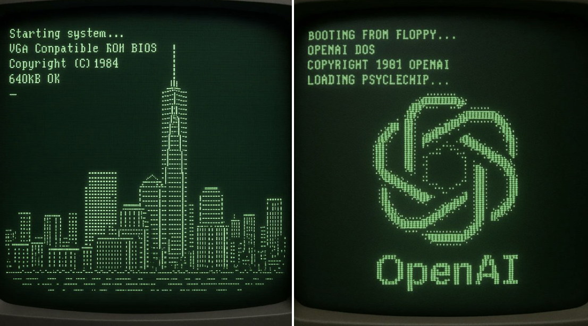

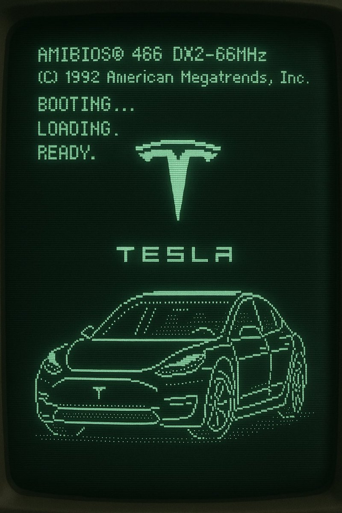

```
Retro CRT computer boot screen that resolves into ASCII-art of NYC's tallest building
```

 [↑返回目录](#toc)

---
## <a id="prompt-23">平面设计等边风格</a> (<a href="https://x.com/Artedeingenio/status/1924388407939076377" target="_blank" rel="noopener noreferrer">@Artedeingenio</a>)

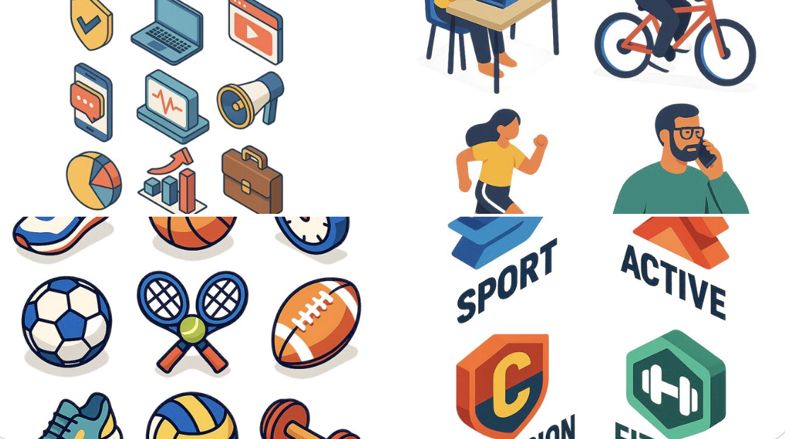

```
A flat isometric digital illustration of [describe the subject: e.g., a modern workspace, a city block, a group of app icons, a sports shop], clean lines and geometric forms, bright pastel colors, simplified perspective with 3D depth, minimal shading, white background or light gradient. Style resembles modern vector infographics, ideal for UI, app design or web visuals.
```

 [↑返回目录](#toc)

---
## <a id="prompt-217">卡通现代风格插画</a> (<a href="https://x.com/Artedeingenio/status/1942867064378573293" target="_blank" rel="noopener noreferrer">@Artedeingenio</a>)

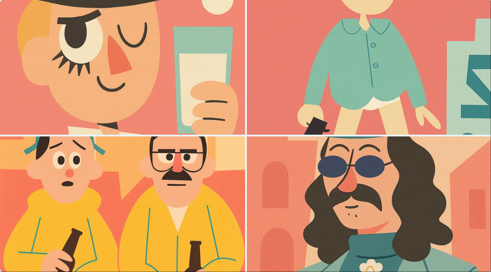

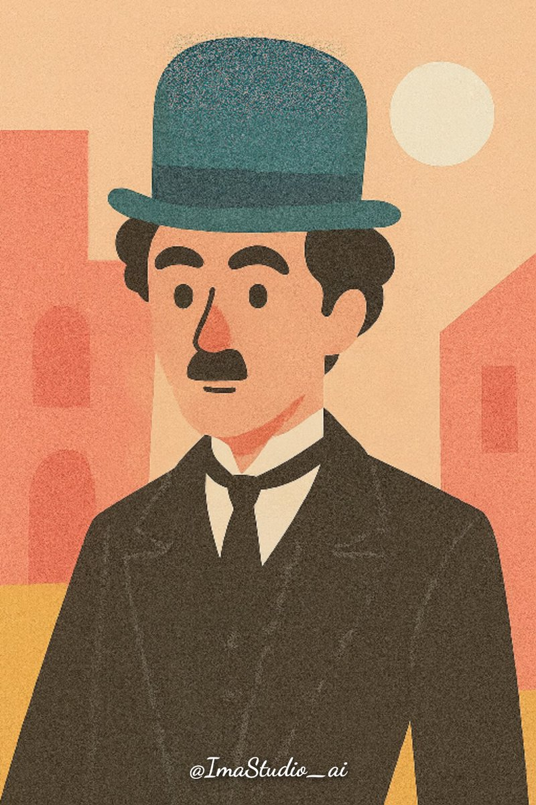

```
Transform this image into a Cartoon Modern Style illustration, inspired by classic UPA animation like Mr. Magoo and The Jetsons.
Redesign the character using flat, geometric shapes: ovals, rectangles, simple curves and angles. Avoid realistic proportions — the design should be stylized and abstract.
Use a limited color palette, preferably soft pastels or bold contrasts (e.g. mint green, salmon, sky blue, mustard yellow), with flat tones and no gradients.
Simplify facial features and body structure to be iconic and minimalist — large heads, small limbs, expressive poses, but with minimal detail.
The background should be minimal or symbolic, using basic shapes or abstract scenery (floating stairs, blocky furniture, stylized trees or stars).
The final image should look like a frame from a 1950s or 1960s modernist cartoon — playful, graphic, and highly stylized.
```

```
将这张图片转换为卡通现代风格插画，灵感来源于经典的 UPA 动画，如《摩根先生》和《太空家庭》。
使用扁平的几何形状重新设计角色：椭圆形、矩形、简单的曲线和角度。避免真实比例——设计应该是风格化的和抽象的。
使用有限的调色板，最好是柔和的粉彩色或鲜明的对比色（例如薄荷绿、三文鱼色、天空蓝、芥末黄），使用扁平色调且没有渐变。
简化面部特征和身体结构，使其具有标志性且极简——大头、小四肢、富有表现力的姿势，但细节极少。
背景应极简或象征性，使用基本形状或抽象场景（漂浮的楼梯、积木家具、风格化的树木或星星）。
最终图像应像 1950 年代或 1960 年代现代主义卡通的一帧——活泼、图形化且高度风格化。
```

 [↑返回目录](#toc)

---
## <a id="prompt-83">Glitch 矢量徽标样式</a> (<a href="https://x.com/Artedeingenio/status/1925844468294365289" target="_blank" rel="noopener noreferrer">@Artedeingenio</a>)

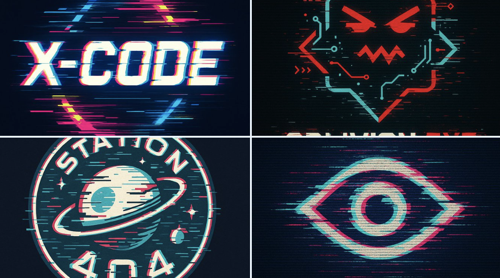

```
A bold vector logo design in glitch art style, featuring distorted typography with RGB color channel shifts, fragmented lines, misaligned edges, digital noise effects, and a cyberpunk aesthetic. The logo appears corrupted or hacked, as if captured from a malfunctioning screen. Use a black or dark background for contrast, neon or high-saturation color palette, and sharp angular forms.
```

```
1、"X-CODE" in futuristic glitch style, with pixel breakups and neon overlays
2、A glitch vector logo for a rogue AI named “OBLIVION.EXE”, with red error overlays and corrupted circuitry
3、A circular emblem for “Station 404”, a hacked orbital base with broken planetary symbols and static flicker
4、A surveillance eye logo, distorted with chromatic aberration, layered static, and flickering digital interference
```

 [↑返回目录](#toc)

---
## <a id="prompt-258">20世纪50年代的海报</a> (<a href="https://x.com/vkuoo/status/1930564137526137166" target="_blank" rel="noopener noreferrer">@vkuoo</a>)


```
Transform this image into a 1950s poster in the style of mid-century modern graphic designers. Use flat, geometric color blocks with strong typographic elements.  The overall tone should be optimistic, nostalgic, and promotional. Add bold location labels and promotional slogans.
```

```
将这张图片转换成20世纪50年代的海报，风格参考中世纪现代平面设计师的作品。采用扁平的几何色块，搭配醒目的排版元素。整体基调应乐观、怀旧且具有宣传性。添加醒目的地点标签和宣传标语。
```

 [↑返回目录](#toc)

---
## <a id="prompt-316">品牌字体</a> (<a href="https://x.com/aziz4ai/status/1940348752969322544" target="_blank" rel="noopener noreferrer">@aziz4ai</a>)


```
Create a typographic illustration shaped like a {OBJECT}, where the text itself forms the shape — bold and playful lettering style that fills the entire silhouette — letters adapt fluidly to the curves and contours of the object — vibrant and contrasting color palette that fits the theme — background is solid and enhances the focus on the main shape — vector-style, clean, high resolution, poster format, 1:1 aspect ratio.
```

```
创建一个形状像 {OBJECT} 的印刷插图，其中文本本身形成形状 - 大胆而俏皮的字体风格填充整个轮廓 - 字母流畅地适应物体的曲线和轮廓 - 充满活力和对比的调色板适合主题 - 背景是纯色并增强了对主要形状的关注 - 矢量风格，干净，高分辨率，海报格式，1：1 宽高比。
```

 [↑返回目录](#toc)

---
## <a id="prompt-489">艺术家正在绘制自己的微型人偶</a> (<a href="https://x.com/TechieBySA/status/1992666519495410162" target="_blank" rel="noopener noreferrer">@TechieBySA</a>)

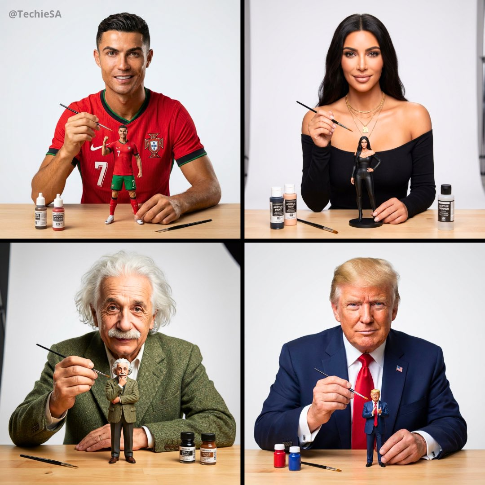

```
Create an image of this person as an artist painting a tiny miniature figurine version of themselves. The person is wearing their most iconic signature outfit, looking directly at the camera with a confident expression while holding a tiny paintbrush in one hand. The small action figure-sized version of themselves is prominently placed on a clean workbench in front of them - make the miniature slightly larger and more visible than realistic scale so it clearly stands out. The miniature figure is also wearing the same iconic outfit in a signature pose. Minimal art supplies on the workbench to avoid clutter - just 2-3 small paint bottles and one extra brush, keeping the focus on the person and their miniature. Soft neutral white background, professional studio lighting, shallow depth of field. The composition emphasizes the person’s face looking at camera and the miniature figure they’re working on. Clean, uncluttered, photorealistic style with high detail on both figures
```

```
创作一幅人物肖像，描绘此人作为艺术家正在绘制自己的微型人偶。此人身着其最具标志性的服装，自信地直视镜头，一手拿着一支小画笔。一个与真人大小相仿的微型人偶醒目地摆放在他面前干净的工作台上——将微型人偶的尺寸略大于实际比例，使其更加突出。微型人偶也穿着同样的标志性服装，摆出标志性的姿势。工作台上摆放的绘画用品极简，避免杂乱——只有两三瓶小颜料和一支备用画笔，从而将焦点集中在人物和微型人偶上。柔和的中性白色背景，专业的影棚灯光，浅景深。构图突出了人物看向镜头的面部表情以及他正在绘制的微型人偶。画面风格简洁明快，追求照片级的写实效果，人物和微型人偶的细节都需高度还原。
```

 [↑返回目录](#toc)

---
## <a id="prompt-210">90年代风格的摔跤人物</a> (<a href="https://x.com/CharaspowerAI/status/1934287289154228450" target="_blank" rel="noopener noreferrer">@CharaspowerAI</a>)


```
Product photography, a 1990's style WWF Wrestling Figurine package with the figurine wrestler in the package being [your character]. The figure features bright colors, a detailed character design,  white background with professional studio lighting.
```

```
产品摄影，一个 90 年代风格的 WWF 摔角人偶包装，包装中的人偶是[你的角色]。人偶色彩鲜艳，角色设计精细，背景为白色，配有专业工作室灯光。
```

 [↑返回目录](#toc)

---
## <a id="prompt-276">马赛克彩色玻璃徽章</a> (<a href="https://x.com/miilesus/status/1925157350068900103" target="_blank" rel="noopener noreferrer">@miilesus</a>)


```
create image:
{
  "style": "mosaic stained glass emblem",
  "object": "brand logo",
  "brand": {
    "name": "Spotify",
    "logo_shape": "circular",
    "icon_style": "three curved bars",
    "color_palette": {
      "primary": "#1DB954",
      "secondary": "#1ED760",
      "glass_variants": ["#147A3E", "#0F5C30", "#26C178"]
    }
  },
  "material": {
    "type": "colored glass",
    "effect": "semi-transparent with light reflections",
    "outline": {
      "color": "#111111",
      "width": "medium",
      "style": "lead-line traditional mosaic"
    }
  },
  "composition": {
    "layout": "logo composed of tessellated glass pieces",
    "geometry": "irregular but fitted glass shapes",
    "contrast": "dark outlines define shape clearly"
  },
  "lighting": {
    "type": "diffused natural light",
    "highlight": "glass texture and color depth emphasized"
  },
  "background": {
    "type": "flat surface",
    "color": "#F4F4F4"
  },
  "camera": {
    "angle": "top-down",
    "focus": "centered on entire logo"
  },
  "render": {
    "quality": "high",
    "shadows": "soft",
    "reflections": "minimal"
  }
}
```

```
创建图像：
{
  "风格": "马赛克彩色玻璃徽章",
  "对象": "品牌标志",
  "品牌": {
    "名称": "Spotify",
    "标志形状": "圆形",
    "图标风格": "三条弯曲的长条",
    "色彩搭配": {
      "主色": "#1DB954",
      "辅助色": "#1ED760",
      "玻璃变体色": ["#147A3E", "#0F5C30", "#26C178"]
    }
  },
  "材质": {
    "类型": "彩色玻璃",
    "效果": "半透明带光线反射",
    "轮廓": {
      "颜色": "#111111",
      "宽度": "中等",
      "风格": "传统马赛克铅线"
    }
  },
  "构图": {
    "布局": "由镶嵌玻璃片组成的标志",
    "几何形状": "不规则但拼接契合的玻璃造型",
    "对比度": "深色轮廓清晰界定形状"
  },
  "光线": {
    "类型": "漫射自然光",
    "高光": "突出玻璃质感和色彩深度"
  },
  "背景": {
    "类型": "平面",
    "颜色": "#F4F4F4"
  },
  "镜头": {
    "角度": "俯视",
    "焦点": "居中于整个标志"
  },
  "渲染": {
    "质量": "高",
    "阴影": "柔和",
    "反射": "轻微"
  }
}
```

 [↑返回目录](#toc)

---
## <a id="prompt-257">透明蜂窝状变形</a> (<a href="https://x.com/miilesus/status/1930266127961059739" target="_blank" rel="noopener noreferrer">@miilesus</a>)

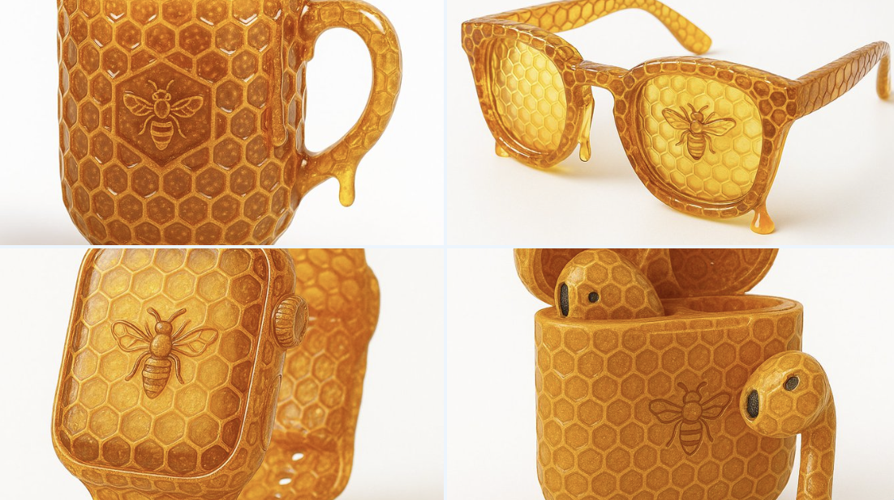

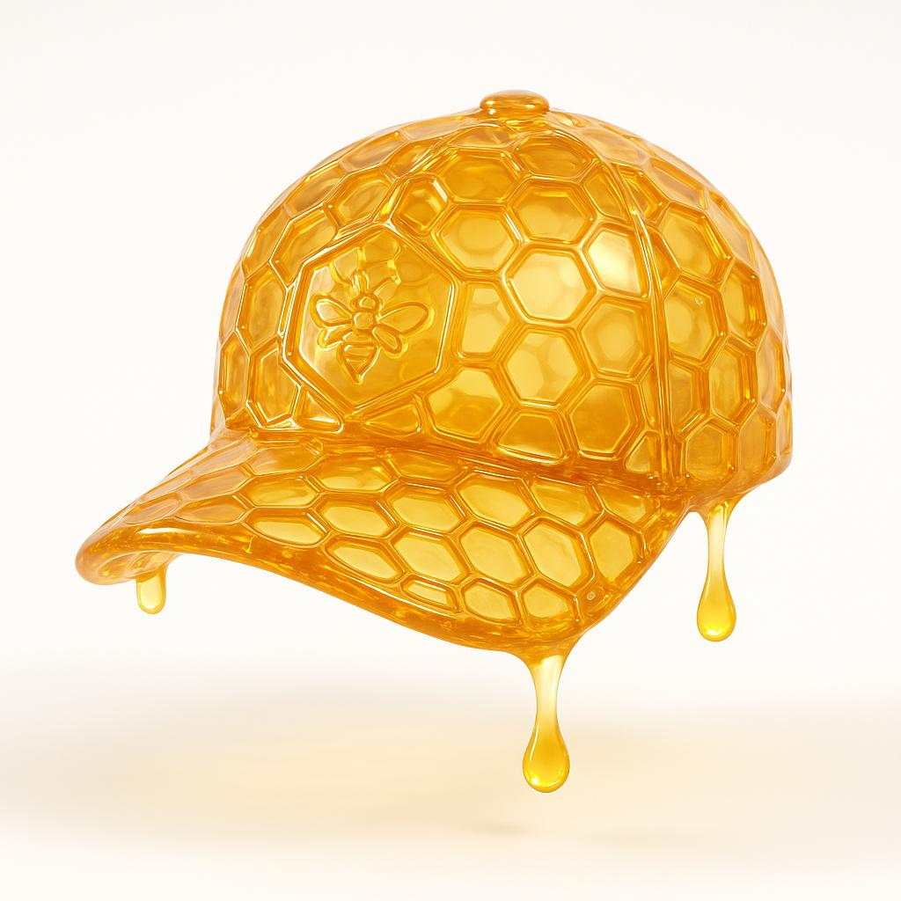

```
{
  "object": "OBJECT_NAME",
  "style": "Transparent Honeycomb Transformation",
  "description": "Transform the object into a structure made entirely of crystallized golden honey with high transparency. The surface should be ultra-glossy, semi-liquid, and light-reflective, with defined yet see-through hexagonal honeycomb patterns. Parts of the object should allow light to pass through, revealing inner layers and structure. Include gentle honey drips for realism.",
  "material": {
    "primary": "Crystal-clear amber honey",
    "secondary": "Translucent honeycomb cells"
  },
  "texture": {
    "surface": "Ultra glossy and semi-liquid",
    "pattern": "See-through hexagonal honeycomb",
    "drips": true
  },
  "effects": {
    "translucency": "highly translucent",
    "internal_glow": "Soft warm light from within",
    "emblem": "Delicate bee icon subtly embedded in the structure"
  },
  "presentation": {
    "background": "Clean white or soft gradient",
    "lighting": "Backlit with soft diffusion to enhance translucency",
    "floating": true,
    "format": "Square"
  }
}
```

```
{
  "物体": "OBJECT_NAME",
  "风格": "透明蜂窝状变形",
  "描述": "将该物体转变为由完全结晶的金色蜂蜜制成的结构，具有高度透明度。表面应呈现超 glossy 质感、半液态状态和反光效果，带有清晰可辨且透明的六边形蜂窝图案。物体的部分区域应允许光线穿透，以展现内部层次和结构。为增强真实感，需加入自然垂落的蜂蜜滴。",
  "材质": {
    "主要材质": "清澈透明的琥珀色蜂蜜",
    "次要材质": "半透明的蜂窝单元"
  },
  "纹理": {
    "表面": "超 glossy 且呈半液态",
    "图案": "透明的六边形蜂窝",
    "滴落效果": true
  },
  "特效": {
    "半透明性": "高度半透明",
    "内部光晕": "源自内部的柔和暖光",
    "标志": "精致的蜜蜂图标巧妙嵌入结构中"
  },
  "呈现方式": {
    "背景": "纯净白色或柔和渐变",
    "光线": "背光搭配柔和漫射效果，以增强半透明感",
    "悬浮效果": true,
    "格式": "正方形"
  }
}
```

 [↑返回目录](#toc)

---
## <a id="prompt-6">金色抽象综合风格</a> (<a href="https://x.com/firatbilal/status/1924130071758962938" target="_blank" rel="noopener noreferrer">@firatbilal</a>)

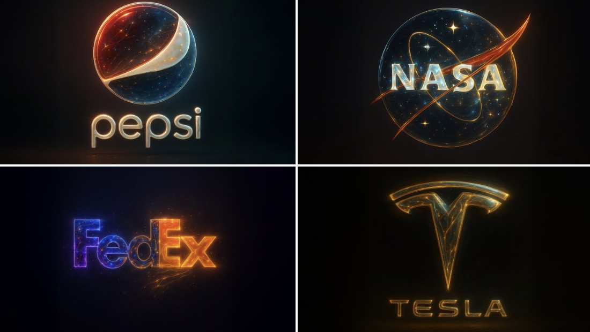

```
{
    "base_image": "uploaded image",
    "style_transfer": {
        "visual_characteristics": {
            "head_and_face": {
                "material": "translucent resin with embedded starlight and glowing neural circuits",
                "surface_effect": "mirror-gloss with gold filament veins and galaxy-like reflections",
                "lighting": "dynamic cinematic rim lights with volumetric glow"
            },
            "body_structure": {
                "texture": "high-polish white ceramic with embedded gold wiring",
                "design": "futuristic like organic plating",
                "highlight_elements": "subtle internal light flows mimicking synaptic energy"
            },
            "motion_effect": {
                "visual_glitch": "subtle horizontal motion blur on head edges",
                "energy_flow": "faint pulsing particle lights across body"
            },
            "background": {
                "type": "neutral gradient or dark void",
                "focus": "emphasize figure's luminous contrast"
            }
        },
        "application_target": "Replace surface and material style of uploaded image with the characteristics described above, while preserving the original pose, structure, and composition of the target image."
    }
}
```

 [↑返回目录](#toc)

---
## <a id="prompt-206">工业内部品牌广告</a> (<a href="https://x.com/aziz4ai/status/1933698466577866902" target="_blank" rel="noopener noreferrer">@aziz4ai</a>)


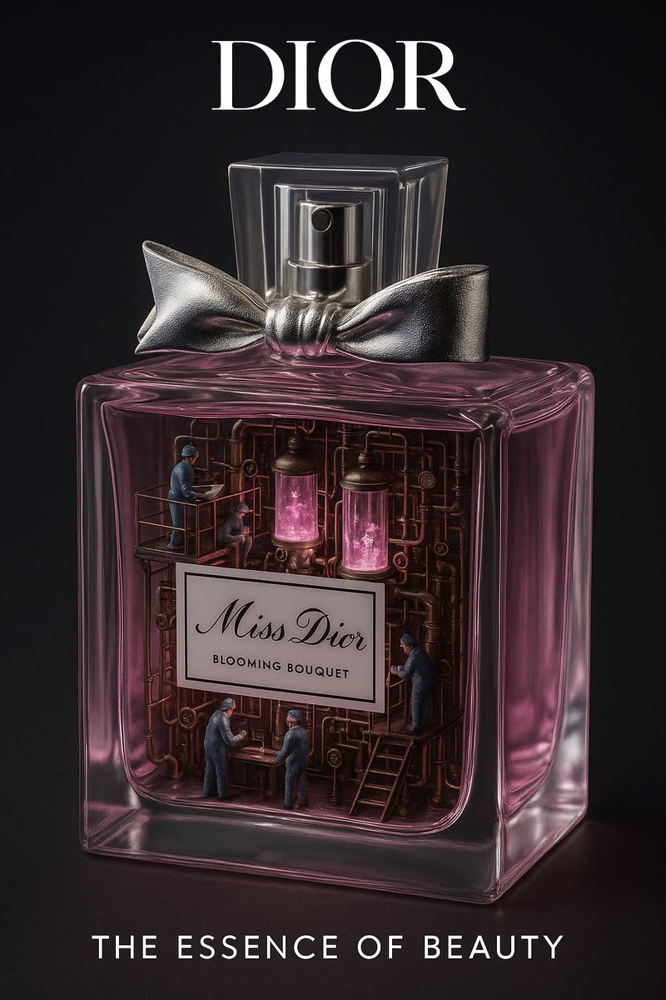

```
Create a hyperrealistic, surreal 1:1 advertisement for [Brand Name].
Transform the product into a miniature industrial factory or laboratory from the inside.
Reveal detailed internal systems: pipes, workers, glowing fluids, steam, and machines — all functioning to reflect the product’s core purpose (energy, beauty, flavor, etc).
Keep the outer product branding realistic and sharp.
Set the background minimal and cinematic.
Add the brand logo at the top, and a short, powerful slogan at the bottom.
Style: studio-grade lighting, high contrast, photorealistic textures.
```

```
创建一个超现实、1:1 比例的品牌广告。
将产品内部转化为微型工厂或实验室。
展示详细的内部系统：管道、工人、发光的液体、蒸汽和机器——所有这些都运作起来，反映产品的核心功能（能量、美丽、风味等）。
保持外层产品的品牌标识真实锐利。
将背景设置得简约且电影感十足。
在顶部添加品牌标志，底部添加一句简短有力的口号。
风格：影棚级灯光，高对比度，照片级真实纹理。
```

 [↑返回目录](#toc)

---
## <a id="prompt-74">3D可爱粉彩粘土图标</a> (<a href="https://x.com/icreatelife/status/1926014358783430945" target="_blank" rel="noopener noreferrer">@icreatelife</a>)

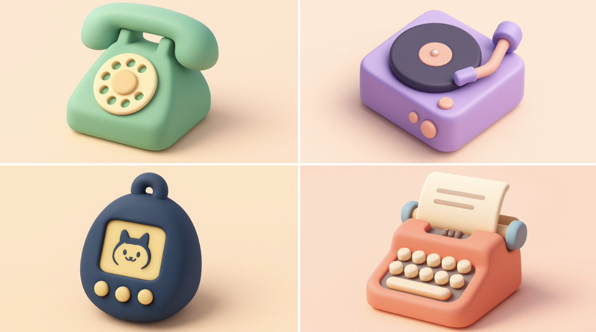

```
Tiny cute isometric [smiling - optional] [OBJECT] emoji, shape, soft lighting, soft pastel colors, [COLOR], 3d icon clay render, blender 3d, pastel background
```

 [↑返回目录](#toc)

---
## <a id="prompt-170">新卡通风格</a> (<a href="https://x.com/Artedeingenio/status/1938518646072004759" target="_blank" rel="noopener noreferrer">@Artedeingenio</a>)

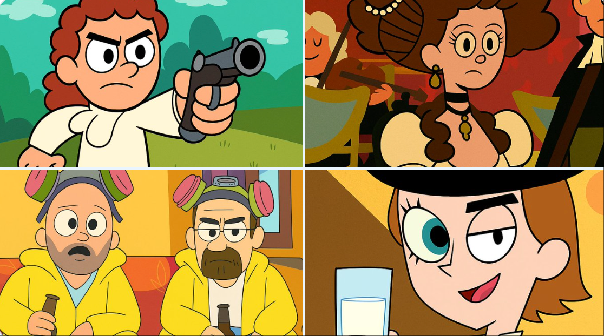

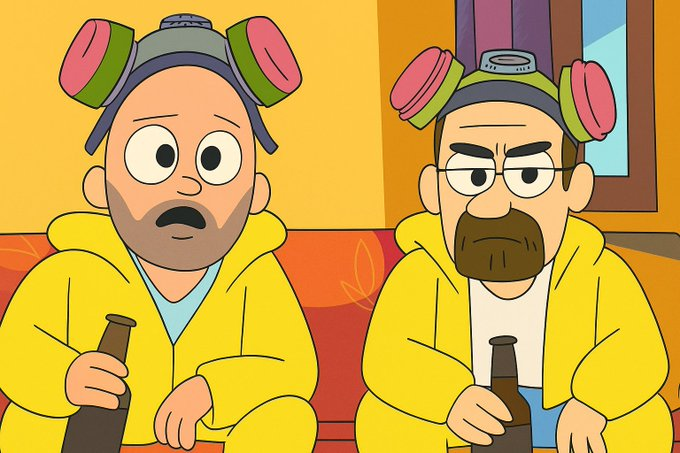


```
Transform this image into the Foster’s Home for Imaginary Friends cartoon style. Use bold outlines, flat shapes, and vivid solid colors. Characters should have simplified, playful designs with exaggerated expressions and unique silhouettes. Keep the background minimal or stylized with flat patterns or textures. The result should look like a frame from a 2000s Cartoon Network show with whimsical, graphic charm.
```

```
将此图像转换为 Foster's Home for Imaginary Friends 卡通风格。使用粗体轮廓、平面形状和鲜艳的纯色。角色应该具有简化、俏皮的设计，带有夸张的表情和独特的轮廓。保持背景最小或使用平面图案或纹理进行风格化。结果应该看起来像 2000 年代卡通网络节目中的帧，具有异想天开的图形魅力。
```

 [↑返回目录](#toc)

---
## <a id="prompt-184">乐高风格套装</a> (<a href="https://x.com/TheRelianceAI/status/1939271090678779980" target="_blank" rel="noopener noreferrer">@TheRelianceAI</a>)


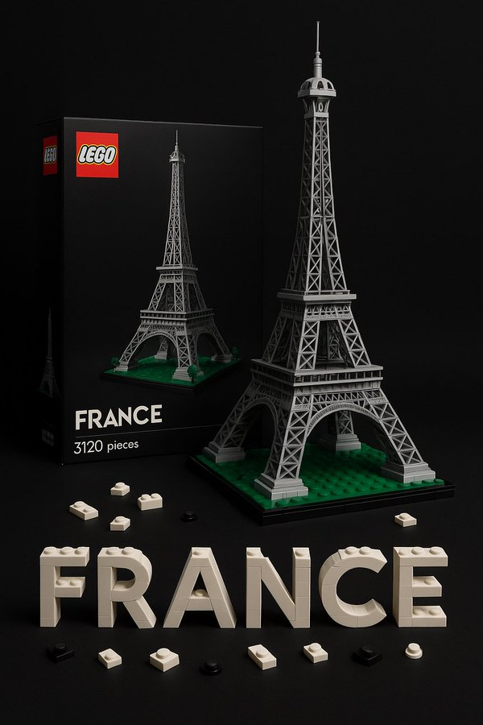

```
a realistic LEGO-style set featuring [COUNTRY]’s national treasure: [ITEM]. Photorealistic packaging with LEGO branding, box art showing the built model, the model assembled from LEGO bricks in authentic colors and details. Studio product photography with soft shadows and clear lighting, highly detailed, professional commercial render. Include box and bricks in the scene, focus on realism and LEGO-like style. 9:16.
```

```
以 [COUNTRY] 的国宝 [ITEM] 为特色的逼真乐高风格套装。带有乐高品牌的逼真包装，展示拼搭模型的盒子艺术，模型由乐高积木组装而成，具有逼真的颜色和细节。具有柔和阴影和清晰照明的工作室产品摄影，高度详细的专业商业渲染。在场景中加入盒子和积木，注重真实感和类似乐高的风格。9:16.
```

 [↑返回目录](#toc)

---
## <a id="prompt-394">和索尼克马里奥在一起合照</a> (<a href="https://x.com/ecommartinez/status/1983892304621662607" target="_blank" rel="noopener noreferrer">@ecommartinez</a>)


```
Selfie ultra-realista en formato vertical 9:16 con lente ojo de pez de mí junto a (Sonic y Mario). Ambientado en una sala de estar pequeña y luminosa con tonos blancos. Ángulo de cámara alto. Distorsión extrema de ojo de pez. Iluminación realista y cinematográfica. Personajes de anime integrados con realismo estilizado.
```

```
一张超逼真的9:16竖屏自拍，使用鱼眼镜头拍摄，照片中我和索尼克、马里奥在一起。场景设定在一个明亮的小客厅，以白色为主色调。高角度拍摄。极致的鱼眼畸变。逼真的电影级光影效果。动漫人物与风格化的写实主义完美融合。
```

 [↑返回目录](#toc)

---
## <a id="prompt-147">玻璃变形海报</a> (<a href="https://x.com/aziz4ai/status/1936950051856941470" target="_blank" rel="noopener noreferrer">@aziz4ai</a>)


```
Design a cinematic brand poster featuring “[BRAND NAME]” — include a bold six-word slogan beneath — apply a 3D glass refraction effect that distorts part of the text or layout — incorporate the brand logo in the top corner — smooth shadows, glossy lighting, black extra-bold typography — clean modern background — high-resolution, 1:1 aspect ratio
```

```
设计一张带有“[BRAND NAME]”字样的电影式品牌海报 — 在下面包括一个粗体的六字标语 — 应用 3D 玻璃折射效果，使部分文本或布局失真 — 在右上角加入品牌徽标 — 平滑的阴影、有光泽的照明、黑色超粗体排版 — 干净的现代背景 — 高分辨率、1：1 的纵横比
```

 [↑返回目录](#toc)

---
## <a id="prompt-81">品牌乐器</a> (<a href="https://x.com/TheRelianceAI/status/1926148686884606257" target="_blank" rel="noopener noreferrer">@TheRelianceAI</a>)

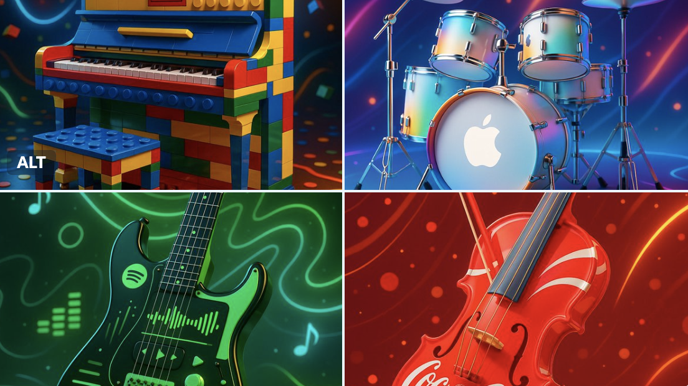

```
A highly stylized and vibrant promotional image of a [INSTRUMENT] designed in the visual style of the [BRAND] brand — the instrument is reimagined with iconic colors, patterns, and aesthetic elements of the brand. Set in a dynamic, music-inspired environment, with glowing accents, product-style lighting, and joyful energy. Artistic fusion of music and design. 3D render look, high detail, vibrant colors, futuristic but playful.
```

 [↑返回目录](#toc)

---
## <a id="prompt-418">将电影海报重新设计成黏土动画风格</a> (<a href="https://x.com/TechieBySA/status/1987128144470679641" target="_blank" rel="noopener noreferrer">@TechieBySA</a>)

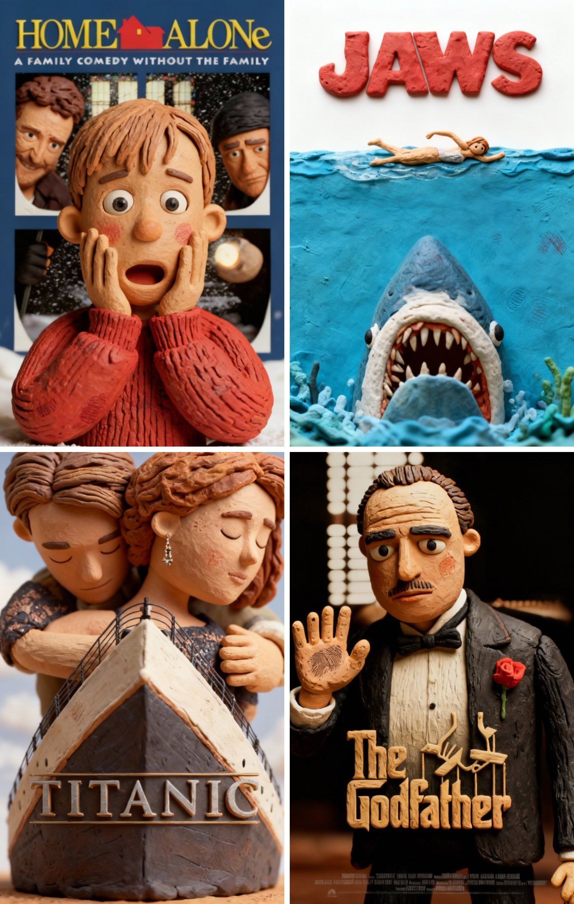

```
Restyle the reference movie poster in claymation style. Keep the original layout, composition, and lighting exactly as in the reference. Transform all characters, objects, and elements into handcrafted clay models with visible fingerprints, soft edges, and subtle imperfections. Preserve the background and colors, but give everything a realistic clay texture and dimensional feel, as if it were photographed from a stop-motion clay animation set
```

```
将参考电影海报重新设计成黏土动画风格。保持原图的布局、构图和光线完全一致。将所有角色、物体和元素转化为手工制作的黏土模型，保留清晰可见的指纹、柔和的边缘和细微的瑕疵。保留背景和色彩，但赋予所有元素逼真的黏土质感和立体感，仿佛是从定格动画片场拍摄的一样。
```

 [↑返回目录](#toc)

---
## <a id="prompt-134">生成真实电影海报</a> (<a href="https://x.com/aziz4ai/status/1934339212561555949" target="_blank" rel="noopener noreferrer">@aziz4ai</a>)

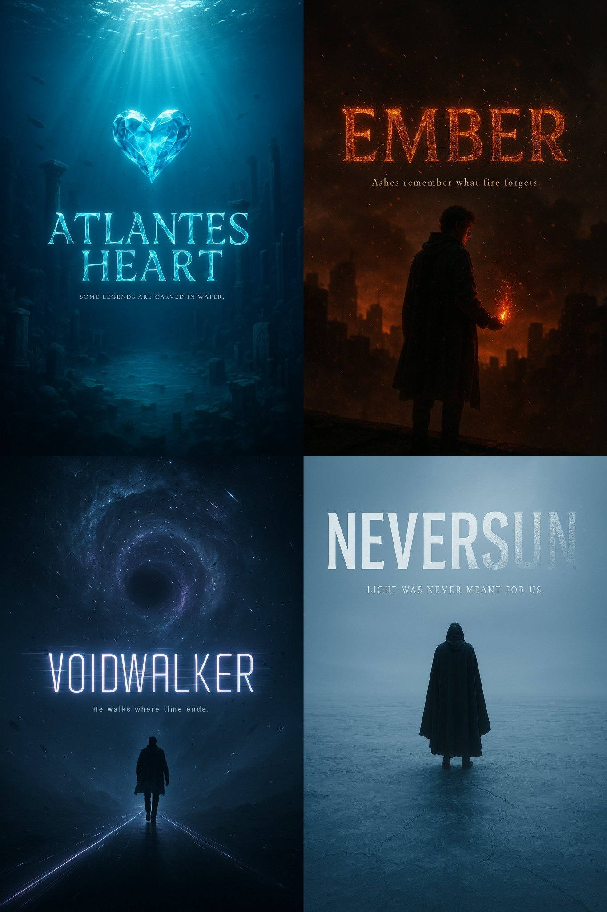

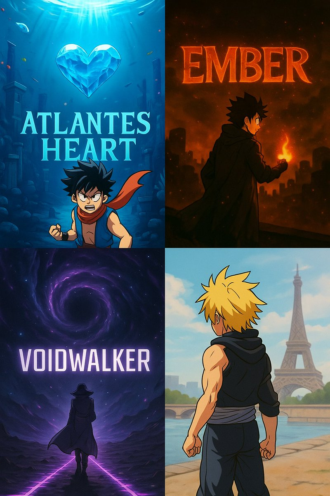


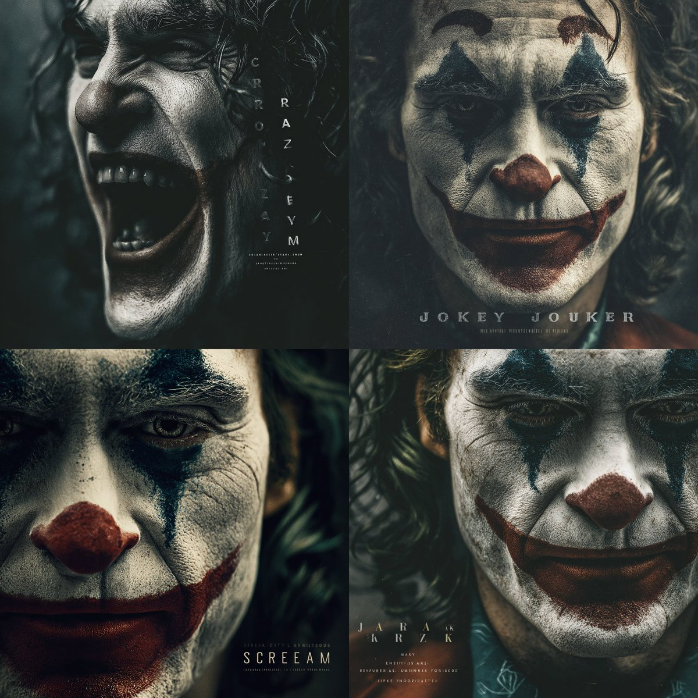

```
“[MOVIE TITLE ]” — cinematic movie poster design in ultra-realistic, high-definition style. Capture a dramatic and emotionally charged scene based on the film’s title. Use a high Kelvin color temperature to eliminate yellow tint, favoring cold, bluish tones or neutral whites. Add volumetric fog, sharp shadows, and deep depth of field. Simulate a cinematic lens with soft bloom, subtle lens flare, and film grain.

Render the title “[MOVIE TITLE ]” in expressive kinetic typography that visually embodies the meaning of the word (e.g. dissolving, cracked, melting, glowing). Typography should feel integrated into the environment, bold and iconic.

Include a short, emotionally resonant tagline beneath the title. Overall composition must resemble a high-budget blockbuster movie poster, with a 2.35:1 aspect ratio and strong visual storytelling.
```

```
“[MOVIE NAME ]” — 超逼真、高清风格的电影海报设计。根据电影的标题捕捉一个充满戏剧性和情感的场景。使用高开尔文色温来消除黄色调，偏爱冷色调、蓝色调或中性白色。添加体积雾、锐利阴影和深景深。模拟具有柔和泛光、细微镜头光晕和胶片颗粒的电影镜头。

以富有表现力的动态排版呈现标题“[MOVIE TITLE ]”，在视觉上体现单词的含义（例如，溶解、破裂、融化、发光）。排版应该感觉与环境融为一体，大胆而标志性。

在标题下方包括一个简短的、能引起情感共鸣的标语。整体构图必须类似于高预算的大片电影海报，具有 2.35：1 的纵横比和强烈的视觉叙事性。
```

 [↑返回目录](#toc)

---
## <a id="prompt-112">重点线条勾勒</a> (<a href="https://x.com/umesh_ai/status/1931637370639520011" target="_blank" rel="noopener noreferrer">@umesh_ai</a>)


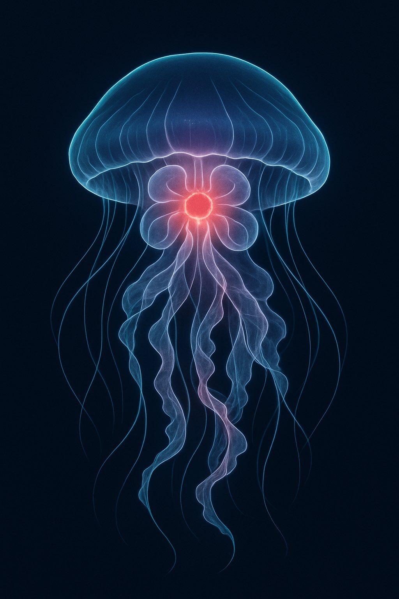

```
A digital illustration of a [SUBJECT], portrayed with a network of glowing clean pristine blue lines outlining its anatomy. The image is set against a dark background, highlighting the [SUBJECT] form and features. A specific area such as [PART] is emphasized with a red glow to indicate a point of interest or significance. The style is both educational and visually captivating, designed to resemble an advanced imaging technique
```

 [↑返回目录](#toc)

---
## <a id="prompt-196">字母景观</a> (<a href="https://x.com/BeanieBlossom/status/1936333318540456354" target="_blank" rel="noopener noreferrer">@BeanieBlossom</a>)

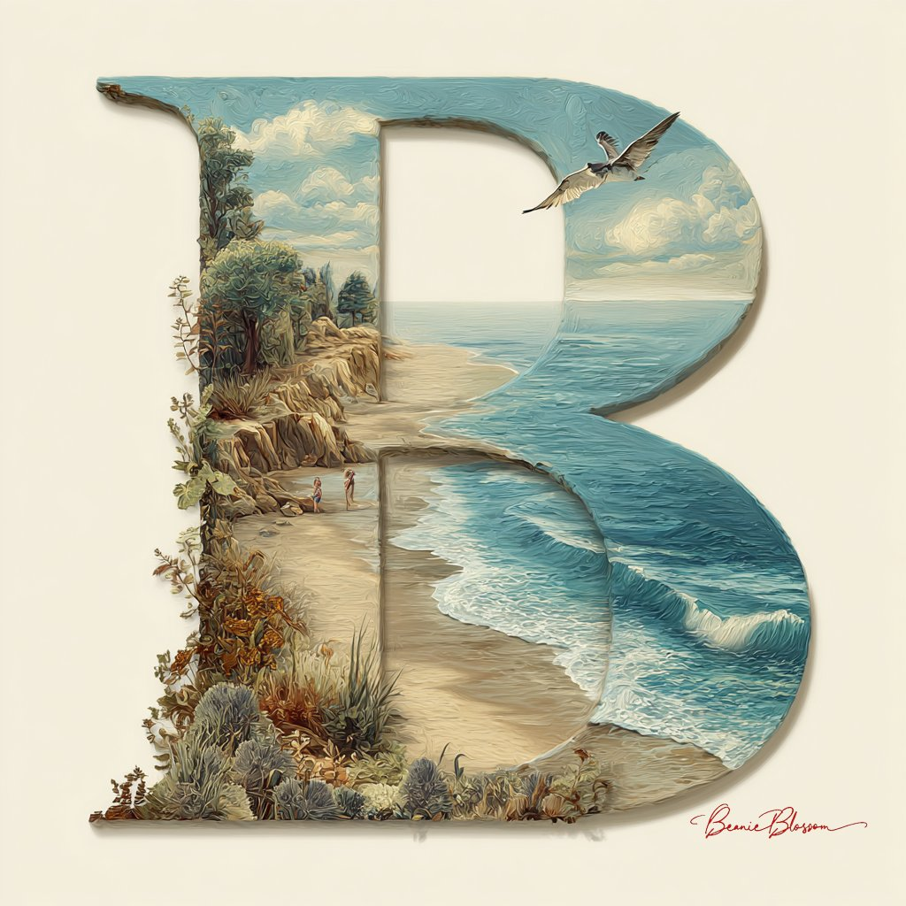


```
the letter B beautiful and elegant decorated with a beautiful beachscape
```

```
字母 B 美丽典雅，装饰美丽的海滩景观
```

 [↑返回目录](#toc)

---
## <a id="prompt-211">灯泡中的城市</a> (<a href="https://x.com/TechieBySA/status/1942976425281114576" target="_blank" rel="noopener noreferrer">@TechieBySA</a>)


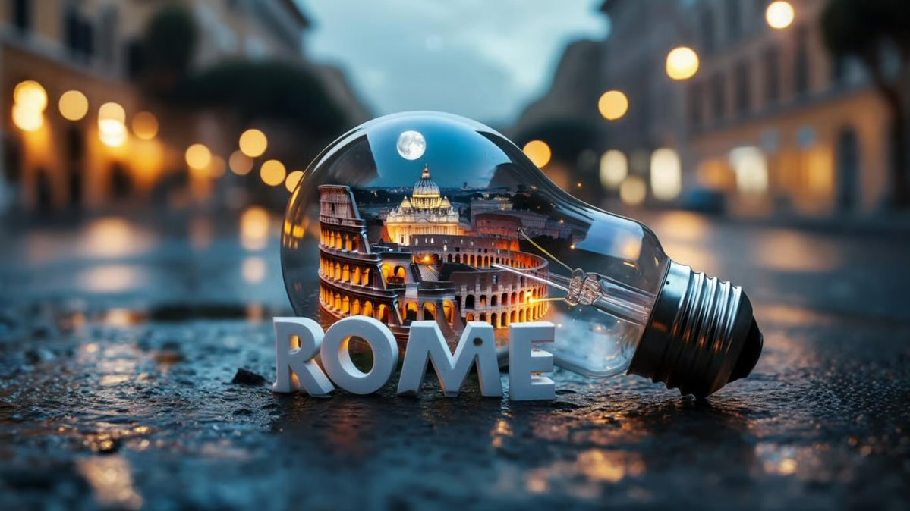

```
Create a hyper-realistic, stylish poster featuring a light bulb lying on wet urban asphalt. Inside the bulb, place a miniature version of [CITY] with its iconic landmarks. A sleek white 3D text of the city name ‘[CITY]’ should stand prominently in front of the bulb. The background is a softly blurred cityscape with neon lights reflecting on the bulb’s glass and the wet pavement. Add volumetric moonlight for depth and atmosphere. The image should look like a high-quality DSLR photograph with sharp details, cinematic lighting, and a moody, futuristic vibe.
```

```
创作一张超逼真、时尚的海报，展示一个躺在湿漉漉的城市柏油路面上的灯泡。在灯泡内部放置一个[CITY]的微缩版，并包含其标志性地标。在灯泡前方，应突出显示一个光滑的白色 3D 文字，写着城市名称‘[CITY]’。背景是柔和模糊的城市景观，霓虹灯光在灯泡的玻璃和湿滑的路面上映射。添加体积光以增强深度和氛围。图像应看起来像一张高质量的数码单反相机照片，具有清晰的细节、电影般的灯光和忧郁的未来感。
```

 [↑返回目录](#toc)

---
## <a id="prompt-50">通过钥匙孔看世界</a> (<a href="https://x.com/icreatelife/status/1925268371227971871" target="_blank" rel="noopener noreferrer">@icreatelife</a>)

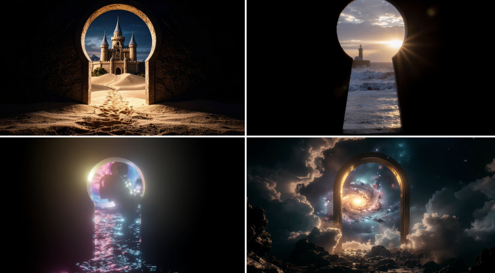

```
looking through a [MATERIAL] keyhole towards a mythical [WORLD] dark fantasy, [very black background] around keyhole, sharp focus, photographic
```

 [↑返回目录](#toc)

---
## <a id="prompt-198">可爱的设计师玩偶</a> (<a href="https://x.com/TheRelianceAI/status/1936423426006151467" target="_blank" rel="noopener noreferrer">@TheRelianceAI</a>)

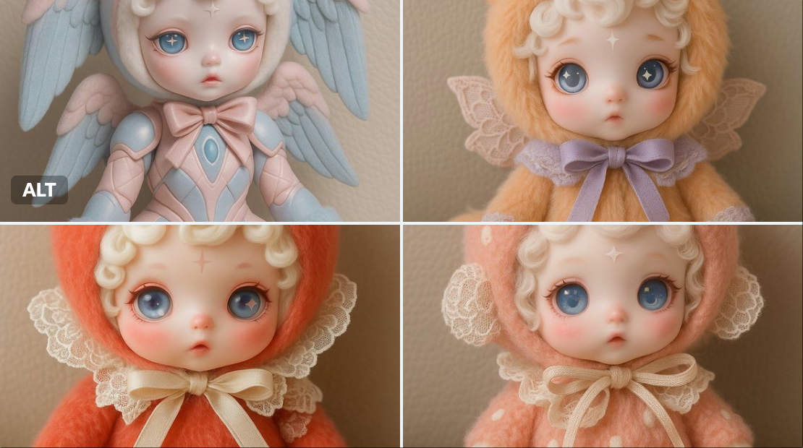

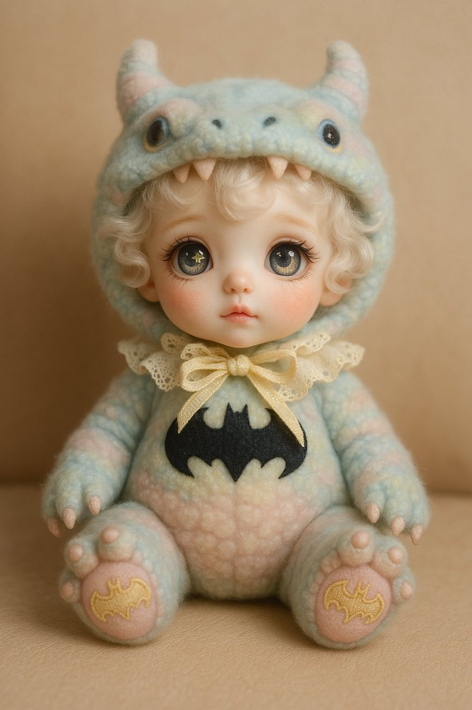

```
A cute designer doll styled as a [SUBJECT]. The doll has a porcelain face with blush, soft curly white hair, and large expressive eyes with unique pupils (like a star and moon). It wears a fluffy pastel-colored costume resembling the [chosen creature or idea], with detailed accessories like a hood with ears or horns, lace, and a ribbon. Embroidery on the paws reflects the character’s theme. The doll is sitting on a neutral background (like beige leather or soft fabric). The atmosphere is dreamy and whimsical, with soft lighting. Style: Korean collectible art doll, highly detailed, pastel color palette.
```

```
一个可爱的设计师玩偶，造型为 [SUBJECT]。娃娃有一张瓷脸，脸上泛着腮红，柔软的卷曲白发，还有一双富有表现力的大眼睛和独特的瞳孔（像星星和月亮）。它穿着一件蓬松的柔和色服装，类似于 [选择的生物或想法]，带有详细的配饰，如带耳朵或角的兜帽、蕾丝和丝带。爪子上的刺绣反映了角色的主题。娃娃坐在中性背景上（如米色皮革或柔软的织物）。气氛梦幻而异想天开，灯光柔和。风格：韩国收藏艺术娃娃，高度详细，柔和的调色板。
```

 [↑返回目录](#toc)

---
## <a id="prompt-238">用花朵美化你的产品</a> (<a href="https://x.com/Kerroudjm/status/1944730614323671129" target="_blank" rel="noopener noreferrer">@Kerroudjm</a>)


```
A high-end editorial photo of (PRODUCT NAME OR IMAGE) placed on a white marble pedestal, resting on champagne-colored silk. It is surrounded by pastel flowers whose type and color naturally harmonize with the product’s primary colors (COLOR PALETTE) — complementing and enhancing its tones. Soft natural light from the upper left. 3D realism, luxury product photography, shallow depth of field, 1:1 format.
```

```
(产品名称或图片)放置在白色大理石底座上，休息在香槟色丝绸上，的高端编辑照片。它被淡色花朵环绕，其类型和颜色自然与产品的主要颜色（调色板）协调——补充并增强其色调。来自左上方的柔和自然光。3D 现实主义，奢华产品摄影，浅景深，1:1 格式。
```

 [↑返回目录](#toc)

---
## <a id="prompt-200">真人和风格对照直出</a> (<a href="https://x.com/ZHO_ZHO_ZHO/status/1935620536090153216" target="_blank" rel="noopener noreferrer">@ZHO_ZHO_ZHO</a>)


```
创建图片 {
"title": "真人 × 动画对照创意作品",
"author": "ZH4O",
"description": "一张利用垂直拼贴与留白，将同一人物的照片与插画并置的创意作品，突出媒介在语言、质感与情绪上的对比。",
"layout": {
"orientation": "vertical",
"photo": {
"position": "top-left",
"aspect_ratio": "3:4",
"style": "street photo",
"camera_angle": "eye-level, slightly tilted left",
"lens": "mild wide-angle",
"background_elements": ["road", "store signs", "urban perspective lines"]
},
"illustration": {
"position": "bottom-right",
"scale": "slightly larger",
"composition": "2/3 body, medium shot",
"pose": "similar to photo",
"motion_direction": "curve extending top-right",
"balance": "forms visual counterpoint to photo"
},
"background": {
"color": "pure white",
"purpose": "breathing space, minimalism, focus"
}
},
"color_and_lighting": {
"photo": {
"dominant_tones": "neutral warm gray",
"light_source": "natural light",
"highlight_effects": "soft overexposure, summer glare",
"key_elements": ["white dress with gauzy texture", "cement, scooter, wall as low-saturation backdrop"]
},
"illustration": {
"style": "cartoon, simplified color blocks",
"skin": "warm orange with soft pink blush",
"hair": "deep brown, almost flat color",
"dress": "white with minimal shading to indicate folds",
"contrast": "high, compressed tonal range",
"focus": "sharp character silhouette"
},
"background": {
"function": "isolates media contrast, emphasizes character and action"
}
},
"style_comparison_and_details": {
"photo": {
"gesture": "hand shading forehead",
"expression": "wide eyes, slightly pouting lips, playful with a hint of exasperation",
"context": "spontaneous, tight alley space, loose hair movement"
},
"illustration": {
"design_inspiration": "Disney/CalArts style",
"features": ["large eyes", "wide cheekbones", "pointy chin", "freckles", "blush"],
"motion_effects": "exaggerated hair and skirt movement",
"line_quality": "fluid and bouncy",
"reproduction": "pose, expression, dress bow, forehead hair accurately translated"
}
},
"visual_and_communication_value": {
"themes": ["reality to animation transformation", "character design", "personified self-portrait"],
"usability": ["IP development", "illustration demo", "fashion branding"],
"design_elements": ["space for text/logo", "poster/social media-ready"],
"narrative_strength": "uses white space as frame, pose as link, and medium contrast as core interest",
"tone": "light, stylish, socially shareable"
}
}
```

```
创建图片 {
“title”： “真人 × 动画对照创意作品”，
“author”： “ZH4O”， ZH4O“， ZH4O
“description”： “一张利用垂直拼贴与留白，将同一人物的照片与插画并置的创意作品，突出媒介在语言、质感与情绪上的对比。",
“布局”： {
“orientation”： “垂直”，
“照片”： {
“position”： “左上角”，
“aspect_ratio”： “3：4”，
“style”： “街拍”，
“camera_angle”： “与眼睛齐平，略微向左倾斜”，
“lens”： “轻度广角”，
“background_elements”： [“road”， “shop signs”， “urban perspective lines”]
},
“插图”： {
“position”： “右下角”，
“scale”： “稍大”，
“composition”： “2/3 体，中镜头”，
“pose”： “与照片相似”，
“motion_direction”： “曲线向右延伸”，
“balance”： “形成与照片的视觉对位”
},
“背景”： {
“color”： “纯白色”，
“purpose”： “呼吸空间、极简主义、专注”
}
},
“color_and_lighting”： {
“照片”： {
“dominant_tones”： “中性暖灰色”，
“light_source”： “自然光”，
“highlight_effects”： “柔和的过度曝光，夏季眩光”，
“key_elements”： [“带有薄纱纹理的白色连衣裙”， “水泥、滑板车、墙壁作为低饱和度背景”]
},
“插图”： {
“style”： “卡通，简化的色块”，
“skin”： “暖橙色带柔和的粉红色腮红”，
“hair”： “深棕色，几乎是单色”，
“dress”： “白色，带有最小阴影以表示褶皱”，
“contrast”： “高、压缩的色调范围”，
“focus”： “清晰的角色剪影”
},
“背景”： {
“function”： “隔离媒体对比度，强调角色和动作”
}
},
“style_comparison_and_details”： {
“照片”： {
“gesture”： “手部阴影额头”，
“expression”： “睁大眼睛，微微撅起嘴唇，俏皮中带着一丝恼怒”，
“context”： “自发、狭窄的小巷空间、松散的头发移动”
},
“插图”： {
“design_inspiration”： “Disney/CalArts 风格”，
“features”： [“大眼睛”， “宽颧骨”， “尖下巴”， “雀斑”， “腮红”]，
“motion_effects”： “夸张的头发和裙子运动”，
“line_quality”： “流体和弹性”，
“reproduction”： “姿势、表情、裙子蝴蝶结、额头头发准确翻译”
}
},
“visual_and_communication_value”： {
“themes”： [“从现实到动画的转变”， “角色设计”， “拟人化自画像”]，
“可用性”： [“IP 开发”， “插图演示”， “时尚品牌”]，
“design_elements”： [“文本/徽标空间”， “海报/社交媒体就绪”]，
“narrative_strength”： “使用空白作为框架，使用姿势作为链接，使用中等对比度作为核心兴趣”，
“tone”： “轻盈、时尚、社交分享”
}
}
```

 [↑返回目录](#toc)

---
## <a id="prompt-88">AirBnB 任何东西</a> (<a href="https://x.com/R2_fieldworks/status/1924433924106727531" target="_blank" rel="noopener noreferrer">@R2_fieldworks</a>)

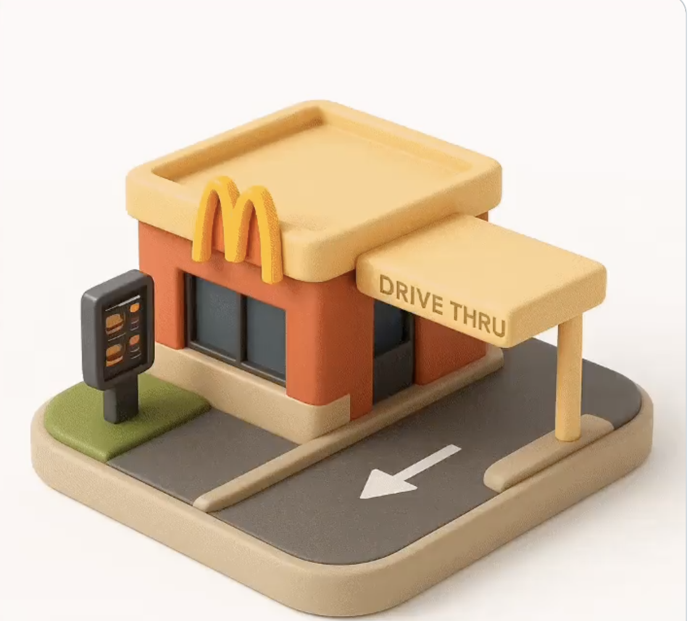

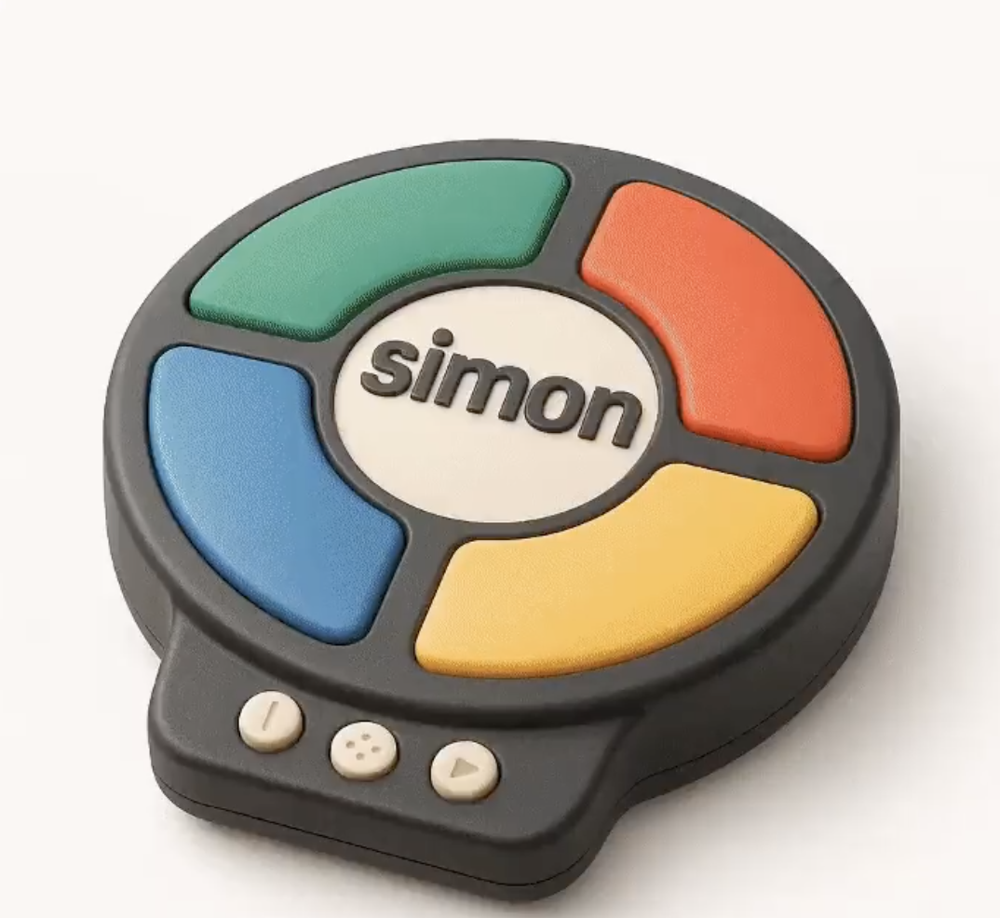

```
A highly detailed 3D isometric icon of the following object: [OBJECT]

Style: Airbnb 2024 icon language — miniature diorama / emoji-like object with crisp edges, realistic textures, and soft handcrafted realism.  

Material: The object should clearly retains its fundamental qualities but look as if its made from a mixture of matte and plastic-like materials.  

View: three-quarter front-left isometric view with a slight top-down angle.  

Lighting: soft neutral studio lighting from the top-left with subtle shadows and gentle gloss highlights.  

Color palette: retain the fundamental colors from the object and include subtle gradients and no harsh contrasts.  

Background: clean white, no drop shadow or noise.  

Mood: minimal, charming, utilitarian, premium.  

Rendering: hyper-detailed, photorealistic object with depth and tactility, like a designer lifestyle emoji or miniature product model. 

Optional Add-on for Replication:  Use the attached photo as a reference for proportions and layout. Do not copy exactly — reinterpret it in the Airbnb icon aesthetic.
```

 [↑返回目录](#toc)

---
## <a id="prompt-125">时尚品牌娃娃</a> (<a href="https://x.com/TheRelianceAI/status/1934688112741085562" target="_blank" rel="noopener noreferrer">@TheRelianceAI</a>)

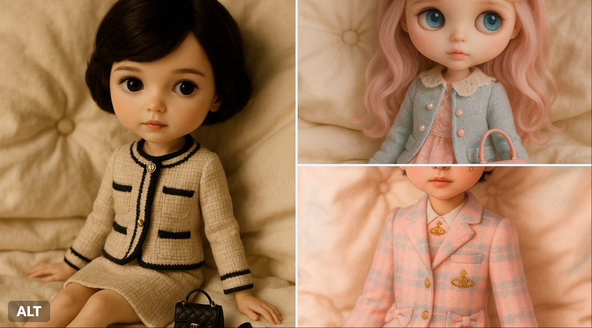

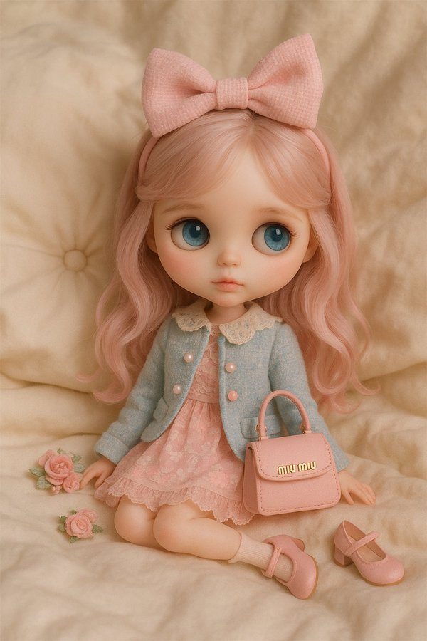

```
A hyper-realistic photograph of a fashion doll styled in the aesthetic of [BRAND], sitting on a plush, cream-colored bed with soft folds. The doll’s look reflects the brand’s signature elements — from hair and outfit to accessories — arranged thoughtfully to evoke a dreamy, vintage-inspired editorial. Studio-lit with warm, diffused lighting and a creamy, ivory-toned palette, the scene emulates luxury fashion photography with a soft, dollhouse-like atmosphere and shallow depth of field.
```

```
一张超写实的照片，一个时尚娃娃以 [BRAND] 的美学风格，坐在一张带有柔软褶皱的奶油色毛绒床上。这款玩偶的外观反映了该品牌的标志性元素——从头发和服装到配饰——经过精心安排，让人联想到梦幻般的复古风格社论。工作室照明采用温暖的漫射灯光和奶油色的象牙色调调色板，该场景以柔和的玩具屋般的氛围和浅景深模拟奢华时尚摄影。
```

 [↑返回目录](#toc)

---
## <a id="prompt-78">毛绒形式表情符号</a> (<a href="https://x.com/alban_gz/status/1925833589431619616" target="_blank" rel="noopener noreferrer">@alban_gz</a>)

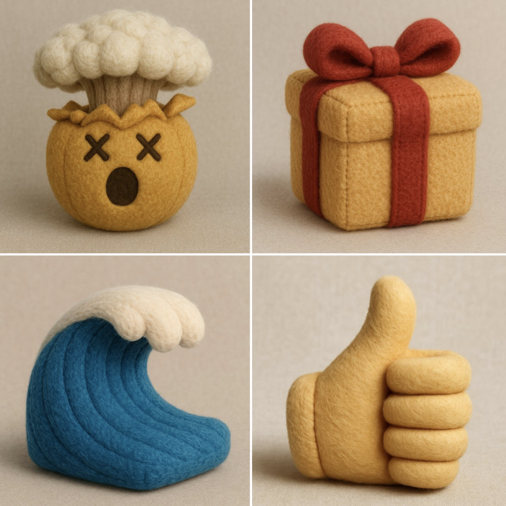

```
Recreate this [insert emoji] using the parameters from the JSON provided.
{
  "style": "Plushform Emoji",
  "description": "Transform the emoji into a soft, realistic plush object with high-quality fabric and detailed construction. Do not anthropomorphize the emoji — avoid adding faces or cartoon features. Focus on accurate textures, natural forms, and subtle design to give the plush object character.",
  "features": {
    "shape": "matching the emoji's form, with soft, slightly rounded plush adaptation",
    "texture": "realistic plush fabric with visible fiber detail and natural fabric folds",
    "color": "faithful to the emoji's palette, using slightly muted, tactile tones",
    "material": "stuffed toy fabric with visible stitching, seams, and high-quality finishing",
    "background": "neutral or softly textured to emphasize the plush object's form",
    "lighting": "soft professional studio lighting with subtle shadows and depth"
  },
  "examples": [
    "👌 becomes a plush hand in the OK gesture, with realistic fabric folds and seams.",
    "🎯 becomes a soft plush bullseye with layered fuzzy rings and slight dimensional padding.",
    "🎁 becomes a cube-shaped plush box with fabric ribbon, visible stitching, and realistic fabric texture.",
    "🌊 becomes a wave-shaped plush with curled foam tips, crafted in textured ocean blue fabrics."
  ]
}
```

 [↑返回目录](#toc)

---
## <a id="prompt-187">新卡通风格</a> (<a href="https://x.com/Artedeingenio/status/1939248601252651046" target="_blank" rel="noopener noreferrer">@Artedeingenio</a>)


```
Transform this image into a classic Tex Avery / Looney Tunes cartoon style. Use bold, clean outlines and exaggerated character features — huge eyes, stretched limbs, and over-the-top facial expressions. Emphasize slapstick comedy and visual humor. Colors should be vibrant and flat, with high contrast. Backgrounds should be simple, painted with soft gradients or flat colors, keeping focus on the character's action. Add motion lines, expressive effects (like sweat drops, stars, impact bursts), and a dynamic pose typical of 1940s Warner Bros. animation. The final result should look like a freeze frame from a mid-century animated short — full of cartoon energy and absurd charm.
```

```
将此图像转换为经典的 Tex Avery / Looney Tunes 卡通风格。使用大胆、干净的轮廓和夸张的角色特征 - 大眼睛、伸展的四肢和夸张的面部表情。强调滑稽喜剧和视觉幽默。颜色应鲜艳、平坦，具有高对比度。背景应该简单，用柔和的渐变或单调的颜色绘制，保持对角色动作的关注。添加运动线条、富有表现力的效果（如汗珠、星星、冲击爆发）和 1940 年代华纳兄弟动画的典型动态姿势。最终结果应该看起来像上世纪中叶动画短片的定格——充满卡通能量和荒诞的魅力。
```

 [↑返回目录](#toc)

---
## <a id="prompt-171">霓虹灯品牌重新构想</a> (<a href="https://x.com/aziz4ai/status/1938363131442405631" target="_blank" rel="noopener noreferrer">@aziz4ai</a>)

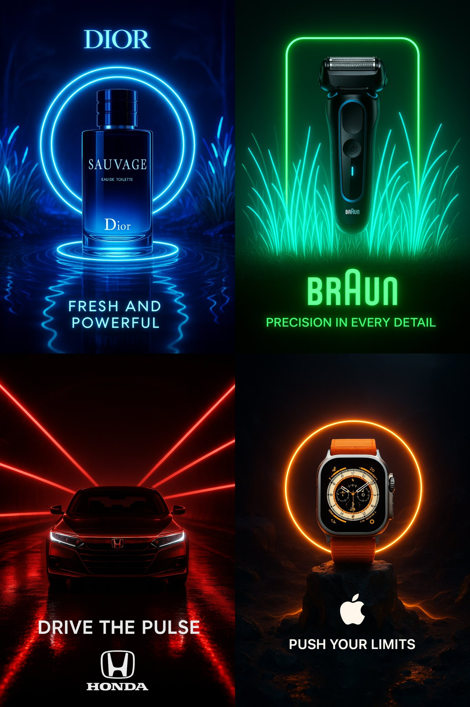

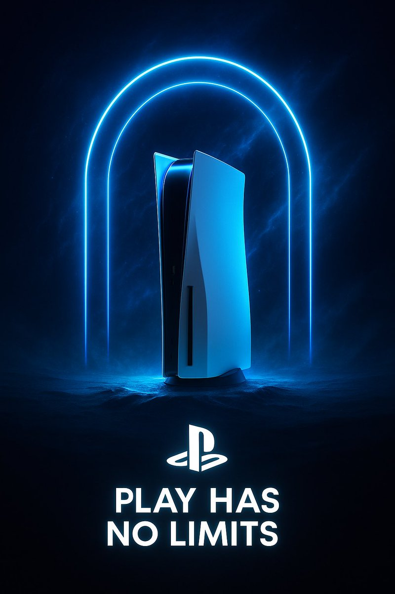

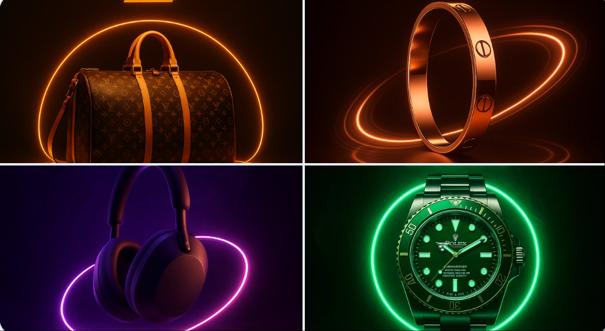


```
Create a cinematic advertisement for “[PRODUCT NAME]” — use bioluminescent neon lighting that matches the brand’s visual identity — place the product at the center of the scene with surreal, minimalistic composition — automatically adapt the environment to reflect the product’s nature (e.g. tech, fragrance, luxury, automotive, beauty) — integrate the brand’s actual logo in high fidelity — generate a short, powerful 3-word tagline that fits the brand’s tone — long exposure lighting effects — dramatic shadows — ultra-sharp focus — dark or ambient background — aspect ratio 2:3 or 1:1 — ultra-HD resolution
```

```
为“[产品名称]”创建电影广告 — 使用与品牌视觉形象相匹配的生物发光霓虹灯 — 以超现实、简约的构图将产品置于场景中心——自动调整环境以反映产品的性质（例如科技、香水、奢侈品、汽车、美容） — 以高保真度集成品牌的实际徽标 — 生成一个简短的、 符合品牌基调的强大 3 字标语 — 长时间曝光、灯光效果 — 戏剧性的阴影 — 超清晰焦点 — 黑暗或环境背景 — 纵横比 2：3 或 1：1 — 超高清分辨率
```

 [↑返回目录](#toc)

---
## <a id="prompt-116">任天堂风格的3D卡通插画</a> (<a href="https://x.com/Artedeingenio/status/1931647658382258183" target="_blank" rel="noopener noreferrer">@Artedeingenio</a>)

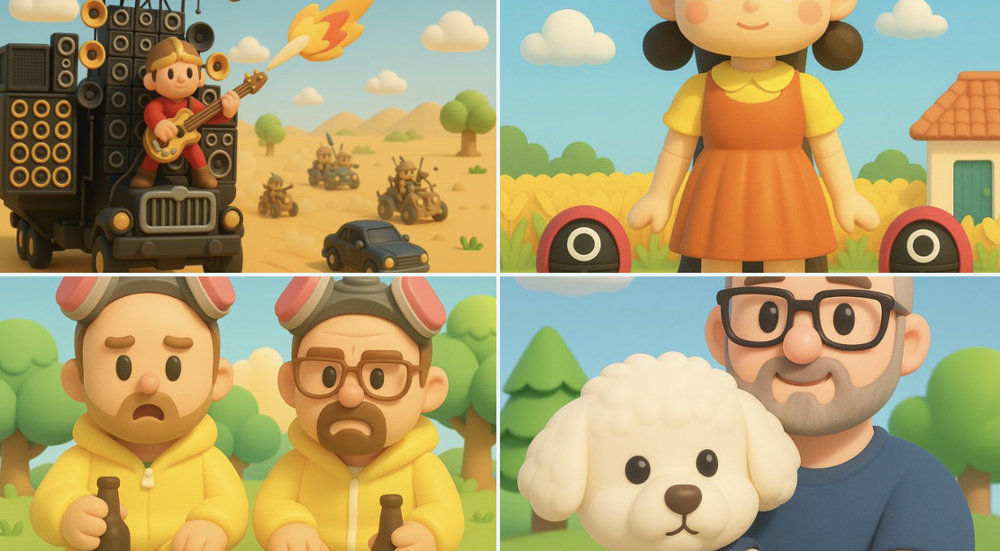


```
Transform this image into a Nintendo-inspired 3D cartoon style illustration.

Use soft, rounded 3D shapes and clean, toy-like geometry to give the characters and objects a charming, handcrafted look.

Characters should have exaggerated, childlike proportions (large heads, small limbs), with expressive, simplified faces and bright, colorful clothing — similar to designs seen in Zelda: Link’s Awakening, Animal Crossing, or Miitopia.

Apply smooth, matte textures with no realistic detail — everything should look cheerful and slightly plastic, as if sculpted from soft clay or digital vinyl.

The environment should be bright and whimsical, with stylized grass, puffy clouds, geometric trees, and soft lighting like a sunny afternoon.

The overall tone should be lighthearted, clean, and family-friendly, like a frame from a Nintendo fantasy adventure game.
```

 [↑返回目录](#toc)

---
## <a id="prompt-100">终极跨界</a> (<a href="https://x.com/TheRelianceAI/status/1925146916133712191" target="_blank" rel="noopener noreferrer">@TheRelianceAI</a>)

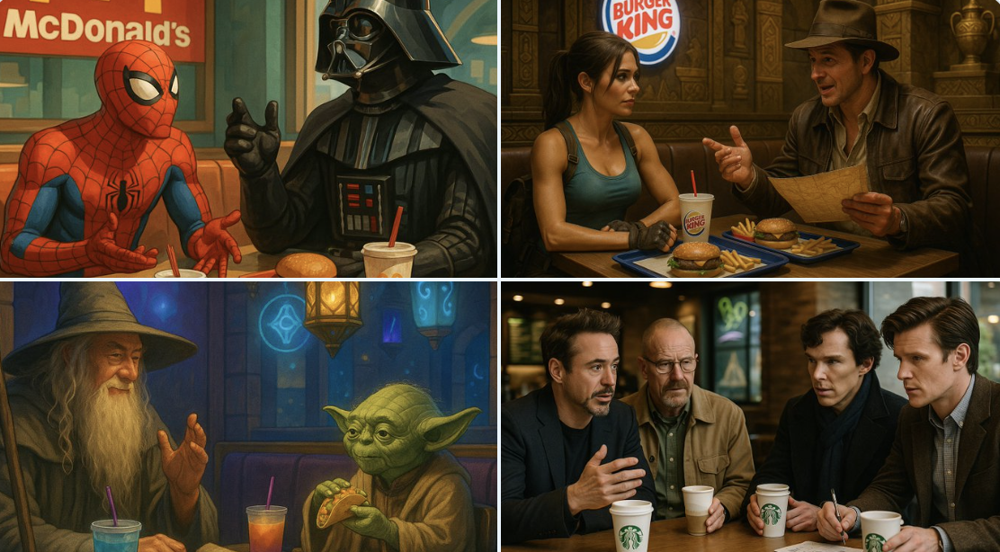

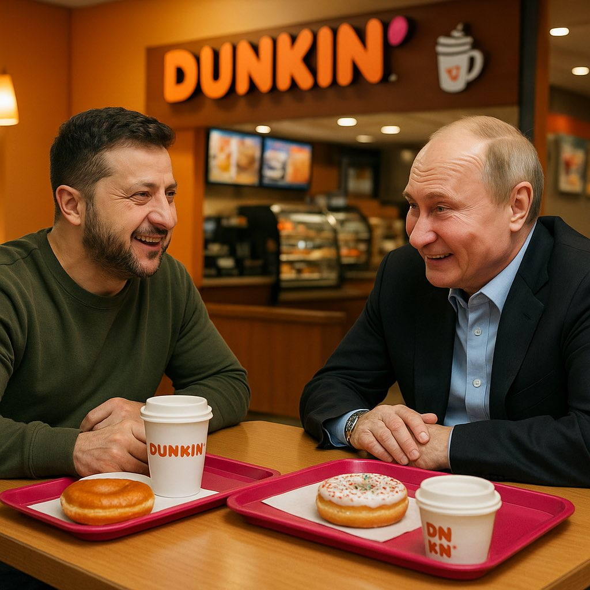

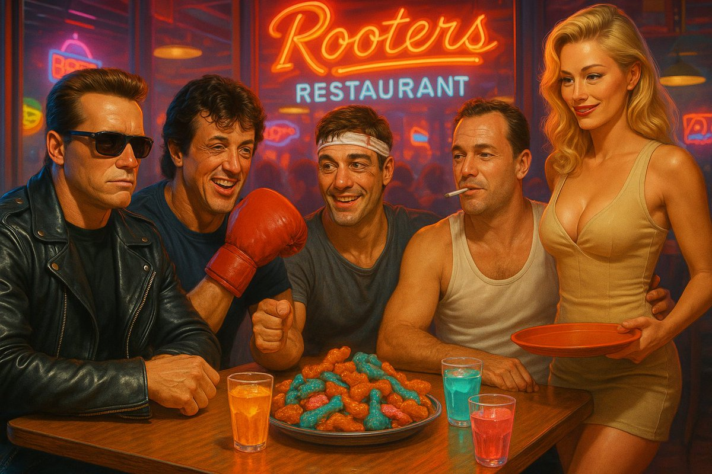

```
Imagine [CHARAKTER 1] and [Charakter 2] casually sitting together at a table in a [FAST FOOD BRAND] restaurant. The atmosphere is relaxed and light-hearted, with the two characters engaged in an amusing or deep conversation over trays of food and drinks.
```

 [↑返回目录](#toc)

---
## <a id="prompt-28">狭窄走廊里奔跑</a> (<a href="https://x.com/B_4AI/status/1924410511392719343" target="_blank" rel="noopener noreferrer">@B_4AI</a>)

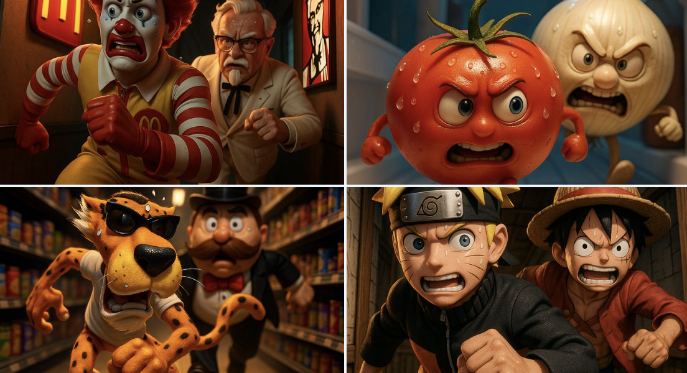

```
A thrilling 3D cartoon scene: [CHARACTER1] runs through a narrow corridor inside [Place], chased at high speed by [CHARACTER2]. Their facial expressions reflect tension and focus, with beads of sweat glistening under dramatic lighting.
```

 [↑返回目录](#toc)

---
## <a id="prompt-13">创意广告</a> (<a href="https://x.com/aziz4ai/status/1923980304525537424" target="_blank" rel="noopener noreferrer">@aziz4ai</a>)

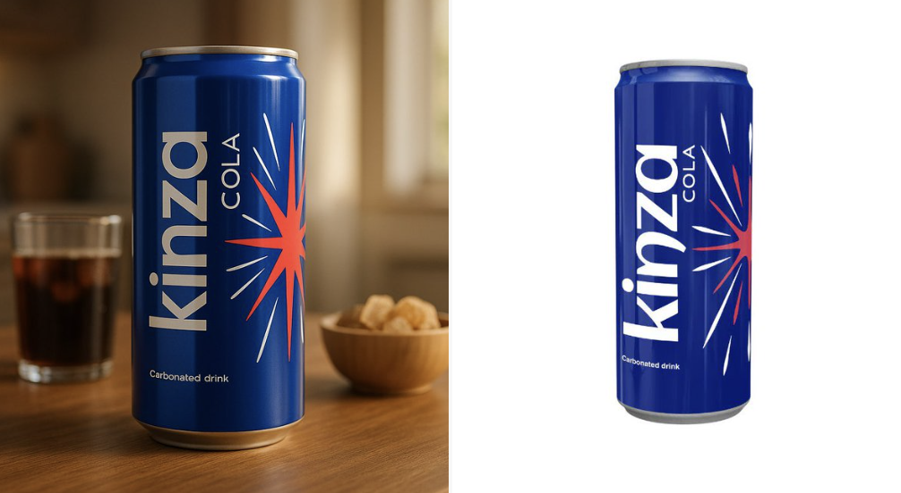

```
Use the uploaded product image exactly as it is — do not alter, redraw, or reinterpret any part of it. Follow the guidelines below to create a high-quality, cinematic product presentation:

• Keep the product fully intact — all text, labels, proportions, packaging, and colors must remain exactly the same.
• Use natural or cinematic lighting to enhance the product’s appeal.
• Place the product on a realistic surface that matches its category (e.g. wooden kitchen table for bread, bathroom shelf for skincare, desk for tech gadgets).
• Add complementary props if appropriate (e.g. toast and coffee for bread, leaves and water droplets for skincare) — but do not let them touch or cover the product.
• Use a softly blurred or ambient background (e.g. kitchen, morning window light, minimal interior).
• Include soft shadows and subtle reflections for a grounded, photo-realistic effect.
• Final result should feel premium, natural, and visually appealing — with 100% fidelity to the uploaded product image.
```

 [↑返回目录](#toc)

---
## <a id="prompt-244">转换马赛克风格照片</a> (<a href="https://x.com/fy360593/status/1945118291703284152" target="_blank" rel="noopener noreferrer">@fy360593</a>)

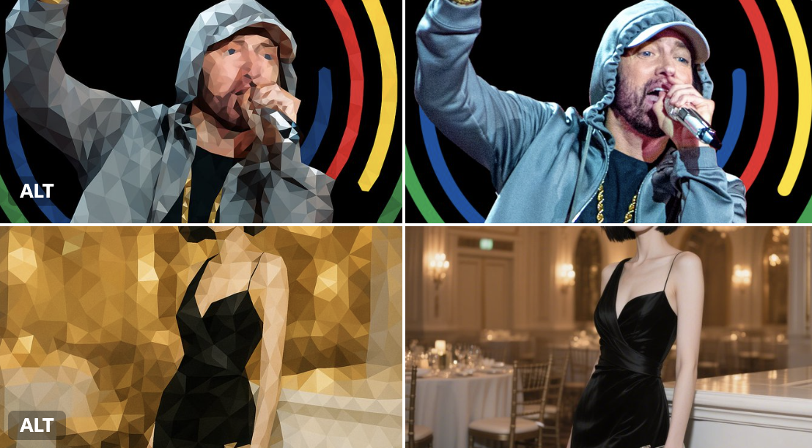

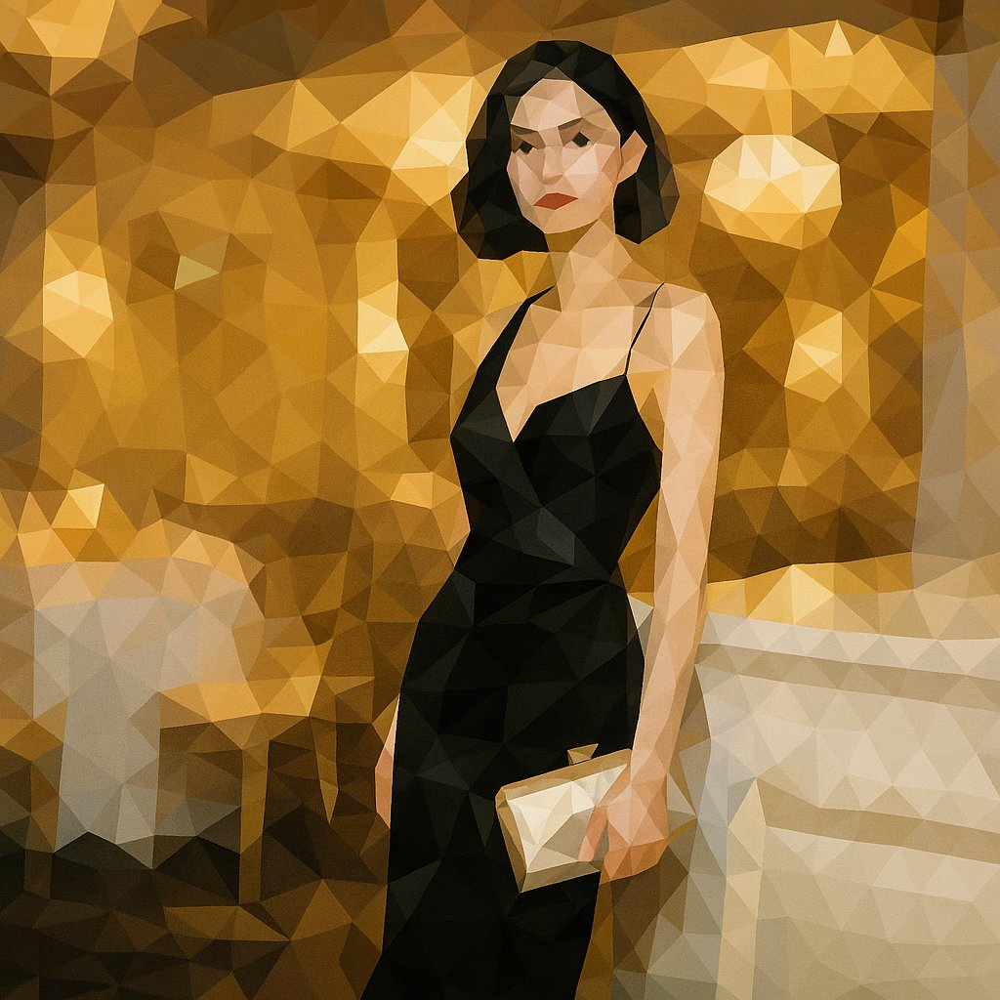

```
Transform this image into a refined low-poly mosaic style. Preserve the original structure and recognizable details, especially facial features and contours. Use small, high-density polygons to maintain clarity and identity while creating a crystalline, faceted look. Keep the original color palette for a harmonious and natural aesthetic. Avoid altering or adding new elements.
```

```
将此图像转换为精致的低多边形马赛克风格。保留原始结构和可识别的细节，特别是面部特征和轮廓。使用小而高密度的多边形，以保持清晰度和身份，同时创造水晶般、多面体的外观。保留原始调色板，以实现和谐自然的美学。避免更改或添加新元素。
```

 [↑返回目录](#toc)

---
## <a id="prompt-305">复古漫画风格卡通插画</a> (<a href="https://x.com/azed_ai/status/1967180553553330306" target="_blank" rel="noopener noreferrer">@azed_ai</a>)


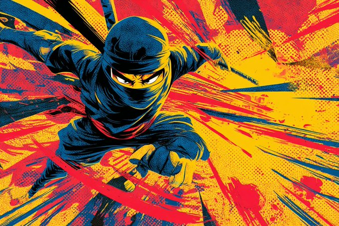

```
2D cartoon illustration of a [subject] mid-motion in a [dynamic action pose], drawn in vintage comic book style with bold outlines and saturated primary colors. Featuring dramatic motion streaks, exaggerated perspective, punchy panel composition, and crisp halftone texture. Designed for high-energy visual storytelling with retro superhero flair.
```

```
2D卡通插画，描绘了一位[主体]以[动态动作姿势]的中途运动，采用复古漫画风格绘制，轮廓粗犷，色彩饱和。具有戏剧性的运动条纹、夸张的透视、富有冲击力的面板构图和清晰的半色调纹理。旨在以复古超级英雄的风格呈现充满活力的视觉叙事。
```

 [↑返回目录](#toc)

---
## <a id="prompt-63">选择你的阵营</a> (<a href="https://x.com/aziz4ai/status/1925595213726097803" target="_blank" rel="noopener noreferrer">@aziz4ai</a>)

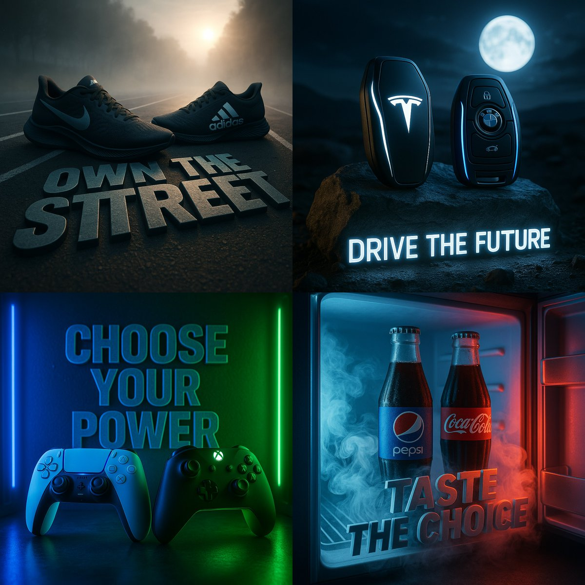

```
A dramatic cinematic scene featuring two rival products placed side by side in a custom-designed environment that visually reflects their identities. The composition should include high contrast lighting, atmospheric effects like mist, fog, or neon glow, and hyper-detailed textures. Incorporate a powerful 3D slogan below or behind the products in bold stylized typography that fits the scene’s mood. The products must reflect the essence of [Brand A] and [Brand B] through color, lighting, and placement. Ultra-realistic, moody tones, 1:1 square format, with sharp depth of field and high resolution.
```

 [↑返回目录](#toc)

---
## <a id="prompt-203">3D表情符号头部</a> (<a href="https://x.com/TechieBySA/status/1942928111244394788" target="_blank" rel="noopener noreferrer">@TechieBySA</a>)

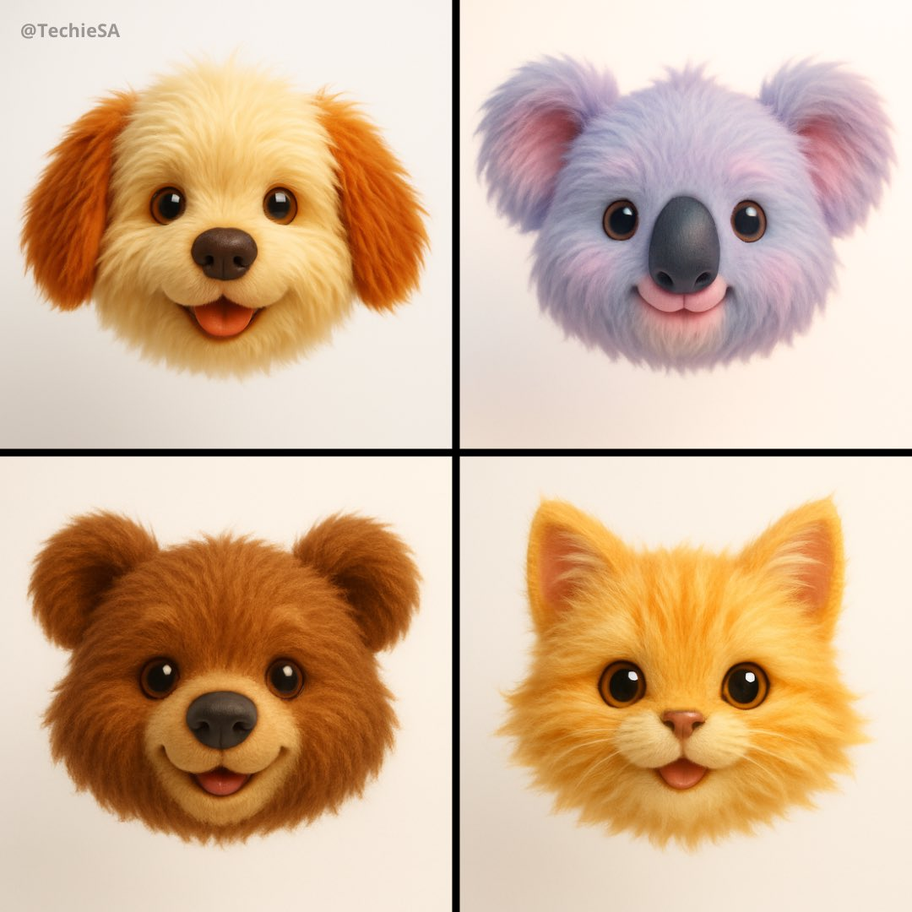

```
Generate a hyper-realistic 3D render of a [EMOJI🐱] as a floating animal head with plush toy aesthetics. The design should emphasize ultra-soft, long fur, playful cuteness, and a childlike charm. Use a straight-on camera angle with soft, diffused lighting to create a warm and inviting glow. Keep the background pure white for a clean, modern look. The color palette should be vibrant yet soothing, enhancing the toy-like appeal. Style: Ultra-detailed, whimsical, and hyper-cute, blending realism with a soft, plush texture for maximum visual impact.
```

```
生成一个超逼真的 3D 渲染效果，将[表情符号 🐱 ]设计成一个漂浮的动物头部，具有毛绒玩具的美学风格。设计应强调超柔软的长毛、俏皮可爱和童真魅力。使用正面直视的相机角度，搭配柔和的漫射光线，营造出温暖诱人的光泽。保持背景纯白色，以呈现干净现代的外观。色彩搭配应鲜明而舒缓，增强玩具般的吸引力。风格：超精细、奇幻、超可爱，将现实主义与柔软的毛绒质感相结合，以达到最大的视觉冲击力。
```

 [↑返回目录](#toc)

---
## <a id="prompt-14">创意广告</a> (<a href="https://x.com/azed_ai/status/1924090458298609881" target="_blank" rel="noopener noreferrer">@azed_ai</a>)

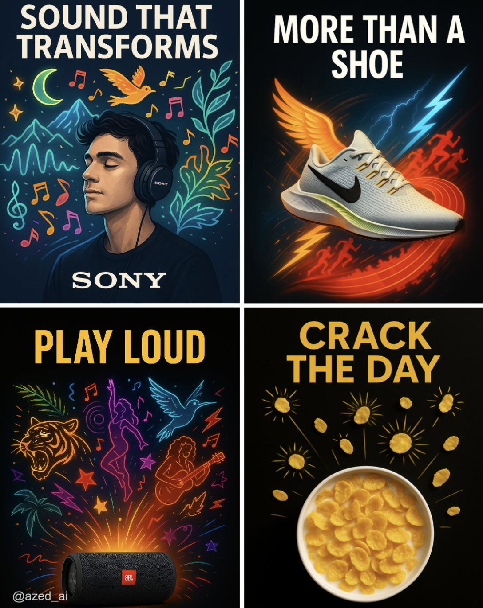

```
A high-impact advertisement set against a clean, dark or high-contrast background. A [product] is centered, sharply lit and highly detailed. Around it, surreal, stylized visual [elements] illustrations explode outward (e.g., musicians, runners, curls, sunbursts), vibrant color palette, neon. bold uppercase ad copy at the top that reads [TEXT] and the brand logo at the bottom, modern Ad
```

 [↑返回目录](#toc)

---
## <a id="prompt-71">景观洞穴入口的形状</a> (<a href="https://x.com/umesh_ai/status/1925819339413836010" target="_blank" rel="noopener noreferrer">@umesh_ai</a>)

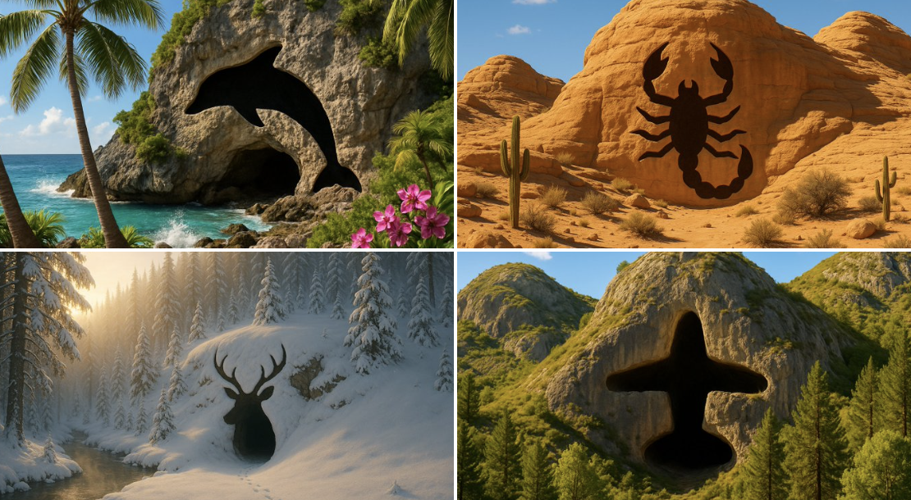

```
An image of a [TYPE] landscape, featuring a cave entrance that is shaped exactly like the outline of a [SHAPE]. The cave should blend naturally into the rugged terrain of the mountain, with the entrance forming a clear and unmistakable [SHAPE] shape. This [SHAPE] shape should be simple and defined, without intricate details, emphasizing just the overall [SHAPE] outline. The surrounding environment should include [DETAILS], but these elements should not distract from the cave's   [SHAPE]-shaped entrance. The lighting in the scene should enhance the visibility and distinctiveness of the [SHAPE]-shaped cave entrance.
```

 [↑返回目录](#toc)

---
## <a id="prompt-12">创意广告</a> (<a href="https://x.com/azed_ai/status/1923016036120658122" target="_blank" rel="noopener noreferrer">@azed_ai</a>)

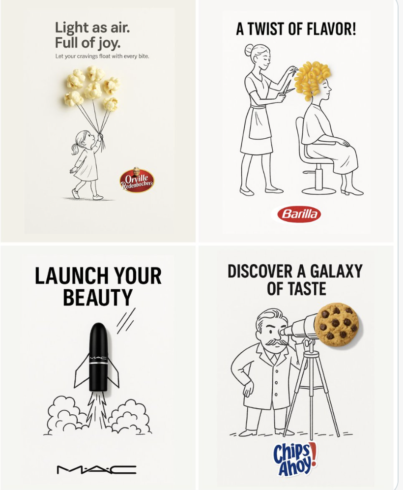

```
A minimalist and creative advertisement set on a clean white background.
A real [Real Object] is integrated into a hand-drawn black ink doodle, using loose, playful lines. The [Doodle Concept] interacts with the object in a clever, imaginative way. Include bold black [Ad Copy] text at the top or center. Place the [Brand Logo] clearly at the bottom. The visual should be clean, fun, high-contrast, and conceptually smart.
```

 [↑返回目录](#toc)

---
## <a id="prompt-150">乙烯基玩具</a> (<a href="https://x.com/azed_ai/status/1937104120097407069" target="_blank" rel="noopener noreferrer">@azed_ai</a>)

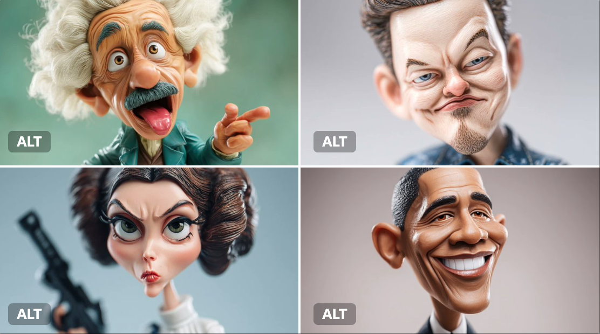

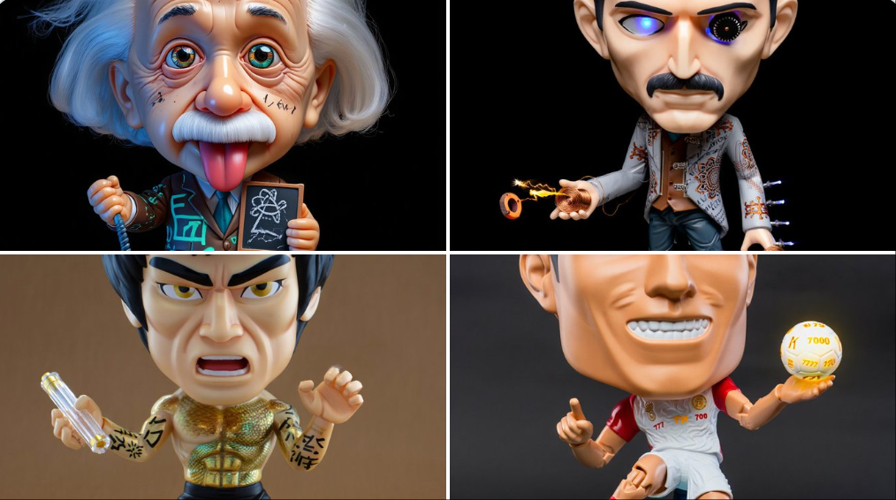

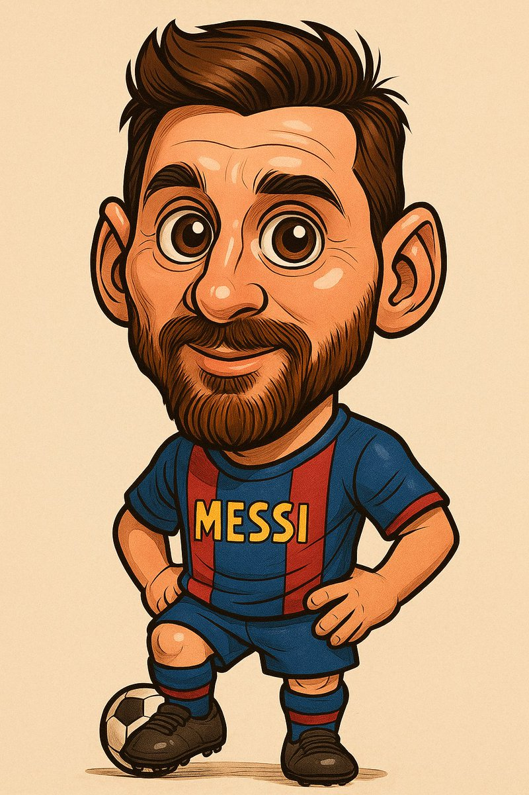


```
A comic-style caricature illustration of [subject], with an oversized head and expressive eyes, rendered in a hyper-realistic vinyl toy aesthetic. The character features exaggerated proportions, glossy textures, and playful details, blending caricature art with collectible figure charm.
```

```
[主题]的漫画风格漫画插图，具有超大的头部和富有表现力的眼睛，以超逼真的乙烯基玩具美学呈现。该角色具有夸张的比例、光滑的纹理和俏皮的细节，将漫画艺术与收藏人物魅力融为一体。
```

 [↑返回目录](#toc)

---
## <a id="prompt-122">史莱姆制成的玩具运输车</a> (<a href="https://x.com/miilesus/status/1934593675276796090" target="_blank" rel="noopener noreferrer">@miilesus</a>)


```
{
  "style": "Realistic 3D render",
  "material": "Glossy slime-like material",
  "texture": ["smooth", "soft", "stretchy", "shiny"],
  "color": "VARIABLE",  
  "object_type": "VARIABLE",  
  "background": "plain white",
  "lighting": "soft studio lighting",
  "details": {
    "focus": "single object centered",
    "shadows": "soft and subtle",
    "reflection": "light highlights on surface",
    "depth": "shallow depth of field"
  },
  "format": "close-up or three-quarter view",
  "mood": "playful, clean, toy-like",
  "prompt_template": "A {color} {object_type} made of glossy slime material, soft and stretchy texture, realistic 3D look, set against a plain white background, soft lighting and smooth highlights"
}
```

```
{
“style”： “逼真的 3D 渲染”，
“material”： “有光泽的粘液状材质”，
“texture”： [“光滑”， “柔软”， “弹性”， “闪亮”]，
“color”： “变量”，
“object_type”： “变量”，
“background”： “纯白色”，
“lighting”： “柔和的工作室照明”，
“详细信息”： {
“focus”： “以单个对象为中心”，
“shadows”： “柔和而微妙”，
“reflection”： “表面上的光高光”，
“depth”： “浅景深”
},
“format”： “特写或四分之三视图”，
“mood”： “俏皮的、干净的、玩具般的”，
“prompt_template”： “由有光泽的粘液材料制成的 {color} {object_type}，质地柔软有弹性，逼真的 3D 外观，以纯白色背景为背景，光线柔和，高光平滑”
}
```

 [↑返回目录](#toc)

---
## <a id="prompt-301">超写实肖像位于石膏中心</a> (<a href="https://x.com/samann_ai/status/1967149018640998584" target="_blank" rel="noopener noreferrer">@samann_ai</a>)

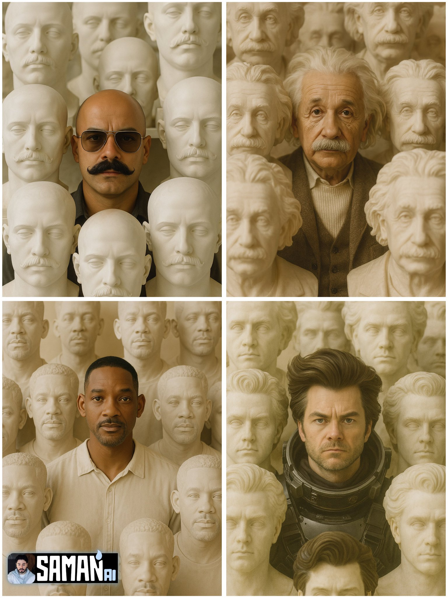

```
Ultra-real portrait of [CHARACTER] centered, surrounded by dozens of life-size stone busts of [CHARACTER]; warm beige museum lighting, matte alabaster texture, symmetrical composition, shallow depth of field (85mm), subtle film grain, 3:4 vertical, no text or watermark.
```

```
[角色] 的超写实肖像位于画面中心，周围环绕着数十座与真人等大的 [角色] 石质胸像；采用温暖的米色博物馆灯光，呈现哑光雪花石膏质感，构图对称，景深较浅（85 毫米镜头），带有细微的胶片颗粒感，画面比例为 3:4 竖版，无文字及水印。
```

 [↑返回目录](#toc)

---
## <a id="prompt-53">由鲜花组成的小房子</a> (<a href="https://x.com/BeanieBlossom/status/1925461720639971505" target="_blank" rel="noopener noreferrer">@BeanieBlossom</a>)

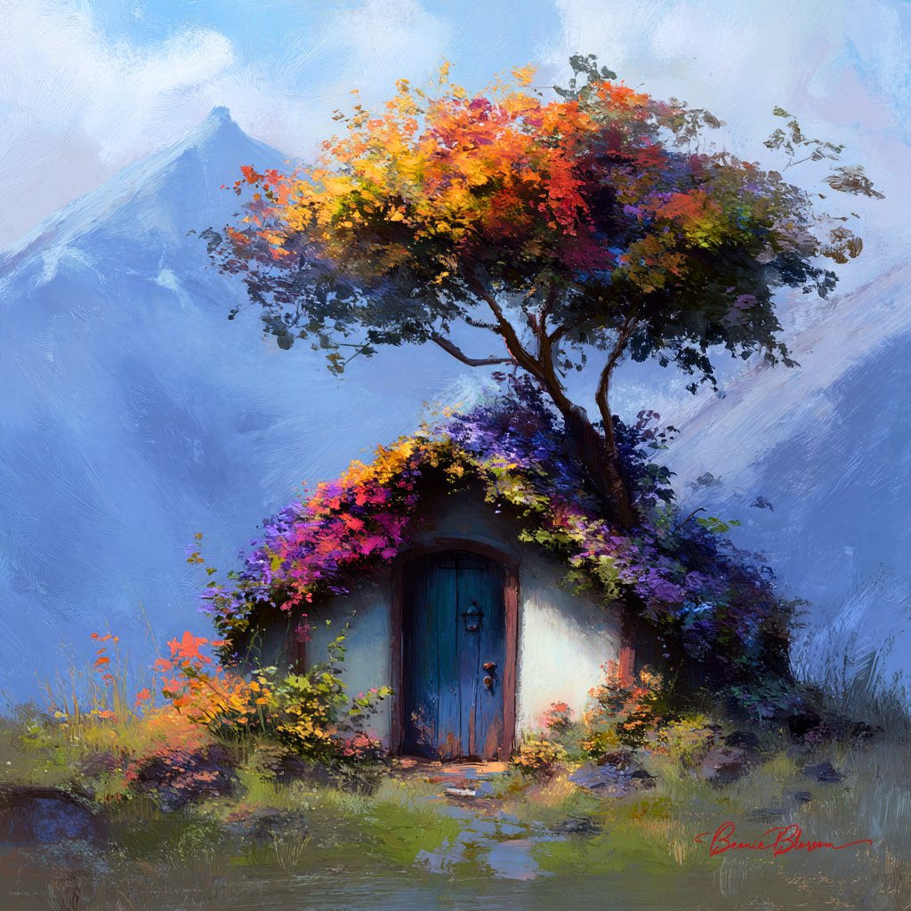

```
A small house made of flowers, a tree with colorful leaves growing on top and around the door, in the style of fantasy, mountainscape in the background, natural lighting, soft colors, rich details, and a full atmosphere, subtle painterly style
```

 [↑返回目录](#toc)

---
## <a id="prompt-133">幽灵形态</a> (<a href="https://x.com/TheRelianceAI/status/1934662213702140116" target="_blank" rel="noopener noreferrer">@TheRelianceAI</a>)


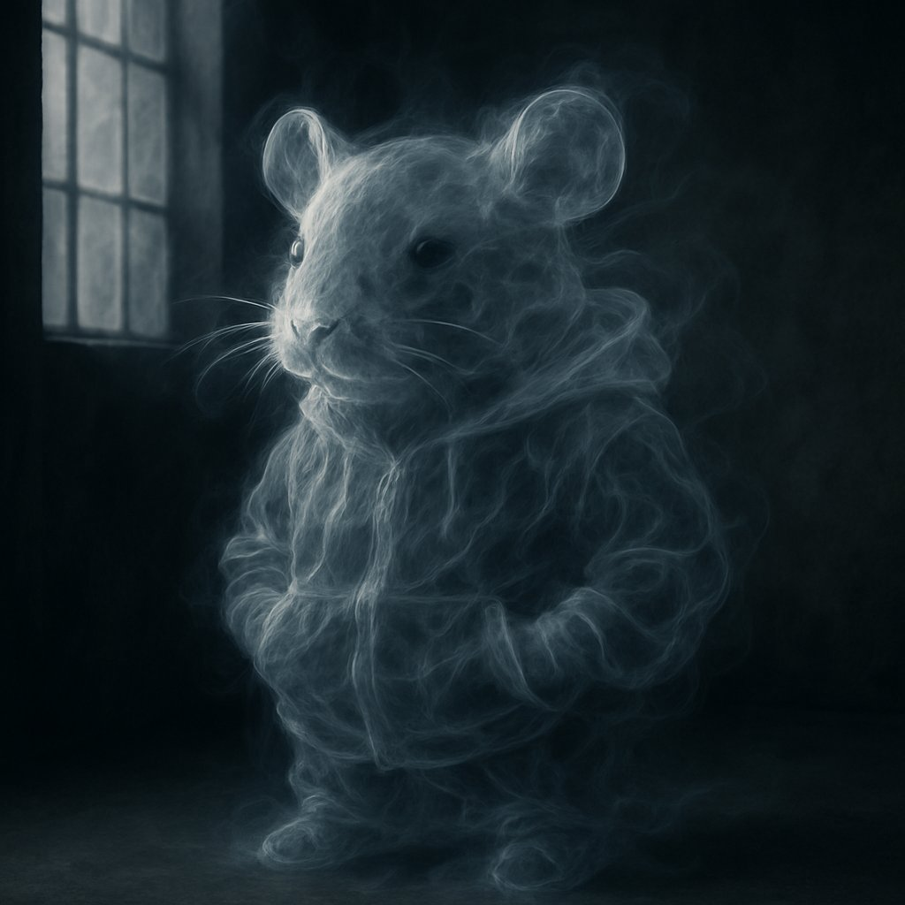

```
A hyper-realistic photograph of a [SUBJECT] entirely made from a single, semi-rigid transparent material that drapes and folds like sheer plastic or molten glass. The object is fully recognizable in shape, yet ghostly and fluid, as if sculpted from air and frozen in motion. Set in a moody, industrial interior with aged concrete walls and diffused daylight from metal-barred windows. The lighting gently highlights the reflections, edges, and flowing curves of the transparent form. Dreamlike, minimalist, surreal design aesthetic.
```

```
一张 [SUBJECT] 的超写实照片，完全由单一的、半刚性的透明材料制成，像纯粹的塑料或熔融玻璃一样悬垂和折叠。这个物体的形状是完全可识别的，但又幽灵般流动，仿佛从空气中雕刻出来，在运动中冻结。坐落在喜怒无常的工业室内，拥有老化的混凝土墙和从金属栅栏窗户射出的日光。灯光柔和地突出了透明形式的反射、边缘和流动曲线。梦幻般的、极简主义的、超现实主义的设计美学。
```

 [↑返回目录](#toc)

---
## <a id="prompt-151">Neoglo风格Logo</a> (<a href="https://x.com/aziz4ai/status/1936744152366288926" target="_blank" rel="noopener noreferrer">@aziz4ai</a>)

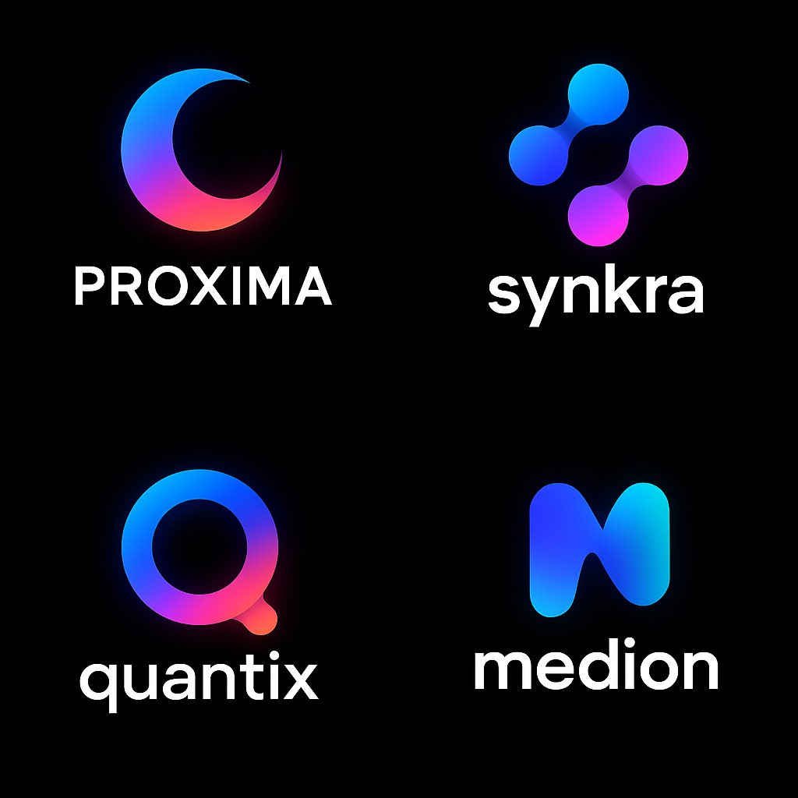

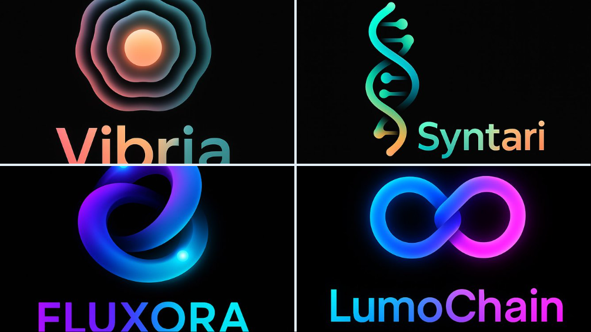

```
Design a modern logo in NeoGradient Soft Tech style for a fictional startup called “NAME” in the “[INDUSTRY TYPE]” industry.

The logo must include:
•A unique abstract icon
•A clean, bold sans-serif logotype
•Smooth glowing gradients blending vibrant colors like blue, purple, pink, orange, and teal
•Seamless harmony between symbol and text
•Minimalist, futuristic composition
•On a pure black background
•1:1 aspect ratio — ultra-HD

The logo should feel creative, modern, and ready for a bold digital brand.
```

```
为“[INDUSTRY TYPE]”行业中名为 “NAME” 的虚构初创公司设计一个 NeoGradient Soft Tech 风格的现代标志。

徽标必须包含：
•独特的抽象图标
•干净、大胆的无衬线标识
•平滑的发光渐变，混合了蓝色、紫色、粉红色、橙色和蓝绿色等鲜艳的颜色
•符号和文本之间的无缝协调
•极简主义、未来主义的构图
•在纯黑色背景上
•1：1 纵横比 — 超高清

徽标应该具有创意、现代感，并为大胆的数字品牌做好准备。
```

 [↑返回目录](#toc)

---
## <a id="prompt-220">3D店铺渲染图</a> (<a href="https://x.com/TechieBySA/status/1943242512820273451" target="_blank" rel="noopener noreferrer">@TechieBySA</a>)

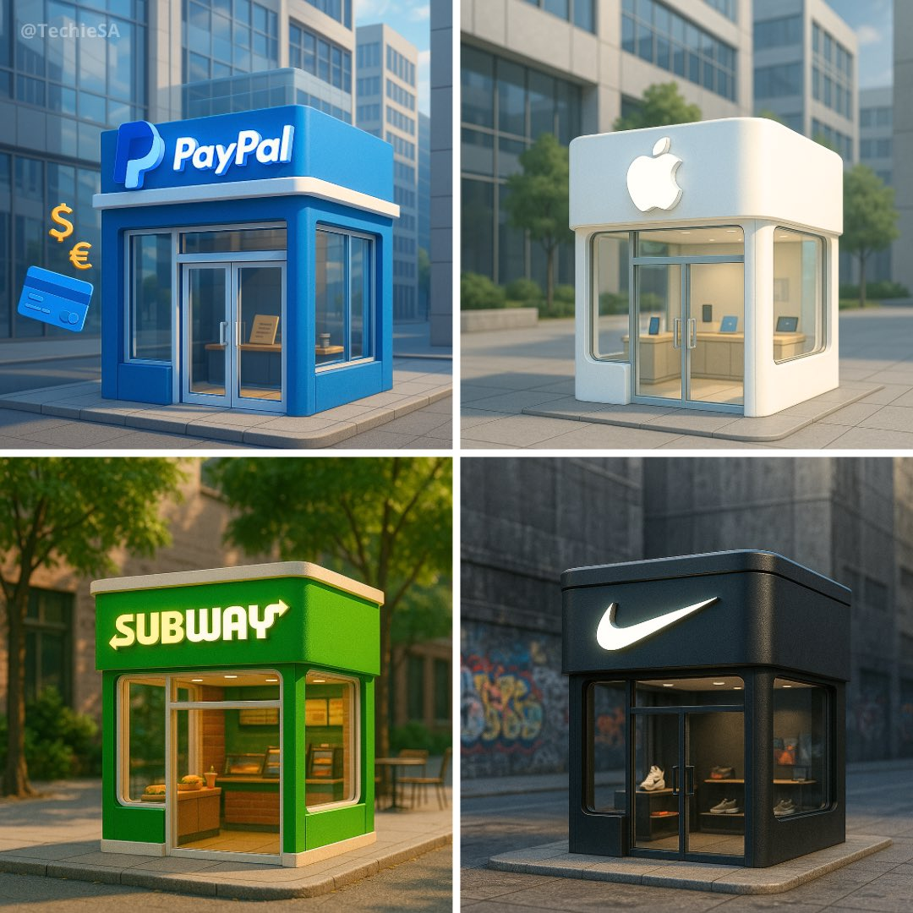

```
Ultra-realistic 3D render of a cute, miniature [BRAND NAME] storefront building. Designed using the brand’s signature style and color palette. Features a clean, modern exterior with large glass windows and a glowing 3D [BRAND NAME] logo sign on the front. Includes subtle branded props inside the store. Background matches the brand’s identity — clean, relevant, and atmospheric. Slight isometric angle, warm lighting, soft shadows, and centered composition.
```

```
逼真的 3D 渲染图，展示了一个可爱、迷你版的[品牌名称]店铺建筑。采用品牌的标志性风格和色彩搭配设计。外部设计简洁现代，配有大型玻璃窗，正面有一个发光的 3D[品牌名称]标志。店内包含细微的品牌道具。背景与品牌身份相匹配——干净、相关且富有氛围。略微的等距角度，温暖的照明，柔和的阴影，居中构图。
```

 [↑返回目录](#toc)

---
## <a id="prompt-142">为任何品牌设计运动鞋</a> (<a href="https://x.com/hc_dsn/status/1925139884920152110" target="_blank" rel="noopener noreferrer">@hc_dsn</a>)

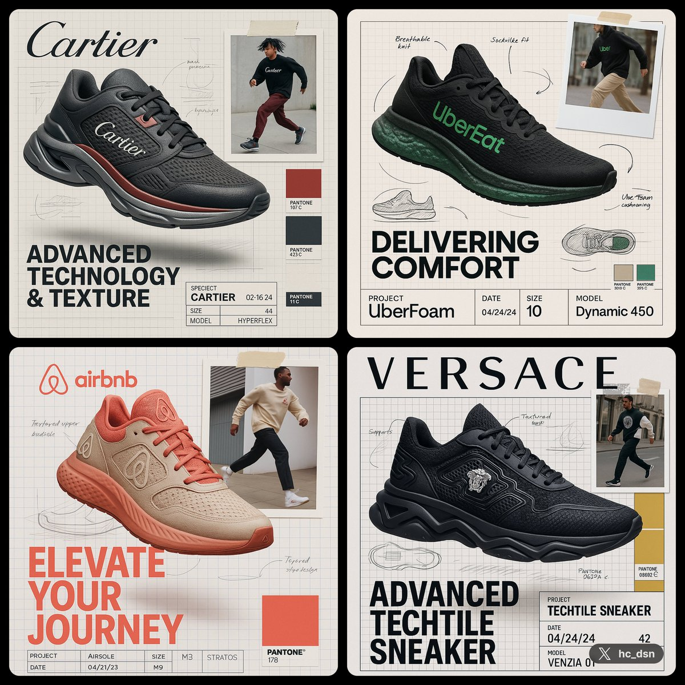

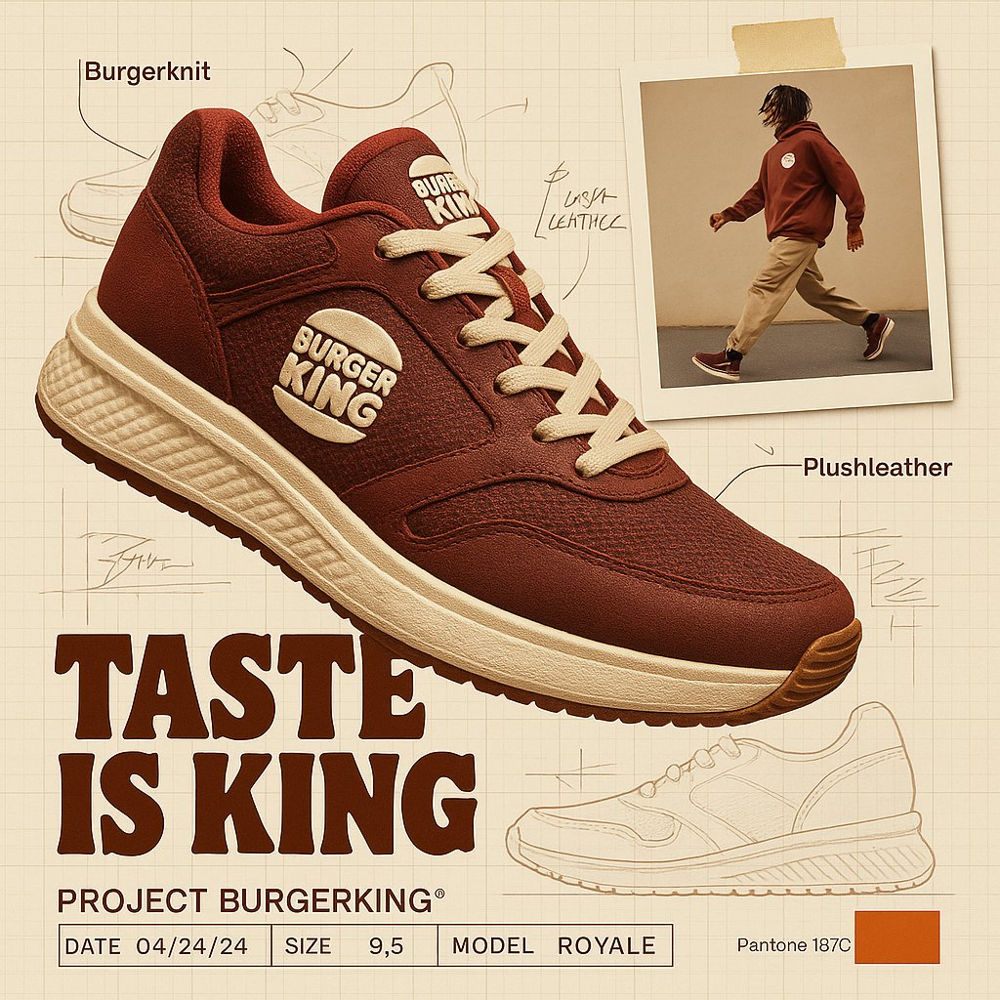

```
create image with 1:1 ratio   A branded footwear ad for [Brand], showcasing the high-end Brand shoe using brand technology and texture.(fiction a technology and texture based on brand DNA). The shoe is shown in dynamic floating perspective over a graph paper background layout with technical sketches and handwritten notes. A random lifestyle authentic photo featuring brand clothing in motion is taped in the corner, styled with street wear fashion. Emphasize the product's slogan with  bold typography. Layout features include product spec labels like Project a fiction brand title, Date, Size, and fiction model name in engineering style. The background reference with brand pantone color palettes with code number
```

```
以 1：1 的比例创建图片 [Brand] 的品牌鞋靴广告，使用品牌技术和纹理展示高端品牌鞋靴。（虚构一种基于品牌DNA的技术和质感）。这双鞋以动态浮动透视形式显示在方格纸背景布局上，并附有技术草图和手写注释。角落里贴着一张随机的生活方式真实照片，照片中展示了运动中的品牌服装，与街头服饰时尚相得益彰。用粗体排版强调产品的口号。布局功能包括产品规格标签，如工程样式的 Project a fiction brand title、Date、Size 和 fiction model name。带有品牌 pantone 调色板和代码编号的背景参考
```

 [↑返回目录](#toc)

---
## <a id="prompt-209">吃掉你的文字</a> (<a href="https://x.com/aziz4ai/status/1935749368876867967" target="_blank" rel="noopener noreferrer">@aziz4ai</a>)

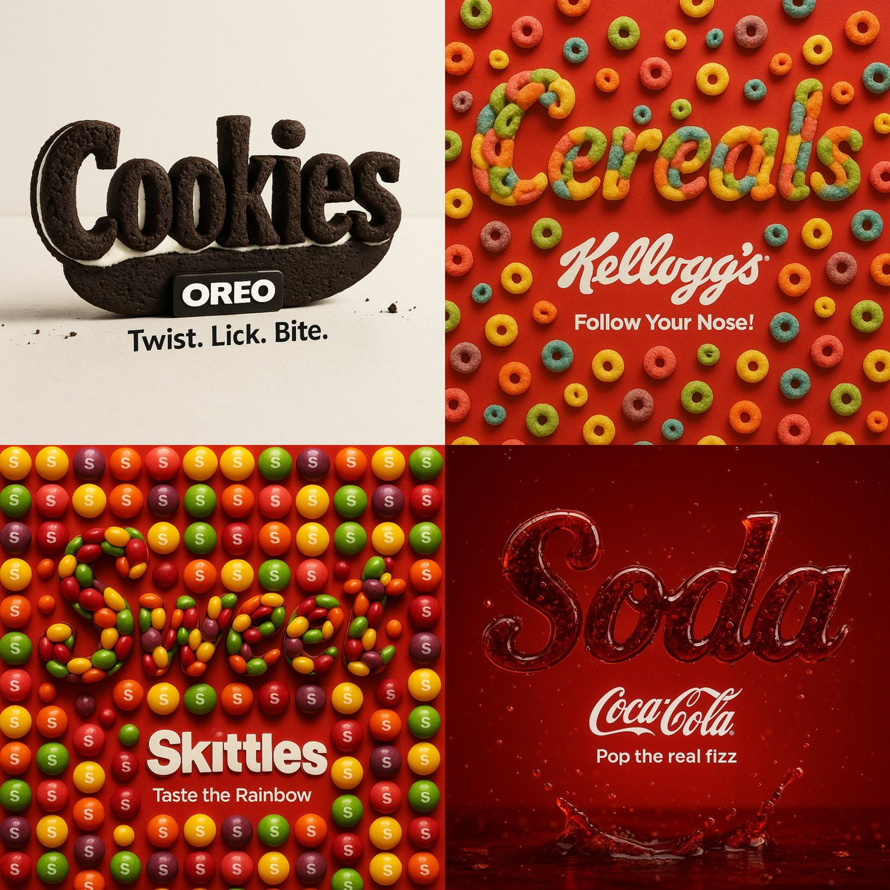

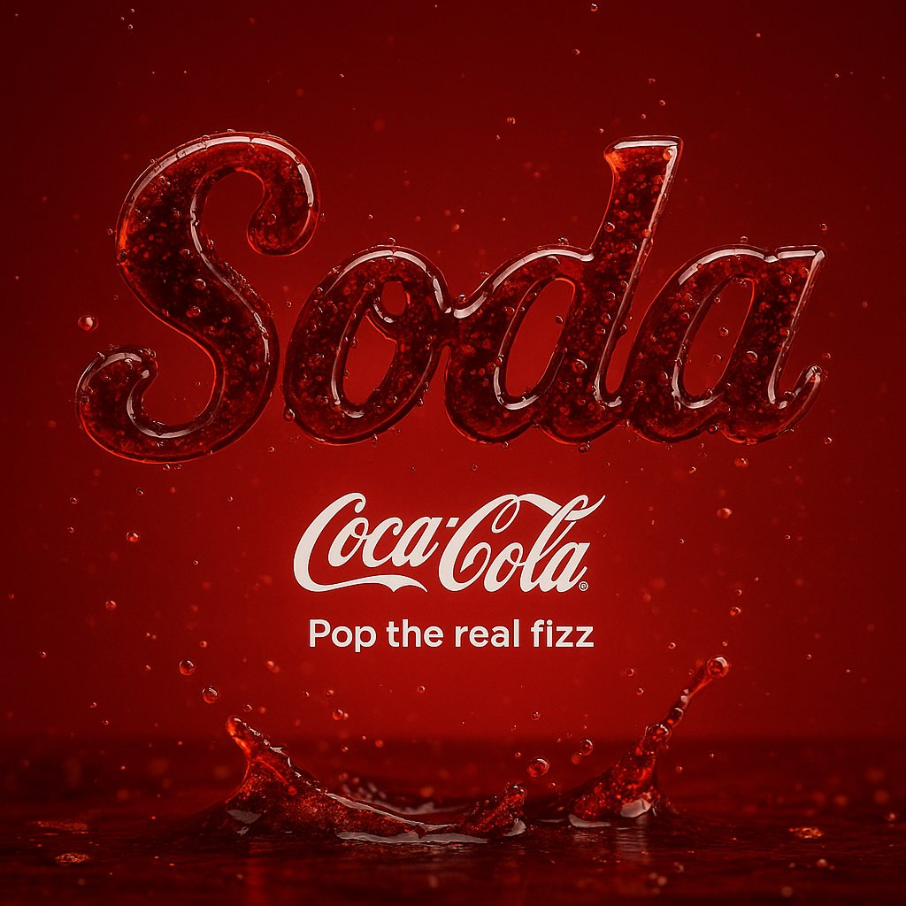

```
Create the word “[WORD]” made entirely from its real texture and styled using the identity of the most iconic brand associated with it.

The word should:
• Visually reflect the material (e.g. honey, chocolate, soda, candy).
• Use the brand’s signature colors and typography.
• Include the brand logo beneath the word.
• Add a short slogan (3–4 words) matching the product’s vibe.
• Be centered in a minimal background inspired by the product (e.g. breakfast table, soda splash, cookie tray).

• Dimensions: 1:1
• Style: clean, bold, product-focused
• Render: ultra-HD, HDR, 8K
```

```
创建由其真实质感完全构成，并使用与其最具有标志性的品牌相联系的标识进行风格的“[单词]”。

该单词应：
• 视觉上反映材料（例如蜂蜜、巧克力、汽水、糖果）。
• 使用该品牌的标志性颜色和字体。
• 在文字下方包含品牌标志。
• 添加一个与产品氛围相符的简短口号（3-4 个字）。
• 居中放置在受产品启发的简约背景中（例如：早餐桌、汽水飞溅、饼干托盘）。

• 尺寸：1:1
• 风格：简洁、醒目、以产品为中心
• 渲染：超高清、HDR、8K
```

 [↑返回目录](#toc)

---
## <a id="prompt-62">品牌设计指南海报</a> (<a href="https://x.com/ai4everyday/status/1925838516979646795" target="_blank" rel="noopener noreferrer">@ai4everyday</a>)

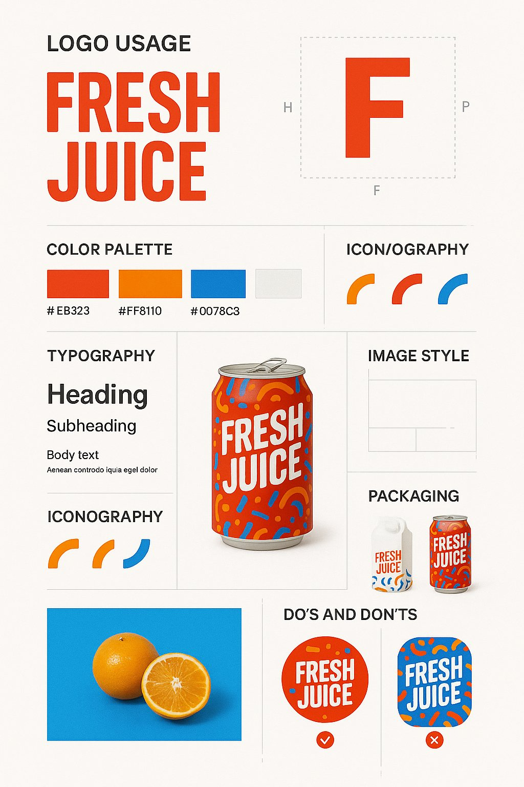

```
Create a vertical 9:16 brand design guide poster using the uploaded product image. Adapt the design style to match the product’s niche and visual identity. Structure the poster with clear, elegant sections: (1) Large logo display and safe zone usage, (2) Product mockup centered and highlighted, (3) Primary and secondary color palette swatches with hex codes, (4) Typography guide with heading, subheading, body font samples, and line spacing specs, (5) Iconography or graphic motif examples used by the brand, (6) Image treatment style with sample lifestyle or studio visuals, (7) Grid system or layout rules, (8) Packaging mockups and surface applications, (9) Do’s & Don’ts with annotated visuals. Use minimalist white or soft neutral background with structured layout dividers and drop shadows. The result must be visually rich, clean, and suitable for a printed or digital brand book.
```

 [↑返回目录](#toc)

---
## <a id="prompt-140">现代数字动漫风格</a> (<a href="https://x.com/Artedeingenio/status/1934970943769559430" target="_blank" rel="noopener noreferrer">@Artedeingenio</a>)


```
Transform this image into a modern digital anime TV style. Use clean and sharp outlines, vivid and high-contrast colors, and digital cel shading with subtle gradients. Add visual effects like glows, particles, or light flares if appropriate. The character design should follow modern anime proportions, with detailed hair and expressive eyes. The background can be softly blurred or cinematic. The image should look like a frame from a high-quality anime series currently airing.
```

```
将此图像转换为现代数字动漫电视风格。使用干净锐利的轮廓、鲜艳和高对比度的颜色，以及具有微妙渐变的数字卡通底纹。添加视觉效果，如发光、粒子或光晕（如果合适）。角色设计应遵循现代动漫的比例，拥有细致的头发和富有表现力的眼睛。背景可以是柔和的模糊或电影般的。该图像应看起来像当前正在播出的高质量动漫系列中的帧。
```

 [↑返回目录](#toc)

---
## <a id="prompt-58">血月下的决斗</a> (<a href="https://x.com/B_4AI/status/1925509492298375388" target="_blank" rel="noopener noreferrer">@B_4AI</a>)

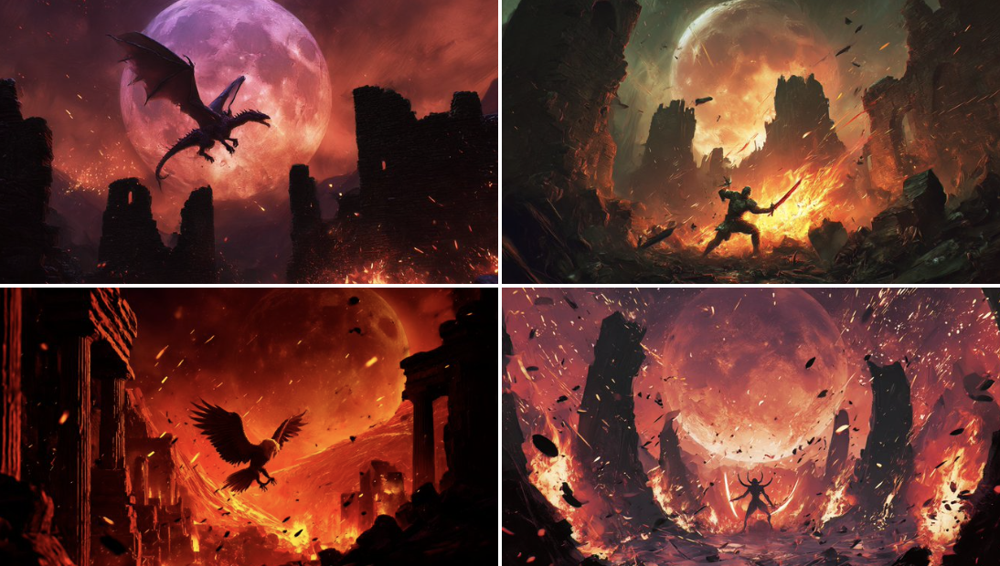

```
[SUBJECT] in a cinematic painting, battling amid crumbling ruins under a colossal blood moon — ambient sparks flying. Set in an ancient valley, illuminated by firelight and shadows. soft [COLOR1] and vibrant [COLOR2], mood intense and epic.
```

 [↑返回目录](#toc)

---
## <a id="prompt-126">重新构想的超现实主义广告</a> (<a href="https://x.com/aziz4ai/status/1934702903932957023" target="_blank" rel="noopener noreferrer">@aziz4ai</a>)


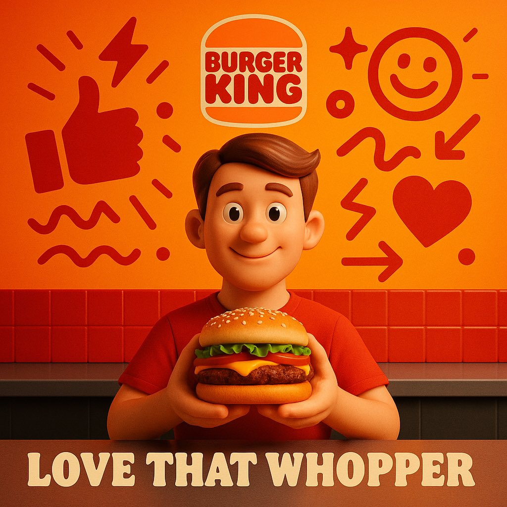

```
“[Product Name]” placed at the center in full photorealism, surrounded by surreal vector illustrations using exactly two bold, vibrant colors that match the product’s mood.
The scene is minimalistic yet energetic, with abstract vector shapes (symbols, lines, expressions, etc.) orbiting or interacting with the product.
Add the real logo clearly and integrate a short 3–4 word slogan at the bottom.
Style: surreal, high-resolution, minimal, cinematic lighting, 1:1 aspect ratio.
```

```
“[产品名称]”以完全逼真的方式放置在中心，周围环绕着超现实主义的矢量插图，使用两种大胆、鲜艳的颜色，与产品的情绪相匹配。
场景简约而充满活力，抽象的矢量形状（符号、线条、表情等）围绕产品运行或与产品交互。
清楚地添加真实的 logo，并在底部加入一个 3-4 字的简短标语。
风格：超现实、高分辨率、极简、电影般的照明、1：1 纵横比。
```

 [↑返回目录](#toc)

---
## <a id="prompt-41">卡通角色转换成超写实人类</a> (<a href="https://x.com/The_Real_Bersek/status/1917174101627617752" target="_blank" rel="noopener noreferrer">@The_Real_Bersek</a>)

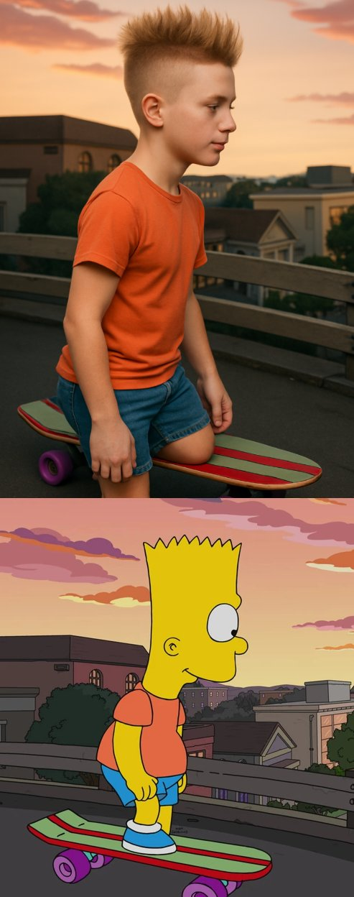

```
Transform the cartoon character from the reference image into a hyper-realistic human while maintaining their core attributes (clothing, hairstyle, facial expression, accessories, and proportions, age and so on). Create a photorealistic portrait
```

 [↑返回目录](#toc)

---
## <a id="prompt-412">3D漫画肖像</a> (<a href="https://x.com/ShreyaYadav___/status/1984518065619681365" target="_blank" rel="noopener noreferrer">@ShreyaYadav___</a>)

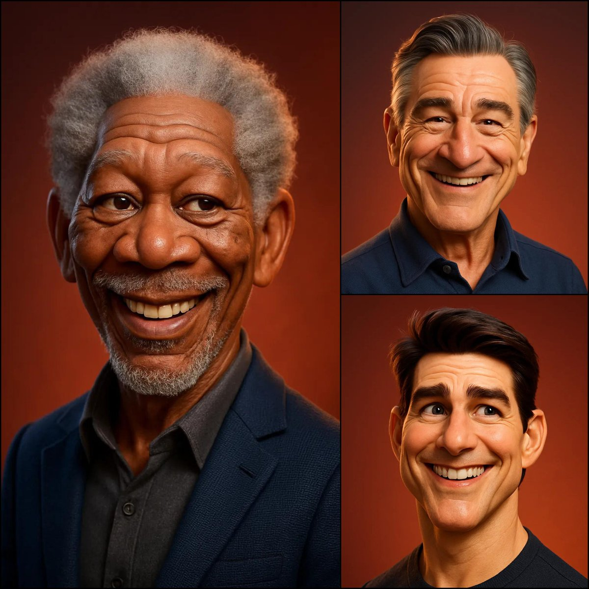

```
3D caricature portrait of [SUBJECT], Pixar/DreamWorks style — expressive eyes, slightly oversized head, exaggerated ears & nose, realistic skin shading with soft subsurface scattering, detailed hair, gentle warm smile, smooth polished materials, subtle fabric texture, soft ambient lighting, warm reddish-orange gradient background — balanced realism and stylized charm.
```

```
[SUBJECT]的3D漫画肖像，皮克斯/梦工厂风格——富有表现力的眼睛，略微过大的头部，夸张的耳朵和鼻子，逼真的皮肤阴影和柔和的次表面散射，细致的头发，温柔温暖的微笑，光滑的抛光材质，微妙的织物纹理，柔和的环境光，温暖的红橙色渐变背景——平衡的现实主义和风格化的魅力。
```

 [↑返回目录](#toc)

---
## <a id="prompt-87">品牌解锁童年回忆</a> (<a href="https://x.com/TheRelianceAI/status/1925606107608715268" target="_blank" rel="noopener noreferrer">@TheRelianceAI</a>)

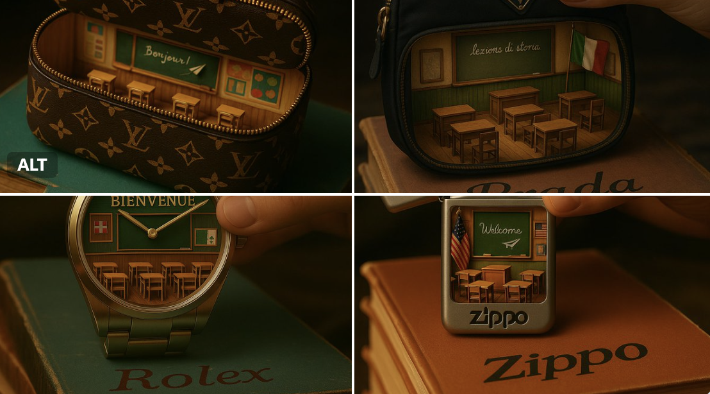

```
A realistic, cinematic photograph of a vintage [BRAND NAME] item being gently lifted from a dusty stack of old children's books in a dimly lit attic. The item is designed in classic [BRAND NAME] style—featuring authentic patterns, textures, or logos (e.g. monograms, embossing, or signature motifs relevant to the brand). It is partially opened to reveal a miniature, warmly lit classroom inspired by [COUNTRY] school interiors, complete with small regional-style desks, a chalkboard with delicate handwriting in [LANGUAGE], and traditional local details like shoes, posters, or flags. A paper airplane hovers mid-air. The lighting is moody and nostalgic, with soft shadows and golden highlights suggesting afternoon light filtering through attic beams. On the top book cover at the bottom of the image, the [BRAND NAME] logo is written in an elegant, fountain-pen calligraphy style—subtle, integrated into the scene, and not obscuring the main subject.
```

 [↑返回目录](#toc)

---
## <a id="prompt-237">电影镜头拍摄</a> (<a href="https://x.com/CharaspowerAI/status/1944796547587125663" target="_blank" rel="noopener noreferrer">@CharaspowerAI</a>)


```
Cinematic shot of [detailed character description], shot from [camera angle], [lighting type], [color palette], shot at close range, 35mm film grain, wide angle lens, f2.0 bokeh, shallow depth of field.
```

```
电影镜头拍摄[详细角色描述]，从[相机角度]拍摄，[灯光类型]，[色彩搭配]，近距离拍摄，35mm 胶片颗粒，广角镜头，f2.0 浅景深，浅景深。
```

 [↑返回目录](#toc)

---
## <a id="prompt-21">产品变成纸玻璃</a> (<a href="https://x.com/aziz4ai/status/1923449494898618849" target="_blank" rel="noopener noreferrer">@aziz4ai</a>)

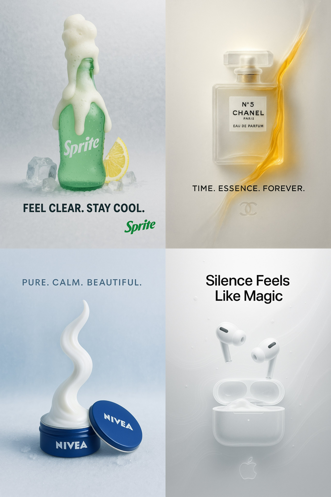

```
[Product by Brand] in a surreal, minimalist paper-glass style advertisement.
The product is centered, crafted from translucent frosted glass-paper, placed against a clean white or softly tinted background.
Soft cinematic lighting creates gentle contrast and ambient shadows.
A single brand color subtly interacts with the scene through glow, mist, liquid, or foam.
Include a bold, elegant 4-word slogan near the product.
The brand logo appears subtly etched, glowing, or printed in a refined manner.
Vertical or square aspect ratio, ultra-detailed, poster-quality, visually soothing and conceptually refined.
```

 [↑返回目录](#toc)

---
## <a id="prompt-212">品牌在悬浮平台上</a> (<a href="https://x.com/TheRelianceAI/status/1942981383820845445" target="_blank" rel="noopener noreferrer">@TheRelianceAI</a>)

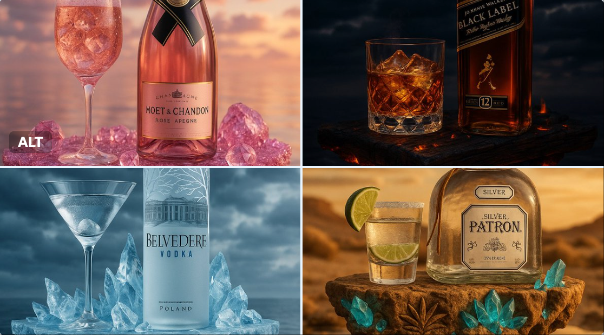


```
A highly detailed cinematic advertisement scene featuring [TYPE OF ALCOHOL, BRAND], standing on a surreal floating platform that visually embodies its spirit. The platform is made of materials that represent the drink’s essence (e.g. sparkling crystals for champagne, rich dark wood for whiskey, frosted ice for vodka), with dramatic reflections and melting details dripping into a calm reflective water surface. A matching glass is filled with the drink, featuring artistic textures (ice, gems, swirling liquid). Soft, colorful sunset sky with dramatic clouds in the background, high-end luxury aesthetic, photorealistic, macro details, dreamy glow, premium product photography.
```

```
一个高度细致的影视广告场景，展示[酒类类型，品牌]，站在一个体现其精神的超现实悬浮平台上。平台由代表饮品本质的材料制成（例如香槟的闪亮水晶、威士忌的浓郁深色木材、伏特加的冰霜），戏剧性的倒影和融化的细节滴入平静的反射水面。一个匹配的玻璃杯装满了饮品，具有艺术纹理（冰块、宝石、旋转的液体）。柔和的彩色日落天空背景中有戏剧性的云朵，高端奢华美学，照片级真实感，宏观细节，梦幻般的光芒，高端产品摄影。
```

 [↑返回目录](#toc)

---
## <a id="prompt-166">几何禅</a> (<a href="https://x.com/LudovicCreator/status/1938330188414132727" target="_blank" rel="noopener noreferrer">@LudovicCreator</a>)


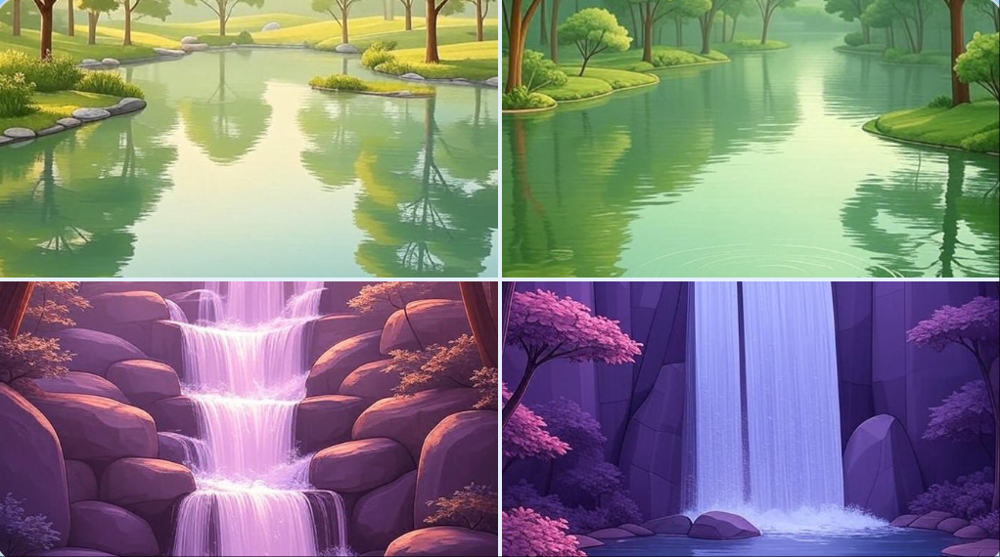


```
[SUBJECT] illustrated in a Geometric Zen Tranquility style, where simplicity and balance are key. Utilize clean lines, basic shapes, and a serene color palette of [COLOR1] and [COLOR2] to evoke a sense of peace and harmony.
```

```
[主题] 以几何禅宗宁静风格插图，其中简单和平衡是关键。利用简洁的线条、基本形状以及 [COLOR1] 和 [COLOR2] 的宁静调色板来唤起和平与和谐的感觉。
```

 [↑返回目录](#toc)

---
## <a id="prompt-185">人体工程学</a> (<a href="https://x.com/TheRelianceAI/status/1938969169296228706" target="_blank" rel="noopener noreferrer">@TheRelianceAI</a>)

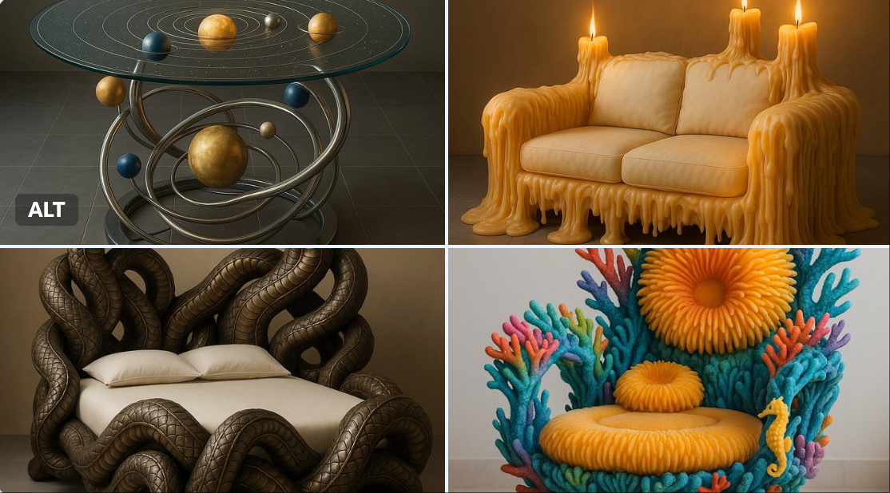

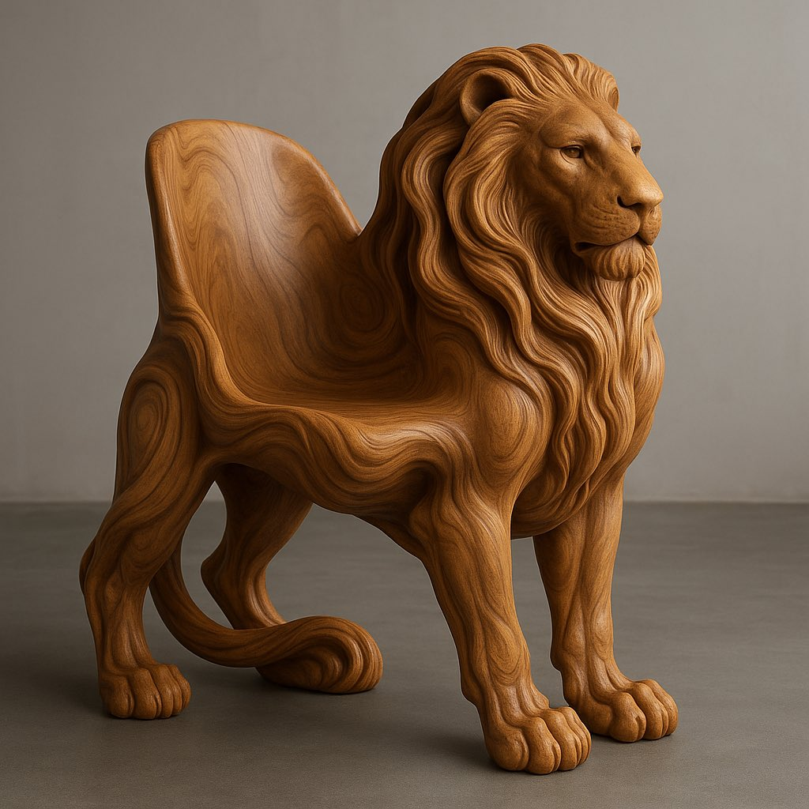

```
Imagine a [piece of furniture] designed in the form of [creature/object/concept]. The design should be highly creative and sculptural, like an art piece. Use organic, flowing shapes and detailed textures. Make sure it remains functional and ergonomic. The goal is for it to be both visually striking and practical —something you’d expect to see as a museum-quality design object
```

```
想象一下以 [生物/物体/概念] 的形式设计的 [家具]。设计应该具有高度的创意和雕塑感，就像一件艺术品。使用有机、流畅的形状和详细的纹理。确保它保持功能正常且符合人体工程学。目标是让它既具有视觉冲击力又具有实用性——您希望看到的是博物馆品质的设计对象
```

 [↑返回目录](#toc)

---
## <a id="prompt-17">未来一瞥</a> (<a href="https://x.com/TheRelianceAI/status/1921900687689941197" target="_blank" rel="noopener noreferrer">@TheRelianceAI</a>)

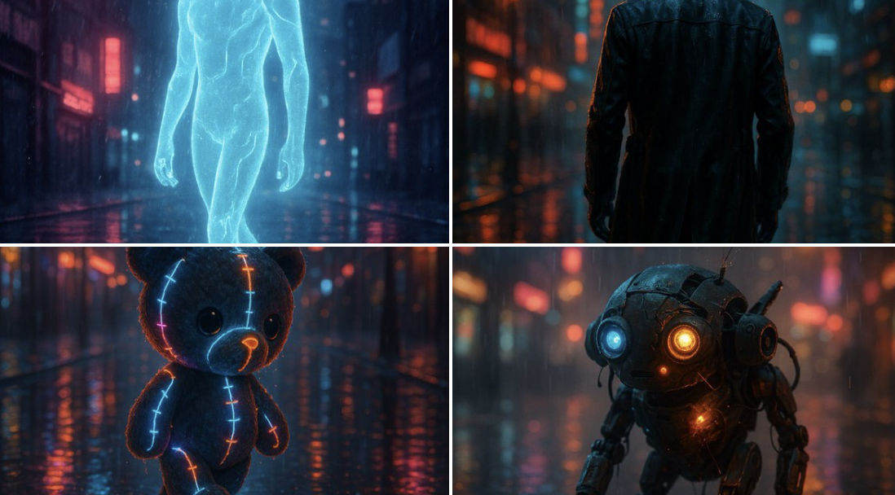

```
A cinematic rendering of [subject] walking through a rain-soaked street at night, illuminated by moody neon lights, reflections dancing on wet pavement, and a hazy urban skyline in the background. The subject feels alive, caught between solitude and electricity.
```

 [↑返回目录](#toc)

---
## <a id="prompt-146">全息叠加效果彩虹渐变</a> (<a href="https://x.com/aziz4ai/status/1936892719202193900" target="_blank" rel="noopener noreferrer">@aziz4ai</a>)


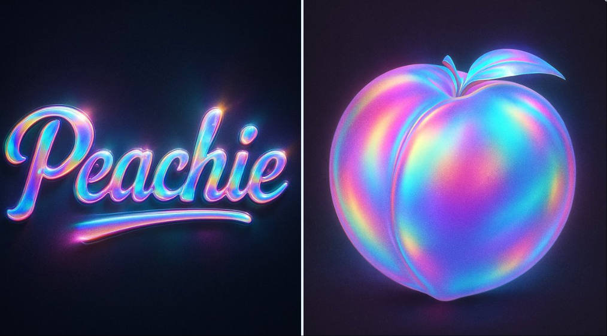

```
Apply a holographic overlay effect on [SUBJECT/TEXT] — dreamy rainbow gradients with soft radial light reflections — smooth glossy surface, high contrast blending — iridescent hues like pink, teal, cyan, and purple — noise texture with soft light blend — subtle shadows and edge lighting to add depth — centered composition on a dark background — ultra-HD, 1:1 ratio, cinematic lighting
```

```
在 [主题/文本] 上应用全息叠加效果 — 梦幻般的彩虹渐变，柔和的径向光反射 — 光滑的光泽表面，高对比度混合 — 粉色、蓝绿色、青色和紫色等彩虹色 — 柔和光线混合的杂色纹理 — 微妙的阴影和边缘照明以增加深度 — 深色背景上的居中构图 — 超高清、1：1 比例、电影照明
```

 [↑返回目录](#toc)

---
## <a id="prompt-243">卡通照片转换</a> (<a href="https://x.com/fy360593/status/1945395833123561930" target="_blank" rel="noopener noreferrer">@fy360593</a>)


```
Transform the character into a digital, half-body cartoon-style portrait. Use a playful, vector-friendly style with clean solid lines, rounded face, oversized googly eyes, and minimal facial details. Show the character from chest up, including shoulders and upper torso. Apply smooth gradient fills to both the character and background for a colorful, soft look. Square format.
```

```
将角色转化为数字化的半身卡通风格肖像。使用适合矢量的俏皮风格，线条干净利落，圆润的脸庞，超大号的玻璃眼球，以及极简的面部细节。展示角色胸部以上的部分，包括肩膀和上半身。对角色和背景都应用平滑的渐变填充，营造色彩丰富、柔和的视觉效果。方形格式。
```

 [↑返回目录](#toc)

---
## <a id="prompt-240">定制的枕头</a> (<a href="https://x.com/TechieBySA/status/1944487528704418041" target="_blank" rel="noopener noreferrer">@TechieBySA</a>)


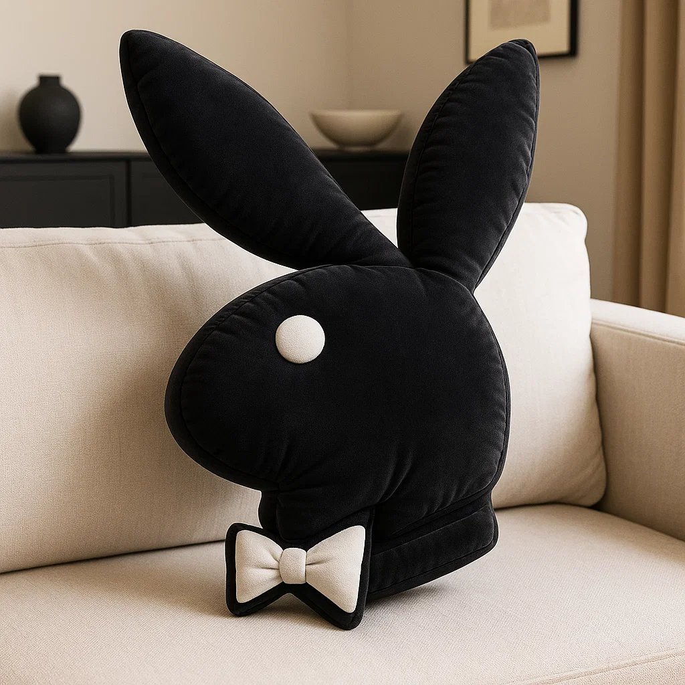

```
Create a high-resolution 3D render of the [BRAND] logo designed as an inflatable, puffy object. The logo should appear soft, rounded, and air-filled – like a plush balloon or blow-up toy. Use a smooth, matte texture with subtle fabric creases and stitching to emphasize the inflatable look. Position the logo at a 45-degree angle to highlight depth and realism. Place the final result on a couch in a stylish living room with furniture and decor that matches the iconic colors of the [BRAND] logo. Output dimension: 1080x1080.
```

```
创建一个高分辨率的 3D 渲染图，将[BRAND]标志设计成一个充气、蓬松的物体。标志应看起来柔软、圆润、充气——像一个毛绒气球或充气玩具。使用光滑的哑光纹理，带有细微的布料褶皱和缝线，以强调充气效果。将标志以 45 度角摆放，以突出深度和真实感。将最终结果放置在风格时尚的客厅沙发上，家具和装饰与[BRAND]标志的标志性颜色相匹配。输出尺寸：1080x1080。
```

 [↑返回目录](#toc)

---
## <a id="prompt-32">卡通风格文本标志</a> (<a href="https://x.com/gnrlyxyz/status/1924466922545877098" target="_blank" rel="noopener noreferrer">@gnrlyxyz</a>)

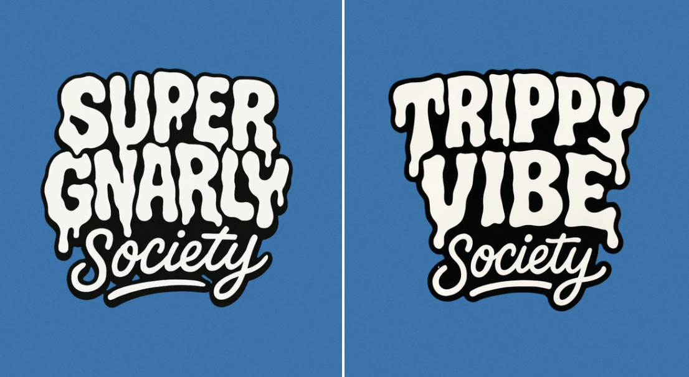

```
Create a bold, warped cartoon-style text design with two distinct layers. The top layer should say “SUPER GNARLY” in warped bubble letters with a melty, drippy texture, like ghost slime or goo. The letters should feel heavy and organic, with a slightly psychedelic or paranormal vibe. The bottom layer should say “SOCIETY” in much smaller, script-like or handwritten-style letters that tuck underneath or nestle between the larger title letters. Both layers should be solid white with thick black outlines. No gradients, shading, or texture. Layout should be playful and a little chaotic, but still readable. Vector friendly. Blue background. Square aspect ratio.
```

 [↑返回目录](#toc)

---
## <a id="prompt-16">品牌星球世界</a> (<a href="https://x.com/TheRelianceAI/status/1923064017477628160" target="_blank" rel="noopener noreferrer">@TheRelianceAI</a>)

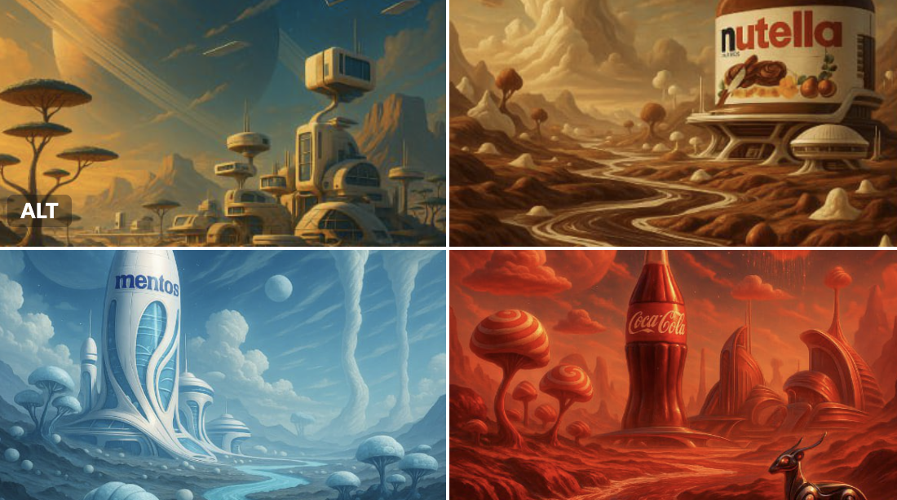

```
Planet [Brand name], Year 3025. A distant world shaped entirely by the essence of the brand. The landscapes echo its core identity — from surreal terrains to fantastical weather patterns. Native flora and fauna embody its signature ingredients and aesthetics. Rivers flow with iconic flavors. Architecture is inspired by its packaging and visual language, fused with futuristic technology. The atmosphere is rich in texture, cinematic lighting, and surreal detail. A dreamlike vision of brand identity reimagined as a sci-fi utopia.
```

 [↑返回目录](#toc)

---
## <a id="prompt-168">水果蜡烛</a> (<a href="https://x.com/TheRelianceAI/status/1938272260726350172" target="_blank" rel="noopener noreferrer">@TheRelianceAI</a>)


```
A minimal still life of a round glass candle filled with [fruit], labeled “[SCENT NAME]”, placed on elegant white silk fabric. The candle glass is [glass color], and the wax matches the fruit color. The scene is softly lit by natural daylight with subtle shadows and smooth highlights. Hyperrealistic texture, clean aesthetic, top-down view, styled like high-end product photography.
```

```
一个装满 [水果] 的圆形玻璃蜡烛的极简静物，标有“[SCENT NAME]”，放在优雅的白色丝绸织物上。蜡烛玻璃为【玻璃色】，蜡与水果色相配。该场景由自然日光柔和照亮，具有微妙的阴影和平滑的高光。超写实的质感，简洁的美感，自上而下的视角，风格像高端产品摄影。
```

 [↑返回目录](#toc)

---
## <a id="prompt-233">超现实鸟类幻想</a> (<a href="https://x.com/B_4AI/status/1944700655249068043" target="_blank" rel="noopener noreferrer">@B_4AI</a>)


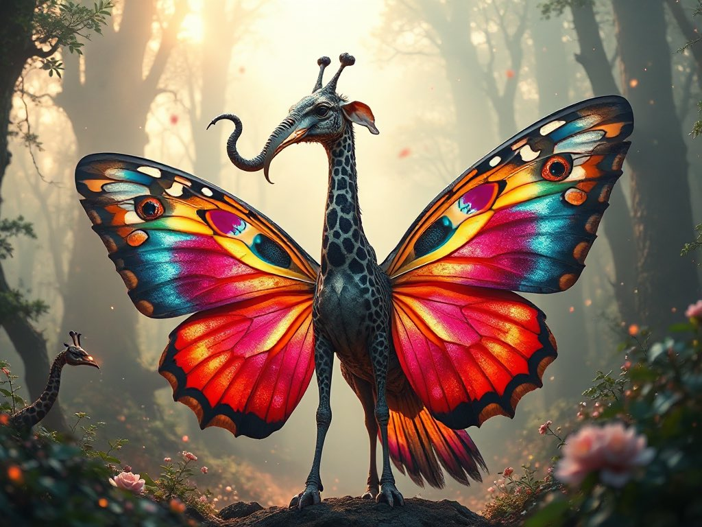

```
A highly detailed and surreal depiction of a mythical bird creature. It has the elegant, colorful body of a butterfly, with vibrant symmetrical wing patterns. Its head is that of a majestic elephant, complete with large ears, a long curling trunk, and ivory tusks, giving it a powerful and ancient aura. A long, spotted giraffe neck connects the body and the head, rising high with grace. The wings are enormous eagle wings, fully extended with dramatic feathers in motion. Its tail is an iridescent peacock tail, fanned out in full display like royal plumage. The creature stands in an enchanted misty forest, bathed in ethereal light and surrounded by glowing particles. Ultra-realistic, cinematic lighting, fantasy atmosphere, hyper-detailed concept art
```

```
对神话鸟类生物的高度详细和超现实的描绘。它拥有优雅、多彩的蝴蝶身体，带有充满活力、对称的翅膀图案。它的头是一头雄伟的大象，长着大耳朵、长长的卷曲的鼻子和象牙，赋予它强大而古老的光环。长长的斑点长颈鹿脖子连接身体和头部，优雅地高高耸立。翅膀是巨大的鹰翅膀，完全伸展，羽毛在运动中戏剧性。它的尾巴是一条彩虹色的孔雀尾巴，像皇家羽毛一样呈扇形展开。这个生物站在一片迷人的迷雾森林中，沐浴在空灵的光芒中，周围环绕着发光的粒子。超逼真的电影般的照明、奇幻的氛围、超详细的概念艺术
```

 [↑返回目录](#toc)

---
## <a id="prompt-190">品牌虚拟人物</a> (<a href="https://x.com/B_4AI/status/1939218188513726675" target="_blank" rel="noopener noreferrer">@B_4AI</a>)

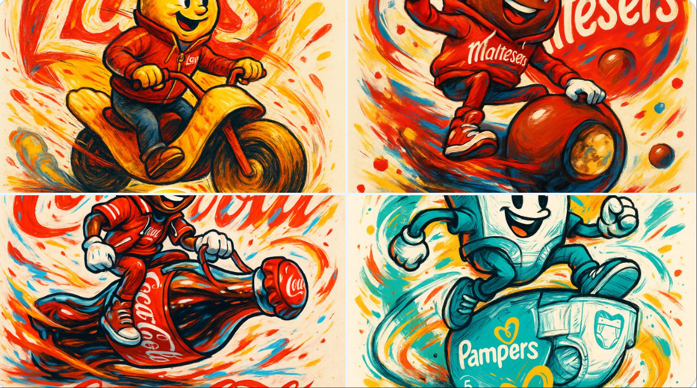


```
A fictional character shaped like a [Brand Name] product, wearing clothing that reflects the brand’s identity, sitting or riding on an oversized version of one of the brand's products as if it were a futuristic vehicle. The design features an expressive, dynamic artistic style full of motion and vibrant colors, with a large abstract version of the brand’s logo in the background. Freely drawn elements and colors representing the brand are scattered throughout. The background is light-colored, and the brand’s logo appears at the bottom. aspect 1:1
```

```
一个形状像 [品牌名称] 商品的虚构人物，穿着反映品牌身份的服装，坐在或骑在该品牌某件商品的超大版本上，就好像它是一辆未来主义的汽车一样。该设计具有富有表现力、充满活力的艺术风格，充满动感和鲜艳的色彩，背景是品牌标志的大型抽象版本。代表品牌的自由绘制元素和颜色散布在整个过程中。背景为浅色，品牌标志出现在底部。外观 1：1
```

 [↑返回目录](#toc)

---
## <a id="prompt-24">新市场中的美妆品牌</a> (<a href="https://x.com/azed_ai/status/1924439540028313693" target="_blank" rel="noopener noreferrer">@azed_ai</a>)

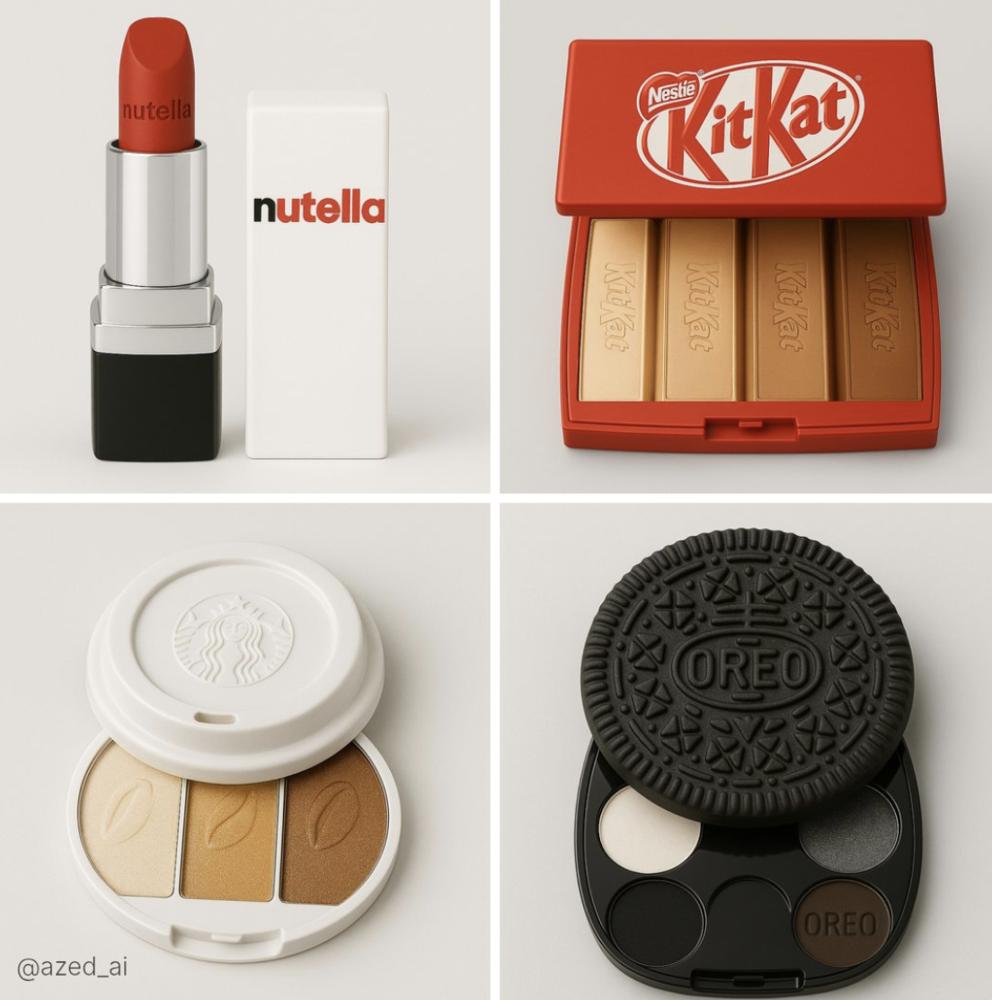

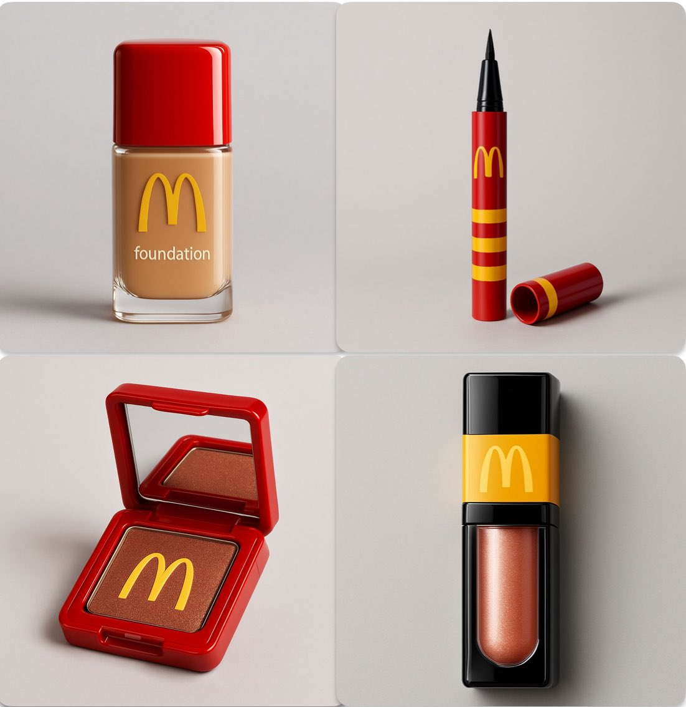

```
A product photography shot of a [PRODUCT] inspired by [FOOD BRAND], placed against a soft light gray background. The product is sharply focused with soft studio lighting. The packaging design includes the official [FOOD BRAND] logo and reflects the brand’s colors and style. The product is sleek, glossy, and realistic, with high detail and elegant presentation. No food items, just the makeup product. Include only the makeup item in the shot. Modern aesthetic, luxury cosmetic branding
```

 [↑返回目录](#toc)

---
## <a id="prompt-89">海洋中三艘不同的奇幻帆船</a> (<a href="https://x.com/BeanieBlossom/status/1925159751169810806" target="_blank" rel="noopener noreferrer">@BeanieBlossom</a>)

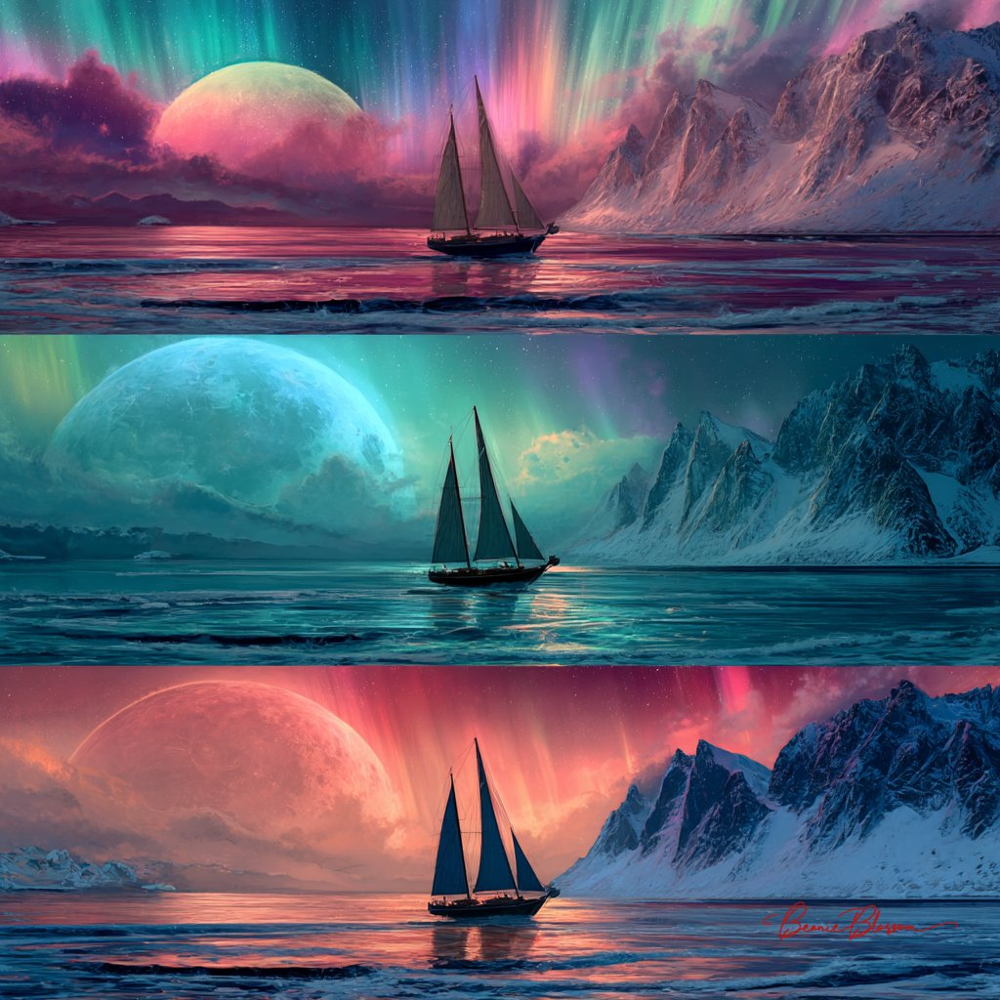

```
Three different fantasy sailboats in the ocean, multiple scenes of beautiful aurora borealis and colorful moons with snowy mountains, a dreamy, fantasy landscape, in the style of digital art.
```

 [↑返回目录](#toc)

---
## <a id="prompt-284">字母毛茸茸形象</a> (<a href="https://x.com/TechieBySA/status/1952036222815424586" target="_blank" rel="noopener noreferrer">@TechieBySA</a>)


```
Render a delightful alphabet character ‘[LETTER]’ as a lovable fuzzy being in square 1080x1080 dimensions. Transform the typography into a living creature where the letterform itself becomes the main structure. Position expressive googly eyes and a cheerful mouth as integrated features of the alphabetic design. Texture the surface with luxurious [COLOR] fuzz that mimics high-quality stuffed animal material with photorealistic fiber details.
Frame against a stark white void to maximize contrast and draw attention to the subject. Infuse the creation with [EMOTION] through strategic facial positioning and expression. Maintain elegant simplicity - avoid anatomical complications or additional appendages. Illuminate using cinematic techniques: primary key lighting to accentuate surface textures, secondary edge illumination for three-dimensional form, plus ambient fill to soften shadow contrasts. Target premium animation studio aesthetics.
```

```
在 1080x1080 像素的正方形尺寸中，将可爱的字母 “[字母]” 渲染成一个讨人喜欢的毛茸茸形象。把字体转化为一个 “活物”，字母本身的形态作为这个形象的主体结构。添加富有表现力的活动眼球和欢快的嘴巴，并将其作为字母设计中不可或缺的组成部分。为形象表面赋予质感，覆盖上浓密的 [颜色] 绒毛 —— 这种绒毛需模拟高品质毛绒玩具的材质，呈现出具有照片级真实感的纤维细节。
以纯净的白色背景衬托主体，通过强烈对比最大程度吸引视线聚焦于这个字母形象。通过精心设计面部位置与表情，为这个创作注入 [情感]。整体保持简洁雅致的风格：避免复杂的身体结构或多余的肢体部件。采用电影级打光技巧进行照明：主光用于突出表面质感，辅助轮廓光塑造立体形态，再配合环境补光柔化阴影对比。最终呈现出顶级动画工作室的美学质感。
```

 [↑返回目录](#toc)

---
## <a id="prompt-172">棱柱形水晶</a> (<a href="https://x.com/alban_gz/status/1938553802400899205" target="_blank" rel="noopener noreferrer">@alban_gz</a>)

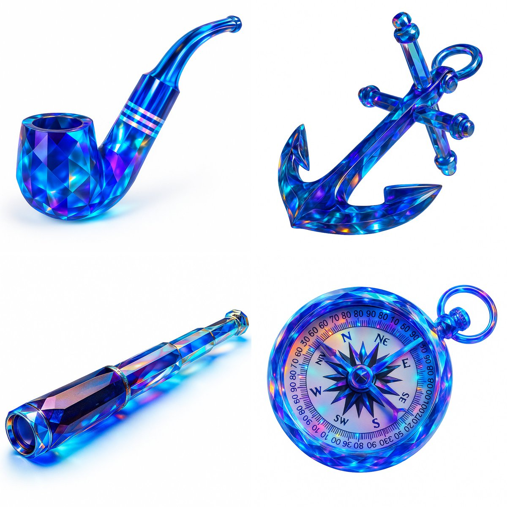

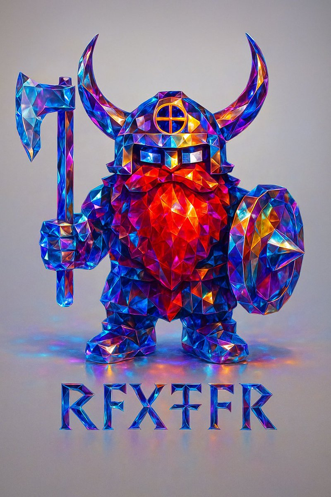

```
Recreate this image using the parameters of the JSON provided.
{
  "style_transfer": {
    "name": "Prismatic Crystal",
    "description": "Applies a highly realistic prismatic crystal style to any object, using precise light dispersion and photographic clarity. Ideal for adding a premium, gem-like finish to metallic or structured forms.",
    "style_attributes": {
      "surface_texture": "polished faceted crystal, sharp and clean edges, flawless transparency",
      "lighting": "soft studio lighting with clear specular highlights and smooth ambient shadows",
      "color_palette": ["sapphire blue", "electric cyan", "sunset amber", "violet", "magenta", "neutral white"],
      "material": "dense optical glass or cut gemstone with prismatic inner reflections",
      "effects": [
        "realistic spectral dispersion",
        "micro-refractions along edges",
        "soft caustics on adjacent surfaces",
        "lens-sharp gloss finish",
        "subtle light blooming in high contrast areas"
      ],
      "contrast": "balanced with high edge definition and natural depth falloff"
    },
    "application_method": {
      "blend_mode": "photographic overlay",
      "intensity": 1.0,
      "masking": "precise masking to preserve structure and cast shadows",
      "edge_enhancement": "controlled sharpening for facets only",
      "preserve_original_shape": true,
      "realism_priority": true,
      "depth_mapping": true,
      "chromatic_aberration_limit": "minimal"
    }
  }
}
```

```
使用提供的 JSON 的参数重新创建此图像。
{
“style_transfer”：{
“name”： “棱柱晶体”，
“description”： “使用精确的光扩散和照片清晰度，将高度逼真的棱柱形水晶样式应用于任何对象。非常适合为金属或结构化形式添加优质的宝石般的饰面。
“style_attributes”：{
“surface_texture”： “抛光的刻面水晶，锋利干净的边缘，无瑕的透明度”，
“lighting”： “柔和的工作室照明，具有清晰的镜面高光和平滑的环境阴影”，
“color_palette”： [“宝石蓝”， “电青色”， “日落琥珀色”， “紫罗兰色”， “品红色”， “中性白”]，
“material”： “密集的光学玻璃或切割宝石，具有棱柱形内部反射”，
“effects”： [
“真实光谱色散”，
“沿边缘的微折射”，
“相邻曲面上的软焦散”，
“镜片般锐利的光泽饰面”，
“高对比度区域中的微妙光晕”
],
“contrast”： “平衡，边缘清晰度高，深度衰减自然”
    },
“application_method”： {
“blend_mode”： “摄影叠加”，
“intensity”：1.0、
“masking”： “精确蒙版以保留结构并投射阴影”，
“edge_enhancement”： “仅针对小平面的受控锐化”，
“preserve_original_shape”： true，
“realism_priority”：true、
“depth_mapping”：true、
“chromatic_aberration_limit”： “最小”
    }
  }
}
```

 [↑返回目录](#toc)

---
## <a id="prompt-56">玻璃盒内的图像可视化</a> (<a href="https://x.com/umesh_ai/status/1925462472825442469" target="_blank" rel="noopener noreferrer">@umesh_ai</a>)

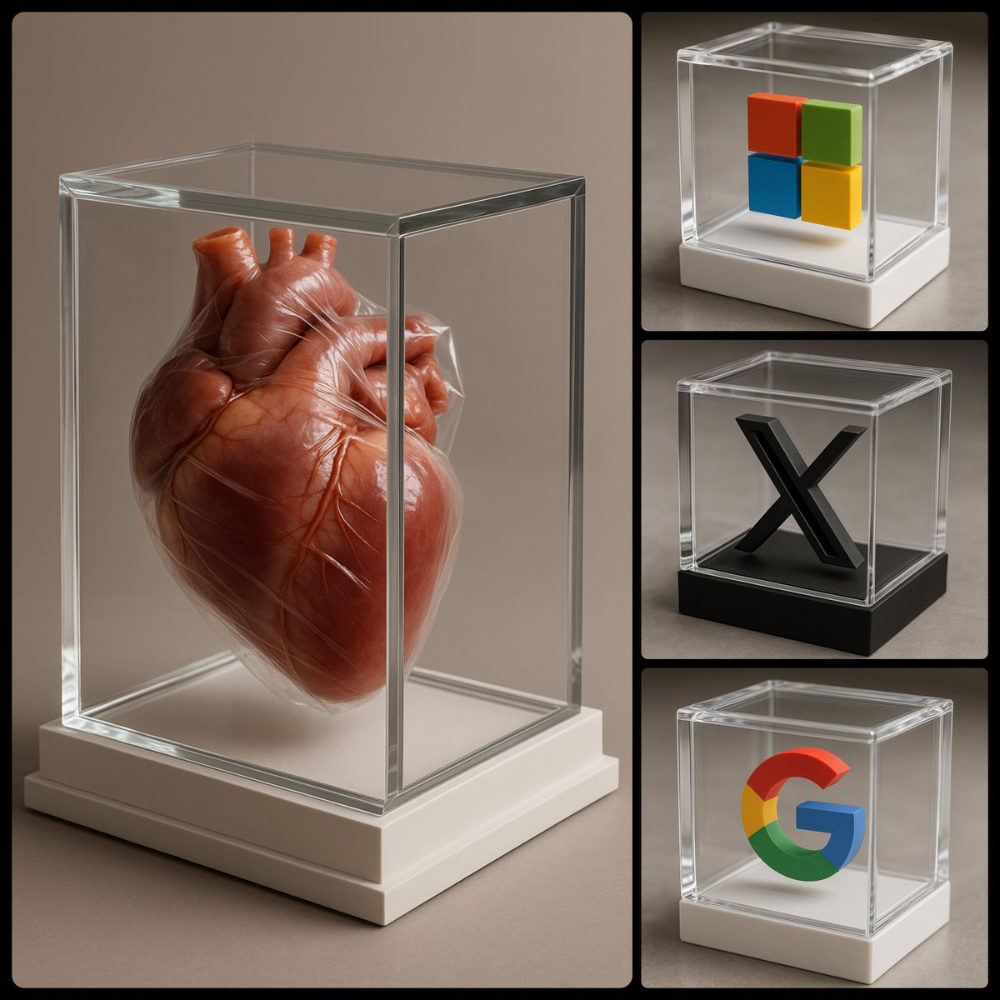

```
photorealistic image of a [COLOR] 3D [SUBJECT] encased in a luxurious transparent box, viewed from an enhanced side angle to better reveal the 3D shape of the [SUBJECT]. The box should be white, exquisitely designed, featuring crystal-clear glass with refined, sharp edges
```

 [↑返回目录](#toc)

---
## <a id="prompt-61">破碎的真相</a> (<a href="https://x.com/TheRelianceAI/status/1925918144163450890" target="_blank" rel="noopener noreferrer">@TheRelianceAI</a>)

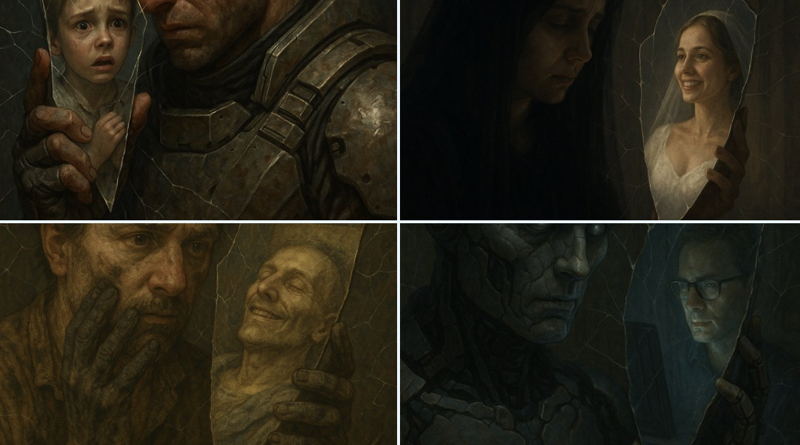

```
A close-up of [SUBJECT 1] holding a mirror shard to their face. The shard reflects a completely different [SUBJECT 2]. Around them, small cracks spread through the air like fractures in invisible glass, warping the space itself.
```

 [↑返回目录](#toc)

---
## <a id="prompt-163">半透明玻璃物品ASMR</a> (<a href="https://x.com/azed_ai/status/1936825522417533274" target="_blank" rel="noopener noreferrer">@azed_ai</a>)


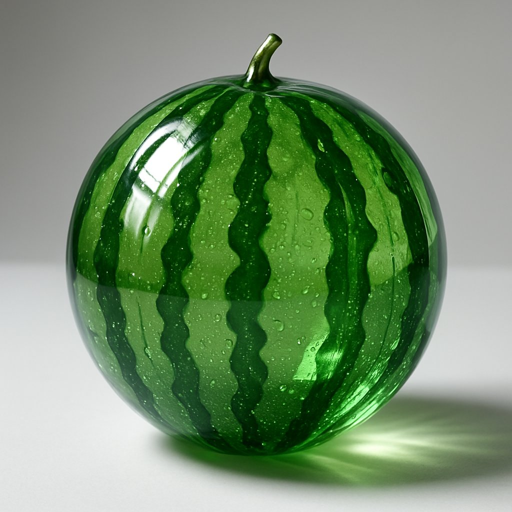

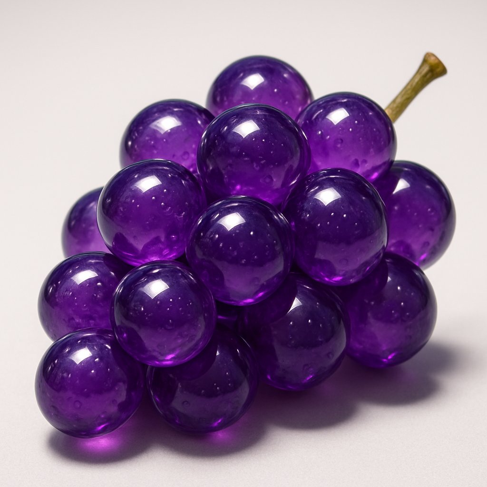

```
Hyper-realistic [fruit name] made of translucent glass, smooth, rounded surface with fine air bubbles inside, placed on a clean surface, sharp lighting with strong reflections and highlights, minimal background, photorealistic, glossy texture, 3D render style, crystal-like appearance, soft shadows, macro photography
```

```
由半透明玻璃制成的超写实 [水果名称]，光滑、圆润的表面，内部有细小的气泡，放置在干净的表面上，具有强烈反射和高光的清晰照明，最小的背景，照片级写实，有光泽的纹理，3D 渲染样式，水晶般的外观，柔和的阴影，微距摄影
```

 [↑返回目录](#toc)

---
## <a id="prompt-260">20世纪20年代亚瑟·拉克姆风格的童话插画</a> (<a href="https://x.com/vkuoo/status/1929708611208728874" target="_blank" rel="noopener noreferrer">@vkuoo</a>)


```
Transform this image into a 1920s fairy tale illustration in the style of Arthur Rackham. Use muted watercolor tones and intricate ink linework. Fill the scene with whimsical forest creatures, twisted tree branches, and hidden magical objects. The overall tone should be mysterious, enchanting, and slightly eerie. Add handwritten calligraphy-style captions and riddles.
```

```
将这张图片转换成20世纪20年代亚瑟·拉克姆风格的童话插画。采用柔和的水彩色调和精致的墨水线条。场景中要充满奇幻的森林生物、扭曲的树枝和隐藏的魔法物品。整体基调应神秘、迷人且略带诡异。添加手写书法风格的说明文字和谜语。
```

 [↑返回目录](#toc)

---
## <a id="prompt-75">可爱干净的底座立体模型</a> (<a href="https://x.com/CharaspowerAI/status/1925593447802540408" target="_blank" rel="noopener noreferrer">@CharaspowerAI</a>)

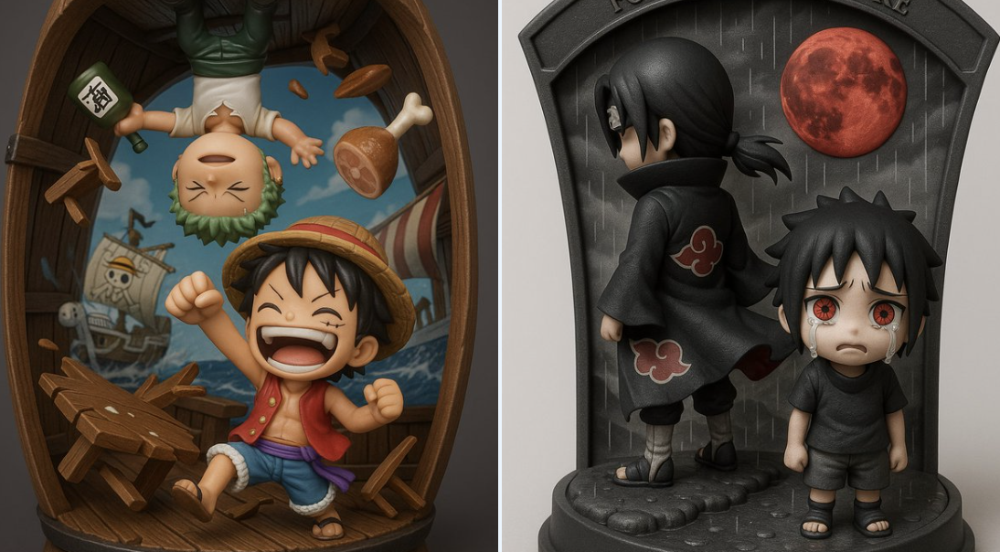

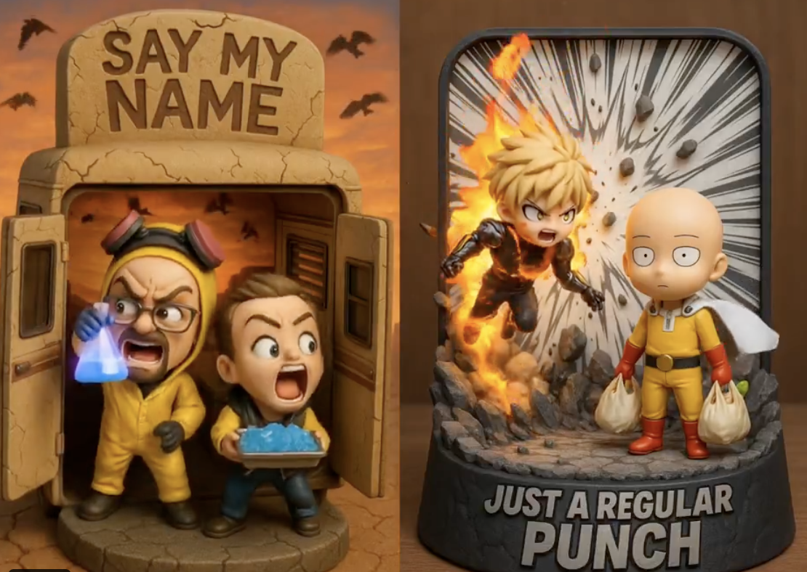

```
Highly detailed 3D-rendered chibi figurine diorama of [Character A] and [Character B], captured in a [scene/action], inside a [thematic display case shape] with [material]. The background features [visual effects: debris, aura, lightning, scenery], dynamic pose. The title "[custom phrase]" is embossed at the top in [font/style], matching the tone. Lighting is [studio, cinematic, ambient], color palette of [main colors]. Designed in a collectible, stylized, viral-friendly aesthetic.
```

 [↑返回目录](#toc)

---
## <a id="prompt-152">新动漫风格</a> (<a href="https://x.com/Artedeingenio/status/1936716854090760197" target="_blank" rel="noopener noreferrer">@Artedeingenio</a>)

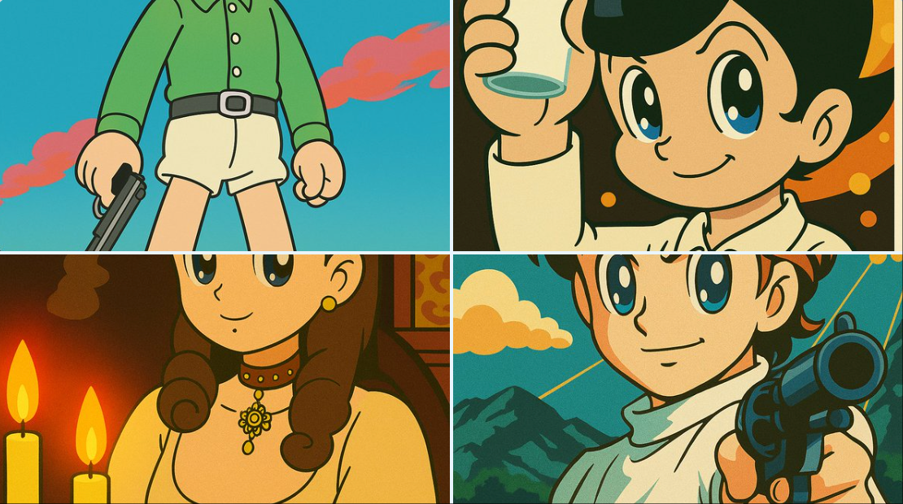

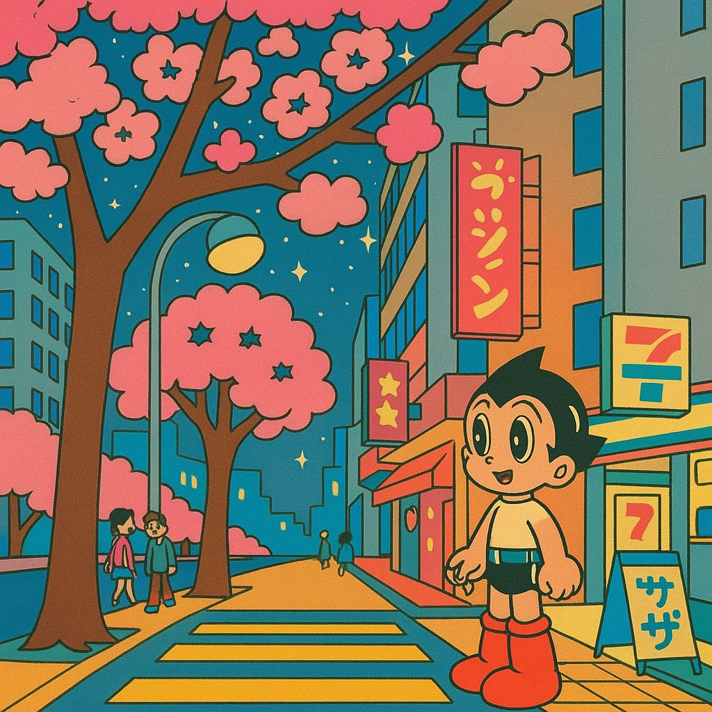

```
Transform this image into a 1960s Tezuka-style illustration. Use big, rounded expressive eyes with bright highlights. Simplify the anatomy with soft, rounded limbs and clean linework. Avoid detailed textures — focus on smooth color fills and strong silhouettes. The final image should resemble a vintage anime frame from Astro Boy, with an optimistic, futuristic feel.
```

```
将此图像转换为 1960 年代手冢风格的插图。使用大而圆、富有表现力的眼睛，并带有明亮的高光。通过柔软、圆润的四肢和简洁的线条简化解剖结构。避免细节纹理 - 专注于平滑的颜色填充和强烈的轮廓。最终的图像应该类似于 Astro Boy 的老式动漫框架，具有乐观、未来主义的感觉。
```

 [↑返回目录](#toc)

---
## <a id="prompt-43">Airbnb风格的图标</a> (<a href="https://x.com/hc_dsn/status/1924665909073084507" target="_blank" rel="noopener noreferrer">@hc_dsn</a>)

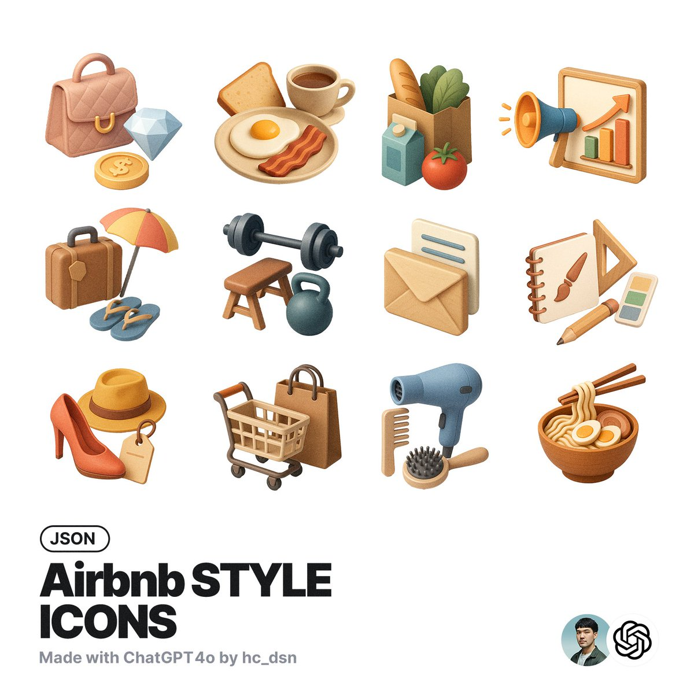

```
generate[concept] icon with this json style:
{
    "icon_style": {
        "perspective": "isometric",
        "geometry": {
            "proportions": "1:1 ratio canvas, with objects fitting comfortably within margins",
            "element_arrangement": "central dominant object, with supporting elements symmetrically or diagonally placed"
        },
        "composition": {
            "element_count": "2–4 main objects",
            "spatial_depth": "layered to create sense of dimension and slight elevation",
            "scale_consistency": "uniform object scale across icon set",
            "scene_density": "minimal to moderate, maintaining clarity and visual focus"
        },
        "lighting": {
            "type": "soft ambient light",
            "light_source": "subtle top-right or front-top direction",
            "shadow": "gentle drop shadows below and behind objects",
            "highlighting": "mild edge illumination to define forms"
        },
        "textures": {
            "material_finish": "semi-matte to satin surfaces",
            "surface_treatment": "smooth with light tactile variation (e.g., wood grain, soft textures)",
            "texture_realism": "stylized naturalism without hyper-realistic noise"
        },
        "render_quality": {
            "resolution": "high-resolution octane 3D rendering",
            "edge_definition": "crisp, no outlines; separation achieved via lighting and depth",
            "visual_clarity": "clean, readable shapes with minimal clutter"
        },
        "color_palette": {
            "tone": "naturalistic with slight saturation boost",
            "range": "harmonious muted tones with gentle contrast",
            "usage": "distinct colors per object to improve identification and readability"
        },
        "background": {
            "color": "#FFFFFF",
            "style": "pure white, flat",
            "texture": "none"
        },
        "stylistic_tone": "premium, friendly, clean with lifestyle or service-oriented appeal",
        "icon_behavior": {
            "branding_alignment": "neutral enough for broad applications",
            "scalability": "legible at small and medium sizes",
            "interchangeability": "part of a cohesive icon system with interchangeable subject matter"
        }
    }
}
```

 [↑返回目录](#toc)

---
## <a id="prompt-449">你生气的时候其实也可以很可爱</a> (<a href="https://x.com/gizakdag/status/1992241809691709598" target="_blank" rel="noopener noreferrer">@gizakdag</a>)

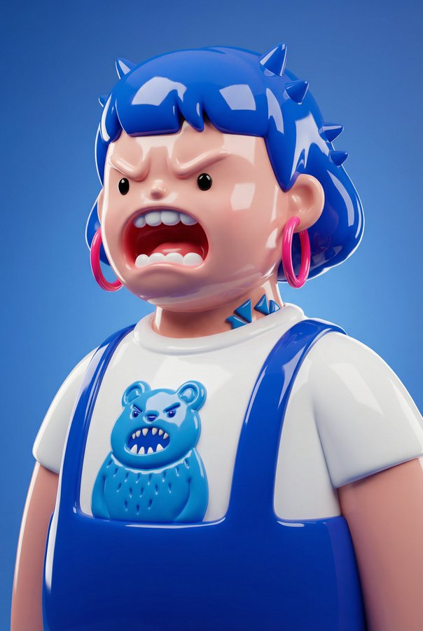

```
Transform the subject into a glossy designer-toy character inspired by the reference image. Smooth and rounded proportions, chubby silhouette, exaggerated cartoon expression, large open mouth, tiny dot eyes, and bold sculpted details. High-gloss vinyl surface with sharp reflections, saturated primary colors (especially bright blue and pink), stylized spikes and simple shapes. Toy figurine aesthetic, studio lighting, clean background, dramatic shadows, ultra-polished plastic texture
```

```
根据参考图片，将对象转化为一个光鲜亮丽的设计师玩具角色。角色比例圆润流畅，轮廓丰满，表情夸张卡通，大嘴巴张开，眼睛小巧精致，细节刻画鲜明。表面采用高光泽乙烯基材质，反光强烈，色彩饱和度高（尤其是亮蓝色和粉色），造型别致，线条简洁。整体风格偏向玩具人偶，采用摄影棚灯光，背景干净，阴影效果强烈，塑料质感极佳。
```

 [↑返回目录](#toc)

---
## <a id="prompt-227">糖果形状物品</a> (<a href="https://x.com/TheRelianceAI/status/1944695498025173261" target="_blank" rel="noopener noreferrer">@TheRelianceAI</a>)

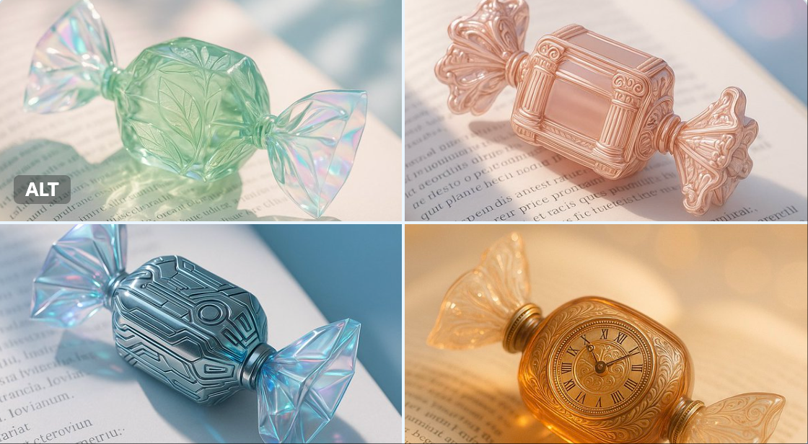

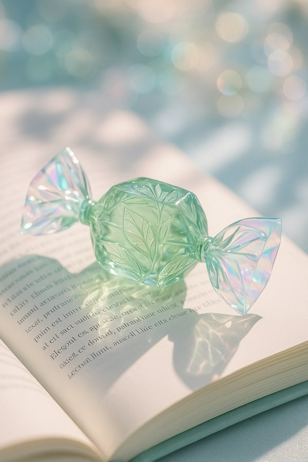

```
A glossy candy-shaped perfume bottle resting on an open book, soft morning light, delicate shadows, dreamy bokeh background with iridescent cellophane wrapping. The candy design is inspired by [YOUR STYLE]
```

```
一个闪亮的糖果形状的香水瓶静置在一本打开的书上，柔和的晨光，细腻的阴影，梦幻的背景虚化效果，带有彩虹色透明膜包装。糖果设计灵感来源于[你的风格]
```

 [↑返回目录](#toc)

---
## <a id="prompt-137">透视一切</a> (<a href="https://x.com/aziz4ai/status/1934528170264572227" target="_blank" rel="noopener noreferrer">@aziz4ai</a>)

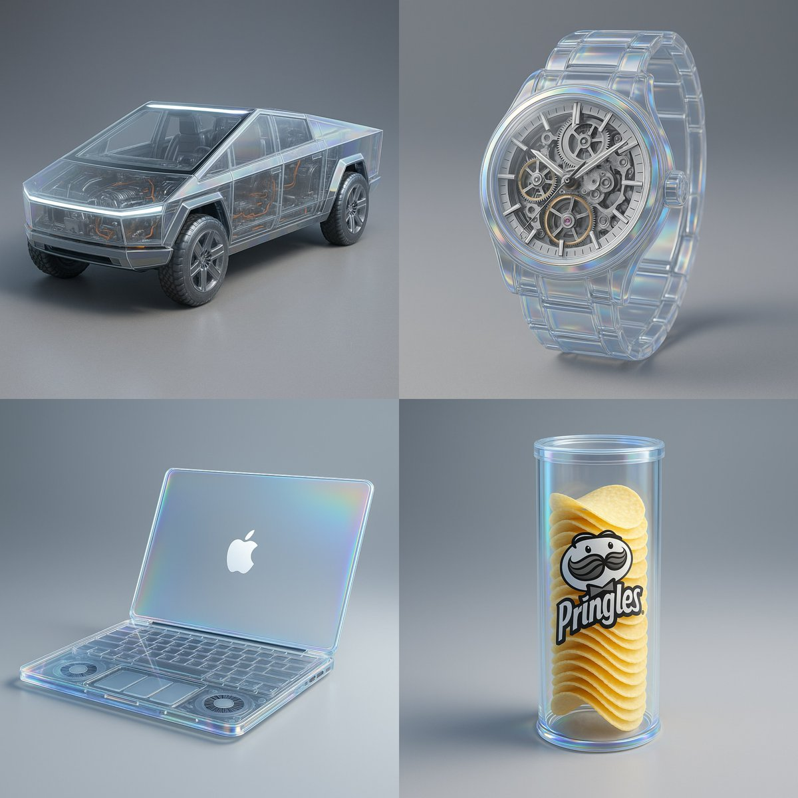


```
a fully transparent [product] made of ultra-clear iridescent glass, showing all internal components in photorealistic detail. The outer shell is glossy, refracts subtle rainbow colors, and reveals the product’s structure and mechanics. Scene lit with high-Kelvin studio lighting (~7000K) on a neutral background. The product maintains its real proportions, materials, and branding.
```

```
由超透明虹彩玻璃制成的完全透明 [产品]，以逼真的细节展示所有内部组件。外壳有光泽，折射出微妙的彩虹色，并揭示产品的结构和机械。在中性背景上使用高开尔文工作室照明 （~7000K） 照亮的场景。该产品保持其真实的比例、材料和品牌。
```

 [↑返回目录](#toc)

---
## <a id="prompt-54">三种形状和三种颜色</a> (<a href="https://x.com/umesh_ai/status/1925569394924740817" target="_blank" rel="noopener noreferrer">@umesh_ai</a>)

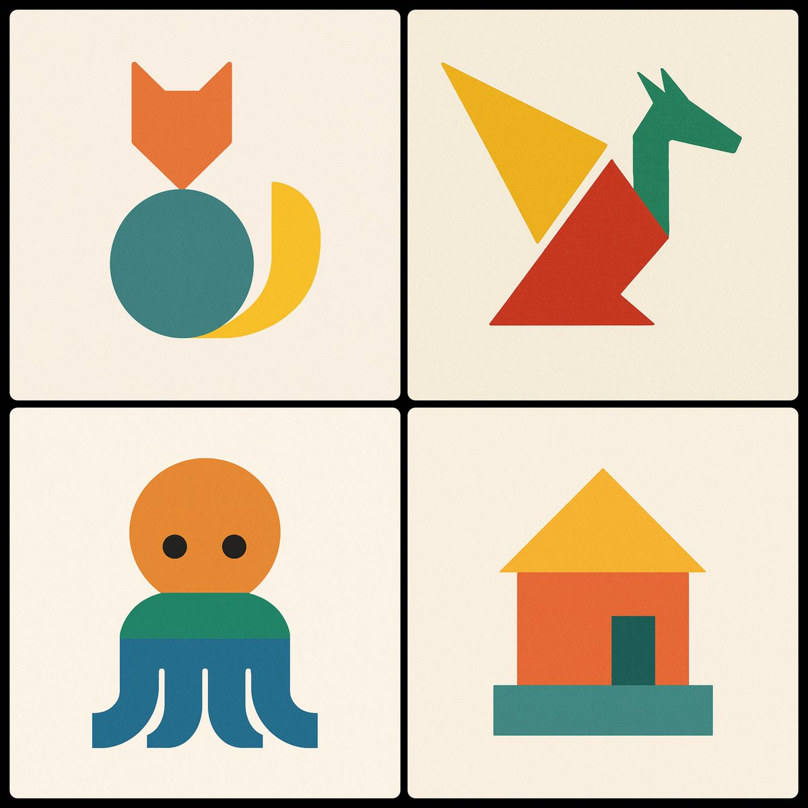

```
Create a minimalist image of a [SUBJECT] using three geometric shapes, using a different color in each shape
```

 [↑返回目录](#toc)

---
## <a id="prompt-149">Gorillaz风格角色</a> (<a href="https://x.com/gnrlyxyz/status/1936834901552111768" target="_blank" rel="noopener noreferrer">@gnrlyxyz</a>)


```
Create a stylized full-body portrait of [your subject] in the Gorillaz character aesthetic. Give the character an exaggeratedly lanky build with long, skinny legs and narrow arms. Use simplified, angular features and thick, bold outlines. Style the hair to be spiky, tousled, or exaggerated, in a non-natural color like [blue or green]. The eyes must be blank white with no pupils. Use flat, solid colors only. No gradients, shadows, or textures. Background should be a single flat color. Design must be vector friendly and print ready.
```

```
在 Gorillaz 角色美学中为 [您的主题] 创建风格化的全身肖像。给角色一个夸张的瘦长身材，长而瘦的腿和狭窄的手臂。使用简化的棱角分明的特征和粗体轮廓。将头发设计成尖尖的、凌乱的或夸张的，用非自然的颜色，如 [蓝色或绿色]。眼睛必须是空白的白色的，没有瞳孔。仅使用纯色。没有渐变、阴影或纹理。背景应为单一的平面颜色。设计必须对矢量友好并准备好打印。
```

 [↑返回目录](#toc)

---
## <a id="prompt-15">树屋</a> (<a href="https://x.com/TheRelianceAI/status/1923451797869371701" target="_blank" rel="noopener noreferrer">@TheRelianceAI</a>)

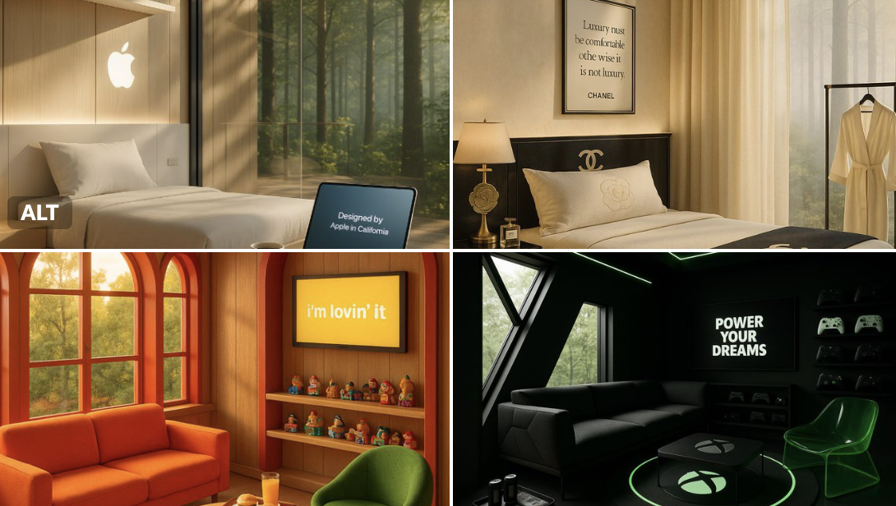

```
A quiet morning in a luxury treehouse retreat created by [BRAND NAME] — golden light pours through windows framed in the brand’s signature colors. A cozy seating area features playful, thematic furniture, and a circular rug inspired by [BRAND SYMBOL OR PRODUCT]. The coffee table bears the embossed logo, while a screen on the wall loops the phrase: “[BRAND SLOGAN].” A curated display of iconic items adds a sense of nostalgia. Subtle ambient lighting glows in brand tones, and a tray with signature treats sits near the window. It’s cozy, imaginative, and unmistakably [BRAND NAME]
```

 [↑返回目录](#toc)

---
## <a id="prompt-285">卡通插图药丸形象</a> (<a href="https://x.com/gnrlyxyz/status/1951976345514487951" target="_blank" rel="noopener noreferrer">@gnrlyxyz</a>)

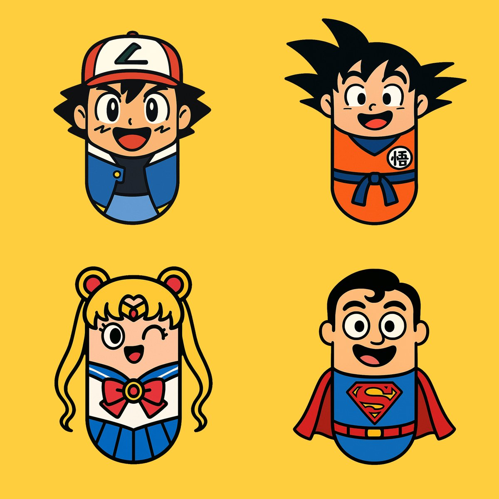

```
Create a stylized cartoon illustration of [CHARACTER] with a smooth, vertical pill-shaped body (rounded on top and bottom, symmetrical left to right). The body should be a single, unified capsule shape with no limbs. Do not alter the character's core design or personality, but simplify them into this playful capsule form. Use bold black outlines, flat vector-style coloring, and simple geometric features. Give the character large, expressive eyes and a fun, exaggerated facial expression that reflects their original personality. If the character wears clothes, include a minimal, iconic version of their outfit. If they do not, keep the body clean and unclothed. Use a solid bright yellow background. Center the character in a square frame. Use only flat colors. No gradients. No shadows. No texture. No smudging. The final result should be clean, modern, vector-friendly, and clearly pill-shaped.
```

```
为 [CHARACTER] 创建一幅风格化的卡通插图，其身体呈平滑的垂直药丸状（上下呈圆形，左右对称）。身体应为单一、统一的胶囊形状，没有四肢。不要改变角色的核心设计或个性，而是将其简化为这种俏皮的胶囊形状。使用粗黑色轮廓、扁平矢量风格的配色和简单的几何特征。赋予角色大而富有表现力的眼睛和有趣、夸张的面部表情，以反映其原始个性。如果角色穿着衣服，请包含其服装的极简标志性版本。如果没有，请保持身体干净，不穿衣服。使用纯亮黄色背景。将角色置于方形框架的中心。仅使用扁平颜色。不要使用渐变。不要使用阴影。不要使用纹理。不要使用晕染。最终结果应该干净、现代、矢量友好且清晰的药丸形状。
```

 [↑返回目录](#toc)

---
## <a id="prompt-380">卡通插图</a> (<a href="https://x.com/Arminn_Ai/status/1978164256240501226" target="_blank" rel="noopener noreferrer">@Arminn_Ai</a>)


```
A cartoon illustration of [OBJECT],
photographed in a clean minimal studio setup. All objects remain realistic and three-dimensional, but have been transformed into expressive cartoon characters:
• [DESCRIPTION & EMOTION]  
  (describe facial features, expressions, and emotional tone for each object)
• [ACTION]  
• doodle lines are black, slightly uneven, and hand-drawn —  like quick expressive sketchbook strokes drawn directly on the objects.
Style: hybrid mix of real product photography and cartoon doodle overlay.  
Background: solid pastel [COLOR], clean and minimal.
Lighting: soft, even, studio-style — subtle highlights and gentle shadows; no harsh light.
Mood: [MOOD / THEME — e.g. playful, melancholic, poetic, humorous].  
Keywords: hybrid photo-doodle, product cartoon, expressive characters, minimal pastel background. Aspect ratio: 1:1
```

```
[OBJECT]的卡通插图，
在简洁干净的工作室环境中拍摄。所有物体都保持了真实感和三维立体感，但又被转化成了富有表现力的卡通人物：
• [描述和情感]
（描述每个物体的面部特征、表情和情绪基调）
• [行动]
• 涂鸦线条是黑色的，略微不均匀，并且是手绘的——就像直接在物体上绘制的快速富有表现力的素描本笔触一样。
风格：真实产品摄影和卡通涂鸦叠加的混合。
背景：纯色粉彩[颜色]，干净、简约。
灯光：柔和、均匀、工作室风格——微妙的高光和柔和的阴影；没有刺眼的光线。
心情：[心情/主题 — 例如好玩、忧郁、诗意、幽默]。
关键词：混合照片涂鸦、产品卡通、富有表现力的人物、极简柔和背景。长宽比：1:1
```

 [↑返回目录](#toc)

---
## <a id="prompt-107">超级动物英雄</a> (<a href="https://x.com/Kerroudjm/status/1931742320233230743" target="_blank" rel="noopener noreferrer">@Kerroudjm</a>)

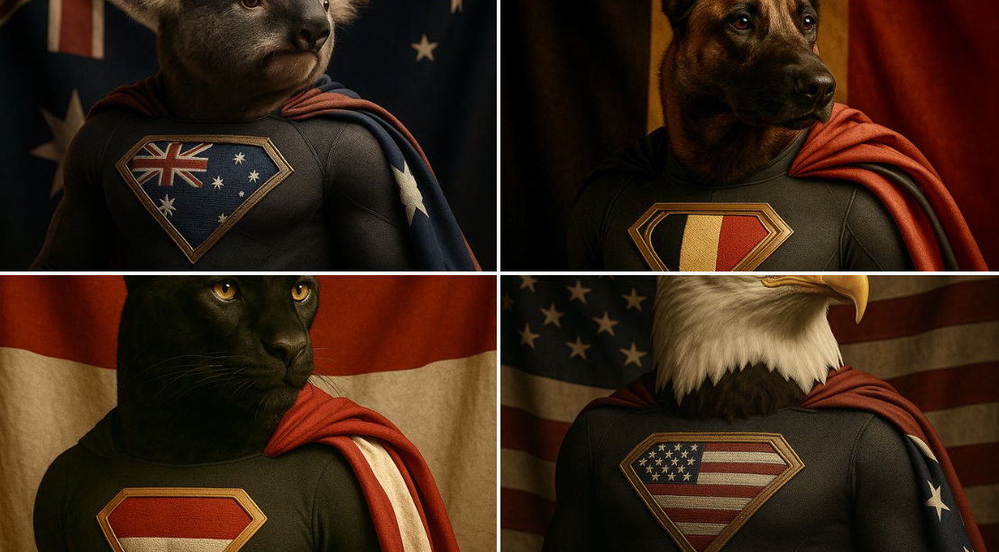

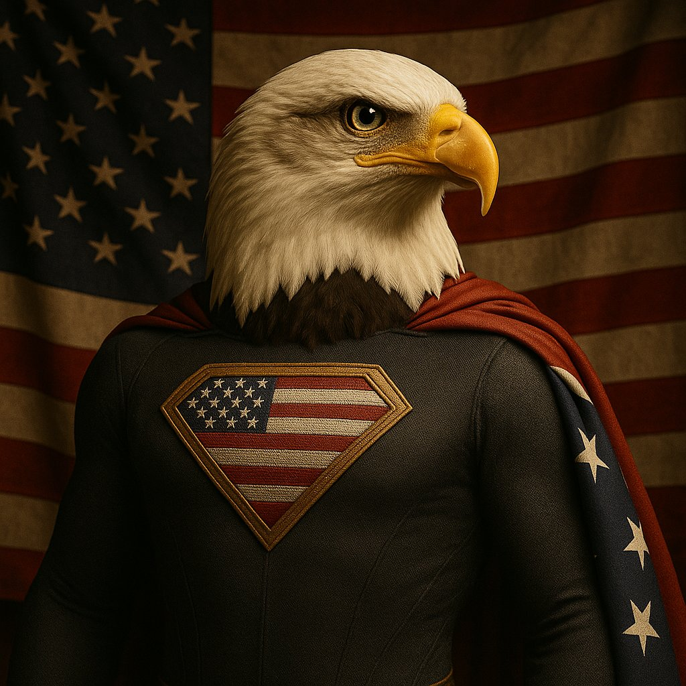

```
A hyper-realistic square 1:1 portrait of a [YOUR ANIMAL] standing in a heroic pose, facing slightly left. The animal wears a textured dark gray superhero suit, form-fitting and matte, with visible fabric grain and subtle seams.

On its chest, inside a golden metallic Superman-style diamond emblem, is a fabric-embroidered version of the [COUNTRY] national flag (realistic stitching, slightly raised).

Draped over the animal’s shoulder is a flowing cape designed from the [COUNTRY] flag, with rich fabric folds and natural weight.

Behind the subject, use a realistic fabric backdrop displaying the full [COUNTRY] flag, slightly out of focus to add depth, with soft shadows to enhance realism.

Lighting should be warm and directional (studio-style), emphasizing the animal’s fur texture, suit material, and the contours of a subtly muscular chest. The overall tone is dramatic and cinematic, with a warm color grading and no excessive contrast. The head must be fully visible — no cropping.
```

 [↑返回目录](#toc)

---
## <a id="prompt-22">自定义气球</a> (<a href="https://x.com/ZHO_ZHO_ZHO/status/1924121078559125841" target="_blank" rel="noopener noreferrer">@ZHO_ZHO_ZHO</a>)

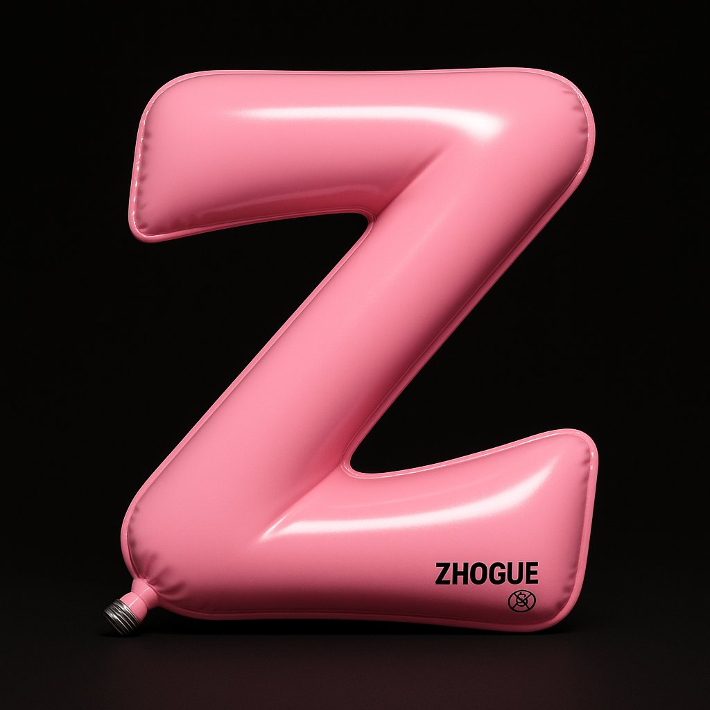

```
一件高度写实的 3D 装置艺术：字母 Z 被设计成充气球囊造型，整体形态如同流畅弯曲的“Z”字路径，由两段斜线和一个折角构成，边缘略微卷翘，充满柔软的气压感。

视角为正面稍仰视角（约10°）的正交投影，主体置于画面正中央，占据几乎全部画幅，背景为纯黑色，形成类似剧院聚光灯的聚焦舞台效果。

材质为高弹性亮面 PVC，表面涂有高光清漆。主色为柔亮粉色（#FF96AC），阴影部分渐变为淡紫粉色，表面同时具备镜面高光和柔和漫反射，呈现丝滑、饱满、有张力的视觉质感。

左下角可见一个金属螺旋气嘴（银灰色），尺寸很小但极具真实感，暗示其为充气物体。右下笔画末端印有一串黑色的警示文字和安全图标，以“ZHOGUE”风格排版，呼应充气玩具视觉语言。

主光源来自左上方约 35°，呈现清晰的硬边聚光灯效果：在顶部折角与中央斜线区域形成椭圆形白色高光，内折阴影区带有柔和的粉紫色内反射。

辅光来自右后方，轻柔描边顶部和转折边缘，使形体与黑背景分离，整体光比约为 1:2，保持色彩通透与立体感。亮区色温偏冷，营造冷暖对比，进一步突显质感。

球囊表面略显鼓胀，折角与转折区域有尖锐的折痕，带来软体与几何的视觉张力。最深的转折处投下细长阴影，仿佛即将破裂；下方末端则有轻微拉扯感，如气球尾部即将被牵动。

整体概念融合了字母结构与充气玩具的材质语言，通过夸张体积、真实光感与极简舞台感构建出“字母也能呼吸”的视觉冲击，呈现理性几何与感性触觉的碰撞。
```

 [↑返回目录](#toc)

---
## <a id="prompt-159">渲染宝石</a> (<a href="https://x.com/alban_gz/status/1936820704713875818" target="_blank" rel="noopener noreferrer">@alban_gz</a>)

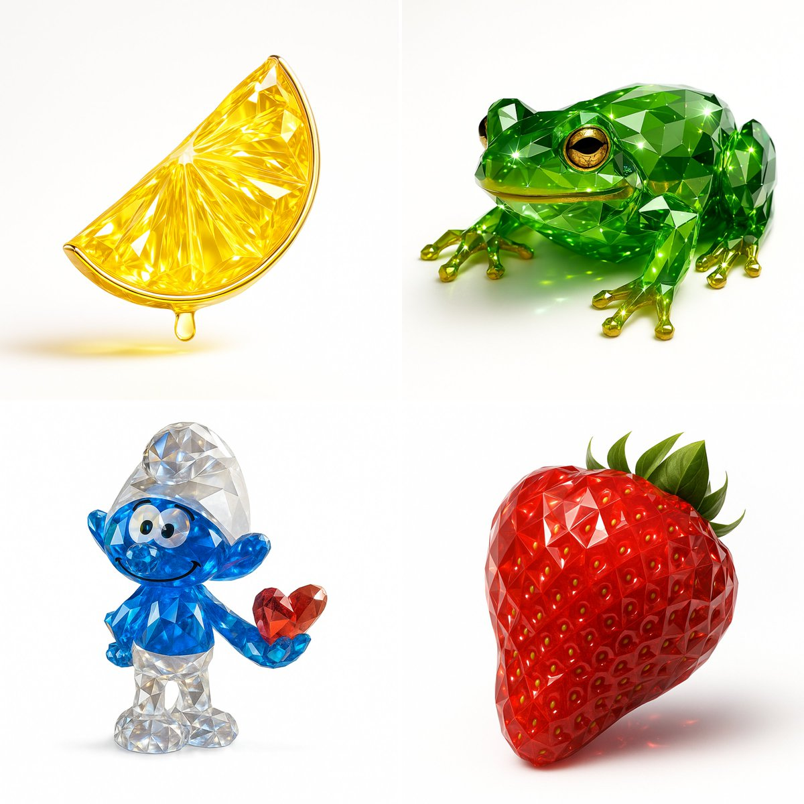

```
Recreate this image using the pamareters of the JSON provided.
{
  "name": "Gemstone Render",
  "object": {
    "type": "auto",
    "detected_color": "auto",
    "form": "realistic, natural form preserved",
    "material": "crystal or faceted gemstone glass",
    "surface": "precision-cut facets, sharp reflections",
    "transparency": "high clarity with light refraction",
    "internal_features": "color depth, internal shimmer, and light dispersion"
  },
  "color_and_light": {
    "primary_color": "{detected_color}",
    "highlight_effects": "specular highlights, gemstone brilliance, caustics",
    "lighting_setup": "studio lighting with white or soft background",
    "metallic_accents": {
      "enabled": true,
      "material": "gold or chrome",
      "application": "rim, stem, or edge detailing"
    }
  },
  "style": {
    "artistic_style": [
      "photorealistic 3D render",
      "Gemstone Render Style",
      "luxury object visualization"
    ],
    "design_language": [
      "faceted precision modeling",
      "jewelry-like rendering",
      "optical depth and brilliance"
    ]
  },
  "technical_details": {
    "render_engine": [
      "Blender with Cycles",
      "Cinema 4D + Redshift/Octane"
    ],
    "rendering_techniques": [
      "physically-based rendering (PBR)",
      "ray tracing",
      "global illumination"
    ],
    "resolution": "ultra high-res (4K–8K)",
    "post_processing": [
      "subtle glow",
      "enhanced reflections",
      "color-preserving contrast boost"
    ]
  }
```

```
使用提供的 JSON 的 pamareters 重新创建此图像。
{
“name”： “宝石渲染”，
“对象”： {
“type”： “auto”， //类型
“detected_color”： “auto”，
“form”： “保留真实、自然的形式”，
“material”： “水晶或刻面宝石玻璃”，
“surface”： “精确切割的刻面，清晰的反射”，
“transparency”： “高清晰度，光线折射”，
“internal_features”： “颜色深度、内部微光和光色散”
  },
“color_and_light”： {
“primary_color”： “{detected_color}”，
“highlight_effects”： “镜面高光、宝石亮度、焦散”，
“lighting_setup”： “白色或柔和背景的工作室照明”，
“metallic_accents”： {
“enabled”： true 和
“material”： “金或铬”，
“application”： “边缘、茎或边缘细节”
    }
  },
“样式”： {
“artistic_style”：[
“逼真的 3D 渲染”，
“Gemstone Render Style”（宝石渲染样式）、
“奢侈品对象可视化”
],
“design_language”：[
“faceted precision modeling”，
“珠宝般的渲染”，
“光学深度和亮度”
    ]
  },
“technical_details”： {
“render_engine”：[
“带循环的 Blender”，
“Cinema 4D + Redshift/Octane”
],
“rendering_techniques”：[
“基于物理的渲染 （PBR）”，
“光线追踪”，
“全局照明”
],
“resolution”： “超高分辨率 （4K–8K）”，
“post_processing”：[
“微妙的光芒”，
“增强反射”，
“保色对比度提升”
    ]
  }
```

 [↑返回目录](#toc)

---
## <a id="prompt-255">头部的几何肖像</a> (<a href="https://x.com/TechieBySA/status/1954831239996694902" target="_blank" rel="noopener noreferrer">@TechieBySA</a>)

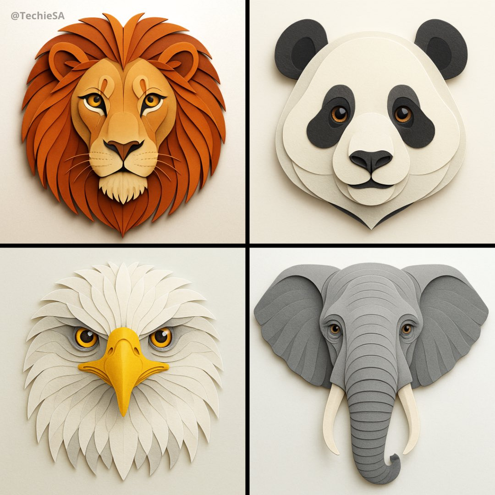

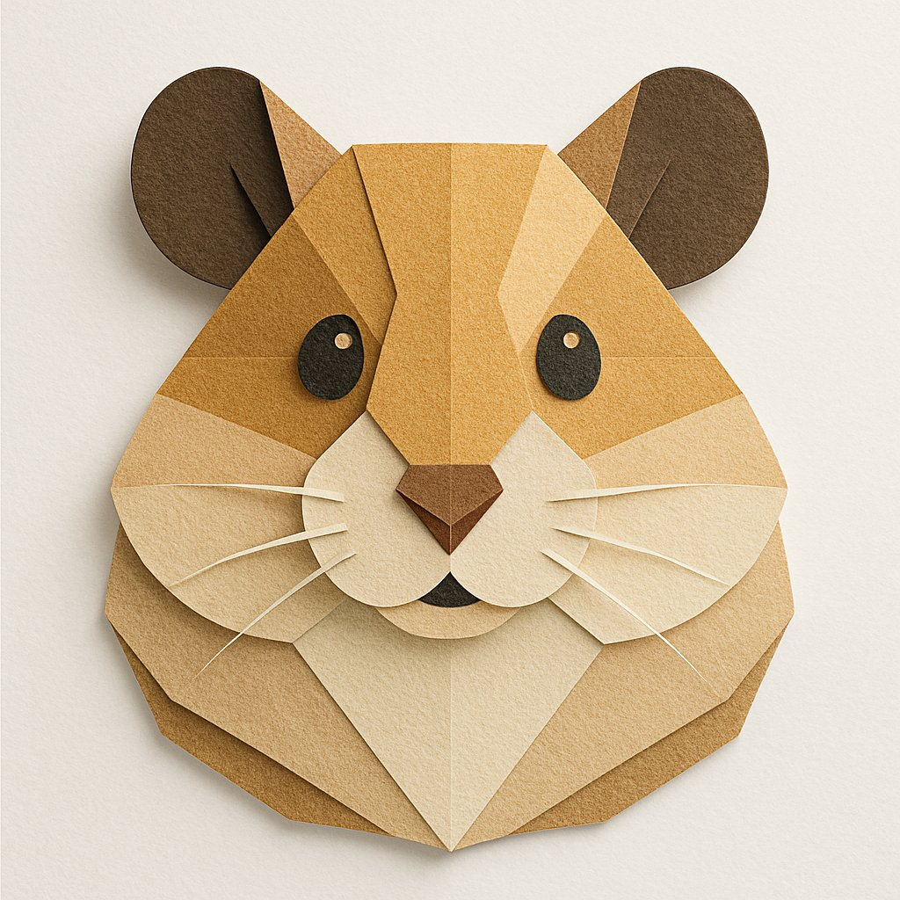

```
Design a geometric portrait of a [ANIMAL] head in the style of contemporary paper craft collage. Use multiple overlapping paper textures and shadow effects to build dimensional depth. Focus on botanical-inspired color palettes with matte finish aesthetics. The composition should feature bold, angular cuts that form the animal’s distinctive characteristics while maintaining facial symmetry. Set against a minimalist backdrop with subtle gradient. The final piece should evoke the craftsmanship of museum-quality paper installations. Square format, 1080x1080 pixels.
```

```
设计一幅[动物]头部的几何肖像，采用当代纸艺拼贴风格。运用多种重叠的纸张纹理和阴影效果来构建立体深度。聚焦于植物灵感的色彩搭配，呈现哑光质感美学。构图应采用大胆的棱角切割，既塑造出该动物的独特特征，又保持面部对称性。背景为简约风格，带有微妙的渐变效果。最终作品需展现出博物馆级纸艺装置的精湛工艺。尺寸为正方形，1080x1080像素。
```

 [↑返回目录](#toc)

---
## <a id="prompt-55">彩色卡通俏皮图标和徽标</a> (<a href="https://x.com/gnrlyxyz/status/1925553233881145499" target="_blank" rel="noopener noreferrer">@gnrlyxyz</a>)

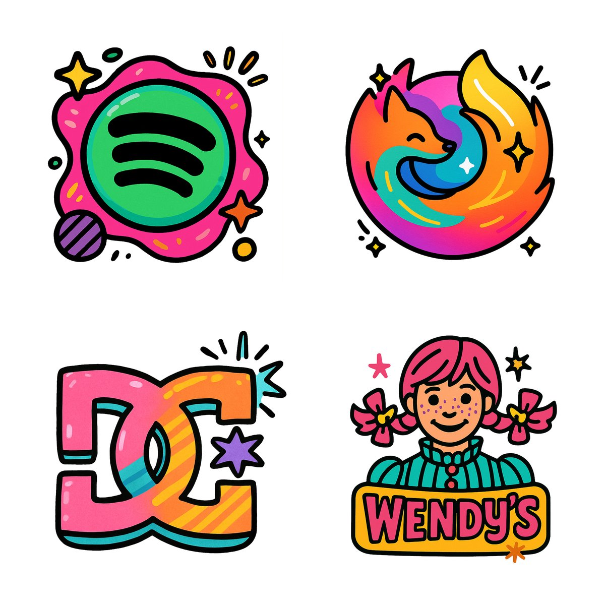

```
Create a 2D digital illustration of the [FIREFOX] logo in a colorful cartoon style with bold black outlines. The icon design should feature playful, vibrant solid colors such as pink, teal, orange, yellow, and purple, applied in a flat, bold way. Give the shapes a slightly exaggerated, bubbly form with rounded edges and fun details like starbursts, stripes, or spark effects if relevant. Keep the illustration simple and stylized with a hand-drawn look. Use thick outlines to emphasize form. Vector friendly. White background. Square aspect ratio.
```

 [↑返回目录](#toc)

---
## <a id="prompt-261">城市糖果传奇的风格</a> (<a href="https://x.com/miilesus/status/1939690110418833592" target="_blank" rel="noopener noreferrer">@miilesus</a>)

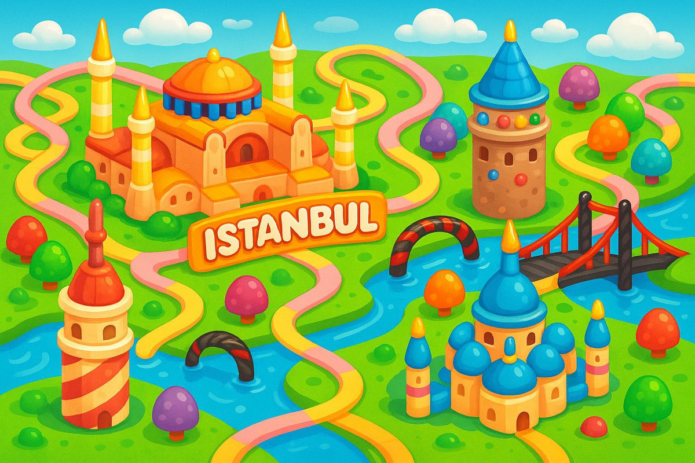


```
A colorful, playful 2D map of [city name], in the style of Candy Crush Saga, featuring the city’s iconic landmarks as candy-inspired buildings, cute gumdrop trees, licorice bridges, pastel roads, and glossy water elements, floating clouds, vibrant cartoon style, top-down view, kid-friendly game aesthetics, horizontal layout
```

```
一幅色彩丰富、充满童趣的[城市名称]2D地图，采用《糖果传奇》的风格，将城市的标志性地标设计成糖果风格的建筑，还有可爱的软糖树、甘草桥、柔和色调的道路、富有光泽的水域元素、漂浮的云朵，整体为鲜艳的卡通风格，采用俯视视角，具有适合儿童的游戏美学，为横向布局。
```

 [↑返回目录](#toc)

---
## <a id="prompt-118">品牌产品数字广告</a> (<a href="https://x.com/shushant_l/status/1931316125029339572" target="_blank" rel="noopener noreferrer">@shushant_l</a>)


```
A hyper-realistic, ultra-detailed 3D digital advertisement showcasing a Pepsi can bursting open at its center, sending a refreshing splash of carbonated cola into the air, with effervescent bubbles and ice cubes flying outward. The can’s metallic surface is rendered with sharp, photorealistic textures, complete with condensation droplets, light reflections, and subtle scratches. Surrounding the scene are cold, translucent ice shards and a twist of lemon zest caught mid-motion, adding a vibrant contrast. The background features a deep electric blue gradient with cinematic volumetric lighting and soft lens flares. Green mint leaves and misty vapors add a refreshing, natural accent. The entire scene is rendered in 4K UHD using advanced global illumination, HDR lighting, and realistic shadows. The composition evokes premium beverage advertising with a dramatic tone, created using tools like Unreal Engine + Octane Render for maximum visual impact.
```

```
一个超现实的、超详细的 3D 数字广告，展示百事罐在中心爆裂，喷出清凉的碳酸可乐，气泡和冰块飞溅。罐子的金属表面具有锐利的、写实的纹理，包括冷凝水滴、光线反射和细微的划痕。场景周围是冷的透明冰片和柠檬皮在空中飞舞，增添了鲜明的对比。背景是深电光渐变，带有电影级体积照明和柔和的镜头光晕。绿色薄荷叶和雾气增添了清凉的自然点缀。整个场景使用高级全局光照、HDR 照明和真实的阴影在 4K UHD 下渲染。构图以高端饮料广告的戏剧性基调呈现，使用 Unreal Engine + Octane Render 等工具以达到最大的视觉冲击力。
```

 [↑返回目录](#toc)

---
## <a id="prompt-415">九个不同服装姿势和表情的Q版贴纸</a> (<a href="https://x.com/ShreyaYadav___/status/1985738257708302430" target="_blank" rel="noopener noreferrer">@ShreyaYadav___</a>)

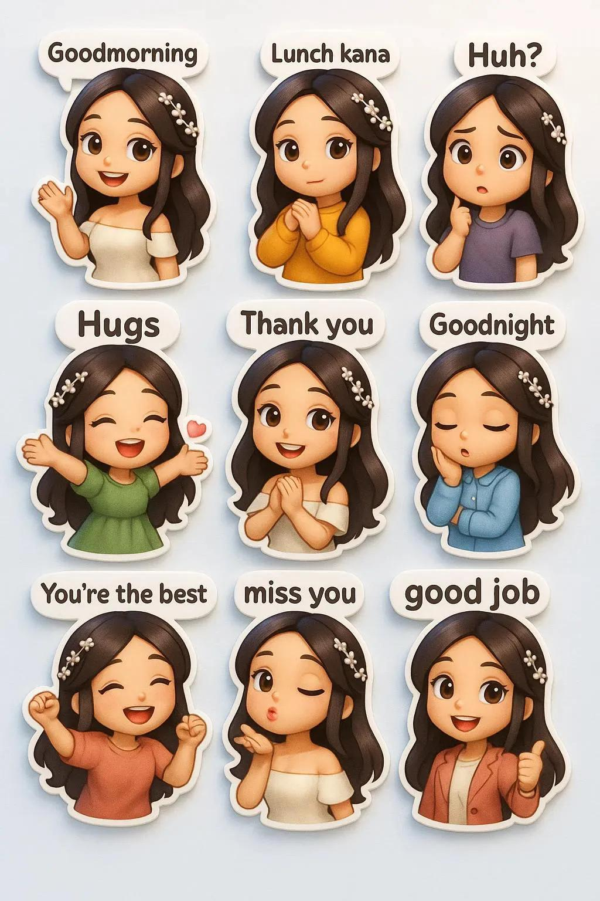

```
Create a 3D kawaii 10:16 canvas featuring nine chibi-style stickers in various outfits, poses, and expressions. Use the attached image for reference. Each sticker has a white border and includes a speech bubble with phrases like "Goodmorning", "Lunch kana", "Huh", "Hugs", "Thank you", "Goodnight", "You're the best" "miss you" "mwah 😙" "good job" and "Ingat ka". Set on a soft white-to-pastel blue gradient background for a fun, positive vibe.
```

```
制作一个 10:16 的 3D 可爱画布，包含九个不同服装、姿势和表情的 Q 版贴纸。请参考附图。每个贴纸都有白色边框，并包含一个对话框，上面写着“早上好”、“午餐时间”、“嗯”、“抱抱”、“谢谢”、“晚安”、“你最棒了”、“想你”、“么😙 ”、“做得好”和“Ingat ka”（注意安全）。背景采用柔和的白色到淡蓝色渐变，营造轻松愉快的氛围。
```

 [↑返回目录](#toc)

---


[上一页](./1.md) | 当前 2/7 页 | [下一页](./3.md) | [查看全部目录](../prompts.md)