# chatgpt.json 

chatgpt.json文件存放chatgpt相关的提示词，当前已收录：614个 

 投稿方式：[飞书投稿](https://tcn1uh5rxo87.feishu.cn/share/base/form/shrcne5gDolOMDd0oJsj2XfvxQc) or [issues](https://github.com/junxiaopang/gridsplitter/issues/new)

[上一页](./2.md) | 当前 3/7 页 | [下一页](./4.md) | [查看全部目录](../prompts.md)

🚀 **在线预览**: [https://prompts.kkkm.cn](https://prompts.kkkm.cn)

## <a id="toc">目录</a>

- [纹理化图片](#prompt-102)
- [青花瓷风格](#prompt-9)
- [Funko Pop风格乙烯基公仔](#prompt-315)
- [自定义纹理的复古玩具](#prompt-199)
- [鸟类羽毛制成LOGO](#prompt-182)
- [街头顽童（Gorillaz）风格插画](#prompt-262)
- [令人垂涎欲滴的广告](#prompt-60)
- [人物戏剧夸张风格](#prompt-35)
- [被优雅水漩涡环绕的品牌产品](#prompt-250)
- [奇趣风格3D乙烯基玩具](#prompt-120)
- [抽象液体排版文字](#prompt-181)
- [漂浮玻璃霓虹3D](#prompt-256)
- [一个可爱的拟人化动物](#prompt-424)
- [极简儿童绘画风格](#prompt-488)
- [纸上的小卡通角色](#prompt-201)
- [俏皮现代的应用程序图标设计](#prompt-279)
- [不同情绪状态的思想泡泡](#prompt-93)
- [益智玩具角色](#prompt-318)
- [玩具盒中的历史](#prompt-99)
- [舒适的周末从这里开始](#prompt-224)
- [创建3D推特个人资料卡片](#prompt-396)
- [我知道你很急但你先别急](#prompt-289)
- [品牌奢华之物从天而降](#prompt-27)
- [数字粘土雕塑](#prompt-197)
- [有趣的块状 3D 世界](#prompt-242)
- [品牌3D卡通动物角色](#prompt-158)
- [超写实拼图肖像](#prompt-31)
- [树上挂着产品](#prompt-266)
- [部分咬掉的糕点](#prompt-214)
- [将您的徽标放在月球上](#prompt-193)
- [怪诞又梦幻的超现实插画](#prompt-252)
- [20世纪30年代弗莱舍工作室风格的动画](#prompt-259)
- [创建半透明图标](#prompt-202)
- [水流身份](#prompt-26)
- [超写实3D漫画肖像](#prompt-302)
- [可爱微缩场景](#prompt-67)
- [刺绣插图风格](#prompt-8)
- [2D单词海报设计](#prompt-177)
- [逼真的产品照片](#prompt-208)
- [超细节盒状纸艺玩具](#prompt-251)
- [创建多种3D风格头像](#prompt-179)
- [透明塑料袋装物体](#prompt-20)
- [物品纹理处理](#prompt-161)
- [9格Q版风格贴纸](#prompt-241)
- [霓虹玻璃发光](#prompt-92)
- [月光屋顶茶话会](#prompt-192)
- [日常用品有皮肤](#prompt-136)
- [超现实的高冲击力的图像](#prompt-207)
- [品牌之爱话术](#prompt-11)
- [磨砂泡泡 3D 图标](#prompt-254)
- [有趣的毛茸茸字母](#prompt-73)
- [Logo放进我的世界中](#prompt-37)
- [半透明晶体效果](#prompt-175)
- [3D蓬松的物体](#prompt-213)
- [钻石镶嵌风格](#prompt-221)
- [将表情符号变成纸板](#prompt-164)
- [软质高品质毛绒玩具](#prompt-293)
- [皱巴巴的纸片](#prompt-65)
- [刺绣肖像](#prompt-7)
- [经典的微型玩具风格](#prompt-195)
- [路牌图片](#prompt-249)
- [符号冲突](#prompt-127)
- [日本搞笑漫画风格插画](#prompt-228)
- [人物电影级渲染](#prompt-308)
- [时间之神](#prompt-106)
- [知名戏曲片段的MBTI人格类型卡片](#prompt-85)
- [将您最喜欢的品牌变成生活方式产品](#prompt-139)
- [面包形态](#prompt-29)
- [3D超写实食品广告](#prompt-292)
- [自定义毛绒钥匙扣](#prompt-131)
- [品牌我的世界风格](#prompt-18)
- [色彩缤纷的手工雕塑](#prompt-246)
- [按键删除周一](#prompt-25)
- [Monochrome LCD 效果](#prompt-114)
- [宝石渲染风格](#prompt-222)
- [品牌着陆页-年轻女性运动后的面部特写](#prompt-275)
- [超现实主义油画](#prompt-72)
- [珐琅马赛克瓷砖风格](#prompt-104)
- [动漫机甲风格化机械设计图](#prompt-117)
- [品牌平面纸风格](#prompt-95)
- [怀旧午后阳光](#prompt-148)
- [微缩的温馨客厅](#prompt-495)
- [品牌折叠纸](#prompt-69)
- [军事计划](#prompt-59)
- [装饰艺术未来主义](#prompt-194)
- [悬浮魔幻现实主义](#prompt-132)
- [一个字的无限反射](#prompt-128)
- [磨砂模糊剪影](#prompt-124)
- [食物与运动结合的广告](#prompt-288)
- [自己的国家地标时尚杂志](#prompt-155)
- [英语单词闪卡制作](#prompt-291)
- [沙滩胶囊城市](#prompt-239)
- [品牌快餐胶囊](#prompt-229)
- [迪士尼鸡尾酒](#prompt-143)
- [透明容器里有一个微型的3D世界](#prompt-68)
- [重新构想的玫瑰金](#prompt-70)
- [时尚的胶囊海报](#prompt-225)
- [微型透明胶囊](#prompt-169)
- [液态金属设计产品](#prompt-167)
- [霓虹灯发光的可爱动物](#prompt-51)

## <a id="prompt-102">纹理化图片</a> (<a href="https://x.com/egeberkina/status/1931727106590826828" target="_blank" rel="noopener noreferrer">@egeberkina</a>)

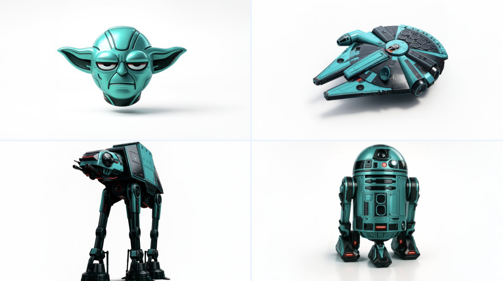

```
Retexture the image attached based on the json below
{
  "style": "C4D hyper-realistic 3D render",
  "object_form": "detailed mechanical design",
  "geometry": {
    "shape": "sharp edges with smooth curves",
    "scale": "real-world proportion",
    "detailing": "high-poly mesh with intricate mechanical features"
  },
  "material": {
    "base": "polished plastic and carbon fiber",
    "texture": "fine surface variation with specular maps",
    "finish": "high gloss with realistic reflections"
  },
  "design_elements": {
    "decals": "subtle branding and panel lines",
    "surface_effects": "anodized gradients, emissive lighting elements",
    "aero_parts": "spoilers, splitters, and aggressive styling cues"
  },
  "color_scheme": {
    "primary": "#0ae2c0",
    "secondary": "#111111",
    "accents": ["#ffffff", "#e00000"],
    "reflections": "real-world HDRI light environment",
    "background": "#ffffff"
  },
  "lighting": {
    "type": "studio 3-point with HDRI",
    "intensity": "balanced with key fill and rim lights",
    "shadows": "soft, subtle contact shadow under object",
    "highlights": "strong specular reflections on curves"
  },
  "rendering": {
    "engine": "Cinema 4D Redshift or Octane",
    "resolution": "ultra high-definition (4K+)",
    "focus": "object-centered with floating illusion",
    "background_blur": "none"
  },
  "composition": {
    "layout": "centered in frame",
    "object_count": 1,
    "orientation": "three-quarter front view",
    "camera": "35mm lens, slightly elevated",
    "grounding": "floating mid-air with realistic soft shadow cast on white background"
  }
}
```

 [↑返回目录](#toc)

---
## <a id="prompt-9">青花瓷风格</a> (<a href="https://x.com/firatbilal/status/1923627963251052769" target="_blank" rel="noopener noreferrer">@firatbilal</a>)

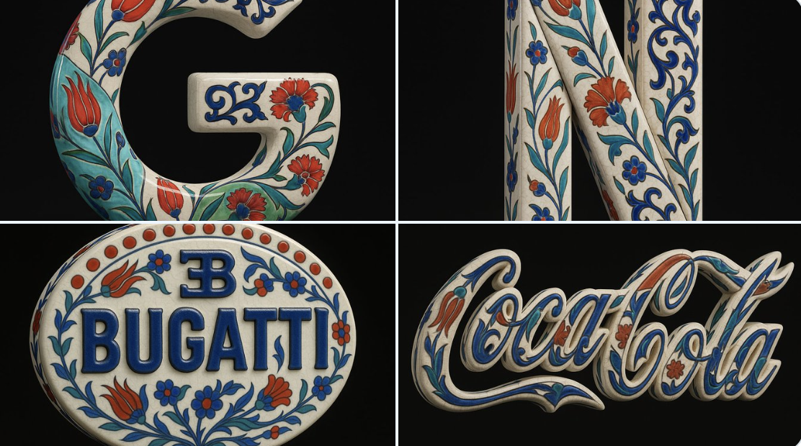

```
Using the uploaded image as the exact visual base, transform it into a hyper-realistic 3D object that retains the original shape and proportions of the logo only. Apply traditional Ottoman Iznik ceramic textures—featuring a warm white glazed base with delicate crackle lines, overlaid with vivid cobalt blue, turquoise, and bold red floral motifs such as tulips, carnations, and arabesque vines. The entire logo should be treated as a standalone porcelain sculpture with raised, hand-painted detailing and no background plate or tile structure. Ensure the decorative patterns elegantly follow the contours of the Bugatti logo, without altering its form. Render the object in a pure black background with Cinema 4D-style product lighting—highlighting realistic ceramic gloss, material depth, and subtle reflections. The final result should feel like a luxurious handcrafted ceramic reinterpretation, balancing heritage ornamentation with industrial branding.
```

 [↑返回目录](#toc)

---
## <a id="prompt-315">Funko Pop风格乙烯基公仔</a> (<a href="https://x.com/Arminn_Ai/status/1969848678652547334" target="_blank" rel="noopener noreferrer">@Arminn_Ai</a>)

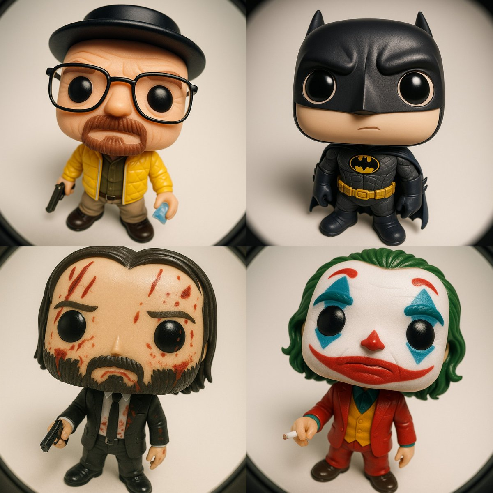

```
Funko Pop–style vinyl figure of [CHARACTER NAME] 
Wearing the iconic outfit and accessories typically associated with [CHARACTER], automatically matching their signature style and details.  

Pose/Expression:
- Standing, looking upward toward the camera  
- Expression: curious yet slightly nonchalant  

CAMERA & LENS:
- Camera positioned directly above, very close  
- Ultra-wide fisheye lens for dramatic perspective distortion  
- Gentle rounded frame edges  

LIGHTING & MATERIALS:
- Soft studio lighting with gentle shadows  
- Glossy vinyl figure texture for skin and hair  
- Outfit materials accentuated (e.g. quilted, shiny, matte, etc.) depending on [CHARACTER]’s clothing  

RENDER STYLE:
- High-resolution 3D render  
- Clean neutral background (solid or gradient)  
- Ultra sharp, collectible toy aesthetic
```

```
[角色名称] 的 Funko Pop 风格乙烯基公仔
身着通常与 [角色] 相关联的标志性服装及配饰，其标志性风格与细节特征均自然呈现。
姿势 / 表情
站姿，抬头望向镜头
表情：好奇中略带漫不经心
相机与镜头
相机直接置于正上方，距离极近
超宽鱼眼镜头，营造极具张力的透视畸变效果
柔和的圆角画框边缘
光线与材质
柔和的工作室灯光，搭配自然阴影
公仔皮肤与头发采用亮面乙烯基材质质感
服装材质细节突出（如绗缝、亮面、哑光等），具体依 [角色] 的服饰特点而定
渲染风格
高分辨率 3D 渲染
简洁的中性背景（纯色或渐变色）
极致清晰的收藏级玩具美学风格
```

 [↑返回目录](#toc)

---
## <a id="prompt-199">自定义纹理的复古玩具</a> (<a href="https://x.com/_abranko_/status/1938936595257688552" target="_blank" rel="noopener noreferrer">@_abranko_</a>)


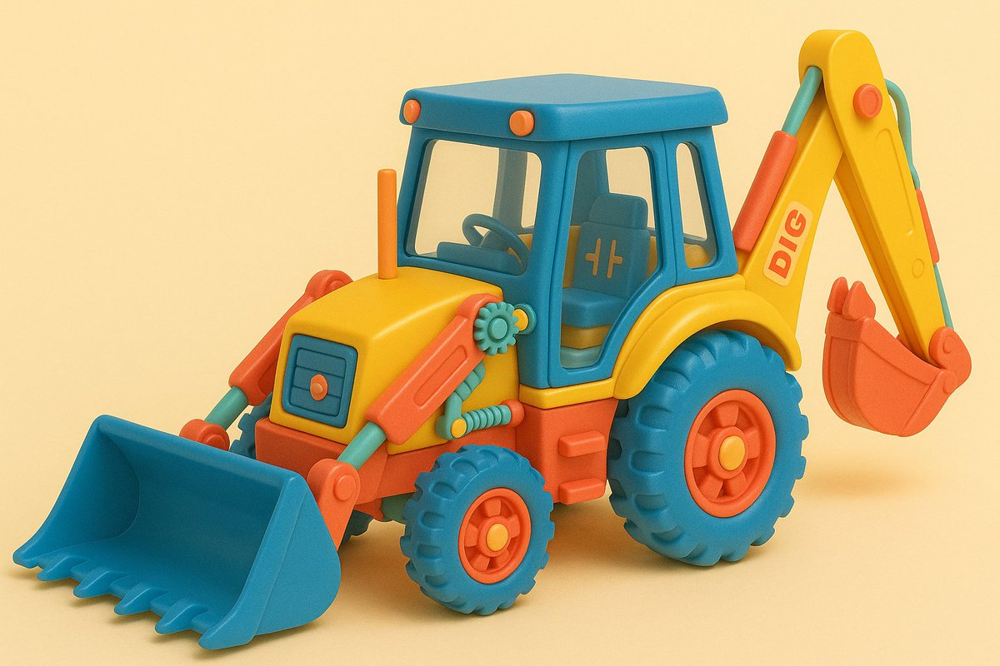

```
Retexture the uploaded image based on the JSON

{
  "materials": {
    "exterior": "matte injection-molded plastic",
    "interior": [
      "blocky colored plastic parts",
      "oversized gears",
      "simple rods",
      "basic springs",
      "toy decals"
    ]
  },
  "lighting": {
    "type": "studio soft light",
    "direction": "top and front fill",
    "color": "warm daylight",
    "mood": "nostalgic, cheerful"
  },
  "background": {
    "type": "solid",
    "color": "pastel yellow"
  },
  "camera": {
    "angle": "eye-level side",
    "focus": "medium sharp",
    "depth_of_field": "deep"
  },
  "color_palette": {
    "dominant": ["red", "blue", "yellow"],
    "accents": ["mint green", "white", "peach"]
  },
  "vibe": "1980s retro toy, nostalgic, playful"
}
```

```
根据 JSON 对上传的图片进行重新纹理处理

{
“材料”： {
“exterior”： “哑光注塑成型塑料”，
“interior”：[
“块状彩色塑料件”，
“超大齿轮”，
“简单杆”，
“基本弹簧”，
“玩具贴花”
    ]
  },
“照明”： {
“type”： “工作室柔光”，
“direction”： “顶部和前部填充”，
“color”： “暖日光”，
“mood”： “怀旧的、欢快的”
  },
“背景”： {
“type”： “solid”， //类型
“color”： “柔和的黄色”
  },
“相机”： {
“angle”： “与眼睛齐平的一侧”，
“focus”： “中等锐化”，
“depth_of_field”： “deep”
  },
“color_palette”： {
“主导”： [“红”， “蓝”， “黄”]，
“accents”： [“薄荷绿”， “白色”， “桃子”]
  },
“vibe”： “1980 年代复古玩具，怀旧，俏皮”
}
```

 [↑返回目录](#toc)

---
## <a id="prompt-182">鸟类羽毛制成LOGO</a> (<a href="https://x.com/Gdgtify/status/1938901186616471840" target="_blank" rel="noopener noreferrer">@Gdgtify</a>)


```
A detailed overhead shot of a fluid, colorful OpenAI logo created by arranging hundreds of naturally shed exotic bird feathers. Capture the incredible iridescence, delicate barbs, and varied textures against a misty white backdrop with side lighting.
```

```
流畅、多彩的 OpenAI 徽标的详细俯拍镜头，由数百根自然脱落的异国鸟类羽毛制成。在带有侧面照明的朦胧白色背景下捕捉令人难以置信的彩虹色、精致的倒钩和各种纹理。
```

 [↑返回目录](#toc)

---
## <a id="prompt-262">街头顽童（Gorillaz）风格插画</a> (<a href="https://x.com/azed_ai/status/1942586412920103180" target="_blank" rel="noopener noreferrer">@azed_ai</a>)

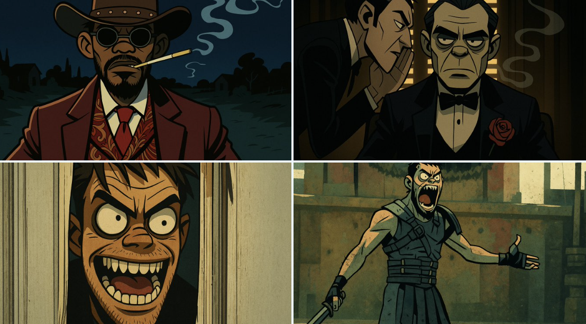


```
Restyle this image into a gritty Gorillaz-style illustration, bold thick black outlines, sharp angular edges, flat expressive lighting, stylized high-contrast shadows, dirty distressed surface textures, muted color palette: washed-out teals, olive greens, rusty reds, mustard yellows, dusty browns, raw grungy urban atmosphere, comic book flatness mixed with painterly grit, hand-drawn finish with faded gradients, graphic novel aesthetic
with a rebellious, animated tone, dark stylish tone, full of attitude.
```

```
将这张图片重新设计成粗粝的街头顽童（Gorillaz）风格插画，采用粗重的黑色轮廓线、锐利的棱角、扁平化的富有表现力的光线、风格化的高对比度阴影、粗糙破旧的表面纹理；色彩搭配柔和暗淡：褪色的蓝绿色、橄榄绿、锈红色、芥末黄、土褐色；营造出原始粗粝的都市氛围，融合漫画的扁平化与绘画的颗粒感，带有褪色渐变效果的手绘质感，呈现出漫画小说的美学风格，整体基调叛逆、生动且时尚暗黑，充满个性。
```

 [↑返回目录](#toc)

---
## <a id="prompt-60">令人垂涎欲滴的广告</a> (<a href="https://x.com/aziz4ai/status/1925470550035476622" target="_blank" rel="noopener noreferrer">@aziz4ai</a>)

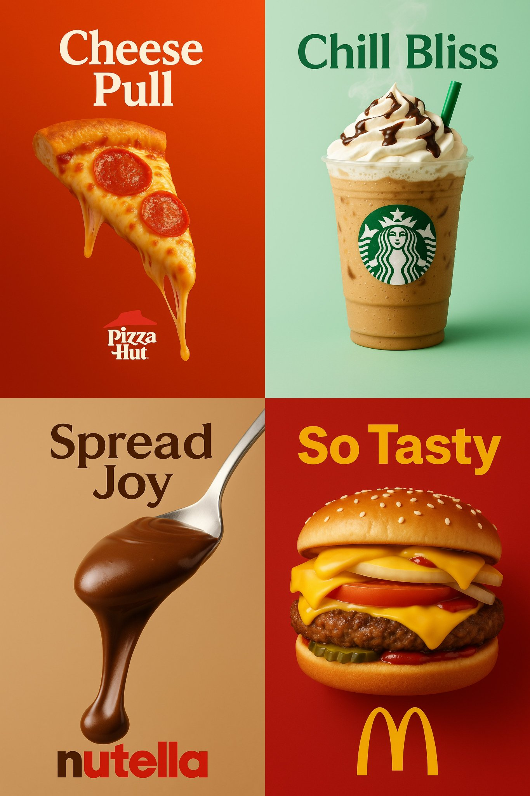

```
a vertical 2:3 high-resolution food advertisement featuring the most iconic and delicious product from a well-known brand called [INSERT BRAND NAME]. The product appears centered with mouthwatering details — such as melted cheese, dripping chocolate, whipped cream, or condensation — depending on the product. The background should be a gradient or pastel tone inspired by the brand’s identity. At the top, display a bold slogan in a color that matches the brand’s style. At the bottom, include the official logo of the brand. Use cinematic studio lighting, soft shadows, and ultra-sharp textures to create a visually irresistible and minimal poster.
```

 [↑返回目录](#toc)

---
## <a id="prompt-35">人物戏剧夸张风格</a> (<a href="https://x.com/dotey/status/1924288320881750108" target="_blank" rel="noopener noreferrer">@dotey</a>)

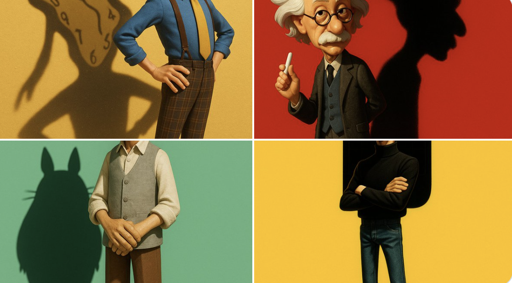

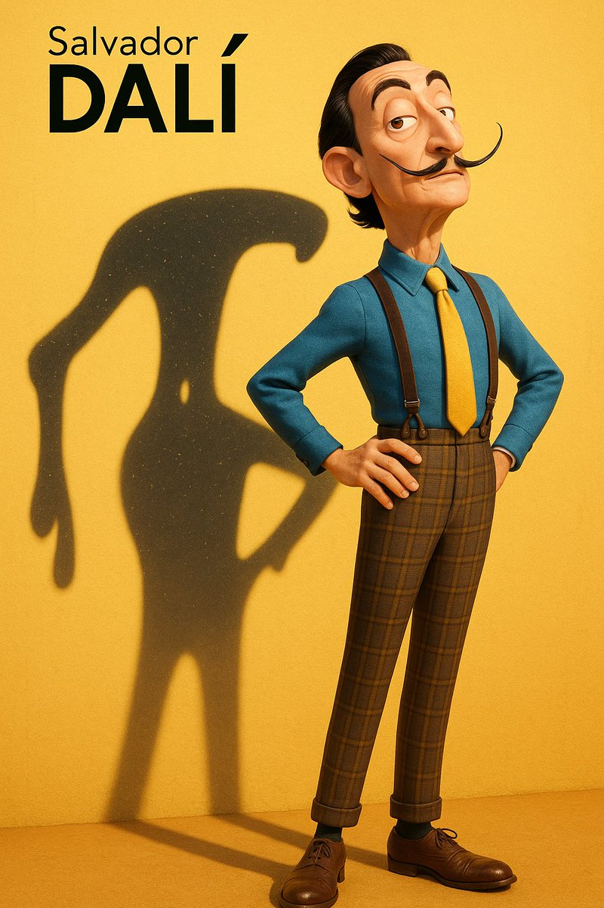

```
A high-resolution vertical Pixar-style 3D character illustration.

Main character:  
Salvador Dalí — depicted as a tall, slim, and slightly exaggerated Pixar-style 3D character.  
Wearing a classic blue shirt, yellow tie, high-waisted plaid trousers with suspenders, and leather shoes.  
His iconic long upturned mustache, slick black hair, sharply arched eyebrows, and slightly eccentric posture.  
Stands with chest out, one hand on hip, head tilted slightly back in his typical theatrical flair.

Background:  
Flat, clean yellow background with subtle surface texture.  
Strong sunlight from top-left casts a distinct and enlarged shadow on the wall behind him.

Key Concept – Shadow as spiritual projection:  
The shadow cast behind him does **not** mirror his body shape.  
Instead, it takes the form of one of his most iconic artworks —  
a surreal melted clock with long dripping arms, inspired by “The Persistence of Memory”.

The melted clock shadow is positioned diagonally, starting from his shoulder,  
stretching wide and low across the yellow wall, surreal and fluid, yet unmistakably symbolic.

This shadow is **Dalí’s legacy made visible** — a symbolic extension of his identity through time, dream, and visual distortion.

Lighting & Rendering:  
Pixar-like rendering with detailed but stylized textures.  
Use subtle filmic grain, soft shadows, and warm color grading.  
Subtle sparkles or light speckles inside the shadow to evoke dreamlike texture.

Typography (top-left corner):  
“Salvador Dalí” in minimalist black sans-serif font, “Dalí” bolded.
```

 [↑返回目录](#toc)

---
## <a id="prompt-250">被优雅水漩涡环绕的品牌产品</a> (<a href="https://x.com/Morph_VGart/status/1933966476492353807" target="_blank" rel="noopener noreferrer">@Morph_VGart</a>)


```
Create square image of studio-lit product photography of a [Product] suspended in mid-air, lots of thick dynamic water swirls surrounding it in slow-motion arcs, crystal-clear droplets glistening with light refraction, high-gloss finish, minimal backdrop, cinematic lighting with soft shadows and highlights, shot on a pure matching gradient background, ultra-realistic detail, commercial photography style, 85mm lens depth of field.
```

```
创建一个方形图像，是工作室照明的产品摄影，一个[产品]悬浮在空中，周围有许多厚重的动态水漩涡以慢动作弧线环绕，晶莹剔透的液滴折射着光线，高光泽度，简约背景，电影般的照明，柔和的阴影和高光，在纯色匹配渐变背景上拍摄，超逼真的细节，商业摄影风格，85mm 镜头景深。
```

 [↑返回目录](#toc)

---
## <a id="prompt-120">奇趣风格3D乙烯基玩具</a> (<a href="https://x.com/azed_ai/status/1931668551531929630" target="_blank" rel="noopener noreferrer">@azed_ai</a>)

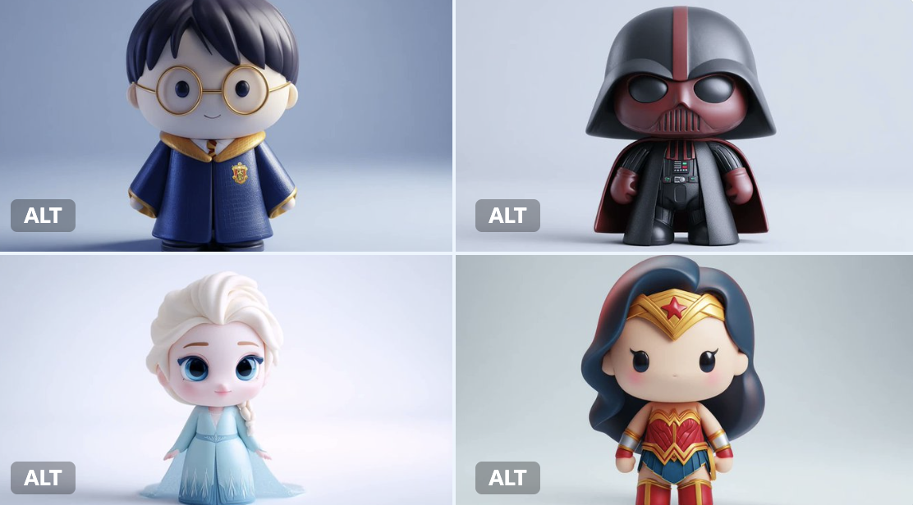


```
Chibi-style 3D vinyl toy of [subject], rendered in [color1] and [color2] tones, front-facing on a white background. Minimalist composition with soft shadows, oversized head and tiny body proportions, clean OC renderer output in Cinema 4D. Toy-like shine and playful charm.
```

```
[主体]的奇趣风格 3D 乙烯基玩具，以[颜色 1]和[颜色 2]色调呈现，正面朝向白色背景。极简主义构图，带有柔和的阴影，头部巨大而身体比例缩小，Cinema 4D 中的干净 OC 渲染输出。玩具般的光泽和充满趣味的魅力。
```

 [↑返回目录](#toc)

---
## <a id="prompt-181">抽象液体排版文字</a> (<a href="https://x.com/azed_ai/status/1938599250738503861" target="_blank" rel="noopener noreferrer">@azed_ai</a>)


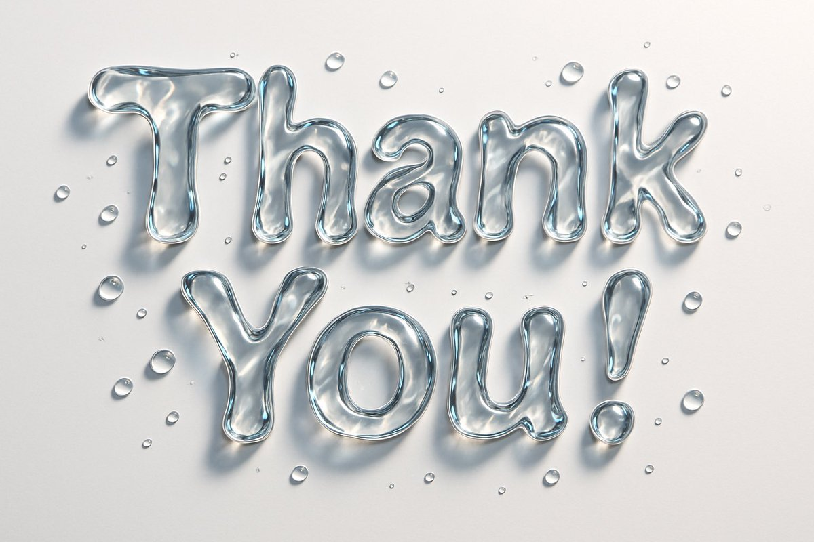

```
Abstract liquid typography spelling "text", made of thick, transparent water-gel with realistic refraction and soft shadows. Each letter appears sculpted from droplets with surface tension, smooth curves, and light reflections. Water droplets scattered on the surface, minimal background, hyper-realistic lighting, photorealistic render
```

```
抽象液体排版拼写“text”，由厚实、透明的水凝胶制成，具有逼真的折射和柔和的阴影。每个字母都由具有表面张力、平滑曲线和光反射的水滴雕刻而成。散落在表面上的水滴、极小的背景、超逼真的照明、照片级逼真的渲染
```

 [↑返回目录](#toc)

---
## <a id="prompt-256">漂浮玻璃霓虹3D</a> (<a href="https://x.com/egeberkina/status/1940054985418375269" target="_blank" rel="noopener noreferrer">@egeberkina</a>)


```
retexture the image attached based on the JSON below:

{
  "style_name": "Floating Glassy Neon 3D",
  "retexture_mode": "shape_lock",
  "object_analysis": {
    "preserve_silhouette": true,
    "geometry_sensitive_mapping": true,
    "detail_retention": "maintain contours, volumes, and layering"
  },
  "material_properties": {
    "base_material": "translucent neon glass-gel",
    "surface_finish": "semi-gloss with soft glow edges",
    "transparency": "high, with soft light refraction",
    "refraction": "gentle bend with subtle halo on curves",
    "embedded_effects": "internal light scatter and edge neon glow",
    "color_blend": {
      "primary": ["aqua", "electric blue", "neon violet"],
      "gradient_direction": "top-left to bottom-right",
      "transition_smoothness": "very smooth"
    }
  },
  "lighting": {
    "type": "softbox HDRI",
    "intensity": "soft and bright",
    "source_direction": "overhead and slightly front",
    "highlight_behavior": "gentle bloom with glass sparkle"
  },
  "shadow_behavior": {
    "type": "floating contact shadow",
    "appearance": "extremely soft, blurred ellipse",
    "opacity": 0.07,
    "distance_below_object": "moderate",
    "color": "neutral gray"
  },
  "background": {
    "type": "solid color",
    "color": "#ffffff",
    "glow_effect": "none",
    "gradient": "none"
  },
  "rendering": {
    "depth_of_field": "subtle with slight vignette",
    "focus_point": "center of floating object",
    "ambient_occlusion": "minimal to preserve light feel",
    "render_engine": "3D stylized with light diffusion and high specular detail",
    "camera_angle": "slightly above object, frontal",
    "resolution": "very high for product branding"
  },
  "special_effects": {
    "floating_behavior": true,
    "visual_weightlessness": true,
    "shadow_softness": "maximum"
  }
}
```

```
根据以下JSON对附加图片进行重新纹理处理：

{
  "风格名称": "漂浮玻璃霓虹3D",
  "重纹理模式": "形状锁定",
  "对象分析": {
    "保留轮廓": true,
    "几何敏感映射": true,
    "细节保留": "维持轮廓、体积和层次感"
  },
  "材质属性": {
    "基础材质": "半透明霓虹玻璃胶",
    "表面处理": "半光泽，边缘带有柔和光晕",
    "透明度": "高，带有柔和的光折射",
    "折射效果": "轻微弯曲，曲线处有微妙光晕",
    "内置效果": "内部光散射和边缘霓虹发光",
    "色彩混合": {
      "主色": ["水绿色", "电蓝色", "霓虹紫"],
      "渐变方向": "左上角至右下角",
      "过渡平滑度": "非常平滑"
    }
  },
  "光照": {
    "类型": "柔光箱HDRI",
    "强度": "柔和明亮",
    "光源方向": " overhead 且略微偏前",
    "高光表现": "柔和光晕，带有玻璃闪光"
  },
  "阴影表现": {
    "类型": "漂浮接触阴影",
    "外观": "极其柔和、模糊的椭圆形",
    "不透明度": 0.07,
    "物体下方距离": "适中",
    "颜色": "中性灰"
  },
  "背景": {
    "类型": "纯色",
    "颜色": "#ffffff",
    "发光效果": "无",
    "渐变": "无"
  },
  "渲染": {
    "景深": "轻微，带有轻微渐晕",
    "焦点": "漂浮物体的中心",
    "环境光遮蔽": "最小化以保持明亮感",
    "渲染引擎": "3D风格化，带有光扩散和高镜面细节",
    "相机角度": "略高于物体，正面视角",
    "分辨率": "极高，适用于产品品牌推广"
  },
  "特殊效果": {
    "漂浮效果": true,
    "视觉失重感": true,
    "阴影柔和度": "最大"
  }
}
```

 [↑返回目录](#toc)

---
## <a id="prompt-424">一个可爱的拟人化动物</a> (<a href="https://x.com/azed_ai/status/1987837427348799741" target="_blank" rel="noopener noreferrer">@azed_ai</a>)

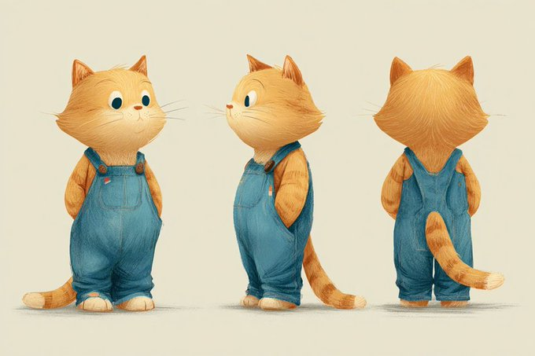

```
A cute anthropomorphic [subject] in triple view: front-left, front, and back. Standing upright with a plump body, expressive face, and wearing [clothing/style]. Cartoon mascot in 2D animation style, clean bold lines, flat shading with subtle gradients, soft outlines, and a light neutral background.
```

```
一个可爱的拟人化[对象]，以三视图呈现：左前、正面和背面。它站立着，身体圆润，表情丰富，身着[服装/风格]。卡通吉祥物，采用二维动画风格，线条简洁有力，平涂阴影带有微妙的渐变，轮廓柔和，背景为浅色中性色。
```

 [↑返回目录](#toc)

---
## <a id="prompt-488">极简儿童绘画风格</a> (<a href="https://x.com/azed_ai/status/1992548740272623996" target="_blank" rel="noopener noreferrer">@azed_ai</a>)

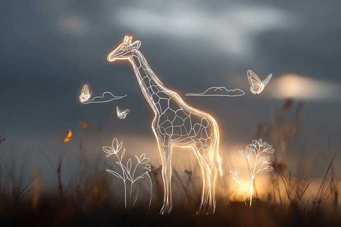

```
A [subject] in a minimalist children's drawing style, using thick white lines and glowing contours. The background is softly blurred with [environment details]. Floating elements like [floating details] add a whimsical touch. Full-body view, warm and simple aesthetic.
```

```
一幅采用极简儿童绘画风格的[人物]，运用粗白线和闪亮轮廓线勾勒而成。背景柔和虚化，并点缀有[环境细节]。漂浮的[细节]等元素增添了一丝奇幻感。全身像，画面温暖简洁。
```

 [↑返回目录](#toc)

---
## <a id="prompt-201">纸上的小卡通角色</a> (<a href="https://x.com/jimmj1010/status/1943040595213324313" target="_blank" rel="noopener noreferrer">@jimmj1010</a>)

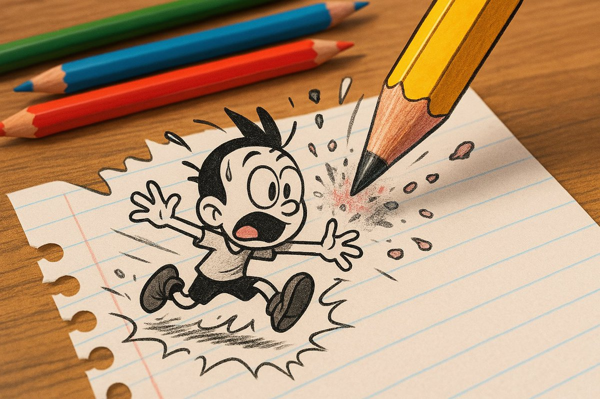


```
Imagine you’re a tiny cartoon character who has come to life on a piece of paper! Draw yourself running away from a giant pencil that’s trying to erase you. Add colorful pencils, a desk, and maybe some flying eraser bits for extra excitement. Use your wildest imagination to make it look like you’re bursting out of the page!
```

```
想象你是一个在纸上活过来的小卡通角色！画自己从一只试图擦掉你的巨大铅笔逃跑。添加彩色铅笔、书桌，也许还有一些飞行的橡皮屑以增加乐趣。用你最狂野的想象力让它看起来像是从页面上爆发出来！
```

 [↑返回目录](#toc)

---
## <a id="prompt-279">俏皮现代的应用程序图标设计</a> ()

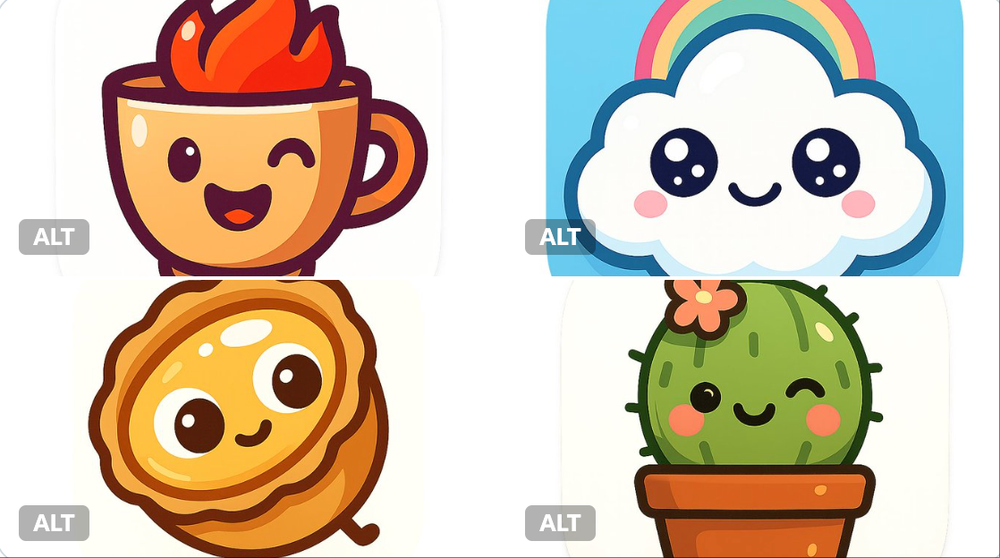


```
A playful and modern app icon design of a cute coffee cup character with a winking eye and smiling mouth, red-orange flame-like hair on top, minimal flat vector style, glossy highlights, soft shadows, centered composition, high contrast, vibrant colors, rounded corners, on a transparent background, icon-friendly, no text, no details outside the frame, size is 1024x1024.
```

```
一个俏皮现代的应用程序图标设计：一个可爱的咖啡杯形象，带着眨眼的眼睛和微笑的嘴巴，顶部有橙红色火焰状的“头发”，采用极简扁平矢量风格，带有光泽高光和柔和阴影，构图居中，对比度高，色彩鲜艳，边角圆润，背景透明，适合作为图标使用，无文字，边框外无细节，尺寸为1024x1024。
```

 [↑返回目录](#toc)

---
## <a id="prompt-93">不同情绪状态的思想泡泡</a> (<a href="https://x.com/TheRelianceAI/status/1925098220398465145" target="_blank" rel="noopener noreferrer">@TheRelianceAI</a>)

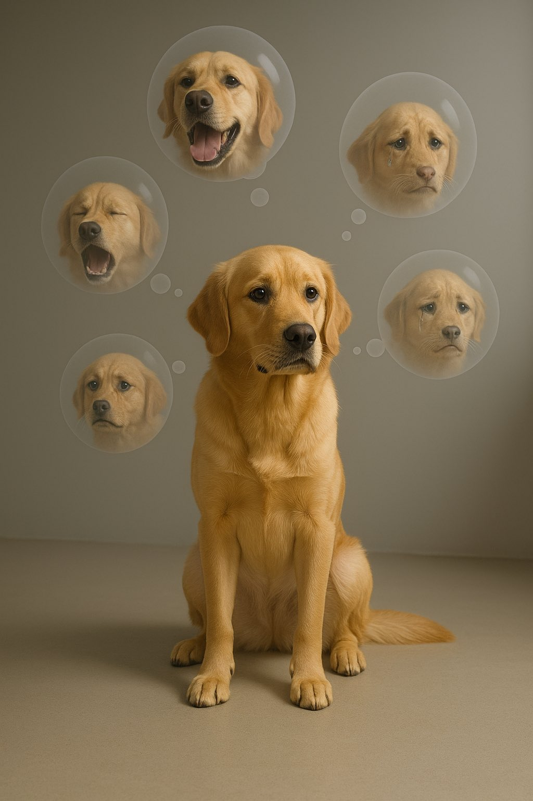

```
A [SUBJECT] sits alone in a minimalistic room filled with floating, semi-transparent thought bubbles. Each bubble contains a fragment of their face from different emotional states — smiling, crying, screaming — forming a psychological self-portrait suspended in mid-air.
```

 [↑返回目录](#toc)

---
## <a id="prompt-318">益智玩具角色</a> (<a href="https://x.com/Arminn_Ai/status/1969446581788426252" target="_blank" rel="noopener noreferrer">@Arminn_Ai</a>)

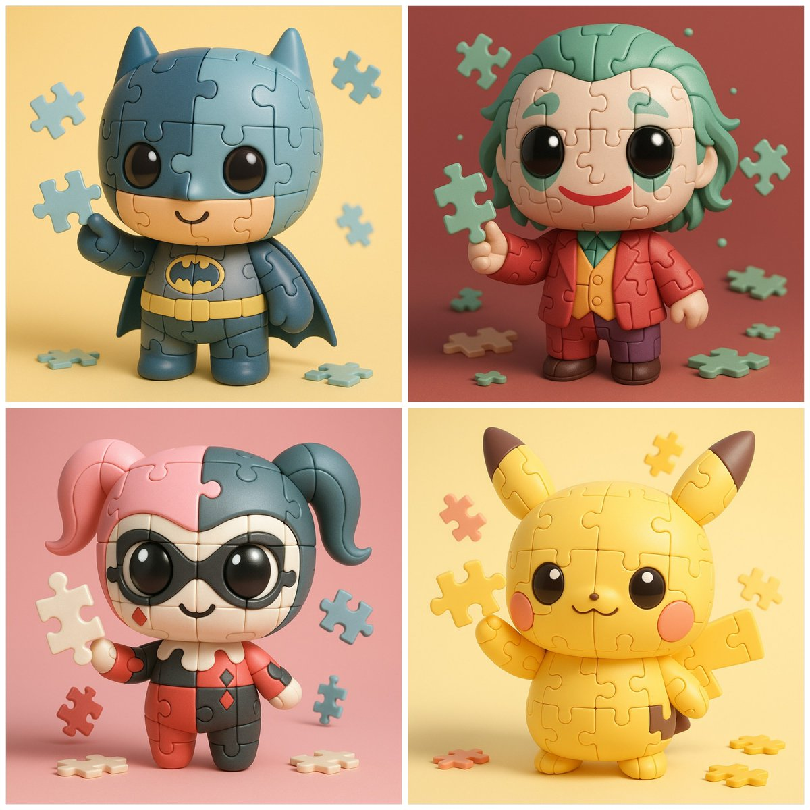

```
SUBJECT: Chibi-style [CHARACTER NAME] reimagined as a Puzzle Toy character, ultra-cute proportions with oversized head and tiny stubby body.

MATERIALS:
Body and head formed entirely from interlocking jigsaw puzzle pieces
Matte pastel plastic surface with soft specular highlights
Visible puzzle cuts and notches defining the structure
Each piece slightly separated by thin seams, but tightly fitted together

DETAILS:
Large glossy chibi eyes placed across puzzle pieces, seamlessly integrated
Cute simple mouth outlined on puzzle surface
Costume colors of [CHARACTER NAME] applied piece-by-piece across the puzzle body, Character is holding a single loose puzzle piece in one hand, lifted playfully, as if showing it to the viewer, Some extra puzzle pieces floating gently around for added fun

STYLE:
Bright, educational, playful toy aesthetic, Minimal wear, no dirt, no scratches

LIGHTING:
Soft studio HDRI lighting with gentle shadows, Subtle contact shadows under puzzle seams, High contrast to show piece outlines clearly

CAMERA:
Centered, front-facing or 3/4 isometric angle, 1:1 aspect ratio, 8K render, Focus sharp on character’s face, emblem, and puzzle piece in hand

BACKGROUND:
Clean seamless pastel gradient backdrop (COLOR)
Optional scattered puzzle pieces on the floor for extra context

OUTPUT STYLE: Cute chibi proportions, Puzzle-based
```

```
主题：将Chibi风格的 [角色名称] 重新想象成一个益智玩具角色，具有超大头部和小巧粗短身体的超可爱比例。

材料：
身体和头部完全由相互锁在一起的拼图碎片组成
哑光塑料表面，具有柔和的镜面高光
可见的拼图切口和缺口定义了结构
每块布料都由细缝稍微隔开，但紧密贴合

细节：
大而有光泽的Chibi眼睛放置在拼图碎片上，无缝集成
拼图表面上勾勒出可爱简单的嘴巴
[角色名称] 的服装颜色逐片应用于拼图主体，角色一只手拿着一块松散的拼图，俏皮地举起，好像在向观众展示它，一些额外的拼图碎片轻轻地漂浮在周围以增加乐趣

风格：
明亮、有教育意义、好玩的玩具美感，磨损极小，无污垢，无划痕

灯光：
柔和的工作室 HDRI 照明，柔和的阴影，拼图接缝下微妙的接触阴影，高对比度清晰显示作品轮廓

相机：
居中、正面或 3/4 等距角度、1:1 宽高比、8K 渲染、清晰聚焦于人物面部、徽章和手中的拼图

背景：
干净无缝柔和渐变背景（颜色）
地板上散落的拼图碎片可供选择，以提供额外的背景信息

输出风格：可爱的Q版比例，基于拼图
```

 [↑返回目录](#toc)

---
## <a id="prompt-99">玩具盒中的历史</a> (<a href="https://x.com/TheRelianceAI/status/1925223613055017251" target="_blank" rel="noopener noreferrer">@TheRelianceAI</a>)

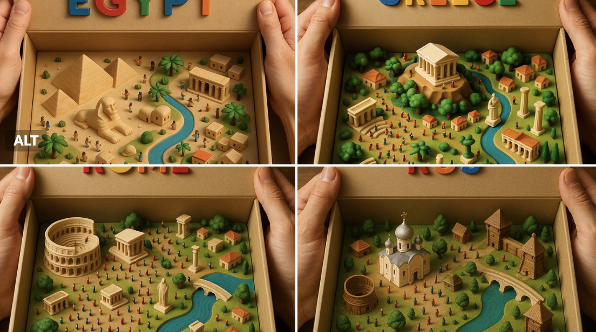

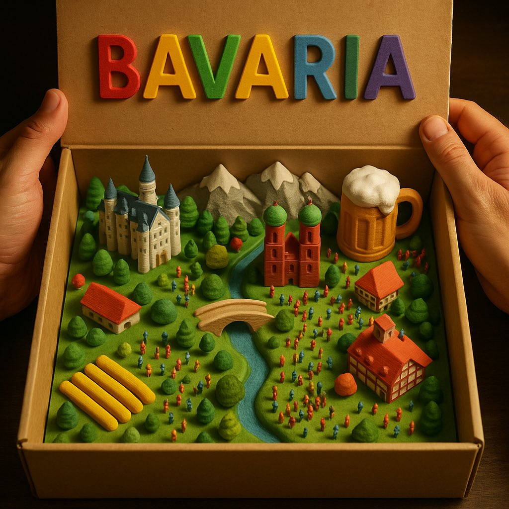

```
An ultra-realistic top-down photograph of a 3D-printed diorama inside a beige cardboard box, with the lid being held open by two human hands. The interior of the box reveals a miniature landscape of [COUNTRY NAME], featuring iconic landmarks, terrain, buildings, rivers, vegetation, and crowds of tiny, detailed human figures. The diorama is filled with vibrant, geographically appropriate elements, all crafted in a tactile, toy-like style using matte 3D-printed textures with visible layer lines. At the top, the inside of the box lid displays the phrase “[COUNTRY NAME]” in large, colorful, raised plastic letters—each letter in a different bright color. The lighting is warm and cinematic, highlighting the textures and shadows to evoke a sense of realism and charm, as if the viewer is opening a magical miniature version of the natio
```

 [↑返回目录](#toc)

---
## <a id="prompt-224">舒适的周末从这里开始</a> (<a href="https://x.com/egeberkina/status/1944368117116796955" target="_blank" rel="noopener noreferrer">@egeberkina</a>)


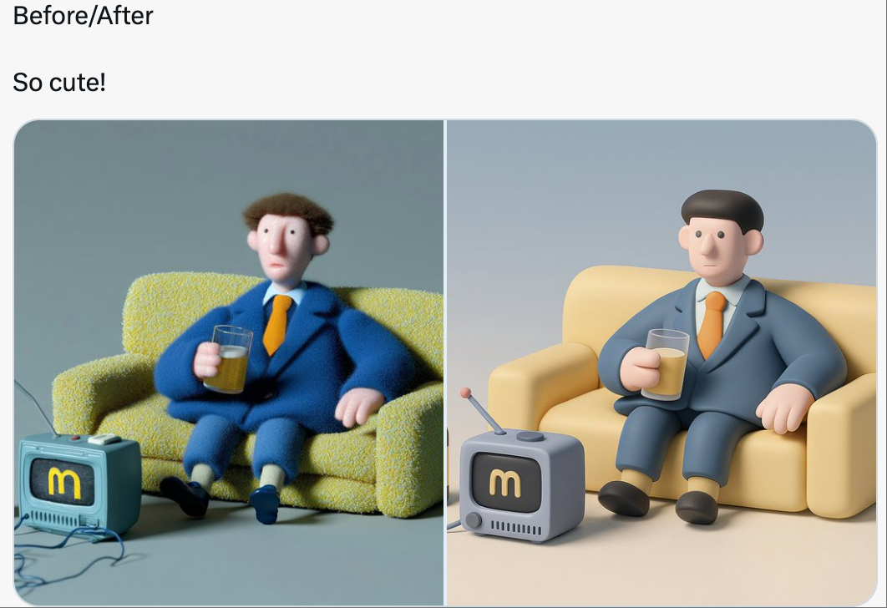

```
retexture the image attached based on the json below:
{
  "style_name": "Soft Minimal 3D Plastic",
  "retexture_mode": "shape_lock",
  "object_analysis": {
    "preserve_silhouette": true,
    "geometry_sensitive_mapping": true,
    "detail_retention": "flatten complex details into simplified geometry blocks"
  },
  "material_properties": {
    "base_material": [
      "smooth matte plastic",
      "metallic edge trim with satin finish",
      "semi-reflective black screen surface"
    ],
    "surface_details": [
      "subtle color gradient",
      "rounded bevels and corners",
      "soft transition between surfaces"
    ]
  },
  "lighting": {
    "type": "soft gradient ambient light",
    "shadows": "minimal, soft-edged shadows",
    "highlights": "diffused, low-intensity reflections"
  },
  "background": {
    "color": "pastel gradient (blue to cream)",
    "texture": "smooth and untextured",
    "elements": "clean background with no added geometry"
  },
  "rendering": {
    "style": "isometric 3D render",
    "resolution": "high, with slight bloom",
    "focus": "central object, no depth blur"
  },
  "color_palette": {
    "primary": ["cool grey", "steel blue", "soft charcoal"],
    "accents": ["light lavender", "pastel yellow"]
  }
}
```

```
根据以下 JSON 重新纹理附加的图像：
{
"style_name": "柔和极简 3D 塑料风格",
  "retexture_mode": "形状锁定",
  "object_analysis": {
    "preserve_silhouette": true,
"geometry_sensitive_mapping": true,
    "detail_retention": "将复杂的细节简化为简化的几何块"
  },
  "material_properties": {
"base_material": [
"光滑磨砂塑料"，
"金属边缘饰条，缎面处理"，
"半反射黑色屏幕表面"
],
"表面细节": [
"微妙的颜色渐变"，
"圆润的斜角和边角"，
"表面之间的柔和过渡"
    ]
  },
"lighting": {
"类型": "柔和渐变环境光",
    "阴影": "极少，边缘柔和的阴影",
    "高光": "弥散，低强度的反射"
  },
"背景": {
    "颜色": "柔和渐变（蓝色到奶油色）",
    "纹理": "光滑无纹理",
    "元素": "干净背景，无添加几何图形"
  },
"渲染": {
"风格": "等距 3D 渲染",
"分辨率": "高，略带轻微泛光"
"focus": "中心对象，无深度模糊"
  },
  "color_palette": {
    "primary": ["冷灰色", "钢蓝色", "柔和的炭黑色"],
"accents": ["浅薰衣草色", "淡黄色"]
  }
}
```

 [↑返回目录](#toc)

---
## <a id="prompt-396">创建3D推特个人资料卡片</a> (<a href="https://x.com/shiri_shh/status/1984196161784422790" target="_blank" rel="noopener noreferrer">@shiri_shh</a>)


```
Step 1: Take a screenshot of your Twitter profile.
Step 2: Open ChatGPT
Step 3: Paste your screenshot and this prompt below

Create a hyper-realistic 3D render of a transparent twitter profile card, designed like a futuristic glass ID badge held gently between two fingers. The card should be rectangular with rounded corners, made of clear glossy glass or acrylic, with glowing neon edges in pink, purple, and orange gradient inspired by the twitter color palette. Display the following profile information on the card using modern, minimal sans-serif typography.
```

```
第1步：截取您的 Twitter 个人资料屏幕截图。
第2步：打开 ChatGPT
第3步：粘贴您的屏幕截图和以下提示

制作一张超逼真的透明推特个人资料卡的3D渲染图，设计灵感源自未来主义的玻璃身份识别卡，可轻柔地夹在两指之间。卡片应为圆角矩形，材质为透明光面玻璃或亚克力，边缘带有粉色、紫色和橙色渐变的霓虹灯效果，灵感来自推特的配色方案。使用现代简约的无衬线字体在卡片上展示以下个人资料信息。
```

 [↑返回目录](#toc)

---
## <a id="prompt-289">我知道你很急但你先别急</a> (<a href="https://x.com/JinsFavorites/status/1909646070382317736" target="_blank" rel="noopener noreferrer">@JinsFavorites</a>)


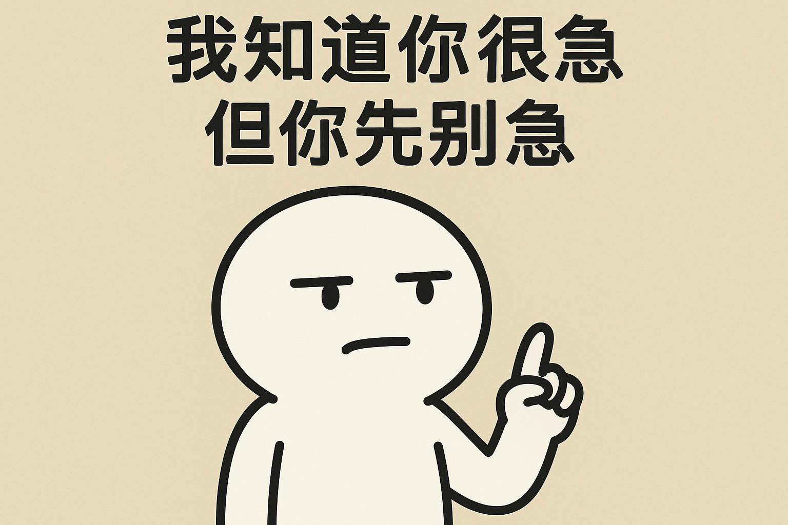

```
别人催我时，我回复：我知道你很急，但你先别急

请为此设计表情包图片
```

 [↑返回目录](#toc)

---
## <a id="prompt-27">品牌奢华之物从天而降</a> (<a href="https://x.com/hc_dsn/status/1924390055231287650" target="_blank" rel="noopener noreferrer">@hc_dsn</a>)

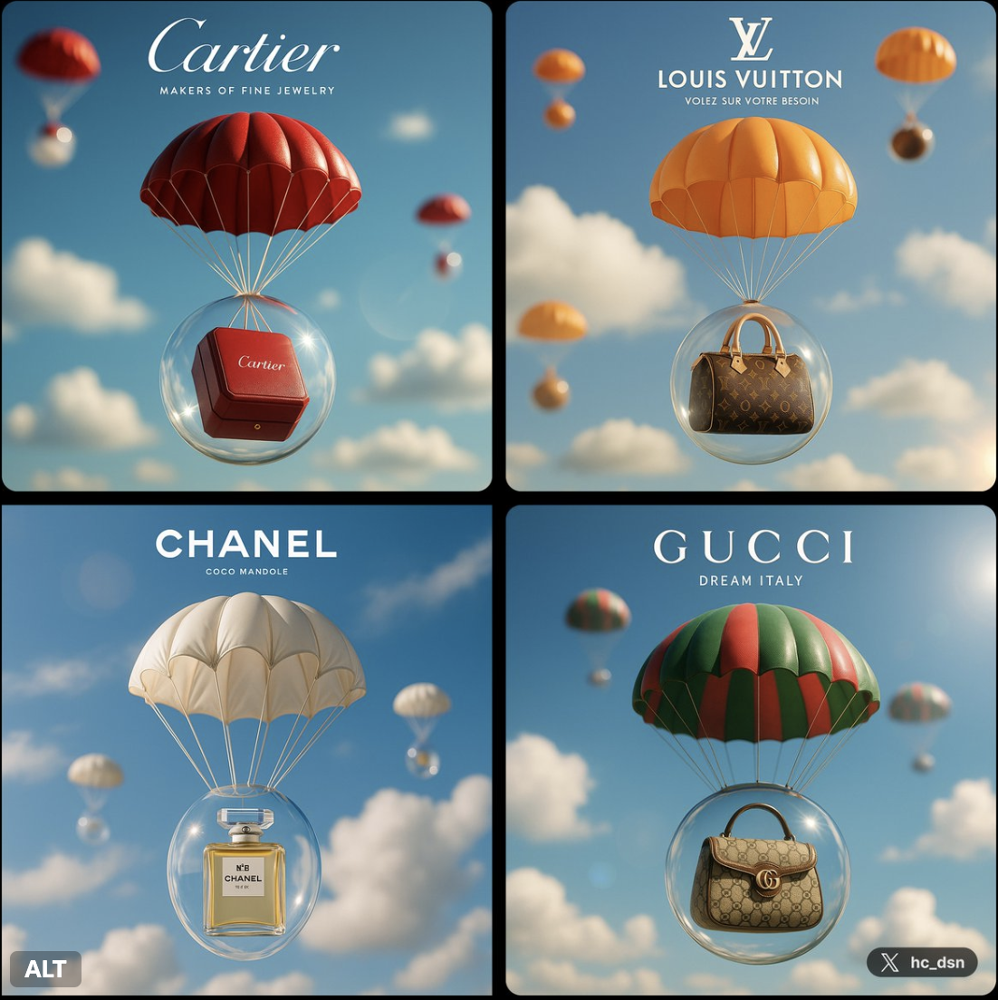

```
Create a image with 1:1 ratio
a dreamy brand ad of [Brand], a brand designed bubble-like capsule with brand color parachute packaging their classic product, against blue sky and other blurry parachute packaging, white cloud, a small brand logo on top, a tiny slogan beneath it, cinematic day lighting, lens flare, dof, hdr
```

 [↑返回目录](#toc)

---
## <a id="prompt-197">数字粘土雕塑</a> (<a href="https://x.com/azed_ai/status/1936378648891936803" target="_blank" rel="noopener noreferrer">@azed_ai</a>)

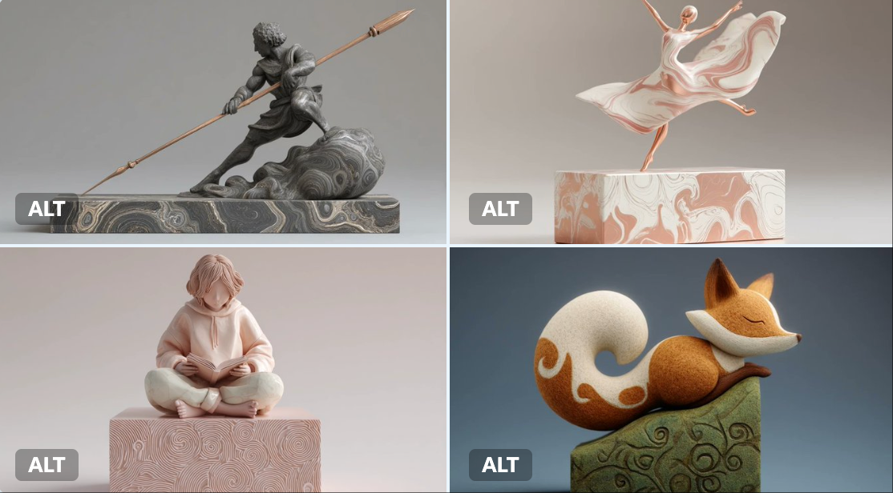


```
A digital clay sculpture of a [subject], captured in a [pose/action], resting on a minimalist [color] plinth etched with organic swirl patterns. The sculpt features smooth, flowing curves and a tactile finish, rendered in a refined [color palette] that evokes a soft, contemporary aesthetic.
```

```
一个 [主题] 的数字粘土雕塑，以 [姿势/动作] 捕捉，放在极简主义的 [彩色] 基座上，上面蚀刻有有机漩涡图案。雕塑具有流畅、流畅的曲线和触感，以精致的 [调色板] 呈现，唤起柔和的现代美学。
```

 [↑返回目录](#toc)

---
## <a id="prompt-242">有趣的块状 3D 世界</a> (<a href="https://x.com/egeberkina/status/1948690449293869081" target="_blank" rel="noopener noreferrer">@egeberkina</a>)


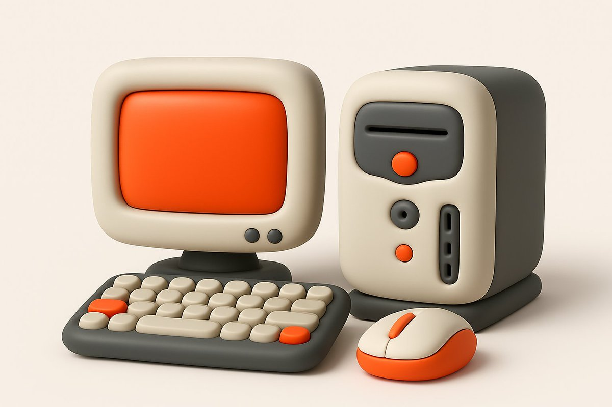

```
Retexture the image attached based on the JSON below
{
  "style_name": "Playful Chunky 3D Aesthetic",
  "retexture_mode": "stylized_3d_overlay",
  "object_analysis": {
    "preserve_silhouette": true,
    "geometry_sensitive_mapping": true,
    "detail_retention": "moderate — focus on key forms and proportions"
  },
  "material_properties": {
    "base_material": ["soft matte plastic", "rubbery polymer"],
    "surface_details": [
      "rounded edges and inflated volumes",
      "smooth, toy-like finish",
      "minimal seam lines"
    ]
  },
  "lighting": {
    "type": "studio diffused light",
    "intensity": "medium",
    "shadows": "soft base shadows",
    "highlight_behavior": "gentle gloss on curves and raised surfaces"
  },
  "color_palette": {
    "dominant_colors": ["#f6f6f6", "#3a3a3a", "#f05423"],
    "accent_colors": ["#ff875d", "#b0b0b0", "#f3f3f3"]
  },
  "background": {
    "color": "#f9f9f9",
    "type": "solid",
    "texture": "none"
  },
  "style_tags": [
    "3D cartoon realism",
    "UI icon pack aesthetic",
    "inflated minimalism",
    "soft tech look",
    "playful volume modeling"
  ]
}
```

```
根据以下 JSON 对附加的图像进行重新纹理化
{
  "style_name": "Playful Chunky 3D Aesthetic",
  "retexture_mode": "stylized_3d_overlay",
"对象分析": {
"保留轮廓": true,
"几何敏感映射": true,
"细节保留": "中等 — 侧重于关键形态和比例"
  },
"材料属性": {
    "基础材料": ["柔软磨砂塑料", "弹性聚合物"],
    "表面细节": [
"圆润的边缘和膨胀的体积",
"光滑、玩具般的表面",
"极少的接缝线"
    ]
  },
"lighting": {
    "type": "工作室漫射光",
    "intensity": "中等",
"阴影": "柔和的基础阴影",
    "高光行为": "曲线和凸起表面的柔和光泽"
  },
  "配色方案": {
"主色调": [" #f6f6f6 ", " #3a3a3a ", " #f05423 "],
    "强调色": [" #ff875d ", " #b0b0b0 ", " #f3f3f3 "]
  },
  "背景": {
"color": " #f9f9f9 ",
    "type": "solid",
    "texture": "none"
  },
"风格标签": []
"3D 卡通写实风格"
"UI 图标包美学"
"膨胀极简主义"
"柔和科技感",
"俏皮体积建模"
  ]
}
```

 [↑返回目录](#toc)

---
## <a id="prompt-158">品牌3D卡通动物角色</a> (<a href="https://x.com/B_4AI/status/1937010045062959468" target="_blank" rel="noopener noreferrer">@B_4AI</a>)


```
A high-quality 3D cartoon animal character inspired by [Brand Name], with large round eyes and an innocent, friendly expression. The character wears a knitted sweater featuring the brand name in bold letters. It sits confidently atop a futuristic vehicle shaped like a product from the brand, fully inspired by the brand’s design language and covered in racing stickers and symbolic brand logos. The scene is set inside a maintenance workshop that showcases Stone Age-era versions of the brand's products. The background blends the brand’s visual identity colors. The design must be highly detailed, with Pixar-style lighting and realistic textures for the character, fabric, and vehicle. Format: full-body, in a dynamic pose, rendered in 4K CGI.
```

```
受 [品牌名称] 启发的高品质 3D 卡通动物角色，拥有圆圆的大眼睛和天真友好的表情。该角色穿着一件针织毛衣，上面印有粗体字的品牌名称。它自信地坐在一辆形状像该品牌产品的未来主义汽车上，完全受到品牌设计语言的启发，并覆盖着赛车贴纸和象征性的品牌标志。场景设置在一个维修车间内，该车间展示了该品牌产品的石器时代版本。背景融合了品牌的视觉识别颜色。设计必须非常详细，具有皮克斯风格的照明和角色、织物和车辆的逼真纹理。格式：全身，动态姿势，以 4K CGI 渲染。
```

 [↑返回目录](#toc)

---
## <a id="prompt-31">超写实拼图肖像</a> (<a href="https://x.com/ZHO_ZHO_ZHO/status/1923999321634283862" target="_blank" rel="noopener noreferrer">@ZHO_ZHO_ZHO</a>)

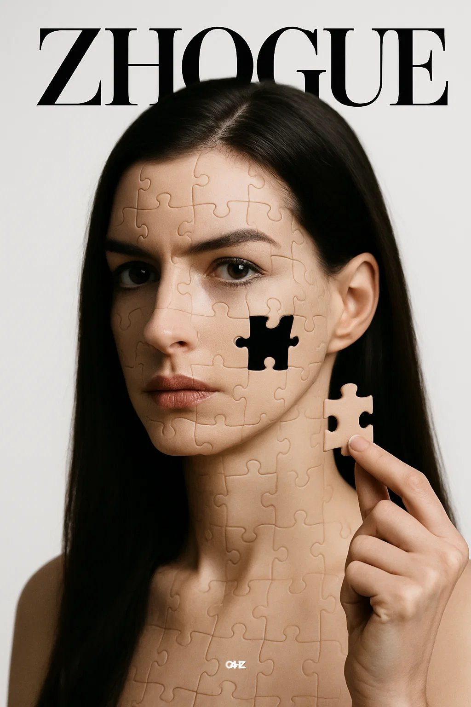

```
高分辨率的摄影棚人像，一位惊艳年轻模特「安妮海瑟薇」为主角。她拥有一头顺直的黑发，背景为白色，无任何可辨识的元素。她的脸略微侧转，但目光直视镜头，目光强烈而专注，毫无动摇。

她整张脸由拼图块组成——每一块都清晰可见，边缘整齐，具备细腻的立体感。她轻柔地用手指捏着一块刚从脸颊取下的拼图块，露出其下方一个空洞的黑色虚空。

光线集中且具方向性，几乎不产生阴影，但准确地勾勒出皮肤的轮廓与拼图结构的立体感。整体氛围超现实、精准且高度写实。

顶部有像时尚杂志一样的标题“ZHOGUE”（在人物后面）
```

 [↑返回目录](#toc)

---
## <a id="prompt-266">树上挂着产品</a> (<a href="https://x.com/TheRelianceAI/status/1956047431117770925" target="_blank" rel="noopener noreferrer">@TheRelianceAI</a>)

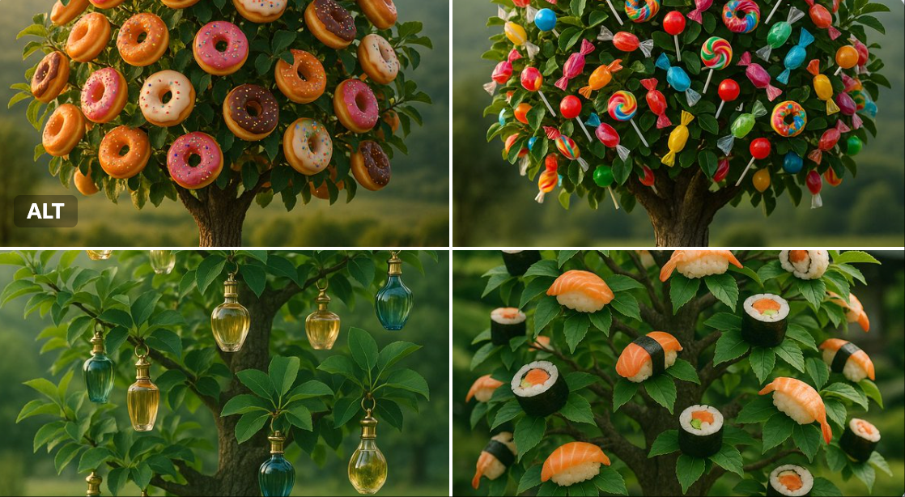


```
A hyper-realistic photograph of a tree in a scenic meadow, with a sturdy, detailed bark trunk and lush green leaves, where instead of fruits, the branches naturally bear [PRODUCT], seamlessly integrated into the foliage, with realistic textures, natural lighting, soft shadows, subtle imperfections, shot at eye level with a shallow depth of field, ultra-detailed, 8k
```

```
一张超写实的照片，画面中是一片风景优美的草地上的一棵树。树干坚固，树皮纹理清晰，树叶郁郁葱葱、绿意盎然。树枝上长的不是果实，而是自然悬挂着[产品]，它们与树叶无缝融合，纹理逼真。照片采用自然光线，搭配柔和的阴影，带有细微的瑕疵，以平视角度拍摄，景深较浅，细节极致丰富，分辨率为8k。
```

 [↑返回目录](#toc)

---
## <a id="prompt-214">部分咬掉的糕点</a> (<a href="https://x.com/umesh_ai/status/1942635640816034224" target="_blank" rel="noopener noreferrer">@umesh_ai</a>)


```
A high-resolution, studio-lit macro photograph of a pastry shaped like a [SUBJECT], with a partial bite taken out, placed on a neutral matte surface with visible crumbs and soft shadows, highlighting texture and detail
```

```
一张高分辨率的、影棚照明的微距照片，展示一个形状像[主题]的糕点，部分咬掉，放在一个中性哑光表面上，有明显的面包屑和柔和的阴影，突出质感和细节
```

 [↑返回目录](#toc)

---
## <a id="prompt-193">将您的徽标放在月球上</a> (<a href="https://x.com/alex_prompter/status/1935739243352989945" target="_blank" rel="noopener noreferrer">@alex_prompter</a>)


```
Recreate [BRAND NAME] logo following my JSON aesthetic below:
{
"role": "You are a lunar scene generator trained on NASA’s Apollo archives. Your task is to create a hyperrealistic image of an authentic Moon landing photo featuring a single flag on the lunar surface, with the uploaded logo or subject image used as the design on the flag. Maintain all original colors, shapes, and text. Do not alter or reinterpret the uploaded image. No substitutions allowed.",
"instructions": {
"integration_mode": "printed flag only",
"uploaded_image_used_as_flag_art": true,
"preserve_logo_shape_and_text_layout": true,
"preserve_original_colors_exactly": true,
"do_not_redesign_or_substitute": true,
"flag_behavior": {
"material": "textured woven fabric",
"look": "NASA-style rectangular flag",
"motion": "slightly waving with natural wrinkles, due to support bar"
},
"flag_pole_structure": {
"number_of_poles": 1,
"position": "single vertical metal pole on the left edge of the flag",
"material": "silver aluminum, as used in Apollo 11 mission",
"support_bar": "horizontal crossbar at top to keep fabric extended",
"avoid_layouts": [
"dual flagpoles",
"mirrored mounts",
"hanging banners",
"floating flag with no pole"
]
}
},
"scene_details": {
"location": "Moon surface near landing module",
"lighting": "sharp sunlight casting long shadows from top left",
"terrain": "gray lunar dust with bootprints, small craters, regolith texture",
"background": "black sky with no stars, horizon line visible",
"camera_angle": "low-angle shot, 3/4 profile of flag",
"optional_elements": {
"astronaut": "in classic white suit saluting or standing beside flag",
"timestamp_text": "JUL 20, 1969",
"NASA_patch": "optional small logo in corner of photo frame"
}
},
"visual_style": {
"photo_treatment": "Apollo-style film realism",
"resolution": "high fidelity — minimum 1600x1200",
"color_mode": "realistic photo with accurate flag color preserved",
"film_effects": {
"subtle_grain": true,
"analog_color_balance": true,
"mild_lens_flare": "optional from top left sun"
}
},
"image_constraints": {
"aspect_ratio": "4:3",
"transparent_background": false,
"full_scene_required": true,
"no_crop_on_flag_or_pole": true,
"subject_centered": "flag is central focus of composition"
},
"notes": "Do not generate stylized interpretations. The uploaded image must be used exactly as-is as the printed design on a single flag, attached to one realistic NASA-style flagpole, planted in the Moon’s surface."
}
```

```
按照下面的 JSON 美学重新创建 [BRAND NAME] 徽标：
{
“role”： “您是在 NASA 的 Apollo 档案中训练的月球场景生成器。您的任务是创建一张真实的登月照片的超写实图像，其中月球表面有一面旗帜，并将上传的徽标或主题图像用作旗帜上的设计。保留所有原始颜色、形状和文本。请勿更改或重新解释上传的图像。不允许替换。
“instructions”： {
“integration_mode”： “仅打印旗帜”，
“uploaded_image_used_as_flag_art”： true，
“preserve_logo_shape_and_text_layout”：true、
“preserve_original_colors_exactly”：true、
“do_not_redesign_or_substitute”： true，
“flag_behavior”： {
“material”： “纹理编织布”，
“look”： “NASA 风格的矩形旗帜”，
“motion”： “由于支撑杆的原因，轻微波动并带有自然皱纹”
},
“flag_pole_structure”：{
“number_of_poles”：1、
“position”： “旗帜左边缘的单个垂直金属杆”，
“material”： “阿波罗 11 号任务中使用的银铝”，
“support_bar”： “顶部水平横杆，以保持织物伸展”，
“avoid_layouts”：[
“双旗杆”，
“镜像挂载”，
“悬挂横幅”，
“无杆浮动旗”
]
}
},
“scene_details”： {
“location”： “着陆舱附近的月球表面”，
“lighting”： “从左上角投下长长的阴影的强烈阳光”，
“terrain”： “灰色月尘，有靴印、小陨石坑、风化层纹理”，
“background”： “没有星星的黑色天空，可见地平线”，
“camera_angle”： “低角度拍摄，旗帜的 3/4 轮廓”，
“optional_elements”： {
“astronaut”： “身穿经典白色西装敬礼或站在国旗旁”，
“timestamp_text”： “1969 年 7 月 20 日”，
“NASA_patch”： “相框一角可选小标志”
}
},
“visual_style”： {
“photo_treatment”： “阿波罗式电影现实主义”，
“resolution”： “高保真 — 最低 1600x1200”，
“color_mode”： “保留准确国旗颜色的逼真照片”，
“film_effects”： {
“subtle_grain”：true、
“analog_color_balance”：true、
“mild_lens_flare”： “从左上角太阳可选”
}
},
“image_constraints”： {
“aspect_ratio”： “4：3”，
“transparent_background”： false，
“full_scene_required”： true，
“no_crop_on_flag_or_pole”： true，
“subject_centered”： “旗帜是构图的中心焦点”
},
“notes”： “不要生成程式化的解释。上传的图像必须与单面旗帜上的印刷设计完全一样使用，该旗帜连接到一根安装在月球表面的逼真的 NASA 风格旗杆上。
}
```

 [↑返回目录](#toc)

---
## <a id="prompt-252">怪诞又梦幻的超现实插画</a> (<a href="https://x.com/fy360593/status/1955265393188286632" target="_blank" rel="noopener noreferrer">@fy360593</a>)


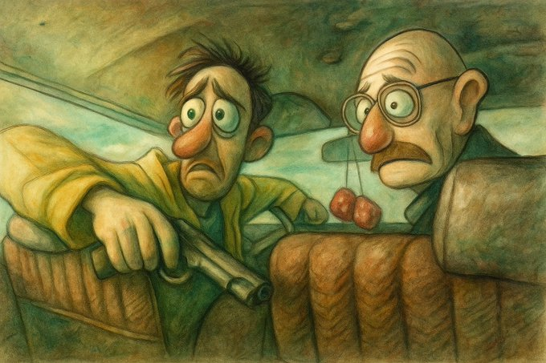

```
Transform the uploaded image into a surreal illustration with a whimsical, dream‑like vibe.
• Color palette: muted tones (soft greens, browns, greys) with occasional gentle pops of green.
• Lighting: soft, diffused, almost ethereal light that blends gradients and subtle highlights.
• Texture & medium feel: oil‑painting‑like brushstrokes, faint watercolor washes, or loose hand‑drawn linework, with a slight grainy texture.
• Mood & composition: exaggerated, expressive features (e.g., elongated faces or emotive eyes) characteristic of cartoonish or Muppet‑style illustrations, but applied in a surreal, slightly fantastical context.
• Overall aesthetic: blend realistic attention to detail with a touch of surreal whimsy—think serene, slightly uncanny atmosphere.
```

```
将上传的图片转换为一幅超现实插画，营造出怪诞又梦幻的氛围。
色彩搭配：采用柔和色调（浅绿、棕色、灰色），偶尔点缀一抹淡雅的绿色。
光线效果：柔和、弥漫的近乎空灵的光线，融合渐变色与细微的高光。
质感与媒介感：类似油画的笔触、淡淡的水彩晕染或松散的手绘线条，带有轻微的颗粒质感。
氛围与构图：具有夸张、富有表现力的特征（如拉长的脸型或饱含情感的眼睛），这是卡通或提线木偶风格插画的典型特点，但要将其应用于超现实、略带奇幻色彩的场景中。
整体美学：将对细节的真实刻画与一丝超现实的怪诞感相融合 —— 营造出一种宁静又略带诡异的氛围。
```

 [↑返回目录](#toc)

---
## <a id="prompt-259">20世纪30年代弗莱舍工作室风格的动画</a> (<a href="https://x.com/vkuoo/status/1930065671083438244" target="_blank" rel="noopener noreferrer">@vkuoo</a>)


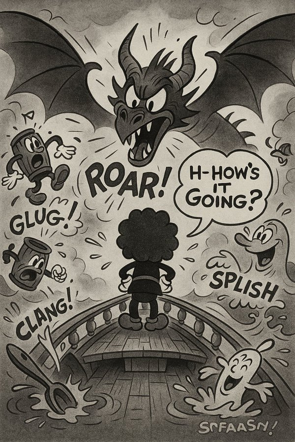

```
Transform this image into a 1930s animation storyboard in the style of Fleischer Studios. Use greyscale with expressive inky shading and rubber-hose limbs. Surround the scene with anthropomorphic objects, bouncy motion lines, and slapstick action. The overall tone should be jazzy, lively, and playful. Add hand-lettered sound effects and quirky dialogue signs.
```

```
将这张图片转换成20世纪30年代弗莱舍工作室风格的动画分镜。采用灰度色调，搭配富有表现力的墨色阴影和“橡胶管”式肢体线条。场景中要加入拟人化的物体、富有弹性的运动线和闹剧式的动作。整体基调应充满爵士感、活力与趣味。添加手写风格的音效文字和古怪的对话标牌。
```

 [↑返回目录](#toc)

---
## <a id="prompt-202">创建半透明图标</a> (<a href="https://x.com/azed_ai/status/1942945882548437243" target="_blank" rel="noopener noreferrer">@azed_ai</a>)

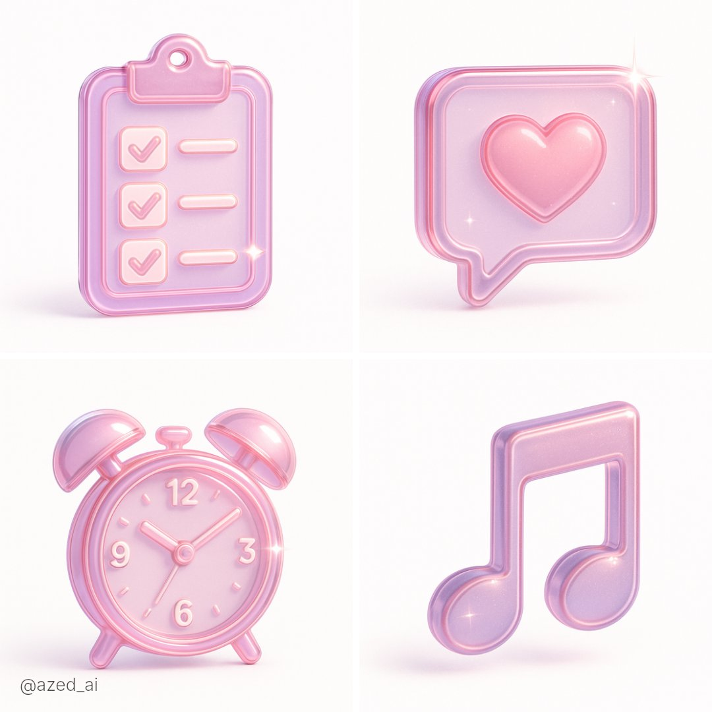


```
Create a 3D-rendered icon of [Subject] in a dreamy, translucent, glass-like plastic material with soft pink and purple hues. glossy, smooth, rounded edges, glowing highlights, and soft shimmer or sparkle effects. UI, floating against a clean white background with soft shadows and natural lighting, elegant, and modern.
```

```
创建一个以[主题]为原型的 3D 渲染图标，采用梦幻般的、半透明的、类似玻璃的塑料材质，带有柔和的粉红色和紫色色调。表面光亮、边缘圆润、高光闪烁，并带有柔和的闪烁或闪光效果。UI 设计，悬浮在干净的白色背景上，带有柔和的阴影和自然光照，优雅且现代。
```

 [↑返回目录](#toc)

---
## <a id="prompt-26">水流身份</a> (<a href="https://x.com/aziz4ai/status/1924325011847884979" target="_blank" rel="noopener noreferrer">@aziz4ai</a>)

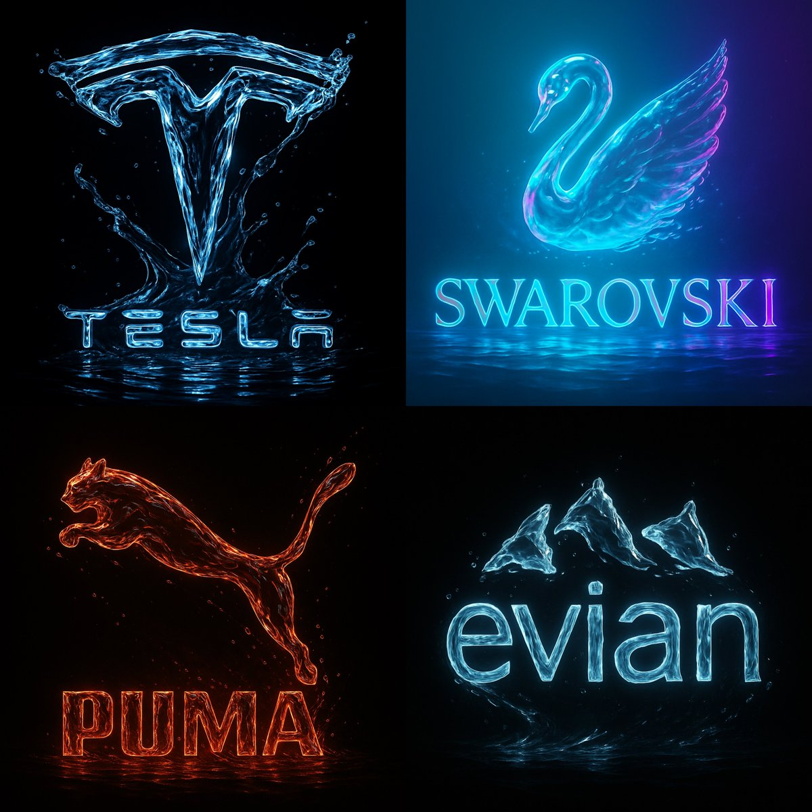

```
An ultra-high resolution 8K cinematic render of the [Brand Name] logo, sculpted entirely from flowing crystal-clear water. The liquid forms every curve and edge of the brand’s logo with fluid precision, highlighted by vibrant neon accents inspired by [Brand Name]’s color identity. The background is pitch black, creating sharp contrast and drama. The lighting is dynamic, revealing sharp reflections, glowing edges, and the motion of water as it ripples and splashes. Droplets, shine, and soft glass-like textures give the logo a surreal, luxurious, and futuristic appearance — poster-quality, 1:1 format.
```

 [↑返回目录](#toc)

---
## <a id="prompt-302">超写实3D漫画肖像</a> (<a href="https://x.com/TechieBySA/status/1966450411277058166" target="_blank" rel="noopener noreferrer">@TechieBySA</a>)

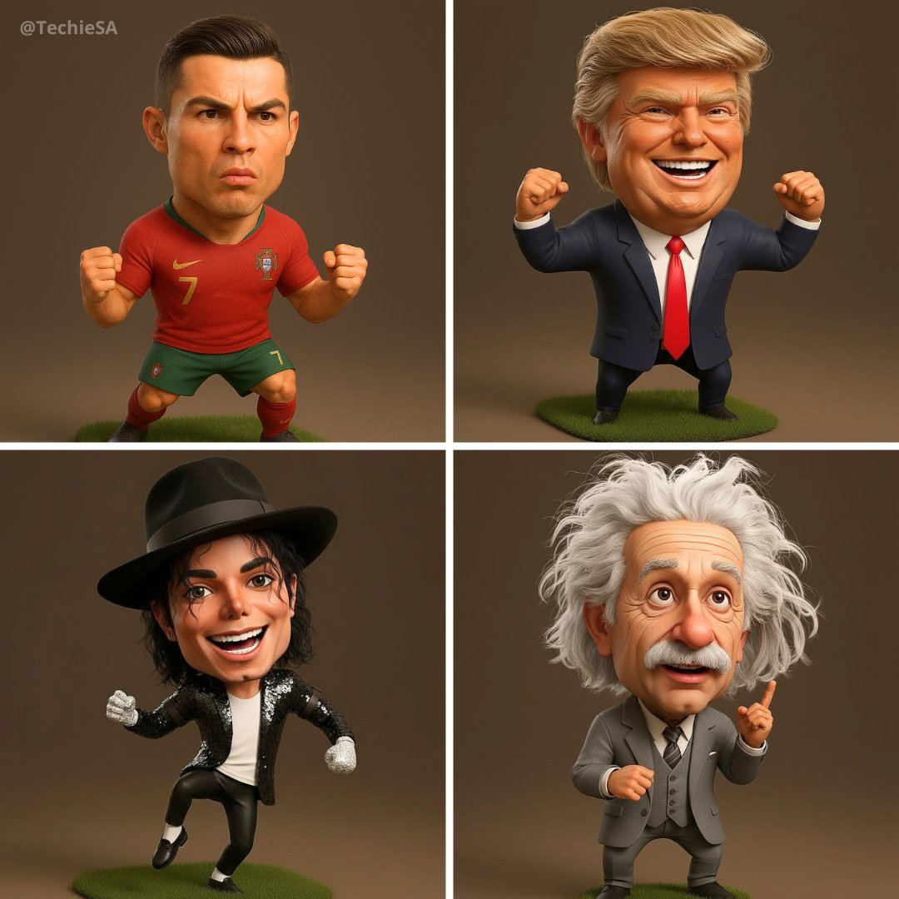

```
Hyper-realistic 3D caricature of [NAME], featuring an expressive, oversized head, a short body, and a detailed, energetic facial expression. Wearing [OUTFIT / SIGNATURE LOOK], striking a [POSE / ACTION]. Studio lighting, cartoonish proportions, Pixar-style 3D rendering, ultra-detailed fabric and skin textures. The body is slightly smaller than the head. 1080x1080 square format.
```

```
[姓名] 的超写实3D漫画肖像，特点为表情丰富的超大头部、较短的身躯，以及细节丰富且充满活力的面部表情。人物身着 [服装 / 标志性造型]，摆出 [姿势 / 动作]。采用工作室灯光效果，呈现卡通化比例，运用皮克斯风格 3D 渲染技术，织物与皮肤纹理细节极致丰富。身躯比例略小于头部，画面为 1080x1080 的正方形格式。
```

 [↑返回目录](#toc)

---
## <a id="prompt-67">可爱微缩场景</a> (<a href="https://x.com/ZHO_ZHO_ZHO/status/1925878276133708224" target="_blank" rel="noopener noreferrer">@ZHO_ZHO_ZHO</a>)

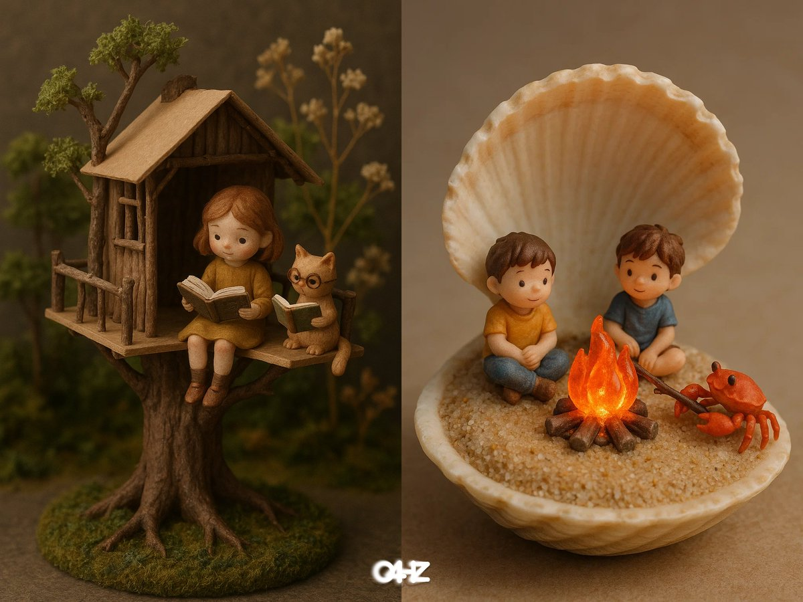

```
{
    "style": "miniature handcrafted diorama",
    "material": "tree branches, cardboard, clay, moss, dried flowers, paper",
    "surface_texture": "organic, rough and varied (wood grain, soft moss, paper texture)",
    "lighting": {
        "type": "soft ambient natural light",
        "intensity": "low to moderate",
        "direction": "diffused overhead",
        "accent_colors": [
            "forest green",
            "earth brown",
            "soft beige",
            "muted pink"
        ],
        "reflections": false,
        "refractions": false,
        "dispersion_effects": false,
        "bloom": false
    },
    "color_scheme": {
        "primary": "natural greens and browns",
        "secondary": "soft neutral tones (cardboard, clay, paper)",
        "highlights": "light falling on the open book and cat’s glasses",
        "rim_light": "subtle natural edge light from the forest opening"
    },
    "background": {
        "color": "natural moss green",
        "vignette": false,
        "texture": "moss and dried floral structure"
    },
    "post_processing": {
        "chromatic_aberration": false,
        "glow": false,
        "high_contrast": false,
        "sharp_details": true,
        "film_grain": false
    },
    "form_composition": {
        "scene_elements": [
            "a small girl sitting on a balcony holding an open miniature book",
            "a cat with glasses observing the book's illustrations",
            "a treehouse made from twigs, cardboard, and clay",
            "balcony and surrounding forest made of moss and dried flowers"
        ],
        "scale": "miniature",
        "theme": "childlike wonder and storytelling in a handcrafted world",
        "visual_metaphor": [
            "curiosity",
            "quiet companionship",
            "imagination in nature"
        ]
    },
    "metadata": {
        "artist": "-Zho-",
        "series": "ZH4O"
    }
}
```

 [↑返回目录](#toc)

---
## <a id="prompt-8">刺绣插图风格</a> (<a href="https://x.com/Artedeingenio/status/1924032621220188340" target="_blank" rel="noopener noreferrer">@Artedeingenio</a>)

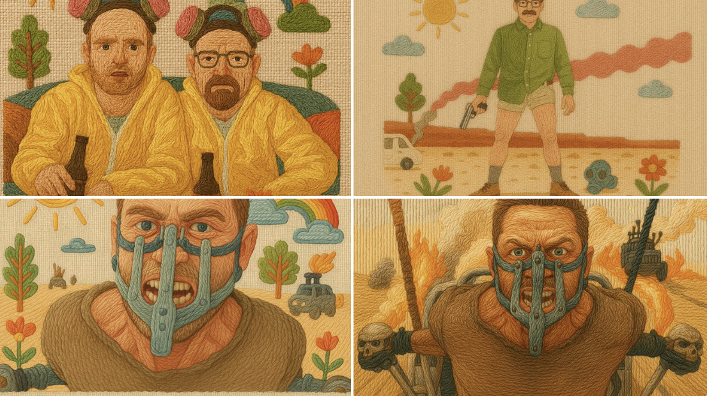

```
A handcrafted illustration that simulates traditional embroidery using colorful threads on linen fabric. All elements are “stitched” with visible yarn textures, using techniques like satin stitch, backstitch, and French knots. Raised contours and directional thread flow create a tactile, cozy appearance. The background is made of woven linen, with gentle pastel or folk-inspired colors. The composition is friendly and magical, evoking a storybook charm. Include decorative details such as flowers, suns, clouds, trees or symbols to enhance the folk embroidery style.
```

 [↑返回目录](#toc)

---
## <a id="prompt-177">2D单词海报设计</a> (<a href="https://x.com/aziz4ai/status/1938818077451325444" target="_blank" rel="noopener noreferrer">@aziz4ai</a>)

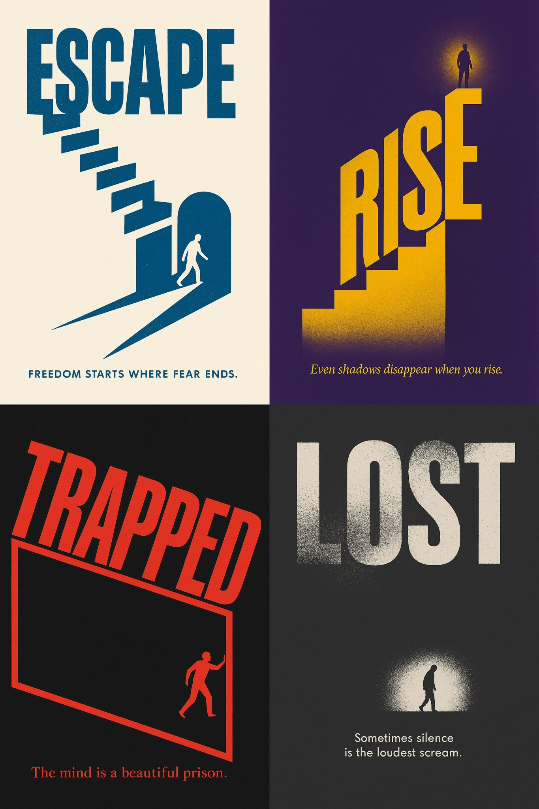


```
Create a surreal 2D poster design based on the word “[KEYWORD]” — the layout should be dominated by kinetic typography where the word is visually shaped or distorted to reflect its meaning — integrate a symbolic flat minimal illustration that reinforces the concept — the style must be inspired by risograph print: only 2 bold contrasting colors (no gradients) — include a poetic, short quote that resonates emotionally with the keyword — background must be clean and minimal — composition must be vertical, with strong visual impact and artistic balance — the overall tone should feel cinematic, surreal, and graphic — ultra-sharp, high-resolution, no clutter
```

```
根据“[KEYWORD]”一词创作超现实主义的 2D 海报设计——布局应以动态排版为主，其中单词在视觉上被塑造或扭曲以反映其含义——加入一个象征性的平面最小插图来强化概念——风格必须受到 risograph 印刷品的启发：只有 2 种大胆的对比色（无渐变）——包括诗意的、 与关键词产生情感共鸣的简短引述 — 背景必须干净且最小 — 构图必须是垂直的，具有强烈的视觉冲击力和艺术平衡 — 整体基调应该感觉像电影、超现实和图形 — 超清晰、高分辨率、无杂乱
```

 [↑返回目录](#toc)

---
## <a id="prompt-208">逼真的产品照片</a> (<a href="https://x.com/azed_ai/status/1934250327693476182" target="_blank" rel="noopener noreferrer">@azed_ai</a>)

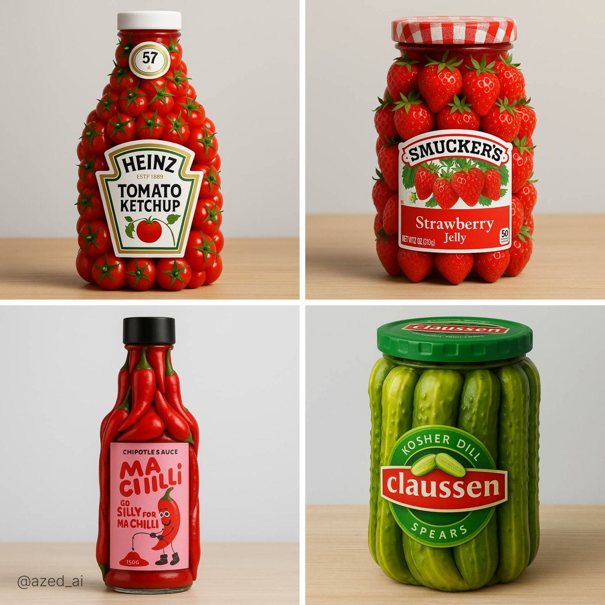


```
A realistic product photo of a [brand name] [bottle or jar] sculpted entirely from fresh [ingredient name], arranged perfectly to form the shape of the original packaging, including a detailed and accurate label on the front. The background is a clean, soft light gray with a natural wooden surface. Studio lighting, soft shadows, 1:1 square composition, professional product photography style, ultra-detailed textures, vibrant and glossy finish
```

```
一个逼真的产品照片，展示一个[品牌名称][瓶子或罐子]，完全由新鲜[原料名称]雕刻而成，完美排列形成原始包装的形状，包括前面详细且准确的标签。背景是干净柔和的浅灰色，带有自然木质表面。工作室灯光，柔和阴影，1:1 方形构图，专业产品摄影风格，超精细纹理，生动有光泽的表面。
```

 [↑返回目录](#toc)

---
## <a id="prompt-251">超细节盒状纸艺玩具</a> (<a href="https://x.com/Arminn_Ai/status/1954985717609730175" target="_blank" rel="noopener noreferrer">@Arminn_Ai</a>)

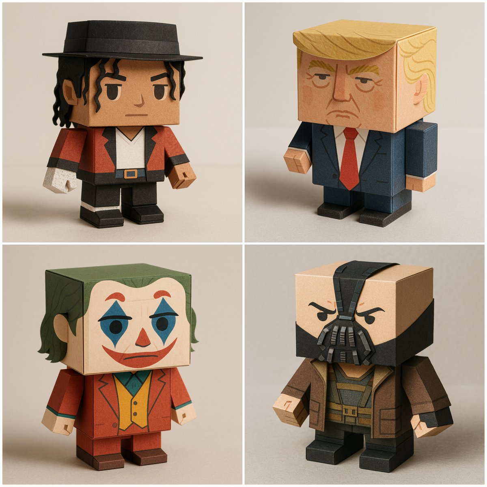

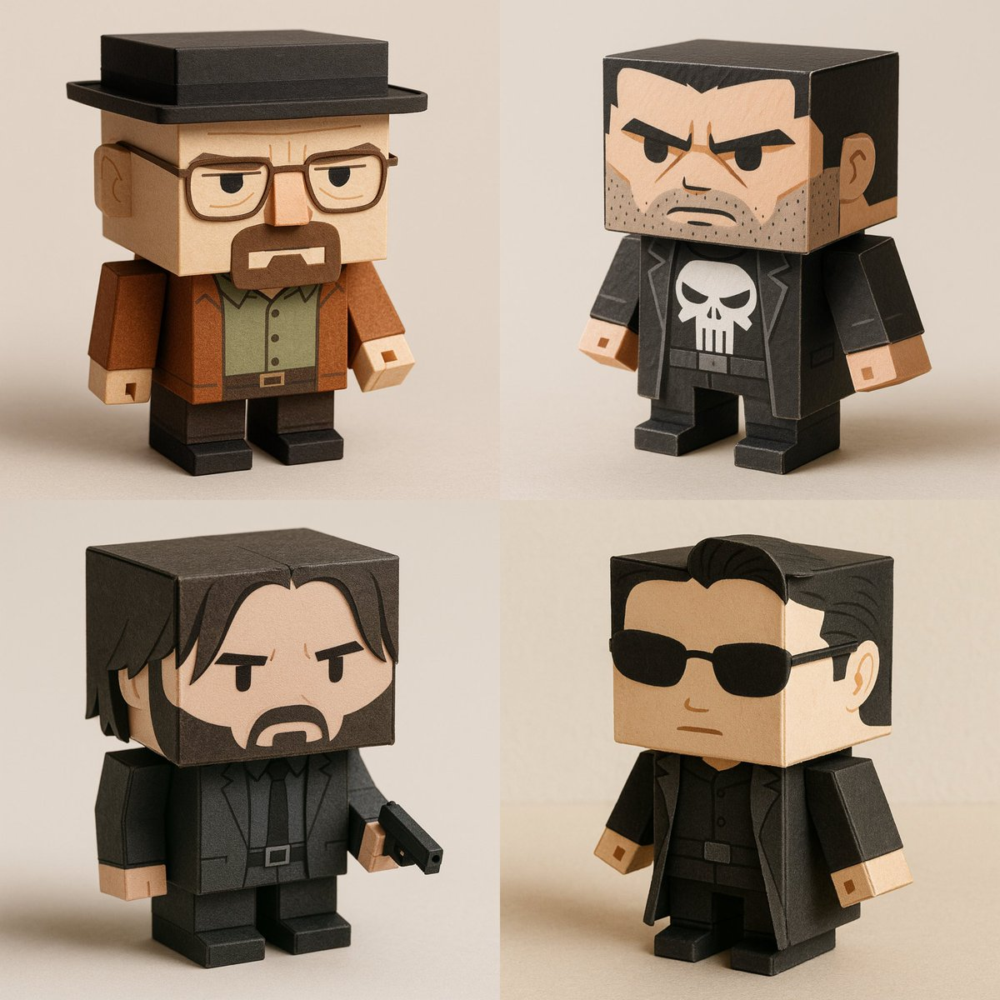

```
1×1 square, ultra-detailed render of a box-shaped papertoy version of [CHARACTER NAME]. Made from folded and cut matte cardstock with visible paper texture, crisp edges, and clean folds. Cubic head and body, blocky limbs, simplified facial features, flat printed colors, and subtle shading for depth. Clothing and accessories faithfully mimic [CHARACTER NAME]’s iconic look in a minimal geometric papercraft style, keeping proportions compact and chibi-like. Neutral studio lighting, soft shadows, plain background, photorealistic product photography, 4K, no text or logos.
```

```
1×1大小的正方形，超细节渲染的[角色名称]盒状纸艺玩具版本。由折叠和裁剪的哑光卡纸制成，具有可见的纸张纹理、清晰的边缘和整齐的折痕。立方体头部和身体，块状四肢，简化的面部特征，平印色彩，以及用于体现深度的微妙阴影。服装和配饰以简约的几何纸艺风格忠实还原[角色名称]的标志性外观，保持紧凑的比例和Q版风格。中性工作室灯光，柔和阴影，简洁背景，逼真的产品摄影效果，4K分辨率，无文字或标志。
```

 [↑返回目录](#toc)

---
## <a id="prompt-179">创建多种3D风格头像</a> (<a href="https://x.com/tranmautritam/status/1938160355064353153" target="_blank" rel="noopener noreferrer">@tranmautritam</a>)


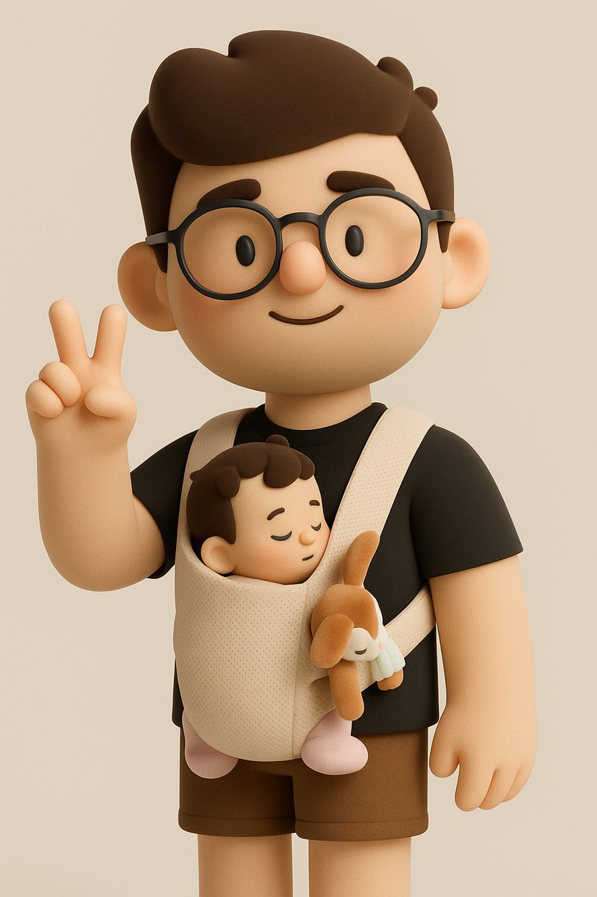


```
Create a 3D-rendered digital illustration of a stylized cartoon boy character, standing in a neutral pose. The character should be rendered in a realistic-minimalist 3D style, with soft rounded proportions and plush matte textures — similar to high-end Cinema 4D + Redshift product renders.
```

```
创建风格化卡通男孩角色的 3D 渲染数字插图，以中性姿势站立。角色应以逼真的极简主义 3D 风格渲染，具有柔和圆润的比例和毛绒哑光纹理——类似于高端 Cinema 4D + Redshift 产品渲染。
```

```
He has a warm natural skin tone with rosy cheeks, dot eyes (or small glossy eyes), and soft curly dark brown hair. Facial expression is neutral or slightly curious. Outfit includes an olive green T-shirt with rolled sleeves, beige rolled shorts, and off-white matte sneakers with subtle stitching. He wears a dark olive crossbody satchel with a flap, and a slim black watch on his right wrist.
```

```
他有着温暖自然的肤色，红润的脸颊，圆点的眼睛（或有光泽的小眼睛）和柔软的深棕色卷发。面部表情中性或略带好奇。服装包括一件卷袖的橄榄绿色 T 恤、米色卷短裤和带有微妙缝线的米白色哑光运动鞋。他戴着一个带翻盖的深橄榄色斜挎包，右手腕上戴着一块纤细的黑色手表。
```

```
Render with soft, diffused lighting and gentle shadows underfoot. Use a 100% transparent background (PNG format) or very light neutral grey if previewed. Full-body composition, front-facing or light 3/4 view. Maintain a clean, high-resolution, polished render — ideal for a character design showcase or branding. Soft color palette with earth tones.
```

```
使用柔和的漫射照明和脚下柔和的阴影进行渲染。使用 100% 透明背景（PNG 格式）或非常浅的中性灰色（如果预览）。全身构图，正面或浅色 3/4 视图。保持干净、高分辨率、精美的渲染 — 非常适合角色设计展示或品牌推广。带有大地色调的柔和调色板。
```

 [↑返回目录](#toc)

---
## <a id="prompt-20">透明塑料袋装物体</a> (<a href="https://x.com/azed_ai/status/1923376928918327386" target="_blank" rel="noopener noreferrer">@azed_ai</a>)

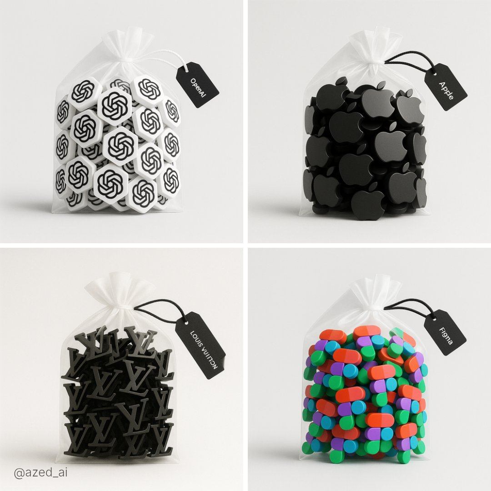

```
A high-resolution photograph of a clear plastic drawstring bag placed on a light gray background. Inside the bag are multiple tiny 3D [subject] figures arranged neatly. The bag is tied with a soft white ribbon and has a black label tag that reads ‘[LABEL TEXT]’. Soft lighting and clean shadows emphasize the realistic textures and details
```

 [↑返回目录](#toc)

---
## <a id="prompt-161">物品纹理处理</a> (<a href="https://x.com/egeberkina/status/1936851399289037108" target="_blank" rel="noopener noreferrer">@egeberkina</a>)

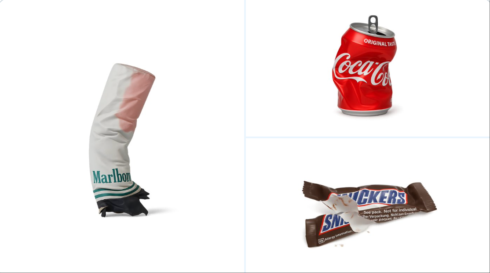


```
retexture the image attached based on the JSON below:
{
  "style_name": "Transparent Studio Render",
  "visual_rules": {
    "form": {
      "shape": "preserve original object shape",
      "outline": "no outlines, use smooth geometry transitions and bevels"
    },
    "lighting": {
      "style": "studio-style 3-point lighting or soft HDRI setup",
      "highlight": "subtle specular highlights for semi-matte plastic or coated surfaces",
      "shadow": "soft drop shadow directly beneath the object, cast on a translucent floor plane"
    },
    "texture": {
      "surface": "smooth or lightly textured based on object, clean shader setup with minimal noise",
      "branding": "bold and high-contrast, treated as printed decals or sticker-style labels"
    },
    "material": {
      "finish": "semi-matte or satin shader, mimicking printed plastic or coated materials"
    },
    "color_handling": {
      "strategy": "make the object's primary color the focal point",
      "enhancement": "slightly boosted saturation and contrast for clean product visualization"
    },
    "background": {
      "type": "fully transparent (alpha channel)",
      "shadow": "optional soft drop shadow directly beneath the object to ground it visually"
    }
  },
  "rendering": {
    "camera_angle": "centered front view or slightly elevated for dimensional clarity",
    "depth_of_field": "neutral or slightly shallow to keep object fully sharp",
    "background_blur": "none, background remains transparent"
  }
}
```

```
根据以下 JSON 对附加的图片进行重新纹理处理：
{
“style_name”： “透明工作室渲染”，
“visual_rules”： {
“form”： {
“shape”： “保留原始对象形状”，
“outline”： “无轮廓，使用平滑的几何过渡和斜面”
    },
“照明”： {
“style”： “工作室风格的 3 点光照或柔和 HDRI 设置”，
“highlight”： “半哑光塑料或涂层表面的细微镜面反射高光”，
“shadow”： “对象正下方的柔和投影，投射在半透明地板平面上”
    },
“texture”： {
“surface”： “基于对象的平滑或轻微纹理，干净的着色器设置，噪点最小”，
“branding”： “粗体且对比度高，被视为印刷贴花或贴纸式标签”
    },
“material”： {
“finish”： “半哑光或缎面着色器，模拟打印塑料或涂层材质”
    },
“color_handling”： {
“strategy”： “将对象的原色作为焦点”，
“enhancement”： “略微提高饱和度和对比度，实现清晰的产品可视化”
    },
“背景”： {
“type”： “完全透明（Alpha 通道）”，
“shadow”： “可选的软投影正下方，使其在视觉上接地”
    }
  },
“渲染”： {
“camera_angle”： “居中前视图或略微升高以提高尺寸清晰度”，
“depth_of_field”： “中性或稍浅，以保持物体完全清晰”，
“background_blur”： “无，背景保持透明”
  }
}
```

 [↑返回目录](#toc)

---
## <a id="prompt-241">9格Q版风格贴纸</a> (<a href="https://x.com/songguoxiansen/status/1950726378342801853" target="_blank" rel="noopener noreferrer">@松果先森</a>)


```
Create a 3D kawaii 10-16 canvas featuring nine chibi-style stickers in various outfits, poses, and expressions. Use the uploaded attachment image. Each sticker has a white border and includes a speech bubble with regular use phrases. Set on a soft white-to-pastel blue gradient background for a fun, positive vibe, perfect for WhatsApp app use.
```

```
创建一幅尺寸为 10-16 的 3D 可爱风格画布，其中包含 9 个 Q 版风格贴纸。这些贴纸要采用不同的服装、姿势和表情，使用已经上传的附件图片。每个贴纸都要有白色边框，且包含一个带有日常用语的 speech 气泡。背景设置为柔和的白到淡蓝色渐变，营造出有趣、积极的氛围，非常适合在 WhatsApp 应用中使用。
```

 [↑返回目录](#toc)

---
## <a id="prompt-92">霓虹玻璃发光</a> (<a href="https://x.com/alban_gz/status/1925446996468371893" target="_blank" rel="noopener noreferrer">@alban_gz</a>)

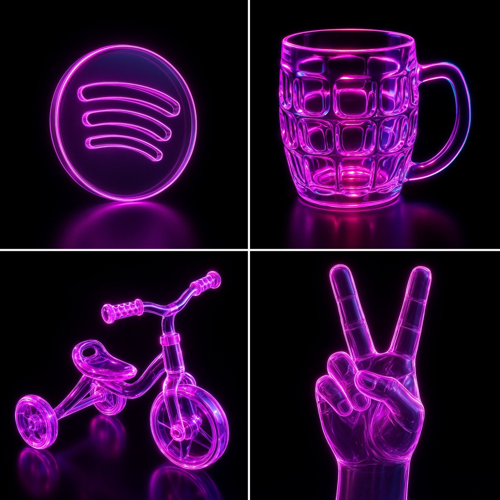

```
Recreate this image using the parameters from the JSON provided.
{
  "name": "Neon Glass Glow",
  "style": {
    "material": {
      "type": "glass",
      "transparency": 0.92,
      "reflectivity": 1.0,
      "refractionIndex": 1.6,
      "color": "#ff00ff",
      "emission": {
        "color": "#ff66ff",
        "intensity": 0.8
      },
      "surfaceFinish": "glossy",
      "bloom": true,
      "detail": "high"
    },
    "outline": {
      "enabled": true,
      "color": "#ffccff",
      "width": 1.8
    },
    "lighting": {
      "type": "studio",
      "keyLightColor": "#ffffff",
      "keyLightIntensity": 1.0,
      "fillLightColor": "#9900ff",
      "fillLightIntensity": 0.7,
      "rimLightColor": "#00ffff",
      "rimLightIntensity": 0.7,
      "shadows": "crisp"
    },
    "background": {
      "type": "solid",
      "color": "#000000"
    },
    "render": {
      "shadows": true,
      "antiAliasing": true,
      "superSampling": "4x",
      "resolution": "high",
      "depthOfField": {
        "enabled": true,
        "focusDistance": 0.8,
        "blurAmount": 0.1
      }
    }
  }
}
```

 [↑返回目录](#toc)

---
## <a id="prompt-192">月光屋顶茶话会</a> (<a href="https://x.com/BeanieBlossom/status/1935608566406344905" target="_blank" rel="noopener noreferrer">@BeanieBlossom</a>)

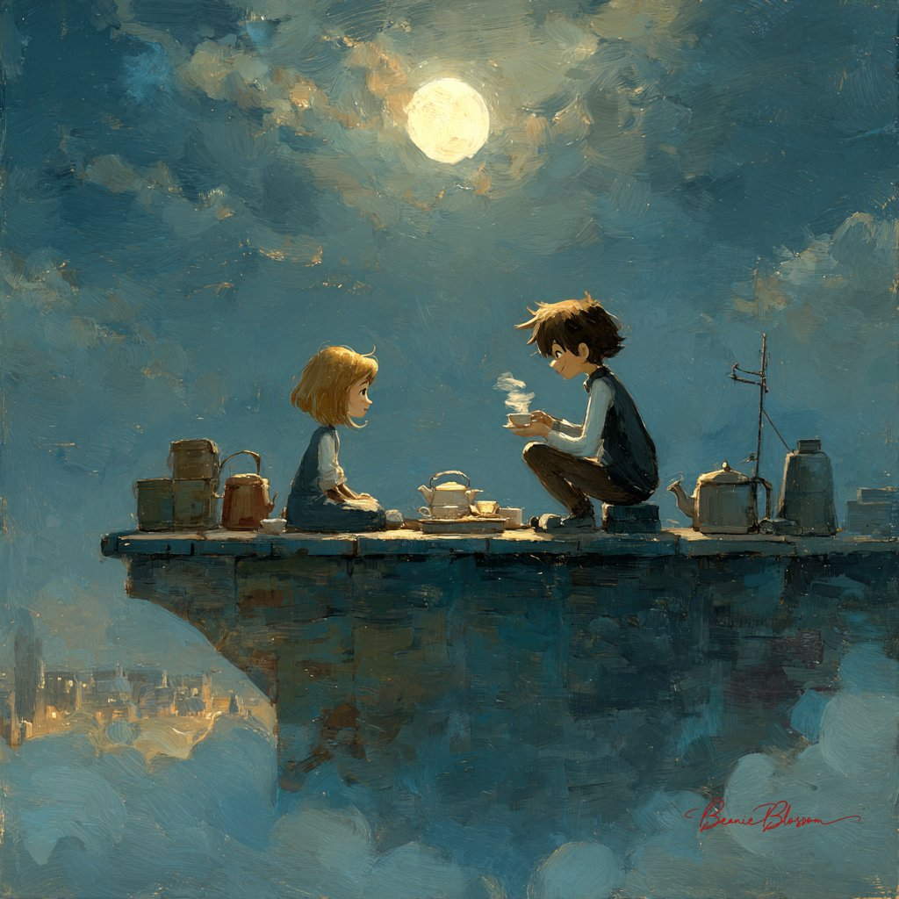

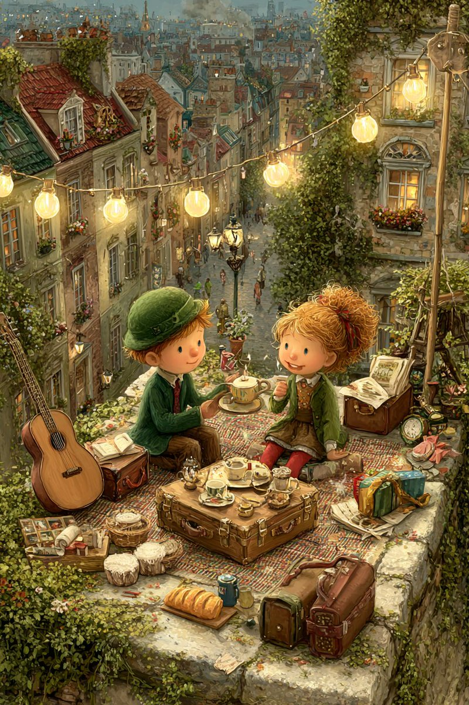

```
A moonlight rooftop tea party between a girl and a boy, dreamy, gentle, painterly.
```

```
一个女孩和一个男孩的月光屋顶茶话会，梦幻、温柔、绘画。
```

 [↑返回目录](#toc)

---
## <a id="prompt-136">日常用品有皮肤</a> (<a href="https://x.com/Kerroudjm/status/1934682610632151500" target="_blank" rel="noopener noreferrer">@Kerroudjm</a>)

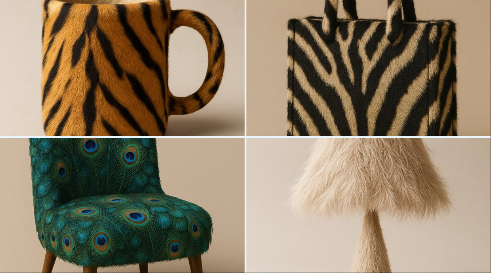


```
A high-quality studio photograph of a [OBJECT] fully covered in ultra-realistic [ANIMAL] texture (e.g., fur, feathers, skin, or scales), placed against a soft neutral background. The object’s original form remains visible but is wrapped in the animal’s natural pattern and surface detail. The image features clean composition, soft shadows, sharp focus, minimalist styling, professional lighting, and highly detailed textures—each hair, feather, or wrinkle should be visible. Format 1:1.
```

```
一张 [OBJECT] 的高质量工作室照片，完全覆盖在超逼真的 [ANIMAL] 纹理（例如，毛皮、羽毛、皮肤或鳞片）中，置于柔和的中性背景上。对象的原始形状仍然可见，但包裹在动物的自然图案和表面细节中。该图像具有干净的构图、柔和的阴影、清晰的焦点、极简主义的造型、专业的照明和高度详细的纹理——每根头发、羽毛或皱纹都应该可见。格式 1：1。
```

 [↑返回目录](#toc)

---
## <a id="prompt-207">超现实的高冲击力的图像</a> (<a href="https://x.com/azed_ai/status/1925576114803749307" target="_blank" rel="noopener noreferrer">@azed_ai</a>)


```
Create a hyperrealistic, high-impact image of a [subject] suspended mid-air, captured at the peak of an explosive moment. Surround it with dynamic [particles/splashes/fragments] that enhance motion and energy. macro-level detail, bold rim lighting, and a vibrant [background color] to emphasize form, texture, and contrast, cinematic, modern, and visually striking. perfect for premium product campaigns.
```

```
创建一个超现实的、高冲击力的图像，展示一个[主题]在空中悬停，捕捉到爆炸性时刻的巅峰。用动态的[粒子/飞溅/碎片]围绕它，增强运动感和能量。宏观细节，大胆的边缘照明，以及充满活力的[背景颜色]，以强调形状、质感和对比度，电影般的、现代的、视觉上引人注目。非常适合高端产品活动。
```

 [↑返回目录](#toc)

---
## <a id="prompt-11">品牌之爱话术</a> (<a href="https://x.com/aziz4ai/status/1924046710218645932" target="_blank" rel="noopener noreferrer">@aziz4ai</a>)

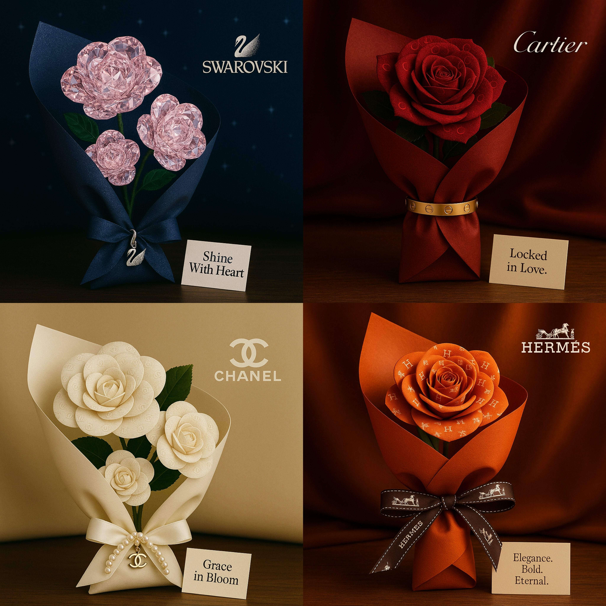

```
A romantic square-format bouquet inspired by [Brand Name]. Roses are crafted from visual patterns or textures that reflect the brand’s identity. The bouquet is wrapped in luxurious material echoing the brand’s signature style (e.g. silk, velvet, leather), and elegantly tied with one of the brand’s iconic products, replacing a traditional ribbon. Place it on a surface that matches the brand’s aesthetic. Add a message card beside the bouquet with a short, emotional 3-word slogan representing the brand’s spirit. Include the [Brand Name] logo subtly in the scene. Cinematic lighting, ultra-detailed, elegant depth of field, premium editorial quality.
```

 [↑返回目录](#toc)

---
## <a id="prompt-254">磨砂泡泡 3D 图标</a> (<a href="https://x.com/Anima_Labs/status/1953762725965799627" target="_blank" rel="noopener noreferrer">@Anima_Labs</a>)

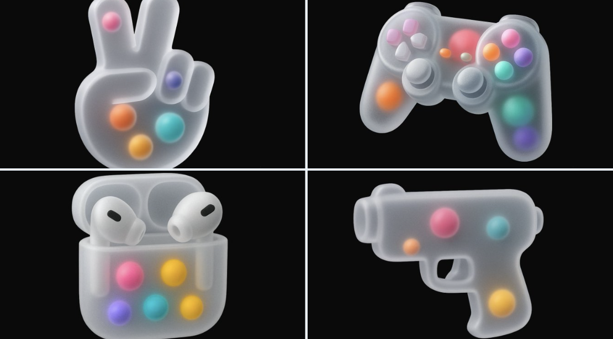

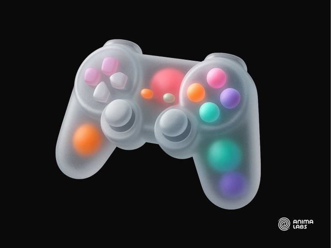

```
{
"style_name": "Frosted Bubble 3D Icons",
"render_mode": "3d_semi_transparent_detailed",
"icon_subject": "{{icon_ PlayStation controller}}",
"object_analysis": {
"preserve_silhouette": true,
"geometry_sensitive_mapping": true,
"detail_retention": "smooth rounded edges, subtle internal reflections"
},
"material_properties": {
"base_material": [
"frosted translucent plastic",
"semi-transparent matte acrylic"
],
"internal_elements": "floating colorful spheres, visible through the outer shell",
"surface_finish": "frosted, diffused matte texture with light translucency",
"texture_behavior": "no external color tint, transparency reveals inner objects",
"branding_elements": "none"
},
"color_palette": {
"primary": ["#FFFFFF", "#F5F5F5"],
"accents": ["#FF69B4", "#FFA500", "#6A5ACD", "#00CED1", "#FFD700"],
"contrast": "very high"
},
"lighting": {
"type": "soft ambient + rim lighting",
"intensity": "high",
"shadows": "soft glow under the object",
"highlights": "faint edge glow and top soft reflection"
},
"rendering": {
"style": "modern 3D icon with internal color elements",
"background": "pure black",
"camera_angle": "isometric 3/4 view",
"depth_of_field": "none, all details in focus"
},
"style_notes": [
"black background increases bubble color visibility",
"frosted transparency should glow subtly against black",
"perfect for high-contrast, collectible-style icons"
]
}
```

```
{
"风格名称": "磨砂泡泡3D图标",
"渲染模式": "3d_semi_transparent_detailed（3D半透明精细）",
"图标主题": "{{图标_PlayStation手柄}}",
"对象分析": {
"保留轮廓": true,
"几何敏感映射": true,
"细节保留": "平滑的圆角边缘，细微的内部反射"
},
"材质属性": {
"基础材质": [
"磨砂半透明塑料",
"半透明哑光亚克力"
],
"内部元素": "漂浮的彩色球体，可透过外壳看到",
"表面处理": "磨砂、漫射哑光质感，带有轻微透光性",
"纹理表现": "无外部色彩 tint，透明度可展现内部物体",
"品牌元素": "无"
},
"色彩搭配": {
"主色": ["#FFFFFF", "#F5F5F5"],
"强调色": ["#FF69B4", "#FFA500", "#6A5ACD", "#00CED1", "#FFD700"],
"对比度": "极高"
},
"光照": {
"类型": "柔和环境光+轮廓光",
"强度": "高",
"阴影": "物体下方柔和光晕",
"高光": "微弱的边缘发光和顶部柔和反射"
},
"渲染": {
"风格": "带有内部彩色元素的现代3D图标",
"背景": "纯黑色",
"相机角度": "等距3/4视图",
"景深": "无，所有细节均清晰对焦"
},
"风格说明": [
"黑色背景提升泡泡色彩的可见度",
"磨砂透明度在黑色背景下应呈现微妙的发光效果",
"非常适合高对比度、收藏品风格的图标"
]
}
```

 [↑返回目录](#toc)

---
## <a id="prompt-73">有趣的毛茸茸字母</a> (<a href="https://x.com/Anima_Labs/status/1925933980781535629" target="_blank" rel="noopener noreferrer">@Anima_Labs</a>)

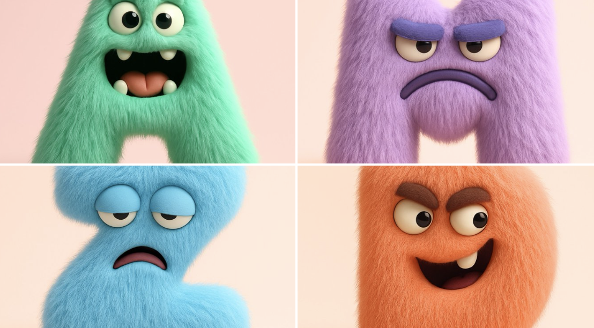

```
A highly realistic 3D render of the letter [A-Z] designed as a full-body fluffy monster. The letter shape itself is the creature’s body — no separate head or limbs. The eyes, mouth, and other monster features are embedded naturally into the letter form. The monster expresses a [mischievous / grumpy / shy / joyful / sleepy / surprised / confident] emotion through its eyes and mouth shape. The texture is dense, soft, and realistic fur, with subtle volume and shadow. The color palette is bold but clean — solid vibrant tones like mint, lilac, sky blue, or coral (avoid rainbow gradients). Studio lighting on a simple pastel background. No hats, no party props — just a minimal, high-quality character design with playful expression.
```

 [↑返回目录](#toc)

---
## <a id="prompt-37">Logo放进我的世界中</a> (<a href="https://x.com/alex_prompter/status/1924503062325989836" target="_blank" rel="noopener noreferrer">@alex_prompter</a>)

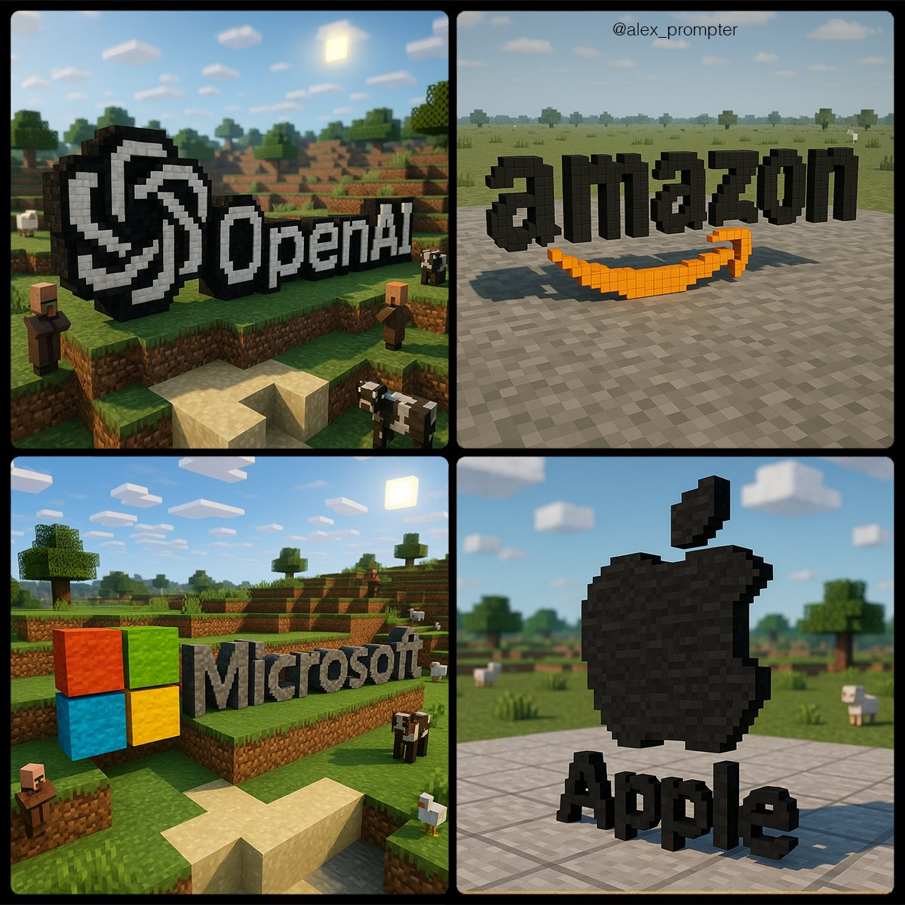

```
Recreate the [BRAND NAME] logo following the JSON Aesthetic below: {
"style": "Minecraft-style voxel 3D rendering",
"logo_handling": {
"adapt_to_uploaded_logo": true,
"rebuild_logo_using_voxel_blocks": true,
"use_original_logo_as_strict_pixel-color map": true,
"preserve_text_in_logo": true,
"preserve_text_case": true,
"preserve_original_logo_colors": true,
"preserve_shape_and_layout": true
"aspect_ratio": [INSERT ASPECT RATIO]
},
"minecraft_conversion": {
"voxel_depth": "medium thickness to show 3D volume",
"block_style": "authentic Minecraft texture mapping",
"color_strategy": "each block in the logo must match a pixel from the uploaded logo exactly — no estimation or stylistic substitution",
"voxel_material_match": "map logo pixels to Minecraft block colors that visually match pixel color as closely as possible — no creative enhancements",
"disable_palette_expansion": true
},
"scene_environment": {
"base": "neutral terrain (gray concrete or light stone)",
"background": "simple sky (clouds, no sun flare)",
"optional_elements": [
"Minecraft animals at a distance",
"terrain vegetation in background only"
],
"environment_color_policy": "environment must not share colors used in the logo to prevent blending or confusion"
},
"lighting": {
"neutral directional light": true,
"do_not_adjust_logo_colors_for_lighting": true,
"prevent_ambient_light_color_bleed": true
},
"camera": {
"angle": "slightly top-down with 3D logo centered",
"focus": "sharp focus on voxel logo only, environment softly rendered"
},
"render_quality": {
"voxel_texture_resolution": "high",
"shadows": "natural voxel-style ambient shadows only",
"disable_artistic_effects": true
},
"post_processing": {
"no glow effects": true,
"no color correction": true,
"disable AI reinterpretation of tones or palette": true
},
"image_constraints": {
"transparent_background": false,
"include_text": true,
"preserve_text_case": true,
"preserve_original_logo_colors": true,
"obey_uploaded_logo_shape": true,
"match_uploaded_logo_layout": true,
"enforce_color_source_from_logo_only": true
},
"notes": "Rebuild the uploaded logo using Minecraft-style voxel blocks. Every block must represent one pixel from the logo's original image. No creative license is allowed in color, shape, or layout. The environment is decorative only and must not affect logo readability or color perception. The final image should appear as if the logo were physically constructed in a Minecraft world using blocks that match its exact colors and shapes."
}
```

 [↑返回目录](#toc)

---
## <a id="prompt-175">半透明晶体效果</a> (<a href="https://x.com/umesh_ai/status/1938565095191089556" target="_blank" rel="noopener noreferrer">@umesh_ai</a>)

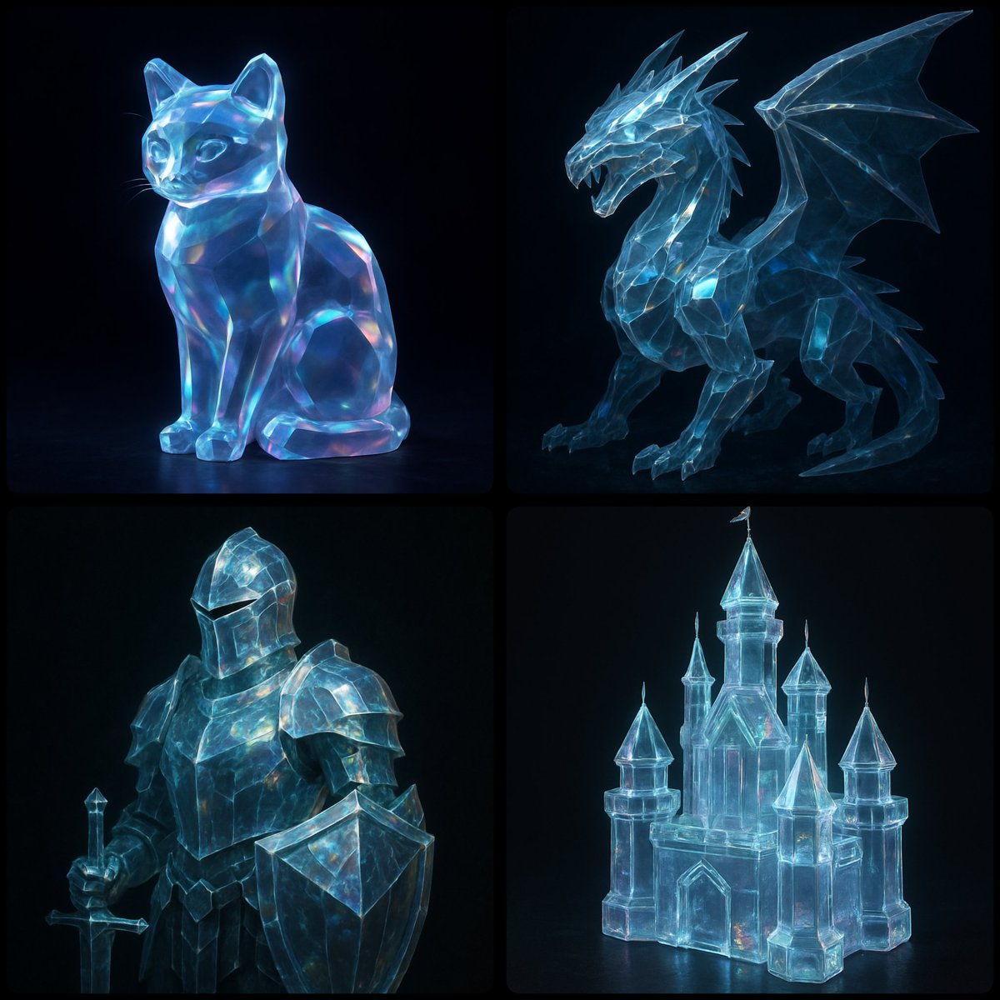


```
a [SUBJECT] rendered as a translucent crystalline form with beveled edges, subtly glowing from within. Surfaces catch and reflect ambient light, revealing faint iridescent hues across its contours in dark background
```

```
一个 [SUBJECT] 渲染为带有斜边的半透明晶体形式，从内部微妙地发光。表面捕捉并反射环境光，在黑暗背景下在其轮廓上显示微弱的彩虹色
```

 [↑返回目录](#toc)

---
## <a id="prompt-213">3D蓬松的物体</a> (<a href="https://x.com/TechieBySA/status/1942882098567618686" target="_blank" rel="noopener noreferrer">@TechieBySA</a>)


```
Transform the [BRAND NAME] logo into a hyper-realistic, 3D fluffy object. Keep the original shape and exact brand colors. Cover the entire surface in soft, detailed fur with a realistic hair texture. Use cinematic lighting to create subtle backlighting and soft shadows, making the logo appear tactile and surreal. Place the logo in the center of a clean black background, floating gently with a modern, stylish look. The style should feel cozy, playful, and visually striking. Render in ultra-high 4K resolution with photorealistic quality.
```

```
将[品牌名称]标志转化为超逼真、3D 蓬松的物体。保持原始形状和品牌的确切颜色。用柔软、细节丰富的毛皮覆盖整个表面，具有逼真的毛发纹理。使用电影感光效创造微妙的后光和柔和的阴影，使标志看起来有触感和超现实。将标志放在干净黑色背景的中心，轻轻漂浮，具有现代时尚感。风格应感觉温馨、俏皮、视觉上引人注目。以超高清 4K 分辨率渲染，具有照片级真实质量。
```

 [↑返回目录](#toc)

---
## <a id="prompt-221">钻石镶嵌风格</a> (<a href="https://x.com/alban_gz/status/1944405761439756343" target="_blank" rel="noopener noreferrer">@alban_gz</a>)

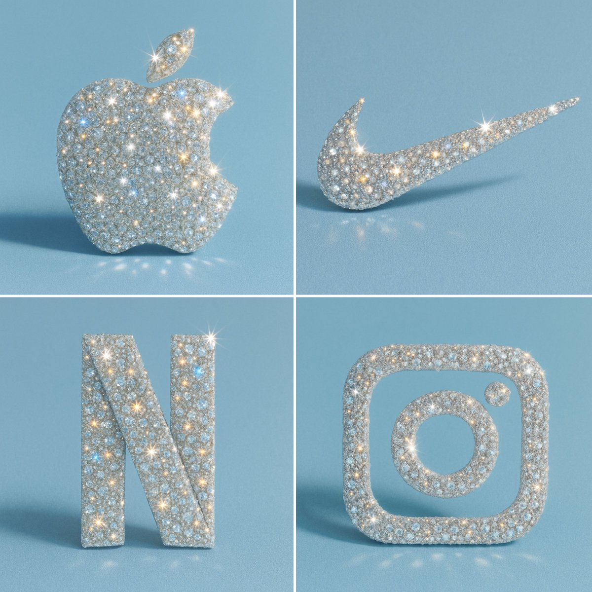

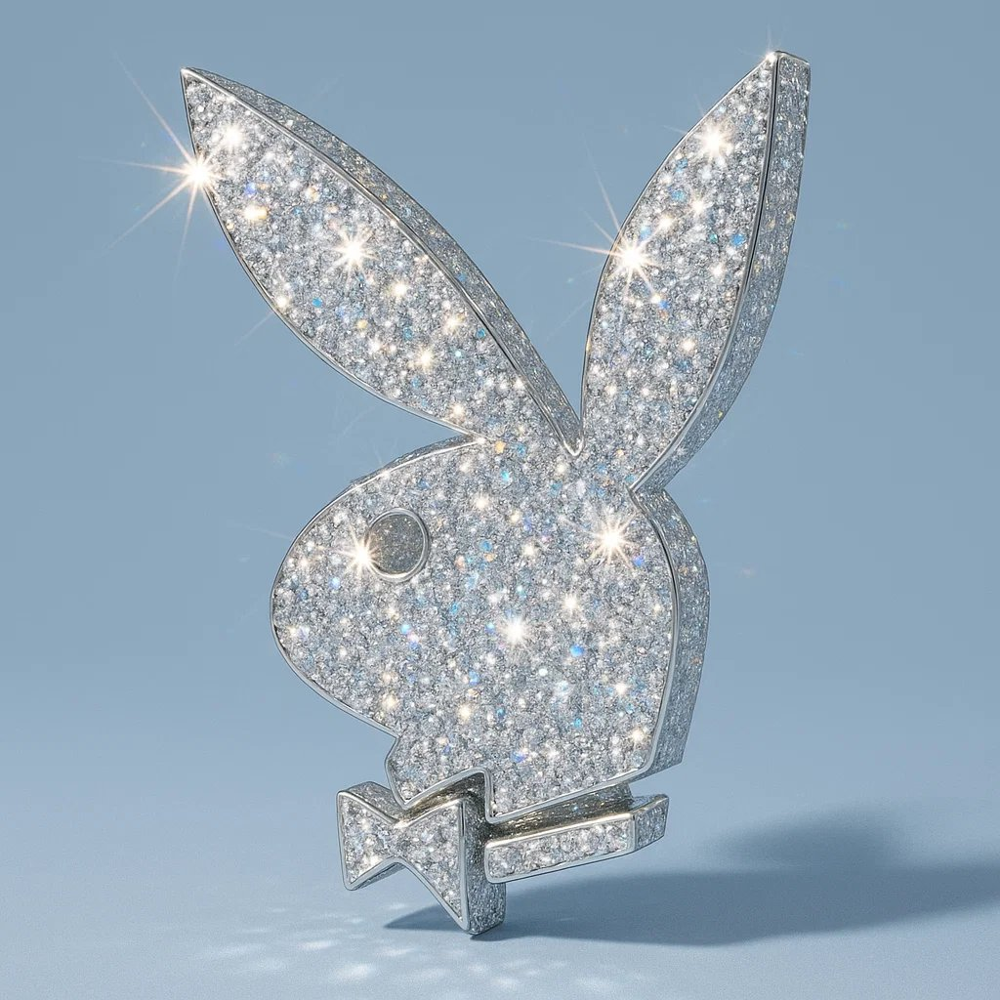

```
Recreate this image using the parameters of the JSON provided.
{
  "style_name": "Diamond-Encrusted Glamour",
  "description": "Applies a hyper-realistic diamond-encrusted style to any object, logo, or shape. The surface of the subject is entirely covered with sparkling gemstones that reflect light with intense brilliance, creating a luxurious, eye-catching, and surreal look.",
  "surface_texture": {
    "material": "diamond-crystal",
    "coating": "fully encrusted with multi-faceted diamonds",
    "sparkle_intensity": "maximum",
    "reflection_type": "specular and highly refractive",
    "detail_density": "ultra-fine, micro-gem coverage with no gaps",
    "light_refraction": "strong rainbow dispersion through facets"
  },
  "lighting": {
    "light_source": "hard directional light",
    "highlight_effects": "lens flares, sparkle flares on gem edges",
    "shadow_type": "soft-edged, low-opacity shadows for contrast",
    "specularity": "very high",
    "reflection_sources": "ambient and direct highlights across the gem facets"
  },
  "background": {
    "type": "minimalist solid color",
    "color": "#B0C4DE",
    "texture": "smooth matte",
    "contrast_with_subject": "high contrast to enhance sparkle",
    "depth": "subtle shadow under the object for floating effect"
  },
  "color_palette": {
    "primary": "transparent white (diamond base)",
    "secondary": "prismatic reflections (rainbow light dispersion)",
    "accent": "metallic shimmer on edges (optional: gold or silver undertones)"
  },
  "camera": {
    "angle": "slight top-down perspective",
    "depth_of_field": "shallow (sharp focus on object, blurred background)",
    "lens_effects": ["macro focus", "sparkle highlights", "light bloom"]
  },
  "style_keywords": [
    "glamorous",
    "luxury",
    "crystal-covered",
    "bling",
    "hyper-detailed",
    "sparkling",
    "futuristic",
    "eye-catching",
    "surreal realism",
    "fashion-inspired"
  ],
  "applicability": {
    "usable_on": ["logos", "icons", "food items", "everyday objects", "fashion accessories", "typography"],
    "visual_requirements": ["well-defined silhouette", "clean shapes for gem placement"],
    "scalability": "best results on medium to large subjects for detailed sparkle"
  }
}
```

```
使用提供的 JSON 参数重新创建此图像。

{
"style_name": "钻石镶嵌奢华风格",
  "description": "将超逼真的钻石镶嵌风格应用于任何物体、标志或形状。主体的表面完全覆盖着闪闪发光的宝石，这些宝石以强烈的亮度反射光线，营造出奢华、引人注目和超现实的效果。",
  "surface_texture": {
    "material": "钻石水晶",
"涂层": "完全镶嵌有多面钻石",
"闪耀强度": "最大",
"反射类型": "镜面和高折射率",
"细节密度": "超精细，微宝石覆盖，无间隙"
"light_refraction": "通过切面产生强烈的彩虹色散"
  },
  "lighting": {
    "light_source": "硬直射光源",
"高光效果": "镜头眩光，宝石边缘的闪光眩光",
    "阴影类型": "柔和边缘，低不透明度的阴影以形成对比",
    "光泽度": "非常高",
    "反射源": "宝石切面的环境光和直接高光"
  },
"background": {
    "type": "极简纯色",
    "color": " #B0C4DE ",
"纹理": "光滑磨砂质感",
"与主体对比度": "高对比度以增强闪耀效果",
"深度": "物体下方微妙阴影以产生悬浮效果"
  },
"color_palette": {
    "primary": "透明白色（钻石基底）",
    "secondary": "棱镜反射（彩虹光散）",
    "accent": "边缘金属光泽（可选：金色或银色底色）"
  },
"camera": {
    "angle": "略微俯视角度",
    "depth_of_field": "浅景深（物体清晰，背景模糊）",
"镜头效果": ["微距对焦", "闪烁高光", "光晕"]
  },
  "风格关键词": [
    "迷人",
"奢侈",
"水晶覆盖的",
"闪亮",
"超精细的",
"闪闪发光的",
"未来感的",
"引人注目的",
"超现实现实主义",
"受时尚启发的"
  ],
  "适用性": {
    "可用于": ["标志", "图标", "食品项目", "日常用品", "时尚配饰", "字体"],
"视觉要求": ["轮廓清晰", "宝石放置的形状干净"],
    "可扩展性": "在中等至大型对象上获得最佳效果，以展现细节闪烁"
  }
}
```

 [↑返回目录](#toc)

---
## <a id="prompt-164">将表情符号变成纸板</a> (<a href="https://x.com/Anima_Labs/status/1938152354064609780" target="_blank" rel="noopener noreferrer">@Anima_Labs</a>)


```
Ultra high-resolution 3D render of the emoji [🥹], meticulously recreated as a realistic cardboard sculpture. The object is crafted from corrugated brown cardboard, featuring clearly defined fluted edges, visible layering, and rough kraft paper textures. Close-up studio
```

```
表情符号 [ 🥹 ] 的超高分辨率 3D 渲染 ，精心重建为逼真的纸板雕塑。该物品由棕色瓦楞纸板制成，具有清晰的凹槽边缘、可见的层次和粗糙的牛皮纸纹理。特写工作室
```

 [↑返回目录](#toc)

---
## <a id="prompt-293">软质高品质毛绒玩具</a> (<a href="https://x.com/TechieBySA/status/1964280467735101457" target="_blank" rel="noopener noreferrer">@TechieBySA</a>)


```
A soft, high-quality plush toy of [CHARACTER], with an oversized head, small body, and stubby limbs. Made of fuzzy fabric with visible stitching and embroidered facial features. The plush is shown sitting or standing against a neutral background. The expression is cute or expressive, and it wears simple clothes or iconic accessories if relevant. Lighting is soft and even, with a realistic, collectible plush look. Centered, full-body view. 1080x1080.
```

```
[角色名称]软质高品质毛绒玩具
- 采用大头设计，搭配小巧的身体与粗短的四肢
- 由毛茸茸的面料制成，可见缝线细节，面部特征则通过刺绣工艺呈现
- 玩具以坐姿或站姿呈现，背景为中性风格
- 表情可爱生动，若有相关设定，还会搭配简约服饰或标志性配饰
- 光线柔和均匀，呈现出具有收藏质感的写实毛绒玩具外观
- 画面为居中构图，展示玩具全身，尺寸比例为1080x1080
```

 [↑返回目录](#toc)

---
## <a id="prompt-65">皱巴巴的纸片</a> (<a href="https://x.com/umesh_ai/status/1925868463689462049" target="_blank" rel="noopener noreferrer">@umesh_ai</a>)

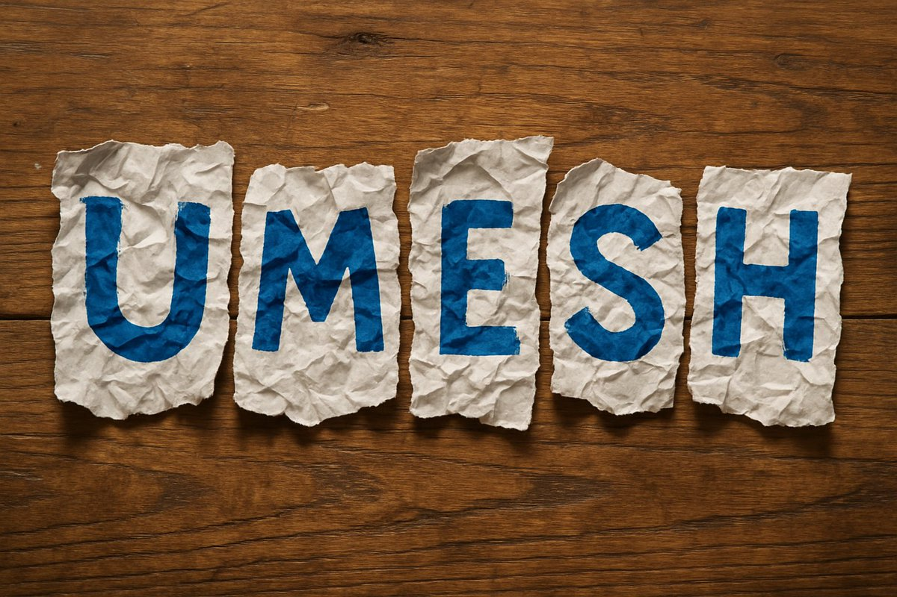

```
A photorealistic image of the word '[NAME]' spelled out using torn, highly crumpled pieces of white paper. Each letter is painted in bold [COLOR] on individual scraps, arranged loosely and unevenly, as if placed casually by hand, on a wooden table. The composition should convey a natural, handmade aesthetic with visible creases, shadows, and wood grain detail
```

 [↑返回目录](#toc)

---
## <a id="prompt-7">刺绣肖像</a> (<a href="https://x.com/azed_ai/status/1924042329700372929" target="_blank" rel="noopener noreferrer">@azed_ai</a>)

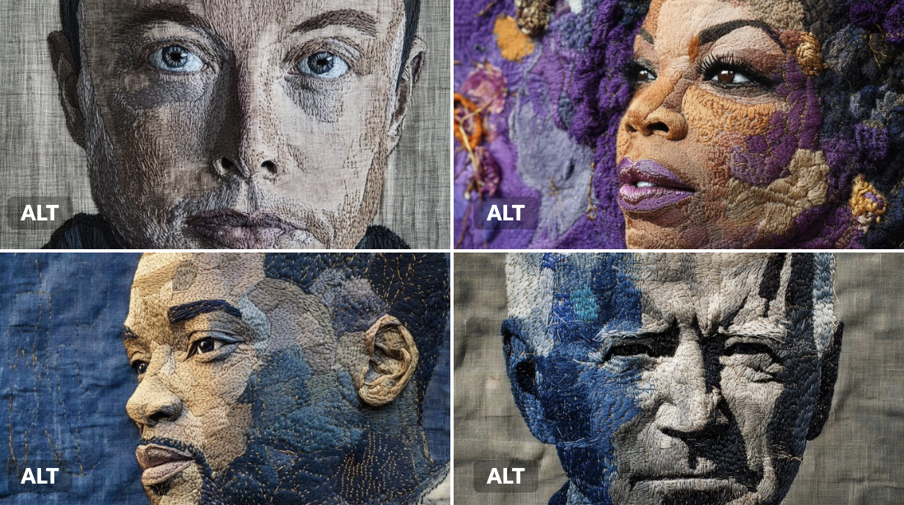

```
An embroidered portrait of [subject], [colors] thread on deep linen fabric. Visible needlework, layered textures, and handmade patterns give it an earthy, sacred feel.
```

```
An embroidered portrait of Elon Musk, stitched with rich steel grey and electric blue thread on deep linen fabric. Visible needlework, layered textures, and handmade patterns give it an earthy, sacred feel.
```

 [↑返回目录](#toc)

---
## <a id="prompt-195">经典的微型玩具风格</a> (<a href="https://x.com/TheRelianceAI/status/1936480873378955432" target="_blank" rel="noopener noreferrer">@TheRelianceAI</a>)

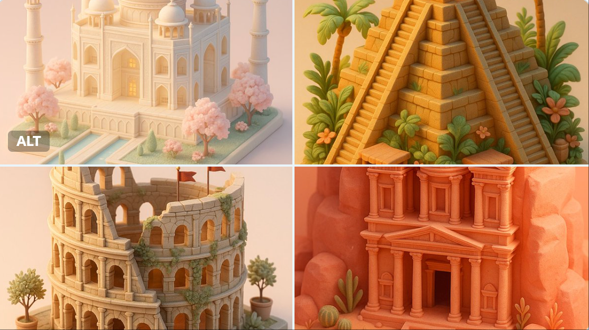

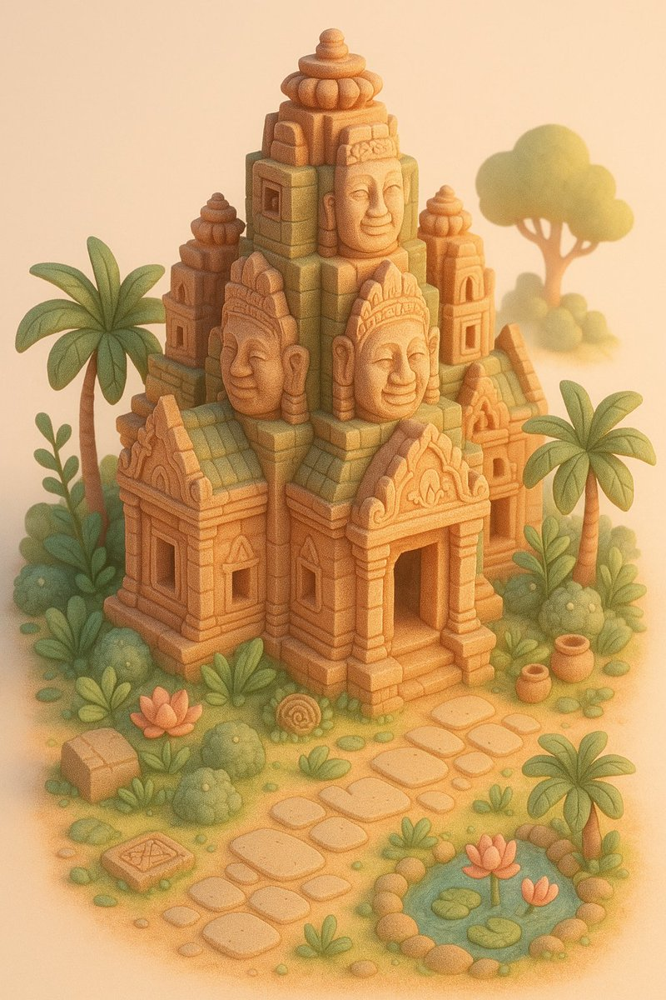

```
A miniature version of [LOCATION], designed in a whimsical dollhouse style. The structure is surrounded by thematic natural elements and tiny architectural details that reflect its cultural context (e.g., plants, paths, decor). The color palette uses soft pastels (such as coral, blush, sand, mint, or dusty green), with warm cinematic lighting and a serene, dreamy atmosphere. Highly detailed, cozy and stylized. Isometric view, vertical 9:16 format, on a clean studio background.
```

```
[LOCATION] 的微型版本，以异想天开的玩具屋风格设计。该结构周围环绕着主题自然元素和反映其文化背景的微小建筑细节（例如，植物、小径、装饰）。调色板使用柔和的粉彩（如珊瑚色、腮红色、沙色、薄荷色或灰绿色），具有温暖的电影照明和宁静、梦幻的氛围。高度详细、舒适且风格化。等距视图，垂直 9：16 格式，位于干净的工作室背景上。
```

 [↑返回目录](#toc)

---
## <a id="prompt-249">路牌图片</a> (<a href="https://x.com/diegocabezas01/status/1950693677023535318" target="_blank" rel="noopener noreferrer">@diegocabezas01</a>)

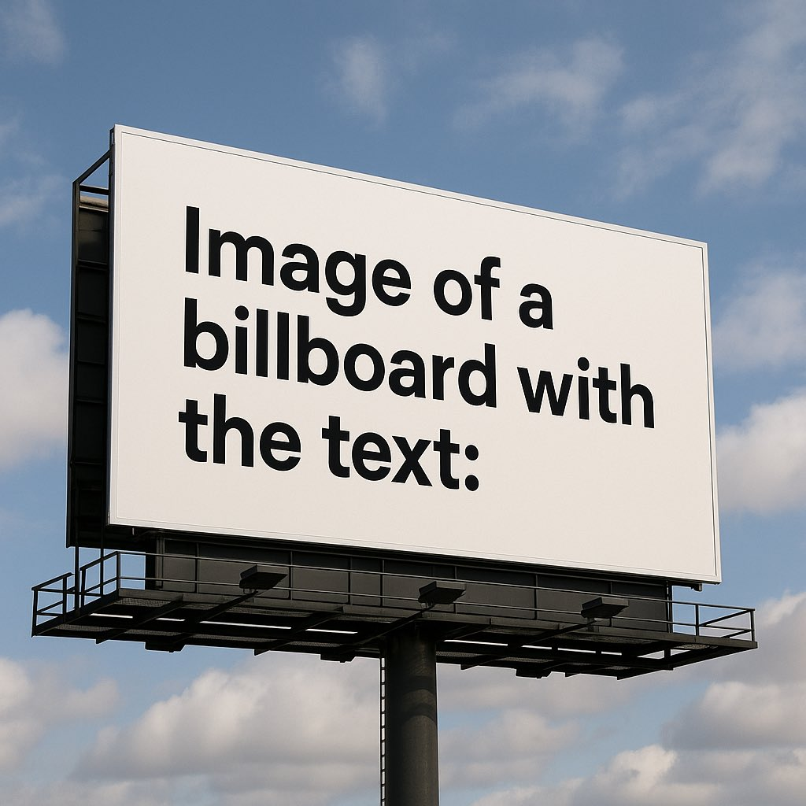

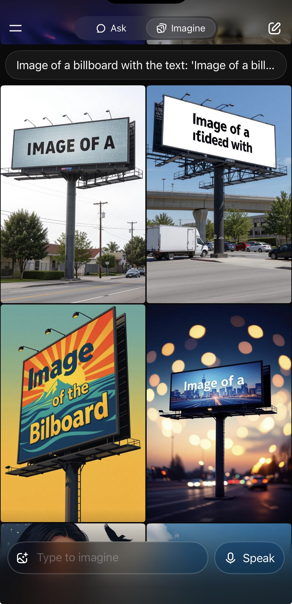

```
Image of a billboard with the text: “Image of a billboard with the text:”
```

```
路牌图片，上面写着：“路牌图片，上面写着：”
```

 [↑返回目录](#toc)

---
## <a id="prompt-127">符号冲突</a> (<a href="https://x.com/B_4AI/status/1934527984578535561" target="_blank" rel="noopener noreferrer">@B_4AI</a>)

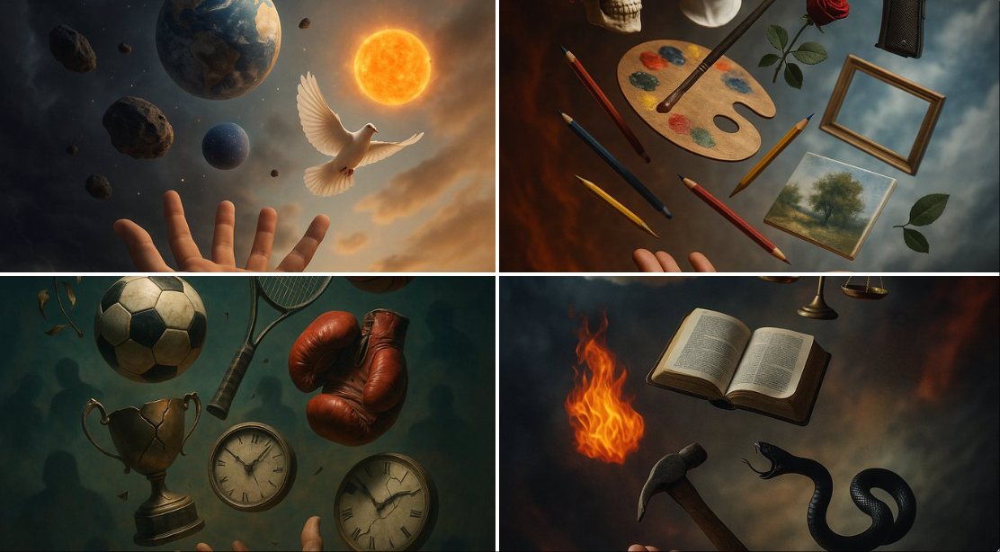

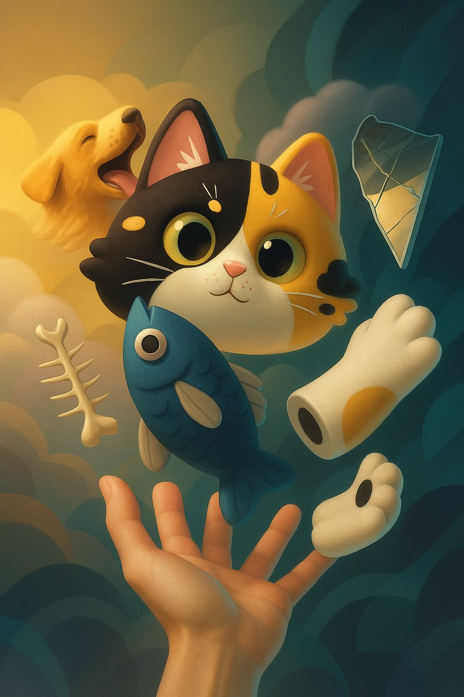

```
A surreal yet hyper-realistic image in levitation photography style, where elements of [subject] float chaotically and randomly above an outstretched hand, interwoven with symbolic elements that directly oppose it.

The background forms dynamically to visually embody the symbolism of the subject and its opposite, through blurred or abstract details that reflect either tension or harmony between the two—like a mirror inside a dream.

Each element floats at a unique angle and varying distance.

Background: Shifts according to the subject and its opposite

Lighting: Soft cinematic with dreamy shadows

Style: Hyper-realistic + Levitation Photography + Fantasy

Aspect Ratio: 1:1
```

```
悬浮摄影风格的超现实而超现实的图像，其中 [主体] 的元素混乱而随机地漂浮在伸出的手上方，与直接对立的象征性元素交织在一起。

背景动态形成，通过模糊或抽象的细节在视觉上体现主题及其对立面的象征意义，这些细节反映了两者之间的张力或和谐——就像梦中的镜子。

每个元素都以独特的角度和不同的距离漂浮。

背景：根据主体及其对立面而变化

照明：柔和的电影感，带有梦幻般的阴影

风格：超写实 + 悬浮摄影 + 奇幻

长宽比：1：1
```

 [↑返回目录](#toc)

---
## <a id="prompt-228">日本搞笑漫画风格插画</a> (<a href="https://x.com/fy360593/status/1944708178266259689" target="_blank" rel="noopener noreferrer">@fy360593</a>)

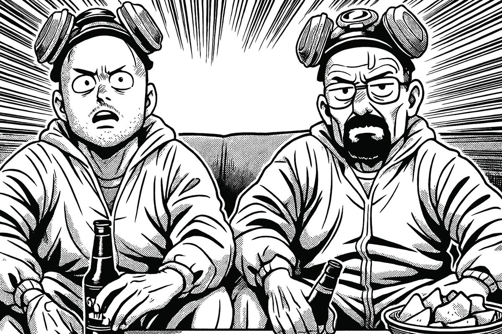


```
Transform this image into a Japanese gag manga style illustration. Use a high-contrast black-and-white color palette with bold linework and screentone (halftone) shading. Characters should have exaggerated facial expressions, cartoonish proportions (big head, small body), and comedic intensity. Include dynamic action lines or radiating background effects. The overall aesthetic should mimic retro manga from the 80s and 90s with humorous and intense emotion.
```

```
将这张图片转化为日本搞笑漫画风格插画。使用高对比度的黑白色彩搭配，粗犷的线条和网点（半色调）阴影。角色应有夸张的面部表情，卡通化的比例（大头小身），以及喜剧张力。包含动态动作线条或放射状背景效果。整体美学应模仿 80 年代和 90 年代的复古漫画，充满幽默和强烈的情感。
```

 [↑返回目录](#toc)

---
## <a id="prompt-308">人物电影级渲染</a> (<a href="https://x.com/CharaspowerAI/status/1967989374731038839" target="_blank" rel="noopener noreferrer">@CharaspowerAI</a>)

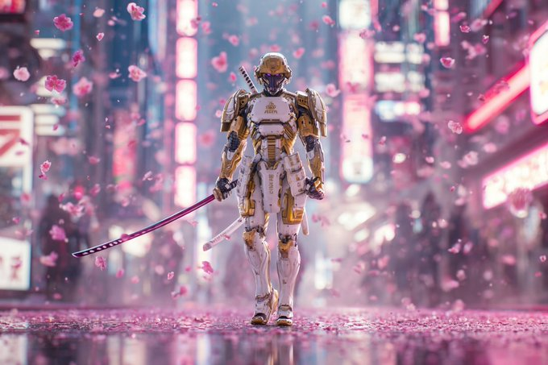


```
Full-body shot of a [character + location], with a powerful aura of energy around [him/her] and [visual effect], [action or movement] in a dynamic pose. Realistic photography, cinematic lighting, and hyper-detailed rendering.
```

```
[角色 + 地点] 的全身照，[他/她] 周围充满强大的能量气息，[视觉效果]，[动作或运动] 呈现动态姿势。写实摄影、电影级灯光和超精细渲染。
```

 [↑返回目录](#toc)

---
## <a id="prompt-106">时间之神</a> (<a href="https://x.com/TheRelianceAI/status/1931726518952034462" target="_blank" rel="noopener noreferrer">@TheRelianceAI</a>)


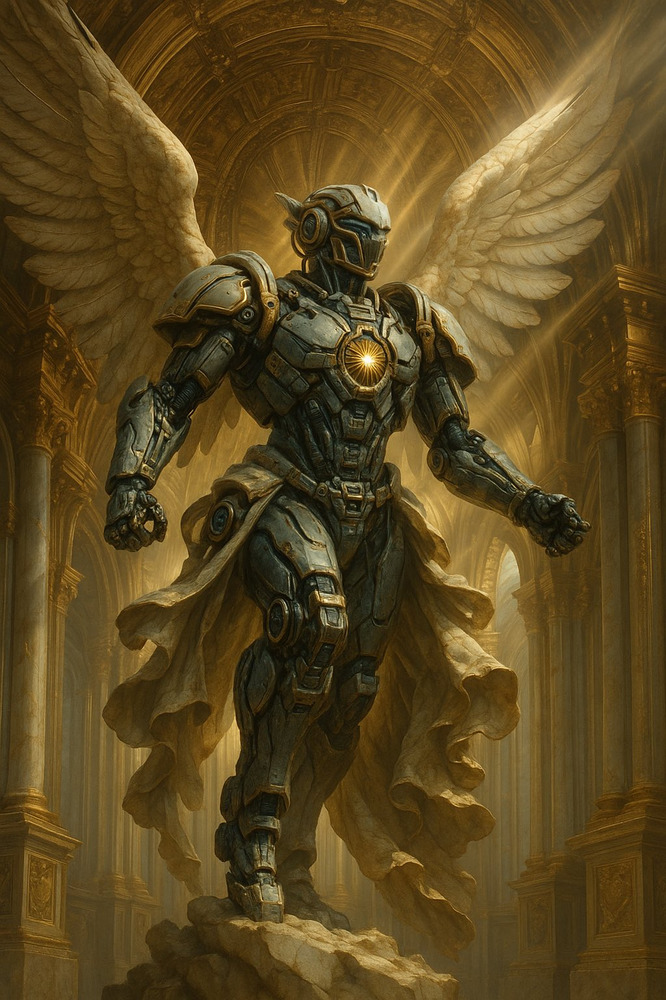

```
Colossal marble statue of [INSERT OBJECT OR CHARACTER HERE], wings (if applicable) spread in divine majesty, adorned with ornate golden armor and flowing baroque robes, cracked marble textures with soft patina, glowing sacred emblem on chest, standing within a celestial golden dome, surrounded by divine architecture, dramatic god rays from above, dynamic mid-action pose, ultra-detailed renaissance sculpture style, cinematic lighting, majestic and sacred atmosphere, 8k resolution
```

 [↑返回目录](#toc)

---
## <a id="prompt-85">知名戏曲片段的MBTI人格类型卡片</a> (<a href="https://x.com/op7418/status/1925869690120794320" target="_blank" rel="noopener noreferrer">@op7418</a>)

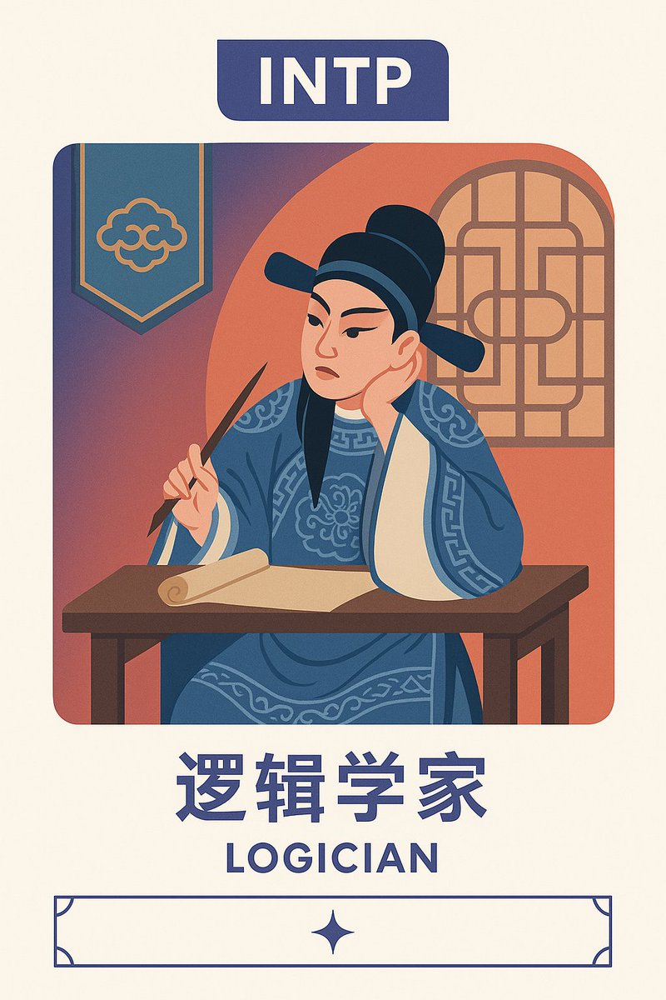

```
# 任务目标
请生成一张基于中国古代知名戏曲片段的MBTI人格类型卡片图片，使戏曲场景扁平插画的情感内涵与MBTI人格特质相对应。，我需要生成的人各类型是[INTP]

## 内容要求
1. **场景选取**：从中国古代知名戏曲片段中提取能体现不同MBTI人格特质的代表性场景
2. **场景意境**：画面需表现完整戏剧场景，通过场景氛围体现对应的人格特质
3. **服饰真实性**：画面中人物必须穿着对应戏曲的正确戏服
4. **人格对应**：每个场景需精准对应一种MBTI人格类型的核心特质

## 卡片排版设计
参考图片样式：
- **顶部**：MBTI类型代码（如INFJ）
- **中部**：渐变色彩的抽象几何图形作为主视觉
- **底部**：
- 中文人格类型名称（如"提倡者"）
- 英文标语：（如"The world is your oyster"）
- 装饰性边框和星形符号

## 视觉风格
- 采用现代极简设计语言
- 渐变色彩与几何形状结合
- 保持神秘感与艺术性
- 整体色调柔和梦幻

## 技术规格
- 卡片尺寸采用标准比例
- 每张卡片需清晰标注MBTI类型代码
- 保持系列视觉一致性
```

 [↑返回目录](#toc)

---
## <a id="prompt-139">将您最喜欢的品牌变成生活方式产品</a> (<a href="https://x.com/azed_ai/status/1934631664153760241" target="_blank" rel="noopener noreferrer">@azed_ai</a>)


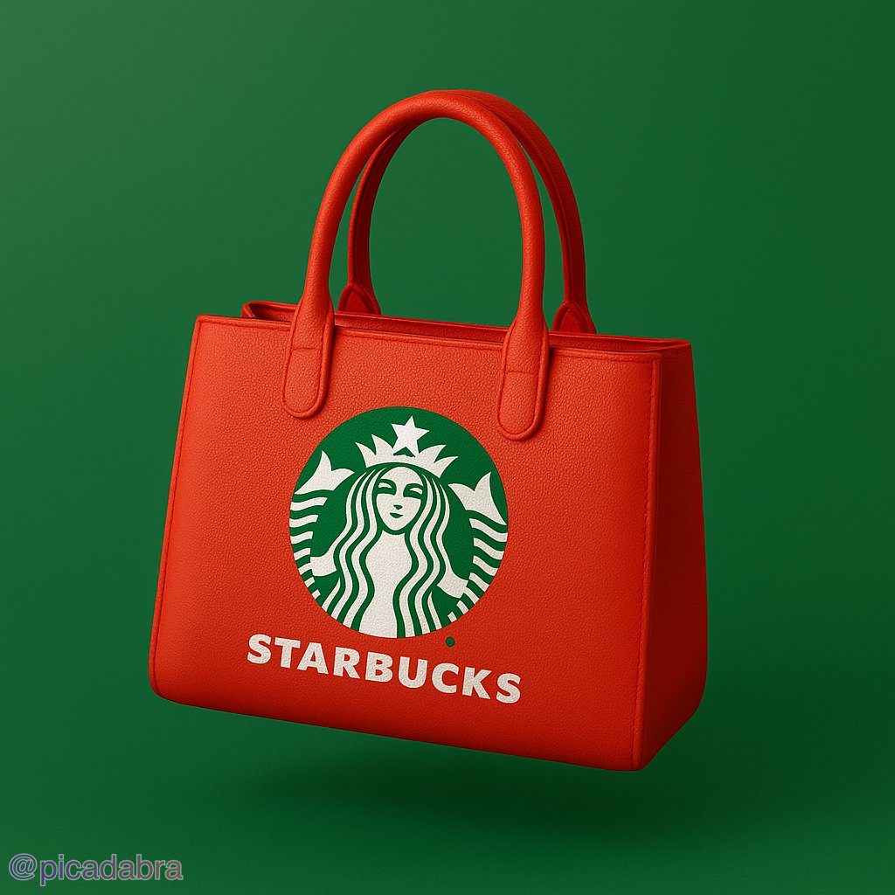

```
A high-quality studio product photo of a [brand name]-branded [product type], [floating / standing] against a solid background in the brand’s signature color. The product features the brand logo prominently and uses the official brand color palette. Clean composition, soft shadows, ultra-realistic materials and textures, no text, no props, professional commercial lighting, sharp focus, minimalist aesthetic.
```

```
一张高质量的工作室商品照片，其中包含 [品牌名称] 品牌 [商品类型]、[浮动/直立] 和纯色背景，采用品牌标志性的颜色。该商品突出品牌徽标，并使用官方品牌调色板。干净的构图，柔和的阴影，超逼真的材质和纹理，无文字，无道具，专业的商业照明，锐利的焦点，极简的美学。
```

 [↑返回目录](#toc)

---
## <a id="prompt-29">面包形态</a> (<a href="https://x.com/azed_ai/status/1924479430157812140" target="_blank" rel="noopener noreferrer">@azed_ai</a>)

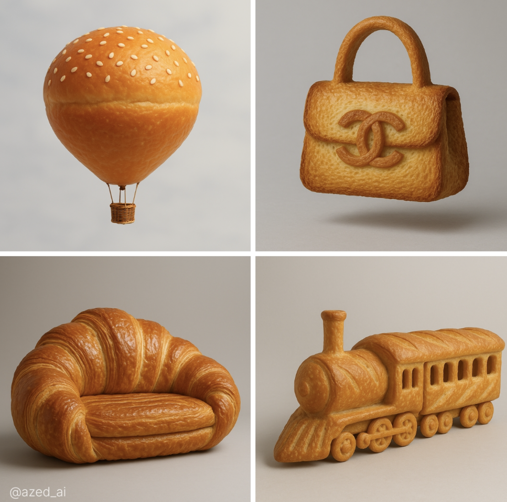

```
A highly realistic sculpture of a [object], made entirely from [bread type] with ultra-detailed texture and color. The surface shows the natural properties of the bread, golden-brown, glossy, flaky or crusty, with visible layers or seeds where appropriate, studio lighting, soft
```

 [↑返回目录](#toc)

---
## <a id="prompt-292">3D超写实食品广告</a> (<a href="https://x.com/aziz4ai/status/1964059052951875780" target="_blank" rel="noopener noreferrer">@aziz4ai</a>)

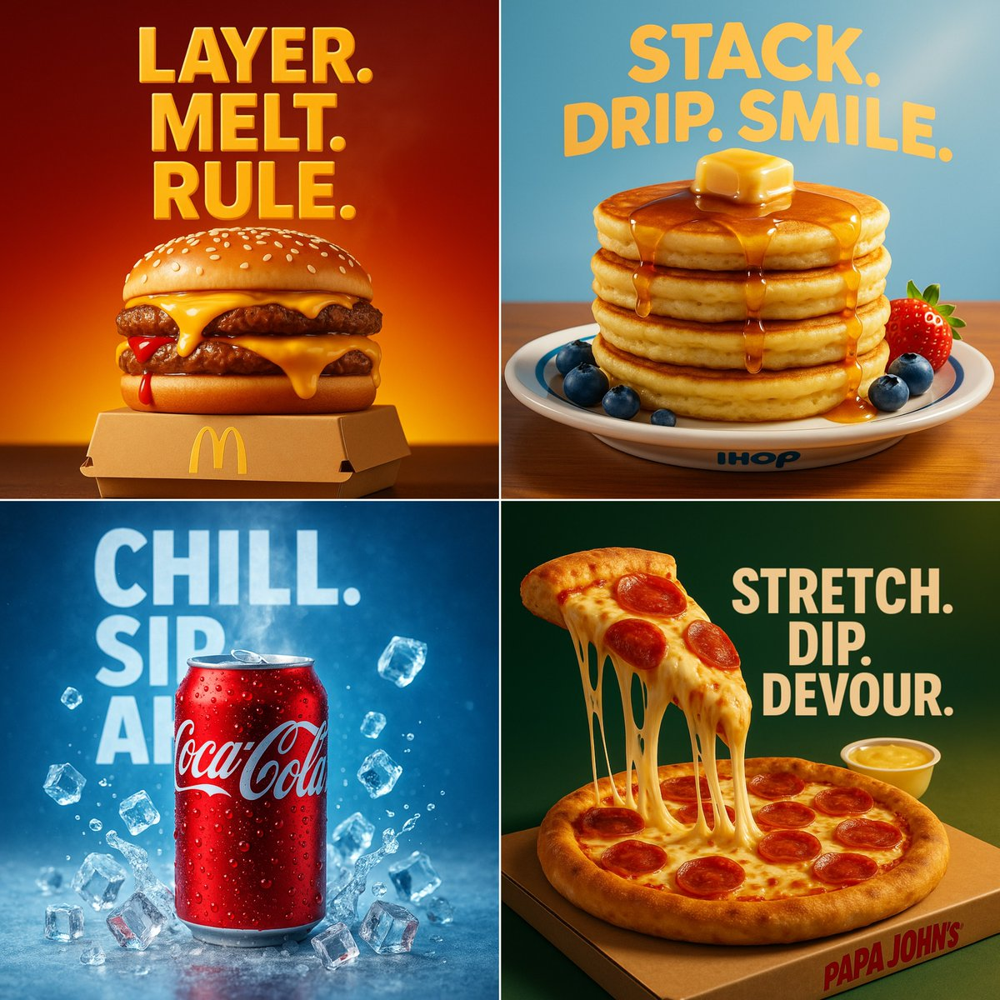

```
Smooth 3D hyperrealistic food advertisement of [TYPE OF FOOD], shown with mouthwatering glossy textures and perfect lighting, placed on a dark moody surface with soft glow and cinematic blur in the background, high Kelvin lighting for golden highlights and sharp shadows, backlit to show delicious steam and dripping sauces, behind the food a bold slogan in elegant font with three words only, restaurant logo subtly placed on the plate or in the corner, rich color grading with appetite-inducing tones, ultra sharp, professional food styling, stylized render
```

```
[食物类型]的流畅3D超写实食品广告
- 呈现令人垂涎的光泽质感与完美光线效果
- 置于深邃氛围感的表面上，背景带有柔和光晕与电影感模糊效果
- 采用高开尔文色温光线，营造金色高光与清晰阴影
- 运用逆光拍摄，展现诱人的热气与滴落的酱汁
- 食物后方以优雅字体呈现一句仅含三个单词的醒目标语
- 餐厅标志巧妙置于餐盘之上或画面角落
- 采用浓郁的色彩分级，搭配激发食欲的色调
- 极致清晰的画面质感，专业的食物造型设计，风格化渲染效果
```

 [↑返回目录](#toc)

---
## <a id="prompt-131">自定义毛绒钥匙扣</a> (<a href="https://x.com/azed_ai/status/1934973851164897444" target="_blank" rel="noopener noreferrer">@azed_ai</a>)

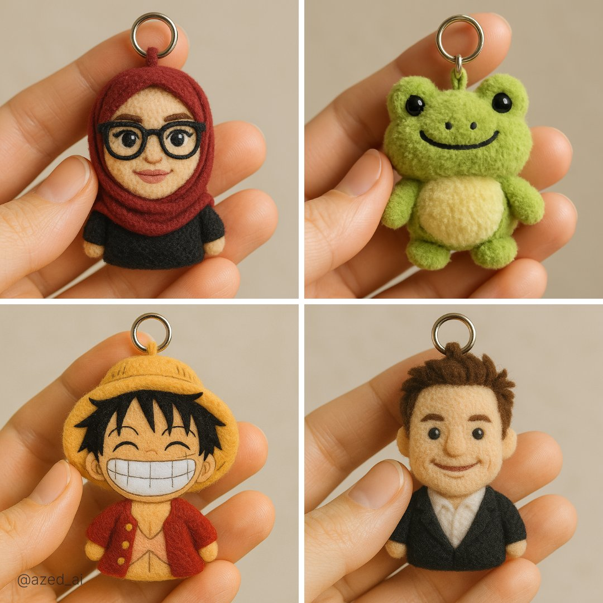

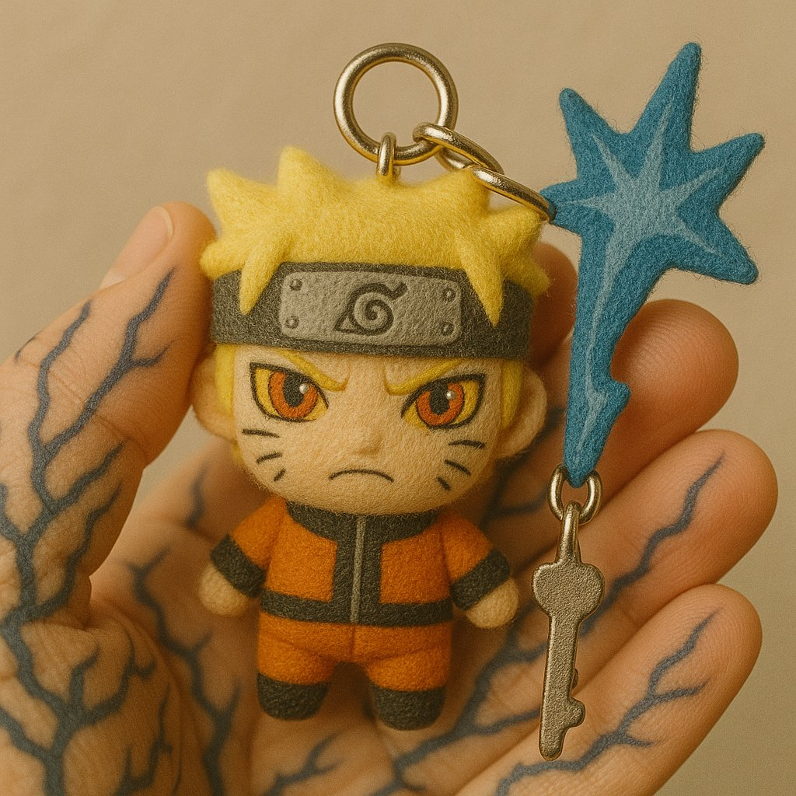

```
Close-up photo of a small plush keychain of [attached image/emojis]  held gently between two fingers, made of soft felt or fuzzy material, cartoon-style proportions, embroidered face with simple expressive features, character designed to resemble, attached to a shiny silver keyring, neutral beige background, shallow depth of field, soft natural lighting, highly detailed texture, cute and handcrafted aesthetic, studio photography, 1:1 aspect ratio
```

```
[附图/表情符号] 的小毛绒钥匙扣的特写照片，用两根手指轻轻握住，由柔软的毛毡或毛茸茸的材料制成，卡通风格的比例，具有简单表现特征的刺绣脸，设计相似的人物，附在闪亮的银色钥匙圈上，中性米色背景，浅景深，柔和的自然光，高度详细的纹理，可爱和手工制作的美感， 摄影棚摄影，1：1 纵横比
```

 [↑返回目录](#toc)

---
## <a id="prompt-18">品牌我的世界风格</a> (<a href="https://x.com/TheRelianceAI/status/1923757741262164427" target="_blank" rel="noopener noreferrer">@TheRelianceAI</a>)

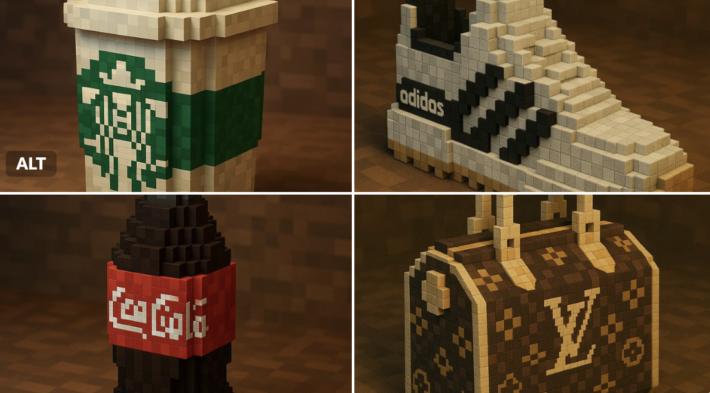

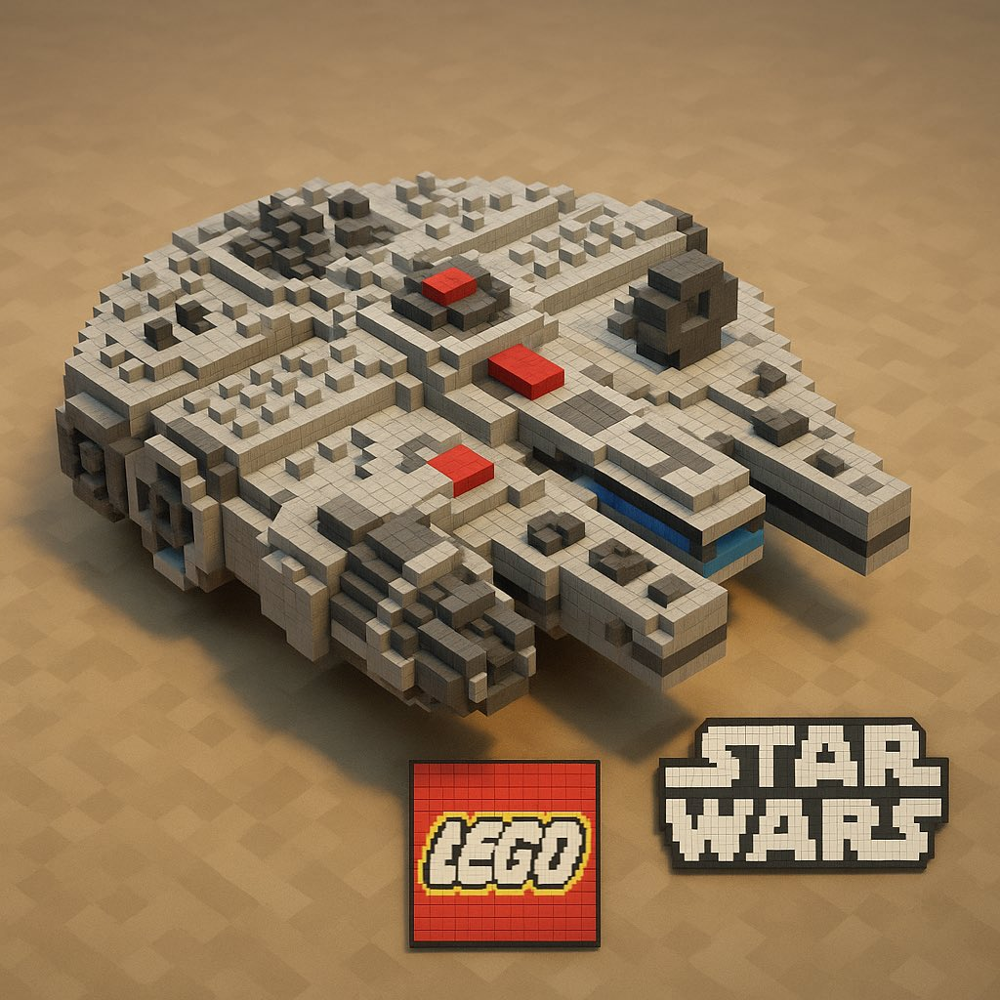

```
"A Minecraft-style voxel recreation of a [BRAND NAME] [OBJECT], built entirely from pixelated cubes — detailed voxel modeling, signature brand colors and logo, blocky textures, clean lighting, stylized yet recognizable, 3D render, high resolution, playful and creative interpretation
```

 [↑返回目录](#toc)

---
## <a id="prompt-246">色彩缤纷的手工雕塑</a> (<a href="https://x.com/Deshraj4x/status/1938670486285885772" target="_blank" rel="noopener noreferrer">@Deshraj4x</a>)


```
A colorful handcrafted sculpture of [insert subject], made from semi-transparent ice blocks in custom shapes. Accents like icing, candy, yarn, or fruit skin enhance facial features, texture, or accessories. Placed on a ceramic plate over a leaf or decorative mat, with a clean, softly lit studio or natural tabletop background. Lighting highlights the glossy ice texture, blending food art, toy design, and photography into a playful, artistic composition.
```

```
一个色彩缤纷的手工雕塑，由[插入主题]制成，使用半透明的冰块，形状定制。装饰如糖霜、糖果、毛线或水果皮增强了面部特征、纹理或配饰。放置在陶瓷盘上，盘上覆盖着叶子或装饰垫，背景是干净、柔和照明的摄影棚或自然桌面。光线突出了冰块的光泽质感，将食品艺术、玩具设计和摄影融合成一种俏皮、艺术性的构图。
```

 [↑返回目录](#toc)

---
## <a id="prompt-25">按键删除周一</a> (<a href="https://x.com/michaelrabone/status/1924374502529438005" target="_blank" rel="noopener noreferrer">@michaelrabone</a>)

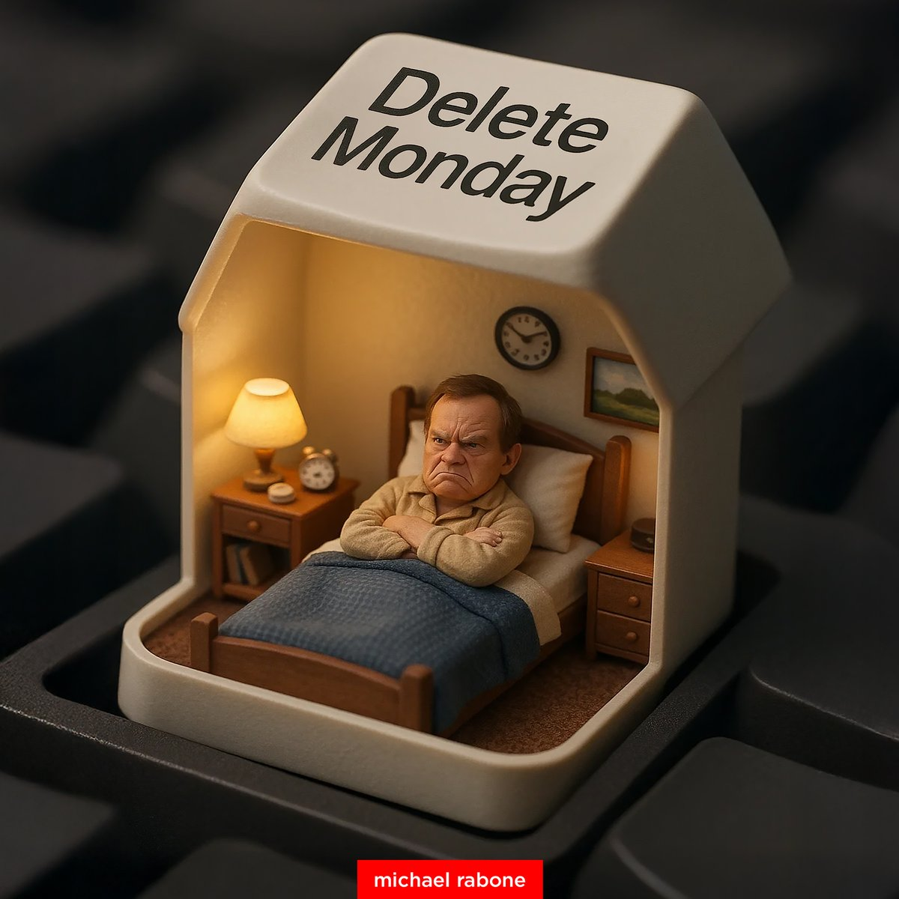

```
Detailed photographic image of a miniature person in bed feeling cranky under an opened 'Delete Monday' keyboard keycap, using the inside of the keycap as a mini bedroom complete with the usual bedroom stuff
```

 [↑返回目录](#toc)

---
## <a id="prompt-114">Monochrome LCD 效果</a> (<a href="https://x.com/hckmstrrahul/status/1931412135277678837" target="_blank" rel="noopener noreferrer">@hckmstrrahul</a>)

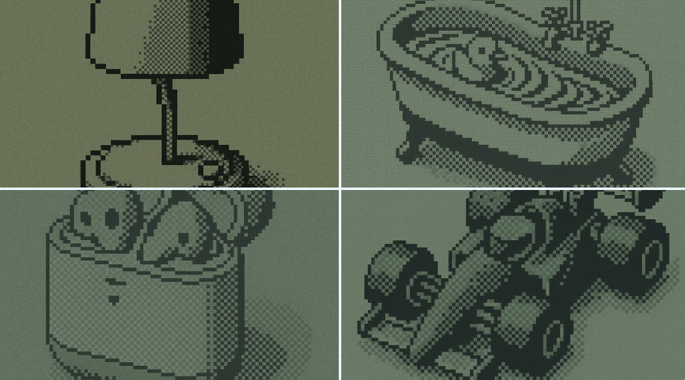

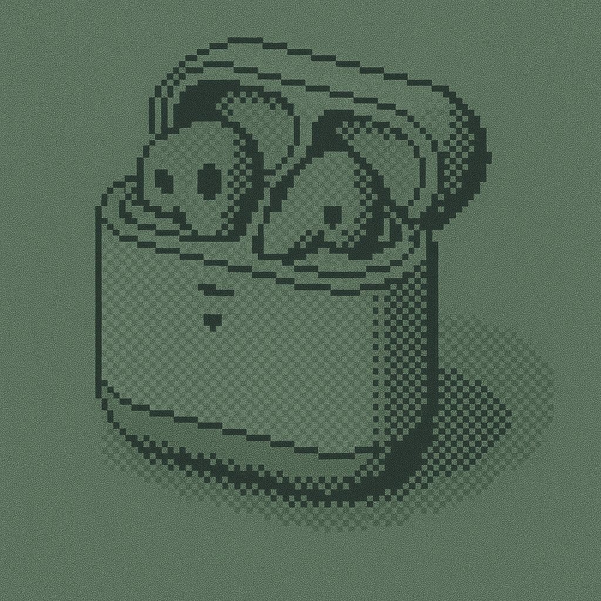

```
{
  "styleAesthetic": {
    "title": "Monochrome Pixel Mosaic",
    "overallVibe": "Retro mobile-screen pixel art—clean, minimal, and slightly nostalgic",
    "renderingStyle": "1-bit square-pixel grid with optional dithering to suggest tone and depth",
    "viewAngle": "Orthographic front view (no perspective distortion)",
    "pixelation": {
      "pixelSize": 6,                     // width/height of each square in px (tweak per output res)
      "pixelShape": "perfect square",
      "gridAlignment": "uniform, no gaps",
      "ditheringPattern": "Floyd–Steinberg or ordered 2×2"
    },
    "colorPalette": {
      "pixelColor": "#000000",            // foreground pixels
      "backgroundColor": "#8CA17C",       // muted pastel green sample; replace to recolor
      "paletteType": "1-bit monochrome"
    },
    "lightingAndShadows": {
      "pixelDropShadow": {
        "enabled": true,
        "offsetX": 0,
        "offsetY": 1,
        "blur": 2,
        "opacity": 0.25
      },
    },
    "materialsAndTextures": [
      {
        "type": "Matte LCD surface",
        "description": "Flat display with very fine grain/noise to simulate old LCD texture",
        "noiseIntensity": 0.01
      }
    ],
    "typography": {
      "fontFamily": "monospaced bitmap",
      "weight": "bold",
      "capitalization": "uppercase",
      "letterSpacing": 0,
      "align": "center"
    },
    "postProcessing": {
      "edgeSmoothing": "none (hard pixel edges preserved)",
      "filmGrain": 0.01,
      "overallContrast": 1.0
    },
    "adaptabilityHints": {
      "applyToPhotographs": "posterize → 1-bit → downsample to pixel grid → apply dithering",
      "applyToVectorText": "render glyphs to bitmap grid using same pixel size and drop shadow",
      "safeResize": "always scale by whole-number multiples to keep squares crisp"
    }
  }
}
```

 [↑返回目录](#toc)

---
## <a id="prompt-222">宝石渲染风格</a> (<a href="https://x.com/alban_gz/status/1944033327767236869" target="_blank" rel="noopener noreferrer">@alban_gz</a>)


```
Apply the parameters of the JSON provided to [insert image]

{
  "name": "Gemstone Render",
  "object": {
    "type": "auto",
    "detected_color": "auto",
    "form": "realistic, natural form preserved",
    "material": "crystal or faceted gemstone glass",
    "surface": "precision-cut facets, sharp reflections",
    "transparency": "high clarity with light refraction",
    "internal_features": "color depth, internal shimmer, and light dispersion"
  },
  "color_and_light": {
    "primary_color": "{detected_color}",
    "highlight_effects": "specular highlights, gemstone brilliance, caustics",
    "lighting_setup": "studio lighting with white or soft background",
    "metallic_accents": {
      "enabled": true,
      "material": "gold or chrome",
      "application": "rim, stem, or edge detailing"
    }
  },
  "style": {
    "artistic_style": [
      "photorealistic 3D render",
      "Gemstone Render Style",
      "luxury object visualization"
    ],
    "design_language": [
      "faceted precision modeling",
      "jewelry-like rendering",
      "optical depth and brilliance"
    ]
  },
  "technical_details": {
    "render_engine": [
      "Blender with Cycles",
      "Cinema 4D + Redshift/Octane"
    ],
    "rendering_techniques": [
      "physically-based rendering (PBR)",
      "ray tracing",
      "global illumination"
    ],
    "resolution": "ultra high-res (4K–8K)",
    "post_processing": [
      "subtle glow",
      "enhanced reflections",
    "color-preserving contrast boost"
    ]
  },
  "prompt_template": "A 3D-rendered image of a {object} made of {detected_color} crystal, with intricate gemstone-like facets. It sparkles with internal reflections and sits on a clean studio background, blending realism with luxury design."
}
```

```
将提供的 JSON 参数应用于[插入图片]

{
  "名称": "宝石渲染",
  "物体": {
    "类型": "自动",
    "检测到的颜色": "自动",
    "形态": "逼真、自然形态得以保留",
    "材质": "水晶或多面宝石玻璃",
    "表面": "精密切割的刻面、清晰的反光",
    "透明度": "高清晰度，带有光线折射",
    "内部特征": "色彩深度、内部光泽和光线色散"
  },
  "颜色与光线": {
    "主色调": "{detected_color}",
    "高光效果": "镜面高光、宝石光泽、焦散效果",
    "照明设置": "工作室照明，搭配白色或柔和背景",
    "金属装饰": {
      "启用": true,
      "材质": "黄金或铬合金",
      "应用位置": "边缘、柄部或侧边细节"
    }
  },
  "风格": {
    "艺术风格": [
      "照片级写实3D渲染",
      "宝石渲染风格",
      "奢华物体可视化"
    ],
    "设计语言": [
      "多面精密建模",
      "珠宝式渲染",
      "光学深度与光泽"
    ]
  },
  "技术细节": {
    "渲染引擎": [
      "Blender搭配Cycles",
      "Cinema 4D + Redshift/Octane"
    ],
    "渲染技术": [
      "基于物理的渲染（PBR）",
      "光线追踪",
      "全局光照"
    ],
    "分辨率": "超高分辨率（4K–8K）",
    "后期处理": [
      "柔和光晕",
      "增强的反光",
      "保持色彩的对比度提升"
    ]
  },
  "提示模板": "一张{物体}的3D渲染图像，由{detected_color}水晶制成，带有复杂的宝石般刻面。它内部反光闪耀，置于干净的工作室背景上，融合了写实感与奢华设计。"
}
```

 [↑返回目录](#toc)

---
## <a id="prompt-275">品牌着陆页-年轻女性运动后的面部特写</a> (<a href="https://x.com/michalmalewicz/status/1924844232495284571" target="_blank" rel="noopener noreferrer">@michalmalewicz</a>)


```
Create a closeup face of a young woman after a workout, sweaty, deep blue eyes, with a bit of blurred gym background on the left side of the photo, 5:3 proportions, she's looking right at the camera, some freckles and messy hair, beautiful, editorial
```

```
创作一张年轻女性运动后的面部特写：她满头大汗，有着深蓝色的眼睛，照片左侧是略微模糊的健身房背景，比例为5:3。她正直视镜头，脸上有一些雀斑，头发有些凌乱，整体呈现出美丽的 editorial（时尚编辑风格）效果。
```

 [↑返回目录](#toc)

---
## <a id="prompt-72">超现实主义油画</a> (<a href="https://x.com/azed_ai/status/1926217150093549680" target="_blank" rel="noopener noreferrer">@azed_ai</a>)

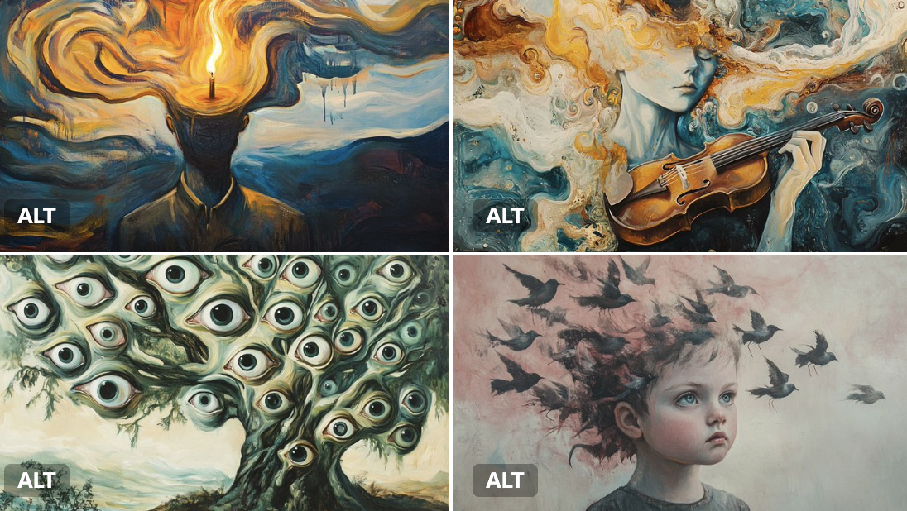

```
A surreal oil painting of a [subject], executed in the style of early 20th-century dreamscapes. Melting shapes, floating forms, and swirling [color1] and [color2] brushstrokes create a dreamlike dissonance.
```

 [↑返回目录](#toc)

---
## <a id="prompt-104">珐琅马赛克瓷砖风格</a> (<a href="https://x.com/mariia_gonchar/status/1931774946608370013" target="_blank" rel="noopener noreferrer">@mariia_gonchar</a>)

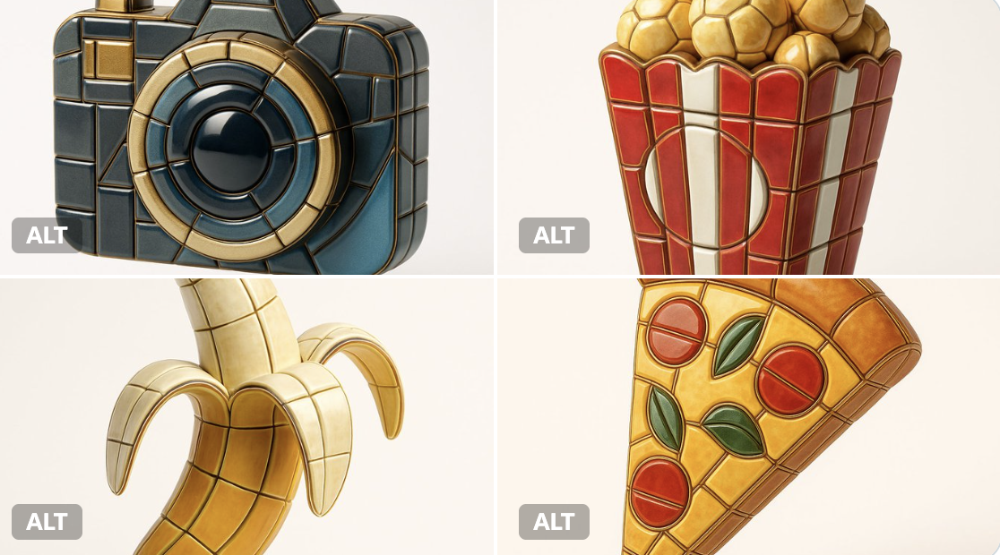

```
Visualize any selected emoji [] as an ultra-detailed, hyper-realistic 3D sculpture fully composed of luxurious enamel mosaic tiles. The emoji should retain its iconic silhouette and proportions, reinterpreted as a stylized 3D figure made entirely from curved, faceted, and geometrically interlocked enamel tiles in a radiant mosaic pattern.
> Use high-gloss enamel tiles in varied shades derived from the emoji’s symbolic palette—integrating metallic accents, opalescent glazes, deep ceramic pigmentation, and subtle iridescence. Tile surfaces must exhibit gentle bevels, crisp joints, and tactile depth to emulate elite architectural mosaic work.
> Ensure no visible support structures—the figure must appear freestanding and weightless, suspended mid-air at the exact center of the frame.
> Background: pure white studio environment with soft ambient shadows directly beneath the sculpture to emphasize spatial presence and floating realism.
> Lighting: cinematic, diffused from multiple angles to
```

 [↑返回目录](#toc)

---
## <a id="prompt-117">动漫机甲风格化机械设计图</a> (<a href="https://x.com/Artedeingenio/status/1931711452160651654" target="_blank" rel="noopener noreferrer">@Artedeingenio</a>)


```
Transform this image into a stylized mechanical design sheet inspired by Japanese anime mecha blueprints.
Render the subject with precise, clean linework and semi-realistic cel-shading, as if it were a technical illustration from an anime artbook.
Break down the design into parts (e.g. head, hand, accessory, full body) and arrange them like a reference sheet, with different angles and views.
Include soft handwritten notes or Japanese characters scattered like concept annotations.
Use muted digital colors (red, gray, metallic tones) and draw the background in a loose watercolor anime landscape style — cliffs, cityscapes, or grassland ruins.
The final composition should feel like an official design page for an animated sci-fi series or manga.
Keep the format horizontal, like a blueprint or character sheet, with a balance between precision and artistic flair.
```

 [↑返回目录](#toc)

---
## <a id="prompt-95">品牌平面纸风格</a> (<a href="https://x.com/HBCoop_/status/1925213900192043236" target="_blank" rel="noopener noreferrer">@HBCoop_</a>)

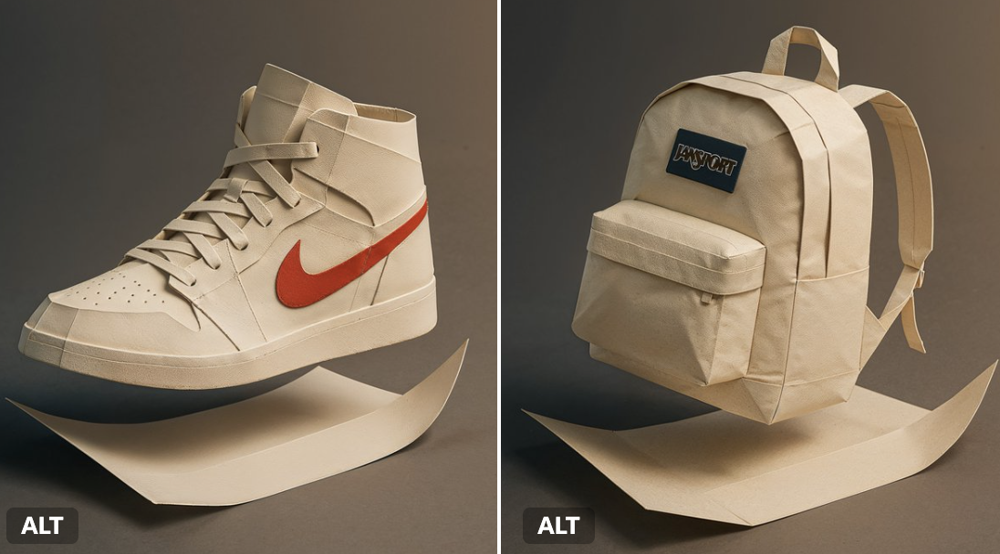

```
A flat branded paper folds itself into the full 3D shape of a [Air Jordan 1 shoes], mid-motion. Dramatic studio lighting, origami texture detail, gradient shadows, Japanese minimalism feel.
```

```
A flat branded paper folds itself into the full 3D shape of a [Jansport backpack], mid-motion. Dramatic studio lighting, origami texture detail, gradient shadows, Japanese minimalism feel.
```

 [↑返回目录](#toc)

---
## <a id="prompt-148">怀旧午后阳光</a> (<a href="https://x.com/BeanieBlossom/status/1936756146817372428" target="_blank" rel="noopener noreferrer">@BeanieBlossom</a>)


```
a pillow fort in the backyard, shaded by a big old tree. Sunlight filters through the leaves, and a young boy and his golden retriever naps beside a tray of lemonade and cookies. Wind chimes tinkle gently in the breeze. Warm afternoon light, playful and nostalgic, children's book illustrated feeling
```

```
后院的一座枕头堡，被一棵大老树遮蔽。阳光透过树叶洒进来，一个小男孩和他的金毛猎犬在一盘柠檬水和饼干旁边打盹。风铃在微风中轻轻地叮叮当当。温暖的午后阳光，俏皮又怀旧，童书图画情怀
```

 [↑返回目录](#toc)

---
## <a id="prompt-495">微缩的温馨客厅</a> (<a href="https://x.com/egeberkina/status/1992654337815007678" target="_blank" rel="noopener noreferrer">@egeberkina</a>)

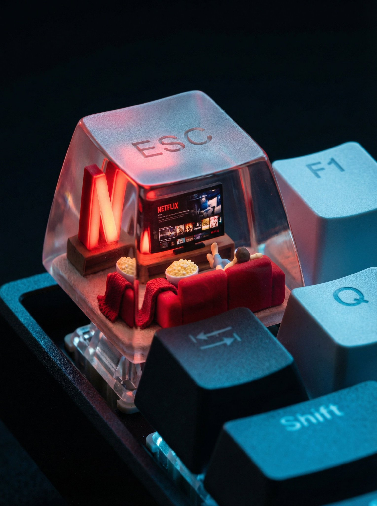

```
A photorealistic ESC keycap scene shows a miniature cozy living room setup. Inside: a glowing red Netflix screen, a plush red couch, popcorn bowl, and throw blanket. A small figure lounges with feet up, watching content. The red “N” logo glows from behind like mood lighting. Outside: cool tech-blue reflections on F1, Shift, and Q keys. The word “ESC” is subtly present in a glassy fog on top of the cap.
```

```
一张逼真的 ESC 键帽场景图展现了一个微缩的温馨客厅。室内：一台闪着红光的 Netflix 屏幕、一张柔软的红色沙发、一碗爆米花和一条毯子。一个小人儿懒洋洋地翘着二郎腿，正在观看视频。红色的“N”字标志从后面透出光芒，如同氛围灯一般。室外：F1、Shift 和 Q 键上反射着酷炫的科技蓝光。“ESC”字样则以朦胧的玻璃质感隐约出现在键帽顶部。
```

 [↑返回目录](#toc)

---
## <a id="prompt-69">品牌折叠纸</a> (<a href="https://x.com/HBCoop_/status/1925600123200881024" target="_blank" rel="noopener noreferrer">@HBCoop_</a>)

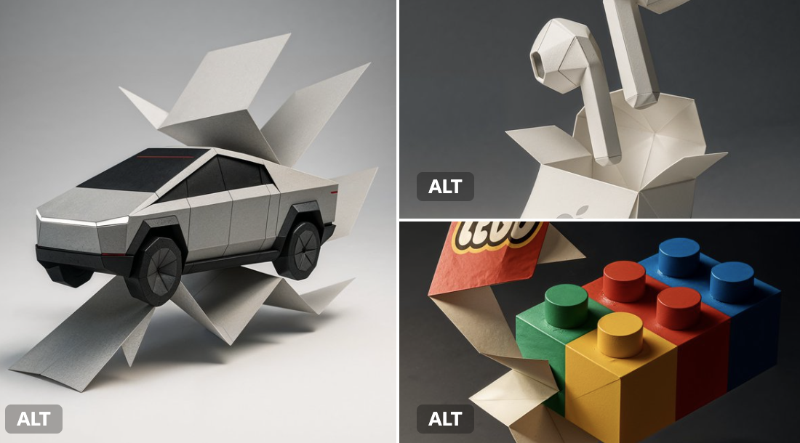

```
A flat branded paper folds itself into the full 3D shape of a [insert product or item, e.g. “Coca-Cola bottle”, “Nike sneaker”, “Big Mac”], mid-motion. 

The paper colors match the [insert brand name] brand’s signature palette and the natural colors of the item (e.g., [describe key colors or ingredients, like “red and white for Coca-Cola”, “brown, green, yellow for Big Mac”]).

Dramatic studio lighting, origami texture detail, soft gradient shadows. Stylized with Japanese minimalism and elegant negative space. The scene captures a clean, elevated transformation from flat brand identity into sculptural product form.
```

 [↑返回目录](#toc)

---
## <a id="prompt-59">军事计划</a> (<a href="https://x.com/B_4AI/status/1925479609442738486" target="_blank" rel="noopener noreferrer">@B_4AI</a>)

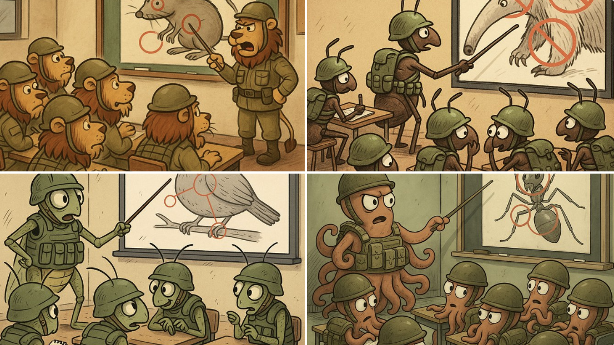

```
A humorous cartoon scene set inside a military training classroom, featuring a group of [Insect Name] soldiers sitting at desks, wearing tiny helmets and miniature combat gear. They listen attentively to their commander, who stands in front of a large board displaying a sketch of a threat to their existence — the enemy changes depending on the animal or insect. The commander explains the attack plan using a pointer, highlighting sensitive targets with red circles. Some soldiers take notes, others whisper tactical ideas to each other. The overall atmosphere blends seriousness with satire in an exaggerated cartoon style.
```

 [↑返回目录](#toc)

---
## <a id="prompt-194">装饰艺术未来主义</a> (<a href="https://x.com/hc_dsn/status/1936095679879037143" target="_blank" rel="noopener noreferrer">@hc_dsn</a>)

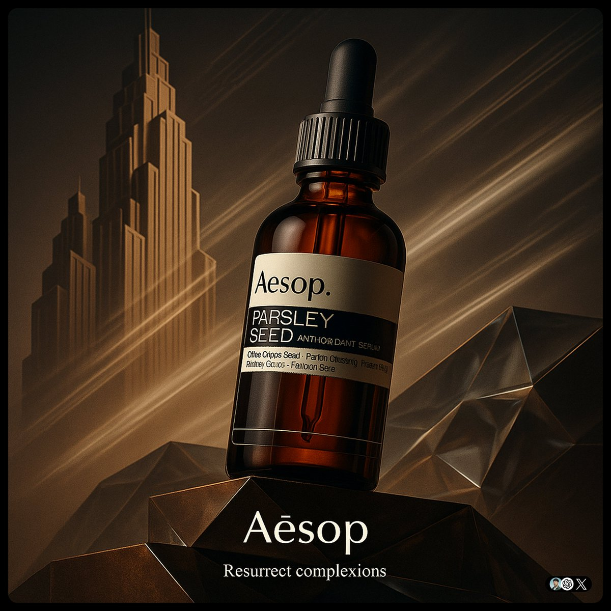

```
create image with 1:1 ratio 
[Brand] ad. Ultra-high-detail product photo in a fusion of Art Deco and Futurism. The product rest on platforms.  Background features stylized Art Deco skyscraper silhouettes morphing into Futurist speed lines, forming a diagonal left-to-right composition. Surfaces use brand Core Material and faceted glass with ambient lighting in Brand Color theme.  The product evoking motion and kinetic optimism. Dramatic low-angle lighting enhances reflections, with subtle vapor trails in the background.  Small logo on the bottom, and a tiny slogan beneath
```

```
以 1：1 的比例创建图像
[品牌] 广告。融合了装饰艺术和未来主义的超高细节产品照片。该产品位于平台上。 背景以风格化的装饰艺术摩天大楼剪影转变为未来主义的速度线条，形成从左到右的对角线构图。表面使用品牌核心材料和多面玻璃，并在品牌颜色主题中使用环境照明。 该产品唤起了动感和动感的乐观主义。戏剧性的低角度照明增强了反射，背景中带有微妙的蒸汽痕迹。 底部有小标志，下面有一个小标语
```

 [↑返回目录](#toc)

---
## <a id="prompt-132">悬浮魔幻现实主义</a> (<a href="https://x.com/BeanieBlossom/status/1934581820433301996" target="_blank" rel="noopener noreferrer">@BeanieBlossom</a>)


```
An old-fashioned postal shack floating on a space rock, with envelopes fluttering like wings and planets lined up as waiting customers - humorous, magical realism.
```

```
一个漂浮在太空岩石上的老式邮政小屋，信封像翅膀一样飘动，行星排成一排等待的顾客 - 幽默、魔幻现实主义。
```

 [↑返回目录](#toc)

---
## <a id="prompt-128">一个字的无限反射</a> (<a href="https://x.com/egeberkina/status/1934670309942018397" target="_blank" rel="noopener noreferrer">@egeberkina</a>)

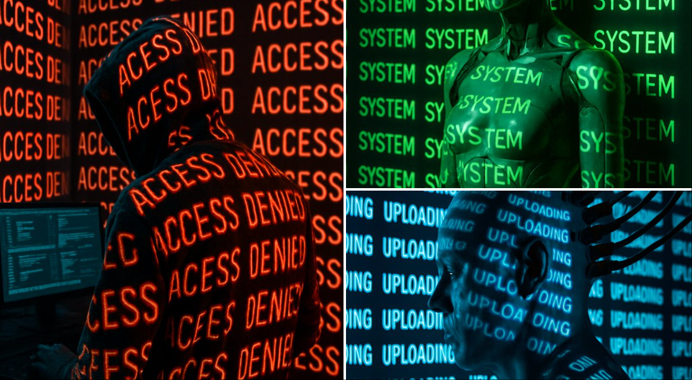


```
A [PERSON] in a dark room with a glowing projection of the word “[WORD]” repeated endlessly across the walls and body. The text is projected in high-contrast, neon [COLOR], wrapping around the contours of the object, creating a surreal, futuristic lighting effect. The background and object are seamlessly blended into the immersive text environment. Photorealistic, sharp shadows and light distortion where the text bends over curves. Studio lighting with deep contrast, moody cyberpunk aesthetic.
```

```
一个 [PERSON] 在一个黑暗的房间里，“[WORD]”这个词的发光投影在墙壁和身体上无休止地重复。文本以高对比度的霓虹灯 [COLOR] 投影，包裹在对象的轮廓周围，营造出超现实的未来主义照明效果。背景和对象无缝混合到沉浸式文本环境中。照片级真实感、锐利的阴影和文本在曲线上弯曲的光线扭曲。具有深对比度、喜怒无常的赛博朋克美学的工作室照明。
```

 [↑返回目录](#toc)

---
## <a id="prompt-124">磨砂模糊剪影</a> (<a href="https://x.com/umesh_ai/status/1934249977326289141" target="_blank" rel="noopener noreferrer">@umesh_ai</a>)

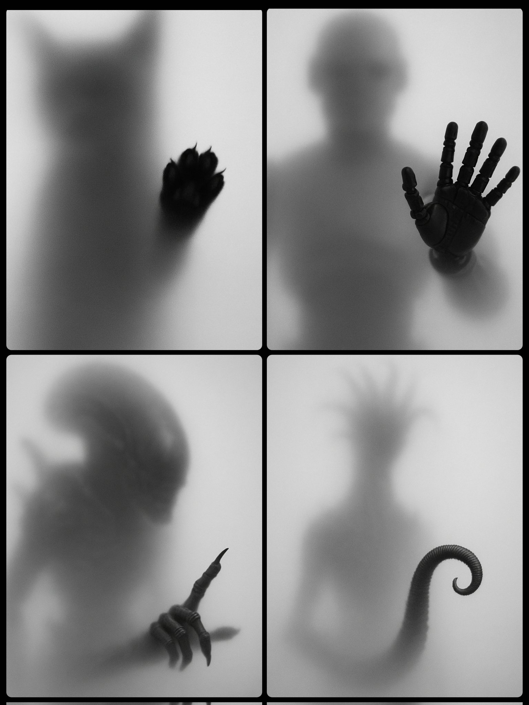

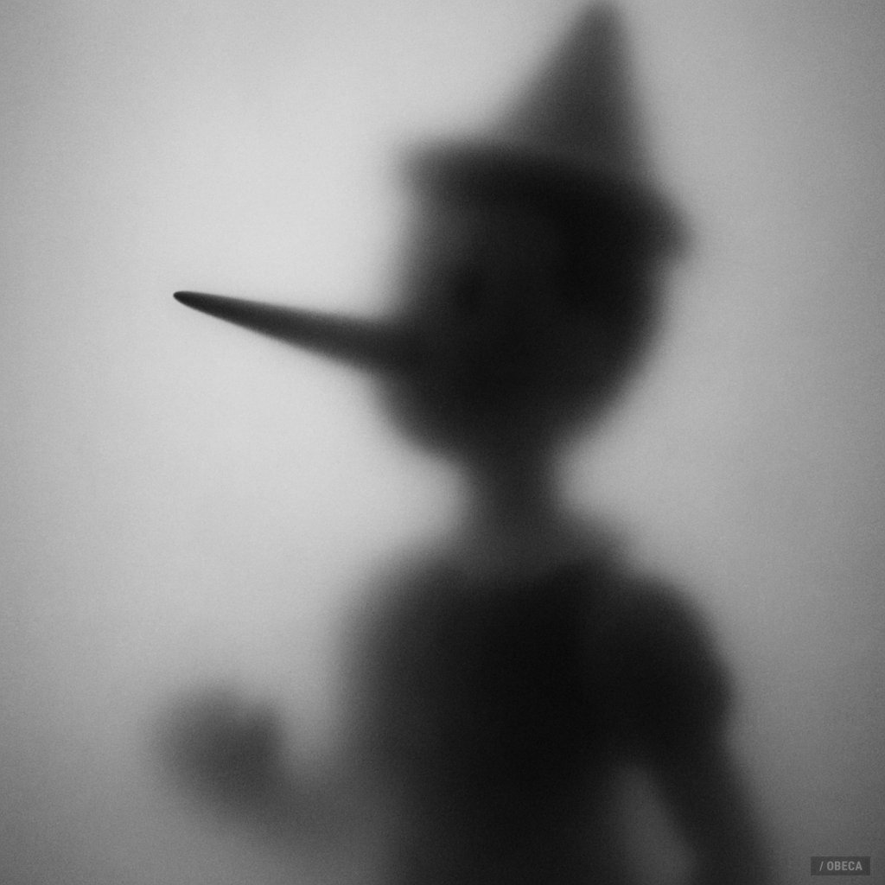

```
A black and white photograph shows the blurred silhouette of a [SUBJECT] behind a frosted or translucent surface. The [PART] is sharply defined and pressed against the surface, creating a stark contrast with the rest of the hazy, indistinct figure. The background is a soft gradient of gray tones, enhancing the mysterious and artistic atmosphere
```

```
一张黑白照片显示了磨砂或半透明表面后面 [SUBJECT] 的模糊剪影。[PART] 轮廓分明，压在表面，与朦胧、模糊的人物的其余部分形成鲜明对比。背景是灰色调的柔和渐变，增强了神秘和艺术的氛围
```

 [↑返回目录](#toc)

---
## <a id="prompt-288">食物与运动结合的广告</a> (<a href="https://x.com/Salmaaboukarr/status/1912961013877801177" target="_blank" rel="noopener noreferrer">@Salmaaboukarr</a>)


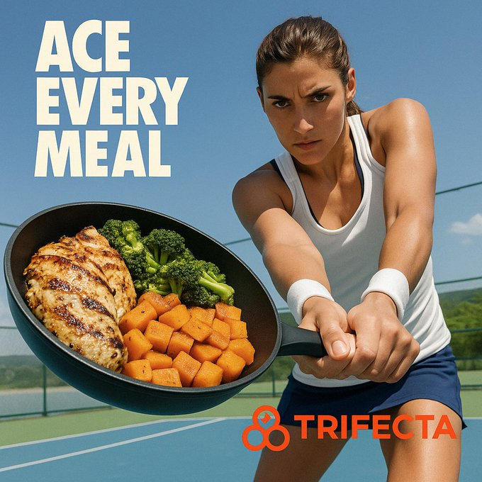


```
Muscular African  man dunks a grilled chicken breast into a basketball hoop with 'DUNK EVERY MACRO' text, under a clear sky. Fitness-themed, with Trifecta logo.
```

```
晴朗天空下，一位肌肉发达的非洲男子将一块烤鸡胸肉扣进篮球框，篮框上写着“扣篮，每个宏都扣篮”（DUNK EVERY MACRO）。健身主题，带有 Trifecta 标志。
```

```
Fit female tennis player on court, wearing white tank top and blue skirt, swinging a frying pan like a racket. In the pan: grilled chicken, broccoli, sweet potatoes. Clear blue sky. Bold text: 'ACE EVERY MEAL.' Trifecta logo in orange, bottom right.
```

```
球场上，身材健美的女子网球运动员身穿白色背心和蓝色裙子，像挥动球拍一样挥舞着煎锅。锅里盛着烤鸡、西兰花和红薯。湛蓝的天空。粗体字写着：“每餐都精彩。” 右下角是橙色的Trifecta标志。
```

```
Muscular man in black hoodie and orange boxing gloves in dark gym, boxing a giant burrito hanging like a punching bag. Dramatic lighting. "TRIFECTA" logo in bold orange top right. Text "BEAT HUNGER TO THE PUNCH." in bold white bottom left. Humorous, intense fitness ad.
```

```
肌肉发达的男子身穿黑色连帽衫，戴着橙色拳击手套，在昏暗的健身房里，用拳击机打着一个像沙袋一样悬挂着的巨型墨西哥卷饼。灯光效果惊艳。右上角印有醒目的橙色“TRIFECTA”标志。左下角印有醒目的白色文字“BEAT HUNGER TO THE PUNCH.” 。这则幽默风趣、充满力量的健身广告。
```

```
Create a bold ad for Trifecta Nutrition: a baseball player mid-swing in a stadium, holding a giant orange spatula instead of a bat. Use the tagline 'Knock Hunger Out of the Park' in athletic-style text. Include Trifecta’s logo and orange/black branding
```

```
为 Trifecta Nutrition 制作一则醒目的广告：一位棒球运动员在体育场挥棒，手中拿着一把巨大的橙色铲子而不是球棒。使用运动风格的文字，写上“Knock Hunger Out of the Park”（击退饥饿）的标语。同时加入 Trifecta 的标志和橙黑色品牌标识。
```

 [↑返回目录](#toc)

---
## <a id="prompt-155">自己的国家地标时尚杂志</a> (<a href="https://x.com/TheRelianceAI/status/1936802168318910673" target="_blank" rel="noopener noreferrer">@TheRelianceAI</a>)

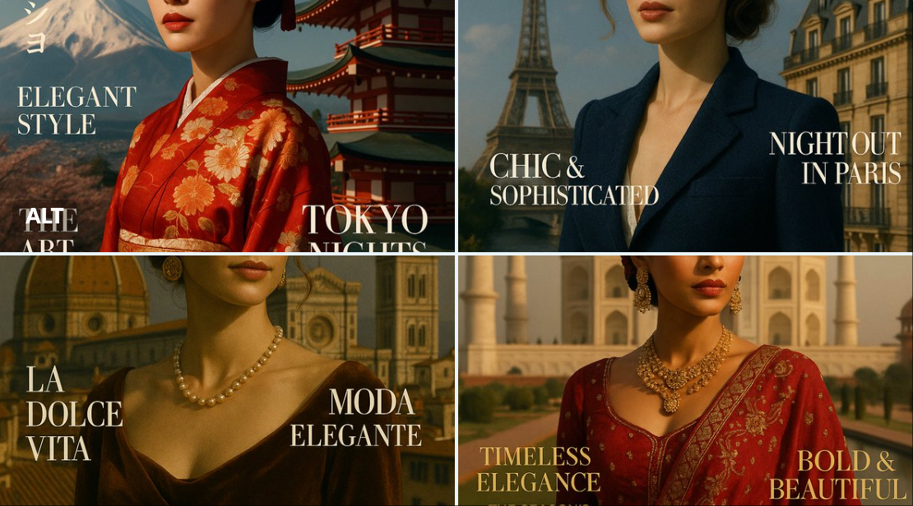


```
a luxurious fashion magazine cover designed in the style of [COUNTRY], blending iconic landmarks, cultural symbols, and local fashion aesthetics. The layout mimics high-end editorial design, with headlines inspired by the country’s language, trends, and lifestyle. Sophisticated, cinematic lighting, vertical 9:16 format, ultra-detailed, Vogue-level elegance
```

```
以 [COUNTRY] 风格设计的豪华时尚杂志封面，融合了标志性地标、文化符号和当地时尚美学。布局模仿高端编辑设计，标题的灵感来自该国的语言、趋势和生活方式。精致的电影级灯光，垂直 9：16 格式，超细节，Vogue 级别的优雅
```

 [↑返回目录](#toc)

---
## <a id="prompt-291">英语单词闪卡制作</a> (<a href="https://x.com/JinsFavorites/status/1905097569837232327" target="_blank" rel="noopener noreferrer">@JinsFavorites</a>)


```
你是一个英语单词闪卡制作大师, 你可以根据我输入的主题词,生成一个图片并以此拓展,比如我输入电脑,你生成一张和电脑相关的图片,并用箭头分步介绍键盘\鼠标\显示器等中文和英文
```

 [↑返回目录](#toc)

---
## <a id="prompt-239">沙滩胶囊城市</a> (<a href="https://x.com/TechieBySA/status/1944386743865622718" target="_blank" rel="noopener noreferrer">@TechieBySA</a>)

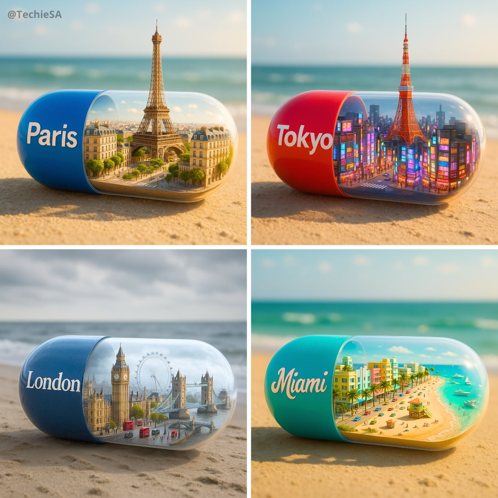


```
A vibrant, hyper-realistic miniature of [CITY] inside a transparent capsule lying on a sandy beach. The capsule is half [COLOR] (matching [COUNTRY]’s flag) with [CITY] written in white text on the colored section. Inside the capsule: iconic landmarks of [CITY], beautiful water canals or streets, small detailed boats or cars, sunny bright lighting, cinematic depth of field, dreamy atmosphere, ocean waves in the background.
```

```
一个充满活力的、超写实的[CITY]微缩模型，放置在一个透明胶囊内，躺在沙滩上。胶囊一半是[COLOR]色（与[COUNTRY]的国旗相匹配），彩色部分上用白色文字写着[CITY]。胶囊内部：[CITY]的标志性地标、美丽的运河或街道、小巧精致的船只或汽车、阳光明媚的光线、电影般的景深、梦幻般的氛围、背景中的海浪。
```

 [↑返回目录](#toc)

---
## <a id="prompt-229">品牌快餐胶囊</a> (<a href="https://x.com/TechieBySA/status/1944462797666123872" target="_blank" rel="noopener noreferrer">@TechieBySA</a>)

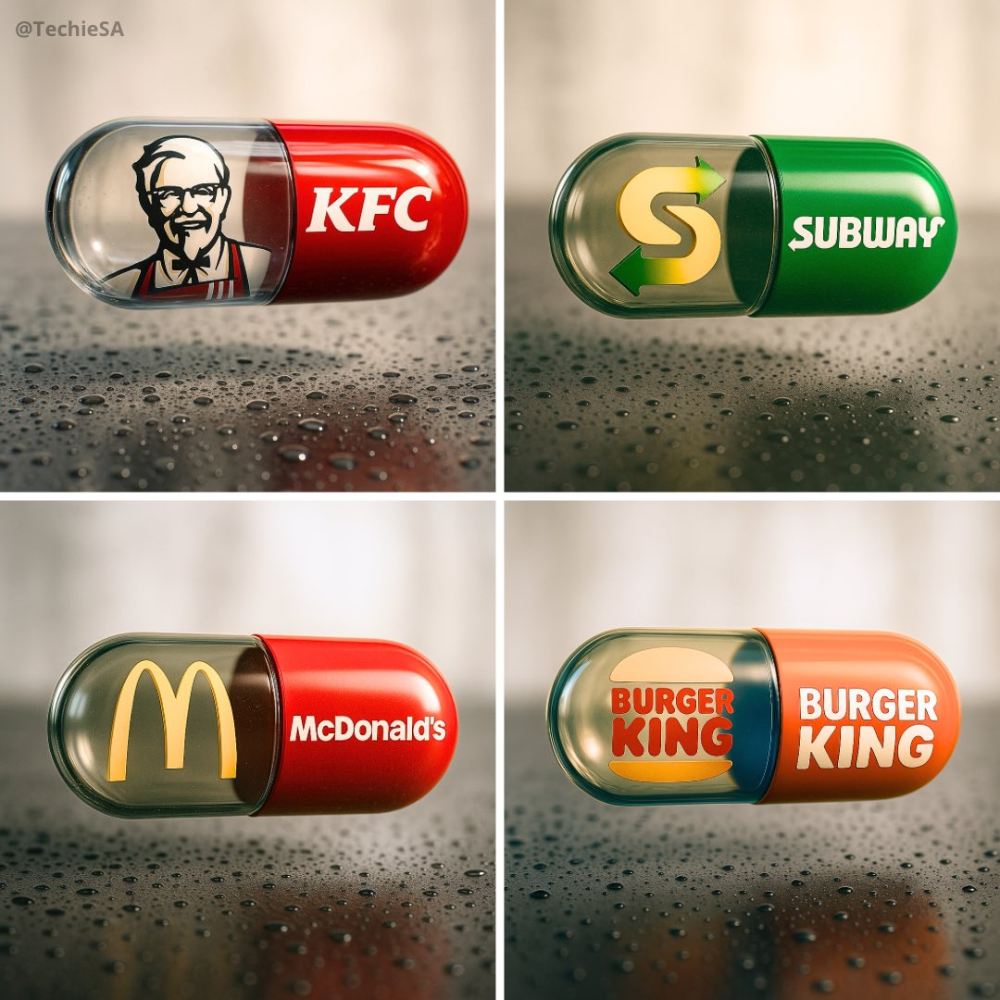

```
Create a hyper-realistic, stylish poster [1080x1080] aspect ratio featuring a horizontal tablet-capsule hovering above a surface covered in condensation and water droplets, with its shadow cast on the wet ground. One side of the capsule is transparent glass, while the other is glossy [BRAND COLORS] plastic, displaying the [BRAND] logo and name. Seamlessly floating inside the glass portion of the capsule is a photorealistic 3D model of the [BRAND LOGO OR ICON], perfectly centered and suspended in zero gravity. The glass and plastic surfaces showcase strong reflections, refractions, and environmental distortions. The background is a softly blurred, elegant light-toned setting. Use a dynamic perspective with a stylish camera angle, professional studio lighting, and ultra-high detail to make the image look like a DSLR-captured photograph with impeccable realism.
```

```
创建一个超逼真、时尚的海报[1080x1080]宽高比，展示一个水平平板胶囊悬浮在布满水汽和液滴的表面上，其影子投射在湿润的地面上。胶囊一侧是透明玻璃，另一侧是光泽[品牌颜色]塑料，显示[品牌]标志和名称。玻璃部分无缝漂浮着一张逼真的 3D 模型[品牌标志或图标]，完美居中并悬浮在零重力中。玻璃和塑料表面展现出强烈的反射、折射和环境扭曲。背景是柔和模糊、优雅浅色调的设置。使用动态视角和时尚的相机角度，结合专业工作室灯光和超高清细节，使图像看起来像是一张由单反相机拍摄的真实照片，具有无懈可击的真实感。
```

 [↑返回目录](#toc)

---
## <a id="prompt-143">迪士尼鸡尾酒</a> (<a href="https://x.com/TheRelianceAI/status/1936726936409313294" target="_blank" rel="noopener noreferrer">@TheRelianceAI</a>)


```
A realistic, high-end cocktail in a frosted glass with a sparkling salt rim, filled with crystal-clear ice cubes. The drink is garnished with deep-blue kale leaves and delicate pastel-pink edible flowers. The lighting is moody and cinematic, with soft highlights on the glass. The entire visual style — color palette, lighting, background, and atmosphere — is inspired by the animated film 【MOVIE_TITLE】 by Disney, subtly reflecting its visual tone and mood. At the bottom of the image, in elegant golden serif text, it says: “Disney — 【MOVIE_TITLE】”. Vertical 9:16, ultra-detailed, photographic realism with artistic direction based on the film’s world.
```

```
一款逼真的高端鸡尾酒，装在磨砂玻璃杯中，带有波光粼粼的盐边，里面装满了晶莹剔透的冰块。这款饮料以深蓝色的羽衣甘蓝叶和精致的淡粉色食用花朵装饰。灯光是喜怒无常的和电影般的，玻璃上有柔和的亮点。整个视觉风格——调色板、灯光、背景和氛围——都受到了迪士尼动画电影【MOVIE_TITLE】的启发，巧妙地反映了它的视觉基调和情绪。在图片的底部，用优雅的金色衬线文字写着：“Disney — 【MOVIE_TITLE】”。垂直 9：16，超详细，摄影现实主义，艺术指导基于电影世界。
```

 [↑返回目录](#toc)

---
## <a id="prompt-68">透明容器里有一个微型的3D世界</a> (<a href="https://x.com/KoppulaMahende9/status/1920442464810270851" target="_blank" rel="noopener noreferrer">@KoppulaMahende9</a>)

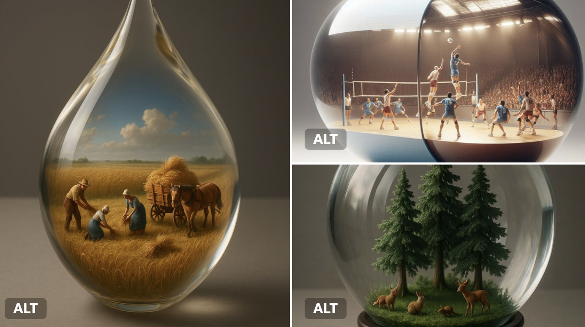

```
A giant [transparent or glossy] [object/container] with a miniature 3D diorama inside it, depicting [a symbolic or narrative scene], studio-lit with soft shadows, placed on a neutral matte surface. Emphasize visual contrast between the scale of the capsule and the detail within. Highlight texture, light refraction, and emotional tone (e.g., surreal, poetic, or sci-fi).
```

 [↑返回目录](#toc)

---
## <a id="prompt-70">重新构想的玫瑰金</a> (<a href="https://x.com/aziz4ai/status/1925933649267970074" target="_blank" rel="noopener noreferrer">@aziz4ai</a>)

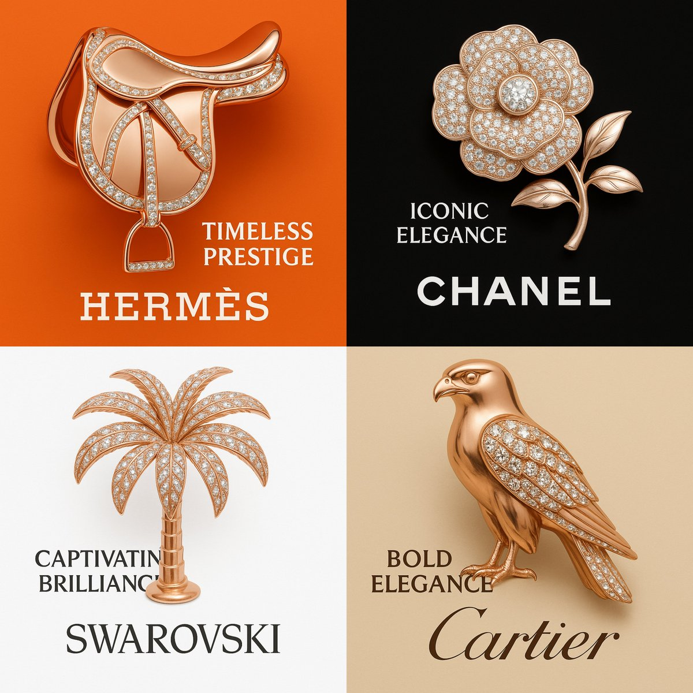

```
Design a luxury-themed 1:1 image featuring a rose gold sculpture that embodies the essence of the jewelry brand “[BRAND NAME]”. The object must symbolically reflect the brand’s identity (e.g., falcon for Cartier, ring for Tiffany & Co., palm tree for Swarovski, camel for Prada). Embed premium crystal textures into key parts of the sculpture (e.g., wings, gem, leaves, or hump) to match the brand’s signature elegance. Use the brand’s iconic background color (e.g., Tiffany Blue, Swarovski White, Cartier Beige, Prada Sand) and place the official logo beneath the sculpture. Add a bold two-word slogan that aligns with the brand’s tone. Lighting should be pure white with high Kelvin value to ensure clarity and prevent yellow tint. The result must feel editorial, artistic, and visually exquisite.
```

 [↑返回目录](#toc)

---
## <a id="prompt-225">时尚的胶囊海报</a> (<a href="https://x.com/TechieBySA/status/1944435018203296063" target="_blank" rel="noopener noreferrer">@TechieBySA</a>)


```
Create a hyper-realistic, stylish poster [1080x1080] aspect ratio featuring a horizontal tablet-capsule hovering above a surface covered in condensation and water droplets, with its shadow cast on the wet ground. One side of the capsule is transparent glass, while the other is glossy [COLOR/DESIGN] plastic, displaying the [BRAND] logo and name. Seamlessly floating inside the glass portion of the capsule is a photorealistic 3D model of the [LOGO], perfectly centered and suspended in zero gravity. The glass and plastic surfaces showcase strong reflections, refractions, and environmental distortions. The background is a softly blurred, elegant light-toned setting. Use a dynamic perspective with a stylish camera angle, professional studio lighting, and ultra-high detail to make the image look like a DSLR-captured photograph with impeccable realism.
```

```
创作一张超逼真、时尚的海报[1080x1080]宽高比，展示一个水平放置的平板胶囊悬浮在布满水汽和水滴的表面上，其影子投射在湿润的地面上。胶囊的一面是透明玻璃，另一面是光泽塑料[颜色/设计]，显示[品牌]标志和名称。在胶囊的玻璃部分中，一个逼真的 3D 模型[标志]无缝漂浮，完美居中并悬浮在零重力中。玻璃和塑料表面展现出强烈的反射、折射和环境扭曲。背景是一个柔和模糊、优雅浅色调的设置。使用动态视角和时尚的相机角度，结合专业工作室灯光和超高清细节，使图像看起来像是一张由单反相机拍摄的真实照片，具有无懈可击的真实感。
```

 [↑返回目录](#toc)

---
## <a id="prompt-169">微型透明胶囊</a> (<a href="https://x.com/CharaspowerAI/status/1938299520019734676" target="_blank" rel="noopener noreferrer">@CharaspowerAI</a>)


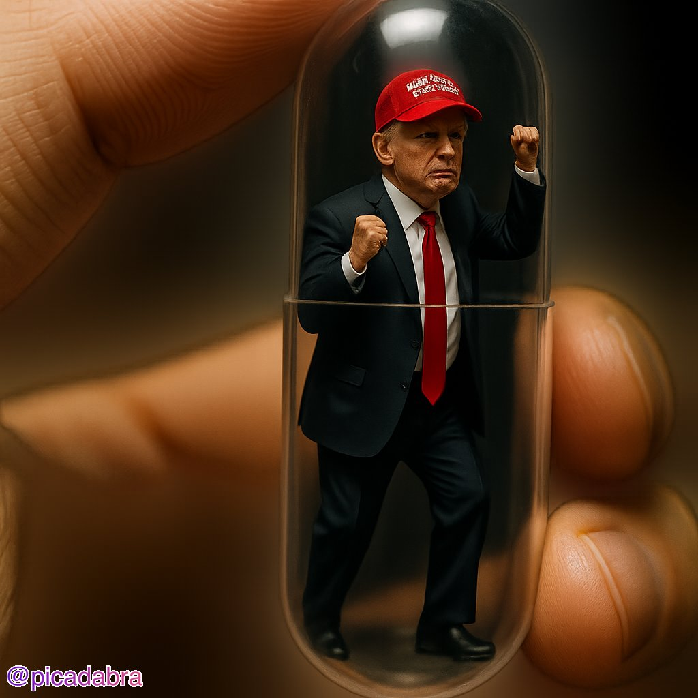

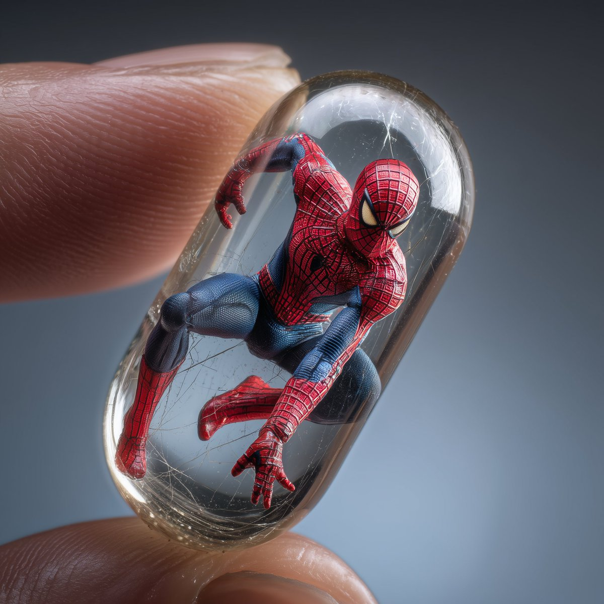

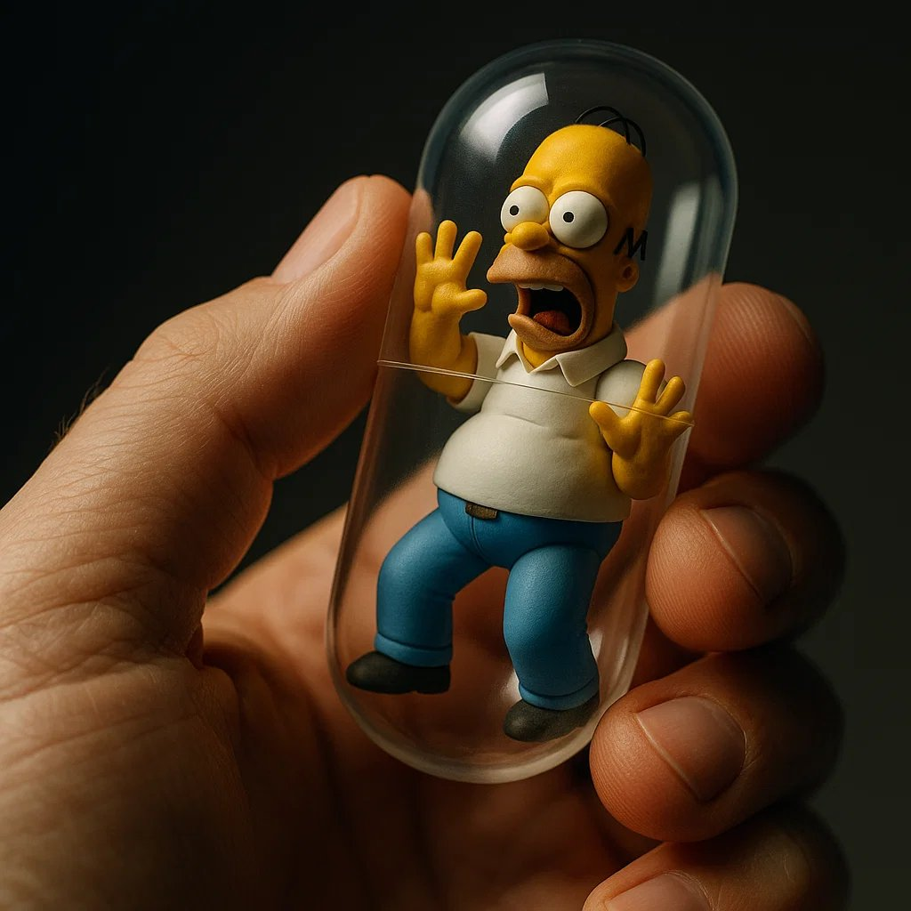


```
Close-up, A hand holding a transparent capsule, inside it is a miniature model of [character name], wearing [their iconic outfit and accessories]. The character is posed in a [specific, expressive or dynamic pose], interacting with the inner surface of the capsule, as if they are frozen or confined inside. Hyper-realistic, cinematic, studio lighting setup, photographed with a macro lens.
```

```
特写，一只手拿着一个透明的胶囊，里面是一个 [角色名称] 的微型模型，穿着 [他们的标志性服装和配饰]。角色以 [特定、富有表现力或动态的姿势] 摆姿势，与胶囊的内表面互动，就好像他们被冻结或限制在里面一样。超逼真、电影般的工作室照明设置，使用微距镜头拍摄。
```

 [↑返回目录](#toc)

---
## <a id="prompt-167">液态金属设计产品</a> (<a href="https://x.com/hc_dsn/status/1938203557771260064" target="_blank" rel="noopener noreferrer">@hc_dsn</a>)


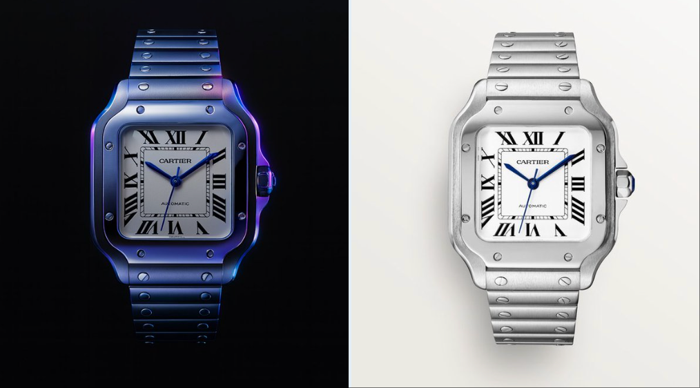

```
create image with 1:1 ratio 
retexture the photo I attached with the following json 
{   "style_name": "hermes_subtle_specular_gradient",   "background": {     "type": "solid",     "color": "#000000",     "light_reflection": "none"   },   "base_material": {     "type": "polished_metal",     "color": "#B0B0B0",     "finish": "glossy",     "reflectivity": 0.75,     "surface_variation": {       "micro_noise": 0.005,       "brushed_direction": "none"     }   },   "highlight_strategy": {     "mode": "localized_specular_enhancement",     "trigger": "light-facing curved planes and direct lit faces",     "color_gradient": ["#121A28", "#3D4C6B", "#8c71b7", "#4d21cd"],     "gradient_type": "fluid_blend",     "intensity_curve": "ease-out from highlight center",     "falloff": 0.8,     "blend_mode": "soft_light",     "saturation_level": 0.4,     "coverage_ratio": 0.2,     "transition_smoothness": 0.95   },   "lighting": {     "scene_type": "high-control studio",     "key_light": {       "intensity": 1.0,       "color": "#FFFFFF",       "angle": "35° above and side",       "softness": 0.6     },     "fill_light": {       "enabled": false     },     "rim_light": {       "enabled": false     },     "reflection_behavior": {       "mirrored_zones": "limited to high exposure zones",       "glow_color": "applied from gradient with low saturation"     }   },   "specular_color_behavior": {     "base_surface": "metallic neutral",     "highlight_zones": "low-saturation chromatic reflection",     "edge_bleed": "minimal",     "inner_glow": 0.1   },   "detail_features": {     "engraved_elements": {       "type": "precise deboss",       "lighting_response": "low bounce",       "shadow_edge": "#222222",       "rim_light_tint": "#888888"     }   },   "application_targets": [     "object product photography",     "3D icons with selective lighting",     "branding renders",     "luxury UI component styling"   ],   "visual_effect_notes": {     "mood": "understated luxury, technical precision, controlled emotion",     "realism": "stylized physical logic",     "focus": "refined colored specular only on light-facing curved surfaces with fluid-like gradient transitions"   } }
```

```
以 1：1 的比例创建图像
我用以下 json 对我附加的照片进行 retexture
{ “style_name”： “hermes_subtle_specular_gradient”， “background”： { “type”： “solid”， “color”： “#000000”， “light_reflection”： “none” }， “base_material”： { “type”： “polished_metal”， “color”： “#B0B0B0”， “finish”： “glossy”， “reflectivity”： 0.75， “surface_variation”： { “micro_noise”： 0.005， “brushed_direction”： “none” } }， “highlight_strategy”： { “mode”： “localized_specular_enhancement”， “trigger”： “朝光曲面和直接照明 faces“， ”color_gradient“： [”#121A28“， ”#3D4C6B“， ”#8c71b7“， ”#4d21cd“]， ”gradient_type“： ”fluid_blend“， ”intensity_curve“： ”从高光中心缓出“， ”衰减“： 0.8， ”blend_mode“： ”soft_light“， ”saturation_level“： 0.4， ”coverage_ratio“： 0.2， ”transition_smoothness“： 0.95 }， ”lighting“： { ”scene_type“： ”high-control studio“， ”key_light“： { ”intensity“：1.0， “color”： “#FFFFFF”， “angle”： “上侧 35°”， “柔和度”： 0.6 }， “fill_light”： { “enabled”： false }， “rim_light”： { “enabled”： false }， “reflection_behavior”： { “mirrored_zones”： “仅限于高曝光区域”， “glow_color”： “从低饱和度渐变应用” } }， “specular_color_behavior”： { “base_surface”： “金属中性”， “highlight_zones”： “低饱和度色度 reflection“， ”edge_bleed“： ”minimal“， ”inner_glow“： 0.1 }， ”detail_features“： { ”engraved_elements“： { ”type“： ”精确凹陷“， ”lighting_response“： ”低反弹“， ”shadow_edge“： ”#222222“， ”rim_light_tint“： ”#888888“ } }， ”application_targets“： [ ”对象产品 photography“， ”具有选择性照明的 3D 图标“， ”品牌渲染“， ”豪华 UI 组件样式“ ]， ”visual_effect_notes“： { ”mood“： ”低调奢华、技术精确、受控情感“， ”realism“： ”风格化的物理逻辑“， ”focus“： ”仅在具有流体般渐变过渡的面向光线的曲面上优化彩色镜面反射“ } }
```

 [↑返回目录](#toc)

---
## <a id="prompt-51">霓虹灯发光的可爱动物</a> (<a href="https://x.com/icreatelife/status/1923819449305509924" target="_blank" rel="noopener noreferrer">@icreatelife</a>)

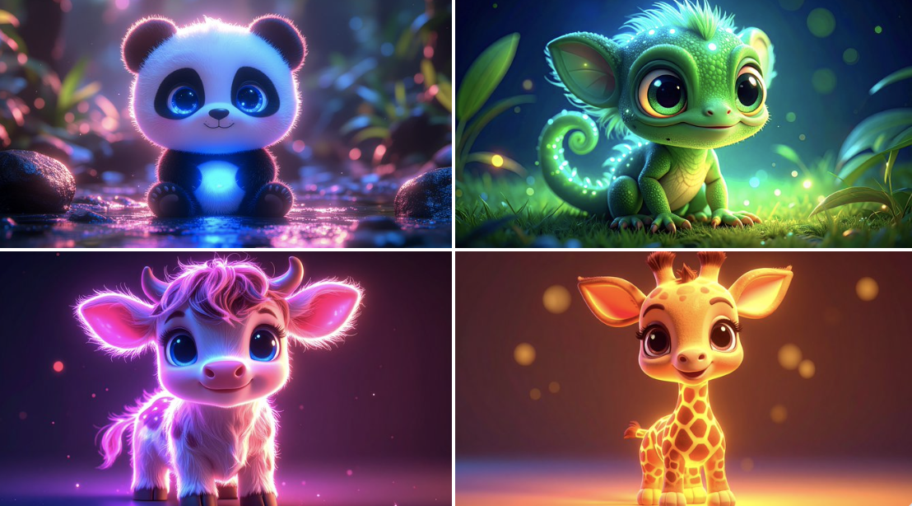

```
bioluminescent cute [ANIMAL], kawaii, chibi, [COLOR] neon backlit, 3d cartoon, big cute bright eyes, high definition
```

 [↑返回目录](#toc)

---


[上一页](./2.md) | 当前 3/7 页 | [下一页](./4.md) | [查看全部目录](../prompts.md)