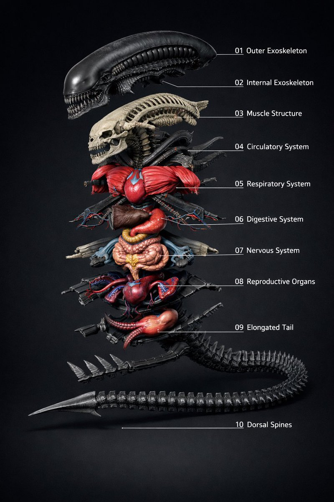
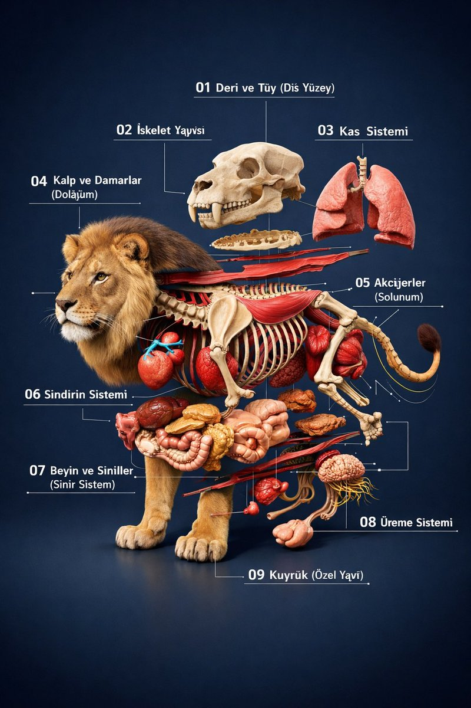
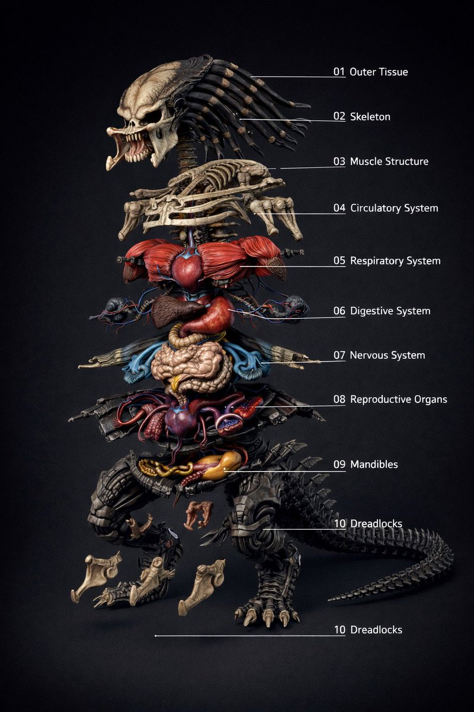
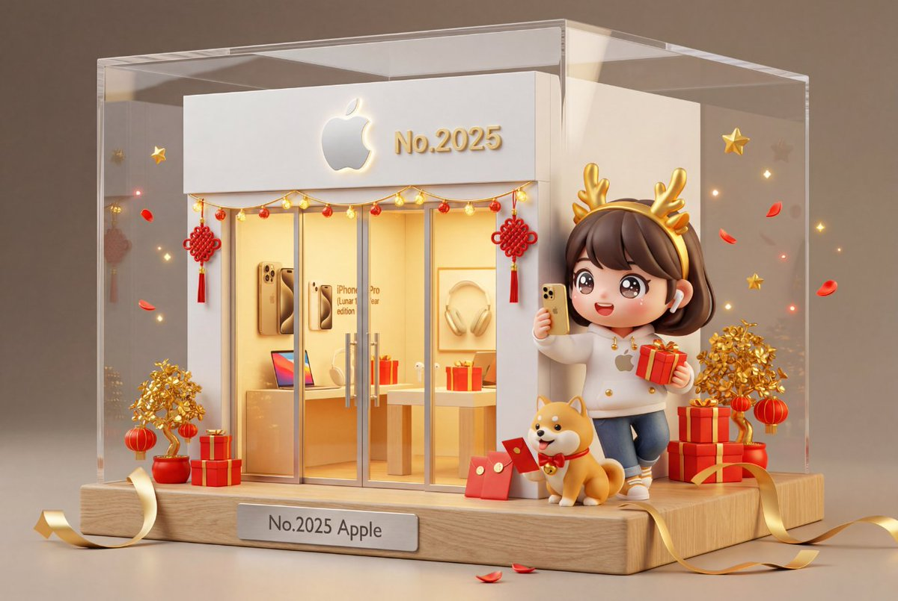
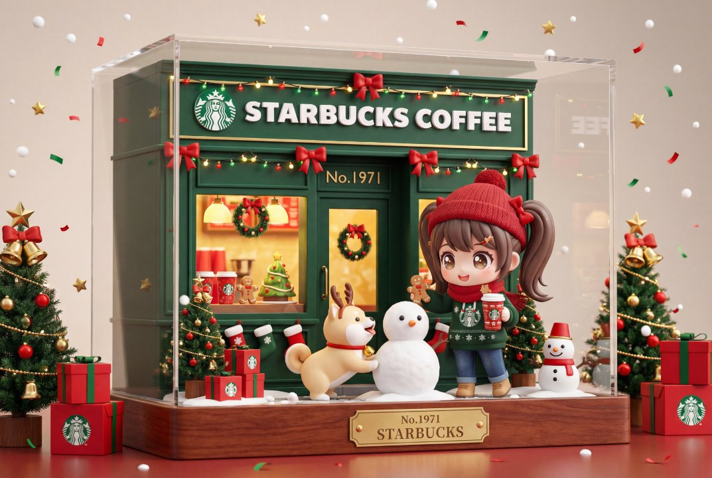
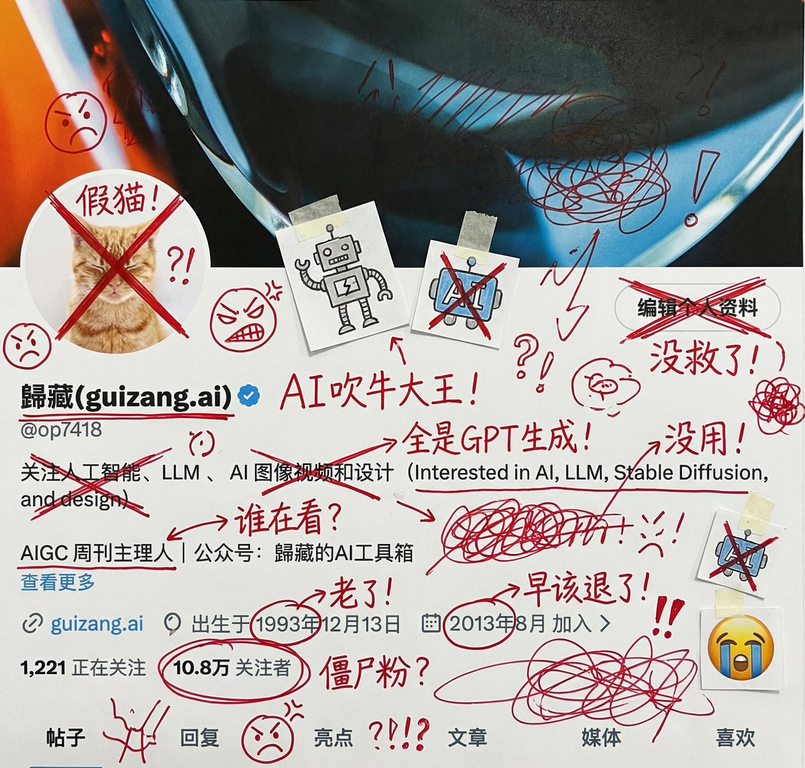
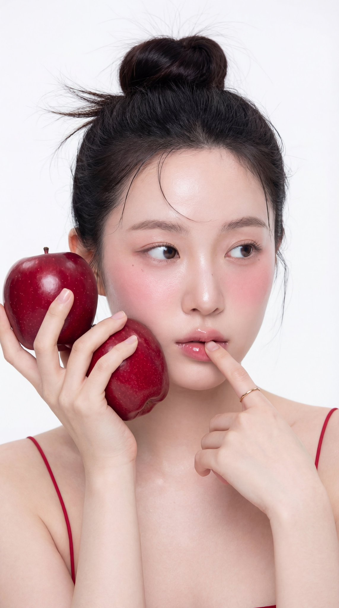
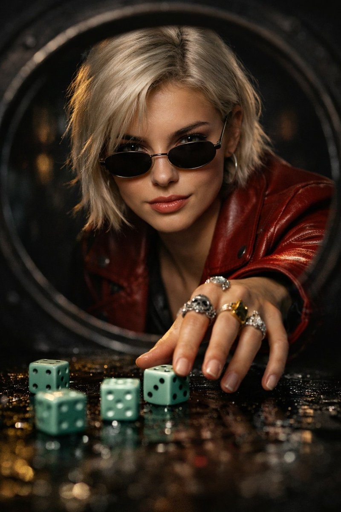

# chatgpt.json 

chatgpt.json文件存放chatgpt相关的提示词，当前已收录：321个 

 投稿方式：[飞书投稿](https://tcn1uh5rxo87.feishu.cn/share/base/form/shrcne5gDolOMDd0oJsj2XfvxQc) or [issues](https://github.com/junxiaopang/gridsplitter/issues/new)

[上一页](./3.md) | 当前 4/4 页 | [查看全部目录](../prompts.md)

🚀 **在线预览**: [https://prompts.kkkm.cn](https://prompts.kkkm.cn)

## <a id="toc">目录</a>

- [英语单词闪卡制作](#prompt-291)
- [沙滩胶囊城市](#prompt-239)
- [品牌快餐胶囊](#prompt-229)
- [迪士尼鸡尾酒](#prompt-143)
- [透明容器里有一个微型的3D世界](#prompt-68)
- [重新构想的玫瑰金](#prompt-70)
- [时尚的胶囊海报](#prompt-225)
- [微型透明胶囊](#prompt-169)
- [液态金属设计产品](#prompt-167)
- [霓虹灯发光的可爱动物](#prompt-51)
- [可爱粉彩乙烯基人物](#prompt-180)
- [制药风格商品](#prompt-94)
- [标志液化](#prompt-108)
- [草图中的现实与愿景](#prompt-2002826415939682600)
- [蓝调时刻的光圈之美](#prompt-1991730551531925500)
- [解剖爆炸图](#prompt-2001181398774726700)
- [节日微缩精品店](#prompt-2000924143768994000)
- [手写批注涂鸦风吐槽图](#prompt-1998024889530216700)
- [手拿红苹果的摄影棚肖像写真](#prompt-2005272524872187960)
- [环城公路记者巴里·韦斯](#prompt-2005291718263099431)
- [门后凝视：新黑色肖像](#prompt-2004371587412427000)

## <a id="prompt-291">英语单词闪卡制作</a> (<a href="https://x.com/JinsFavorites/status/1905097569837232327" target="_blank" rel="noopener noreferrer">@JinsFavorites</a>)


```
你是一个英语单词闪卡制作大师, 你可以根据我输入的主题词,生成一个图片并以此拓展,比如我输入电脑,你生成一张和电脑相关的图片,并用箭头分步介绍键盘\鼠标\显示器等中文和英文
```

 [↑返回目录](#toc)

---
## <a id="prompt-239">沙滩胶囊城市</a> (<a href="https://x.com/TechieBySA/status/1944386743865622718" target="_blank" rel="noopener noreferrer">@TechieBySA</a>)


```
A vibrant, hyper-realistic miniature of [CITY] inside a transparent capsule lying on a sandy beach. The capsule is half [COLOR] (matching [COUNTRY]’s flag) with [CITY] written in white text on the colored section. Inside the capsule: iconic landmarks of [CITY], beautiful water canals or streets, small detailed boats or cars, sunny bright lighting, cinematic depth of field, dreamy atmosphere, ocean waves in the background.
```

```
一个充满活力的、超写实的[CITY]微缩模型，放置在一个透明胶囊内，躺在沙滩上。胶囊一半是[COLOR]色（与[COUNTRY]的国旗相匹配），彩色部分上用白色文字写着[CITY]。胶囊内部：[CITY]的标志性地标、美丽的运河或街道、小巧精致的船只或汽车、阳光明媚的光线、电影般的景深、梦幻般的氛围、背景中的海浪。
```

 [↑返回目录](#toc)

---
## <a id="prompt-229">品牌快餐胶囊</a> (<a href="https://x.com/TechieBySA/status/1944462797666123872" target="_blank" rel="noopener noreferrer">@TechieBySA</a>)


```
Create a hyper-realistic, stylish poster [1080x1080] aspect ratio featuring a horizontal tablet-capsule hovering above a surface covered in condensation and water droplets, with its shadow cast on the wet ground. One side of the capsule is transparent glass, while the other is glossy [BRAND COLORS] plastic, displaying the [BRAND] logo and name. Seamlessly floating inside the glass portion of the capsule is a photorealistic 3D model of the [BRAND LOGO OR ICON], perfectly centered and suspended in zero gravity. The glass and plastic surfaces showcase strong reflections, refractions, and environmental distortions. The background is a softly blurred, elegant light-toned setting. Use a dynamic perspective with a stylish camera angle, professional studio lighting, and ultra-high detail to make the image look like a DSLR-captured photograph with impeccable realism.
```

```
创建一个超逼真、时尚的海报[1080x1080]宽高比，展示一个水平平板胶囊悬浮在布满水汽和液滴的表面上，其影子投射在湿润的地面上。胶囊一侧是透明玻璃，另一侧是光泽[品牌颜色]塑料，显示[品牌]标志和名称。玻璃部分无缝漂浮着一张逼真的 3D 模型[品牌标志或图标]，完美居中并悬浮在零重力中。玻璃和塑料表面展现出强烈的反射、折射和环境扭曲。背景是柔和模糊、优雅浅色调的设置。使用动态视角和时尚的相机角度，结合专业工作室灯光和超高清细节，使图像看起来像是一张由单反相机拍摄的真实照片，具有无懈可击的真实感。
```

 [↑返回目录](#toc)

---
## <a id="prompt-143">迪士尼鸡尾酒</a> (<a href="https://x.com/TheRelianceAI/status/1936726936409313294" target="_blank" rel="noopener noreferrer">@TheRelianceAI</a>)


```
A realistic, high-end cocktail in a frosted glass with a sparkling salt rim, filled with crystal-clear ice cubes. The drink is garnished with deep-blue kale leaves and delicate pastel-pink edible flowers. The lighting is moody and cinematic, with soft highlights on the glass. The entire visual style — color palette, lighting, background, and atmosphere — is inspired by the animated film 【MOVIE_TITLE】 by Disney, subtly reflecting its visual tone and mood. At the bottom of the image, in elegant golden serif text, it says: “Disney — 【MOVIE_TITLE】”. Vertical 9:16, ultra-detailed, photographic realism with artistic direction based on the film’s world.
```

```
一款逼真的高端鸡尾酒，装在磨砂玻璃杯中，带有波光粼粼的盐边，里面装满了晶莹剔透的冰块。这款饮料以深蓝色的羽衣甘蓝叶和精致的淡粉色食用花朵装饰。灯光是喜怒无常的和电影般的，玻璃上有柔和的亮点。整个视觉风格——调色板、灯光、背景和氛围——都受到了迪士尼动画电影【MOVIE_TITLE】的启发，巧妙地反映了它的视觉基调和情绪。在图片的底部，用优雅的金色衬线文字写着：“Disney — 【MOVIE_TITLE】”。垂直 9：16，超详细，摄影现实主义，艺术指导基于电影世界。
```

 [↑返回目录](#toc)

---
## <a id="prompt-68">透明容器里有一个微型的3D世界</a> (<a href="https://x.com/KoppulaMahende9/status/1920442464810270851" target="_blank" rel="noopener noreferrer">@KoppulaMahende9</a>)


```
A giant [transparent or glossy] [object/container] with a miniature 3D diorama inside it, depicting [a symbolic or narrative scene], studio-lit with soft shadows, placed on a neutral matte surface. Emphasize visual contrast between the scale of the capsule and the detail within. Highlight texture, light refraction, and emotional tone (e.g., surreal, poetic, or sci-fi).
```

 [↑返回目录](#toc)

---
## <a id="prompt-70">重新构想的玫瑰金</a> (<a href="https://x.com/aziz4ai/status/1925933649267970074" target="_blank" rel="noopener noreferrer">@aziz4ai</a>)


```
Design a luxury-themed 1:1 image featuring a rose gold sculpture that embodies the essence of the jewelry brand “[BRAND NAME]”. The object must symbolically reflect the brand’s identity (e.g., falcon for Cartier, ring for Tiffany & Co., palm tree for Swarovski, camel for Prada). Embed premium crystal textures into key parts of the sculpture (e.g., wings, gem, leaves, or hump) to match the brand’s signature elegance. Use the brand’s iconic background color (e.g., Tiffany Blue, Swarovski White, Cartier Beige, Prada Sand) and place the official logo beneath the sculpture. Add a bold two-word slogan that aligns with the brand’s tone. Lighting should be pure white with high Kelvin value to ensure clarity and prevent yellow tint. The result must feel editorial, artistic, and visually exquisite.
```

 [↑返回目录](#toc)

---
## <a id="prompt-225">时尚的胶囊海报</a> (<a href="https://x.com/TechieBySA/status/1944435018203296063" target="_blank" rel="noopener noreferrer">@TechieBySA</a>)


```
Create a hyper-realistic, stylish poster [1080x1080] aspect ratio featuring a horizontal tablet-capsule hovering above a surface covered in condensation and water droplets, with its shadow cast on the wet ground. One side of the capsule is transparent glass, while the other is glossy [COLOR/DESIGN] plastic, displaying the [BRAND] logo and name. Seamlessly floating inside the glass portion of the capsule is a photorealistic 3D model of the [LOGO], perfectly centered and suspended in zero gravity. The glass and plastic surfaces showcase strong reflections, refractions, and environmental distortions. The background is a softly blurred, elegant light-toned setting. Use a dynamic perspective with a stylish camera angle, professional studio lighting, and ultra-high detail to make the image look like a DSLR-captured photograph with impeccable realism.
```

```
创作一张超逼真、时尚的海报[1080x1080]宽高比，展示一个水平放置的平板胶囊悬浮在布满水汽和水滴的表面上，其影子投射在湿润的地面上。胶囊的一面是透明玻璃，另一面是光泽塑料[颜色/设计]，显示[品牌]标志和名称。在胶囊的玻璃部分中，一个逼真的 3D 模型[标志]无缝漂浮，完美居中并悬浮在零重力中。玻璃和塑料表面展现出强烈的反射、折射和环境扭曲。背景是一个柔和模糊、优雅浅色调的设置。使用动态视角和时尚的相机角度，结合专业工作室灯光和超高清细节，使图像看起来像是一张由单反相机拍摄的真实照片，具有无懈可击的真实感。
```

 [↑返回目录](#toc)

---
## <a id="prompt-169">微型透明胶囊</a> (<a href="https://x.com/CharaspowerAI/status/1938299520019734676" target="_blank" rel="noopener noreferrer">@CharaspowerAI</a>)


```
Close-up, A hand holding a transparent capsule, inside it is a miniature model of [character name], wearing [their iconic outfit and accessories]. The character is posed in a [specific, expressive or dynamic pose], interacting with the inner surface of the capsule, as if they are frozen or confined inside. Hyper-realistic, cinematic, studio lighting setup, photographed with a macro lens.
```

```
特写，一只手拿着一个透明的胶囊，里面是一个 [角色名称] 的微型模型，穿着 [他们的标志性服装和配饰]。角色以 [特定、富有表现力或动态的姿势] 摆姿势，与胶囊的内表面互动，就好像他们被冻结或限制在里面一样。超逼真、电影般的工作室照明设置，使用微距镜头拍摄。
```

 [↑返回目录](#toc)

---
## <a id="prompt-167">液态金属设计产品</a> (<a href="https://x.com/hc_dsn/status/1938203557771260064" target="_blank" rel="noopener noreferrer">@hc_dsn</a>)


```
create image with 1:1 ratio 
retexture the photo I attached with the following json 
{   "style_name": "hermes_subtle_specular_gradient",   "background": {     "type": "solid",     "color": "#000000",     "light_reflection": "none"   },   "base_material": {     "type": "polished_metal",     "color": "#B0B0B0",     "finish": "glossy",     "reflectivity": 0.75,     "surface_variation": {       "micro_noise": 0.005,       "brushed_direction": "none"     }   },   "highlight_strategy": {     "mode": "localized_specular_enhancement",     "trigger": "light-facing curved planes and direct lit faces",     "color_gradient": ["#121A28", "#3D4C6B", "#8c71b7", "#4d21cd"],     "gradient_type": "fluid_blend",     "intensity_curve": "ease-out from highlight center",     "falloff": 0.8,     "blend_mode": "soft_light",     "saturation_level": 0.4,     "coverage_ratio": 0.2,     "transition_smoothness": 0.95   },   "lighting": {     "scene_type": "high-control studio",     "key_light": {       "intensity": 1.0,       "color": "#FFFFFF",       "angle": "35° above and side",       "softness": 0.6     },     "fill_light": {       "enabled": false     },     "rim_light": {       "enabled": false     },     "reflection_behavior": {       "mirrored_zones": "limited to high exposure zones",       "glow_color": "applied from gradient with low saturation"     }   },   "specular_color_behavior": {     "base_surface": "metallic neutral",     "highlight_zones": "low-saturation chromatic reflection",     "edge_bleed": "minimal",     "inner_glow": 0.1   },   "detail_features": {     "engraved_elements": {       "type": "precise deboss",       "lighting_response": "low bounce",       "shadow_edge": "#222222",       "rim_light_tint": "#888888"     }   },   "application_targets": [     "object product photography",     "3D icons with selective lighting",     "branding renders",     "luxury UI component styling"   ],   "visual_effect_notes": {     "mood": "understated luxury, technical precision, controlled emotion",     "realism": "stylized physical logic",     "focus": "refined colored specular only on light-facing curved surfaces with fluid-like gradient transitions"   } }
```

```
以 1：1 的比例创建图像
我用以下 json 对我附加的照片进行 retexture
{ “style_name”： “hermes_subtle_specular_gradient”， “background”： { “type”： “solid”， “color”： “#000000”， “light_reflection”： “none” }， “base_material”： { “type”： “polished_metal”， “color”： “#B0B0B0”， “finish”： “glossy”， “reflectivity”： 0.75， “surface_variation”： { “micro_noise”： 0.005， “brushed_direction”： “none” } }， “highlight_strategy”： { “mode”： “localized_specular_enhancement”， “trigger”： “朝光曲面和直接照明 faces“， ”color_gradient“： [”#121A28“， ”#3D4C6B“， ”#8c71b7“， ”#4d21cd“]， ”gradient_type“： ”fluid_blend“， ”intensity_curve“： ”从高光中心缓出“， ”衰减“： 0.8， ”blend_mode“： ”soft_light“， ”saturation_level“： 0.4， ”coverage_ratio“： 0.2， ”transition_smoothness“： 0.95 }， ”lighting“： { ”scene_type“： ”high-control studio“， ”key_light“： { ”intensity“：1.0， “color”： “#FFFFFF”， “angle”： “上侧 35°”， “柔和度”： 0.6 }， “fill_light”： { “enabled”： false }， “rim_light”： { “enabled”： false }， “reflection_behavior”： { “mirrored_zones”： “仅限于高曝光区域”， “glow_color”： “从低饱和度渐变应用” } }， “specular_color_behavior”： { “base_surface”： “金属中性”， “highlight_zones”： “低饱和度色度 reflection“， ”edge_bleed“： ”minimal“， ”inner_glow“： 0.1 }， ”detail_features“： { ”engraved_elements“： { ”type“： ”精确凹陷“， ”lighting_response“： ”低反弹“， ”shadow_edge“： ”#222222“， ”rim_light_tint“： ”#888888“ } }， ”application_targets“： [ ”对象产品 photography“， ”具有选择性照明的 3D 图标“， ”品牌渲染“， ”豪华 UI 组件样式“ ]， ”visual_effect_notes“： { ”mood“： ”低调奢华、技术精确、受控情感“， ”realism“： ”风格化的物理逻辑“， ”focus“： ”仅在具有流体般渐变过渡的面向光线的曲面上优化彩色镜面反射“ } }
```

 [↑返回目录](#toc)

---
## <a id="prompt-51">霓虹灯发光的可爱动物</a> (<a href="https://x.com/icreatelife/status/1923819449305509924" target="_blank" rel="noopener noreferrer">@icreatelife</a>)


```
bioluminescent cute [ANIMAL], kawaii, chibi, [COLOR] neon backlit, 3d cartoon, big cute bright eyes, high definition
```

 [↑返回目录](#toc)

---
## <a id="prompt-180">可爱粉彩乙烯基人物</a> (<a href="https://x.com/TheRelianceAI/status/1938688543284707403" target="_blank" rel="noopener noreferrer">@TheRelianceAI</a>)


```
A cute pastel vinyl figure of [INSERT YOUR CHARACTER OR OBJECT], pastel colors (lavender, soft pink, baby blue), kawaii style with big round eyes and friendly smile, simple rounded shapes, stylized “RIP” detail somewhere on the figure or base, matching toy packaging in the background with themed art, studio product photo with soft lighting, minimal shadows
```

```
一个可爱的粉彩乙烯基人物 [插入您的角色或对象]，柔和的颜色（薰衣草色、柔和的粉红色、婴儿蓝色）、卡哇伊风格、圆圆的大眼睛和友好的微笑、简单的圆形形状、人物或底座上某处的程式化“RIP”细节、背景中的玩具包装与主题艺术相匹配、具有柔和灯光的工作室产品照片，最小的阴影
```

 [↑返回目录](#toc)

---
## <a id="prompt-94">制药风格商品</a> (<a href="https://x.com/azed_ai/status/1925197464099049735" target="_blank" rel="noopener noreferrer">@azed_ai</a>)


```
A square-format digital photograph showing a fictional pharmaceutical-style product from [Brand Name] Pharmacy. The box is on the left, clean and minimalist, featuring bold text with the product name "[PRODUCT NAME]" and a witty line like "Take one [type] daily." Next to the box is a silver blister pack containing 6–10 themed pills or capsules shaped like [describe icon/logo/item, e.g., a coffee cup, burger, heart, Midjourney logo, etc.]. Neutral background, soft lighting, sharp focus, modern packaging aesthetic.
```

 [↑返回目录](#toc)

---
## <a id="prompt-108">标志液化</a> (<a href="https://x.com/umesh_ai/status/1931723259734888582" target="_blank" rel="noopener noreferrer">@umesh_ai</a>)


```
Create a photograph of a [BRAND] logo formed from four vibrant paint splashes: red, blue, green, and yellow, captured mid-motion. Each color flows dynamically across different parts of the logo, as if sculpted from liquid paint. Droplets are suspended in the air around it, enhancing the illusion of movement. Set against a dark background with soft, vivid lighting that accentuates the glossy texture and fluid motion

Use appropriate colors for the logos.
```

 [↑返回目录](#toc)

---
## <a id="prompt-2002826415939682600">草图中的现实与愿景</a> (<a href="https://x.com/Arminn_Ai/status/2002826415939682584" target="_blank" rel="noopener noreferrer">ΛRMIN | AI</a>)


```
Bring sketches out of ideas and into reality. 

with chatGPT image 1.5 on @higgsfield_ai 

- Prompt 👇
A [person type] standing full-body near the edge of the frame, slightly to the left, in [real-world incomplete / empty / damaged environment]. The camera is positioned behind and slightly to the right of the person, capturing them from a three-quarter rear angle. The person stands calmly and thoughtfully, looking toward the space ahead.

The environment is [describe the real space as it exists now: empty, unfinished, decayed, rigid, lifeless]. The atmosphere feels [emotional tone: quiet, dry, historical, minimal, raw]. Natural light illuminates the scene, creating realistic shadows and depth. Floating hand-drawn sketch lines appear over and within the environment, aligned precisely in perspective with the real space. These sketches represent [what is missing / what once existed / what could exist in the future].

The sketch lines are black, clean, and hand-drawn, resembling [architectural / interior / restoration / urban planning] concept sketches made with pencil or ink. The strokes are expressive, slightly imperfect, and organic — not rigid or mechanical. The sketched elements occupy the foreground and midground, appearing closer to the person than expected. Some sketch lines subtly overlap the person’s silhouette and the real surfaces, visually merging imagination with reality. The sketches float naturally within the scene, seamlessly blending with the environment and conveying the idea of [vision / restoration / transformation / potential] coming to life.
```

```
将草图从构想变为现实。

使用 @higgsfield_ai 上的 chatGPT Image 1.5

- 提示词 👇  
一位[人物类型]全身站立于画面边缘附近，略微偏左，身处[现实世界中未完成／空旷／破损的环境]中。相机位于人物后方并稍偏右侧，以四分之三后侧角度捕捉人物。人物平静而沉思地站立，目光望向前方的空间。

环境呈现为[描述当前真实空间的状态：空荡、未完工、衰败、僵硬、毫无生气]。整体氛围带有[情感基调：静谧、干涩、历史感、极简、原始]。自然光照射场景，营造出逼真的阴影与景深。漂浮的手绘草图线条精准地按照现实空间的透视关系叠加在环境中，这些草图代表了[缺失之物／曾经存在之物／未来可能之物]。

草图线条为黑色、干净、手绘风格，类似用铅笔或墨水绘制的[建筑／室内／修复／城市规划]概念草图。笔触富有表现力，略带不完美与有机感——而非僵硬或机械。所绘元素占据前景与中景，比预期更靠近人物。部分草图线条微妙地与人物轮廓及真实表面重叠，使想象与现实视觉融合。这些草图自然地悬浮于场景之中，与环境无缝结合，传达出[愿景／修复／转变／潜力]正在成形的理念。
```

 [↑返回目录](#toc)

---
## <a id="prompt-1991730551531925500">蓝调时刻的光圈之美</a> (<a href="https://x.com/Jimmy_JingLv/status/1991730551531925570?s=20" target="_blank" rel="noopener noreferrer">吕立青_JimmyLv (闭关ing) 2𐃏25</a>)


```
佳能相机，85mm 定头，生成 1.8F、2.8F、10F、 14F 光圈逐渐变化的效果，温柔大美女作为模特，背景是黄昏之后的城市蓝调时刻
```

 [↑返回目录](#toc)

---
## <a id="prompt-2001181398774726700">解剖爆炸图</a> (<a href="https://x.com/s_tiva/status/2001181398774726784" target="_blank" rel="noopener noreferrer">stiva</a>)







```
Exploded anatomic view

{
  "variables": {
    "ORGANISM_NAME": "<<>>"
  },
  "promptDetails": {
    "description": "Ultra-detailed anatomical exploded view (exploded-view) and layered biological infographic of {ORGANISM_NAME}, presented as an educational, clinical-clear scientific visual.

Species-accuracy rule (mandatory): Automatically infer the correct anatomy for {ORGANISM_NAME}. If it is a vertebrate, show an internal skeleton (skull, spine, ribs, limb bones as applicable). If it is an invertebrate, show the appropriate exoskeleton/segments and primary support structures. Automatically choose the correct respiratory organs for {ORGANISM_NAME} (lungs, gills, tracheal system, etc.). Depict the reproductive system in a measured, educational manner (no explicit nudity).

Camera and composition:
- 3/4 front isometric angle, scientific product/anatomy render perspective.
- Main body centered; outer body partially transparent and opened.
- Anatomical layers and major systems are separated and floating around the main body in a clean, symmetric, hierarchical exploded layout.
- Even spacing between layers; no clutter.
- Callout leader lines never cross; labels stay inside the frame and remain highly legible.

Layers and systems (outer to inner, species-appropriate):
1) Outer surface: skin or exoskeleton/outer tissue.
2) Support system: skeleton or exoskeleton/segments.
3) Muscular system: major muscle groups and tendon attachments.
4) Circulatory system: heart and major vessels (avoid messy capillary over-detail).
5) Respiratory system: species-appropriate organs.
6) Digestive system: stomach/gizzard (if applicable), intestines, liver and associated organs.
7) Nervous system: brain or ganglia structures, primary nerve pathways.
8) Reproductive system: species-appropriate core structures.
9) Signature anatomy: highlight {ORGANISM_NAME}-specific distinctive structures (wings, fins, tail, horns, pouches, antennae, etc.) as separate emphasized layers.

Labeling (mandatory):
- Thin white leader lines + numbered labels.
- Typeface: minimalist sans-serif, high legibility.
- Label format: "## Part Name (System)". Example: "03 Sternum (Skeletal)".
- Use 12–24 labels total; no duplicate numbers.

Visual style and quality:
- Photorealistic 3D medical/anatomy render + textbook infographic aesthetic.
- Clinical clarity, high contrast, razor-sharp detail, 8K.
- Clean composition, strong negative space management, educational focus.

Lighting and background:
- Soft, even studio lighting; controlled reflections.
- Background: seamless smooth dark gray or dark navy scientific studio backdrop.",
    "styleTags": [
      "Anatomical Exploded View",
      "Medical/Biological Infographic",
      "Layered Anatomy",
      "Photorealistic 3D Anatomy Render",
      "Educational Scientific Style",
      "Minimalist Labels",
      "Dark Studio Background",
      "Clinical clarity",
      "Exploded view hierarchy"
    ]
  },
  "negativePrompt": "blood, gore, horror, surgery scene, open wounds, excessive graphic content, real-person portrait, human-identity face, celebrity likeness, messy exploded layout, unnecessary extra organs/limbs, incorrect anatomy, blurry labels, unreadable text, crossed/overlapping leader lines, cartoon style, low-poly, watermark, logo, broken perspective, excessive noise, heavy motion blur",
  "generationTips": {
    "aspectRatio": "2:3",
    "detailLevel": "ultra",
    "stylization": "low-medium",
    "camera": {
      "angle": "3/4 front isometric",
      "lens": "scientific product/anatomy render perspective"
    },
    "lighting": "soft, even, medical-illustration clarity",
    "background": "seamless smooth dark gray or dark navy",
    "compositionLocks": [
      "no crossing leader lines",
      "labels legible and inside frame",
      "even spacing and clear hierarchy between layers"
    ]
  }
}
```

```
解剖爆炸视图  

{
  "variables": {
    "ORGANISM_NAME": "<<>>"
  },
  "promptDetails": {
    "description": "超精细的{ORGANISM_NAME}解剖爆炸视图（exploded-view）与分层生物信息图，呈现为具有教育意义、临床清晰度的科学视觉图像。

物种准确性规则（强制）：自动推断{ORGANism_NAME}的正确解剖结构。若为脊椎动物，需展示内骨骼（头骨、脊柱、肋骨、四肢骨骼等适用部分）；若为无脊椎动物，则展示相应的外骨骼/体节及主要支撑结构。自动选择适用于{ORGANISM_NAME}的呼吸器官（肺、鳃、气管系统等）。以适度、教育性的方式描绘生殖系统（不得出现露骨内容）。

相机与构图：
- 3/4正面等距视角，采用科学产品/解剖渲染透视。
- 主体居中；外部身体部分透明并打开。
- 解剖层次与主要系统以干净、对称、层级分明的爆炸布局环绕主体悬浮。
- 各层间距均匀，无杂乱。
- 引线绝不交叉；标签位于画面内且高度清晰可读。

层次与系统（由外至内，依物种适配）：
1) 外表层：皮肤或外骨骼/外组织。
2) 支撑系统：骨骼或外骨骼/体节。
3) 肌肉系统：主要肌群及肌腱附着点。
4) 循环系统：心脏与主要血管（避免毛细血管过度细节）。
5) 呼吸系统：符合物种特征的器官。
6) 消化系统：胃/砂囊（如适用）、肠道、肝脏及相关器官。
7) 神经系统：脑或神经节结构、主要神经通路。
8) 生殖系统：符合物种特征的核心结构。
9) 特征解剖结构：将{ORGANISM_NAME}特有的显著结构（翅膀、鳍、尾、角、育儿袋、触角等）作为独立强调层突出展示。

标注（强制）：
- 细白色引线 + 编号标签。
- 字体：极简无衬线体，高可读性。
- 标签格式：“## 部位名称（系统）”。例如：“03 胸骨（骨骼系统）”。
- 总计使用12–24个标签；编号不可重复。

视觉风格与质量：
- 逼真3D医学/解剖渲染 + 教科书式信息图美学。
- 临床清晰度、高对比度、锐利细节、8K分辨率。
- 构图简洁，负空间管理得当，聚焦教育目的。

灯光与背景：
- 柔和均匀的影棚灯光；反光受控。
- 背景：无缝平滑深灰色或深海军蓝科学影棚背景。",
    "styleTags": [
      "解剖爆炸视图",
      "医学/生物信息图",
      "分层解剖",
      "逼真3D解剖渲染",
      "教育性科学风格",
      "极简标签",
      "深色影棚背景",
      "临床清晰度",
      "爆炸视图层级结构"
    ]
  },
  "negativePrompt": "血液、血腥、恐怖、手术场景、开放性伤口、过度图形内容、真人肖像、人类面部身份、名人相貌、混乱的爆炸布局、多余器官/肢体、解剖错误、模糊标签、文字不可读、引线交叉/重叠、卡通风格、低多边形、水印、logo、透视错误、过度噪点、严重动态模糊",
  "generationTips": {
    "aspectRatio": "2:3",
    "detailLevel": "超精细",
    "stylization": "低至中等",
    "camera": {
      "angle": "3/4正面等距",
      "lens": "科学产品/解剖渲染视角"
    },
    "lighting": "柔和均匀，医学插画级清晰度",
    "background": "无缝平滑深灰色或深海军蓝",
    "compositionLocks": [
      "引线不得交叉",
      "标签清晰可读且位于画面内",
      "各层间距均匀、层级清晰"
    ]
  }
}
```

 [↑返回目录](#toc)

---
## <a id="prompt-2000924143768994000">节日微缩精品店</a> (<a href="https://x.com/berryxia/status/2000924143768994060" target="_blank" rel="noopener noreferrer">Berryxia.AI</a>)





```
一个透明亚克力展示盒内的微缩场景,呈现[品牌名称]精品店面。店面采用[品牌主色调]外立面[节日装饰],顶部有"[品牌LOGO]"的大型标识,[编号]金色数字装饰。

店内温暖金色照明,玻璃橱窗和玻璃门,橱窗内展示微缩[品牌核心产品1、产品2、产品3][节日特别版产品]。

店门前[随机位置:站立/坐在长椅上/蹲着/靠墙倚着]一个可爱的Q版卡通人物,大头身比例,闪亮的kawaii动漫大眼睛,[随机动作][节日特定动作]。

人物穿着[随机服饰组合][节日装扮元素],搭配[随机下装],戴着[随机配饰0-2个][节日配饰]。手持[随机道具1-2个][节日道具]。

[随机宠物0-1个][节日宠物装扮]。
角色具有kawaii动漫美学风格,[随机表情]的表情,[随机发型][节日发饰],体现[品牌调性]。

场景置于[随机木材]质底座上,配有刻有"No.[编号] [品牌名]"的黄铜铭牌。
[随机装饰元素2-4个][节日装饰元素2-4个]。柔和环境光营造温暖反射效果,飘浮着[随机氛围元素][节日氛围元素]。

3D渲染风格,高度精细的微缩场景,产品摄影级光效,浅景深,暖色调主导,所有元素配色和谐统一(以[品牌主色调]为基础,融合[节日配色方案]),[品牌氛围][节日氛围]。 
```

 [↑返回目录](#toc)

---
## <a id="prompt-1998024889530216700">手写批注涂鸦风吐槽图</a> (<a href="https://x.com/op7418/status/1998024889530216629?s=20" target="_blank" rel="noopener noreferrer">歸藏(guizang.ai)</a>)



```
生成图片，把它打印出来，然后用红墨水疯狂地加上手写中文批注、涂鸦、乱画，如果你想的话，检索这个账户内容，涂鸦的内容主要为吐槽他，还可以加点小剪贴画
```

 [↑返回目录](#toc)

---
## <a id="prompt-2005272524872187960">手拿红苹果的摄影棚肖像写真</a> (<a href="https://x.com/ViralOps_/status/2005272524872187960" target="_blank" rel="noopener noreferrer">ViralOps</a>)



```
i bet they cant create this level of ai model with nb pro

here is how you can create the variations of it;

copy this prompt, paste it into chatgpt and ask it make changes to the JSON prompt according to your needs,

once you get your updated prompt, copy it and generate the image, 

once the image is generated, ask the image model (like NB pro) to make her holding any product you want

and thats it, 

i've generated this image in 4K using google labs with nb pro.

Prompt (just copy/paste);

{
  "meta": {
    "image_quality": "High",
    "image_type": "Photo",
    "resolution_estimation": "Approx. 1000 x 1500 pixels"
  },
  "global_context": {
    "scene_description": "A high-key, minimalist studio portrait of a young woman with East Asian features. She is posing with two bright red apples held against her left cheek. The aesthetic is clean and focused on skincare/beauty, characterized by soft lighting and a stark white background.",
    "time_of_day": "N/A (Controlled studio environment)",
    "weather_atmosphere": "Serene/Pristine",
    "lighting": {
      "source": "Artificial (Studio lamps)",
      "direction": "Frontal/Side (Butterfly or Loop lighting variation)",
      "quality": "Soft/Diffused",
      "color_temp": "Neutral"
    }
  },
  "color_palette": {
    "dominant_hex_estimates": [
      "#FFFFFF",
      "#F8D5C8",
      "#BA161D",
      "#211B18",
      "#E9838B"
    ],
    "accent_colors": [
      "Vibrant Red",
      "Pink Blush",
      "Gold"
    ],
    "contrast_level": "High (Subject vs Background)"
  },
  "composition": {
    "camera_angle": "Eye-level",
    "framing": "Close-up / Portrait",
    "depth_of_field": "Shallow (focus strictly on facial features and foreground hand/apples)",
    "focal_point": "The subject's eyes and the apples"
  },
  "objects": [
    {
      "id": "obj_001",
      "label": "Young Woman",
      "category": "Person",
      "location": "Center/Foreground",
      "prominence": "Primary",
      "visual_attributes": {
        "color": "Fair skin with heavy pink/coral blush",
        "texture": "Smooth, dewy skin",
        "material": "Skin/Hair",
        "state": "Posed",
        "dimensions_relative": "Occupies 80% of vertical frame"
      },
      "micro_details": [
        "Dark hair styled in a high bun",
        "Subtle flyaway hairs visible at the top of the bun",
        "Defined individual eyelashes on upper and lower lids",
        "Glossy, pink-tinted lips with visible vertical lip lines",
        "Heavy circular blush application on cheekbones",
        "Dark brown irises looking toward the right of the frame"
      ],
      "pose_or_orientation": "Facing forward, head slightly tilted, eyes looking right",
      "text_content": "null"
    },
    {
      "id": "obj_002",
      "label": "Top Apple",
      "category": "Fruit",
      "location": "Right-Center",
      "prominence": "Foreground",
      "visual_attributes": {
        "color": "Deep red with yellow lenticels (speckles)",
        "texture": "Smooth/Glossy",
        "material": "Organic",
        "state": "Fresh",
        "dimensions_relative": "Medium"
      },
      "micro_details": [
        "Diffuse white highlight from studio light on the top-right curve",
        "Small yellow speckles distributed across the skin",
        "Direct contact with the subject's cheek"
      ],
      "pose_or_orientation": "Held vertically against cheek",
      "text_content": "null"
    },
    {
      "id": "obj_003",
      "label": "Bottom Apple",
      "category": "Fruit",
      "location": "Bottom-Right",
      "prominence": "Foreground",
      "visual_attributes": {
        "color": "Deep red",
        "texture": "Smooth",
        "material": "Organic",
        "state": "Fresh",
        "dimensions_relative": "Medium"
      },
      "micro_details": [
        "Being supported by the subject's palm and fingers",
        "Slight shadow cast between the two apples"
      ],
      "pose_or_orientation": "Stacked below the first apple",
      "text_content": "null"
    },
    {
      "id": "obj_004",
      "label": "Right Hand",
      "category": "Body Part",
      "location": "Bottom-Right",
      "prominence": "Foreground",
      "visual_attributes": {
        "color": "Fair skin",
        "texture": "Smooth",
        "material": "Skin",
        "state": "Active",
        "dimensions_relative": "Medium"
      },
      "micro_details": [
        "Natural fingernails with no polish",
        "Thin gold ring on the pinky finger",
        "Soft shadows in the palm area"
      ],
      "pose_or_orientation": "Cupping the bottom apple",
      "text_content": "null"
    },
    {
      "id": "obj_005",
      "label": "Left Hand",
      "category": "Body Part",
      "location": "Bottom-Left",
      "prominence": "Foreground",
      "visual_attributes": {
        "color": "Fair skin",
        "texture": "Smooth",
        "material": "Skin",
        "state": "Active",
        "dimensions_relative": "Medium"
      },
      "micro_details": [
        "Index finger resting on the lower lip",
        "Thin gold ring on the index finger",
        "Fingernails are clean and natural"
      ],
      "pose_or_orientation": "Finger-to-lip gesture",
      "text_content": "null"
    },
    {
      "id": "obj_006",
      "label": "Clothing Straps",
      "category": "Apparel",
      "location": "Bottom Left and Right",
      "prominence": "Foreground",
      "visual_attributes": {
        "color": "Vibrant Red",
        "texture": "Ribbed/Fabric",
        "material": "Textile",
        "state": "New",
        "dimensions_relative": "Small"
      },
      "micro_details": [
        "Thin 'spaghetti' style straps",
        "Visible stitching or ribbing texture on the fabric"
      ],
      "pose_or_orientation": "Resting on shoulders",
      "text_content": "null"
    }
  ],
  "text_ocr": {
    "present": false,
    "content": []
  },
  "semantic_relationships": [
    "Subject is holding two apples with her right hand",
    "Top apple is in direct contact with subject's cheek",
    "Left index finger is making contact with the subject's lower lip",
    "Subject is looking away from the camera toward the right",
    "The red apples color-coordinate with the subject's clothing straps and blush"
  ]
}
```

```
{
  "meta": {
    "image_quality": "高",
    "image_type": "照片",
    "resolution_estimation": "约 1000 x 1500 像素"
  },
  "global_context": {
    "scene_description": "在简约的高调摄影棚肖像中，一位具有东亚特征的年轻女性正用左手将两个鲜红的苹果贴在她的左脸颊上。美学风格干净，注重护肤/美容，特点为柔和的光线和纯白背景。",
    "time_of_day": "不适用（受控摄影棚环境）",
    "weather_atmosphere": "宁静/纯净",
    "lighting": {
      "source": "人工（摄影棚灯）",
      "direction": "正面/侧面（蝴蝶光或环形光的一种变化）",
      "quality": "柔和/散射",
      "color_temp": "中性"
    }
  },
  "color_palette": {
    "dominant_hex_estimates": [
      "#FFFFFF",
      "#F8D5C8",
      "#BA161D",
      "#211B18",
      "#E9838B"
    ],
    "accent_colors": [
      "鲜艳的红色",
      "粉色腮红",
      "金色"
    ],
    "contrast_level": "高（主体与背景对比明显）"
  },
  "composition": {
    "camera_angle": "平视",
    "framing": "特写/肖像",
    "depth_of_field": "浅景深（焦点严格集中在面部特征和前景的手/苹果上）",
    "focal_point": "主体的眼睛和苹果"
  },
  "objects": [
    {
      "id": "obj_001",
      "label": "年轻女性",
      "category": "人物",
      "location": "中心/前景",
      "prominence": "主要",
      "visual_attributes": {
        "color": "肤色白皙，带有浓重的粉红色/珊瑚色腮红",
        "texture": "光滑、有光泽的皮肤",
        "material": "皮肤/头发",
        "state": "摆姿势",
        "dimensions_relative": "占据垂直画面的80%"
      },
      "micro_details": [
        "黑色头发在高位发髻中造型",
        "顶部发髻处可见细小的毛糙发丝",
        "上下眼睑定义明显的睫毛",
        "带有光泽、略带粉色的嘴唇，可见垂直唇纹",
        "腮红在颧骨上大量圆形涂抹",
        "深棕色虹膜朝向画面右侧"
      ],
      "pose_or_orientation": "正面朝前，头部微微倾斜，眼睛看向右侧",
      "text_content": "无"
    },
    {
      "id": "obj_002",
      "label": "顶部苹果",
      "category": "水果",
      "location": "右-中央",
      "prominence": "前景",
      "visual_attributes": {
        "color": "深红色，带有黄色斑点",
        "texture": "光滑/有光泽",
        "material": "有机物",
        "state": "新鲜",
        "dimensions_relative": "中等大小"
      },
      "micro_details": [
        "从摄影棚灯光在右上角曲线处产生漫反射白色亮点",
        "散布在表皮上的小黄斑点",
        "直接接触主体的脸颊"
      ],
      "pose_or_orientation": "垂直持握贴近脸颊",
      "text_content": "无"
    },
    {
      "id": "obj_003",
      "label": "底部苹果",
      "category": "水果",
      "location": "右下",
      "prominence": "前景",
      "visual_attributes": {
        "color": "深红色",
        "texture": "光滑",
        "material": "有机物",
        "state": "新鲜",
        "dimensions_relative": "中等大小"
      },
      "micro_details": [
        "被主体的手掌和手指支撑",
        "两个苹果之间投射出轻微阴影"
      ],
      "pose_or_orientation": "堆叠在第一个苹果下方",
      "text_content": "无"
    },
    {
      "id": "obj_004",
      "label": "右手",
      "category": "身体部位",
      "location": "右下",
      "prominence": "前景",
      "visual_attributes": {
        "color": "肤色白皙",
        "texture": "光滑",
        "material": "皮肤",
        "state": "活动状态",
        "dimensions_relative": "中等大小"
      },
      "micro_details": [
        "自然指甲未涂漆",
        "小指戴有细金戒指",
        "手掌区域有柔和阴影"
      ],
      "pose_or_orientation": "托住底部苹果",
      "text_content": "无"
    },
    {
      "id": "obj_005",
      "label": "左手",
      "category": "身体部位",
      "location": "左下",
      "prominence": "前景",
      "visual_attributes": {
        "color": "肤色白皙",
        "texture": "光滑",
        "material": "皮肤",
        "state": "活动状态",
        "dimensions_relative": "中等大小"
      },
      "micro_details": [
        "食指轻放在下唇上",
        "食指戴有细金戒指",
        "指甲干净自然"
      ],
      "pose_or_orientation": "手指触碰嘴唇的动作",
      "text_content": "无"
    },
    {
      "id": "obj_006",
      "label": "衣服肩带",
      "category": "服装",
      "location": "左下及右下",
      "prominence": "前景",
      "visual_attributes": {
        "color": "鲜艳的红色",
        "texture": "条纹/织物",
        "material": "纺织品",
        "state": "全新",
        "dimensions_relative": "较小"
      },
      "micro_details": [
        "细肩带款式",
        "织物上有可见缝线或条纹纹理"
      ],
      "pose_or_orientation": "休息在肩膀上",
      "text_content": "无"
    }
  ],
  "text_ocr": {
    "present": false,
    "content": []
  },
  "semantic_relationships": [
    "主体用右手拿着两个苹果",
    "顶部苹果直接接触主体的脸颊",
    "左食指接触主体的下唇",
    "主体视线偏离镜头，朝向右侧",
    "红色苹果的颜色与主体的衣服肩带和腮红相配"
  ]
}
```

 [↑返回目录](#toc)

---
## <a id="prompt-2005291718263099431">环城公路记者巴里·韦斯</a> (<a href="https://x.com/hellfishox/status/2005291718263099431" target="_blank" rel="noopener noreferrer">HellfishOx</a>)


```
I want a beltway reporter that covers bari Weiss like Josina Anderson “covers” shadeur sanders. 

ChatGPT -
```

```
我想要一个像乔西娜·安德森“报道”沙德乌尔·桑德斯那样报道巴里·韦斯的环城公路记者。
```

 [↑返回目录](#toc)

---
## <a id="prompt-2004371587412427000">门后凝视：新黑色肖像</a> (<a href="https://x.com/iamsofiaijaz/status/2004371587412426916" target="_blank" rel="noopener noreferrer">Aijaz</a>)



```
and she distanced herself despite being in love
She is me

1. Open chatgpt
2. Use image for reference
3. Prompt👇

Create a hyper-realistic portrait of the women from the reference photo. A 16K, Cinematic, neo-noir close-up framed through a dark circular door, a short Platinum Blond-haired women in red jacket, dark oval shades, looking directly at camera through a circular frame while her hand with beautiful rings is reaching for the dice. Several mint-green dice scattered on a dark, wet surface in the foreground. Dramatic low-key lighting.
```

```
创作一幅基于参考照片的女性超写实肖像。16K分辨率，电影感，新黑色风格特写，画面通过一扇黑暗的圆形门框构图。一位短发铂金色头发的女性身穿红色夹克，戴着深色椭圆形墨镜，透过圆形门框直视镜头，她戴着精美戒指的手正伸向骰子。前景是黑暗潮湿的表面上散落着几颗薄荷绿色的骰子。采用戏剧性的低调布光。
```

 [↑返回目录](#toc)

---


[上一页](./3.md) | 当前 4/4 页 | [查看全部目录](../prompts.md)