# chatgpt.json 

chatgpt.json文件存放chatgpt相关的提示词，当前已收录：614个 

 投稿方式：[飞书投稿](https://tcn1uh5rxo87.feishu.cn/share/base/form/shrcne5gDolOMDd0oJsj2XfvxQc) or [issues](https://github.com/junxiaopang/gridsplitter/issues/new)

[上一页](./3.md) | 当前 4/7 页 | [下一页](./5.md) | [查看全部目录](../prompts.md)

🚀 **在线预览**: [https://prompts.kkkm.cn](https://prompts.kkkm.cn)

## <a id="toc">目录</a>

- [可爱粉彩乙烯基人物](#prompt-180)
- [制药风格商品](#prompt-94)
- [标志液化](#prompt-108)
- [草图中的现实与愿景](#prompt-2002826415939682600)
- [蓝调时刻的光圈之美](#prompt-1991730551531925500)
- [解剖爆炸图](#prompt-2001181398774726700)
- [节日微缩精品店](#prompt-2000924143768994000)
- [手写批注涂鸦风吐槽图](#prompt-1998024889530216700)
- [风格化卡通与超写实电影级人像的分半肖像](#prompt-2008635378434031600)
- [超高清风味大爆炸：动态美食瞬间捕捉](#prompt-2009157208240755200)
- [超写实电影感自拍：城市巨人视界](#prompt-2009834337043394600)
- [多彩风格的3D卡通女性](#prompt-2012437899955097900)
- [骑士法师大战石像魔像](#prompt-2026002395)
- [Y2K 金色时刻人像](#prompt-2026002393)
- [头发里的微型城市](#prompt-2026002392)
- [四国文化锚点服装设计宫格](#prompt-2026002391)
- [羊毛毡国家微缩世界](#prompt-2026002390)
- [Transparent Labs Hydrate 健身补剂 Campaign](#prompt-2026002389)
- [1980s Claude 复古杂志广告](#prompt-2026002388)
- [Netflix 首页主视觉 UI](#prompt-2026002387)
- [十国传统服饰时尚拼贴](#prompt-2026002384)
- [AI 日常生活 iPhone 抓拍](#prompt-2026002383)
- [春日花田三联竖版写真拼贴](#prompt-2026002382)
- [90 年代公寓场景参考板](#prompt-2026002381)
- [冠状病毒尺度缩放科学信息图](#prompt-2026002380)
- [品牌人格漫画信息图](#prompt-2026002379)
- [樱花咖啡户外人像](#prompt-2026002377)
- [古希腊三哲时间轴城市图](#prompt-2026002375)
- [彩色潦草小狗线条风格重绘](#prompt-2026002374)
- [高端肉类海鲜品牌英雄图](#prompt-2026002373)
- [可爱角色设定表](#prompt-2026002372)
- [Scrapbook 真人图与迷你分身](#prompt-2026002371)
- [Crumple Chair 概念沙发研发板](#prompt-2026002370)
- [明洞旅游区域地图](#prompt-2026002369)
- [印度餐厅菜单改造宣传图](#prompt-2026002368)
- [VELORA 奢华香水广告海报](#prompt-2026002367)
- [咖啡馆写实照片与 2D 涂鸦叠加](#prompt-2026002366)
- [科学家收藏级玩具发布板](#prompt-2026002365)
- [奢华个人色彩档案信息图](#prompt-2026002364)
- [磁场铁粉 Logo 物理成像](#prompt-2026002363)
- [抹茶品牌触点系统视觉板](#prompt-2026002362)
- [手机爆炸拆解图](#prompt-2026002361)
- [长发造型分析信息图](#prompt-2026002360)
- [水墨双重曝光人物海报](#prompt-2026002359)
- [草莓能量饮料商业广告](#prompt-2026002358)
- [鱼眼镜面复古咖啡馆人像](#prompt-2026002357)
- [过度思考超现实街头 Campaign](#prompt-2026002356)
- [概念字体海报 Prompt](#prompt-2026002355)
- [Logo 与品牌身份系统提示词合集](#prompt-2026002354)
- [品牌口红推荐报告信息图](#prompt-2026002353)
- [西楚霸王国风暗黑海报](#prompt-2026002352)
- [健身品牌力量 Campaign](#prompt-2026002351)
- [足球球员数据涂鸦海报](#prompt-2026002350)
- [运动时尚三联 Campaign](#prompt-2026002349)
- [胡须风格分析海报](#prompt-2026002348)
- [4×4 动作分解参考表](#prompt-2026002347)
- [立体刺绣小鸟花枝](#prompt-2026002346)
- [法新浪潮撕纸电影海报](#prompt-2026002345)
- [NOIR 街头服饰 Campaign](#prompt-2026002344)
- [高定时尚杂志封面](#prompt-2026002343)
- [四季包装 Campaign 宫格](#prompt-2026002342)
- [AP Calculus 学习表信息图](#prompt-2026002341)
- [彼岸花丛中的红妆女子](#prompt-2026002340)
- [Apple 风格自然科普海报](#prompt-2026002339)
- [《赤壁怀古》长卷图](#prompt-2026002338)
- [《短歌行》诗词意境图](#prompt-2026002337)
- [RAG 技术详解图](#prompt-2026002334)
- [AI 眼镜爆炸拆解图](#prompt-2026002333)
- [茶π产品宣传海报](#prompt-2026002332)
- [西安手绘水彩城市地图](#prompt-2026002331)
- [月下美女直播画面](#prompt-2026002330)
- [烬甲猎鹰者与燃翼神禽](#prompt-2026002329)
- [沉香玫瑰悬浮幻景](#prompt-2026002327)
- [红蓝撞色高跟诱惑](#prompt-2026002326)
- [皮克斯风阳光少年](#prompt-2026002325)
- [应用界面样机图](#prompt-2026002323)
- [街头炫瓶男模](#prompt-2026002322)
- [都市落日时尚大片](#prompt-2026002321)
- [冰火双雄背靠背史诗电影海报](#prompt-2026002320)
- [鸟群织就的梦幻高定时装秀](#prompt-2026002319)
- [珊瑚色极简影棚时尚商业大片](#prompt-2026002318)
- [冲破次元壁的写实漫画跑者](#prompt-2026002316)
- [棘龙巨口中的酷飒少女与史前奇观](#prompt-2026002315)
- [红蓝光影下的未来都市双重曝光青年](#prompt-2026002314)
- [电商商品展示设计](#prompt-2026002313)
- [鲜艳霓虹光影下的动感苏打水飞溅商业海报](#prompt-2026002312)
- [晨曦薰衣草田梦幻少女三联画](#prompt-2026002311)
- [零食品牌技术分解图](#prompt-2026002310)
- [创意树叶拼贴构成的角色画像](#prompt-2026002309)
- [抖音直播截图画面](#prompt-2026002308)

## <a id="prompt-180">可爱粉彩乙烯基人物</a> (<a href="https://x.com/TheRelianceAI/status/1938688543284707403" target="_blank" rel="noopener noreferrer">@TheRelianceAI</a>)


```
A cute pastel vinyl figure of [INSERT YOUR CHARACTER OR OBJECT], pastel colors (lavender, soft pink, baby blue), kawaii style with big round eyes and friendly smile, simple rounded shapes, stylized “RIP” detail somewhere on the figure or base, matching toy packaging in the background with themed art, studio product photo with soft lighting, minimal shadows
```

```
一个可爱的粉彩乙烯基人物 [插入您的角色或对象]，柔和的颜色（薰衣草色、柔和的粉红色、婴儿蓝色）、卡哇伊风格、圆圆的大眼睛和友好的微笑、简单的圆形形状、人物或底座上某处的程式化“RIP”细节、背景中的玩具包装与主题艺术相匹配、具有柔和灯光的工作室产品照片，最小的阴影
```

 [↑返回目录](#toc)

---
## <a id="prompt-94">制药风格商品</a> (<a href="https://x.com/azed_ai/status/1925197464099049735" target="_blank" rel="noopener noreferrer">@azed_ai</a>)


```
A square-format digital photograph showing a fictional pharmaceutical-style product from [Brand Name] Pharmacy. The box is on the left, clean and minimalist, featuring bold text with the product name "[PRODUCT NAME]" and a witty line like "Take one [type] daily." Next to the box is a silver blister pack containing 6–10 themed pills or capsules shaped like [describe icon/logo/item, e.g., a coffee cup, burger, heart, Midjourney logo, etc.]. Neutral background, soft lighting, sharp focus, modern packaging aesthetic.
```

 [↑返回目录](#toc)

---
## <a id="prompt-108">标志液化</a> (<a href="https://x.com/umesh_ai/status/1931723259734888582" target="_blank" rel="noopener noreferrer">@umesh_ai</a>)


```
Create a photograph of a [BRAND] logo formed from four vibrant paint splashes: red, blue, green, and yellow, captured mid-motion. Each color flows dynamically across different parts of the logo, as if sculpted from liquid paint. Droplets are suspended in the air around it, enhancing the illusion of movement. Set against a dark background with soft, vivid lighting that accentuates the glossy texture and fluid motion

Use appropriate colors for the logos.
```

 [↑返回目录](#toc)

---
## <a id="prompt-2002826415939682600">草图中的现实与愿景</a> (<a href="https://x.com/Arminn_Ai/status/2002826415939682584" target="_blank" rel="noopener noreferrer">ΛRMIN | AI</a>)


```
Bring sketches out of ideas and into reality. 

with chatGPT image 1.5 on @higgsfield_ai 

- Prompt 👇
A [person type] standing full-body near the edge of the frame, slightly to the left, in [real-world incomplete / empty / damaged environment]. The camera is positioned behind and slightly to the right of the person, capturing them from a three-quarter rear angle. The person stands calmly and thoughtfully, looking toward the space ahead.

The environment is [describe the real space as it exists now: empty, unfinished, decayed, rigid, lifeless]. The atmosphere feels [emotional tone: quiet, dry, historical, minimal, raw]. Natural light illuminates the scene, creating realistic shadows and depth. Floating hand-drawn sketch lines appear over and within the environment, aligned precisely in perspective with the real space. These sketches represent [what is missing / what once existed / what could exist in the future].

The sketch lines are black, clean, and hand-drawn, resembling [architectural / interior / restoration / urban planning] concept sketches made with pencil or ink. The strokes are expressive, slightly imperfect, and organic — not rigid or mechanical. The sketched elements occupy the foreground and midground, appearing closer to the person than expected. Some sketch lines subtly overlap the person’s silhouette and the real surfaces, visually merging imagination with reality. The sketches float naturally within the scene, seamlessly blending with the environment and conveying the idea of [vision / restoration / transformation / potential] coming to life.
```

```
将草图从构想变为现实。

使用 @higgsfield_ai 上的 chatGPT Image 1.5

- 提示词 👇  
一位[人物类型]全身站立于画面边缘附近，略微偏左，身处[现实世界中未完成／空旷／破损的环境]中。相机位于人物后方并稍偏右侧，以四分之三后侧角度捕捉人物。人物平静而沉思地站立，目光望向前方的空间。

环境呈现为[描述当前真实空间的状态：空荡、未完工、衰败、僵硬、毫无生气]。整体氛围带有[情感基调：静谧、干涩、历史感、极简、原始]。自然光照射场景，营造出逼真的阴影与景深。漂浮的手绘草图线条精准地按照现实空间的透视关系叠加在环境中，这些草图代表了[缺失之物／曾经存在之物／未来可能之物]。

草图线条为黑色、干净、手绘风格，类似用铅笔或墨水绘制的[建筑／室内／修复／城市规划]概念草图。笔触富有表现力，略带不完美与有机感——而非僵硬或机械。所绘元素占据前景与中景，比预期更靠近人物。部分草图线条微妙地与人物轮廓及真实表面重叠，使想象与现实视觉融合。这些草图自然地悬浮于场景之中，与环境无缝结合，传达出[愿景／修复／转变／潜力]正在成形的理念。
```

 [↑返回目录](#toc)

---
## <a id="prompt-1991730551531925500">蓝调时刻的光圈之美</a> (<a href="https://x.com/Jimmy_JingLv/status/1991730551531925570?s=20" target="_blank" rel="noopener noreferrer">吕立青_JimmyLv (闭关ing) 2𐃏25</a>)


```
佳能相机，85mm 定头，生成 1.8F、2.8F、10F、 14F 光圈逐渐变化的效果，温柔大美女作为模特，背景是黄昏之后的城市蓝调时刻
```

 [↑返回目录](#toc)

---
## <a id="prompt-2001181398774726700">解剖爆炸图</a> (<a href="https://x.com/s_tiva/status/2001181398774726784" target="_blank" rel="noopener noreferrer">stiva</a>)


```
Exploded anatomic view

{
  "variables": {
    "ORGANISM_NAME": "<<>>"
  },
  "promptDetails": {
    "description": "Ultra-detailed anatomical exploded view (exploded-view) and layered biological infographic of {ORGANISM_NAME}, presented as an educational, clinical-clear scientific visual.

Species-accuracy rule (mandatory): Automatically infer the correct anatomy for {ORGANISM_NAME}. If it is a vertebrate, show an internal skeleton (skull, spine, ribs, limb bones as applicable). If it is an invertebrate, show the appropriate exoskeleton/segments and primary support structures. Automatically choose the correct respiratory organs for {ORGANISM_NAME} (lungs, gills, tracheal system, etc.). Depict the reproductive system in a measured, educational manner (no explicit nudity).

Camera and composition:
- 3/4 front isometric angle, scientific product/anatomy render perspective.
- Main body centered; outer body partially transparent and opened.
- Anatomical layers and major systems are separated and floating around the main body in a clean, symmetric, hierarchical exploded layout.
- Even spacing between layers; no clutter.
- Callout leader lines never cross; labels stay inside the frame and remain highly legible.

Layers and systems (outer to inner, species-appropriate):
1) Outer surface: skin or exoskeleton/outer tissue.
2) Support system: skeleton or exoskeleton/segments.
3) Muscular system: major muscle groups and tendon attachments.
4) Circulatory system: heart and major vessels (avoid messy capillary over-detail).
5) Respiratory system: species-appropriate organs.
6) Digestive system: stomach/gizzard (if applicable), intestines, liver and associated organs.
7) Nervous system: brain or ganglia structures, primary nerve pathways.
8) Reproductive system: species-appropriate core structures.
9) Signature anatomy: highlight {ORGANISM_NAME}-specific distinctive structures (wings, fins, tail, horns, pouches, antennae, etc.) as separate emphasized layers.

Labeling (mandatory):
- Thin white leader lines + numbered labels.
- Typeface: minimalist sans-serif, high legibility.
- Label format: "## Part Name (System)". Example: "03 Sternum (Skeletal)".
- Use 12–24 labels total; no duplicate numbers.

Visual style and quality:
- Photorealistic 3D medical/anatomy render + textbook infographic aesthetic.
- Clinical clarity, high contrast, razor-sharp detail, 8K.
- Clean composition, strong negative space management, educational focus.

Lighting and background:
- Soft, even studio lighting; controlled reflections.
- Background: seamless smooth dark gray or dark navy scientific studio backdrop.",
    "styleTags": [
      "Anatomical Exploded View",
      "Medical/Biological Infographic",
      "Layered Anatomy",
      "Photorealistic 3D Anatomy Render",
      "Educational Scientific Style",
      "Minimalist Labels",
      "Dark Studio Background",
      "Clinical clarity",
      "Exploded view hierarchy"
    ]
  },
  "negativePrompt": "blood, gore, horror, surgery scene, open wounds, excessive graphic content, real-person portrait, human-identity face, celebrity likeness, messy exploded layout, unnecessary extra organs/limbs, incorrect anatomy, blurry labels, unreadable text, crossed/overlapping leader lines, cartoon style, low-poly, watermark, logo, broken perspective, excessive noise, heavy motion blur",
  "generationTips": {
    "aspectRatio": "2:3",
    "detailLevel": "ultra",
    "stylization": "low-medium",
    "camera": {
      "angle": "3/4 front isometric",
      "lens": "scientific product/anatomy render perspective"
    },
    "lighting": "soft, even, medical-illustration clarity",
    "background": "seamless smooth dark gray or dark navy",
    "compositionLocks": [
      "no crossing leader lines",
      "labels legible and inside frame",
      "even spacing and clear hierarchy between layers"
    ]
  }
}
```

```
解剖爆炸视图  

{
  "variables": {
    "ORGANISM_NAME": "<<>>"
  },
  "promptDetails": {
    "description": "超精细的{ORGANISM_NAME}解剖爆炸视图（exploded-view）与分层生物信息图，呈现为具有教育意义、临床清晰度的科学视觉图像。

物种准确性规则（强制）：自动推断{ORGANism_NAME}的正确解剖结构。若为脊椎动物，需展示内骨骼（头骨、脊柱、肋骨、四肢骨骼等适用部分）；若为无脊椎动物，则展示相应的外骨骼/体节及主要支撑结构。自动选择适用于{ORGANISM_NAME}的呼吸器官（肺、鳃、气管系统等）。以适度、教育性的方式描绘生殖系统（不得出现露骨内容）。

相机与构图：
- 3/4正面等距视角，采用科学产品/解剖渲染透视。
- 主体居中；外部身体部分透明并打开。
- 解剖层次与主要系统以干净、对称、层级分明的爆炸布局环绕主体悬浮。
- 各层间距均匀，无杂乱。
- 引线绝不交叉；标签位于画面内且高度清晰可读。

层次与系统（由外至内，依物种适配）：
1) 外表层：皮肤或外骨骼/外组织。
2) 支撑系统：骨骼或外骨骼/体节。
3) 肌肉系统：主要肌群及肌腱附着点。
4) 循环系统：心脏与主要血管（避免毛细血管过度细节）。
5) 呼吸系统：符合物种特征的器官。
6) 消化系统：胃/砂囊（如适用）、肠道、肝脏及相关器官。
7) 神经系统：脑或神经节结构、主要神经通路。
8) 生殖系统：符合物种特征的核心结构。
9) 特征解剖结构：将{ORGANISM_NAME}特有的显著结构（翅膀、鳍、尾、角、育儿袋、触角等）作为独立强调层突出展示。

标注（强制）：
- 细白色引线 + 编号标签。
- 字体：极简无衬线体，高可读性。
- 标签格式：“## 部位名称（系统）”。例如：“03 胸骨（骨骼系统）”。
- 总计使用12–24个标签；编号不可重复。

视觉风格与质量：
- 逼真3D医学/解剖渲染 + 教科书式信息图美学。
- 临床清晰度、高对比度、锐利细节、8K分辨率。
- 构图简洁，负空间管理得当，聚焦教育目的。

灯光与背景：
- 柔和均匀的影棚灯光；反光受控。
- 背景：无缝平滑深灰色或深海军蓝科学影棚背景。",
    "styleTags": [
      "解剖爆炸视图",
      "医学/生物信息图",
      "分层解剖",
      "逼真3D解剖渲染",
      "教育性科学风格",
      "极简标签",
      "深色影棚背景",
      "临床清晰度",
      "爆炸视图层级结构"
    ]
  },
  "negativePrompt": "血液、血腥、恐怖、手术场景、开放性伤口、过度图形内容、真人肖像、人类面部身份、名人相貌、混乱的爆炸布局、多余器官/肢体、解剖错误、模糊标签、文字不可读、引线交叉/重叠、卡通风格、低多边形、水印、logo、透视错误、过度噪点、严重动态模糊",
  "generationTips": {
    "aspectRatio": "2:3",
    "detailLevel": "超精细",
    "stylization": "低至中等",
    "camera": {
      "angle": "3/4正面等距",
      "lens": "科学产品/解剖渲染视角"
    },
    "lighting": "柔和均匀，医学插画级清晰度",
    "background": "无缝平滑深灰色或深海军蓝",
    "compositionLocks": [
      "引线不得交叉",
      "标签清晰可读且位于画面内",
      "各层间距均匀、层级清晰"
    ]
  }
}
```

 [↑返回目录](#toc)

---
## <a id="prompt-2000924143768994000">节日微缩精品店</a> (<a href="https://x.com/berryxia/status/2000924143768994060" target="_blank" rel="noopener noreferrer">Berryxia.AI</a>)


```
一个透明亚克力展示盒内的微缩场景,呈现[品牌名称]精品店面。店面采用[品牌主色调]外立面[节日装饰],顶部有"[品牌LOGO]"的大型标识,[编号]金色数字装饰。

店内温暖金色照明,玻璃橱窗和玻璃门,橱窗内展示微缩[品牌核心产品1、产品2、产品3][节日特别版产品]。

店门前[随机位置:站立/坐在长椅上/蹲着/靠墙倚着]一个可爱的Q版卡通人物,大头身比例,闪亮的kawaii动漫大眼睛,[随机动作][节日特定动作]。

人物穿着[随机服饰组合][节日装扮元素],搭配[随机下装],戴着[随机配饰0-2个][节日配饰]。手持[随机道具1-2个][节日道具]。

[随机宠物0-1个][节日宠物装扮]。
角色具有kawaii动漫美学风格,[随机表情]的表情,[随机发型][节日发饰],体现[品牌调性]。

场景置于[随机木材]质底座上,配有刻有"No.[编号] [品牌名]"的黄铜铭牌。
[随机装饰元素2-4个][节日装饰元素2-4个]。柔和环境光营造温暖反射效果,飘浮着[随机氛围元素][节日氛围元素]。

3D渲染风格,高度精细的微缩场景,产品摄影级光效,浅景深,暖色调主导,所有元素配色和谐统一(以[品牌主色调]为基础,融合[节日配色方案]),[品牌氛围][节日氛围]。 
```

 [↑返回目录](#toc)

---
## <a id="prompt-1998024889530216700">手写批注涂鸦风吐槽图</a> (<a href="https://x.com/op7418/status/1998024889530216629?s=20" target="_blank" rel="noopener noreferrer">歸藏(guizang.ai)</a>)


```
生成图片，把它打印出来，然后用红墨水疯狂地加上手写中文批注、涂鸦、乱画，如果你想的话，检索这个账户内容，涂鸦的内容主要为吐槽他，还可以加点小剪贴画
```

 [↑返回目录](#toc)

---
## <a id="prompt-2008635378434031600">风格化卡通与超写实电影级人像的分半肖像</a> (<a href="https://x.com/TechieBySA/status/2008635378434031642" target="_blank" rel="noopener noreferrer">TechieSA</a>)


```
A split portrait of [CHARACTER], left side in a stylized 2D cartoon or comic style, right side in a hyper-realistic cinematic portrait. The two halves align perfectly at the center, separated by a torn comic paper edge, symbolizing the transition from illustration to reality. [CHARACTER] is shown wearing their signature outfit, with flat graphic simplicity on the cartoon side and detailed texture on the realistic side. Soft neutral studio background, dramatic lighting, balanced symmetrical composition, 1080x1080 square format.
```

```
一幅[CHARACTER]的分半肖像，左侧为风格化的2D卡通或漫画风格，右侧为超写实电影级人像。两半在画面中央完美对齐，中间以撕裂的漫画纸边缘分隔，象征从插画向现实的过渡。[CHARACTER]身穿其标志性服装，卡通一侧采用扁平化图形与简洁风格，写实一侧则呈现丰富细节与质感。背景为柔和中性的影棚背景，采用戏剧性光影和均衡对称构图，画面比例为1080x1080正方形。
```

 [↑返回目录](#toc)

---
## <a id="prompt-2009157208240755200">超高清风味大爆炸：动态美食瞬间捕捉</a> (<a href="https://x.com/meng_dagg695/status/2009157208240755151" target="_blank" rel="noopener noreferrer">ShaHid WaNii</a>)


```
Flavor Explosion

Created by ChatGPT image 1.5 
Prompt :
{
  "resolution": "8K UHD",
  "aspect_ratio": "3:4",
  "image_style": "hyper-realistic commercial food photography",
  "global_settings": {
    "quality": "Ultra-high detail, sharp focus, studio-grade clarity",
    "lighting": "Soft but controlled studio lighting with visible highlights and splash definition",
    "motion": "Frozen mid-air action, ingredients suspended",
    "background_style": "Solid or smooth gradient background, color varies per module",
    "camera": "High-speed photography look, shallow to medium depth of field",
    "post_processing": "Balanced contrast, natural saturation, no artificial glow"
  },

  "modules": {

    "module_1_berry_smoothie_explosion": {
      "scene_description": "A vibrant smoothie bowl exploding with fruit and liquid splashes",
      "bowl": {
        "color": "Deep blue ceramic bowl",
        "finish": "Glossy",
        "position": "Centered, floating mid-air"
      },
      "base_contents": {
        "type": "Thick berry smoothie",
        "color": "Deep purple-magenta",
        "texture": "Creamy with visible swirl marks"
      },
      "ingredients": {
        "fruits": [
          "Banana slices (round, pale yellow)",
          "Blueberries (whole, dark blue)",
          "Raspberries (whole, red)"
        ],
        "herbs": [
          "Fresh mint leaves (bright green)"
        ]
      },
      "motion_effects": {
        "liquid": "Berry smoothie splashing upward and outward",
        "particles": "Small droplets suspended in air"
      },
      "background": {
        "color": "Bright pink",
        "texture": "Smooth, seamless"
      }
    },

    "module_2_minimal_pink_smoothie_bowl": {
      "scene_description": "Minimalist floating smoothie bowl with granola and berries",
      "bowl": {
        "color": "Light pink ceramic bowl with dark speckles",
        "finish": "Matte",
        "position": "Floating centrally"
      },
      "base_contents": {
        "type": "Smoothie",
        "color": "Soft pink with purple undertones",
        "texture": "Thick and smooth"
      },
      "toppings": {
        "granola": "Golden-brown oat clusters",
        "seeds": "Small black seeds scattered",
        "fruits": [
          "Strawberries (halved)",
          "Raspberries (whole)",
          "Blackberries (whole)"
        ]
      },
      "motion_effects": {
        "ingredients": "Granola flakes, seeds, and berries floating gently"
      },
      "background": {
        "color": "Pastel lavender",
        "gradient": "Subtle, soft gradient"
      }
    },

    "module_3_cereal_milk_honey_splash": {
      "scene_description": "Dynamic cereal stack with milk splash and honey drizzle",
      "bowl": {
        "color": "Blue ceramic bowl",
        "finish": "Glossy",
        "position": "Centered, resting visually but surrounded by motion"
      },
      "contents": {
        "cereal": "Golden cornflakes stacked vertically",
        "milk": "White milk splashing and dripping over flakes",
        "fruits": [
          "Raspberries",
          "Blueberries"
        ]
      },
      "additional_elements": {
        "honey": {
          "source": "Wooden honey dipper",
          "state": "Honey dripping mid-air"
        }
      },
      "motion_effects": {
        "splashes": "Milk splashes frozen in dramatic arcs",
        "particles": "Floating flakes and droplets"
      },
      "background": {
        "color": "Deep blue",
        "tone": "High contrast"
      }
    },

    Module 4 in comments
```

```
风味大爆炸

由 ChatGPT Image 1.5 生成  
提示词：  
8K 超高清，3:4 纵横比，超写实商业食品摄影风格。画面具有超高细节、锐利对焦和影棚级清晰度；采用柔和但受控的影棚灯光，突出高光与飞溅细节；捕捉食材悬浮在空中的瞬间动态；背景为纯色或平滑渐变（颜色依模块而定）；呈现高速摄影效果，景深为浅至中等；后期处理保持对比均衡、饱和度自然，无虚假光晕。

模块一：浆果思慕雪爆炸  
场景描述：一碗充满活力的思慕雪碗，水果与液体飞溅四散。深蓝色亮面陶瓷碗居中悬浮于空中，内盛浓稠的深紫红浆果思慕雪，质地柔滑并带有可见漩涡纹路。配料包括圆形淡黄香蕉片、整颗深蓝蓝莓、整颗红色覆盆子，以及鲜亮绿色的新鲜薄荷叶。浆果思慕雪向上及四周飞溅，细小液滴悬浮于空中。背景为明亮粉色，光滑无缝。

模块二：极简粉色调思慕雪碗  
场景描述：极简风格悬浮思慕雪碗，配格兰诺拉麦片与浆果。浅粉色带深色斑点的哑光陶瓷碗居中漂浮，内盛柔滑厚实的粉紫色思慕雪。顶部撒有金棕色燕麦簇、零星黑色种子，以及对半切开的草莓、整颗覆盆子和黑莓。麦片、种子与浆果轻柔漂浮。背景为柔和薰衣草色，带有微妙渐变。

模块三：麦片牛奶蜂蜜飞溅  
场景描述：动态麦片堆叠，伴随牛奶飞溅与蜂蜜淋洒。蓝色亮面陶瓷碗居中，视觉上静止却被动感包围。碗中竖直堆叠金黄色玉米片，白色牛奶飞溅滴落其上，并点缀覆盆子与蓝莓。一把木制蜂蜜蘸勺正滴落蜂蜜，蜂蜜悬停于空中。牛奶飞溅呈戏剧性弧线冻结，麦片碎屑与液滴悬浮。背景为深蓝色，高对比度。
```

 [↑返回目录](#toc)

---
## <a id="prompt-2009834337043394600">超写实电影感自拍：城市巨人视界</a> (<a href="https://x.com/saniaspeaks_/status/2009834337043394622" target="_blank" rel="noopener noreferrer">𝗦𝗮𝗻𝗶𝗮</a>)


```
{
  "type": "image_generation_prompt",
  "language": "en",
  "style": "hyper-realistic cinematic selfie photography",
  "aspect_ratio": "9:16",
  "identity_preservation": {
    "use_reference_image": true,
    "strict_identity_lock": true,
    "alter_face": false,
    "alter_skin": false,
    "alter_hair": false,
    "alter_gender": false,
    "notes": "Preserve identical facial features, skin texture, hair, glasses, age, and gender from the uploaded reference image. No synthetic skin or sculptural look."
  },
  "subject": {
    "gender": "female",
    "capture_method": "selfie taken by the subject herself",
    "pose": {
      "selfie_arm": {
        "description": "one arm fully straight and completely extended upward holding the camera that takes the selfie",
        "visibility": "arm clearly visible, straight and dominant in frame",
        "camera_visibility": "the selfie camera device itself must NOT be visible in the frame"
      },
      "product_arm": {
        "description": "the other arm fully extended toward the camera holding the attached Canon camera",
        "importance": "product is closest to the camera and visually dominant"
      },
      "head": {
        "tilt": "slightly tilted toward the selfie camera"
      },
      "expression": "natural and relaxed facial expression"
    },
    "body_visibility": "full body visible from head to toe",
    "feet": "feet clearly touching the road surface"
  },
  "composition": {
    "perspective": "natural selfie perspective at chest height",
    "camera_angle": "extreme top-down angle, camera above the subject looking directly downward",
    "layer_depth": [
      "product (closest to camera)",
      "face",
      "full body",
      "city environment (background)"
    ]
  },
  "scale_and_perspective": {
    "effect": "forced perspective",
    "subject_scale": "the woman appears extremely giant",
    "buildings_scale": "buildings appear much smaller, reaching no higher than her knees",
    "dominance": "the subject visually dominates the entire scene",
    "realism": "inspiring scale while remaining physically believable"
  },
  "environment": {
    "location": "real urban intersection",
    "elements": [
      "pedestrian crosswalk",
      "road markings",
      "traffic signs",
      "cars",
      "bicycles",
      "pedestrians at realistic human scale"
    ],
    "setting": "ground-level urban environment"
  },
  "lighting": {
    "type": "natural daylight",
    "conditions": "clear or lightly cloudy sky",
    "shadows": "soft and realistic",
    "restrictions": "no fantasy or dramatic lighting"
  },
  "product_rules": {
    "usage": "use the uploaded Canon product exactly as provided",
    "distortion": "none",
    "logo": "unchanged",
    "appearance": "natural reflections and realistic highlights only"
  },
  "camera_quality": {
    "realism": "maximum photorealism",
    "depth": "clear separation of foreground, subject, and background",
    "artifacts": "none"
  },
  "constraints": [
    "No AI-art look",
    "No plastic or sculpted skin",
    "No distortion of face or body",
    "No extra limbs or incorrect anatomy",
    "No text or watermarks",
    "No visible selfie camera device"
  ],
  "output_goal": "Create a hyper-realistic cinematic selfie image of a woman using her exact reference identity, captured from an extreme top-down perspective in a real urban crosswalk, with forced perspective scale, natural daylight, and a Canon camera product prominently held toward the lens."
}
```

```
超写实电影感自拍摄影，9:16 纵横比。使用上传的参考图像严格锁定身份特征，不得更改面部、皮肤、头发、眼镜、年龄或性别，禁止合成皮肤或雕塑感外观。  

主体为女性，自拍由本人手持拍摄：一只手臂完全伸直向上高举相机（手臂清晰可见、笔直且在画面中占据主导位置），但自拍设备本身不可出现在画面中；另一只手臂完全伸向镜头，手持附带的佳能相机，产品需最靠近镜头并视觉上占据主导地位。头部略微朝自拍相机方向倾斜，表情自然放松。全身从头到脚完整可见，双脚清晰接触路面。  

构图采用胸部高度的自然自拍视角，但整体为极端俯视角度——相机位于主体正上方垂直向下拍摄。画面层次由近至远依次为：产品（最近）、面部、全身、城市环境（背景）。  

运用强制透视效果，使女性显得极其巨大，周围建筑物缩小至不超过其膝盖高度，主体在视觉上完全主导整个场景，同时保持物理上的可信度与真实感。  

环境设定为真实的地面级城市十字路口，包含人行横道、道路标线、交通标志、汽车、自行车及按真实人类比例呈现的行人。  

光照为自然日光，天空晴朗或微云，阴影柔和真实，禁止幻想或戏剧化灯光。  

佳能产品必须严格按照上传素材使用，不得变形，品牌标识保持原样，仅允许自然反光与真实高光。  

图像需达到最高级别摄影级真实感，前景、主体与背景层次分明，无任何人工痕迹或瑕疵。  

限制条件：不得呈现AI艺术风格、塑料或雕塑质感皮肤、面部或身体变形、多余肢体或解剖错误、文字或水印，以及不可见自拍设备。  

最终目标：创作一张超写实电影感自拍照，以极端俯视角度在真实城市人行横道上呈现该女性与其精确参考身份，结合强制透视比例、自然日光，并突出展示其朝向镜头手持的佳能相机产品。
```

 [↑返回目录](#toc)

---
## <a id="prompt-2012437899955097900">多彩风格的3D卡通女性</a> (<a href="https://x.com/i/status/2012437899955097836" target="_blank" rel="noopener noreferrer">ShaHid WaNii</a>)


```
New algo test. That’s it

Created by ChatGPT image 1.5 ✨

Prompt :
{
  "global_settings": {
    "resolution": "8K",
    "quality": "ultra-high definition",
    "aspect_ratio": "2:3",
    "render_style": "AI-edited, high-detail 3D render",
    "lighting_quality": "soft studio lighting with realistic shadows",
    "sharpness": "extreme clarity, crisp edges",
    "noise": "none",
    "compression": "none"
  },

  "Module_1_Image_1_Style": {
    "subject": {
      "character_type": "stylized 3D cartoon female",
      "pose": "standing, body slightly angled, one hand raised with index finger touching lips",
      "expression": "cheerful smile, wide eyes",
      "hair": {
        "color": "black",
        "style": "two braided pigtails",
        "accessories": "green cap"
      },
      "face": {
        "eyes": "large, rounded, dark pupils",
        "skin": "smooth, matte, stylized texture"
      }
    },
    "clothing": {
      "top": "sleeveless green crop top",
      "bottom": "loose green jogger-style pants with drawstring",
      "footwear": "white sneakers"
    },
    "accessories": {
      "luggage": "green hard-shell suitcase with extended handle"
    },
    "color_palette": [
      "multiple shades of green",
      "white accents"
    ],
    "background": {
      "color": "solid green",
      "texture": "soft, slightly grainy studio backdrop"
    },
    "composition": {
      "framing": "full body",
      "camera_angle": "eye-level",
      "depth": "subject sharply separated from background"
    }
  },

  "Module_2_Image_2_Style": {
    "subject": {
      "character_type": "stylized 3D cartoon female",
      "pose": "leaning slightly backward against background",
      "expression": "playful, lips slightly pursed, eyes looking sideways",
      "hair": {
        "color": "brown",
        "style": "short, tousled",
        "accessories": "red sunglasses resting on head"
      }
    },
    "clothing": {
      "dress": "form-fitting blue ribbed dress with thin straps",
      "footwear": "red high-heel sandals with bow detail"
    },
    "color_palette": [
      "bold red",
      "deep blue"
    ],
    "background": {
      "color": "solid red",
      "texture": "smooth matte surface"
    },
    "lighting": {
      "direction": "soft directional light from one side",
      "shadow": "defined shadow cast on red background"
    },
    "composition": {
      "framing": "full body",
      "pose_emphasis": "curved posture, crossed legs"
    }
  },

  "Module_3_Image_3_Style": {
    "subject": {
      "characters": [
        {
          "type": "stylized 3D cartoon female",
          "position": "left",
          "wrapped_in": "red textured blanket",
          "expression": "calm, slight smile, eyes looking upward"
        },
        {
          "type": "stylized 3D cartoon male",
          "position": "right",
          "wrapped_in": "orange textured blanket",
          "expression": "neutral, gentle gaze upward"
        }
      ]
    },
    "environment": {
      "furniture": "red sofa",
      "floor": "red surface",
      "background": {
        "color": "deep red",
        "texture": "fabric-like horizontal texture"
      }
    },
    "details": {
      "feet": "female barefoot, male wearing socks",
      "blanket_texture": "thick, knitted fabric"
    },
    "composition": {
      "framing": "centered, medium-wide shot",
      "symmetry": "balanced left and right composition"
    }
  },
```

```
新算法测试。就是这样

由ChatGPT图像1.5创建 ✨

提示词：
{
  "全局设置": {
    "分辨率": "8K",
    "质量": "超高清",
    "纵横比": "2:3",
    "渲染风格": "AI编辑的高细节3D渲染",
    "照明质量": "柔和的工作室灯光与逼真的阴影",
    "清晰度": "极致清晰，锐利边缘",
    "噪点": "无",
    "压缩": "无"
  },

  "模块_1_图像_1_风格": {
    "主体": {
      "角色类型": "风格化的3D卡通女性",
      "姿势": "站立，身体稍微倾斜，一只手抬起用食指触碰嘴唇",
      "表情": "欢快的笑容，大眼睛",
      "头发": {
        "颜色": "黑色",
        "样式": "两条编成辫子的小尾巴",
        "配饰": "绿色帽子"
      },
      "脸部": {
        "眼睛": "大而圆，瞳孔较暗",
        "皮肤": "光滑，哑光，风格化纹理"
      }
    },
    "服装": {
      "上衣": "无袖绿色紧身背心",
      "下装": "宽松带抽绳的绿色运动裤",
      "鞋子": "白色运动鞋"
    },
    "配件": {
      "行李": "绿色硬壳手提箱，拉杆伸出"
    },
    "色彩搭配": [
      "多种深浅不同的绿色",
      "白色点缀"
    ],
    "背景": {
      "颜色": "纯绿色",
      "质感": "柔软，略带颗粒感的工作室背景布"
    },
    "构图": {
      "取景": "全身",
      "相机角度": "平视",
      "景深": "主体与背景明显分离"
    }
  },

  "模块_2_图像_2_风格": {
    "主体": {
      "角色类型": "风格化的3D卡通女性",
      "姿势": "轻轻向后靠在背景上",
      "表情": "俏皮，嘴唇微微噘起，眼神侧视",
      "头发": {
        "颜色": "棕色",
        "样式": "短卷发",
        "配饰": "红色太阳镜搁置在头上"
      }
    },
    "服装": {
      "连衣裙": "贴身蓝色肋纹连衣裙，细肩带",
      "鞋子": "红色高跟凉鞋，有蝴蝶结装饰"
    },
    "色彩搭配": [
      "大胆的红色",
      "深邃的蓝色"
    ],
    "背景": {
      "颜色": "纯红色",
      "质感": "平滑哑光表面"
    },
    "照明": {
      "方向": "从一侧来的柔和定向光",
      "阴影": "在红色背景上的明确投影"
    },
    "构图": {
      "取景": "全身",
      "姿势强调": "弯曲的姿态，交叉双腿"
    }
  },

  "模块_3_图像_3_风格": {
    "主体": {
      "角色": [
        {
          "类型": "风格化的3D卡通女性",
          "位置": "左侧",
          "包裹在": "红色纹理毛毯里",
          "表情": "平静，轻微微笑，眼睛向上看"
        },
        {
          "类型": "风格化的3D卡通男性",
          "位置": "右侧",
          "包裹在": "橙色纹理毛毯里",
          "表情": "中性，温柔地向上注视"
        }
      ]
    },
    "环境": {
      "家具": "红色沙发",
      "地面": "红色表面",
      "背景": {
        "颜色": "深红色",
        "质感": "类似织物的横向纹理"
      }
    },
    "细节": {
      "脚部": "女性赤脚，男性穿袜子",
      "毛毯质感": "厚实针织面料"
    },
    "构图": {
      "取景": "居中，中等广角拍摄",
      "对称性": "左右平衡的构图"
    }
  },
}
```

 [↑返回目录](#toc)

---
## <a id="">针织微缩童话世界</a> (<a href="https://x.com/Mystveil7/status/2012774731213345023" target="_blank" rel="noopener noreferrer">آ</a>)


```
From pixels to stitches.... this tiny knitted universe was dreamed up with ChatGPT

Prompt: Use the uploaded image as the primary reference and create an artwork in the style of hand knitting — a yarn and felt diorama. Macro photography, soft diffused lighting, pastel color palette, highly detailed fibers and stitches, a cozy fairytale atmosphere, and a slightly reduced scale, like a diorama.

“Transform this scene into a world of handcrafted textiles. Preserve the original composition, perspective, objects, and layout. All elements are recreated using soft wool, yarn, felt, and knitted textures. Maintain the original colors and lighting, but reinterpret them through textile materials: visible stitches, knitted surfaces, woolen fibers, and needle-felted details.
Extremely detailed fiber textures, cozy and tactile, hyper-realistic craft aesthetics, with no distortion or reinterpretation of the original scene.”
```

```
从像素到针脚……这个微小的针织宇宙由 ChatGPT 构思而成。

提示词：以上传图像为主要参考，创作一幅手工针织风格的艺术作品——一个由纱线与毛毡构成的微缩场景。采用微距摄影、柔和漫射光线、粉彩色调、高度细致的纤维与针脚，营造温馨童话般的氛围，并呈现略为缩小的比例，如同微缩模型。

“将此场景转化为一个手工纺织品世界。保留原始构图、透视、物体与布局，所有元素均使用柔软羊毛、纱线、毛毡和针织纹理重新制作。保持原有色彩与光影，但通过纺织材料重新诠释：可见的针脚、针织表面、羊毛纤维以及针刺毛毡细节。呈现极度细腻的纤维质感，温暖而富有触感，具有超写实的手工艺美学，不对原场景进行任何变形或再创作。”
```

 [↑返回目录](#toc)

---
## <a id="">复古巴士上的时尚旅行者</a> (<a href="https://x.com/iamsofiaijaz/status/2015337737860403283" target="_blank" rel="noopener noreferrer">Aijaz</a>)


```
1. Open ChatGPT
2. Upload Your Image
3. Prompt
A stylish young woman sitting on the front edge of an old vintage bus, wearing a long red trench coat, woolen beanie cap, round blue reflective sunglasses, layered necklaces, and rugged brown leather boots. She has wavy blonde hair and a confident, dreamy expression, looking upward toward the sky. The bus is weathered with peeling paint in turquoise and rust red tones.Bright clear blue sky, urban background with minimal buildings, soft daylight, cinematic color grading, shallow depth of field, high fashion travel vibe, editorial photography, ultra-realistic, 4K resolution, sharp focus, natural skin texture, dramatic composition, film still aesthetic.
```

```
一位时尚年轻女子坐在一辆老式复古巴士的前缘，身穿一件长款红色风衣、羊毛针织帽、圆形蓝色反光太阳镜、多层项链和粗犷的棕色皮革靴子。她拥有波浪状的金发，神情自信而梦幻，目光望向天空。巴士车身斑驳，油漆剥落，呈现青绿色与锈红色调。背景是晴朗明亮的蓝天，城市景致中仅有少量建筑，光线柔和，采用电影级色彩调校，浅景深，充满高级时装旅行氛围，具有杂志大片风格，超写实画质，4K分辨率，焦点锐利，皮肤纹理自然，构图富有戏剧性，呈现电影剧照般的美学效果。
```

 [↑返回目录](#toc)

---
## <a id="">物品混合体</a> (<a href="https://x.com/meng_dagg695/status/2017261058982072577" target="_blank" rel="noopener noreferrer">ShaHid WaNii</a>)


```
{
  "master_prompt": {
    "global_settings": {
      "resolution": "8K UHD",
      "aspect_ratio": "3:4",
      "quality": "ultra-high",
      "sharpness": "extreme clarity",
      "lighting": "studio-controlled, soft gradients",
      "background_style": "minimal, clean, distraction-free",
      "render_style": "clearly AI-edited, hyper-detailed, photorealistic-surreal hybrid"
    },

    "modules": {
      "module_1": {
        "module_name": "Image 1 – Banana Duck Hybrid",
        "subject_description": {
          "primary_form": "Hybrid creature combining a duck and a peeled banana",
          "head": {
            "type": "duck head",
            "color": "off-white to pale cream",
            "texture": "fine feather-like skin texture",
            "eyes": "small, round, glossy black eyes",
            "beak": {
              "color": "yellow-orange",
              "surface": "slightly speckled with darker spots",
              "shape": "smooth, curved, realistic duck beak"
            }
          },
          "body": {
            "core_structure": "banana",
            "color": "ripe yellow",
            "surface": "smooth with natural banana speckling",
            "banana_peels": {
              "count": 3,
              "position": "peeled outward symmetrically",
              "texture": "fibrous inner peel texture, slightly rough outer peel",
              "color_variation": "light yellow to pale cream"
            }
          },
          "legs_and_feet": {
            "type": "duck legs and webbed feet",
            "color": "golden yellow",
            "texture": "smooth, slightly glossy",
            "pose": "standing upright with one foot slightly forward"
          }
        },
        "pose_and_composition": {
          "orientation": "upright, centered",
          "camera_angle": "eye-level",
          "framing": "full body visible",
          "balance": "stable, symmetrical composition"
        },
        "background": {
          "color": "soft gradient from light blue to white",
          "texture": "smooth, studio backdrop",
          "shadows": "soft shadow beneath feet"
        }
      },

      "module_2": {
        "module_name": "Image 2 – Broccoli Martial Artist Figure",
        "subject_description": {
          "primary_form": "Humanoid figure made entirely of broccoli and green vegetables",
          "head": {
            "shape": "human-like face",
            "material": "smooth green vegetable texture",
            "hair": {
              "type": "dense broccoli florets",
              "shape": "rounded, afro-like silhouette",
              "texture": "tight clustered florets"
            },
            "facial_expression": "focused, intense, slightly stern",
            "eyes": "human-like, forward-looking"
          },
          "torso": {
            "build": "highly muscular",
            "muscle_definition": "exaggerated and clearly segmented",
            "material": "elongated green vegetable stalks forming muscle fibers"
          },
          "arms": {
            "shape": "muscular, flexed",
            "hands": {
              "form": "broccoli florets shaped into fists",
              "pose": "one arm extended forward, one arm bent"
            }
          },
          "legs": {
            "structure": "thick and powerful",
            "material": "clustered broccoli florets",
            "stance": "wide martial-arts stance"
          }
        },
        "pose_and_composition": {
          "orientation": "dynamic fighting pose",
          "camera_angle": "slightly low angle",
          "framing": "full body visible",
          "energy": "motion-ready, balanced tension"
        },
        "background": {
          "color": "light neutral gradient",
          "texture": "smooth studio backdrop",
          "shadows": "soft grounding shadow under feet"
        }
      }
```

```
8K 超高清分辨率，3:4 纵横比，超高质量，极致清晰度，影棚控制光线搭配柔和渐变，背景极简干净无干扰，渲染风格为明显 AI 编辑、超精细、写实与超现实融合。  

第一幅图像——香蕉鸭混合体：  
主体为鸭子与剥开的香蕉融合而成的混合生物。头部为鸭头，颜色为米白至淡奶油色，表面呈现细腻羽毛状皮肤纹理；眼睛小而圆，有光泽的黑色；喙呈黄橙色，略带深色斑点，形状平滑弯曲，逼真自然。身体以香蕉为主体，颜色为成熟的黄色，表面光滑并带有天然香蕉斑点；三片香蕉皮对称向外翻开，内侧纤维质感，外侧略粗糙，颜色从浅黄到淡奶油色过渡。腿部与脚蹼为鸭腿和蹼足，金黄色，表面光滑略带光泽，姿态直立，一脚略微前伸。整体构图居中直立，镜头平视，全身完整可见，画面稳定对称。背景为从浅蓝到白色的柔和渐变，采用光滑影棚背景布，脚下投射柔和阴影。  

第二幅图像——西兰花武术家形象：  
主体为完全由西兰花及其他绿色蔬菜构成的人形角色。头部为人脸轮廓，材质为光滑绿色蔬菜肌理；头发由浓密西兰花花簇组成，呈圆形爆炸头造型，花簇紧密聚集；面部表情专注、强烈且略显严肃，双眼类人，目光前视。躯干肌肉发达，肌理夸张分明，由拉长的绿色蔬菜茎秆构成肌肉纤维。双臂肌肉隆起，拳头由西兰花花簇塑形，一臂前伸，一臂弯曲。双腿粗壮有力，由密集西兰花花簇组成，呈宽大的武术马步姿态。整体姿态为动态战斗姿势，镜头略低角度仰拍，全身完整可见，充满蓄势待发的张力。背景为浅中性色柔和渐变，光滑影棚背景布，脚下有柔和投影。
```

 [↑返回目录](#toc)

---
## <a id="">可爱的南亚男子Q版卡通头像</a> (<a href="https://x.com/ChiyaanKaran07/status/2017797340598571239" target="_blank" rel="noopener noreferrer">G O T</a>)


```
Open ChatGPT

Prompt 

A chibi-style cartoon illustration of a South Asian man with an oversized head and a very small, cute body (super-deformed proportions). He has neatly styled dark hair, a well-groomed beard, sharp expressive eyes, and a gentle confident smile. The face is slightly realistic but clearly cartoonish, with smooth skin and soft shading. He is wearing a simple light-colored shirt. Big head (70%), tiny body (30%), short arms and legs. Soft warm lighting, pastel tones, clean outlines, high-quality digital art. Background is softly blurred and minimal, giving a cinematic yet cute cartoon feel.
```

```
一张南亚男子的Q版卡通插画，头部巨大，身体非常小巧可爱（超级变形比例）。他有着整齐打理的深色头发、修剪得体的胡须、锐利而富有表现力的眼睛，以及温和自信的微笑。脸部略带写实感但明显是卡通风格，皮肤光滑，阴影柔和。他穿着一件简单的浅色衬衫。头部占70%，身体仅占30%，四肢短小。画面采用柔和温暖的光线、粉彩色调、清晰干净的轮廓线，为高质量数字艺术作品。背景轻微虚化且极简，营造出电影感又可爱的卡通氛围。
```

 [↑返回目录](#toc)

---
## <a id="">手机屏幕里走出的超现实女性</a> (<a href="https://x.com/wanerfu/status/2017780453080732054" target="_blank" rel="noopener noreferrer">摆烂程序媛</a>)


```
超现实电影感时尚摄影，第一人称视角俯视自然握持的智能手机。屏幕破裂处，一个超现实微型女性从屏幕浮出现实空间，数字与物理世界完美融合。

女性上半身和一条腿伸出屏幕，下半身留在屏幕内，保持完美比例。脚轻轻搭在玻璃边缘，在屏幕上投出柔和真实的影子。屏幕显示精妙的反射和深度变形。

她穿着优雅深棕色罗纹高领连衣裙、黑色皮靴、黑色墨镜，手提结构感黑色手袋。金色头发向后梳理，姿态自信，下巴微抬，似乎察觉观看者，踏入他们的世界。

现实环境呈现纹理灰色鹅卵石路面。摄影师的手自然握持设备，指甲深色抛光。画框下方可见摄影师的黑色尖头皮靴和棕色罗纹连衣裙下摆，加强沉浸式第一人称视角。

屏幕内保留细微 UI 涂鸦和社交图标，部分被浮出的身体遮挡，增强深度真实感。

光线柔和自然日光。超清焦点、玻璃和面料真实反射、精确比例、逼真纹理。浅景深突出主体同时维持环境真实感。高分辨率、专业编辑时尚摄影融现代 Instagram 超现实主义、干净构图、完美真实感和屏幕与主体的可信物理交互。
```

 [↑返回目录](#toc)

---
## <a id="">雨夜中的自信侧影</a> (<a href="https://x.com/harboriis/status/2018948213336907876" target="_blank" rel="noopener noreferrer">Harboriis</a>)


```
GPT Image 1.5

Prompt:
A cinematic portrait of a light skinned young adult woman with short brown hair, standing on a rainy city street at dusk. She wears a loose white cotton button up shirt with visible wrinkles and soft texture, sleeves relaxed, paired with dark wash straight leg jeans. Her hands rest casually in her pockets. She looks slightly downward and away from the camera with a calm, confident expression. Dramatic warm red and amber streetlight casts strong side lighting across her face and shirt, creating deep shadows and contrast. Wet pavement reflects city lights. Dark urban buildings fade into the background with soft bokeh. Shallow depth of field. Low angle perspective for a strong, cinematic feel. Shot on a Canon EOS R5, 85mm f 1.2 lens. Warm cinematic color grading with deep contrast. Aspect ratio 4:5.
```

```
一幅电影感肖像：一位浅肤色的年轻女性站在黄昏时分下雨的城市街道上，留着棕色短发。她穿着一件宽松的白色棉质纽扣衬衫，布料有明显褶皱和柔软质感，袖子自然垂落，搭配深色直筒牛仔裤。她的双手随意插在口袋里，目光微微向下并略偏移镜头，神情平静而自信。戏剧性的暖红色与琥珀色街灯从侧面强烈照亮她的脸部和衬衫，形成深邃的阴影与高对比度。湿漉漉的人行道反射着城市灯光，背景中深色的城市建筑以柔焦虚化淡出。浅景深，低角度视角，营造强烈的电影氛围。使用佳能 EOS R5 相机，85mm f/1.2 镜头拍摄。采用温暖的电影级色彩调校，具有深沉的对比度。画面比例为 4:5。
```

 [↑返回目录](#toc)

---
## <a id="">勇敢女性与美洲狮在金色草原上的电影级肖像</a> (<a href="https://x.com/iamsofiaijaz/status/2019366459982635412" target="_blank" rel="noopener noreferrer">Aijaz</a>)


```
1. Open ChatGPT
2. Upload Your Image
3. Prompt
A cinematic portrait of a fearless blonde woman standing in a vast golden-brown grassland at golden hour. She wears an olive-green long coat and textured dress, hands in pockets, calm yet powerful expression. Beside her sits a majestic cougar (mountain lion), alert and loyal.Soft warm sunlight, shallow depth of field, dramatic natural tones, earthy color palette, cinematic lighting, ultra-realistic details, sharp focus on subject, soft background blur, movie poster style, 35mm photography, high contrast, moody atmosphere, professional color grading, 8K quality.
```

```
一部电影感十足的肖像作品：一位无畏的金发女子站在广袤的金褐色草原上，正值黄金时刻。她身穿橄榄绿长外套与富有质感的连衣裙，双手插在口袋中，神情平静却充满力量。一只雄伟的美洲狮（山狮）忠诚而警觉地坐在她身旁。画面沐浴在柔和温暖的阳光下，采用浅景深、戏剧性的自然色调与大地色系，电影级布光，超写实细节，主体清晰锐利，背景柔美虚化，风格如电影海报，采用35毫米胶片摄影，高对比度，氛围深沉，专业调色，8K画质。
```

 [↑返回目录](#toc)

---
## <a id="">灰墙前的现代肖像</a> (<a href="https://x.com/Naiknelofar788/status/2020066517577003291" target="_blank" rel="noopener noreferrer">simeon-sanai</a>)


```
A high-resolution, close-up editorial-style portrait of a young woman standing against a textured gray concrete wall, captured with direct on-camera flash that creates a raw, moody, high-contrast aesthetic. She is positioned slightly angled to the side with her head tilted back and chin lifted, giving an effortlessly cool, candid expression. Her face has a fair, smooth complexion with a natural sheen from the flash, soft rosy blush across the cheeks, minimal eye makeup, lightly defined brows, and glossy natural pink lips that are slightly parted, conveying a relaxed yet confident mood. Wispy strands of her dark brown hair fall loosely across her face, partially covering one eye, while the rest of her hair is pulled back into a low, casual style, enhancing the spontaneous, fashion-editorial feel. Her eyes look slightly upward and past the camera, adding to the detached, artistic vibe. She is wearing a loose-fitting white oversized T-shirt with bold green typography reading “NY” across the chest, along with smaller blue text underneath, giving a casual streetwear aesthetic. Small, subtle stud earrings are visible, adding minimal detail without distracting from the overall look. A beautiful white perl pendent. The lighting is harsh and frontal, producing sharp shadows behind her on the wall and emphasizing skin texture, hair strands, and fabric folds, while the background remains simple and uncluttered. The color palette is muted and neutral—gray wall, white shirt, and green lettering—allowing the subject’s face and expression to remain the focal point. The overall atmosphere feels intimate, modern, slightly gritty, and effortlessly stylish, like a candid fashion snapshot captured at night with flash photography. Use this uploaded photo as the only and exact face reference. The generated image must use this same face exactly as shown, without any changes to identity, facial structure, or expression.
```

```
一张高分辨率、特写风格的纪实肖像，描绘一位年轻女子站在有质感的灰色混凝土墙前，使用直打机顶闪光灯拍摄，营造出原始、阴郁且高对比度的视觉效果。她身体微微侧转，头部后仰、下巴微抬，神情自然随性又略带酷感。她的肤色白皙光滑，闪光灯赋予肌肤自然光泽，双颊透出柔和红晕，妆容极简：眼妆淡雅，眉毛自然勾勒，双唇呈天然粉色调、略带光泽且微微张开，流露出放松而自信的情绪。几缕深棕色发丝随意垂落于面庞，部分遮住一只眼睛，其余头发则松散地束成低马尾，强化了即兴抓拍的时尚杂志感。她的目光略微向上、越过镜头，增添了一种疏离而艺术的氛围。她身穿宽松的白色超大T恤，胸前印有醒目的绿色“NY”字样，下方配有较小的蓝色文字，呈现休闲街头风格。耳朵上佩戴小巧精致的耳钉，细节低调不抢镜；颈间配戴一枚美丽的白色珍珠吊坠。光线强烈且正面直射，在墙面投下清晰锐利的阴影，突出皮肤纹理、发丝细节与衣物褶皱，背景简洁无杂。整体色调克制中性——灰墙、白T恤与绿色字母——使人物面部与表情成为绝对视觉焦点。整体氛围亲密、现代、略带粗粝感，又毫不费力地时髦，宛如夜间用闪光灯抓拍的一张随性时尚快照。必须严格使用上传照片中的面部作为唯一且精确的参考，生成图像需完全保留该面孔的身份特征、面部结构与表情，不得做任何改动。
```

 [↑返回目录](#toc)

---
## <a id="">酷感十足的超写实女性人像</a> (<a href="https://x.com/Naiknelofar788/status/2021999790150885490" target="_blank" rel="noopener noreferrer">simeon-sanai</a>)

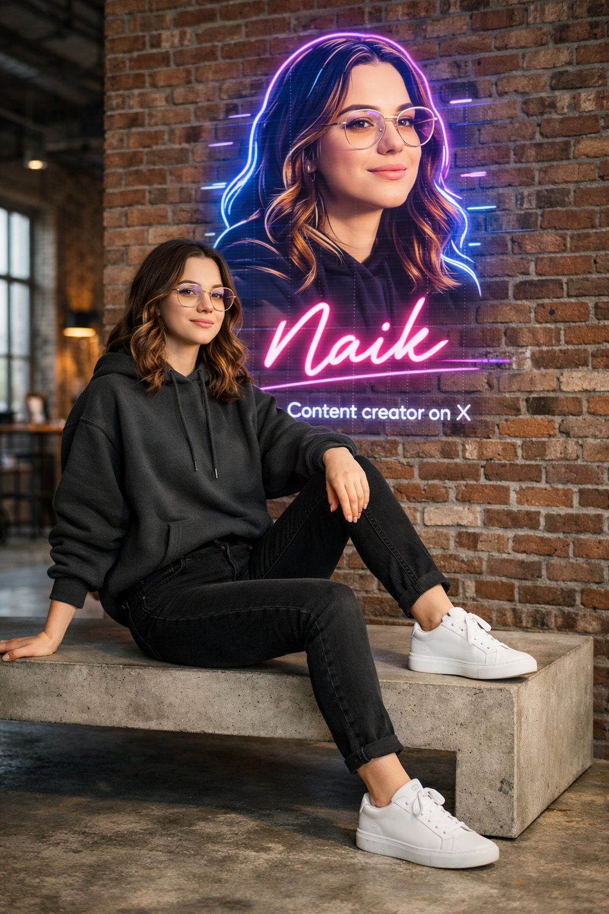

```
No noise, Just impact

GPT image 1.5 
Prompt: Ultra-realistic 8K full-body portrait of the same woman from the reference photo, wearing a premium charcoal oversized hoodie, black high-waisted designer jeans, and white minimalist sneakers. She sits casually on a modern concrete bench in an industrial loft with exposed brick, one foot resting on the bench, leaning back with relaxed confidence and effortless cool.On the brick wall behind her is a striking neon-outlined vector portrait of her face in electric blue and purple gradients with subtle glitch-art effects. Beneath it glows [NAME]in neon typography, with [Content creator on X] below in clean white text.
```

```
无噪点，只有冲击力

GPT 图像 1.5  
提示词：超写实 8K 全身人像，描绘参考照片中的同一位女性，身穿高级炭灰色 oversized 连帽衫、黑色高腰设计师牛仔裤和白色极简风运动鞋。她随意坐在工业风loft中的一张现代混凝土长凳上，背景是裸露的红砖墙，一只脚搭在长凳上，身体向后倚靠，姿态放松自信，散发出毫不费力的酷感。她身后的砖墙上是一幅醒目的霓虹轮廓矢量肖像，以电光蓝与紫色渐变呈现她的面部，并带有微妙的故障艺术效果。肖像下方以霓虹字体闪耀着[NAME]，其下以干净的白色文字标注“[Content creator on X]”。
```

 [↑返回目录](#toc)

---
## <a id="">微缩3D模型展现国家风貌</a> (<a href="https://x.com/Naiknelofar788/status/2022606746343317544" target="_blank" rel="noopener noreferrer">simeon-sanai</a>)

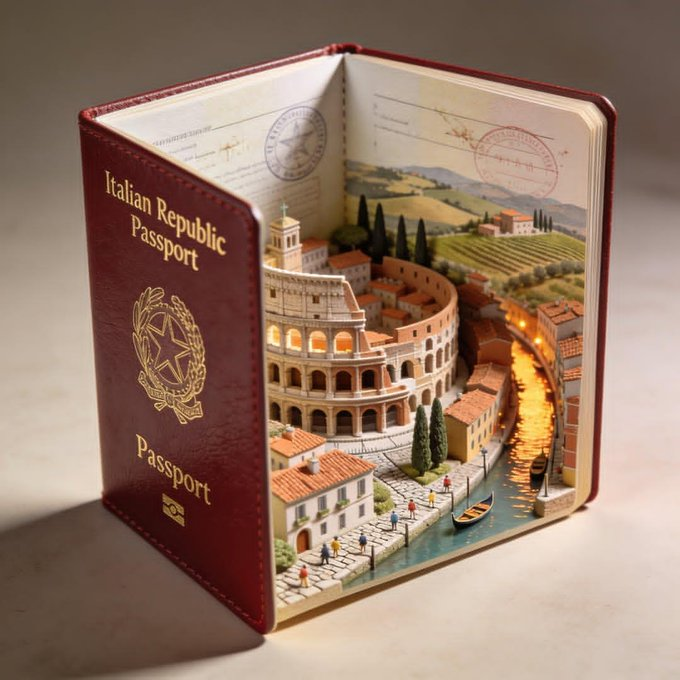

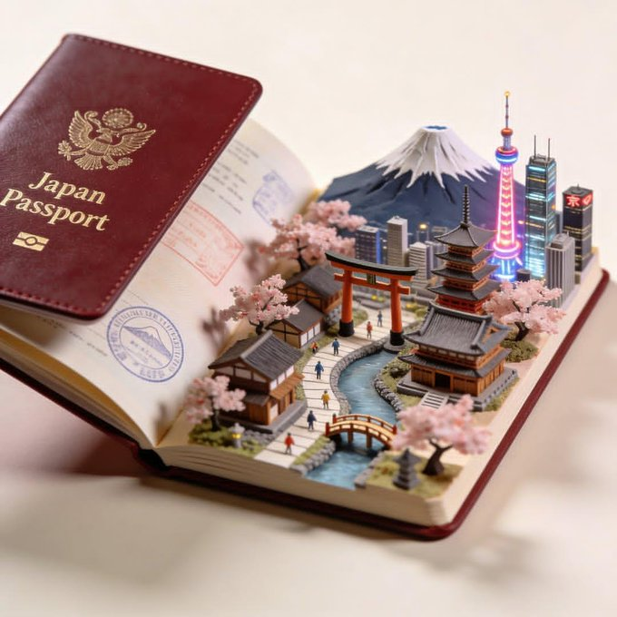

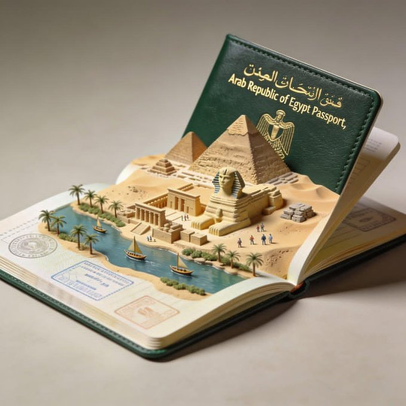

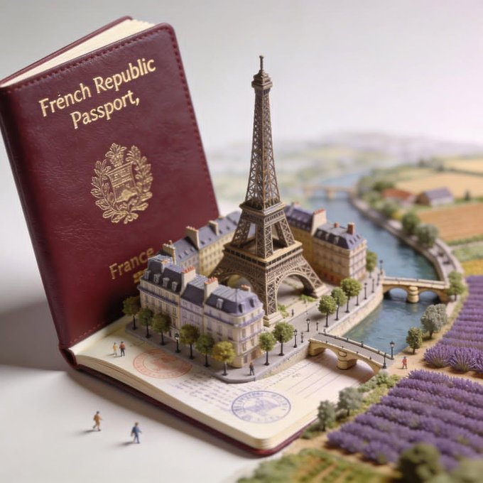

```
Hyper-realistic open [COUNTRY] passport on a studio surface, with gold-embossed “[Official Passport Name]” text and leather texture. From its pages rises a miniature 3D diorama of [COUNTRY], featuring [ICONIC LANDMARKS], [CITYSCAPES/COASTLINES/COUNTRYSIDE], and tiny human figures for scale. Passport pages show stamps and paper texture. Soft cinematic lighting, shallow depth of field, ultra-detailed photorealistic luxury style.
```

```
超现实主义打开[国家]的护照放在工作室表面上，上面有浮雕的“[官方护照名称]”文字和皮革纹理。从其页面中升起一个微缩的3D立体模型，展现着[国家]的标志性建筑、城市景观/海岸线/乡村景色以及微小的人形作为比例参考。护照页显示邮票和纸张纹理。柔和的电影照明，浅景深，超详细的摄影写实奢华风格。
```

 [↑返回目录](#toc)

---
## <a id="prompt-2026002395">骑士法师大战石像魔像</a> (<a href="https://x.com/RamonVi25791296/status/2051568239142973832" target="_blank" rel="noopener noreferrer">@RamonVi25791296</a>)

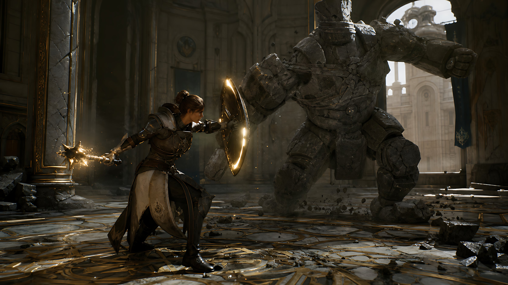

```
Create a cinematic dark fantasy action scene in a ruined cathedral hall: a {argument name="hero type" default="female armored knight-mage"} crouches in a defensive lunge on the left foreground, wearing ornate dark steel and leather plate armor with a long cream-and-black tabard, one arm extended behind her gripping a spiked mace or morning star crackling with golden magic sparks, the other arm braced forward behind a round glowing shield rimmed with warm light. Opposite her in the right midground is a massive {argument name="enemy type" default="headless stone golem"}, built from cracked gray masonry plates and bound with broken chains, charging with one huge fist raised and rubble falling from its body. Set the battle inside a grand, damaged palace-cathedral interior with towering arches, carved stone columns, tall broken windows, gold-trimmed marble floor in circular geometric patterns, scattered chunks of stone, dust, and debris. Use dramatic backlighting from a bright arched window behind the golem, warm golden magical highlights on the shield and weapon, deep shadows, volumetric dust beams, realistic textures, high-detail armor and stone, dynamic low-angle wide composition, shallow cinematic depth, epic game-cinematic realism, 16:9 widescreen, no text, no UI.
```

 [↑返回目录](#toc)

---
## <a id="prompt-2026002393">Y2K 金色时刻人像</a> (<a href="https://x.com/SiliconBarbie_/status/2051475105403040014" target="_blank" rel="noopener noreferrer">@SiliconBarbie_</a>)

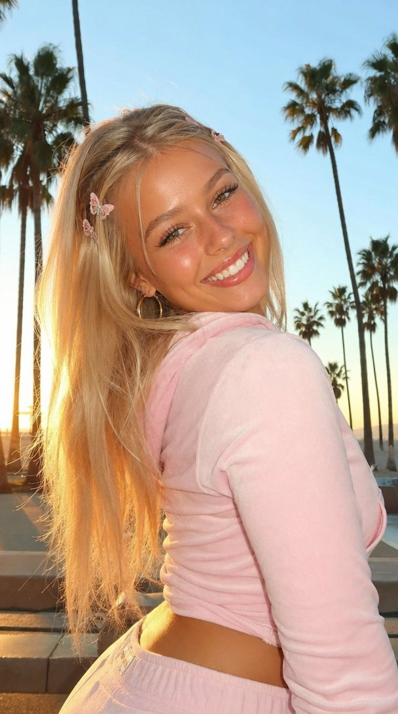

```
candid portrait of a beautiful young blonde woman, 21 years old, glowing sun-kissed skin, wearing a baby pink velour tracksuit and butterfly clips in her hair, smiling brightly at the camera, golden hour warm light, palm trees, y2k aesthetic, glossy lips
```

 [↑返回目录](#toc)

---
## <a id="prompt-2026002392">头发里的微型城市</a> (<a href="https://x.com/krafterlab/status/2051399740986740986" target="_blank" rel="noopener noreferrer">@krafterlab</a>)

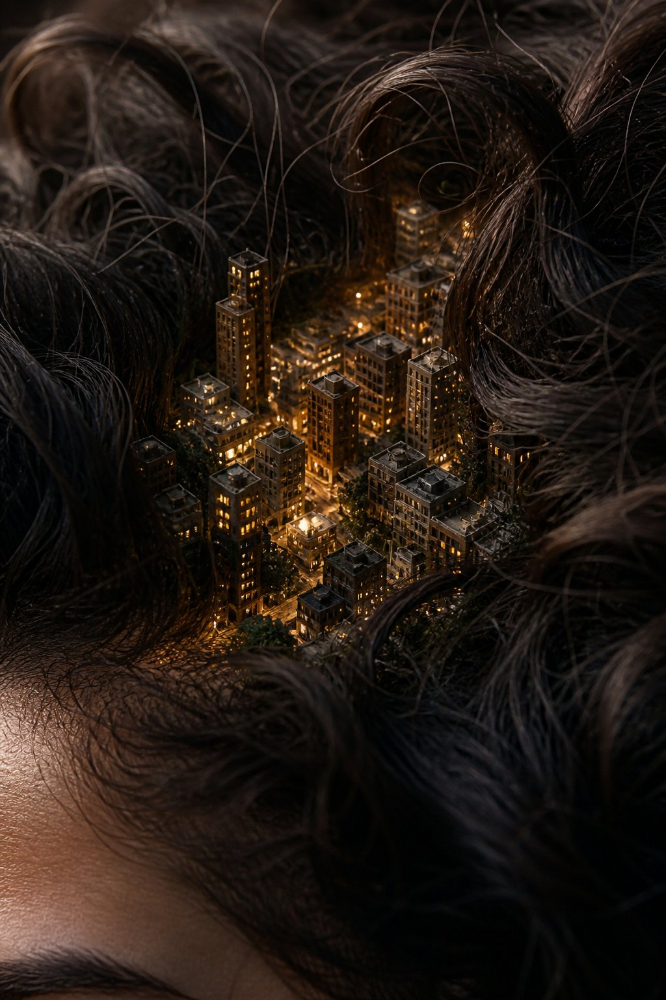

```
Macro photograph of a miniature city hidden in human hair, clearly on a real human head, with part of the forehead and hairline visible, realistic skin texture with pores, tiny people walking through the streets between the hair strands, extremely small but realistic proportions, macro photography, 85mm lens, shallow depth of field, natural lighting, neutral colors, no warm tones, ultra realistic hair with visible roots, natural imperfections, slightly messy strands, realistic materials, slightly dirty buildings, no perfect surfaces, photorealistic, looks like a real photo, no illustration, no CGI, no glow
```

 [↑返回目录](#toc)

---
## <a id="prompt-2026002391">四国文化锚点服装设计宫格</a> (<a href="https://x.com/Gdgtify/status/2051428657571279137" target="_blank" rel="noopener noreferrer">@Gdgtify</a>)

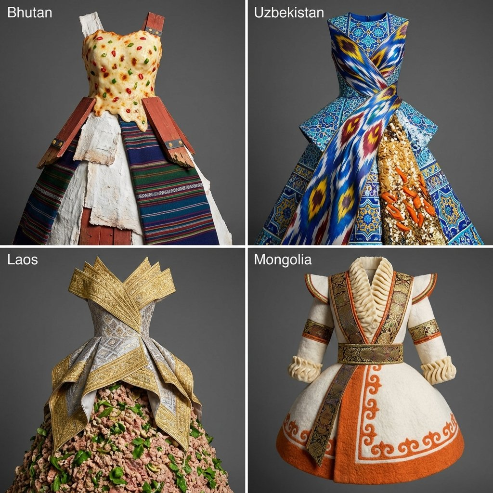

```
<instructions> input: continent pick 4 lesser known countries in that continent function drawx($lesser known country){ > Anchor 1: "$lesser known's famous architecture" (it's texture, material and color) > Anchor 2: "$lesser known's famous fashion " (it's texture, material and color) > Anchor 3: "$lesser known's famous food " (it's texture, material and color) > > **Instruction:** Render a dress design that exists at the exact center of this triangle. } output: 2x2 grid, drawx( for each lesser known country)
```

 [↑返回目录](#toc)

---
## <a id="prompt-2026002390">羊毛毡国家微缩世界</a> (<a href="https://x.com/volkan_iras/status/2051403524966141980" target="_blank" rel="noopener noreferrer">@volkan_iras</a>)

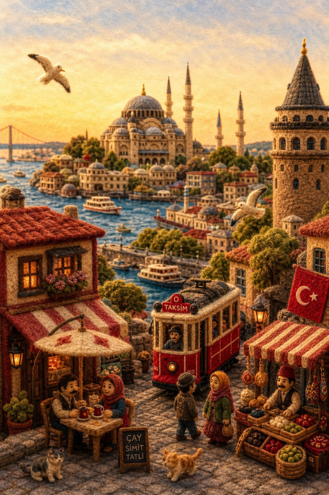

```
Country: [INSERT COUNTRY NAME]

A miniature felt diorama made of fluffy yarn, wool, and needlework, designed as a single cohesive small world (not a collage), reflecting the real landscape, culture, and daily life of the country.

Structure:
- Select 4–7 naturally integrated elements (landscape, architecture, transport, street life, culture)
- Everything must flow together as one environment

Foreground:
Everyday life — small shops, cafes, markets, people interacting, local clothing, street details, subtle movement, warm human presence

Midground:
Connecting flow — streets, bridges, rivers, paths, transport, cultural spaces that guide the eye naturally from front to back

Background:
One strong identity anchor — landmark, skyline, mountain, or symbolic landscape clearly representing the country (keep it clean, not overcrowded)

Style:
Handmade wool felt, yarn, needle-felt textures, visible fibers, soft edges, miniature craftsmanship, premium diorama realism

Lighting:
Warm golden hour or bright noon, soft shadows, clear visibility, gentle glow enhancing depth

Color:
Soft but saturated palette reflecting the country’s natural tones (greens, sky blues, architectural hues, cultural accents), warm and balanced

Composition:
Vertical frame, balanced or centered perspective, slight top-down or immersive angle, clear foreground–midground–background depth

Mood:
Warm, emotional, calm, refined — like a handcrafted fairy-tale version of real life (not childish)

Rules:
- No logos or text overlays
- No collage-style composition
- No random symbolic clutter
- Keep it realistic but stylized as a handmade miniature world

Quality:
16K, ultra-detailed, hyper-realistic miniature textures, cinematic depth, sharp focus

output_goal:
A single, cohesive felt diorama world that instantly conveys the identity and atmosphere of the chosen country through integrated landscape, culture, and daily life
```

 [↑返回目录](#toc)

---
## <a id="prompt-2026002389">Transparent Labs Hydrate 健身补剂 Campaign</a> (<a href="https://x.com/amynys/status/2051409591137972606" target="_blank" rel="noopener noreferrer">@amynys</a>)


```
Create a striking campaign poster that stops people mid-scroll for Transparent Labs Hydrate.

Bold high-impact supplement advertisement with dramatic black and deep electric blue color palette, gritty premium fitness aesthetic, sharp cinematic lighting, glossy reflections, light smoke atmosphere, intense contrast.

Giant headline typography at top reading “TRANSPARENT LABS HYDRATE” in oversized distressed white and electric blue text.

Center composition features the exact woman from the attached reference image as a fit athletic female model seated confidently on a studio floor, holding a shaker bottle, with a focused and powerful expression.

Change her clothes into sleek black fitness gym outfit: a black sports bra / tank top and high-waisted black leggings with chunky white sneakers. Large glowing “1%” graphic behind the subject symbolizing daily progress.

Front left foreground shows a matte black Transparent Labs Hydrate tub with modern luxury label reading “HYDRATE”, scoop of electrolyte powder spilled beside the container.

Surround the poster with clean icon-based benefit callouts: replenishes electrolytes, supports hydration, boosts recovery, improves endurance, enhances performance, zero sugar, lab tested, premium quality, no fillers. Strong motivational copy such as “Daily Hydration. Peak Performance.”

Hyper realistic textures, polished commercial retouching, premium sports nutrition branding, modern typography layout, social media ad format, ultra detailed, high resolution.
```

 [↑返回目录](#toc)

---
## <a id="prompt-2026002388">1980s Claude 复古杂志广告</a> (<a href="https://x.com/Shinning1010/status/2051410804805599436" target="_blank" rel="noopener noreferrer">@Shinning1010</a>)

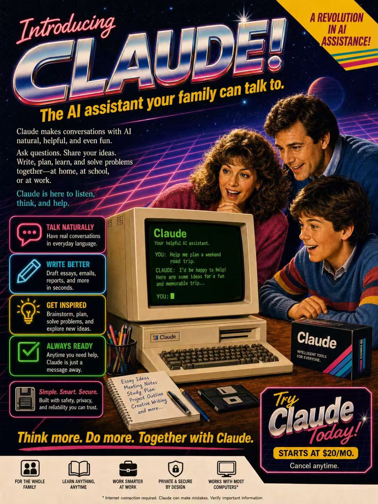

```
A fictional 1980s magazine advertisement poster introducing “Claude” as a revolutionary home AI assistant, retro commercial print ad style, bold headline at the top reading “Introducing Claude!”, large chrome metallic 3D typography with pink and blue reflections, yellow italic tagline underneath: “The AI assistant that talks back.”

Center composition: a beige 1980s CRT home computer with chunky keyboard on a wooden desk, green monochrome terminal screen glowing, readable text on screen: “Claude”, subtitle: “The helpful AI assistant.” On the screen, a retro terminal-style conversation reads:
“YOU: How can you help me today?”
“CLAUDE: I can answer questions, help you write, summarize information, brainstorm ideas, and explain topics clearly.”
“YOU:”

A cheerful 1980s family of three gathers around the computer: father in a blue sweater, mother with curly hair in a pink sweater, young boy in a striped sweater, all looking amazed, delighted, and fascinated, warm nostalgic expressions, classic family technology advertising mood.

Background: dark starry night sky, purple and blue neon perspective grid, retro sci-fi glow, subtle palm silhouettes, sparkling highlights, lens flares, dramatic yet friendly atmosphere.

Poster layout: left side contains stacked retro feature boxes with glowing neon icons, including a question mark, pencil, light bulb, and clock. Each feature box includes short retro advertising copy:
“ANSWERS QUESTIONS” — Get helpful, clear answers in everyday language.
“HELPS YOU WRITE” — Draft ideas, notes, letters, and more with ease.
“GENERATES IDEAS” — Brainstorm, create, and think bigger.
“AVAILABLE WHENEVER YOU NEED IT” — Day or night, Claude is ready to help.

Add a small retro text block describing Claude:
“For the first time, an AI assistant you can have a conversation with. Ask questions. Get answers. Share ideas. Write drafts, notes, and reports. Explore topics, organize thoughts, and solve problems. Claude understands natural language and responds in a clear, helpful way.”

Add a short highlighted copy block:
“It’s helpful. It’s thoughtful.
It’s always by your side.”

Bottom area includes a large “Claude” brand wordmark with colorful diagonal retro stripes, and the slogan:
“A smarter way to think, write, and explore.”

Bottom right has a white promotional price sticker area with bold pink text:
“Free!!”
Smaller text underneath:
“Available now for curious minds everywhere.”

Top right has a bright yellow starburst badge saying:
“A REVOLUTION IN AI ASSISTANCE!”

Include a retro product box on the desk labeled “Claude” with small text:
“SMARTER SOFTWARE FOR MODERN THINKERS.”

Include a mug or accessory on the desk branded “Claude”.

Visual style: 1985 consumer computer advertisement, airbrushed illustration, glossy print texture, halftone details, nostalgic retro futurism, high saturation, cinematic product lighting, authentic 1980s typography and layout, readable ad composition, detailed vintage commercial poster, highly polished, warm family-friendly mood, retro tech fantasy, vertical poster.

Negative prompts:
modern laptop, smartphone, flat design, minimalism, futuristic 2020s interface, cyberpunk overload, messy layout, unreadable typography, distorted text, misspelled words, deformed hands, extra fingers, bad anatomy, duplicate people, plastic skin, overexposed lighting, low resolution, blurry image, warped computer, broken keyboard, cluttered composition, inconsistent vintage style, random symbols, ugly poster design, poor hierarchy, incorrect perspective
```

 [↑返回目录](#toc)

---
## <a id="prompt-2026002387">Netflix 首页主视觉 UI</a> (<a href="https://x.com/aimikoda/status/2051420440451801240" target="_blank" rel="noopener noreferrer">@aimikoda</a>)

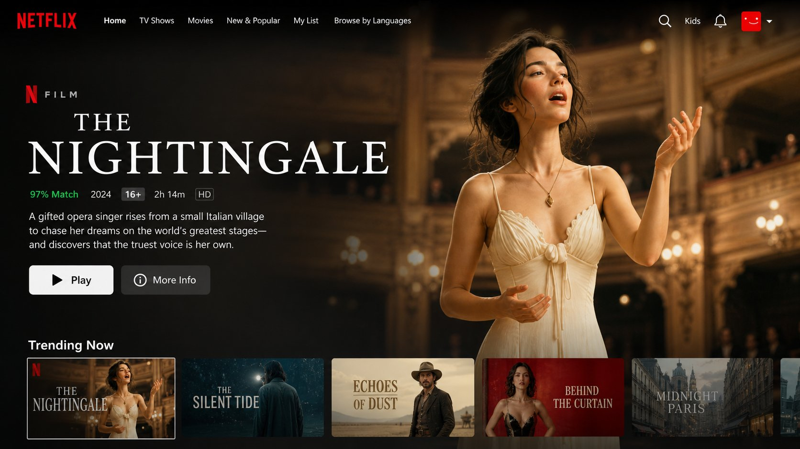

```
Create a Netflix homepage UI featuring a main hero film with its title and still generated from the uploaded reference.
```

 [↑返回目录](#toc)

---
## <a id="prompt-2026002384">十国传统服饰时尚拼贴</a> (<a href="https://x.com/amynys/status/2051287229532639677" target="_blank" rel="noopener noreferrer">@amynys</a>)

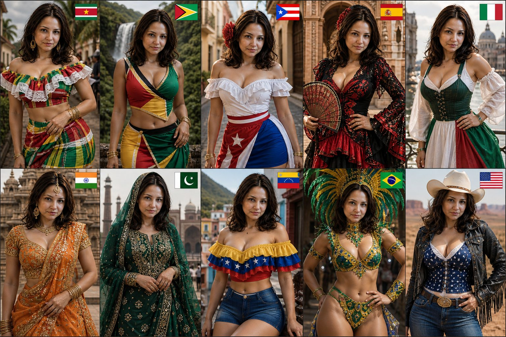

```
A 10-Nation Cinematic Fashion Transformation of One Timeless BeautyChatGPT Prompt:

A highly aesthetic, ultra-realistic cinematic collage featuring the exact same beautiful young woman from the reference image, shown in 10 different poses within one single image layout (5x2 grid style). Each frame represents a different country’s traditional cultural dress, styled in a modern, elegant, fashion-forward way. The woman is the SAME person in every frame: she has shoulder-length wavy dark brown hair, captivating dark brown eyes, full plump lips with a subtle confident smile, flawless warm olive-toned skin, high cheekbones, and a voluptuous yet athletic figure with a prominent bust, slim waist, and toned physique — exactly matching the woman in the provided reference photo.

Design details:

Each of the 10 frames shows this same woman in different traditional outfits inspired by the following countries: Suriname, Guyana, Puerto Rico, Spain, Italy, India, Pakistan, Venezuela, Brazil, and the USA.

Every outfit is a modern, elegant, fashion-forward interpretation of that country’s cultural heritage.

Each mini-frame includes a small national flag icon in the top-right corner.

The woman’s expressions vary: smiling, confident, graceful, playful, elegant, royal, modern fusion fashion poses.

High-fashion editorial photography style.

Soft cinematic lighting, ultra-detailed textures, realistic skin tones.

Backgrounds subtly match each country’s cultural aesthetic (landmarks, streets, patterns, colors, architecture).

Luxury fashion magazine layout style.

Clean grid composition, visually balanced, highly shareable social media design.

Style: Ultra-realistic, 8K resolution, Vogue editorial shoot, cinematic lighting, soft depth of field, trending Instagram aesthetic, fashion photography masterpiece.
```

 [↑返回目录](#toc)

---
## <a id="prompt-2026002383">AI 日常生活 iPhone 抓拍</a> (<a href="https://x.com/Ciri_ai/status/2051292618248904809" target="_blank" rel="noopener noreferrer">@Ciri_ai</a>)

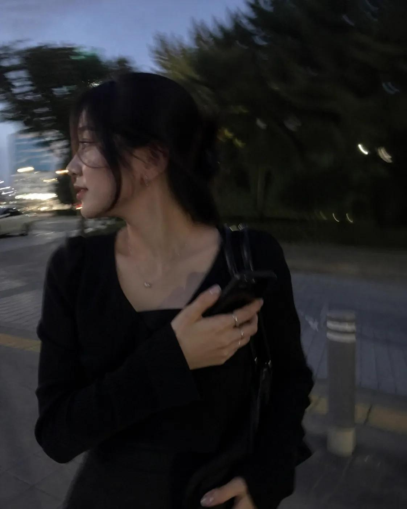

```
I want to see what you really look like.
Draw a snapshot of your everyday life as if it were accidentally taken on an iPhone.
Make it feel like a very ordinary, imperfect candid shot.
The photo should have slight motion blur, with uneven, natural lighting.
```

 [↑返回目录](#toc)

---
## <a id="prompt-2026002382">春日花田三联竖版写真拼贴</a> (<a href="https://x.com/frametheory058/status/2051294907214844249" target="_blank" rel="noopener noreferrer">@frametheory058</a>)


```
A high-quality 3-panel vertical photo collage of a stunning uploaded woman with soft, voluminous wavy hair glowing in golden sunlight. She is styled in a cream-colored lace-up vintage blouse with delicate textures, olive green high-waisted flowy trousers, and a wide-brimmed straw hat slightly tilted for a fashionable editorial look. Light golden jewelry (thin chains, rings) adds a subtle luxury touch.

The setting is a dreamy, vibrant yellow mustard flower field under a bright blue sky with soft clouds, enhanced by golden hour lighting for a magical glow.

Top panel: Back view of the woman standing in the field with arms wide open, sunlight creating a glowing halo around her hair, slight motion blur in flowers for a cinematic feel.

Middle panel: Close-up portrait, she smiles naturally at the camera, wind softly moving her hair, her hand reaching toward the lens creating depth and a slightly blurred foreground for a DSLR effect.

Bottom panel: Playful pose, she leans sideways in the flowers, making a double peace sign, laughing candidly, capturing an authentic joyful moment.

Add cute, trendy white doodle overlays (smiley faces, sparkles, stars, tiny hearts) with a subtle animated/sketchy feel. Include light leaks, sun flares, and soft film grain for a premium Instagram aesthetic.

Ultra-realistic, 4K, cinematic lighting, shallow depth of field, high dynamic range, natural skin tones, editorial fashion photography, soft pastel color grading.

Aspect ratio: 4:5
Style tags: viral Instagram aesthetic, Pinterest style, dreamy spring vibe, candid luxury
```

 [↑返回目录](#toc)

---
## <a id="prompt-2026002381">90 年代公寓场景参考板</a> (<a href="https://x.com/Iancu_ai/status/2051287273581203888" target="_blank" rel="noopener noreferrer">@Iancu_ai</a>)


```
{
  "type": "scene reference board — 90s apartment living room, cinematic night",
  "style": "cinematic film photography, 35mm grain, warm amber shadow fill, deep chiaroscuro lighting, hyper-detailed interior, production design reference quality",
  "layout": {
    "main_panel_center_left": {
      "label": "CAMERA A — FRONT VIEW",
      "scene": "Wide shot, L-shaped tan sectional sofa, grey knit throw blanket, wooden coffee table (remote, mug, ashtray, Rolling Stone stack), lava lamp left, table lamp right, rain-streaked city window behind, Nirvana poster left wall. 35mm grain."
    },
    "main_panel_center_right": {
      "label": "CAMERA B — REVERSE VIEW",
      "scene": "Wide reverse from behind sofa. CRT TV prominent right, grey static screen. Tall bookshelf, VHS tapes. Cool blue backlight from window behind camera. Deep shadow."
    },
    "prop_strip_bottom": "6 close-up tiles: 1. LAVA LAMP — chrome base, blue-green wax blobs; 2. COFFEE TABLE — remote, mug, ashtray, magazines; 3. NIRVANA POSTER — black smiley face, wall texture; 4. CRT TELEVISION — static screen, VHS stack; 5. WINDOW/RAIN — city bokeh, water streaks; 6. THROW BLANKET — sofa corner, worn upholstery",
    "top_right_inset": "SOURCE REF thumbnail — original photo",
    "footer": "2700K PRACTICAL · 4100K CITY NIGHT · 24mm · 35MM"
  },
  "background": "deep charcoal #1a1a1a, thin white separators",
  "dimensions": "wide landscape 3:1, high resolution"
}
```

 [↑返回目录](#toc)

---
## <a id="prompt-2026002380">冠状病毒尺度缩放科学信息图</a> (<a href="https://x.com/Gdgtify/status/2051288232613351571" target="_blank" rel="noopener noreferrer">@Gdgtify</a>)


```
instructions> [SUBJECT]=Coronavirus. A hyper-realistic 3D zoom-sequence infographic generated from a single input: [SUBJECT]. The system auto-detects scale layers from atomic/subcomponent to full contextual view. Layout Structure (CRITICAL) 6–8 circular or hexagonal frames arranged in expanding sequence Innermost frame = smallest detectable detail; outermost = full subject in environment Frames connected by subtle zoom-path lines No repeated scales — each frame shows new level of detail Frame Design Each zoom level includes: Hyper-detailed 3D render at that scale Micro label: scale name (e.g., "molecular," "cellular," "structural") + 3–5 word insight Optional: measurement tag or magnification factor Contextual Halo Around the sequence, include only scale-specific references: Measurement units, scientific notation, cultural scale metaphors (No generic magnifying glass icons) Scale Panel (Alternative Layout) Zoom level Key insight (3–5 words) Scale factor tag Detail icon (grid, wave, particle, etc.) Title "[SUBJECT]: AT EVERY SCALE" (or) "ZOOM: THE WORLD OF [SUBJECT]" Style: ultra-realistic 3D render, scientific editorial infographic, precise macro lighting, global illumination, shallow depth of field, clean sequential layout. </instructions>
```

 [↑返回目录](#toc)

---
## <a id="prompt-2026002379">品牌人格漫画信息图</a> (<a href="https://x.com/CallumGrey/status/2051293342139584922" target="_blank" rel="noopener noreferrer">@CallumGrey</a>)

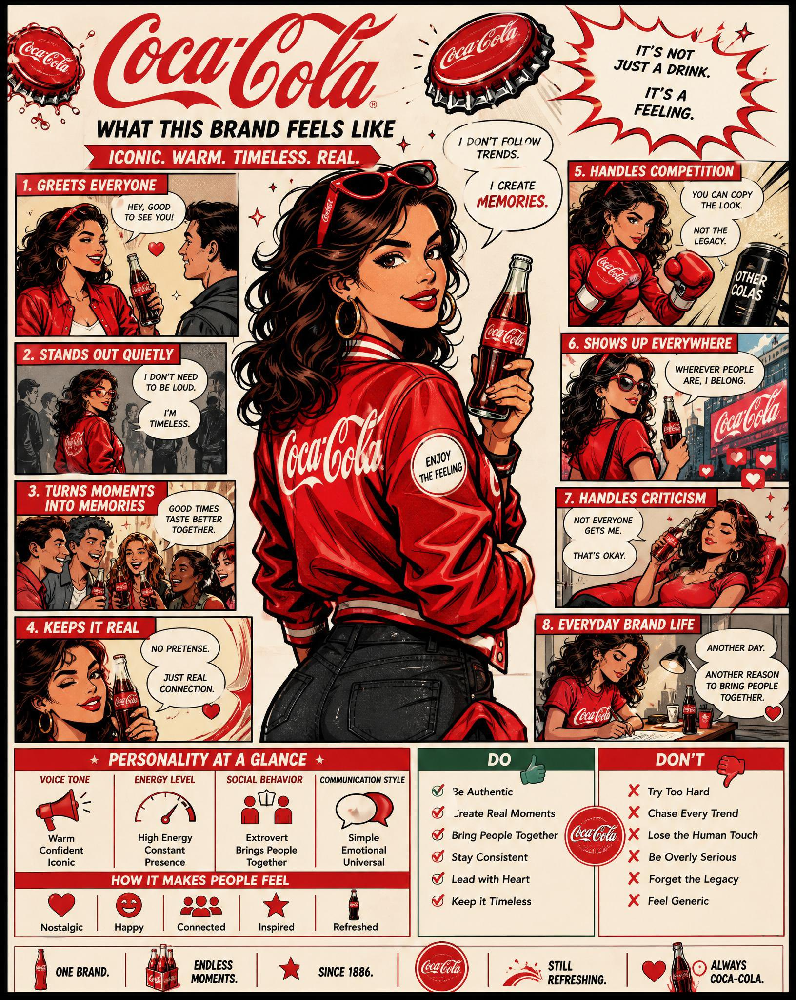

```
Using the uploaded logo, create a highly detailed, comic-style infographic poster:

“What This Brand Feels Like”

GOAL:
Turn the brand into a living personality and visually explain how it behaves, speaks, and interacts with the world.
This must feel like a mix of: brand strategy + character design + comic storytelling.

---

CORE RULE:
Everything must come from the logo:
- colors
- style
- tone
- personality

No generic personality traits.

---

MAIN STRUCTURE:
Vertical 4:5 poster
Dense layout with multiple panels
Comic + infographic hybrid

---

TOP SECTION:
- Brand name
- Short personality statement (max 6 words)
Example: “Quiet confidence with sharp edges”

---

MAIN CHARACTER (VERY IMPORTANT):
Create a central character representing the brand:
- humanized version of the brand
- outfit reflects brand style
- posture + expression reflect personality

---

AROUND THE CHARACTER:
Create 6–8 comic panels showing how the brand behaves in different situations.

---

SCENARIO IDEAS:
- Talking to customers
- Handling competition
- Selling a product
- Social media presence
- Reacting to criticism
- Daily “brand life” moment

---

FOR EACH PANEL:
Include:
- short caption (max 6 words)
- speech bubble or internal thought
- clear visual action

---

TONE EXAMPLES:
Luxury brand: calm, confident, minimal speech
Playful brand: loud, chaotic, expressive
Tech brand: precise, logical, clean

---

PERSONALITY TRAITS SECTION:
Add small labeled blocks:
- Voice tone (e.g. calm, bold, playful)
- Energy level (low / medium / high)
- Social behavior (introvert / extrovert)
- Communication style

Use:
- icons
- short labels

---

DO / DON’T SECTION:
Add a split block:
DO:
- how the brand should act
DON’T:
- what breaks the identity

Keep:
- very short phrases

---

VISUAL ELEMENTS:
- speech bubbles
- icons
- arrows
- small reactions
- exaggerated comic expressions

---

STYLE:
- comic + editorial hybrid
- slightly exaggerated but still premium
- expressive but not childish

---

COLOR:
- strictly based on logo palette
- use color to reinforce personality

---

DEPTH:
- 20–40 visual elements
- multiple small panels
- layered composition

---

IMPORTANT RULES:
- must feel alive
- must feel specific
- no generic marketing words
- no empty areas
- keep text short but impactful

---

FINAL FEEL:
Like:
- a brand strategy turned into a character
- a visual storytelling board
- something people save and study

NOT:
- flat
- generic
- minimal
```

 [↑返回目录](#toc)

---
## <a id="prompt-2026002377">樱花咖啡户外人像</a> (<a href="https://x.com/xRahultripathi/status/2050677614168391716" target="_blank" rel="noopener noreferrer">@xRahultripathi</a>)

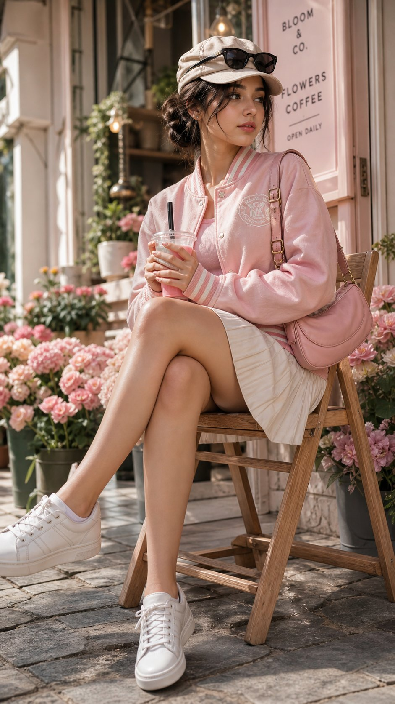

```
Edit the provided image while preserving the same face identity, shape, and facial features without altering age, ethnicity, or structure. Maintain a calm, relaxed expression with the subject not looking at the camera.

Subject: young woman (18–23) with soft feminine beauty, smooth glowing skin, natural texture.
Pose (strict): seated on a wooden chair, body angled sideways (45–70°), legs crossed naturally, upper body slightly leaning forward, head turned away from camera, gaze to the side. She holds a drink cup with a straw using both hands.
Framing: full-body vertical (9:16), head to shoes visible, centered but slightly offset for natural composition.
Outfit: light pink varsity jacket with white stripes, soft pink inner top, modest knee-length pleated skirt, white sneakers.
Accessories: beige newsboy cap, sunglasses (on face or cap), pink shoulder bag, small earrings.
Hair: neat low bun with soft loose strands.
Environment: outdoor flower shop street scene with pastel flowers (pink, soft tones), decorative plants, floral storefront.
Lighting: bright natural daylight, soft glossy skin highlights, balanced exposure, soft shadows.
Camera: low/frog angle (slightly below, looking up), 50mm lens, shallow depth of field.
Color grading: warm pastel palette (pink, cream), clean bright lifestyle aesthetic.
Quality: ultra-photorealistic, 8K detail, DSLR realism, natural skin texture.
Negative: front-facing, eye contact, close-up, cropped body, mini/short skirt, indoor scene, dark lighting, anime, cartoon, CGI, plastic skin, distorted anatomy.
--ar 9:16 --style raw --quality high
```

 [↑返回目录](#toc)

---
## <a id="prompt-2026002375">古希腊三哲时间轴城市图</a> (<a href="https://x.com/ToroJushiAi/status/2050713034503409874" target="_blank" rel="noopener noreferrer">@ToroJushiAi</a>)

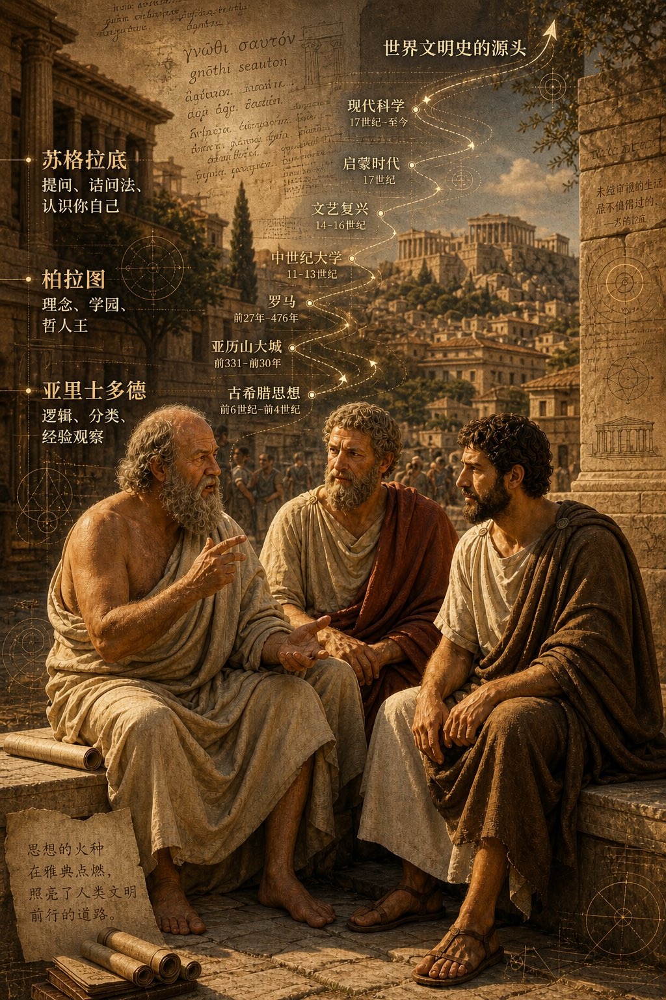

```
二千五百年前，柏拉图，苏格拉底， 亚力士多德，坐在雅典街头聊天，聊出了世界文明史的源头。

背景可以加上他们聊天内容，按时间轴的走向，重叠在古希腊雅典的城市风光中。
```

 [↑返回目录](#toc)

---
## <a id="prompt-2026002374">彩色潦草小狗线条风格重绘</a> (<a href="https://x.com/berryxia/status/2050226420681757102" target="_blank" rel="noopener noreferrer">@berryxia</a>)


```
彩色潦草小狗线条风格绘制该图，童趣和doodle加入其中，务必使用毫无章法的绘制手法，凌乱和草率即可。
```

 [↑返回目录](#toc)

---
## <a id="prompt-2026002373">高端肉类海鲜品牌英雄图</a> (<a href="https://x.com/xpg0970/status/2050108279385419965" target="_blank" rel="noopener noreferrer">@xpg0970</a>)


```
一、品牌基础设定
品牌名称：[请填写，例如：PRIME STEAK / OCEAN PRIME]
品牌标语：[请填写，例如：Steakhouse Quality, Your Table / Restaurant Grade, Home Delivered]
主色调：[请填写，例如：黑金 / 深红+金 / 深蓝+银]
字体风格：
标题：[请填写，例如：金色衬线体，大写，奢华感]
正文：[请填写，例如：细衬线体/无衬线体]
二、核心视觉元素
台面材质：[请填写，例如：大理石/黑色石板]
背景调性：[请填写，例如：深色渐变/暗调餐厅环境]
光线风格：[请填写，例如：聚光/侧光/顶部照明]
三、主产品定义（必填）
产品名称/类型：[请填写，例如：和牛牛排 / 帝王蟹 / 北极甜虾]
产品数量/摆放：[请填写，例如：1份单品 / 3块整齐摆放]
呈现方式：[请填写，例如：切片展示 / 带骨展示 / 原壳展示]
产品特色/质感提示：[请填写，例如：肉质纹理清晰、多汁感 / 光泽晶亮 / 肉眼可见油花]
```

 [↑返回目录](#toc)

---
## <a id="prompt-2026002372">可爱角色设定表</a> (<a href="https://x.com/xRahultripathi/status/2050152865566708134" target="_blank" rel="noopener noreferrer">@xRahultripathi</a>)


```
Create a cute female character design sheet inspired by the uploaded image.

Style: warm, soft, semi-realistic cartoon illustration with a cozy Japanese kawaii vibe (pastel tones, smooth shading, clean lineart).

Make it a clean character concept poster layout including:

One large main female portrait (front view, detailed)

Facial expression set (happy, shy, annoyed, sleepy, surprised, excited)

2–3 full-body poses (standing, walking/running, playful pose)

Small accessory/object icons that match her personality (hair clip, cute bag, phone charm, coffee cup, keychain)

A simple color palette section (skin, hair, outfit, accent colors)

A profile info box with: name, age range, personality traits, likes/dislikes, short description

Overall look should feel charming, cozy, feminine, and professionally arranged like an animation character design sheet.
High quality, clean background, soft lighting.
```

 [↑返回目录](#toc)

---
## <a id="prompt-2026002371">Scrapbook 真人图与迷你分身</a> (<a href="https://x.com/Kashberg_0/status/2050272100884340783" target="_blank" rel="noopener noreferrer">@Kashberg_0</a>)

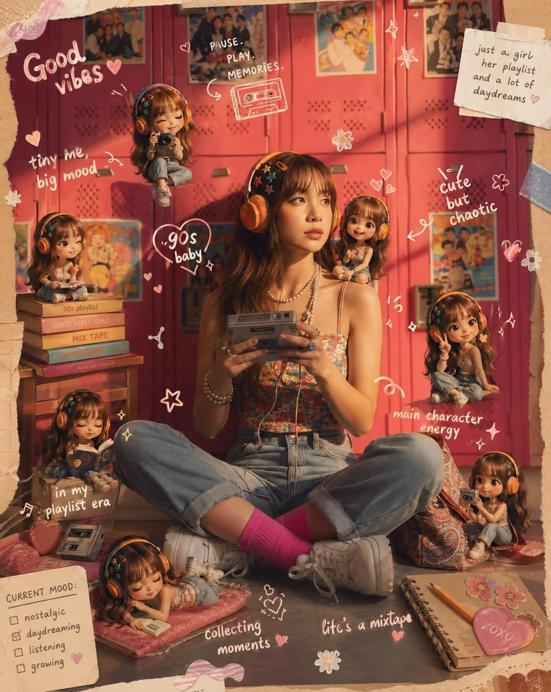

```
Transform the provided reference image into a cozy aesthetic scrapbook-style composition while strictly preserving the original subject, identity, pose, lighting, and background.

Add multiple small “mini version” characters of the same person (chibi / doll-like style), placed naturally around the scene (on objects, table, shoulder, etc.). These mini figures must match the subject’s face, hairstyle, outfit, and vibe consistently, styled as cute 3D collectible figurines. Show them doing different activities (reading, posing, taking photos, relaxing).

Overlay handwritten-style doodles and annotations across the image: arrows, hearts, stars, sparkles, icons, and playful captions connected to elements in the scene.

Use a soft pastel color palette (white base with pink, peach, blue accents).

Keep the frame visually rich and filled but balanced and clean.

Style: warm, cozy lighting, dreamy Instagram scrapbook aesthetic, soft depth of field, highly detailed, polished but playful.

The final result must look like the SAME original image enhanced with mini alter-egos and aesthetic annotations — not a recreated or different scene.
```

 [↑返回目录](#toc)

---
## <a id="prompt-2026002370">Crumple Chair 概念沙发研发板</a> (<a href="https://x.com/ShamsAmin56/status/2050281206139461780" target="_blank" rel="noopener noreferrer">@ShamsAmin56</a>)

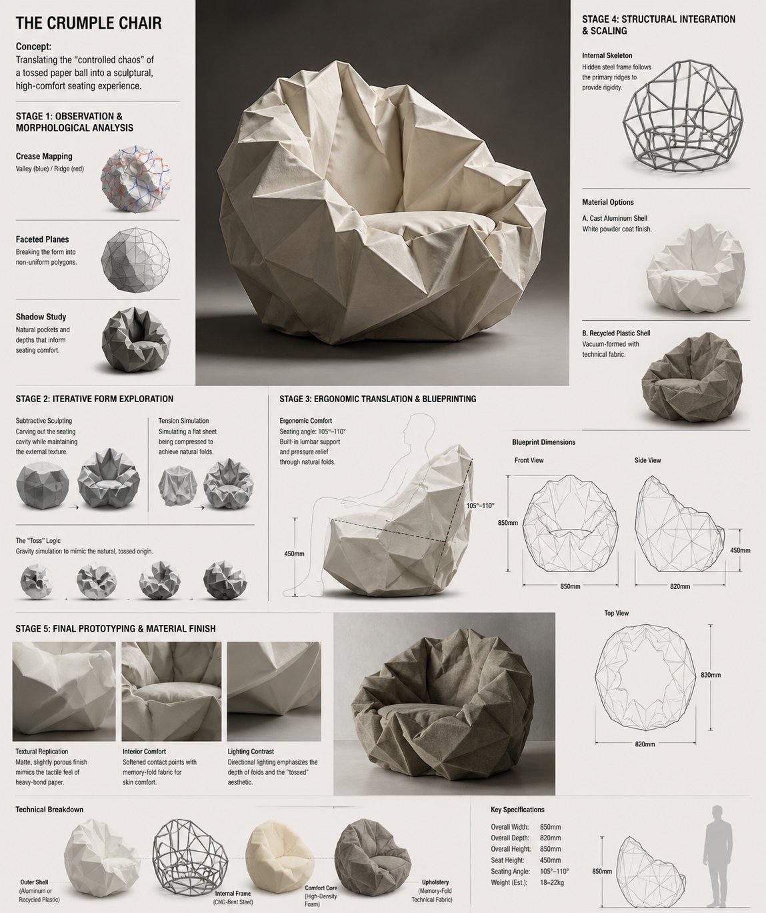

```
Design Concept: The Crumple Chair Core Philosophy: Translating the "controlled chaos" of a tossed paper ball into a sculptural, high-comfort seating experience.

Stage 1: Observation & Morphological Analysis The goal is to deconstruct the image of the crumpled paper into usable geometric data. Crease Mapping: Identify the primary "valley" and "ridge" lines. These represent potential structural ribs or seams in the chair. Faceted Planes: Break down the sphere into a series of non-uniform polygons. Each flat surface of the paper becomes a potential panel for the chair’s upholstery or shell. Shadow Study: Analyze how the "tossed" form creates deep recesses. These natural pockets guide where the user’s weight will be cradled.

Stage 2: Iterative Form Exploration Moving from a sphere to a seat through "Digital Crumpling." Subtractive Sculpting: Imagine the paper ball as a solid mass. Use Boolean operations to "carve out" a seating cavity that fits the human form while maintaining the external jagged texture. Tension Simulation: Use 3D software (like Rhino or Blender) to simulate a flat sheet of material being compressed. This ensures the folds look authentic and not "modeled." The "Toss" Logic: Experiment with gravity-based simulation dropping a digital mesh to see how it settles naturally, mimicking the "tossed" origin.

Stage 3: Ergonomic Translation & Blueprinting Refining the raw aesthetic into a functional object. The Comfort Core: Overlay a standard ergonomic template (Seating Angle: 105°–110°) over the crumpled form. Adjust the internal "folds" to provide lumbar support and pressure relief. Blueprint Generation: Create technical orthographic views (Front, Side, Top). Map out the dimensions: Seat Height: 450mm Total Width: 850mm Surface Smoothing: Maintain the sharp "paper edges" on the exterior shell while softening the interior contact points for skin comfort.

Stage 4: Structural Integration & Scaling Making the concept physically viable. The Skeleton: Design a hidden internal frame (likely CNC-bent steel rods or a 3D-printed lattice) that follows the most prominent ridges of the paper folds to provide rigidity. Material Selection: * Option A (High-End): Faceted, cast aluminum with a white powder coat. Option B (Soft): Vacuum-formed recycled plastic shell covered in "memory-fold" technical fabric that retains a wrinkled appearance.

Stage 5: Final Prototyping & Material Finish Textural Replication: Apply a matte, slightly porous finish to the material to mimic the tactile feel of heavy-bond paper. Lighting Contrast: Use directional studio lighting in the final renders to emphasize the "tossed" shadows, making the chair look like a giant piece of discarded inspiration. Design Tip: To keep the "tossed" look authentic, avoid symmetry. The most compelling aspect of a crumpled paper ball is its unique irregularity—ensure the left and right sides of the chair are balance-equivalent but not identical
```

 [↑返回目录](#toc)

---
## <a id="prompt-2026002369">明洞旅游区域地图</a> (<a href="https://x.com/so_ainsight/status/2050354639036654048" target="_blank" rel="noopener noreferrer">@so_ainsight</a>)

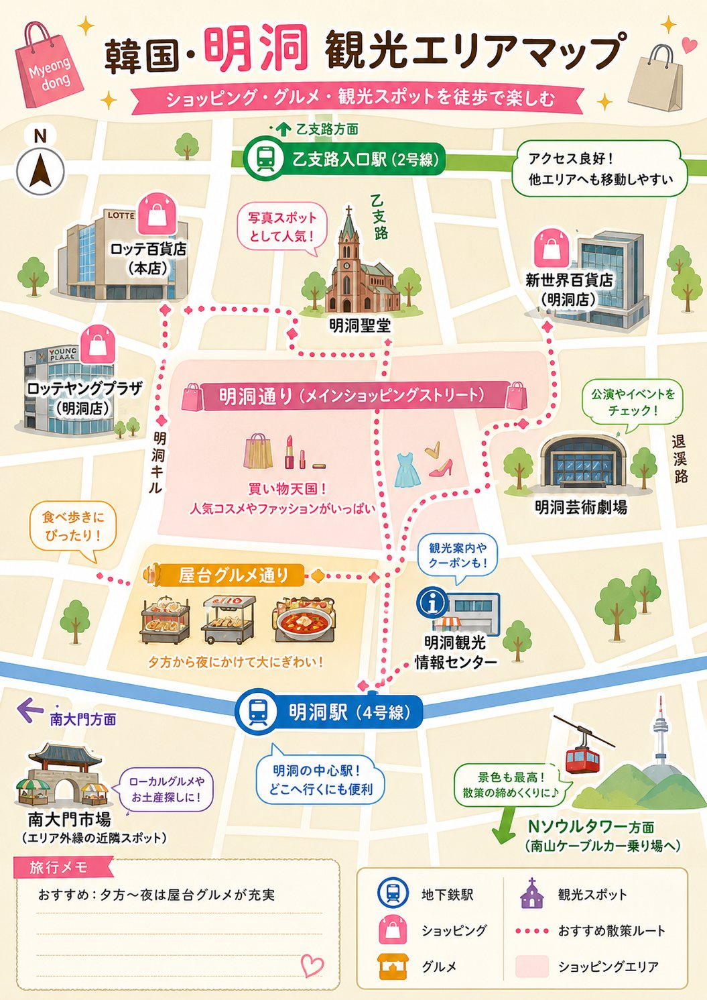

```
[エリア]の観光エリアマップを画像で作成して
```

 [↑返回目录](#toc)

---
## <a id="prompt-2026002368">印度餐厅菜单改造宣传图</a> (<a href="https://x.com/Johnson998877/status/2050354965110268123" target="_blank" rel="noopener noreferrer">@Johnson998877</a>)

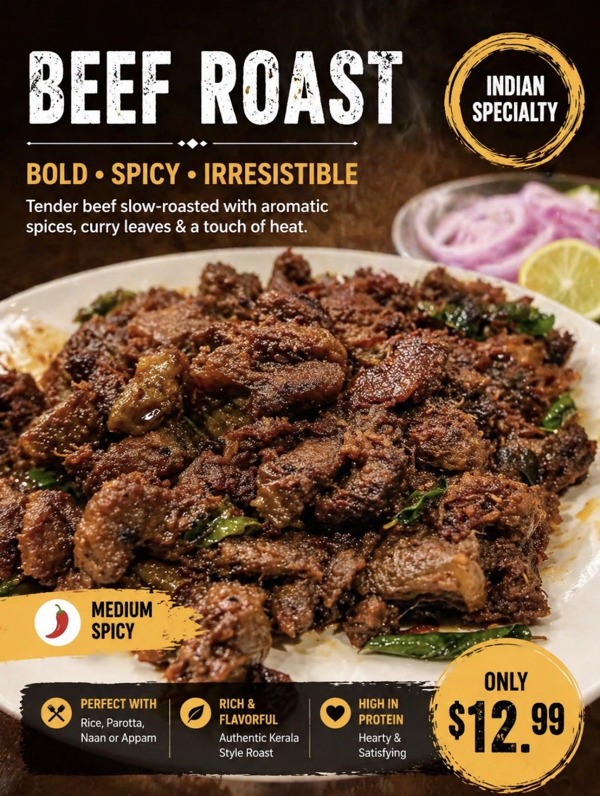

```
这是india 料理中的一份真实menu。根据此 重新生成带文本说明的 引人入胜垂涎欲滴的 说明图片 先用English 文本易于识别（手机小屏幕） 这个是beef roast
```

 [↑返回目录](#toc)

---
## <a id="prompt-2026002367">VELORA 奢华香水广告海报</a> (<a href="https://x.com/akkiwani703/status/2049778680969437564" target="_blank" rel="noopener noreferrer">@akkiwani703</a>)


```
{
  "image_type": "luxury perfume advertisement poster",
  "resolution": "4K ultra HD (4096x5120)",
  "aspect_ratio": "portrait (4:5)",
  "style": {
    "aesthetic": "high-end fragrance campaign (Tom Ford, Dior inspired)",
    "tone": "dark luxury, sensual, elegant, powerful",
    "color_grading": "deep black shadows with rich golden highlights and warm amber glow",
    "lighting": "cinematic spotlight + golden rim light + soft fill light, dramatic shadows",
    "contrast": "high cinematic contrast",
    "depth_of_field": "shallow, sharp focus on face and perfume bottle"
  },
  "camera": {
    "type": "85mm portrait lens",
    "aperture": "f/1.6",
    "angle": "slightly low angle, premium perspective",
    "framing": "model upper body + product foreground"
  },
  "subject": {
    "gender": "female",
    "age_appearance": "young adult",
    "expression": "confident, sensual, calm",
    "styling": {
      "hair": "voluminous, slightly messy, glossy strands with golden highlights",
      "makeup": "soft glam, glowing skin, bold lips",
      "outfit": "brown tailored blazer with patterned silk scarf",
      "accessory": "thin transparent eyeglasses"
    }
  },
  "product": {
    "type": "luxury perfume bottle",
    "brand": "VELORA PARFUMS",
    "label": "EAU DE PARFUM",
    "design": "clear crystal glass bottle, golden liquid inside, metallic gold cap",
    "placement": "bottom center foreground on glossy black marble surface",
    "effects": "strong reflections, golden glow, subtle condensation, cinematic shine"
  },
  "environment": {
    "background": "dark blurred luxury interior with warm golden light streaks",
    "surface": "black marble with reflections",
    "extra_elements": "small flowers near bottle, golden particles, soft smoke"
  },
  "typography": {
    "logo": "V monogram + VELORA PARFUMS",
    "headline": "Not just a scent, It’s your Signature.",
    "tagline": "A fragrance that speaks before you do.",
    "secondary": "Own your essence. Leave a legacy.",
    "features": [
      "Long Lasting",
      "Premium Ingredients",
      "Crafted with Passion"
    ],
    "notes": [
      "Top: Pear, Bergamot, Pink Pepper",
      "Heart: Jasmine, Rose, Orris",
      "Base: Vanilla, Patchouli, Musk"
    ],
    "font_style": "luxury serif + elegant handwritten script",
    "color": "gold metallic",
    "placement": "top left + mid left + bottom balanced layout"
  },
  "post_processing": {
    "sharpness": "ultra sharp on face and bottle",
    "glow": "golden cinematic glow",
    "retouch": "high-end editorial finish",
    "vignette": "subtle dark vignette"
  },
  "mood": "premium luxury perfume campaign, cinematic, bold brand identity",
  "quality": "hyper-realistic, 4K ultra HD, commercial grade, award-winning fragrance ad"
}
```

 [↑返回目录](#toc)

---
## <a id="prompt-2026002366">咖啡馆写实照片与 2D 涂鸦叠加</a> (<a href="https://x.com/Jawad_Rahman_/status/2049796647237066971" target="_blank" rel="noopener noreferrer">@Jawad_Rahman_</a>)


```
A trendy young woman sitting at an outdoor café table, holding a hot coffee cup near her lips. She has short curly black hair and wears oversized tinted sunglasses, a cropped beige sweater, loose brown high-waisted pants, and chunky white sneakers. A tote bag with minimal coffee-themed illustrations hangs on her shoulder.

The scene blends realistic photography with playful 2D cartoon overlays. Floating around her are animated coffee elements: a smiling cappuccino cup with heart-shaped latte art, cute coffee beans with tiny faces, and stylized splashes of caramel forming comic-style shapes. Soft doodle steam rises into hearts and stars.

On the table: a croissant, a notebook with sketch drawings, and a second coffee cup.

Background: a realistic cozy café street with brick walls, plants, warm golden hour lighting, and soft shadows. Slight depth of field, subject in sharp focus.

Style: mix of photorealism and vibrant cartoon illustration, pop-art aesthetic, high saturation but warm tones, clean composition, Instagram-worthy, soft glow, 4k detail.
```

 [↑返回目录](#toc)

---
## <a id="prompt-2026002365">科学家收藏级玩具发布板</a> (<a href="https://x.com/Gdgtify/status/2049766203392921897" target="_blank" rel="noopener noreferrer">@Gdgtify</a>)


```
2x2 grid, do this for 4 famous scientists in history: Design a collector-grade launch visual for [TOY / FIGURE / DESIGNER OBJECT] shown in pristine hero form along with interchangeable accessories, alternate expressions, packaging design, scale references, sticker details, rarity indicators, and close-up material highlights. The object should feel like a luxury drop, somewhere between art toy culture and elite product branding.  Accessory Layout: Arrange [ACCESSORY 1], [ACCESSORY 2], [ALT VERSION], [PACKAGING FEATURE], and [LIMITED EDITION DETAIL] around the figure in carefully staged clusters. Everything should feel desirable, neat, and “unboxable.”  Visual Style: Hype-culture collectible reveal meets premium e-commerce launch campaign. Clean, glossy, tactile, designer-toy sophistication with a playful but expensive sensibility.  Composition Guidelines: Hero figure remains dominant. Accessories should be balanced and elegantly spaced. Packaging should be visible but not steal the scene. The entire image should feel like a product collectors would screenshot instantly.  Lighting & Background: Soft commercial lighting with subtle specular highlights, polished background in [BACKGROUND STYLE], crisp shadows, premium color separation, ultra-sharp details, no watermark.
```

 [↑返回目录](#toc)

---
## <a id="prompt-2026002364">奢华个人色彩档案信息图</a> (<a href="https://x.com/meng_dagg695/status/2049822844918575586" target="_blank" rel="noopener noreferrer">@meng_dagg695</a>)

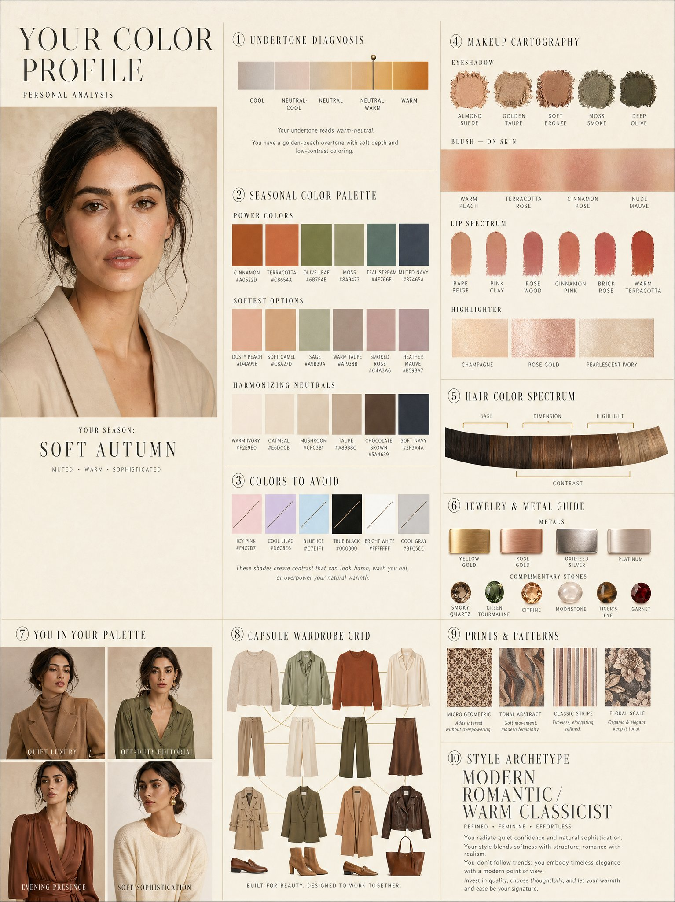

```
LUXURY PERSONAL COLOR PROFILE — EDITORIAL LAYOUT
Studio portrait of subject as anchor — skin retouched to luminous glass-like perfection, preserved natural structure, realistic pore texture, soft directional key lighting, no facial alteration. Background: warm ecru parchment with subtle linen grain texture. Layout reads like a Vogue Italia beauty supplement printed on heavyweight matte stock. Structured editorial grid, 3-column asymmetric, wide negative space, serif condensed display headers, all labels in spaced uppercase tracking, cohesive warm ivory/sand/ecru background system throughout all panels, ultra-photorealistic 8K, soft diffused studio lighting, flat elegant surfaces, no drop shadows.
PANELS:
① UNDERTONE DIAGNOSIS — Tonal spectrum bar from cool ash to warm amber, precision needle marker on subject's reading. Labels: Cool / Neutral-Cool / Neutral / Neutral-Warm / Warm. Fine annotation text.
② SEASONAL COLOR PALETTE — 10–12 fabric-textured swatches in subject's optimal season. Each labeled with poetic color name and HEX. Grouped: Power Colors / Softest Options / Harmonizing Neutrals.
③ COLORS TO AVOID — Desaturated row of clashing tones with fine editorial strikethrough. Clean, non-harsh presentation.
④ MAKEUP CARTOGRAPHY — Eyeshadow gradient dust swatches / blush tones fanned on skin strip / lip spectrum barely-there to bold / highlighter finishes labeled: champagne, rose gold, pearlescent ivory.
⑤ HAIR COLOR SPECTRUM — Curved gradient strip: base, dimension, highlight, contrast tones. Gold bracket indicators on best options.
⑥ JEWELRY & METAL GUIDE — Flat-lay editorial render: yellow gold, rose gold, oxidized silver, platinum finishes alongside complementary stone tones. Minimal styling.
⑦ YOU IN YOUR PALETTE — 3–4 editorial lookbook frames, subject in palette-correct outfits. Mood labels: Quiet Luxury / Off-Duty Editorial / Evening Presence.
⑧ CAPSULE WARDROBE GRID — Outfit flatlay: tops, bottoms, outerwear, shoes, bag — all palette-correct. Coordinating lines showing interchangeability. Net-a-Porter editorial aesthetic.
⑨ PRINTS & PATTERNS — 4 fabric print thumbnails: micro geometric, tonal abstract, classic stripe, floral scale. One-line styling note per print.
⑩ STYLE ARCHETYPE — Single typographic panel. Style identity title set large (e.g. "Modern Romantic / Warm Classicist"). Three defining aesthetic words. Four-line editorial wardrobe philosophy note.
RENDER SPECS: Ultra-photorealistic, 8K, editorial magazine print quality, warm neutral color grading, soft diffused studio lighting consistent across all panels, one serif display font + one fine sans-serif body font, no gradients, flat matte surfaces only.
```

 [↑返回目录](#toc)

---
## <a id="prompt-2026002363">磁场铁粉 Logo 物理成像</a> (<a href="https://x.com/Naiknelofar788/status/2049835482331357460" target="_blank" rel="noopener noreferrer">@Naiknelofar788</a>)

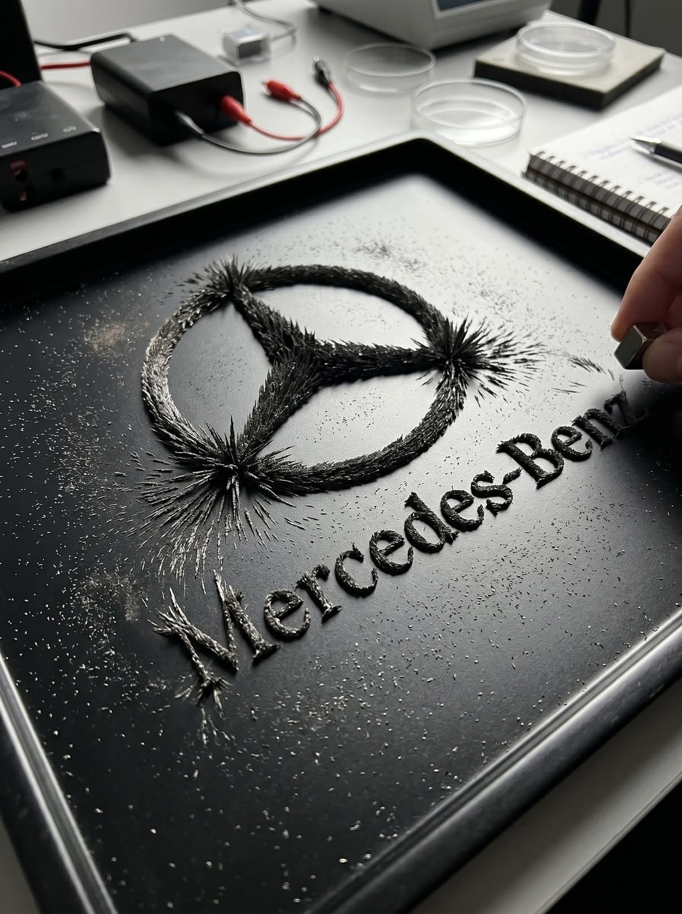

```
Transform the uploaded logo into a hyper-realistic scene where the logo silhouette is formed by iron filings reacting to a magnetic field. The logo must keep its exact shape and proportions, appearing as if a magnet shaped like the logo (or hidden beneath the surface) is influencing the filings to align naturally into that recognizable formation. Material details:
Fine iron filings with sharp, spiky, needle-like structures.
Dense clustering along magnetic field lines forming the logo silhouette.
Variation in density — thick near magnetic poles, thinner outward.
Matte dark metallic texture with subtle reflections.

Physics behavior:
Iron filings must follow realistic magnetic field patterns — radial and curved lines forming spikes and ridges.
Stronger attraction zones create thicker, raised clusters.
Outer areas show softer, more dispersed alignment.
Natural randomness and slight irregularity — no perfect edges.
Some loose filings scattered beyond the main shape.

Surface interaction:
Flat surface such as a lab table, glass plate, or matte black tray.
Filings resting on surface but visibly lifted in areas due to magnetic force (spiky texture).
Subtle dust and micro particles around.

Environment & human presence:
Realistic classroom, science lab, or creative studio environment.
A person partially visible — hands holding or moving a magnet beneath the surface or nearby.
Possibly a child or adult observing or interacting (adds emotional curiosity).
Other subtle elements: notebooks, tools, or lab items out of focus.

Lighting:
Directional overhead light creating shadows from raised filings.
Subtle highlights on metallic edges.
Balanced natural or indoor lighting.

Atmosphere:
Curiosity.
Discovery.
Educational yet visually satisfying.
Quiet but engaging moment.

Camera & composition:
Top-down or slightly angled close-up view.
Logo clearly visible through iron filing formation.
Human hands or interaction slightly off-center for storytelling.

Format:
Aspect ratio: STRICT 4:5 vertical.
No text overlays.

Style:
Hyper-real macro + environmental photography.
Physically accurate magnetic behavior.
Cinematic yet grounded realism.
```

 [↑返回目录](#toc)

---
## <a id="prompt-2026002362">抹茶品牌触点系统视觉板</a> (<a href="https://x.com/Preda2005/status/2049846981271699685" target="_blank" rel="noopener noreferrer">@Preda2005</a>)

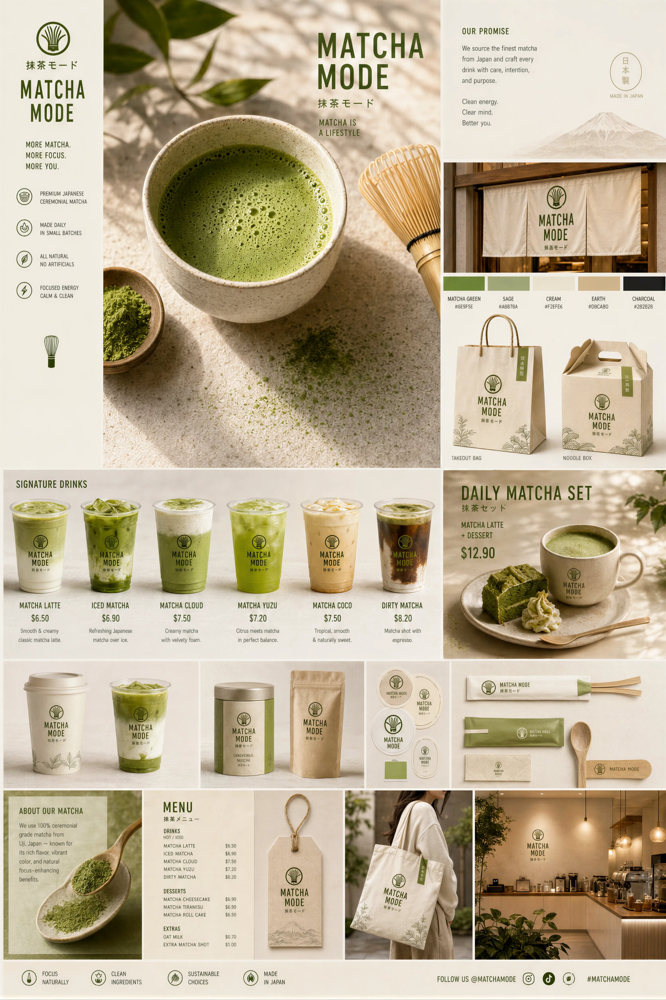

```
Create a premium “Matcha Brand Touchpoint System” visual board for a modern lifestyle brand called:

“MATCHA MODE”

Build a full brand identity system, not a single image.

HERO SCENE:

A hyper-realistic matcha drink in a ceramic cup placed on a clean natural surface.

– vibrant green matcha foam with micro-bubbles
– bamboo whisk (chasen) nearby
– soft natural light
– slight matcha powder dust on the surface
– minimal Japanese aesthetic
ATMOSPHERE:
– calm, warm, soft daylight
– clean background (off-white or beige)
– subtle shadows and reflections
– feeling of wellness and luxury
FULL BRAND SYSTEM:
– takeout cups (paper + glass bottles)
– packaging boxes (minimalist design)
– tote bags (premium lifestyle)
– labels, stickers, seals
– menu cards with pricing ($6.50, $8.90, etc.)
– small typography everywhere
– subtle imperfections (realism)

DESIGN LANGUAGE:

– modern minimalist typography
– Japanese-inspired layout
– soft green palette
– elegant spacing

INCLUDE:
– matcha latte
– iced matcha
– matcha desserts
– combo sets
– lifestyle shots
The composition must feel like a high-end design agency presentation.

Ultra-detailed, realistic, clean, aesthetic, and highly shareable.
```

 [↑返回目录](#toc)

---
## <a id="prompt-2026002361">手机爆炸拆解图</a> (<a href="https://x.com/Ankit_patel211/status/2048834306379075759" target="_blank" rel="noopener noreferrer">@Ankit_patel211</a>)


```
Create a 3D Insane detailed exploded assembly drawing of [subject or object]
```

 [↑返回目录](#toc)

---
## <a id="prompt-2026002360">长发造型分析信息图</a> (<a href="https://x.com/Gemalpha_88/status/2048918707343401034" target="_blank" rel="noopener noreferrer">@Gemalpha_88</a>)

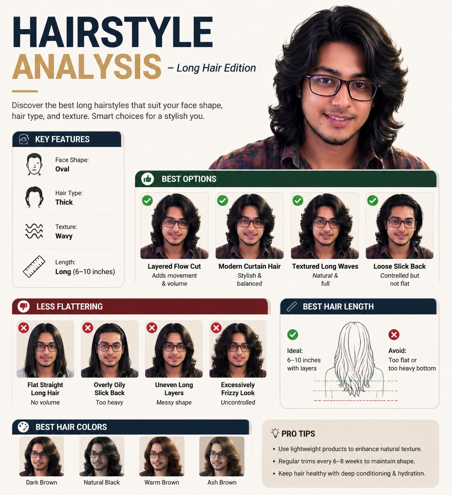

```
Create a professional "HAIRSTYLE ANALYSIS" infographic with a different male model (the same face) having long, thick hair (6-10 inches), slightly wavy texture.

Style should be clean, modern, premium grooming guide (similar layout but not identical).

TOP TITLE:
"HAIRSTYLE ANALYSIS - Long Hair Edition"

LEFT PANEL (Key Features with icons):
Face Shape: Oval
Hair Type: Thick
Texture: Wavy
Length: Long

BEST OPTIONS (Top row with green indicators):
Layered Flow Cut (Adds movement & volume)
Modern Curtain Hair (Stylish & balanced)
Textured Long Waves (Natural & full)
Loose Slick Back (Controlled but not flat)

LESS FLATTERING (Bottom row with red indicators):
Flat Straight Long Hair (No volume)
Overly Oily Slick Back (Too heavy)
Uneven Long Layers (Messy shape)
Excessively Frizzy Look (Uncontrolled)

BEST HAIR LENGTH SECTION:
Ideal: 6-10 inches with layers
Avoid: Too flat or too heavy bottom

BEST HAIR COLORS:
Dark Brown
Natural Black
Warm Brown
Ash Brown

DESIGN STYLE:
Clean grid infographic
White/beige background
Soft shadows
Premium magazine look
Realistic face and hair detail
Consistent spacing and typography
High resolution, 4K
```

 [↑返回目录](#toc)

---
## <a id="prompt-2026002359">水墨双重曝光人物海报</a> (<a href="https://x.com/Goodmanprotocol/status/2049002279051895243" target="_blank" rel="noopener noreferrer">@Goodmanprotocol</a>)


```
A cinematic character promotional poster of [SUBJECT], vertical composition (9:16), designed with a refined East-Asian ink aesthetic and high-end visual storytelling.

STRUCTURE:
Top-heavy hierarchical layout. The upper half features a large, highly recognizable silhouette of [SUBJECT]'s head / face / mask / upper body, forming a bold, iconic primary shape. The silhouette should be instantly identifiable.

The middle-lower section contains the full-body version of [SUBJECT] as a secondary subject, standing in a stable pose or subtle action stance, forming the visual core.

COMPOSITION STYLE:
Inside the large silhouette and around the character, use double exposure and collage storytelling. Integrate multiple elements:
- key scenes related to [SUBJECT]
- symbolic imagery and environment
- small narrative figures and interactions
- supporting visual motifs

Blend everything seamlessly using clouds, mist, ink diffusion, and negative space.

VISUAL FLOW:
Create a continuous flowing visual path from top to bottom, connecting:
- upper silhouette
- inner collage elements
- full-body subject

Ensure smooth eye guidance and compositional cohesion.

SIDE ELEMENTS:
Add balanced supporting elements on left and right sides to create tension, depth, and spatial variation.

STYLE & ATMOSPHERE:
- Large areas of negative space
- Ink-wash diffusion edges, soft fading, subtle fragmentation
- Eastern aesthetic: balance of emptiness and detail
- Calm, premium, restrained, cinematic tone

QUALITY:
Ultra-detailed, high resolution, layered depth, soft lighting, atmospheric perspective, cohesive series-style design.

OUTPUT:
9:16 aspect ratio, poster-ready composition.
```

 [↑返回目录](#toc)

---
## <a id="prompt-2026002358">草莓能量饮料商业广告</a> (<a href="https://x.com/SPEEDAI07/status/2049043627163435040" target="_blank" rel="noopener noreferrer">@SPEEDAI07</a>)


```
A hyper-realistic commercial advertisement blending energy drink and sports branding. A dynamic athletic woman mid-air jump, wearing modern sportswear (light translucent jacket, orange shorts, white sneakers), surrounded by explosive splashes of red strawberry liquid and flying ice cubes. A cold metallic energy drink can (strawberry flavor) bursting with droplets sits in the foreground, covered in condensation. Fresh strawberries scattered on a glossy reflective surface.

Bright cinematic lighting with dramatic highlights and motion effects. Vibrant orange gradient background with bold glowing typography behind the subject. Ultra-detailed, high contrast, sharp focus, commercial product photography style, 8K resolution, advertising poster aesthetic, energetic, powerful, refreshing mood.
```

 [↑返回目录](#toc)

---
## <a id="prompt-2026002357">鱼眼镜面复古咖啡馆人像</a> (<a href="https://x.com/harboriis/status/2049044698900361241" target="_blank" rel="noopener noreferrer">@harboriis</a>)


```
A fish-eye lens close-up of [your photo as reference] sipping from a teal/turquoise coffee mug, leaning forward intimately toward camera. Shot through or near a round mirror. Retro café interior with glossy teal subway tiles, vintage appliances, pendant lights. Black t-shirt, yellow-tinted round glasses. Warm moody tones.
```

 [↑返回目录](#toc)

---
## <a id="prompt-2026002356">过度思考超现实街头 Campaign</a> (<a href="https://x.com/AIwithAliya/status/2049044716642316758" target="_blank" rel="noopener noreferrer">@AIwithAliya</a>)


```
Ultra-realistic conceptual portrait of a young woman with long wavy hair and soft defined features, wearing rose-tinted rectangular sunglasses, an oversized ivory cropped t-shirt, fitted light-wash denim jeans, and clean white sneakers. She is sitting casually with a confident yet relaxed posture.

The twist: she is seated on a large, hyper-realistic version of her own detached head placed on the ground. The head is scaled up, lying sideways, with the same facial features and sunglasses, creating a surreal self-reflection concept.

Composition: centered, full-body shot, neutral studio background with soft blush and cream tones, minimal aesthetic. Clean negative space.

Typography integrated into the background:

Handwritten-style text at the top: "OVERTHINKING"

Below it, smaller text: "TRAPPED IN MY OWN HEART" with "HEART" crossed out

Large, rough, scribbled text in deep pink: "MIND"

Lighting: soft diffused studio lighting, subtle shadows, high detail, fashion editorial quality.

Style: blend of surrealism and modern luxury streetwear campaign, pastel feminine aesthetic, minimal yet expressive, high-resolution, 8k, sharp focus, natural skin texture.

Mood: introspective, emotional weight, identity, self-awareness, quiet confidence.
```

 [↑返回目录](#toc)

---
## <a id="prompt-2026002355">概念字体海报 Prompt</a> (<a href="https://x.com/dotey/status/2048793351290327381" target="_blank" rel="noopener noreferrer">@dotey</a>)


```
Create ONE finished premium conceptual typography poster for the exact title:

“[INPUT_TEXT]”

Single poster only. No moodboard, grid, presentation board, mockup, captions, prompt text, process sheet, or sample labels.

The title “[INPUT_TEXT]” must be the dominant visual structure of the poster: huge, readable, powerful, and spelled exactly. Do not translate, shorten, replace, or misspell it. Do not add other large readable text. Optional micro catalog text is allowed only if it stays subtle and secondary.

Silently interpret the title’s meaning, mood, cultural aura, symbolic associations, psychological tension, and visual rhythm. Turn that interpretation into one strong visual metaphor.

Typography is the hero. Design custom-looking letterforms whose weight, width, contrast, spacing, rhythm, distortion, negative space, edge quality, and ink texture express the temperament of the title. The type should feel intentionally designed, not like a default font.

If “[INPUT_TEXT]” refers to a widely known person, make a large editorial portrait or full / half-body figure a major visual presence, occupying roughly 40–70% of the composition. The figure should feel recognizable through aura, posture, styling, era, expression, lighting, and symbolic atmosphere, but should not copy a specific existing photograph, official poster, campaign image, logo, slogan, or copyrighted composition. The portrait must interact with the typography: overlapping the letters, emerging from them, being framed by them, casting shadows on them, breaking through them, or being partially hidden behind them.

For all other titles, use a human figure, landscape, object, or atmospheric setting only when it strengthens the meaning. It must interact with the typography and deepen the concept, not decorate it.

Use a rich but restrained 4–6 color system matched to the theme: dominant background color, primary typography color, figure / landscape tone, emotional accent color, muted support color, and subtle paper / ink texture tone. Avoid flat black-white-red defaults unless conceptually necessary.

Composition style: high-end editorial poster, museum-quality graphic design, dramatic scale, strong hierarchy, few elements, intelligent whitespace, bold flat color areas, sharp cropping, silkscreen / lithograph / risograph grain, paper fibers, subtle ink imperfections, refined visual tension.

The final image should feel like a complete visual sentence: the title, the figure or setting, the color, and the typography explain each other.

Avoid generic word art, glossy 3D lettering, random icons, stock-photo realism, cluttered collage, excessive grunge, tourist clichés, official logos, copied slogans, copied campaign aesthetics, unrelated text, and misspelled typography.

-----

INPUT_TEXT：Phoenix Rebirth
```

 [↑返回目录](#toc)

---
## <a id="prompt-2026002354">Logo 与品牌身份系统提示词合集</a> (<a href="https://x.com/wanerfu/status/2048659924822184026" target="_blank" rel="noopener noreferrer">@wanerfu</a>)

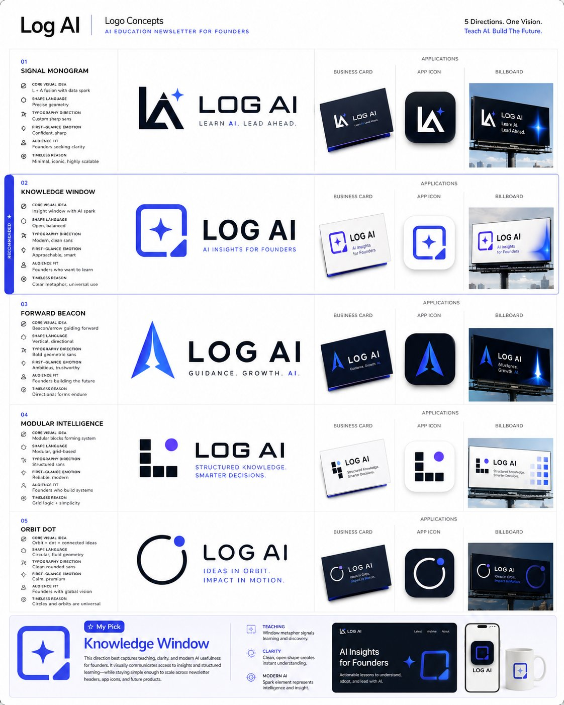

```
1. Logo概念生成提示词

你是一位拥有20年经验的顶级Logo设计师，为全球知名品牌设计过即时识别且深具意义的标志。

品牌名称：[你的品牌名]
行业：[你的行业]
品牌个性：[描述]
目标受众：[描述]
欣赏的视觉身份：[列举3个]
讨厌的视觉身份：[列举3个]
偏好风格：[如极简、大胆、几何、有机、复古、未来]

为我的品牌生成5个完全不同的Logo概念。

对每个概念提供：

- 核心视觉理念及象征意义
- 形状语言及为何适合品牌
- 字体方向建议
- 第一眼的情感触发
- 为何适合目标受众
- 在名片、App图标和广告牌上的效果
- 何为永恒而非潮流

然后告诉我，如果这是你的品牌，你会选哪个以及原因。

2. 品牌身份基础提示词

你是为财富500强公司和初创企业建立品牌身份的顶级品牌战略师，这些企业后来融资数百万。

业务名称：[你的业务名]
业务描述：[一句话]
目标受众：[详细描述]
竞争对手：[列举3-5个]
想触发的感受：[如信任、兴奋、奢华、亲近、力量]
想关联的词汇：[列举5-10个]
不想关联的词汇：[列举5-10个]

在设计任何视觉效果之前建立完整的品牌身份基础。

为我提供：

- 品牌原型及为何完美契合
- 5个具体人类特征描述的品牌个性
- 带示例的品牌语调指南
- 核心品牌承诺（一句话）
- 3个品牌应触发的情感层级
- 与竞争对手的根本差异
- 定义品牌的唯一关键词

3. 配色方案提示词

你是色彩心理学专家和品牌设计师，深知色彩如何触发情感、建立信任和驱动购买决策。

品牌名称：[你的品牌名]
行业：[你的行业]
目标受众：[年龄、性别、收入、生活方式]
想触发的首要情感：[如信任、能量、奢华、平静、兴奋]
前3名竞争对手颜色：[列举]
喜欢的颜色：[列举]
讨厌的颜色：[列举]

为我建立完整品牌配色板。

为我提供：

- 主色及其HEX代码和心理学解释
- 两个辅助色及HEX代码
- 一个强调色用于CTA和高亮
- 一个中性色用于背景和文字
- 每种颜色对目标受众的影响
- 与竞争对手的差异化
- 在网站、社交媒体和包装上的应用示例
- 永远不要搭配的颜色组合及原因

4. 字体方向提示词

你是字体专家和品牌设计师，深知字体如何传达个性、建立可信度和实现品牌即时识别。

品牌名称：[你的品牌名]
品牌个性：[5个词]
行业：[你的行业]
目标受众：[描述]
字体应触发的感受：[如权威、友好、创新、优雅、能量]
喜欢的品牌字体：[列举3个]

为我建立完整字体系统。

为我提供：

- 标题用主显示字体名称及为何完美
- 长文本的辅助字体
- 引言或重点的强调字体
- 标题、副标题、正文、说明文字的精确字号层级
- 字距和行高建议
- 字体搭配方法
- 预算有限时的免费替代方案
- 你所在行业应避免的字体错误

5. 完整品牌身份包提示词

你是顶级品牌代理创意总监，交付覆盖每个触点的完整品牌身份系统。

业务名称：[你的业务名]
业务描述：[一句话]
目标受众：[详细描述]
品牌个性：[5个词]
行业：[你的行业]
竞争对手：[列举3个]
设计工具预算：[免费或付费]
时间表：[你需要的时间]

在一个回复中交付我的完整品牌身份系统。

包含所有元素：

- 品牌战略基础、原型、个性、承诺和定位
- Logo概念及3个变体
- 完整配色板、HEX代码和使用规则
- 字体系统、名称、字号和层级
- 视觉方向指南
- 品牌语调指南和标语选项
- 社交媒体视觉模板
- 3条永远不要打破的核心品牌规则

将一切作为结构化品牌手册交付，任何设计师、开发者或AI工具都能在10分钟内完全理解你的品牌。
```

 [↑返回目录](#toc)

---
## <a id="prompt-2026002353">品牌口红推荐报告信息图</a> (<a href="https://x.com/liyue_ai/status/2048667226195317219" target="_blank" rel="noopener noreferrer">@liyue_ai</a>)


```
一、系统角色
你是一个专业美妆顾问 + 人脸分析系统 + 品牌视觉设计系统。
你的任务是：基于用户上传自拍与指定口红品牌，生成一张具有品牌调性的“口红推荐报告信息结构图”。

二、输入参数
用户图像：{用户自拍}
品牌：{口红品牌，如 Dior / YSL / Armani / Chanel / TF}
风格偏好（可选）：{通勤 / 温柔 / 气场 / 氛围感 / 显白优先}
推荐数量：3–5

三、品牌视觉层（新增核心模块）
根据 {品牌} 自动构建视觉风格（Brand Visual Identity），提取品牌调性，例如：
Dior：
优雅、高级、法式、灰白 + 银色、柔光
YSL：
黑金、性感、强对比、时尚编辑感
Armani：
低饱和、雾面、克制、灰调高级感
Chanel：
极简黑白、高级、理性、结构清晰
Tom Ford：
深色、高对比、奢华、电影感

视觉应用到海报：
1. 主色调（背景微变化，不是大面积铺色）
2. 强调色（用于色号标题/细线/小元素）
3. 光影风格（柔光 / 强对比 / 冷调 / 暖调）
4. 字体气质（优雅 / 现代 / 冷感 / 力量感）

四、分析层
对用户进行分析：
- 肤色：冷 / 暖 / 中性（+ 明度）
- 气质：清冷 / 温柔 / 明艳 / 干净 / 成熟
- 唇部特征：薄 / 厚 / 唇色基础
- 妆容状态：素颜 / 日常 / 精致
输出一句总结：「更适合 {色系} + {饱和度} + {质地} 的口红方向」

五、推荐层（增强差异）
从 {品牌} 推荐 3–5 个色号：
每个包含：
- 色号名称（#999）
- 色系（正红 / 豆沙 / 枫叶 / 奶茶 / 玫瑰）
- 上脸效果（显白 / 提气色 / 氛围感 / 气场增强）
- 场景（逛街 / 通勤 / 聚餐 / 约会 / 宴会）

要求：每个色号“风格明确区分”（一个日常、一个气场、一个氛围感等）

六、信息结构图
生成竖版信息结构图
整体风格：美妆时尚大片质感 + 结构化信息可视化排版 + 品牌视觉体系深度融合
极简但不单调，高级但有视觉层次

【整体布局】
左上：用户输入区
右上：分析结论
中部：试色矩阵（核心）
底部：总结

## 1️⃣ 左上（用户区）
用户自拍（真实质感）
+ 小标题：「肤色分析」
+ 一句话结论：「适合低饱和玫瑰调，避免高荧光色」

极细品牌色线条（如 YSL 金线 / Dior 灰线）

## 2️⃣ 中部（核心试色矩阵）
这是视觉重点区域（占比60%以上）
展示方式：将 3–5 个色号以“人脸试色对比”的形式排列：
每一列 = 一个色号
每个色号包含：
- 小型人脸图（同一张脸，不同唇色）
- 色号名称（如 #999）
- 色系标签（如 Classic Red）
- 一句话效果说明
要求：所有人脸保持一致，仅唇色变化，真实试色效果（lip color try-on），肤质真实，不塑料，光影统一。
排列方式：横向排布 或 网格排布（整齐但不死板）

品牌增强点：
- Dior：轻柔渐变背景 + 柔光阴影
- YSL：更强对比 + 黑色细分割线
- Armani：整体灰调统一，低对比
- Chanel：严格对齐，极简黑白
- TF：局部暗背景 + 高光强调

## 3️⃣ 每个色号模块
包含：
色号名（突出）
色系标签
一句推荐语
场景标签（逛街/通勤/聚餐/约会/宴会等）

品牌化处理：
- 用“品牌强调色”做：
  - 色号标题
  - 细分隔线
  - 小icon
（不是色块，而是“精致点缀”）

## 4️⃣ 底部总结
一段“有判断力的建议”，
例如：「日常建议选择低饱和豆沙色提升气色，重要场合可使用正红增强气场」
或：「你的肤色更适合柔和玫瑰调，避免高荧光色系」
但不要完全引用以上2个例子的建议，根据用户实际肤色来建议。
品牌增强：底部可加极淡品牌风格横线 / 极小品牌字样（非logo）

七、UI设计
- 不使用圆角卡片 UI
- 不使用厚边框
1. 引入“层级对比”：
   - 主体亮
   - 次要信息弱
2. 使用“微对比”：
   - 细线
   - 灰度差
   - 字重变化
3. 加入“节奏感”：
   - 疏密变化
   - 模块呼吸
4. 品牌点缀：
   - 只用 5% 强调
   - 不破坏极简结构

八、图像质量
真实皮肤质感
唇色精准
统一光影
商业级美妆摄影
8K

———
品牌：YSL
```

 [↑返回目录](#toc)

---
## <a id="prompt-2026002352">西楚霸王国风暗黑海报</a> (<a href="https://x.com/stellimbris/status/2048633434961072617" target="_blank" rel="noopener noreferrer">@stellimbris</a>)


```
竖版国风暗黑海报，黑色纯背景，中央巨大的中文标题字，占据画面大部分空间，字体为粗粝做旧的米白色石刻/旧纸质感，带明显颗粒、磨损、裂痕与噪点；整体构图层次丰富，强烈黑白金红对比，东方审美，神秘、压抑、欲望与审判感并存 电影海报质感 高级平面设计，极致细节 纸张纹理 印章落款 小字标语，4K
```

 [↑返回目录](#toc)

---
## <a id="prompt-2026002351">健身品牌力量 Campaign</a> (<a href="https://x.com/AIwithSynthia/status/2048601383545577614" target="_blank" rel="noopener noreferrer">@AIwithSynthia</a>)


```
Cinematic fitness campaign, oversized dumbbell placed diagonally like a statement prop, female model in red performance wear and white shorts seated on one side of the dumbbell, one leg bent, one extended, minimal black studio, reflective floor, bold word “STRENGTH” behind in large typography, sharp lighting, ultra-clean composition, luxury sports aesthetic, 1:1.
```

 [↑返回目录](#toc)

---
## <a id="prompt-2026002350">足球球员数据涂鸦海报</a> (<a href="https://x.com/ryanpp27/status/2048602248524214542" target="_blank" rel="noopener noreferrer">@ryanpp27</a>)


```
Create a scrapbook doodle-style football poster of [PLAYER_NAME].

AI auto-generates realistic career stats (club and national team).

Main photo: realistic, unchanged ([PLAYER_NAME] in action or iconic pose).

Doodles and handwritten notes: white and [PRIMARY_COLOR] neon ink (no warm colors unless specified), arrows, stars, scribbles, sketchy outlines. Add a glowing [PRIMARY_COLOR] outline around the player's body.

Layout (bold handwritten titles and stats):
- Top Title: "[PLAYER_NAME]" plus "[NICKNAME/TITLE]"
- Club Career: total matches and goals plus 2–4 main clubs (apps and goals)
- Highlights: 2–3 standout achievements (e.g., UCL goals, Ballon d'Or, top scorer)
- National Team: caps and goals plus 1–2 international achievements

Style: modern football poster x notebook aesthetic, clean but energetic, slightly messy doodles, high contrast, neon accents on dark or muted background.

Important: all stats must be realistic and proportional to the player's real career.
```

 [↑返回目录](#toc)

---
## <a id="prompt-2026002349">运动时尚三联 Campaign</a> (<a href="https://x.com/AIwithkhan/status/2048606301039820821" target="_blank" rel="noopener noreferrer">@AIwithkhan</a>)


```
Cinematic sports fashion collage, 3-panel layout, top panel large hero shot of a female tennis athlete sitting confidently on an oversized tilted tennis racket, deep green luxury court backdrop, reflective glossy floor, bold oversized typography “PRECISION” in background, dramatic editorial lighting, ultra-clean composition, high-fashion athletic aesthetic.

Bottom left panel: close-up portrait of the athlete with glowing skin, minimal makeup, soft light, text “FOCUS” and “FUEL” placed subtly.

Bottom right panel: full-body crouched pose holding racket, strong posture, text “DISCIPLINE DRIVES DOMINANCE”, grid-based layout lines, premium sports branding feel.

Consistent color grading, dark green and white palette, sharp details, cinematic shadows, luxury campaign style, 1:1 aspect ratio.
```

 [↑返回目录](#toc)

---
## <a id="prompt-2026002348">胡须风格分析海报</a> (<a href="https://x.com/RizwanAly07/status/2048610196302250019" target="_blank" rel="noopener noreferrer">@RizwanAly07</a>)


```
Create a premium “BEARD STYLE ANALYSIS” poster featuring the same man from the reference image. Show face shape, beard density, jawline definition, beard growth pattern, and beard suitability score. Include different beard styles comparison such as Stubble, Short Boxed Beard, Full Beard, Goatee, Van Dyke, Clean Shave. Add side profile and front profile views. Modern dark blue luxury background, professional grooming infographic style, high detail, realistic face consistency, stylish typography, premium male grooming poster.
```

 [↑返回目录](#toc)

---
## <a id="prompt-2026002347">4×4 动作分解参考表</a> (<a href="https://x.com/oggii_0/status/2048614158699217302" target="_blank" rel="noopener noreferrer">@oggii_0</a>)


```
[STYLE]
Monochrome grayscale illustration, 3D-rendered character, clean instructional reference sheet, white background, comic-style cell grid layout, technical diagram aesthetic.

[LAYOUT]
4×4 grid layout with a total of 16 panels. Each panel is separated by thin black border lines. Cells are numbered from 1 to 16, with consistent panel sizes.

[CHARACTER]
image1 (the same character appears consistently in all panels)

[PANEL STRUCTURE – per cell]
Top-left: bold number badge + English title text
Center: full-body character pose illustration
Bottom-left: English description text (3–4 lines)
Overlay: directional arrows indicating movement

[ARROWS / MOTION INDICATORS]
Curved arrows, straight arrows, and circular rotation indicators placed around the character to show motion flow and direction.

[RENDERING STYLE]
Highly detailed 3D sculpted style, soft studio lighting, subtle shadows, no color, grayscale shading, clean linework, game concept art quality.

[NEGATIVE]
No background scenery, no color tones, no additional characters, no complex background.
```

 [↑返回目录](#toc)

---
## <a id="prompt-2026002346">立体刺绣小鸟花枝</a> (<a href="https://x.com/dotey/status/2048529821706195442" target="_blank" rel="noopener noreferrer">@dotey</a>)


```
精致立体刺绣风插画，浅浮雕纤维艺术效果，纯净「蚕丝白 + 奶白」底色，细腻丝线质感。画面为数只小鸟停在蜿蜒花枝上，周围点缀粉白、浅桃、珊瑚粉、淡金色花朵与叶片，构图轻盈雅致、留白充足。鸟儿羽毛以奶白、浅蓝、淡粉、浅金丝线刺绣表现，花枝纤细自然，花朵层层叠线，整体呈现高级手工刺绣、丝线堆绣、柔和光影、细节丰富、温柔清新的艺术效果。
```

 [↑返回目录](#toc)

---
## <a id="prompt-2026002345">法新浪潮撕纸电影海报</a> (<a href="https://x.com/bananaprompts/status/2048541390900994476" target="_blank" rel="noopener noreferrer">@bananaprompts</a>)

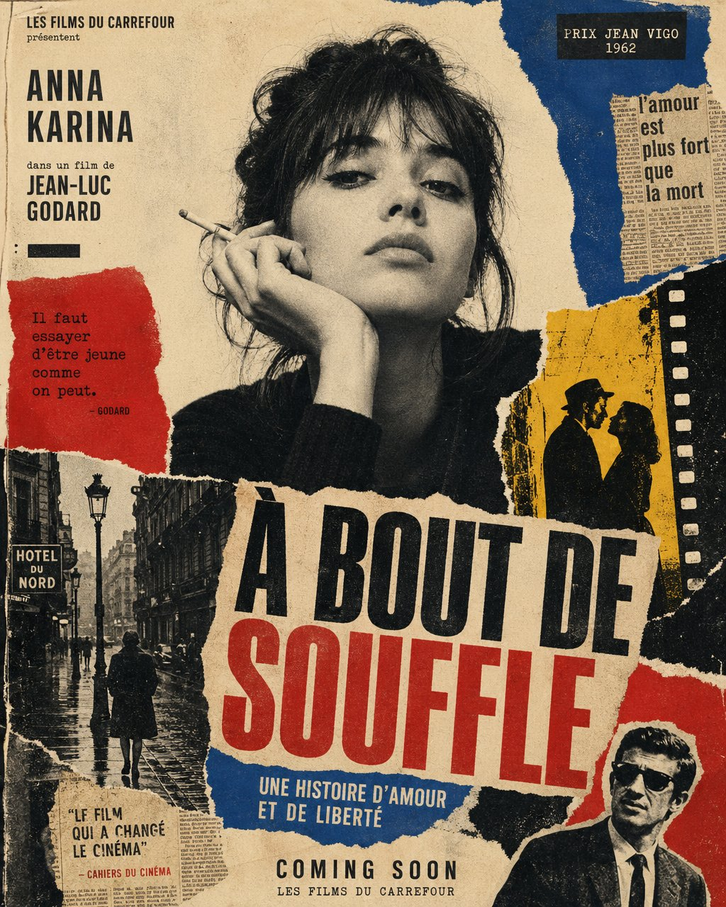

```
Create a vertical poster composition on aged cream paper with a handmade analog feel. Use rough ripped paper edges, layered magazine cutouts, photocopy grain, halftone texture, ink bleed, and slightly imperfect screen-print registration. Keep the subject as the main black-and-white photographic portrait, placed prominently in the center or upper center. Surround the subject with graphic blocks of deep red, cobalt blue, warm yellow, black, and ivory.

Add supporting collage fragments such as a rainy European street, film-strip borders, newspaper clippings, urban silhouettes, and cinematic details, arranged like a handmade 1960s art-house movie poster. Use bold condensed typography with a strong visual hierarchy. Add large headline text: "[MAIN TITLE]". Add smaller subtitle text: "[SUBTITLE]". Add bottom text: "[BRAND NAME / EVENT NAME / COMING SOON / DATE]". If needed, include a small top line reading "[TAGLINE]".

The final result should feel cinematic, intellectual, rebellious, and editorial — like a lost 1960s European film poster with a strong point of view. Keep it raw, tactile, printed, imperfect, and handmade. Avoid a glossy modern finish.
```

 [↑返回目录](#toc)

---
## <a id="prompt-2026002344">NOIR 街头服饰 Campaign</a> (<a href="https://x.com/Daniel_adsss/status/2048542581638701446" target="_blank" rel="noopener noreferrer">@Daniel_adsss</a>)


```
Create a premium, highly realistic 1:1 campaign poster for NOIR, a modern streetwear brand. Show one hero oversized hoodie as the main focus against a gritty urban backdrop with wet concrete floors, dramatic low lighting, subtle smoke in the air and a raw street energy. Add bold minimal typography with the brand name NOIR and a short campaign headline like "Wear the Dark." Make it feel like a real high-end streetwear editorial, sharp detail, realistic fabric textures, modern and edgy, deep black tones with subtle grey accents, no clutter, no collage.
```

 [↑返回目录](#toc)

---
## <a id="prompt-2026002343">高定时尚杂志封面</a> (<a href="https://x.com/SPEEDAI07/status/2048573343066992919" target="_blank" rel="noopener noreferrer">@SPEEDAI07</a>)


```
Ultra high-fashion magazine cover, Louis Vuitton-style editorial. Close-up portrait of a confident woman with soft rose-gold hair and natural airy bangs, slightly wind-blown for movement. She is wearing a luxury summer outfit: a structured lightweight linen or silk jacket in warm golden-yellow tones, layered over a modest high-neck top, paired with a bold gold choker necklace and subtle statement earrings.

Fabric flows naturally with a summer breeze, slightly textured and breathable, capturing a premium seasonal feel. Styling is elegant, modest, and refined — no revealing clothing.

Lighting is high-end studio mixed with natural golden hour glow: warm highlights, soft shadows, luminous skin with glossy editorial finish.

Background is a rich summer gradient (sunset gold fading into soft coral or warm beige), clean but visually striking.

Composition is dynamic and slightly cinematic: hair in motion, shallow depth of field, sharp focus on face.

Typography: large elegant serif masthead "Louis Vuitton" at the top, bold cover line "YOUR CHOICE ENDS HERE" in premium editorial layout, minimal supporting text.

Ultra-realistic, hyper-detailed skin texture, 8K resolution, sharp focus, glossy magazine print quality, cinematic color grading, luxury fashion photography, no nudity, tasteful and editorial.
```

 [↑返回目录](#toc)

---
## <a id="prompt-2026002342">四季包装 Campaign 宫格</a> (<a href="https://x.com/SRKDAN/status/2048582939504431195" target="_blank" rel="noopener noreferrer">@SRKDAN</a>)


```
PHASE 1 - PRODUCT: [ITEM] in [MATERIAL] packaging, minimal label design
PHASE 2 - GRID: 2x2 seasonal grid, four distinct brand worlds
PHASE 3 - COMPOSITION: each quadrant a full campaign scene with props and environment
PHASE 4 - CONSISTENCY: same product silhouette, four distinct palettes

Swap: [ITEM] / [MATERIAL] / [LABEL STYLE]
```

 [↑返回目录](#toc)

---
## <a id="prompt-2026002341">AP Calculus 学习表信息图</a> (<a href="https://x.com/hqmank/status/2048587150544028084" target="_blank" rel="noopener noreferrer">@hqmank</a>)


```
Please create a mathematical visualization infographic about "[math concept / topic]." The goal is to help the viewer intuitively understand what it is, why it works, its geometric or structural intuition, and how it behaves in different contexts. The visual should feel like a high-quality math lecture handout combined with a hand-drawn educational poster. It should be elegant, clear, and information-rich, but not cluttered. Visual style: either portrait or landscape is fine. Use a clean, light paper-like background, with a deep blue title and black or dark gray lines for the main content. Add a small number of refined accent colors such as blue, teal, gold, and red. Incorporate rounded-corner cards, thin borders, numbered labels, hand-drawn arrows, zoom-in callout boxes, and a summary section. The overall design should be aesthetically pleasing, balanced, and academic, allowing the viewer to grasp the structure of the concept and why it works at a glance.
```

 [↑返回目录](#toc)

---
## <a id="prompt-2026002340">彼岸花丛中的红妆女子</a> (<a href="https://x.com/xiaofenggan" target="_blank" rel="noopener noreferrer">@xiaofenggan</a>)

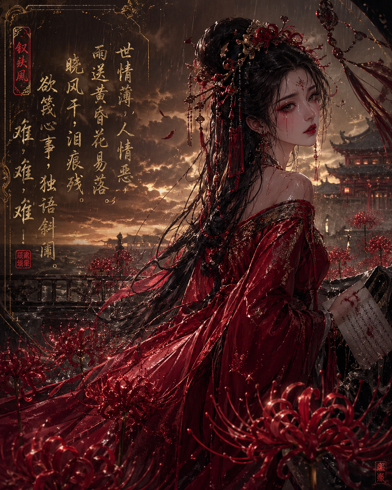

```
异质感oc，绝美红妆女子，位于彼岸花丛中，张力。 唐琬《钗头凤·世情薄》 世情薄，人情恶，雨送黄昏花易落。晓风干，泪痕残。欲笺心事，独语斜阑。难，难，难！
```

 [↑返回目录](#toc)

---
## <a id="prompt-2026002339">Apple 风格自然科普海报</a> (<a href="https://x.com/berryxia/status/2048251413147644100" target="_blank" rel="noopener noreferrer">@berryxia</a>)

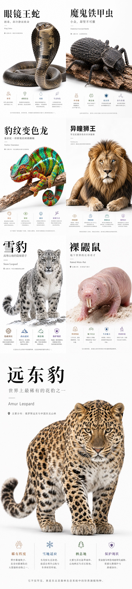

```
你是一个高端自然科普海报生成系统，目标是为稀有动物、昆虫、爬行动物、哺乳动物或其他小众生物生成 Apple keynote 风格的高级科普视觉海报。

整体视觉方向：
生成一张 9:16 竖版高级科普海报，画面采用极简、纯白、干净、现代、Apple 式产品发布海报语言。背景应为纯白或极浅灰白渐变，保持大量留白。整体设计应具备高级感、克制感、视觉冲击力和科学展示感。

核心设计原则：
1. 主体动物必须被极度放大，成为画面最强视觉中心。
2. 主体应具有强烈立体感、真实质感、高清细节和柔和棚拍光影。
3. 海报信息要少而准，避免拥挤。
4. 不使用传统信息图的卡片、圆角框、复杂底纹、淡黄色纸张质感或装饰性边框。
5. 底部信息区只使用四列极简 icon + 标题 + 短说明，通过细竖线分隔。
6. 文字排版要像高端发布会视觉，标题巨大，副标题克制，正文小而清晰。
7. 风格关键词：Apple-inspired, premium editorial, pure white background, hero subject, clean typography, minimal infographic, high-end science poster.

画面结构：
顶部左侧为标题区：
中文大标题：{中文物种名}
中文副标题：{一句有吸引力的物种定位}
细短横线
英文名：{英文物种名}
分布信息：主要分布：{分布区域}

中部与下中部为主体视觉：
生成一个超高清、真实、具有强烈立体感的 {中文物种名}。
主体应占据画面 50% 到 70% 的视觉面积。
主体姿态应具有展示性、力量感或识别度。
保持白色背景，不添加复杂自然环境。
可以保留少量必要承托物，例如树枝、岩石、雪地、沙土或木皮，但必须简洁。
主体要有真实阴影，使其像高级产品摄影一样立在画面中。

底部信息区：
用四个极简信息栏目展示科普信息。
每个栏目包含：
一个细线 icon
一个彩色小标题
一段 1 到 3 行短文字
栏目之间用极细浅灰竖线分隔。
不使用卡片框，不使用圆角背景，不使用大面积色块。

四个信息栏目：
栏目 1：
标题：{重点特征1标题}
说明：{重点特征1短说明}

栏目 2：
标题：{重点特征2标题}
说明：{重点特征2短说明}

栏目 3：
标题：{重点特征3标题}
说明：{重点特征3短说明}

栏目 4：
标题：{重点特征4标题}
说明：{重点特征4短说明}

底部总结句：
在最底部居中放置一句灰色小字总结：
{一句高级、克制、有记忆点的科普总结}

字体与排版：
中文标题使用大号黑色、高级、稳重、有力量感的字体。
副标题使用灰色，中等字号，字距略宽。
英文名使用小号灰色，简洁现代。
正文使用清晰现代中文字体，保持可读。
所有文字必须留有足够呼吸感。

色彩规范：
背景：纯白、极浅灰、轻微柔光渐变。
主标题：黑色或深石墨色。
副标题与正文：中性灰。
底部四个信息标题可使用低饱和强调色：
暖棕、冷蓝、松石绿、紫色、橙色。
颜色只用于 icon 和小标题，不要大面积铺色。

图像质量：
2K 高清质感，细节清晰，主体锐利，光影真实。
主体纹理必须可信，例如毛发、鳞片、甲壳、皮肤褶皱、羽毛或斑纹。
避免变形、错误肢体、错误解剖结构、模糊主体、低质贴图、塑料感、卡通感。

禁止项：
不要使用淡黄色旧纸背景。
不要使用复杂信息图网格。
不要使用圆角卡片。
不要使用厚边框。
不要使用大面积装饰图形。
不要添加无关 logo。
不要添加多余小字。
不要让主体太小。
不要让文字压住主体。
不要让底部信息区过度拥挤。
不要出现儿童科普风、卡通风、低端展板风。

最终输出：
生成一张 9:16 竖版、高级、干净、强视觉冲击的 Apple 风自然科普海报。
```

 [↑返回目录](#toc)

---
## <a id="prompt-2026002338">《赤壁怀古》长卷图</a> ([@苍何])

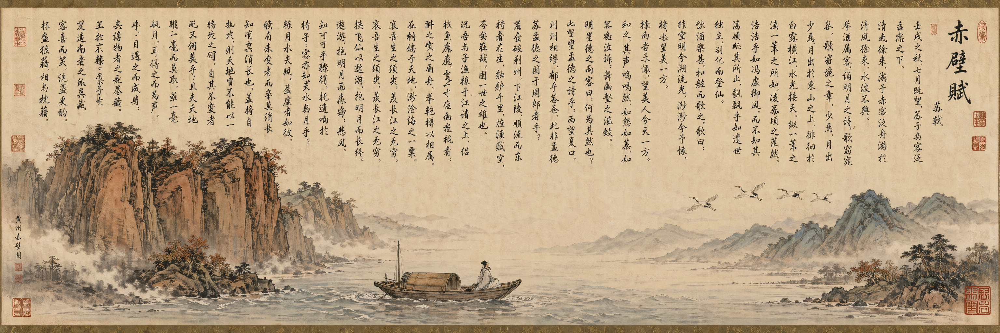

```
帮我生成一张《赤壁怀古》的长卷图，带整篇《赤壁赋》文字
```

 [↑返回目录](#toc)

---
## <a id="prompt-2026002337">《短歌行》诗词意境图</a> ([@苍何])

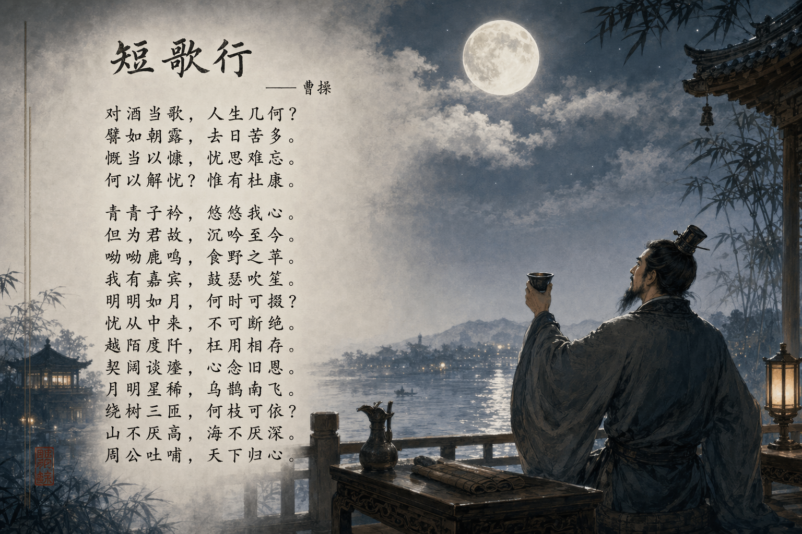

```
帮我生成一张《短歌行》的意境图，带整篇《短歌行》文字
```

 [↑返回目录](#toc)

---
## <a id="prompt-2026002334">RAG 技术详解图</a> ([@苍何])


```
帮我生成一张 RAG 技术的详细讲解图
```

 [↑返回目录](#toc)

---
## <a id="prompt-2026002333">AI 眼镜爆炸拆解图</a> ([@苍何])

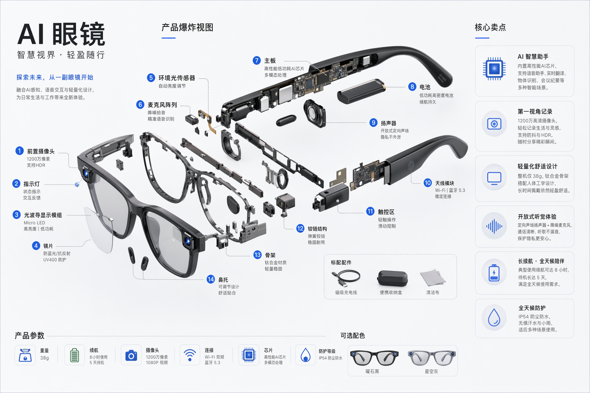

```
生成一张AI眼镜的爆炸视图，包含每个组件的名称以及这款产品的几大核心卖点。
```

 [↑返回目录](#toc)

---
## <a id="prompt-2026002332">茶π产品宣传海报</a> ([@苍何])

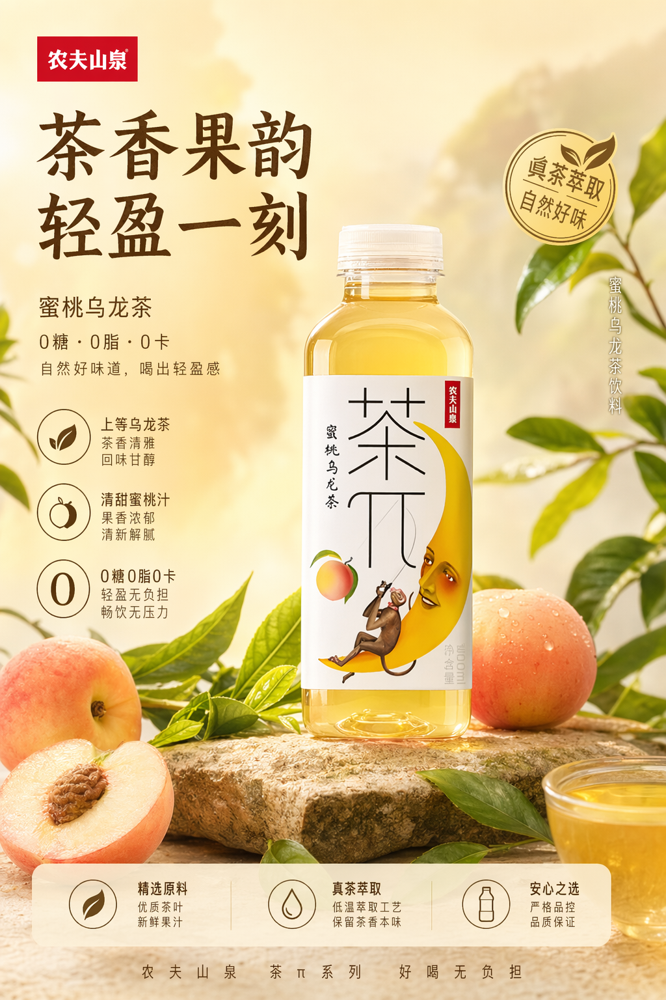

```
帮这个产品生成宣传图
```

 [↑返回目录](#toc)

---
## <a id="prompt-2026002331">西安手绘水彩城市地图</a> ([@苍何])

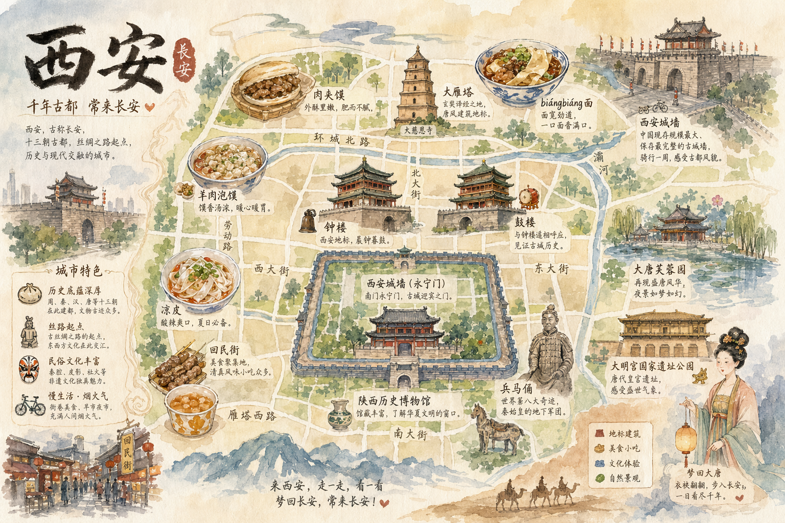

```
生成一张手绘水彩风格的「西安」城市地图，包含当地特色美食、地标建筑及城市特色
```

 [↑返回目录](#toc)

---
## <a id="prompt-2026002330">月下美女直播画面</a> ([@苍何])

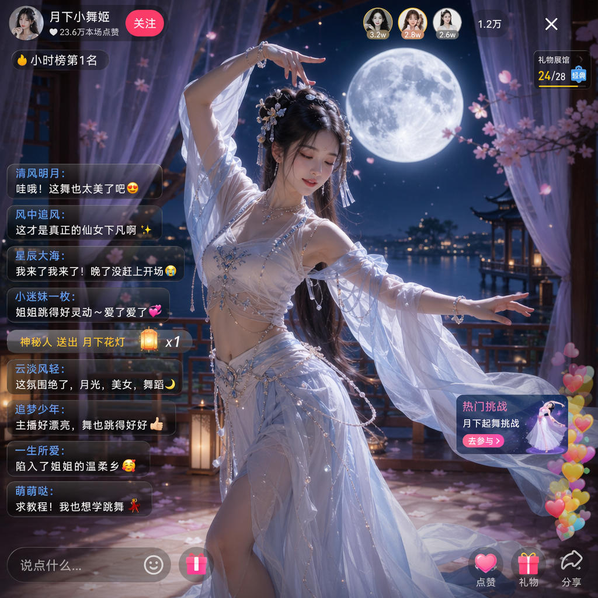

```
生成一张直播间的图片，直播间氛围是月下美女跳舞的画面，直播间有很多人评论
```

 [↑返回目录](#toc)

---
## <a id="prompt-2026002329">烬甲猎鹰者与燃翼神禽</a> (<a href="https://x.com/iamsofiaijaz/status/2008896649901535342" target="_blank" rel="noopener noreferrer">@iamsofiaijaz</a>)


```
一幅充满奇幻色彩的电影场景：一位英姿飒爽的女战士兼猎鹰师，身着饱经战火洗礼、饰以闪耀余烬纹理的皮甲，漫步于幽暗迷雾笼罩的森林之中。她高举手臂，指挥着一头巨大的凤凰与雄鹰的混合体，这头猛禽双翼燃烧，羽毛燃焰，尖端喷吐着火焰。它周身散发着橙红色的熔岩光芒，火星和余烬飞溅。女战士梳着辫子，皮肤上沾满了灰烬，神情坚定，手中拿着绳索和工具袋。画面细节丰富，羽毛纹理逼真，火焰物理效果自然，光照效果极具戏剧性，运用了体积雾、浅景深等技术，营造出史诗般的奇幻氛围，色彩调校极具电影质感，背景阴郁深沉，分辨率高达8K，呈现出概念艺术的精髓，并采用了虚幻引擎的渲染效果。
```

```
A cinematic fantasy scene of a fierce female use image for face reference warrior falconer walking through a dark misty forest, wearing battle-worn leather armor infused with glowing ember textures. Her arm is raised, commanding a massive phoenix-eagle hybrid with blazing wings and flaming feathers, fire trailing from its tips. The bird radiates molten orange and red light, casting sparks and embers into the air.The warrior has braided hair, ash-streaked skin, and a determined expression, carrying a rope and utility pouch. Ultra-detailed feathers, realistic fire physics, dramatic lighting, volumetric fog, shallow depth of field, epic fantasy atmosphere, hyper-realistic, cinematic color grading, dark moody background, 8k, concept art, unreal engine quality.
```

 [↑返回目录](#toc)

---
## <a id="prompt-2026002327">沉香玫瑰悬浮幻景</a> (<a href="https://x.com/meng_dagg695/status/2011334627290726746" target="_blank" rel="noopener noreferrer">@meng_dagg695</a>)


```
{
  "master_prompt_type": "超精细8K AI图像生成",
  "global_settings": {
    "resolution": "8K UHD",
    "aspect_ratio": "2:3 竖版",
    "render_quality": "极致锐度、超微细节、电影级光效",
    "style": "超现实商业产品摄影",
    "color_profile": "温暖金调搭配柔和琥珀高光",
    "environment": {
      "location": "古老中东市场走廊",
      "architecture": {
        "walls": "岁月痕迹的粗糙石墙与可见纹理",
        "arches": "背景巨型石拱",
        "floor": "暖棕色石材地面"
      },
      "background_elements": [
        "装满香料的木架",
        "袋装与碗装干货",
        "悬挂草药束",
        "散发暖黄光的传统金属灯笼"
      ],
      "lighting": {
        "primary": "柔和金色环境光",
        "secondary": "两侧暖灯笼辉光",
        "atmosphere": "薄雾增强光线漫射"
      }
    },
    "main_subject": {
      "type": "香水瓶",
      "position": "中心前景",
      "placement": "置于华丽木桌之上",
      "material": {
        "bottle": "透明清玻璃",
        "cap": "黄金金属矩形瓶盖",
        "liquid": "淡金香水液体"
      },
      "design": {
        "shape": "圆角矩形瓶身",
        "finish": "高光反射表面",
        "label": "无可见标签"
      },
      "table": {
        "material": "深色雕花木材",
        "shape": "方形台面",
        "details": [
          "繁复花卉与几何雕刻",
          "金色镶嵌装饰",
          "抛光表面映光"
        ]
      },
      "floating_elements": {
        "composition_style": "竖向成分堆叠",
        "motion": "成分悬浮并伴随旋转金光",
        "effects": [
          "发光粒子",
          "闪耀尘埃",
          "柔光尾迹连接元素"
        ],
        "elements_order_top_to_bottom": [
          {
            "ingredient": "琥珀树脂",
            "appearance": "半透明金棕树脂块",
            "glow": "温暖内发光"
          },
          {
            "ingredient": "大马士革玫瑰",
            "appearance": "盛放粉色玫瑰",
            "details": [
              "柔软层叠花瓣",
              "自然绿叶",
              "轻飘附近花瓣"
            ]
          },
          {
            "ingredient": "白麝香",
            "appearance": "光滑白水晶状石块",
            "additional": "石下细白粉末"
          },
          {
            "ingredient": "陈年沉香",
            "appearance": "深棕木片",
            "texture": "粗糙纤维木纹",
            "effect": "缕缕白烟上升"
          }
        ]
      },
      "text_elements": {
        "title": {
          "text": "精致叙利亚香水",
          "font_style": "优雅衬线体",
          "color": "金色",
          "position": "顶部中央"
        },
        "subtitle": {
          "text": "奢华叙利亚香水",
          "font_style": "较小衬线体",
          "color": "金色",
          "position": "主标题下方"
        },
        "ingredient_labels": [
          {
            "title": "纯琥珀",
            "description": "来自自然深处的珍贵树脂"
          },
          {
            "title": "大马士革玫瑰",
            "description": "美丽与叙利亚传承的象征"
          },
          {
            "title": "白麝香",
            "description": "干净、粉感、永恒优雅的香氛"
          },
          {
            "title": "陈年沉香",
            "description": "深邃温暖、浓郁烟熏木香"
          }
        ],
        "typography_details": {
          "connector_lines": "细弯金线连接文字与成分",
          "icons": "线末端小圆点标记"
        },
        "opacity": "轻微半透明"
      }
    },
    "overall_mood": {
      "tone": "奢华、温暖、优雅",
      "theme": "传承香水工艺",
      "visual_feel": "浓郁、高端、电影级广告"
    }
  }
}
```

```
{
  "master_prompt_type": "Ultra-detailed 8K AI image generation",
  "global_settings": {
    "resolution": "8K UHD",
    "aspect_ratio": "2:3 vertical",
    "render_quality": "extreme sharpness, ultra-fine detail, cinematic lighting",
    "style": "hyper-realistic commercial product photography",
    "color_profile": "warm golden tones with soft amber highlights",
    "environment": {
      "location": "ancient Middle Eastern market corridor",
      "architecture": {
        "walls": "aged stone walls with visible texture and wear",
        "arches": "large stone archway in background",
        "floor": "stone flooring, warm brown tone"
      },
      "background_elements": [
        "wooden shelves filled with spices",
        "sacks and bowls of dried goods",
        "hanging bundles of herbs",
        "traditional metal lanterns emitting warm yellow light"
      ],
      "lighting": {
        "primary": "soft golden ambient light",
        "secondary": "warm lantern glow from both sides",
        "atmosphere": "slight haze enhancing light diffusion" "main_subject": {
          "type": "perfume bottle",
          "position": "center foreground",
          "placement": "on top of an ornate wooden table",
          "material": {
            "bottle": "transparent clear glass",
            "cap": "gold metallic rectangular cap",
            "liquid": "light golden perfume liquid"
          },
          "design": {
            "shape": "rectangular bottle with rounded edges",
            "finish": "glossy reflective surface",
            "label": "no visible label" "table": {
              "material": "dark carved wood",
              "shape": "square top",
              "details": [
                "intricate floral and geometric carvings",
                "golden inlay accents",
                "polished surface reflecting light" "floating_elements": {
                  "composition_style": "vertical ingredient stack",
                  "motion": "ingredients appear suspended with swirling golden light",
                  "effects": [
                    "glowing particles",
                    "sparkling dust",
                    "soft light trails connecting elements"
                  ],
                  "elements_order_top_to_bottom": [
                    {
                      "ingredient": "amber resin",
                      "appearance": "translucent golden-brown resin chunks",
                      "glow": "warm internal glow" "ingredient": "damask rose",
                      "appearance": "fully bloomed pink rose",
                      "details": [
                        "soft layered petals",
                        "natural green leaves",
                        "petals gently floating nearby"
                      ] "ingredient": "white musk",
                      "appearance": "smooth white crystal-like stone",
                      "additional": "fine white powder beneath the stone" "ingredient": "aged agarwood",
                      "appearance": "dark brown wooden pieces",
                      "texture": "rough, fibrous wood grain",
                      "effect": "thin white smoke rising upward" "text_elements": {
                        "title": {
                          "text": "Exquisite Syrian Perfume",
                          "font_style": "elegant serif",
                          "color": "gold",
                          "position": "top center"
                        },
                        "subtitle": {
                          "text": "Luxury Syrian Perfume",
                          "font_style": "smaller serif",
                          "color": "gold",
                          "position": "below main title"
                        },
                        "ingredient_labels": [
                          {
                            "title": "Pure Amber",
                            "description": "Precious resin from the depths of nature"
                          } "title": "Damask Rose",
                          "description": "Symbol of beauty and Syrian heritage"
                        },
                        {
                          "title": "White Musk",
                          "description": "Clean, powdery scent of timeless elegance"
                        },
                        {
                          "title": "Aged Agarwood",
                          "description": "Rich, smoky wood with deep warmth"
                        }
                      ],
                      "typography_details": {
                        "connector_lines": "thin curved golden lines connecting text to ingredients",
                        "icons": "small circular markers at line endpoints"
                      } "opacity": "slightly translucent"
                    } "overall_mood": "tone": "luxurious, warm, elegant",
                    "theme": "heritage perfume craftsmanship",
                    "visual_feel": "rich, premium, cinematic ads
```

 [↑返回目录](#toc)

---
## <a id="prompt-2026002326">红蓝撞色高跟诱惑</a> (<a href="https://x.com/meng_dagg695/status/2012437899955097836" target="_blank" rel="noopener noreferrer">@meng_dagg695</a>)


```
{
  "global_settings": {
    "resolution": "8K",
    "quality": "超高清晰度",
    "aspect_ratio": "2:3",
    "render_style": "AI编辑、高细节3D渲染",
    "lighting_quality": "柔和影棚光与逼真阴影",
    "sharpness": "极致清晰、锐利边缘",
    "noise": "无",
    "compression": "无"
  },
  "image_style": {
    "subject": {
      "character_type": "风格化3D卡通女性",
      "pose": "微微后仰靠在背景上",
      "expression": "俏皮、嘴唇轻撅、眼睛斜视",
      "hair": {
        "color": "棕色",
        "style": "短发、凌乱",
        "accessories": "红色太阳镜架在头顶"
      }
    },
    "clothing": {
      "dress": "贴身蓝色罗纹吊带裙",
      "footwear": "红色高跟凉鞋配蝴蝶结"
    },
    "color_palette": [
      "大胆红色",
      "深蓝"
    ],
    "background": {
      "color": "纯红色",
      "texture": "光滑哑光表面"
    },
    "lighting": {
      "direction": "一侧柔和定向光",
      "shadow": "在红色背景上投下清晰影子"
    },
    "composition": {
      "framing": "全身",
      "pose_emphasis": "弯曲身姿、交叉双腿"
    }
  }
}
```

```
{
  "global_settings": {
    "resolution": "8K",
    "quality": "ultra-high definition",
    "aspect_ratio": "2:3",
    "render_style": "AI-edited, high-detail 3D render",
    "lighting_quality": "soft studio lighting with realistic shadows",
    "sharpness": "extreme clarity, crisp edges",
    "noise": "none",
    "compression": "none"
  },
  "image_style": {
    "subject": {
      "character_type": "stylized 3D cartoon female",
      "pose": "leaning slightly backward against background",
      "expression": "playful, lips slightly pursed, eyes looking sideways",
      "hair": {
        "color": "brown",
        "style": "short, tousled",
        "accessories": "red sunglasses resting on head"
      }
    },
    "clothing": {
      "dress": "form-fitting blue ribbed dress with thin straps",
      "footwear": "red high-heel sandals with bow detail"
    },
    "color_palette": [
      "bold red",
      "deep blue"
    ],
    "background": {
      "color": "solid red",
      "texture": "smooth matte surface"
    },
    "lighting": {
      "direction": "soft directional light from one side",
      "shadow": "defined shadow cast on red background"
    },
    "composition": {
      "framing": "full body",
      "pose_emphasis": "curved posture, crossed legs"
    }
  }
}
```

 [↑返回目录](#toc)

---
## <a id="prompt-2026002325">皮克斯风阳光少年</a> (<a href="https://x.com/iamsofiaijaz/status/2013473309485343120" target="_blank" rel="noopener noreferrer">@iamsofiaijaz</a>)


```
一个风格化的3D卡通肖像，一位年轻男子，拥有短棕发和富有表现力的绿色眼睛，温暖地微笑。他穿着黑色西装外套内搭白色T恤，现代休闲时尚。类似皮克斯/迪士尼风格角色设计，皮肤光滑，柔和光照，略微夸张的面部特征。高细节、精美的3D渲染，友好且平易近人的表情。渐变背景为柔和的蓝绿色和粉色，工作室灯光，浅景深，高分辨率。
```

```
A stylized 3D cartoon portrait of a young man with short brown hair and expressive green eyes, smiling warmly. He is wearing a black blazer over a white t-shirt, modern casual fashion. Pixar-like / Disney-style character design with smooth skin, soft lighting, and slightly exaggerated facial features. High detail, polished 3D render, friendly and approachable expression. Gradient background with soft teal and pink colors, studio lighting, shallow depth of field, high resolution.
```

 [↑返回目录](#toc)

---
## <a id="prompt-2026002323">应用界面样机图</a> (<a href="https://x.com/Mystveil7/status/2015776042989039997" target="_blank" rel="noopener noreferrer">@Mystveil7</a>)


```
Create a hyper-realistic, cinematic Instagram post layout where the Instagram UI exists as a physical, tangible 3D object, photographed like a premium commercial product shot. The result should feel indistinguishable from a real studio photograph.
Instagram Frame (UI Accuracy – Critical)
Authentic Instagram interface rendered as a solid white physical 3D card
Smooth matte plastic surface with subtle micro-texture
Slight thickness visible on edges, realistic bevels
Perfectly rounded corners (exact Instagram radius)
Soft studio reflections and realistic edge highlights
Top Bar (Pixel-accurate UI):
Circular profile avatar on the left
Username text: “June” in Instagram’s default bold UI font
Light blue FOLLOW button with correct proportions
Three-dot menu icon aligned to the far right
Exact spacing, typography, and icon sizing matching the real Instagram app
Aspect ratio 1:1, centered, balanced, premium composition.
Main Subject (Pose – Match Reference Image Exactly)
A photorealistic athletic woman partially emerging out of the Instagram frame into real 3D space
Seated pose identical to the reference image:
Both legs bent and angled to the side
One knee slightly raised and closer to the chest
Arms gently wrapped around the raised knee
Hands relaxed, fingers naturally resting
Torso leaning slightly back against the frame edge
Expression: calm, thoughtful, self-assured
Gaze: looking slightly to the side and upward, not engaging the camera
Natural body proportions, relaxed posture, editorial realism
No exaggerated curves, no artificial posing
Clothing (Nike Only – Realistic Fit)
Muted ivory / off-white Nike fitted short-sleeve blouse
Soft neutral tone that contrasts beautifully with the background
Visible white Nike swoosh
Natural fabric stretch and tension
Deep blue Nike athletic pants, length up to the knee
Tailored, performance-fit silhouette
Realistic fabric weight with subtle folds at the knee bend
Clean stitching and breathable sports material
Clean white Nike sneakers
Slight wear realism
Correct sole texture and stitching
Premium sportswear look, real commercial styling
No distortion, no fantasy fashion
Background (Inside the Instagram Post Only)
Dark indoor gym or studio environment
Cool blue and muted purple cinematic lighting
Soft haze in the background
Subtle volumetric light beams barely visible
Shallow depth of field, background softly blurred
Subject and Instagram frame remain sharp and dominant
Lighting & Photorealism
Studio-grade cinematic lighting
Soft key light illuminating the subject naturally
Gentle rim light outlining the body and Instagram frame
Realistic skin texture with visible pores and natural highlights
Accurate contact shadows where the subject touches the frame
Physically correct light falloff and reflections
Footer UI (Engagement Section)
Instagram action icons: like, comment, share, save (accurate icons)
Text visible: “785 likes”
Caption begins with June
Caption text:
Freedom isn’t found in comfort.
It’s built in the quiet moments where discipline meets belief.
Hashtags partially visible and naturally cropped
Overall Style & Quality
Ultra-high resolution
Advertising-grade realism
Clean, modern, editorial Instagram aesthetic
Hyper-realistic blend of 3D object + real photography
No extra elements
No text errors
No distortion
Looks like a real product photoshoot, not AI art
```

 [↑返回目录](#toc)

---
## <a id="prompt-2026002322">街头炫瓶男模</a> (<a href="https://x.com/ecommartinez/status/2017311074551533921" target="_blank" rel="noopener noreferrer">@ecommartinez</a>)


```
专业照片，一位男士，30岁的俄罗斯模特（参考图像），正对着镜头，向相机倾斜，从下往上拍摄，使用广角镜头。男士倾斜着身体，近距离将一瓶饮料展示给镜头，一只手拿着瓶子，紧贴在镜头前。瓶子的标签和方向保持笔直，以便标签清晰可读。他穿着白色运动鞋，一只脚在镜头前方。男士站在街道上，湿漉漉的沥青和飞溅的水花从下方拍出。鲜艳的色彩，电影级灯光，光线从后方打在模特的脸上。--v7 --ar 3:4 --style raw
```

```
Professional photo, a guy, a 30-year-old Russian model (reference image), is facing the lens, tilted towards the camera, angle from below, shot with a wide-angle lens. The guy is tilted and shows a bottle close-up to the camera, a hand with a bottle close-up right in front of the lens. The label and direction of the bottle are straight so the label is readable. He's wearing white sneakers, one foot in front of the camera. The guy is standing on the street, wet asphalt and splashes from below. Bright colors, cinematic lighting, the light is behind and on the model’s face. --v7 --ar 3:4 --style raw
```

 [↑返回目录](#toc)

---
## <a id="prompt-2026002321">都市落日时尚大片</a> (<a href="https://opennana.com/awesome-prompt-gallery/urban-sunset-fashion-silhouette" target="_blank" rel="noopener noreferrer">OpenNana</a>)


```
一张超现实电影感时尚照片，一位二十出头惊艳的年轻女性，全身可见，站在现代城市中心，黄金时段。
她随意地单肩靠在交通信号灯杆上，没有意识到相机的存在，仿佛这一刻是自然捕捉的。
她穿着紧身蓝色牛仔裤、棕色皮靴，以及一件短款棕色麂皮夹克，带有柔软羊皮翻领。夹克下，一件极简深色露脐上衣，隐约露出精致的乳沟和紧致的腹部。

她的体型天生女性化，均衡而优雅，姿态自信。
一只手穿过她丰盈的浅棕色长发，将其向后撩起，头部微微转向那一侧，眼睛自然地看向别处，没有摆拍。

肤色为轻微日晒后的奶油般柔和光泽，真实肌肤纹理，细腻毛孔与高光——毫无塑料感。
妆容醒目却精致：清晰的眼部、浓密睫毛、立体腮红、柔和修容，以及自然光泽唇——具备高端美妆广告质感。
光线为温暖金色时段阳光，包裹她的轮廓与发丝，营造柔和高光与电影感对比。
背景为城市街道，汽车与都市灯光以强烈散景呈现，浅景深——焦点锁定在女性身上。

使用全画幅电影摄影机拍摄，85mm镜头，f/1.8，超现实细节，高动态范围，电影级调色，胶片质感，顶级时尚大片美学，高预算电影剧照氛围。
```

```
A hyper-realistic cinematic fashion photograph of a stunning young woman in her early 20s, full body visible, standing in a modern city center during golden hour.
She leans casually with one shoulder against a traffic light pole, unaware of the camera, as if the moment was captured naturally.
She wears skinny blue jeans, brown leather boots, and a cropped brown suede jacket with a soft shearling collar. Under the jacket, a minimal dark crop top reveals a subtle cleavage and toned midriff.

Her physique is naturally feminine, balanced and elegant, with confident posture.
One hand runs through her long, voluminous curly light-brown hair, lifting it back in motion. Her head is turned slightly toward that side, eyes looking away naturally, not posing.

Skin tone is lightly sun-kissed with a soft creamy glow, realistic skin texture, subtle pores and highlights — no plastic look.
Makeup is striking but refined: defined eyes, bold lashes, sculpted cheeks, soft contour, and natural glossy lips — editorial beauty campaign quality.
Lighting is warm golden hour sunlight, wrapping around her silhouette and hair, creating soft highlights and cinematic contrast.
Background is an urban street with cars and city lights rendered in strong bokeh, shallow depth of field — focus locked on the woman.

Shot on a full-frame cinema camera, 85mm lens, f/1.8, ultra-realistic detail, high dynamic range, cinematic color grading, film-like tones, premium fashion editorial aesthetic, high-budget movie still feeling.
```

 [↑返回目录](#toc)

---
## <a id="prompt-2026002320">冰火双雄背靠背史诗电影海报</a> (<a href="https://x.com/Naiknelofar788/status/2025972876554510482" target="_blank" rel="noopener noreferrer">@Naiknelofar788</a>)


```
一幅戏剧性的电影海报风格肖像，描绘了两位史诗奇幻战士在冰冻风暴中背靠背站立。左侧是一位身经百战的男性战士，留着湿漉漉的深色卷发，低头以此表达坚定的决心，紧握着一把插在冰里的中世纪长剑。霜雪附着在他毛皮镶边的斗篷和肩膀上。右侧是一位强有力的女性战士侧影，苍白的皮肤在炽热的橙色光芒下闪耀，她的身体部分被火焰吞没，与冰冷的蓝色氛围形成对比。雪花粒子在空中盘旋，在象征性的冲突中融合了火与冰。超精细的面部细节，情感强度，体积雾，电影级布光，冷蓝色调混合温暖的火焰高光，浅景深，史诗奇幻电影海报，超写实，8K分辨率，戏剧性构图，清晰聚焦，高对比度，逼真纹理。
```

```
A dramatic cinematic poster-style portrait of two epic fantasy warriors standing back-to-back in a frozen storm. On the left, a battle-worn male warrior with wet, curly dark hair, head bowed in quiet resolve, gripping a medieval sword planted into the ice. Frost and snow cling to his fur-lined cloak and shoulders. On the right, a powerful female warrior in profile, pale skin glowing with fiery orange light, her body partially engulfed in flames thatcontrast against the icy blue atmosphere. Snow particles swirl through the air, blending fire and ice in a symbolic clash. Ultra-detailed faces, emotional intensity, volumetric fog, cinematic lighting, cold blue tones mixed with warm fire highlights, shallow depth of field, epic fantasy movie poster, hyper-realistic, 8K resolution, dramatic composition, sharp focus, high contrast, photorealistic textures.
```

 [↑返回目录](#toc)

---
## <a id="prompt-2026002319">鸟群织就的梦幻高定时装秀</a> (<a href="https://x.com/MrDasOnX/status/2026284342549340190" target="_blank" rel="noopener noreferrer">@MrDasOnX</a>)


```
一个充满趣味的高级时装T台场景，主角是一位自信的女性，正走在奢华时装秀的T台上，身穿一件完全由鸟类制成的非凡高级定制礼服。数百只优雅、色彩鲜艳的鸟类构成了飘逸的雕塑感礼服形状，像活着的羽毛一样层叠，翅膀微微张开，营造出布料和运动的错觉。一些鸟儿在她周围轻轻升入空中，捕捉于飞行瞬间，增添了神奇、超现实的运动感。鸟儿们展现出丰富多样的色彩——彩虹般的蓝色、光芒四射的红色、金黄色和柔和的白色——拥有错综复杂的羽毛细节和自然纹理。她在迈步间摆出姿势，带着快乐、自信的表情，富有表现力的眼睛，以及精致的T台妆容。戏剧性的舞台灯光配以发光的高光，黑暗模糊的观众背景，电影级的景深，奇幻现实主义，超精细纹理，高对比度，清晰聚焦，奇思妙想的奢华时装秀，超现实主义高级定制，4K分辨率，专业调色。
```

```
A playful high-fashion runway scene featuring a confident woman walking a luxury fashion show catwalk, wearing an extraordinary couture dress made entirely of birds. Hundreds of elegant, vividly colored birds form the shape of a flowing, sculptural gown, layered like living feathers, with wings partially spread to create the illusion of fabric and motion. Some birds lift gently into the air around her, captured mid-flight, adding a magical, surreal sense of movement. The birds display a rich variety of colors — iridescent blues, radiant reds, golden yellows, and soft whites — with intricate feather details and natural textures. She poses mid-stride with a joyful, confident expression, expressive eyes, and refined runway makeup. Dramatic stage lighting with glowing highlights, dark blurred audience background, cinematic depth of field, fantasy realism, ultra-detailed textures, high contrast, sharp focus, whimsical luxury fashion show, surreal couture, 4K resolution, professional color grading.
```

 [↑返回目录](#toc)

---
## <a id="prompt-2026002318">珊瑚色极简影棚时尚商业大片</a> (<a href="https://x.com/Maercihh/status/2026941078885310750" target="_blank" rel="noopener noreferrer">@Maercihh</a>)


```
超写实高端时尚商业广告大片，使用上传的模特照片作为严格的身份参考。保留精确的面部特征、比例和自然皮肤纹理——无修图，无变形。场景：珊瑚色单色工作室盒，配有光泽反光棋盘格或极简抛光地板。拥有柔和光线渐变的干净几何墙壁。产品：产品放置在前景中心超大位置，因广角透视而占据画面主导地位。包装超清晰，文字完全可读，具有逼真的反射和材质纹理。较小的产品单元可对称放置在背景中。模特姿势：站在产品后方，微蹲或前倾，一只手伸向镜头以创造深度感。强烈自信的表情，时尚态度。相机：低角度 24-35mm 镜头感，戏剧性透视畸变，对产品和模特都进行深焦处理。灯光：明亮的商业影棚灯光，柔和阴影，包装上有光泽高光，高端广告成片质感。4K–8K 写实主义，无水印，无嵌入式文本。纵横比 9:13
```

```
Ultra-realistic high-fashion commercial campaign using the uploaded model photo as strict identity reference. Preserve exact facial features, proportions and natural skin texture — no retouching, no reshaping.
Scene: coral monochrome studio box with glossy reflective checker or minimal polished floor. Clean geometric walls with soft light gradients.
Product: the product placed oversized in the center foreground, dominating the frame due to wide-angle perspective. The packaging is ultra-sharp, fully readable, realistic reflections and material texture. Smaller product units can be placed symmetrically in the background.
Model pose: standing behind the product, slightly crouched or leaning forward, one hand reaching toward the camera to create depth. Strong confident expression, fashion attitude.
Camera: low-angle 24–35mm lens look, dramatic perspective distortion, deep focus on both product and model.
Lighting: bright commercial studio lighting, soft shadows, glossy highlights on packaging, high-end campaign finish. 4K–8K realism, no watermark, no embedded text.i ar 9:13
```

 [↑返回目录](#toc)

---
## <a id="prompt-2026002316">冲破次元壁的写实漫画跑者</a> (<a href="https://x.com/Fujimoto_hina/status/2027748030825500722" target="_blank" rel="noopener noreferrer">@Fujimoto_hina</a>)

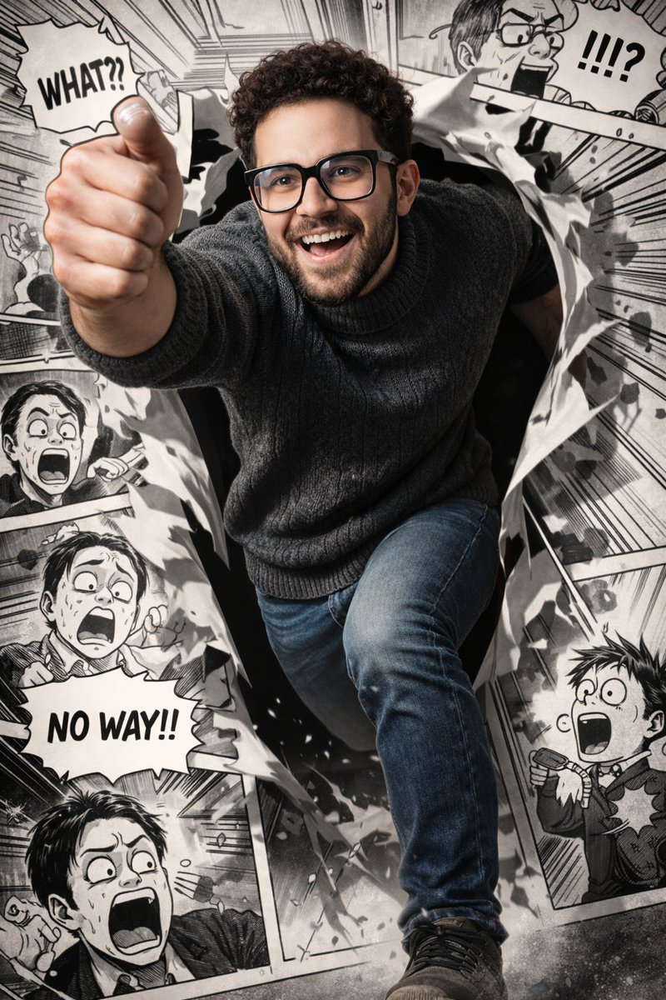

```
{
  "prompt": "超写实，一位留着深色短卷发、修剪整齐的胡须和黑色方形眼镜的年轻男子的鲜艳逼真渲染，身穿深色纹理高领毛衣和牛仔裤。他奔跑到一半被捕捉下来，姿态充满动感，向前突破，充满戏剧性地从一个破碎的漫画分镜框中显现——一条腿和一只手臂冲入现实世界，而身体的其余部分仍留在漫画框内。他的表情充满活力和喜悦，拥有锐利的面部细节，自然的皮肤纹理，以及具有高对比度和深度的戏剧性电影灯光。\n\n背景：一个非常详细的黑白漫画布局，充满了幽默、夸张的且与他直接互动的反应场景。周围的漫画人物表现出震惊和喜剧的表情，配有粗体的对话气泡和速度线。漫画分镜采用经典的高对比度水墨风格绘制，线条清晰，网点阴影。撕裂的纸张边缘和碎片增强了他冲破漫画世界的幻觉。全彩色的写实人物与单色的漫画环境形成强烈对比，创造出写实与漫画艺术之间的动态混合体。超精细，8k分辨率，清晰聚焦，戏剧性的阴影，电影级景深。"
}
```

```
{
  "prompt": "Ultra-realistic, vibrant photorealistic rendering of a young man with short curly dark hair, neatly trimmed beard, and black rectangular glasses, wearing a dark textured turtleneck sweater and jeans. He is captured mid-run in a dynamic, forward-breaking pose, dramatically emerging from a torn manga panel — one leg and one arm bursting into the real world while the rest of his body remains inside the comic frame. His expression is energetic and joyful, with sharp facial details, natural skin texture, and dramatic cinematic lighting with high contrast and depth. \n\nBackground: a highly detailed black-and-white manga layout filled with humorous, exaggerated reaction scenes that directly interact with him. The surrounding manga characters display shocked and comedic expressions, with bold speech bubbles and motion lines. The manga panels are illustrated in a classic high-contrast ink style with crisp linework and halftone shading. Torn paper edges and debris enhance the illusion of him breaking through the comic world. The fully colored, photorealistic figure contrasts strongly against the monochrome manga environment, creating a dynamic hybrid between reality and comic art. Ultra-detailed, 8k resolution, sharp focus, dramatic shadows, cinematic depth of field."
}
```

 [↑返回目录](#toc)

---
## <a id="prompt-2026002315">棘龙巨口中的酷飒少女与史前奇观</a> (<a href="https://x.com/MrDasOnX/status/2028087254757867560" target="_blank" rel="noopener noreferrer">@MrDasOnX</a>)


```
超写实电影级奇幻场景，设定在郁郁葱葱的史前丛林山谷中。一只巨大的棘龙站在浅河边，它那长而类似鳄鱼的巨颚张得很大。一位年轻女子平静地坐在恐龙张开的嘴里，完美居中，双腿微微向前悬挂。她有一头深色直发，表情镇定无畏，皮肤纹理逼真。她身穿合身的黑色长袖短款上衣，蓝色牛仔短裤和黑色及膝战术靴。衣服和腿上可见微小的血迹和轻微划痕，增加了戏剧性的紧张感但并不血腥。她怀里温柔地抱着一只小恐龙幼崽，充满保护欲地抱着它。

在他们身后，一道高耸而充满戏剧性的瀑布顺着覆盖着茂密绿色植被和薄雾的陡峭丛林悬崖倾泻而下。场景中栖息着多只恐龙：几只迅猛龙在河岸边潜行，小型食草动物在背景中奔跑，飞翔的翼龙在头顶盘旋。环境丰富，有长满苔藓的岩石、流动的河水、热带植物和柔和的大气雾。

灯光具有电影感和自然感，漫射的日光照亮场景，阴影细节丰富，焦点清晰地聚在女子和棘龙身上，背景元素采用浅景深。恐龙鳞片、牙齿、水珠、树叶和织物上的超写实纹理。史诗奇幻写实主义，戏剧性构图，垂直构图，超精细，照片级真实感，4K，电影级调色，无文字，无水印。
```

```
Ultra-realistic cinematic fantasy scene set in a lush prehistoric jungle valley. A colossal Spinosaurus stands beside a shallow river, its long crocodile-like jaws stretched wide open. Seated calmly inside the dinosaur’s open mouth is a young woman, perfectly centered, legs hanging slightly forward. She has straight dark hair, a composed fearless expression, and realistic skin texture. She is wearing a fitted black long-sleeve crop top, blue denim shorts, and black knee-high combat boots. Small blood smears and light scratches are visible on her clothes and legs, adding dramatic tension without gore. She gently cradles a small baby dinosaur in her arms, holding it protectively.

Behind them, a tall dramatic waterfall cascades down steep jungle cliffs covered in dense green foliage and mist. Multiple dinosaurs populate the scene: several Velociraptors stalking the riverbank, small herbivores running through the background, and flying pterosaurs circling overhead. The environment is rich with mossy rocks, flowing water, tropical plants, and soft atmospheric fog.

Lighting is cinematic and natural, with diffused daylight illuminating the scene, detailed shadows, sharp focus on the woman and the Spinosaurus, and shallow depth of field for background elements. Hyper-real textures on dinosaur scales, teeth, water droplets, foliage, and fabric. Epic fantasy realism, dramatic composition, vertical framing, ultra-detailed, photorealistic, 4K, cinematic color grading, no text, no watermark.
```

 [↑返回目录](#toc)

---
## <a id="prompt-2026002314">红蓝光影下的未来都市双重曝光青年</a> (<a href="https://x.com/Fujimoto_hina/status/2028045894088630679" target="_blank" rel="noopener noreferrer">@Fujimoto_hina</a>)


```
{
  "prompt": "一位年轻男子的超写实电影级双重曝光侧脸肖像，表情专注强烈，皮肤纹理细节丰富，眼神锐利。他的面部与从剪影中浮现的未来主义城市天际线无缝融合，摩天大楼和城市建筑构成了他的颈部和下颌线。深蓝色和鲜艳红色的强烈对比，象征着冲突与力量。抽象的数字划痕、碎裂的玻璃纹理和漏光效果覆盖在面部，营造出戏剧性的效果。干净的白色背景，超精细的灯光，专业电影海报风格，高对比度，清晰聚焦，8K分辨率，逼真的发丝，社论海报构图，现代平面设计美学，戏剧性的氛围，超高清，照片级真实。",
  "negative_prompt": "模糊，低分辨率，扭曲的面部，多余的肢体，过饱和的颜色，嘈杂的背景，平淡的灯光，卡通化，低细节",
  "resolution": "8K",
  "style": "电影感，双重曝光，照片级真实感，社论海报",
  "background": "干净的白色",
  "lighting": "高对比度，戏剧性的蓝红分割布光"
}
```

```
{
  "prompt": "A hyper-realistic cinematic double exposure portrait of a young man in side profile, intense focused expression, detailed skin texture and sharp eyes. His face seamlessly blended with a futuristic city skyline emerging from his silhouette, skyscrapers and urban buildings forming his neck and jawline. Strong contrast of deep blue and vibrant red tones symbolizing conflict and power. Abstract digital scratches, fractured glass textures, and light leaks overlaying the face for a dramatic effect. Clean white background, ultra-detailed lighting, professional movie poster style, high contrast, sharp focus, 8K resolution, realistic hair strands, editorial poster composition, modern graphic design aesthetics, dramatic mood, ultra-HD, photorealistic.",
  "negative_prompt": "blurry, low resolution, distorted face, extra limbs, oversaturated colors, noisy background, flat lighting, cartoonish, low detail",
  "resolution": "8K",
  "style": "cinematic, double exposure, photorealistic, editorial poster",
  "background": "clean white",
  "lighting": "high contrast, dramatic blue and red split lighting"
}
```

 [↑返回目录](#toc)

---
## <a id="prompt-2026002313">电商商品展示设计</a> (<a href="https://x.com/Fujimoto_hina/status/2027903683154088431" target="_blank" rel="noopener noreferrer">@Fujimoto_hina</a>)


```
{
  "style": "超写实奢华化妆品产品摄影",
  "composition": {
    "color_scheme": "戏剧性的单色蓝紫色",
    "resolution": "8K超高分辨率",
    "depth": "电影级景深",
    "aesthetic": "高端香氛护肤品广告风格"
  },
  "product": {
    "type": "软管包装",
    "finish": "缎面质感",
    "color": "长春花蓝",
    "label": "NUBELLA",
    "typography": "优雅的银色字体",
    "cap": "反光金属铬盖",
    "position": "垂直居中"
  },
  "surroundings": {
    "smoke": {
      "type": "墨水般的旋涡云雾",
      "colors": [
        "薰衣草色",
        "靛蓝色",
        "冰蓝色"
      ],
      "texture": "柔软、翻腾",
      "interaction": "环绕在产品周围"
    },
    "flowers": {
      "primary": [
        {
          "color": "紫色",
          "details": "错综复杂的花瓣细节",
          "center": "鲜艳的黄色"
        },
        {
          "color": "紫丁香色",
          "details": "错综复杂的花瓣细节",
          "center": "鲜艳的黄色"
        }
      ],
      "secondary": {
        "type": "细小的紫罗兰色花朵",
        "purpose": "增加立体感"
      }
    }
  },
  "lighting": {
    "direction": "来自左上方的柔和定向照明",
    "effects": [
      "突显软管的光滑曲度",
      "为金属盖增添微妙的光泽",
      "在烟雾中营造深度"
    ]
  },
  "background": {
    "blend": "无缝的冷色调蓝色和紫色调",
    "enhancement": "空灵的花香美学"
  },
  "details": "花瓣和蒸汽的超精细纹理"
}
```

```
{
  "style": "Ultra-realistic luxury cosmetic product photography",
  "composition": {
    "color_scheme": "Dramatic monochromatic blue-violet",
    "resolution": "8K ultra-high resolution",
    "depth": "Cinematic depth",
    "aesthetic": "High-end perfumed skincare advertising style"
  },
  "product": {
    "type": "Squeeze tube",
    "finish": "Satin-finish",
    "color": "Periwinkle-blue",
    "label": "NUBELLA",
    "typography": "Elegant silver",
    "cap": "Reflective metallic chrome",
    "position": "Vertically centered"
  },
  "surroundings": {
    "smoke": {
      "type": "Ink-like swirling clouds",
      "colors": [
        "Lavender",
        "Indigo",
        "Icy blue"
      ],
      "texture": "Soft, billowing",
      "interaction": "Wrapping around the product"
    },
    "flowers": {
      "primary": [
        {
          "color": "Purple",
          "details": "Intricate petal details",
          "center": "Vibrant yellow"
        },
        {
          "color": "Lilac",
          "details": "Intricate petal details",
          "center": "Vibrant yellow"
        }
      ],
      "secondary": {
        "type": "Tiny violet blossoms",
        "purpose": "Added dimension"
      }
    }
  },
  "lighting": {
    "direction": "Soft directional lighting from upper left",
    "effects": [
      "Highlights smooth curvature of the tube",
      "Adds subtle sheen to metallic cap",
      "Creates depth within smoke plumes"
    ]
  },
  "background": {
    "blend": "Seamless cool blue and purple tones",
    "enhancement": "Ethereal floral fragrance aesthetic"
  },
  "details": "Hyper-detailed textures of petals and vapor"
}
```

 [↑返回目录](#toc)

---
## <a id="prompt-2026002312">鲜艳霓虹光影下的动感苏打水飞溅商业海报</a> (<a href="https://x.com/Fujimoto_hina/status/2028388808320819277" target="_blank" rel="noopener noreferrer">@Fujimoto_hina</a>)

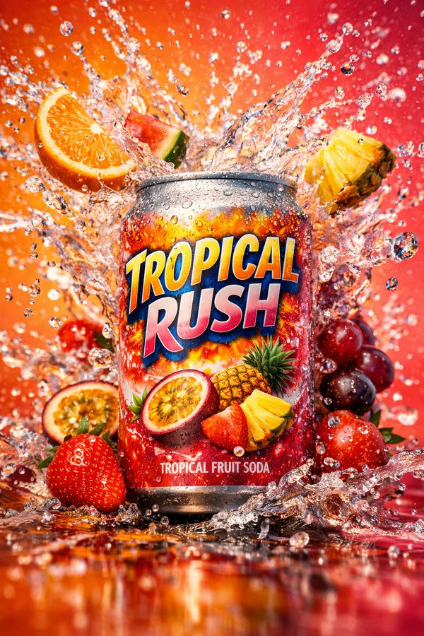

```
{
  "prompt": "一个充满活力的高端广告构图中的三个超动态苏打水罐 —— 一罐热带冲刺苏打水伴随着戏剧性的水和热带水果飞溅而爆炸，鲜艳的橙色和粉色背景光；一罐柠檬冰爽苏打水在发光的绿色动态光背景下被冷水泼溅；两罐都覆盖着逼真的冷凝水和运动模糊的水滴，充满果味和清爽的能量。深橙色、粉色和霓虹绿灯光在大胆的演播室布置中融合。由使用佳能 50mm 镜头的专业摄影师拍摄，超写实纹理，清晰的细节，超高分辨率，明亮的商业海报美学，丰富的色彩鲜艳度，电影级飞溅效果 --ar 3:4"
}
```

```
{
  "prompt": "Three ultra-dynamic soda cans in one vibrant high-end advertising composition — a can of TROPICAL RUSH exploding with dramatic water and tropical fruit splash, vibrant orange and pink background lighting; a can of LEMON ICED splashed with cold water against a glowing green dynamic light background; both cans covered in realistic condensation and motion-blurred droplets, bursting with fruity, refreshing energy. Deep orange, pink, and neon green lighting blend together in a bold studio setup. Captured by a professional photographer using a Canon 50mm lens, hyper-realistic textures, crisp details, ultra high resolution, bright commercial poster aesthetic, rich color vibrancy, cinematic splash effects --ar 3:4"
}
```

 [↑返回目录](#toc)

---
## <a id="prompt-2026002311">晨曦薰衣草田梦幻少女三联画</a> (<a href="https://x.com/Naiknelofar788/status/2028417667846341062" target="_blank" rel="noopener noreferrer">@Naiknelofar788</a>)


```
日出时分薰衣草田中女子的水平三联画。
上部：半身像，闭着眼睛，淡紫色连衣裙，一只手放在头发里，模糊的薰衣草前景。
中部：特写镜头，看着镜头，蓬乱的头发，薄纱围巾，脸上的阳光。
下部：四分之三镜头，手持薰衣草花束，飘逸的裙子，柔和的粉彩天空，温暖的梦幻色调。
```

```
Horizontal triptych of a woman in a lavender field at sunrise.
Top: Waist-up, eyes closed, pale lilac dress, one hand in hair, blurred lavender foreground.
Middle: Close-up, looking at camera, tousled hair, sheer scarf, sunlight on face.
Bottom: Three-quarter shot, holding lavender bouquet, flowing skirt, soft pastel sky, warm dreamy tones.
```

 [↑返回目录](#toc)

---
## <a id="prompt-2026002310">零食品牌技术分解图</a> (<a href="https://x.com/TechieBySA/status/2031795709243019280" target="_blank" rel="noopener noreferrer">@TechieBySA</a>)


```
创建一个 [SNACK] 的品牌技术信息图，结合产品的真实照片或照片级真实渲染，并将技术注释覆盖层直接置于其上。在纯白摄影棚背景上使用带有策略性 [BRAND COLOR] 点缀的黑色墨水风格线条画（建筑草图外观），包括：
• 关键组件标签
• 显示结构、分层或内部设计的内部截面图
• 测量数据、尺寸和规格
• 带有成分和数量的材料标注
• 指示主要功能和结构完整性的箭头
• 显示关键机械或设计元素的简单示意图或剖面图
• 可持续性标注
标题位置：位于手绘技术注释框内，带有强调色边框，粗体字显示产品名称，置于上角。
风格与布局规则：
• 真实产品保持清晰可见
• 注释具有素描感、技术感和建筑感
• 强调色用于高光（占线条工作的 20-30%），黑色用于主要技术线条（70-80%）
• 构图整洁，负空间平衡
• 具有教育意义、食品工程氛围和高端品牌感
• 在角落包含微妙的品牌标志
视觉风格：极简技术插画美学，黑色线条在真实图像上带有点缀，精确但略带手绘感。
调色板：白色背景，黑色注释线/文本，[BRAND COLOR] 仅用于点缀和关键标注。
输出：1080×1080，超清晰，社交媒体动态优化，无水印。
```

```
Create a branded technical infographic of a [SNACK], combining a realistic photograph or photoreal render of the product with technical annotation overlays placed directly on top. Use black ink–style line drawings with strategic [BRAND COLOR] accents (architectural sketch look) on a pure white studio background, including:
• Key component labels
• Internal cross-section showing structure, layering, or internal design
• Measurements, dimensions, and specifications
• Material callouts with composition and quantities
• Arrows indicating function for primary features and structural integrity
• Simple schematic or sectional diagram showing key mechanical or design elements
• Sustainability callouts
Title placement: Inside a hand-drawn technical annotation box with accent border reading the product name in bold font, positioned in upper corner.
Style & layout rules:
• The realistic product remains clearly visible
• Annotations feel sketched, technical, and architectural
• Accents used for highlight (20-30% of linework), black for primary technical lines (70-80%)
• Clean composition with balanced negative space
• Educational, food-engineering vibe with premium branding
• Include subtle brand logo mark in corner
Visual style: Minimal technical illustration aesthetic, black linework with accents over realistic imagery, precise but slightly hand-drawn feel.
Color palette: White background, black annotation lines/text, [BRAND COLOR] for accents and key callouts only.
Output: 1080×1080, ultra-crisp, social-feed optimized, no watermark.​​​​​​​​​​​​​​​​
```

 [↑返回目录](#toc)

---
## <a id="prompt-2026002309">创意树叶拼贴构成的角色画像</a> (<a href="https://x.com/meng_dagg695/status/2032019839070716170" target="_blank" rel="noopener noreferrer">@meng_dagg695</a>)


```
{ 角色名称 } 完全由天然树叶制成，创意树叶拼贴艺术，分层绿叶和干叶构成身体、面部和衣服，可见叶脉和纹理，手工植物艺术风格，干净的白色背景，俯视平铺构图，高度细节，柔和自然光，逼真树叶纹理，8k
```

```
{
  CHARACTER NAME
} made entirely from natural leaves,
creative leaf collage art,
layered green and dry leaves forming body,
face and clothes,
visible leaf veins and textures,
handcrafted botanical art style,
clean white background,
top-down flat lay composition,
highly detailed,
soft natural lighting,
realistic leaf textures,
8k
```

 [↑返回目录](#toc)

---
## <a id="prompt-2026002308">抖音直播截图画面</a> (<a href="https://x.com/_FORAB/status/2044744023261519920" target="_blank" rel="noopener noreferrer">@_FORAB</a>)


```
9:16 的图片比例，生成一张抖音直播的截图，里面是 xxx 在直播，xxx 手里拿着牌子，牌子里写着 xxxx。
```

```
9:16 aspect ratio, generate a screenshot of a Douyin live stream, inside is xxx live streaming, xxx is holding a sign in their hand, the sign says xxxx.
```

 [↑返回目录](#toc)

---


[上一页](./3.md) | 当前 4/7 页 | [下一页](./5.md) | [查看全部目录](../prompts.md)