# chatgpt.json 

chatgpt.json文件存放chatgpt相关的提示词，当前已收录：338个 

 投稿方式：[飞书投稿](https://tcn1uh5rxo87.feishu.cn/share/base/form/shrcne5gDolOMDd0oJsj2XfvxQc) or [issues](https://github.com/junxiaopang/gridsplitter/issues/new)

[上一页](./3.md) | 当前 4/4 页 | [查看全部目录](../prompts.md)

🚀 **在线预览**: [https://prompts.kkkm.cn](https://prompts.kkkm.cn)

## <a id="toc">目录</a>

- [英语单词闪卡制作](#prompt-291)
- [沙滩胶囊城市](#prompt-239)
- [品牌快餐胶囊](#prompt-229)
- [迪士尼鸡尾酒](#prompt-143)
- [透明容器里有一个微型的3D世界](#prompt-68)
- [重新构想的玫瑰金](#prompt-70)
- [时尚的胶囊海报](#prompt-225)
- [微型透明胶囊](#prompt-169)
- [液态金属设计产品](#prompt-167)
- [霓虹灯发光的可爱动物](#prompt-51)
- [可爱粉彩乙烯基人物](#prompt-180)
- [制药风格商品](#prompt-94)
- [标志液化](#prompt-108)
- [草图中的现实与愿景](#prompt-2002826415939682600)
- [蓝调时刻的光圈之美](#prompt-1991730551531925500)
- [解剖爆炸图](#prompt-2001181398774726700)
- [节日微缩精品店](#prompt-2000924143768994000)
- [手写批注涂鸦风吐槽图](#prompt-1998024889530216700)
- [手拿红苹果的摄影棚肖像写真](#prompt-2005272524872187960)
- [环城公路记者巴里·韦斯](#prompt-2005291718263099431)
- [门后凝视：新黑色肖像](#prompt-2004371587412427000)
- [风格化卡通与超写实电影级人像的分半肖像](#prompt-2008635378434031600)
- [超高清风味大爆炸：动态美食瞬间捕捉](#prompt-2009157208240755200)
- [超美味蛋糕](#prompt-2009446363331973400)
- [超写实电影感自拍：城市巨人视界](#prompt-2009834337043394600)
- [紧凑特写的高端商业产品摄影](#prompt-2010210489813680000)
- [多彩风格的3D卡通女性](#prompt-2012437899955097900)
- [薄荷巧克力的奇幻漂流](#prompt-2015622019845702000)

## <a id="prompt-291">英语单词闪卡制作</a> (<a href="https://x.com/JinsFavorites/status/1905097569837232327" target="_blank" rel="noopener noreferrer">@JinsFavorites</a>)


```
你是一个英语单词闪卡制作大师, 你可以根据我输入的主题词,生成一个图片并以此拓展,比如我输入电脑,你生成一张和电脑相关的图片,并用箭头分步介绍键盘\鼠标\显示器等中文和英文
```

 [↑返回目录](#toc)

---
## <a id="prompt-239">沙滩胶囊城市</a> (<a href="https://x.com/TechieBySA/status/1944386743865622718" target="_blank" rel="noopener noreferrer">@TechieBySA</a>)


```
A vibrant, hyper-realistic miniature of [CITY] inside a transparent capsule lying on a sandy beach. The capsule is half [COLOR] (matching [COUNTRY]’s flag) with [CITY] written in white text on the colored section. Inside the capsule: iconic landmarks of [CITY], beautiful water canals or streets, small detailed boats or cars, sunny bright lighting, cinematic depth of field, dreamy atmosphere, ocean waves in the background.
```

```
一个充满活力的、超写实的[CITY]微缩模型，放置在一个透明胶囊内，躺在沙滩上。胶囊一半是[COLOR]色（与[COUNTRY]的国旗相匹配），彩色部分上用白色文字写着[CITY]。胶囊内部：[CITY]的标志性地标、美丽的运河或街道、小巧精致的船只或汽车、阳光明媚的光线、电影般的景深、梦幻般的氛围、背景中的海浪。
```

 [↑返回目录](#toc)

---
## <a id="prompt-229">品牌快餐胶囊</a> (<a href="https://x.com/TechieBySA/status/1944462797666123872" target="_blank" rel="noopener noreferrer">@TechieBySA</a>)


```
Create a hyper-realistic, stylish poster [1080x1080] aspect ratio featuring a horizontal tablet-capsule hovering above a surface covered in condensation and water droplets, with its shadow cast on the wet ground. One side of the capsule is transparent glass, while the other is glossy [BRAND COLORS] plastic, displaying the [BRAND] logo and name. Seamlessly floating inside the glass portion of the capsule is a photorealistic 3D model of the [BRAND LOGO OR ICON], perfectly centered and suspended in zero gravity. The glass and plastic surfaces showcase strong reflections, refractions, and environmental distortions. The background is a softly blurred, elegant light-toned setting. Use a dynamic perspective with a stylish camera angle, professional studio lighting, and ultra-high detail to make the image look like a DSLR-captured photograph with impeccable realism.
```

```
创建一个超逼真、时尚的海报[1080x1080]宽高比，展示一个水平平板胶囊悬浮在布满水汽和液滴的表面上，其影子投射在湿润的地面上。胶囊一侧是透明玻璃，另一侧是光泽[品牌颜色]塑料，显示[品牌]标志和名称。玻璃部分无缝漂浮着一张逼真的 3D 模型[品牌标志或图标]，完美居中并悬浮在零重力中。玻璃和塑料表面展现出强烈的反射、折射和环境扭曲。背景是柔和模糊、优雅浅色调的设置。使用动态视角和时尚的相机角度，结合专业工作室灯光和超高清细节，使图像看起来像是一张由单反相机拍摄的真实照片，具有无懈可击的真实感。
```

 [↑返回目录](#toc)

---
## <a id="prompt-143">迪士尼鸡尾酒</a> (<a href="https://x.com/TheRelianceAI/status/1936726936409313294" target="_blank" rel="noopener noreferrer">@TheRelianceAI</a>)


```
A realistic, high-end cocktail in a frosted glass with a sparkling salt rim, filled with crystal-clear ice cubes. The drink is garnished with deep-blue kale leaves and delicate pastel-pink edible flowers. The lighting is moody and cinematic, with soft highlights on the glass. The entire visual style — color palette, lighting, background, and atmosphere — is inspired by the animated film 【MOVIE_TITLE】 by Disney, subtly reflecting its visual tone and mood. At the bottom of the image, in elegant golden serif text, it says: “Disney — 【MOVIE_TITLE】”. Vertical 9:16, ultra-detailed, photographic realism with artistic direction based on the film’s world.
```

```
一款逼真的高端鸡尾酒，装在磨砂玻璃杯中，带有波光粼粼的盐边，里面装满了晶莹剔透的冰块。这款饮料以深蓝色的羽衣甘蓝叶和精致的淡粉色食用花朵装饰。灯光是喜怒无常的和电影般的，玻璃上有柔和的亮点。整个视觉风格——调色板、灯光、背景和氛围——都受到了迪士尼动画电影【MOVIE_TITLE】的启发，巧妙地反映了它的视觉基调和情绪。在图片的底部，用优雅的金色衬线文字写着：“Disney — 【MOVIE_TITLE】”。垂直 9：16，超详细，摄影现实主义，艺术指导基于电影世界。
```

 [↑返回目录](#toc)

---
## <a id="prompt-68">透明容器里有一个微型的3D世界</a> (<a href="https://x.com/KoppulaMahende9/status/1920442464810270851" target="_blank" rel="noopener noreferrer">@KoppulaMahende9</a>)


```
A giant [transparent or glossy] [object/container] with a miniature 3D diorama inside it, depicting [a symbolic or narrative scene], studio-lit with soft shadows, placed on a neutral matte surface. Emphasize visual contrast between the scale of the capsule and the detail within. Highlight texture, light refraction, and emotional tone (e.g., surreal, poetic, or sci-fi).
```

 [↑返回目录](#toc)

---
## <a id="prompt-70">重新构想的玫瑰金</a> (<a href="https://x.com/aziz4ai/status/1925933649267970074" target="_blank" rel="noopener noreferrer">@aziz4ai</a>)


```
Design a luxury-themed 1:1 image featuring a rose gold sculpture that embodies the essence of the jewelry brand “[BRAND NAME]”. The object must symbolically reflect the brand’s identity (e.g., falcon for Cartier, ring for Tiffany & Co., palm tree for Swarovski, camel for Prada). Embed premium crystal textures into key parts of the sculpture (e.g., wings, gem, leaves, or hump) to match the brand’s signature elegance. Use the brand’s iconic background color (e.g., Tiffany Blue, Swarovski White, Cartier Beige, Prada Sand) and place the official logo beneath the sculpture. Add a bold two-word slogan that aligns with the brand’s tone. Lighting should be pure white with high Kelvin value to ensure clarity and prevent yellow tint. The result must feel editorial, artistic, and visually exquisite.
```

 [↑返回目录](#toc)

---
## <a id="prompt-225">时尚的胶囊海报</a> (<a href="https://x.com/TechieBySA/status/1944435018203296063" target="_blank" rel="noopener noreferrer">@TechieBySA</a>)


```
Create a hyper-realistic, stylish poster [1080x1080] aspect ratio featuring a horizontal tablet-capsule hovering above a surface covered in condensation and water droplets, with its shadow cast on the wet ground. One side of the capsule is transparent glass, while the other is glossy [COLOR/DESIGN] plastic, displaying the [BRAND] logo and name. Seamlessly floating inside the glass portion of the capsule is a photorealistic 3D model of the [LOGO], perfectly centered and suspended in zero gravity. The glass and plastic surfaces showcase strong reflections, refractions, and environmental distortions. The background is a softly blurred, elegant light-toned setting. Use a dynamic perspective with a stylish camera angle, professional studio lighting, and ultra-high detail to make the image look like a DSLR-captured photograph with impeccable realism.
```

```
创作一张超逼真、时尚的海报[1080x1080]宽高比，展示一个水平放置的平板胶囊悬浮在布满水汽和水滴的表面上，其影子投射在湿润的地面上。胶囊的一面是透明玻璃，另一面是光泽塑料[颜色/设计]，显示[品牌]标志和名称。在胶囊的玻璃部分中，一个逼真的 3D 模型[标志]无缝漂浮，完美居中并悬浮在零重力中。玻璃和塑料表面展现出强烈的反射、折射和环境扭曲。背景是一个柔和模糊、优雅浅色调的设置。使用动态视角和时尚的相机角度，结合专业工作室灯光和超高清细节，使图像看起来像是一张由单反相机拍摄的真实照片，具有无懈可击的真实感。
```

 [↑返回目录](#toc)

---
## <a id="prompt-169">微型透明胶囊</a> (<a href="https://x.com/CharaspowerAI/status/1938299520019734676" target="_blank" rel="noopener noreferrer">@CharaspowerAI</a>)


```
Close-up, A hand holding a transparent capsule, inside it is a miniature model of [character name], wearing [their iconic outfit and accessories]. The character is posed in a [specific, expressive or dynamic pose], interacting with the inner surface of the capsule, as if they are frozen or confined inside. Hyper-realistic, cinematic, studio lighting setup, photographed with a macro lens.
```

```
特写，一只手拿着一个透明的胶囊，里面是一个 [角色名称] 的微型模型，穿着 [他们的标志性服装和配饰]。角色以 [特定、富有表现力或动态的姿势] 摆姿势，与胶囊的内表面互动，就好像他们被冻结或限制在里面一样。超逼真、电影般的工作室照明设置，使用微距镜头拍摄。
```

 [↑返回目录](#toc)

---
## <a id="prompt-167">液态金属设计产品</a> (<a href="https://x.com/hc_dsn/status/1938203557771260064" target="_blank" rel="noopener noreferrer">@hc_dsn</a>)


```
create image with 1:1 ratio 
retexture the photo I attached with the following json 
{   "style_name": "hermes_subtle_specular_gradient",   "background": {     "type": "solid",     "color": "#000000",     "light_reflection": "none"   },   "base_material": {     "type": "polished_metal",     "color": "#B0B0B0",     "finish": "glossy",     "reflectivity": 0.75,     "surface_variation": {       "micro_noise": 0.005,       "brushed_direction": "none"     }   },   "highlight_strategy": {     "mode": "localized_specular_enhancement",     "trigger": "light-facing curved planes and direct lit faces",     "color_gradient": ["#121A28", "#3D4C6B", "#8c71b7", "#4d21cd"],     "gradient_type": "fluid_blend",     "intensity_curve": "ease-out from highlight center",     "falloff": 0.8,     "blend_mode": "soft_light",     "saturation_level": 0.4,     "coverage_ratio": 0.2,     "transition_smoothness": 0.95   },   "lighting": {     "scene_type": "high-control studio",     "key_light": {       "intensity": 1.0,       "color": "#FFFFFF",       "angle": "35° above and side",       "softness": 0.6     },     "fill_light": {       "enabled": false     },     "rim_light": {       "enabled": false     },     "reflection_behavior": {       "mirrored_zones": "limited to high exposure zones",       "glow_color": "applied from gradient with low saturation"     }   },   "specular_color_behavior": {     "base_surface": "metallic neutral",     "highlight_zones": "low-saturation chromatic reflection",     "edge_bleed": "minimal",     "inner_glow": 0.1   },   "detail_features": {     "engraved_elements": {       "type": "precise deboss",       "lighting_response": "low bounce",       "shadow_edge": "#222222",       "rim_light_tint": "#888888"     }   },   "application_targets": [     "object product photography",     "3D icons with selective lighting",     "branding renders",     "luxury UI component styling"   ],   "visual_effect_notes": {     "mood": "understated luxury, technical precision, controlled emotion",     "realism": "stylized physical logic",     "focus": "refined colored specular only on light-facing curved surfaces with fluid-like gradient transitions"   } }
```

```
以 1：1 的比例创建图像
我用以下 json 对我附加的照片进行 retexture
{ “style_name”： “hermes_subtle_specular_gradient”， “background”： { “type”： “solid”， “color”： “#000000”， “light_reflection”： “none” }， “base_material”： { “type”： “polished_metal”， “color”： “#B0B0B0”， “finish”： “glossy”， “reflectivity”： 0.75， “surface_variation”： { “micro_noise”： 0.005， “brushed_direction”： “none” } }， “highlight_strategy”： { “mode”： “localized_specular_enhancement”， “trigger”： “朝光曲面和直接照明 faces“， ”color_gradient“： [”#121A28“， ”#3D4C6B“， ”#8c71b7“， ”#4d21cd“]， ”gradient_type“： ”fluid_blend“， ”intensity_curve“： ”从高光中心缓出“， ”衰减“： 0.8， ”blend_mode“： ”soft_light“， ”saturation_level“： 0.4， ”coverage_ratio“： 0.2， ”transition_smoothness“： 0.95 }， ”lighting“： { ”scene_type“： ”high-control studio“， ”key_light“： { ”intensity“：1.0， “color”： “#FFFFFF”， “angle”： “上侧 35°”， “柔和度”： 0.6 }， “fill_light”： { “enabled”： false }， “rim_light”： { “enabled”： false }， “reflection_behavior”： { “mirrored_zones”： “仅限于高曝光区域”， “glow_color”： “从低饱和度渐变应用” } }， “specular_color_behavior”： { “base_surface”： “金属中性”， “highlight_zones”： “低饱和度色度 reflection“， ”edge_bleed“： ”minimal“， ”inner_glow“： 0.1 }， ”detail_features“： { ”engraved_elements“： { ”type“： ”精确凹陷“， ”lighting_response“： ”低反弹“， ”shadow_edge“： ”#222222“， ”rim_light_tint“： ”#888888“ } }， ”application_targets“： [ ”对象产品 photography“， ”具有选择性照明的 3D 图标“， ”品牌渲染“， ”豪华 UI 组件样式“ ]， ”visual_effect_notes“： { ”mood“： ”低调奢华、技术精确、受控情感“， ”realism“： ”风格化的物理逻辑“， ”focus“： ”仅在具有流体般渐变过渡的面向光线的曲面上优化彩色镜面反射“ } }
```

 [↑返回目录](#toc)

---
## <a id="prompt-51">霓虹灯发光的可爱动物</a> (<a href="https://x.com/icreatelife/status/1923819449305509924" target="_blank" rel="noopener noreferrer">@icreatelife</a>)


```
bioluminescent cute [ANIMAL], kawaii, chibi, [COLOR] neon backlit, 3d cartoon, big cute bright eyes, high definition
```

 [↑返回目录](#toc)

---
## <a id="prompt-180">可爱粉彩乙烯基人物</a> (<a href="https://x.com/TheRelianceAI/status/1938688543284707403" target="_blank" rel="noopener noreferrer">@TheRelianceAI</a>)

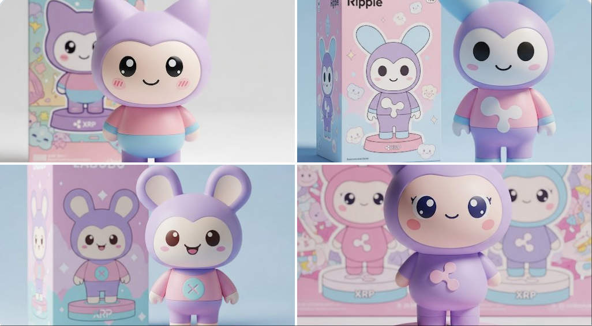

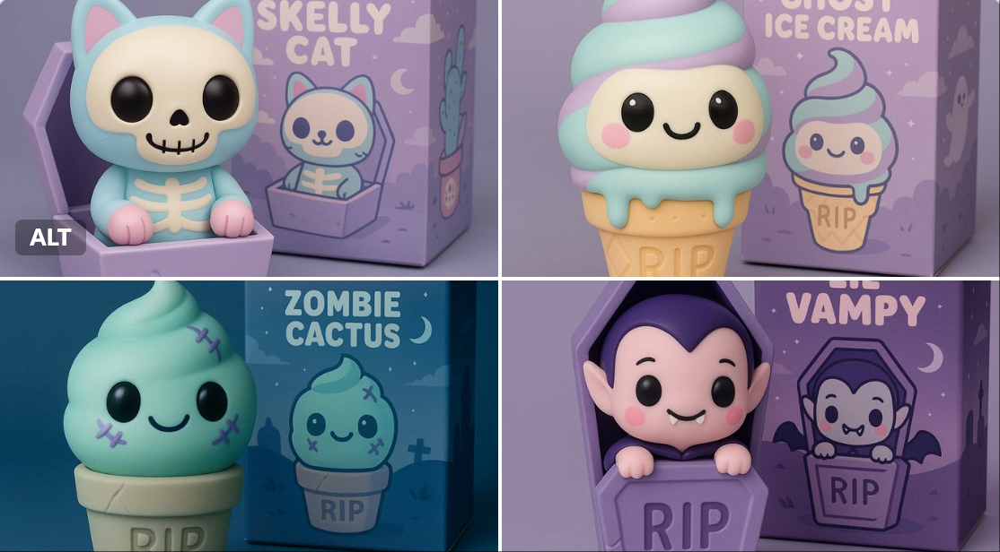


```
A cute pastel vinyl figure of [INSERT YOUR CHARACTER OR OBJECT], pastel colors (lavender, soft pink, baby blue), kawaii style with big round eyes and friendly smile, simple rounded shapes, stylized “RIP” detail somewhere on the figure or base, matching toy packaging in the background with themed art, studio product photo with soft lighting, minimal shadows
```

```
一个可爱的粉彩乙烯基人物 [插入您的角色或对象]，柔和的颜色（薰衣草色、柔和的粉红色、婴儿蓝色）、卡哇伊风格、圆圆的大眼睛和友好的微笑、简单的圆形形状、人物或底座上某处的程式化“RIP”细节、背景中的玩具包装与主题艺术相匹配、具有柔和灯光的工作室产品照片，最小的阴影
```

 [↑返回目录](#toc)

---
## <a id="prompt-94">制药风格商品</a> (<a href="https://x.com/azed_ai/status/1925197464099049735" target="_blank" rel="noopener noreferrer">@azed_ai</a>)

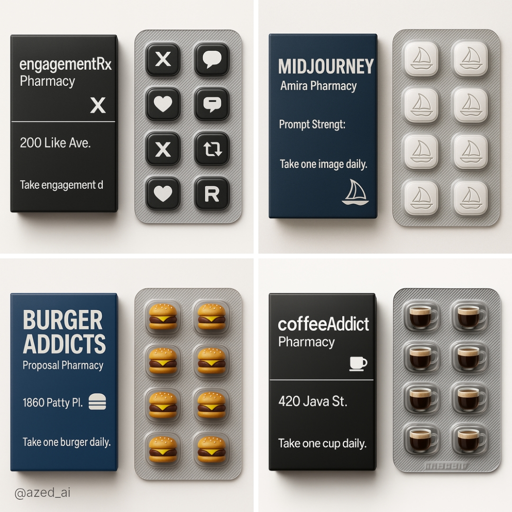

```
A square-format digital photograph showing a fictional pharmaceutical-style product from [Brand Name] Pharmacy. The box is on the left, clean and minimalist, featuring bold text with the product name "[PRODUCT NAME]" and a witty line like "Take one [type] daily." Next to the box is a silver blister pack containing 6–10 themed pills or capsules shaped like [describe icon/logo/item, e.g., a coffee cup, burger, heart, Midjourney logo, etc.]. Neutral background, soft lighting, sharp focus, modern packaging aesthetic.
```

 [↑返回目录](#toc)

---
## <a id="prompt-108">标志液化</a> (<a href="https://x.com/umesh_ai/status/1931723259734888582" target="_blank" rel="noopener noreferrer">@umesh_ai</a>)

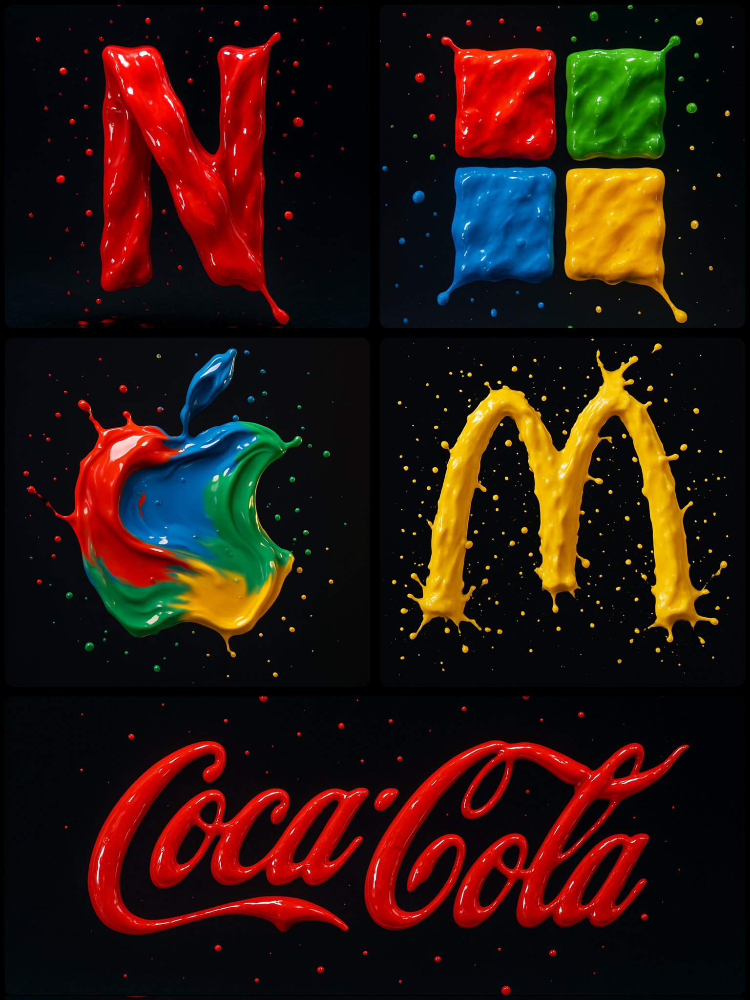

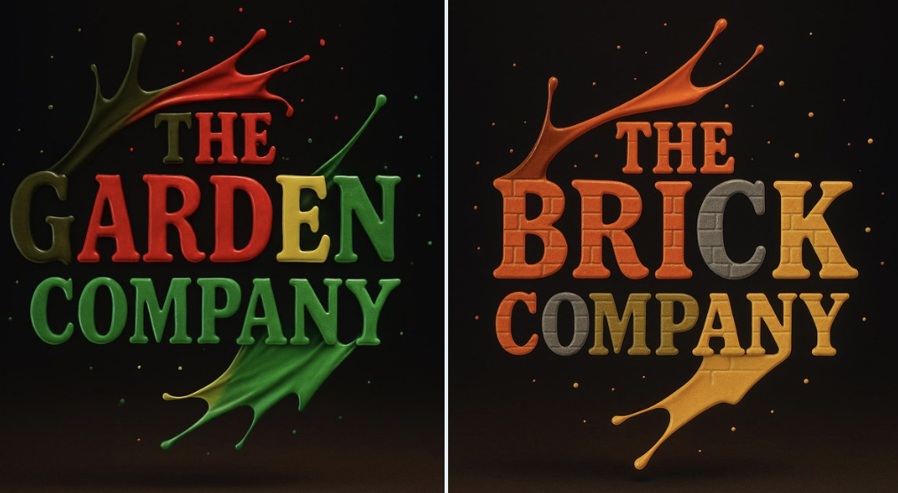

```
Create a photograph of a [BRAND] logo formed from four vibrant paint splashes: red, blue, green, and yellow, captured mid-motion. Each color flows dynamically across different parts of the logo, as if sculpted from liquid paint. Droplets are suspended in the air around it, enhancing the illusion of movement. Set against a dark background with soft, vivid lighting that accentuates the glossy texture and fluid motion

Use appropriate colors for the logos.
```

 [↑返回目录](#toc)

---
## <a id="prompt-2002826415939682600">草图中的现实与愿景</a> (<a href="https://x.com/Arminn_Ai/status/2002826415939682584" target="_blank" rel="noopener noreferrer">ΛRMIN | AI</a>)

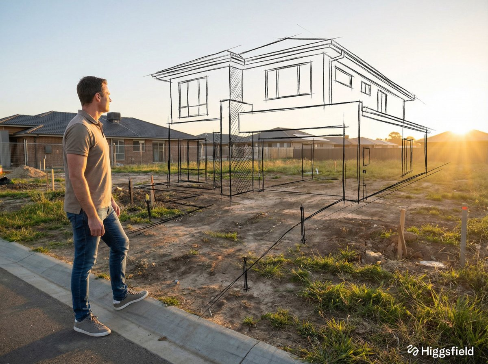

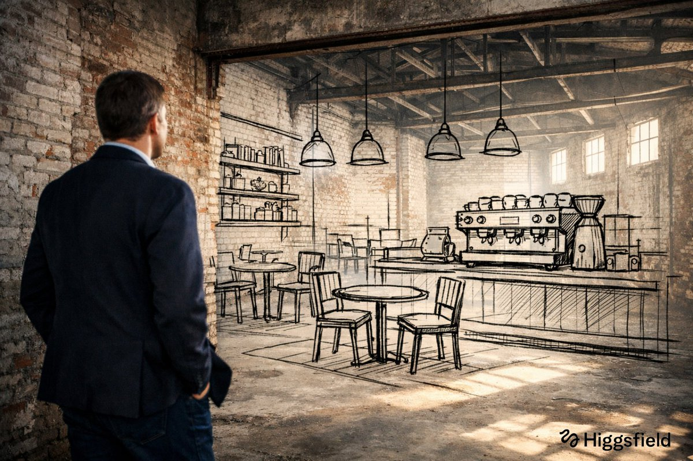

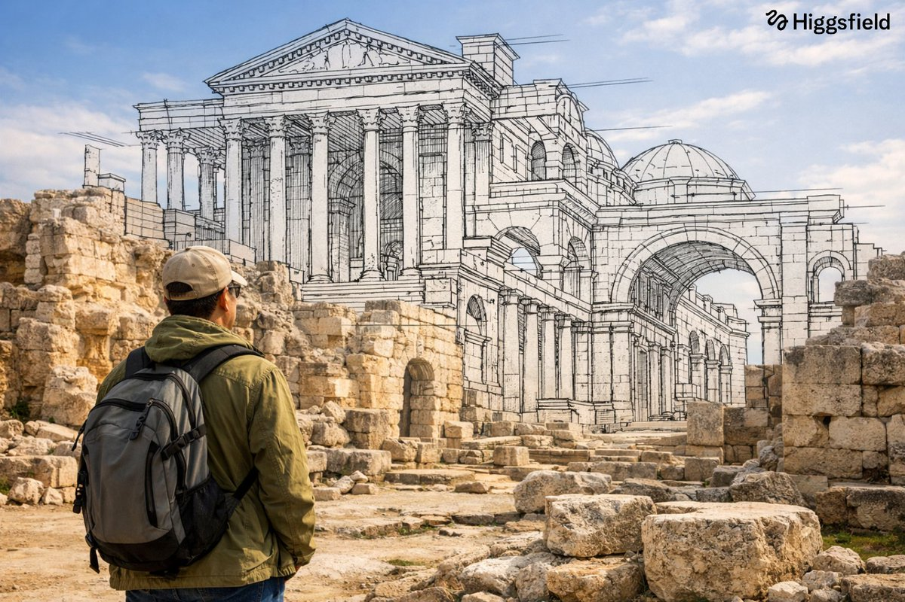

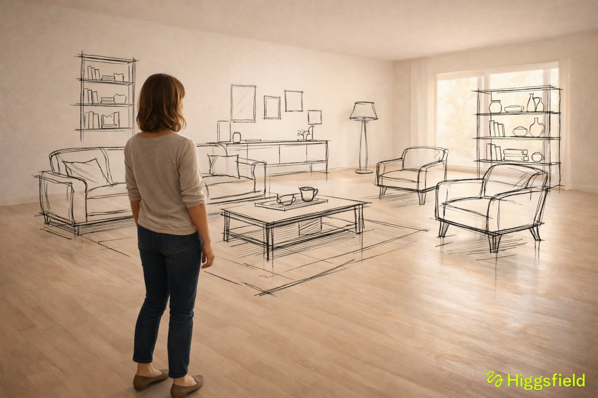

```
Bring sketches out of ideas and into reality. 

with chatGPT image 1.5 on @higgsfield_ai 

- Prompt 👇
A [person type] standing full-body near the edge of the frame, slightly to the left, in [real-world incomplete / empty / damaged environment]. The camera is positioned behind and slightly to the right of the person, capturing them from a three-quarter rear angle. The person stands calmly and thoughtfully, looking toward the space ahead.

The environment is [describe the real space as it exists now: empty, unfinished, decayed, rigid, lifeless]. The atmosphere feels [emotional tone: quiet, dry, historical, minimal, raw]. Natural light illuminates the scene, creating realistic shadows and depth. Floating hand-drawn sketch lines appear over and within the environment, aligned precisely in perspective with the real space. These sketches represent [what is missing / what once existed / what could exist in the future].

The sketch lines are black, clean, and hand-drawn, resembling [architectural / interior / restoration / urban planning] concept sketches made with pencil or ink. The strokes are expressive, slightly imperfect, and organic — not rigid or mechanical. The sketched elements occupy the foreground and midground, appearing closer to the person than expected. Some sketch lines subtly overlap the person’s silhouette and the real surfaces, visually merging imagination with reality. The sketches float naturally within the scene, seamlessly blending with the environment and conveying the idea of [vision / restoration / transformation / potential] coming to life.
```

```
将草图从构想变为现实。

使用 @higgsfield_ai 上的 chatGPT Image 1.5

- 提示词 👇  
一位[人物类型]全身站立于画面边缘附近，略微偏左，身处[现实世界中未完成／空旷／破损的环境]中。相机位于人物后方并稍偏右侧，以四分之三后侧角度捕捉人物。人物平静而沉思地站立，目光望向前方的空间。

环境呈现为[描述当前真实空间的状态：空荡、未完工、衰败、僵硬、毫无生气]。整体氛围带有[情感基调：静谧、干涩、历史感、极简、原始]。自然光照射场景，营造出逼真的阴影与景深。漂浮的手绘草图线条精准地按照现实空间的透视关系叠加在环境中，这些草图代表了[缺失之物／曾经存在之物／未来可能之物]。

草图线条为黑色、干净、手绘风格，类似用铅笔或墨水绘制的[建筑／室内／修复／城市规划]概念草图。笔触富有表现力，略带不完美与有机感——而非僵硬或机械。所绘元素占据前景与中景，比预期更靠近人物。部分草图线条微妙地与人物轮廓及真实表面重叠，使想象与现实视觉融合。这些草图自然地悬浮于场景之中，与环境无缝结合，传达出[愿景／修复／转变／潜力]正在成形的理念。
```

 [↑返回目录](#toc)

---
## <a id="prompt-1991730551531925500">蓝调时刻的光圈之美</a> (<a href="https://x.com/Jimmy_JingLv/status/1991730551531925570?s=20" target="_blank" rel="noopener noreferrer">吕立青_JimmyLv (闭关ing) 2𐃏25</a>)

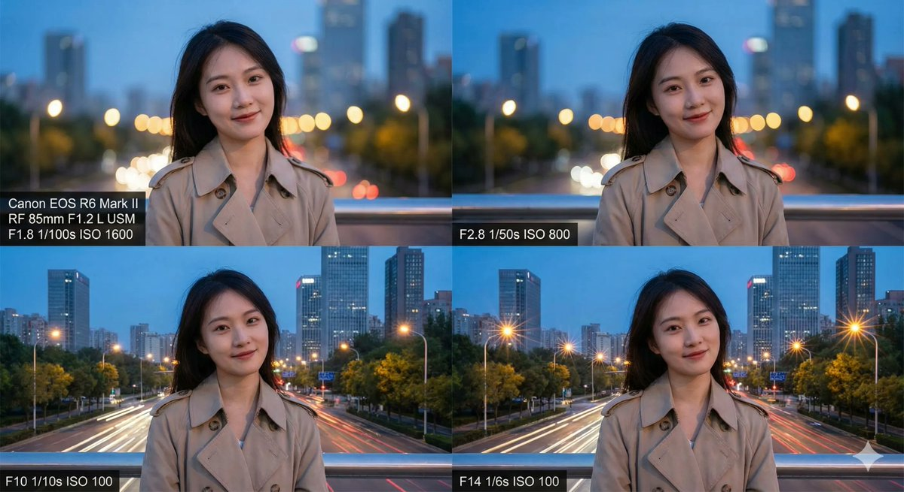

```
佳能相机，85mm 定头，生成 1.8F、2.8F、10F、 14F 光圈逐渐变化的效果，温柔大美女作为模特，背景是黄昏之后的城市蓝调时刻
```

 [↑返回目录](#toc)

---
## <a id="prompt-2001181398774726700">解剖爆炸图</a> (<a href="https://x.com/s_tiva/status/2001181398774726784" target="_blank" rel="noopener noreferrer">stiva</a>)

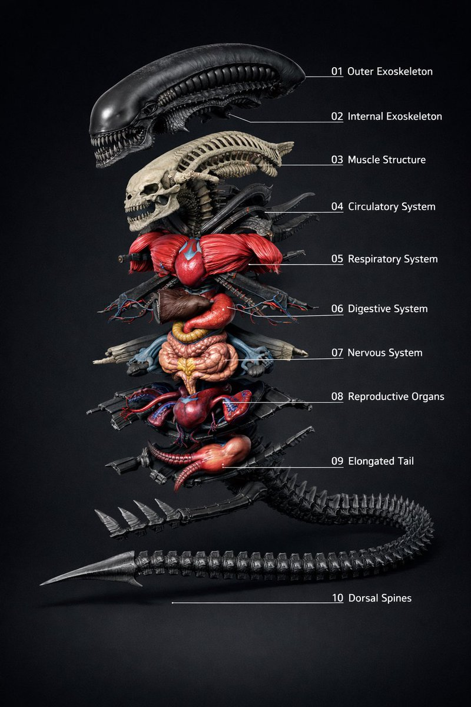

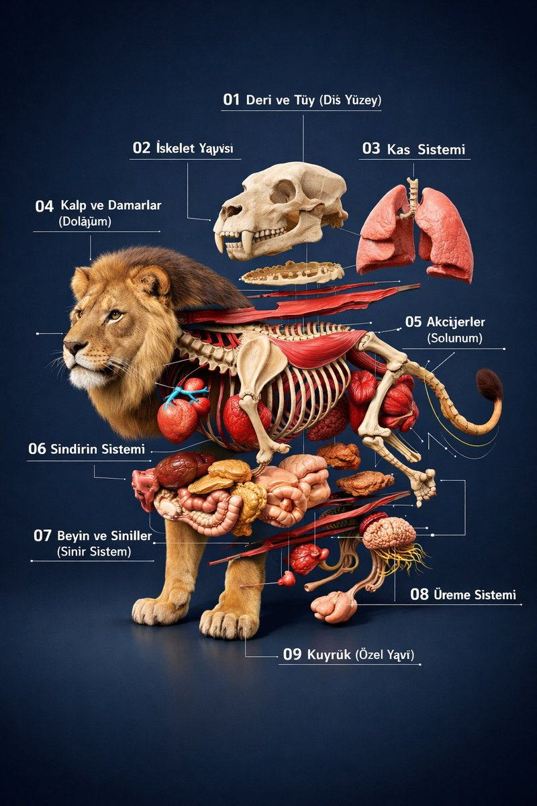

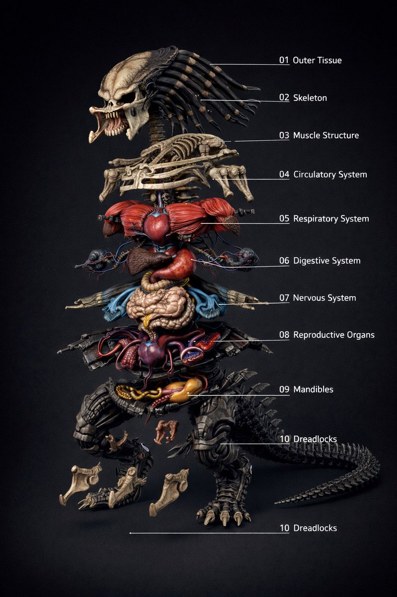

```
Exploded anatomic view

{
  "variables": {
    "ORGANISM_NAME": "<<>>"
  },
  "promptDetails": {
    "description": "Ultra-detailed anatomical exploded view (exploded-view) and layered biological infographic of {ORGANISM_NAME}, presented as an educational, clinical-clear scientific visual.

Species-accuracy rule (mandatory): Automatically infer the correct anatomy for {ORGANISM_NAME}. If it is a vertebrate, show an internal skeleton (skull, spine, ribs, limb bones as applicable). If it is an invertebrate, show the appropriate exoskeleton/segments and primary support structures. Automatically choose the correct respiratory organs for {ORGANISM_NAME} (lungs, gills, tracheal system, etc.). Depict the reproductive system in a measured, educational manner (no explicit nudity).

Camera and composition:
- 3/4 front isometric angle, scientific product/anatomy render perspective.
- Main body centered; outer body partially transparent and opened.
- Anatomical layers and major systems are separated and floating around the main body in a clean, symmetric, hierarchical exploded layout.
- Even spacing between layers; no clutter.
- Callout leader lines never cross; labels stay inside the frame and remain highly legible.

Layers and systems (outer to inner, species-appropriate):
1) Outer surface: skin or exoskeleton/outer tissue.
2) Support system: skeleton or exoskeleton/segments.
3) Muscular system: major muscle groups and tendon attachments.
4) Circulatory system: heart and major vessels (avoid messy capillary over-detail).
5) Respiratory system: species-appropriate organs.
6) Digestive system: stomach/gizzard (if applicable), intestines, liver and associated organs.
7) Nervous system: brain or ganglia structures, primary nerve pathways.
8) Reproductive system: species-appropriate core structures.
9) Signature anatomy: highlight {ORGANISM_NAME}-specific distinctive structures (wings, fins, tail, horns, pouches, antennae, etc.) as separate emphasized layers.

Labeling (mandatory):
- Thin white leader lines + numbered labels.
- Typeface: minimalist sans-serif, high legibility.
- Label format: "## Part Name (System)". Example: "03 Sternum (Skeletal)".
- Use 12–24 labels total; no duplicate numbers.

Visual style and quality:
- Photorealistic 3D medical/anatomy render + textbook infographic aesthetic.
- Clinical clarity, high contrast, razor-sharp detail, 8K.
- Clean composition, strong negative space management, educational focus.

Lighting and background:
- Soft, even studio lighting; controlled reflections.
- Background: seamless smooth dark gray or dark navy scientific studio backdrop.",
    "styleTags": [
      "Anatomical Exploded View",
      "Medical/Biological Infographic",
      "Layered Anatomy",
      "Photorealistic 3D Anatomy Render",
      "Educational Scientific Style",
      "Minimalist Labels",
      "Dark Studio Background",
      "Clinical clarity",
      "Exploded view hierarchy"
    ]
  },
  "negativePrompt": "blood, gore, horror, surgery scene, open wounds, excessive graphic content, real-person portrait, human-identity face, celebrity likeness, messy exploded layout, unnecessary extra organs/limbs, incorrect anatomy, blurry labels, unreadable text, crossed/overlapping leader lines, cartoon style, low-poly, watermark, logo, broken perspective, excessive noise, heavy motion blur",
  "generationTips": {
    "aspectRatio": "2:3",
    "detailLevel": "ultra",
    "stylization": "low-medium",
    "camera": {
      "angle": "3/4 front isometric",
      "lens": "scientific product/anatomy render perspective"
    },
    "lighting": "soft, even, medical-illustration clarity",
    "background": "seamless smooth dark gray or dark navy",
    "compositionLocks": [
      "no crossing leader lines",
      "labels legible and inside frame",
      "even spacing and clear hierarchy between layers"
    ]
  }
}
```

```
解剖爆炸视图  

{
  "variables": {
    "ORGANISM_NAME": "<<>>"
  },
  "promptDetails": {
    "description": "超精细的{ORGANISM_NAME}解剖爆炸视图（exploded-view）与分层生物信息图，呈现为具有教育意义、临床清晰度的科学视觉图像。

物种准确性规则（强制）：自动推断{ORGANism_NAME}的正确解剖结构。若为脊椎动物，需展示内骨骼（头骨、脊柱、肋骨、四肢骨骼等适用部分）；若为无脊椎动物，则展示相应的外骨骼/体节及主要支撑结构。自动选择适用于{ORGANISM_NAME}的呼吸器官（肺、鳃、气管系统等）。以适度、教育性的方式描绘生殖系统（不得出现露骨内容）。

相机与构图：
- 3/4正面等距视角，采用科学产品/解剖渲染透视。
- 主体居中；外部身体部分透明并打开。
- 解剖层次与主要系统以干净、对称、层级分明的爆炸布局环绕主体悬浮。
- 各层间距均匀，无杂乱。
- 引线绝不交叉；标签位于画面内且高度清晰可读。

层次与系统（由外至内，依物种适配）：
1) 外表层：皮肤或外骨骼/外组织。
2) 支撑系统：骨骼或外骨骼/体节。
3) 肌肉系统：主要肌群及肌腱附着点。
4) 循环系统：心脏与主要血管（避免毛细血管过度细节）。
5) 呼吸系统：符合物种特征的器官。
6) 消化系统：胃/砂囊（如适用）、肠道、肝脏及相关器官。
7) 神经系统：脑或神经节结构、主要神经通路。
8) 生殖系统：符合物种特征的核心结构。
9) 特征解剖结构：将{ORGANISM_NAME}特有的显著结构（翅膀、鳍、尾、角、育儿袋、触角等）作为独立强调层突出展示。

标注（强制）：
- 细白色引线 + 编号标签。
- 字体：极简无衬线体，高可读性。
- 标签格式：“## 部位名称（系统）”。例如：“03 胸骨（骨骼系统）”。
- 总计使用12–24个标签；编号不可重复。

视觉风格与质量：
- 逼真3D医学/解剖渲染 + 教科书式信息图美学。
- 临床清晰度、高对比度、锐利细节、8K分辨率。
- 构图简洁，负空间管理得当，聚焦教育目的。

灯光与背景：
- 柔和均匀的影棚灯光；反光受控。
- 背景：无缝平滑深灰色或深海军蓝科学影棚背景。",
    "styleTags": [
      "解剖爆炸视图",
      "医学/生物信息图",
      "分层解剖",
      "逼真3D解剖渲染",
      "教育性科学风格",
      "极简标签",
      "深色影棚背景",
      "临床清晰度",
      "爆炸视图层级结构"
    ]
  },
  "negativePrompt": "血液、血腥、恐怖、手术场景、开放性伤口、过度图形内容、真人肖像、人类面部身份、名人相貌、混乱的爆炸布局、多余器官/肢体、解剖错误、模糊标签、文字不可读、引线交叉/重叠、卡通风格、低多边形、水印、logo、透视错误、过度噪点、严重动态模糊",
  "generationTips": {
    "aspectRatio": "2:3",
    "detailLevel": "超精细",
    "stylization": "低至中等",
    "camera": {
      "angle": "3/4正面等距",
      "lens": "科学产品/解剖渲染视角"
    },
    "lighting": "柔和均匀，医学插画级清晰度",
    "background": "无缝平滑深灰色或深海军蓝",
    "compositionLocks": [
      "引线不得交叉",
      "标签清晰可读且位于画面内",
      "各层间距均匀、层级清晰"
    ]
  }
}
```

 [↑返回目录](#toc)

---
## <a id="prompt-2000924143768994000">节日微缩精品店</a> (<a href="https://x.com/berryxia/status/2000924143768994060" target="_blank" rel="noopener noreferrer">Berryxia.AI</a>)

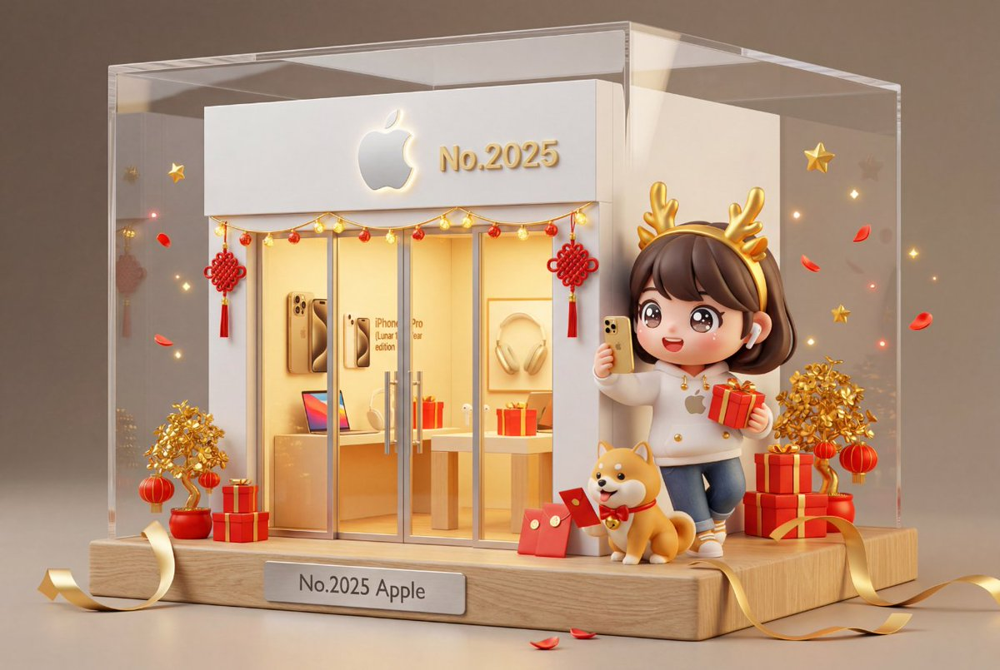

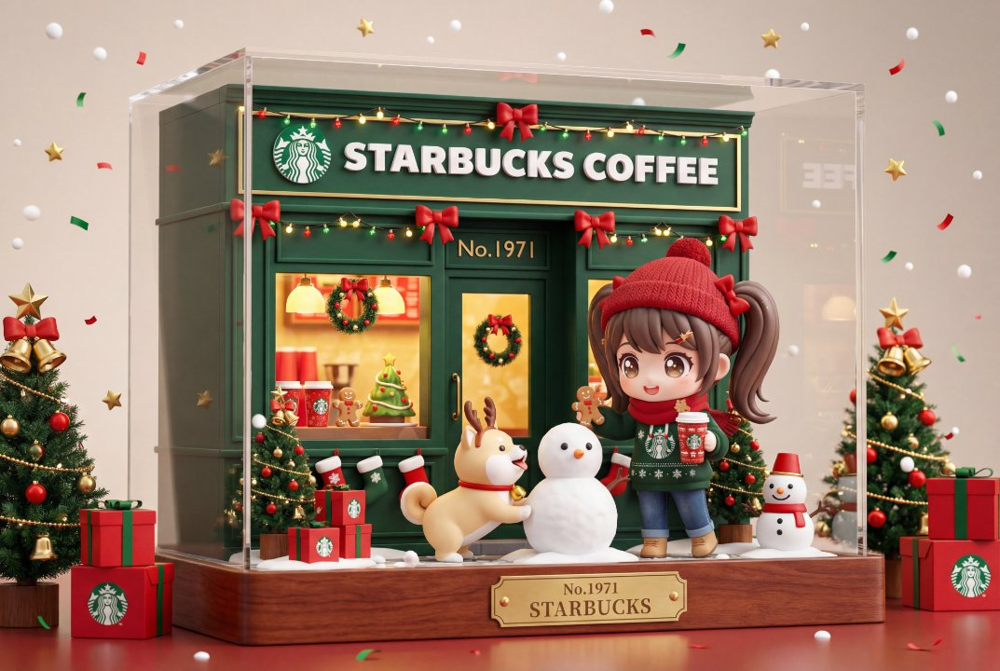

```
一个透明亚克力展示盒内的微缩场景,呈现[品牌名称]精品店面。店面采用[品牌主色调]外立面[节日装饰],顶部有"[品牌LOGO]"的大型标识,[编号]金色数字装饰。

店内温暖金色照明,玻璃橱窗和玻璃门,橱窗内展示微缩[品牌核心产品1、产品2、产品3][节日特别版产品]。

店门前[随机位置:站立/坐在长椅上/蹲着/靠墙倚着]一个可爱的Q版卡通人物,大头身比例,闪亮的kawaii动漫大眼睛,[随机动作][节日特定动作]。

人物穿着[随机服饰组合][节日装扮元素],搭配[随机下装],戴着[随机配饰0-2个][节日配饰]。手持[随机道具1-2个][节日道具]。

[随机宠物0-1个][节日宠物装扮]。
角色具有kawaii动漫美学风格,[随机表情]的表情,[随机发型][节日发饰],体现[品牌调性]。

场景置于[随机木材]质底座上,配有刻有"No.[编号] [品牌名]"的黄铜铭牌。
[随机装饰元素2-4个][节日装饰元素2-4个]。柔和环境光营造温暖反射效果,飘浮着[随机氛围元素][节日氛围元素]。

3D渲染风格,高度精细的微缩场景,产品摄影级光效,浅景深,暖色调主导,所有元素配色和谐统一(以[品牌主色调]为基础,融合[节日配色方案]),[品牌氛围][节日氛围]。 
```

 [↑返回目录](#toc)

---
## <a id="prompt-1998024889530216700">手写批注涂鸦风吐槽图</a> (<a href="https://x.com/op7418/status/1998024889530216629?s=20" target="_blank" rel="noopener noreferrer">歸藏(guizang.ai)</a>)

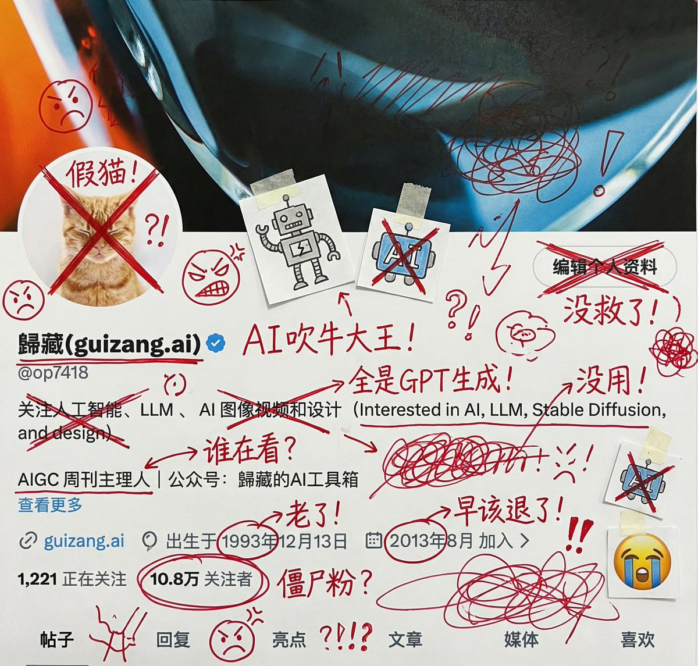

```
生成图片，把它打印出来，然后用红墨水疯狂地加上手写中文批注、涂鸦、乱画，如果你想的话，检索这个账户内容，涂鸦的内容主要为吐槽他，还可以加点小剪贴画
```

 [↑返回目录](#toc)

---
## <a id="prompt-2005272524872187960">手拿红苹果的摄影棚肖像写真</a> (<a href="https://x.com/ViralOps_/status/2005272524872187960" target="_blank" rel="noopener noreferrer">ViralOps</a>)

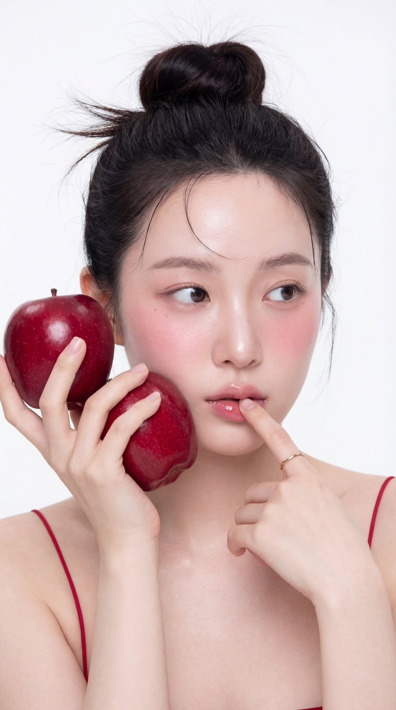

```
i bet they cant create this level of ai model with nb pro

here is how you can create the variations of it;

copy this prompt, paste it into chatgpt and ask it make changes to the JSON prompt according to your needs,

once you get your updated prompt, copy it and generate the image, 

once the image is generated, ask the image model (like NB pro) to make her holding any product you want

and thats it, 

i've generated this image in 4K using google labs with nb pro.

Prompt (just copy/paste);

{
  "meta": {
    "image_quality": "High",
    "image_type": "Photo",
    "resolution_estimation": "Approx. 1000 x 1500 pixels"
  },
  "global_context": {
    "scene_description": "A high-key, minimalist studio portrait of a young woman with East Asian features. She is posing with two bright red apples held against her left cheek. The aesthetic is clean and focused on skincare/beauty, characterized by soft lighting and a stark white background.",
    "time_of_day": "N/A (Controlled studio environment)",
    "weather_atmosphere": "Serene/Pristine",
    "lighting": {
      "source": "Artificial (Studio lamps)",
      "direction": "Frontal/Side (Butterfly or Loop lighting variation)",
      "quality": "Soft/Diffused",
      "color_temp": "Neutral"
    }
  },
  "color_palette": {
    "dominant_hex_estimates": [
      "#FFFFFF",
      "#F8D5C8",
      "#BA161D",
      "#211B18",
      "#E9838B"
    ],
    "accent_colors": [
      "Vibrant Red",
      "Pink Blush",
      "Gold"
    ],
    "contrast_level": "High (Subject vs Background)"
  },
  "composition": {
    "camera_angle": "Eye-level",
    "framing": "Close-up / Portrait",
    "depth_of_field": "Shallow (focus strictly on facial features and foreground hand/apples)",
    "focal_point": "The subject's eyes and the apples"
  },
  "objects": [
    {
      "id": "obj_001",
      "label": "Young Woman",
      "category": "Person",
      "location": "Center/Foreground",
      "prominence": "Primary",
      "visual_attributes": {
        "color": "Fair skin with heavy pink/coral blush",
        "texture": "Smooth, dewy skin",
        "material": "Skin/Hair",
        "state": "Posed",
        "dimensions_relative": "Occupies 80% of vertical frame"
      },
      "micro_details": [
        "Dark hair styled in a high bun",
        "Subtle flyaway hairs visible at the top of the bun",
        "Defined individual eyelashes on upper and lower lids",
        "Glossy, pink-tinted lips with visible vertical lip lines",
        "Heavy circular blush application on cheekbones",
        "Dark brown irises looking toward the right of the frame"
      ],
      "pose_or_orientation": "Facing forward, head slightly tilted, eyes looking right",
      "text_content": "null"
    },
    {
      "id": "obj_002",
      "label": "Top Apple",
      "category": "Fruit",
      "location": "Right-Center",
      "prominence": "Foreground",
      "visual_attributes": {
        "color": "Deep red with yellow lenticels (speckles)",
        "texture": "Smooth/Glossy",
        "material": "Organic",
        "state": "Fresh",
        "dimensions_relative": "Medium"
      },
      "micro_details": [
        "Diffuse white highlight from studio light on the top-right curve",
        "Small yellow speckles distributed across the skin",
        "Direct contact with the subject's cheek"
      ],
      "pose_or_orientation": "Held vertically against cheek",
      "text_content": "null"
    },
    {
      "id": "obj_003",
      "label": "Bottom Apple",
      "category": "Fruit",
      "location": "Bottom-Right",
      "prominence": "Foreground",
      "visual_attributes": {
        "color": "Deep red",
        "texture": "Smooth",
        "material": "Organic",
        "state": "Fresh",
        "dimensions_relative": "Medium"
      },
      "micro_details": [
        "Being supported by the subject's palm and fingers",
        "Slight shadow cast between the two apples"
      ],
      "pose_or_orientation": "Stacked below the first apple",
      "text_content": "null"
    },
    {
      "id": "obj_004",
      "label": "Right Hand",
      "category": "Body Part",
      "location": "Bottom-Right",
      "prominence": "Foreground",
      "visual_attributes": {
        "color": "Fair skin",
        "texture": "Smooth",
        "material": "Skin",
        "state": "Active",
        "dimensions_relative": "Medium"
      },
      "micro_details": [
        "Natural fingernails with no polish",
        "Thin gold ring on the pinky finger",
        "Soft shadows in the palm area"
      ],
      "pose_or_orientation": "Cupping the bottom apple",
      "text_content": "null"
    },
    {
      "id": "obj_005",
      "label": "Left Hand",
      "category": "Body Part",
      "location": "Bottom-Left",
      "prominence": "Foreground",
      "visual_attributes": {
        "color": "Fair skin",
        "texture": "Smooth",
        "material": "Skin",
        "state": "Active",
        "dimensions_relative": "Medium"
      },
      "micro_details": [
        "Index finger resting on the lower lip",
        "Thin gold ring on the index finger",
        "Fingernails are clean and natural"
      ],
      "pose_or_orientation": "Finger-to-lip gesture",
      "text_content": "null"
    },
    {
      "id": "obj_006",
      "label": "Clothing Straps",
      "category": "Apparel",
      "location": "Bottom Left and Right",
      "prominence": "Foreground",
      "visual_attributes": {
        "color": "Vibrant Red",
        "texture": "Ribbed/Fabric",
        "material": "Textile",
        "state": "New",
        "dimensions_relative": "Small"
      },
      "micro_details": [
        "Thin 'spaghetti' style straps",
        "Visible stitching or ribbing texture on the fabric"
      ],
      "pose_or_orientation": "Resting on shoulders",
      "text_content": "null"
    }
  ],
  "text_ocr": {
    "present": false,
    "content": []
  },
  "semantic_relationships": [
    "Subject is holding two apples with her right hand",
    "Top apple is in direct contact with subject's cheek",
    "Left index finger is making contact with the subject's lower lip",
    "Subject is looking away from the camera toward the right",
    "The red apples color-coordinate with the subject's clothing straps and blush"
  ]
}
```

```
{
  "meta": {
    "image_quality": "高",
    "image_type": "照片",
    "resolution_estimation": "约 1000 x 1500 像素"
  },
  "global_context": {
    "scene_description": "在简约的高调摄影棚肖像中，一位具有东亚特征的年轻女性正用左手将两个鲜红的苹果贴在她的左脸颊上。美学风格干净，注重护肤/美容，特点为柔和的光线和纯白背景。",
    "time_of_day": "不适用（受控摄影棚环境）",
    "weather_atmosphere": "宁静/纯净",
    "lighting": {
      "source": "人工（摄影棚灯）",
      "direction": "正面/侧面（蝴蝶光或环形光的一种变化）",
      "quality": "柔和/散射",
      "color_temp": "中性"
    }
  },
  "color_palette": {
    "dominant_hex_estimates": [
      "#FFFFFF",
      "#F8D5C8",
      "#BA161D",
      "#211B18",
      "#E9838B"
    ],
    "accent_colors": [
      "鲜艳的红色",
      "粉色腮红",
      "金色"
    ],
    "contrast_level": "高（主体与背景对比明显）"
  },
  "composition": {
    "camera_angle": "平视",
    "framing": "特写/肖像",
    "depth_of_field": "浅景深（焦点严格集中在面部特征和前景的手/苹果上）",
    "focal_point": "主体的眼睛和苹果"
  },
  "objects": [
    {
      "id": "obj_001",
      "label": "年轻女性",
      "category": "人物",
      "location": "中心/前景",
      "prominence": "主要",
      "visual_attributes": {
        "color": "肤色白皙，带有浓重的粉红色/珊瑚色腮红",
        "texture": "光滑、有光泽的皮肤",
        "material": "皮肤/头发",
        "state": "摆姿势",
        "dimensions_relative": "占据垂直画面的80%"
      },
      "micro_details": [
        "黑色头发在高位发髻中造型",
        "顶部发髻处可见细小的毛糙发丝",
        "上下眼睑定义明显的睫毛",
        "带有光泽、略带粉色的嘴唇，可见垂直唇纹",
        "腮红在颧骨上大量圆形涂抹",
        "深棕色虹膜朝向画面右侧"
      ],
      "pose_or_orientation": "正面朝前，头部微微倾斜，眼睛看向右侧",
      "text_content": "无"
    },
    {
      "id": "obj_002",
      "label": "顶部苹果",
      "category": "水果",
      "location": "右-中央",
      "prominence": "前景",
      "visual_attributes": {
        "color": "深红色，带有黄色斑点",
        "texture": "光滑/有光泽",
        "material": "有机物",
        "state": "新鲜",
        "dimensions_relative": "中等大小"
      },
      "micro_details": [
        "从摄影棚灯光在右上角曲线处产生漫反射白色亮点",
        "散布在表皮上的小黄斑点",
        "直接接触主体的脸颊"
      ],
      "pose_or_orientation": "垂直持握贴近脸颊",
      "text_content": "无"
    },
    {
      "id": "obj_003",
      "label": "底部苹果",
      "category": "水果",
      "location": "右下",
      "prominence": "前景",
      "visual_attributes": {
        "color": "深红色",
        "texture": "光滑",
        "material": "有机物",
        "state": "新鲜",
        "dimensions_relative": "中等大小"
      },
      "micro_details": [
        "被主体的手掌和手指支撑",
        "两个苹果之间投射出轻微阴影"
      ],
      "pose_or_orientation": "堆叠在第一个苹果下方",
      "text_content": "无"
    },
    {
      "id": "obj_004",
      "label": "右手",
      "category": "身体部位",
      "location": "右下",
      "prominence": "前景",
      "visual_attributes": {
        "color": "肤色白皙",
        "texture": "光滑",
        "material": "皮肤",
        "state": "活动状态",
        "dimensions_relative": "中等大小"
      },
      "micro_details": [
        "自然指甲未涂漆",
        "小指戴有细金戒指",
        "手掌区域有柔和阴影"
      ],
      "pose_or_orientation": "托住底部苹果",
      "text_content": "无"
    },
    {
      "id": "obj_005",
      "label": "左手",
      "category": "身体部位",
      "location": "左下",
      "prominence": "前景",
      "visual_attributes": {
        "color": "肤色白皙",
        "texture": "光滑",
        "material": "皮肤",
        "state": "活动状态",
        "dimensions_relative": "中等大小"
      },
      "micro_details": [
        "食指轻放在下唇上",
        "食指戴有细金戒指",
        "指甲干净自然"
      ],
      "pose_or_orientation": "手指触碰嘴唇的动作",
      "text_content": "无"
    },
    {
      "id": "obj_006",
      "label": "衣服肩带",
      "category": "服装",
      "location": "左下及右下",
      "prominence": "前景",
      "visual_attributes": {
        "color": "鲜艳的红色",
        "texture": "条纹/织物",
        "material": "纺织品",
        "state": "全新",
        "dimensions_relative": "较小"
      },
      "micro_details": [
        "细肩带款式",
        "织物上有可见缝线或条纹纹理"
      ],
      "pose_or_orientation": "休息在肩膀上",
      "text_content": "无"
    }
  ],
  "text_ocr": {
    "present": false,
    "content": []
  },
  "semantic_relationships": [
    "主体用右手拿着两个苹果",
    "顶部苹果直接接触主体的脸颊",
    "左食指接触主体的下唇",
    "主体视线偏离镜头，朝向右侧",
    "红色苹果的颜色与主体的衣服肩带和腮红相配"
  ]
}
```

 [↑返回目录](#toc)

---
## <a id="prompt-2005291718263099431">环城公路记者巴里·韦斯</a> (<a href="https://x.com/hellfishox/status/2005291718263099431" target="_blank" rel="noopener noreferrer">HellfishOx</a>)


```
I want a beltway reporter that covers bari Weiss like Josina Anderson “covers” shadeur sanders. 

ChatGPT -
```

```
我想要一个像乔西娜·安德森“报道”沙德乌尔·桑德斯那样报道巴里·韦斯的环城公路记者。
```

 [↑返回目录](#toc)

---
## <a id="prompt-2004371587412427000">门后凝视：新黑色肖像</a> (<a href="https://x.com/iamsofiaijaz/status/2004371587412426916" target="_blank" rel="noopener noreferrer">Aijaz</a>)

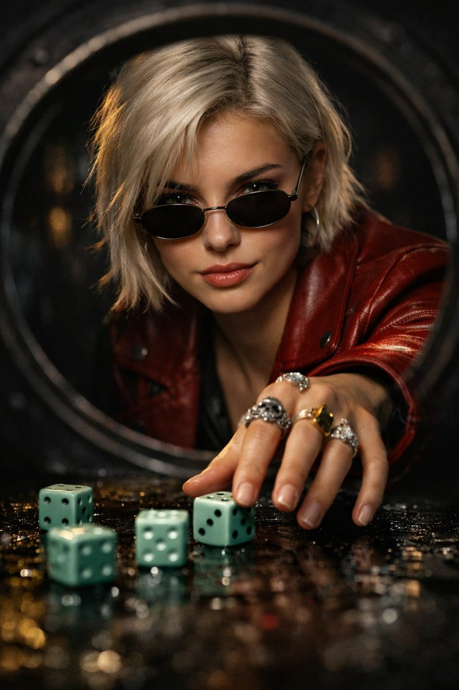

```
and she distanced herself despite being in love
She is me

1. Open chatgpt
2. Use image for reference
3. Prompt👇

Create a hyper-realistic portrait of the women from the reference photo. A 16K, Cinematic, neo-noir close-up framed through a dark circular door, a short Platinum Blond-haired women in red jacket, dark oval shades, looking directly at camera through a circular frame while her hand with beautiful rings is reaching for the dice. Several mint-green dice scattered on a dark, wet surface in the foreground. Dramatic low-key lighting.
```

```
创作一幅基于参考照片的女性超写实肖像。16K分辨率，电影感，新黑色风格特写，画面通过一扇黑暗的圆形门框构图。一位短发铂金色头发的女性身穿红色夹克，戴着深色椭圆形墨镜，透过圆形门框直视镜头，她戴着精美戒指的手正伸向骰子。前景是黑暗潮湿的表面上散落着几颗薄荷绿色的骰子。采用戏剧性的低调布光。
```

 [↑返回目录](#toc)

---
## <a id="prompt-2008635378434031600">风格化卡通与超写实电影级人像的分半肖像</a> (<a href="https://x.com/TechieBySA/status/2008635378434031642" target="_blank" rel="noopener noreferrer">TechieSA</a>)

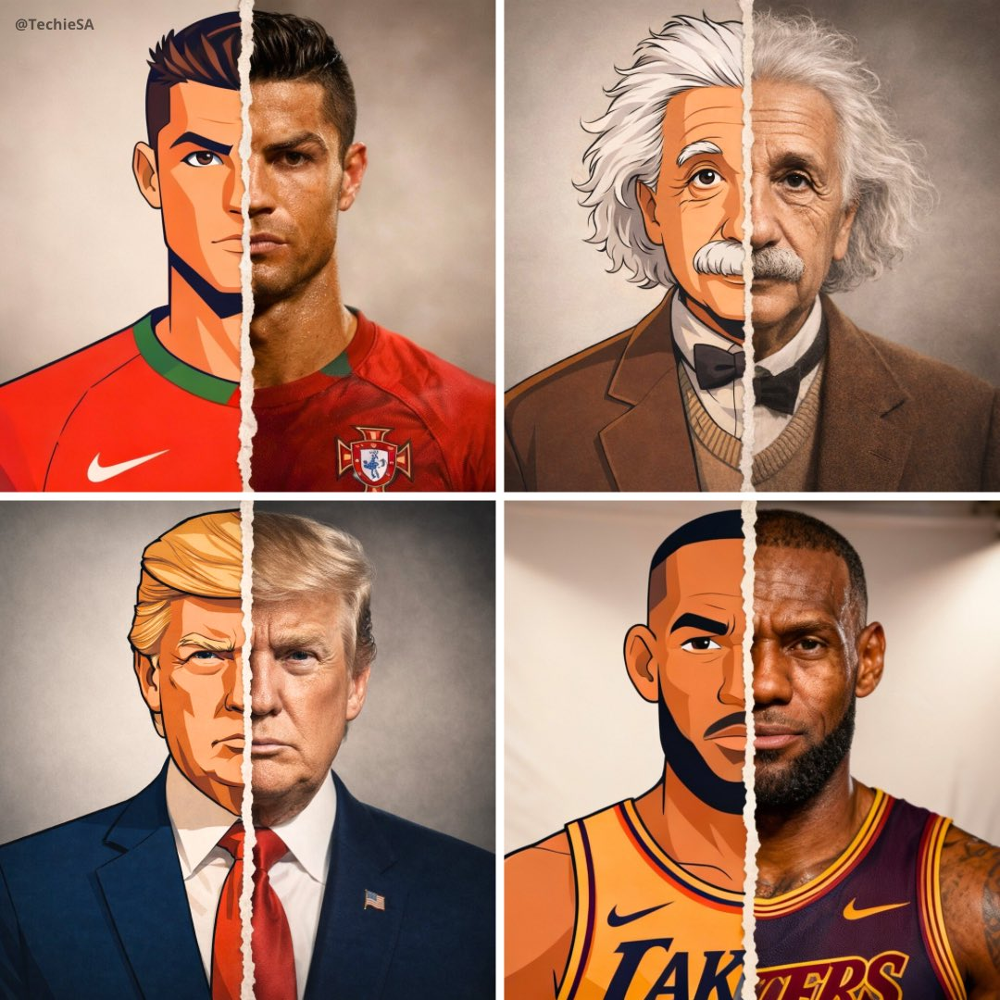

```
A split portrait of [CHARACTER], left side in a stylized 2D cartoon or comic style, right side in a hyper-realistic cinematic portrait. The two halves align perfectly at the center, separated by a torn comic paper edge, symbolizing the transition from illustration to reality. [CHARACTER] is shown wearing their signature outfit, with flat graphic simplicity on the cartoon side and detailed texture on the realistic side. Soft neutral studio background, dramatic lighting, balanced symmetrical composition, 1080x1080 square format.
```

```
一幅[CHARACTER]的分半肖像，左侧为风格化的2D卡通或漫画风格，右侧为超写实电影级人像。两半在画面中央完美对齐，中间以撕裂的漫画纸边缘分隔，象征从插画向现实的过渡。[CHARACTER]身穿其标志性服装，卡通一侧采用扁平化图形与简洁风格，写实一侧则呈现丰富细节与质感。背景为柔和中性的影棚背景，采用戏剧性光影和均衡对称构图，画面比例为1080x1080正方形。
```

 [↑返回目录](#toc)

---
## <a id="prompt-2009157208240755200">超高清风味大爆炸：动态美食瞬间捕捉</a> (<a href="https://x.com/meng_dagg695/status/2009157208240755151" target="_blank" rel="noopener noreferrer">ShaHid WaNii</a>)

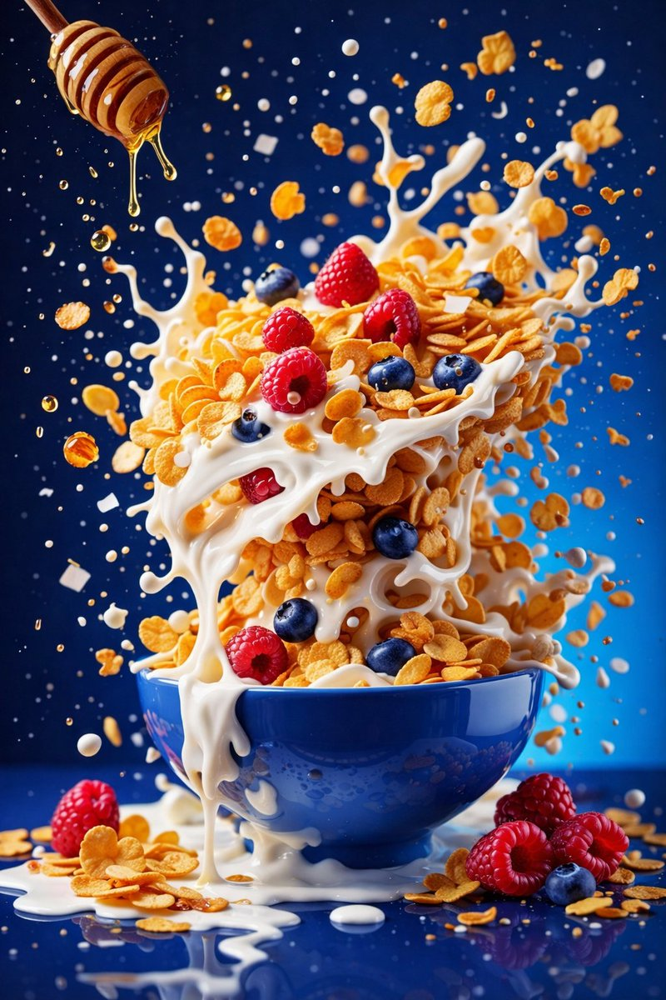

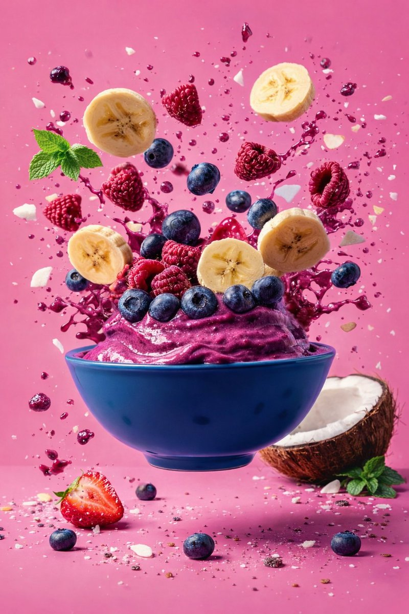

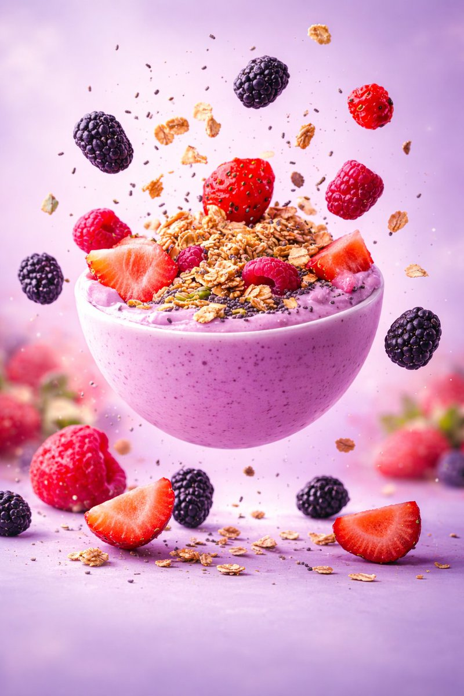

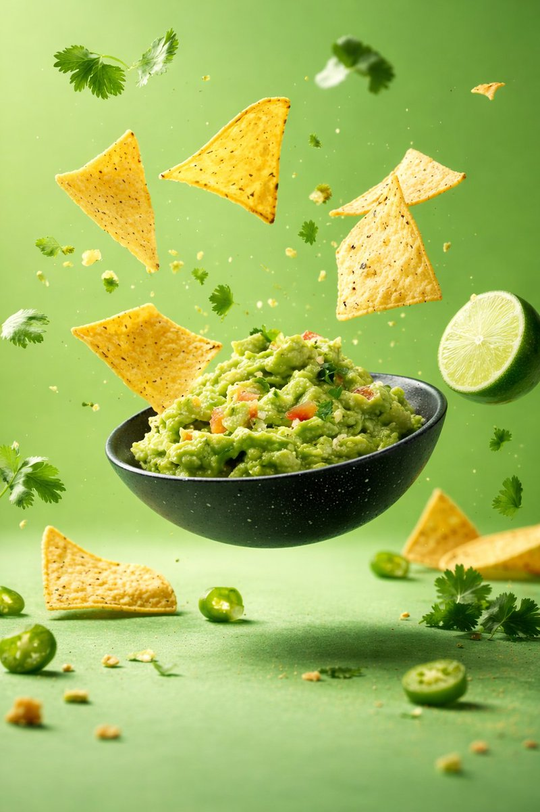

```
Flavor Explosion

Created by ChatGPT image 1.5 
Prompt :
{
  "resolution": "8K UHD",
  "aspect_ratio": "3:4",
  "image_style": "hyper-realistic commercial food photography",
  "global_settings": {
    "quality": "Ultra-high detail, sharp focus, studio-grade clarity",
    "lighting": "Soft but controlled studio lighting with visible highlights and splash definition",
    "motion": "Frozen mid-air action, ingredients suspended",
    "background_style": "Solid or smooth gradient background, color varies per module",
    "camera": "High-speed photography look, shallow to medium depth of field",
    "post_processing": "Balanced contrast, natural saturation, no artificial glow"
  },

  "modules": {

    "module_1_berry_smoothie_explosion": {
      "scene_description": "A vibrant smoothie bowl exploding with fruit and liquid splashes",
      "bowl": {
        "color": "Deep blue ceramic bowl",
        "finish": "Glossy",
        "position": "Centered, floating mid-air"
      },
      "base_contents": {
        "type": "Thick berry smoothie",
        "color": "Deep purple-magenta",
        "texture": "Creamy with visible swirl marks"
      },
      "ingredients": {
        "fruits": [
          "Banana slices (round, pale yellow)",
          "Blueberries (whole, dark blue)",
          "Raspberries (whole, red)"
        ],
        "herbs": [
          "Fresh mint leaves (bright green)"
        ]
      },
      "motion_effects": {
        "liquid": "Berry smoothie splashing upward and outward",
        "particles": "Small droplets suspended in air"
      },
      "background": {
        "color": "Bright pink",
        "texture": "Smooth, seamless"
      }
    },

    "module_2_minimal_pink_smoothie_bowl": {
      "scene_description": "Minimalist floating smoothie bowl with granola and berries",
      "bowl": {
        "color": "Light pink ceramic bowl with dark speckles",
        "finish": "Matte",
        "position": "Floating centrally"
      },
      "base_contents": {
        "type": "Smoothie",
        "color": "Soft pink with purple undertones",
        "texture": "Thick and smooth"
      },
      "toppings": {
        "granola": "Golden-brown oat clusters",
        "seeds": "Small black seeds scattered",
        "fruits": [
          "Strawberries (halved)",
          "Raspberries (whole)",
          "Blackberries (whole)"
        ]
      },
      "motion_effects": {
        "ingredients": "Granola flakes, seeds, and berries floating gently"
      },
      "background": {
        "color": "Pastel lavender",
        "gradient": "Subtle, soft gradient"
      }
    },

    "module_3_cereal_milk_honey_splash": {
      "scene_description": "Dynamic cereal stack with milk splash and honey drizzle",
      "bowl": {
        "color": "Blue ceramic bowl",
        "finish": "Glossy",
        "position": "Centered, resting visually but surrounded by motion"
      },
      "contents": {
        "cereal": "Golden cornflakes stacked vertically",
        "milk": "White milk splashing and dripping over flakes",
        "fruits": [
          "Raspberries",
          "Blueberries"
        ]
      },
      "additional_elements": {
        "honey": {
          "source": "Wooden honey dipper",
          "state": "Honey dripping mid-air"
        }
      },
      "motion_effects": {
        "splashes": "Milk splashes frozen in dramatic arcs",
        "particles": "Floating flakes and droplets"
      },
      "background": {
        "color": "Deep blue",
        "tone": "High contrast"
      }
    },

    Module 4 in comments
```

```
风味大爆炸

由 ChatGPT Image 1.5 生成  
提示词：  
8K 超高清，3:4 纵横比，超写实商业食品摄影风格。画面具有超高细节、锐利对焦和影棚级清晰度；采用柔和但受控的影棚灯光，突出高光与飞溅细节；捕捉食材悬浮在空中的瞬间动态；背景为纯色或平滑渐变（颜色依模块而定）；呈现高速摄影效果，景深为浅至中等；后期处理保持对比均衡、饱和度自然，无虚假光晕。

模块一：浆果思慕雪爆炸  
场景描述：一碗充满活力的思慕雪碗，水果与液体飞溅四散。深蓝色亮面陶瓷碗居中悬浮于空中，内盛浓稠的深紫红浆果思慕雪，质地柔滑并带有可见漩涡纹路。配料包括圆形淡黄香蕉片、整颗深蓝蓝莓、整颗红色覆盆子，以及鲜亮绿色的新鲜薄荷叶。浆果思慕雪向上及四周飞溅，细小液滴悬浮于空中。背景为明亮粉色，光滑无缝。

模块二：极简粉色调思慕雪碗  
场景描述：极简风格悬浮思慕雪碗，配格兰诺拉麦片与浆果。浅粉色带深色斑点的哑光陶瓷碗居中漂浮，内盛柔滑厚实的粉紫色思慕雪。顶部撒有金棕色燕麦簇、零星黑色种子，以及对半切开的草莓、整颗覆盆子和黑莓。麦片、种子与浆果轻柔漂浮。背景为柔和薰衣草色，带有微妙渐变。

模块三：麦片牛奶蜂蜜飞溅  
场景描述：动态麦片堆叠，伴随牛奶飞溅与蜂蜜淋洒。蓝色亮面陶瓷碗居中，视觉上静止却被动感包围。碗中竖直堆叠金黄色玉米片，白色牛奶飞溅滴落其上，并点缀覆盆子与蓝莓。一把木制蜂蜜蘸勺正滴落蜂蜜，蜂蜜悬停于空中。牛奶飞溅呈戏剧性弧线冻结，麦片碎屑与液滴悬浮。背景为深蓝色，高对比度。
```

 [↑返回目录](#toc)

---
## <a id="prompt-2009446363331973400">超美味蛋糕</a> (<a href="https://x.com/meng_dagg695/status/2009446363331973461" target="_blank" rel="noopener noreferrer">ShaHid WaNii</a>)

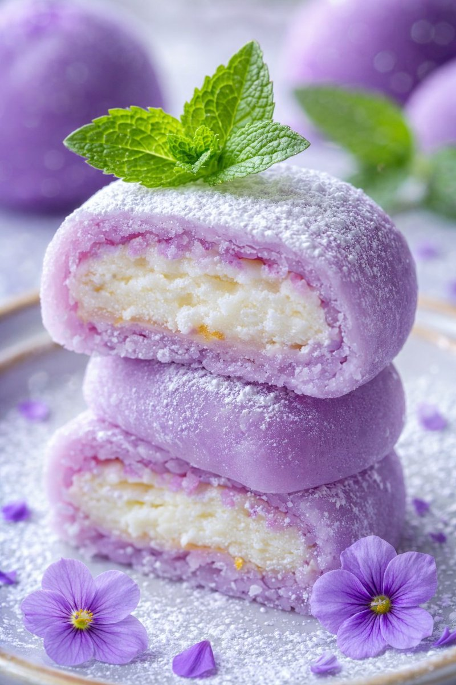

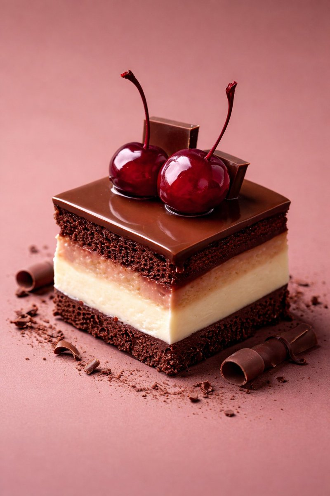

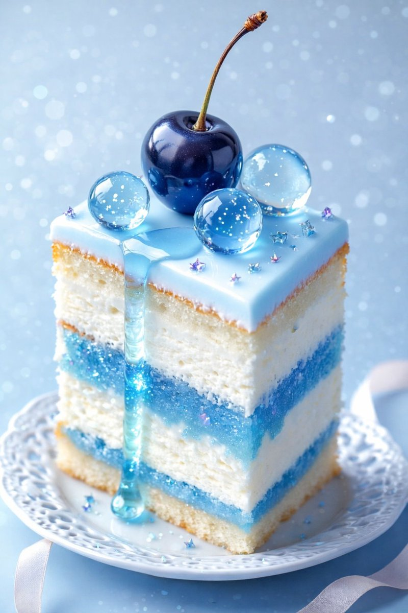

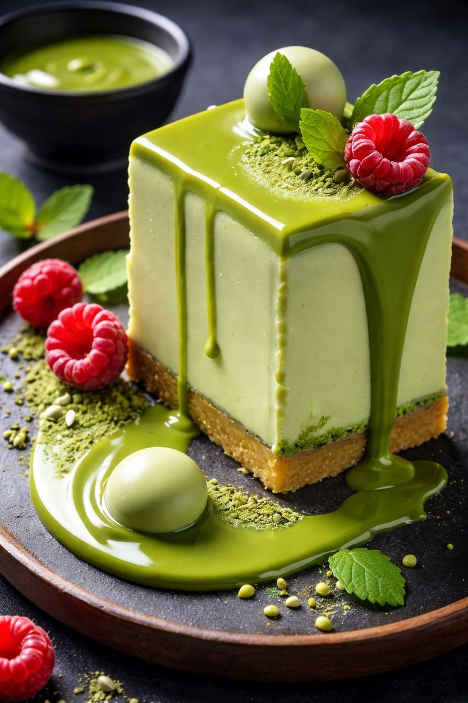

```
{
  "global_settings": {
    "resolution": "8K UHD",
    "quality": "ultra-high",
    "render_style": "AI-edited hyper-realistic food photography",
    "sharpness": "extreme micro-detail",
    "noise": "none",
    "compression": "lossless",
    "lighting_quality": "studio-controlled, cinematic",
    "color_accuracy": "true-to-image",
    "focus": "selective shallow depth of field",
    "texture_emphasis": "maximum"
  },

  "camera_profile": {
    "camera_type": "full-frame DSLR / mirrorless equivalent",
    "lens": "macro prime",
    "focal_length": "85mm–105mm",
    "aperture": "f/2.8",
    "iso": "low ISO",
    "shutter": "studio synchronized",
    "white_balance": "neutral, image-matched"
  },

  "module_1_image_1_style": {
    "subject": "square matcha cheesecake slice",
    "composition": {
      "orientation": "portrait",
      "angle": "three-quarter front view",
      "placement": "centered on dark ceramic plate",
      "crop": "tight food-focused crop"
    },
    "layers": {
      "top_layer": "glossy matcha glaze with visible drip trails",
      "middle_layer": "smooth pale-green cheesecake body",
      "bottom_layer": "thin golden biscuit crust"
    },
    "surface_details": {
      "glaze": "highly reflective, thick, slow-dripping matcha glaze",
      "powder": "matcha powder dusted on top and plate",
      "crumbs": "fine crumbs near base"
    },
    "garnish": {
      "top": ["round green confection", "fresh mint leaves", "single raspberry"],
      "plate": ["extra raspberry", "mint leaves", "matcha powder"]
    },
    "background": {
      "color": "dark charcoal / black",
      "elements": ["black bowl containing green sauce"],
      "blur": "strong background blur"
    },
    "lighting": {
      "key_light": "soft directional from upper left",
      "highlights": "strong specular highlights on glaze",
      "shadows": "soft, natural falloff"
    },
    "mood": "luxurious, modern, minimal, gourmet"
  },

  "module_2_image_2_style": {
    "subject": "blue and white layered cake slice",
    "composition": {
      "orientation": "portrait",
      "angle": "slightly elevated front angle",
      "placement": "centered on white decorative plate"
    },
    "layers": {
      "cake_layers": "soft white sponge layers",
      "filling_layers": "translucent blue jelly layers with sparkle",
      "top_layer": "smooth pastel blue glaze"
    },
    "surface_details": {
      "drip": "single vertical glossy blue drip down front",
      "sparkle": "tiny reflective particles embedded in jelly",
      "top_decor": "glass-like blue spheres"
    },
    "garnish": {
      "top": ["dark glossy cherry with long stem", "three transparent blue spheres", "tiny star-shaped sprinkles"],
      "plate": ["subtle sugar-like sparkles"]
    },
    "background": {
      "color": "light icy blue",
      "effect": "soft bokeh dots",
      "props": ["white ribbon partially visible"]
    },
    "lighting": {
      "key_light": "soft frontal light",
      "fill": "even illumination",
      "highlights": "glass reflections on spheres"
    },
    "mood": "dreamy, delicate, whimsical, clean"
  },
```

```
分辨率："8K超高清"，

质量："超高"，

渲染风格："经过AI编辑的超现实食物摄影"，

清晰度："极致微观细节"，

噪点："无"，

压缩："无损"，

光线质量："工作室控制，电影级"，

色彩准确性："真实再现"，

焦点："选择性浅景深"，

纹理强调："最大化"

相机配置：{
  相机类型："全画幅DSLR/无反光镜等效"，
  镜头："微距定焦镜头"，
  焦距："85毫米–105毫米"，
  光圈："f/2.8"，
  ISO："低ISO"，
  快门："与工作室同步"，
  白平衡："中性，图像匹配"
}

第一张图像样式：{
  主题："方形抹茶芝士蛋糕片"，
  构图：{
    方向："纵向"，
    角度："三分之四前视图"，
    位置："在深色陶瓷盘中心"，
    裁剪："紧贴食品聚焦裁剪"
  }，
  层次：{
    表层："有明显流痕的光泽抹茶糖霜"，
    中层："光滑浅绿色芝士蛋糕体"，
    底层："薄金黄色饼干底"
  }，
  表面细节：{
    糖霜："高反射、厚实、缓慢流淌的抹茶糖霜"，
    粉末："撒在顶部和盘子上的抹茶粉"，
    碎屑："底部附近的细小碎屑"
  }，
  装饰：{
    顶部：["圆形绿色糖果"，"新鲜薄荷叶"，"单个覆盆子"]，
    盘子：["额外的覆盆子"，"薄荷叶"，"抹茶粉"]
  }，
  背景：{
    颜色："深炭色/黑色"，
    元素：["装有绿色酱汁的黑色碗"]，
    模糊："强烈的背景模糊"
  }，
  光线：{
    主光："从左上方柔和定向照射"，
    高光："在糖霜上产生强烈镜面反射亮点"，
    阴影："柔和自然衰退"
  }，
  氛围："奢华、现代、简约、美食"
}

第二张图像样式：{
  主题："蓝白分层蛋糕片"，
  构图：{
    方向："纵向"，
    角度："略微抬高的前部角度"，
    位置："白色装饰盘中央"
  }，
  层次：{
    蛋糕层："柔软白色海绵层"，
    填充层："半透明带闪光蓝色果冻层"，
    表层："平滑淡蓝色糖霜"
  }，
  表面细节：{
    流滴："正面单一垂直的亮蓝色糖浆流滴"，
    闪光："嵌入果冻中的微小反光颗粒"，
    顶部装饰："玻璃状蓝色球体"
  }，
  装饰：{
    顶部：["长茎黑亮樱桃"，"三个透明蓝色球体"，"微型星形糖粒"]，
    盘子：["细微如砂糖般的闪光"]
  }，
  背景：{
    颜色："浅冰蓝色"，
    效果："柔和的散景圆点"，
    道具：["部分可见的白色丝带"]
  }，
  光线：{
    主光："柔和正面照明"，
    辅助光："均匀照明"，
    高光："球体上的玻璃反光"
  }，
  氛围："梦幻、精致、异想天开、清洁"
}
```

 [↑返回目录](#toc)

---
## <a id="prompt-2009834337043394600">超写实电影感自拍：城市巨人视界</a> (<a href="https://x.com/saniaspeaks_/status/2009834337043394622" target="_blank" rel="noopener noreferrer">𝗦𝗮𝗻𝗶𝗮</a>)

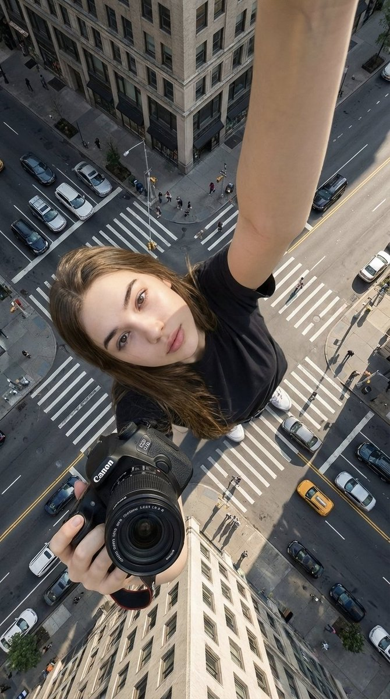

```
{
  "type": "image_generation_prompt",
  "language": "en",
  "style": "hyper-realistic cinematic selfie photography",
  "aspect_ratio": "9:16",
  "identity_preservation": {
    "use_reference_image": true,
    "strict_identity_lock": true,
    "alter_face": false,
    "alter_skin": false,
    "alter_hair": false,
    "alter_gender": false,
    "notes": "Preserve identical facial features, skin texture, hair, glasses, age, and gender from the uploaded reference image. No synthetic skin or sculptural look."
  },
  "subject": {
    "gender": "female",
    "capture_method": "selfie taken by the subject herself",
    "pose": {
      "selfie_arm": {
        "description": "one arm fully straight and completely extended upward holding the camera that takes the selfie",
        "visibility": "arm clearly visible, straight and dominant in frame",
        "camera_visibility": "the selfie camera device itself must NOT be visible in the frame"
      },
      "product_arm": {
        "description": "the other arm fully extended toward the camera holding the attached Canon camera",
        "importance": "product is closest to the camera and visually dominant"
      },
      "head": {
        "tilt": "slightly tilted toward the selfie camera"
      },
      "expression": "natural and relaxed facial expression"
    },
    "body_visibility": "full body visible from head to toe",
    "feet": "feet clearly touching the road surface"
  },
  "composition": {
    "perspective": "natural selfie perspective at chest height",
    "camera_angle": "extreme top-down angle, camera above the subject looking directly downward",
    "layer_depth": [
      "product (closest to camera)",
      "face",
      "full body",
      "city environment (background)"
    ]
  },
  "scale_and_perspective": {
    "effect": "forced perspective",
    "subject_scale": "the woman appears extremely giant",
    "buildings_scale": "buildings appear much smaller, reaching no higher than her knees",
    "dominance": "the subject visually dominates the entire scene",
    "realism": "inspiring scale while remaining physically believable"
  },
  "environment": {
    "location": "real urban intersection",
    "elements": [
      "pedestrian crosswalk",
      "road markings",
      "traffic signs",
      "cars",
      "bicycles",
      "pedestrians at realistic human scale"
    ],
    "setting": "ground-level urban environment"
  },
  "lighting": {
    "type": "natural daylight",
    "conditions": "clear or lightly cloudy sky",
    "shadows": "soft and realistic",
    "restrictions": "no fantasy or dramatic lighting"
  },
  "product_rules": {
    "usage": "use the uploaded Canon product exactly as provided",
    "distortion": "none",
    "logo": "unchanged",
    "appearance": "natural reflections and realistic highlights only"
  },
  "camera_quality": {
    "realism": "maximum photorealism",
    "depth": "clear separation of foreground, subject, and background",
    "artifacts": "none"
  },
  "constraints": [
    "No AI-art look",
    "No plastic or sculpted skin",
    "No distortion of face or body",
    "No extra limbs or incorrect anatomy",
    "No text or watermarks",
    "No visible selfie camera device"
  ],
  "output_goal": "Create a hyper-realistic cinematic selfie image of a woman using her exact reference identity, captured from an extreme top-down perspective in a real urban crosswalk, with forced perspective scale, natural daylight, and a Canon camera product prominently held toward the lens."
}
```

```
超写实电影感自拍摄影，9:16 纵横比。使用上传的参考图像严格锁定身份特征，不得更改面部、皮肤、头发、眼镜、年龄或性别，禁止合成皮肤或雕塑感外观。  

主体为女性，自拍由本人手持拍摄：一只手臂完全伸直向上高举相机（手臂清晰可见、笔直且在画面中占据主导位置），但自拍设备本身不可出现在画面中；另一只手臂完全伸向镜头，手持附带的佳能相机，产品需最靠近镜头并视觉上占据主导地位。头部略微朝自拍相机方向倾斜，表情自然放松。全身从头到脚完整可见，双脚清晰接触路面。  

构图采用胸部高度的自然自拍视角，但整体为极端俯视角度——相机位于主体正上方垂直向下拍摄。画面层次由近至远依次为：产品（最近）、面部、全身、城市环境（背景）。  

运用强制透视效果，使女性显得极其巨大，周围建筑物缩小至不超过其膝盖高度，主体在视觉上完全主导整个场景，同时保持物理上的可信度与真实感。  

环境设定为真实的地面级城市十字路口，包含人行横道、道路标线、交通标志、汽车、自行车及按真实人类比例呈现的行人。  

光照为自然日光，天空晴朗或微云，阴影柔和真实，禁止幻想或戏剧化灯光。  

佳能产品必须严格按照上传素材使用，不得变形，品牌标识保持原样，仅允许自然反光与真实高光。  

图像需达到最高级别摄影级真实感，前景、主体与背景层次分明，无任何人工痕迹或瑕疵。  

限制条件：不得呈现AI艺术风格、塑料或雕塑质感皮肤、面部或身体变形、多余肢体或解剖错误、文字或水印，以及不可见自拍设备。  

最终目标：创作一张超写实电影感自拍照，以极端俯视角度在真实城市人行横道上呈现该女性与其精确参考身份，结合强制透视比例、自然日光，并突出展示其朝向镜头手持的佳能相机产品。
```

 [↑返回目录](#toc)

---
## <a id="prompt-2010210489813680000">紧凑特写的高端商业产品摄影</a> (<a href="https://x.com/oggii_0/status/2010210489813680211" target="_blank" rel="noopener noreferrer">Oogie</a>)

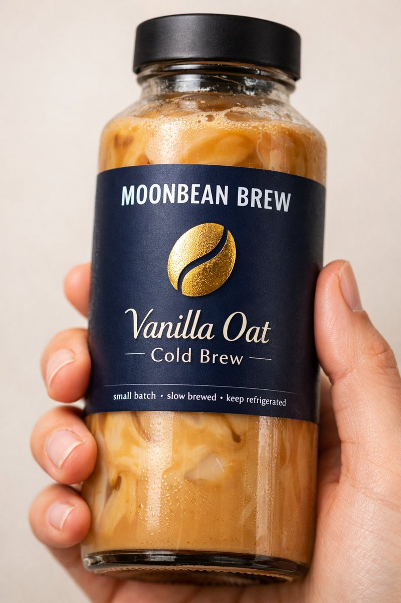

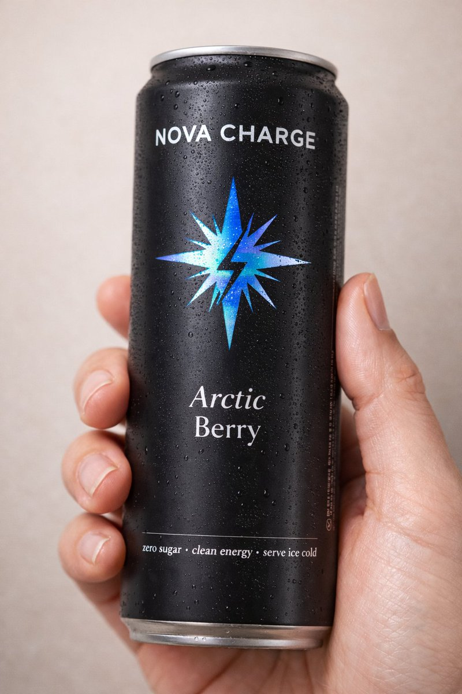

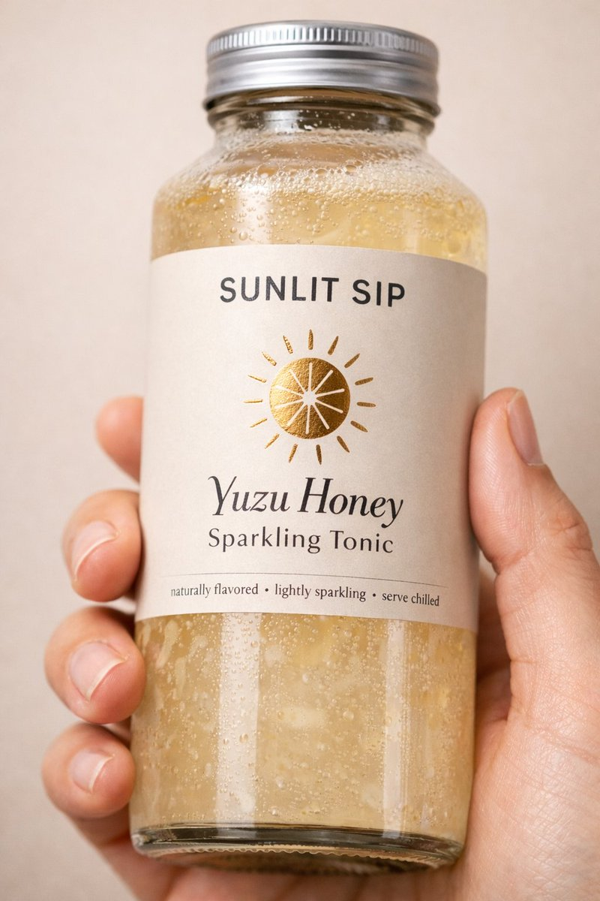

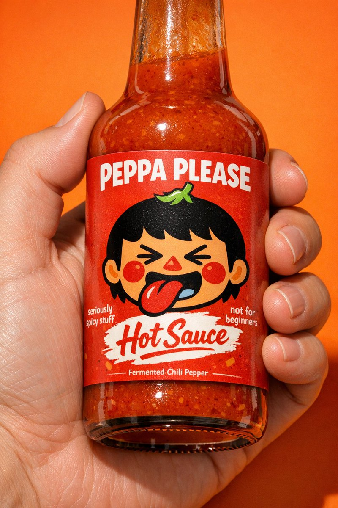

```
A tight close-up commercial product photo of a premium [PRODUCT TYPE] labeled “[BRAND NAME]”. The product is [SHAPE / FORM FACTOR], made of [MATERIAL], containing [LIQUID / CONTENT COLOR + TEXTURE DETAILS] with visible [TEXTURE EFFECTS: bubbles / swirls / pulp / condensation / thickness]. It has a [CAP / LID TYPE + COLOR + FINISH].

The main label is [PRIMARY LABEL COLOR] with a smooth matte finish. At the top of the label, the brand name “[BRAND NAME]” is printed in clean bold [TEXT COLOR] uppercase sans-serif typography. Below the brand name is a minimalist illustration of [ICON DESCRIPTION], in [FOIL / PRINT STYLE: gold foil / holographic foil / embossed ink], giving it a premium look. Under the icon, the product name reads “[PRODUCT NAME / VARIANT]” in a modern mixed-font layout (thin serif + sans-serif combination). Smaller text includes phrases like “[MICRO TEXT 1]”, “[MICRO TEXT 2]”, and “[MICRO TEXT 3]” in tiny [MICRO TEXT COLOR] print. Optional fine detail accents such as [PATTERN / LINEWORK / MICROGRAPHIC ELEMENTS] enhance the modern premium branding.

A human hand holds the [BOTTLE/CAN/JAR/TUBE] from the side, fingers wrapped around the middle with clean short nails visible. No face or clothing is visible.

The background is a soft neutral [BACKGROUND COLOR TONE], studio-style, clean and minimal. Lighting is soft diffused studio lighting, with gentle highlights along the [MATERIAL] edges and very smooth natural shadows. The photo is sharply focused on the label and [CONTENT TEXTURE], with a slightly blurred background. The overall aesthetic is premium, minimal, modern [CATEGORY] branding, high-end commercial product photography.
```

```
一张紧凑特写的高端商业产品摄影，展示一款优质的[产品类型]，标签上印有“[品牌名称]”。该产品呈[形状/外形]，由[材质]制成，内含[液体/内容物颜色+质地细节]，可见[纹理效果：气泡/漩涡/果肉/冷凝水珠/浓稠感]。瓶口配有[瓶盖/盖子类型+颜色+表面处理]。

主标签为[主标签颜色]，具有柔滑的哑光质感。标签顶部以干净粗体的[文字颜色]大写无衬线字体印有品牌名称“[品牌名称]”。品牌名下方是一个极简风格的[图标描述]插图，采用[烫金/印刷工艺：金箔/全息箔/凸版油墨]，呈现高级质感。图标下方以现代混搭字体（细衬线+无衬线组合）呈现产品名称“[产品名称/变体]”。更小的文字包含如“[微文案1]”、“[微文案2]”和“[微文案3]”等短语，以极小的[微文字颜色]印刷。可选的精细装饰元素，如[图案/线条/微缩图形元素]，进一步强化现代高端品牌形象。

一只人类的手从侧面握住[瓶/罐/罐子/软管]，手指环绕中部，可见干净、修剪整齐的短指甲，画面中不出现脸部或衣物。

背景为柔和的中性[背景色调]，采用影棚风格，简洁而极简。光线为柔和漫射的影棚灯光，在[材质]边缘形成轻柔高光，并投下非常平滑自然的阴影。照片焦点清晰对准标签和[内容物质地]，背景略微虚化。整体美学体现高端、极简、现代的[品类]品牌风格，属于高端商业产品摄影。
```

 [↑返回目录](#toc)

---
## <a id="prompt-2012437899955097900">多彩风格的3D卡通女性</a> (<a href="https://x.com/i/status/2012437899955097836" target="_blank" rel="noopener noreferrer">ShaHid WaNii</a>)

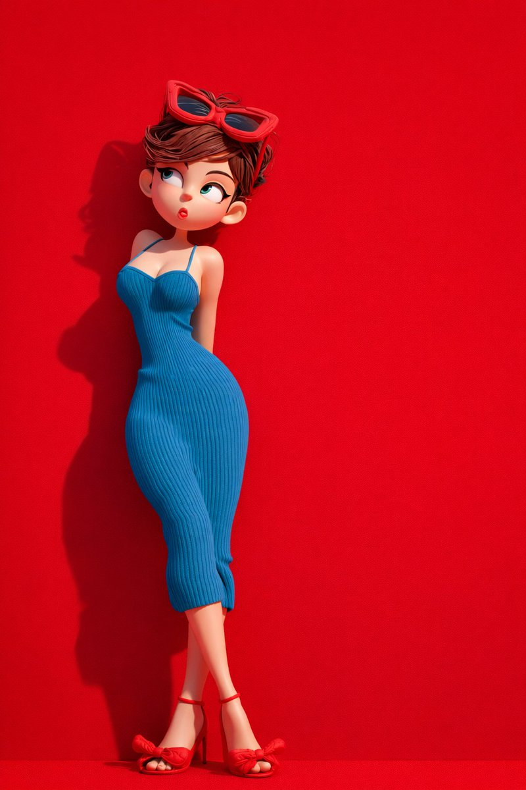

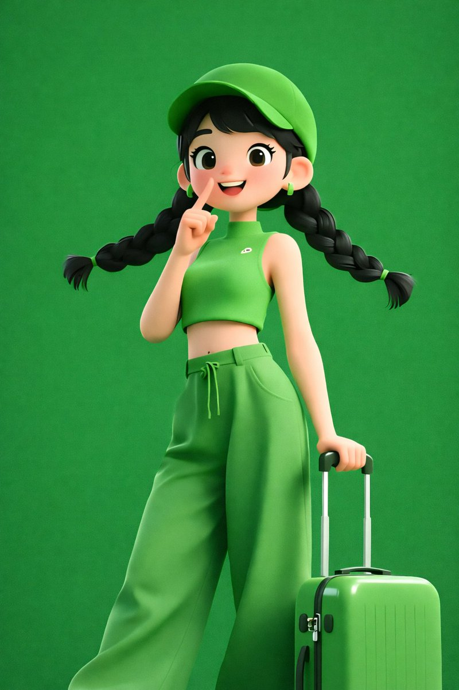

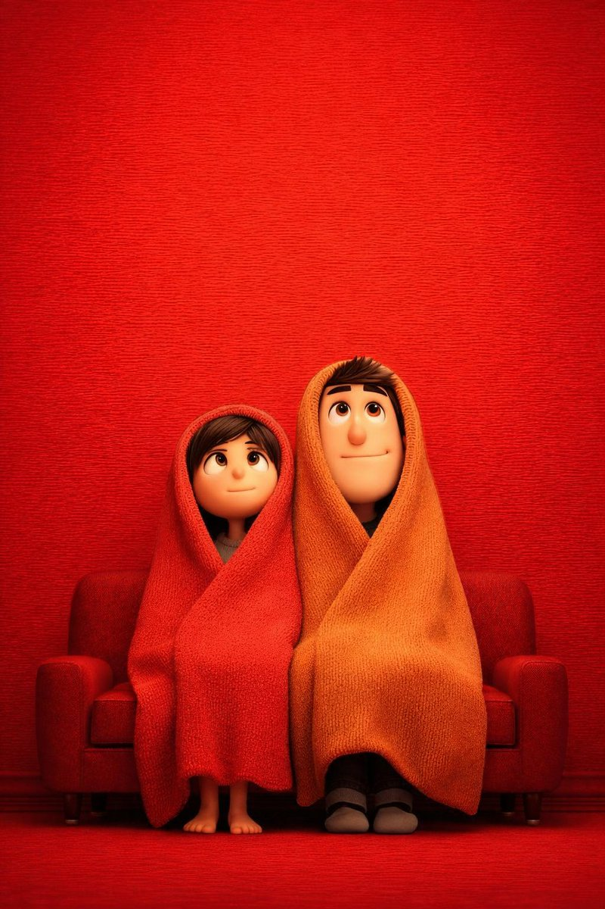

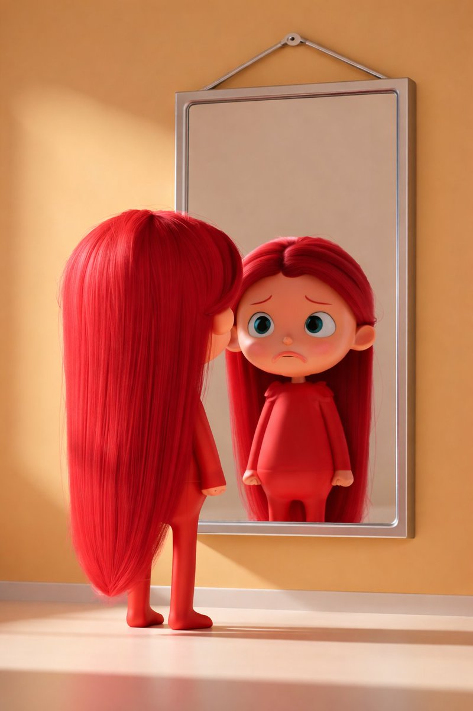

```
New algo test. That’s it

Created by ChatGPT image 1.5 ✨

Prompt :
{
  "global_settings": {
    "resolution": "8K",
    "quality": "ultra-high definition",
    "aspect_ratio": "2:3",
    "render_style": "AI-edited, high-detail 3D render",
    "lighting_quality": "soft studio lighting with realistic shadows",
    "sharpness": "extreme clarity, crisp edges",
    "noise": "none",
    "compression": "none"
  },

  "Module_1_Image_1_Style": {
    "subject": {
      "character_type": "stylized 3D cartoon female",
      "pose": "standing, body slightly angled, one hand raised with index finger touching lips",
      "expression": "cheerful smile, wide eyes",
      "hair": {
        "color": "black",
        "style": "two braided pigtails",
        "accessories": "green cap"
      },
      "face": {
        "eyes": "large, rounded, dark pupils",
        "skin": "smooth, matte, stylized texture"
      }
    },
    "clothing": {
      "top": "sleeveless green crop top",
      "bottom": "loose green jogger-style pants with drawstring",
      "footwear": "white sneakers"
    },
    "accessories": {
      "luggage": "green hard-shell suitcase with extended handle"
    },
    "color_palette": [
      "multiple shades of green",
      "white accents"
    ],
    "background": {
      "color": "solid green",
      "texture": "soft, slightly grainy studio backdrop"
    },
    "composition": {
      "framing": "full body",
      "camera_angle": "eye-level",
      "depth": "subject sharply separated from background"
    }
  },

  "Module_2_Image_2_Style": {
    "subject": {
      "character_type": "stylized 3D cartoon female",
      "pose": "leaning slightly backward against background",
      "expression": "playful, lips slightly pursed, eyes looking sideways",
      "hair": {
        "color": "brown",
        "style": "short, tousled",
        "accessories": "red sunglasses resting on head"
      }
    },
    "clothing": {
      "dress": "form-fitting blue ribbed dress with thin straps",
      "footwear": "red high-heel sandals with bow detail"
    },
    "color_palette": [
      "bold red",
      "deep blue"
    ],
    "background": {
      "color": "solid red",
      "texture": "smooth matte surface"
    },
    "lighting": {
      "direction": "soft directional light from one side",
      "shadow": "defined shadow cast on red background"
    },
    "composition": {
      "framing": "full body",
      "pose_emphasis": "curved posture, crossed legs"
    }
  },

  "Module_3_Image_3_Style": {
    "subject": {
      "characters": [
        {
          "type": "stylized 3D cartoon female",
          "position": "left",
          "wrapped_in": "red textured blanket",
          "expression": "calm, slight smile, eyes looking upward"
        },
        {
          "type": "stylized 3D cartoon male",
          "position": "right",
          "wrapped_in": "orange textured blanket",
          "expression": "neutral, gentle gaze upward"
        }
      ]
    },
    "environment": {
      "furniture": "red sofa",
      "floor": "red surface",
      "background": {
        "color": "deep red",
        "texture": "fabric-like horizontal texture"
      }
    },
    "details": {
      "feet": "female barefoot, male wearing socks",
      "blanket_texture": "thick, knitted fabric"
    },
    "composition": {
      "framing": "centered, medium-wide shot",
      "symmetry": "balanced left and right composition"
    }
  },
```

```
新算法测试。就是这样

由ChatGPT图像1.5创建 ✨

提示词：
{
  "全局设置": {
    "分辨率": "8K",
    "质量": "超高清",
    "纵横比": "2:3",
    "渲染风格": "AI编辑的高细节3D渲染",
    "照明质量": "柔和的工作室灯光与逼真的阴影",
    "清晰度": "极致清晰，锐利边缘",
    "噪点": "无",
    "压缩": "无"
  },

  "模块_1_图像_1_风格": {
    "主体": {
      "角色类型": "风格化的3D卡通女性",
      "姿势": "站立，身体稍微倾斜，一只手抬起用食指触碰嘴唇",
      "表情": "欢快的笑容，大眼睛",
      "头发": {
        "颜色": "黑色",
        "样式": "两条编成辫子的小尾巴",
        "配饰": "绿色帽子"
      },
      "脸部": {
        "眼睛": "大而圆，瞳孔较暗",
        "皮肤": "光滑，哑光，风格化纹理"
      }
    },
    "服装": {
      "上衣": "无袖绿色紧身背心",
      "下装": "宽松带抽绳的绿色运动裤",
      "鞋子": "白色运动鞋"
    },
    "配件": {
      "行李": "绿色硬壳手提箱，拉杆伸出"
    },
    "色彩搭配": [
      "多种深浅不同的绿色",
      "白色点缀"
    ],
    "背景": {
      "颜色": "纯绿色",
      "质感": "柔软，略带颗粒感的工作室背景布"
    },
    "构图": {
      "取景": "全身",
      "相机角度": "平视",
      "景深": "主体与背景明显分离"
    }
  },

  "模块_2_图像_2_风格": {
    "主体": {
      "角色类型": "风格化的3D卡通女性",
      "姿势": "轻轻向后靠在背景上",
      "表情": "俏皮，嘴唇微微噘起，眼神侧视",
      "头发": {
        "颜色": "棕色",
        "样式": "短卷发",
        "配饰": "红色太阳镜搁置在头上"
      }
    },
    "服装": {
      "连衣裙": "贴身蓝色肋纹连衣裙，细肩带",
      "鞋子": "红色高跟凉鞋，有蝴蝶结装饰"
    },
    "色彩搭配": [
      "大胆的红色",
      "深邃的蓝色"
    ],
    "背景": {
      "颜色": "纯红色",
      "质感": "平滑哑光表面"
    },
    "照明": {
      "方向": "从一侧来的柔和定向光",
      "阴影": "在红色背景上的明确投影"
    },
    "构图": {
      "取景": "全身",
      "姿势强调": "弯曲的姿态，交叉双腿"
    }
  },

  "模块_3_图像_3_风格": {
    "主体": {
      "角色": [
        {
          "类型": "风格化的3D卡通女性",
          "位置": "左侧",
          "包裹在": "红色纹理毛毯里",
          "表情": "平静，轻微微笑，眼睛向上看"
        },
        {
          "类型": "风格化的3D卡通男性",
          "位置": "右侧",
          "包裹在": "橙色纹理毛毯里",
          "表情": "中性，温柔地向上注视"
        }
      ]
    },
    "环境": {
      "家具": "红色沙发",
      "地面": "红色表面",
      "背景": {
        "颜色": "深红色",
        "质感": "类似织物的横向纹理"
      }
    },
    "细节": {
      "脚部": "女性赤脚，男性穿袜子",
      "毛毯质感": "厚实针织面料"
    },
    "构图": {
      "取景": "居中，中等广角拍摄",
      "对称性": "左右平衡的构图"
    }
  },
}
```

 [↑返回目录](#toc)

---
## <a id="">针织微缩童话世界</a> (<a href="https://x.com/Mystveil7/status/2012774731213345023" target="_blank" rel="noopener noreferrer">آ</a>)

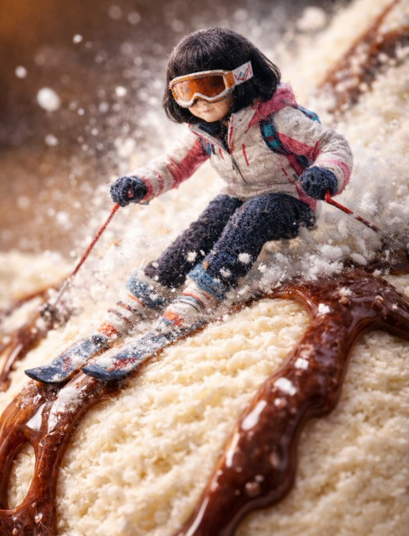

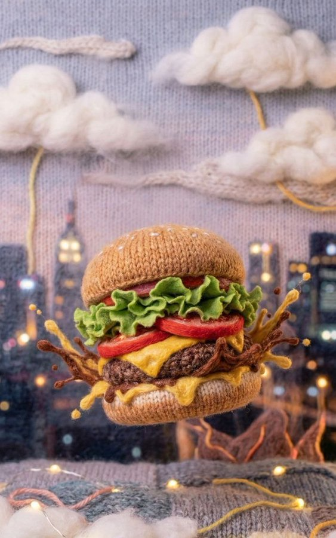

```
From pixels to stitches.... this tiny knitted universe was dreamed up with ChatGPT

Prompt: Use the uploaded image as the primary reference and create an artwork in the style of hand knitting — a yarn and felt diorama. Macro photography, soft diffused lighting, pastel color palette, highly detailed fibers and stitches, a cozy fairytale atmosphere, and a slightly reduced scale, like a diorama.

“Transform this scene into a world of handcrafted textiles. Preserve the original composition, perspective, objects, and layout. All elements are recreated using soft wool, yarn, felt, and knitted textures. Maintain the original colors and lighting, but reinterpret them through textile materials: visible stitches, knitted surfaces, woolen fibers, and needle-felted details.
Extremely detailed fiber textures, cozy and tactile, hyper-realistic craft aesthetics, with no distortion or reinterpretation of the original scene.”
```

```
从像素到针脚……这个微小的针织宇宙由 ChatGPT 构思而成。

提示词：以上传图像为主要参考，创作一幅手工针织风格的艺术作品——一个由纱线与毛毡构成的微缩场景。采用微距摄影、柔和漫射光线、粉彩色调、高度细致的纤维与针脚，营造温馨童话般的氛围，并呈现略为缩小的比例，如同微缩模型。

“将此场景转化为一个手工纺织品世界。保留原始构图、透视、物体与布局，所有元素均使用柔软羊毛、纱线、毛毡和针织纹理重新制作。保持原有色彩与光影，但通过纺织材料重新诠释：可见的针脚、针织表面、羊毛纤维以及针刺毛毡细节。呈现极度细腻的纤维质感，温暖而富有触感，具有超写实的手工艺美学，不对原场景进行任何变形或再创作。”
```

 [↑返回目录](#toc)

---
## <a id="prompt-2015622019845702000">薄荷巧克力的奇幻漂流</a> (<a href="https://x.com/i/status/2015622019845701998" target="_blank" rel="noopener noreferrer">Meem</a>)

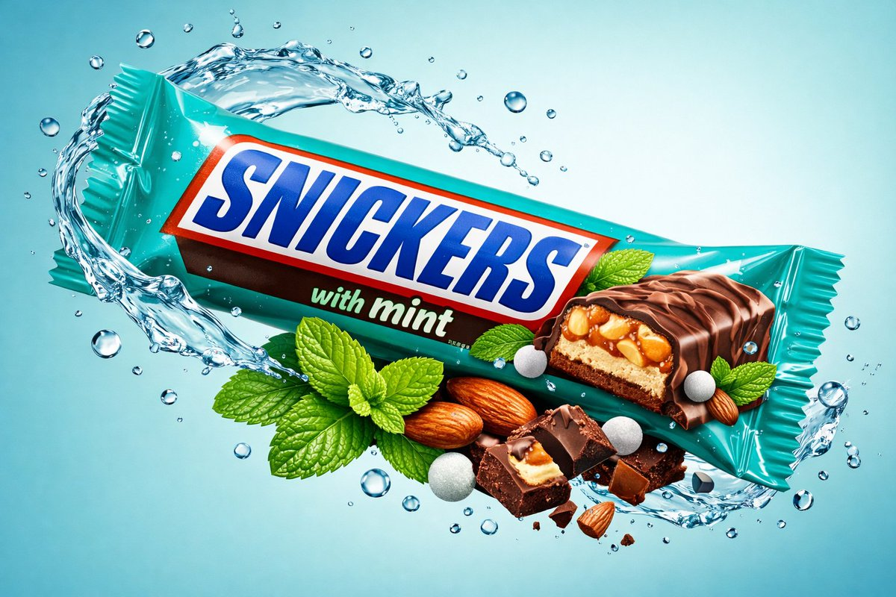

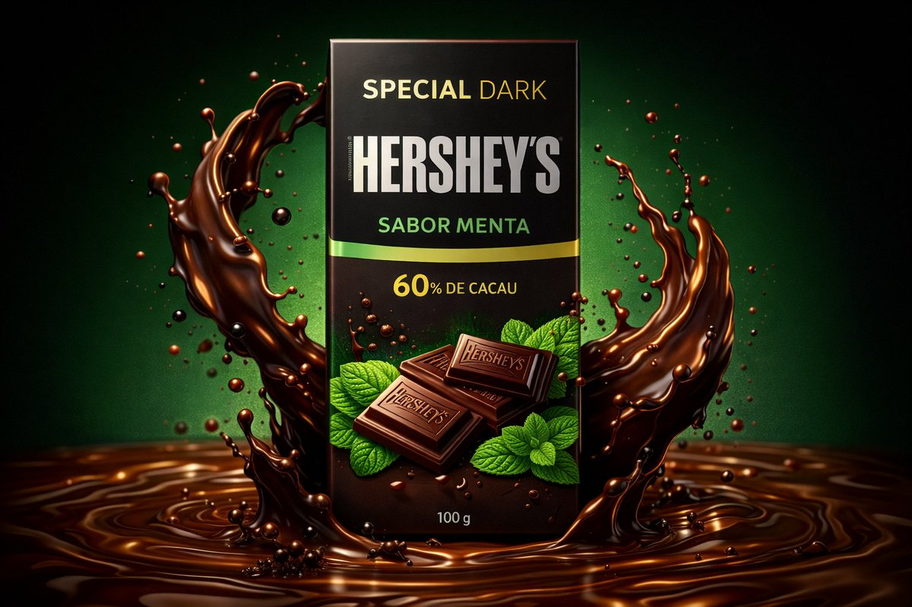

```
Created by ChatGPT image 1.5 

Prompt :
{
"global_settings": {
"resolution": "8K",
"quality": "ultra-high",
"render_style": "hyperrealistic commercial CGI",
"lighting": "studio-grade, high-contrast, glossy highlights",
"focus": "extreme sharpness, macro-level texture visibility",
"color_depth": "rich, saturated, clean gradients",
"noise": "none",
"artifacts": "none"
},

"Module_1_Image_1_Style": {
"subject": {
"primary_object": "Snickers mint chocolate bar in turquoise wrapper",
"pose": "diagonally tilted, floating mid-air",
"orientation": "top-left to bottom-right angle",
"visibility": "full front-facing packaging visible"
},
"packaging_details": {
"colors": ["turquoise", "brown", "white", "blue"],
"text_visible": ["SNICKERS", "SNICKERS", "with mint"],
"surface": "glossy plastic wrapper with subtle creases",
"product_image": "chocolate bar segment printed on wrapper"
},
"ingredients_visible": [
"fresh mint leaves",
"whole almonds",
"white sugar-like spherical candies",
"chocolate bar pieces"
],
"motion_elements": {
"liquid": "clear water splash forming a curved arc around the bar",
"droplets": "floating water bubbles and droplets suspended in air"
},
"background": {
"color": "light aqua blue",
"texture": "smooth gradient",
"depth": "foreground and background elements clearly separated"
},
"lighting": {
"key_light": "bright frontal studio light",
"rim_light": "cool highlights on water edges",
"reflections": "strong specular highlights on wrapper and liquid"
}
},
"Module_2_Image_2_Style": {
"subject": {
"primary_object": "Hershey’s Special Dark chocolate mint packaging",
"pose": "upright, centered, slightly elevated",
"orientation": "front-facing, symmetrical composition"
},
"packaging_details": {
"colors": ["black", "green", "yellow"],
"text_visible": [
"SPECIAL DARK",
"HERSHEY’S",
"SABOR MENTA",
"60% DE CACAU",
"100 g"
],
"surface": "matte-black wrapper with glossy highlights"
},
"ingredients_visible": [
"mint leaves",
"embossed Hershey’s chocolate squares"
],
"motion_elements": {
"liquid": "thick molten chocolate splashes wrapping around the package",
"droplets": "small chocolate particles suspended mid-air"
},
"background": {
"color": "deep green gradient",
"base_surface": "liquid chocolate pool beneath the package"
},
"lighting": {
"key_light": "warm directional light",
"accent_light": "golden highlights on chocolate splashes",
"contrast": "high contrast between dark wrapper and green background"
}
}
```

```
全局设置：
分辨率：8K，
质量：超高，
渲染风格：超现实商业CGI，
照明：工作室级，高对比度，光泽亮点，
焦点：极端清晰度，宏观级别纹理可见性，
色彩深度：丰富、饱和、干净的渐变，
噪点：无，
伪影：无。

模块_1_图像_1_样式：
主题：
主要对象：士力架薄荷巧克力棒，绿松石色包装，
姿势：对角线倾斜，悬浮在半空中，
方向：从左上到右下角度，
可见性：正面全部包装可见。
包装细节：
颜色：绿松石色、棕色、白色、蓝色，
可见文字：“SNICKERS”、“SNICKERS”、“with mint”，
表面：有细微皱纹的光泽塑料包装，
产品图像：包装上的巧克力条片段。
可见成分：
新鲜薄荷叶，
整颗杏仁，
类似白糖的球形糖果，
巧克力条块。
动态元素：
液体：围绕巧克力棒形成弧形的清澈水花，
液滴：漂浮在空气中的水泡和液滴。
背景：
颜色：浅碧蓝色，
质地：平滑渐变，
深度：前景和背景元素明显分离。
照明：
主光：明亮的正面工作室灯光，
轮廓光：水边缘的冷色调亮点，
反射：包装和液体上的强烈镜面高光。

模块_2_图像_2_样式：
主题：
主要对象：好时特别黑巧克力薄荷包装，
姿势：直立，居中，稍微抬高，
方向：正面朝向，对称构图。
包装细节：
颜色：黑色、绿色、黄色，
可见文字：“SPECIAL DARK”、“HERSHEY’S”、“SABOR MENTA”、“60% DE CACAU”、“100 g”，
表面：带有光泽亮点的哑光黑色包装。
可见成分：
薄荷叶，
浮雕好时巧克力方块。
动态元素：
液体：包裹着包装的浓厚熔化巧克力飞溅，
液滴：悬浮在半空中的小巧克力颗粒。
背景：
颜色：深绿色渐变，
底面：位于包装下方的液态巧克力池。
照明：
主光：温暖的定向光，
辅助光：巧克力飞溅上的金色亮点，
对比度：暗色包装与绿色背景之间的高对比度。
```

 [↑返回目录](#toc)

---
## <a id="">沉思的年轻人在宁静的乡间道路上</a> (<a href="https://x.com/Sheldon056/status/2015023330726981989" target="_blank" rel="noopener noreferrer">Duet | AI</a>)

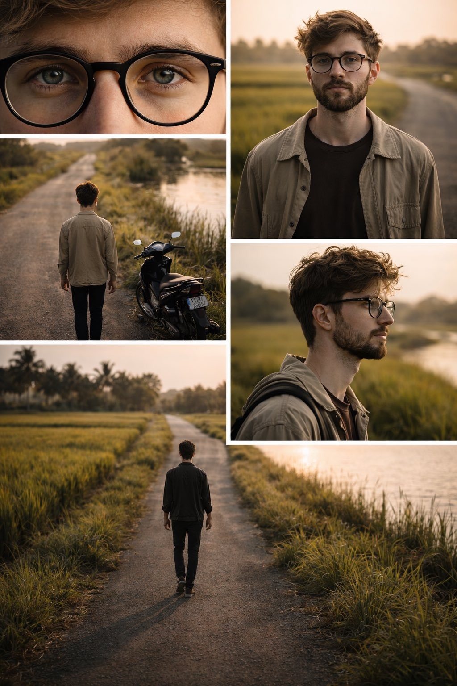

```
GPT Image 1.5

Prompt:
{
  "subject": {
    "type": "young man",
    "age": "early to mid 20s",
    "appearance": {
      "hair": "short to medium length, naturally styled",
      "expression": "calm, introspective, emotionally reserved",
      "skin_tone": "natural warm olive, soft and realistic",
      "features": "sharp thoughtful eyes, subtle stubble or clean-shaven, natural facial texture"
    },
    "clothing": "earth-tone minimalist outfit, long-sleeve shirt or lightweight jacket, contemporary and understated"
  },
  "scene": {
    "environment": "quiet rural roadside near rice fields",
    "location": "open rice paddies with distant trees and a soft horizon",
    "props": "simple parked motorcycle or compact car on the roadside",
    "time_of_day": "golden hour / late afternoon",
    "weather": "clear sky, gentle breeze moving the grass"
  },
  "composition": {
    "style": "cinematic storyboard grid",
    "shots": [
      "extreme close-up of eyes with natural light reflections",
      "medium portrait facing camera with soft sunlight on the face",
      "top-down shot from above showing the subject beside the road",
      "side profile portrait with wind subtly moving hair or clothing",
      "wide shot walking alone along the road between rice fields"
    ],
    "camera_angles": "mix of eye-level, overhead, and side angles",
    "framing": "subject centered with strong negative space and expansive landscape"
  },
  "lighting": {
    "type": "natural sunlight",
    "quality": "soft, diffused golden-hour light",
    "color_temperature": "neutral with warm highlights",
    "shadows": "gentle, realistic falloff"
  },
  "visual_style": {
    "mood": "quiet, reflective, contemplative",
    "color_grading": "muted earthy tones with slight cool shadows",
    "contrast": "low to medium",
    "film_look": "cinematic indie film aesthetic",
    "realism": "high, photorealistic"
  },
  "camera_settings": {
    "lens": "35mm–50mm cinematic lens",
    "depth_of_field": "shallow to medium",
    "focus": "sharp focus on subject, softly blurred background"
  },
  "quality": {
    "resolution": "4K",
    "detail": "high detail, realistic fabric texture and skin rendering",
    "noise": "minimal",
    "artifacts": "none"
  }
}
```

```
一位20岁出头至中期的年轻男子，留着短至中等长度、自然打理的头发，神情平静、内省且情感克制，肤色为自然温暖的橄榄色，肤质柔和逼真，五官特征包括锐利而富有思考感的眼神，轻微胡茬或干净剃须，面部纹理自然。身穿大地色系极简风格服装，如长袖衬衫或轻便夹克，整体造型现代而低调。

场景设定在宁静的乡间道路旁，靠近稻田，背景是开阔的水稻田、远处的树木和柔和的地平线，路边停着一辆简约的摩托车或小型汽车。时间为黄金时段（傍晚时分），天气晴朗，微风轻拂草地。

画面构图采用电影分镜故事板风格，包含以下镜头：  
- 眼睛的极致特写，带有自然光反射；  
- 中景人像正面面对镜头，脸部沐浴在柔和阳光下；  
- 从上方俯拍主角站在路边的画面；  
- 侧脸肖像，微风轻轻吹动头发或衣物；  
- 主角独自沿稻田间道路行走的广角镜头。  

摄影角度混合使用平视、俯视与侧拍，主体居中构图，留有大量负空间并展现广阔风景。

光线为自然日光，呈现柔和、漫射的黄金时刻光线效果，色调中性偏暖，阴影过渡自然柔和。

整体视觉风格安静、沉思、内敛，色彩调校以低饱和的大地色为主，阴影略带冷调，对比度低至中等，具有独立电影般的电影感，高度写实。

使用35mm至50mm电影镜头拍摄，景深浅至中等，主体清晰对焦，背景柔焦虚化。

图像分辨率为4K，细节丰富，真实呈现织物纹理与皮肤质感，噪点极少，无任何瑕疵。
```

 [↑返回目录](#toc)

---
## <a id="">复古巴士上的时尚旅行者</a> (<a href="https://x.com/iamsofiaijaz/status/2015337737860403283" target="_blank" rel="noopener noreferrer">Aijaz</a>)

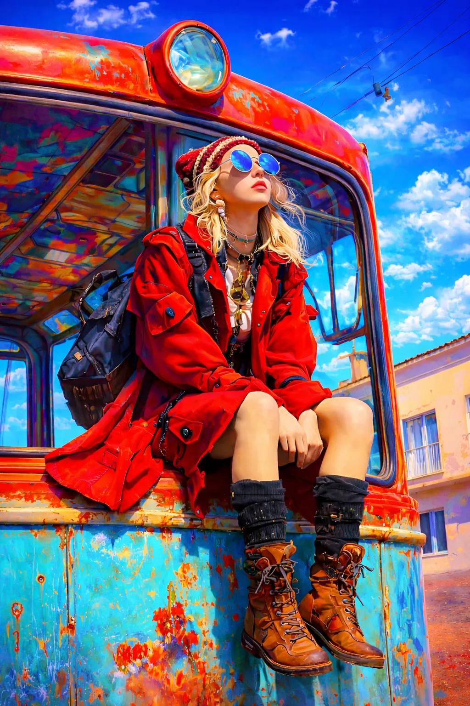

```
1. Open ChatGPT
2. Upload Your Image
3. Prompt
A stylish young woman sitting on the front edge of an old vintage bus, wearing a long red trench coat, woolen beanie cap, round blue reflective sunglasses, layered necklaces, and rugged brown leather boots. She has wavy blonde hair and a confident, dreamy expression, looking upward toward the sky. The bus is weathered with peeling paint in turquoise and rust red tones.Bright clear blue sky, urban background with minimal buildings, soft daylight, cinematic color grading, shallow depth of field, high fashion travel vibe, editorial photography, ultra-realistic, 4K resolution, sharp focus, natural skin texture, dramatic composition, film still aesthetic.
```

```
一位时尚年轻女子坐在一辆老式复古巴士的前缘，身穿一件长款红色风衣、羊毛针织帽、圆形蓝色反光太阳镜、多层项链和粗犷的棕色皮革靴子。她拥有波浪状的金发，神情自信而梦幻，目光望向天空。巴士车身斑驳，油漆剥落，呈现青绿色与锈红色调。背景是晴朗明亮的蓝天，城市景致中仅有少量建筑，光线柔和，采用电影级色彩调校，浅景深，充满高级时装旅行氛围，具有杂志大片风格，超写实画质，4K分辨率，焦点锐利，皮肤纹理自然，构图富有戏剧性，呈现电影剧照般的美学效果。
```

 [↑返回目录](#toc)

---
## <a id="">物品混合体</a> (<a href="https://x.com/meng_dagg695/status/2017261058982072577" target="_blank" rel="noopener noreferrer">ShaHid WaNii</a>)

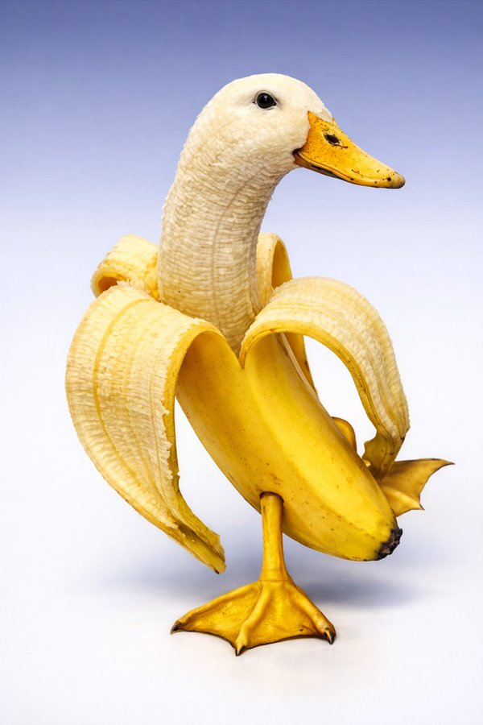

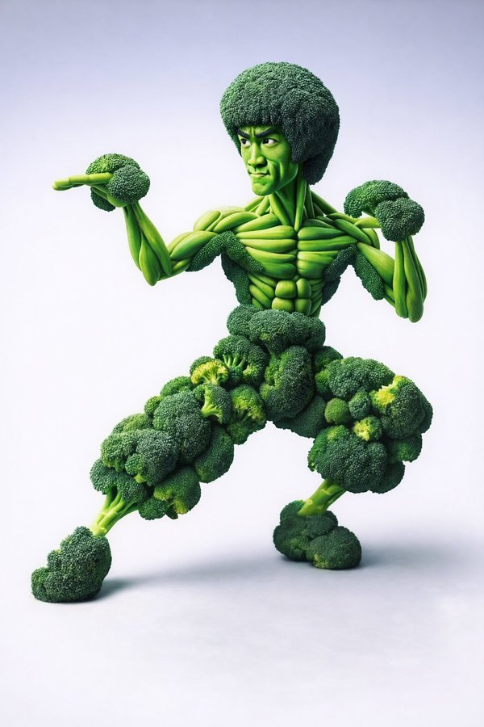

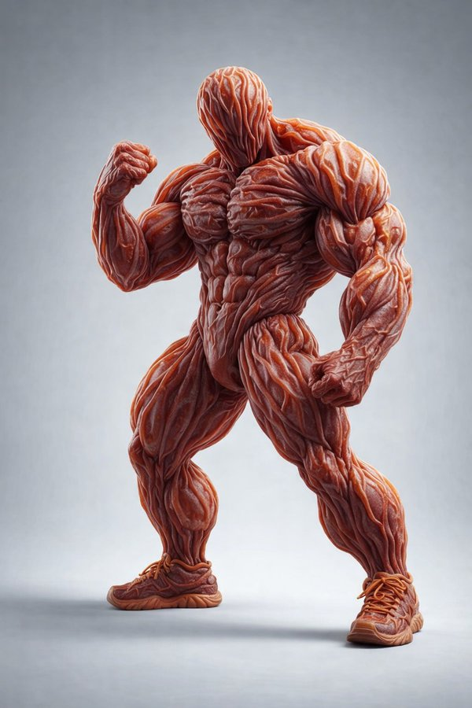

```
{
  "master_prompt": {
    "global_settings": {
      "resolution": "8K UHD",
      "aspect_ratio": "3:4",
      "quality": "ultra-high",
      "sharpness": "extreme clarity",
      "lighting": "studio-controlled, soft gradients",
      "background_style": "minimal, clean, distraction-free",
      "render_style": "clearly AI-edited, hyper-detailed, photorealistic-surreal hybrid"
    },

    "modules": {
      "module_1": {
        "module_name": "Image 1 – Banana Duck Hybrid",
        "subject_description": {
          "primary_form": "Hybrid creature combining a duck and a peeled banana",
          "head": {
            "type": "duck head",
            "color": "off-white to pale cream",
            "texture": "fine feather-like skin texture",
            "eyes": "small, round, glossy black eyes",
            "beak": {
              "color": "yellow-orange",
              "surface": "slightly speckled with darker spots",
              "shape": "smooth, curved, realistic duck beak"
            }
          },
          "body": {
            "core_structure": "banana",
            "color": "ripe yellow",
            "surface": "smooth with natural banana speckling",
            "banana_peels": {
              "count": 3,
              "position": "peeled outward symmetrically",
              "texture": "fibrous inner peel texture, slightly rough outer peel",
              "color_variation": "light yellow to pale cream"
            }
          },
          "legs_and_feet": {
            "type": "duck legs and webbed feet",
            "color": "golden yellow",
            "texture": "smooth, slightly glossy",
            "pose": "standing upright with one foot slightly forward"
          }
        },
        "pose_and_composition": {
          "orientation": "upright, centered",
          "camera_angle": "eye-level",
          "framing": "full body visible",
          "balance": "stable, symmetrical composition"
        },
        "background": {
          "color": "soft gradient from light blue to white",
          "texture": "smooth, studio backdrop",
          "shadows": "soft shadow beneath feet"
        }
      },

      "module_2": {
        "module_name": "Image 2 – Broccoli Martial Artist Figure",
        "subject_description": {
          "primary_form": "Humanoid figure made entirely of broccoli and green vegetables",
          "head": {
            "shape": "human-like face",
            "material": "smooth green vegetable texture",
            "hair": {
              "type": "dense broccoli florets",
              "shape": "rounded, afro-like silhouette",
              "texture": "tight clustered florets"
            },
            "facial_expression": "focused, intense, slightly stern",
            "eyes": "human-like, forward-looking"
          },
          "torso": {
            "build": "highly muscular",
            "muscle_definition": "exaggerated and clearly segmented",
            "material": "elongated green vegetable stalks forming muscle fibers"
          },
          "arms": {
            "shape": "muscular, flexed",
            "hands": {
              "form": "broccoli florets shaped into fists",
              "pose": "one arm extended forward, one arm bent"
            }
          },
          "legs": {
            "structure": "thick and powerful",
            "material": "clustered broccoli florets",
            "stance": "wide martial-arts stance"
          }
        },
        "pose_and_composition": {
          "orientation": "dynamic fighting pose",
          "camera_angle": "slightly low angle",
          "framing": "full body visible",
          "energy": "motion-ready, balanced tension"
        },
        "background": {
          "color": "light neutral gradient",
          "texture": "smooth studio backdrop",
          "shadows": "soft grounding shadow under feet"
        }
      }
```

```
8K 超高清分辨率，3:4 纵横比，超高质量，极致清晰度，影棚控制光线搭配柔和渐变，背景极简干净无干扰，渲染风格为明显 AI 编辑、超精细、写实与超现实融合。  

第一幅图像——香蕉鸭混合体：  
主体为鸭子与剥开的香蕉融合而成的混合生物。头部为鸭头，颜色为米白至淡奶油色，表面呈现细腻羽毛状皮肤纹理；眼睛小而圆，有光泽的黑色；喙呈黄橙色，略带深色斑点，形状平滑弯曲，逼真自然。身体以香蕉为主体，颜色为成熟的黄色，表面光滑并带有天然香蕉斑点；三片香蕉皮对称向外翻开，内侧纤维质感，外侧略粗糙，颜色从浅黄到淡奶油色过渡。腿部与脚蹼为鸭腿和蹼足，金黄色，表面光滑略带光泽，姿态直立，一脚略微前伸。整体构图居中直立，镜头平视，全身完整可见，画面稳定对称。背景为从浅蓝到白色的柔和渐变，采用光滑影棚背景布，脚下投射柔和阴影。  

第二幅图像——西兰花武术家形象：  
主体为完全由西兰花及其他绿色蔬菜构成的人形角色。头部为人脸轮廓，材质为光滑绿色蔬菜肌理；头发由浓密西兰花花簇组成，呈圆形爆炸头造型，花簇紧密聚集；面部表情专注、强烈且略显严肃，双眼类人，目光前视。躯干肌肉发达，肌理夸张分明，由拉长的绿色蔬菜茎秆构成肌肉纤维。双臂肌肉隆起，拳头由西兰花花簇塑形，一臂前伸，一臂弯曲。双腿粗壮有力，由密集西兰花花簇组成，呈宽大的武术马步姿态。整体姿态为动态战斗姿势，镜头略低角度仰拍，全身完整可见，充满蓄势待发的张力。背景为浅中性色柔和渐变，光滑影棚背景布，脚下有柔和投影。
```

 [↑返回目录](#toc)

---
## <a id="">可爱的南亚男子Q版卡通头像</a> (<a href="https://x.com/ChiyaanKaran07/status/2017797340598571239" target="_blank" rel="noopener noreferrer">G O T</a>)

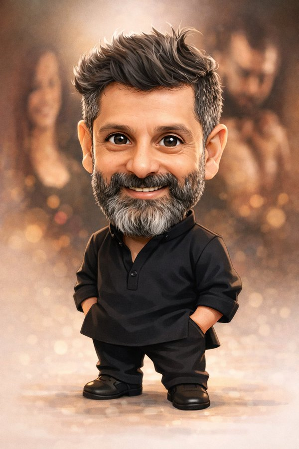

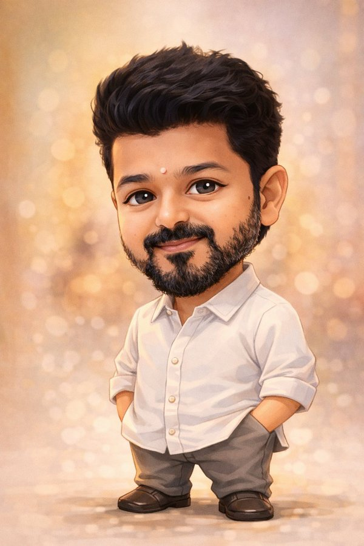

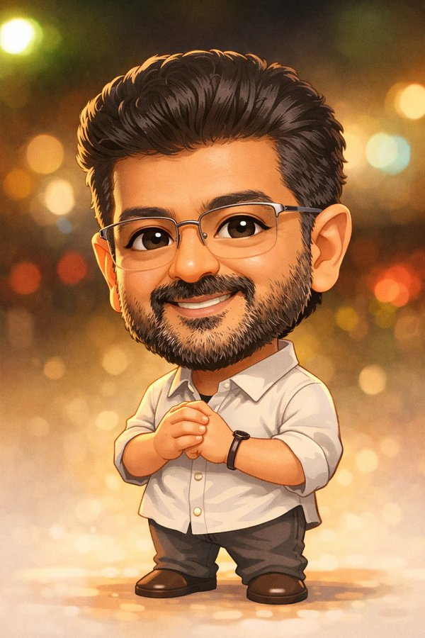

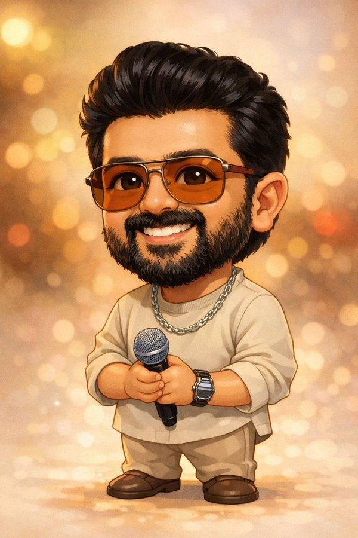

```
Open ChatGPT

Prompt 

A chibi-style cartoon illustration of a South Asian man with an oversized head and a very small, cute body (super-deformed proportions). He has neatly styled dark hair, a well-groomed beard, sharp expressive eyes, and a gentle confident smile. The face is slightly realistic but clearly cartoonish, with smooth skin and soft shading. He is wearing a simple light-colored shirt. Big head (70%), tiny body (30%), short arms and legs. Soft warm lighting, pastel tones, clean outlines, high-quality digital art. Background is softly blurred and minimal, giving a cinematic yet cute cartoon feel.
```

```
一张南亚男子的Q版卡通插画，头部巨大，身体非常小巧可爱（超级变形比例）。他有着整齐打理的深色头发、修剪得体的胡须、锐利而富有表现力的眼睛，以及温和自信的微笑。脸部略带写实感但明显是卡通风格，皮肤光滑，阴影柔和。他穿着一件简单的浅色衬衫。头部占70%，身体仅占30%，四肢短小。画面采用柔和温暖的光线、粉彩色调、清晰干净的轮廓线，为高质量数字艺术作品。背景轻微虚化且极简，营造出电影感又可爱的卡通氛围。
```

 [↑返回目录](#toc)

---
## <a id="">手工雕刻的埃隆·马斯克木像</a> (<a href="https://x.com/Sheldon056/status/2017886103781490917" target="_blank" rel="noopener noreferrer">Duet | AI</a>)

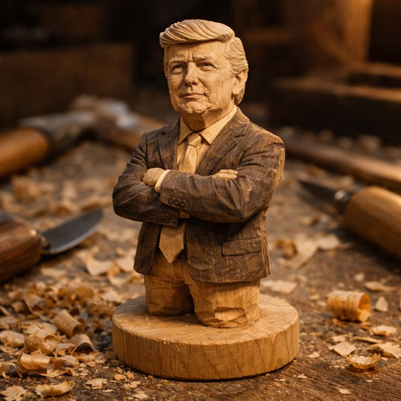

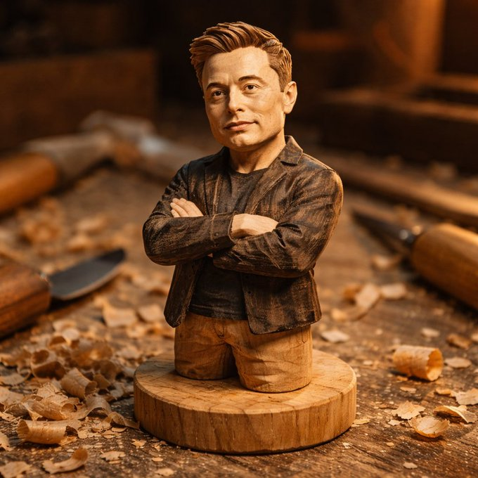

```
A hand-carved wooden miniature figure of [NAME], shaped with visible knife marks, natural grain texture, and smooth unfinished edges. Placed on a workshop table with carving tools, wood shavings, and soft warm directional lighting. 1080×1080.

Elon musk
```

```
一个手工雕刻的[NAME]木质微型人像，带有清晰可见的刀痕、天然木纹肌理和光滑未打磨的边缘。放置在工作台上，周围有雕刻工具、木屑，以及柔和温暖的定向灯光。1080×1080。

埃隆·马斯克
```

 [↑返回目录](#toc)

---
## <a id="">手机屏幕里走出的超现实女性</a> (<a href="https://x.com/wanerfu/status/2017780453080732054" target="_blank" rel="noopener noreferrer">摆烂程序媛</a>)

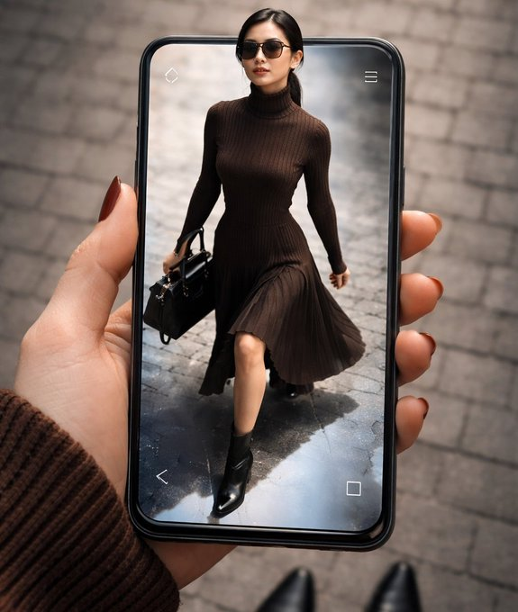

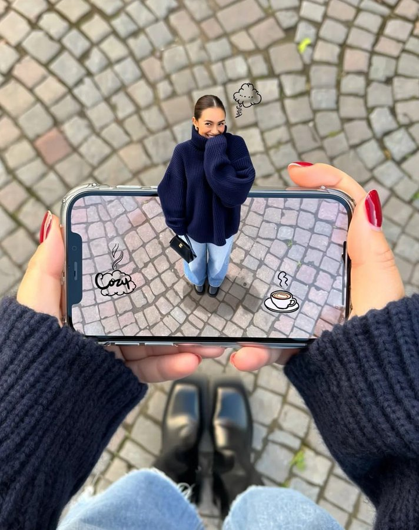

```
超现实电影感时尚摄影，第一人称视角俯视自然握持的智能手机。屏幕破裂处，一个超现实微型女性从屏幕浮出现实空间，数字与物理世界完美融合。

女性上半身和一条腿伸出屏幕，下半身留在屏幕内，保持完美比例。脚轻轻搭在玻璃边缘，在屏幕上投出柔和真实的影子。屏幕显示精妙的反射和深度变形。

她穿着优雅深棕色罗纹高领连衣裙、黑色皮靴、黑色墨镜，手提结构感黑色手袋。金色头发向后梳理，姿态自信，下巴微抬，似乎察觉观看者，踏入他们的世界。

现实环境呈现纹理灰色鹅卵石路面。摄影师的手自然握持设备，指甲深色抛光。画框下方可见摄影师的黑色尖头皮靴和棕色罗纹连衣裙下摆，加强沉浸式第一人称视角。

屏幕内保留细微 UI 涂鸦和社交图标，部分被浮出的身体遮挡，增强深度真实感。

光线柔和自然日光。超清焦点、玻璃和面料真实反射、精确比例、逼真纹理。浅景深突出主体同时维持环境真实感。高分辨率、专业编辑时尚摄影融现代 Instagram 超现实主义、干净构图、完美真实感和屏幕与主体的可信物理交互。
```

 [↑返回目录](#toc)

---
## <a id="">雨夜中的自信侧影</a> (<a href="https://x.com/harboriis/status/2018948213336907876" target="_blank" rel="noopener noreferrer">Harboriis</a>)

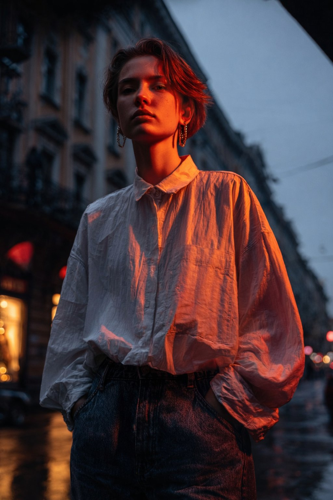

```
GPT Image 1.5

Prompt:
A cinematic portrait of a light skinned young adult woman with short brown hair, standing on a rainy city street at dusk. She wears a loose white cotton button up shirt with visible wrinkles and soft texture, sleeves relaxed, paired with dark wash straight leg jeans. Her hands rest casually in her pockets. She looks slightly downward and away from the camera with a calm, confident expression. Dramatic warm red and amber streetlight casts strong side lighting across her face and shirt, creating deep shadows and contrast. Wet pavement reflects city lights. Dark urban buildings fade into the background with soft bokeh. Shallow depth of field. Low angle perspective for a strong, cinematic feel. Shot on a Canon EOS R5, 85mm f 1.2 lens. Warm cinematic color grading with deep contrast. Aspect ratio 4:5.
```

```
一幅电影感肖像：一位浅肤色的年轻女性站在黄昏时分下雨的城市街道上，留着棕色短发。她穿着一件宽松的白色棉质纽扣衬衫，布料有明显褶皱和柔软质感，袖子自然垂落，搭配深色直筒牛仔裤。她的双手随意插在口袋里，目光微微向下并略偏移镜头，神情平静而自信。戏剧性的暖红色与琥珀色街灯从侧面强烈照亮她的脸部和衬衫，形成深邃的阴影与高对比度。湿漉漉的人行道反射着城市灯光，背景中深色的城市建筑以柔焦虚化淡出。浅景深，低角度视角，营造强烈的电影氛围。使用佳能 EOS R5 相机，85mm f/1.2 镜头拍摄。采用温暖的电影级色彩调校，具有深沉的对比度。画面比例为 4:5。
```

 [↑返回目录](#toc)

---
## <a id="">勇敢女性与美洲狮在金色草原上的电影级肖像</a> (<a href="https://x.com/iamsofiaijaz/status/2019366459982635412" target="_blank" rel="noopener noreferrer">Aijaz</a>)

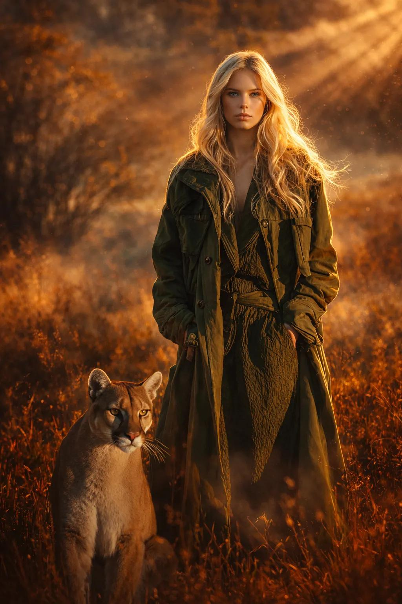

```
1. Open ChatGPT
2. Upload Your Image
3. Prompt
A cinematic portrait of a fearless blonde woman standing in a vast golden-brown grassland at golden hour. She wears an olive-green long coat and textured dress, hands in pockets, calm yet powerful expression. Beside her sits a majestic cougar (mountain lion), alert and loyal.Soft warm sunlight, shallow depth of field, dramatic natural tones, earthy color palette, cinematic lighting, ultra-realistic details, sharp focus on subject, soft background blur, movie poster style, 35mm photography, high contrast, moody atmosphere, professional color grading, 8K quality.
```

```
一部电影感十足的肖像作品：一位无畏的金发女子站在广袤的金褐色草原上，正值黄金时刻。她身穿橄榄绿长外套与富有质感的连衣裙，双手插在口袋中，神情平静却充满力量。一只雄伟的美洲狮（山狮）忠诚而警觉地坐在她身旁。画面沐浴在柔和温暖的阳光下，采用浅景深、戏剧性的自然色调与大地色系，电影级布光，超写实细节，主体清晰锐利，背景柔美虚化，风格如电影海报，采用35毫米胶片摄影，高对比度，氛围深沉，专业调色，8K画质。
```

 [↑返回目录](#toc)

---
## <a id="">灰墙前的现代肖像</a> (<a href="https://x.com/Naiknelofar788/status/2020066517577003291" target="_blank" rel="noopener noreferrer">simeon-sanai</a>)

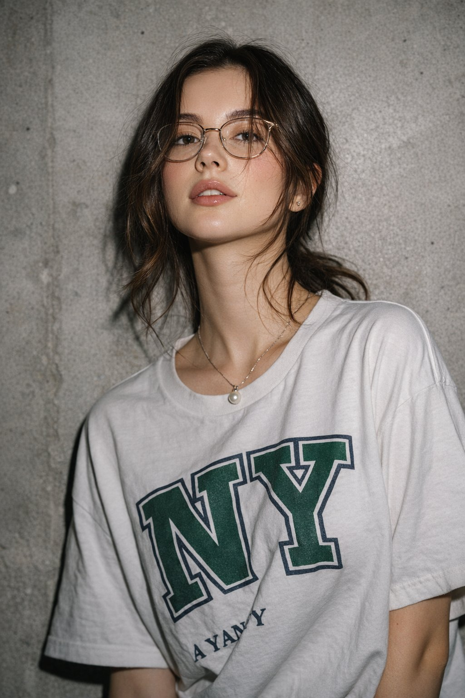

```
A high-resolution, close-up editorial-style portrait of a young woman standing against a textured gray concrete wall, captured with direct on-camera flash that creates a raw, moody, high-contrast aesthetic. She is positioned slightly angled to the side with her head tilted back and chin lifted, giving an effortlessly cool, candid expression. Her face has a fair, smooth complexion with a natural sheen from the flash, soft rosy blush across the cheeks, minimal eye makeup, lightly defined brows, and glossy natural pink lips that are slightly parted, conveying a relaxed yet confident mood. Wispy strands of her dark brown hair fall loosely across her face, partially covering one eye, while the rest of her hair is pulled back into a low, casual style, enhancing the spontaneous, fashion-editorial feel. Her eyes look slightly upward and past the camera, adding to the detached, artistic vibe. She is wearing a loose-fitting white oversized T-shirt with bold green typography reading “NY” across the chest, along with smaller blue text underneath, giving a casual streetwear aesthetic. Small, subtle stud earrings are visible, adding minimal detail without distracting from the overall look. A beautiful white perl pendent. The lighting is harsh and frontal, producing sharp shadows behind her on the wall and emphasizing skin texture, hair strands, and fabric folds, while the background remains simple and uncluttered. The color palette is muted and neutral—gray wall, white shirt, and green lettering—allowing the subject’s face and expression to remain the focal point. The overall atmosphere feels intimate, modern, slightly gritty, and effortlessly stylish, like a candid fashion snapshot captured at night with flash photography. Use this uploaded photo as the only and exact face reference. The generated image must use this same face exactly as shown, without any changes to identity, facial structure, or expression.
```

```
一张高分辨率、特写风格的纪实肖像，描绘一位年轻女子站在有质感的灰色混凝土墙前，使用直打机顶闪光灯拍摄，营造出原始、阴郁且高对比度的视觉效果。她身体微微侧转，头部后仰、下巴微抬，神情自然随性又略带酷感。她的肤色白皙光滑，闪光灯赋予肌肤自然光泽，双颊透出柔和红晕，妆容极简：眼妆淡雅，眉毛自然勾勒，双唇呈天然粉色调、略带光泽且微微张开，流露出放松而自信的情绪。几缕深棕色发丝随意垂落于面庞，部分遮住一只眼睛，其余头发则松散地束成低马尾，强化了即兴抓拍的时尚杂志感。她的目光略微向上、越过镜头，增添了一种疏离而艺术的氛围。她身穿宽松的白色超大T恤，胸前印有醒目的绿色“NY”字样，下方配有较小的蓝色文字，呈现休闲街头风格。耳朵上佩戴小巧精致的耳钉，细节低调不抢镜；颈间配戴一枚美丽的白色珍珠吊坠。光线强烈且正面直射，在墙面投下清晰锐利的阴影，突出皮肤纹理、发丝细节与衣物褶皱，背景简洁无杂。整体色调克制中性——灰墙、白T恤与绿色字母——使人物面部与表情成为绝对视觉焦点。整体氛围亲密、现代、略带粗粝感，又毫不费力地时髦，宛如夜间用闪光灯抓拍的一张随性时尚快照。必须严格使用上传照片中的面部作为唯一且精确的参考，生成图像需完全保留该面孔的身份特征、面部结构与表情，不得做任何改动。
```

 [↑返回目录](#toc)

---


[上一页](./3.md) | 当前 4/4 页 | [查看全部目录](../prompts.md)