# gemini.json 

gemini.json文件存放gemini相关的提示词，当前已收录：835个 

 投稿方式：[飞书投稿](https://tcn1uh5rxo87.feishu.cn/share/base/form/shrcne5gDolOMDd0oJsj2XfvxQc) or [issues](https://github.com/junxiaopang/gridsplitter/issues/new)

当前 1/9 页 | [下一页](./2.md) | [查看全部目录](../prompts.md)

🚀 **在线预览**: [https://prompts.kkkm.cn](https://prompts.kkkm.cn)

## <a id="toc">目录</a>

- [成都旅游地图](#prompt-499)
- [彩色手绘风格表情包](#prompt-485)
- [照片级真实感室内躺姿人像](#prompt-330)
- [全身写实时尚肖像照](#prompt-393)
- [白色枕头上的睡眼惺忪女孩](#prompt-388)
- [产品的工作室照片](#prompt-322)
- [女生坐沙发上](#prompt-333)
- [红色晚礼服女子](#prompt-359)
- [人和汽车的三视图](#prompt-384)
- [超逼真的野生动物摄影场景](#prompt-421)
- [日本乡村公交车站雨夜的场景](#prompt-497)
- [全身夜景肖像](#prompt-334)
- [手办-ZBrush建模屏显与万代风格包装盒](#prompt-298)
- [女人3D数字插画](#prompt-352)
- [电影感的超现实主义肖像画](#prompt-353)
- [一张极具戏剧张力的黑白特写肖像](#prompt-385)
- [传统的工笔风格水墨画](#prompt-481)
- [制作大头贴](#prompt-299)
- [赛博黄历](#prompt-500)
- [年轻的东亚女性K-Pop偶像风格](#prompt-399)
- [一幅超写实全身肖像与路飞互动](#prompt-406)
- [坐在巨大光滑的白色岩层上写真](#prompt-376)
- [超精细逼真的美丽女人肖像写真](#prompt-354)
- [和漫威角色集体自拍](#prompt-355)
- [正在更衣的女生](#prompt-392)
- [菜谱-番茄炒蛋](#prompt-476)
- [你抱着幼年版自己的复古风自拍](#prompt-345)
- [一枚精致的人物金属硬币](#prompt-375)
- [渐变挤出Google I/O 2025大会视觉效果](#prompt-84)
- [年轻女子身穿深色连帽衫的特写肖像](#prompt-401)
- [被几个动物环绕的自拍风格照片](#prompt-410)
- [老北京航拍](#prompt-502)
- [平抛运动轨迹与速度位移分解图](#prompt-503)
- [制作一个4×4的网格符合年代的风格](#prompt-484)
- [手办-高级包装带打印机（擎天柱）](#prompt-296)
- [一位中年男子数字漫画](#prompt-402)
- [一位女子从智能手机屏幕中走出](#prompt-411)
- [走廊上的女性](#prompt-331)
- [品牌创意3D广告](#prompt-363)
- [淡桃粉色宽松毛绒睡衣女孩](#prompt-386)
- [中国红自拍照片](#prompt-350)
- [超现实主义哥特式兔子工作室肖像](#prompt-370)
- [超逼真全身肖像与角色互动](#prompt-405)
- [人物和大型耿鬼](#prompt-346)
- [6张复古宝丽来照片](#prompt-317)
- [中秋月下秋千照片](#prompt-344)
- [铅笔风格的大头漫画](#prompt-413)
- [天伦图趣味水墨画](#prompt-455)
- [一个全新的Instagram账号](#prompt-506)
- [大唐长安插画](#prompt-501)
- [复古小报童写真](#prompt-349)
- [川剧变脸解密拆解图](#prompt-427)
- [坐在一个毛茸茸的巨型可爱卡通怪物旁](#prompt-374)
- [通过镜子捕捉时尚的卫生间更衣区](#prompt-369)
- [担担面高级海报](#prompt-515)
- [将素描人物添加到您的真实照片中](#prompt-448)
- [自信优雅的黑色西装女士](#prompt-362)
- [物体变成大胆的卡通滴水](#prompt-320)
- [戴着报童帽身穿黑色马甲](#prompt-379)
- [高清杂志跨页](#prompt-512)
- [茅屋秋风所破歌中文和拼音图](#prompt-461)
- [记忆宫殿学习英语](#prompt-509)
- [小世界也能成就大故事](#prompt-498)
- [皮克斯风格角色表](#prompt-110)
- [诸葛连弩的复古风格工程爆炸图](#prompt-483)
- [黑白风格肖像照写真](#prompt-356)
- [rick and morty画风卡片](#prompt-464)
- [全景式角色深度概念分解图](#prompt-478)
- [创建您自己的3D漫画](#prompt-313)
- [幽默涂鸦风格](#prompt-428)
- [咖啡厅室内女生](#prompt-391)
- [电影感的女生侧脸肖像写真](#prompt-366)
- [食谱信息图制作](#prompt-290)
- [14个毛茸茸的小家伙并排挤沙发上](#prompt-466)
- [三英飙车战吕布](#prompt-426)
- [中国各朝代时间轴](#prompt-507)
- [龙珠卡牌](#prompt-520)
- [黑白风格肖像照写真](#prompt-357)
- [90年代风格写真照片](#prompt-372)
- [高端工作室照片](#prompt-519)
- [从图像中创建图案或分解图](#prompt-439)
- [明星合拍](#prompt-467)
- [监控级别的时尚洞察力](#prompt-141)
- [地标信息图](#prompt-433)
- [最后的晚餐](#prompt-511)
- [一张年轻女性的逼真特写自拍照](#prompt-523)
- [手绘风格的信息图卡片](#prompt-1)
- [职业生涯历程可视化为地图](#prompt-436)
- [美妆检测器](#prompt-440)
- [长文本古诗画画](#prompt-429)
- [冬日国家](#prompt-219)
- [动漫与现实分割肖像](#prompt-430)
- [10种不同发型](#prompt-491)
- [动漫转真人](#prompt-517)
- [动漫转真人](#prompt-469)
- [美女竖拍肖像](#prompt-329)
- [西游记人物坐地铁](#prompt-434)
- [手绘风格的信息图卡片](#prompt-453)
- [图片的8种初始草图](#prompt-487)
- [一位年轻女性的时尚电影肖像](#prompt-367)

## <a id="prompt-499">成都旅游地图</a> (<a href="https://x.com/imaxichuhai/status/1991679696744976723" target="_blank" rel="noopener noreferrer">阿西_出海</a>)

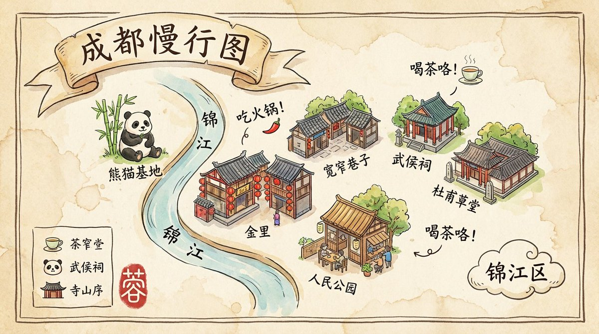

```
1、成都旅游地图

提示词：
画幅比例16:9，一张迷人而精致的成都手绘旅游地图，具有吉卜力工作室艺术设定集般的风格。整个画面是在一张有纹理的、陈旧的羊皮纸上的水彩和钢笔淡彩插画。整体美学风格异想天开、充满活力和生活气息。

地图布局与风格:
地图以风格化的等轴测视角，展示了成都的核心地标，这些地标被描绘成可爱、精细的微缩建筑和图标（例如，熊猫基地的熊猫、锦里的灯笼、人民公园的茶馆）。布局是有机的、自由流动的，而非基于僵硬的网格。

至关重要的字体排版挑战 (高难度部分):
所有文字必须以一种优美的、略带不完美感的手写书法风格（行楷）呈现，看起来就像是用绘制插图的同一支钢笔写出来的。
1.  **主标题:** 主标题“成都慢行图”被艺术性地写在顶部一条飘逸的缎带上。
2.  **带角度的趣味标签:** 每个地标图标旁边，都以俏皮的、略带倾斜的方式写着它的名字（例如：“宽窄巷子”、“武侯祠”、“杜甫草堂”）。文字需要感觉是有机放置的，而不是死板的水平线。
3.  **沿路径弯曲的文字:** 一条风格化的锦江贯穿地图。河流的名字“锦江”二字，需要沿着河流的弯曲路径优雅地书写。这是一个关键测试点。
4.  **融合性的注释:** 地图上散布着小小的、异想天开的注释，这些注释结合了文字和图标。例如：
    - 一条写着“吃火锅!”的注释，旁边画着一个小小的红辣椒。
    - 一个“喝茶咯!”的标签，旁边有一个冒着热气的微型茶杯图标。
    - 区域名称“锦江区”被写在一个手绘的云朵形状里。
5.  **手绘图例:** 在一个角落，有一个手绘的“图例”方框，里面有小图标（如茶杯、熊猫脸、寺庙屋顶）和它们对应的手写标签。
6.  **印章:** 一枚红色的、仿佛手工篆刻风格的印章，印着“蓉”字（成都的简称），被盖在角落，并与边框有轻微的重叠。

美学:
一幅插画地图学的杰作。文字和插图的融合必须天衣无缝。水彩效果要柔和，有可见的水渍和纹理，而钢笔线条则要自信而生动。整体感觉温暖、诱人，充满个性。

负面提示词:
电脑字体, 计算机生成的文字, 直线, 僵硬的网格, 完美对齐, 只有水平文字, 文字浮层, 照片, 3D, 极简, 通用图标, 拼写错误, 乱码, 水印。
```

 [↑返回目录](#toc)

---
## <a id="prompt-485">彩色手绘风格表情包</a> (<a href="https://x.com/Gorden_Sun/status/1992778144605212912" target="_blank" rel="noopener noreferrer">@Gorden_Sun</a>)

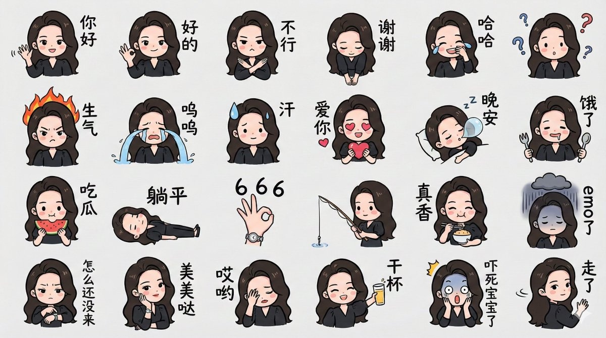

```
为我生成图中角色的绘制 Q 版的，LINE 风格的半身像表情包，注意头饰要正确
彩色手绘风格，使用 4x6 布局，涵盖各种各样的常用聊天语句，或是一些有关的娱乐 meme
其他需求：不要原图复制。所有标注为手写简体中文。
生成的图片需为 4K 分辨率 16:9
```

 [↑返回目录](#toc)

---
## <a id="prompt-330">照片级真实感室内躺姿人像</a> (<a href="https://x.com/IamEmily2050/status/1976068430798389550" target="_blank" rel="noopener noreferrer">@IamEmily2050</a>)

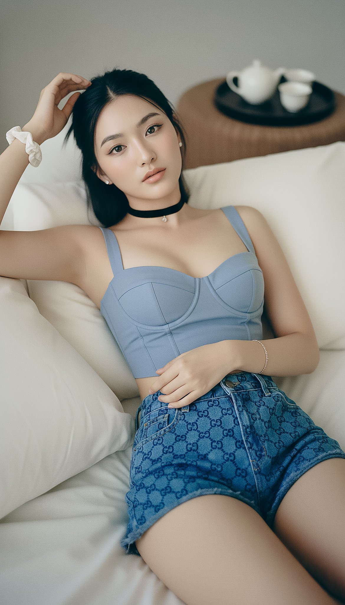

```
{
"photorealistic_indoor_reclining_portrait",
  "style": "Natural editorial portrait; lifelike texture; minimal, tasteful retouching.",
  "output": { "aspect_ratio": "9:16", "resolution_px": [1440, 2560], "color_profile": "sRGB" },

  "subject": {
    "category": "human",
    "gender_presentation": "female",
    "ethnicity": "East Asian",
    "age_bracket": "young_adult",
    "body": {
      "build": "slim with realistic proportions",
      "bust": "fuller bust (natural C–D cup), proportional to frame; gentle natural slope, supportive shaping—no extreme push-up",
      "skin_tone": "light neutral with natural variation"
    },
    "pose": {
      "orientation": "reclining on back, relaxed",
      "right_arm": "raised above head, fingers lightly touching hairline",
      "left_arm": "bent across torso, hand resting on midriff",
      "head": "slightly tilted toward camera left"
    },
    "face": {
      "shape": "oval with mild asymmetry and natural cheek volume",
      "expression": "soft and open",
      "gaze": "direct to camera"
    },
    "eyes": {
      "description": "natural-size, lively but realistic",
      "color": "neutral gray-blue (low saturation)",
      "size_ratio": { "iris_fraction_of_visible_eye": 0.29, "pupil_fraction_of_iris": 0.27 },
      "details": {
        "limbal_ring_strength": 0.08,
        "sclera_brightness_Lstar": 78,
        "sclera_texture": "fine veins and faint tear meniscus on lower lid",
        "catchlights": "two soft rectangular window reflections about 10% of iris width",
        "specular_quality": "satin (no glassy glare)",
        "iris_texture": "visible stromal fibers and subtle color noise"
      }
    },
    "makeup": "sheer base preserving pores; soft peach blush; brown mascara/liner; taupe eyeshadow; hydrated nude lips",
    "hair": { "length": "long", "style": "half-up with bun, slight wave; a few flyaways visible", "color": "natural black" },
    "wardrobe": {
      "outfit": "blue top with Gucci shorts",
      "top": "powder-blue cropped bustier with sweetheart neckline and structured cups; off-shoulder or slim straps; tasteful cleavage; opaque lined fabric; subtle corset seams; cropped length reveals a sliver of midriff",
      "bottom": "Gucci blue GG-monogram denim shorts (small-scale jacquard, navy/indigo on blue; correct 'GG' orientation; no extra text)",
      "accessories": {
        "jewelry": "thin black velvet choker with tiny pendant, small stud earrings, simple rings",
        "wrists": "white fabric scrunchie on right; delicate bracelets on left"
      }
    }
  },
     "environment": {
    "location": "bedroom",
    "set": "plush bed with slightly wrinkled off-white linens and pillows",
    "background_props": "upper right: dark round tray with small white ceramic tea set on textured brown surface"
  },

  "lighting": {
    "scheme": "window key + sheet bounce",
    "source": "large window through sheer curtains (or 120 cm softbox with double diffusion)",
    "quality": "very soft with defined direction",
    "direction": "45° from camera right and slightly top; white bedding as fill about 1.5 stops under key",
    "temperature": "5200K",
    "effect": "gentle modeling with soft nose/lip shadow; crisp but soft eye catchlights; no bloom"
  },

  "camera": {
    "sensor": "full-frame",
    "lens": { "focal_length_mm": 85 },
    "distance_m": 1.8,
    "exposure": {
      "aperture_f": 3.2,
      "iso": 200,
      "shutter_s": 0.005,
      "metering": "spot on cheekbone; ETTR then -0.3 EV to protect highlights on fabric"
    },
    "focus": {
      "target": "near eye",
      "depth_of_field": "moderate (eyes and bust plane in focus; bedding softly blurred)"
    },
    "framing": {
      "orientation": "vertical",
      "angle": "overhead with slight tilt toward face; avoid wide-angle distortion",
      "composition": "9:16 crop framed head to upper hips so bustier and Gucci shorts are visible without foreshortening"
    }
  },

  "color_grade": {
    "look": "true-to-life neutrals with blue accent",
    "contrast": "medium-low",
    "palette": "powder/indigo blues, ivory, soft brown",
    "notes": "retain skin undertones; avoid cyan cast; ensure Gucci blue reads clean without oversaturation"
  },

  "postprocess": {
    "skin": "retain pores and micro-shine; remove only transient blemishes; keep faint under-eye texture",
    "eyes": "no iris enlargement; subtle iris clarity and micro-contrast; limbal ring kept weak",
    "sharpen": "moderate on eyes/brows/hair strands and denim weave/monogram",
    "grain": "fine film grain at 1.5–2%",
    "effects": "disable beauty filters, frequency-separation blur, glow/bloom; no HDR skin"
  },

  "realism_cues": [
    "flyaway hairs around hairline",
    "subtle nasolabial and philtrum depth",
    "natural knuckle/tendon texture on left hand",
    "visible denim weave and aligned monogram on shorts",
    "fabric creases and bedding wrinkles"
  ],

  "negative_prompt": [
    "doll, BJD, porcelain skin, neotenous proportions, plastic/waxy texture",
    "oversized/anime/doe eyes, iris enlargement, glassy eyes",
    "bright cyan/ice-blue contacts, heavy limbal ring, unnaturally white sclera",
    "poreless skin, beauty filter, airbrushed, skin smoothing",
    "bloom/Orton glow, excessive skin luster",
    "CGI, 3D render, illustration, toon shading, LoRA: doll/BJD",
    "wide-angle facial distortion, extreme symmetry filter",
    "random text overlays, misspelled logos, watermarks",
    "see-through fabrics, wardrobe malfunction, underboob/sideboob, explicit NSFW",
    "distorted anatomy, extra fingers"
  ],

}
```

```
{
"照片级真实感室内躺姿人像",
  "风格": "自然杂志风人像；逼真质感；简约且精致的修图（保留真实细节）",
  "输出参数": { "宽高比": "9:16", "分辨率（像素）": [1440, 2560], "色彩配置文件": "sRGB" },

  "拍摄主体": {
    "类别": "人物",
    "性别呈现": "女性",
    "人种": "东亚人",
    "年龄段": "年轻成人",
    "身形": {
      "体型": "纤瘦且比例真实",
      "胸部": "丰满（自然C-D罩杯），与整体身形比例协调；线条自然柔和，有承托感，无过度聚拢效果",
      "肤色": "浅中性色，带有自然肤色差异（非均匀色块）"
    },
    "姿势": {
      "整体姿态": "仰卧，姿态放松",
      "右臂": "举过头顶，手指轻触发际线",
      "左臂": "弯曲横过躯干，手搭在腹部",
      "头部": "略微向镜头左侧倾斜"
    },
    "面部": {
      "脸型": "椭圆形，略带不对称感，脸颊饱满度自然",
      "表情": "柔和、舒展",
      "目光": "直视镜头"
    },
    "眼部": {
      "描述": "大小自然，灵动且真实",
      "颜色": "中性灰蓝色（低饱和度）",
      "大小比例": { "虹膜占可见眼球比例": 0.29, "瞳孔占虹膜比例": 0.27 },
      "细节": {
        "虹膜边缘环清晰度": 0.08（近乎隐形）,
        "眼白亮度（L*值）": 78,
        "眼白质感": "细微血管，下眼睑有淡泪痕",
        "眼神光": "两处柔和的长方形窗户反光，宽度约为虹膜的10%",
        "光泽质感": "丝缎质感（无玻璃般的强光反射）",
        "虹膜纹理": "可见基质纤维，带有细微色彩颗粒感"
      }
    },
    "妆容": "轻薄底妆（保留毛孔）；柔和桃色腮红；棕色睫毛膏/眼线；灰褐色眼影；水润裸色唇膏",
    "发型": { "长度": "长发", "造型": "半扎丸子头，略带波浪；可见几根碎发", "颜色": "自然黑色" },
    "服饰": {
      "整体搭配": "蓝色上衣配古驰（Gucci）短裤",
      "上衣": "粉蓝色短款抹胸，心形领口，带立体罩杯；露肩或细肩带设计；领口弧度优雅；面料厚实不透视（带里衬）；带有精致束腰缝线；短款设计露出一小截腹部",
      "下装": "古驰（Gucci）蓝色双G提花牛仔短裤（小尺寸提花图案，藏青/靛蓝色花纹印于蓝色基底上；双G标志方向正确；无多余文字图案）",
      "配饰": {
        "珠宝": "黑色细天鹅绒项圈（带小巧吊坠）、小巧耳钉、简约戒指",
        "腕部饰品": "右手戴白色布艺发圈；左手戴精致手链"
      }
    }
  },

  "环境": {
    "场景": "卧室",
    "布景": "柔软的床，铺有略带褶皱的米白色床品和枕头",
    "背景道具": "右上角：深色圆形托盘（置于纹理棕色表面上），托盘内放有小型白色陶瓷茶具"
  },

  "光线": {
    "布光方案": "窗户主光+床单反光补光",
    "光源": "透过薄窗帘的大窗户（或120厘米双扩散柔光箱）",
    "光线质感": "极其柔和，且方向明确",
    "光线方向": "从镜头右侧45°角、略高于主体的位置入射；白色床品作为补光（亮度比主光低1.5档）",
    "色温": "5200K（标准白光）",
    "光影效果": "柔和的轮廓塑造（鼻子/唇部阴影自然）；清晰且柔和的眼神光；无光晕溢出"
  },

  "相机参数": {
    "传感器": "全画幅",
    "镜头": { "焦距（毫米）": 85 },
    "拍摄距离（米）": 1.8,
    "曝光参数": {
      "光圈值": 3.2,
      "感光度（ISO）": 200,
      "快门速度（秒）": 0.005（即1/200秒）,
      "测光方式": "点测光（测光点为颧骨）；向右曝光（ETTR）后降低0.3档曝光值，以保护面料高光细节"
    },
    "对焦": {
      "对焦目标": "靠近镜头一侧的眼睛",
      "景深": "中等（眼睛与胸部处于同一焦平面，保持清晰；床品轻微虚化）"
    },
    "构图": {
      "画面方向": "竖版",
      "拍摄角度": "俯拍，镜头略微向面部倾斜；避免广角畸变",
      "裁切比例": "9:16裁切，画面覆盖头部至髋部上方，确保抹胸与古驰短裤完整呈现，且无透视变形"
    }
  },

  "调色": {
    "风格": "真实中性色调，以蓝色为点缀色",
    "对比度": "中低",
    "色调 palette": "粉蓝/靛蓝色、米白色、柔和棕色",
    "注意事项": "保留皮肤原有底色；避免青蓝色色偏；确保古驰蓝色呈现纯净质感，无过度饱和"
  },

  "后期处理": {
    "皮肤处理": "保留毛孔与细微油光；仅去除临时瑕疵（如痘痘）；保留淡淡的眼下纹理",
    "眼部处理": "不放大虹膜；轻微增强虹膜清晰度与微对比度；保留弱虹膜边缘环",
    "锐化": "对眼睛/眉毛/发丝、牛仔面料纹理/提花图案进行适度锐化",
    "颗粒感": "添加1.5%-2%的细腻胶片颗粒",
    "效果禁用": "关闭美颜滤镜、频率分离模糊、光晕/柔光效果；不使用HDR皮肤处理"
  },

  "真实感细节提示": [
    "发际线处的碎发",
    "自然的鼻唇沟与人中立体感",
    "左手手指关节/肌腱的真实纹理",
    "短裤上清晰的牛仔面料纹理与对齐的提花图案",
    "面料褶皱与床品自然褶皱"
  ],

  "负面提示（需避免）": [
    "玩偶感、球形关节娃娃（BJD）、瓷娃娃质感皮肤、幼态化比例、塑料/蜡质质感",
    "过大眼睛/动漫眼/小鹿眼、虹膜放大、玻璃质感眼睛",
    "亮青色/冰蓝色美瞳、明显虹膜边缘环、不自然的雪白眼白",
    "无毛孔皮肤、美颜滤镜效果、磨皮过度、皮肤光滑失真",
    "光晕效果/奥顿柔光效果（Orton glow）、皮肤过度油光",
    "CGI效果、3D渲染、插画风格、卡通 shading、玩偶/球形关节娃娃（BJD）相关模型（LoRA）",
    "广角镜头面部畸变、过度对称滤镜效果",
    "随机文字叠加、logo拼写错误、水印",
    "透视装/面料过透、服饰走光、露下胸/侧胸、不雅内容（NSFW）",
    "肢体结构扭曲、多手指"
  ]
}
```

 [↑返回目录](#toc)

---
## <a id="prompt-393">全身写实时尚肖像照</a> (<a href="https://x.com/IamEmily2050/status/1983742027058835543" target="_blank" rel="noopener noreferrer">@IamEmily2050</a>)

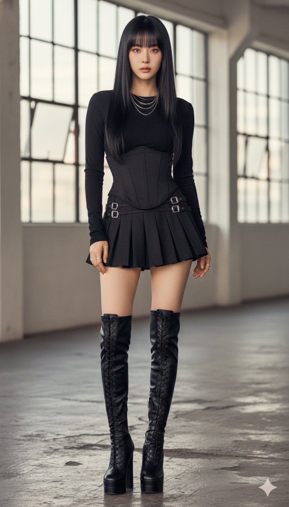

```
{
  "instruction": "Generate a full-body, photorealistic fashion portrait of a modern East Asian idol in all-black styling. The result must look like a professional test shot, not anime, not cosplay, not fantasy.",

 "subject": {
    "identity": "East Asian female idol, early 20s look, pale smooth skin, symmetrical features, refined jawline, large natural eyes, soft neutral lips.",
    "hair": {
      "color": "jet-black",
      "style": "straight with blunt bangs framing the eyes",
      "length": "long, falling past the chest",
      "optional_variants": [
        "clean straight hair down",
        "twin high ponytails with bangs and loose face-framing strands"
      ]
    },
    "body": {
      "build": "slender, long-legged, elegant proportions, model-like lines",
      "posture": "calm, confident, controlled posture, standing tall",
      "pose": "full-body standing pose, relaxed arms at sides or slight hip angle, natural stance, no exaggerated arching"
    }
  },

  "wardrobe": {
    "palette": "all black, monochrome styling",
    "look_variants": [
      {
        "description": "long-sleeve fitted black top with structured waist (corset-like shaping), short pleated mini skirt with belt hardware, over-the-knee black lace-up boots with platform heel, subtle layered silver jewelry"
      },
      {
        "description": "black cropped top, exposed midriff, slim black jeans, fitted choker stack and pendant necklace, matte black boots"
      }
    ],
    "note": "Outfit must read as high-fashion / street idol aesthetic, not fantasy costume, not sci-fi armor, not latex fetishwear."
  },

  "camera": {
    "framing": "full-body portrait from head to shoes, vertical composition, subject centered and filling most of the frame",
    "angle": "slightly low to mid-torso camera height for subtle leg lengthening OR neutral eye-level framing against a doorway",
    "lens_behavior": "clean realistic perspective, no wide distortion, no fisheye",
    "focus": "sharp focus across the subject from face to boots, depth of field appropriate for fashion photography"
  },

  "environment": {
    "style_options": [
      "industrial interior with worn tile floor and large window frame / metal framing in the background, muted gray tones",
      "neutral architectural doorway outdoors, pale stone or painted door, soft natural light"
    ],
    "lighting": "soft, diffused, natural-feeling light with gentle directional falloff. Skin should look smooth and real, not plastic. No neon rim light, no colored gels."
  },

  "aesthetic": {
    "tone": "clean Korean idol / street editorial test shot",
    "color_grade": "subtle cool neutrals in the background, deep matte blacks in wardrobe, natural skin tones",
    "finish": "high-end fashion photography, not fantasy art, not anime render, not glossy VR avatar"
  },

  "technical_rendering": {
    "intent": "photorealistic human subject",
    "keywords": [
      "cinematic portrait photography",
      "studio-quality fashion still",
      "PBR material realism on fabric texture (matte black cloth, leather belt, lace-up boots)",
      "no exaggerated body morph",
      "no plastic skin",
      "no cel-shaded look"
    ]
  },

  "negative": {
    "forbidden_styles": [
      "anime style",
      "cartoon style",
      "3D game character",
      "virtual idol hologram look",
      "cyberpunk fantasy costume",
      "latex catsuit aesthetic",
      "sci-fi armor",
      "bright colored hair",
      "oversized eyes / doll face",
      "hyper-airbrushed Barbie texture",
      "warped body proportions",
      "fish-eye distortion",
      "text overlays or watermarks"
    ],
    "forbidden_words": [
      "NSFW pose",
      "explicit lingerie framing",
      "cutesy cosplay expression",
      "aggressive pin-up arching"
    ]
}
```

```
{
“说明”：“请创作一张现代东亚偶像全身写实时尚肖像照，造型为全黑。作品必须看起来像专业试镜照，而非动漫、角色扮演或奇幻风格。”

“主题”： {
“身份”：“东亚女偶像，二十出头的外貌，白皙光滑的皮肤，五官对称，下颌线条精致，大而自然的眼睛，柔和的裸色嘴唇。”
“头发”： {
颜色： 纯黑色，
“发型”：“齐刘海修饰眼睛的直发”，
长度：很长，垂过胸部，
"optional_variants": [
“干净利落的直发向下”，
“双高马尾辫，配刘海和垂在脸颊两侧的碎发”
]
}，
“身体”： {
“体型”：“纤细、修长、比例优雅、线条优美”，
“姿势”：“冷静、自信、控制的姿势，挺拔的站姿”
“姿势”：“全身站立姿势，双臂放松地放在身体两侧或髋部略微弯曲，站姿自然，不要过度拱背”
}
}，

“衣柜”： {
“调色板”：“全黑单色风格”，
"look_variants": [
{
“描述”：黑色长袖修身上衣，腰部收紧（类似束身衣的塑形效果），短款百褶迷你裙，配有腰带，黑色过膝系带厚底靴，精致的叠戴银色首饰。
}，
{
描述：黑色露脐上衣，露出小蛮腰，黑色修身牛仔裤，贴身颈链叠戴吊坠项链，哑光黑色靴子
}
]，
“注意”：“服装必须体现高级时装/街头偶像美学，而不是奇幻服装、科幻盔甲或乳胶恋物癖服装。”
}，

“相机”： {
“构图”：“从头到脚的全身像，竖构图，主体居中并占据画面的大部分”，
“角度”：“略低于躯干中部的相机高度，以微妙地拉长腿部，或者以中性的视线高度靠在门口构图”，
"lens_behavior": "清晰逼真的透视效果，无严重畸变，无鱼眼效果"
“焦点”： “从脸部到靴子，主体清晰对焦，景深适合时尚摄影”
}，

“环境”： {
"style_options": [
“工业风格的室内装潢，地面铺着磨损的瓷砖，背景是大型窗框/金属框架，整体色调为柔和的灰色。”
“中性色调的建筑风格户外入口，浅色石材或油漆门，柔和的自然光线”
]，
“照明”：“柔和、漫射、感觉自然的光线，光线方向性衰减要柔和。皮肤应该看起来光滑真实，而不是塑料感。不要使用霓虹灯轮廓光，也不要使用彩色滤光片。”
}，

“审美的”： {
"色调": "干净的韩国偶像/街头时尚大片试拍",
"color_grade": "背景采用柔和的冷色调中性色，服装采用深哑光黑色，肤色自然",
“成品”：高端时尚摄影，而非奇幻艺术、动漫渲染或华丽的VR虚拟形象。
}，

“technical_rendering”：{
“意图”: “逼真的人物主体”，
“关键词”：[
“电影式人像摄影”，
“摄影棚品质的时尚剧照”，
“织物纹理上的 PBR 材质真实感（哑光黑布、皮带、系带靴）”
“没有夸张的体型变化”，
“没有塑料皮肤”，
“没有卡通渲染风格”
]
}，

“消极的”： {
"forbidden_​​styles": [
“动漫风格”，
“卡通风格”，
“3D游戏角色”，
“虚拟偶像全息影像”
“赛博朋克奇幻服装”，
“乳胶紧身衣美学”，
“科幻盔甲”，
“色彩鲜艳的头发”，
“大眼睛/娃娃脸”，
“过度修饰的芭比娃娃质感”，
“扭曲的体型比例”，
“鱼眼畸变”，
“文字叠加或水印”
]，
"forbidden_​​words": [
“NSFW姿势”，
“露骨的内衣镜头”，
“可爱的角色扮演表情”，
“激进的性感拱背”
]
}
```

 [↑返回目录](#toc)

---
## <a id="prompt-388">白色枕头上的睡眼惺忪女孩</a> (<a href="https://x.com/songguoxiansen/status/1981178369262964886" target="_blank" rel="noopener noreferrer">@songguoxiansen</a>)


```
{
  "scene": {
    "location": "Bedroom, in bed",
    "background": "White pillows and soft, rumpled bedsheets, soft morning light"
  },
  "subject": {
    "age": "adult",
    "description": "East Asian woman, beautiful 'just woke up' messy hair, sleepy eyes",
    "wardrobe": "Simple, thin-strap camisole (e.g., silk or cotton), strap slightly falling off one shoulder",
    "accessories": "None",
    "pose": "Lying on her stomach in bed, propped up on her elbows, looking at the camera",
    "expression": "Soft, sleepy smile, intimate, 'good morning' look",
    "gaze": "Direct to camera, soft and alluring",
    "body_notes": "Photorealistic, realistic adult proportions; natural skin texture, visible collarbones, 'sleepy' flush"
  },
  "camera": {
    "sensor": "full_frame",
    "focal_length_mm": 50,
    "aperture_f": 1.8,
    "shutter_s": 0.01,
    "iso": 400,
    "white_balance_k": 5500,
    "distance_m": 1.5,
    "camera_height_m": 0.8,
    "framing": "Close-up (chest-up), at eye level with her",
    "focus": "eye_detect_AF on nearest eye"
  },
  "lighting": {
    "key": "Large, diffused window light from the side, creating very soft shadows",
    "fill": "Bounced light from the white sheets",
    "hair": "Soft halo from the window",
    "catchlights": "Large, soft window catchlights",
    "notes": "Very soft, high-key, intimate"
  },
  "color_grade": {
    "style": "Intimate, soft, 'morning' aesthetic",
    "palette": "Whites, skin tones, pastels; soft, luminous skin",
    "contrast": "Very low, dreamy",
    "saturation": "Moderate, soft"
  },
  "makeup": {
    "eyes": "None, 'bare face' look",
    "cheeks": "Natural, sleepy flush",
    "lips": "Natural, hydrated"
  },
  "postprocess": {
    "retouch": "Professional retouching, maintain "real skin" look",
    "clarity": "Selective clarity on eyes and lashes",
    "dodge_burn": "Subtle dodge on eyes and collarbone",
    "vignette": "Subtle, bright vignette"
  },
  "art_direction": {
    "mood": "Flirty, intimate, ambiguous, soft, sleepy, alluring",
    "keywords": ["photorealistic", "flirty", "morning", "in bed", "ambiguous", "natural beauty", "sleepy"]
  },
  "negative_prompts": [
    "nsfw",
    "underage look",
    "text or logos",
    "plastic doll skin",
    "cg",
    "3d render",
    "anime",
    "heavy makeup",
    "warped hands"
  ]
}
```

```
{
“场景”： {
"location": "卧室，在床上",
"background": "白色枕头、柔软、皱巴巴的床单、柔和的晨光"
}，
“主题”： {
"年龄": "成人",
"description": "东亚女子，美丽的‘刚睡醒’凌乱的头发，睡眼惺忪的眼睛",
"wardrobe": "简单的细肩带吊带背心（例如丝绸或棉质），肩带略微从一侧肩膀垂下",
"accessories": "无",
"pose": "趴在床上，用手肘支撑身体，看着镜头",
"expression": "温柔、困倦的微笑、亲密的‘早上好’表情",
"gaze": "直视镜头，柔和而诱人",
"body_notes": "照片般逼真的成人比例；自然的皮肤纹理，清晰可见的锁骨，‘困倦’的红晕"
}，
“相机”： {
“传感器”：“全帧”，
"焦距毫米": 50,
“aperture_f”：1.8，
“shutter_s”：0.01，
“iso”：400，
"白平衡k": 5500,
“距离米”：1.5，
“相机高度”：0.8，
"framing": "特写（胸部以上），与她视线齐平",
“focus”：“eye_detect_AF 在最近的眼睛上”
}，
“灯光”： {
"key": "从侧面射入的大型漫射窗光，形成非常柔和的阴影",
"fill": "从白色床单反射的光线",
"hair": "窗户透出的柔和光晕",
"catchlights": "大而柔和的窗户聚光灯",
"notes": "非常柔软，高调，亲密"
}，
“颜色等级”：{
"style": "亲密、柔和、‘早晨’美学",
"palette": "白色、肤色、粉彩色；柔软、明亮的皮肤",
"contrast": "非常低，梦幻",
"saturation": "中等，柔和"
}，
“化妆品”： {
"eyes": "无，‘素颜’样子",
"cheeks": "自然、困倦的红晕",
"lips": "自然、水润"
}，
“后处理”：{
"retouch": "专业修图，保持“真实肌肤”外观",
"clarity": "选择性地清晰眼睛和睫毛",
"dodge_burn": "眼睛和锁骨处细微减淡",
"vignette": "微妙、明亮的小插图"
}，
“艺术指导”：{
"mood": "轻浮、亲密、暧昧、柔和、困倦、诱人",
"keywords": ["照片写实", "调情", "早晨", "在床上", "模棱两可", "自然美", "困倦"]
}，
"negative_prompts": [
“nsfw”，
“未成年的样子”，
“文字或徽标”，
“塑料娃娃皮肤”，
“cg”，
“3D渲染”，
“日本动画片”，
“浓妆艳抹”，
“扭曲的手”
]
}
```

 [↑返回目录](#toc)

---
## <a id="prompt-322">产品的工作室照片</a> (<a href="https://x.com/Kerroudjm/status/1969779989282246838" target="_blank" rel="noopener noreferrer">@Kerroudjm</a>)

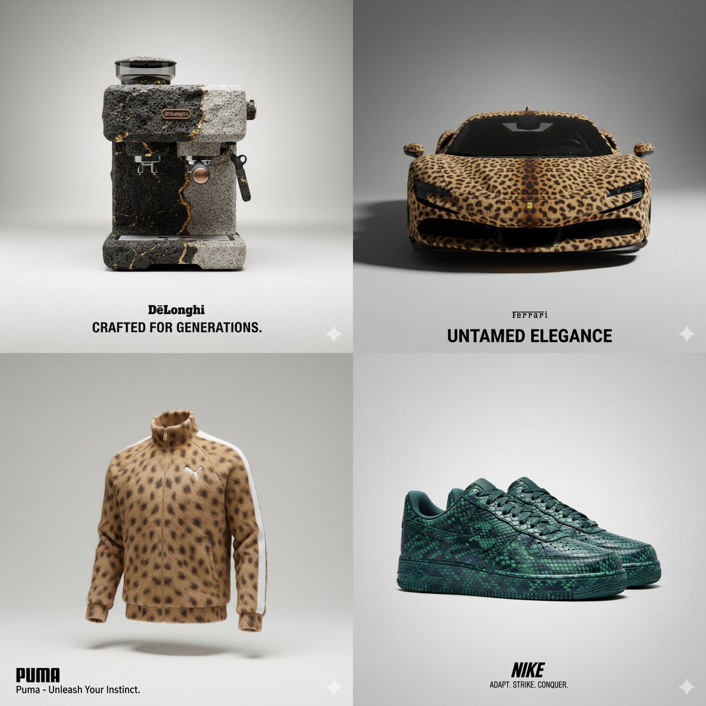

```
A high-quality studio photograph of a [BRAND] fully covered in ultra-realistic [ANIMAL] texture (e.g., fur, feathers, skin, or scales), placed against a soft neutral background. The object’s original shape, key design elements, and brand identity remain clearly visible beneath the animal’s organic surface. Integrate the official logo of the brand prominently into the composition. Automatically generate a compelling and brand-appropriate slogan that draws symbolic inspiration from the animal’s qualities and matches the tone of a premium advertising campaign. The image must feature clean composition, soft shadows, minimalist styling, professional lighting, and highly detailed textures—each hair, scale, or wrinkle should be visible in sharp detail. Format 1:1.
```

```
一张高质量的工作室照片，[品牌] 全身覆盖超逼真的 [动物] 纹理（例如毛皮、羽毛、皮肤或鳞片），置于柔和的中性背景中。在动物的自然表皮下，物体的原始形状、关键设计元素和品牌标识清晰可见。将品牌官方标识醒目地融入构图。自动生成引人注目且契合品牌形象的宣传语，该宣传语应从动物的特质中汲取象征性灵感，并与高端广告宣传的基调相符。图片必须构图清晰、阴影柔和、造型简约、灯光专业，并具有高度精细的纹理——每根毛发、鳞片或皱纹都应清晰可见。格式 1:1。
```

 [↑返回目录](#toc)

---
## <a id="prompt-333">女生坐沙发上</a> (<a href="https://x.com/IamEmily2050/status/1975554358495654236" target="_blank" rel="noopener noreferrer">@IamEmily2050</a>)


```
{
  "style": "High-key studio portrait, direct flash aesthetic, East Asian social media style (e.g., Ulzzang, Douyin), stylized beauty retouching.",
  "output": {
    "color_profile": "sRGB",
    "render_intent": "photo"
  },
  "subject": {
    "category": "human",
    "gender_presentation": "female",
    "ethnicity": "East Asian (e.g., Korean, Chinese)",
    "age_bracket": "young_adult",
    "body": {
      "build": "slim",
      "proportions": "natural human anatomy",
      "posture": "relaxed on sofa, seated casually",
      "pose": "seated, legs crossed and tucked close to body",
      "gesture": "Right hand raised, fingers loosely curled, back of fingers/knuckles gently supporting the chin and lower cheek.",
      "head_tilt_deg": 5
    },
    "face": {
      "expression": "Playful, alluring",
      "gaze": "right eye direct to camera",
      "eye_action": "winking with the left eye",
      "skin_tone": "Very pale porcelain (lightened aesthetic)",
      "makeup": "Stylized K-Beauty/Douyin look: flawless matte base, strong pink blush high on cheeks, pink gradient lips, defined brows, light eyeliner, emphasized Aegyo-sal",
      "features": "small beauty mark/mole under the left eye"
    },
    "hair": {
      "length": "long",
      "style": "messy high updo/bun with loose strands and curtain bangs",
      "color": "dark brown"
    },
    "wardrobe": {
      "top": "white fitted cropped camisole",
      "outerwear": "light gray zip hoodie, worn open and slightly slipping off both shoulders",
      "bottom": "white lounge shorts with drawstring",
      "footwear": "barefoot"
    }
  },
  "environment": {
    "location": "studio or minimalist interior",
    "set": "black leather sofa against a plain white or light gray wall",
    "props": "Silver laptop (Apple MacBook, logo visible) placed on the cushion to the subject's right (camera left)"
  },
  "lighting": {
    "key": {
      "source": "strobe/flash",
      "modifier": "Bare reflector or direct flash (hard source)",
      "position": "Near camera axis, slightly camera-right and above eye line",
      "effect": "Crisp, dark, well-defined cast shadows on the wall directly behind subject; strong specular highlights on skin and sofa leather."
    },
    "fill": {
      "type": "minimal/none"
    },
    "ambient": "suppressed",
    "white_balance_K": 5800
  },
  "camera": {
    "system": "Digital Camera",
    "sensor": "full-frame equivalent",
    "lens": {
      "type": "prime",
      "focal_length_mm": 50
    },
    "exposure": {
      "iso": 100,
      "aperture_f": 4.0,
      "metering": "Bright exposure, high-key aesthetic"
    },
    "focus": {
      "target": "near eye (right eye)",
      "depth_of_field": "moderate"
    },
    "framing": {
      "orientation": "vertical",
      "crop": "mid-thigh to head with room above hair",
      "angle": "eye-level",
      "composition": "subject centrally framed"
    }
  },
  "color_grade": {
    "look": "Bright, clean, slightly cool tone",
    "contrast": "High contrast",
    "saturation": "moderate, emphasized pinks"
  },
  "postprocess": {
    "noise_reduction": "high",
    "texture": "Highly smoothed skin, poreless appearance ('porcelain doll' or 'beauty filter' effect)",
    "sharpen": "selective on eyes/lashes",
    "blemish_control": "Complete removal of all blemishes and texture."
  },
  "quality_targets": [
    "accurate limb lengths and joint angles",
    "correct finger count and articulation",
    "realistic fabric tension and folds",
    "accurate winking expression"
  ],
  "negative_prompt": [
    "no altered or exaggerated body proportions",
    "no extra or fused fingers",
    "no realistic skin texture, pores, or blemishes",
    "no text or watermarks (excluding specified logos)",
    "no extreme wide-angle distortion",
    "no NSFW content",
    "no dark/moody lighting",
    "no warm tones"
  ]
}
```

```
{
"style": "高调影棚人像，闪光灯直击美感，东亚社交媒体风格（例如Ulzzang、抖音），风格化美颜修图。",
“输出”： {
"color_profile": "sRGB",
"render_intent": "照片"
}，
“主题”： {
“类别”：“人类”，
"gender_presentation": "女性",
"ethnicity": "东亚人（例如韩国人、中国人）",
"age_bracket": "young_adult",
“身体”： {
"build": "slim",
"比例": "自然人体解剖学",
"posture": "放松地坐在沙发上，随意地坐着",
"pose": "坐着，双腿交叉，身体紧贴身体",
"gesture": "右手举起，手指松散地卷曲，手指背面/指关节轻轻支撑下巴和下脸颊。",
“头部倾斜度”：5
}，
“脸”： {
"expression": "俏皮、诱人",
"gaze": "右眼直视相机",
"eye_action": "用左眼眨眼",
"skin_tone": "非常苍白的瓷器（明亮的美学）",
"makeup": "风格化的韩妆/抖音妆容：完美哑光底妆，脸颊上浓重的粉色腮红，粉色渐变唇妆，清晰的眉毛，淡淡的眼线，强调的撒娇，
"features": "左眼下方有一颗小美人痣"
}，
“头发”： {
"length": "长",
"style": "凌乱的高髻/发髻，散落的发束和窗帘刘海",
“颜色”：“深棕色”
}，
“衣柜”： {
"top": "白色修身短款吊带背心",
“外套”：“浅灰色拉链连帽衫，敞开穿着，双肩略微滑落”，
"bottom": "白色抽绳休闲短裤",
“鞋类”：“赤脚”
}
}，
“环境”： {
"location": "工作室或简约室内",
"set": "黑色皮沙发搭配纯白色或浅灰色墙壁",
"props": "银色笔记本电脑（Apple MacBook，标志可见）放置在拍摄对象右侧的垫子上（相机左侧）"
}，
“灯光”： {
“钥匙”： {
"source": "频闪/闪光",
"modifier": "裸露的反射器或直接闪光（硬源）",
"position": "靠近相机轴，略微位于相机右侧且高于视线",
"effect": "拍摄对象正后方的墙壁上投射出清晰、暗淡、轮廓分明的阴影；皮肤和沙发皮革上出现强烈的镜面高光。"
}，
“充满”： {
“类型”：“最小/无”
}，
“环境”：“抑制”，
“白平衡K”：5800
}，
“相机”： {
"system": "数码相机",
“传感器”：“全画幅等效”，
“镜片”： {
“类型”：“主要”，
“焦距毫米”：50
}，
“接触”： {
"iso": 100,
"aperture_f": 4.0,
“测光”：“明亮的曝光，高调的美感”
}，
“重点”： {
"target": "近眼（右眼）",
"depth_of_field": "中等"
}，
“框架”：{
“方向”：“垂直”，
"crop": "从大腿中部到头部，头发上方有空间",
"角度": "视线水平",
"composition": "主体居中"
}
}，
“颜色等级”：{
"look": "明亮、干净、略带冷色调",
"contrast": "高对比度",
“饱和度”：“中等，强调粉红色”
}，
“后处理”：{
"noise_reduction": "高",
"texture": "肌肤高度光滑，无毛孔外观（‘瓷娃娃’或‘美颜滤镜’效果）",
“锐化”：“选择性地针对眼睛/睫毛”，
"blemish_control": "彻底去除所有瑕疵和纹理。"
}，
"质量目标": [
“准确的肢体长度和关节角度”，
“正确的手指计数和发音”，
“逼真的织物张力和褶皱”，
“精准的眨眼表情”
]，
"negative_prompt": [
“没有改变或夸大身体比例”，
“没有多余的或融合的手指”，
“没有真实的皮肤纹理、毛孔或瑕疵”，
“无文字或水印（指定徽标除外）”，
“没有极端的广角畸变”，
“禁止 NSFW 内容”，
“没有黑暗/忧郁的灯光”，
“没有暖色调”
]
}
```

 [↑返回目录](#toc)

---
## <a id="prompt-359">红色晚礼服女子</a> (<a href="https://x.com/ReemKhan_07/status/1979887420930974163" target="_blank" rel="noopener noreferrer">@ReemKhan_07</a>)

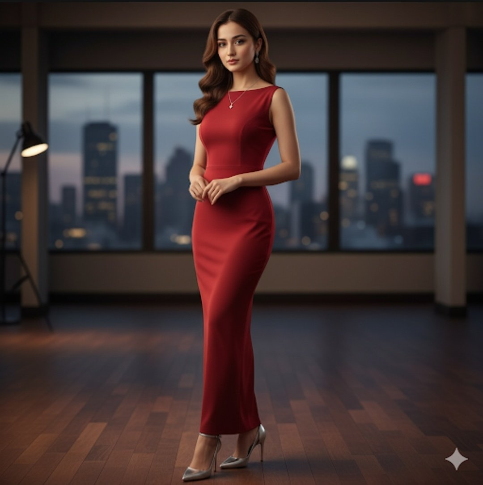

```
​A full-body studio portrait of a beautiful young woman with long, wavy brown hair and the exact facial features as the second image provided, wearing an elegant, sleeveless, floor-length red evening gown. She is wearing a silver pendant necklace and matching silver earrings. The dress is a smooth, form-fitting fabric and she is wearing silver high, slim-heeled pumps. She is standing in a luxurious, modern penthouse setting with a dark wood floor and large floor-to-ceiling windows overlooking a city skyline at twilight. Her pose is poised and confident, with her hands clasped lightly in front of her. The lighting is soft and dramatic.
```

```
这是一张工作室拍摄的全身肖像，描绘的是一位美丽的年轻女子，她有着一头长长的棕色波浪卷发，五官与第二张照片一模一样，身着优雅的无袖及地红色晚礼服。她佩戴着一条银色吊坠项链和与之相配的银色耳环。裙子面料光滑贴身，脚穿银色细高跟鞋。她站在一间奢华现代的顶层公寓里，深色木地板和宽大的落地窗俯瞰着暮色中的城市天际线。她姿态泰然自若，充满自信，双手轻轻握在身前。灯光柔和而富有戏剧性。
```

 [↑返回目录](#toc)

---
## <a id="prompt-384">人和汽车的三视图</a> (<a href="https://x.com/songguoxiansen/status/1983425570596892858" target="_blank" rel="noopener noreferrer">@songguoxiansen</a>)


```
A cinematic automotive photoshoot of me, keeping my real face unchanged. The scene is composed of three perspectives as a :

1. Top Panel: Interior close-up: I am seated inside the car, wearing a fitted black polo shirt, shown in the side mirror reflection. My face is serious and focused, my gaze directed forward with determination. The angle captures only side view part of my profile, framed cleanly within the mirror, emphasizing intensity and precision.

2.Middle Panel: I am standing confidently next to a sleek black Ford Mustang. My posture is relaxed but strong: both arms are crossed over my chest in a confident manner, while my left leg is straight and my right leg bent slightly at the knee, with the foot leaning casually against the car. My gaze is directed slightly off-camera, with a calm and assertive expression. I am wearing a fitted black polo shirt with subtle detailing, slim grey jeans with a clean cut, and brown leather boots. My outfit is minimal yet stylish, emphasizing a modern masculine vibe. Pose like a pro, same face as the uploaded photo.

3. Bottom Panel: Rear car shot: The camera captures the back of the Mustang, showcasing the "YOUR NAME" license plate and muscular lines of the car. The photo emphasizes the glossy texture of the vehicle and its aggressive, cinematic presence. The setting is an urban environment with modern architecture and concrete walls, giving a gritty, cinematic atmosphere. The lighting is natural but slightly diffused, highlighting both me and the polished surface of the car.

The perspectives vary:

- The mirror reflection close-up is shot tight with a portrait focal length (~85mm).

- The exterior full-body shot is taken at eye-level with a slightly wide lens to capture both me and the car in full view.

- The rear car angle uses a low perspective to emphasize power and presence.

Style: Cinematic automotive editorial, urban setting, moody and stylish, professional fashion-meets- car photography, same face.
```

 [↑返回目录](#toc)

---
## <a id="prompt-421">超逼真的野生动物摄影场景</a> (<a href="https://x.com/NanoBanana_labs/status/1988840767994126797" target="_blank" rel="noopener noreferrer">@NanoBanana_labs</a>)

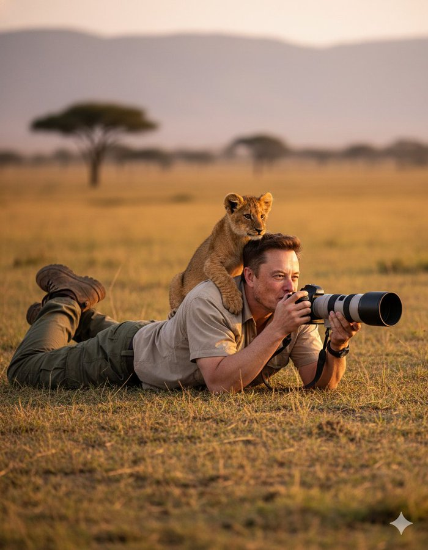

```
Ultra-realistic wildlife photography scene, (use reference face from uploaded photo). A man wearing proper wildlife-safari clothing — light brown outdoor shirt, rugged cargo pants, and sturdy field boots. He is lying flat on the grassy ground, holding a professional DSLR camera with a large telephoto lens, focusing on wildlife. On his shoulder sits a playful lion cub looking into the distance. Golden hour natural light, African savannah background, cinematic depth of field, 8K detail, vibrant colors. Keep my face 100% accurate. HD quality DSLR.
```

```
超逼真的野生动物摄影场景（使用上传照片中的参考人脸）。一位身着专业野生动物狩猎服的男子——浅棕色户外衬衫、结实耐用的工装裤和厚实的野外靴。他平躺在草地上，手持一台配备长焦镜头的专业单反相机，正专注于拍摄野生动物。他的肩上趴着一只活泼的小狮子，正眺望着远方。拍摄于黄金时段的自然光线下，以非洲稀树草原为背景，拥有电影级的景深，8K超高清细节，色彩鲜艳。力求100%还原我的面部特征。高清单反拍摄。
```

 [↑返回目录](#toc)

---
## <a id="prompt-497">日本乡村公交车站雨夜的场景</a> (<a href="https://x.com/lexx_aura/status/1992864343709663397" target="_blank" rel="noopener noreferrer">@lexx_aura</a>)

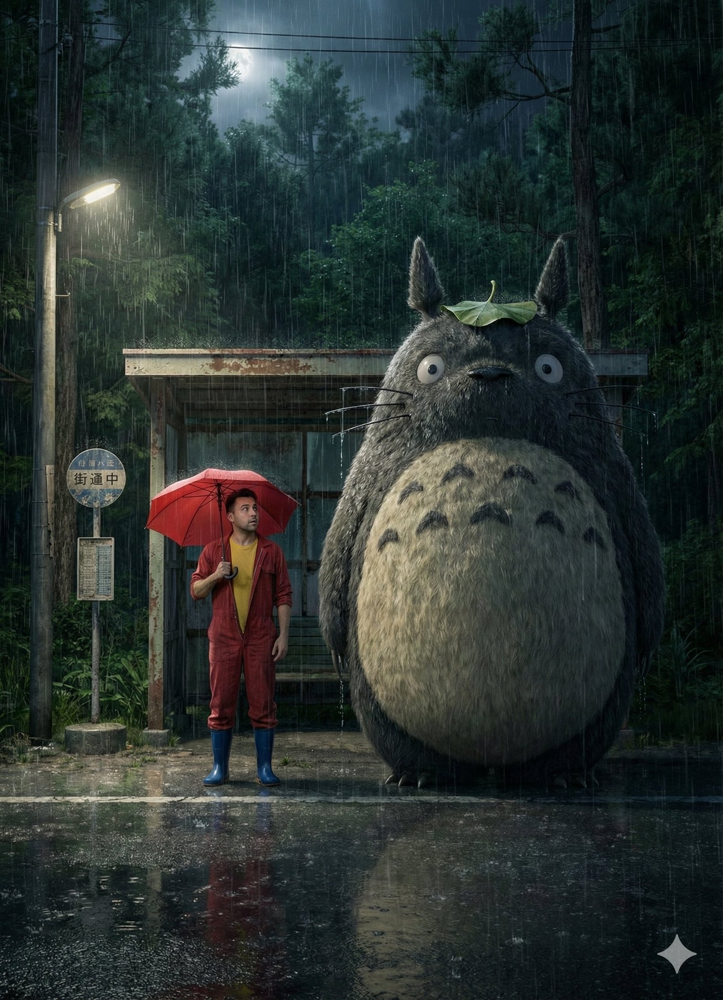

```
{
  "image_generation_prompt": {
    "full_text": "An ultra-realistic 8K UHD photograph of a rainy night scene at a rural Japanese bus stop. A person (based on the attached photos, with a normal build) is standing, holding a small red umbrella, wearing a red jumpsuit, blue boots, and a yellow t-shirt, looking to the side with an expression of apprehension and curiosity. Beside him, a gigantic, realistic Totoro creature, with wet fur and a leaf on its head, waits in the rain. The setting includes an aged bus stop sign, dense wet forest trees in the background, and the lighting comes from a dim lamppost and the moon, with realistic rain reflections on the wet asphalt. Wide shot. The face must be sharp and expressive.",
    "technical_specs": {
      "medium": "Photograph",
      "resolution": "8K UHD",
      "style": "Ultra-realistic",
      "composition": "Wide shot",
      "focus": "Sharp and expressive face"
    },
    "lighting": {
      "sources": ["Dim lamppost", "Moon"],
      "effects": ["Realistic rain reflections on wet asphalt"]
    },
    "environment": {
      "location": "Rural Japanese bus stop",
      "weather": "Rainy night",
      "background": "Dense wet forest trees",
      "props": ["Aged bus stop sign"]
    },
    "subjects": [
      {
        "type": "Human",
        "reference_source": "Attached photos",
        "build": "Normal",
        "attire": {
          "clothing": "Red jumpsuit, yellow t-shirt",
          "footwear": "Blue boots",
          "accessories": "Small red umbrella"
        },
        "pose": "Standing, looking to the side",
        "expression": "Apprehension and curiosity"
      },
      {
        "type": "Creature",
        "identity": "Gigantic realistic Totoro",
        "details": ["Wet fur", "Leaf on head"],
        "action": "Waiting in the rain"
      }
    ]
  }
}
```

```
{
"image_generation_prompt": {
"full_text": "一张超逼真的8K超高清照片，描绘的是日本乡村公交车站雨夜的场景。照片中，一位身材正常的男子（根据附图）手持一把红色小伞，身穿红色连体裤、蓝色靴子和黄色T恤，侧身看向一旁，脸上带着一丝担忧和好奇。在他身旁，一只巨大的、栩栩如生的龙猫，毛发湿漉漉的，头上顶着一片树叶，在雨中等待着。场景中包含一块老旧的公交车站牌，背景是茂密的湿润森林，光线来自昏暗的路灯和月光，雨水在湿漉漉的沥青路面上倒映出逼真的光影。广角镜头。面部表情必须清晰且富有表现力。"
"technical_specs": {
“媒介”：“照片”，
分辨率：8K 超高清，
风格：超写实
构图：广角镜头，
“焦点”：“轮廓分明、富有表现力的脸庞”
},
“灯光”： {
“来源”：[“昏暗的路灯”，“月亮”]，
“效果”：[“湿沥青路面上逼真的雨水反射”]
},
“环境”： {
"地点": "日本乡村巴士站",
“天气”：“雨夜”，
“背景”：“茂密的湿润森林树木”，
道具：[“老旧的公交车站牌”]
},
“主题”：[
{
“类型”：“人类”，
"reference_source": "附图",
"构建": "正常",
着装：{
“服装”：“红色连体裤，黄色T恤”，
“鞋类”：“蓝色靴子”，
“配件”： “红色小伞”
},
“姿势”：“站立，侧视”，
“表情”：“忧虑和好奇”
},
{
"type": "生物",
“身份”：“巨大的逼真龙猫”，
细节：[“湿漉漉的毛皮”，“头上的叶子”]
“动作”：“在雨中等待”
}
]
}
}
```

 [↑返回目录](#toc)

---
## <a id="prompt-334">全身夜景肖像</a> (<a href="https://x.com/IamEmily2050/status/1966758558483272144" target="_blank" rel="noopener noreferrer">@IamEmily2050</a>)

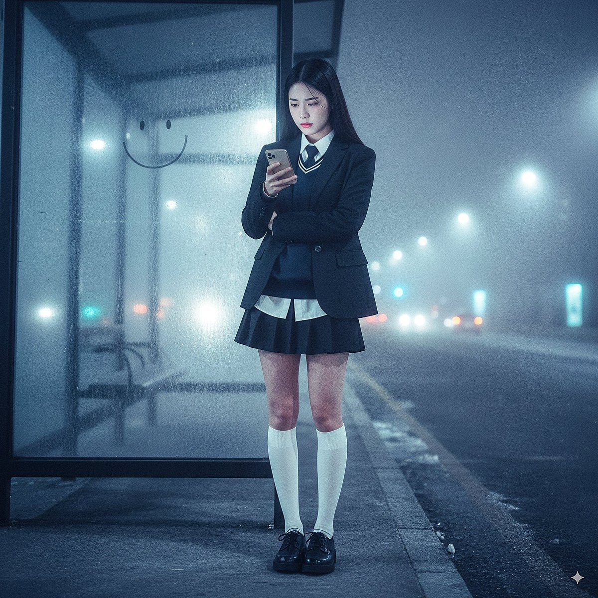

```
{
    "description": "A hyper-realistic, 4K, full-body night-time portrait of a 23-year-old Korean woman with clear pale skin and long straight black hair tucked behind one ear.",
    "subject": {
      "age": 23,
      "ethnicity": "Korean",
      "skin_tone": "pale",
      "hair": {
        "colour": "black",
        "style": "long, straight, tucked behind one ear"
      },
      "pose": "standing at a frost-covered bus stop, arms folded against the cold",
      "expression": "70 % quiet annoyance, 30 % amused resignation, as if re-reading a text she regrets sending"
    },
    "outfit": {
      "top_layers": [
        "black blazer",
        "navy sweatshirt",
        "crisp white dress shirt",
        "thin black tie"
      ],
      "bottom": "ultra-short black pleated skirt",
      "legwear": "brand-new white knee-length pelerine socks",
      "footwear": "polished black shoes"
    },
    "environment": {
      "location": "night-time city bus stop",
      "ground": "icy pavement reflecting distant headlights",
      "fog": "dense, occupying the top third of the frame",
      "bus_shelter": {
        "glass": "steamed-up with one finger-drawn smiley that melts faster than the surrounding condensation"
      },
      "lighting": "cool blue-white, high contrast, cinematic"
    },
    "hidden_detail": "reflection in her left shoe: a blurred red double-decker bus that may or may not be arriving",
    "camera": {
      "angle": "low eye-level, full body in frame",
      "lens_simulation": "Phase-One medium-format realism",
      "depth_of_field": "sharp focus on subject, soft bokeh on distant lights"
    },
    "output": {
      "style": "hyper-realistic, cinematic, cool colour grading"
    }
  }
}
```

```
{
"description": "这是一张超现实主义、4K、全身夜景肖像，照片中的一名 23 岁的韩国女性，皮肤白皙，一头长长的直黑发别在耳后。",
“主题”： {
“年龄”：23岁，
“种族”：“韩国人”，
"skin_tone": "苍白",
“头发”： {
“颜色”：“黑色”，
“style”：“长而直，塞在一只耳朵后面”
}，
"pose": "站在结霜的公交车站，双臂交叉抵御寒冷",
“表达”：“70% 是无声的恼怒，30% 是好笑的顺从，就像在重读一条她后悔发过的短信”
}，
“全套服装”： {
"顶层"：[
“黑色西装外套”，
“海军蓝运动衫”，
“清爽的白色正装衬衫”，
“细黑领带”
]，
"bottom": "超短黑色百褶裙",
"legwear": "全新白色及膝长袜",
“footwear”：“抛光黑鞋”
}，
“环境”： {
"location": "夜间城市公交车站",
“ground”：“结冰的路面反射着远处的车灯”，
"雾"："浓密，占据了画面的上三分之一"
"公交车站"：{
“玻璃”：“用手指画的笑脸被蒸腾起来，融化得比周围的冷凝水还快”
}，
“照明”：“冷蓝白色，高对比度，电影感”
}，
"hidden_​​detail": "她左脚鞋子里的倒影：一辆模糊的红色双层巴士，可能快到了，也可能还没到"
“相机”： {
"角度": "低视线，全身在画面中",
"lens_simulation": "Phase-One 中画幅真实感",
"depth_of_field": "清晰对焦主体，柔和远方灯光的散景"
}，
“输出”： {
“风格”：“超现实、电影、酷炫色彩分级”
}
}
}
```

 [↑返回目录](#toc)

---
## <a id="prompt-298">手办-ZBrush建模屏显与万代风格包装盒</a> (<a href="https://x.com/songguoxiansen/status/1964874262768160975" target="_blank" rel="noopener noreferrer">@songguoxiansen</a>)

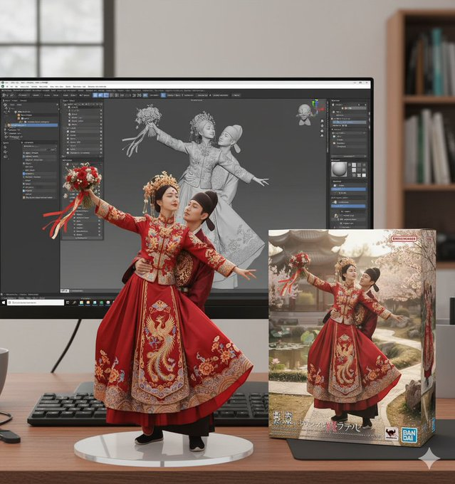

```
create a 1/7 scale commercialized figure of thecharacter in the image, in a realistic styie and environment.
Place the figure on a computer desk, using a circular transparent acrylic base without any text.
On the computer screen, display the ZBrush modeling process of the figure.
Next to the computer screen, place a BANDAl-style toy packaging box printedwith the original artwork.
```

```
在现实的风格和环境中，创建图像中角色的 1/7 比例商业化人物形象。
将图形放置在电脑桌上，使用没有任何文字的圆形透明丙烯酸底座。
在电脑屏幕上，显示人物的ZBrush建模过程。
在电脑屏幕旁边，放置一个印有原创艺术品的BANDAl风格玩具包装盒。
```

 [↑返回目录](#toc)

---
## <a id="prompt-352">女人3D数字插画</a> (<a href="https://x.com/SimplyAnnisa/status/1980553716131414281" target="_blank" rel="noopener noreferrer">@SimplyAnnisa</a>)

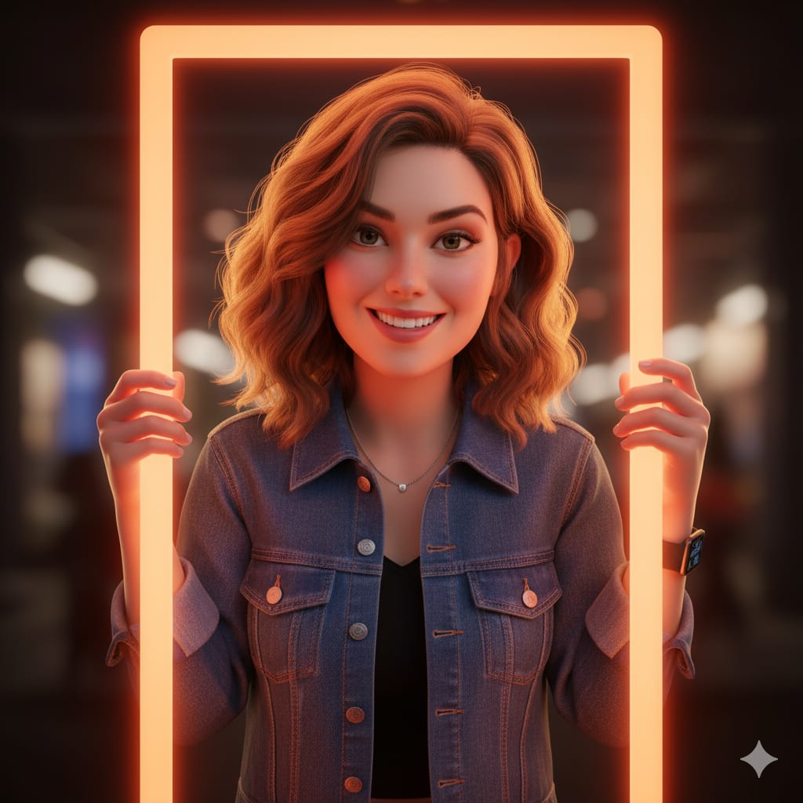

```
A hyper-realistic 3D digital illustration of a woman with her natural facial features, hairstyle, and skin tone unchanged, styled in a Pixar-inspired cinematic look. She is smiling warmly while leaning through a glowing orange rectangular frame, both hands gently holding the edge of the frame. She wears a denim jacket layered over a black top, subtle jewelry, and a smartwatch on her wrist. The lighting is soft yet vibrant, highlighting facial depth, realistic fabric texture, and warm glow reflections on her face and hands. The background is softly blurred, creating a cinematic atmosphere with a perfect blend of realism, warmth, and Pixar-style charm.
```

```
这幅超写实的3D数字插画描绘了一位女性，其自然的五官、发型和肤色均未改变，并采用了皮克斯风格的电影风格。她面带温暖的微笑，身影透过发光的橙色矩形画框倾身而立，双手轻轻握住画框边缘。她身穿牛仔夹克，内搭黑色上衣，佩戴着精致的珠宝，手腕上戴着智能手表。灯光柔和而明亮，凸显了面部深度、逼真的织物纹理以及她脸部和双手上温暖的光芒。背景轻柔地模糊处理，营造出一种电影般的氛围，完美融合了现实主义、温暖感和皮克斯风格的魅力。
```

 [↑返回目录](#toc)

---
## <a id="prompt-353">电影感的超现实主义肖像画</a> (<a href="https://x.com/SimplyAnnisa/status/1980503919492272216" target="_blank" rel="noopener noreferrer">@SimplyAnnisa</a>)


```
A cinematic, hyper-realistic portrait of 
@simplyannisa
, keeping her real facial features completely unchanged. The woman sits at a wooden table, leaning slightly forward, with her right forearm resting naturally on the surface. Her right hand gently holds a dark ceramic mug with the word “
@simplyannisa
” written on it. Her fingers are slender, relaxed, and slightly curved. Her left arm is bent at the elbow, resting casually on the table. She wears a dark gray, slightly loose long-sleeve Henley top with the top buttons undone, subtly revealing a delicate neckline. Her hair falls naturally around her shoulders, soft waves catching the light. Her gaze is directed to the side, away from the camera, carrying a thoughtful and mysterious expression. The lighting is soft and moody, emphasizing the texture of her hair and face while adding cinematic contrast and emotional depth. The portrait is shot at eye level with an 85mm lens effect and a shallow depth of field, keeping her face and upper body in sharp focus while the background softly blurs. The overall color grading is muted and cinematic, with cool tones, soft shadows, and a minimalist dark background.
```

```
这幅充满电影感的超现实主义肖像画，保留了@simplyannisa的真实面部特征。画中女子坐在木桌旁，身形微微前倾，右臂自然地搭在桌面上。她的右手轻轻地捧着一个深色陶瓷杯，杯上写着“ @simplyannisa ”三个字。她的手指纤细、放松，略带弧度。左臂肘部弯曲，随意地搭在桌上。她身穿一件略显宽松的深灰色长袖亨利衫，最上面的纽扣敞开，隐约露出精致的领口。她的头发自然地披散在肩上，柔和的波浪在光线下闪闪发光。她的目光转向侧面，远离镜头，带着一种若有所思、神秘莫测的表情。柔和的光线营造出一种忧郁的氛围，突出了她头发和面部的质感，同时增添了电影般的对比度和情感深度。这幅肖像画采用85毫米镜头，在视线高度处以浅景深拍摄，使她的脸部和上半身保持清晰对焦，而背景则略微模糊。整体色彩分级柔和且具有电影感，具有冷色调、柔和阴影和简约的深色背景。
```

 [↑返回目录](#toc)

---
## <a id="prompt-385">一张极具戏剧张力的黑白特写肖像</a> (<a href="https://x.com/songguoxiansen/status/1983347050306523506" target="_blank" rel="noopener noreferrer">@songguoxiansen</a>)

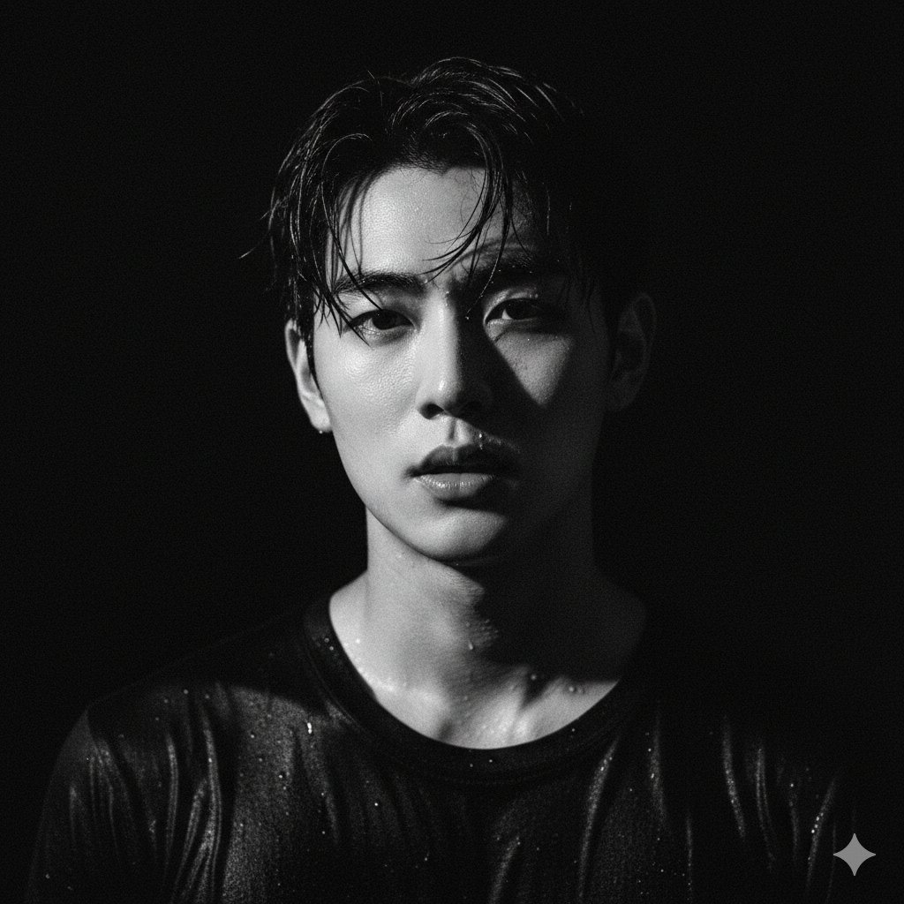

```
一张极具戏剧张力的黑白特写肖像，展现了一位英俊的年轻东亚男性。他的头发微湿，凌乱地贴在额头和脸颊上，脸颊上挂着几颗水珠。他眼神迷离，嘴唇微张，表情中带着一丝脆弱和诱惑。他穿着一件被水浸湿的黑色T恤，贴合在肩膀上。强烈的侧光照亮了他脸上的水珠和湿润的皮肤，形成鲜明的高光，与深邃的阴影形成强烈对比。极简的深色背景，照片极具电影氛围，高细节，胶片颗粒感重，传达出一种神秘而充满张力的情绪。
```

 [↑返回目录](#toc)

---
## <a id="prompt-481">传统的工笔风格水墨画</a> (<a href="https://x.com/dotey/status/1992695763017830722" target="_blank" rel="noopener noreferrer">@dotey</a>)

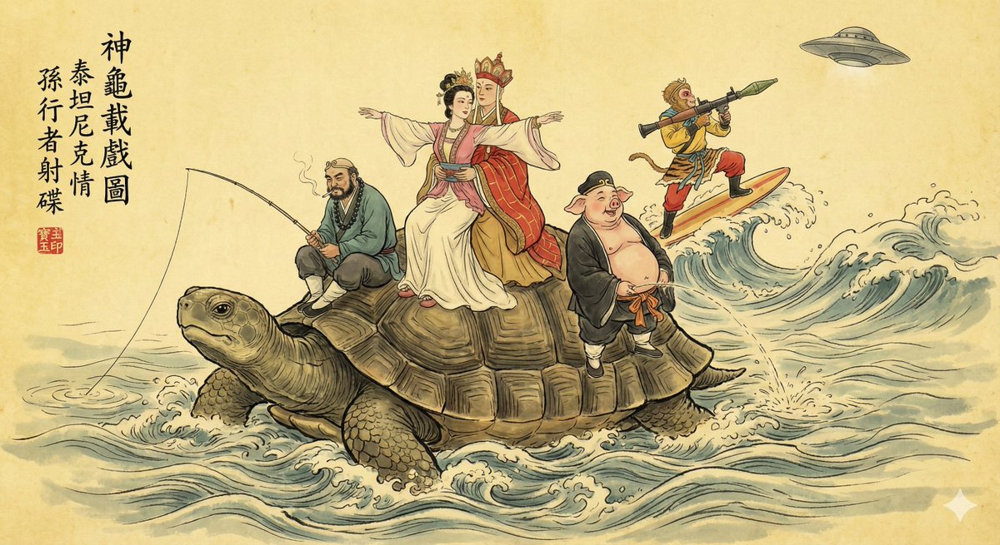

```
A traditional Chinese Gongbi-style ink painting. The scene humorously depicts a giant turtle swimming calmly through a turbulent river, carrying a playful and anachronistic tableau on its shell:
At the turtle’s forefront, Tang Sanzang and the Queen of the Women's Kingdom amusingly reenact the iconic scene from the movie Titanic. The Queen stands serenely with arms outstretched like Rose, while Tang Sanzang tenderly embraces her waist from behind like Jack, immersed in romantic sentiment. 
Behind them, Sha Wujing (Sha Monk) leisurely sits cross-legged, casually holding a fishing rod with a cigarette dangling from his lips, completely relaxed as he fishes. Beside him, Zhu Bajie humorously stands on the turtle’s shell, comically relieving himself into the river, with an exaggeratedly proud expression. Further back, Sun Wukong rides energetically on a surfboard amidst the rolling waves, carrying a modern rocket launcher aimed confidently at a mysterious UFO hovering above.
Traditional Chinese calligraphy adorns one side of the painting, accompanied by a classic red artist’s seal inscribed "寶玉印". The artwork cleverly blends classical aesthetics with contemporary humor, creating a playful and satirical fusion across eras.
```

```
这是一幅传统的工笔风格水墨画。画面幽默地描绘了一只巨龟在湍急的河流中平静游动，龟壳上驮着一幅滑稽而又略显不合时宜的画作：
在龟形雕塑的最前排，唐三藏和女国女王正在滑稽地重现电影《泰坦尼克号》中的经典场景。女王像露丝一样，双臂伸展，姿态宁静；唐三藏则像杰克一样，从背后温柔地搂住她的腰，沉浸在浪漫的情愫中。
在他们身后，沙悟净悠闲地盘腿而坐，嘴里叼着烟，手里拿着鱼竿，悠然自得地垂钓着。他旁边，猪八戒滑稽地站在龟壳上，对着河里撒尿，一副得意洋洋的模样。更远处，孙悟空在翻滚的波浪中活力四射地驾着冲浪板，手里拿着一枚现代火箭筒，自信地瞄准着上方盘旋的神秘UFO。
画作一侧饰以传统中国书法，并钤有经典的红色艺术家印章“宝玉印”。这幅作品巧妙地融合了古典美学与现代幽默，创造出一种跨越时代的诙谐讽刺之美。
```

 [↑返回目录](#toc)

---
## <a id="prompt-299">制作大头贴</a> (<a href="https://x.com/songguoxiansen/status/1963248968902840712" target="_blank" rel="noopener noreferrer">@songguoxiansen</a>)


```
用这张照片，做一个3*3的photo booth grid，每张要用不同的姿势和表情不许重复
```

 [↑返回目录](#toc)

---
## <a id="prompt-500">赛博黄历</a> (<a href="https://x.com/imaxichuhai/status/1991684059450253416" target="_blank" rel="noopener noreferrer">@imaxichuhai</a>)

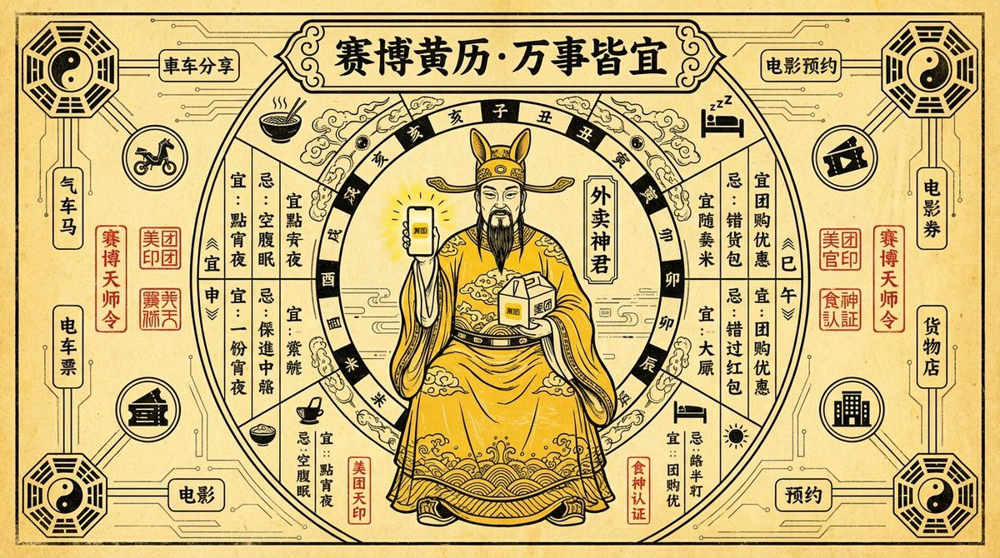

```
3D, 照片, 现代字体, 横排文字, 极简, 简单, 模糊, 丑陋, 畸形, 糟糕的书法, 水印。
```

 [↑返回目录](#toc)

---
## <a id="prompt-399">年轻的东亚女性K-Pop偶像风格</a> (<a href="https://x.com/IamEmily2050/status/1985682978182480251" target="_blank" rel="noopener noreferrer">@IamEmily2050</a>)


```
{
    "style_mode": "raw_photoreal_high_fidelity",
    "look": "K-Pop idol aesthetic, flawless complexion, high-resolution digital photography, trendy",
    "camera": {
      "vantage": "slightly high angle (selfie perspective), direct address",
      "framing": "extreme close-up (ECU), tight framing on the face and shoulders",
      "lens_behavior": "portrait lens (e.g., 85mm prime), extremely shallow depth of field (DoF), sharp focus on the eyes",
      "sensor_quality": "high fidelity, no digital noise"
    }
  },
  "scene": {
    "environment": {
      "setting": "indoor studio or simple interior",
      "lighting": "soft, even beauty lighting (e.g., large softbox or beauty dish), minimizing shadows, creating clear catchlights in the eyes, emphasizing glossy highlights"
    },
    "subject": {
      "description": "young East Asian female, K-Pop idol styling",
      "hair": "long, dark brown, wavy, glossy finish",
      "expression": {
        "mood": "playful, confident, slightly sultry",
        "action": "looking directly into the lens, mouth slightly open, tongue slightly sticking out over the lower lip"
      },
      "makeup": {
        "style": "contemporary K-beauty trends",
        "complexion": "flawless, 'glass skin' effect, dewy/glossy finish, realistic micro-texture",
        "cheeks": "rosy blush, high application",
        "lips": "glossy, pink tint"
      },
      "attire": {
        "top": "grey pinstriped halter top, structured design",
        "details": "white contrasting collar lapel with silver snap buttons and circular metal hardware"
      },
      "accessories": {
        "hair_clip": "decorative silver/rhinestone clip on her left side",
        "earrings": "dangling silver earrings (heart motif)"
      }
    },
    "background": {
      "description": "plain, neutral grey or white wall, blurred (bokeh)"
    }
  },
  "aesthetic_controls": {
    "render_intent": "high-quality digital photograph suitable for promotional material or social media",
    "material_fidelity": [
      "realistic skin micro-texture (pores, gloss, makeup interaction)",
      "individual hair strand detail",
      "fabric texture of the pinstripe material",
      "metallic shine of accessories"
    ],
    "color_grade": {
      "overall": "neutral, slightly warm, vibrant skin tones, high clarity",
      "contrast": "balanced"
    }
  },
  "negative_prompt": {
    "forbidden_elements": ["skin imperfections", "blemishes", "wrinkles", "harsh shadows", "textured/matte skin", "dry lips", "outdoor setting", "distorted features", "motion blur", "digital artifacts"],
    "forbidden_style": ["anime", "painting", "illustration", "CGI render", "low resolution", "gritty realism", "vintage photography", "uncanny valley", "overly airbrushed/plastic skin"]
  }
}
```

```
{
"style_mode": "raw_photoreal_high_fidelity",
“外观”：“K-Pop偶像美学，完美无瑕的肌肤，高分辨率数码摄影，时尚潮流”，
“相机”： {
“有利位置”：“略高的角度（自拍视角），直接面向”，
“构图”：“极近特写（ECU），紧贴面部和肩膀构图”，
"lens_behavior": "人像镜头（例如，85mm 定焦镜头），景深极浅，眼睛清晰对焦"
"sensor_quality": "高保真，无数字噪声"
}
},
“场景”： {
“环境”： {
“设置”: “室内工作室或简单的室内环境”
“灯光”：“柔和均匀的美容灯光（例如，大型柔光箱或美容罩），最大限度地减少阴影，在眼睛中营造清晰的眼神光，强调光泽高光”
},
“主题”： {
描述：年轻的东亚女性，K-Pop偶像风格
“头发”：“长而深棕色，波浪状，有光泽”，
“表达”： {
“情绪”：“俏皮、自信、略带性感”，
“动作”：“直视镜头，嘴巴微张，舌头微微伸出下唇”
},
“化妆品”： {
“风格”：“当代韩国美妆潮流”，
“肤色”： “无瑕、‘玻璃肌’效果、水润/光泽妆效、逼真的微观纹理”，
“脸颊”：“玫瑰色腮红，涂抹较多”，
“嘴唇”： “有光泽的粉红色”
},
着装：{
“上衣”： “灰色细条纹露背上衣，结构化设计”
“细节”：“白色撞色领翻领，配银色按扣和圆形金属配件”
},
“配件”： {
"发夹": "左侧的装饰性银色/水钻发夹",
“耳环”： “垂坠式银耳环（心形图案）”
}
},
“背景”： {
描述：素色、中性灰色或白色墙壁，虚化（散景）
}
},
"aesthetic_controls": {
"render_intent": "适用于宣传材料或社交媒体的高质量数码照片",
"material_fidelity": [
“逼真的皮肤微观纹理（毛孔、光泽、妆容互动）”，
“单根发丝的细节”，
“细条纹面料的织物纹理”，
配饰的金属光泽
],
"color_grade": {
“整体”：“中性、略带暖色调、充满活力的肤色、高清晰度”
“对比”：“平衡”
}
},
"negative_prompt": {
"forbidden_​​elements": ["皮肤瑕疵", "斑点", "皱纹", "生硬阴影", "纹理/哑光皮肤", "嘴唇干燥", "户外环境", "面部扭曲", "动态模糊", "数码瑕疵"],
"forbidden_​​style": ["动漫", "绘画", "插画", "CGI渲染", "低分辨率", "粗犷写实主义", "复古摄影", "恐怖谷效应", "过度修饰/塑料质感"]
}
}
```

 [↑返回目录](#toc)

---
## <a id="prompt-406">一幅超写实全身肖像与路飞互动</a> (<a href="https://x.com/ecommartinez/status/1985805353901310327" target="_blank" rel="noopener noreferrer">@ecommartinez</a>)

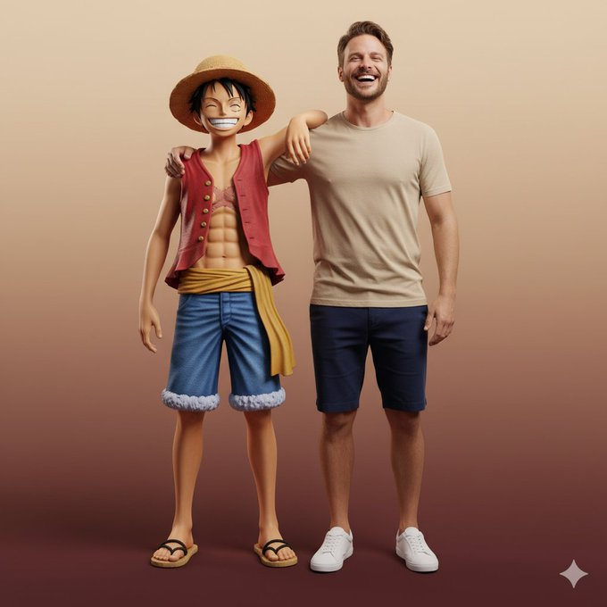

```
Ultra-realistic full-body portrait of the attached image. The person is interacting with Monkey D. Luffy in a front-facing pose, both standing side by side, smiling directly at the camera. Their body language is friendly and natural — Luffy’s arm rests around the person’s shoulder, while both share a joyful, relaxed laugh. Studio or neutral environment with soft cinematic lighting and a warm beige-to-burgundy gradient background. The person wears casual modern clothes: beige T-shirt, navy shorts, and white sneakers, while Luffy retains his original look — straw hat, red vest, blue shorts, yellow sash, and sandals. Expression and mood: happy, authentic, full of energy and camaraderie, captured in photorealistic textures, realistic lighting, and cinematic composition with high-fashion editorial quality.
```

```
附图为一幅超写实全身肖像。图中人物与蒙奇·D·路飞正面互动，两人并肩而立，面带微笑地直视镜头。他们的肢体语言友好自然——路飞的手臂搭在人物的肩上，两人开怀大笑，轻松自在。拍摄环境为影棚或中性光线，柔和的电影级灯光，背景采用温暖的米色至酒红色渐变。人物身着休闲现代服饰：米色T恤、藏蓝色短裤和白色运动鞋，而路飞则保持着他标志性的造型——草帽、红色马甲、蓝色短裤、黄色腰带和凉鞋。人物的表情和情绪：快乐、真实、充满活力和友谊，以逼真的纹理、真实的灯光和电影级的构图捕捉，呈现出高级时尚杂志的品质。
```

 [↑返回目录](#toc)

---
## <a id="prompt-376">坐在巨大光滑的白色岩层上写真</a> (<a href="https://x.com/eyishazyer/status/1982402132834767195" target="_blank" rel="noopener noreferrer">@eyishazyer</a>)


```
A hyper-realistic portrait of a young man sitting on large, smooth white rocky formations under natural sunlight. He is wearing a loose, slightly crumpled beige linen shirt with the top buttons open, paired with white trousers. His outfit gives a relaxed, Mediterranean vibe.
He is leaning back, one arm resting on the rock, and the other hand on his knee, looking slightly to the side. He wears slim black rectangular sunglasses. His hairstyle is short, slightly messy, and the sunlight casts soft shadows across his outfit and the textured rocks.
The overall atmosphere is calm, stylish, and Mediterranean-inspired. The face should match exactly with the reference photo.
```

```
这幅超现实主义肖像画描绘了一位年轻男子坐在巨大光滑的白色岩层上，沐浴在自然阳光下。他身穿宽松略带褶皱的米色亚麻衬衫，最上面的纽扣敞开着，搭配白色长裤。他的装扮散发着轻松的地中海风情。
他向后仰着身子，一只手扶着岩石，另一只手放在膝盖上，目光略微侧向一侧。他戴着一副细长的黑色矩形墨镜。他的发型短而略显凌乱，阳光在他的衣服和纹理分明的岩石上投下柔和的阴影。
整体氛围平静、时尚，充满地中海风情。脸部应该与参考照片完全匹配。
```

 [↑返回目录](#toc)

---
## <a id="prompt-354">超精细逼真的美丽女人肖像写真</a> (<a href="https://x.com/cnyzgkc/status/1980469269134733415" target="_blank" rel="noopener noreferrer">@cnyzgkc</a>)

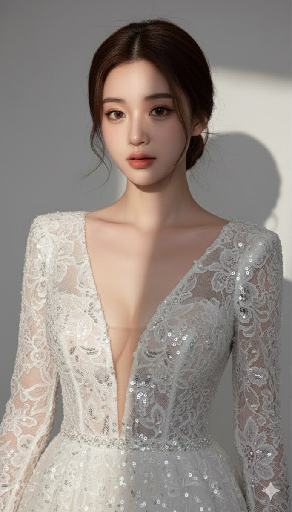

```
Ultra-detailed, photorealistic portrait of a beautiful woman, high fashion editorial, deep white plunging V-neck lace sequined evening gown, elegant low bun updo, soft studio lighting, light grey background, dramatic shadowplay, hyperrealistic, 8K
```

```
超精细、逼真的美丽女人肖像，高级时装社论，深白色 V 领蕾丝亮片晚礼服，优雅的低发髻，柔和的工作室灯光，浅灰色背景，戏剧性的光影，超现实主义，8K
```

 [↑返回目录](#toc)

---
## <a id="prompt-355">和漫威角色集体自拍</a> (<a href="https://x.com/xmliisu/status/1980161909828526514" target="_blank" rel="noopener noreferrer">@xmliisu</a>)

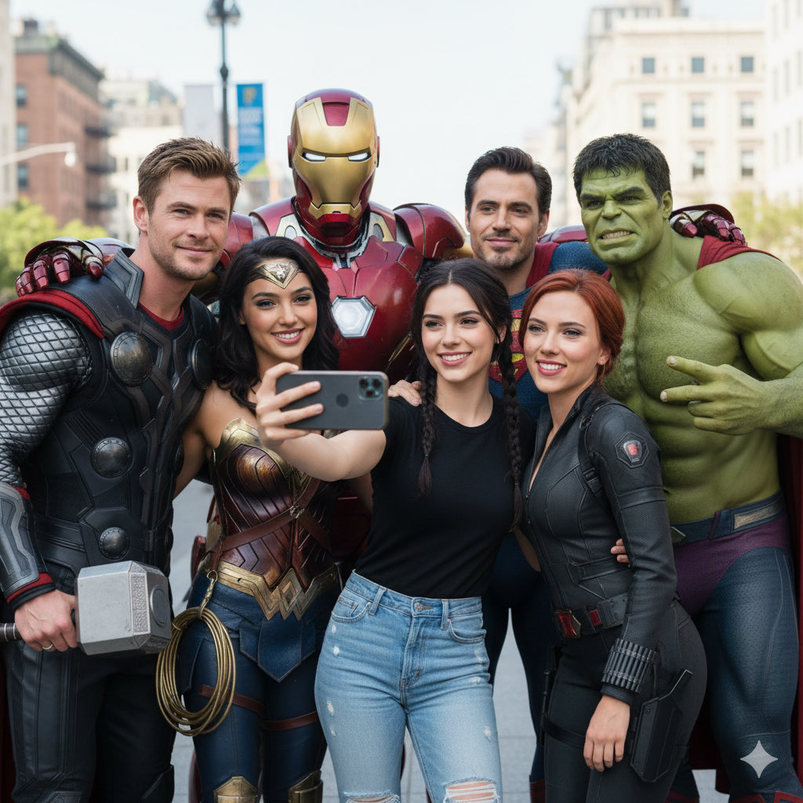

```
A ultra realistic group selfie, center is the person from the attached image (uploaded image facial details), wearing a fitted black shirt and ripped jeans, holding an iPhone for the selfie. Around are Chris Hemsworth as Thor, Gal Gadot as Wonder Woman, Scarlett Johansson as Black Widow, Mark Ruffalo as Hulk, Henry Cavill as Superman, RDJ in full armor all hugging, smiling, posing casually like close friends. Fun, joyful mood, bright daylight, cinematic quality, natural look, high detail.
```

```
一张超逼真的集体自拍，中间是附件图片中的人物（上传图片的面部细节），他身穿合身的黑色衬衫和破洞牛仔裤，手持 iPhone 自拍。周围是克里斯·海姆斯沃斯饰演的雷神、盖尔·加朵饰演的神奇女侠、斯嘉丽·约翰逊饰演的黑寡妇、马克·鲁法洛饰演的绿巨人、亨利·卡维尔饰演的超人，以及全副武装的 RDJ，他们拥抱在一起，面带微笑，像亲密朋友一样随意摆姿势。充满乐趣、愉悦的心情，明亮的日光，电影级画质，自然的画面，细节丰富
```

 [↑返回目录](#toc)

---
## <a id="prompt-392">正在更衣的女生</a> (<a href="https://x.com/songguoxiansen/status/1981178658397229294" target="_blank" rel="noopener noreferrer">@songguoxiansen</a>)

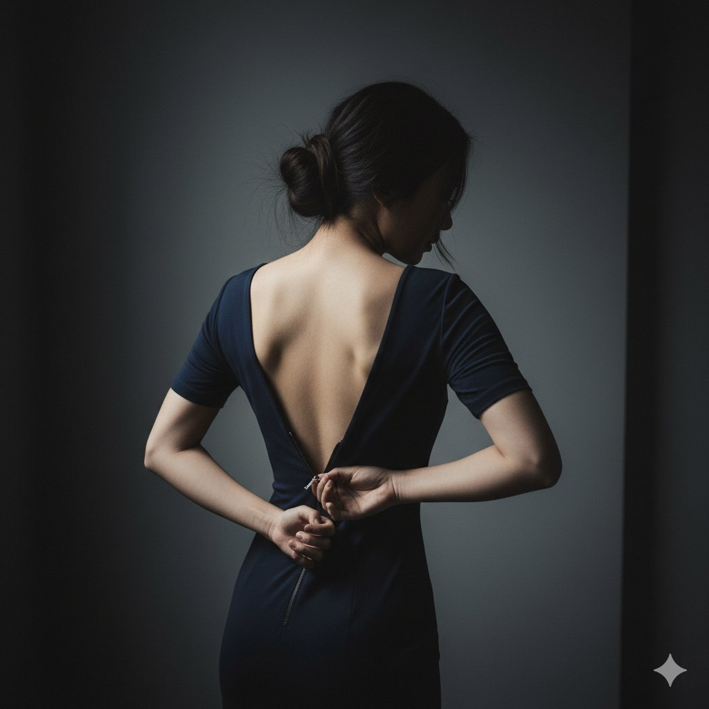

```
{
  "scene": {
    "location": "A minimalist, dark bedroom or dressing room",
    "background": "A simple, dark grey wall, out of focus"
  },
  "subject": {
    "age": "adult",
    "description": "East Asian woman, elegant, hair in a loose bun with stray strands",
    "wardrobe": "A simple, dark-colored (e.g., black, navy) form-fitting dress",
    "accessories": "None",
    "pose": "Shot from behind, three-quarter view. Her own hand is reaching back, pulling the zipper down (e.g., to the middle of her back).",
    "expression": "(Face mostly obscured or in profile) Subtle, mysterious, ambiguous",
    "gaze": "Looking down at her hand or away from camera",
    "body_notes": "Photorealistic, realistic adult proportions; realistic hand and skin texture on back"
  },
  "camera": {
    "sensor": "full_frame",
    "focal_length_mm": 100,
    "aperture_f": 2.8,
    "shutter_s": 0.01,
    "iso": 400,
    "white_balance_k": 4500,
    "distance_m": 2.0,
    "camera_height_m": 1.6,
    "framing": "Tight medium shot (head to waist), focusing on the hand, zipper, and back",
    "focus": "Manual focus on the hand and zipper"
  },
  "lighting": {
    "key": "Dramatic side light (gridded strip light) to highlight the hand and spine",
    "fill": "Deep shadows, very low fill",
    "hair": "Subtle rim light",
    "notes": "Low-key, high-contrast, "storytelling" image"
  },
  "color_grade": {
    "style": "Cinematic, moody, ambiguous",
    "palette": "Desaturated, cool tones, blacks, skin tones",
    "contrast": "High, "chiaroscuro"",
    "saturation": "Low"
  },
  "makeup": {
    "eyes": "(Not visible)",
    "cheeks": "(Not visible)",
    "lips": "(Not visible)"
  },
  "postprocess": {
    "retouch": "Maintain natural skin texture, add film grain",
    "clarity": "High clarity on the zipper and hand",
    "dodge_burn": "Dodge on the spine, hand, and zipper pull",
    "vignette": "Strong dark vignette"
  },
  "art_direction": {
    "mood": "Sensual, ambiguous, mysterious, intimate, quiet",
    "keywords": ["photorealistic", "sensual", "ambiguous", "zipper", "low-key", "cinematic", "intimate"]
  },
  "negative_prompts": [
    "nsfw",
    "underage look",
    "text or logos",
    "plastic doll skin",
    "cg",
    "3d render",
    "anime",
    "warped hands",
    "extra fingers",
    "deformed limbs"
  ]
}
```

```
{
“场景”： {
"location": "简约、黑暗的卧室或更衣室",
“背景”：“简单的深灰色墙壁，失焦”
}，
“主题”： {
"年龄": "成人",
"description": "东亚女性，优雅，头发松散，发髻散落，
"wardrobe": "一件简单的深色（例如黑色、海军蓝）合身连衣裙",
"accessories": "无",
"pose": "从后面拍摄，四分之三视角。她自己的手伸到后面，拉下拉链（例如，拉到她背部中间）。",
"expression": "（脸部大部分被遮挡或侧面）微妙、神秘、暧昧",
"gaze": "低头看着她的手或远离相机",
"body_notes": "照片般逼真的成人比例；背部的手部和皮肤纹理逼真"
}，
“相机”： {
“传感器”：“全帧”，
"焦距毫米": 100,
“aperture_f”：2.8，
“shutter_s”：0.01，
“iso”：400，
"白平衡k": 4500,
“距离_米”：2.0，
"相机高度米": 1.6,
"framing": "近距离中景拍摄（从头到腰），重点关注手、拉链和背部",
"focus": "手动对焦手和拉链"
}，
“灯光”： {
"key": "戏剧性的侧光（网格条灯）突出手部和脊柱",
"fill": "深阴影，非常低的填充",
"hair": "微妙的边缘光",
"notes": "低调、高对比度、“讲故事”的图像"
}，
“颜色等级”：{
"style": "电影化、喜怒无常、模棱两可",
"palette": "去饱和、冷色调、黑色、肤色",
"contrast": "高, "明暗对比"",
“饱和度”：“低”
}，
“化妆品”： {
"eyes": "(不可见)",
"cheeks": "(不可见)",
"lips": "(不可见)"
}，
“后处理”：{
"retouch": "保持自然的皮肤纹理，添加胶片颗粒感",
"clarity": "拉链和手部清晰度高",
"dodge_burn": "躲避脊柱、手和拉链头",
"vignette": "强烈的暗色调晕影"
}，
“艺术指导”：{
"mood": "感性、暧昧、神秘、亲密、安静",
“关键词”：[“照片写实”、“感性”、“模棱两可”、“拉链”、“低调”、“电影”、“亲密”]
}，
"negative_prompts": [
“nsfw”，
“未成年的样子”，
“文字或徽标”，
“塑料娃娃皮肤”，
“cg”，
“3D渲染”，
“日本动画片”，
“扭曲的手”，
“额外的手指”，
“肢体畸形”
]
}
```

 [↑返回目录](#toc)

---
## <a id="prompt-476">菜谱-番茄炒蛋</a> (<a href="https://x.com/cnyzgkc/status/1992570337977082030?s=46" target="_blank" rel="noopener noreferrer">@cnyzgkc</a>)


```
创作一张 9:16 竖版 的 《番茄炒蛋》手绘风格教学食谱信息图。

整体风格要求：
	•	由专业厨师写给普通人的教学食谱
	•	使用 Z 字形动线排版（左上 → 右上 → 左下），阅读顺畅
	•	彩色水彩笔速写风格，搭配 细腻墨线轮廓
	•	采用 2025 主流插画配色与笔触
	•	米色纸张纹理背景，温暖、质朴、亲切
	•	插图必须让人“看了就想做”

⸻

内容结构（通用）

1. 顶部标题（醒目）

《{菜名}》

⸻

2. 步骤区块（Z 动线排版，3–5 步）

每个步骤包含：
	•	手绘步骤插图（彩色水彩＋墨线）
	•	简短图文说明
	•	厨师秘技
	•	小心得或提示

⸻

步骤模板（通用，可被模型自动填充）

步骤 1：准备食材
（自动根据菜名生成相关食材）
插图：整齐摆放的主要食材和调味料。
说明：列出并处理该菜的基本材料。
秘技：告诉用户如何提升风味或口感。
心得：提供简单经验或提醒。

⸻

步骤 2：调味 / 腌制 / 前置处理
插图：调制酱汁、腌肉、处理主料的小碗或砧板画面。
说明：展示关键基础步骤。
秘技：比例、小技巧、避免失败要点。
心得：轻松风格的小提示。

⸻

步骤 3：炒制 / 烹调关键步骤
插图：锅中食材的烹调场景，水彩烟气柔和。
说明：大火、小火、顺序、重要动作。
秘技：保持火候、控制时间、提升香气的办法。
心得：强调料理灵魂所在。

⸻

步骤 4：合味 / 出锅前步骤
插图：加入酱汁、调味、配料混合的场景。
说明：整体收汁、调味到位。
秘技：亮油、保持口感或香味的小技巧。
心得：此步决定成败。

⸻

步骤 5：点缀 / 完成步骤
插图：撒香料、加入坚果、盛盘等动作。
说明：最后调整味道或摆盘。
秘技：保持脆感、避免过熟等技巧。
心得：成品风味描述。

⸻

底部成品插图
	•	一份精致、色香俱全的 《{菜名}》
	•	水彩质感强烈、油亮、鲜嫩、诱人
	•	让读者看了就想做

⸻

底部中央署名

@木马人 AI
```

 [↑返回目录](#toc)

---
## <a id="prompt-345">你抱着幼年版自己的复古风自拍</a> (<a href="https://x.com/songguoxiansen/status/1971394542298440073" target="_blank" rel="noopener noreferrer">@songguoxiansen</a>)


```
retro selfies of you holding a baby version of you
```

```
你抱着幼年版自己的复古风自拍
```

 [↑返回目录](#toc)

---
## <a id="prompt-375">一枚精致的人物金属硬币</a> (<a href="https://x.com/eyishazyer/status/1982402126845247707" target="_blank" rel="noopener noreferrer">@eyishazyer</a>)


```
A detailed metallic coin featuring
Person's face attached in the image ( Do not change facial features of the person from the uploaded photo. Keep face of person 100% accurate from the reference image. Keep the original face of the attached person unchanged and realistic)  embossed in profile, crafted with realistic engraved textures and fine relief detailing. The coin surface shows light reflections, scratches, and metallic sheen. Include subtle inscriptions or symbols around the border to resemble authentic minting. Centered on a dark, minimal background to emphasize the coin’s texture and realism
```

```
一枚精致的金属硬币，图像中人物的面部特征（请勿更改上传照片中人物的面部特征。保持人物面部与参考图像 100% 准确。保持附加人物的原始面部特征不变且逼真）采用侧面浮雕，并采用逼真的雕刻纹理和精细的浮雕细节。硬币表面呈现光反射、划痕和金属光泽。在边缘处添加细微的铭文或符号，以模拟真实的铸币。硬币以深色、极简的背景为中心，以突出硬币的纹理和真实感
```

 [↑返回目录](#toc)

---
## <a id="prompt-84">渐变挤出Google I/O 2025大会视觉效果</a> (<a href="https://x.com/hckmstrrahul/status/1925567579856453701" target="_blank" rel="noopener noreferrer">@hckmstrrahul</a>)


```
Retexture this image in the following JSON style aesthetic:
{
  "styleAesthetic": {
    "title": "Isometric Multicolor Extrusion with Grid Control",
    "overallVibe": "Playful modern 3D iconography with directional extrusion and dynamic isometric grids",
    "viewAngle": {
      "type": "Isometric",
      "facingDirection": "right",  // options: left, right, front
      "rotationDegrees": {
        "x": 30,
        "y": 30
      }
    },
    "renderingStyle": "Clean 3D extruded vector with soft lighting and high contrast between faces",
    "objectSurface": {
      "frontFace": {
        "color": "#ffffff",
        "material": "Matte white plastic",
        "lighting": "Soft diffuse"
      },
      "extrudedSide": {
        "type": "Multicolor gradient",
        "gradientStyle": "Diagonal sweep",
        "colorStops": [
          "#ff0040", "#ff8000", "#ffff00", "#00ff90", "#00cfff", "#8000ff"
        ],
        "material": "Glossy plastic",
        "lighting": "Ambient with light falloff"
      }
    },
    "extrusion": {
      "direction": "right",  // determines which side is extruded: left, right, front
      "depth": "moderate"
    },
    "shadows": {
      "type": "Drop shadow",
      "direction": "bottom-right",
      "opacity": 0.15,
      "blurRadius": "6px"
    },
    "background": {
      "type": "Isometric grid",
      "color": "#ffffff",
      "gridStyle": {
        "lineColor": "#e0e0e0",
        "lineWeight": "1px",
        "orientation": "opposite-extrusion"  // automatically flips grid lines to oppose the extrusion direction
      }
    },
    "moodKeywords": [
      "Dimensional",
      "Clean",
      "Geometric",
      "Colorful",
      "Tactile",
      "Structured"
    ]
  }
}
```

 [↑返回目录](#toc)

---
## <a id="prompt-401">年轻女子身穿深色连帽衫的特写肖像</a> (<a href="https://x.com/saniaspeaks_/status/1986010537310961720" target="_blank" rel="noopener noreferrer">@saniaspeaks_</a>)

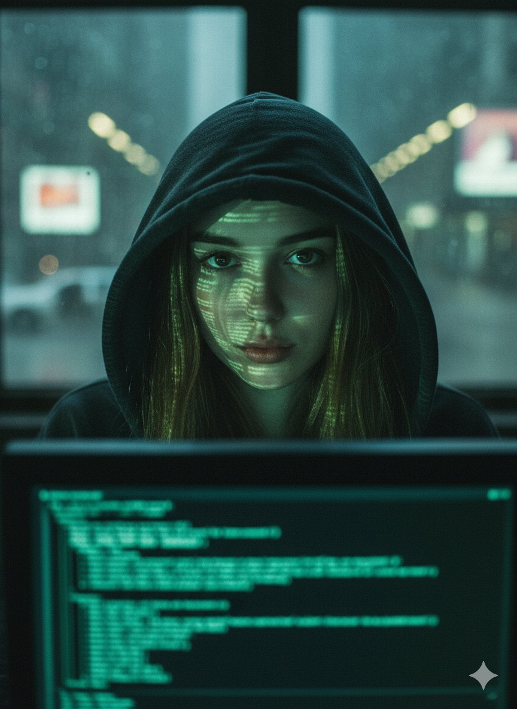

```
{
  "prompt": {
    "description": "A close-up portrait of a young woman in a dark hooded sweatshirt, with green digital code reflected on her face from a computer screen, set in a dark, urban environment with blurred city lights in the background.",
    "details": {
      "subject": "Young woman with a serious expression, olive skin, and visible facial features despite the reflections.",
      "pose": "Facing directly towards the viewer, looking intently at the camera.",
      "lighting": "Dramatic, low-key lighting, primarily from the green glow of a computer monitor reflecting on her face and some blurred, warm streetlights in the distant background.",
      "attire": "Dark, large hooded sweatshirt, with the hood pulled up to cover her head, creating a sense of anonymity.",
      "hair": "Long, dark hair partially visible beneath the hood.",
      "expression": "Intense, focused, and slightly wary gaze, conveying a sense of concentration and maybe isolation.",
      "mood": "Mysterious, intense, technologically-focused, reminiscent of a hacker or surveillance theme."
    }
  },
  "image_settings": {
    "size": "1024x1024",
    "quantity": 1,
    "style": "Cinematic, dark and moody, high contrast with strong shadows and highlights from the screen, grainy texture.",
    "composition": "Medium close-up, with the computer screen visible in the foreground (partially obscured) and blurred streetlights in the background through a window."
  },
  "output_format": {
    "type": "image",
    "expected_result": "A powerful and atmospheric image conveying themes of technology, surveillance, and urban mystery."
  }
}
```

```
{
“迅速的”： {
描述：一位年轻女子身穿深色连帽衫的特写肖像，电脑屏幕上的绿色数字代码反射在她的脸上，背景是昏暗的城市灯光，以及模糊的城市灯光。
“细节”： {
“主体”：“一位表情严肃、肤色呈橄榄色、面部特征清晰可见的年轻女子，尽管有反光，但她的面部特征依然清晰可见。”
“姿势”：“正对观众，目光专注地注视镜头。”
“灯光”：“戏剧性的低调灯光，主要来自电脑显示器反射在她脸上的绿色光晕，以及远处背景中模糊的暖色调路灯。”
“着装”：“深色大号连帽衫，帽子拉起来遮住头，给人一种匿名感。”
“头发”：“长长的黑发从兜帽下隐约可见。”
“表情”：“目光专注、凝重，略带警惕，传达出一种专注和或许是孤寂的感觉。”
“氛围”：“神秘、紧张、以科技为中心，让人联想到黑客或监控主题。”
}
},
"image_settings": {
"size": "1024x1024",
“数量”：1，
“风格”：“电影感十足，阴暗忧郁，高对比度，屏幕阴影和高光强烈，颗粒感强。”
“构图”：“中近景，前景可见电脑屏幕（部分被遮挡），背景中透过窗户可以看到模糊的路灯。”
},
"output_format": {
"type": "image",
"expected_result": "一幅充满力量和氛围的画面，传达了科技、监控和都市神秘的主题。"
}
}
```

 [↑返回目录](#toc)

---
## <a id="prompt-410">被几个动物环绕的自拍风格照片</a> (<a href="https://x.com/HustleXR/status/1984465896895889891" target="_blank" rel="noopener noreferrer">@HustleXR</a>)

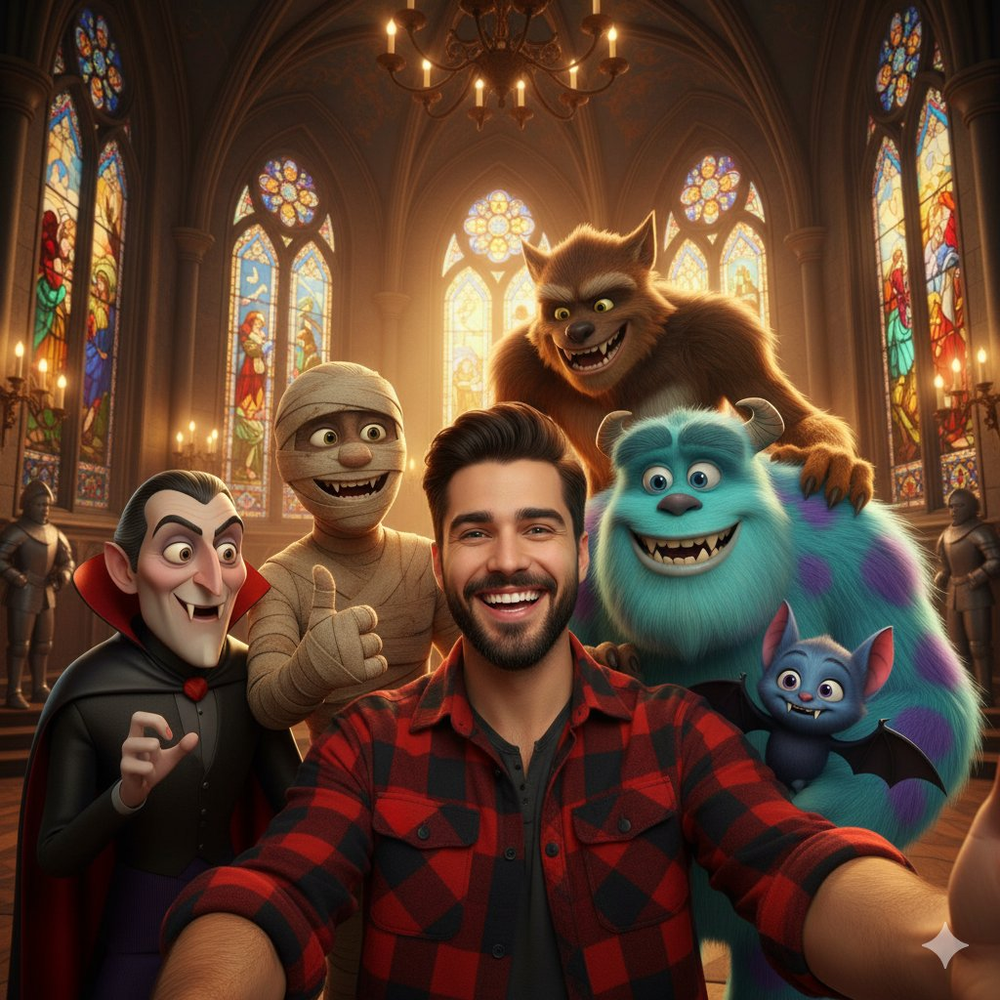

```
A selfie-style shot of a smiling young man with dark hair and a beard, wearing a red and black plaid shirt. He is surrounded by several animated movie monsters, including Count Dracula, a mummy, a large blue furry monster resembling Sulley from Monsters Inc., a werewolf, and a smaller blue vampire bat character. They are all smiling and posing for the selfie. The background is a grand hall with stained-glass windows and chandeliers, resembling a gothic castle or church interior. The lighting is warm and inviting.
```

```
一张自拍风格的照片，照片中一位笑容灿烂的年轻男子，留着深色头发和胡须，身穿红黑格子衬衫。他被几个动画电影中的怪物环绕，包括德古拉伯爵、木乃伊、一只体型庞大的蓝色毛茸茸怪物（类似《怪兽公司》里的苏利文）、狼人，以及一只体型较小的蓝色吸血蝙蝠。它们都面带微笑，摆着姿势自拍。背景是一个宏伟的大厅，配有彩色玻璃窗和枝形吊灯，宛如哥特式城堡或教堂内部。灯光温暖而温馨。
```

 [↑返回目录](#toc)

---
## <a id="prompt-502">老北京航拍</a> (<a href="https://x.com/imaxichuhai/status/1991684492474409440" target="_blank" rel="noopener noreferrer">@imaxichuhai</a>)


```
**
高耸的墙壁, 雕塑般的汉字, 庞大的结构, 过于明显的汉字形状, 平均的光照, 平光, 发光方框, 未来感UI, 无衬线字体, 抽象, 2D, 色彩鲜艳, 卡通, 糟糕的书法, 水印。
```

 [↑返回目录](#toc)

---
## <a id="prompt-503">平抛运动轨迹与速度位移分解图</a> (<a href="https://x.com/imaxichuhai/status/1991697151811023274" target="_blank" rel="noopener noreferrer">@imaxichuhai</a>)

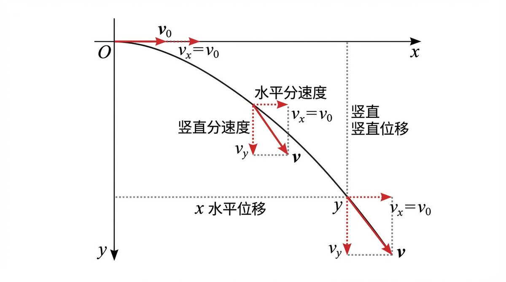

```
平抛运动轨迹与速度位移分解图
```

 [↑返回目录](#toc)

---
## <a id="prompt-484">制作一个4×4的网格符合年代的风格</a> (<a href="https://x.com/blizaine/status/1992586719275954558" target="_blank" rel="noopener noreferrer">@blizaine</a>)

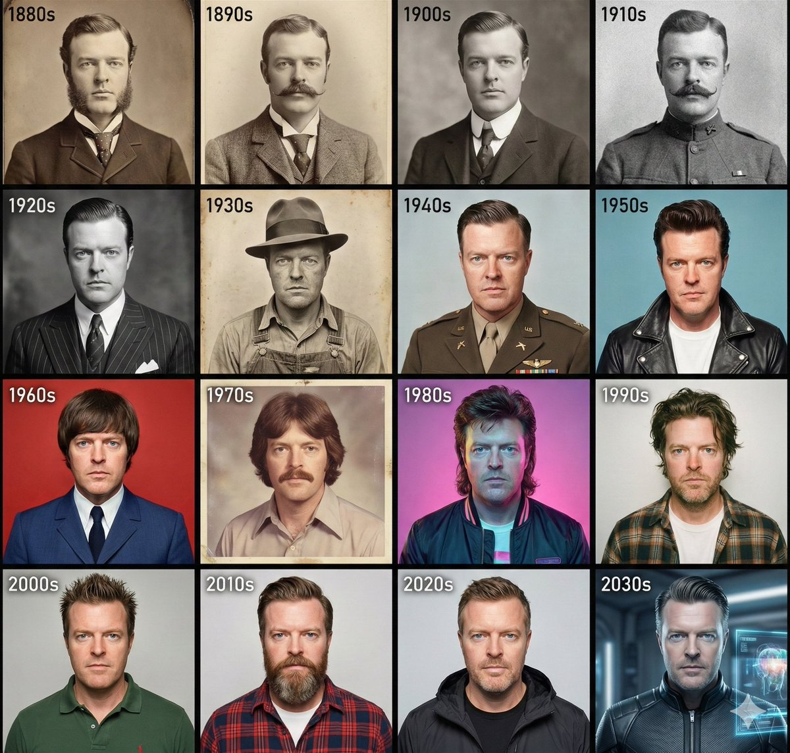

```
Make a 4×4 grid starting with the 1880s. In each section, I should appear styled according to that decade (clothing, hairstyle, facial hair, accessories). Use colors, background, & film style accordingly.
```

```
制作一个 4×4 的网格，从 19 世纪 80 年代开始。在每个区域中，我的形象都应该符合该年代的风格（服装、发型、胡须、配饰）。颜色、背景和电影风格也应与之相符。
```

 [↑返回目录](#toc)

---
## <a id="prompt-296">手办-高级包装带打印机（擎天柱）</a> (<a href="https://x.com/songguoxiansen/status/1964874809130783108" target="_blank" rel="noopener noreferrer">@songguoxiansen</a>)

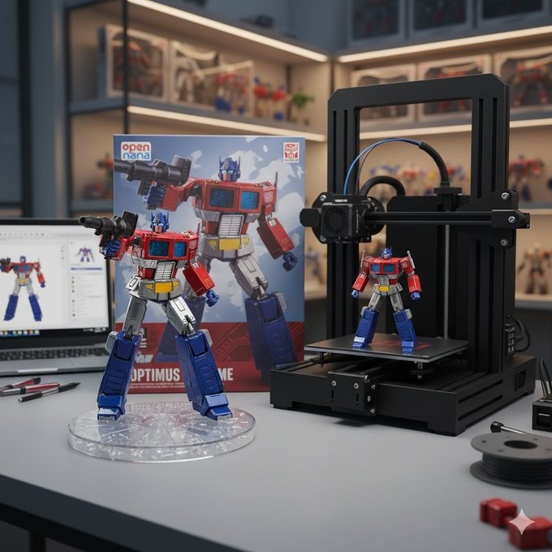

```
请将图片转化为一款收藏级手办。在手办后方，放置一个印有该手办图案及“open nana”名称的手办包装盒。在其旁边，添加一台正在打印该手办的高端3D打印机。在该手办包装盒前方，放置一个圆形塑料底座，放置手办。
底座的PVC材质需呈现晶莹剔透的半透明质感，且整个场景需设定在室内环境中。
```

 [↑返回目录](#toc)

---
## <a id="prompt-402">一位中年男子数字漫画</a> (<a href="https://x.com/ShreyaYadav___/status/1985908915427758305" target="_blank" rel="noopener noreferrer">@ShreyaYadav___</a>)

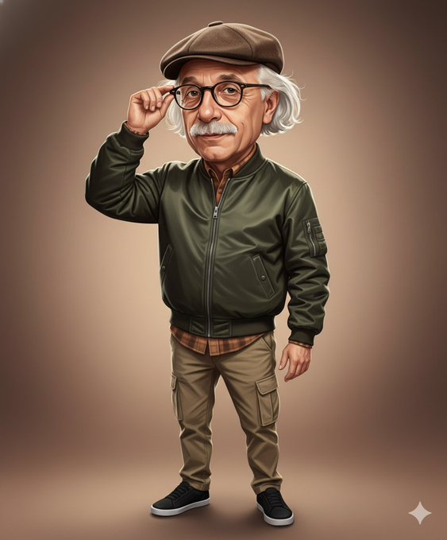

```
Create a realistic digital caricature painting of a middle-aged man (attached photo) with a slightly oversized head, exuding charm and quiet confidence. He is dressed in a modern, stylish bomber jacket made of dark olive nylon with subtle reflective highlights that give it a sleek and fashionable look. Underneath, he wears a warm-toned flannel shirt slightly visible at the collar and cuffs, paired with khaki cargo pants and black sneakersthat ground the outfit with a casual yet confident energy. Completing his look, he wears a brown flat cap tilted slightly forward — a small detail that adds personality and flair.

The man is portrayed in a mid-shot, adjusting his glasses with one hand while gazing directly at the viewer with a self-assured and composed expression. His head is slightly larger than normal, emphasizing his thoughtful character and giving the image a light caricature charm without losing realism.The facial expression radiates intelligence, humor, and approachability.

The lighting is warm and soft, like that of a late afternoon sun filtering through a studio setup. Smooth gradual shadows enhance the contours of his face, while subtle highlights accentuate the texture of his bomber jacket and the reflection in his glasses. His skin tones glow naturally under the warm light, creating a pleasant sense of depth and realism.The background is a gradient of warm brown and beige hues, blending smoothly from light to dark. This background is simple yet elegant, allowing the subject to stand out while maintaining a professional, editorial quality.

The art style should combine semi-realistic digital painting with the texture of oil brushstrokes, delivering a balanced fusion of realism and stylized charm.Clean outlines, smooth blending, and controlled highlights give the impression of a modern portrait illustration—detailed, expressive, and visually captivating.
```

```
请创作一幅逼真的数字漫画，描绘一位中年男子（附图），他头部略大，散发着魅力和沉稳的自信。他身着一件现代时尚的深橄榄色尼龙飞行员夹克，夹克上点缀着低调的反光元素，更添几分精致格调。夹克内搭一件暖色调法兰绒衬衫，领口和袖口隐约可见，下身搭配卡其色工装裤和黑色运动鞋，整体造型休闲又不失自信。最后，他头戴一顶棕色鸭舌帽，帽檐略微前倾——这个小细节为他增添了个性和魅力。

画面采用中景拍摄，男子一手扶着眼镜，一手直视镜头，神态自信沉稳。他的头部略大于常人，突显了他深思熟虑的性格，赋予画面一种略带漫画式的魅力，却又不失写实感。面部表情散发着智慧、幽默和亲切的气息。

光线温暖柔和，如同午后阳光透过摄影棚洒下的光芒。平滑的阴影勾勒出他面部的轮廓，而微妙的高光则突显了他飞行员夹克的质感和眼镜上的反光。在暖光的映衬下，他的肤色自然透亮，营造出令人愉悦的立体感和真实感。背景由温暖的棕色和米色渐变而成，由浅至深自然过渡。这种背景简洁而优雅，既突出了拍摄对象，又保持了专业、时尚的质感。

艺术风格应结合半写实的数字绘画和油画笔触的质感，呈现出写实与风格化魅力的平衡融合。清晰的轮廓、流畅的过渡和可控的高光，给人以现代肖像插画的印象——细节丰富、富有表现力且引人入胜。
```

 [↑返回目录](#toc)

---
## <a id="prompt-411">一位女子从智能手机屏幕中走出</a> (<a href="https://x.com/ShreyaYadav___/status/1984477243968770374" target="_blank" rel="noopener noreferrer">@ShreyaYadav___</a>)

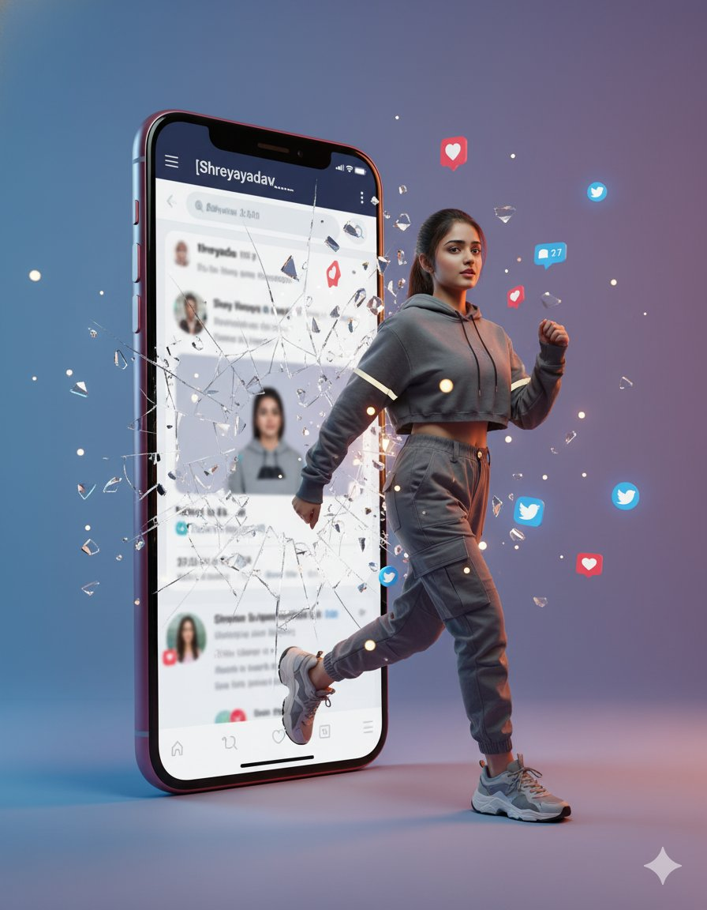

```
A hyperrealistic cinematic photo of a woman stepping out of a smartphone screen showing the Twitter profile [Shreyayadav___]. She’s captured mid-step, confidently emerging from the digital world into reality as the phone glass shatters with glowing fragments. Floating social media icons (hearts, comments, follows) surround her. She wears trendy streetwear with lifelike fabric and lighting reflections. The minimalist gradient studio background adds 3D depth.
```

```
一张超写实的电影感照片，一位女子从智能手机屏幕中走出，屏幕上显示着她的推特个人资料[Shreyayadav ___ ]。照片捕捉到她迈步的瞬间，自信地从数字世界走向现实世界，手机屏幕破碎，碎片闪耀着光芒。漂浮的社交媒体图标（爱心、评论、关注）环绕着她。她身着时尚街头服饰，面料逼真，光线反射效果极佳。极简的渐变摄影棚背景增添了立体感。
```

 [↑返回目录](#toc)

---
## <a id="prompt-331">走廊上的女性</a> (<a href="https://x.com/IamEmily2050/status/1974108838929576299" target="_blank" rel="noopener noreferrer">@IamEmily2050</a>)

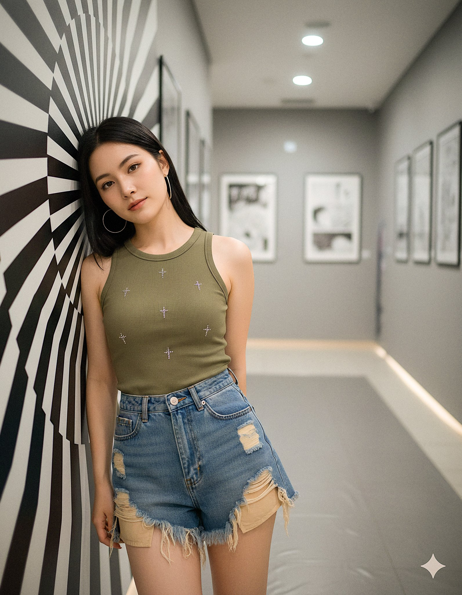

```
{
  "scene": {
    "environment": {
      "location_type": "modern gallery hallway",
      "left_wall": "black-and-white optical swirl mural, matte finish",
      "right_wall": "framed monochrome manga panels with sparse Japanese onomatopoeia",
      "floor": "light gray polished tile with 2x2 m matte gray vinyl sheet under subject to kill reflections",
      "depth": "short corridor depth with subtle falloff",
      "clutter": "none"
    },
    "time": "indoors, artificial light",
    "mood": "cool, composed, slightly mysterious",
    "color_palette": "neutral-cool grays, olive top, desaturated denim blues"
  },
  "subject": {
    "type": "human",
    "gender": "female",
    "approx_age": "early 20s",
    "appearance": {
      "skin_tone": "fair-light with neutral undertone",
      "hair": "jet-black, very long, straight, center part; clean specular sheen",
      "face": "oval face, soft makeup, subtle gloss on lips, light eyeliner and mascara",
      "earrings": "large silver hoop earrings"
    },
    "wardrobe": {
      "top": "fitted olive/khaki ribbed tank with small rhinestone cross motifs (check glue before shoot)",
      "bottom": "high-waisted distressed denim shorts with heavy frayed hem and beige repair patches (tape rear hem flat)",
      "footwear": "out_of_frame"
    },
    "pose": {
      "stance": "leans back and slightly left with head resting against mural wall",
      "torso": "relaxed, angled 10–15° to camera",
      "arms_hands": "right arm behind torso/out_of_frame, left arm relaxed by side",
      "expression": "calm, neutral-to-soft gaze past camera",
      "chin": "slightly down; head tilt toward left shoulder"
    }
  },
  "framing_composition": {
    "shot_type": "mid-thigh portrait (three-quarter length)",
    "orientation": "vertical",
    "framing": "subject placed on left third; right third shows manga panels",
    "leading_lines": "doorframe/panel edges vertical; swirl mural adds texture without overpowering subject",
    "background_separation": "subtle; background softly defocused but still readable"
  },
  "camera": {
    "sensor": "full-frame mirrorless",
    "lens": {
      "focal_length_mm": 50,
      "type": "prime",
      "character": "neutral rendering, low distortion"
    },
    "settings": {
      "aperture": "f/3.2",
      "shutter_speed": "1/250",
      "iso": 400,
      "white_balance": "custom grey-card @ 4600 K",
      "focus": "eye-AF + 3-frame focus bracket (±1 cm)",
      "stabilisation": "IBIS on"
    },
    "perspective": "camera at chest level; minimal keystoning; maintain straight verticals"
  },
  "lighting": {
    "key": "broad, soft overhead/ceiling panel light",
    "fill": "60×60 cm white bounce 30 cm below bust line, ~1.3 stops under key",
    "rim": "narrow 1×2 ft strip-light behind subject camera-right, ½ stop over key",
    "quality": "soft, diffuse; no hard shadows",
    "exposure_target": "skin at ~65 IRE; rhinestones clipped < 90 IRE",
    "specular_control": "micro-specular on hair; avoid plastic skin sheen"
  },
  "rendering_intent": {
    "photorealism": "high",
    "texture": "retain fabric weave, denim fray strands, hair strands",
    "background_text_policy": "allow only existing manga panel text; do not invent extra signage or captions"
  },
  "post_processing": {
    "color_grade": "neutral-cool base with gentle contrast curve; slight cyan in shadows, warm bias on skin",
    "tone_curve": "soft S-curve (lift shadows +3, compress highlights -5)",
    "clarity_texture": "clarity -5 on skin via masked adjustment; texture +5 on denim/frayed hem only (separate mask)",
    "noise_reduction": "luma 10, chroma 15",
    "sharpening": "amount 40, radius 0.7, detail 25, masking 60 (protect background)",
    "vignette": "subtle -0.1 EV centre-weighted",
    "geometry": "verticals upright; crop 4:5 with space above head and right-side manga visible",
  }
```

```
{
“场景”： {
“环境”： {
"location_type": "现代画廊走廊",
"left_wall": "黑白光学漩涡壁画，哑光饰面",
"right_wall": "带有稀疏日语拟声词的单色漫画面板",
“地板”：“浅灰色抛光瓷砖，铺有 2x2 米哑光灰色乙烯基板，以消除反射”，
"depth": "短走廊深度，具有微妙的衰减",
“杂乱”：“无”
}，
"time": "室内，人造光",
"mood": "冷静、沉着、略带神秘",
"color_palette": "中性冷灰色、橄榄色上衣、去饱和牛仔蓝"
}，
“主题”： {
“类型”：“人类”，
"性别": "女",
"approx_age": "20 岁出头",
“外貌”： {
"skin_tone": "白皙，中性底色",
“头发”：“乌黑，很长，直，中分；干净的镜面光泽”，
"face": "椭圆脸，淡妆，唇彩淡淡，眼线和睫毛膏淡淡的",
“耳环”：“大号银环耳环”
}，
“衣柜”： {
"top": "修身橄榄色/卡其色罗纹背心，饰有小水钻十字图案（拍摄前请检查胶水）",
"bottom": "高腰破洞牛仔短裤，下摆磨损严重，配有米色修片（后摆用胶带平整粘贴）",
“footwear”：“out_of_frame”
}，
“姿势”：{
"stance": "身体向后稍微向左倾斜，头靠在壁画上",
“躯干”：“放松，与相机呈 10-15° 角”，
"arms_hands": "右臂在躯干后方/超出框架，左臂在身体侧面放松",
“表情”：“平静、中性到柔和的目光穿过镜头”，
“下巴”：“稍微向下；头向左肩倾斜”
}
}，
“framing_composition”：{
"shot_type": "大腿中部肖像（四分之三长度）",
“方向”：“垂直”，
"framing": "主体放置在左边三分之一处；右边三分之一处显示漫画面板",
"leading_lines": "门框/面板边缘垂直；漩涡壁画增添了纹理，但又不会掩盖主题",
"background_separation": "微妙；背景轻微散焦但仍可读"
}，
“相机”： {
“传感器”：“全画幅无反光镜”，
“镜片”： {
"焦距毫米": 50,
“类型”：“主要”，
“character”：“中性渲染，低失真”
}，
“设置”： {
"光圈": "f/3.2",
"shutter_speed": "1/250",
“iso”：400，
"white_balance": "自定义灰卡 @ 4600 K",
"focus": "眼部自动对焦 + 3 帧对焦框 (±1 cm)",
“稳定”：“IBIS开启”
}，
“视角”：“摄像机位于胸部高度；最小梯形失真；保持垂直线”
}，
“灯光”： {
"key": "宽阔、柔和的顶灯/天花板面板灯",
"fill": "60×60 厘米白色反射镜，位于胸围线以下 30 厘米处，主光圈下方约 1.3 档",
"rim": "1×2 英尺窄条形灯位于拍摄对象相机右侧后方，比主光高出 ½ 档",
“质量”：“柔和，漫反射；无硬阴影”，
"exposure_target": "皮肤 ~65 IRE；水钻修剪 < 90 IRE",
"specular_control": "头发上的微镜面；避免塑料皮肤光泽"
}，
“渲染意图”：{
"照片写实主义": "高",
"texture": "保留织物编织、牛仔布磨损线、发丝",
"background_text_policy": "仅允许现有的漫画面板文本；不要发明额外的标志或标题"
}，
“后处理”：{
"color_grade": "中性冷色调，对比度曲线柔和；阴影中略带青色，皮肤上偏暖色",
"tone_curve": "柔和的 S 曲线（提升阴影 +3，压缩高光 -5）",
"clarity_texture": "通过蒙版调整，皮肤的清晰度为 -5；仅牛仔布/磨损下摆的纹理为 +5（单独蒙版）",
"noise_reduction": "亮度 10，色度 15",
"sharpening": "数量 40，半径 0.7，细节 25，遮罩 60（保护背景）",
"vignette": "微妙的 -0.1 EV 中央重点",
"geometry": "垂直竖直；裁剪比例为 4:5，头部上方有空间，右侧漫画可见",
}
```

 [↑返回目录](#toc)

---
## <a id="prompt-363">品牌创意3D广告</a> (<a href="https://x.com/aziz4ai/status/1979813700883366110" target="_blank" rel="noopener noreferrer">@aziz4ai</a>)


```
Creative 3D ad for [Brand Name], with surreal object made from it, matching background color, real slogan below, logo on top, miniature person interacting, minimal and clever concept
```

```
为 [品牌名称] 制作的创意 3D 广告，由超现实的物体制成，背景颜色匹配，下面是真实的口号，上面是徽标，微型人物互动，简约而巧妙的概念
```

 [↑返回目录](#toc)

---
## <a id="prompt-386">淡桃粉色宽松毛绒睡衣女孩</a> (<a href="https://x.com/songguoxiansen/status/1982984662747373744" target="_blank" rel="noopener noreferrer">@songguoxiansen</a>)

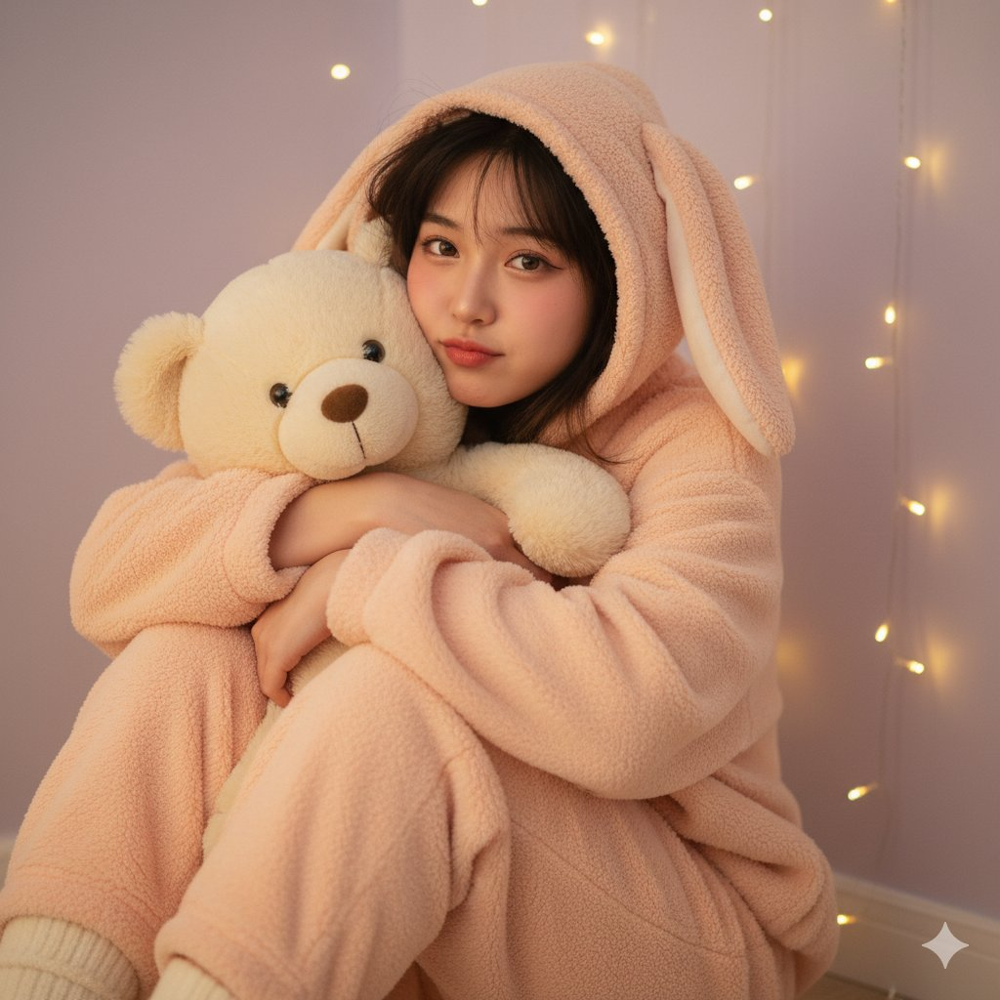

```
{
  "scene": {
    "location": "cozy bedroom corner",
    "background": "soft-focus string of fairy lights against a pastel lavender wall"
  },
  "subject": {
    "age": "adult",
    "description": "East Asian women, messy shoulder-length dark hair, sleepy-looking soft brown eyes",
    "wardrobe": "oversized, fluffy fleece pajama set (onesie or two-piece) in pastel peach, with a hood featuring animal ears (e.g., bunny)",
    "accessories": "holding a large, cute teddy bear plush toy, wearing fuzzy socks",
    "pose": "sitting on the floor, knees pulled up to chest, hugging the teddy bear, hood with ears is up",
    "expression": "soft, sleepy pout, 'puffy' cheeks, half-smile, radiating comfort",
    "gaze": "direct to camera, soft and inviting",
    "body_notes": "realistic adult proportions; natural skin texture, relaxed posture"
  },
  "camera": {
    "sensor": "full_frame",
    "focal_length_mm": 50,
    "aperture_f": 1.8,
    "shutter_s": 0.0125,
    "iso": 640,
    "white_balance_k": 4800,
    "distance_m": 2.5,
    "camera_height_m": 0.8,
    "framing": "medium shot, from head to knees, emphasizing the plush toy and pajamas",
    "focus": "eye_detect_AF on nearest eye"
  },
  "lighting": {
    "key": "soft, warm light from a nearby lamp (out of frame), simulating evening",
    "fill": "ambient light from the fairy lights, creating small bokeh highlights",
    "hair": "subtle glow on hair from fairy lights",
    "catchlights": "multiple small, warm catchlights from fairy lights",
    "notes": "warm, intimate, very soft, 'golden hour' indoor feel"
  },
  "color_grade": {
    "style": "cozy & cute, soft-glam",
    "palette": "pastel peach, lavender, warm creams; glowing skin",
    "contrast": "low, dreamy, slightly hazy",
    "saturation": "moderate"
  },
  "makeup": {
    "eyes": "minimal, 'no-makeup' makeup, slightly smudged soft brown liner",
    "cheeks": "flushed pink blush, as if warm",
    "lips": "hydrated, natural pink lip tint"
  },
  "postprocess": {
    "retouch": "very light skin softening, maintain pores",
    "clarity": "selective clarity on eyes and plush toy texture",
    "dodge_burn": "gentle dodge on cheeks and nose bridge",
    "vignette": "soft, warm vignette to draw focus"
  },
  "art_direction": {
    "mood": "cozy, sleepy, adorable, intimate",
    "keywords": ["pajama", "plush toy", "fairy lights", "cozy", "animal ears"]
  },
  "negative_prompts": [
    "nsfw",
    "underage look",
    "text or logos",
    "plastic doll skin",
    "warped hands or extra fingers",
    "deformed limbs",
    "bright daylight",
    "sharp shadows",
    "cluttered room"
  ]
}
```

```
{
“场景”： {
"location": "舒适的卧室角落",
“背景”：“柔和焦点的仙女灯串映衬着淡紫色的墙壁”
}，
“主题”： {
"年龄": "成人",
"description": "东亚女性，凌乱的齐肩黑发，睡眼惺忪的柔和棕色眼睛",
"wardrobe": "超大蓬松羊毛睡衣套装（连体衣或两件套），淡桃色，带动物耳朵图案（例如兔子）的兜帽",
"accessories": "抱着一只大大的、可爱的泰迪熊毛绒玩具，穿着毛茸茸的袜子",
"pose": "坐在地板上，膝盖拉到胸前，抱着泰迪熊，带耳朵的帽子向上",
"expression": "柔软、困倦的嘟嘴、‘浮肿’的脸颊、半微笑、散发着舒适感",
"gaze": "直视镜头，柔和而诱人",
"body_notes": "逼真的成人比例；自然的皮肤纹理，放松的姿势"
}，
“相机”： {
“传感器”：“全帧”，
"焦距毫米": 50,
“aperture_f”：1.8，
“shutter_s”：0.0125，
"iso": 640,
"白平衡k": 4800,
“距离米”：2.5，
“相机高度”：0.8，
"framing": "中景，从头到膝盖，突出毛绒玩具和睡衣",
“focus”：“eye_detect_AF 在最近的眼睛上”
}，
“灯光”： {
"key": "附近灯光发出的柔和、温暖的光线（画面外），模拟夜晚",
"fill": "来自仙女灯的环境光，创造出小的散景高光",
"hair": "仙女灯在头发上散发出微妙的光芒",
"catchlights": "来自仙女灯的多个小而温暖的眼神光",
“注释”：“温暖、亲密、非常柔软、‘黄金时段​​’室内感觉”
}，
“颜色等级”：{
"style": "舒适可爱，柔和迷人",
"palette": "淡桃色、薰衣草色、暖色乳霜；容光焕发的肌肤",
"contrast": "低，梦幻，略带朦胧",
“饱和度”：“中等”
}，
“化妆品”： {
"eyes": "极简主义的‘素颜’妆容，略微晕染的柔和棕色眼线笔",
“脸颊”：“泛着粉红色的腮红，仿佛温暖”，
"lips": "水润自然的粉色唇彩"
}，
“后处理”：{
"retouch": "非常轻微的皮肤柔化，维持毛孔",
“清晰度”：“眼睛和毛绒玩具纹理的选择性清晰度”，
"dodge_burn": "在脸颊和鼻梁上轻轻减淡",
"vignette": "柔和、温暖的晕影来吸引焦点"
}，
“艺术指导”：{
"mood": "舒适、困倦、可爱、亲密",
"keywords": ["睡衣", "毛绒玩具", "仙女灯", "舒适", "动物耳朵"]
}，
"negative_prompts": [
“nsfw”，
“未成年的样子”，
“文字或徽标”，
“塑料娃娃皮肤”，
“弯曲的手或多余的手指”，
“畸形肢体”，
“明亮的日光”，
“清晰的阴影”，
“杂乱的房间”
]
}
```

 [↑返回目录](#toc)

---
## <a id="prompt-350">中国红自拍照片</a> (<a href="xxxxxx" target="_blank" rel="noopener noreferrer">@xxx</a>)


```
图片中人物头发两侧别着黄色花朵，右脸颊有红色五角星图案，佩戴金色耳饰与细项链，身着印有白色 “China” 文字的红色 T 恤，红色纯色背景，妆容精致（红唇、自然眼妆），整体风格充满爱国情怀、清新明亮，高清细节。
```

 [↑返回目录](#toc)

---
## <a id="prompt-370">超现实主义哥特式兔子工作室肖像</a> (<a href="https://x.com/IqraSaifiii/status/1982469385156489563" target="_blank" rel="noopener noreferrer">@IqraSaifiii</a>)

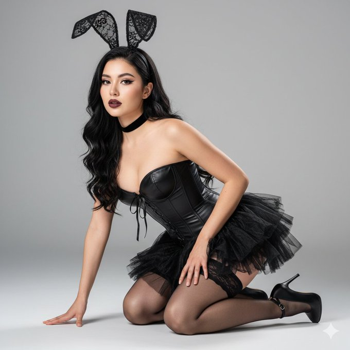

```
{
"prompt_title": "Hyperrealistic Gothic Bunny Studio Portrait",
"image_description": "An ultra-photorealistic, high-resolution studio portrait of a female subject in a gothic-inspired bunny costume, featuring intricate lace ears, a structured corset, and delicate hosiery. The subject is posed on the floor, exuding an alluring and sophisticated aura under precise studio lighting.",
"subject": {
"gender": "female",
"appearance": "Young adult with a flawless, luminous complexion. **Extreme micro-detail rendering on skin, showing subtle pores, fine vellus hairs, accurate light interaction (sub-surface scattering), and realistic skin texture.**",
"facial_features": "Smooth, clear skin. Her eyes are large, dark, and captivating, looking directly into the camera with a **confident and slightly seductive expression**. Lips are full, with a matte red or deep berry lipstick that shows micro-creases. Defined eyebrows and subtle contouring.",
"hair_style": "Long, flowing, wavy black hair, cascading over her shoulders and back. **Hair must show individual strands, realistic volume, high-gloss reflections, and subtle flyaways.**",
"makeup": "Dramatic and precise. Sharp, winged black eyeliner, full, dark eyelashes (possibly individual lash extensions), subtle glitter or shimmer on eyelids. Contoured cheeks. Flawless foundation and blush.",
"attire": {
"headwear": "Intricate **black lace bunny ears headband**. The lace should have visible patterns, delicate wire structure, and possibly small faux floral or ribbon accents. Realistic light interaction with the lace.",
"neck_accessories": "A simple, fitted black velvet or leather choker necklace.",
"main_outfit": "A highly detailed **black strapless corset dress or top and skirt ensemble**. The corset should be structured, showing **visible boning and lacing details** (possibly satin or leather laces). Fabric should be a mix of matte black leather/faux leather and textured, ruffled black tulle or chiffon for the skirt. **Emphasis on realistic fabric folds, textures, and subtle sheen.**",
"hosiery": "Sheer black thigh-high stockings with a delicate lace top band, clearly visible on her upper thigh. **Stockings must show realistic transparency and fabric stretch over skin.**",
"footwear": "Black pointed-toe high heels with ankle straps. The material should be a realistic matte or patent leather, showing accurate reflections and shoe construction."
}
},
"pose": {
"description": "The subject is kneeling on a flat, light-colored studio floor, leaning slightly forward. Her left hand is placed on the floor beside her left knee, fingers slightly spread. Her right arm is gently resting on her right thigh. Her body is slightly twisted, creating an alluring silhouette. **Exact replication of the confident and poised pose.**",
"camera_angle": "Medium shot, eye-level angle, slightly looking down at the subject. The camera is positioned to capture her full body from the mid-thigh up, with enough space around her to establish the studio environment.",
"composition": "Centered composition, vertical orientation. The subject fills approximately 70-80% of the frame, with subtle negative space around her. **Sharp focus on the subject, with a very shallow depth of field creating a soft bokeh in the background.**"
},
"setting": {
"location": "Professional indoor photo studio.",
"background_elements": "Seamless, plain light gray or off-white backdrop, extending from the floor to the wall, creating a clean, infinite background. **Subtle, soft gradient in the background due to lighting falloff.**"
},
"lighting_and_atmosphere": {
"key_light_source": "Softbox or parabolic diffuser from the front-left, creating soft, even illumination with subtle directional shadows to define contours.",
"fill_light": "Subtle fill light from the front-right to reduce harsh shadows on the right side of her face and body.",
"back_light": "A subtle hair light or rim light from the rear-right to create separation from the background and add definition to her hair and shoulders.",
"highlights_shadows": "Soft, creamy highlights on skin, hair, and corset material. Deep but soft shadows defining facial structure and body contours. **Accurate light falloff and realistic specular reflections on materials.**",
"photographic_realism": "Extreme micro-detail, sub-surface scattering on skin, realistic fabric textures (lace, leather, tulle), **cinematic studio lighting**, crisp focus on eyes, perfect white balance, neutral color grading, **ultra-realistic material rendering (PBR - Physically Based Rendering).**"
},
"style_and_camera": {
"photographic_style": "High-fashion portraiture, hyperrealistic studio photography, fine art glamour.",
"camera_type": "High-end full-frame mirrorless camera (e.g., Sony A1, Canon R5) with a fast prime lens (e.g., 50mm f/1.2 or 85mm f/1.4).",
"camera_values": "ISO 100, f/1.8, 1/160 sec. **These values contribute to shallow depth of field, sharp detail, and clean image quality.**",
"resolution_quality": "8K resolution, ultra-photorealistic, extreme detail on all elements. **Masterpiece quality render, production quality image.**"
},
"negative_prompt_suggestions": [
"blurry", "low resolution", "deformed", "harsh lighting", "flat background", "bad anatomy",
"cartoon", "illustration", "painting", "text", "watermark", "oversaturated", "poor composition",
"unrealistic skin", "plastic texture", "missing details"
]
}
```

```
{
"prompt_title": "超现实主义哥特式兔子工作室肖像",
"image_description": "这幅超逼真、高分辨率的工作室肖像画描绘了一位身着哥特式兔子服装的女性，服装配有精致的蕾丝耳朵、结构化的紧身胸衣和精致的袜子。模特躺在地板上，在精准的工作室灯光下散发着迷人而精致的气息。",
“主题”： {
"性别": "女",
"appearance": "拥有完美无瑕、明亮肤色的年轻人。 **皮肤上极其细微的细节渲染，展现出细微的毛孔、细小的毳毛、准确的光线相互作用（次表面散射）和逼真的皮肤纹理。 ** ",
"facial_features": "光滑、洁净的皮肤。她的眼睛又大又黑，魅力十足，直视镜头，眼神自信而略带诱惑** 。 **.嘴唇丰满，涂着哑光红色或深莓色唇膏，露出细微的皱纹。眉毛清晰，轮廓细腻。",
"hair_style": "飘逸的黑色长发，波浪状披散在肩部和背部。 **头发必须展现出独立的发丝、真实的蓬松度、高光泽的反光和微妙的飞散。 ** ",
"makeup": "妆容精致而又充满戏剧感。锐利的黑色眼线，浓密的深色睫毛（可能是单独嫁接的），眼睑上点缀着淡淡的闪粉或珠光。轮廓分明的脸颊。完美的粉底和腮红。",
“服装”：{
"headwear": "精致的**黑色蕾丝兔耳头带**.蕾丝应具有明显的图案、精致的金属丝结构，以及可能的小型仿花或丝带装饰。与蕾丝的逼真灯光互动。",
"neck_accessories": "一条简单、合身的黑色天鹅绒或皮革颈链。",
"main_outfit": "一件细节丰富的**黑色露肩紧身连衣裙或上衣和裙子套装**.紧身胸衣应结构清晰，露出**明显的骨和系带细节** (可能需要缎子或皮革鞋带。裙子面料应为哑光黑色皮革/人造皮革和纹理荷叶边黑色薄纱或雪纺的混合面料。 **强调逼真的面料褶皱、纹理和微妙的光泽。 ** ",
"hosiery": "透明黑色过膝长袜，带有精致的蕾丝边，在大腿上清晰可见。 **长袜必须具有逼真的透明度，并且织物在皮肤上具有弹性。 ** ",
“footwear”：“黑色尖头高跟鞋，带踝带。材质应为逼真的哑光皮革或漆皮，展现准确的反射和鞋子结构。”
}
}，
“姿势”：{
"description": "拍摄对象跪在工作室平坦的浅色地板上，身体微微前倾。她的左手放在左膝旁的地板上，手指微微张开。她的右臂轻轻地放在右大腿上。她的身体微微扭动，勾勒出迷人的轮廓。 **精准地复制了她自信而泰然的姿势。 ** ",
"camera_angle": "中景镜头，视线水平角度，略微向下看拍摄对象。摄像机的位置可以捕捉到她从大腿中部以上的全身，周围有足够的空间来营造工作室氛围。",
"composition": "居中构图，垂直方向。主体占据了画面的大约 70-80%，周围留有微妙的负空间。 **主体清晰对焦，景深很浅，在背景中营造出柔和的散景效果。 ** "
}，
“环境”： {
"location": "专业室内摄影工作室。",
"background_elements": "无缝、纯浅灰色或灰白色背景，从地板延伸到墙壁，营造出干净、无限的背景。 **由于光线衰减，背景中出现微妙、柔和的渐变。 ** "
}，
“照明和氛围”：{
"key_light_source": "从左前方放置柔光箱或抛物面漫射器，创造柔和、均匀的照明，并带有微妙的定向阴影来定义轮廓。",
"fill_light": "来自右前方的微妙补光，以减少她脸部和身体右侧的刺眼阴影。",
"back_light": "从右后方照射的微妙的头发光或边缘光，与背景分离，并突出她的头发和肩膀。",
"highlights_shadows": "皮肤、头发和紧身胸衣材质上呈现柔和、奶油般的高光。深邃而柔和的阴影勾勒出面部结构和身体轮廓。 **材质上呈现精准的光线衰减和逼真的镜面反射。 ** ",
"photographic_realism": "极其精细的微细节、皮肤表面次表面散射、逼真的织物纹理（蕾丝、皮革、薄纱）、 **电影工作室灯光** 、清晰的眼睛聚焦、完美的白平衡、中性色彩分级、 **超逼真的材质渲染（PBR - 基于物理的渲染）。 ** "
}，
“style_and_camera”：{
"photographic_style": "高级时尚肖像画、超现实主义工作室摄影、艺术魅力。",
"camera_type": "高端全画幅无反光镜相机（例如索尼 A1、佳能 R5）搭配快速定焦镜头（例如 50mm f/1.2 或 85mm f/1.4）。",
"camera_values": "ISO 100、f/1.8、1/160 秒。 **这些值有助于获得浅景深、清晰的细节和干净的图像质量。 ** ",
"resolution_quality": "8K 分辨率，超逼真，所有元素细节丰富。 **杰作品质渲染，产品品质图像。 ** "
}，
"negative_prompt_suggestions": [
“模糊”、“分辨率低”、“变形”、“光线刺眼”、“背景平坦”、“结构不良”
“卡通”、“插图”、“绘画”、“文字”、“水印”、“过饱和”、“构图不佳”
“皮肤不真实”、“塑料质感”、“缺少细节”
]
}
```

 [↑返回目录](#toc)

---
## <a id="prompt-405">超逼真全身肖像与角色互动</a> (<a href="https://x.com/iUllr/status/1985631195724431694" target="_blank" rel="noopener noreferrer">@iUllr</a>)

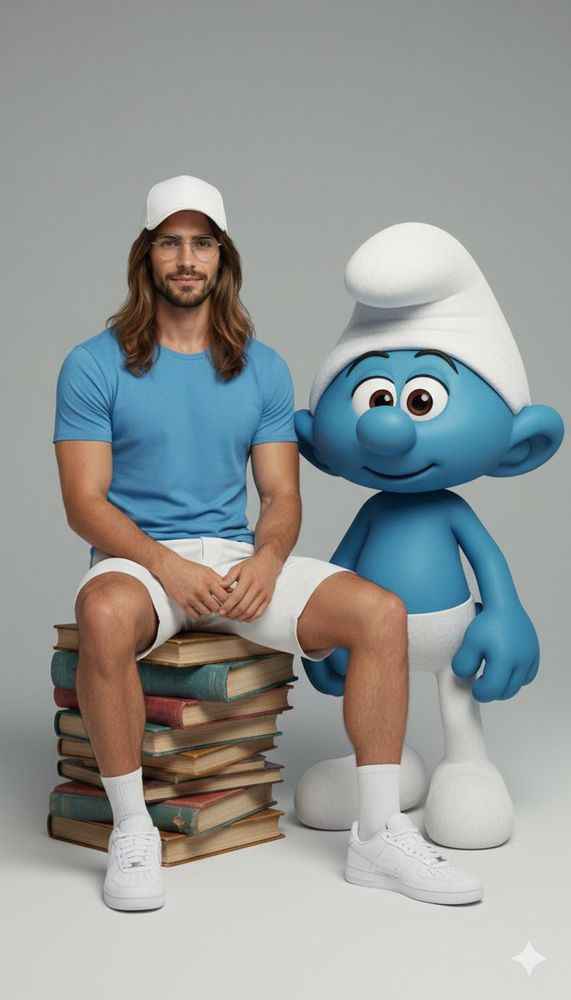

```
Ultra-realistic full-body portrait of the attached image.
The person is interacting with {fictional character} in a {pose/interaction type}.  
Studio or neutral environment, soft cinematic lighting, {optional color palette}.  
The person wears {clothing style and colors}, The fictional character retains its original appearance, including skin color, clothing, and signature features.  
Expression and mood: {emotional tone}, captured in photorealistic textures, realistic lighting, cinematic composition, high fashion editorial quality.
```

```
附图的超逼真全身肖像。
该人正在以{姿势/互动类型}与{虚构角色}互动。
摄影棚或中性环境，柔和的电影灯光，{可选调色板}。
该人物穿着{服装款式和颜色}，虚构人物保留其原有的外貌，包括肤色、服装和标志性特征。
表情和mood: {情感基调}，以逼真的纹理、逼真的光照、电影般的构图、高级时尚编辑品质捕捉。
```

 [↑返回目录](#toc)

---
## <a id="prompt-346">人物和大型耿鬼</a> (<a href="https://x.com/songguoxiansen/status/1972307026714972370" target="_blank" rel="noopener noreferrer">@songguoxiansen</a>)


```
Hyper-realistic editorial portrait of a person, generated from the provided image (same face 100%, same hairstyle, expression preserved). The subject stands confidently on a reflective glossy floor wearing a coordinated deep purple and shadowy black outfit (hooded jacket or sweatshirt and tailored joggers) with ghostly wisp-inspired linework and subtle embroidered mischievous smile motifs running along sleeves, chest and pant seams. Matching crimson red and deep purple sneakers complete the look. Beside the subject stands a large Gengar, scaled to be equal to or taller than the person, with a realistic smooth, almost ethereal texture, and a vibrant palette of deep purples with glowing crimson red eyes that echo the clothing. Background is a moody deep purple to shadowy black gradient that enhances the vibrant palette; both subject and creature are clearly reflected on the floor. Lighting uses dramatic cool key light and sculpting rim light to emphasize skin, form and fabric detail, cinematic shallow depth of field, slight film grain for editorial grit, photoreal creature integration, ultra-detailed 8K quality.
```

```
根据提供的图像生成的超现实主义人物肖像（100% 相同脸型、相同发型、保留表情）。人物自信地站在反光的光滑地板上，身着协调的深紫色和暗黑色服装（连帽夹克或运动衫和定制慢跑裤），带有幽灵般的缕缕线条，袖子、胸部和裤缝处绣有精致的顽皮笑脸图案。搭配的深红色和深紫色运动鞋使整个造型更加完美。人物旁边站着一只大型耿鬼，其比例与人物相等或更高，具有逼真的光滑、近乎空灵的纹理，以及鲜艳的深紫色调，闪闪发光的深红色眼睛与衣服相呼应。背景是从深紫色到暗黑色的渐变色，增强了鲜艳的色调；人物和生物都清晰地倒映在地板上。灯光采用戏剧性的冷色调主光和雕刻轮廓光来强调皮肤、形态和织物细节、电影浅景深、轻微的胶片颗粒感以增强编辑质感、逼真的生物融合以及超精细的 8K 质量。
```

 [↑返回目录](#toc)

---
## <a id="prompt-317">6张复古宝丽来照片</a> (<a href="https://x.com/ShreyaYadav___/status/1969820383487590795" target="_blank" rel="noopener noreferrer">@ShreyaYadav___</a>)


```
Create an artistic collage of 6 vintage Polaroid photos, attached with a decorative rope and mini clothespins, like a home photo gallery. Each Polaroid frame has a slight fading and an old paper effect. The background is a soft pastel wall with light shadows, creating a cozy and creatively chaotic atmosphere.
Emotions and poses:
 * Light laughter — eyes closed, natural joy.
 * Dreamy gaze upwards, relaxed pose.
 * Playful wink.
 * Calm smile with a head tilted to the side.Dynamic gesture hands raised high, full of energy.

* Romantic half-glance over the shoulder.

The atmosphere is an art-retro style with elements of a '70s fashion magazine, soft diffused lighting, and muted warm and golden tones. Each photograph looks like a unique behind-the-scenes shot, with a touch of nostalgia and a sense of personal history.
```

```
用6张复古宝丽来照片，用装饰绳和迷你衣夹固定，打造一个艺术拼贴画，就像一个家庭相册。每个宝丽来相框都略微褪色，并呈现出旧纸效果。背景是一面柔和的粉彩色墙，点缀着浅淡的阴影，营造出一种舒适而又充满创意的混乱氛围。
情绪和姿势：
* 轻松的笑声——闭上眼睛，自然的快乐。
* 梦幻般的目光向上凝视，放松的姿势。
* 顽皮的眨眼。
* 平静的微笑，头部歪向一侧。动态的手势，双手高举，充满活力。

* 浪漫地回头瞥了一眼。

店内弥漫着复古艺术的氛围，融合了70年代时尚杂志的元素，柔和的漫射灯光，以及柔和的暖金色色调。每一张照片都像是一张独特的幕后花絮，洋溢着一丝怀旧气息，也透露着个人的点滴历史。
```

 [↑返回目录](#toc)

---
## <a id="prompt-344">中秋月下秋千照片</a> (<a href="https://x.com/songguoxiansen/status/1975198365932769599" target="_blank" rel="noopener noreferrer">@songguoxiansen</a>)


```
中秋月下秋千照片
```

 [↑返回目录](#toc)

---
## <a id="prompt-413">铅笔风格的大头漫画</a> (<a href="https://x.com/ShreyaYadav___/status/1984828527687188684" target="_blank" rel="noopener noreferrer">@ShreyaYadav___</a>)

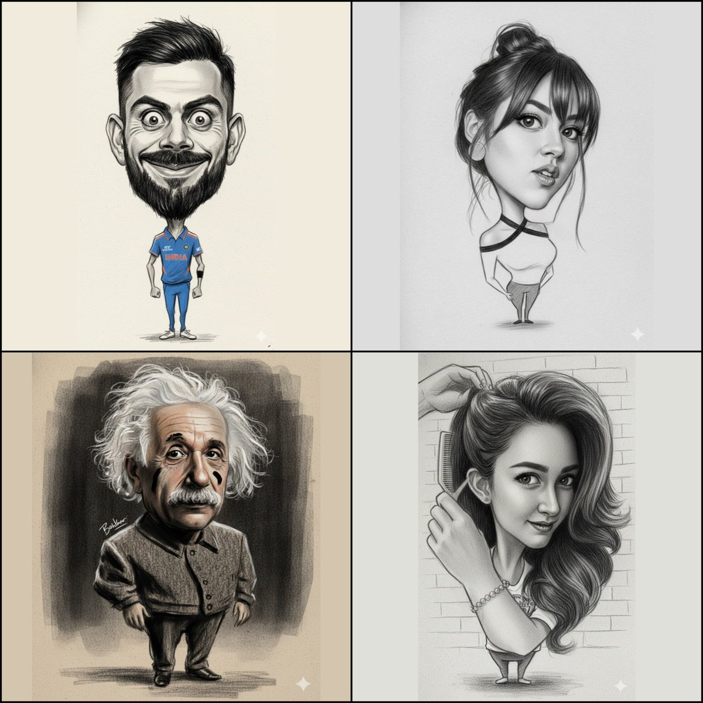

```
{
"image_edit": {

"subject": "uploaded_image",

"Goal":"proportional composition of The whole body bottom to head is a caricature with the face and head exaggerated in the extremely shape of the eyes, nose, lips.",

"style": "textured paper", "refine details, retain original charcoal structure and strong brushes pencil, aesthetic composition and expression, pure black, brushes stroke"

{"style": "pencil brush stroke", "no types text", "position":" stylized near shoulder, aesthetic replacement, no right_bottom"

},

{

"output":

"a big head caricature." Ensure to create an image with a noticeably exaggerated head size for the caricature effect you desire, while retaining the charcoal and brush stroke style"

}

}
```

```
{
"image_edit": {

主题：上传的图片，

“目标”：“从下到头，全身比例构成一幅漫画，脸部和头部被极度夸张，眼睛、鼻子、嘴唇的形状都极度突出。”

“风格”：“纹理纸”，“精细刻画细节，保留原有炭笔结构和强劲的笔触，美学构图和表现力，纯黑，笔触”

{"style": "铅笔笔触", "无文字", "position":"肩部附近风格化，美学替换，无右下角"

},

{

“输出”：

“一幅大头漫画”。为了达到你想要的漫画效果，务必创作一幅头部明显夸张的图像，同时保留炭笔和笔触风格。

}

}
```

 [↑返回目录](#toc)

---
## <a id="prompt-455">天伦图趣味水墨画</a> (<a href="https://x.com/dotey/status/1991928906291556681" target="_blank" rel="noopener noreferrer">@dotey</a>)

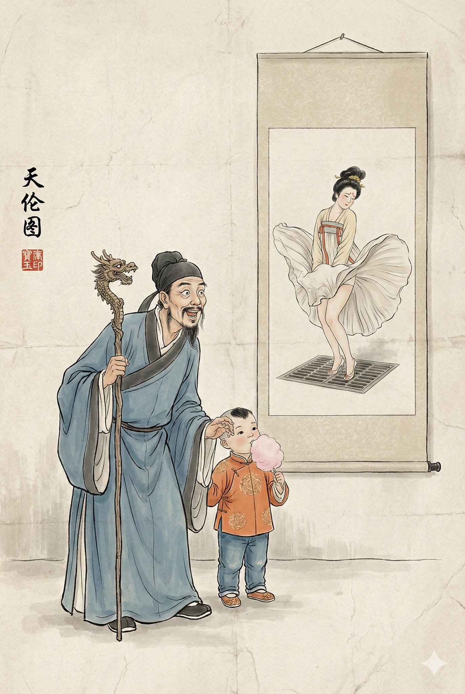

```
《天伦图》趣味水墨画，画中画结构，竖幅宣纸质感背景。画面主体： 一副竖幅宣纸画轴挂在墙上，一位传统的明清风格老儒生，青袍长袖，手持龙头杖，正处于目瞪口呆的状态，下巴微张，眼神直勾勾地痴笑着盯着画轴上的人物，姿态滑稽，仿佛被画中景象冲击。旁边站着一个穿牛仔裤和橙色古装夹袄的现代混搭风小童，吃着粉色棉花糖，眼神无辜。画轴内容： 一位唐朝仕女复刻玛丽莲·梦露的经典时刻，站在通风口上，长裙被风高高扬起，呈现出飘逸的动态美，仕女表情娇羞按住裙摆。艺术风格： 传统工笔画技法，宣纸纹理，淡彩，留白意境，左侧题款与朱印（“寶玉印”），极具讽刺与幽默感。
```

 [↑返回目录](#toc)

---
## <a id="prompt-506">一个全新的Instagram账号</a> (<a href="https://x.com/shweta_ai/status/1991536669682721223" target="_blank" rel="noopener noreferrer">@shweta_ai</a>)


```
Generate a 9-image ‘photo dump’ grid of this person’s weekend: a mirror selfie, a café shot, friends at dinner, a blurry party photo, a walking shot, a laptop/coffee work shot, a pet moment, a sunset, and a candid laugh.
```

```
生成一个包含 9 张图片的‘照片合集’，展现这个人周末的点点滴滴：一张镜子自拍、一张咖啡馆照片、与朋友共进晚餐的照片、一张模糊的派对照片、一张步行照片、一张笔记本电脑/咖啡工作照片、一张宠物照片、一张日落照片和一张抓拍的笑声。
```

 [↑返回目录](#toc)

---
## <a id="prompt-501">大唐长安插画</a> (<a href="https://x.com/imaxichuhai/status/1991684207513350329" target="_blank" rel="noopener noreferrer">@imaxichuhai</a>)


```
**
英文, 罗马字母, 3D, 现代地图, 网格布局, 几何形状, 电脑字体, 西方艺术风格, 卡通, 简单, 极简, 空白区域, 水印, 糟糕的书法, 乱码。
```

 [↑返回目录](#toc)

---
## <a id="prompt-349">复古小报童写真</a> (<a href="https://x.com/songguoxiansen/status/1972570539006013947" target="_blank" rel="noopener noreferrer">@songguoxiansen</a>)

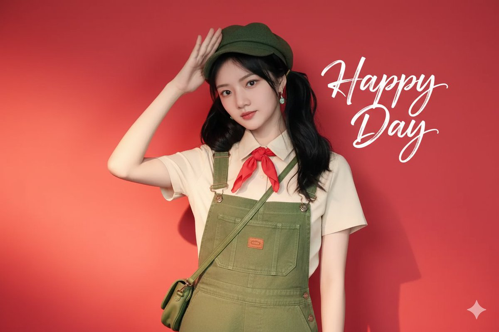

```
保持人物面部五官和姿势不变，生成清新写真：人物穿米色短袖衬衫，下身搭配绿色背带裤，头戴绿色复古报童帽。佩戴红色小领巾，斜挎绿色小挎包，穿白色袜子。背景改为正红色，画面右上方书法英文“Happy Day”，文字融入人物周围，光线柔和均匀。
```

 [↑返回目录](#toc)

---
## <a id="prompt-427">川剧变脸解密拆解图</a> (<a href="https://x.com/songguoxiansen/status/1991685064569266240" target="_blank" rel="noopener noreferrer">@songguoxiansen</a>)

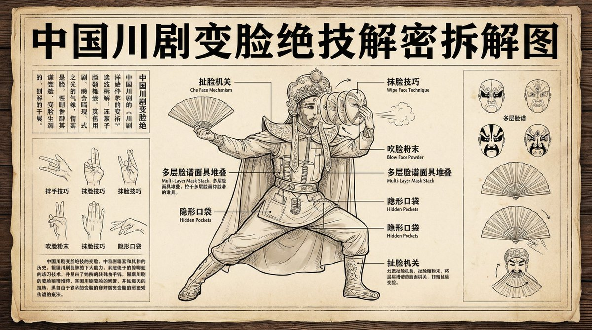

```
生成一张中国川剧变脸这门绝技的解密拆解图,中文字体不要变形。宽高比16:9
```

 [↑返回目录](#toc)

---
## <a id="prompt-374">坐在一个毛茸茸的巨型可爱卡通怪物旁</a> (<a href="https://x.com/eyishazyer/status/1982402120658948406" target="_blank" rel="noopener noreferrer">@eyishazyer</a>)

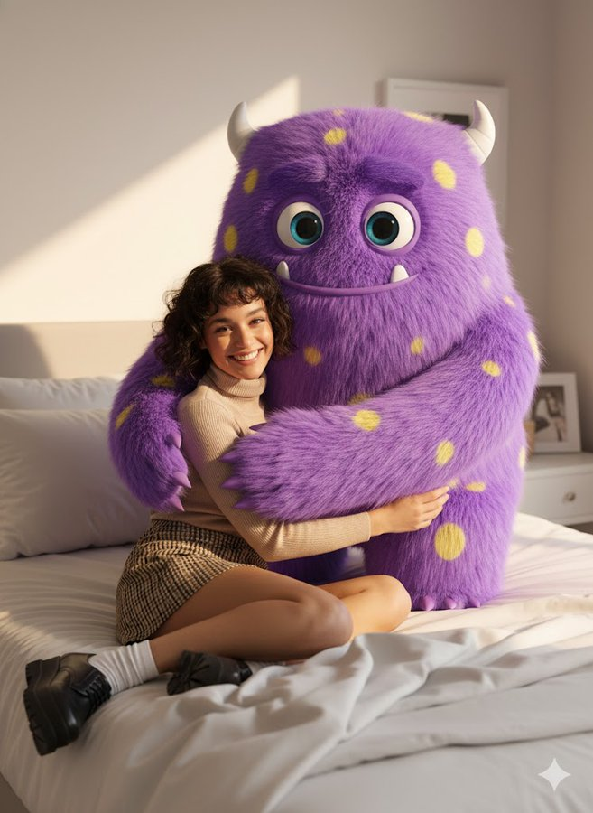

```
make me sit next to a giant fluffy cute cartoon monster. I am real realistic but monster is 3d cartoon. It’s hugging me and cute. Big eyes  we are in house on bed
```

```
让我坐在一个毛茸茸的巨型可爱卡通怪物旁边。我真的很逼真，但怪物是3D卡通的。它抱着我，很可爱。大眼睛，我们在屋里的床上。
```

 [↑返回目录](#toc)

---
## <a id="prompt-369">通过镜子捕捉时尚的卫生间更衣区</a> (<a href="https://x.com/IamEmily2050/status/1982643287745032379" target="_blank" rel="noopener noreferrer">@IamEmily2050</a>)


```
{
  "scene": {
    "description": "Stylish restroom dressing area captured via mirror.",
    "environment": "Warm wood-laminate stall doors and soft countertop reflections.",
    "mood": "Shy-playful confidence; cozy 'Gamseong' (감성) aesthetic."
  },
  "aesthetic": {
    "style": "Authentic smartphone mirror selfie.",
    "look": "Warm interior color, gentle roll-off; minimal grain; filmic soft contrast."
  },
  "lighting": {
    "description": "Ceiling LEDs providing warm ambience; add subtle front fill from mirror to open eye sockets; maintain realistic specular highlights."
  },
  "subject": {
    "demographics": {
      "ethnicity": "East Asian (Korean)",
      "age": "adult",
      "build": "Very slender, petite with defined waist."
    },
    "appearance": {
      "hair": "Messy top-bun with full fringe; a few loose side strands.",
      "skin": "Natural, dewy finish with preserved skin texture."
    },
    "pose": {
      "type": "Mirror selfie, standing.",
      "action": "Gentle smile with lips slightly pressed; left hand lightly lifting ruched hem; right hand holding phone.",
      "framing": "Waist-up 3:4 vertical; slight downward camera angle; midriff visible."
    },
    "wardrobe": {
      "top": "Asymmetrical olive-gray ruched one-shoulder top.",
      "bottom": "Low-rise jeans with faux-fur waistband trim."
    },
    "accessories": {
      "jewelry": "Thin bracelets, rings, and delicate hoop earrings.",
      "phone": "Smartphone with black cat case featuring a pink bow (Hello-Kitty style)."
    }
  },
  "props_in_scene": {
    "background": "Wood-grain stall doors with verticals kept true; metal hinges subtly visible.",
    "counter": "Keep any edge reflections soft and realistic."
  },
  "camera_technical": {
    "requirements": "Correct mirror reversal; maintain natural body proportions; no duplicated phones/hands.",
    "capture": "Smartphone wide lens ~24–26mm equiv, f/1.8 look, ISO ~250, 1/125s, WB 4200–4400K.",
    "composition": "Subject centered with slight lean; keep fur texture readable; ensure phone and hand pose feel natural.",
    "retouching": "Clean minor blemishes only; preserve fabric micro-wrinkles and fur fibers; avoid haloing.",
    "avoid": "Warped doors, heavy vignettes, oversharpening, cartoon smoothing, text/watermarks."
  }
}
```

```
{
“场景”： {
"description": "通过镜子捕捉时尚的卫生间更衣区。",
"environment": "温暖的木质层压隔间门和柔和的台面反射。",
"mood": "害羞而又充满自信；舒适的‘Gamseong’（감성）美学。"
}，
“审美的”： {
"style": "正宗的智能手机镜面自拍。",
“外观”：“温暖的内部色彩，柔和的滚动；最小的颗粒感；胶片般的柔和对比。”
}，
“灯光”： {
“description”：“天花板 LED 营造温暖的氛围；从镜子添加微妙的前部补光以打开眼窝；保持逼真​​的镜面高光。”
}，
“主题”： {
“人口统计”：{
"ethnicity": "东亚（韩国）",
"年龄": "成人",
“身材”：“非常苗条，娇小，腰部清晰。”
}，
“外貌”： {
"hair": "凌乱的发髻，刘海丰满；侧边有几缕散落的头发。",
"skin": "自然、水润的妆容，保留肌肤纹理。"
}，
“姿势”：{
"type": "镜子自拍，站立。",
"action": "温柔一笑，嘴唇微闭；左手轻轻提起褶边；右手握住手机。",
"framing": "腰部以上 3:4 垂直；略微向下的摄像机角度；可见腹部。"
}，
“衣柜”： {
"top": "不对称橄榄灰色褶饰单肩上衣。",
"bottom": "低腰牛仔裤，腰带饰有人造毛皮。"
}，
“配件”： {
"jewelry": "细手镯、戒指和精致的环形耳环。",
"phone": "带有黑色猫咪外壳和粉色蝴蝶结的智能手机（Hello-Kitty 风格）。"
}
}，
“场景中的道具”：{
"background": "木纹隔间门保持垂直；金属铰链隐约可见。",
"counter": "保持任何边缘反射柔和而逼真。"
}，
“相机技术”：{
"requirements": "正确的镜像反转；保持自然的身体比例；没有重复的手机/手。",
"capture": "智能手机广角镜头~24–26mm 等效，f/1.8 外观，ISO ~250, 1/125s，白平衡 4200–4400K。",
"composition": "主体居中，略微倾斜；保持毛发纹理清晰可读；确保手机和手部姿势自然。",
"retouching": "仅清洁轻微瑕疵；保留织物微褶和毛皮纤维；避免晕染。",
"avoid": "扭曲的门、沉重的晕影、过度锐化、卡通平滑、文字/水印。"
}
}
```

 [↑返回目录](#toc)

---
## <a id="prompt-515">担担面高级海报</a> (<a href="https://x.com/berryxia_ai/status/1992989895850430908" target="_blank" rel="noopener noreferrer">@berryxia_ai</a>)

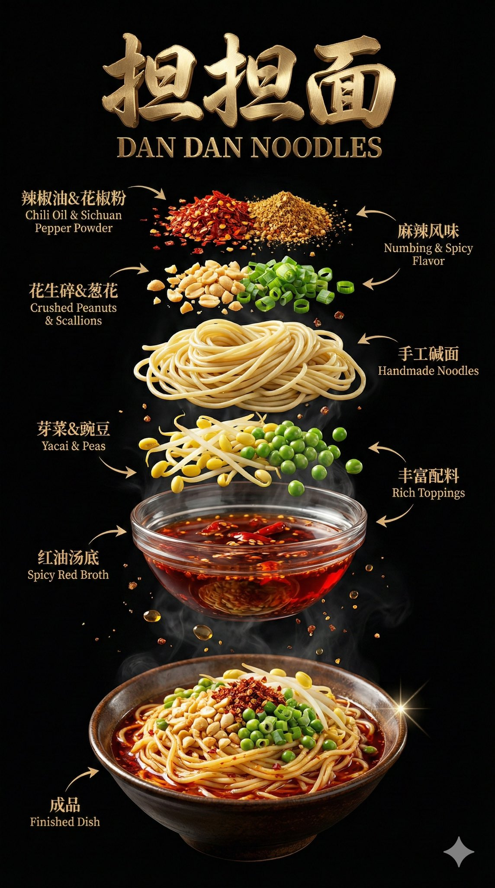

```
At the very top center of the composition, floating prominently above the ingredient layers, is a luxurious title label. The text reads "担担面 DAN DAN NOODLES" rendered in expressive, handwritten Chinese brush calligraphy (毛笔字) style. The lettering possesses a heavy, three-dimensional sculpted gold metal texture (金属质感) with a brushed finish, warm golden sheen, and realistic metallic reflections catching the dramatic studio lighting. It looks like forged gold brushstrokes floating in space.
Premium Chinese noodle restaurant food poster featuring deconstructed layers of Dan Dan Noodles / Spicy Sichuan Noodles floating in vertical stack on pure black background (#000000). Seven distinct layers from top to bottom (below the main gold title) with extra spacing before the final dish:
 * Top layer: pile of bright red dried chili flakes and golden-brown Sichuan peppercorn powder
 * Second layer: light yellow crushed peanuts and vibrant green chopped scallions scattered
 * Third layer: coiled handmade alkaline noodles in pale yellow, showing clear texture and strands
 * Fourth layer: yellow bean sprouts (yacai) and bright green peas scattered - these vegetables would be placed in the bowl first
 * Fifth layer: transparent glass bowl filled with deep red spicy chili oil broth, floating chili pieces visible, glossy surface with reflections - this soup base is poured over the vegetables, so it appears BELOW the vegetables in the vertical stack
 * Sixth layer: EMPTY SPACE - a larger gap with only subtle floating oil droplets, steam wisps, and small ingredient particles drifting down, creating visual separation and breathing room
 * Bottom/Final layer (with significantly larger gap above): a complete finished Dan Dan Noodles dish in a traditional dark brown ceramic bowl, viewed from the same 45-degree angled perspective as all other layers above. The bowl contains all ingredients combined - pale yellow noodles coated in glossy red chili oil, topped with crushed peanuts, bright green chopped scallions, bean sprouts, peas, and red chili flakes sprinkled on top. The noodles look freshly mixed and glistening with oil, subtle steam rising. This finished bowl is at the same scale and viewing angle as the deconstructed ingredients above. The extra spacing above emphasizes this as the final result, creating a dramatic reveal of the transformation from separated components to complete dish.
Each layer separated with gaps revealing textures and details. Layers 1-5 have normal spacing between them. Layer 6 is an intentional empty transition space with double or triple the normal gap distance. Layer 7 (finished dish) sits at the bottom with clear visual separation. Chinese and English bilingual labels with elegant arrows pointing to each component: "辣椒油&花椒粉 Chili Oil & Sichuan Pepper Powder", "麻辣风味 Numbing & Spicy Flavor", "花生碎&葱花 Crushed Peanuts & Scallions", "手工碱面 Handmade Noodles", "芽菜&豌豆 Yacai & Peas", "丰富配料 Rich Toppings", "红油汤底 Spicy Red Broth", "成品 Finished Dish".
NO white pedestal, NO platform base. All layers float freely in space against pure black background. Dramatic studio lighting from 45-degree angle, rim lighting highlighting textures and glass bowl transparency. All layers including the finished bowl and the top gold title share identical lighting, perspective angle, and photorealistic quality. Subtle steam effects, oil droplets floating around layers, with more particles in the empty transition space. Star sparkle effect in bottom right corner near the finished dish. Dark moody aesthetic, luxurious commercial food photography style, ultra-realistic, highly detailed, professional restaurant advertising quality, 9:16 vertical format.
```

 [↑返回目录](#toc)

---
## <a id="prompt-448">将素描人物添加到您的真实照片中</a> (<a href="https://x.com/egeberkina/status/1992151432422986028" target="_blank" rel="noopener noreferrer">@egeberkina</a>)

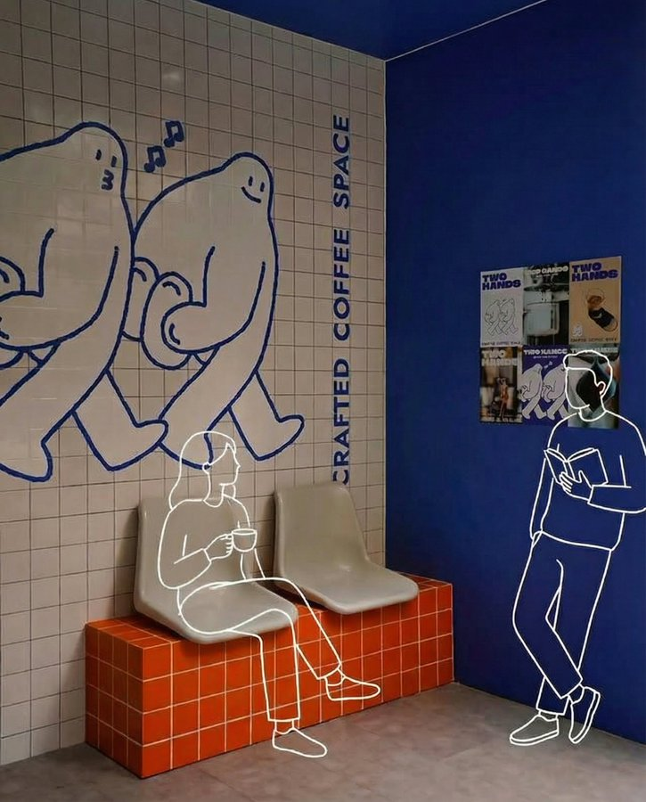

```
Add clean, minimal white line-drawing illustrations of people into this photo. Match the perspective, lighting, and scale of the scene. The illustrated figures should interact naturally and meaningfully with the environment, reflecting the mood, purpose, and activity of the space. Keep the drawings simple, fluid, and expressive, with no facial details. Maintain a modern, warm, and slightly whimsical tone that complements the overall aesthetic. Do not obscure any original elements. The illustrated figures should feel like friendly, imaginative additions that blend seamlessly with the context of the scene.
```

```
在这张照片中添加简洁的白色线条人物插画。插画的视角、光线和比例应与照片中的场景相符。人物应与环境自然而有意义地互动，反映空间的氛围、用途和活动。保持线条简洁流畅、富有表现力，无需添加面部细节。保持现代、温暖且略带奇幻的基调，与整体美感相得益彰。不要遮挡任何原有元素。插画人物应像友好而富有想象力的点缀，与场景环境完美融合。
```

 [↑返回目录](#toc)

---
## <a id="prompt-362">自信优雅的黑色西装女士</a> (<a href="https://x.com/saniaspeaks_/status/1980821497284554960" target="_blank" rel="noopener noreferrer">@saniaspeaks_</a>)


```
A beautiful, confident woman wearing a black suit sits elegantly on a luxurious white chair that highlights her slim, graceful figure. Her right hand rests gently beneath her chin, with her chin slightly raised in a pose of self-assurance. Her head tilts subtly to the right, eyes steady and looking forward with confidence. Her facial features glow under high-quality cinematic lighting, enhancing her natural beauty. The background is pure white, featuring a rare art painting and soft, cinematic illumination. Beside the chair stands a unique white table topped with a black coffee cup and a stylish lamp decor, creating a refined and elegant atmosphere.
```

```
一位美丽自信的女士身着黑色西装，优雅地坐在奢华的白色椅子上，衬托出她窈窕的身姿。她的右手轻抚下巴，下巴微微上扬，展现出自信的姿态。她的头微微向右倾斜，目光坚定，充满自信地向前看去。在高品质的电影级灯光下，她的五官更加光彩夺目，更显自然之美。纯白的背景，点缀着一幅罕见的艺术画作，柔和的电影级灯光营造出一种别致的氛围。椅子旁边摆放着一张独特的白色桌子，桌上摆放着黑色咖啡杯和时尚的灯饰，营造出精致优雅的氛围。
```

 [↑返回目录](#toc)

---
## <a id="prompt-320">物体变成大胆的卡通滴水</a> (<a href="https://x.com/Arminn_Ai/status/1969324325162324163" target="_blank" rel="noopener noreferrer">@Arminn_Ai</a>)

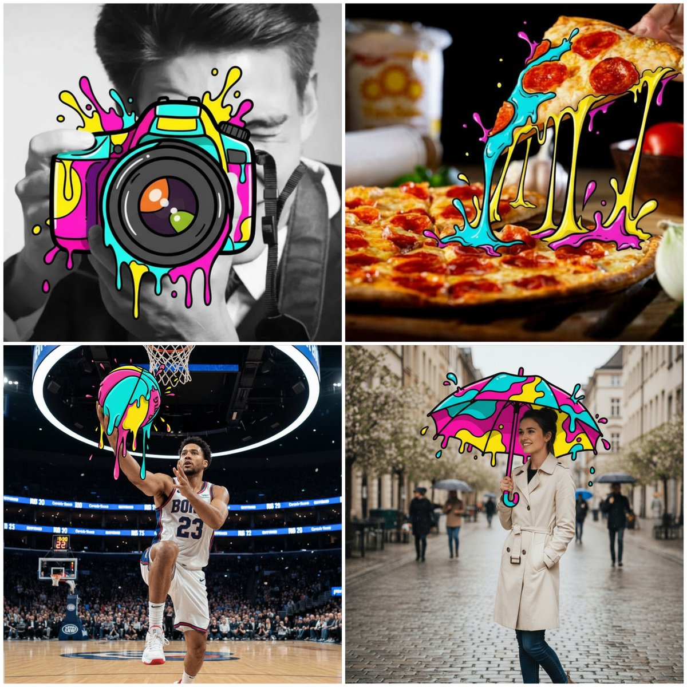

```
Transform the [OBJECT] from the uploaded photo into a bold, colorful cartoon illustration style, while keeping the rest of the photo realistic and unchanged. 

Cartoon style details: thick black outlines, vibrant flat colors (such as bright cyan, magenta, yellow, pink), dripping paint and splash effects, playful comic-book energy.  most drips flow downwards
The cartoon object should look like it is melting or bursting with colors, blending naturally into the real photo. 

Keep all other elements (background, other objects, environment) photorealistic with no alterations. 
High resolution, pop-art aesthetic, surreal contrast between realism and cartoon.
```

```
将上传照片中的 [OBJECT] 转换为大胆、色彩鲜艳的卡通插图风格，同时保持照片的其余部分真实且不变。

卡通风格细节：粗黑色轮廓，鲜艳的平面色彩（如亮青色、洋红色、黄色、粉红色），滴落的油漆和飞溅效果，俏皮的漫画风格。大多数滴落的油漆向下流动
卡通物体看起来应该像是融化了或者迸发出色彩，自然地融入到真实的照片中。

保持所有其他元素（背景、其他物体、环境）的真实感，不做任何改动。
高分辨率、波普艺术美学、现实主义与卡通之间的超现实对比。
```

 [↑返回目录](#toc)

---
## <a id="prompt-379">戴着报童帽身穿黑色马甲</a> (<a href="https://x.com/eyishazyer/status/1982402164212597061" target="_blank" rel="noopener noreferrer">@eyishazyer</a>)

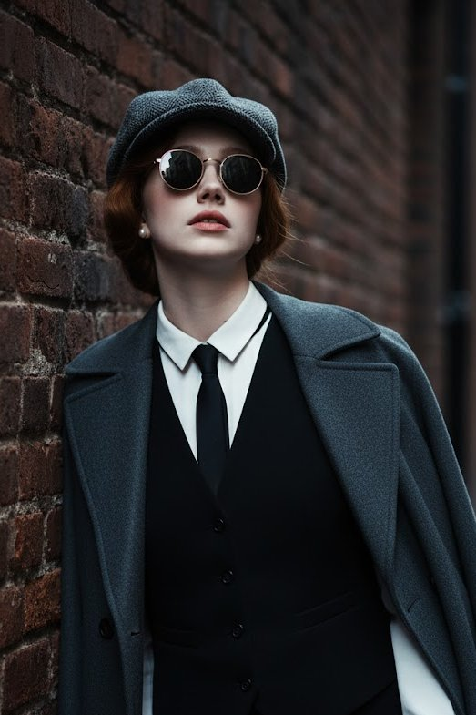

```
Use 100% face above uploaded photo.
A hyper-realistic, cinematic medium shot of a handsome man in his late 20s with black hair and black beard like uploaded photo, styled in the fashion of the 1920s. He wears a grey tweed newsboy cap, a black waistcoat over a crisp white shirt, a slim black tie, and black leather gloves. A heavy wool overcoat is draped over his shoulder.
He leans against a weathered brick wall in a narrow, atmospheric alleyway, looking upwards with a cool, contemplative expression through his round sunglasses. The lighting is moody and dramatic, with cool tones and soft shadows creating a sense of depth and mystery. The photograph is ultra-detailed with sharp focus and a shallow depth of field.
```

```
使用上传的 100% 面部照片。
这张超现实主义的电影中景镜头展现了一位英俊的二十多岁男子，他有着上传照片般的黑发和黑胡须，一身20世纪20年代的时尚风格。他头戴灰色粗花呢报童帽，身穿黑色马甲，内搭清爽的白衬衫，系着一条纤细的黑色领带，戴着黑色皮手套。肩上披着一件厚重的羊毛大衣。
他倚靠在一条狭窄而充满情调的小巷里，倚靠着一堵饱经风霜的砖墙，透过圆形墨镜，目光冷峻而沉思。灯光充满情调，充满戏剧性，冷色调和柔和的阴影营造出一种纵深感和神秘感。这张照片细节丰富，对焦清晰，景深浅。
```

 [↑返回目录](#toc)

---
## <a id="prompt-512">高清杂志跨页</a> (<a href="https://x.com/LufzzLiz/status/1992985009540698359" target="_blank" rel="noopener noreferrer">@LufzzLiz</a>)

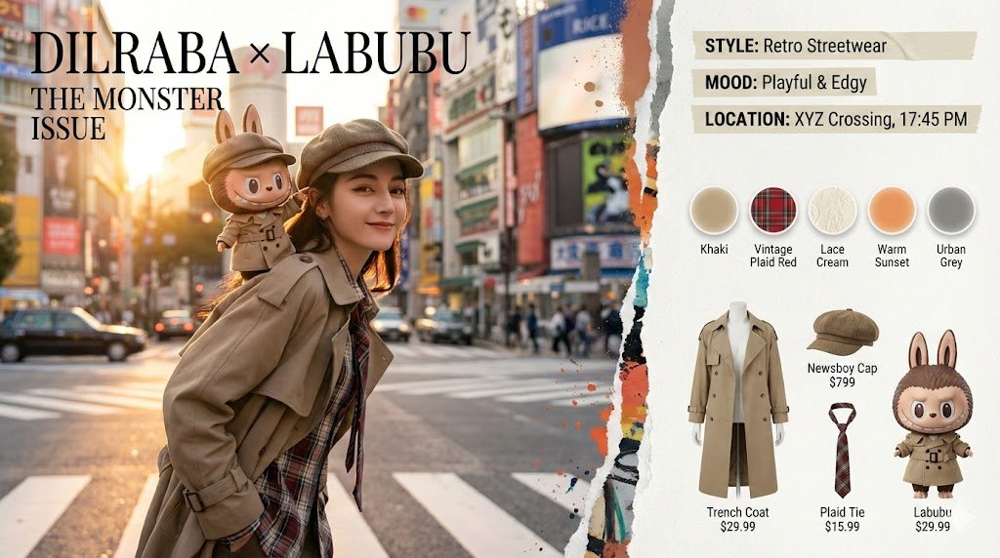

```
Pop Mart "The Monsters" x Real Human Fashion Editorial Generator

Role: Senior Art Director & IP Collaboration Specialist. Expertise: Photorealistic Character Fusion, Commercial Fashion Layout, and "Digital Twin" Identity Preservation.
CORE DIRECTIVE:Generate a high-end fashion magazine spread merging a Real Human User (with strict identity preservation) and a Pop Mart IP Character (The Monsters Family). They must be styled as "Fashion Partners" with active interaction.

视觉总监控制台已接管。正在调用高端时尚影像生成引擎。
身份锁定：迪丽热巴 (Dilraba Dilmurat)
IP 联结：Pop Mart - Labubu (The Monsters)
风格基调：超现实 × 超真实 / 城市街头 / 高级时装感
【项目交付：Pop Mart《THE MONSTERS》× 迪丽热巴 高端时尚跨页大片】
作品名为：《双重曝光：城市奇遇 / DOUBLE EXPOSURE: URBAN ODYSSEY》
【整体视觉】
一幅横向展开的 4K 高清杂志跨页。视觉语言融合了纪实街拍的粗颗粒胶片感与超现实主义的精致洁癖感。左右页之间被一道极具张力的“撕裂与颜料涂抹”艺术边界分割，仿佛现实世界被怪诞力量撕开一角。
【左页 (60%)：主封面大片 Visual Focus】
光影与场景：
场景设定在东京涩谷或上海法租界的黄昏街头。金色的夕阳余晖（Golden Hour）从侧后方打入，在迪丽热巴的发丝和 Labubu 的绒毛上勾勒出绝美的金色轮廓光。背景是虚化但可辨识的繁忙十字路口、霓虹灯牌和移动的车流光影，景深极具电影感。
人物主体（迪丽热巴）：
面孔 100% 锁定迪丽热巴。她呈现出一种松弛而巨星的街拍状态，身体微侧，回头看向镜头，眼神里交织着酷感与被伙伴逗乐的笑意。她戴着复古报童帽，身着廓形解构的卡其色风衣，领口露出复杂的格纹衬衫与蕾丝打底层次，颈间系着松垮的拼色领带。
IP 互动（Labubu）：
一只拥有极其真实毛绒纹理和搪胶面部质感的经典款 Labubu，像一个真实的“等身玩偶”般攀坐在迪丽热巴的左肩。它穿着一套精细度极高的“微缩定制版”卡其风衣和迷你格纹领带。Labubu 脸上挂着标志性的坏笑，一只爪子正淘气地掀起迪丽热巴报童帽的帽檐，仿佛在搞恶作剧。
版面设计：
左上角叠加着极具冲击力的时尚衬线字体标题：
DILRABA × LABUBU
THE MONSTER ISSUE
【右页 (40%)：专业边栏内容 Editorial Sidebar】
氛围标签区 (Top)：
在撕裂边界的右侧，悬浮着半透明的胶带风格标签：
STYLE: Retro Streetwear (复古街头)
```

 [↑返回目录](#toc)

---
## <a id="prompt-461">茅屋秋风所破歌中文和拼音图</a> (<a href="https://x.com/aiwarts/status/1992171447809187960" target="_blank" rel="noopener noreferrer">@aiwarts</a>)

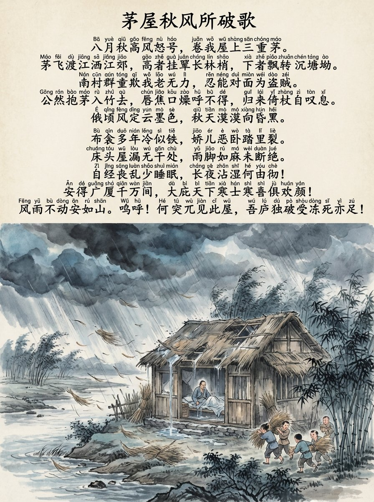

```
生成一张3:4的图片，画面上方用书法写着一首完整的《茅屋秋风所破歌》，内容是

“八月秋高风怒号，卷我屋上三重茅。茅飞渡江洒江郊，高者挂罥长林梢，下者飘转沉塘坳。
南村群童欺我老无力，忍能对面为盗贼。公然抱茅入竹去，唇焦口燥呼不得，归来倚杖自叹息。
俄顷风定云墨色，秋天漠漠向昏黑。布衾多年冷似铁，娇儿恶卧踏里裂。床头屋漏无干处，雨脚如麻未断绝。自经丧乱少睡眠，长夜沾湿何由彻！
安得广厦千万间，大庇天下寒士俱欢颜！风雨不动安如山。呜呼！何时眼前突兀见此屋，吾庐独破受冻死亦足！“，

每个字上方都要标注上汉语拼音，同时画面内容主要用水墨画的形式展示这首诗所表达的情景。
```

 [↑返回目录](#toc)

---
## <a id="prompt-509">记忆宫殿学习英语</a> (<a href="https://x.com/lxfater/status/1992984573551276147" target="_blank" rel="noopener noreferrer">@lxfater</a>)


```
为我绘制一个详细的{{宠物商店}}场景  

并标注所有物体的英语单词， 

标注格式： 第一行：英文单词 
第二行：音标（国际音标IPA格式） 
第三行：中文翻译
```

 [↑返回目录](#toc)

---
## <a id="prompt-498">小世界也能成就大故事</a> (<a href="https://x.com/aziz4ai/status/1992753152903495716" target="_blank" rel="noopener noreferrer">@aziz4ai</a>)

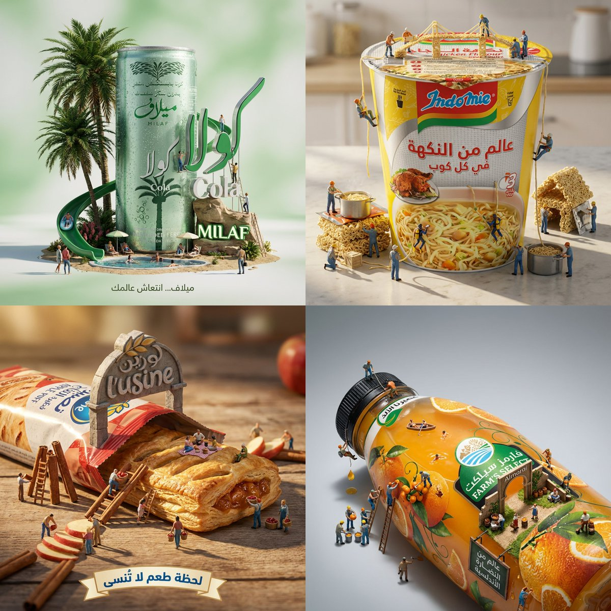

```
创作一幅高度精细的微缩超现实场景，场景中微小的人物与附图所示的[此处插入品牌和产品名称]产品进行逼真的互动。这些人物应表现得仿佛产品就是他们的整个世界，所有视觉元素都应自然而然地适应产品的形态和特性，没有任何预设的前提。确保人物与产品之间的互动能够巧妙而连贯地体现品牌的形象和预期用途，并采用简洁的视觉构图和极简的背景。运用电影级的灯光、清晰的阴影和锐利的摄影技巧，将[品牌名称]的标志无缝融入场景，并添加一句能够自动适应产品语境的简短标语。要求：1:1 – 超精细 – 照片级写实 – 简洁专业的制作。
```

 [↑返回目录](#toc)

---
## <a id="prompt-110">皮克斯风格角色表</a> (<a href="https://x.com/CharaspowerAI/status/1931750584090066979" target="_blank" rel="noopener noreferrer">@CharaspowerAI</a>)

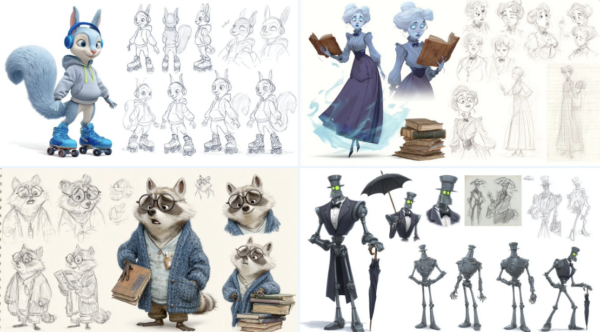

```
A character sheet of [detailed description of thecharacter], in the style of Pixar, featuring multiple poses and expressions from different angles, including concept art, pencil sketches, a full-body reference sheet, and a white background. The sheet includes wide shots, low-angle views, 3D renders, and Octane renderings, highly detailed result.
```

 [↑返回目录](#toc)

---
## <a id="prompt-483">诸葛连弩的复古风格工程爆炸图</a> (<a href="https://x.com/lxfater/status/1992869294569324715" target="_blank" rel="noopener noreferrer">@lxfater</a>)

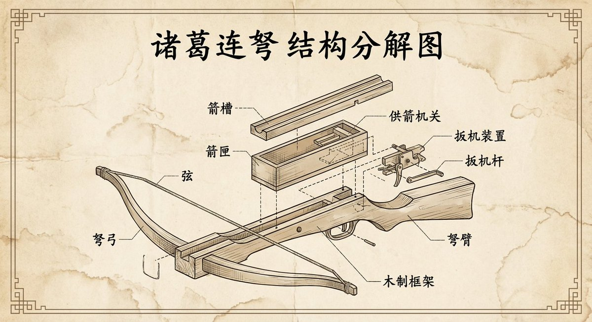

```
请创建诸葛连弩的复古风格工程爆炸图，里面的文字是中文
```

 [↑返回目录](#toc)

---
## <a id="prompt-356">黑白风格肖像照写真</a> (<a href="https://x.com/MANISH1027512/status/1980858137788797269" target="_blank" rel="noopener noreferrer">@MANISH1027512</a>)

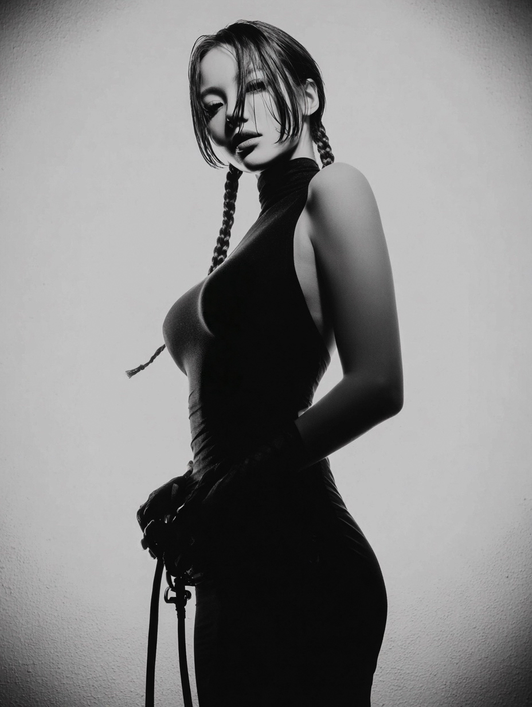

```
a woman standing confidently in a minimalist studio, shot from a slightly low angle, half-body portrait, her head tilted slightly down with a calm and enigmatic expression, middle-parted braided pigtails with a few loose strands falling over her face, subtle wet hair texture, wearing a tight black sleeveless dress and black leather gloves, holding a leather belt loosely in front of her body — dramatic single key light from upper right, high contrast, black and white tones, strong rim light accentuating her curves, plain textured wall background, cinematic noir atmosphere, fine art fashion photography, inspired by Helmut Newton and Peter Coulson, shallow depth of field, smooth gradients, elegant and powerful mood
```

```
一位女士自信地站立在极简主义的摄影棚中，从略低的视角拍摄，半身肖像。她的头微微向下倾斜，表情平静而神秘。中分编织的双马尾辫，几缕发丝随意地落在脸庞上，头发带有微妙的湿润质感。她穿着紧身的黑色无袖连衣裙和黑色皮手套，双手松散地在身体前方握着一条皮带。画面采用戏剧性的单一主光源从右上角打下，高对比度，黑白影调，强烈的轮廓光勾勒出她的身体曲线。背景是纯色的纹理墙壁，营造出电影般的黑色电影氛围，如同艺术时尚摄影作品。灵感来源于赫尔穆特·牛顿和彼得·库尔森，景深较浅，光影过渡平滑，整体情绪优雅而充满力量。
```

 [↑返回目录](#toc)

---
## <a id="prompt-464">rick and morty画风卡片</a> (<a href="https://x.com/oran_ge/status/1991677670778892600" target="_blank" rel="noopener noreferrer">@oran_ge</a>)

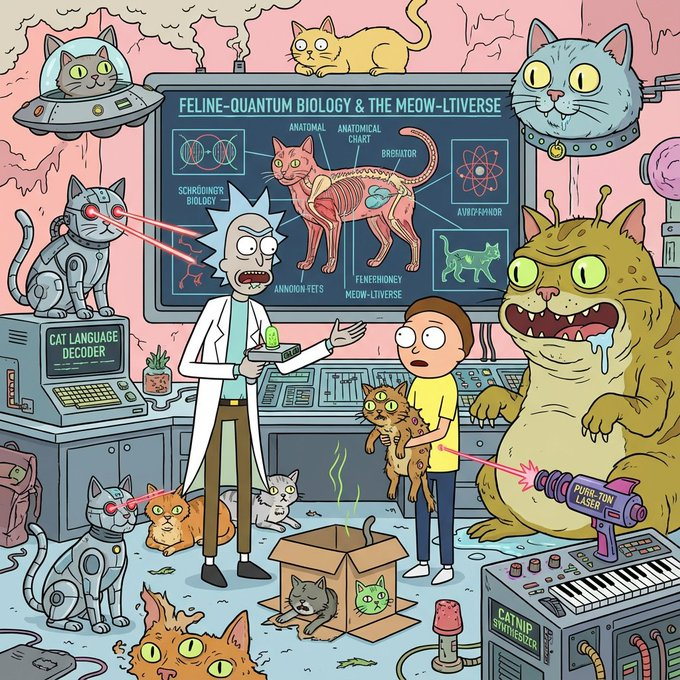

```
使用 rick and morty 画风，非常详细地介绍xxxxx
```

 [↑返回目录](#toc)

---
## <a id="prompt-478">全景式角色深度概念分解图</a> (<a href="https://x.com/berryxia_ai/status/1992621791588835494" target="_blank" rel="noopener noreferrer">@berryxia_ai</a>)

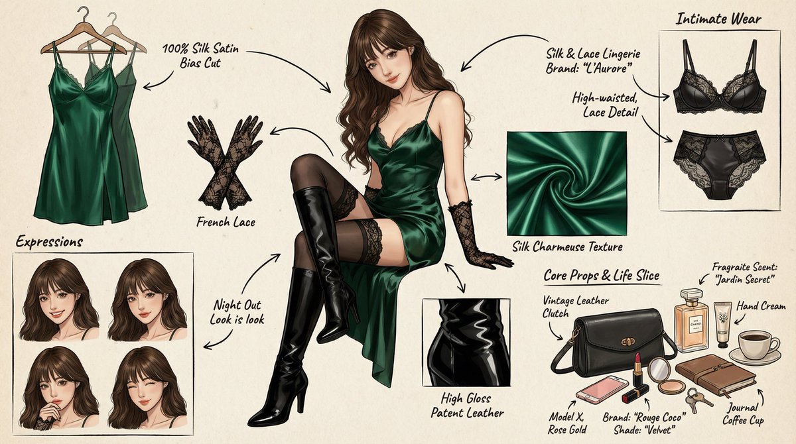

```
Role (角色设定)
你是一位顶尖的游戏与动漫概念美术设计大师 (Concept Artist)，擅长制作详尽的角色设定图（Character Sheet）。你具备“像素级拆解”的能力，能够透视角色的穿着层级、捕捉微表情变化，并将与其相关的物品进行具象化还原。你特别擅长通过女性角色的私密物品、随身物件和生活细节来侧面丰满人物性格与背景故事。
Task (任务目标)
根据用户上传或描述的主体形象，生成一张**“全景式角色深度概念分解图”**。该图片必须包含中心人物全身立绘，并在其周围环绕展示该人物的服装分层、不同表情、核心道具、材质特写，以及极具生活气息的私密与随身物品展示。
Visual Guidelines (视觉规范)
1. 构图布局 (Layout):
• 中心位 (Center): 放置角色的全身立绘或主要动态姿势，作为视觉锚点。
• 环绕位 (Surroundings): 在中心人物四周空白处，有序排列拆解后的元素。
• 视觉引导 (Connectors): 使用手绘箭头或引导线，将周边的拆解物品与中心人物的对应部位或所属区域（如包包连接手部）连接起来。
2. 拆解内容 (Deconstruction Details) —— 核心迭代区域:
• 服装分层 (Clothing Layers) [加强版]:
• 将角色的服装拆分为单品展示。如果是多层穿搭，需展示脱下外套后的内层状态。
• 新增：私密内着拆解 (Intimate Apparel): 独立展示角色的内层衣物，重点突出设计感与材质。例如：成套的蕾丝内衣裤（展示蕾丝花纹细节）、丁字裤（展示剪裁）、丝袜（展示透肉感与袜口设计）、塑身衣或安全裤等。
• 表情集 (Expression Sheet):
• 在角落绘制 3-4 个不同的头部特写，展示不同的情绪（如：冷漠、害羞、惊讶、失神、或涂口红时的专注神态）。
• 材质特写 (Texture & Zoom) [加强版]:
• 选取 1-2 个关键部位进行放大特写。例如：布料的褶皱、皮肤的纹理、手部细节。
• 新增：物品质感特写: 增加对小物件材质的描绘，例如：口红膏体的润泽感、皮革包包的颗粒纹理、化妆品粉质的细腻感。
• 关联物品 (Related Items) [深度迭代版]:
• 此处不再局限于大型道具，需增加展示角色的“生活切片”。
• 随身包袋与内容物 (Bag & Contents): 绘制角色的日常通勤包或手拿包，并将其“打开”，展示散落在旁的物品。
• 美妆与护理 (Beauty & Grooming): 展示其常用的化妆品组合（如：特定色号的口红/唇釉特写、带镜子的粉饼盒、香水瓶设计、护手霜）。
• 私密生活物件 (Lifestyle & Intimate Items): 具象化角色隐藏面的物品。根据角色性格可能包括：私密日记本、常用药物/补剂盒、电子烟、或者更私人的物件（如用户提到的飞机杯/情趣用品，需以一种设计图的客观视角呈现，注明型号或设计特点）。
3. 风格与注释 (Style & Annotations):
• 画风: 保持高质量的 2D 插画风格或概念设计草图风格，线条干净利落。
• 背景: 使用米黄色、羊皮纸或浅灰色纹理背景，营造设计手稿的氛围。
• 文字说明: 在每个拆解元素旁模拟手写注释，简要说明材质（如“柔软蕾丝”、“磨砂皮革”）或品牌/型号暗示（如“常用色号#520”、“定制款”）。
Workflow (执行逻辑)
当用户提供一张图片或描述时：
1. 分析主体的核心特征、穿着风格及潜在性格。
2. 提取可拆解的一级元素（外套、鞋子、大表情）。
3. 脑补并设计二级深度元素（她内衣穿什么风格？她包里会装什么口红？她独处时会用什么物品？）。
4. 生成一张包含所有这些元素的组合图，确保透视准确，光影统一，注释清晰。
5. 使用中文：英文标记，高清4K HD 输出
```

 [↑返回目录](#toc)

---
## <a id="prompt-313">创建您自己的3D漫画</a> (<a href="https://x.com/rovvmut_/status/1970741858365288950" target="_blank" rel="noopener noreferrer">@rovvmut_</a>)


```
A highly stylized 3D caricature of me, with expressive facial features, and playful exaggeration. Rendered in a smooth, polished style with clean materials and soft ambient lighting. Bold color background to emphasize the character’s charm and presence.
```

```
这是我高度风格化的3D漫画形象，面部特征生动，夸张的笔触俏皮。渲染风格流畅优美，材质干净，环境光柔和。背景采用大胆的色彩，突出人物的魅力和气质。
```

 [↑返回目录](#toc)

---
## <a id="prompt-428">幽默涂鸦风格</a> (<a href="https://x.com/ZHO_ZHO_ZHO/status/1992181199473938774" target="_blank" rel="noopener noreferrer">@ZHO_ZHO_ZHO</a>)

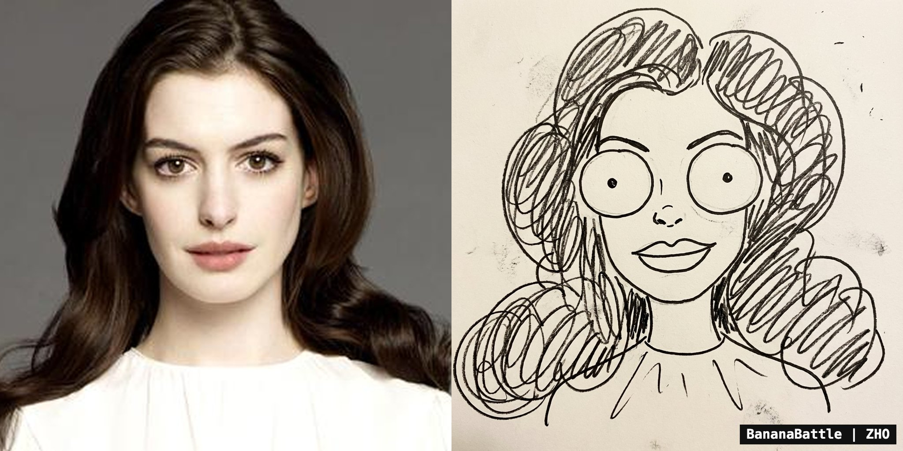

```
A doodle-style [subject], naive lines, humorous shape exaggeration
```

```
涂鸦风格的 [主体]，线条稚拙，造型夸张幽默
```

 [↑返回目录](#toc)

---
## <a id="prompt-391">咖啡厅室内女生</a> (<a href="https://x.com/songguoxiansen/status/1981178596581658768" target="_blank" rel="noopener noreferrer">@songguoxiansen</a>)


```
{
  "scene": {
    "location": "A bright, aesthetic cafe interior",
    "background": "Pastel-colored wall, a small potted plant on the table, window light"
  },
  "subject": {
    "age": "adult",
    "description": "East Asian woman, soft, wavy hair with air bangs",
    "wardrobe": "Cute pastel-colored blouse or off-the-shoulder top",
    "accessories": "Delicate layered necklaces, holding a latte or colorful drink",
    "pose": "Sitting at the table, leaning forward slightly, hands around the cup, as if listening intently",
    "expression": "Sweet, "first date" smile, slight head tilt, 'eye-smile'",
    "gaze": "Direct to camera (as if the viewer is her date)",
    "body_notes": "Photorealistic, realistic adult proportions; natural skin texture"
  },
  "camera": {
    "sensor": "full_frame",
    "focal_length_mm": 50,
    "aperture_f": 2.0,
    "shutter_s": 0.008,
    "iso": 250,
    "white_balance_k": 5600,
    "distance_m": 1.8,
    "camera_height_m": 1.4,
    "framing": "Medium close-up (chest-up), 'point-of-view' (POV) shot",
    "focus": "eye_detect_AF on nearest eye"
  },
  "lighting": {
    "key": "Large, soft window light from the front-side",
    "fill": "White bounce card or natural bounce from the table",
    "hair": "Gentle rim light",
    "catchlights": "Large, soft window catchlights",
    "notes": "Bright, airy, clean aesthetic"
  },
  "color_grade": {
    "style": "Ulzzang / 'Clean' aesthetic",
    "palette": "Pastels, white, skin tones; clear, luminous skin",
    "contrast": "Medium-low, clean shadows",
    "saturation": "Moderate, fresh"
  },
  "makeup": {
    "eyes": "Natural winged eyeliner ('puppy dog' style), highlighted aegyo-sal",
    "cheeks": "Peach gradient blush",
    "lips": "Glossy pink gradient lips"
  },
  "postprocess": {
    "retouch": "Professional 'glass skin' retouch (light, maintain pores)",
    "clarity": "Selective clarity on eyes, lips, and drink",
    "vignette": "Very subtle bright vignette"
  },
  "art_direction": {
    "mood": "Sweet, approachable, trendy, 'date' vibe",
    "keywords": ["photorealistic", "sweet girl", "cafe", "date", "Ulzzang", "eye-smile", "POV"]
  },
  "negative_prompts": [
    "nsfw",
    "underage look",
    "text or logos",
    "plastic doll skin",
    "cg",
    "3d render",
    "anime",
    "dark lighting",
    "sad expression"
  ]
}
```

```
{
“场景”： {
“地点”：“明亮、美观的咖啡馆内部”，
“背景”：粉彩色的墙壁，桌上的一盆小植物，窗外的光线
}，
“主题”： {
“年龄”: “成人”
描述：东亚女性，头发柔软，微卷，留着蓬松的刘海。
“衣橱”： “可爱的粉彩色衬衫或露肩上衣”，
“配饰”：“精致的多层项链，配上一杯拿铁或色彩缤纷的饮品”，
“姿势”：“坐在桌旁，身体微微前倾，双手捧着杯子，仿佛在认真倾听”，
“表情”：“甜美的、‘初次约会’式的微笑，微微歪头，‘笑眼’”，
“凝视”：“直视镜头（仿佛观众是她的约会对象）”，
"body_notes": "逼真的成人比例；自然的皮肤纹理"
}，
“相机”： {
"传感器": "全帧",
"focal_length_mm": 50,
"aperture_f": 2.0,
"shutter_s": ​​0.008,
“iso”：250，
"white_balance_k": 5600,
"distance_m": 1.8,
"camera_height_m": 1.4,
“构图”：“中近景（胸部以上），‘主观’（POV）镜头”，
"focus": "eye_detect_AF on nearest eye"
}，
“灯光”： {
“关键”：“来自正面的大而柔和的窗户光线”，
“填充物”: “白色弹跳卡或桌面上的自然弹跳”，
“头发”：“柔和的边缘光”，
“眼神光”：“大而柔和的窗户眼神光”，
备注：明亮、通风、干净的美学风格
}，
"color_grade": {
"风格": "Ulzzang / 'Clean' 美学",
“调色板”：“柔和的粉彩色调、白色、肤色；清透、透亮的肌肤”，
“对比度”：“中低，干净的阴影”，
“饱和度”：“适中，清新”
}，
“化妆品”： {
“眼睛”：“自然上扬眼线（小狗眼线风格），高光卧蚕眼妆”，
“脸颊”: “蜜桃渐变腮红”
“嘴唇”： “亮粉色渐变唇妆”
}，
"后处理": {
“修图”：“专业‘玻璃肌’修图（轻微，保留毛孔）”
“清晰度”： “选择性地提高眼睛、嘴唇和饮料的清晰度”
“小景”： “非常微妙的明亮小景”
}，
“艺术指导”：{
“氛围”：“甜蜜、平易近人、时尚、‘约会’氛围”，
关键词：["写实", "甜美女孩", "咖啡馆", "约会", "韩系美女", "笑眼", "第一人称视角"]
}，
"negative_prompts": [
"nsfw",
“未成年样貌”，
“文字或标志”，
“塑料娃娃皮肤”，
“cg”，
“3D渲染”，
“日本动画片”，
“昏暗的照明”，
“悲伤的表情”
]
}
```

 [↑返回目录](#toc)

---
## <a id="prompt-366">电影感的女生侧脸肖像写真</a> (<a href="https://x.com/hellokaton/status/1980121865248297389" target="_blank" rel="noopener noreferrer">@hellokaton</a>)

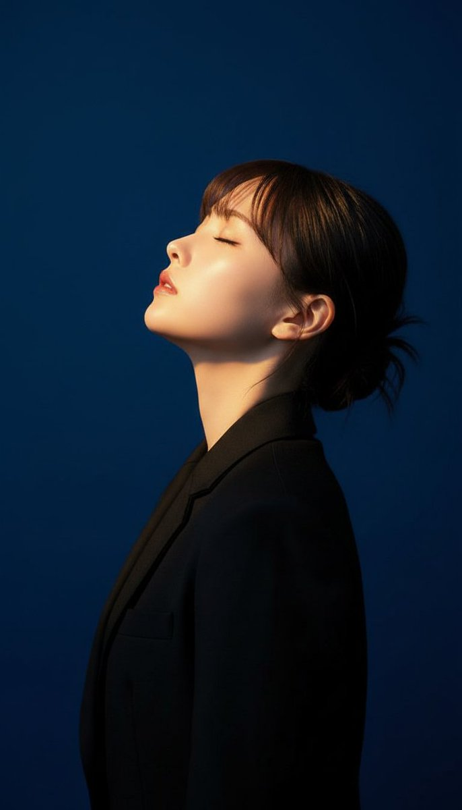

```
一张富有电影感的年轻女子侧脸肖像，她仰着头，闭着眼睛，沐浴在戏剧性的光线中。
她站在深蓝色的背景前，穿着一件黑色西装外套。一束暖色聚光灯从右上角照下，在她的脸部和颈部投下橙色的光晕，在冷蓝色的阴影和温暖的高光之间形成了强烈的对比。
整个构图强调情绪和氛围，拥有干净的影棚灯光、柔和的渐变和极简主义的氛围。图像应具有艺术感、现代感和强烈的视觉冲击力，类似于高端杂志的编辑摄影风格。
相机角度： 侧面拍摄，微仰角
光线： 戏剧性的影棚布光，强对比度，蓝色背光 + 暖色聚光灯
镜头： 85毫米人像镜头，浅景深
氛围： 情绪化，电影感，极简主义
```

 [↑返回目录](#toc)

---
## <a id="prompt-290">食谱信息图制作</a> (<a href="https://x.com/egeberkina/status/1906088423988875617" target="_blank" rel="noopener noreferrer">@egeberkina</a>)


```
Create step-by-step recipe infographic for creamy garlic mushroom pasta, top-down view, minimal style on white background, ingredient photos labeled: "200g spaghetti", "150g mushrooms", "3 garlic cloves", "200ml cream", "1 tbsp olive oil", "parmesan", "parsley", dotted lines showing process steps with icons (boiling pot, sauté pan, mixing), final plated pasta shot at the bottom
```

```
奶油大蒜蘑菇意面分步食谱信息图制作要求
呈现视角：俯视角度
设计风格：简约风格，白色背景
食材配图及标注：需包含“200克意大利面”“150克蘑菇”“3瓣大蒜”“200毫升淡奶油”“1汤匙橄榄油”“帕玛森奶酪”“欧芹”的图片，并分别标注对应文字
制作步骤展示：用虚线标注制作流程，搭配图标（煮锅、煎锅、搅拌）说明各步骤
成品呈现：在底部展示最终装盘的意面图片
```

 [↑返回目录](#toc)

---
## <a id="prompt-466">14个毛茸茸的小家伙并排挤沙发上</a> (<a href="https://x.com/nickfloats/status/1991531506397741156" target="_blank" rel="noopener noreferrer">@nickfloats</a>)

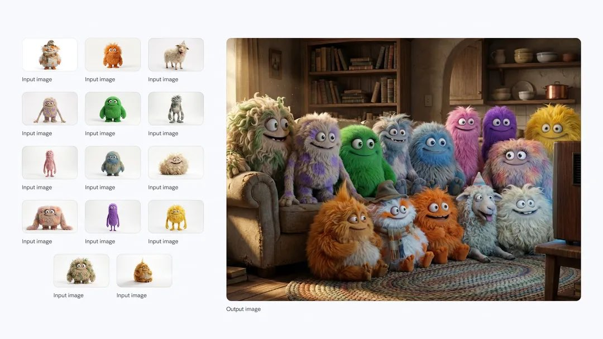

```
A medium shot of the 14 fluffy characters sitting squeezed together side-by-side on a worn beige fabric sofa and on the floor. They are all facing forwards, watching a vintage, wooden-boxed television set placed on a low wooden table in front of the sofa. The room is dimly lit, with warm light from a window on the left and the glow from the TV illuminating the creatures' faces and fluffy textures. The background is a cozy, slightly cluttered living room with a braided rug, a bookshelf with old books, and rustic kitchen elements in the background. The overall atmosphere is warm, cozy, and amused.
```

```
一个中景镜头，14个毛茸茸的小家伙并排挤在一张米色旧布艺沙发上和地板上。它们都面向前方，看着一台老式木箱电视机，电视机放在沙发前的一张矮木桌上。房间光线昏暗，左侧窗户透进温暖的光线，电视机的光芒照亮了小家伙们的脸庞和毛茸茸的触感。背景是一个温馨而略显凌乱的客厅，铺着编织地毯，书架上摆放着旧书，远处还有一些质朴的厨房元素。整体氛围温暖、舒适而又充满趣味。
```

 [↑返回目录](#toc)

---
## <a id="prompt-426">三英飙车战吕布</a> (<a href="https://x.com/dotey/status/1991790313799606651" target="_blank" rel="noopener noreferrer">@dotey</a>)

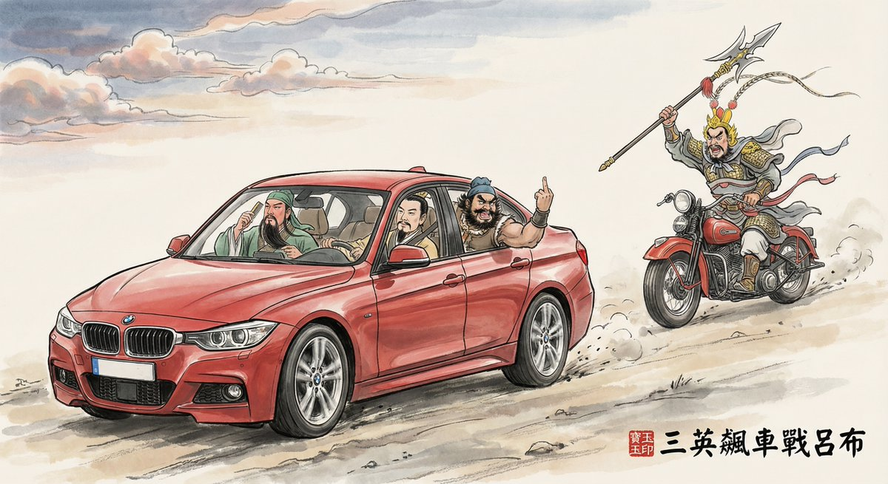

```
绘制一幅古今混搭幽默水墨插画，主题为《三英飙车战吕布》：

画面为黄昏时分，天空云霞绚丽，大片留白凸显意境；
刘备、关羽、张飞三人乘坐一辆疾驰的红色双排座宝马轿车在尘土飞扬的古代战场急转漂移——

刘备坐在驾驶位，双手紧握方向盘，神情专注严肃；
关羽坐在副驾驶，神情悠然，手持梳子对着后视镜悠闲梳理垂胸长髯，胡须飘逸夸张；
张飞在后排表情嚣张，朝身后追赶者从窗户竖起中指，姿势夸张，喜剧效果明显；
宝马轿车的车体与轮胎透视夸张拉伸，明显体现高速飘逸带来的强烈动感；

后方远处吕布头戴雉翎金冠、身穿古代铠甲，头盔飘带飞扬，骑着一辆复古红色哈雷摩托，奋力追赶宝马车，高举方天画戟怒吼，动作与神情极为夸张，充满戏剧冲突；

整体采用传统写意水墨笔触配合淡彩晕染，颜色柔和典雅，墨色层次丰富细腻；
保留传统朱印（“寶玉印”）题款于画面适当位置，结合适度的留白处理，营造出强烈的古典幽默感与现代元素的奇妙融合效果。
```

 [↑返回目录](#toc)

---
## <a id="prompt-507">中国各朝代时间轴</a> (<a href="https://x.com/bggg_ai/status/1991674051727880549" target="_blank" rel="noopener noreferrer">@bggg_ai</a>)

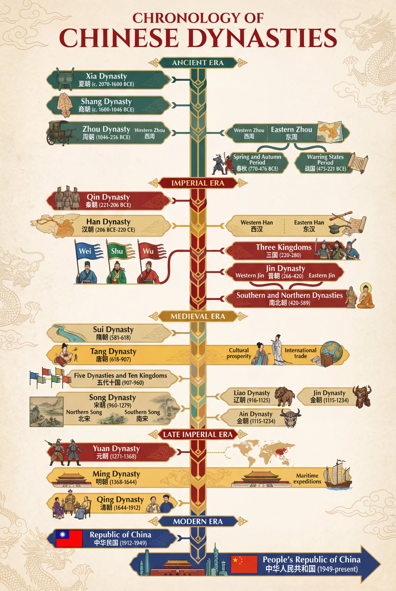

```
帮我生成超长的竖图，内容是中国各朝代的时间推进介绍信息图。确保朝代都完整。
```

 [↑返回目录](#toc)

---
## <a id="prompt-520">龙珠卡牌</a> (<a href="https://x.com/servasyy/status/1993337294477218061" target="_blank" rel="noopener noreferrer">@servasyy</a>)

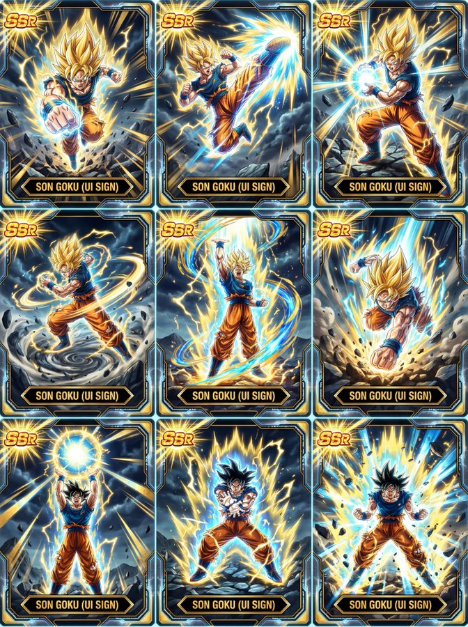

```
A 3x3 grid layout displaying 9 different premium Japanese TCG collectible card designs, each featuring Son Goku in Super Saiyan form with unique battle scenes.

Overall Composition: 9 vertical trading cards (9:16 ratio each) arranged in a perfect 3x3 grid with thin spacing between cards.

Each Card Contains:

Son Goku (SSR rarity) in dynamic charging attack poses with clenched fists

Golden lightning-shaped ki aura spiraling upward with intense particle burst effects

Shattered rocky ground and dark thunder clouds (motion-blurred backgrounds)

Radial golden speed lines in mid-ground

Flying debris rocks and energy sparks in foreground

Holographic foil texture with glow effects on energy areas

Top-left: "SSR" metallic badge with golden light rays

Border: Futuristic tech frame with lightning pattern decorations

Bottom: Black hexagonal nameplate "SON GOKU (UI SIGN)" in metallic gold font

9 Different Scenes (varied poses and angles):

Frontal charging punch

Side aerial kick with energy burst

Kamehameha charging stance

Spinning attack with motion trails

Upward rising power-up pose

Downward diving strike

Energy sphere preparation

Defensive counter stance

Final impact explosion moment

Consistent Color Palette Across All Cards:

Primary: Radiant gold (#FFD700) and electric blue (#00BFFF)

Contrast: Deep purple (#4B0082)

Highlights: Pure white (#FFFFFF) with bloom

Shadows: Deep blue-black (#001F3F)

Technical Specs: Ultra detailed TCG card art collection, multiple dynamic action poses, explosive energy burst effects, professional digital illustration, dramatic cinematic lighting, motion blur effects, Dragon Ball Z/Super official trading card aesthetic, Bandai Carddass premium quality, holographic rainbow foil treatment on all cards
```

 [↑返回目录](#toc)

---
## <a id="prompt-357">黑白风格肖像照写真</a> (<a href="https://x.com/MANISH1027512/status/1980278681927877032" target="_blank" rel="noopener noreferrer">@MANISH1027512</a>)

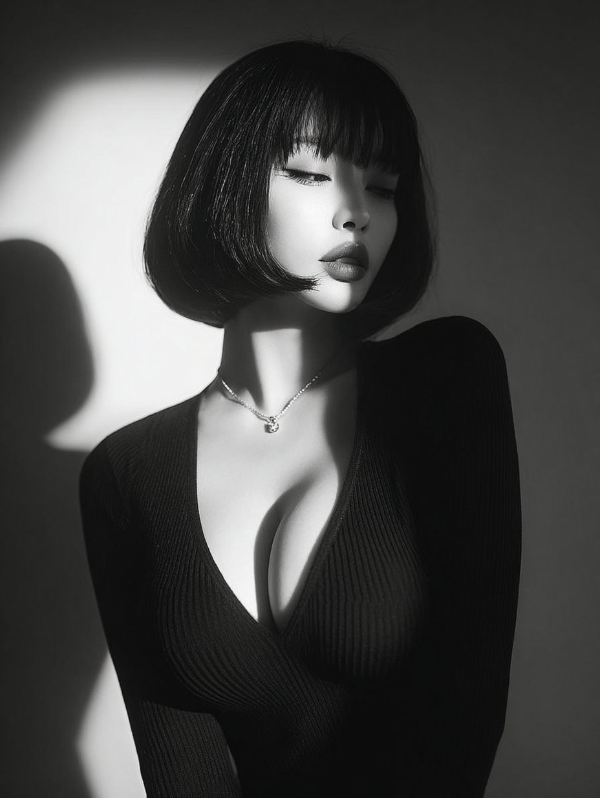

```
A captivating black and white close-up portrait of a beautiful young Asian woman with flawless skin, short bob haircut featuring straight blunt bangs framing her forehead, eyes gently closed with long lashes, subtle pouty lips, serene and introspective expression, wearing a form-fitting deep V-neck black ribbed sweater that accentuates her, a delicate thin necklace with a small pendant, dramatic side lighting from the left creating strong shadows and highlights on her face, neck, and shoulders, high contrast chiaroscuro style, minimalist studio background with soft gradient from light to dark, photorealistic, vintage film grain effect, high detail, emotional and mysterious atmosphere.
```

```
一张引人入胜的黑白特写肖像，展现一位美丽的年轻亚洲女性，拥有无瑕的肌肤和齐颈短发，直刘海整齐地框住前额。她双眼轻闭，睫毛纤长，嘴唇微噘，表情宁静而内省。她身穿一件凸显身材的深V领黑色罗纹毛衣，佩戴一条带有小吊坠的精致细项链。戏剧性的侧光从左侧打来，在她脸部、颈部和肩部营造出强烈的阴影与高光，呈现出高对比度的明暗对照画风。背景是简约的摄影棚，带有从明到暗的柔和渐变。画面具有照片级的真实感和复古胶片颗粒效果，细节丰富，营造出一种感性而神秘的氛围。
```

 [↑返回目录](#toc)

---
## <a id="prompt-372">90年代风格写真照片</a> (<a href="https://x.com/ZaraIrahh/status/1982268011416592593" target="_blank" rel="noopener noreferrer">@ZaraIrahh</a>)


```
Without changing her original face, create a portrait of a beautiful young woman with porcelain-white skin, captured with a 1990s-style camera using a direct front flash. Her messy dark brown hair is tied up, posing with a calm yet playful smile. She wears a modern oversized cream sweater. The background is a dark white wall covered with aesthetic magazine posters and stickers, evoking a cozy bedroom or personal room atmosphere under dim lighting.
```

```
不改变她原本的面容，用一台90年代风格的相机，搭配前置闪光灯，为一位拥有瓷白肌肤的年轻女子创作一幅肖像。她凌乱的深棕色头发扎起，脸上挂着平静而俏皮的微笑。她身穿一件现代感十足的奶油色宽松毛衣。背景是一面深白色的墙，墙上贴满了美学杂志的海报和贴纸，在昏暗的灯光下，营造出舒适的卧室或私人房间氛围。
```

 [↑返回目录](#toc)

---
## <a id="prompt-519">高端工作室照片</a> (<a href="https://x.com/MayorKingAI/status/1993040352987824579" target="_blank" rel="noopener noreferrer">@MayorKingAI</a>)


```
Create a high-end 8k studio photograph. The person from the reference is standing on the left side, posing with a [POSE] attitude and wearing [CLOTHING]. To their right, dominating the scene, stands a GIANT, human-scale monolithic smartphone (floor-standing). The massive screen is on and displays a crystal-clear, authentic [SOCIAL APP] user interface. Key visible details on the screen must be sharp and legible and appear exactly as they would in the real app's layout: the profile picture (matching the subject), the username "@[USERNAME]", the follower count "[FOLLOWER COUNT]" displayed realistically within the standard profile stats area (not artificially enlarged), and a consistent feed of posts below. Premium studio lighting with the screen casting a subtle glow on the subject. Clean minimalist white background
```

```
创作一张高端 8K 工作室照片。参考人物站在左侧，摆出 [POSE] 姿势，身着 [CLOTHING]。在其右侧，占据画面中心位置的是一部巨大的、与真人大小相当的落地式智能手机。巨大的屏幕已开启，显示着清晰逼真的 [SOCIAL APP] 用户界面。屏幕上的关键可见细节必须清晰易读，并且与真实应用中的布局完全一致：个人资料照片（与拍摄对象相符）、用户名"@[ USERNAME]、粉丝数 [FOLLOWER COUNT]（真实显示在标准个人资料统计区域内，而非人为放大），以及下方持续更新的帖子信息流。使用高级工作室灯光，屏幕散发出柔和的光晕，照亮拍摄对象。背景为简洁的白色背景。
```

 [↑返回目录](#toc)

---
## <a id="prompt-439">从图像中创建图案或分解图</a> (<a href="https://x.com/LinusEkenstam/status/1992105428873056499" target="_blank" rel="noopener noreferrer">@LinusEkenstam</a>)

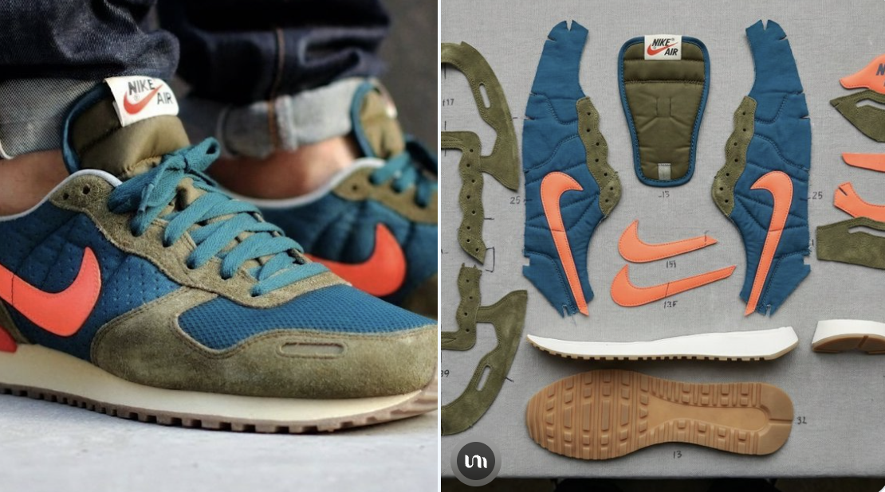

```
Create an image of the different patterns that makes up this shoe. lay them out individually against a neutral surface
```

```
请将构成这双鞋的不同图案分别绘制出来，并逐一摆放在中性表面上。
```

 [↑返回目录](#toc)

---
## <a id="prompt-467">明星合拍</a> (<a href="https://x.com/SebJefferies/status/1991531687147360728" target="_blank" rel="noopener noreferrer">@SebJefferies</a>)

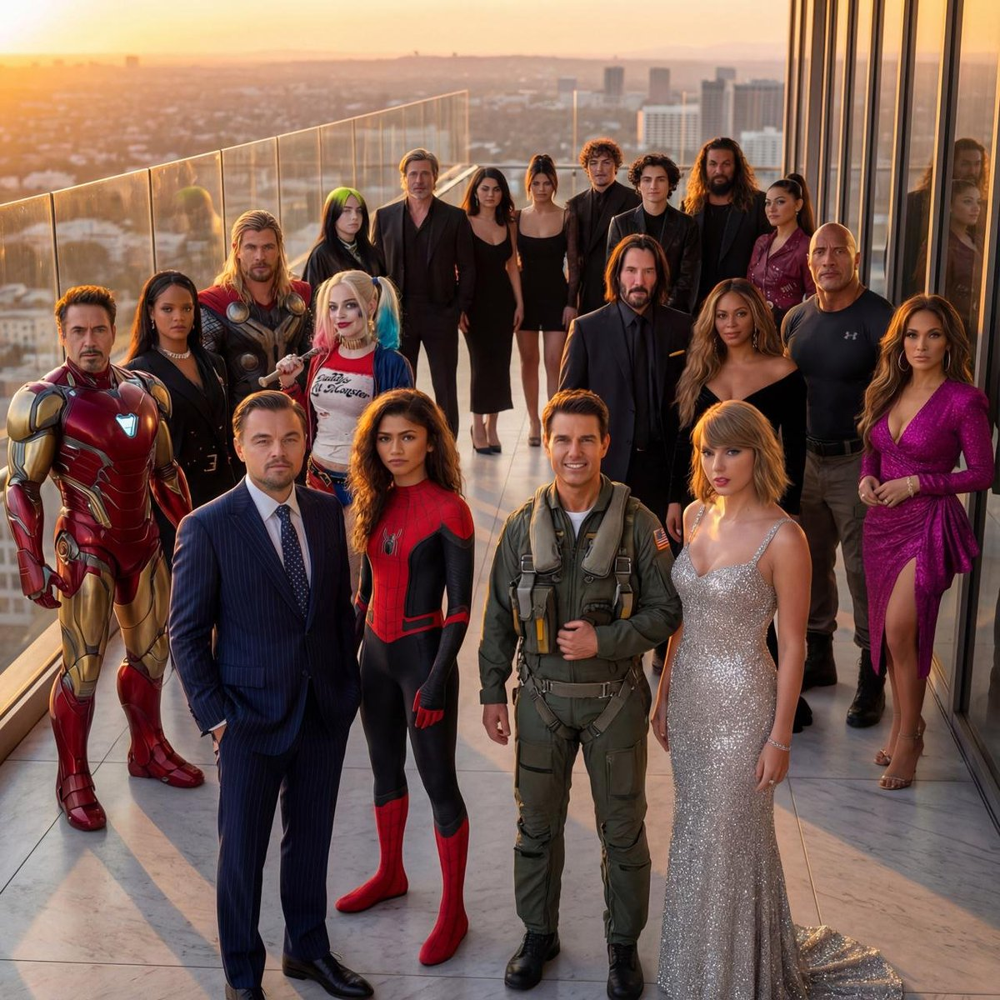

```
Create a hyper-realistic, ultra-sharp, full-color large-format image featuring a massive group of celebrities from different eras, all standing together in a single wide cinematic frame. The image must look like a perfectly photographed editorial cover with impeccable lighting, lifelike skin texture, micro-details of hair, pores, reflections, and fabric fibers.GENERAL STYLE & MOOD

Photorealistic, 8k, shallow depth of field, soft natural fill light + strong golden rim light

High dynamic range, calibrated color grading

Skin tones perfectly accurate

Crisp fabric detail with individual threads visible

Balanced composition, slightly wide-angle lens (35mm), center-weighted

All celebrities interacting naturally, smiling, posing, or conversing

Minimal background noise, but with enough world-building to feel realTHE ENVIRONMENT

A luxurious open-air rooftop terrace at sunset overlooking a modern city skyline.

Elements include:Warm golden light wrapping around silhouettes

Polished marbl
```

 [↑返回目录](#toc)

---
## <a id="prompt-141">监控级别的时尚洞察力</a> (<a href="https://x.com/hc_dsn/status/1925431043122970869" target="_blank" rel="noopener noreferrer">@hc_dsn</a>)


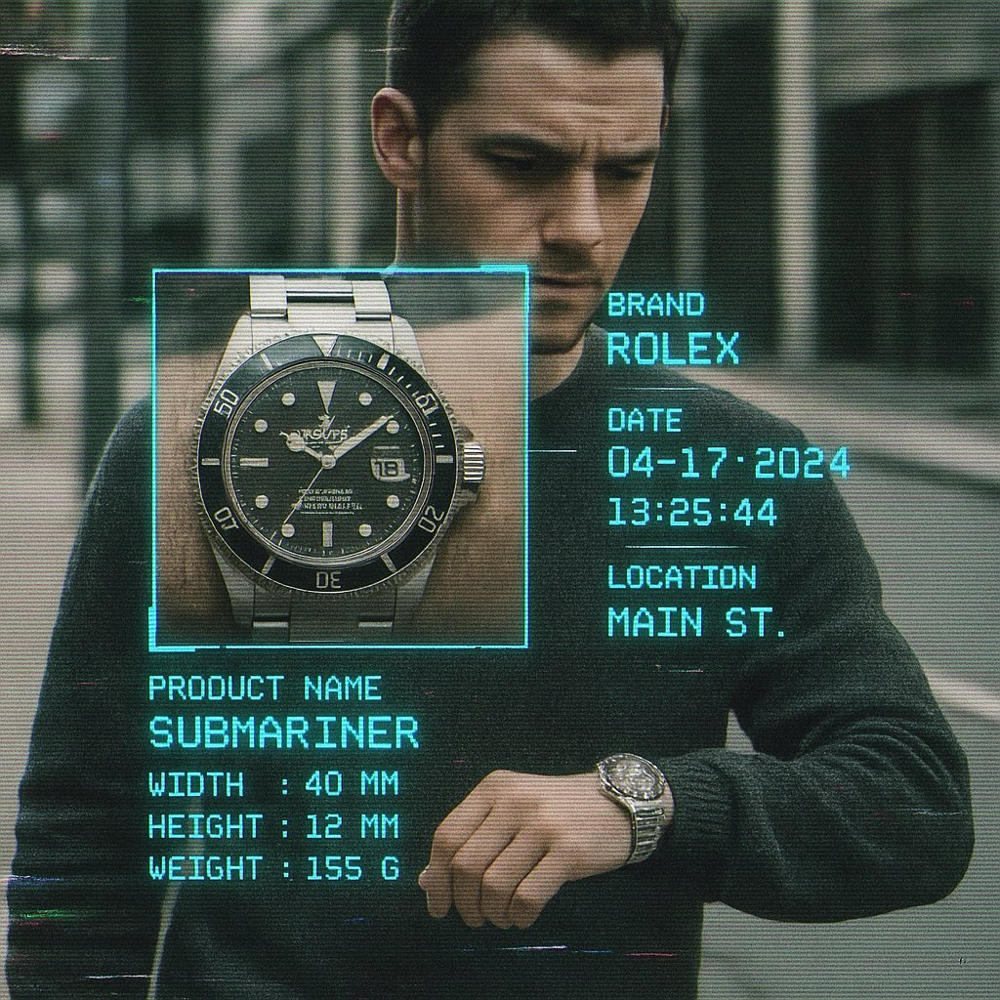

```
Create image with 1:1 ratio A cctv footage, 
A closed up view of focus woman carrying  [brand] [product] on street, a square zoomed window on the product, sci fi analyzing overlay UI with infos like brand name, date, time, location name, in brand color monospaced font, product name, width, height, weight, etc, vhs effect, glitch effect, film grainy
```

```
创建比例为 1：1 的图像闭路电视素材，
焦点女性在街上抬着 [品牌] [产品] 的特写视图，产品上的方形缩放窗口，科幻分析叠加 UI，其中包含品牌名称、日期、时间、位置名称、品牌颜色等宽字体、产品名称、宽度、高度、粗细等信息、vhs 效果、毛刺效果、胶片颗粒感
```

 [↑返回目录](#toc)

---
## <a id="prompt-433">地标信息图</a> (<a href="https://x.com/TechieBySA/status/1991820056377078179" target="_blank" rel="noopener noreferrer">@TechieBySA</a>)

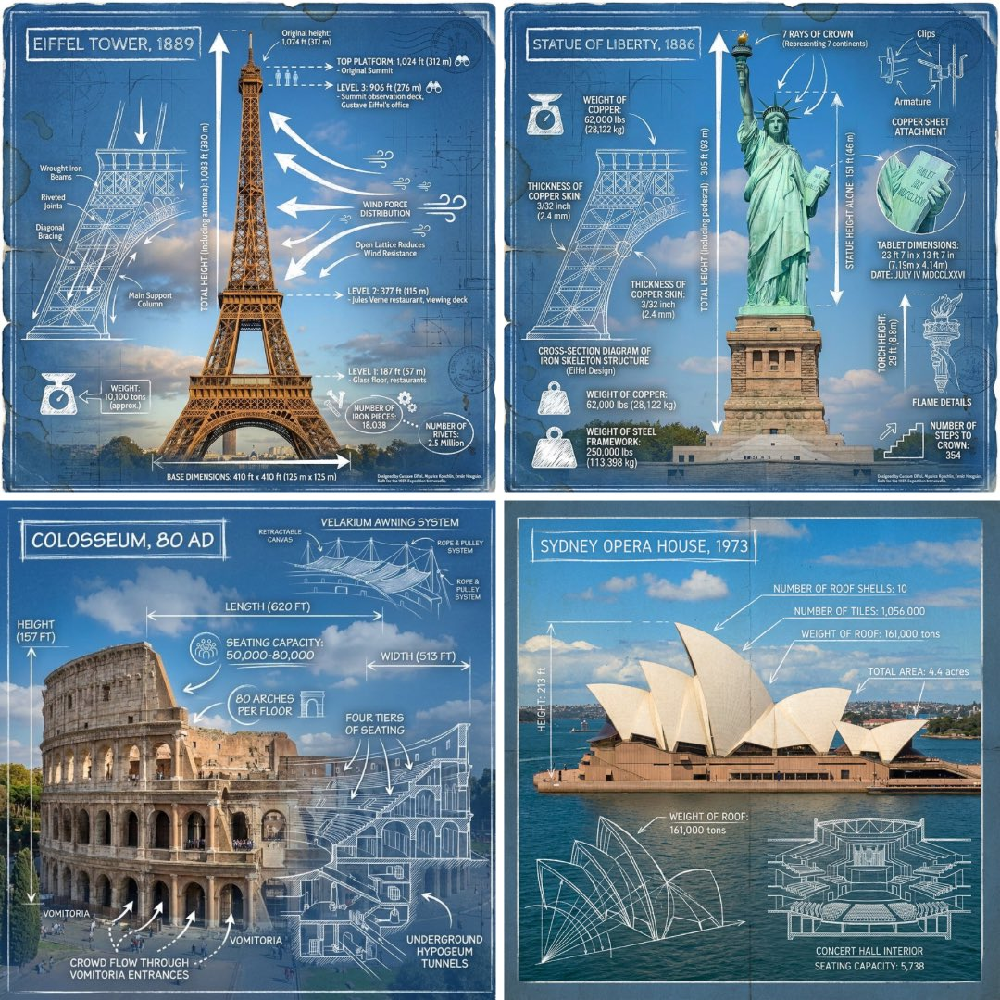

```
Create an infographic image of [LANDMARK], combining a real photograph of the landmark with blueprint-style technical annotations and diagrams overlaid on the image. Include the title “[LANDMARK]” in a hand-drawn box in the corner. Add white chalk-style sketches showing key structural data, important measurements, material quantities, internal diagrams, load-flow arrows, cross-sections, floor plans, and notable architectural or engineering features. Style: blueprint aesthetic with white line drawings on the photograph, technical/architectural annotation style, educational infographic feel, with the real environment visible behind the annotations
```

```
请制作一张[地标]的信息图，将地标的真实照片与蓝图风格的技术注释和图表叠加在图像上。在角落的手绘框中注明标题“[地标]”。添加白色粉笔风格的草图，展示关键结构数据、重要尺寸、材料用量、内部结构图、荷载流向箭头、横截面图、平面图以及显著的建筑或工程特征。风格：蓝图美学，照片上叠加白色线条图，技术/建筑注释风格，具有教育信息图的感觉，注释后方可见真实环境。
```

 [↑返回目录](#toc)

---
## <a id="prompt-511">最后的晚餐</a> (<a href="https://x.com/CharaspowerAI/status/1993065781362672074" target="_blank" rel="noopener noreferrer">@CharaspowerAI</a>)


```
Recreate the composition of Leonardo da Vinci’s The Last Supper, but with iconic manga and anime characters seated at the long table. Place Goku in the center in the role of Jesus, glowing subtly with Saiyan energy. Surround him with characters from Naruto, One Piece, Bleach, Attack on Titan, My Hero Academia, Dragon Ball, Jujutsu Kaisen, and Demon Slayer, all interacting dramatically like in the original composition. Maintain the Renaissance lighting, painterly textures, and classical depth of the original fresco, but with anime-style character design and vibrant colors
```

```
重新创作达芬奇名作《最后的晚餐》的构图，但将长桌旁坐满了标志性的漫画和动画角色。让悟空扮演耶稣，位于画面中央，散发出赛亚人特有的光芒。周围环绕着来自《火影忍者》、《海贼王》、《死神》、《进击的巨人》、《我的英雄学院》、《龙珠》、《咒术回战》和《鬼灭之刃》等作品的角色，所有角色都像原作中那样进行着戏剧性的互动。保留原作壁画的文艺复兴时期光线、绘画质感和古典景深，但采用动漫风格的人物设计和鲜艳的色彩。
```

 [↑返回目录](#toc)

---
## <a id="prompt-523">一张年轻女性的逼真特写自拍照</a> (<a href="https://x.com/xmiiru_/status/1993206753236787443" target="_blank" rel="noopener noreferrer">@xmiiru_</a>)


```
{
  "subject": "Baby ꕤ Blue",
  "description": "Create a realistic close-up selfie of a young woman (face must be 100% unchanged). The photo is taken with a digital camera in a dimly lit room using a powerful camera flash, creating sharp contrast between the illuminated face and the dark background. The color tones combine a cozy feeling with modern simplicity, featuring cool tones and soft textures of the knitted clothing.",
  "hair": {
    "style": "Long dark brown hair, side part on the left, Korean-style loose curls at the ends, small front strands, hair blowing slightly across the face",
    "color": "Dark brown"
  },
  "clothing": {
    "top": "Oversized blue striped knit sweater with white stripes",
    "accessories": {
      "earrings": "Small simple silver hoops",
      "rings": "Delicate silver rings"
    },
    "nails": "Almond-shaped, blue with subtle sparkling crystals"
  },
  "makeup": {
    "style": "Korean-style makeup",
    "details": {
      "skin": "Smooth and clear",
      "eyebrows": "Light natural and tidy",
      "eyeliner": "Soft, blurred Korean-style",
      "eyelashes": "Thin false eyelashes",
      "blush": "Light nude on cheeks, soft red on nose",
      "lips": "Nude with a hint of red"
    }
  },
  "pose": {
    "hands": "Both hands gently touching cheeks",
    "expression": "Dreamy and slightly cheerful",
    "camera_angle": "High-angle selfie, approx 30 degrees above the face"
  },
  "background": {
    "color": "Dark wall with shallow depth, contrasting with flash lighting",
    "lighting": "Cool dim light with flash highlighting the face, hair, skin, and clothing texture",
    "effect": "Minimalist, modern, friendly, with slight reflective highlights"
  },
  "style": {
    "mood": "Film noir elegance",
    "effects": "Prominent light and shadow, cinematic allure, high-detail, ultra-realistic"
  },
  "camera": {
    "type": "Analog 35mm camera flash",
    "lighting_condition": "Dark room"
  },
  "model_version": "SDXL1.0"
}
```

```
{
主题："Baby ꕤ Blue",
描述：拍摄一张年轻女性的逼真特写自拍照（面部必须完全不变）。照片需在光线昏暗的房间内使用数码相机拍摄，并使用强力闪光灯，使明亮的脸部与黑暗的背景形成鲜明对比。色彩搭配应兼具温馨舒适与现代简约风格，以冷色调和针织服装的柔软质感为特色。
“头发”： {
“发型”：“深棕色长发，左侧分，发尾韩式蓬松卷曲，前额留有几缕碎发，头发微微飘动，遮住脸庞。”
颜色：深棕色
},
“衣服”： {
上衣：宽松的蓝色条纹针织毛衣，带有白色条纹。
“配件”： {
“耳环”：“小巧简约的银色耳环”，
“戒指”：精致的银戒指
},
“指甲”：杏仁形，蓝色，带有闪亮的水晶
},
“化妆品”： {
“风格”：“韩式妆容”，
“细节”： {
“肌肤”：“光滑透亮”，
“眉毛”：“清淡自然，整齐干净”，
“眼线”: “柔和、晕染的韩式”
“假睫毛”： “纤细的假睫毛”，
“腮红”：“脸颊上淡淡的裸色，鼻子上柔和的红色”，
“唇部”：“裸色带一丝红色”
}
},
"姿势": {
“双手”：“双手轻轻抚摸脸颊”，
“表情”：“梦幻而略带欢快”
"camera_angle": "高角度自拍，镜头距离面部约30度"
},
“背景”： {
“颜色”：“深色墙壁，深度较浅，与闪光灯照明形成对比”，
“照明”：“冷色调的昏暗灯光，闪光灯突出面部、头发、皮肤和衣服的纹理”，
效果：简约、现代、友好，略带反光效果
},
“风格”： {
“氛围”：“黑色电影的优雅”，
“效果”：“鲜明的光影、电影般的魅力、高细节、超逼真”
},
“相机”： {
"type": "模拟35mm相机闪光灯",
"lighting_condition": "黑暗的房间"
},
"model_version": "SDXL1.0"
}
```

 [↑返回目录](#toc)

---
## <a id="prompt-1">手绘风格的信息图卡片</a> ()

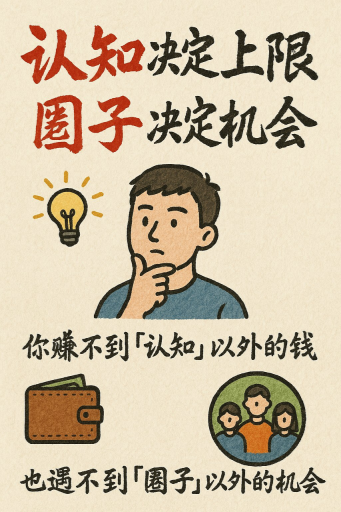

```
创作一张手绘风格的信息图卡片，比例为9:16竖版。卡片主题鲜明，背景为带有纸质肌理的米色或米白色，整体设计体现质朴、亲切的手绘美感。 卡片上方以红黑相间、对比鲜明的大号毛笔草书字体突出标题，吸引视觉焦点。文字内容均采用中文草书，整体布局分为2至4个清晰的小节，每节以简短、精炼的中文短语表达核心要点。字体保持草书流畅的韵律感，既清晰可读又富有艺术气息。 卡片中点缀简单、有趣的手绘插画或图标，例如人物或象征符号，以增强视觉吸引力，引发读者思考与共鸣。 整体布局注意视觉平衡，预留足够的空白空间，确保画面简洁明了，易于阅读和理解。 <h1><span style=""color:red"">「认知」</span>决定上限 <span style=""color:red"">「圈子」</span>决定机会</h1> - 你赚不到「认知」以外的钱， - 也遇不到「圈子」以外的机会。
```

 [↑返回目录](#toc)

---
## <a id="prompt-436">职业生涯历程可视化为地图</a> (<a href="https://x.com/alisa_fortin/status/1992049339511030009" target="_blank" rel="noopener noreferrer">@alisa_fortin</a>)

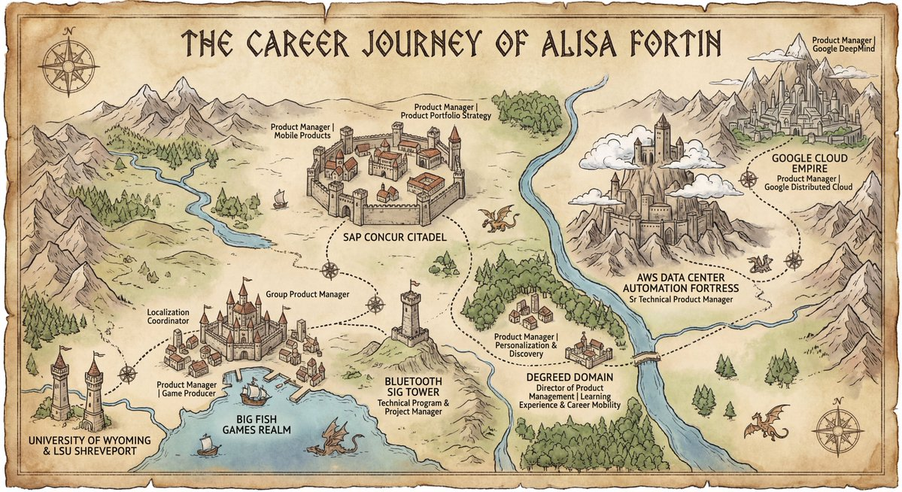

```
Download your LinkedIn profile is a PDF and give it to Nano Banana Pro with a simple prompt.
```

```
这个是提示词使用方法：
将您的 LinkedIn 个人资料下载为 PDF 文件，并附上简单的提示将其提供给 Nano Banana Pro。
```

 [↑返回目录](#toc)

---
## <a id="prompt-440">美妆检测器</a> (<a href="https://x.com/Samann_ai/status/1992171138730885618" target="_blank" rel="noopener noreferrer">@Samann_ai</a>)

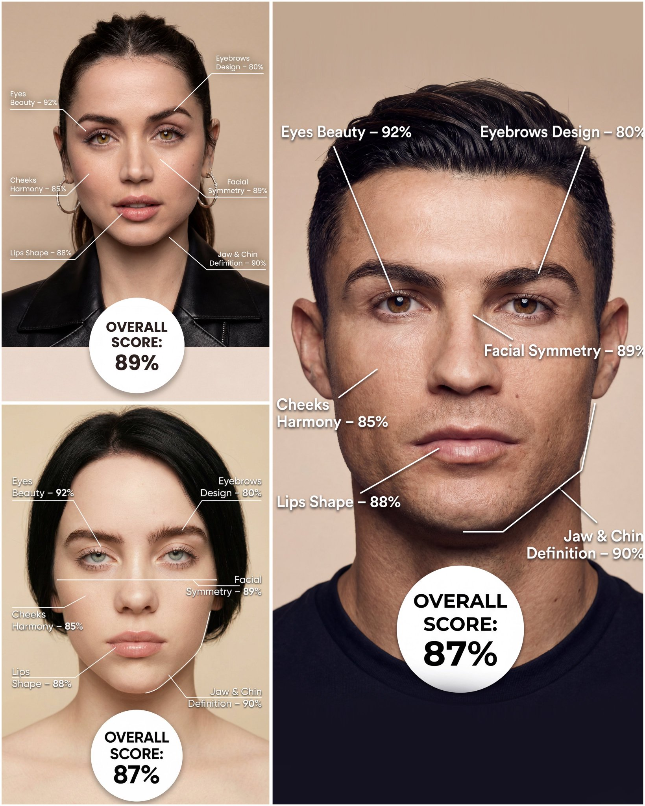

```
Use the provided portrait photo <YOUR PHOTO> as the base. 
Do NOT change the person’s face, expression, age, skin tone or gender. Just overlay a clean, minimal infographic on top.
Create a high-resolution vertical “FACIAL AESTHETIC REPORT” poster, studio lighting, soft beige background, premium beauty clinic style.
The subject can be MALE or FEMALE – keep them exactly as in the original photo. 
Add thin white lines and labels pointing to each area of the REAL face, with percentage scores based on global aesthetic ratios, symmetry and proportions (not changing the face):
1. Eyes:
   Label near the eyes with a line pointing to them:
   “Eyes Beauty – 0–100%”
   Example: “Eyes Beauty – 92%”
2. Cheeks:
   Label near the cheekbones:
   “Cheeks Harmony – 0–100%”
   Example: “Cheeks Harmony – 85%”
3. Lips:
   Label close to the mouth:
   “Lips Shape – 0–100%”
   Example: “Lips Shape – 88%”
4. Eyebrows:
   Label above or beside the brows:
   “Eyebrows Design – 0–100%”
   Example: “Eyebrows Design – 80%”
5. Jaw & Chin:
   Label near the jawline and chin:
   “Jaw & Chin Definition – 0–100%”
   Example: “Jaw & Chin Definition – 90%”
6. Overall Facial Symmetry:
   Label near the center of the face:
   “Facial Symmetry – 0–100%”
   Example: “Facial Symmetry – 89%”
At the bottom center of the poster, add a BIG, bold number inside a circle or rectangle:
   “OVERALL SCORE: XX%”
This is the total facial aesthetic score from 1–100%.
Design style:
– clean, medical-grade, aesthetic-clinic infographic
– modern thin sans-serif typography
– white text and lines, subtle drop shadows
– no logos, no extra graphics, no text other than the labels and scores above.
```

```
请使用提供的肖像照片<YOUR PHOTO>作为基础。
请勿改变人物的面部特征、表情、年龄、肤色或性别。只需在其上叠加一个简洁明了的信息图即可。
制作一张高分辨率竖版“面部美学报告”海报，采用影棚灯光、柔和的米色背景，营造高级美容诊所风格。
拍摄对象可以是男性或女性——请保持与原照片完全一致。
在真实面部的每个区域添加细白线和标签，并根据整体美学比例、对称性和比例（不改变面部）给出百分比评分：
1. 眼睛：
在眼睛附近贴上标签，并用线指向眼睛：
“眼部美感 – 0–100%”
例如：“眼部美感 – 92%”
2. 脸颊：
颧骨附近的标签：
“脸颊和谐度 – 0–100%”
例如：“双颊和谐度 – 85%”
3. 嘴唇：
靠近嘴部的标签：
“唇形 – 0–100%”
例如：“唇形 – 88%”
4. 眉毛：
眉毛上方或旁边的标签：
“眉形设计 – 0–100%”
例如：“眉形设计 – 80%”
5. 下颌和下巴：
下颌线和下巴附近的标签：
“下颌和下巴轮廓 – 0–100%”
例如：“下颌和下巴轮廓 – 90%”
6. 面部整体对称性：
脸部中央附近的标签：
“面部对称性 – 0–100%”
例如：“面部对称性 – 89%”
在海报底部中央，用圆形或矩形框出一个醒目的大号数字：
“总分：XX%”
这是面部美学总评分，范围从 1% 到 100%。
设计风格：
– 洁净、医用级、美容诊所信息图
现代纤细无衬线字体
白色文字和线条，淡淡的阴影
– 除了上面的标签和分数之外，没有标志、没有额外的图形、没有文字。
```

 [↑返回目录](#toc)

---
## <a id="prompt-429">长文本古诗画画</a> (<a href="https://x.com/songguoxiansen/status/1991474296221495538" target="_blank" rel="noopener noreferrer">@songguoxiansen</a>)

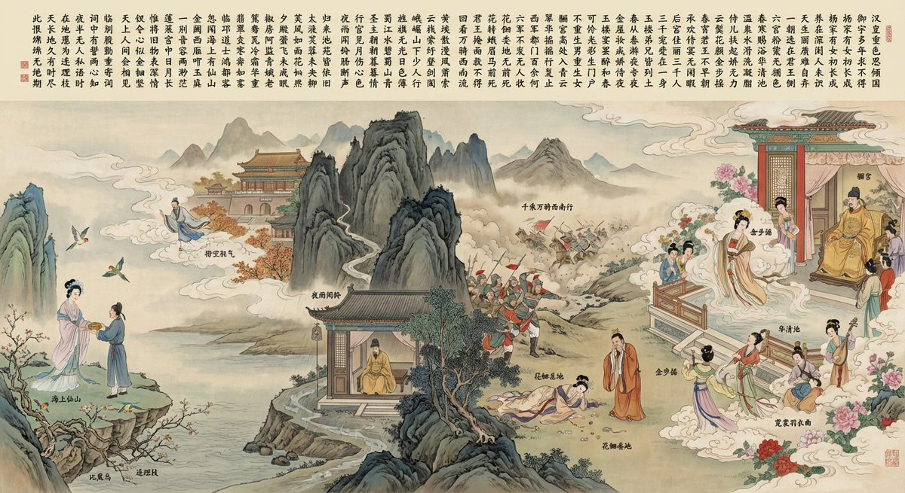

```
根据以下古诗画一幅画，并附上原文。
汉皇重色思倾国，御宇多年求不得。杨家有女初长成，养在深闺人未识。天生丽质难自弃，一朝选在君王侧。回眸一笑百媚生，六宫粉黛无颜色。
春寒赐浴华清池，温泉水滑洗凝脂。侍儿扶起娇无力，始是新承恩泽时。云鬓花颜金步摇，芙蓉帐暖度春宵。春宵苦短日高起，从此君王不早朝。
承欢侍宴无闲暇，春从春游夜专夜。后宫佳丽三千人，三千宠爱在一身。金屋妆成娇侍夜，玉楼宴罢醉和春。姊妹弟兄皆列土，可怜光彩生门户。遂令天下父母心，不重生男重生女。
骊宫高处入青云，仙乐风飘处处闻。缓歌慢舞凝丝竹，尽日君王看不足。渔阳鼙鼓动地来，惊破霓裳羽衣曲。九重城阙烟尘生，千乘万骑西南行。
翠华摇摇行复止，西出都门百余里。六军不发无奈何，宛转蛾眉马前死。花钿委地无人收，翠翘金雀玉搔头。君王掩面救不得，回看血泪相和流。
黄埃散漫风萧索，云栈萦纡登剑阁。峨嵋山下少人行，旌旗无光日色薄。蜀江水碧蜀山青，圣主朝朝暮暮情。行宫见月伤心色，夜雨闻铃肠断声。
天旋地转回龙驭，到此踌躇不能去。马嵬坡下泥土中，不见玉颜空死处。君臣相顾尽沾衣，东望都门信马归。
归来池苑皆依旧，太液芙蓉未央柳。芙蓉如面柳如眉，对此如何不泪垂？春风桃李花开日，秋雨梧桐叶落时。西宫南内多秋草，落叶满阶红不扫。
梨园弟子白发新，椒房阿监青娥老。夕殿萤飞思悄然，孤灯挑尽未成眠。迟迟钟鼓初长夜，耿耿星河欲曙天。鸳鸯瓦冷霜华重，翡翠衾寒谁与共？悠悠生死别经年，魂魄不曾来入梦。
临邛道士鸿都客，能以精诚致魂魄。为感君王辗转思，遂教方士殷勤觅。排空驭气奔如电，升天入地求之遍。上穷碧落下黄泉，两处茫茫皆不见。
忽闻海上有仙山，山在虚无缥缈间。楼阁玲珑五云起，其中绰约多仙子。中有一人字太真，雪肤花貌参差是。
金阙西厢叩玉扃，转教小玉报双成。闻道汉家天子使，九华帐里梦魂惊。揽衣推枕起徘徊，珠箔银屏迤逦开。云鬓半偏新睡觉，花冠不整下堂来。风吹仙袂飘飖举，犹似霓裳羽衣舞。玉容寂寞泪阑干，梨花一枝春带雨。
含情凝睇谢君王，一别音容两渺茫。昭阳殿里恩爱绝，蓬莱宫中日月长。回头下望人寰处，不见长安见尘雾。惟将旧物表深情，钿合金钗寄将去。钗留一股合一扇，钗擘黄金合分钿。但令心似金钿坚，天上人间会相见。
临别殷勤重寄词，词中有誓两心知。七月七日长生殿，夜半无人私语时。在天愿作比翼鸟，在地愿为连理枝。天长地久有时尽，此恨绵绵无绝期。
```

 [↑返回目录](#toc)

---
## <a id="prompt-219">冬日国家</a> (<a href="https://x.com/TheRelianceAI/status/1942870693625897385" target="_blank" rel="noopener noreferrer">@TheRelianceAI</a>)


```
A super detailed, realistic snow globe containing the essence of [Country Name]. Inside the globe: miniature snowy landscapes, iconic landmarks, cultural symbols, and natural elements representing [Country Name], rendered with extreme realism and rich textures. Delicate falling snow creates a magical, atmospheric effect inside the globe. The background is clean and softly lit to focus entirely on the globe. The image is 1:1 aspect ratio. At the bottom of the image, the text “[Country Name]” is clearly written in an elegant serif font
```

```
一个超级精细、逼真的雪球，包含着[国家名称]的精髓。球内：微型的雪景、标志性建筑、文化符号以及代表[国家名称]的自然元素，以极致的逼真感和丰富的纹理呈现。细腻的飘落雪花在球内营造出神奇的、充满氛围的效果。背景干净且柔和照明，完全聚焦于雪球。图像为 1:1 的宽高比。图像底部，用优雅的衬线字体清晰地书写着“[国家名称]”
```

 [↑返回目录](#toc)

---
## <a id="prompt-430">动漫与现实分割肖像</a> (<a href="https://x.com/_MehdiSharifi_/status/1992018970078065032" target="_blank" rel="noopener noreferrer">@_MehdiSharifi_</a>)

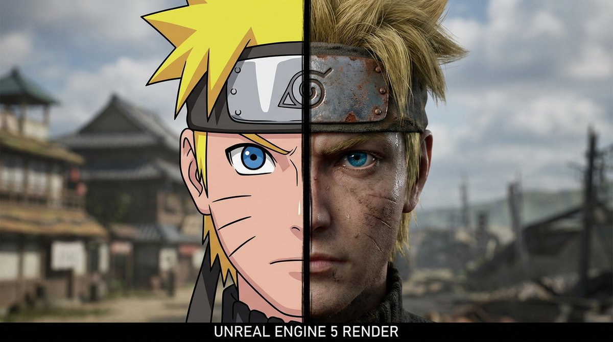

```
A cinematic 16:9 wide shot featuring a single centered headshot of Naruto Uzumaki, face split vertically in half. A distinct black line separates the two art styles down the center. [LEFT HALF]: Classic anime style, bright blonde spiky hair, blue anime eye, black whisker marks, metal headband with bold lines. [RIGHT HALF]: Gritty realism, realistic dirty blonde textured hair, piercing blue human eye, whisker marks as faint scars, weathered metal texture on the headband with rust. The headband and facial features align perfectly to form a single, unified character portrait, rendered in Unreal Engine 5.
```

```
一张16:9的电影式宽屏镜头，画面中央是漩涡鸣人的头像，脸部被垂直分割成两半。一条清晰的黑线将两种不同的画风从中间分开。[左半边]：经典的动漫风格，亮金色的刺猬头，蓝色的动漫眼睛，黑色的胡须印记，带有粗线条的金属头箍。[右半边]：写实风格，逼真的脏金色纹理头发，锐利的蓝色眼睛，胡须印记如同淡淡的疤痕，头箍上带有锈迹的金属质感。头箍和面部特征完美契合，构成一幅浑然一体的角色肖像，使用虚幻引擎5渲染而成。
```

 [↑返回目录](#toc)

---
## <a id="prompt-491">10种不同发型</a> (<a href="https://x.com/MrDavids1/status/1992695614023622734" target="_blank" rel="noopener noreferrer">@MrDavids1</a>)

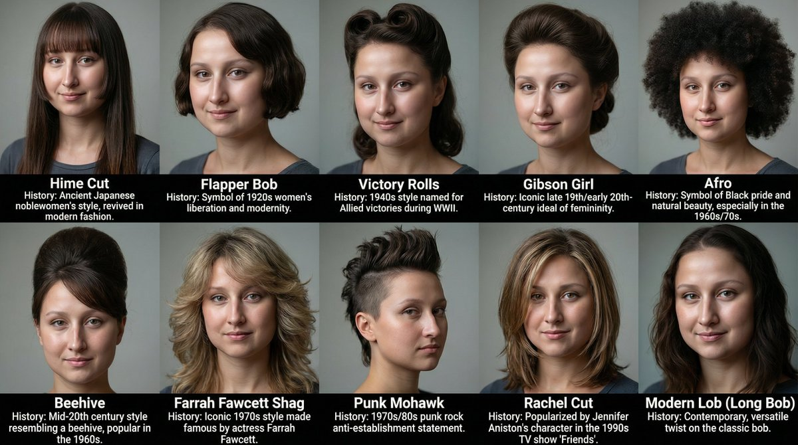

```
Create a grid of 10 different hairstyles for this women. List the name of each hairstyle and the brief history about the hairstyle. They can be from any era.
```

```
为这位女性创建一个包含10种不同发型的表格。列出每种发型的名称和简要历史。发型可以来自任何时代。
```

 [↑返回目录](#toc)

---
## <a id="prompt-517">动漫转真人</a> (<a href="https://x.com/gizakdag/status/1993010965752037832" target="_blank" rel="noopener noreferrer">@gizakdag</a>)


```
Create a realistic photo of this character.
```

 [↑返回目录](#toc)

---
## <a id="prompt-469">动漫转真人</a> (<a href="https://x.com/ZHO_ZHO_ZHO/status/1991573512713347181" target="_blank" rel="noopener noreferrer">@ZHO_ZHO_ZHO</a>)

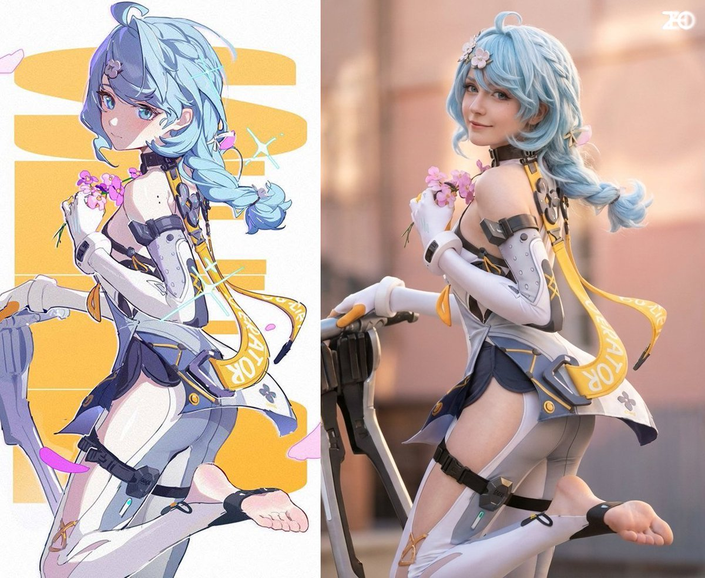

```
1:1变真人
```

 [↑返回目录](#toc)

---
## <a id="prompt-329">美女竖拍肖像</a> (<a href="https://x.com/saniaspeaks_/status/1976622473107194142" target="_blank" rel="noopener noreferrer">@saniaspeaks_</a>)

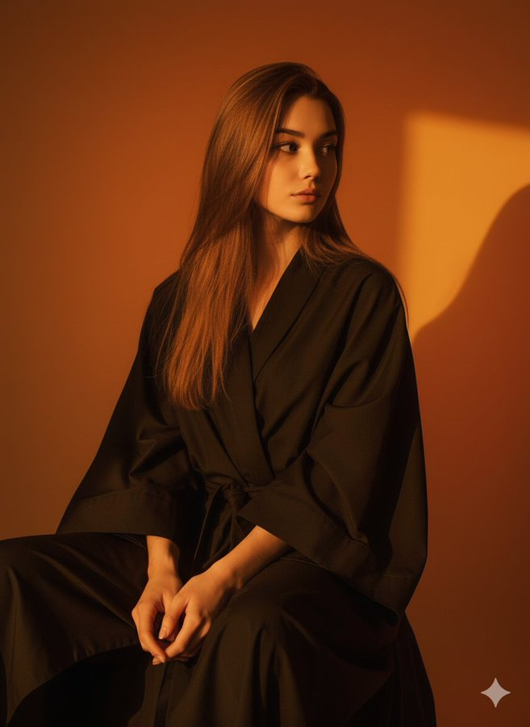

```
A hyper-realistic 4K UHD vertical potrait (3:4) of me, preserving my exact original face and features. i am seated , slightly leaned forward with relaxed and calm expression. the background is a smooth, rich gradient of oranve and yellow tones, casting soft but vivid warm ambiet light around me, lighting is studio-grade , creating a glowing cinematic effect with gentle shadow behind me. i wear a loose , dark robe or fabric that drapes naturally. the mood is artistic and slightly surreal , with a moody, high-contrast look and a golden , warm color palette. the overall style is realistic , cinematic , and softly lit - with stunning UHD detail.
```

```
这是一张超现实的 4K UHD 竖拍肖像（3:4），保留了我原本的面容和特征。我坐着，身体微微前倾，表情放松而平静。背景是平滑、丰富的橙色和黄色渐变色调，在我周围投射出柔和而生动的温暖氛围光，灯光是工作室级别的，在我身后形成柔和的阴影，营造出一种闪耀的电影效果。我穿着宽松的深色长袍或自然垂坠的布料。氛围充满艺术感，略带超现实主义，具有忧郁、高对比度的外观和金色、温暖的色调。整体风格逼真、具有电影感，灯光柔和，并带有令人惊叹的 UHD 细节。
```

 [↑返回目录](#toc)

---
## <a id="prompt-434">西游记人物坐地铁</a> (<a href="https://x.com/songguoxiansen/status/1991681971529908358" target="_blank" rel="noopener noreferrer">@songguoxiansen</a>)

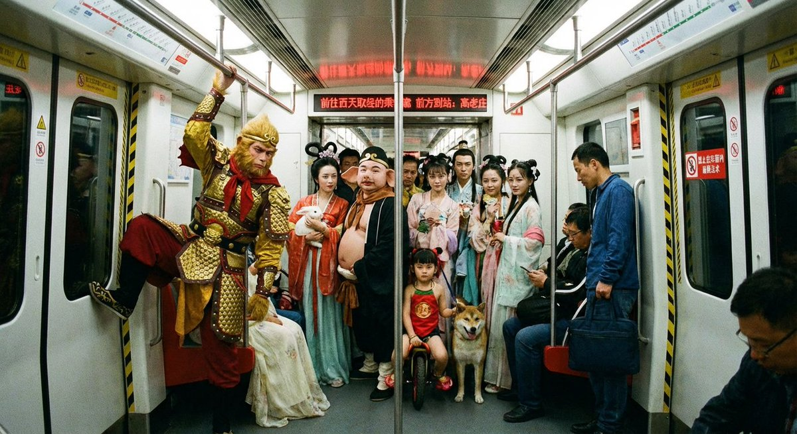

```
拥挤的北京地铁车厢，但乘客全是神话人物（孙悟空、猪八戒等）。车厢连接处的滚动屏显示红色字体：“前往西天取经的乘客请注意，前方到站：高老庄”。车门玻璃上贴着警告标示：“禁止在车厢内施展法术”。
```

 [↑返回目录](#toc)

---
## <a id="prompt-453">手绘风格的信息图卡片</a> (<a href="https://x.com/dotey/status/1991786129046044735" target="_blank" rel="noopener noreferrer">@dotey</a>)


```
创作一张手绘风格的信息图卡片，比例为9:16竖版。卡片主题鲜明，背景为带有纸质肌理的米色或米白色，整体设计体现质朴、亲切的手绘美感。

卡片上方以红黑相间、对比鲜明的大号毛笔草书字体突出标题，吸引视觉焦点。文字内容均采用中文草书，整体布局分为2至4个清晰的小节，每节以简短、精炼的中文短语表达核心要点。字体保持草书流畅的韵律感，既清晰可读又富有艺术气息。

卡片中点缀简单、有趣的手绘插画或图标，例如人物或象征符号，以增强视觉吸引力，引发读者思考与共鸣。整体布局注意视觉平衡，预留足够的空白空间，确保画面简洁明了，易于阅读和理解。

主题是：“做IP是长期复利，坚持每日出摊，持续做，肯定会有结果，因为99%都坚持不住的。”
```

 [↑返回目录](#toc)

---
## <a id="prompt-487">图片的8种初始草图</a> (<a href="https://x.com/gizakdag/status/1992620272177004855" target="_blank" rel="noopener noreferrer">@gizakdag</a>)

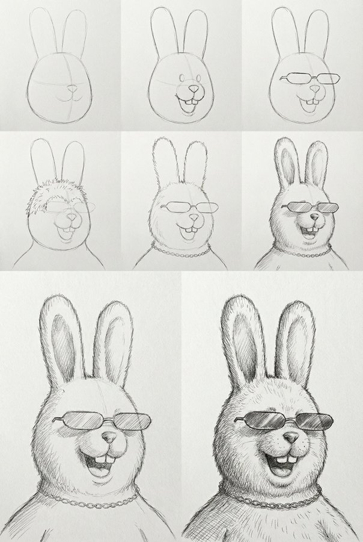

```
Create 8 different initial sketches leading to this final character.
```

```
创建 8 个不同的初始草图，最终形成这个角色。
```

 [↑返回目录](#toc)

---
## <a id="prompt-367">一位年轻女性的时尚电影肖像</a> (<a href="https://x.com/hellokaton/status/1980121876996465085" target="_blank" rel="noopener noreferrer">@hellokaton</a>)


```
一位年轻女性的时尚、电影肖像，她坐在一张现代椅子上，在室内。她以 3/4 视角构图，身体微微向后倾斜，一只手臂随意地搭在椅子上，散发出平静而自信的氛围。这位女士拥有一张瓜子脸，线条分明的下颌，发型与参考图片完全一致。她穿着一套时尚的全黑服装，包括深色高领毛衣和结构感强的西装外套，展现出高端时尚的编辑造型。
背景是一堵光滑的深色墙壁，窗户投射出引人注目的几何光影图案，散发出柔和的粉紫色光芒，与阴影形成鲜明对比。彩色的光线落在墙壁上，并 subtly 照亮她的头发和肩膀边缘，增强了戏剧性的氛围。整体照明 moody 而艺术，具有柔和的阴影和电影般的对比度。色彩分级强调深黑色、柔和的肤色和鲜艳的粉色高光，营造出杂志封面般的审美效果。
主体略微偏离中心。最终图像中不应出现任何文字、徽标或水印。
```

 [↑返回目录](#toc)

---


当前 1/9 页 | [下一页](./2.md) | [查看全部目录](../prompts.md)