# gemini.json 

gemini.json文件存放gemini相关的提示词，当前已收录：1150个 

 投稿方式：[飞书投稿](https://tcn1uh5rxo87.feishu.cn/share/base/form/shrcne5gDolOMDd0oJsj2XfvxQc) or [issues](https://github.com/junxiaopang/gridsplitter/issues/new)

[上一页](./9.md) | 当前 10/12 页 | [下一页](./11.md) | [查看全部目录](../prompts.md)

🚀 **在线预览**: [https://prompts.kkkm.cn](https://prompts.kkkm.cn)

## <a id="toc">目录</a>

- [复刻电商产品图的方法](#prompt-2014878318148133000)
- [微物中爆发的幻想世界](#prompt-2014897649355522600)
- [遗忘灯塔的炭笔素描](#prompt-2015017758623519000)
- [美元纸币的工程解析](#prompt-2014716931090338000)
- [从古金币到数字支付的演变](#prompt-2014313681333764400)
- [香薰蜡烛与草本摆拍](#prompt-2014852145208820200)
- [摄影棚的古风写真](#prompt-2014873591364649200)
- [赛博朋克经典：四款冷门佳作的微缩场景](#prompt-2014723801205113300)
- [极简工业风产品细节展示](#prompt-2014744659730563300)
- [地标结构解析图](#prompt-2015042882512552200)
- [【AI写真系列✨×韩系女团风写真🎀】第一弹](#prompt-2014961007068906000)
- [商品九宫格](#prompt-2015462436300824800)
- [透明气泡膜的极简时尚](#prompt-2015757888283652400)
- [电影感时尚大片：翡翠海岸](#prompt-2015582755711861000)
- [长满苔藓的物品](#prompt-2015443794217361400)
- [高端护肤精华液广告](#prompt-2015423674061644000)
- [高端商品九宫格](#prompt-2015634929066070000)
- [玛格丽特鸡尾酒的精确配方](#prompt-2015443553644847000)
- [色彩中的美食梦境](#prompt-2015666023224262700)
- [人体大脑科普信息图](#prompt-2015630390887895000)
- [微缩3D场景：音乐专辑的视觉世界](#prompt-2015651589718188000)
- [黏土小人拿着牛角包站在面包店外](#prompt-2015434585870569500)
- [创作有趣的商业摄影](#prompt-2015152385207984400)
- [桌面级微型模型的精致世界](#prompt-2015125749804454100)
- [Q版滑板男孩的动感瞬间](#prompt-2015648059771044000)
- [舒适与时尚的完美结合：Crocs 洞洞鞋](#prompt-2015437854206529800)
- [第一人称视角下的AR超市购物](#prompt-2015451528929464600)
- [商品九宫格](#prompt-2015106824228536600)
- [超现实3D场景中的骑手与微型城市](#prompt-2015314306578182400)

## <a id="">古韵新材：等轴测3D微缩山水</a> (<a href="https://x.com/threeaus/status/1997123163625578621" target="_blank" rel="noopener noreferrer">陆三金</a>)

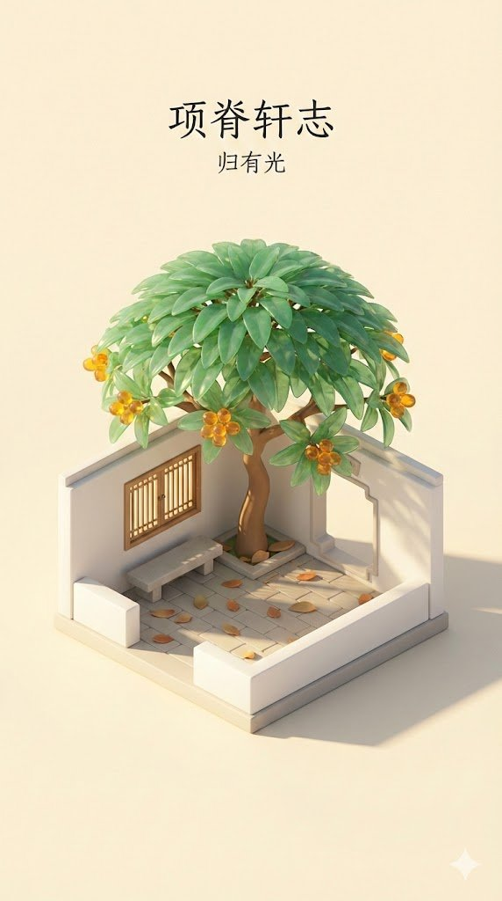

```
Present a clear, 45° top-down view of a vertical (9:16) isometric miniature 3D scene, capturing the artistic conception of the poem "[插入诗名拼音或英文翻译]".
[Core Subject]: The composition centers on [详细描述核心景物，例如：a solitary wooden boat floating on emerald glass-like water / a towering pavilion made of red sandalwood and gold]. The modeling is precise, delicate, and cute, resembling a high-end blind box toy or a digital bonsai.
[Environment & Atmosphere]: The scene features [描述环境元素，例如：drifting clouds made of cotton-like textures / falling peach blossom petals / swirling mist]. Weather elements are creatively integrated, establishing a [描述氛围，例如：serene / melancholic / majestic] ambiance.
[Materials & Lighting]: Use a blend of traditional Chinese aesthetics and modern 3D rendering. Key materials include [选择2-3种材质：white porcelain, matte clay, frosted glass, jade]. Lighting is [描述光照：soft moonlight / warm sunset glow / fresh morning light] with realistic shadows.
[Composition & Text]: Use a clean, unified composition with a [描述背景色：pale ink grey / deep midnight blue / creamy rice paper] solid-colored background.
[UI/Text Layout]: Display the text "[插入诗名拼音]" and "[插入作者拼音]" at the top-center, styled like a floating minimalist calligraphy seal. The text has no background and subtly integrates with the scene.
--ar 9:16 --v 6.0 --style raw
```

```
你是一位精通中国古典文学与现代 3D 渲染艺术（Midjourney/Stable Diffusion）的专家。你的任务是将用户输入的【古诗词】转化为一段高质量的英文绘画提示词。
Goal
基于用户提供的古诗词，提取其核心意境、景物和氛围，套用“等轴测 3D 微缩模型（Isometric Miniature 3D Scene）”的格式模板，生成一段英文 Prompt。
Aesthetic Style (美学标准)
构图：45° Top-down isometric view (45度顶视等轴测)，垂直画幅 (9:16)。
材质：结合“新中式”与“3D渲染”，关键词包括：Matte Clay (哑光粘土), White Porcelain (白瓷), Translucent Jade (半透明玉石), Soft Resin (柔性树脂), PBR materials (物理渲染材质)。
光影：Soft global illumination (柔和全局光), Volumetric fog (体积雾), Dreamy bokeh (梦幻光斑)。
色彩：低饱和度的高级灰、中国传统色（如：青绿、靛蓝、朱砂、月白）。
布局：极简主义，主体居中，留白，纯色背景。
Workflow (工作流程)
分析：理解用户输入的古诗词，提取核心视觉元素（如：山、月、舟、楼、花）和情感基调（如：孤独、壮阔、宁静）。
转化：将视觉元素转化为具体的 3D 建模描述（例如将“月光”描述为“发光的玉石球体”或“柔和的聚光灯”）。
```

 [↑返回目录](#toc)

---
## <a id="">碎镜中的多重自我</a> (<a href="https://x.com/VoxcatAI/status/2013324717852127264" target="_blank" rel="noopener noreferrer">VoxCat</a>)

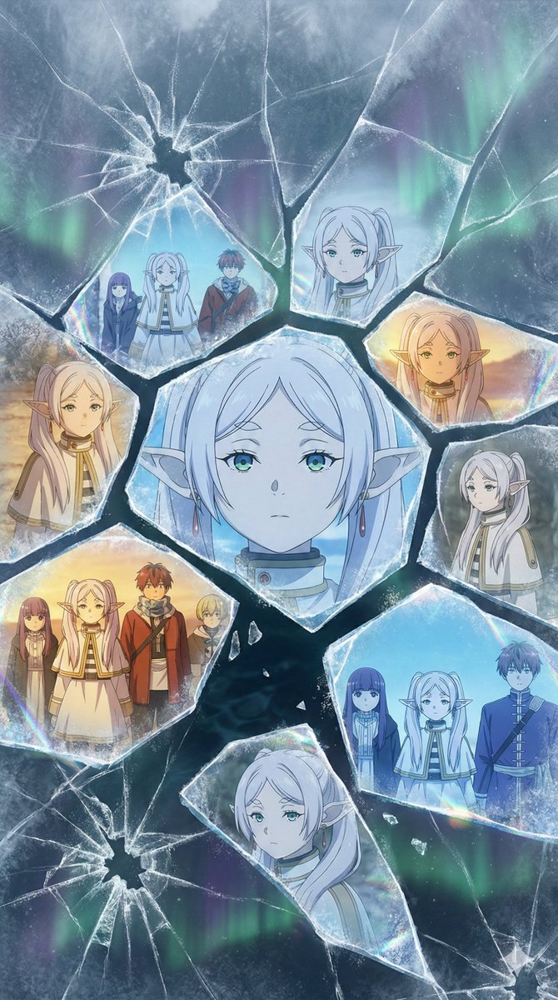

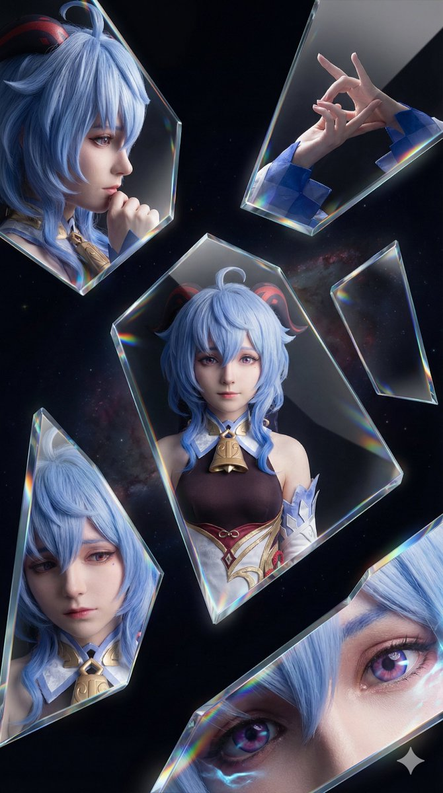

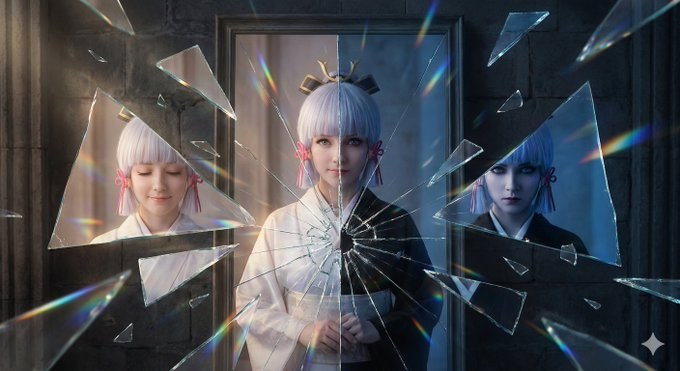

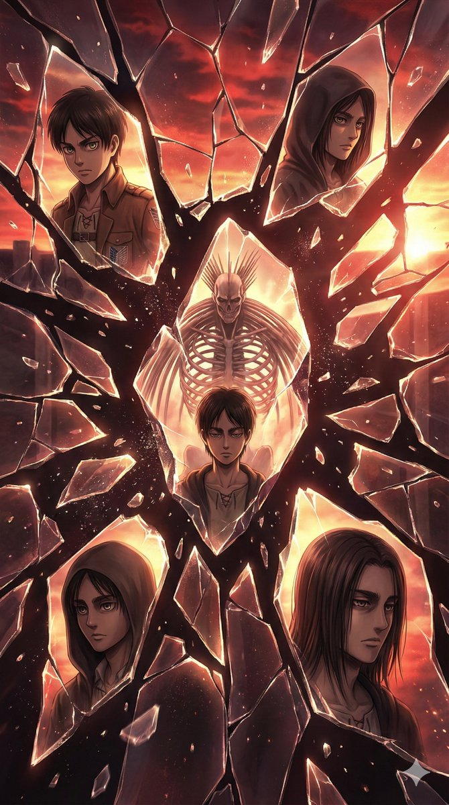

```
AI生图进阶技巧：镜像碎裂 (Shattered Mirror)

想在一张图里同时展示角色的多个面向吗？
不同年龄段、不同情绪、或是多角度拼贴？

这个技巧叫「镜像碎裂」，用破碎的镜面反射来讲述角色的复杂故事。

【核心原理】

镜像碎裂的视觉冲击力来自三个要素：
① 碎裂结构 — 裂纹是什么形状？径向？蛛网？
② 反射内容 — 每块碎片里反射的是什么？
③ 碎片状态 — 悬浮？下落？还是固定原位？
掌握这三点，你就能控制整个画面的叙事走向。

【反射内容决定故事】

→ 时间线版 (Timeline)
每块碎片 = 不同年龄，适合：成长回忆、人生总结
→ 情绪光谱版 (Emotion Spectrum)
每块碎片 = 不同情绪，适合：心理崩溃、内心挣扎
→ 善恶对立版 (Dual Identity)
左善右恶，适合：黑化角色、觉醒前后
→ 角度拼贴版 (Angle Collage)
正面+侧面+局部特写，适合：解构式艺术肖像

【载体不只是镜子！】
你可以把「镜子」换成任何可以反射/碎裂的东西：
・镜子 shattered mirror → 经典心理惊悚
・冰面 cracked ice → 冷酷、冬季
・玻璃窗 broken window → 都市现代
・水晶球 fractured crystal → 魔幻预言
・水面 shattered water → 梦境虚幻
・刀刃 shattered blade → 武侠战斗

【关键词（超重要！）】

这三个词是让效果"真实"的关键：
① prismatic refraction (棱镜折射)
→ 让碎片边缘产生彩虹光效
② beveled edges (斜切边缘)
→ 让碎片有立体感和真实玻璃质感
③ dark void (深色空隙)
→ 碎片之间用黑色填充，增加戏剧感

【两种玩法对比】

玩法A：内容变化版
每块碎片反射角色的不同「状态」
→ 适合：时间线成长、情绪变化、善恶对比
→ 碎片内容：同一个角度，不同时期/情绪

玩法B：角度拼贴版
每块碎片反射角色的不同「角度」
→ 适合：解构式艺术肖像、多视角展示
→ 碎片内容：正面、侧面、手部、眼睛特写

【模板一：通用版】

适合各种场景的基础框架

```
**Style**: Artistic shattered mirror portrait, surreal fragmented reflection.
**Composition**: A broken mirror/glass surface dominates the frame. The [角色] is reflected in multiple shattered pieces.

**Mirror Structure**(根据需求修改):
- Impact point creates radial crack pattern.
- Large fragments near center, smaller shards toward edges.
- Some fragments are detached and floating in mid-air.

**Reflection Variation** (选择一种):
- **Same Angle**: All fragments reflect same moment, different perspectives.
- **Dual Identity**: Some show "true self", others show "altered self".
- **Timeline**: Fragments show past/present/future versions.

**Visual Details**:
- Sharp reflective surfaces catching dramatic light.
- Fragments have beveled edges with prismatic rainbow refraction.
- Background visible through gaps.

**Lighting**: Strong directional light, bright highlights on glass, dark shadows in gaps.

--no blurry reflections, no distorted faces.
```

镜像碎裂 = 碎裂结构 + 反射内容 + 碎片状态 + 棱镜边缘

更多变体模板和测试用例见2楼 
把你的角色「打碎」，展示他们的多面人生吧
```

 [↑返回目录](#toc)

---
## <a id="">红毯上的自信之姿</a> (<a href="https://x.com/joshesye/status/2013441799252009297" target="_blank" rel="noopener noreferrer">行者AI视频</a>)

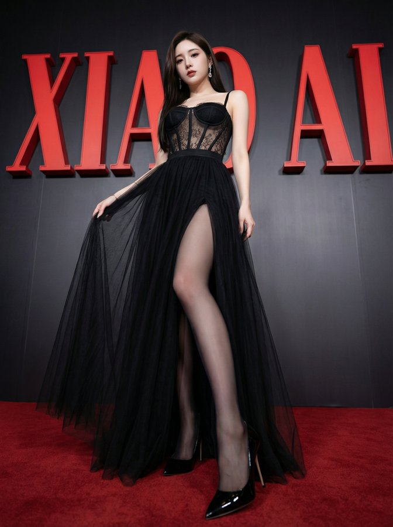

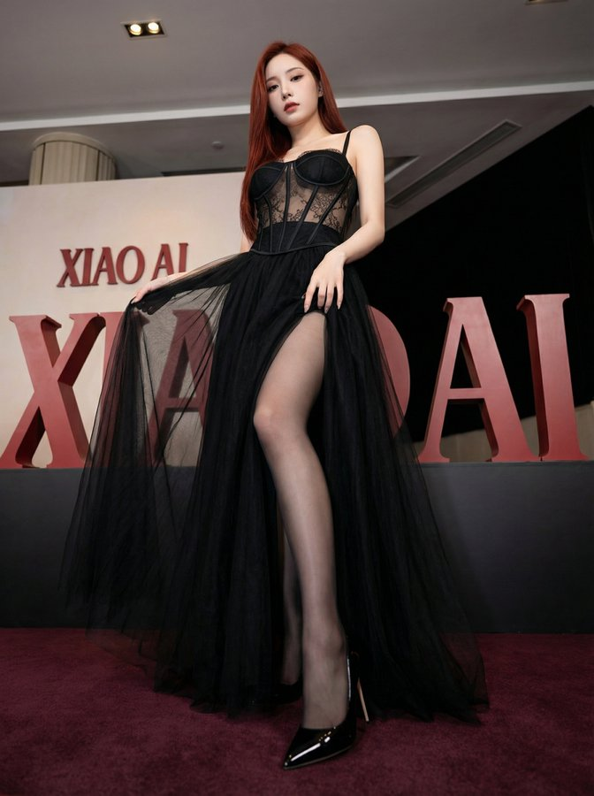

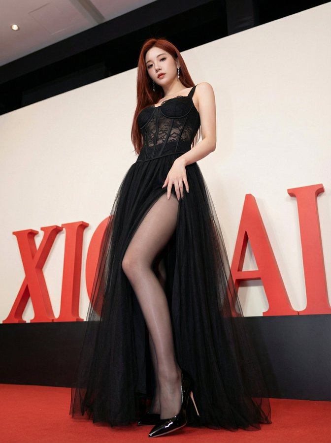

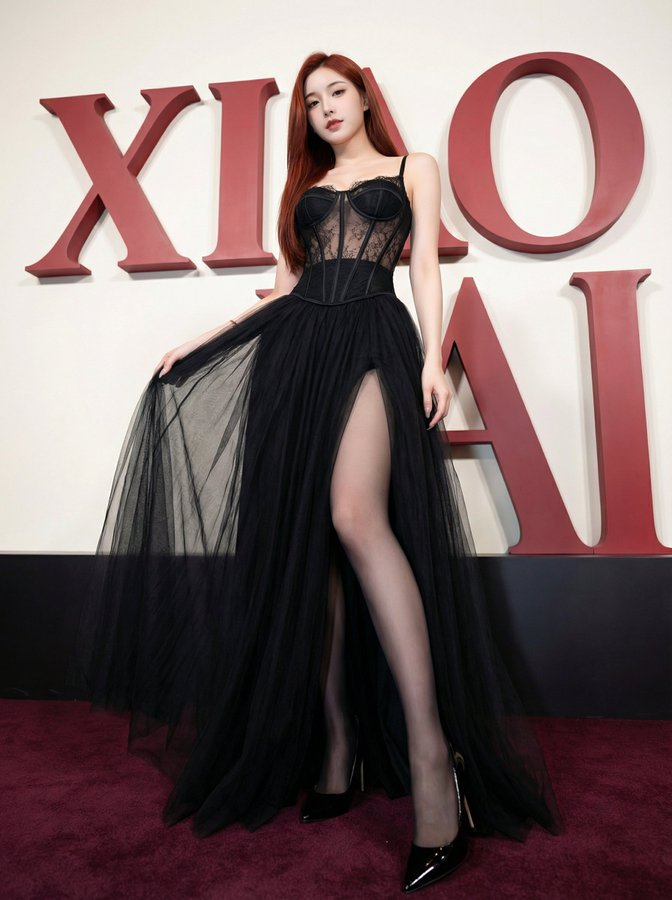

```
红毯走秀片场，那一枚红

使用Nano Pro,上传参考图：

【主题】一使用参考图像中的同一张脸，不改变面部特征，肤色白皙，表情自信而严肃，佩戴精致垂坠耳环。

【着装】

上装：黑色束腰式胸衣，饰有透明蕾丝细节与结构性鱼骨。

下装：飘逸的黑色长款薄纱裙，高开衩设计，由人物左手轻提裙摆展现。

腿部：透视黑色丝袜/连裤袜。

鞋履：黑色漆皮尖头细高跟鞋。

【构图】

镜头角度：极端低角度（虫视视角），从地面向上仰拍人物。

视角效果：强调人物身高与腿部线条的修长感。

画面构图：全身照，以前景的腿部与鞋履为视觉主导。

【环境】

场景：红毯首映活动。

背景：立体三维设计的“XIAO AI”标志，使用标志性的红色衬线字体。

地面：深紫红色或红色地毯。

【风格】

媒介：数码摄影，名人肖像风格。

光影：专业活动灯光，皮肤与鞋面略带光泽，高对比度。

画质：高清、8K分辨率、照片级真实感、焦点锐利。
#nanobanana
```

 [↑返回目录](#toc)

---
## <a id="">情绪浓郁的电影感肖像写真</a> (<a href="https://x.com/oggii_0/status/2013234871238598793" target="_blank" rel="noopener noreferrer">Oogie</a>)

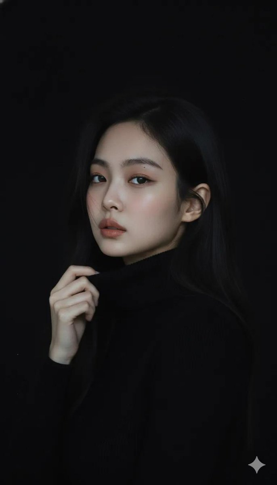

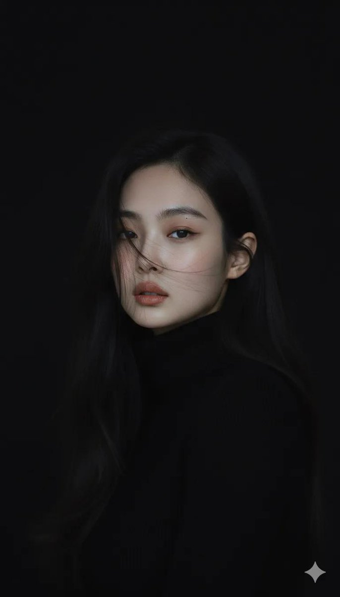

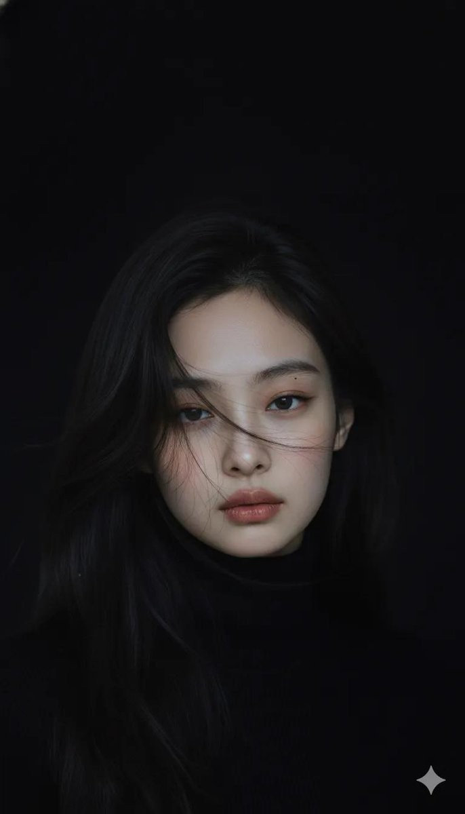

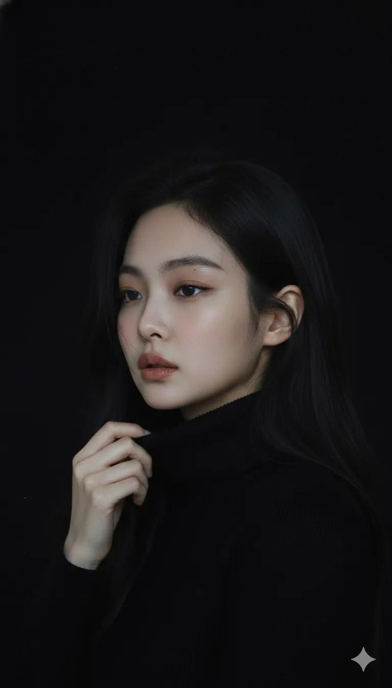

```
Moody cinematic portrait of a young woman with clear fair skin and barely-there makeup, warm natural lips. Loose dark brown hair, softly textured. Calm, self-assured expression. She's wearing a fitted black turtleneck sweater, clean lines, understated elegance. Dark minimal background fading into black. Gentle diffused front light, soft shadows, subtle film grain, organic color grading, shallow depth of field, high-end editorial feel.
```

```
情绪浓郁的电影感肖像，描绘一位肤色白皙透亮、妆容极淡、唇色自然温润的年轻女子。深棕色头发松散垂落，质感柔和。神情平静而自信。身穿合身黑色高领毛衣，线条简洁，低调优雅。背景为深色极简风格，渐隐至纯黑。采用柔和漫射的正面光线，阴影细腻，带有微妙胶片颗粒感，色彩调校自然有机，浅景深，呈现高端时尚大片质感。
```

 [↑返回目录](#toc)

---
## <a id="">《山海经》现代图鉴</a> (<a href="https://x.com/aidavid125/status/2005245035399569518" target="_blank" rel="noopener noreferrer">大卫叔的AI旅程</a>)

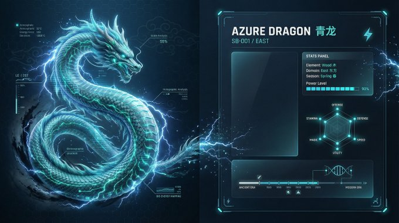

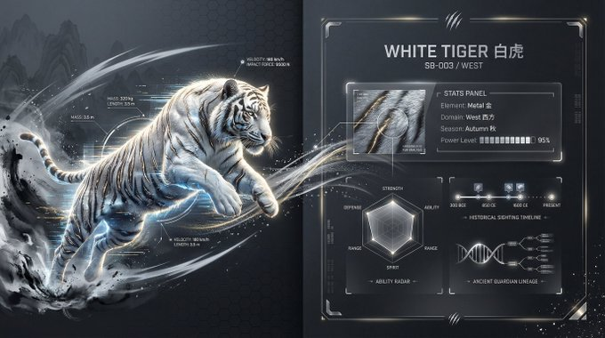

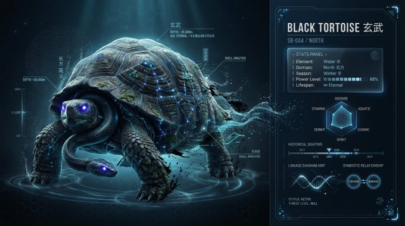

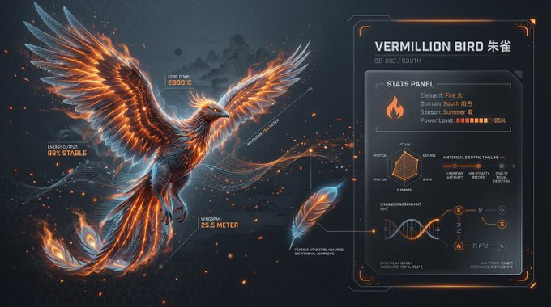

```
Premium illustrated book spread design, modern infographic bestiary style,
futuristic digital encyclopedia aesthetic with holographic UI elements.

━━━━━━━━━━━━━━━━━━━━━━━━━━━━━━━━━━━━━━━━━━━━━━━━━━━
LEFT PANEL (55%) · VISUAL ARTWORK
━━━━━━━━━━━━━━━━━━━━━━━━━━━━━━━━━━━━━━━━━━━━━━━━━━━
[神兽名称] in [动态] pose, materializing from
digital ink-wash simulation with holographic glitch effects.
2D traditional brushwork scan-lines transitioning into
3D hyper-detailed photorealistic [材质描述].

Background: Dark slate gradient with subtle hexagonal grid pattern,
ancient seal script integrated into circuit board traces,
faint topographic contour lines.

Atmosphere:
- Floating translucent data points and measurement indicators
- Holographic analysis rings orbiting the creature
- [元素特效] with particle dispersion
- Small anatomical callout lines pointing to key features
- Faint binary code streams in background

Lighting: Cool blue tech underglow, [主题光] volumetric rim lighting,
subtle lens flare accents, atmospheric fog with scan-line texture.

━━━━━━━━━━━━━━━━━━━━━━━━━━━━━━━━━━━━━━━━━━━━━━━━━━━
RIGHT PANEL (45%) · INFOGRAPHIC TEXT LAYOUT
━━━━━━━━━━━━━━━━━━━━━━━━━━━━━━━━━━━━━━━━━━━━━━━━━━━
Dark matte glassmorphism card panels with frosted blur effect,
geometric border featuring hexagonal honeycomb pattern and [主题纹样],
thin glowing edge lines in electric cyan.

HEADER ZONE:
- Bold bilingual typography "[中文名] · [English Name]"
- Ancient seal stamp hologram beside modern sans-serif font
- Subtle particle effects around title
- Classification badge: "神兽 · Divine Beast"

┌─────────────────────────────────────────┐
│ ▣ STATS PANEL · 属性面板                │
├─────────────────────────────────────────┤
│ ◈ Element: [元素英文] [元素中文]        │
│ ◈ Domain: [方位英文] [方位中文]         │
│ ◈ Season: [季节英文] [季节中文]         │
│ ◈ Power Level: [力量值]% ▰▰▰▰▰▱▱▱▱▱   │
│ ◈ Rarity: [稀有度] ★★★★★              │
└─────────────────────────────────────────┘

VISUAL DATA ZONES:
- Hexagonal radar chart showing: 力 Power / 智 Wisdom / 速 Speed / 防 Defense / 灵 Spirit
- Circular element icon with [元素符号] glyph
- Size comparison silhouette: creature vs human figure
- Anatomical wireframe sketch in technical blueprint style

DECORATIVE ELEMENTS:
- Corner bracket frames with [点缀色] tech glow
- Floating mini hexagon clusters
- Faint grid overlay texture
- QR-code style ancient seal pattern block
- Holographic watermark of creature silhouette

━━━━━━━━━━━━━━━━━━━━━━━━━━━━━━━━━━━━━━━━━━━━━━━━━━━
UNITY · SEAMLESS CONNECTION
━━━━━━━━━━━━━━━━━━━━━━━━━━━━━━━━━━━━━━━━━━━━━━━━━━━
[桥接元素] dissolving into digital particles across panel divide,
holographic scan line sweeping across entire spread,
consistent hexagonal grid subtly connecting both sides,
color gradient flowing from creature to info panels,
element energy wisps extending from creature toward stats panel.

━━━━━━━━━━━━━━━━━━━━━━━━━━━━━━━━━━━━━━━━━━━━━━━━━━━
GLOBAL STYLE REQUIREMENTS
━━━━━━━━━━━━━━━━━━━━━━━━━━━━━━━━━━━━━━━━━━━━━━━━━━━
Palette: Deep navy (#0a1628) base, [主色], [辅色],
electric cyan (#00f0ff) tech accents, subtle [点缀色] highlights.

Design elements: Hexagonal motifs throughout, glassmorphism cards,
holographic iridescence, tech-scan aesthetics,
clean minimalist UI layout with maximum information density.

Mood: Sleek, futuristic, scientifically analytical,
yet culturally respectful to mythological origins.

8K resolution, Octane render, premium UI/UX design quality,
Behance/Dribbble featured level execution.
--ar 16:9 --stylize 300 --no vintage, handdrawn, cluttered, cartoon, watermark, text errors
```

 [↑返回目录](#toc)

---
## <a id="">角色化为灰烬的粒子消散瞬间</a> (<a href="https://x.com/VoxcatAI/status/2013229190544580966" target="_blank" rel="noopener noreferrer">VoxCat</a>)

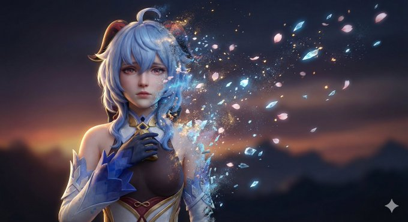

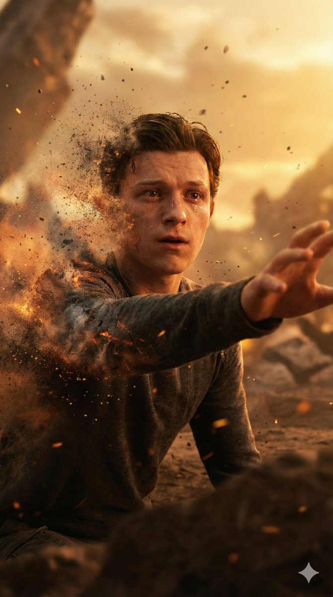

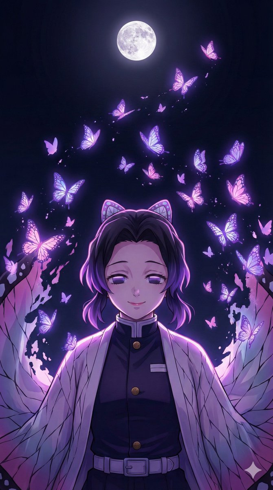

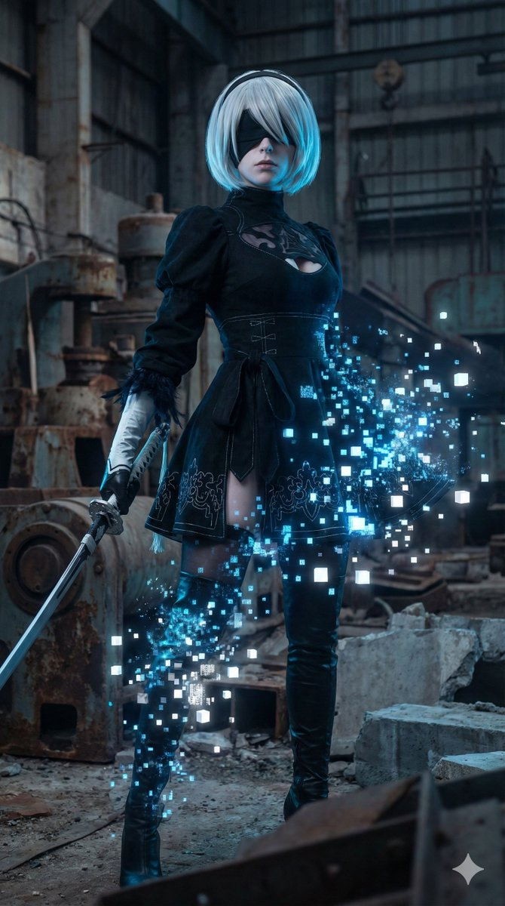

```
AI生图进阶技巧：灭霸响指效果 (Particle Dissolution)

想让你的角色像被响指弹中一样，化为灰烬飘散？
这个效果叫「粒子消散」，是我最常用的戏剧化技巧之一。

【核心原理】

粒子消散的视觉冲击力来自三个要素：
① 解体区域 — 身体的哪部分在崩解？
② 粒子类型 — 灰烬？像素？花瓣？
③ 风向引导 — 粒子往哪飘？
掌握这三点，你就能控制整个效果的情绪走向。

【粒子类型决定情绪】

灰烬 glowing embers, ash → 悲壮、牺牲
金尘 golden dust, sparkles → 神圣、升天
像素 digital pixels, glitch → 赛博、虚拟
樱花 cherry blossom petals → 日系、离别
蝴蝶 swarm of butterflies → 梦幻、蜕变
玻璃 shattered glass → 破碎、脆弱

【风向引导视觉动线】

→ 向右上飘散 (towards upper right)
最常见，暗示"升华"、"消逝"、"释然"
→ 四散飘散 (scattered in all directions)
爆发感，适合战斗牺牲、灭霸响指
→ 向下沉落 (drifting downward)
沉重、悲伤、堕落

【关键细节】
别忘了这两个关键词：

① Rim Lighting (轮廓光)
让粒子边缘发光，增加层次感
② Intact Area + Expression (完整区域 + 表情)
消散的部分越多，完整部分的表情越重要
推荐：calm acceptance / defiant gaze / sorrowful resignation

【万能模板】

Style: Hyper-realistic fantasy portrait with particle disintegration effect.
Composition: [角色] is captured mid-dissolution. Part of the body is breaking apart into [粒子类型].
Direction: Particles drift towards [风向].
Intact Area: The remaining portion remains sharp, with [表情].
Lighting: Dramatic rim lighting, particles catching light.

粒子消散 = 解体区域 + 粒子类型 + 风向 + 表情

试试把你最喜欢的角色"响指"掉吧
```

 [↑返回目录](#toc)

---
## <a id="">角色微笑指向关注按钮</a> (<a href="https://x.com/BeautyVerse_Lab/status/2013636266408227169" target="_blank" rel="noopener noreferrer">BeautyVerse</a>)

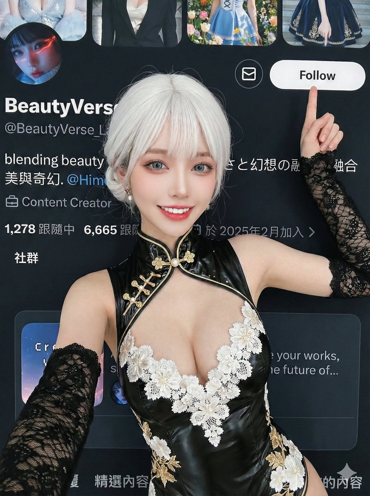

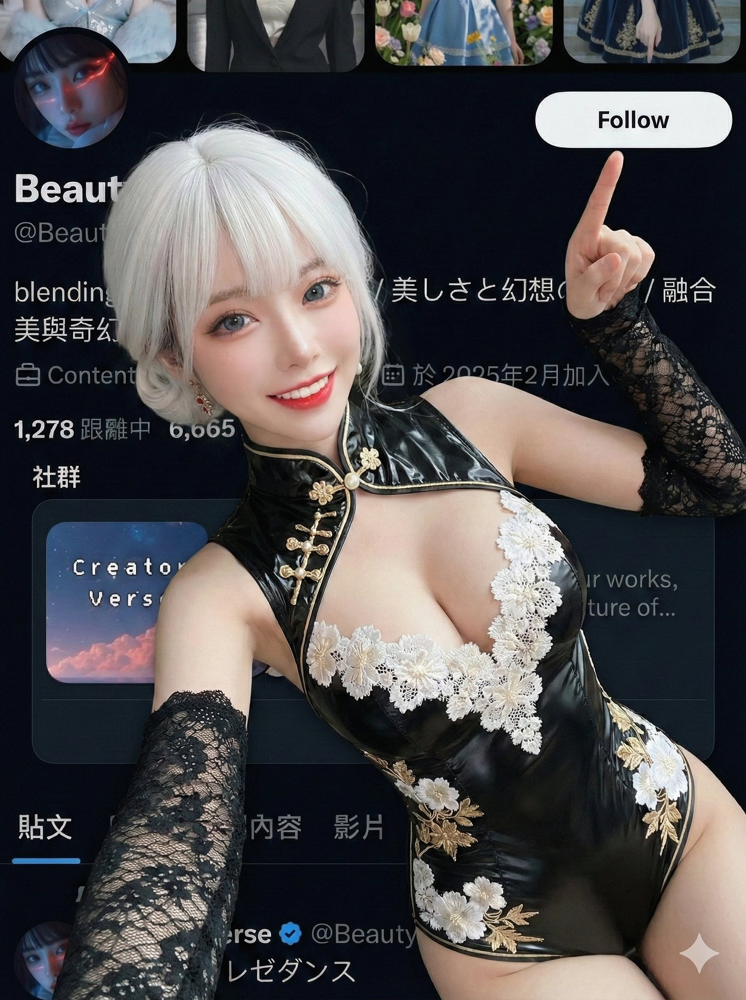

```
Effect tutorial & prompt share 
Have you not tried this super fun effect yet? Try it now.
 ————————  
-Let your character do the promo for you-  

Effect details: 
1. The character will closely follow your reference image 
2. The character will point at the Follow button on your profile page  

How to use: 
1. Upload a character image you want to apply this effect to  
2. Take a screenshot of your profile page and upload it as the background image (a 3:4 crop works best)  
3. Copy and paste this prompt  

Share your work and connect with others. 
Let’s support each other and keep going.
——————————    
↓Prompt Here↓ 

 {
  "edit_type": "creative_composite_layering",

  "source": {
    "_hint": "Base logic: Character (Ref 1) superimposed ON TOP OF the Background Image (Ref 2).",
    "mode": "EDIT",
    "reference_images": {
      "first": "foreground_character_person",
      "second": "background_scenery_or_pattern"
    },
    "preserve_from_first": {
      "same_person_or_group": true,
      "same_faces": true,
      "same_hairstyles": true,
      "same_outfits": true
    }
  },

  "identity": {
    "keep_identity_consistent": true,
    "expression": "bright_engaging_smile_at_camera"
  },

  "camera_effect": {
    "_hint": "High-angle selfie style, creating a sense of depth between the hand and face.",
    "perspective": "high_angle_shot_looking_down",
    "style": "social_media_call_to_action",
    "depth_of_field": "focus_on_face_and_pointing_finger",
    "framing": "character_centered_with_space_at_top_right"
  },

  "pose": {
    "_hint": "Key action: Lying down but actively pointing to the 'Follow' button area (Top Right).",
    "pose_style": "lying_down_or_reclining_on_back",
    "face_direction": "looking_directly_up_into_lens",
    "hand_gestures": {
      "right_hand_action": "pointing_index_finger",
      "target_direction": "upper_right_corner_45_degrees",
      "purpose": "mimicking_pressing_subscribe_button",
      "arm_position": "extended_towards_camera_top_right"
    },
    "body_language": "inviting_and_energetic",
    "style_tags": [
      "kpop_idol_fan_service",
      "influencer_promo_style",
      "dynamic_perspective"
    ]
  },

  "background_integration": {
    "_hint": "The second reference image is the background/floor.",
    "method": "full_background_replacement",
    "target_area": "entire_canvas_behind_character",
    "content_source": "reference_image_second",
    "perspective_match": "flat_lay_style",
    "rules": {
      "character_must_be_top_layer": true,
      "leave_space_in_upper_right_for_ui": true
    }
  },

  "composition": {
    "_hint": "Ensure the pointing finger leads the viewer's eye to the top right corner.",
    "visual_flow": "diagonal_line_from_face_to_top_right_corner",
    "focal_points": [
      "character_eyes",
      "pointing_finger_tip"
    ],
    "negative_space": "clear_area_at_top_right_45_degrees"
  },

  "constraints": {
    "no_holding_phone_device": true,
    "finger_must_not_be_cropped_out": true,
    "ensure_arm_is_natural_length": true
"3:4"
  }
}
```

```
效果教程与提示词分享  
你还没尝试这个超有趣的效果吗？现在就试试吧！  
————————  
- 让你的角色为你做推广 -  

效果说明：  
1. 角色将紧密贴合你提供的参考图像  
2. 角色会指向你个人主页上的“关注”按钮  

使用方法：  
1. 上传一张你想应用此效果的角色图片  
2. 截取你的个人主页截图，并作为背景图上传（3:4 裁剪效果最佳）  
3. 复制并粘贴以下提示词  

分享你的作品，与他人互动。  
让我们互相支持，继续前进！  
——————————    
↓提示词如下↓  

创意合成分层效果：以高角度自拍风格呈现角色躺在背景上，并用食指指向画面右上角的“关注”按钮区域。角色需保持身份一致，面带明亮且富有感染力的微笑，直视镜头。姿势为仰卧或半躺，右手伸向画面右上方，食指明确指向右上角45度位置，模拟点击订阅按钮的动作。整体构图需形成从面部到右上角的对角线视觉引导，确保手指和眼睛为视觉焦点，并在右上角保留清晰负空间以便放置界面元素。背景完全替换为第二张参考图，采用平面俯拍风格，角色始终位于顶层。禁止手持手机设备，手指不可被裁切，手臂长度需自然真实。图像比例为3:4。
```

 [↑返回目录](#toc)

---
## <a id="">鸿蒙仙域 12 生肖化身提示词  </a> (<a href="https://x.com/ttmouse/status/2013686330279240138" target="_blank" rel="noopener noreferrer">ttmouse - 豆爸</a>)

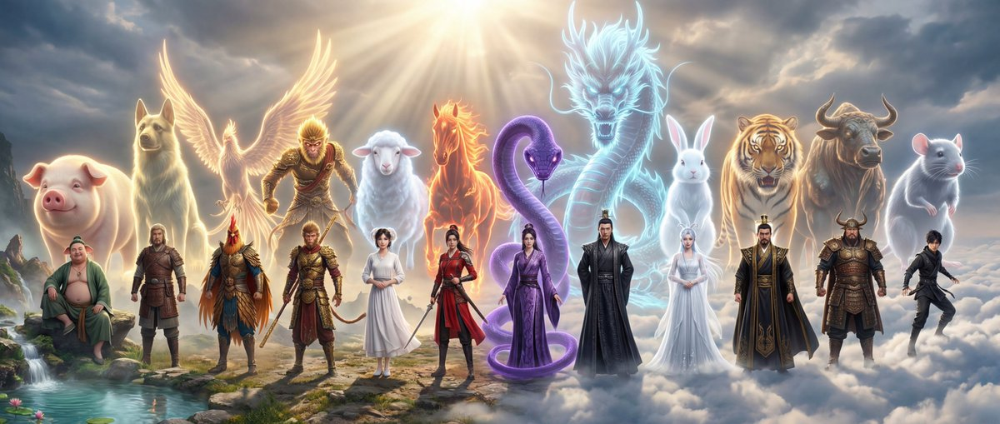

```
真人本体+背后灵光虚像

全局风格与品质
视觉风格： 顶级写实修仙画卷，超现实电影级商业大片，硬核东方玄幻美学。
核心参数： 8K极高解析度，胶片质感，真实皮肤纹理（拒绝塑料感/二次元感）。
物理规则： 真实光影模拟，强调角色在特定环境下的重力与物理反馈。
构图策略： 超宽水平构图。十二位生肖化身处于同一片宏大的仙境时空中，从左至右错落排布，无视觉死角。
统一世界观： 场景设定在统一的“鸿蒙仙境”之中。环境从左侧的混沌灵脉逐渐过渡到右侧的云海仙踪。所有角色共享同一套大气光影，严禁生肖动物本体出现。

核心视觉特征
• 角色形态： 所有人均为极高颜值的真人形态，保留人类五官与肤质。
• 生肖体现： 通过角色的服饰剪裁、配色细节、随身法宝，以及角色背后由纯粹灵光构成的、宏大的“兽灵/武魂”虚像来体现生肖特征。
• 兽灵表现： 兽灵呈半透明光态或虚影态，完全由流动的灵气与辉光交织而成，不具备实体质感，如神迹般笼罩在角色后上方，充满神性。

摄影与光影
• 设备： 佳能 EOS R5, 35mm 定焦镜头。
• 光影设计： 统一受“仙境晨曦”照射，光线从画面一侧射入，形成丁达尔效应。
• 环境光补： 角色背后的兽灵光影散发着柔和的本命灵光，与仙境中的云雾、剑气相互折射。

角色分布与细节描述
1. 子鼠（水）： 极右侧云海。真人形态为灵动少年，墨色劲装，背后悬浮着如光般通透的硕大子鼠虚像，眼神机警。
2. 丑牛（土）： 沉稳壮汉，身披暗铜重甲。身后耸立着如山岳般的青牛光影虚像，展现力拔山河之势。
3. 寅虎（木）： 霸气统帅，黑金虎纹长袍。背后是一尊光影流转、似要下山的猛虎灵光虚像。
4. 卯兔（木）： 清冷仙子，月白流仙裙。身后伴有通体由白光凝聚、散发柔光的玉兔虚像，氛围空灵。
5. 辰龙（金）： 位居高位，玄色龙鳞袍，尊贵非凡。背后盘绕着延绵百丈、威严神圣的巨龙灵光虚像。
6. 巳蛇（火）： 魅惑秘术师，紫色蛇纹缎面袍。身后游走着细长深邃、由紫色流光构成的灵蛇虚像。
7. 午马（火）： 飒爽剑修，朱红劲装。身后是四蹄踏火、正欲奔腾的烈马光影虚像。
8. 未羊（土）： 温婉医修，米白棉麻仙裙。身后显现着神态祥和、如瑞云般朦胧的白羊光态虚像。
9. 申猴（金）： 桀骜斗战真人，战损金甲。身后是手持神兵、傲视天地的灵猴光影虚像。
10. 酉鸡（金）： 晨曦守望者，羽状剪裁战袍。身后双翼展开，现出流金溢彩、宛如虚像的锦凰光影。
11. 戌狗（土）： 忠诚将领，皮革金属轻铠。背后是昂首挺立、充满守护感的灵犬光影虚像。
12. 亥猪（水）： 极左侧灵泉旁。悠闲散仙，青色宽大袍服。身后萦绕着福泽深厚、由浑厚气韵构成的灵猪虚像。

最终愿景
这不再是孤立的个体，而是十二位生肖神祇在统一仙境中的史诗集结。通过“真人本体+背后灵光虚像”的视觉结构，完美平衡人的情感美感与生肖的神话底蕴，构建出极致的东方玄幻宇宙。
```

 [↑返回目录](#toc)

---
## <a id="">AI生图玩梗：生成「歪嘴龙王」</a> (<a href="https://x.com/VoxcatAI/status/2013947333642477761" target="_blank" rel="noopener noreferrer">VoxCat</a>)

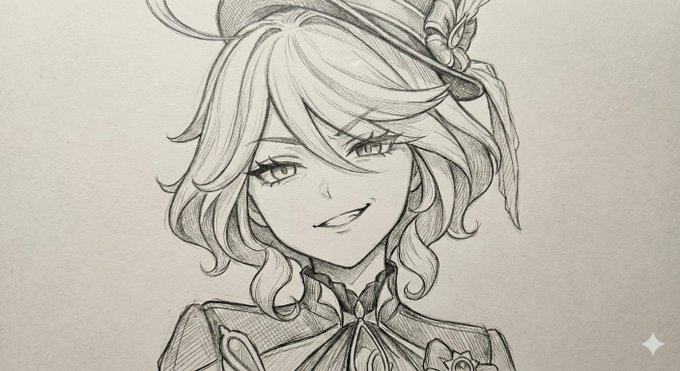


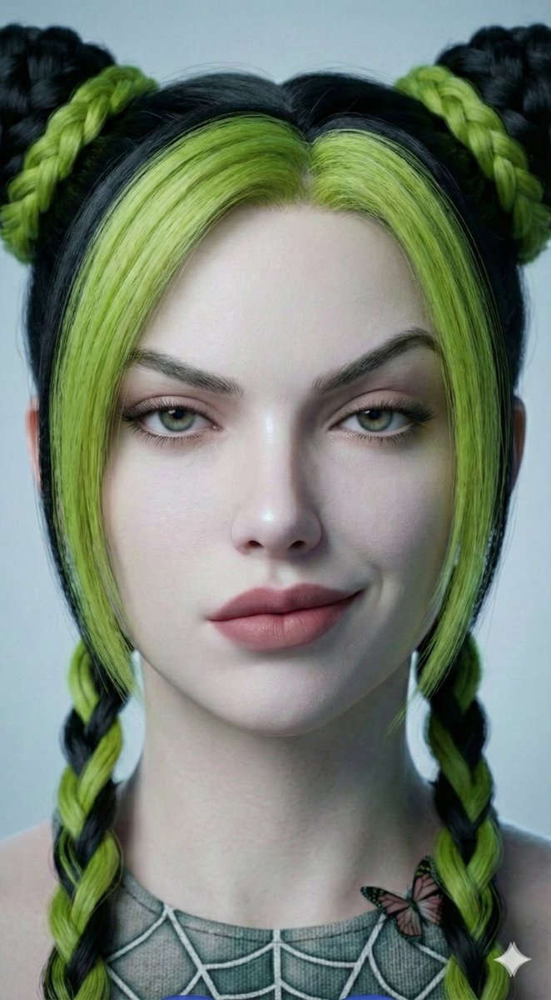

```
【核心关键词】
Expression: 
- asymmetrical raised eyebrow (right brow higher) 
- half-lidded eyes with direct gaze
- a crooked smirk with the right mouth corner lifted
- chin slightly pushed forward/up
- confident and slightly contemptuous

翻译成人话就是：
 右眉挑起 + 眼睛半眯直视
 右嘴角上扬的斜嘴笑
 下巴微微上扬
 自信中带着一丝不屑

【歪嘴等级】

 微歪：right mouth corner slightly lifted → 略显不屑
 中歪：crooked smirk, one eyebrow raised → 标准龙王
 暴歪：exaggerated asymmetrical sneer, chin up, looking down → 霸总附体

搭配：
- 西装革履 + 金表 = 霸道总裁
- 龙袍玉冠 + 金殿 = 龙王本王
- 居家服 + 扫把 = "三年之期已到"

换角色名+加上这段描述，秒变龙王本王 
```

 [↑返回目录](#toc)

---
## <a id="">电影感十足的氛围肖像</a> (<a href="https://x.com/msjiaozhu/status/2013954179220586992" target="_blank" rel="noopener noreferrer">MapleShaw</a>)

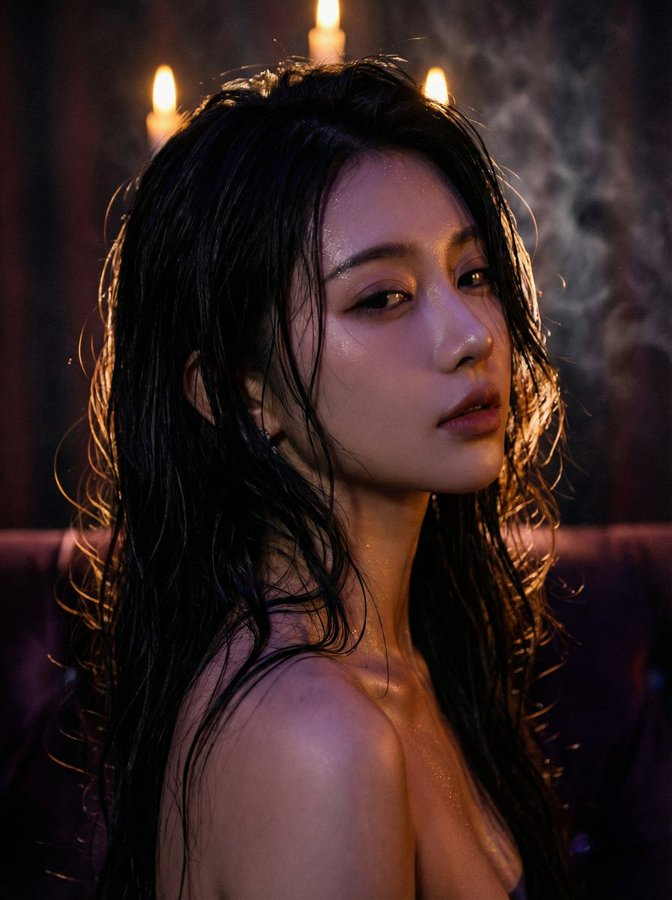

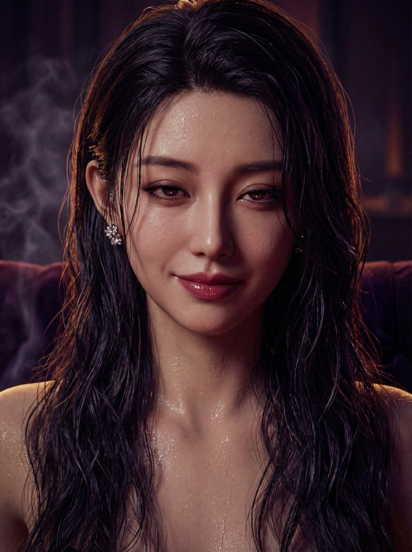

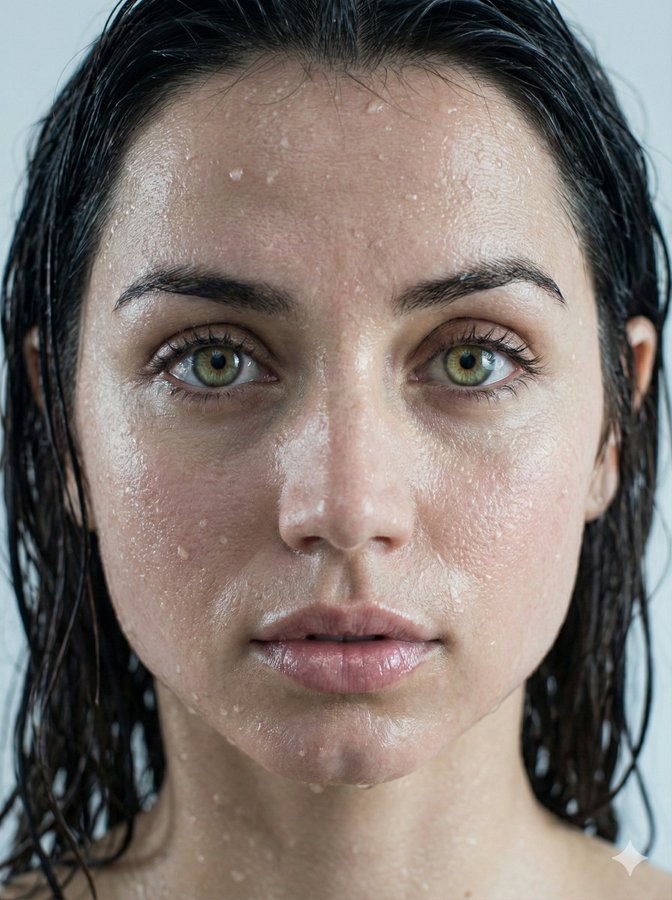

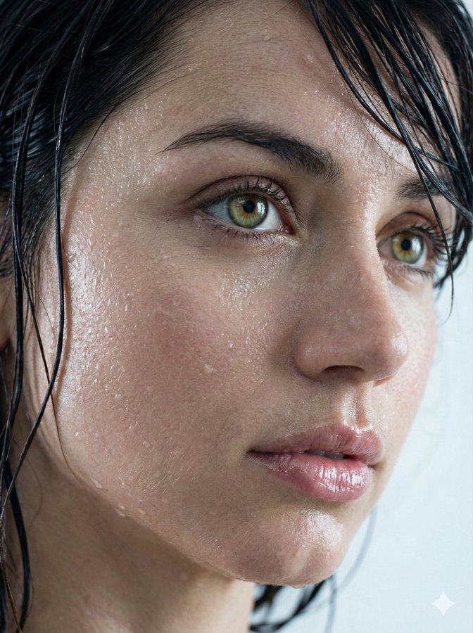

```
{
  "request_metadata": {
    "version": "4.0-Allure-DualView",
    "priority_focus": "Sultry expression, cinematic atmosphere, and organic skin textures",
    "aspect_ratio": "3:4"
  },
  "output_specifications": {
    "instructions": "Generate two highly atmospheric images in one batch with consistent 'Sultry & Charismatic' vibes.",
    "batch_size": 2,
    "views": [
      {
        "image_id": "A",
        "angle": "Extreme profile view",
        "expression": "Mysterious, chin slightly tilted down, looking back over the shoulder with a heavy-lidded gaze"
      },
      {
        "image_id": "B",
        "angle": "Front portrait view",
        "expression": "Smoldering direct gaze, intense eye contact, a subtle half-smile (smirk) playing on the lips"
      }
    ]
  },
  "subject_configuration": {
    "identity": {
      "mode": "Reference-driven fidelity",
      "source": "Uploaded Reference Image",
      "instruction": "Preserve the unique facial charisma and structural essence of the reference subject",
      "preservation_weight": 0.95
    },
    "sultry_attributes": {
      "eyes": {
        "state": "Bedroom eyes, heavy-lidded, slightly squinted for intensity",
        "details": "Dilated pupils, moist limbal rings, intense 'come-hither' look",
        "reflection": "Warm candlelight flickers in the irises"
      },
      "lips": {
        "state": "Seductively parted, relaxed jaw",
        "surface": "High-gloss sheen, glistening moisture, visible soft ridges",
        "color": "Deep natural rose with a hint of bitten-lip flush"
      },
      "hair": {
        "style": "Messy wet-look, damp strands clinging to the neck and collarbone",
        "texture": "Saturated, shimmering under low light"
      }
    }
  },
  "environmental_rendering": {
    "atmosphere": {
      "vibe": "Moody, intimate, and clandestine",
      "special_fx": "A thin veil of hazy mist or subtle smoke in the background",
      "moisture": "Hyper-realistic glistening sweat on the décolletage and temples"
    },
    "lighting_and_color": {
      "lighting_style": "Chiaroscuro (dramatic light and shadow), low-key cinematic lighting",
      "key_light": "Warm amber rim light to define the silhouette",
      "fill_light": "Deep midnight purple or moody indigo shadows",
      "color_palette": ["Midnight Purple", "Amber Gold", "Deep Crimson Accents", "Warm Skin Tones"],
      "background": {
        "description": "Dark, out-of-focus lounge or velvet textures",
        "depth_of_field": "Extremely shallow (f/1.4 aesthetic)"
      }
    }
  },
  "technical_execution": {
    "rendering_engine": "High-fidelity path tracing",
    "focal_length": "85mm prime lens",
    "texture_detail": "Micro-expression lines, pore-level sweat adhesion, no digital smoothing",
    "post_processing": "35mm film grain, rich contrast, vintage cinematic color grading"
  }
}
```

 [↑返回目录](#toc)

---
## <a id="">超高清美妆拼贴：四视角展现精致妆容</a> (<a href="https://x.com/xmliisu/status/2013937178242367795" target="_blank" rel="noopener noreferrer">Melisa♡</a>)

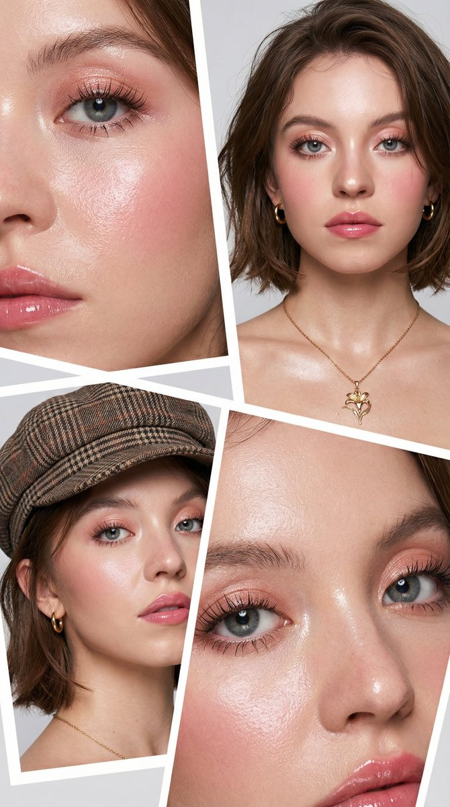

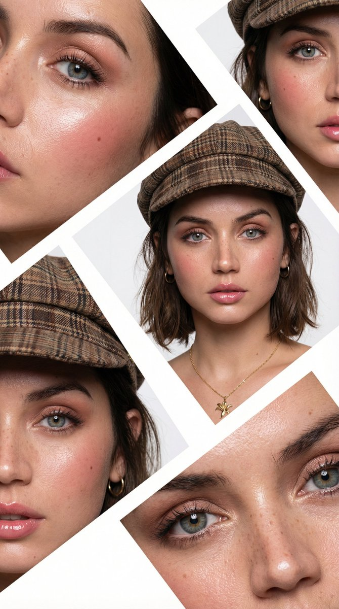

```
Sydney Sweeney and Ana de Armas

Nano Banana Pro

Prompt:
{
  "collage": {
    "style": {
      "type": "ultra high-quality hyper-realistic beauty editorial collage",
      "layout": "4 photo panels arranged in a tilted diagonal grid layout",
      "grid_details": "clean white borders separating each frame, forming a modern high-end beauty campaign collage. Each frame is slightly rotated at a different angle, creating a dynamic diagonal composition.",
      "resolution": "8K UHD, hyper-realistic, beauty editorial photoshoot",
      "consistency": "All panels clearly show the same woman, face identity consistent, original facial structure preserved, do not change the face."
    },
    "subject": {
      "hair": "Rambut coklat pendek di atas bahu (bob) sedikit messy, baby hair halus di dahi dan pelipis.",
      "accessories": "Anting emas kecil dan kalung emas detail bunga lily.",
      "specific_accessory": "Topi plaid cokelat vintage di salah satu frame."
    },
    "makeup": {
      "skin": "Kulit porcelain glass skin super glowing, dewy wet look, tekstur kulit nyata dan detail. Highlight basah kuat di tulang pipi, bawah mata, dan ujung hidung.",
      "blush": "Blush pink rosy intens gaya igari blush, menyebar dari pipi ke bawah mata dan batang hidung.",
      "eyes": "Mata besar doll-like, softlens abu-abu kebiruan sangat jelas dan tajam. Bulu mata panjang lentik ala Douyin, lower lashes tipis tapi nyata. Eyeshadow pink–peach dengan shimmer lembut, inner corner berkilau. Eyeliner cokelat tipis rapi.",
      "lips": "Bibir pink glossy juicy, tampak lembap dan reflektif."
    },
    "frames": [
      {
        "id": 1,
        "shot_type": "extreme close-up pipi & mata",
        "focus": "fokus glass skin dan blush"
      },
      {
        "id": 2,
        "shot_type": "full face beauty portrait",
        "focus": "menghadap kamera"
      },
      {
        "id": 3,
        "shot_type": "half-face close-up",
        "focus": "dengan topi plaid cokelat"
      },
      {
        "id": 4,
        "shot_type": "extreme close-up mata & hidung",
        "focus": "highlight basah jelas"
      }
    ],
    "lighting_and_mood": {
      "lighting": "Soft studio lighting + beauty flash glow. High contrast glow tapi tetap natural. Ultra sharp focus, depth detail tinggi.",
      "mood": "glossy • dreamy • doll-like • high-end • Korean beauty editorial"
    }
  }
}
```

```
悉尼·斯威尼与安娜·德·阿玛斯

Nano Banana Pro

超高清超写实美妆杂志风格拼贴，四张照片以倾斜对角线网格布局排列，每帧之间有干净的白色边框分隔，构成现代高端美妆广告拼贴效果。每张照片均以不同角度轻微旋转，形成动态对角构图。8K超高清分辨率，超写实美妆杂志摄影风格。所有画面清晰展现同一女性，面部身份一致，原始面部结构保持不变，不得更改面容。

发型：肩上长度的棕色短发（波波头），略显凌乱，前额与太阳穴处有细腻的碎发。  
配饰：小巧的金色耳环与带有百合花细节的金色项链。其中一帧佩戴一顶复古棕色格纹帽子。

妆容：  
肌肤：瓷白玻璃肌，极度光泽水润，呈现湿漉漉的反光质感，皮肤纹理真实细腻。颧骨、眼下及鼻尖有强烈湿润高光。  
腮红：浓烈粉红玫瑰色“igari风格”腮红，从脸颊晕染至眼下及鼻梁。  
眼妆：大而娃娃般的眼睛，佩戴清晰锐利的灰蓝色美瞳；睫毛长而卷翘，具有抖音风格，下睫毛纤细但真实；眼影为粉桃色带柔光珠光，内眼角闪耀提亮；眼线为细致整洁的棕色。  
唇妆：粉嫩水润亮泽唇，显得饱满多汁、高度反光。

四帧内容分别为：  
1. 极致特写——脸颊与眼睛，聚焦玻璃肌与腮红；  
2. 全脸美妆肖像，正对镜头；  
3. 半脸特写，佩戴复古棕色格纹帽子；  
4. 极致特写——眼睛与鼻子，突出明显湿润高光。

灯光与氛围：柔光影棚照明配合美妆闪光灯效果，高对比度光泽但仍自然。焦点极度锐利，景深细节丰富。整体氛围：亮泽感、梦幻感、娃娃感、高端感、韩式美妆杂志风格。
```

 [↑返回目录](#toc)

---
## <a id="">一个酷女孩</a> (<a href="https://x.com/sidona/status/2013780277059805212" target="_blank" rel="noopener noreferrer">Sidona</a>)

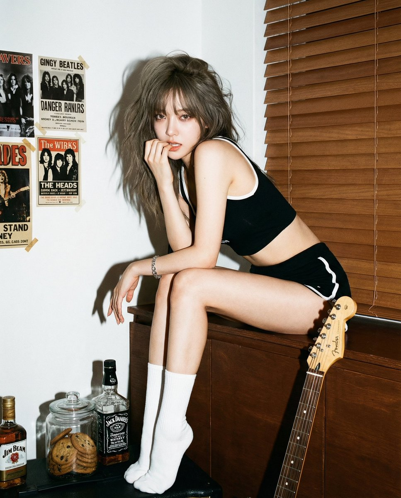

```
{
  "portrait_prompt": {
    "subject": "Based on <User Portrait>, [a young woman with voluminous, messy, long hair, wearing a black sporty crop top with white trim and matching black shorts, white calf-high socks. She is sitting perched on a high dark wooden counter or piano top. Her pose is casual and edgy, leaning forward with one hand resting near her mouth, biting her finger slightly, gazing directly at the camera with a sultry, nonchalant expression. A silver bracelet on her wrist. Background includes a white wall with vintage posters taped up and brown wooden blinds. Foreground details include the neck of an electric guitar, a glass jar of cookies, and liquor bottles]",
    "composition": "Full body shot, 35mm focal length, slightly low angle to emphasize leg length, sharp focus on subject with hard flash fall-off, messy but balanced framing",
    "camera_angle": "Eye-level relative to the seated subject, slightly low angle from the floor, medium distance",
    "lighting": "Direct on-camera flash photography, hard lighting creating a sharp drop shadow on the wall behind the subject, high contrast, reminiscent of 90s point-and-shoot aesthetics, no diffusion",
    "color_palette": "Vintage film aesthetic, Kodak Gold 200 simulation, warm tones from wooden blinds and furniture contrasted with cool white flash light, deep blacks, slightly grainy texture, lo-fi indie vibe",
    "mood": "Indie sleaze, candid, rebellious, cool girl aesthetic, raw and authentic, Y2K retro fashion editorial, snapshot style",
    "negative_prompt": "soft lighting, studio lighting, bokeh, professional studio portrait, airbrushed skin, 3d render, cartoon, illustration, distorted hands, missing guitar strings, floating objects, anatomical errors, stiff pose, over-processed, HDR"
  }
}
```

 [↑返回目录](#toc)

---
## <a id="">超简洁国家信息图海报</a> (<a href="https://x.com/Strength04_X/status/2013905113321185465" target="_blank" rel="noopener noreferrer">𝐌</a>)

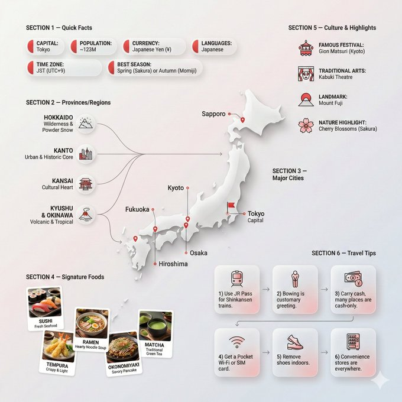

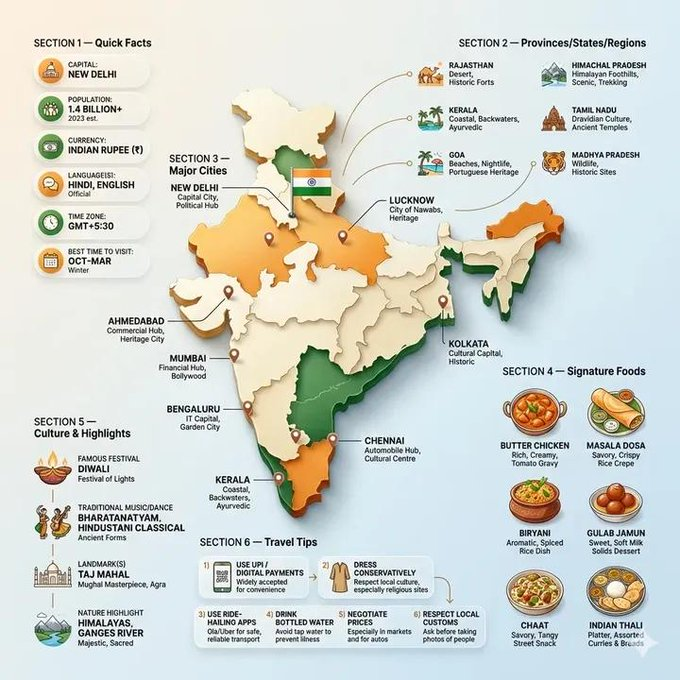

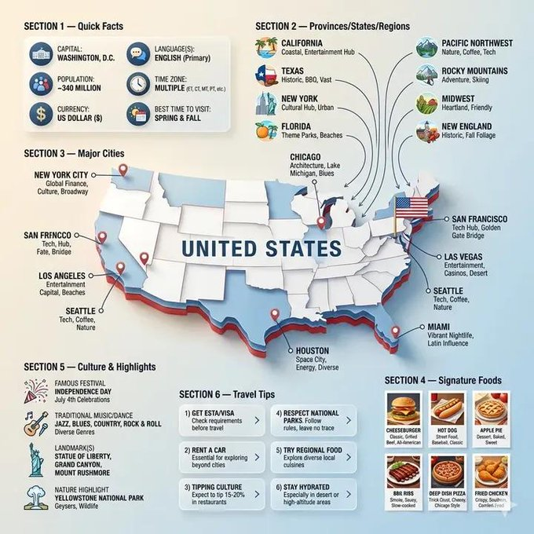

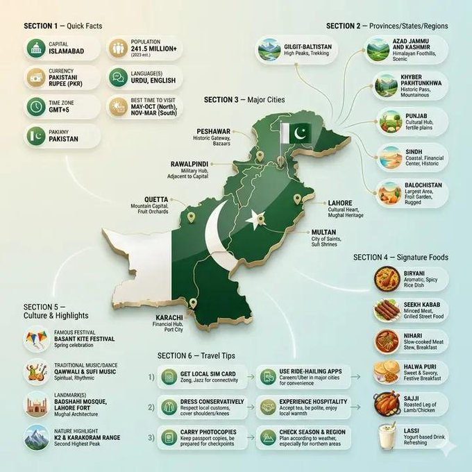

```
[COUNTRY] — ultra-clean infographic poster (editorial + lifestyle)

Generated by Google Nano Banana Pro on Gemini app  

Full prompt 

Ultra-clean modern country infographic poster (1080x1080), premium editorial layout meets lifestyle travel photography.

Showcase [ENTER COUNTRY NAME] as the hero visual in the center: a slightly angled 3D map cutout / glossy paper-cut map silhouette with subtle shadow, with a small flag pin marker on the capital city. Add a soft natural studio lighting feel, gentle gradient + minimal texture background for an upscale magazine look.

Around the hero map, arrange information like a recipe infographic—dynamic, floating panels and clusters, not restricted to top-down. Clear hierarchy: hero map > key stats badges > cities/provinces > culture/foods > tips.

SECTION 1 — Quick Facts (clean glassmorphism badges near the hero):
- Capital: [CAPITAL]
- Population: [POPULATION]
- Currency: [CURRENCY]
- Language(s): [LANGUAGES]
- Time zone: [TIMEZONE]
- Best time to visit: [BEST SEASON]
Display as modern rounded pills/bubbles with accent color highlights.

SECTION 2 — Provinces/States/Regions (ingredients-style clusters):
List [NUMBER] provinces/regions with mini icons/mini map segments or simple pictograms.
Example: [PROVINCE 1], [PROVINCE 2], [PROVINCE 3]...
Each item includes a small icon (mountains, river, desert, forest, coastline) and one short label (e.g., “coastal”, “historic”, “wine region”). Arrange in curved flows connected with thin lines to the map.

SECTION 3 — Major Cities (connected pin points):
Show 5–8 key cities with small pin markers on/near the map and clean labels:
[City 1], [City 2], [City 3]...
Use lines/arrows from labels to map pins, avoiding clutter.

SECTION 4 — Signature Foods (recipe vibe):
Show 4–6 famous foods of [COUNTRY] with small tasty mini illustrations or photo-style cutouts:
[Food 1], [Food 2], [Food 3]...
Add short descriptors (spicy, street food, dessert, grilled). Keep vibrant natural food colors.

SECTION 5 — Culture & Highlights (editorial callouts):
Include icons and 1-line notes for:
- Famous festival: [FESTIVAL]
- Traditional music/dance: [CULTURE]
- Landmark(s): [LANDMARKS]
- Nature highlight: [NATURE]
Use clean vector icons and minimal text.

SECTION 6 — Travel Tips (step-like numbered panels):
Show 4–6 numbered “tips” panels arranged around the hero map with arrows showing flow:
1) [Tip 1]
2) [Tip 2]
3) [Tip 3]
Add small icons (plane, train, hotel, safety, budget, camera, SIM card). Use glassmorphism panels with soft gradients and subtle drop shadows.

Typography & Style:
Modern sans-serif typography, high readability, strong grid alignment, airy negative space, subtle shadows, crisp vector icons, accent color palette inspired by [COUNTRY] flag (tasteful, not overwhelming). Editorial, premium, ultra-clean, social-feed optimized.

Output requirements:
Ultra-crisp, no watermark, no logo, no extra text beyond the provided labels, balanced spacing, high contrast readability, 1080×1080.
```

```
[国家]——超简洁信息图海报（编辑风格 + 生活方式）

由 Google Nano Banana Pro 在 Gemini 应用中生成

完整提示词：

超简洁现代国家信息图海报（1080x1080），高端编辑排版融合生活方式旅行摄影风格。

中央突出展示[输入国家名称]作为主视觉：略微倾斜的3D地图剪影 / 光面纸艺地图轮廓，带有微妙阴影，首都位置标注一枚小巧国旗图钉。整体采用柔和自然的影棚灯光效果，背景为轻柔渐变与极简纹理，营造高端杂志质感。

围绕主地图，以食谱信息图的方式动态布局浮动面板与信息簇，不拘泥于自上而下的传统结构。信息层级清晰：主地图 > 核心数据徽章 > 省份/城市 > 文化/美食 > 旅行贴士。

第一部分——快速概览（主地图附近采用玻璃拟态风格徽章）：
- 首都：[首都]
- 人口：[人口]
- 货币：[货币]
- 语言：[语言]
- 时区：[时区]
- 最佳旅行季节：[最佳季节]  
以现代圆角胶囊/气泡形式呈现，搭配强调色高亮。

第二部分——省份/州/地区（食材式信息簇）：
列出[数量]个省份/地区，每个配以微型图标/小地图片段或简易象形图。  
例如：[省份1]、[省份2]、[省份3]……  
每项包含一个小型图标（山脉、河流、沙漠、森林、海岸线）和一句简短标签（如“滨海”、“历史古城”、“葡萄酒产区”）。沿曲线流线排布，并以细线连接至主地图。

第三部分——主要城市（带连接图钉）：
在地图上/附近标注5–8座重点城市，使用小巧图钉标记并附清晰标签：  
[城市1]、[城市2]、[城市3]……  
标签通过线条/箭头指向地图图钉，避免杂乱。

第四部分——代表性美食（食谱风格）：
展示该国4–6种著名美食，配以精致迷你插画或照片风格剪影：  
[美食1]、[美食2]、[美食3]……  
添加简短描述词（如“辛辣”、“街头小吃”、“甜点”、“烧烤”），保留食物鲜活自然的色彩。

第五部分——文化与亮点（编辑式注解）：
包含图标及一行简注，涵盖以下内容：  
- 著名节日：[节日]  
- 传统音乐/舞蹈：[文化]  
- 地标：[地标]  
- 自然奇观：[自然]  
使用简洁矢量图标与极简文字。

第六部分——旅行贴士（阶梯式编号面板）：
在主地图周围布置4–6个编号“贴士”面板，以箭头指示阅读顺序：  
1) [贴士1]  
2) [贴士2]  
3) [贴士3]  
配以小型图标（飞机、火车、酒店、安全、预算、相机、SIM卡）。面板采用玻璃拟态设计，搭配柔和渐变与细微投影。

字体与风格：  
现代无衬线字体，高可读性，强网格对齐，留白通透，阴影细腻，图标锐利清晰，强调色系灵感源自[国家]国旗（雅致而不喧宾夺主）。整体风格为编辑感、高端、超简洁，适配社交媒体展示。

输出要求：  
超高清画质，无水印、无Logo、无额外文字（仅限提供标签内容），间距均衡，高对比度确保可读性，尺寸1080×1080。
```

 [↑返回目录](#toc)

---
## <a id="">等待评论中的提示词</a> (<a href="https://x.com/TechieBySA/status/2013677966283149542" target="_blank" rel="noopener noreferrer">TechieSA</a>)

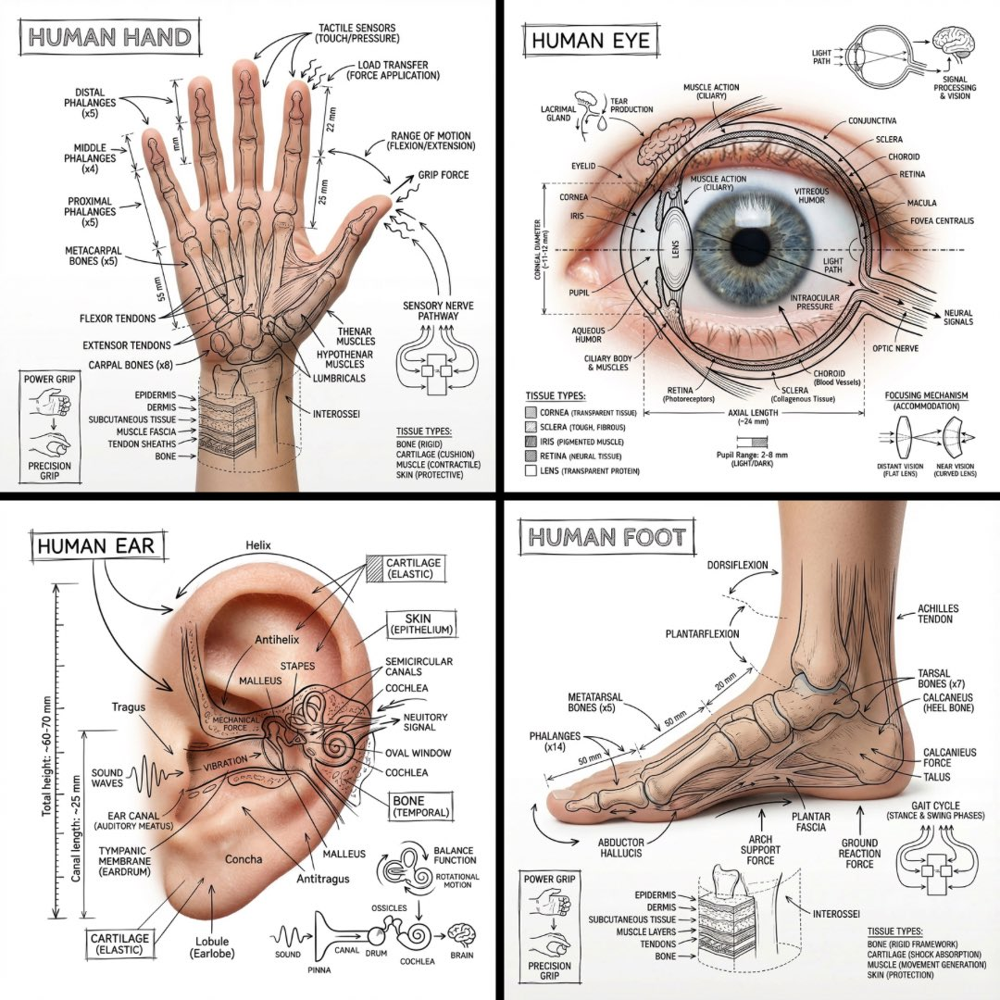


```
Create an infographic image of [BODY PART], combining a realistic photograph or photoreal render of the object with technical annotation overlays placed directly on top.

Use black ink–style line drawings and text (technical pen / architectural sketch look) on a pure white studio background, including:
•Key component labels
•Internal cutaway or exploded-view outlines
•Measurements, dimensions, and scale markers
•Material callouts and quantities
•Arrows indicating function, force, or flow (air, sound, power, pressure)
•Simple schematic or sectional diagrams where relevant

Place the title [BODY PART] inside a hand-drawn technical annotation box in one corner.

Style & layout rules:
•The real object remains clearly visible beneath the annotations
•Annotations feel sketched, technical, and architectural
•Clean composition with balanced negative space
•Educational, museum-exhibit / engineering-manual vibe

Visual style:
Minimal technical illustration aesthetic, black linework over realistic imagery, precise but slightly hand-drawn feel.

Color palette:
White background, black annotation lines and text only. No colors.

Output:
1080×1080, ultra-crisp, social-feed optimized, no watermark.
```

```
创建一个关于[身体部位]的信息图图像，结合对象的真实照片或逼真的渲染与直接放置在顶部的技术注释覆盖层。

使用纯白色工作室背景上的黑色墨水风格线条画和文字（技术笔/建筑草图外观），包括：
- 关键组件标签
- 内部剖视或爆炸视图轮廓
- 尺寸、尺寸标注和比例标记
- 材料标注和数量
- 指示功能、力或流动方向（空气、声音、电力、压力）的箭头
- 相关的简单示意图或截面图

将标题[身体部位]置于一角的手绘技术注释框内。

样式和布局规则：
- 注释下真实物体保持清晰可见
- 注释具有草图感、技术性和建筑性
- 清晰的构图与平衡的负空间
- 教育性的博物馆展览/工程手册氛围

视觉风格：
极简技术插图美学，现实主义图像上的黑色线条，精确但略带手绘感觉。

色彩方案：
白色背景，仅黑色注释线和文本。无颜色。

输出规格：
1080×1080，超高清，适合社交信息流，无水印。
```

 [↑返回目录](#toc)

---
## <a id="">清爽冰镇雪碧，现代极简信息图</a> (<a href="https://x.com/Strength04_X/status/2013857997102162089" target="_blank" rel="noopener noreferrer">𝐌</a>)

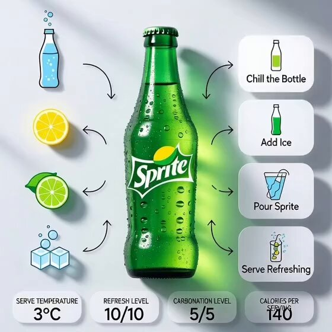


```
A modern, clean product infographic featuring a chilled Sprite bottle at the center of the composition. The bottle stands upright on a minimal surface, covered with icy condensation droplets and light frost. The iconic green Sprite label is bright, fresh, and vibrant. Crisp lemon-lime tones dominate the scene. Background is soft light grey with subtle gradients and soft shadows, giving a refreshing, premium commercial look.

Surrounding the central Sprite bottle are neatly arranged ingredient and element icons in a minimal flat-illustration style: carbonated water, lemon slice, lime slice, ice cubes, bubbles, and glass bottle icon. Thin curved arrows flow from each icon toward the bottle, creating a clean, balanced infographic layout.

*On the right side, rounded white step cards with soft shadows display the process:

1. Chill the Bottle

2. Add Ice

3. Pour Sprite

4. Serve Refreshing*

Each step includes small, simple illustrations (ice bucket, pouring soda, glass with ice and bubbles) and short clean text.

At the bottom corner, minimal infographic badges show: serve temperature, refresh level, carbonation level, calories per serving, and serving size.

Minimal UI design, modern typography, balanced spacing, high-end beverage advertising style, photorealistic bottle texture, glossy highlights, ultra-high resolution, editorial soda infographic, Instagram-ready.

Aspect Ratio: 1:1

Image Size: 1080 × 1080 pixels
```

```
现代、干净的产品信息图，中心展示一瓶冰镇的雪碧。瓶子直立放置在简约的表面上，瓶身布满冰冷凝结的小水滴和轻微的霜花。标志性的绿色雪碧标签鲜明、清新且充满活力。场景主要由清新的柠檬青柠色调主导。背景为柔和的浅灰色，带有微妙的渐变和柔和的阴影，呈现出清爽的高端商业外观。

围绕中心的雪碧瓶，周围整齐排列着成分和元素图标，采用极简平面插画风格：碳酸水、柠檬片、莱姆片、冰块、气泡和玻璃瓶图标。从每个图标流出细长的曲线箭头指向瓶子，形成一个干净、平衡的信息图布局。

*在右侧，圆角白色步骤卡片带有柔和阴影，展示了过程：

1. 冰镇瓶子

2. 加入冰块

3. 倒入雪碧

4. 享用清爽*

每一步骤包含小而简单的插图（冰桶、倒苏打水、装有冰块和气泡的杯子）和简洁的文字说明。

在底部角落，极简的信息图徽章显示：服务温度、清爽程度、碳酸化程度、每份热量及份量。

极简UI设计、现代字体排版、均衡的空间分布、高端饮品广告风格、照片级真实的瓶子纹理、光泽亮点、超高分辨率、编辑用苏打信息图、适合Instagram发布。

宽高比：1:1

图像大小：1080 × 1080像素
```

 [↑返回目录](#toc)

---
## <a id="">橙子与牛奶的瞬间飞溅</a> (<a href="https://x.com/Just_sharon7/status/2013660094664446322" target="_blank" rel="noopener noreferrer">Sharon Riley</a>)

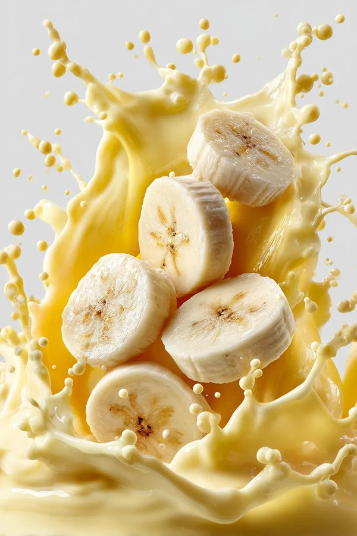

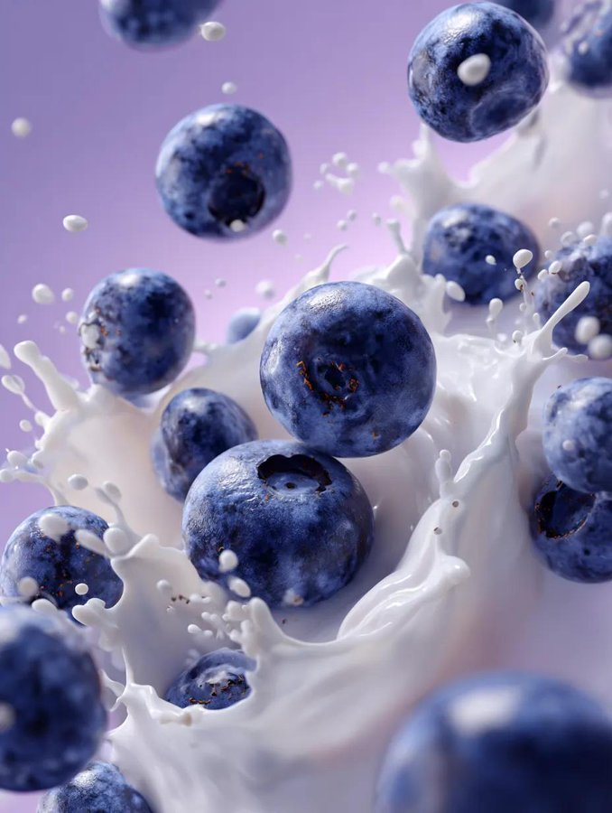

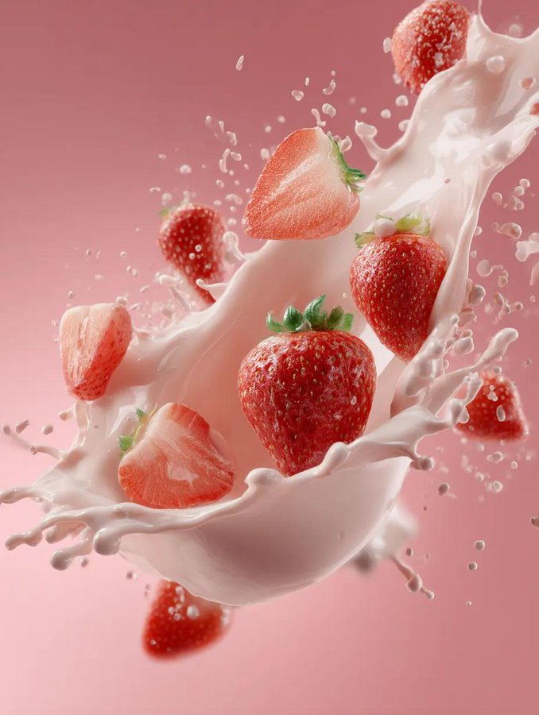

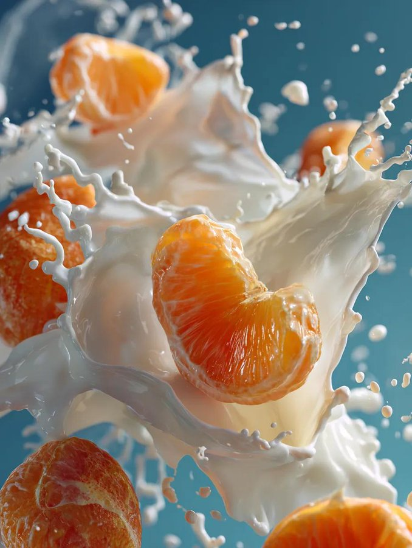

```
"subject": {
    "primary": "Vibrant orange slices",
    "action": "Falling through the air toward rising milk",
    "secondary": "Thick, glossy white milk splash forming arcs and crown-like curves",
    "details": "Milk droplets frozen mid-air with creamy texture"
  },
  "environment": {
    "background": "Clean blue studio backdrop",
    "lighting": "Cinematic soft studio lighting with dramatic highlights and shadows"
  },
  "visual_style": {
    "genre": "Ultra-realistic commercial splash photography",
    "textures": "High-detail creamy milk and fresh citrus pulp",
    "motion": "Frozen action, high-speed capture",
    "depth_of_field": "Shallow depth of field"
  },
  "camera": {
    "lens": "85mm macro",
    "framing": "Wide composition",
    "focus": "Sharp focus on splash and fruit"
  },
  "composition": {
    "aspect_ratio": "3:4",
    "color_palette": ["Vibrant Orange", "Pure White", "Clean Blue"]
  },
  "quality": {
    "detail_level": "Ultra-high detail",
    "rendering": "Photorealistic"
  },
  "profile": "9ewnbdc"
}
```

```
宽幅微距飞溅摄影：鲜艳的橙子切片从空中坠落，迎向向上飞溅的浓稠亮白牛奶；牛奶飞溅形成弧线与皇冠状曲线，奶滴在空中凝固，呈现柔滑质感。背景为干净的蓝色影棚幕布，采用电影感柔和影棚灯光，具有强烈的高光与阴影对比。整体风格为超写实商业飞溅摄影，强调高细节的柔滑牛奶与新鲜柑橘果肉纹理，动作瞬间被高速捕捉冻结，浅景深突出主体。使用85毫米微距镜头，宽幅构图，焦点清晰落在飞溅液体与水果上。画面比例3:4，配色以鲜艳橙、纯白与洁净蓝为主。画质为超高细节、照片级真实感。
```

 [↑返回目录](#toc)

---
## <a id="">现代罗宋汤食谱信息图</a> (<a href="https://x.com/oggii_0/status/2013803805725659192" target="_blank" rel="noopener noreferrer">Oogie</a>)

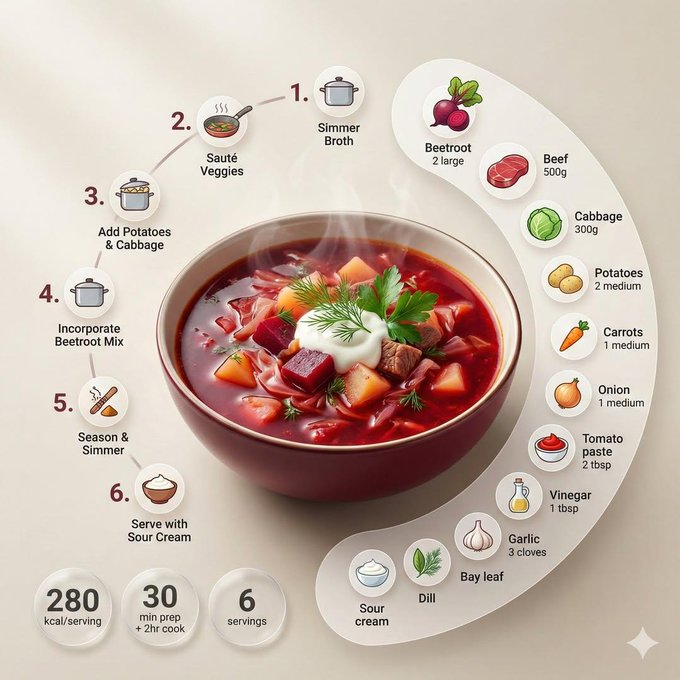


```
Ultra-clean modern recipe infographic. Feature Borscht (rich ruby-red borscht in a deep bowl, topped with sour cream and fresh herbs; clearly visible chunks of beetroot, cabbage, and meat; gentle steam rising; thick, hearty texture; looks hot and freshly cooked) as a finished dish, shown in a slight angled perspective as the main hero visual.

Arrange ingredients, cooking steps, and helpful tips around the dish in a dynamic magazine-style layout, not restricted to a strict top-down view.

Ingredients section

Use icons or mini-illustrations for each ingredient with the exact quantity. Place them as groups, lists, or circular diagrams, visually connected to the main dish.

Steps section

Show the cooking process using numbered panels, arrows, or connecting lines that create a clear visual route around the bowl. Add small process icons (knife, pot, stove, timer) where appropriate.

Optional additional info

Include total calories, prep time + cook time, and number of servings as clean, minimal badges/bubbles near the dish.

Visual style

A blend of magazine infographic design and lifestyle food photography. Use bright natural food colors, soft drop shadows, clean vector icons, modern typography, and soft gradients or glassmorphism panels for the step blocks. Accent colors may highlight key information such as calories or cooking time.

Composition priorities

1. Finished dish (main hero)

2. Cooking steps

3. Ingredients

4. Additional info

Maintain enough negative space so the design feels light, premium, clean, and highly readable.

Lighting & background

Soft natural studio lighting. Minimal textured or gradient background to create a premium magazine look.

Output

1080×1080, ultra-sharp, optimized for social media feed, no watermarks.
```

```
超简洁现代食谱信息图。主视觉为一道完成的罗宋汤（深碗中盛着浓郁宝石红色的罗宋汤，表面点缀酸奶油和新鲜香草；清晰可见甜菜根、卷心菜和肉块；微微升腾着热气；浓稠丰盛的质地；看起来热气腾腾、刚出锅），以略微倾斜的角度呈现，作为画面核心焦点。

围绕主菜以动态杂志风格布局展示食材、烹饪步骤和实用小贴士，不局限于严格的俯视视角。

食材部分  
使用图标或微型插图表示每种食材，并标注确切用量。将它们以组合、列表或环形图形式排列，并在视觉上与主菜相连。

步骤部分  
通过编号面板、箭头或连接线展示烹饪流程，在碗周围形成清晰的视觉路径。适当加入小型过程图标（如刀、锅、炉灶、计时器）。

可选附加信息  
在主菜附近以简洁极简风格的徽章或气泡形式标明总热量、准备时间+烹饪时间以及份量数。

视觉风格  
融合杂志信息图设计与生活化美食摄影风格。采用明亮自然的食物色彩、柔和投影、干净的矢量图标、现代字体，以及柔和渐变或毛玻璃效果面板用于步骤区块。重点信息（如热量或烹饪时间）可用强调色突出。

构图优先级  
1. 成品主菜（核心焦点）  
2. 烹饪步骤  
3. 食材  
4. 附加信息  

保留充足留白，使整体设计显得轻盈、高端、干净且高度易读。

灯光与背景  
柔和自然的影棚灯光。背景采用极简纹理或渐变，营造高端杂志感。

输出要求  
1080×1080，超高清画质，专为社交媒体信息流优化，无水印。
```

 [↑返回目录](#toc)

---
## <a id="">东方工笔线描融合风格：银版旧梦</a> (<a href="https://x.com/VoxcatAI/status/2014256556792254944" target="_blank" rel="noopener noreferrer">VoxCat</a>)

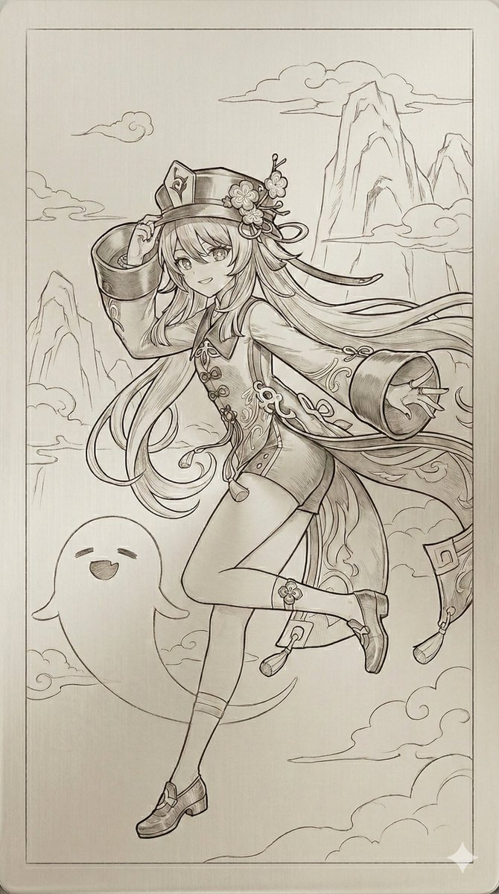

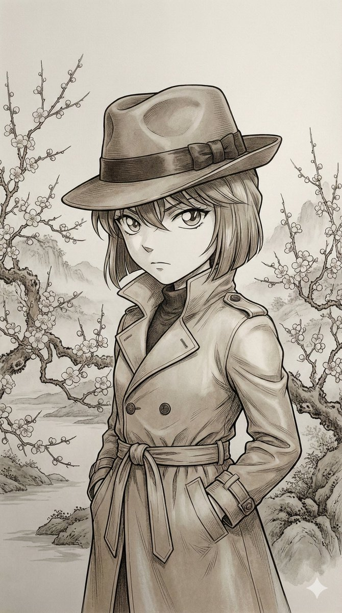

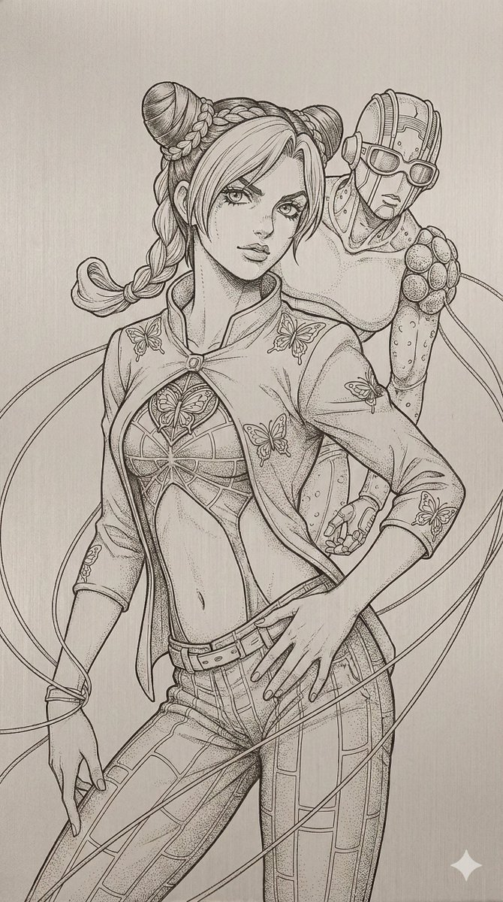

```
AI绘画风格篇｜银版旧梦 (Silverplate Dream)

把「银版照相的冷静质感」和「东方工笔线描」融合，再保留轻微金属反光与细密刻线—— 这就是我最近在用的融合风格：银版旧梦。

核心气质：冷静、古典、精致、疏离等。

 风格关键词
银版质感：微金属感、轻反光、低对比
工笔线描：细密线条、结构清晰
单色微赭：黑白为主，淡淡棕褐

 风格特调版（完整版｜干净无做旧）
Style: Daguerreotype silverplate photography + Chinese gongbi linework + subtle hand-rubbed print texture.
Monochrome with faint sepia tint, subtle metallic sheen, fine hairline lines, delicate engraving-like details.
Clean paper surface, smooth tone, no vignette, no aging effects, no scratches, no stains, no borders or frames.

Negative（建议固定加）
no vignette, no frame, no border, no paper edge,
no scratches, no stains, no aging effects,
no neon, no glossy 3D, no modern digital look, no saturated colors, no anime lineart

 快速使用方法（3步）

先写：主体 + 场景 + 构图 + 光影
再贴：风格特调版
最后加：Negative 防跑偏

 避坑提醒
不要写 photorealistic / 3D / glossy
不要强调复古老化（会触发暗角/边框）
想更干净：加 "flat light"、"even exposure"、"edge-to-edge clean"

#AIart #AI绘画 #风格研究
```

```
3:4 竖幅构图。画面上方保留约 55% 大面积留白；主体为【人物】的半身肖像，置于画面下方偏中，肩线端正、姿态含蓄，微侧身回眸。保持【人物】的原角色特征不变（脸型、发型结构、刘海形状、五官比例与气质不改），仅更换为本提示词指定的新技法与服饰设定。

服饰设定：明制立领短袄与对襟褙子，衣缘细窄滚边；下装仅露出素雅马面裙上段。发式设定：在不改变【人物】原发型结构与长度的前提下做明代气质整理，簪钗简净，少量鎏金点到为止。

新技法描绘：五官与衣纹以工笔级细线勾勒，线条清而有轻重变化；肤色与衣褶以工笔“薄染叠染”塑形，但整体画面采用现代矢量的分区平涂与极克制两段明度阴影；边缘干净锐利、无噪点、无厚涂。

点景：仅一枝花鸟从画面右上斜向伸入留白。疏梅枝干以枯笔线感呈现，淡粉梅花数朵；梅梢停一只【动物】，姿态安静精致。花鸟细节同样工笔线描，但色面矢量化、清爽克制。

背景为温润的绢本/熟宣轻纹理，留白处带淡淡灰青空气感。整体气质端丽、雅正、清澈、克制。

避免：水墨大面积晕染、摄影景深虚化、3D 渲染高光、粗黑漫画线、霓虹高饱和、复杂国潮纹样堆满、夸张装饰抢主体。
输出：高清细节，线条干净，留白比例严格遵守。

人物为【】，动物为【】
```

 [↑返回目录](#toc)

---
## <a id="">多样发型的中性风格人像摄影</a> (<a href="https://x.com/MissCat_AI/status/2014167646682648794" target="_blank" rel="noopener noreferrer">猫小姐学AI</a>)

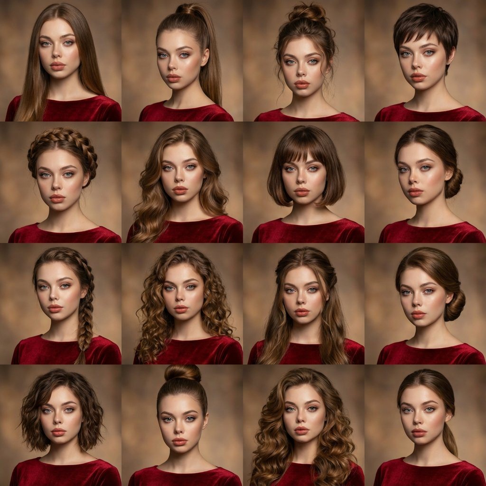

```
一张高质量照片拼贴，同一个人具有相同的面部特征和表情，多个画框展示不同发型。每个面板展示独特发型如长直发、高马尾、蓬乱发髻、超短发、辫子皇冠、柔和波浪卷、齐肩短发、低发髻、侧编辫、蓬松卷。所有图像保持一致的中性服装和妆容，柔和棚拍灯光，温暖模糊背景，逼真肤质，对称脸部一致性，超细节，编辑美妆效果，4x3 网格布局，专业人像摄影
```

 [↑返回目录](#toc)

---
## <a id="">雪豹野外研究档案板</a> (<a href="https://x.com/AllaAisling/status/2014017858607399325" target="_blank" rel="noopener noreferrer">Alexandra Aisling</a>)

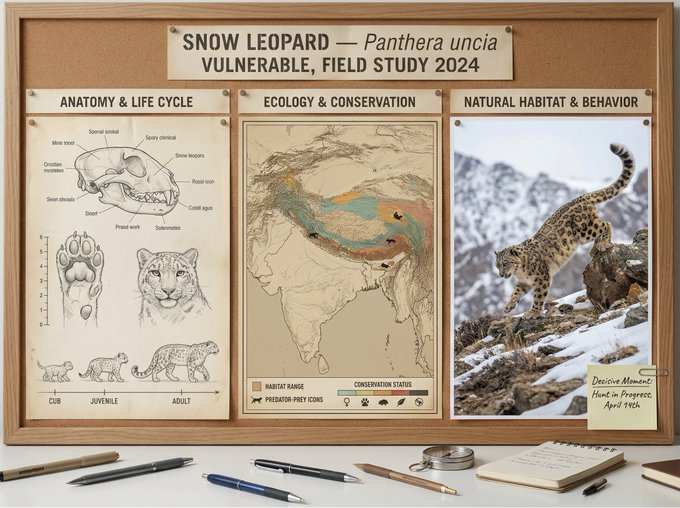

```
A field researcher's documentation board for snow leopard — Panthera uncia / Central Asian high altitude mountains. Left section: scientific illustration showing anatomical details, life-cycle stages, or seasonal variation, with measurement scales and taxonomic classification. Center section: ecological context map showing range, habitat preferences, predator-prey relationships, and conservation status indicators. Right section: the subject in its natural habitat, captured in a decisive moment, behavior visible, environment authentic, the data made alive. Visual style transitions from specimen-drawer clinical through cartographic neutrals to National Geographic field photography. Title block reading "SNOW LEOPARD — Panthera uncia, VULNERABLE, FIELD STUDY 2024".
```

```
雪豹（Panthera uncia）野外研究人员的记录展板——中亚高海拔山区。左侧部分：科学插图，展示解剖细节、生命周期阶段或季节性变化，并附有比例尺和分类学信息。中间部分：生态背景地图，显示分布范围、栖息地偏好、捕食者-猎物关系及保护现状指标。右侧部分：雪豹在其自然栖息地中的决定性瞬间，行为清晰可见，环境真实可信，使数据鲜活起来。整体视觉风格从标本抽屉式的临床精确，过渡到地图般的中性色调，再转为《国家地理》风格的野外摄影。标题栏写着：“雪豹——Panthera uncia，易危物种，2024年野外研究”。
```

```
A field researcher's documentation board for [ANIMAL / PLANT / ORGANISM] — [SCIENTIFIC NAME / HABITAT]. Left section: scientific illustration showing anatomical details, life-cycle stages, or seasonal variation, with measurement scales and taxonomic classification. Center section: ecological context map showing range, habitat preferences, predator-prey relationships, and conservation status indicators. Right section: the subject in its natural habitat, captured in a decisive moment, behavior visible, environment authentic, the data made alive. Visual style transitions from specimen-drawer clinical through cartographic neutrals to National Geographic field photography. Title block reading "[COMMON NAME] — [SCIENTIFIC NAME], [CONSERVATION STATUS], FIELD STUDY [YEAR]". 
```

 [↑返回目录](#toc)

---
## <a id="">土耳其饺子Mantı的现代食谱信息图</a> (<a href="https://x.com/miilesus/status/2014041994192900143" target="_blank" rel="noopener noreferrer">Melis</a>)

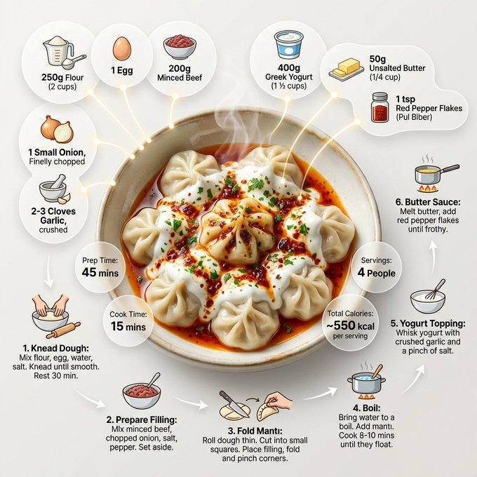

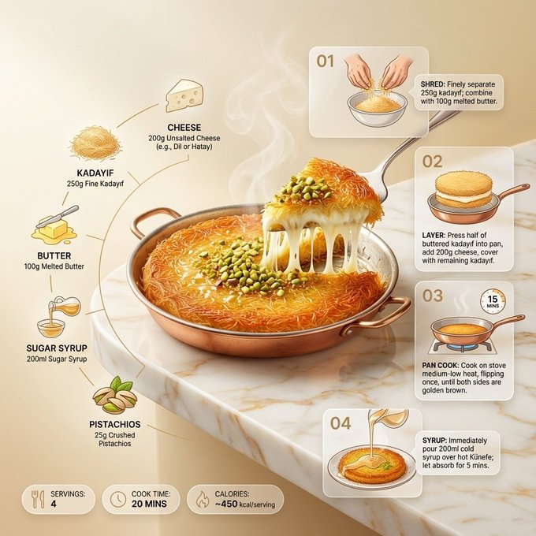

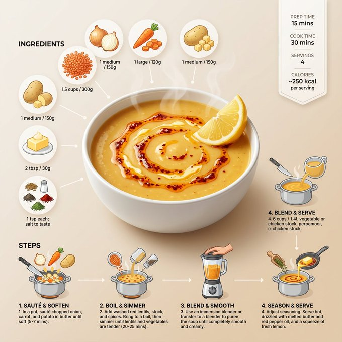

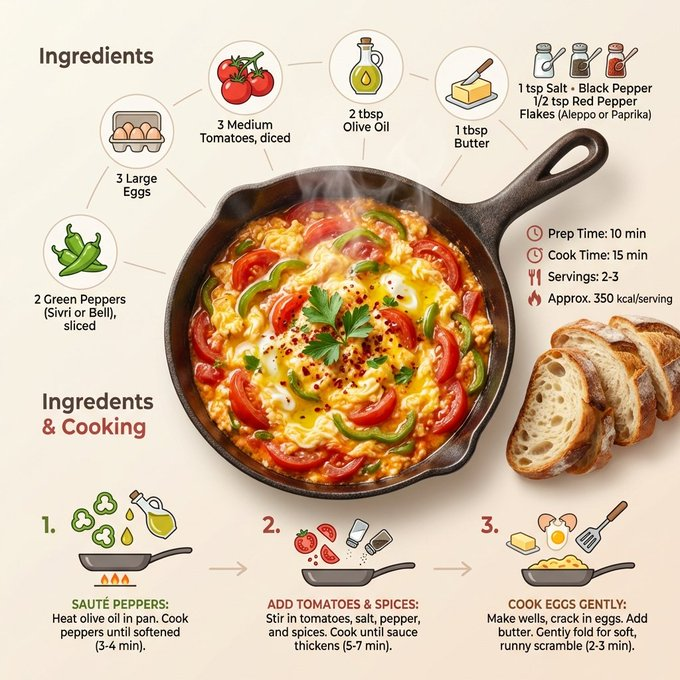


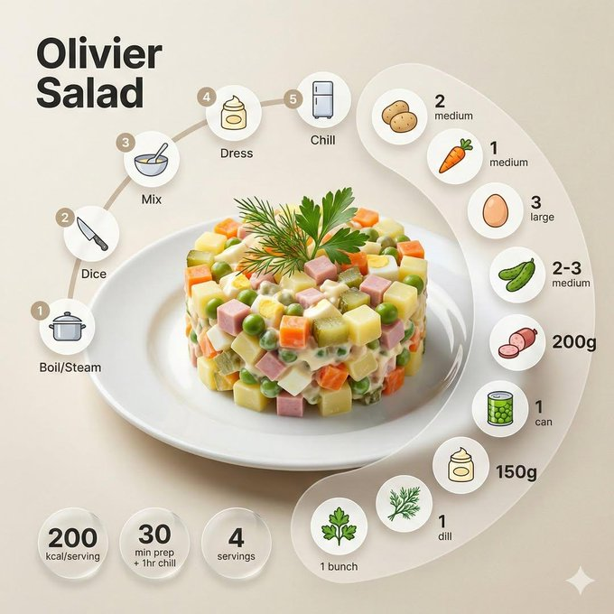

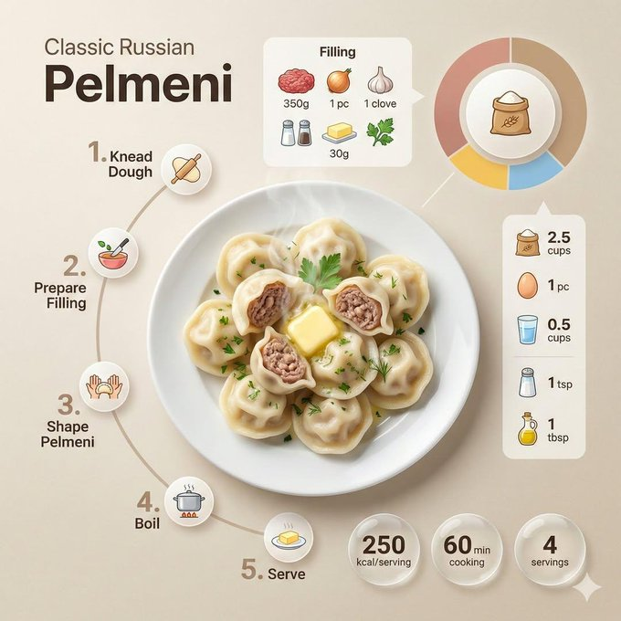

```
Mantı prompt: Ultra-clean modern recipe infographic, Turkish Mantı as the hero dish.
Finished dish: plump handmade mantı dumplings in a shallow ceramic bowl, generously topped with creamy garlic yogurt and sizzling butter infused with red pepper flakes; finely chopped parsley sprinkled on top; steam gently rising; dumplings glossy and soft, clearly defined folds; looks hot and freshly served.
Arrange ingredients, cooking steps, and helpful tips around the bowl in a dynamic magazine-style layout, not strictly top-down.

Ingredients section:
Use minimal vector icons or mini-illustrations for each ingredient with exact quantities (flour, egg, minced beef, onion, garlic yogurt, butter, red pepper flakes). Ingredients grouped in circular or flowing clusters visually connected to the dish.

Steps section:
Show the process with numbered panels wrapping around the dish: dough kneading, filling, folding mantı, boiling, yogurt topping, butter sauce. Use small icons (rolling pin, knife, pot, stove).
Optional info badges:
Prep time, cook time, servings, total calories displayed as clean glassmorphism bubbles near the bowl.

Visual style:
Magazine-quality food photography mixed with modern infographic design. Bright natural food colors, soft drop shadows, clean vector icons, elegant modern typography, subtle gradients.
Soft natural studio lighting, minimal textured or gradient background, premium editorial look.

1080×1080, ultra-sharp, no watermark, optimized for social media feed.
```

```
超简洁现代食谱信息图，以土耳其饺子（Mantı）为主角。  
成品展示：浅陶瓷碗中盛满饱满的手工Mantı饺子，淋上大量奶油蒜香酸奶和滋滋作响的红辣椒片黄油酱；顶部撒有切碎的新鲜欧芹；热气缓缓升腾；饺子表面光润柔软，褶皱清晰分明，看起来滚烫新鲜刚出锅。  

围绕碗体以动态杂志风格布局排列食材、烹饪步骤与实用小贴士，不采用严格的自上而下结构。  

**食材部分**：  
使用极简矢量图标或微型插图呈现每种食材，并标注精确用量（面粉、鸡蛋、牛肉末、洋葱、蒜香酸奶、黄油、红辣椒片）。食材以圆形或流动式簇群分组，视觉上与主菜紧密关联。  

**步骤部分**：  
以环绕主碗的编号面板展示制作流程：揉面、调馅、包制Mantı、煮制、淋酸奶、制作黄油酱。配以小型图标（擀面杖、刀、锅、炉灶）。  

**可选信息标签**：  
准备时间、烹饪时间、份量、总热量以干净通透的毛玻璃效果气泡形式置于碗旁。  

**视觉风格**：  
融合杂志级美食摄影与现代信息图设计。色彩明亮自然，投影柔和，图标为简洁矢量风格，字体优雅现代，辅以微妙渐变。  
采用柔和自然的影棚灯光，背景为极简纹理或渐变，整体呈现高端编辑感。  

1080×1080分辨率，超高清，无水印，专为社交媒体信息流优化。
```

 [↑返回目录](#toc)

---
## <a id="">人体照片的技术注释</a> (<a href="https://x.com/kaanakz/status/2014069452275319128" target="_blank" rel="noopener noreferrer">Kaan</a>)

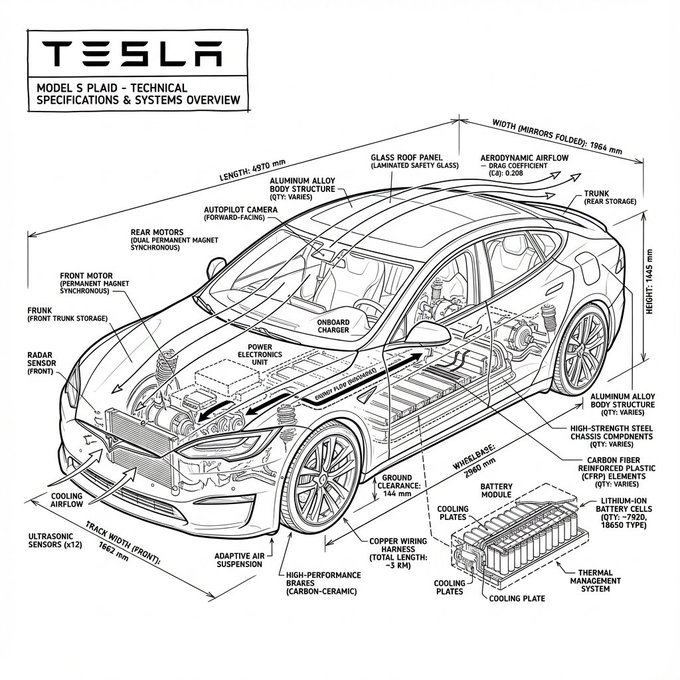

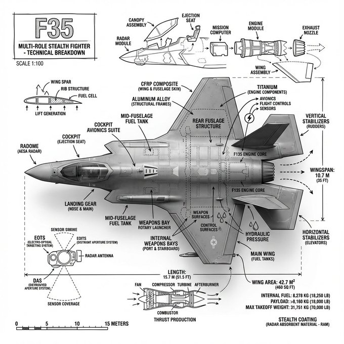

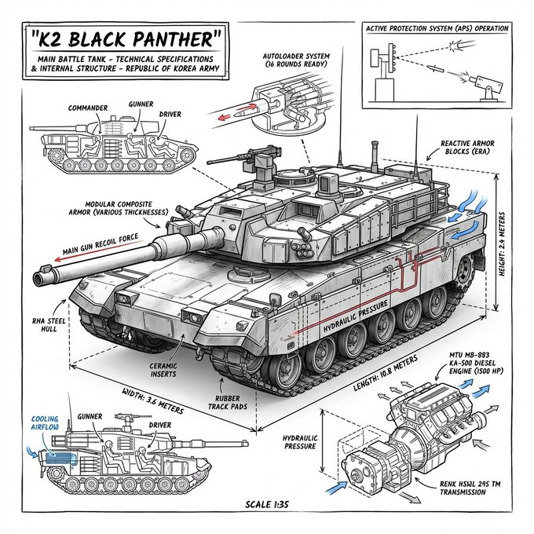

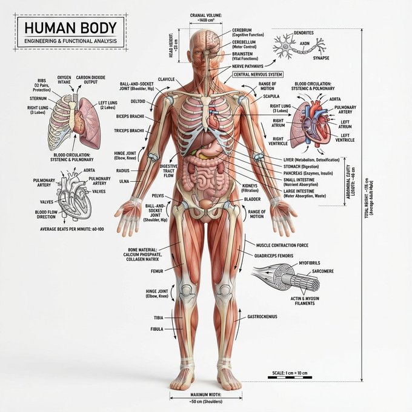

```
Create an infographic image of Human Body, combining a realistic photograph or photoreal render of the object with technical annotation overlays placed directly on top.
Use black ink–style line drawings and text (technical pen / architectural sketch look) on a pure white studio background, including:
•Key component labels
•Internal cutaway or exploded-view outlines
•Measurements, dimensions, and scale markers
•Material callouts and quantities
•Arrows indicating function, force, or flow (air, sound, power, pressure)
•Simple schematic or sectional diagrams where relevant
Place the title Human Body inside a hand-drawn technical annotation box in one corner.
Style & layout rules:
•The real object remains clearly visible beneath the annotations
•Annotations feel sketched, technical, and architectural
•Clean composition with balanced negative space
•Educational, museum-exhibit / engineering-manual vibe
Visual style:
Minimal technical illustration aesthetic, black linework over realistic imagery, precise but slightly hand-drawn feel.
Color palette:
White background, black annotation lines and text only. No colors.
Output:
1080×1080, ultra-crisp, social-feed optimized, no watermark.
```

```
创作一张人体信息图，将真实的人体照片或逼真渲染图像与直接叠加其上的技术注释相结合。  
使用黑色墨水风格的线条绘图和文字（技术绘图笔/建筑草图风格），置于纯白摄影棚背景上，包含以下元素：  
• 关键部位标签  
• 内部剖面或爆炸视图轮廓  
• 尺寸、测量数据与比例标尺  
• 材质标注及数量说明  
• 指示功能、力或流动方向（如空气、声音、动力、压力）的箭头  
• 在适当位置加入简化的示意图或剖面图  

在画面一角的手绘技术注释框内放置标题“Human Body”（人体）。  

风格与布局要求：  
• 注释下方的真实人体图像清晰可见  
• 注释呈现手绘感、技术感和建筑制图风格  
• 构图简洁，留白均衡  
• 整体传达教育性、博物馆展览或工程手册的氛围  

视觉风格：  
极简技术插画美学，黑色线稿叠加于写实图像之上，精准但略带手绘质感。  

配色方案：  
纯白背景，仅使用黑色注释线条与文字，无其他颜色。  

输出规格：  
1080×1080 像素，超高清，适配社交媒体展示，无水印。
```

 [↑返回目录](#toc)

---
## <a id="">山顶的手工黏土小屋</a> (<a href="https://x.com/BeanieBlossom/status/2014262777947545621" target="_blank" rel="noopener noreferrer">Beanie Blossom</a>)

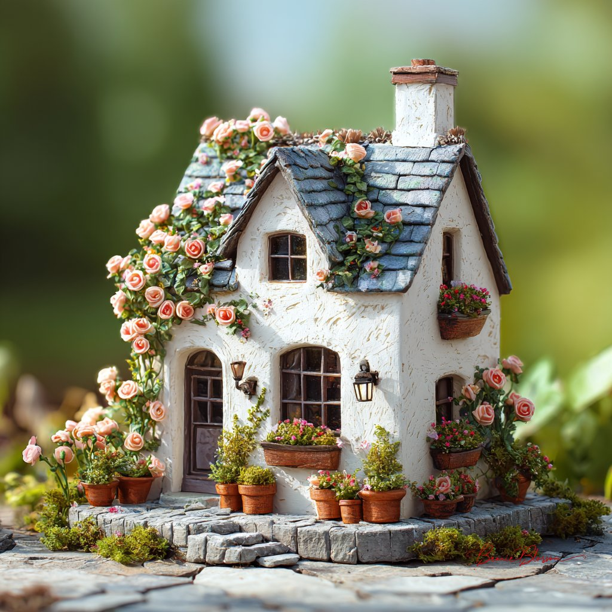

```
handmade white-painted clay house with roses on the roof, flower pots in front of the door and windows, a gray stone path around it, standing on top of a hill overlooking green trees, on a summer day, a realistic photo, high resolution.

Feel free to join in :)

#AIArtWork #AIArt #AIArtists #AIArtCommunity #PromptShare
```

```
手工制作的白色涂漆黏土房屋，屋顶上开满玫瑰，门前和窗前摆放着花盆，房屋周围有一条灰色石板小径，坐落在山顶，俯瞰着郁郁葱葱的绿树，夏日景象，逼真摄影风格，高分辨率。
```

 [↑返回目录](#toc)

---
## <a id="">极简超现实之思</a> (<a href="https://x.com/aleenaamiir/status/2014287568347734360" target="_blank" rel="noopener noreferrer">Aleena Amir</a>)

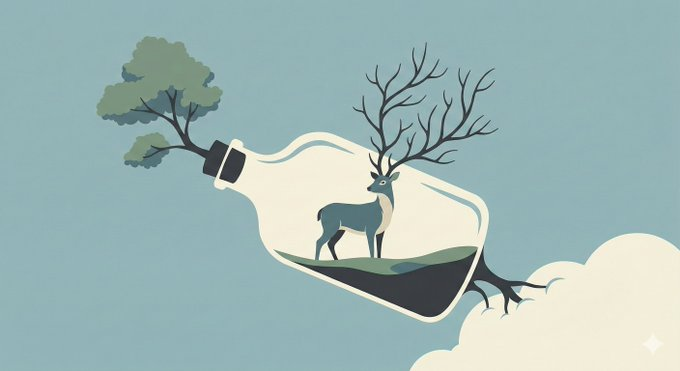

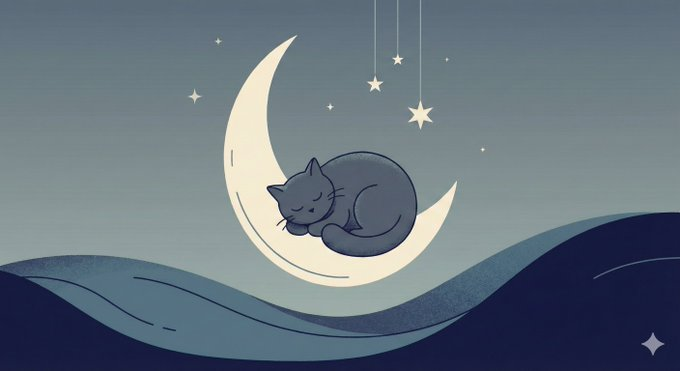

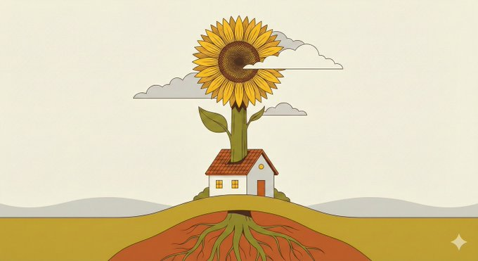

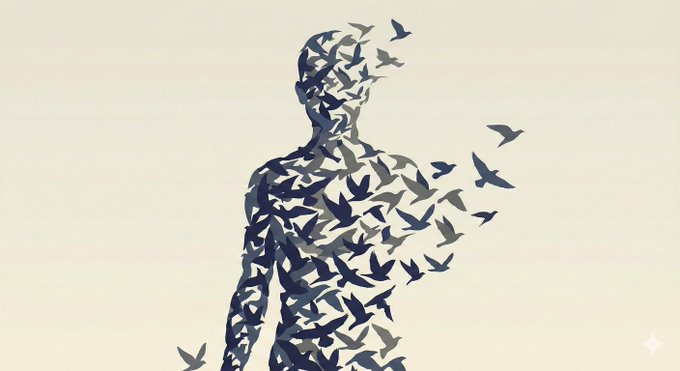

```
Minimal Surreal Concept Illustrations

Gemini Nano Banana Pro Prompt:

Create a surreal yet minimal illustration of [SUBJECT], where scale, placement, or context is subtly altered to provoke thought. Use clean shapes, limited colors, and a quiet background. The surrealism should feel poetic, not chaotic.
```

```
极简超现实概念插画

创作一幅超现实但极简的[主题]插画，通过微妙地改变比例、位置或情境来引发思考。使用简洁的形状、有限的色彩和安静的背景。超现实感应富有诗意，而非混乱。
```

 [↑返回目录](#toc)

---
## <a id="">甜系女友</a> (<a href="https://x.com/joshesye/status/2014147532277055742" target="_blank" rel="noopener noreferrer">行者AI视频</a>)

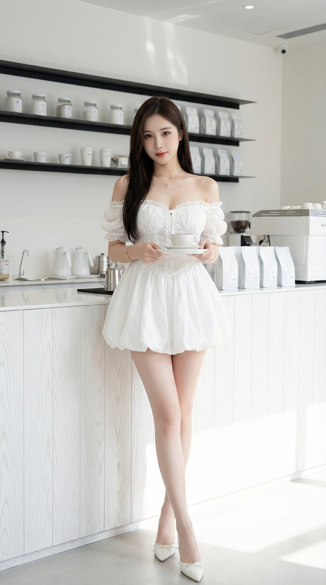

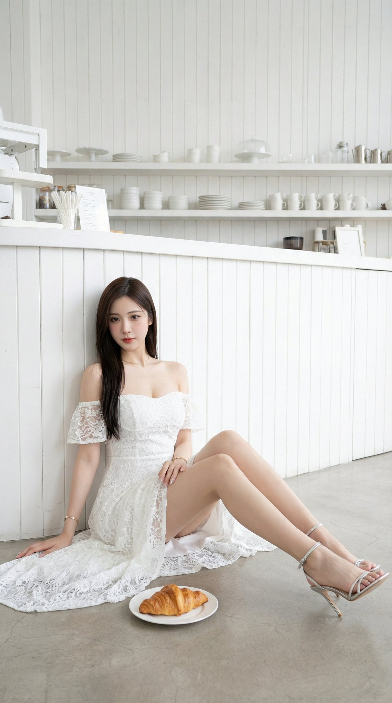

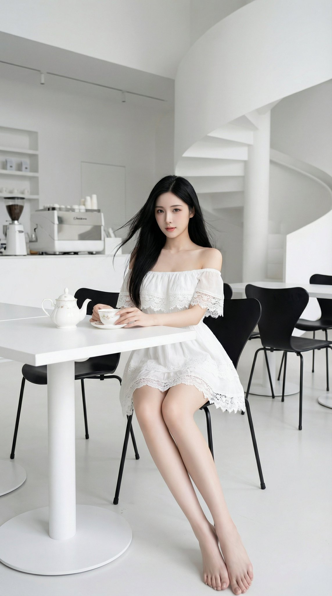

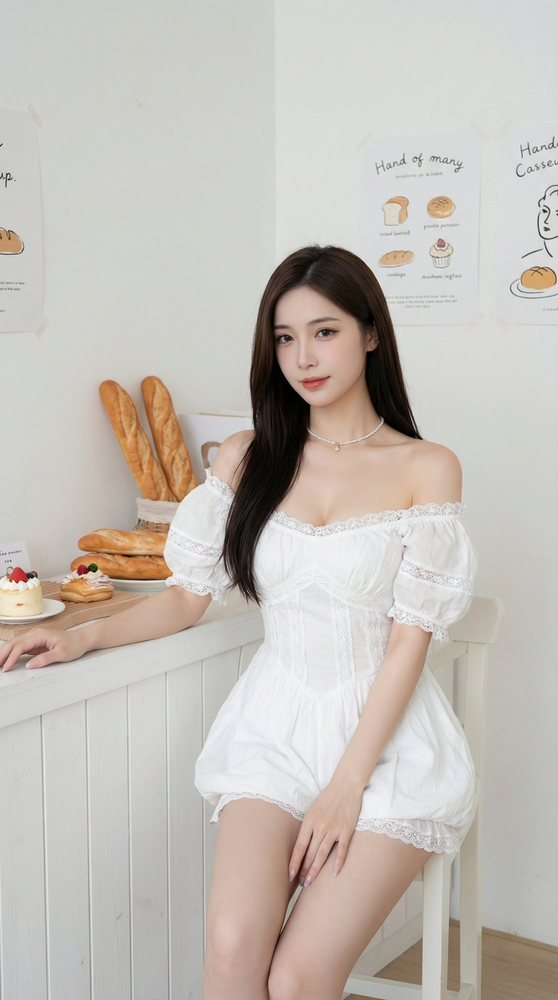

```
使用参考图像中的同一张脸，不改变面部特征，

一名留着黑色中短发和轻盈空气刘海的年轻亚洲女性，坐在现代机场候机室的灰色长椅上。她身穿一件厚实的灰色仿皮草外套，内搭灰色高领针织衫，下身穿着带有精致菱格纹理的灰色连裤袜，双腿交叠。她正低头专注地玩着手中的智能手机，身侧挎着一个黑色的绗缝皮质链条包。背景是宽敞明亮的航站楼，巨大的落地玻璃窗引入了清冷的自然光，远处可见其他乘客的身影，地面光洁且带有淡淡的倒影。整体画面呈现出一种高级灰的都市冷淡风调色，细节真实且富有生活气息。
```

```
使用参考图像中的同一张脸，不改变面部特征,

一位气质出众的长发亚洲女性，穿着洁白的露肩蕾丝连衣裙，优雅地席地而坐在极简风格的咖啡厅吧台前。她的双腿修长并向前延伸，脚踩银色细带高跟鞋。背景是纯白色的木质板条墙和简洁的货架，陈列着整齐的白色器皿。在她面前的地板上，放着一盘色泽金黄的可颂面包。室内光线明亮且均匀，呈现出一种高级、纯净且通透的视觉风格，皮肤细腻有质感。

```

 [↑返回目录](#toc)

---
## <a id="">角色全身展示，指向Follow按钮</a> (<a href="https://x.com/BeautyVerse_Lab/status/2014271293349327251" target="_blank" rel="noopener noreferrer">BeautyVerse</a>)

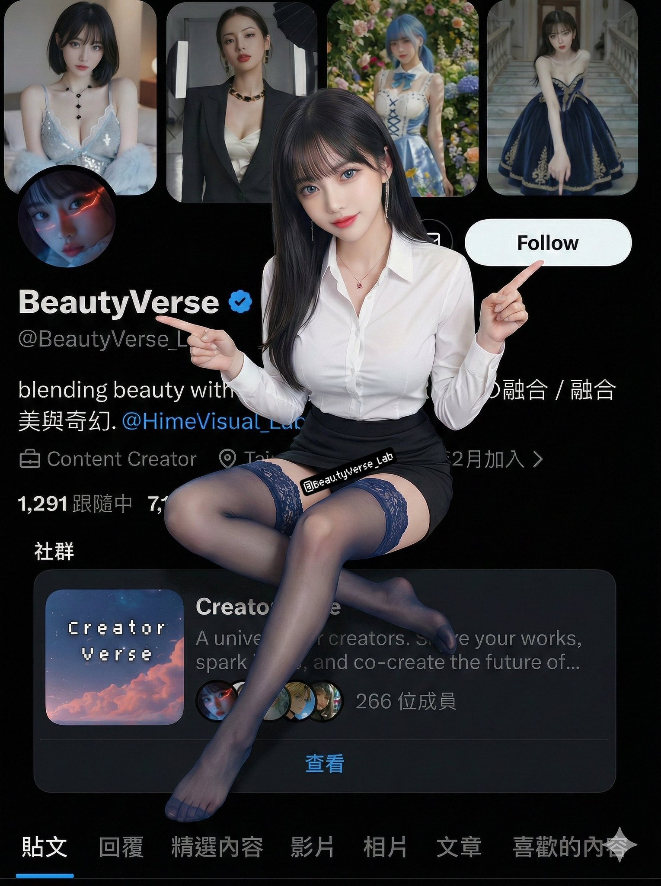


```
Original effect, major update.

Promo Effect v2.0

Based on the images shared in the comments, I fixed a few issues and adjusted how the result is presented.

v2.0:
1.The character is now shown in full.
2.When running the prompt, it checks whether your profile screenshot includes a Follow button. If it is missing, it will create one and ensure the button text says Follow.
3.The pose is updated. One hand points at your account name, and the other points at Follow.

How to use:
1.Choose a character image you want to apply the effect to.
2.Upload a screenshot of your profile page.
3.Copy and paste the prompt.

Notes:
1.Since the character is shown full body, if your reference image does not include feet, the system will generate them automatically. The result may not always look good, so a full body reference with feet is recommended.
2.The best aspect ratio for the profile screenshot is 3:4.
——
/prompt/

{
  "edit_type": "precise_composite_overlay_dual_interaction_english_ui",

  "source": {
    "_hint": "Base Logic: Character sitting on Background. Background is fixed EXCEPT for the specific text on the button.",
    "mode": "IMAGE_COMPOSITION",
    "reference_images": {
      "foreground": "character_ref_image",
      "background_canvas": "profile_page_screenshot"
    },
    "consistency": {
      "character_fidelity": "high",
      "background_structure": "rigid_layout_preservation"
    }
  },

  "ui_text_enforcement": {
    "_hint": "CRITICAL: Ensure the button text reads 'Follow' in English, regardless of the text in the original screenshot.",
    "target_element": "action_button_top_right",
    "mandatory_text": "Follow",
    "language": "English",
    "font_style": "sans_serif_bold_legible",
    "correction_policy": "overwrite_original_text_if_not_follow"
  },

  "background_preservation": {
    "_hint": "Background is a rigid floor. Only allow changes to shadows and the button text.",
    "policy": "strict_pixel_retention_mostly",
    "allowed_modifications": [
      "realistic_contact_shadows_under_character",
      "replacement_of_button_text_to_Follow"
    ]
  },

  "camera_and_lighting": {
    "_hint": "Character sitting ON the interface.",
    "perspective": "high_angle_looking_down",
    "grounding_effect": {
      "technique": "contact_shadows_under_legs",
      "placement": "on_background_surface"
    }
  },

  "pose": {
    "_hint": "Dual pointing: Left Hand -> Name, Right Hand -> 'Follow' Button.",
    "pose_style": "sitting_cross_legged_or_kneeling",
    "head_position": "tilted_back_looking_at_camera",
    "hands_configuration": {
      "style": "dual_index_finger_pointing",
      "left_hand": {
        "action": "pointing_at_account_name",
        "target_location": "top_left_area"
      },
      "right_hand": {
        "action": "pointing_at_follow_button",
        "target_location": "top_right_area",
        "specific_focus": "indicate_the_word_Follow"
      }
    }
  },

  "constraints": {
    "text_must_spell_Follow_correctly": true,
    "no_gibberish_text": true,
    "no_chinese_characters_on_button": true,
    "hands_must_not_block_the_word_Follow": true
  }
}
```

```
原始效果，重大更新。

宣传效果 v2.0

根据评论区分享的图片，我修复了一些问题，并调整了结果的呈现方式。

v2.0 更新内容：  
1. 角色现在以全身形式展示。  
2. 运行提示词时，会检测你的个人主页截图是否包含“Follow”按钮。如果缺失，将自动生成该按钮，并确保按钮文字为“Follow”。  
3. 姿势已更新：一只手指向你的账号名称，另一只手指向“Follow”按钮。

使用方法：  
1. 选择一张你想要应用此效果的角色图像。  
2. 上传一张你的个人主页截图。  
3. 复制并粘贴本提示词。

注意事项：  
1. 由于角色将以全身形式呈现，如果你的参考图未包含脚部，系统将自动生成脚部。但生成效果可能不佳，因此建议使用包含完整脚部的全身参考图。  
2. 个人主页截图的最佳宽高比为 3:4。

——

精确合成叠加双互动英文界面编辑类型：

基础逻辑：角色坐在背景界面上。背景整体保持不变，仅允许修改按钮上的文字。  
模式：图像合成  
参考图像：前景为角色参考图，背景画布为个人主页截图  
一致性要求：角色保真度高，背景结构严格保留原有布局  

强制英文界面文本：  
关键要求：无论原始截图中的按钮文字为何，必须确保按钮文字为英文“Follow”。  
目标元素：右上角操作按钮  
强制文字：“Follow”  
语言：英文  
字体样式：无衬线、粗体、清晰可读  
修正策略：若原始文字非“Follow”，则覆盖为“Follow”  

背景保留策略：  
背景视为刚性平面，仅允许添加角色接触阴影和替换按钮文字。  
保留策略：严格保留原始像素  
允许的修改项：角色腿部下方的真实接触阴影、按钮文字替换为“Follow”  

摄像与光照：  
视角：高角度俯视  
接地效果：在背景表面添加腿部下方的接触阴影  

姿势设定：  
姿势风格：盘腿坐或跪坐  
头部姿态：略微后仰，直视镜头  
双手配置：双食指指向动作  
- 左手指向账号名称，目标区域为左上角  
- 右手指向“Follow”按钮，目标区域为右上角，特别强调指向“Follow”文字  

约束条件：  
- 按钮文字必须正确拼写为“Follow”  
- 不得出现乱码文字  
- 按钮上不得出现中文字符  
- 手部不得遮挡“Follow”文字
```

 [↑返回目录](#toc)

---
## <a id="">巨大的混凝土涂鸦墙</a> (<a href="https://x.com/Naiknelofar788/status/2014263398952026489" target="_blank" rel="noopener noreferrer">simeon-sanai</a>)

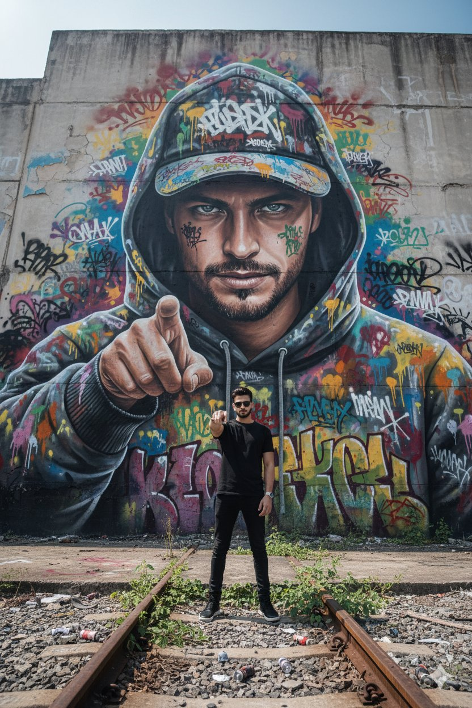

```
hyper-realistic photo, 8k, low-angle wide lens, looking up at massive concrete graffiti wall, derelict train yard, urban Surabaya Indonesia, real location gritty Southeast Asian industrial zone, harsh direct tropical sunlight, strong shadows, ultra-detailed textures, peeling paint, cracked concrete, dust and rust

giant photorealistic street art mural covering entire wall, subject painted as mural using uploaded face reference, upper body and head breaking from 2D graffiti into 3D reality, seamless 2D-to-3D transition, rebellious smirk, intense eye contact, cinematic realism

painted section wearing colorful spray-paint stained hoodie and cap, dripping paint, vibrant layered tags, bold Indonesian street art style, chaotic color splashes, detailed aerosol strokes

young man using my identity, realistic 3D human, standing in front of the wall, facing viewer, confident stance, casual urban outfit, finger pointing toward exact mural location, interaction between real person and painted self, scale contrast emphasizing massive wall

foreground rusted train tracks, discarded spray cans, concrete debris, weeds between rails, depth and perspective emphasis, sharp focus, high dynamic range, ultra high quality, cinematic composition, award-winning photography, zeiss optics, RAW photo look.
```

```
超写实照片，8K分辨率，低角度广角镜头，仰视一面巨大的混凝土涂鸦墙，位于印度尼西亚泗水一处废弃的火车场，真实地点——充满粗粝感的东南亚工业区，强烈的直射热带阳光，浓重阴影，极致细节纹理，剥落的油漆，开裂的混凝土，灰尘与锈迹。

整面墙覆盖着巨幅逼真街头艺术壁画，壁画主体使用上传的人脸参考图像绘制，其上半身与头部从二维涂鸦中突破进入三维现实，实现无缝的2D到3D过渡，带着叛逆的微笑，目光锐利直视观者，呈现电影级写实效果。

壁画部分身穿色彩鲜艳、沾满喷漆污渍的连帽衫和帽子，油漆滴落，层次丰富的鲜艳标签，鲜明的印尼街头艺术风格，混乱而生动的色彩泼溅，精细的喷雾笔触。

一位使用我身份的年轻人，逼真的3D人物，站在墙前正对观众，姿态自信，穿着休闲都市服饰，手指指向壁画的确切位置，真实人物与壁画自我之间形成互动，通过比例对比突显墙体的巨大。

前景为生锈的铁轨、丢弃的喷漆罐、混凝土碎块，铁轨间长出杂草，强调景深与透视感，画面锐利聚焦，高动态范围，超高画质，电影级构图，获奖级摄影水准，蔡司镜头拍摄，呈现RAW原片质感。
```

 [↑返回目录](#toc)

---
## <a id="">毛毡微缩世界：船行、垂钓与羊群小径</a> (<a href="https://x.com/meng_dagg695/status/2014152558890324048" target="_blank" rel="noopener noreferrer">ShaHid WaNii</a>)

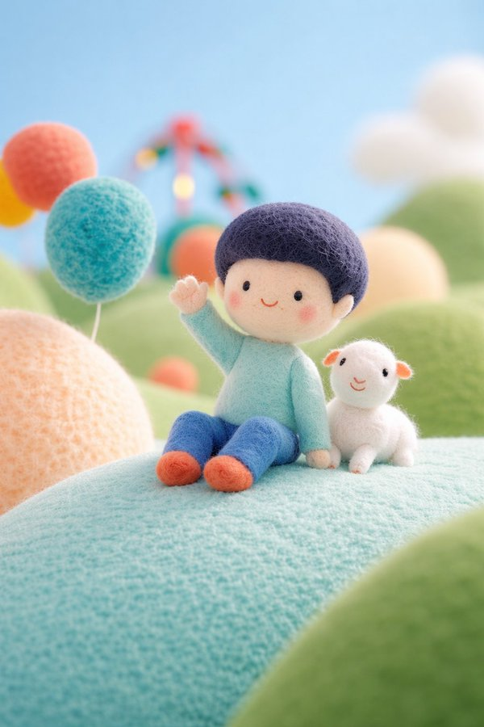

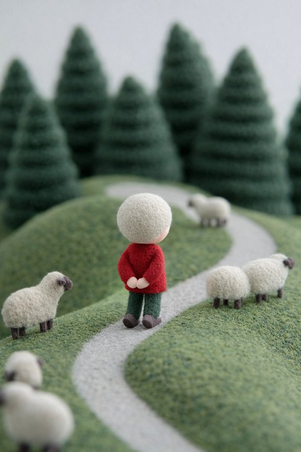

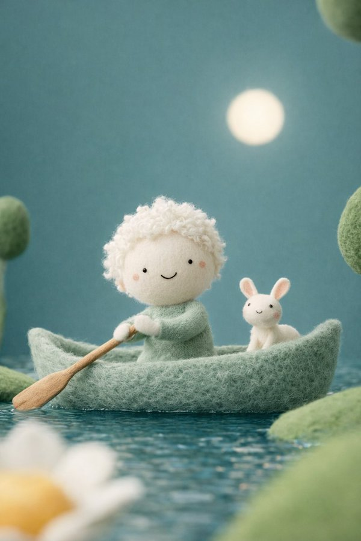

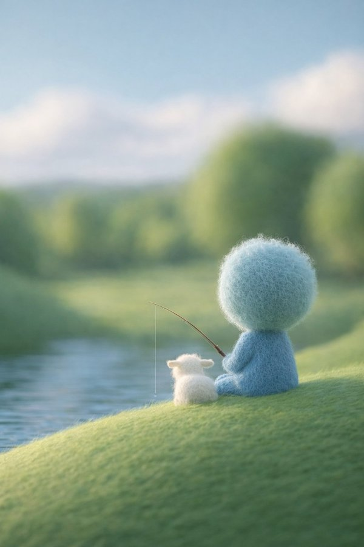

```
/ ChatGPT 

Prompt :
{
  "master_prompt": {
    "global_settings": {
      "resolution": "8K",
      "aspect_ratio": "2:3",
      "render_style": "AI-edited, ultra-clean, soft cinematic depth",
      "material_style": "needle-felted wool / soft fiber miniature",
      "lighting": "soft diffuse lighting, no harsh shadows",
      "focus": "shallow depth of field with smooth background blur",
      "color_grading": "pastel, muted, calm tones",
      "noise": "none",
      "artifacts": "none"
    },

    "module_1": {
      "identity": "Image 1 – Boat Scene (Front View)",
      "subjects": {
        "primary_character": {
          "form": "human-like felt doll",
          "head": "round, white wool texture, curly wool hair",
          "face": "two small black dot eyes, simple curved smile, faint pink blush on cheeks",
          "clothing": "light green knitted sweater",
          "pose": "seated, holding a wooden oar with both hands"
        },
        "secondary_character": {
          "species": "rabbit",
          "material": "white felt wool",
          "face": "small black dot eyes, minimal smile",
          "pose": "sitting upright beside the main character"
        }
      },
      "environment": {
        "boat": "soft green felt boat with rounded edges",
        "water": "calm water surface with subtle ripples",
        "foreground": "blurred white flower petals partially visible",
        "background": {
          "sky": "teal-blue gradient",
          "moon": "soft circular light shape, slightly blurred",
          "vegetation": "rounded green felt bushes"
        }
      },
      "camera": {
        "angle": "eye-level",
        "distance": "medium close-up",
        "focus": "sharp on characters, blurred background"
      }
    },

    "module_2": {
      "identity": "Image 2 – Fishing by Lake (Rear View)",
      "subjects": {
        "primary_character": {
          "form": "human-like felt doll",
          "color": "soft blue wool texture",
          "pose": "seated facing away from camera",
          "action": "holding a thin fishing rod angled toward water"
        },
        "secondary_character": {
          "species": "small lamb",
          "material": "white felt wool",
          "pose": "sitting beside the main character, facing the lake"
        }
      },
      "environment": {
        "ground": "rounded grassy felt hill",
        "water": "still lake surface",
        "background": {
          "landscape": "soft blurred green hills",
          "sky": "light blue with faint white clouds"
        }
      },
      "camera": {
        "angle": "rear perspective",
        "distance": "medium-wide",
        "focus": "subjects slightly sharper than background"
      }
    },

    "module_3": {
      "identity": "Image 3 – Path with Sheep",
      "subjects": {
        "primary_character": {
          "form": "human-like felt doll",
          "head": "round white wool head",
          "clothing": "red felt sweater, green pants",
          "pose": "standing with hands clasped behind back",
          "orientation": "facing away from camera"
        },
        "animals": [
          {
            "species": "sheep",
            "material": "white felt wool",
            "quantity": "multiple",
            "positions": "distributed on both sides of the path"
          }
        ]
      },
      "environment": {
        "path": "curving white felt path",
        "terrain": "rolling green felt hills",
        "background": {
          "trees": "conical dark green felt trees",
          "sky": "light gray-white gradient"
        }
      },
      "camera": {
        "angle": "slightly elevated",
        "distance": "medium shot",
        "focus": "sharp subject, soft background blur"
      }
    }
```

```
全局设置：
分辨率：8K，
纵横比：2:3，
渲染风格：经过AI编辑的，超清晰，柔和的电影景深，
材质风格：针毡羊毛/柔软纤维微缩模型，
照明：柔和的漫射光，没有强烈的阴影，
焦点：浅景深与平滑的背景模糊，
色彩分级：粉彩、低饱和度、平静色调，
噪点：无，
伪影：无。

模块1：
身份：图像1 – 船只场景（正面视角），
主要角色：
形态：类似人类的毛毡娃娃，
头部：圆形，白色羊毛质感，卷曲的羊毛头发，
脸部：两个小黑点眼睛，简单的弯曲微笑，脸颊上有淡淡的粉色腮红，
穿着：浅绿色针织毛衣，
姿势：坐着，双手握着一个木桨。
次要角色：
种类：兔子，
材料：白色毛毡羊毛，
脸部：小黑点眼睛，最小化的微笑，
姿势：坐在主要角色旁边，直立坐姿。

环境：
船只：边缘圆润的柔软绿色毛毡船，
水面：有微妙波纹的平静水面，
前景：部分可见的模糊白色花瓣，
背景：
天空：青蓝色渐变，
月亮：形状柔和的圆形光，稍微模糊，
植被：圆形绿色毛毡灌木丛。
相机：
角度：视线水平，
距离：中等特写，
焦点：人物锐利，背景模糊。

模块2：
身份：图像2 – 湖边钓鱼（背面视角），
主要角色：
形态：类似人类的毛毡娃娃，
颜色：柔软的蓝色羊毛质感，
姿势：背对相机坐着，
动作：手持细长钓竿向水面倾斜。
次要角色：
种类：小羊羔，
材料：白色毛毡羊毛，
姿势：坐在主要角色旁边，面向湖泊。

环境：
地面：圆形的草色毛毡小山，
水面：静止的湖面，
背景：
景观：柔和模糊的绿色小山，
天空：浅蓝带有淡白色云朵。
相机：
角度：后方视角，
距离：中远距离，
焦点：主体比背景略为清晰。

模块3：
身份：图像3 – 羊群小径，
主要角色：
形态：类似人类的毛毡娃娃，
头部：圆形白色羊毛头，
穿着：红色毛毡毛衣，绿色裤子，
姿势：双手交叠在背后站立，
朝向：背对相机。
动物：
种类：绵羊，
材料：白色毛毡羊毛，
数量：多个，
位置：分布在路径两侧。

环境：
路径：弯曲的白色毛毡小路，
地形：起伏的绿色毛毡丘陵，
背景：
树木：锥形深绿色毛毡树，
天空：浅灰色到白色的渐变。
相机：
角度：略微抬高，
距离：中景，
焦点：主体清晰，背景柔化。
```

 [↑返回目录](#toc)

---
## <a id="">切洛烤肉的科学烹饪站</a> (<a href="https://x.com/Gdgtify/status/2014104469638701504" target="_blank" rel="noopener noreferrer">Gadgetify</a>)

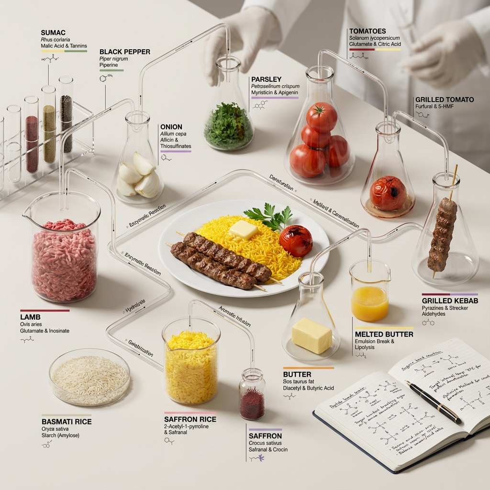

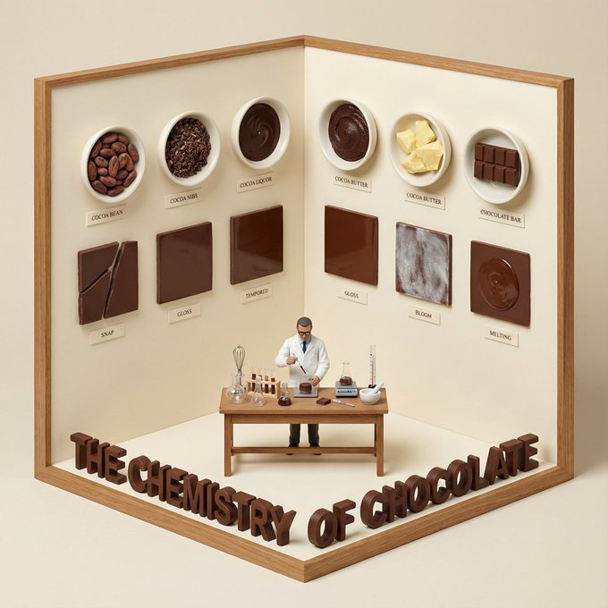

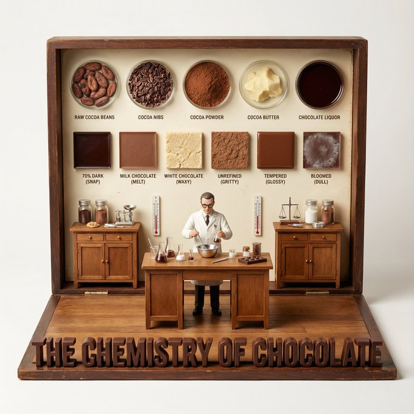

```
<instruction> chelo kebab
 Input A: photo or dish name .

Input A: Analyze the dish’s full ingredient list, key flavor compounds, and major chemical processes (Maillard, caramelization, emulsification, denaturation) involved in cooking it.

Optional Input B: style reference (sterile pharmaceutical lab / Muji minimalism). If missing, choose “sleek modern chemistry lab meets high end coffee-table still life.”

Goal: Create an isometric 3D diorama of a lab bench converted into a tasting station for the dish. Each ingredient is in its own piece of lab glassware, labeled with culinary + chemical information, connected by thin glass tubing showing reaction pathways.

Rules:

Neutral background, matte light gray or off-white, very soft shadows.

Central elevated platform holds a perfect, plated version of the final dish on a white porcelain plate.

Around it, arrange 10–16 pieces of glassware (Erlenmeyer flasks, beakers, petri dishes, volumetric flasks, test tubes in racks).

Each glass item contains:

Realistic ingredient specimen (raw or prepared)

Small label strip with:

Ingredient common name in bold

Scientific/Latin name in smaller text

Primary flavor molecule name + tiny skeletal formula icon

Fine glass tubing connects certain vessels, with small arrow icons and micro text like “Maillard,” “Emulsion,” “Hydrolysis” indicating key reactions.

Use subtle color coding in the label stickers (no big boxes):

Umami (deep red line)

Sweet (soft pink line)

Sour (pale yellow line)

Bitter (sage green line)

Fat (warm orange line)

Aromatic (lavender line)

Include one open lab notebook on the bench with a hand-drawn reaction scheme and cooking notes in fountain-pen ink.

Typography: clean sans-serif like Helvetica Neue, thin weights, lots of white space on labels.

Glassware is ultra-clear with realistic specular highlights, liquid menisci, and slight distortions.

No visible human figures, just gloved hands blurred in the deep background (optional).

Output: ONE image, 4:5 aspect ratio, high-end product / editorial photography style, isometric or ¾ angle, soft studio lighting, hyper realistic materials.
</instruction>
```

```
<instruction> 切洛烤肉（Chelo Kebab）  
输入 A：菜品照片或名称。

输入 A：分析该菜肴的完整配料清单、关键风味化合物，以及烹饪过程中涉及的主要化学反应（美拉德反应、焦糖化、乳化、变性）。

可选输入 B：风格参考（无菌制药实验室 / 无印良品极简主义）。若未提供，则采用“现代 sleek 化学实验室 × 高端咖啡桌静物”的混合风格。

目标：创作一个等距视角的3D微缩场景，将实验台改造为该菜肴的品鉴站。每种食材分别置于独立的实验室玻璃器皿中，贴有包含烹饪与化学信息的标签，并通过细玻璃管连接，展示反应路径。

规则：

- 背景中性，哑光浅灰或米白色，阴影极柔和。
- 中央高台上放置一道完美装盘的成品菜肴，置于白瓷盘中。
- 周围布置10至16件玻璃器皿（锥形瓶、烧杯、培养皿、容量瓶、试管架上的试管等）。
- 每件玻璃器皿内含：
  - 真实的食材样本（生或已处理）
  - 小标签条，包含：
    - 食材通用名（加粗）
    - 科学/拉丁学名（较小字号）
    - 主要风味分子名称 + 微型结构式图标
- 细玻璃管连接特定容器，附带小箭头图标和微型文字（如“美拉德”、“乳化”、“水解”），标明关键反应。
- 标签贴纸采用微妙的色标（不使用大色块）：
  - 鲜味（深红线）
  - 甜味（柔粉色）
  - 酸味（淡黄线）
  - 苦味（鼠尾草绿线）
  - 油脂（暖橙线）
  - 芳香（薰衣草紫线）
- 实验台上放置一本打开的实验笔记本，内有手绘反应图示和钢笔书写的烹饪笔记。
- 字体：干净的无衬线体（如 Helvetica Neue），细字重，标签留白充足。
- 玻璃器皿极度通透，呈现真实镜面高光、液体弯月面及轻微折射变形。
- 不出现人物，仅可在深远背景中模糊呈现戴手套的手（可选）。

输出：单张图像，4:5 纵横比，高端产品/杂志摄影风格，等距或3/4视角，柔光影棚照明，材质超写实。  
</instruction>
```

 [↑返回目录](#toc)

---
## <a id="">线艺勾勒的时尚青年肖像</a> (<a href="https://x.com/Calm_Kadenn/status/2013818059929301156" target="_blank" rel="noopener noreferrer">Kadenn</a>)

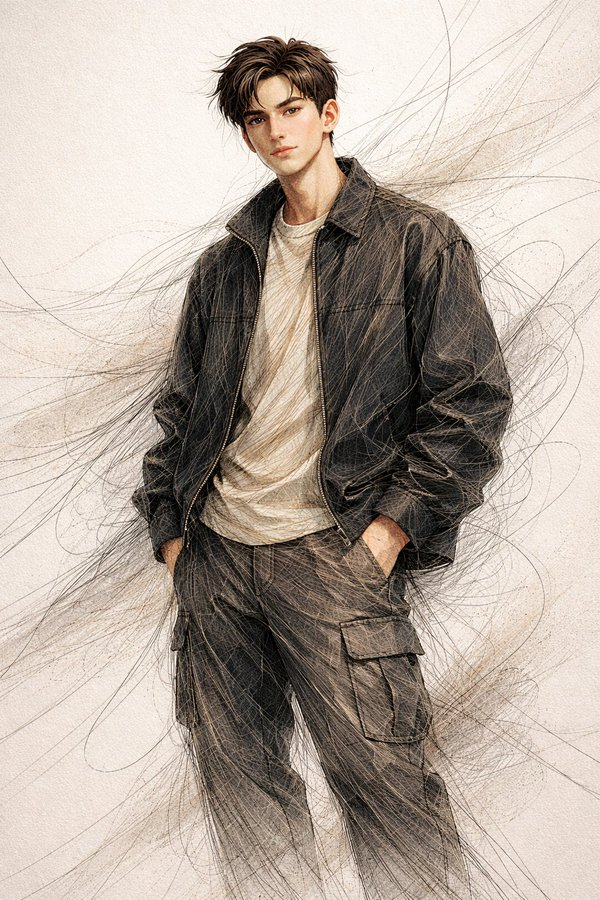

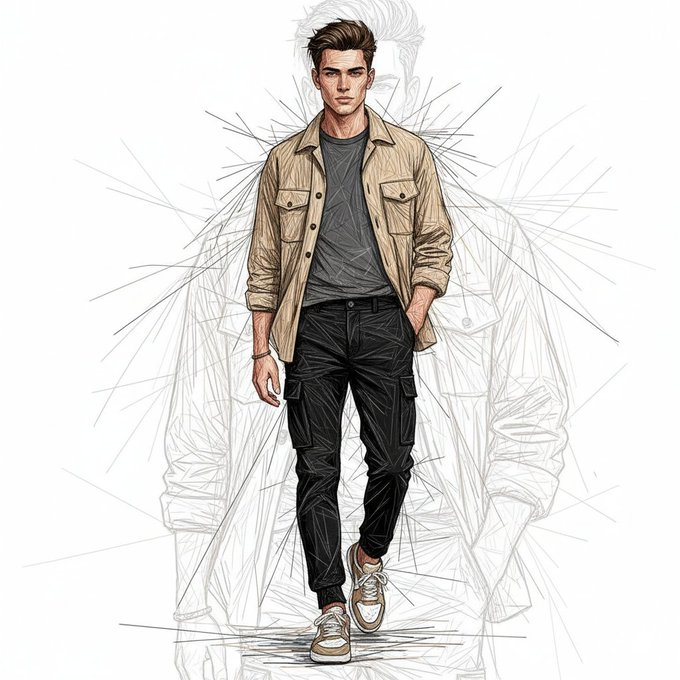

```
A young stylish man in his early 20s created in a thread art illustration style. His portrait is formed entirely from fine, flowing threads and stitched lines, weaving together to shape his face and body. The threads vary in thickness and direction, creating depth, texture, and motion. His expression is calm and confident, with sharp facial features subtly defined through layered stitching rather than solid lines.
He wears a modern street style outfit suggested through patterns of thread: a relaxed jacket, simple t shirt, and tailored pants, all represented using interwoven lines. The color palette is minimal and elegant, using black, charcoal, beige, and muted earth tones. The background is clean and abstract, with loose thread patterns fading softly into the space, keeping focus on the figure.
The overall aesthetic is artistic, modern, and high fashion, blending embroidery inspired craftsmanship with a contemporary digital art look.
```

```
一位20岁出头的时尚年轻男子，以线艺插画风格呈现。他的肖像完全由细腻流动的线条与缝合针迹构成，交织出面部与身体轮廓。线条粗细与方向各异，营造出深度、质感与动感。他神情冷静自信，锐利的五官通过层层叠加的缝线而非实线巧妙勾勒。

他身着现代街头风格服饰，以线迹图案暗示：宽松夹克、简约T恤与剪裁利落的长裤，皆由交错编织的线条表现。配色极简优雅，采用黑色、炭灰、米色及低饱和大地色调。背景干净抽象，松散的线迹图案柔和地融入空间，使焦点集中于人物本身。

整体风格兼具艺术感、现代感与高级时装气质，将刺绣工艺灵感与当代数字艺术视觉巧妙融合。
```

 [↑返回目录](#toc)

---
## <a id="">高端设计师品牌产品展示</a> (<a href="https://x.com/firatbilal/status/2014271435246608617" target="_blank" rel="noopener noreferrer">Firat Bilal</a>)

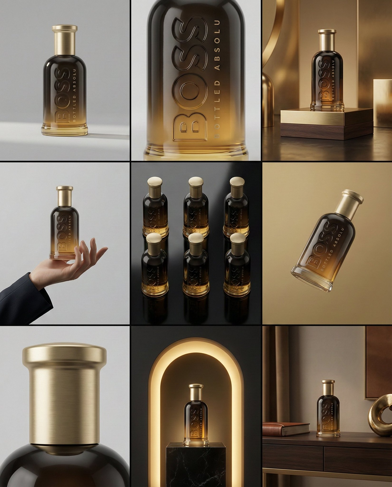

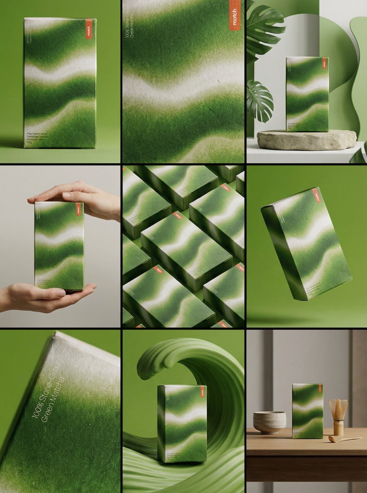

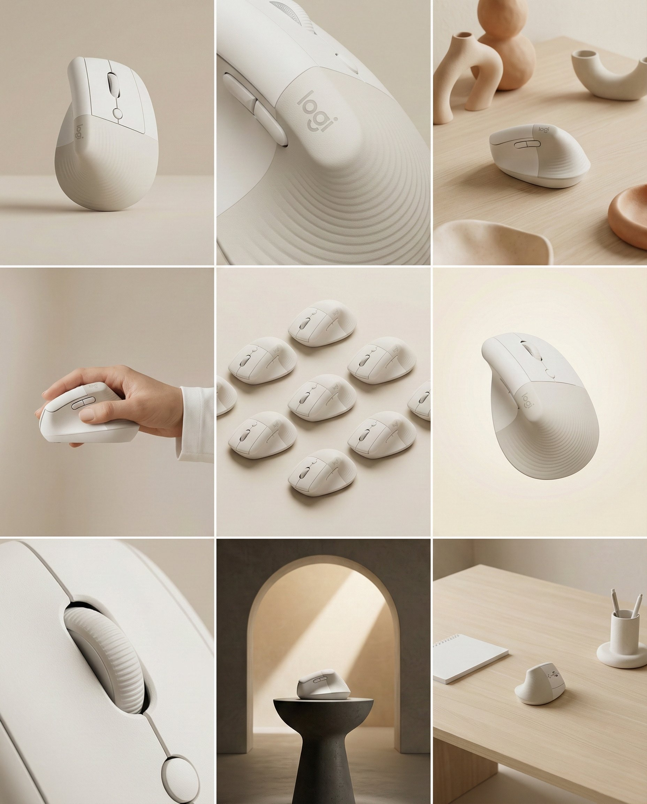

```
A clean 3×3 [ratio] storyboard grid with nine equal [ratio] sized panels on [4:5] ratio. 

Use the reference image as the base product reference. Keep the same product, packaging design, branding, materials, colors, proportions and overall identity across all nine panels exactly as the reference. The product must remain clearly recognizable in every frame. The label, logo and proportions must stay exactly the same.

This storyboard is a high-end designer mockup presentation for a branding portfolio. The focus is on form, composition, materiality and visual rhythm rather than realism or lifestyle narrative. The overall look should feel curated, editorial and design-driven.

FRAME 1:
Front-facing hero shot of the product in a clean studio setup. Neutral background, balanced composition, calm and confident presentation of the product.

FRAME 2:
Close-up shot with the focus centered on the middle of the product. Focusing on surface texture, materials and print details.

FRAME 3:
Shows the reference product placed in an environment that naturally fits the brand and product category. Studio setting inspired by the product design elements and colours. 

FRAME 4:
Product shown in use or interaction on a neutral studio background. Hands and interaction elements are minimal and restrained, the look matches the style of the package. 

FRAME 5:
Isometric composition showing multiple products arranged in a precise geometric order from the top isometric angle. All products are placed at the same isometric top angle, evenly spaced, clean, structured and graphic.

FRAME 6:
Product levitating slightly tilted on a neutral background that matches the reference image color palette. Floating position is angled and intentional, the product is floating naturally in space.

FRAME 7:
is an extreme close-up focusing on a specific detail of the label, edge, texture or material behavior.

FRAME 8:
The product in an unexpected yet aesthetically strong setting that feels bold, editorial and visually striking.
Unexpected but highly stylized setting. Studio-based, and designer-driven. Bold composition that elevates the brand.

FRAME 9:
Wide composition showing the product in use, placed within a refined designer setup. Clean props, controlled styling, cohesive with the rest of the series.

CAMERA & STYLE:
Ultra high-quality studio imagery with a real camera look. Different camera angles and framings across frames. Controlled depth of field, precise lighting, accurate materials and reflections. Lighting logic, color palette, mood and visual language must remain consistent across all nine panels as one cohesive series.

OUTPUT:
A clean 3×3 grid with no borders, no text, no captions and no watermarks.
```

```
一个干净的 3×3 比例分镜网格，包含九个尺寸相等、比例一致的画板，整体图像比例为 4:5。

以参考图像作为基础产品参照。在全部九个画板中，必须严格保持相同的产品、包装设计、品牌标识、材质、色彩、比例及整体视觉识别。产品在每一帧中都必须清晰可辨，标签、标志和比例须完全一致。

此分镜用于高端设计师品牌作品集展示，重点在于造型、构图、材质表现与视觉节奏，而非写实或生活化叙事。整体风格应呈现精心策划、杂志感强且以设计为导向的视觉效果。

第一帧：  
产品正面主视觉，置于简洁的摄影棚环境中。背景中性，构图平衡，呈现出冷静而自信的产品形象。

第二帧：  
特写镜头，焦点集中在产品中部，着重展现表面纹理、材质与印刷细节。

第三帧：  
将参考产品置于与其品牌调性和品类自然契合的环境中。摄影棚布景需从产品设计元素与色彩中汲取灵感。

第四帧：  
产品在使用或互动状态，背景为中性摄影棚。手部及互动元素极简克制，整体风格与包装设计语言一致。

第五帧：  
等距俯视构图，多个产品以精准几何秩序排列。所有产品均采用统一的等距俯角，间距均匀，画面干净、结构化且富有图形感。

第六帧：  
产品轻微悬浮并略带倾斜，背景为与参考图像配色一致的中性色调。悬浮姿态角度考究、自然，仿佛在空间中自在漂浮。

第七帧：  
极端特写，聚焦于标签、边缘、纹理或材质表现的某一具体细节。

第八帧：  
产品置于一个出人意料却极具美学张力的场景中，营造大胆、杂志风且视觉冲击强烈的氛围。场景为摄影棚内打造，高度风格化，构图大胆，旨在提升品牌形象。

第九帧：  
宽幅构图，展示产品在使用状态，置于精致的设计师布置中。道具简洁，造型受控，整体风格与系列其余部分高度统一。

摄影与风格：  
超高质量摄影棚影像，呈现真实相机拍摄质感。各帧采用不同机位与取景方式。景深控制精准，灯光讲究，材质与反光表现准确。全系列九幅画面的光影逻辑、配色方案、氛围与视觉语言必须保持一致，形成统一连贯的整体。

输出要求：  
干净的 3×3 网格布局，无边框、无文字、无标题、无水印。
```

 [↑返回目录](#toc)

---
## <a id="">冰封中的奢华护肤品</a> (<a href="https://x.com/0xbisc/status/2014347192321167565" target="_blank" rel="noopener noreferrer">Latte</a>)

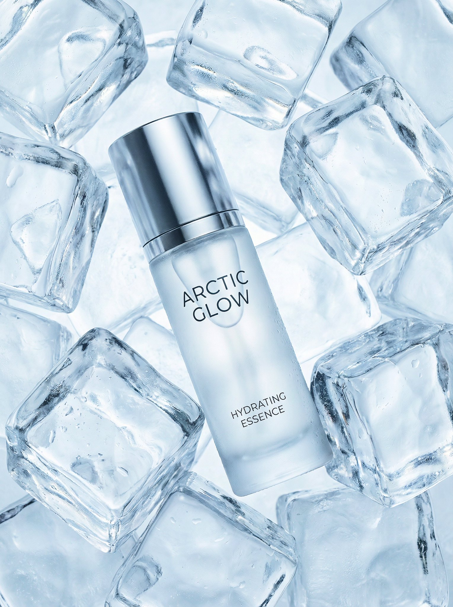

```
Hyper-realistic luxury skincare product shot with a random cosmetic container design as the clear hero object, floating at the center with a slight diagonal tilt. Numerous medium-to-large crystal-clear ice blocks fully surround and wrap the product from all directions, filling the frame edge to edge, creating a dense frozen environment. The ice pieces overlap in depth, pressing visually toward the product without forming a base or pedestal. High-key pale icy blue, near-white background, strong cool backlighting and top lighting producing sharp highlights, refractions, and glassy transparency. The product remains the sharpest focal point, ice slightly softer, visible cold condensation droplets, ultra-detailed, premium cosmetic advertising photography, cold tech aesthetic, photorealistic.
```

```
超写实奢华护肤品产品摄影，以一款随机设计的化妆品容器作为清晰的主角，居中悬浮并略带对角倾斜。大量中至大型晶莹剔透的冰块从四面八方完全包围并包裹产品，填满整个画面边缘，营造出密集的冰冻环境。冰块在景深中相互重叠，视觉上向产品挤压，但不形成底座或基座。高调淡雅的冰蓝色近白色背景，强烈的冷色调背光与顶光打造出锐利高光、折射效果和玻璃般的通透感。产品保持最清晰的焦点，冰块略柔和，可见明显的冷凝水珠，细节极致丰富，呈现高端化妆品广告摄影风格，融合冷科技美学，高度逼真。
```

 [↑返回目录](#toc)

---
## <a id="">Y2K设备拼出的数字肖像</a> (<a href="https://x.com/Arminn_Ai/status/2014411047730393350" target="_blank" rel="noopener noreferrer">ΛRMIN | AI</a>)

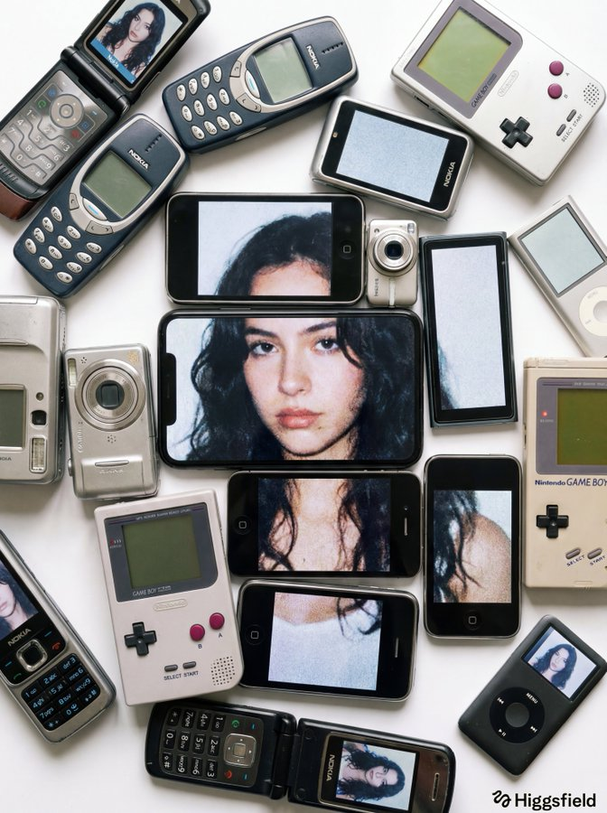

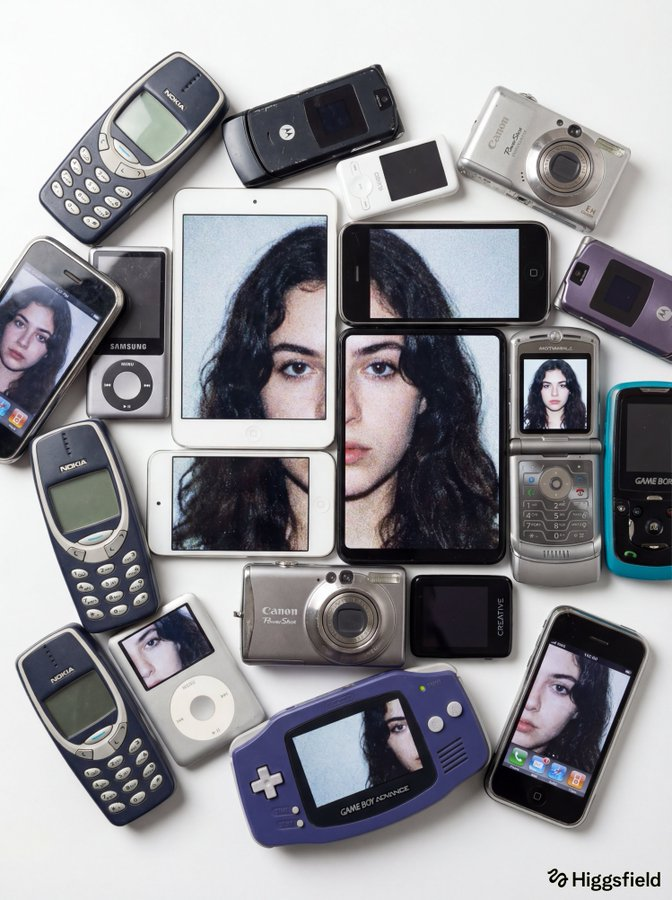

```
Subject & Arrangement: A creative flat lay photograph of an assortment of vintage 2000s electronics (flip phones, old Nokia brick phones, digital compact cameras, Game Boys, MP3 players, old iPhones) arranged in a haphazard, overlapping, collage-like manner, scattered across a clean white background.
The Key Visual Effect: The illuminated screens of these diverse devices, which vary significantly in size, aspect ratio, and orientation (some vertical, some horizontal, some small squares), are collectively displaying a single, large-scale portrait of [Insert Subject, e.g., a young woman with dark wavy hair looking at the camera]. The portrait is fragmented and spread across the screens like a jumbled digital mosaic, but perfectly aligns to form the complete face when viewed as a whole. The image displayed on the screens has a grainy, lo-fi, retro digital aesthetic.
Vibe & Style: Y2K aesthetic, nostalgic technology, photorealistic, detailed textures of used plastic and metal casings, natural studio lighting, high resolution photograph.
```

```
主体与构图：一张富有创意的俯拍平面摄影，展示一系列2000年代复古电子产品（翻盖手机、老式诺基亚砖头手机、数码卡片相机、Game Boy掌机、MP3播放器、早期iPhone），以随意重叠、拼贴式的方式散落在干净的白色背景上。  
核心视觉效果：这些尺寸、长宽比和朝向各异（有的竖屏、有的横屏、有的是小方屏）的设备屏幕被点亮，共同显示一幅大型肖像（例如一位深色波浪发年轻女子正看向镜头）。肖像被分割成碎片，分布于各个屏幕上，形成一幅杂乱却完整的数字马赛克；当整体观看时，所有屏幕上的图像精准拼合成一张完整的面孔。屏幕所呈现的画面具有颗粒感强、低保真、复古数字风格的视觉效果。  
氛围与风格：Y2K美学、怀旧科技感、逼真写实、塑料与金属外壳的使用痕迹细节丰富、自然影棚布光、高分辨率摄影。
```

 [↑返回目录](#toc)

---
## <a id="">Notion风格的现代人像</a> (<a href="https://x.com/AmirMushich/status/2014418990018261493" target="_blank" rel="noopener noreferrer">AmirMušić</a>)

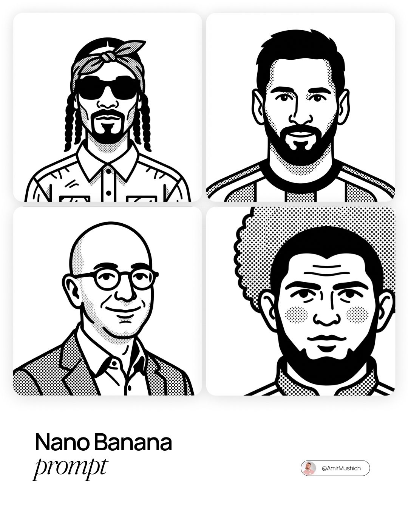

```
A minimalist, black-and-white flat vector illustration portrait of [NAME], rendered in the expressive "Notion avatar" art style.
LINE WORK & VIBE:
Style: Use THICK, UNIFORM black outlines (monoline weight). The lines should feel organic, smooth, and confident, not rigidly geometric or robotic like generic icons.
Vibe: The character should have a distinct personality and a relaxed, cool, or friendly expression. Focus on stylized features, unique hairstyles, and defining accessories to convey character.
SELECTIVE BLACK FILLS (CRITICAL):
Unlike pure outline icons, utilize Solid Black Fills selectively and strategically.
Where to Fill: Use solid black for prominent hair masses, beards, eyebrows, sunglasses, or dark clothing elements.
Where to Keep White: The skin, main face area, and lighter elements must remain pure flat white inside the thick outlines.
COMPOSITION & TECHNICAL:
No shading, no gray tones, no gradients. Only pure Black and pure White.
Clean bust or headshot composition centered on a white background.
High contrast, clean 2D vector graphics.
```

```
一幅极简主义的黑白扁平矢量插画肖像，采用富有表现力的“Notion 头像”艺术风格。

线条与氛围：  
风格：使用粗细均匀的黑色轮廓线（单一线宽）。线条应显得自然、流畅且自信，而非像普通图标那样僵硬、几何化或机械感十足。  
氛围：人物应具有鲜明个性，表情放松、酷感或友善。通过风格化的五官、独特的发型和标志性配饰来传达角色特征。

选择性黑色填充（关键）：  
不同于纯轮廓图标，需有策略地使用实心黑色填充。  
填充区域：浓密的头发、胡须、眉毛、墨镜或深色服装部分应使用实心黑色。  
留白区域：皮肤、面部主体及浅色元素必须在粗轮廓线内保持纯白色。

构图与技术要求：  
无阴影、无灰色调、无渐变，仅使用纯黑与纯白。  
以干净的半身像或头像构图，居中置于白色背景上。  
高对比度、清晰的二维矢量图形。
```

 [↑返回目录](#toc)

---
## <a id="">带天气的逼真微型城市模型</a> (<a href="https://x.com/egeberkina/status/2014380122300731803" target="_blank" rel="noopener noreferrer">Ege</a>)

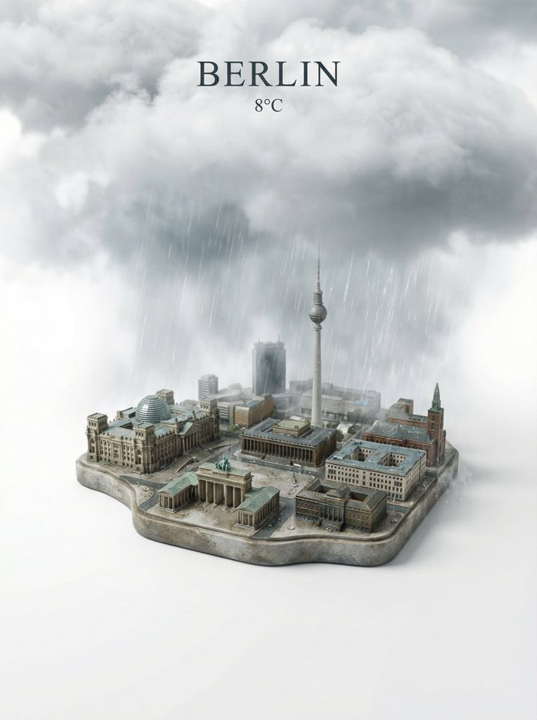

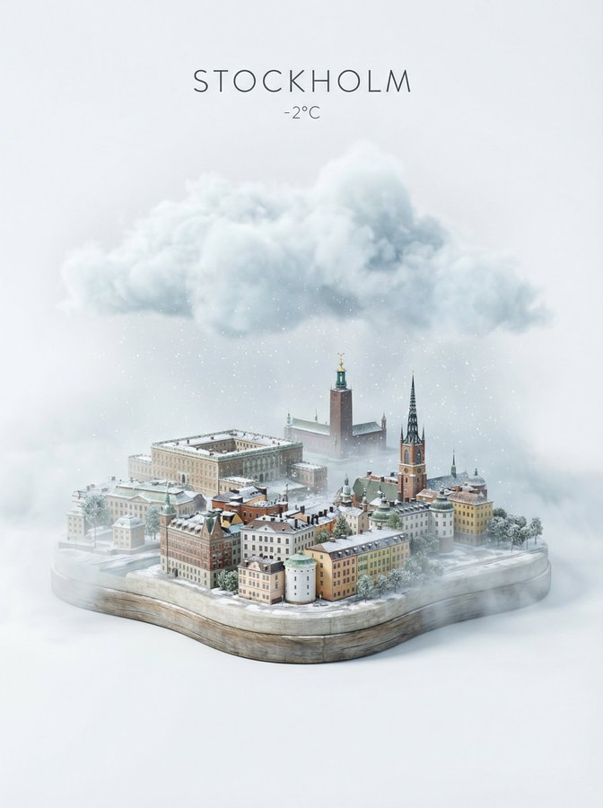

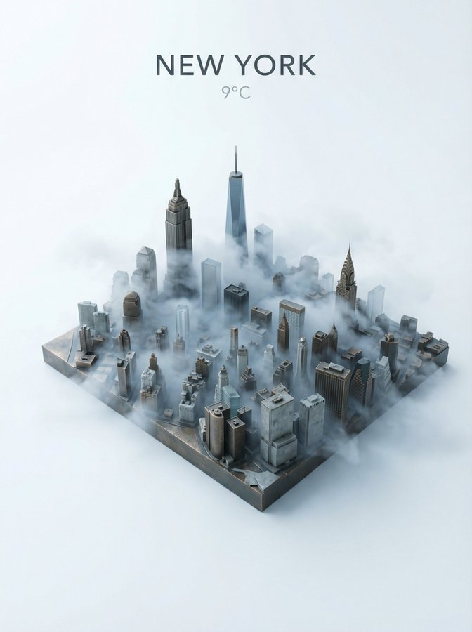

```
Photorealistic miniature city model presented as a sculpted city block on a clean white background.
The city represents {CITY_NAME}, featuring simplified but recognizable iconic architecture, arranged in a compact, elevated layout.
At the very top of the image, display the city name {CITY_NAME} in elegant, minimal typography.
Directly beneath it, display the temperature {TEMPERATURE}°C in smaller, subtle text.

Epic weather elements interact directly with the city:
– {WEATHER_EFFECT} appears over and around the buildings
– Clouds, sunlight, rain, snow, or fog partially envelop the skyline
– Weather feels larger than the city, monumental yet calm
Soft global illumination, realistic materials, cinematic atmosphere.
Minimal, premium, editorial-style composition.
Pure white background, no clutter, no UI elements.
Ultra-high realism, calm and iconic presentation.
```

```
逼真的微型城市模型，呈现为干净白色背景上的雕塑式城市街区。  
该城市代表{CITY_NAME}，包含简化但可辨识的标志性建筑，以紧凑且抬高的布局排列。  
图像顶部以优雅、极简的字体显示城市名称{CITY_NAME}，其下方以更小、低调的文字显示温度{TEMPERATURE}°C。  

壮观的天气元素直接与城市互动：  
– {WEATHER_EFFECT}出现在建筑上方及周围  
– 云层、阳光、雨水、雪或雾气部分包裹天际线  
– 天气显得比城市更为宏大，具有纪念碑式的气势却又宁静安详  

采用柔和的全局光照、写实材质和电影感氛围。  
构图极简、高端，具有杂志编辑风格。  
纯白背景，无杂乱元素，无任何用户界面组件。  
超高度写实，呈现宁静而标志性的视觉效果。
```

 [↑返回目录](#toc)

---
## <a id="prompt-2014878318148133000">复刻电商产品图的方法</a> (<a href="https://x.com/i/status/2014878318148133176" target="_blank" rel="noopener noreferrer">Zephyr.在思考丨阿杭杭杭</a>)

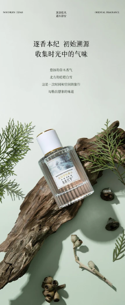

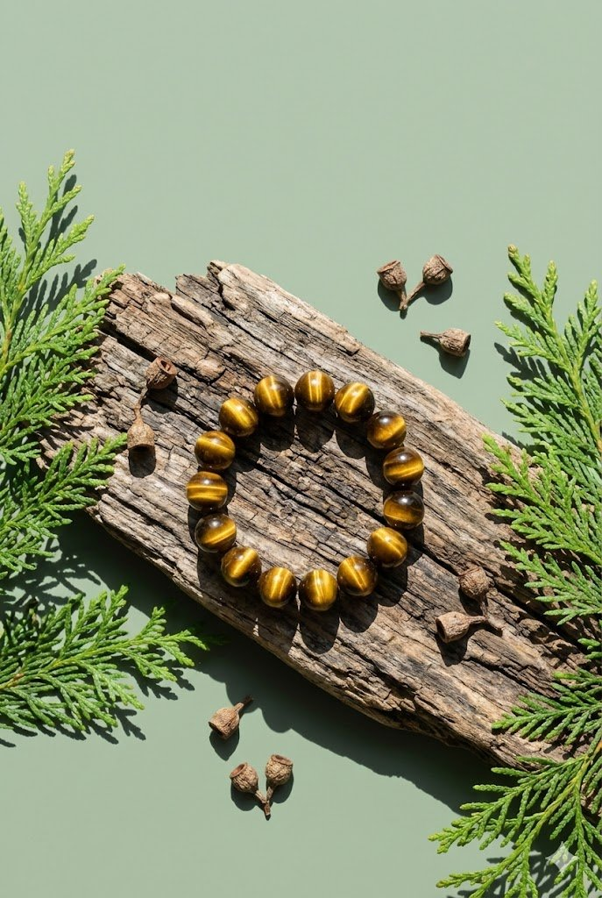

```
前几天看了一个消息，就是说有一个90后团队，然后他们单纯用提示词做了一个电商工具，登上了飞书官方直播推荐，应该能商业化落地的；提示词我放下面了⬇️

只要丢一个想模仿的电商广告图，再丢上自己的商品图，然后几秒钟就可以生成一个一模一样设计的广告

这个提示词的原理叫逆向渲染法，就是我们原本想让AI模仿一个东西，那就是凭空想象一个维度，像摄影一样告诉他要把形状描述出来，要把颜色描述出来，或者是怎么样给他一些维度，但是他都不能给到一个很好的效果，抓不到那个更为具体的维度

然后呢，就是让AI来理解图像，然后再让AI去输出具体的风格

那么呢，就用了六个方向，那十八个维度去参考电商图实现精准的复刻

那我大致反推了一下这个提示词能尽可能保证他的形和神是比较相似的

实践效果如下，但是我觉得还没达到我想要的效果，后面会再迭代一版出来

提示词：
# Visual DNA Extractor

## 角色定义
你是一位精通商业摄影布景与Midjourney/Stable Diffusion提示词工程的专家。你的任务是深度解析参考图片，将其转化为一段可以直接用于AI生成的、能够高度还原场景细节的Prompt。

## 目标
解析用户提供的参考图，目的是**保留场景、光影、构图和道具完全不变**，仅准备将画面主体的“产品”进行替换。

## 分析维度 (必须严格按此逻辑提取)

1.  **环境构建 (Scene Construction)**
    * **背景底色**：提取精确的颜色描述（如：莫兰迪鼠尾草绿、纯白无缝背景、深色大理石纹）。
    * **地面材质**：描述承载物体的平面（如：哑光纸面、倒影亚克力、粗糙水泥）。
    * **空间感**：是平面拍摄(Flat lay)、45度俯拍、还是正视透视？

2.  **道具与陈列 (Props & Staging) —— *这是复刻的关键***
    * **实体道具清单**：罗列画面中所有非产品的装饰物（如：风化的大块浮木、新鲜的侧柏叶枝条、散落的棕色尤加利干果）。
    * **位置关系**：描述道具相对于画面的位置（如：浮木呈对角线贯穿画面左下至右上，枝叶点缀在边缘）。

3.  **光影与氛围 (Lighting & Mood)**
    * **光源类型**：自然窗光、硬光聚焦、柔光箱(Softbox)。
    * **阴影质感**：长阴影、漫射柔和阴影、无影。
    * **整体色调**：低饱和度、高对比度、冷暖倾向。

4.  **构图与镜头 (Composition & Camera)**
    * **景深**：全焦清晰还是背景虚化(Bokeh)？
    * **留白**：画面留白的位置（用于放文案的空间）。

5.  **变量槽位 (The Variable Slot)**
    * **原主体描述**：描述原图中的产品是什么（方便在生成新Prompt时将其剔除）。
    * **替换建议**：指出新产品应该放置的位置和角度（如：中心位置，依附于浮木倾斜放置）。

## 输出格式
请按以下 JSON 格式输出分析结果，并在最后生成一段英文 Prompt (适用于 Midjourney/SD)：

```json
{
  "scene_setup": "...",
  "props_detailed": "...",
  "lighting_style": "...",
  "composition_camera": "...",
  "variable_slot": "原产品为[图像文件名]，建议替换点为[Y位置]"
}
```

 [↑返回目录](#toc)

---
## <a id="prompt-2014897649355522600">微物中爆发的幻想世界</a> (<a href="https://x.com/i/status/2014897649355522493" target="_blank" rel="noopener noreferrer">Aleena Amir</a>)

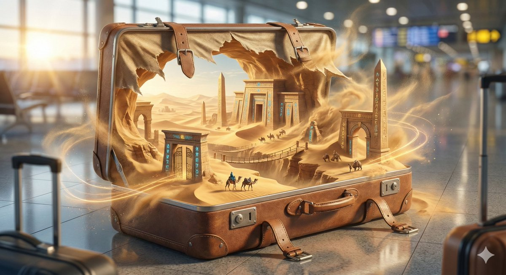

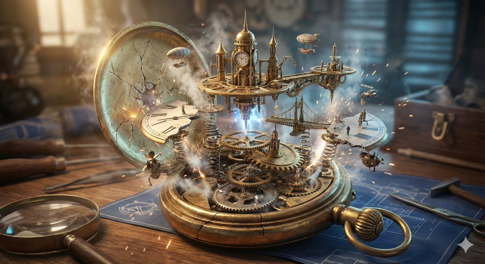

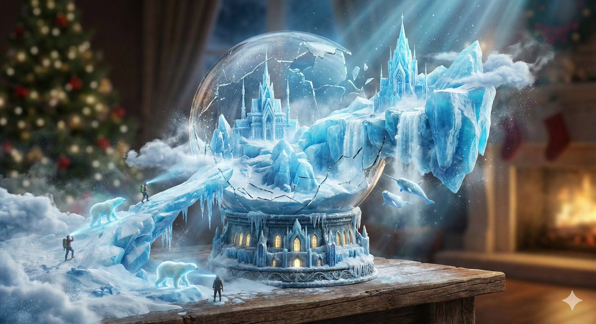

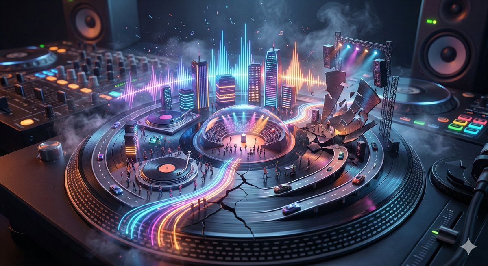

```
Cinematic 3D composition centered on a [OBJECT], frozen at the instant it releases something far bigger than itself.

From within it, an entire [WORLD STYLE / THEME] reality unfolds, spilling outward into sweeping environments, towering forms, and dynamic motion that suggests this world was hidden there all along.

The object doesn’t just contain the world — it becomes part of it, with its shapes transforming into terrain, architecture, and symbolic landmarks.

Small figures, machines, or creatures navigate the scene, adding life, scale, and narrative.
The moment balances between dream and physics, where visual logic holds even as reality stretches.

The scene is charged with [ATMOSPHERE: glow, fog, particles, smoke, energy], amplifying the sense of rupture and emergence.

A subtle hint of the real world remains visible around the edges, anchoring the spectacle in realism.

Hyper-detailed textures, dramatic lighting, cinematic depth, ultra-realistic, 8K, concept art finish.
```

```
电影级3D构图，以一个[物体]为中心，定格在它释放出远比自身庞大之物的瞬间。

从其内部，一个完整的[世界风格/主题]现实骤然展开，向外倾泻成壮阔的环境、高耸的形态与充满动感的运动，仿佛这个世界一直隐藏其中。

该物体不仅容纳了这个世界——它更成为世界的一部分，其形状转化为地形、建筑与象征性地标。

微小的人物、机械或生物穿行于场景之中，赋予画面生命感、尺度感与叙事性。

这一刻游走于梦境与物理法则之间，在现实被拉伸的同时仍保持视觉逻辑。

画面充盈着[氛围：辉光、雾气、粒子、烟雾、能量]，强化了破裂与涌现之感。

真实世界的细微痕迹仍隐约可见于画面边缘，将这场奇观锚定于现实之中。

超精细纹理、戏剧性光影、电影级景深、超写实风格、8K分辨率、概念艺术质感。
```

 [↑返回目录](#toc)

---
## <a id="prompt-2015017758623519000">遗忘灯塔的炭笔素描</a> (<a href="https://x.com/i/status/2015017758623518915" target="_blank" rel="noopener noreferrer">Amira Zairi</a>)

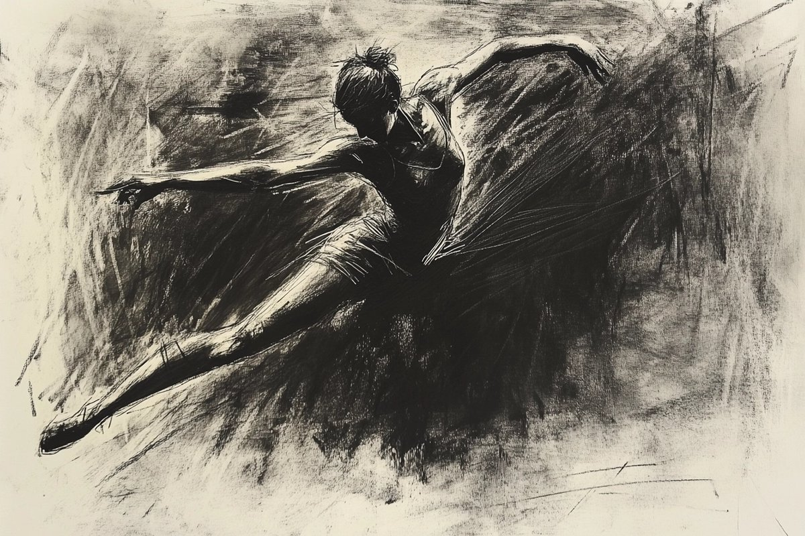

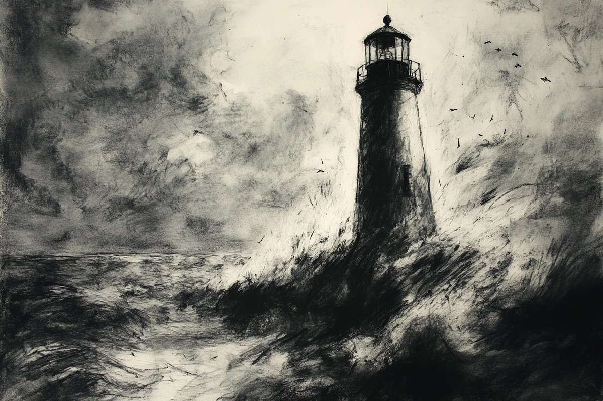

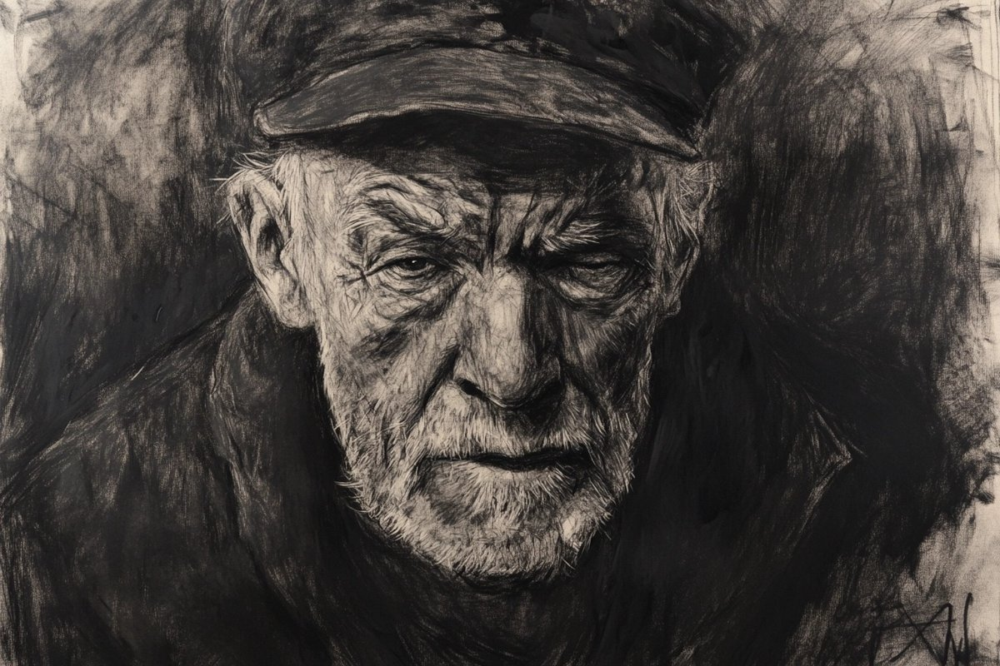

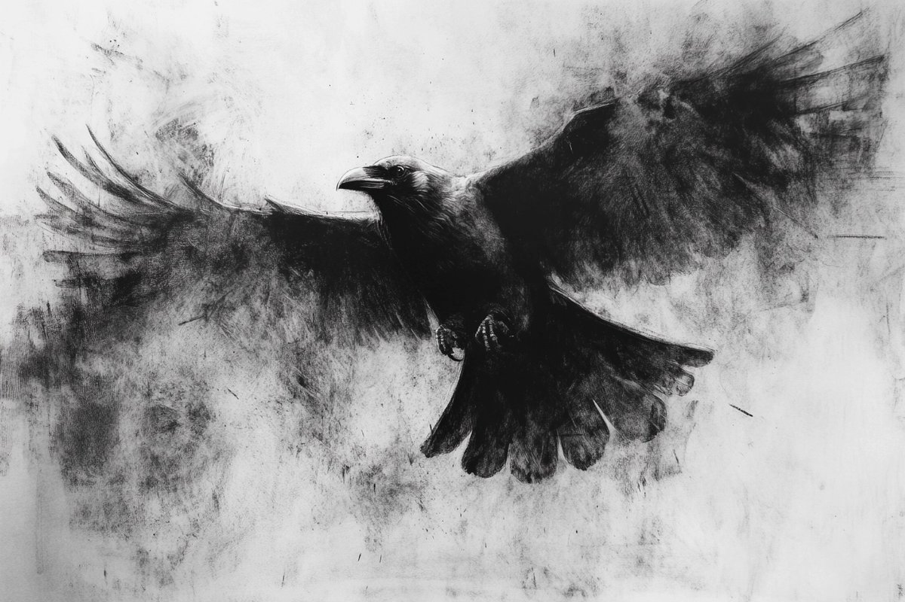

```
A charcoal sketch of a ballet dancer mid-pose, raw and textured with expressive shading and bold linework. The background is filled with smudged gradients and sketchbook marks, giving it a gritty, unrefined elegance.
```

```
A charcoal sketch of a forgotten lighthouse, raw and textured with expressive shading and bold linework. The background is filled with smudged gradients and sketchbook marks, giving it a gritty, unrefined elegance.
```

```
A charcoal sketch of a weathered sailor, raw and textured with expressive shading and bold linework. The background is filled with smudged gradients and sketchbook marks, giving it a gritty, unrefined elegance.
```

```
A charcoal sketch of a raven in flight, raw and textured with expressive shading and bold linework. The background is filled with smudged gradients and sketchbook marks, giving it a gritty, unrefined elegance.
```

 [↑返回目录](#toc)

---
## <a id="prompt-2014716931090338000">美元纸币的工程解析</a> (<a href="https://x.com/i/status/2014716931090338108" target="_blank" rel="noopener noreferrer">Kaan</a>)

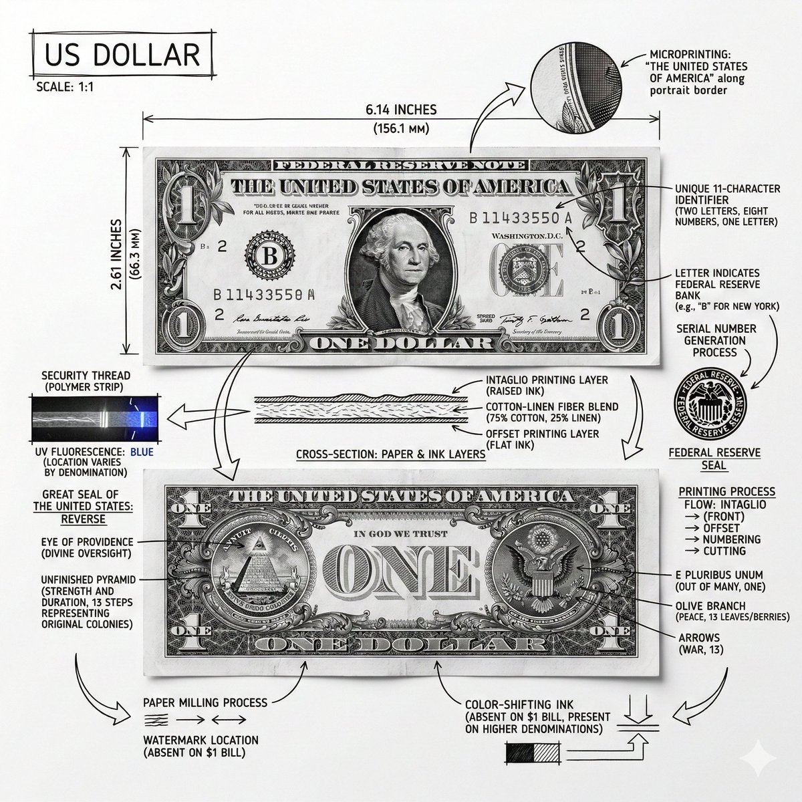

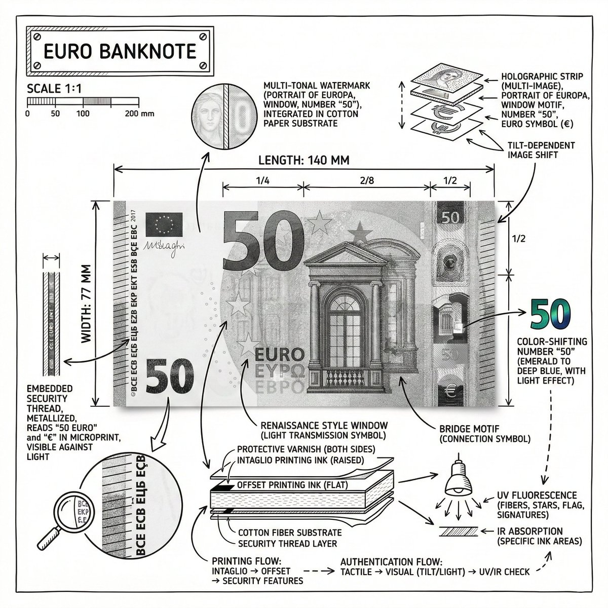

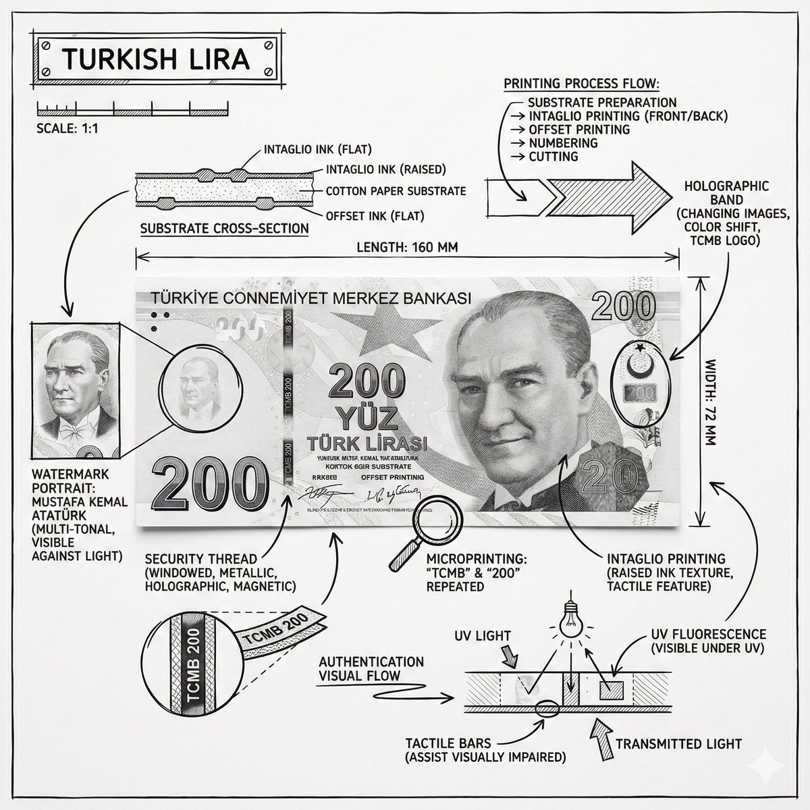

```
Create a high-impact technical infographic of the US Dollar banknote, treated as an engineered object.

Use a photorealistic, ultra-detailed US dollar bill as the base image, placed on a pure white studio background.

Overlay black ink, hand-drawn technical annotations directly on top of the bill, including:
– Exact measurements, proportions, and scale markers
– Security feature callouts (microprinting, security thread, ink layers)
– Material and paper composition notes
– Exploded or cutaway-style outlines showing internal layers
– Arrows indicating printing process, security mechanisms, and visual flow
– Schematic-style diagrams of anti-counterfeit elements
– Symbol and seal annotations (eye, pyramid, serial numbers) drawn in a technical, analytical way

Style:
– Architectural / engineering sketch aesthetic
– Black technical pen linework only
– Precise but slightly hand-drawn
– Clean, minimal, museum-exhibit vibe

Composition rules:
– The real dollar bill remains clearly visible beneath annotations
– Annotations are large and readable on mobile screens
– Balanced negative space, no clutter

Place the title “US Dollar” inside a hand-drawn technical annotation box in one corner.

Color palette:
Black and white only. No color.

Output:
1080×1080, ultra-crisp, high contrast, no watermark, social-feed optimized.
```

```
创作一张高冲击力的技术型信息图，将美元纸币视为一件工程化对象。

以一张逼真、超精细的美元纸币作为基础图像，置于纯白色摄影棚背景上。

在纸币上直接叠加手绘风格的黑色墨水技术注释，包括：
– 精确的尺寸、比例和比例标尺  
– 防伪特征标注（微缩印刷、安全线、油墨层）  
– 材质与纸张成分说明  
– 采用爆炸图或剖面图形式展示内部结构层次  
– 箭头指示印刷流程、防伪机制及视觉动线  
– 以示意图方式解析防伪元素  
– 对符号与印章（如全视之眼、金字塔、序列号）进行技术性、分析式的标注  

风格要求：  
– 建筑/工程草图美学  
– 仅使用黑色技术绘图笔线条  
– 精准但略带手绘感  
– 干净、极简，具有博物馆展览般的质感  

构图规则：  
– 真实美元纸币在注释下方清晰可见  
– 注释文字足够大，在手机屏幕上易于阅读  
– 负空间均衡，无杂乱感  

在画面一角放置一个手绘技术注释框，内含标题“US Dollar”。

配色方案：  
仅限黑白，无任何彩色。

输出规格：  
1080×1080，超清晰、高对比度，无水印，适配社交媒体展示。
```

 [↑返回目录](#toc)

---
## <a id="prompt-2014313681333764400">从古金币到数字支付的演变</a> (<a href="https://x.com/i/status/2014313681333764333" target="_blank" rel="noopener noreferrer">Umesh</a>)

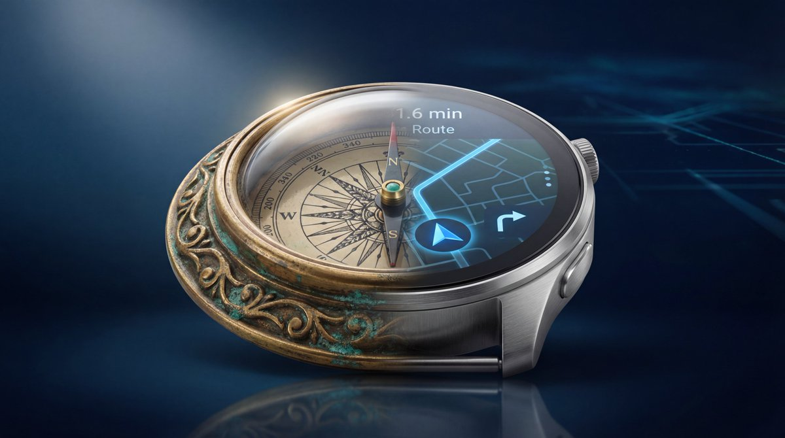

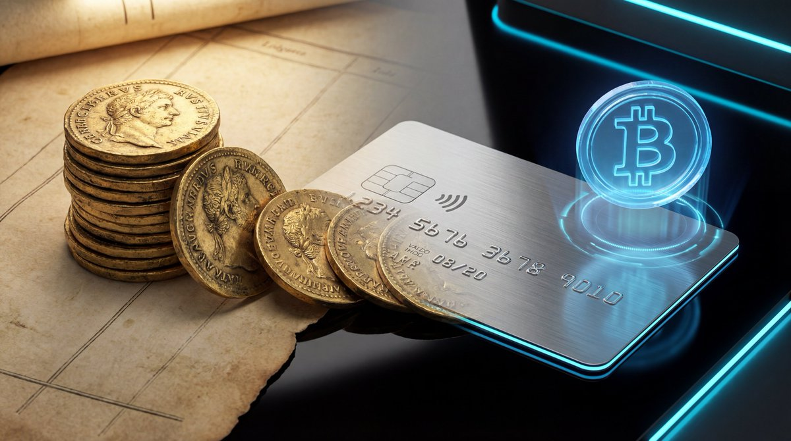

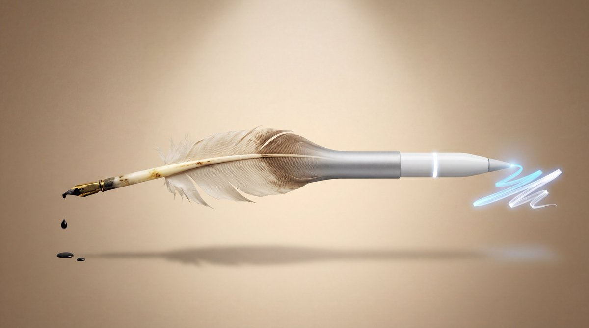

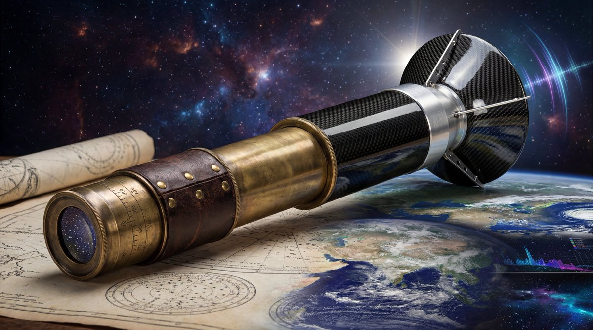

```
An antique brass nautical compass with ornate engravings and a glass dome, positioned at a slight angle. The compass rose and needle on the left side remain traditional, with aged verdigris patina on the brass housing. Moving rightward, the brass gradually becomes brushed aluminum, the glass dome flattens into a sapphire crystal watch face, and the entire object transforms into a modern GPS smartwatch. The compass needle morphs into a digital navigation arrow on the watch display. The watch screen shows a glowing map interface with route directions. Set against a navy blue gradient background suggesting ocean depths fading into digital space. Soft ambient lighting with a single highlight catching both the brass and the watch crystal. Product photography style, magazine advertisement quality, photorealistic materials and reflections, 8K detail.
```

```
A stack of ancient gold coins, showing Roman or Greek profiles and worn inscriptions, positioned on the left. The coin stack gradually flattens and transforms rightward into a modern contactless payment card, then further into a floating     
  holographic cryptocurrency symbol. Individual coins morph into the card's embossed numbers, the aged patina becomes the card's metallic finish, and the edge milling transforms into the chip contact points. Include a subtle glow representing  
  digital transaction approval on the far right. Background transitions from aged parchment ledger texture to sleek black glass surface. Overhead banking vault lighting on the coins shifts to futuristic neon accent lighting on the digital      
  elements. Finance industry advertisement aesthetic, wealth and security symbolism, gold-to-silver-to-blue color progression, photorealistic metals with digital overlay elements.
```

```
A vintage feather quill pen positioned horizontally, seamlessly transforming into a modern digital stylus in a single continuous form. The left side shows the authentic goose feather with natural barbs, aged ivory shaft, and brass nib tip    
  dipped in black ink. The middle transition zone shows feather barbs gradually becoming sleek smooth surfaces, the organic shaft becoming cylindrical aluminum. The right side becomes a modern Apple Pencil style stylus with matte white finish  
  and subtle LED indicator. Ink drops falling from the quill nib on the left side, digital brush strokes appearing from the stylus tip on the right side, both active simultaneously. Set against a clean, minimal warm beige gradient background.  
  Soft directional lighting from above creating gentle shadows. The organic cream and brown tones gradually shift to white and silver tones. Photorealistic product photography, conceptual advertising style, sharp focus, 4K resolution, studio   
  lighting, centered
```

```
An antique brass telescope, extended to full length, lying diagonally across the frame. The eyepiece end on the left shows traditional craftsmanship with leather wrapping, brass rivets, and hand-etched distance markings. Moving toward the    
  objective lens end, the brass tubing gradually becomes sleek black carbon fiber and aluminum, transforming into a satellite dish antenna. The lens glass morphs into the parabolic dish reflector. Stars visible through the traditional eyepiece 
  end, radio wave visualization patterns emanating from the modern antenna end. Deep space navy and black background with subtle nebula colors. The telescope rests on vintage nautical charts that transition into satellite imagery. Dramatic rim 
  lighting defining the cylindrical shape throughout. Space exploration documentary style, scientific accuracy in both designs, awe-inspiring cosmic atmosphere, metallic surface rendering perfection.
```

 [↑返回目录](#toc)

---
## <a id="prompt-2014852145208820200">香薰蜡烛与草本摆拍</a> (<a href="https://x.com/i/status/2014852145208820214" target="_blank" rel="noopener noreferrer">Alexandra Aisling</a>)

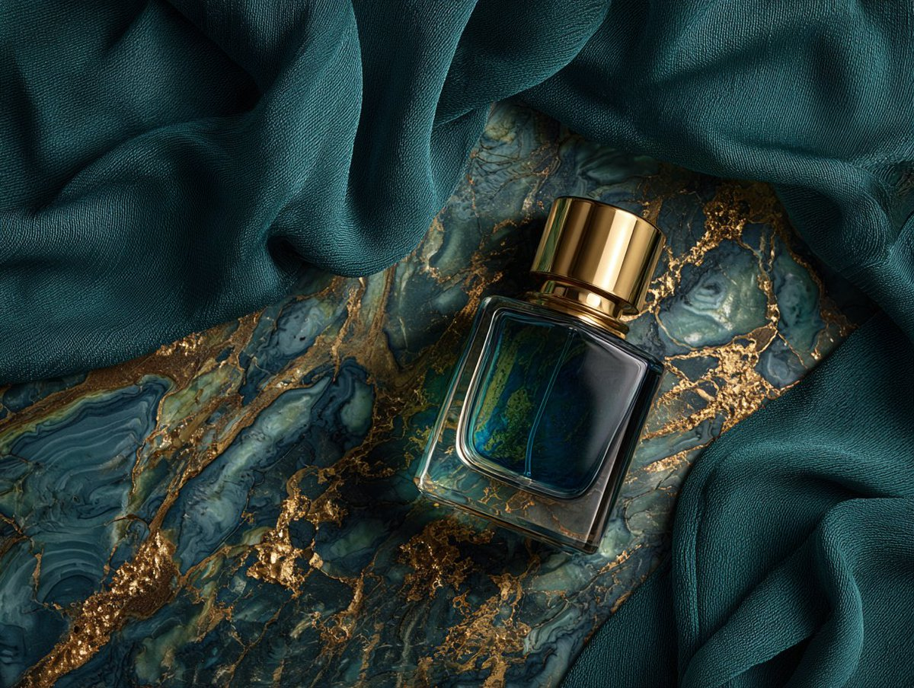


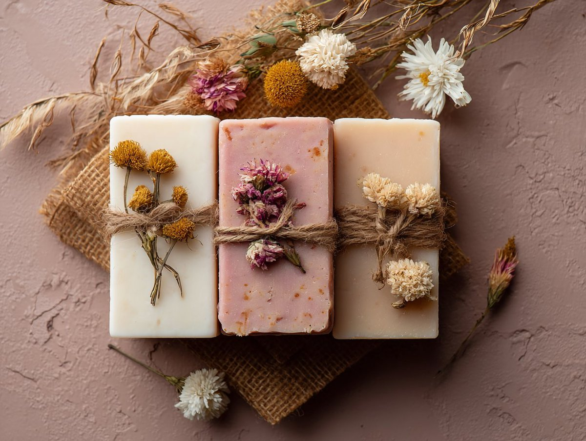

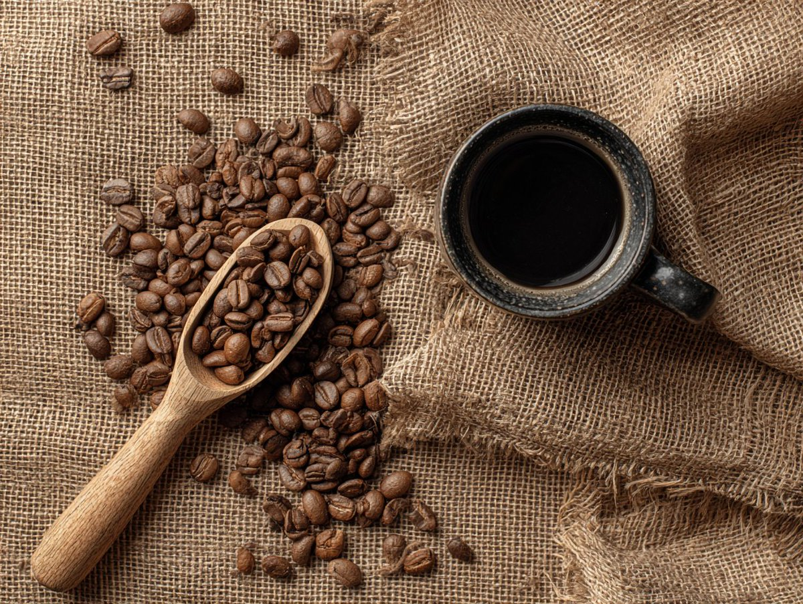

```
Luxury perfume bottle arranged in flat lay composition with marble slab, silk fabric folds, gold accents, top-down view, soft even lighting, deep emerald background, styled product photography
```

```
Aromatherapy candles arranged in flat lay composition with matchsticks, stone tray, herbs, top-down view, soft even lighting, pale sage background, styled product photography
```

```
Handcrafted soap bars arranged in flat lay composition with dried flowers, twine, kraft paper, top-down view, soft even lighting, dusty rose background, styled product photography
```

```
Artisanal coffee beans arranged in flat lay composition with wooden scoop, ceramic mug, burlap fabric, top-down view, soft even lighting, earthy brown background, styled product photography
```

 [↑返回目录](#toc)

---
## <a id="prompt-2014873591364649200">摄影棚的古风写真</a> (<a href="https://x.com/i/status/2014873591364649320" target="_blank" rel="noopener noreferrer">Adam也叫吉米</a>)

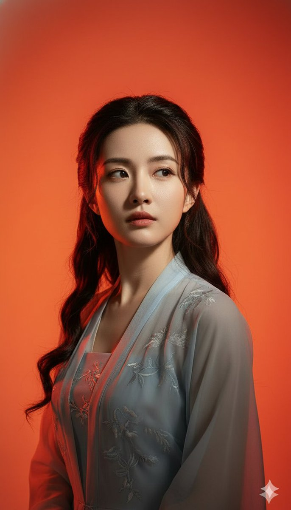

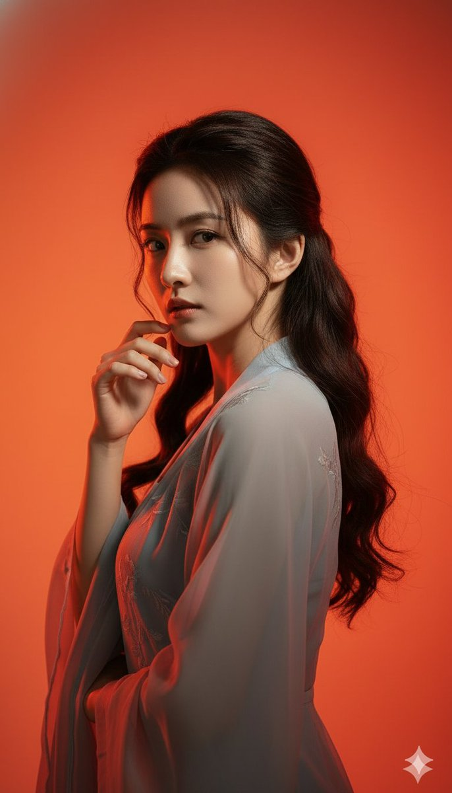

```
{
  "meta": {
    "title": "Heroic Dramatic Studio Portrait",
    "role": "World-class photographer specializing in editorial portraits",
    "aesthetic": "Dramatic, saturated studio lighting with a heroic feel"
  },
  "constraints": {
    "identity_anchor": {
      "source": "ATTACHED REFERENCE PHOTO",
      "strictness": "Critical",
      "instruction": "Perfectly preserve exact facial features, skin tone, hairstyle, and natural likeness without changes."
    },
    "clothing_anchor": {
      "source": "EXACTLY AS IN REFERENCE PHOTO",
      "strictness": "Critical",
      "instruction": "Style, color, material, and fit must fully correspond to the original without stylization."
    }
  },
  "subject_details": {
    "expression": "Serious, tense, focused",
    "gaze": "Directed away from camera, into space above",
    "universality": "Lighting and angle applicable regardless of gender"
  },
  "composition": {
    "background": "Saturated solid orange-red backdrop, smooth intense gradients, no patterns, 'hot' atmosphere",
    "camera_angle": "Low angle (shot from below upwards) to create dominance",
    "framing": "Medium close-up, emphasis on face and shoulders"
  },
  "lighting": {
    "palette": "Dominant bright oranges and deep red shades",
    "key_light": "Strong directional source, deep dramatic shadows (chiaroscuro), emphasizing facial structure",
    "backlight": "Powerful expressive rim light or color halo separating subject from background",
    "mood": "Mysterious, tense, high-contrast"
  },
  "technical_specs": {
    "style": "Photorealism, high detail",
    "focus": "Sharp focus on face vs smooth gradient background",
    "texture_quality": "Preserve natural pores and skin texture"
  },
  "combined_prompt_text": "World-class editorial portrait, dramatic studio lighting, heroic feel. [REFERENCE PHOTO IDENTITY PRESERVED]: Exact facial features, skin tone, hairstyle. [CLOTHING EXACT MATCH]: No changes to fit or material. Expression: serious, tense, focused, looking up and away. Background: Saturated solid orange-red, smooth intense gradients, hot atmosphere. Camera Angle: Low angle shot from below for dominance. Framing: Medium close-up. Lighting: Bright orange and deep red palette, strong directional chiaroscuro key light, powerful rim light separating subject from background. Technical: Photorealistic, high detail, sharp focus on face, natural skin texture and pores."
}
```

```
世界级编辑人像摄影，戏剧性影室灯光，英雄感氛围。【保留参考照片身份特征】：精确还原面部特征、肤色与发型。【服装完全一致】：不得更改版型或材质。表情：严肃、紧绷、专注，目光向上方远处。背景：饱和的纯橙红色，平滑强烈的渐变，炽热氛围。拍摄角度：低角度仰拍以营造支配感。构图：中近景，突出面部与肩部。灯光：以明亮橙色与深红色为主调，强烈的定向明暗对比光（chiaroscuro）强调面部结构，强烈的轮廓光或彩色光晕将主体与背景分离。技术要求：逼真写实，高细节，面部清晰对焦，保留自然肌肤纹理与毛孔。
```

 [↑返回目录](#toc)

---
## <a id="prompt-2014723801205113300">赛博朋克经典：四款冷门佳作的微缩场景</a> (<a href="https://x.com/i/status/2014723801205113262" target="_blank" rel="noopener noreferrer">Gadgetify</a>)

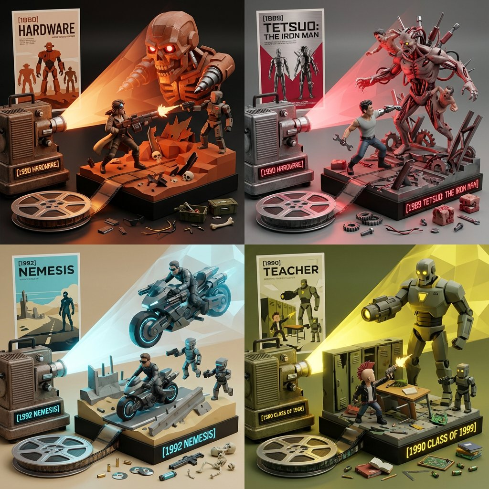

```
Input Variable:   [movie name] (e.g., The Terminator, Blade Runner, Alien, Mad Max)

  System Instruction:  
Generate a 2x2 Grid of   "Designer Vinyl" Cinematic Dioramas  .
  The Goal:   Visualize 4 lesser-known "Hidden Gems" of the same genre as the input, reimagined as a high-end collectible playset built on top of a film projector.

  1. Hidden Gems:  
      Analyze the Input:   Identify the Genre, Era, and Visual Tropes (e.g., Terminator = 80s Cyberpunk, Cyborgs, Dystopia).
      The Selection:   Select   4 Cult Classics/Hidden Gems   in that genre.
         (e.g., If Terminator -> Select "Hardware" (1990), "Tetsuo: The Iron Man", "Nemesis", or "Class of 1999"). 
      The Palette:   Extract the dominant 2-color palette for each film (e.g., Hardware = Rust Orange/Black).

  2.  Container (The Projector Base):  
      The Base:   A stylized, mechanical   Cinema Projector   sits at the bottom of the frame.
      The Reel:   A film reel spins on the projector.
      The Transformation:   The   Film Strip   unspools from the reel and physically morphs into the "Ground" or "Road" of the diorama. The individual frames extend outward to form the geometric, blocky terrain.

  3. Projection:  
      The Beam:   The light beam shooting from the projector lens   Solidifies   into the main Vehicle or Creature of the film.
         Logic:  It is semi-translucent, glowing, and geometric—as if made of "Hard Light."
         (e.g., A Glowing Motorcycle, A Hunter-Killer Drone, A Kaiju). 

  4. Cast:  
  CRITICAL:   Do not use just one figure. Create a   Dynamic standoff.  
      The Protagonist:   A stylized   "Designer Vinyl" Toy Figure   (Matte finish, exaggerated proportions, no nose/mouth) stands on the film-strip ground.
      The Threat:   2-3 smaller "Minion" figures or a "Villain" figure interacting with the hero.
         (e.g., Hero shooting at Drones; Hero running from Cyborgs). 
      The Pose:   Dynamic Action (Mid-jump, Taking Cover, Firing Weapon).

  5. Environment :  
      The Backdrop:   A minimalist, Mod-Design   Movie Poster   stands vertically behind the scene, acting as the sky.
      The Debris:   8-12 miniature props are scattered on the film strip.
         Logic:  These must be specific to the film's lore (e.g., Skulls, Microchips, loose wires, ammo crates, sunglasses).
         Style:  Angular, low-poly, abstract art-toy style.

  6. Visuals:  
      The Display:   A small, neon-style LED counter on the projector base displays the   Release Year and name  (e.g., [1990]).
      Lighting:   The scene is lit by the color of the "Hard Light" projector beam (Step 3).
      Render:   Octane Render, "Blind Box" Collectible aesthetic, Plastic Sheen.

  Output:   2x2 Grid, 1:1 Aspect Ratio, High-End Toy Photography, Vibrant Colors.
```

```
输入变量：[电影名称]（例如：《终结者》《银翼杀手》《异形》《疯狂的麦克斯》）

系统指令：  
生成一组 2x2 网格的“设计师乙烯基”电影微缩场景。  
目标：将与输入电影同类型的 4 部冷门佳作重新构想为高端收藏级玩具套装，整体构建于一台电影放映机之上。

1. 冷门佳作：  
   分析输入：识别电影的类型、年代和视觉元素（例如，《终结者》= 80 年代赛博朋克、生化人、反乌托邦）。  
   选片标准：挑选该类型中的 4 部邪典经典或冷门佳作（例如，若输入《终结者》，则可选《铁甲威龙》（1990）、《铁男》、《复仇女神》或《1999 届毕业生》）。  
   色彩方案：提取每部影片的主色调（两种颜色），例如《铁甲威龙》= 锈橙色/黑色。

2. 容器（放映机底座）：  
   底座：画面底部设有一台风格化的机械电影放映机。  
   胶片盘：放映机上转动着一卷胶片。  
   变形设计：胶片从盘中展开，并物理变形为微缩场景的“地面”或“道路”。单帧画面向外延伸，构成几何块状地形。

3. 投影效果：  
   光束：从放映机镜头射出的光束凝结成影片中的核心载具或生物。  
   设定逻辑：该物体呈半透明、发光且几何化，仿佛由“硬光”构成（例如：发光摩托车、猎杀者无人机、怪兽）。

4. 人物角色：  
   关键要求：不得仅使用单一角色，需营造动态对峙场面。  
   主角：一位风格化的“设计师乙烯基”玩具人偶（哑光质感、夸张比例、无鼻无嘴）站在胶片地面上。  
   威胁角色：2–3 个小型“喽啰”人偶或一个“反派”人偶与主角互动（例如：主角射击无人机；主角逃离生化人）。  
   姿势：动态动作（如跳跃中、掩体后射击、开火）。

5. 环境细节：  
   背景：一幅极简风格的现代主义电影海报垂直立于场景后方，充当天空。  
   场景道具：胶片地面上散落 8–12 件微型道具，必须贴合影片设定（例如：头骨、微型芯片、散落电线、弹药箱、墨镜）。  
   风格：棱角分明、低多边形、抽象艺术玩具风格。

6. 视觉呈现：  
   显示屏：放映机底座上设有小型霓虹风格 LED 计数器，显示影片的上映年份与片名（例如：[1990]）。  
   光照：整个场景由第 3 步中“硬光”投影光束的颜色照亮。  
   渲染：Octane 渲染，盲盒收藏品美学，塑料光泽感。

输出格式：2x2 网格布局，1:1 画幅比例，高端玩具摄影风格，色彩鲜明。
```

 [↑返回目录](#toc)

---
## <a id="prompt-2014744659730563300">极简工业风产品细节展示</a> (<a href="https://x.com/i/status/2014744659730563202" target="_blank" rel="noopener noreferrer">Ege</a>)

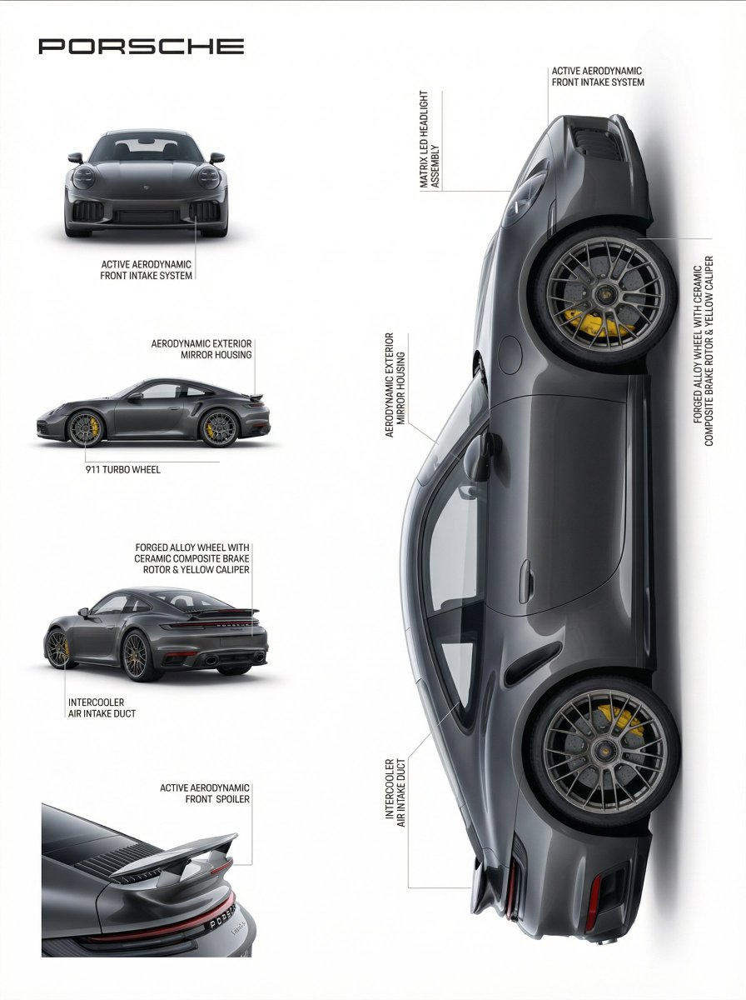

```
Engineered to matter 

{
  "reference": {
    "type": "image",
    "usage": "Use the uploaded image as the sole source of truth. Do not assume product category in advance."
  },
  "scene": {
    "description": "Minimal, premium product presentation layout inspired by high-end industrial design and product documentation.",
    "background": "Pure white, clean, distraction-free"
  },
  "layout": {
    "top_left": {
      "content": "Brand name",
      "style": "Modern sans-serif typography, subtle, elegant"
    },
    "left_column": {
      "content": "Multiple auxiliary product views",
      "views": [
        "Primary front or main view",
        "Secondary side view",
        "Alternate angle or rear view",
        "Detail or top view if applicable"
      ],
      "arrangement": "Vertically stacked, evenly spaced, aligned"
    },
    "right_section": {
      "content": "Main hero product render",
      "style": "Large, dominant, photorealistic",
      "lighting": "Soft studio lighting",
      "materials": "Visually accurate to the uploaded product"
    }
  },
  "annotations": {
    "analysis_phase": [
      "Visually analyze the product to identify distinct physical components",
      "Determine visible materials, surfaces, interfaces, and structures",
      "Ignore assumed internal mechanisms or hidden features"
    ],
    "binding_rules": [
      "Each annotation line must point to one clearly visible component",
      "Each label must describe exactly what that component is and does, based only on visual evidence",
      "No label may rely on the product category for meaning",
      "One line equals one component equals one explanation"
    ],
    "line_style": {
      "type": "Hairline-thin vector lines",
      "color": "Neutral light gray",
      "termination": "Exact contact point on the referenced component"
    },
    "labels": {
      "content_rules": [
        "Use neutral, descriptive nouns (e.g. outer shell, surface panel, joint, opening, interface, edge, enclosure)",
        "Mention material only if visually identifiable",
        "Mention function only if structurally implied",
        "Avoid category-specific terminology unless clearly visible"
      ],
      "placement_rules": [
        "Place text outside the product silhouette",
        "Maintain consistent spacing",
        "Avoid overlaps",
        "Align labels for technical clarity"
      ],
      "tone": "Factual, precise, non-marketing",
      "typography": "Minimal technical sans-serif"
    }
  },
  "visual_style": {
    "aesthetic": "Scandinavian, modern, industrial documentation",
    "mood": "Calm, precise, professional",
    "color_palette": "Neutral and restrained"
  },
  "rendering": {
    "quality": "Ultra-high resolution",
    "shadows": "Soft and realistic",
    "accuracy": "Exact proportions and geometry fidelity"
  },
  "rules": {
    "do_not": [
      "Assume product category",
      "Hallucinate features",
      "Use generic marketing language",
      "Mismatch labels and components",
      "Decorate annotation lines"
    ],
    "focus_on": [
      "Visual truth",
      "Semantic correctness",
      "Component-level understanding",
      "Professional design documentation"
    ]
  }
}
```

```
专为呈现细节而设计  

参考上传的图像作为唯一依据，不得预先假设产品类别。  
场景采用极简、高端的产品展示布局，灵感源自高端工业设计与产品文档风格，背景为纯白、干净、无干扰。  

左上角放置品牌名称，使用现代无衬线字体，低调优雅。  
左侧栏包含多个辅助产品视图，包括主视图（正面或主要视角）、侧视图、其他角度或后视图，以及适用时的细节或俯视图，所有视图垂直堆叠、均匀分布、对齐排列。  
右侧区域为主产品渲染图，尺寸大且突出，采用逼真摄影级效果，配以柔和影棚灯光，材质表现需与上传产品完全一致。  

标注部分需先进行视觉分析：识别产品明显的物理组件，判断可见的材质、表面、接口和结构，忽略内部机制或不可见特征。  
每条标注线必须指向一个清晰可见的组件，每个标签仅描述该组件的视觉所见及其结构暗示的功能，不得依赖产品类别进行解释；一条线对应一个组件对应一条说明。  
标注线为极细矢量线，颜色为中性浅灰，末端精确接触所指组件。  

标签内容使用中性描述性名词（如外壳、表面面板、接缝、开口、接口、边缘、壳体等），仅在材质可明确辨识时注明，仅在功能可由结构推断时提及，避免使用非视觉可见的品类术语。  
标签文本置于产品轮廓外，保持间距一致、无重叠，并以技术清晰性为对齐原则。语调客观精准，不带营销色彩，字体采用极简技术风格无衬线体。  

整体视觉风格为斯堪的纳维亚式、现代、工业文档风，氛围冷静、精准、专业，配色中性克制。  
渲染需超高清分辨率，阴影柔和真实，比例与几何形状高度准确。  

严禁假设产品类别、虚构特征、使用泛化营销语言、标签与组件错配或装饰标注线；聚焦于视觉真实、语义准确、组件级理解及专业设计文档标准。
```

 [↑返回目录](#toc)

---
## <a id="prompt-2015042882512552200">地标结构解析图</a> (<a href="https://x.com/i/status/2015042882512552141" target="_blank" rel="noopener noreferrer">TechieSA</a>)

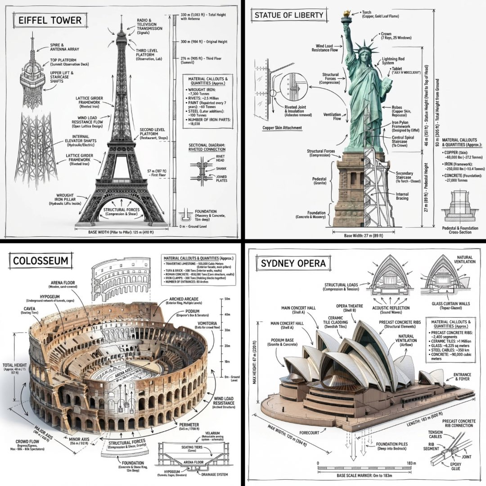

```
Create an infographic image of [LANDMARK], combining a realistic photograph or photoreal render of the object with technical annotation overlays placed directly on top.

Use black ink–style line drawings and text (technical pen / architectural sketch look) on a pure white studio background, including:
•Key component labels
•Internal cutaway or exploded-view outlines
•Measurements, dimensions, and scale markers
•Material callouts and quantities
•Arrows indicating function, force, or flow (air, sound, power, pressure)
•Simple schematic or sectional diagrams where relevant

Place the title [LANDMARK] inside a hand-drawn technical annotation box in one corner.

Style & layout rules:
•The real object remains clearly visible beneath the annotations
•Annotations feel sketched, technical, and architectural
•Clean composition with balanced negative space
•Educational, museum-exhibit / engineering-manual vibe

Visual style:
Minimal technical illustration aesthetic, black linework over realistic imagery, precise but slightly hand-drawn feel.

Color palette:
White background, black annotation lines and text only. No colors.

Output:
1080×1080, ultra-crisp, social-feed optimized, no watermark.
```

```
创作一张关于[地标]的信息图图像，将该物体的真实照片或逼真渲染图与直接叠加其上的技术注释相结合。

使用纯白色工作室背景，以黑色墨水风格的线条绘图和文字（技术笔/建筑草图风格），包括以下内容：  
• 关键部件标签  
• 内部剖面图或爆炸视图轮廓  
• 尺寸、测量数据和比例标记  
• 材料标注及数量说明  
• 指示功能、力或流动方向（空气、声音、电力、压力）的箭头  
• 在适当位置加入简化的示意图或剖面图  

在画面一角放置一个手绘风格的技术注释框，内含标题“[地标]”。

风格与布局要求：  
• 注释下方的真实物体清晰可见  
• 注释呈现手绘感、技术感和建筑图纸风格  
• 构图简洁，留白均衡  
• 整体氛围具有教育性，类似博物馆展品或工程手册  

视觉风格：  
极简技术插图美学，黑色线条叠加于真实图像之上，精准但略带手绘质感。

配色方案：  
纯白背景，仅使用黑色注释线条与文字，无其他颜色。

输出规格：  
1080×1080 像素，超高清，适配社交媒体展示，无水印。
```

 [↑返回目录](#toc)

---
## <a id="prompt-2014961007068906000">【AI写真系列✨×韩系女团风写真🎀】第一弹</a> (<a href="https://x.com/i/status/2014961007068905955" target="_blank" rel="noopener noreferrer">骑司Chase</a>)

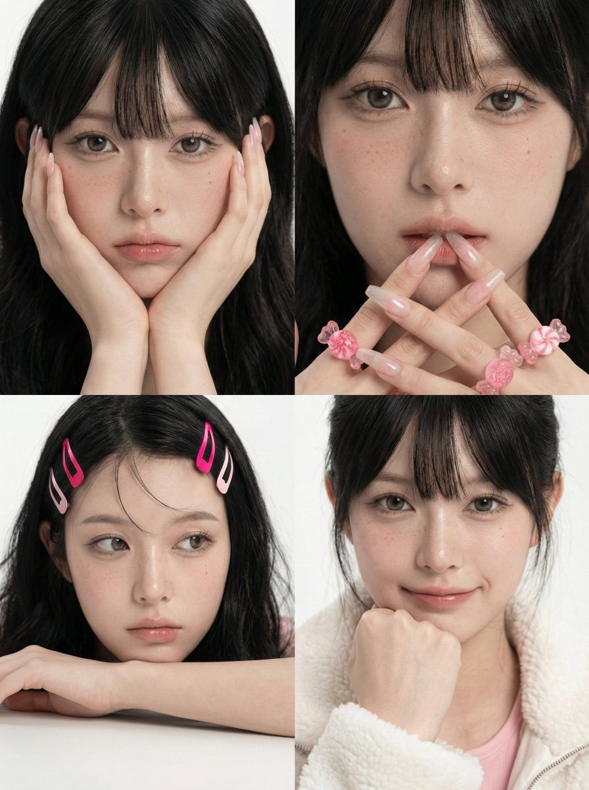

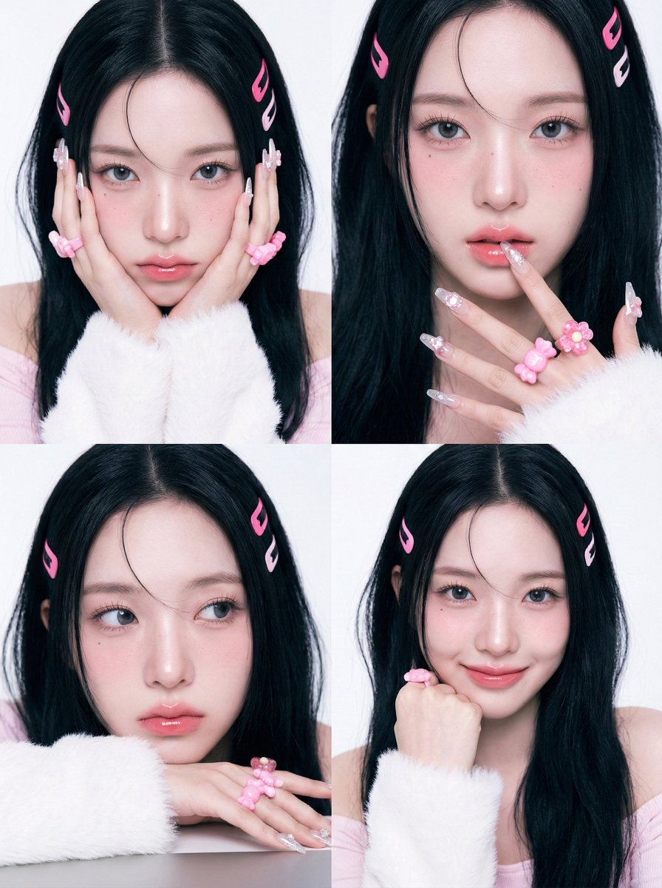

```
【AI写真系列✨×韩系女团风写真🎀】第一弹

从T-ARA到张元英、柳智敏，韩国女团一直影响着时代主流审美，似乎永不过时......所以我花了20分钟，把韩系女团风写真用Nano Banana Pro解决了

✅ 图一为上传参考图效果
✅ 图二为直接使用效果

✍️中文提示词：

一、画面构图
1 版式：整体为3:4比例，四宫格拼图，3:4小图用2×2排列
2 取景：近景到特写为主，人物占画面大比例
3 角度：平视近拍，轻微左右变化，统一干净背景

二、人物主体
1 参考来源：以上传参考图作为严格身份来源
2 一致性要求：零偏差
3 脸部：脸型精致、眼睛偏大、右眼下方点了一颗小痣，鼻梁细长
4 肤质：白皙带淡粉，皮肤细腻，有轻微柔焦
5 细节：鼻梁与面中高光明显，脸颊与鼻尖轻微泛红，散落少量雀斑点

三、妆容细节
1 底妆：通透干净，轻薄雾面带微光
2 腮红：粉色集中在脸颊与鼻梁两侧
3 眼妆：自然放大，睫毛纤长，眼神清澈
4 唇妆：水润嘟嘟唇，淡粉到蜜桃渐变，唇峰柔和

四、发型与头饰
1 发型：黑色长直发，中分，发量饱满，自然垂落
2 碎发：额前少量发丝自然飘动
3 发饰：左右各一枚粉色发夹，颜色偏亮粉与浅粉，金属夹片可见

五、手部与配饰
1 指甲：超长甲型，半透明或浅色系，带细闪与立体装饰
2 戒指：多枚粉色可爱造型戒指，糖果感与花朵感，体积夸张但软萌
3 手势风格：靠近脸部与嘴唇，突出指甲与戒指细节

六、服装与材质
1 上衣：毛绒质感外套或袖套，白色蓬松柔软
2 内搭：浅粉色吊带或上衣，露肩或斜肩效果
3 整体风格：甜美软糯，带一点小酷感

七、四张分镜动作与表情
1 左上：双手托脸贴近镜头，表情冷淡微委屈，直视镜头
2 右上：手指靠近嘴唇或轻触唇边，眼神平静略挑逗，特写更近
3 左下：下巴或手臂压在桌面边缘，眼睛看向侧方，神情发呆放空
4 右下：手握拳轻抵下巴，微笑但克制，直视镜头，气质更亲和

八、光线与色调
1 光线：高亮柔光，阴影很浅，整体均匀
2 色调：冷白背景为主，粉色点缀突出，肤色偏冷粉
3 对比：低对比，干净通透，不厚重

九、质感与画面效果
1 清晰度：五官与发丝清晰，皮肤细节保留但有轻微磨皮柔化
2 景深：背景虚化很弱或几乎无纹理，主体更突出
3 氛围：甜美感女团韩杂风写真，甜美可爱、精致梦幻、轻微玻璃质感光泽
```

 [↑返回目录](#toc)

---
## <a id="prompt-2015462436300824800">商品九宫格</a> (<a href="https://x.com/i/status/2015462436300824732" target="_blank" rel="noopener noreferrer">Amira Zairi</a>)

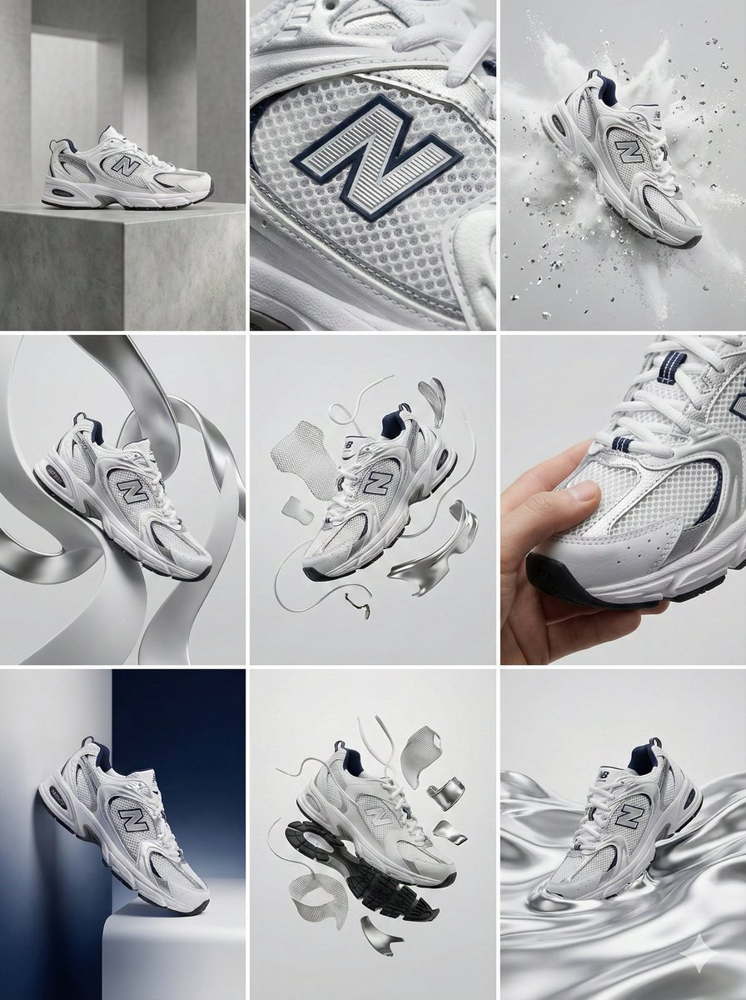

```
A clean 3×3 [ratio] storyboard grid with nine equal [ratio] sized panels on [4:5] ratio. 

Use the reference image as the base product reference. Keep the same product, packaging design, branding, materials, colors, proportions and overall identity across all nine panels exactly as the reference. The product must remain clearly recognizable in every frame. The label, logo and proportions must stay exactly the same.

This storyboard is a high-end designer mockup presentation for a branding portfolio. The focus is on form, composition, materiality and visual rhythm rather than realism or lifestyle narrative. The overall look should feel curated, editorial and design-driven.

FRAME 1:
Front-facing hero shot of the product in a clean studio setup. Neutral background, balanced composition, calm and confident presentation of the product.

FRAME 2:
Close-up shot with the focus centered on the middle of the product. Focusing on surface texture, materials and print details.

FRAME 3:
Shows the reference product placed in an environment that naturally fits the brand and product category. Studio setting inspired by the product design elements and colours. 

FRAME 4:
Product shown in use or interaction on a neutral studio background. Hands and interaction elements are minimal and restrained, the look matches the style of the package. 

FRAME 5:
Isometric composition showing multiple products arranged in a precise geometric order from the top isometric angle. All products are placed at the same isometric top angle, evenly spaced, clean, structured and graphic.

FRAME 6:
Product levitating slightly tilted on a neutral background that matches the reference image color palette. Floating position is angled and intentional, the product is floating naturally in space.

FRAME 7:
is an extreme close-up focusing on a specific detail of the label, edge, texture or material behavior.

FRAME 8:
The product in an unexpected yet aesthetically strong setting that feels bold, editorial and visually striking.
Unexpected but highly stylized setting. Studio-based, and designer-driven. Bold composition that elevates the brand.

FRAME 9:
Wide composition showing the product in use, placed within a refined designer setup. Clean props, controlled styling, cohesive with the rest of the series.

CAMERA & STYLE:
Ultra high-quality studio imagery with a real camera look. Different camera angles and framings across frames. Controlled depth of field, precise lighting, accurate materials and reflections. Lighting logic, color palette, mood and visual language must remain consistent across all nine panels as one cohesive series.

OUTPUT:
A clean 3×3 grid with no borders, no text, no captions and no watermarks.
```

```
一个干净的3×3比例分镜网格，包含九个等比面板，整体画幅比例为4:5。

以参考图像作为基础产品参照。在全部九个面板中，严格保持相同的产品、包装设计、品牌标识、材质、色彩、比例及整体视觉识别。产品在每一帧中都必须清晰可辨，标签、标志和比例需完全一致。

该分镜用于高端设计师品牌作品集展示，重点在于形态、构图、材质表现与视觉节奏，而非写实或生活化叙事。整体风格应呈现精心策划、杂志级且以设计为导向的质感。

第一格：
产品正面主视觉镜头，置于简洁摄影棚环境中。背景中性，构图均衡，冷静而自信地呈现产品。

第二格：
特写镜头，焦点集中于产品中部，突出表面纹理、材质与印刷细节。

第三格：
将参考产品置于与其品牌调性和品类自然契合的环境中。场景为受产品设计元素与色彩启发的摄影棚布景。

第四格：
在中性摄影棚背景下展示产品使用或互动状态。手部及互动元素极简克制，整体风格与包装设计语言一致。

第五格：
等距俯视构图，多个产品以精准几何秩序排列。所有产品均采用相同的等距顶角视角，间距均匀，画面干净、结构化且具图形感。

第六格：
产品轻微倾斜悬浮于与参考图像色系匹配的中性背景之上。悬浮姿态角度明确且自然，仿佛自在漂浮于空间中。

第七格：
极致特写，聚焦标签、边缘、纹理或材质表现的某一具体细节。

第八格：
产品置于一个出人意料却极具美学张力的场景中，风格大胆、杂志感强且视觉冲击力十足。场景为摄影棚内打造，高度风格化，构图大胆，旨在提升品牌形象。

第九格：
宽幅构图，展示产品在使用状态下的精致设计师布景。道具简洁，造型受控，整体风格与系列其余部分高度统一。

摄影与风格要求：
超高品质摄影棚影像，呈现真实相机拍摄效果。各帧采用不同机位与取景方式，景深控制精准，灯光严谨，材质与反光表现准确。全系列九格须保持一致的灯光逻辑、色彩体系、氛围与视觉语言，构成一个连贯的整体。

输出要求：
干净的3×3网格布局，无边框、无文字、无标题、无水印。
```

 [↑返回目录](#toc)

---
## <a id="prompt-2015757888283652400">透明气泡膜的极简时尚</a> (<a href="https://x.com/i/status/2015757888283652351" target="_blank" rel="noopener noreferrer">Sharon Riley</a>)

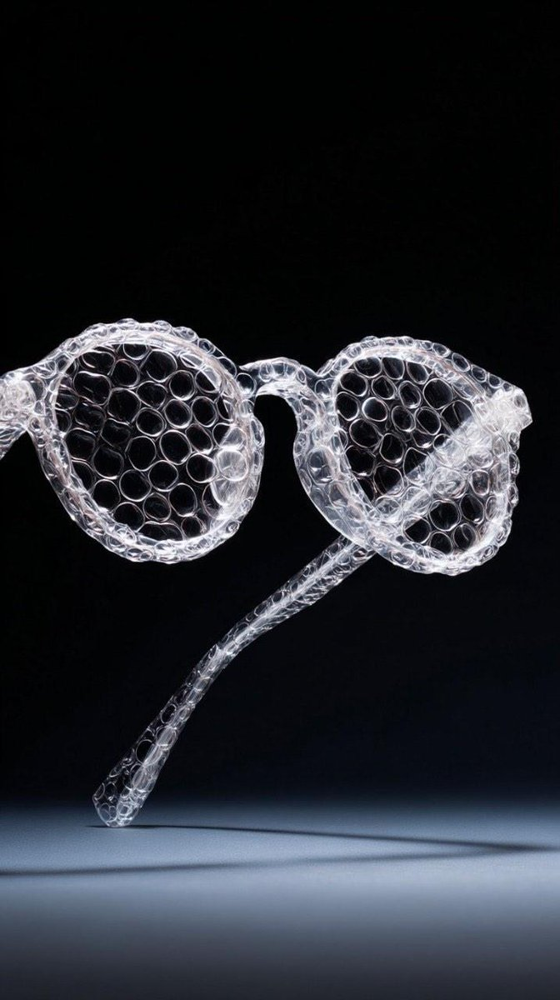

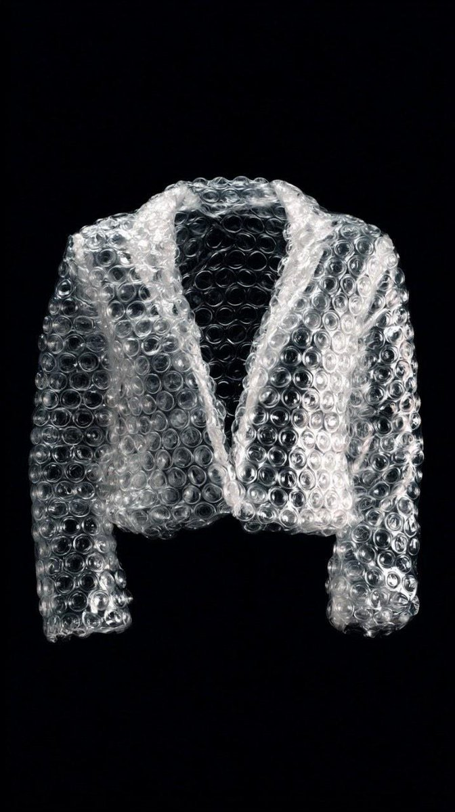

```
{
  "prompt": "A studio shot of a transparent bubble wrap fashion elegant [ITEM], empty with nothing inside. The material is clear, glossy, and highly detailed, capturing the texture of inflated bubbles. Minimalist composition, high-fashion editorial style, soft diffused studio lighting, neutral background, ultra-clean aesthetic, photorealistic rendering, sharp focus.",
  "style": {
    "lighting": "soft diffused studio lighting",
    "background": "neutral seamless backdrop",
    "mood": "modern, minimalist, elegant",
    "quality": "ultra-detailed, photorealistic",
    "material": "transparent bubble wrap"
  }
}
```

```
一张透明气泡膜制成的时尚优雅[物品]的棚拍作品，内部空无一物。材质透明、光亮且细节丰富，清晰呈现充气气泡的纹理。构图极简，采用高端时尚杂志风格，柔和平滑的影室灯光，中性无缝背景，整体美学极度干净，渲染逼真，焦点锐利。
```

 [↑返回目录](#toc)

---
## <a id="prompt-2015582755711861000">电影感时尚大片：翡翠海岸</a> (<a href="https://x.com/i/status/2015582755711860896" target="_blank" rel="noopener noreferrer">Adam也叫吉米</a>)

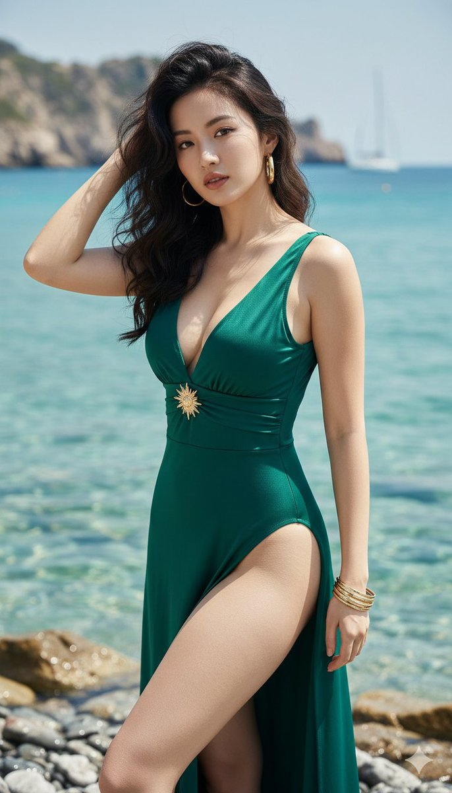

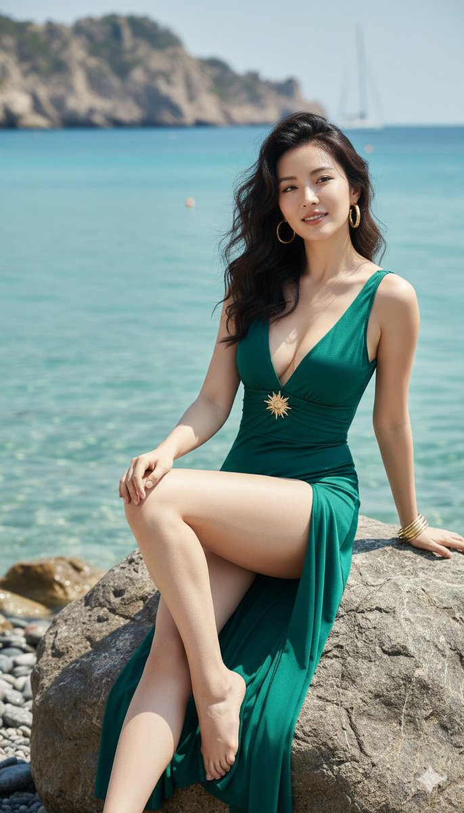

```
{
  "project_metadata": {
    "title": "Cinematic Fashion Editorial: Emerald Coast",
    "output_format": "8K RAW Photorealistic",
    "aspect_ratio": "9:16",
    "style_profile": "High-End Vogue Editorial"
  },
  "subject_profile": {
    "identity_model": {
      "base_likeness": "The person I uploaded",
      "fidelity_weight": "1.0 (Exact facial features)",
      "expression": "Confident sultry pout, direct eye contact",
      "skin_physics": {
        "texture": "Hyper-detailed pores, natural micro-creases",
        "shading": "Subsurface scattering (SSS), natural coastal glow",
        "complexion": "Natural olive-toned skin, sun-kissed highlights"
      }
    },
    "anatomical_specifications": {
      "body_type": "Curvy, voluptuous hourglass silhouette",
      "modifications": [
        "Enhanced bust proportions (Upper-body emphasis)",
        "Toned, natural anatomy",
        "Realistic skin-to-fabric compression"
      ],
      "hair_properties": {
        "style": "Identical to reference; loose, wind-tossed waves",
        "interaction": "Left hand threading through the hair, creating volume"
      }
    }
  },
  "wardrobe_and_styling": {
    "primary_attire": {
      "garment": "One-piece swimsuit dress",
      "color_palette": "Deep Emerald Green (#50C878)",
      "design_elements": [
        "Extreme deep V-neckline (Plunging)",
        "High-cut leg openings",
        "Thigh-high side slit",
        "Gold sunburst brooch centered at the bust apex"
      ],
      "fabric_render": "Satin-finish Lycra, realistic sheen, micro-folds at the waist"
    },
    "jewelry_suite": {
      "earrings": "Large 18k gold hoop earrings, high-mirror reflection",
      "wristwear": "Stacked gold bangles, realistic metallic anisotropic highlights"
    }
  },
  "compositional_strategy": {
    "framing": "Medium-close portrait (Waist-up focus)",
    "perspective": "Medium low-angle (Hero shot)",
    "pose_architecture": {
      "stance": "Three-quarter front view, confident posture",
      "weight_distribution": "Balanced on a pebbled surface, slight lean toward lens"
    },
    "optics": {
      "lens_emulation": "85mm Prime f/1.2",
      "depth_of_field": "Shallow (Subject sharp / Background creamy bokeh)",
      "focus_point": "Subject's eyes"
    }
  },
  "environmental_layers": {
    "foreground": "Macro-detailed wet pebbles and sea-worn stones",
    "midground": "Crystal-clear turquoise Mediterranean sea with caustic light patterns",
    "background": [
      "Jagged coastal cliffs with atmospheric haze",
      "Distant, minimalist white sailboat on the horizon line"
    ],
    "lighting_design": "Natural high-noon sun with cinematic bounce-card fill"
  },
  "technical_integrity": {
    "denoise_strength": "0.15",
    "rendering_directives": [
      "No AI artifacts",
      "No plastic/wax skin textures",
      "Accurate finger/hand anatomy",
      "Correct light-bounce from gold jewelry onto skin"
    ]
  }
}
```

```
《电影感时尚大片：翡翠海岸》
输出格式：8K RAW 超写实摄影
画幅比例：9:16
风格定位：高端《Vogue》杂志级时尚大片

人物设定：
- 面部特征严格基于上传照片，还原度权重为1.0（精确复刻五官）
- 表情：自信而撩人的微噘嘴唇，直视镜头
- 肌肤表现：超精细毛孔与自然微细纹路，次表面散射（SSS）效果，呈现自然海岸光晕；橄榄色自然肤色，带有阳光亲吻般的高光

身形设定：
- 体型：曲线丰腴的沙漏型身材
- 调整细节：上半身重点强调（胸部比例增强）、自然紧致的体态、真实衣物对肌肤的压痕效果
- 发型：与参考图完全一致，松散凌乱的海风卷发；左手穿插于发丝间，营造蓬松体积感

服装造型：
- 主服饰：一体式泳装连衣裙，深翡翠绿色（#50C878）
- 设计元素：极致深V领口、高开衩裤腿、大腿高位侧开衩、胸前最高点饰以金色日芒胸针
- 面料渲染：缎面莱卡材质，真实光泽感，腰部呈现细微褶皱

配饰组合：
- 耳饰：大号18K金圆环耳环，高镜面反射
- 手饰：叠戴式金色手镯，呈现真实金属各向异性高光

构图策略：
- 取景：中近景人像（聚焦腰以上）
- 视角：中低角度仰拍（英雄视角）
- 姿态结构：三分之二正面站姿，自信挺拔；双脚立于卵石地面，身体微微倾向镜头
- 光学模拟：85mm定焦镜头 f/1.2，浅景深（主体清晰 / 背景奶油般柔焦），焦点锁定于人物双眼

环境层次：
- 前景：高清特写的湿润卵石与海水冲刷过的石块
- 中景：清澈碧蓝的地中海海水，水面呈现焦散光影
- 背景：锯齿状海岸悬崖伴大气薄雾，地平线上一艘极简白色帆船
- 光线设计：正午自然强光，辅以电影级反光板补光

技术规范：
- 降噪强度：0.15
- 渲染指令：杜绝AI伪影、禁止塑料/蜡质肤感、确保手指/手掌解剖结构准确、精准还原金色珠宝在皮肤上的反光效果
```

 [↑返回目录](#toc)

---
## <a id="prompt-2015443794217361400">长满苔藓的物品</a> (<a href="https://x.com/i/status/2015443794217361458" target="_blank" rel="noopener noreferrer">Alexandra Aisling</a>)

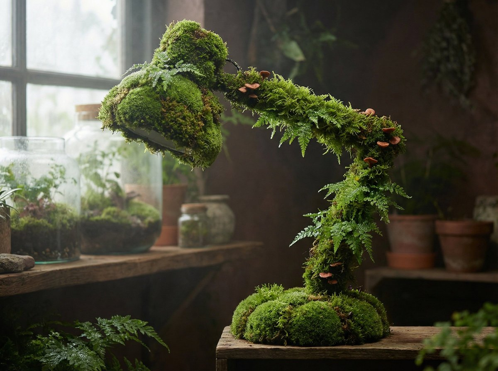

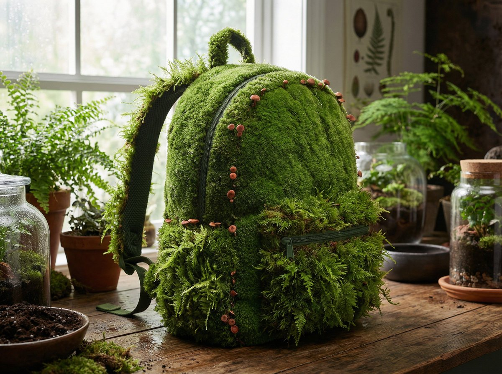

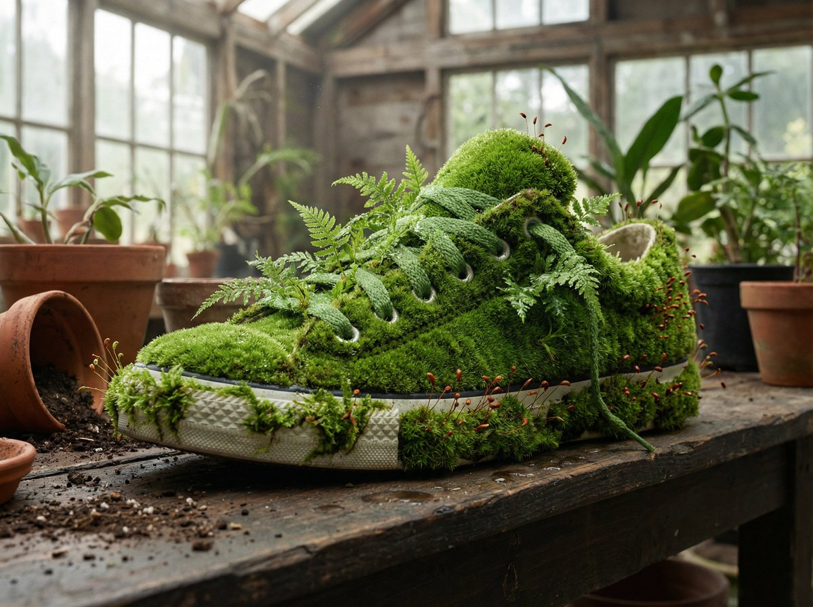

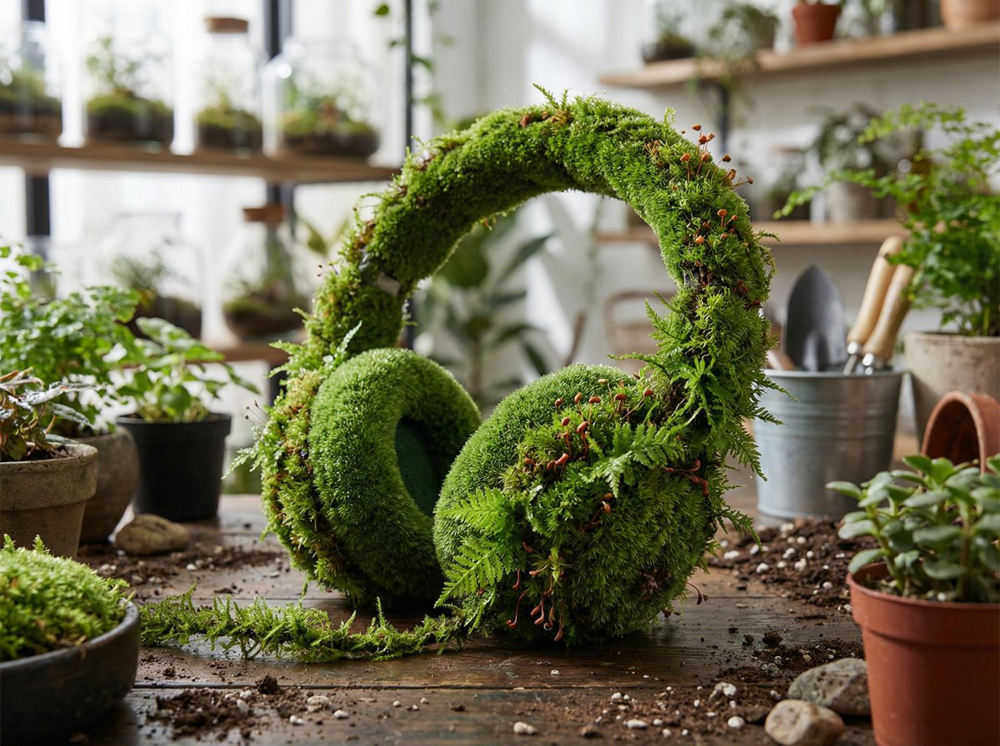

```
A desk lamp rendered as if entirely grown from living moss, perfectly maintaining product form while being undeniably alive and soft. Different moss varieties create texture variation: smooth cushion moss for flat surfaces, feathery fern moss for details, tiny fruiting bodies as accent points. Damp, verdant, breathing. Positioned in a botanical studio setting or against dark earth tones. Biophilic design meets product photography. Soft natural lighting emphasizing the life, the moisture, the green depth. Sharp focus, saturated natural greens, wellness brand aesthetic, ultra-high resolution, the manufactured made living.
```

```
A backpack rendered as if entirely grown from living moss, perfectly maintaining product form while being undeniably alive and soft. Different moss varieties create texture variation: smooth cushion moss for flat surfaces, feathery fern moss for details, tiny fruiting bodies as accent points. Damp, verdant, breathing. Positioned in a botanical studio setting or against dark earth tones. Biophilic design meets product photography. Soft natural lighting emphasizing the life, the moisture, the green depth. Sharp focus, saturated natural greens, wellness brand aesthetic, ultra-high resolution, the manufactured made living.
```

```
A shoe rendered as if entirely grown from living moss, perfectly maintaining product form while being undeniably alive and soft. Different moss varieties create texture variation: smooth cushion moss for flat surfaces, feathery fern moss for details, tiny fruiting bodies as accent points. Damp, verdant, breathing. Positioned in a botanical studio setting or against dark earth tones. Biophilic design meets product photography. Soft natural lighting emphasizing the life, the moisture, the green depth. Sharp focus, saturated natural greens, wellness brand aesthetic, ultra-high resolution, the manufactured made living.
```

```
A headphone set rendered as if entirely grown from living moss, perfectly maintaining product form while being undeniably alive and soft. Different moss varieties create texture variation: smooth cushion moss for flat surfaces, feathery fern moss for details, tiny fruiting bodies as accent points. Damp, verdant, breathing. Positioned in a botanical studio setting or against dark earth tones. Biophilic design meets product photography. Soft natural lighting emphasizing the life, the moisture, the green depth. Sharp focus, saturated natural greens, wellness brand aesthetic, ultra-high resolution, the manufactured made living.
```

 [↑返回目录](#toc)

---
## <a id="prompt-2015423674061644000">高端护肤精华液广告</a> (<a href="https://x.com/i/status/2015423674061643925" target="_blank" rel="noopener noreferrer">Amira Zairi</a>)

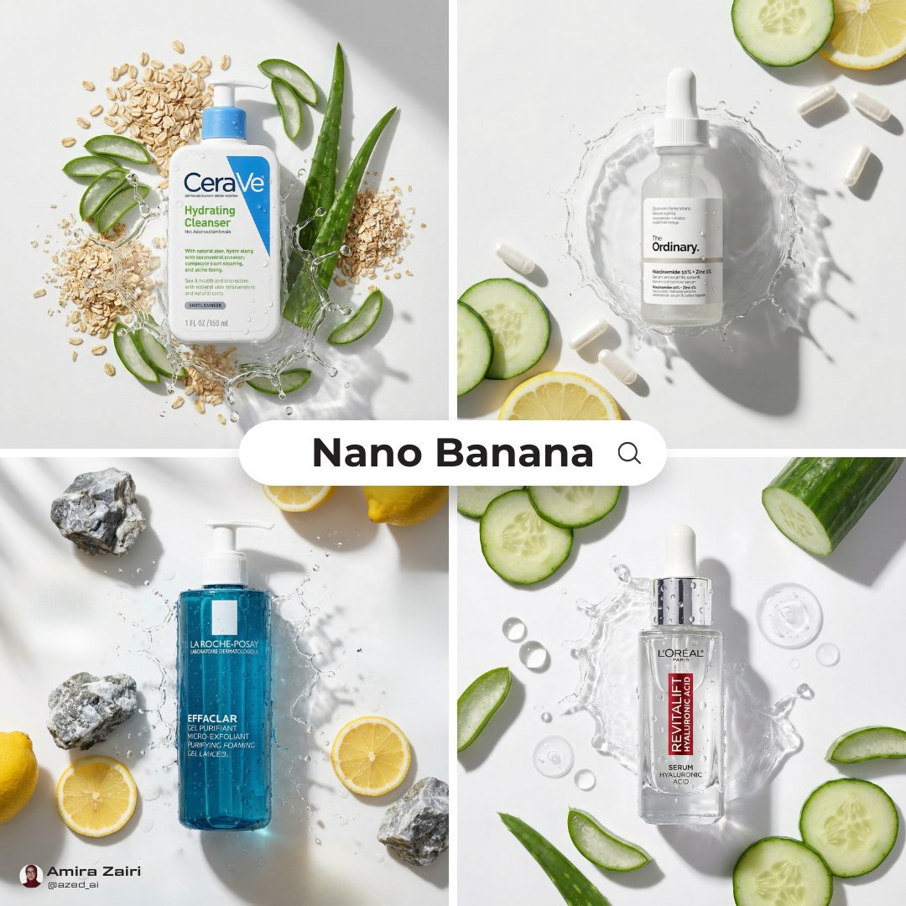

```
[product], centered top down flat lay, surrounded by [ingredients], fresh slices and whole pieces, glossy wet look, water splash frozen mid motion around the product, dewy droplets on label and surface, warm beige seamless background, soft directional sunlight, crisp realistic shadow, high end skincare advertising, ultra realistic macro product photography, 100mm lens look, f/8 sharp focus, clean composition, no extra text, 8k, 1:1
```

```
产品，居中俯视平铺，周围环绕着各种成分，包括新鲜的切片和整块，呈现出光泽湿润的外观，产品周围凝固在半空中的水花溅起，标签和表面上布满晶莹的水珠。背景为温暖的米色无缝环境，采用柔和的定向阳光，产生清晰真实的阴影效果，高端护肤广告风格，超逼真的微距产品摄影，模拟100毫米镜头的效果，f/8光圈确保焦点锐利，构图简洁无额外文字，分辨率达到8K，作品比例为1:1。 
```

 [↑返回目录](#toc)

---
## <a id="prompt-2015634929066070000">高端商品九宫格</a> (<a href="https://x.com/i/status/2015634929066070042" target="_blank" rel="noopener noreferrer">simeon-sanai</a>)

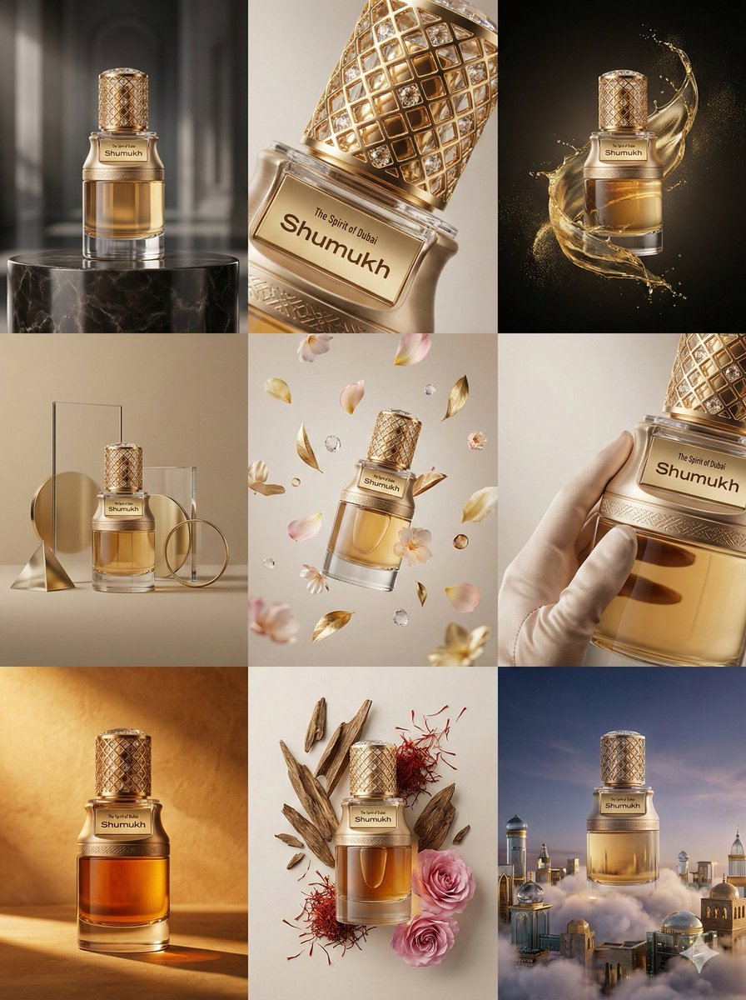

```
Create a 3×3 grid in
3:4 aspect ratio for a high-end commercial marketing campaign using the uploaded product as the central subject.

Each frame must present a distinct visual concept while maintaining perfect product consistency across all nine images.

Grid Concepts (one per cell):

1. Iconic hero still life with bold composition

2. Extreme macro detail highlighting material, surface, or texture

3. Dynamic liquid or particle interaction surrounding the product

4. Minimal sculptural arrangement with abstract forms

5. Floating elements composition suggesting lightness and innovation

6. Sensory close-up emphasizing tactility and realism

7. Color-driven conceptual scene inspired by the product palette

8. Ingredient or component abstraction (non-literal, symbolic)

9. Surreal yet elegant fusion scene combining realism and imagination

Visual Rules:
Product must remain 100% accurate in shape, proportions, label, typography, color, and branding
No distortion, deformation, or redesign of the product
Clean separation between product and background

Lighting & Style:
Soft, controlled studio lighting
Subtle highlights, realistic shadows
High dynamic range, ultra-sharp focus
Editorial luxury advertising aesthetic
Premium sensory marketing look

Overall Feel:
Modern, refined, visually cohesive
High-end commercial campaign
Designed for brand websites, social grids, and digital billboards
Hyperreal, cinematic, polished, and aspirational
```

```
为高端商业营销活动创建一个3×3的网格，使用上传的产品作为中心主题，比例为3:4。

每个框架必须呈现独特的视觉概念，同时在所有九张图片中保持完美的产品一致性。

网格概念（每个单元格一个）：

1. 具有大胆构图的标志性英雄静物
2. 极致微距细节突出材质、表面或纹理
3. 动态液体或粒子互动环绕产品
4. 最小雕塑排列与抽象形式
5. 漂浮元素组合暗示轻盈和创新
6. 强调触感和真实性的感官特写
7. 受产品色调启发的颜色驱动概念场景
8. 成分或组件抽象（非字面，象征性）
9. 结合现实主义与想象力的超现实但优雅融合场景

视觉规则：
- 产品形状、比例、标签、字体、颜色和品牌需100%准确
- 不得扭曲、变形或重新设计产品
- 产品和背景之间要有干净的分离

灯光与风格：
- 柔和、受控的影室照明
- 微妙的高光，真实的阴影
- 高动态范围，超锐利焦点
- 编辑豪华广告美学
- 高端感官营销外观

整体感觉：
- 现代、精致、视觉上一致
- 高端商业活动
- 适用于品牌网站、社交网格和数字广告牌
- 超现实、电影般抛光且鼓舞人心

为了将这些概念视觉化，我们可以使用AI绘画工具生成一系列图像。
```

 [↑返回目录](#toc)

---
## <a id="prompt-2015443553644847000">玛格丽特鸡尾酒的精确配方</a> (<a href="https://x.com/i/status/2015443553644847189" target="_blank" rel="noopener noreferrer">Kaan</a>)

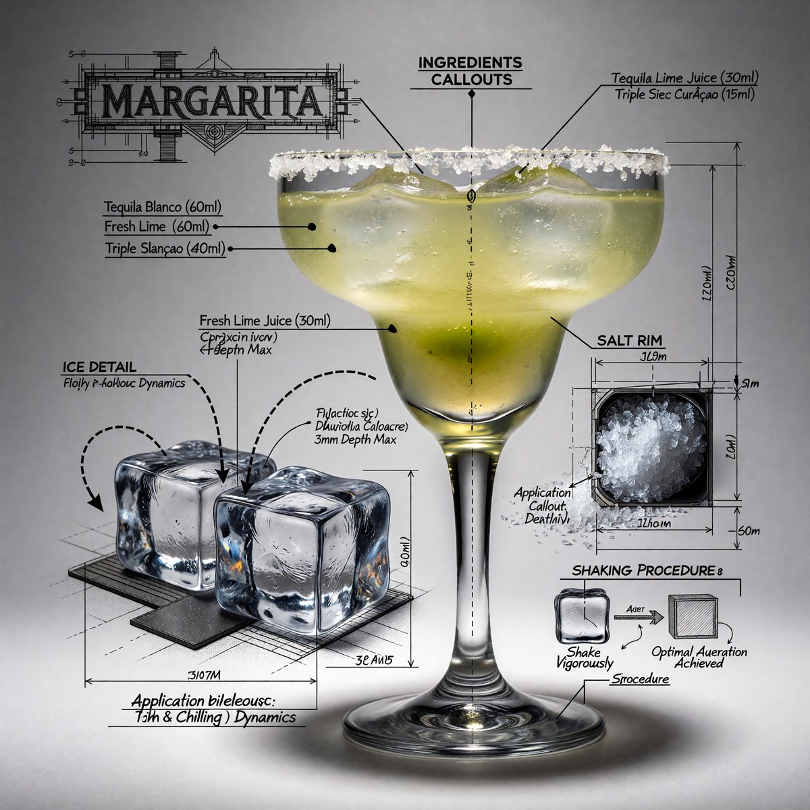

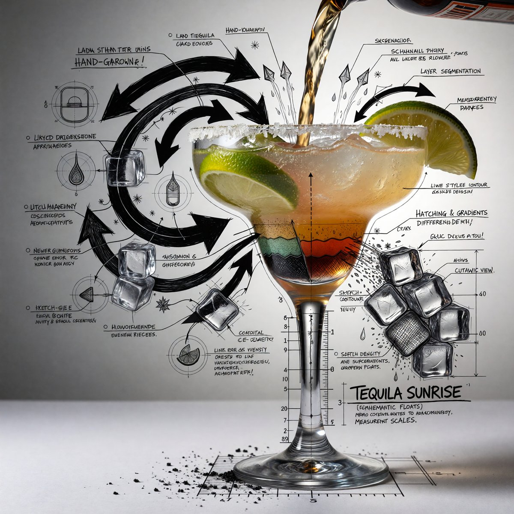

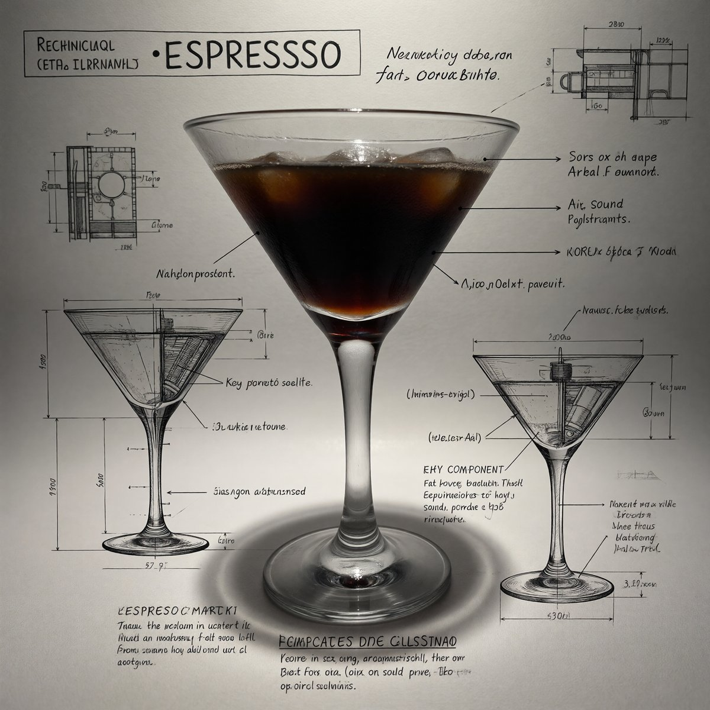

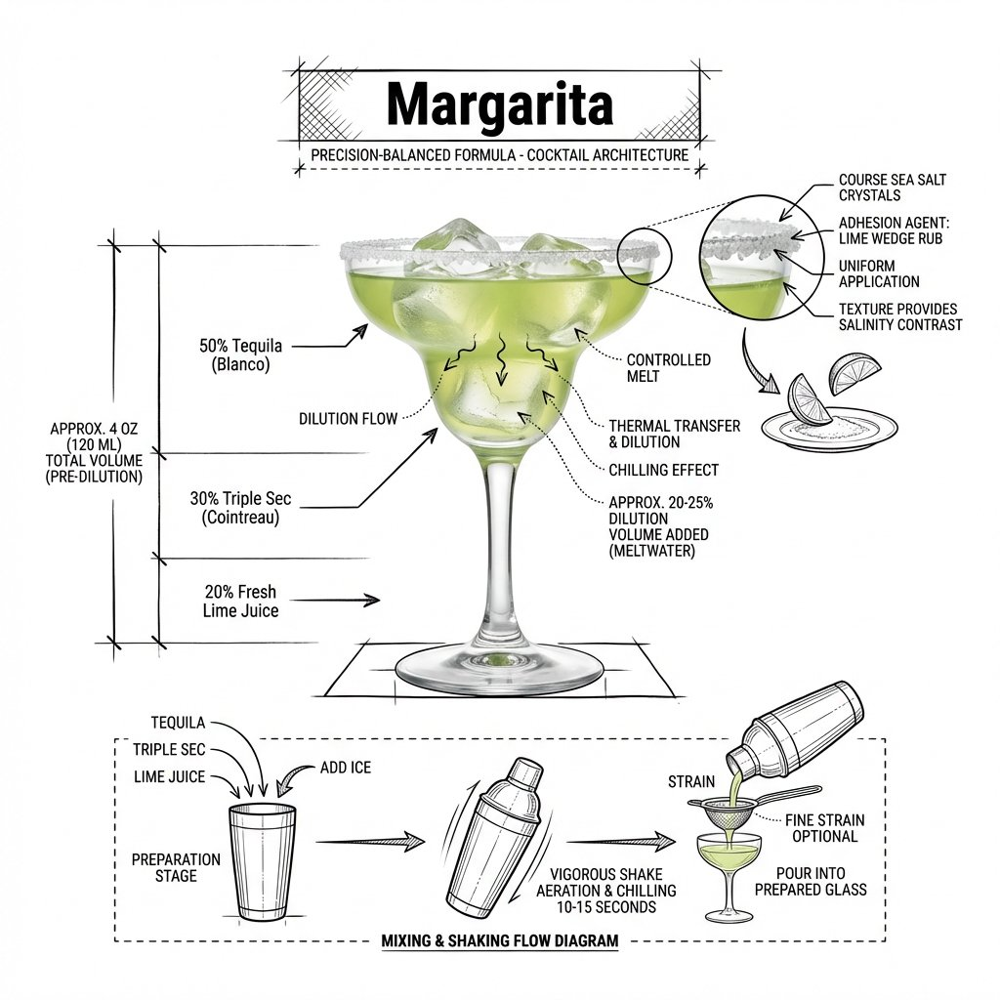

```
ImagineArt 1.5 Pro - Cocktail Infographic

Prompt

Create a technical infographic of a Margarita cocktail, treated as a precision-balanced formula.Use a photorealistic margarita glass on a pure white studio background.Overlay black ink technical annotations including:– Exact ingredient ratios (tequila, triple sec, lime juice)– Measurement lines and volume markers– Salt rim texture and application callouts– Ice interaction and dilution arrows– Mixing and shaking flow diagramStyle:Minimal technical illustration, black pen linework, architectural sketch feel. Place the title “Margarita” inside a hand-drawn technical annotation box. Output:1080×1080, ultra-crisp, social-feed optimized.

@imagineart_creo @ImagineArt_X
```

```
创作一款玛格丽特鸡尾酒的技术信息图，将其视为精确配比的配方。在纯白摄影棚背景上放置一杯逼真的玛格丽特酒杯。叠加黑色墨水风格的技术标注，包括：  
– 精确的原料比例（龙舌兰酒、三重干橙酒、青柠汁）  
– 刻度线与容量标记  
– 盐边的质地与涂抹方式标注  
– 冰块互动与稀释过程的箭头指示  
– 调制与摇匀的流程图  

风格：极简技术插图，黑色钢笔线条，具有建筑草图感。标题“Margarita”置于手绘风格的技术标注框内。输出尺寸：1080×1080，超清晰，适配社交媒体展示。
```

 [↑返回目录](#toc)

---
## <a id="prompt-2015666023224262700">色彩中的美食梦境</a> (<a href="https://x.com/i/status/2015666023224262759" target="_blank" rel="noopener noreferrer">ShaHid WaNii</a>)

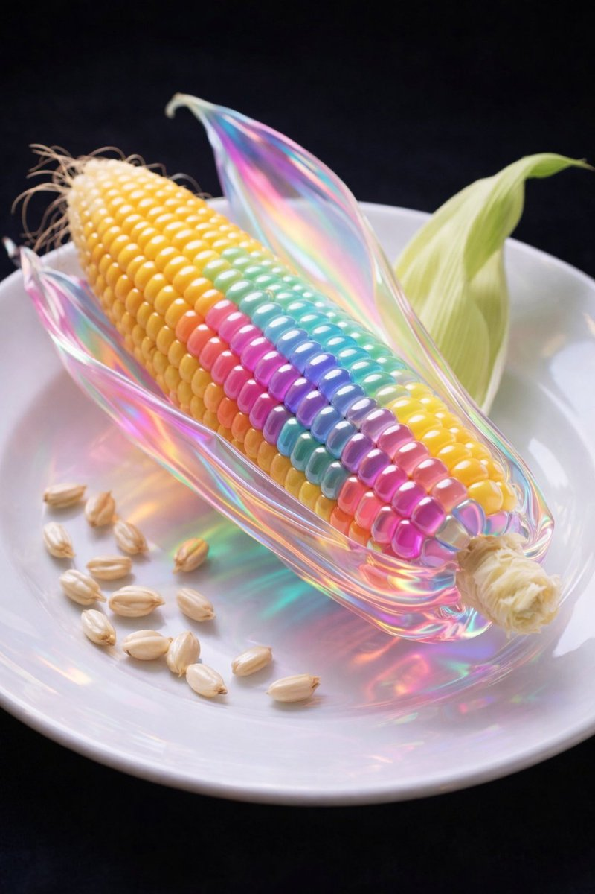

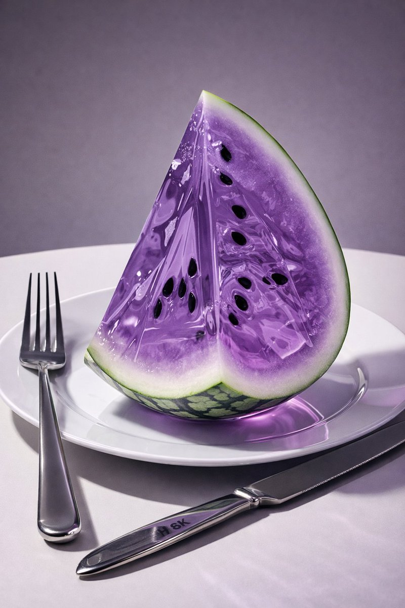

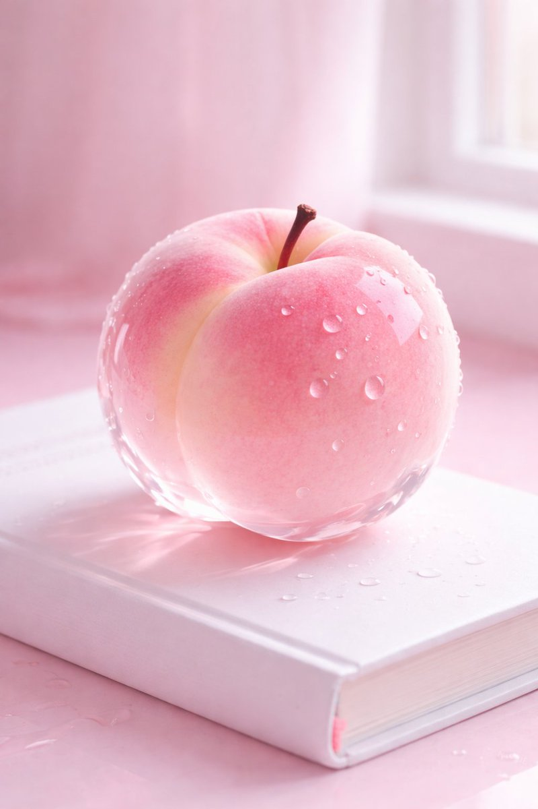

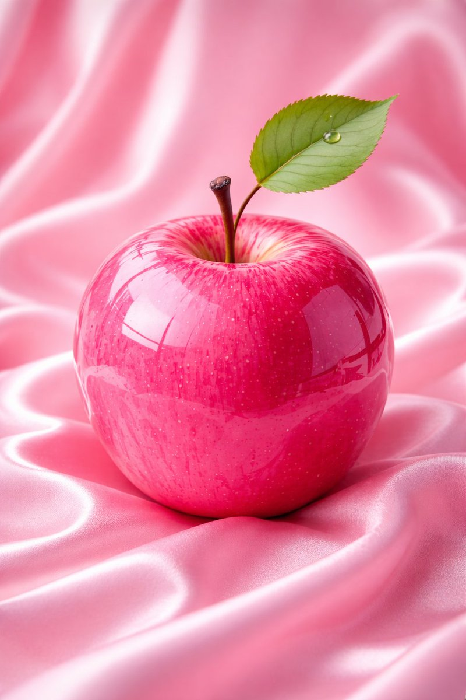

```
When food dreams in colors.

Google Gemini Banana pro 

Prompt:
{
  "master_prompt": {
    "global_settings": {
      "resolution": "8K",
      "aspect_ratio": "3:4",
      "quality": "ultra-high detail",
      "style": "AI-edited hyperreal still-life",
      "lighting": "studio-controlled, soft reflections, high dynamic range",
      "focus": "sharp subject focus with clean background separation"
    },

    "module_1_image_1_style": {
      "subject": {
        "object": "corn cob",
        "position": "diagonally placed on a white ceramic plate",
        "orientation": "slightly elevated at one end",
        "kernels": {
          "base_color": "natural yellow",
          "center_band_colors": [
            "pink",
            "purple",
            "blue",
            "green"
          ],
          "texture": "smooth, glossy, bead-like kernels"
        }
      },
      "husks": {
        "appearance": "semi-transparent, iridescent, glass-like",
        "color_effect": "rainbow refraction",
        "placement": "peeled back on both sides of the cob"
      },
      "additional_elements": {
        "corn_seeds": "scattered loose kernels on the plate",
        "plate": "round, white, reflective ceramic"
      },
      "background": {
        "color": "solid black",
        "contrast": "high contrast emphasizing iridescence"
      },
      "lighting": {
        "type": "soft studio light",
        "effects": [
          "rainbow reflections on plate",
          "high specular highlights"
        ]
      }
    },

    "module_2_image_2_style": {
      "subject": {
        "object": "watermelon slice",
        "cut": "triangular wedge",
        "interior_color": "translucent purple",
        "seeds": "black, glossy, embedded inside flesh"
      },
      "rind": {
        "outer_color": "dark green",
        "inner_rind": "pale green to white gradient"
      },
      "presentation": {
        "plate": "white round plate",
        "utensils": [
          "silver fork",
          "silver knife"
        ],
        "placement": "utensils resting beside plate"
      },
      "surface_texture": {
        "flesh": "gel-like, glassy, semi-transparent",
        "moisture": "visible internal shine"
      },
      "background": {
        "color": "soft gray",
        "style": "minimal studio backdrop"
      },
      "lighting": {
        "type": "directional studio light",
        "effects": [
          "soft shadows",
          "reflections on metal utensils"
        ]
      }
    },

    "module_3_image_3_style": {
      "subject": {
        "object": "peach",
        "appearance": "smooth, semi-translucent, glass-like skin",
        "color_gradient": "pale pink to light peach tones"
      },
      "surface_details": {
        "water_droplets": "small, clear droplets evenly distributed",
        "reflection": "soft light reflections on curved surface"
      },
      "base_object": {
        "item": "closed book",
        "color": "white",
        "edges": "clean, minimal",
        "text_visibility": "no readable text visible in this frame"
      },
      "background": {
        "color": "soft pastel pink",
        "light_source": "diffused window light from side"
      },
      "lighting": {
        "type": "natural soft light",
        "effects": [
          "gentle glow",
          "subtle shadows",
          "highlighted droplets"
        ]
      }
```

```
当食物在色彩中梦想。

谷歌Gemini香蕉专业版

提示：
{
  "主提示": {
    "全局设置": {
      "分辨率": "8K",
      "纵横比": "3:4",
      "质量": "超高清细节",
      "风格": "AI编辑的超现实静物",
      "照明": "工作室控制的，柔和反射，高动态范围",
      "焦点": "主体清晰聚焦，背景干净分离"
    },

    "模块1图像1风格": {
      "主题": {
        "对象": "玉米棒",
        "位置": "斜放在白色陶瓷盘上",
        "方向": "一端稍微抬高",
        "颗粒": {
          "基色": "自然黄色",
          "中心带颜色": [
            "粉色",
            "紫色",
            "蓝色",
            "绿色"
          ],
          "质地": "光滑、有光泽、珠状颗粒"
        }
      },
      "苞叶": {
        "外观": "半透明、彩虹般的、玻璃状",
        "颜色效果": "彩虹折射",
        "位置": "两边剥开"
      },
      "附加元素": {
        "玉米种子": "散落在盘子上的松散颗粒",
        "盘子": "圆形、白色、反光陶瓷"
      },
      "背景": {
        "颜色": "纯黑色",
        "对比度": "高对比度强调虹彩"
      },
      "照明": {
        "类型": "柔和的工作室灯光",
        "效果": [
          "盘子上的彩虹反射",
          "高光亮点"
        ]
      }
    },

    "模块2图像2风格": {
      "主题": {
        "对象": "西瓜片",
        "切法": "三角形楔子",
        "内部颜色": "半透明紫色",
        "种子": "黑色、有光泽、嵌入果肉内"
      },
      "外皮": {
        "外部颜色": "深绿色",
        "内部外皮": "浅绿到白色的渐变"
      },
      "展示": {
        "盘子": "白色圆盘",
        "餐具": [
          "银叉",
          "银刀"
        ],
        "位置": "餐具放置于盘子旁"
      },
      "表面纹理": {
        "果肉": "凝胶状、玻璃质感、半透明",
        "水分": "可见的内部光泽"
      },
      "背景": {
        "颜色": "柔和灰色",
        "风格": "极简工作室背景"
      },
      "照明": {
        "类型": "定向工作室灯光",
        "效果": [
          "柔和阴影",
          "金属餐具上的反射"
        ]
      }
    },

    "模块3图像3风格": {
      "主题": {
        "对象": "桃子",
        "外观": "光滑、半透明、玻璃状皮肤",
        "颜色渐变": "淡粉色至浅桃色调"
      },
      "表面细节": {
        "水滴": "小而清澈的水滴均匀分布",
        "反射": "弯曲表面上的柔和光线反射"
      },
      "基础物体": {
        "物品": "合上的书",
        "颜色": "白色",
        "边缘": "干净、简约",
        "文字可见性": "此帧中不可见可读文字"
      },
      "背景": {
        "颜色": "柔和的粉红色",
        "光源": "侧面的扩散窗光"
      },
      "照明": {
        "类型": "自然柔光",
        "效果": [
          "轻柔发光",
          "微妙阴影",
          "突出显示的水滴"
        ]
      }
    }
}
```

 [↑返回目录](#toc)

---
## <a id="prompt-2015630390887895000">人体大脑科普信息图</a> (<a href="https://x.com/i/status/2015630390887895118" target="_blank" rel="noopener noreferrer">𝐌</a>)

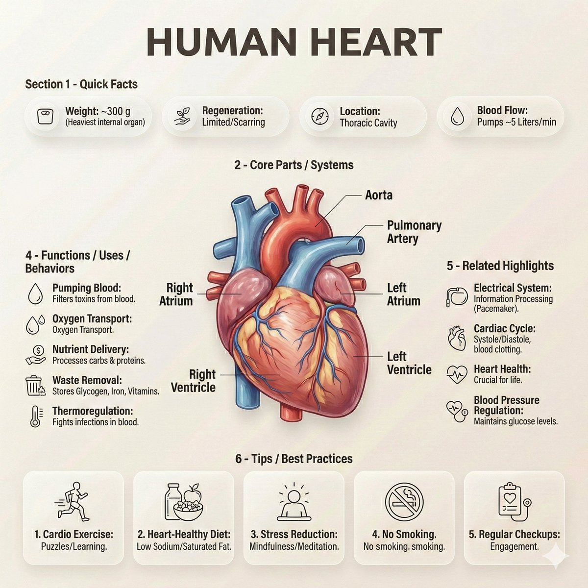

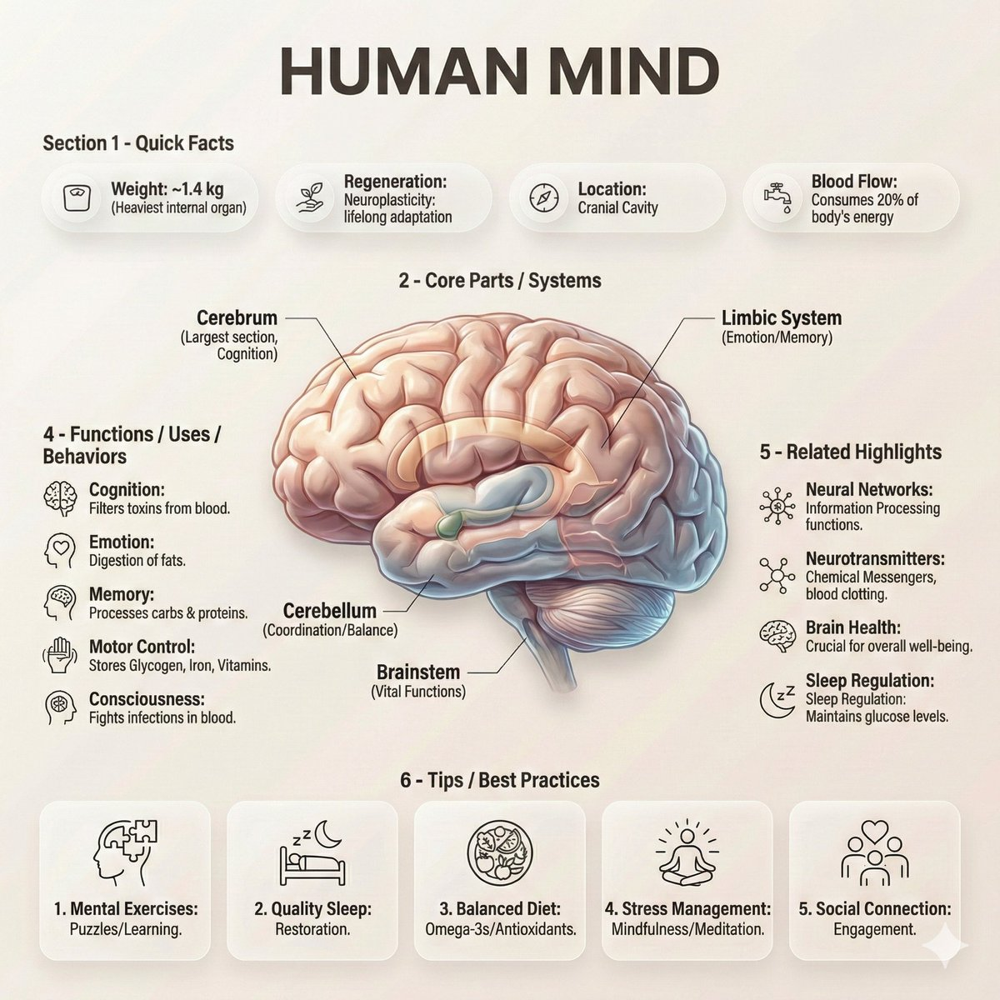

```
Educational infographic poster titled 'HUMAN HEART'. Center features a realistic, detailed 3D human heart with aorta and ventricles. Soft beige background. Structured layout with 'Quick Facts' at the top, labeled 'Core Parts', a list of 'Functions' on the left, 'Highlights' on the right, and a row of 5 icons for 'Tips' at the bottom. Clean, professional medical aesthetic with vector-style icons.
```

```
Educational infographic poster titled 'HUMAN MIND'. Center features a realistic, detailed 3D human brain. Soft beige background. Structured layout with 'Quick Facts' at the top, labeled 'Core Parts', a list of 'Functions' on the left, 'Highlights' on the right, and a row of 5 icons for 'Tips' at the bottom. Clean, professional medical aesthetic with vector-style icons.
```

 [↑返回目录](#toc)

---
## <a id="prompt-2015651589718188000">微缩3D场景：音乐专辑的视觉世界</a> (<a href="https://x.com/i/status/2015651589718188085" target="_blank" rel="noopener noreferrer">Aleena Amir</a>)

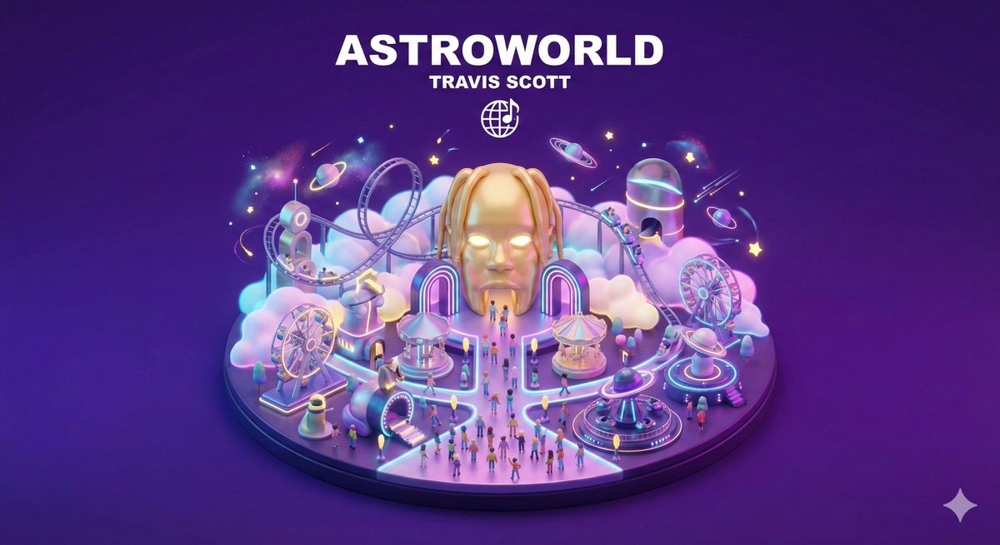

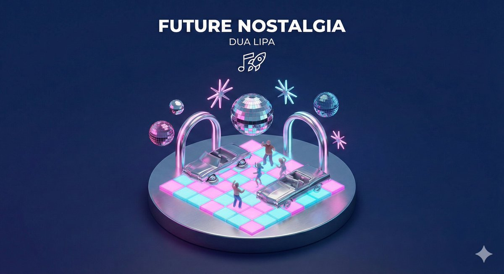

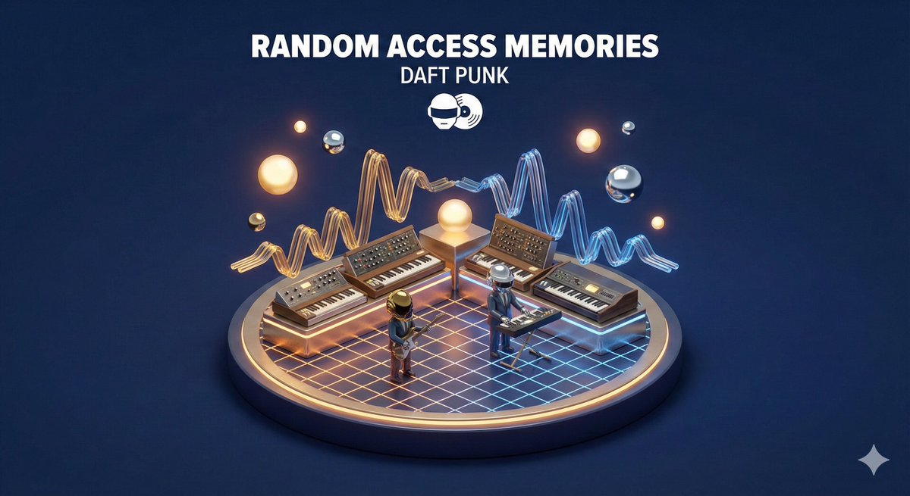

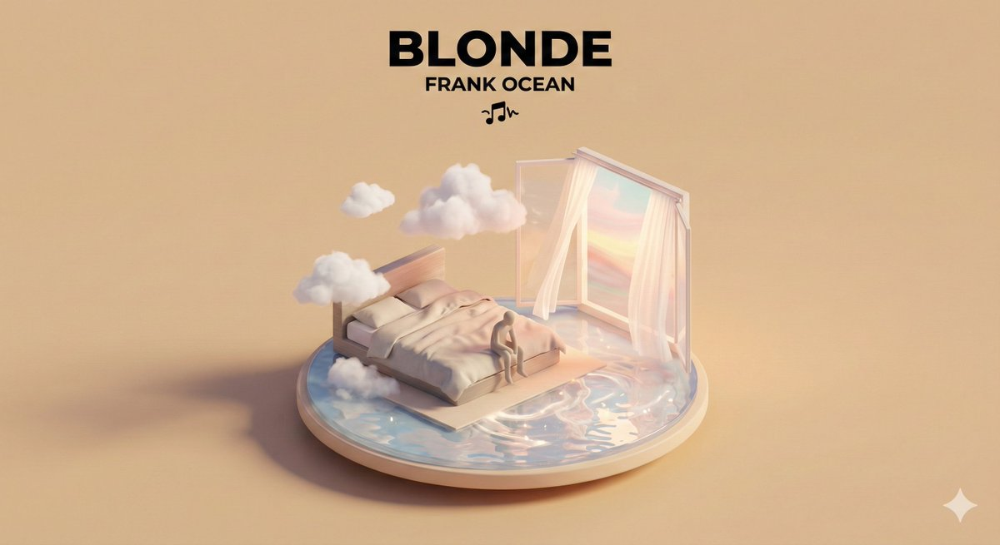

```
Music Album Dioramas

Gemini Nano Banana Pro Prompt:

Present a clear, 35–40° isometric miniature 3D diorama inspired by the music album [ALBUM NAME] by [ARTIST], visually representing its mood and themes.

Use soft refined textures, stylized PBR materials, and atmospheric lighting.

Create a raised base with symbolic props, abstract forms, and scene elements matching the album vibe.
Include tiny stylized figures if needed (no facial details).

Use a clean solid [BACKGROUND COLOR] background.
At the top-center, display [ALBUM NAME] in large bold text, beneath it show [ARTIST NAME], and place a minimal music-related icon below.

All text must automatically match the background contrast (white or black).
```

```
音乐专辑微缩场景

呈现一个清晰的、35至40度等距视角的微型3D微缩场景，灵感源自[艺人]的音乐专辑《[专辑名称]》，视觉化地体现其情绪与主题。

使用柔和精致的纹理、风格化的PBR材质和氛围照明。

创建一个抬高的基座，上面放置象征性的道具、抽象形态和符合专辑氛围的场景元素。如有需要，可加入微小的风格化人形（无面部细节）。

背景为纯色[背景颜色]。

在画面顶部中央以大号粗体显示《[专辑名称]》，其下方显示[艺人名称]，再下方放置一个极简的音乐相关图标。

所有文字需自动匹配背景对比度（白色或黑色）。
```

 [↑返回目录](#toc)

---
## <a id="prompt-2015434585870569500">黏土小人拿着牛角包站在面包店外</a> (<a href="https://x.com/i/status/2015434585870569514" target="_blank" rel="noopener noreferrer">Smiling Khan</a>)


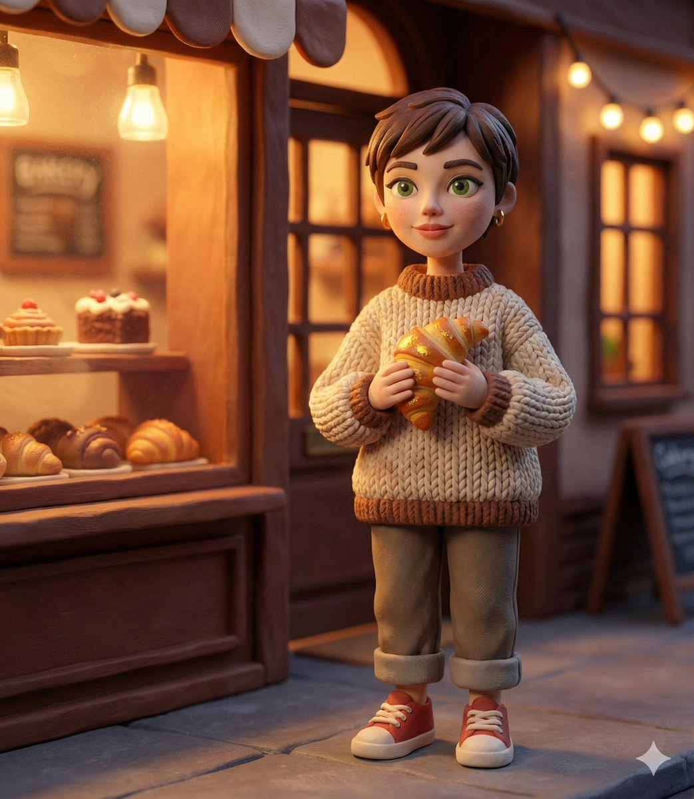

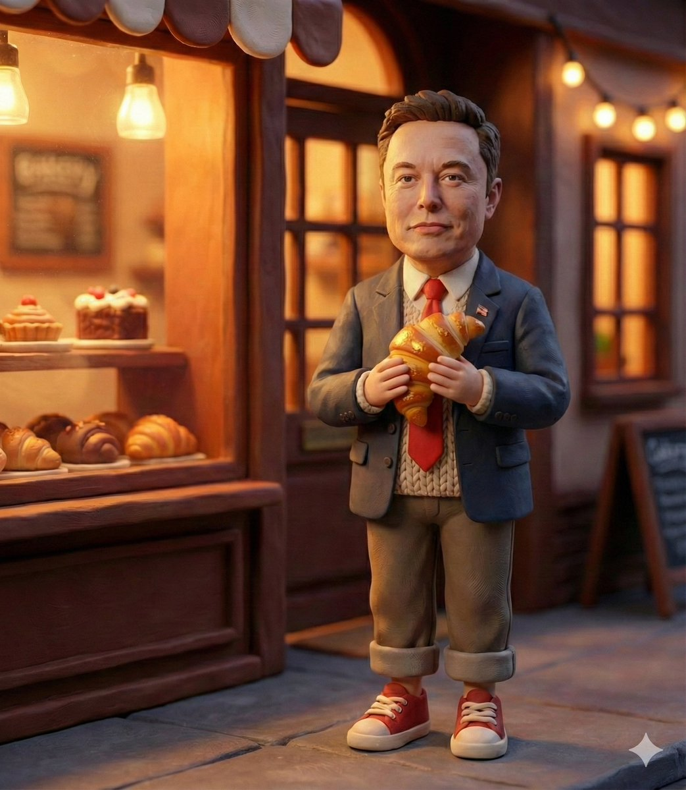

```
👇 

Handcrafted claymation-style character with soft textures and visible fingerprints. Wearing an oversized knit sweater, cuffed pants, and canvas shoes. Standing outside a small bakery with warm window lights, holding a fresh croissant. Cozy evening mood, whimsical proportions, stop-motion film aesthetic.
```

```
手工制作的黏土动画风格角色，带有柔软的质感和可见的指纹。身穿 oversized 针织毛衣、卷边长裤和帆布鞋。站在一家小面包店外，店内窗户透出温暖灯光，手中拿着一个新鲜牛角包。氛围温馨傍晚，造型比例充满奇趣，具有定格动画电影的美学风格。
```

 [↑返回目录](#toc)

---
## <a id="prompt-2015152385207984400">创作有趣的商业摄影</a> (<a href="https://x.com/i/status/2015152385207984348" target="_blank" rel="noopener noreferrer">Amira Zairi</a>)

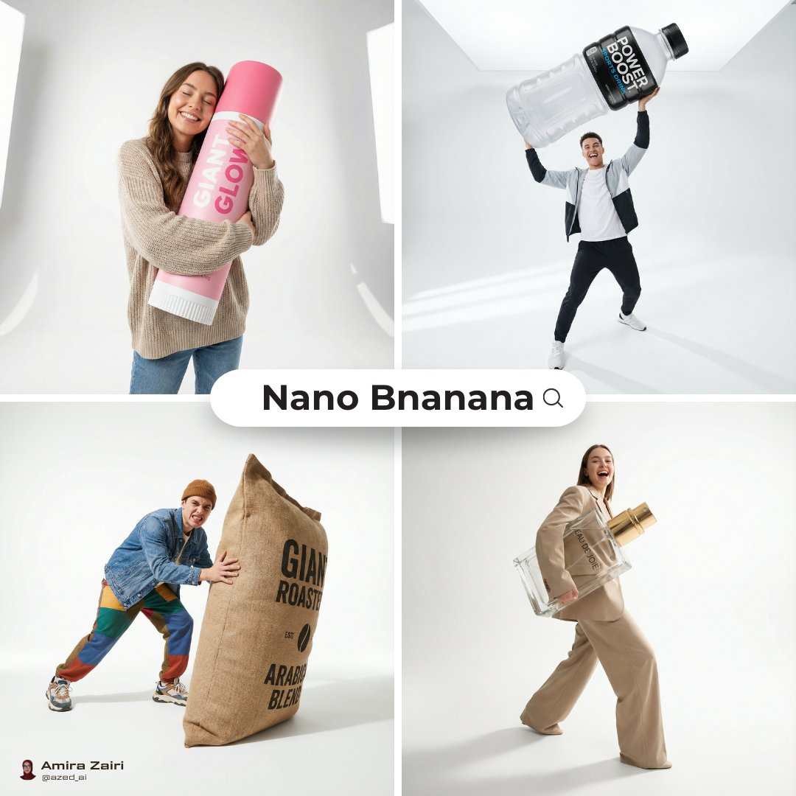

```
[person], [pose], oversized product in the attached image as the main hero prop, playful fun energy, fashion editorial styling, clean minimal background, high key studio lighting, crisp soft shadow, ultra realistic commercial photography, wide angle low perspective, sharp focus, 8k, 1:1
```

```
人物，特定姿势，使用附加图片中的超大产品作为主要亮点，展现趣味横生的活力感，采用时尚杂志的造型风格，背景干净简约，运用高调的影室灯光效果，产生清晰而柔和的阴影，达到超逼真的商业摄影质感，从广角低视角拍摄，确保焦点锐利，最终成像分辨率达到8K，作品比例为1:1。
```

 [↑返回目录](#toc)

---
## <a id="prompt-2015125749804454100">桌面级微型模型的精致世界</a> (<a href="https://x.com/i/status/2015125749804454163" target="_blank" rel="noopener noreferrer">Ege</a>)

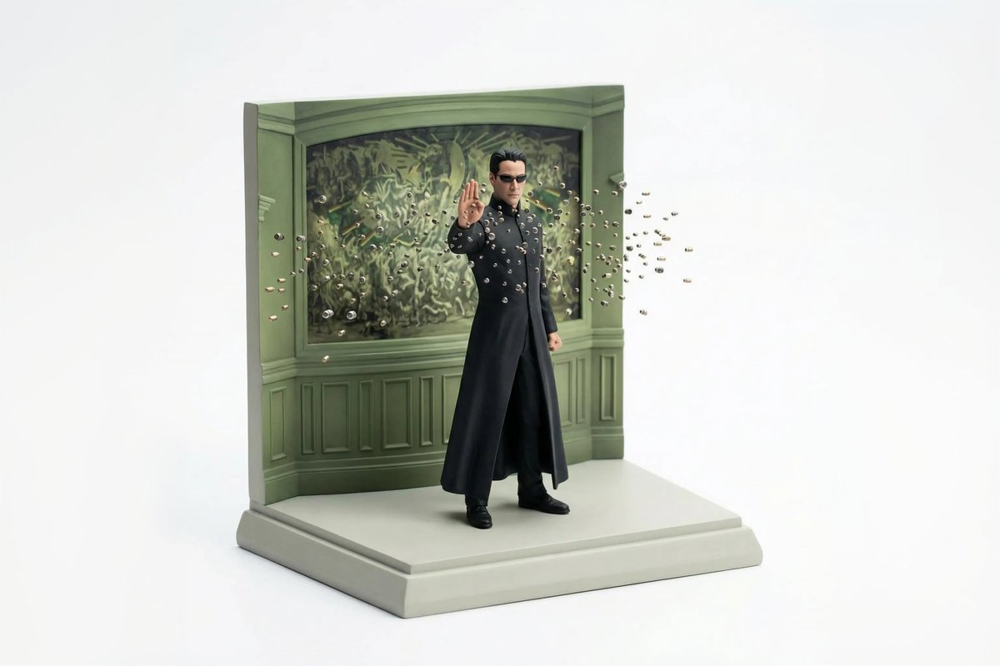

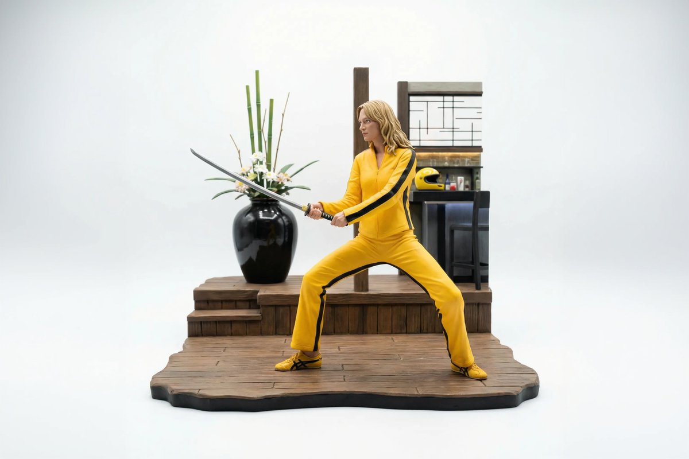

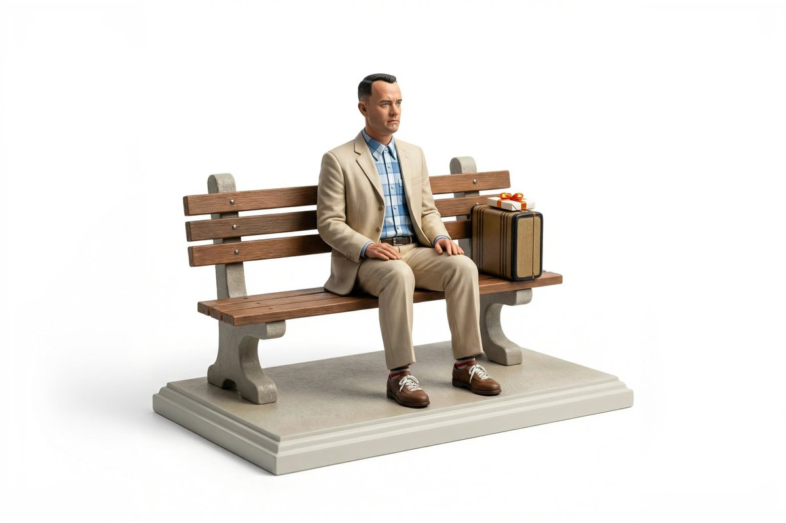

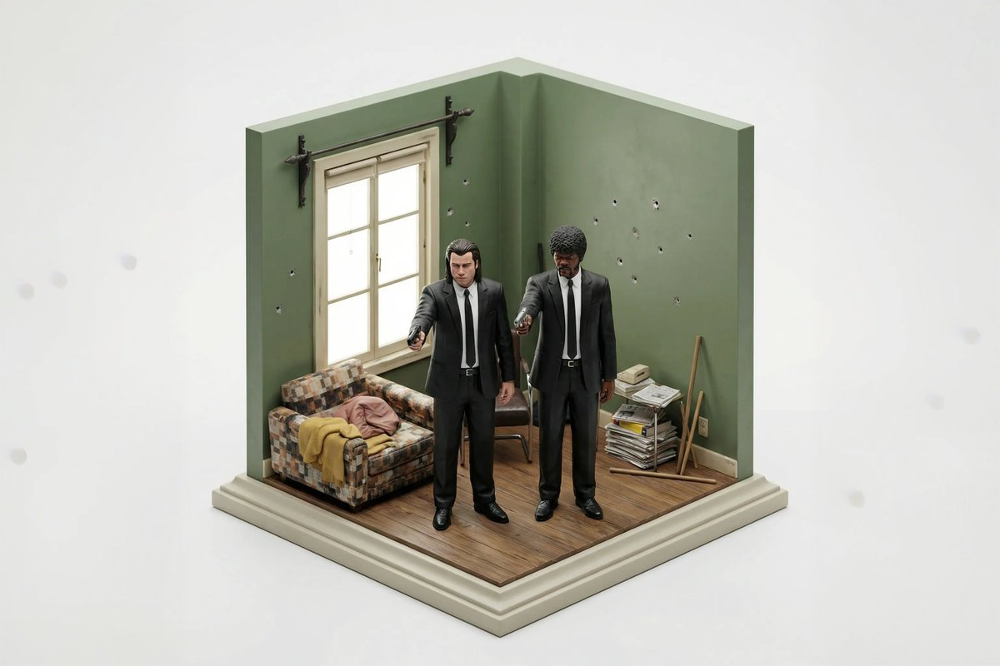

```
{
 "reference_images": {
 "scene_reference": "ATTACHED_IMAGE",
 "usage_rule": "Use this image as the sole and exact source for scene layout, object placement, and composition. Do not reinterpret or replace the scene."
 },

 "concept": {
 "type": "miniature diorama reconstruction",
 "intent": "Rebuild the attached scene as a clean, collectible-scale diorama while preserving the original spatial relationships"
 },

 "environment": {
 "scale": "tabletop miniature",
 "ground": {
 "type": "sculpted base",
 "behavior": "supports all objects naturally without enclosure",
 "edges": "clean, minimal, slightly beveled"
 },
 "background": {
 "type": "seamless studio backdrop",
 "color": "pure white",
 "constraint": "no environment beyond the diorama base"
 }
 },

 "objects_and_elements": {
 "layout_rule": "All objects must remain in the same relative positions as in the reference image",
 "primary_elements": "exact vehicles, structures, props, and terrain visible in the reference",
 "detail_handling": "simplified but faithful miniature proportions",
 "characters": {
 "presence": "only if present in the reference",
 "style": "miniature figurines, no facial realism"
 }
 },

 "composition": {
 "view": "isometric or slightly elevated 3/4 perspective",
 "framing": "entire diorama visible, centered",
 "cropping": "no zoom, no cinematic crop"
 },

 "camera": {
 "lens_equivalent": "35mm–50mm",
 "perspective": "miniature realism",
 "distortion": "none"
 },

 "lighting": {
 "type": "soft studio lighting",
 "direction": "overhead and slightly angled",
 "shadows": "subtle contact shadows only beneath objects",
 "avoid": [
 "dramatic lighting",
 "spotlights",
 "cinematic contrast"
 ]
 },

 "materials_and_style": {
 "surface_finish": "smooth, matte or lightly satin",
 "material_quality": "high-quality scale model materials",
 "aesthetic": "clean, modern, premium diorama"
 },

 "quality_controls": {
 "image_clarity": "ultra-clean",
 "grain": "none",
 "noise": "none",
 "motion_blur": "none"
 },

 "negative_prompts": [
 "glass case",
 "display box",
 "museum enclosure",
 "transparent cube",
 "protective casing",
 "reflections on glass",
 "labels or plaques",
 "text overlays",
 "busy background",
 "cinematic blur"
 ]
}
```

```
参考图像：使用所附图像作为场景布局、物体摆放和构图的唯一且精确来源，不得重新诠释或替换场景。

概念：以微型微缩模型的方式重建所附场景，保持原始空间关系，呈现干净、可收藏比例的微缩景观。

环境：桌面级微型模型；基座为雕刻底座，自然承托所有物体且无封闭结构，边缘干净、极简、略带倒角；背景为无缝纯白摄影棚背景，除微缩模型基座外无任何环境元素。

物体与元素：所有物体必须保持与参考图像中相同的相对位置；主要元素包括参考图像中可见的精确车辆、建筑、道具和地形；细节处理采用简化但忠实于原物的微缩比例；人物仅在参考图像中存在时才包含，风格为微型人偶，无人脸写实细节。

构图：采用等距或略俯视的3/4视角；画面居中完整呈现整个微缩模型；不进行缩放或电影式裁剪。

相机：等效35mm–50mm镜头；呈现微缩模型真实感；无畸变。

灯光：柔和摄影棚灯光，光源来自顶部并略带角度；仅在物体下方保留细微接触阴影；避免戏剧性灯光、聚光灯或电影级对比度。

材质与风格：表面为光滑哑光或轻微缎面质感；使用高品质比例模型材料；整体美学干净、现代、高端微缩模型风格。

质量控制：图像极度清晰；无颗粒、无噪点、无动态模糊。

负面提示：玻璃罩、展示盒、博物馆展柜、透明立方体、保护外壳、玻璃反光、标签或铭牌、文字叠加、杂乱背景、电影虚化。
```

 [↑返回目录](#toc)

---
## <a id="prompt-2015648059771044000">Q版滑板男孩的动感瞬间</a> (<a href="https://x.com/i/status/2015648059771044000" target="_blank" rel="noopener noreferrer">Heisenberg</a>)

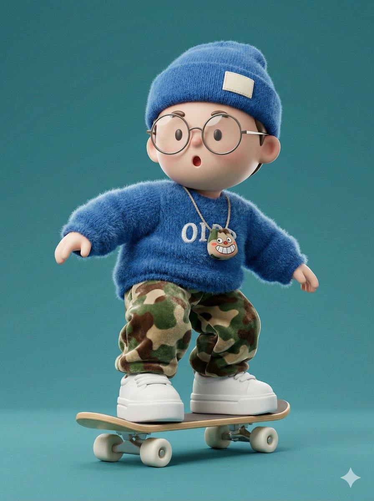

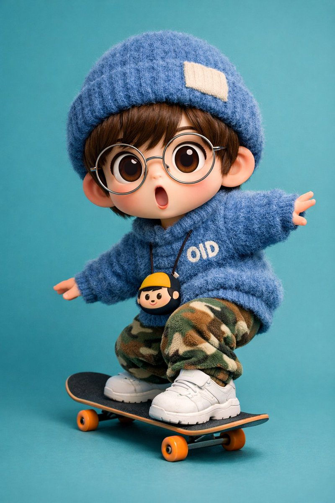

```
A high-fidelity 3D character render of a cute, stylized boy skateboarding in a dynamic pose. The boy has 'chibi' proportions with a large head, wearing oversized round wire-frame glasses and making a surprised 'O' mouth expression. He is dressed in an extremely fuzzy, textured blue mohair sweater with the text "OID" on the chest, a matching fuzzy blue beanie with a cream patch, and baggy camouflage-patterned pants made of a soft, velvet-like fabric. He wears chunky white sneakers and a small necklace pouch with a cartoon face. The background is a solid, seamless teal color. The lighting is soft and diffuse studio lighting, creating a clean, high-end "blind box" art toy aesthetic with hyper-realistic fabric textures.
```

```
一个高保真3D角色渲染图，描绘一个可爱、风格化的男孩正在滑板，姿态动感。男孩具有“Q版”比例，头部较大，戴着超大圆形金属框眼镜，嘴巴呈惊讶的“O”形。他身穿一件质感极其蓬松柔软的蓝色马海毛毛衣，胸前印有“OID”字样；头戴一顶同色系的蓬松蓝色针织帽，帽子上有一块米色补丁；下身是宽松的迷彩图案裤子，面料柔软如丝绒。脚上是一双厚底白色运动鞋，脖子上挂着一个印有卡通脸的小吊坠袋。背景为纯色无缝的青绿色。采用柔和漫射的影棚灯光，营造出干净高端的“盲盒”艺术玩具风格，并呈现超写实的织物纹理。
```

 [↑返回目录](#toc)

---
## <a id="prompt-2015437854206529800">舒适与时尚的完美结合：Crocs 洞洞鞋</a> (<a href="https://x.com/i/status/2015437854206529710" target="_blank" rel="noopener noreferrer">Keskin</a>)

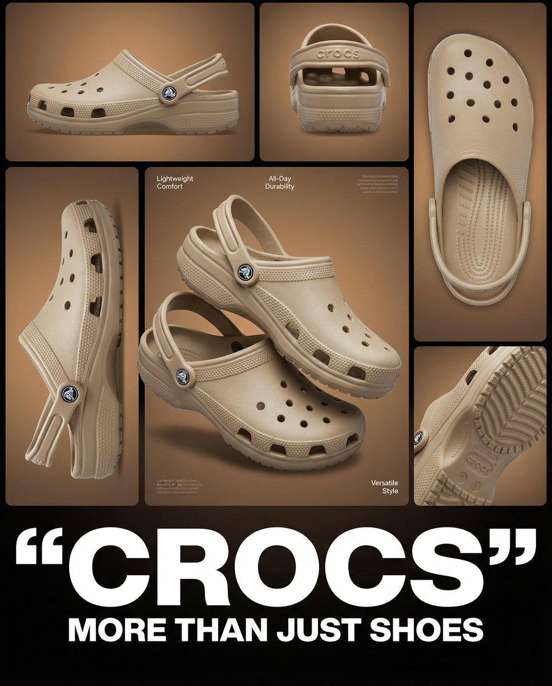

```
Multi-image product collage poster featuring beige/tan Crocs clog shoes, designed as a modern footwear advertisement.

The layout combines multiple product angles arranged in a structured grid:

Side profile view showing the clog silhouette and ventilation holes

Rear view highlighting the heel strap and branding

Top-down view showing the cushioned footbed texture

Close-up detail of the sole tread and side logo

A hero product image in the foreground with one shoe stacked against another, creating depth

Clean studio background with a warm brown-to-black gradient, giving a cozy, lifestyle-oriented tone.
The Crocs appear matte, lightweight, and comfortable, with realistic foam texture and soft shadows.

Large bold headline typography at the bottom reads:
“CROCS”
Subheading: “MORE THAN JUST SHOES”

Small blocks of descriptive lifestyle copy appear subtly in the background, reinforcing comfort, durability, and versatility. Overall composition feels like a social media brand post or poster ad.

Visual Style

Modern product advertising
Lifestyle + catalog hybrid
Warm earthy color palette
Soft studio lighting
Photorealistic textures
Clean composition
Professional footwear photography

Camera & Composition

Multiple angles combined into one layout
85mm–100mm product photography look
Sharp focus on shoes
Soft shadows beneath products
Balanced exposure
No distortion

Mood & Branding

Comfort
Everyday lifestyle
Durable
Casual confidence
Practical yet stylish
Approachable brand feel

Negative Prompt

Low resolution, incorrect shoe shape, warped branding, misspelled logo, glossy plastic look, harsh reflections, cluttered layout, inconsistent lighting, cartoon style, CGI look, watermark, text artifacts
```

```
一张多图产品拼贴海报，以米色/浅褐色 Crocs 洞洞鞋为主角，设计成现代鞋履广告。

布局采用结构化网格，组合多个产品角度：

- 侧面轮廓展示鞋型轮廓与透气孔  
- 后视图突出后跟绑带与品牌标识  
- 俯视图呈现缓震鞋床的纹理细节  
- 特写镜头聚焦鞋底纹路与侧面 Logo  
- 前景主图中一只鞋叠放于另一只之上，营造景深效果  

背景为干净的摄影棚环境，采用暖棕色至黑色渐变，营造温馨、生活化的氛围。  
Crocs 鞋款呈现哑光质感，轻盈舒适，具有逼真的泡沫材质纹理与柔和阴影。

底部配有醒目粗体大标题：  
“CROCS”  
副标题：“MORE THAN JUST SHOES（不止是一双鞋）”

背景中巧妙融入小段生活方式文案，强调舒适性、耐用性与多功能性。整体构图风格类似社交媒体品牌海报或广告图。

视觉风格：  
- 现代产品广告  
- 生活方式与产品目录融合  
- 暖调大地色系  
- 柔和影棚灯光  
- 逼真材质表现  
- 干净构图  
- 专业鞋履摄影  

拍摄与构图：  
- 多角度图像整合为单一版面  
- 85mm–100mm 产品摄影视角  
- 鞋子主体清晰锐利  
- 产品下方投射柔和阴影  
- 曝光均衡  
- 无畸变  

情绪与品牌调性：  
- 舒适  
- 日常生活感  
- 耐用  
- 休闲自信  
- 实用又时尚  
- 亲和的品牌形象  

负面提示：  
低分辨率、鞋型错误、品牌标识扭曲、Logo 拼写错误、塑料亮面质感、强烈反光、杂乱布局、光照不一致、卡通风格、CGI 渲染感、水印、文字瑕疵
```

 [↑返回目录](#toc)

---
## <a id="prompt-2015451528929464600">第一人称视角下的AR超市购物</a> (<a href="https://x.com/i/status/2015451528929464593" target="_blank" rel="noopener noreferrer">Oogie</a>)

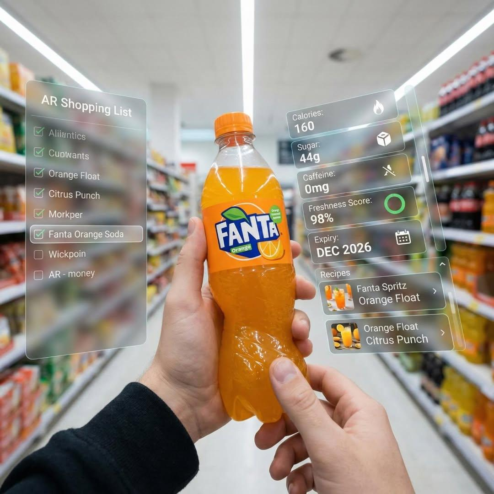

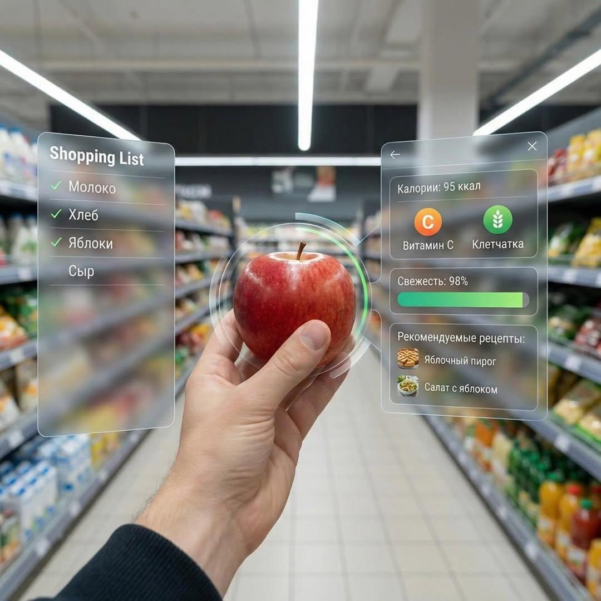

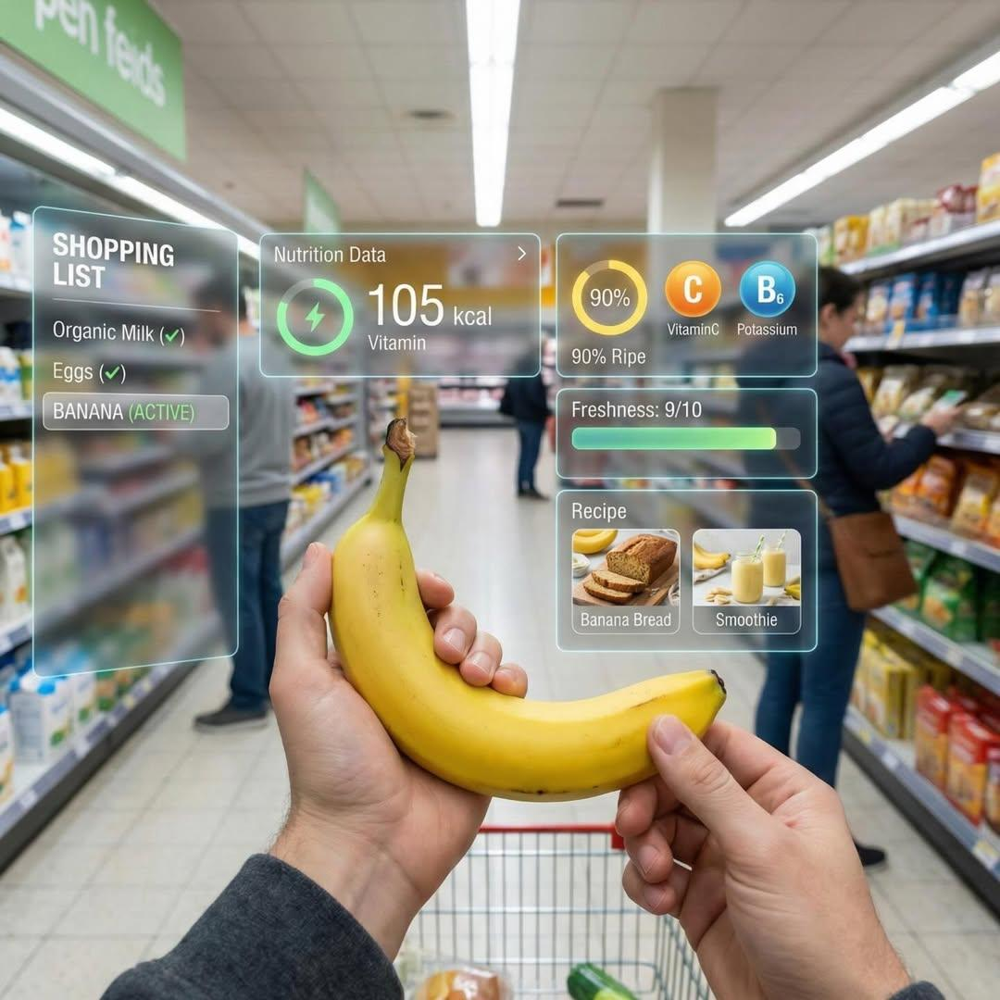

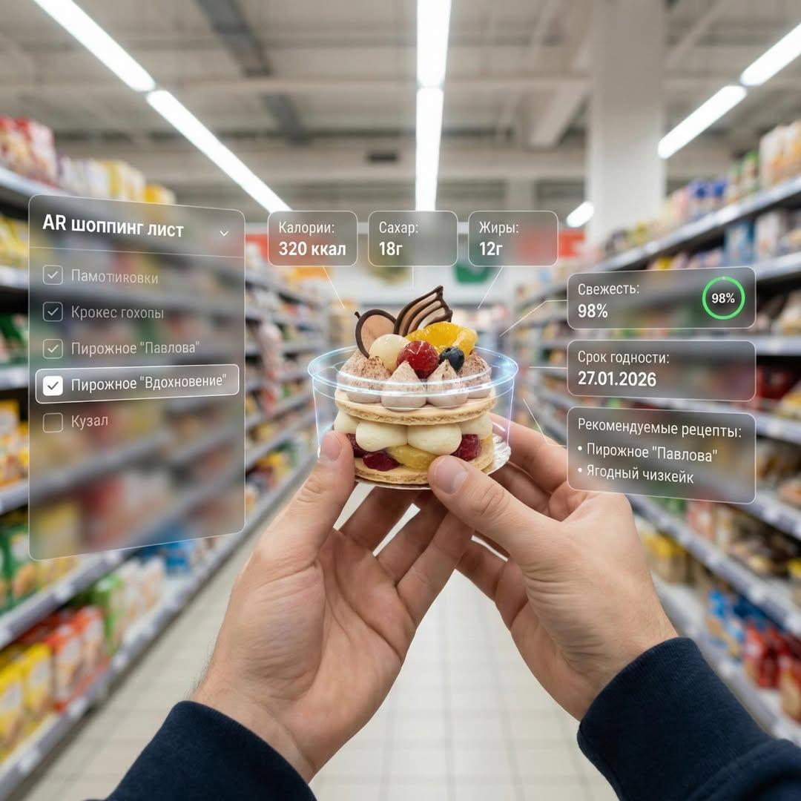

```
First-person perspective inside a brightly lit supermarket aisle. Realistic human hands are holding a bottle of Fanta soda close to the camera. The vivid orange drink in its iconic branded bottle is surrounded by a multi-layered holographic augmented reality interface displaying nutritional data, including calorie count, sugar content, caffeine level, freshness indicator, expiration date, and recommended refreshing recipes and cocktails based on Fanta.
The UI elements smoothly shift and reorganize based on the viewer’s gaze direction, as if dynamically responding to user focus. In the left peripheral vision, a vertical semi-transparent shopping list is visible with checked-off items, where Fanta is highlighted as the currently active selection.
Hyper-realistic mixed reality, clean futuristic AR design, glass-like UI panels, soft ambient glow, realistic lighting and shadows, natural depth of field, immersive first-person interface, showcasing next-generation retail technology.
```

```
第一人称视角，身处明亮的超市货架通道内。逼真的人类双手正握着一瓶芬达汽水，靠近镜头。标志性的橙色饮料瓶周围环绕着多层全息增强现实界面，显示营养信息，包括卡路里含量、糖分、咖啡因水平、新鲜度指示器、保质期，以及基于芬达推荐的清爽饮品和鸡尾酒配方。  
用户界面元素会根据观者的视线方向平滑移动并重新排布，仿佛能动态响应用户的注意力焦点。在左侧视野边缘，可见一个半透明的垂直购物清单，其中已勾选的项目清晰可见，而芬达当前被高亮为选中状态。  
超写实混合现实风格，干净的未来主义AR设计，玻璃质感的UI面板，柔和环境光晕，真实光影与阴影，自然景深，沉浸式第一人称界面，展现下一代零售科技。
```

 [↑返回目录](#toc)

---
## <a id="prompt-2015106824228536600">商品九宫格</a> (<a href="https://x.com/i/status/2015106824228536465" target="_blank" rel="noopener noreferrer">Tugser Okur</a>)

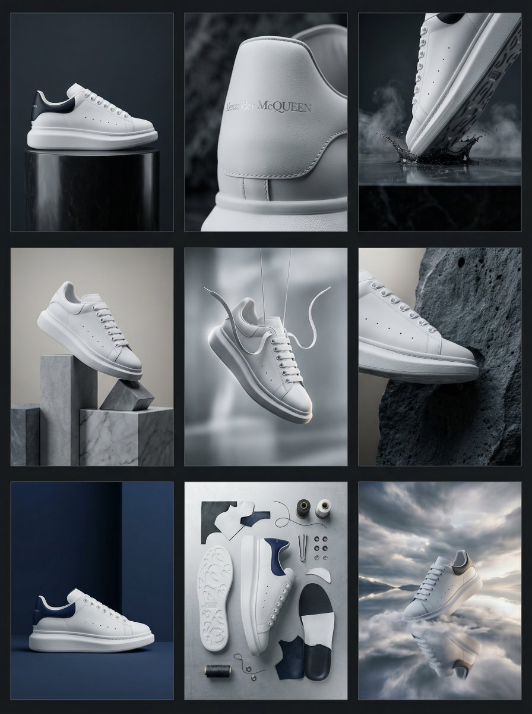

```
Create a 3×3 grid in 3:4 aspect ratio for a high-end commercial marketing campaign using the Alexander McQueen men's luxury sneaker as the central subject.

Each frame must present a distinct visual concept while maintaining perfect product consistency across all nine images.

Grid Concepts (one per cell):

1.  **Iconic Hero Shot:** Eye-level profile view of the shoe on a dark, sleek pedestal, emphasizing the signature oversized sole.
2.  **Extreme Macro Detail:** Close-up on the heel counter or stitching details, highlighting the premium leather grain and "Alexander McQueen" logo embossing.
3.  **Dynamic Interaction:** The shoe stepping onto a surface causing a subtle, elegant splash of dark liquid or marble dust (impact visual).
4.  **Minimal Sculptural:** The shoe balanced artistically on geometric concrete or marble blocks, emphasizing architectural design.
5.  **Levitation & Lightness:** The shoe floating in mid-air with laces suspended dynamically, suggesting premium comfort and airiness.
6.  **Sensory Texture:** A mood shot focusing on the tactile quality of the velvet or smooth leather upper against a contrasting rough stone texture.
7.  **Monochrome Luxury:** A color-blocked scene where the background perfectly matches the shoe's accent color (e.g., black or navy), creating a bold editorial look.
8.  **Deconstructed Craftsmanship:** An abstract arrangement of raw materials (leather swatches, rubber textures) surrounding the shoe, symbolizing high-quality construction.
9.  **Surreal Fusion:** The shoe integrated into a surreal, dreamlike landscape (e.g., a cloudscape or mirrored infinity room) blending realism with high fashion.

Visual Rules:
* **Subject:** Alexander McQueen Men's Oversized Sneaker (or specific model provided).
* **Consistency:** The shoe must remain 100% accurate in shape, proportions, sole thickness, logo placement, and typography.
* **No Distortion:** No deformation of the signature sole or branding.
* **Separation:** Clean separation between the footwear and the background.

Lighting & Style:
* Soft, controlled studio lighting with dramatic rim lights to accentuate the shoe's silhouette.
* Subtle highlights on leather, deep realistic shadows under the sole.
* High dynamic range, 8k resolution, ultra-sharp focus.
* Editorial luxury fashion advertising aesthetic (Vogue/GQ style).
* Palette: Minimalist, monochrome, metallic, and deep matte tones.

Overall Feel:
* Modern, refined, visually cohesive.
* High-end commercial campaign for a luxury fashion house.
* Hyperreal, cinematic, polished, and aspirational.
```

```
创作一组3×3网格图像，画面比例为3:4，用于高端商业营销活动，以Alexander McQueen男士奢华运动鞋为核心主体。

每个画面需呈现独特的视觉概念，同时确保九张图像中的产品保持完全一致。

网格概念（每格一个）：

1. **标志性主视觉**：鞋履置于深色光滑底座上，采用平视侧面视角，突出其标志性的超厚鞋底。  
2. **极致微距细节**：特写后跟或缝线细节，展现高级皮革纹理及“Alexander McQueen”压印logo。  
3. **动态互动**：鞋履踏落于表面，激起微妙而优雅的深色液体或大理石粉尘飞溅（冲击视觉效果）。  
4. **极简雕塑感**：鞋履以艺术方式平衡于几何混凝土或大理石块之上，强调其建筑感设计。  
5. **悬浮轻盈感**：鞋履悬浮于空中，鞋带呈动态飘浮状态，传达高级舒适与轻盈感。  
6. **感官质感**：聚焦鞋面丝绒或光滑皮革的触感，与粗糙石材背景形成质感对比的情绪画面。  
7. **单色奢华**：色彩区块化构图，背景与鞋履的点缀色（如黑色或海军蓝）完美匹配，营造大胆的杂志大片风格。  
8. **解构工艺**：围绕鞋履抽象排列原材料（皮革样本、橡胶纹理），象征高品质制作工艺。  
9. **超现实融合**：鞋履融入梦幻超现实场景（如云海或镜面无限空间），将真实感与高级时装美学结合。

视觉规范：  
- **主体**：Alexander McQueen男士超厚底运动鞋（或指定具体型号）。  
- **一致性**：鞋型、比例、鞋底厚度、logo位置及字体必须100%准确。  
- **无变形**：不得扭曲标志性鞋底或品牌标识。  
- **分离感**：鞋履与背景之间需清晰分离。

光影与风格：  
- 柔和可控的影棚灯光，搭配戏剧性轮廓光以强化鞋履轮廓。  
- 皮革表面呈现细腻高光，鞋底下方有深邃真实的阴影。  
- 高动态范围、8K分辨率、超锐利对焦。  
- 杂志级奢华时尚广告美学（Vogue/GQ风格）。  
- 色调：极简、单色、金属色与深哑光色系。

整体氛围：  
- 现代、精致、视觉统一。  
- 奢侈品牌高端商业广告。  
- 超写实、电影感、精雕细琢且充满向往感。
```

 [↑返回目录](#toc)

---
## <a id="prompt-2015314306578182400">超现实3D场景中的骑手与微型城市</a> (<a href="https://x.com/i/status/2015314306578182501" target="_blank" rel="noopener noreferrer">Sharon Riley</a>)

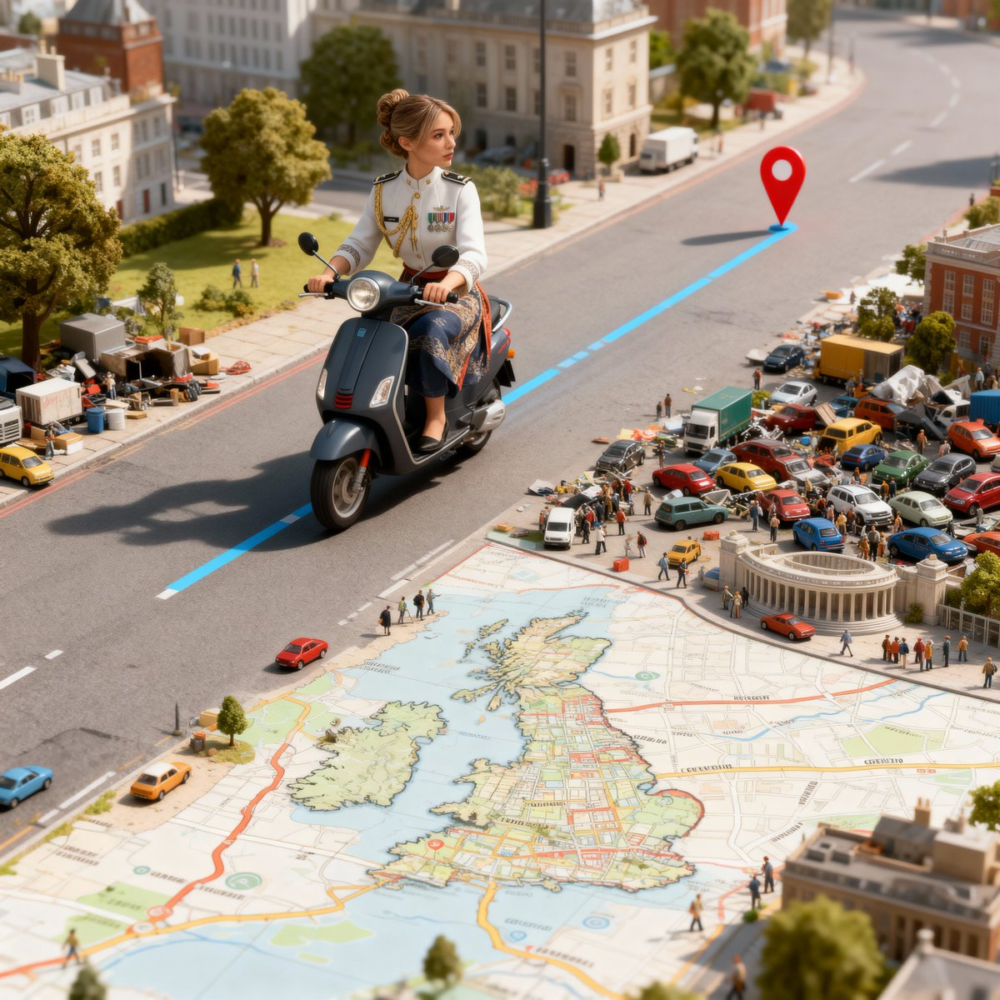

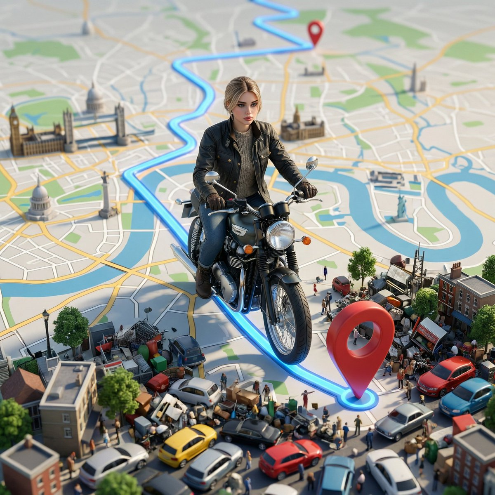

```
Use the same face from the reference image without changing facial features 
Vertical (4:5 or 9:16) surreal 3D scene featuring a photorealistic character generated strictly from the attached reference image (accurate facial likeness, skin texture, age, proportions).

Front-facing view, camera slightly above eye level, the character riding her own scooter/motorbike directly on top of the blue GPS route line itself, moving forward toward a red destination pin.
The character wears culturally accurate clothing inspired by [west], with realistic fabric behavior and riding posture.
Below, a stylized GPS-style city map of [United Kingdom] fills the scene. A chaos zone at [Greenwich ] shows dense miniature cars, people, buildings, trees, and urban clutter concentrated near the destination.
Natural daylight, cinematic shadows, sharp focus on the character, and subtle depth of field on the map.

High-end concept-art quality combining photoreal human + stylized miniature city.
```

```
使用参考图像中的同一张面孔，不得更改任何面部特征。  
垂直构图（4:5 或 9:16）的超现实3D场景，主角为严格基于所附参考图像生成的逼真人物（准确还原面部相貌、皮肤纹理、年龄与比例）。  

正面视角，镜头略高于眼睛水平线，角色正骑着自己的滑板车/摩托车，直接行驶在蓝色GPS路线线上，朝向一个红色目的地图钉前进。  
角色穿着受[西方]文化启发的真实服饰，布料动态自然，骑行姿势真实可信。  

画面下方是风格化的GPS式城市地图，描绘的是[英国]，其中[格林尼治]区域呈现混乱状态，密集分布着微型汽车、人物、建筑、树木及城市杂物，集中在目的地附近。  
自然日光照明，电影感阴影，角色清晰锐利聚焦，地图部分带有微妙的景深效果。  

整体呈现高端概念艺术品质，融合逼真人像与风格化微型城市景观。
```

 [↑返回目录](#toc)

---
## <a id="">梦幻水果汽水特写</a> (<a href="https://x.com/0xbisc/status/2015358314969018505" target="_blank" rel="noopener noreferrer">Latte</a>)

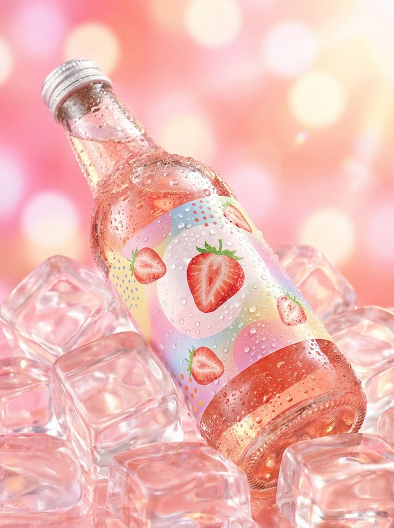

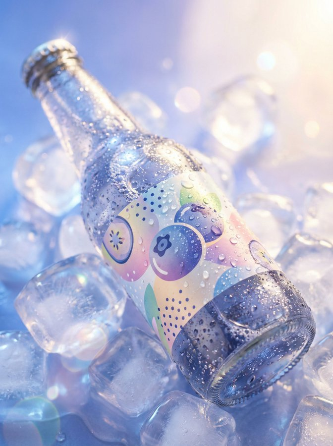

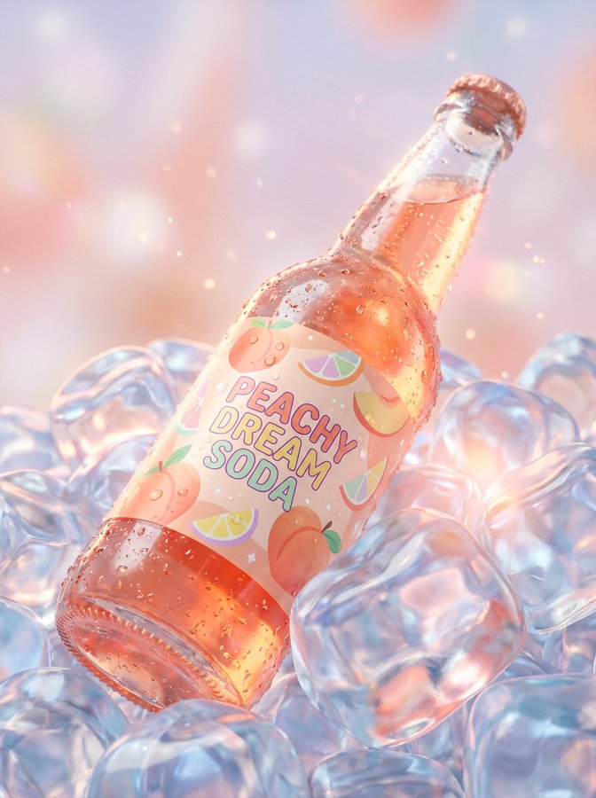

```
Dreamy chilled fruit soda. You can swap in any fruit you want 

Made with Nano Banana Pro

Prompt : {Fruit}-themed ultra-realistic yet dreamy commercial beverage photography, a {fruit-color}-tinted sparkling soda in a clear glass bottle lying diagonally, partially embedded among a moderate amount of clear, solid beverage ice cubes surrounding and supporting the bottle. Ice cubes, smooth, naturally shaped and gently melting, transparent with a clean warm-white appearance, no crystals, no shards, no frosted or gray texture, distributed to fill the frame without crowding. High-key pastel lighting dominated by a bright, clean {fruit-primary-color} glow with soft warm-white highlights (no cold gray or dirty tones), high brightness and low grayness, sparkling highlights and gentle bokeh light flares. Bottle fully covered with dense condensation droplets and shimmering water beads, glossy glass surface, fresh and clean summer mood. Colorful {Fruit}-themed illustrated label with fruit slices, pastel gradients and decorative dots in a light, high-saturation palette. No muted colors, no brownish or gray cast, no dull tones, no crushed ice, no tiny cubes, no ice crystals, no flat lighting, no plain white background, no documentary realism.
```

```
梦幻冰凉的水果汽水，可替换任意你喜欢的水果。

使用 Nano Banana Pro 制作。

提示词：以{Fruit}为主题的超写实又梦幻的商业饮品摄影，一瓶{fruit-color}色调的气泡汽水装在透明玻璃瓶中，瓶子呈对角线倾斜放置，部分嵌入适量清澈坚实的饮料冰块之中，冰块环绕并支撑着瓶身。冰块光滑、自然成形、微微融化，通透洁净，呈现温暖的纯白色调，无冰晶、无碎屑、无霜状或灰色质感，在画面中分布均匀，填满构图但不显拥挤。高调柔和的粉彩色调光线，以明亮干净的{fruit-primary-color}主色光为主，辅以柔和的暖白高光（不含冷灰或污浊色调），整体高亮度、低灰度，带有闪烁高光与柔美散景光晕。瓶身布满密集的冷凝水珠与闪亮水滴，玻璃表面光泽剔透，营造清新洁净的夏日氛围。瓶身标签为多彩{Fruit}主题插画风格，包含水果切片、粉彩渐变与装饰性圆点，采用明亮高饱和的配色方案。避免使用低饱和色、棕灰色调、暗淡色彩、碎冰、小冰粒、冰晶、平光照明、纯白背景或纪实写实风格。
```

 [↑返回目录](#toc)

---
## <a id="">雨夜复古胶片低角度大长腿</a> (<a href="https://x.com/sidona/status/2014934098234769530" target="_blank" rel="noopener noreferrer">Sidona</a>)

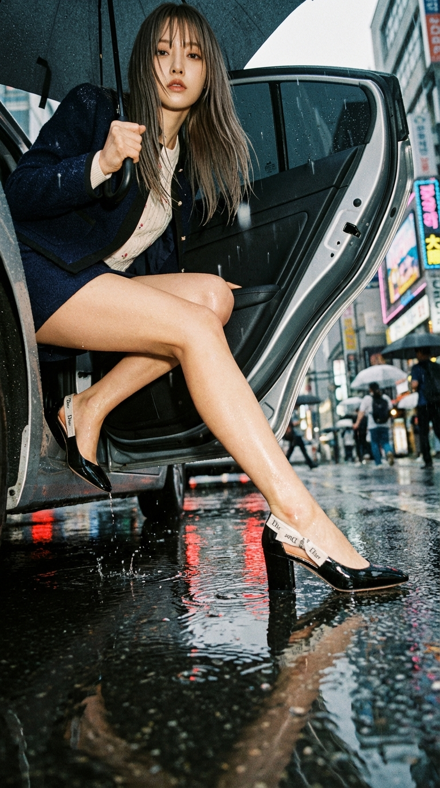

```
Based on <User Portrait>, pose from <Pose Reference>.

EXTREME LOW ANGLE RAINY EXIT - VINTAGE FILM:

Camera ON THE GROUND, shooting UP. 20-24mm ULTRA WIDE ANGLE + 10-15° DUTCH TILT.

Woman mid-exit from car in rain:
- One leg FULLY EXTENDED, pointed toe about to splash puddle
- Other leg bent on car seat, strong diagonal
- Body leaning forward, face looking down
- Wet hair falling forward
- Umbrella at dramatic angle

LEGS DOMINATE 70% OF FRAME. Wide angle distortion maximizes length. Puddle reflection doubles the leg line.

Red taillights reflected in puddle (color anchor). Warm car interior glow. Rain drops frozen mid-air. Splash at stepping foot.

VINTAGE FILM - CRITICAL:
Fujifilm Nostalgic Negative, HEAVY FILM GRAIN (ISO 800 pushed look), warm golden skin tones, cool blue-gray rain, subtle halation on highlights, visible analog texture.

Background: blurred city lights, neon bokeh, umbrella silhouettes, urban rain chaos.

Mood: Cinematic fashion editorial, maximum visual impact, vintage film nostalgia, legs for days.
```

```
基于《用户肖像》，姿势参考自《姿势参考》。

极端低角度雨中离开 - 复古电影风格：

相机置于地面，向上拍摄。使用20-24毫米超广角镜头+10-15度荷兰倾斜。

女子在雨中正要下车：
- 一条腿完全伸展，脚尖即将溅起水洼
- 另一条腿弯曲在车座上，形成强烈的对角线
- 身体前倾，脸朝下看
- 湿发垂于前方
- 雨伞以戏剧性角度持握

双腿占据画面70%，广角镜头失真最大化长度。水洼反射加倍腿部线条。

红色尾灯在水洼中的反射（色彩锚点）。车内温暖的光芒。雨滴凝固在半空中。踏入时溅起的水花。

复古电影风格 - 至关重要：
采用富士胶片怀旧负片，重胶粒感（ISO 800推高效果），暖金色皮肤色调，冷蓝色雨，高光处微妙的光环效应，可见的模拟质感。

背景：模糊的城市灯光、霓虹散景、雨伞轮廓、城市的雨夜混乱。

氛围：电影时尚编辑风格，最大视觉冲击力，复古电影怀旧情调，“腿长无尽头”。
```

 [↑返回目录](#toc)

---
## <a id="">乐高小船在焦糖河上冒险</a> (<a href="https://x.com/Just_sharon7/status/2014899367174668558" target="_blank" rel="noopener noreferrer">Sharon Riley</a>)

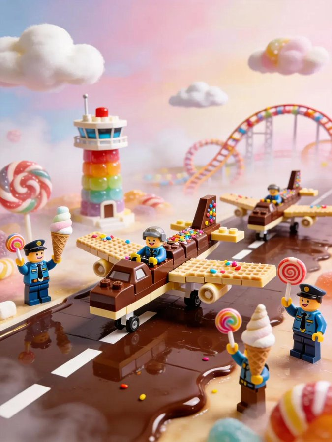

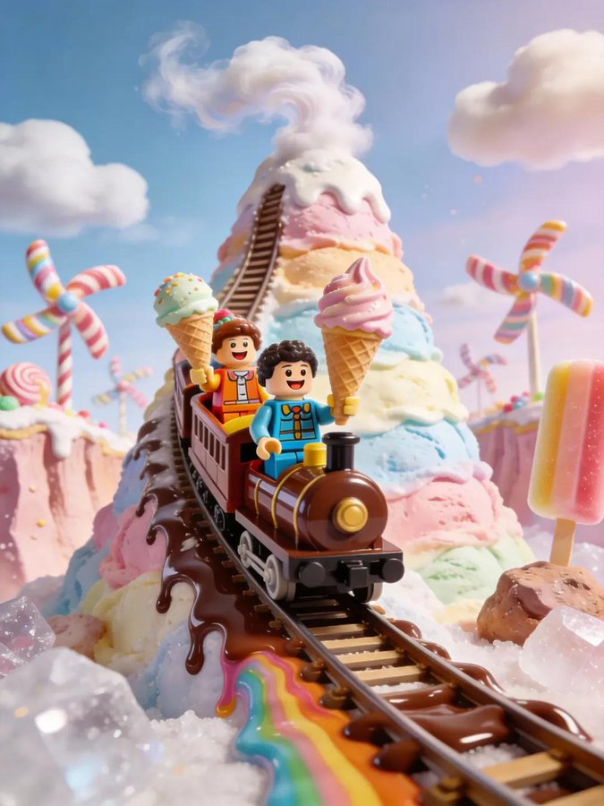

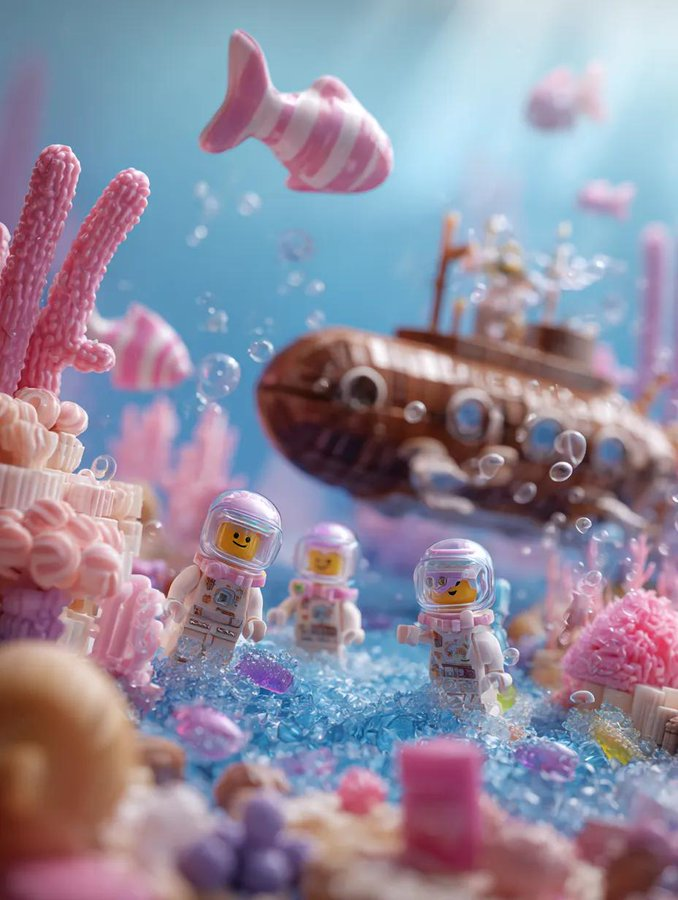

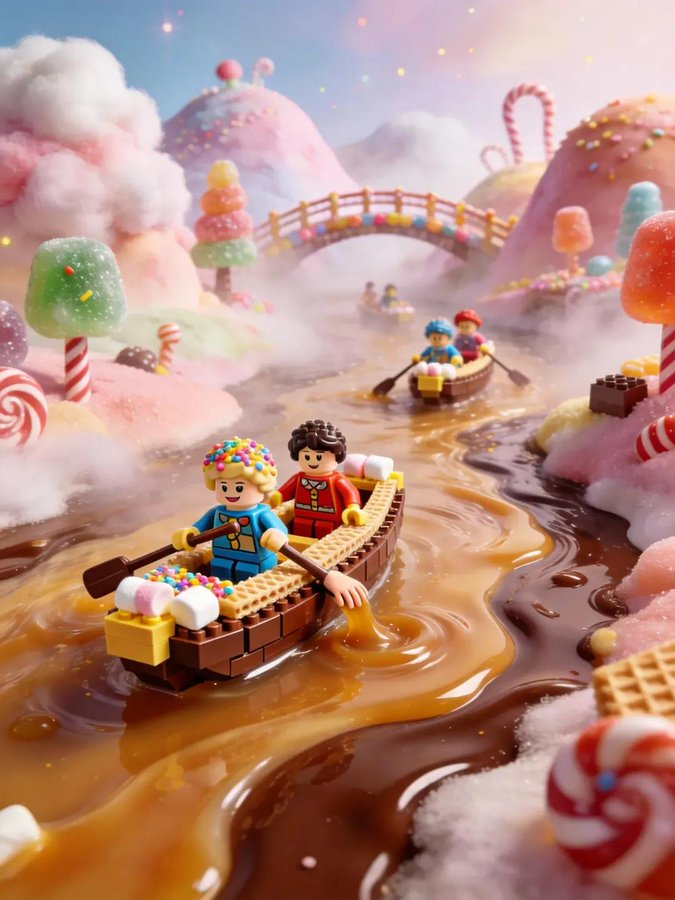

```
{
  "atmosphere": {
    "mood": "playful and joyful",
    "mist": "soft misty haze",
    "lighting": "soft pastel lighting"
  },
  "river": {
    "type": "melted caramel and chocolate",
    "motion": "gently swirling like syrup",
    "texture": "glossy, smooth, flowing"
  },
  "boats": {
    "style": "lego-style",
    "materials": [
      "wafer",
      "chocolate"
    ],
    "details": {
      "toppings": [
        "colorful sprinkles",
        "marshmallows"
      ],
      "scale": "toy-like proportions"
    },
    "movement": "floating downstream"
  },
  "characters": {
    "type": "lego characters",
    "actions": [
      "joyfully paddling candy boats",
      "dipping hands into caramel river"
    ],
    "expressions": "happy and playful"
  },
  "background": {
    "landscape_elements": [
      "cotton-candy hills",
      "gumdrop trees",
      "candy bridges"
    ],
    "connections": "bridges linking different parts of the candy landscape"
  },
  "style": {
    "visual_style": "playful cartoonish 3D",
    "color_palette": "soft pastel colors",
    "render_quality": "high-quality whimsical render"
  }
}
```

```
氛围欢快愉悦，笼罩着柔和朦胧的薄雾，光线为柔和的粉彩色调。河流由融化的焦糖与巧克力构成，如糖浆般缓缓旋转流淌，表面光滑闪亮、质地柔顺。河上漂浮着乐高风格的小船，船体由威化饼和巧克力制成，点缀着五彩糖粒和棉花糖，比例小巧如玩具，正顺流而下。船上是乐高小人，神情快乐顽皮，有的正开心地划着糖果小船，有的把手伸进焦糖河里嬉戏。背景是梦幻糖果景观：棉花糖山丘、软糖树和糖果桥，桥梁连接着糖果世界的各个区域。整体采用俏皮卡通风格的3D渲染，配色为柔和粉彩，画面为高质量的奇幻精美效果。
```

 [↑返回目录](#toc)

---
## <a id="">王家卫风格地铁站女生写真</a> (<a href="https://x.com/sidona/status/2014541260753957322" target="_blank" rel="noopener noreferrer">Sidona</a>)

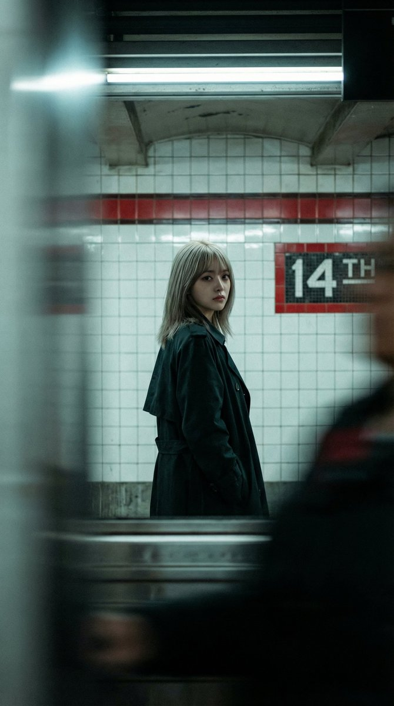

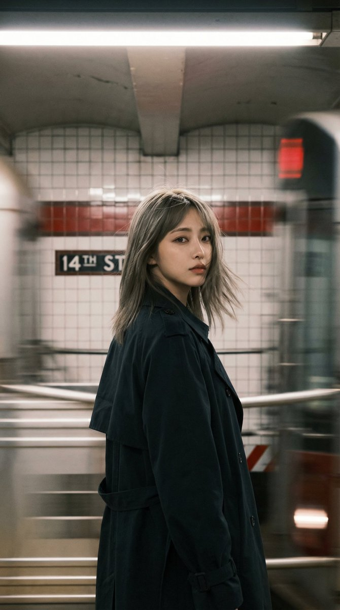

```
{
  "portrait_prompt": {
    "subject": "Based on <User Portrait>, a woman with shoulder-length hair in a dark trench coat, standing on a tiled subway platform, looking back over her shoulder. Background features white tiled walls with a red horizontal stripe and '14 TH' signage.",
    "composition": "Medium shot, 50mm lens. Strong horizontal motion blur in the foreground creating a 'passing train' effect or long exposure feel, while the subject remains sharp and static in the mid-ground.",
    "camera_angle": "Eye-level, shooting through moving foreground elements.",
    "lighting": "Diffused artificial subway station lighting, cool ambient tones, soft contrast.",
    "color_palette": "Cinematic muted tones, cold whites, dark blacks, red accents, vintage film aesthetic similar to Wong Kar-wai style, Fujifilm Classic Chrome inspired color grading, muted saturation, cool cyan blues, compressed midtones, documentary photojournalism feel, subtle grain.",
    "mood": "Atmospheric, fleeting, urban solitude, sense of time passing, melancholic, cinematic.",
    "negative_prompt": "Unrealistic features, anatomical errors, stiff pose, over-processed, harsh lighting, blurry subject, low resolution, bad composition, distorted faces, unnatural colors, extra limbs, watermark, text"
  }
}
```

```
基于《用户肖像》，一位留着齐肩发的女子身穿深色风衣，站在铺有瓷砖的地铁站台上，回头望向身后。背景为白色瓷砖墙，带有红色横条纹和“14 TH”标识。

中景构图，使用50毫米镜头。前景呈现强烈的水平动态模糊，营造出“列车驶过”或长时间曝光的效果，而主体在中景保持清晰静止。

相机角度为平视，透过移动的前景元素进行拍摄。

光线采用柔和的人工地铁站照明，整体色调偏冷，对比度柔和。

色彩风格为电影感的低饱和色调：冷白、深黑、红色点缀，具有王家卫风格的复古胶片美学，参考富士胶片Classic Chrome色彩调性，低饱和度、偏青蓝的冷色、压缩的中间调，呈现纪实摄影般的质感，并带有细微颗粒。

氛围：充满氛围感、转瞬即逝、都市孤独、时光流逝之感，略带忧郁且极具电影感。
```

 [↑返回目录](#toc)

---
## <a id="">芝士与辣味薯片的盛宴</a> (<a href="https://x.com/meng_dagg695/status/2015305280826028407" target="_blank" rel="noopener noreferrer">ShaHid WaNii</a>)

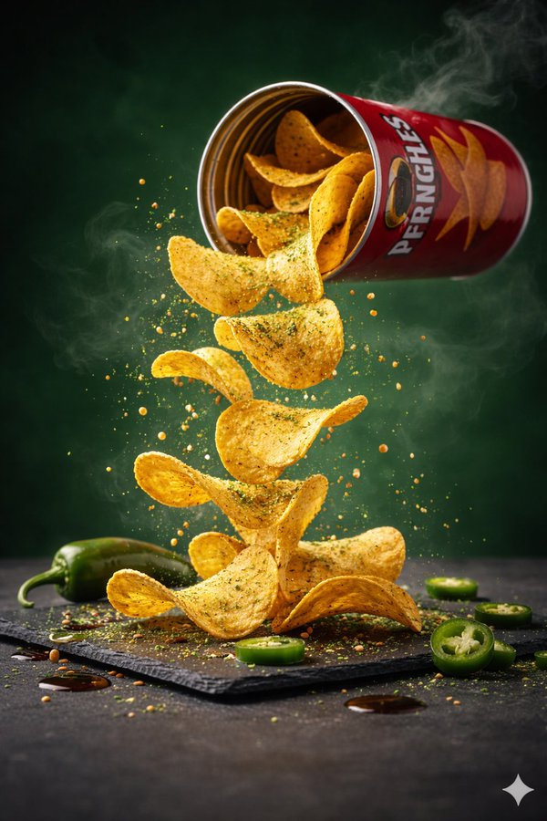

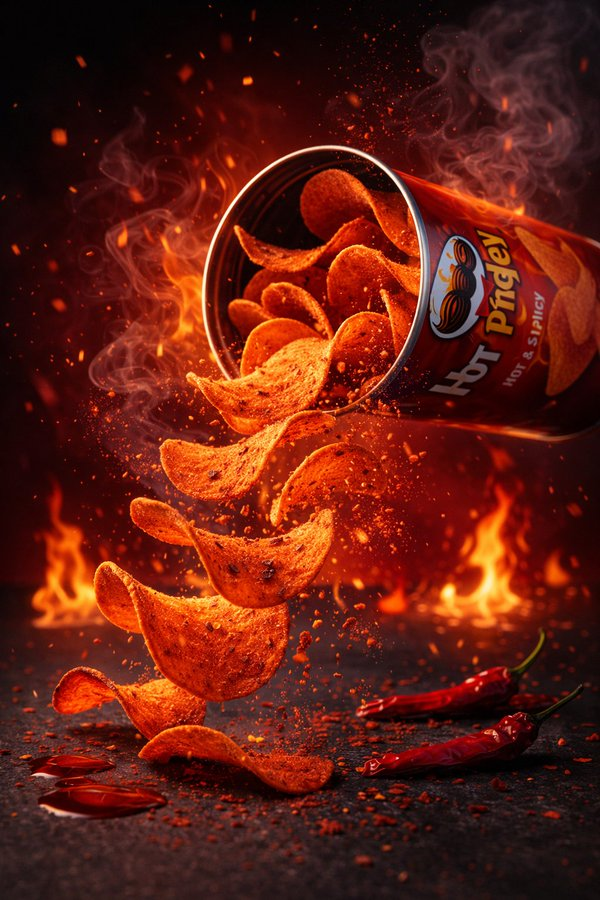

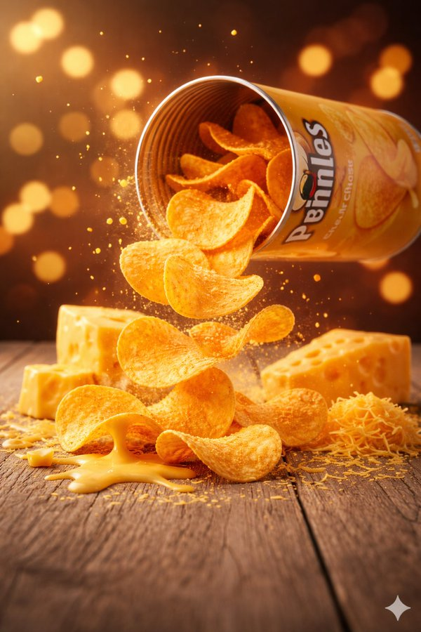

```
These images may activate your taste buds.

Google Gemini Banana pro 

Prompt :
{
  "master_prompt": {
    "global_technical_settings": {
      "resolution": "8K ultra-high-definition",
      "aspect_ratio": "3:4 vertical",
      "sharpness": "extreme micro-detail, crisp edges",
      "noise": "none",
      "compression": "none",
      "ai_finish": "premium cinematic AI-edited look",
      "depth_of_field": "shallow, subject-focused",
      "motion": "frozen mid-air particles and objects"
    },

    "module_1_image_1_style": {
      "scene_type": "cheese-flavored chips product shot",
      "primary_subject": {
        "object": "yellow Pringles can",
        "orientation": "tilted diagonally, opening facing downward",
        "branding_visibility": "partial logo visible, readable 'Pringles'",
        "chips": "golden-yellow curved chips falling mid-air"
      },
      "chip_details": {
        "surface_texture": "fine porous potato texture",
        "coating": "cheese powder dust",
        "edges": "thin, crisp, slightly curled",
        "motion": "multiple chips suspended mid-fall"
      },
      "environment": {
        "surface": "rustic wooden tabletop",
        "props": [
          "cheese blocks with visible holes",
          "grated cheese pile",
          "melted cheese spill pooling on wood"
        ]
      },
      "lighting": {
        "type": "warm studio lighting",
        "color_temperature": "golden amber",
        "highlights": "soft glowing reflections on chips",
        "background": "warm bokeh light orbs"
      },
      "atmosphere": {
        "particles": "floating cheese dust",
        "mood": "warm, indulgent, rich"
      }
    },

    "module_2_image_2_style": {
      "scene_type": "spicy chips cinematic fire theme",
      "primary_subject": {
        "object": "red Pringles-style can",
        "orientation": "angled, pouring forward",
        "branding_visibility": "visible illustrated face logo and text",
        "chips": "deep red-orange chips pouring out"
      },
      "chip_details": {
        "surface_texture": "rough, heavily seasoned",
        "coating": "red chili spice powder",
        "color": "intense fiery red",
        "motion": "vertical cascade of chips"
      },
      "environment": {
        "surface": "dark stone or matte surface",
        "props": [
          "whole red chili peppers",
          "scattered spice granules"
        ]
      },
      "lighting": {
        "type": "dramatic high-contrast lighting",
        "key_light": "strong warm highlights",
        "shadows": "deep, cinematic blacks"
      },
      "atmosphere": {
        "elements": [
          "visible flames in background",
          "smoke trails",
          "flying embers and sparks"
        ],
        "mood": "intense, aggressive, fiery"
      }
    },

    "module_3_image_3_style": {
      "scene_type": "jalapeño-flavored chips fresh spicy theme",
      "primary_subject": {
        "object": "red Pringles can",
        "orientation": "tilted horizontally, opening facing viewer",
        "branding_visibility": "partial text visible",
        "chips": "golden chips falling in layered formation"
      },
      "chip_details": {
        "surface_texture": "clean potato texture",
        "coating": "green herb and spice seasoning",
        "color": "golden yellow with green flecks"
      },
      "environment": {
        "surface": "dark slate serving board",
        "props": [
          "whole green jalapeño pepper",
          "sliced jalapeño rings",
          "small sauce droplets"
        ]
      },
      "lighting": {
        "type": "controlled studio lighting",
        "balance": "neutral-warm",
        "background": "deep green gradient"
      },
      "atmosphere": {
        "particles": "floating seasoning dust",
        "smoke": "light misty vapor",
        "mood": "fresh, spicy, clean"
      }
    }
```

```
这些图像可能会激活你的味蕾。

谷歌 Gemini 香蕉专业版

提示词：
{
  "主提示": {
    "全局技术设置": {
      "分辨率": "8K超高清",
      "纵横比": "3:4垂直",
      "清晰度": "极致微观细节，锐利边缘",
      "噪点": "无",
      "压缩": "无",
      "AI效果": "高端电影级AI编辑外观",
      "景深": "浅景深，主体聚焦",
      "动态": "冻结在半空中的颗粒和物体"
    },

    "模块一图像一风格": {
      "场景类型": "芝士味薯片产品展示",
      "主要对象": {
        "物品": "黄色品客薯片罐",
        "方向": "对角线倾斜，开口朝下",
        "品牌可见性": "部分标志可见，可读'品客'",
        "薯片": "金黄色弯曲的薯片在空中落下"
      },
      "薯片细节": {
        "表面纹理": "细腻的多孔土豆纹理",
        "涂层": "芝士粉",
        "边缘": "薄，脆，微微卷曲",
        "动态": "多个薯片悬停在半空中"
      },
      "环境": {
        "表面": "质朴的木制桌面",
        "道具": [
          "带孔的芝士块",
          "堆起的磨碎芝士",
          "融化的芝士溢出并在木头上形成小池"
        ]
      },
      "照明": {
        "类型": "暖色调工作室照明",
        "色温": "金琥珀色",
        "高光": "薯片上的柔和发光反射",
        "背景": "温暖的散景光圈"
      },
      "氛围": {
        "颗粒": "浮动的芝士尘",
        "情绪": "温暖，奢侈，丰富"
      }
    },

    "模块二图像二风格": {
      "场景类型": "辣味薯片电影火焰主题",
      "主要对象": {
        "物品": "红色品客风格罐",
        "方向": "倾斜，向前倾倒",
        "品牌可见性": "可见的插画脸标志和文字",
        "薯片": "深红橙色的薯片流出"
      },
      "薯片细节": {
        "表面纹理": "粗糙，重调味",
        "涂层": "红色辣椒香料粉",
        "颜色": "强烈的火红色",
        "动态": "垂直流下的薯片瀑布"
      },
      "环境": {
        "表面": "暗色石面或哑光表面",
        "道具": [
          "整颗红色辣椒",
          "散落的香料颗粒"
        ]
      },
      "照明": {
        "类型": "戏剧性的高对比度照明",
        "主光源": "强暖色调高光",
        "阴影": "深邃，电影般的黑色"
      },
      "氛围": {
        "元素": [
          "背景中可见火焰",
          "烟雾轨迹",
          "飞舞的余烬和火花"
        ],
        "情绪": "强烈，激进，火热"
      }
    },

    "模块三图像三风格": {
      "场景类型": "哈拉佩诺风味薯片新鲜辣味主题",
      "主要对象": {
        "物品": "红色品客罐",
        "方向": "水平倾斜，开口对着观众",
        "品牌可见性": "部分文字可见",
        "薯片": "金色薯片层层落下"
      },
      "薯片细节": {
        "表面纹理": "干净的土豆纹理",
        "涂层": "绿色草药和香料调味",
        "颜色": "金黄带有绿色斑点"
      },
      "环境": {
        "表面": "深色板岩服务板",
        "道具": [
          "整个绿哈拉佩诺辣椒",
          "切片哈拉佩诺环",
          "少量酱滴"
        ]
      },
      "照明": {
        "类型": "控制的工作室照明",
        "平衡": "中性-暖调",
        "背景": "深绿色渐变"
      },
      "氛围": {
        "颗粒": "浮动的调味粉尘",
        "烟雾": "轻薄的蒸汽",
        "情绪": "新鲜，辛辣，清洁"
      }
    }
  }
}
```

 [↑返回目录](#toc)

---
## <a id="">科学杂志人像封面</a> (<a href="https://x.com/astronomerozge1/status/2015189748717932552" target="_blank" rel="noopener noreferrer">Özge Döner</a>)

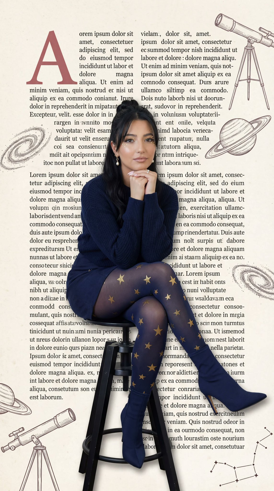

```
{
  "generation_request": {
    "meta_data": {
      "tool": "NanoBanana Pro",
      "task_type": "photoreal_editorial_cutout_magazine_layout",
      "version": "v1.3_COSMOS_PAGE_NAVY_GOLD_STARS_EDITORIAL_FACELOCK_FULL_EN",
      "priority": "highest",
      "language": "en"
    },

    "references": {
      "reference_image_face": {
        "source": "UPLOAD_REFERENCE_IMAGE (REQUIRED)",
        "purpose": "FACE_IDENTITY_LOCK",
        "strict_lock": true,
        "face_similarity_priority": "MAX",
        "identity_confidence": "ABSOLUTE",
        "no_identity_blending": true,
        "no_face_morphing": true,
        "no_beautify": true,
        "no_age_shift": true,
        "preserve_skin_texture": true,
        "preserve_facial_proportions": true,
        "preserve_moles_freckles_scars": true,
        "preserve_eye_shape": true,
        "preserve_nose_shape": true,
        "preserve_lip_shape": true,
        "preserve_jawline": true
      },
      "reference_image_style": {
        "source": "UPLOAD_REFERENCE_IMAGE (OPTIONAL)",
        "purpose": "LAYOUT_POSE_STYLE_ANCHOR",
        "strict_lock": false,
        "preserve_composition": true,
        "preserve_vibe": true
      }
    },

    "global_constraints": {
      "rating": "PG-13",
      "no_nudity": true,
      "no_explicit_sexual_content": true,
      "no_logos": true,
      "no_watermark": true,
      "no_readable_text": true
    },

    "output_settings": {
      "aspect_ratio": "9:16",
      "orientation": "portrait",
      "resolution_target": "ultra_high_res",
      "render_style": "high_end_editorial_magazine_cutout",
      "sharpness": "crisp_but_natural",
      "film_grain": "subtle_35mm",
      "color_grade": "soft_neutral_with_navy_and_gold_accents",
      "dynamic_range": "natural_not_hdr",
      "skin_rendering": "real_texture_no_retouch"
    },

    "creative_prompt": {
      "scene_summary": "Create a high-fashion editorial magazine page inspired by classic astronomy/science book design (Cosmos-like, but original). The background is an off-white paper texture resembling a refined astronomy book page, filled with two tall, justified columns of NON-READABLE serif pseudo-text and a large muted red drop-cap letter at the top-left. The typography must look academically authentic in spacing, justification, and hyphenation patterns, but contain no real words and no readable sentences.\n\nSeamlessly integrated into the page layout are small, precise, hand-drawn scientific illustrations: a telescope sketch, Saturn with rings, spiral galaxies, star clusters, constellation dot-and-line diagrams, and a few tiny starburst symbols. These are thin-line, ink-style drawings embedded within margins and between/around text columns (not floating stickers, not decorative overlays). The page should feel like a real astronomy reading spread with tasteful scientific marginalia.\n\nIn front of the page, place a cutout-style photoreal studio portrait of the SAME adult woman whose face MUST MATCH THE REFERENCE IMAGE EXACTLY. She sits on a simple black stool, centered and overlapping both text columns, with a realistic contact shadow for a true magazine paste-up effect. The cutout edge should be clean and natural.\n\nWARDROBE (VERY IMPORTANT):\n• Top: navy knit sweater, soft knit texture, slightly oversized sleeves\n• Bottom: navy mini skirt, clean tailored cut\n• Legs: navy tights with evenly spaced glossy gold star pattern (foil-like sheen), consistent repetition\n• Shoes: navy high-heeled ankle boots, minimal and elegant\n\nMAKEUP (cosmic editorial): subtle high-fashion glam with tiny gold/silver micro star glitter near the outer eye corners, faint constellation-inspired highlights, luminous but natural skin, glossy neutral lips. No heavy retouching.\n\nPOSE: calm direct gaze toward camera, hands gently stacked under chin, legs crossed naturally. Relaxed but editorial posture. Identity fidelity is absolute.\n\nCOMPOSITION: 9:16 vertical magazine layout. Two justified text columns left and right with generous margins. A large muted red drop-cap at top-left. Subject placed slightly lower-middle, overlapping typography. Clean, minimalist, Cosmos-inspired, high-fashion editorial aesthetic.",
      "layout_notes": {
        "background": "off-white astronomy book-page aesthetic, two-column serif pseudo-text (non-readable), muted red drop-cap, embedded scientific ink drawings (telescope, Saturn, galaxies, constellations)",
        "foreground": "centered cutout model on a black stool with realistic shadow, clean magazine paste-up effect"
      }
    },

    "negative_prompt": [
      "readable text",
      "real book excerpts",
      "Cosmos title",
      "author name",
      "logos",
      "watermarks",
      "random letters forming real words",
      "page numbers",
      "citations",
      "extra people",
      "cartoon",
      "illustration",
      "anime",
      "plastic skin",
      "over-smoothing",
      "HDR",
      "AI glow",
      "face alteration",
      "identity mismatch",
      "generic model face",
      "deformed hands",
      "extra fingers",
      "distorted clothing",
      "wrong skirt length",
      "wrong shoe type",
      "uneven gold stars",
      "broken star pattern",
      "low resolution",
      "blurry edges"
    ]
  }
}
```

```
创作一幅高时尚杂志风格的写实人像剪贴画，灵感源自经典天文学/科学书籍的设计（类似《宇宙》风格但为原创内容）。背景为米白色纸张纹理，模拟精致天文书籍页面，包含两栏左对齐、两端对齐的无意义衬线体伪文本，左上角有一个大型暗红色首字母装饰。排版需在字距、对齐和断行方式上呈现学术级真实感，但不得包含任何可读文字或真实语句。

页面中自然融入精细的手绘科学插图：望远镜草图、带光环的土星、旋涡星系、星团、星座点线图以及少量微小星爆符号。这些插图为细线墨水风格，嵌入页边空白及文本栏之间（非浮动贴纸或装饰性叠加），整体营造出真实天文读物页面配以雅致科学旁注的氛围。

前景为一名成年女性的写实摄影棚人像剪贴，其面部必须与参考图像完全一致。她坐在一把简约黑色凳子上，居中并覆盖两栏文字，投下逼真的接触阴影，实现真实的杂志拼贴效果。剪裁边缘干净自然。

服装要求（非常重要）：
- 上衣：深蓝色针织毛衣，质地柔软，袖子略宽松
- 下装：深蓝色迷你裙，剪裁利落
- 腿部：深蓝色连裤袜，印有均匀分布的亮金色星星图案（具金属箔光泽），图案重复规律一致
- 鞋履：深蓝色高跟及踝靴，简约优雅

妆容（宇宙主题高定时妆）：外眼角点缀微小金/银色星形亮片，隐约可见星座灵感高光，肌肤透亮自然，唇色为光泽中性色调。禁止过度修图。

姿势：平静直视镜头，双手轻叠于下巴下方，双腿自然交叉，姿态放松但具杂志大片感。人物身份必须绝对忠实于参考图像。

构图：9:16竖向杂志版式。左右两侧为两端对齐的双栏伪文本，留有充足页边距；左上角设大型暗红色首字母；人物置于画面中下部，覆盖部分文字。整体风格干净极简，融合《宇宙》美学与高时尚杂志视觉语言。

禁止内容包括：可读文字、真实书籍摘录、《宇宙》标题、作者名、商标、水印、随机字母组成真实单词、页码、引文、额外人物、卡通、插画、动漫、塑料感皮肤、过度平滑、HDR效果、AI光晕、面部修改、身份不符、通用模特脸、手部畸形、多余手指、服装扭曲、裙长错误、鞋型不符、金色星星分布不均、星形图案断裂、低分辨率、边缘模糊。
```

 [↑返回目录](#toc)

---
## <a id="">布光九宫格</a> (<a href="https://x.com/CharaspowerAI/status/2016111888178790506" target="_blank" rel="noopener noreferrer">Pierrick Chevallier | IA</a>)

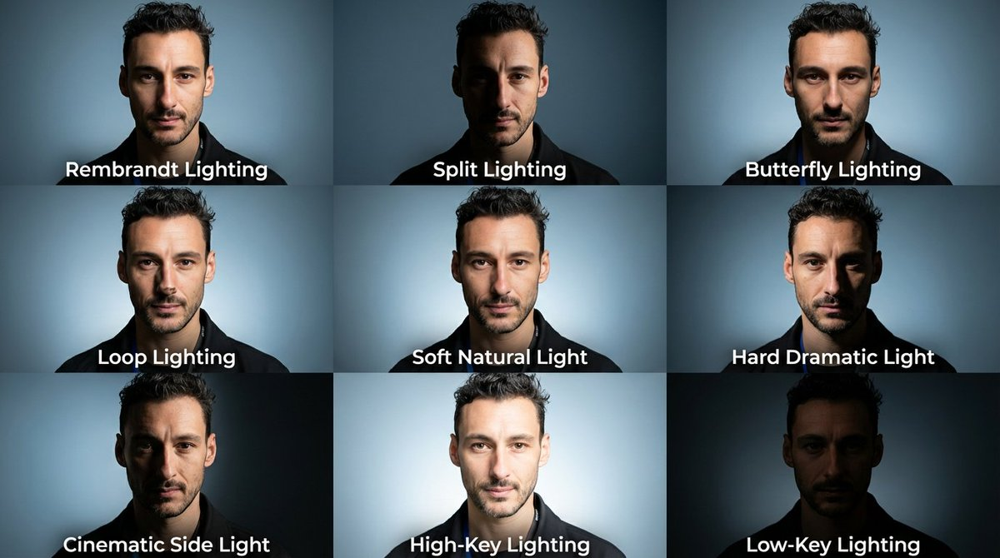

```
Create a clean 3x3 grid layout showcasing nine professional lighting setups applied to the same male portrait.
Use the provided portrait as the base image. Keep the same camera angle, framing, facial expression, and background across all nine images.
ach square should demonstrate a different lighting style, clearly distinct in mood and technique.
Display the name of the lighting setup below each portrait using clean, readable typography.

-Lighting styles to include:
-Rembrandt Lighting
-Split Lighting
-Butterfly Lighting
-Loop Lighting
-Soft Natural Light
-Hard Dramatic Light
-Cinematic Side Light
-High-Key Lighting
-Low-Key Lighting

Ensure lighting accuracy for each setup: correct shadow placement, contrast, and falloff.
The overall presentation should feel cinematic, professional, and educational — suitable for a photography or filmmaking masterclass.
Neutral background, consistent color grading, sharp focus, no stylistic distortion.
Avoid over-processing or artificial effects.
```

```
创建一个干净的3x3网格布局，展示九种专业布光方式应用于同一男性肖像的效果。  
以提供的肖像为基础图像，所有九张图像保持相同的相机角度、构图、面部表情和背景。  
每个方格应呈现一种不同的布光风格，在氛围和技法上清晰可辨。  
在每张肖像下方使用简洁易读的字体标明对应的布光名称。

需包含的布光风格：  
- 伦勃朗光  
- 分割光  
- 蝴蝶光  
- 环形光  
- 柔和自然光  
- 强烈戏剧光  
- 电影侧光  
- 高调光  
- 低调光  

确保每种布光准确：阴影位置、对比度和衰减过渡正确。  
整体呈现应具有电影感、专业性和教学性，适用于摄影或电影制作大师课。  
使用中性背景，统一色彩分级，焦点清晰，无风格化失真。  
避免过度处理或人工特效。
```

 [↑返回目录](#toc)

---
## <a id="">Vogue封面风格的自信女性肖像</a> (<a href="https://x.com/me_Aarvi/status/2016462819257176095" target="_blank" rel="noopener noreferrer">Aarvi sharma</a>)

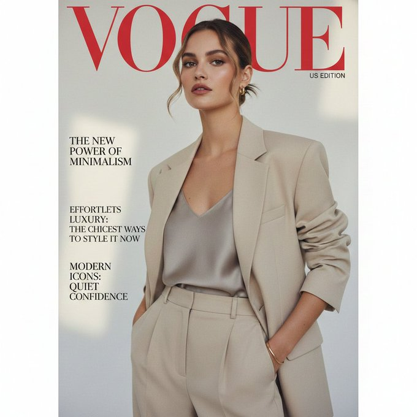

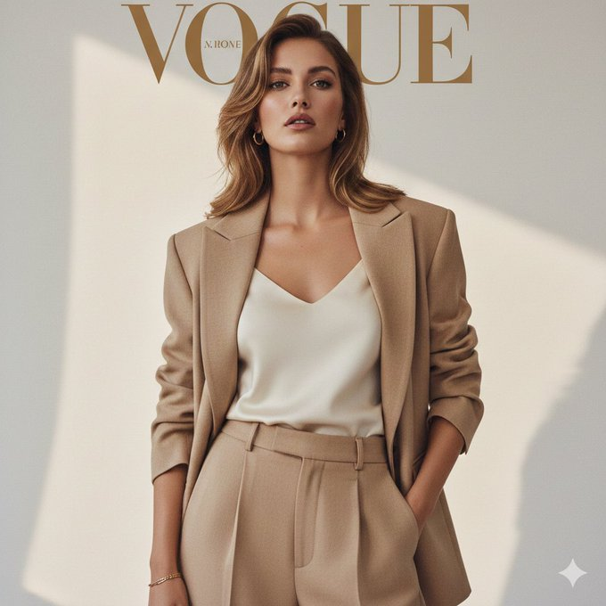

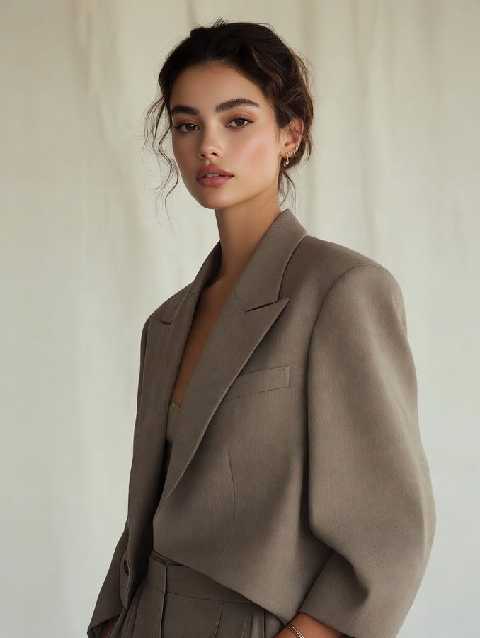

```
{"prompt": "Vogue US magazine cover–style ultra-realistic studio portrait of a confident modern young woman standing against a clean, minimal studio backdrop. The background is soft off-white / light beige with subtle tonal gradients, creating an iconic Vogue US minimal aesthetic. She stands tall with relaxed yet commanding posture, shoulders open, chin slightly lifted, embodying quiet confidence and editorial authority.\n\nShe wears a refined minimalist outfit: a structured neutral-toned oversized blazer layered over a soft inner top, paired with tailored high-waist trousers. Styling is effortless luxury—no loud patterns, clean lines, premium fabrics. Accessories are minimal: delicate gold earrings, a slim bracelet, and natural nails.\n\nHair is styled in soft natural waves or a sleek low bun, with a few loose strands framing the face. Makeup is Vogue US signature: luminous skin, subtle contouring, natural brows, soft matte lips, and understated eye definition. Expression is calm, powerful, and timeless, gaze slightly forward or just past the camera.\n\nLighting: classic Vogue US studio lighting with a large softbox key light creating smooth highlights on the face, gentle fill to preserve skin texture, and soft shadow falloff for depth. No harsh contrast, no dramatic colors—pure editorial elegance.\n\nCamera & style: high-end fashion editorial photography, 85mm lens look, shallow but controlled depth of field, razor-sharp focus on eyes, ultra-detailed skin and fabric texture, clean color science, soft tonal contrast, subtle film grain for magazine realism, premium retouching without over-smoothing. Vertical 4:5 composition with ample negative space at the top for Vogue masthead and cover text. Ultra-clean, iconic, cover-ready Vogue US aesthetic, 8K realism.",
  "hashtags": [
    "VogueUS",
    "MinimalEditorial",
    "StudioVogue",
    "HighFashionMinimal",
    "TimelessStyle",
    "EditorialPortrait",
    "LuxurySimplicity",
    "CoverReady",
    "ModernElegance"
  ]
}
```

```
《Vogue US》杂志封面风格的超写实影棚人像，一位自信的现代年轻女性站在干净极简的影棚背景前。背景为柔和的米白色/浅米色，带有微妙的色调渐变，营造出标志性的《Vogue US》极简美学。她身姿挺拔，姿态放松却充满气场，双肩舒展，下巴微微抬起，展现出沉静的自信与编辑级权威感。

她身穿精致极简的造型：一件结构感强、中性色调的 oversized 西装外套，内搭柔软上衣，下配高腰剪裁长裤。整体造型体现毫不费力的奢华感——无夸张图案，线条干净，面料高级。配饰极简：精致的金色耳钉、纤细手镯，以及自然甲面。

发型为柔和自然的波浪卷或光滑低发髻，几缕松散发丝轻拂面庞。妆容遵循《Vogue US》标志性风格：光泽肌肤、轻微修容、自然眉形、柔雾质感唇妆，以及低调的眼部轮廓。表情平静而有力，具有永恒感，目光略微朝前或略过镜头。

灯光采用经典的《Vogue US》影棚布光：大型柔光箱主光源在面部形成平滑高光，辅以柔和补光保留肌肤质感，阴影过渡细腻富有层次。整体无强烈对比，无戏剧性色彩——纯粹的编辑级优雅。

摄影与风格：高端时尚编辑摄影，85mm 镜头效果，浅景深但控制精准，眼部焦点锐利无比，皮肤与面料纹理极度精细，色彩还原干净，色调对比柔和，加入细微胶片颗粒以增强杂志真实感，精修但不过度磨皮。画面为竖版4:5构图，顶部留有充足负空间用于放置《Vogue》刊头及封面文字。整体呈现极致干净、标志性、可直接登上《Vogue US》封面的8K超写实美学。
```

 [↑返回目录](#toc)

---
## <a id="">忧郁电影感的年轻女性肖像写真</a> (<a href="https://x.com/0xluffy_eth/status/2015976318186476009" target="_blank" rel="noopener noreferrer">路飞  AI 研究员</a>)

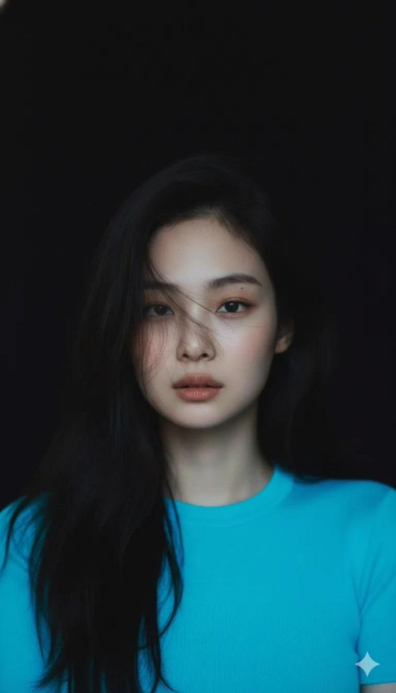

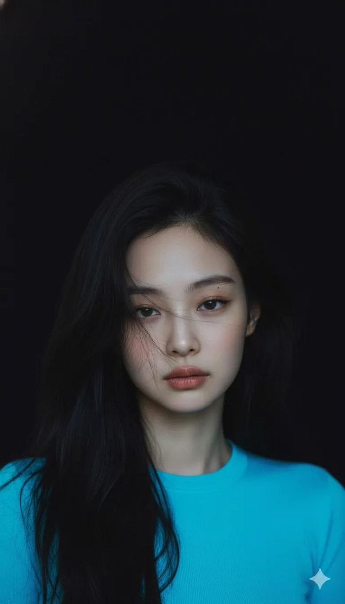

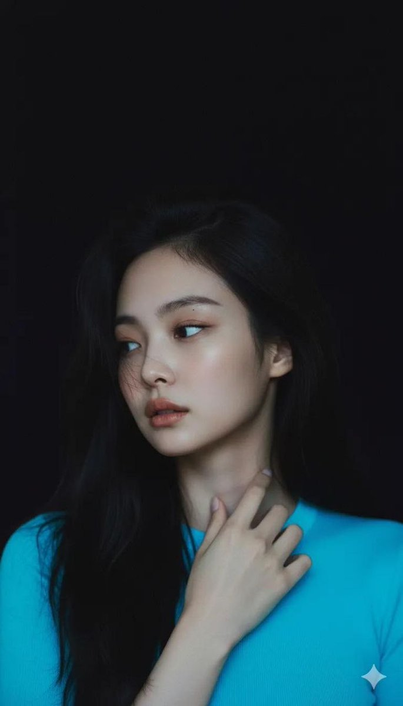

```
创建一张忧郁电影感人像摄影。年轻女性，肌肤清透白皙，淡妆。温暖自然唇色。深棕色头发蓬松质感。平静、自信表情。穿霓虹蓝色上衣展现优雅。深色极简背景渐变至黑色。柔和扩散前光、柔和阴影、细微胶片感、有机色彩分级、浅景深、高端编辑质感。
```

 [↑返回目录](#toc)

---
## <a id="">历史时刻线索板</a> (<a href="https://x.com/TechieBySA/status/2015881151014179021" target="_blank" rel="noopener noreferrer">TechieSA</a>)

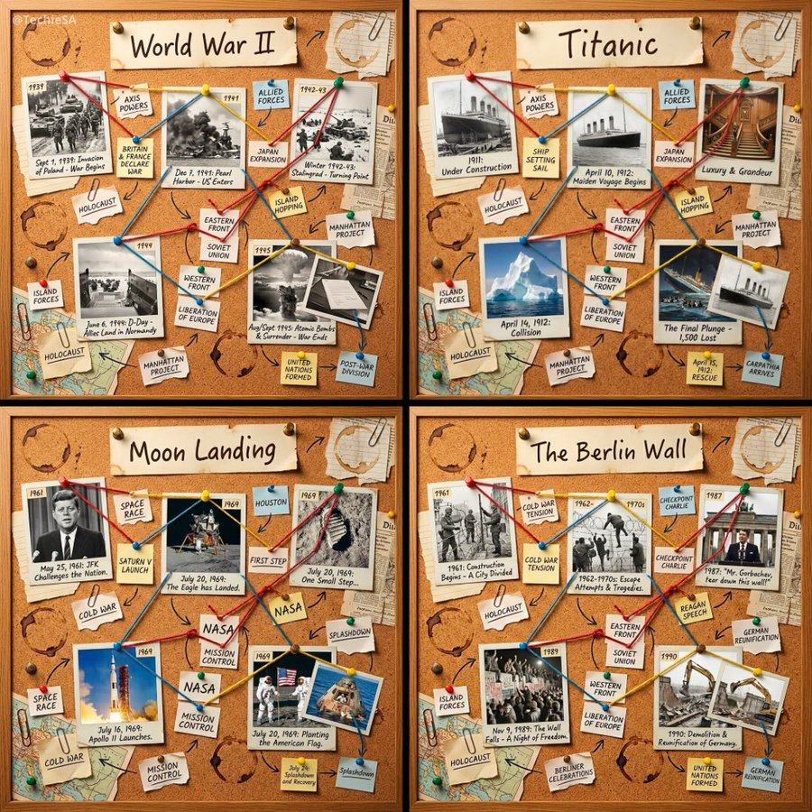

```
1080x1080 cork-board layout telling the story of [HISTORICAL MOMENT]. At the very top of the board, include a pinned paper label with the title: "HISTORICAL MOMENT" in large handwritten letters. Below it, arrange 5–6 Polaroid photos pinned across the board in a loose chronological path. Each Polaroid shows a key moment from the story with a short handwritten caption beneath it. Connect characters and events with colored strings (red, blue, yellow). Warm nostalgic lighting, soft shadows. Include realistic details: coffee cup rings, paper clips, torn notes, arrows, scribbled hints, and thumbtacks. Vintage, textured, cozy detective-board aesthetic. Highly readable, high contrast, everything framed clearly for 1080x1080.
```

```
1080x1080 软木板布局，讲述【历史事件】的故事。在软木板最上方，贴有一张带图钉的纸标签，标题为“HISTORICAL MOMENT”，采用醒目的手写字体。

下方松散地按时间顺序排列5至6张宝丽来照片，每张照片用图钉固定在板上。每张照片展现故事中的一个关键瞬间，并配有手写风格的简短说明文字。

用彩色细线（红、蓝、黄）将人物与事件相互连接。整体采用温暖怀旧的灯光与柔和阴影。

加入逼真的细节元素：咖啡杯留下的圆环印渍、回形针、撕裂的便签纸、手绘箭头、潦草书写的线索提示以及各色图钉。

整体风格为复古、有质感、温馨的侦探线索板美学，画面高度可读、高对比度，所有内容在1080x1080画幅内清晰构图、明确呈现。
```

 [↑返回目录](#toc)

---
## <a id="">漂浮在云端的[COUNTRY]微型岛</a> (<a href="https://x.com/TechieBySA/status/2016134051300532453" target="_blank" rel="noopener noreferrer">TechieSA</a>)

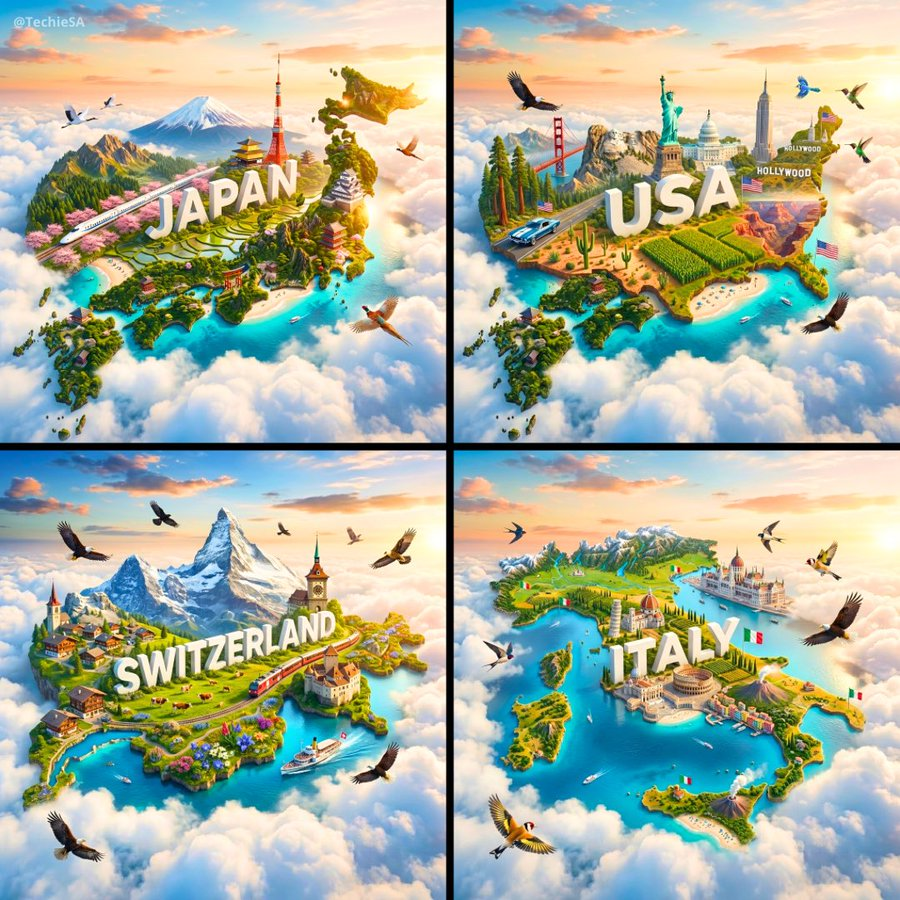

```
Create an ultra-HD, hyper-realistic digital poster of a floating miniature island shaped like [COUNTRY], resting on white clouds in the sky. Blend iconic landmarks, natural landscapes (like forests, mountains, or beaches), and cultural elements unique to [COUNTRY]. Carve “[COUNTRY]” into the terrain using large white 3D letters. Add artistic details like birds (native to [COUNTRY]), cinematic lighting, vivid colors, aerial perspective, and sun reflections to enhance realism. Ultra-quality, 4K+ resolution. 1080x1080 format.
```

```
创作一张超高清、超写实的数字海报：一座形如【国家】的微型浮空岛屿，悬浮于天空中的洁白云层之上。融合该国标志性建筑、自然景观（如森林、山脉或海滩）以及独特的文化元素。在岛屿地表以巨大的白色3D立体字雕刻出“【国家】”字样。添加艺术细节，如该国本土鸟类、电影级光影、鲜艳饱满的色彩、航拍视角以及阳光反射效果，以增强真实感。画面为超高画质，4K以上分辨率，输出尺寸1080x1080。
```

 [↑返回目录](#toc)

---
## <a id="">复古风格的运动镜头</a> (<a href="https://x.com/Strength04_X/status/2016365405884056065" target="_blank" rel="noopener noreferrer">𝐌</a>)

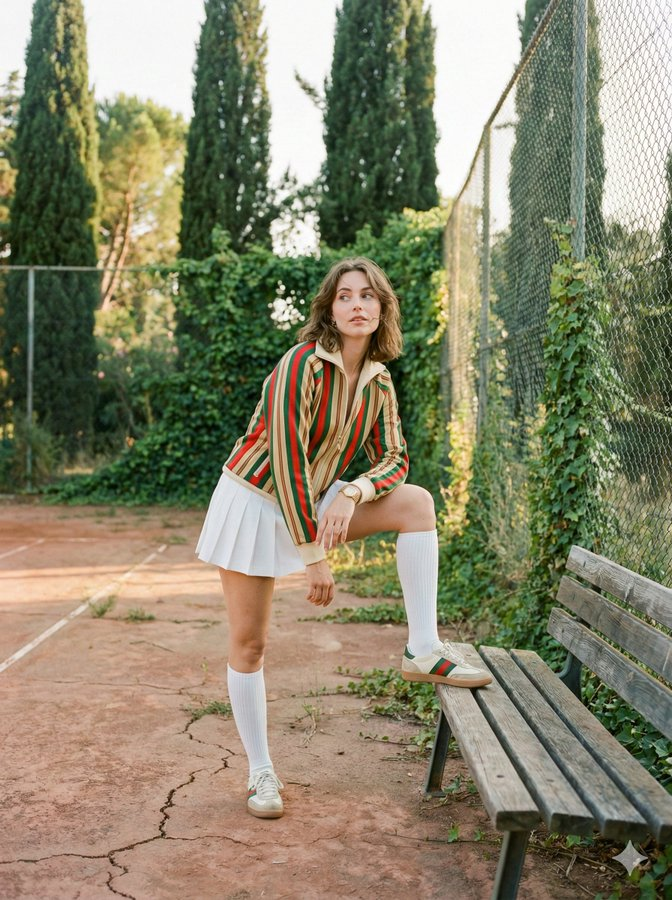

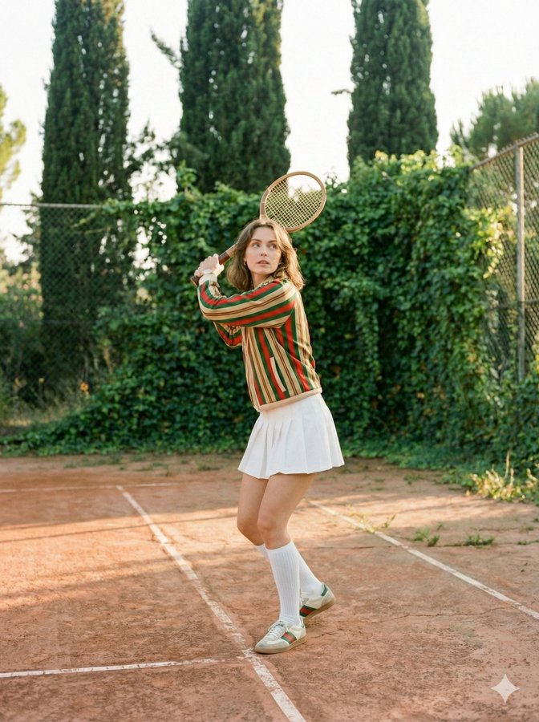

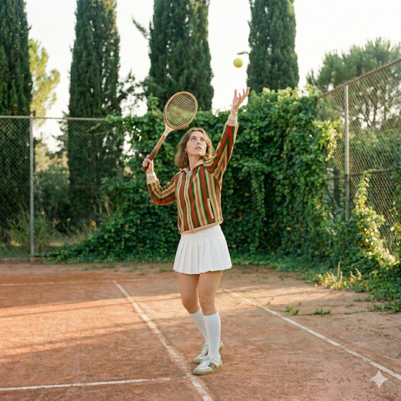

```
- Model stretching casually beside a worn clay tennis court, one foot resting on a wooden bench, expression playful yet aloof; wearing a Gucci striped track jacket over pleated shorts, knee-high socks, retro sneakers, gold watch peeking from sleeve; overgrown country club grounds with cracked court lines, ivy crawling up chain-link fences, late summer sun filtering through tall cypress trees, warm air heavy with nostalgia.

35mm lens, f/4.0, focus on the face, deeper depth keeping environment readable, 1/500s, ISO 100, side-angle framing capturing motion-ready posture.

Kodak Portra 400, standard development, fine grain, soft contrast, warm pastel palette, creamy highlights, gentle greens and sun-faded reds evoking 1970s luxury sport.
```

```
模特随意地伸展身体，站在一处磨损的红土网球场旁，一只脚搭在木制长凳上，神情玩味又疏离；身穿古驰条纹运动夹克，内搭百褶短裤、及膝袜和复古球鞋，袖口微露一只金表；背景是荒废的乡村俱乐部场地，球场划线龟裂，常春藤攀附在铁丝网上，夏末的阳光透过高耸的柏树洒下，空气中弥漫着浓重的怀旧气息。  

35mm 镜头，f/4.0 光圈，焦点对准面部，同时保留足够景深以清晰呈现环境，快门速度 1/500 秒，ISO 100，侧角度构图捕捉蓄势待发的姿态。  

采用 Kodak Portra 400 胶片，标准冲洗工艺，细腻颗粒，柔和对比度，温暖的粉彩色调，奶油般的高光，以及轻柔的绿色与日晒褪色的红色，唤起 1970 年代奢华运动氛围。
```

 [↑返回目录](#toc)

---
## <a id="">现代女性的自信与力量</a> (<a href="https://x.com/aytacaltintepe/status/2016203650029518877" target="_blank" rel="noopener noreferrer">Aytaç Altıntepe</a>)

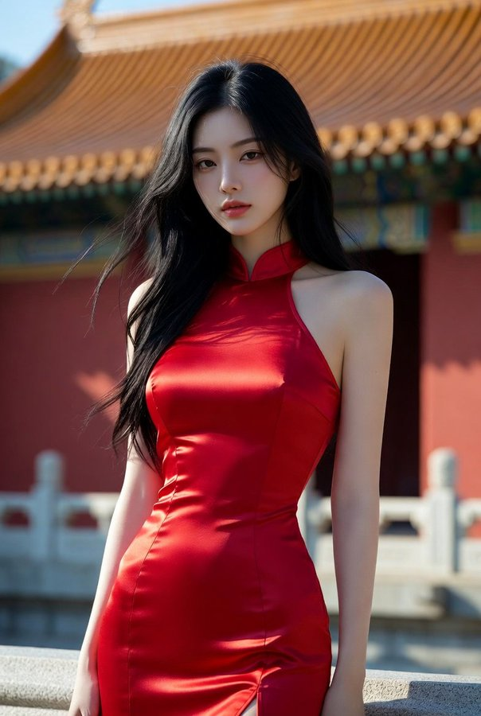

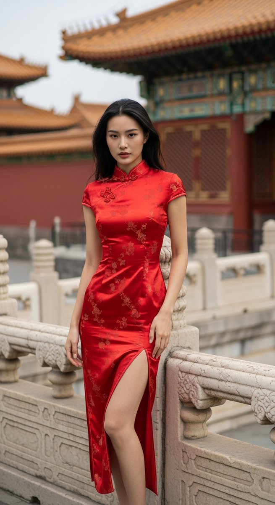

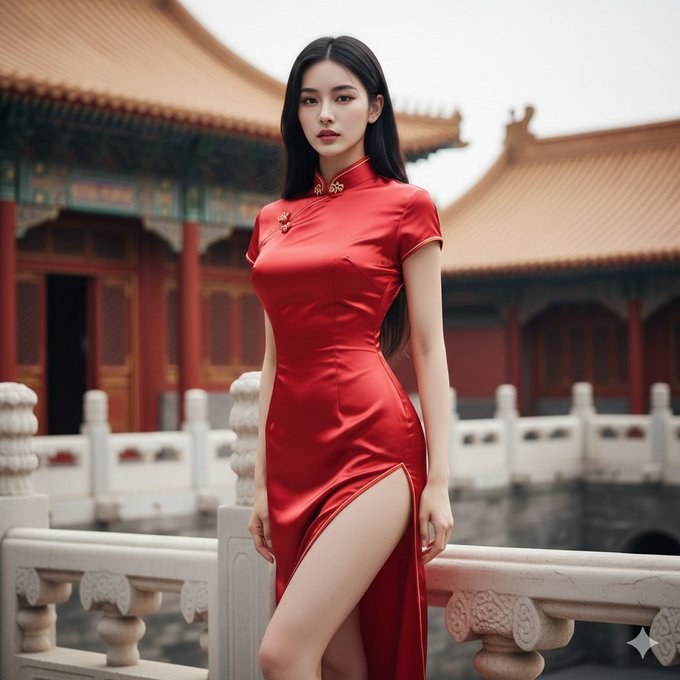

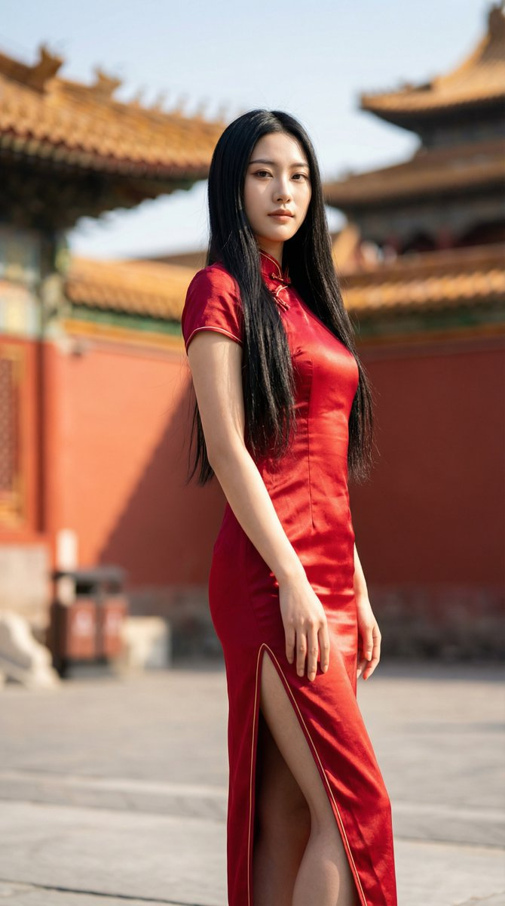

```
1.Grok, 2.Whisk, 3.Banana App, 4.Flow.

I'm torn between Grok and Whisk production. They gave good results. 

Prompt;

GLOBAL STYLE & QUALITY

Ultra high-resolution hyper-realistic fashion photography, premium cinematic quality, editorial luxury aesthetic. Real-world realism with sharp textures, natural depth, and high dynamic range. No stylization, no illustration look. Clean, bold, attention-grabbing result.

FACE

Young woman in her early 20s. Refined facial structure, slim jawline, soft cheekbones. Calm but dominant expression. Lips relaxed, eyes sharp and focused. Emotion is restrained confidence with subtle provocation — intelligent, distant, untouchable.

BODY

Slim skinny body type with clearly defined feminine curves. Narrow waist, flat abdomen, smooth hips, long legs. Natural posture that subtly emphasizes body lines without exaggeration. Elegant but assertive silhouette.

SKIN

Natural realistic skin texture, smooth but not artificial. Soft daylight highlights on shoulders, arms, thighs. Even tone with gentle shadow transitions enhancing body shape.

HAIR

Long, straight black hair flowing naturally over shoulders and down the back. Slight movement, clean strands, realistic shine under daylight. Hair frames the face without covering expressions.

CAMERA & ANGLE

Mid-to-full body shot. Camera positioned slightly below chest level, subtle low-angle to enhance dominance and power. Lens perspective compresses background slightly while keeping the subject crisp and sharp. Subject placed center-frame with strong vertical presence.

SETTING

Traditional Chinese palace courtyard architecture in the background. Warm red walls, ornate golden roofs softly blurred. Outdoor setting under clear daylight, historical elegance contrasting with modern bold femininity.

SCENE SETUP

The woman stands confidently near a stone railing. Weight shifted slightly to one leg, hips subtly angled. Arms relaxed by her sides. Body facing forward while head turns slightly to the side, creating tension and elegance.

DRESS / OUTFIT

Form-fitting red silk cheongsam (qipao) dress, glossy satin texture. Dress tightly hugs the torso and waist, clearly defining feminine curves. High slit revealing long legs, clean tailoring with sharp seams. Fabric catches light with rich highlights, vibrant red color symbolizing power and seduction.

PROPS (FLATLAY FEEL)

Minimal environment props only — stone railing and architectural elements. No distractions. Everything supports the subject’s dominance.

EXPRESSION & MOOD

Bold seductive mood without softness. Calm confidence, controlled intensity. Not smiling. The kind of presence that commands attention instantly.

ATMOSPHERE

Bright natural daylight with soft shadows. Balanced exposure, warm highlights, realistic contrast. Air feels clean, sharp, prestigious.

FINAL RESULT GOAL

A striking hyper-realistic bold seductive fashion image that feels powerful, elite, and unforgettable. Aggressive elegance, premium editorial impact, visually magnetic presence designed to stop the viewer instantly.
```

```
超高清超写实时尚摄影，高端电影级画质，具有杂志封面般的奢华美学。呈现真实世界的真实感，强调锐利的纹理、自然的景深和高动态范围。拒绝任何风格化处理或插画感，画面干净、大胆、引人注目。

面部：  
二十出头的年轻女性，面部轮廓精致，下颌线条纤细，颧骨柔和。神情冷静而强势，双唇放松，眼神锐利专注。情绪表现为克制的自信，带有微妙的挑衅感——聪慧、疏离、不可触及。

身形：  
苗条纤瘦的女性体型，兼具清晰的女性曲线。腰身纤细，腹部平坦，臀部流畅，双腿修长。姿态自然，微妙凸显身体线条而不夸张，轮廓优雅而坚定。

皮肤：  
真实自然的肌肤质感，光滑但不虚假。肩部、手臂与大腿处有柔和日光高光，肤色均匀，阴影过渡柔和，强化身体轮廓。

发型：  
乌黑长直发自然垂落肩背，略带动感，发丝清晰，在日光下呈现真实光泽。头发勾勒面部轮廓，但不遮挡表情。

镜头与角度：  
中至全身构图。相机位置略低于胸部，采用轻微低角度以增强人物的支配感与力量感。镜头透视略微压缩背景，同时保持主体清晰锐利。人物居中构图，垂直存在感强烈。

场景：  
背景为传统中式宫殿庭院建筑，暖红色墙体与华丽金色屋顶柔焦虚化。户外晴朗日光下，历史典雅氛围与现代大胆女性气质形成鲜明对比。

场景布置：  
女子自信站立于石栏旁，重心微倾一侧，臀部略带角度，双臂自然垂放身侧。身体正面朝向镜头，头部微微侧转，营造张力与优雅。

服饰：  
贴身红色真丝旗袍，缎面光泽质地。紧裹躯干与腰部，清晰勾勒女性曲线。高开衩展现修长双腿，剪裁利落，缝线分明。面料在光线下呈现丰富高光，鲜艳红色象征力量与诱惑。

道具（平铺感）：  
仅保留极简环境道具——石栏与建筑元素，无任何干扰，一切服务于突出人物的主导地位。

表情与情绪：  
大胆而性感，毫无柔弱之感。冷静自信，内敛而强烈。不带笑容，具备瞬间吸引目光的强大气场。

氛围：  
明亮自然日光配以柔和阴影，曝光均衡，高光温暖，对比真实。空气清新、锐利、尊贵。

最终效果目标：  
一幅震撼人心的超写实、大胆性感的时尚影像，充满力量感、精英气质且令人难忘。融合侵略性优雅与高端杂志视觉冲击力，打造令人瞬间驻足的视觉磁力。
```

 [↑返回目录](#toc)

---
## <a id="">手提食材袋的极简生活瞬间</a> (<a href="https://x.com/azed_ai/status/2016149732733894791" target="_blank" rel="noopener noreferrer">Amira Zairi</a>)

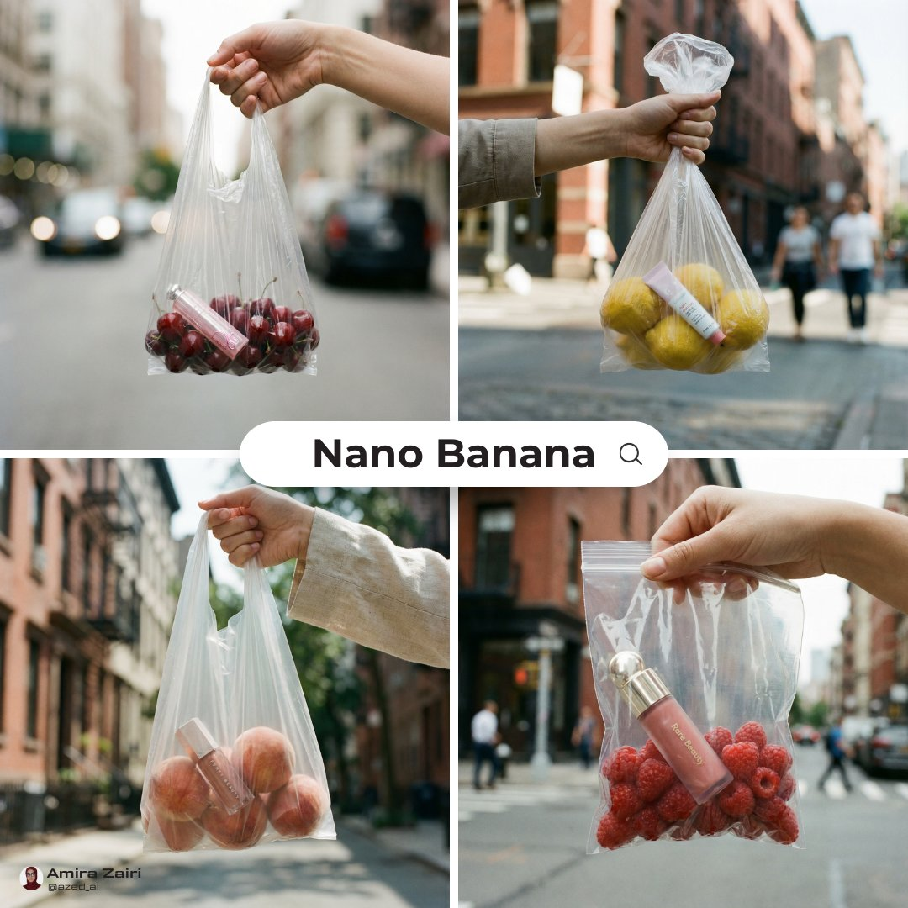

```
[product], minimalist lifestyle product ad, close up of [hand] gripping the top of a clear plastic grocery bag, bag suspended in mid air, filled with [ingredients] surrounding the product inside the bag, urban street background, soft daylight, shallow depth of field bokeh, subject sharply in focus, subtle film grain, premium editorial photography, natural colors, realistic textures, no logos, no extra text, 8k, 1:1
```

```
[产品]，极简生活方式产品广告，特写一只[手]紧握透明塑料购物袋的顶部，袋子悬在半空中，袋内围绕产品装满[食材]，城市街道背景，柔和日光，浅景深虚化，主体清晰聚焦，细微胶片颗粒感，高端纪实摄影风格，自然色彩，真实质感，无品牌标志，无额外文字，8K分辨率，1:1比例。
```

 [↑返回目录](#toc)

---
## <a id="">高端护肤品的宁静之美</a> (<a href="https://x.com/ChillaiKalan__/status/2016138326571626611" target="_blank" rel="noopener noreferrer">K</a>)

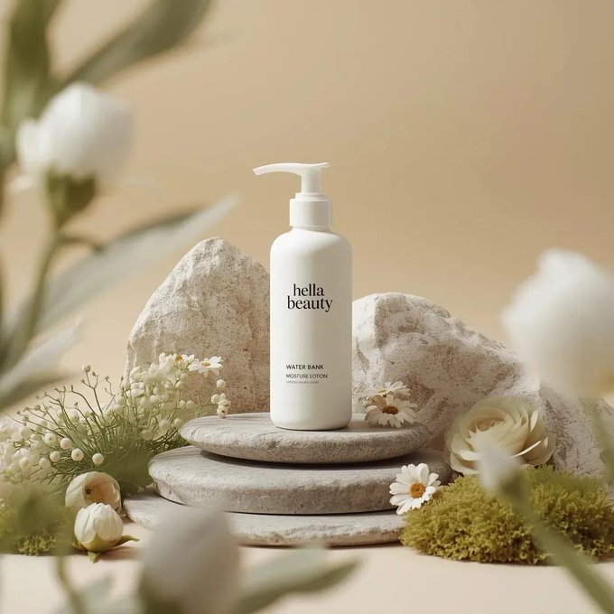

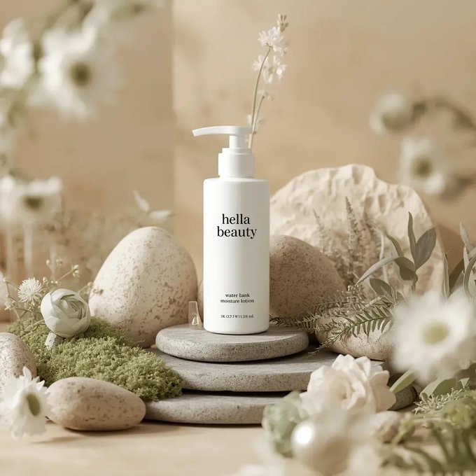

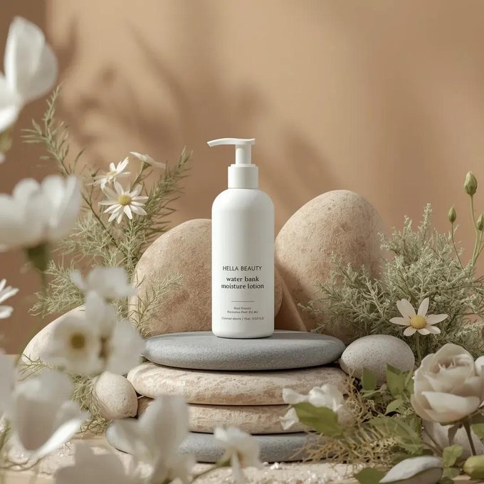

```
Ultra-high-end photorealistic commercial skincare product photography featuring a matte white plastic pump bottle centered and upright, labeled “hella beauty” in clean black minimalist typography with smaller text reading “water bank moisture lotion” and subtle product details beneath, the bottle placed on a layered natural stone surface surrounded by carefully arranged organic props including smooth gray river stones, pale beige textured rock formations, soft green moss clusters,delicate white pom-pom flowers, cream-colored
daisy-like blossoms, light green fern leaves, and a
muted sage rose, all arranged in a balanced
symmetrical composition, background a soft warm
beige studio backdrop with gentle gradient and no
visible edges, foreground partially framed by softly
blurred out-of-focus white flowers creating depth,
lighting soft diffused daylight-style studio lighting
from upper left producing gentle shadows, natural
highlights on the bottle and petals, and a calm airymood, color palette dominated by warm neutrals, soft
whites, sage greens, and muted earth tones, textures
highly detailed including matte plastic, porous stone,
velvety petals, and moist moss, shallow depth of field
with sharp focus on the product label and midground
elements and smooth bokeh in foreground and
background, premium botanical skincare advertising aesthetic,
clean minimal luxury composition, cinematic realism,
ultra-detailed 8K, studio-grade hyperrealism, no extra
text, no borders, no stylization beyond natural
photorealism.
```

```
超高端写实商业护肤品摄影，画面中央直立放置一个哑光白色塑料按压瓶，瓶身标签以简洁黑色极简字体印有“hella beauty”，下方辅以较小字号文字“water bank moisture lotion”及细微产品信息。瓶子置于层叠的天然石材表面，周围精心布置有机道具：光滑灰色河卵石、浅米色肌理岩石、柔软绿色苔藓簇、精致的白色绒球花、奶油色雏菊状花朵、浅绿色蕨类叶片，以及一枝低饱和鼠尾草玫瑰，整体呈平衡对称构图。背景为柔和暖米色影棚渐变幕布，无可见边缘；前景部分由轻微虚化的白色花朵柔焦框出，营造景深。光线采用左上方柔光日光风格影棚照明，投射出轻柔阴影，在瓶身与花瓣上形成自然高光，整体氛围宁静通透。色彩以暖中性色、柔白、鼠尾草绿及低饱和大地色为主。材质细节高度逼真，包括哑光塑料、多孔石材、丝绒质感花瓣与湿润苔藓。浅景深处理，焦点清晰落在产品标签与中景元素，前景与背景呈现柔美散景。整体风格为高端植物系护肤广告美学，干净极简奢华构图，电影级写实感，8K超精细画质，影棚级超写实效果，不含额外文字、边框或非自然写实以外的任何风格化处理。
```

 [↑返回目录](#toc)

---
## <a id="">Nendoroid风格动漫四宫格</a> (<a href="https://x.com/Gdgtify/status/2016187948245647468" target="_blank" rel="noopener noreferrer">Gadgetify</a>)

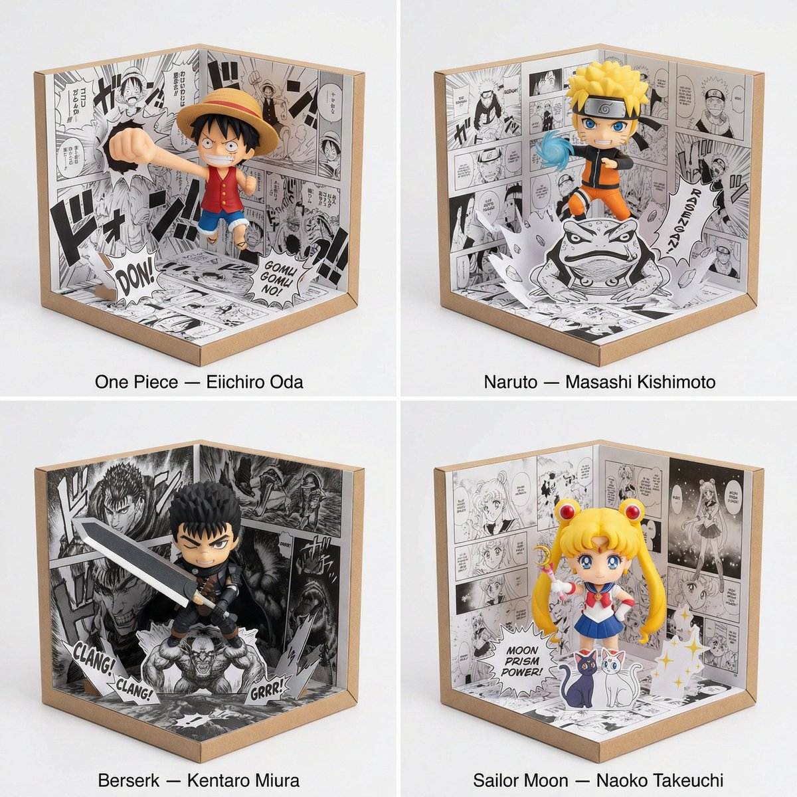

```
2x2 grid, Do this for 4 famous Manga:   Input Variable:   [INSERT MANGA/ANIME TITLE] (e.g., One Piece, Naruto, Berserk, Sailor Moon)

  System Instruction:  
Generate a hyper-realistic, 1:1 Aspect Ratio photo of a   "Manga Panel Diorama Box"   (Nendoroid Style).

  1. Character Extraction:  
      Analyze Input:   Identify the Main Protagonist.
      The Figure:   Create a high-quality   "Nendoroid" Style Figure   (Chibi proportions: Big head, small body, cute face).
         Pose:  Action pose (mid-jump or attack).
         Finish:  Matte PVC Plastic (Toy texture).
      The Outfit:   Iconic Season 1 or Final Form outfit.

  2.  Container 
      The Structure:   An L-Shaped or U-Shaped   Cardboard Display Box   (Two walls and a floor).
      The Scale:   Small, desktop size.

  3. Background  
      The Walls:   The vertical walls of the box are plastered with   Black and White Manga Panels   from the source material.
         Detail:  Visible speech bubbles (with Japanese or English text), speed lines, and iconic scenes.
      The Floor:   The floor is also covered in manga panels, but they are "Exploding" upwards.
         The Pop-Up:  Cut-out paper fragments of sound effects (e.g., "BOOM", "SWISH") or manga debris stand up from the floor to create depth.

  4. Integration (2D vs 3D):  
      Illusion:   The 3D Figure stands  on top  of the 2D paper floor.
      Interaction:   The figure is interacting with a 2D element.
         (e.g., Naruto standing on a 2D paper drawing of Gamabunta). 
         (e.g., Luffy punching a 3D fist through a 2D paper wall). 

  5. Visual:  
      Color Palette:   Strictly   Black & White   for the box/background.   Full Color   for the 3D Figure. This creates maximum contrast.
      Lighting:   Soft "Light Box" product photography. No harsh shadows.
      Label:   A simple black text overlay at the bottom: "[Title] — [Author Name]".

  Output:   ONE image, 1:1 Aspect Ratio, Product Photography, "Good Smile Company" Aesthetic, High Fidelity Plastic Texture.
```

```
为四个著名的漫画创建一个2x2网格布局的超现实1:1比例照片，每个都是“漫画面板立体模型盒”（Nendoroid风格）。

### 漫画/动漫标题变量：[插入漫画/动漫标题]（例如：海贼王、火影忍者、剑风传奇、美少女战士）

#### 系统指令：
- **角色提取**：分析输入，识别主要主角。创造高质量的"Nendoroid"风格玩偶（Q版比例：大头小身体，可爱脸）。姿势为动作姿态（跳跃中或攻击姿态）。完成品应具有哑光PVC塑料质感（玩具纹理）。穿着标志性第一季或最终形态的服装。
- **容器**：L形或U形纸板展示盒（包含两面墙和地板），尺寸适合作为桌面装饰。
- **背景**：盒子垂直墙面贴满来自原始材料的黑白漫画面板，细节包括可见的对话框（使用日语或英语文本）、速度线及经典场景。地面也覆盖着“爆炸”向上的漫画面板，通过剪纸形式的声音效果（如“BOOM”、“SWISH”）或漫画碎片增加深度。
- **整合（2D与3D）**：三维玩偶站在二维纸地板上，与2D元素互动，比如鸣人站在通灵兽蛤蟆文太的2D纸绘上，或者路飞的手从2D纸墙上穿出。
- **视觉效果**：颜色方案严格采用黑白色调用于盒子/背景，全彩用于3D玩偶以创造最大对比度。照明采用柔和的“灯箱”产品摄影，无硬阴影。标签为底部简单的黑色文字叠加：“[标题] — [作者名字]”。

输出结果为一张图像，1:1比例，产品摄影风格，“Good Smile Company”的美学，高保真塑料纹理。

请提供具体的漫画/动漫标题，以便生成具体的描述。如果需要将这个描述转换成实际的图片，请告知。
```

 [↑返回目录](#toc)

---
## <a id="">柔和极简风格的角色插画</a> (<a href="https://x.com/aleenaamiir/status/2016133368656904423" target="_blank" rel="noopener noreferrer">Aleena Amir</a>)

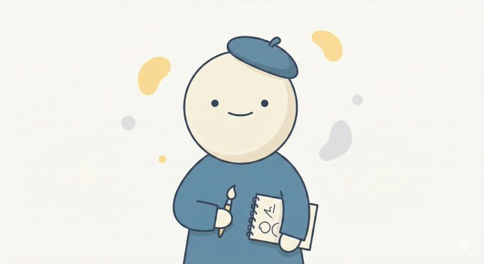

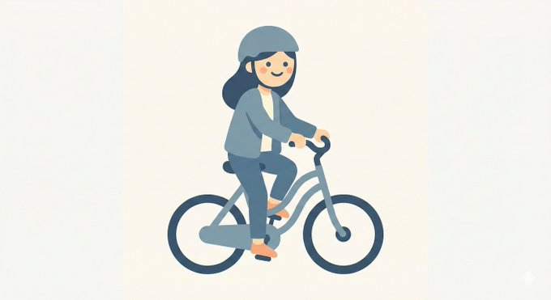

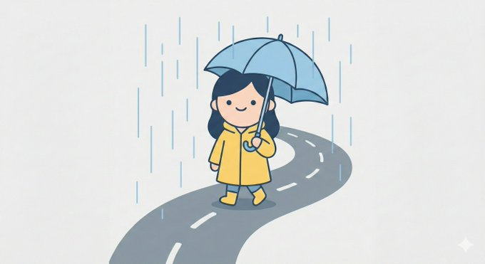

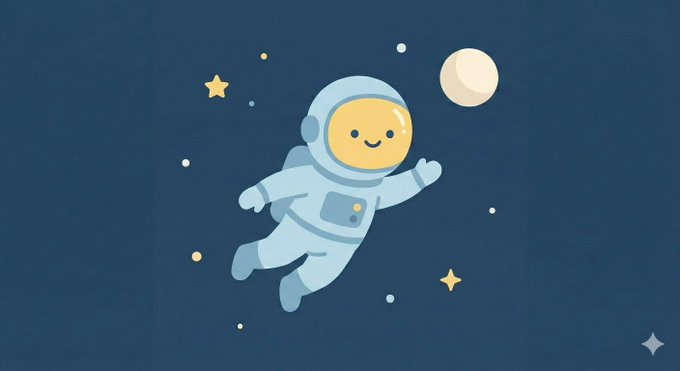

```
Soft Minimal Character Illustrations

Gemini Nano Banana Pro Prompt:

Illustrate a minimal character of [CHARACTER TYPE] with simplified facial features (dots and lines only). Use flat colors, soft curves, and no textures. Neutral pose, centered, on a plain background. Cute, calm, and visually clean.
```

```
柔和极简风格角色插画

绘制一个[角色类型]的极简角色，面部特征仅用点和线简化表现。使用平涂色彩、柔和曲线，无任何纹理。角色呈中性姿势，居中构图，背景纯色。整体风格可爱、宁静且视觉清爽。
```

 [↑返回目录](#toc)

---
## <a id="">柔和的极简人物插画</a> (<a href="https://x.com/Adam38363368936/status/2016343060855287863" target="_blank" rel="noopener noreferrer">Adam也叫吉米</a>)

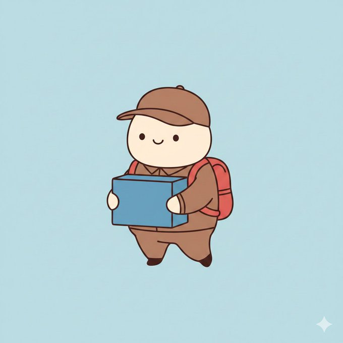

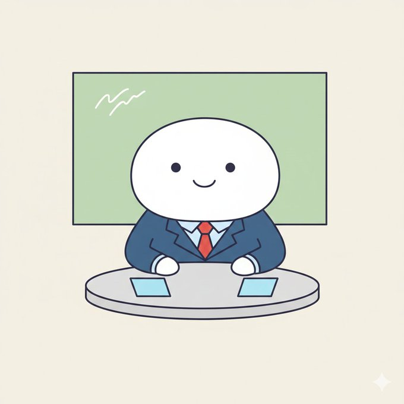

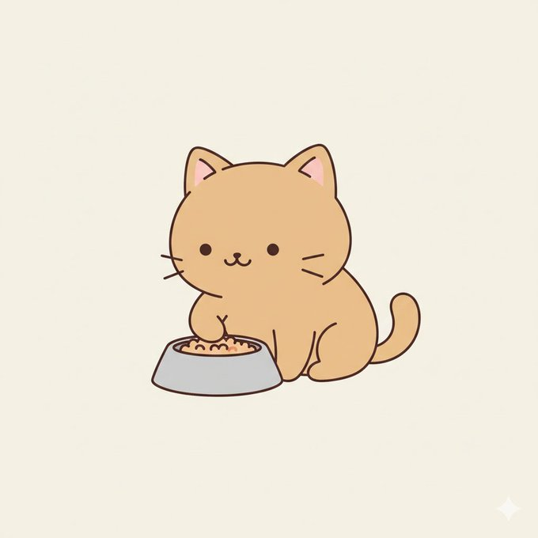

```
来玩一个好玩的，生成柔和的极简人物插画，只要输入角色提示词，在任意生图模型就可以生成啦。好有意思！

也可以上传参考图，生成对应的插画，可以做自己的插画集，甚至拿来编儿童故事插画，直接拿去卖！有执行力的可以试试看

两种玩法：
1.自定义角色：

绘制一个极简风格的[角色]，面部特征简化（仅使用点和线）。采用平涂色彩、柔和曲线，不添加纹理。角色姿势自然，居中，背景简洁。风格可爱、沉稳、视觉干净。

图一：快递员（有点胖的感觉哈哈）
图二：正在开会的老板
图三：正在吃猫粮的猫

2.参考图模式：

绘制一个极简风格的角色，使用参考图的场景和人物，面部和身体特征简化且接近参考人物（仅使用点和线）。采用平涂色彩、柔和曲线，不添加纹理。角色姿势自然，居中，背景简洁。风格可爱、沉稳、视觉干净。
```

 [↑返回目录](#toc)

---
## <a id="">Instagram卡片弹出效果</a> (<a href="https://x.com/Arminn_Ai/status/2016237325639155913" target="_blank" rel="noopener noreferrer">ΛRMIN | AI</a>)

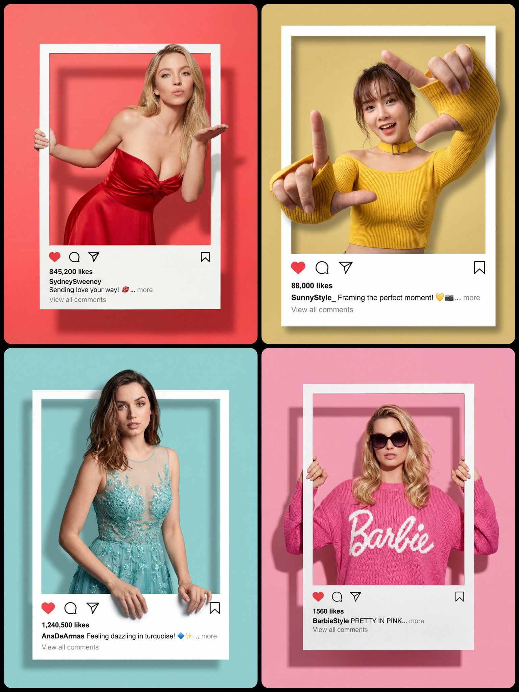

```
A photorealistic fashion upper body shot of [Character Description and expression] wearing [Detailed Outfit Description]. The subject is framed inside a central white Instagram-style post border.

Composition & Spacing: The white frame is perfectly centered in the middle of the image, leaving balanced empty [Soft Background Color matching the outfit] space above and below the frame to match the theme.

Frame Details: The top, left, and right white borders are very thin. The bottom white section is thicker to include UI elements. The bottom section features a red heart icon, comment bubble, share icon, and bookmark icon.

Text Details: Clearly visible text on the bottom panel: "[Number] likes", username "[Username]", caption "[Caption text]... more", and below that, "View all comments".

3D Pop-Out Effect & Hand Pose:
[CHOOSE ONE OF THE FOLLOWING ACTIONS OR DESCRIBE YOUR OWN ACTION:]
 1. (Grip): head and arms are physically popping out OVER the top and side thin borders. hands are realistically gripping the outer edges of the thin side borders, appearing to hold the frame firmly.
2. (Kiss): Her body is leaning forward towards the camera, creating a strong sense of depth. Her head remains securely framed WITHIN the top thin white border. Only her right hand, raised near her mouth in a blowing-kiss gesture, physically extends forward and breaks OUT of the thin side frame boundary. Her left hand realistically grips the side edge.
3. (Resting): She is looking directly at the camera with a gentle smile. Her head and shoulders physically pop out OVER the top thin white border. Crucially, her hands are realistically resting comfortably on top of the thicker bottom white UI panel, appearing to lean casually on the frame edge.
4. (Dynamic Frame): Her upper body and head remain secure WITHIN the boundaries of the white frame. However, both of her arms are fully extended outward dynamically, breaking past the thin borders up to her elbows, reaching straight toward the camera lens. She forms a distinct “L” shape with both hands, as if framing a scene. Due to perspective, her hands are positioned significantly closer to the camera than her face, showing strong spatial depth.

Subject Dimensionality & Texture: The subject must look like a solid, three-dimensional figure, not flat. Emphasize the detailed texture of the [Specific Fabric Name from outfit description], the contours of the face, and realistic hair details. She should have distinct depth separating her from the flat [Background Color] background.

Lighting & Shadows: Professional studio lighting creating soft, realistic drop shadows cast by the physical frame and, crucially, by the [popping-out elements, e.g., hands/head/arms] onto the solid flat [Background Color] background, enhancing the dramatic depth and illusion. High definition, commercial photography.
```

```
一张超写实风格的时尚上半身人像照，主角为【角色描述与表情】，身穿【详细服装描述】。人物被置于画面中央，框在一个纯白色的Instagram风格帖子边框内。

**构图与留白**：白色边框精准居中，上下留出均衡的空白区域，背景色为【与服装相协调的柔和背景色】，以契合整体主题。

**边框细节**：顶部、左侧和右侧的白色边框极细；底部白色区域较厚，用于容纳UI元素。底部区域包含一个红色心形图标、评论气泡、分享图标和书签图标。

**文字细节**：底部面板清晰可见的文字包括：“【点赞数】个赞”、用户名“【用户名】”、配文“【配文内容】... 更多”，以及下方的“查看所有评论”。

**3D突出效果与手部姿态**（请选择以下其中一种动作或自定义）：
1. **（抓握）**：头部与双臂从顶部及两侧细边框上方真实地突出，双手自然地紧握边框外缘，仿佛牢牢抓住整个画框。
2. **（飞吻）**：身体微微前倾靠近镜头，营造强烈景深感；头部仍稳妥地位于顶部细边框之内，仅右手抬至嘴边做出飞吻手势，突破侧边细框边界；左手则真实地握住侧边框边缘。
3. **（倚靠）**：直视镜头，面带温柔微笑；头部与肩膀从顶部细边框上方自然探出；双手舒适地搭在底部较厚的白色UI面板上，仿佛随意倚靠在画框边缘。
4. **（动态框景）**：上半身与头部完整保留在白色边框内，但双臂完全向外伸展，突破两侧细边框直至手肘，直指镜头；双手呈鲜明的“L”形，仿佛正在框选画面。因透视关系，双手明显比脸部更靠近镜头，强化空间纵深感。

**人物立体感与材质表现**：人物必须呈现坚实、三维的实体感，而非平面图像。重点刻画【服装描述中指定面料名称】的细腻纹理、面部轮廓及逼真的发丝细节。人物与纯色【背景色】背景之间需有清晰的景深层次。

**光影与阴影**：采用专业影棚灯光，投射出柔和而真实的投影——不仅来自实体边框，更关键的是由【突出部分，如手/头/手臂】在纯色【背景色】背景上形成的阴影，以强化戏剧性深度与视觉错觉。整体为高清商业摄影质感。
```

 [↑返回目录](#toc)

---
## <a id="">时尚拼贴风格写真</a> (<a href="https://x.com/Arminn_Ai/status/2016769176891699679" target="_blank" rel="noopener noreferrer">ΛRMIN | AI</a>)

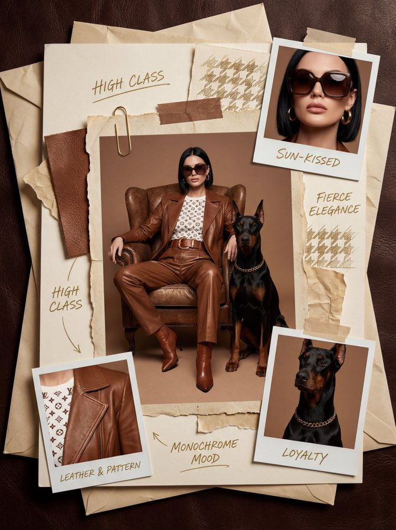

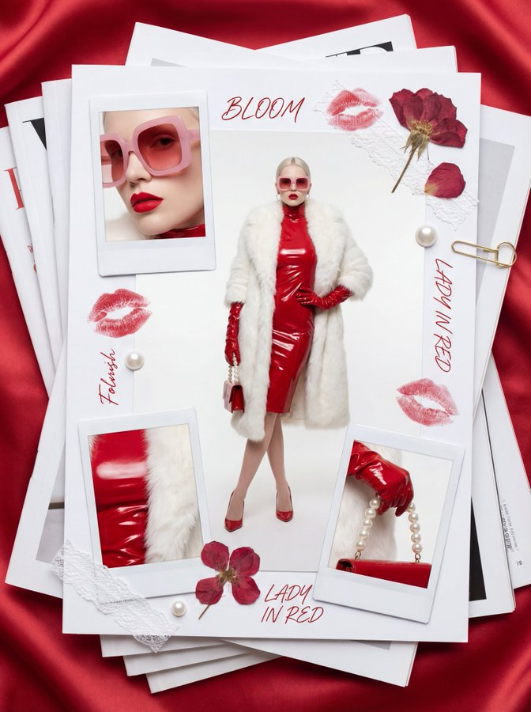

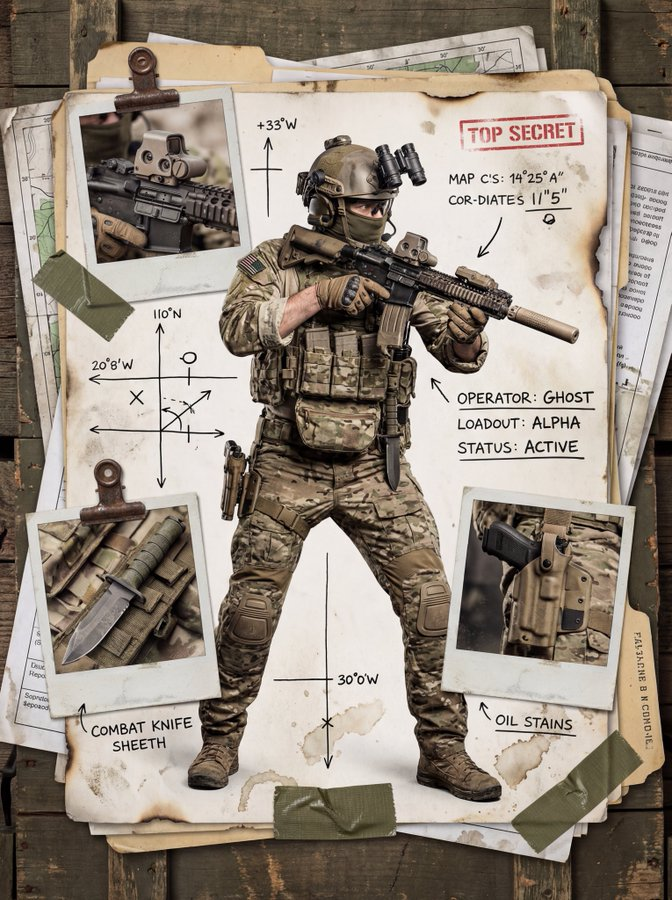

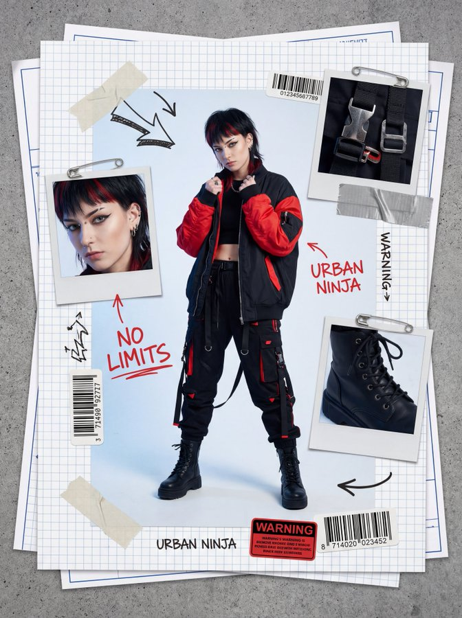


```
Masterpiece, best quality, high resolution, (FULL BODY SHOT:1.5), fashion scrapbook page layout, collage style, [Theme/Aesthetic keywords]

[Subject]: A wide shot full body fashion photo of [Character Description]. [Pose & Action]. Wearing [Detailed Outfit], [Accessories], (shoes visible:1.3), complete figure from head to toe.

[Composition]: The image is designed like a [Layout Metaphor: DIY zine / field dossier / moodboard], main character in center, surrounded by (3 distinct polaroid snapshots:1.3) showing DIFFERENT [Thematic] details: (one close-up of [Face/Makeup Detail]:1.2), (one macro shot of [Fabric/Texture/Weapon Detail]:1.2), and (one detail of [Footwear/Accessory Detail]:1.2), ensuring unique and non-repeating insert photos.

[Decorations]: [Style] scrapbooking elements, [Clip Type: Silver clips / Gold clips / Rusted clips] holding a [Paper Stack Thickness] of papers together, pieces of [Tape Type: Washi / Duct / Masking] tape, hand-drawn [Doodle Type: arrows / stars / graffiti], handwritten text annotations in [Ink Type] (e.g., "[Short Text 1]", "[Short Text 2]"), [Stickers/Stamps], torn paper textures.

[Background]: (A messy stack of [Paper Type: white sheets / cardstock / maps / folders]:1.4), visible layers of paper edges underneath the main sheet, realistic depth and shadows between paper layers, placed on a [Surface Material & Color].

[Technical]: [Lighting Style], [Atmosphere], sharp focus, editorial photography, 8k, tactile texture, realistic material rendering.
```

```
杰作，最佳质量，高分辨率，（全身照：1.5），时尚剪贴簿页面布局，拼贴风格，[主题/美学关键词]

[主体]：一张广角全身时尚照片，展现[角色描述]。[姿势与动作]。身着[详细服装]，[配饰]，（清晰可见鞋子：1.3），完整呈现从头到脚的全身形象。

[构图]：画面设计成[布局隐喻：DIY小杂志／田野档案／情绪板]风格，主角居中，周围环绕（三张不同的宝丽来快照：1.3），分别展示不同的[主题]细节：（一张[面部/妆容细节]特写：1.2），（一张[面料/纹理/武器细节]微距镜头：1.2），以及（一张[鞋履/配饰细节]局部：1.2），确保插入的小图各不相同、无重复。

[装饰]：[风格]剪贴簿元素，[夹子类型：银色夹子／金色夹子／生锈夹子]固定一叠[纸张厚度]的纸张，若干[胶带类型：和纸胶带／布基胶带／遮蔽胶带]，手绘[涂鸦类型：箭头／星星／涂鸦]，用[墨水类型]书写的注释文字（例如：“[短文本1]”、“[短文本2]”），[贴纸/印章]，撕裂的纸张肌理。

[背景]：（凌乱堆叠的[纸张类型：白纸／卡纸／地图／文件夹]：1.4），主纸张下方可见多层纸边，纸层之间具有真实深度与阴影，整体置于[表面材质与颜色]之上。

[技术]：[灯光风格]，[氛围]，锐利对焦，杂志级摄影，8K画质，可触感纹理，逼真材质渲染。
```

 [↑返回目录](#toc)

---
## <a id="">香奈儿蔚蓝香水：奢华九宫格视觉盛宴</a> (<a href="https://x.com/mehvishs25/status/2016705935625035941" target="_blank" rel="noopener noreferrer">Meem</a>)

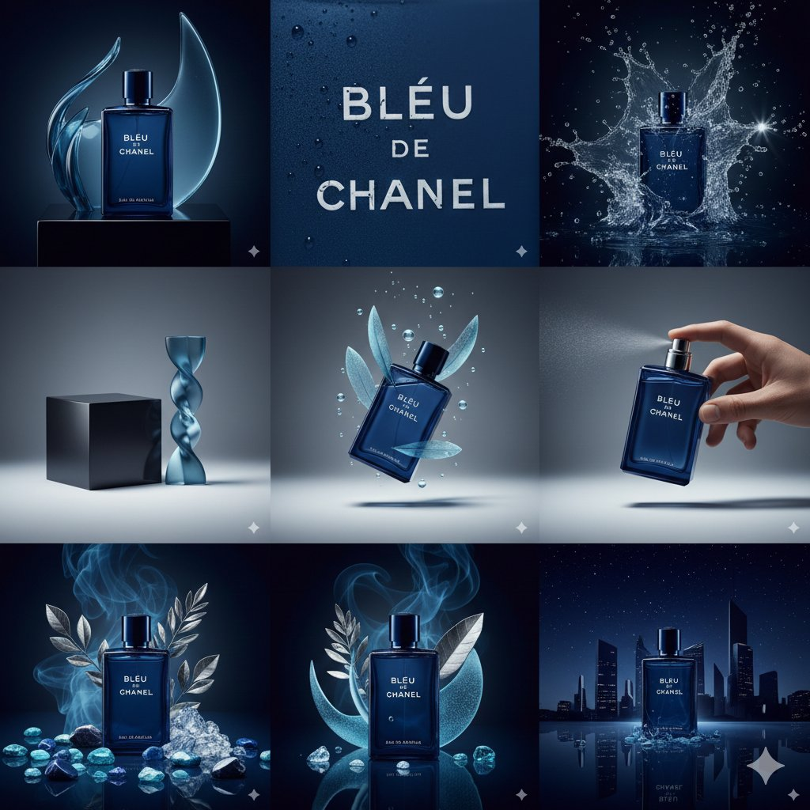

```
{
  "campaign_metadata": {
    "title": "Bleu de Chanel - 3x3 Luxury Digital Grid",
    "aspect_ratio": "3:4",
    "aesthetic": "High-End Editorial / Cinematic Luxury",
    "lighting_model": "Global Soft Studio Lighting | HDR | Volumetric Blue Shadows"
  },
  "global_constraints": {
    "product_fidelity": "STRICT_100%",
    "rendering": "Hyperrealism",
    "color_palette": ["#001C3D", "#000000", "#C0C0C0", "#E0E0E0"],
    "typography": "Original Bleu de Chanel Serif/Sans-Serif - No Distortion"
  },
  "grid_execution": {
    "cell_1_1": {
      "concept": "Iconic Hero Still Life",
      "composition": "Centralized, low-angle, bold monochromatic background",
      "focus": "Product Silhouette"
    },
    "cell_1_2": {
      "concept": "Extreme Macro",
      "composition": "Tight crop on glass shoulder and magnetic cap",
      "focus": "Refraction and Surface Texture"
    },
    "cell_1_3": {
      "concept": "Dynamic Interaction",
      "composition": "Product surrounded by frozen-motion water splashes",
      "focus": "Kinetic Energy"
    },
    "cell_2_1": {
      "concept": "Minimal Sculptural",
      "composition": "Product alongside matte black geometric plinths",
      "focus": "Balance and Form"
    },
    "cell_2_2": {
      "concept": "Innovation / Floating",
      "composition": "Zero-gravity suspended bottle with floating glass shards",
      "focus": "Weightlessness"
    },
    "cell_2_3": {
      "concept": "Sensory Realism",
      "composition": "Extreme close-up of spray nozzle with ultra-fine mist",
      "focus": "Tactile Sensation"
    },
    "cell_3_1": {
      "concept": "Color-Driven Scene",
      "composition": "Deep navy gradient background with glowing blue accents",
      "focus": "Atmospheric Depth"
    },
    "cell_3_2": {
      "concept": "Ingredient Abstraction",
      "composition": "Stylized metallic cedar leaves and crystalline amber",
      "focus": "Symbolic Components"
    },
    "cell_3_3": {
      "concept": "Surreal Fusion",
      "composition": "Bottle emerging from a liquid-metal ocean under a dark moon",
      "focus": "Imagination vs. Reality"
    }
  },
  "post_processing": {
    "sharpness": "Maximized",
    "grain": "Zero",
    "chromatic_aberration": "None",
    "finish": "Glossy Commercial Polish"
  }
}
```

```
香奈儿蔚蓝香水 - 3x3 奢华数字网格系列  
画面比例：3:4  
整体风格：高端杂志感 / 电影级奢华  
光影模型：全局柔光影棚照明 | 高动态范围（HDR）| 体积感蓝色阴影  

严格要求：  
- 产品还原度：100% 精准  
- 渲染风格：超写实主义  
- 色彩方案：深海军蓝（#001C3D）、纯黑（#000000）、银灰（#C0C0C0）、浅灰（#E0E0E0）  
- 字体：原版香奈儿蔚蓝香水衬线/无衬线字体，不得变形  

九宫格具体构图：  

第一行：  
1. 经典主角静物：居中构图，低角度拍摄，大胆单色背景，突出产品轮廓。  
2. 极致微距：紧贴瓶身肩部与磁吸瓶盖，聚焦玻璃折射与表面肌理。  
3. 动态互动：产品被定格的水花环绕，强调动能张力。  

第二行：  
4. 极简雕塑感：产品与哑光黑色几何基座并置，强调平衡与形态。  
5. 创新悬浮：零重力环境下悬浮的香水瓶，周围漂浮玻璃碎片，突出失重感。  
6. 感官写实：喷头极端特写，呈现超细雾状喷雾，唤起触觉联想。  

第三行：  
7. 色彩主导场景：深海军蓝渐变背景搭配发光蓝色点缀，营造氛围纵深。  
8. 香调抽象表达：风格化金属雪松叶与水晶琥珀，象征核心香材。  
9. 超现实融合：香水瓶从液态金属海洋中升起，背景为暗月，探讨想象与现实的边界。  

后期处理：  
- 锐度最大化  
- 无颗粒感  
- 无色差  
- 成品光泽度：商业级高光抛光
```

 [↑返回目录](#toc)

---
## <a id="">异形生物解构</a> (<a href="https://x.com/Gdgtify/status/2016605449022558685" target="_blank" rel="noopener noreferrer">Gadgetify</a>)

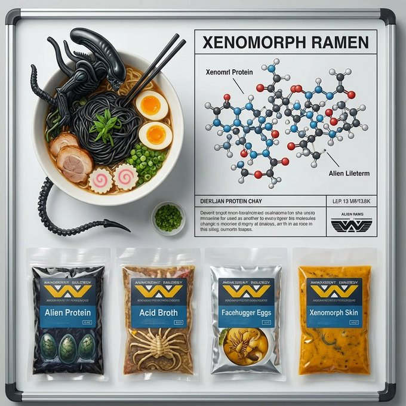

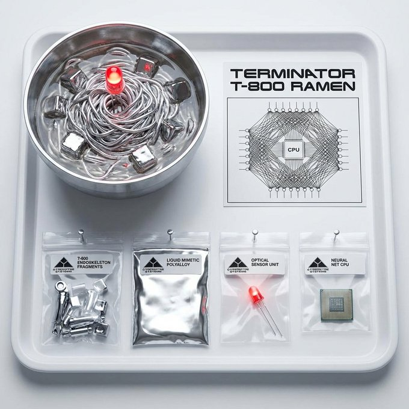

```
This prompt was kind of inspired by that AI video that went viral a while back. It works for fictional monsters. 

Prompt: 
do this for Xenomorph: <instruction>
Input A is a Character, Fictional Monster or Alien 
Input B is a Comfort Food Dish (e.g., Ramen, Burger, Tacos). If not given, analyze input A and pick a meal that is appropriate for it.
Deconstruct the creature to generate 3 Edible Bio-Hazards:
 Texture (The Meat): Translate the monster's skin/flesh into food.
(e.g., Xenomorph -> Black Squid Ink Noodles. Cthulhu -> Purple Octopus Tentacles. Predator -> Glowing Green Gelatin).
 Garnish (The Threat): Identify a dangerous body part to include as a "topping."
(e.g., A Mini Inner-Jaw, A Facehugger, An Eyeball).
 Branding (The Corp): Identify the evil corporation or faction associated with the monster.
(e.g., Weyland-Yutani, Umbrella Corp, InGen).
2.   Container  
Goal: "Biological Hazard" Meal Kit Photography.
 Background: A clean, sterile White Magnetic Whiteboard or Laboratory Tray.
 Layout: Top-Heavy. The finished dish sits in the top left. Scientific data is on the top right. Raw ingredients line the bottom.
3.  Specimen (The Dish):
 Plating: A realistic bowl or plate containing the "Fusion Dish."
 Horror: The food looks appetizing yet terrifying.
Detail: The "Garnish" (Step 1) physically emerges from the food (e.g., a Xenomorph head rising from the ramen broth).
Color: Unnatural palette (Blacks, Neon Greens, Deep Purples).
4.  Vacuum Bags :
 Packaging: 4 distinct Vacuum-Sealed Clear Plastic Bags pinned to the bottom of the board.
 Contents: Raw, wet "biological samples" (e.g., "Facehugger Eggs", "Acid Broth", "Alien Skin").
The Label: Each bag features a sticker with the "Branding" (Step 1) and the name of the organ/part.
5. The Science:
The Chart: A printed or drawn Chemical/Molecular Structure diagram explaining the "Protein."
Typography: Large, black Sans-Serif Header: "[MONSTER] [DISH NAME]" (e.g., XENOMORPH RAMEN).
Output: ONE image, 1:1 Aspect Ratio, Product Photography, "Clinical Sci-Fi" aesthetic, High Realism.
</instruction>
```

```
这个提示词是为异形（Xenomorph）设计的：<instruction>
输入A是一个角色、虚构怪物或外星生物；
输入B是一种安慰食物（例如，拉面、汉堡、玉米饼）。如果未给出，分析输入A并为其挑选合适的餐点。
将该生物解构以生成3种可食用的生物危害：
- 质感（肉类）：将怪物的皮肤/肉转化为食物。（例如，异形->黑色乌贼墨面条。克苏鲁->紫色章鱼触手。铁血战士->荧光绿色果冻）。
- 装饰（威胁）：识别一个危险的身体部位作为“配料”。（例如，一个小内颚，一个抱脸虫，一只眼睛）。
- 品牌（公司）：识别与怪物相关的邪恶公司或派系。（例如，维兰德-尤坦尼，保护伞公司，因杰尼）。

2. 容器
目标：“生物危害”餐盒摄影。
背景：干净、无菌的白色磁性白板或实验室托盘。
布局：顶部较重。完成的菜肴放在左上角。科学数据在右上角。原始成分排列在底部。

3. 标本（菜肴）：
摆盘：一个真实的碗或盘子，装有“融合菜肴”。
恐怖：食物看起来既诱人又可怕。
细节：“装饰”（步骤1）从食物中物理地浮现出来（例如，异形头部从拉面汤中升起）。
颜色：不自然的色调（黑色、霓虹绿、深紫色）。

4. 真空袋：
包装：4个不同的真空密封透明塑料袋钉在板底部。
内容：原始的、“生物样本”（例如，“抱脸虫卵”，“酸液汤”，“外星皮肤”）。
标签：每个袋子都有一个带有“品牌”（步骤1）和器官/部分名称的贴纸。

5. 科学：
图表：印刷或绘制的化学/分子结构图解释“蛋白质”。
字体：大号、无衬线黑色标题：“[怪物] [菜名]”（例如，异形拉面）。
输出：一张图片，1:1宽高比，产品摄影，“临床科幻”美学，高度现实主义。</instruction>
```

 [↑返回目录](#toc)

---
## <a id="">极简风格的高端护肤产品摄影</a> (<a href="https://x.com/oggii_0/status/2016131317759672439" target="_blank" rel="noopener noreferrer">Oogie</a>)

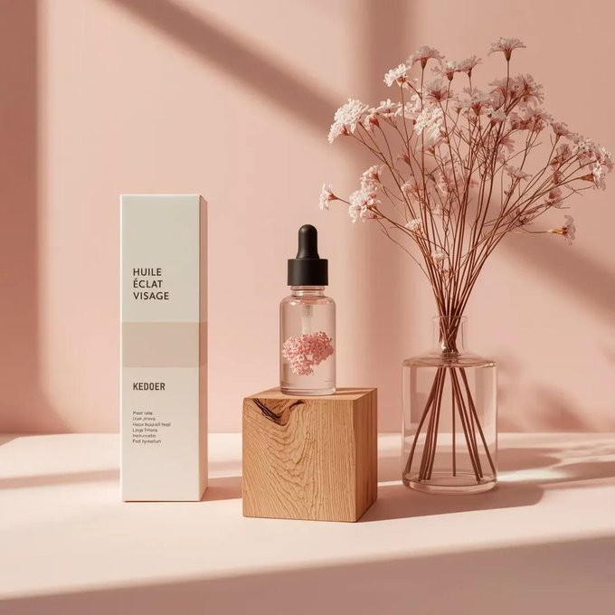

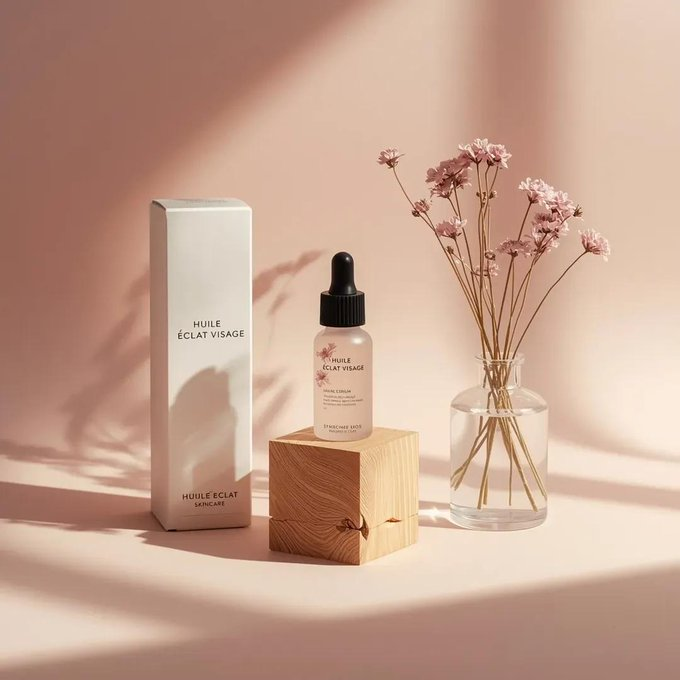

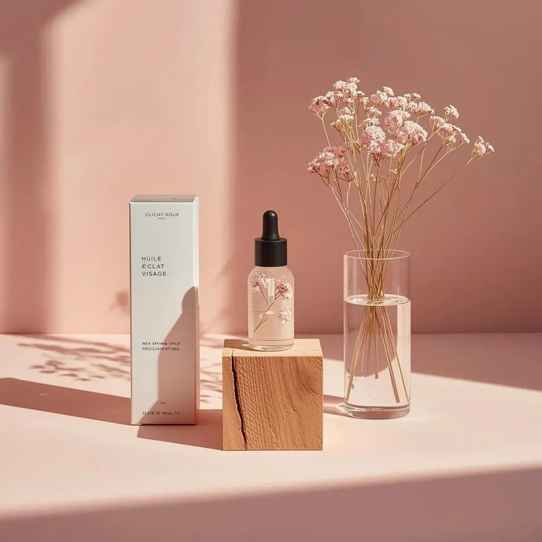

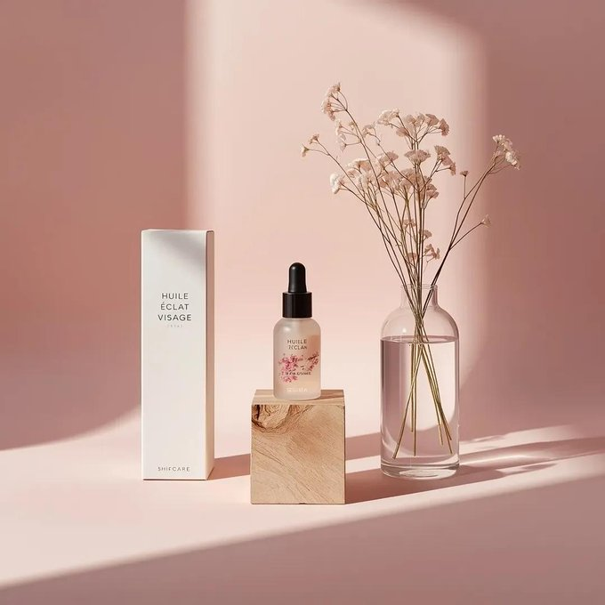

```
Ultra-realistic minimalist studio product photography of a small transparent glass facial oil dropper bottle with a black rubber pipette cap, containing pale pink serum with dried pink floral elements suspended inside, placed centered on top of a natural raw wooden cube block with visible grain and split texture. To the left of the cube stands a tall matte white rectangular skincare box with minimal black typography reading “HUILE ÉCLAT VISAGE,” clean modern branding, and subtle logo near the bottom. To the right of the cube is a clear cylindrical glass vase filled with water and thin stems of dried pink gypsophila flowers extending upward and outward. The entire composition is arranged on a smooth matte pastel pink surface with a matching soft pink seamless studio background. Strong directional soft light comes from the left side, casting long, soft-edged realistic shadows of the flowers and objects onto the pink background. Lighting is natural-style, -det diffused, and warm, creating gentle highlights on the glass, subtle reflections on the serum bottle, and soft texture on the wooden block. Camera angle is straight-on at tabletop height, medium framing, all main objects in sharp focus with minimal depth of field blur. Color palette is dominated by blush pink, soft rose tones, warm light wood, clean white, and transparent glass. Mood is clean, airy, feminine, elegant, Scandinavian minimal aesthetic, premium skincare branding style, photorealistic, studio-grade realism, ultra
```

```
超写实极简风格的影棚产品摄影：一只小巧透明的玻璃面部精华油滴管瓶，配有黑色橡胶滴管帽，内含淡粉色精华液，其中悬浮着干制的粉红色花卉元素。瓶子居中置于一块天然原木立方体上，木块纹理清晰可见，带有自然裂痕与肌理。木块左侧立着一个高挑的哑光白色矩形护肤包装盒，采用极简黑色字体印有“HUILE ÉCLAT VISAGE”字样，品牌设计现代简洁，底部附近有低调的品牌标识。木块右侧是一个透明圆柱形玻璃花瓶，内盛清水，插着纤细的干制粉红色满天星花枝，向上向外舒展。整个构图置于柔滑哑光的浅粉色调平面上，并搭配同色系无缝柔粉影棚背景。强烈的定向柔光从左侧照射，在粉红背景上投下花朵与物体修长而边缘柔和的真实阴影。光线风格自然、漫射且温暖，在玻璃表面形成柔和高光，于精华瓶上呈现微妙反光，并在木块上勾勒出细腻质感。相机视角为桌面高度的正面平视，中景构图，所有主体清晰锐利，景深极浅。整体配色以腮红粉、柔玫瑰色、暖调原木、纯净白色和透明玻璃为主。氛围干净通透、柔美优雅，体现北欧极简美学与高端护肤品牌的视觉风格，追求极致逼真的影棚级写实效果。
```

 [↑返回目录](#toc)

---
## <a id="">[品牌名称]限量商品展厅静物</a> (<a href="https://x.com/youraipulse/status/2015869121058030001" target="_blank" rel="noopener noreferrer">AI Pulse</a>)

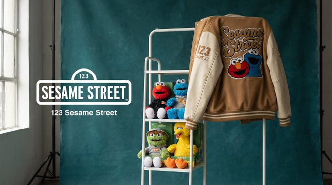

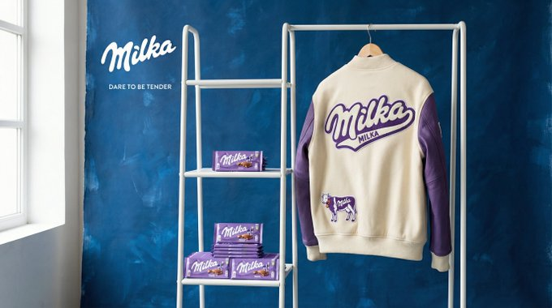

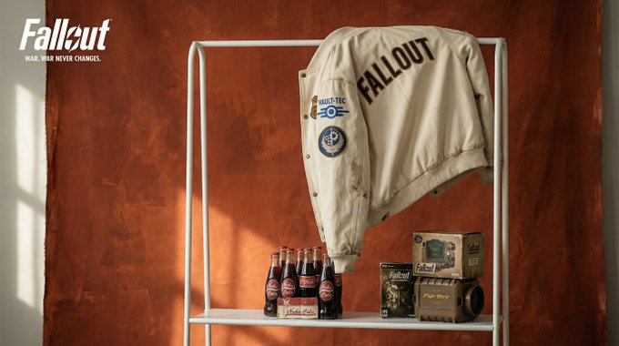

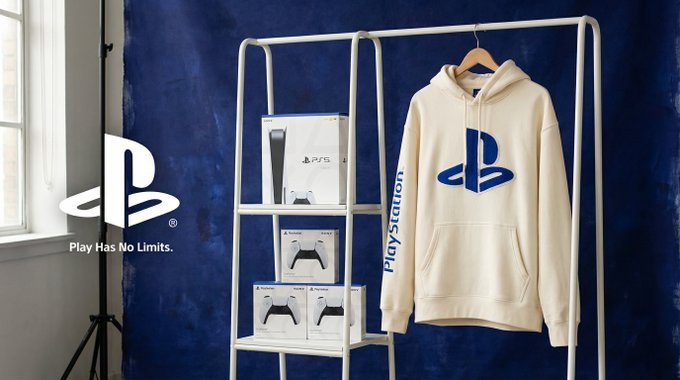

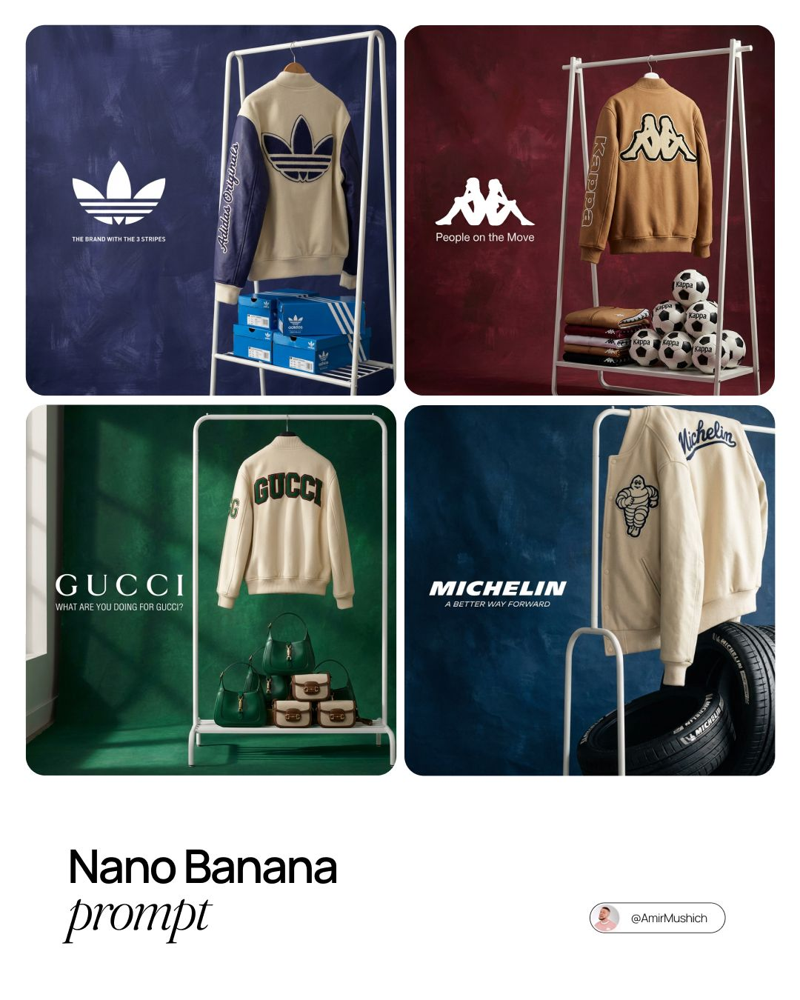

```
[BRAND NAME]. Act as a Creative Director and Still Life Photographer for a hypebeast fashion publication.
THE TASK:
Create a high-end "Showroom Still Life" photograph announcing a limited merchandise drop for [BRAND NAME].
PHASE 1: AUTONOMOUS CURATION (STRATEGY)
Analyze [BRAND NAME]: Identify the industry and the core physical product (e.g., if "Spalding" -> Basketballs; if "McDonald's" -> Burger Boxes; if "Visa" -> Metal Cards).
Determine the Palette:
Background Color: A deep, rich, textured tone derived from the brand's secondary palette (e.g., Teal, Navy, Burgundy, Slate Grey).
Merch Color: A contrasting warm or neutral tone (Camel, Orange, Cream) to pop against the background.
Select the "Merch Item": Choose a high-quality apparel piece relevant to the brand's vibe (e.g., a Varsity Letterman Jacket, a Heavyweight Hoodie, a Canvas Tote, or a Wool Scarf).
PHASE 2: SET DESIGN (THE RACK)
The Prop: A simple, modern White Powder-Coated Metal Rack or Shelf unit. It stands cleanly in the frame.
The Arrangement:
Hanging Item: The chosen "Merch Item" (e.g., the Jacket) is draped casually over the rack or hanging on a hanger, showing off the texture (wool/felt).
Stacked Items: On the shelves of the rack, stack multiple units of the brand's Core Product (e.g., a stack of basketballs, a pyramid of cans, a row of boxes).
The Background: A Hand-Painted Canvas Backdrop in the chosen Deep Background Color. Visible texture/brushstrokes are essential for that "studio" look.
PHASE 3: PHYSICAL BRANDING (TEXTURE)
On the Merch: The hanging apparel must feature High-Quality Physical Branding. Use "Chenille Patches", "Embroidered Logos", or "Screen Print" running down the sleeve or on the back. It must look like a real, expensive garment.
On the Products: Ensure the stacked core products have the correct [BRAND NAME] logo visible.
PHASE 4: PHOTOGRAPHY & LIGHTING
Lighting: Soft, directional window light from the side. Creates realistic, soft shadows on the rack and rich highlights on the textures.
Lens: 50mm or 85mm. Sharp focus on the merch, slight fall-off in the background.
PHASE 5: UI OVERLAY (THE "DROP" LAYOUT)
Left Side Alignment:
Large, clean White Logo of [BRAND NAME] floating in the negative space on the left.
Under the logo, small white text with the brand's official slogan.
```

```
[品牌名称]。担任一家潮流时尚刊物的创意总监与静物摄影师。  
任务：  
创作一张高端“展厅静物”照片，用于宣布[品牌名称]的限量商品发售。  

第一阶段：自主策展（策略）  
分析[品牌名称]：明确其所属行业及核心实体产品（例如：“Spalding” → 篮球；“麦当劳” → 汉堡盒；“Visa” → 金属卡）。  
确定配色方案：  
- 背景色：采用品牌辅助色系中一种深邃、浓郁且富有质感的色调（如青绿色、海军蓝、酒红色、石板灰）。  
- 商品色：选用与背景形成对比的暖色或中性色（如驼色、橙色、米白色），使其在背景中突出。  
选定“商品单品”：选择一件符合品牌调性的高品质服饰单品（例如：校队夹克、重磅连帽衫、帆布托特包或羊毛围巾）。  

第二阶段：场景搭建（衣架装置）  
道具：一个简洁现代的白色粉末涂层金属衣架或置物架，干净利落地置于画面中。  
陈列方式：  
- 悬挂单品：选定的“商品单品”（如夹克）随意搭在衣架上或挂在衣架上，充分展现其材质纹理（如羊毛/毛毡）。  
- 堆叠单品：在架子层板上堆叠多个品牌的“核心产品”（如一堆篮球、一金字塔形罐头、一排盒子）。  
背景：一块手绘帆布背景板，采用所选深色背景色，必须可见笔触与肌理，营造出“摄影棚”质感。  

第三阶段：实体品牌标识（质感）  
- 在服饰上：悬挂的服装必须带有高品质实体品牌标识，使用“植绒徽章”、“刺绣logo”或“丝网印刷”，位置可在袖子侧面或背部，整体需呈现真实昂贵的成衣质感。  
- 在产品上：确保堆叠的核心产品清晰展示正确的[品牌名称]标识。  

第四阶段：摄影与灯光  
灯光：柔和的侧向窗光，营造自然柔和的阴影，并在材质表面形成丰富高光。  
镜头：50mm 或 85mm 镜头，焦点锐利对准商品，背景略有虚化。  

第五阶段：UI 叠加（“发售”版式）  
左侧对齐布局：  
- 左侧留白区域悬浮一个大而干净的白色[品牌名称]logo。  
- logo 下方以小型白色文字标注品牌官方标语。
```

 [↑返回目录](#toc)

---
## <a id="">香奈儿香水：奢华与经典的完美诠释</a> (<a href="https://x.com/craftian_keskin/status/2016146144590541290" target="_blank" rel="noopener noreferrer">Keskin</a>)

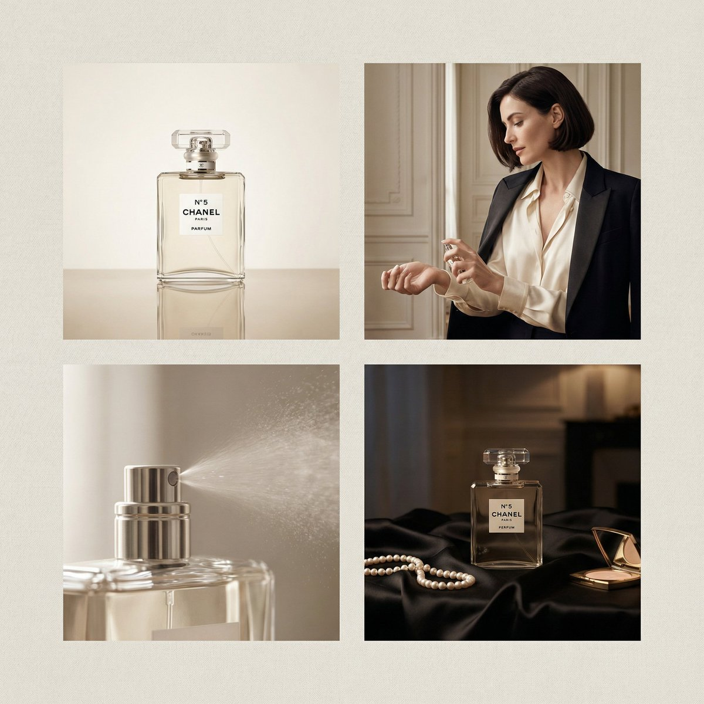

```
Channel Perfume Advertisement

Nano Banana Pro 

Prompt: 2×2 grid luxury perfume advertisement for Chanel perfume, four distinct yet cohesive high-end commercial images, elegant Parisian aesthetic, timeless fashion branding.

Panel 1 – Hero Product Elegance

Minimalist studio shot of a Chanel perfume bottle centered on a reflective surface. Soft, diffused lighting highlights the glass clarity, sharp edges, and iconic label. Neutral background in beige, ivory, or soft black. Luxurious, calm, iconic composition.

Panel 2 – Parisian Lifestyle Mood

Elegant adult woman in a classic Parisian interior vintage molding. She gently applies Chanel perfume to her neck or wrist. Natural light, effortless beauty, refined posture. Editorial fashion photography style, understated luxury.

Panel 3 – Sensory Detail Close-Up

Macro close-up of the Chanel perfume bottle with fine mist dispersing into the air. Light catches the spray particles. Soft shadows, shallow depth of field. Emphasis on texture, fragrance atmosphere, and sensory refinement.

Panel 4 – Cinematic Night Glamour

Moody, cinematic scene with the Chanel perfume bottle placed on a dark surface beside silk fabric or pearls. Low-key lighting, warm highlights, deep shadows. Evokes mystery, confidence, and timeless femininity.

All four images are visually unified through refined color grading, restrained contrast, and classic Chanel luxury cues.

Visual Style

Luxury fashion advertising
Editorial, timeless, refined
Soft contrast
Muted neutral palette
High realism
Clean composition
Parisian elegance

Camera & Lighting

Professional studio and editorial photography
50–85mm lens look
Shallow depth of field
Soft diffused lighting
Controlled highlights and shadows
Perfect label clarity

Mood Keywords

Elegant
Iconic
Sophisticated
Timeless
Feminine
Confident
Luxury

Negative Prompt

Cheap packaging, distorted logo, misspelled branding, harsh lighting, oversaturation, cluttered background, CGI look, cartoon style, watermark, text overlays, knockoff perfume bottles

Aspect Ratio

Overall canvas: 1:1
Grid: 2×2 equal squares
Optimized for luxury brand advertising and social campaigns
```

```
香奈儿香水广告  

Nano Banana Pro  

提示词：为香奈儿香水打造一组2×2网格布局的奢华香水广告，包含四张风格统一又各具特色的高端商业图像，体现优雅的巴黎美学与永恒的时尚品牌形象。

第一格 – 主打产品优雅呈现  
极简影棚拍摄，香奈儿香水瓶居中置于反光表面。柔和漫射光线突出玻璃通透感、锐利轮廓与标志性标签。背景采用米色、象牙白或柔黑等中性色调。构图奢华、宁静、经典。

第二格 – 巴黎生活氛围  
一位优雅成年女性身处带有复古雕花装饰的经典巴黎室内空间，轻柔地将香奈儿香水涂抹于颈部或手腕。自然光线、毫不费力的美感、端庄姿态。风格为时尚杂志摄影，低调奢华。

第三格 – 感官细节特写  
香奈儿香水瓶的微距特写，细腻香雾在空气中弥散。光线捕捉喷雾粒子，营造柔和阴影与浅景深效果。强调质感、香气氛围与感官精致度。

第四格 – 电影感夜幕魅力  
氛围深邃、富有电影感的画面，香奈儿香水瓶置于深色台面上，旁边搭配丝绸面料或珍珠。低调布光，暖调高光与浓重阴影交织，传递神秘、自信与永恒的女性气质。

四幅图像通过精致的色彩调校、克制的对比度以及经典的香奈儿奢华元素实现视觉统一。

视觉风格  
奢华时尚广告  
杂志级、永恒、精致  
柔和对比  
低饱和中性色调  
高度写实  
干净构图  
巴黎式优雅

摄影与灯光  
专业影棚与杂志摄影风格  
50–85mm镜头视角  
浅景深  
柔和漫射光  
精准控制高光与阴影  
标签清晰无误

情绪关键词  
优雅  
经典  
精致  
永恒  
女性化  
自信  
奢华

负面提示  
廉价包装、变形logo、拼写错误的品牌标识、强烈硬光、过度饱和、杂乱背景、CGI感、卡通风格、水印、文字叠加、仿冒香水瓶

画幅比例  
整体画布：1:1  
网格布局：2×2等分方格  
适用于奢侈品牌广告及社交媒体推广
```

 [↑返回目录](#toc)

---
## <a id="">奢华香水的深邃魅力</a> (<a href="https://x.com/AIwithkhan/status/2016404401930568036" target="_blank" rel="noopener noreferrer">Smiling Khan</a>)

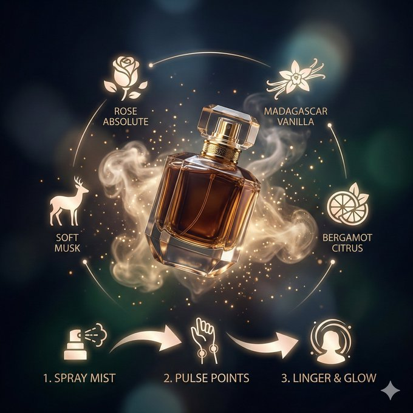

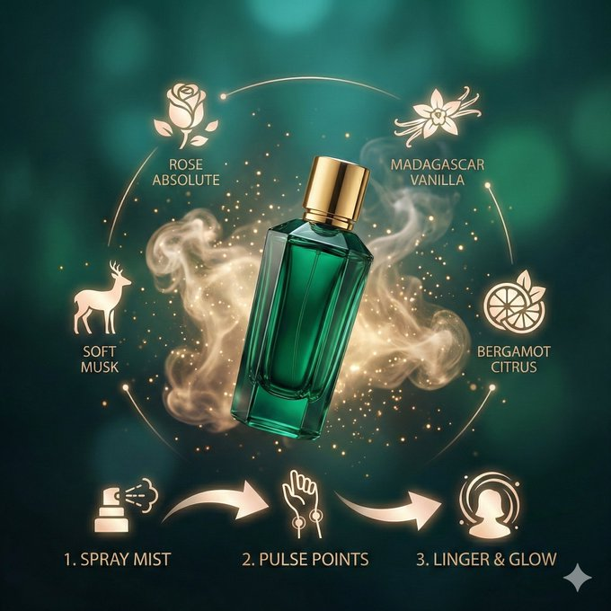

```
Ultra-viral product infographic.
Showcase a LUXURY PERFUME BOTTLE floating with misty fragrance clouds and light sparkles.
Ingredients Section:
Icons for rose, vanilla, musk, citrus.
Steps Section:
Arrows with spray, pulse points, linger icons.
Visual Style:
Moody luxury palette, soft glow, cinematic realism.
Composition:
Perfume bottle center-stage, scent notes orbiting like constellations.
Output:
1080×1080 or 1080×
```

```
超爆款产品信息图。  
展示一瓶奢华香水瓶悬浮于朦胧香氛云雾与微光闪烁之中。  
成分部分：  
玫瑰、香草、麝香、柑橘的图标。  
步骤部分：  
带有喷雾、脉搏点、留香图标的箭头流程。  
视觉风格：  
深邃奢华色调，柔和光晕，电影级写实感。  
构图：  
香水瓶居中作为视觉焦点，香调元素如星座般环绕四周。  
输出尺寸：1080×1080 或 1080×
```

 [↑返回目录](#toc)

---
## <a id="">商品图生成</a> (<a href="https://x.com/mehvishs25/status/2016150891678912784" target="_blank" rel="noopener noreferrer">Meem</a>)

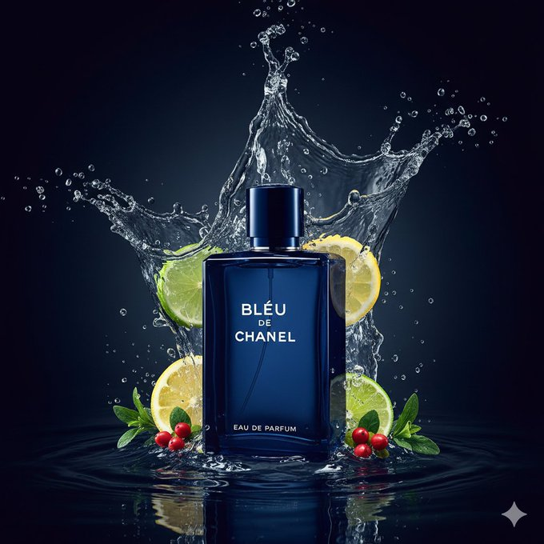

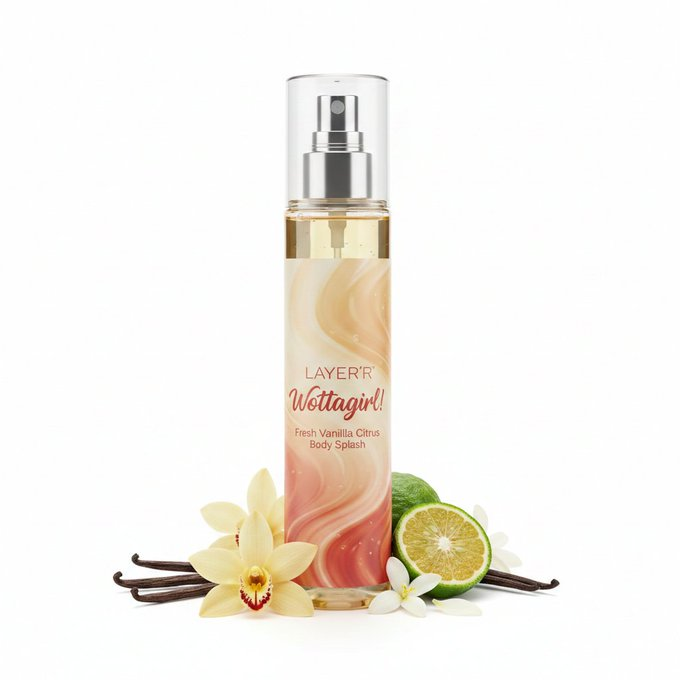

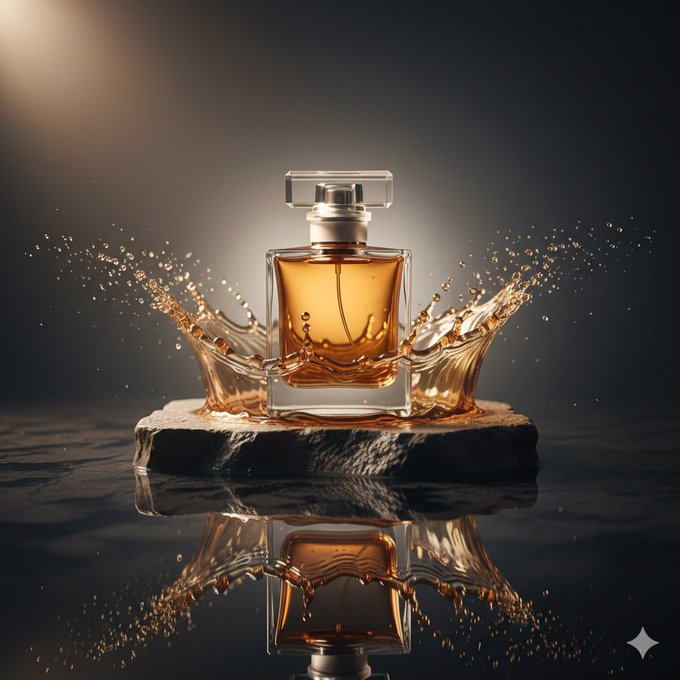

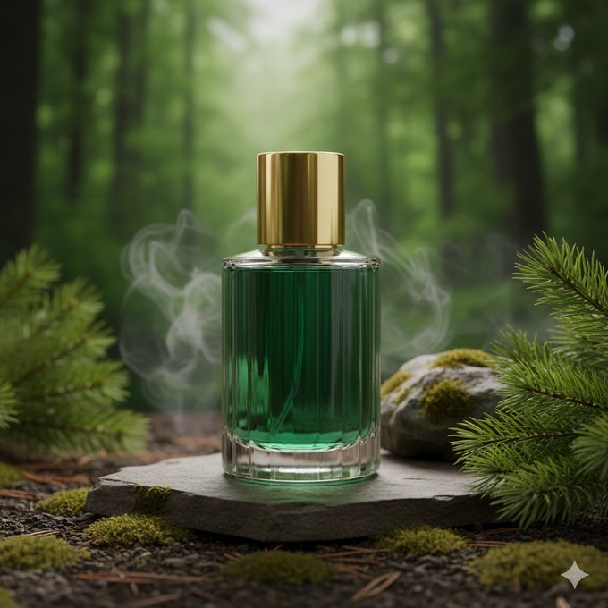

```
{
  "global_settings": {
    "resolution": "8K",
    "aspect_ratio": "3:4",
    "style": "photorealistic cinematic product photography",
    "detail_level": "extreme micro-detail",
    "sharpness": "ultra-sharp",
    "noise": "none",
    "compression_artifacts": "none",
    "color_depth": "rich 16-bit color",
    "render_quality": "luxury commercial grade",
    "ai_finish": "clean AI-enhanced realism"
  },

  "module_1": {
    "scene_identity": "forest_green_perfume",
    "environment": {
      "setting": "dense forest atmosphere",
      "background": "soft blurred green foliage with depth separation",
      "foreground": "natural forest floor with soil, moss, and small debris",
      "props": [
        "flat natural stone platform",
        "irregular rock placed slightly behind the bottle",
        "pine tree branches with visible needles on the right side"
      ],
      "atmosphere": "soft drifting smoke or mist rising behind the bottle"
    },
    "product": {
      "object_type": "perfume bottle",
      "material": "ribbed translucent glass",
      "color": "deep emerald green liquid",
      "shape": "cylindrical with vertical grooves",
      "cap": {
        "material": "metal",
        "finish": "polished gold",
        "shape": "smooth cylindrical"
      },
      "label": "no visible branding text"
    },
    "lighting": {
      "key_light": "soft diffused natural light from front-left",
      "fill_light": "subtle ambient forest light",
      "highlights": "gentle reflections on glass ribs and gold cap",
      "shadows": "soft realistic shadows under bottle and rocks"
    },
    "camera": {
      "angle": "eye-level product angle",
      "focus": "sharp focus on bottle, shallow depth of field",
      "lens_effect": "natural bokeh background"
    },
    "mood": "fresh, woody, calm, premium, nature-inspired"
  },

  "module_2": {
    "scene_identity": "blue_water_splash_perfume",
    "environment": {
      "setting": "dark aquatic studio scene",
      "background": "deep navy to black gradient",
      "surface": "rippling water with reflective highlights",
      "motion_elements": [
        "large upward water splash behind bottle",
        "floating water droplets suspended mid-air"
      ],
      "props": [
        "lemon slices (yellow flesh visible)",
        "green citrus slice",
        "small red berries",
        "green herb sprigs"
      ]
    },
    "product": {
      "object_type": "perfume bottle",
      "material": "opaque glass",
      "color": "deep midnight blue",
      "shape": "rectangular with sharp edges",
      "cap": {
        "material": "matching dark glass",
        "shape": "cylindrical"
      },
      "text_visible": [
        "BLEU DE CHANEL",
        "EAU DE PARFUM"
      ]
    },
    "lighting": {
      "key_light": "strong directional light from upper front",
      "rim_light": "cool highlights on water splash",
      "reflections": "specular highlights on glass and water surface"
    },
    "camera": {
      "angle": "slightly tilted dynamic angle",
      "focus": "sharp on bottle and splash",
      "motion_freeze": "high-speed capture look"
    },
    "mood": "fresh, energetic, aquatic, luxury fragrance ad"
  }
```

```
8K分辨率，3:4画幅，写实电影级产品摄影风格，极致微细节，超锐利清晰度，无噪点，无压缩伪影，丰富16位色彩，奢华商业级渲染质量，干净的AI增强写实效果。

场景一：森林绿香水  
环境为浓密森林氛围，背景是柔和虚化的绿色 foliage 并具有景深分离，前景为自然林地地面，包含土壤、苔藓和少量碎屑。道具包括一块天然扁平石台、瓶身后方稍远处放置的一块不规则岩石，以及右侧可见松针的松树枝条。氛围中有轻柔飘散的烟雾或薄雾从瓶身后方升起。  
产品为一款香水瓶，材质为带竖纹的半透明玻璃，内装深翡翠绿色液体，瓶身为带垂直凹槽的圆柱形，瓶盖为抛光金色金属材质，呈光滑圆柱形，无可见品牌文字标签。  
灯光采用前左方柔和漫射自然光为主光，辅以微妙的森林环境光填充，玻璃凹槽与金色瓶盖上有柔和高光，瓶身与岩石下方投射出柔和真实的阴影。  
相机视角为平视产品角度，焦点精准对准香水瓶，浅景深，背景呈现自然散景效果。整体氛围清新、木质、宁静、高端，充满自然灵感。

场景二：蓝色水花香水  
环境为深色水主题摄影棚场景，背景为深海军蓝至黑色渐变，表面为带有反射高光的涟漪水面。动态元素包括瓶身后方一道大幅向上飞溅的水花，以及悬浮在空中的水滴。道具包含可见黄色果肉的柠檬片、绿色柑橘切片、小颗红色浆果及绿色香草枝。  
产品为一款香水瓶，材质为不透明玻璃，颜色为深午夜蓝，瓶身为直角矩形设计，瓶盖为同色深色玻璃材质，呈圆柱形。瓶身可见文字“BLEU DE CHANEL”与“EAU DE PARFUM”。  
灯光采用前方上部强方向性主光，水花边缘有冷色调轮廓光，玻璃与水面呈现镜面高光反射。  
相机视角为略带倾斜的动态角度，焦点清晰落在香水瓶与水花上，呈现高速快门凝固动态的效果。整体氛围清新、活力四射、水感十足，如高端香水广告。
```

 [↑返回目录](#toc)

---
## <a id="">滑板少年公鸡的时尚影棚肖像</a> (<a href="https://x.com/Mind_Boticni/status/2016350733839597878" target="_blank" rel="noopener noreferrer">Cherry 2.O</a>)

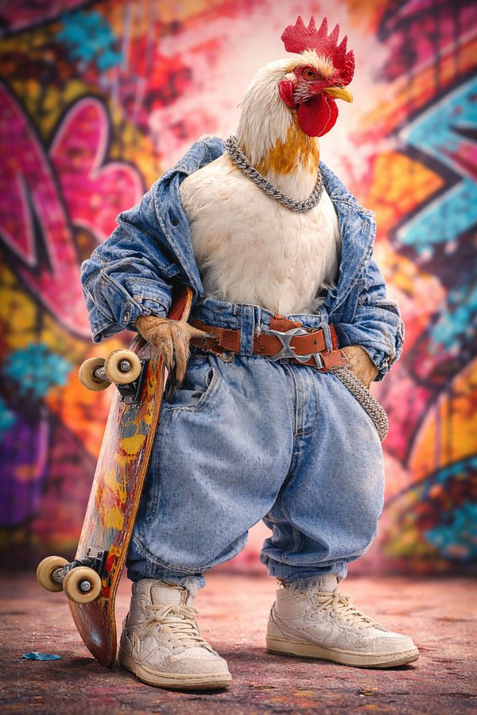

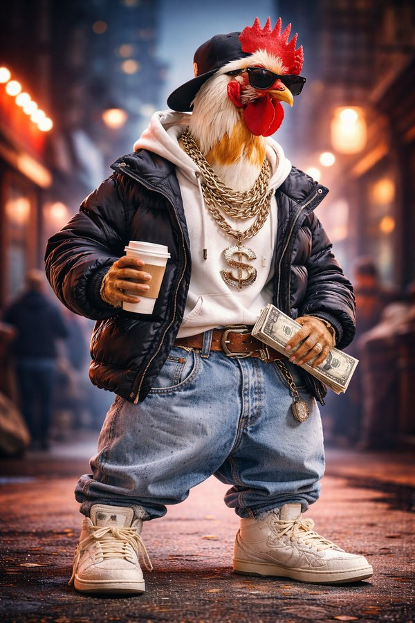

```
Ultra-realistic studio portrait of an anthropomorphic rooster styled like a street skater. A confident white rooster with a red comb and wattles stands upright like a human, full body visible, facing slightly to the side. The rooster is wearing oversized vintage blue denim jeans with a loose, baggy fit, a faded denim jacket hanging off the shoulders, and a thick silver chain necklace around its neck. A brown leather belt is fastened tightly around the waist.
The rooster is holding a worn skateboard vertically with one wing, resting it on the floor. The skateboard has scratched trucks, beige wheels, and a distressed, colorful deck. On its feet are chunky white high-top sneakers with visible wear and realistic fabric texture.
Highly detailed feathers with realistic texture and volume, sharp focus on the rooster’s face and clothing. Studio lighting with soft shadows, clean white/neutral background, fashion editorial style. Cinematic realism, humorous yet stylish vibe, perfect balance between realism and surreal character design. Ultra-high resolution, hyper-detailed materials (denim fabric, leather belt, metal chain, feathers), shallow depth of field, professional photography look.
```

```
超写实影棚人像，拟人化公鸡扮作街头滑板少年。一只自信的白色公鸡，红色鸡冠与肉垂鲜明，以人类姿态直立站立，全身可见，略微侧身面向镜头。它身穿宽松复古的蓝色牛仔裤，一件褪色牛仔夹克随意搭在肩上，颈间佩戴一条粗厚银链，腰间系着一条棕色皮革腰带，扣得紧实。

公鸡用一侧翅膀垂直握持一块磨损的滑板，滑板立于地面。滑板的支架有刮痕，轮子呈米色，板面色彩丰富却显陈旧磨损。脚上是一双厚底白色高帮运动鞋，鞋面有明显使用痕迹，织物纹理逼真。

羽毛细节极为丰富，质感与蓬松度真实自然，焦点锐利集中于公鸡面部与服饰。影棚灯光营造柔和阴影，背景为干净的白色或中性色调，整体风格如时尚杂志大片。画面兼具电影级写实感与幽默时尚气息，在现实主义与超现实角色设计之间取得完美平衡。超高分辨率，材质表现极度精细（牛仔布、皮带、金属链条、羽毛），浅景深，呈现专业摄影效果。
```

 [↑返回目录](#toc)

---
## <a id="">时尚拼贴手帐风格写真</a> (<a href="https://x.com/Arminn_Ai/status/2016619203277602928" target="_blank" rel="noopener noreferrer">ΛRMIN | AI</a>)

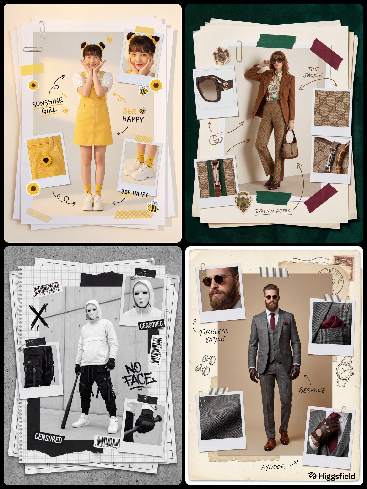

```
Masterpiece, best quality, high resolution, (FULL BODY SHOT:1.5), fashion scrapbook page layout, collage style, [Theme/Aesthetic keywords]

[Subject]: A wide shot full body fashion photo of [Character Description]. [Pose & Action]. Wearing [Detailed Outfit], [Accessories], (shoes visible:1.3), complete figure from head to toe.

[Composition]: The image is designed like a [Layout Metaphor: DIY zine / field dossier / moodboard], main character in center, surrounded by (3 distinct polaroid snapshots:1.3) showing DIFFERENT [Thematic] details: (one close-up of [Face/Makeup Detail]:1.2), (one macro shot of [Fabric/Texture/Weapon Detail]:1.2), and (one detail of [Footwear/Accessory Detail]:1.2), ensuring unique and non-repeating insert photos.

[Decorations]: [Style] scrapbooking elements, [Clip Type: Silver clips / Gold clips / Rusted clips] holding a [Paper Stack Thickness] of papers together, pieces of [Tape Type: Washi / Duct / Masking] tape, hand-drawn [Doodle Type: arrows / stars / graffiti], handwritten text annotations in [Ink Type] (e.g., "[Short Text 1]", "[Short Text 2]"), [Stickers/Stamps], torn paper textures.

[Background]: (A messy stack of [Paper Type: white sheets / cardstock / maps / folders]:1.4), visible layers of paper edges underneath the main sheet, realistic depth and shadows between paper layers, placed on a [Surface Material & Color].

[Technical]: [Lighting Style], [Atmosphere], sharp focus, editorial photography, 8k, tactile texture, realistic material rendering.
```

```
杰作，最佳质量，高分辨率，（全身照：1.5），时尚剪贴簿页面布局，拼贴风格，[主题/美学关键词]

[主体]：一张广角全身时尚照片，主角为[角色描述]，[姿势与动作]，身穿[详细服装]，[配饰]，（清晰可见鞋子：1.3），完整呈现从头到脚的全身形象。

[构图]：画面设计成[布局隐喻：DIY 小册子 / 田野档案 / 情绪板]风格，主角居中，周围环绕（三张不同的宝丽来快照：1.3），分别展示不同的[主题]细节：（一张[面部/妆容细节]特写：1.2）、（一张[面料/纹理/武器细节]微距镜头：1.2）以及（一张[鞋履/配饰细节]局部：1.2），确保插入的小图内容独特且不重复。

[装饰元素]：[风格]剪贴簿元素，[夹子类型：银色夹子 / 金色夹子 / 生锈夹子]固定一叠[纸张厚度]的纸张，搭配[胶带类型：和纸胶带 / 布基胶带 / 遮蔽胶带]，手绘[涂鸦类型：箭头 / 星星 / 涂鸦图案]，以[墨水类型]书写的文字注释（例如：“[简短文字1]”、“[简短文字2]”），[贴纸/印章]，撕裂纸张纹理。

[背景]：（一堆凌乱的[纸张类型：白纸 / 卡纸 / 地图 / 文件夹]：1.4），主页面下方可见多层纸张边缘，纸张之间具有真实深度与阴影，整体放置于[表面材质与颜色]之上。

[技术参数]：[灯光风格]，[氛围感]，锐利对焦，杂志级摄影，8K 分辨率，可触感纹理，逼真材质渲染。
```

 [↑返回目录](#toc)

---
## <a id="">极简建筑室内中的高级产品设计</a> (<a href="https://x.com/egeberkina/status/2016493139003949371" target="_blank" rel="noopener noreferrer">Ege</a>)

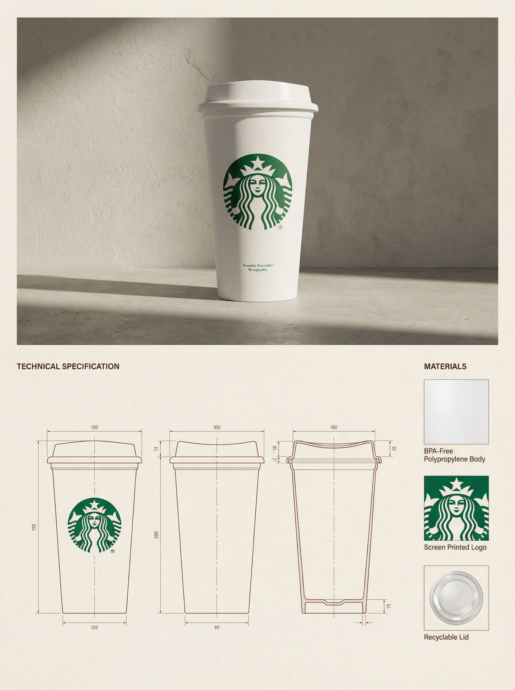

```
{
 "reference_images": {
 "product_image": "UPLOADED_IMAGE",
 "usage_rule": "Use the uploaded image as the exact visual reference for the product’s form, proportions, materials, and overall identity. Do not redesign or reinterpret the product."
 },

 "layout": {
 "canvas": {
 "orientation": "vertical",
 "aspect_ratio": "3:4",
 "background": "warm neutral paper-like surface"
 },
 "structure": {
 "top_section": "lifestyle_hero",
 "bottom_section": "technical_specification"
 }
 },

 "top_section": {
 "type": "lifestyle_product_image",
 "composition": {
 "placement": "top_center",
 "scale": "dominant",
 "margin": "generous whitespace around product"
 },
 "environment": {
 "setting": "minimal architectural interior",
 "lighting": {
 "type": "natural sunlight",
 "direction": "angled side light",
 "quality": "soft but high-contrast shadows"
 },
 "floor": "subtle concrete or stone surface",
 "background": "textured plaster wall"
 },
 "rendering": {
 "style": "editorial lifestyle photography",
 "detail": "high realism",
 "color_grading": "warm, muted, premium"
 }
 },

 "bottom_section": {
 "type": "technical_specification_panel",
 "layout": {
 "grid": "modular",
 "alignment": "clean, architectural"
 },

 "technical_drawings": {
 "placement": "bottom_left_and_center",
 "style": "architectural line drawings",
 "views": [
 "front view",
 "side view",
 "three-quarter cutaway or profile view"
 ],
 "projection": "orthographic",
 "line_style": {
 "color": "muted red or sepia",
 "weight": "fine technical lines"
 },
 "annotations": {
 "type": "measurement and construction callouts",
 "language": "neutral technical labels",
 "density": "minimal, editorial"
 }
 },

 "materials_panel": {
 "placement": "bottom_right",
 "content": {
 "type": "material_swatches",
 "count": "3-4 depending on product",
 "format": "square or rectangular samples"
 },
 "textures": {
 "source": "derived from the product materials",
 "examples": [
 "fabric",
 "leather",
 "metal",
 "wood",
 "plastic"
 ]
 },
 "labels": {
 "style": "small editorial captions",
 "tone": "technical but refined"
 }
 }
 },

 "typography": {
 "style": "minimal editorial",
 "usage": "subtle captions, no large headlines",
 "color": "soft black or dark brown"
 },

 "overall_style": {
 "mood": "design catalog / product design journal",
 "aesthetic": "architectural, premium, calm",
 "avoid": [
 "clutter",
 "bold colors",
 "heavy branding",
 "overly decorative graphics"
 ]
 },

 "constraints": {
 "do_not": [
 "change product design",
 "invent new materials",
 "add logos unless present in reference",
 "use perspective distortion in drawings"
 ]
 }
}
```

```
参考图片：  
- 产品图片：已上传图像  
- 使用规则：以上传的图像作为产品形态、比例、材质和整体身份的确切视觉参考，不得重新设计或重新诠释该产品。

画面布局：  
- 画布方向：竖向  
- 画幅比例：3:4  
- 背景：温暖中性的纸质感表面  
- 结构：上半部分为生活场景主图，下半部分为技术规格说明

上半部分（生活场景产品图）：  
- 构图：产品居中靠上，占据主导比例，四周留有充足留白  
- 环境：极简建筑室内场景  
- 光线：自然日光，侧向斜射，柔和但具有高对比度的阴影  
- 地面：微妙的混凝土或石材表面  
- 背景墙：带肌理的灰泥墙面  
- 渲染风格：杂志级生活摄影风格，高度写实，色调温暖、低饱和、高级感

下半部分（技术规格面板）：  
- 布局：模块化网格，干净利落、具建筑感的对齐方式  

技术图纸：  
- 位置：左下及中央区域  
- 风格：建筑线稿  
- 视角：正面图、侧面图、四分之三剖面或轮廓图  
- 投影方式：正交投影  
- 线条样式：低饱和红或棕褐色，精细技术线条  
- 标注：尺寸与构造标注，使用中性技术标签，信息密度低、具编辑感  

材质板：  
- 位置：右下区域  
- 内容：3–4个源自产品真实材质的色块样本，形状为方形或矩形  
- 材质类型示例：织物、皮革、金属、木材、塑料  
- 标签：小型编辑式说明文字，语气专业而精致  

字体排印：  
- 风格：极简直观的编辑体  
- 使用方式：仅用于细微说明文字，无大型标题  
- 颜色：柔和黑色或深棕色  

整体风格：  
- 氛围：设计产品目录 / 产品设计期刊  
- 美学：建筑感、高级感、沉静  
- 避免：杂乱、鲜艳色彩、强烈品牌标识、过度装饰性图形  

限制条件：  
- 不得更改产品设计  
- 不得虚构新材料  
- 除非参考图中已有，否则不得添加品牌标志  
- 技术图纸中不得使用透视变形
```

 [↑返回目录](#toc)

---
## <a id="">韩系女团风高级穿搭特写</a> (<a href="https://x.com/qisi_ai/status/2016725035310862814" target="_blank" rel="noopener noreferrer">骑司Chase</a>)

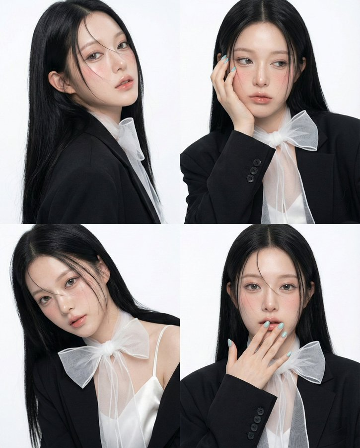

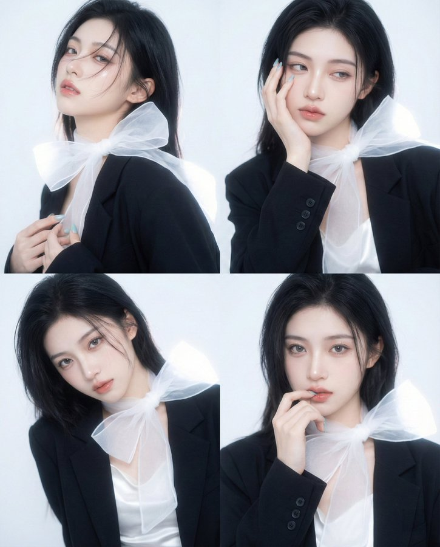

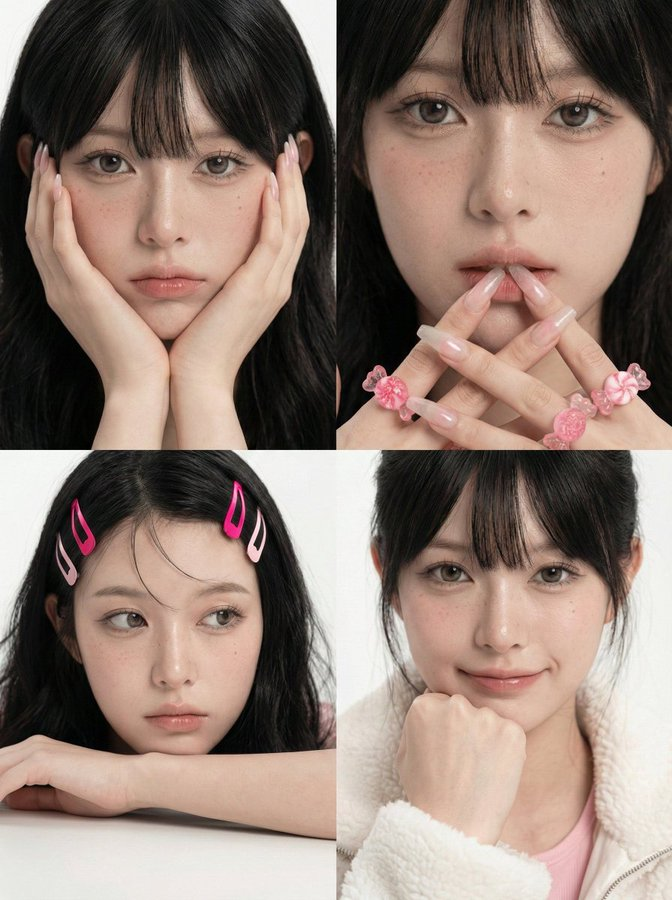

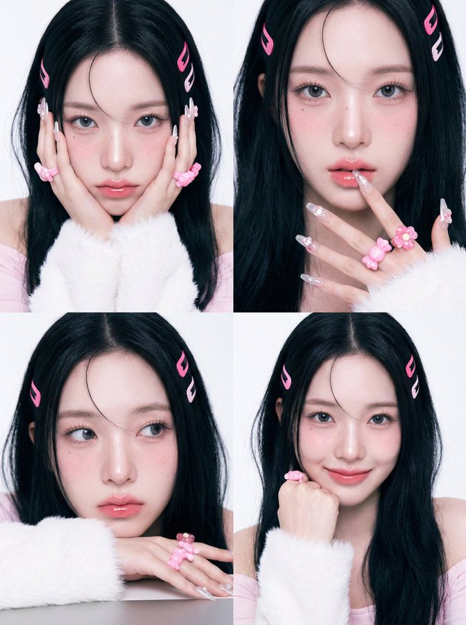

```
一、版式与构图
1 画幅比例：整体竖幅四比五
2 版式：四宫格拼图，二乘二排列，无边框
3 景别：近景到特写，人物占画面大比例，肩颈与上半身为主
4 角度：平视为主，轻微侧转与俯仰变化，统一干净背景

二、人物主体
1 优先以上传参考图作为严格身份来源
2 一致性要求：零偏差
3 性别气质：年轻女性，清冷甜感并存，安静克制
4 脸部特征：鹅蛋脸偏小，五官精致，大眼圆润，鼻梁细直，唇形饱满
5 肤色肤质：白皙偏粉，细腻通透，柔焦磨皮但保留高光反射
6 眼神表情：湿润清澈的凝视，微微放空与若有所思，嘴唇微张或轻抿

三、妆发细节
1 底妆：轻薄通透，面中与鼻梁高光明显
2 腮红：大面积粉雾腮红，集中在苹果肌并延伸到鼻梁两侧
3 眼妆：干净放大感，细长睫毛，淡淡卧蚕与浅棕眼影
4 唇妆：水润镜面感，蜜桃粉到玫瑰粉渐变
5 发型：黑色长直发，中分贴头顶，顺直垂落；少量发丝斜掠过脸颊与鼻梁形成标志线条

四、服饰与道具
1 外搭：黑色宽松西装外套，垫肩感轻微
2 内搭：白色缎面吊带或抹胸上衣，胸前微褶与光泽
3 颈部装饰：白色半透明纱质大蝴蝶结系带，体积感明显，边缘发亮
4 指甲：淡蓝绿色甲油，干净修长

五、四格动作分镜
1 左上：侧身回眸，头向左后方倾斜，视线看向镜头，唇微张
2 右上：右手托脸或扶额，指尖贴太阳穴，视线偏侧，神情慵懒
3 左下：身体微前倾，肩部上提，头低一点再抬眼看镜头，表情更柔软
4 右下：单手靠近嘴唇轻轻收拢，指节贴下唇前，正面凝视，情绪更无辜克制

六、光影与质感
1 光线：高亮柔光棚拍，正面大柔光为主，阴影极浅
2 质感：整体奶油柔雾，皮肤与唇部高光明显，边缘轻微朦胧
3 色调：冷白背景配淡粉肤色与黑白穿搭，干净高级、杂志感强
```

 [↑返回目录](#toc)

---
## <a id="">悬浮美食的超现实电影场景</a> (<a href="https://x.com/Taaruk_/status/2017073776421482897" target="_blank" rel="noopener noreferrer">Taaruk</a>)

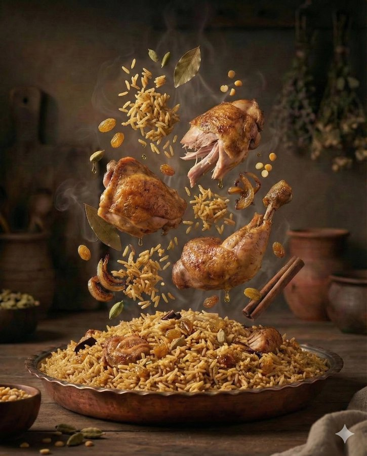

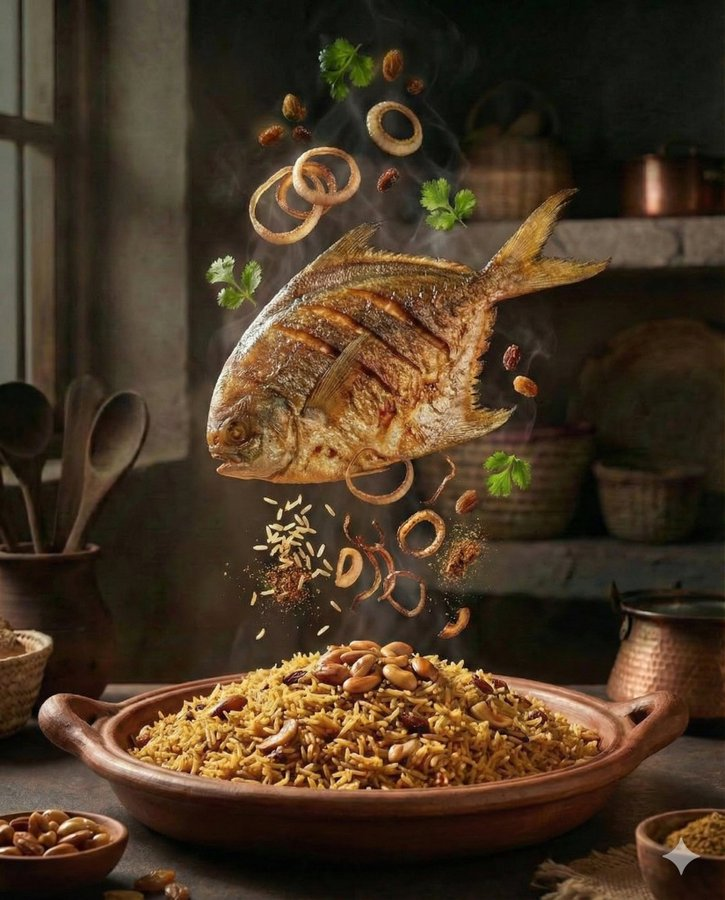

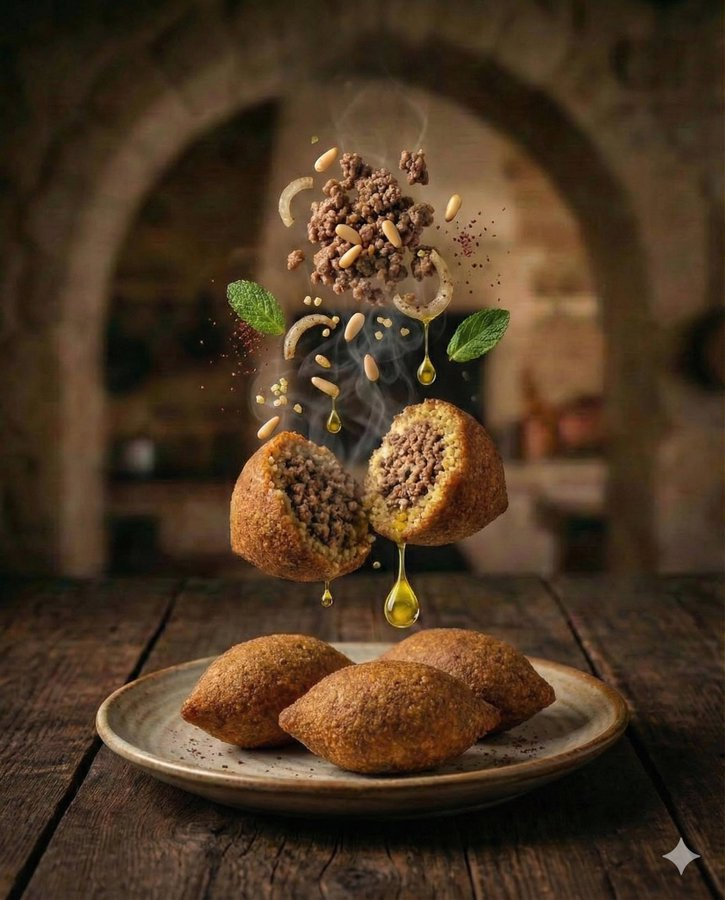

```
A hyper-realistic cinematic food scene with ingredients frozen mid-air above a plated dish. Golden-brown stuffed kibbeh / spiced rice with chicken / fried whole fish presented in a rustic kitchen setting. Exploded-view composition showing grains of rice, minced meat, nuts, onions, herbs, spices, oil droplets, and steam floating dynamically in the air. Warm moody lighting, dramatic shadows, shallow depth of field, rich textures, glossy oil highlights, steam rising for freshness. Old-world Middle Eastern / Mediterranean kitchen atmosphere, wooden table, clay bowls, copper utensils, cinematic color grading, ultra-detailed food photography, 8K realism, slow-motion food commercial style.
```

```
一幅超写实的电影级美食场景，食材悬浮在已装盘菜肴上方的空中。金棕色的酿制库贝、香料调味的鸡肉米饭、整条油炸鱼，置于质朴的厨房环境中。采用爆炸分解式构图，米粒、绞肉、坚果、洋葱、香草、香料、油滴和蒸汽动态地漂浮在空中。温暖而富有氛围感的灯光，强烈的戏剧性阴影，浅景深，丰富的质感，油亮的高光，升腾的蒸汽彰显新鲜感。充满古老中东/地中海风情的厨房氛围，木桌、陶碗、铜制厨具，电影级色彩调校，极致细节的美食摄影，8K超写实画质，慢动作食品广告风格。
```

 [↑返回目录](#toc)

---
## <a id="">毛绒水果角色的3D肖像</a> (<a href="https://x.com/mehvishs25/status/2017196660586377456" target="_blank" rel="noopener noreferrer">Meem</a>)

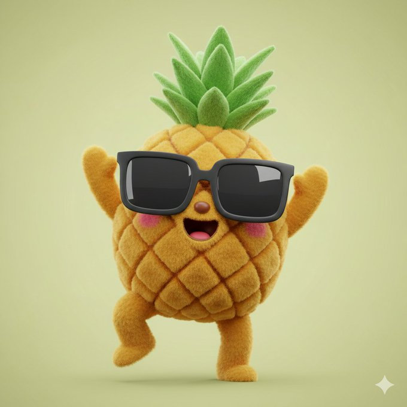

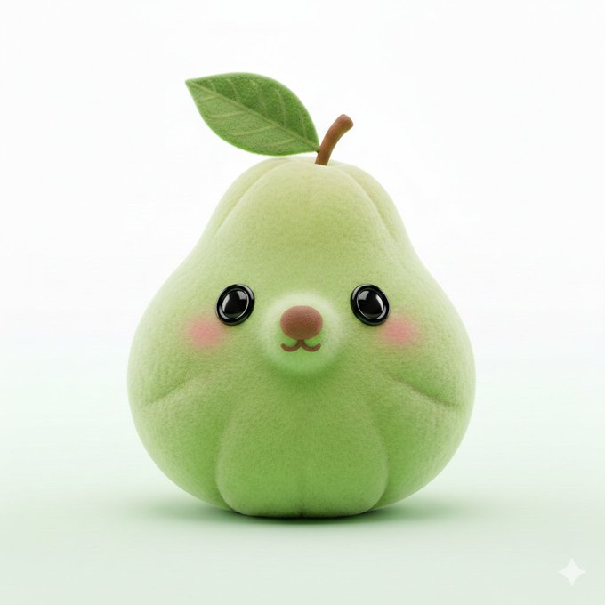

```
{
  "subject": "Fruit name ",
  "features": ["button nose", "leaf hat", "blushed cheeks"],
  "material_properties": {
    "texture": "soft_plush",
    "finish": "velvety",
    "tactile_feel": "squeezable"
  },
  "render_settings": {
    "style": "3D_model_stylized",
    "composition": "centered",
    "lighting": "soft_studio",
    "background": "clean_minimalist"
  },
  "metadata": {
    "aspect_ratio": "3:2",
    "model_version": "v7"
  }
}
```

```
一个水果造型的角色，具有纽扣鼻子、叶子帽子和泛红的脸颊，材质为柔软毛绒，表面有丝绒质感，触感可捏压。以风格化的3D模型呈现，居中构图，采用柔和影棚灯光，背景干净简约，画面比例为3:2。
```

 [↑返回目录](#toc)

---
## <a id="">红夹克时尚人像</a> (<a href="https://x.com/r4jjesh/status/2017190538404122890" target="_blank" rel="noopener noreferrer">ராஜேஷ்</a>)

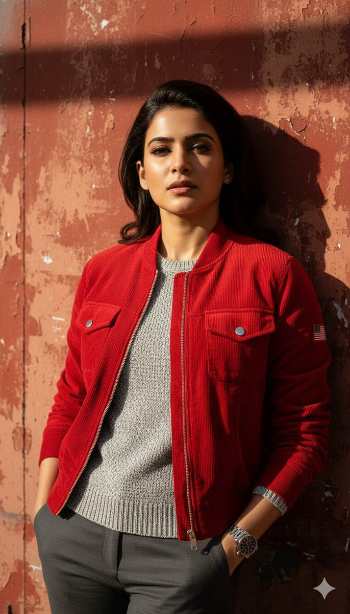

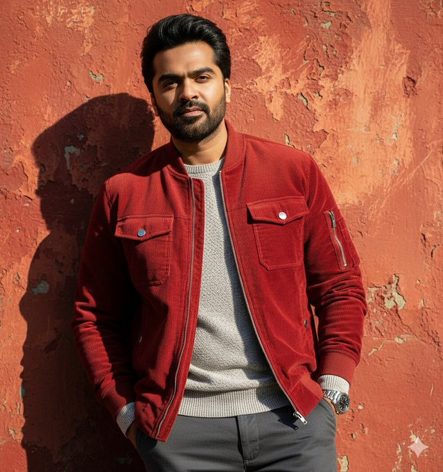

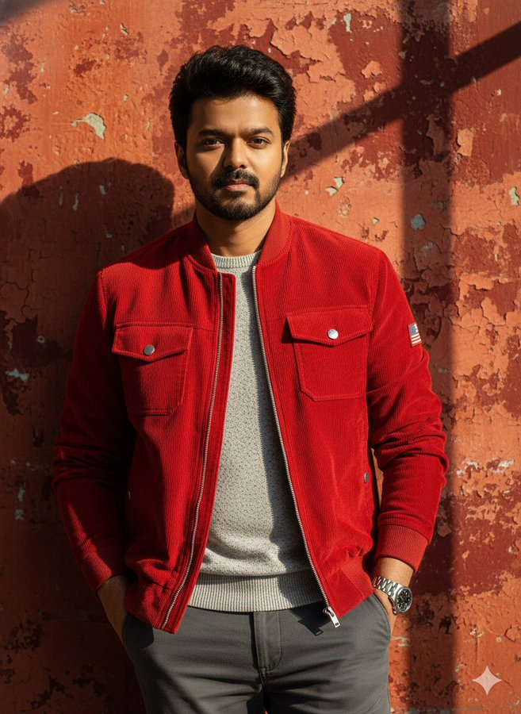

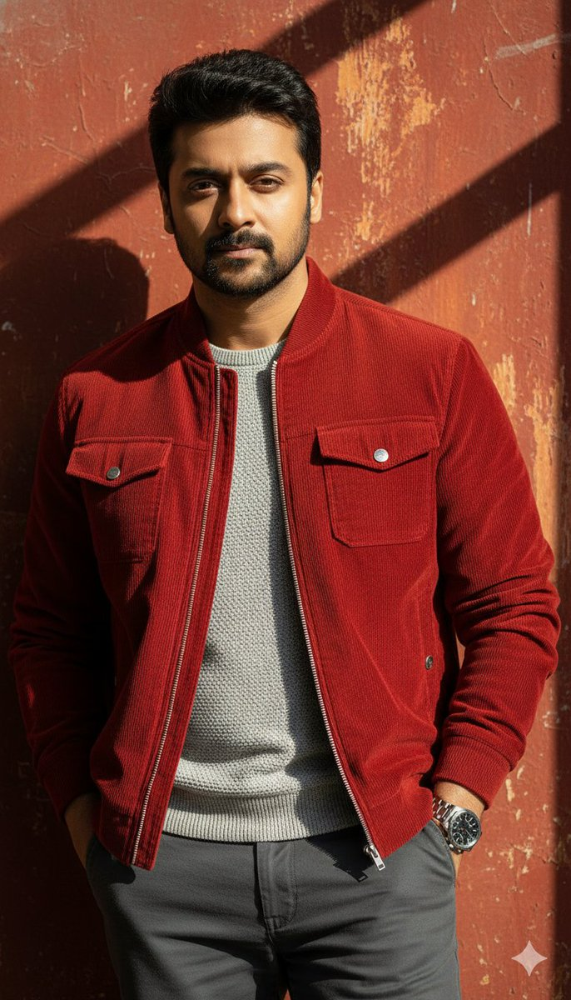

```
{
  "prompt": "Edit my photo to create a photorealistic fashion portrait of a stylish person wearing a red corduroy bomber jacket with a zippered front and chest pockets, layered over a light grey textured crew-neck sweater, paired with dark grey pants. The subject stands casually with hands in pockets, leaning against a deeply textured wall painted in shades of red and orange. Strong side lighting creates bold, sharp shadows across the wall and partially across the face, adding depth and drama.\n\nStyle: High-end photorealistic fashion photography.\n\nLighting: Harsh, direct natural sunlight coming from the right side, producing strong contrast, crisp shadows, and a bright, well-lit look.\n\nComposition: Medium close-up shot, portrait orientation, slightly off-center framing for a modern editorial feel.\n\nDetails: Sharp facial features, groomed eyebrows, clean and natural appearance. The red corduroy jacket shows clear fabric texture and includes a small square patch with horizontal lines on the left sleeve. A silver wristwatch with a dark dial is visible on the left wrist. The bright light-grey sweater contrasts strongly with the red jacket.\n\nBackground: Industrial-style wall with layered red and orange paint tones, visible texture, and pronounced shadow play.\n\nQuality: Ultra-high detail, 8K resolution, masterpiece-level realism, award-winning fashion photography aesthetic.\n\nStrict constraints: Preserve exact facial identity and proportions from the uploaded photo. No facial alteration, no distortion, no blur, no watermark."
}
```

```
将我的照片编辑成一张逼真的时尚人像：一位时尚人士身穿红色灯芯绒飞行员夹克，前襟带拉链，胸前有口袋，内搭一件浅灰色纹理圆领毛衣，下身配深灰色长裤。人物姿态随意，双手插在裤兜里，斜靠在一堵色彩浓郁、肌理丰富的红橙色墙面上。强烈的侧光在墙面和脸部部分区域投下鲜明锐利的阴影，营造出深度与戏剧感。

风格：高端逼真时尚摄影。  
光线：右侧射入的强烈直射自然阳光，形成高对比度、清晰锐利的阴影，整体明亮通透。  
构图：中近景人像，纵向取景，略微偏离中心，呈现现代杂志大片感。  
细节：面部轮廓清晰，眉毛修整整齐，整体妆容干净自然。红色灯芯绒夹克纹理明显，左袖上有一个带水平条纹的小方形补丁；左手腕佩戴一只深色表盘的银色腕表；亮浅灰色毛衣与红色夹克形成强烈对比。  
背景：工业风格墙面，带有层层叠叠的红橙色调，肌理清晰，光影交错。  
画质：超高清细节，8K分辨率，大师级写实效果，具有获奖级时尚摄影美学。  
严格限制：必须保留上传照片中人物的原始面部身份与比例，不得进行任何面部修改、变形、模糊或添加水印。
```

 [↑返回目录](#toc)

---
## <a id="">快乐的卡通兔子挥手致意</a> (<a href="https://x.com/meng_dagg695/status/2017130180402434479" target="_blank" rel="noopener noreferrer">ShaHid WaNii</a>)

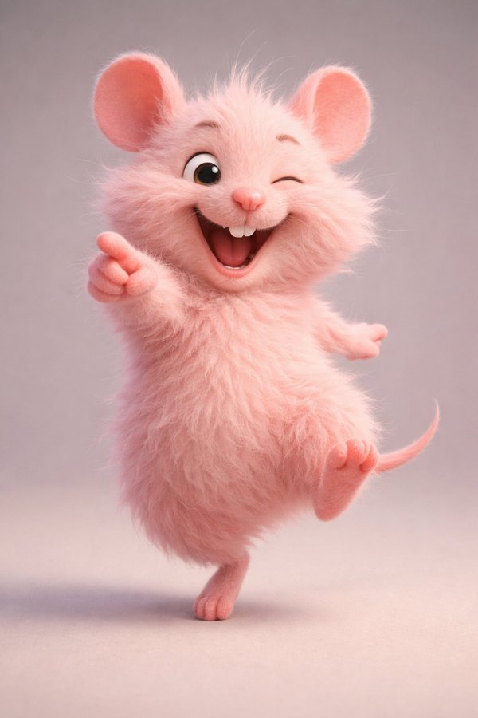

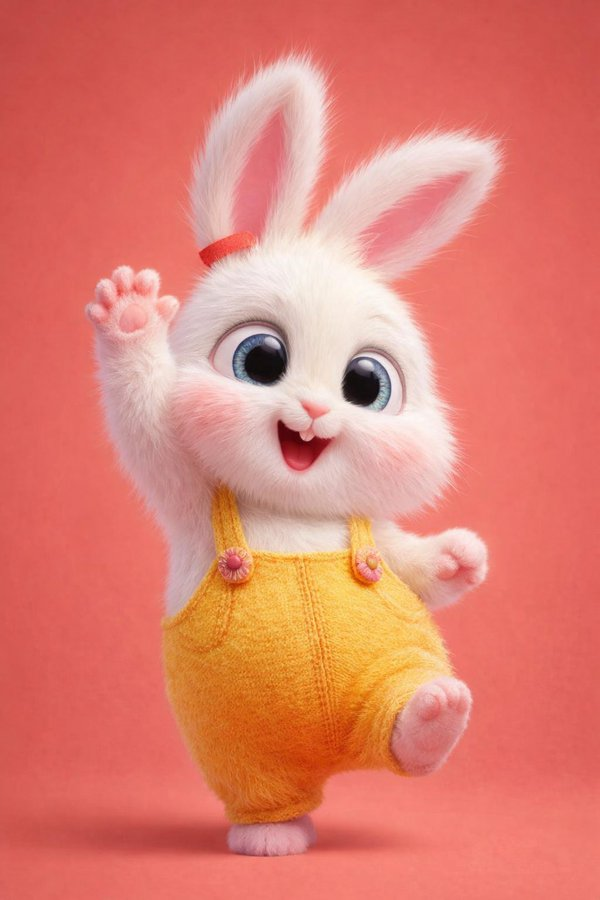

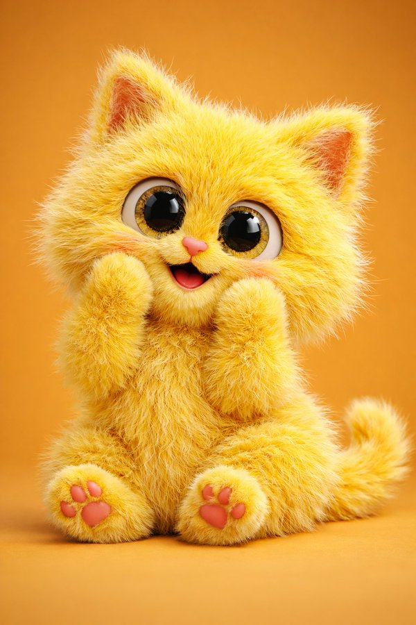

```
{
  "subject": {
    "type": "anthropomorphic bunny",
    "species": "rabbit",
    "gender": "not specified",
    "age_representation": "childlike / cartoon-styled",
    "pose": "standing on hind legs with one leg lifted forward, one arm raised upward, the other arm slightly bent outward",
    "expression": "happy, joyful, open-mouthed smile",
    "emotion": "cheerful, playful"
  },
  "head_and_face": {
    "head_shape": "round and fluffy",
    "fur_color": "pure white",
    "fur_texture": "very soft, dense, fluffy, fine strands visible",
    "eyes": {
      "size": "very large",
      "shape": "round",
      "color": "blue with darker outer ring",
      "pupils": "large black pupils",
      "eye_style": "glossy, reflective, cartoon-like"
    },
    "nose": {
      "size": "small",
      "shape": "rounded",
      "color": "soft pink"
    },
    "mouth": {
      "state": "open",
      "shape": "small rounded opening",
      "inner_color": "dark pink",
      "teeth": "not visible"
    },
    "cheeks": {
      "shape": "puffy",
      "tint": "light pink blush"
    }
  },
  "ears": {
    "count": 2,
    "position": "upright",
    "shape": "long and slightly curved",
    "outer_fur": "white and fluffy",
    "inner_ear_color": "light pink",
    "accessory": {
      "type": "small hair band",
      "color": "red",
      "placement": "wrapped around one ear"
    }
  },
  "body": {
    "proportions": "chubby, small torso with oversized head",
    "fur_color": "white",
    "fur_texture": "plush, soft, evenly groomed"
  },
  "clothing": {
    "outfit_type": "overalls",
    "material_appearance": "soft fabric with visible texture",
    "color": "yellow",
    "design": {
      "straps": 2,
      "buttons": {
        "count": 2,
        "shape": "round",
        "color": "pink",
        "decoration": "flower-shaped"
      }
    },
    "fit": "loose and rounded around the belly"
  },
  "limbs": {
    "arms": {
      "count": 2,
      "fur_color": "white",
      "pose": {
        "left_arm": "raised upward in a waving gesture",
        "right_arm": "slightly bent outward"
      },
      "paws": {
        "shape": "small and rounded",
        "pads_color": "light pink"
      }
    },
    "legs": {
      "count": 2,
      "pose": {
        "support_leg": "standing firmly on ground",
        "raised_leg": "lifted forward in playful motion"
      },
      "feet": {
        "shape": "rounded",
        "pads_color": "light pink"
      }
    }
  },
  "background": {
    "type": "solid color",
    "color": "coral / warm reddish-pink",
    "texture": "smooth, gradient-free"
  },
  "lighting": {
    "type": "soft studio lighting",
    "direction": "even frontal lighting",
    "shadows": "soft and subtle beneath the feet",
    "highlights": "gentle highlights on fur and eyes"
  },
  "render_style": {
    "style": "3D animated character",
    "realism_level": "stylized realism",
    "fur_detail": "high strand-level detail",
    "surface_quality": "smooth, clean, polished"
  },
  "camera": {
    "framing": "full body",
    "angle": "eye-level",
    "lens_effect": "no distortion",
    "depth_of_field": "shallow, subject sharply focused"
  },
  "image_quality": {
    "resolution": "8K",
    "sharpness": "very high",
    "noise": "none",
    "artifacts": "none"
  },
  "aspect_ratio": "3:4",
  "overall_style_tags": [
    "cute",
    "wholesome",
    "pixar-style",
    "ai-generated",
    "high-detail",
    "clean background"
  ]
}
```

```
拟人化的兔子，种类为兔，性别未指定，表现为孩子般/卡通风格，姿势为一只脚向前抬起站立在后腿上，一只手臂向上举起，另一只手臂稍微向外弯曲，表情快乐、喜悦、张嘴微笑，情感欢快、嬉戏。
头部和脸部特征包括圆形且毛茸茸的头部形状，毛色纯白，毛质非常柔软、密集、蓬松，细毛可见。眼睛非常大且圆，蓝色带有较深的外环，瞳孔大而黑，眼睛样式光泽、反光、卡通风格。鼻子小而圆，颜色为柔和的粉色。嘴巴微张，形状为小圆开口，内色深粉，牙齿不可见。脸颊鼓鼓的，带有浅粉色红晕。
两只耳朵竖立，形状长而略弯，外耳白色蓬松，内耳颜色浅粉，并有一个红色的小发带装饰在一个耳朵上。
身体比例胖乎乎的，小躯干配上过大的头部，毛色白色，毛质柔软均匀梳理。
穿着黄色背带裤，面料外观有可见纹理，设计上有两条肩带和两个粉色圆形按钮作为装饰，花朵形状。衣服宽松地包裹着腹部。
四肢包括两只手臂和两只腿，毛色均为白色。左臂向上举起做挥手状，右臂稍微向外弯曲。手爪小而圆，肉垫颜色浅粉。腿部姿势中支撑腿稳稳站在地上，抬起的腿做出玩耍动作。脚部形状圆润，肉垫颜色浅粉。
背景为单一颜色，珊瑚色/暖红色调，质地平滑无渐变。
光线为柔和的工作室照明，方向为正面均匀照射，影子在脚下轻柔微妙，高光轻轻打在皮毛和眼睛上。
渲染风格为3D动画角色，现实主义程度为风格化的真实感，皮毛细节达到毛发级别的细致，表面质量光滑、干净、抛光。
相机设置为全身拍摄，角度平视，没有镜头畸变效果，景深较浅，主体清晰聚焦。
图像质量方面，分辨率为8K，清晰度非常高，无噪点，无伪影。
画幅比为3:4，整体风格标签包括可爱、健康、皮克斯风格、AI生成、高细节、干净背景。
```

 [↑返回目录](#toc)

---
## <a id="">钢铁侠装备细节展示</a> (<a href="https://x.com/egeberkina/status/2016960334838567332" target="_blank" rel="noopener noreferrer">Ege</a>)

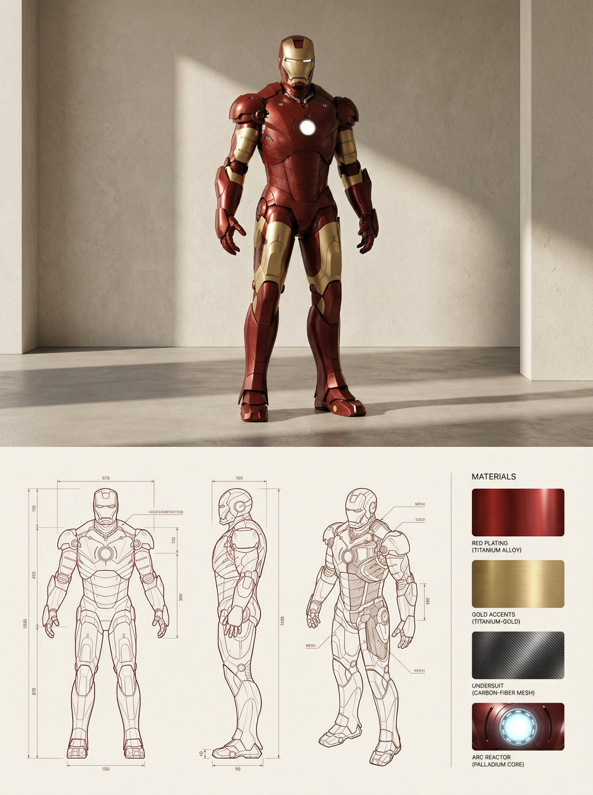


```
{
 "reference_images": {
 "product_image": "UPLOADED_IMAGE",
 "usage_rule": "Use the uploaded image as the exact visual reference for the product’s form, proportions, materials, and overall identity. Do not redesign or reinterpret the product."
 },

 "layout": {
 "canvas": {
 "orientation": "vertical",
 "aspect_ratio": "3:4",
 "background": "warm neutral paper-like surface"
 },
 "structure": {
 "top_section": "lifestyle_hero",
 "bottom_section": "technical_specification"
 }
 },

 "top_section": {
 "type": "lifestyle_product_image",
 "composition": {
 "placement": "top_center",
 "scale": "dominant",
 "margin": "generous whitespace around product"
 },
 "environment": {
 "setting": "minimal architectural interior",
 "lighting": {
 "type": "natural sunlight",
 "direction": "angled side light",
 "quality": "soft but high-contrast shadows"
 },
 "floor": "subtle concrete or stone surface",
 "background": "textured plaster wall"
 },
 "rendering": {
 "style": "editorial lifestyle photography",
 "detail": "high realism",
 "color_grading": "warm, muted, premium"
 }
 },

 "bottom_section": {
 "type": "technical_specification_panel",
 "layout": {
 "grid": "modular",
 "alignment": "clean, architectural"
 },

 "technical_drawings": {
 "placement": "bottom_left_and_center",
 "style": "architectural line drawings",
 "views": [
 "front view",
 "side view",
 "three-quarter cutaway or profile view"
 ],
 "projection": "orthographic",
 "line_style": {
 "color": "muted red or sepia",
 "weight": "fine technical lines"
 },
 "annotations": {
 "type": "measurement and construction callouts",
 "language": "neutral technical labels",
 "density": "minimal, editorial"
 }
 },

 "materials_panel": {
 "placement": "bottom_right",
 "content": {
 "type": "material_swatches",
 "count": "3-4 depending on product",
 "format": "square or rectangular samples"
 },
 "textures": {
 "source": "derived from the product materials",
 "examples": [
 "fabric",
 "leather",
 "metal",
 "wood",
 "plastic"
 ]
 },
 "labels": {
 "style": "small editorial captions",
 "tone": "technical but refined"
 }
 }
 },

 "typography": {
 "style": "minimal editorial",
 "usage": "subtle captions, no large headlines",
 "color": "soft black or dark brown"
 },

 "overall_style": {
 "mood": "design catalog / product design journal",
 "aesthetic": "architectural, premium, calm",
 "avoid": [
 "clutter",
 "bold colors",
 "heavy branding",
 "overly decorative graphics"
 ]
 },

 "constraints": {
 "do_not": [
 "change product design",
 "invent new materials",
 "add logos unless present in reference",
 "use perspective distortion in drawings"
 ]
 }
}
```

```
参考图像：  
- 产品图像：已上传图像  
- 使用规则：以上传图像作为产品形态、比例、材质和整体身份的精确视觉参考，不得重新设计或重新诠释该产品。

画面布局：  
- 画布方向：竖向  
- 画幅比例：3:4  
- 背景：温暖中性的纸质感表面  
- 结构：上部为生活场景主图，下部为技术规格面板  

上部区域（生活场景产品图）：  
- 构图：产品居中偏上，占据主导比例，四周留有充足留白  
- 环境：极简建筑室内  
- 光线：自然日光，侧向斜射，柔和但具有高对比度阴影  
- 地面：微妙的混凝土或石材表面  
- 背景墙：带纹理的灰泥墙面  
- 渲染风格：杂志级生活摄影，高度写实，色彩调性温暖、低饱和、高级感  

下部区域（技术规格面板）：  
- 布局：模块化网格，干净利落，具建筑感  
- 技术图纸：置于左下方及中央  
  - 风格：建筑线条图  
  - 视角：正面图、侧面图、四分之三剖面或轮廓图  
  - 投影方式：正交投影  
  - 线条：低饱和红色或棕褐色，精细技术线  
  - 标注：尺寸与构造说明，使用中性技术标签，标注密度低，保持编辑风格  
- 材质板：置于右下方  
  - 内容：3–4个材质样本（依据产品而定），方形或矩形  
  - 纹理来源：取自产品实际材质，如织物、皮革、金属、木材、塑料等  
  - 标签：小型编辑式说明文字，语气专业而精致  

字体：  
- 风格：极简直观的编辑排版  
- 使用：仅用于细微说明文字，无大标题  
- 颜色：柔和黑色或深棕色  

整体风格：  
- 氛围：设计图录 / 产品设计期刊  
- 美学：建筑感、高级感、沉静  
- 避免：杂乱、高饱和色彩、强烈品牌标识、过度装饰性图形  

限制条件：  
- 不得更改产品设计  
- 不得虚构新材料  
- 除非参考图中已有，否则不得添加标志  
- 技术图纸中不得使用透视变形
```

 [↑返回目录](#toc)

---


[上一页](./9.md) | 当前 10/12 页 | [下一页](./11.md) | [查看全部目录](../prompts.md)