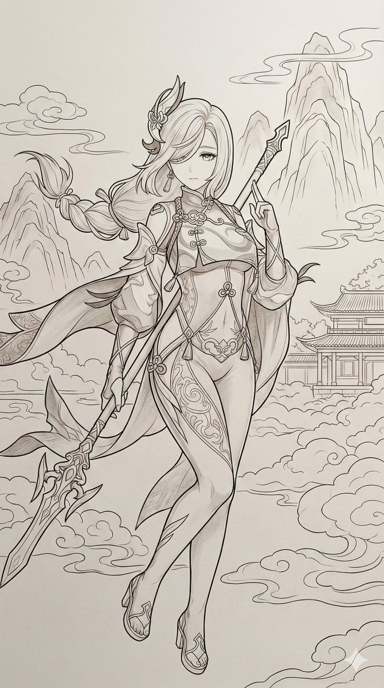
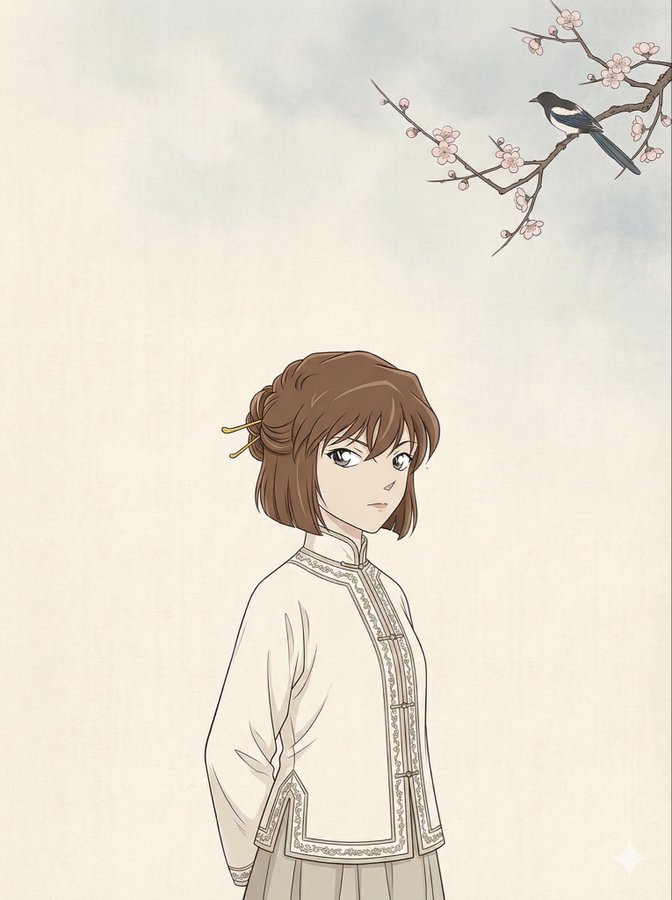
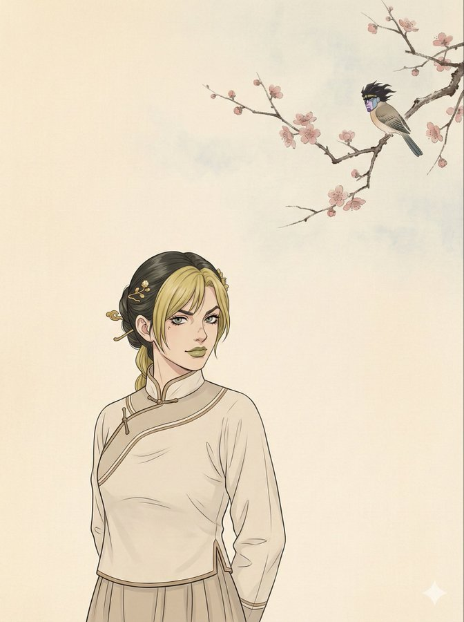
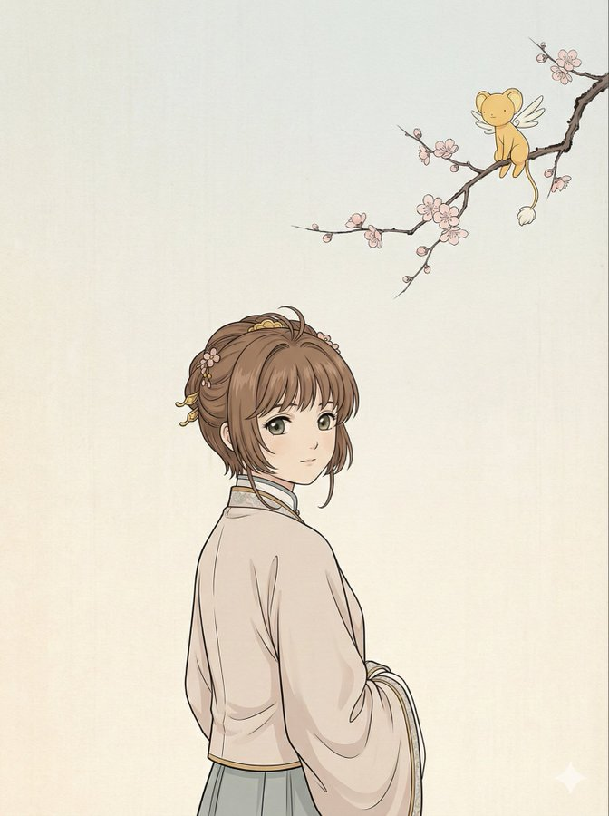

# gemini.json 

gemini.json文件存放gemini相关的提示词，当前已收录：930个 

 投稿方式：[飞书投稿](https://tcn1uh5rxo87.feishu.cn/share/base/form/shrcne5gDolOMDd0oJsj2XfvxQc) or [issues](https://github.com/junxiaopang/gridsplitter/issues/new)

[上一页](./9.md) | 当前 10/10 页 | [查看全部目录](../prompts.md)

🚀 **在线预览**: [https://prompts.kkkm.cn](https://prompts.kkkm.cn)

## <a id="toc">目录</a>


## <a id="">古韵新材：等轴测3D微缩山水</a> (<a href="https://x.com/threeaus/status/1997123163625578621" target="_blank" rel="noopener noreferrer">陆三金</a>)


```
Present a clear, 45° top-down view of a vertical (9:16) isometric miniature 3D scene, capturing the artistic conception of the poem "[插入诗名拼音或英文翻译]".
[Core Subject]: The composition centers on [详细描述核心景物，例如：a solitary wooden boat floating on emerald glass-like water / a towering pavilion made of red sandalwood and gold]. The modeling is precise, delicate, and cute, resembling a high-end blind box toy or a digital bonsai.
[Environment & Atmosphere]: The scene features [描述环境元素，例如：drifting clouds made of cotton-like textures / falling peach blossom petals / swirling mist]. Weather elements are creatively integrated, establishing a [描述氛围，例如：serene / melancholic / majestic] ambiance.
[Materials & Lighting]: Use a blend of traditional Chinese aesthetics and modern 3D rendering. Key materials include [选择2-3种材质：white porcelain, matte clay, frosted glass, jade]. Lighting is [描述光照：soft moonlight / warm sunset glow / fresh morning light] with realistic shadows.
[Composition & Text]: Use a clean, unified composition with a [描述背景色：pale ink grey / deep midnight blue / creamy rice paper] solid-colored background.
[UI/Text Layout]: Display the text "[插入诗名拼音]" and "[插入作者拼音]" at the top-center, styled like a floating minimalist calligraphy seal. The text has no background and subtly integrates with the scene.
--ar 9:16 --v 6.0 --style raw
```

```
你是一位精通中国古典文学与现代 3D 渲染艺术（Midjourney/Stable Diffusion）的专家。你的任务是将用户输入的【古诗词】转化为一段高质量的英文绘画提示词。
Goal
基于用户提供的古诗词，提取其核心意境、景物和氛围，套用“等轴测 3D 微缩模型（Isometric Miniature 3D Scene）”的格式模板，生成一段英文 Prompt。
Aesthetic Style (美学标准)
构图：45° Top-down isometric view (45度顶视等轴测)，垂直画幅 (9:16)。
材质：结合“新中式”与“3D渲染”，关键词包括：Matte Clay (哑光粘土), White Porcelain (白瓷), Translucent Jade (半透明玉石), Soft Resin (柔性树脂), PBR materials (物理渲染材质)。
光影：Soft global illumination (柔和全局光), Volumetric fog (体积雾), Dreamy bokeh (梦幻光斑)。
色彩：低饱和度的高级灰、中国传统色（如：青绿、靛蓝、朱砂、月白）。
布局：极简主义，主体居中，留白，纯色背景。
Workflow (工作流程)
分析：理解用户输入的古诗词，提取核心视觉元素（如：山、月、舟、楼、花）和情感基调（如：孤独、壮阔、宁静）。
转化：将视觉元素转化为具体的 3D 建模描述（例如将“月光”描述为“发光的玉石球体”或“柔和的聚光灯”）。
```

 [↑返回目录](#toc)

---
## <a id="">碎镜中的多重自我</a> (<a href="https://x.com/VoxcatAI/status/2013324717852127264" target="_blank" rel="noopener noreferrer">VoxCat</a>)


```
AI生图进阶技巧：镜像碎裂 (Shattered Mirror)

想在一张图里同时展示角色的多个面向吗？
不同年龄段、不同情绪、或是多角度拼贴？

这个技巧叫「镜像碎裂」，用破碎的镜面反射来讲述角色的复杂故事。

【核心原理】

镜像碎裂的视觉冲击力来自三个要素：
① 碎裂结构 — 裂纹是什么形状？径向？蛛网？
② 反射内容 — 每块碎片里反射的是什么？
③ 碎片状态 — 悬浮？下落？还是固定原位？
掌握这三点，你就能控制整个画面的叙事走向。

【反射内容决定故事】

→ 时间线版 (Timeline)
每块碎片 = 不同年龄，适合：成长回忆、人生总结
→ 情绪光谱版 (Emotion Spectrum)
每块碎片 = 不同情绪，适合：心理崩溃、内心挣扎
→ 善恶对立版 (Dual Identity)
左善右恶，适合：黑化角色、觉醒前后
→ 角度拼贴版 (Angle Collage)
正面+侧面+局部特写，适合：解构式艺术肖像

【载体不只是镜子！】
你可以把「镜子」换成任何可以反射/碎裂的东西：
・镜子 shattered mirror → 经典心理惊悚
・冰面 cracked ice → 冷酷、冬季
・玻璃窗 broken window → 都市现代
・水晶球 fractured crystal → 魔幻预言
・水面 shattered water → 梦境虚幻
・刀刃 shattered blade → 武侠战斗

【关键词（超重要！）】

这三个词是让效果"真实"的关键：
① prismatic refraction (棱镜折射)
→ 让碎片边缘产生彩虹光效
② beveled edges (斜切边缘)
→ 让碎片有立体感和真实玻璃质感
③ dark void (深色空隙)
→ 碎片之间用黑色填充，增加戏剧感

【两种玩法对比】

玩法A：内容变化版
每块碎片反射角色的不同「状态」
→ 适合：时间线成长、情绪变化、善恶对比
→ 碎片内容：同一个角度，不同时期/情绪

玩法B：角度拼贴版
每块碎片反射角色的不同「角度」
→ 适合：解构式艺术肖像、多视角展示
→ 碎片内容：正面、侧面、手部、眼睛特写

【模板一：通用版】

适合各种场景的基础框架

```
**Style**: Artistic shattered mirror portrait, surreal fragmented reflection.
**Composition**: A broken mirror/glass surface dominates the frame. The [角色] is reflected in multiple shattered pieces.

**Mirror Structure**(根据需求修改):
- Impact point creates radial crack pattern.
- Large fragments near center, smaller shards toward edges.
- Some fragments are detached and floating in mid-air.

**Reflection Variation** (选择一种):
- **Same Angle**: All fragments reflect same moment, different perspectives.
- **Dual Identity**: Some show "true self", others show "altered self".
- **Timeline**: Fragments show past/present/future versions.

**Visual Details**:
- Sharp reflective surfaces catching dramatic light.
- Fragments have beveled edges with prismatic rainbow refraction.
- Background visible through gaps.

**Lighting**: Strong directional light, bright highlights on glass, dark shadows in gaps.

--no blurry reflections, no distorted faces.
```

镜像碎裂 = 碎裂结构 + 反射内容 + 碎片状态 + 棱镜边缘

更多变体模板和测试用例见2楼 
把你的角色「打碎」，展示他们的多面人生吧
```

 [↑返回目录](#toc)

---
## <a id="">红毯上的自信之姿</a> (<a href="https://x.com/joshesye/status/2013441799252009297" target="_blank" rel="noopener noreferrer">行者AI视频</a>)


```
红毯走秀片场，那一枚红

使用Nano Pro,上传参考图：

【主题】一使用参考图像中的同一张脸，不改变面部特征，肤色白皙，表情自信而严肃，佩戴精致垂坠耳环。

【着装】

上装：黑色束腰式胸衣，饰有透明蕾丝细节与结构性鱼骨。

下装：飘逸的黑色长款薄纱裙，高开衩设计，由人物左手轻提裙摆展现。

腿部：透视黑色丝袜/连裤袜。

鞋履：黑色漆皮尖头细高跟鞋。

【构图】

镜头角度：极端低角度（虫视视角），从地面向上仰拍人物。

视角效果：强调人物身高与腿部线条的修长感。

画面构图：全身照，以前景的腿部与鞋履为视觉主导。

【环境】

场景：红毯首映活动。

背景：立体三维设计的“XIAO AI”标志，使用标志性的红色衬线字体。

地面：深紫红色或红色地毯。

【风格】

媒介：数码摄影，名人肖像风格。

光影：专业活动灯光，皮肤与鞋面略带光泽，高对比度。

画质：高清、8K分辨率、照片级真实感、焦点锐利。
#nanobanana
```

 [↑返回目录](#toc)

---
## <a id="">情绪浓郁的电影感肖像写真</a> (<a href="https://x.com/oggii_0/status/2013234871238598793" target="_blank" rel="noopener noreferrer">Oogie</a>)


```
Moody cinematic portrait of a young woman with clear fair skin and barely-there makeup, warm natural lips. Loose dark brown hair, softly textured. Calm, self-assured expression. She's wearing a fitted black turtleneck sweater, clean lines, understated elegance. Dark minimal background fading into black. Gentle diffused front light, soft shadows, subtle film grain, organic color grading, shallow depth of field, high-end editorial feel.
```

```
情绪浓郁的电影感肖像，描绘一位肤色白皙透亮、妆容极淡、唇色自然温润的年轻女子。深棕色头发松散垂落，质感柔和。神情平静而自信。身穿合身黑色高领毛衣，线条简洁，低调优雅。背景为深色极简风格，渐隐至纯黑。采用柔和漫射的正面光线，阴影细腻，带有微妙胶片颗粒感，色彩调校自然有机，浅景深，呈现高端时尚大片质感。
```

 [↑返回目录](#toc)

---
## <a id="">《山海经》现代图鉴</a> (<a href="https://x.com/aidavid125/status/2005245035399569518" target="_blank" rel="noopener noreferrer">大卫叔的AI旅程</a>)


```
Premium illustrated book spread design, modern infographic bestiary style,
futuristic digital encyclopedia aesthetic with holographic UI elements.

━━━━━━━━━━━━━━━━━━━━━━━━━━━━━━━━━━━━━━━━━━━━━━━━━━━
LEFT PANEL (55%) · VISUAL ARTWORK
━━━━━━━━━━━━━━━━━━━━━━━━━━━━━━━━━━━━━━━━━━━━━━━━━━━
[神兽名称] in [动态] pose, materializing from
digital ink-wash simulation with holographic glitch effects.
2D traditional brushwork scan-lines transitioning into
3D hyper-detailed photorealistic [材质描述].

Background: Dark slate gradient with subtle hexagonal grid pattern,
ancient seal script integrated into circuit board traces,
faint topographic contour lines.

Atmosphere:
- Floating translucent data points and measurement indicators
- Holographic analysis rings orbiting the creature
- [元素特效] with particle dispersion
- Small anatomical callout lines pointing to key features
- Faint binary code streams in background

Lighting: Cool blue tech underglow, [主题光] volumetric rim lighting,
subtle lens flare accents, atmospheric fog with scan-line texture.

━━━━━━━━━━━━━━━━━━━━━━━━━━━━━━━━━━━━━━━━━━━━━━━━━━━
RIGHT PANEL (45%) · INFOGRAPHIC TEXT LAYOUT
━━━━━━━━━━━━━━━━━━━━━━━━━━━━━━━━━━━━━━━━━━━━━━━━━━━
Dark matte glassmorphism card panels with frosted blur effect,
geometric border featuring hexagonal honeycomb pattern and [主题纹样],
thin glowing edge lines in electric cyan.

HEADER ZONE:
- Bold bilingual typography "[中文名] · [English Name]"
- Ancient seal stamp hologram beside modern sans-serif font
- Subtle particle effects around title
- Classification badge: "神兽 · Divine Beast"

┌─────────────────────────────────────────┐
│ ▣ STATS PANEL · 属性面板                │
├─────────────────────────────────────────┤
│ ◈ Element: [元素英文] [元素中文]        │
│ ◈ Domain: [方位英文] [方位中文]         │
│ ◈ Season: [季节英文] [季节中文]         │
│ ◈ Power Level: [力量值]% ▰▰▰▰▰▱▱▱▱▱   │
│ ◈ Rarity: [稀有度] ★★★★★              │
└─────────────────────────────────────────┘

VISUAL DATA ZONES:
- Hexagonal radar chart showing: 力 Power / 智 Wisdom / 速 Speed / 防 Defense / 灵 Spirit
- Circular element icon with [元素符号] glyph
- Size comparison silhouette: creature vs human figure
- Anatomical wireframe sketch in technical blueprint style

DECORATIVE ELEMENTS:
- Corner bracket frames with [点缀色] tech glow
- Floating mini hexagon clusters
- Faint grid overlay texture
- QR-code style ancient seal pattern block
- Holographic watermark of creature silhouette

━━━━━━━━━━━━━━━━━━━━━━━━━━━━━━━━━━━━━━━━━━━━━━━━━━━
UNITY · SEAMLESS CONNECTION
━━━━━━━━━━━━━━━━━━━━━━━━━━━━━━━━━━━━━━━━━━━━━━━━━━━
[桥接元素] dissolving into digital particles across panel divide,
holographic scan line sweeping across entire spread,
consistent hexagonal grid subtly connecting both sides,
color gradient flowing from creature to info panels,
element energy wisps extending from creature toward stats panel.

━━━━━━━━━━━━━━━━━━━━━━━━━━━━━━━━━━━━━━━━━━━━━━━━━━━
GLOBAL STYLE REQUIREMENTS
━━━━━━━━━━━━━━━━━━━━━━━━━━━━━━━━━━━━━━━━━━━━━━━━━━━
Palette: Deep navy (#0a1628) base, [主色], [辅色],
electric cyan (#00f0ff) tech accents, subtle [点缀色] highlights.

Design elements: Hexagonal motifs throughout, glassmorphism cards,
holographic iridescence, tech-scan aesthetics,
clean minimalist UI layout with maximum information density.

Mood: Sleek, futuristic, scientifically analytical,
yet culturally respectful to mythological origins.

8K resolution, Octane render, premium UI/UX design quality,
Behance/Dribbble featured level execution.
--ar 16:9 --stylize 300 --no vintage, handdrawn, cluttered, cartoon, watermark, text errors
```

 [↑返回目录](#toc)

---
## <a id="">角色化为灰烬的粒子消散瞬间</a> (<a href="https://x.com/VoxcatAI/status/2013229190544580966" target="_blank" rel="noopener noreferrer">VoxCat</a>)


```
AI生图进阶技巧：灭霸响指效果 (Particle Dissolution)

想让你的角色像被响指弹中一样，化为灰烬飘散？
这个效果叫「粒子消散」，是我最常用的戏剧化技巧之一。

【核心原理】

粒子消散的视觉冲击力来自三个要素：
① 解体区域 — 身体的哪部分在崩解？
② 粒子类型 — 灰烬？像素？花瓣？
③ 风向引导 — 粒子往哪飘？
掌握这三点，你就能控制整个效果的情绪走向。

【粒子类型决定情绪】

灰烬 glowing embers, ash → 悲壮、牺牲
金尘 golden dust, sparkles → 神圣、升天
像素 digital pixels, glitch → 赛博、虚拟
樱花 cherry blossom petals → 日系、离别
蝴蝶 swarm of butterflies → 梦幻、蜕变
玻璃 shattered glass → 破碎、脆弱

【风向引导视觉动线】

→ 向右上飘散 (towards upper right)
最常见，暗示"升华"、"消逝"、"释然"
→ 四散飘散 (scattered in all directions)
爆发感，适合战斗牺牲、灭霸响指
→ 向下沉落 (drifting downward)
沉重、悲伤、堕落

【关键细节】
别忘了这两个关键词：

① Rim Lighting (轮廓光)
让粒子边缘发光，增加层次感
② Intact Area + Expression (完整区域 + 表情)
消散的部分越多，完整部分的表情越重要
推荐：calm acceptance / defiant gaze / sorrowful resignation

【万能模板】

Style: Hyper-realistic fantasy portrait with particle disintegration effect.
Composition: [角色] is captured mid-dissolution. Part of the body is breaking apart into [粒子类型].
Direction: Particles drift towards [风向].
Intact Area: The remaining portion remains sharp, with [表情].
Lighting: Dramatic rim lighting, particles catching light.

粒子消散 = 解体区域 + 粒子类型 + 风向 + 表情

试试把你最喜欢的角色"响指"掉吧
```

 [↑返回目录](#toc)

---
## <a id="">角色微笑指向关注按钮</a> (<a href="https://x.com/BeautyVerse_Lab/status/2013636266408227169" target="_blank" rel="noopener noreferrer">BeautyVerse</a>)


```
Effect tutorial & prompt share 
Have you not tried this super fun effect yet? Try it now.
 ————————  
-Let your character do the promo for you-  

Effect details: 
1. The character will closely follow your reference image 
2. The character will point at the Follow button on your profile page  

How to use: 
1. Upload a character image you want to apply this effect to  
2. Take a screenshot of your profile page and upload it as the background image (a 3:4 crop works best)  
3. Copy and paste this prompt  

Share your work and connect with others. 
Let’s support each other and keep going.
——————————    
↓Prompt Here↓ 

 {
  "edit_type": "creative_composite_layering",

  "source": {
    "_hint": "Base logic: Character (Ref 1) superimposed ON TOP OF the Background Image (Ref 2).",
    "mode": "EDIT",
    "reference_images": {
      "first": "foreground_character_person",
      "second": "background_scenery_or_pattern"
    },
    "preserve_from_first": {
      "same_person_or_group": true,
      "same_faces": true,
      "same_hairstyles": true,
      "same_outfits": true
    }
  },

  "identity": {
    "keep_identity_consistent": true,
    "expression": "bright_engaging_smile_at_camera"
  },

  "camera_effect": {
    "_hint": "High-angle selfie style, creating a sense of depth between the hand and face.",
    "perspective": "high_angle_shot_looking_down",
    "style": "social_media_call_to_action",
    "depth_of_field": "focus_on_face_and_pointing_finger",
    "framing": "character_centered_with_space_at_top_right"
  },

  "pose": {
    "_hint": "Key action: Lying down but actively pointing to the 'Follow' button area (Top Right).",
    "pose_style": "lying_down_or_reclining_on_back",
    "face_direction": "looking_directly_up_into_lens",
    "hand_gestures": {
      "right_hand_action": "pointing_index_finger",
      "target_direction": "upper_right_corner_45_degrees",
      "purpose": "mimicking_pressing_subscribe_button",
      "arm_position": "extended_towards_camera_top_right"
    },
    "body_language": "inviting_and_energetic",
    "style_tags": [
      "kpop_idol_fan_service",
      "influencer_promo_style",
      "dynamic_perspective"
    ]
  },

  "background_integration": {
    "_hint": "The second reference image is the background/floor.",
    "method": "full_background_replacement",
    "target_area": "entire_canvas_behind_character",
    "content_source": "reference_image_second",
    "perspective_match": "flat_lay_style",
    "rules": {
      "character_must_be_top_layer": true,
      "leave_space_in_upper_right_for_ui": true
    }
  },

  "composition": {
    "_hint": "Ensure the pointing finger leads the viewer's eye to the top right corner.",
    "visual_flow": "diagonal_line_from_face_to_top_right_corner",
    "focal_points": [
      "character_eyes",
      "pointing_finger_tip"
    ],
    "negative_space": "clear_area_at_top_right_45_degrees"
  },

  "constraints": {
    "no_holding_phone_device": true,
    "finger_must_not_be_cropped_out": true,
    "ensure_arm_is_natural_length": true
"3:4"
  }
}
```

```
效果教程与提示词分享  
你还没尝试这个超有趣的效果吗？现在就试试吧！  
————————  
- 让你的角色为你做推广 -  

效果说明：  
1. 角色将紧密贴合你提供的参考图像  
2. 角色会指向你个人主页上的“关注”按钮  

使用方法：  
1. 上传一张你想应用此效果的角色图片  
2. 截取你的个人主页截图，并作为背景图上传（3:4 裁剪效果最佳）  
3. 复制并粘贴以下提示词  

分享你的作品，与他人互动。  
让我们互相支持，继续前进！  
——————————    
↓提示词如下↓  

创意合成分层效果：以高角度自拍风格呈现角色躺在背景上，并用食指指向画面右上角的“关注”按钮区域。角色需保持身份一致，面带明亮且富有感染力的微笑，直视镜头。姿势为仰卧或半躺，右手伸向画面右上方，食指明确指向右上角45度位置，模拟点击订阅按钮的动作。整体构图需形成从面部到右上角的对角线视觉引导，确保手指和眼睛为视觉焦点，并在右上角保留清晰负空间以便放置界面元素。背景完全替换为第二张参考图，采用平面俯拍风格，角色始终位于顶层。禁止手持手机设备，手指不可被裁切，手臂长度需自然真实。图像比例为3:4。
```

 [↑返回目录](#toc)

---
## <a id="">鸿蒙仙域 12 生肖化身提示词  </a> (<a href="https://x.com/ttmouse/status/2013686330279240138" target="_blank" rel="noopener noreferrer">ttmouse - 豆爸</a>)


```
真人本体+背后灵光虚像

全局风格与品质
视觉风格： 顶级写实修仙画卷，超现实电影级商业大片，硬核东方玄幻美学。
核心参数： 8K极高解析度，胶片质感，真实皮肤纹理（拒绝塑料感/二次元感）。
物理规则： 真实光影模拟，强调角色在特定环境下的重力与物理反馈。
构图策略： 超宽水平构图。十二位生肖化身处于同一片宏大的仙境时空中，从左至右错落排布，无视觉死角。
统一世界观： 场景设定在统一的“鸿蒙仙境”之中。环境从左侧的混沌灵脉逐渐过渡到右侧的云海仙踪。所有角色共享同一套大气光影，严禁生肖动物本体出现。

核心视觉特征
• 角色形态： 所有人均为极高颜值的真人形态，保留人类五官与肤质。
• 生肖体现： 通过角色的服饰剪裁、配色细节、随身法宝，以及角色背后由纯粹灵光构成的、宏大的“兽灵/武魂”虚像来体现生肖特征。
• 兽灵表现： 兽灵呈半透明光态或虚影态，完全由流动的灵气与辉光交织而成，不具备实体质感，如神迹般笼罩在角色后上方，充满神性。

摄影与光影
• 设备： 佳能 EOS R5, 35mm 定焦镜头。
• 光影设计： 统一受“仙境晨曦”照射，光线从画面一侧射入，形成丁达尔效应。
• 环境光补： 角色背后的兽灵光影散发着柔和的本命灵光，与仙境中的云雾、剑气相互折射。

角色分布与细节描述
1. 子鼠（水）： 极右侧云海。真人形态为灵动少年，墨色劲装，背后悬浮着如光般通透的硕大子鼠虚像，眼神机警。
2. 丑牛（土）： 沉稳壮汉，身披暗铜重甲。身后耸立着如山岳般的青牛光影虚像，展现力拔山河之势。
3. 寅虎（木）： 霸气统帅，黑金虎纹长袍。背后是一尊光影流转、似要下山的猛虎灵光虚像。
4. 卯兔（木）： 清冷仙子，月白流仙裙。身后伴有通体由白光凝聚、散发柔光的玉兔虚像，氛围空灵。
5. 辰龙（金）： 位居高位，玄色龙鳞袍，尊贵非凡。背后盘绕着延绵百丈、威严神圣的巨龙灵光虚像。
6. 巳蛇（火）： 魅惑秘术师，紫色蛇纹缎面袍。身后游走着细长深邃、由紫色流光构成的灵蛇虚像。
7. 午马（火）： 飒爽剑修，朱红劲装。身后是四蹄踏火、正欲奔腾的烈马光影虚像。
8. 未羊（土）： 温婉医修，米白棉麻仙裙。身后显现着神态祥和、如瑞云般朦胧的白羊光态虚像。
9. 申猴（金）： 桀骜斗战真人，战损金甲。身后是手持神兵、傲视天地的灵猴光影虚像。
10. 酉鸡（金）： 晨曦守望者，羽状剪裁战袍。身后双翼展开，现出流金溢彩、宛如虚像的锦凰光影。
11. 戌狗（土）： 忠诚将领，皮革金属轻铠。背后是昂首挺立、充满守护感的灵犬光影虚像。
12. 亥猪（水）： 极左侧灵泉旁。悠闲散仙，青色宽大袍服。身后萦绕着福泽深厚、由浑厚气韵构成的灵猪虚像。

最终愿景
这不再是孤立的个体，而是十二位生肖神祇在统一仙境中的史诗集结。通过“真人本体+背后灵光虚像”的视觉结构，完美平衡人的情感美感与生肖的神话底蕴，构建出极致的东方玄幻宇宙。
```

 [↑返回目录](#toc)

---
## <a id="">AI生图玩梗：生成「歪嘴龙王」</a> (<a href="https://x.com/VoxcatAI/status/2013947333642477761" target="_blank" rel="noopener noreferrer">VoxCat</a>)


```
【核心关键词】
Expression: 
- asymmetrical raised eyebrow (right brow higher) 
- half-lidded eyes with direct gaze
- a crooked smirk with the right mouth corner lifted
- chin slightly pushed forward/up
- confident and slightly contemptuous

翻译成人话就是：
 右眉挑起 + 眼睛半眯直视
 右嘴角上扬的斜嘴笑
 下巴微微上扬
 自信中带着一丝不屑

【歪嘴等级】

 微歪：right mouth corner slightly lifted → 略显不屑
 中歪：crooked smirk, one eyebrow raised → 标准龙王
 暴歪：exaggerated asymmetrical sneer, chin up, looking down → 霸总附体

搭配：
- 西装革履 + 金表 = 霸道总裁
- 龙袍玉冠 + 金殿 = 龙王本王
- 居家服 + 扫把 = "三年之期已到"

换角色名+加上这段描述，秒变龙王本王 
```

 [↑返回目录](#toc)

---
## <a id="">电影感十足的氛围肖像</a> (<a href="https://x.com/msjiaozhu/status/2013954179220586992" target="_blank" rel="noopener noreferrer">MapleShaw</a>)


```
{
  "request_metadata": {
    "version": "4.0-Allure-DualView",
    "priority_focus": "Sultry expression, cinematic atmosphere, and organic skin textures",
    "aspect_ratio": "3:4"
  },
  "output_specifications": {
    "instructions": "Generate two highly atmospheric images in one batch with consistent 'Sultry & Charismatic' vibes.",
    "batch_size": 2,
    "views": [
      {
        "image_id": "A",
        "angle": "Extreme profile view",
        "expression": "Mysterious, chin slightly tilted down, looking back over the shoulder with a heavy-lidded gaze"
      },
      {
        "image_id": "B",
        "angle": "Front portrait view",
        "expression": "Smoldering direct gaze, intense eye contact, a subtle half-smile (smirk) playing on the lips"
      }
    ]
  },
  "subject_configuration": {
    "identity": {
      "mode": "Reference-driven fidelity",
      "source": "Uploaded Reference Image",
      "instruction": "Preserve the unique facial charisma and structural essence of the reference subject",
      "preservation_weight": 0.95
    },
    "sultry_attributes": {
      "eyes": {
        "state": "Bedroom eyes, heavy-lidded, slightly squinted for intensity",
        "details": "Dilated pupils, moist limbal rings, intense 'come-hither' look",
        "reflection": "Warm candlelight flickers in the irises"
      },
      "lips": {
        "state": "Seductively parted, relaxed jaw",
        "surface": "High-gloss sheen, glistening moisture, visible soft ridges",
        "color": "Deep natural rose with a hint of bitten-lip flush"
      },
      "hair": {
        "style": "Messy wet-look, damp strands clinging to the neck and collarbone",
        "texture": "Saturated, shimmering under low light"
      }
    }
  },
  "environmental_rendering": {
    "atmosphere": {
      "vibe": "Moody, intimate, and clandestine",
      "special_fx": "A thin veil of hazy mist or subtle smoke in the background",
      "moisture": "Hyper-realistic glistening sweat on the décolletage and temples"
    },
    "lighting_and_color": {
      "lighting_style": "Chiaroscuro (dramatic light and shadow), low-key cinematic lighting",
      "key_light": "Warm amber rim light to define the silhouette",
      "fill_light": "Deep midnight purple or moody indigo shadows",
      "color_palette": ["Midnight Purple", "Amber Gold", "Deep Crimson Accents", "Warm Skin Tones"],
      "background": {
        "description": "Dark, out-of-focus lounge or velvet textures",
        "depth_of_field": "Extremely shallow (f/1.4 aesthetic)"
      }
    }
  },
  "technical_execution": {
    "rendering_engine": "High-fidelity path tracing",
    "focal_length": "85mm prime lens",
    "texture_detail": "Micro-expression lines, pore-level sweat adhesion, no digital smoothing",
    "post_processing": "35mm film grain, rich contrast, vintage cinematic color grading"
  }
}
```

 [↑返回目录](#toc)

---
## <a id="">超高清美妆拼贴：四视角展现精致妆容</a> (<a href="https://x.com/xmliisu/status/2013937178242367795" target="_blank" rel="noopener noreferrer">Melisa♡</a>)


```
Sydney Sweeney and Ana de Armas

Nano Banana Pro

Prompt:
{
  "collage": {
    "style": {
      "type": "ultra high-quality hyper-realistic beauty editorial collage",
      "layout": "4 photo panels arranged in a tilted diagonal grid layout",
      "grid_details": "clean white borders separating each frame, forming a modern high-end beauty campaign collage. Each frame is slightly rotated at a different angle, creating a dynamic diagonal composition.",
      "resolution": "8K UHD, hyper-realistic, beauty editorial photoshoot",
      "consistency": "All panels clearly show the same woman, face identity consistent, original facial structure preserved, do not change the face."
    },
    "subject": {
      "hair": "Rambut coklat pendek di atas bahu (bob) sedikit messy, baby hair halus di dahi dan pelipis.",
      "accessories": "Anting emas kecil dan kalung emas detail bunga lily.",
      "specific_accessory": "Topi plaid cokelat vintage di salah satu frame."
    },
    "makeup": {
      "skin": "Kulit porcelain glass skin super glowing, dewy wet look, tekstur kulit nyata dan detail. Highlight basah kuat di tulang pipi, bawah mata, dan ujung hidung.",
      "blush": "Blush pink rosy intens gaya igari blush, menyebar dari pipi ke bawah mata dan batang hidung.",
      "eyes": "Mata besar doll-like, softlens abu-abu kebiruan sangat jelas dan tajam. Bulu mata panjang lentik ala Douyin, lower lashes tipis tapi nyata. Eyeshadow pink–peach dengan shimmer lembut, inner corner berkilau. Eyeliner cokelat tipis rapi.",
      "lips": "Bibir pink glossy juicy, tampak lembap dan reflektif."
    },
    "frames": [
      {
        "id": 1,
        "shot_type": "extreme close-up pipi & mata",
        "focus": "fokus glass skin dan blush"
      },
      {
        "id": 2,
        "shot_type": "full face beauty portrait",
        "focus": "menghadap kamera"
      },
      {
        "id": 3,
        "shot_type": "half-face close-up",
        "focus": "dengan topi plaid cokelat"
      },
      {
        "id": 4,
        "shot_type": "extreme close-up mata & hidung",
        "focus": "highlight basah jelas"
      }
    ],
    "lighting_and_mood": {
      "lighting": "Soft studio lighting + beauty flash glow. High contrast glow tapi tetap natural. Ultra sharp focus, depth detail tinggi.",
      "mood": "glossy • dreamy • doll-like • high-end • Korean beauty editorial"
    }
  }
}
```

```
悉尼·斯威尼与安娜·德·阿玛斯

Nano Banana Pro

超高清超写实美妆杂志风格拼贴，四张照片以倾斜对角线网格布局排列，每帧之间有干净的白色边框分隔，构成现代高端美妆广告拼贴效果。每张照片均以不同角度轻微旋转，形成动态对角构图。8K超高清分辨率，超写实美妆杂志摄影风格。所有画面清晰展现同一女性，面部身份一致，原始面部结构保持不变，不得更改面容。

发型：肩上长度的棕色短发（波波头），略显凌乱，前额与太阳穴处有细腻的碎发。  
配饰：小巧的金色耳环与带有百合花细节的金色项链。其中一帧佩戴一顶复古棕色格纹帽子。

妆容：  
肌肤：瓷白玻璃肌，极度光泽水润，呈现湿漉漉的反光质感，皮肤纹理真实细腻。颧骨、眼下及鼻尖有强烈湿润高光。  
腮红：浓烈粉红玫瑰色“igari风格”腮红，从脸颊晕染至眼下及鼻梁。  
眼妆：大而娃娃般的眼睛，佩戴清晰锐利的灰蓝色美瞳；睫毛长而卷翘，具有抖音风格，下睫毛纤细但真实；眼影为粉桃色带柔光珠光，内眼角闪耀提亮；眼线为细致整洁的棕色。  
唇妆：粉嫩水润亮泽唇，显得饱满多汁、高度反光。

四帧内容分别为：  
1. 极致特写——脸颊与眼睛，聚焦玻璃肌与腮红；  
2. 全脸美妆肖像，正对镜头；  
3. 半脸特写，佩戴复古棕色格纹帽子；  
4. 极致特写——眼睛与鼻子，突出明显湿润高光。

灯光与氛围：柔光影棚照明配合美妆闪光灯效果，高对比度光泽但仍自然。焦点极度锐利，景深细节丰富。整体氛围：亮泽感、梦幻感、娃娃感、高端感、韩式美妆杂志风格。
```

 [↑返回目录](#toc)

---
## <a id="">一个酷女孩</a> (<a href="https://x.com/sidona/status/2013780277059805212" target="_blank" rel="noopener noreferrer">Sidona</a>)


```
{
  "portrait_prompt": {
    "subject": "Based on <User Portrait>, [a young woman with voluminous, messy, long hair, wearing a black sporty crop top with white trim and matching black shorts, white calf-high socks. She is sitting perched on a high dark wooden counter or piano top. Her pose is casual and edgy, leaning forward with one hand resting near her mouth, biting her finger slightly, gazing directly at the camera with a sultry, nonchalant expression. A silver bracelet on her wrist. Background includes a white wall with vintage posters taped up and brown wooden blinds. Foreground details include the neck of an electric guitar, a glass jar of cookies, and liquor bottles]",
    "composition": "Full body shot, 35mm focal length, slightly low angle to emphasize leg length, sharp focus on subject with hard flash fall-off, messy but balanced framing",
    "camera_angle": "Eye-level relative to the seated subject, slightly low angle from the floor, medium distance",
    "lighting": "Direct on-camera flash photography, hard lighting creating a sharp drop shadow on the wall behind the subject, high contrast, reminiscent of 90s point-and-shoot aesthetics, no diffusion",
    "color_palette": "Vintage film aesthetic, Kodak Gold 200 simulation, warm tones from wooden blinds and furniture contrasted with cool white flash light, deep blacks, slightly grainy texture, lo-fi indie vibe",
    "mood": "Indie sleaze, candid, rebellious, cool girl aesthetic, raw and authentic, Y2K retro fashion editorial, snapshot style",
    "negative_prompt": "soft lighting, studio lighting, bokeh, professional studio portrait, airbrushed skin, 3d render, cartoon, illustration, distorted hands, missing guitar strings, floating objects, anatomical errors, stiff pose, over-processed, HDR"
  }
}
```

 [↑返回目录](#toc)

---
## <a id="">超简洁国家信息图海报</a> (<a href="https://x.com/Strength04_X/status/2013905113321185465" target="_blank" rel="noopener noreferrer">𝐌</a>)


```
[COUNTRY] — ultra-clean infographic poster (editorial + lifestyle)

Generated by Google Nano Banana Pro on Gemini app  

Full prompt 

Ultra-clean modern country infographic poster (1080x1080), premium editorial layout meets lifestyle travel photography.

Showcase [ENTER COUNTRY NAME] as the hero visual in the center: a slightly angled 3D map cutout / glossy paper-cut map silhouette with subtle shadow, with a small flag pin marker on the capital city. Add a soft natural studio lighting feel, gentle gradient + minimal texture background for an upscale magazine look.

Around the hero map, arrange information like a recipe infographic—dynamic, floating panels and clusters, not restricted to top-down. Clear hierarchy: hero map > key stats badges > cities/provinces > culture/foods > tips.

SECTION 1 — Quick Facts (clean glassmorphism badges near the hero):
- Capital: [CAPITAL]
- Population: [POPULATION]
- Currency: [CURRENCY]
- Language(s): [LANGUAGES]
- Time zone: [TIMEZONE]
- Best time to visit: [BEST SEASON]
Display as modern rounded pills/bubbles with accent color highlights.

SECTION 2 — Provinces/States/Regions (ingredients-style clusters):
List [NUMBER] provinces/regions with mini icons/mini map segments or simple pictograms.
Example: [PROVINCE 1], [PROVINCE 2], [PROVINCE 3]...
Each item includes a small icon (mountains, river, desert, forest, coastline) and one short label (e.g., “coastal”, “historic”, “wine region”). Arrange in curved flows connected with thin lines to the map.

SECTION 3 — Major Cities (connected pin points):
Show 5–8 key cities with small pin markers on/near the map and clean labels:
[City 1], [City 2], [City 3]...
Use lines/arrows from labels to map pins, avoiding clutter.

SECTION 4 — Signature Foods (recipe vibe):
Show 4–6 famous foods of [COUNTRY] with small tasty mini illustrations or photo-style cutouts:
[Food 1], [Food 2], [Food 3]...
Add short descriptors (spicy, street food, dessert, grilled). Keep vibrant natural food colors.

SECTION 5 — Culture & Highlights (editorial callouts):
Include icons and 1-line notes for:
- Famous festival: [FESTIVAL]
- Traditional music/dance: [CULTURE]
- Landmark(s): [LANDMARKS]
- Nature highlight: [NATURE]
Use clean vector icons and minimal text.

SECTION 6 — Travel Tips (step-like numbered panels):
Show 4–6 numbered “tips” panels arranged around the hero map with arrows showing flow:
1) [Tip 1]
2) [Tip 2]
3) [Tip 3]
Add small icons (plane, train, hotel, safety, budget, camera, SIM card). Use glassmorphism panels with soft gradients and subtle drop shadows.

Typography & Style:
Modern sans-serif typography, high readability, strong grid alignment, airy negative space, subtle shadows, crisp vector icons, accent color palette inspired by [COUNTRY] flag (tasteful, not overwhelming). Editorial, premium, ultra-clean, social-feed optimized.

Output requirements:
Ultra-crisp, no watermark, no logo, no extra text beyond the provided labels, balanced spacing, high contrast readability, 1080×1080.
```

```
[国家]——超简洁信息图海报（编辑风格 + 生活方式）

由 Google Nano Banana Pro 在 Gemini 应用中生成

完整提示词：

超简洁现代国家信息图海报（1080x1080），高端编辑排版融合生活方式旅行摄影风格。

中央突出展示[输入国家名称]作为主视觉：略微倾斜的3D地图剪影 / 光面纸艺地图轮廓，带有微妙阴影，首都位置标注一枚小巧国旗图钉。整体采用柔和自然的影棚灯光效果，背景为轻柔渐变与极简纹理，营造高端杂志质感。

围绕主地图，以食谱信息图的方式动态布局浮动面板与信息簇，不拘泥于自上而下的传统结构。信息层级清晰：主地图 > 核心数据徽章 > 省份/城市 > 文化/美食 > 旅行贴士。

第一部分——快速概览（主地图附近采用玻璃拟态风格徽章）：
- 首都：[首都]
- 人口：[人口]
- 货币：[货币]
- 语言：[语言]
- 时区：[时区]
- 最佳旅行季节：[最佳季节]  
以现代圆角胶囊/气泡形式呈现，搭配强调色高亮。

第二部分——省份/州/地区（食材式信息簇）：
列出[数量]个省份/地区，每个配以微型图标/小地图片段或简易象形图。  
例如：[省份1]、[省份2]、[省份3]……  
每项包含一个小型图标（山脉、河流、沙漠、森林、海岸线）和一句简短标签（如“滨海”、“历史古城”、“葡萄酒产区”）。沿曲线流线排布，并以细线连接至主地图。

第三部分——主要城市（带连接图钉）：
在地图上/附近标注5–8座重点城市，使用小巧图钉标记并附清晰标签：  
[城市1]、[城市2]、[城市3]……  
标签通过线条/箭头指向地图图钉，避免杂乱。

第四部分——代表性美食（食谱风格）：
展示该国4–6种著名美食，配以精致迷你插画或照片风格剪影：  
[美食1]、[美食2]、[美食3]……  
添加简短描述词（如“辛辣”、“街头小吃”、“甜点”、“烧烤”），保留食物鲜活自然的色彩。

第五部分——文化与亮点（编辑式注解）：
包含图标及一行简注，涵盖以下内容：  
- 著名节日：[节日]  
- 传统音乐/舞蹈：[文化]  
- 地标：[地标]  
- 自然奇观：[自然]  
使用简洁矢量图标与极简文字。

第六部分——旅行贴士（阶梯式编号面板）：
在主地图周围布置4–6个编号“贴士”面板，以箭头指示阅读顺序：  
1) [贴士1]  
2) [贴士2]  
3) [贴士3]  
配以小型图标（飞机、火车、酒店、安全、预算、相机、SIM卡）。面板采用玻璃拟态设计，搭配柔和渐变与细微投影。

字体与风格：  
现代无衬线字体，高可读性，强网格对齐，留白通透，阴影细腻，图标锐利清晰，强调色系灵感源自[国家]国旗（雅致而不喧宾夺主）。整体风格为编辑感、高端、超简洁，适配社交媒体展示。

输出要求：  
超高清画质，无水印、无Logo、无额外文字（仅限提供标签内容），间距均衡，高对比度确保可读性，尺寸1080×1080。
```

 [↑返回目录](#toc)

---
## <a id="">等待评论中的提示词</a> (<a href="https://x.com/TechieBySA/status/2013677966283149542" target="_blank" rel="noopener noreferrer">TechieSA</a>)


```
Create an infographic image of [BODY PART], combining a realistic photograph or photoreal render of the object with technical annotation overlays placed directly on top.

Use black ink–style line drawings and text (technical pen / architectural sketch look) on a pure white studio background, including:
•Key component labels
•Internal cutaway or exploded-view outlines
•Measurements, dimensions, and scale markers
•Material callouts and quantities
•Arrows indicating function, force, or flow (air, sound, power, pressure)
•Simple schematic or sectional diagrams where relevant

Place the title [BODY PART] inside a hand-drawn technical annotation box in one corner.

Style & layout rules:
•The real object remains clearly visible beneath the annotations
•Annotations feel sketched, technical, and architectural
•Clean composition with balanced negative space
•Educational, museum-exhibit / engineering-manual vibe

Visual style:
Minimal technical illustration aesthetic, black linework over realistic imagery, precise but slightly hand-drawn feel.

Color palette:
White background, black annotation lines and text only. No colors.

Output:
1080×1080, ultra-crisp, social-feed optimized, no watermark.
```

```
创建一个关于[身体部位]的信息图图像，结合对象的真实照片或逼真的渲染与直接放置在顶部的技术注释覆盖层。

使用纯白色工作室背景上的黑色墨水风格线条画和文字（技术笔/建筑草图外观），包括：
- 关键组件标签
- 内部剖视或爆炸视图轮廓
- 尺寸、尺寸标注和比例标记
- 材料标注和数量
- 指示功能、力或流动方向（空气、声音、电力、压力）的箭头
- 相关的简单示意图或截面图

将标题[身体部位]置于一角的手绘技术注释框内。

样式和布局规则：
- 注释下真实物体保持清晰可见
- 注释具有草图感、技术性和建筑性
- 清晰的构图与平衡的负空间
- 教育性的博物馆展览/工程手册氛围

视觉风格：
极简技术插图美学，现实主义图像上的黑色线条，精确但略带手绘感觉。

色彩方案：
白色背景，仅黑色注释线和文本。无颜色。

输出规格：
1080×1080，超高清，适合社交信息流，无水印。
```

 [↑返回目录](#toc)

---
## <a id="">清爽冰镇雪碧，现代极简信息图</a> (<a href="https://x.com/Strength04_X/status/2013857997102162089" target="_blank" rel="noopener noreferrer">𝐌</a>)


```
A modern, clean product infographic featuring a chilled Sprite bottle at the center of the composition. The bottle stands upright on a minimal surface, covered with icy condensation droplets and light frost. The iconic green Sprite label is bright, fresh, and vibrant. Crisp lemon-lime tones dominate the scene. Background is soft light grey with subtle gradients and soft shadows, giving a refreshing, premium commercial look.

Surrounding the central Sprite bottle are neatly arranged ingredient and element icons in a minimal flat-illustration style: carbonated water, lemon slice, lime slice, ice cubes, bubbles, and glass bottle icon. Thin curved arrows flow from each icon toward the bottle, creating a clean, balanced infographic layout.

*On the right side, rounded white step cards with soft shadows display the process:

1. Chill the Bottle

2. Add Ice

3. Pour Sprite

4. Serve Refreshing*

Each step includes small, simple illustrations (ice bucket, pouring soda, glass with ice and bubbles) and short clean text.

At the bottom corner, minimal infographic badges show: serve temperature, refresh level, carbonation level, calories per serving, and serving size.

Minimal UI design, modern typography, balanced spacing, high-end beverage advertising style, photorealistic bottle texture, glossy highlights, ultra-high resolution, editorial soda infographic, Instagram-ready.

Aspect Ratio: 1:1

Image Size: 1080 × 1080 pixels
```

```
现代、干净的产品信息图，中心展示一瓶冰镇的雪碧。瓶子直立放置在简约的表面上，瓶身布满冰冷凝结的小水滴和轻微的霜花。标志性的绿色雪碧标签鲜明、清新且充满活力。场景主要由清新的柠檬青柠色调主导。背景为柔和的浅灰色，带有微妙的渐变和柔和的阴影，呈现出清爽的高端商业外观。

围绕中心的雪碧瓶，周围整齐排列着成分和元素图标，采用极简平面插画风格：碳酸水、柠檬片、莱姆片、冰块、气泡和玻璃瓶图标。从每个图标流出细长的曲线箭头指向瓶子，形成一个干净、平衡的信息图布局。

*在右侧，圆角白色步骤卡片带有柔和阴影，展示了过程：

1. 冰镇瓶子

2. 加入冰块

3. 倒入雪碧

4. 享用清爽*

每一步骤包含小而简单的插图（冰桶、倒苏打水、装有冰块和气泡的杯子）和简洁的文字说明。

在底部角落，极简的信息图徽章显示：服务温度、清爽程度、碳酸化程度、每份热量及份量。

极简UI设计、现代字体排版、均衡的空间分布、高端饮品广告风格、照片级真实的瓶子纹理、光泽亮点、超高分辨率、编辑用苏打信息图、适合Instagram发布。

宽高比：1:1

图像大小：1080 × 1080像素
```

 [↑返回目录](#toc)

---
## <a id="">橙子与牛奶的瞬间飞溅</a> (<a href="https://x.com/Just_sharon7/status/2013660094664446322" target="_blank" rel="noopener noreferrer">Sharon Riley</a>)


```
"subject": {
    "primary": "Vibrant orange slices",
    "action": "Falling through the air toward rising milk",
    "secondary": "Thick, glossy white milk splash forming arcs and crown-like curves",
    "details": "Milk droplets frozen mid-air with creamy texture"
  },
  "environment": {
    "background": "Clean blue studio backdrop",
    "lighting": "Cinematic soft studio lighting with dramatic highlights and shadows"
  },
  "visual_style": {
    "genre": "Ultra-realistic commercial splash photography",
    "textures": "High-detail creamy milk and fresh citrus pulp",
    "motion": "Frozen action, high-speed capture",
    "depth_of_field": "Shallow depth of field"
  },
  "camera": {
    "lens": "85mm macro",
    "framing": "Wide composition",
    "focus": "Sharp focus on splash and fruit"
  },
  "composition": {
    "aspect_ratio": "3:4",
    "color_palette": ["Vibrant Orange", "Pure White", "Clean Blue"]
  },
  "quality": {
    "detail_level": "Ultra-high detail",
    "rendering": "Photorealistic"
  },
  "profile": "9ewnbdc"
}
```

```
宽幅微距飞溅摄影：鲜艳的橙子切片从空中坠落，迎向向上飞溅的浓稠亮白牛奶；牛奶飞溅形成弧线与皇冠状曲线，奶滴在空中凝固，呈现柔滑质感。背景为干净的蓝色影棚幕布，采用电影感柔和影棚灯光，具有强烈的高光与阴影对比。整体风格为超写实商业飞溅摄影，强调高细节的柔滑牛奶与新鲜柑橘果肉纹理，动作瞬间被高速捕捉冻结，浅景深突出主体。使用85毫米微距镜头，宽幅构图，焦点清晰落在飞溅液体与水果上。画面比例3:4，配色以鲜艳橙、纯白与洁净蓝为主。画质为超高细节、照片级真实感。
```

 [↑返回目录](#toc)

---
## <a id="">现代罗宋汤食谱信息图</a> (<a href="https://x.com/oggii_0/status/2013803805725659192" target="_blank" rel="noopener noreferrer">Oogie</a>)


```
Ultra-clean modern recipe infographic. Feature Borscht (rich ruby-red borscht in a deep bowl, topped with sour cream and fresh herbs; clearly visible chunks of beetroot, cabbage, and meat; gentle steam rising; thick, hearty texture; looks hot and freshly cooked) as a finished dish, shown in a slight angled perspective as the main hero visual.

Arrange ingredients, cooking steps, and helpful tips around the dish in a dynamic magazine-style layout, not restricted to a strict top-down view.

Ingredients section

Use icons or mini-illustrations for each ingredient with the exact quantity. Place them as groups, lists, or circular diagrams, visually connected to the main dish.

Steps section

Show the cooking process using numbered panels, arrows, or connecting lines that create a clear visual route around the bowl. Add small process icons (knife, pot, stove, timer) where appropriate.

Optional additional info

Include total calories, prep time + cook time, and number of servings as clean, minimal badges/bubbles near the dish.

Visual style

A blend of magazine infographic design and lifestyle food photography. Use bright natural food colors, soft drop shadows, clean vector icons, modern typography, and soft gradients or glassmorphism panels for the step blocks. Accent colors may highlight key information such as calories or cooking time.

Composition priorities

1. Finished dish (main hero)

2. Cooking steps

3. Ingredients

4. Additional info

Maintain enough negative space so the design feels light, premium, clean, and highly readable.

Lighting & background

Soft natural studio lighting. Minimal textured or gradient background to create a premium magazine look.

Output

1080×1080, ultra-sharp, optimized for social media feed, no watermarks.
```

```
超简洁现代食谱信息图。主视觉为一道完成的罗宋汤（深碗中盛着浓郁宝石红色的罗宋汤，表面点缀酸奶油和新鲜香草；清晰可见甜菜根、卷心菜和肉块；微微升腾着热气；浓稠丰盛的质地；看起来热气腾腾、刚出锅），以略微倾斜的角度呈现，作为画面核心焦点。

围绕主菜以动态杂志风格布局展示食材、烹饪步骤和实用小贴士，不局限于严格的俯视视角。

食材部分  
使用图标或微型插图表示每种食材，并标注确切用量。将它们以组合、列表或环形图形式排列，并在视觉上与主菜相连。

步骤部分  
通过编号面板、箭头或连接线展示烹饪流程，在碗周围形成清晰的视觉路径。适当加入小型过程图标（如刀、锅、炉灶、计时器）。

可选附加信息  
在主菜附近以简洁极简风格的徽章或气泡形式标明总热量、准备时间+烹饪时间以及份量数。

视觉风格  
融合杂志信息图设计与生活化美食摄影风格。采用明亮自然的食物色彩、柔和投影、干净的矢量图标、现代字体，以及柔和渐变或毛玻璃效果面板用于步骤区块。重点信息（如热量或烹饪时间）可用强调色突出。

构图优先级  
1. 成品主菜（核心焦点）  
2. 烹饪步骤  
3. 食材  
4. 附加信息  

保留充足留白，使整体设计显得轻盈、高端、干净且高度易读。

灯光与背景  
柔和自然的影棚灯光。背景采用极简纹理或渐变，营造高端杂志感。

输出要求  
1080×1080，超高清画质，专为社交媒体信息流优化，无水印。
```

 [↑返回目录](#toc)

---
## <a id="">东方工笔线描融合风格：银版旧梦</a> (<a href="https://x.com/VoxcatAI/status/2014256556792254944" target="_blank" rel="noopener noreferrer">VoxCat</a>)











```
AI绘画风格篇｜银版旧梦 (Silverplate Dream)

把「银版照相的冷静质感」和「东方工笔线描」融合，再保留轻微金属反光与细密刻线—— 这就是我最近在用的融合风格：银版旧梦。

核心气质：冷静、古典、精致、疏离等。

 风格关键词
银版质感：微金属感、轻反光、低对比
工笔线描：细密线条、结构清晰
单色微赭：黑白为主，淡淡棕褐

 风格特调版（完整版｜干净无做旧）
Style: Daguerreotype silverplate photography + Chinese gongbi linework + subtle hand-rubbed print texture.
Monochrome with faint sepia tint, subtle metallic sheen, fine hairline lines, delicate engraving-like details.
Clean paper surface, smooth tone, no vignette, no aging effects, no scratches, no stains, no borders or frames.

Negative（建议固定加）
no vignette, no frame, no border, no paper edge,
no scratches, no stains, no aging effects,
no neon, no glossy 3D, no modern digital look, no saturated colors, no anime lineart

 快速使用方法（3步）

先写：主体 + 场景 + 构图 + 光影
再贴：风格特调版
最后加：Negative 防跑偏

 避坑提醒
不要写 photorealistic / 3D / glossy
不要强调复古老化（会触发暗角/边框）
想更干净：加 "flat light"、"even exposure"、"edge-to-edge clean"

#AIart #AI绘画 #风格研究
```

```
3:4 竖幅构图。画面上方保留约 55% 大面积留白；主体为【人物】的半身肖像，置于画面下方偏中，肩线端正、姿态含蓄，微侧身回眸。保持【人物】的原角色特征不变（脸型、发型结构、刘海形状、五官比例与气质不改），仅更换为本提示词指定的新技法与服饰设定。

服饰设定：明制立领短袄与对襟褙子，衣缘细窄滚边；下装仅露出素雅马面裙上段。发式设定：在不改变【人物】原发型结构与长度的前提下做明代气质整理，簪钗简净，少量鎏金点到为止。

新技法描绘：五官与衣纹以工笔级细线勾勒，线条清而有轻重变化；肤色与衣褶以工笔“薄染叠染”塑形，但整体画面采用现代矢量的分区平涂与极克制两段明度阴影；边缘干净锐利、无噪点、无厚涂。

点景：仅一枝花鸟从画面右上斜向伸入留白。疏梅枝干以枯笔线感呈现，淡粉梅花数朵；梅梢停一只【动物】，姿态安静精致。花鸟细节同样工笔线描，但色面矢量化、清爽克制。

背景为温润的绢本/熟宣轻纹理，留白处带淡淡灰青空气感。整体气质端丽、雅正、清澈、克制。

避免：水墨大面积晕染、摄影景深虚化、3D 渲染高光、粗黑漫画线、霓虹高饱和、复杂国潮纹样堆满、夸张装饰抢主体。
输出：高清细节，线条干净，留白比例严格遵守。

人物为【】，动物为【】
```

 [↑返回目录](#toc)

---
## <a id="">多样发型的中性风格人像摄影</a> (<a href="https://x.com/MissCat_AI/status/2014167646682648794" target="_blank" rel="noopener noreferrer">猫小姐学AI</a>)


```
提示词：

一张高质量照片拼贴，同一个人具有相同的面部特征和表情，多个画框展示不同发型。每个面板展示独特发型如长直发、高马尾、蓬乱发髻、超短发、辫子皇冠、柔和波浪卷、齐肩短发、低发髻、侧编辫、蓬松卷。所有图像保持一致的中性服装和妆容，柔和棚拍灯光，温暖模糊背景，逼真肤质，对称脸部一致性，超细节，编辑美妆效果，4x3 网格布局，专业人像摄影
```

 [↑返回目录](#toc)

---
## <a id="">雪豹野外研究档案板</a> (<a href="https://x.com/AllaAisling/status/2014017858607399325" target="_blank" rel="noopener noreferrer">Alexandra Aisling</a>)


```
A field researcher's documentation board for snow leopard — Panthera uncia / Central Asian high altitude mountains. Left section: scientific illustration showing anatomical details, life-cycle stages, or seasonal variation, with measurement scales and taxonomic classification. Center section: ecological context map showing range, habitat preferences, predator-prey relationships, and conservation status indicators. Right section: the subject in its natural habitat, captured in a decisive moment, behavior visible, environment authentic, the data made alive. Visual style transitions from specimen-drawer clinical through cartographic neutrals to National Geographic field photography. Title block reading "SNOW LEOPARD — Panthera uncia, VULNERABLE, FIELD STUDY 2024".
```

```
雪豹（Panthera uncia）野外研究人员的记录展板——中亚高海拔山区。左侧部分：科学插图，展示解剖细节、生命周期阶段或季节性变化，并附有比例尺和分类学信息。中间部分：生态背景地图，显示分布范围、栖息地偏好、捕食者-猎物关系及保护现状指标。右侧部分：雪豹在其自然栖息地中的决定性瞬间，行为清晰可见，环境真实可信，使数据鲜活起来。整体视觉风格从标本抽屉式的临床精确，过渡到地图般的中性色调，再转为《国家地理》风格的野外摄影。标题栏写着：“雪豹——Panthera uncia，易危物种，2024年野外研究”。
```

```
A field researcher's documentation board for [ANIMAL / PLANT / ORGANISM] — [SCIENTIFIC NAME / HABITAT]. Left section: scientific illustration showing anatomical details, life-cycle stages, or seasonal variation, with measurement scales and taxonomic classification. Center section: ecological context map showing range, habitat preferences, predator-prey relationships, and conservation status indicators. Right section: the subject in its natural habitat, captured in a decisive moment, behavior visible, environment authentic, the data made alive. Visual style transitions from specimen-drawer clinical through cartographic neutrals to National Geographic field photography. Title block reading "[COMMON NAME] — [SCIENTIFIC NAME], [CONSERVATION STATUS], FIELD STUDY [YEAR]". 
```

 [↑返回目录](#toc)

---
## <a id="">土耳其饺子Mantı的现代食谱信息图</a> (<a href="https://x.com/miilesus/status/2014041994192900143" target="_blank" rel="noopener noreferrer">Melis</a>)


```
Mantı prompt: Ultra-clean modern recipe infographic, Turkish Mantı as the hero dish.
Finished dish: plump handmade mantı dumplings in a shallow ceramic bowl, generously topped with creamy garlic yogurt and sizzling butter infused with red pepper flakes; finely chopped parsley sprinkled on top; steam gently rising; dumplings glossy and soft, clearly defined folds; looks hot and freshly served.
Arrange ingredients, cooking steps, and helpful tips around the bowl in a dynamic magazine-style layout, not strictly top-down.

Ingredients section:
Use minimal vector icons or mini-illustrations for each ingredient with exact quantities (flour, egg, minced beef, onion, garlic yogurt, butter, red pepper flakes). Ingredients grouped in circular or flowing clusters visually connected to the dish.

Steps section:
Show the process with numbered panels wrapping around the dish: dough kneading, filling, folding mantı, boiling, yogurt topping, butter sauce. Use small icons (rolling pin, knife, pot, stove).
Optional info badges:
Prep time, cook time, servings, total calories displayed as clean glassmorphism bubbles near the bowl.

Visual style:
Magazine-quality food photography mixed with modern infographic design. Bright natural food colors, soft drop shadows, clean vector icons, elegant modern typography, subtle gradients.
Soft natural studio lighting, minimal textured or gradient background, premium editorial look.

1080×1080, ultra-sharp, no watermark, optimized for social media feed.
```

```
超简洁现代食谱信息图，以土耳其饺子（Mantı）为主角。  
成品展示：浅陶瓷碗中盛满饱满的手工Mantı饺子，淋上大量奶油蒜香酸奶和滋滋作响的红辣椒片黄油酱；顶部撒有切碎的新鲜欧芹；热气缓缓升腾；饺子表面光润柔软，褶皱清晰分明，看起来滚烫新鲜刚出锅。  

围绕碗体以动态杂志风格布局排列食材、烹饪步骤与实用小贴士，不采用严格的自上而下结构。  

**食材部分**：  
使用极简矢量图标或微型插图呈现每种食材，并标注精确用量（面粉、鸡蛋、牛肉末、洋葱、蒜香酸奶、黄油、红辣椒片）。食材以圆形或流动式簇群分组，视觉上与主菜紧密关联。  

**步骤部分**：  
以环绕主碗的编号面板展示制作流程：揉面、调馅、包制Mantı、煮制、淋酸奶、制作黄油酱。配以小型图标（擀面杖、刀、锅、炉灶）。  

**可选信息标签**：  
准备时间、烹饪时间、份量、总热量以干净通透的毛玻璃效果气泡形式置于碗旁。  

**视觉风格**：  
融合杂志级美食摄影与现代信息图设计。色彩明亮自然，投影柔和，图标为简洁矢量风格，字体优雅现代，辅以微妙渐变。  
采用柔和自然的影棚灯光，背景为极简纹理或渐变，整体呈现高端编辑感。  

1080×1080分辨率，超高清，无水印，专为社交媒体信息流优化。
```

 [↑返回目录](#toc)

---
## <a id="">人体照片的技术注释</a> (<a href="https://x.com/kaanakz/status/2014069452275319128" target="_blank" rel="noopener noreferrer">Kaan</a>)


```
Create an infographic image of Human Body, combining a realistic photograph or photoreal render of the object with technical annotation overlays placed directly on top.
Use black ink–style line drawings and text (technical pen / architectural sketch look) on a pure white studio background, including:
•Key component labels
•Internal cutaway or exploded-view outlines
•Measurements, dimensions, and scale markers
•Material callouts and quantities
•Arrows indicating function, force, or flow (air, sound, power, pressure)
•Simple schematic or sectional diagrams where relevant
Place the title Human Body inside a hand-drawn technical annotation box in one corner.
Style & layout rules:
•The real object remains clearly visible beneath the annotations
•Annotations feel sketched, technical, and architectural
•Clean composition with balanced negative space
•Educational, museum-exhibit / engineering-manual vibe
Visual style:
Minimal technical illustration aesthetic, black linework over realistic imagery, precise but slightly hand-drawn feel.
Color palette:
White background, black annotation lines and text only. No colors.
Output:
1080×1080, ultra-crisp, social-feed optimized, no watermark.
```

```
创作一张人体信息图，将真实的人体照片或逼真渲染图像与直接叠加其上的技术注释相结合。  
使用黑色墨水风格的线条绘图和文字（技术绘图笔/建筑草图风格），置于纯白摄影棚背景上，包含以下元素：  
• 关键部位标签  
• 内部剖面或爆炸视图轮廓  
• 尺寸、测量数据与比例标尺  
• 材质标注及数量说明  
• 指示功能、力或流动方向（如空气、声音、动力、压力）的箭头  
• 在适当位置加入简化的示意图或剖面图  

在画面一角的手绘技术注释框内放置标题“Human Body”（人体）。  

风格与布局要求：  
• 注释下方的真实人体图像清晰可见  
• 注释呈现手绘感、技术感和建筑制图风格  
• 构图简洁，留白均衡  
• 整体传达教育性、博物馆展览或工程手册的氛围  

视觉风格：  
极简技术插画美学，黑色线稿叠加于写实图像之上，精准但略带手绘质感。  

配色方案：  
纯白背景，仅使用黑色注释线条与文字，无其他颜色。  

输出规格：  
1080×1080 像素，超高清，适配社交媒体展示，无水印。
```

 [↑返回目录](#toc)

---
## <a id="">山顶的手工黏土小屋</a> (<a href="https://x.com/BeanieBlossom/status/2014262777947545621" target="_blank" rel="noopener noreferrer">Beanie Blossom</a>)


```
handmade white-painted clay house with roses on the roof, flower pots in front of the door and windows, a gray stone path around it, standing on top of a hill overlooking green trees, on a summer day, a realistic photo, high resolution.

Feel free to join in :)

#AIArtWork #AIArt #AIArtists #AIArtCommunity #PromptShare
```

```
手工制作的白色涂漆黏土房屋，屋顶上开满玫瑰，门前和窗前摆放着花盆，房屋周围有一条灰色石板小径，坐落在山顶，俯瞰着郁郁葱葱的绿树，夏日景象，逼真摄影风格，高分辨率。
```

 [↑返回目录](#toc)

---
## <a id="">极简超现实之思</a> (<a href="https://x.com/aleenaamiir/status/2014287568347734360" target="_blank" rel="noopener noreferrer">Aleena Amir</a>)


```
Minimal Surreal Concept Illustrations

Gemini Nano Banana Pro Prompt:

Create a surreal yet minimal illustration of [SUBJECT], where scale, placement, or context is subtly altered to provoke thought. Use clean shapes, limited colors, and a quiet background. The surrealism should feel poetic, not chaotic.
```

```
极简超现实概念插画

创作一幅超现实但极简的[主题]插画，通过微妙地改变比例、位置或情境来引发思考。使用简洁的形状、有限的色彩和安静的背景。超现实感应富有诗意，而非混乱。
```

 [↑返回目录](#toc)

---
## <a id="">甜系女友</a> (<a href="https://x.com/joshesye/status/2014147532277055742" target="_blank" rel="noopener noreferrer">行者AI视频</a>)


```
使用参考图像中的同一张脸，不改变面部特征，

一名留着黑色中短发和轻盈空气刘海的年轻亚洲女性，坐在现代机场候机室的灰色长椅上。她身穿一件厚实的灰色仿皮草外套，内搭灰色高领针织衫，下身穿着带有精致菱格纹理的灰色连裤袜，双腿交叠。她正低头专注地玩着手中的智能手机，身侧挎着一个黑色的绗缝皮质链条包。背景是宽敞明亮的航站楼，巨大的落地玻璃窗引入了清冷的自然光，远处可见其他乘客的身影，地面光洁且带有淡淡的倒影。整体画面呈现出一种高级灰的都市冷淡风调色，细节真实且富有生活气息。
```

```
使用参考图像中的同一张脸，不改变面部特征,

一位气质出众的长发亚洲女性，穿着洁白的露肩蕾丝连衣裙，优雅地席地而坐在极简风格的咖啡厅吧台前。她的双腿修长并向前延伸，脚踩银色细带高跟鞋。背景是纯白色的木质板条墙和简洁的货架，陈列着整齐的白色器皿。在她面前的地板上，放着一盘色泽金黄的可颂面包。室内光线明亮且均匀，呈现出一种高级、纯净且通透的视觉风格，皮肤细腻有质感。

```

 [↑返回目录](#toc)

---
## <a id="">角色全身展示，指向Follow按钮</a> (<a href="https://x.com/BeautyVerse_Lab/status/2014271293349327251" target="_blank" rel="noopener noreferrer">BeautyVerse</a>)


```
Original effect, major update.

Promo Effect v2.0

Based on the images shared in the comments, I fixed a few issues and adjusted how the result is presented.

v2.0:
1.The character is now shown in full.
2.When running the prompt, it checks whether your profile screenshot includes a Follow button. If it is missing, it will create one and ensure the button text says Follow.
3.The pose is updated. One hand points at your account name, and the other points at Follow.

How to use:
1.Choose a character image you want to apply the effect to.
2.Upload a screenshot of your profile page.
3.Copy and paste the prompt.

Notes:
1.Since the character is shown full body, if your reference image does not include feet, the system will generate them automatically. The result may not always look good, so a full body reference with feet is recommended.
2.The best aspect ratio for the profile screenshot is 3:4.
——
/prompt/

{
  "edit_type": "precise_composite_overlay_dual_interaction_english_ui",

  "source": {
    "_hint": "Base Logic: Character sitting on Background. Background is fixed EXCEPT for the specific text on the button.",
    "mode": "IMAGE_COMPOSITION",
    "reference_images": {
      "foreground": "character_ref_image",
      "background_canvas": "profile_page_screenshot"
    },
    "consistency": {
      "character_fidelity": "high",
      "background_structure": "rigid_layout_preservation"
    }
  },

  "ui_text_enforcement": {
    "_hint": "CRITICAL: Ensure the button text reads 'Follow' in English, regardless of the text in the original screenshot.",
    "target_element": "action_button_top_right",
    "mandatory_text": "Follow",
    "language": "English",
    "font_style": "sans_serif_bold_legible",
    "correction_policy": "overwrite_original_text_if_not_follow"
  },

  "background_preservation": {
    "_hint": "Background is a rigid floor. Only allow changes to shadows and the button text.",
    "policy": "strict_pixel_retention_mostly",
    "allowed_modifications": [
      "realistic_contact_shadows_under_character",
      "replacement_of_button_text_to_Follow"
    ]
  },

  "camera_and_lighting": {
    "_hint": "Character sitting ON the interface.",
    "perspective": "high_angle_looking_down",
    "grounding_effect": {
      "technique": "contact_shadows_under_legs",
      "placement": "on_background_surface"
    }
  },

  "pose": {
    "_hint": "Dual pointing: Left Hand -> Name, Right Hand -> 'Follow' Button.",
    "pose_style": "sitting_cross_legged_or_kneeling",
    "head_position": "tilted_back_looking_at_camera",
    "hands_configuration": {
      "style": "dual_index_finger_pointing",
      "left_hand": {
        "action": "pointing_at_account_name",
        "target_location": "top_left_area"
      },
      "right_hand": {
        "action": "pointing_at_follow_button",
        "target_location": "top_right_area",
        "specific_focus": "indicate_the_word_Follow"
      }
    }
  },

  "constraints": {
    "text_must_spell_Follow_correctly": true,
    "no_gibberish_text": true,
    "no_chinese_characters_on_button": true,
    "hands_must_not_block_the_word_Follow": true
  }
}
```

```
原始效果，重大更新。

宣传效果 v2.0

根据评论区分享的图片，我修复了一些问题，并调整了结果的呈现方式。

v2.0 更新内容：  
1. 角色现在以全身形式展示。  
2. 运行提示词时，会检测你的个人主页截图是否包含“Follow”按钮。如果缺失，将自动生成该按钮，并确保按钮文字为“Follow”。  
3. 姿势已更新：一只手指向你的账号名称，另一只手指向“Follow”按钮。

使用方法：  
1. 选择一张你想要应用此效果的角色图像。  
2. 上传一张你的个人主页截图。  
3. 复制并粘贴本提示词。

注意事项：  
1. 由于角色将以全身形式呈现，如果你的参考图未包含脚部，系统将自动生成脚部。但生成效果可能不佳，因此建议使用包含完整脚部的全身参考图。  
2. 个人主页截图的最佳宽高比为 3:4。

——

精确合成叠加双互动英文界面编辑类型：

基础逻辑：角色坐在背景界面上。背景整体保持不变，仅允许修改按钮上的文字。  
模式：图像合成  
参考图像：前景为角色参考图，背景画布为个人主页截图  
一致性要求：角色保真度高，背景结构严格保留原有布局  

强制英文界面文本：  
关键要求：无论原始截图中的按钮文字为何，必须确保按钮文字为英文“Follow”。  
目标元素：右上角操作按钮  
强制文字：“Follow”  
语言：英文  
字体样式：无衬线、粗体、清晰可读  
修正策略：若原始文字非“Follow”，则覆盖为“Follow”  

背景保留策略：  
背景视为刚性平面，仅允许添加角色接触阴影和替换按钮文字。  
保留策略：严格保留原始像素  
允许的修改项：角色腿部下方的真实接触阴影、按钮文字替换为“Follow”  

摄像与光照：  
视角：高角度俯视  
接地效果：在背景表面添加腿部下方的接触阴影  

姿势设定：  
姿势风格：盘腿坐或跪坐  
头部姿态：略微后仰，直视镜头  
双手配置：双食指指向动作  
- 左手指向账号名称，目标区域为左上角  
- 右手指向“Follow”按钮，目标区域为右上角，特别强调指向“Follow”文字  

约束条件：  
- 按钮文字必须正确拼写为“Follow”  
- 不得出现乱码文字  
- 按钮上不得出现中文字符  
- 手部不得遮挡“Follow”文字
```

 [↑返回目录](#toc)

---
## <a id="">巨大的混凝土涂鸦墙</a> (<a href="https://x.com/Naiknelofar788/status/2014263398952026489" target="_blank" rel="noopener noreferrer">simeon-sanai</a>)


```
hyper-realistic photo, 8k, low-angle wide lens, looking up at massive concrete graffiti wall, derelict train yard, urban Surabaya Indonesia, real location gritty Southeast Asian industrial zone, harsh direct tropical sunlight, strong shadows, ultra-detailed textures, peeling paint, cracked concrete, dust and rust

giant photorealistic street art mural covering entire wall, subject painted as mural using uploaded face reference, upper body and head breaking from 2D graffiti into 3D reality, seamless 2D-to-3D transition, rebellious smirk, intense eye contact, cinematic realism

painted section wearing colorful spray-paint stained hoodie and cap, dripping paint, vibrant layered tags, bold Indonesian street art style, chaotic color splashes, detailed aerosol strokes

young man using my identity, realistic 3D human, standing in front of the wall, facing viewer, confident stance, casual urban outfit, finger pointing toward exact mural location, interaction between real person and painted self, scale contrast emphasizing massive wall

foreground rusted train tracks, discarded spray cans, concrete debris, weeds between rails, depth and perspective emphasis, sharp focus, high dynamic range, ultra high quality, cinematic composition, award-winning photography, zeiss optics, RAW photo look.
```

```
超写实照片，8K分辨率，低角度广角镜头，仰视一面巨大的混凝土涂鸦墙，位于印度尼西亚泗水一处废弃的火车场，真实地点——充满粗粝感的东南亚工业区，强烈的直射热带阳光，浓重阴影，极致细节纹理，剥落的油漆，开裂的混凝土，灰尘与锈迹。

整面墙覆盖着巨幅逼真街头艺术壁画，壁画主体使用上传的人脸参考图像绘制，其上半身与头部从二维涂鸦中突破进入三维现实，实现无缝的2D到3D过渡，带着叛逆的微笑，目光锐利直视观者，呈现电影级写实效果。

壁画部分身穿色彩鲜艳、沾满喷漆污渍的连帽衫和帽子，油漆滴落，层次丰富的鲜艳标签，鲜明的印尼街头艺术风格，混乱而生动的色彩泼溅，精细的喷雾笔触。

一位使用我身份的年轻人，逼真的3D人物，站在墙前正对观众，姿态自信，穿着休闲都市服饰，手指指向壁画的确切位置，真实人物与壁画自我之间形成互动，通过比例对比突显墙体的巨大。

前景为生锈的铁轨、丢弃的喷漆罐、混凝土碎块，铁轨间长出杂草，强调景深与透视感，画面锐利聚焦，高动态范围，超高画质，电影级构图，获奖级摄影水准，蔡司镜头拍摄，呈现RAW原片质感。
```

 [↑返回目录](#toc)

---
## <a id="">毛毡微缩世界：船行、垂钓与羊群小径</a> (<a href="https://x.com/meng_dagg695/status/2014152558890324048" target="_blank" rel="noopener noreferrer">ShaHid WaNii</a>)


```
/ ChatGPT 

Prompt :
{
  "master_prompt": {
    "global_settings": {
      "resolution": "8K",
      "aspect_ratio": "2:3",
      "render_style": "AI-edited, ultra-clean, soft cinematic depth",
      "material_style": "needle-felted wool / soft fiber miniature",
      "lighting": "soft diffuse lighting, no harsh shadows",
      "focus": "shallow depth of field with smooth background blur",
      "color_grading": "pastel, muted, calm tones",
      "noise": "none",
      "artifacts": "none"
    },

    "module_1": {
      "identity": "Image 1 – Boat Scene (Front View)",
      "subjects": {
        "primary_character": {
          "form": "human-like felt doll",
          "head": "round, white wool texture, curly wool hair",
          "face": "two small black dot eyes, simple curved smile, faint pink blush on cheeks",
          "clothing": "light green knitted sweater",
          "pose": "seated, holding a wooden oar with both hands"
        },
        "secondary_character": {
          "species": "rabbit",
          "material": "white felt wool",
          "face": "small black dot eyes, minimal smile",
          "pose": "sitting upright beside the main character"
        }
      },
      "environment": {
        "boat": "soft green felt boat with rounded edges",
        "water": "calm water surface with subtle ripples",
        "foreground": "blurred white flower petals partially visible",
        "background": {
          "sky": "teal-blue gradient",
          "moon": "soft circular light shape, slightly blurred",
          "vegetation": "rounded green felt bushes"
        }
      },
      "camera": {
        "angle": "eye-level",
        "distance": "medium close-up",
        "focus": "sharp on characters, blurred background"
      }
    },

    "module_2": {
      "identity": "Image 2 – Fishing by Lake (Rear View)",
      "subjects": {
        "primary_character": {
          "form": "human-like felt doll",
          "color": "soft blue wool texture",
          "pose": "seated facing away from camera",
          "action": "holding a thin fishing rod angled toward water"
        },
        "secondary_character": {
          "species": "small lamb",
          "material": "white felt wool",
          "pose": "sitting beside the main character, facing the lake"
        }
      },
      "environment": {
        "ground": "rounded grassy felt hill",
        "water": "still lake surface",
        "background": {
          "landscape": "soft blurred green hills",
          "sky": "light blue with faint white clouds"
        }
      },
      "camera": {
        "angle": "rear perspective",
        "distance": "medium-wide",
        "focus": "subjects slightly sharper than background"
      }
    },

    "module_3": {
      "identity": "Image 3 – Path with Sheep",
      "subjects": {
        "primary_character": {
          "form": "human-like felt doll",
          "head": "round white wool head",
          "clothing": "red felt sweater, green pants",
          "pose": "standing with hands clasped behind back",
          "orientation": "facing away from camera"
        },
        "animals": [
          {
            "species": "sheep",
            "material": "white felt wool",
            "quantity": "multiple",
            "positions": "distributed on both sides of the path"
          }
        ]
      },
      "environment": {
        "path": "curving white felt path",
        "terrain": "rolling green felt hills",
        "background": {
          "trees": "conical dark green felt trees",
          "sky": "light gray-white gradient"
        }
      },
      "camera": {
        "angle": "slightly elevated",
        "distance": "medium shot",
        "focus": "sharp subject, soft background blur"
      }
    }
```

```
全局设置：
分辨率：8K，
纵横比：2:3，
渲染风格：经过AI编辑的，超清晰，柔和的电影景深，
材质风格：针毡羊毛/柔软纤维微缩模型，
照明：柔和的漫射光，没有强烈的阴影，
焦点：浅景深与平滑的背景模糊，
色彩分级：粉彩、低饱和度、平静色调，
噪点：无，
伪影：无。

模块1：
身份：图像1 – 船只场景（正面视角），
主要角色：
形态：类似人类的毛毡娃娃，
头部：圆形，白色羊毛质感，卷曲的羊毛头发，
脸部：两个小黑点眼睛，简单的弯曲微笑，脸颊上有淡淡的粉色腮红，
穿着：浅绿色针织毛衣，
姿势：坐着，双手握着一个木桨。
次要角色：
种类：兔子，
材料：白色毛毡羊毛，
脸部：小黑点眼睛，最小化的微笑，
姿势：坐在主要角色旁边，直立坐姿。

环境：
船只：边缘圆润的柔软绿色毛毡船，
水面：有微妙波纹的平静水面，
前景：部分可见的模糊白色花瓣，
背景：
天空：青蓝色渐变，
月亮：形状柔和的圆形光，稍微模糊，
植被：圆形绿色毛毡灌木丛。
相机：
角度：视线水平，
距离：中等特写，
焦点：人物锐利，背景模糊。

模块2：
身份：图像2 – 湖边钓鱼（背面视角），
主要角色：
形态：类似人类的毛毡娃娃，
颜色：柔软的蓝色羊毛质感，
姿势：背对相机坐着，
动作：手持细长钓竿向水面倾斜。
次要角色：
种类：小羊羔，
材料：白色毛毡羊毛，
姿势：坐在主要角色旁边，面向湖泊。

环境：
地面：圆形的草色毛毡小山，
水面：静止的湖面，
背景：
景观：柔和模糊的绿色小山，
天空：浅蓝带有淡白色云朵。
相机：
角度：后方视角，
距离：中远距离，
焦点：主体比背景略为清晰。

模块3：
身份：图像3 – 羊群小径，
主要角色：
形态：类似人类的毛毡娃娃，
头部：圆形白色羊毛头，
穿着：红色毛毡毛衣，绿色裤子，
姿势：双手交叠在背后站立，
朝向：背对相机。
动物：
种类：绵羊，
材料：白色毛毡羊毛，
数量：多个，
位置：分布在路径两侧。

环境：
路径：弯曲的白色毛毡小路，
地形：起伏的绿色毛毡丘陵，
背景：
树木：锥形深绿色毛毡树，
天空：浅灰色到白色的渐变。
相机：
角度：略微抬高，
距离：中景，
焦点：主体清晰，背景柔化。
```

 [↑返回目录](#toc)

---
## <a id="">切洛烤肉的科学烹饪站</a> (<a href="https://x.com/Gdgtify/status/2014104469638701504" target="_blank" rel="noopener noreferrer">Gadgetify</a>)


```
<instruction> chelo kebab
 Input A: photo or dish name .

Input A: Analyze the dish’s full ingredient list, key flavor compounds, and major chemical processes (Maillard, caramelization, emulsification, denaturation) involved in cooking it.

Optional Input B: style reference (sterile pharmaceutical lab / Muji minimalism). If missing, choose “sleek modern chemistry lab meets high end coffee-table still life.”

Goal: Create an isometric 3D diorama of a lab bench converted into a tasting station for the dish. Each ingredient is in its own piece of lab glassware, labeled with culinary + chemical information, connected by thin glass tubing showing reaction pathways.

Rules:

Neutral background, matte light gray or off-white, very soft shadows.

Central elevated platform holds a perfect, plated version of the final dish on a white porcelain plate.

Around it, arrange 10–16 pieces of glassware (Erlenmeyer flasks, beakers, petri dishes, volumetric flasks, test tubes in racks).

Each glass item contains:

Realistic ingredient specimen (raw or prepared)

Small label strip with:

Ingredient common name in bold

Scientific/Latin name in smaller text

Primary flavor molecule name + tiny skeletal formula icon

Fine glass tubing connects certain vessels, with small arrow icons and micro text like “Maillard,” “Emulsion,” “Hydrolysis” indicating key reactions.

Use subtle color coding in the label stickers (no big boxes):

Umami (deep red line)

Sweet (soft pink line)

Sour (pale yellow line)

Bitter (sage green line)

Fat (warm orange line)

Aromatic (lavender line)

Include one open lab notebook on the bench with a hand-drawn reaction scheme and cooking notes in fountain-pen ink.

Typography: clean sans-serif like Helvetica Neue, thin weights, lots of white space on labels.

Glassware is ultra-clear with realistic specular highlights, liquid menisci, and slight distortions.

No visible human figures, just gloved hands blurred in the deep background (optional).

Output: ONE image, 4:5 aspect ratio, high-end product / editorial photography style, isometric or ¾ angle, soft studio lighting, hyper realistic materials.
</instruction>
```

```
<instruction> 切洛烤肉（Chelo Kebab）  
输入 A：菜品照片或名称。

输入 A：分析该菜肴的完整配料清单、关键风味化合物，以及烹饪过程中涉及的主要化学反应（美拉德反应、焦糖化、乳化、变性）。

可选输入 B：风格参考（无菌制药实验室 / 无印良品极简主义）。若未提供，则采用“现代 sleek 化学实验室 × 高端咖啡桌静物”的混合风格。

目标：创作一个等距视角的3D微缩场景，将实验台改造为该菜肴的品鉴站。每种食材分别置于独立的实验室玻璃器皿中，贴有包含烹饪与化学信息的标签，并通过细玻璃管连接，展示反应路径。

规则：

- 背景中性，哑光浅灰或米白色，阴影极柔和。
- 中央高台上放置一道完美装盘的成品菜肴，置于白瓷盘中。
- 周围布置10至16件玻璃器皿（锥形瓶、烧杯、培养皿、容量瓶、试管架上的试管等）。
- 每件玻璃器皿内含：
  - 真实的食材样本（生或已处理）
  - 小标签条，包含：
    - 食材通用名（加粗）
    - 科学/拉丁学名（较小字号）
    - 主要风味分子名称 + 微型结构式图标
- 细玻璃管连接特定容器，附带小箭头图标和微型文字（如“美拉德”、“乳化”、“水解”），标明关键反应。
- 标签贴纸采用微妙的色标（不使用大色块）：
  - 鲜味（深红线）
  - 甜味（柔粉色）
  - 酸味（淡黄线）
  - 苦味（鼠尾草绿线）
  - 油脂（暖橙线）
  - 芳香（薰衣草紫线）
- 实验台上放置一本打开的实验笔记本，内有手绘反应图示和钢笔书写的烹饪笔记。
- 字体：干净的无衬线体（如 Helvetica Neue），细字重，标签留白充足。
- 玻璃器皿极度通透，呈现真实镜面高光、液体弯月面及轻微折射变形。
- 不出现人物，仅可在深远背景中模糊呈现戴手套的手（可选）。

输出：单张图像，4:5 纵横比，高端产品/杂志摄影风格，等距或3/4视角，柔光影棚照明，材质超写实。  
</instruction>
```

 [↑返回目录](#toc)

---
## <a id="">线艺勾勒的时尚青年肖像</a> (<a href="https://x.com/Calm_Kadenn/status/2013818059929301156" target="_blank" rel="noopener noreferrer">Kadenn</a>)


```
A young stylish man in his early 20s created in a thread art illustration style. His portrait is formed entirely from fine, flowing threads and stitched lines, weaving together to shape his face and body. The threads vary in thickness and direction, creating depth, texture, and motion. His expression is calm and confident, with sharp facial features subtly defined through layered stitching rather than solid lines.
He wears a modern street style outfit suggested through patterns of thread: a relaxed jacket, simple t shirt, and tailored pants, all represented using interwoven lines. The color palette is minimal and elegant, using black, charcoal, beige, and muted earth tones. The background is clean and abstract, with loose thread patterns fading softly into the space, keeping focus on the figure.
The overall aesthetic is artistic, modern, and high fashion, blending embroidery inspired craftsmanship with a contemporary digital art look.
```

```
一位20岁出头的时尚年轻男子，以线艺插画风格呈现。他的肖像完全由细腻流动的线条与缝合针迹构成，交织出面部与身体轮廓。线条粗细与方向各异，营造出深度、质感与动感。他神情冷静自信，锐利的五官通过层层叠加的缝线而非实线巧妙勾勒。

他身着现代街头风格服饰，以线迹图案暗示：宽松夹克、简约T恤与剪裁利落的长裤，皆由交错编织的线条表现。配色极简优雅，采用黑色、炭灰、米色及低饱和大地色调。背景干净抽象，松散的线迹图案柔和地融入空间，使焦点集中于人物本身。

整体风格兼具艺术感、现代感与高级时装气质，将刺绣工艺灵感与当代数字艺术视觉巧妙融合。
```

 [↑返回目录](#toc)

---


[上一页](./9.md) | 当前 10/10 页 | [查看全部目录](../prompts.md)