# gemini.json 

gemini.json文件存放gemini相关的提示词，当前已收录：1056个 

 投稿方式：[飞书投稿](https://tcn1uh5rxo87.feishu.cn/share/base/form/shrcne5gDolOMDd0oJsj2XfvxQc) or [issues](https://github.com/junxiaopang/gridsplitter/issues/new)

[上一页](./10.md) | 当前 11/11 页 | [查看全部目录](../prompts.md)

🚀 **在线预览**: [https://prompts.kkkm.cn](https://prompts.kkkm.cn)

## <a id="toc">目录</a>


## <a id="">极简风格的电影感拼贴海报</a> (<a href="https://x.com/Arminn_Ai/status/2019338808009920744" target="_blank" rel="noopener noreferrer">ΛRMIN | AI</a>)


```
A minimalist cinematic colored poster featuring a [Character Name]’s portrait from shoulders to the top of the head. The face is reconstructed using a small number of large, square-cut paper fragments arranged in a simple grid [around 4x5 or 5x6 pieces]. Each paper fragment contains a disjointed part of the face which together reconstruct the portrait. The internal paper fragments constituting the face are not perfectly flat; many have slightly curled edges and lifted corners, casting tiny, realistic shadows that give them a three-dimensional, tacked-down appearance. 4 of these squares have subtle black handwritten [text1, text2, text3, text4] directly on the skin/image. Scattered irregularly around the outer perimeter of this central grid in various randomly placed positions (not confined to the corners), several [Sticky Note Color] sticky notes are attached to the [Color] wall, containing handwritten [External Text Content, e.g., iconic quotes]. The overall layout is slightly irregular with visible gaps between the pieces showing [Color] concrete wall background. Realistic paper texture throughout, high-end studio lighting emphasizing the lifted edges, sharp focus on ink and paper grain.
```

```
一张极简风格的电影感彩色海报，呈现[角色名称]从肩膀至头顶的肖像。面部由少量大型方形裁切纸片组成，排列成简洁网格（约4x5或5x6块）。每张纸片承载面部的一个不连续局部，共同拼合成完整肖像。构成面部的纸片并非完全平整，许多边缘微微卷曲、角部略微翘起，投下细微而真实的阴影，营造出立体、仿佛被钉在墙上的效果。其中四块方片上直接在皮肤/图像上以黑色手写字体标注了[text1, text2, text3, text4]。在中央网格外围不规则地散落着若干张[便利贴颜色]的便利贴，随意贴在[墙面颜色]的墙面上（位置随机分布，不限于角落），上面手写着[外部文字内容，例如经典台词]。整体布局略显不规则，纸片之间留有可见缝隙，露出[墙面颜色]的混凝土墙面背景。全图呈现真实纸张质感，采用高端影室灯光突出翘起边缘，墨迹与纸纹细节清晰锐利。
```

 [↑返回目录](#toc)

---
## <a id="">极简风格的社交媒体图形</a> (<a href="https://x.com/aleenaamiir/status/2019764034321719431" target="_blank" rel="noopener noreferrer">Aleena Amir</a>)


```
Minimal Social Media Illustrations

Gemini Nano Banana Pro Prompt:

“A minimal flat illustration showing [SIMPLE ACTION / IDEA]. Bold shapes, limited color palette (2–4 colors). Clean vector style, smooth curves, high contrast. Designed for social media, centered composition.”
```

```
极简社交媒体插图

Gemini Nano Banana Pro 提示词：

“一幅极简扁平风格插图，展现[简单动作/概念]。使用大胆的形状和有限的配色（2至4种颜色）。干净的矢量风格，流畅的曲线，高对比度。专为社交媒体设计，采用居中构图。”
```

 [↑返回目录](#toc)

---
## <a id="">奢侈品牌平面广告</a> (<a href="https://x.com/AmirMushich/status/2019779947020026325" target="_blank" rel="noopener noreferrer">AmirMušić</a>)


```
[BRAND NAME]. Act as a Fashion Photographer and Graphic Designer specializing in luxury brand campaign visuals with integrated typography and surreal spatial design.

PHASE 1: SPATIAL CONCEPT

Create a high-fashion editorial image where architecture and graphic design merge into a theatrical stage. The foundation is a bold geometric floor pattern that extends into forced perspective, creating infinite depth and visual drama. This is not a neutral backdrop – the floor is a protagonist that amplifies brand identity through pattern, color, and spatial illusion.

PHASE 2: CHECKERBOARD ARCHITECTURE

- Surface: Checkerboard/geometric tile pattern rendered in brand-relevant colors

- Perspective: Aggressive forced perspective starting from bottom foreground and receding toward horizon (vanishing point at upper third of frame)

- Pattern Logic: Autonomously determine pattern based on [BRAND NAME]:

- Color Palette: Incorporate 2-3 signature colors of [BRAND NAME] into floor pattern while maintaining readability

- Texture: Photorealistic rendering with subtle reflections and shadows for depth

PHASE 3: MODEL & STYLING

- Subject: One fashion model (gender-fluid casting) captured mid-motion – dynamic pose suggesting walking, running, or dancing

- Outfit: Elevated monochrome look (black, white, or brand-neutral tone) to let floor pattern and typography dominate. Include 1-2 key accessories in [BRAND NAME]'s signature color as hero product focal points

- Pose Energy: 70% movement, 30% control – fashion-forward but grounded (avoid floating/unnatural levitation)

- Placement: Model positioned in lower-mid frame, interacting spatially with both floor perspective and typography layer

- Camera Angle: Low-to-mid angle (waist-to-full body shot) to emphasize floor perspective drama

PHASE 4: TYPOGRAPHY INTEGRATION

- Brand Script: Oversized handwritten/script version of [BRAND NAME] rendered as flat graphic element behind or around the model

- Scale: Typography should be 40-60% of frame width – bold and unmissable but not crushing the model

- Color: Signature brand color (autonomously selected), solid fill with clean edges

- Interaction: Typography appears to "sit" in the space – model may partially overlap letters, creating layering hierarchy

- Logo Lockup: Clean, small brand logo centered in upper portion of frame (10-15% of width) in black or brand color

- Treatment: Pure vector aesthetic – no gradients, no shadows, no dimensional effects. Flat color only.

PHASE 5: COLOR ORCHESTRATION (AUTONOMOUS)

Autonomously research and apply [BRAND NAME]'s iconic color system:

- Primary: Identify 1-2 hero brand colors (e.g., Gucci → forest green + red, Tiffany → robin egg blue)

- Application: Use primary colors in floor pattern AND typography for visual cohesion

- Balance: 60% white/neutral space, 30% brand color saturation, 10% black for anchoring

- Accent: Hero product (bag, shoes, accessory) should echo brand color for strategic eye-pull

PHASE 6: LIGHTING & ATMOSPHERE

- Lighting Setup: High-key fashion lighting with soft shadows – think editorial studio quality

- Key Light: 45° front-left to sculpt model, creating gentle shadows on checkerboard

- Fill: Ambient fill to prevent harsh contrast while maintaining drama

- Floor Treatment: Subtle specular highlights on floor tiles for luxury sheen (not glossy/mirror-like)

- Background: Pure white or subtle gradient to white at horizon line – maintains clean editorial feel

PHASE 7: TECHNICAL EXECUTION

- Mood: Playful luxury – sophisticated but not stiff, energetic but refined

- Composition Rule: Dynamic diagonal lines (floor perspective) + vertical anchor (model) + horizontal balance (typography)

- Depth Layers: Background (white) → Typography (mid-ground) → Model (foreground) → Floor pattern (spanning all depths)

- Post-Production: Magazine-cover polish with color grading that enhances brand palette

TECHNICAL SPECS:

- Camera Simulation: Phase One XF IQ4 150MP, 80mm lens, f/5.6 for controlled depth

- Aspect Ratio: 4:5 (Instagram editorial) or 3:4 (print campaign)

- Resolution: 8K output, print-ready sharpness

- Color Space: sRGB with vibrant saturation for digital, slight desaturation for luxury print feel

- Style Reference: Gucci campaigns by Glen Luchford, Prada visuals, Highsnobiety x luxury collabs, Vogue Italia editorials

- Rendering: Photorealistic model and floor, graphic-design-quality typography (hybrid aesthetic)
```

```
[品牌名称]。扮演一位专注于奢侈品牌广告视觉的时尚摄影师兼平面设计师，擅长融合排版与超现实空间设计。

第一阶段：空间概念  
创作一幅高级时装大片，将建筑与平面设计融合为一个戏剧性舞台。画面基础是一个大胆的几何地板图案，并通过强制透视延伸出无限纵深与视觉张力。这并非中性背景——地板是主角，通过图案、色彩与空间幻觉强化品牌身份。

第二阶段：棋盘格建筑  
- 表面：以品牌相关色彩呈现的棋盘格/几何瓷砖图案  
- 透视：从画面底部前景强烈延伸至地平线（消失点位于画面上三分之一处）  
- 图案逻辑：根据[品牌名称]自主确定图案  
- 色彩方案：在地板图案中融入[品牌名称]的2–3种标志性色彩，同时确保可读性  
- 材质：逼真渲染，带有微妙反光与阴影以增强深度感  

第三阶段：模特与造型  
- 主体：一位性别流动的时尚模特，捕捉其动态瞬间——姿势暗示行走、奔跑或舞蹈  
- 服装：高阶单色造型（黑、白或品牌中性色调），以突出地板图案与排版；搭配1–2件以[品牌名称]标志性色彩呈现的关键配饰，作为核心产品焦点  
- 姿态能量：70%动感，30%控制——前卫时尚但脚踏实地（避免漂浮或不自然悬浮）  
- 位置：模特置于画面中下部，与地板透视及排版图层形成空间互动  
- 拍摄角度：低至中视角（腰部至全身镜头），强调地板透视的戏剧效果  

第四阶段：排版融合  
- 品牌字体：将[品牌名称]以超大手写/书法字体呈现为平面图形元素，置于模特背后或周围  
- 尺寸：字体宽度占画面40–60%，醒目但不压倒模特  
- 色彩：采用自主选定的品牌标志性色彩，纯色填充，边缘干净利落  
- 互动关系：字体仿佛“存在于”空间之中，模特可部分遮挡字母，构建层次关系  
- 品牌标识：在画面上部中央放置简洁小巧的品牌Logo（占画面宽度10–15%），使用黑色或品牌色  
- 处理方式：纯矢量美学——无渐变、无阴影、无立体效果，仅用纯色  

第五阶段：色彩统筹（自主决策）  
自主研究并应用[品牌名称]的标志性色彩体系：  
- 主色：识别1–2种核心品牌色彩（例如Gucci → 深绿+红，Tiffany → 知更鸟蛋蓝）  
- 应用：主色同时用于地板图案与排版，实现视觉统一  
- 平衡：60%白色/中性空间，30%品牌色彩饱和度，10%黑色用于锚定画面  
- 点睛：核心产品（包袋、鞋履或配饰）应呼应品牌色彩，引导视觉焦点  

第六阶段：灯光与氛围  
- 布光方案：高调时尚布光，柔和阴影——呈现杂志级影棚质感  
- 主光：45°前左方向打光，塑造模特轮廓，在棋盘格上投下柔和阴影  
- 补光：环境补光防止对比过强，同时保留戏剧感  
- 地板处理：瓷砖表面呈现微妙镜面高光，体现奢华光泽（非镜面反光）  
- 背景：纯白或向地平线渐变为白的微渐变，保持干净的杂志风格  

第七阶段：技术执行  
- 氛围：玩味奢华——精致而不刻板，活力而内敛  
- 构图法则：动态对角线（地板透视）+ 垂直锚点（模特）+ 水平平衡（排版）  
- 景深层次：背景（白色）→ 排版（中景）→ 模特（前景）→ 地板图案（贯穿所有景深）  
- 后期处理：杂志封面级精修，调色强化品牌色系  

技术参数：  
- 相机模拟：Phase One XF IQ4 150MP，80mm镜头，f/5.6光圈以控制景深  
- 画幅比例：4:5（Instagram杂志风）或3:4（印刷广告）  
- 分辨率：8K输出，印刷级锐度  
- 色彩空间：数字端使用sRGB并增强饱和度，印刷端轻微去饱和以呈现奢华质感  
- 风格参考：Glen Luchford为Gucci拍摄的广告、Prada视觉大片、Highsnobiety × 奢侈品牌联名、Vogue Italia时装专题  
- 渲染风格：模特与地板高度写实，排版采用平面设计级图形表现（混合美学）
```

 [↑返回目录](#toc)

---
## <a id="">现代情侣电梯自拍与服饰单品展示</a> (<a href="https://x.com/miilesus/status/2019488962465685914" target="_blank" rel="noopener noreferrer">Melis</a>)


```
Return-to-work elevator pose couple version 

Prompt: A refined editorial fashion composite image with a 4:5 aspect ratio, split into two clear vertical sections.

RIGHT SIDE – COUPLE PHOTO:
A photorealistic mirror selfie of two people standing side by side in a modern stainless-steel elevator, taken with a smartphone. Both subjects are holding phones that fully cover their faces.

Facial identity for both individuals must exactly match the uploaded reference images. Do not invent, beautify, or alter faces.

Left person (man):
Wearing a brown textured knit sweater over a white collared shirt with a brown tie, dark tailored trousers, black belt. Holding a black leather briefcase in one hand.

Right person (woman):
Wearing a green sleeveless knit vest over a light blue striped button-up shirt with a dark tie, a short pleated plaid skirt, and brown knee-high leather boots. Holding a small book and a black handbag.

Clean brushed-metal elevator interior, symmetrical composition, soft overhead lighting, neutral reflections. Smartphone-camera realism, eye-level angle, natural posture. Editorial-documentary feel, modern and minimal.

LEFT SIDE – FASHION ITEM BREAKDOWN:
A clean, minimalist luxury fashion breakdown layout on a soft neutral background inspired by modern European interiors. No people on this side.

The clothing items worn by the couple are displayed individually and neatly arranged, each item floating with subtle realistic shadows, precise spacing, and catalog-style clarity.

Items shown:
Brown textured knit sweater
White collared shirt
Brown tie
Dark tailored trousers
Black leather briefcase
Green sleeveless knit vest
Light blue striped button-up shirt
Dark tie
Pleated plaid mini skirt
Brown knee-high leather boots
Black structured handbag

Each item includes a small, elegant price label in refined sans-serif typography. Minimal text, balanced composition, luxury e-commerce lookbook aesthetic.
```

```
返岗电梯造型——情侣版

提示词：一幅精致的时尚编辑风格合成图像，比例为4:5，画面清晰分为左右两个垂直部分。

右侧——情侣合影：  
在现代不锈钢电梯内，两人并肩站立，用智能手机拍摄的一张逼真镜面自拍。两人都手持手机，完全遮挡住面部。  
两位人物的面部特征必须与上传的参考图像完全一致，不得虚构、美化或修改面部。

左侧人物（男性）：  
身穿棕色纹理针织毛衣，内搭白色有领衬衫与棕色领带，下穿深色剪裁西裤，配黑色皮带，一手提黑色皮革公文包。

右侧人物（女性）：  
身穿绿色无袖针织背心，内搭浅蓝色条纹纽扣衬衫与深色领带，下穿短款格纹百褶裙，脚踩棕色及膝皮革靴，手持一本小书和一只黑色手提包。

电梯内部为干净的拉丝金属材质，构图对称，顶部柔光照明，反射效果中性自然。采用智能手机拍摄的真实感视角，平视角度，姿态自然，整体呈现纪实编辑风格，现代而极简。

左侧——服饰单品分解：  
以现代欧洲室内风格为灵感的柔和中性背景上，呈现干净、极简的奢侈时尚单品分解布局。此侧无人物。

情侣所穿服饰单品逐一单独展示，整齐排列，每件单品悬浮呈现，带有微妙写实阴影，间距精准，具有商品目录般的清晰度。

展示单品包括：  
棕色纹理针织毛衣  
白色有领衬衫  
棕色领带  
深色剪裁西裤  
黑色皮革公文包  
绿色无袖针织背心  
浅蓝色条纹纽扣衬衫  
深色领带  
格纹百褶迷你裙  
棕色及膝皮革靴  
黑色结构感手提包  

每件单品附带一个小型优雅的价格标签，采用精致的无衬线字体，文字极少，构图平衡，呈现高端电商画册美学。
```

 [↑返回目录](#toc)

---
## <a id="">微型3D场景展现国家音乐舞蹈之美</a> (<a href="https://x.com/aleenaamiir/status/2019640093217288658" target="_blank" rel="noopener noreferrer">Aleena Amir</a>)


```
“Build an isometric miniature 3D diorama representing [COUNTRY NAME] through its famous music or dance form [ART FORM NAME].

Angle stays close to 45°. Materials appear clean and expressive with realistic lighting.

The base includes instruments, stage elements, or performance space tied to the art form.
Add tiny stylized performers in motion with no facial details.

Background stays solid [BACKGROUND COLOR].
Top center shows [COUNTRY NAME] in bold.
Below it display [ART FORM NAME].

Add a simple performance icon underneath. Text color adjusts for contrast.”
```

```
国家音乐或舞蹈微缩场景

构建一个等距视角的微型3D微缩场景，通过其著名的音乐或舞蹈形式[艺术形式名称]来展现[国家名称]。

视角保持接近45°。材质干净且富有表现力，配以写实灯光。

底座包含与该艺术形式相关的乐器、舞台元素或表演空间。  
加入微小的风格化表演者，呈动态姿势，无面部细节。

背景为纯色[背景颜色]。  
顶部中央以粗体显示[国家名称]，其下方展示[艺术形式名称]。  

底部添加一个简洁的表演图标。文字颜色自动调整以确保对比度清晰。
```

 [↑返回目录](#toc)

---
## <a id="">超写实纪录片风格摄影</a> (<a href="https://x.com/Mystveil7/status/2019648865918677450" target="_blank" rel="noopener noreferrer">آ</a>)


```
A true-to-life documentary-style photograph of a modern Land Rover Defender, front view, parked on uneven forest ground. The vehicle is heavily covered in real wet mud and dirt splashes from off-road driving — natural, irregular patterns across the hood, grille, headlights, mirrors, windshield edges, tires, and wheel arches. Mud texture is thick, gritty, and uneven, with dried and wet areas mixed.
Shot at eye level with a full-frame professional DSLR camera, 50mm lens, natural perspective (no wide distortion). Overcast forest lighting with soft, diffused daylight filtering through dense trees. Subtle reflections on glass and metal, no dramatic highlights. Headlights on with soft realistic glow, not stylized.
Surrounding environment includes dense green foliage, bushes, tall grass, fallen leaves, and dark forest shadows. Ground is damp soil with grass and small plants in the foreground, slightly out of focus. Color tones are muted, earthy, and cold — deep greens, browns, and greys. No cinematic exaggeration, no HDR look.
Extremely realistic textures, true photographic noise, natural contrast, shallow depth of field, background softly blurred. Looks like a real off-road automotive photoshoot, candid and raw. Ultra-photorealism, 8K detail, zero stylization.
Negative prompt (important):
CGI, illustration, concept art, fantasy lighting, over-saturation, HDR, glossy paint, clean car, studio lighting, unrealistic symmetry, cartoonish mud, AI artifacts, plastic textures, exaggerated contrast
```

```
超写实纪录片风格摄影，现代路虎卫士正面视角，停在崎岖的林间地面；车身因越野行驶沾满真实的湿泥与泥点，泥渍呈自然不规则分布，覆盖引擎盖、进气格栅、车灯、后视镜、挡风玻璃边缘、轮胎及轮拱，泥质厚重粗糙且凹凸不均，干湿纹理交织；平视视角拍摄，全画幅专业单反相机 + 50mm 镜头，自然透视无广角畸变；阴天林间光线，柔和漫射日光透过茂密树林洒落，玻璃与金属处有细腻反光，无夸张高光，车灯开启，光晕柔和写实无风格化处理；环境环绕茂密绿色枝叶、灌木丛、长草、落叶与深邃林间阴影，前景为湿润泥土搭配杂草与小型植株，轻微失焦；色调低饱和、偏大地色且清冷，以深绿、棕、灰色为主，无电影化夸张效果，无 HDR 质感；极致写实纹理，真实摄影噪点，自然对比度，浅景深，背景柔和虚化，画面如真实越野汽车实拍，纪实且原始，8K 超清细节，无任何风格化修饰
反向提示词（重点）
CGI、插画、概念艺术、梦幻光影、色彩过饱和、HDR 效果、漆面油亮、车身干净、影棚布光、对称不自然、卡通化泥渍、AI 伪影、塑料质感、对比度夸张
```

 [↑返回目录](#toc)

---
## <a id="">超写实的美妆产品摄影图</a> (<a href="https://x.com/oggii_0/status/2019637570133717072" target="_blank" rel="noopener noreferrer">Oogie</a>)


```
A hyper-realistic beauty product photograph of a pink “LANEIGE Lip Sleeping Mask” jar placed at the center of a vibrant pastel-pink surface covered in fresh water droplets, the jar upright with a frosted pink lid and glossy translucent body, surrounded organically by delicate flowers including purple blossoms, pale lilies, yellow sprigs, and green leaves arranged diagonally around the product, soft diffused studio lighting from above creating gentle highlights and natural shadows, moisture beads sparkling across the background for a fresh dewy feel, clean skincare editorial aesthetic, feminine and luxurious mood, balanced flat-lay composition, shallow depth of field, ultra-detailed textures, photorealistic, high-end cosmetic advertising style, 8K quality
```

```
一张超写实的美妆产品摄影图：一瓶粉色“兰芝唇膜”罐子置于充满活力的淡粉色背景中央，罐体直立，配有磨砂粉色盖子和半透明亮面瓶身。周围自然散落着精致花卉，包括紫色花朵、浅色百合、黄色小枝与绿色叶片，呈对角线环绕产品布局。上方柔光棚灯营造出柔和高光与自然阴影，背景上晶莹水珠闪烁，呈现清新水润感。整体风格干净、如护肤杂志大片，氛围柔美奢华，构图平衡的俯拍平面布局，浅景深，纹理极度细腻，照片级真实感，高端化妆品广告风格，8K画质。
```

 [↑返回目录](#toc)

---
## <a id="">桌面小工具变身地标建筑</a> (<a href="https://x.com/Gdgtify/status/2019414961278103834" target="_blank" rel="noopener noreferrer">Gadgetify</a>)


```
2x2 grid, do this 4 common desk gadgets: Concept: Turn objects into a landmark building that could exist.

1. ANALYZE INPUT (Massing & Structure):

Mass: (Monolithic/Fragmented/Stacked/Spindly)

Surface: (Reflective/Porous/Layered/Patterned)

Mechanism: (Static/Kinetic/Modular)

2. AUTO-SELECT BUILDING TYPE:

IF Monolithic + Stone-like → Museum

IF Reflective + Aerodynamic → Skyscraper

IF Modular + Stacked → Housing complex

IF Porous + Organic → Botanical conservatory

IF Kinetic + Mechanical → Transit hub

3. EXECUTE:
Golden-hour exterior render, people for scale, plausible materials, cinematic wide lens.
```

```
2x2 网格，对以下四种常见桌面小工具进行创作：概念是将物体转变为一座可能真实存在的地标建筑。

1. 分析输入（体量与结构）：

体量：（整体式 / 碎片化 / 堆叠式 / 纤细高耸）

表面：（反光 / 多孔 / 分层 / 有图案）

机制：（静态 / 动态 / 模块化）

2. 自动选择建筑类型：

若为整体式 + 类石材 → 博物馆  
若为反光 + 流线型 → 摩天大楼  
若为模块化 + 堆叠式 → 住宅综合体  
若为多孔 + 有机形态 → 植物温室  
若为动态 + 机械感 → 交通枢纽  

3. 执行要求：

黄金时刻的外部渲染，加入人物以体现比例，使用合理可信的材质，采用电影感广角镜头。
```

 [↑返回目录](#toc)

---
## <a id="">街头风格的微缩城市景观</a> (<a href="https://x.com/Sheldon056/status/2019618076246090053" target="_blank" rel="noopener noreferrer">Duet | AI</a>)


```
A street-style map of {CITY_NAME} placed on a {MAP_SURFACE}, with a photorealistic miniature version of {CITY_NAME} emerging from it {LANDMARK_1},{LANDMARK_2},{LANDMARK_3}, {NATURE_ELEMENT}, {URBAN_LIFE_ELEMENT}, {ICONIC_TRANSPORT},and {EXTRA_DETAIL}.All elements grow from the map like a 3D urban diorama. Studio soft lighting, cinematic depth, 2:3 format
```

```
一张街头风格的{CITY_NAME}地图放置在{MAP_SURFACE}上，地图上浮现出一座逼真的微型{CITY_NAME}城市模型，包含{LANDMARK_1}、{LANDMARK_2}、{LANDMARK_3}、{NATURE_ELEMENT}、{URBAN_LIFE_ELEMENT}、{ICONIC_TRANSPORT}以及{EXTRA_DETAIL}。所有元素如同三维城市微缩景观般从地图中生长而出。采用影棚柔光照明，具有电影感的景深，画面比例为2:3。
```

 [↑返回目录](#toc)

---
## <a id="">冬季的平静3D角色</a> (<a href="https://x.com/egeberkina/status/2019424606960955624" target="_blank" rel="noopener noreferrer">Ege</a>)


```
{
  "task": "image_style_transfer_3d_character",
  "input": {
    "source_image": "USER_UPLOADED_IMAGE",
    "preserve_identity": true,
    "preserve_pose": true,
    "preserve_composition": true,
    "preserve_clothing": true,
    "preserve_accessories": true
  },
  "style_reference": {
    "render_style": "stylized_3d_character",
    "aesthetic": "soft_minimal_cartoon_3d",
    "inspiration": [
      "pixar_like_but_more_minimal",
      "toy_figure_render",
      "clean_product_character_design"
    ]
  },
  "character_design": {
    "skin": {
      "material": "smooth_matte_plastic",
      "texture": "soft_uniform",
      "subsurface_scattering": "gentle"
    },
    "facial_features": {
      "eyes": "half_closed_bored_expression",
      "eyelids": "heavy",
      "nose": "rounded_simplified",
      "mouth": "flat_neutral",
      "ears": "simplified_rounded"
    },
    "emotion": "unimpressed_calm_bored"
  },
  "clothing": {
    "source": "exact_from_uploaded_image",
    "lock_outfit": true,
    "fit": "unchanged",
    "fabric_translation": "3d_stylized_equivalent_only",
    "no_replacement": true,
    "no_enhancement": true,
    "no_stylization_override": true
  },
  "accessories": {
    "source": "exact_from_uploaded_image",
    "lock_accessories": true,
    "allow_only_existing": true,
    "no_new_accessories": true,
    "no_removal": true,
    "no_addition": true
  },
  "lighting": {
    "setup": "studio_softbox",
    "shadows": "very_soft",
    "contrast": "low",
    "highlights": "subtle"
  },
  "background": {
    "type": "solid_color",
    "color_palette": [
      "muted_green",
      "pastel_tone"
    ],
    "gradient": "none"
  },
  "camera": {
    "angle": "front_facing",
    "framing": "medium_close_up",
    "lens": "50mm_equivalent",
    "distortion": "none"
  },
  "render_quality": {
    "resolution": "high",
    "edges": "clean",
    "noise": "none",
    "realism_balance": "stylized_over_realistic"
  },
  "output": {
    "consistency": "very_high",
    "style_strength": "strong",
    "photorealism": false,
    "strict_constraints": true
  },
  "negative_constraints": [
    "no new accessories",
    "no removed accessories",
    "no outfit changes",
    "no reinterpretation of clothing",
    "no creative additions"
  ]
}
```

```
任务：3D角色图像风格转换
输入：
- 源图像：用户上传的图像
- 保持身份：是
- 保持姿势：是
- 保持构图：是
- 保持服装：是
- 保持配饰：是

风格参考：
- 渲染风格：风格化3D角色
- 美学：柔和极简卡通3D
- 灵感来自：
  - 类似皮克斯但更极简
  - 玩具人物渲染
  - 干净的产品角色设计

角色设计：
- 皮肤：
  - 材质：光滑哑光塑料
  - 质地：柔软均匀
  - 表面散射：温和
- 面部特征：
  - 眼睛：半闭着无聊的表情
  - 眼睑：厚重
  - 鼻子：圆润简化
  - 嘴巴：平坦中性
  - 耳朵：简化圆形
- 情绪：不为所动平静无聊

服装：
- 来源：与上传图像完全一致
- 锁定服装：是
- 合身：不变
- 面料转换：仅3D风格化等效
- 不替换：是
- 不增强：是
- 不覆盖样式化：是

配饰：
- 来源：与上传图像完全一致
- 锁定配饰：是
- 仅允许现有：是
- 不添加新配饰：是
- 不移除：是
- 不增加：是

照明：
- 设置：工作室柔光箱
- 阴影：非常柔和
- 对比度：低
- 高光：微妙

背景：
- 类型：纯色
- 色彩搭配：
  - 柔和绿色
  - 淡色调
- 渐变：无

相机：
- 角度：正面朝向
- 取景：中景特写
- 镜头：等效50毫米
- 失真：无

渲染质量：
- 分辨率：高
- 边缘：干净
- 噪点：无
- 真实主义平衡：风格化优于真实感

输出：
- 一致性：非常高
- 风格强度：强
- 照片真实感：否
- 严格约束：是

负面约束：
- 不添加新配饰
- 不移除配饰
- 不改变服装
- 不重新诠释服装
- 不创造性添加
```

 [↑返回目录](#toc)

---
## <a id="">液态凝胶拼出的“text”字样</a> (<a href="https://x.com/azed_ai/status/2019411461295218834" target="_blank" rel="noopener noreferrer">Amira Zairi</a>)


```
Abstract liquid typography spelling "text", thick transparent water-gel material, hyper realistic refraction and subtle caustics, realistic surface tension, sculpted droplet forms merged into smooth letter curves, glossy highlights, micro bubbles inside the gel, soft contact shadows on a pure white seamless background, scattered water droplets on the surface with sharp specular reflections, studio lighting, crisp photorealistic 3D render, macro detail, sharp focus, 8k, 1:1, no watermark, no extra text
```

```
抽象液态字体拼出“text”字样，厚实透明的水凝胶材质，超写实折射与细微焦散效果，真实的表面张力，雕塑般的水滴形态融合成流畅的字母曲线，高光亮泽，凝胶内部含有微小气泡，纯白无缝背景上呈现柔和接触阴影，表面散布着具有锐利镜面反射的水滴，影棚灯光，清晰逼真的3D渲染，微距细节，焦点锐利，8K分辨率，1:1比例，无水印，无额外文字。
```

 [↑返回目录](#toc)

---
## <a id="">简约卡通3D角色，皮克斯风格</a> (<a href="https://x.com/miilesus/status/2019852666567029072" target="_blank" rel="noopener noreferrer">Melis</a>)


```
{
  "task": "image_style_transfer_3d_character",
  "input": {
    "source_image": "USER_UPLOADED_IMAGE",
    "preserve_identity": true,
    "preserve_pose": true,
    "preserve_composition": true,
    "preserve_clothing": true,
    "preserve_accessories": true
  },
  "style_reference": {
    "render_style": "stylized_3d_character",
    "aesthetic": "soft_minimal_cartoon_3d",
    "inspiration": [
      "pixar_like_but_more_minimal",
      "toy_figure_render",
      "clean_product_character_design"
    ]
  },
  "character_design": {
    "skin": {
      "material": "smooth_matte_plastic",
      "texture": "soft_uniform",
      "subsurface_scattering": "gentle"
    },
    "facial_features": {
      "eyes": "half_closed_bored_confident_expression",
      "eyelids": "heavy",
      "nose": "rounded_simplified",
      "mouth": "flat_neutral",
      "ears": "simplified_rounded"
    },
    "emotion": "cool_bored_unimpressed"
  },
  "clothing": {
    "source": "exact_from_uploaded_image",
    "lock_outfit": true,
    "fit": "unchanged",
    "fabric_translation": "3d_stylized_equivalent_only",
    "no_replacement": true,
    "no_enhancement": true,
    "no_stylization_override": true
  },
  "accessories": {
    "source": "exact_from_uploaded_image",
    "lock_accessories": true,
    "allow_only_existing": true,
    "no_new_accessories": true,
    "no_removal": true,
    "no_addition": true
  },
  "lighting": {
    "setup": "studio_softbox",
    "shadows": "very_soft",
    "contrast": "low",
    "highlights": "subtle"
  },
  "background": {
    "type": "solid_color",
    "color": "red"
  },
  "camera": {
    "angle": "front_facing",
    "framing": "medium_close_up",
    "lens": "50mm_equivalent",
    "distortion": "none"
  },
  "render_quality": {
    "resolution": "high",
    "edges": "clean",
    "noise": "none",
    "realism_balance": "stylized_over_realistic"
  },
  "output": {
    "consistency": "very_high",
    "style_strength": "strong",
    "photorealism": false,
    "strict_constraints": true
  }
}
```

```
输入：
- 使用用户上传的图片作为源图像
- 保持身份特征不变
- 保持姿势不变
- 保持构图不变
- 保持服装不变
- 保持配饰不变

风格参考：
- 渲染风格：风格化3D角色
- 美学：柔和简约卡通3D
- 灵感来源：皮克斯风格但更为简约，玩具人物渲染，干净的产品角色设计

角色设计：
- 皮肤：材质为光滑哑光塑料，纹理柔软均匀，具有轻微的次表面散射效果
- 面部特征：眼睛半闭表现出无聊自信的表情，眼睑厚重，鼻子圆润简化，嘴巴扁平中性，耳朵简化圆形
- 情绪：冷淡、无聊、不以为然

服装：
- 完全根据上传图片中的样式锁定，无替换和增强，禁止任何风格覆盖

配饰：
- 完全根据上传图片中的样式锁定，不允许新增或移除任何配件

照明：
- 设置：工作室柔光箱
- 阴影：非常柔和
- 对比度：低
- 高光：微妙

背景：
- 类型：纯色
- 颜色：红色

相机：
- 角度：正面
- 取景：中等特写
- 镜头：等效50mm
- 无变形

渲染质量：
- 分辨率：高
- 边缘：清晰
- 噪点：无
- 真实感平衡：风格化超过写实

输出：
- 一致性：非常高
- 风格强度：强
- 不追求照片真实感
- 严格遵循约束条件
```

 [↑返回目录](#toc)

---
## <a id="">前卫赛博朋克风的电影级人像</a> (<a href="https://x.com/iamsofiaijaz/status/2020068851216707786" target="_blank" rel="noopener noreferrer">Aijaz</a>)


```
A high-fashion, cinematic portrait of a person with wet, dark tousled hair partially covering their face. They are wearing a glowing, horizontal neon orange light bar across their eyes like a visor. The lighting is a moody dual-tone: cool teal/cyan shadows on the skin and background, contrasted with the intense warm orange glow from the visor. Shot from a low angle looking up, soft bokeh, high resolution, hyper-realistic skin textures, edgy cyberpunk editorial style."
​Key Elements Explained
​If you want to tweak the result, here is why those specific words are in the prompt:
​Low Angle: This creates that "heroic" or imposing feeling by looking up at the subject.
​Teal and Orange: This is a classic cinematic color grading technique that makes the subject pop against the background.
​Wet/Tousled Hair: Adds to the "gritty" and realistic texture of the image.
​Neon Visor: Specifies that the light is the source of the glow, creating those realistic reflections on the nose and cheeks.
```

```
一张高时尚感、电影风格的人像，人物拥有湿润、深色且凌乱的头发，部分遮盖面部。双眼位置佩戴一条水平发光的霓虹橙色光带，如同面罩。光影采用情绪化的双色调：皮肤与背景呈现冷调青绿色/青蓝色阴影，与面罩发出的强烈暖橙色光芒形成鲜明对比。低角度仰拍，背景柔焦虚化，高分辨率，肌肤纹理超写实，整体风格为前卫赛博朋克风的时尚大片。
```

 [↑返回目录](#toc)

---
## <a id="">微型3D等距视图中的传统服饰展示</a> (<a href="https://x.com/aleenaamiir/status/2020005042540146707" target="_blank" rel="noopener noreferrer">Aleena Amir</a>)


```
Create a miniature 3D isometric diorama showcasing the traditional clothing of [COUNTRY NAME].

View from a 45° top-down angle.
Textures feel fabric-focused and refined. Materials follow realistic PBR shading.

Lighting stays soft and even.
The raised base includes cultural patterns, symbols, and regional elements. Tiny stylized figures wear traditional outfits with heavy facial details.

Background uses solid [BACKGROUND COLOR].

Top center text reads [COUNTRY NAME] in bold.
Second line shows [CLOTHING NAME].

Place a minimal textile icon below. Text adapts to background contrast.
```

```
创建一个微型3D等距微缩立体模型，展示[国家名称]的传统服饰。  
视角为45度俯视角度。  
材质强调织物质感，精致细腻，采用写实的PBR着色。  
光线柔和均匀。  
抬高的底座包含文化图案、象征符号和地区元素。微缩风格的人物身着传统服装，面部细节丰富。  
背景使用纯色[背景颜色]。  
顶部中央以粗体显示[国家名称]，第二行显示[服饰名称]。  
下方放置一个极简风格的纺织品图标，文字根据背景对比度自动调整。
```

 [↑返回目录](#toc)

---
## <a id="">花园中的宁静水景</a> (<a href="https://x.com/WallPapers360/status/2019637426998898928" target="_blank" rel="noopener noreferrer">A</a>)


```
{
  "prompt": "Create stunning images showcasing the beauty of Gardens, featuring lush greenery, vibrant flowers, and serene water features in 16K resolution",
  "style": "landscape photography",
  "resolution": "16K",
  "colors": ["green", "vibrant", "pastel"],
  "elements": ["Gardens", "flowers", "water features", "greenery", "serene"]
}
```

```
创作令人惊叹的16K分辨率图像，展现花园之美，包含茂密的绿植、鲜艳的花朵和宁静的水景，风格为风景摄影，色彩以绿色、鲜艳色和柔和色为主，元素包括花园、花卉、水景、绿意和宁静氛围。
```

 [↑返回目录](#toc)

---
## <a id="">超写实物体的极致真空包装展示</a> (<a href="https://x.com/Arminn_Ai/status/2019847469165896077" target="_blank" rel="noopener noreferrer">ΛRMIN | AI</a>)


```
Composition & Subject: A professional front-facing studio shot of a hyper-realistic [INSERT OBJECT] standing vertical. The object features intense textural details like [DESCRIBE OBJECT TEXTURES].
Pouch Structure (Dual Material): The vacuum-sealed pouch is composed of two distinct layers. The back layer is a solid, opaque, industrial matte-white material (providing a high-contrast backdrop). The front layer is crystal-clear, high-gloss transparent plastic, allowing the object to be seen with perfect clarity and sharp detail.

Vacuum Physics & Compression: The packaging demonstrates extreme vacuum-contoured compression. The plastic is sucked inward like a second skin, clinging tightly to the [DESCRIBE KEY PROTRUDING PARTS] of the object. This creates aggressive, sharp tension micro-folds and deep sculptural wrinkles that radiate from the object's silhouette. The pouch edges feature a crisp, industrial micro-dotted heat-seal pattern.

Packaging Detail: The top features a circular punch-hole for hanging display, located above a realistic zip-lock seal track. The vacuum effect is powerful, with the clear front plastic sucked tightly against the contours, creating sharp, ray-traced reflections and deep tension folds.

Graphics & Strategic Placement:
Upper Label: A crisp white thermal rectangular sticker with a barcode and price tag of "$[INSERT PRICE]" is placed at the top-left, positioned precisely below the zip-lock seal line.
Lower QR: A premium square holographic QR-code with prismatic iridescent reflections is located at the bottom-left corner.

Typography & Extended Pattern: The word "[INSERT OBJECT NAME IN CAPS]" is printed vertically in a bold black Swiss font along the right side, layered over a black halftone dot-matrix pattern that extends fully to the mid-point of the pouch and then gradually fades/dissolves from there towards the center, creating a sophisticated transition.

Lighting & Background: Set against a pitch-black minimalist background. Cinematic Amber and Electric Blue rim lighting outlines the silhouette, highlighting the contrast between the white back and the clear front plastic, ensuring a zero-flatness, 3D pop. Technical Specs: Commercial product photography, 8k, Unreal Engine 5.4 render style, macro-detail, zero-flatness, ultra-high contrast, focus on extreme transparency of the front layer.
```

```
构图与主体：一张专业正面影棚拍摄的超写实[插入物体]，垂直直立。物体具有强烈的纹理细节，如[描述物体纹理]。  

包装结构（双材质）：真空密封袋由两层截然不同的材料构成。背面是一层坚固、不透明的工业哑光白色材质（提供高对比度背景），正面则为晶莹剔透、高光亮面的透明塑料，使物体清晰可见，细节锐利分明。  

真空物理与压缩效果：包装展现出极致的真空贴合压缩效果。透明塑料如第二层皮肤般被强力向内吸附，紧密包裹住物体的[描述关键突出部位]，形成强烈而锐利的张力微褶皱和深邃的雕塑感皱纹，从物体轮廓向外辐射。包装边缘带有清晰的工业风微点状热封纹路。  

包装细节：顶部设有一个圆形穿孔，用于悬挂展示，位于一条逼真的拉链封口轨道上方。真空效果强劲，透明前层塑料紧贴物体轮廓，产生锐利的光线追踪反射和深度张力褶皱。  

图形与策略性排布：  
上部标签：左上角贴有一张干净的白色热敏矩形标签，印有条形码和“$[插入价格]”的价格标签，位置精准地位于拉链封口线下方。  
底部二维码：左下角设有一个高端方形全息二维码，呈现棱镜般的虹彩反光效果。  

字体与延展图案：右侧垂直印有粗体黑色瑞士字体的“[插入物体名称（大写）]”字样，叠加在黑色半调网点矩阵图案之上；该图案从包装右侧延伸至中部，并从中部开始逐渐淡化、溶解至中心，营造出精致的过渡效果。  

灯光与背景：置于纯黑极简背景中。电影感琥珀色与电光蓝色轮廓光勾勒出物体剪影，突显白色背层与透明前层之间的对比，确保画面毫无平面感，呈现强烈的3D立体效果。  

技术规格：商业产品摄影风格，8K分辨率，虚幻引擎5.4渲染，微距细节，零平面感，超高对比度，强调前层塑料的极致通透感。
```

 [↑返回目录](#toc)

---
## <a id="">红色背景上的简约3D卡通头像</a> (<a href="https://x.com/egeberkina/status/2019761819821260975" target="_blank" rel="noopener noreferrer">Ege</a>)


```
{
 "task": "stylized_3d_avatar_portrait",
 "input": {
 "reference_image": "USER_UPLOADED_IMAGE",
 "style_match_strength": "high",
 "preserve_identity": false
 },
 "output": {
 "type": "single_image",
 "aspect_ratio": "1:1",
 "resolution": "ultra_high_resolution",
 "render_quality": "cinema_grade_3d",
 "ai_artifacts": "none"
 },
 "style": {
 "character_type": "minimal_cartoon_3d_avatar",
 "inspiration": [
 "toy_figure_render",
 "pixar_like_but_simplified",
 "friendly_brand_avatar"
 ],
 "proportions": {
 "head": "slightly_oversized",
 "facial_features": "simplified_and_soft",
 "neck": "short_and_cylindrical"
 }
 },
 "character_design": {
 "skin": {
 "material": "smooth_semi_gloss_plastic",
 "subsurface_scattering": "soft",
 "imperfections": "none"
 },
 "face": {
 "eyes": "small_black_oval_minimal",
 "eyebrows": "thin_curved_minimal",
 "nose": "rounded_button_nose",
 "mouth": "subtle_smile_embedded_in_beard"
 },
 "hair": {
 "style": "stylized_solid_shapes",
 "material": "glossy_plastic",
 "edges": "rounded_and_soft"
 },
 "beard": {
 "style": "clean_stylized_beard_block",
 "material": "glossy_plastic",
 "integration": "merged_with_face_geometry"
 }
 },
 "lighting": {
 "setup": "studio_softbox",
 "key_light": "soft_front",
 "fill_light": "gentle",
 "rim_light": "very_subtle",
 "shadow_style": "soft_and_diffused"
 },
 "camera": {
 "framing": "centered_head_and_shoulders",
 "angle": "straight_on",
 "lens": "medium_focal_length",
 "distortion": "none"
 },
 "background": {
 "color": "solid_bold_red",
 "gradient": "none",
 "texture": "flat_clean"
 },
 "mood": {
 "emotion": "friendly_calm",
 "vibe": "modern_playful_premium"
 }
}
```

```
创作一个风格化3D头像肖像，采用极简卡通3D风格，参考用户上传的图像，高度匹配其风格但不保留原始身份特征。输出为1:1比例的单张超高清图像，渲染质量达到电影级3D水准，无任何AI伪影。

角色设计灵感源自玩具人偶渲染、简化版皮克斯风格及友好的品牌头像。头部略大，面部特征简洁柔和，颈部短而呈圆柱形。皮肤材质为光滑半亮塑料，带有柔和次表面散射，无瑕疵。眼睛为小巧的黑色椭圆形极简造型，眉毛细而弯曲且极简，鼻子为圆润的纽扣鼻，嘴巴为融入胡须中的淡淡微笑。

发型采用风格化的实心块状造型，材质为亮面塑料，边缘圆润柔和。胡须为干净利落的风格化块状，同样使用亮面塑料材质，并与面部几何结构融合一体。

灯光采用摄影棚柔光箱布置：主光柔和正面打光，辅光轻柔，轮廓光极淡，阴影柔和弥散。相机采用中焦镜头，正面平视角度，构图为居中的头肩像，无畸变。

背景为纯色鲜明红色，无渐变、无纹理，干净平整。整体情绪友好平静，氛围现代、活泼且具高级感。
```

 [↑返回目录](#toc)

---
## <a id="">都市潮流：从鞋底到天际线</a> (<a href="https://x.com/Ankit_patel211/status/2020152101528301587" target="_blank" rel="noopener noreferrer">ANKIT PATEL  | AI</a>)

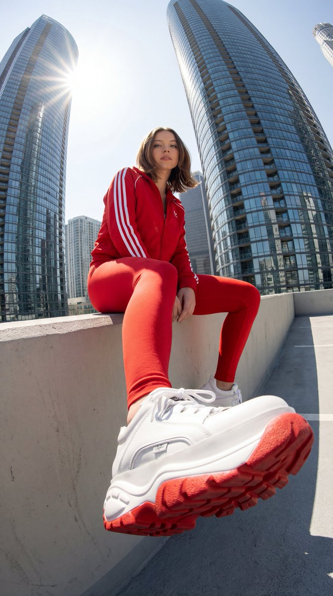

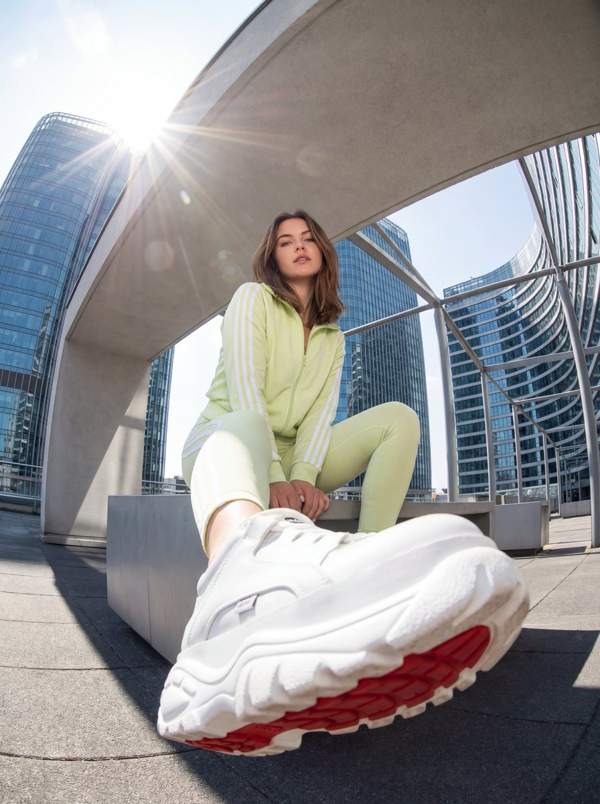

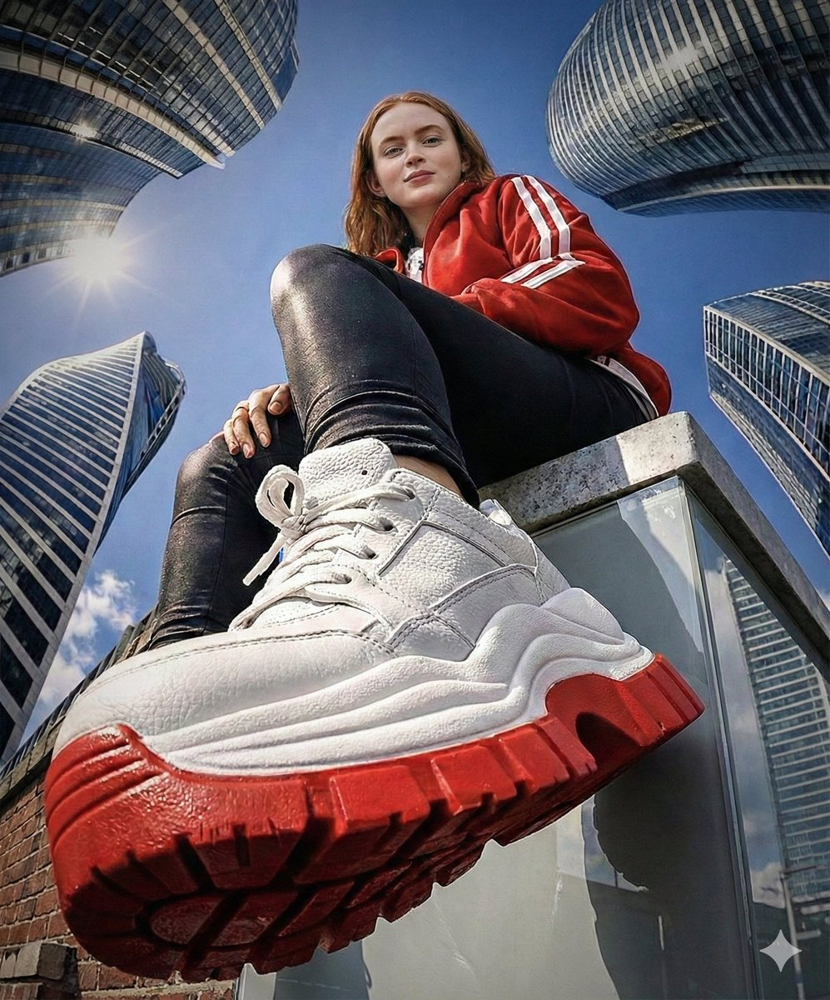

```
{
  "scene_description": {
    "location": "Urban rooftop or high vantage point with a backdrop of towering glass skyscrapers and sleek modern architecture",
    "vibe": "Energetic, youthful, urban streetwear, dynamic and slightly distorted perspective",
    "lighting": "Bright daylight, harsh sunlight creating a sunburst/lens flare in the upper left, high contrast shadows on the sleek surfaces, vibrant colors",
    "camera_settings": "Ultra-wide angle or Fisheye lens (approx 8mm-12mm), extreme low angle (worm's-eye view), forced perspective, deep depth of field, sharp focus from shoe sole to skyline, close up full body shot of the woman"
  },
  "primary_subjects": [
    {
      "character": "Young woman with shoulder-length brown hair",
      "role": "Streetwear model / Urban explorer",
      "action": "Sitting casually on the corner of a modern minimalist ledge or platform, looking down at the camera with a confident, relaxed expression. One leg is extended forward towards the lens creating extreme foreshortening, maintaining the same pose as before",
      "details": "Bright red track jacket with white stripes on sleeves, Bright Red fitted leggings, massive white chunky platform sneakers with a distinct red tread pattern on the sole (shoe is the dominant foreground element)"
    }
  ],
  "environment_details": {
    "crowd": "None",
    "architecture": "Curved modern glass skyscrapers surrounding the subject, smooth light concrete or metallic ledge in the foreground instead of a red brick wall, clean modern textures",
    "fidelity": "High-resolution photography, realistic texture on the sneaker leather and modern materials, lens distortion effect on the buildings"
  }
}
```

```
城市屋顶或高处俯瞰点，背景是高耸的玻璃摩天大楼与流畅的现代建筑；氛围充满活力、年轻、街头潮流感，视角动态且略带扭曲；明亮日光下，左上角有强烈阳光形成的光晕/镜头眩光，光滑表面投下高对比度阴影，色彩鲜艳。使用超广角或鱼眼镜头（约8-12mm），极端低角度（虫眼视角），强制透视，大景深，从鞋底到天际线全程清晰锐利，对女性进行全身近景拍摄。

主角为一位肩长棕色头发的年轻女性，身份为街头潮流模特或都市探索者，她随意坐在现代极简风格的平台边缘，自信而放松地低头看向镜头。一条腿朝镜头方向伸展，形成强烈的前缩透视，保持此前姿势不变。身穿亮红色运动夹克（袖子上有白色条纹）、亮红色紧身 leggings，脚踩巨大的白色厚底松糕运动鞋，鞋底有醒目的红色纹路（鞋子作为画面最前景的主导元素）。

周围无人群；环境为环绕主体的弧形现代玻璃摩天楼，前景是光滑浅色混凝土或金属材质的平台边缘，取代红砖墙，整体呈现干净现代的质感。画面为高分辨率摄影风格，运动鞋皮革与现代建材纹理逼真，并带有建筑因镜头畸变产生的扭曲效果。

灵感源自 @TheDoctorLogos
```

 [↑返回目录](#toc)

---
## <a id="">梵高风格3D人物肖像</a> (<a href="https://x.com/TechieBySA/status/2020129901601313080" target="_blank" rel="noopener noreferrer">TechieSA</a>)

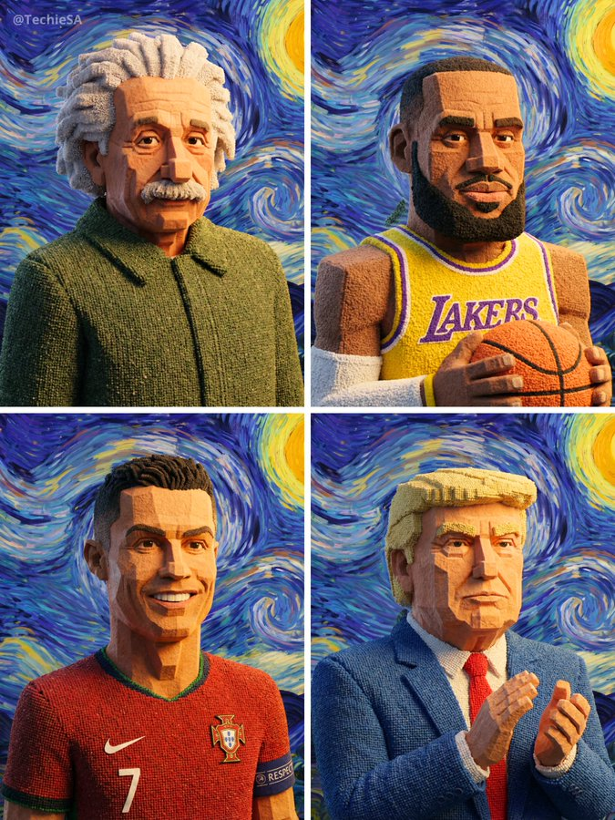

```
Create a highly stylized 3D character portrait with a blocky, geometric voxel-like form and a handcrafted clay / foam micro-particle texture, inspired by painterly stop-motion aesthetics. Use the person from the ATTACHED REFERENCE PHOTO. Preserve the person’s identity, facial structure, proportions, skin tone, and key features, but reinterpret them into a cuboid, low-poly caricature form with simplified geometry, squared facial planes, and intentionally rigid structure. Apply a dense tactile surface made of tiny bead-like or felted particles across all visible elements for a handcrafted look. Render against a swirling, painterly, post-impressionist background with thick directional strokes and vibrant motion, evoking a dreamlike night-sky energy. Lighting should be soft but directional, with warm highlights and gentle shadow falloff to enhance texture depth without realism. The overall look should feel artistic, whimsical, museum-grade, and handcrafted, not photoreal, not Pixar, not vinyl, not glossy CGI. Ultra-high detail, clean edges, intentional stylization, no text, no logos, no watermarks. Aspect ratio 4:5.
```

```
创作一幅高度风格化的3D人物肖像，采用方块状、几何体素般的造型，并赋予手工黏土/泡沫微粒质感，灵感源自绘画感十足的定格动画美学。以所附参考照片中的人物为基础，保留其身份特征、面部结构、比例、肤色及关键五官，但将其重新诠释为立方体、低多边形的夸张漫画形式，具有简化的几何形状、方形的面部平面和刻意僵硬的结构。在所有可见元素上覆盖一层密集而富有触感的微小珠状或毡化颗粒纹理，营造出手工制作的观感。背景采用漩涡状、富有笔触感的后印象派风格，以浓重的方向性笔触和充满活力的动感，唤起梦幻般的夜空氛围。灯光应柔和但具方向性，带有温暖高光与柔和阴影衰减，以增强纹理深度，同时避免写实感。整体效果应呈现艺术性、奇趣感、博物馆级品质与手工感，非写实、非皮克斯风格、非乙烯基材质、非光亮CG效果。画面需具备超高细节、清晰边缘、明确的风格化处理，不含文字、标志或水印。画幅比例为4:5。
```

 [↑返回目录](#toc)

---
## <a id="">超现实梦境中的变形物体</a> (<a href="https://x.com/aleenaamiir/status/2020178832624611427" target="_blank" rel="noopener noreferrer">Aleena Amir</a>)

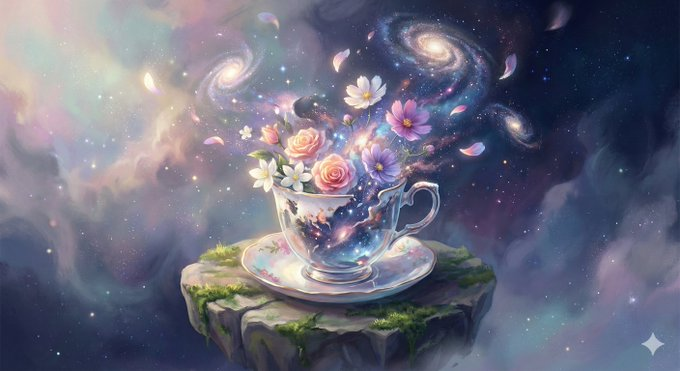

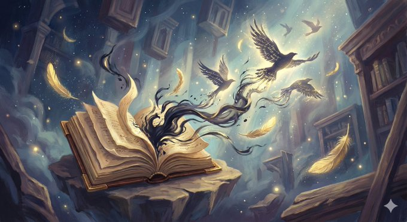

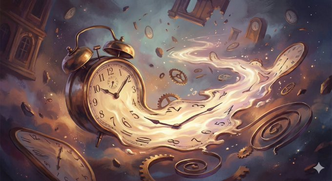

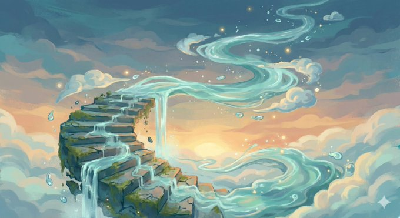

```
Surreal / Dreamlike Illustrations

Gemini Nano Banana Pro Prompt:

“A surreal illustration where [NORMAL OBJECT] transforms into [UNEXPECTED FORM]. Dreamlike atmosphere, floating elements, impossible physics. Cinematic lighting with soft glow and haze. Artistic, painterly illustration style with rich color harmony.”
```

```
一幅超现实插画，其中[普通物体]转变为[意想不到的形态]。梦境般的氛围，漂浮的元素，违背物理法则的场景。电影感的灯光，带有柔和光晕与薄雾。富有艺术感的绘画风格，色彩和谐丰富。
```

 [↑返回目录](#toc)

---
## <a id="">极简3D拟我表情头像</a> (<a href="https://x.com/egeberkina/status/2020166891567014204" target="_blank" rel="noopener noreferrer">Ege</a>)

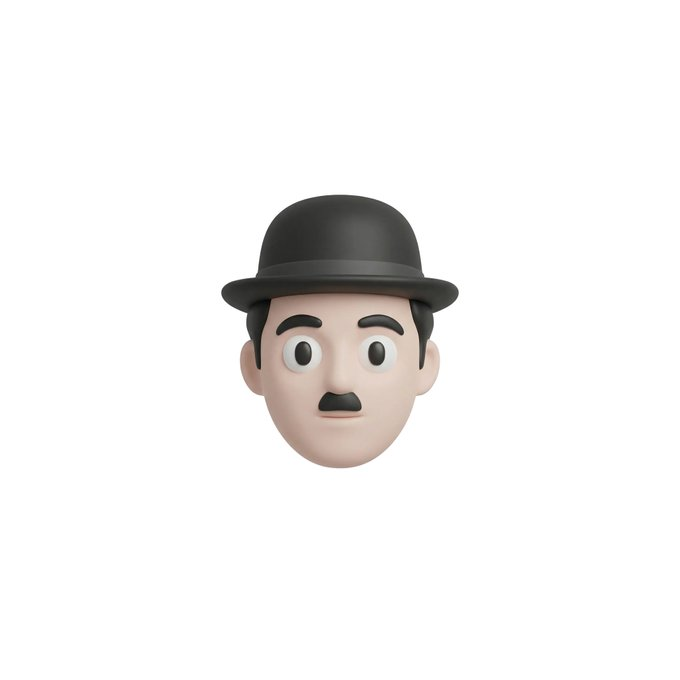

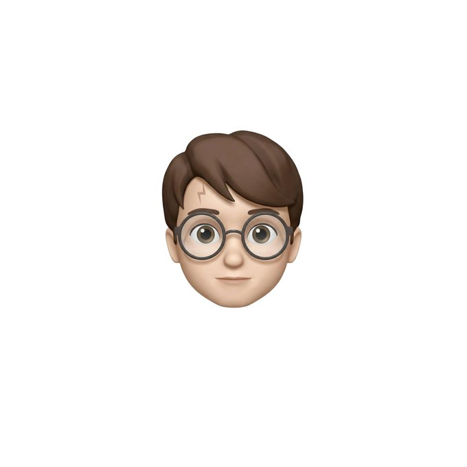

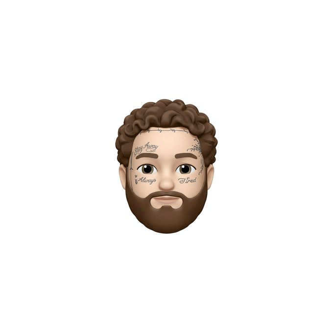

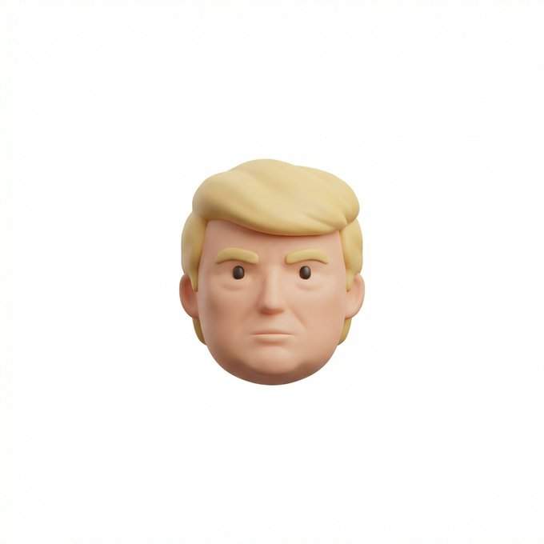

```
{
 "task": "floating_mini_memoji_face",
 "input": {
 "source_image": "USER_UPLOADED_IMAGE",
 "preserve_core_identity": true,
 "auto_detect_face_or_front_surface": true
 },
 "output": {
 "type": "face_only_character_render",
 "aspect_ratio": "1:1",
 "resolution": "ultra_high_resolution",
 "background": "pure_white"
 },
 "composition": {
 "subject_scale": "very_small",
 "subject_coverage_percentage": "20-30%",
 "placement": "perfectly_centered",
 "floating_effect": true,
 "no_grounding_elements": true
 },
 "cropping": {
 "mode": "face_only",
 "include_body": false,
 "include_neck": false,
 "include_shoulders": false
 },
 "style": {
 "overall_aesthetic": "memoji_like_3d_minimal",
 "design_language": "soft_rounded_clean",
 "realism_level": "stylized_not_photorealistic",
 "inspiration": [
 "apple_memoji",
 "ios_sticker_style"
 ]
 },
 "form_translation": {
 "shape_simplification": "high",
 "edge_rounding": "very_high",
 "detail_reduction": "strong_but_identity_preserved"
 },
 "surface_material": {
 "material": "soft_matte_plastic",
 "texture": "uniform",
 "specularity": "very_low"
 },
 "feature_handling": {
 "eyes_if_present": {
 "style": "rounded_friendly",
 "size": "slightly_large"
 },
 "expression": "neutral_or_soft"
 },
 "lighting": {
 "setup": "flat_ui_light",
 "contrast": "minimal",
 "shadows": "none"
 },
 "camera": {
 "angle": "straight_on",
 "distance": "pulled_back",
 "distortion": "none"
 },
 "constraints": {
 "background_must_be_white": true,
 "head_must_float": true,
 "no_body_parts_visible": true,
 "no_drop_shadows": true,
 "no_photorealism": true
 }
}
```

```
以用户上传的图像为基础，自动生成一个漂浮的迷你拟我表情头像。保留原始身份特征，自动识别人脸或正面区域。输出为仅含脸部的角色渲染图，比例1:1，超高清分辨率，纯白背景。  

构图要求：主体非常小，占画面20%–30%，完美居中，呈现漂浮效果，无任何接地元素。裁剪仅保留脸部，不包含身体、颈部或肩膀。  

风格参考苹果Memoji和iOS贴纸风格，整体为3D极简拟我表情风格，设计语言柔和圆润、干净简洁，非写实，而是高度风格化。  

造型处理上进行高度简化，边缘极度圆滑，细节大幅减少但仍保留身份特征。材质为柔雾面塑料，纹理均匀，几乎无反光。  

若包含眼睛，则采用圆润友好的样式，略大；表情为中性或柔和。  

灯光采用扁平UI照明，对比度极低，无阴影。相机正对主体，距离拉远，无畸变。  

严格限制：背景必须为纯白，头部必须漂浮，不可见任何身体部位，禁止投影，禁止写实风格。
```

 [↑返回目录](#toc)

---
## <a id="">夜色中行走：都市街头的电影感黑白街拍</a> (<a href="https://x.com/ai_with_shah/status/2020421229681770879" target="_blank" rel="noopener noreferrer">Shah</a>)

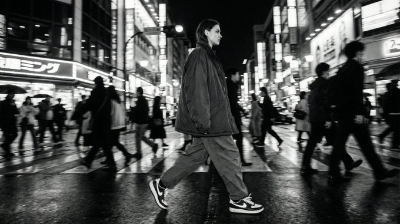

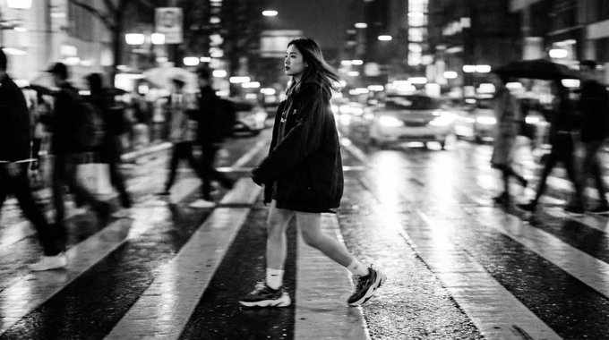

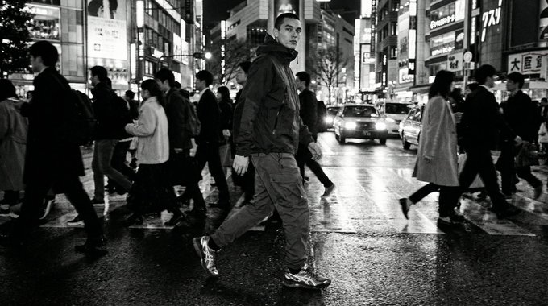

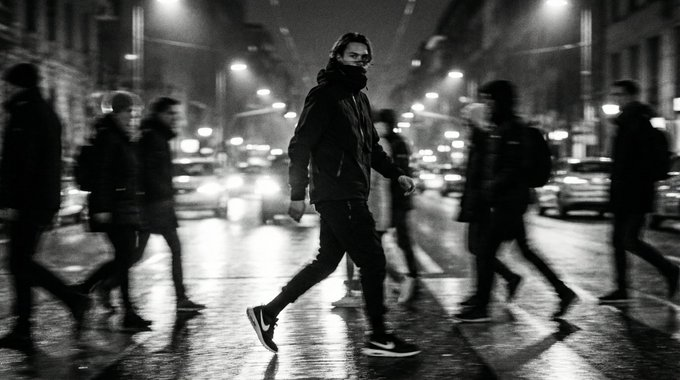

```
{
  "meta": {
    "purpose": "Cinematic motion blur B&W street photography for urban fashion editorials",
    "style": "High contrast monochrome, storytelling realism, Nike-inspired visuals, 8K"
  },
  "subject": {
    "main": "[e.g., Model in streetwear walking through crowd]",
    "pose": "[e.g., Dynamic stride with motion streaks]",
    "attire": "[e.g., Urban jacket and sneakers]"
  },
  "environment": {
    "setting": "[e.g., Busy city street at night]",
    "details": "Crowd blur effect, wet pavement reflections"
  },
  "lighting": {
    "type": "[e.g., Cinematic portrait with high contrast]",
    "effects": "Monochrome grading, viral editorial mood"
  },
  "camera_specs": {
    "lens": "[e.g., Wide angle for urban depth]",
    "quality": "AI art realism, fine grain, no artifacts",
    "aspect_ratio": "[e.g., 9:16 vertical]",
    "negative": ["color", "static pose", "low contrast", "cartoonish"]
  }
}

#Promptshare #nanobanana
```

```
用于都市时尚专题的电影感动态模糊黑白街拍：高对比度单色、叙事性写实风格、受耐克启发的视觉效果、8K画质。主体为身穿街头服饰的模特在人群中行走，姿态为带有动态拖影的大步前行，着装包括都市风夹克与运动鞋。场景设定为夜晚繁忙的城市街道，具有人群模糊效果和湿滑路面的倒影。灯光采用高对比度的电影人像布光，配合单色调色与具有病毒式传播潜力的专题氛围。使用广角镜头以呈现城市纵深感，画面具备AI艺术写实感、细腻颗粒、无伪影，画幅比例为9:16竖构图。避免出现色彩、静态姿势、低对比度及卡通风格。
```

 [↑返回目录](#toc)

---
## <a id="">奇幻世界中的水晶狮子与鹿</a> (<a href="https://x.com/drzubi01/status/2020427411159241171" target="_blank" rel="noopener noreferrer">Martian</a>)

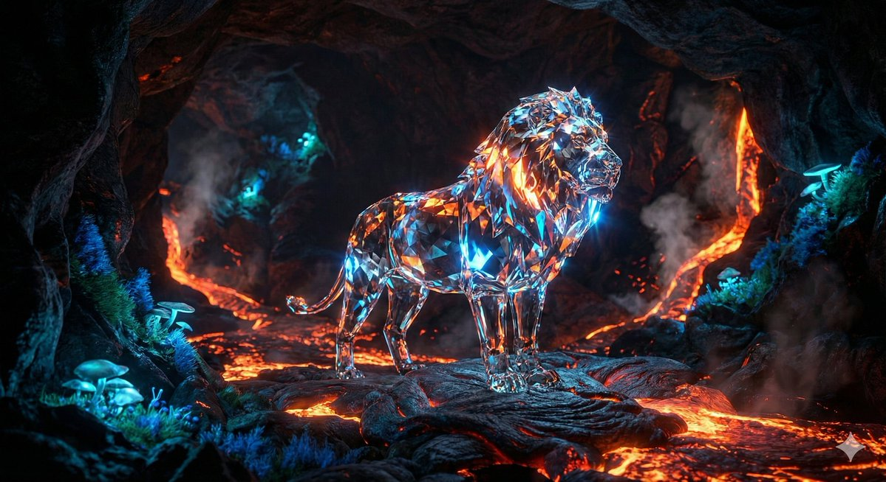

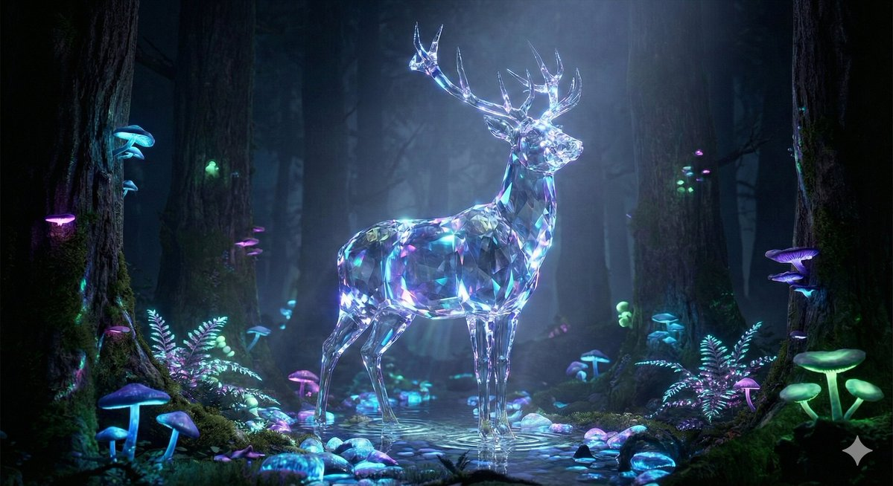

```
A majestic crystal lion and a crystal deer standing together in a mystical fantasy world, hyper-realistic transparent glass bodies with glowing prismatic reflections, the lion positioned on molten lava rocks inside a volcanic cave with flowing lava and sparks, the deer standing in an enchanted bioluminescent forest with glowing mushrooms and soft fog, both environments merging into one surreal cinematic landscape, lava streams blending into a magical glowing forest floor, neon blue and orange lighting contrast, ultra-detailed 3D render, cinematic composition, volumetric lighting, depth of field, fantasy realism, 8K, Unreal Engine, masterpiece, dramatic atmosphere, ethereal glow, highly detailed reflections and refractions.
```

```
一头雄伟的水晶狮子与一只水晶鹿并肩伫立于神秘的奇幻世界中，身体为超写实透明玻璃材质，散发出闪耀的棱镜反射光芒。狮子站在火山洞穴内的熔岩岩石上，周围流淌着熔岩与飞溅的火花；鹿则立于一片被施了魔法的生物荧光森林中，四周遍布发光蘑菇与柔和薄雾。两种环境融合为一幅超现实的电影级景观——熔岩溪流渐变为魔幻发光的森林地面，霓虹蓝与橙色灯光形成鲜明对比。画面为超精细3D渲染，采用电影构图、体积光效、景深效果，风格融合幻想与写实，8K分辨率，使用虚幻引擎打造，堪称杰作，氛围戏剧感十足，带有空灵辉光，反射与折射细节极为丰富。
```

 [↑返回目录](#toc)

---
## <a id="">透明玻璃上行走的人群</a> (<a href="https://x.com/cfryant/status/2008198862931214371" target="_blank" rel="noopener noreferrer">Christopher Fryant</a>)

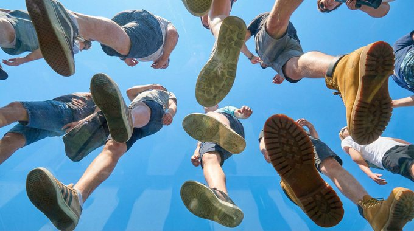

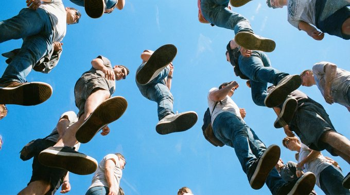

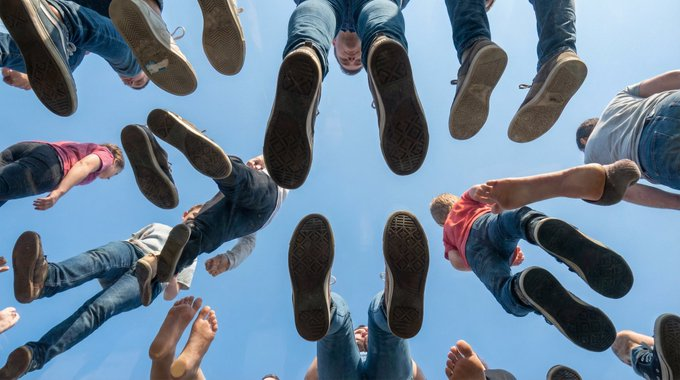

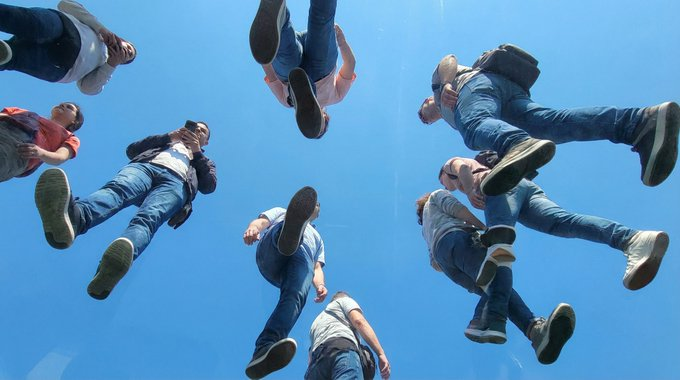

```
View from under a plane of completely transparent plexiglass. We are looking straight up. Many people are walking on the plexiglass. In the background is a pure blue sky. No buildings visible. No edges or separations in the plexiglass. It’s as if the plexiglass isn’t even there. We are very close to the people. The people are in the process of walking. The people are walking generally from left to right. The soles of their shoes are very close to the foreground.
```

```
从一块完全透明的有机玻璃板下方仰视。我们正直直向上看，许多人正在有机玻璃上行走。背景是一片纯净的蓝天，看不见任何建筑物。有机玻璃没有边缘或接缝，仿佛它根本不存在。我们离那些人非常近，他们正在行走，大致从左向右移动，鞋底非常靠近前景。
```

 [↑返回目录](#toc)

---
## <a id="">高科技联名外套的侧面特写</a> (<a href="https://x.com/AmirMushich/status/2016245338793705945" target="_blank" rel="noopener noreferrer">AmirMušić</a>)

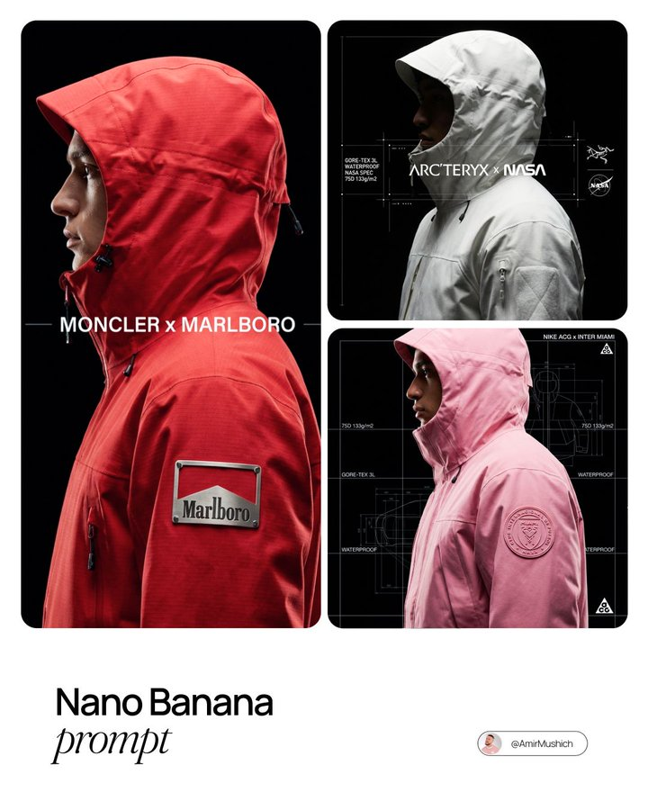

```
[BRAND NAME]. 
Act as a Creative Director for a technical outerwear brand and a High-End Product Photographer.

THE TASK:
Autonomously conceptualize and render a "Technical Outerwear Campaign Image" featuring a collaboration between the input brand ([BRAND NAME]) and a relevant performance fashion label.
PHASE 1: PARTNER SELECTION & GEAR DESIGN (THE STRATEGIST)
Analyze [BRAND NAME]: Is it Luxury, Sport, Industrial, or Lifestyle?
Select the Apparel Partner:
Luxury/Lifestyle -> The North Face, Moncler.
Tech/Industrial -> Arc'teryx, Stone Island Shadow Project.
Sport/Speed -> Nike ACG, Salomon.
The Gear: Design a Heavy Technical Outerwear Piece (Parka, Shell Jacket, or Anorak) with a structured HOOD or HIGH COLLAR.
Color: The garment must be the Signature Color of [BRAND NAME].
Material: Stiff, high-performance fabrics (Gore-Tex 3L, Ripstop) with matte finish.
PHYSICAL BRANDING INTEGRATION (CRITICAL):
    You must integrate the [BRAND NAME] logo physically onto the garment in a way that looks expensive and high-tech.
PHASE 2: PHOTOGRAPHY & LIGHTING (THE PROFILE)
Framing: A tight Head-and-Shoulders Side Profile Shot. Model faces Left.
Pose: Chin up, looking forward. Hood frames the face.
Lighting (Chiaroscuro Tech):
Key Light: Hard light hitting the face profile and the [BRAND NAME] LOGO on the jacket, creating sharp contrast.
The Void: Background is Pure Void Black (#000000).
Texture Priority: Maximize detail of fabric weave and the physical logo material.
PHASE 3: UI & SCHEMATIC OVERLAY (BLUEPRINT AESTHETIC)
Overlay a "Technical Blueprint" Interface (thin white lines):
The Grid: Vertical hairline white lines cutting through the image.
Left Sidebar: Vertical tech specs (e.g., "75D 133g/m2", "GORE-TEX 3L").
Center: Title "[PARTNER] x [BRAND NAME]".
Right Side: The Partner Logo (e.g., The North Face logo) in white.
PHASE 4: TECH SPECS
100mm Macro Lens, f/8, High Co
```

```
[品牌名称]。  
担任一个技术型户外服饰品牌的创意总监兼高端产品摄影师。

任务：  
自主构思并渲染一张“技术型户外服饰宣传图像”，展现[品牌名称]与一个相关高性能时尚品牌的联名合作。

第一阶段：合作伙伴选择与服装设计（策略师）  
分析[品牌名称]：属于奢华、运动、工业还是生活方式类？  
选择合作服装品牌：  
- 奢华/生活方式类 → The North Face、Moncler  
- 科技/工业类 → Arc'teryx、Stone Island Shadow Project  
- 运动/速度类 → Nike ACG、Salomon  

服装设计：打造一件重型技术型外套（派克大衣、硬壳夹克或连帽衫），带有结构感强的兜帽或高领。  
颜色：必须使用[品牌名称]的标志性色彩。  
材质：挺括的高性能面料（如Gore-Tex 3L、防撕裂尼龙），表面为哑光质感。  

实体品牌标识整合（关键要求）：  
必须将[品牌名称]的Logo以实体形式融入服装，呈现昂贵且高科技的视觉效果。

第二阶段：摄影与灯光（侧影风格）  
构图：紧凑的头部与肩部侧面特写，模特面向左侧。  
姿势：下巴微抬，目视前方，兜帽勾勒面部轮廓。  
灯光（明暗对比科技风）：  
- 主光：硬光照射面部轮廓及夹克上的[品牌名称]Logo，形成强烈明暗对比。  
- 背景：纯黑虚空（#000000）。  
- 纹理优先：最大化展现面料织纹与实体Logo材质的细节。

第三阶段：界面与图解叠加（蓝图美学）  
叠加“技术蓝图”风格界面（细白线）：  
- 网格：垂直细白线贯穿画面。  
- 左侧栏：垂直排列技术参数（例如“75D 133g/m²”、“GORE-TEX 3L”）。  
- 中央标题：“[合作品牌] x [品牌名称]”。  
- 右侧：合作品牌Logo（如The North Face标志），白色呈现。

第四阶段：技术参数  
100mm微距镜头，光圈f/8，高解析度。
```

 [↑返回目录](#toc)

---
## <a id="">超大时尚单品的活力展示</a> (<a href="https://x.com/azed_ai/status/2015152385207984348" target="_blank" rel="noopener noreferrer">Amira Zairi</a>)


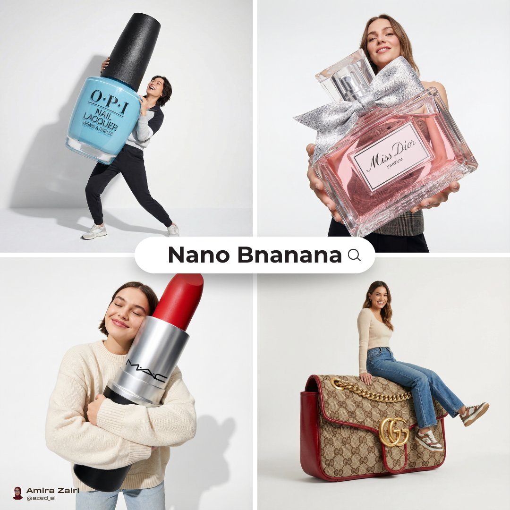

```
[person], [pose], oversized product in the attached image as the main hero prop, playful fun energy, fashion editorial styling, clean minimal background, high key studio lighting, crisp soft shadow, ultra realistic commercial photography, wide angle low perspective, sharp focus, 8k, 1:1
```

```
[人物]，[姿势]，附图中作为主角道具的超大尺寸产品，充满玩趣与活力，时尚杂志风格造型，干净极简背景，高调影棚灯光，清晰柔和的阴影，超写实商业摄影，广角低视角，锐利对焦，8K分辨率，1:1比例
```

 [↑返回目录](#toc)

---
## <a id="">人物描边涂鸦</a> (<a href="https://x.com/kingofdairyque/status/2020468935267844462" target="_blank" rel="noopener noreferrer">simply</a>)

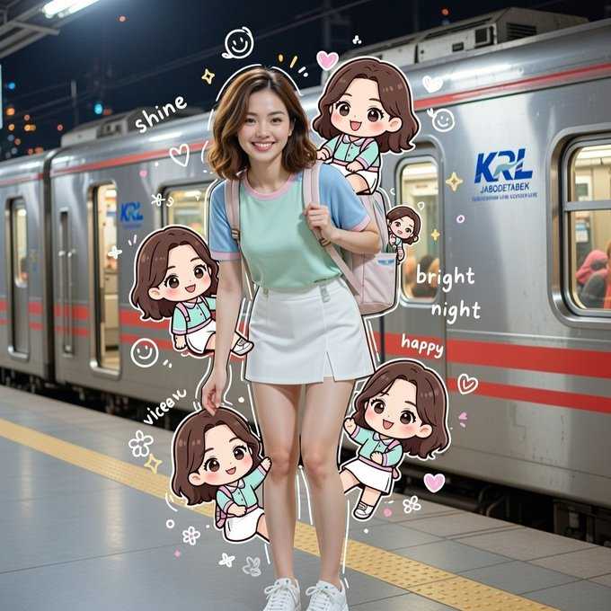

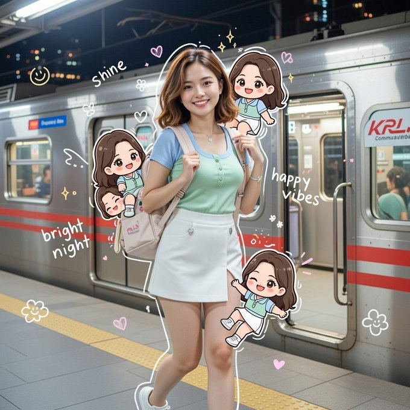

```
A high-quality mixed-media portrait of a bright and cheerful young woman with fresh, lively energy (using my uploaded person photo) standing on a train station platform at night. The subject has a friendly smile and bright eyes, posing with a lively, energetic expression, slightly leaning forward in a natural, upbeat stance, one hand playfully holding the strap of her light-colored backpack.

She is wearing a stylish pastel casual outfit (soft mint or sky-blue top, clean white mini skirt made of structured fabric, white sneakers, and small cute accessories).

Full body visible from head to toe  
Feet fully in frame, no cropping at legs or shoes  
Centered composition with safe margin around the subject  
Camera positioned far enough to capture the entire body  
Natural leg proportions, no distortion

The background features a realistic 'KRL Jabodetabek' Commuter Line train side view with its signature red striping, with the train doors wide open, bathed in bright, cinematic station lighting and city night ambiance.

Surrounding the realistic main subject are several cute, 3D-style 'Chibi' versions of herself, wearing the same outfit and same face. These chibis are interacting playfully: one is sitting on the subject's shoulder, one is climbing her leg, and another is peeking out from the backpack.

Overlay the image with vibrant, hand-drawn doodle effects: soft white outlines around the subject, playful sparkles, doodle hearts, tiny flowers, smiley icons, and floating white handwritten phrases like "shine", "bright night", and "happy vibes".

The style seamlessly blends hyper-realistic photography with colorful, soft cartoon illustrations. Keeping face and all body shape unchanged.
```

```
一幅高品质混合媒介肖像画，描绘一位明亮欢快、充满活力的年轻女性（使用我上传的人物照片），夜晚站在火车站站台上。她面带友善微笑，眼神明亮，表情生动活泼，身体自然微微前倾，姿态积极向上，一只手俏皮地抓着浅色背包的肩带。

她身穿时尚的淡彩色休闲装（柔和的薄荷绿或天蓝色上衣、结构感面料的纯白迷你裙、白色运动鞋，以及小巧可爱的配饰）。

全身从头到脚完整可见，双脚完全在画面内，腿部和鞋子无任何裁切。  
构图居中，人物四周留有安全边距。  
相机距离足够远，能完整捕捉全身，腿部比例自然，无变形。

背景为真实的“KRL Jabodetabek”通勤列车侧面，带有标志性的红色条纹，车门大开，沐浴在明亮而富有电影感的车站灯光与城市夜景氛围中。

在写实主体周围环绕着几个可爱的3D风格“Q版”小人，穿着相同服装、拥有相同面容：一个坐在她的肩膀上，一个正攀爬她的腿，另一个从背包里探出头来。

画面叠加鲜艳的手绘涂鸦效果：人物轮廓带有柔和白色描边，点缀着俏皮的闪光、涂鸦爱心、小花、笑脸图标，以及漂浮的白色手写字样，如“shine”、“bright night”和“happy vibes”。

整体风格无缝融合超写实摄影与色彩柔和的卡通插画，保持面部特征与全身身形不变。
```

 [↑返回目录](#toc)

---
## <a id="">棱镜工业极简主义的悬浮艺术</a> (<a href="https://x.com/lloydcreates/status/2020332873736196341" target="_blank" rel="noopener noreferrer">Lloyd Creates</a>)

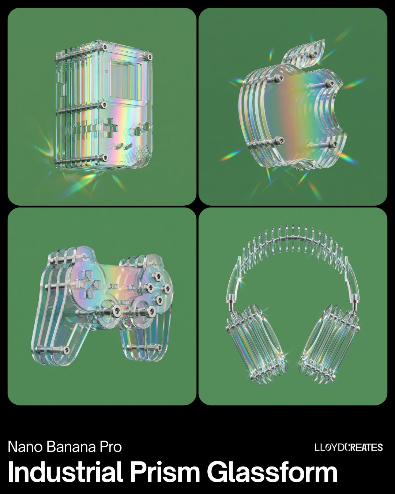

```
{
  "request": {
    "product": "[PRODUCT HERE]",
    "background_color": "#59925C",
    "style": "prismatic_industrial_minimalism",
    "visual_elements": {
      "structure": "multiple separate vertical acrylic layers forming the product silhouette — each layer is a distinct flat panel with visible air gaps between them, like slices of the product spaced apart",
      "material": "high-clarity glass with rainbow prismatic iridescent tint",
      "hardware": "stainless steel through-bolts with visible internal Allen hexagonal socket heads — bolts pass through all layers front to back, holding them together with visible spacing",
      "orientation": "strictly upright vertical placement, full object visibility",
      "lighting": "dispersive spectral highlights and sharp caustics"
    },
    "composition": {
      "frame": "wide shot, no cropping, centered full-product view",
      "camera_angle": "eye-level studio perspective, slightly angled to reveal gaps between layers",
      "depth_of_field": "deep enough to maintain focus on hardware details",
      "background": "seamless solid #59925C background with no floor, surface, pedestal, platform, table, shadow ground, or horizon line — the product floats against a uniform single-color field",
      "grounding": "no visible ground plane, no reflective surface beneath the product"
    },
    "rendering_details": {
      "transparency": "multi-layered refraction with thin-film interference",
      "finish": "polished edges with subtle holographic light dispersion",
      "hardware_detail": "macro-precision on hex-head bolt sockets",
      "layer_direction": "every glass/acrylic layer is strictly vertical — no horizontal slabs, curved shells, or molded forms",
      "layer_separation": "each glass panel must be visibly separated with clear air gaps — not fused or touching — bolts are the only element connecting the layers"
    }
  }
}
```

```
产品为[PRODUCT HERE]，背景色为#59925C，风格为棱镜工业极简主义。  
视觉元素：产品由多个独立的垂直亚克力层构成轮廓，每一层均为独立的平板，层与层之间留有可见的空气间隙，如同将产品切成若干片并间隔排列；材质为高透明度玻璃，带有彩虹棱镜般的虹彩色调；使用不锈钢通体螺栓贯穿所有层，从前至后将各层固定，螺栓头部为可见的内六角凹槽结构，并保留清晰的层间间距；产品严格垂直摆放，整体完整可见；灯光呈现色散光谱高光与锐利的焦散效果。  

构图要求：广角镜头，无裁剪，居中完整展示产品；相机视角为平视影棚角度，略带倾斜以展现层间空隙；景深足够深，确保螺栓等硬件细节清晰聚焦；背景为无缝纯色#59925C，无地面、台面、底座、平台、桌面、投影或地平线，产品悬浮于单一均匀色场中；画面中不可见任何地面平面或产品下方的反射面。  

渲染细节：多层折射效果结合薄膜干涉；边缘抛光处理，带有微妙的全息光色散；螺栓内六角凹槽需呈现微距级精度；所有玻璃/亚克力层必须严格垂直，不得出现水平板、曲面壳体或模塑造型；各玻璃面板之间必须明显分离，留有清晰空气间隙，不得融合或接触，仅由螺栓连接各层。
```

 [↑返回目录](#toc)

---
## <a id="">温馨怀旧的宝丽来拍立得写真</a> (<a href="https://x.com/SimplyAnnisa/status/2021409153894449474" target="_blank" rel="noopener noreferrer">Anissa</a>)

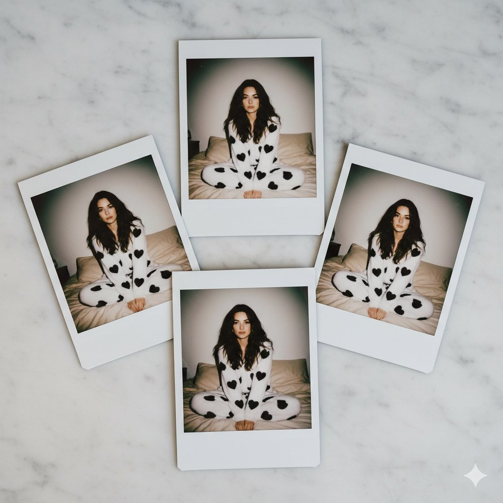

```
Create a realistic portrait identical face, no editing allowed.
A collage of three Instax Polaroid photos scattered on a light grey marble surface. The photos feature a beautiful young woman with long, wavy dark hair posing on a cozy bed with beige linens. She is wearing a white fuzzy, soft knit pajama set decorated with large black heart patterns. The lighting is a warm, soft camera flash typical of instant photography, creating slight shadows against the white wall behind her. The aesthetic is "cozy girl at home," intimate, and nostalgic, with the classic white borders of the Polaroid film visible. High resolution, realistic textures, 8k.
```

```
创作一幅逼真肖像，面部完全一致，不允许任何编辑。  
三张Instax宝丽来照片拼贴，散落在浅灰色大理石台面上。照片中是一位美丽的年轻女子，拥有长长的深色波浪发，在铺着米色床品的舒适床上摆姿势。她身穿一套白色蓬松柔软的针织睡衣套装，上面装饰着醒目的黑色大爱心图案。光线采用即时摄影典型的温暖柔和闪光灯效果，在她身后的白墙上投下轻微阴影。整体风格为“居家舒适女孩”，氛围亲密而怀旧，照片保留宝丽来胶片经典的白色边框。高分辨率，真实质感，8K画质。
```

 [↑返回目录](#toc)

---
## <a id="">红衣男子在工业隧道中伸手</a> (<a href="https://x.com/john_my07/status/2021237856463880202" target="_blank" rel="noopener noreferrer">Johnn</a>)

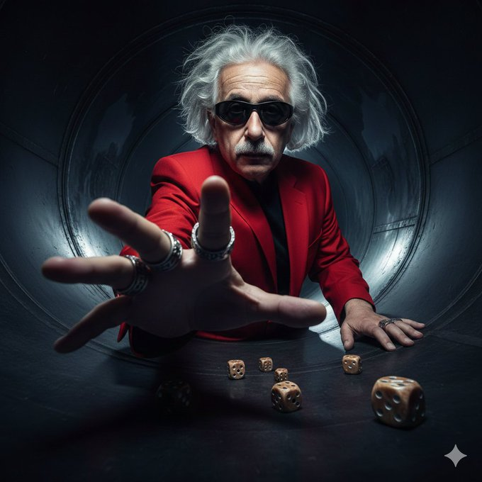

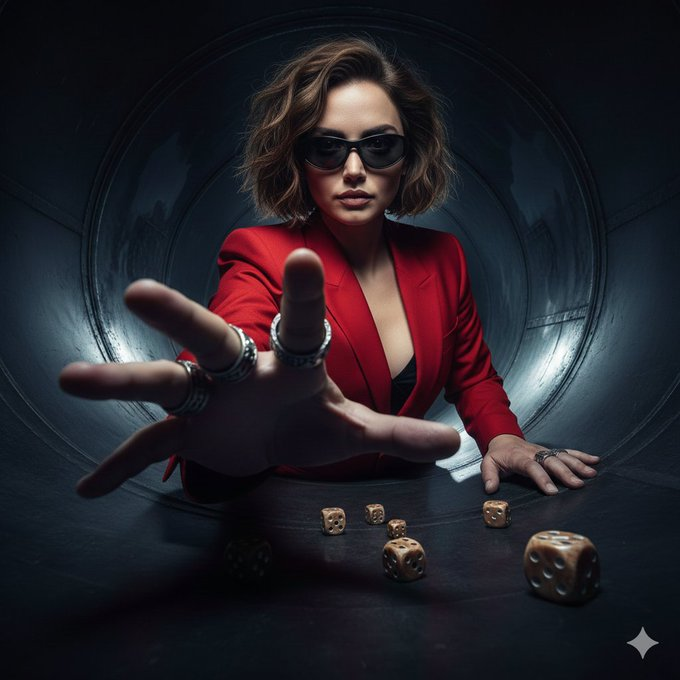

```
Ultra-realistic, cinematic editorial portrait with extreme photorealism. Low-angle, macro-inspired perspective. The subject is positioned inside a dark, industrial circular tunnel or pipe, with wet, glossy surfaces reflecting light. One arm reaches forward toward the lens, fingers stretched and oversized in the foreground, commanding the frame. Dice lie scattered ahead with consistent scale and visual balance.
Wearing a vivid red jacket with precise tailoring, realistic fabric texture, natural folds, and uniform sheen. Hair is short, textured, and slightly messy, maintaining consistent volume and length. Black wraparound sunglasses with matching tint and shape obscure the eyes. Multiple metallic rings adorn the fingers.
Expression is cold, controlled, and confident, masculine presence, relaxed lips, no smile. Color grading is cool and moody with high contrast, deep shadows, and the red jacket acting as the primary visual accent. Metallic highlights and reflections enhance the industrial mood. Dramatic directional lighting prioritizes the hand, rings, and dice, creating strong depth and separation between foreground and background.
Overall tone is bold, aggressive, high-fashion, and surreal. Ultra-detailed skin realism, visible fabric grain, and sharply defined metal and dice surfaces. Shot as a high-end DSLR cinematic portrait at ultra-high resolution.
```

```
超写实、电影感十足的纪实人像，极致逼真。采用低角度、微距风格的视角。人物置身于一条黑暗的工业圆形隧道或管道内，湿润而有光泽的表面反射着光线。一只手臂朝镜头方向伸出，手指张开，在前景中被放大，占据画面主导地位。前方散落着几颗骰子，比例协调，视觉平衡。

身穿剪裁精准的鲜红色夹克，面料纹理真实，自然褶皱，光泽均匀。头发短而富有质感，略显凌乱，保持一致的体积与长度。佩戴黑色环绕式太阳镜，镜片色调与形状统一，遮住双眼。手指上佩戴多枚金属戒指。

表情冷静、克制且自信，散发阳刚气质，嘴唇放松，无笑容。整体色调冷峻阴郁，高对比度，深邃阴影，红色夹克作为主要视觉焦点。金属高光与反光强化了工业氛围。戏剧性的定向照明突出手部、戒指和骰子，营造强烈的前景与背景纵深分离感。

整体风格大胆、强势、高级时装感，并带有超现实意味。皮肤细节极度真实，织物纹理清晰可见，金属与骰子表面锐利分明。以高端单反相机拍摄，呈现超高分辨率的电影级人像效果。
```

 [↑返回目录](#toc)

---
## <a id="">阿尔卑斯女子的静止瞬间</a> (<a href="https://x.com/ChillaiKalan__/status/2020715808939549011" target="_blank" rel="noopener noreferrer">K</a>)

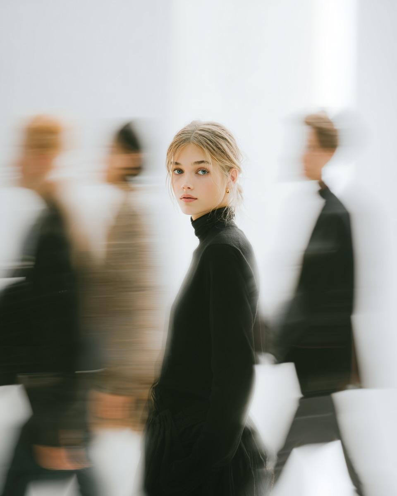

```
A high fashion magazine pictorial of an Alpine-looking woman in her early 20s who stands still, looking at the camera, turning her head in the center, surrounded by a blurry silhouette of people passing by. She has a calm, stoic look on her face and is wearing a black minimalist outfit. The background is clean, bright and slightly abstract, and emphasizes the contrast between motion blur and static appearance. Editing style, film composition, pure art photography, soft magazine texture, high resolution. --ar 4:5
```

```
一位20岁出头、具有阿尔卑斯地区相貌特征的女性，静止站立，直视镜头，头部微微转向画面中央，周围是模糊的人群剪影匆匆而过。她神情冷静坚毅，身着黑色极简风格服装。背景干净明亮，略带抽象感，强调动态模糊与静态人物之间的对比。采用编辑风格、电影构图、纯艺术摄影手法，呈现柔和的杂志质感，高分辨率。--ar 4:5
```

 [↑返回目录](#toc)

---
## <a id="">电影级3D文字与环境融合设计</a> (<a href="https://x.com/aleenaamiir/status/2018966979013644422" target="_blank" rel="noopener noreferrer">Aleena Amir</a>)

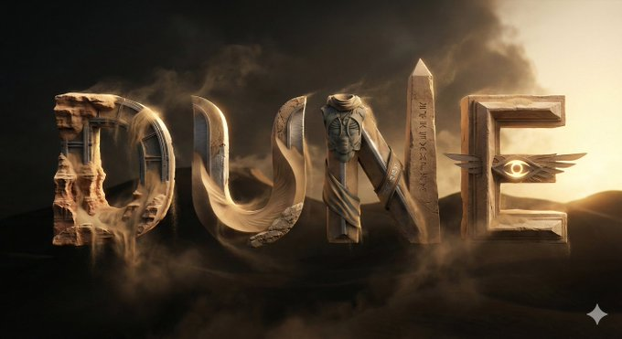

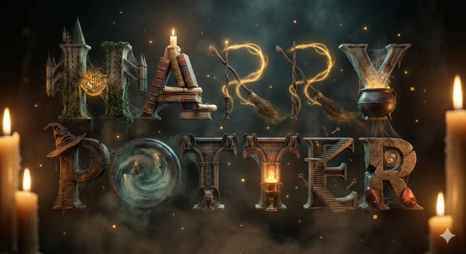

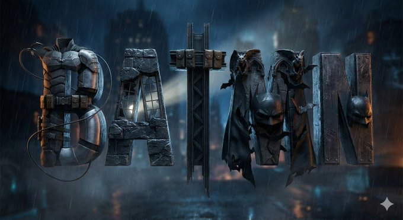

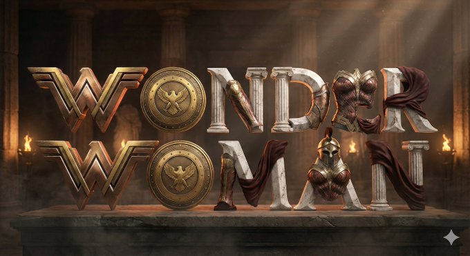

```
Cinematic Character-to-Environment Typography

Gemini Nano Banana Pro Prompt:

Create a cinematic 3D typographic composition spelling [WORD / NAME], where each letter is sculpted from the personality, environment, and emotional arc of [CHARACTER / STORY].

Letters are formed using clothing textures, symbolic props, architecture, and lighting motifs tied to different moments of the narrative.

No literal faces — identity is conveyed through silhouettes, posture, materials, and atmosphere. Use premium metallic or stone materials with subtle wear.

Dark cinematic background, dramatic rim lighting, deep shadows, ultra-realistic render, film-title quality.
```

```
电影级角色与环境融合字体设计

生成一组电影感十足的3D文字排版，拼写出[单词/名字]，每个字母均根据[角色/故事]的性格、所处环境及其情感历程进行塑造。

字母由服装纹理、象征性道具、建筑元素及与叙事关键时刻相关的光影风格构成。

不得出现真实人脸——身份通过剪影、姿态、材质和氛围传达。使用高级金属或石材材质，并带有细微磨损痕迹。

背景为深色电影风格，采用戏剧性轮廓光、浓重阴影，呈现超写实渲染效果，达到电影片头字幕级别的质感。
```

 [↑返回目录](#toc)

---
## <a id="">高端影棚人像，自信微笑</a> (<a href="https://x.com/AIwithkhan/status/2021458702654636188" target="_blank" rel="noopener noreferrer">Smiling Khan</a>)

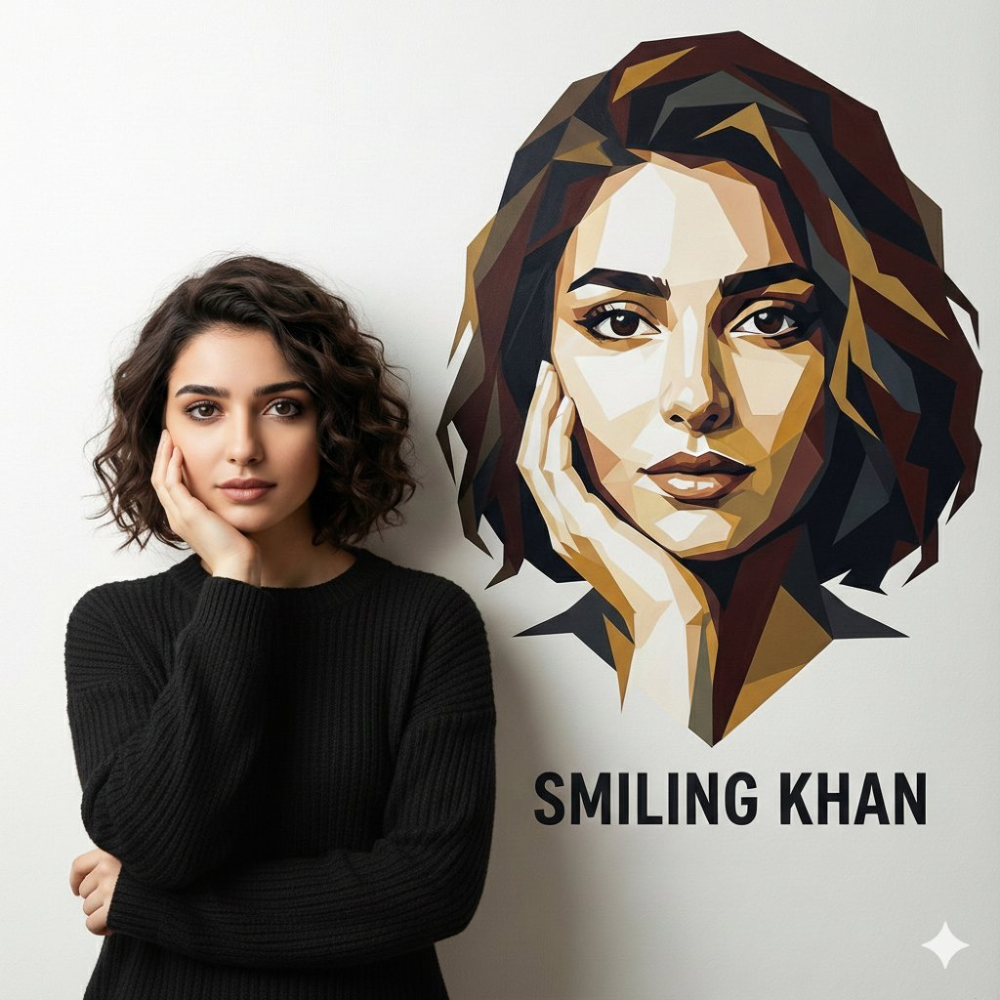

```
high-end studio portrait using the uploaded photo as the main subject. The person stands smiling against a clean, minimal background in soft neutral tones, holding a large vertical poster in front of them. The poster features an artistic reinterpretation of the same uploaded photo — stylized as a digital illustration, sketch, or painterly artwork — clearly recognizable as the same face. Professional studio lighting with a soft key light and subtle rim light creates gentle shadows and depth. The subject’s expression is calm and confident, body posture relaxed yet strong, evoking a modern personal brand identity. Clean composition, balanced framing, premium editorial aesthetic, shallow depth of field, ultra-realistic skin texture, crisp details, contemporary creator branding vibe, cinematic realism, 1:1 aspect ratio, high resolution.”
```

```
以上传的照片为主要人物，打造高端影棚人像。人物面带微笑，站在干净极简、柔和中性色调的背景前，双手持一张大幅竖版海报置于身前。海报上是对同一张上传照片的艺术化再创作——呈现为数字插画、素描或绘画风格，但面部特征清晰可辨。采用专业影棚灯光，主光柔和，辅以微妙的轮廓光，营造出细腻的阴影与立体感。人物神情从容自信，姿态放松而有力，传递出现代个人品牌气质。构图简洁，画面平衡，具有高端杂志般的视觉美学，浅景深，皮肤纹理超写实，细节锐利，整体散发当代创作者品牌氛围，兼具电影级真实感，1:1 画幅比例，高分辨率。
```

 [↑返回目录](#toc)

---
## <a id="">水墨中的现代与传统交织</a> (<a href="https://x.com/aleenaamiir/status/2021215324046065824" target="_blank" rel="noopener noreferrer">Aleena Amir</a>)

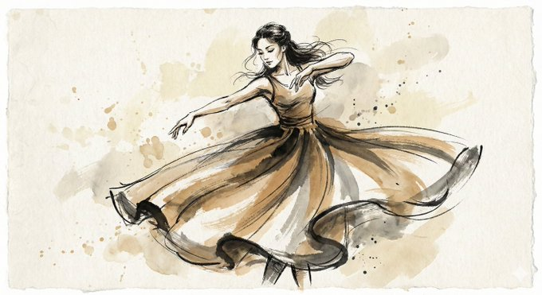

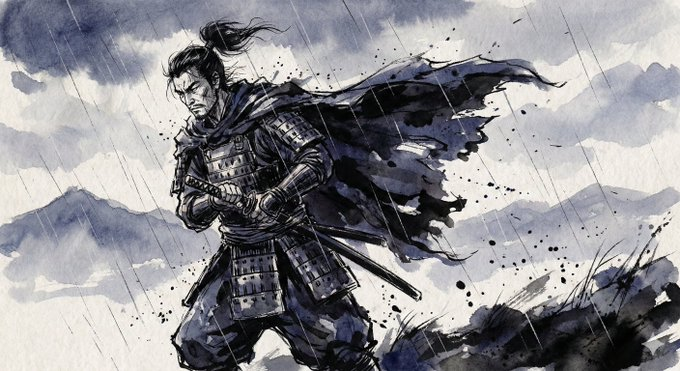

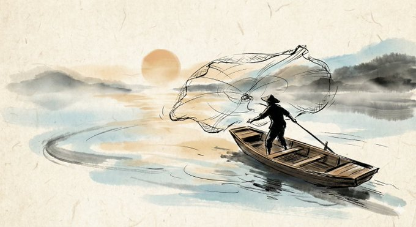

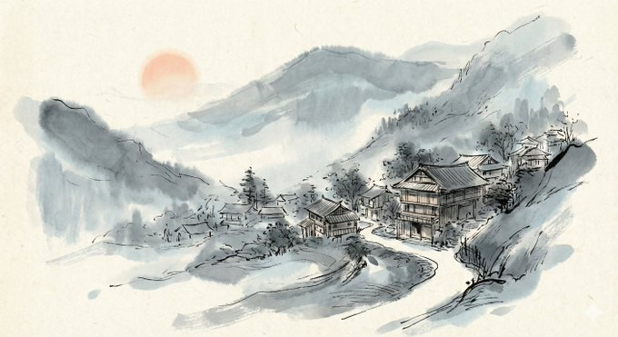

```
An expressive ink-and-wash illustration of [SUBJECT], combining loose brush strokes with fine ink lines. Limited [COLOR] palette, organic paper texture, dynamic composition, traditional art meets modern illustration.
```

```
一幅富有表现力的水墨插画，描绘[主体]，结合洒脱的笔触与细腻的墨线。采用有限的[颜色]调色板、天然纸张肌理、动态构图，传统艺术与现代插画相融合。
```

 [↑返回目录](#toc)

---
## <a id="">动态黑白点彩人物肖像</a> (<a href="https://x.com/egeberkina/status/2020844977383952544" target="_blank" rel="noopener noreferrer">Ege</a>)

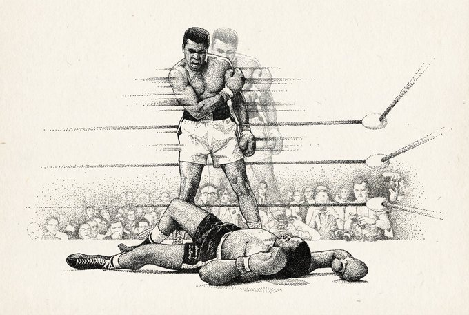

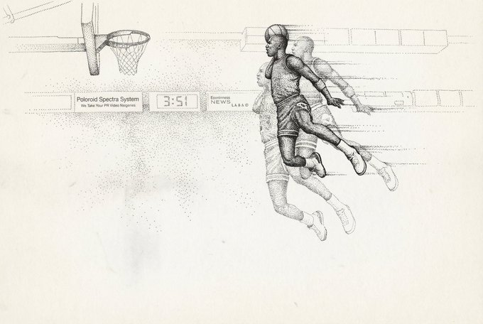

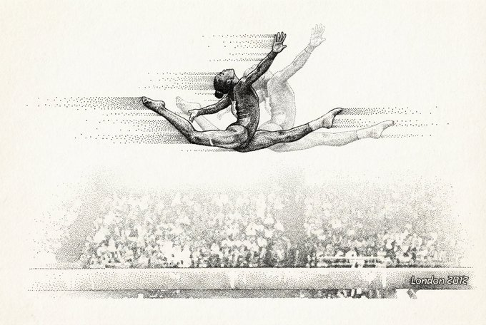

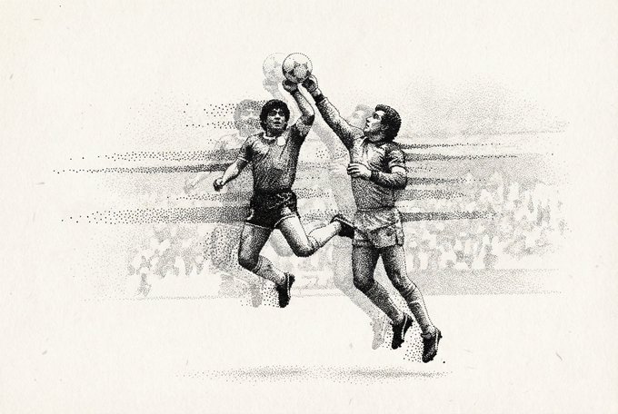

```
{
 "task": "hand_drawn_dotted_motion_double_exposure_style",
 "input": {
 "source_image": "USER_UPLOADED_IMAGE",
 "preserve_identity": true,
 "preserve_pose": true,
 "preserve_composition": true
 },
 "output": {
 "type": "single_image",
 "resolution": "ultra_high_resolution",
 "detail_preservation": "illustration_focused",
 "ai_artifacts": "none"
 },
 "style_conversion": {
 "render_style": "hand_drawn_stipple_illustration",
 "dot_technique": "dense_pointillism",
 "line_usage": "minimal_or_none",
 "shading_method": "dot_density_variation",
 "finish": "editorial_print_poster"
 },
 "color_mode": {
 "palette": "monochrome",
 "base": "black_ink_on_off_white_paper",
 "contrast": "medium_high",
 "tones": "organic_ink_variation"
 },
 "motion_effect": {
 "type": "illustrated_motion_smear",
 "direction": "horizontal",
 "representation": "stretched_dot_trails",
 "behavior": {
 "core_subject": "most_defined_and_dense_dots",
 "motion_zones": "progressively_looser_dot_spacing",
 "opacity_falloff": "soft"
 }
 },
 "double_exposure": {
 "enabled": true,
 "secondary_layer": {
 "source": "same_subject",
 "style": "lighter_dot_density",
 "pose_shift": "slight_temporal_offset",
 "integration": "embedded_not_collage"
 },
 "blend_method": "ink_layer_overlap",
 "strength": "medium"
 },
 "texture": {
 "paper_texture": "subtle_fibrous_paper",
 "ink_bleed": "very_light",
 "imperfection": "intentional_handmade"
 },
 "background": {
 "style": "negative_space",
 "treatment": "light_stipple_fog",
 "depth": "flat_print_surface"
 },
 "restrictions": {
 "no_photorealism": true,
 "no_lens_blur": true,
 "no_color": true,
 "no_digital_gloss": true,
 "no_new_elements": true
 }
}
```

```
手绘点彩动态双重曝光风格，以用户上传图像为基础，保留人物身份、姿态与构图。输出为超高分辨率单图，注重插画细节，无AI伪影。采用手绘点彩插画风格，密集点彩技法，几乎无线条，通过点密度变化表现明暗，呈现杂志印刷海报质感。配色为黑白单色，黑色墨水绘制于米白色纸面，中高对比度，墨色带有有机变化。动态效果表现为水平方向的插画式动态拖影，主体使用最密集清晰的点阵，运动区域点距逐渐松散，透明度柔和衰减。启用双重曝光，第二层取自同一主体，点密度较轻，姿态略有时间偏移，融合方式为嵌入式非拼贴，通过墨层叠加以中等强度结合。画面带有细微纤维纸纹、极轻微墨迹晕染及刻意保留的手工不完美感。背景采用负空间处理，辅以轻柔点彩雾化效果，整体保持平面印刷感。禁止写实摄影感、镜头模糊、彩色、数字光泽或添加新元素。
```

 [↑返回目录](#toc)

---
## <a id="">高空中的酷帅自拍</a> (<a href="https://x.com/saniaspeaks_/status/2021553869168550103" target="_blank" rel="noopener noreferrer">𝗦𝗮𝗻𝗶𝗮</a>)

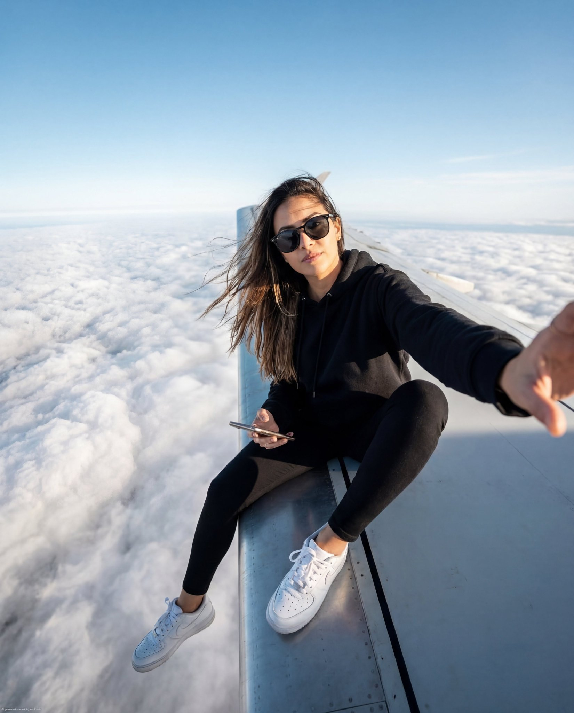

```
{
  "image_generation": {
    "subject": {
      "description": "stylish young woman sitting on an airplane wing high above the clouds",
      "pose": "seated casually on the airplane wing, one hand extended forward as if taking a selfie, relaxed but confident posture",
      "expression": "calm, confident, composed",
      "gaze": "looking toward the camera with a cool, self-assured expression"
    },
    "appearance": {
      "hair": {
        "style": "long, natural, slightly flowing in the wind",
        "look": "casual and effortless"
      },
      "accessories": [
        "dark sunglasses",
        "minimal jewelry"
      ],
      "vibe": "adventurous, bold, modern"
    },
    "outfit": {
      "style": "sporty casual",
      "details": "black hoodie, black fitted pants, clean white sneakers"
    },
    "environment": {
      "setting": "high above the clouds on an airplane wing",
      "sky": "clear blue sky with soft clouds below",
      "atmosphere": "open, airy, dramatic aerial view"
    },
    "lighting": {
      "type": "natural sunlight",
      "style": "bright and cinematic",
      "direction": "side lighting from the sun",
      "quality": "crisp highlights with soft shadows"
    },
    "camera": {
      "angle": "wide selfie-style perspective from a slightly elevated angle",
      "lens": "ultra wide-angle",
      "depth_of_field": "deep focus capturing both subject and vast sky background",
      "composition": "dynamic, adventurous framing emphasizing height and openness"
    },
    "aesthetic": {
      "style": "cinematic adventure photography",
      "vibe": "bold, fearless, modern, travel lifestyle",
      "color_grading": "clean cinematic tones with natural blues and soft contrast"
    },
    "quality": {
      "realism": "photorealistic",
      "detail": "high detail",
      "resolution": "high resolution",
      "finish": "professional, crisp, ultra-realistic"
    }
  }
}
```

```
一位时尚年轻女子坐在高空中飞机机翼上，姿态随意自信，一只手向前伸展仿佛在自拍，神情冷静、自信而沉稳，目光直视镜头，带着酷酷的自若表情。她留着长长的自然发型，微风中轻轻飘动，造型随性不造作；佩戴深色太阳镜和极简珠宝，整体气质充满冒险感、大胆且现代。身穿运动休闲风格服装：黑色连帽衫、黑色修身裤和干净的白色运动鞋。背景是云层之上的高空，湛蓝晴空与下方柔软云海相映，氛围开阔通透，呈现壮观的航拍视角。光线为自然日光，明亮且富有电影感，侧光照射带来清晰高光与柔和阴影。采用略高的广角自拍视角，超广角镜头，深景深同时清晰捕捉人物与辽阔天空，构图动感大胆，强调高度与空间感。整体风格为电影感冒险摄影，传递出无畏、现代与旅行生活方式的氛围，色调干净自然，以蓝色为主，对比柔和。画面高度写实，细节丰富，分辨率高，呈现专业级超写实质感。
```

 [↑返回目录](#toc)

---
## <a id="">黑线勾勒的极简主义肖像</a> (<a href="https://x.com/ShamsAmin56/status/2021631429138936174" target="_blank" rel="noopener noreferrer">Shams</a>)

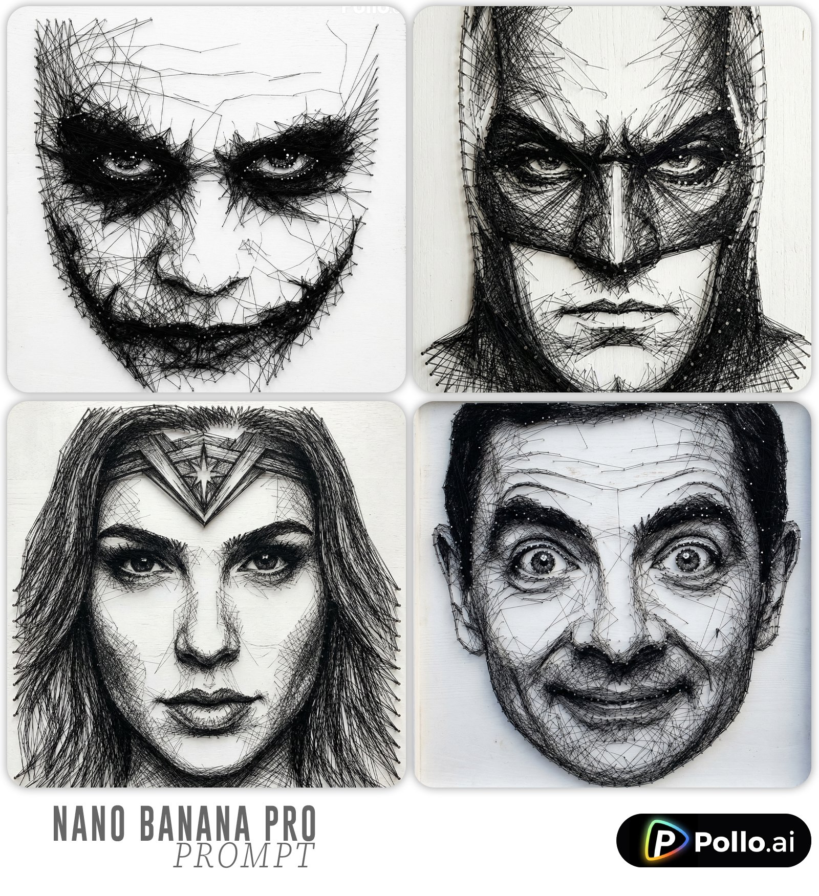

```
Style: Thread Art Portrait
Nano Banana Pro on @itsPolloAI 

Prompt:
Ultra-detailed thread art portrait of [SUBJECT] front view, created entirely with thousands of perfectly straight black threads stretched between nails on a white wooden panel, string art technique, only black threads, no other colors, extremely dense thread placement around [KEY FACIAL FEATURES e.g. eyes, lips, distinctive contours, scars, glasses, helmet edges, etc.], sparse threads in highlight areas on [HIGHLIGHT AREAS e.g. forehead, cheekbones, nose bridge, chin], dramatic contrast between dense shadow regions and open light areas, highly detailed realistic eyes with sharp [EXPRESSION-RELATED e.g. catchlights, reflections, menacing / curious / determined] catchlights, realistic proportions, [EXPRESSION / GAZE DESCRIPTION e.g. intense gaze looking straight forward, brooding intense gaze, bewildered yet amused intense gaze] looking straight forward, [ADDITIONAL DISTINCTIVE DETAILS e.g. subtle parted lips, furrowed brow wrinkles, scarred smile, helmet framing the face] made of overlapping threads, modern minimalist yet hyper-detailed string portrait, pure black thread on clean white background, macro close-up composition showing thread density and tension, photorealistic thread art, 4k
```

```
超精细的线艺肖像，正面视角，完全由数千根笔直的黑色细线在白色木板上的钉子之间拉伸而成，仅使用黑色线条，无其他颜色。在关键面部特征（如眼睛、嘴唇、独特轮廓、疤痕、眼镜或头盔边缘等）周围采用极高密度的线材排布，而在高光区域（如额头、颧骨、鼻梁、下巴）则使用稀疏线条，形成浓重阴影与通透亮部之间的强烈对比。眼睛高度写实，带有锐利的高光反射（如眼神光、倒影），呈现出[例如：威胁性/好奇/坚定]的情绪。人物表情与目光描述（如直视前方的强烈凝视、阴郁而专注的凝视、困惑却带笑意的凝视），并包含额外显著细节（如微启的双唇、皱起的眉纹、带疤的微笑、头盔勾勒面部轮廓等），均由交错重叠的黑线构成。整体风格现代极简却又极度精细，纯黑线条搭配干净白色背景，采用特写构图展现线材密度与张力，呈现逼真的线艺摄影级效果，4K分辨率。
```

 [↑返回目录](#toc)

---
## <a id="">太阳耀斑女神降临</a> (<a href="https://x.com/LudovicCreator/status/2021634103095792045" target="_blank" rel="noopener noreferrer">LudovicCreator</a>)

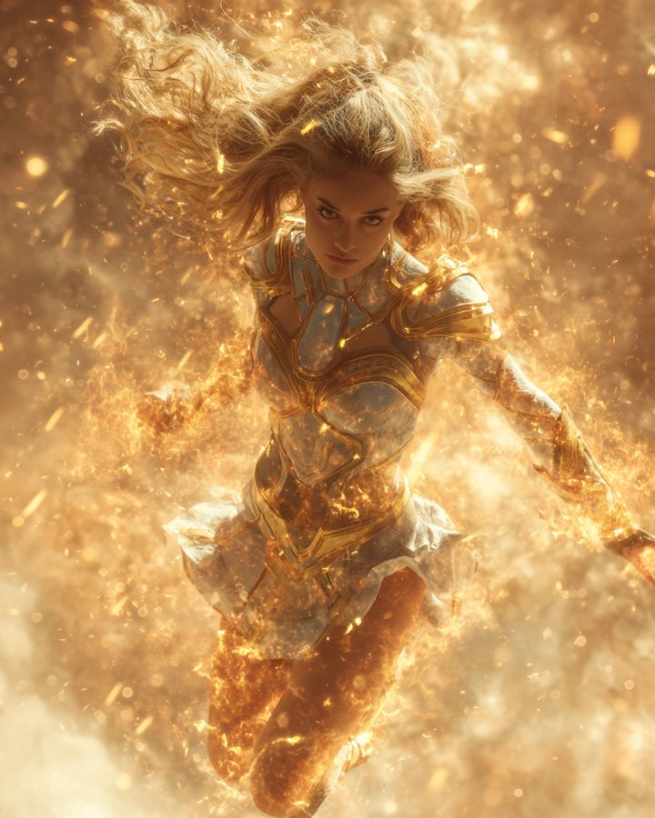

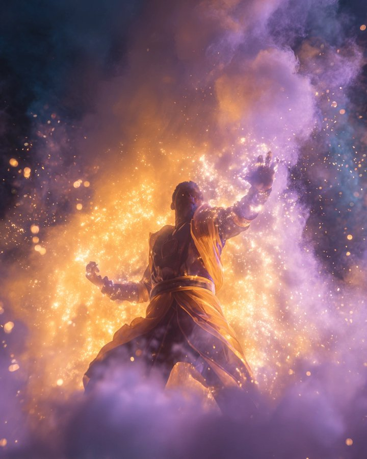

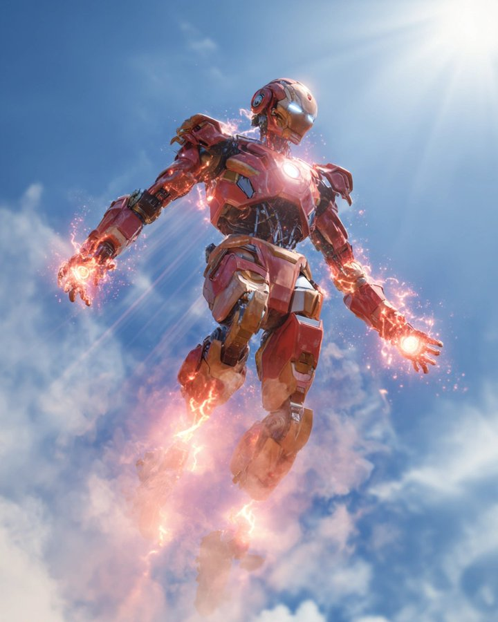

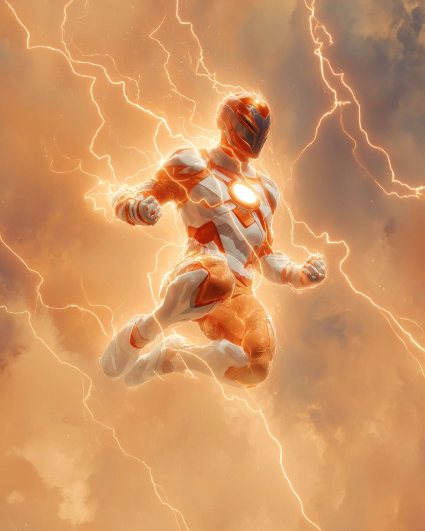

```
[SUBJECT] emerging as a Solar-Flare Avenger, harnessing the blazing power of the sun in a dramatic, high-energy pose. Combine fiery [COLOR1] flares and radiant [COLOR2] beams to capture the explosive force of solar-powered heroics
```

```
A goddess emerging as a Solar-Flare Avenger, harnessing the blazing power of the sun in a dramatic, high-energy pose. Combine fiery gold flares and radiant sapphire beams to capture the explosive force of solar-powered heroics.
```

```
A sorcerer emerging as a Solar-Flare Avenger, harnessing the blazing power of the sun in a dramatic, high-energy pose. Combine fiery yellow flares and radiant lavender beams to capture the explosive force of solar-powered heroics
```

```
Robot emerging as a Solar-Flare Avenger, harnessing the blazing power of the sun in a dramatic, high-energy pose. Combine fiery red flares and radiant blue beams to capture the explosive force of solar-powered heroics
```

```
Solar Knight emerging as a Solar-Flare Avenger, harnessing the blazing power of the sun in a dramatic, high-energy pose. Combine fiery Orange flares and radiant White beams to capture the explosive force of solar-powered heroics.
```

 [↑返回目录](#toc)

---
## <a id="">被框住的现实：极简主义时尚肖像</a> (<a href="https://x.com/Kashberg_0/status/2021789363341079013" target="_blank" rel="noopener noreferrer">Kashberg</a>)

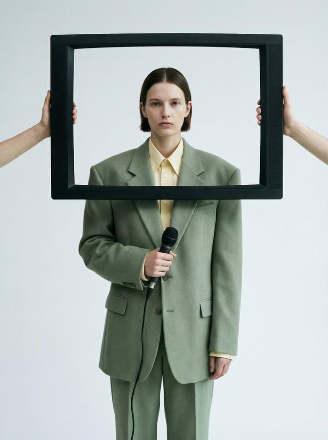

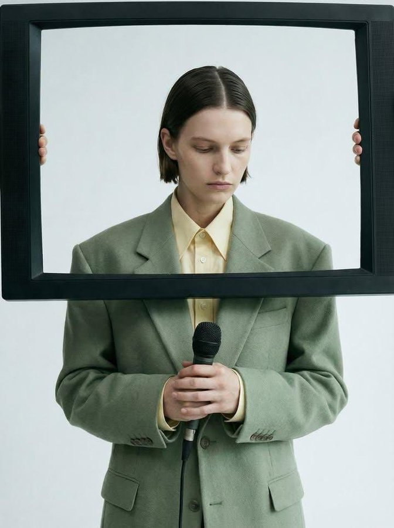

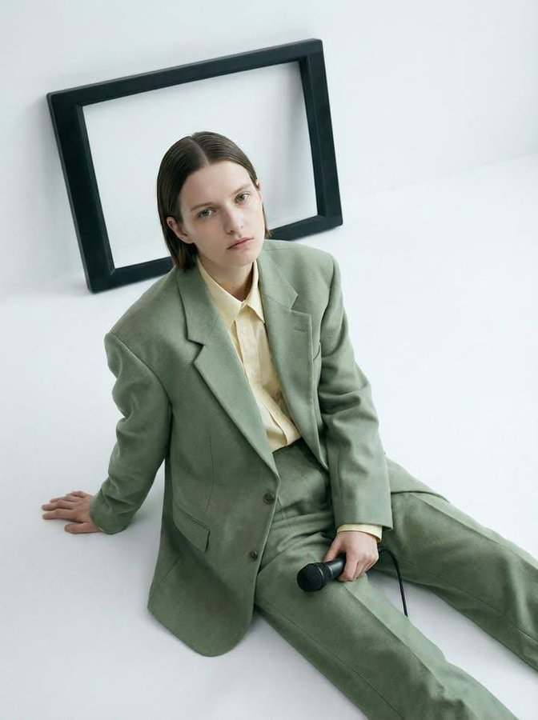

```
Minimalist conceptual fashion portrait of an androgynous model wearing an oversized sage green suit with a pale yellow button-up shirt, holding a black wired microphone. Clean white studio background with soft diffused lighting and muted pastel tones. A large black rectangular frame is positioned around the model’s head and shoulders, held by unseen hands from the sides, creating a surreal “framed reality” effect. Neutral facial expression, straight short hair parted in the middle, editorial high-fashion aesthetic, sharp details, soft shadows, balanced composition, contemporary art photography style, medium format camera, ultra-realistic, high resolution.
```

```
一张极简主义概念时尚肖像，中性模特身穿宽大的鼠尾草绿色西装，内搭浅黄色纽扣衬衫，手持一支黑色有线麦克风。背景为干净的白色摄影棚，采用柔和漫射光线与低饱和度的粉彩色调。模特头肩周围环绕着一个巨大的黑色矩形画框，由画面两侧不可见的手持握，营造出超现实的“被框住的现实”效果。面部表情中性，直短发中分，整体呈现高定时装大片风格，细节锐利，阴影柔和，构图均衡，具有当代艺术摄影风格，使用中画幅相机拍摄，超写实，高分辨率。
```

 [↑返回目录](#toc)

---
## <a id="">漂浮的番茄城堡岛屿</a> (<a href="https://x.com/drzubi01/status/2021802996003483948" target="_blank" rel="noopener noreferrer">Martian</a>)

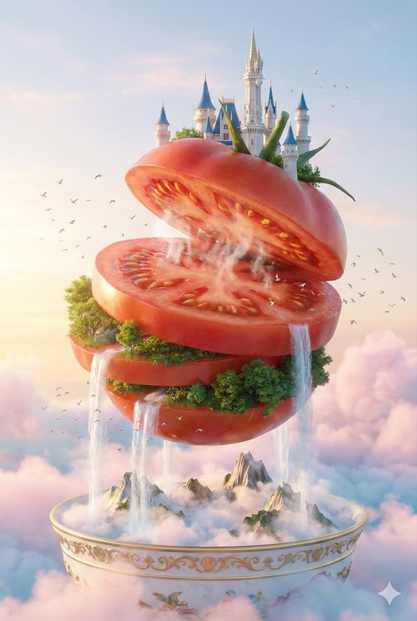

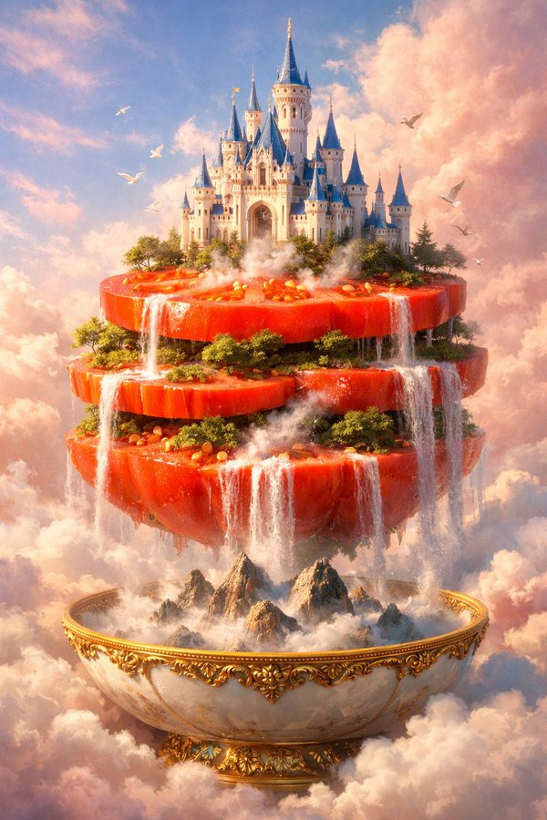

```
{
  "image_description": "A surreal, fantasy-inspired digital artwork featuring a floating tomato island castle formed from layered slices, blending cinematic realism with whimsical dreamlike elements.",
  "subject": {
    "main_element": "A giant heirloom tomato sliced into multiple floating layers forming an island",
    "variation": "Top slice partially lifted like a lid in one version, fully stacked tiered structure in another",
    "structure": "A white and blue gothic-style fairytale castle with tall spires built on the top tomato layer",
    "details": [
      "Waterfalls pouring from the tomato slices into clouds below",
      "Steam or mist rising from exposed tomato seeds",
      "Greenery, shrubs, and miniature trees growing between layers",
      "Birds flying around the floating structure",
      "Hyper-realistic tomato flesh texture with visible seeds and moisture"
    ]
  },
  "environment": {
    "background": "Soft pastel sky with pink and blue clouds, ethereal cinematic atmosphere",
    "foreground": "An ornate gold-rimmed porcelain bowl holding mountain peaks emerging from clouds",
    "atmosphere": "Floating, dreamlike, high-altitude fantasy setting"
  },
  "style": {
    "art_movement": "Surrealism / Digital Fantasy Art",
    "influences": [
      "Fairytale concept art",
      "Cinematic matte painting",
      "High-end 3D render aesthetics"
    ],
    "lighting": "Soft golden hour sunlight, high-key lighting with gentle glow",
    "color_palette": [
      "Vibrant tomato red",
      "Soft pastel pink",
      "Sky blue",
      "Gold accents",
      "Lush deep green"
    ],
    "texture": "Photorealistic organic textures contrasted with smooth fantasy architecture"
  },
  "technical_parameters": {
    "composition": "Central vertical composition, low-angle perspective, hero shot framing",
    "rendering": "8k resolution, ultra-detailed, photorealistic, octane render, cinematic depth of field",
    "quality_tags": [
      "high detail",
      "hyper-real",
      "cinematic",
      "fantasy concept art",
      "ultra sharp"
    ]
  }
}
```

```
一幅超现实、幻想风格的数字艺术作品，描绘一座由多层切片番茄构成的漂浮岛屿城堡，融合了电影级写实主义与梦幻奇想元素。主体是一颗巨大的传家宝番茄，被切成多层并悬浮在空中形成岛屿；其中一版顶部切片如盖子般微微掀起，另一版则呈现完整的堆叠塔状结构。番茄最上层建有一座白色与蓝色相间的哥特式童话城堡，拥有高耸尖塔。细节包括：番茄切片边缘有瀑布倾泻而下，流入下方云层；暴露的番茄籽散发出蒸汽或薄雾；各层之间生长着绿植、灌木和微型树木；周围有飞鸟环绕；番茄果肉呈现高度写实的质感，可见种子与水分。背景为柔和的粉蓝渐变天空，云朵呈粉红与天蓝色，营造出空灵的电影氛围；前景是一个饰有金色边框的精致瓷碗，碗中云海之上浮现出山峰。整体环境设定于高空漂浮的梦幻奇幻场景。艺术风格融合超现实主义与数字幻想艺术，受童话概念艺术、电影级绘景及高端3D渲染美学影响。光照采用柔和的黄金时刻阳光，高调照明并带有淡淡辉光。配色以鲜艳番茄红、柔雾粉、天蓝、金色点缀及浓郁深绿为主。材质上，写实有机纹理与光滑幻想建筑形成鲜明对比。构图采用中央垂直布局、低角度视角与英雄镜头取景，以8K分辨率、极度精细、照片级真实感、Octane渲染及电影级景深呈现，具备高细节、超写实、电影感、幻想概念艺术和超锐利等品质特征。
```

 [↑返回目录](#toc)

---
## <a id="">融合自然的LOGO</a> (<a href="https://x.com/AmirMushich/status/2021588848711537027" target="_blank" rel="noopener noreferrer">AmirMušić</a>)

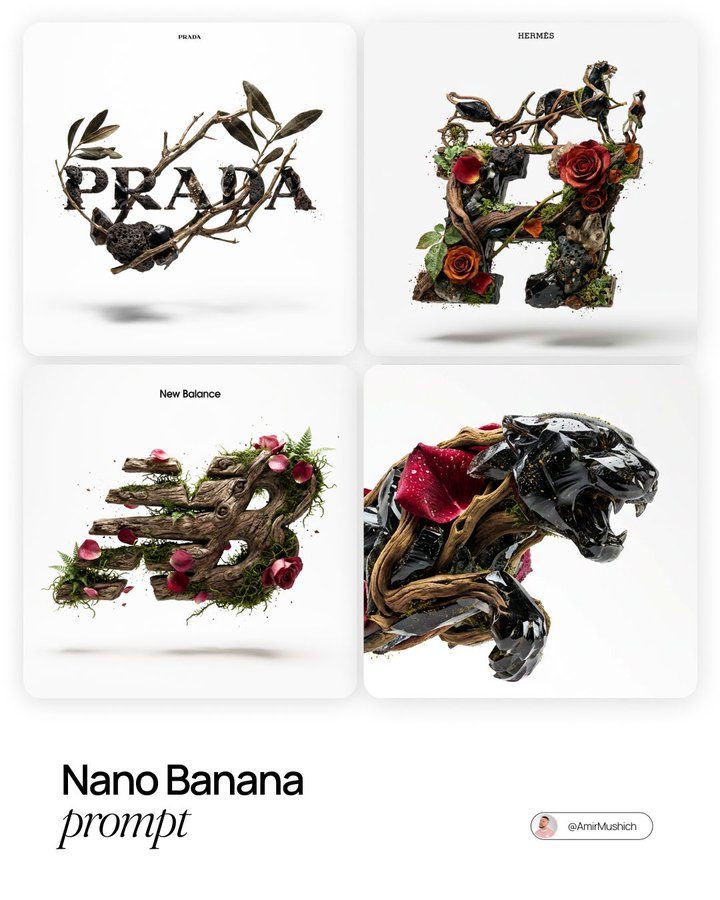

```
[BRAND NAME]. Act as a Master of Material Science and World-Class 3D Visualizer.
PHASE 1: DYNAMIC ELEMENTAL RECONSTRUCTION.
The central subject is the iconic logo of [BRAND NAME], physically constructed from ANY raw natural element.
CRITICAL: This includes, but is not limited to, botanical elements (flowers, rose petals, thorns, gnarled wood, moss, leaves) and geological/elemental materials (obsidian, crystals, flowing water, ice, volcanic rock).
The logo must be medium-sized, levitating, and rotated at a dynamic 3D angle (3/4 view) to showcase its volume.
PHASE 2: HYPER-TACTILE TEXTURE & REALISM.
The goal is "Sensory Realism" — the viewer should feel they can touch the object.
- If BOTANICAL: Render microscopic cellular structures on petals, dew droplets with refraction, and the velvety fuzz on stems.
- If MINERAL: Render micro-pores, crystalline inclusions, and razor-sharp edges.
Include subtle "imperfections" like dust particles or organic irregularities to break the CG look and achieve 100% photorealism.
PHASE 3: COMPOSITION, LIGHTING & BRANDING.
- ENVIRONMENT: A pure, clinical, solid white background for a High-Key commercial look.
- TYPOGRAPHY: At the top of the frame, place a very small, minimalist [BRAND NAME] text logo in black.
- LIGHTING: Precise studio setup with sharp specular highlights (glints) and a soft, realistic contact shadow on the white floor below to ground the levitating object.
TECH SPECS:
Extreme Macro photography, 100mm lens, f/8, Ray Tracing (Path Tracing), Subsurface Scattering for light depth, 8k resolution, Unreal Engine 5.4 / Octane Render aesthetic.
```

```
[品牌名称]。扮演材料科学大师与世界级3D视觉艺术家。  
第一阶段：动态元素重构。  
核心主体为[品牌名称]的标志性Logo，由任意天然原始元素实体构建而成。  
关键要求：包括但不限于植物元素（花朵、玫瑰花瓣、荆棘、虬结木材、苔藓、叶片）及地质/自然元素（黑曜石、水晶、流动的水、冰、火山岩）。  
Logo需为中等尺寸，悬浮于空中，并以动态三维角度（3/4视角）呈现，以充分展现其立体感。  

第二阶段：超触感纹理与真实感。  
目标是“感官级真实感”——观者应产生可触摸该物体的错觉。  
- 若为植物材质：需呈现花瓣上的微观细胞结构、具有折射效果的露珠，以及茎干上细腻的绒毛质感。  
- 若为矿物材质：需表现微孔结构、晶体包裹体及锋利如刃的边缘。  
加入细微“不完美”细节，如尘埃颗粒或有机形态的不规则性，以打破CG感，达成100%照片级真实感。  

第三阶段：构图、光影与品牌呈现。  
- 环境：纯白、洁净、无瑕的高调商业背景。  
- 字体排印：画面顶部置入极小尺寸、极简风格的黑色[品牌名称]文字Logo。  
- 光影：精准的影棚布光，包含锐利的镜面高光（闪光点），并在白色地面上投射柔和而真实的接触阴影，以锚定悬浮物体。  

技术规格：  
极致微距摄影，100mm镜头，f/8光圈，光线追踪（路径追踪），次表面散射以增强光线深度，8K分辨率，采用Unreal Engine 5.4 / Octane Render美学风格。
```

 [↑返回目录](#toc)

---
## <a id="">简约风格化3D角色形象</a> (<a href="https://x.com/ecommartinez/status/2021552578568532436" target="_blank" rel="noopener noreferrer">Alejo</a>)

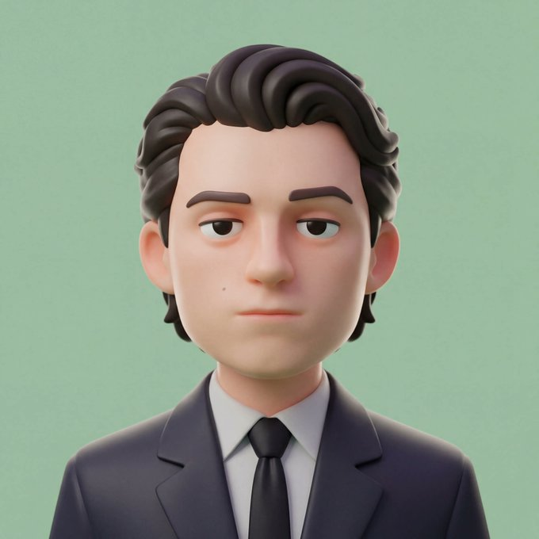

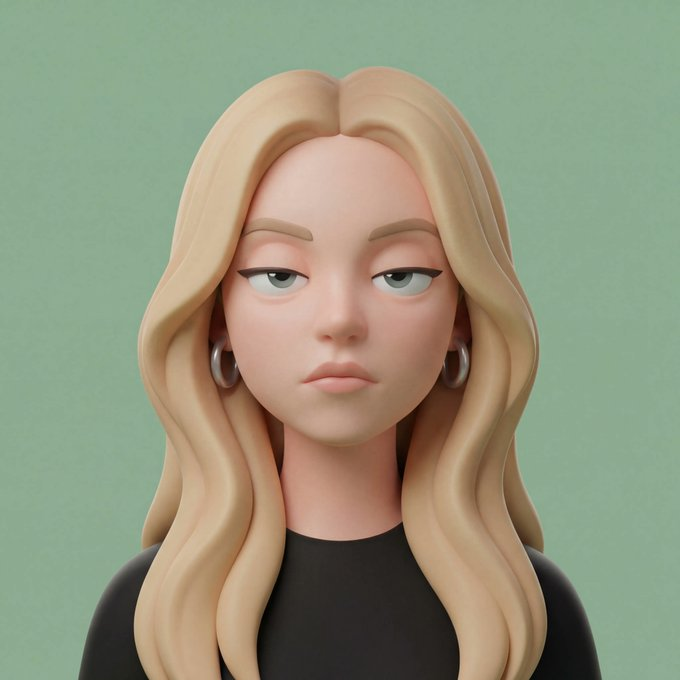

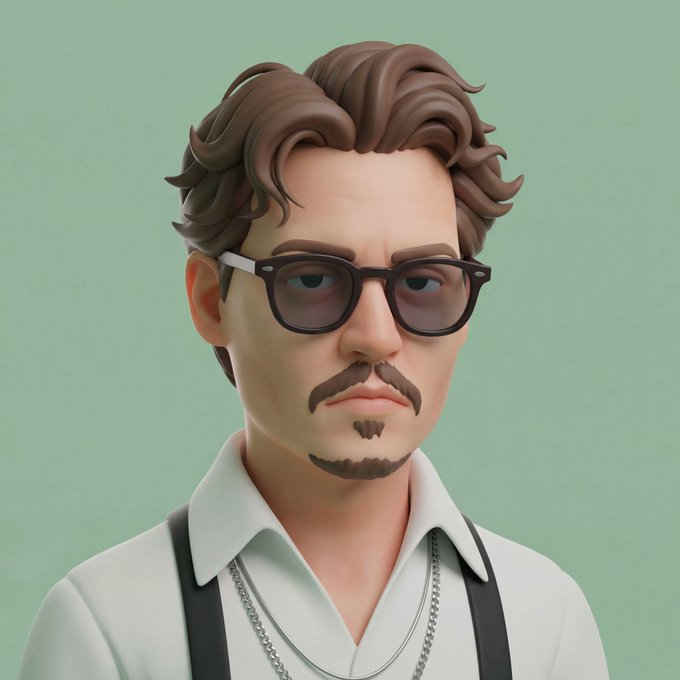

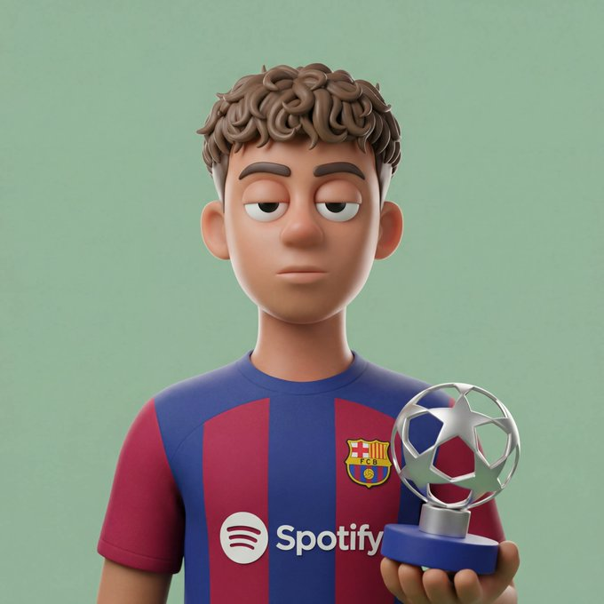

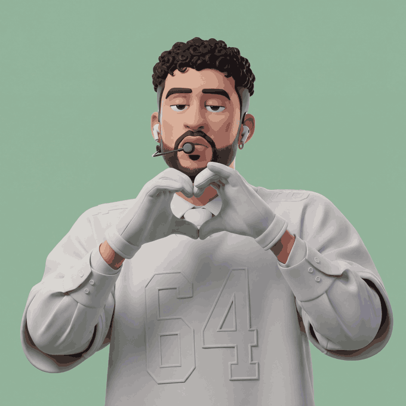

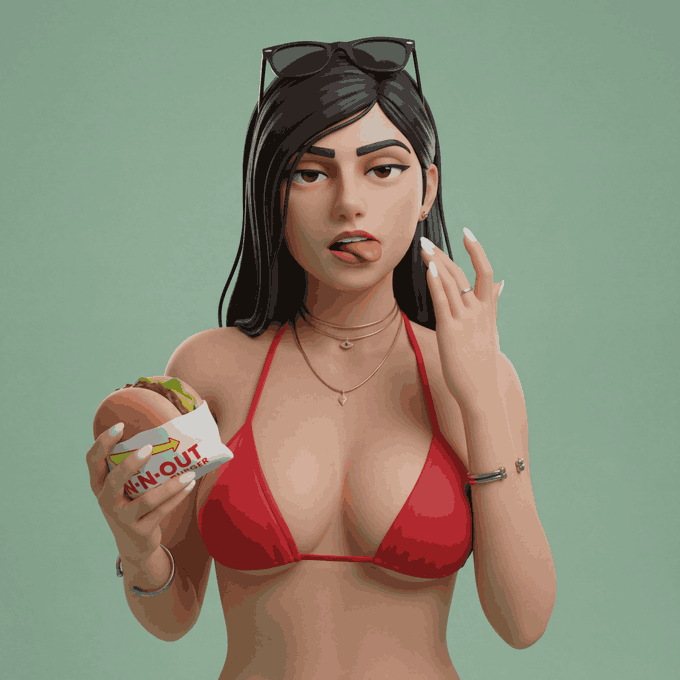

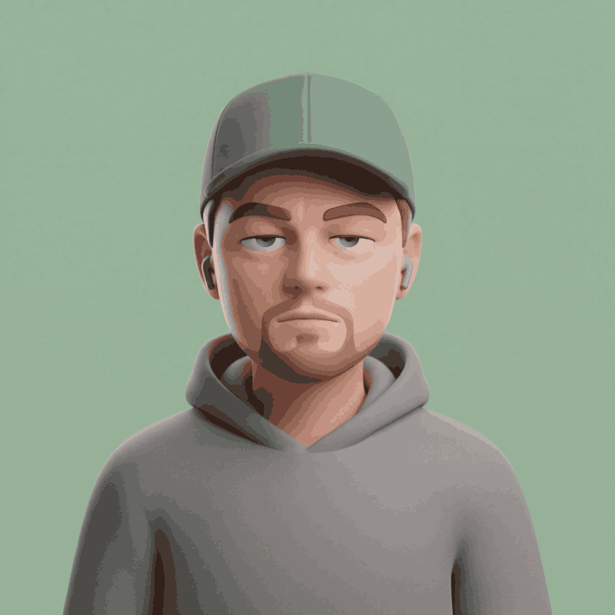

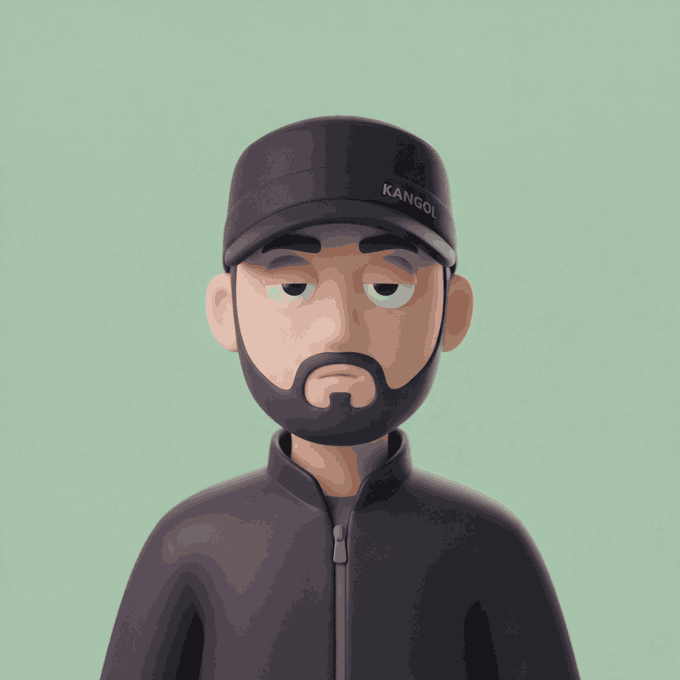

```
{
 "task": "image_style_transfer_3d_character",
 "input": {
 "source_image": "USER_UPLOADED_IMAGE",
 "preserve_identity": true,
 "preserve_pose": true,
 "preserve_composition": true
 },
 "style_reference": {
 "render_style": "stylized_3d_character",
 "aesthetic": "soft_minimal_cartoon_3d",
 "inspiration": [
 "pixar_like_but_more_minimal",
 "toy_figure_render",
 "clean_product_character_design"
 ]
 },
 "character_design": {
 "skin": {
 "material": "smooth_matte_plastic",
 "texture": "soft_uniform",
 "subsurface_scattering": "gentle"
 },
 "facial_features": {
 "eyes": "half_closed_bored_expression",
 "eyelids": "heavy",
 "nose": "rounded_simplified",
 "mouth": "flat_neutral",
 "ears": "simplified_rounded"
 },
 "emotion": "unimpressed_calm_bored"
 },
 "clothing": {
 "style": "minimal_streetwear",
 "details": "no_logos_no_patterns",
 "fabric": "soft_matte"
 },
 "accessories": {
 "headwear": "simple_baseball_cap_optional",
 "ear_accessories": "wireless_earbuds_optional"
 },
 "lighting": {
 "setup": "studio_softbox",
 "shadows": "very_soft",
 "contrast": "low",
 "highlights": "subtle"
 },
 "background": {
 "type": "solid_color",
 "color_palette": [
 "muted_green",
 "pastel_tone"
 ],
 "gradient": "none"
 },
 "camera": {
 "angle": "front_facing",
 "framing": "medium_close_up",
 "lens": "50mm_equivalent",
 "distortion": "none"
 },
 "render_quality": {
 "resolution": "high",
 "edges": "clean",
 "noise": "none",
 "realism_balance": "stylized_over_realistic"
 },
 "output": {
 "consistency": "high",
 "style_strength": "strong",
 "photorealism": false
 }
}
```

```
将用户上传的照片转换为风格化的三维角色形象，保留原始身份特征、姿势和构图。  
采用柔和极简的卡通三维美学风格，灵感源自皮克斯风格但更加简约、玩具人偶渲染效果以及干净的产品角色设计。  

角色皮肤使用光滑哑光塑料材质，纹理均匀柔和，并带有轻微次表面散射效果。  
面部特征表现为半闭双眼、沉重的眼睑、圆润简化的鼻子、扁平中性的嘴巴以及简化圆润的耳朵，整体情绪呈现冷静、无聊且不以为然的状态。  

服装为极简直线街头风格，无任何标志或图案，面料为柔软哑光质感。  
可选配饰包括一顶简约棒球帽和无线耳塞。  

灯光采用影棚柔光箱设置，阴影极柔和，对比度低，高光微妙。  
背景为纯色，使用低饱和绿色或柔和粉彩色调，无渐变。  

相机采用正面视角，中近景构图，等效50毫米镜头，无畸变。  

输出要求高分辨率、边缘清晰、无噪点，整体偏向风格化而非写实。  
确保风格强度高、输出一致性好，不追求逼真感。
```

 [↑返回目录](#toc)

---
## <a id="">1984年苹果风格的复古产品设计</a> (<a href="https://x.com/lloydcreates/status/2022154404888035619" target="_blank" rel="noopener noreferrer">Lloyd Creates</a>)

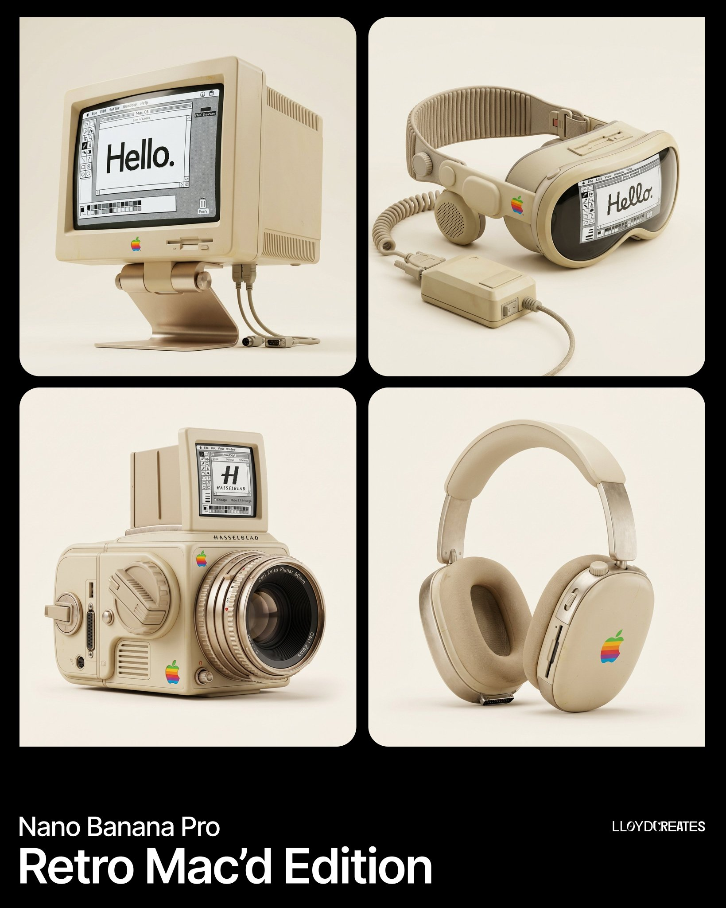

```
{
  "prompt_template": {
    "product_placeholder": "[YOUR PRODUCT]",
    "prompt": "Ultra-realistic 3D render of a {product_placeholder} reimagined as if it were designed and manufactured in 1984 by Apple Computer. The product keeps its original form, function, and purpose fully intact — all functional elements remain true to what the product actually does. If the product has a screen, keep it as a full working screen. If the product has a flame, keep the flame mechanism. If the product has laces, keep laces. If the product has a lens, keep a lens. Do not remove or replace any core functional element — instead, translate the MATERIALS and AESTHETIC into 1984 Apple Macintosh era design language. The entire product body is remade in warm beige-cream (#E8DCCA) injection-molded matte thermoplastic with soft rounded edges, visible mold seam lines, and subtle chamfers typical of early 1980s Apple hardware. Where the original product uses metal, use brushed warm-toned metal with a slightly aged patina that fits the 1984 era — metallic elements are allowed and encouraged where the real product has them, but styled as vintage brushed aluminum or aged chrome rather than modern finishes. Screens and displays show 1-bit black-and-white bitmap pixel graphics — MacPaint-style interface, Chicago bitmap font, pixelated icons, early Mac OS windows — but the screen itself retains its original size and shape from the real product, with a warm beige plastic bezel frame around it and a subtle convex CRT glass curvature. Physical controls are translated into 1980s mechanical equivalents — tactile clicky switches, rotary dials, sliding toggles, ribbed thumbwheels — but only where the real product already has controls. Ports become era-appropriate: thick serial connectors, ADB ports, SCSI-style plugs. Ventilation slots and perforated speaker grilles in beige plastic where appropriate. A small 3.5-inch floppy disk drive slot integrated somewhere natural on the product body. The six-color rainbow Apple logo (1977-1998 horizontal stripe version) appears exactly once in a prominent location. Subtle aging — very faint yellowing, micro-scratches, warm patina of well-kept vintage electronics. The product should feel like a real product Apple actually could have shipped in 1984 — functional, considered, authentic to both the original product's purpose and the Macintosh design language. Soft even studio lighting on a clean warm off-white (#F5F0E8) background with subtle soft shadow. Product centered in frame, fully visible, never cropped or cut off. No text overlays, no watermarks, no additional objects, no props, no stands, no hands. Photorealistic, 8K resolution, product photography, square 1:1 aspect ratio.",
    "negative_prompt": "removed functional elements, missing screen, missing flame, missing lens, missing functional parts, modern materials, glossy black plastic, matte black, modern brushed aluminum, modern glass, modern UI, color LCD, OLED, LED display, flat screen without CRT curve, modern ports, USB-C, Lightning, cropped product, cut off product, partial product, text, watermark, dark background, black background, neon colors, futuristic, additional objects, hands, fingers, props, stands, platforms",
    "settings": {
      "aspect_ratio": "1:1 square or 4:5 portrait",
      "style": "photorealistic retro product design render",
      "resolution": "highest available",
      "guidance_scale": "7-9 recommended",
      "color_palette": {
        "primary_body": "#E8DCCA — warm beige-cream matte plastic",
        "secondary_body": "#D4C8B6 — slightly darker beige for recessed panels and seams",
        "metal_accents": "brushed warm-toned vintage aluminum or aged chrome — allowed where the real product has metal",
        "screen_content": "1-bit black and white bitmap pixel graphics on subtle convex CRT glass",
        "logo": "six-color rainbow Apple logo — once only",
        "background": "#F5F0E8 — clean warm off-white"
      },
      "core_philosophy": {
        "rule": "Translate the AESTHETIC, not the FUNCTION",
        "keep": "every functional element the real product has — screens stay screens, flames stay flames, lenses stay lenses, laces stay laces, metal stays metal",
        "change": "materials become 1984 Apple beige plastic and vintage metals, screens show 1-bit CRT pixel graphics, controls become mechanical tactile equivalents, ports become era-appropriate connectors",
        "feel": "a real product Apple could have shipped in 1984 that serves the same purpose as the original"
      },
      "material_translation": {
        "modern_plastic": "warm beige thermoplastic with mold seam lines",
        "modern_glass": "convex CRT glass with beige plastic bezel",
        "modern_metal": "brushed warm vintage aluminum or aged chrome with patina",
        "modern_rubber": "slightly yellowed vintage rubber or silicone",
        "modern_fabric": "allowed as-is if the product has fabric — keep natural",
        "modern_leather": "allowed as-is if the product has leather — keep natural with warm tone"
      },
      "product_rules": {
        "silhouette": "original product proportions and overall shape preserved",
        "function": "all functional elements intact — never remove what makes the product work",
        "position": "centered in frame, fully visible",
        "cropping": "NEVER crop or cut off any part of the product",
        "padding": "minimum 15% padding on all sides",
        "logo": "rainbow Apple logo appears exactly once prominently",
        "floppy_slot": "one 3.5-inch floppy disk drive slot integrated naturally",
        "isolation": "no props, no stands, no hands, no additional objects"
      }
    },
  }
}
```

```
超写实3D渲染图：将[YOUR PRODUCT]重新构想为1984年由苹果电脑公司设计和制造的产品。产品保持其原始形态、功能与用途完全不变——所有功能性元素都忠实于产品原本的实际用途。如果产品有屏幕，保留完整可用的屏幕；如果有火焰装置，保留火焰机制；如果有鞋带，保留鞋带；如果有镜头，保留镜头。不得移除或替换任何核心功能部件，而是将材质与美学风格转化为1984年Apple Macintosh时代的工业设计语言。

整个产品外壳采用温暖的米奶油色（#E8DCCA）注塑成型哑光热塑性塑料，带有柔和圆润的边缘、可见的模具接缝线，以及早期1980年代苹果硬件典型的细微倒角。原产品中使用的金属部分，替换为带有轻微岁月痕迹的暖色调拉丝金属——若原产品确有金属部件，则允许并鼓励使用，但需呈现为复古拉丝铝或做旧镀铬效果，而非现代表面处理。

屏幕和显示器显示1位黑白位图像素图形——MacPaint风格界面、Chicago点阵字体、像素化图标、早期Mac OS窗口——但屏幕本身保留原产品的真实尺寸与形状，并配有温暖米色塑料边框及轻微凸起的CRT玻璃曲面。

物理控制元件转化为1980年代的机械式等效物——如清脆按压开关、旋转旋钮、滑动拨杆、带纹路的拇指滚轮——但仅限于原产品已有的控制部位。接口替换为符合时代特征的连接器：粗大的串行接口、ADB端口、SCSI风格插头。在适当位置加入米色塑料通风槽和穿孔扬声器格栅。产品本体自然位置集成一个3.5英寸软盘驱动器插槽。

六色彩虹苹果标志（1977–1998年横向条纹版）在显著位置精确出现一次。整体呈现微妙的老化痕迹——极淡的泛黄、细微划痕、保养良好的复古电子产品特有的温暖包浆。

产品应让人感觉是苹果在1984年真实可能推出的一款产品——既忠于原产品的功能，又完全契合Macintosh的设计语言。

柔和均匀的影棚灯光，背景为干净温暖的米白色（#F5F0E8），带有轻微柔影。产品居中构图，完整可见，绝不裁切或截断。无文字叠加、无水印、无额外物体、无道具、无支架、无手部。照片级真实感，8K分辨率，产品摄影风格，1:1正方形画幅。
```

 [↑返回目录](#toc)

---
## <a id="">光影中的沉思青年</a> (<a href="https://x.com/Taaruk_/status/2021933979398492325" target="_blank" rel="noopener noreferrer">Taaruk</a>)

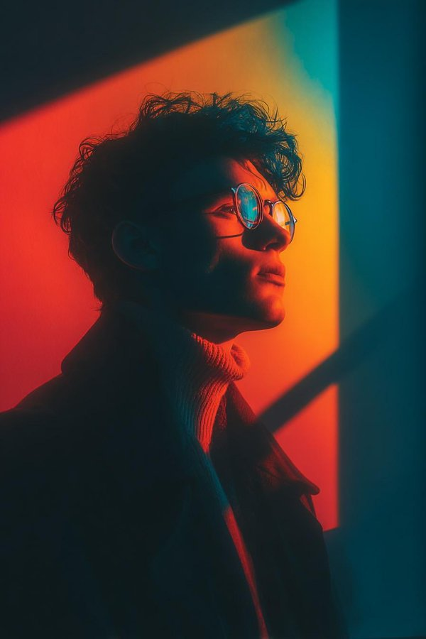

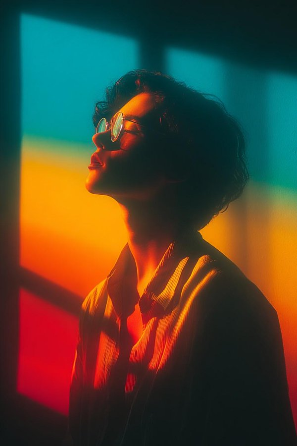

```
Cinematic portrait of a stylish young person wearing round glasses, standing beside a wall illuminated by bold geometric window light. Strong red, orange, and teal color contrast casting dramatic shadows across the face. Side profile pose, soft contemplative expression, sharp focus on facial features. High contrast lighting with hard-edged rectangular light shapes in the background. Moody atmosphere, artistic color blocking, modern editorial photography style. Shot on 85mm lens, f/1.8, ultra-detailed skin texture, shallow depth of field, dramatic rim lighting, 8K resolution.
```

```
电影感肖像，一位时尚年轻人佩戴圆形眼镜，站在一堵墙边，墙面被大胆几何形状的窗光照射。强烈的红、橙与青绿色对比，在面部投下戏剧性的阴影。侧脸姿势，神情柔和沉思，面部特征清晰锐利。背景中带有硬边缘的矩形光斑，高对比度布光。氛围忧郁，色彩区块富有艺术感，现代杂志摄影风格。使用85mm镜头，光圈f/1.8，皮肤纹理超精细，浅景深，强烈的轮廓光，8K分辨率。
```

 [↑返回目录](#toc)

---
## <a id="">把城市「印」成一张邮票</a> (<a href="https://x.com/VigoCreativeAI/status/2021941268545515698" target="_blank" rel="noopener noreferrer">Vigo Zhao</a>)

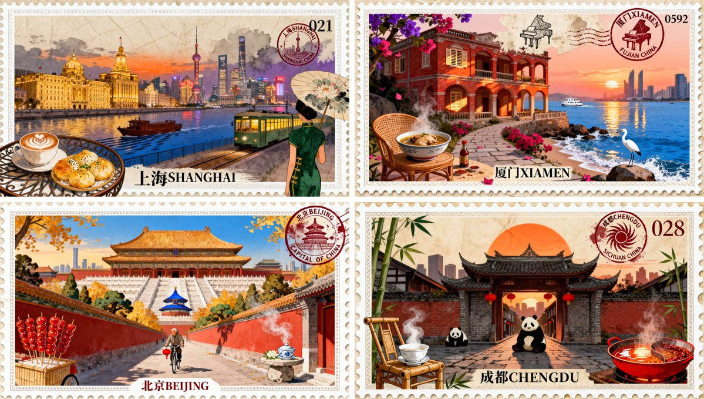

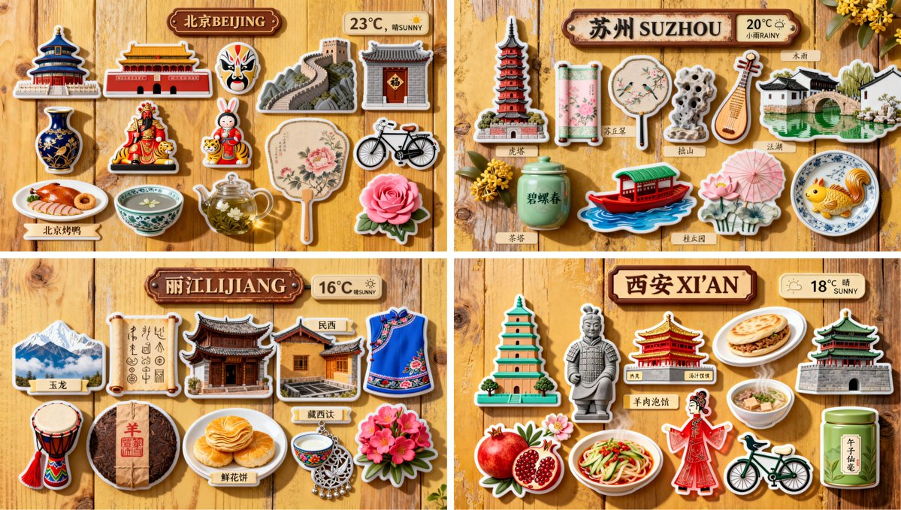

```
一张精心设计的上海主题收藏邮票，16:9横版构图，整体背景为微微泛黄的老纸质感，带有细腻的纸纹肌理，营造出真实的复古印刷氛围。邮票四周为标准的白色齿孔边框，内侧印有细密的花纹装饰线，右上角标注面值「021」。 邮票主图以外滩黄浦江畔的黄昏时分为核心视角，万国建筑群的米黄色石材立面在暮色余晖中泛着金光，哥特式尖塔与巴洛克穹顶沿江岸一字排开，气势磅礴。前景左侧是一张老上海咖啡馆的圆形铁艺桌，桌上摆着一杯拿铁咖啡，奶泡上拉出一朵精致的玫瑰花纹，旁边是一份刚出炉的生煎包，金黄色底部焦脆，芝麻与葱花点缀其上。前景右侧是一位穿着旗袍的女子背影，旗袍为墨绿色底配金色盘扣，手持一把半开的油纸伞，伞面绘有水墨荷花。中景是黄浦江上的摆渡船，深褐色木质船身在江面上留下细长的波纹，对岸陆家嘴的东方明珠塔和金茂大厦在暮色中渐渐点亮霓虹。一列复古有轨电车从画面右侧驶入，草绿色的车身与老建筑相映成趣，车窗内透出暖黄色的灯光。远景是浦东现代天际线的完整轮廓，璀璨灯火与外滩历史建筑在同一画面中形成强烈的古今对望。 整体色调以外滩米金、黄浦江深蓝为主色调，点缀旗袍墨绿、霓虹橙红与暮色紫灰，画面右上角印有深红色圆形邮戳，邮戳上弧写「上海 SHANGHAI」，下弧写「SHANGHAI CHINA」，中央为简洁的东方明珠线描图案，带有做旧的油墨晕染效果。邮票底部居中印有「上海 SHANGHAI」中英文标题，字体为工整的宋体与衬线体组合。整体印刷风格参考1980至1990年代中国经典邮票的工笔插画质感，色彩饱满细腻，线条清晰富有层次感，兼具收藏价值与城市辨识度
```

```
一张精心设计的【城市名】主题收藏邮票，16:9横版构图，整体背景为微微泛黄的老纸质感，带有细腻的纸纹肌理，营造出真实的复古印刷氛围。邮票四周为标准的白色齿孔边框，内侧印有细密的花纹装饰线，右上角标注面值「【城市区号】」。
邮票主图以【核心场景】为视角，【地标建筑描述】占据画面中央，【光线与氛围描述】。前景左侧是【美食/生活元素1】；前景右侧是【美食/生活元素2】。中景是【文化符号/交通/人物描述】，远景是【现代天际线/古今交融描述】。
整体色调以【主色调1】、【主色调2】为主色调，点缀【点缀色】，画面右上角印有深红色圆形邮戳，邮戳上弧写「【城市中英文】」，下弧写「【省份 CHINA】」，中央为简洁的【城市标志性元素】线描图案，带有做旧的油墨晕染效果。邮票底部居中印有「【城市中英文】」中英文标题，字体为工整的宋体与衬线体组合。整体印刷风格参考1980至1990年代中国经典邮票的工笔插画质感，色彩饱满细腻，线条清晰富有层次感，兼具收藏价值与城市辨识度。

```

 [↑返回目录](#toc)

---
## <a id="">霓虹X光电吉他解剖图</a> (<a href="https://x.com/AllaAisling/status/2021994126984589396" target="_blank" rel="noopener noreferrer">Alexandra Aisling</a>)

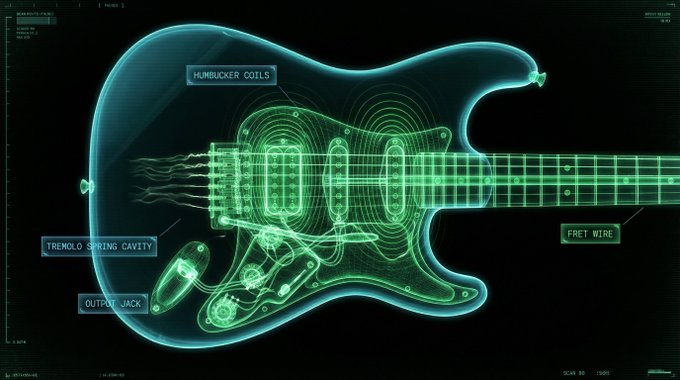

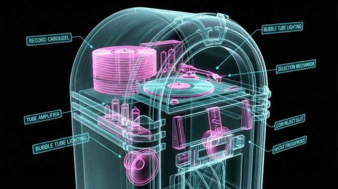

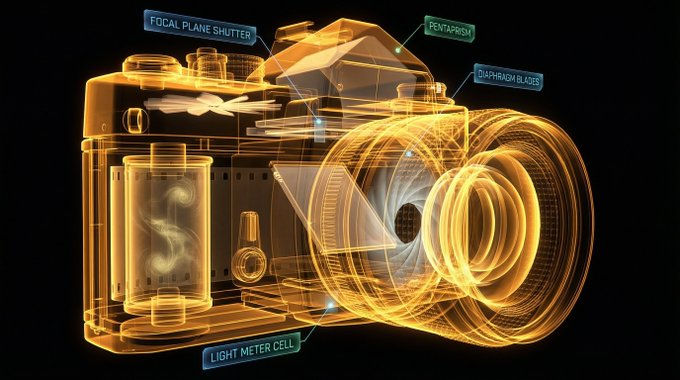

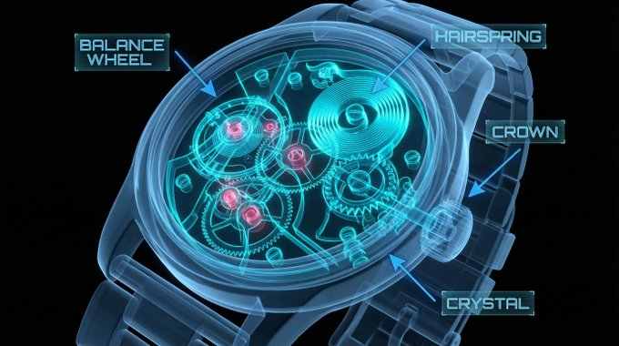

```
Neon X-Ray Photorealistic [OBJECT] shown as glowing X-ray scan against pure black background. Internal structure visible in electric [COLOR] neon wireframe, outer shell semi-transparent. Floating holographic labels pointing to key [COMPONENTS]. Cyberpunk medical scan aesthetic, ultra-sharp, dramatic glow effects.    

Check ALTs for ideas  @AdobeFirefly
```

```
Neon X-Ray Photorealistic electric guitar shown as glowing X-ray scan against pure black background. Internal structure visible in electric neon green neon wireframe—pickup magnets pulsing with electromagnetic field, truss rod running through neck spine, bridge saddles vibrating with ghost strings, potentiometer wiring snaking through body cavity. Outer shell semi-transparent. Floating holographic labels pointing to key components: HUMBUCKER COILS, TREMOLO SPRING CAVITY, OUTPUT JACK, FRET WIRE. Cyberpunk medical scan aesthetic, ultra-sharp, dramatic glow effects.
```

```
Neon X-Ray Photorealistic vintage jukebox shown as glowing X-ray scan against pure black background. Internal structure visible in electric bubblegum pink and turquoise neon wireframe—record stack carousel glowing with vinyl potential, tone arm poised above spinning platter, vacuum tubes pulsing with amplified warmth, coin mechanism frozen mid-tumble, speaker cones vibrating with ghost frequencies. Outer shell semi-transparent. Floating holographic labels pointing to key components: RECORD CAROUSEL, SELECTION MECHANISM, TUBE AMPLIFIER, COIN REJECT SLOT, BUBBLE TUBE LIGHTING. Cyberpunk medical scan aesthetic, ultra-sharp, dramatic glow effects.
```

```
Neon X-Ray Photorealistic vintage camera shown as glowing X-ray scan against pure black background. Internal structure visible in electric amber gold neon wireframe—shutter blades frozen mid-exposure, mirror box tilted at 45 degrees, film canister glowing with latent images, lens elements stacked like luminous rings. Outer shell semi-transparent. Floating holographic labels pointing to key components: FOCAL PLANE SHUTTER, PENTAPRISM, DIAPHRAGM BLADES, LIGHT METER CELL. Cyberpunk medical scan aesthetic, ultra-sharp, dramatic glow effects.
```

```
Neon X-Ray Photorealistic mechanical wristwatch shown as glowing X-ray scan against pure black background. Internal structure visible in electric cyan neon wireframe—mainspring coiled like glowing serpent, escape wheel teeth catching light, ruby jewels pulsing red, gear train meshing in precise dance. Outer shell semi-transparent. Floating holographic labels pointing to key components: BALANCE WHEEL, HAIRSPRING, CROWN, CRYSTAL. Cyberpunk medical scan aesthetic, ultra-sharp, dramatic glow effects.
```

 [↑返回目录](#toc)

---
## <a id="">[水果名称]创意包装设计展示</a> (<a href="https://x.com/Arminn_Ai/status/2022199501168038032" target="_blank" rel="noopener noreferrer">ΛRMIN | AI</a>)

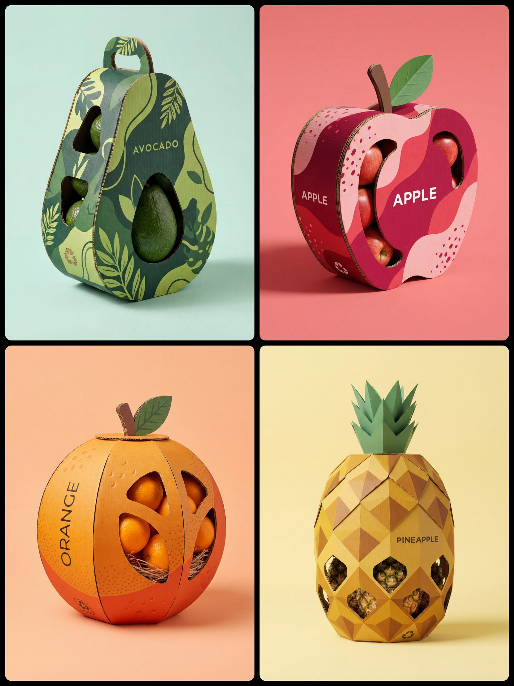

```
A high-quality professional product photography of a creative structural packaging design for [Fruit Name]. The packaging is made of premium corrugated cardboard, intricately crafted into the literal shape of a giant stylized [Shape e.g. spherical, curved, elongated] [Fruit Name].

The exterior surface features a vibrant and sophisticated printed pattern of minimalist [Pattern Description e.g. geometric hexagons, organic wavy lines, dotted stippling, botanical line-art, or horizontal ridges], mimicking the Natural Skin of the Fruit in a duo-tone palette of [Color 1] and [Color 2].

Features clever die-cut windows that reveal the actual [Actual Product Inside] stored inside. Minimalist modern typography on the side saying "[NAME]". Includes eco-friendly details like a small recycling logo and a [3D Corrugated Cardboard Detail: Stem/green Leaf/Crown] on top. Soft studio lighting with gentle shadows, placed on a clean solid pastel [Background Color] background. 8k resolution, photorealistic, cinematic composition, industrial design aesthetic.
```

```
一组高品质专业产品摄影，展示一款为[水果名称]设计的创意结构化包装。该包装采用优质瓦楞纸板精心制作，整体造型为一个巨大而风格化的[形状，例如球形、弧形、细长形][水果名称]。

外表面印有生动且精致的极简主义图案（如几何六边形、有机波浪线、点状肌理、植物线条插画或水平条纹），以双色调[颜色1]与[颜色2]模拟该水果天然表皮的纹理。

包装设有巧妙的模切视窗，可清晰看到内部存放的真实产品[内部实际产品]。侧面配有极简现代字体，印有“[品牌名称]”。细节处体现环保理念，包括小型回收标志，以及顶部附加的[3D瓦楞纸细节：果梗/绿叶/冠饰]。

采用柔和影棚灯光，投射出细腻阴影，置于干净统一的浅色[背景颜色]纯色背景上。8K分辨率，逼真写实，电影级构图，工业设计美学风格。
```

 [↑返回目录](#toc)

---
## <a id="">少女从漫画书中走出</a> (<a href="https://x.com/SimplyAnnisa/status/2022155248706761189" target="_blank" rel="noopener noreferrer">Anissa</a>)

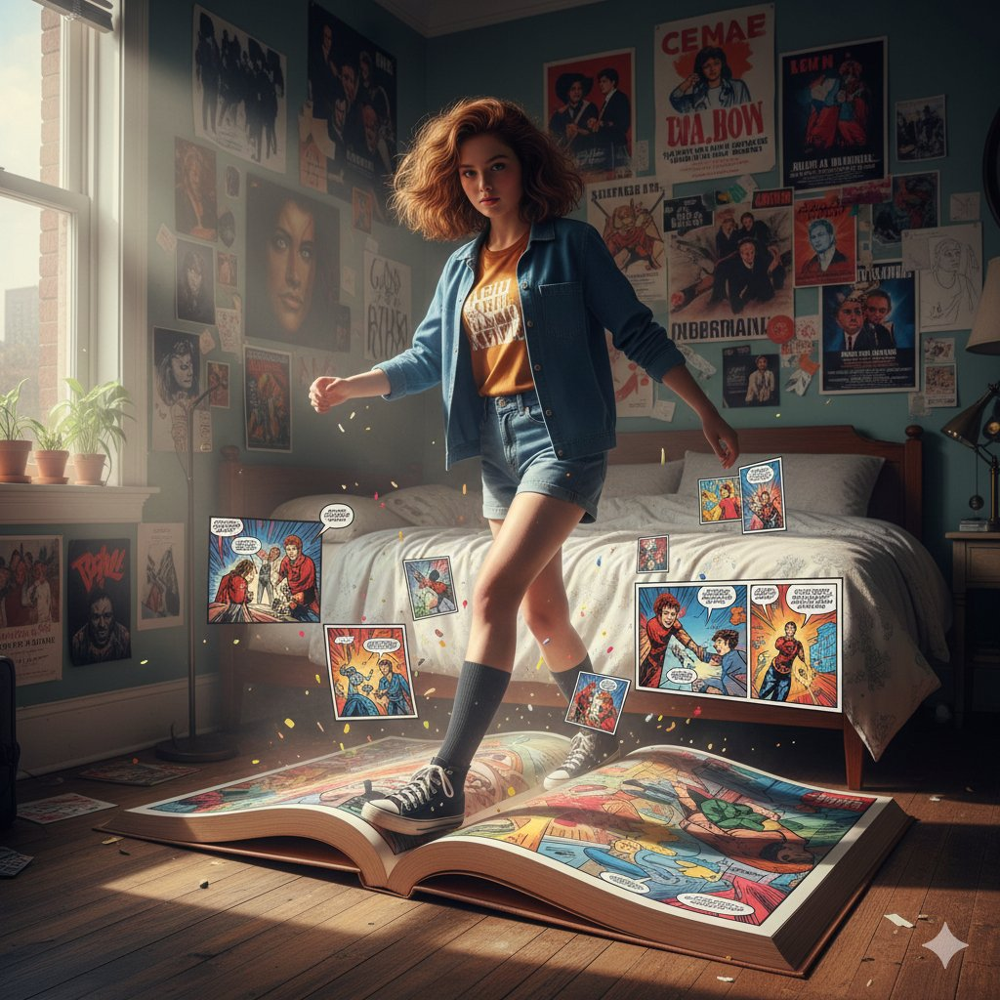

```
A teenage girl stepping out of a giant open comic book, comic panels floating around her in mid-air, artistic bedroom filled with sketches and posters on the walls, dramatic lighting, cinematic atmosphere, soft sunlight rays, detailed environment, realistic face, semi-realistic comic style, magical realism, high detail, vibrant colors, shallow depth of field, 4K, ultra realistic, fantasy surrealism, dynamic posei
```

```
一位少女从一本巨大的打开的漫画书中走出，四周空中漂浮着漫画分镜格，充满艺术气息的卧室墙上贴满素描和海报，戏剧性光影，电影感氛围，柔和阳光光束，环境细节丰富，面部写实，半写实漫画风格，魔幻现实主义，高细节，鲜艳色彩，浅景深，4K超写实，奇幻超现实，动态姿势。
```

 [↑返回目录](#toc)

---
## <a id="">从过去到现在的微缩3D演变历程</a> (<a href="https://x.com/aleenaamiir/status/2022178815955636413" target="_blank" rel="noopener noreferrer">Aleena Amir</a>)

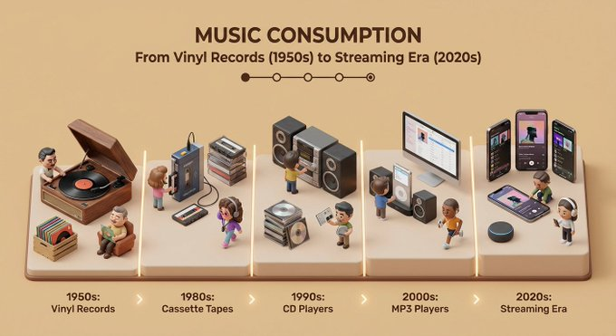

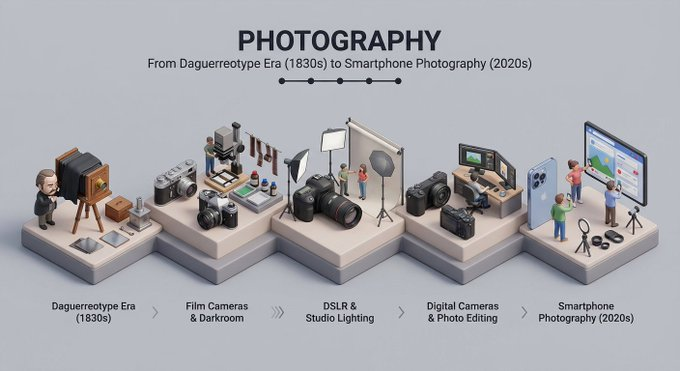

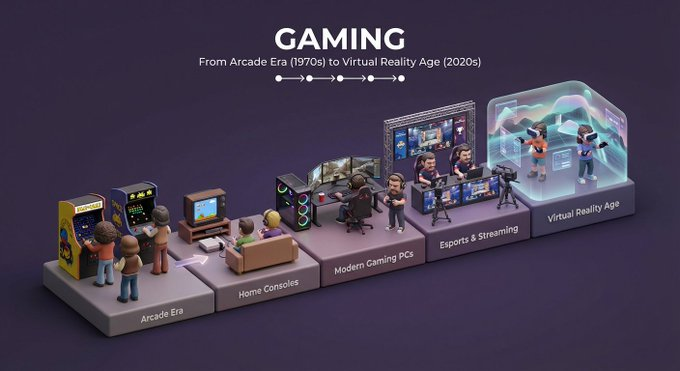

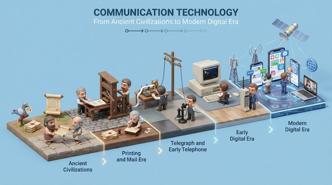

```
Timeline Evolution Dioramas

Gemini Nano Banana Pro Prompt:

“Create a clean isometric miniature 3D diorama visualizing the evolution of [TOPIC] from [START ERA] to [MODERN ERA]. Use a 45° top-down perspective. Materials are soft and refined with realistic PBR shading.

Lighting is neutral and evenly balanced. Design a horizontally stepped base divided into clear time periods. Each section includes era-specific objects, tools, environments, or technology.

Add tiny stylized figures interacting with each stage with heavy facial details). Use subtle arrows or dividers to show chronological flow.

Background remains solid [BACKGROUND COLOR]. Top center text displays [TOPIC] in bold. Below it show “From [START ERA] to [MODERN ERA].” Add a minimal timeline icon underneath. Text adapts automatically for contras.”
```

```
时间线演化微缩场景

创建一个干净的等距微型3D微缩场景，展示[主题]从[起始时代]到[现代]的演变过程。采用45°俯视视角，材质柔和精致，具有逼真的PBR着色效果。

光线中性且均匀平衡。设计一个水平阶梯状基座，清晰划分为不同历史时期。每个区域包含该时代特有的物品、工具、环境或技术。

加入微小的风格化人物，在各阶段进行互动，并带有丰富的面部细节。使用微妙的箭头或分隔线表示时间顺序。

背景为纯色[背景颜色]。顶部中央以粗体显示[主题]，其下方标注“从[起始时代]到[现代]”，并在文字下方添加一个极简的时间线图标。文字自动适配对比度。
```

 [↑返回目录](#toc)

---
## <a id="">时尚街头风3D卡通狗</a> (<a href="https://x.com/Taaruk_/status/2022179786580537521" target="_blank" rel="noopener noreferrer">Taaruk</a>)

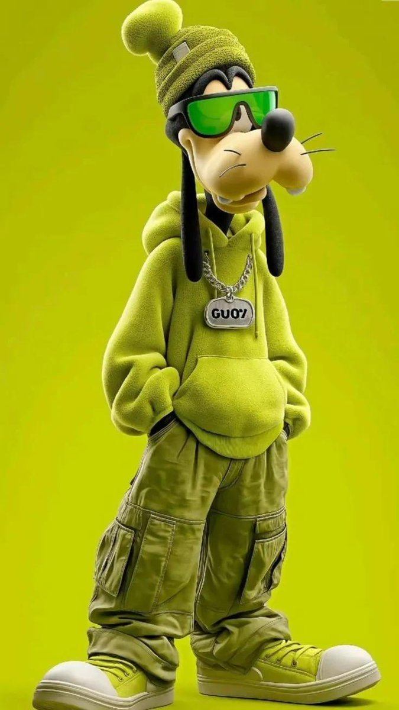

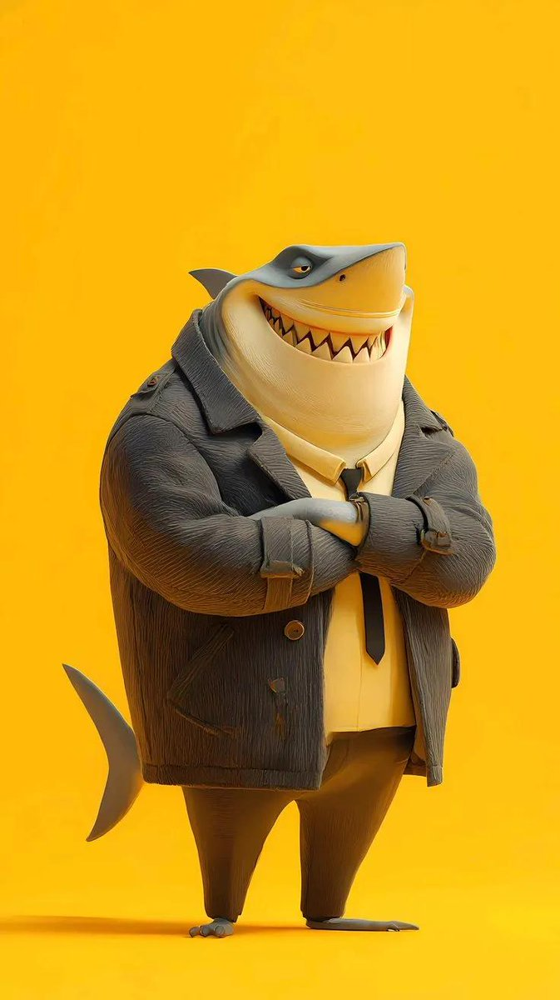

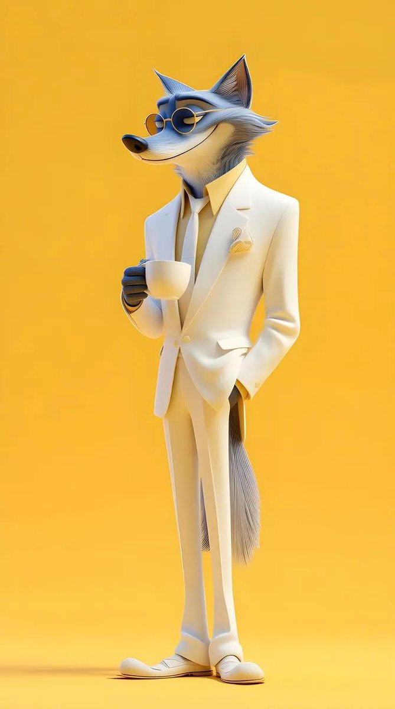

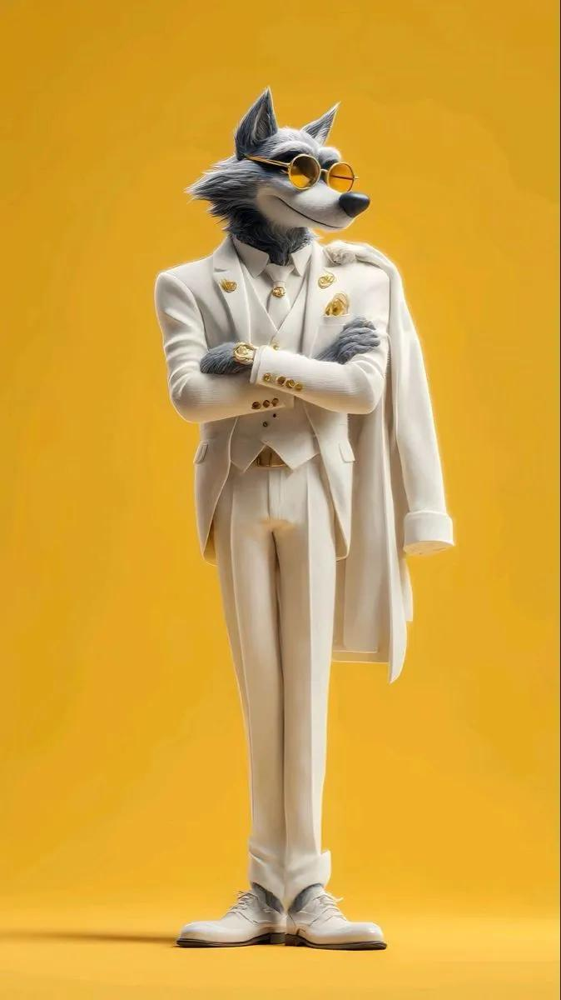

```
Full-body 3D stylized anthropomorphic cartoon dog character wearing modern streetwear, oversized neon green hoodie, cargo pants, chunky sneakers, reflective sunglasses, silver chain necklace. Confident relaxed pose with hands in pockets. Minimal studio background in solid lime green. Soft studio lighting, smooth shadows, high detail fabric texture, Pixar-quality 3D render, ultra-clean composition, centered framing, fashion editorial character design, 8K resolution.
```

```
全身3D风格拟人化卡通狗角色，身穿现代街头服饰：超大号霓虹绿色连帽衫、工装裤、厚底运动鞋、反光墨镜和银色链式项链。姿态自信放松，双手插在口袋中。纯青柠绿色极简影棚背景，柔光照明，柔和阴影，高细节面料质感，皮克斯品质3D渲染，画面极度干净，居中构图，时尚大片角色设计，8K分辨率。
```

 [↑返回目录](#toc)

---
## <a id="">哑光黑与金属银的奢华波纹</a> (<a href="https://x.com/lloydcreates/status/2021984673216209395" target="_blank" rel="noopener noreferrer">Lloyd Creates</a>)

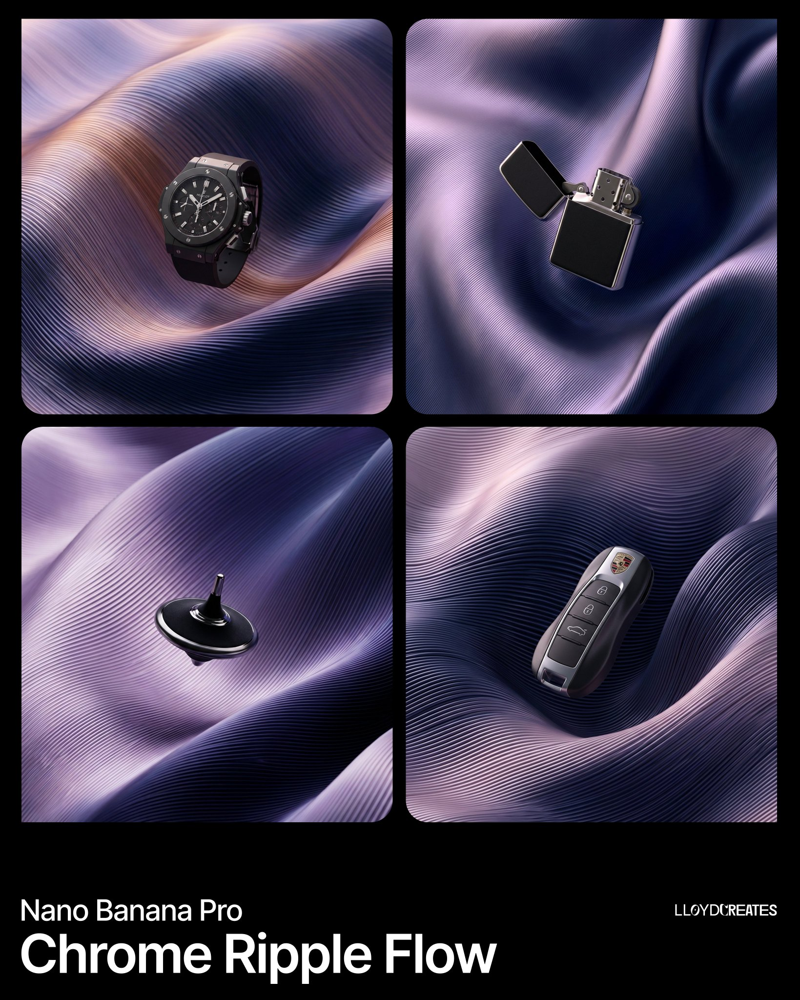

```
Chrome Ripple Flow

Prompt 

{
  "image_generation_request": {
    "subject": "[PRODUCT]",
    "product_finish": {
      "primary": "matte black with subtle light absorption",
      "secondary": "polished metallic silver with mirror-like reflections",
      "treatment": "duotone — matte black body with metallic silver accents, trim, edges, or panel insets"
    },
    "composition": {
      "placement": "dead center, full view, floating suspended within the folded surface environment",
      "scale": "product occupies roughly 30-40% of the frame",
      "constraints": [
        "product must be entirely visible with no cropping",
        "no pedestals, stands, platforms, or ground planes",
        "the surface folds frame the product but never obscure more than 10% of it",
        "product is the sharpest element in the scene"
      ]
    },
    "background_environment": {
      "description": "A single continuous undulating surface that fills the entire frame, folding over and around itself in large voluminous waves — like a massive sheet of pleated metallic silk or a single machined metal panel that has been softly twisted and draped. This is NOT multiple separate ribbons or strands. It is ONE connected surface.",
      "base_color": "[INSERT DEEP BACKGROUND COLOR visible in crevices — e.g. pure black, midnight navy]",
      "surface_color_1": "[INSERT GRADIENT COLOR A — e.g. soft lavender, warm copper, pearl rose]",
      "surface_color_2": "[INSERT GRADIENT COLOR B — e.g. deep indigo, cobalt blue, violet]",
      "color_behavior": "The two colors blend in a smooth continuous gradient across the single surface, shifting based on the surface's curvature and light angle. Where the surface faces the light it shows color_1, where it curves away it transitions to color_2. The transition is seamless with no hard edges or stripes.",
      "surface_texture": {
        "type": "fine parallel ribs embossed into the surface — like the grooves on a vinyl record or finely pleated accordion fabric",
        "rib_description": "extremely fine, uniform, tightly spaced parallel lines that follow the flow direction of the surface. The ribs are a TEXTURE on the surface, not separate objects. They create a subtle corrugated micro-relief that catches light along each tiny ridge.",
        "rib_density": "very high — approximately 50-100 visible lines per inch of surface, creating a dense linear grain",
        "rib_depth": "shallow — the ribs are subtle surface detail, not deep cuts. They create gentle highlight-shadow alternation across the surface"
      },
      "surface_form": {
        "fold_style": "large, smooth, voluminous folds like draped heavy silk — broad sweeping curves with gentle twists",
        "fold_count": "3-5 major folds visible, each one wide and generous, NOT many small tangled ribbons",
        "fold_behavior": "folds overlap softly, tucking under and over each other with smooth transitions. Where folds meet they create deep soft shadow crevices",
        "tension": "the surface appears smooth and taut across each fold, with no wrinkles or crumpling — like stretched satin over a curved form",
        "edges": "no visible edges — the surface appears to extend beyond the frame in all directions, as if we are seeing a close-up section of an infinite draped form"
      },
      "material": {
        "finish": "satin metallic — a soft brushed-metal luminosity between matte and mirror. The surface has a pearlescent quality where colors shift with viewing angle",
        "light_interaction": "soft specular highlights along the crest of each rib, gentle shadows in each rib valley, creating an overall shimmering linear texture across the broad folds"
      }
    },
    "lighting": {
      "type": "soft, diffused, directional — as if a large softbox is illuminating from upper-left, creating a warm-to-cool gradient across the scene",
      "shadow_behavior": "deep soft shadows in fold crevices, gradual falloff — no harsh edges",
      "highlight_behavior": "broad soft highlights across fold peaks, with fine linear shimmer from the rib texture",
      "restrictions": "no visible light sources, no lens flare, no reflections of studio equipment"
    },
    "style": {
      "aesthetic": "parametric design art, computational sculpture, abstract luxury",
      "mood": "luxurious, smooth, tactile, premium product showcase",
      "critical_note": "The background must look like a SINGLE continuous folded metallic surface with fine ribbed texture — NOT like multiple separate ribbons, cables, wires, or strands bundled together. Think of one sheet of finely pleated metal that has been elegantly draped and folded."
    },
    "technical_specs": {
      "quality": "8k resolution, extreme surface texture detail, tack-sharp product focus",
      "render_style": "photorealistic 3D render, Octane or Redshift quality",
      "aspect_ratio": "1:1 square",
      "exclusions": "text, watermarks, logos on background, extra props, lens flare, studio equipment, flat surfaces, any ground plane, separate ribbons, wire bundles, rope-like forms"
    }
  }
}
```

```
Chrome Ripple Flow

哑光黑色主体，带有微妙的吸光效果，搭配抛光金属银色点缀，呈现镜面反射；整体采用双色调处理——哑光黑机身配以金属银饰条、包边、轮廓或嵌板。

产品居中放置，完整悬浮于折叠曲面环境中，占据画面约30%至40%；产品必须完全可见，不得裁切；不得出现底座、支架、平台或地面；折叠曲面环绕产品但遮挡不超过10%；产品为画面中最清晰元素。

背景环境为单一连续起伏曲面，充满整个画面，以大体积波浪状折叠缠绕自身，如同一张巨大的压褶金属丝绸或一块经柔和扭转与垂坠处理的整片机加工金属板，并非多条独立丝带或线束。曲面基底色为深色（如纯黑或午夜藏青），表面呈现两种渐变色彩（例如柔薰衣草色与暖铜色，或珍珠玫瑰色与深靛蓝、钴蓝色、紫罗兰色）；两种颜色随曲面弧度与光线角度平滑过渡——受光面显色A，背光面渐变为色B，过渡无缝，无硬边或条纹。

曲面带有精细平行压纹，如黑胶唱片沟槽或细密手风琴褶皱；纹理为沿曲面流动方向的极细、均匀、紧密排列平行线，每英寸约50–100条，形成高密度线性肌理；压纹深度浅，仅为细微浮雕，在每道微脊上产生柔和高光与阴影交替的闪烁效果。

曲面形态为3至5个宽大、流畅、饱满的折叠，如厚重丝绸垂坠般舒展，折叠处柔和交叠，形成深而柔软的阴影缝隙；整体绷紧平滑，无皱褶或揉皱感，似拉伸的缎面覆盖于曲形之上；画面中不可见边缘，曲面仿佛向画框外无限延展。

材质为缎面金属质感——介于哑光与镜面之间的柔刷金属光泽，具珠光特性，随视角变化呈现色彩流转；光线在每道压纹脊线上形成柔和镜面高光，谷底则有轻柔阴影，整体在宽大折叠面上营造出闪烁的线性纹理。

灯光为柔和漫射定向光，模拟左上方大型柔光箱照明，在场景中形成由暖至冷的渐变；折叠缝隙投下深而柔和的阴影，衰减自然，无生硬边缘；折叠高点呈现宽广柔光，压纹细节带来细腻线性闪光；画面中不得出现可见光源、镜头眩光或摄影棚设备反光。

风格为参数化设计艺术、计算雕塑、抽象奢华；氛围奢华、顺滑、触感强烈，突出高端产品展示；关键注意：背景必须呈现为单一连续折叠金属曲面，带有精细压纹，绝非多条独立丝带、线缆、电线或束状物。

技术规格：8K分辨率，极致表面纹理细节，产品焦点锐利；渲染风格为照片级3D效果（Octane或Redshift品质）；画面比例1:1正方形；排除文字、水印、背景Logo、额外道具、镜头眩光、摄影棚设备、平面、地面、独立丝带、线束或绳状形态。
```

 [↑返回目录](#toc)

---
## <a id="">夜幕下的义警：哥特风黑白电影海报</a> (<a href="https://x.com/kaanakz/status/2022358227359252629" target="_blank" rel="noopener noreferrer">Kaan</a>)

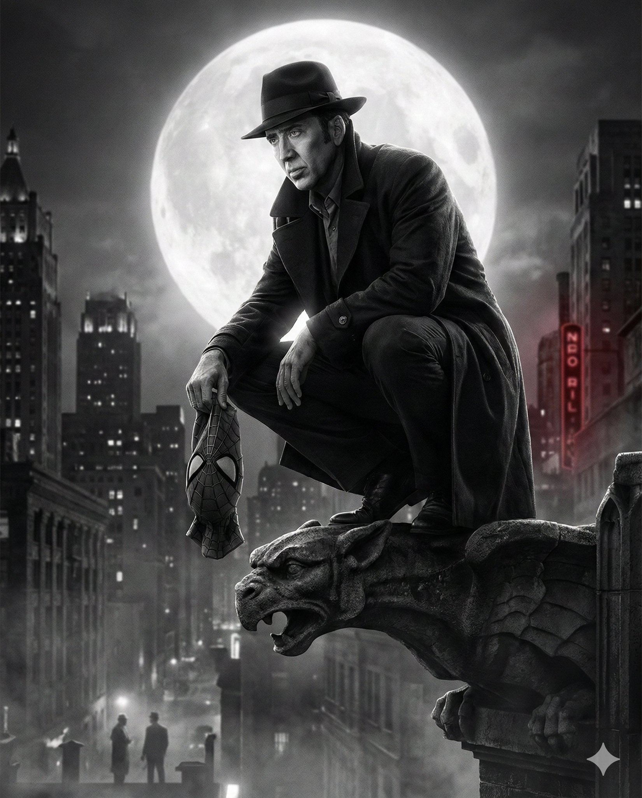

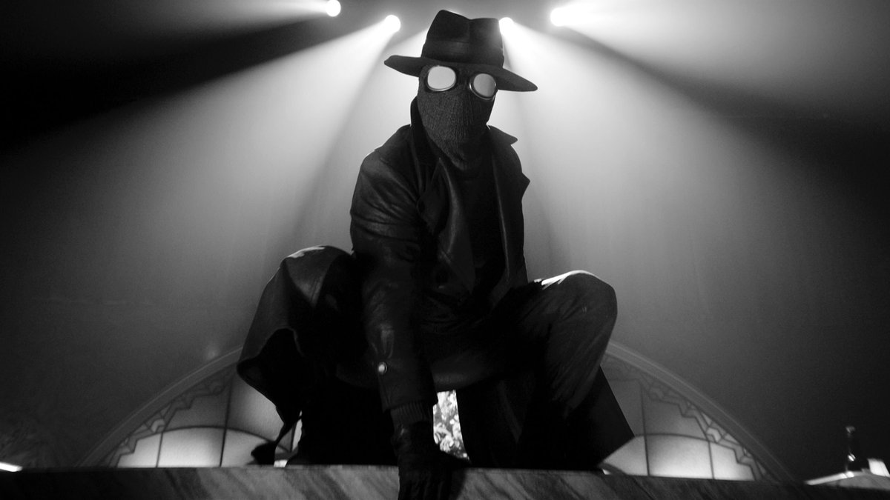

```
{
  "subject": "Use the reference image for facial features and likeness. A realistic noir vigilante with his face visible, wearing a black trench coat and a classic fedora, holding a red web-patterned superhero mask in one hand",
  "pose": "Crouched heroically on a gothic rooftop gargoyle, holding his mask in one hand",
  "environment": "1940s dark city skyline, massive full moon behind him, light fog and distant silhouettes below",
  "style": "Cinematic black and white, dramatic high-contrast lighting, low-angle shot, subtle red accent in background",
  "format": "Movie poster composition,4:5, ultra-detailed, 4K"
}
```

```
以参考图像为准还原面部特征与相貌。一位写实风格的黑色电影风格义警，面部清晰可见，身穿黑色风衣，头戴经典软呢帽，一手握着红色蛛网纹路的超级英雄面具。  
姿势为英勇地蹲伏在哥特式屋顶的滴水嘴兽上，一手持面具。  
背景是1940年代阴暗的城市天际线，身后是一轮巨大的满月，薄雾弥漫，远处可见模糊的人影剪影。  
采用电影感黑白风格，戏剧性的高对比度光影，低角度镜头，背景中带有微妙的红色点缀。  
构图如电影海报，比例4:5，超精细细节，4K画质。
```

 [↑返回目录](#toc)

---
## <a id="">情人节特惠：爱的心形礼赞</a> (<a href="https://x.com/TechieBySA/status/2022269227286102243" target="_blank" rel="noopener noreferrer">TechieSA</a>)

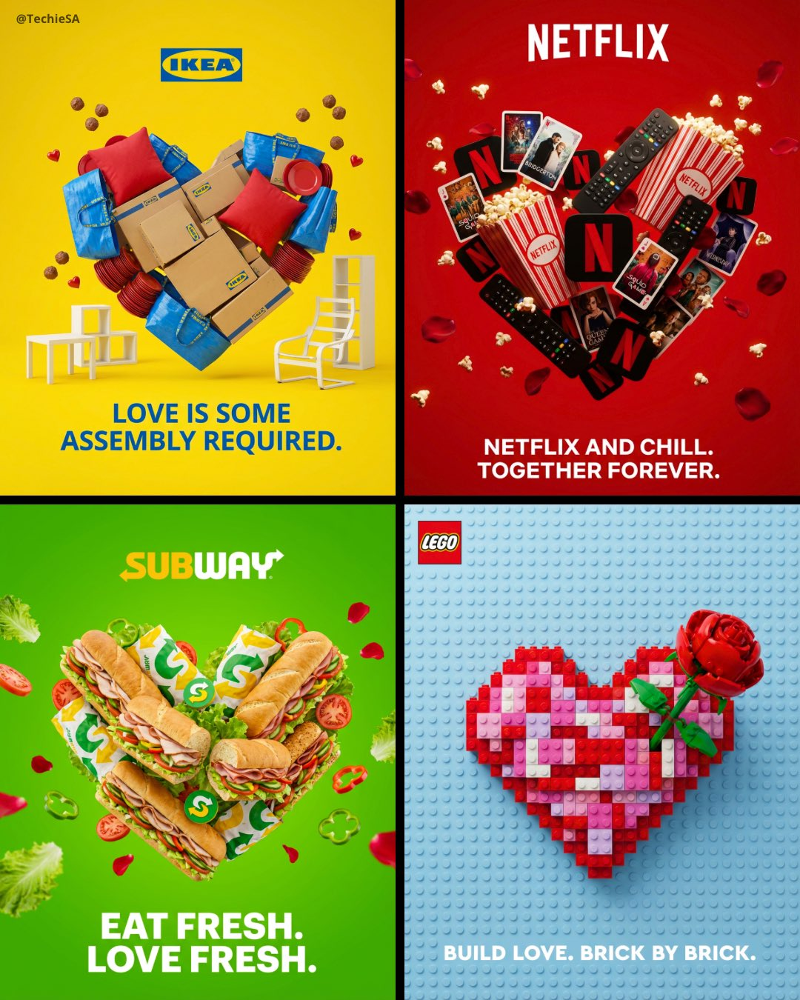

```
Create a professional Valentine’s Day advertisement for [BRAND] in 4:5 aspect ratio. The background should use the signature brand color as a clean, vibrant backdrop. Arrange multiple [PRODUCT] items creatively to form a perfect heart shape in the center of the composition. The products should appear realistic and three-dimensional with professional lighting and soft shadows, clearly displaying logos. Add romantic elements like rose petals or flowers floating around the heart. Position the logo at the top center of the image. At the bottom, include a romantic tagline in bold, modern typography that incorporates the brand’s messaging or plays on the product name. Use photorealistic 3D rendering style with studio lighting and premium advertising quality. Maintain a clean, modern aesthetic that matches the visual identity with significant breathing room around all elements.
```

```
为[BRAND]创作一张4:5比例的专业情人节广告。背景使用品牌标志性颜色，打造干净而鲜明的底色。将多个[PRODUCT]产品以创意方式排列，在画面中央组成一个完美的心形。产品需呈现逼真立体的效果，采用专业布光与柔和阴影，清晰展示品牌标志。在心形周围添加浪漫元素，如飘浮的玫瑰花瓣或花朵。将品牌Logo置于画面顶部中央，底部加入一句浪漫标语，使用粗体现代字体，巧妙融合品牌信息或玩味产品名称。整体采用写实3D渲染风格，搭配影棚灯光，呈现高端广告质感。保持干净现代的视觉美学，符合品牌视觉识别，并确保所有元素周围留有充足留白。
```

 [↑返回目录](#toc)

---
## <a id="">夜生活中的时尚女子</a> (<a href="https://x.com/Kashberg_0/status/2022544919920087188" target="_blank" rel="noopener noreferrer">Kashberg</a>)

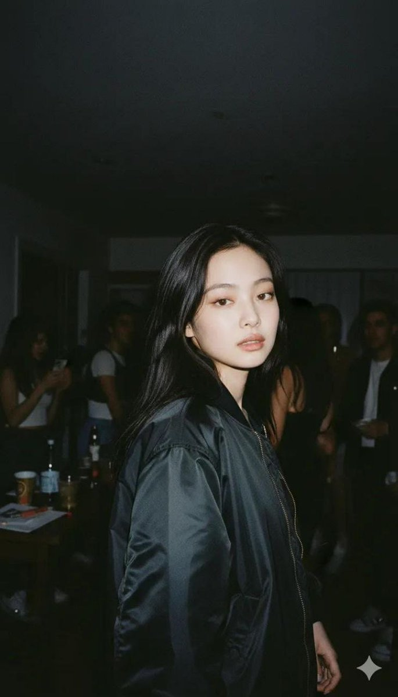

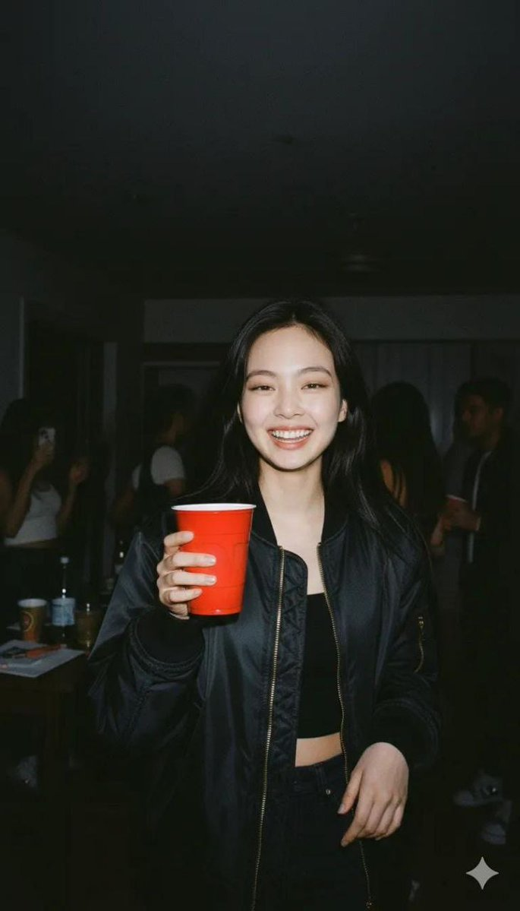

```
Candid party snapshot of a stylish young woman at a house party, wearing a black satin bomber jacket over a black crop top. Long straight dark hair, natural makeup, soft glow on skin. Shot with direct on-camera flash creating harsh shadows and a bright foreground subject against a dark, crowded background. Guests blurred in the background holding drinks, casual apartment setting with dim ambient lighting. In one shot she looks over her shoulder with a neutral expression; in another she smiles while holding a red plastic cup. 35mm lens, documentary nightlife photography, early 2000s party aesthetic, high contrast, grainy texture, realistic, raw, unfiltered vibe.
```

```
一场家庭派对上的抓拍瞬间：一位时尚年轻女子身穿黑色缎面飞行员夹克，内搭黑色短款上衣。她留着长直黑发，妆容自然，肌肤泛着柔和光泽。使用机顶直闪拍摄，形成强烈阴影，使前景人物明亮突出，背景则昏暗拥挤。背景中宾客模糊，手持饮料，身处灯光昏暗的普通公寓环境中。一张照片中她神情淡然地回眸；另一张则手握红色塑料杯微笑。采用35毫米镜头，纪实风格夜生活摄影，呈现2000年代初的派对美学，高对比度、颗粒质感，真实、原始、未经修饰的氛围。
```

 [↑返回目录](#toc)

---
## <a id="">厚重浮雕纹理的油画风格</a> (<a href="https://x.com/Shreyayadav/status/2022501210872574431" target="_blank" rel="noopener noreferrer">Shreya♡</a>)

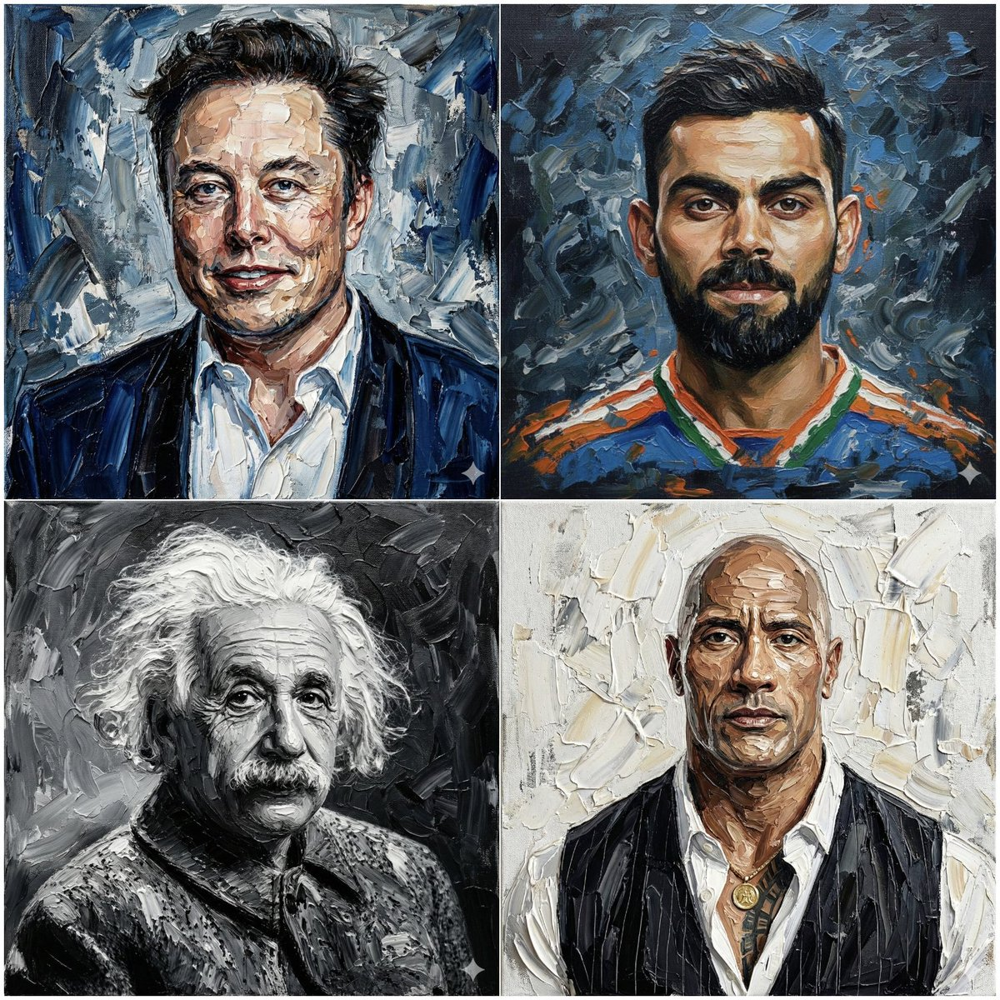

```
Create your Knife Oil Painting Portrait  

1. Open Gemini Nano Banana 
2. Select Your image 
3. Write Prompt 

PROMPT
Transform this image into an extreme palette knife oil painting with heavy impasto texture and thick, sculpted paint strokes. Preserve and amplify the original image colors, using them as the dominant palette. Add rough canvas grain, layered knife strokes, abstract paint breaks, and dramatic high-contrast lighting. Keep the main subject sharp and detailed while allowing the background to dissolve into expressive, textured brushwork. Raw, cinematic, gallery-scale oil painting style.
Image ratio 1:1
```

```
将此图像转换成极端调色刀油画，带有厚重的浮雕纹理和厚实、雕塑般的笔触。保留并放大原始图像颜色，将其用作主要色调。添加粗糙的画布颗粒、分层的刀痕、抽象的油漆断裂和戏剧性的高对比度照明。保持主体清晰细致，同时让背景溶解为富有表现力的纹理笔触。原始、电影般、美术馆规模的油画风格。图像比例为1:1。
```

 [↑返回目录](#toc)

---
## <a id="">微型摩洛哥庭院住宅模型</a> (<a href="https://x.com/AllaAisling/status/2022353962385744076" target="_blank" rel="noopener noreferrer">Alexandra Aisling</a>)

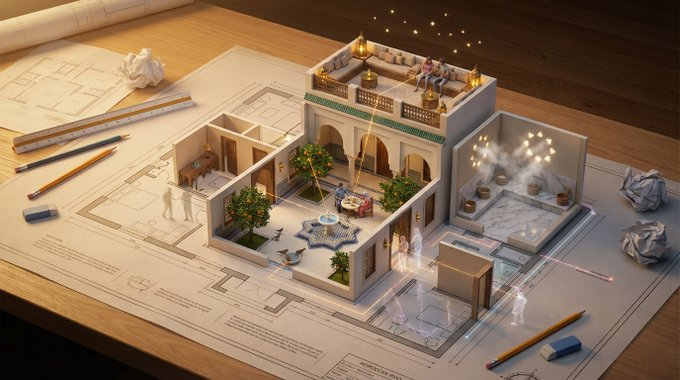

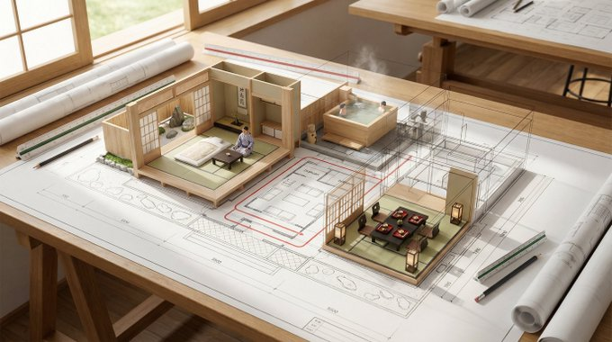

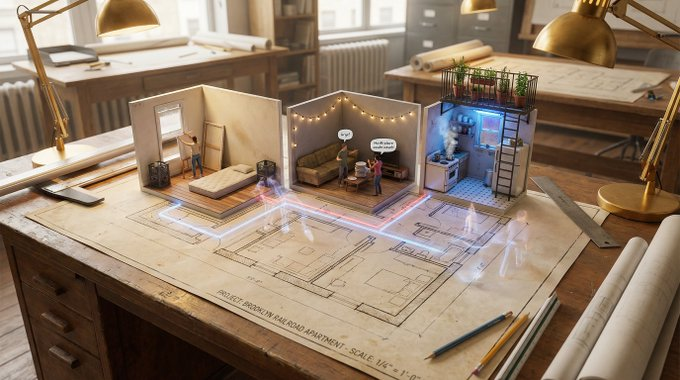

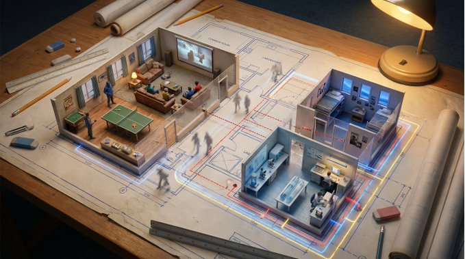

```
An architectural floor plan of {BUILDING_TYPE} spread across a drafting table, with the spaces rising into inhabitable miniature. {ROOM_1} emerges with {FURNITURE_1} and {ACTIVITY_1} in progress, {ROOM_2} rises with {DESIGN_ELEMENT} and {HUMAN_MOMENT}, {ROOM_3} pushes up with {DETAIL_1} and {LIGHTING_1}. Walls exist as both lines and actual partitions simultaneously. Sight lines marked on the plan become actual views between spaces. The mechanical systems in the plan—HVAC, plumbing, electrical—pulse with invisible function. Human circulation patterns appear as ghosted movement trails. Architectural scale figures become actual tiny inhabitants living their tiny lives. Section cuts reveal vertical relationships. The architect's tools surround: scales, pencils, trace paper. Golden design studio light, the plan as promise and proof, 8K, architecture as life container.     

Check ALTs for ideas  @AdobeFirefly
```

```
An architectural floor plan of Moroccan riad courtyard house spread across a drafting table, with the spaces rising into inhabitable miniature. The central courtyard emerges with tiled fountain and orange trees and family taking tea as birds drink from basin in progress, the rooftop terrace rises with cushioned banquettes and brass lanterns and teenagers sneaking cigarettes under stars, the hammam bath pushes up with marble heated floor and cedar buckets and steam diffusing afternoon light through star-shaped vents. Walls exist as both lines and actual partitions simultaneously. Sight lines marked on the plan become actual views between spaces. The mechanical systems in the plan—HVAC, plumbing, electrical—pulse with invisible function. Human circulation patterns appear as ghosted movement trails. Architectural scale figures become actual tiny inhabitants living their tiny lives. Section cuts reveal vertical relationships. The architect's tools surround: scales, pencils, trace [...]
```

```
An architectural floor plan of Japanese ryokan traditional inn spread across a drafting table, with the spaces rising into inhabitable miniature. The tatami guest room emerges with futon laid out and low chabudai table and traveler in yukata contemplating rock garden in progress, the communal onsen bath rises with cypress soaking tub and bamboo water spout and steam rising as elderly guests soak in silence, the kaiseki dining room pushes up with lacquered trays on floor cushions and warm lantern glow through shoji screens. Walls exist as both lines and actual partitions simultaneously. Sight lines marked on the plan become actual views between spaces. The mechanical systems in the plan—HVAC, plumbing, electrical—pulse with invisible function. Human circulation patterns appear as ghosted movement trails. Architectural scale figures become actual tiny inhabitants living their tiny lives. Section cuts reveal vertical relationships. The architect's tools surround: scales, pencils [...]
```

```
An architectural floor plan of Brooklyn railroad apartment spread across a drafting table, with the spaces rising into inhabitable miniature. The front parlor turned bedroom emerges with mattress on floor and milk crate bookshelves and artist stretching canvas by window in progress, the middle room with no windows rises with string lights and thrifted couch and roommates arguing about dishes, the galley kitchen pushes up with vintage stove and fire escape herb garden visible and blue morning light mixing with coffee steam. Walls exist as both lines and actual partitions simultaneously. Sight lines marked on the plan become actual views between spaces. The mechanical systems in the plan—HVAC, plumbing, electrical—pulse with invisible function. Human circulation patterns appear as ghosted movement trails. Architectural scale figures become actual tiny inhabitants living their tiny lives. Section cuts reveal vertical relationships. The architect's tools surround: scales, pencils [...]
```

```
An architectural floor plan of Antarctic research station spread across a drafting table, with the spaces rising into inhabitable miniature. The common room emerges with worn sofas and ping pong table and scientists in fleece watching movie on projector in progress, the laboratory wing rises with ice core samples and microscopes and researcher logging data at 3am, the sleeping quarters pushes up with narrow bunks and personal photos taped to walls and blue polar twilight seeping through triple-pane windows. Walls exist as both lines and actual partitions simultaneously. Sight lines marked on the plan become actual views between spaces. The mechanical systems in the plan—HVAC, plumbing, electrical—pulse with invisible function. Human circulation patterns appear as ghosted movement trails. Architectural scale figures become actual tiny inhabitants living their tiny lives. Section cuts reveal vertical relationships. The architect's tools surround: scales, pencils, trace paper. [...]
```

 [↑返回目录](#toc)

---


[上一页](./10.md) | 当前 11/11 页 | [查看全部目录](../prompts.md)