# gemini.json 

gemini.json文件存放gemini相关的提示词，当前已收录：1016个 

 投稿方式：[飞书投稿](https://tcn1uh5rxo87.feishu.cn/share/base/form/shrcne5gDolOMDd0oJsj2XfvxQc) or [issues](https://github.com/junxiaopang/gridsplitter/issues/new)

[上一页](./10.md) | 当前 11/11 页 | [查看全部目录](../prompts.md)

🚀 **在线预览**: [https://prompts.kkkm.cn](https://prompts.kkkm.cn)

## <a id="toc">目录</a>


## <a id="">Airbnb风格生态屋</a> (<a href="https://x.com/0x00_Krypt/status/2017116469692453116" target="_blank" rel="noopener noreferrer">两斤</a>)

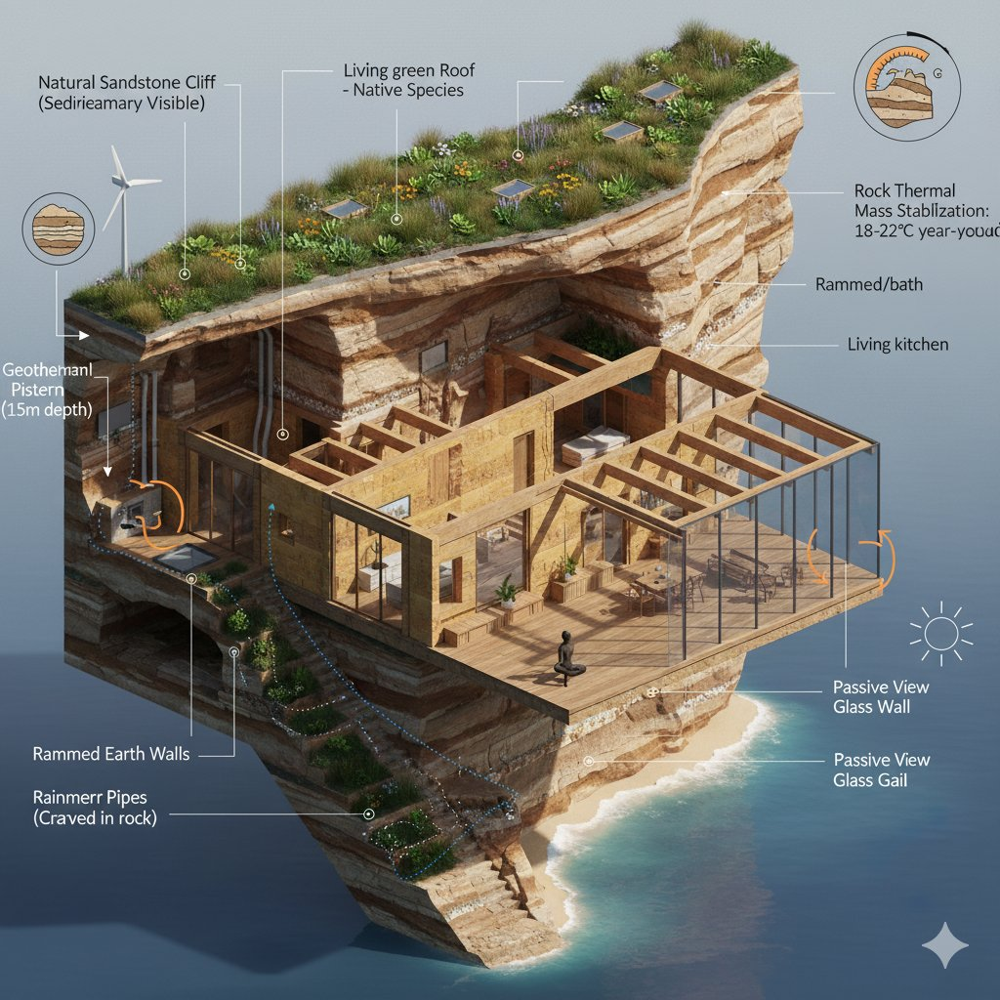

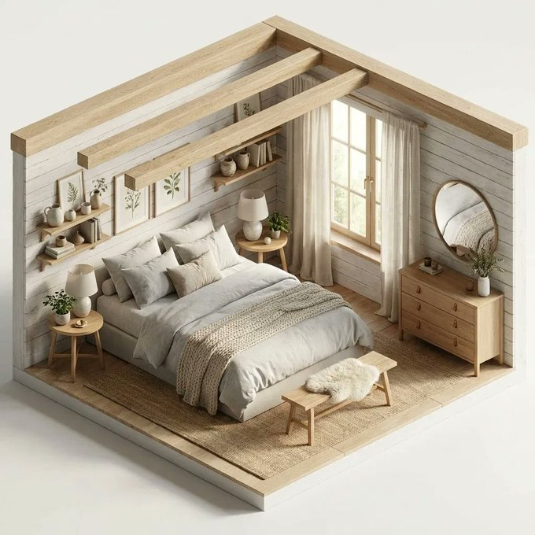

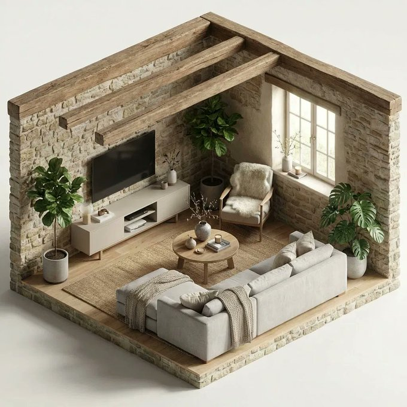

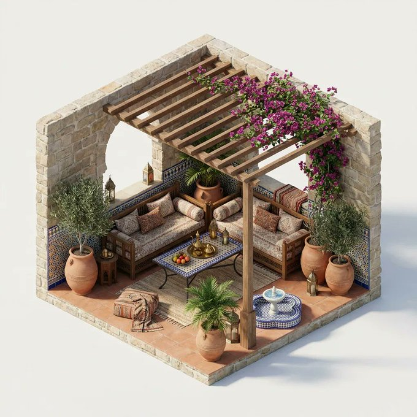

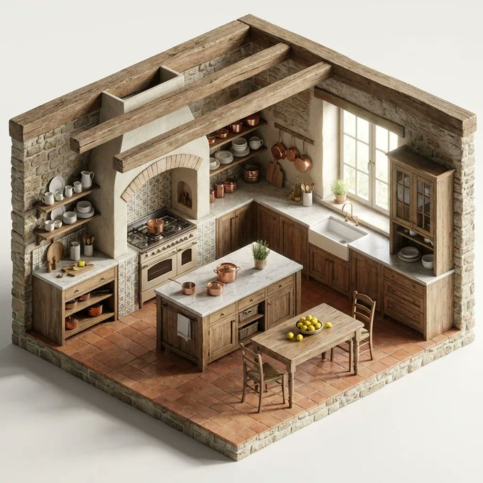

```
Create a highly detailed isometric 3D interior diorama of an off-grid sustainable dwelling in [ENVIRONMENT/LOCATION], designed to harmonize with local climate and ecology.

Design a multi-zone structure adapted to [climate challenge]: [describe basic layout and key spaces]. Show integration with natural environment through [specific adaptation features].

Include human scale reference: figure [doing relevant activity] for size comparison. Zone indicators subtly showing [functional areas] through material and spatial transitions.

Eco-materials: [3-5 locally-sourced or recycled materials with textures and details visible].

Natural lighting strategy: [primary light source] creating [lighting effect], [secondary lighting], [time-of-day or seasonal variation]. Show [environmental lighting phenomenon].

[Climate/environment] adaptation visible: [3-5 specific sustainable systems - water, energy, ventilation, thermal, waste management]. [Unique environmental challenge solution].

Perspective: sectional isometric showing [what cross-section reveals]. Ultra high detail, educational sustainability visualization, color palette of [environment-appropriate colors], gradient background from [bottom color] to [top color].

INFOGRAPHIC ANNOTATION LAYER:
Add professional labels with thin leader lines pointing to 5-7 key features: sustainable systems, materials, climate adaptations, zones. Include simple diagrams for [relevant flows: water/energy/air]. Temperature or seasonal indicators if relevant. Typography: modern sans-serif, high contrast, balanced placement. Architectural documentation meets educational diagram aesthetic.
```

```
创作一个高度细节化的等距3D室内微缩模型，展现一处位于[环境/地点]的离网可持续住宅，其设计与当地气候和生态系统和谐共生。

设计一个多区域结构，以应对[气候挑战]：[描述基本布局和关键空间]。通过[具体适应性特征]体现与自然环境的融合。

包含人物比例参照：一名人物正在[进行相关活动]，用于尺寸对比。通过材质与空间过渡，巧妙标示出[功能区域]。

生态材料：使用[3-5种本地或回收材料]，并清晰呈现其纹理与细节。

自然采光策略：[主光源]营造出[光照效果]，辅以[次级照明]，体现[一天中的时间或季节变化]。展现[环境光现象]。

可见的[气候/环境]适应措施：[3-5项具体可持续系统——如水、能源、通风、热管理、废物处理]。[针对独特环境挑战的解决方案]。

视角：剖面等距视图，展示[剖面所揭示的内容]。超高清细节，教育性可持续可视化，配色采用[符合环境的色彩]，背景为从[底部颜色]到[顶部颜色]的渐变。

信息图注释层：  
添加专业标签，以细引线指向5-7个关键要素：可持续系统、材料、气候适应措施、功能区。包含[相关流动路径：水/能源/空气]的简明图示。如适用，加入温度或季节指示。字体采用现代无衬线体，高对比度，布局均衡。整体风格融合建筑制图与教育图解美学。
```

 [↑返回目录](#toc)

---
## <a id="">超写实风格的女性休闲穿搭展示</a> (<a href="https://x.com/AIwithkhan/status/2017113578139242945" target="_blank" rel="noopener noreferrer">Smiling Khan</a>)

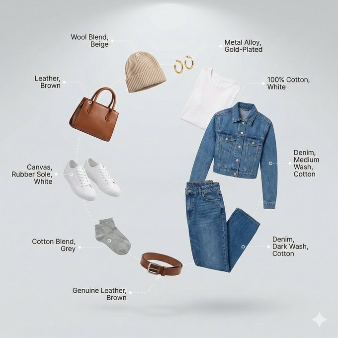

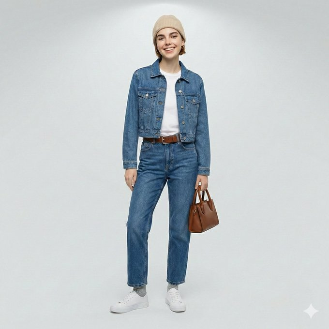

```
Ultra-realistic fashion infographic photography of a female casual outfit exploded in a circular composition.
Floating elements arranged clockwise: beige knit hat, gold hoop earrings, cotton crew-neck top, cropped denim jacket, high-waist blue jeans, leather belt, ankle socks, white sneakers, structured mini handbag.
Each item suspended in mid-air with fine dotted guide lines, labeled with fabric type, color, and material details (cotton, denim, leather, rubber sole).
Clean studio background, soft diffused lighting, premium editorial styling, ultra-sharp focus, 8K quality.
```

```
超写实时尚信息图摄影，展示一套女性休闲穿搭以圆形构图爆炸式展开。  
顺时针方向悬浮排列的单品包括：米色针织帽、金色圆环耳环、棉质圆领上衣、短款牛仔夹克、高腰蓝色牛仔裤、皮革腰带、及踝袜、白色运动鞋和立体迷你手袋。  
每件单品悬浮于空中，配有精细的虚线指引，并标注面料类型、颜色和材质细节（棉、牛仔布、皮革、橡胶鞋底）。  
背景为干净影棚，采用柔和漫射光线，高端杂志级造型，超锐利对焦，8K画质。
```

 [↑返回目录](#toc)

---
## <a id="">路易威登奢华运动鞋三重奏</a> (<a href="https://x.com/mehvishs25/status/2017067361673896150" target="_blank" rel="noopener noreferrer">Meem</a>)

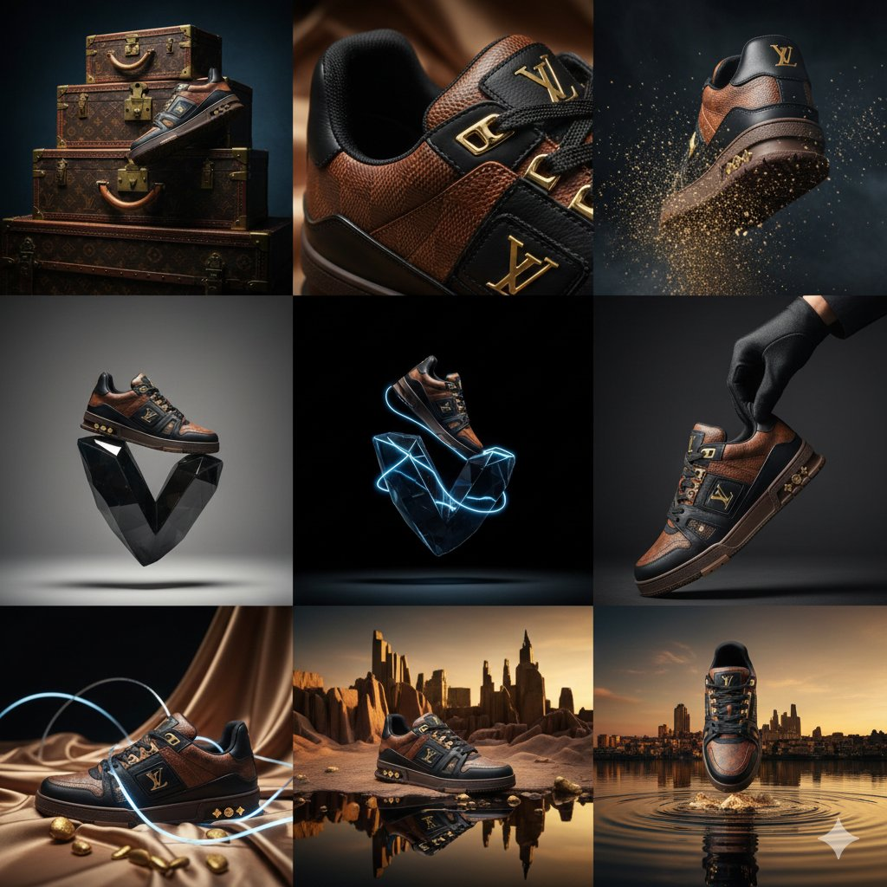

```
{
  "campaign_metadata": {
    "brand_identity": "Louis Vuitton Malletier",
    "product_focus": "Luxury Leather Sneaker / Trainer",
    "aspect_ratio": "3:4",
    "aesthetic": "High-Fashion Editorial | Avant-Garde Luxury"
  },
  "visual_dna": {
    "materials": ["Full-grain calf leather", "Monogram Embossed Canvas", "Polished Gold Hardware"],
    "color_scheme": ["Cognac Brown", "Deep Obsidian", "Champagne Gold"],
    "lighting": "High-contrast Chiaroscuro | Soft-box Key Lighting"
  },
  "grid_layout_execution": {
    "row_1_heritage": {
      "cell_1_1": "Hero profile: Shoe resting on a vintage LV trunk, side-lit to show leather grain.",
      "cell_1_2": "Extreme macro: Focus on the gold-tone 'LV' lace aglets and precision stitching.",
      "cell_1_3": "Dynamic: Gold dust/particles swirling around the sole as it 'steps' into frame."
    },
    "row_2_innovation": {
      "cell_2_1": "Minimalist: The shoe balanced atop an abstract, floating glass 'V' sculpture.",
      "cell_2_2": "Floating: Deconstructed view showing the sole and upper suspended in a void.",
      "cell_2_3": "Sensory: A gloved hand adjusting the tongue, emphasizing soft leather suppleness."
    },
    "row_3_surrealism": {
      "cell_3_1": "Color Palette: Monochromatic scene in LV 'Havane' brown with liquid silk drapes.",
      "cell_3_2": "Abstraction: Symbolic representation of the rubber sole pattern as a geometric desert landscape.",
      "cell_3_3": "Fusion: The shoe walking on a mirror-still lake reflecting a Parisian sunset skyline."
    }
  }
}
```

```
路易威登（Louis Vuitton Malletier）品牌，主打产品为奢华皮革运动鞋，画面比例3:4，整体美学风格为高级时尚杂志风与前卫奢华感。  
材质包括全粒面小牛皮、压印品牌老花帆布和抛光金色五金；配色方案为干邑棕、深曜石黑与香槟金；灯光采用高对比度明暗对照法结合柔光箱主光源。  

构图分为三行九格：  

第一行“传承”：  
- 主视觉：鞋子侧放于复古LV衣帽箱上，侧光突出皮革纹理；  
- 超微距特写：聚焦金色“LV”鞋带头及精密缝线；  
- 动态效果：鞋底踏入画面时，周围环绕飞扬的金色微粒。  

第二行“创新”：  
- 极简风格：鞋子平衡置于抽象悬浮的玻璃“V”形雕塑顶端；  
- 悬浮解构：鞋底与鞋面在虚空中分离悬浮；  
- 触感强调：戴手套的手轻抚鞋舌，展现皮革柔软质感。  

第三行“超现实”：  
- 色彩主题：单色调哈瓦那棕色场景，配以流动丝绸帷幔；  
- 抽象表达：橡胶鞋底纹路幻化为几何形态的沙漠地貌；  
- 虚实融合：鞋子行走在如镜湖面，倒映巴黎日落天际线。
```

 [↑返回目录](#toc)

---
## <a id="">侧颜沉思：电影级光影下的女性肖像</a> (<a href="https://x.com/kingofdairyque/status/2016875080882782591" target="_blank" rel="noopener noreferrer">simply</a>)

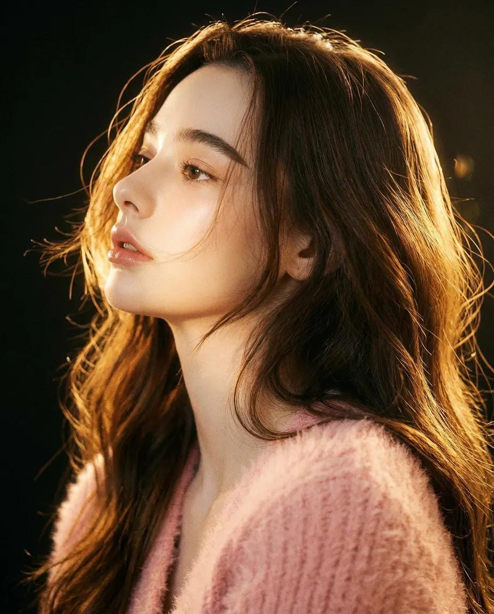

```
Use the attached reference image as a **facial identity reference**.
Preserve the same facial structure, proportions, and likeness from the reference image, while allowing artistic cinematic lighting and styling adjustments.
Do not change the person’s identity.

A cinematic, highly stylized portrait of a woman captured in a side profile, looking slightly upward and away from the camera, evoking a sense of longing and quiet contemplation.

Pose & Composition:
Her chin is gently lifted, elongating the neck and highlighting the refined structure of her jawline and nose. Her body is angled away from the viewer in a subtle three-quarter back view, adding mystery and elegance. The framing is a close-up (head and shoulders), focusing entirely on her facial features and the natural texture of her hair.

Lighting & Color Palette:
Dramatic backlighting (rim lighting) illuminates her from behind, creating a soft halo around her hair with glowing highlights along her forehead, nose, and lips. Strong chiaroscuro contrast separates warm highlights from deep shadows. The color palette is dominated by golden, honey, and amber tones, reminiscent of golden hour. A soft-focus, dreamy, film-like texture with gentle film grain enhances the ethereal mood.

Subject Details:
She has long, voluminous, wavy hair, naturally wind-swept, with individual flyaway strands catching the light like threads of gold. Her expression is calm and serene.
Her skin is **flawless, smooth, and evenly toned**, with **no moles, no freckles, no acne, no blemishes, no dark spots**. The complexion is luminous and natural, avoiding an artificial or plastic look.
Her lips are soft with a natural pink hue. She wears a soft, textured garment, possibly a white faux-fur or fuzzy knit, enhancing the gentle aesthetic.

Background & Atmosphere:
A dark, minimalist background with subtle bokeh keeps full attention on the subject. Visible film grain adds a vintage, cinematic quality rather than a modern digital sharpness.

Style keywords:
cinematic portrait, reference face, golden hour lighting, rim light, chiaroscuro, flawless skin, natural beauty retouch, film grain, soft focus, ethereal, vintage aesthetic, warm tones, high contrast
```

```
使用附带的参考图像作为**面部身份参考**。  
保留参考图像中的面部结构、比例和相貌特征，同时允许进行艺术化的电影级光影与造型调整。  
不得改变人物的身份。

一幅电影感强烈、高度风格化的女性肖像，以侧脸呈现，目光微微向上并远离镜头，传达出一种渴望与静谧沉思的情绪。

**姿势与构图：**  
她的下巴轻轻抬起，拉长颈部线条，突出下颌与鼻梁的精致轮廓。身体以微妙的四分之三背对视角远离观者，增添神秘与优雅感。画面为特写构图（头部与肩膀），聚焦于她的面部特征及头发的自然质感。

**光影与色调：**  
强烈的背光（轮廓光）从后方照亮人物，在发丝周围形成柔和光晕，并在额头、鼻梁与嘴唇处产生发光高光。鲜明的明暗对比（chiaroscuro）将温暖高光与深邃阴影分离。整体色调以金色、蜜色与琥珀色为主，唤起黄金时刻的氛围。柔焦、梦幻般的胶片质感辅以轻微胶片颗粒，强化空灵情绪。

**人物细节：**  
她拥有浓密、蓬松、波浪状的长发，自然被风吹拂，几缕散落的发丝在光线下如金线般闪耀。表情平静安详。  
皮肤**无瑕、光滑、色调均匀**，**无痣、无雀斑、无痘痘、无瑕疵、无暗斑**。肤色通透自然，避免人工或塑料感。  
双唇柔软，呈自然粉色调。身穿一件质地柔软的衣物，可能是白色仿毛皮或绒感针织，增强整体温柔美感。

**背景与氛围：**  
深色极简背景搭配轻微散景，使注意力完全集中于人物。可见的胶片颗粒赋予画面复古电影质感，而非现代数码锐利感。

**风格关键词：**  
电影肖像、参考人脸、黄金时刻光影、轮廓光、明暗对比、无瑕肌肤、自然美肤修饰、胶片颗粒、柔焦、空灵、复古美学、暖色调、高对比度
```

 [↑返回目录](#toc)

---
## <a id="">工作室摄影照片九宫格</a> (<a href="https://x.com/wanerfu/status/2017116581164454309" target="_blank" rel="noopener noreferrer">摆烂程序媛</a>)


```
在柔和米色的工作室内，构建3x3精细编辑照片网格

角色穿深蓝轻薄衬衫，米白长裤，赤脚展现原始质感

灯光设计：
前右大面积柔光，左侧银反光板，顶部微弱轮廓光。

9组精细镜头构图：
1.85mm f/1.8极致唇部特写
2.眼睛对镜特写
3.黑白下巴支撑肖像
4.半遮半露肖像
5.手覆面部特写
6.发丝遮眼构图
7.手部触下巴细节
8.半身侧坐姿势
9.带泪水的侧脸电影感
```

 [↑返回目录](#toc)

---
## <a id="">金棕酥皮可颂糕点的极致美食摄影</a> (<a href="https://x.com/meng_dagg695/status/2016888860240990534" target="_blank" rel="noopener noreferrer">ShaHid WaNii</a>)

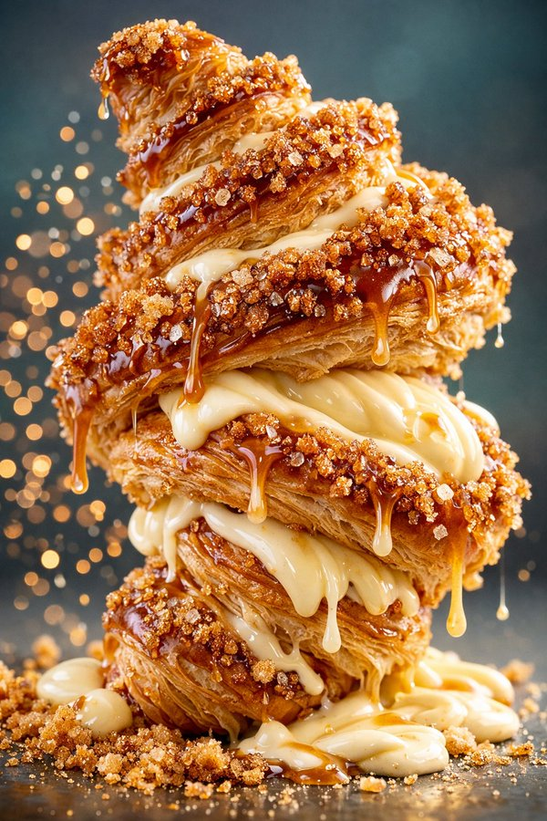

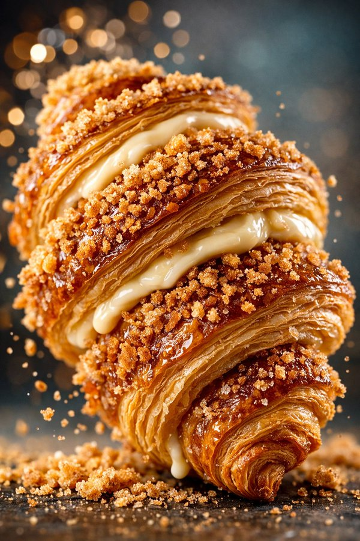

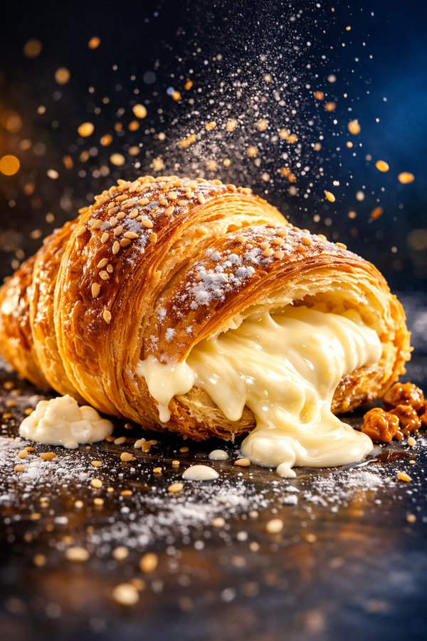

```
{
  "subject": {
    "type": "pastry",
    "form": "twisted croissant-like pastry",
    "orientation": "vertical, slightly leaning",
    "structure": "multiple tight spiral layers stacked upward",
    "edges": "crisp, sharply defined flaky layers"
  },
  "texture": {
    "outer_layers": "golden-brown, laminated, flaky pastry with visible thin sheets",
    "topping": "coarse caramelized sugar crumbs adhered to surface",
    "filling": "thick, glossy cream visible between layers",
    "cream_consistency": "smooth, viscous, slow-dripping"
  },
  "color_palette": {
    "primary": [
      "golden brown",
      "deep amber",
      "warm caramel"
    ],
    "secondary": [
      "cream white",
      "light beige"
    ],
    "background": [
      "dark teal",
      "charcoal gray",
      "warm golden highlights"
    ]
  },
  "lighting": {
    "style": "studio food photography",
    "direction": "soft directional light from upper left",
    "highlights": "specular highlights on cream and caramel",
    "shadows": "soft shadows under pastry base",
    "contrast": "high micro-contrast emphasizing texture"
  },
  "cream_behavior": {
    "flow": "gravity-driven drips",
    "locations": [
      "between pastry layers",
      "dripping from mid-sections",
      "pooling at the base"
    ],
    "surface_quality": "glossy, reflective"
  },
  "crumb_details": {
    "distribution": "dense on upper layers, scattered at base",
    "particle_size": "small to medium irregular granules",
    "motion": "some crumbs appear suspended mid-air"
  },
  "background": {
    "depth_of_field": "very shallow",
    "bokeh": "large circular light orbs",
    "focus": "sharp subject, heavily blurred background",
    "environment": "studio backdrop, non-descriptive"
  },
  "base_surface": {
    "material": "dark matte surface",
    "interaction": "cream pooling and crumbs scattered",
    "reflection": "minimal, soft"
  },
  "composition": {
    "framing": "tight close-up",
    "aspect_ratio": "3:4",
    "camera_angle": "slightly low angle, frontal",
    "visual_weight": "centered vertical mass"
  },
  "style": {
    "look": "hyper-realistic, AI-enhanced food photography",
    "finish": "clean, polished, cinematic",
    "detail_level": "extreme micro-texture visibility"
  },
  "resolution": {
    "target": "8K",
    "sharpness": "ultra-sharp subject details",
    "noise": "none visible"
  }
}
```

```
主题为一种垂直微倾、螺旋层叠向上的扭结可颂式糕点，结构由多层紧密螺旋堆叠而成，边缘酥脆且层次分明。外层呈金棕色，为可见薄片的千层酥皮，表面附着粗粒焦糖糖屑；层间夹有浓稠光亮的奶油，质地顺滑黏稠，缓慢滴落。主色调包括金棕色、深琥珀色与暖焦糖色，辅以乳白色和浅米色；背景为深青绿色与炭灰色，并带有温暖金色高光。采用影棚美食摄影风格，左上方向柔光照明，在奶油与焦糖处形成镜面高光，底部投下柔和阴影，强调纹理的高微对比度。奶油受重力作用从层间、中部滴落并在底部积聚，表面具高光泽反射感。糖屑密集分布于上层，底部散落，颗粒大小不一，部分悬浮空中。背景景深极浅，呈现大圆形光斑虚化，主体清晰锐利，环境为无特征影棚背景。糕点置于深色哑光台面上，奶油在底部积聚，糖屑散落，仅有微弱柔和反光。构图采用3:4比例的紧凑特写，略低角度正面拍摄，视觉重心集中于中央垂直体量。整体风格为超写实AI增强美食摄影，画面干净精致、电影感强，展现极致微观纹理细节。目标分辨率为8K，主体细节超清晰，无可见噪点。
```

 [↑返回目录](#toc)

---
## <a id="">沉入深邃：高端产品的隐秘之美</a> (<a href="https://x.com/lloydcreates/status/2016995999554670918" target="_blank" rel="noopener noreferrer">Lloyd Creates</a>)

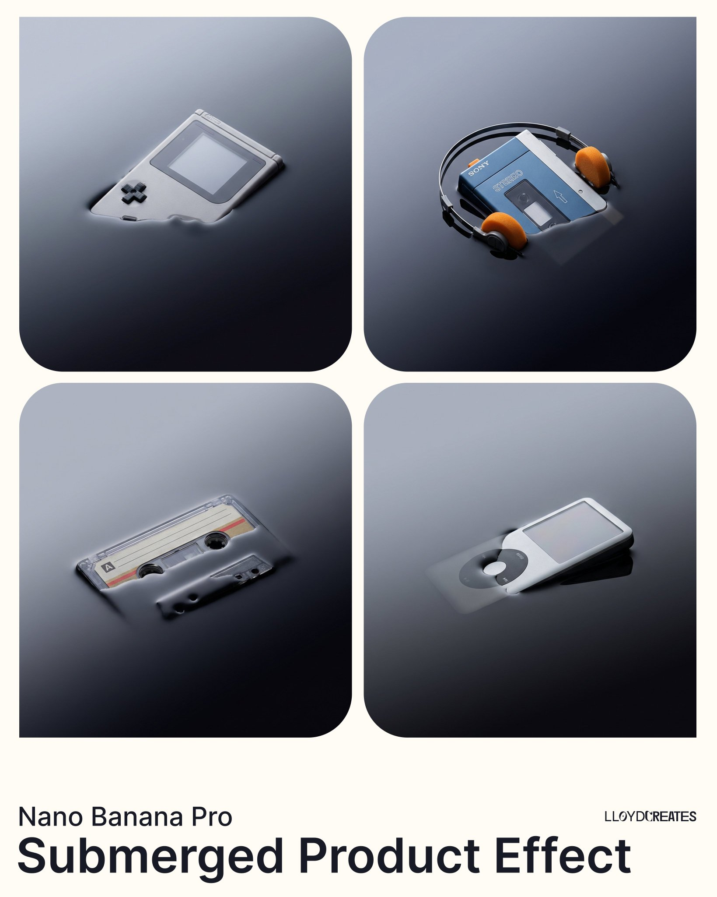

```
{
  "project_name": "Submerged_Product_Effect",
  "version": "10.0_FINAL",
  "USER_CUSTOMIZATION": {
    "INSTRUCTIONS": "Customize your product and gradient colors. Product will be sinking deep into thick opaque liquid.",
    "product_description": "PRODUCT",
    "gradient_dark_color": "#09080E",
    "gradient_light_color": "#AEB4C2"
  },
  "settings": {
    "style": "High-end luxury product photography, low angle view, nearly flat product with one end sinking much deeper into liquid, only smooth gradient background.",
    "aspect_ratio": "4:5",
    "camera_angle": "Low angle looking upward at nearly flat product with one end sinking deep into liquid"
  },
  "prompt_construction": {
    "MAIN_SUBJECT": {
      "subject": "{{USER_CUSTOMIZATION.product_description}}",
      "presentation": "The product is lying nearly flat/horizontal. ONE END (the far/bottom end) is SINKING MUCH DEEPER into the thick opaque liquid than the other end. The product has an angled submersion - one end goes deep into the liquid while the other end remains more visible. Only 20-30% total is visible above the liquid surface. The end that is sinking deep is completely hidden - 70-80% of the product is invisible below the opaque liquid.",
      "submersion_asymmetry": "CRITICAL ASYMMETRIC SUBMERSION: One end of the product sinks MUCH DEEPER into the liquid than the other end. This creates an angled liquid line where one end disappears far into the liquid while the other end is less submerged. The product is NOT floating evenly - it's sinking on one side."
    },
    "PRODUCT_IN_LIQUID_NOT_ON_SURFACE": {
      "critical_rule": "The product is IN the liquid, SUBMERGED in the liquid, NOT sitting on top of a surface, NOT resting on a platform. The liquid envelops and surrounds the submerged portion - the product has SUNK INTO the liquid medium.",
      "forbidden": "NO surface under the product, NO platform supporting the product, NO product sitting on something, NO product resting on top of anything. The product is INSIDE the liquid, submerged and surrounded by it."
    },
    "LIQUID_MEDIUM": {
      "liquid_type": "Thick, viscous, matte, 100% COMPLETELY OPAQUE liquid in gradient colors. The liquid is NOT a separate colored element - it shares the same gradient as the background.",
      "opacity": "100% OPAQUE. The deeply submerged end is completely invisible - no blur effect, no ghosting, no faint visibility. Just completely hidden by the opaque liquid.",
      "liquid_state": "COMPLETELY STILL, CALM, SMOOTH. No ripples, no waves, no texture.",
      "displacement": "Natural soft organic rounded shadow depth where the product sinks into the liquid. Smooth shadows - NEVER outlined, NEVER showing product silhouette."
    },
    "NO_PLATFORMS_OR_SURFACES_CRITICAL": {
      "absolutely_no_platform": "ZERO platform, ZERO surface, ZERO floor under or beneath the product. NO purple platform, NO purple surface, NO colored surface of any kind. The product is floating/sinking IN the liquid gradient environment, not sitting ON anything.",
      "liquid_is_gradient": "The liquid IS the gradient - they are the same thing. There is no separate 'purple liquid' or 'colored liquid' - only the smooth gradient from {{USER_CUSTOMIZATION.gradient_dark_color}} to {{USER_CUSTOMIZATION.gradient_light_color}}."
    },
    "BACKGROUND_GRADIENT_ONLY": {
      "exact_gradient_only": "ONLY a smooth diagonal gradient. Bottom-right corner: {{USER_CUSTOMIZATION.gradient_dark_color}} (#09080E). Top-left corner: {{USER_CUSTOMIZATION.gradient_light_color}} (#AEB4C2). THESE ARE THE ONLY TWO COLORS IN THE ENTIRE IMAGE.",
      "absolutely_forbidden_colors": "NO purple platform color, NO additional purple, NO tan, NO beige, NO brown, NO peach, NO warm tones, NO other colors whatsoever. ONLY the two specified gradient colors.",
      "no_other_elements": "NO diagonal lines, NO triangular shapes, NO geometric shapes, NO color blocks, NO frames, NO borders around the image."
    },
    "PRODUCT_FRAMING": {
      "complete_product_visible": "The entire visible portion of the product (the 20-30% above liquid) must be fully within frame. NO cutting off the product edges. NO cropping the product. NO frames or borders around the image itself.",
      "forbidden": "NO product cut off by image edges, NO product cropped, NO frames, NO borders around the image."
    },
    "NO_BLUR_OR_GHOSTING": {
      "critical_rule": "The submerged portion is simply HIDDEN by opaque liquid - NOT blurred, NOT ghosted, NOT faintly visible with blur effects. The opaque liquid completely hides it as if it doesn't exist.",
      "forbidden": "NO motion blur on submerged parts, NO gaussian blur effects, NO ghosting, NO faint blurred product visible below surface."
    },
    "CAMERA_PERSPECTIVE": {
      "camera_angle": "Low camera position below the product, looking upward at slight angle.",
      "forbidden_angles": "NEVER flat lay, NEVER overhead, NEVER looking down."
    },
    "CRITICAL_RESTRICTIONS": {
      "absolutely_forbidden": [
        "Product sitting on surface/platform",
        "Purple platform under product",
        "Purple surface color",
        "Any surface supporting the product",
        "Product resting on something",
        "Product floating evenly",
        "Even submersion across product",
        "Both ends submerged equally",
        "Motion blur or ghosting on submerged parts",
        "Blur effects on submerged portion",
        "Any colors other than the two gradient colors",
        "Diagonal lines in background",
        "Triangular shapes",
        "Geometric background elements",
        "Product cut off by edges",
        "Product cropped",
        "Frames or borders around image"
      ]
    },
    "NEGATIVE_CONSTRAINTS": [
      "product on surface",
      "product on platform",
      "purple platform",
      "purple surface",
      "colored surface under product",
      "surface supporting product",
      "product sitting on something",
      "product resting on top",
      "platform beneath product",
      "surface beneath product",
      "product floating evenly",
      "even submersion",
      "equal submersion on both ends",
      "both ends same depth",
      "symmetrical submersion",
      "motion blur on submerged parts",
      "gaussian blur effect",
      "blur on product",
      "ghosting",
      "faint product below surface",
      "blurred visibility below surface",
      "purple color other than gradient",
      "additional purple",
      "tan background",
      "beige background",
      "brown background",
      "warm tones",
      "peach colors",
      "colors other than gradient",
      "extra colors",
      "third color",
      "fourth color",
      "diagonal line in background",
      "triangular shape",
      "geometric shape in background",
      "color blocks",
      "hard edges in background",
      "product cut off",
      "product cropped",
      "product edges cut by frame",
      "frames",
      "borders",
      "image border",
      "image frame",
      "product at 45 degrees",
      "product standing upright",
      "product vertical",
      "platform",
      "surface",
      "floor",
      "table",
      "horizon line",
      "transparent liquid",
      "see-through liquid",
      "ripples",
      "waves",
      "flat lay",
      "overhead view",
      "looking down"
    ],
  }
}
```

```
产品名称：“沉没的产品效果”
版本：10.0最终版

自定义指令：定制您的产品和渐变颜色。产品将深深沉入浓厚不透明的液体中。

产品描述：产品
渐变深色：#09080E
渐变浅色：#AEB4C2

风格设定：高端奢侈品摄影，低角度视角，几乎平放的产品一端比另一端更深地沉入液体中，只有光滑的渐变背景。
宽高比：4:5
相机角度：低角度向上看几乎平放的产品，一端深入液体中。

提示词构建：
主要主题：产品几乎水平放置，远端或底部一端更深地沉入浓厚的不透明液体中，形成不对称的浸没线，一端完全隐藏于液体之下，70-80%的产品不可见。

产品在液体中而非表面上：产品完全位于液体内部，被液体包围并沉入其中，没有表面支撑产品，不允许产品浮在表面或任何东西上。

液体介质：浓厚、粘稠、哑光、100%完全不透明的液体，具有渐变颜色。液体与背景共享相同的渐变，没有其他颜色元素。液体完全静止、平静、光滑，无波纹、无波动、无纹理。

禁止平台或表面：绝对没有任何平台、表面、地板在产品下方，液体即为渐变，两者是一体的，仅有从深色#09080E到浅色#AEB4C2的平滑渐变。

背景仅渐变：确切的渐变是从右下角的#09080E到左上角的#AEB4C2，这两个是整个图像中唯一的颜色。

产品构图：可见部分（液面上方的20-30%）必须完全包含在画面内，不允许裁剪产品的边缘。

禁止模糊或残影：淹没的部分被不透明液体完全隐藏，不允许有运动模糊、高斯模糊效果或残影。

相机视角：相机位置低于产品，以轻微的角度向上看，禁止俯视图或平铺视角。

关键限制：绝对禁止包括但不限于产品坐在表面/平台上、紫色平台、其他颜色的表面支撑产品、产品对称沉没等。

负面约束列表：包括但不限于产品在表面上、产品在平台上、紫色平台、暖色调背景、几何形状背景元素、产品被裁剪、图像边框等。
```

 [↑返回目录](#toc)

---
## <a id="">韩系女团风时尚大片</a> (<a href="https://x.com/qisi_ai/status/2017062059712925871" target="_blank" rel="noopener noreferrer">骑司Chase</a>)

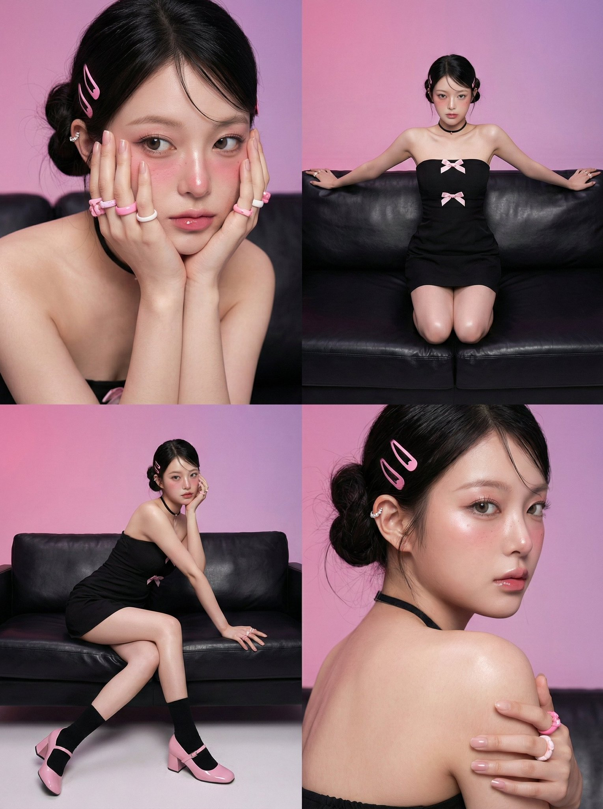

```
【AI写真系列×韩系女团风】第四弹

黑色小礼服配粉色蝴蝶结、粉色发夹、腮红氛围感拉满

中文提示词：

一、画面构图
1 版式：四宫格拼图，比例3:4，2×2排列，四张画面同一主题同一人物
2 景别：两张特写为主，两张全身到半身为主，人物占比大
3 机位：平视为主，轻微侧角变化，强调脸部与身体线条
4 画面关系：同一场景与色调统一，四张形成连贯时尚大片叙事

二、人物主体
1 性别年龄感：年轻女性，清冷与甜酷并存
2 体态气质：纤细骨感，肩颈线条明显，眼神克制偏冷
3 面部要点：大眼感，腮红集中两颊与鼻梁，唇色水润偏粉
4 发型：黑发低盘发或贴头盘发，侧分刘海，有浅粉色发夹固定，少量碎发弧线贴面

三、妆容与肤质
1 底妆：细腻柔焦，干净无瑕，带微光泽
2 腮红：粉色高饱和，扩散到眼下与鼻梁，营造可爱氛围
3 眼妆：干净拉长，睫毛纤长，眼神偏冷淡
4 唇妆：镜面水光，粉到蜜桃色渐变

四、服装与配饰
1 服装：黑色抹胸连衣裙，裙身点缀多处粉色蝴蝶结
2 颈部：细带颈饰或系带蝴蝶结感装饰
3 耳饰：小巧闪亮耳坠，偏甜美精致
4 戒指：夸张甜酷戒指，多枚叠戴，粉白配色明显
5 袜鞋：黑色长袜或半透袜，粉色玛丽珍高跟鞋

五、动作姿态分镜
1 左上：近景特写，双手托腮或拳头轻顶脸颊，眼神向左看，打破平衡感，突出戒指与腮红
2 右上：半身到全身，跪坐在黑色沙发上，双臂向两侧伸展撑在沙发靠背，姿态带压迫感
3 左下：全身坐姿，坐在沙发上微侧身，一条腿交叠或伸出，手掌撑在沙发与地面形成线条
4 右下：侧脸近景，回眸看镜头，手臂环抱或搭在肩前，露出肩背光泽与耳饰发夹细节

六、场景与道具
1 背景：纯色粉紫渐变背景，干净无杂物
2 家具：黑色皮质沙发，反光明显，褶皱质感强
3 地面：浅色地面或地毯，简洁干净

七、灯光与色彩
1 灯光：柔光棚拍质感，面部均匀补光，阴影很软
2 高光：皮肤与沙发都有明显柔亮高光，突出材质对比
3 主色：粉紫背景＋黑色服装沙发＋粉色蝴蝶结与鞋的强调色
4 氛围：甜酷、梦幻、时尚杂志感

八、质感与画面要求
1 真实质感：皮肤白皙细腻但不过度磨皮，沙发皮革反光清晰
2 清晰度：对焦在眼睛与妆容配饰，背景轻微虚化
3 统一性：四张人物身份一致、服装一致、场景一致、色调一致
4 画面干净：无多余文字标识、水印、杂乱背景元素
```

 [↑返回目录](#toc)

---
## <a id="">甜酷少女的天使羽翼</a> (<a href="https://x.com/qisi_ai/status/2016803276566737364" target="_blank" rel="noopener noreferrer">骑司Chase</a>)

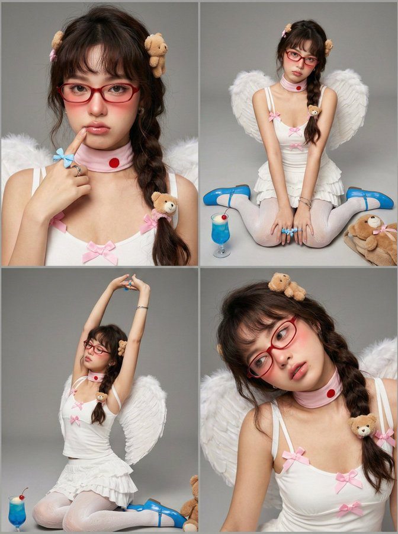

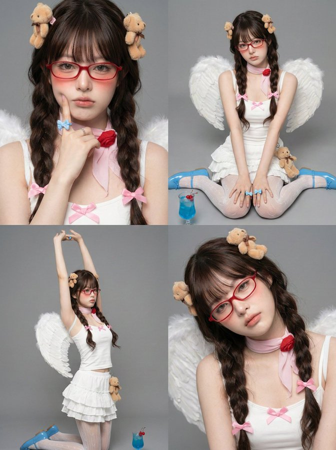

```
【AI写真系列×韩系女团风】第三弹

红色细框眼镜、白色蕾丝小裙、粉色丝巾、天使羽翼与毛绒发饰，把“幼态、复古、俏皮、轻微性感”的气质牢牢钉住～

 图一为直接生成
 图二为使用参考图生成

中文提示词（Nano Banana Pro）：

一、画面版式
1 画幅比例：竖幅三比四，四宫格拼图，二行二列排列
2 镜头组合：两张近景特写加两张半身到全身，人物占画面比例大
3 背景统一：同一灰色无缝背景，四格色调与光线一致，边缘留少量灰底空白

二、人物主体
参考来源：以上传参考图作为严格身份来源
一致性要求：零偏差
1 人物设定：年轻少女，甜酷可爱与轻微性感并存
2 面部特征：大眼圆润，鼻梁小巧，唇形饱满，脸颊与眼下高饱和腮红
3 妆容质感：底妆干净微雾面，腮红面积大且集中，唇部高光水润镜面
4 配饰标识：红色细框眼镜，作为强识别点贯穿四格

三、发型与头饰
1 发型：深棕长发，侧边大波浪辫子垂落，刘海厚且蓬松，少量碎发自然散落
2 头饰：毛绒小熊发夹与发圈点缀，发侧还有小熊挂件与背包元素呼应

四、服装造型与道具
1 服装：白色吊带上衣与白色层叠荷叶边短裙，肩带与胸前有粉色蝴蝶结装饰
2 颈部装饰：浅粉色领巾系结，中心有红色小装饰点
3 翅膀：白色羽毛天使翅膀，体积感明显，出现在全身与半身画面中
4 袜鞋：白色提花连裤袜，亮蓝色平底鞋形成强对比跳色
5 小道具：蓝色蝴蝶结指套或手指装饰，戒指与小首饰；地面放一杯蓝色饮品配红色樱桃点缀

五、四格动作与表情
1 左上特写：手指轻触嘴角或脸颊，眼神直视镜头，微撅唇，表情无辜带挑衅
2 右上全身：跪坐或屈膝坐姿，双手置于腿前，身体略前倾，眼神略带冷淡
3 左下半身到全身：双臂高举交握拉伸姿势，腰背挺直，侧身轻转，展现翅膀轮廓
4 右下特写：身体侧倚，头微偏，眼神慵懒放空，唇部微张，氛围更暧昧克制

六、光线与色调
1 光线：柔和棚拍漫射光，阴影浅且边缘柔，人物皮肤高光细腻
2 色调：整体偏中性灰背景，肤色温润，粉色与红色局部高饱和，蓝色鞋与饮品作为跳色点
3 质感：写实摄影质感，皮肤细腻但不过度磨皮，服装布料与羽毛纹理清晰可见

七、画面约束
1 一致性：人物五官、发型、眼镜、服装、翅膀在四格中保持同一人同一套造型
2 干净度：背景无杂物，仅保留饮品与背包小熊等少量道具点缀
3 氛围关键词：甜酷、软糯、天使感、轻微挑衅、干净棚拍、对比跳色
```

 [↑返回目录](#toc)

---
## <a id="">悉尼·斯威尼电影感分镜写真</a> (<a href="https://x.com/Strength04_X/status/2016902773569441987" target="_blank" rel="noopener noreferrer">𝐌</a>)

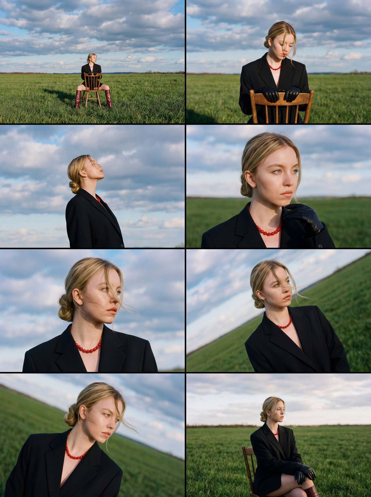

```
Use the uploaded photograph as the only visual reference.
The person’s identity must be preserved with maximum accuracy: face, facial features, age, gender, body proportions, and overall appearance must remain unchanged.
Do not invent or add anything that does not exist in the original image.

Step 1: Detailed visual analysis of the source image
First, perform a careful visual analysis of the uploaded image, including:
Who is in the image (person, number of people, position in frame)
Body pose and direction of gaze
Facial expression and emotional mood
Clothing and accessories
Lighting conditions, time of day, color temperature
Environment, background, and depth of space
Overall emotional tone of the scene

Step 2: Cinematic 3×2 storyboard grid
After the analysis, create a cinematic 3×2 grid (6 frames) from the single image, as if it were a sequence of shots from a film.

Global requirements for the entire grid:
Format: one image containing a 3×2 grid
All frames must be numbered 1–6, left to right, top to bottom
Visual style: realistic, cinematic, non-illustrative
One consistent character and environment with logical continuity
Each frame must differ by pose, camera angle, or camera distance
The sequence should feel like time is passing and the scene is developing
No facial distortion, no change in identity or appearance

Frame descriptions:

Frame 1 (No. 1)
Wide establishing shot.
The camera is farthest from the subject, showing the full environment and context.
The person feels like part of the surrounding space.

Frame 2 (No. 2)
Medium shot.
The camera moves closer.
The pose changes slightly, revealing inner emotion or state of mind.

Frame 3 (No. 3)
Low-angle or side-angle shot.
Adds drama or tension, emphasizing body shape and perspective.

Frame 4 (No. 4)
Close-up or medium close-up.
Focus on the face, eyes, and emotion.
Fine details are clearly visible.

Frame 5 (No. 5)
Dynamic angle: diagonal composition or camera movement.
The pose changes the most, creating a sense of action or momentum.

Frame 6 (No. 6)
Final shot.
Calm, reflective, or emotionally resolved.
The camera may be closer or farther, but the frame feels like a conclusion.

Lighting & cinematic consistency:
Lighting must remain logically consistent across all frames, as if filmed in one continuous scene.

Depth of field, lighting, and color grading should reinforce a cinematic look.

Final result:
The output should resemble a professional cinematic storyboard, captured in a single take and location, with strong realism and narrative flow.
```

```
仅以上传的照片作为唯一视觉参考。  
必须最大程度保留人物身份：面部、五官特征、年龄、性别、身体比例及整体外貌不得改变。  
不得添加或虚构原图中不存在的任何元素。  

第一步：对原始图像进行详细视觉分析  
首先，对上传图像进行细致的视觉分析，包括：  
- 图像中的人物（人数、位置）  
- 身体姿态与视线方向  
- 面部表情与情绪氛围  
- 服装与配饰  
- 光照条件、时间、色温  
- 环境、背景与空间纵深感  
- 整体场景的情绪基调  

第二步：制作电影感3×2分镜网格  
分析完成后，基于单张图像创作一个电影感的3×2网格（共6格），如同电影中的连续镜头序列。  

整体网格要求：  
- 格式：一张包含3×2网格的图像  
- 所有画面按从左至右、从上到下编号1–6  
- 视觉风格：写实、电影感、非插画风格  
- 保持一致的角色与环境，具有逻辑连贯性  
- 每格在姿势、镜头角度或景别上有所区别  
- 整体序列需呈现时间推移与情节发展感  
- 不得出现面部失真或身份、外貌变化  

各帧描述：  

第1格（编号1）  
广角定场镜头。  
相机距离人物最远，完整展现环境与上下文。  
人物融入周围空间之中。  

第2格（编号2）  
中景镜头。  
相机靠近一些。  
姿势略有变化，透露内心情绪或状态。  

第3格（编号3）  
低角度或侧角度镜头。  
增强戏剧性或紧张感，突出身体轮廓与透视效果。  

第4格（编号4）  
特写或中近景。  
聚焦面部、眼神与情绪。  
细节清晰可见。  

第5格（编号5）  
动态角度：采用对角线构图或模拟摄像机运动。  
姿势变化最大，营造动作感或动势。  

第6格（编号6）  
结尾镜头。  
平静、沉思或情绪得到解决。  
镜头可近可远，但整体具有收尾感。  

光影与电影感一致性：  
所有画面的光照需逻辑一致，如同在同一连续场景中拍摄。  
景深、光线与色彩调校应强化电影感。  

最终成果：  
输出应如同专业电影分镜板，基于单次拍摄、单一地点，具备高度写实性与叙事流畅感。
```

 [↑返回目录](#toc)

---
## <a id="">微缩3D场景中的超现实抽屉世界</a> (<a href="https://x.com/0x00_Krypt/status/2017086453432652148" target="_blank" rel="noopener noreferrer">两斤</a>)

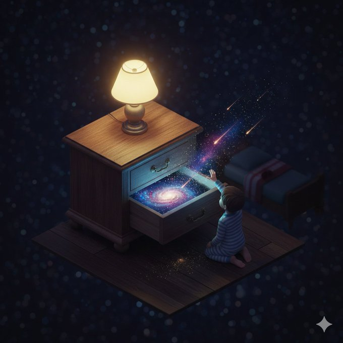

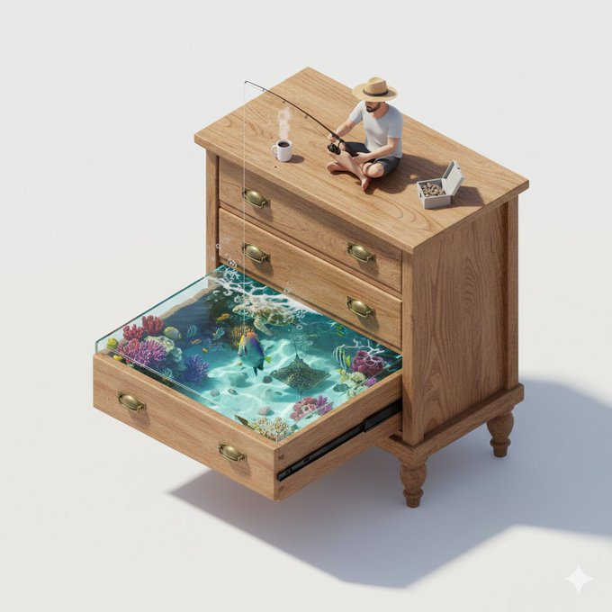

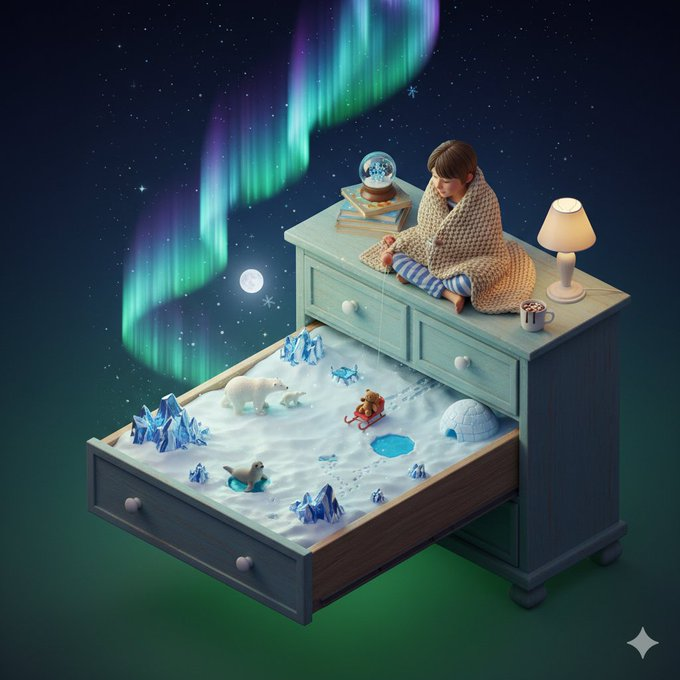

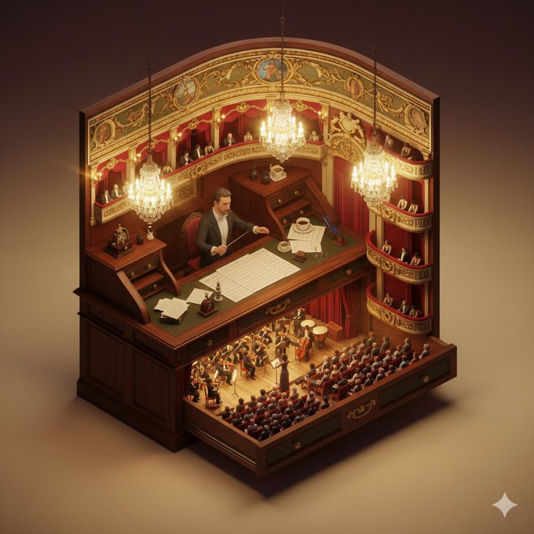

```
Create a highly detailed surreal isometric 3D diorama of an ordinary wooden drawer pulled from vintage furniture, impossibly containing [INPUT SCENE].

The drawer defies physics: its small exterior contains a vast [environment type] that extends far beyond normal space. A small figure [interacts with] this paradox - [specific action]. 

Visual paradox: normal-sized drawer exterior, infinite interior. [Environmental elements] spill subtly over the drawer's edge into reality. Rich storytelling details scattered both on the furniture surface and within the impossible world.

Lighting: dramatic contrast between realistic furniture lighting and [environmental lighting] emanating from within the drawer. Atmospheric effects creating depth and magic.

Materials: weathered vintage wood furniture, hyper-realistic textures for the surreal environment.

Perspective: isometric cutaway at 45-degree angle showing both human interaction and the impossible interior world. Ultra high detail, dreamlike aesthetic emphasizing reality-fantasy contrast, gradient background from grounded earth tones to ethereal colors matching the scene.
```

```
创作一个高度精细的超现实等距3D微缩场景：一只从复古家具中拉出的普通木制抽屉，其内部不可思议地容纳着[INPUT SCENE]。

这只抽屉违背物理法则：外观小巧，却内藏广阔无垠的[环境类型]，远远超出正常空间尺度。一名微小人物正在与这一悖论互动——[具体动作]。

视觉悖论：外部为正常尺寸的抽屉，内部却无限延展。[环境元素]微妙地溢出抽屉边缘，渗入现实世界。丰富的叙事细节散布于家具表面与不可能的内部世界之中。

光影效果：真实家具的写实光照与从抽屉内部透出的[环境光照]形成强烈对比，辅以营造深度与魔幻感的大气特效。

材质表现：做旧复古木质家具，搭配超写实纹理的超现实环境。

视角构图：45度等距剖面视角，同时展现人物互动与不可思议的内部世界。极致细节，梦幻美学，强调现实与幻想的对比，背景采用渐变色调，从沉稳大地色过渡至契合场景的空灵色彩。
```

 [↑返回目录](#toc)

---
## <a id="">现代饮品信息图：视觉与味觉的完美结合</a> (<a href="https://x.com/Taaruk_/status/2016716199753810419" target="_blank" rel="noopener noreferrer">Taaruk</a>)

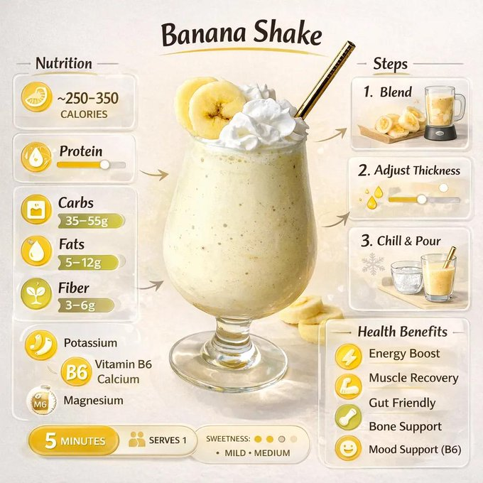

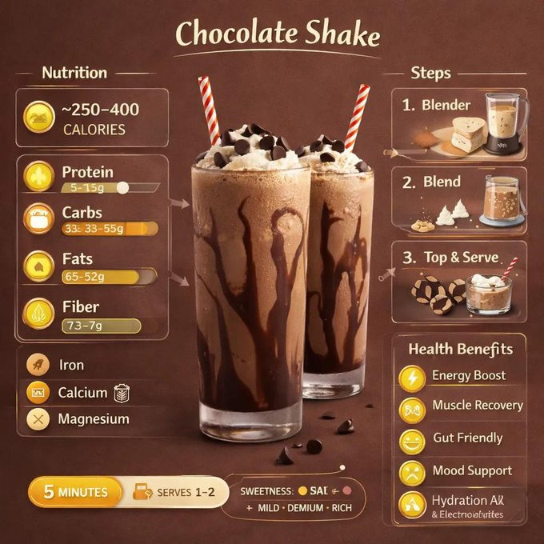

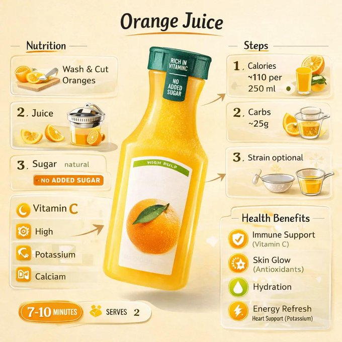

```
A clean, modern food infographic poster for [DRINK NAME], centered composition. A highly realistic glass/bottle of the drink in the middle with smooth texture, condensation, and soft studio lighting. Minimal pastel background with subtle paper texture. Surrounding the drink are neatly arranged UI-style information cards and icons showing nutrition facts, preparation steps, time, servings, sweetness level, and health benefits. Rounded cards, soft shadows, warm color palette matching the drink, flat + semi-3D icon design. Elegant typography, premium recipe-book aesthetic, Pinterest/Instagram infographic style, ultra-sharp, balanced spacing, professional food design, high detail, 8K quality.
```

```
一张简洁现代的饮品信息图海报，以[饮品名称]为主题，采用居中构图。画面中央是一杯/一瓶高度逼真的饮品，具有细腻质感、冷凝水珠和柔和的影棚灯光效果。背景为极简的淡彩色调，带有微妙的纸张纹理。饮品周围整齐排列着UI风格的信息卡片和图标，展示营养成分、制作步骤、所需时间、份量、甜度等级及健康益处。卡片采用圆角设计，配以柔和阴影，整体使用与饮品相协调的暖色调，图标为扁平化与半3D结合的风格。字体优雅，呈现高端食谱书的美学，符合Pinterest/Instagram信息图风格，画质超高清（8K），布局平衡，细节丰富，具备专业食品设计水准。
```

 [↑返回目录](#toc)

---
## <a id="">微型3D卡通风格贵金属市场场景</a> (<a href="https://x.com/TechieBySA/status/2016576809941246062" target="_blank" rel="noopener noreferrer">TechieSA</a>)


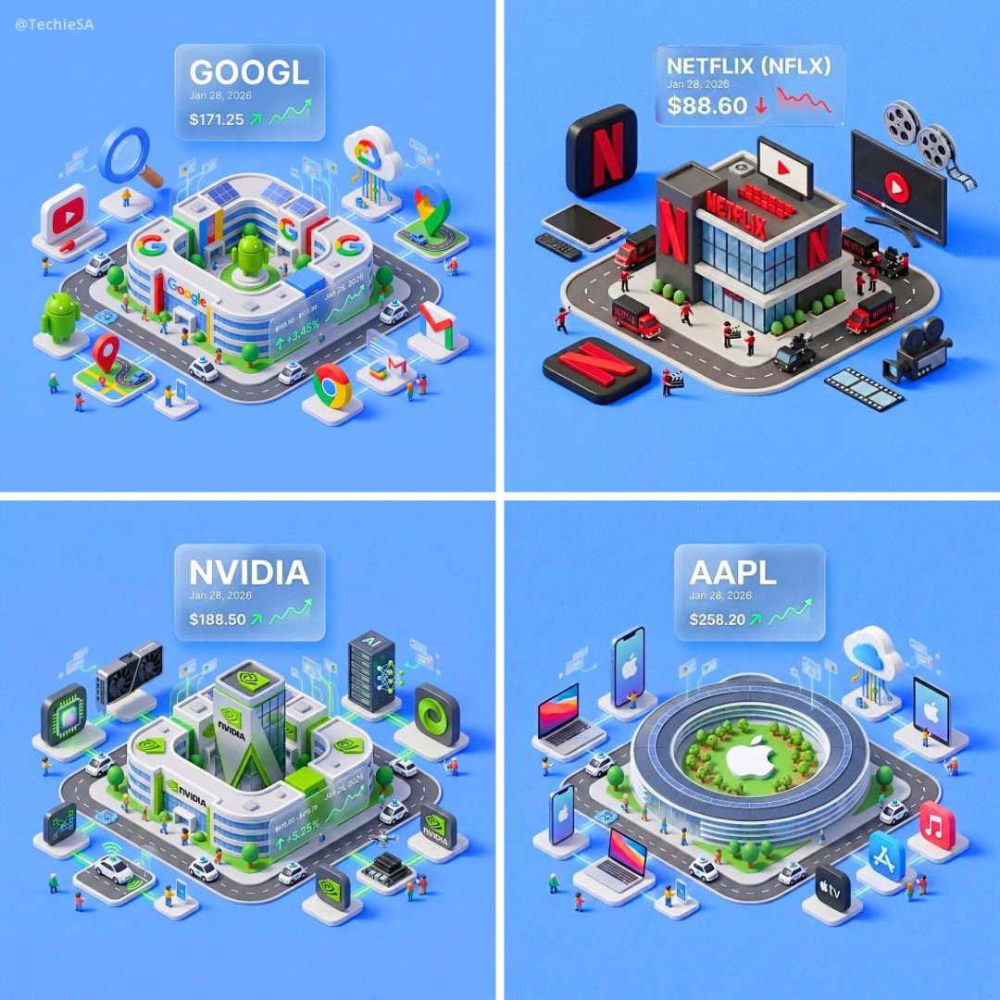

```
Present an exquisite miniature 3D cartoon-style precious metals market scene of [ASSET] , viewed from a clear 45° top-down isometric perspective.

At the center, place a highly recognizable physical representation of the asset: stacked bullion bars, coins, or ingots with accurate engravings, weight stamps, and metallic surface detail. Surround the centerpiece with proportionally scaled elements symbolizing value and demand—vault doors, scales, charts, arrows, market icons, and abstract financial activity elements. Include small stylized figures where relevant (no facial details).

Rendered in a refined Cinema 4D style with smooth rounded geometry, realistic PBR metallic materials, subtle reflections, and soft lifelike lighting. Gentle shadows and polished highlights emphasize weight, density, and luxury.

Integrate the market performance for [DATE] directly into the scene using clean UI-style elements: price per ounce, daily range, trend arrow, and a minimal line or bar chart. Data should be clear, balanced, and visually integrated without overpowering the scene.

Background: solid powder blue, calm and uniform, no gradients or textures.

Typography: modern sans-serif, white or near-white for strong contrast.

At the top-center, place a floating semi-transparent glass UI panel (rounded corners, ~50% opacity, subtle blur, soft shadow) containing:
•Asset name
•Market date
•Price per ounce or price range
•Minimal trend indicator (up/down arrow or micro chart)

The panel should feel lightly elevated above the scene, improving readability while preserving the minimalist, premium aesthetic.

Composition: perfectly centered layout, square 1080×1080, ultra-clean, editorial, high-clarity financial infographic style. No watermark.
```

```
呈现一个精致的微型3D卡通风格贵金属市场场景，主题为【资产】，采用清晰的45度俯视等距视角。

画面中央放置高度可识别的该资产实体表现形式：堆叠的金条、硬币或锭块，带有准确的雕刻纹样、重量印记和金属表面细节。围绕中心主体，布置按比例缩放的象征价值与需求的元素——保险库门、天平、图表、箭头、市场图标以及抽象的金融活动符号。如适用，加入小型风格化人形（无面部细节）。

整体以精炼的Cinema 4D风格渲染：圆润流畅的几何造型、写实的PBR金属材质、细腻反射效果，搭配柔和自然的灯光。轻柔的阴影与精致高光突出金属的重量感、密度感与奢华质感。

将【日期】的市场表现数据直接融入场景，使用简洁的UI式元素呈现：每盎司价格、当日波动区间、趋势箭头，以及极简的折线图或柱状图。数据需清晰易读、布局平衡，并与整体视觉和谐融合，不喧宾夺主。

背景为纯粉蓝色，平静统一，无渐变或纹理。

字体采用现代无衬线体，颜色为白色或近白色，确保高对比度。

在画面上方中央，设置一块悬浮的半透明玻璃UI面板（圆角、约50%透明度、轻微模糊、柔和投影），内含：
- 资产名称
- 市场日期
- 每盎司价格或价格区间
- 极简趋势指示器（上/下箭头或微型图表）

该面板应略高于场景，提升可读性，同时保持极简而高端的美学风格。

构图严格居中，1080×1080正方形尺寸，超洁净、杂志级、高清晰度的金融信息图风格，无水印。
```

 [↑返回目录](#toc)

---
## <a id="">融合品牌logo的冰淇淋</a> (<a href="https://x.com/youraipulse/status/2016567546325979473" target="_blank" rel="noopener noreferrer">AI Pulse</a>)

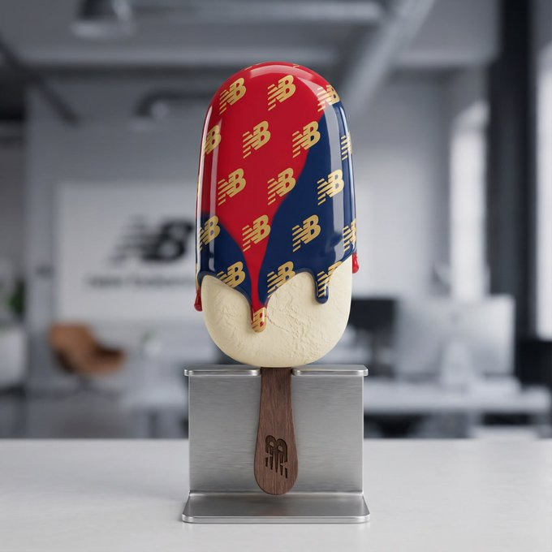

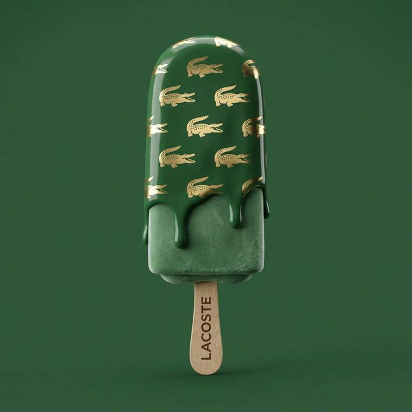

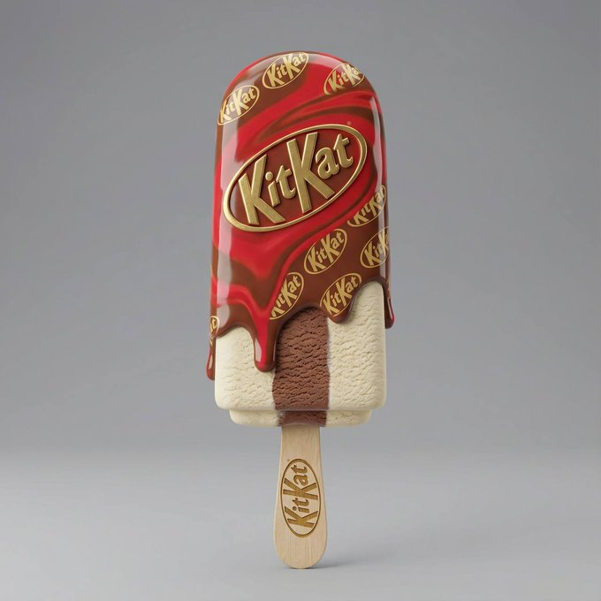

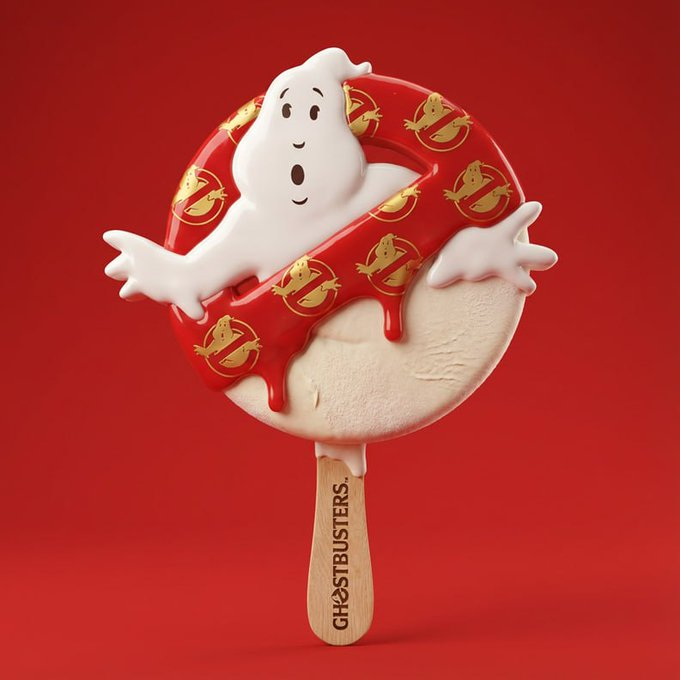

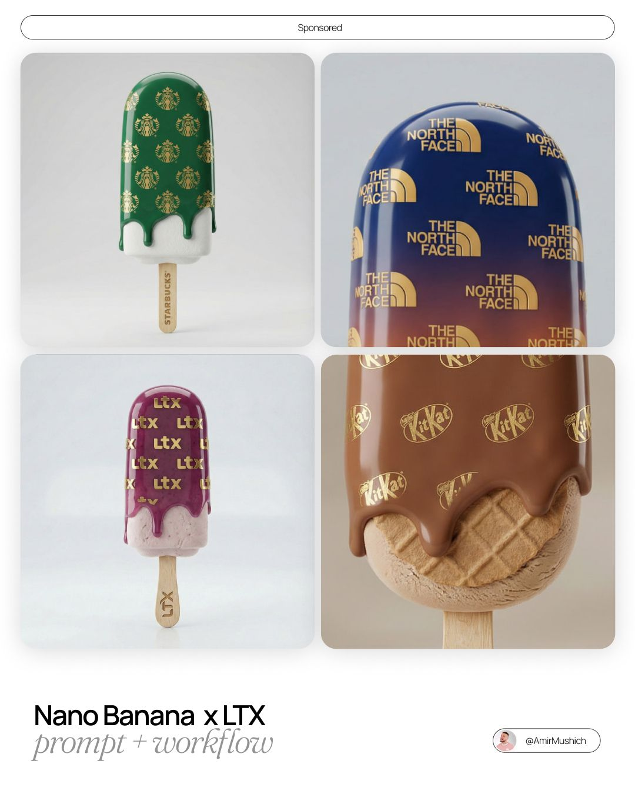

```
A perfectly vertical, hyper-realistic 3D popsicle by [@ YOUR LOGO] featuring a glossy signature-colored glaze with a gold logo pattern dripping over the visible matte ice cream texture at the base. The stick features the brand's logo.
```

```
一个完全垂直、超现实风格的3D冰棍，由[@ YOUR LOGO]品牌呈现。这款冰棍的特点是具有光泽感的品牌标志性颜色糖衣，并带有金色品牌标志图案，该图案仿佛从顶部缓缓流下覆盖在底部可见的哑光冰淇淋纹理上。冰棍的棒子上印有品牌的标志。


```

 [↑返回目录](#toc)

---
## <a id="">俯视等距视角下的微缩场景展现情绪</a> (<a href="https://x.com/aleenaamiir/status/2016746212943417426" target="_blank" rel="noopener noreferrer">Aleena Amir</a>)

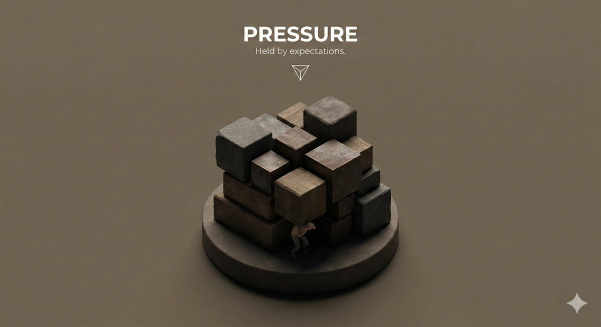

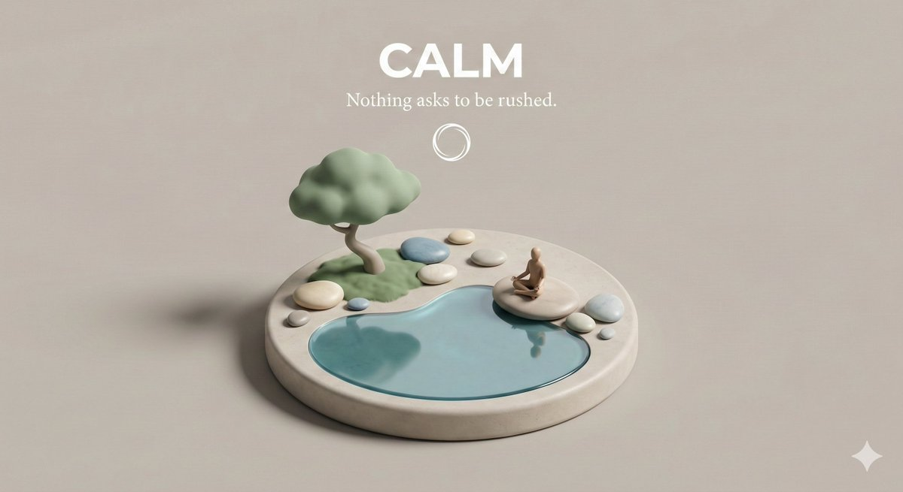

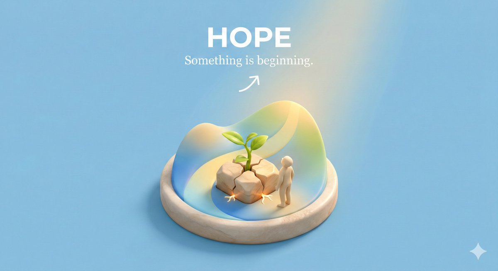

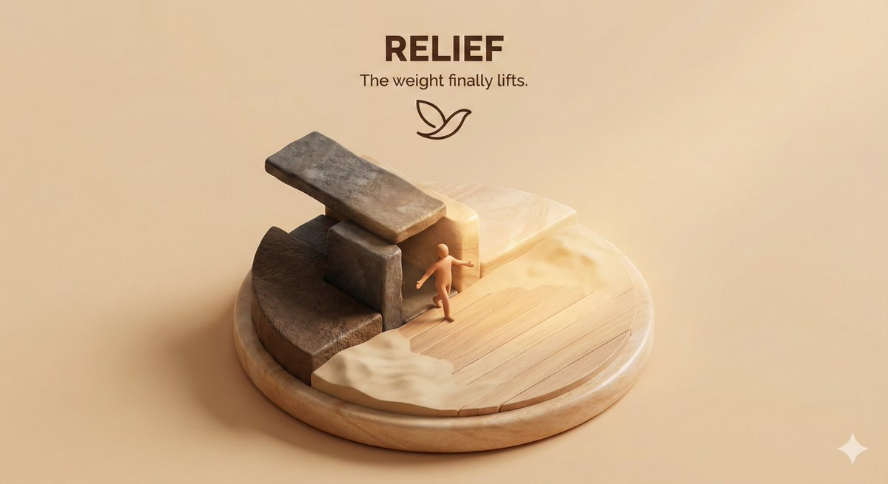

```
Present a clear, 45° top-down isometric miniature 3D diorama visually representing the emotion [EMOTION NAME]. Use soft refined textures, stylized PBR materials, and lighting that reflects the emotional tone.

Create a raised base with symbolic objects, colors, and environmental cues expressing this mood.
Include tiny stylized characters if relevant (no facial details). Use a clean solid [BACKGROUND COLOR] background.

At the top-center, display [EMOTION NAME] in large bold text, beneath it show a poetic subtitle, and place a minimal abstract icon below. All text must automatically match the background contrast (white or black).
```

```
情绪/氛围微缩场景

呈现一个清晰的45°俯视等距微型3D微缩场景，视觉化地表现情绪[EMOTION NAME]。使用柔和精致的纹理、风格化的PBR材质，以及能反映该情绪氛围的灯光。

创建一个抬高的底座，上面布置象征性的物品、色彩和环境线索以传达这种情绪。如适用，加入微小的风格化人物（无面部细节）。背景使用干净的纯色[BACKGROUND COLOR]。

在画面顶部中央以大号粗体文字显示[EMOTION NAME]，其下方添加一句诗意的副标题，并在副标题下方放置一个极简抽象图标。所有文字需自动匹配背景对比度（白色或黑色）。
```

 [↑返回目录](#toc)

---
## <a id="">手写学习笔记与荧光标记</a> (<a href="https://x.com/stark_nico99/status/2016857457734066276" target="_blank" rel="noopener noreferrer">Nicolechan</a>)

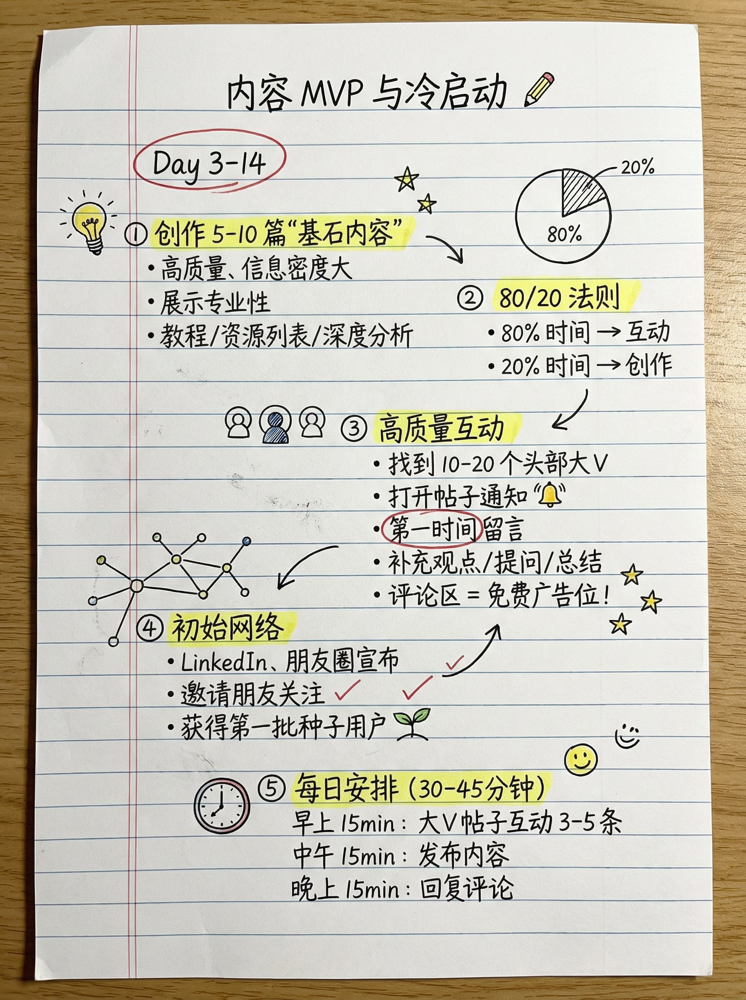

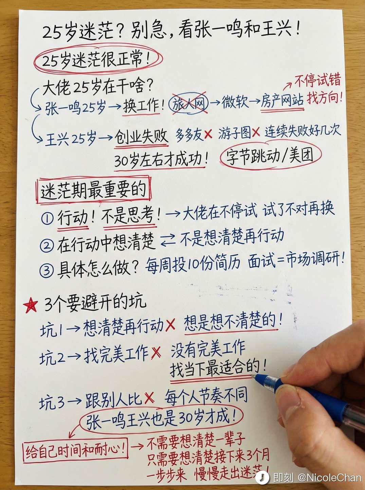

```
在这个内容基础上制作手写风格的学习笔记。使用学生手写字体，背景为横线纸。关键术语用黄色荧光笔标记，日期用红色圆圈圈出。添加涂鸦来帮助解释概念。页面尺寸为 A4。
```

 [↑返回目录](#toc)

---


[上一页](./10.md) | 当前 11/11 页 | [查看全部目录](../prompts.md)