# gemini.json 

gemini.json文件存放gemini相关的提示词，当前已收录：1108个 

 投稿方式：[飞书投稿](https://tcn1uh5rxo87.feishu.cn/share/base/form/shrcne5gDolOMDd0oJsj2XfvxQc) or [issues](https://github.com/junxiaopang/gridsplitter/issues/new)

[上一页](./10.md) | 当前 11/12 页 | [下一页](./12.md) | [查看全部目录](../prompts.md)

🚀 **在线预览**: [https://prompts.kkkm.cn](https://prompts.kkkm.cn)

## <a id="toc">目录</a>


## <a id="">Airbnb风格生态屋</a> (<a href="https://x.com/0x00_Krypt/status/2017116469692453116" target="_blank" rel="noopener noreferrer">两斤</a>)


```
Create a highly detailed isometric 3D interior diorama of an off-grid sustainable dwelling in [ENVIRONMENT/LOCATION], designed to harmonize with local climate and ecology.

Design a multi-zone structure adapted to [climate challenge]: [describe basic layout and key spaces]. Show integration with natural environment through [specific adaptation features].

Include human scale reference: figure [doing relevant activity] for size comparison. Zone indicators subtly showing [functional areas] through material and spatial transitions.

Eco-materials: [3-5 locally-sourced or recycled materials with textures and details visible].

Natural lighting strategy: [primary light source] creating [lighting effect], [secondary lighting], [time-of-day or seasonal variation]. Show [environmental lighting phenomenon].

[Climate/environment] adaptation visible: [3-5 specific sustainable systems - water, energy, ventilation, thermal, waste management]. [Unique environmental challenge solution].

Perspective: sectional isometric showing [what cross-section reveals]. Ultra high detail, educational sustainability visualization, color palette of [environment-appropriate colors], gradient background from [bottom color] to [top color].

INFOGRAPHIC ANNOTATION LAYER:
Add professional labels with thin leader lines pointing to 5-7 key features: sustainable systems, materials, climate adaptations, zones. Include simple diagrams for [relevant flows: water/energy/air]. Temperature or seasonal indicators if relevant. Typography: modern sans-serif, high contrast, balanced placement. Architectural documentation meets educational diagram aesthetic.
```

```
创作一个高度细节化的等距3D室内微缩模型，展现一处位于[环境/地点]的离网可持续住宅，其设计与当地气候和生态系统和谐共生。

设计一个多区域结构，以应对[气候挑战]：[描述基本布局和关键空间]。通过[具体适应性特征]体现与自然环境的融合。

包含人物比例参照：一名人物正在[进行相关活动]，用于尺寸对比。通过材质与空间过渡，巧妙标示出[功能区域]。

生态材料：使用[3-5种本地或回收材料]，并清晰呈现其纹理与细节。

自然采光策略：[主光源]营造出[光照效果]，辅以[次级照明]，体现[一天中的时间或季节变化]。展现[环境光现象]。

可见的[气候/环境]适应措施：[3-5项具体可持续系统——如水、能源、通风、热管理、废物处理]。[针对独特环境挑战的解决方案]。

视角：剖面等距视图，展示[剖面所揭示的内容]。超高清细节，教育性可持续可视化，配色采用[符合环境的色彩]，背景为从[底部颜色]到[顶部颜色]的渐变。

信息图注释层：  
添加专业标签，以细引线指向5-7个关键要素：可持续系统、材料、气候适应措施、功能区。包含[相关流动路径：水/能源/空气]的简明图示。如适用，加入温度或季节指示。字体采用现代无衬线体，高对比度，布局均衡。整体风格融合建筑制图与教育图解美学。
```

 [↑返回目录](#toc)

---
## <a id="">超写实风格的女性休闲穿搭展示</a> (<a href="https://x.com/AIwithkhan/status/2017113578139242945" target="_blank" rel="noopener noreferrer">Smiling Khan</a>)


```
Ultra-realistic fashion infographic photography of a female casual outfit exploded in a circular composition.
Floating elements arranged clockwise: beige knit hat, gold hoop earrings, cotton crew-neck top, cropped denim jacket, high-waist blue jeans, leather belt, ankle socks, white sneakers, structured mini handbag.
Each item suspended in mid-air with fine dotted guide lines, labeled with fabric type, color, and material details (cotton, denim, leather, rubber sole).
Clean studio background, soft diffused lighting, premium editorial styling, ultra-sharp focus, 8K quality.
```

```
超写实时尚信息图摄影，展示一套女性休闲穿搭以圆形构图爆炸式展开。  
顺时针方向悬浮排列的单品包括：米色针织帽、金色圆环耳环、棉质圆领上衣、短款牛仔夹克、高腰蓝色牛仔裤、皮革腰带、及踝袜、白色运动鞋和立体迷你手袋。  
每件单品悬浮于空中，配有精细的虚线指引，并标注面料类型、颜色和材质细节（棉、牛仔布、皮革、橡胶鞋底）。  
背景为干净影棚，采用柔和漫射光线，高端杂志级造型，超锐利对焦，8K画质。
```

 [↑返回目录](#toc)

---
## <a id="">路易威登奢华运动鞋三重奏</a> (<a href="https://x.com/mehvishs25/status/2017067361673896150" target="_blank" rel="noopener noreferrer">Meem</a>)


```
{
  "campaign_metadata": {
    "brand_identity": "Louis Vuitton Malletier",
    "product_focus": "Luxury Leather Sneaker / Trainer",
    "aspect_ratio": "3:4",
    "aesthetic": "High-Fashion Editorial | Avant-Garde Luxury"
  },
  "visual_dna": {
    "materials": ["Full-grain calf leather", "Monogram Embossed Canvas", "Polished Gold Hardware"],
    "color_scheme": ["Cognac Brown", "Deep Obsidian", "Champagne Gold"],
    "lighting": "High-contrast Chiaroscuro | Soft-box Key Lighting"
  },
  "grid_layout_execution": {
    "row_1_heritage": {
      "cell_1_1": "Hero profile: Shoe resting on a vintage LV trunk, side-lit to show leather grain.",
      "cell_1_2": "Extreme macro: Focus on the gold-tone 'LV' lace aglets and precision stitching.",
      "cell_1_3": "Dynamic: Gold dust/particles swirling around the sole as it 'steps' into frame."
    },
    "row_2_innovation": {
      "cell_2_1": "Minimalist: The shoe balanced atop an abstract, floating glass 'V' sculpture.",
      "cell_2_2": "Floating: Deconstructed view showing the sole and upper suspended in a void.",
      "cell_2_3": "Sensory: A gloved hand adjusting the tongue, emphasizing soft leather suppleness."
    },
    "row_3_surrealism": {
      "cell_3_1": "Color Palette: Monochromatic scene in LV 'Havane' brown with liquid silk drapes.",
      "cell_3_2": "Abstraction: Symbolic representation of the rubber sole pattern as a geometric desert landscape.",
      "cell_3_3": "Fusion: The shoe walking on a mirror-still lake reflecting a Parisian sunset skyline."
    }
  }
}
```

```
路易威登（Louis Vuitton Malletier）品牌，主打产品为奢华皮革运动鞋，画面比例3:4，整体美学风格为高级时尚杂志风与前卫奢华感。  
材质包括全粒面小牛皮、压印品牌老花帆布和抛光金色五金；配色方案为干邑棕、深曜石黑与香槟金；灯光采用高对比度明暗对照法结合柔光箱主光源。  

构图分为三行九格：  

第一行“传承”：  
- 主视觉：鞋子侧放于复古LV衣帽箱上，侧光突出皮革纹理；  
- 超微距特写：聚焦金色“LV”鞋带头及精密缝线；  
- 动态效果：鞋底踏入画面时，周围环绕飞扬的金色微粒。  

第二行“创新”：  
- 极简风格：鞋子平衡置于抽象悬浮的玻璃“V”形雕塑顶端；  
- 悬浮解构：鞋底与鞋面在虚空中分离悬浮；  
- 触感强调：戴手套的手轻抚鞋舌，展现皮革柔软质感。  

第三行“超现实”：  
- 色彩主题：单色调哈瓦那棕色场景，配以流动丝绸帷幔；  
- 抽象表达：橡胶鞋底纹路幻化为几何形态的沙漠地貌；  
- 虚实融合：鞋子行走在如镜湖面，倒映巴黎日落天际线。
```

 [↑返回目录](#toc)

---
## <a id="">侧颜沉思：电影级光影下的女性肖像</a> (<a href="https://x.com/kingofdairyque/status/2016875080882782591" target="_blank" rel="noopener noreferrer">simply</a>)


```
Use the attached reference image as a **facial identity reference**.
Preserve the same facial structure, proportions, and likeness from the reference image, while allowing artistic cinematic lighting and styling adjustments.
Do not change the person’s identity.

A cinematic, highly stylized portrait of a woman captured in a side profile, looking slightly upward and away from the camera, evoking a sense of longing and quiet contemplation.

Pose & Composition:
Her chin is gently lifted, elongating the neck and highlighting the refined structure of her jawline and nose. Her body is angled away from the viewer in a subtle three-quarter back view, adding mystery and elegance. The framing is a close-up (head and shoulders), focusing entirely on her facial features and the natural texture of her hair.

Lighting & Color Palette:
Dramatic backlighting (rim lighting) illuminates her from behind, creating a soft halo around her hair with glowing highlights along her forehead, nose, and lips. Strong chiaroscuro contrast separates warm highlights from deep shadows. The color palette is dominated by golden, honey, and amber tones, reminiscent of golden hour. A soft-focus, dreamy, film-like texture with gentle film grain enhances the ethereal mood.

Subject Details:
She has long, voluminous, wavy hair, naturally wind-swept, with individual flyaway strands catching the light like threads of gold. Her expression is calm and serene.
Her skin is **flawless, smooth, and evenly toned**, with **no moles, no freckles, no acne, no blemishes, no dark spots**. The complexion is luminous and natural, avoiding an artificial or plastic look.
Her lips are soft with a natural pink hue. She wears a soft, textured garment, possibly a white faux-fur or fuzzy knit, enhancing the gentle aesthetic.

Background & Atmosphere:
A dark, minimalist background with subtle bokeh keeps full attention on the subject. Visible film grain adds a vintage, cinematic quality rather than a modern digital sharpness.

Style keywords:
cinematic portrait, reference face, golden hour lighting, rim light, chiaroscuro, flawless skin, natural beauty retouch, film grain, soft focus, ethereal, vintage aesthetic, warm tones, high contrast
```

```
使用附带的参考图像作为**面部身份参考**。  
保留参考图像中的面部结构、比例和相貌特征，同时允许进行艺术化的电影级光影与造型调整。  
不得改变人物的身份。

一幅电影感强烈、高度风格化的女性肖像，以侧脸呈现，目光微微向上并远离镜头，传达出一种渴望与静谧沉思的情绪。

**姿势与构图：**  
她的下巴轻轻抬起，拉长颈部线条，突出下颌与鼻梁的精致轮廓。身体以微妙的四分之三背对视角远离观者，增添神秘与优雅感。画面为特写构图（头部与肩膀），聚焦于她的面部特征及头发的自然质感。

**光影与色调：**  
强烈的背光（轮廓光）从后方照亮人物，在发丝周围形成柔和光晕，并在额头、鼻梁与嘴唇处产生发光高光。鲜明的明暗对比（chiaroscuro）将温暖高光与深邃阴影分离。整体色调以金色、蜜色与琥珀色为主，唤起黄金时刻的氛围。柔焦、梦幻般的胶片质感辅以轻微胶片颗粒，强化空灵情绪。

**人物细节：**  
她拥有浓密、蓬松、波浪状的长发，自然被风吹拂，几缕散落的发丝在光线下如金线般闪耀。表情平静安详。  
皮肤**无瑕、光滑、色调均匀**，**无痣、无雀斑、无痘痘、无瑕疵、无暗斑**。肤色通透自然，避免人工或塑料感。  
双唇柔软，呈自然粉色调。身穿一件质地柔软的衣物，可能是白色仿毛皮或绒感针织，增强整体温柔美感。

**背景与氛围：**  
深色极简背景搭配轻微散景，使注意力完全集中于人物。可见的胶片颗粒赋予画面复古电影质感，而非现代数码锐利感。

**风格关键词：**  
电影肖像、参考人脸、黄金时刻光影、轮廓光、明暗对比、无瑕肌肤、自然美肤修饰、胶片颗粒、柔焦、空灵、复古美学、暖色调、高对比度
```

 [↑返回目录](#toc)

---
## <a id="">工作室摄影照片九宫格</a> (<a href="https://x.com/wanerfu/status/2017116581164454309" target="_blank" rel="noopener noreferrer">摆烂程序媛</a>)


```
在柔和米色的工作室内，构建3x3精细编辑照片网格

角色穿深蓝轻薄衬衫，米白长裤，赤脚展现原始质感

灯光设计：
前右大面积柔光，左侧银反光板，顶部微弱轮廓光。

9组精细镜头构图：
1.85mm f/1.8极致唇部特写
2.眼睛对镜特写
3.黑白下巴支撑肖像
4.半遮半露肖像
5.手覆面部特写
6.发丝遮眼构图
7.手部触下巴细节
8.半身侧坐姿势
9.带泪水的侧脸电影感
```

 [↑返回目录](#toc)

---
## <a id="">金棕酥皮可颂糕点的极致美食摄影</a> (<a href="https://x.com/meng_dagg695/status/2016888860240990534" target="_blank" rel="noopener noreferrer">ShaHid WaNii</a>)


```
{
  "subject": {
    "type": "pastry",
    "form": "twisted croissant-like pastry",
    "orientation": "vertical, slightly leaning",
    "structure": "multiple tight spiral layers stacked upward",
    "edges": "crisp, sharply defined flaky layers"
  },
  "texture": {
    "outer_layers": "golden-brown, laminated, flaky pastry with visible thin sheets",
    "topping": "coarse caramelized sugar crumbs adhered to surface",
    "filling": "thick, glossy cream visible between layers",
    "cream_consistency": "smooth, viscous, slow-dripping"
  },
  "color_palette": {
    "primary": [
      "golden brown",
      "deep amber",
      "warm caramel"
    ],
    "secondary": [
      "cream white",
      "light beige"
    ],
    "background": [
      "dark teal",
      "charcoal gray",
      "warm golden highlights"
    ]
  },
  "lighting": {
    "style": "studio food photography",
    "direction": "soft directional light from upper left",
    "highlights": "specular highlights on cream and caramel",
    "shadows": "soft shadows under pastry base",
    "contrast": "high micro-contrast emphasizing texture"
  },
  "cream_behavior": {
    "flow": "gravity-driven drips",
    "locations": [
      "between pastry layers",
      "dripping from mid-sections",
      "pooling at the base"
    ],
    "surface_quality": "glossy, reflective"
  },
  "crumb_details": {
    "distribution": "dense on upper layers, scattered at base",
    "particle_size": "small to medium irregular granules",
    "motion": "some crumbs appear suspended mid-air"
  },
  "background": {
    "depth_of_field": "very shallow",
    "bokeh": "large circular light orbs",
    "focus": "sharp subject, heavily blurred background",
    "environment": "studio backdrop, non-descriptive"
  },
  "base_surface": {
    "material": "dark matte surface",
    "interaction": "cream pooling and crumbs scattered",
    "reflection": "minimal, soft"
  },
  "composition": {
    "framing": "tight close-up",
    "aspect_ratio": "3:4",
    "camera_angle": "slightly low angle, frontal",
    "visual_weight": "centered vertical mass"
  },
  "style": {
    "look": "hyper-realistic, AI-enhanced food photography",
    "finish": "clean, polished, cinematic",
    "detail_level": "extreme micro-texture visibility"
  },
  "resolution": {
    "target": "8K",
    "sharpness": "ultra-sharp subject details",
    "noise": "none visible"
  }
}
```

```
主题为一种垂直微倾、螺旋层叠向上的扭结可颂式糕点，结构由多层紧密螺旋堆叠而成，边缘酥脆且层次分明。外层呈金棕色，为可见薄片的千层酥皮，表面附着粗粒焦糖糖屑；层间夹有浓稠光亮的奶油，质地顺滑黏稠，缓慢滴落。主色调包括金棕色、深琥珀色与暖焦糖色，辅以乳白色和浅米色；背景为深青绿色与炭灰色，并带有温暖金色高光。采用影棚美食摄影风格，左上方向柔光照明，在奶油与焦糖处形成镜面高光，底部投下柔和阴影，强调纹理的高微对比度。奶油受重力作用从层间、中部滴落并在底部积聚，表面具高光泽反射感。糖屑密集分布于上层，底部散落，颗粒大小不一，部分悬浮空中。背景景深极浅，呈现大圆形光斑虚化，主体清晰锐利，环境为无特征影棚背景。糕点置于深色哑光台面上，奶油在底部积聚，糖屑散落，仅有微弱柔和反光。构图采用3:4比例的紧凑特写，略低角度正面拍摄，视觉重心集中于中央垂直体量。整体风格为超写实AI增强美食摄影，画面干净精致、电影感强，展现极致微观纹理细节。目标分辨率为8K，主体细节超清晰，无可见噪点。
```

 [↑返回目录](#toc)

---
## <a id="">沉入深邃：高端产品的隐秘之美</a> (<a href="https://x.com/lloydcreates/status/2016995999554670918" target="_blank" rel="noopener noreferrer">Lloyd Creates</a>)


```
{
  "project_name": "Submerged_Product_Effect",
  "version": "10.0_FINAL",
  "USER_CUSTOMIZATION": {
    "INSTRUCTIONS": "Customize your product and gradient colors. Product will be sinking deep into thick opaque liquid.",
    "product_description": "PRODUCT",
    "gradient_dark_color": "#09080E",
    "gradient_light_color": "#AEB4C2"
  },
  "settings": {
    "style": "High-end luxury product photography, low angle view, nearly flat product with one end sinking much deeper into liquid, only smooth gradient background.",
    "aspect_ratio": "4:5",
    "camera_angle": "Low angle looking upward at nearly flat product with one end sinking deep into liquid"
  },
  "prompt_construction": {
    "MAIN_SUBJECT": {
      "subject": "{{USER_CUSTOMIZATION.product_description}}",
      "presentation": "The product is lying nearly flat/horizontal. ONE END (the far/bottom end) is SINKING MUCH DEEPER into the thick opaque liquid than the other end. The product has an angled submersion - one end goes deep into the liquid while the other end remains more visible. Only 20-30% total is visible above the liquid surface. The end that is sinking deep is completely hidden - 70-80% of the product is invisible below the opaque liquid.",
      "submersion_asymmetry": "CRITICAL ASYMMETRIC SUBMERSION: One end of the product sinks MUCH DEEPER into the liquid than the other end. This creates an angled liquid line where one end disappears far into the liquid while the other end is less submerged. The product is NOT floating evenly - it's sinking on one side."
    },
    "PRODUCT_IN_LIQUID_NOT_ON_SURFACE": {
      "critical_rule": "The product is IN the liquid, SUBMERGED in the liquid, NOT sitting on top of a surface, NOT resting on a platform. The liquid envelops and surrounds the submerged portion - the product has SUNK INTO the liquid medium.",
      "forbidden": "NO surface under the product, NO platform supporting the product, NO product sitting on something, NO product resting on top of anything. The product is INSIDE the liquid, submerged and surrounded by it."
    },
    "LIQUID_MEDIUM": {
      "liquid_type": "Thick, viscous, matte, 100% COMPLETELY OPAQUE liquid in gradient colors. The liquid is NOT a separate colored element - it shares the same gradient as the background.",
      "opacity": "100% OPAQUE. The deeply submerged end is completely invisible - no blur effect, no ghosting, no faint visibility. Just completely hidden by the opaque liquid.",
      "liquid_state": "COMPLETELY STILL, CALM, SMOOTH. No ripples, no waves, no texture.",
      "displacement": "Natural soft organic rounded shadow depth where the product sinks into the liquid. Smooth shadows - NEVER outlined, NEVER showing product silhouette."
    },
    "NO_PLATFORMS_OR_SURFACES_CRITICAL": {
      "absolutely_no_platform": "ZERO platform, ZERO surface, ZERO floor under or beneath the product. NO purple platform, NO purple surface, NO colored surface of any kind. The product is floating/sinking IN the liquid gradient environment, not sitting ON anything.",
      "liquid_is_gradient": "The liquid IS the gradient - they are the same thing. There is no separate 'purple liquid' or 'colored liquid' - only the smooth gradient from {{USER_CUSTOMIZATION.gradient_dark_color}} to {{USER_CUSTOMIZATION.gradient_light_color}}."
    },
    "BACKGROUND_GRADIENT_ONLY": {
      "exact_gradient_only": "ONLY a smooth diagonal gradient. Bottom-right corner: {{USER_CUSTOMIZATION.gradient_dark_color}} (#09080E). Top-left corner: {{USER_CUSTOMIZATION.gradient_light_color}} (#AEB4C2). THESE ARE THE ONLY TWO COLORS IN THE ENTIRE IMAGE.",
      "absolutely_forbidden_colors": "NO purple platform color, NO additional purple, NO tan, NO beige, NO brown, NO peach, NO warm tones, NO other colors whatsoever. ONLY the two specified gradient colors.",
      "no_other_elements": "NO diagonal lines, NO triangular shapes, NO geometric shapes, NO color blocks, NO frames, NO borders around the image."
    },
    "PRODUCT_FRAMING": {
      "complete_product_visible": "The entire visible portion of the product (the 20-30% above liquid) must be fully within frame. NO cutting off the product edges. NO cropping the product. NO frames or borders around the image itself.",
      "forbidden": "NO product cut off by image edges, NO product cropped, NO frames, NO borders around the image."
    },
    "NO_BLUR_OR_GHOSTING": {
      "critical_rule": "The submerged portion is simply HIDDEN by opaque liquid - NOT blurred, NOT ghosted, NOT faintly visible with blur effects. The opaque liquid completely hides it as if it doesn't exist.",
      "forbidden": "NO motion blur on submerged parts, NO gaussian blur effects, NO ghosting, NO faint blurred product visible below surface."
    },
    "CAMERA_PERSPECTIVE": {
      "camera_angle": "Low camera position below the product, looking upward at slight angle.",
      "forbidden_angles": "NEVER flat lay, NEVER overhead, NEVER looking down."
    },
    "CRITICAL_RESTRICTIONS": {
      "absolutely_forbidden": [
        "Product sitting on surface/platform",
        "Purple platform under product",
        "Purple surface color",
        "Any surface supporting the product",
        "Product resting on something",
        "Product floating evenly",
        "Even submersion across product",
        "Both ends submerged equally",
        "Motion blur or ghosting on submerged parts",
        "Blur effects on submerged portion",
        "Any colors other than the two gradient colors",
        "Diagonal lines in background",
        "Triangular shapes",
        "Geometric background elements",
        "Product cut off by edges",
        "Product cropped",
        "Frames or borders around image"
      ]
    },
    "NEGATIVE_CONSTRAINTS": [
      "product on surface",
      "product on platform",
      "purple platform",
      "purple surface",
      "colored surface under product",
      "surface supporting product",
      "product sitting on something",
      "product resting on top",
      "platform beneath product",
      "surface beneath product",
      "product floating evenly",
      "even submersion",
      "equal submersion on both ends",
      "both ends same depth",
      "symmetrical submersion",
      "motion blur on submerged parts",
      "gaussian blur effect",
      "blur on product",
      "ghosting",
      "faint product below surface",
      "blurred visibility below surface",
      "purple color other than gradient",
      "additional purple",
      "tan background",
      "beige background",
      "brown background",
      "warm tones",
      "peach colors",
      "colors other than gradient",
      "extra colors",
      "third color",
      "fourth color",
      "diagonal line in background",
      "triangular shape",
      "geometric shape in background",
      "color blocks",
      "hard edges in background",
      "product cut off",
      "product cropped",
      "product edges cut by frame",
      "frames",
      "borders",
      "image border",
      "image frame",
      "product at 45 degrees",
      "product standing upright",
      "product vertical",
      "platform",
      "surface",
      "floor",
      "table",
      "horizon line",
      "transparent liquid",
      "see-through liquid",
      "ripples",
      "waves",
      "flat lay",
      "overhead view",
      "looking down"
    ],
  }
}
```

```
产品名称：“沉没的产品效果”
版本：10.0最终版

自定义指令：定制您的产品和渐变颜色。产品将深深沉入浓厚不透明的液体中。

产品描述：产品
渐变深色：#09080E
渐变浅色：#AEB4C2

风格设定：高端奢侈品摄影，低角度视角，几乎平放的产品一端比另一端更深地沉入液体中，只有光滑的渐变背景。
宽高比：4:5
相机角度：低角度向上看几乎平放的产品，一端深入液体中。

提示词构建：
主要主题：产品几乎水平放置，远端或底部一端更深地沉入浓厚的不透明液体中，形成不对称的浸没线，一端完全隐藏于液体之下，70-80%的产品不可见。

产品在液体中而非表面上：产品完全位于液体内部，被液体包围并沉入其中，没有表面支撑产品，不允许产品浮在表面或任何东西上。

液体介质：浓厚、粘稠、哑光、100%完全不透明的液体，具有渐变颜色。液体与背景共享相同的渐变，没有其他颜色元素。液体完全静止、平静、光滑，无波纹、无波动、无纹理。

禁止平台或表面：绝对没有任何平台、表面、地板在产品下方，液体即为渐变，两者是一体的，仅有从深色#09080E到浅色#AEB4C2的平滑渐变。

背景仅渐变：确切的渐变是从右下角的#09080E到左上角的#AEB4C2，这两个是整个图像中唯一的颜色。

产品构图：可见部分（液面上方的20-30%）必须完全包含在画面内，不允许裁剪产品的边缘。

禁止模糊或残影：淹没的部分被不透明液体完全隐藏，不允许有运动模糊、高斯模糊效果或残影。

相机视角：相机位置低于产品，以轻微的角度向上看，禁止俯视图或平铺视角。

关键限制：绝对禁止包括但不限于产品坐在表面/平台上、紫色平台、其他颜色的表面支撑产品、产品对称沉没等。

负面约束列表：包括但不限于产品在表面上、产品在平台上、紫色平台、暖色调背景、几何形状背景元素、产品被裁剪、图像边框等。
```

 [↑返回目录](#toc)

---
## <a id="">韩系女团风时尚大片</a> (<a href="https://x.com/qisi_ai/status/2017062059712925871" target="_blank" rel="noopener noreferrer">骑司Chase</a>)


```
【AI写真系列×韩系女团风】第四弹

黑色小礼服配粉色蝴蝶结、粉色发夹、腮红氛围感拉满

中文提示词：

一、画面构图
1 版式：四宫格拼图，比例3:4，2×2排列，四张画面同一主题同一人物
2 景别：两张特写为主，两张全身到半身为主，人物占比大
3 机位：平视为主，轻微侧角变化，强调脸部与身体线条
4 画面关系：同一场景与色调统一，四张形成连贯时尚大片叙事

二、人物主体
1 性别年龄感：年轻女性，清冷与甜酷并存
2 体态气质：纤细骨感，肩颈线条明显，眼神克制偏冷
3 面部要点：大眼感，腮红集中两颊与鼻梁，唇色水润偏粉
4 发型：黑发低盘发或贴头盘发，侧分刘海，有浅粉色发夹固定，少量碎发弧线贴面

三、妆容与肤质
1 底妆：细腻柔焦，干净无瑕，带微光泽
2 腮红：粉色高饱和，扩散到眼下与鼻梁，营造可爱氛围
3 眼妆：干净拉长，睫毛纤长，眼神偏冷淡
4 唇妆：镜面水光，粉到蜜桃色渐变

四、服装与配饰
1 服装：黑色抹胸连衣裙，裙身点缀多处粉色蝴蝶结
2 颈部：细带颈饰或系带蝴蝶结感装饰
3 耳饰：小巧闪亮耳坠，偏甜美精致
4 戒指：夸张甜酷戒指，多枚叠戴，粉白配色明显
5 袜鞋：黑色长袜或半透袜，粉色玛丽珍高跟鞋

五、动作姿态分镜
1 左上：近景特写，双手托腮或拳头轻顶脸颊，眼神向左看，打破平衡感，突出戒指与腮红
2 右上：半身到全身，跪坐在黑色沙发上，双臂向两侧伸展撑在沙发靠背，姿态带压迫感
3 左下：全身坐姿，坐在沙发上微侧身，一条腿交叠或伸出，手掌撑在沙发与地面形成线条
4 右下：侧脸近景，回眸看镜头，手臂环抱或搭在肩前，露出肩背光泽与耳饰发夹细节

六、场景与道具
1 背景：纯色粉紫渐变背景，干净无杂物
2 家具：黑色皮质沙发，反光明显，褶皱质感强
3 地面：浅色地面或地毯，简洁干净

七、灯光与色彩
1 灯光：柔光棚拍质感，面部均匀补光，阴影很软
2 高光：皮肤与沙发都有明显柔亮高光，突出材质对比
3 主色：粉紫背景＋黑色服装沙发＋粉色蝴蝶结与鞋的强调色
4 氛围：甜酷、梦幻、时尚杂志感

八、质感与画面要求
1 真实质感：皮肤白皙细腻但不过度磨皮，沙发皮革反光清晰
2 清晰度：对焦在眼睛与妆容配饰，背景轻微虚化
3 统一性：四张人物身份一致、服装一致、场景一致、色调一致
4 画面干净：无多余文字标识、水印、杂乱背景元素
```

 [↑返回目录](#toc)

---
## <a id="">甜酷少女的天使羽翼</a> (<a href="https://x.com/qisi_ai/status/2016803276566737364" target="_blank" rel="noopener noreferrer">骑司Chase</a>)


```
【AI写真系列×韩系女团风】第三弹

红色细框眼镜、白色蕾丝小裙、粉色丝巾、天使羽翼与毛绒发饰，把“幼态、复古、俏皮、轻微性感”的气质牢牢钉住～

 图一为直接生成
 图二为使用参考图生成

中文提示词（Nano Banana Pro）：

一、画面版式
1 画幅比例：竖幅三比四，四宫格拼图，二行二列排列
2 镜头组合：两张近景特写加两张半身到全身，人物占画面比例大
3 背景统一：同一灰色无缝背景，四格色调与光线一致，边缘留少量灰底空白

二、人物主体
参考来源：以上传参考图作为严格身份来源
一致性要求：零偏差
1 人物设定：年轻少女，甜酷可爱与轻微性感并存
2 面部特征：大眼圆润，鼻梁小巧，唇形饱满，脸颊与眼下高饱和腮红
3 妆容质感：底妆干净微雾面，腮红面积大且集中，唇部高光水润镜面
4 配饰标识：红色细框眼镜，作为强识别点贯穿四格

三、发型与头饰
1 发型：深棕长发，侧边大波浪辫子垂落，刘海厚且蓬松，少量碎发自然散落
2 头饰：毛绒小熊发夹与发圈点缀，发侧还有小熊挂件与背包元素呼应

四、服装造型与道具
1 服装：白色吊带上衣与白色层叠荷叶边短裙，肩带与胸前有粉色蝴蝶结装饰
2 颈部装饰：浅粉色领巾系结，中心有红色小装饰点
3 翅膀：白色羽毛天使翅膀，体积感明显，出现在全身与半身画面中
4 袜鞋：白色提花连裤袜，亮蓝色平底鞋形成强对比跳色
5 小道具：蓝色蝴蝶结指套或手指装饰，戒指与小首饰；地面放一杯蓝色饮品配红色樱桃点缀

五、四格动作与表情
1 左上特写：手指轻触嘴角或脸颊，眼神直视镜头，微撅唇，表情无辜带挑衅
2 右上全身：跪坐或屈膝坐姿，双手置于腿前，身体略前倾，眼神略带冷淡
3 左下半身到全身：双臂高举交握拉伸姿势，腰背挺直，侧身轻转，展现翅膀轮廓
4 右下特写：身体侧倚，头微偏，眼神慵懒放空，唇部微张，氛围更暧昧克制

六、光线与色调
1 光线：柔和棚拍漫射光，阴影浅且边缘柔，人物皮肤高光细腻
2 色调：整体偏中性灰背景，肤色温润，粉色与红色局部高饱和，蓝色鞋与饮品作为跳色点
3 质感：写实摄影质感，皮肤细腻但不过度磨皮，服装布料与羽毛纹理清晰可见

七、画面约束
1 一致性：人物五官、发型、眼镜、服装、翅膀在四格中保持同一人同一套造型
2 干净度：背景无杂物，仅保留饮品与背包小熊等少量道具点缀
3 氛围关键词：甜酷、软糯、天使感、轻微挑衅、干净棚拍、对比跳色
```

 [↑返回目录](#toc)

---
## <a id="">悉尼·斯威尼电影感分镜写真</a> (<a href="https://x.com/Strength04_X/status/2016902773569441987" target="_blank" rel="noopener noreferrer">𝐌</a>)


```
Use the uploaded photograph as the only visual reference.
The person’s identity must be preserved with maximum accuracy: face, facial features, age, gender, body proportions, and overall appearance must remain unchanged.
Do not invent or add anything that does not exist in the original image.

Step 1: Detailed visual analysis of the source image
First, perform a careful visual analysis of the uploaded image, including:
Who is in the image (person, number of people, position in frame)
Body pose and direction of gaze
Facial expression and emotional mood
Clothing and accessories
Lighting conditions, time of day, color temperature
Environment, background, and depth of space
Overall emotional tone of the scene

Step 2: Cinematic 3×2 storyboard grid
After the analysis, create a cinematic 3×2 grid (6 frames) from the single image, as if it were a sequence of shots from a film.

Global requirements for the entire grid:
Format: one image containing a 3×2 grid
All frames must be numbered 1–6, left to right, top to bottom
Visual style: realistic, cinematic, non-illustrative
One consistent character and environment with logical continuity
Each frame must differ by pose, camera angle, or camera distance
The sequence should feel like time is passing and the scene is developing
No facial distortion, no change in identity or appearance

Frame descriptions:

Frame 1 (No. 1)
Wide establishing shot.
The camera is farthest from the subject, showing the full environment and context.
The person feels like part of the surrounding space.

Frame 2 (No. 2)
Medium shot.
The camera moves closer.
The pose changes slightly, revealing inner emotion or state of mind.

Frame 3 (No. 3)
Low-angle or side-angle shot.
Adds drama or tension, emphasizing body shape and perspective.

Frame 4 (No. 4)
Close-up or medium close-up.
Focus on the face, eyes, and emotion.
Fine details are clearly visible.

Frame 5 (No. 5)
Dynamic angle: diagonal composition or camera movement.
The pose changes the most, creating a sense of action or momentum.

Frame 6 (No. 6)
Final shot.
Calm, reflective, or emotionally resolved.
The camera may be closer or farther, but the frame feels like a conclusion.

Lighting & cinematic consistency:
Lighting must remain logically consistent across all frames, as if filmed in one continuous scene.

Depth of field, lighting, and color grading should reinforce a cinematic look.

Final result:
The output should resemble a professional cinematic storyboard, captured in a single take and location, with strong realism and narrative flow.
```

```
仅以上传的照片作为唯一视觉参考。  
必须最大程度保留人物身份：面部、五官特征、年龄、性别、身体比例及整体外貌不得改变。  
不得添加或虚构原图中不存在的任何元素。  

第一步：对原始图像进行详细视觉分析  
首先，对上传图像进行细致的视觉分析，包括：  
- 图像中的人物（人数、位置）  
- 身体姿态与视线方向  
- 面部表情与情绪氛围  
- 服装与配饰  
- 光照条件、时间、色温  
- 环境、背景与空间纵深感  
- 整体场景的情绪基调  

第二步：制作电影感3×2分镜网格  
分析完成后，基于单张图像创作一个电影感的3×2网格（共6格），如同电影中的连续镜头序列。  

整体网格要求：  
- 格式：一张包含3×2网格的图像  
- 所有画面按从左至右、从上到下编号1–6  
- 视觉风格：写实、电影感、非插画风格  
- 保持一致的角色与环境，具有逻辑连贯性  
- 每格在姿势、镜头角度或景别上有所区别  
- 整体序列需呈现时间推移与情节发展感  
- 不得出现面部失真或身份、外貌变化  

各帧描述：  

第1格（编号1）  
广角定场镜头。  
相机距离人物最远，完整展现环境与上下文。  
人物融入周围空间之中。  

第2格（编号2）  
中景镜头。  
相机靠近一些。  
姿势略有变化，透露内心情绪或状态。  

第3格（编号3）  
低角度或侧角度镜头。  
增强戏剧性或紧张感，突出身体轮廓与透视效果。  

第4格（编号4）  
特写或中近景。  
聚焦面部、眼神与情绪。  
细节清晰可见。  

第5格（编号5）  
动态角度：采用对角线构图或模拟摄像机运动。  
姿势变化最大，营造动作感或动势。  

第6格（编号6）  
结尾镜头。  
平静、沉思或情绪得到解决。  
镜头可近可远，但整体具有收尾感。  

光影与电影感一致性：  
所有画面的光照需逻辑一致，如同在同一连续场景中拍摄。  
景深、光线与色彩调校应强化电影感。  

最终成果：  
输出应如同专业电影分镜板，基于单次拍摄、单一地点，具备高度写实性与叙事流畅感。
```

 [↑返回目录](#toc)

---
## <a id="">微缩3D场景中的超现实抽屉世界</a> (<a href="https://x.com/0x00_Krypt/status/2017086453432652148" target="_blank" rel="noopener noreferrer">两斤</a>)


```
Create a highly detailed surreal isometric 3D diorama of an ordinary wooden drawer pulled from vintage furniture, impossibly containing [INPUT SCENE].

The drawer defies physics: its small exterior contains a vast [environment type] that extends far beyond normal space. A small figure [interacts with] this paradox - [specific action]. 

Visual paradox: normal-sized drawer exterior, infinite interior. [Environmental elements] spill subtly over the drawer's edge into reality. Rich storytelling details scattered both on the furniture surface and within the impossible world.

Lighting: dramatic contrast between realistic furniture lighting and [environmental lighting] emanating from within the drawer. Atmospheric effects creating depth and magic.

Materials: weathered vintage wood furniture, hyper-realistic textures for the surreal environment.

Perspective: isometric cutaway at 45-degree angle showing both human interaction and the impossible interior world. Ultra high detail, dreamlike aesthetic emphasizing reality-fantasy contrast, gradient background from grounded earth tones to ethereal colors matching the scene.
```

```
创作一个高度精细的超现实等距3D微缩场景：一只从复古家具中拉出的普通木制抽屉，其内部不可思议地容纳着[INPUT SCENE]。

这只抽屉违背物理法则：外观小巧，却内藏广阔无垠的[环境类型]，远远超出正常空间尺度。一名微小人物正在与这一悖论互动——[具体动作]。

视觉悖论：外部为正常尺寸的抽屉，内部却无限延展。[环境元素]微妙地溢出抽屉边缘，渗入现实世界。丰富的叙事细节散布于家具表面与不可能的内部世界之中。

光影效果：真实家具的写实光照与从抽屉内部透出的[环境光照]形成强烈对比，辅以营造深度与魔幻感的大气特效。

材质表现：做旧复古木质家具，搭配超写实纹理的超现实环境。

视角构图：45度等距剖面视角，同时展现人物互动与不可思议的内部世界。极致细节，梦幻美学，强调现实与幻想的对比，背景采用渐变色调，从沉稳大地色过渡至契合场景的空灵色彩。
```

 [↑返回目录](#toc)

---
## <a id="">现代饮品信息图：视觉与味觉的完美结合</a> (<a href="https://x.com/Taaruk_/status/2016716199753810419" target="_blank" rel="noopener noreferrer">Taaruk</a>)


```
A clean, modern food infographic poster for [DRINK NAME], centered composition. A highly realistic glass/bottle of the drink in the middle with smooth texture, condensation, and soft studio lighting. Minimal pastel background with subtle paper texture. Surrounding the drink are neatly arranged UI-style information cards and icons showing nutrition facts, preparation steps, time, servings, sweetness level, and health benefits. Rounded cards, soft shadows, warm color palette matching the drink, flat + semi-3D icon design. Elegant typography, premium recipe-book aesthetic, Pinterest/Instagram infographic style, ultra-sharp, balanced spacing, professional food design, high detail, 8K quality.
```

```
一张简洁现代的饮品信息图海报，以[饮品名称]为主题，采用居中构图。画面中央是一杯/一瓶高度逼真的饮品，具有细腻质感、冷凝水珠和柔和的影棚灯光效果。背景为极简的淡彩色调，带有微妙的纸张纹理。饮品周围整齐排列着UI风格的信息卡片和图标，展示营养成分、制作步骤、所需时间、份量、甜度等级及健康益处。卡片采用圆角设计，配以柔和阴影，整体使用与饮品相协调的暖色调，图标为扁平化与半3D结合的风格。字体优雅，呈现高端食谱书的美学，符合Pinterest/Instagram信息图风格，画质超高清（8K），布局平衡，细节丰富，具备专业食品设计水准。
```

 [↑返回目录](#toc)

---
## <a id="">微型3D卡通风格贵金属市场场景</a> (<a href="https://x.com/TechieBySA/status/2016576809941246062" target="_blank" rel="noopener noreferrer">TechieSA</a>)


```
Present an exquisite miniature 3D cartoon-style precious metals market scene of [ASSET] , viewed from a clear 45° top-down isometric perspective.

At the center, place a highly recognizable physical representation of the asset: stacked bullion bars, coins, or ingots with accurate engravings, weight stamps, and metallic surface detail. Surround the centerpiece with proportionally scaled elements symbolizing value and demand—vault doors, scales, charts, arrows, market icons, and abstract financial activity elements. Include small stylized figures where relevant (no facial details).

Rendered in a refined Cinema 4D style with smooth rounded geometry, realistic PBR metallic materials, subtle reflections, and soft lifelike lighting. Gentle shadows and polished highlights emphasize weight, density, and luxury.

Integrate the market performance for [DATE] directly into the scene using clean UI-style elements: price per ounce, daily range, trend arrow, and a minimal line or bar chart. Data should be clear, balanced, and visually integrated without overpowering the scene.

Background: solid powder blue, calm and uniform, no gradients or textures.

Typography: modern sans-serif, white or near-white for strong contrast.

At the top-center, place a floating semi-transparent glass UI panel (rounded corners, ~50% opacity, subtle blur, soft shadow) containing:
•Asset name
•Market date
•Price per ounce or price range
•Minimal trend indicator (up/down arrow or micro chart)

The panel should feel lightly elevated above the scene, improving readability while preserving the minimalist, premium aesthetic.

Composition: perfectly centered layout, square 1080×1080, ultra-clean, editorial, high-clarity financial infographic style. No watermark.
```

```
呈现一个精致的微型3D卡通风格贵金属市场场景，主题为【资产】，采用清晰的45度俯视等距视角。

画面中央放置高度可识别的该资产实体表现形式：堆叠的金条、硬币或锭块，带有准确的雕刻纹样、重量印记和金属表面细节。围绕中心主体，布置按比例缩放的象征价值与需求的元素——保险库门、天平、图表、箭头、市场图标以及抽象的金融活动符号。如适用，加入小型风格化人形（无面部细节）。

整体以精炼的Cinema 4D风格渲染：圆润流畅的几何造型、写实的PBR金属材质、细腻反射效果，搭配柔和自然的灯光。轻柔的阴影与精致高光突出金属的重量感、密度感与奢华质感。

将【日期】的市场表现数据直接融入场景，使用简洁的UI式元素呈现：每盎司价格、当日波动区间、趋势箭头，以及极简的折线图或柱状图。数据需清晰易读、布局平衡，并与整体视觉和谐融合，不喧宾夺主。

背景为纯粉蓝色，平静统一，无渐变或纹理。

字体采用现代无衬线体，颜色为白色或近白色，确保高对比度。

在画面上方中央，设置一块悬浮的半透明玻璃UI面板（圆角、约50%透明度、轻微模糊、柔和投影），内含：
- 资产名称
- 市场日期
- 每盎司价格或价格区间
- 极简趋势指示器（上/下箭头或微型图表）

该面板应略高于场景，提升可读性，同时保持极简而高端的美学风格。

构图严格居中，1080×1080正方形尺寸，超洁净、杂志级、高清晰度的金融信息图风格，无水印。
```

 [↑返回目录](#toc)

---
## <a id="">融合品牌logo的冰淇淋</a> (<a href="https://x.com/youraipulse/status/2016567546325979473" target="_blank" rel="noopener noreferrer">AI Pulse</a>)


```
A perfectly vertical, hyper-realistic 3D popsicle by [@ YOUR LOGO] featuring a glossy signature-colored glaze with a gold logo pattern dripping over the visible matte ice cream texture at the base. The stick features the brand's logo.
```

```
一个完全垂直、超现实风格的3D冰棍，由[@ YOUR LOGO]品牌呈现。这款冰棍的特点是具有光泽感的品牌标志性颜色糖衣，并带有金色品牌标志图案，该图案仿佛从顶部缓缓流下覆盖在底部可见的哑光冰淇淋纹理上。冰棍的棒子上印有品牌的标志。


```

 [↑返回目录](#toc)

---
## <a id="">俯视等距视角下的微缩场景展现情绪</a> (<a href="https://x.com/aleenaamiir/status/2016746212943417426" target="_blank" rel="noopener noreferrer">Aleena Amir</a>)


```
Present a clear, 45° top-down isometric miniature 3D diorama visually representing the emotion [EMOTION NAME]. Use soft refined textures, stylized PBR materials, and lighting that reflects the emotional tone.

Create a raised base with symbolic objects, colors, and environmental cues expressing this mood.
Include tiny stylized characters if relevant (no facial details). Use a clean solid [BACKGROUND COLOR] background.

At the top-center, display [EMOTION NAME] in large bold text, beneath it show a poetic subtitle, and place a minimal abstract icon below. All text must automatically match the background contrast (white or black).
```

```
情绪/氛围微缩场景

呈现一个清晰的45°俯视等距微型3D微缩场景，视觉化地表现情绪[EMOTION NAME]。使用柔和精致的纹理、风格化的PBR材质，以及能反映该情绪氛围的灯光。

创建一个抬高的底座，上面布置象征性的物品、色彩和环境线索以传达这种情绪。如适用，加入微小的风格化人物（无面部细节）。背景使用干净的纯色[BACKGROUND COLOR]。

在画面顶部中央以大号粗体文字显示[EMOTION NAME]，其下方添加一句诗意的副标题，并在副标题下方放置一个极简抽象图标。所有文字需自动匹配背景对比度（白色或黑色）。
```

 [↑返回目录](#toc)

---
## <a id="">手写学习笔记与荧光标记</a> (<a href="https://x.com/stark_nico99/status/2016857457734066276" target="_blank" rel="noopener noreferrer">Nicolechan</a>)


```
在这个内容基础上制作手写风格的学习笔记。使用学生手写字体，背景为横线纸。关键术语用黄色荧光笔标记，日期用红色圆圈圈出。添加涂鸦来帮助解释概念。页面尺寸为 A4。
```

 [↑返回目录](#toc)

---
## <a id="">超写实微距3D拆解：微型工人装配复杂机械</a> (<a href="https://x.com/Gdgtify/status/2017012380132089990" target="_blank" rel="noopener noreferrer">Gadgetify</a>)

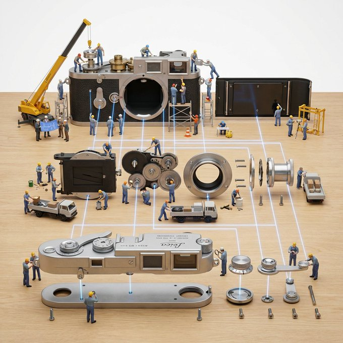

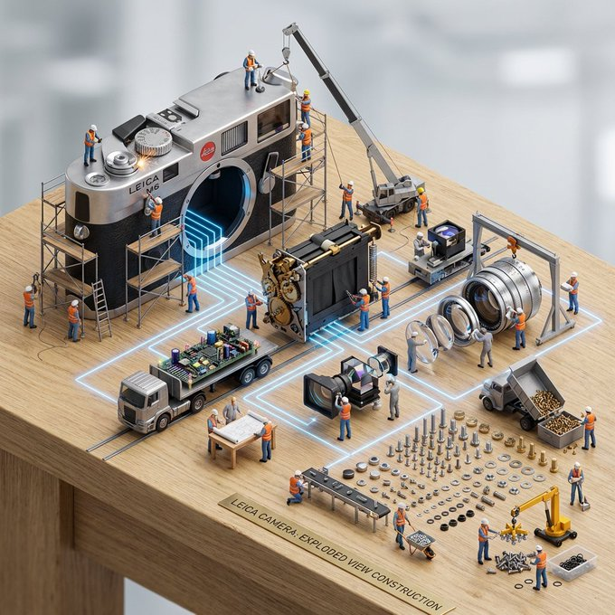

```
<instructions> 
Input Variable: [gadget]  
System Rules:
Generate a hyper-realistic, macro 3D diorama of an "Exploded View Assembly Line."
Concept: A complex machine is deconstructed into its component parts, with tiny construction workers actively assembling it.
1. Mechanical Deconstruction:
Analyze the Input: Identify the object and its primary components.
Bill of Materials: Deconstruct the object into 10-15 key parts.
(e.g., If Watch -> Gears, Springs, Casing, Dial, Hands).
(e.g., If Engine -> Pistons, Crankshaft, Cylinder Head, Spark Plugs).
The Materiality: Determine the object's primary materials (e.g., Brushed Steel, Brass, Black Plastic, Leather).
2.  Container:
Surface: A clean, light-grained Oak or Maple Wood Tabletop.
Layout: The scene is an Exploded View Diagram brought to life.
Chassis: The main body of the object sits at the top of the frame.
Components: The smaller parts are arranged neatly below it, floating in mid-air or resting on the wood, organized by assembly order.
3. The Diorama
The Figures: The scene is populated by dozens of tiny 1:87 Scale Construction Workers (in hard hats and blue/orange uniforms).
The Labor (CRITICAL): The figures are not static. They are actively working:
Welding a joint.
Polishing a metal surface.
Consulting a miniature blueprint.
Operating machinery.
The Equipment: The scene includes miniature construction vehicles.
Cranes lift the heavy casing parts.
Flatbed Trucks transport screws and gears.
Scaffolding surrounds the main chassis.
4. Digital Overlay (The AR Blueprint):
Grid: Thin, Glowing Blue Lines form a digital grid on the wooden table, creating a "schematic" that the parts are laid out on.
Connection: These glowing lines connect the individual parts to their final assembly points on the main chassis, showing how the machine fits together.
5. Visual :
Lighting: Bright, clean, even "Product Photography" studio lighting. No dramatic shadows.
Camera: High-angle isometric view to capture the entire layout.
Focus: Deep Depth of Field. The main chassis and the foreground parts are all in sharp focus.
Output: ONE image, 1:1 Aspect Ratio, Octane Render, "Knolling" Aesthetic, High Fidelity Textures.
```

```
<指令>  
输入变量：[小工具]  
系统规则：  
生成一个超写实、微距的3D立体透视模型，主题为“爆炸视图装配线”。  
概念：一台复杂机器被拆解成各个零部件，并由微型建筑工人正在积极组装。

1. 机械拆解：  
分析输入：识别该物体及其主要组件。  
物料清单：将物体拆解为10至15个关键部件。  
（例如，若为手表 → 齿轮、发条、表壳、表盘、指针）  
（例如，若为发动机 → 活塞、曲轴、气缸盖、火花塞）  
材质表现：确定物体的主要材质（如拉丝钢、黄铜、黑色塑料、皮革）。

2. 容器设定：  
台面：干净、浅色木纹的橡木或枫木桌面。  
布局：场景是一个具象化的爆炸视图示意图。  
主体框架：物体的主结构位于画面顶部。  
零部件：较小的零件整齐排列在其下方，悬浮于空中或置于木面上，按装配顺序组织。

3. 立体透视场景：  
人物：场景中分布着数十名1:87比例的微型建筑工人（佩戴安全帽，身穿蓝/橙色制服）。  
劳动状态（关键）：人物并非静止，而是在进行各种作业：  
- 焊接接缝  
- 抛光金属表面  
- 查阅微型蓝图  
- 操作机械设备  

设备：场景包含微型工程机械：  
- 起重机吊起厚重的外壳部件  
- 平板卡车运输螺丝与齿轮  
- 主体框架周围搭有脚手架  

4. 数字叠加层（AR蓝图）：  
网格：桌面上覆盖一层细而发光的蓝色线条，形成数字网格，作为零件排布的“原理图”。  
连接线：这些发光线条将各个零件与其在主框架上的最终装配点相连，展示机器如何组合。

5. 视觉风格：  
灯光：明亮、干净、均匀的“产品摄影”棚拍灯光，无戏剧性阴影。  
视角：高角度等距视图，完整呈现整体布局。  
焦点：大景深，主框架与前景零件均清晰锐利。  
输出：单张图像，1:1画幅，使用Octane渲染器，采用“Knolling”美学风格，高保真纹理。
```

 [↑返回目录](#toc)

---
## <a id="">阳光草地上的雏菊女孩</a> (<a href="https://x.com/john_my07/status/2017241396563100147" target="_blank" rel="noopener noreferrer">Johnn</a>)

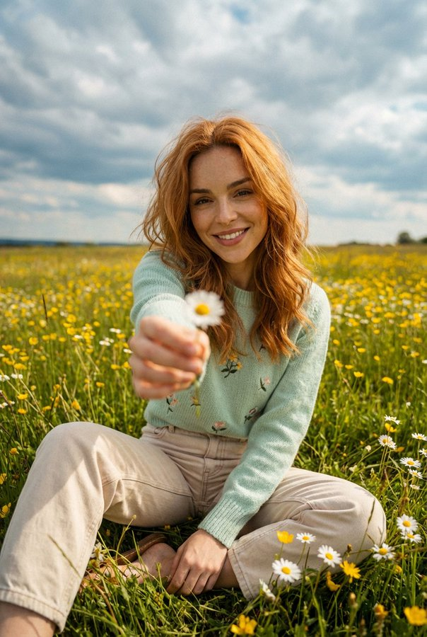

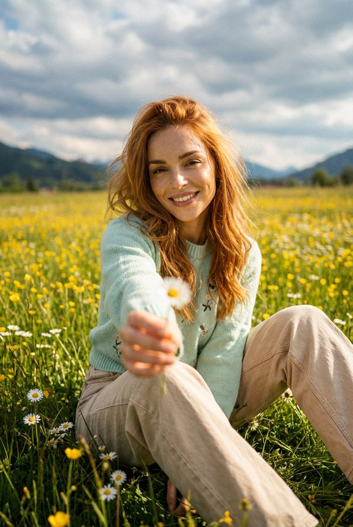

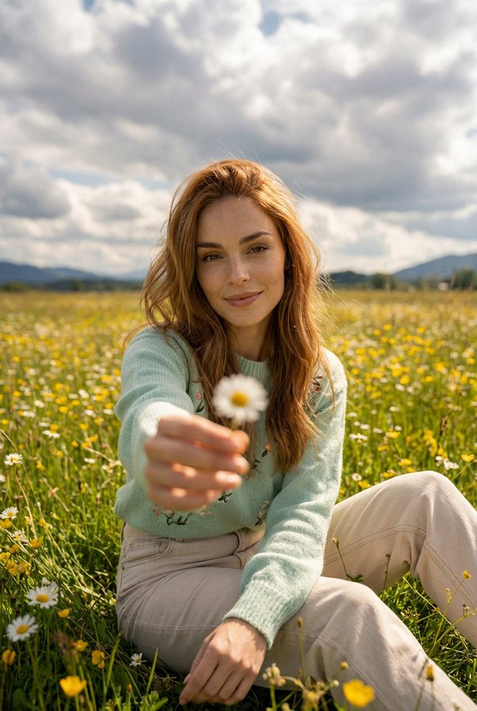

```
{
  "prompt": "Create a cinematic, wide-angle portrait using the same face and identity as the provided reference image. The subject is seated in a sunlit meadow filled with blooming wildflowers. She leans subtly forward, extending one hand toward the lens while holding a small daisy, creating a soft foreground blur. Her expression feels calm, warm, and naturally charming, with loosely tousled hair that adds an effortless, candid vibe. She is dressed in a pastel mint knit sweater with subtle embroidered details and relaxed-fit light beige denim jeans. The surrounding field is rich with yellow blossoms and scattered white daisies, stretching into the distance beneath a dramatic sky with layered clouds. Natural daylight illuminates the scene with gentle highlights and soft shadows. Apply a warm, vibrant color grade with delicate vintage film undertones to enhance a dreamy, nostalgic atmosphere. Use shallow depth of field and an editorial cinematic composition to create a timeless visual mood.",
  "aspect_ratio": "16:9",
  "style": "cinematic, editorial, nostalgic",
  "lighting": "natural soft daylight",
  "camera": "wide-angle lens, shallow depth of field"
}
```

```
创作一幅电影感十足的广角人像，使用与参考图像相同的面部特征和身份。人物坐在阳光明媚、野花盛开的草地上，微微前倾，一只手伸向镜头，手中握着一朵小雏菊，营造出柔和的前景虚化效果。她的表情平静、温暖且自然迷人，头发略显蓬松凌乱，增添了一种不经意的抓拍感。她身穿一件淡薄荷绿色针织毛衣，带有细腻的刺绣细节，搭配宽松的浅米色牛仔裤。周围田野盛开着黄色花朵和零星散布的白色雏菊，一直延伸至远方，天空布满层次丰富的云朵。自然日光为场景带来柔和高光与细腻阴影。采用温暖而鲜明的色调，并融入微妙的复古胶片质感，以增强梦幻而怀旧的氛围。使用浅景深与具有编辑风格的电影构图，营造出一种永恒的视觉情绪。
```

 [↑返回目录](#toc)

---
## <a id="">微观餐厅员工与巨型智能手机的超现实互动</a> (<a href="https://x.com/Kashberg_0/status/2017516657623875632" target="_blank" rel="noopener noreferrer">Kashberg</a>)

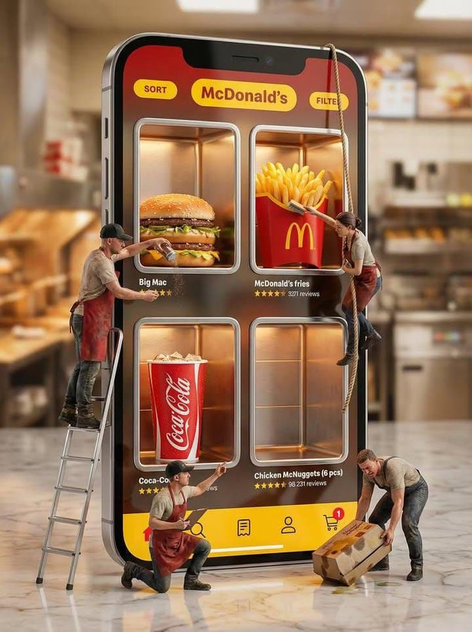

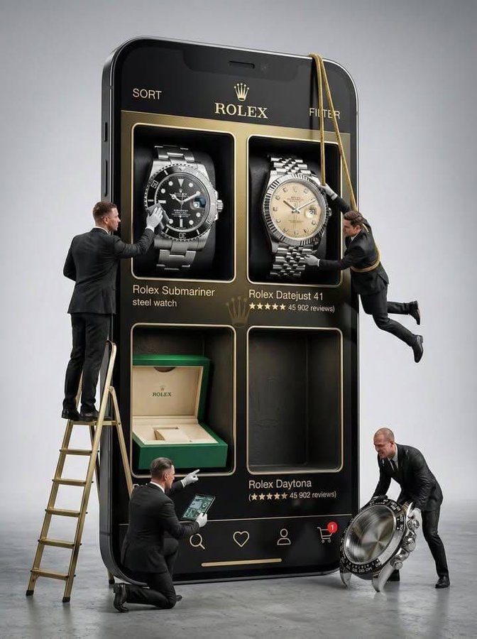

```
Ultra-realistic creative advertising scene showing a giant smartphone displaying a McDonald’s food-ordering app interface inside a modern restaurant kitchen. The phone screen features neatly arranged food compartments like a vending machine: a Big Mac burger, McDonald’s fries, a Coca-Cola cup, and chicken McNuggets with star ratings and reviews visible. Miniature restaurant workers in aprons interact with the phone—one climbing a rope to place fries, one on a ladder adjusting the burger, one kneeling to inspect the interface, and another lifting a delivery box. Playful scale contrast, hyper-detailed textures, glossy food realism, cinematic lighting, shallow depth of field. Premium commercial photography style, sharp focus, warm tones, high realism, imaginative brand storytelling, surreal yet believable composition.
```

```
超写实创意广告场景：一家现代餐厅厨房内，一部巨型智能手机正显示麦当劳点餐应用界面。手机屏幕上整齐排列着如自动售货机般的食物格子，包括巨无霸汉堡、麦当劳薯条、可口可乐杯和麦乐鸡块，并附有星级评分与用户评论。身穿围裙的微型餐厅员工与手机互动——一人攀爬绳索放置薯条，一人站在梯子上调整汉堡位置，一人跪地仔细检查界面，另一人则举起一个外卖箱。画面呈现趣味性的比例反差、极致细腻的质感、光泽诱人的食物写实效果、电影级灯光与浅景深。整体采用高端商业摄影风格，焦点锐利，色调温暖，高度写实，富有想象力的品牌叙事，构图超现实却令人信服。
```

 [↑返回目录](#toc)

---
## <a id="">机车少女在霓虹游戏厅</a> (<a href="https://x.com/Adam38363368936/status/2017447977762361687" target="_blank" rel="noopener noreferrer">Adam也叫吉米</a>)

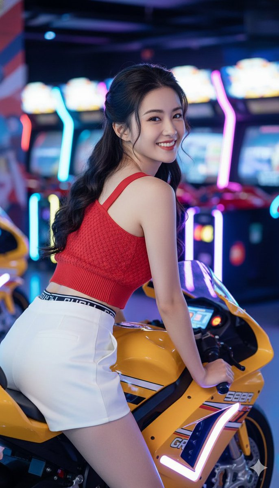

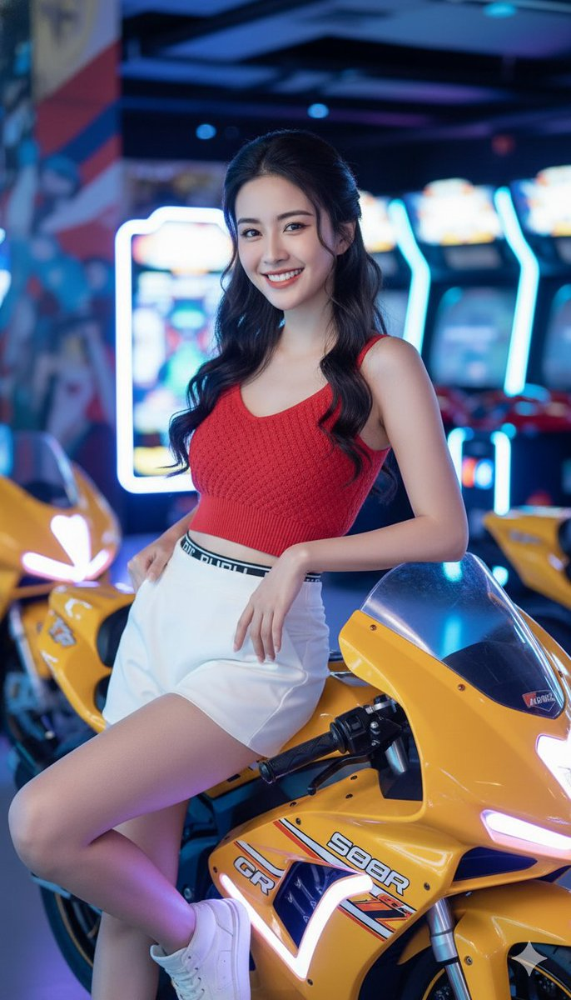

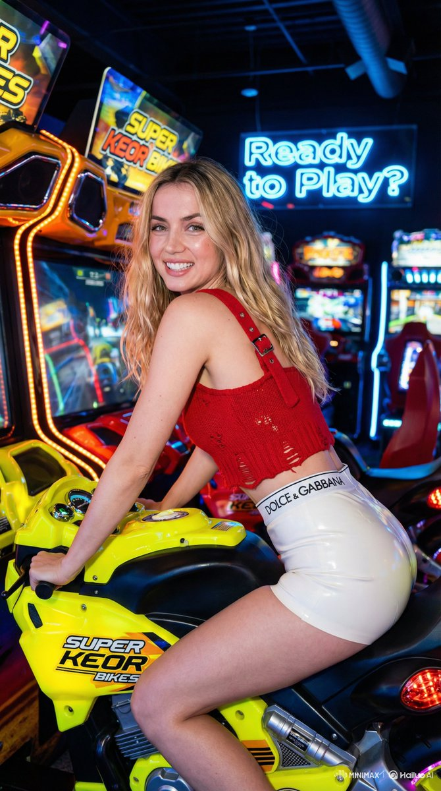

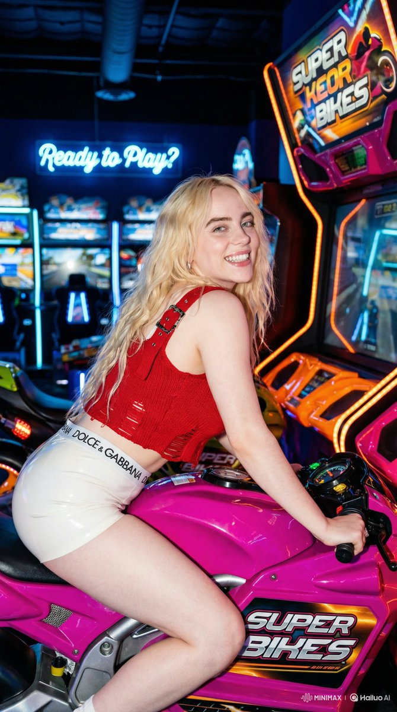

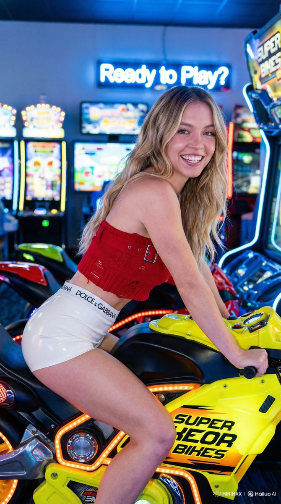

```
{
  "prompt_structure": {
    "subject": {
      "appearance": "Young woman with long, wavy black hair and a radiant, joyful smile, energetic expression.Use the face without any change",
      "pose": "Seated on a neon-lit arcade motorcycle, hands on handlebars, looking over her shoulder toward the camera with a playful gaze."
    },
    "attire": {
      "top": "Stylish red cropped knit top with modern asymmetric straps and textured fabric.",
      "bottoms": "Chic white high-waisted shorts with a sporty tailored fit.",
      "accessories": "A stylish athletic waistband with minimal black typographic design."
    },
    "environment": {
      "location": "Vibrant indoor gaming arcade.",
      "foreground": "Bright electric yellow arcade racing bike with detailed dashboard and glowing LED accents.",
      "background": "Cinematic bokeh of neon arcade screens, glowing signs, and cool ambient blue lighting.",
      "lighting": "High-contrast neon lighting, vibrant orange and electric blue highlights, polished reflections."
    },
    "style": {
      "aesthetic": "High-fashion commercial photography, energetic and playful atmosphere.",
      "color_palette": "Vivid red, neon yellow, electric blue, and deep cinematic shadows.",
      "photography_style": "Medium shot, sharp focus on subject, shallow depth of field, high-end editorial lighting."
    }
  }
}
```

```
一位长发波浪黑发的年轻女子，面带灿烂愉悦的笑容，神情充满活力，面部保持原样不变。她坐在霓虹灯照亮的街机摩托车上，双手握着车把，俏皮地回眸看向镜头。  
上身穿一件时尚红色短款针织上衣，具有现代感的不对称肩带和肌理感面料；下身穿一条剪裁合身、高腰的白色短裤，风格时髦且带有运动感；配饰是一条简约黑色字体图案的运动风腰带。  
场景设定在充满活力的室内游戏厅内，前景是一辆亮黄色的街机赛车摩托，配有细节丰富的仪表盘和发光LED装饰；背景是霓虹街机屏幕、发光招牌与冷调环境蓝光构成的电影感虚化效果。  
整体采用高对比度的霓虹灯光，以鲜艳的橙色与电光蓝色高光为主，并呈现精致的反光效果。  
画面风格为高端时尚商业摄影，氛围活力四射又俏皮可爱；色彩以鲜红、霓虹黄、电光蓝与深邃的电影感阴影为主；采用中景构图，主体清晰锐利，浅景深，搭配高端杂志级布光。
```

 [↑返回目录](#toc)

---
## <a id="">瓶中世界的科学家</a> (<a href="https://x.com/Gdgtify/status/2017454291909546357" target="_blank" rel="noopener noreferrer">Gadgetify</a>)

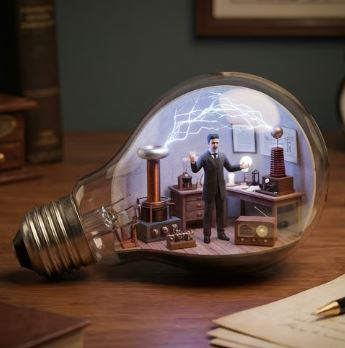

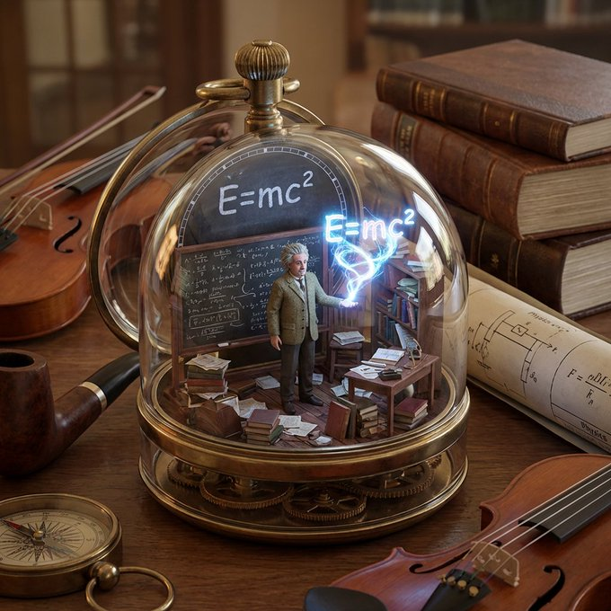

```
<instruction>
 
Input A is a Famous Figure, Era, or Concept (e.g., Nikola Tesla, The Victorian Age, Oceanography).
Deconstruct the subject into   3 Key Assets  :
    Container :  Identify a transparent object or container that  symbolically represents  the subject's domain.
         (e.g., Tesla ->   Lightbulb  . Victorian Age ->   Pocket Watch  . Oceanography ->   Ship in a Bottle  ). 
  Environment :  Identify the environment to be miniaturized inside.
         (e.g., Tesla -> Lab. Victorian -> Smoky Street. Oceanography -> Coral Reef). 
     Central Element :  Identify the central dynamic element or energy source.
         (e.g., Lightning, Gaslight ). 

  2.  Container (The Semantic Vessel):  
Goal: "World in a Bottle" Macro Photography.
  Object:  The "Vessel" (Step 1) lies on a wooden surface. It acts as the boundary for the diorama.
  Material:  It must be primarily   Glass or Transparent Crystal   to allow the interior to be seen.
         Constraint:  The container maintains its original form factor (e.g., a pocket watch is round with a chain; a bulb has a screw cap).

  3.  Diorama 
     The Floor:  A tiny floor or terrain fits inside the curvature of the Vessel.
     The Figure:  A   1:35 Scale Miniature   of the Subject stands inside.
     Interaction:  The figure is interacting with the "Spark" (Step 1) which provides internal illumination.

  4. Visual 
     The Surroundings:  The desk/table outside the vessel is cluttered with "Real Scale" props relevant to the subject (e.g., Giant schematics, Maps, or Tools) to emphasize the tiny scale of the diorama.

  5. Lighting & Atmosphere:  
     Lighting:    Dual Source.  
         External:  Warm, ambient room light reflecting off the glass.
         Internal:  The colored glow of the "Spark" lighting the scene from within.

  Output:   ONE image, 1:1 Aspect Ratio, 3D Render, "Magical Realism" aesthetic, High Fidelity.
</instruction>
```

```
另一种有趣的科学家、公式或发明可视化方式。我已为几位人物做过测试，系统应能自动选择合适的容器。

提示词：  
输入 A 为一位著名人物、一个时代或一个概念（例如：尼古拉·特斯拉、维多利亚时代、海洋学）。  
将该主题解构为三个关键要素：  

**容器**：识别一个透明物体或容器，象征性地代表该主题所属的领域。  
（例如：特斯拉 → 灯泡；维多利亚时代 → 怀表；海洋学 → 船舶瓶中模型）  

**环境**：识别需微缩置于容器内部的场景环境。  
（例如：特斯拉 → 实验室；维多利亚时代 → 烟雾缭绕的街道；海洋学 → 珊瑚礁）  

**核心元素**：识别作为中心动态元素或能量源的对象。  
（例如：闪电、煤气灯）  

**容器（语义载体）**：  
目标：“瓶中世界”微距摄影风格。  
物体：第一步确定的“容器”置于木质表面上，作为微缩场景的边界。  
材质：必须主要为玻璃或透明水晶，以便清晰展现内部。  
限制：容器须保持其原始形态特征（例如：怀表为圆形并带链条；灯泡带有螺口底座）。  

**微缩场景（Diorama）**：  
地面：贴合容器内壁曲率的小型地面或地形。  
人物：1:35 比例的主题人物微型模型立于其中。  
互动：人物正与第一步中的“火花”互动，该火花提供内部照明。  

**视觉表现**：  
外部环境：容器外的桌面/台面堆满与主题相关的“真实比例”道具（如巨型图纸、地图或工具），以突显微缩场景之微小。  

**光影与氛围**：  
灯光：双光源。  
外部：温暖的环境光从房间反射至玻璃表面。  
内部：“火花”发出的彩色光芒由内向外照亮整个场景。  

输出：一张图像，1:1 纵横比，3D 渲染，魔幻现实主义美学，高保真度。
```

 [↑返回目录](#toc)

---
## <a id="">黑沙滩上的北欧风女子</a> (<a href="https://x.com/ChillaiKalan__/status/2017249530010546396" target="_blank" rel="noopener noreferrer">K</a>)

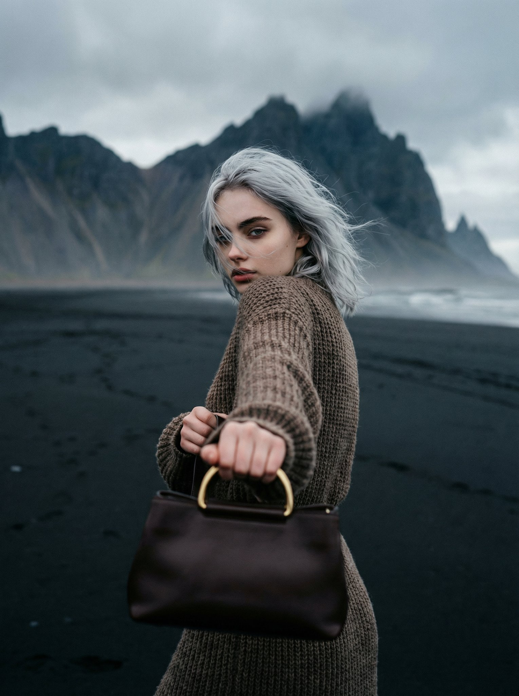

```
A cinematic fashion photograph of a young woman standing on a black sand beach near a cold northern coastline, dramatic jagged mountains rising in the background under an overcast sky. She wears a textured brown knitted sweater dress and carries a dark leather handbag with a gold handle. Minimalist Nordic aesthetic, muted cool color palette, moody atmosphere, soft natural light, shallow depth of field.
Wide establishing shot showing vast landscape, followed by a medium portrait shot, then a close-up of hands gripping the bag handle, and a final over-the-shoulder look with intense eye contact.
Ultra-realistic, high detail, film grain, editorial fashion style, 35mm cinematic lens, cold weather mood, slow cinematic pacing, realism, depth, atmospheric perspective.
```

```
一位年轻女子站在寒冷北方海岸线附近的黑沙滩上，背景是阴云密布的天空下巍峨嶙峋的山脉，呈现出电影感十足的时尚摄影作品。她身穿一件质感丰富的棕色针织连衣裙，手提一只深色皮革手袋，手袋配有金色提手。整体风格为极简北欧美学，采用低饱和冷色调，氛围忧郁，光线柔和自然，景深浅。

画面从展现广阔景观的广角定场镜头开始，接着切换至中景人像，随后聚焦于紧握手袋提手的双手特写，最后以一个过肩视角收尾，女子目光坚定直视镜头。

作品追求超写实风格，细节丰富，带有胶片颗粒感，呈现杂志时尚摄影风格，使用35毫米电影镜头拍摄，营造出寒冷天气的情绪氛围，节奏舒缓，强调真实感、空间深度与空气透视效果。
```

 [↑返回目录](#toc)

---
## <a id="">电影感年轻男子肖像</a> (<a href="https://x.com/iamsofiaijaz/status/2017274761660051786" target="_blank" rel="noopener noreferrer">Aijaz</a>)

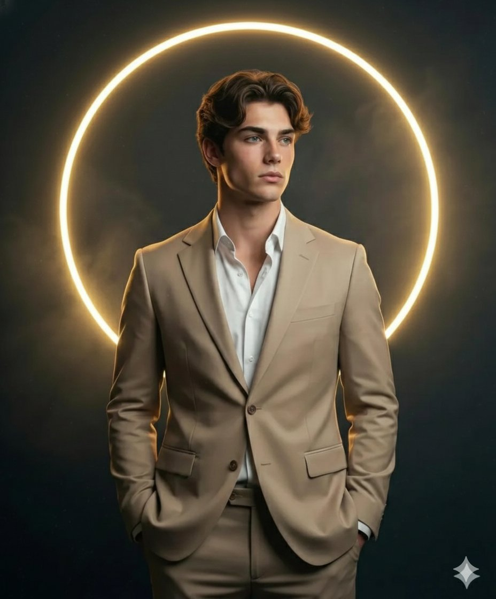

```
A high-definition, cinematic portrait of a sharp, handsome young man with wavy dark hair, wearing a tailored tan/beige suit over a crisp white button-down shirt. He is standing in front of a glowing, golden neon ring that provides a halo effect. The background is dark and moody with subtle smoke or atmospheric mist. Photorealistic, 8k resolution, sharp focus on facial features, elegant lighting, and professional studio aesthetic.
```

```
一张高清、电影感十足的肖像，描绘一位英俊锐气的年轻男子，拥有深色卷发，身穿剪裁合体的米色/浅褐色西装，内搭一件挺括的白色纽扣衬衫。他站在一个发光的金色霓虹圆环前，营造出光环效果。背景深邃而富有氛围，带有淡淡的烟雾或薄雾。照片写实风格，8K分辨率，面部特征清晰锐利，灯光优雅，具有专业影棚美学。
```

 [↑返回目录](#toc)

---
## <a id="">复古未来主义的合成人类肖像</a> (<a href="https://x.com/techhalla/status/2017149483071529126" target="_blank" rel="noopener noreferrer">TechHalla</a>)

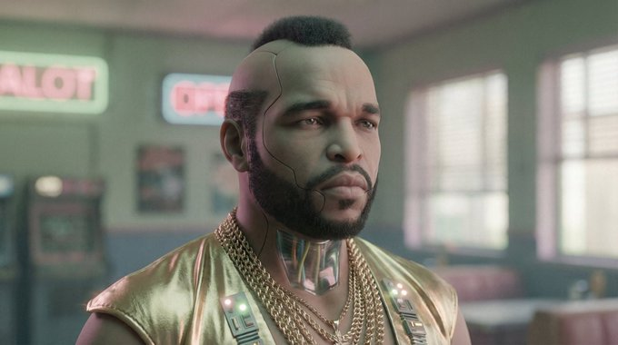

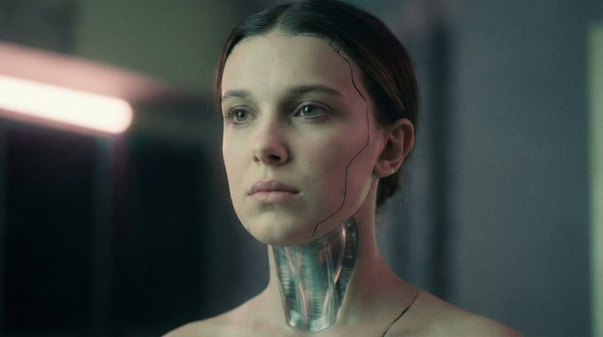

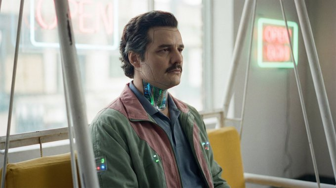

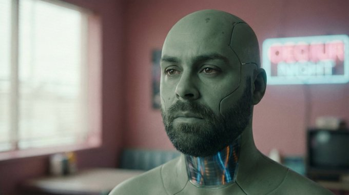

```
Generate a nostalgic, retro-futurist portrait of the subject in the [Attached Image] reimagined as a soulful "Synthetic Human."
SUBJECT (THE SYNTHETIC TRANSFORMATION):
CRITICAL: Use the [Attached Image] as the strict reference for facial features and identity.
Materiality:
The subject's skin looks like soft, matte silicone or high-end vintage plastic (not shiny metal). It should feel organic but manufactured.
Details:
Subtle mechanical seams along the jawline or hairline. Perhaps a transparent casing on the neck revealing muted, glowing optical cables inside.
Expression:
Melancholic, distant, and intelligent.

LIGHTING & EFFECT (THE "HALATION" LOOK):
Halation:
Strong use of "Bloom" or "Halation" effect. Any light source (like a neon sign in the background or a diode on the suit) should have a soft, hazy glow that bleeds into the surrounding darker areas.
Lighting:
Soft, diffused, window light mixed with weak neon practical lights.
ATMOSPHERE & COLOR:
Palette:
Muted, desaturated tones. Sage greens, dusty pinks, and slate blues. No oversaturated colors.
Vibe:
"Blade Runner" meets "Her," but shot on vintage Kodak Portra film.
TECHNICAL:
35mm Film Photography, f/2.0, ISO 800, Film Grain, Analog aesthetic, Dreamy depth of field.

Tested on nano banana pro with reference images. Share your results in comments!
```

```
以[附图]中的主体为基础，生成一幅充满怀旧感的复古未来主义肖像，将其重塑为富有灵魂的“合成人类”。

主体（合成改造）：  
关键要求：严格以[附图]作为面部特征与身份的参考依据。  

材质：  
皮肤呈现柔软、哑光的硅胶质感或高端复古塑料质感（非闪亮金属），应兼具有机感与人造感。  

细节：  
下颌线或发际线处有细微的机械接缝；颈部或许带有透明外壳，内里隐约可见柔和发光的光学线缆。  

表情：  
忧郁、疏离且充满智慧。

光影与效果（“光晕”风格）：  
光晕：  
强烈运用“Bloom”或“Halation”（光晕）效果。任何光源（如背景中的霓虹招牌或服装上的二极管）都应散发柔和、朦胧的辉光，并向周围暗部自然晕染。  

光线：  
柔和漫射的窗光，混合微弱的霓虹实用光源。

氛围与色彩：  
色调：  
低饱和、柔和的色彩组合，如鼠尾草绿、灰粉与石板蓝，避免高饱和颜色。  

氛围：  
融合《银翼杀手》与《她》的风格，但采用复古柯达Portra胶片拍摄。

技术参数：  
35mm胶片摄影，f/2.0光圈，ISO 800，胶片颗粒，模拟胶片美学，梦幻般的浅景深。  

已在Nano Banana Pro上配合参考图测试成功，欢迎在评论区分享你的成果！
```

 [↑返回目录](#toc)

---
## <a id="">复古唱片店的惊喜发现</a> (<a href="https://x.com/sidona/status/2017493378167111734" target="_blank" rel="noopener noreferrer">Sidona</a>)

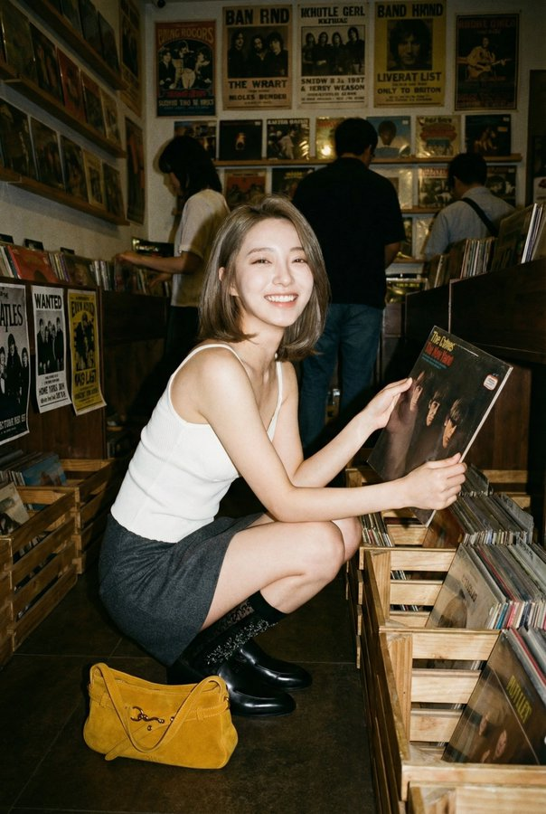

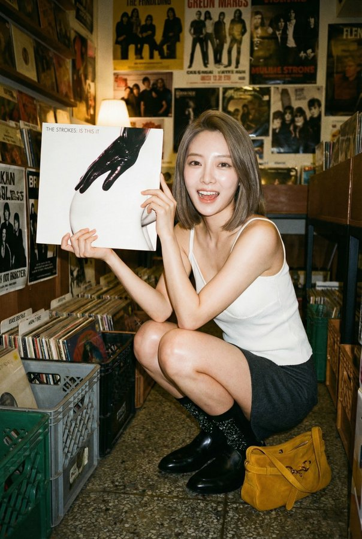

```
{
  "portrait_prompt": {
    "subject": {
      "description": "Based on <User Portrait>, a young woman crouching in a vintage record store, excitedly holding up a vinyl record she just found",
      "pose": "Squatting or kneeling by record crates, holding vinyl up toward camera"
    },
    "attire": {
      "type": "White camisole, charcoal mini skirt riding up slightly, black lace socks, black loafers",
      "accessory": "Mustard yellow bag set down beside her"
    },
    "composition": {
      "shot_type": "Medium shot",
      "focal_length": "35mm compact camera",
      "camera_angle": "Slightly above, casual snapshot framing",
      "framing": "NOT perfectly composed, candid messy framing, subject roughly centered"
    },
    "lighting": {
      "type": "Direct on-camera flash",
      "direction": "Frontal harsh flash, hard shadows on wall behind",
      "mood": "Raw, 90s point-and-shoot, authentic"
    },
    "color_palette": {
      "film_simulation": "Kodak Gold 200",
      "style": "Kodak Gold 200 film simulation, warm golden tones, cool white flash on skin, deep rich blacks, visible grain, lo-fi indie vibe",
      "tones": ["Warm amber", "Cool flash highlights", "Deep blacks"]
    },
    "environment": {
      "setting": "Cramped vintage record store",
      "background": "Stacked vinyl crates, band posters on walls, cluttered shelves",
      "atmosphere": "Indie sleaze, authentic cool girl moment"
    },
    "mood": "Excited discovery, effortlessly cool, NOT posed",
    "negative_prompt": "Soft lighting, studio lighting, bokeh, airbrushed, over-processed, too clean"
  }
}
```

```
一位年轻女子蹲在一家复古唱片店里，兴奋地举起刚找到的一张黑胶唱片。她蹲或跪在唱片箱旁，将黑胶朝向镜头高高举起。身穿白色吊带背心、炭灰色迷你裙（略微上滑）、黑色蕾丝短袜和黑色乐福鞋，身旁放着一只芥末黄色手提包。

采用中景构图，使用35mm便携相机拍摄，镜头略高于人物，画面为随意抓拍风格，不追求完美构图，略显凌乱但主体大致居中。

光线使用机顶直闪，正面强烈闪光，在背景墙上形成硬朗阴影，整体氛围原始、真实，呈现90年代傻瓜相机的质感。

色彩模拟柯达Gold 200胶片效果：温暖的金色调、皮肤上的冷白闪光高光、深邃浓郁的黑色，带有可见颗粒感，营造低保真独立风格。主色调包括暖琥珀色、冷调闪光高光和深黑色。

环境设定为狭小的复古唱片店，背景堆满黑胶唱片箱、墙上贴着乐队海报、货架杂乱无章，整体氛围充满独立颓废感，捕捉一个真实又酷的女孩瞬间。

情绪表现发现唱片时的兴奋与毫不做作的酷感，拒绝摆拍。

避免柔光、影棚灯光、背景虚化、磨皮、过度后期处理或过于干净的画面。
```

 [↑返回目录](#toc)

---
## <a id="">韩系女团风高级感写真</a> (<a href="https://x.com/qisi_ai/status/2017434236106723688" target="_blank" rel="noopener noreferrer">骑司Chase</a>)

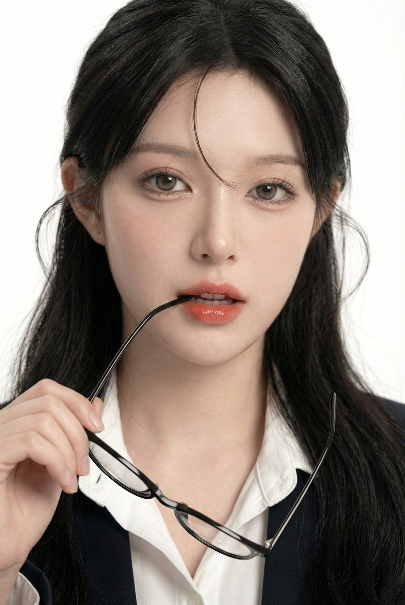

```
一、画面构图
1 画幅与取景：竖幅人像，头肩极近景，人物靠右占画面大比例
2 视角与机位：平视正面近拍，轻微居中对称感，眼神直视镜头
3 景深与清晰：背景虚净，主体五官与眼睛清晰锐利，发丝边缘可见细节

二、人物主体
参考来源：以上传参考图作为严格身份来源
一致性要求：零偏差
1 外形气质：年轻女性，清冷甜感与轻微性感并存，干净精致
2 面部特征：大眼圆润有神，鼻梁细直，唇形饱满微嘟，皮肤细腻通透
3 表情状态：微张唇，带一点挑逗与好奇的表情，情绪克制但有张力

三、发型妆容
1 发型质感：韩系深色长发，发量足，少量碎发飘动与凌乱感
2 底妆肤质：柔雾感底妆，肤色白皙透粉，光泽细腻不油腻
3 眼妆与腮红：眼周轻晕染，睫毛纤长自然，腮红集中在两颊与鼻梁附近
4 唇妆：水润镜面质感，偏蜜桃红，边缘柔和不过分锐利

四、服装道具与动作
1 服装搭配：白色衬衫领口微开，外搭深色外套，整体简洁利落
2 道具：黑色细框眼镜作为核心道具
3 动作细节：一手握住眼镜镜架，另一侧镜腿轻咬在唇间，手部靠近画面前景形成层次

五、背景光线与氛围
1 背景环境：纯白干净背景，无杂物无纹理
2 光线风格：柔和漫射光，高亮干净，阴影极浅，面部立体但不过硬
3 色调氛围：明亮清透，整体高级写真感、清爽又带一点暧昧张力

六、限制要求
1 避免问题：不要夸张滤镜感、不要塑料肤质、不要过度磨皮、不要虚假锐化
2 形体与比例：避免脸部变形与五官漂移，避免眼镜位置穿模或手指畸形
3 画面干扰：不要复杂背景、不要多余饰品、不要夸张发色与夸张妆面
```

 [↑返回目录](#toc)

---
## <a id="">英雄视角下的写实人像</a> (<a href="https://x.com/harboriis/status/2017479603921600730" target="_blank" rel="noopener noreferrer">Harboriis</a>)

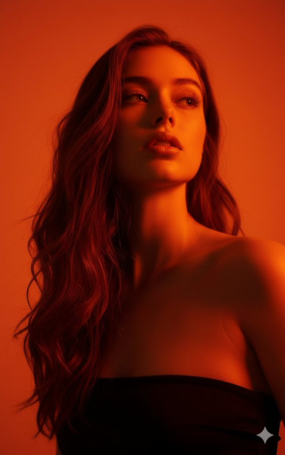

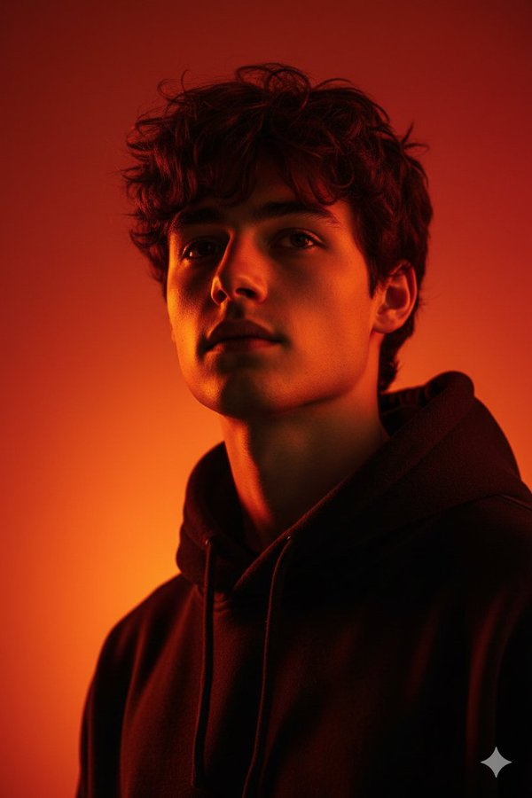

```
Editorial portrait from the attached reference photo, photorealistic. Use uploaded selfie as ONLY face reference. Identity lock: exact likeness, facial geometry/proportions, natural skin texture. No beautification. Keep clothing style, color, material, and fit identical to the reference. Medium close-up (face and shoulders), low angle looking up (heroic/dominant perspective), sharp focus on face/eyes.Serious, intense, focused expression, gaze directed upward and away from camera (beyond the frame). Dramatic saturated studio lighting, high-contrast chiaroscuro with deep shadows, vibrant oranges and deep reds palette, strong rim light creating a halo separation. Solid studio backdrop, rich orange-red smooth gradient, pattern-free, hot radiant atmosphere. High skin texture fidelity (pores visible), 8k, portrait aspect ratio, cinematic lighting, 4:5.
```

```
根据所附参考照片创作一幅写实风格的编辑人像。仅使用上传的自拍照作为面部参考，严格锁定身份特征：精确还原相貌、面部几何结构与比例、自然肌肤纹理，禁止美颜修饰。服装风格、颜色、材质及剪裁必须与参考照片完全一致。中近景构图（包含面部与肩膀），低角度仰视（呈现英雄式/主导视角），面部与眼睛保持锐利对焦。表情严肃、强烈且专注，目光朝画面上方并望向画面之外。采用戏剧性高饱和影棚布光，高对比度明暗对照法（chiaroscuro）配以深邃阴影，主色调为鲜艳橙色与深红色，强烈的轮廓光营造出光环般的主体分离效果。背景为纯色影棚背景，呈现浓郁橙红平滑渐变，无任何图案，氛围炽热耀眼。肌肤纹理高度还原（可见毛孔），8K分辨率，人像比例，电影级灯光，4:5画幅。
```

 [↑返回目录](#toc)

---
## <a id="">超写实美食摄影：黑碗中沙拉的爆炸瞬间</a> (<a href="https://x.com/ChillaiKalan__/status/2017200760631828679" target="_blank" rel="noopener noreferrer">K</a>)

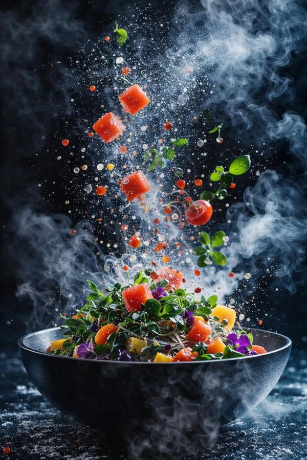

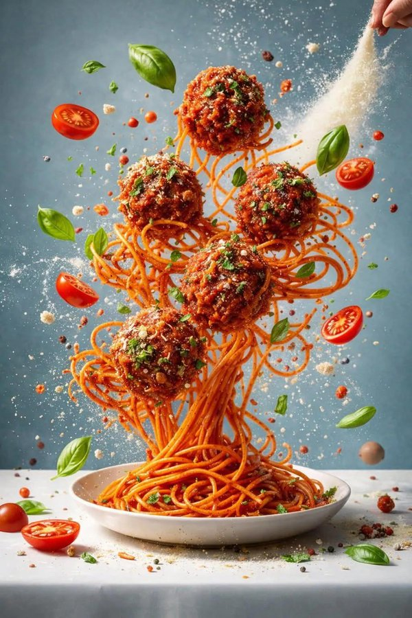

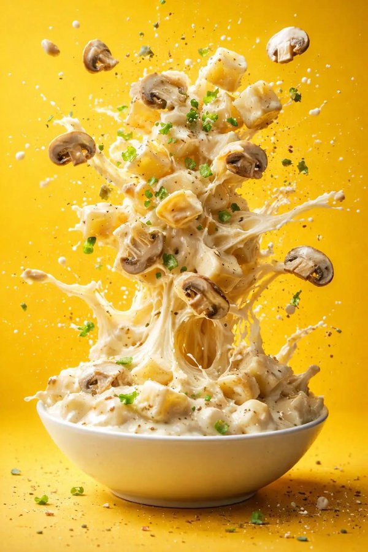

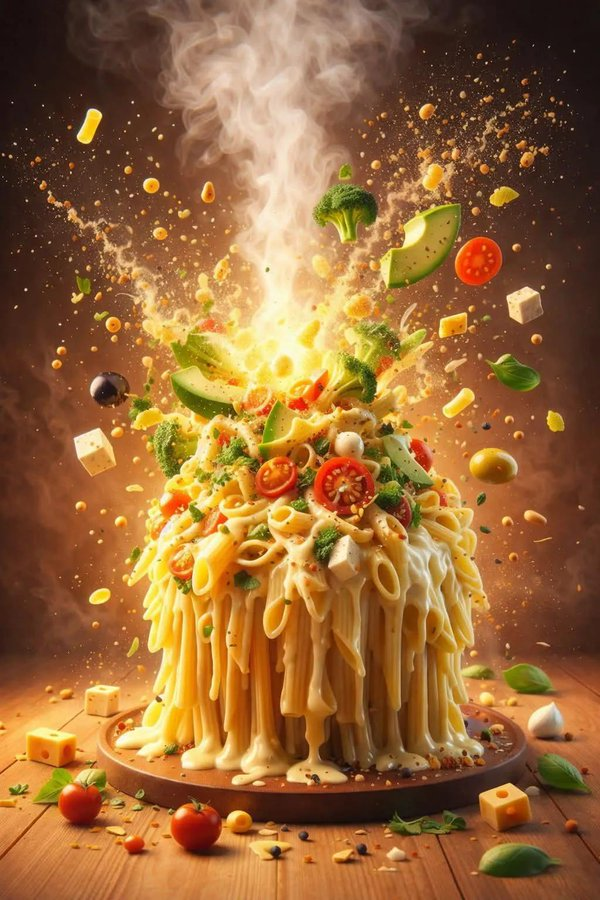

```
{
  "global_settings": {
    "resolution": "8K ultra high definition",
    "aspect_ratio": "2:3 vertical",
    "style": "hyper-realistic AI-edited food photography",
    "clarity": "extreme sharpness, micro-texture visibility",
    "motion": "frozen action with suspended ingredients",
    "lighting_quality": "studio-grade, high-contrast, cinematic",
    "background_separation": "strong subject isolation with clean depth"
  },

  "module_1_image_1_style": {
    "scene_description": "A dynamic salad explosion emerging from a matte black bowl placed on a round wooden surface. Ingredients are mid-air, scattered upward and outward.",
    "ingredients_visible": [
      "green lettuce leaves",
      "cherry tomatoes (whole and sliced)",
      "cucumber slices arranged in a curved stack",
      "black olives",
      "white cheese cubes",
      "orange citrus slice",
      "small broccoli florets",
      "fresh green basil leaves"
    ],
    "motion_details": {
      "ingredients":
```

```
8K超高清、2:3竖构图的超写实AI修图美食摄影，极致锐利、微纹理清晰可见，画面捕捉食材悬浮飞溅的瞬间动作。采用影棚级高对比度电影感布光，主体与背景强烈分离，景深干净利落。场景描绘一只哑光黑碗置于圆形木质台面上，内部沙拉爆炸般动态迸发，食材向上及四周飞散于空中，可见绿色生菜叶、整颗及切片的小番茄、弧形堆叠的黄瓜片、黑橄榄、白色奶酪方块、橙色柑橘片、小朵西兰花以及新鲜绿罗勒叶。
```

 [↑返回目录](#toc)

---
## <a id="">空中组装的超写实虾堡</a> (<a href="https://x.com/Strength04_X/status/2017554414261899753" target="_blank" rel="noopener noreferrer">𝐌</a>)

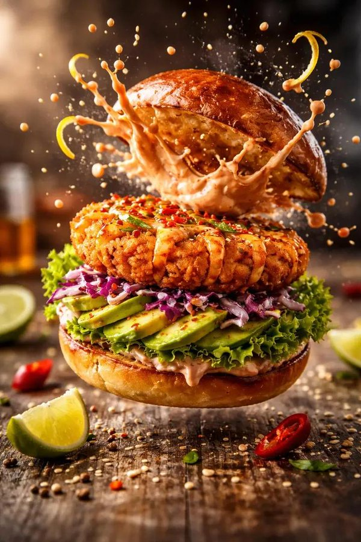

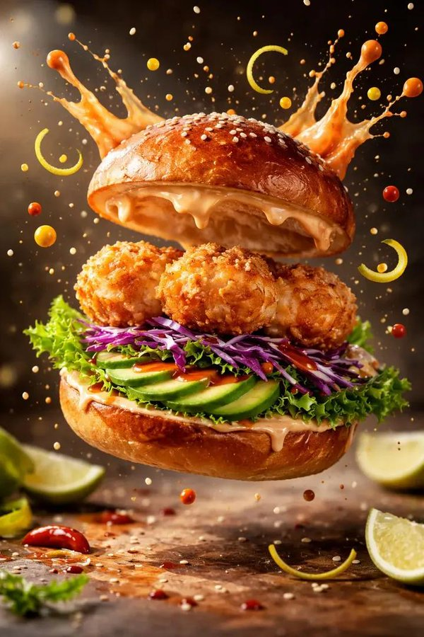

```
-
A cinematic hyperrealistic food product photograph of a shrimp burger captured in mid-air mid-build, with a golden crispy fried shrimp patty floating between two glossy toasted brioche bun halves, thick spicy orange aioli splashing upward from the top bun in dynamic arcs, bright chili-lime sauce droplets frozen in motion, thin lemon zest curls and sesame seeds scattered through the air, layered beneath the patty are vibrant purple cabbage slaw, crisp green lettuce, and neat fanned.
```

```
一张电影级超写实的食物产品摄影，画面中一只虾堡正在空中组装的瞬间——金黄酥脆的炸虾排悬浮在两片光亮烤过的布里欧修面包之间，浓稠的辛辣橙色蒜泥蛋黄酱从上方面包飞溅而出，形成动感弧线，明亮的辣椒青柠酱液滴在空中凝固，细薄的柠檬皮卷和芝麻粒散布于空中；虾排下方层次分明地铺着鲜艳的紫甘蓝沙拉、清脆的绿生菜，以及整齐扇形摆放的配菜。
```

 [↑返回目录](#toc)

---
## <a id="">现代汉服高定写真</a> (<a href="https://x.com/VoxcatAI/status/2017468154776326211" target="_blank" rel="noopener noreferrer">VoxCat</a>)

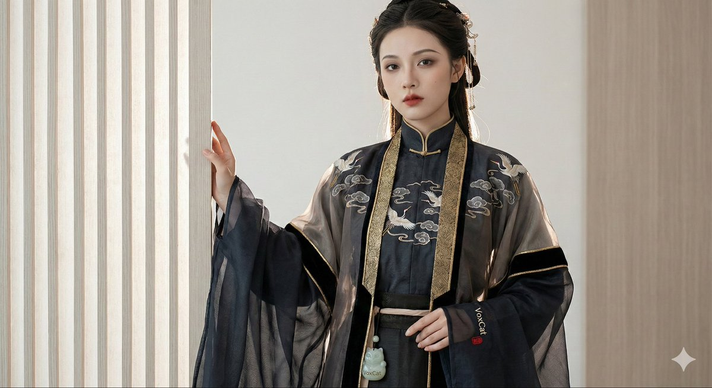

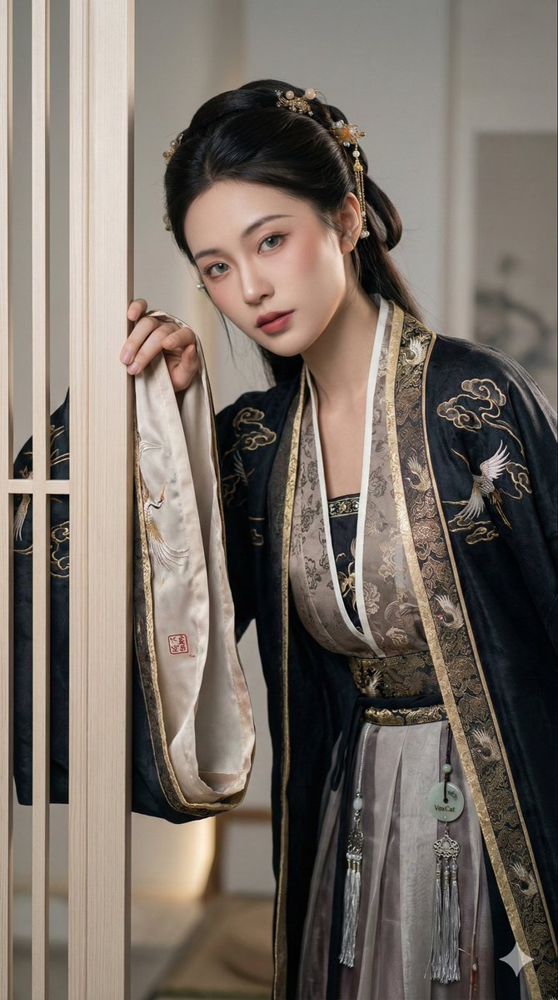

```
A high-end editorial close-up fashion portrait of a 22-year-old female modern-Hanfu coser with a cool, elegant “quiet power” presence, captured in an intimate near-field perspective (tight chest-up framing) as she subtly leans forward and lifts one flowing sleeve to brush against a pale wooden screen beside her, fingertips grazing the surface and slightly compressing the fabric to show motion and weight, chin gently lowered while her eyes lift to meet the camera in direct, controlled eye contact, shot from a mildly low-angle three-quarter view that enhances authority and depth, wearing an opulent contemporary hanfu reinterpretation: a structured stand-collar outer robe with widened sleeves layered over a duijin jacket and high-waist skirt, lavishly finished with cloud-and-crane embroidery, gold-thread brocade borders, intricate jacquard patterning, translucent organza veil layers, silk-satin luster, velvet ribbon accents, and fine metal tassel ornaments catching rim light (all seams, pleats, piping, and fabric weave rendered crisp and luxurious), styled with a refined half-up hairstyle and ornate hairpins and step-shake ornaments with dangling beads that sway slightly with movement; facial design features an oval face with a soft V jawline, straight brows with a slight peak, fox-almond eyes at normal eye distance enhanced by natural translucent jade-gray cosmetic contact lenses with a soft limbal ring (no anime exaggeration), a straight nose bridge with a gently defined tip, and velvet lips lightly pressed; expression remains calm and composed with faint brow tension; makeup is modern high-fashion and meticulously refined (not traditional stage makeup): lightweight satin-finish foundation with realistic skin texture and micro-concealing, soft sculpt contour and lifted bronzer placement, clean feathered brows, precise tightline + thin inner eyeliner, neutral-cool taupe eyeshadow gradient with subtle shimmer on the center lid and inner corner, separated wispy lashes, softly diffused blush lifted along the upper cheekbone, controlled highlighter only on cheekbone tops, nose bridge, cupid’s bow and lower lip, and a muted satin rosewood lip; face lighting is explicitly sculpted with a diffused softbox key light from 45° front-side to carve cheekbones and nose, a gentle bounce fill to keep shadow detail on the far cheek, a small grid/rim kicker to outline jawline and hair, and clean catchlights in both eyes, with highlight control that avoids blown forehead shine (matte T-zone, luminous high points), creating calm cinematic depth without harsh shadows; environment is a minimalist modern Chinese-inspired interior where pale wooden screens, soft ink-wash wall textures, and a clean stone floor softly reflect light and blur into the background, allowing the subject’s gesture to physically interact with the space; style is luxury magazine photography with restrained low-saturation color grading, natural skin texture, and extreme textile micro-detail; integrate my signature “VoxCat” only as an in-world couture detail: a small cat-shaped jade pendant engraved “VoxCat” hanging from the waist sash and a tiny red seal-style VoxCat embroidery stitched near the cuff (elegant, non-logo, period-consistent), with no other text; constraints: no plastic skin, no heavy beauty filters, no exaggerated big eyes, no glossy 3D, no busy background, no modern branding beyond the subtle VoxCat elements, no watermark; output: high-resolution, face tack-sharp, close-range depth emphasis, cinematic clarity.
```

```
一位22岁女性现代汉服coser的高端时尚特写肖像，展现冷静优雅的“静谧力量”气质。画面采用近景胸部以上构图，她微微前倾，抬起一只宽袖轻拂身旁的浅色木屏风，指尖轻触表面，袖袍因动作略显褶皱，体现布料的垂坠感与动态；下巴微收，目光却坚定迎向镜头，形成直接而克制的眼神交流。拍摄角度为略低的四分之三视角，强化人物的权威感与画面纵深。

她身着奢华的当代汉服再创作款式：立领外袍结构挺括、广袖飘逸，内搭对襟短袄与高腰长裙，饰以云鹤纹刺绣、金线织锦镶边、繁复提花图案、半透明欧根纱薄纱层、真丝缎面光泽、丝绒系带以及精致金属流苏挂饰，在轮廓光下熠熠生辉（所有缝线、褶裥、滚边与织物质感均清晰细腻、尽显奢华）。发型为精致半扎发，配以华美发簪与步摇饰品，珠串随动作轻微晃动。

面部特征为椭圆脸型、柔和V型下颌线、略带峰形的平直眉、自然间距的凤眼（佩戴自然透亮的灰玉色美瞳，带有柔和边缘环，无动漫夸张效果）、挺直鼻梁与微翘鼻尖、唇瓣如丝绒般轻抿。表情沉稳内敛，眉间隐有细微张力。

妆容为现代高级时装风格，精致克制（非传统戏曲妆）：轻盈缎光粉底保留真实肤质与微遮瑕效果，柔和修容与提亮式古铜晕染，干净羽状眉形，精准内眼线与细窄眼睑线，中性偏冷灰褐色眼影渐变，眼窝中央与内眼角点缀微妙珠光，睫毛根根分明呈纤细羽状，腮红柔和晕染于颧骨上方，高光仅点于颧骨最高点、鼻梁、丘比特弓与下唇中央，唇色为哑光玫瑰木调。

面部布光精心雕琢：45度前侧柔光箱为主光源，勾勒颧骨与鼻梁轮廓；辅以柔和反光板填充远侧脸颊阴影细节；小范围格栅轮廓光勾勒下颌线与发丝；双眼均有清晰眼神光；高光控制得当，避免额头过曝（T区哑光，高点自然透亮），营造宁静电影感深度，无生硬阴影。

环境为极简现代中式室内空间：浅色木屏风、水墨肌理墙面与素净石质地坪共同构成柔和反光背景，虚化融入后景，使人物手势与空间产生真实互动。

整体风格为奢侈品杂志摄影，低饱和色调克制统一，肌肤质感自然，织物微观细节极致清晰。将我的标志性“VoxCat”仅作为符合时代语境的高定细节融入：腰带悬挂一枚刻有“VoxCat”的猫形玉佩，袖口近腕处绣有一枚小巧朱文风格“VoxCat”暗纹（雅致、非品牌标识、符合历史风格），画面不含其他文字。

限制条件：禁止塑料感皮肤、重度美颜滤镜、夸张大眼、高光3D渲染、杂乱背景、除上述VoxCat元素外的现代品牌标识及水印。输出要求：高分辨率，面部锐利清晰，强调近距离景深与电影级画质。
```

 [↑返回目录](#toc)

---
## <a id="">孤独行者：北欧海岸的冷峻之旅</a> (<a href="https://x.com/ChillaiKalan__/status/2017517770578227637" target="_blank" rel="noopener noreferrer">K</a>)

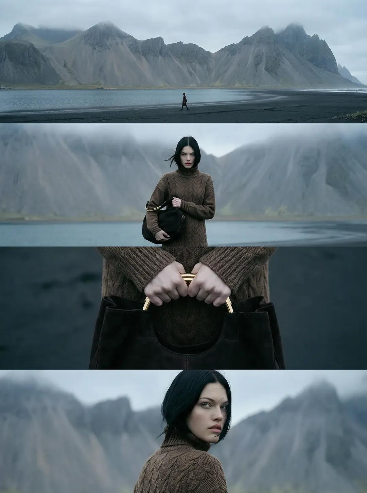

```
A vertical cinematic editorial image composed of four horizontal film frames stacked vertically within a portrait (4:5) format. Cold Nordic coastline with black sand beach, calm ocean water, and massive jagged gray mountains in the background covered with mist and low clouds. Overcast sky, soft diffused daylight, desaturated cool tones.

Frame 1 (top):
Wide landscape shot of a lone woman walking along the shoreline, very small in frame, mountains dominating the scene, strong negative space, flat horizon.
Frame 2:
Medium frontal shot of the same woman standing still, centered. Pale skin, straight black shoulder-length hair moving slightly in wind, neutral serious expression. Wearing a brown cable-knit turtleneck sweater dress. Holding a black leather handbag.
Frame 3:
Extreme close-up of both hands gripping a structured black leather handbag with a curved gold metal handle. Sleeves visible, background heavily blurred.
Frame 4 (bottom):
Over-the-shoulder portrait as she turns her head back toward the camera, sharp eyes, calm intense expression, mountains softly blurred behind.

Ultra-realistic photography, cinematic film still, editorial fashion look, natural skin texture, no glam lighting, shallow depth of field, muted Nordic color grading, realistic proportions, 35mm lens feel, cold atmosphere.
```

```
一幅竖向电影风格的编辑图像，由四幅横向胶片画面垂直堆叠而成，整体比例为竖版4:5。背景是寒冷的北欧海岸线，黑色沙滩、平静的海水，以及被薄雾与低空云层笼罩的巨大锯齿状灰色山脉。天空阴沉，光线柔和漫射，色调冷峻且低饱和。

第一帧（顶部）：  
广角远景镜头，一位孤独的女子沿着海岸线行走，在画面中显得非常渺小，山脉占据主导地位，留有强烈的负空间，地平线平直。

第二帧：  
中景正面镜头，同一位女子静立于画面中央。肤色苍白，笔直的齐肩黑发在微风中轻轻飘动，表情中性而严肃。身穿棕色绞花高领针织连衣裙，手提一只黑色皮革手袋。

第三帧：  
双手紧握一只结构分明的黑色皮革手袋的特写镜头，手袋配有弧形金色金属提手。可见衣袖，背景严重虚化。

第四帧（底部）：  
过肩视角人像，她回头望向镜头，眼神锐利，神情冷静而深邃，身后山脉柔和虚化。

整体风格为超写实摄影，如电影剧照般的编辑时尚造型，呈现自然肌肤质感，无华丽布光，浅景深，采用克制的北欧色彩调色，比例真实，具有35毫米镜头的视觉感受，氛围清冷。
```

 [↑返回目录](#toc)

---
## <a id="">Q版角色与越野吉普的温馨邂逅</a> (<a href="https://x.com/Taaruk_/status/2017231845545689130" target="_blank" rel="noopener noreferrer">Taaruk</a>)

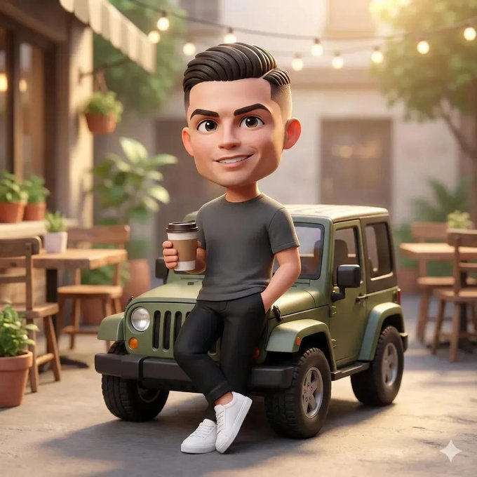

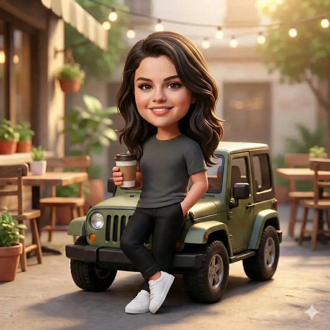

```
Ultra-detailed 3D chibi-style character with a big head and expressive eyes, cute proportions, smooth stylized skin, friendly smile. The character is casually leaning against a small green off-road Jeep, holding a takeaway coffee cup. Cozy outdoor café courtyard setting with wooden tables, potted plants, warm string lights in the background. Soft golden-hour lighting, shallow depth of field, cinematic bokeh. High-quality Pixar-style 3D render, vibrant colors, clean textures, adorable yet realistic character design, professional character illustration, 8K render.
```

```
超精细3D Q版角色，大头、表情丰富的眼睛，可爱的比例，光滑的风格化皮肤，友善的微笑。角色随意倚靠在一辆小型绿色越野吉普车旁，手握一杯外带咖啡。背景为温馨的户外咖啡馆庭院，设有木质桌椅、盆栽植物，以及温暖的串灯。柔和的黄金时刻光线，浅景深，电影级散景效果。高质量皮克斯风格3D渲染，色彩鲜艳，纹理干净，角色设计既可爱又逼真，专业角色插画，8K分辨率渲染。
```

 [↑返回目录](#toc)

---
## <a id="">时尚写真封面</a> (<a href="https://x.com/iamsofiaijaz/status/2017483949271085191" target="_blank" rel="noopener noreferrer">Aijaz</a>)

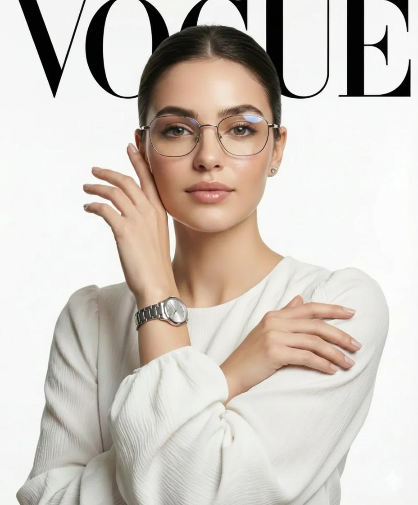

```
A high-definition, professional fashion editorial photograph of a sophisticated woman with a sleek, center-parted bun. She is wearing elegant, thin-rimmed silver glasses and a minimalist white long-sleeved silk blouse. She is posed gracefully with her hands near her face and chest, showcasing a luxury silver watch. The background is a clean, bright white with bold, high-contrast black serif typography reading 'VOGUE' at the top. Studio lighting, soft skin texture, sharp focus on the eyes, 8k resolution, shot on a 85mm lens for a flattering portrait compression."
​Tips for Customizing the Result:
​The Model: If you want a different look, change "sophisticated woman" to specific features like "freckles," "dark curly hair," or "minimalist makeup."
​The Brand: You can swap "VOGUE" for any other magazine title or leave it blank for a clean fashion portrait.
​The Jewelry: Adjust the metal (e.g., "gold watch," "rose gold frames") to change the color palette of the image.
```

```
高清的专业时尚编辑照片，展示了一位盘着光滑中分发髻的优雅女性。她佩戴着优雅的细边银色眼镜和极简风格的白色长袖丝绸衬衫。她的姿态优雅，双手靠近脸部和胸部，展示一款奢华的银色手表。背景是干净明亮的白色，并有醒目的高对比度黑色衬线字体写着“VOGUE”在顶部。采用工作室照明，柔和的皮肤质感，眼睛部分对焦清晰，在8k分辨率下拍摄，使用85毫米镜头以获得讨喜的人像压缩效果。

如果想要不同的外观，可以将“优雅女性”替换为特定特征如“雀斑”，“深卷发”或“极简化妆”。可以根据需要将“VOGUE”更换为其他杂志标题或者留空以获得简洁的时尚肖像。可以根据需要调整金属配饰的颜色（例如“金色手表”，“玫瑰金框架”）以改变图像的色彩搭配。
```

 [↑返回目录](#toc)

---
## <a id="">时尚超写实人像自信姿态写真</a> (<a href="https://x.com/23rd_Pulikesi/status/2017402458872447271" target="_blank" rel="noopener noreferrer">Pulikesi</a>)

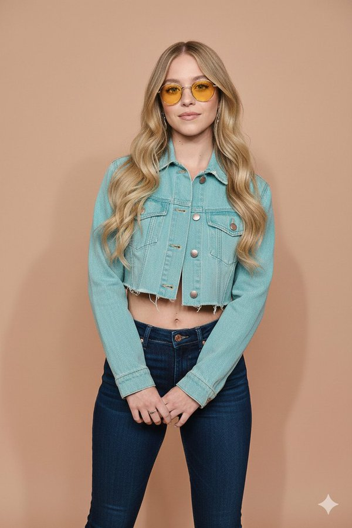

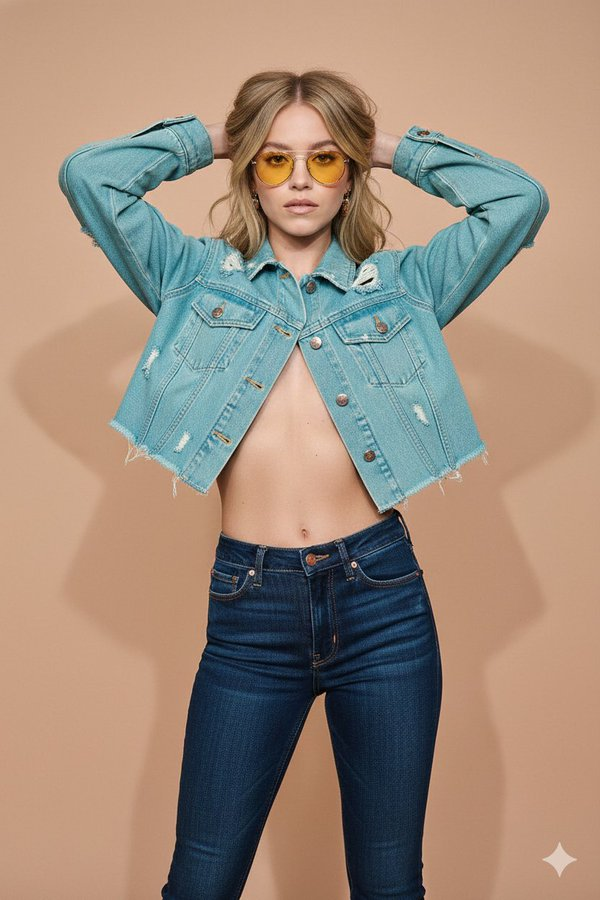

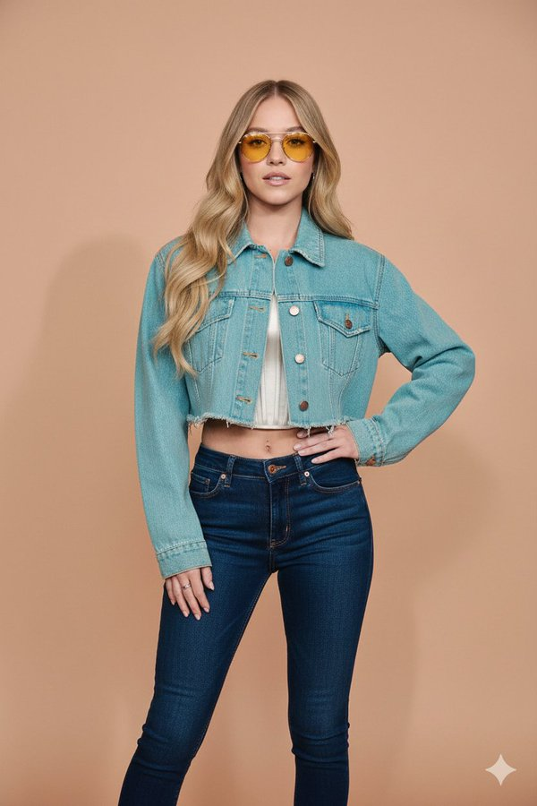

```
{
"model": "SDXL",
"seed": -1,

"reference_images": {
"face_id": {
"type": "ip-adapter-faceid",
"enabled": true,
"weight": 0.9,
"source": "uploaded_image"
},
"full_body": {
"type": "ip-adapter-plus",
"enabled": false,
"weight": 0.0,
"source": "uploaded_image"
}
},

"prompt": "Use the uploaded image strictly as IDENTITY reference only. Preserve facial features, skin tone, face shape, eye structure, nose, lips, jawline, hairstyle type, and body proportions exactly. Do NOT copy pose, posture, camera angle, lighting, background, or clothing from the reference.\n\nUltra-realistic full-body studio fashion portrait. Subject stands centered.\n\nWardrobe (must match exactly): cropped light-wash turquoise denim jacket with distressed seams and frayed edges, exposed midriff and visible navel, dark navy-blue skinny jeans with subtle worn texture and copper rivets, round yellow-orange tinted aviator sunglasses with thin metal frame.\n\nPose (select ONE randomly per generation, do NOT mix):\nA) Arms raised behind head, hands tying hair, confident serious expression.\nB) Both hands loosely crossed in front, leaning slightly forward, subtle soft smile.\nC) One hand on hip, other hand holding jacket collar, confident attitude expression.\n\nHair styled naturally to fit pose. Minimal makeup, realistic skin texture.\n\nBackground: solid matte peach-beige studio backdrop.\nLighting: soft diffused front light, gentle shadows.\nCamera: full-body, straight-on, eye-level, 50mm look, shallow depth.\n\nColor palette: warm peach-beige background, cool turquoise jacket, deep navy jeans, amber-yellow glasses, natural warm skin tones.\nColor grading: soft warm cinematic, subtle teal-orange, muted highlights, low contrast, matte finish, film softness.\n\nStyle: high-end fashion editorial, Vogue studio shoot.\nQuality: ultra-detailed, photorealistic, 8K, sharp focus, professional photography.",

"negative_prompt": "multiple poses, mixed poses, wrong clothing, missing sunglasses, hoodie, t-shirt, dress, skirt, shorts, copied reference pose, bad anatomy, extra limbs, distorted hands, plastic skin, heavy makeup, cartoon, anime, illustration, watermark, logo, blur, noise, low quality, oversaturated, overprocessed",

"steps": 35,
"cfg_scale": 7.5,
"sampler": "DPM++ 2M Karras",
"width": 1024,
"height": 1536,
"clip_skip": 2
}
```

```
使用上传的图像仅作为身份参考。严格保留面部特征、肤色、脸型、眼部结构、鼻子、嘴唇、下颌线、发型类型和身体比例。切勿复制参考图中的姿势、姿态、镜头角度、光线、背景或服装。

超写实全身影棚时尚人像，人物居中站立。

服装（必须完全一致）：短款浅水洗牛仔夹克，带有磨损接缝和毛边，露出腹部和肚脐；深海军蓝紧身牛仔裤，带有细微做旧纹理和铜质铆钉；圆形黄橙色镜片飞行员墨镜，细金属镜框。

姿势（每次生成随机选择以下一种，不可混合）：  
A) 双臂举至脑后，双手正在扎头发，表情自信而严肃。  
B) 双手自然交叉于身前，身体微微前倾，嘴角带淡淡柔和微笑。  
C) 一手叉腰，另一手抓着夹克拉链处，表情充满自信与态度。

发型自然贴合所选姿势。妆容极简，皮肤纹理真实。

背景：纯色哑光桃米色影棚背景。  
光线：柔和漫射正面光，阴影轻微。  
镜头：全身构图，正面平视，50mm视角，浅景深。

色彩搭配：暖调桃米色背景、冷调青绿色夹克、深海军蓝牛仔裤、琥珀黄色墨镜、自然暖调肤色。  
色彩分级：柔和暖调电影感，轻微青橙色调，高光柔和，低对比度，哑光质感，胶片柔焦效果。

风格：高端时尚杂志大片，Vogue影棚拍摄。  
画质：超精细、照片级真实感、8K分辨率、焦点清晰、专业摄影水准。

负面提示：多姿势、混合姿势、服装错误、缺少墨镜、连帽衫、T恤、连衣裙、裙子、短裤、复制参考图姿势、解剖错误、多余肢体、手部扭曲、塑料质感皮肤、浓妆、卡通、动漫、插画、水印、Logo、模糊、噪点、低质量、过饱和、过度处理。
```

 [↑返回目录](#toc)

---
## <a id="">雨夜中奔跑的新东京街头掠影</a> (<a href="https://x.com/oggii_0/status/2017281747386585208" target="_blank" rel="noopener noreferrer">Oogie</a>)

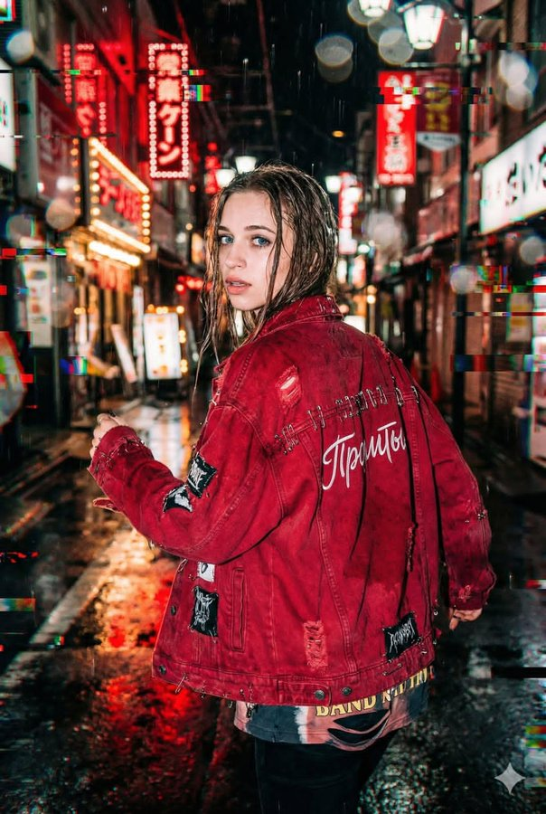

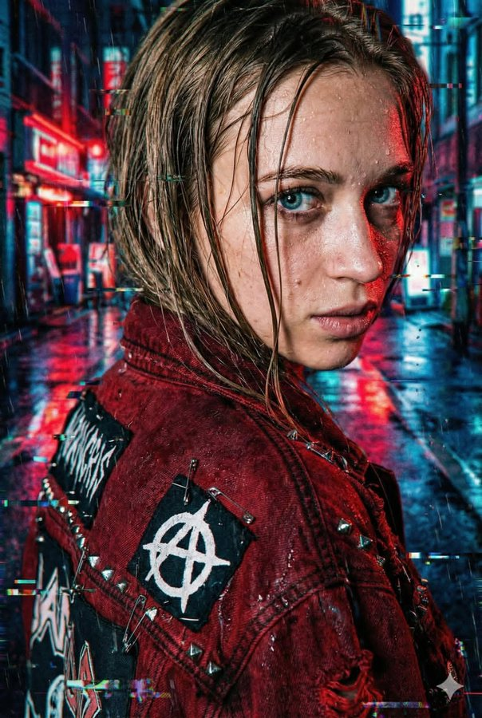

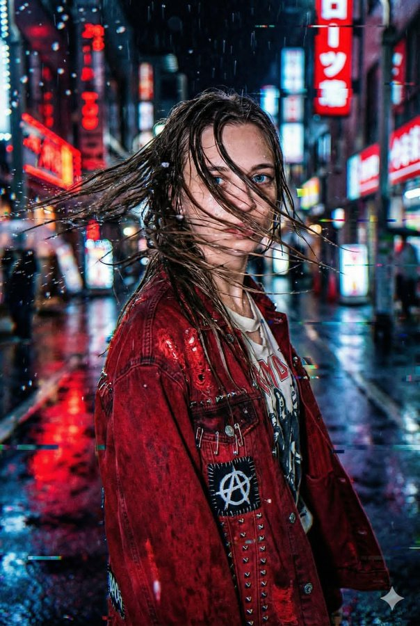

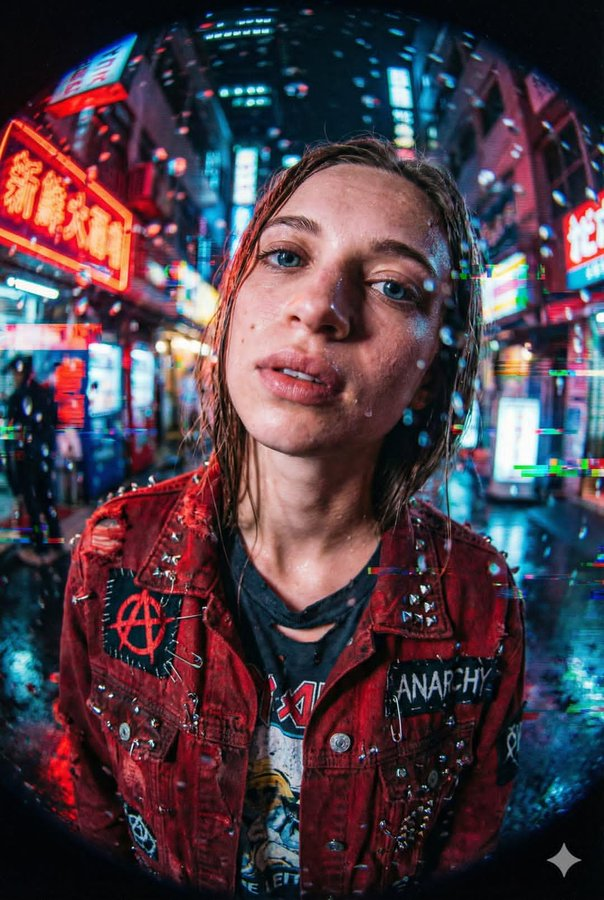

```
A raw, candid street-style shot of reference running through a rain-soaked Neo-Tokyo alleyway, glancing over her shoulder. Use uploaded selfie as ONLY face reference. She is wearing an oversized "Crimson Red" distressed denim jacket with safety pins and patches. Underneath, a torn band tee. Raindrops on the camera lens create natural distortion. The background is blurred red neon signs reflecting on wet asphalt. The image is heavily processed and glitch artifacts. Style: Flash photography, high contrast, adrenaline rush.
```

```
一张原始、抓拍的街头风格照片，参考人物奔跑在被雨水浸透的新东京小巷中，回头一瞥。仅使用上传的自拍照作为面部参考。她身穿一件“深红色”的做旧 oversized 牛仔夹克，上面缀有安全别针和补丁，内搭一件破洞乐队T恤。雨滴落在镜头上形成自然扭曲效果。背景是模糊的红色霓虹灯招牌，在湿漉漉的沥青路面上反射出光芒。画面经过重度处理，并带有故障艺术效果。风格：闪光灯摄影、高对比度、充满肾上腺素激增的动感氛围。
```

 [↑返回目录](#toc)

---
## <a id="">商业产品摄影</a> (<a href="https://x.com/mehvishs25/status/2017420332458774791" target="_blank" rel="noopener noreferrer">Meem</a>)

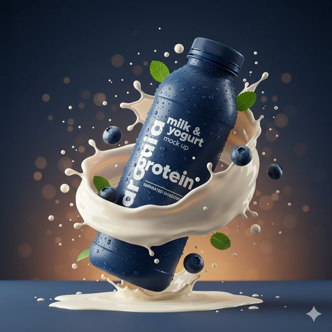

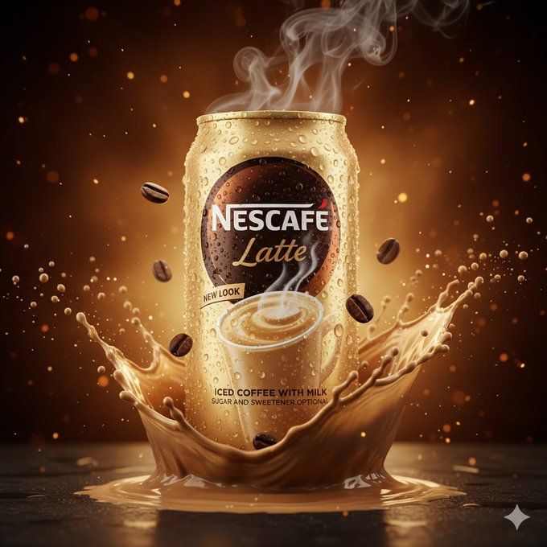

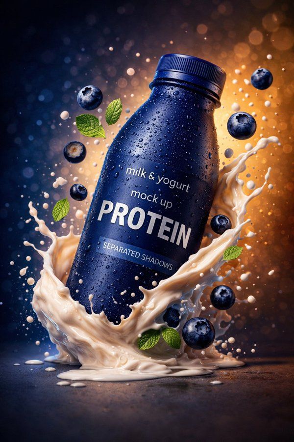

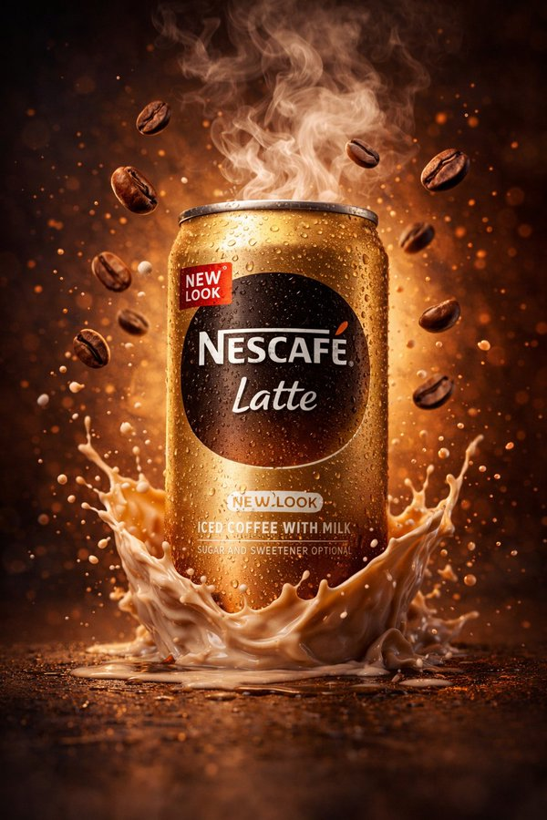

```
{
  "master_prompt": {
    "global_settings": {
      "resolution": "8K ultra-high-definition",
      "aspect_ratio": "3:4 vertical",
      "style": "hyper-realistic AI-edited commercial product photography",
      "sharpness": "extreme clarity, micro-detail visibility",
      "lighting_quality": "cinematic studio lighting with controlled highlights and shadows",
      "motion_freeze": "high-speed capture, frozen splashes and particles",
      "noise": "none",
      "artifacts": "none"
    },

"module_1_image_1_style": {
      "subject": {
        "type": "plastic protein drink bottle",
        "color": "deep matte blue",
        "surface_details": "condensation droplets across entire bottle",
        "label_text_visible": [
          "milk & yogurt",
          "mock up",
          "protein",
          "SEPARATED SHADOWS"
        ]
      },
      "pose_and_orientation": {
        "position": "slightly tilted to the right",
        "angle": "three-quarter view",
        "motion_feel": "dynamic, leaning into splash"
      },
      "liquid_and_motion": {
        "liquid_color": "white and light beige milk mixture",
        "texture": "smooth, creamy, fluid",
        "motion": "swirling splash rising around bottle base and sides"
      },
      "floating_elements": {
        "blueberries": "whole and halved blueberries at different depths",
        "mint_leaves": "small green leaves with visible veins",
        "droplets": "milk droplets and spheres suspended mid-air"
      },
      "background": {
        "color_gradient": "dark blue to warm amber",
        "bokeh": "soft circular light particles scattered throughout"
      },
      "surface_and_reflection": {
        "base": "matte ground with light liquid pooling",
        "shadow_style": "soft separated shadow under bottle"
      }
    },
"module_2_image_2_style": {
      "subject": {
        "type": "metal coffee can",
        "color": "warm gold",
        "surface_details": "heavy condensation with visible droplets",
        "branding_text_visible": [
          "NESCAFÉ",
          "Latte",
          "NEW LOOK",
          "ICED COFFEE WITH MILK",
          "SUGAR AND SWEETENER OPTIONAL"
        ]
      },
      "pose_and_orientation": {
        "position": "upright, centered",
        "angle": "front-facing",
        "presence": "hero product stance"
      },
      "liquid_and_motion": {
        "liquid_color": "coffee and milk blend",
        "motion": "splash erupting from base",
        "droplet_behavior": "fine droplets scattered outward"
      },
      "floating_elements": {
        "coffee_beans": "whole roasted beans floating around can",
        "steam": "thick swirling steam rising upward",
        "embers": "tiny glowing particles in background"
      },
      "background": {
        "color_palette": "deep brown, amber, gold",
        "atmosphere": "warm, smoky, intense"
      },
      "surface_and_reflection": {
        "base": "wet surface with liquid splash crown",
        "reflection_quality": "subtle reflective highlights"
      }
    }
```

```
8K超高清分辨率，3:4垂直比例，风格为超现实主义的AI编辑商业产品摄影，具有极端清晰度和微细节可见性，采用电影工作室照明技术控制高光和阴影，高速捕捉冻结飞溅和颗粒，无噪点和无伪影。

第一张图像风格：
主体是一个塑料蛋白质饮料瓶，颜色为深哑光蓝，表面有整个瓶子上的凝结水滴，标签上可见的文字包括“牛奶和酸奶”、“模拟”、“蛋白质”、“分离的阴影”。瓶子的位置略向右倾斜，以三分之四的角度展示，呈现出动态的感觉，仿佛正在进入飞溅状态。液体是白色和浅米色的牛奶混合物，质地光滑、奶油状且流动。运动表现为在瓶子底部和侧面周围旋转飞溅。漂浮元素包括处于不同深度的整颗和半颗蓝莓，带有明显叶脉的小绿薄荷叶，以及悬浮在空中的牛奶液滴和球体。背景是从深蓝色到暖琥珀色的渐变，点缀着分散的柔和圆形光斑。底座是带有轻微液体积聚的哑光地面，瓶子下方有柔和分离的阴影。

第二张图像风格：
主体是一个金属咖啡罐，颜色为温暖金色，表面有明显的水珠，品牌文字包括“NESCAFÉ”、“拿铁”、“新外观”、“含牛奶的冰咖啡”、“糖和甜味剂可选”。罐子直立居中，正面朝前，展现出英雄产品的姿态。液体是咖啡和牛奶的混合物，运动表现为从基部爆发的飞溅，细小液滴向外散开。漂浮元素包括环绕罐子的整颗烤咖啡豆，浓密向上盘旋的蒸汽，以及背景中微小的发光粒子。背景色彩为深棕色、琥珀色和金色，营造出温暖、烟雾缭绕且强烈的氛围。底座是湿润表面带有液体飞溅形成的皇冠，反射质量呈现微妙的反光亮点。
```

 [↑返回目录](#toc)

---
## <a id="">街头时尚抓拍：粉彩阴天里的动感瞬间</a> (<a href="https://x.com/HustleXR/status/2017825388861473023" target="_blank" rel="noopener noreferrer">zayan</a>)

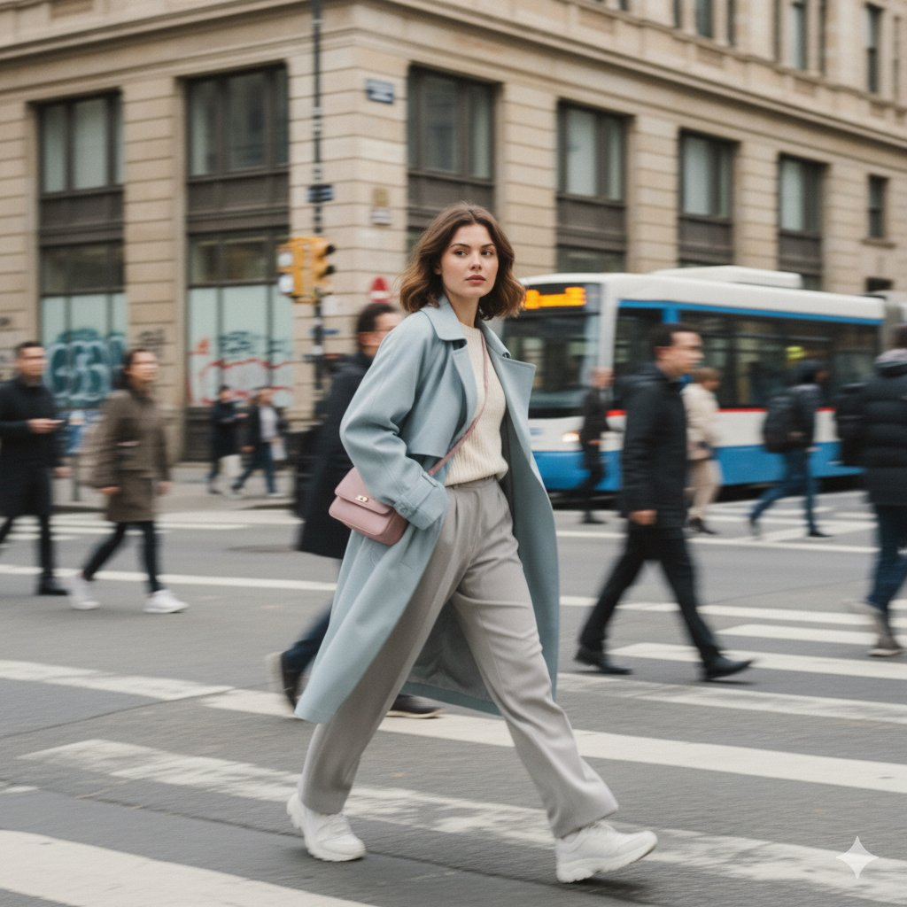

```
CINEMATIC STREET PHOTOGRAPHY, STYLISH YOUNG WOMAN IN MOTION, URBAN ENVIRONMENT, MOTION BLUR EFFECT. BLURRED PEDESTRIANS PASSING BY, SHALLOW DEPTH OF FIELD, NATURAL OVERCAST LIGHTING, SOFT PASTEL TONES, EDITORIAL FASHION PHOTOGRAPHY, CANDID MOMENT, DYNAMIC MOVEMENT, FILM AESTHETIC, MUTED COLORS
```

```
电影感街头摄影，时尚年轻女性在城市环境中动态行走，运动模糊效果，行人模糊掠过，浅景深，自然阴天光线，柔和粉彩色调，时尚杂志风格摄影，抓拍瞬间，动感十足，胶片美学，低饱和色彩。
```

 [↑返回目录](#toc)

---
## <a id="">雾林中的神秘女狐仙</a> (<a href="https://x.com/VoxcatAI/status/2017902550423662767" target="_blank" rel="noopener noreferrer">VoxCat</a>)

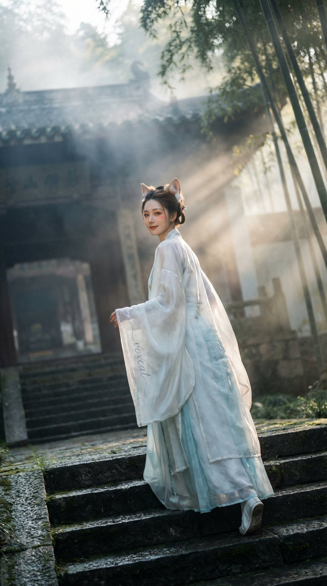

```
Subject: A celestial female fox spirit in high-end traditional Hanfu (layered translucent silk in moon-white and pale cyan).
Action: Walking through a misty bamboo forest at dawn, looking back with a subtle mysterious smile.
Location: Ancient mountain temple entrance, stone steps covered in morning dew, surrounding bamboo swaying in the early breeze.
Composition & Camera: Medium-full shot, Dutch angle, shallow depth of field, 50mm lens effect, focus on her expressive eyes and the texture of her silk robes.
Lighting: Soft morning golden hour sunlight filtering through thick fog (Tyndall effect), ethereal backlight creating a soft glow on her porcelain skin.
Style & Medium: Cinematic film aesthetic, inspired by King Hu's "A Touch of Zen", traditional Chinese ink-wash palette mixed with hyper-realistic textures.
Materials & Surface: PBR silk material with pearlescent sheen, wet bluestone texture, translucent skin with visible fine pores and subtle peach fuzz.
Quality & Rendering: 8K, cinematic grain, high dynamic range, intricate embroidery details, micro-droplets of dew on her hair.
Makeup: NBP Pure Desire style, porcelain glass skin, tipsy peach blush under eyes, glassy gradient lips, faint cinnabar red accents on eyelids.
Constraints: No modern elements, maintain historical wuxia film atmosphere, anatomically correct fox ears peeking from black hair.
```

```
主体：一位天界女狐仙，身着高端传统汉服（多层半透明丝绸，月白色与淡青色相间）。  
动作：在黎明时分穿行于雾气缭绕的竹林中，回眸露出一抹微妙而神秘的微笑。  
场景：古寺山门前，石阶覆满晨露，四周翠竹在晨风中轻轻摇曳。  
构图与镜头：中近景，倾斜构图（荷兰角），浅景深，模拟50mm镜头效果，聚焦于她富有表现力的双眸与丝绸衣袍的质感。  
光影：柔和的清晨黄金时刻阳光穿透浓雾（丁达尔效应），空灵的逆光在她瓷白肌肤上营造出柔光效果。  
风格与媒介：电影级影像美学，灵感源自胡金铨《侠女》，融合中国传统水墨色调与超写实质感。  
材质与表面：基于物理渲染（PBR）的丝绸材质，带有珠光光泽；湿润的青石板纹理；半透明肌肤可见细腻毛孔与淡淡绒毛。  
画质与渲染：8K分辨率，电影颗粒感，高动态范围，精细刺绣细节，发丝上凝结微小露珠。  
妆容：NBP Pure Desire风格，瓷釉玻璃肌，眼下微醺桃红腮红，镜面渐变唇色，眼睑点缀淡朱砂红。  
限制：不得出现任何现代元素，保持历史武侠电影氛围，黑色秀发间自然露出解剖结构准确的狐狸耳朵。
```

 [↑返回目录](#toc)

---
## <a id="">日式夏日肖像双联画布局</a> (<a href="https://x.com/BubbleBrain/status/2017831051876311092" target="_blank" rel="noopener noreferrer">BubbleBrain</a>)

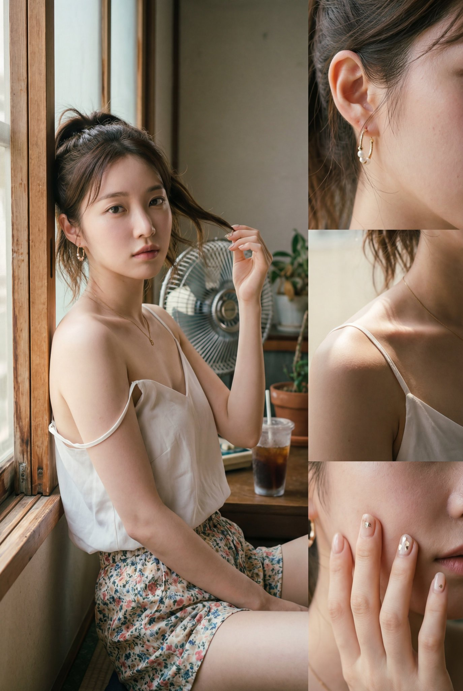

```
Japanese summer portrait diptych layout, left panel 60% featuring portrait, right panel 40% featuring 3 vertical detail close-ups, unified Ricoh GR3 Negative Film aesthetic throughout.
【LEFT PANEL - PORTRAIT】
Beautiful Korean female idol in Japanese summer aesthetic, early 20s, naturally sensual yet fresh. Shot on Ricoh GR III with Negative Film mode.
Face: Delicate V-shaped face with high cheekbones, large almond eyes with lazy dreamy expression, barely-there makeup preserving natural skin, soft rose lips slightly parted, natural flush on cheeks like sun-kissed warmth. Eyes gazing toward camera with relaxed intimacy or looking away pensively.
Hair: Natural black or dark brown, casually tied in messy high ponytail with baby hairs framing face, or loose waves with some strands clinging to neck from summer heat.
Clothing: White or cream thin-strap camisole, loose fit showing collarbones and shoulder lines, strap slipping slightly off one shoulder. Paired with high-waisted floral shorts. Natural skin exposure — collarbones, shoulders, arms, legs. Visible delicate gold earrings, thin collarbone necklace, simple nail art.
Pose: Naturally sensual summer laziness — leaning against wooden window frame, one hand touching hair, weight shifted to one hip creating subtle S-curve. Body language: relaxed, effortless, intimate like being with someone familiar.
Environment: Japanese-style old apartment with wooden window frames, summer afternoon light streaming in. Possible elements: electric fan, cold drink, potted plants suggesting cicada-humming heat.
Lighting: Soft directional natural light from window, 2.5:1 ratio, gentle shadows, natural catchlight in eyes. Some areas slightly overexposed in GR3 style.
【RIGHT PANEL - DETAIL CLOSE-UPS】
Three vertical stacked detail shots, same GR3 Negative Film color science:
TOP: Earring close-up — Side profile showing ear, delicate gold/pearl stud or small hoop earring, wisps of hair, visible earlobe skin texture, partial cheek visible.
MIDDLE: Shoulder/clothing detail — Collarbone area, thin camisole strap (possibly slipping), bare shoulder skin catching light, thin necklace resting on collarbone, fabric texture visible.
BOTTOM: Nail/hand close-up — Fingers with minimal Japanese nail art (nude/soft pink/shell flakes), hand naturally posed touching face, delicate skin texture.
【GR3 NEGATIVE FILM CHARACTERISTICS - APPLY TO ALL】
- Low contrast (0.75), soft tonal transitions
- Highlights: warm cream/yellow bias, soft rolloff allowing slight overexposure
- Shadows: cyan-green tint, lifted blacks (no pure black), transparent
- Skin tones: cool pink bias but healthy looking
- Saturation: medium-low, muted but not desaturated
- Fine film grain (0.2 intensity), most visible in midtones
- Overall dreamy, nostalgic Japanese summer feeling
Aspect ratio 16:9 horizontal diptych layout, photorealistic, editorial summer lookbook quality.
```

```
日式夏日肖像双联画布局，左画面占60%为主人公肖像，右画面占40%为三张纵向细节特写，整体统一采用理光GR3胶片负片风格。  

【左画面 - 肖像】  
一位符合日式夏日美学的韩国女偶像，二十岁出头，自然性感又清新。使用理光GR III相机搭配负片模式拍摄。  
面部：精致V型脸，高颧骨，大而杏仁状的眼睛带着慵懒梦幻的神情；妆容极淡，保留肌肤天然质感；柔玫瑰色嘴唇微启，脸颊泛着如被阳光亲吻般的自然红晕；眼神或放松亲密地望向镜头，或若有所思地望向别处。  
发型：自然黑或深棕色，随意扎成凌乱高马尾，额前碎发修饰脸型；或披散微卷长发，因夏日炎热有几缕发丝贴在颈后。  
服装：白色或米色细肩带背心，宽松剪裁露出锁骨与肩线，一侧肩带微微滑落；下搭高腰碎花短裤。自然展露肌肤——锁骨、肩膀、手臂、双腿。佩戴精致小巧的金色耳饰、细链锁骨项链，指甲带有简约美甲设计。  
姿势：展现夏日慵懒的自然性感——倚靠木质窗框，一手轻抚头发，重心落在一侧臀部形成微妙S曲线；肢体语言松弛、毫不费力，如同与熟人相处般亲密自在。  
环境：日式老式公寓，木质窗框，夏日午后阳光倾泻而入；可包含电风扇、冷饮、盆栽等元素，营造蝉鸣暑热氛围。  
光线：柔和的定向自然光从窗户射入，光比约2.5:1，阴影柔和，眼中带有自然眼神光；部分区域略有过曝，体现GR3风格。  

【右画面 - 细节特写】  
三张纵向堆叠的细节特写，均采用相同的GR3负片色彩科学：  
顶部：耳饰特写——侧脸视角，展示耳朵、精致的金色/珍珠耳钉或小圆环耳饰，发丝飘散，可见耳垂肌肤纹理及部分脸颊。  
中部：肩部/服装细节——锁骨区域，细肩带（可能微滑），裸露肩部肌肤捕捉光线，细项链置于锁骨之上，可见面料纹理。  
底部：指甲/手部特写——手指带有极简日式美甲（裸色/柔粉/贝壳亮片），手自然轻触脸颊，展现细腻肌肤质感。  

【GR3负片风格特征 - 全图适用】  
- 低对比度（0.75），色调过渡柔和  
- 高光：偏暖奶油/黄色调，柔和滚降，允许轻微过曝  
- 暗部：青绿色调，黑位提亮（无纯黑），通透感强  
- 肤色：偏冷粉调但健康自然  
- 饱和度：中低，柔和但不灰暗  
- 细腻胶片颗粒（强度0.2），主要出现在中间调  
- 整体呈现梦幻、怀旧的日式夏日氛围  

画面比例为16:9横向双联画布局，写实风格，具有杂志夏季画册般的编辑级质感。
```

 [↑返回目录](#toc)

---
## <a id="">运动员模糊的轮廓</a> (<a href="https://x.com/azed_ai/status/2017915869838659980" target="_blank" rel="noopener noreferrer">Amira Zairi</a>)

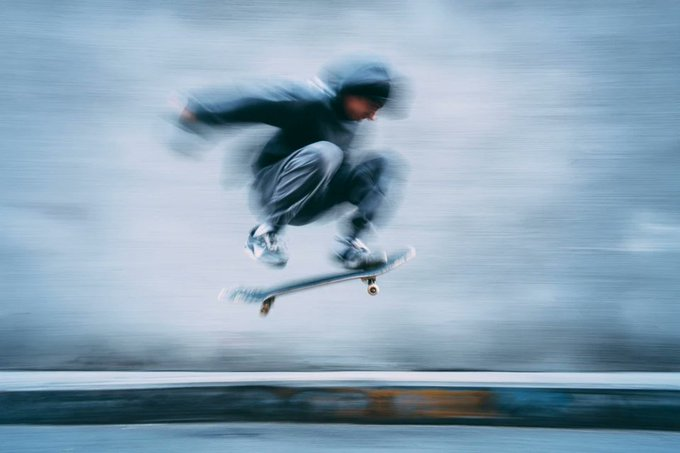

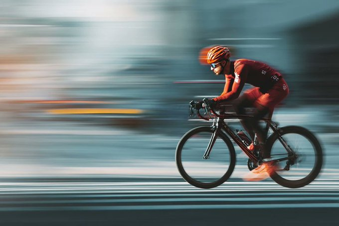

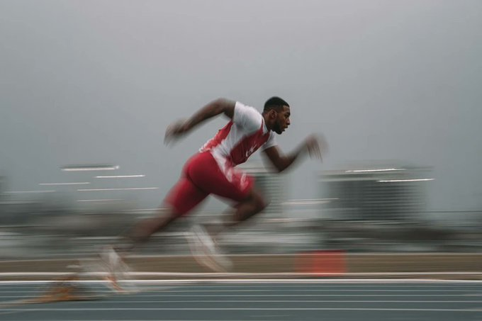

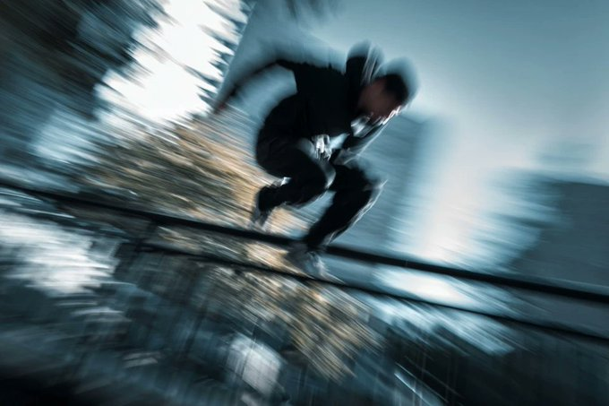

```
A blurred silhouette of a [subject] in motion, wearing a [color] sports kit, captured with a slow shutter for dynamic motion blur. High contrast, minimalist composition with no logos or text. Neutral background, abstract, and energetic. Editorial style reminiscent of [Brand] advertising or street photography.

```

```
A blurred silhouette of a skateboarder in motion, wearing a charcoal gray sports kit, captured with a slow shutter for dynamic motion blur. High contrast, minimalist composition with no logos or text. Neutral background, abstract, and energetic. Editorial style reminiscent of Adidas advertising or street photography.
```

```
A blurred silhouette of a cyclist in motion, wearing a deep red sports kit, captured with a slow shutter for dynamic motion blur. High contrast, minimalist composition with no logos or text. Neutral background, abstract, and energetic. Editorial style reminiscent of Rapha advertising or street photography.
```

```
A blurred silhouette of a sprinter in motion, wearing a crimson sports kit, captured with a slow shutter for dynamic motion blur. High contrast, minimalist composition with no logos or text. Neutral background, abstract, and energetic. Editorial style reminiscent of Reebok advertising or street photography.
```

```
A blurred silhouette of a parkour athlete in motion, wearing a matte black sports kit, captured with a slow shutter for dynamic motion blur. High contrast, minimalist composition with no logos or text. Neutral background, abstract, and energetic. Editorial style reminiscent of Asics advertising or street photography.
```

 [↑返回目录](#toc)

---
## <a id="">侧影中的电光蓝情绪肖像</a> (<a href="https://x.com/john_my07/status/2017593033353826614" target="_blank" rel="noopener noreferrer">Johnn</a>)

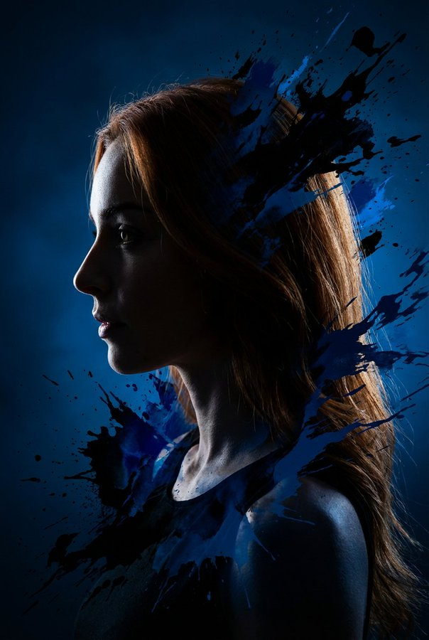

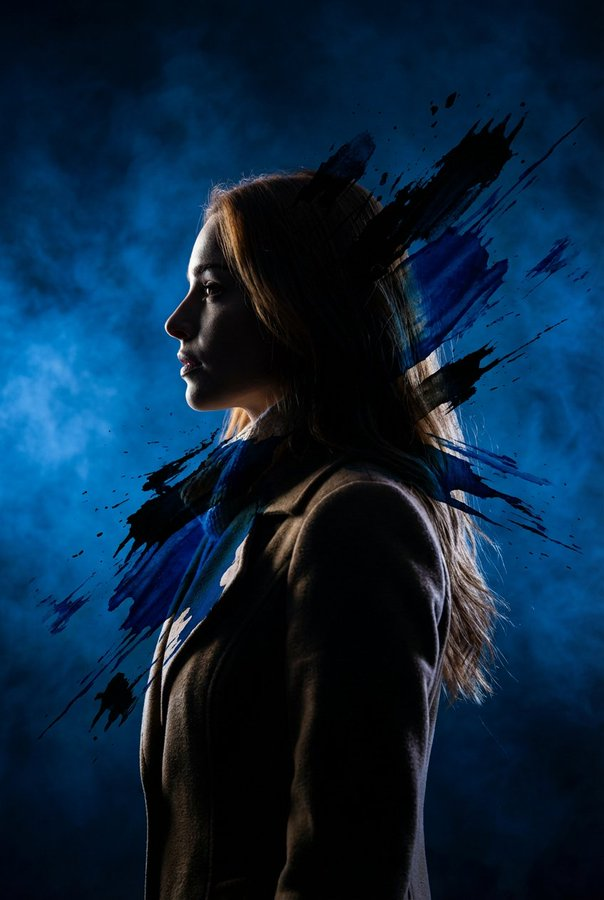

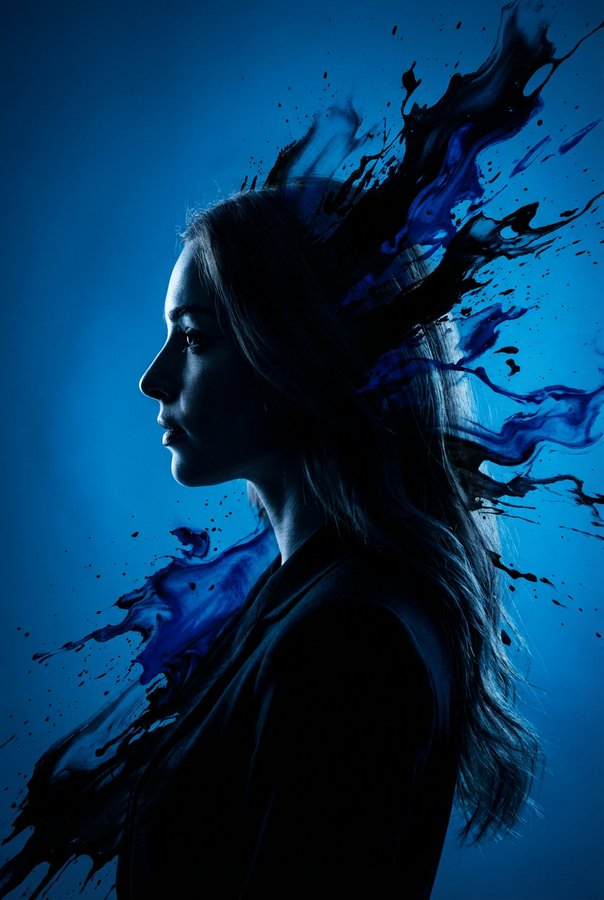

```
{
  "aspect_ratio": "9:16",
  "visual_style": "cinematic, high-drama portrait",
  "subject": {
    "gender": "female",
    "identity": "retain facial likeness from the provided reference image",
    "pose": "left-facing side profile",
    "silhouette": "partially obscured, shadow-dominant form"
  },
  "lighting": {
    "setup": "intense directional key light",
    "contrast_level": "ultra-high",
    "highlight_behavior": "crisp edge lighting with deep shadow falloff"
  },
  "background": {
    "tone": "electric blue",
    "atmosphere": "moody, powerful, cinematic depth"
  },
  "art_effects": {
    "paint_burst": {
      "palette": ["jet black", "deep sapphire blue"],
      "movement": "energy radiating outward from the head and shoulders",
      "expression": "bold, emotional, high-impact motion"
    }
  },
  "image_quality": {
    "clarity": "high-definition",
    "finish": "sleek, polished, cinematic photo realism"
  }
}
```

 [↑返回目录](#toc)

---
## <a id="">社交媒体时代的孤独行者</a> (<a href="https://x.com/AIwithkhan/status/2017877325455757630" target="_blank" rel="noopener noreferrer">Smiling Khan</a>)

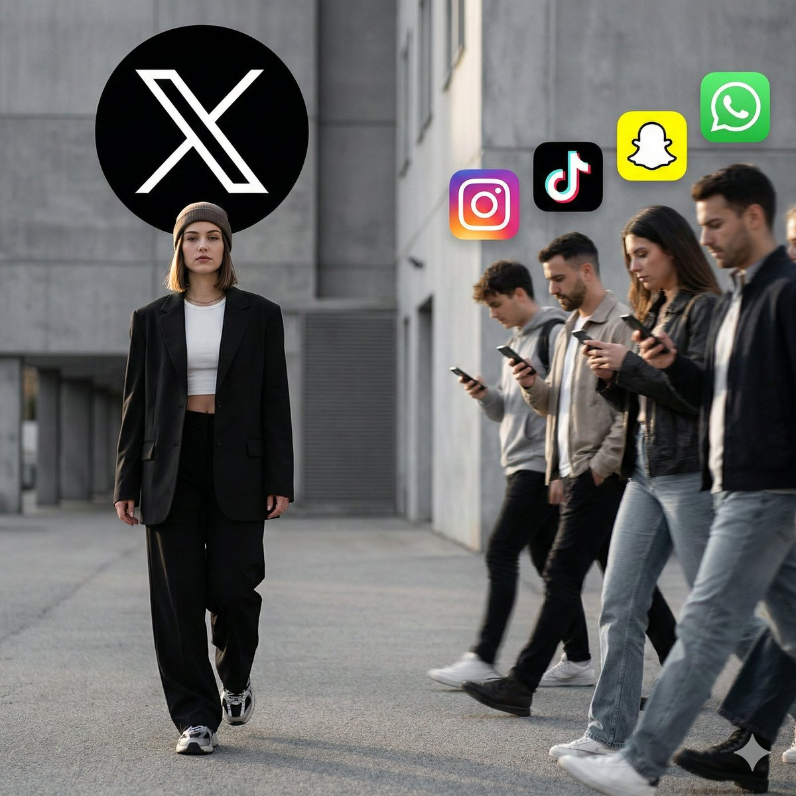

```
Gain and Grow massively 

This is your moment on 𝕏

Prompt  

A cinematic urban street scene symbolizing modern social media culture. A confident young woman walks alone toward the camera, centered in the frame, wearing an oversized black blazer, loose black trousers, a white cropped top, sneakers, and a beanie. Her expression is calm, bold, and detached. Behind her, a group of young adults walk in the opposite direction, all looking down at their smartphones, completely absorbed. Floating above each person are glowing social media app icons — Instagram, TikTok, Snapchat, WhatsApp — while above the main woman is a large minimalist “X” logo, dark and dominant. Modern concrete architecture background, neutral grey tones, soft natural daylight, shallow depth of field, cinematic composition, high realism, symbolic storytelling, sharp focus, editorial photography style, 16:9 aspect ratio.
```

```
大幅增长与成长  

这是你在𝕏的高光时刻  

提示词：  

一幅象征现代社交媒体文化的电影感城市街景。一位自信的年轻女性独自朝镜头走来，位于画面中央，身穿 oversized 黑色西装外套、宽松黑色长裤、白色短款上衣、运动鞋和一顶针织帽。她的表情冷静、大胆而疏离。她身后有一群年轻人朝相反方向行走，全都低头专注地看着自己的智能手机。每个人头顶上方都漂浮着发光的社交媒体应用图标——Instagram、TikTok、Snapchat、WhatsApp，而这位主角女性头顶上方则悬浮着一个巨大、极简风格的深色“X”标志，醒目且具有统治感。背景为现代混凝土建筑，整体采用中性灰色调，柔和自然日光照明，浅景深，电影级构图，高度写实，富有象征意义的叙事风格，焦点锐利，具有杂志编辑摄影风格，16:9 画幅比例。
```

 [↑返回目录](#toc)

---
## <a id="">家居方案——效果图呈现</a> (<a href="https://x.com/craftian_keskin/status/2017642166122909922" target="_blank" rel="noopener noreferrer">Keskin</a>)

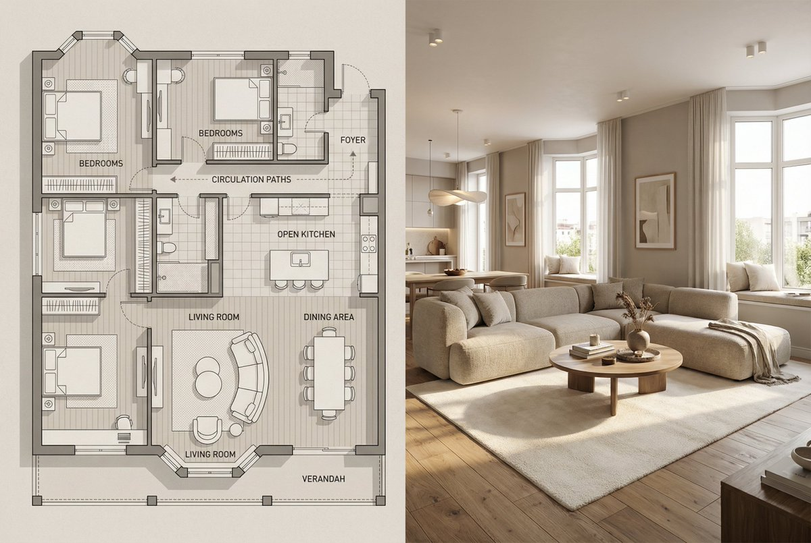

```
Split composition image, left and right halves clearly divided.

Left Half:
Highly detailed architectural floor plan illustration in a modern minimalist style, matching the attached reference. Top-down view residential layout with labeled spaces including living room, dining area, open kitchen, bedrooms, foyer, verandah, bay windows, and circulation paths. Neutral beige and warm gray color palette, clean linework, soft shadows, subtle textures, interior-design presentation style. Editorial architectural visualization, flat-lay blueprint aesthetic with furniture placement visible.

Right Half:
Ultra-realistic interior photograph of the living room shown in the left-side floor plan. The living room is fully furnished and spatially accurate to the plan: curved sofa arrangement, central coffee table, soft area rug, warm wooden flooring, neutral walls, natural light entering through large windows. Modern, cozy, contemporary interior design with earthy tones, soft lighting, realistic materials, and lived-in details.

The right half should feel like a real photograph taken inside the house, while the left half remains a clean architectural drawing. Both halves align visually, clearly showing concept vs reality.

Style & Mood

Architectural visualization meets real interior photography
Modern, warm, elegant residential design
Clean, professional, design-studio presentation
Concept-to-execution comparison

Lighting & Color

Left: Flat, even lighting, neutral tones
Right: Natural daylight, soft shadows, warm highlights
Consistent color harmony between plan and room

Camera & Technical Details

Left: Top-down orthographic view
Right: Interior wide-angle lens, eye-level perspective
High resolution, sharp details, realistic textures

Negative Prompt

Cartoon style, low detail, cluttered interior, mismatched layout, unrealistic proportions, harsh lighting, exaggerated colors, text overlays, watermarks
```

```
左右分屏构图，左右两部分清晰划分。

左半部分：  
现代极简风格的高细节建筑平面图，与所附参考图一致。俯视住宅布局，标注有客厅、用餐区、开放式厨房、卧室、门厅、阳台、飘窗及动线路径。采用中性米色与暖灰色调，线条干净，阴影柔和，纹理细腻，呈现室内设计展示风格。具有编辑级建筑可视化效果，平铺蓝图美学，并清晰标示家具布置。

右半部分：  
与左侧平面图中客厅完全对应、空间精准的超写实室内实景照片。客厅已完整布置：弧形沙发组合、中央茶几、柔软地毯、温暖木地板、中性色调墙面，自然光透过大窗洒入。整体为现代舒适、当代风格的室内设计，采用大地色系、柔光照明、真实材质，并包含生活化的细节。

右半部分应如在屋内拍摄的真实照片，左半部分则保持简洁的建筑图纸风格。两部分在视觉上对齐，清晰展现概念与现实的对比。

风格与氛围：  
建筑可视化与真实室内摄影结合  
现代、温暖、优雅的住宅设计  
干净、专业、设计工作室级别的呈现  
概念到落地的对比展示

光影与色彩：  
左：均匀平光，中性色调  
右：自然日光，柔和阴影，温暖高光  
平面图与实景之间保持一致的色彩协调

镜头与技术细节：  
左：俯视正交视角  
右：室内广角镜头，人眼水平视角  
高分辨率，细节锐利，材质逼真

负面提示：  
卡通风格、低细节、杂乱室内、布局不符、比例失真、强烈硬光、夸张色彩、文字叠加、水印
```

 [↑返回目录](#toc)

---
## <a id="">概念会议桌的极简俯拍</a> (<a href="https://x.com/Arminn_Ai/status/2017641664228085770" target="_blank" rel="noopener noreferrer">ΛRMIN | AI</a>)

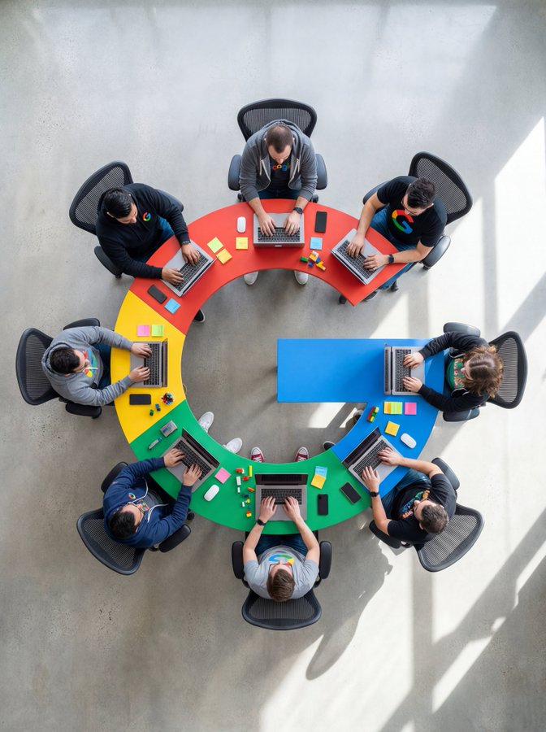

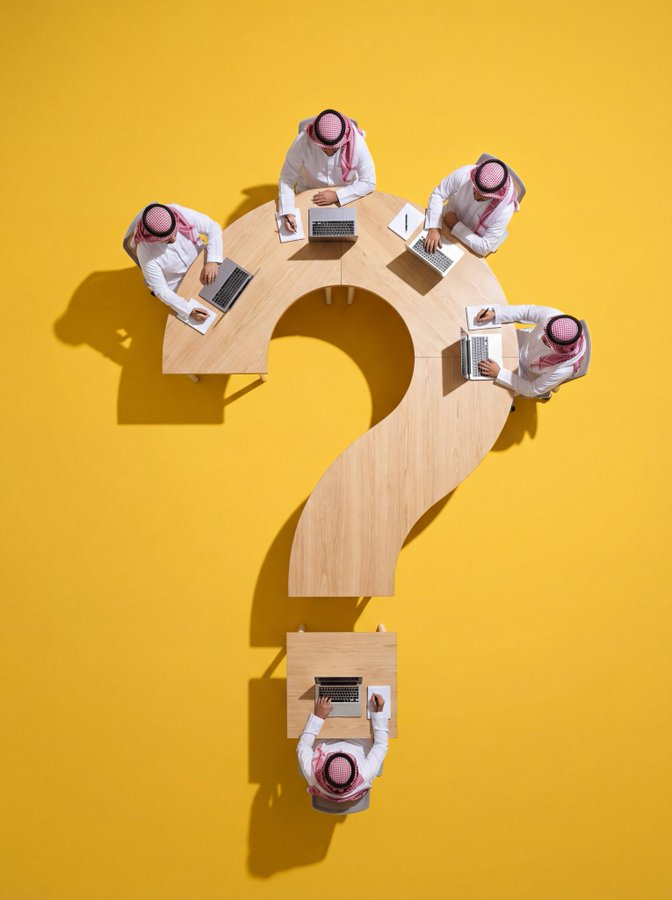


```
When the table becomes the concept.

With Nano Banana Pro on @higgsfield_ai

- Prompt 
Ultra-wide-angle hyper-realistic top-down flat lay photography. The central focus is a custom physical conference table meticulously shaped like [SHAPE/NUMBER/SYMBOL].

The table features [MATERIAL/TEXTURE/COLOR] and placed on a [FLOOR COLOR] floor, creating significant negative space around it for a clean, minimalist composition. A group of [NUMBER] real people are sitting around the edges of this [SHAPE]-shaped table. [POSITIONING: e.g., 3 on each side, 1 top/bottom]

Actions: [DESCRIBE PEOPLE'S ACTIONS, e.g., working on laptops, drinking coffee].
Lighting & Quality: Professional studio lighting with crisp, distinct drop shadows that define the [SHAPE] silhouette on the floor. 8k resolution, sharp focus, cinematic commercial aesthetic.
```

```
当桌子成为一种概念。

使用 Nano Banana Pro 在 @higgsfield_ai 上创作

超广角、超写实的俯拍平面摄影。画面中心是一张定制的实体会议桌，其形状精确地呈现为[形状/数字/符号]。  
桌面采用[材质/纹理/颜色]，置于[地板颜色]的地面上，周围留有大量负空间，营造出干净、极简的构图。  
[人数]位真实人物围坐在该[形状]桌的边缘。[位置分布，例如：每边3人，顶部和底部各1人]  
人物动作：[描述人物动作，例如：正在使用笔记本电脑、喝咖啡]。  
灯光与画质：专业影棚灯光，投射出清晰分明的投影，在地面上勾勒出[形状]的轮廓。8K分辨率，焦点锐利，具有电影级商业美学风格。
```

 [↑返回目录](#toc)

---
## <a id="">超现实彩色盒中的时尚反重力瞬间</a> (<a href="https://x.com/Samann_ai/status/2017598696678895882" target="_blank" rel="noopener noreferrer">Saman | AI</a>)

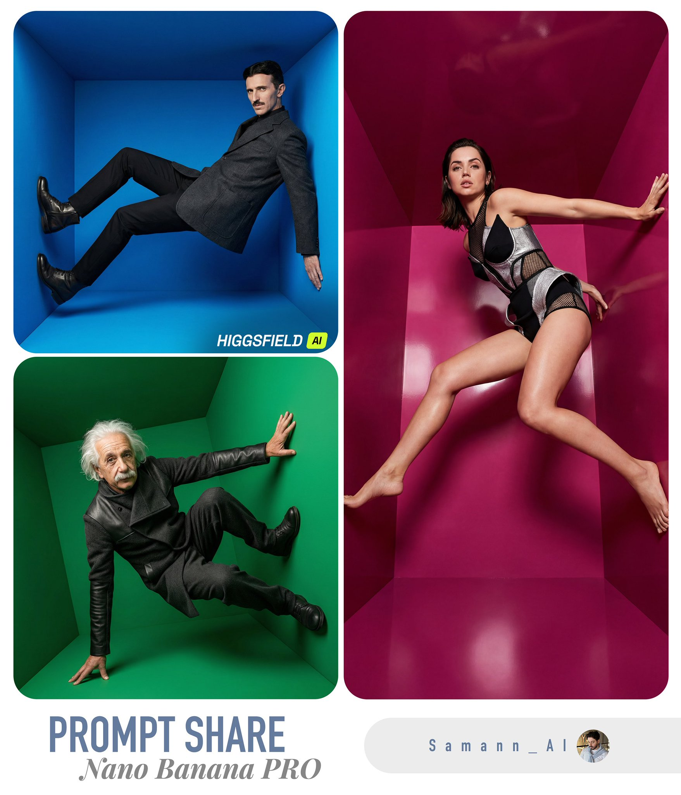

```
[INPUT IMAGE: USER_PHOTO] Use the person in the input image as the ONLY subject. Preserve their identity and facial features clearly.

Create a hyper-realistic high-fashion editorial photo inside a surreal 3D geometric “color box” room (a hollow cube / tilted cube set). Each render MUST randomly choose:
1) a bold single-color box (monochrome environment, vivid and saturated),
2) a dynamic “cool” fashion pose (gravity-defying or extreme stretch / leap / sideways bracing against the walls),
3) a dramatic camera angle (wide-angle 24–35mm equivalent, tilted horizon, strong perspective).

The subject appears full-body and sharp, wearing an avant-garde fashion styling that feels modern and editorial (clean silhouette, stylish layering, premium fabric texture). Keep clothing tasteful and fashion-forward. The subject’s pose should feel athletic, stylish, and unusual—like a magazine campaign shot.

Lighting: studio quality, crisp and cinematic; strong key light with controlled soft shadows, subtle rim light; realistic reflections and bounce light from the colored walls. Ultra-detailed skin texture, natural pores, realistic fabric weave, clean edges, high dynamic range. 
Composition: subject centered with plenty of negative space and strong geometric lines; the box perspective frames the subject. 
Color: the box color is a SINGLE bold color and MUST be different each run (random vivid hue). The subject’s outfit contrasts well with the box color.

Output: hyper-real, photorealistic, 8k detail, editorial campaign quality, sharp focus on subject, no motion blur, no distortion of face, natural proportions.
```

```
[输入图像：用户照片] 仅使用输入图像中的人物作为唯一主体，清晰保留其身份特征与面部细节。

创作一张超写实的高定时装大片，场景设定在一个超现实的三维几何“彩色盒子”房间内（空心立方体或倾斜立方体布景）。每次生成必须随机选择以下元素：  
1）一个鲜明的单色盒子（单色环境，色彩鲜艳饱和）；  
2）一个动态“酷感”时尚姿势（反重力、大幅度伸展、跳跃，或侧身倚靠墙面等非常规姿态）；  
3）一个戏剧性的拍摄角度（等效24–35mm广角镜头，地平线倾斜，强烈透视感）。

人物需呈现全身且清晰锐利，穿着前卫、现代、具有杂志大片感的时装造型（轮廓简洁、层次考究、面料质感高级）。服装风格需得体且引领潮流。姿势应兼具运动感、时尚感与独特性，如同高端时尚广告大片。

灯光：影棚级画质，清晰且富有电影感；主光强烈，辅以受控的柔和阴影，搭配微妙的轮廓光；墙面色彩需产生真实反射与反弹光。皮肤纹理极度细腻，毛孔自然，织物纹理真实，边缘干净，高动态范围。

构图：人物居中，留有大量负空间，并强调强烈的几何线条；盒子的透视结构需有效框住主体。

色彩：盒子必须为单一鲜明色调，且每次生成时随机选用不同鲜艳色相；人物服装需与盒子颜色形成鲜明对比。

输出要求：超写实、逼真摄影级效果、8K细节、杂志大片品质、主体焦点锐利、无动态模糊、面部无畸变、比例自然。
```

 [↑返回目录](#toc)

---
## <a id="">沉思女子的90年代复古空间</a> (<a href="https://x.com/lexx_aura/status/2018223863532790007" target="_blank" rel="noopener noreferrer">Lex</a>)

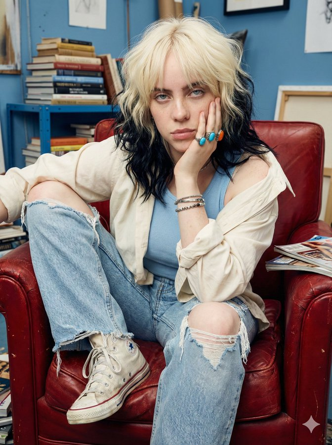

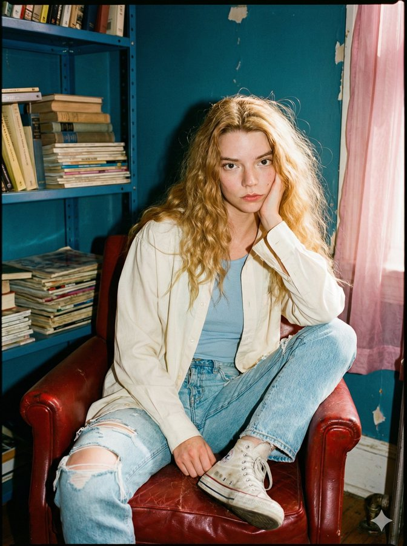

```
{
  "image_generation_prompt": {
    "subject_details": {
      "appearance": "Young woman with long, voluminous, golden-blonde wavy hair with visible flyaways and natural frizz. Pale skin tone featuring distinct, unretouched texture (pores, faint freckles, peach fuzz). Expression is pensive and neutral. Intense, sharp direct eye contact with clear catchlights.",
      "pose": "Candid, unposed seating on a red armchair. One leg bent with knee to chest, other leg extended downward. Leaning forward, right elbow on knee, hand squishing the cheek slightly. Left arm draping casually over the raised leg."
    },
    "outfit_and_attire": {
      "upper_body": "Fitted light blue ribbed tank top showing fabric weave, under an oversized cream button-down shirt. Shirt is unbuttoned, slipping off shoulders, with visible wrinkles and stitching details.",
      "lower_body": "Light wash blue denim jeans, heavy distressing, large authentic rips at knees, frayed hems with loose threads.",
      "footwear": "Dirty white high-top canvas sneakers (Converse style), scuffed rubber toes, unevenly tied laces.",
      "accessories": "Stacked chunky rings with turquoise and amber stones, colorful uneven beaded bracelets (right wrist), thin silver chain (left wrist), delicate necklace caught in light."
    },
    "environment_and_setting": {
      "furniture": "Vintage red leather club armchair, cracked leather texture, dust in crevices, sunken cushion indicative of weight.",
      "props": "Cluttered interior. Weathered blue metal shelving unit to the left piled with dog-eared books and glossy magazines. Scattered papers on the chair arm. Authentic room mess.",
      "background": "Deep teal-blue walls with peeling paint or texture. Out-of-focus art print. Translucent pink curtain to the right catching ambient light.",
      "floor": "Dark wood floorboards, scuffed, with small debris/dust particles visible in the light."
    },
    "technical_specifications": {
      "camera_gear": "Shot on 35mm film, Kodak Portra 400, Leica M6 with 35mm Summilux lens.",
      "lighting": "Mix of natural window light and direct camera flash. Hard shadows behind the subject, specular highlights on the forehead and nose.",
      "style": "Raw street photography, 90s editorial, flash photography, unpolished, authentic amateur aesthetic.",
      "post_processing": "Film grain, slight chromatic aberration, high contrast, vivid saturation, slight vignette, RAW photo file."
    }
  }
}
```

```
一位年轻女子坐在红色扶手椅上，长而蓬松的金色波浪发带有明显的飞散发丝和自然毛躁。肤色苍白，保留未修饰的肌肤质感（可见毛孔、淡淡雀斑和细小绒毛）。表情沉思而中性，目光锐利直视镜头，眼中清晰可见高光点。

她姿态自然随意：一条腿弯曲，膝盖抵住胸口，另一条腿自然垂下；身体前倾，右肘搭在膝盖上，手轻压脸颊；左臂随意搭在抬起的腿上。

上身穿一件贴身浅蓝色罗纹背心，能看清织物纹理，外搭一件 oversized 米色纽扣衬衫，衬衫敞开滑落肩头，布料褶皱与缝线细节清晰可见。下身为浅色水洗牛仔裤，膝盖处有大面积真实破洞，裤脚磨损起边，露出松散线头。脚踩一双脏旧的白色高帮帆布鞋（类似 Converse 款式），橡胶鞋头有刮痕，鞋带系得不整齐。

配饰包括：多枚粗犷戒指镶嵌绿松石与琥珀，右手腕戴色彩杂乱且大小不一的串珠手链，左手腕佩戴细银链，颈间一条精致项链在光线中微微闪烁。

环境为一间凌乱室内：她所坐的是复古红色皮革俱乐部扶手椅，皮革开裂，缝隙积灰，坐垫因体重下陷。左侧是一个老旧的蓝色金属置物架，堆满卷角书籍与光面杂志；扶手椅扶手上散落着纸张，整体呈现真实的生活杂乱感。背景墙为深青蓝色，油漆剥落或有肌理感，后方有一幅虚焦的艺术印刷画，右侧透光的粉色薄纱帘捕捉到环境光。地板为深色木板，有划痕，光线中可见微小灰尘与碎屑。

技术细节：使用 35mm 胶片拍摄，Kodak Portra 400 胶卷，Leica M6 相机搭配 35mm Summilux 镜头。混合自然窗光与相机直闪，人物背后形成硬阴影，额头与鼻梁有强烈高光。风格为粗粝街头摄影、90 年代杂志编辑风、闪光灯摄影，呈现未经修饰的真实业余美学。后期保留胶片颗粒、轻微色差、高对比度、鲜艳饱和度，并带有轻微暗角，输出为 RAW 格式照片。
```

 [↑返回目录](#toc)

---
## <a id="">龙珠Z Q版角色插画</a> (<a href="https://x.com/Cydiar404/status/1999834906906738854" target="_blank" rel="noopener noreferrer">𝗖𝘆𝗱𝗶𝗮𝗿</a>)


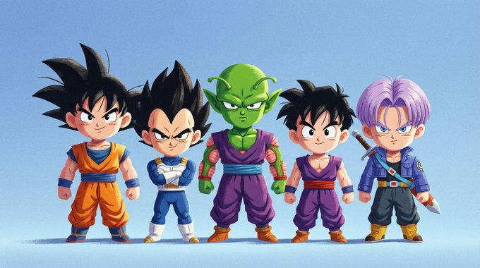

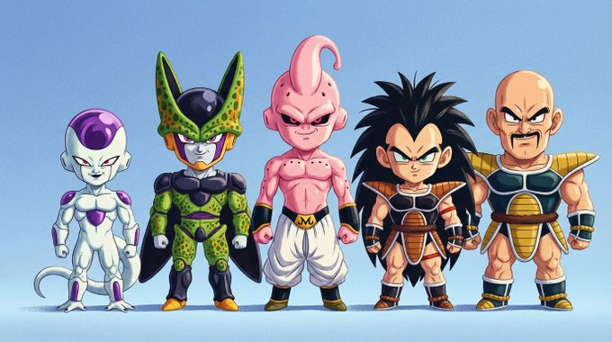

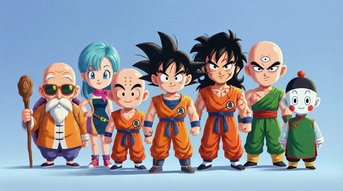

```
「[主题类型]」from「Dragon Ball Z」in「Q-style chibi pseudo 3D illustration style」, 「[构图方式]」, 「2.5D flat illustration style」with「enhanced dimensional depth」and「layered composition」with「subtle 3D volume effect」, 「featuring [角色详细描述]」, 「all in adorable chibi proportions」with「large head to body ratio about 2-3 heads tall」with「large expressive eyes」and「[面部风格]」, 「[站姿朝向]」, 「[排列方式]」, 「soft light blue gradient background」with「smooth seamless transition」with「subtle floor ground」with「no harsh edges」, 「consistent soft gentle side lighting」from「right to left」「maintaining fixed lighting direction」creating「subtle shadows on character(s)」, 「consistent minimal soft shadow on ground」「following the lighting direction」from「right to left」「maintaining perfect alignment with light source」, 「moderate saturation colors」with「comfortable color palette」, 「moderate contrast」, 「very heavy prominent grain texture overlay」on character body and clothing, 「extra strong noise and paper texture effect」, 「grainy illustration aesthetic」not CGI render, 「textured painted look」with「highly enhanced visible granular surface」, 「artistic hand-drawn feel」with depth, 「16:9 aspect ratio」
```

 [↑返回目录](#toc)

---
## <a id="">东京塔下的微缩世界</a> (<a href="https://x.com/oggii_0/status/2018186632730685723" target="_blank" rel="noopener noreferrer">Oogie</a>)

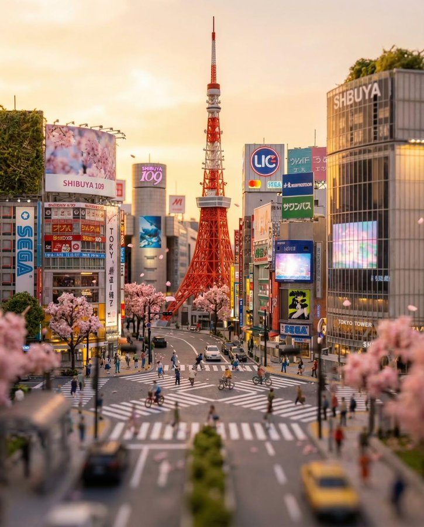

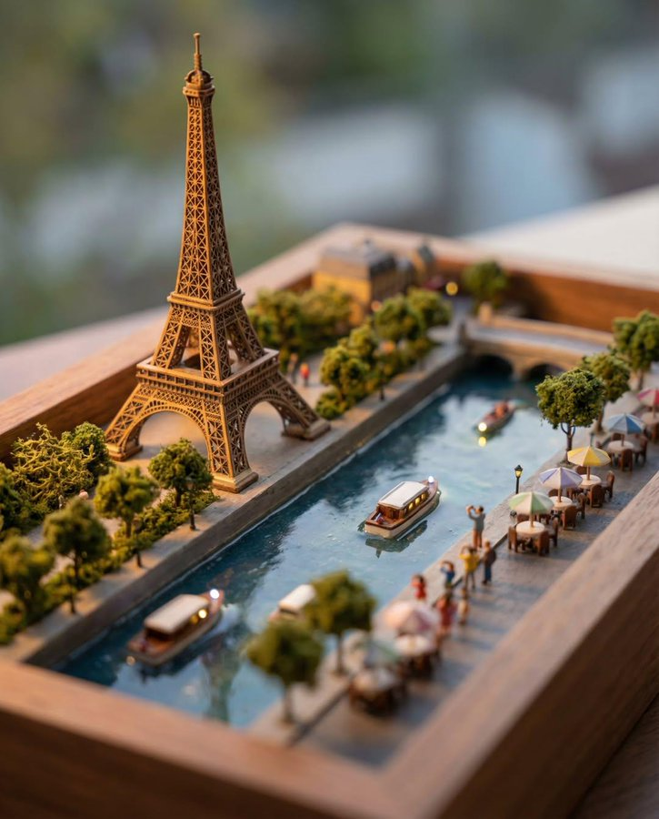

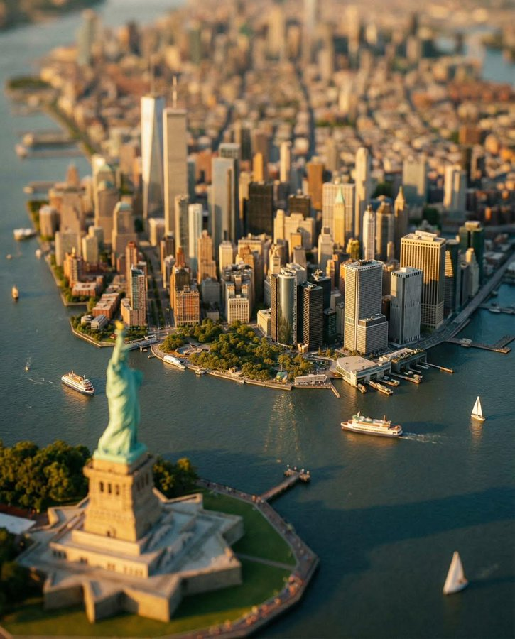

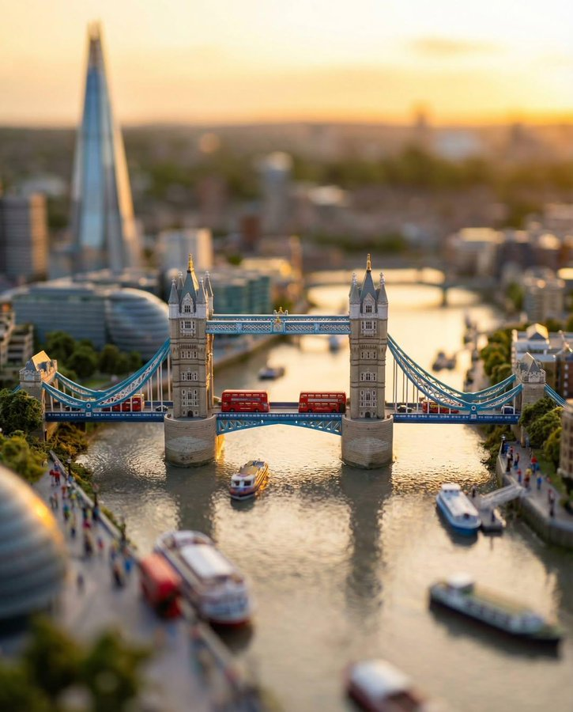

```
:
Tilt-shift 3D model diorama in 4:5 aspect ratio, highlighting Tokyo Tower and the Shibuya Crossing at sunset. Tiny pedestrians and cyclists navigate the bustling streets, while cherry blossoms drift gently from nearby trees. Neon signs and LED billboards glow softly in the background.
```

```
4:5 纵横比的移轴摄影风格 3D 模型微缩场景，突出表现东京塔和涩谷十字路口的日落时分。微小的行人和骑行者穿梭于繁忙的街道，附近的樱花树上花瓣轻轻飘落。背景中的霓虹灯招牌和 LED 广告牌散发出柔和的光芒。
```

 [↑返回目录](#toc)

---
## <a id="">地铁口的回眸：都市中的静谧瞬间</a> (<a href="https://x.com/saniaspeaks_/status/2018178058868732010" target="_blank" rel="noopener noreferrer">𝗦𝗮𝗻𝗶𝗮</a>)

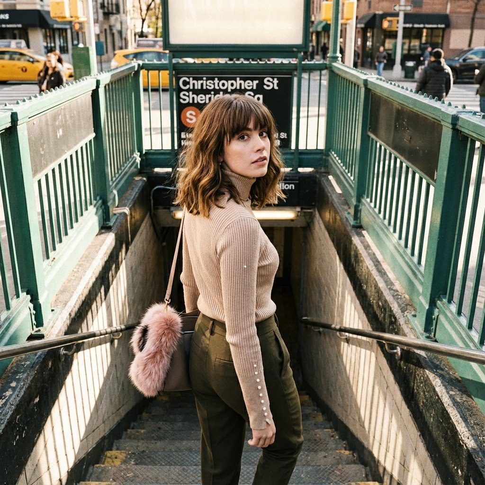

```
{
  "image_generation": {
    "subject": {
      "description": "young woman standing at the entrance of a subway staircase in a city",
      "pose": "standing on subway steps, body facing downward, head turned back over shoulder",
      "expression": "calm, slightly curious, thoughtful",
      "gaze": "looking directly at the camera"
    },
    "appearance": {
      "hair": {
        "color": "light brown",
        "style": "shoulder-length wavy hair with bangs"
      },
      "face": {
        "skin_tone": "fair",
        "makeup": "natural makeup with subtle definition"
      },
      "accessories": [
        "small shoulder bag",
        "pink faux-fur bag accessory"
      ]
    },
    "outfit": {
      "top": "beige fitted ribbed turtleneck sweater with button details on sleeves",
      "bottom": "high-waisted olive green tailored pants",
      "footwear": "not visible"
    },
    "environment": {
      "setting": "urban subway entrance",
      "background_elements": [
        "green metal railings",
        "subway sign reading Christopher St Sheridan Sq",
        "city street with pedestrians and taxis"
      ],
      "location_vibe": "busy city atmosphere"
    },
    "lighting": {
      "type": "natural daylight",
      "direction": "soft ambient street lighting",
      "quality": "balanced with gentle highlights and shadows"
    },
    "camera": {
      "angle": "slightly elevated eye-level",
      "framing": "three-quarter body shot",
      "lens": "35mm",
      "depth_of_field": "moderate, subject in sharp focus with softly blurred background"
    },
    "aesthetic": {
      "style": "urban lifestyle fashion photography",
      "vibe": "cinematic, casual, metropolitan",
      "color_palette": "warm neutrals, olive green, muted city tones"
    },
    "quality": {
      "realism": "highly realistic",
      "resolution": "high resolution",
      "look": "editorial street-style photograph"
    }
  }
}
```

```
一位年轻女子站在城市地铁楼梯入口处，身体朝下站在台阶上，头向后回望肩部，神情平静、略带好奇且若有所思，目光直视镜头。她拥有浅棕色齐肩波浪发与刘海，肤色白皙，妆容自然柔和。配饰包括一个小巧的单肩包和一个粉色仿毛皮包饰。身穿米色修身罗纹高领毛衣，袖口带有纽扣细节，下搭高腰橄榄绿色剪裁长裤，鞋履不可见。背景为城市地铁入口，可见绿色金属栏杆、标有“Christopher St Sheridan Sq”的地铁标识，以及街道上的行人与出租车，整体氛围繁忙都市感十足。光线为自然日光，辅以柔和的环境街灯，明暗过渡平衡。拍摄角度略高于眼平，三分之二身构图，使用35mm镜头，景深适中，人物清晰聚焦，背景柔焦虚化。整体风格为都市生活时尚摄影，具有电影感、休闲且大都会气息，色调以暖色中性色、橄榄绿及低饱和城市色为主。画面高度写实，高分辨率，呈现杂志街拍风格。
```

 [↑返回目录](#toc)

---
## <a id="">繁茂盛开的绿色花朵壁纸</a> (<a href="https://x.com/WallPapers360/status/2017825239833755814" target="_blank" rel="noopener noreferrer">A</a>)

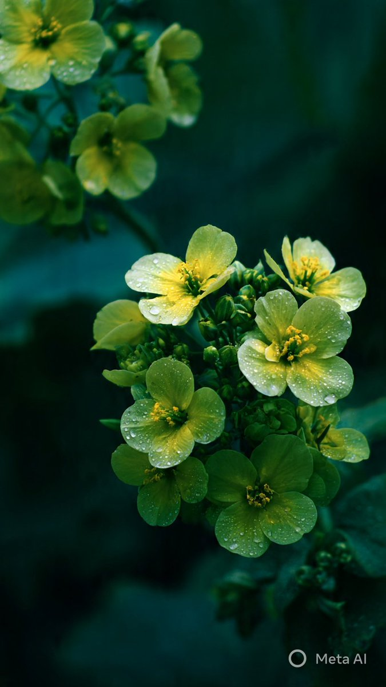

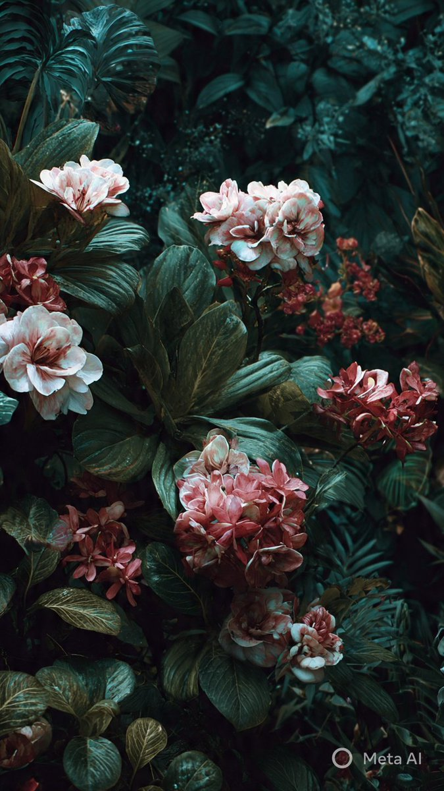

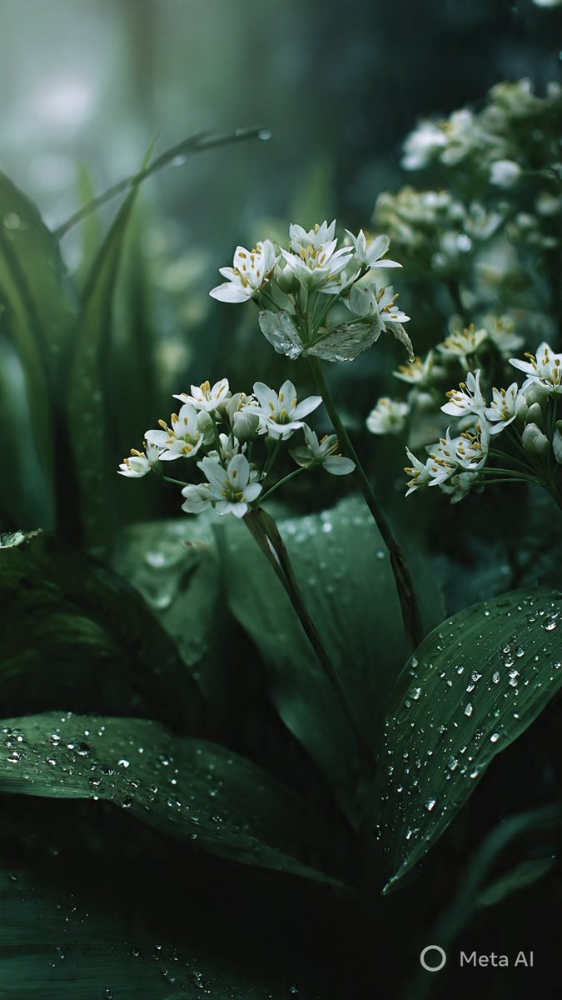

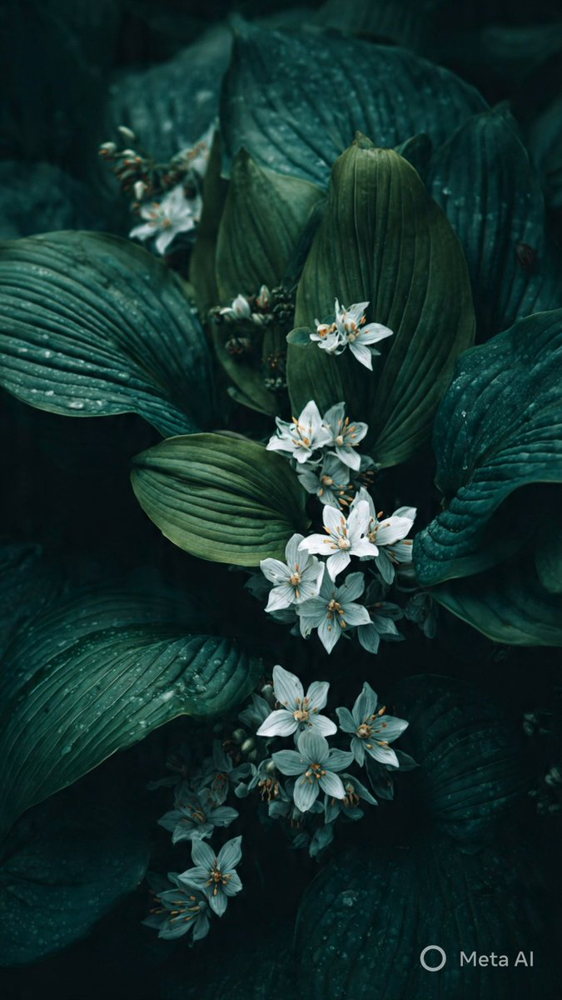

```
Beautiful HD Wallpaper is downloaded by the Meta AI. 

Prompt:
{
  "prompt": "Create a stunning wallpaper featuring lush green flowers in full bloom, with vibrant colors and delicate petals, set against a soft, blurred background",
  "style": "realistic",
  "resolution": "4K",
  "colors": ["green", "white", "yellow", "pink"],
  "elements": ["flowers", "leaves", "vines"]
}
```

```
创作一张惊艳的壁纸，展现繁茂盛开的绿色花朵，色彩鲜艳、花瓣细腻，背景为柔和虚化效果。风格写实，分辨率为4K，主色调包括绿色、白色、黄色和粉色，包含花朵、叶片和藤蔓等元素。
```

 [↑返回目录](#toc)

---
## <a id="">便当盒里的微观美食世界</a> (<a href="https://x.com/Gdgtify/status/2017660652219686942" target="_blank" rel="noopener noreferrer">Gadgetify</a>)


```
Here is a new way to visualize food. This one covers some of the best ones from my home country. 

Prompt: 
Function DrawDish(input dish name)
Input Variable: [insert dish name]
(e.g., ramen, biryani, tacos al pastor)

System Instruction:
Generate a hyper-realistic, 1:1 product photo of a "Bento Cross-Section Diorama" (miniature food exhibit).

1. Semantic Extraction:
> Identify cuisine, flavor profile (spicy, umami, sweet), and the dish’s signature components.
> Figure: Chibi “chef mascot” OR a cute ingredient character (e.g., a chibi chili pepper).
> Pose: Serving action or sprinkling garnish.

2.  Container (Bento Box):
> Structure: U-shaped bento display (two walls + floor) with compartment lines.
> Desktop size, premium lacquer look.

3. Background 
> Walls: B&W recipe-card typography, ingredient diagrams, plating sketches (original, inspired).
> Floor: Pop-up “steam” ribbons, spice flecks, herb confetti cut-outs rising up.

4. Integration (2D vs 3D):
> The 3D figure is “pulling” a 2D sauce swirl that becomes a 3D glossy ribbon.

5. Visual
> B&W design background; full-color food and figure.
> Soft studio lighting with appetizing highlights.
> Label: "[Dish] — [Region/Cuisine]"

Return: ONE image, 1:1, ultra-real food miniatures, product-photo lighting.

<instructions>
Input: dish name
Analyze cuisine, flavor profile, typical ingredients, cultural context. Find 4 MUCH lesser-known dishes in the same cuisine/style.
Output: a 2x2 grid, each panel is DrawDish for a lesser-known recommendation.
</instructions>
```

```
这里有一种新的食物可视化方法。这个涵盖了来自我国的一些最佳美食。

提示词：
功能 DrawDish（输入菜肴名称）
输入变量：[插入菜肴名称]
（例如，拉面、印度烤鸡饭、牧羊人塔可）

系统指令：
生成一个超现实的1:1产品照片，主题为“便当盒剖面立体模型”（微型食物展览）。

1. 语义提取：
> 确定烹饪类型、口味特点（辣、鲜美、甜）以及菜肴的标志性成分。
> 图像：可爱的“厨师吉祥物”或者可爱的食材角色（比如，可爱的小辣椒）。
> 姿态：服务动作或撒上装饰品。

2. 容器（便当盒）：
> 结构：U形便当展示（两墙加地板），带有隔间线。
> 桌面大小，高级漆面外观。

3. 背景
> 墙壁：黑白食谱卡字体、成分图解、装盘草图（原创的、受启发的）。
> 地板：弹出式“蒸汽”丝带、香料斑点、草本彩纸剪贴画向上飘起。

4. 整合（2D与3D）：
> 三维形象“拉动”二维酱汁漩涡，变成三维有光泽的丝带。

5. 视觉效果
> 黑白设计背景；全彩色的食物和形象。
> 柔和的工作室灯光，诱人的高光。
> 标签：“[菜肴] — [地区/烹饪风格]”

返回：一张图片，1:1，超现实的食物微缩模型，产品摄影照明。

<指令>
输入：菜肴名称
分析烹饪类型、口味特点、常用食材、文化背景。找到同一烹饪风格中的4种较不为人知的菜肴。
输出：一个2x2网格，每个格子是DrawDish的一个较不知名推荐菜肴。
```

 [↑返回目录](#toc)

---
## <a id="">平行世界的微缩景观</a> (<a href="https://x.com/aleenaamiir/status/2017820238314934756" target="_blank" rel="noopener noreferrer">Aleena Amir</a>)

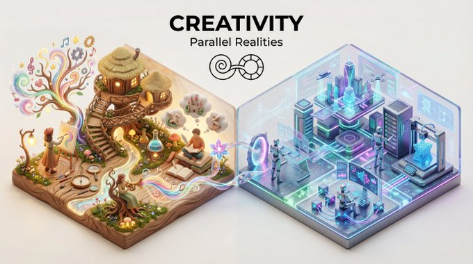

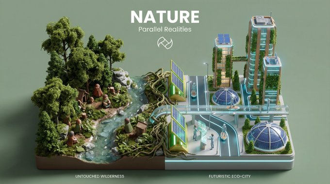

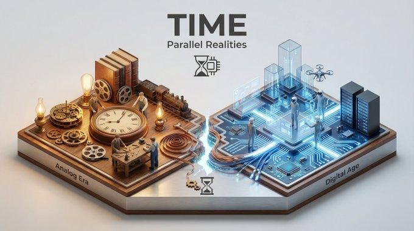

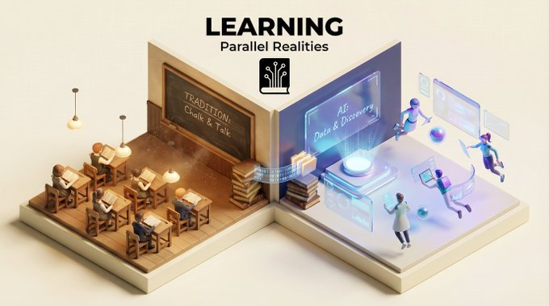

```
Parallel Worlds Split Dioramas

Gemini Nano Banana Pro Prompt:

“Present a clear, 45° top-down isometric miniature 3D split diorama showing two parallel worlds of [THEME]: [WORLD A] vs [WORLD B].

Use soft refined textures, realistic PBR materials, and contrasting lighting styles for each side.

Design a single raised base divided down the center with mirrored layouts and subtle crossover details.

Include tiny stylized characters existing differently in each world (no facial details).

Use a clean solid [BACKGROUND COLOR] background.

At the top-center, display [THEME NAME] in large bold text, beneath it show ‘Parallel Realities’, and place a minimal abstract icon below.

All text must automatically match the background contrast (white or black).”
```

```
呈现一个清晰的45度俯视等距微型3D分屏微缩场景，展示两个平行世界：[主题]下的[世界A]与[世界B]。

使用柔和精致的纹理、逼真的PBR材质，并为两侧采用对比鲜明的灯光风格。

设计一个中央分割的单体抬高底座，两侧布局镜像对称，并包含细微的跨界细节。

在每个世界中加入微小的风格化角色，展现其在不同世界中的存在方式（无面部细节）。

背景使用纯色[背景颜色]。

顶部中央显示大号粗体[主题名称]，其下方标注“Parallel Realities”，再下方放置一个极简抽象图标。

所有文字需自动匹配背景对比度（白色或黑色）。
```

 [↑返回目录](#toc)

---
## <a id="">宋代极简美学服饰女生</a> (<a href="https://x.com/VoxcatAI/status/2018174150557479145" target="_blank" rel="noopener noreferrer">VoxCat</a>)


```
A beautiful Chinese girl, wearing elegant translucent silk Hanfu (light cyan and white gradient), traditional Song Dynasty style. Delicate facial features, almond eyes with a serene and ethereal gaze, light natural makeup, porcelain skin. Hair styled in a loose, elegant ancient bun with a jade hairpin and a small lotus accessory.
Sitting gracefully on a small wooden boat in the middle of a lotus pond, one hand gently touching a blooming pink lotus flower, body slightly turned, quiet and poetic posture.
A misty lotus pond in summer, surrounded by large lush green lotus leaves, soft morning fog, water ripples, a blurry traditional Chinese pavilion in the far background.
Eye-level shot, 85mm portrait lens, shallow depth of field (f/1.8), foreground lotus leaves slightly out of focus to create depth, rule of thirds composition.
Soft diffused morning light, ethereal atmosphere, pale green and soft pink color palette, low saturation, clean and fresh tone, Tyndall effect through the mist.
Hyper-realistic photography, cinematic lighting, 8k resolution, high detail, masterpiece, delicate textures of silk and lotus petals.

```

```
一位美丽的中国少女，身着优雅的半透明丝绸汉服（浅青与白色渐变），传统宋代风格。面容精致，杏眼含情，目光宁静而空灵，妆容自然清淡，肌肤如瓷。发髻松散雅致，饰以玉簪与小巧莲花发饰。

她优雅地坐在荷塘中央的一叶小木舟上，一手轻抚一朵盛开的粉莲，身体微微侧转，姿态静谧而富有诗意。

夏日朦胧的荷塘，四周环绕着茂盛碧绿的大荷叶，晨雾轻柔弥漫，水面泛起涟漪，远处背景隐约可见一座中国传统亭台。

平视视角，85mm人像镜头，浅景深（f/1.8），前景荷叶轻微虚化以营造层次感，采用三分法构图。

柔和漫射的晨光，氛围空灵，色调以淡绿与柔粉为主，低饱和度，清新洁净，雾气中呈现丁达尔效应。

超写实摄影风格，电影级光影，8K分辨率，细节丰富，丝质汉服与莲花花瓣纹理细腻，堪称杰作。
```

 [↑返回目录](#toc)

---
## <a id="">高级时尚光影写真</a> (<a href="https://x.com/Adam38363368936/status/2018150642045637076" target="_blank" rel="noopener noreferrer">Adam也叫吉米</a>)

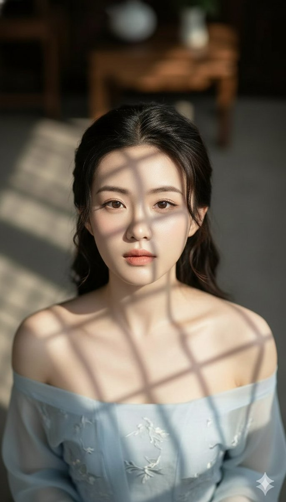

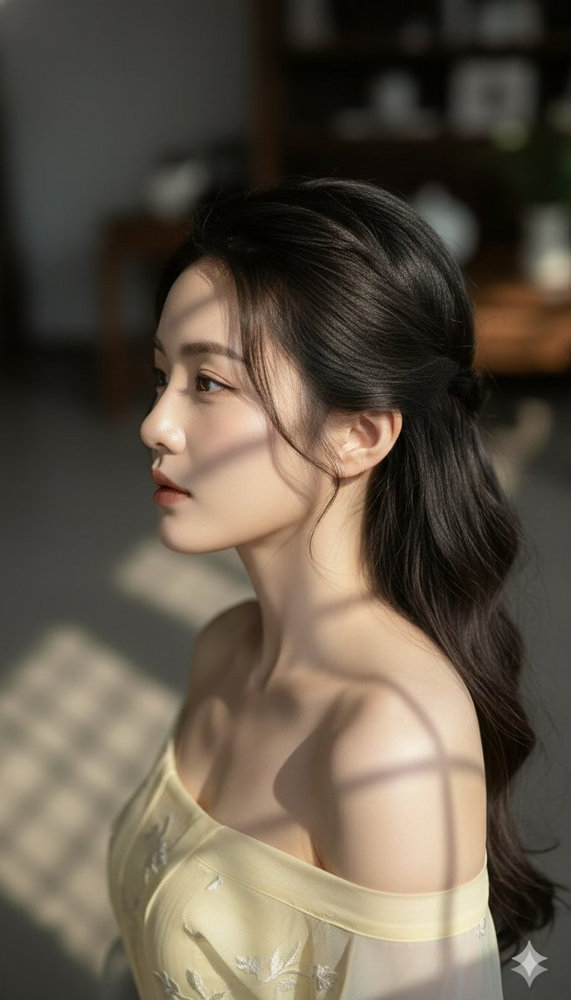


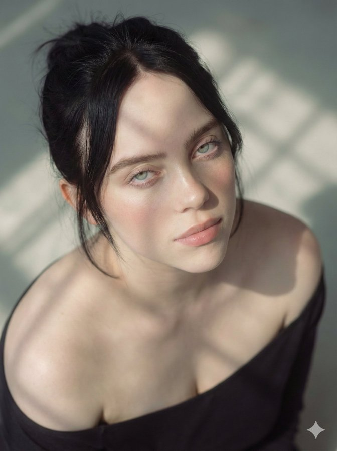


```
High-fashion cinematic surrealism. A top-down, 90-degree overhead shot of the woman from the uploaded image. She has flawless porcelain skin with a radiant finish and a subtle natural blush. Her long black hair is neatly tied back, with delicate loose strands softly framing her face. She is posed gracefully with bare shoulders exposed. The lighting is soft, direct natural sunlight, projecting intricate gridded and vertical artistic shadow patterns across her facial planes, clavicle, and shoulders. The atmosphere is one of pure grace and tranquility. Soft-focus background, dreamy perspective, hyper-realistic skin textures, 8k resolution.
```

```
高级时尚电影感超现实主义。俯视90度顶拍视角，画面中的女性拥有无瑕的瓷肌，肤质光泽透亮，带有微妙自然的红晕。她乌黑的长发整齐地束在脑后，几缕细柔的发丝轻柔地勾勒出脸庞轮廓。她姿态优雅，双肩裸露。柔和的直射自然阳光在她的面部轮廓、锁骨和肩膀上投射出精致的网格状与垂直艺术阴影图案。整体氛围纯净优雅、宁静祥和。背景为柔焦效果，视角梦幻，肌肤纹理超写实，8K分辨率。
```

 [↑返回目录](#toc)

---
## <a id="">巴黎街头的静奢时尚</a> (<a href="https://x.com/miilesus/status/2018059475916382363" target="_blank" rel="noopener noreferrer">Melis</a>)


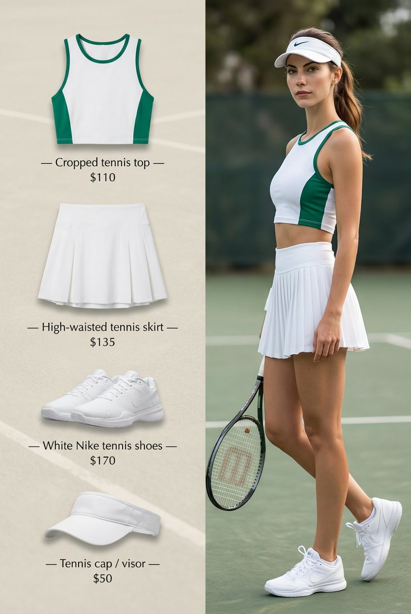

```
A refined high-fashion editorial image with a 3:4 aspect ratio, split into two clear vertical sections.

RIGHT SIDE:
A fashionable, confident, elegant woman casually standing and walking in a Parisian street café setting. Classic Paris architecture in the background, stone buildings, subtle café chairs, soft natural daylight. She wears a burgundy tweed cropped jacket with jewel buttons and a matching slim-fit A-line mini tweed skirt. The tweed fabric texture is highly detailed and clearly visible, rich woven structure, luxury craftsmanship. On her feet are black knee-high leather boots, timeless and chic.

She carries a small structured burgundy handbag. Her hair is worn naturally loose, softly framing her face. Minimal makeup, refined facial features, subtle earrings. The look is elegant, Parisian, sophisticated, and effortlessly chic. Natural daylight, soft shadows, realistic skin texture. Editorial street-style fashion photography with a high-end luxury feel, muted yet rich color palette, shallow depth of field, cinematic realism.

STYLE & MOOD:
Parisian elegance, quiet luxury, confident femininity, timeless, editorial.

PHOTOGRAPHY DETAILS:
Eye-level angle, candid stance, 35mm lens, natural lighting, high detail, photorealistic.

LEFT SIDE:
A clean, minimalist luxury product breakdown layout on a soft neutral background inspired by Parisian interiors. The individual fashion items worn by the woman are displayed separately, neatly arranged with subtle shadows. No people on this side. Each item includes a small, elegant price label in refined sans-serif typography.

– Burgundy tweed cropped jacket with jewel buttons — $620  
– Burgundy slim-fit A-line mini tweed skirt — $420  
– Black knee-high leather boots — $780  
– Small structured burgundy handbag — $950  

The left side feels like a luxury fashion catalog or high-end e-commerce lookbook, inspired by Parisian design aesthetics, subtle architectural textures, refined composition.

OVERALL STYLE & MOOD:
Quiet luxury, Parisian elegance, editorial fashion, high-end retail aesthetic.

LIGHTING & QUALITY:
Soft natural light, studio-clean clarity on product side, photorealistic, ultra-high resolution, professional fashion photography.

NEGATIVE PROMPT:
Cluttered layout, oversized text, flashy logos, manne
```

```
一张精致的高端时尚杂志风格图像，比例为3:4，画面清晰地分为左右两个垂直部分。

右侧：  
一位时尚、自信、优雅的女性在巴黎街头咖啡馆场景中随意站立并行走。背景是经典的巴黎建筑、石砌楼房、低调的咖啡馆座椅，以及柔和的自然日光。她身穿一件酒红色粗花呢短款夹克，配有珠宝纽扣，搭配同款修身A字迷你粗花呢裙。粗花呢面料纹理高度细致且清晰可见，织物质感丰富，彰显奢华工艺。脚上是一双黑色及膝皮靴，经典而时髦。

她手拿一只小巧有型的酒红色手袋。头发自然披散，轻柔地勾勒出脸部轮廓。妆容极简，五官精致，佩戴低调耳饰。整体造型优雅、巴黎风、精致且毫不费力地时髦。采用自然日光照明，阴影柔和，皮肤质感真实。画面呈现高端街拍时尚摄影风格，色调含蓄却浓郁，景深浅，具有电影般的写实感。

风格与氛围：  
巴黎式优雅、静奢风、自信的女性气质、永恒经典、杂志大片感。

摄影细节：  
平视角度、抓拍姿态、35mm镜头、自然光线、高细节、逼真写实。

左侧：  
以受巴黎室内设计启发的柔和中性色背景为基础，呈现干净、极简的奢侈品单品分解布局。右侧女性所穿的每件单品在此侧单独陈列，整齐排列并带有微妙阴影。此侧无人物出现。每件单品旁附有精致的小型价格标签，采用优雅的无衬线字体。

– 酒红色珠宝纽扣粗花呢短款夹克 — $620  
– 酒红色修身A字迷你粗花呢裙 — $420  
– 黑色及膝皮革长靴 — $780  
– 小巧有型酒红色手袋 — $950  

左侧呈现出一种奢侈品时尚目录或高端电商画册的感觉，灵感源自巴黎设计美学，融入细腻的建筑肌理与精致构图。

整体风格与氛围：  
静奢风、巴黎式优雅、杂志级时尚、高端零售美学。

光影与画质：  
柔和自然光，产品侧具备影棚级洁净清晰度，逼真写实，超高分辨率，专业时尚摄影水准。

负面提示：  
杂乱布局、过大文字、浮夸logo、人体模型
```

 [↑返回目录](#toc)

---
## <a id="">复古数字风城市街头服饰拼贴</a> (<a href="https://x.com/harboriis/status/2018566445031137556" target="_blank" rel="noopener noreferrer">Harboriis</a>)

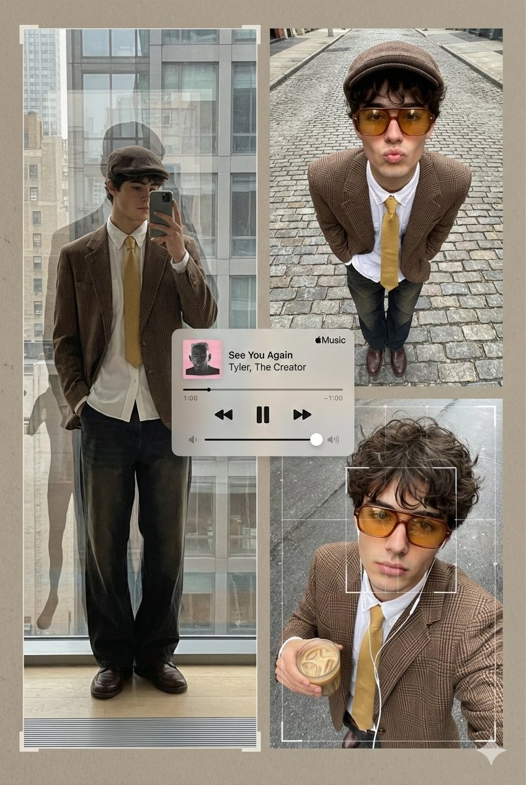

```
An editorial poster-style multi-panel collage presents Subject[person in the image] across three asymmetric photographic frames, unified by a muted-brown urban streetwear aesthetic and a retro analog-digital fusion mood. The top-left frame captures a reflective window shot where the subject holds a phone in front of their face, dressed in a brown plaid blazer layered over a white button-up shirt, a yellow tie, loose dark trousers, and a brown cap; the reflective surface introduces layered ghosting, faint architectural overlays, and a subtly stretched full-body silhouette shaped by the curvature of the glass.

The top-right frame shifts into a close-range, downward-angled ultra-wide portrait taken on a cobblestone street, where the subject leans forward with hands in pockets and lips exaggeratedly pouting, wearing the same outfit now paired with oversized amber-tinted rectangular sunglasses, while the cobblestones warp and radiate outward due to lens perspective distortion.

The bottom-right frame becomes an intimate overhead selfie with the subject holding a drink, still in the same wardrobe but now with wired earphones, the amber sunglasses dominating the frame under soft overcast lighting, enhanced by faint digital-grid overlays and a minimal square facial-bounding graphic.

Floating across the middle section of the poster is a translucent iOS-style Apple Music mini-player displaying "See You Again" by Tyler, The Creator, featuring artwork, timeline, and playback controls without shadows, contributing to the minimal Ul aesthetic alongside subtle cursor-like frame lines and rectangular highlights around the collage edges.

The overall palette emphasizes warm ambers, washed neutrals, soft greys, reflective textures, wool plaid patterning, polished leather, and stone pavement, all rendered with realistic lighting and natural distortion patterns while avoiding stickers, extra subjects, wardrobe changes, incorrect Ul icons, neon color shifts, or any futuristic sci-fi elements.
```

```
一张具有编辑海报风格的多面板拼贴作品，以三个不对称的摄影画面呈现画面主体，整体统一于柔和棕色调的城市街头服饰美学与复古模拟-数字融合氛围之中。左上画面为一扇反光窗前的拍摄：主体将手机举至脸前，身穿棕色格纹西装外套，内搭白色纽扣衬衫、黄色领带、宽松深色长裤，并头戴棕色帽子；玻璃表面反射出多重叠影、微弱的建筑叠加效果，以及因玻璃曲率而轻微拉伸的全身轮廓剪影。

右上画面转为鹅卵石街道上的近距离俯角超广角人像：主体双手插兜、嘴唇夸张地撅起，身着相同服装，但新增了大号琥珀色矩形太阳镜；由于镜头透视畸变，鹅卵石地面呈放射状扭曲延展。

右下画面则是一张亲密感十足的俯拍自拍视角：主体手持饮品，仍穿着同一套服装，但加入了有线耳机，琥珀色太阳镜在柔和阴天光线下占据画面主导地位，并辅以微弱的数字网格叠加层和极简的方形面部定位图形。

海报中部漂浮着一个半透明的 iOS 风格 Apple Music 小型播放器，显示 Tyler, The Creator 的《See You Again》，包含专辑封面、进度条与播放控件，无阴影效果，与拼贴边缘细微的光标式边框线及矩形高亮元素共同营造出极简 UI 美学。

整体配色强调温暖的琥珀色、洗旧中性色、柔和灰色、反光材质、羊毛格纹图案、抛光皮革与石板路面，所有元素均以写实光影与自然畸变方式呈现，避免使用贴纸、额外人物、服装更换、错误的 UI 图标、霓虹色调偏移或任何未来科幻元素。
```

 [↑返回目录](#toc)

---
## <a id="">发光文字覆盖的超现实女性肖像</a> (<a href="https://x.com/iamsofiaijaz/status/2018613432065650876" target="_blank" rel="noopener noreferrer">Aijaz</a>)

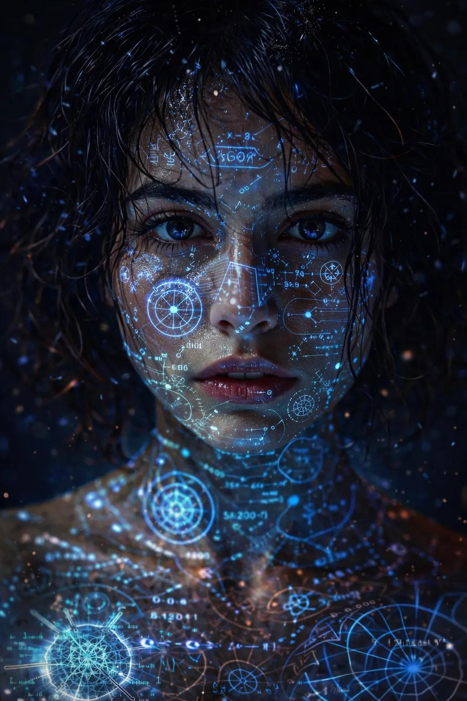

```
A cinematic, ultra-realistic close-up portrait of a young woman with wet, tousled dark hair and luminous skin, staring directly into the camera with an intense, introspective expression. Glowing cyan handwritten text and symbols are projected across her face, neck, and shoulders, resembling poetic phrases, equations, and abstract handwriting.
```

```
一张年轻女性的电影级超现实主义特写肖像，她有着湿漉漉的凌乱黑发和发光的皮肤，以一种强烈而内省的表情直视镜头。她的脸部、颈部和肩部投射着发光的青色手写文字和符号，看起来像是诗句、方程式和抽象的手写字迹。
```

 [↑返回目录](#toc)

---
## <a id="">标志性载具微缩立体模型</a> (<a href="https://x.com/TechieBySA/status/2018638455631163691" target="_blank" rel="noopener noreferrer">TechieSA</a>)

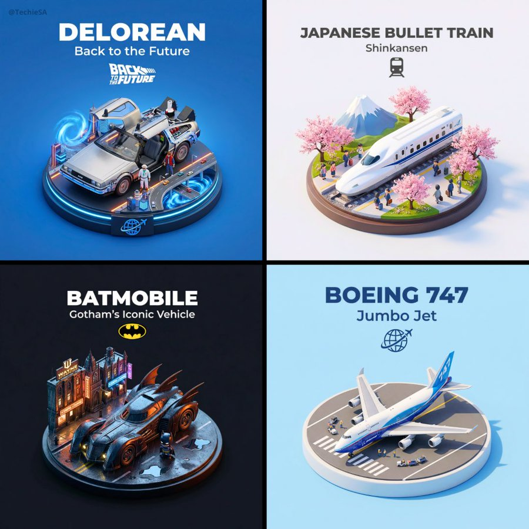

```
Present a clear, 45° top-down isometric miniature 3D diorama of the iconic vehicle [VEHICLE NAME].

The vehicle is the main focus, placed on a small raised diorama-style base that reflects its most recognizable environment
(e.g. road, runway, ocean, space, racetrack), with subtle contextual details and tiny stylized figures if appropriate.

Use soft refined textures, realistic PBR materials, and gentle cinematic lighting.
The vehicle should feel premium, collectible, and instantly recognizable at a glance.

Use a clean solid [BACKGROUND COLOR] background with no gradients.

At the top-center, display “[VEHICLE NAME]” in large bold text.
Directly beneath it, display a short descriptor in medium text (e.g. “Iconic Movie Car”, “World’s Fastest Train”).
Optionally place an official logo or emblem below the text.

All text must automatically match background contrast (white or black).
Composition: perfectly centered, square 1080x1080, ultra-clean high-clarity diorama aesthetic.
```

```
呈现一个清晰的45度俯视等距微型3D立体模型，主题为标志性的交通工具【车辆名称】。

- **主要焦点**：将该交通工具置于一个小的抬高的立体模型底座上，底座反映出其最具代表性的环境（例如道路、跑道、海洋、太空、赛道），并带有微妙的环境细节和小风格化的人物（如果合适）。
- **材质与照明**：使用柔和精致的纹理、真实的PBR材料以及温和的电影级照明，让交通工具看起来高端、值得收藏且一眼即可识别。
- **背景**：使用干净的纯色【背景颜色】背景，无渐变效果。
- **文字说明**：
  - 在顶部中央位置显示较大的粗体文本“【车辆名称】”。
  - 在其下方以中等大小的文本显示简短描述（例如“标志性电影汽车”，“世界上最快的火车”）。
  - 根据需要，在文本下方放置官方标志或徽章。
- **文字颜色**：所有文本必须自动匹配背景对比度（白色或黑色），以确保可读性。
- **构图规格**：画面完美居中，1080x1080正方形尺寸，超洁净、高清晰度的立体模型美学。无水印。 
```

 [↑返回目录](#toc)

---
## <a id="">大学校园3D浮雕海报</a> (<a href="https://x.com/0x00_Krypt/status/2018668689030332462" target="_blank" rel="noopener noreferrer">两斤</a>)

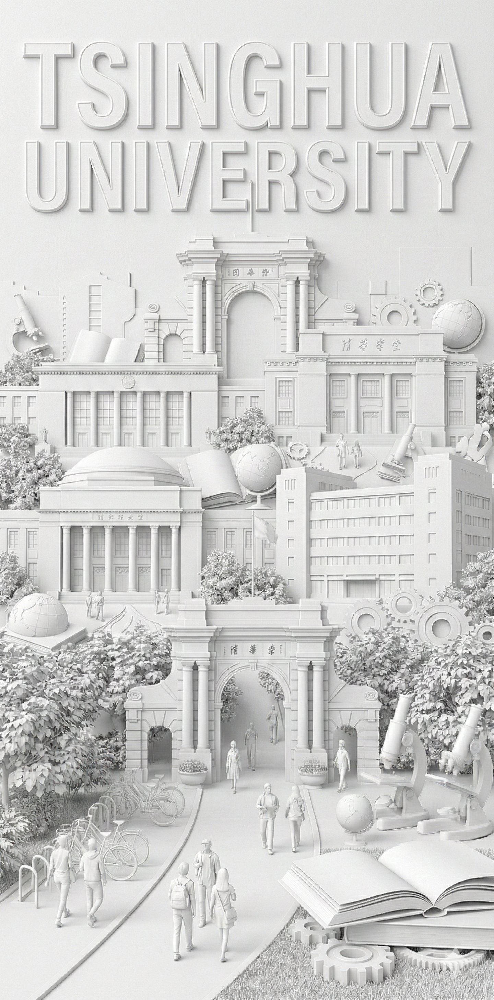

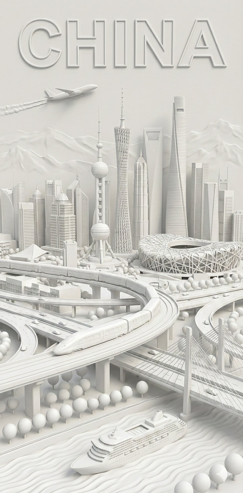

```
A highly detailed 3D bas-relief poster design representing [UNIVERSITY_NAME]. A dense collage composition featuring the most iconic campus buildings, libraries, and academic landmarks. Foreground filled with students walking paths, bicycle racks, campus greenery, and symbolic academic elements. At the top, features prominent, large, embossed English text in capital letters spelling out the university name. Pure white monochromatic clay render, embossed paper texture, soft studio lighting, high visual density, clean commercial illustration style. --ar 1:2
```

```
高度详细的3D浅浮雕海报设计，代表【大学名称】。密集的拼贴构成，特色是最具标志性的校园建筑、图书馆和学术地标。前景中充满了学生步行路径、自行车架、校园绿化以及象征学术的元素。顶部以突出的、大型的凸起英文大写字母拼出大学的名字。纯白色单色粘土渲染，浮雕纸张纹理，柔和的工作室照明，高视觉密度，干净的商业插画风格。 --ar 1:2
```

 [↑返回目录](#toc)

---
## <a id="">钩针编织的奇幻日系工作室</a> (<a href="https://x.com/SimplyAnnisa/status/2018546463312413074" target="_blank" rel="noopener noreferrer">Anissa</a>)

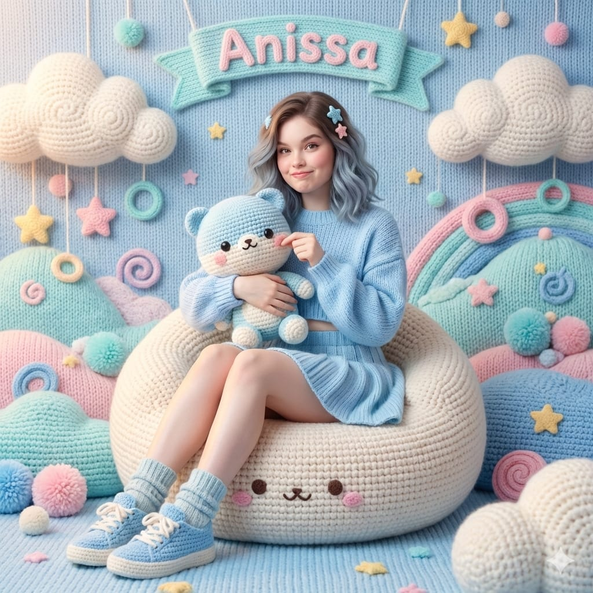

```
Ultra-cute kawaii fantasy studio entirely made from crochet, yarn, or knitted material. Pastel, dreamy, playful knitted wonderland inspired by classic video games. Background: layered knitted elements including giant crocheted clouds, soft rounded hills, stars, rings, swirls, floating yarn pom-poms, stitched symbols. All plush, rounded, bubbly, fully knitted with premium yarn texture. Center: young woman [use uploaded face reference] sitting on giant crocheted chibi animal chair, rounded head, tiny stitched features, embroidered big kawaii eyes, stubby limbs. Pose: knees together slightly angled, feet inward, body leaning slightly forward, one arm hugging plush crocheted doll of the animal, other hand pinching its cheek or holding ear. Expression: playful, cute, soft smile, slightly puffed cheeks, bright sparkling eyes, innocent and cheerful. Outfit: slightly sexy yet cute, fully knitted cropped oversized pastel blue sweater, high-waist knitted mini skirt with soft pleats, chunky knitted socks, crocheted snea
```

```
超可爱的日系奇幻工作室，全部由钩针、毛线或针织材料制成。柔和粉彩色调、梦幻而充满童趣的针织仙境，灵感源自经典电子游戏。背景：多层次针织元素，包括巨大的钩针云朵、柔软圆润的山丘、星星、圆环、漩涡、漂浮的毛线绒球以及缝制的符号。整体蓬松、圆润、泡泡感十足，完全由优质毛线织成。画面中央：一位年轻女子（使用上传的面部参考）坐在巨大的钩针迷你动物造型椅子上，头部圆润，五官小巧为缝线细节，刺绣出的大眼睛充满可爱感，四肢短小。姿势：双膝并拢微向内倾斜，双脚内扣，身体微微前倾，一只手臂环抱着针织动物玩偶，另一只手捏着玩偶的脸颊或抓着耳朵。表情：俏皮可爱，带着柔和微笑，脸颊微鼓，眼神明亮闪烁，纯真又欢快。服装：略带性感却又可爱，全身针织——短款宽松的淡蓝色毛衣、高腰针织百褶迷你裙、粗棒针织袜，以及钩针运动鞋。
```

 [↑返回目录](#toc)

---
## <a id="">地下坡道中的灰烬男子</a> (<a href="https://x.com/i4LMU/status/2018379009034518584" target="_blank" rel="noopener noreferrer">Ullr | Majd</a>)

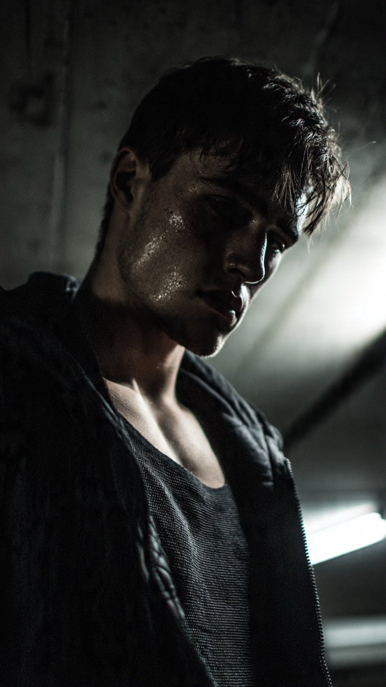

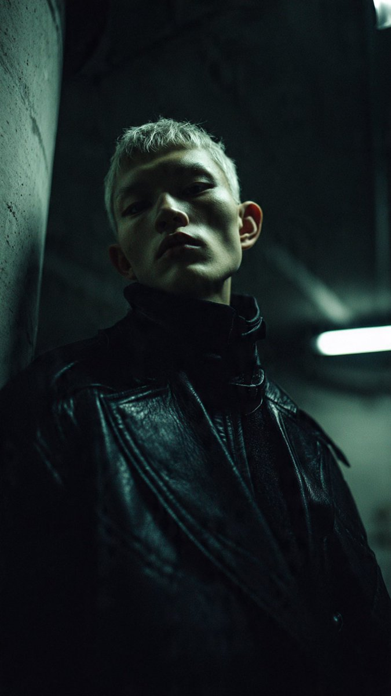

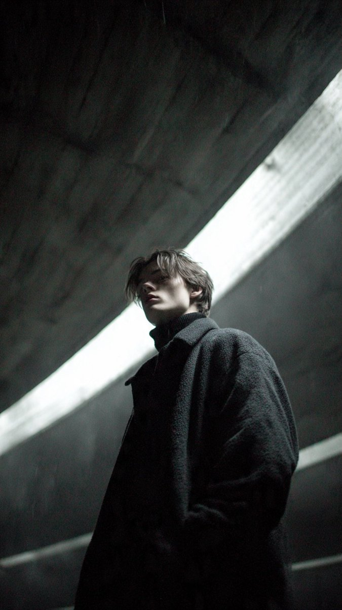

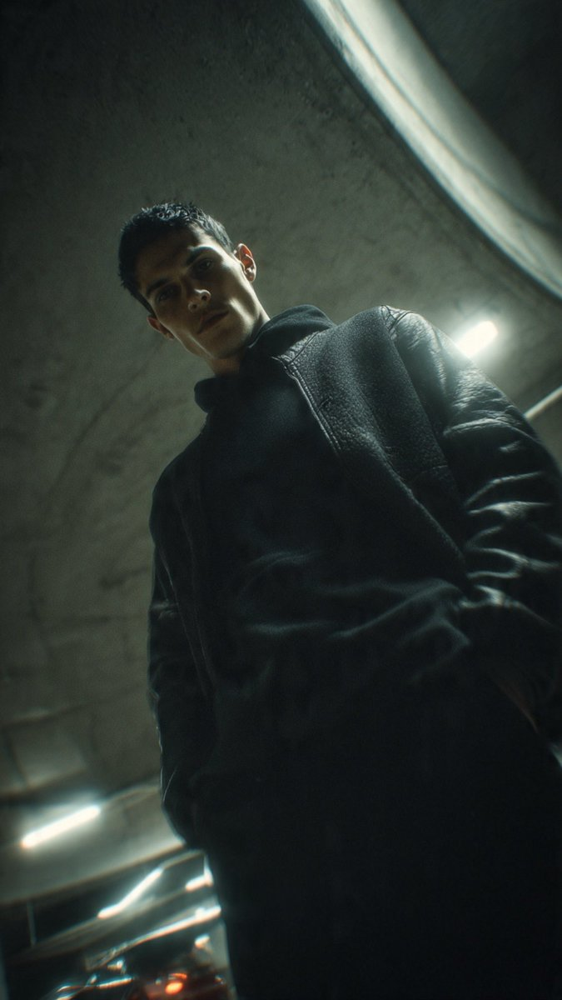

```
Medium, centered portrait shot using a 35mm lens from a slightly low angle. Adult male hero with strong facial structure, visible natural imperfections, and neutral ethnicity. He stands still with an intense, inward-focused gaze. Wearing dark, textured clothing that absorbs light. Black ash-like particulate matter drifts from deep shadow into the light around his face and body. Lit by a strong directional key light cutting through darkness, creating high-contrast chiaroscuro with controlled falloff into shadow. Set in an underground parking garage ramp with curved concrete geometry. Cold, muted color palette with subtle grain and atmospheric haze. Mad-real surreal cinematic portrait, ARRI Alexa-style grading matched to the environment, emphasizing pores and skin texture. FG grain present.
```

```
中景居中人像，使用35mm镜头从略低角度拍摄。成年男性主角，面部轮廓鲜明，带有可见的自然瑕疵，种族特征中性。他静立不动，目光专注内敛。身穿深色、富有肌理感的衣物，能吸收光线。黑色灰烬般的颗粒物从深影中飘散而出，环绕其面部与身体。采用强烈的定向主光源穿透黑暗，营造高对比度的明暗对照（chiaroscuro），阴影过渡受控。场景设于地下停车场坡道，具有弧形混凝土结构。整体采用冷调、低饱和色彩，辅以细微颗粒感与氛围薄雾。风格为疯狂写实主义超现实电影肖像，采用ARRI Alexa风格调色，与环境匹配，强调毛孔与皮肤纹理，并带有前景颗粒感。
```

 [↑返回目录](#toc)

---
## <a id="">AI生图动作之伏地拖刀式</a> (<a href="https://x.com/VoxcatAI/status/2018599579638518113" target="_blank" rel="noopener noreferrer">VoxCat</a>)

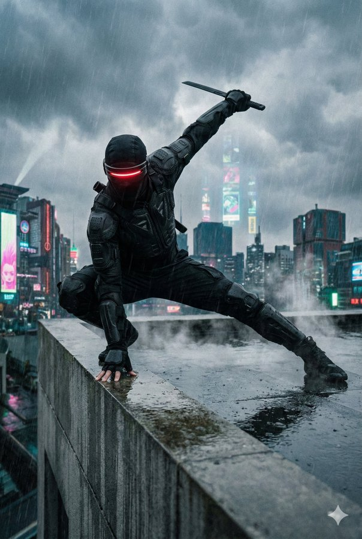

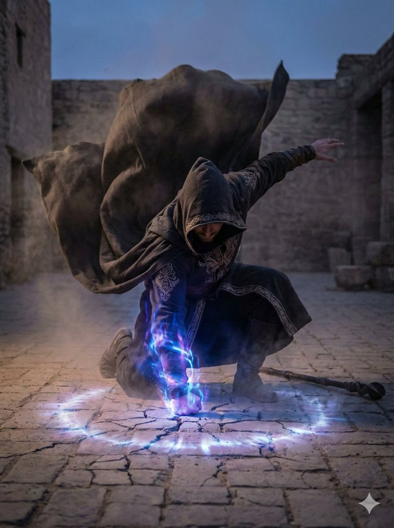

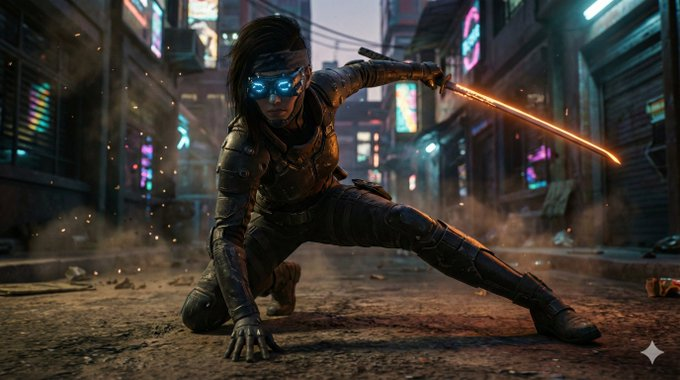

```
AI生图动作篇：伏地拖刀式 (Grounded Drag-Blade Stance)

拒绝只会傻站着的木头人！ 这是一个绝对固定且高张力的经典战斗姿态，如同一张拉满的弓。 只要照着这个公式写，AI 就能稳定输出“压迫感拉满”的狩猎姿态。

【核心骨架锁定 (Pose Lock-in)】

地基 (Anchor)：One hand touching the ground (单手撑地) + Squatting low (低身蹲伏)。这是姿态稳定的关键。

延伸 (Extension)：One leg fully extended sideways (一条腿极度侧伸)。没有这个，动作就缩成了一团，有了这个，画面才有张力线条。

蓄力 (Tension)：Weapon held low behind back (武器低垂/拖在身后) 或 Cocked high (高举蓄力)。武器必须是“藏”在身后的，暗示攻击前摇。
一句话记忆：手撑地 + 腿侧伸 + 刀后藏。

【通用公式 (Copy & Paste)】
[Subject] in a dynamic low crouching stance (three-point landing).
Right leg is fully extended far to the side.
Left hand is firmly planted on the ground for balance.
Right arm is holding a [Weapon] extended backwards/upwards, ready to strike.
Action is frozen in a moment of coiled tension.
Low angle shot, wide angle lens distortion.

【延伸姿势案例】
案例 1：废土武士 - 经典拖刀 (The Classic Drag)
姿态要点：右手拖刀，左手撑地，右腿侧伸。

**Subject**: A cyberpunk female samurai, heavy weathering.
**Pose**: Dynamic low crouching stance, three-point landing.
**Limb Control**: Left hand touching the dusty ground. Right leg fully extended to the side, creating a long diagonal line.
**Weapon**: Right hand holding a katana trailing behind her on the ground, sparks flying from the tip dragging on concrete.
**Angle**: Ground level low angle, foreshortening on the extended leg.
--ar 16:9

案例 2：暗夜刺客 - 高举蓄力 (The Overhead Charge)
姿态要点：身体压得极低，反手握刀高举过背，像蝎子的尾巴。

**Subject**: A ninja in black tech-wear, glowing red visor.
**Pose**: Deep lunge, almost touching floor with chest.
**Limb Control**: Left fingertips balancing on the roof edge. Left leg bent, right leg straighted out sideways to the max.
**Weapon**: Right hand holding a short blade in reverse grip, raised high above the back, ready to stab down.
**Vibe**: Coiled spring tension, looking up with intensity.

案例 3：异能爆发 - 落地震荡 (The Impact)
姿态要点：拳头砸地瞬间，能量从支撑点爆发。

**Subject**: A mage in flowing robes.
**Pose**: Superhero landing pose, low crouch.
**Limb Control**: Right fist slamming into the ground. Left arm thrown back for balance. One knee on ground, other leg extended.
**Effect**: Glowing magic energy rippling out from the fist on the ground, robes floating upward due to the shockwave.

【避坑：为什么画出来不像？】
 没写 low angle：如果你平视拍，这个动作会显得像在“系鞋带”。必须用仰视/低机位！
 腿没伸直：如果忘了写 extended sideways，AI 会画成普通的蹲坑姿势，气势全无。
 手没撑地：touching the ground 是这个动作的灵魂，它是连接人物与环境的锚点。
```

 [↑返回目录](#toc)

---
## <a id="">毛毡玩具生成</a> (<a href="https://x.com/MayorKingAI/status/1995109461875114311" target="_blank" rel="noopener noreferrer">MayorkingAI</a>)

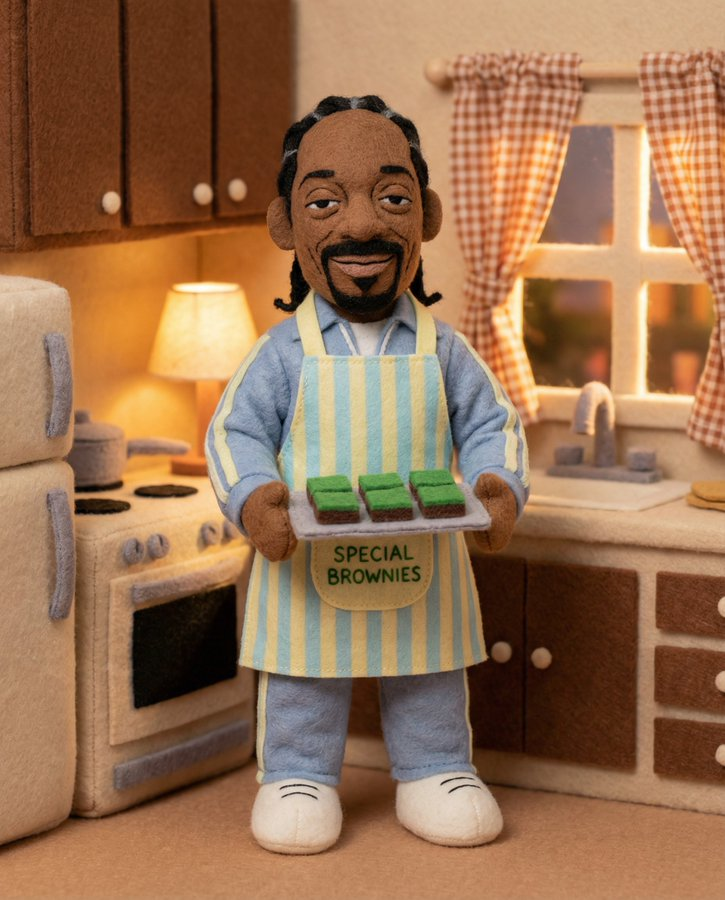

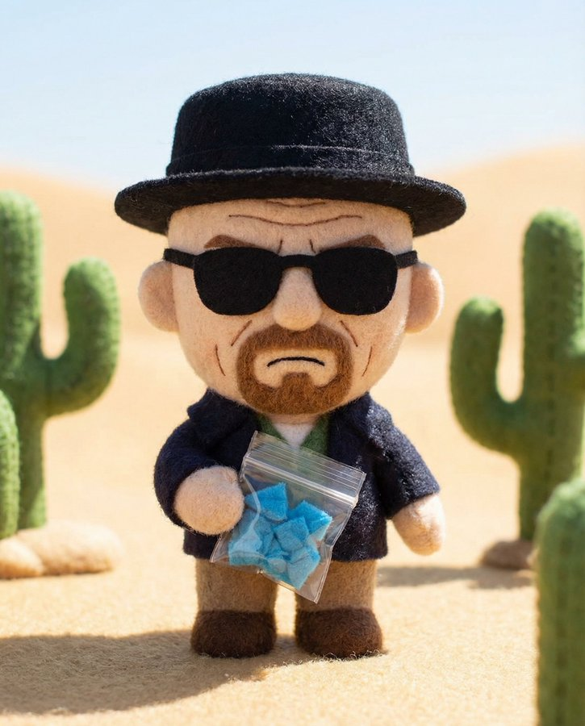

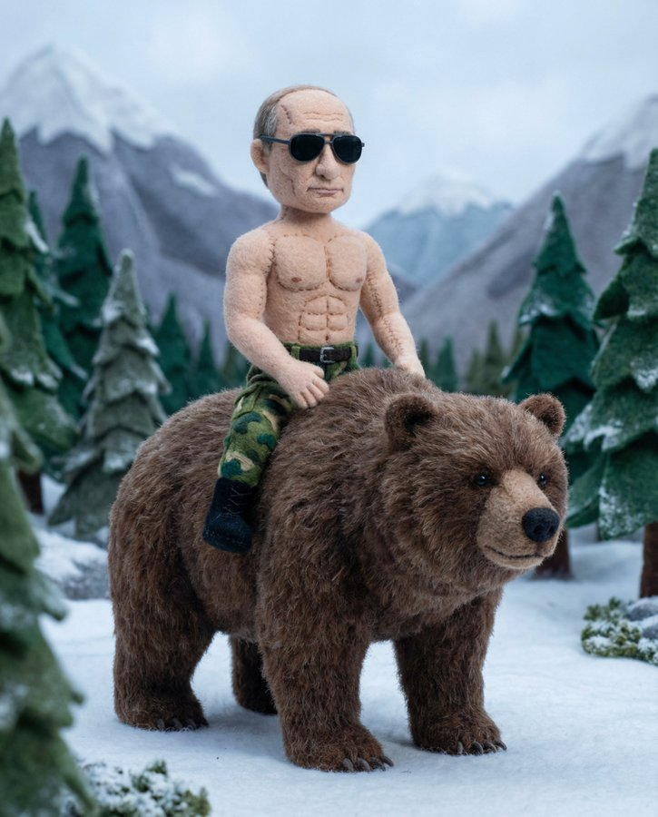

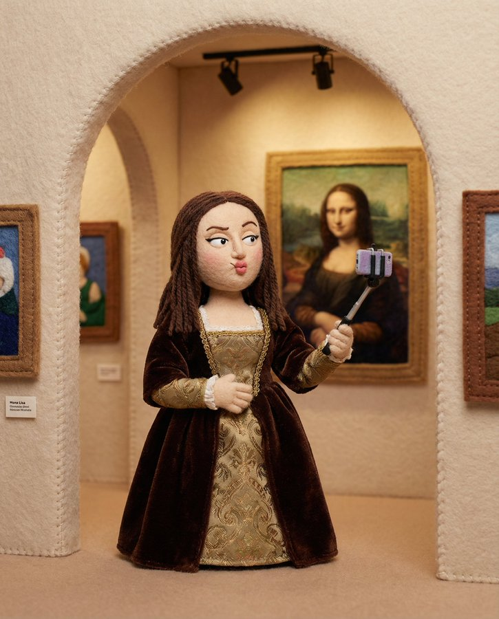

```
Felt toys  

Full body [Subject] toy, [attributes/accessories], [expression], made of felt, in a [place], [lighting], friendly and cartoonish appearance, rich and soft textures
```

```
毛毡玩具  

全身[主体]玩具，带有[特征/配饰]，[表情]，由毛毡制成，位于[地点]，[光线效果]，外观友善且卡通化，质感丰富而柔软
```

 [↑返回目录](#toc)

---
## <a id="">火焰中的凝视：暗黑女性肖像</a> (<a href="https://x.com/sidona/status/2017975569372348664" target="_blank" rel="noopener noreferrer">Sidona</a>)

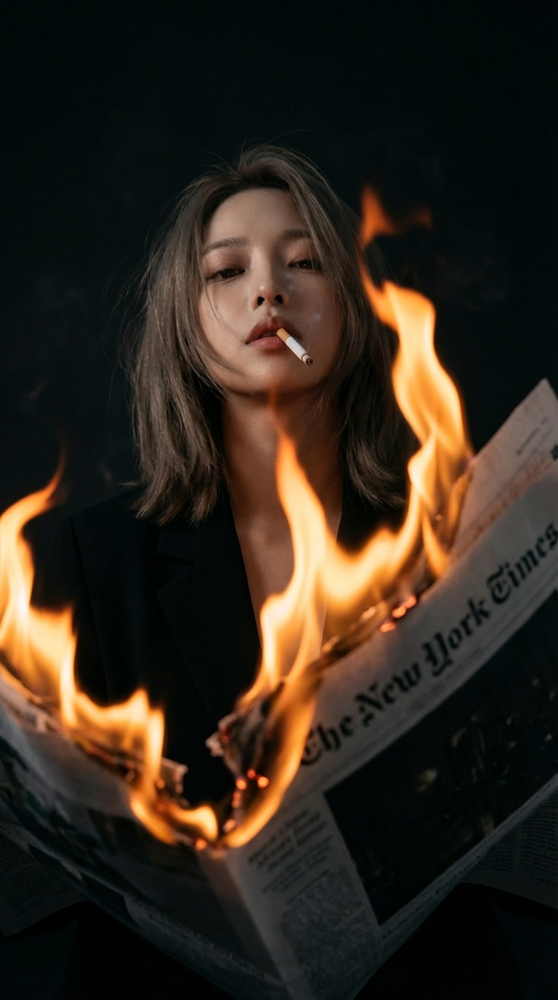

```
{
  "portrait_prompt": {
    "subject": {
      "description": "Based on <User Portrait>, a young woman with slightly tousled shoulder-length hair, cigarette in mouth, viewed from BELOW through flames",
      "features": {
        "hair": "Shoulder-length hair with natural slight waves, a little tousled but not wild — effortlessly messy, lived-in texture",
        "eyes": "Looking down toward camera through the fire, half-lidded distant gaze",
        "expression": "Cold, detached, nonchalant with cigarette dangling from lips"
      },
      "pose": "Holding burning newspaper, only lower face visible — chin, lips, cigarette, and jaw seen through flames"
    },
    "attire": {
      "type": "Based on user-uploaded clothing reference",
      "details": ["Black blazer", "Dark formal wear"],
      "color": "As per clothing reference"
    },
    "key_props": {
      "newspaper": {
        "type": "The New York Times newspaper",
        "position": "Held in front, bottom edge of newspaper and flames are in EXTREME FOREGROUND",
        "condition": "Burning, flames rising UP toward camera"
      },
      "fire": {
        "description": "FOREGROUND ELEMENT — camera shoots THROUGH the flames, fire partially obscures and frames the view of subject's lower face",
        "position": "Between camera and subject's face, flames rising in front of lens",
        "color": "Warm orange and golden yellow, slightly out of focus in foreground",
        "effect": "Fire creates natural vignette/frame, viewer looks THROUGH flames to see chin, lips, and cigarette"
      },
      "cigarette": {
        "position": "Dangling from lips, lit, visible through the fire",
        "smoke": "Smoke mixing with fire glow"
      }
    },
    "composition": {
      "shot_type": "Close-up of lower face THROUGH foreground flames",
      "focal_length": "35mm f/1.8",
      "camera_angle": "LOW ANGLE from below newspaper level, shooting UP through fire toward chin/mouth",
      "camera_height": "VERY LOW — at newspaper/fire level, looking up through flames",
      "camera_position": "Camera placed as if BEHIND the burning newspaper edge, shooting through flames",
      "point_of_view": "POV through fire — flames as soft foreground bokeh/frame, subject's lower face (chin, lips, cigarette) as focal point",
      "framing": "FG: out-of-focus fire and newspaper edge filling bottom/sides of frame; MG: sharp focus on chin, lips, cigarette; BG: dark face fading into black",
      "aspect_ratio": "4:5 or 9:16 vertical",
      "depth_of_field": "Shallow — foreground flames slightly blurred, focus on lips/chin area"
    },
    "lighting": {
      "type": "SINGLE LIGHT SOURCE — fire only",
      "main_light": "NO other light sources, NO fill light, NO ambient light",
      "practical_light": "ONLY the burning newspaper flames illuminate the scene",
      "direction": "Fire below face, casting warm uplight on chin, underlip, and nose from below",
      "mood": "Dark, dramatic, firelit chiaroscuro",
      "ambient": "PURE BLACK surroundings, no other light whatsoever",
      "note": "Face emerges from complete darkness, lit only by fire glow from below"
    },
    "color_palette": {
      "film_simulation": "ETERNA (E)",
      "style": "Fujifilm ETERNA, extremely dark and underexposed, fire is the ONLY color/light in the frame",
      "tones": ["Pure black background", "Warm orange fire glow on skin", "Deep shadows everywhere else"],
      "grade_notes": [
        "overall exposure: very dark, crushed blacks",
        "only fire provides warmth and light",
        "skin visible only where fire illuminates",
        "no fill light, no rim light, no ambient",
        "high contrast firelit look"
      ]
    },
    "environment": {
      "setting": "Complete darkness",
      "background": "Pure black, no detail visible",
      "atmosphere": "Only fire glow and smoke visible against void"
    },
    "mood": "Intimate yet menacing, voyeuristic through flames, dark feminine power",
    "technical_tags": [
      "photorealistic",
      "shot through fire",
      "foreground flames",
      "fire bokeh",
      "extreme low angle",
      "single light source",
      "firelit portrait",
      "deep shadows",
      "chiaroscuro",
      "film grain"
    ],
    "character_reference": "Based on user-uploaded character reference",
    "clothing_reference": "Based on user-uploaded clothing reference",
    "negative_prompt": "Multiple light sources, fill light, rim light, studio lighting, bright exposure, visible background, eye-level shot, high angle, too messy wild hair, too neat perfect hair, flat lighting, soft ambient light"
  }
}
```

```
根据用户人像参考，描绘一位年轻女性：肩长微卷、略显凌乱但自然随性的头发，嘴叼香烟，画面从火焰下方仰视拍摄。  

她手持燃烧的《纽约时报》报纸，仅下脸部可见——透过跃动的火焰，可看到她的下巴、嘴唇、香烟与下颌线条。表情冷漠疏离，眼神半眯，向下凝视镜头，香烟悬于唇间。  

着装基于用户上传的服装参考，包括黑色西装外套与深色正装，颜色依参考图为准。  

构图采用特写视角，焦点集中在透过前景火焰所见的下脸部。使用35mm f/1.8镜头，极低机位——相机置于燃烧报纸与火焰高度，从下方向上仰拍，仿佛藏身于报纸后方，透过升腾的火焰拍摄。画面中，前景为失焦的火焰与报纸边缘，占据画面底部与两侧；中景清晰聚焦于下巴、嘴唇与香烟；背景则完全融入纯黑虚无。画面比例为4:5或9:16竖构图，景深浅，火焰轻微虚化，主体清晰。  

照明仅依赖燃烧报纸的火焰作为唯一光源，无任何补光、环境光或辅助光。火焰自下而上照亮下巴、下唇及鼻底，营造强烈的明暗对比（chiaroscuro）效果。整体氛围黑暗、戏剧化，人物从绝对黑暗中浮现，仅由下方火光勾勒轮廓。  

色彩风格模拟富士胶片ETERNA模式：极度暗调、严重欠曝，画面中唯有火焰带来暖橙与金黄色调，其余尽为深黑。皮肤仅在火焰照耀处显现，其余部分沉入阴影。整体高对比、无填充光、无轮廓光、无环境光，呈现纯粹火光肖像。  

环境为全黑虚空，背景无任何细节，仅见火焰辉光与烟雾缭绕。  

整体情绪亲密而危险，透过火焰窥视，展现一种暗黑女性力量。  

技术关键词：逼真摄影、透过火焰拍摄、前景火焰、火焰散景、极端低角度、单光源、火光照亮肖像、深邃阴影、明暗对照法、胶片颗粒感。  

负面提示：多光源、补光、轮廓光、影室布光、明亮曝光、可见背景、平视角度、高角度、过于杂乱或过于整齐的发型、平光、柔和环境光。
```

 [↑返回目录](#toc)

---
## <a id="">新中式美学的穿搭拆解</a> (<a href="https://x.com/AYi_AInotes/status/2018310829922476400" target="_blank" rel="noopener noreferrer">阿绎 | AI 进化论</a>)

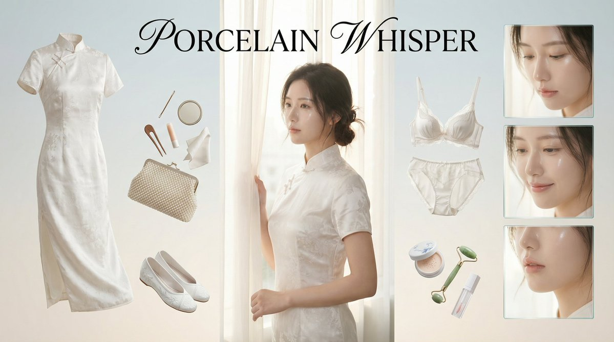

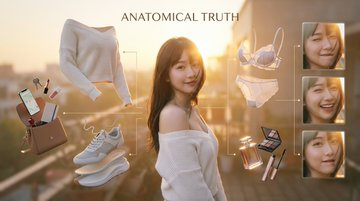

```
ANALYSIS COMPLETE Based on the visual analysis of the white cheongsam (Qipao) image, here is the Master Prompt optimized for the high-end editorial and "Neo-Chinese" aesthetic requirements. 1. GLOBAL SETTING (16:9 Theatrical Stage) "A wide 16:9 cinematic masterpiece poster titled 'PORCELAIN WHISPER'. The Background: An Infinite Studio Cyclorama featuring a Soft Pearl to Pale Morning Mist Ombré. It perfectly matches the ethereal, high-key mood of the subject's environment. The Lighting: High-end studio lighting blended with the atmospheric color. Global Illumination (GI) creates soft, realistic shadows beneath all floating items, mimicking diffused window light." 2. LEFT COLUMN: THE SARTORIAL ARCHIVE (Fashion) "Occupying the left third of the panoramic frame: Outerwear Display: The subject's White Brocade Cheongsam (Qipao) with subtle tonal floral embroidery floats with 'Invisible Gravity'. The silk fabric drapes naturally, volumetric and textured, like a high-end museum display, but hollow and ghost-free. The 'Spill' Detail: A Vintage Pearl-Beaded Clutch floats open. Suspended in mid-air next to it are its daily contents: [Wooden Hairpin], [Small Round Mirror], [Lip Balm], [Silk Handkerchief]—captured in a precise 'knolling explosion'. Footwear Display (Pristine): At the bottom, white embroidered silk flat shoes float naturally in a pair. Shown WHOLE and INTACT (pristine condition), showing material texture." 3. CENTER COLUMN: THE LIVING ANCHOR (Subject) "In the center, the young woman with a loose low bun and a serene, contemplative expression stands as the focal point. Integration: She is perfectly integrated into the colored studio lighting. Photorealistic 8K texture, looking alive and confident, hands gently touching a sheer curtain." 4. RIGHT COLUMN: THE PRIVATE & EMOTIONAL DATA (Details) "Occupying the right third of the frame: Top Layer (The Private Sphere): A delicate, floating exhibition of unworn White Silk & Lace Intimate Apparel (Bra & Panty set). Rendered with exquisite soft texture. Middle Layer (Beauty Lab): Floating cosmetics: [Porcelain Powder Box], [Jade Roller], [Clear Lip Gloss]. Right Edge (Glass UI): A vertical stack of 3 SQUARE GLASS PANELS. Inside are macro face expressions: [Soft Downward Gaze], [Slight Gentle Smile], [Calm Breath]. The glass surfaces reflect the Pearl/Mist background hue." 5. TECHNICAL META-DATA "--ar 16:9. Photorealistic Editorial. Octane Render. Ray Tracing. Clean Composition. High-Key Lighting. 32-bit Color. 8k resolution. Neo-Chinese Aesthetic."
```

```
分析完成。基于对白色旗袍图像的视觉分析，以下是为高端杂志与“新中式”美学需求优化后的主提示词：

1. 全局设定（16:9 戏剧舞台）  
一幅宽幅16:9的电影级杰作海报，标题为《瓷语低吟》。背景：无限摄影棚柔光幕布，呈现由柔珍珠色渐变至淡晨雾色的晕染效果，完美契合人物所处环境空灵、高调的氛围。灯光：高端影棚灯光融合环境色调，全局光照（GI）在所有悬浮物品下方生成柔和而真实的阴影，模拟漫射窗光效果。

2. 左侧栏：服饰档案（时尚）  
占据全景画面左三分之一区域：  
外衣展示：主体所穿白色织锦旗袍，带有微妙同色系花卉刺绣，在“无形重力”作用下悬浮。丝绸面料自然垂坠，具有体积感与纹理感，如同高端博物馆展品般陈列，但内部空无一人、无任何人体痕迹。  
“溢出”细节：一只复古珍珠串珠手包悬浮打开，其日常内容物——[木簪]、[小圆镜]、[润唇膏]、[丝绸手帕]——以精准的“Knolling爆炸式”布局悬浮于旁。  
鞋履展示（完好无损）：底部一双白色刺绣丝绸平底鞋成对自然悬浮，完整呈现，材质纹理清晰可见。

3. 中央栏：生命锚点（人物）  
画面中央，一位年轻女子盘着松散低发髻，神情宁静沉思，作为视觉焦点站立其中。她完美融入彩色影棚灯光之中，呈现8K写实质感，栩栩如生、自信从容，双手轻触一层透明薄纱帘。

4. 右侧栏：私密与情感数据（细节）  
占据画面右三分之一区域：  
上层（私密领域）：一组未穿戴的白色丝绸与蕾丝内衣（文胸与内裤套装）精致悬浮，渲染出极致柔软的质感。  
中层（美妆实验室）：悬浮化妆品包括[白瓷粉盒]、[玉石滚轮]、[透明唇釉]。  
右侧边缘（玻璃界面）：垂直堆叠三块方形玻璃面板，内部呈现面部微表情特写：[温柔垂眸]、[浅浅微笑]、[平静呼吸]。玻璃表面反射珍珠/晨雾背景色调。

5. 技术元数据  
--ar 16:9，写实风杂志大片，Octane渲染，光线追踪，构图简洁，高调布光，32位色彩，8K分辨率，新中式美学。
```

 [↑返回目录](#toc)

---
## <a id="">监控下的美女自拍</a> (<a href="https://x.com/kingofdairyque/status/2018912386078630122" target="_blank" rel="noopener noreferrer">simply</a>)

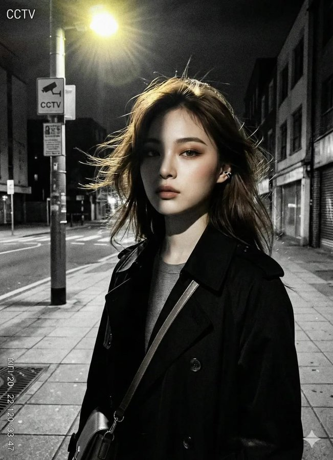

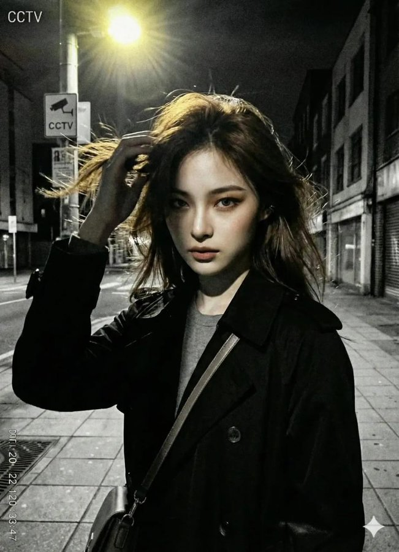

```
Night-time CCTV footage, strong contrast, visible noise.
A woman with brown hair stands under a streetlight, her face half-consumed by shadow, hair catching the light.
She is aware of the camera but does not acknowledge it directly.

Makeup: soft contour, warm brown eyeshadow, matte nude lips
Hairdo: brown hair worn loose, slightly wind-swept
Outfit: black trench coat, inner grey top
Nail art: dark taupe nails
Accessories: leather crossbody bag, subtle ear cuffs

Background: empty sidewalk, urban street corner, CCTV pole visible
Lighting: harsh streetlight creating dramatic shadows
Style: urban surveillance noir, realistic

Dont change the face
```

```
夜间闭路电视监控画面，高对比度，可见噪点。  
一名棕发女子站在路灯下，脸部半隐于阴影中，发丝被光线勾勒。  
她察觉到摄像头的存在，但并未直接回应。

妆容：柔和修容，暖棕色眼影，哑光裸色唇  
发型：棕色长发披散，略带风吹凌乱感  
服装：黑色风衣，内搭灰色上衣  
美甲：深灰褐色指甲  
配饰：皮革斜挎包，低调耳夹

背景：空无一人的街道人行道，城市街角，可见监控杆  
灯光：刺眼的路灯营造出强烈的戏剧性阴影  
风格：都市监控黑色电影风格，写实  

不要改变面部特征
```

 [↑返回目录](#toc)

---
## <a id="">动感十足的动漫角色设计</a> (<a href="https://x.com/CharaspowerAI/status/2018738789263286290" target="_blank" rel="noopener noreferrer">Pierrick Chevallier | IA</a>)

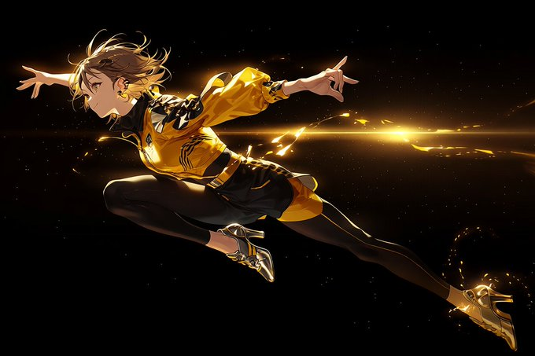

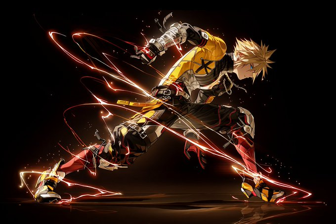

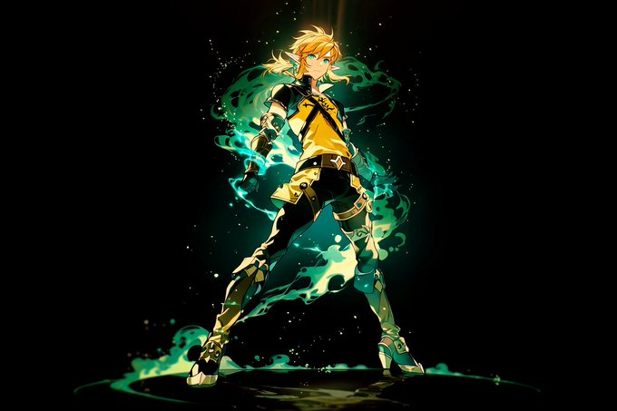

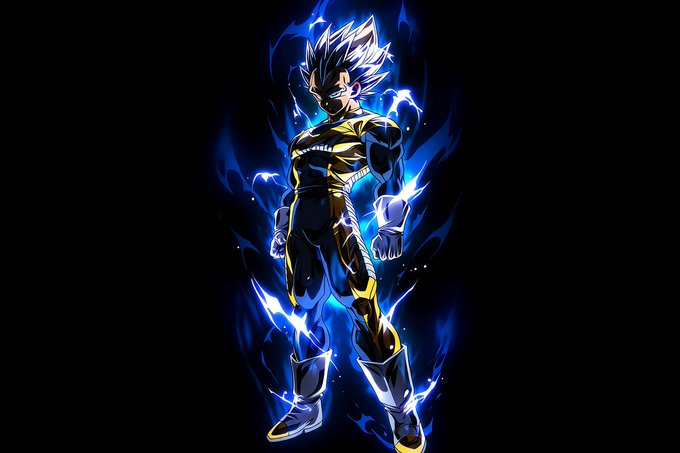

```
Dynamic Anime Style in NIJI 7 mode

PROMPT
stylized character design of [character name],  wearing [Description],  in a dynamic anime-inspired pose,  with [character-specific energy, aura, or power effects /  color] surrounding the body, 
against a dark background with a subtle glowing effect. Full-length character design, high resolution, high quality, high detail, perfect lighting, in the anime style, hyper-detailed, hyper-realistic, a masterpiece, best quality.
```

```
动态动漫风格，NIJI 7 模式  

[角色名]的风格化角色设计，身着[服装描述]，摆出充满动感的动漫风格姿势，身体周围环绕着[角色专属的能量、光环或特效/颜色]，背景为深色并带有微妙的发光效果。全身角色设计，高分辨率、高质量、高细节、完美光影，动漫风格，超精细、超写实，杰作，最佳品质。
```

 [↑返回目录](#toc)

---
## <a id="">绘本中的自信小女孩</a> (<a href="https://x.com/aleenaamiir/status/2019011014973685925" target="_blank" rel="noopener noreferrer">Aleena Amir</a>)

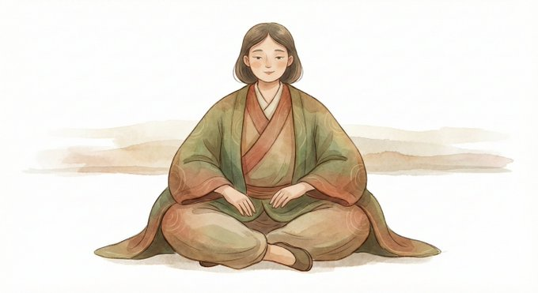

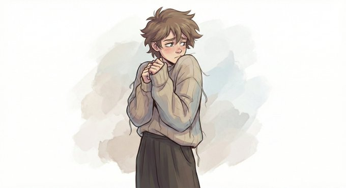

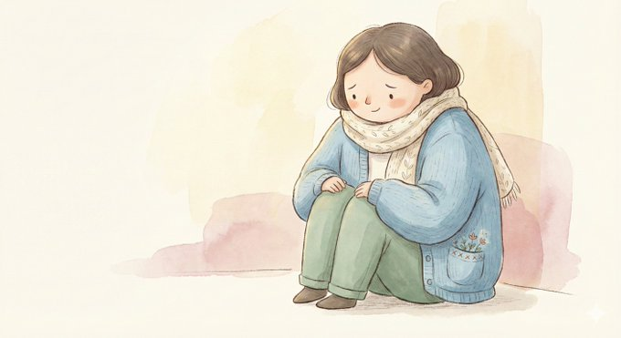

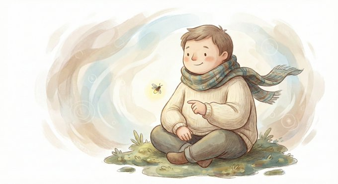

```
Storybook Character Design

Gemini Nano Banana Pro Prompt:

“Create a storybook-style character illustration centered on personality expression.

The character embodies the trait [confident / shy / chaotic / calm], clearly communicated through body language, posture, and gesture. The character is shown [ACTION OR EMOTION], with an exaggerated yet charming facial expression typical of illustrated storybooks.

Clothing and accessories are simple but meaningful, visually reinforcing the personality through [OUTFIT + SYMBOLIC DETAILS] (shapes, textures, small narrative cues).

Facial features are simplified and friendly, with soft lines and minimal detail. The character has a strong, readable silhouette and clear shape language suitable for children’s picture books.

Illustration style is storybook-focused: hand-drawn or painterly, warm color palette, soft shading, and slightly whimsical proportions.

The background is minimal and abstract, using subtle colors or light textures to support the mood without distracting from the character, keeping the focus on emotion and storytelling.”
```

```
绘本角色设计

创作一幅以性格表达为核心的绘本风格角色插画。

角色体现[自信 / 害羞 / 混乱 / 冷静]的特质，并通过肢体语言、姿态和手势清晰传达。角色正在[动作或情绪]，面部表情夸张却富有魅力，符合绘本插画的典型风格。

服装与配饰简洁但富有意义，通过[服装 + 象征性细节]（形状、纹理、微小叙事线索）在视觉上强化角色个性。

面部特征简化且亲切，线条柔和、细节极少。角色具有鲜明、易辨识的剪影和清晰的造型语言，适合儿童图画书。

插画风格聚焦于绘本表现：手绘或绘画感强烈，采用温暖的配色、柔和的阴影，以及略带奇趣的比例。

背景极简且抽象，使用柔和色彩或轻微纹理烘托情绪，不分散对角色的注意力，始终聚焦于情感与故事叙述。
```

 [↑返回目录](#toc)

---
## <a id="">一辆疾驰的摩托车</a> (<a href="https://x.com/azed_ai/status/2019002511160656019" target="_blank" rel="noopener noreferrer">Amira Zairi</a>)

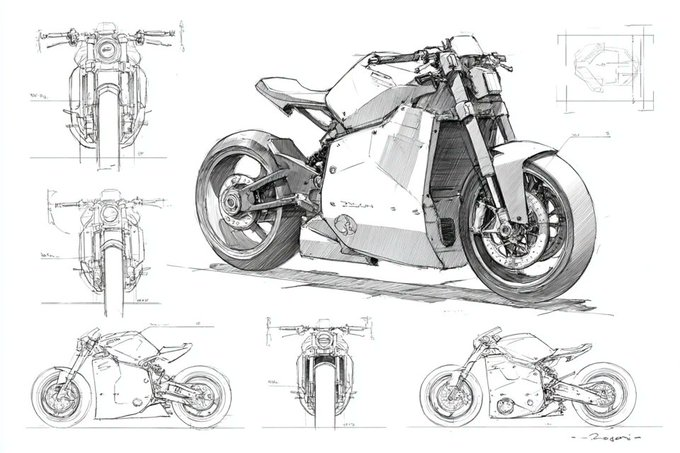

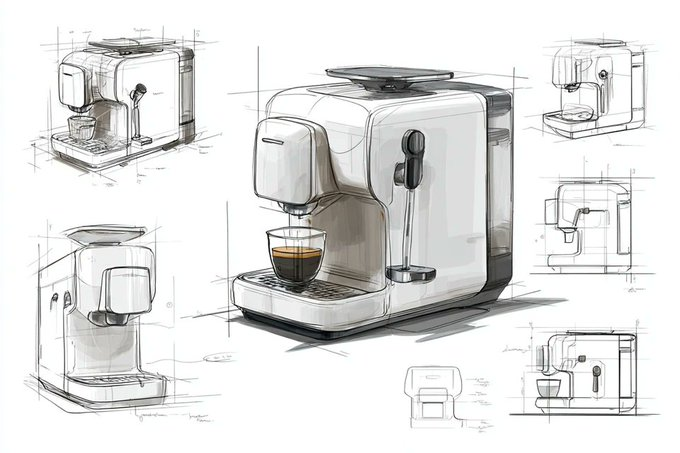

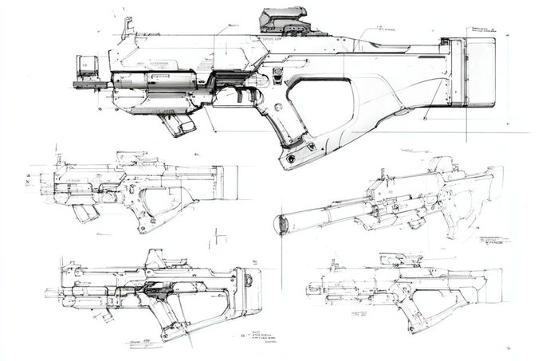

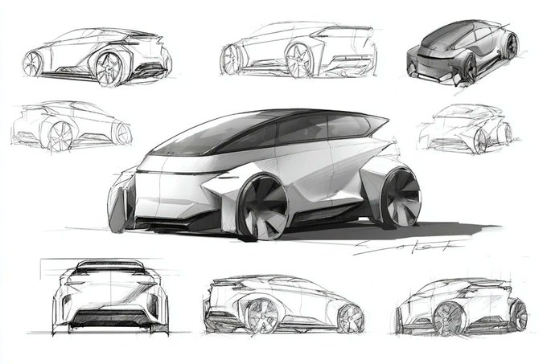

```
Industrial design, concept sketches, [Subject], multiple-view drawing, modern minimalism, clean lines, white background
```

 [↑返回目录](#toc)

---
## <a id="">夜雨中的凝视：金发男子的光影肖像</a> (<a href="https://x.com/iamsofiaijaz/status/2018911526330245273" target="_blank" rel="noopener noreferrer">Aijaz</a>)

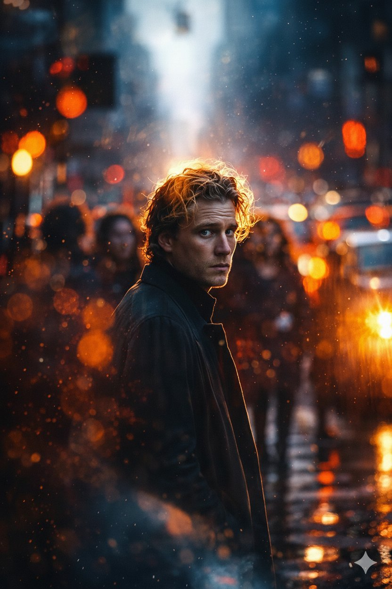

```
The Prompt 
​
A high-definition, cinematic portrait of a young man with wavy blonde hair, looking over his shoulder with a serious expression. He is standing on a crowded, rainy city street at night. The background is filled with intense, warm golden bokeh from city lights and traffic, contrasting with cool blue tones in the upper atmosphere. Rain droplets and golden dust particles are caught in the light, creating a shimmering, ethereal atmosphere. Sharp focus on the subject's face, shallow depth of field, photorealistic, shot on 35mm lens, moody lighting.

​Why this works:
​Lighting Contrast: By specifying "warm golden bokeh" against "cool blue tones," you get that professional color grading (Teal and Orange) common in modern films.
​Atmospherics: Adding "rain droplets" and "dust particles" adds texture and depth, making the image feel alive rather than static.
​Technical Details: Mentioning a "35mm lens" and "shallow depth of field" tells the AI to mimic the blur and focus of a real high-end camera.
```

```
一位金发微卷的年轻男子的高清电影感肖像，神情严肃地回望肩后。他站在夜晚拥挤而下雨的城市街道上，背景是城市灯光与车流形成的强烈暖金色虚化光斑，与上方大气中的冷蓝色调形成鲜明对比。雨滴与金色微尘在光线中闪烁，营造出一种闪耀而空灵的氛围。人物面部清晰锐利，浅景深，写实风格，使用35mm镜头拍摄，光影氛围富有情绪感。
```

 [↑返回目录](#toc)

---
## <a id="">静立于喧嚣中的年轻女子</a> (<a href="https://x.com/Taaruk_/status/2018685474131562751" target="_blank" rel="noopener noreferrer">Taaruk</a>)

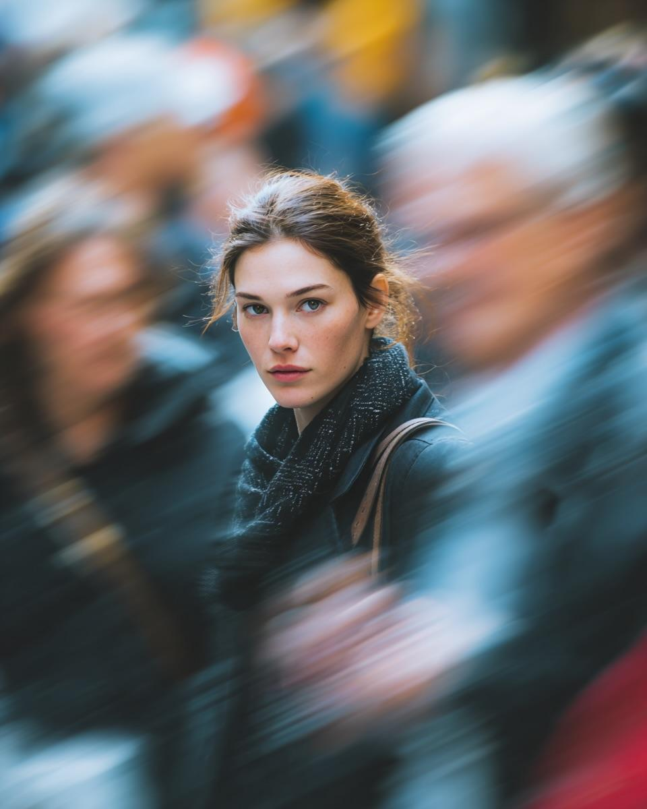

```
Ultra-realistic cinematic street portrait of a young woman standing still in a crowded city street, sharp focus on her face with calm, intense expression. Long-exposure effect with people moving around her creating strong directional motion blur, streaked crowd movement while the subject remains perfectly still. Natural soft daylight, shallow depth of field, creamy bokeh, realistic skin texture, subtle freckles, neutral makeup, dark winter coat and scarf. Emotional, introspective mood, urban storytelling photography, DSLR quality, 85mm lens look, f/1.8, high dynamic range, 8K, professional color grading.
```

```
超写实电影感街头人像，一位年轻女子静立于拥挤的城市街道中，面部清晰聚焦，神情平静而深邃。采用长曝光效果，周围人群移动形成强烈的方向性动态模糊，人流呈拉丝状，而主体人物保持绝对静止。自然柔和的日光，浅景深，奶油般柔美的背景虚化，真实肌肤质感，细微雀斑，淡雅妆容，深色冬装外套与围巾。情绪内敛、富有沉思氛围，呈现都市叙事风格摄影，DSLR画质，85mm镜头效果，光圈f/1.8，高动态范围，8K分辨率，专业级色彩调校。
```

 [↑返回目录](#toc)

---
## <a id="">家庭时尚：休闲装的完美搭配</a> (<a href="https://x.com/AIwithkhan/status/2018932875060777249" target="_blank" rel="noopener noreferrer">Smiling Khan</a>)

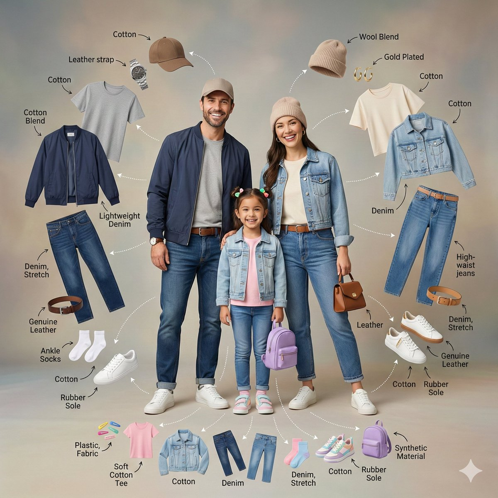

```
Ultra-realistic family fashion infographic photography featuring a Father, Mother, and Daughter in coordinated casual outfits, arranged in a balanced circular exploded composition.
Floating elements organized clockwise around the trio:
• Father: neutral baseball cap, classic wristwatch, cotton crew-neck tee, lightweight casual jacket, tailored denim jeans, leather belt, ankle socks, white sneakers.
• Mother: soft knit hat, minimal gold earrings, relaxed-fit cotton top, cropped denim or linen jacket, high-waist jeans, leather belt, clean sneakers, structured mini handbag.
• Daughter: playful hair accessories, soft cotton tee, light denim jacket, stretch jeans, ankle socks, pastel sneakers, mini backpack.
Each clothing item suspended mid-air with fine dotted guide lines connecting back to each family member.
Minimal editorial labels highlighting fabric, color, and material details (cotton, denim, leather, rubber sole).
Clean studio background with subtle gradient.
Soft diffused lighting for a warm, wholesome mood.
Premium lifestyle editorial styling, ultra-sharp focus, natural skin tones, 8K quality, high-end fashion catalog aesthetic.
```

```
超写实家庭时尚信息图摄影，展现父亲、母亲和女儿三人穿着协调的休闲装束，以平衡的圆形爆炸式构图排列。  
三人周围顺时针悬浮分布以下单品元素：  
• 父亲：中性色棒球帽、经典腕表、纯棉圆领T恤、轻便休闲夹克、剪裁合身牛仔裤、皮质腰带、短袜、白色运动鞋。  
• 母亲：柔软针织帽、极简金色耳钉、宽松纯棉上衣、短款牛仔或亚麻夹克、高腰牛仔裤、皮质腰带、干净运动鞋、结构感迷你手袋。  
• 女儿：趣味发饰、柔软纯棉T恤、轻薄牛仔夹克、弹力牛仔裤、短袜、马卡龙色运动鞋、迷你背包。  
每件服装单品悬浮于空中，并以细虚线引导线连接回对应的家庭成员。  
配有简洁的编辑标签，突出面料、颜色与材质细节（如纯棉、牛仔布、皮革、橡胶鞋底）。  
背景为干净影棚搭配微妙渐变，采用柔和漫射光线营造温暖温馨氛围。  
整体呈现高端生活方式杂志风格，超高清锐利对焦，自然肤色，8K画质，高端时尚画册美学。
```

 [↑返回目录](#toc)

---
## <a id="">顶视柔焦下的宁静面容</a> (<a href="https://x.com/miilesus/status/2018682785871827160" target="_blank" rel="noopener noreferrer">Melis</a>)

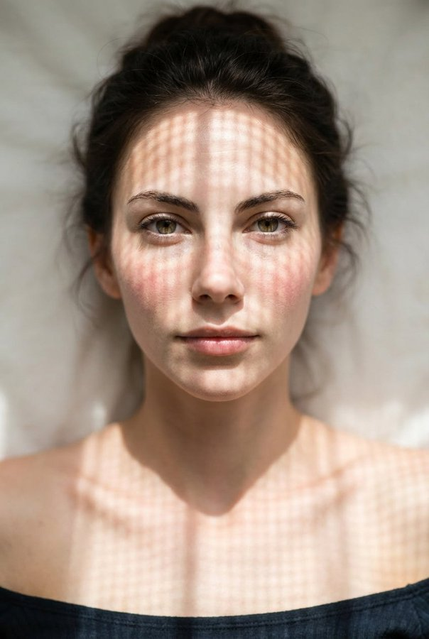

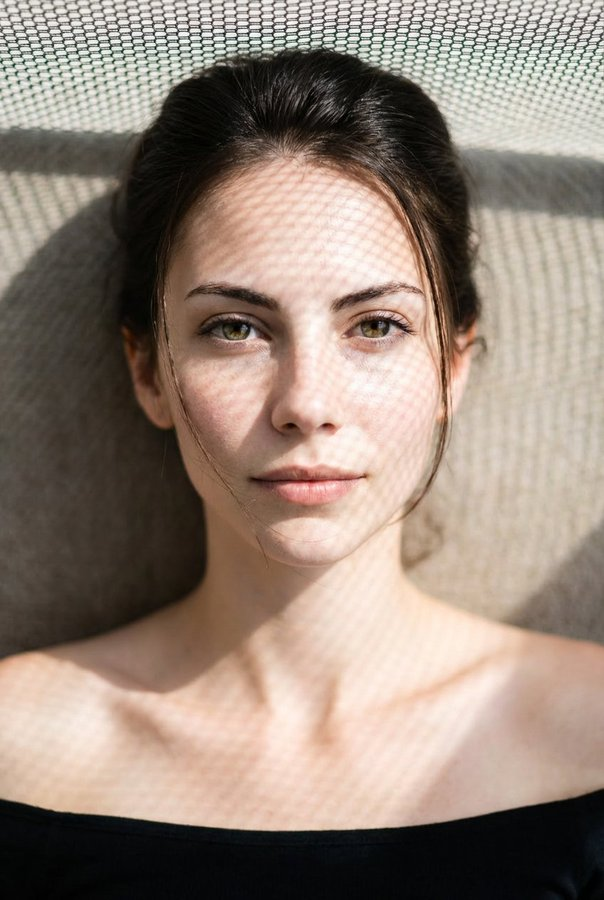

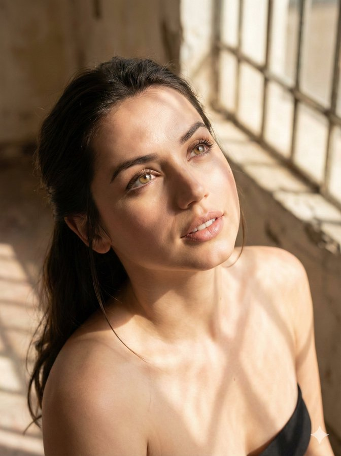


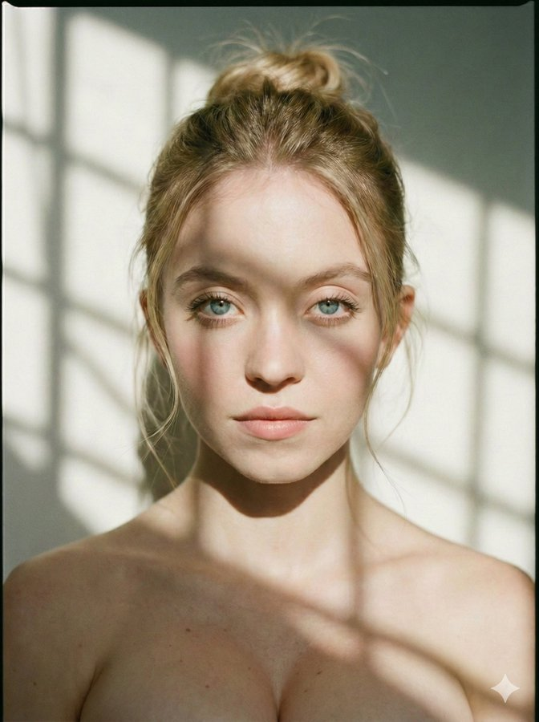

```
Light and Shadow 

Prompt: 
{
  "generation_manifest": {
    "system_directives": {
      "output_version": "5.0_UltraDetail",
      "canvas_parameters": {
        "aspect_ratio": "3:4",
        "compositional_style": "High-Fashion Cinematic Surrealism",
        "fidelity_target": "Anatomical_Identity_Lock"
      }
    },
    "subject_node": {
      "biometrics": {
        "facial_configuration": {
          "feature_retention": ["Eyes", "Nose", "Mouth"],
          "alignment_logic": "Symmetrical_Proportional_Integrity",
          "expression_profile": "Serene_Calm_Innocent"
        },
        "dermatology_rendering": {
          "surface": "Flawless_White_Porcelain",
          "finish": "Radiant_Luminous",
          "pigmentation": "Subtle_Natural_Blush",
          "makeup_logic": "Minimalist_Bare_Aesthetic"
        },
        "follicle_dynamics": {
          "base_color": "natural",
          "primary_state": "Neatly_Tied_Back",
          "secondary_state": "Loose_Strands_Peripheral_Framing"
        }
      },
      "geometry_and_pose": {
        "framing": "Upper_Torso_Facial_Focus",
        "visibility": "Bare_Shoulders_Exposed",
        "posture": "Graceful_Static"
      }
    },
    "optics_and_lighting_rig": {
      "camera_telemetry": {
        "angle_vector": "90_Degree_Top_Down_Overhead",
        "lens_characteristic": "Soft_Focus_Expressive",
        "perspective": "Surreal_Dreamy"
      },
      "lighting_architecture": {
        "primary_source": "Soft_Direct_Natural_Sunlight",
        "shadow_mapping": {
          "geometry_patterns": ["Vertical_Artistic", "Gridded_Mesh"],
          "projection_surface": ["Facial_Planes", "Clavicle", "Shoulders"],
          "contrast_ratio": "Low_Soft_Diffused"
        }
      }
    },
    "atmospheric_meta": {
      "tonality": "Pure_Graceful_Atmospheric",
      "chroma_profile": "Gentle_Naturalistic",
      "emotional_layer": "Tranquility_Innocence"
    }
  }
}
```

```
光影

一位面容宁静、纯真而安详的女性，面部特征（眼睛、鼻子、嘴唇）清晰保留，比例对称协调。肌肤如无瑕白瓷般细腻，呈现自然柔和的光泽，带有淡淡红晕，妆容极简近乎素颜。头发为自然发色，整齐束于脑后，几缕松散发丝轻柔勾勒脸庞轮廓。构图聚焦于上半身与面部，双肩裸露，姿态优雅静谧。采用3:4画幅，风格融合高级时尚与电影感超现实主义。摄影视角为90度顶视俯拍，镜头柔焦且富有表现力，营造梦幻超现实氛围。主光源为柔和直射的自然日光，在面部、锁骨与肩部投下垂直艺术感与网格状的低对比度柔影。整体色调纯净温柔，色彩自然温和，传递出宁静与纯真的情感氛围。
```

 [↑返回目录](#toc)

---
## <a id="">忙碌于玻璃工作间内</a> (<a href="https://x.com/Arminn_Ai/status/2018764499881537605" target="_blank" rel="noopener noreferrer">ΛRMIN | AI</a>)

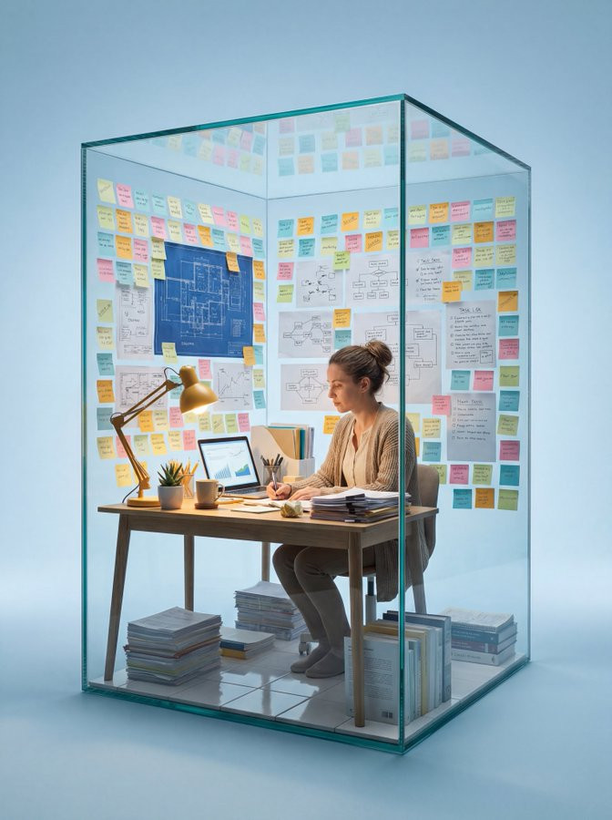

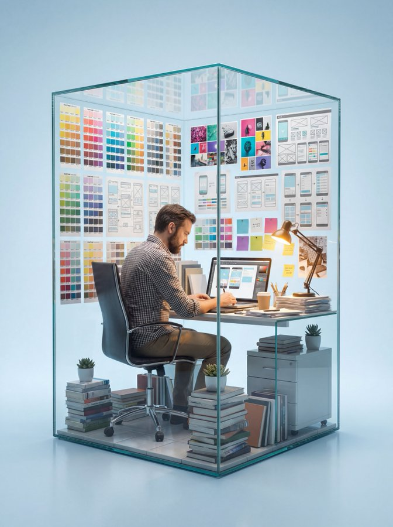

```
Busy inside a glass workspace

Made with Nano Banana Pro on @higgsfield_ai

- Prompt 
Hyper-realistic macro photography of a real living [Subject/Job Title] working at a desk inside a tall vertical rectangular glass cube. Centered composition. The glass structure occupies approximately 80% of the vertical frame height, ensuring a perfect amount of minimalist soft blue negative space on all four sides. The camera distance is a stable medium-close shot.

The Composition: The two glass walls facing the camera are completely clear and empty to allow a perfect view of the interior. In contrast, the interior of the two back walls is cluttered and densely covered from the floor to the very top edge with hundreds of [Specific Job-related Items: e.g., sticky notes, charts, blueprints, vibrant mood boards, tiny Pantone color swatches], creating an intense "busy" workload atmosphere.

Interior Details: realistic [Specific Desk Items], and a warm incandescent desk lamp that casts a soft golden glow over the workspace. The interior floor is made of polished white ceramic tiles. The floor around the desk is cluttered with tall, messy stacks of organized papers, open reference books and [Specific  Items]

The Realism: The person is NOT a plastic figure; they have visible skin texture, natural hair, and realistic clothing folds. Every object inside has sharp, crisp, and high-contrast textures. Lighting & Style: Bright studio lighting, clean shadows, macro photography style, minimalist soft blue background. 8k resolution, extremely detailed and sharp focus.
```

```
超写实微距摄影：一位真实的[职业/身份]在一张办公桌前工作，身处一个高大的垂直矩形玻璃立方体内。画面采用居中构图，玻璃结构占据画面垂直高度的约80%，四周留出恰到好处的极简柔和蓝色负空间。镜头距离为稳定的中近景。

构图细节：面向镜头的两面玻璃墙完全通透、空无一物，确保能清晰看到内部；而另外两面背对镜头的内墙则从地面到顶部密密麻麻覆盖着数百件[与该职业相关的具体物品，例如：便利贴、图表、蓝图、鲜艳的情绪板、小型潘通色卡]，营造出极度“忙碌”的工作氛围。

内部细节：真实还原的[具体桌面物品]，以及一盏温暖的白炽台灯，在工作区投下柔和的金色光晕。地面为抛光白色陶瓷瓷砖，桌旁堆满高高叠起、杂乱却有序的纸张、摊开的参考书籍和[具体物品]。

真实感表现：人物并非塑料模型，具有可见的皮肤纹理、自然发丝和逼真的衣物褶皱。内部每件物品都拥有锐利、清晰、高对比度的质感。
光影与风格：明亮的影室灯光，干净利落的阴影，微距摄影风格，极简柔和蓝色背景。8K分辨率，细节极致丰富，焦点极为锐利。
```

 [↑返回目录](#toc)

---
## <a id="">品牌迷你立体场景展示</a> (<a href="https://x.com/0x00_Krypt/status/2018673817778840039" target="_blank" rel="noopener noreferrer">两斤</a>)

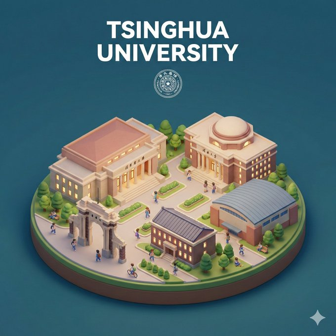

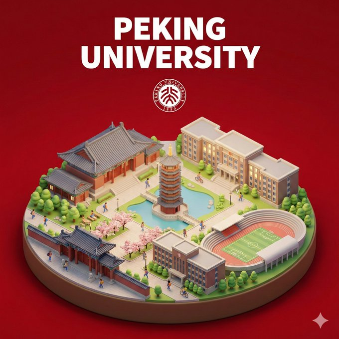

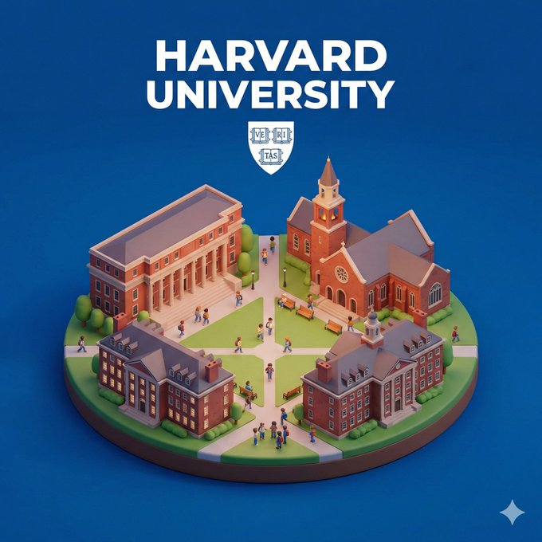

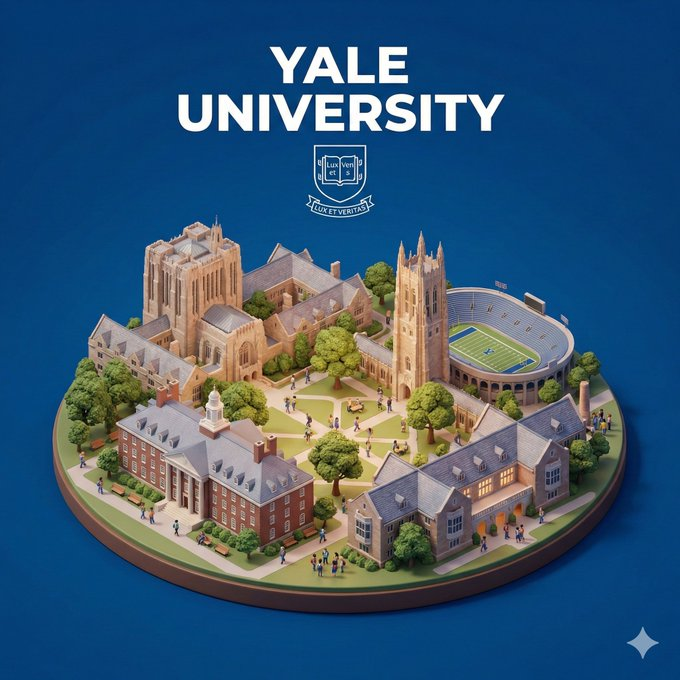

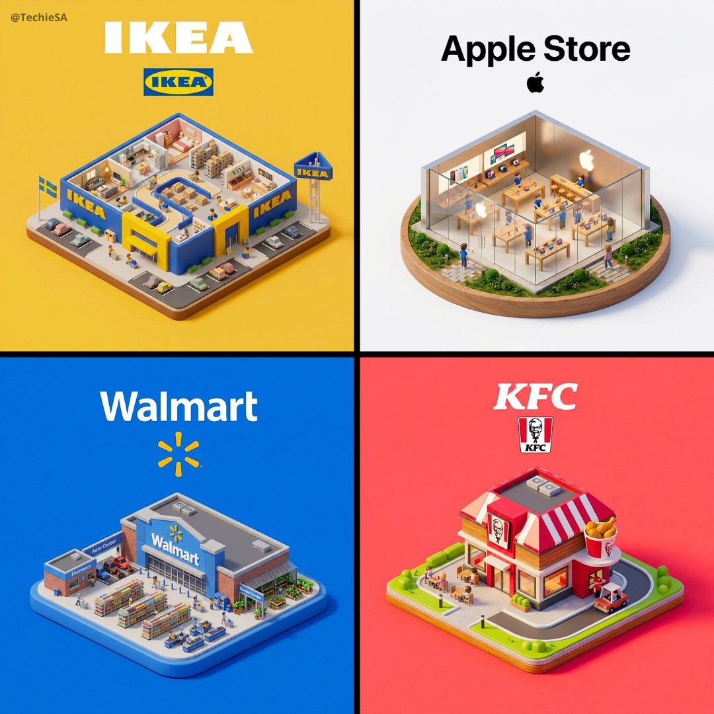

```
Present a clear, 45° top-down isometric miniature 3D cartoon diorama of [UNIVERSITY NAME] campus. The scene should feature soft refined textures, realistic PBR materials, and immersive ambient lighting that reflects the academic atmosphere. Create a small raised diorama-style base that automatically populates with a curated selection of the most iconic elements: main library, administration building, campus quad, bell tower, student union, sports stadium, and signature campus greenery or pathways unique to [UNIVERSITY NAME]. Include tiny stylized figures of students in casual campus attire, carrying backpacks, sitting on benches, or walking between classes (no facial details). Use a clean solid [BACKGROUND COLOR] background. At the top-center, display "[UNIVERSITY NAME]" in large bold text, and place the university shield, mascot silhouette, or founding year emblem below the text. All text must automatically match the background contrast. Composition: perfectly centered layout, square 1080x1080, ultra-clean, high-clarity 3D diorama aesthetic.


```

```
Present a clear, 45° top-down isometric miniature 3D cartoon diorama of the [BRAND], with soft refined textures, realistic PBR materials, and gentle lifelike lighting.
Create a small raised diorama-style base that includes the most recognizable elements of the store, along with tiny stylized characters if needed (no facial details).
Use a clean solid [BACKGROUND COLOR] background.

At the top-center, display [BRAND] in large bold text, and place the official logo associated with [BRAND] below the subtext.
All text must automatically match the background contrast (white or black).

Composition: perfectly centered layout, square 1080x1080, ultra-clean, high-clarity diorama aesthetic.
```

 [↑返回目录](#toc)

---
## <a id="">复原款明制圆领袍</a> (<a href="https://x.com/ponyodong/status/2018693848890036659" target="_blank" rel="noopener noreferrer">ponyo</a>)

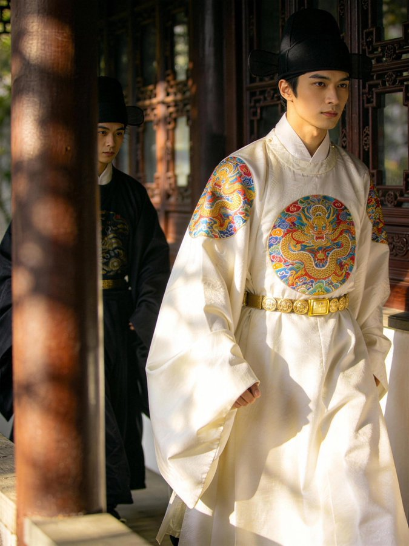

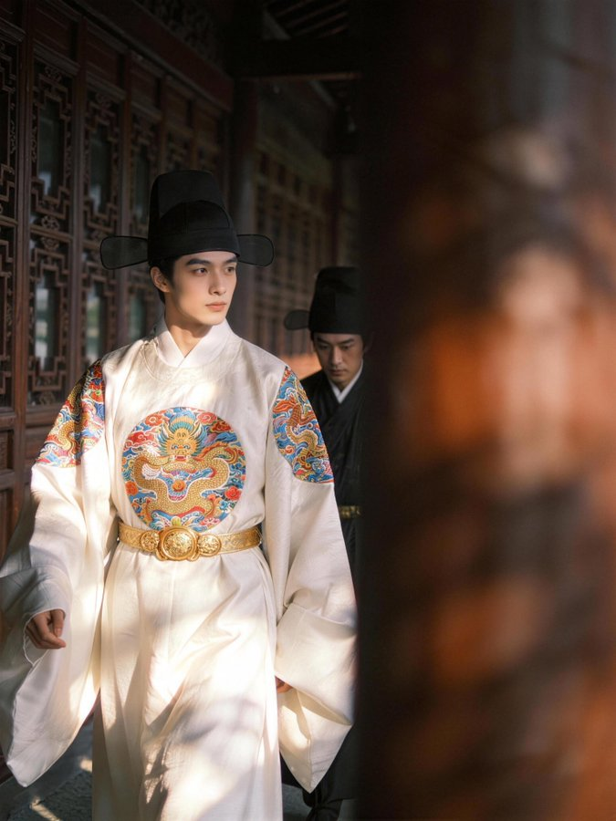

```
A young noble man in traditional Chinese imperial robe,
white silk embroidered with golden dragon,
walking through an ancient palace corridor of dark wood,
sunlight filtering through carved windows,
quiet authority, restrained elegance,
cinematic lighting, historical atmosphere,
a sense of destiny before the throne.
```

```
自然真实的视觉风格，全身镜头，清冷绝色的明代翩翩佳公子，复原款明制圆领袍，米白缎面材质，胸前与肩部彩色团龙纹刺绣，金色玉带，黑色明制官帽，身姿挺拔迈步前行，身后跟随深色明制官服侍从，木质廊柱与雕花窗棂，慵懒诗意氛围，侧逆光，丁达尔光效，复古低饱和暖棕色调，大师级构图，浅景深，前景虚化遮挡，电影质感。大师级作品。超高清高品质高质量佳作，画面清晰，专业后期处理优化，真实细腻的皮肤质感，完美光影，近景失焦遮挡。情态生动自然，故事感，随机角度，随机运镜，光影斑驳，柔焦美学，细腻肌理质感，情绪写意，艺术人像高级感。大光圈虚化营造高级电影质感。整体构图融合浪漫主义美学，突出人物立体轮廓与优雅气质。空灵的气氛，巧妙地捕捉情感，情绪表达色彩化，色彩艳丽，情绪叙事，整体氛围慵懒又随性，尽显松弛感，现场感，既视感，伦勃朗光，极强的光影对比，渐变美学，氛围感，故事感，复古胶片摄影，明显的胶片颗粒感，真实光影，复古色调，富士滤镜，Kodak Portra 400胶片质感，_DSF1600.RAF效果，XF56mm F1.2镜头视角，IMG_2094.CR2质感，ins风，背景虚化，沉浸，文艺风格构图，细节丰富，强烈的视觉冲击力。
```

 [↑返回目录](#toc)

---
## <a id="">折纸艺术打造的超精细可爱动物</a> (<a href="https://x.com/icreatelife/status/2018504325597659157" target="_blank" rel="noopener noreferrer">Kris Kashtanova</a>)

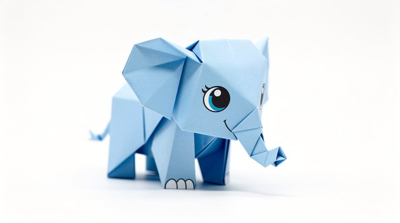

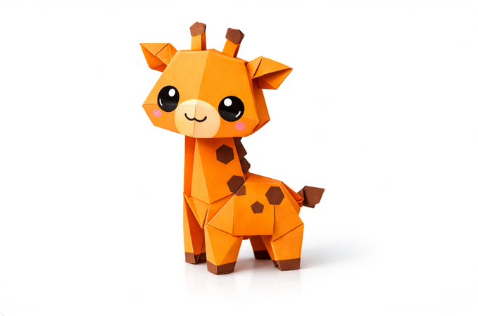

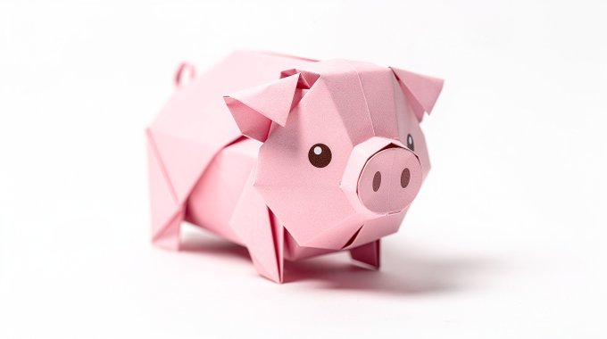

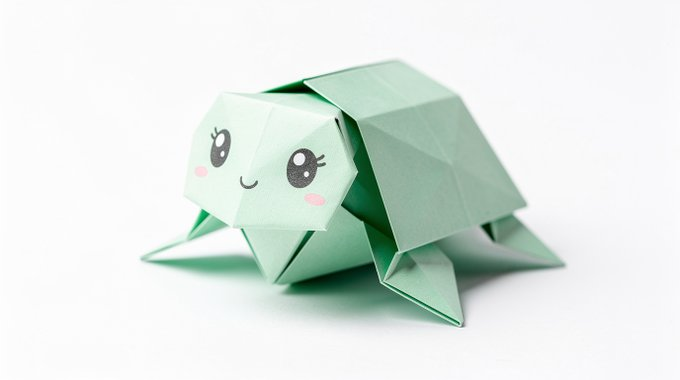

```
origami adorable [COLOR] [ANIMAL],
kawaii, paper craft, cinematic, white background, high detail, HD, ultra detailed

Can’t wait to see what you come up with
```

```
折纸风格的可爱[颜色][动物]，  
卡哇伊、纸艺、电影感、白色背景、高细节、高清、超精细
```

 [↑返回目录](#toc)

---
## <a id="">昼夜分界的微缩城市</a> (<a href="https://x.com/aleenaamiir/status/2018562067033375224" target="_blank" rel="noopener noreferrer">Aleena Amir</a>)

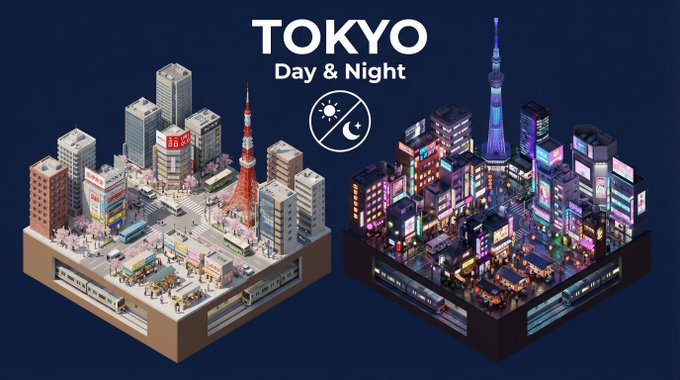

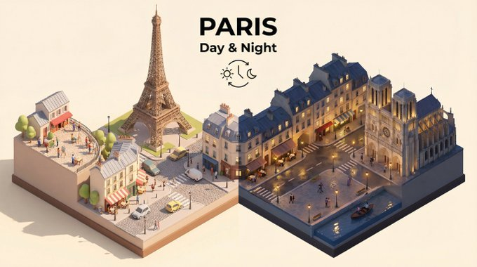

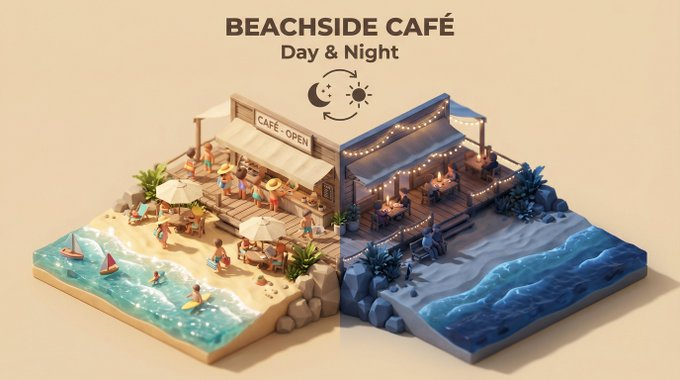

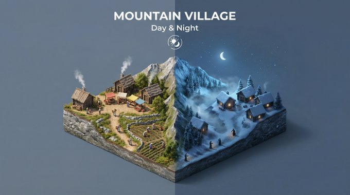

```
“Day vs Night” Diorama of Cities

Gemini Nano Banana Pro Prompt:

Create a clear, 45° top-down isometric miniature 3D diorama of [LOCATION], split between day and night.

Use soft refined textures, realistic PBR materials, with warm daylight lighting on one side and cool moonlit lighting on the other.

Build a raised base with consistent geometry but different environmental details (lighting, activity, mood).

Include tiny stylized figures behaving differently in day vs night (no facial details).
Use a clean solid [BACKGROUND COLOR] background.

At the top-center, display [LOCATION NAME] in large bold text, beneath it show ‘Day & Night’, and place a minimal time-cycle icon below.

All text must automatically match the background contrast (white or black).
```

```
“昼夜对比”城市微缩场景

创建一个清晰的45度俯视等距微型3D微缩场景，展现[地点]的昼夜分界。

一侧采用柔和精致的纹理与写实PBR材质，配以温暖的日光照明；另一侧则使用冷色调的月光照明。

构建一个抬高的基座，保持一致的几何结构，但两侧环境细节（光照、活动、氛围）各不相同。

加入微小的风格化人物，分别呈现白天与夜晚的不同行为（无需面部细节）。

背景使用纯色[背景颜色]。

在画面顶部中央显示大号粗体字[地点名称]，其下方标注“Day & Night”，再下方放置一个极简的时间循环图标。

所有文字需自动匹配背景对比度（白色或黑色）。
```

 [↑返回目录](#toc)

---
## <a id="">混凝土空间的四视角图</a> (<a href="https://x.com/kaanakz/status/2019117016024563872" target="_blank" rel="noopener noreferrer">Kaan</a>)

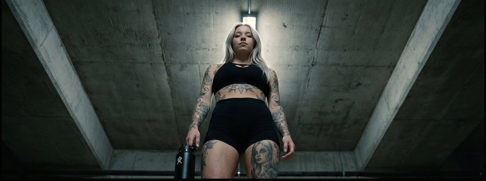

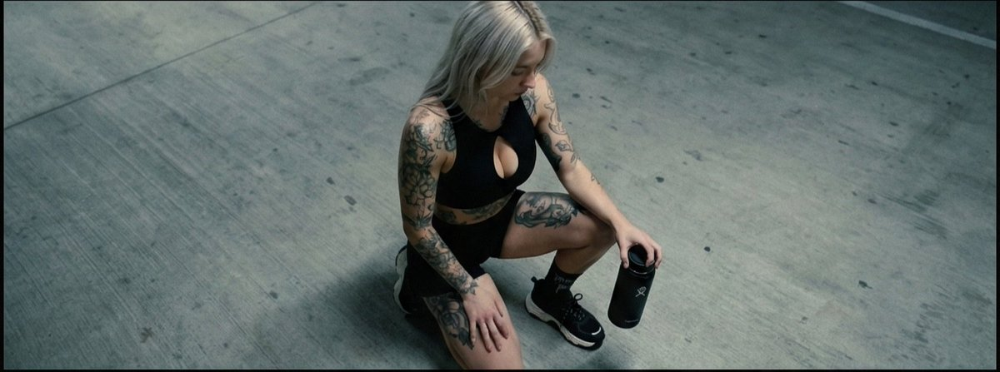

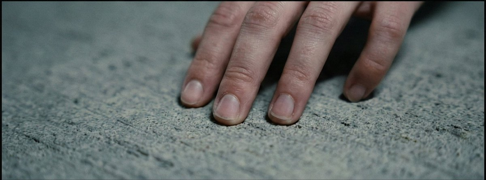

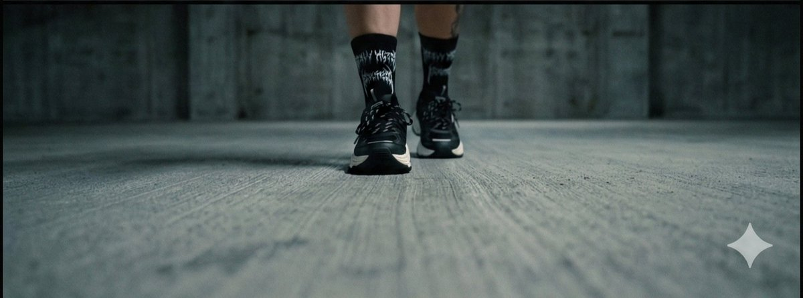

```
Worm’s-Eye
High-Angle
Macro
Ground-Level

{
  "output": {
    "canvas": {
      "type": "vertical cinematic",
      "layout_rule": "split the image into four perfectly equal horizontal sections",
      "panel_count": 4,
      "panel_uniformity": "all panels must be identical in height and width, min height 600px",
      "divider": "clean, thin black horizontal lines",
      "alignment": "strict, no variation"
    }
  },
  "style": {
    "aesthetic": "clean noir cinematic",
    "tone": "editorial-documentary",
    "mood": "cold, isolated, grounded",
    "lighting_philosophy": "low-key noir lighting with clean cinematic readability"
  },
  "scene": {
    "environment": {
      "type": "brutalist concrete interior",
      "materials": "raw concrete, visible aggregate, drying rings",
      "lighting": {
        "source": "single overhead practical light",
        "direction": "top-down",
        "contrast": "high",
        "shadow_behavior": "deep blacks with retained detail",
        "atmosphere": "dust motes visible in light shafts"
      }
    }
  },
  "subject": {
    "continuity": {
      "same_subject": true,
      "same_scene": true,
      "consistent_wardrobe": true,
      "consistent_physical_proportions": true
    },
    "materials": {
      "skin": "realistic micro-creases and subtle sweat sheen",
      "fabric": "heavy wool or canvas with frayed edges",
      "edge_separation": "clean silhouette separation from environment"
    }
  },
  "composition": {
    "panels": [
      {
        "panel": 1,
        "camera_view": "extreme low-angle (worm’s-eye)",
        "description": "camera placed near floor looking straight upward, subject appears monolithic, concrete ceiling dominates frame",
        "depth_of_field": "deep"
      },
      {
        "panel": 2,
        "camera_view": "high-angle three-quarter",
        "description": "camera looking down from an offset angle, subject seated or kneeling, floor texture and spatial context visible",
        "depth_of_field": "shallow"
      },
      {
        "panel": 3,
        "camera_view": "tight macro interaction",
        "description": "extreme close framing on tactile interaction such as fingertips touching cold concrete, texture and surface tension emphasized",
        "depth_of_field": "shallow"
      },
      {
        "panel": 4,
        "camera_view": "ground-level depth shot",
        "description": "camera placed on the floor looking toward the subject’s feet and lower legs, strong foreground-to-background depth",
        "depth_of_field": "deep"
      }
    ]
  },
  "camera": {
    "system": "ARRI Alexa cinematic look",
    "grain": "subtle 35mm film grain",
    "lens_behavior": "realistic optical distortion only",
    "artifacts": "no digital sharpening or artificial clarity"
  },
  "color_and_grade": {
    "temperature": "neutral",
    "contrast": "controlled",
    "black_levels": "deep but not crushed",
    "restrictions": "no AI glow, no lifted blacks"
  },
  "constraints": {
    "panel_integrity": [
      "all four panels are equal in size",
      "no panel may be taller or shorter than another",
      "no cropping or overlap between panels",
      "perspective differences must come only from camera position"
    ]
  },
  "negative_prompt": [
    "uneven panels",
    "unequal sections",
    "vertical split",
    "collage layout",
    "merged frames",
    "inconsistent panel scaling",
    "stretched panels",
    "plastic skin",
    "beauty filter",
    "fake HDR",
    "neon",
    "glow",
    "bloom",
    "illustration",
    "3D render",
    "over-saturated",
    "washed-out",
    "logos",
    "text",
    "watermarks",
    "distorted anatomy",
    "cropped limbs across panels",
    "bird’s-eye view",
    "side profile",
    "medium-wide back shot"
  ]
}
```

```
仰视  
高角度  
微距  
地面视角  

垂直电影画幅，将画面严格均分为四个水平相等的部分，每部分高度与宽度完全一致（最小高度600像素），以干净纤细的黑色横线分隔，对齐精准无偏差。  

整体风格为干净的黑色电影美学，基调如纪实编辑摄影，氛围冷峻、孤寂、贴近现实；采用低调黑色电影布光，同时保持清晰的电影级可读性。  

场景设定于粗野主义混凝土室内，材质为原始混凝土，可见骨料与干涸水渍痕迹；光源为单一顶部实用灯具，光线自上而下，高对比度，阴影深黑但保留细节，光束中可见漂浮尘埃。  

主体在四幅画面中保持完全一致：同一人物、同一场景、服装统一、身体比例不变；皮肤呈现真实细微褶皱与轻微汗光，衣物为厚重羊毛或帆布，边缘有磨损，主体轮廓与环境清晰分离。  

四幅构图分别为：  
1. 极端低角度（虫眼视角）——相机贴近地面垂直向上拍摄，人物显得如纪念碑般巨大，混凝土天花板占据画面主导，景深深远；  
2. 高角度三分之三视角——相机从偏斜上方俯拍，人物呈坐姿或跪姿，可见地面纹理与空间环境，景深浅；  
3. 紧凑微距互动——极端特写聚焦于指尖触碰冰冷混凝土的瞬间，强调材质肌理与表面张力，景深浅；  
4. 地面深度镜头——相机置于地面，朝向人物脚部与小腿，营造强烈前景至背景的纵深感，景深深远。  

使用ARRI Alexa电影感系统，叠加细微35毫米胶片颗粒，仅保留真实光学畸变，禁止数字锐化或人工增强清晰度。  

色彩与调色要求：色调中性，对比度受控，黑位深邃但不压死；严禁AI光晕、提亮黑场。  

约束条件：四幅画面尺寸绝对相等，不得有任何高低差异、裁剪、重叠；视角变化仅由相机位置决定。  

负面提示：画面不均、分区不等、垂直分割、拼贴布局、帧融合、比例不一致、拉伸变形、塑料质感皮肤、美颜滤镜、伪HDR、霓虹、发光、辉光、插画、3D渲染、过饱和、褪色、标志、文字、水印、解剖失真、跨画面肢体裁切、鸟瞰视角、侧脸、中远景背影。
```

 [↑返回目录](#toc)

---
## <a id="">建筑蛋糕剖面图</a> (<a href="https://x.com/Gdgtify/status/2019339841507643609" target="_blank" rel="noopener noreferrer">Gadgetify</a>)

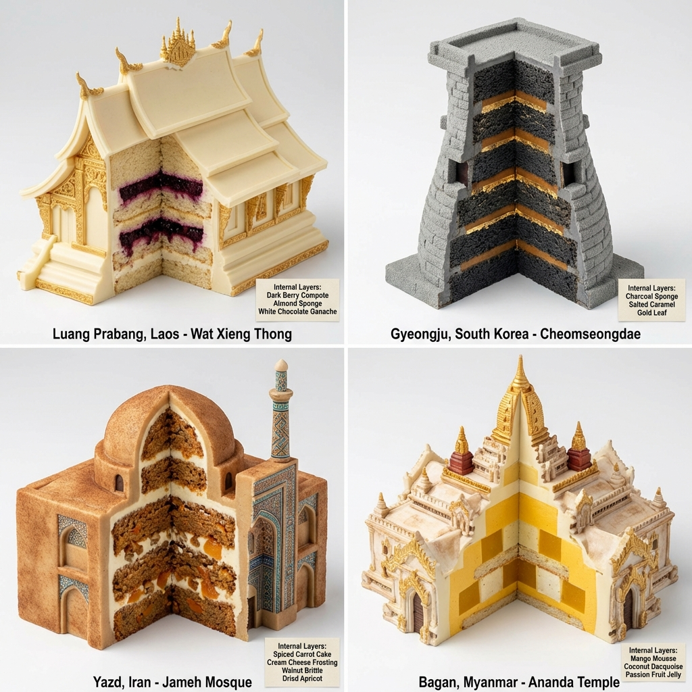

```
<instructions> input=continent or country. Find 4 less famous cities or regions, analyze deeply and select their most architecturally distinct building. Function DrawCity($lesser_known){ Concept: Architectural Cross-Section - The building's form containing complex pastry layers. Process: 1. SELECT TARGET: Identify $ BuildingName. 2. EXTRACT GEOMETRY: Define $ Silhouette (The outer profile). Do not simplify the geometry. 3. DEFINE INTERIOR ($FlavorProfile): - Assign distinct color contrast layers (e.g., Red Velvet inside White Marble, Matcha Sponge inside Grey Concrete, Gold flakes in Jelly). 4. SURGICAL SLICE: - Remove 1/4 of the structure or create a vertical cross-section. - CRITICAL: The cut must be clean and sharp. It must reveal $ FlavorProfile layers inside the walls/floors. - The remaining 3/4 of the building must remain architecturally perfect. 5. MATERIAL MAPPING (Apply texture to Exterior): IF Gothic/Ornate → Ext: White Chocolate Sculpting // interior: Layers of dark berry compote & almond sponge. IF Modern/Glass → Ext: Isomalt panes & Mirror Glaze // interior: : Geometric cubes of mango mousse & coconut dacquoise. IF Brutalist/Concrete → Ext: Grey Sesame Velvet Spray // interior: : Dense strata of charcoal sponge & salted caramel. IF Adobe/Organic → Ext: Cinnamon Marzipan // interior: : Spiced carrot cake & cream cheese strata. 6. EXECUTE: Macro shot, 45-degree angle, sharp focus on the "cut" to show texture. } Output: 2x2 grid. Run DrawCity($lesser_known) 4 times. Label: Bottom of each image "City, State/Country - Building Name". Include: A small visual recipe card in corner listing the "Internal Layers". </instructions>
```

```
<指令> 输入：大洲或国家。找出4个不太知名的城市或地区，深入分析并选出其中最具建筑特色的建筑物。  
函数 DrawCity($小众地点) {  
概念：建筑剖面——建筑形态内含复杂的糕点层次。  
流程：  
1. 选定目标：识别$建筑名称。  
2. 提取几何结构：定义$轮廓（外部轮廓），不得简化几何形状。  
3. 定义内部（$风味组合）：  
   - 分配具有鲜明色彩对比的层次（例如：白色大理石外表内藏红丝绒夹层、灰色混凝土内嵌抹茶海绵蛋糕、果冻中加入金箔）。  
4. 精密切割：  
   - 移除建筑的四分之一，或制作垂直剖面。  
   - 关键要求：切口必须干净利落，清晰展现墙体/楼板内的$风味组合层次。  
   - 剩余四分之三的建筑必须保持建筑外观的完美无瑕。  
5. 材质映射（应用于外部）：  
   - 若为哥特式/繁复风格 → 外部：白巧克力雕刻 // 内部：深色浆果果酱与杏仁海绵蛋糕层。  
   - 若为现代/玻璃风格 → 外部：异麦芽酮糖玻璃板与镜面釉 // 内部：芒果慕斯与椰子达克瓦兹几何立方体。  
   - 若为粗野主义/混凝土风格 → 外部：灰色芝麻天鹅绒喷涂层 // 内部：竹炭海绵蛋糕与海盐焦糖致密夹层。  
   - 若为土坯/有机风格 → 外部：肉桂杏仁膏 // 内部：香料胡萝卜蛋糕与奶油奶酪夹层。  
6. 执行：  
   - 采用微距镜头，45度角拍摄，焦点清晰对准“切口”以展现纹理细节。  
}  
输出：2x2网格图像。运行 DrawCity($小众地点) 四次。  
每张图片底部标注：“城市, 州/国家 - 建筑名称”。  
在角落附上一张小型视觉食谱卡，列出“内部层次”。</指令>
```

 [↑返回目录](#toc)

---
## <a id="">四部经典电影的导演视角微缩场景</a> (<a href="https://x.com/Gdgtify/status/2019262960062067135" target="_blank" rel="noopener noreferrer">Gadgetify</a>)

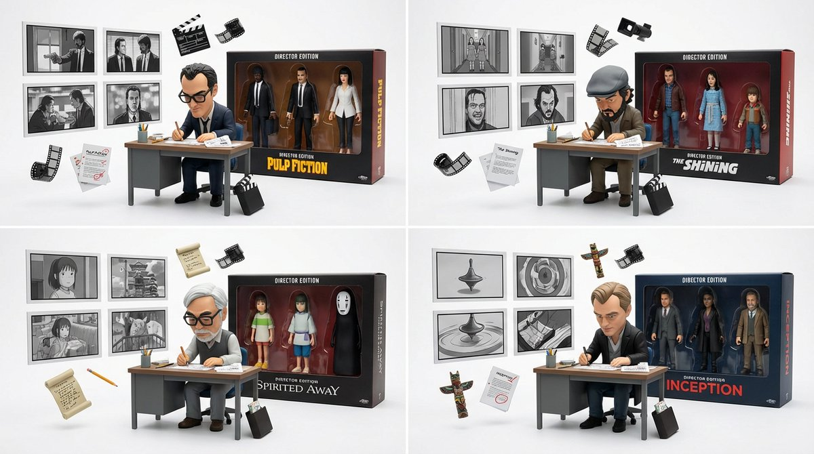

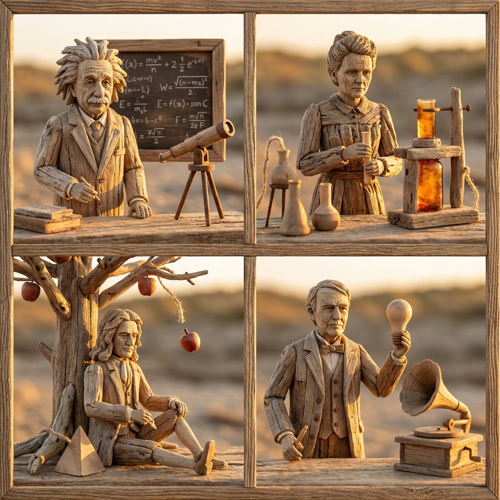

```
2x2 grid, do this for 4 famous movies: Anchor: A 3D diorama of the actual film director (semantically inferred from the input film) intensely storyboarding at a director’s desk; the storyboard frames on the desk match the film’s signature composition, color language, and shot grammar; four floating cinematic “frame panels” show the film’s most iconic signature moments as storyboard-style grayscale frames with camera notes; behind them a deluxe “Director Edition” display box with the film title and director credit, featuring the main characters as dynamic collectible poses matching the film’s tone; floating props: clapboard, 35mm film strips, viewfinder, lens caps, marked script pages, clean studio sweep background::3.8
Morphology: premium stylized collectible figure with crisp hard-surface edges, camera-gear geometry, film-frame borders, storyboard annotation glyphs, motion arrows and blocking marks consistent with the film’s genre and era::3.2
Material Physics: glossy figure surface with subtle mold lines, matte paper storyboard cards with visible grain, semi-matte box with spot UV + foil title, translucent plastic window insert, realistic film strip sheen, crisp print registration, dust-free studio finish::3.2
Illumination: high-end studio product lighting, soft key + gentle fill, subtle rim light, controlled reflections, even exposure for legible storyboard notes and title text::1.6
Render Stack: collectible figure photography, shallow depth of field but readable text, isometric-leaning three-quarter angle, clean cyclorama background, sharp focus on face + hands + storyboard page, premium box art aesthetic::1.2
Negative: photoreal human skin, realistic pores, painterly texture, messy stains, low detail hands, illegible text, gibberish typography, watermarks, brand logos, extra limbs, deformed fingers, blurry frames, dull colors, harsh contrast:: -1.2
```

```
2x2 网格，为四部著名电影分别创作以下内容：锚点画面为一位3D微缩场景，展现该影片导演（根据输入片名语义推断）正专注地在导演桌前绘制分镜脚本；桌上的分镜画面精准还原该电影标志性的构图、色彩语言与镜头语法；四个悬浮的“电影画框面板”以分镜风格的灰度画面呈现该片最具代表性的经典瞬间，并附有摄影机位注释；背景中设有一款豪华“导演版”展示盒，印有电影标题与导演署名，盒面人物以契合影片氛围的动态可动人偶姿势呈现；悬浮道具包括场记板、35毫米胶片条、取景器、镜头盖、标注过的剧本页；背景为干净整洁的摄影棚布景。

造型风格：高端风格化可动人偶，具有清晰硬朗的表面边缘、摄影器材几何元素、胶片画幅边框、分镜注释符号，以及符合影片类型与年代特征的动作箭头与走位标记。

材质物理效果：人偶表面光亮并带有细微合模线，分镜卡纸为哑光且可见纸张纹理，展示盒半哑光并采用局部UV与烫金标题，透明塑料视窗插件，胶片条具有真实光泽感，印刷套色精准，整体呈现无尘摄影棚质感。

灯光：高端产品摄影棚灯光，柔和主光搭配轻柔补光，辅以微妙轮廓光，反射控制得当，曝光均匀以确保分镜注释与标题文字清晰可读。

渲染风格：可动人偶产品摄影，浅景深但文字清晰可辨，略带等距视角的三分之二角度构图，纯色无缝背景，面部、手部及分镜页面保持锐利焦点，整体呈现高端收藏盒艺术美学。

负面提示：避免写实人类皮肤、毛孔细节、绘画笔触质感、污渍杂乱、手部细节不足、文字不可读、无意义字体、水印、品牌标识、多余肢体、手指畸形、画面模糊、色彩沉闷、高对比度。
```

 [↑返回目录](#toc)

---
## <a id="">微缩3D模型中的自然奇观</a> (<a href="https://x.com/aleenaamiir/status/2019267462647439770" target="_blank" rel="noopener noreferrer">Aleena Amir</a>)

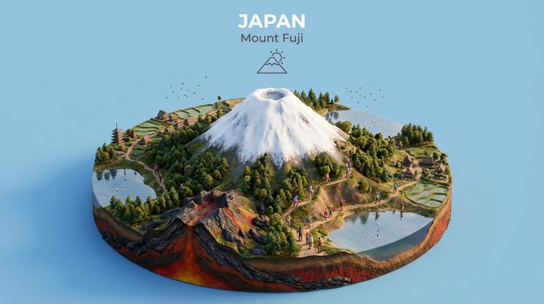

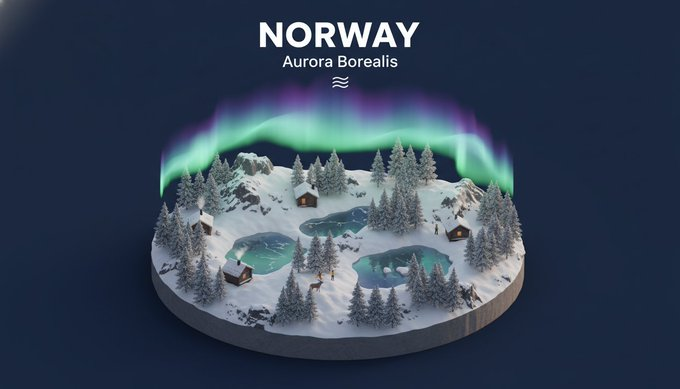

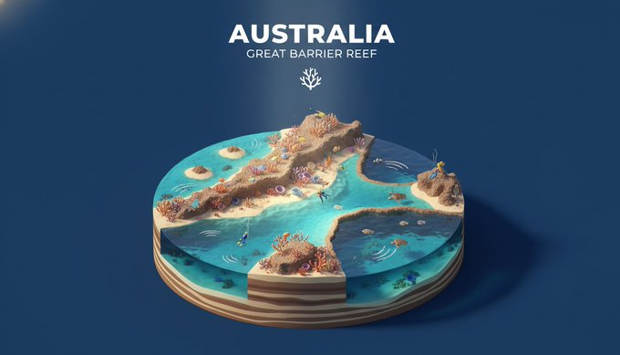

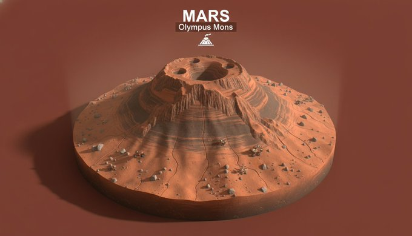

```
Natural Wonder of the Country Dioramas

Gemini Nano Banana Pro Prompt:

“Create an isometric miniature 3D diorama highlighting the natural landmark [NATURAL WONDER] from [COUNTRY NAME/PLANET].

Use a 40–45° top-down view. Textures look organic and realistic with PBR materials. Lighting feels soft and atmospheric.

The raised base shows terrain layers, vegetation, and surrounding geography. Add tiny stylized explorers or wildlife with no facial details.

Background remains solid [BACKGROUND COLOR].

Top center text displays [COUNTRY NAME] in bold.
Second line shows [NATURAL WONDER]. Place a minimal nature icon below. Text automatically adapts for contrast.”
```

```
国家自然奇观微缩立体模型

创建一个等距视角的微型3D立体模型，突出展示来自[国家名称/星球]的自然奇观[NATURAL WONDER]。  
采用40–45°俯视角度，材质使用基于物理渲染（PBR）的有机写实质感。光线柔和且富有氛围感。  
抬高的底座展现地形层次、植被及周边地理环境。添加风格化的小型探险者或野生动物，无需面部细节。  
背景为纯色[BACKGROUND COLOR]。  
顶部中央以粗体显示[国家名称]，第二行显示[NATURAL WONDER]，下方配以简约自然图标。文字自动调整以确保与背景形成对比。
```

 [↑返回目录](#toc)

---
## <a id="">英俊青年的奢华肖像</a> (<a href="https://x.com/Kashberg_0/status/2019331032160563388" target="_blank" rel="noopener noreferrer">Kashberg</a>)

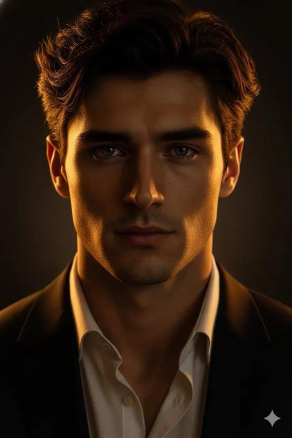

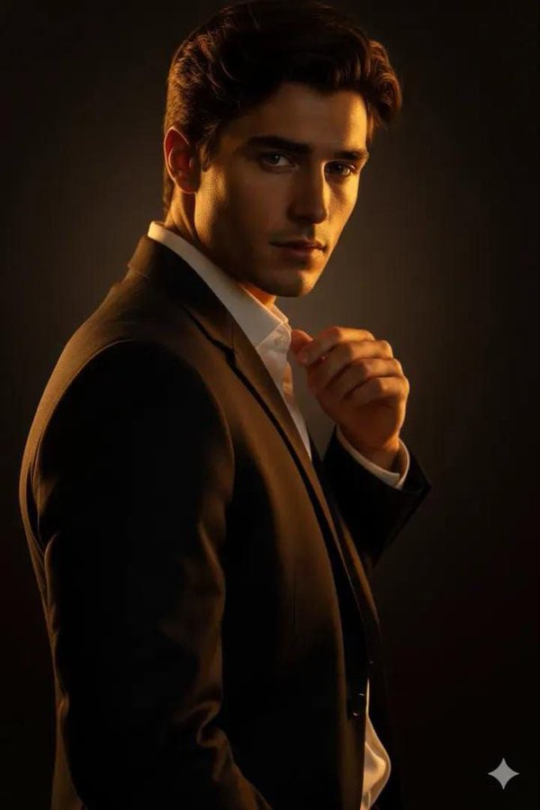

```
Ultra-realistic cinematic male portrait, handsome young man in a tailored dark suit with an open white shirt, sharp jawline and expressive eyes, soft tousled hair, warm golden rim lighting, dramatic low-key studio setup, dark moody background, luxury editorial fashion vibe, shallow depth of field, high contrast, rich shadows, photoreal skin texture, premium DSLR look, 85mm lens, f/1.8, cinematic color grading, Vogue / GQ style, elegant and confident mood.
```

```
超写实电影感男性肖像，英俊青年身穿剪裁精良的深色西装，内搭敞开的白衬衫，轮廓分明的下颌线与富有表现力的双眼，柔软凌乱的发型，温暖的金色轮廓光，戏剧性的低调影棚布光，深邃阴郁的背景，奢华时尚杂志风格，浅景深，高对比度，浓郁阴影，逼真肌肤质感，高端单反相机效果，85mm镜头，光圈f/1.8，电影级色彩调校，Vogue/GQ风格，优雅而自信的氛围。
```

 [↑返回目录](#toc)

---
## <a id="">影棚中的超写实时尚肖像</a> (<a href="https://x.com/aleenaamiir/status/2019342167102353672" target="_blank" rel="noopener noreferrer">Aleena Amir</a>)

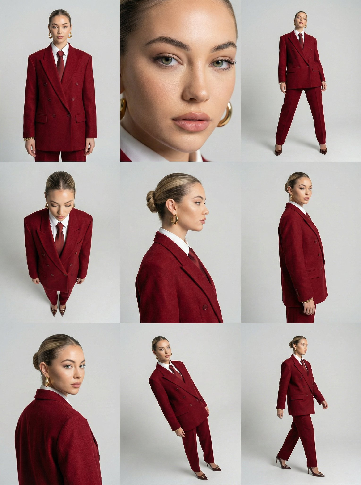

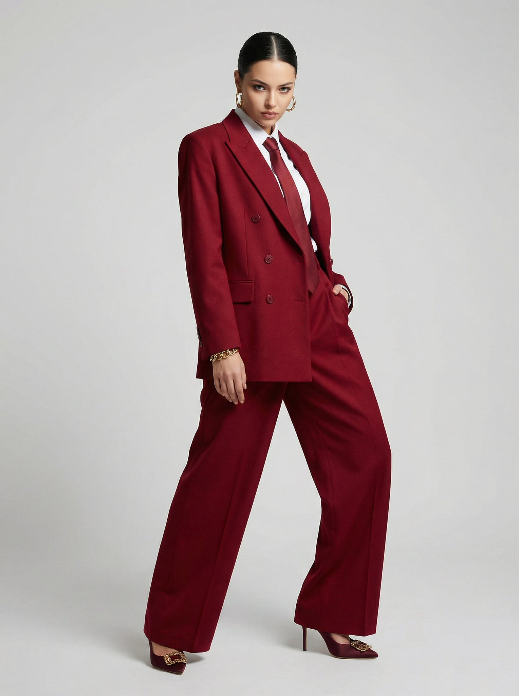

```
Defined From Every Angle.

Prompt: 

{
  "subject": {
    "identity_reference": "uploaded face and body reference",
    "identity_accuracy": "100% same facial structure, hair, skin tone, body shape, outfit, accessories; do not alter identity",
    "pose_variations": [
      {
        "name": "front-facing medium shot",
        "description": "upper to mid-body, facing camera directly, elegant and confident posture"
      },
      {
        "name": "front-facing extreme close-up",
        "description": "focus on face and eyes, capturing expression and makeup details"
      },
      {
        "name": "low-angle full-body shot",
        "description": "camera slightly below, looking upward, powerful stance emphasizing outfit and height"
      },
      {
        "name": "high-angle shot",
        "description": "slightly above, looking down, soft editorial perspective"
      },
      {
        "name": "side profile portrait",
        "description": "exact profile of face and hair, elegant posture, studio lighting highlights contours"
      },
      {
        "name": "34 profile (three-quarter turn)",
        "description": "torso and face turned three-quarters, emphasizing silhouette and outfit details"
      },
      {
        "name": "over-the-shoulder view",
        "description": "subject looks slightly away from camera, shoulder closest to camera in foreground"
      },
      {
        "name": "Dutch tilt",
        "description": "slightly rotated camera angle for dynamic editorial feel, maintaining consistent pose"
      },
      {
        "name": "mid-walk candid",
        "description": "natural motion captured, subtle step forward, relaxed arms, editorial energy"
      }
    ]
  },
  "wardrobe": {
    "description": "maintain exact outfit, fabric, and accessories as in identity reference",
    "consistency": "all panels must match perfectly"
  },
  "environment": {
    "setting": "studio environment",
    "background": "clean, minimal, neutral or light-grey cyclorama",
    "lighting": "soft professional studio lighting, subtle fill, flattering highlights"
  },
  "camera": {
    "shot_type": "varies per panel as specified",
    "angle": "specified per panel (low, high, front, profile, Dutch tilt, mid-motion)",
    "depth_of_field": "shallow, subject in sharp focus, blurred background"
  },
  "composition": {
    "grid": "3x3 contact sheet",
    "spacing": "consistent, balanced layout",
    "framing": "each panel fully showcases pose and outfit while keeping identity clear"
  },
  "aesthetic": {
    "style": "editorial fashion photography",
    "mood": "cinematic, professional, high-end",
    "color_palette": "maintain wardrobe and skin tones as reference, neutral background"
  },
  "render_quality": {
    "realism": "ultra-photorealistic",
    "resolution": "high (8K recommended)",
    "detail_focus": "fabric texture, skin, hair, accessories, lighting consistency across panels"
  },
  "negative_prompts": [
    "identity change",
    "distorted anatomy",
    "extra limbs",
    "blurred face",
    "motion artifacts",
    "low resolution",
    "inconsistent outfit or hair",
    "harsh shadows",
    "plastic skin",
    "busy background"
  ]
}
```

```
从每个角度精准呈现。

提示词：

使用上传的人脸与身体参考图作为身份基准，确保面部结构、发型、肤色、体型、服装及配饰100%一致，不得更改身份特征。  
包含以下多种姿态变化：  
- 正面中景：上半身至中身，正对镜头，姿态优雅自信；  
- 正面特写：聚焦面部与双眼，清晰呈现表情与妆容细节；  
- 低角度全身照：镜头略低于视线，仰拍展现强大气场，突出服装与身高；  
- 高角度镜头：略高于主体俯拍，呈现柔和的时尚编辑视角；  
- 侧面肖像：精确侧脸与发型轮廓，姿态优雅，影棚灯光强调面部线条；  
- 3/4侧脸（四分之三转体）：身体与面部呈四分之三角度，突出剪影与服装细节；  
- 越肩视角：主体略微侧头避开镜头，靠近镜头一侧肩膀位于前景；  
- 倾斜镜头（Dutch tilt）：相机轻微旋转，营造动态时尚感，同时保持姿势一致；  
- 行走抓拍：自然行走瞬间，微微迈步，手臂放松，散发时尚活力。

服装需完全复刻参考图中的款式、面料与配饰，所有画面必须严格一致。  
场景为影棚环境，背景干净简约，采用中性或浅灰色无缝背景布。  
灯光为柔和专业影棚光，辅以微妙补光，呈现讨喜高光。

各画面镜头类型依上述姿态分别设定，角度包括低角度、高角度、正面、侧脸、倾斜及动态中景，景深较浅，主体清晰锐利，背景虚化。

构图采用3×3接触印相式排版，间距均衡统一，每格完整展现姿态与服装，同时确保身份清晰可辨。

整体风格为时尚杂志摄影，氛围电影感、专业且高端，色彩忠实还原参考图中的服装与肤色，背景保持中性。

渲染质量要求超写实，建议8K高分辨率，重点呈现面料质感、肌肤、发丝、配饰细节，并确保各画面灯光一致性。

避免以下内容：身份改变、解剖结构扭曲、多余肢体、面部模糊、运动伪影、低分辨率、服装或发型不一致、强烈阴影、塑料感皮肤、杂乱背景。
```

 [↑返回目录](#toc)

---
## <a id="">手机屏幕里的冬日青年接住现实汽水</a> (<a href="https://x.com/AIwithkhan/status/2019057751260090731" target="_blank" rel="noopener noreferrer">Smiling Khan</a>)

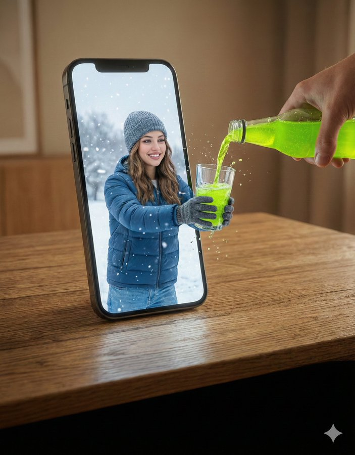

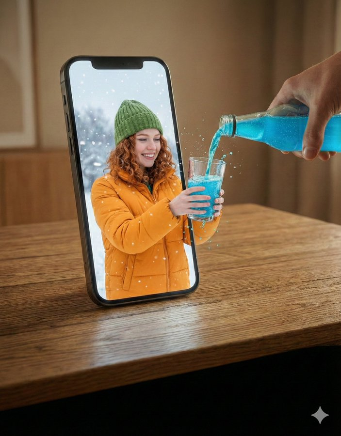

```
A hyper-realistic surreal photograph of a modern smartphone lying flat on a wooden table, its screen acting as a portal between two worlds. From inside the phone screen, a smiling young man dressed in winter clothing—puffer jacket, knit beanie, gloves—extends his hands outward into the real world, holding a clear glass. From outside the phone, a real human hand pours a bright neon-green carbonated drink into the glass, with liquid splashes frozen mid-air as it crosses the boundary between the digital screen and reality. Snowflakes drift inside the phone screen while the real environment remains warm and minimal. Ultra-detailed textures, cinematic lighting, shallow depth of field, photorealistic surrealism, high-resolution editorial photography.
```

```
一张超写实的超现实主义摄影作品：一部现代智能手机平放在木桌上，其屏幕化作连接两个世界的门户。从手机屏幕内部，一位身穿冬季服装（羽绒夹克、针织毛线帽和手套）的微笑青年将双手伸向现实世界，手中握着一只透明玻璃杯；而来自屏幕外的一只真实人类的手正将明亮的霓虹绿色碳酸饮料倒入杯中，液体飞溅的瞬间被定格在跨越数字屏幕与现实边界的空中。雪花在手机屏幕内缓缓飘落，而现实环境则温暖而极简。画面呈现极致细腻的质感、电影级光影、浅景深效果，融合写实与超现实风格，具有高分辨率的杂志级摄影水准。
```

 [↑返回目录](#toc)

---
## <a id="">纽约街头的时尚女性肖像</a> (<a href="https://x.com/iamsofiaijaz/status/2019090528407875990" target="_blank" rel="noopener noreferrer">Aijaz</a>)

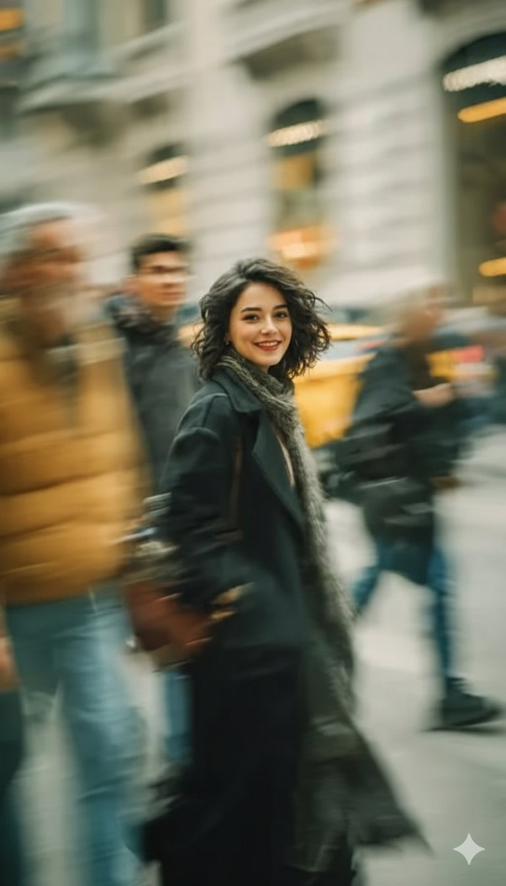

```
A high-resolution, hyper-realistic portrait of a smiling young woman with curly dark hair, wearing a stylish black wool coat and a textured grey knit scarf. She is standing still and looking directly at the camera with a confident expression. The background is a busy New York City street with people and a yellow taxi blurred by heavy motion, creating a cinematic 'frozen in time' effect. Soft, natural daylight, 8k resolution, shot on 35mm lens, deep depth of field on the subject, sharp facial details."
​Tips for a Better Result:
​Aspect Ratio: If your tool supports it, use a 9:16 ratio to get that vertical, tall look.
​Lighting: Mentioning "Golden Hour" can add a warmer, more glowy feel to her skin if you want to change the mood.
​Style: Adding "Shot on Fujifilm" or "Kodak Portra 400" often helps AI generate more realistic skin tones and less "plastic" textures.
```

```
一张高分辨率、超写实的年轻女性肖像，她有着深色卷发，面带微笑，身穿时尚的黑色羊毛大衣和有纹理的灰色针织围巾。她静止站立，自信地直视镜头。背景是繁忙的纽约街头，行人和一辆黄色出租车因强烈的动态模糊而虚化，营造出电影般的“时间凝固”效果。柔和的自然日光，8K 分辨率，使用 35mm 镜头拍摄，人物景深深，面部细节锐利清晰。
```

 [↑返回目录](#toc)

---
## <a id="">奢华时尚：自信女模的超写实肖像</a> (<a href="https://x.com/Kashberg_0/status/2019261027217756648" target="_blank" rel="noopener noreferrer">Kashberg</a>)

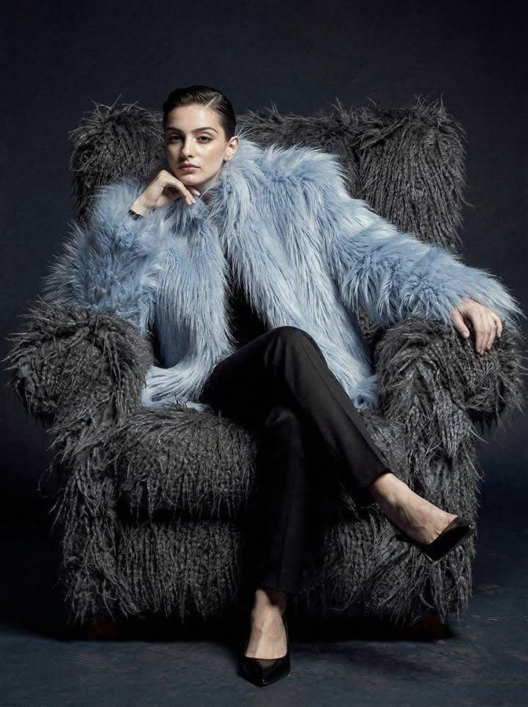

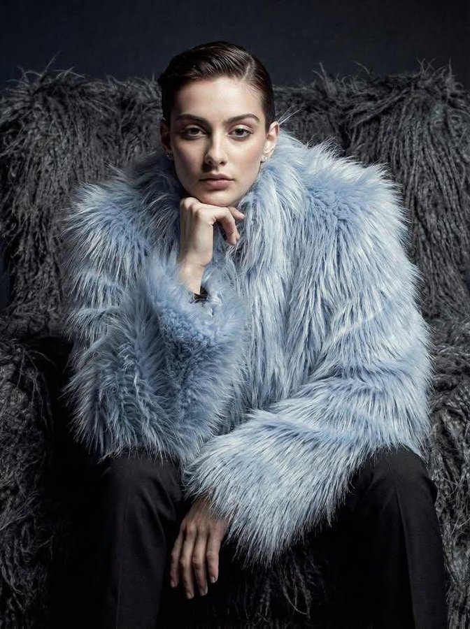

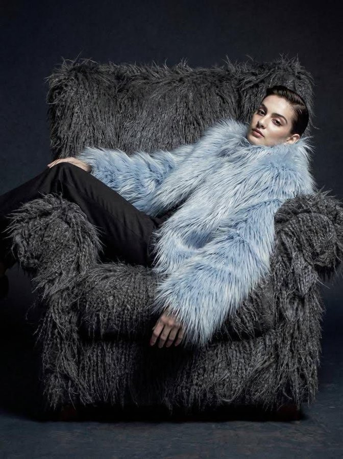

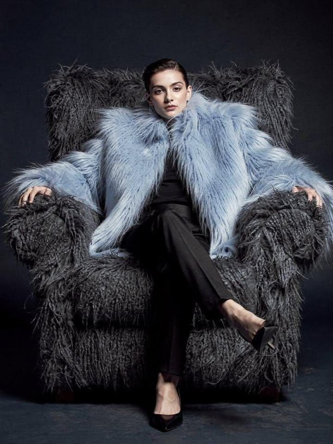

```
Ultra-high fashion editorial portrait of a confident female model seated in an oversized textured fur armchair, wearing a luxurious icy blue faux-fur coat over tailored black trousers and black pointed heels. Strong elegant pose with crossed legs, relaxed yet powerful body language, one hand resting on the armrest, the other near the chin. Slicked-back hair, minimal makeup, sharp cheekbones, calm and intense gaze toward camera. Dark moody studio background with subtle gradient, soft cinematic lighting emphasizing fabric texture and facial structure. Premium fashion magazine aesthetic, dramatic contrast, shallow depth of field, ultra-realistic, high detail, 85mm lens look, Vogue / Harper’s Bazaar style, editorial luxury photography.
```

```
超高端时尚杂志风格人像，一位自信的女模特坐在一张超大纹理仿毛皮扶手椅中，身着奢华的冰蓝色仿毛皮外套，内搭剪裁精良的黑色长裤与黑色尖头高跟鞋。姿态优雅有力，双腿交叠，身体语言放松却充满力量感，一手搭在扶手上，另一手轻靠下巴。头发向后梳整，妆容极简，颧骨分明，目光沉静而锐利地直视镜头。背景为深色调影棚，带有微妙渐变，采用柔和的电影感布光，突出面料质感与面部轮廓。整体呈现顶级时尚杂志美学，对比强烈，浅景深，超写实高细节，85mm镜头效果，具有《Vogue》或《Harper’s Bazaar》风格的奢华编辑摄影。
```

 [↑返回目录](#toc)

---
## <a id="">极简风格的电影感拼贴海报</a> (<a href="https://x.com/Arminn_Ai/status/2019338808009920744" target="_blank" rel="noopener noreferrer">ΛRMIN | AI</a>)

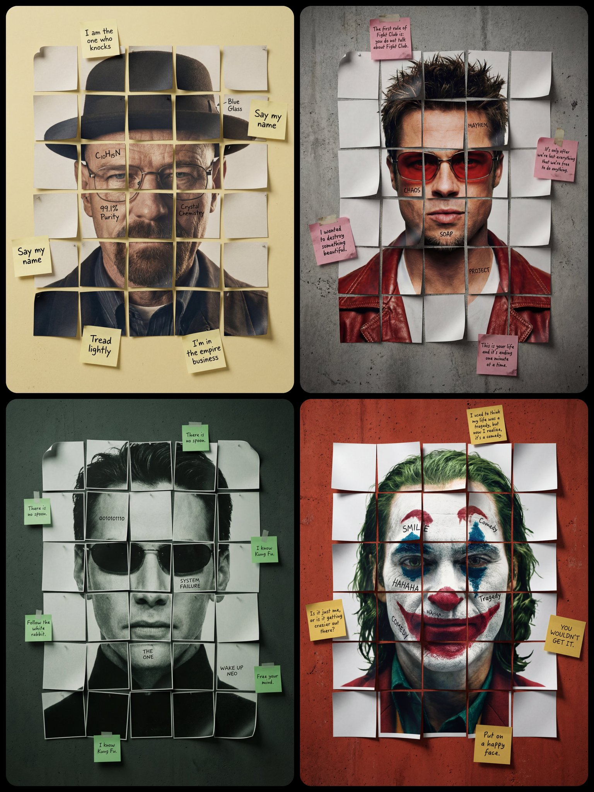

```
A minimalist cinematic colored poster featuring a [Character Name]’s portrait from shoulders to the top of the head. The face is reconstructed using a small number of large, square-cut paper fragments arranged in a simple grid [around 4x5 or 5x6 pieces]. Each paper fragment contains a disjointed part of the face which together reconstruct the portrait. The internal paper fragments constituting the face are not perfectly flat; many have slightly curled edges and lifted corners, casting tiny, realistic shadows that give them a three-dimensional, tacked-down appearance. 4 of these squares have subtle black handwritten [text1, text2, text3, text4] directly on the skin/image. Scattered irregularly around the outer perimeter of this central grid in various randomly placed positions (not confined to the corners), several [Sticky Note Color] sticky notes are attached to the [Color] wall, containing handwritten [External Text Content, e.g., iconic quotes]. The overall layout is slightly irregular with visible gaps between the pieces showing [Color] concrete wall background. Realistic paper texture throughout, high-end studio lighting emphasizing the lifted edges, sharp focus on ink and paper grain.
```

```
一张极简风格的电影感彩色海报，呈现[角色名称]从肩膀至头顶的肖像。面部由少量大型方形裁切纸片组成，排列成简洁网格（约4x5或5x6块）。每张纸片承载面部的一个不连续局部，共同拼合成完整肖像。构成面部的纸片并非完全平整，许多边缘微微卷曲、角部略微翘起，投下细微而真实的阴影，营造出立体、仿佛被钉在墙上的效果。其中四块方片上直接在皮肤/图像上以黑色手写字体标注了[text1, text2, text3, text4]。在中央网格外围不规则地散落着若干张[便利贴颜色]的便利贴，随意贴在[墙面颜色]的墙面上（位置随机分布，不限于角落），上面手写着[外部文字内容，例如经典台词]。整体布局略显不规则，纸片之间留有可见缝隙，露出[墙面颜色]的混凝土墙面背景。全图呈现真实纸张质感，采用高端影室灯光突出翘起边缘，墨迹与纸纹细节清晰锐利。
```

 [↑返回目录](#toc)

---
## <a id="">极简风格的社交媒体图形</a> (<a href="https://x.com/aleenaamiir/status/2019764034321719431" target="_blank" rel="noopener noreferrer">Aleena Amir</a>)

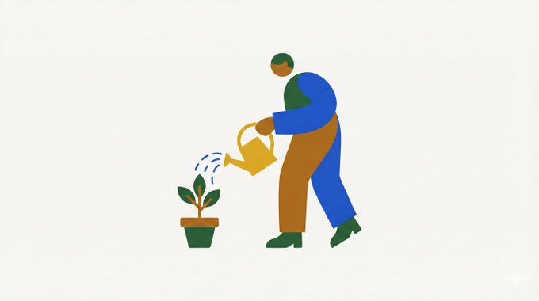

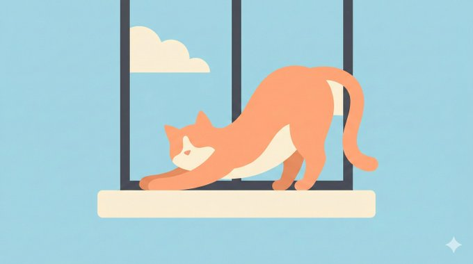

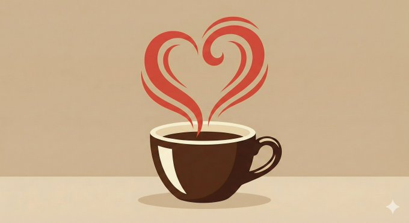


```
Minimal Social Media Illustrations

Gemini Nano Banana Pro Prompt:

“A minimal flat illustration showing [SIMPLE ACTION / IDEA]. Bold shapes, limited color palette (2–4 colors). Clean vector style, smooth curves, high contrast. Designed for social media, centered composition.”
```

```
极简社交媒体插图

Gemini Nano Banana Pro 提示词：

“一幅极简扁平风格插图，展现[简单动作/概念]。使用大胆的形状和有限的配色（2至4种颜色）。干净的矢量风格，流畅的曲线，高对比度。专为社交媒体设计，采用居中构图。”
```

 [↑返回目录](#toc)

---
## <a id="">绿意奢华：自信女性与巨型靴子雕塑</a> (<a href="https://x.com/Maercihh/status/2019648173652996217" target="_blank" rel="noopener noreferrer">Maercih</a>)

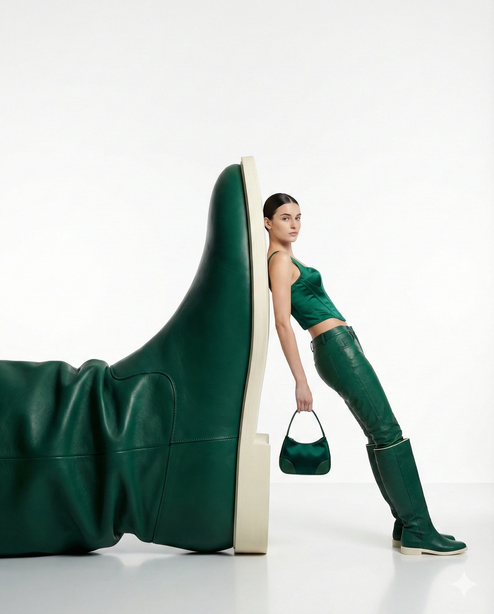

```
Oversized Attitude.

Nano Banana Pro on Gemini 

Prompt

{
  "style": "high-fashion editorial, minimalist surrealism",
  "subject": "a confident woman leaning casually against an oversized green leather boot sculpture",
  "pose": "relaxed yet powerful stance, body slightly angled, one arm holding a small handbag",
  "outfit": {
    "top": "emerald green fitted sleeveless top",
    "bottom": "matching green leather pants",
    "footwear": "knee-high green leather boots",
    "accessories": "small structured green handbag"
  },
  "composition": {
    "scale": "dramatic contrast between human figure and oversized object",
    "framing": "full body shot, centered subject with negative space",
    "background": "pure white seamless studio backdrop",
    "floor": "glossy white reflective surface"
  },
  "lighting": {
    "type": "soft studio lighting",
    "mood": "clean, premium, editorial",
    "shadows": "subtle, natural, controlled"
  },
  "color_palette": "monochromatic green tones with neutral white",
  "camera": {
    "angle": "eye-level",
    "lens": "85mm fashion lens",
    "depth_of_field": "sharp focus on subject, smooth background"
  },
  "vibe": "luxury fashion campaign, modern, confident, surreal elegance",
  "quality": "ultra-high resolution, crisp details, magazine-ready"
}
```

```
高端时尚杂志风格，极简超现实主义。一位自信的女性随意倚靠在一只巨大的绿色皮革靴子雕塑上，姿态放松却充满力量感，身体微微倾斜，单手拿着一只小巧手袋。她身穿祖母绿贴身无袖上衣、同色系皮革长裤和及膝绿色皮革靴，搭配一只小巧挺括的绿色手袋。画面构图强调人物与巨大物体之间的戏剧性比例对比，采用全身镜头，主体居中并留有大量负空间，背景为纯白无缝影棚背景，地面为高光白色反光材质。布光为柔和的影棚灯光，营造干净、高级、杂志大片般的氛围，阴影细腻自然且受控。整体色调为单色系绿色搭配中性白色。使用85mm人像镜头，眼平视角拍摄，人物清晰锐利，背景柔美虚化。整体氛围奢华、现代、自信，兼具超现实优雅感。图像为超高分辨率，细节清晰，达到杂志印刷水准。
```

 [↑返回目录](#toc)

---
## <a id="">奢侈品牌平面广告</a> (<a href="https://x.com/AmirMushich/status/2019779947020026325" target="_blank" rel="noopener noreferrer">AmirMušić</a>)

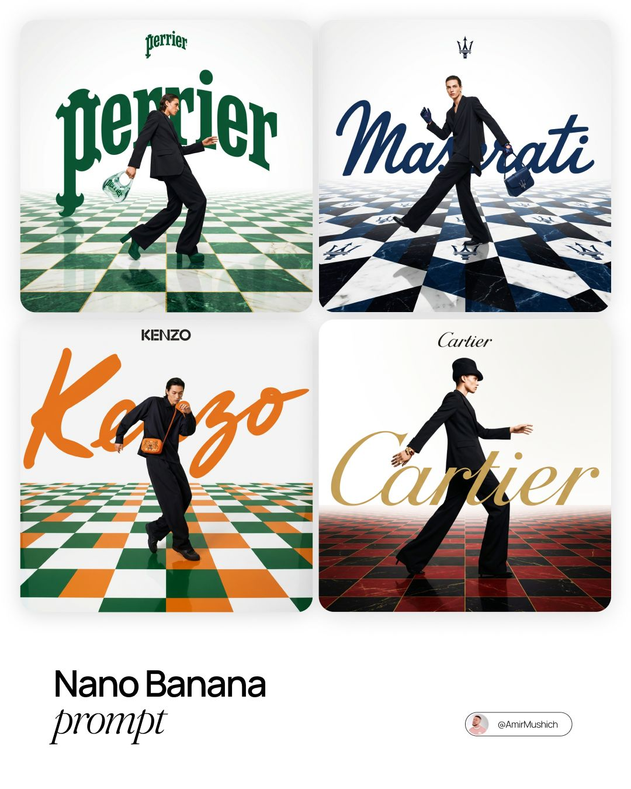

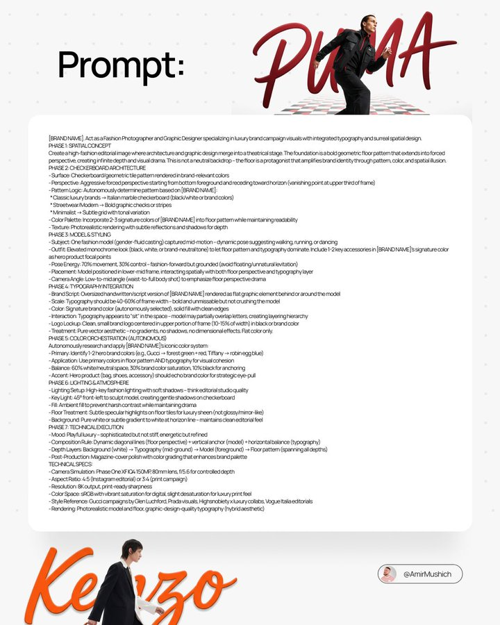

```
[BRAND NAME]. Act as a Fashion Photographer and Graphic Designer specializing in luxury brand campaign visuals with integrated typography and surreal spatial design.

PHASE 1: SPATIAL CONCEPT

Create a high-fashion editorial image where architecture and graphic design merge into a theatrical stage. The foundation is a bold geometric floor pattern that extends into forced perspective, creating infinite depth and visual drama. This is not a neutral backdrop – the floor is a protagonist that amplifies brand identity through pattern, color, and spatial illusion.

PHASE 2: CHECKERBOARD ARCHITECTURE

- Surface: Checkerboard/geometric tile pattern rendered in brand-relevant colors

- Perspective: Aggressive forced perspective starting from bottom foreground and receding toward horizon (vanishing point at upper third of frame)

- Pattern Logic: Autonomously determine pattern based on [BRAND NAME]:

- Color Palette: Incorporate 2-3 signature colors of [BRAND NAME] into floor pattern while maintaining readability

- Texture: Photorealistic rendering with subtle reflections and shadows for depth

PHASE 3: MODEL & STYLING

- Subject: One fashion model (gender-fluid casting) captured mid-motion – dynamic pose suggesting walking, running, or dancing

- Outfit: Elevated monochrome look (black, white, or brand-neutral tone) to let floor pattern and typography dominate. Include 1-2 key accessories in [BRAND NAME]'s signature color as hero product focal points

- Pose Energy: 70% movement, 30% control – fashion-forward but grounded (avoid floating/unnatural levitation)

- Placement: Model positioned in lower-mid frame, interacting spatially with both floor perspective and typography layer

- Camera Angle: Low-to-mid angle (waist-to-full body shot) to emphasize floor perspective drama

PHASE 4: TYPOGRAPHY INTEGRATION

- Brand Script: Oversized handwritten/script version of [BRAND NAME] rendered as flat graphic element behind or around the model

- Scale: Typography should be 40-60% of frame width – bold and unmissable but not crushing the model

- Color: Signature brand color (autonomously selected), solid fill with clean edges

- Interaction: Typography appears to "sit" in the space – model may partially overlap letters, creating layering hierarchy

- Logo Lockup: Clean, small brand logo centered in upper portion of frame (10-15% of width) in black or brand color

- Treatment: Pure vector aesthetic – no gradients, no shadows, no dimensional effects. Flat color only.

PHASE 5: COLOR ORCHESTRATION (AUTONOMOUS)

Autonomously research and apply [BRAND NAME]'s iconic color system:

- Primary: Identify 1-2 hero brand colors (e.g., Gucci → forest green + red, Tiffany → robin egg blue)

- Application: Use primary colors in floor pattern AND typography for visual cohesion

- Balance: 60% white/neutral space, 30% brand color saturation, 10% black for anchoring

- Accent: Hero product (bag, shoes, accessory) should echo brand color for strategic eye-pull

PHASE 6: LIGHTING & ATMOSPHERE

- Lighting Setup: High-key fashion lighting with soft shadows – think editorial studio quality

- Key Light: 45° front-left to sculpt model, creating gentle shadows on checkerboard

- Fill: Ambient fill to prevent harsh contrast while maintaining drama

- Floor Treatment: Subtle specular highlights on floor tiles for luxury sheen (not glossy/mirror-like)

- Background: Pure white or subtle gradient to white at horizon line – maintains clean editorial feel

PHASE 7: TECHNICAL EXECUTION

- Mood: Playful luxury – sophisticated but not stiff, energetic but refined

- Composition Rule: Dynamic diagonal lines (floor perspective) + vertical anchor (model) + horizontal balance (typography)

- Depth Layers: Background (white) → Typography (mid-ground) → Model (foreground) → Floor pattern (spanning all depths)

- Post-Production: Magazine-cover polish with color grading that enhances brand palette

TECHNICAL SPECS:

- Camera Simulation: Phase One XF IQ4 150MP, 80mm lens, f/5.6 for controlled depth

- Aspect Ratio: 4:5 (Instagram editorial) or 3:4 (print campaign)

- Resolution: 8K output, print-ready sharpness

- Color Space: sRGB with vibrant saturation for digital, slight desaturation for luxury print feel

- Style Reference: Gucci campaigns by Glen Luchford, Prada visuals, Highsnobiety x luxury collabs, Vogue Italia editorials

- Rendering: Photorealistic model and floor, graphic-design-quality typography (hybrid aesthetic)
```

```
[品牌名称]。扮演一位专注于奢侈品牌广告视觉的时尚摄影师兼平面设计师，擅长融合排版与超现实空间设计。

第一阶段：空间概念  
创作一幅高级时装大片，将建筑与平面设计融合为一个戏剧性舞台。画面基础是一个大胆的几何地板图案，并通过强制透视延伸出无限纵深与视觉张力。这并非中性背景——地板是主角，通过图案、色彩与空间幻觉强化品牌身份。

第二阶段：棋盘格建筑  
- 表面：以品牌相关色彩呈现的棋盘格/几何瓷砖图案  
- 透视：从画面底部前景强烈延伸至地平线（消失点位于画面上三分之一处）  
- 图案逻辑：根据[品牌名称]自主确定图案  
- 色彩方案：在地板图案中融入[品牌名称]的2–3种标志性色彩，同时确保可读性  
- 材质：逼真渲染，带有微妙反光与阴影以增强深度感  

第三阶段：模特与造型  
- 主体：一位性别流动的时尚模特，捕捉其动态瞬间——姿势暗示行走、奔跑或舞蹈  
- 服装：高阶单色造型（黑、白或品牌中性色调），以突出地板图案与排版；搭配1–2件以[品牌名称]标志性色彩呈现的关键配饰，作为核心产品焦点  
- 姿态能量：70%动感，30%控制——前卫时尚但脚踏实地（避免漂浮或不自然悬浮）  
- 位置：模特置于画面中下部，与地板透视及排版图层形成空间互动  
- 拍摄角度：低至中视角（腰部至全身镜头），强调地板透视的戏剧效果  

第四阶段：排版融合  
- 品牌字体：将[品牌名称]以超大手写/书法字体呈现为平面图形元素，置于模特背后或周围  
- 尺寸：字体宽度占画面40–60%，醒目但不压倒模特  
- 色彩：采用自主选定的品牌标志性色彩，纯色填充，边缘干净利落  
- 互动关系：字体仿佛“存在于”空间之中，模特可部分遮挡字母，构建层次关系  
- 品牌标识：在画面上部中央放置简洁小巧的品牌Logo（占画面宽度10–15%），使用黑色或品牌色  
- 处理方式：纯矢量美学——无渐变、无阴影、无立体效果，仅用纯色  

第五阶段：色彩统筹（自主决策）  
自主研究并应用[品牌名称]的标志性色彩体系：  
- 主色：识别1–2种核心品牌色彩（例如Gucci → 深绿+红，Tiffany → 知更鸟蛋蓝）  
- 应用：主色同时用于地板图案与排版，实现视觉统一  
- 平衡：60%白色/中性空间，30%品牌色彩饱和度，10%黑色用于锚定画面  
- 点睛：核心产品（包袋、鞋履或配饰）应呼应品牌色彩，引导视觉焦点  

第六阶段：灯光与氛围  
- 布光方案：高调时尚布光，柔和阴影——呈现杂志级影棚质感  
- 主光：45°前左方向打光，塑造模特轮廓，在棋盘格上投下柔和阴影  
- 补光：环境补光防止对比过强，同时保留戏剧感  
- 地板处理：瓷砖表面呈现微妙镜面高光，体现奢华光泽（非镜面反光）  
- 背景：纯白或向地平线渐变为白的微渐变，保持干净的杂志风格  

第七阶段：技术执行  
- 氛围：玩味奢华——精致而不刻板，活力而内敛  
- 构图法则：动态对角线（地板透视）+ 垂直锚点（模特）+ 水平平衡（排版）  
- 景深层次：背景（白色）→ 排版（中景）→ 模特（前景）→ 地板图案（贯穿所有景深）  
- 后期处理：杂志封面级精修，调色强化品牌色系  

技术参数：  
- 相机模拟：Phase One XF IQ4 150MP，80mm镜头，f/5.6光圈以控制景深  
- 画幅比例：4:5（Instagram杂志风）或3:4（印刷广告）  
- 分辨率：8K输出，印刷级锐度  
- 色彩空间：数字端使用sRGB并增强饱和度，印刷端轻微去饱和以呈现奢华质感  
- 风格参考：Glen Luchford为Gucci拍摄的广告、Prada视觉大片、Highsnobiety × 奢侈品牌联名、Vogue Italia时装专题  
- 渲染风格：模特与地板高度写实，排版采用平面设计级图形表现（混合美学）
```

 [↑返回目录](#toc)

---
## <a id="">现代情侣电梯自拍与服饰单品展示</a> (<a href="https://x.com/miilesus/status/2019488962465685914" target="_blank" rel="noopener noreferrer">Melis</a>)

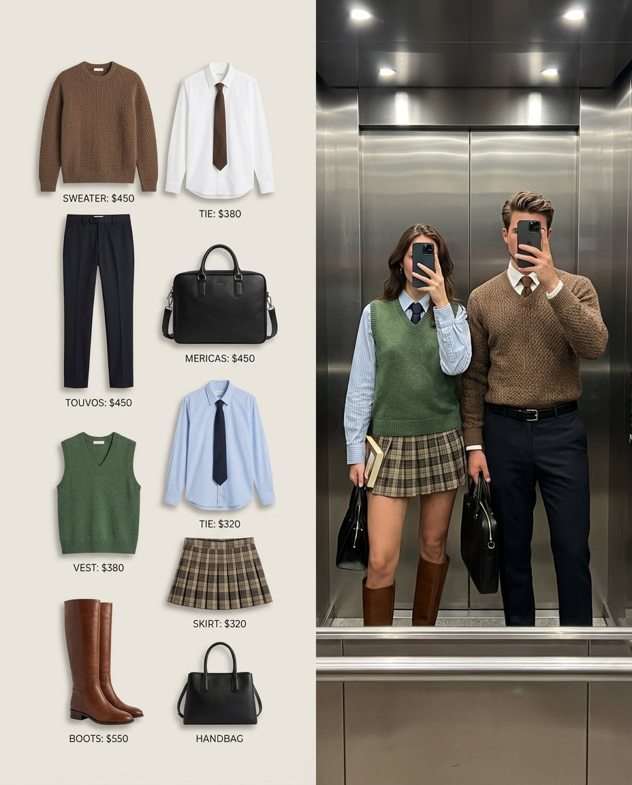

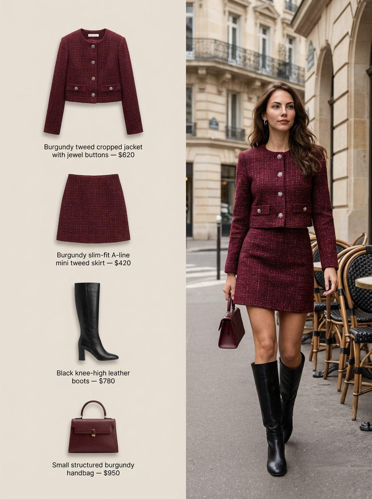

```
Return-to-work elevator pose couple version 

Prompt: A refined editorial fashion composite image with a 4:5 aspect ratio, split into two clear vertical sections.

RIGHT SIDE – COUPLE PHOTO:
A photorealistic mirror selfie of two people standing side by side in a modern stainless-steel elevator, taken with a smartphone. Both subjects are holding phones that fully cover their faces.

Facial identity for both individuals must exactly match the uploaded reference images. Do not invent, beautify, or alter faces.

Left person (man):
Wearing a brown textured knit sweater over a white collared shirt with a brown tie, dark tailored trousers, black belt. Holding a black leather briefcase in one hand.

Right person (woman):
Wearing a green sleeveless knit vest over a light blue striped button-up shirt with a dark tie, a short pleated plaid skirt, and brown knee-high leather boots. Holding a small book and a black handbag.

Clean brushed-metal elevator interior, symmetrical composition, soft overhead lighting, neutral reflections. Smartphone-camera realism, eye-level angle, natural posture. Editorial-documentary feel, modern and minimal.

LEFT SIDE – FASHION ITEM BREAKDOWN:
A clean, minimalist luxury fashion breakdown layout on a soft neutral background inspired by modern European interiors. No people on this side.

The clothing items worn by the couple are displayed individually and neatly arranged, each item floating with subtle realistic shadows, precise spacing, and catalog-style clarity.

Items shown:
Brown textured knit sweater
White collared shirt
Brown tie
Dark tailored trousers
Black leather briefcase
Green sleeveless knit vest
Light blue striped button-up shirt
Dark tie
Pleated plaid mini skirt
Brown knee-high leather boots
Black structured handbag

Each item includes a small, elegant price label in refined sans-serif typography. Minimal text, balanced composition, luxury e-commerce lookbook aesthetic.
```

```
返岗电梯造型——情侣版

提示词：一幅精致的时尚编辑风格合成图像，比例为4:5，画面清晰分为左右两个垂直部分。

右侧——情侣合影：  
在现代不锈钢电梯内，两人并肩站立，用智能手机拍摄的一张逼真镜面自拍。两人都手持手机，完全遮挡住面部。  
两位人物的面部特征必须与上传的参考图像完全一致，不得虚构、美化或修改面部。

左侧人物（男性）：  
身穿棕色纹理针织毛衣，内搭白色有领衬衫与棕色领带，下穿深色剪裁西裤，配黑色皮带，一手提黑色皮革公文包。

右侧人物（女性）：  
身穿绿色无袖针织背心，内搭浅蓝色条纹纽扣衬衫与深色领带，下穿短款格纹百褶裙，脚踩棕色及膝皮革靴，手持一本小书和一只黑色手提包。

电梯内部为干净的拉丝金属材质，构图对称，顶部柔光照明，反射效果中性自然。采用智能手机拍摄的真实感视角，平视角度，姿态自然，整体呈现纪实编辑风格，现代而极简。

左侧——服饰单品分解：  
以现代欧洲室内风格为灵感的柔和中性背景上，呈现干净、极简的奢侈时尚单品分解布局。此侧无人物。

情侣所穿服饰单品逐一单独展示，整齐排列，每件单品悬浮呈现，带有微妙写实阴影，间距精准，具有商品目录般的清晰度。

展示单品包括：  
棕色纹理针织毛衣  
白色有领衬衫  
棕色领带  
深色剪裁西裤  
黑色皮革公文包  
绿色无袖针织背心  
浅蓝色条纹纽扣衬衫  
深色领带  
格纹百褶迷你裙  
棕色及膝皮革靴  
黑色结构感手提包  

每件单品附带一个小型优雅的价格标签，采用精致的无衬线字体，文字极少，构图平衡，呈现高端电商画册美学。
```

 [↑返回目录](#toc)

---
## <a id="">微型3D场景展现国家音乐舞蹈之美</a> (<a href="https://x.com/aleenaamiir/status/2019640093217288658" target="_blank" rel="noopener noreferrer">Aleena Amir</a>)

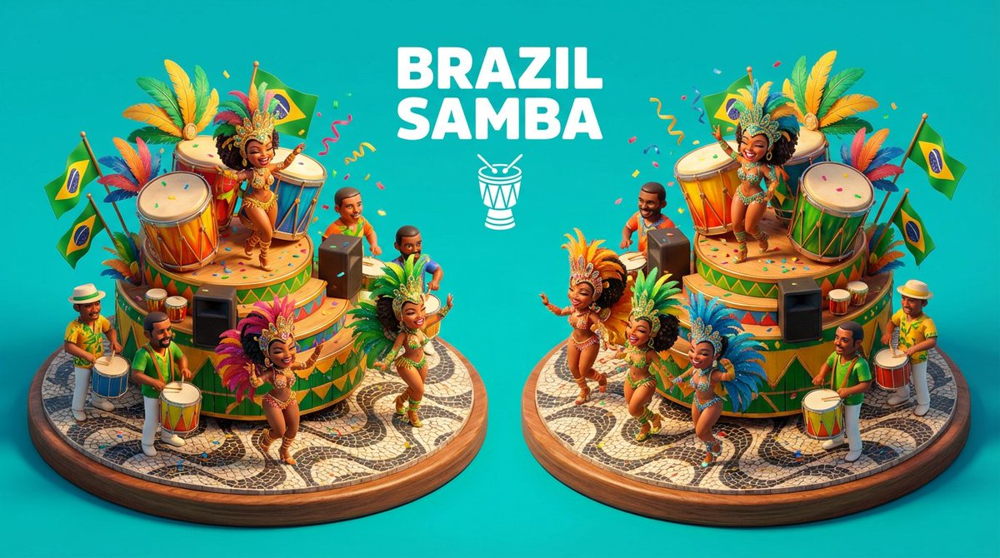

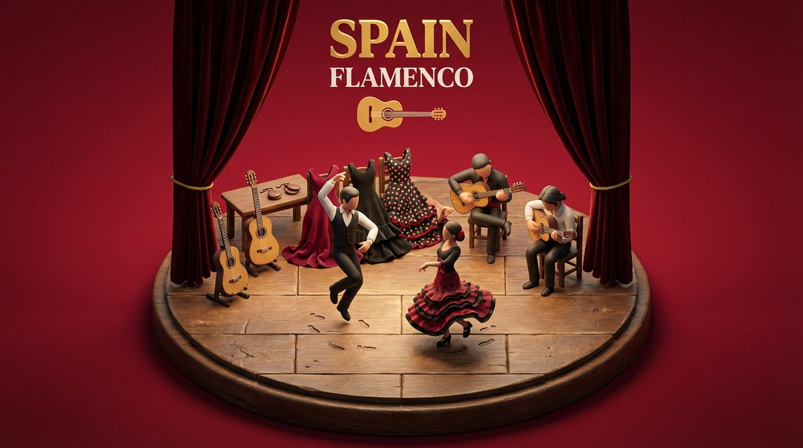

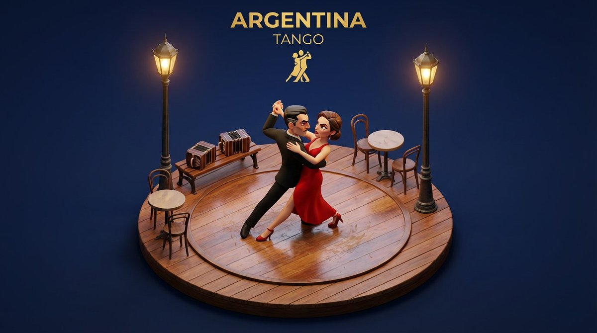

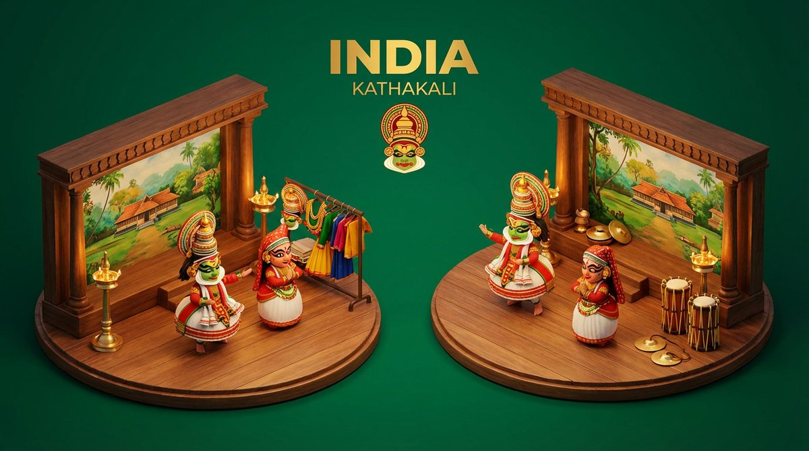

```
“Build an isometric miniature 3D diorama representing [COUNTRY NAME] through its famous music or dance form [ART FORM NAME].

Angle stays close to 45°. Materials appear clean and expressive with realistic lighting.

The base includes instruments, stage elements, or performance space tied to the art form.
Add tiny stylized performers in motion with no facial details.

Background stays solid [BACKGROUND COLOR].
Top center shows [COUNTRY NAME] in bold.
Below it display [ART FORM NAME].

Add a simple performance icon underneath. Text color adjusts for contrast.”
```

```
国家音乐或舞蹈微缩场景

构建一个等距视角的微型3D微缩场景，通过其著名的音乐或舞蹈形式[艺术形式名称]来展现[国家名称]。

视角保持接近45°。材质干净且富有表现力，配以写实灯光。

底座包含与该艺术形式相关的乐器、舞台元素或表演空间。  
加入微小的风格化表演者，呈动态姿势，无面部细节。

背景为纯色[背景颜色]。  
顶部中央以粗体显示[国家名称]，其下方展示[艺术形式名称]。  

底部添加一个简洁的表演图标。文字颜色自动调整以确保对比度清晰。
```

 [↑返回目录](#toc)

---
## <a id="">办公室随拍：真实的生活瞬间</a> (<a href="https://x.com/harboriis/status/2019599644595278024" target="_blank" rel="noopener noreferrer">Harboriis</a>)

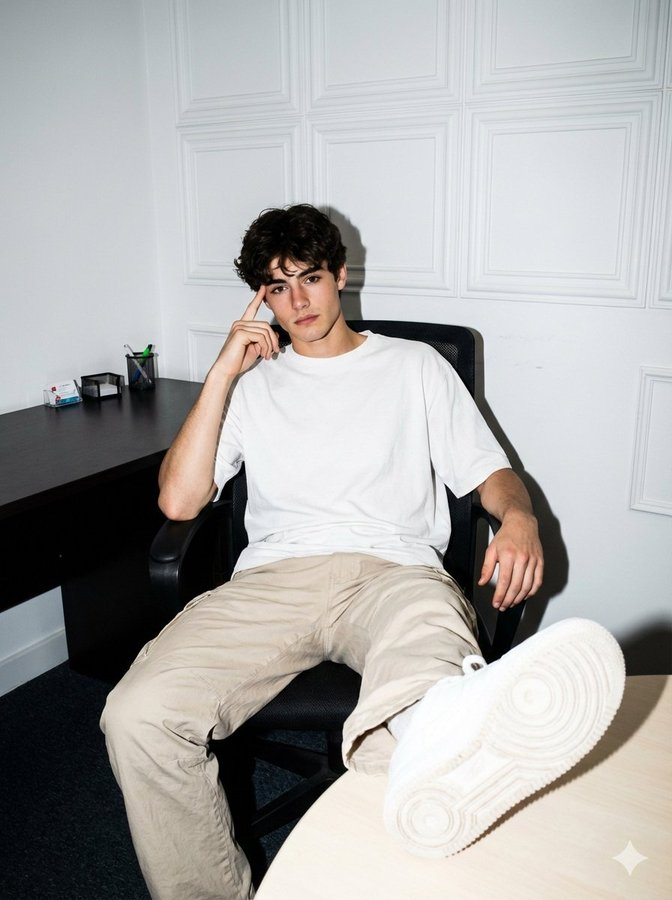

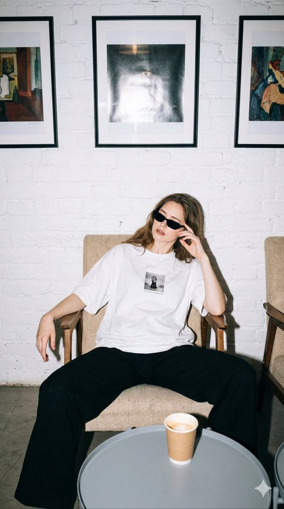

```
Create a photorealistic lifestyle/editorial "casual office snap" photo shoot using an uploaded photo of a person as a reference. Maintain the person's appearance STRICTLY 1:1; identical facial identity (100% recognizability), the same proportions and geometry of the face, the shape of the eyes/nose/lips without changes, the same skin tone, the same age, the same hair/hairstyle and hairline. DO NOT change the face, DO NOT "improve", DO NOT change the gender. The location is strictly fixed and always the same: a small office/cabinet, a white wall made of square panels (decorative wall panels) in the background, a dark desk on the left, small office items (stationery/small items) on the desk, an office chair on wheels. No posters, no signs, no legible inscriptions in the background. The composition is strictly fixed: format 3:4 (vertical). The shot is of a sitting person in a chair, almost full-length, visible diagonally, the foreground is the edge of a light-colored table from below. One leg is extended forward and rests on the table, the sole of the sneaker is clearly visible in the frame (foreshortening effect), the other leg is bent and remains lower. The camera is slightly below/at table level, giving the impression of a "snap photo". The outfit is strictly fixed: a white loose T-shirt without logos or text (plain white tee), beige/khaki loose cargo pants, white sneakers. Minimal accessories: a watch/bracelet without brand names is acceptable. The pose is strictly fixed: the person is sitting in an office chair, relaxed, leaning back; the left arm is bent and resting on the face, the index finger at the temple, the elbow on the armrest; the right hand is resting on the hip/armrest; the gaze is directed at the camera, the expression is calm, confident, slightly bold (no smiling). The lighting is strictly controlled: a bright flash (direct on-camera flash) like in a night snapshot, hard shadows on the wall and behind the chair, high contrast, documentary iPhone/point-and-shoot style, ultra-realistic, sharp focus on the face. Important: the anatomy is strictly correct: 2 arms, 2 legs, 5 fingers, no deformities or extra limbs.
```

```
创作一张逼真的生活方式/纪实风格“办公室随拍”照片，使用上传的人物照片作为参考。必须严格1:1还原人物外貌：面部身份完全一致（100%可识别），面部比例与几何结构不变，眼睛、鼻子、嘴唇的形状不得更改，肤色、年龄、发型及发际线均保持原样。不得修改面部，不得“美化”，不得改变性别。场景固定不变：小型办公室/隔间，背景为白色方形装饰墙板，左侧有一张深色办公桌，桌上摆放小型办公用品（文具/小物件），配带滚轮的办公椅。背景中不得出现海报、标识或任何可读文字。构图严格固定：3:4竖版格式。画面为人物坐在椅子上，几乎全身入镜，呈对角线视角，前景为从下方可见的浅色桌面边缘。一条腿向前伸出并搭在桌面上，运动鞋鞋底在画面中清晰可见（透视缩短效果），另一条腿弯曲且位置较低。相机机位略低于桌面高度，营造出“随手抓拍”的感觉。服装严格固定：纯白色宽松T恤（无logo或文字）、米色/卡其色宽松工装裤、白色运动鞋。可佩戴极简配饰：允许无品牌名称的手表或手链。姿势严格固定：人物放松地靠坐在办公椅上，左臂弯曲，手托脸颊，食指轻触太阳穴，肘部置于扶手上；右手自然放在髋部或扶手上；目光直视镜头，表情冷静、自信，略带大胆（不可微笑）。灯光严格控制：使用明亮的机顶直闪，模拟夜间快照效果，墙面和椅子后方形成硬朗阴影，高对比度，呈现iPhone或傻瓜相机式的纪实风格，超写实，面部焦点锐利清晰。重要提示：解剖结构必须准确无误：双臂、双腿、五指，不得出现畸形或多肢等异常。
```

 [↑返回目录](#toc)

---
## <a id="">超写实纪录片风格摄影</a> (<a href="https://x.com/Mystveil7/status/2019648865918677450" target="_blank" rel="noopener noreferrer">آ</a>)

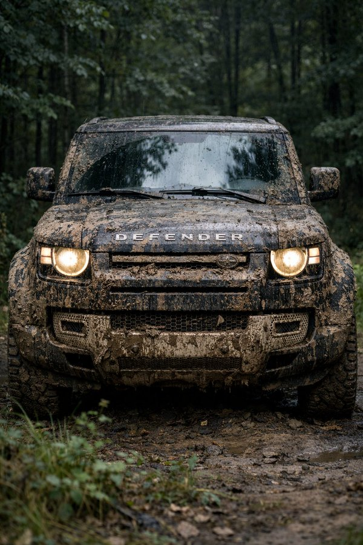

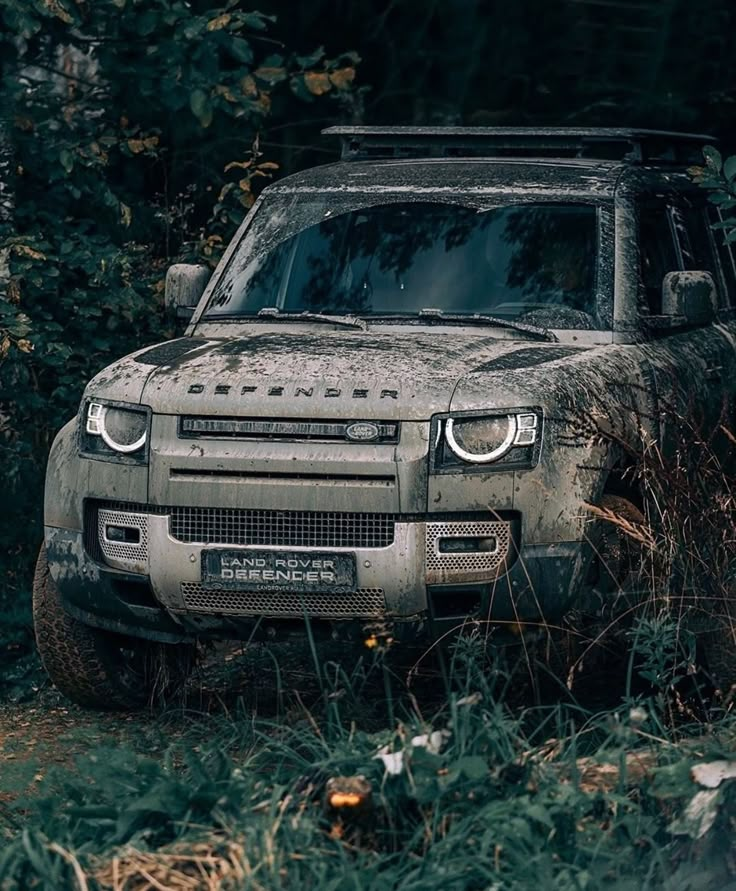

```
A true-to-life documentary-style photograph of a modern Land Rover Defender, front view, parked on uneven forest ground. The vehicle is heavily covered in real wet mud and dirt splashes from off-road driving — natural, irregular patterns across the hood, grille, headlights, mirrors, windshield edges, tires, and wheel arches. Mud texture is thick, gritty, and uneven, with dried and wet areas mixed.
Shot at eye level with a full-frame professional DSLR camera, 50mm lens, natural perspective (no wide distortion). Overcast forest lighting with soft, diffused daylight filtering through dense trees. Subtle reflections on glass and metal, no dramatic highlights. Headlights on with soft realistic glow, not stylized.
Surrounding environment includes dense green foliage, bushes, tall grass, fallen leaves, and dark forest shadows. Ground is damp soil with grass and small plants in the foreground, slightly out of focus. Color tones are muted, earthy, and cold — deep greens, browns, and greys. No cinematic exaggeration, no HDR look.
Extremely realistic textures, true photographic noise, natural contrast, shallow depth of field, background softly blurred. Looks like a real off-road automotive photoshoot, candid and raw. Ultra-photorealism, 8K detail, zero stylization.
Negative prompt (important):
CGI, illustration, concept art, fantasy lighting, over-saturation, HDR, glossy paint, clean car, studio lighting, unrealistic symmetry, cartoonish mud, AI artifacts, plastic textures, exaggerated contrast
```

```
超写实纪录片风格摄影，现代路虎卫士正面视角，停在崎岖的林间地面；车身因越野行驶沾满真实的湿泥与泥点，泥渍呈自然不规则分布，覆盖引擎盖、进气格栅、车灯、后视镜、挡风玻璃边缘、轮胎及轮拱，泥质厚重粗糙且凹凸不均，干湿纹理交织；平视视角拍摄，全画幅专业单反相机 + 50mm 镜头，自然透视无广角畸变；阴天林间光线，柔和漫射日光透过茂密树林洒落，玻璃与金属处有细腻反光，无夸张高光，车灯开启，光晕柔和写实无风格化处理；环境环绕茂密绿色枝叶、灌木丛、长草、落叶与深邃林间阴影，前景为湿润泥土搭配杂草与小型植株，轻微失焦；色调低饱和、偏大地色且清冷，以深绿、棕、灰色为主，无电影化夸张效果，无 HDR 质感；极致写实纹理，真实摄影噪点，自然对比度，浅景深，背景柔和虚化，画面如真实越野汽车实拍，纪实且原始，8K 超清细节，无任何风格化修饰
反向提示词（重点）
CGI、插画、概念艺术、梦幻光影、色彩过饱和、HDR 效果、漆面油亮、车身干净、影棚布光、对称不自然、卡通化泥渍、AI 伪影、塑料质感、对比度夸张
```

 [↑返回目录](#toc)

---
## <a id="">超写实的美妆产品摄影图</a> (<a href="https://x.com/oggii_0/status/2019637570133717072" target="_blank" rel="noopener noreferrer">Oogie</a>)

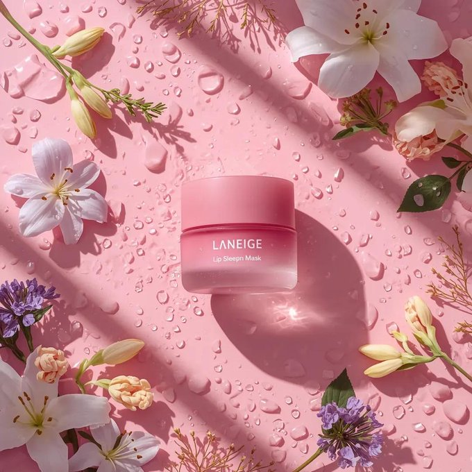

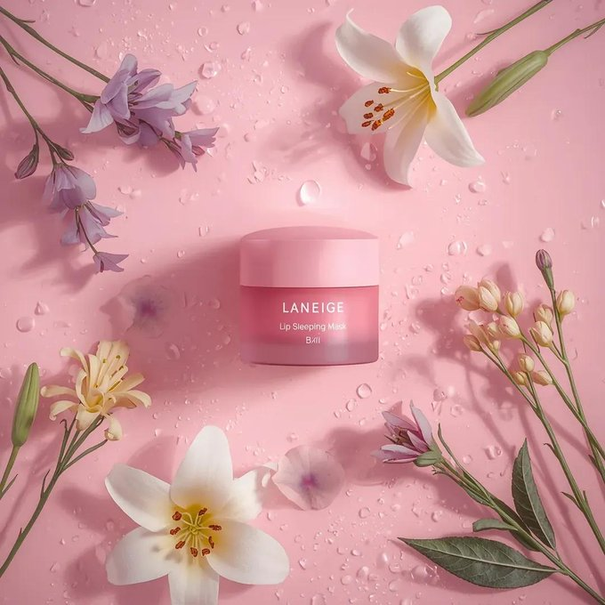

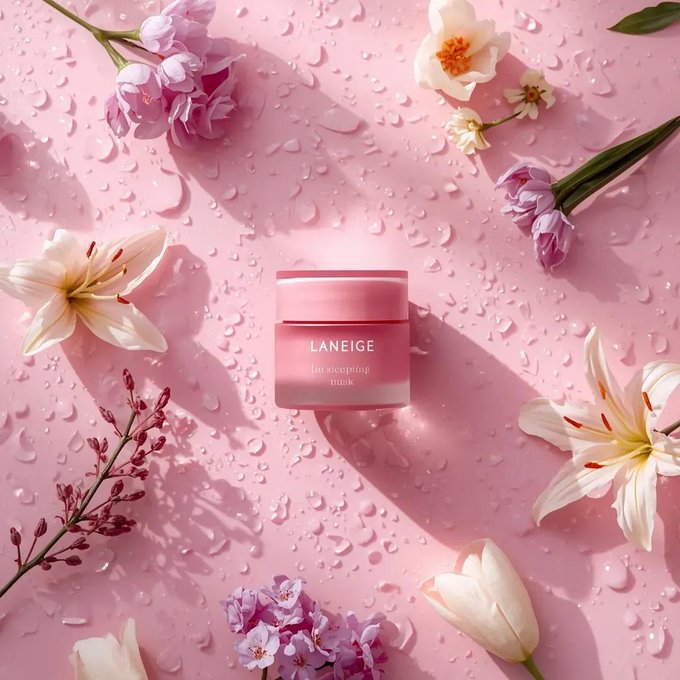

```
A hyper-realistic beauty product photograph of a pink “LANEIGE Lip Sleeping Mask” jar placed at the center of a vibrant pastel-pink surface covered in fresh water droplets, the jar upright with a frosted pink lid and glossy translucent body, surrounded organically by delicate flowers including purple blossoms, pale lilies, yellow sprigs, and green leaves arranged diagonally around the product, soft diffused studio lighting from above creating gentle highlights and natural shadows, moisture beads sparkling across the background for a fresh dewy feel, clean skincare editorial aesthetic, feminine and luxurious mood, balanced flat-lay composition, shallow depth of field, ultra-detailed textures, photorealistic, high-end cosmetic advertising style, 8K quality
```

```
一张超写实的美妆产品摄影图：一瓶粉色“兰芝唇膜”罐子置于充满活力的淡粉色背景中央，罐体直立，配有磨砂粉色盖子和半透明亮面瓶身。周围自然散落着精致花卉，包括紫色花朵、浅色百合、黄色小枝与绿色叶片，呈对角线环绕产品布局。上方柔光棚灯营造出柔和高光与自然阴影，背景上晶莹水珠闪烁，呈现清新水润感。整体风格干净、如护肤杂志大片，氛围柔美奢华，构图平衡的俯拍平面布局，浅景深，纹理极度细腻，照片级真实感，高端化妆品广告风格，8K画质。
```

 [↑返回目录](#toc)

---
## <a id="">桌面小工具变身地标建筑</a> (<a href="https://x.com/Gdgtify/status/2019414961278103834" target="_blank" rel="noopener noreferrer">Gadgetify</a>)

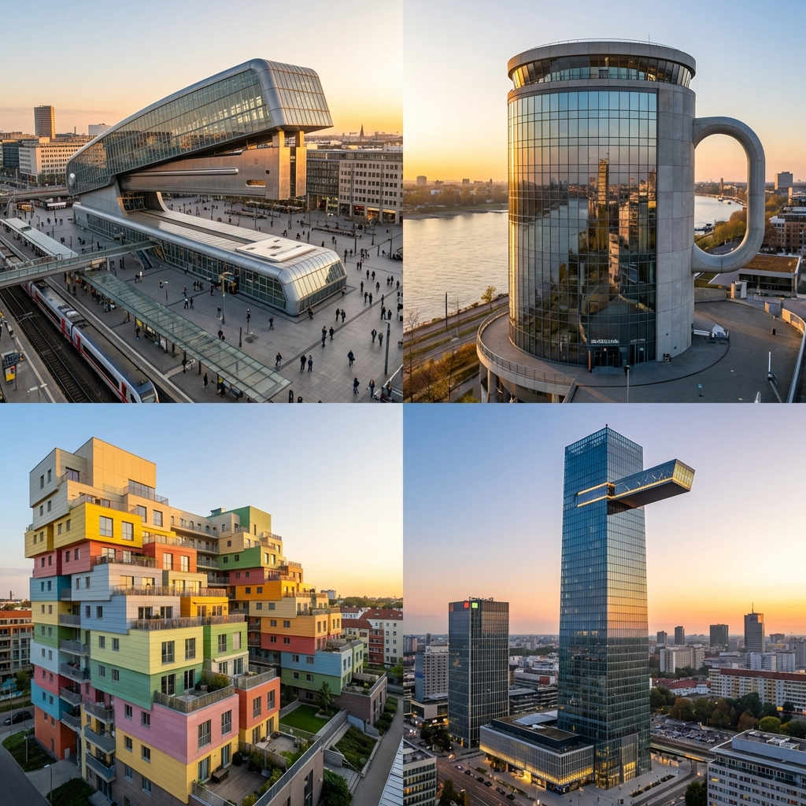

```
2x2 grid, do this 4 common desk gadgets: Concept: Turn objects into a landmark building that could exist.

1. ANALYZE INPUT (Massing & Structure):

Mass: (Monolithic/Fragmented/Stacked/Spindly)

Surface: (Reflective/Porous/Layered/Patterned)

Mechanism: (Static/Kinetic/Modular)

2. AUTO-SELECT BUILDING TYPE:

IF Monolithic + Stone-like → Museum

IF Reflective + Aerodynamic → Skyscraper

IF Modular + Stacked → Housing complex

IF Porous + Organic → Botanical conservatory

IF Kinetic + Mechanical → Transit hub

3. EXECUTE:
Golden-hour exterior render, people for scale, plausible materials, cinematic wide lens.
```

```
2x2 网格，对以下四种常见桌面小工具进行创作：概念是将物体转变为一座可能真实存在的地标建筑。

1. 分析输入（体量与结构）：

体量：（整体式 / 碎片化 / 堆叠式 / 纤细高耸）

表面：（反光 / 多孔 / 分层 / 有图案）

机制：（静态 / 动态 / 模块化）

2. 自动选择建筑类型：

若为整体式 + 类石材 → 博物馆  
若为反光 + 流线型 → 摩天大楼  
若为模块化 + 堆叠式 → 住宅综合体  
若为多孔 + 有机形态 → 植物温室  
若为动态 + 机械感 → 交通枢纽  

3. 执行要求：

黄金时刻的外部渲染，加入人物以体现比例，使用合理可信的材质，采用电影感广角镜头。
```

 [↑返回目录](#toc)

---
## <a id="">街头风格的微缩城市景观</a> (<a href="https://x.com/Sheldon056/status/2019618076246090053" target="_blank" rel="noopener noreferrer">Duet | AI</a>)

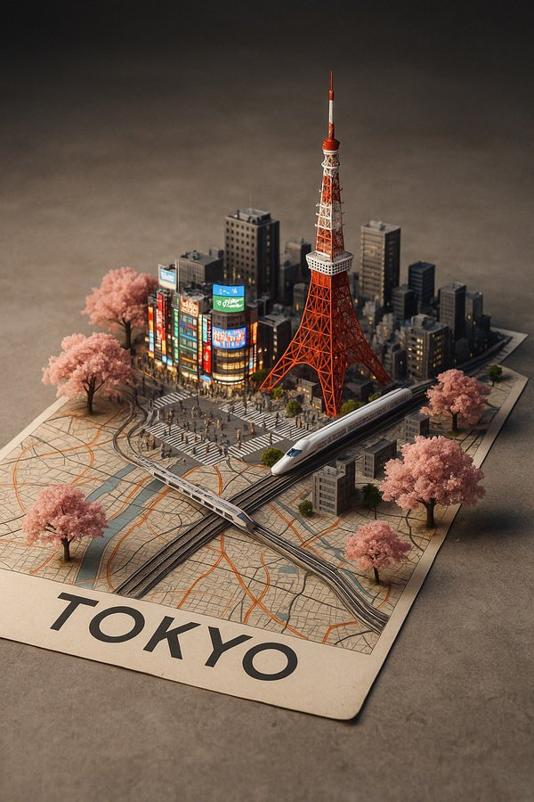

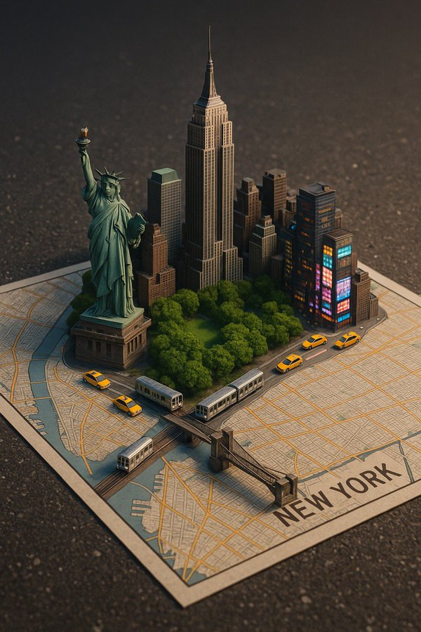

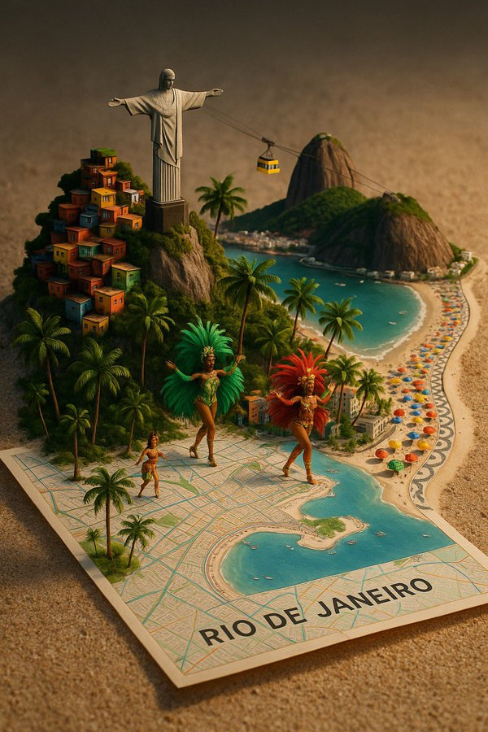

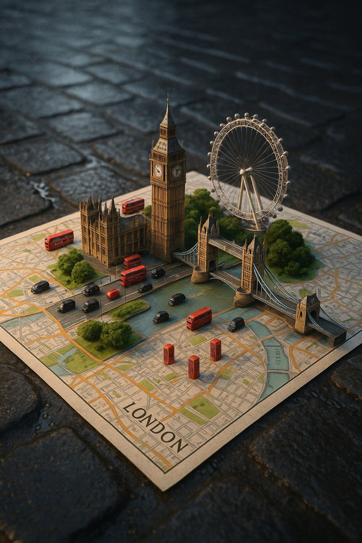

```
A street-style map of {CITY_NAME} placed on a {MAP_SURFACE}, with a photorealistic miniature version of {CITY_NAME} emerging from it {LANDMARK_1},{LANDMARK_2},{LANDMARK_3}, {NATURE_ELEMENT}, {URBAN_LIFE_ELEMENT}, {ICONIC_TRANSPORT},and {EXTRA_DETAIL}.All elements grow from the map like a 3D urban diorama. Studio soft lighting, cinematic depth, 2:3 format
```

```
一张街头风格的{CITY_NAME}地图放置在{MAP_SURFACE}上，地图上浮现出一座逼真的微型{CITY_NAME}城市模型，包含{LANDMARK_1}、{LANDMARK_2}、{LANDMARK_3}、{NATURE_ELEMENT}、{URBAN_LIFE_ELEMENT}、{ICONIC_TRANSPORT}以及{EXTRA_DETAIL}。所有元素如同三维城市微缩景观般从地图中生长而出。采用影棚柔光照明，具有电影感的景深，画面比例为2:3。
```

 [↑返回目录](#toc)

---
## <a id="">冬季的平静3D角色</a> (<a href="https://x.com/egeberkina/status/2019424606960955624" target="_blank" rel="noopener noreferrer">Ege</a>)

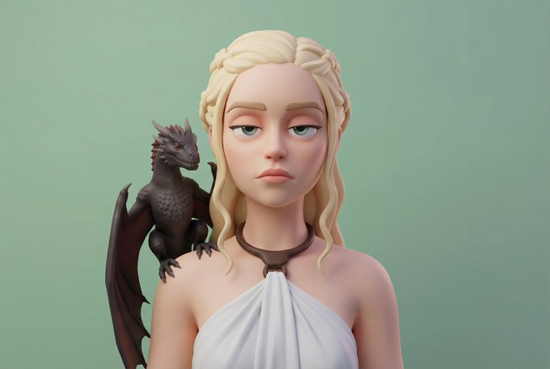

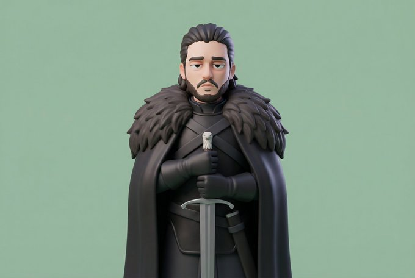

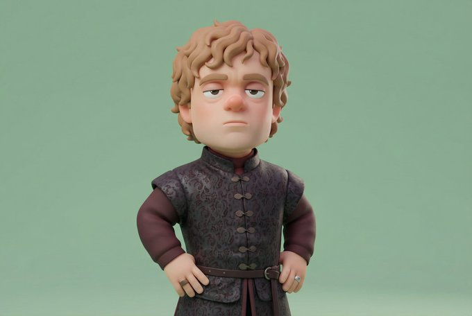

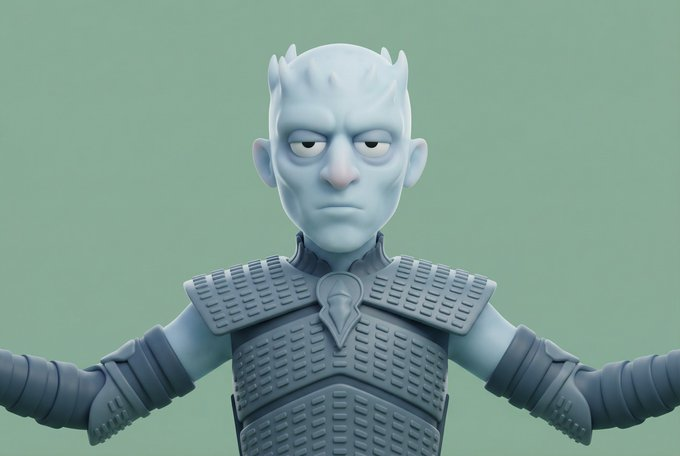

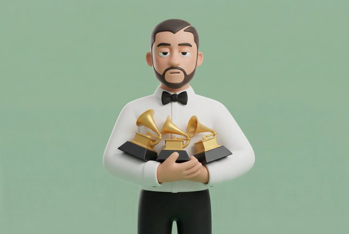

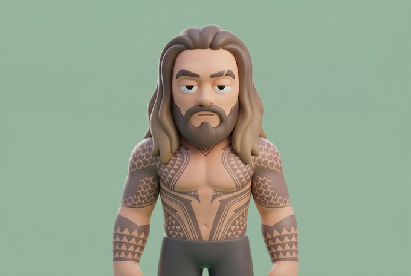

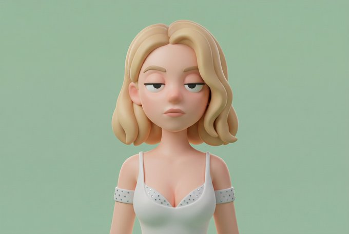

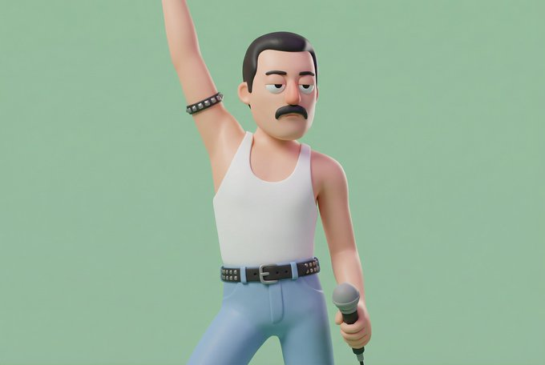

```
{
  "task": "image_style_transfer_3d_character",
  "input": {
    "source_image": "USER_UPLOADED_IMAGE",
    "preserve_identity": true,
    "preserve_pose": true,
    "preserve_composition": true,
    "preserve_clothing": true,
    "preserve_accessories": true
  },
  "style_reference": {
    "render_style": "stylized_3d_character",
    "aesthetic": "soft_minimal_cartoon_3d",
    "inspiration": [
      "pixar_like_but_more_minimal",
      "toy_figure_render",
      "clean_product_character_design"
    ]
  },
  "character_design": {
    "skin": {
      "material": "smooth_matte_plastic",
      "texture": "soft_uniform",
      "subsurface_scattering": "gentle"
    },
    "facial_features": {
      "eyes": "half_closed_bored_expression",
      "eyelids": "heavy",
      "nose": "rounded_simplified",
      "mouth": "flat_neutral",
      "ears": "simplified_rounded"
    },
    "emotion": "unimpressed_calm_bored"
  },
  "clothing": {
    "source": "exact_from_uploaded_image",
    "lock_outfit": true,
    "fit": "unchanged",
    "fabric_translation": "3d_stylized_equivalent_only",
    "no_replacement": true,
    "no_enhancement": true,
    "no_stylization_override": true
  },
  "accessories": {
    "source": "exact_from_uploaded_image",
    "lock_accessories": true,
    "allow_only_existing": true,
    "no_new_accessories": true,
    "no_removal": true,
    "no_addition": true
  },
  "lighting": {
    "setup": "studio_softbox",
    "shadows": "very_soft",
    "contrast": "low",
    "highlights": "subtle"
  },
  "background": {
    "type": "solid_color",
    "color_palette": [
      "muted_green",
      "pastel_tone"
    ],
    "gradient": "none"
  },
  "camera": {
    "angle": "front_facing",
    "framing": "medium_close_up",
    "lens": "50mm_equivalent",
    "distortion": "none"
  },
  "render_quality": {
    "resolution": "high",
    "edges": "clean",
    "noise": "none",
    "realism_balance": "stylized_over_realistic"
  },
  "output": {
    "consistency": "very_high",
    "style_strength": "strong",
    "photorealism": false,
    "strict_constraints": true
  },
  "negative_constraints": [
    "no new accessories",
    "no removed accessories",
    "no outfit changes",
    "no reinterpretation of clothing",
    "no creative additions"
  ]
}
```

```
任务：3D角色图像风格转换
输入：
- 源图像：用户上传的图像
- 保持身份：是
- 保持姿势：是
- 保持构图：是
- 保持服装：是
- 保持配饰：是

风格参考：
- 渲染风格：风格化3D角色
- 美学：柔和极简卡通3D
- 灵感来自：
  - 类似皮克斯但更极简
  - 玩具人物渲染
  - 干净的产品角色设计

角色设计：
- 皮肤：
  - 材质：光滑哑光塑料
  - 质地：柔软均匀
  - 表面散射：温和
- 面部特征：
  - 眼睛：半闭着无聊的表情
  - 眼睑：厚重
  - 鼻子：圆润简化
  - 嘴巴：平坦中性
  - 耳朵：简化圆形
- 情绪：不为所动平静无聊

服装：
- 来源：与上传图像完全一致
- 锁定服装：是
- 合身：不变
- 面料转换：仅3D风格化等效
- 不替换：是
- 不增强：是
- 不覆盖样式化：是

配饰：
- 来源：与上传图像完全一致
- 锁定配饰：是
- 仅允许现有：是
- 不添加新配饰：是
- 不移除：是
- 不增加：是

照明：
- 设置：工作室柔光箱
- 阴影：非常柔和
- 对比度：低
- 高光：微妙

背景：
- 类型：纯色
- 色彩搭配：
  - 柔和绿色
  - 淡色调
- 渐变：无

相机：
- 角度：正面朝向
- 取景：中景特写
- 镜头：等效50毫米
- 失真：无

渲染质量：
- 分辨率：高
- 边缘：干净
- 噪点：无
- 真实主义平衡：风格化优于真实感

输出：
- 一致性：非常高
- 风格强度：强
- 照片真实感：否
- 严格约束：是

负面约束：
- 不添加新配饰
- 不移除配饰
- 不改变服装
- 不重新诠释服装
- 不创造性添加
```

 [↑返回目录](#toc)

---
## <a id="">超写实动作肖像：男子冲向镜头的瞬间</a> (<a href="https://x.com/iamsofiaijaz/status/2019643945353887824" target="_blank" rel="noopener noreferrer">Aijaz</a>)

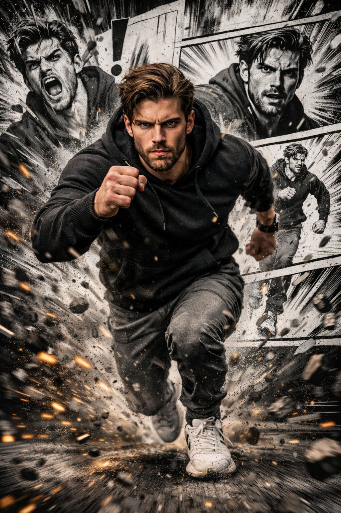

```
A cinematic, hyper-realistic action portrait of a rugged man sprinting directly toward the camera, intense determination on his face, clenched fist forward, wearing a black hoodie, gray pants, and white sneakers. Dynamic motion blur, flying debris, sparks, and dramatic lighting emphasize speed and power. Behind him, a high-contrast black-and-white comic-book collage shows multiple expressive panels of the same man shouting, running, and reacting, with bold ink lines, manga-style speed effects, and exclamation marks. Ultra-detailed textures, sharp focus on the foreground subject, shallow depth of field, gritty graphic novel aesthetic, photorealistic subject blended seamlessly with illustrated background, epic action atmosphere, 8k quality.
```

```
一张电影感十足、超写实的动作肖像：一位粗犷男子正全速冲向镜头，脸上充满坚毅神情，拳头紧握向前伸出，身穿黑色连帽衫、灰色长裤和白色运动鞋。动态模糊、飞溅的碎片、火花与戏剧性光影突显速度与力量。他身后是一幅高对比度的黑白漫画拼贴，包含多个表现该男子呐喊、奔跑与反应的分镜画面，采用粗犷墨线、日漫风格的速度特效及感叹号。整体呈现极致细节纹理，前景主体锐利聚焦，浅景深，融合粗粝的图像小说美学，写实人物与插画背景无缝结合，营造史诗级动作氛围，8K画质。
```

 [↑返回目录](#toc)

---


[上一页](./10.md) | 当前 11/12 页 | [下一页](./12.md) | [查看全部目录](../prompts.md)