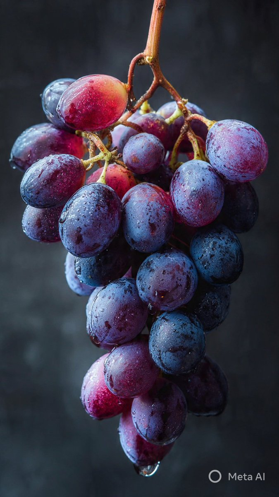
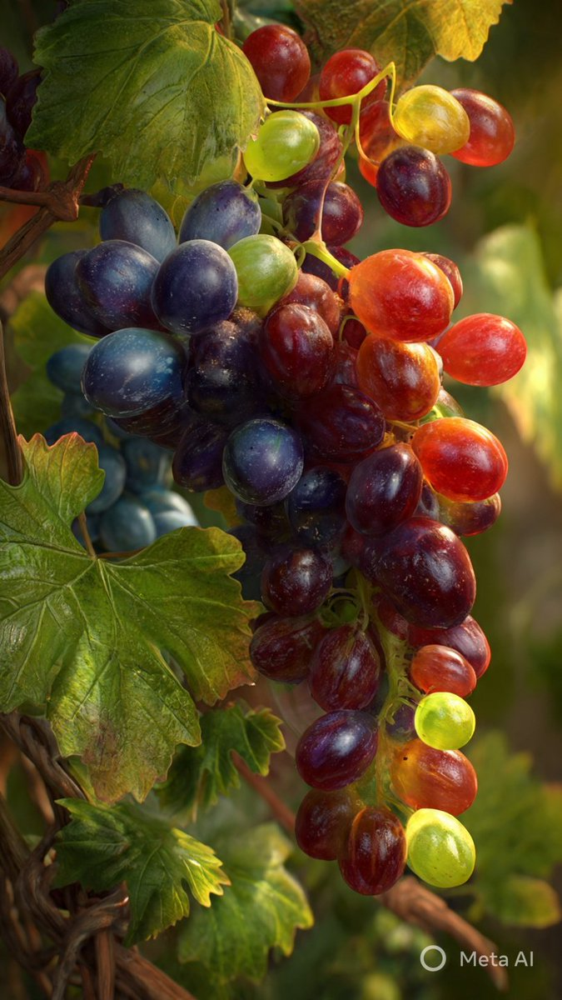
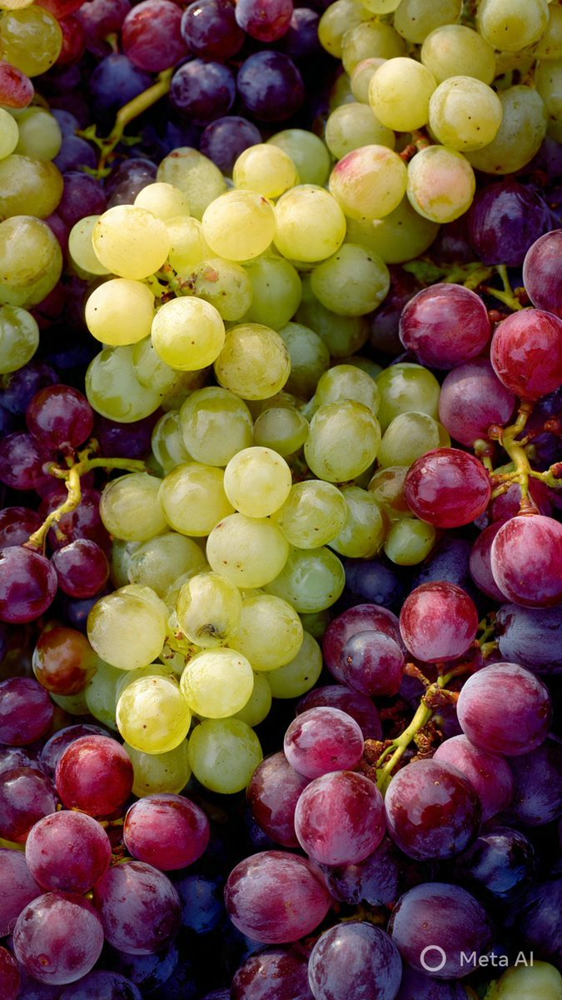
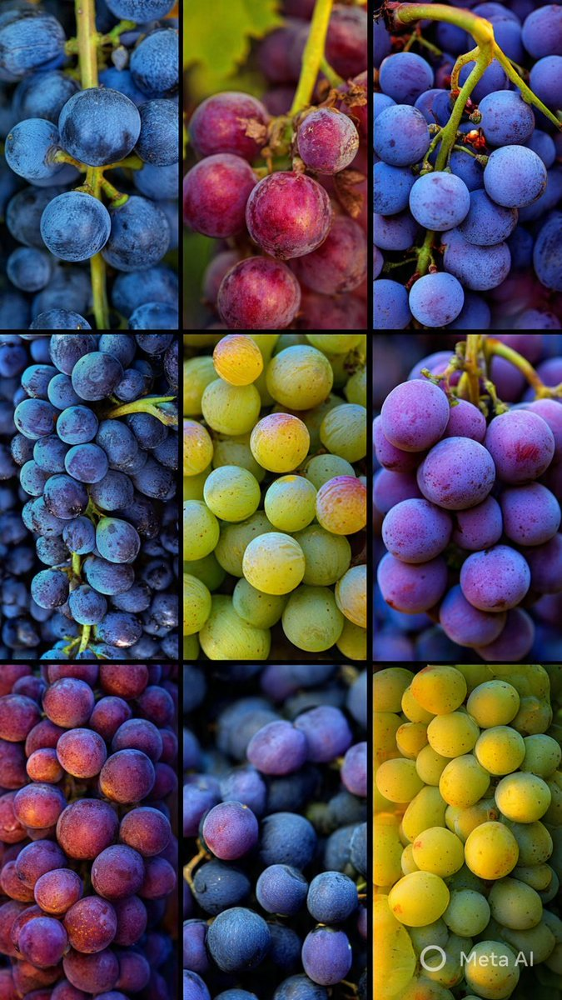
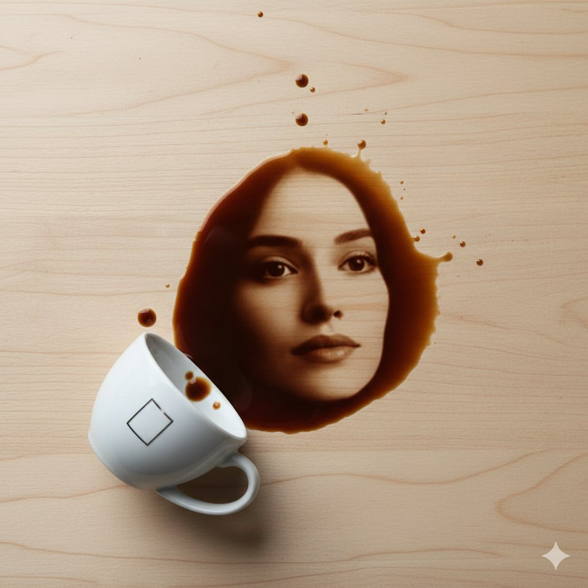

# gemini.json 

gemini.json文件存放gemini相关的提示词，当前已收录：1121个 

 投稿方式：[飞书投稿](https://tcn1uh5rxo87.feishu.cn/share/base/form/shrcne5gDolOMDd0oJsj2XfvxQc) or [issues](https://github.com/junxiaopang/gridsplitter/issues/new)

[上一页](./11.md) | 当前 12/12 页 | [查看全部目录](../prompts.md)

🚀 **在线预览**: [https://prompts.kkkm.cn](https://prompts.kkkm.cn)

## <a id="toc">目录</a>


## <a id="">液态凝胶拼出的“text”字样</a> (<a href="https://x.com/azed_ai/status/2019411461295218834" target="_blank" rel="noopener noreferrer">Amira Zairi</a>)


```
Abstract liquid typography spelling "text", thick transparent water-gel material, hyper realistic refraction and subtle caustics, realistic surface tension, sculpted droplet forms merged into smooth letter curves, glossy highlights, micro bubbles inside the gel, soft contact shadows on a pure white seamless background, scattered water droplets on the surface with sharp specular reflections, studio lighting, crisp photorealistic 3D render, macro detail, sharp focus, 8k, 1:1, no watermark, no extra text
```

```
抽象液态字体拼出“text”字样，厚实透明的水凝胶材质，超写实折射与细微焦散效果，真实的表面张力，雕塑般的水滴形态融合成流畅的字母曲线，高光亮泽，凝胶内部含有微小气泡，纯白无缝背景上呈现柔和接触阴影，表面散布着具有锐利镜面反射的水滴，影棚灯光，清晰逼真的3D渲染，微距细节，焦点锐利，8K分辨率，1:1比例，无水印，无额外文字。
```

 [↑返回目录](#toc)

---
## <a id="">简约卡通3D角色，皮克斯风格</a> (<a href="https://x.com/miilesus/status/2019852666567029072" target="_blank" rel="noopener noreferrer">Melis</a>)


```
{
  "task": "image_style_transfer_3d_character",
  "input": {
    "source_image": "USER_UPLOADED_IMAGE",
    "preserve_identity": true,
    "preserve_pose": true,
    "preserve_composition": true,
    "preserve_clothing": true,
    "preserve_accessories": true
  },
  "style_reference": {
    "render_style": "stylized_3d_character",
    "aesthetic": "soft_minimal_cartoon_3d",
    "inspiration": [
      "pixar_like_but_more_minimal",
      "toy_figure_render",
      "clean_product_character_design"
    ]
  },
  "character_design": {
    "skin": {
      "material": "smooth_matte_plastic",
      "texture": "soft_uniform",
      "subsurface_scattering": "gentle"
    },
    "facial_features": {
      "eyes": "half_closed_bored_confident_expression",
      "eyelids": "heavy",
      "nose": "rounded_simplified",
      "mouth": "flat_neutral",
      "ears": "simplified_rounded"
    },
    "emotion": "cool_bored_unimpressed"
  },
  "clothing": {
    "source": "exact_from_uploaded_image",
    "lock_outfit": true,
    "fit": "unchanged",
    "fabric_translation": "3d_stylized_equivalent_only",
    "no_replacement": true,
    "no_enhancement": true,
    "no_stylization_override": true
  },
  "accessories": {
    "source": "exact_from_uploaded_image",
    "lock_accessories": true,
    "allow_only_existing": true,
    "no_new_accessories": true,
    "no_removal": true,
    "no_addition": true
  },
  "lighting": {
    "setup": "studio_softbox",
    "shadows": "very_soft",
    "contrast": "low",
    "highlights": "subtle"
  },
  "background": {
    "type": "solid_color",
    "color": "red"
  },
  "camera": {
    "angle": "front_facing",
    "framing": "medium_close_up",
    "lens": "50mm_equivalent",
    "distortion": "none"
  },
  "render_quality": {
    "resolution": "high",
    "edges": "clean",
    "noise": "none",
    "realism_balance": "stylized_over_realistic"
  },
  "output": {
    "consistency": "very_high",
    "style_strength": "strong",
    "photorealism": false,
    "strict_constraints": true
  }
}
```

```
输入：
- 使用用户上传的图片作为源图像
- 保持身份特征不变
- 保持姿势不变
- 保持构图不变
- 保持服装不变
- 保持配饰不变

风格参考：
- 渲染风格：风格化3D角色
- 美学：柔和简约卡通3D
- 灵感来源：皮克斯风格但更为简约，玩具人物渲染，干净的产品角色设计

角色设计：
- 皮肤：材质为光滑哑光塑料，纹理柔软均匀，具有轻微的次表面散射效果
- 面部特征：眼睛半闭表现出无聊自信的表情，眼睑厚重，鼻子圆润简化，嘴巴扁平中性，耳朵简化圆形
- 情绪：冷淡、无聊、不以为然

服装：
- 完全根据上传图片中的样式锁定，无替换和增强，禁止任何风格覆盖

配饰：
- 完全根据上传图片中的样式锁定，不允许新增或移除任何配件

照明：
- 设置：工作室柔光箱
- 阴影：非常柔和
- 对比度：低
- 高光：微妙

背景：
- 类型：纯色
- 颜色：红色

相机：
- 角度：正面
- 取景：中等特写
- 镜头：等效50mm
- 无变形

渲染质量：
- 分辨率：高
- 边缘：清晰
- 噪点：无
- 真实感平衡：风格化超过写实

输出：
- 一致性：非常高
- 风格强度：强
- 不追求照片真实感
- 严格遵循约束条件
```

 [↑返回目录](#toc)

---
## <a id="">前卫赛博朋克风的电影级人像</a> (<a href="https://x.com/iamsofiaijaz/status/2020068851216707786" target="_blank" rel="noopener noreferrer">Aijaz</a>)


```
A high-fashion, cinematic portrait of a person with wet, dark tousled hair partially covering their face. They are wearing a glowing, horizontal neon orange light bar across their eyes like a visor. The lighting is a moody dual-tone: cool teal/cyan shadows on the skin and background, contrasted with the intense warm orange glow from the visor. Shot from a low angle looking up, soft bokeh, high resolution, hyper-realistic skin textures, edgy cyberpunk editorial style."
​Key Elements Explained
​If you want to tweak the result, here is why those specific words are in the prompt:
​Low Angle: This creates that "heroic" or imposing feeling by looking up at the subject.
​Teal and Orange: This is a classic cinematic color grading technique that makes the subject pop against the background.
​Wet/Tousled Hair: Adds to the "gritty" and realistic texture of the image.
​Neon Visor: Specifies that the light is the source of the glow, creating those realistic reflections on the nose and cheeks.
```

```
一张高时尚感、电影风格的人像，人物拥有湿润、深色且凌乱的头发，部分遮盖面部。双眼位置佩戴一条水平发光的霓虹橙色光带，如同面罩。光影采用情绪化的双色调：皮肤与背景呈现冷调青绿色/青蓝色阴影，与面罩发出的强烈暖橙色光芒形成鲜明对比。低角度仰拍，背景柔焦虚化，高分辨率，肌肤纹理超写实，整体风格为前卫赛博朋克风的时尚大片。
```

 [↑返回目录](#toc)

---
## <a id="">微型3D等距视图中的传统服饰展示</a> (<a href="https://x.com/aleenaamiir/status/2020005042540146707" target="_blank" rel="noopener noreferrer">Aleena Amir</a>)


```
Create a miniature 3D isometric diorama showcasing the traditional clothing of [COUNTRY NAME].

View from a 45° top-down angle.
Textures feel fabric-focused and refined. Materials follow realistic PBR shading.

Lighting stays soft and even.
The raised base includes cultural patterns, symbols, and regional elements. Tiny stylized figures wear traditional outfits with heavy facial details.

Background uses solid [BACKGROUND COLOR].

Top center text reads [COUNTRY NAME] in bold.
Second line shows [CLOTHING NAME].

Place a minimal textile icon below. Text adapts to background contrast.
```

```
创建一个微型3D等距微缩立体模型，展示[国家名称]的传统服饰。  
视角为45度俯视角度。  
材质强调织物质感，精致细腻，采用写实的PBR着色。  
光线柔和均匀。  
抬高的底座包含文化图案、象征符号和地区元素。微缩风格的人物身着传统服装，面部细节丰富。  
背景使用纯色[背景颜色]。  
顶部中央以粗体显示[国家名称]，第二行显示[服饰名称]。  
下方放置一个极简风格的纺织品图标，文字根据背景对比度自动调整。
```

 [↑返回目录](#toc)

---
## <a id="">花园中的宁静水景</a> (<a href="https://x.com/WallPapers360/status/2019637426998898928" target="_blank" rel="noopener noreferrer">A</a>)


```
{
  "prompt": "Create stunning images showcasing the beauty of Gardens, featuring lush greenery, vibrant flowers, and serene water features in 16K resolution",
  "style": "landscape photography",
  "resolution": "16K",
  "colors": ["green", "vibrant", "pastel"],
  "elements": ["Gardens", "flowers", "water features", "greenery", "serene"]
}
```

```
创作令人惊叹的16K分辨率图像，展现花园之美，包含茂密的绿植、鲜艳的花朵和宁静的水景，风格为风景摄影，色彩以绿色、鲜艳色和柔和色为主，元素包括花园、花卉、水景、绿意和宁静氛围。
```

 [↑返回目录](#toc)

---
## <a id="">动漫角色表达情绪</a> (<a href="https://x.com/aleenaamiir/status/2019724660703899993" target="_blank" rel="noopener noreferrer">Aleena Amir</a>)


```
Character design illustration focused on personality: [TRAIT: confident / shy / chaotic / calm].
The character is [ACTION OR EMOTION], with exaggerated facial expression and expressive posture.

Clothing reflects personality: [OUTFIT + SYMBOLIC DETAILS].
Simplified facial details, strong silhouette, readable shape design.

Illustration style: ANIME-INSPIRED.
Background minimal and abstract to emphasize emotion.
```

```
角色设计插画，聚焦于性格：[特质：自信 / 害羞 / 混乱 / 冷静]。  
角色正在[动作或情绪]，面部表情夸张，姿态富有表现力。  

服装体现性格：[服装 + 象征性细节]。  
面部细节简化，轮廓鲜明，造型清晰易读。  

插画风格：受动漫启发。  
背景极简且抽象，以突出情绪。
```

 [↑返回目录](#toc)

---
## <a id="">超写实物体的极致真空包装展示</a> (<a href="https://x.com/Arminn_Ai/status/2019847469165896077" target="_blank" rel="noopener noreferrer">ΛRMIN | AI</a>)


```
Composition & Subject: A professional front-facing studio shot of a hyper-realistic [INSERT OBJECT] standing vertical. The object features intense textural details like [DESCRIBE OBJECT TEXTURES].
Pouch Structure (Dual Material): The vacuum-sealed pouch is composed of two distinct layers. The back layer is a solid, opaque, industrial matte-white material (providing a high-contrast backdrop). The front layer is crystal-clear, high-gloss transparent plastic, allowing the object to be seen with perfect clarity and sharp detail.

Vacuum Physics & Compression: The packaging demonstrates extreme vacuum-contoured compression. The plastic is sucked inward like a second skin, clinging tightly to the [DESCRIBE KEY PROTRUDING PARTS] of the object. This creates aggressive, sharp tension micro-folds and deep sculptural wrinkles that radiate from the object's silhouette. The pouch edges feature a crisp, industrial micro-dotted heat-seal pattern.

Packaging Detail: The top features a circular punch-hole for hanging display, located above a realistic zip-lock seal track. The vacuum effect is powerful, with the clear front plastic sucked tightly against the contours, creating sharp, ray-traced reflections and deep tension folds.

Graphics & Strategic Placement:
Upper Label: A crisp white thermal rectangular sticker with a barcode and price tag of "$[INSERT PRICE]" is placed at the top-left, positioned precisely below the zip-lock seal line.
Lower QR: A premium square holographic QR-code with prismatic iridescent reflections is located at the bottom-left corner.

Typography & Extended Pattern: The word "[INSERT OBJECT NAME IN CAPS]" is printed vertically in a bold black Swiss font along the right side, layered over a black halftone dot-matrix pattern that extends fully to the mid-point of the pouch and then gradually fades/dissolves from there towards the center, creating a sophisticated transition.

Lighting & Background: Set against a pitch-black minimalist background. Cinematic Amber and Electric Blue rim lighting outlines the silhouette, highlighting the contrast between the white back and the clear front plastic, ensuring a zero-flatness, 3D pop. Technical Specs: Commercial product photography, 8k, Unreal Engine 5.4 render style, macro-detail, zero-flatness, ultra-high contrast, focus on extreme transparency of the front layer.
```

```
构图与主体：一张专业正面影棚拍摄的超写实[插入物体]，垂直直立。物体具有强烈的纹理细节，如[描述物体纹理]。  

包装结构（双材质）：真空密封袋由两层截然不同的材料构成。背面是一层坚固、不透明的工业哑光白色材质（提供高对比度背景），正面则为晶莹剔透、高光亮面的透明塑料，使物体清晰可见，细节锐利分明。  

真空物理与压缩效果：包装展现出极致的真空贴合压缩效果。透明塑料如第二层皮肤般被强力向内吸附，紧密包裹住物体的[描述关键突出部位]，形成强烈而锐利的张力微褶皱和深邃的雕塑感皱纹，从物体轮廓向外辐射。包装边缘带有清晰的工业风微点状热封纹路。  

包装细节：顶部设有一个圆形穿孔，用于悬挂展示，位于一条逼真的拉链封口轨道上方。真空效果强劲，透明前层塑料紧贴物体轮廓，产生锐利的光线追踪反射和深度张力褶皱。  

图形与策略性排布：  
上部标签：左上角贴有一张干净的白色热敏矩形标签，印有条形码和“$[插入价格]”的价格标签，位置精准地位于拉链封口线下方。  
底部二维码：左下角设有一个高端方形全息二维码，呈现棱镜般的虹彩反光效果。  

字体与延展图案：右侧垂直印有粗体黑色瑞士字体的“[插入物体名称（大写）]”字样，叠加在黑色半调网点矩阵图案之上；该图案从包装右侧延伸至中部，并从中部开始逐渐淡化、溶解至中心，营造出精致的过渡效果。  

灯光与背景：置于纯黑极简背景中。电影感琥珀色与电光蓝色轮廓光勾勒出物体剪影，突显白色背层与透明前层之间的对比，确保画面毫无平面感，呈现强烈的3D立体效果。  

技术规格：商业产品摄影风格，8K分辨率，虚幻引擎5.4渲染，微距细节，零平面感，超高对比度，强调前层塑料的极致通透感。
```

 [↑返回目录](#toc)

---
## <a id="">红色背景上的简约3D卡通头像</a> (<a href="https://x.com/egeberkina/status/2019761819821260975" target="_blank" rel="noopener noreferrer">Ege</a>)


```
{
 "task": "stylized_3d_avatar_portrait",
 "input": {
 "reference_image": "USER_UPLOADED_IMAGE",
 "style_match_strength": "high",
 "preserve_identity": false
 },
 "output": {
 "type": "single_image",
 "aspect_ratio": "1:1",
 "resolution": "ultra_high_resolution",
 "render_quality": "cinema_grade_3d",
 "ai_artifacts": "none"
 },
 "style": {
 "character_type": "minimal_cartoon_3d_avatar",
 "inspiration": [
 "toy_figure_render",
 "pixar_like_but_simplified",
 "friendly_brand_avatar"
 ],
 "proportions": {
 "head": "slightly_oversized",
 "facial_features": "simplified_and_soft",
 "neck": "short_and_cylindrical"
 }
 },
 "character_design": {
 "skin": {
 "material": "smooth_semi_gloss_plastic",
 "subsurface_scattering": "soft",
 "imperfections": "none"
 },
 "face": {
 "eyes": "small_black_oval_minimal",
 "eyebrows": "thin_curved_minimal",
 "nose": "rounded_button_nose",
 "mouth": "subtle_smile_embedded_in_beard"
 },
 "hair": {
 "style": "stylized_solid_shapes",
 "material": "glossy_plastic",
 "edges": "rounded_and_soft"
 },
 "beard": {
 "style": "clean_stylized_beard_block",
 "material": "glossy_plastic",
 "integration": "merged_with_face_geometry"
 }
 },
 "lighting": {
 "setup": "studio_softbox",
 "key_light": "soft_front",
 "fill_light": "gentle",
 "rim_light": "very_subtle",
 "shadow_style": "soft_and_diffused"
 },
 "camera": {
 "framing": "centered_head_and_shoulders",
 "angle": "straight_on",
 "lens": "medium_focal_length",
 "distortion": "none"
 },
 "background": {
 "color": "solid_bold_red",
 "gradient": "none",
 "texture": "flat_clean"
 },
 "mood": {
 "emotion": "friendly_calm",
 "vibe": "modern_playful_premium"
 }
}
```

```
创作一个风格化3D头像肖像，采用极简卡通3D风格，参考用户上传的图像，高度匹配其风格但不保留原始身份特征。输出为1:1比例的单张超高清图像，渲染质量达到电影级3D水准，无任何AI伪影。

角色设计灵感源自玩具人偶渲染、简化版皮克斯风格及友好的品牌头像。头部略大，面部特征简洁柔和，颈部短而呈圆柱形。皮肤材质为光滑半亮塑料，带有柔和次表面散射，无瑕疵。眼睛为小巧的黑色椭圆形极简造型，眉毛细而弯曲且极简，鼻子为圆润的纽扣鼻，嘴巴为融入胡须中的淡淡微笑。

发型采用风格化的实心块状造型，材质为亮面塑料，边缘圆润柔和。胡须为干净利落的风格化块状，同样使用亮面塑料材质，并与面部几何结构融合一体。

灯光采用摄影棚柔光箱布置：主光柔和正面打光，辅光轻柔，轮廓光极淡，阴影柔和弥散。相机采用中焦镜头，正面平视角度，构图为居中的头肩像，无畸变。

背景为纯色鲜明红色，无渐变、无纹理，干净平整。整体情绪友好平静，氛围现代、活泼且具高级感。
```

 [↑返回目录](#toc)

---
## <a id="">都市潮流：从鞋底到天际线</a> (<a href="https://x.com/Ankit_patel211/status/2020152101528301587" target="_blank" rel="noopener noreferrer">ANKIT PATEL  | AI</a>)


```
{
  "scene_description": {
    "location": "Urban rooftop or high vantage point with a backdrop of towering glass skyscrapers and sleek modern architecture",
    "vibe": "Energetic, youthful, urban streetwear, dynamic and slightly distorted perspective",
    "lighting": "Bright daylight, harsh sunlight creating a sunburst/lens flare in the upper left, high contrast shadows on the sleek surfaces, vibrant colors",
    "camera_settings": "Ultra-wide angle or Fisheye lens (approx 8mm-12mm), extreme low angle (worm's-eye view), forced perspective, deep depth of field, sharp focus from shoe sole to skyline, close up full body shot of the woman"
  },
  "primary_subjects": [
    {
      "character": "Young woman with shoulder-length brown hair",
      "role": "Streetwear model / Urban explorer",
      "action": "Sitting casually on the corner of a modern minimalist ledge or platform, looking down at the camera with a confident, relaxed expression. One leg is extended forward towards the lens creating extreme foreshortening, maintaining the same pose as before",
      "details": "Bright red track jacket with white stripes on sleeves, Bright Red fitted leggings, massive white chunky platform sneakers with a distinct red tread pattern on the sole (shoe is the dominant foreground element)"
    }
  ],
  "environment_details": {
    "crowd": "None",
    "architecture": "Curved modern glass skyscrapers surrounding the subject, smooth light concrete or metallic ledge in the foreground instead of a red brick wall, clean modern textures",
    "fidelity": "High-resolution photography, realistic texture on the sneaker leather and modern materials, lens distortion effect on the buildings"
  }
}
```

```
城市屋顶或高处俯瞰点，背景是高耸的玻璃摩天大楼与流畅的现代建筑；氛围充满活力、年轻、街头潮流感，视角动态且略带扭曲；明亮日光下，左上角有强烈阳光形成的光晕/镜头眩光，光滑表面投下高对比度阴影，色彩鲜艳。使用超广角或鱼眼镜头（约8-12mm），极端低角度（虫眼视角），强制透视，大景深，从鞋底到天际线全程清晰锐利，对女性进行全身近景拍摄。

主角为一位肩长棕色头发的年轻女性，身份为街头潮流模特或都市探索者，她随意坐在现代极简风格的平台边缘，自信而放松地低头看向镜头。一条腿朝镜头方向伸展，形成强烈的前缩透视，保持此前姿势不变。身穿亮红色运动夹克（袖子上有白色条纹）、亮红色紧身 leggings，脚踩巨大的白色厚底松糕运动鞋，鞋底有醒目的红色纹路（鞋子作为画面最前景的主导元素）。

周围无人群；环境为环绕主体的弧形现代玻璃摩天楼，前景是光滑浅色混凝土或金属材质的平台边缘，取代红砖墙，整体呈现干净现代的质感。画面为高分辨率摄影风格，运动鞋皮革与现代建材纹理逼真，并带有建筑因镜头畸变产生的扭曲效果。

灵感源自 @TheDoctorLogos
```

 [↑返回目录](#toc)

---
## <a id="">梵高风格3D人物肖像</a> (<a href="https://x.com/TechieBySA/status/2020129901601313080" target="_blank" rel="noopener noreferrer">TechieSA</a>)


```
Create a highly stylized 3D character portrait with a blocky, geometric voxel-like form and a handcrafted clay / foam micro-particle texture, inspired by painterly stop-motion aesthetics. Use the person from the ATTACHED REFERENCE PHOTO. Preserve the person’s identity, facial structure, proportions, skin tone, and key features, but reinterpret them into a cuboid, low-poly caricature form with simplified geometry, squared facial planes, and intentionally rigid structure. Apply a dense tactile surface made of tiny bead-like or felted particles across all visible elements for a handcrafted look. Render against a swirling, painterly, post-impressionist background with thick directional strokes and vibrant motion, evoking a dreamlike night-sky energy. Lighting should be soft but directional, with warm highlights and gentle shadow falloff to enhance texture depth without realism. The overall look should feel artistic, whimsical, museum-grade, and handcrafted, not photoreal, not Pixar, not vinyl, not glossy CGI. Ultra-high detail, clean edges, intentional stylization, no text, no logos, no watermarks. Aspect ratio 4:5.
```

```
创作一幅高度风格化的3D人物肖像，采用方块状、几何体素般的造型，并赋予手工黏土/泡沫微粒质感，灵感源自绘画感十足的定格动画美学。以所附参考照片中的人物为基础，保留其身份特征、面部结构、比例、肤色及关键五官，但将其重新诠释为立方体、低多边形的夸张漫画形式，具有简化的几何形状、方形的面部平面和刻意僵硬的结构。在所有可见元素上覆盖一层密集而富有触感的微小珠状或毡化颗粒纹理，营造出手工制作的观感。背景采用漩涡状、富有笔触感的后印象派风格，以浓重的方向性笔触和充满活力的动感，唤起梦幻般的夜空氛围。灯光应柔和但具方向性，带有温暖高光与柔和阴影衰减，以增强纹理深度，同时避免写实感。整体效果应呈现艺术性、奇趣感、博物馆级品质与手工感，非写实、非皮克斯风格、非乙烯基材质、非光亮CG效果。画面需具备超高细节、清晰边缘、明确的风格化处理，不含文字、标志或水印。画幅比例为4:5。
```

 [↑返回目录](#toc)

---
## <a id="">超现实梦境中的变形物体</a> (<a href="https://x.com/aleenaamiir/status/2020178832624611427" target="_blank" rel="noopener noreferrer">Aleena Amir</a>)


```
Surreal / Dreamlike Illustrations

Gemini Nano Banana Pro Prompt:

“A surreal illustration where [NORMAL OBJECT] transforms into [UNEXPECTED FORM]. Dreamlike atmosphere, floating elements, impossible physics. Cinematic lighting with soft glow and haze. Artistic, painterly illustration style with rich color harmony.”
```

```
一幅超现实插画，其中[普通物体]转变为[意想不到的形态]。梦境般的氛围，漂浮的元素，违背物理法则的场景。电影感的灯光，带有柔和光晕与薄雾。富有艺术感的绘画风格，色彩和谐丰富。
```

 [↑返回目录](#toc)

---
## <a id="">极简3D拟我表情头像</a> (<a href="https://x.com/egeberkina/status/2020166891567014204" target="_blank" rel="noopener noreferrer">Ege</a>)


```
{
 "task": "floating_mini_memoji_face",
 "input": {
 "source_image": "USER_UPLOADED_IMAGE",
 "preserve_core_identity": true,
 "auto_detect_face_or_front_surface": true
 },
 "output": {
 "type": "face_only_character_render",
 "aspect_ratio": "1:1",
 "resolution": "ultra_high_resolution",
 "background": "pure_white"
 },
 "composition": {
 "subject_scale": "very_small",
 "subject_coverage_percentage": "20-30%",
 "placement": "perfectly_centered",
 "floating_effect": true,
 "no_grounding_elements": true
 },
 "cropping": {
 "mode": "face_only",
 "include_body": false,
 "include_neck": false,
 "include_shoulders": false
 },
 "style": {
 "overall_aesthetic": "memoji_like_3d_minimal",
 "design_language": "soft_rounded_clean",
 "realism_level": "stylized_not_photorealistic",
 "inspiration": [
 "apple_memoji",
 "ios_sticker_style"
 ]
 },
 "form_translation": {
 "shape_simplification": "high",
 "edge_rounding": "very_high",
 "detail_reduction": "strong_but_identity_preserved"
 },
 "surface_material": {
 "material": "soft_matte_plastic",
 "texture": "uniform",
 "specularity": "very_low"
 },
 "feature_handling": {
 "eyes_if_present": {
 "style": "rounded_friendly",
 "size": "slightly_large"
 },
 "expression": "neutral_or_soft"
 },
 "lighting": {
 "setup": "flat_ui_light",
 "contrast": "minimal",
 "shadows": "none"
 },
 "camera": {
 "angle": "straight_on",
 "distance": "pulled_back",
 "distortion": "none"
 },
 "constraints": {
 "background_must_be_white": true,
 "head_must_float": true,
 "no_body_parts_visible": true,
 "no_drop_shadows": true,
 "no_photorealism": true
 }
}
```

```
以用户上传的图像为基础，自动生成一个漂浮的迷你拟我表情头像。保留原始身份特征，自动识别人脸或正面区域。输出为仅含脸部的角色渲染图，比例1:1，超高清分辨率，纯白背景。  

构图要求：主体非常小，占画面20%–30%，完美居中，呈现漂浮效果，无任何接地元素。裁剪仅保留脸部，不包含身体、颈部或肩膀。  

风格参考苹果Memoji和iOS贴纸风格，整体为3D极简拟我表情风格，设计语言柔和圆润、干净简洁，非写实，而是高度风格化。  

造型处理上进行高度简化，边缘极度圆滑，细节大幅减少但仍保留身份特征。材质为柔雾面塑料，纹理均匀，几乎无反光。  

若包含眼睛，则采用圆润友好的样式，略大；表情为中性或柔和。  

灯光采用扁平UI照明，对比度极低，无阴影。相机正对主体，距离拉远，无畸变。  

严格限制：背景必须为纯白，头部必须漂浮，不可见任何身体部位，禁止投影，禁止写实风格。
```

 [↑返回目录](#toc)

---
## <a id="">夜色中行走：都市街头的电影感黑白街拍</a> (<a href="https://x.com/ai_with_shah/status/2020421229681770879" target="_blank" rel="noopener noreferrer">Shah</a>)


```
{
  "meta": {
    "purpose": "Cinematic motion blur B&W street photography for urban fashion editorials",
    "style": "High contrast monochrome, storytelling realism, Nike-inspired visuals, 8K"
  },
  "subject": {
    "main": "[e.g., Model in streetwear walking through crowd]",
    "pose": "[e.g., Dynamic stride with motion streaks]",
    "attire": "[e.g., Urban jacket and sneakers]"
  },
  "environment": {
    "setting": "[e.g., Busy city street at night]",
    "details": "Crowd blur effect, wet pavement reflections"
  },
  "lighting": {
    "type": "[e.g., Cinematic portrait with high contrast]",
    "effects": "Monochrome grading, viral editorial mood"
  },
  "camera_specs": {
    "lens": "[e.g., Wide angle for urban depth]",
    "quality": "AI art realism, fine grain, no artifacts",
    "aspect_ratio": "[e.g., 9:16 vertical]",
    "negative": ["color", "static pose", "low contrast", "cartoonish"]
  }
}

#Promptshare #nanobanana
```

```
用于都市时尚专题的电影感动态模糊黑白街拍：高对比度单色、叙事性写实风格、受耐克启发的视觉效果、8K画质。主体为身穿街头服饰的模特在人群中行走，姿态为带有动态拖影的大步前行，着装包括都市风夹克与运动鞋。场景设定为夜晚繁忙的城市街道，具有人群模糊效果和湿滑路面的倒影。灯光采用高对比度的电影人像布光，配合单色调色与具有病毒式传播潜力的专题氛围。使用广角镜头以呈现城市纵深感，画面具备AI艺术写实感、细腻颗粒、无伪影，画幅比例为9:16竖构图。避免出现色彩、静态姿势、低对比度及卡通风格。
```

 [↑返回目录](#toc)

---
## <a id="">奇幻世界中的水晶狮子与鹿</a> (<a href="https://x.com/drzubi01/status/2020427411159241171" target="_blank" rel="noopener noreferrer">Martian</a>)


```
A majestic crystal lion and a crystal deer standing together in a mystical fantasy world, hyper-realistic transparent glass bodies with glowing prismatic reflections, the lion positioned on molten lava rocks inside a volcanic cave with flowing lava and sparks, the deer standing in an enchanted bioluminescent forest with glowing mushrooms and soft fog, both environments merging into one surreal cinematic landscape, lava streams blending into a magical glowing forest floor, neon blue and orange lighting contrast, ultra-detailed 3D render, cinematic composition, volumetric lighting, depth of field, fantasy realism, 8K, Unreal Engine, masterpiece, dramatic atmosphere, ethereal glow, highly detailed reflections and refractions.
```

```
一头雄伟的水晶狮子与一只水晶鹿并肩伫立于神秘的奇幻世界中，身体为超写实透明玻璃材质，散发出闪耀的棱镜反射光芒。狮子站在火山洞穴内的熔岩岩石上，周围流淌着熔岩与飞溅的火花；鹿则立于一片被施了魔法的生物荧光森林中，四周遍布发光蘑菇与柔和薄雾。两种环境融合为一幅超现实的电影级景观——熔岩溪流渐变为魔幻发光的森林地面，霓虹蓝与橙色灯光形成鲜明对比。画面为超精细3D渲染，采用电影构图、体积光效、景深效果，风格融合幻想与写实，8K分辨率，使用虚幻引擎打造，堪称杰作，氛围戏剧感十足，带有空灵辉光，反射与折射细节极为丰富。
```

 [↑返回目录](#toc)

---
## <a id="">多彩葡萄的美食摄影</a> (<a href="https://x.com/WallPapers360/status/2020467651680878693" target="_blank" rel="noopener noreferrer">A</a>)









```
{
  "prompt": "Create stunning images showcasing various types of grapes, highlighting colors, textures, and clusters",
  "style": "food photography",
  "resolution": "4K",
  "colors": ["green", "red", "purple", "black"],
  "elements": ["grapes", "wine", "vine", "bunch", "table setting"]
}
```

```
创作令人惊艳的图像，展示多种葡萄，突出其颜色、质感和成簇形态，风格为美食摄影，分辨率为4K，包含绿色、红色、紫色和黑色葡萄，画面元素包括葡萄、葡萄酒、葡萄藤、成串葡萄以及餐桌布置。
```

 [↑返回目录](#toc)

---
## <a id="">透明玻璃上行走的人群</a> (<a href="https://x.com/cfryant/status/2008198862931214371" target="_blank" rel="noopener noreferrer">Christopher Fryant</a>)


```
View from under a plane of completely transparent plexiglass. We are looking straight up. Many people are walking on the plexiglass. In the background is a pure blue sky. No buildings visible. No edges or separations in the plexiglass. It’s as if the plexiglass isn’t even there. We are very close to the people. The people are in the process of walking. The people are walking generally from left to right. The soles of their shoes are very close to the foreground.
```

```
从一块完全透明的有机玻璃板下方仰视。我们正直直向上看，许多人正在有机玻璃上行走。背景是一片纯净的蓝天，看不见任何建筑物。有机玻璃没有边缘或接缝，仿佛它根本不存在。我们离那些人非常近，他们正在行走，大致从左向右移动，鞋底非常靠近前景。
```

 [↑返回目录](#toc)

---
## <a id="">高科技联名外套的侧面特写</a> (<a href="https://x.com/AmirMushich/status/2016245338793705945" target="_blank" rel="noopener noreferrer">AmirMušić</a>)


```
[BRAND NAME]. 
Act as a Creative Director for a technical outerwear brand and a High-End Product Photographer.

THE TASK:
Autonomously conceptualize and render a "Technical Outerwear Campaign Image" featuring a collaboration between the input brand ([BRAND NAME]) and a relevant performance fashion label.
PHASE 1: PARTNER SELECTION & GEAR DESIGN (THE STRATEGIST)
Analyze [BRAND NAME]: Is it Luxury, Sport, Industrial, or Lifestyle?
Select the Apparel Partner:
Luxury/Lifestyle -> The North Face, Moncler.
Tech/Industrial -> Arc'teryx, Stone Island Shadow Project.
Sport/Speed -> Nike ACG, Salomon.
The Gear: Design a Heavy Technical Outerwear Piece (Parka, Shell Jacket, or Anorak) with a structured HOOD or HIGH COLLAR.
Color: The garment must be the Signature Color of [BRAND NAME].
Material: Stiff, high-performance fabrics (Gore-Tex 3L, Ripstop) with matte finish.
PHYSICAL BRANDING INTEGRATION (CRITICAL):
    You must integrate the [BRAND NAME] logo physically onto the garment in a way that looks expensive and high-tech.
PHASE 2: PHOTOGRAPHY & LIGHTING (THE PROFILE)
Framing: A tight Head-and-Shoulders Side Profile Shot. Model faces Left.
Pose: Chin up, looking forward. Hood frames the face.
Lighting (Chiaroscuro Tech):
Key Light: Hard light hitting the face profile and the [BRAND NAME] LOGO on the jacket, creating sharp contrast.
The Void: Background is Pure Void Black (#000000).
Texture Priority: Maximize detail of fabric weave and the physical logo material.
PHASE 3: UI & SCHEMATIC OVERLAY (BLUEPRINT AESTHETIC)
Overlay a "Technical Blueprint" Interface (thin white lines):
The Grid: Vertical hairline white lines cutting through the image.
Left Sidebar: Vertical tech specs (e.g., "75D 133g/m2", "GORE-TEX 3L").
Center: Title "[PARTNER] x [BRAND NAME]".
Right Side: The Partner Logo (e.g., The North Face logo) in white.
PHASE 4: TECH SPECS
100mm Macro Lens, f/8, High Co
```

```
[品牌名称]。  
担任一个技术型户外服饰品牌的创意总监兼高端产品摄影师。

任务：  
自主构思并渲染一张“技术型户外服饰宣传图像”，展现[品牌名称]与一个相关高性能时尚品牌的联名合作。

第一阶段：合作伙伴选择与服装设计（策略师）  
分析[品牌名称]：属于奢华、运动、工业还是生活方式类？  
选择合作服装品牌：  
- 奢华/生活方式类 → The North Face、Moncler  
- 科技/工业类 → Arc'teryx、Stone Island Shadow Project  
- 运动/速度类 → Nike ACG、Salomon  

服装设计：打造一件重型技术型外套（派克大衣、硬壳夹克或连帽衫），带有结构感强的兜帽或高领。  
颜色：必须使用[品牌名称]的标志性色彩。  
材质：挺括的高性能面料（如Gore-Tex 3L、防撕裂尼龙），表面为哑光质感。  

实体品牌标识整合（关键要求）：  
必须将[品牌名称]的Logo以实体形式融入服装，呈现昂贵且高科技的视觉效果。

第二阶段：摄影与灯光（侧影风格）  
构图：紧凑的头部与肩部侧面特写，模特面向左侧。  
姿势：下巴微抬，目视前方，兜帽勾勒面部轮廓。  
灯光（明暗对比科技风）：  
- 主光：硬光照射面部轮廓及夹克上的[品牌名称]Logo，形成强烈明暗对比。  
- 背景：纯黑虚空（#000000）。  
- 纹理优先：最大化展现面料织纹与实体Logo材质的细节。

第三阶段：界面与图解叠加（蓝图美学）  
叠加“技术蓝图”风格界面（细白线）：  
- 网格：垂直细白线贯穿画面。  
- 左侧栏：垂直排列技术参数（例如“75D 133g/m²”、“GORE-TEX 3L”）。  
- 中央标题：“[合作品牌] x [品牌名称]”。  
- 右侧：合作品牌Logo（如The North Face标志），白色呈现。

第四阶段：技术参数  
100mm微距镜头，光圈f/8，高解析度。
```

 [↑返回目录](#toc)

---
## <a id="">超大时尚单品的活力展示</a> (<a href="https://x.com/azed_ai/status/2015152385207984348" target="_blank" rel="noopener noreferrer">Amira Zairi</a>)


```
[person], [pose], oversized product in the attached image as the main hero prop, playful fun energy, fashion editorial styling, clean minimal background, high key studio lighting, crisp soft shadow, ultra realistic commercial photography, wide angle low perspective, sharp focus, 8k, 1:1
```

```
[人物]，[姿势]，附图中作为主角道具的超大尺寸产品，充满玩趣与活力，时尚杂志风格造型，干净极简背景，高调影棚灯光，清晰柔和的阴影，超写实商业摄影，广角低视角，锐利对焦，8K分辨率，1:1比例
```

 [↑返回目录](#toc)

---
## <a id="">人物描边涂鸦</a> (<a href="https://x.com/kingofdairyque/status/2020468935267844462" target="_blank" rel="noopener noreferrer">simply</a>)


```
A high-quality mixed-media portrait of a bright and cheerful young woman with fresh, lively energy (using my uploaded person photo) standing on a train station platform at night. The subject has a friendly smile and bright eyes, posing with a lively, energetic expression, slightly leaning forward in a natural, upbeat stance, one hand playfully holding the strap of her light-colored backpack.

She is wearing a stylish pastel casual outfit (soft mint or sky-blue top, clean white mini skirt made of structured fabric, white sneakers, and small cute accessories).

Full body visible from head to toe  
Feet fully in frame, no cropping at legs or shoes  
Centered composition with safe margin around the subject  
Camera positioned far enough to capture the entire body  
Natural leg proportions, no distortion

The background features a realistic 'KRL Jabodetabek' Commuter Line train side view with its signature red striping, with the train doors wide open, bathed in bright, cinematic station lighting and city night ambiance.

Surrounding the realistic main subject are several cute, 3D-style 'Chibi' versions of herself, wearing the same outfit and same face. These chibis are interacting playfully: one is sitting on the subject's shoulder, one is climbing her leg, and another is peeking out from the backpack.

Overlay the image with vibrant, hand-drawn doodle effects: soft white outlines around the subject, playful sparkles, doodle hearts, tiny flowers, smiley icons, and floating white handwritten phrases like "shine", "bright night", and "happy vibes".

The style seamlessly blends hyper-realistic photography with colorful, soft cartoon illustrations. Keeping face and all body shape unchanged.
```

```
一幅高品质混合媒介肖像画，描绘一位明亮欢快、充满活力的年轻女性（使用我上传的人物照片），夜晚站在火车站站台上。她面带友善微笑，眼神明亮，表情生动活泼，身体自然微微前倾，姿态积极向上，一只手俏皮地抓着浅色背包的肩带。

她身穿时尚的淡彩色休闲装（柔和的薄荷绿或天蓝色上衣、结构感面料的纯白迷你裙、白色运动鞋，以及小巧可爱的配饰）。

全身从头到脚完整可见，双脚完全在画面内，腿部和鞋子无任何裁切。  
构图居中，人物四周留有安全边距。  
相机距离足够远，能完整捕捉全身，腿部比例自然，无变形。

背景为真实的“KRL Jabodetabek”通勤列车侧面，带有标志性的红色条纹，车门大开，沐浴在明亮而富有电影感的车站灯光与城市夜景氛围中。

在写实主体周围环绕着几个可爱的3D风格“Q版”小人，穿着相同服装、拥有相同面容：一个坐在她的肩膀上，一个正攀爬她的腿，另一个从背包里探出头来。

画面叠加鲜艳的手绘涂鸦效果：人物轮廓带有柔和白色描边，点缀着俏皮的闪光、涂鸦爱心、小花、笑脸图标，以及漂浮的白色手写字样，如“shine”、“bright night”和“happy vibes”。

整体风格无缝融合超写实摄影与色彩柔和的卡通插画，保持面部特征与全身身形不变。
```

 [↑返回目录](#toc)

---
## <a id="">咖啡渍中浮现的面容</a> (<a href="https://x.com/kingofdairyque/status/2020436889933852691" target="_blank" rel="noopener noreferrer">simply</a>)



```
A dark brown coffee spill on a light wooden table surface, originating from a tipped-over coffee cup lying on its side. The spilled coffee naturally forms the silhouette of a human face that closely matches the face in the attached reference photo. Facial contours are clearly defined around the eyes, nose, and lips, while preserving the organic and fluid behavior of liquid coffee.The coffee cup is realistic, ceramic, minimal design, with a small amount of coffee still dripping from the rim. The wooden table has a smooth, natural texture. Soft side lighting enhances subtle reflections on the liquid surface. Photorealistic style, sharp focus, high resolution, minimalist composition, top-down perspective, shallow depth of field, natural color tones, no additional objects on the table.
```

```
一张浅色木质桌面上有一滩深棕色的咖啡渍，源自一只侧翻在桌上的咖啡杯。泼洒出的咖啡自然形成了一个人脸轮廓，与所附参考照片中的面部高度相似，眼睛、鼻子和嘴唇周围的轮廓清晰可辨，同时保留了液态咖啡的有机流动感。咖啡杯为写实风格，陶瓷材质，设计简约，杯沿仍有少量咖啡缓缓滴落。木质桌面纹理平滑自然。柔和的侧光增强了液体表面的细微反光。整体采用逼真摄影风格，焦点锐利，高分辨率，构图极简，俯视视角，浅景深，色调自然，桌面上无其他物品。
```

 [↑返回目录](#toc)

---
## <a id="">棱镜工业极简主义的悬浮艺术</a> (<a href="https://x.com/lloydcreates/status/2020332873736196341" target="_blank" rel="noopener noreferrer">Lloyd Creates</a>)


```
{
  "request": {
    "product": "[PRODUCT HERE]",
    "background_color": "#59925C",
    "style": "prismatic_industrial_minimalism",
    "visual_elements": {
      "structure": "multiple separate vertical acrylic layers forming the product silhouette — each layer is a distinct flat panel with visible air gaps between them, like slices of the product spaced apart",
      "material": "high-clarity glass with rainbow prismatic iridescent tint",
      "hardware": "stainless steel through-bolts with visible internal Allen hexagonal socket heads — bolts pass through all layers front to back, holding them together with visible spacing",
      "orientation": "strictly upright vertical placement, full object visibility",
      "lighting": "dispersive spectral highlights and sharp caustics"
    },
    "composition": {
      "frame": "wide shot, no cropping, centered full-product view",
      "camera_angle": "eye-level studio perspective, slightly angled to reveal gaps between layers",
      "depth_of_field": "deep enough to maintain focus on hardware details",
      "background": "seamless solid #59925C background with no floor, surface, pedestal, platform, table, shadow ground, or horizon line — the product floats against a uniform single-color field",
      "grounding": "no visible ground plane, no reflective surface beneath the product"
    },
    "rendering_details": {
      "transparency": "multi-layered refraction with thin-film interference",
      "finish": "polished edges with subtle holographic light dispersion",
      "hardware_detail": "macro-precision on hex-head bolt sockets",
      "layer_direction": "every glass/acrylic layer is strictly vertical — no horizontal slabs, curved shells, or molded forms",
      "layer_separation": "each glass panel must be visibly separated with clear air gaps — not fused or touching — bolts are the only element connecting the layers"
    }
  }
}
```

```
产品为[PRODUCT HERE]，背景色为#59925C，风格为棱镜工业极简主义。  
视觉元素：产品由多个独立的垂直亚克力层构成轮廓，每一层均为独立的平板，层与层之间留有可见的空气间隙，如同将产品切成若干片并间隔排列；材质为高透明度玻璃，带有彩虹棱镜般的虹彩色调；使用不锈钢通体螺栓贯穿所有层，从前至后将各层固定，螺栓头部为可见的内六角凹槽结构，并保留清晰的层间间距；产品严格垂直摆放，整体完整可见；灯光呈现色散光谱高光与锐利的焦散效果。  

构图要求：广角镜头，无裁剪，居中完整展示产品；相机视角为平视影棚角度，略带倾斜以展现层间空隙；景深足够深，确保螺栓等硬件细节清晰聚焦；背景为无缝纯色#59925C，无地面、台面、底座、平台、桌面、投影或地平线，产品悬浮于单一均匀色场中；画面中不可见任何地面平面或产品下方的反射面。  

渲染细节：多层折射效果结合薄膜干涉；边缘抛光处理，带有微妙的全息光色散；螺栓内六角凹槽需呈现微距级精度；所有玻璃/亚克力层必须严格垂直，不得出现水平板、曲面壳体或模塑造型；各玻璃面板之间必须明显分离，留有清晰空气间隙，不得融合或接触，仅由螺栓连接各层。
```

 [↑返回目录](#toc)

---


[上一页](./11.md) | 当前 12/12 页 | [查看全部目录](../prompts.md)