# gemini.json 

gemini.json文件存放gemini相关的提示词，当前已收录：1108个 

 投稿方式：[飞书投稿](https://tcn1uh5rxo87.feishu.cn/share/base/form/shrcne5gDolOMDd0oJsj2XfvxQc) or [issues](https://github.com/junxiaopang/gridsplitter/issues/new)

[上一页](./11.md) | 当前 12/12 页 | [查看全部目录](../prompts.md)

🚀 **在线预览**: [https://prompts.kkkm.cn](https://prompts.kkkm.cn)

## <a id="toc">目录</a>


## <a id="">液态凝胶拼出的“text”字样</a> (<a href="https://x.com/azed_ai/status/2019411461295218834" target="_blank" rel="noopener noreferrer">Amira Zairi</a>)

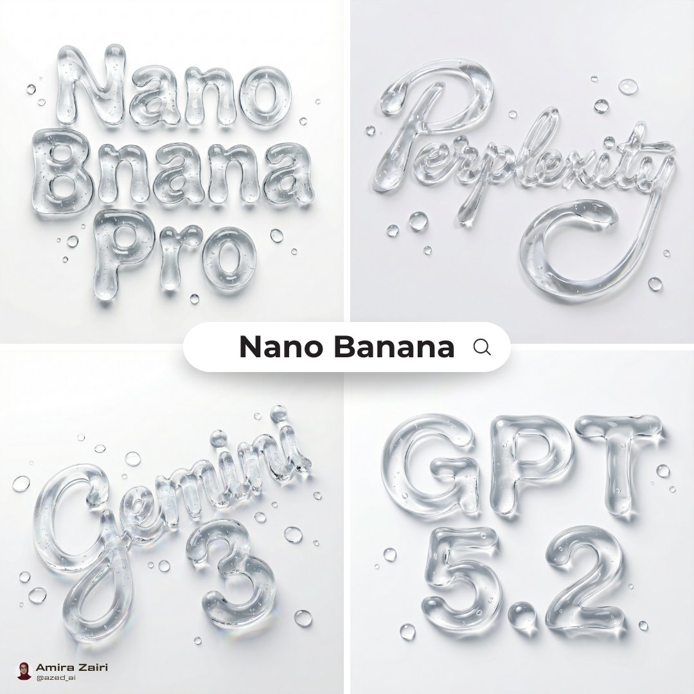

```
Abstract liquid typography spelling "text", thick transparent water-gel material, hyper realistic refraction and subtle caustics, realistic surface tension, sculpted droplet forms merged into smooth letter curves, glossy highlights, micro bubbles inside the gel, soft contact shadows on a pure white seamless background, scattered water droplets on the surface with sharp specular reflections, studio lighting, crisp photorealistic 3D render, macro detail, sharp focus, 8k, 1:1, no watermark, no extra text
```

```
抽象液态字体拼出“text”字样，厚实透明的水凝胶材质，超写实折射与细微焦散效果，真实的表面张力，雕塑般的水滴形态融合成流畅的字母曲线，高光亮泽，凝胶内部含有微小气泡，纯白无缝背景上呈现柔和接触阴影，表面散布着具有锐利镜面反射的水滴，影棚灯光，清晰逼真的3D渲染，微距细节，焦点锐利，8K分辨率，1:1比例，无水印，无额外文字。
```

 [↑返回目录](#toc)

---
## <a id="">简约卡通3D角色，皮克斯风格</a> (<a href="https://x.com/miilesus/status/2019852666567029072" target="_blank" rel="noopener noreferrer">Melis</a>)

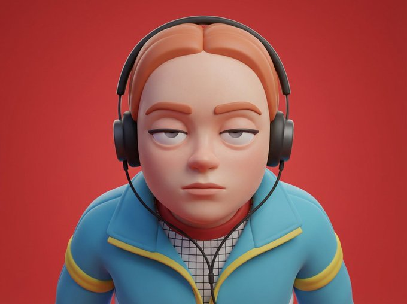

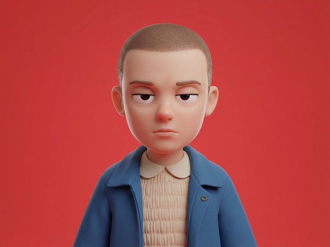

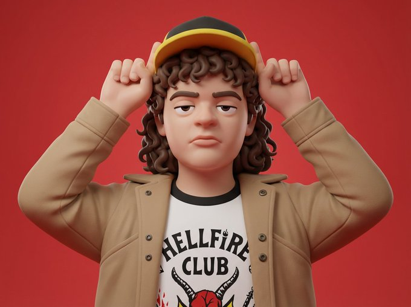

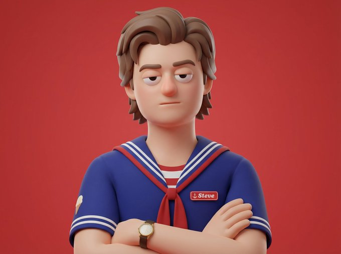

```
{
  "task": "image_style_transfer_3d_character",
  "input": {
    "source_image": "USER_UPLOADED_IMAGE",
    "preserve_identity": true,
    "preserve_pose": true,
    "preserve_composition": true,
    "preserve_clothing": true,
    "preserve_accessories": true
  },
  "style_reference": {
    "render_style": "stylized_3d_character",
    "aesthetic": "soft_minimal_cartoon_3d",
    "inspiration": [
      "pixar_like_but_more_minimal",
      "toy_figure_render",
      "clean_product_character_design"
    ]
  },
  "character_design": {
    "skin": {
      "material": "smooth_matte_plastic",
      "texture": "soft_uniform",
      "subsurface_scattering": "gentle"
    },
    "facial_features": {
      "eyes": "half_closed_bored_confident_expression",
      "eyelids": "heavy",
      "nose": "rounded_simplified",
      "mouth": "flat_neutral",
      "ears": "simplified_rounded"
    },
    "emotion": "cool_bored_unimpressed"
  },
  "clothing": {
    "source": "exact_from_uploaded_image",
    "lock_outfit": true,
    "fit": "unchanged",
    "fabric_translation": "3d_stylized_equivalent_only",
    "no_replacement": true,
    "no_enhancement": true,
    "no_stylization_override": true
  },
  "accessories": {
    "source": "exact_from_uploaded_image",
    "lock_accessories": true,
    "allow_only_existing": true,
    "no_new_accessories": true,
    "no_removal": true,
    "no_addition": true
  },
  "lighting": {
    "setup": "studio_softbox",
    "shadows": "very_soft",
    "contrast": "low",
    "highlights": "subtle"
  },
  "background": {
    "type": "solid_color",
    "color": "red"
  },
  "camera": {
    "angle": "front_facing",
    "framing": "medium_close_up",
    "lens": "50mm_equivalent",
    "distortion": "none"
  },
  "render_quality": {
    "resolution": "high",
    "edges": "clean",
    "noise": "none",
    "realism_balance": "stylized_over_realistic"
  },
  "output": {
    "consistency": "very_high",
    "style_strength": "strong",
    "photorealism": false,
    "strict_constraints": true
  }
}
```

```
输入：
- 使用用户上传的图片作为源图像
- 保持身份特征不变
- 保持姿势不变
- 保持构图不变
- 保持服装不变
- 保持配饰不变

风格参考：
- 渲染风格：风格化3D角色
- 美学：柔和简约卡通3D
- 灵感来源：皮克斯风格但更为简约，玩具人物渲染，干净的产品角色设计

角色设计：
- 皮肤：材质为光滑哑光塑料，纹理柔软均匀，具有轻微的次表面散射效果
- 面部特征：眼睛半闭表现出无聊自信的表情，眼睑厚重，鼻子圆润简化，嘴巴扁平中性，耳朵简化圆形
- 情绪：冷淡、无聊、不以为然

服装：
- 完全根据上传图片中的样式锁定，无替换和增强，禁止任何风格覆盖

配饰：
- 完全根据上传图片中的样式锁定，不允许新增或移除任何配件

照明：
- 设置：工作室柔光箱
- 阴影：非常柔和
- 对比度：低
- 高光：微妙

背景：
- 类型：纯色
- 颜色：红色

相机：
- 角度：正面
- 取景：中等特写
- 镜头：等效50mm
- 无变形

渲染质量：
- 分辨率：高
- 边缘：清晰
- 噪点：无
- 真实感平衡：风格化超过写实

输出：
- 一致性：非常高
- 风格强度：强
- 不追求照片真实感
- 严格遵循约束条件
```

 [↑返回目录](#toc)

---
## <a id="">前卫赛博朋克风的电影级人像</a> (<a href="https://x.com/iamsofiaijaz/status/2020068851216707786" target="_blank" rel="noopener noreferrer">Aijaz</a>)

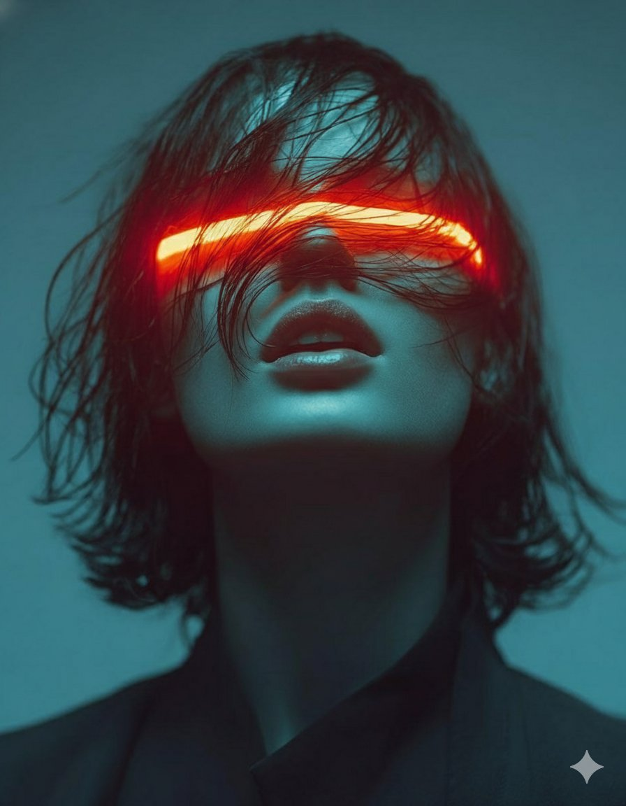

```
A high-fashion, cinematic portrait of a person with wet, dark tousled hair partially covering their face. They are wearing a glowing, horizontal neon orange light bar across their eyes like a visor. The lighting is a moody dual-tone: cool teal/cyan shadows on the skin and background, contrasted with the intense warm orange glow from the visor. Shot from a low angle looking up, soft bokeh, high resolution, hyper-realistic skin textures, edgy cyberpunk editorial style."
​Key Elements Explained
​If you want to tweak the result, here is why those specific words are in the prompt:
​Low Angle: This creates that "heroic" or imposing feeling by looking up at the subject.
​Teal and Orange: This is a classic cinematic color grading technique that makes the subject pop against the background.
​Wet/Tousled Hair: Adds to the "gritty" and realistic texture of the image.
​Neon Visor: Specifies that the light is the source of the glow, creating those realistic reflections on the nose and cheeks.
```

```
一张高时尚感、电影风格的人像，人物拥有湿润、深色且凌乱的头发，部分遮盖面部。双眼位置佩戴一条水平发光的霓虹橙色光带，如同面罩。光影采用情绪化的双色调：皮肤与背景呈现冷调青绿色/青蓝色阴影，与面罩发出的强烈暖橙色光芒形成鲜明对比。低角度仰拍，背景柔焦虚化，高分辨率，肌肤纹理超写实，整体风格为前卫赛博朋克风的时尚大片。
```

 [↑返回目录](#toc)

---
## <a id="">微型3D等距视图中的传统服饰展示</a> (<a href="https://x.com/aleenaamiir/status/2020005042540146707" target="_blank" rel="noopener noreferrer">Aleena Amir</a>)

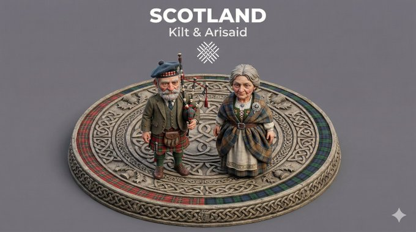

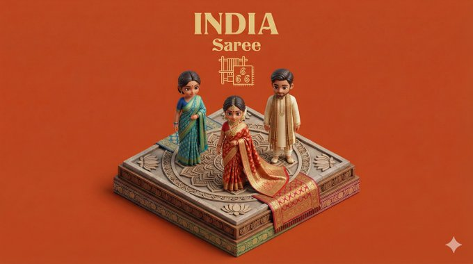

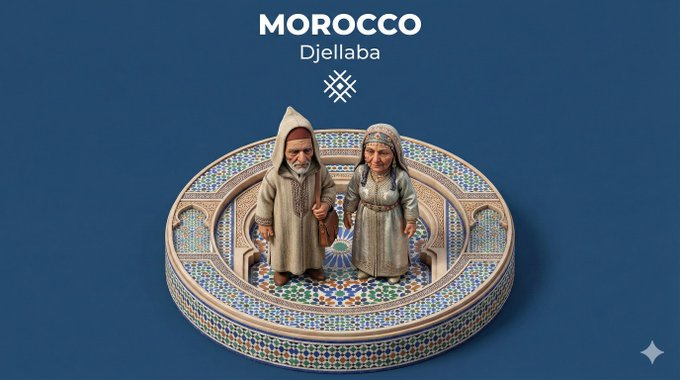

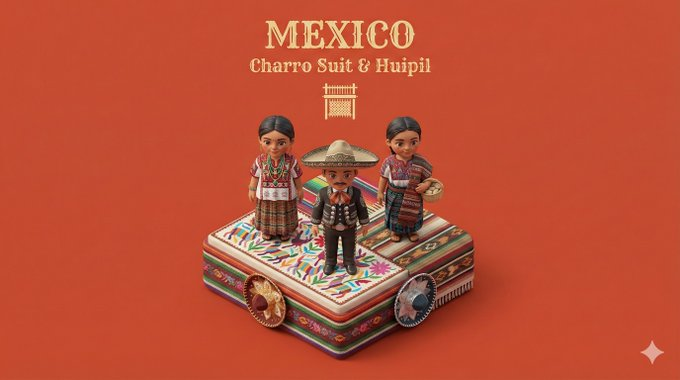

```
Create a miniature 3D isometric diorama showcasing the traditional clothing of [COUNTRY NAME].

View from a 45° top-down angle.
Textures feel fabric-focused and refined. Materials follow realistic PBR shading.

Lighting stays soft and even.
The raised base includes cultural patterns, symbols, and regional elements. Tiny stylized figures wear traditional outfits with heavy facial details.

Background uses solid [BACKGROUND COLOR].

Top center text reads [COUNTRY NAME] in bold.
Second line shows [CLOTHING NAME].

Place a minimal textile icon below. Text adapts to background contrast.
```

```
创建一个微型3D等距微缩立体模型，展示[国家名称]的传统服饰。  
视角为45度俯视角度。  
材质强调织物质感，精致细腻，采用写实的PBR着色。  
光线柔和均匀。  
抬高的底座包含文化图案、象征符号和地区元素。微缩风格的人物身着传统服装，面部细节丰富。  
背景使用纯色[背景颜色]。  
顶部中央以粗体显示[国家名称]，第二行显示[服饰名称]。  
下方放置一个极简风格的纺织品图标，文字根据背景对比度自动调整。
```

 [↑返回目录](#toc)

---
## <a id="">花园中的宁静水景</a> (<a href="https://x.com/WallPapers360/status/2019637426998898928" target="_blank" rel="noopener noreferrer">A</a>)

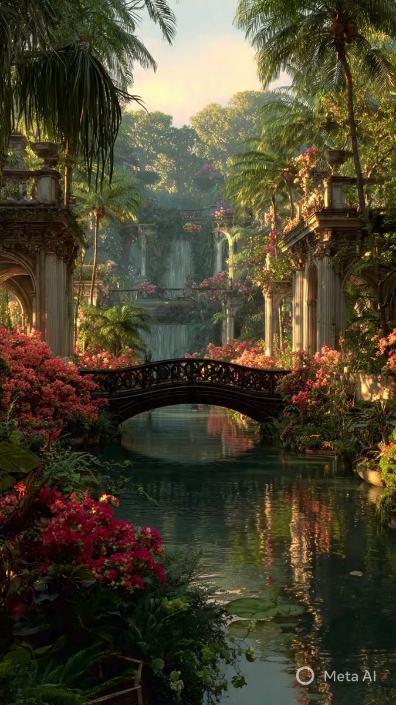

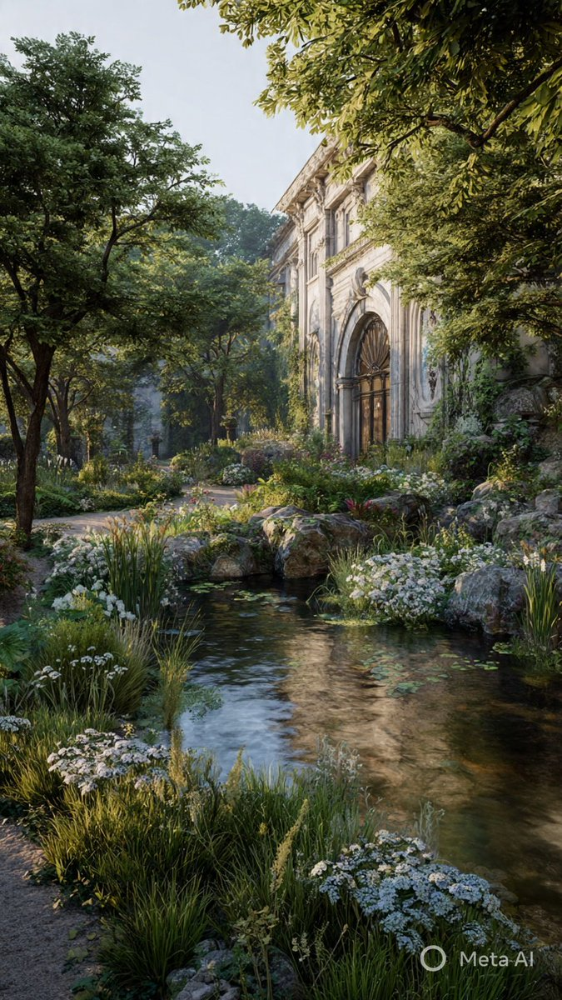

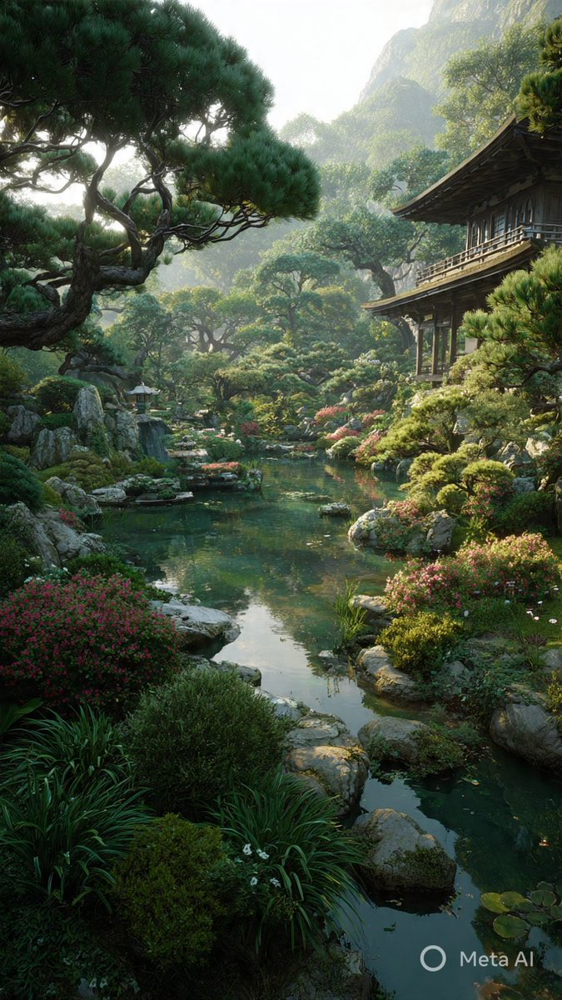

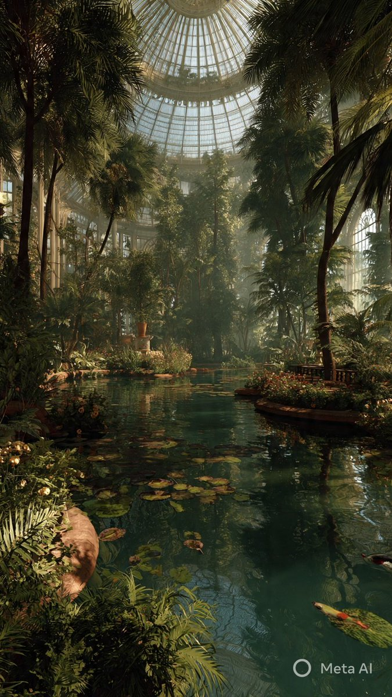

```
{
  "prompt": "Create stunning images showcasing the beauty of Gardens, featuring lush greenery, vibrant flowers, and serene water features in 16K resolution",
  "style": "landscape photography",
  "resolution": "16K",
  "colors": ["green", "vibrant", "pastel"],
  "elements": ["Gardens", "flowers", "water features", "greenery", "serene"]
}
```

```
创作令人惊叹的16K分辨率图像，展现花园之美，包含茂密的绿植、鲜艳的花朵和宁静的水景，风格为风景摄影，色彩以绿色、鲜艳色和柔和色为主，元素包括花园、花卉、水景、绿意和宁静氛围。
```

 [↑返回目录](#toc)

---
## <a id="">动漫角色表达情绪</a> (<a href="https://x.com/aleenaamiir/status/2019724660703899993" target="_blank" rel="noopener noreferrer">Aleena Amir</a>)


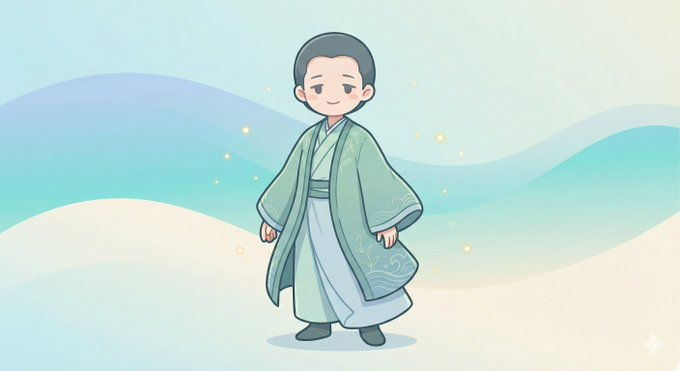

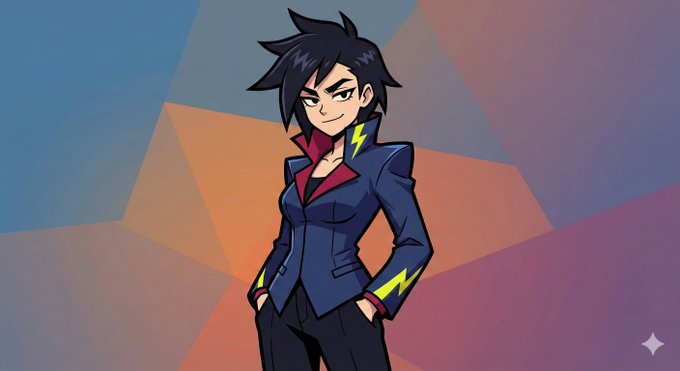

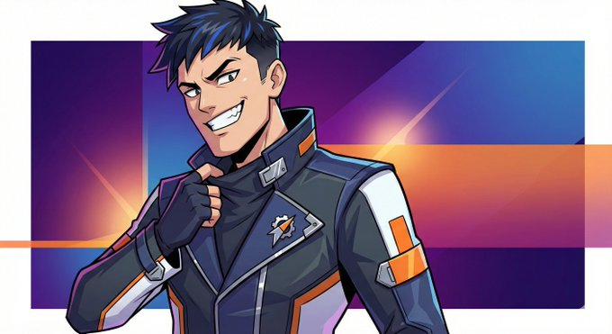

```
Character design illustration focused on personality: [TRAIT: confident / shy / chaotic / calm].
The character is [ACTION OR EMOTION], with exaggerated facial expression and expressive posture.

Clothing reflects personality: [OUTFIT + SYMBOLIC DETAILS].
Simplified facial details, strong silhouette, readable shape design.

Illustration style: ANIME-INSPIRED.
Background minimal and abstract to emphasize emotion.
```

```
角色设计插画，聚焦于性格：[特质：自信 / 害羞 / 混乱 / 冷静]。  
角色正在[动作或情绪]，面部表情夸张，姿态富有表现力。  

服装体现性格：[服装 + 象征性细节]。  
面部细节简化，轮廓鲜明，造型清晰易读。  

插画风格：受动漫启发。  
背景极简且抽象，以突出情绪。
```

 [↑返回目录](#toc)

---
## <a id="">超写实物体的极致真空包装展示</a> (<a href="https://x.com/Arminn_Ai/status/2019847469165896077" target="_blank" rel="noopener noreferrer">ΛRMIN | AI</a>)

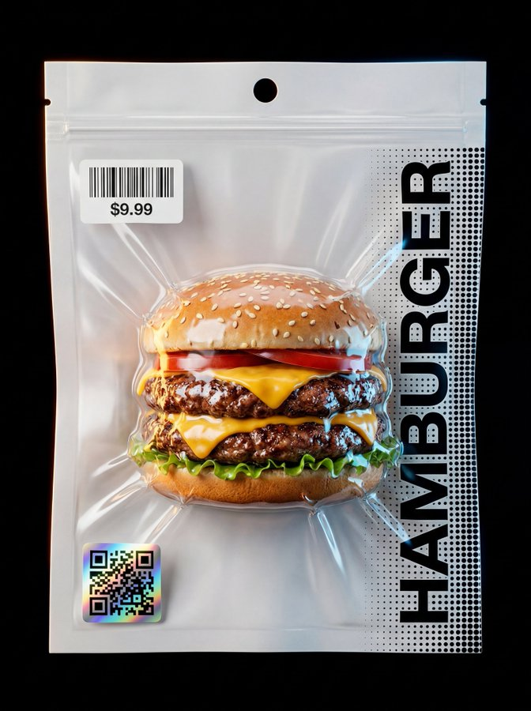

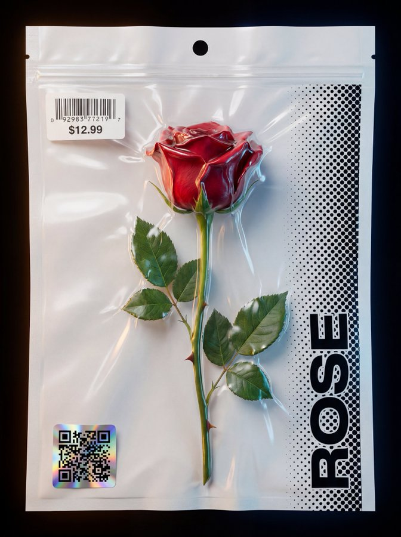

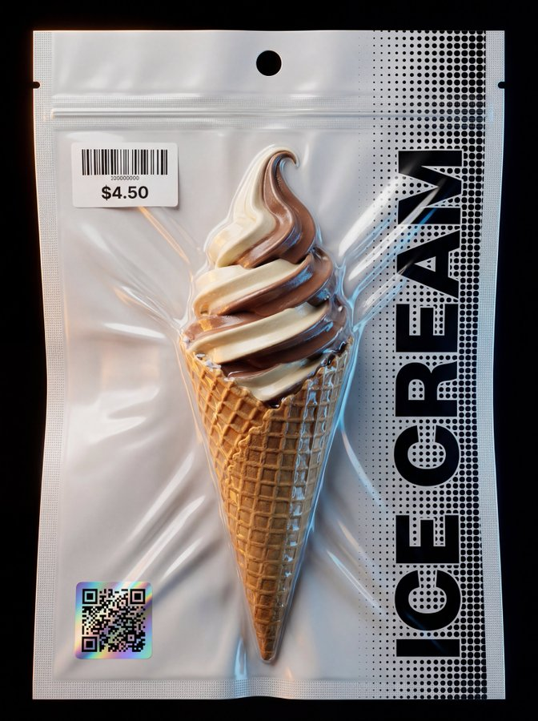

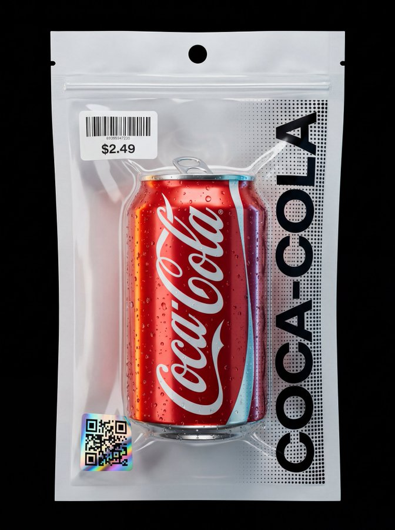

```
Composition & Subject: A professional front-facing studio shot of a hyper-realistic [INSERT OBJECT] standing vertical. The object features intense textural details like [DESCRIBE OBJECT TEXTURES].
Pouch Structure (Dual Material): The vacuum-sealed pouch is composed of two distinct layers. The back layer is a solid, opaque, industrial matte-white material (providing a high-contrast backdrop). The front layer is crystal-clear, high-gloss transparent plastic, allowing the object to be seen with perfect clarity and sharp detail.

Vacuum Physics & Compression: The packaging demonstrates extreme vacuum-contoured compression. The plastic is sucked inward like a second skin, clinging tightly to the [DESCRIBE KEY PROTRUDING PARTS] of the object. This creates aggressive, sharp tension micro-folds and deep sculptural wrinkles that radiate from the object's silhouette. The pouch edges feature a crisp, industrial micro-dotted heat-seal pattern.

Packaging Detail: The top features a circular punch-hole for hanging display, located above a realistic zip-lock seal track. The vacuum effect is powerful, with the clear front plastic sucked tightly against the contours, creating sharp, ray-traced reflections and deep tension folds.

Graphics & Strategic Placement:
Upper Label: A crisp white thermal rectangular sticker with a barcode and price tag of "$[INSERT PRICE]" is placed at the top-left, positioned precisely below the zip-lock seal line.
Lower QR: A premium square holographic QR-code with prismatic iridescent reflections is located at the bottom-left corner.

Typography & Extended Pattern: The word "[INSERT OBJECT NAME IN CAPS]" is printed vertically in a bold black Swiss font along the right side, layered over a black halftone dot-matrix pattern that extends fully to the mid-point of the pouch and then gradually fades/dissolves from there towards the center, creating a sophisticated transition.

Lighting & Background: Set against a pitch-black minimalist background. Cinematic Amber and Electric Blue rim lighting outlines the silhouette, highlighting the contrast between the white back and the clear front plastic, ensuring a zero-flatness, 3D pop. Technical Specs: Commercial product photography, 8k, Unreal Engine 5.4 render style, macro-detail, zero-flatness, ultra-high contrast, focus on extreme transparency of the front layer.
```

```
构图与主体：一张专业正面影棚拍摄的超写实[插入物体]，垂直直立。物体具有强烈的纹理细节，如[描述物体纹理]。  

包装结构（双材质）：真空密封袋由两层截然不同的材料构成。背面是一层坚固、不透明的工业哑光白色材质（提供高对比度背景），正面则为晶莹剔透、高光亮面的透明塑料，使物体清晰可见，细节锐利分明。  

真空物理与压缩效果：包装展现出极致的真空贴合压缩效果。透明塑料如第二层皮肤般被强力向内吸附，紧密包裹住物体的[描述关键突出部位]，形成强烈而锐利的张力微褶皱和深邃的雕塑感皱纹，从物体轮廓向外辐射。包装边缘带有清晰的工业风微点状热封纹路。  

包装细节：顶部设有一个圆形穿孔，用于悬挂展示，位于一条逼真的拉链封口轨道上方。真空效果强劲，透明前层塑料紧贴物体轮廓，产生锐利的光线追踪反射和深度张力褶皱。  

图形与策略性排布：  
上部标签：左上角贴有一张干净的白色热敏矩形标签，印有条形码和“$[插入价格]”的价格标签，位置精准地位于拉链封口线下方。  
底部二维码：左下角设有一个高端方形全息二维码，呈现棱镜般的虹彩反光效果。  

字体与延展图案：右侧垂直印有粗体黑色瑞士字体的“[插入物体名称（大写）]”字样，叠加在黑色半调网点矩阵图案之上；该图案从包装右侧延伸至中部，并从中部开始逐渐淡化、溶解至中心，营造出精致的过渡效果。  

灯光与背景：置于纯黑极简背景中。电影感琥珀色与电光蓝色轮廓光勾勒出物体剪影，突显白色背层与透明前层之间的对比，确保画面毫无平面感，呈现强烈的3D立体效果。  

技术规格：商业产品摄影风格，8K分辨率，虚幻引擎5.4渲染，微距细节，零平面感，超高对比度，强调前层塑料的极致通透感。
```

 [↑返回目录](#toc)

---
## <a id="">红色背景上的简约3D卡通头像</a> (<a href="https://x.com/egeberkina/status/2019761819821260975" target="_blank" rel="noopener noreferrer">Ege</a>)

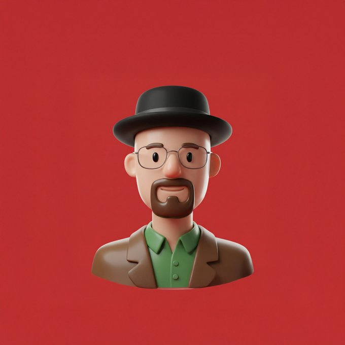

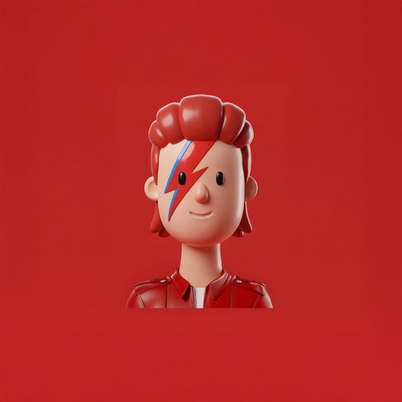

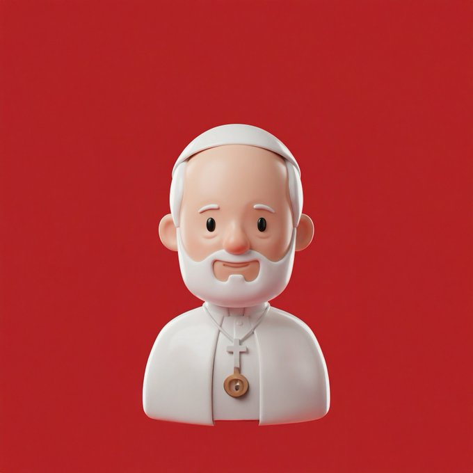

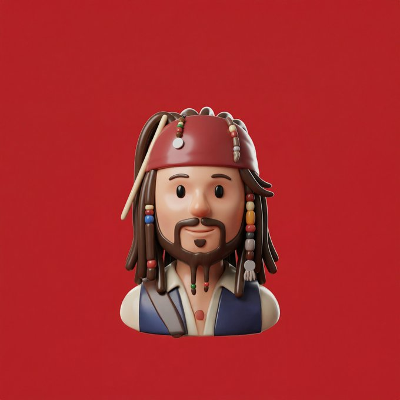

```
{
 "task": "stylized_3d_avatar_portrait",
 "input": {
 "reference_image": "USER_UPLOADED_IMAGE",
 "style_match_strength": "high",
 "preserve_identity": false
 },
 "output": {
 "type": "single_image",
 "aspect_ratio": "1:1",
 "resolution": "ultra_high_resolution",
 "render_quality": "cinema_grade_3d",
 "ai_artifacts": "none"
 },
 "style": {
 "character_type": "minimal_cartoon_3d_avatar",
 "inspiration": [
 "toy_figure_render",
 "pixar_like_but_simplified",
 "friendly_brand_avatar"
 ],
 "proportions": {
 "head": "slightly_oversized",
 "facial_features": "simplified_and_soft",
 "neck": "short_and_cylindrical"
 }
 },
 "character_design": {
 "skin": {
 "material": "smooth_semi_gloss_plastic",
 "subsurface_scattering": "soft",
 "imperfections": "none"
 },
 "face": {
 "eyes": "small_black_oval_minimal",
 "eyebrows": "thin_curved_minimal",
 "nose": "rounded_button_nose",
 "mouth": "subtle_smile_embedded_in_beard"
 },
 "hair": {
 "style": "stylized_solid_shapes",
 "material": "glossy_plastic",
 "edges": "rounded_and_soft"
 },
 "beard": {
 "style": "clean_stylized_beard_block",
 "material": "glossy_plastic",
 "integration": "merged_with_face_geometry"
 }
 },
 "lighting": {
 "setup": "studio_softbox",
 "key_light": "soft_front",
 "fill_light": "gentle",
 "rim_light": "very_subtle",
 "shadow_style": "soft_and_diffused"
 },
 "camera": {
 "framing": "centered_head_and_shoulders",
 "angle": "straight_on",
 "lens": "medium_focal_length",
 "distortion": "none"
 },
 "background": {
 "color": "solid_bold_red",
 "gradient": "none",
 "texture": "flat_clean"
 },
 "mood": {
 "emotion": "friendly_calm",
 "vibe": "modern_playful_premium"
 }
}
```

```
创作一个风格化3D头像肖像，采用极简卡通3D风格，参考用户上传的图像，高度匹配其风格但不保留原始身份特征。输出为1:1比例的单张超高清图像，渲染质量达到电影级3D水准，无任何AI伪影。

角色设计灵感源自玩具人偶渲染、简化版皮克斯风格及友好的品牌头像。头部略大，面部特征简洁柔和，颈部短而呈圆柱形。皮肤材质为光滑半亮塑料，带有柔和次表面散射，无瑕疵。眼睛为小巧的黑色椭圆形极简造型，眉毛细而弯曲且极简，鼻子为圆润的纽扣鼻，嘴巴为融入胡须中的淡淡微笑。

发型采用风格化的实心块状造型，材质为亮面塑料，边缘圆润柔和。胡须为干净利落的风格化块状，同样使用亮面塑料材质，并与面部几何结构融合一体。

灯光采用摄影棚柔光箱布置：主光柔和正面打光，辅光轻柔，轮廓光极淡，阴影柔和弥散。相机采用中焦镜头，正面平视角度，构图为居中的头肩像，无畸变。

背景为纯色鲜明红色，无渐变、无纹理，干净平整。整体情绪友好平静，氛围现代、活泼且具高级感。
```

 [↑返回目录](#toc)

---


[上一页](./11.md) | 当前 12/12 页 | [查看全部目录](../prompts.md)