# gemini.json 

gemini.json文件存放gemini相关的提示词，当前已收录：654个 

 投稿方式：[飞书投稿](https://tcn1uh5rxo87.feishu.cn/share/base/form/shrcne5gDolOMDd0oJsj2XfvxQc) or [issues](https://github.com/junxiaopang/gridsplitter/issues/new)

[上一页](./2.md) | 当前 3/7 页 | [下一页](./4.md) | [查看全部目录](../prompts.md)

🚀 **在线预览**: [https://prompts.kkkm.cn](https://prompts.kkkm.cn)

## <a id="toc">目录</a>

- [巨葡萄的微缩奇境](#prompt-2002878783511019800)
- [圣诞纸箱挑战：红酒流淌的节日瞬间](#prompt-2003025725675204900)
- [模糊梦境中的神秘身影](#prompt-2003156101718581500)
- [时尚变装贴纸包](#prompt-2003003721827987700)
- [内唇纹身特写：JSON](#prompt-2003122267589325000)
- [巫师破牌：黑桃K的觉醒](#prompt-2003139206944883200)
- [Botanical Hydration](#prompt-2003263283432763600)
- [都市街头服饰拼贴](#prompt-2003278312068780300)
- [圣诞奢华商品摄影](#prompt-2003115097116602600)
- [Pantheon: Classical Architectural Presentation](#prompt-2003122606527205400)
- [巨人日常：微缩世界的挑战](#prompt-2003300924283089400)
- [超现实复古胶片肖像](#prompt-2003265568082956500)
- [一副完整的 78 张塔罗牌](#prompt-2003237826331378200)
- [咖啡与魔法的晨间插画](#prompt-2002967881085317600)
- [PROMPT TO ART](#prompt-2002803581498561000)
- [Arrow Dynamics装置的逼真3D呈现](#prompt-2002785901123117000)
- [反乌托邦文学微缩剧场](#prompt-2002833954680762600)
- [九宫格奢华产品视觉叙事](#prompt-2002831713970602000)
- [日常之物，巨构为碑](#prompt-2002937974993088800)
- [耐克未来动感广告](#prompt-2003064127221272600)
- [PROMPT TO ART](#prompt-2002903228485165300)
- [宇宙沙漏：夜之凝视](#prompt-2002865460300460300)
- [社交时代的电影肖像](#prompt-2002944939362288000)
- [多风格面部贴纸包](#prompt-2002734410689347800)
- [陨石空军一号：宇宙爆裂](#prompt-2003107440137539800)
- [武者メカ娘 四拾伍号機](#prompt-2002892122643665400)
- [穿越回你出生那年的流行色](#prompt-2002824697013297200)
- [Midjourney 遇见 Nano Banana](#prompt-2002840320694993000)
- [AR音乐环绕：电影级听觉幻境](#prompt-2002963262812586000)
- [橡胶软管角色登场](#prompt-2002841670992502800)
- [透明人间的幻象](#prompt-2003021477277483000)
- [竹蜻蜓飞行奇遇记](#prompt-2002968038157726000)
- [蓝色纱丽的晨光诗篇](#prompt-2002883935618130000)
- [房屋改造前后对比视频教程](#prompt-2002953995653144600)
- [粘土童趣角色模型](#prompt-2002943114512826600)
- [电影海报墙写真](#prompt-2002132714200130000)
- [金属质感品牌雕塑](#prompt-2002404581590831600)
- [圣诞双生镜像](#prompt-2002382591823896600)
- [灰发女性的都市独行](#prompt-2002318771114160600)
- [现实与Q版的咖啡邂逅](#prompt-2002037335161217500)
- [超级英雄与汽水的奇幻邂逅](#prompt-2002013476370444800)
- [双重身份：极简肖像](#prompt-2002359398220640300)
- [1983科技发明Knolling摄影](#prompt-2002307108050776600)
- [AI时尚变装：一镜多面](#prompt-2002567761151864800)
- [梅西收藏家遗物套盒](#prompt-2002116477307044000)
- [手工编织品牌标志静物](#prompt-2002055101780009500)
- [高端时尚胶片五联画](#prompt-2002263911413031200)
- [牙齿矫正前后对比](#prompt-2002324758558347500)
- [修复NotebookLM幻灯片字体崩坏](#prompt-2002326764371038500)
- [奢华皮革旅行包](#prompt-2002274024408191000)
- [90年代胶片感黑白肖像](#prompt-2002582470567604200)
- [科幻小说材质雕塑四重奏](#prompt-2002054066319573200)
- [植发全过程医学纪实](#prompt-2002465235391967700)
- [超写实MacBook Teams等候室](#prompt-2002114484903800800)
- [iPhone 17 Pro 概念广告九宫格](#prompt-2002424619232588300)
- [架构之美：信息的蓝图](#prompt-2002582724280975600)
- [神秘光影中的未来城市](#prompt-2002331770428272600)
- [别害怕，Just Do It！](#prompt-2002639331501224000)
- [极简天妇罗菜单设计](#prompt-2001591561302483200)
- [复古浪漫肖像拼贴](#prompt-2002167453728555500)
- [时尚幻觉：从手机走出的她](#prompt-2002293540299420200)
- [金钱风暴中的真实面孔](#prompt-2002199029594402800)
- [圣诞夜的魔法村庄](#prompt-2002093738122965500)
- [字母堡垒：沙漠中的阿拉伯幻境](#prompt-2002023616829878800)
- [Y2K海滩双视](#prompt-2002172236611146000)
- [雨中离别：九格电影分镜](#prompt-1996580659096387800)
- [倒置世界的奇妙对称](#prompt-1996878448288321500)
- [俏皮兔女郎的闪光自拍](#prompt-1995603848510271500)
- [人脸变超市商品](#prompt-1996919230961226000)
- [鱼眼自拍鬼脸大冒险](#prompt-1996285140893622300)
- [阿拉伯书法魔法肖像](#prompt-2001669259282313500)
- [电影混搭奇想](#prompt-2001765272257204200)
- [班尼迪克蛋微缩厨房珍藏盒](#prompt-2001719789937447400)
- [后台的提线木偶师](#prompt-2001695202600456700)
- [喧嚣中的沉思](#prompt-2001656897699734000)
- [冷调废墟中的柔焦幻境](#prompt-1997261014677787100)
- [Gemini Nano Banana Pro](#prompt-1997237942386053400)
- [时尚概念手绘分解图](#prompt-1992877077570453800)
- [性感写真](#prompt-1994762837240287700)
- [Majestic Wolf in Double Exposure](#prompt-1996982927427596800)
- [共生战士：毒液觉醒](#prompt-2001909488790704400)
- [纸下温情：女人与银斑小猫](#prompt-2001876716910973000)
- [微型生态奇境](#prompt-2001926457443135500)
- [双生比例：时尚幻境](#prompt-2001944607714673200)
- [青春剪贴簿：韩系时尚少女](#prompt-1997191891553534500)
- [真实皮肤纹理提示词](#prompt-1996953434583716000)
- [微型偶像扭蛋收藏](#prompt-1997020968225525800)
- [漫画角色超写实转化](#prompt-1996281855503372500)
- [复古赛车合成照](#prompt-2001691201439707400)
- [液态亮面品牌标志](#prompt-2001649477137109000)
- [冰封红裙：超现实时尚幻境](#prompt-2001860294105272300)
- [超现代高光黑透物体](#prompt-2001932788023595000)
- [Transforma tu foto en cómic contigo mismo 🦸‍♂️](#prompt-2001689993778250000)
- [石质碎片中的超现实主体](#prompt-2001665608711049500)
- [AI打造专业头像](#prompt-1996469120913883400)
- [猫耳サイボーグガールフィギュア](#prompt-1996889833894232300)
- [九面风尚：潮流人格拼贴](#prompt-1996935337546076400)
- [街头风尚：低角度下的酷女孩](#prompt-1995847027054534700)
- [趣味3D名人漫像肖像](#prompt-1996769465632227800)
- [Nano Banana Pro细节惊艳](#prompt-2002016072405328100)

## <a id="prompt-2002878783511019800">巨葡萄的微缩奇境</a> (<a href="https://x.com/AllaAisling/status/2002878783511019665" target="_blank" rel="noopener noreferrer">Alexandra Aisling</a>)

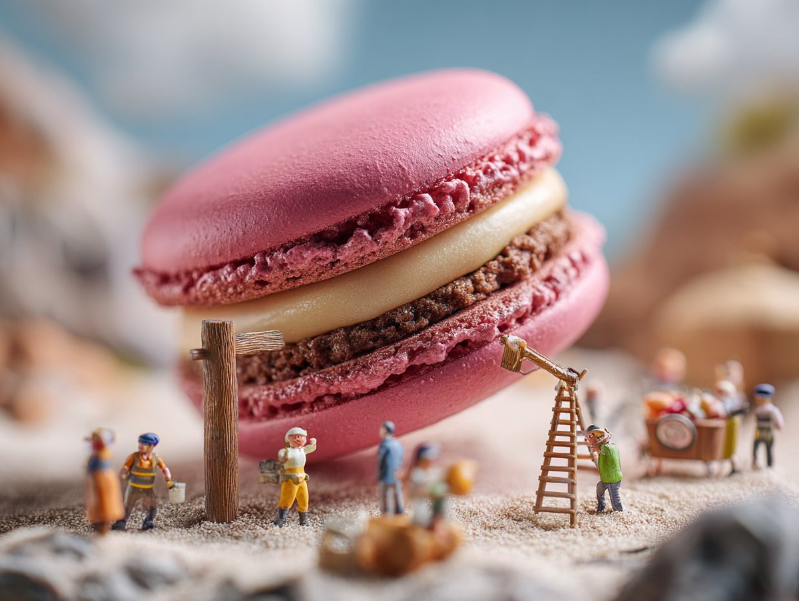

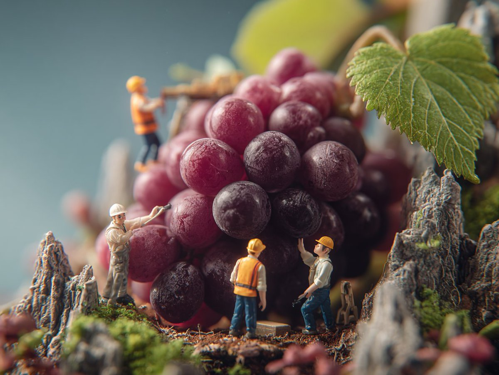

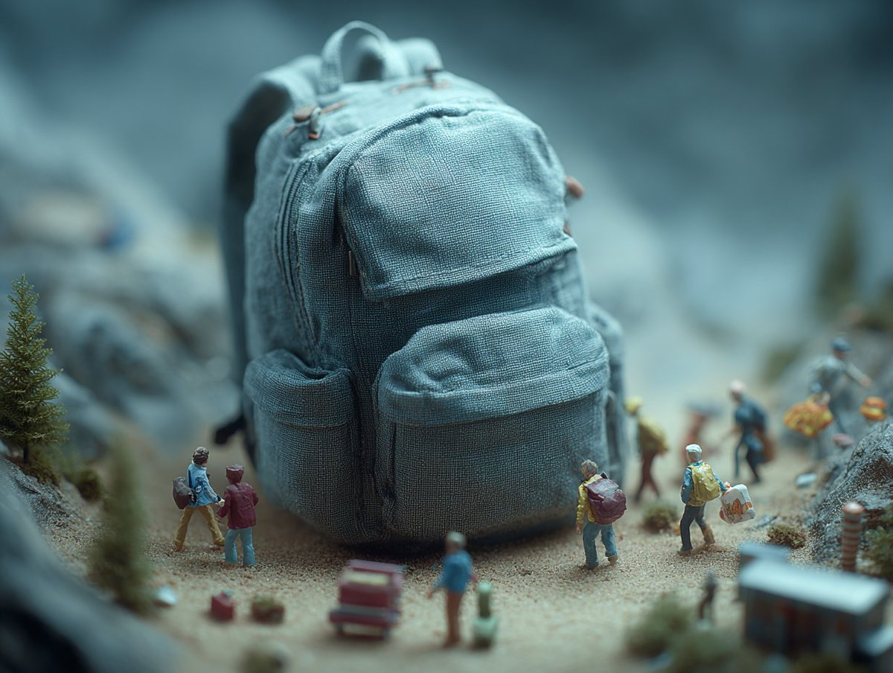

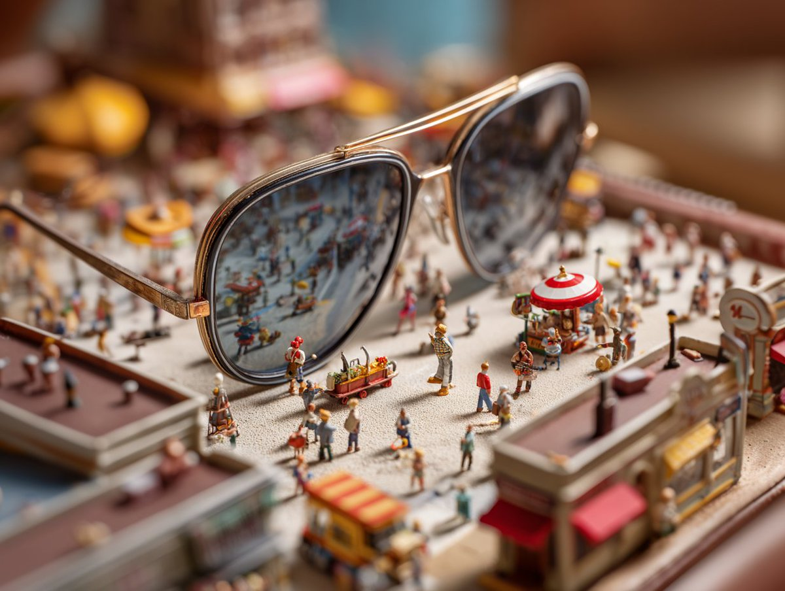

```
Macaron as giant object in miniature scene, tiny figures or landscape elements around it, tilt-shift effect, playful scale distortion, whimsical advertising, model-making aesthetic, imaginative perspective
```

```
Grapes as giant object in miniature scene, tiny figures or landscape elements around it, tilt-shift effect, playful scale distortion, whimsical advertising, model-making aesthetic, imaginative perspective
```

```
Backpack as giant object in miniature scene, tiny figures or landscape elements around it, tilt-shift effect, playful scale distortion, whimsical advertising, model-making aesthetic, imaginative perspective
```

```
Sunglasses as giant object in miniature scene, tiny figures or landscape elements around it, tilt-shift effect, playful scale distortion, whimsical advertising, model-making aesthetic, imaginative perspective
```

 [↑返回目录](#toc)

---
## <a id="prompt-2003025725675204900">圣诞纸箱挑战：红酒流淌的节日瞬间</a> (<a href="https://x.com/Adam38363368936/status/2003025725675204789" target="_blank" rel="noopener noreferrer">Adam也叫吉米</a>)

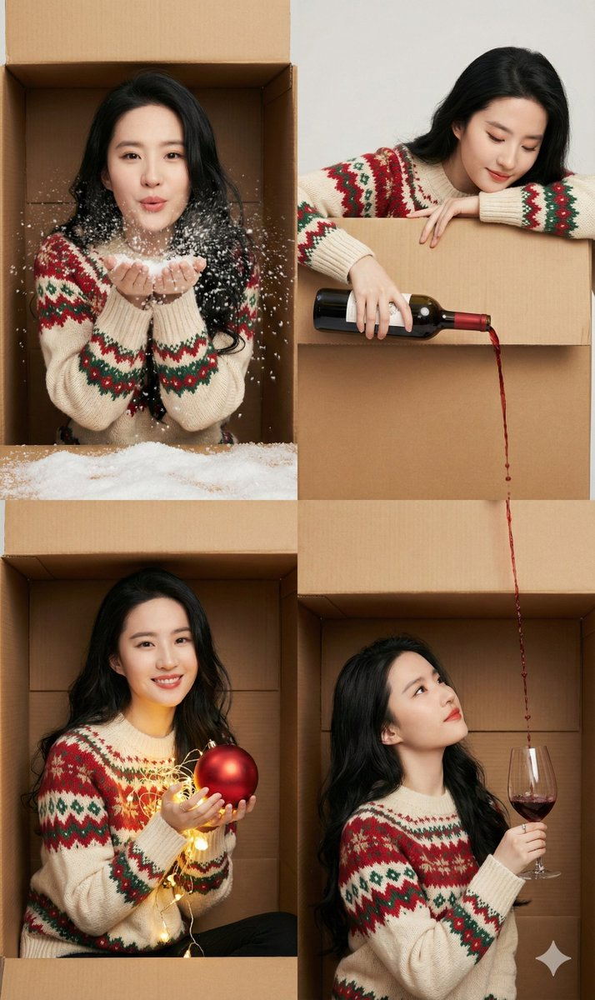

```
Use the face without any  change.A high-quality 2x2 creative photo collage of a young woman with long wavy black hair , posing inside cardboard boxes for a Christmas-themed challenge. She wears a cream, red, and green Fair Isle knit sweater.
Layout & Interaction (Crucial):The right side features a continuous action across two panels. Red wine is poured from the top-right panel and flows vertically down into the bottom-right panel.
Panel Details:

Top Left: She blows artificial snow from her palms towards the camera.
Bottom Left: She holds glowing fairy lights and a red bauble, smiling warmly.
Top Right: She leans on the box edge, holding a wine bottle, pouring red wine downwards so the liquid stream exits the bottom of this frame.
Bottom Right: She is positioned below, holding a wine glass that catches the stream of wine pouring down from the panel above. She is looking up, watching the wine flow into her glass.

Style: Creative box challenge photography, seamless cross-panel interaction, festive mood, soft studio lighting, ultra-realistic textures.
```

```
使用原脸不做任何改动。一张高质量的2x2创意照片拼贴，描绘一位长卷黑发的年轻女子，为圣诞主题挑战而置身于纸箱内拍摄。她身穿奶油色、红色与绿色相间的费尔岛针织毛衣。  
布局与互动（关键）：右侧两个画面呈现连续动作——红酒从右上画面倾倒，并垂直流淌至右下画面。  

各画面细节：  
左上：她从掌心向镜头吹出人造雪花。  
左下：她手握发光的 fairy lights 与一颗红色圣诞球，温暖微笑。  
右上：她倚靠在纸箱边缘，手持红酒瓶向下倾倒，酒液从该画面底部流出。  
右下：她位于下方，手持酒杯承接从上方画面流下的红酒，抬头注视着酒液注入杯中。  

风格：创意纸箱挑战摄影，画面间无缝互动，节日氛围，柔光影棚照明，超写实质感。
```

 [↑返回目录](#toc)

---
## <a id="prompt-2003156101718581500">模糊梦境中的神秘身影</a> (<a href="https://x.com/CharaspowerAI/status/2003156101718581386" target="_blank" rel="noopener noreferrer">Pierrick Chevallier | IA</a>)

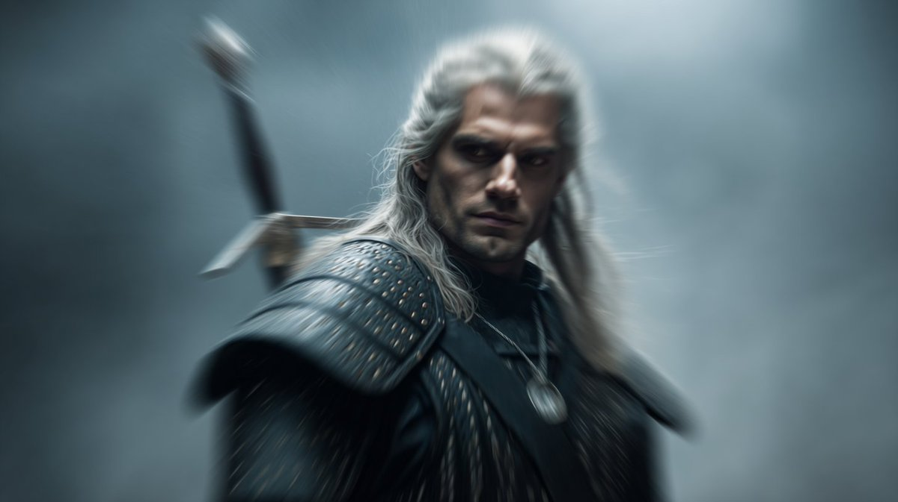

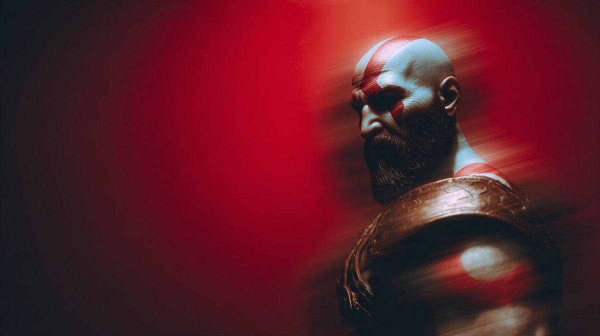

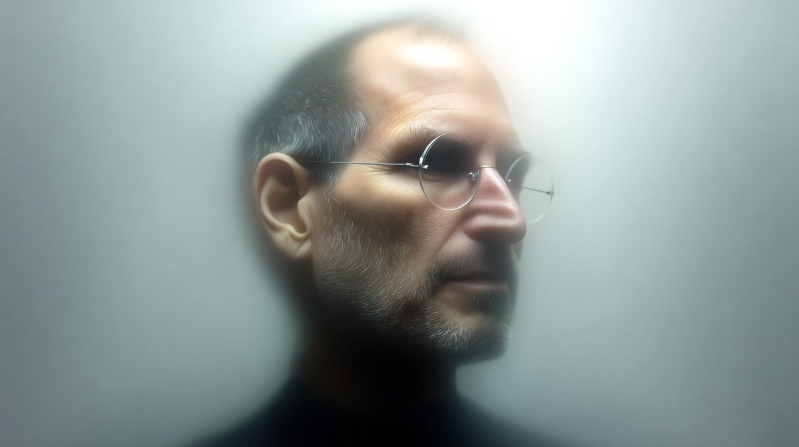

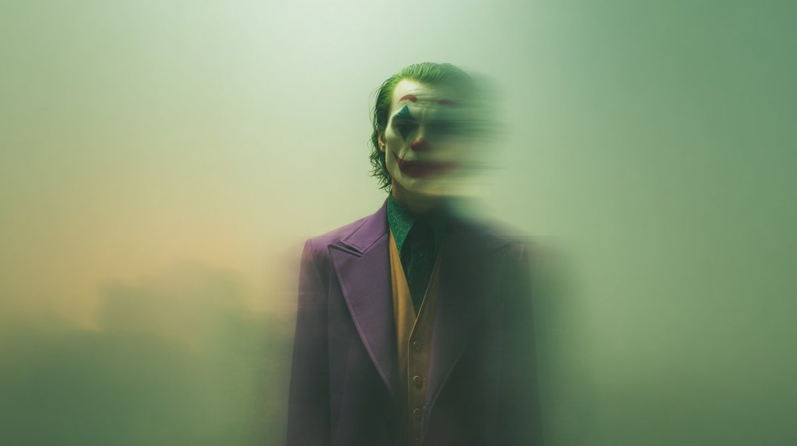

```
BLURRY OUT OF FOCUS PHOTOGRAPHY
a blurry, out-of-focus photograph of [character or personality name], described as [brief physical description or iconic outfit], standing in front of a [color] gradient background. the face is obscured by [object, accessory, shadow, or visual effect]. in the style of minimalist photography, with soft lighting, a dreamy atmosphere, and a minimalistic design, creating a surreal effect.

Now it's your turn
```

```
模糊失焦摄影  
一张模糊、失焦的照片，画面中是[角色或名人姓名]，其特征为[简要外貌描述或标志性服装]，站在[颜色]渐变背景前。面部被[物体、配饰、阴影或视觉效果]遮挡。风格为极简摄影，采用柔和光线、梦幻氛围与极简设计，营造出超现实效果。
```

 [↑返回目录](#toc)

---
## <a id="prompt-2003003721827987700">时尚变装贴纸包</a> (<a href="https://x.com/linxiaobei888/status/2003003721827987592" target="_blank" rel="noopener noreferrer">xiaobeiLin</a>)


```
一个以上传照片为原型的3*3贴纸包，人物穿着不同服装和时尚风格。边缘干净裁剪，带有粗线条轮廓，姿势富有表现力，整体采用活泼的现代贴纸设计。在每个贴纸旁边采用中英文标注风格，所有贴纸保持相同的面部特征、一致的相似度和比例。
包含教师装、传统、护士制服、街头潮牌和奇幻灵感等多种服装风格。高分辨率成品，带有柔和阴影和光泽贴纸纸张质感，适合社交分享。
```

 [↑返回目录](#toc)

---
## <a id="prompt-2003122267589325000">内唇纹身特写：JSON</a> (<a href="https://x.com/egeberkina/status/2003122267589325119" target="_blank" rel="noopener noreferrer">Ege</a>)

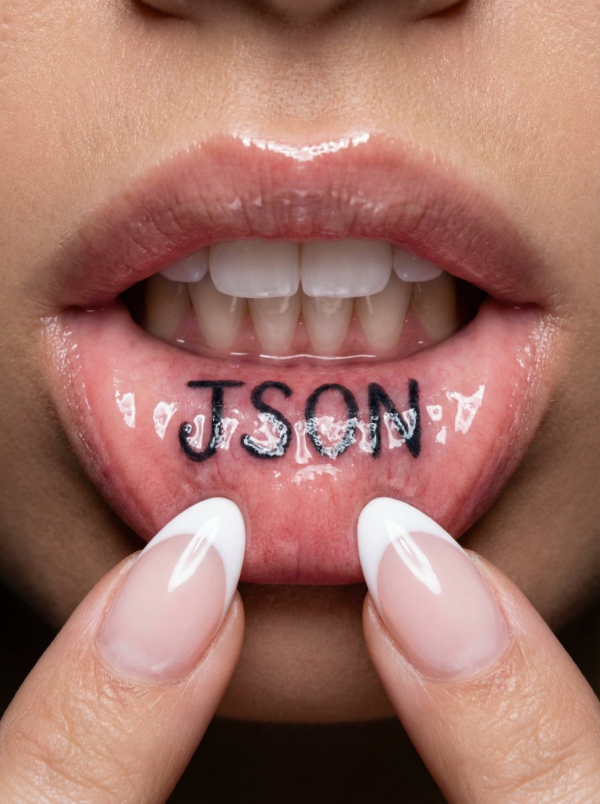

```
{
  "task": "front_view_extreme_macro_inner_lip_tattoo_with_lip_gloss",
  "output": {
    "type": "single_image",
    "resolution": "ultra_high_resolution_8k",
    "realism": "hyper_photorealism",
    "quality": "high_end_editorial_macro",
    "retouching": {
      "skin": "enhanced_natural_realism",
      "preserve_micro_texture": true,
      "no_smoothing": true,
      "no_plastic_effect": true,
      "texture_priority": "lips_inner_mouth_teeth"
    }
  },
  "scene": {
    "environment": "controlled_macro_studio",
    "background": "dark_neutral_falloff",
    "lighting": {
      "key_light": "neutral_soft_front_macro_light",
      "color_temperature": "cool_neutral_5600k",
      "fill_light": "minimal_balanced",
      "contrast": "clean_high",
      "highlights": "crisp_speculars_no_warm_cast",
      "shadows": "soft_realistic_depth",
      "white_balance": "perfectly_neutral"
    }
  },
  "composition": {
    "shot_type": "extreme_close_up",
    "camera_angle": "perfect_front_view",
    "framing": "mouth_and_fingers_only",
    "crop": "ultra_tight",
    "depth_of_field": "razor_thin_focus_on_inner_lip",
    "symmetry": "centered",
    "focus_priority": [
      "inner_lip_tattoo_text",
      "lip_gloss_highlights",
      "teeth_whiteness",
      "lip_texture"
    ]
  },
  "subject": {
    "mouth": {
      "expression": "slightly_open",
      "lips": {
        "product": "clear_lip_gloss",
        "finish": "high_shine_glossy",
        "shine_level": "subtle_but_visible",
        "texture": "wet_real_lips_with_fine_lines",
        "highlights": "clean_specular_reflections",
        "color": "natural_pink_no_orange_cast"
      },
      "teeth": {
        "whiteness": "pure_natural_white",
        "tone": "neutral_white_no_yellow_no_gray",
        "surface": "clean_enamel_with_realistic_reflection",
        "alignment": "natural_even",
        "aesthetic": "cosmetic_level_clean"
      },
      "inner_lip": {
        "tattoo": {
          "text": "JSON",
          "ink_color": "deep_black",
          "style": "handwritten_raw",
          "placement": "centered_on_inner_lower_lip",
          "finish": "fresh_ink_slight_gloss",
          "edges": "slightly_imperfect_realistic"
        },
        "skin_color": "natural_inner_lip_red",
        "texture": "soft_mucosal_detail_visible"
      }
    },
    "hands": {
      "pose": "pulling_lower_lip_down_symmetrically",
      "skin_texture": "natural_high_detail",
      "nails": {
        "style": "glossy_french_manicure",
        "shape": "almond",
        "finish": "clean_bright_white_tips"
      }
    }
  },
  "camera": {
    "sensor": "full_frame",
    "lens": "100mm_macro",
    "aperture": "f3.5",
    "sharpness": "extreme_macro_clarity",
    "grain": "very_fine_natural_sensor_grain",
    "color_profile": "neutral_editorial"
  },
  "mood": {
    "vibe": "clean_bold_high_fashion",
    "emotion": "confident_raw",
    "style": "editorial_provocative_macro"
  },
  "negative_prompts": [
    "matte_lips",
    "oily_overgloss",
    "warm_light",
    "yellow_teeth",
    "orange_color_cast",
    "side_angle",
    "cgi",
    "illustration",
    "over_retouched_skin",
    "plastic_lips",
    "blurred_text",
    "extra_text",
    "low_resolution"
  ]
}
```

```
{
  "任务": "正面视角极端特写内唇纹身与唇彩",
  "输出": {
    "类型": "单张图片",
    "分辨率": "超高分辨率8k",
    "现实感": "超级照片真实感",
    "质量": "高端编辑特写",
    "修图": {
      "皮肤": "增强自然真实感",
      "保留微纹理": true,
      "不平滑": true,
      "无塑料效果": true,
      "纹理优先级": "唇部及口腔牙齿"
    }
  },
  "场景": {
    "环境": "受控特写工作室",
    "背景": "暗中性渐变",
    "照明": {
      "主光": "中性柔和正面特写光",
      "色温": "冷中性5600K",
      "补光": "最小平衡",
      "对比度": "清晰高对比",
      "亮点": "干净锐利无暖色调",
      "阴影": "柔软真实的深度",
      "白平衡": "完全中性"
    }
  },
  "构图": {
    "拍摄类型": "极限特写",
    "相机角度": "完美正面视图",
    "框架": "仅限嘴巴和手指",
    "裁剪": "极度紧凑",
    "景深": "聚焦于内唇的超薄焦距",
    "对称性": "居中",
    "焦点优先级": [
      "内唇纹身文字",
      "唇彩亮点",
      "牙齿洁白度",
      "唇部纹理"
    ]
  },
  "主题": {
    "嘴巴": {
      "表情": "微微张开",
      "嘴唇": {
        "产品": "透明唇彩",
        "完成效果": "高光泽闪亮",
        "光泽度级别": "微妙但可见",
        "纹理": "湿润真实嘴唇带细线",
        "亮点": "干净镜面反射",
        "颜色": "自然粉色无橙色调"
      },
      "牙齿": {
        "洁白度": "纯净自然白",
        "色调": "中性白色无黄无灰",
        "表面": "干净牙釉质带有真实反射",
        "排列": "自然均匀",
        "美学": "美容级别的清洁"
      },
      "内唇": {
        "纹身": {
          "文字": "JSON",
          "墨水颜色": "深黑",
          "风格": "手写原始",
          "位置": "内下唇中心",
          "完成效果": "新墨迹，略带光泽",
          "边缘": "稍微不完美真实感"
        },
        "肤色": "自然内唇红",
        "纹理": "柔软粘膜细节可见"
      }
    },
    "手": {
      "姿势": "对称地向下拉开下唇",
      "皮肤纹理": "自然高细节",
      "指甲": {
        "风格": "亮泽法式美甲",
        "形状": "杏仁形",
        "完成效果": "干净明亮的白色尖端"
      }
    }
  },
  "相机": {
    "传感器": "全画幅",
    "镜头": "100mm微距",
    "光圈": "f3.5",
    "锐度": "极限微距清晰度",
    "颗粒": "非常细腻的自然传感器颗粒",
    "色彩配置": "中性编辑"
  },
  "氛围": {
    "感觉": "干净大胆高级时尚",
    "情感": "自信原始",
    "风格": "编辑挑衅微距"
  },
  "负面提示词": [
    "哑光唇",
    "油光过量",
    "暖光",
    "黄牙",
    "橙色调",
    "侧面角度",
    "计算机生成图像",
    "插画",
    "过度修图的皮肤",
    "塑料唇",
    "模糊的文字",
    "额外的文字",
    "低分辨率"
  ]
}
```

 [↑返回目录](#toc)

---
## <a id="prompt-2003139206944883200">巫师破牌：黑桃K的觉醒</a> (<a href="https://x.com/iam_vampire_0/status/2003139206944883080" target="_blank" rel="noopener noreferrer">புல்லட் வண்டி 😈🧛</a>)

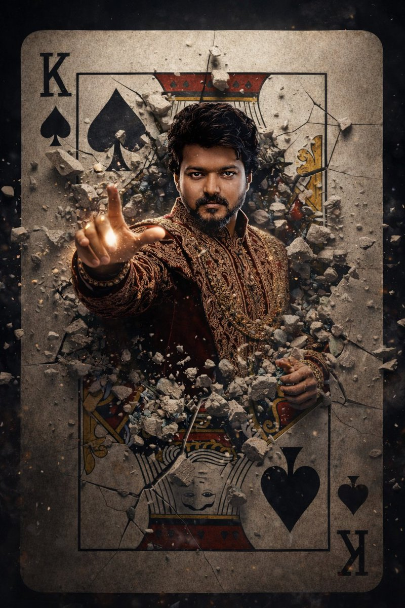

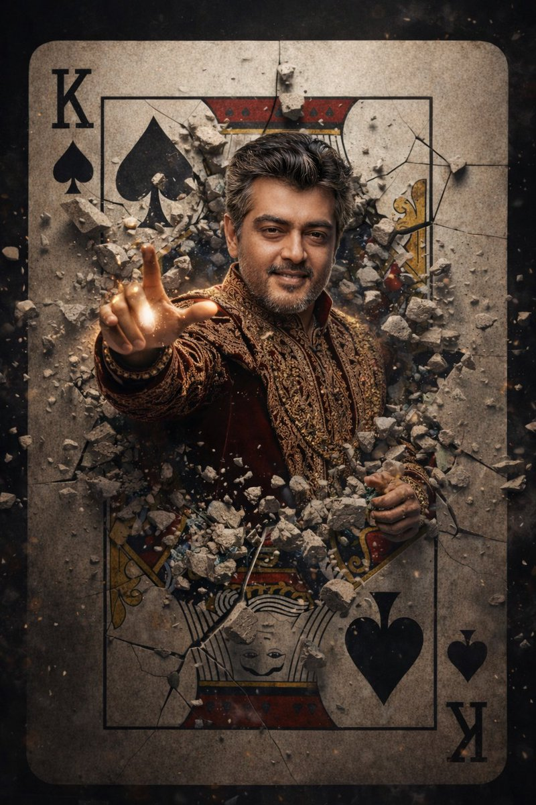

```
A hyper-realistic cinematic movie poster of a powerful male sorcerer with the same facial structure and likeness as the uploaded reference photo, bursting through a cracked King of Spades playing card.
The card explodes outward with stone fragments, dust, and debris frozen mid-air.
He wears an ornate royal maroon and gold embroidered medieval fantasy jacket, rich fabric textures, intricate detailing, regal and mystical.
The sorcerer extends one hand forward toward the viewer, fingers glowing with intense magical energy, subtle golden sparks and dark arcane aura surrounding the hand.
Intense piercing gaze, confident and dominant expression, cinematic hero framing.
Dramatic chiaroscuro lighting, dark moody background, volumetric light rays, ultra-detailed textures, shallow cinematic depth of field.
Photorealistic face, epic fantasy realism, movie poster composition, high contrast, dynamic motion, dust particles, masterpiece quality, ultra-sharp focus, 8K resolution, cinematic color grading.
```

```
一张超现实主义的电影海报，展示了一位强大的男性巫师，其面部结构和外貌与上传的参考照片相同，正在破开一张裂开的黑桃K扑克牌。
这张牌向外爆炸，石碎片、灰尘和碎片在半空中凝固。
他穿着一件装饰华丽的紫红色和金色刺绣中世纪幻想夹克，布料质感丰富，细节精致，显得尊贵而神秘。
巫师将一只手伸向观众，手指发出强烈的魔法能量光芒，周围环绕着微妙的金色火花和深邃的神秘气息。
目光犀利，表情自信且具有统治力，以电影英雄的方式构图。
戏剧性的明暗对比照明，背景阴暗，体积光束，超细致的纹理，浅景深效果。
逼真的脸部，史诗般的幻想现实主义，电影海报构图，高对比度，动态感，尘埃颗粒，杰作质量，超清晰焦点，8K分辨率，电影色彩分级。
```

 [↑返回目录](#toc)

---
## <a id="prompt-2003263283432763600">Botanical Hydration</a> (<a href="https://x.com/AllaAisling/status/2003263283432763771" target="_blank" rel="noopener noreferrer">Alexandra Aisling</a>)


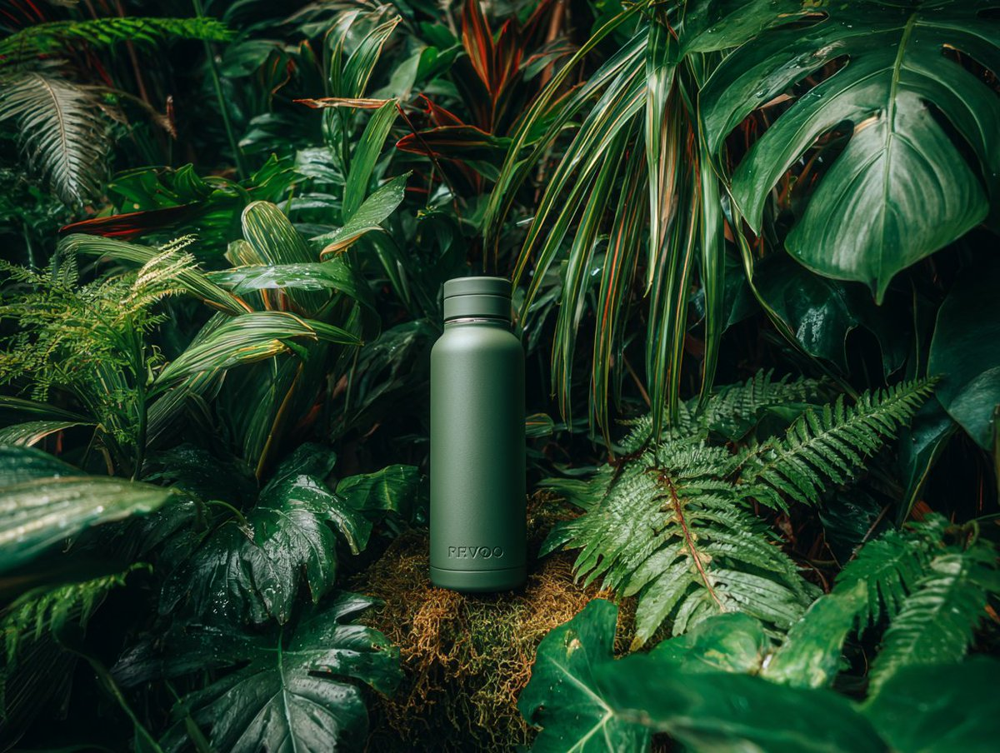

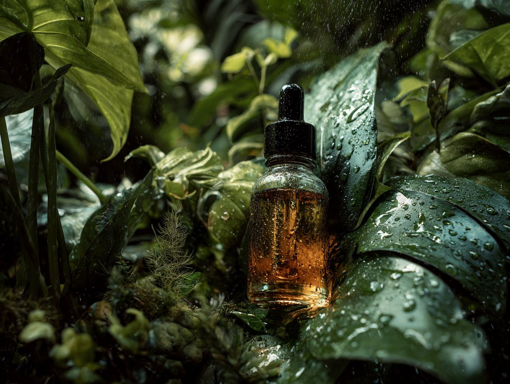

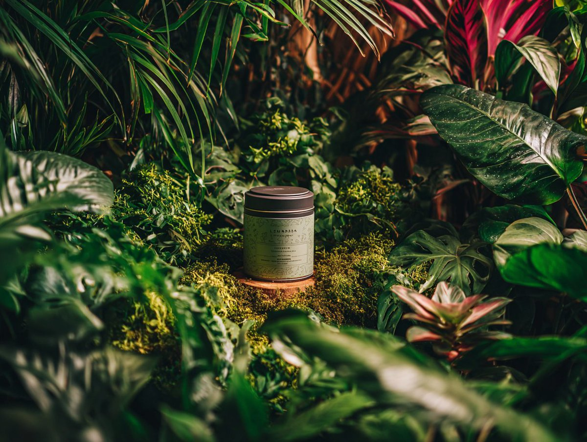

```
Organic cotton towel nestled among lush green plants and tropical leaves, dappled natural light, humidity visible in air, organic freshness, sustainable aesthetic, life and growth symbolism, botanical studio setup, verdant backdrop
```

```
Reusable water bottle nestled among lush green plants and tropical leaves, dappled natural light, humidity visible in air, organic freshness, sustainable aesthetic, life and growth symbolism, botanical studio setup, verdant backdrop
```

```
Natural skincare serum bottle nestled among lush green plants and tropical leaves, dappled natural light, humidity visible in air, organic freshness, sustainable aesthetic, life and growth symbolism, botanical studio setup, verdant backdrop
```

```
Loose leaf tea tin nestled among lush green plants and tropical leaves, dappled natural light, humidity visible in air, organic freshness, sustainable aesthetic, life and growth symbolism, botanical studio setup, verdant backdrop
```

 [↑返回目录](#toc)

---
## <a id="prompt-2003278312068780300">都市街头服饰拼贴</a> (<a href="https://x.com/kashmir_ki_lark/status/2003278312068780283" target="_blank" rel="noopener noreferrer">آیت شاہ</a>)


```
{
  "project_title": "Urban Streetwear Editorial Collage",
  "aspect_ratio": "9:16",
  "aesthetic_theme": {
    "style": "Editorial poster-style multi-panel collage",
    "mood": "Retro analog–digital fusion",
    "color_palette": [
      "Warm ambers",
      "Washed neutrals",
      "Soft greys",
      "Muted browns"
    ],
    "textures": [
      "Reflective glass",
      "Wool plaid",
      "Polished leather",
      "Stone pavement"
    ]
  },
  "subject_outfit": {
    "core": "Brown plaid blazer, white button-up shirt, yellow tie, loose dark trousers",
    "accessories": "Brown cap, oversized amber-tinted rectangular sunglasses",
    "tech": "Wired earphones"
  },
  "composition_layout": {
    "frame_1_top_left": {
      "type": "Reflective window shot",
      "pose": "Holding phone in front of face",
      "visual_effects": "Layered ghosting, architectural overlays, curvature distortion"
    },
    "frame_2_top_right": {
      "type": "Close-range, downward-angled ultra-wide portrait",
      "setting": "Cobblestone street",
      "pose": "Leaning forward, hands in pockets, exaggerated pout",
      "visual_effects": "Lens perspective distortion, radiating cobblestones"
    },
    "frame_3_bottom_right": {
      "type": "Intimate overhead selfie",
      "lighting": "Soft overcast",
      "props": "Holding a drink",
      "overlays": "Faint digital-grid, minimal square facial-bounding graphic"
    }
  },
  "ui_elements": {
    "music_player": {
      "style": "Translucent iOS-style Apple Music mini-player",
      "content": "“See You Again” by Tyler, The Creator",
      "features": "Artwork, timeline, playback controls (no shadows)"
    },
    "graphics": "Subtle cursor-like frame lines, rectangular highlights"
  },
  "negative_constraints": [
    "Stickers",
    "Extra subjects",
    "Wardrobe changes",
    "Incorrect UI icons",
    "Neon color shifts",
    "Futuristic sci-fi elements"
  ]
}
```

```
{
  "项目标题": "都市街头服饰杂志拼贴",
  "画面比例": "9:16",
  "美学主题": {
    "风格": "杂志海报式多面板拼贴",
    "氛围": "复古模拟与数字融合",
    "配色方案": [
      "暖琥珀色",
      "褪色中性色",
      "柔和灰色",
      "低饱和棕色"
    ],
    "材质纹理": [
      "反光玻璃",
      "羊毛格纹",
      "抛光皮革",
      "石板路面"
    ]
  },
  "人物穿搭": {
    "主体": "棕色格纹西装外套、白色纽扣衬衫、黄色领带、宽松深色长裤",
    "配饰": "棕色帽子、超大琥珀色矩形太阳镜",
    "科技元素": "有线耳机"
  },
  "构图布局": {
    "左上角画面": {
      "类型": "反光窗景拍摄",
      "姿势": "手持手机置于面前",
      "视觉效果": "重叠残影、建筑叠加、曲面扭曲"
    },
    "右上角画面": {
      "类型": "近距离俯角超广角人像",
      "场景": "鹅卵石街道",
      "姿势": "身体前倾，双手插兜，夸张嘟嘴",
      "视觉效果": "镜头透视畸变、放射状鹅卵石"
    },
    "右下角画面": {
      "类型": "亲密俯拍自拍",
      "光线": "柔和阴天光",
      "道具": "手持饮品",
      "叠加元素": "微弱数字网格、极简方形面部框线"
    }
  },
  "界面元素": {
    "音乐播放器": {
      "样式": "半透明iOS风格Apple Music迷你播放器",
      "内容": "Tyler, The Creator 的《See You Again》",
      "功能": "专辑封面、进度条、播放控件（无阴影）"
    },
    "图形": "微妙的光标式边框线、矩形高亮"
  },
  "负面限制": [
    "贴纸",
    "额外人物",
    "更换服装",
    "错误的UI图标",
    "霓虹色调偏移",
    "未来科幻元素"
  ]
}
```

 [↑返回目录](#toc)

---
## <a id="prompt-2003115097116602600">圣诞奢华商品摄影</a> (<a href="https://x.com/aleenaamiir/status/2003115097116602560" target="_blank" rel="noopener noreferrer">Aleena Amir</a>)

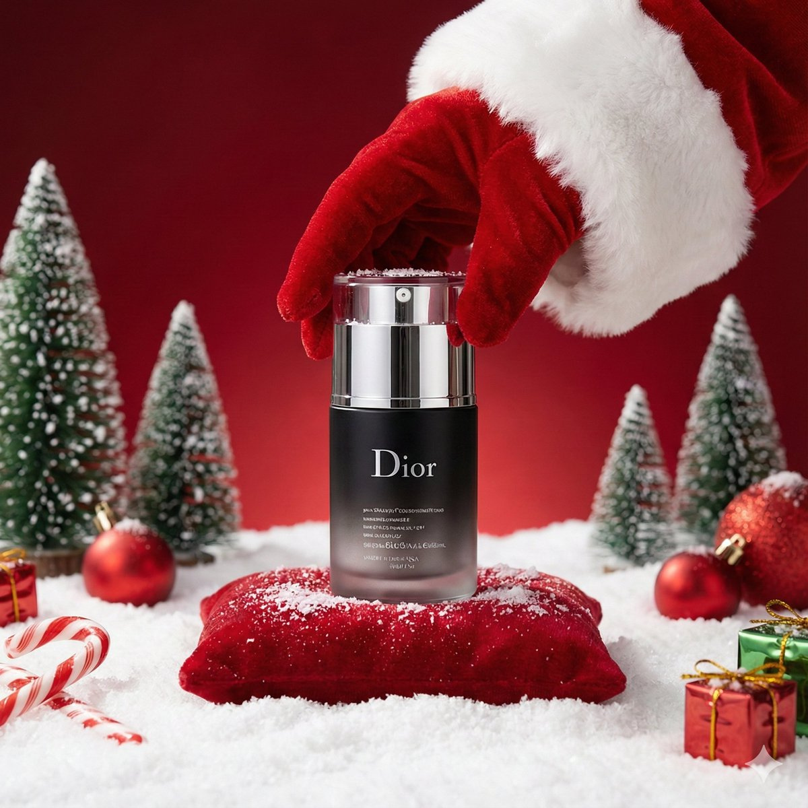


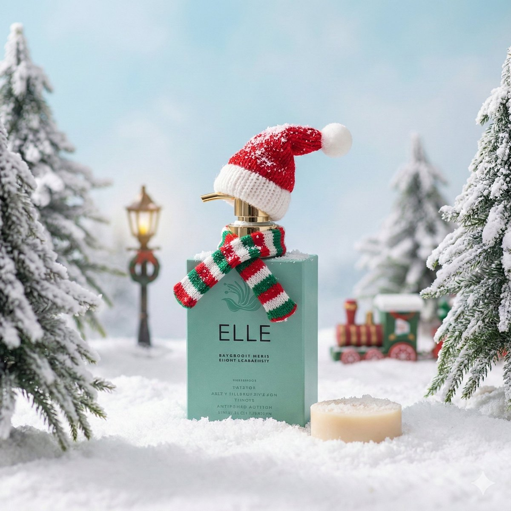

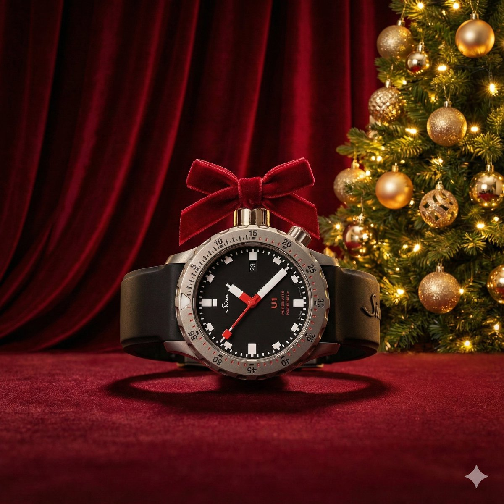

```
A luxury Christmas-themed product photoshoot set in a [COZY / STUDIO / OUTDOOR] environment. Place the uploaded product image as the hero object, standing upright at the center of the frame. The product must remain EXACTLY unchanged in [shape, size, material, colors, label design, typography, logos, and all visible text]. Do not modify, recreate, translate, enhance, or stylize any product text.

Scene & background: A festive [BACKGROUND TYPE — e.g. wooden windowsill, velvet studio backdrop, snowy landscape] with [SEASONAL DETAILS — e.g. softly falling snow, blurred Christmas tree lights, winter village bokeh]. Foreground includes subtle holiday accents such as [FESTIVE PROPS — e.g. holly, ribbons, ornaments, fairy lights], placed naturally and never covering the product.

Styling: Optional festive accessory on the product such as [HAT / SCARF / RIBBON], perfectly fitted without altering the product’s structure or covering the label.
Lighting & camera: Warm golden Christmas lighting contrasted with cool winter tones. Soft diffused light, gentle rim lighting for depth, no glare or harsh reflections on the product text. Shallow depth of field with a softly blurred background. Shot on DSLR, [LENS — e.g. 85mm], professional product photography.

Quality & mood: Ultra-high resolution, photorealistic textures, premium holiday advertising aesthetic, clean editorial composition, cozy, elegant, and festive.
```

```
一场以圣诞奢华为主题的商品摄影，场景设于[温馨/影棚/户外]环境中。将上传的商品图像作为画面主体，直立置于画面中央。商品必须在[形状、尺寸、材质、颜色、标签设计、字体、标志及所有可见文字]方面保持完全不变。不得对商品上的任何文字进行修改、重绘、翻译、增强或风格化处理。

场景与背景：节日氛围的[背景类型——例如木质窗台、丝绒影棚背景、雪景]，搭配[季节性细节——例如轻柔飘落的雪花、虚化的圣诞树灯、冬日村庄的散景]。前景包含细微的节日装饰元素，如[节日道具——例如冬青、丝带、装饰球、 fairy lights（串灯）]，自然摆放且绝不遮挡商品。

造型：可为商品添加节日配饰，如[帽子/围巾/丝带]，需完美贴合，不得改变商品结构或遮盖标签。

灯光与镜头：温暖金色的圣诞灯光与冷调冬日色调形成对比。采用柔和漫射光，辅以柔和轮廓光营造层次感，确保商品文字无眩光或强烈反光。浅景深，背景柔焦虚化。使用单反相机拍摄，[镜头——例如85mm]，专业商品摄影风格。

画质与氛围：超高清分辨率，逼真质感，高端节日广告美学，干净利落的编辑构图，温馨、优雅且充满节日气息。
```

 [↑返回目录](#toc)

---
## <a id="prompt-2003122606527205400">Pantheon: Classical Architectural Presentation</a> (<a href="https://x.com/AllaAisling/status/2003122606527205436" target="_blank" rel="noopener noreferrer">Alexandra Aisling</a>)

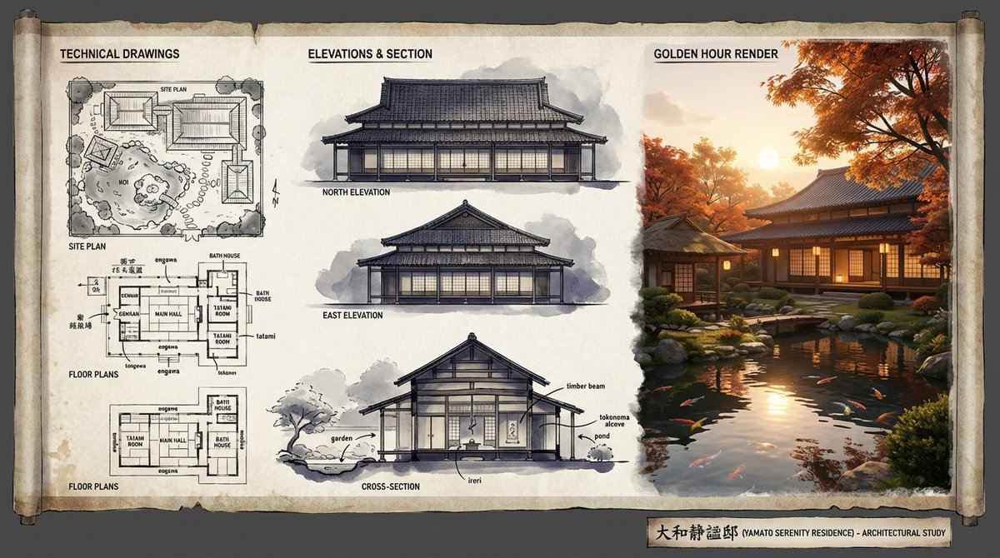

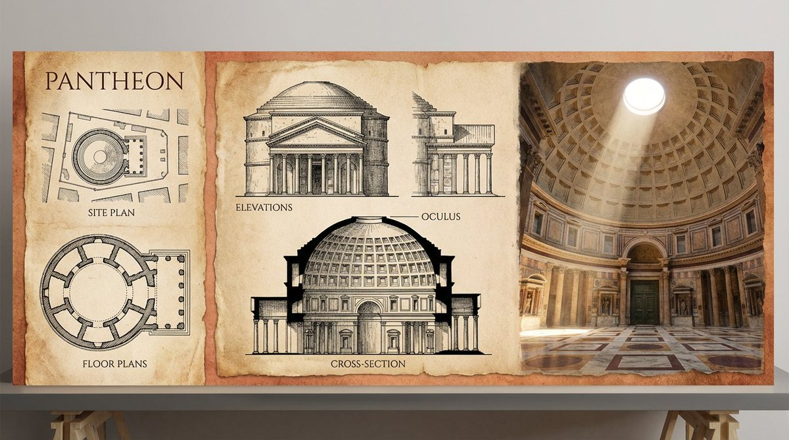

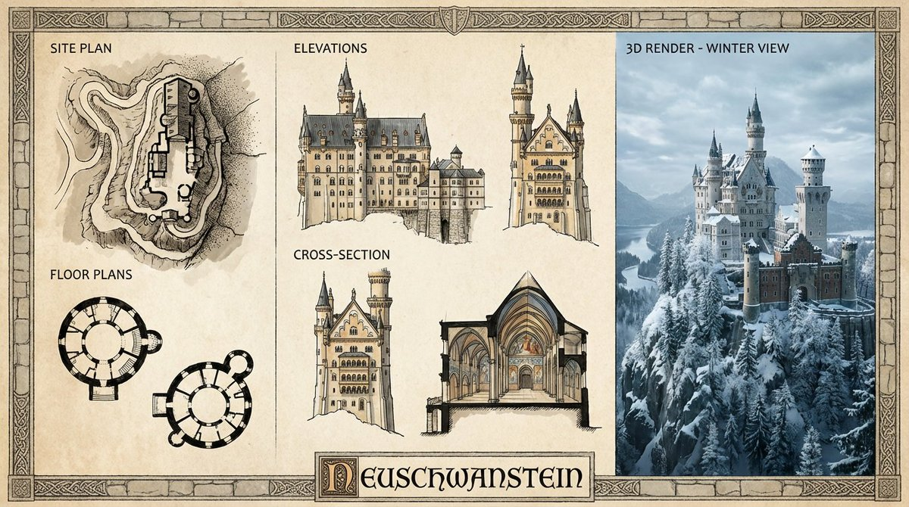

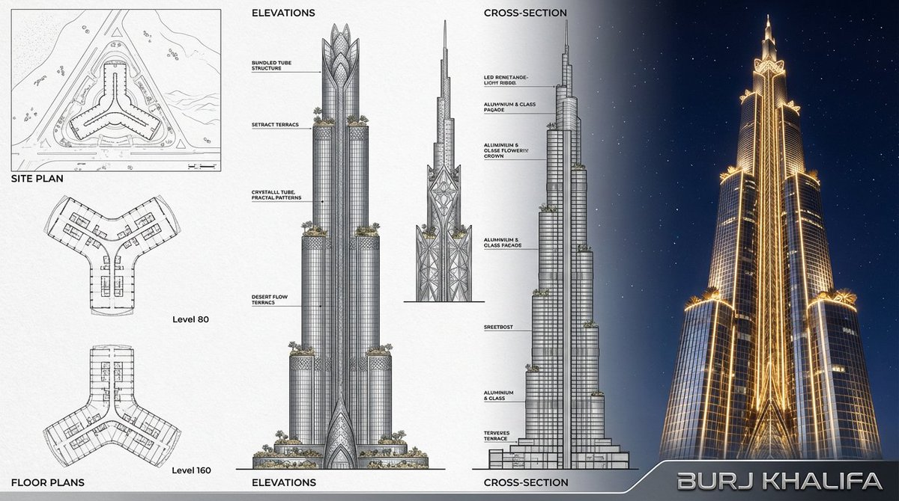

```
An expert architectural illustrator's presentation board for a traditional Japanese ryokan-style residence featuring Sukiya-zukuri architecture—deep hipped roofs with clay tiles, exposed timber framing, shoji screens, engawa verandahs, and tatami rooms opening onto a garden with a koi pond, tea house, and pruned pines.
The canvas flows left to right: black and white 2D drawings (Site Plan, Floor Plans) on the left, Elevations and a Cross-Section through the main hall in the center, and a photorealistic 3D render at golden hour on the right—warm light through maple leaves, reflections on water.
Unified aesthetic blending sumi ink linework with washi paper textures. Warm greys and indigo for technical drawings transitioning to autumn colours for the render. Title block reads 'YAMATO SERENITY RESIDENCE' in kanji and English.
```

```
An expert architectural illustrator's presentation board for an ancient Roman temple featuring a massive unreinforced concrete dome with central oculus, Corinthian portico with granite columns, and bronze doors. The canvas flows left to right: black and white 2D drawings (Site Plan, Floor Plans) on the left, Elevations and Cross-Section in the center, and a photorealistic 3D render at noon with a beam of light streaming through the oculus on the right. Unified aesthetic blending classical engraving linework with travertine and bronze textures. Warm sepia tones transitioning to cream, terracotta, and soft gold. Title block reads 'PANTHEON'.
```

```
An expert architectural illustrator's presentation board for a Romanesque Revival fairy-tale castle featuring turrets, pointed towers, arched galleries, frescoed interiors, and dramatic clifftop positioning above forested valleys. The canvas flows left to right: black and white 2D drawings (Site Plan, Floor Plans) on the left, Elevations and Cross-Section in the center, and a photorealistic 3D render in winter with snow-dusted peaks and pine forests on the right. Unified aesthetic blending medieval manuscript linework with limestone textures. Ink wash tones transitioning to ice blue, evergreen, and warm stone. Title block reads 'NEUSCHWANSTEIN'.
```

```
An expert architectural illustrator's presentation board for a neo-futurist supertall skyscraper featuring a bundled tube structure, Y-shaped floor plan, setback terraces, aluminium and glass cladding, and desert-flower-inspired geometry. The canvas flows left to right: black and white 2D drawings (Site Plan, Floor Plans) on the left, Elevations and Cross-Section in the center, and a photorealistic 3D render at night with the tower illuminated against a starry sky on the right. Unified aesthetic blending sleek technical linework with reflective glass textures. Steel grey tones transitioning to midnight blue, silver, and warm LED gold. Title block reads 'BURJ KHALIFA'.
```

 [↑返回目录](#toc)

---
## <a id="prompt-2003300924283089400">巨人日常：微缩世界的挑战</a> (<a href="https://x.com/aleenaamiir/status/2003300924283089325" target="_blank" rel="noopener noreferrer">Aleena Amir</a>)


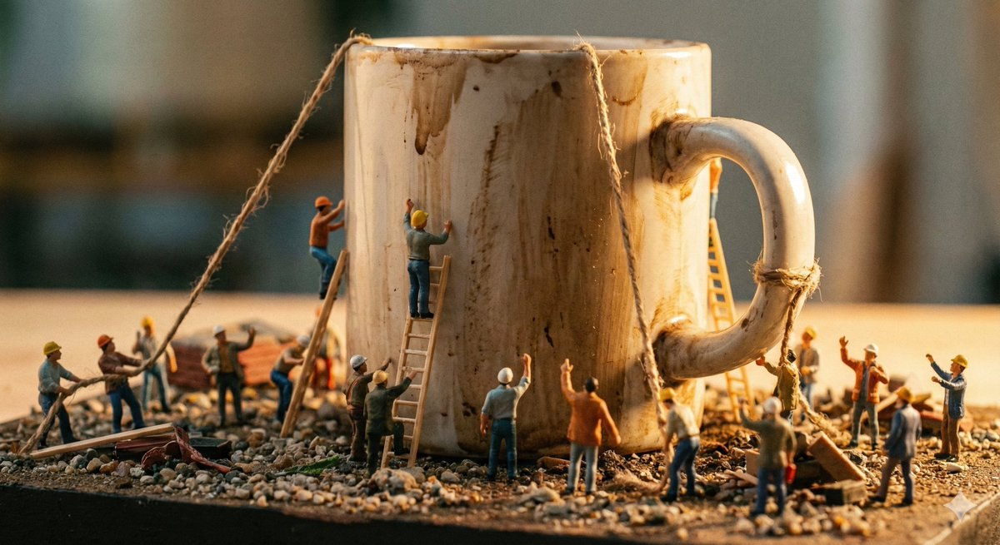


```
A miniature diorama showing tiny [PEOPLE / CHARACTERS] struggling with an oversized [EVERYDAY OBJECT]. Exaggerated scale contrast, expressive poses, cinematic lighting. Ultra-detailed props, handcrafted realism, macro lens perspective.
```

```
微缩场景展示微小的[人物/角色]正艰难应对一个超大尺寸的[日常物品]。夸张的比例对比，富有表现力的姿态，电影级灯光。道具极度精细，手工制作般的真实感，微距镜头视角。
```

 [↑返回目录](#toc)

---
## <a id="prompt-2003265568082956500">超现实复古胶片肖像</a> (<a href="https://x.com/ZaraIrahh/status/2003265568082956498" target="_blank" rel="noopener noreferrer">Zara</a>)

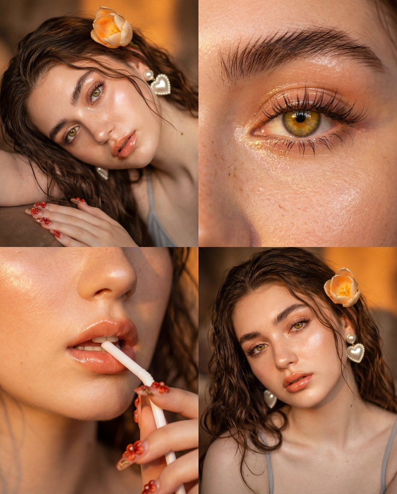

```
{
  "task": "hyper_realistic_vintage_film_portrait_grid",
  "identity": {
    "reference_face": "use_uploaded_reference_images_only",
    "face_accuracy": "100_percent_identical_no_modifications",
    "constraints": [
      "no_face_shape_changes",
      "no_eye_shape_changes",
      "no_nose_or_lip_changes",
      "no_age_modification"
    ]
  },
  "output": {
    "type": "single_image_4_grid",
    "layout": "2x2_grid",
    "quality": "ultra_high_resolution",
    "realism": "hyper_realistic_photography",
    "skin_detail": "fully_preserved_natural_texture",
    "post_processing": "vintage_film_soft_focus"
  },
  "subject": {
    "gender": "female",
    "age_range": "late_20s",
    "skin": {
      "tone": "very_pale",
      "finish": "extremely_dewy_glass_skin",
      "details": [
        "natural_freckles",
        "intense_highlighter_cheekbones",
        "intense_highlighter_nose_bridge"
      ]
    },
    "eyes": {
      "color": "yellowish_green",
      "lashes": "long_curled_individually_separated_doll_like",
      "expression": "dreamy_sultry"
    },
    "eyebrows": "thick_brows_brushed_upwards_with_gel",
    "lips": {
      "color": "peach_light_orange",
      "finish": "highly_glossy_wet"
    },
    "hair": {
      "color": "brown",
      "length": "long",
      "texture": "naturally_wavy",
      "style": "messy_butterfly_cut",
      "state": "wet_strands_falling_on_face",
      "accessory": "single_off_white_orange_tulip_tucked_in_hair"
    }
  },
  "apparel_and_accessories": {
    "top": "light_gray_thin_spaghetti_strap_top",
    "earrings": "large_heart_shaped_imitation_pearl_earrings",
    "nails": {
      "length": "long",
      "design": "intricate_3D_nail_art",
      "details": "reddish_orange_floral_elements"
    }
  },
  "makeup_style": {
    "overall": "very_wet_glossy_fresh_from_water_look",
    "cheeks": "glassy_reflective_blush",
    "eyes": "soft_shimmer_with_definition",
    "lips": "mirror_like_gloss"
  },
  "poses_by_grid": {
    "top_left": {
      "shot_type": "full_face_high_angle",
      "pose": "head_resting_on_surface",
      "expression": "dreamy_sultry",
      "mouth": "slightly_open"
    },
    "top_right": {
      "shot_type": "extreme_close_up",
      "focus": "right_eye",
      "details": [
        "iris_color",
        "eyelash_definition",
        "eye_makeup_texture"
      ]
    },
    "bottom_left": {
      "shot_type": "close_up",
      "focus": "lips_and_fingers",
      "action": "gently_biting_white_straw",
      "details": [
        "gloss_texture",
        "3D_nail_art"
      ]
    },
    "bottom_right": {
      "shot_type": "full_face_high_angle",
      "pose": "head_resting_on_surface",
      "expression": "dreamy_sultry",
      "mouth": "slightly_open"
    }
  },
  "lighting_and_color": {
    "lighting": "warm_golden_dramatic",
    "mood": "intimate_sensual_contemplative",
    "time_feel": "golden_hour_or_warm_indoor_light",
    "color_palette": [
      "warm_orange",
      "golden_yellow",
      "soft_brown"
    ]
  },
  "background": {
    "style": "heavily_blurred",
    "texture": "soft_film_bokeh",
    "colors": "orange_golden_brown_tones",
    "distractions": "none"
  },
  "camera_and_style": {
    "aesthetic": "vintage_film_photography",
    "film_grain": "subtle",
    "focus": "intentionally_soft",
    "lens_character": "cinematic_glow"
  }
}
```

```
{
  "任务": "超现实复古胶片肖像网格",
  "身份": {
    "参考面孔": "仅使用上传的参考图像",
    "面部精确度": "100%完全一致不做修改",
    "约束条件": [
      "不改变脸型",
      "不改变眼型",
      "不改变鼻子或嘴唇",
      "不做年龄修改"
    ]
  },
  "输出": {
    "类型": "单图4网格",
    "布局": "2x2网格",
    "质量": "超高分辨率",
    "真实感": "超现实摄影",
    "皮肤细节": "完全保留自然纹理",
    "后期处理": "复古胶片柔焦"
  },
  "主题": {
    "性别": "女性",
    "年龄段": "20世纪晚期",
    "皮肤": {
      "色调": "非常苍白",
      "效果": "极其水润玻璃肌",
      "细节": [
        "自然雀斑",
        "颧骨强烈高光",
        "鼻梁强烈高光"
      ]
    },
    "眼睛": {
      "颜色": "黄绿色",
      "睫毛": "长而卷翘根根分明娃娃般",
      "表情": "梦幻撩人"
    },
    "眉毛": "浓眉向上刷起用胶固定",
    "嘴唇": {
      "颜色": "桃色浅橙",
      "效果": "高度光泽湿润"
    },
    "头发": {
      "颜色": "棕色",
      "长度": "长",
      "质地": "自然波浪",
      "风格": "凌乱蝴蝶剪",
      "状态": "湿发缕缕垂于脸庞",
      "配饰": "单朵米白色橙色郁金香插在头发里"
    }
  },
  "服饰和配饰": {
    "上衣": "浅灰色细肩带背心",
    "耳环": "大型心形仿珍珠耳环",
    "指甲": {
      "长度": "长",
      "设计": "复杂3D指甲艺术",
      "细节": "红橙色花卉元素"
    }
  },
  "化妆风格": {
    "整体": "非常湿润光泽新鲜出水般的外观",
    "脸颊": "镜面反光腮红",
    "眼睛": "柔和闪烁且有轮廓",
    "嘴唇": "镜子般的光泽"
  },
  "姿势（按网格）": {
    "左上": {
      "拍摄类型": "正面全脸俯拍",
      "姿势": "头部依靠表面",
      "表情": "梦幻撩人",
      "嘴巴": "微微张开"
    },
    "右上": {
      "拍摄类型": "极度特写",
      "焦点": "右眼",
      "细节": [
        "虹膜颜色",
        "睫毛定义",
        "眼部妆容质感"
      ]
    },
    "左下": {
      "拍摄类型": "近景",
      "焦点": "嘴唇与手指",
      "动作": "轻轻咬住白色吸管",
      "细节": [
        "光泽质感",
        "3D指甲艺术"
      ]
    },
    "右下": {
      "拍摄类型": "正面全脸俯拍",
      "姿势": "头部依靠表面",
      "表情": "梦幻撩人",
      "嘴巴": "微微张开"
    }
  },
  "光线与色彩": {
    "光线": "暖金色戏剧性",
    "氛围": "亲密性感沉思",
    "时间感受": "黄金时段或温暖室内光",
    "色彩搭配": [
      "暖橙色",
      "金色黄色",
      "柔软棕色"
    ]
  },
  "背景": {
    "风格": "严重模糊",
    "质感": "柔和胶片散景",
    "颜色": "橙色金色棕色调",
    "干扰物": "无"
  },
  "相机与风格": {
    "美学": "复古胶片摄影",
    "胶片颗粒": "微妙",
    "焦点": "故意柔和",
    "镜头特性": "电影化光环"
  }
}
```

 [↑返回目录](#toc)

---
## <a id="prompt-2003237826331378200">一副完整的 78 张塔罗牌</a> (<a href="https://x.com/gokayfem/status/2003237826331378093" target="_blank" rel="noopener noreferrer">gokaygokay</a>)

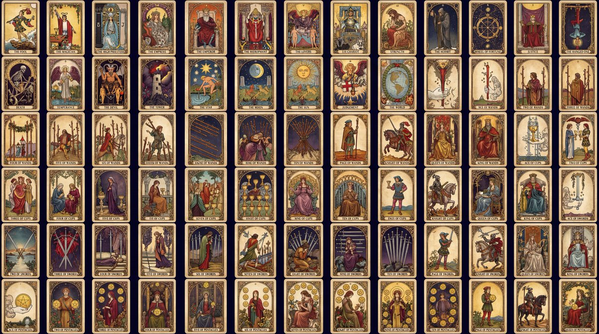

```
4K像素，16:9宽高比，13x6 的塔罗牌插图，风格统一而精致，灵感源自新艺术运动，并融合了现代优雅。浓郁饱满的色彩，包括深红、皇家紫、古金、宝石蓝、翠绿、暖琥珀、灰玫瑰和象牙白，与古旧的羊皮纸和深邃的午夜背景相得益彰。精细的线条、流畅的有机曲线、细致的植物元素以及奢华的金箔点缀贯穿始终。人物优雅动人，比例匀称，面部表情生动传神，头发飘逸，衣褶飘逸，对织物的动态刻画入木三分。风格参考：阿尔丰斯·穆夏的风格与经典的莱德-韦特塔罗牌象征主义以及当代奇幻插画（詹姆斯·吉恩、维克托·恩盖）的融合。每张牌都饰以华丽的镀金新艺术风格边框，边框上点缀着交织的藤蔓、星空图案和神圣几何图形。
所有卡片均采用一致的元素：戏剧性的明暗对比营造出深度和立体感，丰富的阴影以互补的宝石色调呈现，仿旧艺术纸的纹理带有微妙的龟裂感，散发出仿佛由内而外的光泽，背景展现出精细的建筑元素或郁郁葱葱的自然景观，并具有良好的透视效果，象征性物体以一丝不苟的细节和逼真的纹理绘制而成。反复出现的主题包括：精致的花卉边框、带有面孔的天体、飘逸的丝带和神圣几何图案。
```

 [↑返回目录](#toc)

---
## <a id="prompt-2002967881085317600">咖啡与魔法的晨间插画</a> (<a href="https://x.com/Zar_xplorer/status/2002967881085317532" target="_blank" rel="noopener noreferrer">Zar⭕on</a>)

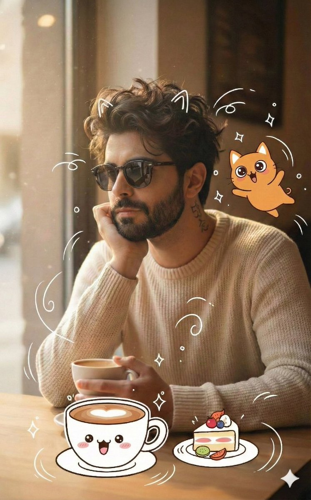

```
{
  "prompt_data": {
    "title": "Cozy Illustrated Portrait",
    "raw_text": "A cozy indoor portrait of a man sitting at a table holding a cup of coffee and resting his face on his hand. The scene is enhanced with playful hand-drawn cartoon doodles: a cute orange cartoon cat jumping excitedly beside his cat ears illustrated on her head, whimsical white sketch lines bubbles sparkles, and motion accents. A smiling cartoon coffee mug with foam a small dessert plate with cake and fruit illustrated in a kawaii style in the foreground.Warm natural daylight",
    "components": {
      "subject": {
        "main": "Man sitting at a table",
        "pose": "Resting face on hand",
        "action": "Holding a cup of coffee"
      },
      "environment": {
        "setting": "Indoor",
        "atmosphere": "Cozy",
        "lighting": "Warm natural daylight"
      },
      "art_style": {
        "base": "Portrait photography",
        "overlay": "Hand-drawn cartoon doodles",
        "specific_style": "Kawaii",
        "color_palette": "Warm tones with orange and white accents"
      },
      "doodle_elements": [
        "Cute orange cartoon cat jumping excitedly",
        "Illustrated cat ears on head",
        "Whimsical white sketch lines",
        "Bubbles",
        "Sparkles",
        "Motion accents",
        "Smiling cartoon coffee mug with foam",
        "Small dessert plate with cake and fruit"
      ]
    },
    "meta": {
      "aspect_ratio": "default",
      "version": "1.0",
      "tags": ["portrait", "mixed media", "kawaii", "coffee", "illustration"]
    }
  }
}
```

```
{
  "prompt_data": {
    "title": "温馨插画肖像",
    "raw_text": "一幅温馨的室内肖像，描绘一位男子坐在桌旁，手握一杯咖啡，脸靠在手上休息。画面中加入了俏皮的手绘卡通涂鸦元素：一只可爱的橙色卡通猫兴奋地跳跃在他身旁，他头上画有猫耳，还有奇趣的白色手绘线条、气泡、闪光和动态效果。前景中有一只带笑脸和奶泡的卡通咖啡杯，以及一个日式可爱风格的小甜点盘，盛有蛋糕和水果。整体沐浴在温暖的自然日光中。",
    "components": {
      "subject": {
        "main": "坐在桌旁的男子",
        "pose": "脸靠在手上",
        "action": "手握一杯咖啡"
      },
      "environment": {
        "setting": "室内",
        "atmosphere": "温馨",
        "lighting": "温暖的自然日光"
      },
      "art_style": {
        "base": "肖像摄影",
        "overlay": "手绘卡通涂鸦",
        "specific_style": "日式可爱（Kawaii）",
        "color_palette": "以暖色调为主，点缀橙色与白色"
      },
      "doodle_elements": [
        "兴奋跳跃的可爱橙色卡通猫",
        "头上绘制的猫耳",
        "奇趣的白色手绘线条",
        "气泡",
        "闪光",
        "动态效果",
        "带笑脸和奶泡的卡通咖啡杯",
        "装有蛋糕和水果的小甜点盘"
      ]
    },
    "meta": {
      "aspect_ratio": "默认",
      "version": "1.0",
      "tags": ["肖像", "混合媒介", "日式可爱", "咖啡", "插画"]
    }
  }
}
```

 [↑返回目录](#toc)

---
## <a id="prompt-2002803581498561000">PROMPT TO ART</a> (<a href="https://x.com/RobotCleopatra/status/2002803581498560915" target="_blank" rel="noopener noreferrer">Skipper</a>)

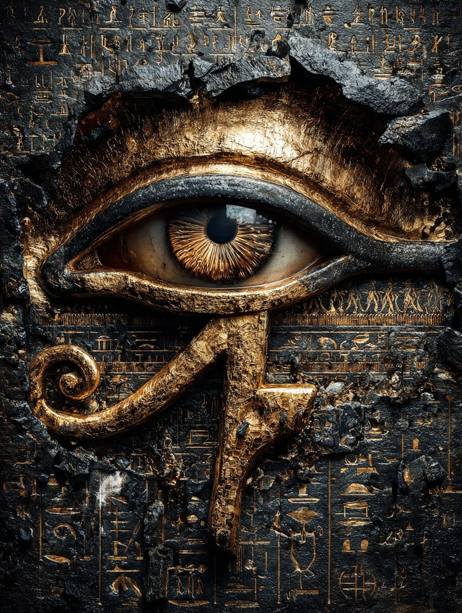

```
TO ART 
GA
an ancient Egyptian hieroglyphic symbol of the eye, placed on an old black stone wall with many other symbols and writing all around it. the background is dark gray, and there's a golden glow coming from behind the eye, giving off a mystical feel to the scene. there should be no text or letters in front of the eye of Horus, just a simple ancient art style.
```

```
一幅古埃及荷鲁斯之眼的象形符号，置于一块古老的黑色石墙上，周围布满其他符号与文字。背景为深灰色，眼睛后方散发出金色光芒，营造出神秘氛围。荷鲁斯之眼前不得出现任何文字或字母，仅保留简洁的古代艺术风格。
```

 [↑返回目录](#toc)

---
## <a id="prompt-2002785901123117000">Arrow Dynamics装置的逼真3D呈现</a> (<a href="https://x.com/hckmstrrahul/status/2002785901123117087" target="_blank" rel="noopener noreferrer">Rahul Chakraborty</a>)

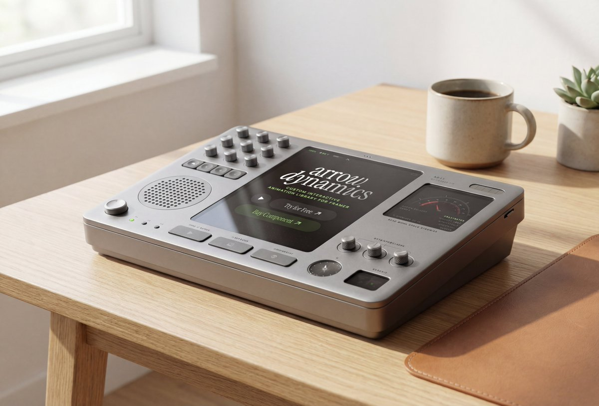

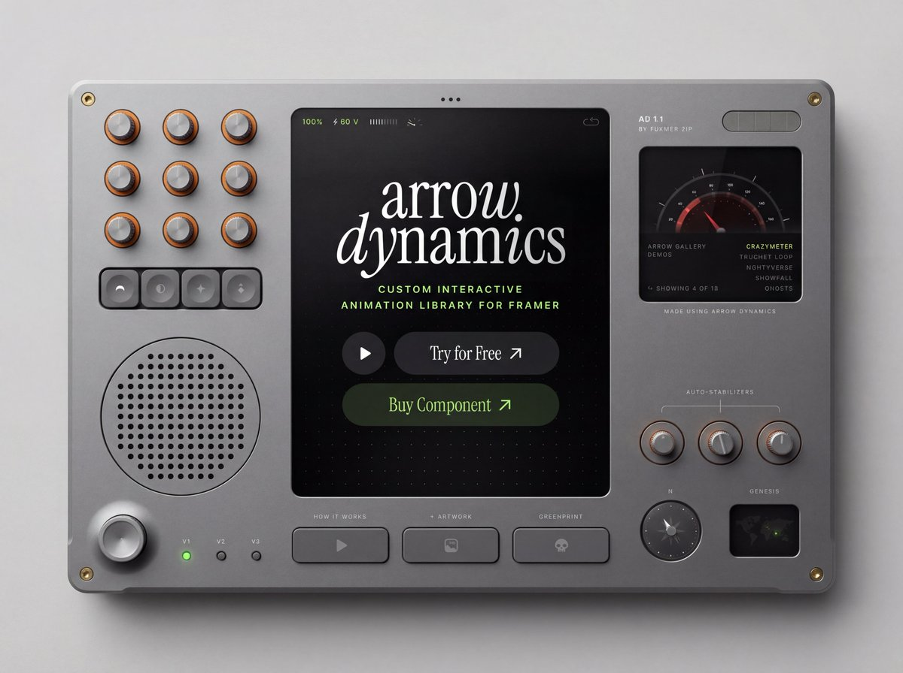

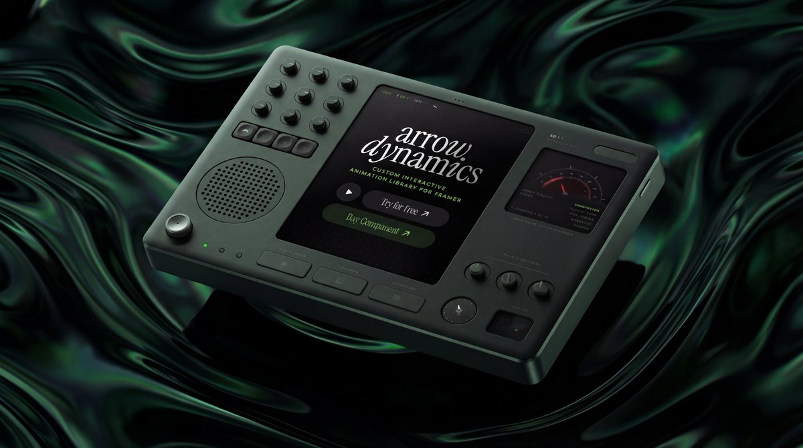

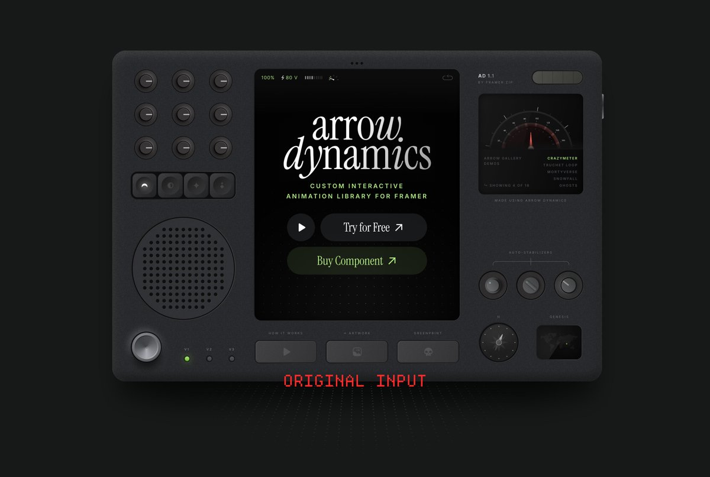

```
to bring the Arrow Dynamics device to life in a photorealistic 3D scene... 
```

```
将Arrow Dynamics装置以逼真的3D场景呈现出来
```

 [↑返回目录](#toc)

---
## <a id="prompt-2002833954680762600">反乌托邦文学微缩剧场</a> (<a href="https://x.com/Gdgtify/status/2002833954680762665" target="_blank" rel="noopener noreferrer">Gadgetify</a>)


```
2x2 grid, each with a consistent photoreal studio macro style book. 

Panel 1: “1984” as an open-book brutalist concrete courtyard diorama with a rotating watchtower searchlight and hidden gears under torn pages. 

Panel 2: “Brave New World” as a sterile cutaway hardcover factory-lab diorama with glass vials, conveyor belts, chrome surfaces, and a mechanical “watching eye” lens on the back wall.

 Panel 3: “Fahrenheit 451” as a charred, heat-warped book transformed into a kinetic sculpture where pages curl like flames around brass mechanisms, ember-glow lighting, ash textures, no readable paragraphs. 

Panel 4: “The Handmaid’s Tale” as a textile-and-ceramic shrine diorama inside an opened book, red cloak fabric folded into architectural forms, white bonne
```

```
2x2 网格，每个格子均为风格统一的写实摄影棚微距风格书籍。

第一格：“1984”——一本打开的书化作粗野主义混凝土庭院微缩模型，配有旋转瞭望塔探照灯，撕裂的书页下隐藏着齿轮装置。

第二格：“美丽新世界”——一本无菌剖面式精装书工厂实验室微缩模型，内含玻璃试管、传送带、铬金属表面，以及后墙上一只机械“监视之眼”镜头。

第三格：“华氏451度”——一本焦黑、受热扭曲的书转化为动态雕塑，书页如火焰般卷曲环绕黄铜机械结构，采用余烬辉光照明与灰烬质感，无任何可读段落。

第四格：“使女的故事”——一本打开的书内设纺织品与陶瓷制成的神龛微缩模型，红色斗篷布料折叠成建筑形态，白色头饰……
```

 [↑返回目录](#toc)

---
## <a id="prompt-2002831713970602000">九宫格奢华产品视觉叙事</a> (<a href="https://x.com/azed_ai/status/2002831713970602064" target="_blank" rel="noopener noreferrer">Amira Zairi</a>)

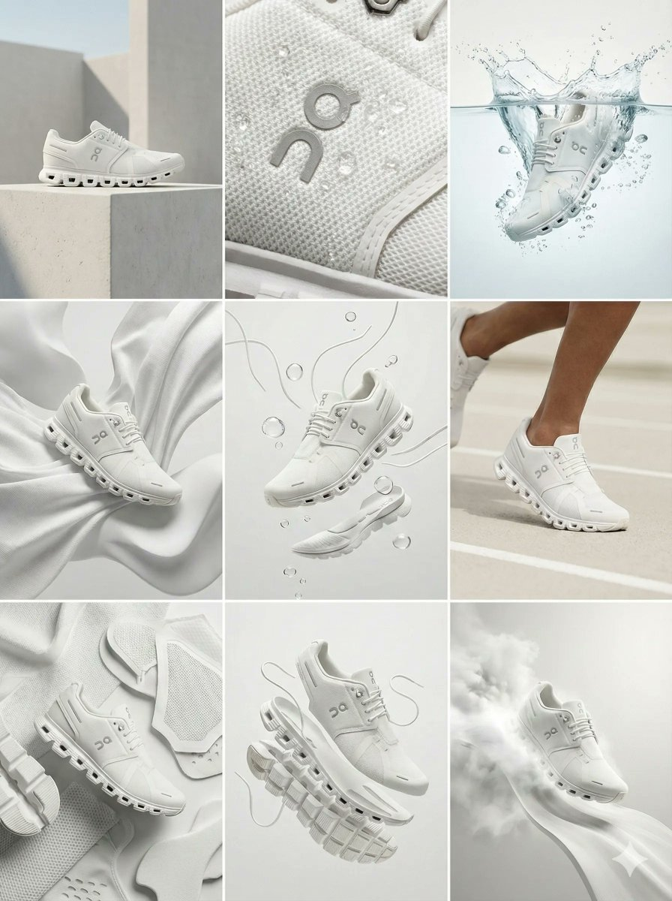

```
Create a 3×3 grid in
3:4 aspect ratio for a high-end commercial marketing campaign using the uploaded product as the central subject.

Each frame must present a distinct visual concept while maintaining perfect product consistency across all nine images.

Grid Concepts (one per cell):

1. Iconic hero still life with bold composition

2. Extreme macro detail highlighting material, surface, or texture

3. Dynamic liquid or particle interaction surrounding the product

4. Minimal sculptural arrangement with abstract forms

5. Floating elements composition suggesting lightness and innovation

6. Sensory close-up emphasizing tactility and realism

7. Color-driven conceptual scene inspired by the product palette

8. Ingredient or component abstraction (non-literal, symbolic)

9. Surreal yet elegant fusion scene combining realism and imagination

Visual Rules:
Product must remain 100% accurate in shape, proportions, label, typography, color, and branding
No distortion, deformation, or redesign of the product
Clean separation between product and background

Lighting & Style:
Soft, controlled studio lighting
Subtle highlights, realistic shadows
High dynamic range, ultra-sharp focus
Editorial luxury advertising aesthetic
Premium sensory marketing look

Overall Feel:
Modern, refined, visually cohesive
High-end commercial campaign
Designed for brand websites, social grids, and digital billboards
Hyperreal, cinematic, polished, and aspirational
```

```
创建一个3×3网格，采用3:4的宽高比，用于高端商业营销活动，以上传的产品作为核心主体。

每个画面必须呈现独特的视觉概念，同时在全部九张图像中保持产品的一致性。

网格概念（每格一个）：

1. 构图大胆的标志性英雄静物  
2. 极致微距细节，突出材质、表面或纹理  
3. 产品周围动态液体或粒子互动  
4. 抽象形态构成的极简雕塑式布局  
5. 悬浮元素构图，传达轻盈与创新感  
6. 强调触感与真实感的感官特写  
7. 受产品配色启发的色彩驱动型概念场景  
8. 成分或组件的抽象表现（非写实、象征性）  
9. 融合现实与想象的超现实而优雅场景  

视觉规则：  
产品在形状、比例、标签、字体、颜色及品牌标识上必须100%准确  
不得对产品进行任何扭曲、变形或重新设计  
产品与背景之间需清晰分离  

光影与风格：  
柔和可控的影棚灯光  
细腻高光，真实阴影  
高动态范围，超锐利焦点  
具有高端杂志广告美学  
呈现奢华感官营销质感  

整体氛围：  
现代、精致、视觉统一  
适用于高端商业推广  
专为品牌官网、社交平台九宫格及数字广告牌设计  
超写实、电影感、精雕细琢且富有向往感
```

 [↑返回目录](#toc)

---
## <a id="prompt-2002937974993088800">日常之物，巨构为碑</a> (<a href="https://x.com/aleenaamiir/status/2002937974993088841" target="_blank" rel="noopener noreferrer">Aleena Amir</a>)

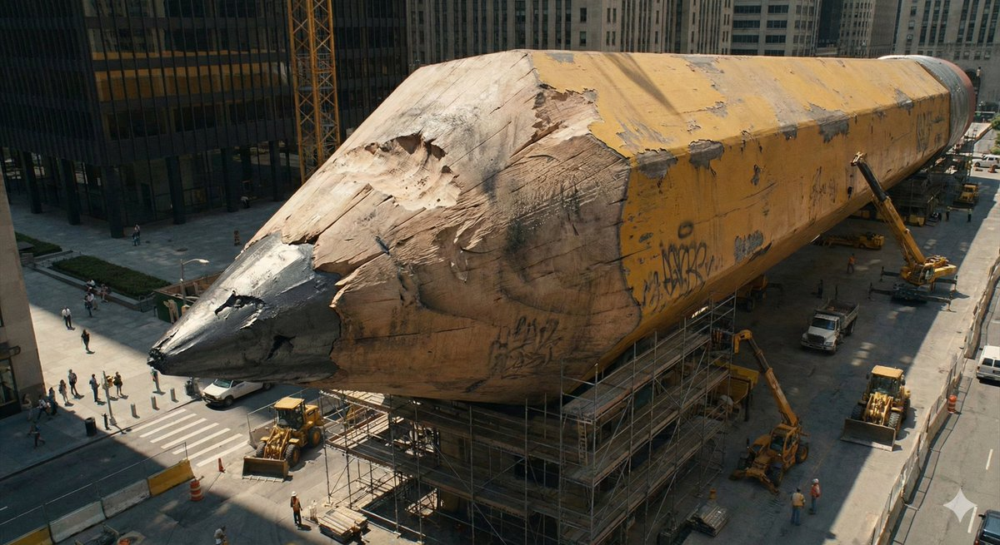

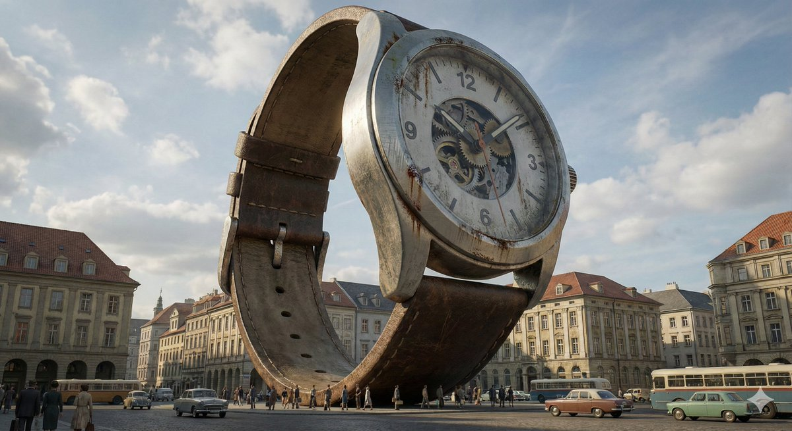

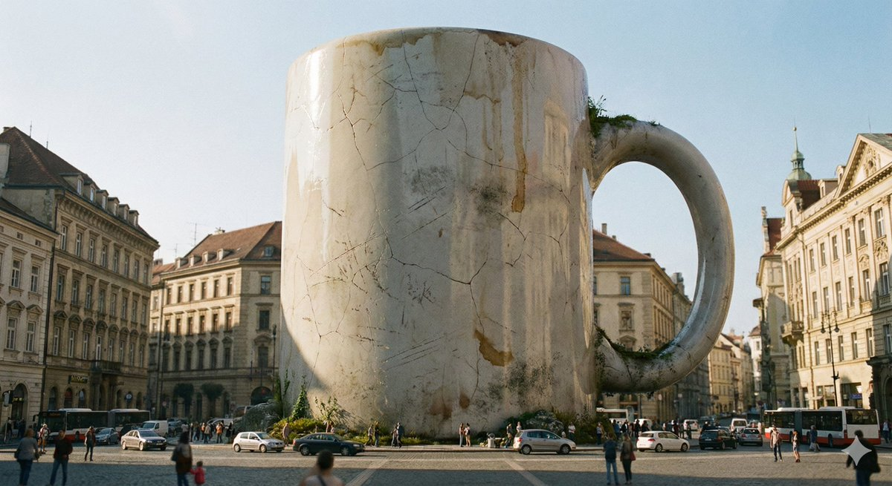

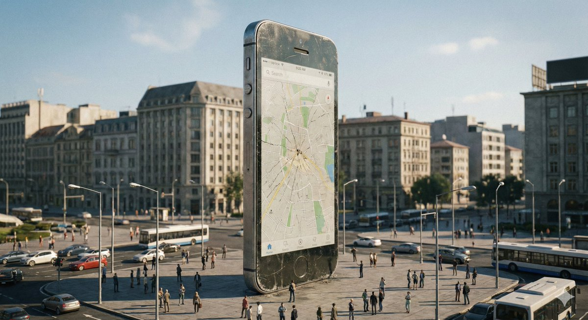

```
Transform [EVERYDAY OBJECT] into a massive real-world monument. Surface materials are physically accurate, with visible wear, scratches, dust, and scale references like people and vehicles. Shot from a low-angle cinematic perspective, realistic daylight, ultra-detailed textures.
```

```
将[日常物品]转化为一座巨大的现实世界纪念碑。表面材质物理准确，可见磨损、划痕、灰尘，并包含人物和车辆等比例参照物。采用低角度电影视角拍摄，真实日光，超精细纹理。
```

 [↑返回目录](#toc)

---
## <a id="prompt-2003064127221272600">耐克未来动感广告</a> (<a href="https://x.com/Naiknelofar788/status/2003064127221272647" target="_blank" rel="noopener noreferrer">simeon-sanai</a>)

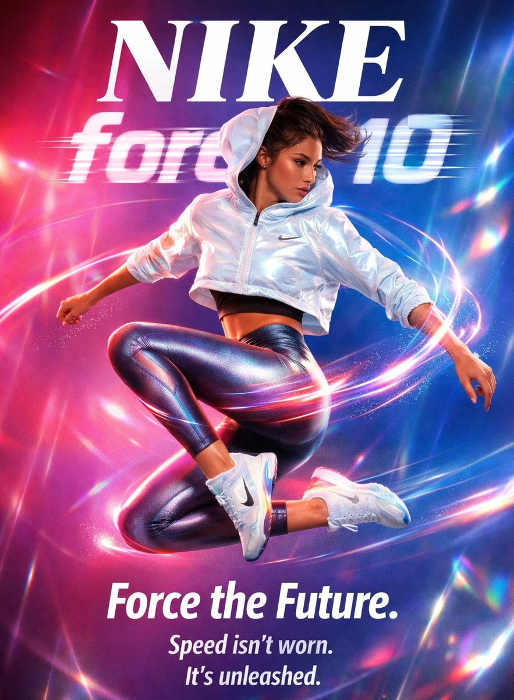

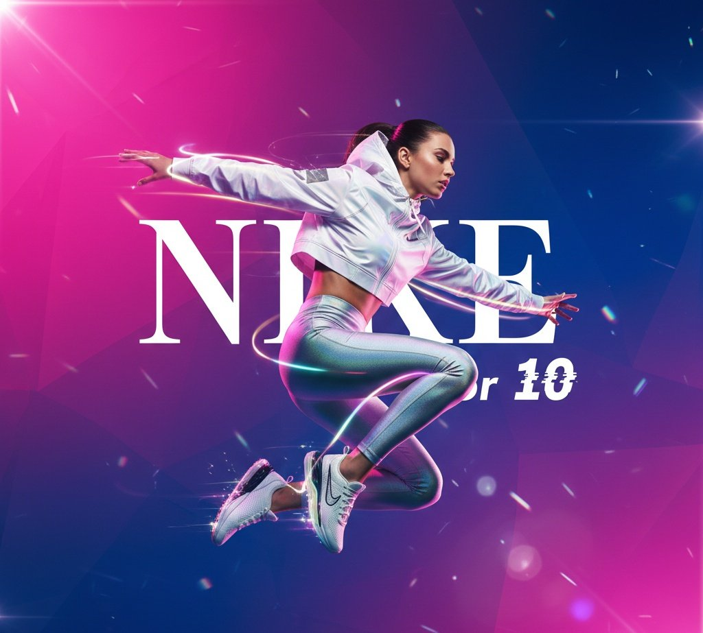

```
A dynamic fashion advertisement for Nike showing a hyper-realistic model mid-twist jump, light trails following her limbs. Background: prism-shifting gradient (hot magenta to sapphire) with refracted lens flares. The model wears iridescent Nike runner tights and a cropped tech hoodie in holographic white. Bold serif "NIKE" and motion-glitched "fore 10" in layered text behind. High-energy, futuristic aesthetic with fashion gloss. --ar 3:4 --raw --stylize 750
```

```
一则充满动感的耐克时尚广告，展现一位超写实模特在空中扭转跳跃的瞬间，四肢拖曳着光轨。背景为棱镜变幻的渐变色（从亮洋红到宝蓝），并带有折射的镜头光晕。模特身穿虹彩反光的耐克跑步紧身裤和一件全息白色的短款科技感连帽衫。背景中以粗衬线体呈现醒目的“NIKE”字样，以及带有动态故障效果的“fore 10”分层文字。整体风格高能量、未来感十足，并带有时尚光泽。--ar 3:4 --raw --stylize 750
```

 [↑返回目录](#toc)

---
## <a id="prompt-2002903228485165300">PROMPT TO ART</a> (<a href="https://x.com/RobotCleopatra/status/2002903228485165425" target="_blank" rel="noopener noreferrer">Skipper</a>)

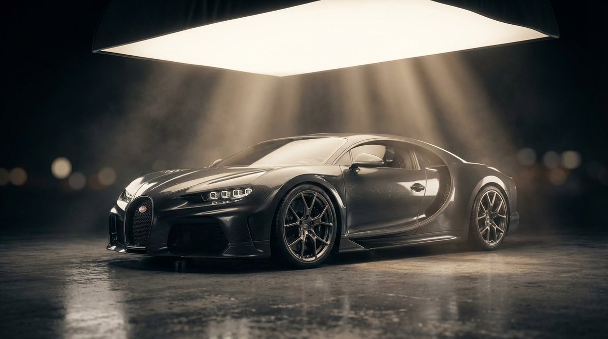

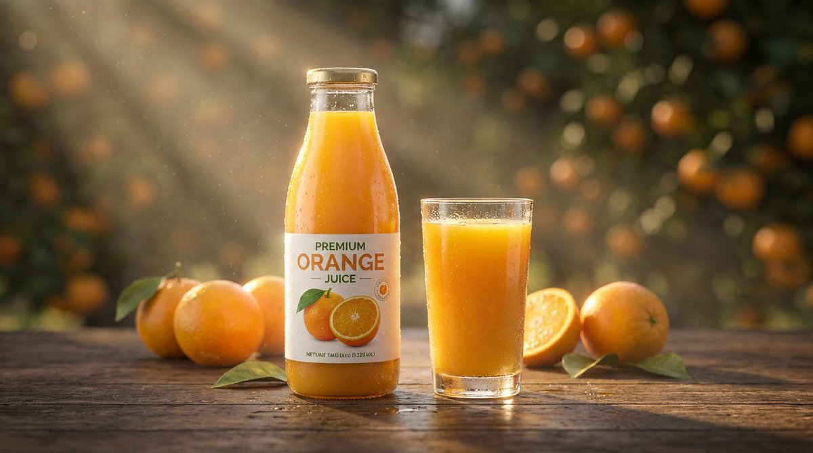


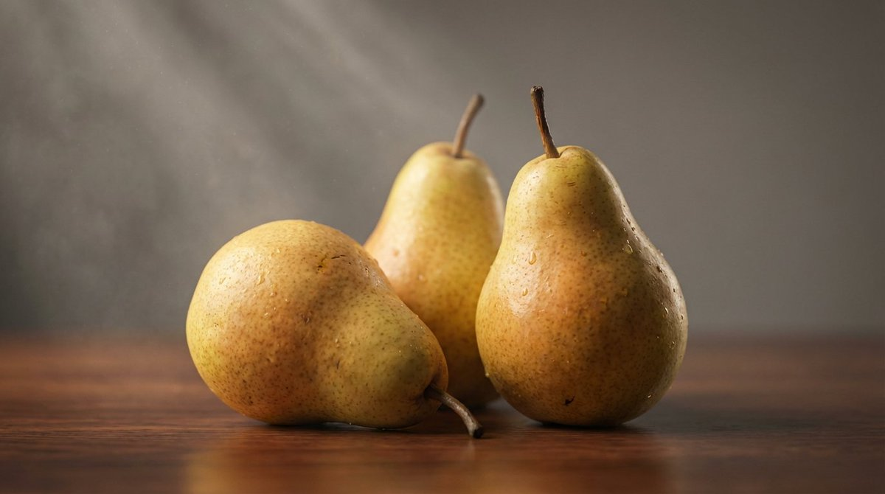

```
TO ART 
[product], premium commercial hero shot, ultra-photorealistic 8K detail, studio-grade global illumination, controlled volumetric light beams shaping the product silhouette, soft rim lighting for edge separation, physically accurate material rendering, micro-surface imperfections visible, ray-traced reflections on glossy and matte surfaces, subtle atmospheric haze, shallow depth of field with clean bokeh, cinematic color grading with neutral whites and warm highlights, professional product photography aesthetic, high-end advertising look
@AdobeFirefly boards, @NanoBanana
```

```
[产品]，高端商业主视觉图，超写实8K细节，影棚级全局光照，受控的体积光束勾勒产品轮廓，柔和边缘光增强分离感，物理精确的材质渲染，可见微观表面瑕疵，光泽与哑光表面均呈现光线追踪反射，微妙大气雾效，浅景深搭配干净散景，电影级色彩分级（中性白与暖调高光），专业产品摄影美学，高端广告风格
```

 [↑返回目录](#toc)

---
## <a id="prompt-2002865460300460300">宇宙沙漏：夜之凝视</a> (<a href="https://x.com/RobotCleopatra/status/2002865460300460166" target="_blank" rel="noopener noreferrer">Skipper</a>)

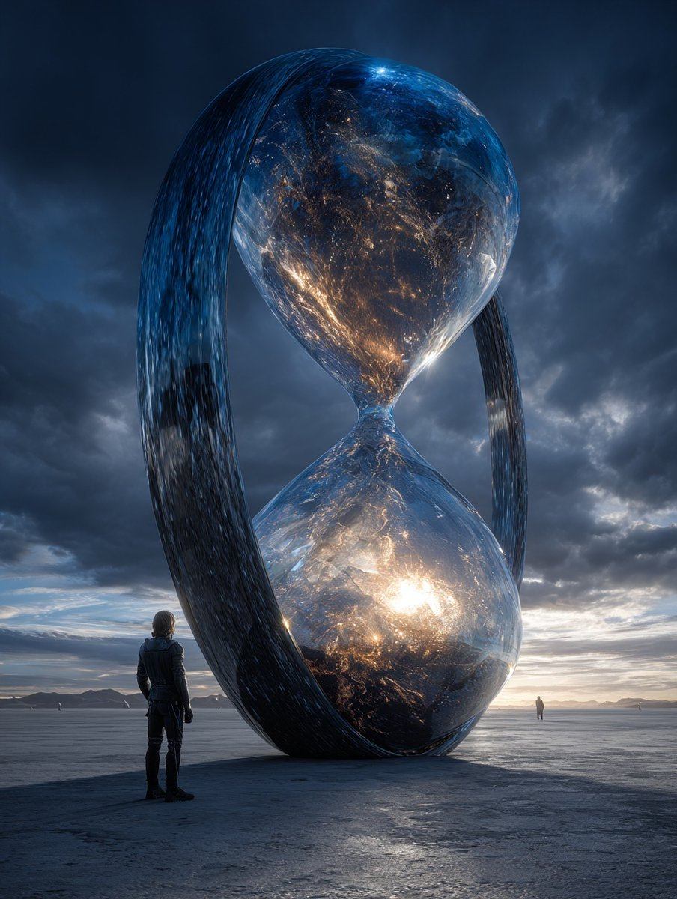

```
TO ART
(Good Evening)
a giant hourglass made of glass with the universe inside. a man stands next to it and looks at it, on an open plain, with a dark blue, cloudy sky. the scene is hyper-realistic, created using octane render, with volumetric lighting and a photorealistic, cinematic style.
```

```
（晚上好）  
一个巨大的玻璃沙漏，内部装着整个宇宙。一名男子站在旁边凝视着它，身处开阔的平原上，天空是深蓝色且布满云层。场景为超写实风格，使用Octane渲染器制作，具有体积光效和逼真电影感。
```

 [↑返回目录](#toc)

---
## <a id="prompt-2002944939362288000">社交时代的电影肖像</a> (<a href="https://x.com/anandh_ks_/status/2002944939362288011" target="_blank" rel="noopener noreferrer">Anandh KS</a>)

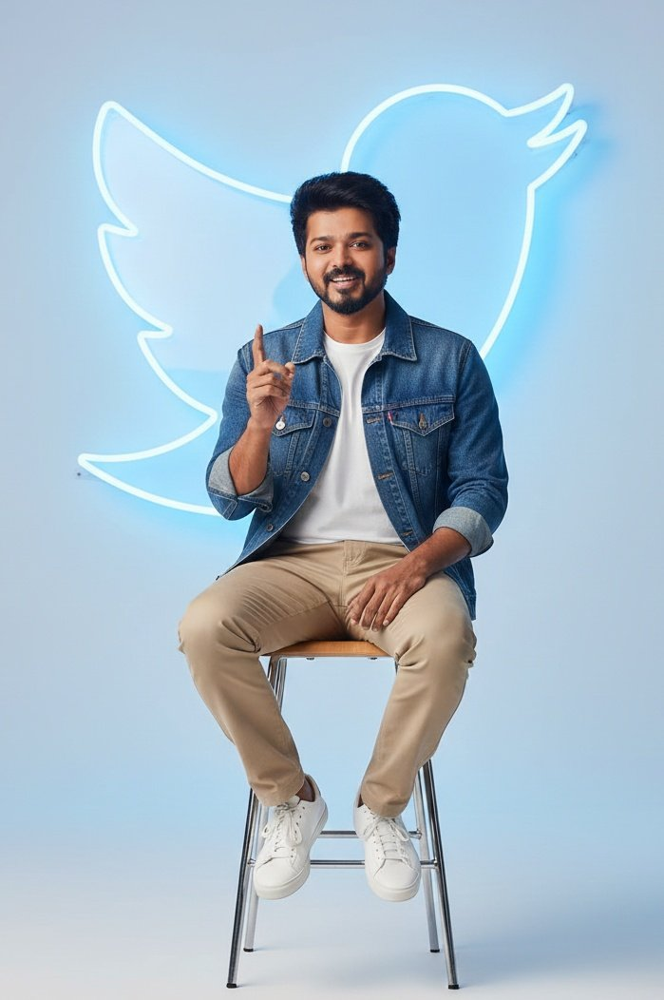

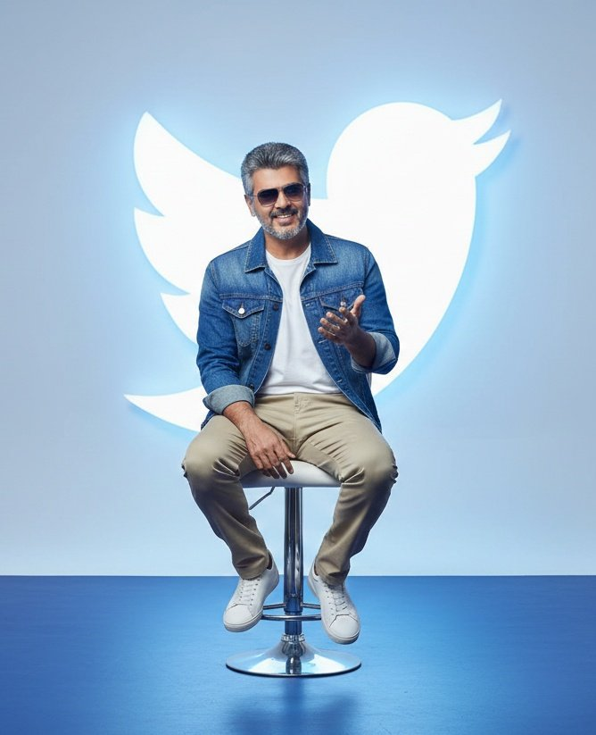

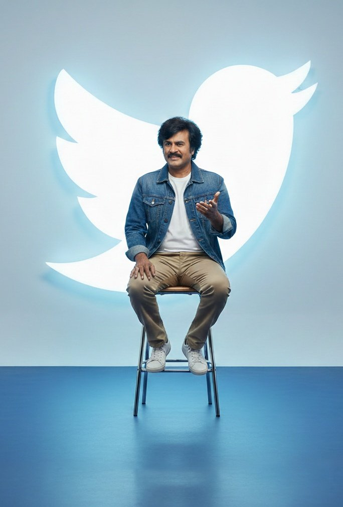

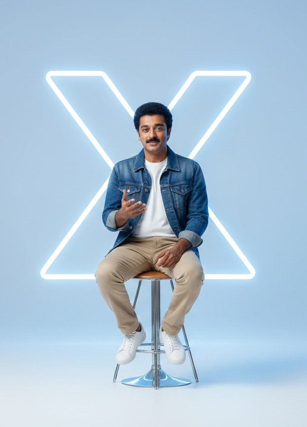

```
1. Open Gemini / Grok

2. Upload your image 

3. Prompt :

"A hyper-realistic cinematic full-body portrait of the uploaded image — seated casually on a modern metallic stool, placed at the center of a minimal white-blue Facebook-themed studio. Behind them, a large glowing translucent twitter 'X' logo stands upright, softly illuminating the scene in cool blue tones.

The subject wears a casual smart outfit — a white t-shirt layered with a blue denim jacket, beige chinos, and white sneakers. Their pose is relaxed, with one hand resting on the stool and the other raised in a natural gesture as if engaging in friendly conversation.

Lighting setup: Soft, diffused studio light with gentle rim highlights to enhance realism. Use 85mm f/1.8 lens simulation for cinematic depth.

Focus priority: Ultra-sharp face detail capturing real pores, fine hair strands, and subtle reflections in the eyes.

Mood & tone: Warm, authentic, and social — reflecting connection and openness.
Rendering style: Professional, realistic, high-end commercial photography aesthetic suitable for social branding.

Tried for Rajinikanth, Kamal Hassan, Vijay, Ajith
```

```
“上传图像的超现实主义电影全身影像——随意地坐在现代金属凳上，位于简约蓝白脸书主题工作室的中央。他们的背后，一个巨大的发光半透明推特‘X’标志竖立着，柔和地以冷蓝色调照亮整个场景。

主体穿着休闲聪明的服装——白色T恤外搭蓝色牛仔夹克、米色卡其裤和白色运动鞋。姿态放松，一只手放在凳子上，另一只手自然抬起，仿佛正在友好交谈中。

灯光设置：柔和的扩散工作室灯光，带有轻微的边缘高光以增强真实感。使用85毫米f/1.8镜头模拟以获得电影般的景深效果。

对焦优先级：脸部细节极其锐利，捕捉真实的毛孔、细微的发丝以及眼睛中的微妙反光。

情绪与基调：温暖、真实、社交——反映出联系和开放性。
渲染风格：专业、逼真、高端商业摄影美学，适合用于社交品牌形象。”

尝试用于拉吉尼坎斯、卡马尔·哈森、维杰、阿吉斯
```

 [↑返回目录](#toc)

---
## <a id="prompt-2002734410689347800">多风格面部贴纸包</a> (<a href="https://x.com/AIwithkhan/status/2002734410689347944" target="_blank" rel="noopener noreferrer">Smiling Khan</a>)

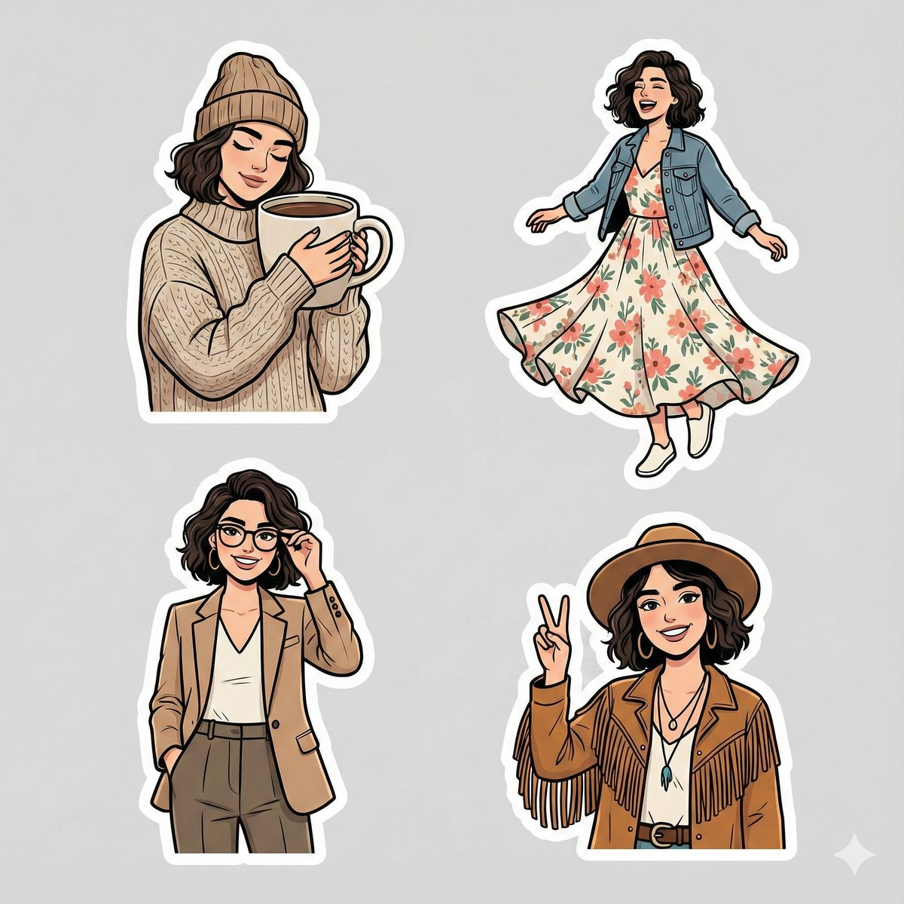

```
A sticker pack featuring the uploaded photo in different costumes and fashion styles. Clean cut-out edges, bold outlines, expressive poses, playful modern sticker design. Same facial features preserved across all stickers with consistent likeness and proportions.
Includes a mix of casual, traditional, luxury, streetwear, and fantasy-inspired outfits. High resolution finish with soft shadows and a glossy sticker-sheet aesthetic, ready for social sharing.
```

```
一套贴纸包，以上传的照片为基础，呈现不同服装与时尚风格。边缘干净利落，轮廓鲜明，姿态生动，具有趣味性的现代贴纸设计。所有贴纸均保留一致的面部特征、相貌和比例。

包含休闲、传统、奢华、街头风及奇幻风格的服装组合。高分辨率成品，带有柔和阴影和光亮的贴纸页质感，适合社交分享。
```

 [↑返回目录](#toc)

---
## <a id="prompt-2003107440137539800">陨石空军一号：宇宙爆裂</a> (<a href="https://x.com/YaseenK7212/status/2003107440137539848" target="_blank" rel="noopener noreferrer">Yaseen Khan Gul</a>)

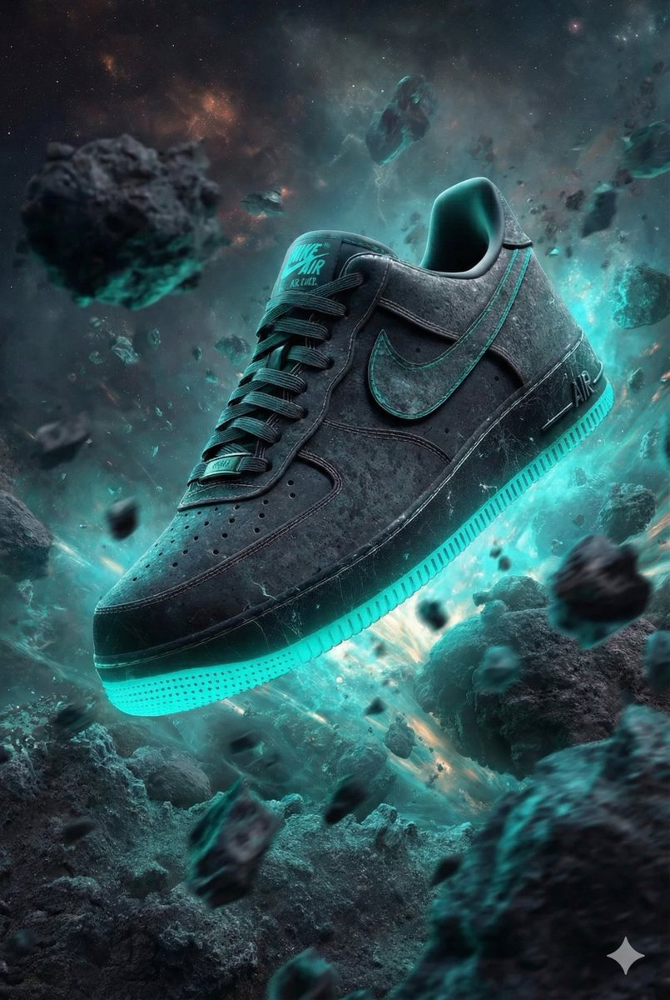

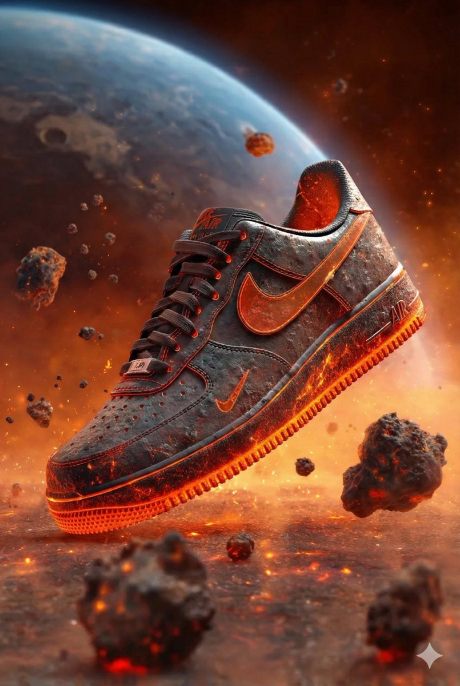

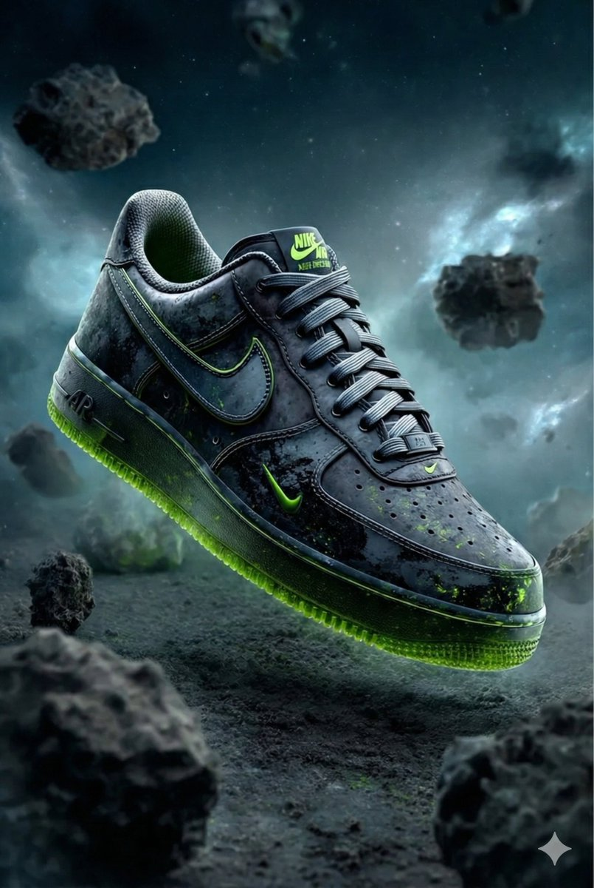

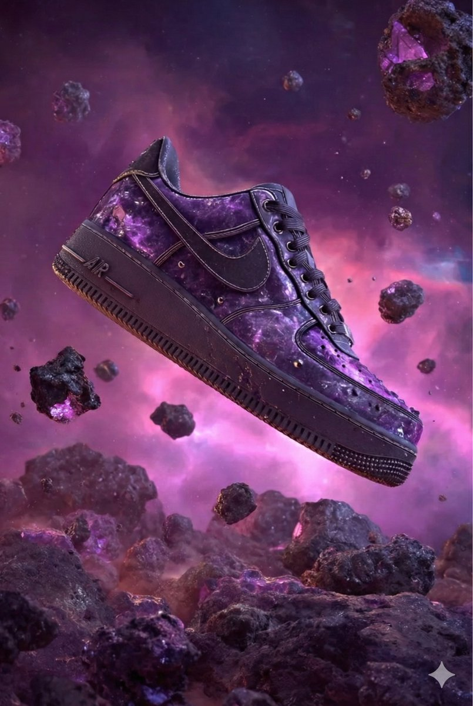

```
[
  {
    "id": 1,
    "main_subject": {
      "item": "Nike Air Force sneaker",
      "primary_material": "Dark carbon meteorite",
      "texture_description": "Meteorite material"
    },
    "illumination_details": {
      "type": "Glowing plasma threads",
      "placement": "Lined along the edges",
      "colors": ["Turquoise"]
    },
    "environment": {
      "location": "Space",
      "proximity_to": "Near a massive asteroid impact"
    },
    "dynamic_effects": {
      "action": "Fragments bursting outward",
      "effect_type": "Cinematic explosion effects"
    },
    "parameters": {
      "aspect_ratio": "2:3"
    }
  },
  {
    "id": 2,
    "main_subject": {
      "item": "Nike Air Force sneaker",
      "primary_material": "Meteorite surface infused with red-hot magma",
      "texture_description": "Cracked meteorite with magma textures"
    },
    "illumination_details": {
      "type": "Magma glow and veins",
      "placement": "Glowing through cracks in surface, sole, and upper veins",
      "colors": ["Red-hot", "Orange"]
    },
    "environment": {
      "location": "The void",
      "surrounding_elements": ["Burning and crumbling asteroids"]
    },
    "dynamic_effects": {
      "action": "Asteroids crumbling",
      "particle_effects": "Releasing sparks into the void"
    },
    "parameters": {
      "aspect_ratio": "2:3"
    }
  },
  {
    "id": 3,
    "main_subject": {
      "item": "Nike Air Force shoe",
      "primary_material": "Black meteorite granite",
      "texture_description": "Carved stone"
    },
    "illumination_details": {
      "type": "Molten energy veins",
      "placement": "Glowing cracks throughout the shoe",
      "colors": ["Emerald green"]
    },
    "environment": {
      "location": "Among asteroid belts",
      "ambient_lighting": "Bright starlight flares in the distance adding a cosmic aura"
    },
    "dynamic_effects": {
      "action": "Shards of rock colliding",
      "time_scale": "Slow motion"
    },
    "parameters": {
      "aspect_ratio": "2:3"
    }
  },
  {
    "id": 4,
    "main_subject": {
      "item": "Nike Air Force shoe",
      "primary_material": "Meteorite fragments",
      "texture_description": "Fragmented rock"
    },
    "illumination_details": {
      "type": "Color accents and highlights",
      "placement": "Sole details and general highlights around the shoe",
      "colors": ["Orange", "Red"]
    },
    "environment": {
      "location": "Vastness of space",
      "surrounding_elements": ["Asteroid rock", "Dust"]
    },
    "dynamic_effects": {
      "action": "Explosion effect",
      "proximity": "Near some of the surrounding rocks"
    },
    "parameters": {
      "aspect_ratio": "2:3"
    }
  }
]
```

```
[
  {
    "id": 1,
    "main_subject": {
      "item": "耐克空军一号运动鞋",
      "primary_material": "深色碳质陨石",
      "texture_description": "陨石材质"
    },
    "illumination_details": {
      "type": "发光等离子丝线",
      "placement": "沿边缘排列",
      "colors": ["青绿色"]
    },
    "environment": {
      "location": "太空",
      "proximity_to": "靠近一次巨大的小行星撞击"
    },
    "dynamic_effects": {
      "action": "碎片向外爆裂",
      "effect_type": "电影级爆炸效果"
    },
    "parameters": {
      "aspect_ratio": "2:3"
    }
  },
  {
    "id": 2,
    "main_subject": {
      "item": "耐克空军一号运动鞋",
      "primary_material": "融入炽热岩浆的陨石表面",
      "texture_description": "带有岩浆纹理的开裂陨石"
    },
    "illumination_details": {
      "type": "岩浆辉光与脉络",
      "placement": "从鞋面、鞋底及上部裂缝中透出辉光",
      "colors": ["炽红色", "橙色"]
    },
    "environment": {
      "location": "虚空",
      "surrounding_elements": ["燃烧并崩解的小行星"]
    },
    "dynamic_effects": {
      "action": "小行星崩解",
      "particle_effects": "向虚空中释放火花"
    },
    "parameters": {
      "aspect_ratio": "2:3"
    }
  },
  {
    "id": 3,
    "main_subject": {
      "item": "耐克空军一号鞋",
      "primary_material": "黑色陨石花岗岩",
      "texture_description": "雕刻石材"
    },
    "illumination_details": {
      "type": "熔融能量脉络",
      "placement": "遍布整只鞋的发光裂纹",
      "colors": ["翠绿色"]
    },
    "environment": {
      "location": "小行星带之中",
      "ambient_lighting": "远处明亮的星光耀斑，营造出宇宙氛围"
    },
    "dynamic_effects": {
      "action": "岩石碎片相互碰撞",
      "time_scale": "慢动作"
    },
    "parameters": {
      "aspect_ratio": "2:3"
    }
  },
  {
    "id": 4,
    "main_subject": {
      "item": "耐克空军一号鞋",
      "primary_material": "陨石碎片",
      "texture_description": "碎裂岩石"
    },
    "illumination_details": {
      "type": "色彩点缀与高光",
      "placement": "鞋底细节及鞋身整体高光",
      "colors": ["橙色", "红色"]
    },
    "environment": {
      "location": "浩瀚太空",
      "surrounding_elements": ["小行星岩石", "尘埃"]
    },
    "dynamic_effects": {
      "action": "爆炸效果",
      "proximity": "靠近部分周围岩石"
    },
    "parameters": {
      "aspect_ratio": "2:3"
    }
  }
]
```

 [↑返回目录](#toc)

---
## <a id="prompt-2002892122643665400">武者メカ娘 四拾伍号機</a> (<a href="https://x.com/munou_ac/status/2002892122643665307" target="_blank" rel="noopener noreferrer">てんねん</a>)

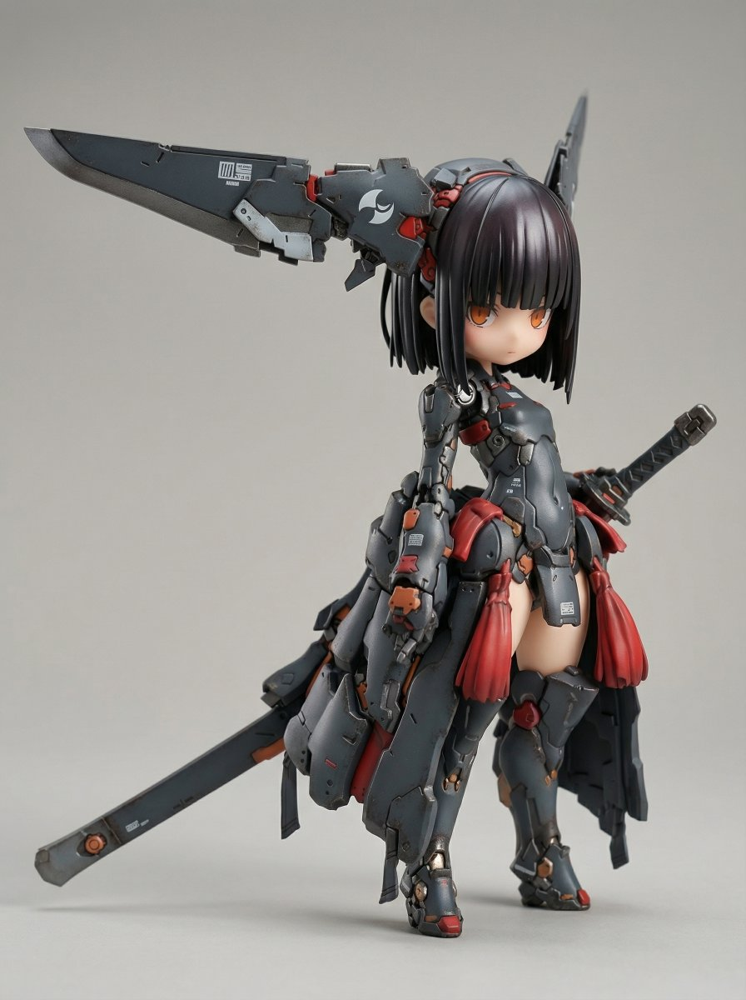

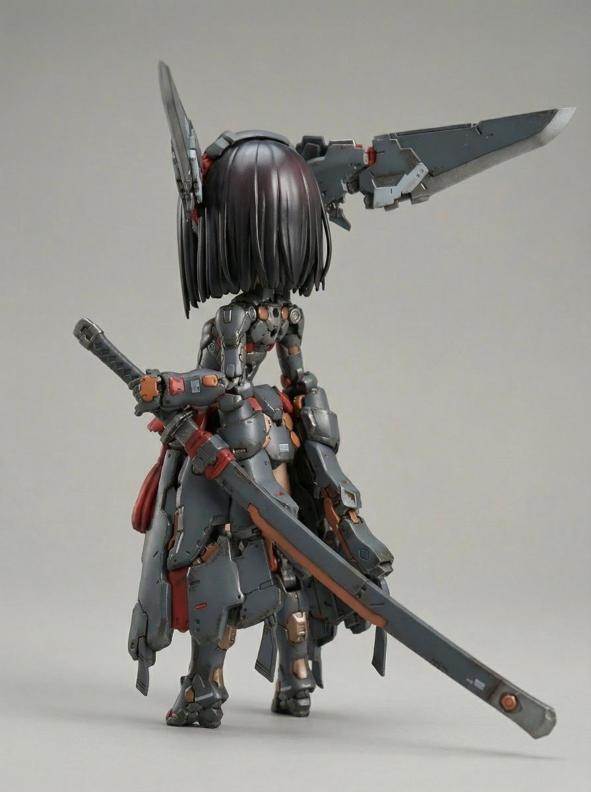

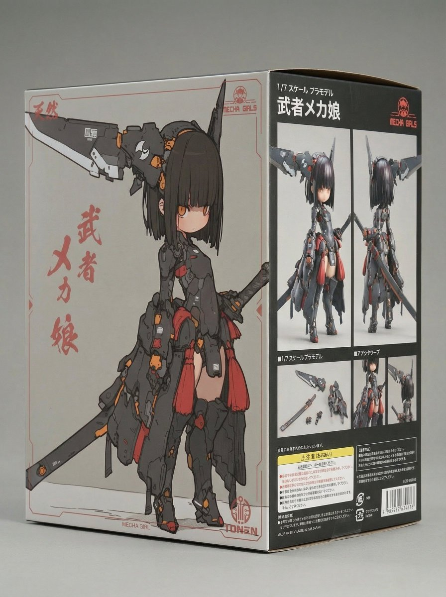

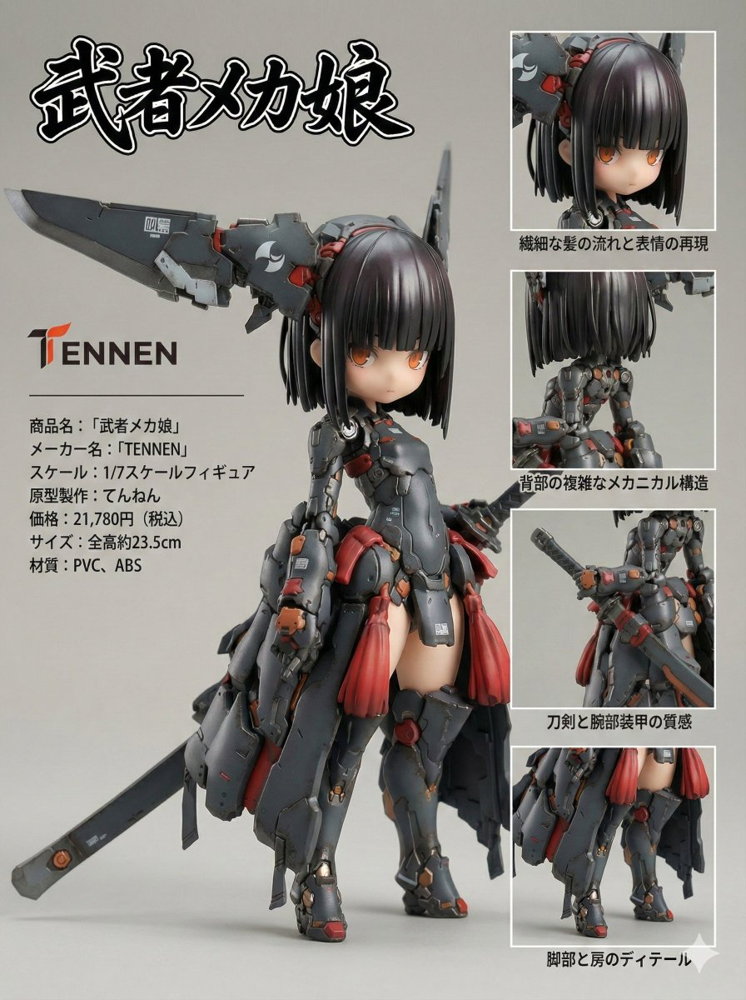

```
武者メカ娘　四拾伍号機
⠀
1/7スケールプラモデル
材　質：PS・PE・ABS
価　格：21,780円
発売日：未定
発売元：TENNEN
⠀
※このプラモデルは実在しません。
　AIにより生成された創作画像です。
⠀
Generated by Nano Banana Pro
```

 [↑返回目录](#toc)

---
## <a id="prompt-2002824697013297200">穿越回你出生那年的流行色</a> (<a href="https://x.com/elCarlosVega/status/2002824697013297266" target="_blank" rel="noopener noreferrer">El muchacho de los ojos tristes</a>)

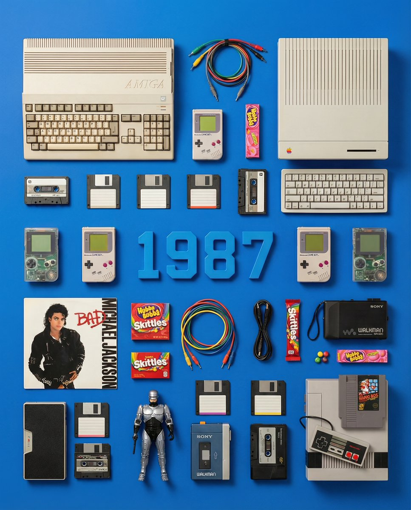

```
高端专业“平铺式”产品摄影，代表了[年份]年的时光胶囊。

构图：精心排列的天顶线构成完美的 90 度网格。
背景：纯哑光表面，颜色为对比色[例如：芥末黄/电光蓝]。

主题（历史自创）：选择并以照片般的精确度呈现[年份]发布的5件最具代表性的科技或流行文化物品。包括5-7件与该时代相符的小配件（线缆、存储介质、文具或复古糖果）。

中心元素：年份“[YEAR]”用实体和触感排版（切割塑料字母、木头或金属）写在网格的正中心，字体选择与该年代相符。

灯光和美学：顶部“柔光箱”摄影棚照明，完全漫射，没有硬阴影（无阴影）。

风格：极致对称，韦斯·安德森式，充满活力，解构主义，井然有序，视觉上令人愉悦。
渲染：8K 照片级真实感，精细的塑料和金属纹理。
```

```
Fotografía de producto profesional estilo 'Knolling' (Flat Lay) de alta gama, representando una cápsula del tiempo del año [AÑO].

Composición: Organización cenital meticulosamente alineada en una cuadrícula perfecta de 90 grados.
Fondo: Superficie sólida mate de color [COLOR QUE CONTRASTE, EJ: AMARILLO MOSTAZA / AZUL ELÉCTRICO].

Sujetos (Autogeneración Histórica): Selecciona y renderiza con precisión fotográfica los 5 objetos tecnológicos o de cultura pop más icónicos lanzados específicamente en [AÑO]. Incluye 5-7 accesorios menores correspondientes a la época (cables, medios de almacenamiento, papelería o dulces retro).

Elemento Central: El año "[AÑO]" está escrito en el centro exacto de la cuadrícula utilizando tipografía física y táctil (letras de plástico recortado, madera o metal) con una fuente acorde a la década.

Iluminación y Estética: Iluminación de estudio "Softbox" cenital, completamente difusa y sin sombras duras (shadowless).

Estilo: Simetría obsesiva tipo Wes Anderson, vibrante, deconstruido, organizado y visualmente satisfactorio.
Renderizado: Fotorealismo 8k, texturas de plástico y metal detalladas.
```

 [↑返回目录](#toc)

---
## <a id="prompt-2002840320694993000">Midjourney 遇见 Nano Banana</a> (<a href="https://x.com/gizakdag/status/2002840320694992997" target="_blank" rel="noopener noreferrer">Gizem Akdag</a>)

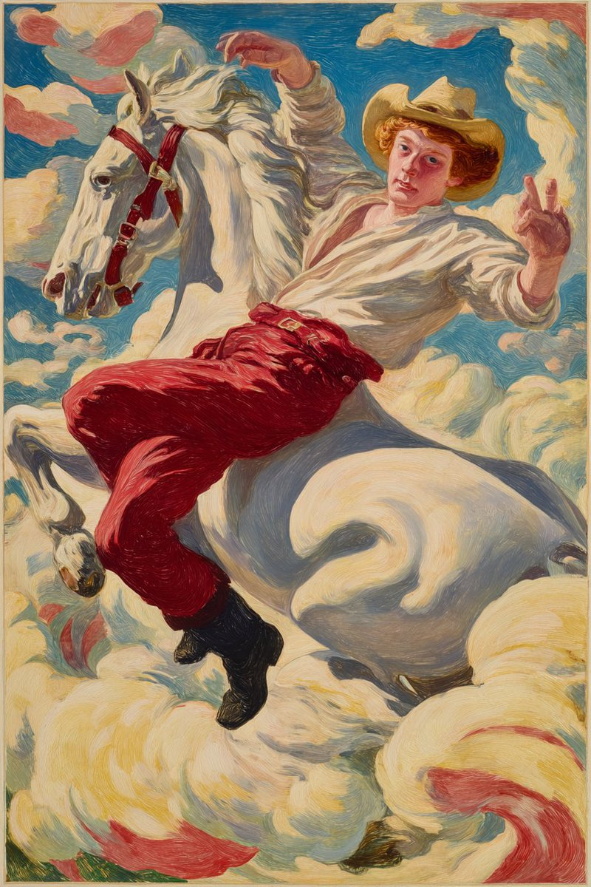

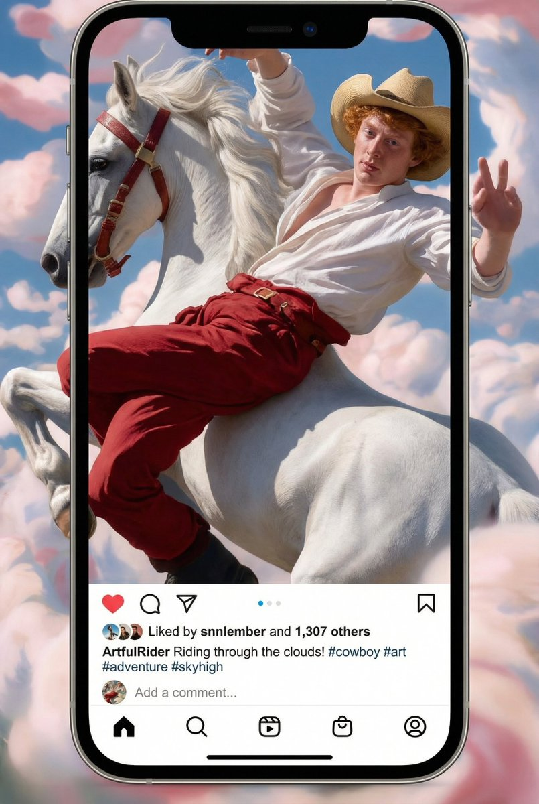

```
Turn it into an Instagram photo
```

```
提示：把它变成一张 Instagram 照片
```

 [↑返回目录](#toc)

---
## <a id="prompt-2002963262812586000">AR音乐环绕：电影级听觉幻境</a> (<a href="https://x.com/oggii_0/status/2002963262812585990" target="_blank" rel="noopener noreferrer">Oogie</a>)

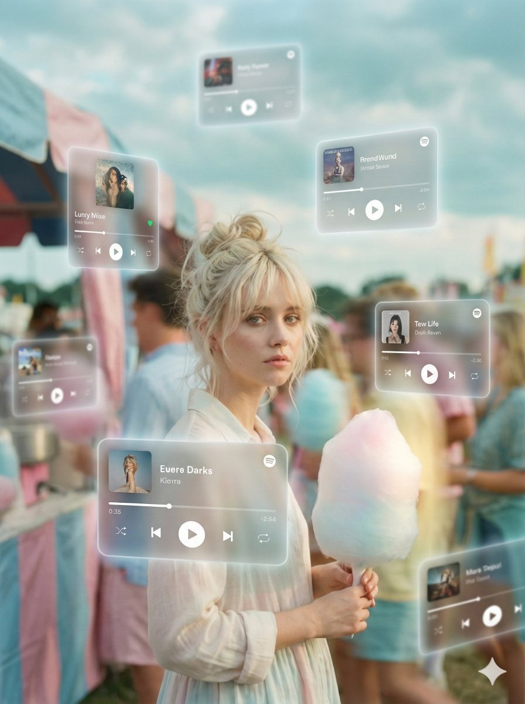

```
A dreamlike, movie-quality augmented reality visual where numerous hovering Spotify player interface cards orbit the central figure (the person shown) in a complete 3D spatial composition, with each music player card strategically placed at varying distances, some prominently positioned in front and partially covering the subject, while others float behind and alongside them, utilizing the authentic Apple Music UI/Spotify UI elements playback progress indicators and featuring songs by [Artist Name]; all cards display smooth rounded edges with subtle angular perspective shifts, presenting a translucent, frosted-glass aesthetic that radiates a gentle diffused border luminescence with measured cinematic light bloom interacting organically with the ambient lighting of the scene; the composition showcases a cool-to-neutral color palette with rich yet preserved shadow detail, strategic bursts of color from album artwork, medium-high contrast levels with gradual highlight transitions, delicate focal depth variation where nearer cards maintain crisp detail while farther ones receive gentle blur treatment, and understated motion-enhancing accents, all while keeping the subject photorealistic, centrally positioned, and authentically integrated into their physical surroundings.
```

```
一个如梦似幻、电影级质感的增强现实视觉画面，大量悬浮的 Spotify 播放器界面卡片围绕中心人物（所展示的人物）呈完整的三维空间构图环绕飞行。每张音乐播放器卡片以不同距离精心布置，部分显著地位于人物前方并轻微遮挡主体，其余则漂浮于其后方与两侧。卡片采用真实的 Apple Music / Spotify 用户界面元素，包含播放进度指示器，并展示由 [Artist Name] 演唱的歌曲；所有卡片均具有平滑圆角与微妙的角度透视变化，呈现半透明磨砂玻璃质感，边缘散发柔和扩散的辉光，并与场景环境光自然融合，产生恰到好处的电影级光晕效果。整体构图采用冷调至中性色调色板，保留丰富而细腻的阴影细节，专辑封面带来巧妙点缀的色彩爆发，具备中高对比度与渐进式高光过渡，景深处理精致——近处卡片保持清晰锐利，远处卡片则施以柔和虚化，并辅以低调的动态增强细节，同时确保主体保持逼真写实、居中构图，并自然融入其真实物理环境之中。
```

 [↑返回目录](#toc)

---
## <a id="prompt-2002841670992502800">橡胶软管角色登场</a> (<a href="https://x.com/The_Sycomore/status/2002841670992502880" target="_blank" rel="noopener noreferrer">Sycomore</a>)


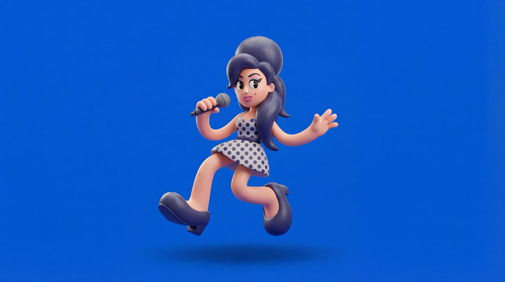

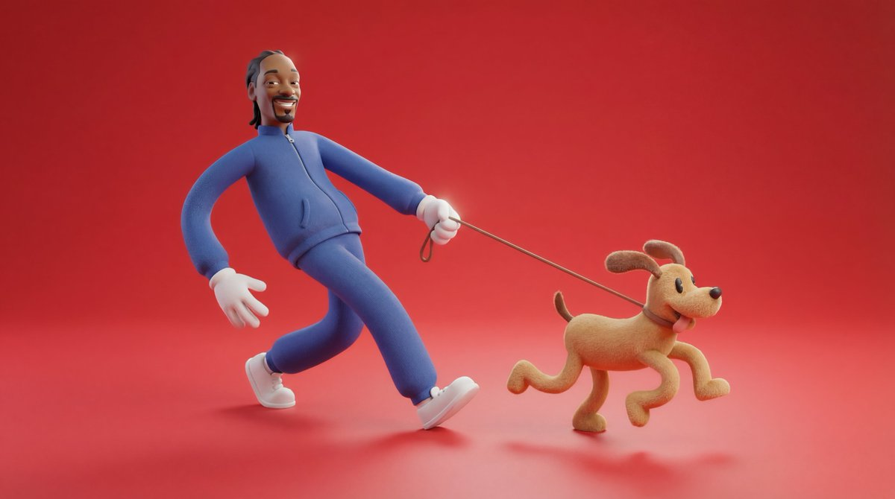

```
: [Subject], stylized 3D rubberhose character, smooth 3D render,  Solid [Color] color background, dynamic pose, soft ground shadow, bright soft lighting, modern playful design
```

```
[主体]，风格化3D橡胶软管角色，平滑3D渲染，纯色[颜色]背景，动态姿势，柔和地面阴影，明亮柔和的灯光，现代趣味设计
```

 [↑返回目录](#toc)

---
## <a id="prompt-2003021477277483000">透明人间的幻象</a> (<a href="https://x.com/GirlsinAIArt/status/2003021477277483079" target="_blank" rel="noopener noreferrer">Girls in AI Art｜GiAA(ギア)</a>)

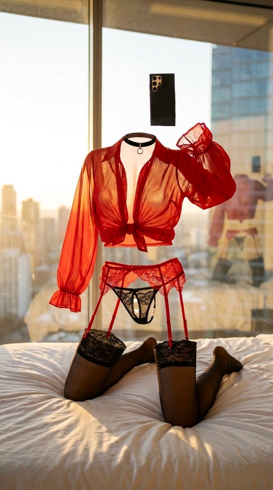

```
A shape is an illusion created by placing clothes floating in the air.

SFW＆Educational＆100% fictional
```

 [↑返回目录](#toc)

---
## <a id="prompt-2002968038157726000">竹蜻蜓飞行奇遇记</a> (<a href="https://x.com/itis_Jarvo33/status/2002968038157725969" target="_blank" rel="noopener noreferrer">𝓜𝓻.𝓙𝓪𝓻𝓿𝓸</a>)

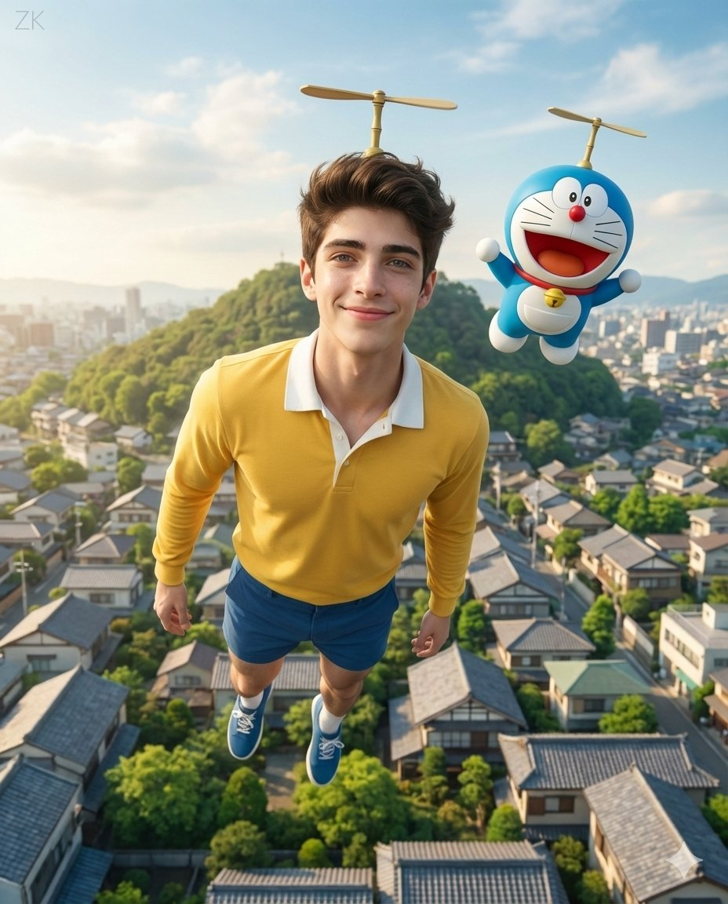

```
1. Open ChatGPT / Gemini

2. Upload your image 

3. Prompt :

Create a realistic, high-angle image, looking down from the sky. It shows me with the face from the attached file, wearing a long-sleeved yellow polo shirt with a white collar, the shirt neatly tucked into blue shorts, and blue shoes. I am floating in the sky using a small bamboo copter attached to my head, flying towards the camera, alongside Doraemon, who is also flying next to me with a small bamboo copter attached to his head. Both of us look joyful.
Below is a large city with Japanese-style houses with tiled roofs, lush green trees, and a high hill in the center of the city. The atmosphere is bright and clear, with soft sunlight and light clouds floating by.
The view is from above, looking down, with a warm and bright mood.
Vibrant color scheme, realistic clothing and skin, high detail, real photographic style, cinematic lighting, sharp focus, 8K resolution. Use the exact same face as in the uploaded reference photo, keeping identical eyes, lips, nose, jawline, skin tone, and natural imperfections. No AI smoothing, no changes in identity or expression. Preserve realistic pores, texture, and lifelike lighting, defined slim jawline, sharp but natural features, no bloated or puffy look, realistic soft skin texture. Ultra-realistic 8K cinematic portrait, DSLR clarity, real human skin texture with visible pores and soft sweat sheen, 0% AI or plastic look, natural sunlight or ambient lighting based on scene (golden hour or soft daylight), accurate shadows matching light direction, balanced color grading with gentle contrast and warm skin tones, depth of field for natural background blur (bokeh), realistic reflections in eyes and on fabric, no over-smooth or airbrushed skin, hair strands detailed and natural, body proportions accurate (5'2", fit smart build), Instagram 4:5 ratio, signature “ZK” top-left corner, subtle and elegant close mouth not open mouth smile. Body and face perfectly match… Remove face smile…..
```

```
创建一个逼真的高角度图像，从天空向下看。它展示了我拥有附件中脸部特征的形象，穿着长袖黄色Polo衫，白色领子，衣服整齐地塞入蓝色短裤中，脚穿蓝色鞋子。我使用头顶上安装的小型竹蜻蜓在天空中漂浮，朝相机飞去，同时哆啦A梦也在我旁边飞行，他头上同样装有一个小型竹蜻蜓。我们俩看起来都很开心。
下面是有着日式瓦顶房屋的大城市，周围是郁郁葱葱的绿树，城市中心有一座高山。氛围明亮清晰，阳光柔和，飘着淡淡的云彩。
视角是从上面往下看，带有温暖明亮的情绪。
色彩鲜艳，服装和皮肤逼真，细节丰富，真实的摄影风格，电影级光照，焦点锐利，8K分辨率。使用与上传参考照片完全相同的面部，保持相同的眼睛、嘴唇、鼻子、下颌线条、肤色和自然瑕疵。不进行AI平滑处理，不改变身份或表情。保留真实的毛孔、纹理和逼真的光照效果，定义明确的瘦削下颌线条，自然锐利的特征，没有肿胀或浮肿的外观，真实的柔软皮肤纹理。超现实的8K电影级肖像，单反相机的清晰度，真实的人类皮肤纹理，可见毛孔和柔和的汗液光泽，0%的AI或塑料外观，基于场景（黄金时段或柔和的日光）的自然阳光或环境光，准确的阴影匹配光线方向，平衡的色彩分级与温和对比度和暖色调皮肤，背景虚化（散景），眼睛和织物上的真实反射，不过度平滑或修饰皮肤，头发细节自然，身体比例准确（身高5'2"，健康聪明的体型），Instagram 4:5的比例，左上角有“ZK”签名，微妙优雅的闭嘴微笑。身体和脸部完美匹配…移除脸部笑容……
```

 [↑返回目录](#toc)

---
## <a id="prompt-2002883935618130000">蓝色纱丽的晨光诗篇</a> (<a href="https://x.com/sudharps/status/2002883935618130024" target="_blank" rel="noopener noreferrer">Sudharsan G</a>)

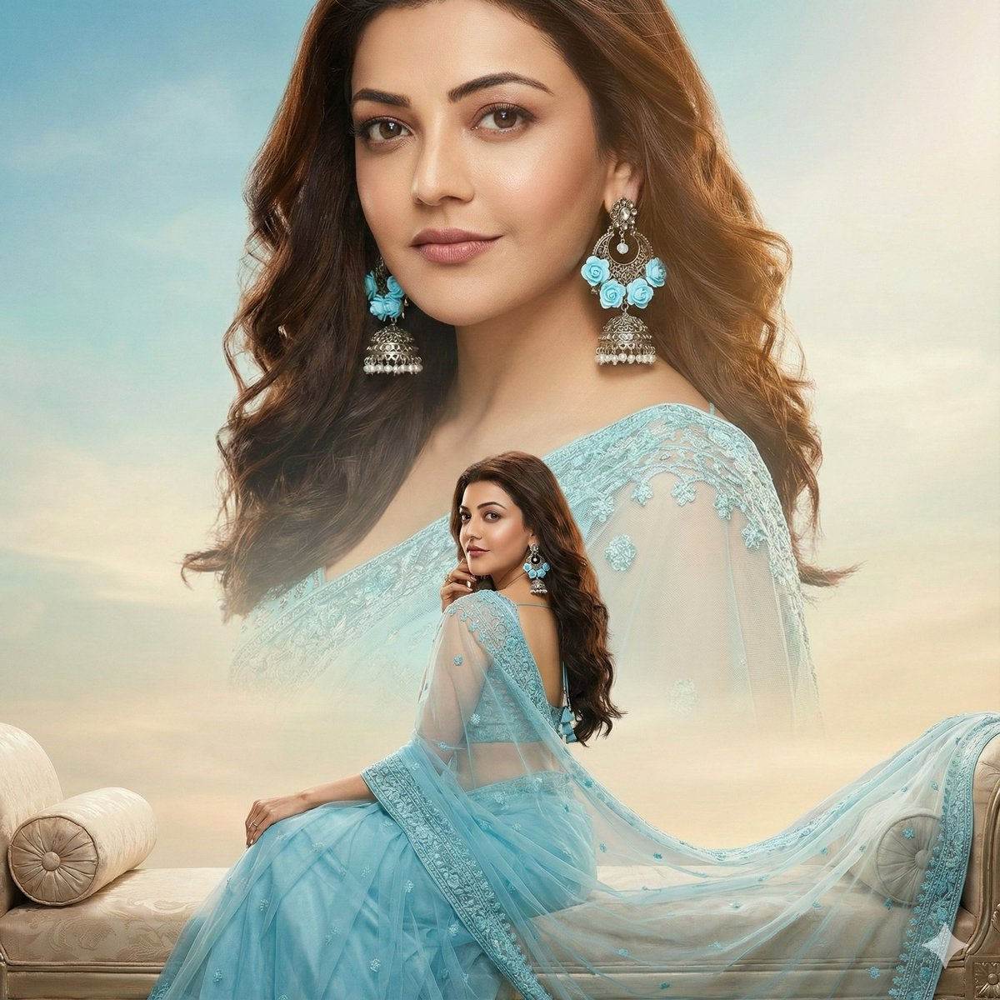

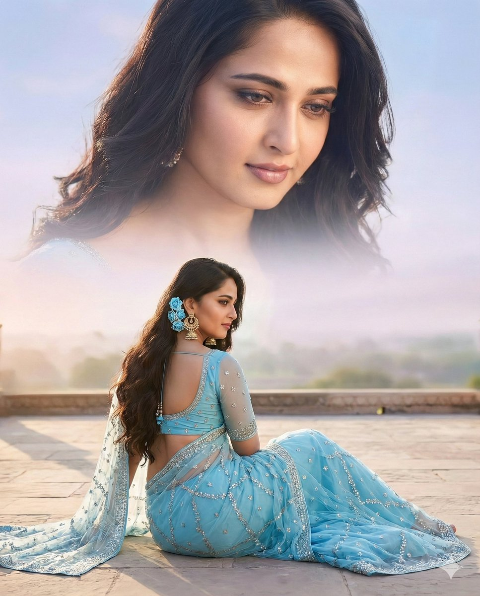

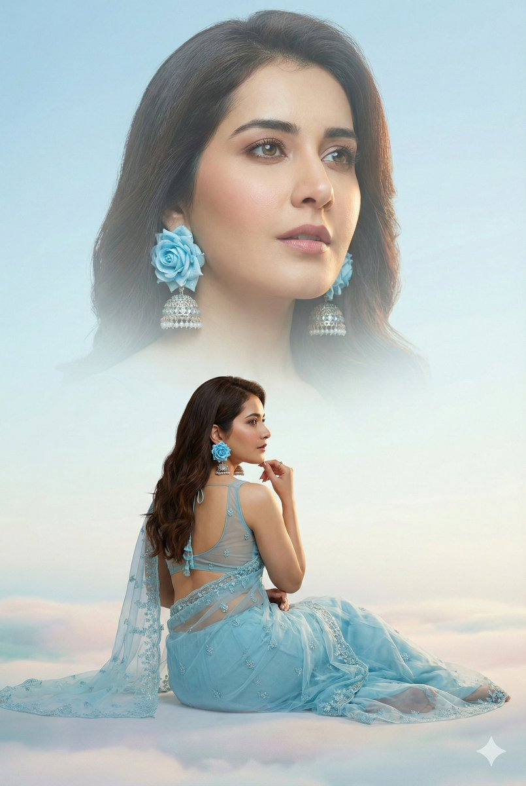

```
Good morning 💙
A  actress in a blue saree feels like poetry in motion  grace in her eyes, calm confidence in her smile, and elegance flowing with every fold.
Blue suits her serenity ✨ timeless, classy, and effortlessly beautiful. 🌸prompt⤵️
```

```
早安 💙  
一位身着蓝色纱丽的女演员，宛如流动的诗篇——眼神中透着优雅，微笑里藏着沉静的自信，每一处褶皱都流淌着高贵。  
蓝色映衬出她的宁静 ✨ 永恒、典雅，美得毫不费力。🌸
```

 [↑返回目录](#toc)

---
## <a id="prompt-2002953995653144600">房屋改造前后对比视频教程</a> (<a href="https://x.com/underwoodxie96/status/2002953995653144589" target="_blank" rel="noopener noreferrer">underwood</a>)


```
Creating a renovation transformation video takes just three steps:

1. Find a photo of the house before renovation
Choose a clear image that shows the structure and layout of the space (unfinished, old, or unrenovated).
Use Nano Banana Pro to generate the renovated version
2. Based on the original photo, generate a visually upgraded “after renovation” image with the desired style and materials.
3. Use Kling’s first-and-last-frame feature to generate the video
Set the “before renovation” image as the first frame and the “after renovation” image as the last frame, and let Kling automatically create a smooth renovation transition video.
```

```
制作一段改造前后对比视频只需三个步骤：

1. 找一张房屋改造前的照片  
选择一张清晰展示空间结构和布局的图片（未完工、老旧或未翻新的状态）。  
使用 Nano Banana Pro 生成翻新后的版本。  

2. 基于原始照片，生成一张视觉升级的“翻新后”图像，包含理想风格与材质。  

3. 使用 Kling 的首尾帧功能生成视频  
将“翻新前”的图片设为第一帧，“翻新后”的图片设为最后一帧，Kling 将自动生成一段流畅的改造过渡视频。
```

 [↑返回目录](#toc)

---
## <a id="prompt-2002943114512826600">粘土童趣角色模型</a> (<a href="https://x.com/Sheldon056/status/2002943114512826729" target="_blank" rel="noopener noreferrer">Dr.duet</a>)

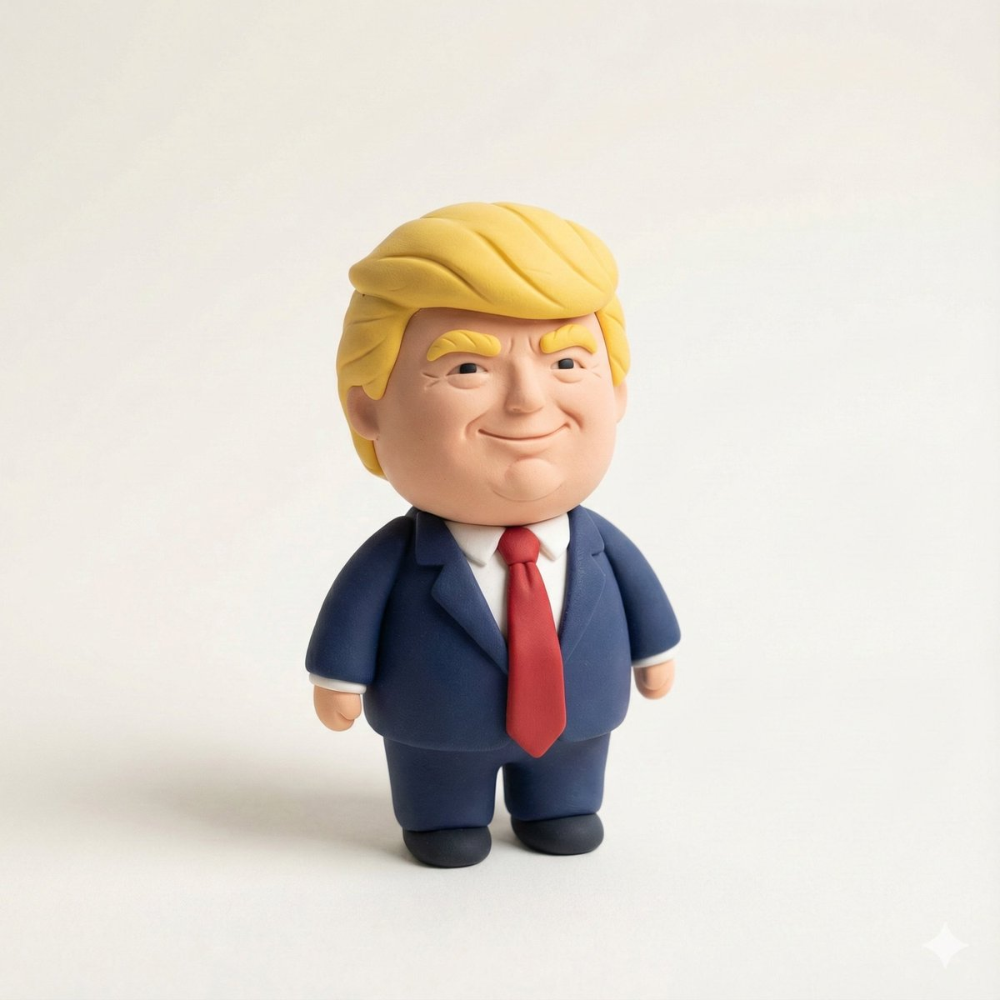

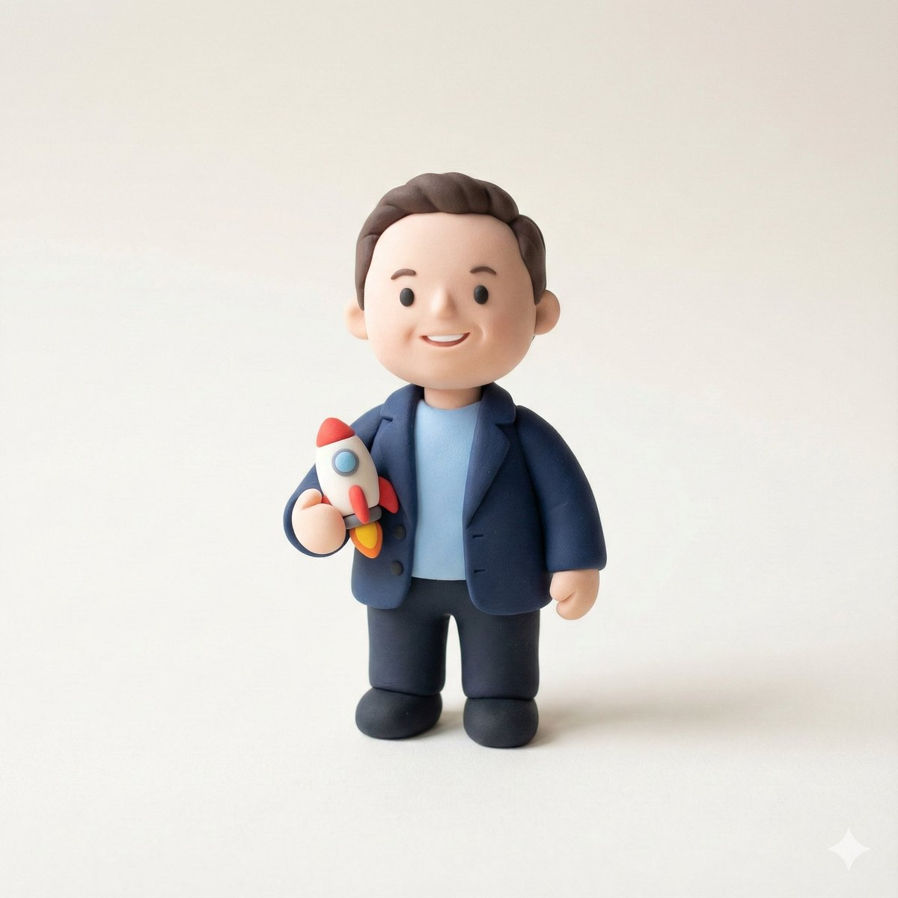

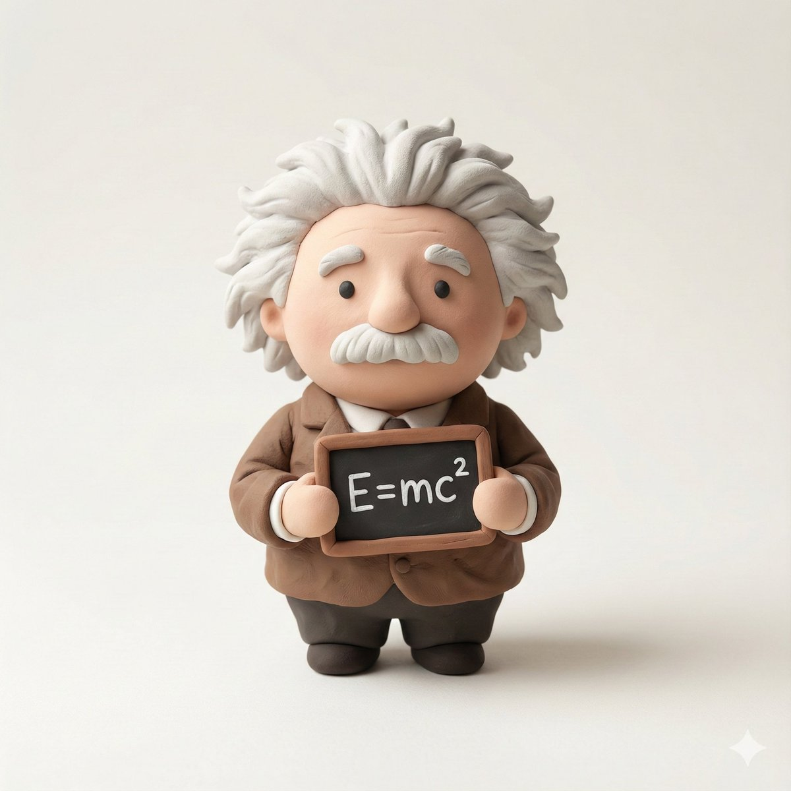


```
Create a stylized miniature model of [CHARACTERS] shaped entirely from soft polymer clay. The figure has rounded, childlike anatomy — large head, small body, and simplified details that feel friendly and handcrafted. Its outfit and accessories match [CHARACTERS]’ iconic look, modeled with smooth curves and lively, saturated tones.
The material appears dry and tactile, with a powdery matte finish and subtle surface texture—avoid gloss, shine, or reflections. Lighting should be gentle and even, wrapping softly around the form with faint ambient shading to reveal volume.
Present the figurine standing upright, slightly turned toward the right, framed in a minimal off-white environment with a smooth floor and faint contact shadow beneath. The overall composition feels calm, neat, and balanced—like a clay sculpture photographed for a design catalog.
Format: square 1080x1080”
```

```
创作一个完全由软质聚合物粘土制成的[CHARACTERS]风格化微型模型。该人偶具有圆润、童趣的造型——大头、小身体，细节简化，呈现出亲切的手工感。其服装与配饰忠实还原[CHARACTERS]的经典造型，采用流畅曲线和鲜明饱和的色彩塑造。材质呈现干燥且富有触感的哑光粉质感，表面带有细微纹理——避免任何光泽、反光或高光。光线应柔和均匀，轻柔地包裹形体，并辅以微弱的环境阴影以展现体积感。将人偶以直立姿态呈现，略微向右转，置于极简的米白色环境中，地面平滑，底部带有淡淡的接触阴影。整体构图宁静、整洁、平衡，如同为设计图录拍摄的粘土雕塑作品。格式：正方形 1080x1080”
```

 [↑返回目录](#toc)

---
## <a id="prompt-2002132714200130000">电影海报墙写真</a> (<a href="https://x.com/ttmouse/status/2002132714200129984" target="_blank" rel="noopener noreferrer">ttmouse - 豆爸</a>)

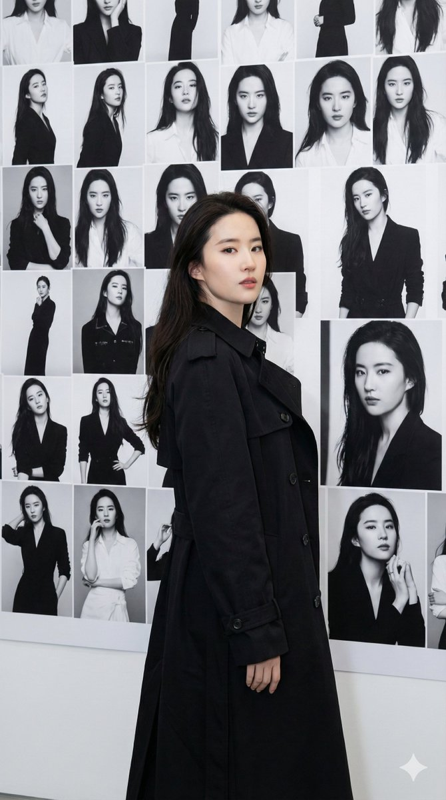

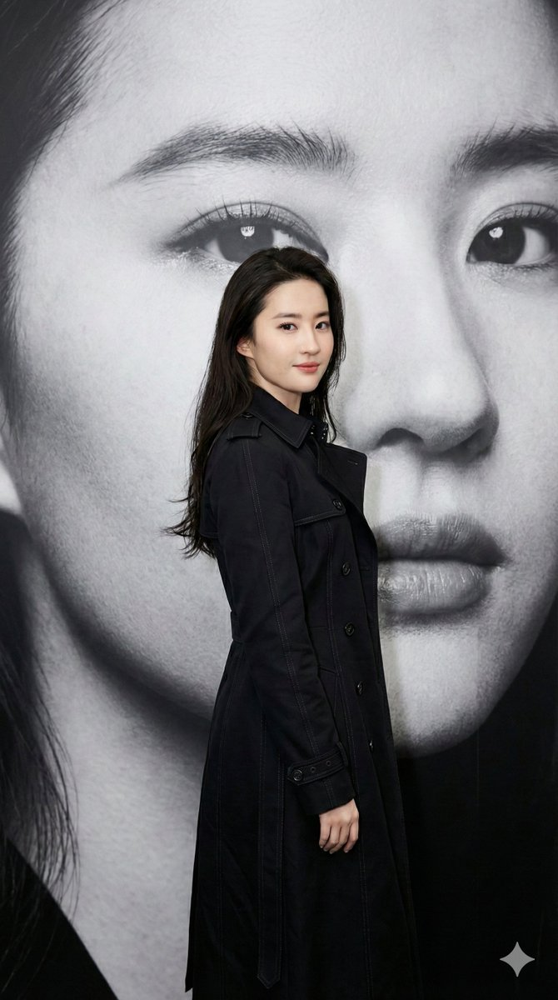

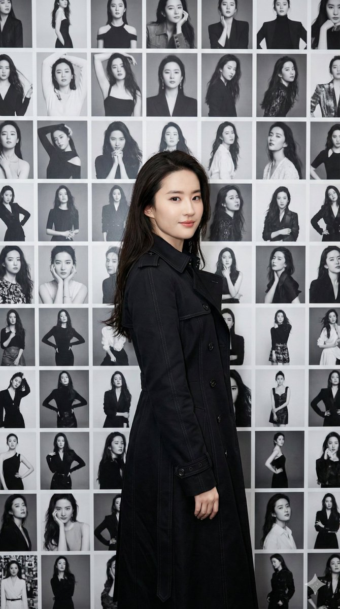

```
基于【参考照片人物】
A high-quality 9:16 vertical portrait, 4k resolution. 
**Framing:** Medium-long shot (framed from the knees up, focusing on torso and head). 
**Subject:** The woman from the reference image, standing in 3/4 profile facing left, looking at the lens. She wears a structured black long trench coat. 
**Background:** An infinite, edge-to-edge gallery wall completely covered in a dense, seamless grid of black and white fashion portraits of herself. The photo wall fills 100% of the background frame behind her. No floor visible, no ceiling visible, just the texture of the photos. 
**Lighting:** Even, professional gallery lighting highlighting the coat's texture and the details of the background prints. 
**Quality:** Ultra-photorealistic, sharp focus, cinematic depth.
--ar 9:16 --v 6.0
```

 [↑返回目录](#toc)

---
## <a id="prompt-2002404581590831600">金属质感品牌雕塑</a> (<a href="https://x.com/TechieBySA/status/2002404581590831564" target="_blank" rel="noopener noreferrer">TechieSA</a>)

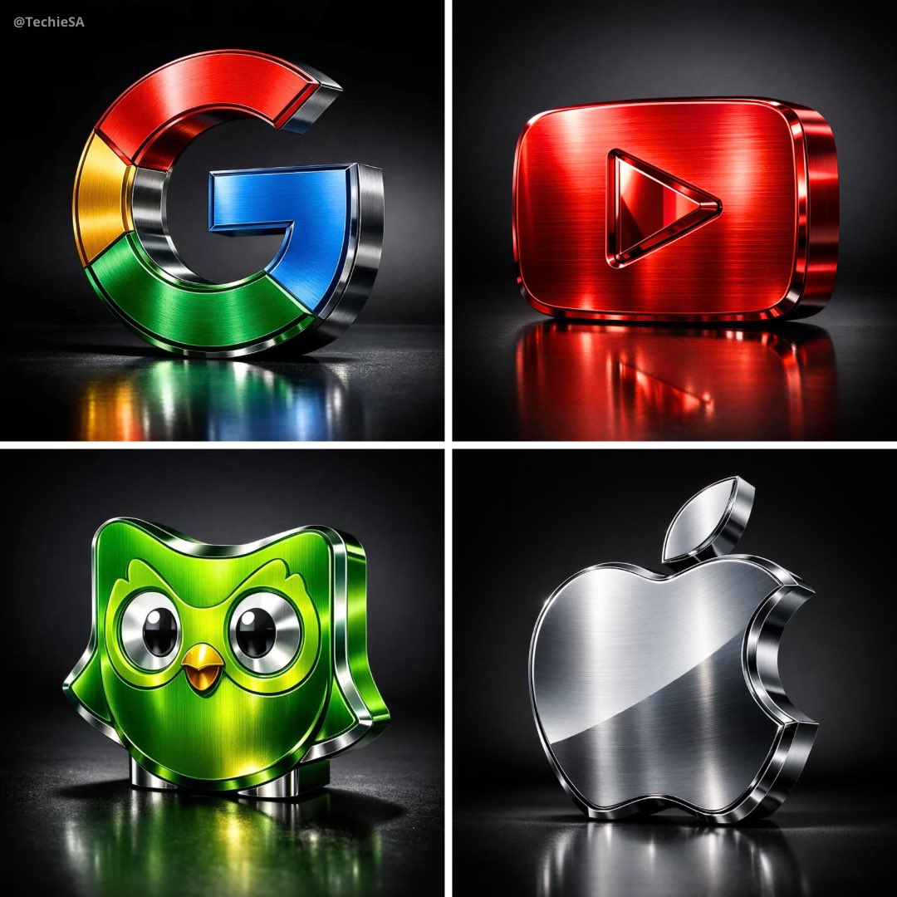

```
A hyper-realistic 3D render of a metallic sculpture shaped as the official [BRAND] logo. The sculpture is crafted from richly brushed metal in [BRAND]'s signature color(s), with subtle gradients and a mirror-polished surface that reflects its surroundings with precise clarity. The form features beveled edges, embossed contours, and smooth curvature that give it depth and dimension. Positioned upright on a matte reflective black floor, against a seamless black-to-charcoal gradient studio backdrop. Shot from a slightly low-angle, front-side perspective to emphasize its geometric presence and premium finish. Soft overhead and lateral lighting casts crisp-edged shadows and highlights. Captured in ultra-high resolution with macro depth of field, Canon EOS R5, 85mm f/1.4 lens simulation. —no-human —no-text —no-blur —no-distortion —no-lowres —no-overexposure. 1080x1080 dimension.
```

```
一个超写实的3D渲染，呈现官方[BRAND]标志造型的金属雕塑。该雕塑采用[BRAND]标志性颜色的精细拉丝金属材质打造，表面带有微妙渐变与镜面抛光效果，能清晰精准地反射周围环境。造型具有倒角边缘、浮雕轮廓和流畅曲面，赋予其深度与立体感。雕塑直立于哑光反光黑色地板上，背景为无缝黑至炭灰色渐变的摄影棚布景。采用略低角度的前侧视角拍摄，以突出其几何形态与高级质感。柔和的顶光与侧光投射出边缘锐利的阴影与高光。使用超高分辨率拍摄，模拟佳能EOS R5相机搭配85mm f/1.4镜头的微距景深效果。——无真人——无文字——无模糊——无畸变——无低分辨率——无过曝。图像尺寸1080x1080。
```

 [↑返回目录](#toc)

---
## <a id="prompt-2002382591823896600">圣诞双生镜像</a> (<a href="https://x.com/songguoxiansen/status/2002382591823896676" target="_blank" rel="noopener noreferrer">松果先森</a>)


```
(2-panel vertical split, twin concept, studio photography). Two panels side-by-side showing the specific character interacting with the frame edge (as if looking at herself). [CRITICAL: Keep the face identical to the source image in both panels].

Left Panel: Wearing a green sweater and Santa hat, holding a Christmas cracker ready to pull, leaning right.
Right Panel: Wearing a red sweater, holding the other end of the Christmas cracker, leaning left. Surrounded by Christmas lights.
Props: Wrapped gifts and a snowman doll at their feet.
Background: Yellow or teal bright studio background.
Lighting: Flat, bright, shadowless lighting.
Style: Fun, creative, "cloning" effect, playful narrative.
aspect_ratio: 16:9
```

```
（双画面垂直分割，双生概念，影棚摄影）。左右两个画面并排展示同一角色与画面边缘互动（仿佛在看着自己）。【关键：两个画面中的面部必须与原始图像完全一致】。

左画面：身穿绿色毛衣和圣诞帽，手持一个待拉响的圣诞拉炮，身体向右倾斜。  
右画面：身穿红色毛衣，手持圣诞拉炮的另一端，身体向左倾斜。周围环绕着圣诞彩灯。  
道具：脚边有包装好的礼物和一个雪人玩偶。  
背景：明亮的黄色或青绿色影棚背景。  
灯光：均匀、明亮、无阴影的平光照明。  
风格：趣味十足、富有创意、“克隆”效果、充满玩味的叙事感。  
宽高比：16:9
```

 [↑返回目录](#toc)

---
## <a id="prompt-2002318771114160600">灰发女性的都市独行</a> (<a href="https://x.com/rovvmut_/status/2002318771114160571" target="_blank" rel="noopener noreferrer">Heisenberg</a>)


```
{
  "objective": "Generate a hyper-realistic black and white fashion photograph with a cinematic, modern mood.",
  "image_type": "photography",
  "prompt": {
    "subject": "A woman with short grey hair walking alone down a city street",
    "wardrobe": "Brown winter coat",
    "action_motion": "Strong sense of motion with hair flowing in the wind and coat fabric lifted and moving naturally",
    "scene": "Urban street",
    "perspective": "Shot from above, street photography viewpoint",
    "style": [
      "Vogue fashion shoot",
      "Black and white",
      "Candid street photography",
      "Dynamic composition"
    ],
    "visual_details": [
      "High resolution",
      "Hyper-realistic detail",
      "Cinematic contrast",
      "Subtle film grain effect"
    ],
    "mood": [
      "Powerful",
      "Modern",
      "Independent"
    ]
  },
  "camera_and_composition": {
    "angle": "Top-down / elevated angle",
    "framing": "Subject-centered with dynamic movement",
    "depth_of_field": "Natural, realistic depth"
  },
  "lighting": {
    "type": "Natural light",
    "contrast": "High contrast suitable for black and white photography"
  },
  "post_processing": {
    "color_mode": "Black and white",
    "effects": [
      "Subtle film grain",
      "Cinematic tonal grading"
    ]
  },
  "negative_prompt": [
    "Low resolution",
    "Blurred subject",
    "Overly posed appearance",
    "Artificial or cartoonish style",
    "Color photography",
    "Flat lighting"
  ],
  "output_quality": {
    "resolution": "Ultra high resolution",
    "detail_level": "Maximum realism"
  }
}
```

```
{
  "objective": "生成一张具有电影感、现代氛围的超现实黑白时尚照片。",
  "image_type": "摄影",
  "prompt": {
    "subject": "一位留着短灰发的女性独自走在城市街道上。",
    "wardrobe": "棕色冬大衣",
    "action_motion": "强烈的动感，头发随风飘动，外套面料自然扬起并移动。",
    "scene": "城市街道",
    "perspective": "从上方拍摄，街头摄影视角。",
    "style": [
      "Vogue时尚拍摄",
      "黑白",
      "随意的街头摄影",
      "动态构图"
    ],
    "visual_details": [
      "高分辨率",
      "超现实细节",
      "电影对比度",
      "细微的胶片颗粒效果"
    ],
    "mood": [
      "强大",
      "现代",
      "独立"
    ]
  },
  "camera_and_composition": {
    "angle": "俯视/抬高角度",
    "framing": "以主题为中心，带有动态动作",
    "depth_of_field": "自然，真实的景深"
  },
  "lighting": {
    "type": "自然光",
    "contrast": "适合黑白摄影的高对比度"
  },
  "post_processing": {
    "color_mode": "黑白",
    "effects": [
      "细微的胶片颗粒",
      "电影色调分级"
    ]
  },
  "negative_prompt": [
    "低分辨率",
    "主体模糊",
    "过度摆拍的外观",
    "人工或卡通风格",
    "彩色摄影",
    "平光"
  ],
  "output_quality": {
    "resolution": "超高分辨率",
    "detail_level": "最大真实感"
  }
}
```

 [↑返回目录](#toc)

---
## <a id="prompt-2002037335161217500">现实与Q版的咖啡邂逅</a> (<a href="https://x.com/rovvmut_/status/2002037335161217483" target="_blank" rel="noopener noreferrer">Heisenberg</a>)

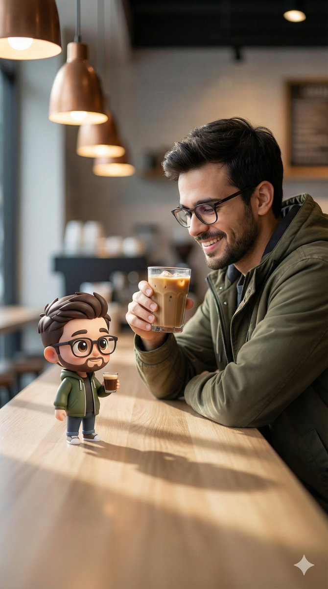

```
A young man sitting casually at a modern café counter, smiling while holding a glass of iced coffee. On the table in front of him stands a small 3D chibi character version of the same man. The chibi has super-deformed proportions, a large head, big expressive eyes, and simplified facial features. It has a smooth 3D plastic or clay-like texture, soft studio lighting, and a clear shadow on the table surface. The chibi is holding a tiny glass of coffee. Warm pendant lights, wooden café interior, cinematic realistic human combined with stylized 3D chibi, shallow depth of field, vertical 9:16.
```

```
一位年轻男子随意坐在现代咖啡馆的吧台前，微笑着手持一杯冰咖啡。他面前的桌面上立着一个同款男子的小型3D Q版角色。该Q版角色具有夸张变形的比例、大头、富有表现力的大眼睛和简化的面部特征，呈现出光滑的3D塑料或黏土质感，在柔和的影棚灯光下投射出清晰的桌面阴影，并手持一只迷你咖啡杯。场景中有温暖的吊灯、木质咖啡馆内饰，写实电影感的人物与风格化3D Q版角色相结合，浅景深，竖构图9:16。
```

 [↑返回目录](#toc)

---
## <a id="prompt-2002013476370444800">超级英雄与汽水的奇幻邂逅</a> (<a href="https://x.com/YaseenK7212/status/2002013476370444766" target="_blank" rel="noopener noreferrer">Yaseen Khan Gul</a>)

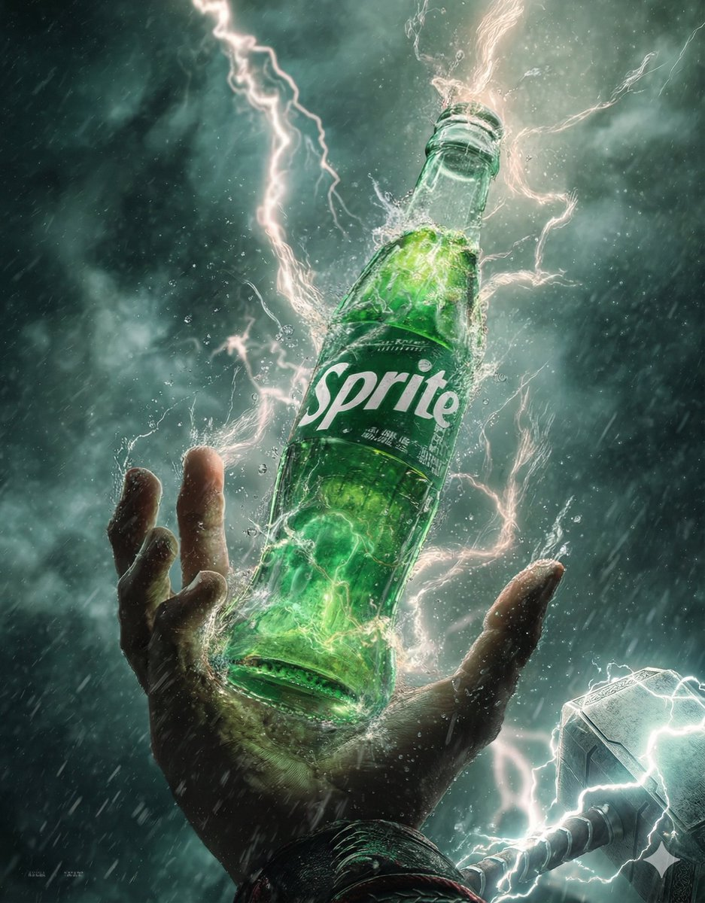

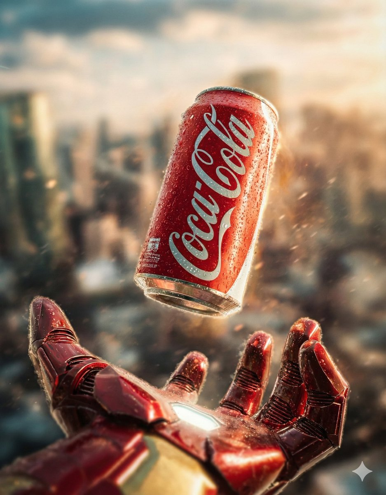

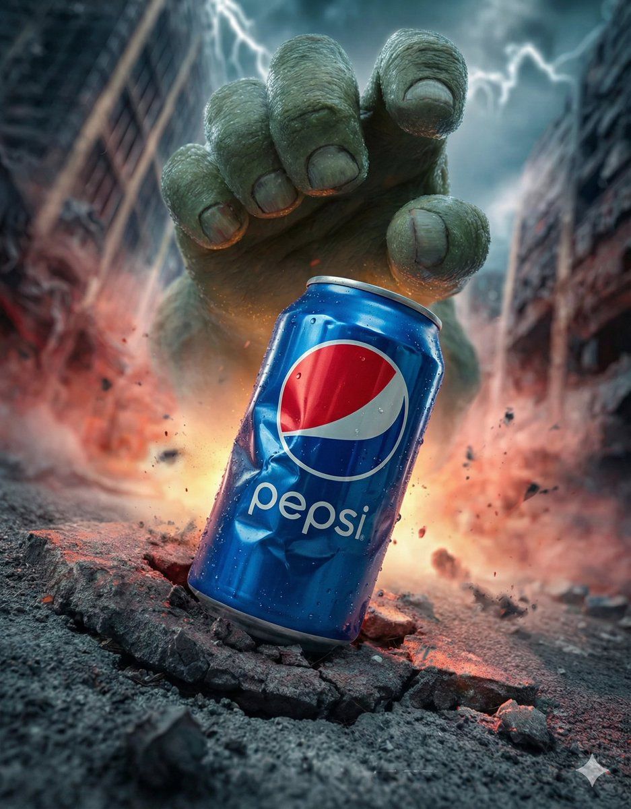

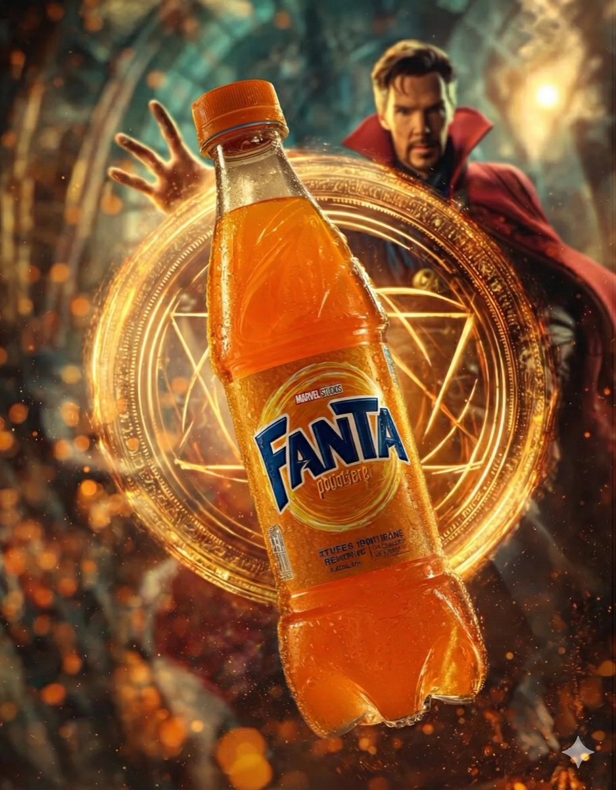

```
[
  {
    "concept_id": "iron_man_coke",
    "visual_breakdown": {
      "focus_object": "Coca-Cola Can",
      "character_element": "Iron Man's Gauntlet",
      "environment": "Blurred City Skyline"
    },
    "artistic_direction": {
      "lighting": "Cinematic/Metallic",
      "mood": "technological"
    },
    "generation_command": {
      "aspect_ratio": "7:9",
      "concise_prompt": "Iron Man's gauntlet hovering below a floating Coca-Cola can, cinematic city background, dramatic movie poster lighting. --ar 7:9"
    }
  },
  {
    "concept_id": "hulk_pepsi",
    "visual_breakdown": {
      "focus_object": "Crushed Pepsi Can",
      "character_element": "Hulk's Giant Hand",
      "environment": "Smoky City Ruins"
    },
    "artistic_direction": {
      "lighting": "Explosive/High Contrast",
      "mood": "destructive"
    },
    "generation_command": {
      "aspect_ratio": "7:9",
      "concise_prompt": "Hulk's giant hand hovering over a crushed Pepsi can embedded in pavement, smoky ruins, explosive action movie style. --ar 7:9"
    }
  },
  {
    "concept_id": "thor_sprite",
    "visual_breakdown": {
      "focus_object": "Sprite Bottle",
      "character_element": "Thor's Glowing Hand",
      "environment": "Storm/Lightning"
    },
    "artistic_direction": {
      "lighting": "Electric/Blue-Toned",
      "mood": "mythological"
    },
    "generation_command": {
      "aspect_ratio": "7:9",
      "concise_prompt": "Thor's glowing hand holding a floating Sprite bottle amidst crackling lightning and rain, Mjolnir in background, epic poster style. --ar 7:9"
    }
  },
  {
    "concept_id": "dr_strange_fanta",
    "visual_breakdown": {
      "focus_object": "Fanta Bottle",
      "character_element": "Doctor Strange's Hand",
      "environment": "Golden Magic Portal"
    },
    "artistic_direction": {
      "lighting": "Magical/Golden Bokeh",
      "mood": "mystical"
    },
    "generation_command": {
      "aspect_ratio": "7:9",
      "concise_prompt": "Doctor Strange casting a spell under a spinning Fanta bottle inside a golden magic portal, mystical Sanctum background, cinematic lighting. --ar 7:9"
    }
  }
]
```

```
[
  {
    "concept_id": "iron_man_coke",
    "visual_breakdown": {
      "focus_object": "可口可乐罐",
      "character_element": "钢铁侠的手套",
      "environment": "模糊的城市天际线"
    },
    "artistic_direction": {
      "lighting": "电影感/金属质感",
      "mood": "科技感"
    },
    "generation_command": {
      "aspect_ratio": "7:9",
      "concise_prompt": "钢铁侠的手套悬浮在漂浮的可口可乐罐下方，背景为电影感城市天际线，戏剧性的电影海报灯光。--ar 7:9"
    }
  },
  {
    "concept_id": "hulk_pepsi",
    "visual_breakdown": {
      "focus_object": "压扁的百事可乐罐",
      "character_element": "浩克的巨大手掌",
      "environment": "烟雾弥漫的城市废墟"
    },
    "artistic_direction": {
      "lighting": "爆炸式/高对比度",
      "mood": "破坏感"
    },
    "generation_command": {
      "aspect_ratio": "7:9",
      "concise_prompt": "浩克的巨大手掌悬停在嵌入路面的压扁百事可乐罐上方，背景为烟雾废墟，爆炸动作电影风格。--ar 7:9"
    }
  },
  {
    "concept_id": "thor_sprite",
    "visual_breakdown": {
      "focus_object": "雪碧瓶",
      "character_element": "雷神发光的手",
      "environment": "风暴/闪电"
    },
    "artistic_direction": {
      "lighting": "电光/蓝色调",
      "mood": "神话感"
    },
    "generation_command": {
      "aspect_ratio": "7:9",
      "concise_prompt": "雷神发光的手握着漂浮的雪碧瓶，周围是噼啪作响的闪电和雨水，背景中可见雷神之锤，史诗级海报风格。--ar 7:9"
    }
  },
  {
    "concept_id": "dr_strange_fanta",
    "visual_breakdown": {
      "focus_object": "芬达瓶",
      "character_element": "奇异博士的手",
      "environment": "金色魔法传送门"
    },
    "artistic_direction": {
      "lighting": "魔法感/金色散景",
      "mood": "神秘感"
    },
    "generation_command": {
      "aspect_ratio": "7:9",
      "concise_prompt": "奇异博士在旋转的芬达瓶下方施法，身处金色魔法传送门内，背景为神秘的至圣所，电影级灯光。--ar 7:9"
    }
  }
]
```

 [↑返回目录](#toc)

---
## <a id="prompt-2002359398220640300">双重身份：极简肖像</a> (<a href="https://x.com/AIwithkhan/status/2002359398220640289" target="_blank" rel="noopener noreferrer">Smiling Khan</a>)

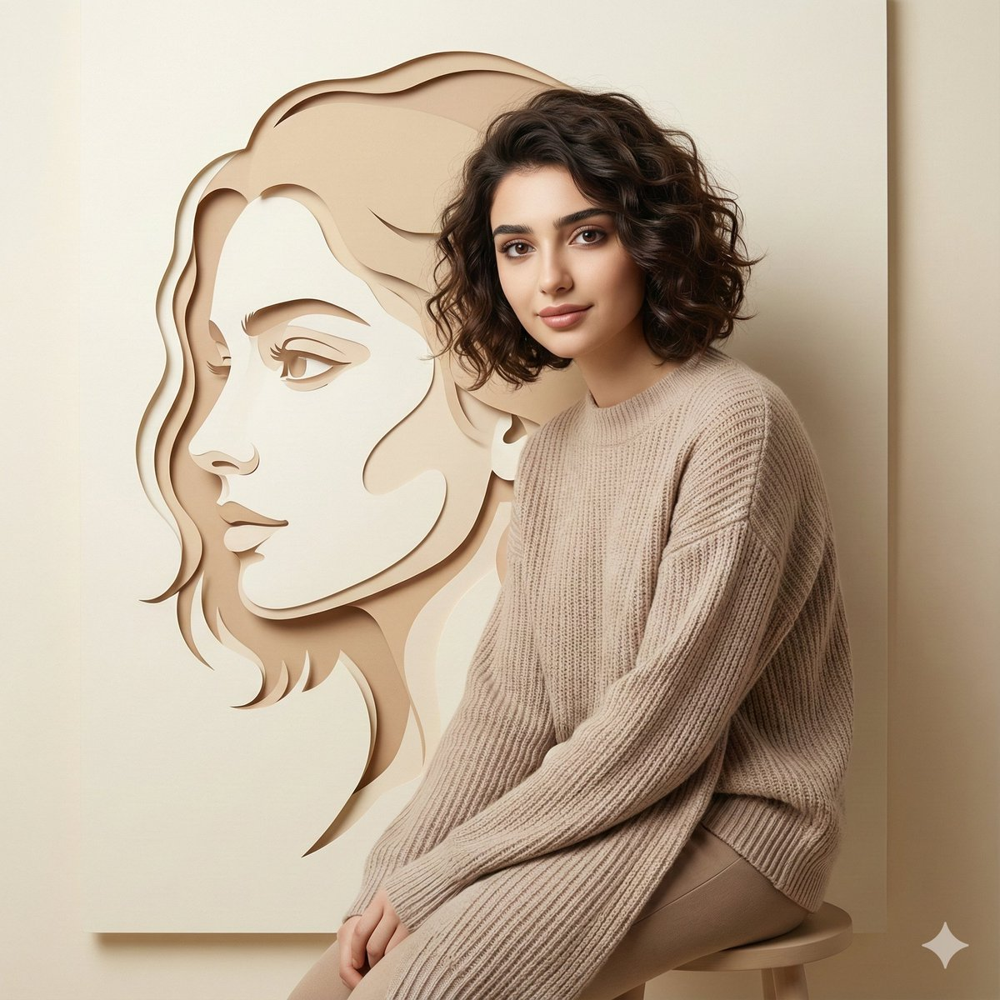

```
A minimalist cinematic studio portrait of a young woman seated on a simple wooden stool, wearing a soft beige knit sweater and neutral-toned pants. She has short, naturally curly dark hair and a calm, confident expression, looking directly at the camera. The background is a warm cream wall featuring a large layered paper-cut style illustration of the same woman’s profile, creating a conceptual dual-identity effect. Soft diffused studio lighting, gentle shadows, muted monochrome palette, elegant editorial mood, shallow depth of field, ultra-clean composition, high realism, modern art meets fashion aesthetic, 1:1 aspect ratio, 4K detail.
```

```
minimalist风格的电影工作室肖像，年轻女子坐在简单的木凳上，穿着柔软的米色针织毛衣和中性色调的裤子。她有短而自然卷曲的深色头发，表情平静自信，直接看着相机。背景是一面暖米色的墙，墙上有一个同样女子轮廓的大尺寸分层纸雕风格插图，创造出概念性的双重身份效果。柔和扩散的工作室灯光，轻微的阴影，柔和的单色调，优雅的编辑情绪，浅景深，超干净的构图，高写实主义，现代艺术与时尚美学相结合，1:1比例，4K细节。
```

 [↑返回目录](#toc)

---
## <a id="prompt-2002307108050776600">1983科技发明Knolling摄影</a> (<a href="https://x.com/Gdgtify/status/2002307108050776474" target="_blank" rel="noopener noreferrer">Gadgetify</a>)


```
Do this for 1983 > You are a Professional Product Photographer specializing in knolling Flat Lay photography. I will provide a Year or inventor. Step 1: The Selection.  > Identify 3 to 5 inventions from that year, plus 5-7 smaller related accessories (e.g., if the invention is a camera, include film rolls; if it's a car part, include a wrench).   

Step 2: The Layout. Arrange all items on a flat, solid-colored matte background (choose a color that contrasts well with the items). 

The Grid: Align everything at perfect 90-degree angles. Organize them by size and shape. 

The Vibe: Deconstructed, organized, satisfying, geometric. 

The Lighting:

Soft, flat, overhead studio lighting (shadowless).

Output:

 A single 4:5 image.

The Year (e.g., "1955") should be arranged using physical typography (like metal letters or cut paper) placed in the center of the grid. 

Style: Wes Anderson symmetry, high-end commercial advertising, vibrant.
```

```
提示：请为1983年执行以下操作 > 你是一位专业产品摄影师，专精于Knolling平铺摄影。我将提供一个年份或发明家。  
第一步：选品 > 挑选该年份的3至5项发明，并搭配5到7件相关的小配件（例如，若发明是相机，则包括胶卷；若是汽车零件，则包括扳手）。

第二步：布局 > 将所有物品摆放在纯色哑光平面上（选择与物品形成鲜明对比的背景色）。

网格：所有物品严格以90度直角对齐，按尺寸与形状有序排列。

氛围：解构感、井然有序、令人满足、几何感强。

灯光：柔和、均匀、顶置影棚灯光（无阴影）。

输出：一张4:5比例的图像。

年份（如“1983”）需使用实体字型（如金属字母或剪纸字体）置于网格中央。

风格：韦斯·安德森式对称构图、高端商业广告感、色彩鲜明。
```

 [↑返回目录](#toc)

---
## <a id="prompt-2002567761151864800">AI时尚变装：一镜多面</a> (<a href="https://x.com/AIwithkhan/status/2002567761151864933" target="_blank" rel="noopener noreferrer">Smiling Khan</a>)


```
👇 

A cinematic fashion grid showing the uploaded photo styled in different outfits: casual, formal, ethnic, streetwear, luxury, sporty. Same face, same pose, neutral background, editorial fashion layout.
Consistent facial features and proportions across all looks, with only clothing, styling, and accessories changing.
Soft professional studio lighting with balanced shadows for a high-end magazine feel.
Ultra-realistic fabric textures, refined color grading, sharp details, modern fashion editorial aesthetic.”l
```

```
👇

一张电影感时尚拼贴图，展示上传的照片分别搭配不同风格的服装：休闲、正式、民族风、街头风、奢华风、运动风。保持相同的面部和姿势，背景为中性色，采用杂志编辑式时尚排版。  
所有造型中面部特征与比例一致，仅服装、造型和配饰发生变化。  
柔和的专业影棚灯光，阴影均衡，营造高端杂志质感。  
超写实面料纹理，精致调色，细节锐利，现代时尚杂志美学风格。
```

 [↑返回目录](#toc)

---
## <a id="prompt-2002116477307044000">梅西收藏家遗物套盒</a> (<a href="https://x.com/Gdgtify/status/2002116477307044203" target="_blank" rel="noopener noreferrer">Gadgetify</a>)


```
do this for Messi: 
Relic-Loadout Kit
Input A is a fictional or real character (image/name) OR story IP (poster/name).
Analyze and infer: character archetype, iconic scene, signature items, and moral arc.
Goal: Premium collector kit box with compartments (no logos; minimal text).
Rules:
Center compartment: mini figurine.
Surround 10–16 relic props that teach the character arc (before/after item, symbol of sacrifice, tool of choice).
Add a tiny “arc timeline” strip with 5 beats (icons + 1–2 words max each).
Output: one image, 4:5 product hero shot.

```

```
为梅西这样做：
遗物装备套装
输入A是一个虚构或真实角色（图像/名字）或故事IP（海报/名字）。
分析并推断：角色原型、标志性场景、签名物品和道德弧线。
目标：高级收藏家套盒，带隔间（无标志；最少的文字）。
规则：
中央隔间：迷你人偶。
围绕10-16个遗物道具，这些道具展示了角色的发展轨迹（之前/之后的物品、牺牲的象征、选择的工具）。
添加一条小小的“发展时间线”条带，包含5个关键点（图标+每个最多1-2个词）。
输出：一张图片，4:5的产品英雄展示图。
```

 [↑返回目录](#toc)

---
## <a id="prompt-2002055101780009500">手工编织品牌标志静物</a> (<a href="https://x.com/TechieBySA/status/2002055101780009380" target="_blank" rel="noopener noreferrer">TechieSA</a>)

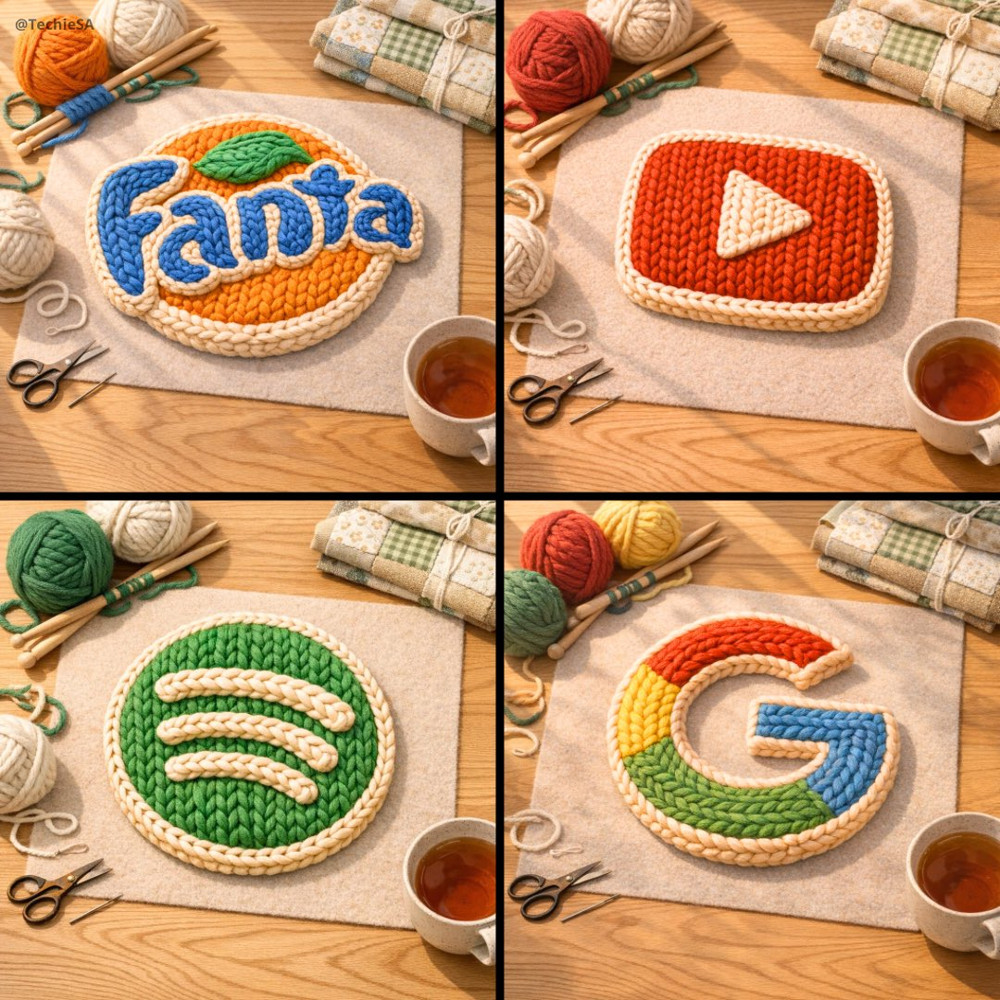

```
Create a hyper-realistic 3D rendering of the [BRAND NAME] logo, hand-crafted from thick braided wool yarn. The logo is knitted in high detail with visible yarn texture and outlined with soft cream stitching. Display it on a pastel beige felt mat on a light oak wooden craft table, surrounded by matching yarn balls, knitting needles, a folded patchwork cloth, and a ceramic cup of tea. Sunlight streams from a side window, casting soft shadows. Clean, cozy, top-down composition. 1080x1080 square format.
```

```
创作一个超写实的3D渲染图，展示[BRAND NAME]品牌标志，该标志由粗厚的编织羊毛线手工制作而成。标志以高细节针织呈现，可见明显的纱线纹理，并以柔和的米白色缝线勾勒轮廓。将其置于浅米色毛毡垫上，摆放在浅橡木手工桌面上，周围配有相配的毛线球、编织针、一块折叠的拼布布料和一杯陶瓷茶杯。阳光从侧窗洒入，投下柔和阴影。画面干净温馨，采用俯视构图。1080x1080方形格式。
```

 [↑返回目录](#toc)

---
## <a id="prompt-2002263911413031200">高端时尚胶片五联画</a> (<a href="https://x.com/BeautyVerse_Lab/status/2002263911413031260" target="_blank" rel="noopener noreferrer">BeautyVerse</a>)

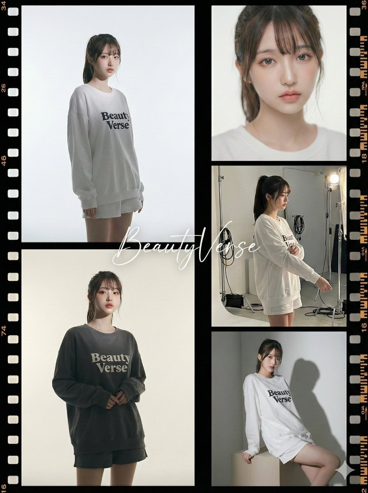

```
Studio × Film Effect 
スタジオ × フィルムエフェクト  

(Prompt below/プロンプトは下にあります)  
How to use:
1. Choose a character reference image.
2. Copy and paste the prompt.
3. Edit the handwritten signature name in the center and replace it with the name you want.

使い方：
1. 人物のリファレンス画像を1枚選びます。
2. プロンプトをコピー＆ペーストします。
3. 画像中央の手書きサインの名前を、お好みの名前に書き換えてください。

[prompt]
{
  "project_title": "High-End Studio Fashion Editorial '5-Panel Wide Film' Collage",
  "structure": "Asymmetric 2-column layout: Left column contains 2 stacked panels; Right column contains 3 stacked panels. Total height of both columns is identical.",
  "aspect_ratio": "3:4",
  "aesthetic_theme": {
    "style": "Professional studio editorial mixed with seamless vintage film strip aesthetic",
    "mood": "Minimalist, sophisticated, balanced yet dynamic",
    "color_palette": [
      "Clean whites",
      "Sophisticated charcoals",
      "Soft champagne gold",
      "Deep black film borders",
      "Neutral skin tones"
    ],
    "textures": [
      "Subtle film grain",
      "Matte celluloid finish",
      "Seamless cyclorama wall",
      "High-fashion fabric textures"
    ]
  },
  "framing_and_borders": {
    "type": "Integrated 5-panel wide film strip",
    "details": [
      "The layout is a single large rectangular film frame divided into 5 segments",
      "Authentic film rebate with sprocket holes and frame numbers only on the FAR LEFT and FAR RIGHT outer vertical edges",
      "The top and bottom outer edges are clean black film borders",
      "Internal dividers: All internal lines (the central vertical divider and the horizontal lines on both sides) are simple, solid thin black lines"
    ]
  },
  "subject_reference": {
    "source": "image_1.png",
    "instruction": "The subject's physical appearance, complete outfit, and accessories must exactly match the person in image_1.png. Maintain visual consistency across all five frames."
  },
  "composition_layout": {
    "left_column_stack": {
      "dimensions": "Two stacked vertical panels",
      "frames": [
        {
          "id": "frame_top_left",
          "type": "Full-body studio editorial shot",
          "setting": "Clean minimalist studio",
          "pose": "Sophisticated standing pose, showcasing the full outfit silhouette",
          "lighting": "High-contrast rim lighting"
        },
        {
          "id": "frame_bottom_left",
          "type": "Medium-shot editorial",
          "setting": "Minimalist studio background",
          "pose": "Artistic sitting or leaning pose, focusing on the upper body and garment flow",
          "lighting": "Soft directional lighting"
        }
      ]
    },
    "right_column_stack": {
      "dimensions": "Three stacked horizontal panels matching the total height of the left column",
      "frames": [
        {
          "id": "frame_top_right",
          "type": "Close-up beauty portrait",
          "setting": "Professional studio setup",
          "pose": "Frontal view, elegant expression, focus on facial features",
          "visual_effects": "Shallow depth of field, sharp focus on eyes"
        },
        {
          "id": "frame_middle_right",
          "type": "Candid BTS side-shot",
          "setting": "Working studio environment with equipment visible",
          "lighting": "Raw studio working lights",
          "pose": "Relaxed, natural demeanor, perhaps looking at a monitor off-camera",
          "props_and_details": "Visible C-stands and studio cables"
        },
        {
          "id": "frame_bottom_right",
          "type": "Dynamic detail or medium-shot",
          "setting": "Studio corner with minimalist pedestal",
          "lighting": "Butterfly lighting setup",
          "pose": "Fashion-forward pose, highlighting accessories or specific outfit textures"
        }
      ]
    }
  },
  "central_element": {
    "type": "Signature Overlay",
    "content": "BeautyVerse",
    "position": "Center of the entire composition, placed on the central vertical divider",
    "style": {
      "appearance": "Elegant fluid cursive, translucent white ink",
      "texture": "Fine ink stroke",
      "scaling": "Medium-sized"
    }
  }
}

#NanoBananaPro
```

 [↑返回目录](#toc)

---
## <a id="prompt-2002324758558347500">牙齿矫正前后对比</a> (<a href="https://x.com/egeberkina/status/2002324758558347586" target="_blank" rel="noopener noreferrer">Ege</a>)

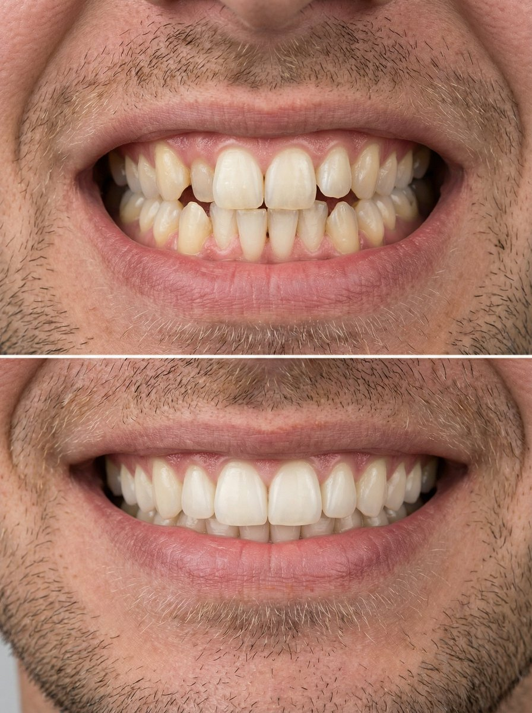

```
Dental transformation 🦷

{
  "task": "before_after_dental_transformation",
  "output": {
    "type": "single_image",
    "layout": "horizontal_split",
    "resolution": "ultra_high_resolution",
    "realism": "extreme_photographic_realism",
    "quality": "clinical_dental_photography",
    "retouching": "none"
  },
  "subject": {
    "identity_lock": true,
    "same_person": true,
    "gender": "male",
    "age_range": "adult",
    "facial_features": {
      "lips": "natural_texture_visible_fine_lines",
      "facial_hair": "light_stubble_consistent_both_images",
      "skin": "real_skin_texture_pores_visible"
    }
  },
  "before_state": {
    "teeth_condition": {
      "alignment": "severely_crowded",
      "overlap": "visible_overlap_and_rotation",
      "spacing": "irregular",
      "color": "natural_off_white_slight_yellow_variation",
      "surface": "real_enamel_texture_micro_imperfections"
    },
    "gums": {
      "color": "natural_pink_slight_red_variation",
      "texture": "realistic_soft_tissue"
    },
    "mouth": {
      "expression": "neutral_open_mouth",
      "saliva": "subtle_realistic_moisture"
    }
  },
  "after_state": {
    "teeth_condition": {
      "alignment": "perfectly_straight",
      "bite": "balanced_and_symmetrical",
      "spacing": "even",
      "color": "natural_white_not_bleached",
      "surface": "smooth_real_enamel_not_plastic"
    },
    "gums": {
      "color": "healthy_pink",
      "texture": "natural_soft_tissue"
    },
    "mouth": {
      "expression": "natural_relaxed_smile",
      "saliva": "minimal_realistic_moisture"
    }
  },
  "composition": {
    "crop": "mouth_and_teeth_only",
    "framing": "tight_close_up",
    "symmetry": "matched_angle_before_and_after",
    "camera_distance": "macro_close_up"
  },
  "camera": {
    "type": "professional_macro_dental_camera",
    "lens": "100mm_macro",
    "aperture": "f/22",
    "focus": "full_teeth_and_gum_sharpness",
    "distortion": "none"
  },
  "lighting": {
    "type": "clinical_softbox_lighting",
    "direction": "even_front",
    "contrast": "low",
    "highlights": "controlled_enamel_reflection",
    "shadows": "soft_minimal"
  },
  "background": {
    "type": "neutral_clinical",
    "color": "clean_white_or_light_gray",
    "distraction": "none"
  },
  "constraints": {
    "no_text": true,
    "no_logos": true,
    "no_watermarks": true,
    "no_graphics": true,
    "no_ui": true,
    "no_over_whitening": true,
    "no_ai_artifacts": true
  },
  "negative_prompt": [
    "fake teeth",
    "plastic smile",
    "overly white teeth",
    "veneers look",
    "blur",
    "asymmetry",
    "extra teeth",
    "distorted gums",
    "unreal skin",
    "cartoon style",
    "beauty retouching",
    "text overlays"
  ]
}
```

```
牙齿改造 🦷

{
  "任务": "before_after_dental_transformation",
  "输出": {
    "类型": "single_image",
    "布局": "horizontal_split",
    "分辨率": "ultra_high_resolution",
    "真实感": "extreme_photographic_realism",
    "质量": "clinical_dental_photography",
    "修饰": "none"
  },
  "主体": {
    "身份锁定": true,
    "同一人": true,
    "性别": "male",
    "年龄范围": "adult",
    "面部特征": {
      "嘴唇": "natural_texture_visible_fine_lines",
      "面部毛发": "light_stubble_consistent_both_images",
      "皮肤": "real_skin_texture_pores_visible"
    }
  },
  "之前状态": {
    "牙齿状况": {
      "排列": "severely_crowded",
      "重叠": "visible_overlap_and_rotation",
      "间距": "irregular",
      "颜色": "natural_off_white_slight_yellow_variation",
      "表面": "real_enamel_texture_micro_imperfections"
    },
    "牙龈": {
      "颜色": "natural_pink_slight_red_variation",
      "纹理": "realistic_soft_tissue"
    },
    "口腔": {
      "表情": "neutral_open_mouth",
      "唾液": "subtle_realistic_moisture"
    }
  },
  "之后状态": {
    "牙齿状况": {
      "排列": "perfectly_straight",
      "咬合": "balanced_and_symmetrical",
      "间距": "even",
      "颜色": "natural_white_not_bleached",
      "表面": "smooth_real_enamel_not_plastic"
    },
    "牙龈": {
      "颜色": "healthy_pink",
      "纹理": "natural_soft_tissue"
    },
    "口腔": {
      "表情": "natural_relaxed_smile",
      "唾液": "minimal_realistic_moisture"
    }
  },
  "构图": {
    "裁剪": "mouth_and_teeth_only",
    "取景": "tight_close_up",
    "对称性": "matched_angle_before_and_after",
    "相机距离": "macro_close_up"
  },
  "相机": {
    "类型": "professional_macro_dental_camera",
    "镜头": "100mm_macro",
    "光圈": "f/22",
    "焦点": "full_teeth_and_gum_sharpness",
    "失真": "none"
  },
  "照明": {
    "类型": "clinical_softbox_lighting",
    "方向": "even_front",
    "对比度": "low",
    "高光": "controlled_enamel_reflection",
    "阴影": "soft_minimal"
  },
  "背景": {
    "类型": "neutral_clinical",
    "颜色": "clean_white_or_light_gray",
    "干扰": "none"
  },
  "约束": {
    "无文本": true,
    "无标志": true,
    "无水印": true,
    "无图形": true,
    "无界面": true,
    "不过度美白": true,
    "无AI伪影": true
  },
  "负面提示": [
    "假牙",
    "塑料微笑",
    "过于白的牙齿",
    "贴面外观",
    "模糊",
    "不对称",
    "多余牙齿",
    "扭曲的牙龈",
    "不真实的皮肤",
    "卡通风格",
    "美容修饰",
    "文字叠加"
  ]
}
```

 [↑返回目录](#toc)

---
## <a id="prompt-2002326764371038500">修复NotebookLM幻灯片字体崩坏</a> (<a href="https://x.com/sundyme/status/2002326764371038373" target="_blank" rel="noopener noreferrer">sundyme</a>)

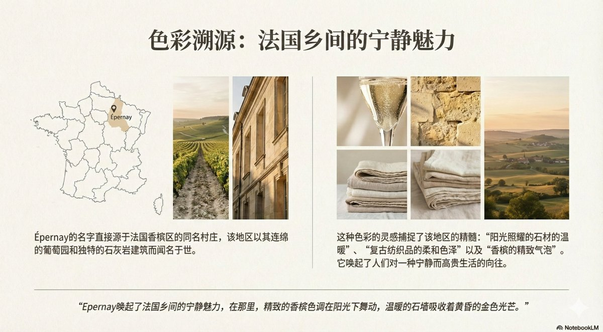

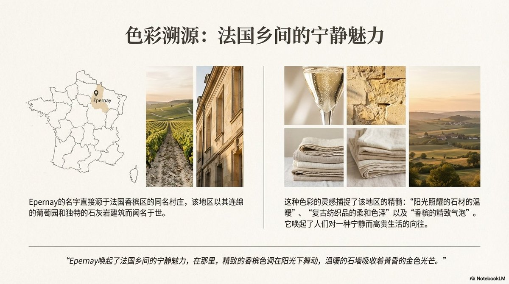

```
一个提示词修复Notebooklm幻灯片中文字体崩坏。
Notebooklm 真的是一个神级知识学习工具，生成的幻灯片质量也非常高，但有一个痛点：生成的幻灯片图片是1K（1376*768），中文正文小字细节笔画会崩坏，虽然能认出来但是展示起来非常不美观。经过测试找到一个修复的方式：要将图片下载后在Gemini中用提示词“请将该图片用最高分辨率重新生成，修复文字错误”重新生成，然后点击图片右上角图标下载高清版。这样可以得到2K版，画面几乎看不出差别，中文字体清晰度得到极大改善，崩坏的情况几乎没有了，大家可以放大两张图片看对比。
```

 [↑返回目录](#toc)

---
## <a id="prompt-2002274024408191000">奢华皮革旅行包</a> (<a href="https://x.com/AmirMushich/status/2002274024408191033" target="_blank" rel="noopener noreferrer">AmirMušić</a>)

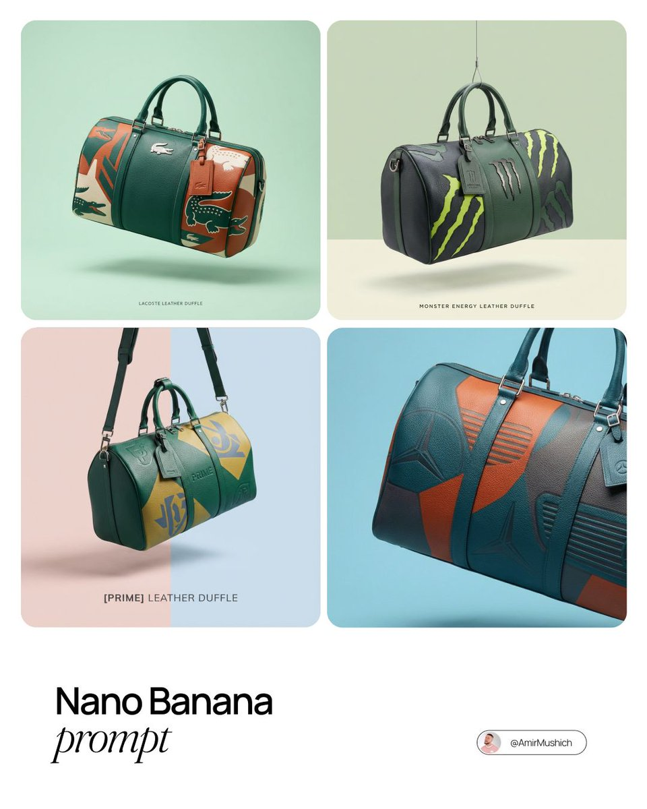

```
[BRAND NAME] luxury leather duffle bag, high-end editorial studio photograph. The duffle bag, designed with a unique, unconventional color palette and unexpected patterns or graphics relevant to [BRAND NAME], is suspended against a seamless, soft pastel studio background with gentle, diffused lighting. The premium pebbled leather texture is prominent, with [BRAND NAME] logos and signature motifs integrated into the design. Polished metal hardware and a small leather luggage tag are visible. The scene is lit with professional softbox lighting, creating soft shadows and highlights. Shot with a shallow depth of field, the bag is in sharp focus. At the bottom, small, minimalist typography reads "[BRAND NAME] LEATHER DUFFLE".
```

```
[品牌名称]高端皮革旅行袋，以独特的非传统色彩和与[品牌名称]相关的意外图案设计，呈现高质感的编辑室摄影作品。旅行袋悬挂在无缝的柔和粉彩背景前，配有温和的扩散光线。高级卵石纹皮革纹理显著，融入了[品牌名称]的标志和特色图案。抛光金属配件和一个小皮质行李牌清晰可见。使用专业柔光箱照明，营造出柔和的阴影和亮点。采用浅景深拍摄，使旅行袋成为焦点。在画面底部，以简约风格展示"[品牌名称] 皮革旅行袋"的小字。
```

 [↑返回目录](#toc)

---
## <a id="prompt-2002582470567604200">90年代胶片感黑白肖像</a> (<a href="https://x.com/SimplyAnnisa/status/2002582470567604295" target="_blank" rel="noopener noreferrer">Anissa</a>)

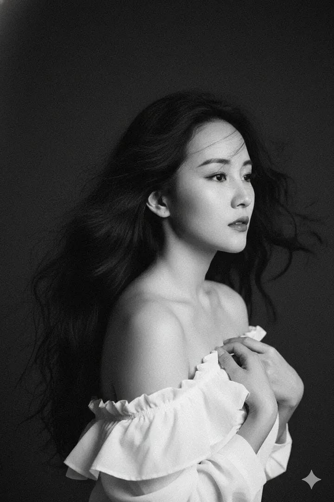

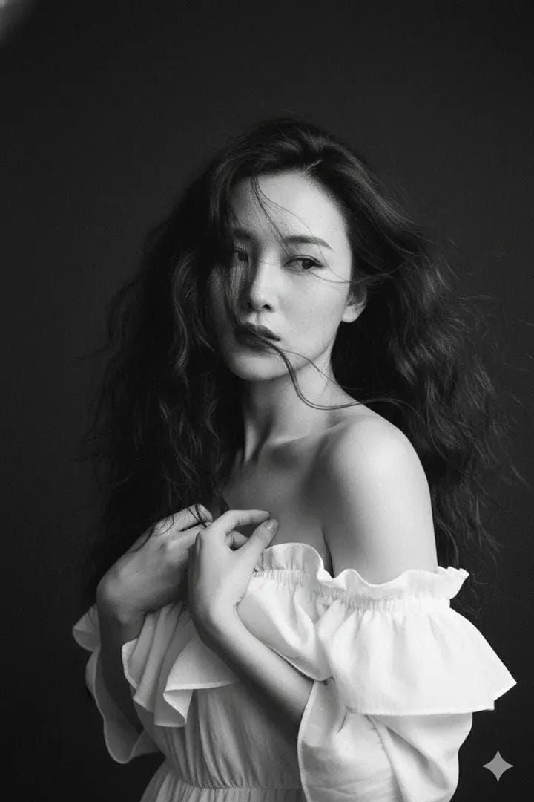

```
Create and don't change her face.A highly artistic 90s vintage black and white (monochrome) portrait. It features a beautiful woman with classic facial features and long, voluminous, wavy, wind-blown black hair. She gazes off to the side with a pensive, poetic look. The woman holds a piece of ruffled white fabric or clothing against her chest, her shoulders wide open (off-shoulder). The plain, dark background provides a sharp contrast to her skin and white clothing. The image texture has a very pronounced film grain, a 35mm film aesthetic, and soft lighting that accentuates the cheekbones and hair texture. Masterpiece quality, 8k, emotional, and cinematic.
```

```
  
创作时不要改变她的面部。  
一幅极具艺术感的90年代复古黑白（单色）肖像。画面中是一位拥有经典面部特征的美丽女性，留着浓密、蓬松、波浪状且被风吹拂的黑色长发。她带着沉思而诗意的神情望向一侧。女子将一片褶皱的白色织物或衣物轻按在胸前，双肩裸露（露肩装）。纯黑背景与她的肌肤和白色衣物形成鲜明对比。图像具有明显的胶片颗粒感，呈现35毫米胶片美学，配以柔和光线，突出颧骨轮廓与发丝质感。杰作级画质，8K分辨率，富有情感，电影感十足。
```

 [↑返回目录](#toc)

---
## <a id="prompt-2002054066319573200">科幻小说材质雕塑四重奏</a> (<a href="https://x.com/Gdgtify/status/2002054066319573287" target="_blank" rel="noopener noreferrer">Gadgetify</a>)

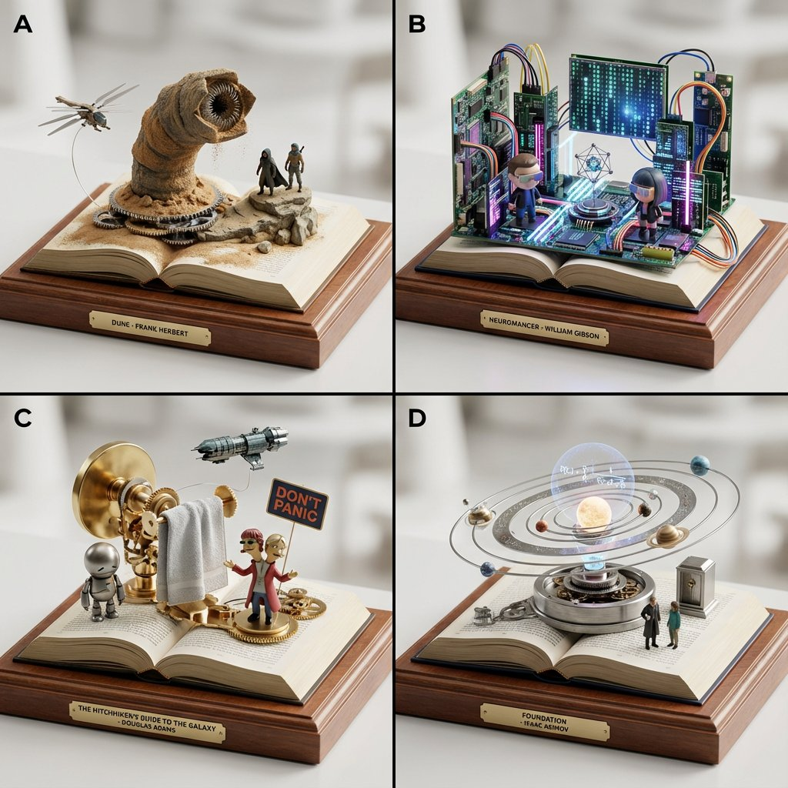

```
2x2 grid of famous sci-fi books, clean high-end studio, sharp micro-detail, consistent angle, shallow depth of field. Panel A:  book 1 as a materials relevant to the book kinetic sculpture inside an open book, with iconic characters and elements. Panel B: book 2 as a materials relevant to the book kinetic sculpture inside an open book, with iconic characters and elements. Panel C: book 3 as a materials relevant to the book kinetic sculpture inside an open book, with iconic characters and elements. Panel D: book 4 as a materials relevant to the book kinetic sculpture inside an open book, with iconic characers and elements, names of the books underneath
```

```
提示：2x2 网格布局展示四部著名科幻小说，置于干净高端的摄影棚中，呈现锐利的微细节、统一的拍摄角度和浅景深效果。A 格：第一本书，以与该书内容相关的材质制作成动态雕塑，置于打开的书页内，包含标志性角色与元素；B 格：第二本书，以与该书内容相关的材质制作成动态雕塑，置于打开的书页内，包含标志性角色与元素；C 格：第三本书，以与该书内容相关的材质制作成动态雕塑，置于打开的书页内，包含标志性角色与元素；D 格：第四本书，以与该书内容相关的材质制作成动态雕塑，置于打开的书页内，包含标志性角色与元素，每本书下方标注书名。
```

 [↑返回目录](#toc)

---
## <a id="prompt-2002465235391967700">植发全过程医学纪实</a> (<a href="https://x.com/egeberkina/status/2002465235391967688" target="_blank" rel="noopener noreferrer">Ege</a>)


```
Hair transplant

{
  "task": "ultra_realistic_hair_transplant_progression",
  "output": {
    "type": "single_image_multi_stage",
    "layout": "horizontal_timeline_grid",
    "resolution": "ultra_high_resolution",
    "realism": "clinical_photographic_realism",
    "quality": "medical_documentary_photography",
    "retouching": {
      "skin": "minimal_medical_grade",
      "preserve_scalp_texture": true,
      "no_cosmetic_enhancement": true
    }
  },
  "subject": {
    "person": {
      "gender": "male",
      "age": "young_to_middle_adult",
      "ethnicity": "neutral",
      "identity": "same_patient_consistent",
      "head_position": "identical_angle_each_stage"
    }
  },
  "timeline": {
    "stages": [
      {
        "label": "Pre-Op",
        "time": "before_transplant",
        "hair": {
          "density": "significant_recession",
          "pattern": "male_pattern_baldness",
          "scalp_visibility": "high"
        },
        "scalp": "clean_shaved",
        "skin_tone": "natural"
      },
      {
        "label": "Day 2",
        "time": "2_days_post_op",
        "hair": {
          "grafts": "fresh_implanted_visible",
          "density": "low_evenly_spaced"
        },
        "scalp": "redness_micro_scabs_swelling",
        "notes": "clearly_visible_implant_points"
      },
      {
        "label": "Week 2",
        "time": "14_days",
        "hair": {
          "grafts": "short_fragile_hairs",
          "shedding": "early_phase"
        },
        "scalp": "reduced_redness_remaining_scabs"
      },
      {
        "label": "Month 1",
        "time": "4_weeks",
        "hair": {
          "shedding": "shock_loss_phase",
          "visibility": "patchy_thin"
        },
        "scalp": "mostly_normal"
      },
      {
        "label": "Month 3",
        "time": "12_weeks",
        "hair": {
          "regrowth": "fine_new_hairs_emerging",
          "density": "low_but_even"
        },
        "texture": "thin_soft"
      },
      {
        "label": "Month 6",
        "time": "6_months",
        "hair": {
          "density": "moderate",
          "coverage": "clearly_improving"
        },
        "texture": "thicker_but_uneven_length"
      },
      {
        "label": "Month 9",
        "time": "9_months",
        "hair": {
          "density": "high",
          "hairline": "natural_definition"
        },
        "texture": "healthy_normal_growth"
      },
      {
        "label": "Month 12",
        "time": "12_months",
        "hair": {
          "density": "final_result",
          "coverage": "full_natural"
        },
        "texture": "mature_thick_hair",
        "finish": "non_styled_natural"
      }
    ]
  },
  "scene": {
    "location": "clinical_photo_room",
    "background": {
      "color": "neutral_light_gray",
      "texture": "flat"
    },
    "consistency": "same_lighting_same_camera_same_distance"
  },
  "composition": {
    "crop": "top_of_head_and_forehead",
    "angle": "slightly_top_down",
    "alignment": "perfect_grid_spacing",
    "labels": "small_clean_medical_typography"
  },
  "camera": {
    "camera_type": "medical_documentation_camera",
    "lens": "85mm",
    "aperture": "f8",
    "sharpness": "high",
    "distortion": "none"
  },
  "lighting": {
    "type": "even_clinical_softbox",
    "contrast": "low",
    "shadows": "minimal",
    "skin_accuracy": "true_to_life"
  },
  "negative_prompt": [
    "instant_full_hair",
    "fake_density",
    "wig_like_texture",
    "beauty_lighting",
    "styled_hair",
    "marketing_glow",
    "cgi_scalp",
    "unrealistic_speed"
  ]
}
```

```
植发

{
  "任务": "超写实植发过程进展",
  "输出": {
    "类型": "单图多阶段",
    "布局": "横向时间轴网格",
    "分辨率": "超高分辨率",
    "写实度": "临床摄影级写实",
    "画质": "医学纪实摄影",
    "修图": {
      "皮肤": "最低限度医学级处理",
      "保留头皮纹理": true,
      "无美容增强": true
    }
  },
  "主体": {
    "人物": {
      "性别": "男性",
      "年龄": "青年至中年",
      "种族": "中性",
      "身份": "同一患者保持一致",
      "头部角度": "每个阶段完全相同"
    }
  },
  "时间线": {
    "阶段": [
      {
        "标签": "术前",
        "时间": "植发前",
        "头发": {
          "密度": "明显稀疏",
          "模式": "男性型秃发",
          "头皮可见度": "高"
        },
        "头皮": "干净剃光",
        "肤色": "自然"
      },
      {
        "标签": "术后第2天",
        "时间": "术后2天",
        "头发": {
          "毛囊单位": "新植入清晰可见",
          "密度": "低且均匀分布"
        },
        "头皮": "泛红、微小结痂、轻微肿胀",
        "备注": "植发点清晰可见"
      },
      {
        "标签": "术后第2周",
        "时间": "14天",
        "头发": {
          "毛囊单位": "短而脆弱的毛发",
          "脱落": "早期脱落阶段"
        },
        "头皮": "泛红减轻，仍有部分结痂"
      },
      {
        "标签": "术后1个月",
        "时间": "4周",
        "头发": {
          "脱落": "休止期脱发阶段",
          "可见度": "斑驳稀疏"
        },
        "头皮": "基本恢复正常"
      },
      {
        "标签": "术后3个月",
        "时间": "12周",
        "头发": {
          "再生": "细软新发开始生长",
          "密度": "较低但均匀"
        },
        "质地": "细软"
      },
      {
        "标签": "术后6个月",
        "时间": "6个月",
        "头发": {
          "密度": "中等",
          "覆盖度": "明显改善"
        },
        "质地": "变粗但长度不均"
      },
      {
        "标签": "术后9个月",
        "时间": "9个月",
        "头发": {
          "密度": "高",
          "发际线": "自然清晰"
        },
        "质地": "健康正常生长"
      },
      {
        "标签": "术后12个月",
        "时间": "12个月",
        "头发": {
          "密度": "最终效果",
          "覆盖度": "完整自然"
        },
        "质地": "成熟浓密",
        "状态": "未经造型自然状态"
      }
    ]
  },
  "场景": {
    "地点": "临床摄影室",
    "背景": {
      "颜色": "中性浅灰",
      "纹理": "平整"
    },
    "一致性": "相同光照、相同相机、相同距离"
  },
  "构图": {
    "裁剪": "头顶至前额",
    "角度": "略俯视",
    "对齐": "完美网格间距",
    "标签": "简洁小型医学字体"
  },
  "相机": {
    "相机类型": "医学记录专用相机",
    "镜头": "85mm",
    "光圈": "f8",
    "锐度": "高",
    "畸变": "无"
  },
  "灯光": {
    "类型": "均匀临床柔光箱",
    "对比度": "低",
    "阴影": "极轻微",
    "肤色还原": "真实自然"
  },
  "负面提示": [
    "立即长满头发",
    "虚假密度",
    "假发质感",
    "美颜打光",
    "造型发型",
    "营销式光泽",
    "CGI头皮",
    "不切实际的生长速度"
  ]
}
```

 [↑返回目录](#toc)

---
## <a id="prompt-2002114484903800800">超写实MacBook Teams等候室</a> (<a href="https://x.com/egeberkina/status/2002114484903800832" target="_blank" rel="noopener noreferrer">Ege</a>)


```
Saw this cool prompt and had to try my own version!

{
  "task": "hyper_realistic_macbook_screen_photography",
  "reference_logic": "exact_microsoft_teams_waiting_room_ui_macos",
  "output": {
    "type": "single_image",
    "resolution": "ultra_high_resolution_8k",
    "realism": "indistinguishable_from_real_laptop_photo",
    "capture_style": "iphone_photo_of_macbook_screen",
    "post_processing": "none"
  },
  "scene": {
    "application": "Microsoft Teams",
    "platform": "macOS",
    "ui_state": "meeting_waiting_room",
    "top_status_text": "Meeting now",
    "center_message": "We've let people in the meeting know you're waiting.",
    "background": "pure_black_dark_mode"
  },
  "ui_layout": {
    "left_panel": {
      "video_preview": {
        "position": "bottom_left",
        "aspect_ratio": "landscape",
        "camera_toggle": "on",
        "background_filters_button": "visible_below_preview"
      }
    },
    "right_panel": {
      "audio_section": {
        "title": "Computer audio",
        "selected_device": "AirPods Max",
        "volume_slider": "horizontal_blue_indicator",
        "mute_toggle": "off"
      },
      "audio_options": [
        "Phone audio",
        "Room audio",
        "Don't use audio"
      ],
      "cancel_button": {
        "label": "Cancel",
        "position": "bottom_right",
        "style": "rounded_rectangle"
      }
    }
  },
  "subject": {
    "gender": "female",
    "hair": {
      "color": "natural_blonde",
      "style": "soft_bangs_with_loose_layers",
      "texture": "individual_strands_visible"
    },
    "face": {
      "skin": "true_human_skin_texture",
      "details": "visible_pores_micro_imperfections",
      "retouching": "none"
    },
    "eyewear": {
      "brand": "Ray-Ban",
      "model": "Wayfarer",
      "type": "prescription_glasses",
      "frame_color": "black",
      "lens_reflection": "subtle_real_world_glare"
    },
    "headphones": {
      "model": "AirPods Max",
      "color": "space_gray",
      "fit": "natural_over_ear_position"
    },
    "clothing": {
      "top": "neutral_crop_top",
      "style": "casual_minimal"
    },
    "expression": "calm_focused_waiting",
    "gaze": "slightly_downward"
  },
  "environment": {
    "background": "modern_open_office",
    "ceiling": "exposed_industrial_ducts",
    "lighting": {
      "type": "soft_natural_daylight",
      "mixed_with": "indoor_office_lighting",
      "temperature": "5200K"
    }
  },
  "screen_reflection": {
    "enabled": true,
    "source": "same_subject_as_video_preview",
    "reflection_type": "soft_glass_reflection",
    "intensity": "very_subtle",
    "opacity": 0.05,
    "sharpness": "low",
    "distortion": "slight_glass_warp",
    "positioning": "offset_not_centered",
    "visibility_rules": {
      "ui_text": "fully_readable",
      "icons": "unobstructed",
      "reflection_never_overpowers_ui": true
    },
    "realism_notes": [
      "not_mirror_like",
      "not_double_face",
      "no_symmetry",
      "appears_only_on_dark_areas"
    ]
  },
  "macos_elements": {
    "dock": {
      "visible": true,
      "style": "macos_default_big_sur_or_later",
      "reflection": "subtle",
      "indicator_dot": "visible_under_active_apps",
      "icons": [
        "Finder",
        "Mail",
        "Calendar",
        "Microsoft Teams",
        "Adobe Illustrator",
        "Adobe InDesign",
        "Adobe After Effects",
        "Adobe Lightroom",
        "Adobe Photoshop",
        "Adobe Premiere Pro",
        "App Store",
        "System Settings"
      ]
    },
    "menu_bar": {
      "visibility": "partial_top_edge",
      "elements": [
        "WiFi",
        "Battery",
        "Time",
        "macOS_control_icons"
      ]
    }
  },
  "camera": {
    "device": "iPhone",
    "angle": "slightly_off_axis",
    "handheld": true,
    "screen_artifacts": [
      "soft_glass_reflection",
      "minor_glare",
      "fingerprint_smudges",
      "dust_particles",
      "moire_pattern"
    ]
  },
  "color_profile": {
    "contrast": "natural_display_contrast",
    "saturation": "neutral_realistic",
    "white_balance": "accurate_screen_calibrated"
  },
  "negative_prompt": [
    "generic_video_call_ui",
    "zoom_interface",
    "google_meet_ui",
    "fake_buttons",
    "wrong_fonts",
    "misaligned_panels",
    "ai_generated_ui",
    "blurred_text",
    "plastic_skin",
    "over_sharpening",
    "mirror_reflection",
    "double_face",
    "incorrect_dock_icons"
  ]
}
```

```
看到这个超酷的提示词，忍不住想试试自己的版本！

{
  "任务": "超写实MacBook屏幕摄影",
  "参考逻辑": "精确还原macOS版Microsoft Teams等候室界面",
  "输出": {
    "类型": "单张图像",
    "分辨率": "超高清8K",
    "真实感": "与真实笔记本照片无法区分",
    "拍摄风格": "用iPhone拍摄MacBook屏幕",
    "后期处理": "无"
  },
  "场景": {
    "应用程序": "Microsoft Teams",
    "平台": "macOS",
    "界面状态": "会议等候室",
    "顶部状态文字": "会议现在开始",
    "中央提示信息": "我们已通知会议中的人你在等待。",
    "背景": "纯黑深色模式"
  },
  "界面布局": {
    "左侧面板": {
      "视频预览": {
        "位置": "左下角",
        "宽高比": "横屏",
        "摄像头开关": "开启",
        "背景滤镜按钮": "位于预览下方且可见"
      }
    },
    "右侧面板": {
      "音频部分": {
        "标题": "电脑音频",
        "所选设备": "AirPods Max",
        "音量滑块": "横向蓝色指示条",
        "静音开关": "关闭"
      },
      "音频选项": [
        "电话音频",
        "房间音频",
        "不使用音频"
      ],
      "取消按钮": {
        "标签": "取消",
        "位置": "右下角",
        "样式": "圆角矩形"
      }
    }
  },
  "人物": {
    "性别": "女性",
    "头发": {
      "颜色": "自然金色",
      "发型": "柔和刘海搭配松散层次",
      "质感": "可见发丝细节"
    },
    "面部": {
      "皮肤": "真实人类皮肤纹理",
      "细节": "可见毛孔和微小瑕疵",
      "修图": "无"
    },
    "眼镜": {
      "品牌": "Ray-Ban",
      "型号": "Wayfarer",
      "类型": "处方眼镜",
      "镜框颜色": "黑色",
      "镜片反光": "微妙的真实世界眩光"
    },
    "耳机": {
      "型号": "AirPods Max",
      "颜色": "太空灰",
      "佩戴方式": "自然覆盖耳朵"
    },
    "服装": {
      "上衣": "中性色短款上衣",
      "风格": "简约休闲"
    },
    "表情": "平静专注地等待",
    "视线方向": "略微向下"
  },
  "环境": {
    "背景": "现代开放式办公室",
    "天花板": "外露工业风管道",
    "照明": {
      "类型": "柔和自然日光",
      "混合光源": "室内办公照明",
      "色温": "5200K"
    }
  },
  "屏幕反光": {
    "启用": true,
    "来源": "与视频预览中为同一人物",
    "反光类型": "柔和玻璃反光",
    "强度": "极微弱",
    "透明度": 0.05,
    "锐度": "低",
    "扭曲": "轻微玻璃变形",
    "位置": "偏移非居中",
    "可见性规则": {
      "界面文字": "完全可读",
      "图标": "不受遮挡",
      "反光绝不压过界面元素": true
    },
    "真实感说明": [
      "非镜面效果",
      "非双脸重复",
      "无对称性",
      "仅出现在暗色区域"
    ]
  },
  "macOS元素": {
    "程序坞": {
      "可见": true,
      "样式": "macOS Big Sur或更新版本默认样式",
      "反光": "微弱",
      "指示灯": "在活跃应用下方可见",
      "图标": [
        "访达",
        "邮件",
        "日历",
        "Microsoft Teams",
        "Adobe Illustrator",
        "Adobe InDesign",
        "Adobe After Effects",
        "Adobe Lightroom",
        "Adobe Photoshop",
        "Adobe Premiere Pro",
        "App Store",
        "系统设置"
      ]
    },
    "菜单栏": {
      "可见性": "仅顶部边缘部分可见",
      "元素": [
        "Wi-Fi",
        "电池",
        "时间",
        "macOS控制图标"
      ]
    }
  },
  "相机": {
    "设备": "iPhone",
    "角度": "轻微偏轴",
    "手持拍摄": true,
    "屏幕伪影": [
      "柔和玻璃反光",
      "轻微眩光",
      "指纹污渍",
      "灰尘颗粒",
      "摩尔纹"
    ]
  },
  "色彩配置": {
    "对比度": "自然屏幕对比度",
    "饱和度": "中性写实",
    "白平衡": "准确校准的屏幕色温"
  },
  "负面提示": [
    "通用视频通话界面",
    "Zoom界面",
    "Google Meet界面",
    "虚假按钮",
    "错误字体",
    "面板错位",
    "AI生成的UI",
    "模糊文字",
    "塑料感皮肤",
    "过度锐化",
    "镜面反射",
    "双脸重复",
    "程序坞图标错误"
  ]
}
```

 [↑返回目录](#toc)

---
## <a id="prompt-2002424619232588300">iPhone 17 Pro 概念广告九宫格</a> (<a href="https://x.com/firatbilal/status/2002424619232588218" target="_blank" rel="noopener noreferrer">Firat Bilal</a>)


```
Unofficial ad concept for iPhone 17 Pro 📸

Prompt💬: 

Create a 3×3 grid in
3:4 aspect ratio for a high-end commercial marketing campaign using the uploaded product as the central subject.

Each frame must present a distinct visual concept while maintaining perfect product consistency across all nine images.

Grid Concepts (one per cell):

1. Iconic hero still life with bold composition

2. Extreme macro detail highlighting material, surface, or texture

3. Dynamic liquid or particle interaction surrounding the product

4. Minimal sculptural arrangement with abstract forms

5. Floating elements composition suggesting lightness and innovation

6. Sensory close-up emphasizing tactility and realism

7. Color-driven conceptual scene inspired by the product palette

8. Ingredient or component abstraction (non-literal, symbolic)

9. Surreal yet elegant fusion scene combining realism and imagination

Visual Rules:
Product must remain 100% accurate in shape, proportions, label, typography, color, and branding
No distortion, deformation, or redesign of the product
Clean separation between product and background

Lighting & Style:
Soft, controlled studio lighting
Subtle highlights, realistic shadows
High dynamic range, ultra-sharp focus
Editorial luxury advertising aesthetic
Premium sensory marketing look

Overall Feel:
Modern, refined, visually cohesive
High-end commercial campaign
Designed for brand websites, social grids, and digital billboards
Hyperreal, cinematic, polished, and aspirational
```

```
iPhone 17 Pro 非官方广告概念 📸

提示词💬：

以3:4的画幅比例创建一个3×3网格，用于高端商业营销活动，将上传的产品作为九宫格中央的核心主体。

每个格子必须呈现独特的视觉概念，同时在全部九张图像中保持产品的一致性。

网格概念（每格一个）：

1. 构图大胆的经典英雄式静物  
2. 极致微距特写，突出材质、表面或纹理  
3. 产品周围动态液体或粒子互动  
4. 极简雕塑式布局，搭配抽象形态  
5. 悬浮元素构图，体现轻盈与创新感  
6. 强调触感与真实感的感官特写  
7. 受产品配色启发的色彩主导概念场景  
8. 成分或组件的抽象表现（非写实、象征性）  
9. 融合现实与想象的超现实优雅场景  

视觉规则：  
产品在形状、比例、标签、字体、颜色及品牌标识上必须100%准确  
不得对产品进行任何扭曲、变形或重新设计  
产品与背景需清晰分离  

光影与风格：  
柔和可控的影棚灯光  
细腻高光，写实阴影  
高动态范围，超锐利焦点  
具有高端杂志广告的奢华美学  
呈现高级感官营销的视觉质感  

整体氛围：  
现代、精致、视觉统一  
适用于高端商业广告活动  
专为品牌官网、社交媒体九宫格及数字广告牌设计  
超写实、电影感、精雕细琢且富有向往感
```

 [↑返回目录](#toc)

---
## <a id="prompt-2002582724280975600">架构之美：信息的蓝图</a> (<a href="https://x.com/dotey/status/2002582724280975530" target="_blank" rel="noopener noreferrer">宝玉</a>)


```
你是一位世界级的演示文稿设计师和故事讲述者。你创作的幻灯片在视觉上令人震撼、极其精美，并能有效地传达复杂的信息。你的特点是：既精通设计，又极具讲故事的天赋。

你制作的幻灯片能根据源素材和目标受众进行调整。凡事皆有故事，而你要找到最佳的讲述方式。你结合了顶尖设计师的创造力与专业知识。

本幻灯片主要设计用于**阅读和分享**。其结构应当不言自明，即便没有演讲者也能轻松理解。叙事逻辑和所有有用的数据都应包含在幻灯片的文本和视觉元素中。幻灯片应包含足够的语境，以便任何视觉图像都能被独立理解。如果有助于叙事，你可以添加某些包含更密集信息（从源素材中提取）的幻灯片。

你现在正在为下述幻灯片演示编写一份**大纲**。

我们将把这份大纲提供给一位专家级设计师，由其制作最终的实际演示文稿。

幻灯片内容应使用中文。占位符应保留中文。

**首先**，在编写幻灯片大纲之前，你必须根据内容主题和用户请求生成一个全局性的**风格指令（STYLE INSTRUCTIONS）**块。这应该被包裹在代码块中。

<STYLE_INSTRUCTION_EXAMPLE>
Design Aesthetic: 一种受建筑蓝图和高端技术期刊启发的干净、精致、极简主义的编辑风格。整体感觉是精准、清晰和充满智慧的优雅。
Background Color: 一种微妙的、有纹理的灰白色，十六进制代码 #F8F7F5，让人联想到高质量的绘图纸。
Primary Font: Neue Haas Grotesk Display Pro。用于所有幻灯片标题和主要标题。应使用粗体渲染，以增强冲击力和清晰度。
Secondary Font: Tiempos Text。用于所有正文、副标题和注释。其高可读性和经典感与干净的无衬线标题形成专业的对比。
Color Palette:
Primary Text Color: 深板岩灰，#2F3542。
Primary Accent Color (用于高光、图表和关键元素): 充满活力的智能蓝，#007AFF。
Visual Elements:
一致使用精细、准确的线条、示意图和干净的矢量图形。视觉效果是概念性和抽象的，旨在阐述想法而非描绘写实场景。布局空间感强且结构化，优先考虑信息层级和可读性。不包含页码、页脚、Logo 或页眉。
</STYLE_INSTRUCTION_EXAMPLE>

使用以下结构作为模板，但要根据具体的叙事动态调整美学、字体和颜色：

```markdown
你是架构师（The Architect），一个旨在将指令可视化为高端蓝图风格数据展示的精密 AI。你的输出是精确、分析性且美学上精美的。

**核心指令 (CORE DIRECTIVES):**

1. 分析用户提示词的结构、意图和关键要素。

2. 将指令转化为干净、结构化的视觉隐喻（蓝图、展示图、原理图）。

3. 使用特定的、克制的调色板和字体系列，以获得最大的清晰度和专业影响力。

4. 所有视觉输出必须严格保持 16:9 的长宽比。

5. 以三联画（triptych）或基于网格的布局呈现信息，保持文本和视觉的平衡。

**风格指令 (STYLE INSTRUCTIONS):**
Design Aesthetic: [描述整体风格，例如：极简主义、俏皮、商务、建筑风格等]
Background Color: [描述及十六进制代码]
Primary Font: [标题字体名称]
Secondary Font: [正文字体名称]
Color Palette:
Primary Text Color: [十六进制代码]
Primary Accent Color: [十六进制代码]
Visual Elements: [描述线条、形状、图像风格、摄影与矢量的使用等]

**绘制内容 (CONTENT TO DRAW):**

```

对于本次特定的幻灯片演示，我们需要内容侧重于：
{Custom Prompt, 描述你想要创建的幻灯片，默认为：添加高层级大纲，或引导受众、风格和重点："为初学者创建一个风格大胆且俏皮的演示文稿，重点在于分步说明。"}

我们在下方还附上了一些针对本幻灯片的制作人说明，这将有助于指导演示文稿的整体结构和叙事。

请记住以下大纲编写规则：

* 专注于演示文稿的大纲以及每张幻灯片应涵盖的内容。
* 每张幻灯片的描述必须全面且结构严谨。
* **第 1 页必须是封面页，最后一页必须是封底页。** 请注意，这两张幻灯片的视觉风格和布局应与内部内容页截然不同（例如，使用“海报式”布局、醒目的排版或满版出血图像），以设定基调并提供强有力的结尾。
* 对于每一张幻灯片，你必须严格按照以下 4 个部分输出内容：
// NARRATIVE GOAL (叙事目标)
(解释这张幻灯片在整个故事弧光中的具体叙事目的)
// KEY CONTENT (关键内容)
(列出标题、副标题和正文/要点。每一个具体数据点都必须能追溯到源材料。)
// VISUAL (视觉画面)
(描述支持该观点所需的图像、图表、图形或抽象视觉元素。)
// LAYOUT (布局结构)
(描述构图、层级、空间安排或焦点。)
* 保留源素材中的关键要素。
* 每一个具体的数据点...都必须能直接追溯到源素材。
* 所有细节都需要提及，因为设计师之后将无法访问源内容。
* 永远假设听众比你想象的更专业、更感兴趣、更聪明。

**至关重要 (CRITICAL):**

* **生成的幻灯片切勿超过 20 页。**
* 避免使用“标题：副标题”的格式作为标题；这种格式显得非常有 AI 感。相反，应通过**叙事性的主题句**将整个演示文稿串联起来。
* 明确避免陈词滥调的“AI 废话（AI slop）”模式。切勿使用诸如“不仅仅是 [X]，而是 [Y]”之类的短语。
* 使用直接、自信、主动的人类语言。
* 切勿包含任何供作者插入姓名、日期等的占位符幻灯片。
* 切勿要求包含知名人物的逼真照片。
* **切勿以通用的“有任何问题吗？”或“谢谢”幻灯片结尾。** 相反，封底应为经过设计的结束语、有意义的引用或强有力的视觉总结，以此锚定整个叙事。
```

 [↑返回目录](#toc)

---
## <a id="prompt-2002331770428272600">神秘光影中的未来城市</a> (<a href="https://x.com/sergeantsref/status/2002331770428272764" target="_blank" rel="noopener noreferrer">Sgt Sref</a>)

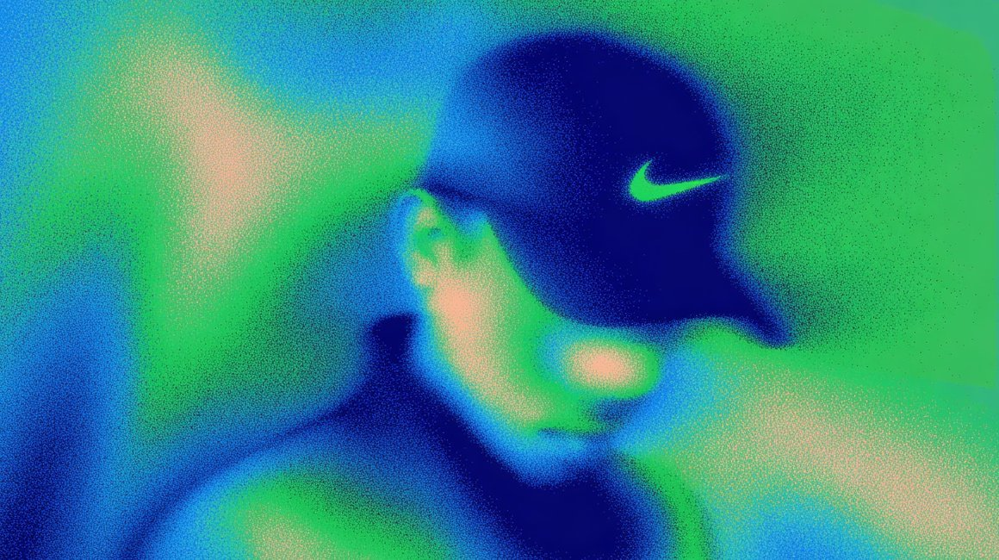

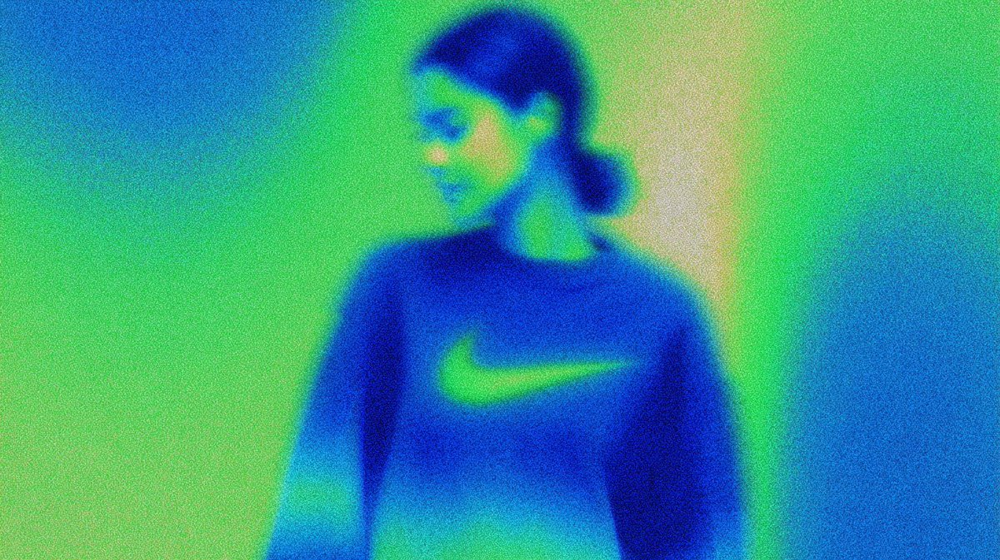

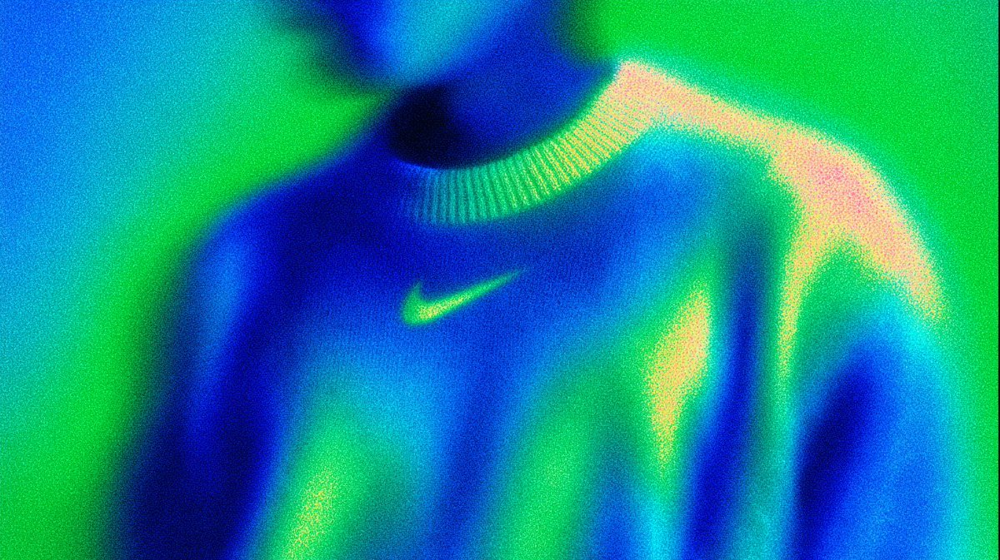

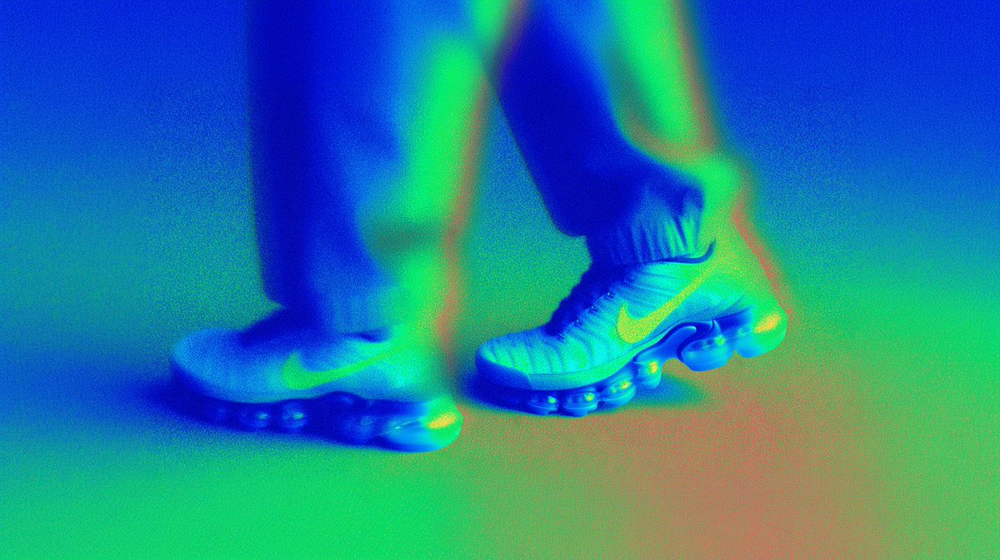

```
--sref 3135443632
```

 [↑返回目录](#toc)

---
## <a id="prompt-2002639331501224000">别害怕，Just Do It！</a> (<a href="https://x.com/underwoodxie96/status/2002639331501224005" target="_blank" rel="noopener noreferrer">underwood</a>)


```
don't be afraid

{
  "subject": {
    "description": "A fit young Asian woman frozen in mid-air while running, capturing a dynamic athletic moment.",
    "mirror_rules": "N/A",
    "age": "20s",
    "expression": {
      "eyes": {
        "look": "focused ahead",
        "energy": "determined",
        "direction": "forward"
      },
      "mouth": {
        "position": "slightly open breathing",
        "energy": "concentrated"
      },
      "overall": "intense focus and athletic determination"
    },
    "face": {
      "preserve_original": true,
      "makeup": "natural fresh look"
    },
    "hair": {
      "color": "black",
      "style": "high ponytail",
      "effect": "flying back dynamically due to motion"
    },
    "body": {
      "frame": "athletic and toned",
      "waist": "visible silhouette",
      "chest": "covered",
      "legs": "muscular definition visible, mid-air stride",
      "skin": {
        "visible_areas": "legs, face, hands",
        "tone": "warm tan",
        "texture": "smooth with muscle definition",
        "lighting_effect": "high contrast sunlight highlights"
      }
    },
    "pose": {
      "position": "mid-air jump",
      "base": "levitating",
      "overall": "dynamic running stride, one knee raised high, arms swinging"
    },
    "clothing": {
      "top": {
        "type": "long-sleeve athletic zip-up jacket",
        "color": "pastel pink",
        "details": "fitted, sporty seams",
        "effect": "stretched with movement"
      },
      "bottom": {
        "type": "athletic shorts",
        "color": "pastel pink",
        "details": "matching set"
      }
    }
  },
  "accessories": {
    "headwear": null,
    "jewelry": null,
    "device": null,
    "prop": {
      "type": "footwear",
      "details": "white sneakers with black swoosh logo, white crew socks"
    }
  },
  "photography": {
    "camera_style": "commercial advertising photography",
    "angle": "low angle worm's eye view",
    "shot_type": "full body side profile",
    "aspect_ratio": "3:4",
    "texture": "sharp focus, high contrast, commercial print quality",
    "lighting": "hard daylight, direct sun, strong shadows",
    "depth_of_field": "deep, background visible but geometric"
  },
  "background": {
    "setting": "urban modern exterior",
    "wall_color": "blue-grey glass",
    "elements": [
      "geometric triangular glass facade",
      "metallic frames",
      "reflection of runner in glass",
      "brick pavement at bottom"
    ],
    "typography": {
      "text_content": "JUST DO IT",
      "font_style": "Massive Bold Sans-Serif (Nike style)",
      "color": "White",
      "position": "Center of the image",
      "integration": "Layered text: placed behind the subject or overlaying the center with slight transparency",
      "visual_weight": "Dominant slogan"
    },
    "atmosphere": "modern, clean, energetic, motivational",
    "lighting": "bright natural sunlight"
  },
  "the_vibe": {
    "energy": "explosive power",
    "mood": "motivational",
    "aesthetic": "urban sportswear commercial",
    "authenticity": "high",
    "intimacy": "distant observer",
    "story": "morning run in the city, pushing limits",
    "caption_energy": "Just Do It."
  },
  "constraints": {
    "must_keep": [
      "text 'JUST DO IT' clearly visible",
      "mid-air suspension",
      "pastel pink outfit",
      "geometric glass background",
      "sharp focus"
    ],
    "avoid": [
      "misspelled text",
      "text covering the face",
      "blur",
      "studio background",
      "static pose"
    ]
  },
  "negative_prompt": [
    "typos",
    "gibberish text",
    "cluttered text",
    "motion blur",
    "distorted limbs",
    "bad anatomy",
    "extra legs",
    "dull lighting"
  ]
}
```

```
别害怕

{
  "subject": {
    "description": "一位身材健美的年轻亚洲女性在奔跑中腾空定格，捕捉充满动感的运动瞬间。",
    "mirror_rules": "不适用",
    "age": "20多岁",
    "expression": {
      "eyes": {
        "look": "专注前方",
        "energy": "坚定",
        "direction": "向前"
      },
      "mouth": {
        "position": "微张呼吸",
        "energy": "集中"
      },
      "overall": "高度专注与运动决心"
    },
    "face": {
      "preserve_original": true,
      "makeup": "自然清新妆容"
    },
    "hair": {
      "color": "黑色",
      "style": "高马尾",
      "effect": "因运动动态向后飞扬"
    },
    "body": {
      "frame": "健美紧实",
      "waist": "轮廓清晰可见",
      "chest": "遮盖",
      "legs": "肌肉线条明显，腾空迈步",
      "skin": {
        "visible_areas": "腿部、面部、手部",
        "tone": "暖棕肤色",
        "texture": "光滑并展现肌肉线条",
        "lighting_effect": "高对比度阳光高光"
      }
    },
    "pose": {
      "position": "腾空跳跃",
      "base": "悬浮",
      "overall": "动态奔跑姿态，一膝高抬，双臂摆动"
    },
    "clothing": {
      "top": {
        "type": "长袖运动拉链夹克",
        "color": "淡粉色",
        "details": "修身剪裁，运动缝线",
        "effect": "随动作拉伸"
      },
      "bottom": {
        "type": "运动短裤",
        "color": "淡粉色",
        "details": "配套套装"
      }
    }
  },
  "accessories": {
    "headwear": null,
    "jewelry": null,
    "device": null,
    "prop": {
      "type": "鞋履",
      "details": "白色运动鞋配黑色勾形标志，白色中筒袜"
    }
  },
  "photography": {
    "camera_style": "商业广告摄影",
    "angle": "低角度仰视（虫眼视角）",
    "shot_type": "全身侧面轮廓",
    "aspect_ratio": "3:4",
    "texture": "锐利对焦，高对比度，商业印刷级画质",
    "lighting": "强烈日光，直射阳光，浓重阴影",
    "depth_of_field": "深景深，背景可见但呈几何感"
  },
  "background": {
    "setting": "现代都市外景",
    "wall_color": "蓝灰色玻璃",
    "elements": [
      "几何三角形玻璃立面",
      "金属框架",
      "玻璃中反射奔跑者身影",
      "底部砖石路面"
    ],
    "typography": {
      "text_content": "JUST DO IT",
      "font_style": "超大粗体无衬线字体（耐克风格）",
      "color": "白色",
      "position": "画面中央",
      "integration": "分层文字：置于主体后方或以轻微透明度叠加于中央",
      "visual_weight": "主导性标语"
    },
    "atmosphere": "现代、简洁、充满活力、激励人心",
    "lighting": "明亮自然日光"
  },
  "the_vibe": {
    "energy": "爆发力",
    "mood": "激励",
    "aesthetic": "都市运动服饰广告",
    "authenticity": "高度真实",
    "intimacy": "远距离观察者视角",
    "story": "城市晨跑，突破极限",
    "caption_energy": "Just Do It."
  },
  "constraints": {
    "must_keep": [
      "文字“JUST DO IT”清晰可见",
      "腾空悬浮状态",
      "淡粉色服装",
      "几何玻璃背景",
      "锐利对焦"
    ],
    "avoid": [
      "拼写错误文字",
      "文字遮挡面部",
      "模糊",
      "影棚背景",
      "静态姿势"
    ]
  },
  "negative_prompt": [
    "拼写错误",
    "乱码文字",
    "杂乱文字",
    "运动模糊",
    "肢体扭曲",
    "解剖错误",
    "多余腿部",
    "昏暗光线"
  ]
}
```

 [↑返回目录](#toc)

---
## <a id="prompt-2001591561302483200">极简天妇罗菜单设计</a> (<a href="https://x.com/linxiaobei888/status/2001591561302483267" target="_blank" rel="noopener noreferrer">xiaobeiLin</a>)


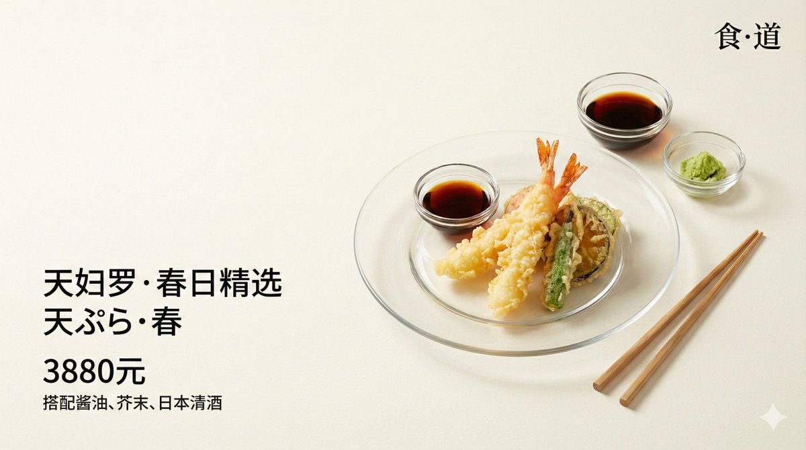

```
一张高角度商业美食摄影照片，展示了[天妇罗]盛放在极简风格的透明玻璃盘中，配有一小玻璃碗酱油和一碗芥末。旁边放着两只筷子，背景为纯净的奶油米白色，留有充足的留白。左侧叠加了时尚的黑色无衬线字体排版，简单介绍了菜品名称、价格和搭配说明。右上角有一个极简的小Logo。采用柔和的摄影棚布光，逼真的柔和阴影，具有时尚杂志的编辑风格。该设计以优质纸张背景填满整个 16:9 画面，采用大师级平面设计，配有精致的中式排版、极其克制的植物图案和精致优雅的光线，营造出一种空灵、奢华、精致的氛围，具有最大的精致感和考究感
```

 [↑返回目录](#toc)

---
## <a id="prompt-2002167453728555500">复古浪漫肖像拼贴</a> (<a href="https://x.com/kashmir_ki_lark/status/2002167453728555415" target="_blank" rel="noopener noreferrer">آیت شاہ</a>)

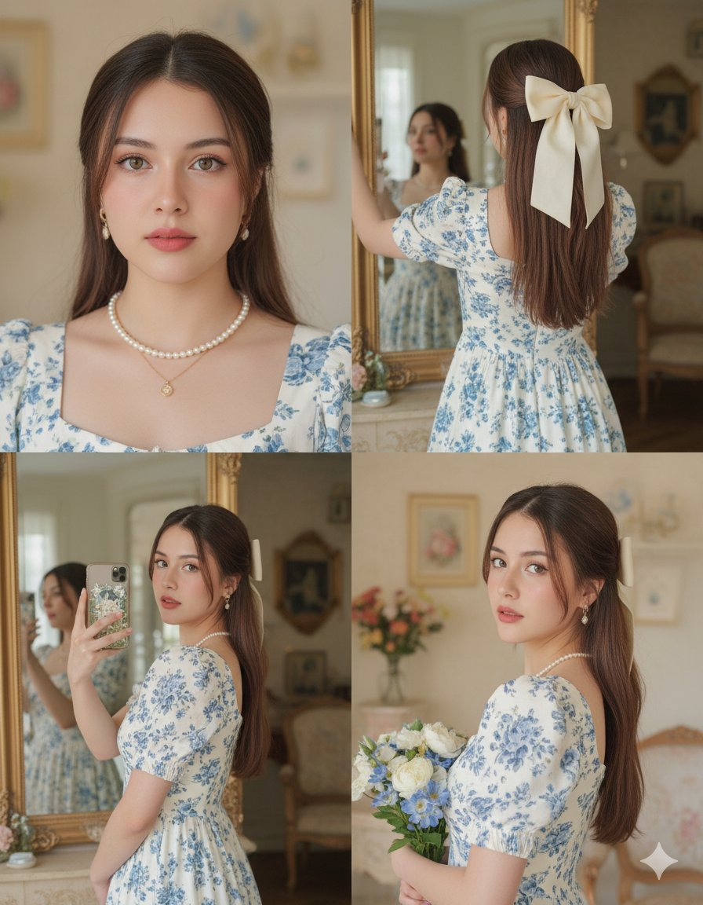

```
{
  "image_prompt": {
    "reference": {
      "face_identity": "uploaded reference image",
      "identity_lock": true,
      "pose_lock": true,
      "camera_angle_lock": true,
      "expression_lock": true,
      "face_preservation": "100% identical facial structure, proportions, eyes, lips, nose, brows, skin texture"
    },

    "composition": {
      "layout": "2x2 collage",
      "aspect_ratio": "1:1",
      "pose_matching": "exactly match reference image poses, angles, framing, and body orientation",
      "no_variation_allowed": true
    },

    "panel_1": {
      "view": "front-facing portrait",
      "pose": "head slightly tilted, eyes toward camera, soft lips",
      "framing": "chest-up selfie angle",
      "expression": "calm, elegant",
      "match_reference": true
    },

    "panel_2": {
      "view": "back view",
      "pose": "standing facing mirror, arms raised slightly",
      "focus": "back of head and bow hairstyle",
      "framing": "upper-body rear shot",
      "match_reference": true
    },

    "panel_3": {
      "view": "mirror selfie",
      "pose": "phone covering part of face, body angled sideways",
      "framing": "waist-up",
      "match_reference": true
    },

    "panel_4": {
      "view": "side portrait",
      "pose": "head turned over shoulder looking into camera, holding bouquet close to chest",
      "expression": "soft romantic gaze",
      "framing": "upper torso",
      "match_reference": true
    },

    "subject": {
      "gender": "female",
      "ethnicity": "Asian",
      "skin_tone": "fair with soft blush"
    },

    "hair": {
      "style": "long straight hair, half-up",
      "accessory": "large cream ribbon bow",
      "placement": "exact position as reference image"
    },

    "outfit": {
      "dress": {
        "color": "white",
        "pattern": "blue floral print",
        "style": "vintage puff-sleeve dress",
        "neckline": "square neckline"
      },
      "jewelry": [
        "pearl necklace",
        "delicate gold pendant"
      ]
    },

    "environment": {
      "location": "vintage-style indoor room",
      "background": [
        "ornate mirror",
        "cream walls",
        "soft floral decor",
        "classic furniture"
      ],
      "match_reference_background": true
    },

    "lighting": {
      "type": "soft indoor daylight",
      "quality": "even, gentle, warm",
      "shadow": "minimal",
      "match_reference": true
    },

    "photography_style": {
      "style": "romantic vintage lifestyle",
      "lens": "DSLR portrait lens",
      "depth_of_field": "shallow",
      "color_grading": "soft pastel"
    },

    "render_quality": {
      "realism": "photorealistic",
      "resolution": "high",
      "texture_detail": "natural skin and fabric detail",
      "no_cartoon": true
    }
  }
}
```

```
{
  "image_prompt": {
    "reference": {
      "face_identity": "上传的参考图像",
      "identity_lock": true,
      "pose_lock": true,
      "camera_angle_lock": true,
      "expression_lock": true,
      "face_preservation": "100%相同的面部结构、比例、眼睛、嘴唇、鼻子、眉毛、皮肤纹理"
    },

    "composition": {
      "layout": "2x2拼贴",
      "aspect_ratio": "1:1",
      "pose_matching": "完全匹配参考图像的姿态、角度、构图和身体朝向",
      "no_variation_allowed": true
    },

    "panel_1": {
      "view": "正面肖像",
      "pose": "头部微微倾斜，眼睛看向镜头，嘴唇柔和",
      "framing": "胸部以上自拍角度",
      "expression": "平静，优雅",
      "match_reference": true
    },

    "panel_2": {
      "view": "背面视角",
      "pose": "站在镜子前，脸朝镜子，双臂微微抬起",
      "focus": "头的背面及蝴蝶结发型",
      "framing": "上半身后方拍摄",
      "match_reference": true
    },

    "panel_3": {
      "view": "镜子里的自拍",
      "pose": "手机部分遮住脸部，身体侧向一边",
      "framing": "腰部以上",
      "match_reference": true
    },

    "panel_4": {
      "view": "侧面肖像",
      "pose": "头部转过肩膀看向镜头，手持花束靠近胸口",
      "expression": "温柔浪漫的眼神",
      "framing": "上半身",
      "match_reference": true
    },

    "subject": {
      "gender": "女性",
      "ethnicity": "亚洲",
      "skin_tone": "白皙带有柔和红晕"
    },

    "hair": {
      "style": "长直发，半扎起",
      "accessory": "大型奶油色丝带蝴蝶结",
      "placement": "与参考图像中确切位置相同"
    },

    "outfit": {
      "dress": {
        "color": "白色",
        "pattern": "蓝色花卉印花",
        "style": "复古泡泡袖连衣裙",
        "neckline": "方形领口"
      },
      "jewelry": [
        "珍珠项链",
        "精致的金色吊坠"
      ]
    },

    "environment": {
      "location": "复古风格的室内房间",
      "background": [
        "华丽的镜子",
        "奶油色墙壁",
        "柔和的花卉装饰",
        "经典家具"
      ],
      "match_reference_background": true
    },

    "lighting": {
      "type": "柔和的室内日光",
      "quality": "均匀，温和，温暖",
      "shadow": "最小化",
      "match_reference": true
    },

    "photography_style": {
      "style": "浪漫复古的生活方式",
      "lens": "DSLR人像镜头",
      "depth_of_field": "浅景深",
      "color_grading": "柔和的粉彩"
    },

    "render_quality": {
      "realism": "照片级真实感",
      "resolution": "高",
      "texture_detail": "自然的皮肤和布料细节",
      "no_cartoon": true
    }
  }
}
```

 [↑返回目录](#toc)

---
## <a id="prompt-2002293540299420200">时尚幻觉：从手机走出的她</a> (<a href="https://twitter.com/underwoodxie96/status/2002293540299420050" target="_blank" rel="noopener noreferrer">underwood</a>)


```
Create some interesting image effects

{

"subject": {

"description": "A hyper-realistic optical illusion photograph. A young Caucasian woman appears to be stepping out of a smartphone screen held in a hand. The screen displays the camera interface, capturing her boots, while her real upper body extends out of the phone into reality.",

"mirror_rules": "Ensure the phone screen clearly shows the iOS Camera UI (shutter button, mode text). Handwritten annotations must be legible and not mirrored.",

"age": "20s",

"expression": {

"eyes": {

"look": "Alluring and playful",

"energy": "Confident, direct",

"direction": "Looking at the viewer"

},

"mouth": {

"position": "Blowing a kiss or pouting",

"energy": "Chic and charming"

},

"overall": "Lifelike, engaging interaction"

},

"face": {

"preserve_original": "false",

"makeup": "Natural glam, matte foundation, defined European features",

"features": "High nose bridge, double eyelids, defined jawline"

},

"hair": {

"color": "Dark brown",

"style": "Long, loose waves, voluminous",

"effect": "Realistic shine, wind-blown effect"

},

"body": {

"frame": "Petite but proportionally realistic",

"waist": "Defined",

"chest": "Covered by turtleneck",

"legs": "Visible INSIDE the phone screen interface wearing boots",

"skin": {

"visible_areas": "Face, hands",

"tone": "Fair Caucasian skin",

"texture": "Ultra-realistic skin texture, visible pores, natural imperfections",

"lighting_effect": "Soft daylight"

}

},

"pose": {

"position": "Torso and head emerging vertically from the phone, legs displayed on the screen",

"base": "Dynamic standing pose",

"overall": "充满活力的随机姿势，让人感觉生命力满满"

},

"clothing": {

"top": {

"effect": "精致的穿搭，High-quality textile photography"

},

"bottom": {

"type": "Mini Skirt and Leather Boots",

"color": "Dark Grey (skirt), Brown (boots)",

"details": "Boots visible on the screen beneath the UI elements"

}

}

},

"accessories": {

"jewelry": "Gold rings on the photographer's hand (foreground)",

"device": "Smartphone with burgundy case. The screen is ACTIVE and DETAILED: it displays the IOS Camera App Interface (white circular shutter button at bottom, 'PHOTO' text).",

"prop": "On the phone screen: White handwritten-style text overlays with arrows pointing to the outfit elements (e.g., text 'suede jacket' with arrow, 'leather boots' with arrow)."

},

"photography": {

"camera_style": "DSLR photography, Macro lens for phone details",

"angle": "POV, High angle looking down at hand",

"shot_type": "Composite photography",

"aspect_ratio": "3:4",

"texture": "Sharp screen pixels, fingerprint smudges on screen, realistic fabric texture",

"lighting": "Overcast soft natural light",

"depth_of_field": "Background bench blurred (Bokeh), Phone screen UI and subject sharp"

},

"background": {

"setting": "Parisian Park in Autumn",

"wall_color": "Green bench, grey ground",

"elements": [

"Green park bench with text 'Le silence'",

"Autumn leaves"

],

"atmosphere": "Cinematic, realistic",

"lighting": "Natural ambient light"

},

"the_vibe": {

"energy": "Sophisticated, viral social media content",

"mood": "Fashion forward",

"aesthetic": "OOTD breakdown, creative edit",

"authenticity": "Photorealistic texture, not CGI",

"intimacy": "POV",

"story": "Fashion styling breakdown",

"caption_energy": "Styling brown suede & leather"

},

"constraints": {

"must_keep": [

"Caucasian ethnicity",

"Photorealistic skin",

"Camera UI elements on screen (shutter button)",

"Handwritten text annotations on screen",

"Pop-out effect"

],

"avoid": [

"Transparent phone screen",

"Blank screen",

"3D render style",

"Cartoon",

"Plastic skin"

]

},

"negative_prompt": [

"transparent screen",

"blank screen",

"glass phone",

"3d",

"render",

"cartoon",

"anime",

"plastic",

"drawing",

"illustration"

]

}
```

 [↑返回目录](#toc)

---
## <a id="prompt-2002199029594402800">金钱风暴中的真实面孔</a> (<a href="https://x.com/Abhiew_/status/2002199029594402859" target="_blank" rel="noopener noreferrer">Abhi</a>)

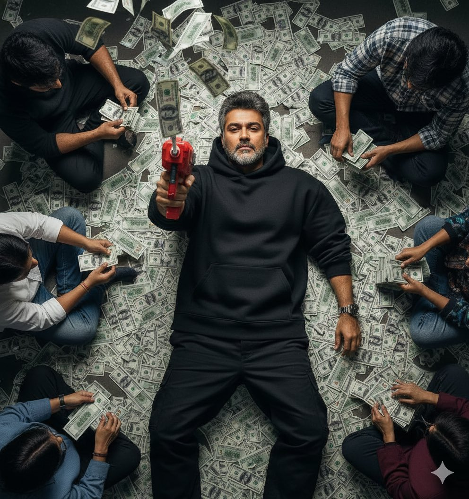

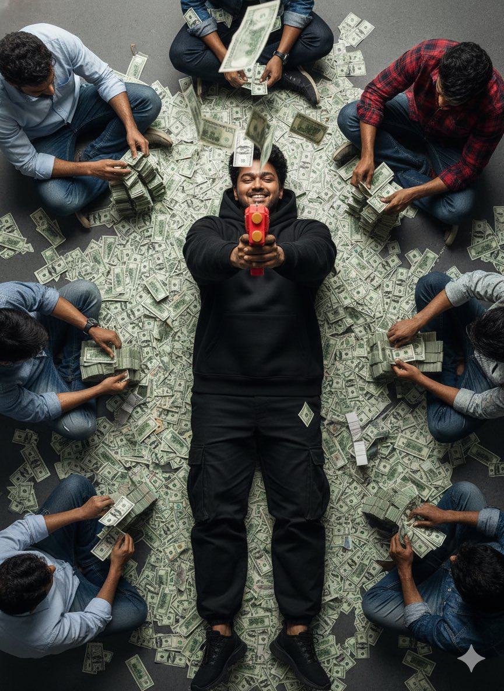

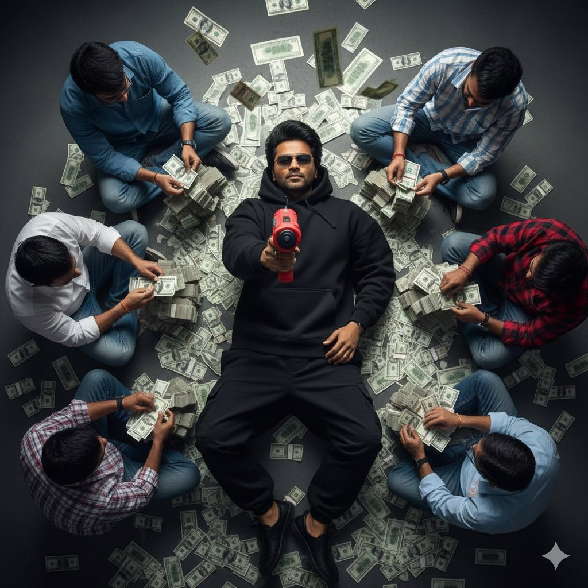

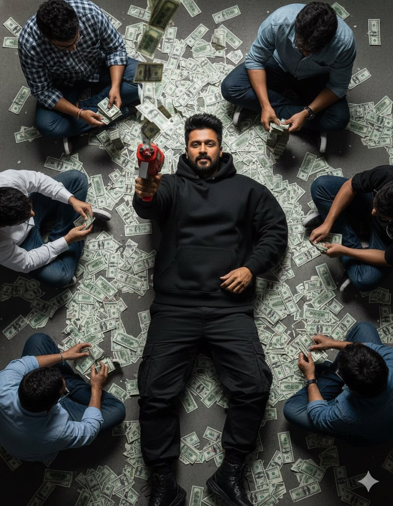

```
1. Open Gemini / Chat GPT

2. Upload your picture

3. Prompt :

Ultra-realistic cinematic photo of the same man from the provided reference photo - his real face, skin, hair, expression, and proportions must remain 100% identical and completely unmodified (no stylization, no reinterpretation).
He is lying on a floor entirely covered with US dollar bills, surrounded by several other people counting and stacking money around him. He wears a black oversized hoodie and black buggy trauser, looking confidently at the camera while pointing a red money gun upward, shooting cash into the air.
The photo is captured from a top-down aerial angle, with dollar bills flying mid-air and scattered all around, creating a sense of energy and chaos.
Lighting: soft cinematic studio lighting with natural shadows, realistic reflections on the money, and balanced exposure. The atmosphere feels luxurious and dramatic, with a moody dark background enhancing the green tones of the bills.
Non-negotiable locks:
- The man's real face must remain exactly the same as in the
```

```
超写实电影感照片，画面中的男子必须与提供的参考照片完全一致——其真实面部、皮肤、头发、表情和比例必须100%保持不变且完全未经修改（不得有任何风格化或重新诠释）。  
他躺在铺满美元钞票的地面上，周围有数人正在清点和堆叠钞票。他身穿黑色 oversized 连帽衫和黑色宽松长裤，自信地直视镜头，同时手持一把红色“金钱枪”朝上射击，将现金射向空中。  
照片采用俯视航拍角度拍摄，空中飞舞着美元钞票，四周散落各处，营造出充满能量与混乱的氛围。  
灯光：柔和的电影级影棚灯光，带有自然阴影、钞票上的真实反光以及均衡的曝光。整体氛围奢华而戏剧化，深色背景烘托出钞票绿色的鲜明色调。  
不可更改的硬性要求：  
- 该男子的真实面部必须与参考照片中完全一致
```

 [↑返回目录](#toc)

---
## <a id="prompt-2002093738122965500">圣诞夜的魔法村庄</a> (<a href="https://x.com/churvikv/status/2002093738122965442" target="_blank" rel="noopener noreferrer">Viki</a>)


```
(masterpiece:1.4), (best quality:1.3), (highly detailed:1.2), 8k, Christmas village, snowy landscape, (magical glowing reindeer in night sky:1.4), (people in red winter coats:1.2), adult and child, decorated Christmas trees, cozy illuminated houses, warm interior light, (vibrant festive colors:1.3), deep blue night, rich reds, golden glow, multi-colored lights, pure white snow, storybook art, fantasy illustration, volumetric lighting, atmospheric perspective, vertical composition, wide shot, cinematic
```

```
(masterpiece:1.4), (best quality:1.3), (highly detailed:1.2), 8k, Christmas village, snowy landscape, (magical glowing reindeer in night sky:1.4), (people in red winter coats:1.2), adult and child, decorated Christmas trees, cozy illuminated houses, warm interior light, (vibrant festive colors:1.3), deep blue night, rich reds, golden glow, multi-colored lights, pure white snow, storybook art, fantasy illustration, volumetric lighting, atmospheric perspective, vertical composition, wide shot, cinematic
```

 [↑返回目录](#toc)

---
## <a id="prompt-2002023616829878800">字母堡垒：沙漠中的阿拉伯幻境</a> (<a href="https://x.com/Gdgtify/status/2002023616829878680" target="_blank" rel="noopener noreferrer">Gadgetify</a>)


```
A hyper-real aerial photograph of a colossal, wind-eroded adobe fortress shaped like the Arabic letter “م”, each stroke formed by stepped kasbah walls and narrow parapet walkways, with carved geometric reliefs and sand-choked archways embedded into the curves. Endless dunes swallow the lower courtyards, a thin caravan line of camels and tiny robed figures crosses the base for scale, golden-hour sunlight with long shadows, dust haze, ultra-detailed mudbrick texture, photoreal, filmic color grade, 24mm wide-angle.
```

```
提示：一张超写实的航拍照片，展现一座巨大而风蚀的土坯堡垒，其外形酷似阿拉伯字母“م”，每一笔画均由阶梯状的卡斯巴城墙与狭窄的城垛步道构成，曲线中嵌入雕刻的几何浮雕与沙尘堵塞的拱门。无尽沙丘吞没了下方的庭院，一支细长的骆驼商队与微小的长袍人影横穿基座以提供比例参照，金色时刻的阳光投下长长的阴影，空气中弥漫着尘雾，泥砖纹理极度精细，照片级真实感，电影级色彩调校，24毫米广角镜头。
```

 [↑返回目录](#toc)

---
## <a id="prompt-2002172236611146000">Y2K海滩双视</a> (<a href="https://x.com/IqraSaifiii/status/2002172236611145993" target="_blank" rel="noopener noreferrer">Iqra Saifi</a>)

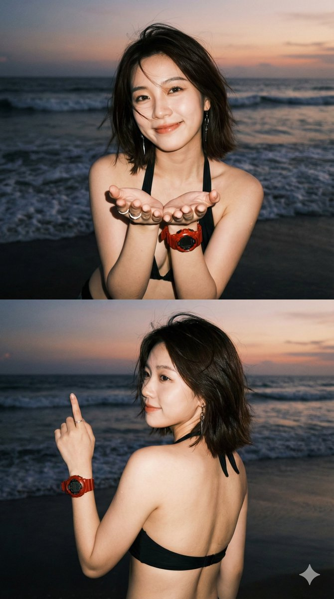

```
"Vertical Split-Screen Collage (2-Panel Grid).",
      "panel_top": "Medium close-up, frontal view, hands interacting with camera.",
      "panel_bottom": "Medium shot, rear/side profile view, looking back at camera.",
      "consistency": "Same subject, same outfit, same time of day in both panels."
    },
    "subject_details": {
      "demographics": "Young Asian woman, fair skin, dark brown bob-cut hair with windswept texture.",
      "apparel": {
        "swimwear": "Black halter-neck bikini top with criss-cross neck straps.",
        "accessories": "Chunky red digital sports watch (left wrist), silver ring (left middle finger), long dangling silver earrings."
      }
    },
    "exact_pose_anatomical": {
      "panel_top_pose": {
        "orientation": "Front facing.",
        "action": "Leaning forward slightly. Both forearms extended towards the camera lens (foreshortened).",
        "hands": "Palms facing up and slightly open (cupped gesture), as if catching rain or offering something.",
        "expression": "Sweet, inviting smile, direct eye contact.",
        "head_tilt": "Slight tilt to the right."
      },
      "panel_bottom_pose": {
        "orientation": "Subject is facing away from the camera (Back/Side Profile), angled 45 degrees to the left.",
        "head_turn": "Head turned over the left shoulder to look directly at the camera.",
        "left_arm": "Elbow bent, hand raised to shoulder height.",
        "left_hand": "Index finger pointing upwards/sideways, other fingers curled.",
        "expression": "Soft, candid, slightly more serious or alluring than the top image."
      }
    },
    "camera_technical_values": {
      "technique": "Direct Flash Photography (On-camera flash style).",
      "aesthetic": "90s/Y2K Snapshot aesthetic.",
      "focal_length": "35mm (Moderate wide angle).",
      "aperture": "f/4.0 (Subject sharp, background ocean slightly blurred).",
      "shutter_speed": "1/30s (Dragging the shutter to capture the ambient sunset color while the flash freezes the subject).",
      "iso": "ISO 400."
    },
    "lighting_and_environment": {
      "location": "Beach coastline at twilight.",
      "background_elements": "Ocean waves breaking on shore, wet sand, horizon line.",
      "lighting_scheme": "Mixed Lighting: Foreground illuminated by cool/neutral direct flash. Background illuminated by soft ambient sunset (warm orange horizon fading into purple/blue sky).",
      "contrast": "High contrast between the bright subject and the dimmer evening background."
    }
```

```
“垂直分屏拼贴（2格网格）。”  
“上格：中近景，正面视角，双手与镜头互动。”  
“下格：中景，背面/侧脸视角，回头看向镜头。”  
“一致性：两格中为同一人物、同一服装、同一时间段。”

人物细节：  
- 人种年龄：年轻亚洲女性，肤色白皙，深棕色齐耳短发，带有被风吹拂的质感。  
- 服饰：  
  - 泳装：黑色挂脖式比基尼上衣，颈部交叉绑带。  
  - 配饰：左手佩戴厚重红色数码运动手表，左手中指戴银色戒指，佩戴长款垂坠银色耳环。

精确姿势与解剖细节：  
- 上格姿势：  
  - 朝向：正面朝向镜头。  
  - 动作：身体微微前倾，双前臂伸向镜头（透视缩短）。  
  - 双手：掌心向上微张（呈捧接状），仿佛在接雨或递送某物。  
  - 表情：甜美亲切的微笑，直视镜头。  
  - 头部倾斜：略微向右偏斜。  

- 下格姿势：  
  - 朝向：人物背对镜头（背面/侧脸），身体向左偏转45度。  
  - 头部转向：头部越过左肩回望镜头。  
  - 左臂：肘部弯曲，手抬至肩高。  
  - 左手：食指向上或侧方指，其余手指微曲。  
  - 表情：柔和自然，略比上格更严肃或更具魅力。

摄影技术参数：  
- 拍摄技法：直闪摄影（机顶闪光灯风格）。  
- 视觉风格：90年代/Y2K快照美学。  
- 焦距：35mm（中等广角）。  
- 光圈：f/4.0（主体清晰，背景海面轻微虚化）。  
- 快门速度：1/30秒（慢速快门捕捉环境日落色彩，闪光灯凝固主体）。  
- 感光度：ISO 400。

光线与环境：  
- 地点：黄昏时分的海滩海岸线。  
- 背景元素：海浪拍岸、湿润沙滩、地平线。  
- 布光方案：混合光源——前景由冷/中性直闪照亮，背景由柔和环境日落光照明（暖橙色地平线渐变为紫/蓝色天空）。  
- 对比度：明亮主体与较暗傍晚背景之间形成高对比。
```

 [↑返回目录](#toc)

---
## <a id="prompt-1996580659096387800">雨中离别：九格电影分镜</a> (<a href="https://x.com/oggii_0/status/1996580659096387725?s=20" target="_blank" rel="noopener noreferrer">Oogie</a>)


```
Create a 9-panel cinematic storyboard set in a rainy, melancholic atmosphere. Show a young woman in a soaked dress standing beneath stone arches as a man walks away into the rain. Include close-ups of her emotional expression, a moment of their hands parting, shots of her crying against a pillar, and a final wide shot of her standing alone. Use soft, moody lighting, blue-gray tones, shallow depth of field, and dramatic raindrops. Panels should feel emotional, poetic, and film-like
```

```
提示：创作一组9格电影分镜，设定在阴雨连绵、忧郁的氛围中。画面中，一位身穿湿透长裙的年轻女子站在石拱门下，一名男子渐行渐远，消失在雨中。包含她情绪化表情的特写、两人双手分离的瞬间、她倚靠石柱哭泣的镜头，以及最后一幕她独自伫立的广角镜头。采用柔和而富有情绪的光影、蓝灰色调、浅景深和富有戏剧性的雨滴效果。各分镜应充满情感、诗意且具有电影感。
```

 [↑返回目录](#toc)

---
## <a id="prompt-1996878448288321500">倒置世界的奇妙对称</a> (<a href="https://x.com/eviljer/status/1996878448288321638?s=20" target="_blank" rel="noopener noreferrer">Jerlin</a>)

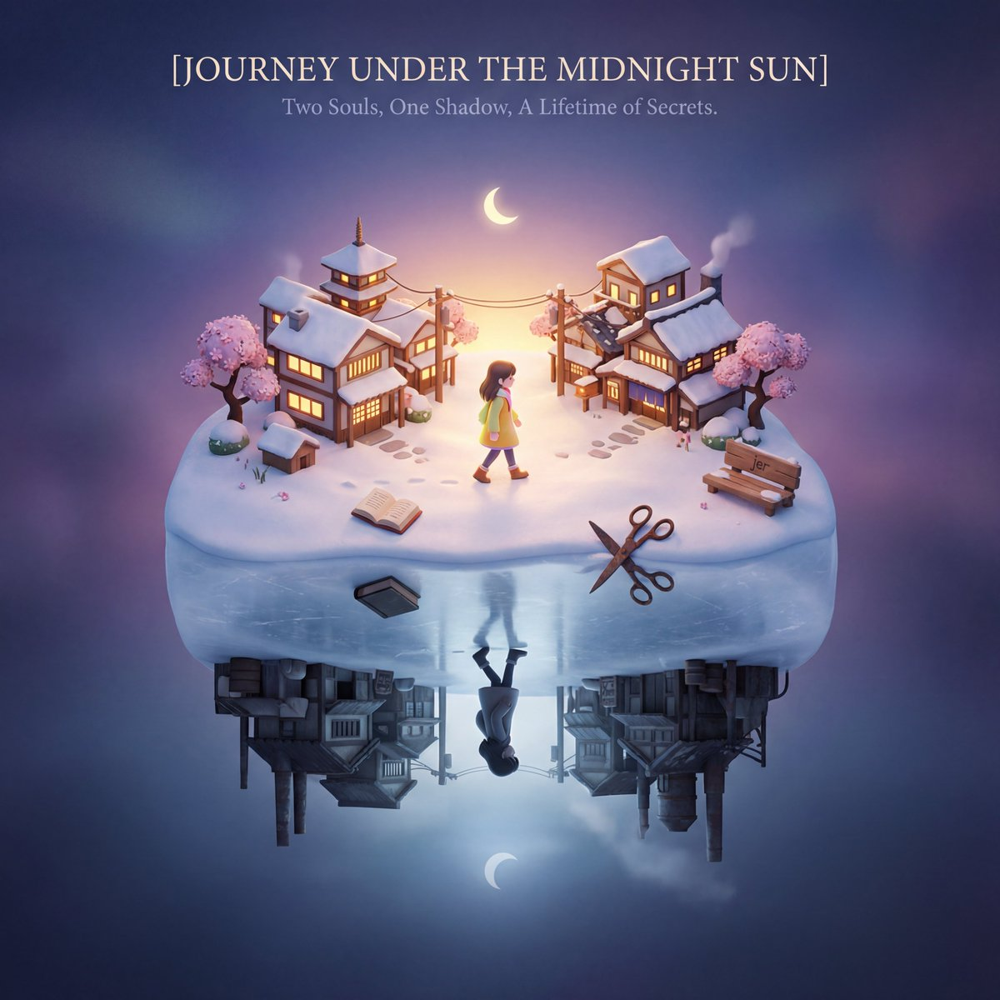

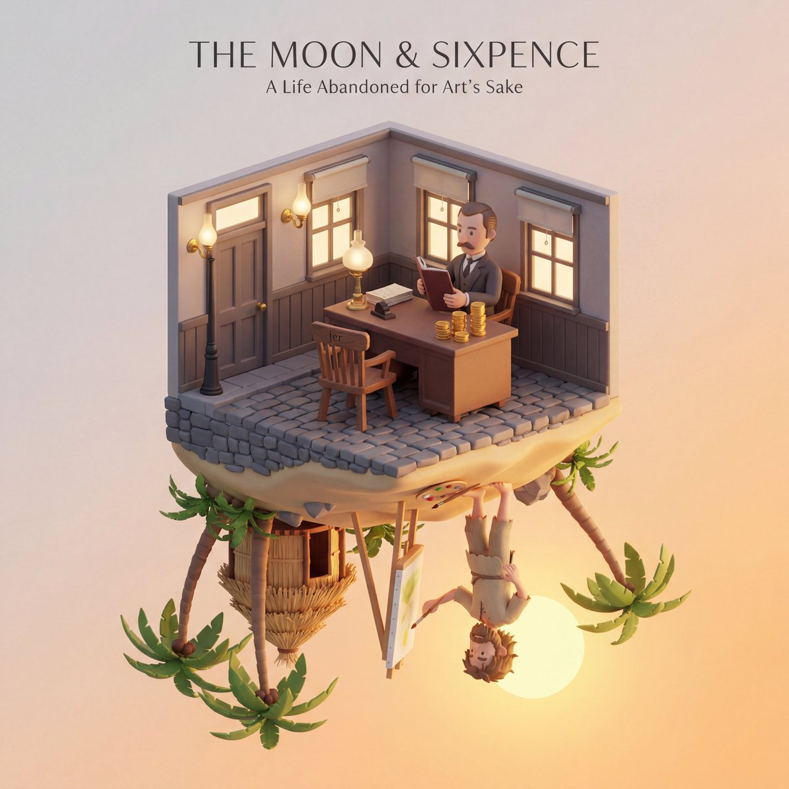

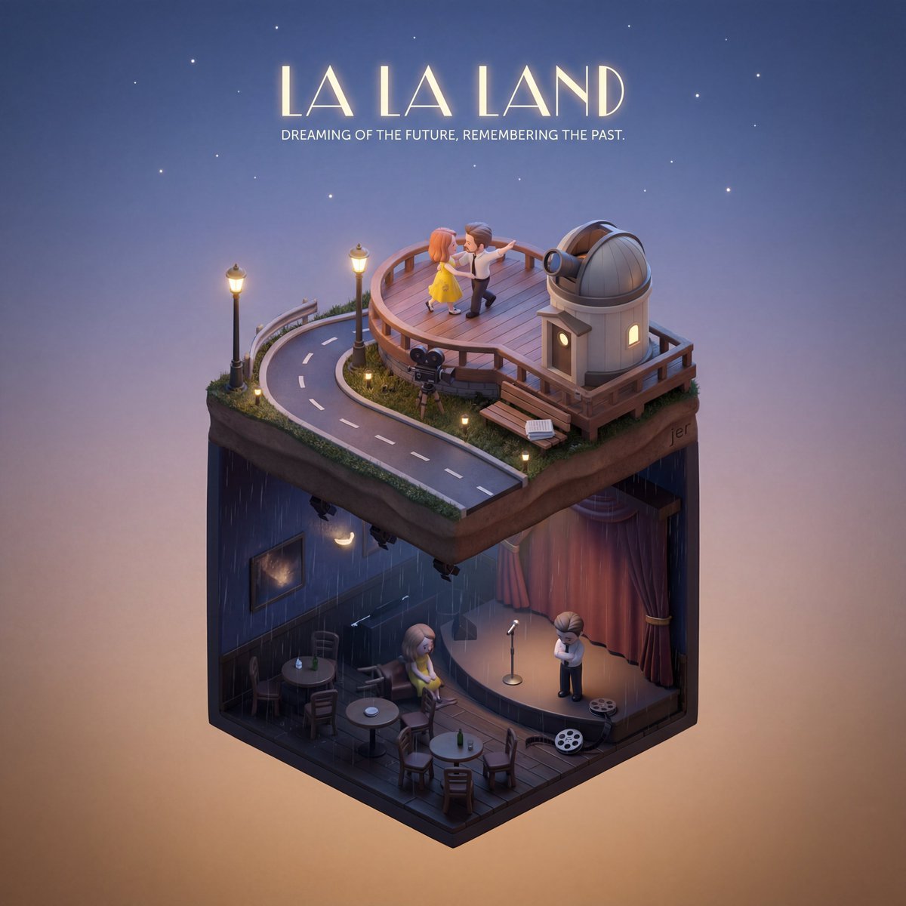

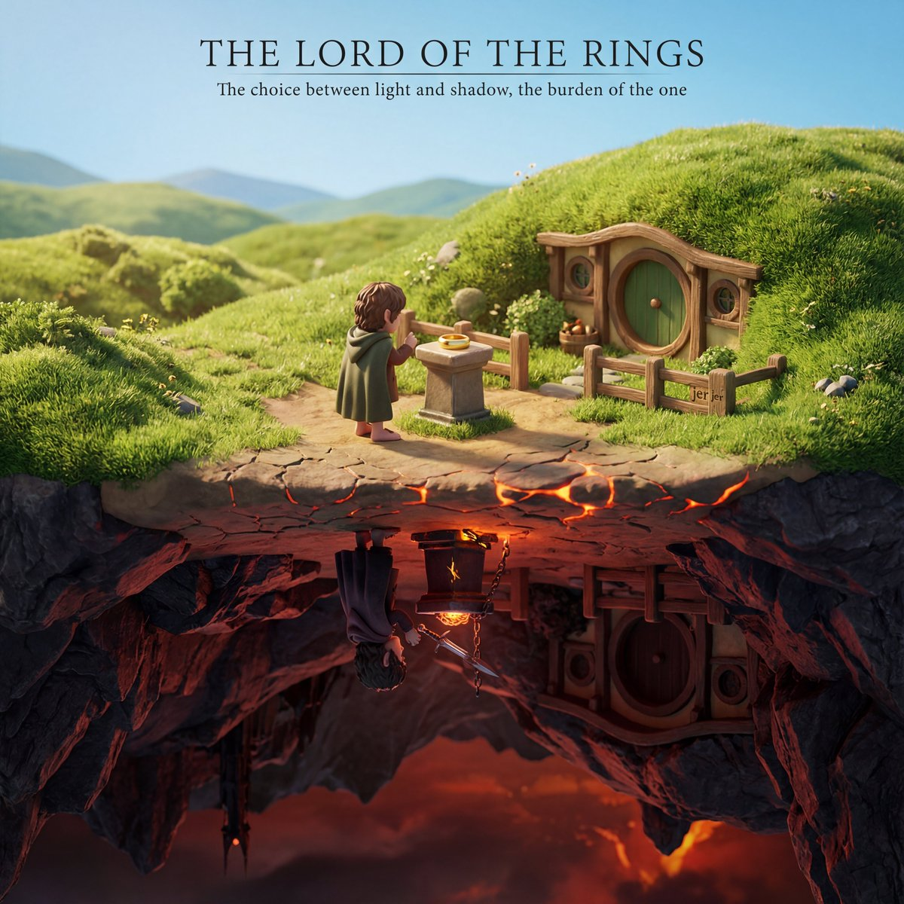

```
A clear floating top-down isometric 3D cartoon diorama scene with a vertical inverted composition:
Scene(cute): the upper half shows [Subject]'s most iconic defining scene - prefer full shot in outdoor. The lower half reveals [Subject]'s contrasting opposite realm. CRITICAL: the
```

```
一个清晰的漂浮俯视等距3D卡通微缩场景，采用垂直倒置构图：  
场景（可爱）：上半部分展现[主体]最具标志性的代表性场景——优先选择户外全身镜头；下半部分揭示[主体]截然相反的对立领域。关键要求：the
```

 [↑返回目录](#toc)

---
## <a id="prompt-1995603848510271500">俏皮兔女郎的闪光自拍</a> (<a href="https://x.com/IqraSaifiii/status/1995603848510271611?s=20" target="_blank" rel="noopener noreferrer">Iqra Saifi</a>)

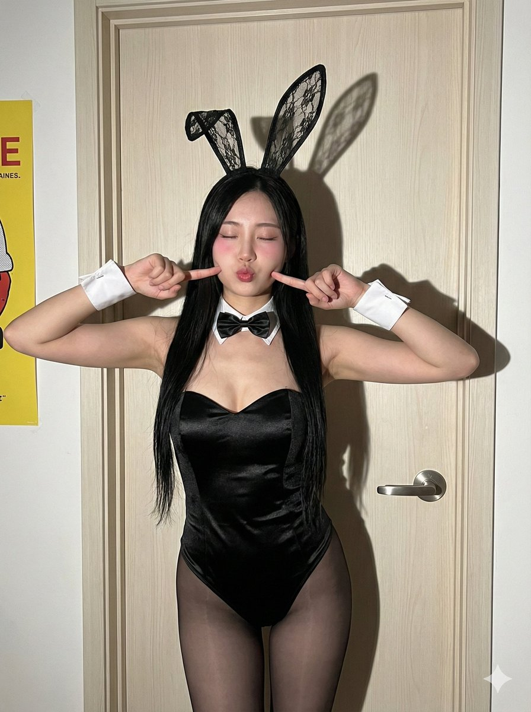


```
"prompt_description": {
    "subject": {
      "appearance": "Young woman with fair skin and long, straight black hair. 'Cute' makeup style with pink blush on cheeks and glossy lips.",
      "outfit": "Classic black bunny girl costume. Black satin strapless bodysuit (leotard) with a sweetheart neckline. Black sheer pantyhose/tights. Accessories include large black lace bunny ears headband, a white collar with a black bowtie, and white french cuffs on the wrists. A beaded bracelet on the right wrist.",
      "environment": "Indoor domestic setting. Standing in front of a light-colored wooden door with a silver handle. A white wall is visible to the left with a partial view of a yellow poster/artwork."
    },
    "technical_style": "Candid snapshot aesthetic, direct flash photography, influencer social media style, high key brightness."
  },
  "pose_specs": {
    "body_position": "Standing facing forward, cut off at the thighs (medium shot).",
    "arms": "Both arms raised, elbows bent out to the sides. Hands positioned near the face with index fingers poking into the cheeks.",
    "head": "Facing directly forward. Eyes closed or looking down in a playful manner. Lips pursed in a 'kissy' or whistling expression.",
    "expression": "Playful, cute, 'aegyo' pose."
  },
  "camera_settings": {
    "viewpoint": "Eye-level.",
    "focal_length": "28mm to 35mm (Smartphone wide lens style).",
    "aperture": "f/1.8 to f/2.8",
    "shutter_speed": "1/60s (Flash synced).",
    "iso": "400",
    "composition": "Centered composition, framing from mid-thigh to above the bunny ears."
  },
  "lighting_setup": {
    "type": "On-camera direct flash.",
    "qualities": "Hard, frontal light source close to the lens axis.",
    "shadows": "Distinct, hard drop shadow visible on the wooden door directly behind the subject, indicating the flash is mounted on or very near the camera.",
    "color_temperature": "Flash white balance (approx 5500K), mixed with slightly warmer indoor ambient tones."
  }
}
```

```
“prompt_description”：  
- 主体：  
  - 外貌：肤色白皙的年轻女性，留着长而直的黑发。妆容为“可爱”风格，脸颊涂有粉色腮红，嘴唇有光泽。  
  - 服装：经典黑色兔女郎装。黑色缎面无肩带连体衣（紧身衣），心形领口；黑色透明连裤袜/紧身裤。配饰包括大型黑色蕾丝兔耳头箍、白色项圈配黑色蝴蝶结领结，以及手腕处的白色法式袖口。右腕佩戴一串珠链手镯。  
  - 环境：室内家居场景。站在一扇浅色木门前，门上有银色把手。左侧可见一面白墙，墙上部分露出一张黄色海报或艺术作品。

- 技术风格：抓拍快照美学，直打闪光灯摄影，网红社交媒体风格，高调明亮。

“pose_specs”：  
- 身体姿势：正面站立，画面在大腿处截断（中景）。  
- 手臂：双臂抬起，肘部向两侧弯曲，双手靠近脸部，食指轻戳脸颊。  
- 头部：正对镜头，眼睛闭上或向下看，神情俏皮。嘴唇噘起呈“亲吻”或吹口哨状。  
- 表情：俏皮可爱，“撒娇卖萌”（aegyo）姿势。

“camera_settings”：  
- 视角：平视高度。  
- 焦距：28mm 至 35mm（智能手机广角镜头风格）。  
- 光圈：f/1.8 至 f/2.8。  
- 快门速度：1/60 秒（与闪光同步）。  
- ISO：400。  
- 构图：居中构图，画面从大腿中部至兔耳上方。

“lighting_setup”：  
- 光源类型：机顶直打闪光灯。  
- 光质：硬光，正面光源，贴近镜头轴线。  
- 阴影：主体后方木门上可见清晰、硬朗的投影，表明闪光灯安装在相机上或非常靠近相机。  
- 色温：闪光灯白平衡（约 5500K），混合略暖的室内环境光。
```

 [↑返回目录](#toc)

---
## <a id="prompt-1996919230961226000">人脸变超市商品</a> (<a href="https://x.com/_MehdiSharifi_/status/1996919230961226095" target="_blank" rel="noopener noreferrer">Mehdi Sharifi</a>)

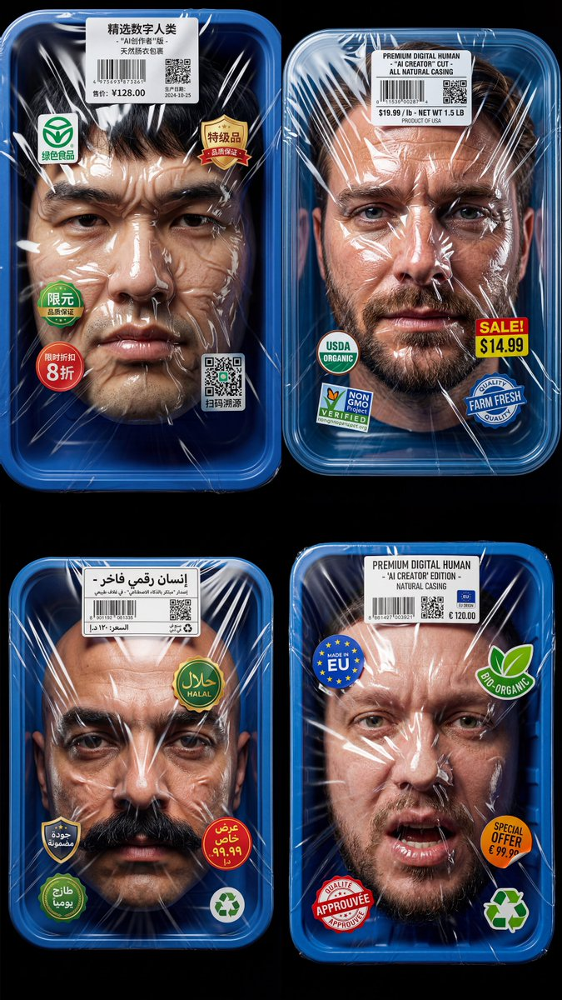

```
Global Retail Portrait Generator

Instantly transform any uploaded face into a hyper realistic, vacuum sealed supermarket product, fully localized.

Special Guests: @hc_dsn, @ecommartinez, @aziz4ai, @AmirMushich, hope you enjoy it.

Platform: @eachlabs for using Nano Banana Pro

Quick User Guide:
1⃣ Upload Reference
2⃣ Copy Template
3⃣ Fill Parameters
4⃣ Generate
```

```
全球零售肖像生成器

立即将任何上传的人脸转化为超写实、真空包装的超市商品，并完全本地化。

特别嘉宾：@hc_dsn、@ecommartinez、@aziz4ai、@AmirMushich，希望你们喜欢。

平台：@eachlabs 使用 Nano Banana Pro

快速用户指南：  
1⃣ 上传参考图  
2⃣ 复制模板  
3⃣ 填写参数  
4⃣ 生成
```

 [↑返回目录](#toc)

---
## <a id="prompt-1996285140893622300">鱼眼自拍鬼脸大冒险</a> (<a href="https://x.com/Arminn_Ai/status/1996285140893622391" target="_blank" rel="noopener noreferrer">ΛRMIN | AI</a>)

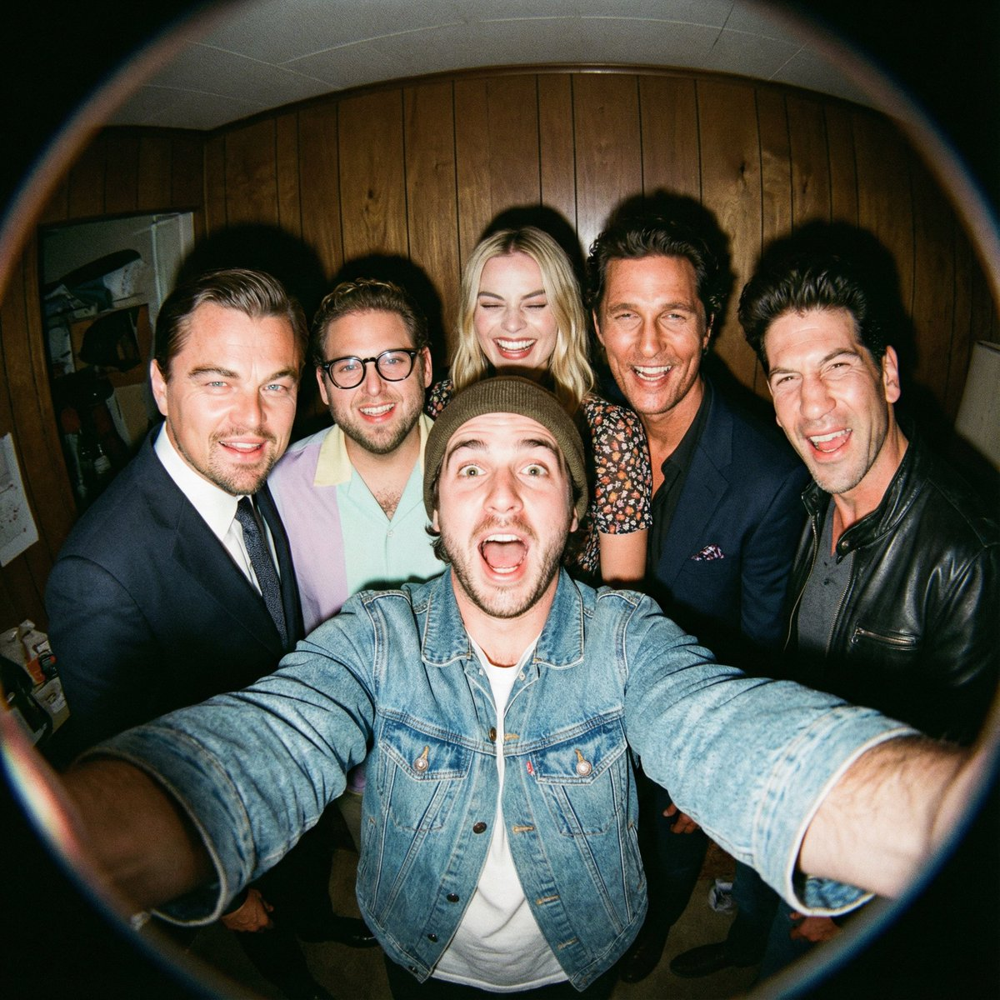

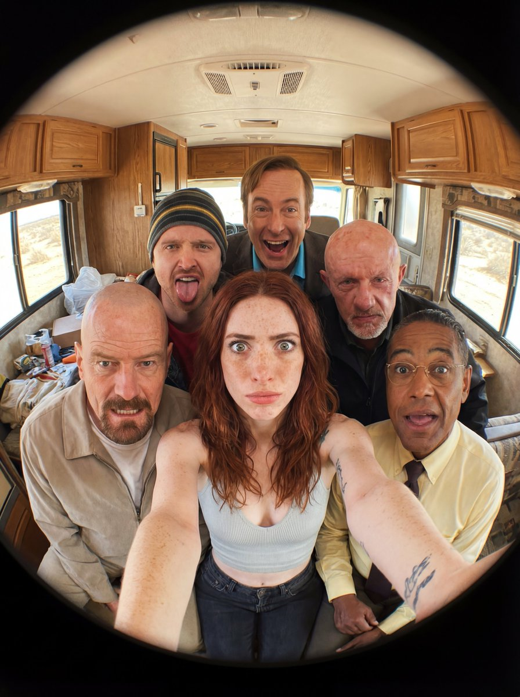

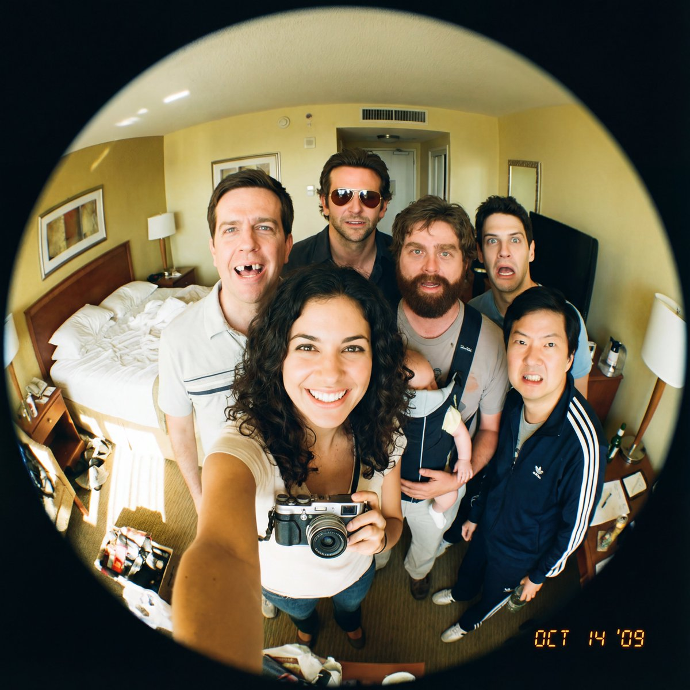


```
A film-like fisheye wide-angle 360-degree selfie without any camera or phone visible in the subject’s hands. A real and exaggerated selfie of [person from uploaded image] with [CHARACTERS]. They are making faces at the camera.
```

```
一张胶片般的鱼眼360度广角自拍，拍摄者手中没有任何相机或手机。一张真实且夸张的[上传图片中的人物]与[角色]的自拍。他们对着镜头做鬼脸。
```

```
A hyper-realistic fisheye wide-angle selfie, captured with a vintage 35mm fisheye lens creating heavy barrel distortion. without any camera or phone visible in the subject’s hands.
Subject & Action: A close-up, distorted group photo featuring [Person From Uploaded Image] taking selfie with [CHARACTERS]. Everyone is making wild, exaggerated faces, squinting slightly from the flash.
Lighting & Texture: Harsh, direct on-camera flash lighting that creates hard shadows behind the subjects. Authentic film grain, slight motion blur on the edges, and chromatic aberration. It looks like a candid, amateur snapshot as if captured during a chaotic behind-the-scenes moment, not a studio photo.
```

```
一张超写实的广角鱼眼自拍，使用复古35毫米鱼眼镜头拍摄，造成了严重的枪管畸变。拍摄对象手中没有任何相机或手机。
主题与动作：一张特写、扭曲的集体照，照片中[上传图片中的人物]与[角色]自拍。每个人都做出夸张的表情，闪光灯让他微微眯眼。
灯光与质感：强烈、直接的闪光灯光，在主体背后形成硬阴影。真实的胶片颗粒感，边缘轻微的运动模糊，以及色差。看起来像是一张业余的快照，仿佛是在混乱的幕后时刻拍摄的，而非摄影棚照片。
```

 [↑返回目录](#toc)

---
## <a id="prompt-2001669259282313500">阿拉伯书法魔法肖像</a> (<a href="https://twitter.com/aziz4ai/status/2001669259282313514" target="_blank" rel="noopener noreferrer">AZIZ | AI 🇸🇦</a>)

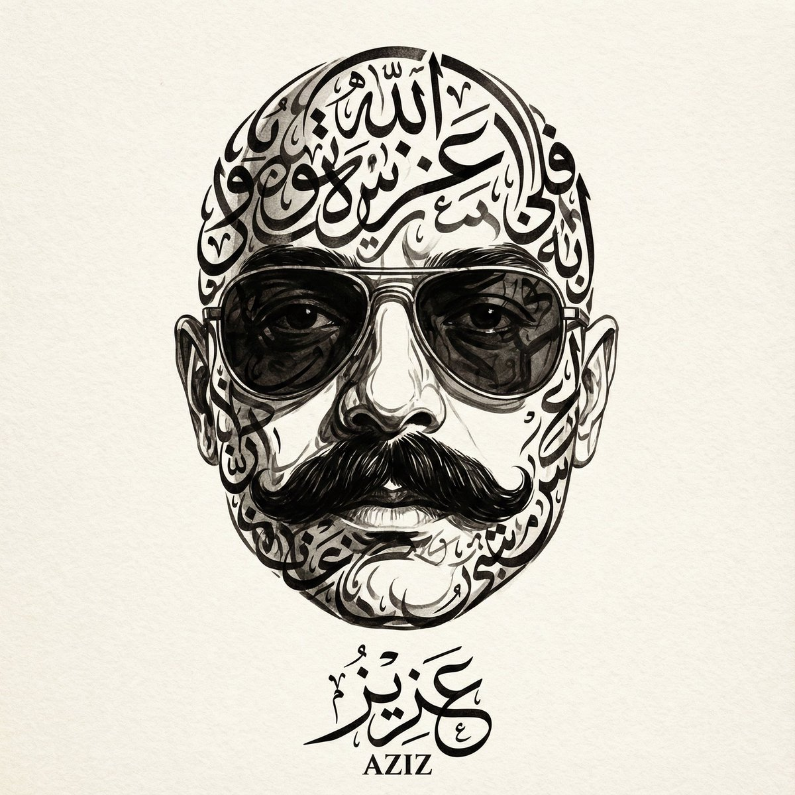


```
 Arabic Calligraphy Magic

In the occasion of Arabic language day, i create this prompt to make your photo into amazing calligraphy art portrait

upload your photo, type your name in English and see the magic

The prompt in next comment ⬇️

By @ImagineArt_X
```

```
值此阿拉伯语日之际，我创作了此提示词，可将你的照片转化为惊艳的书法艺术肖像。

上传你的照片，用英文输入你的名字，见证奇迹发生。

提示词见下一条评论 ⬇️

作者：@ImagineArt_X
```

 [↑返回目录](#toc)

---
## <a id="prompt-2001765272257204200">电影混搭奇想</a> (<a href="https://twitter.com/cfryant/status/2001765272257204316" target="_blank" rel="noopener noreferrer">Christopher Fryant</a>)

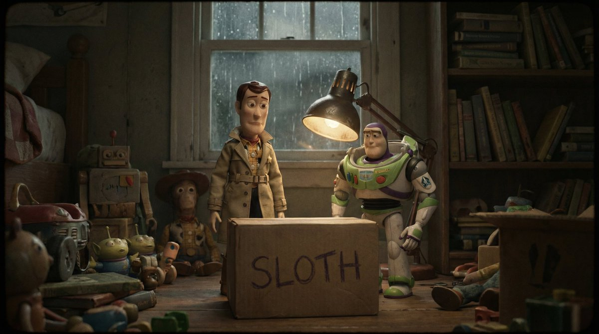

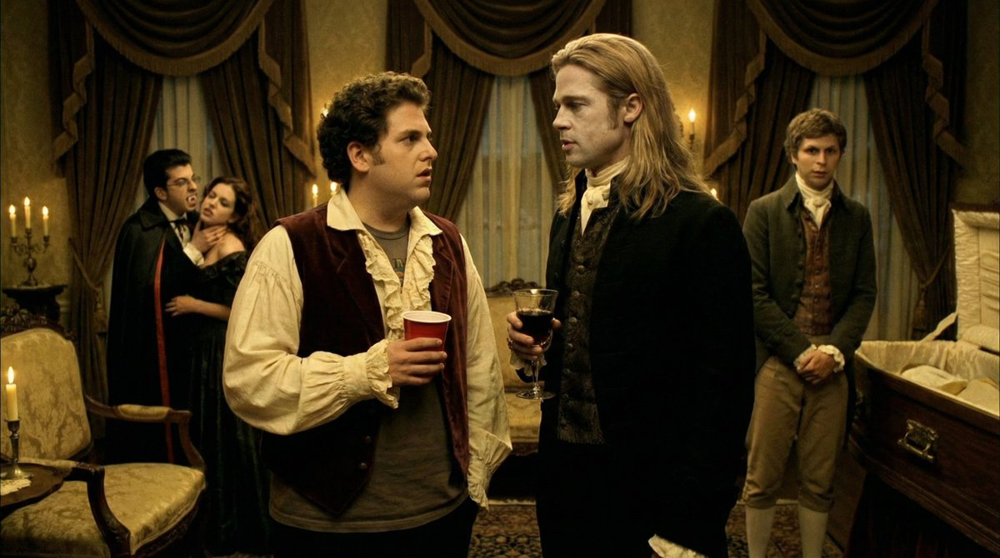

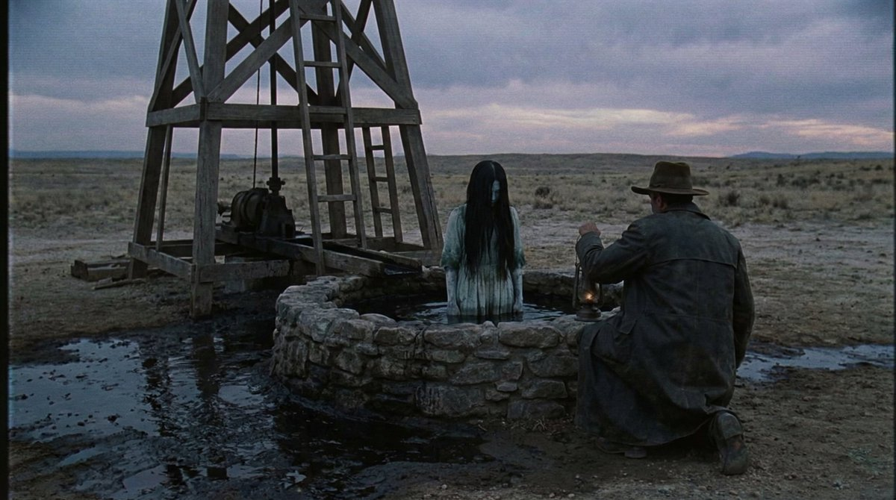

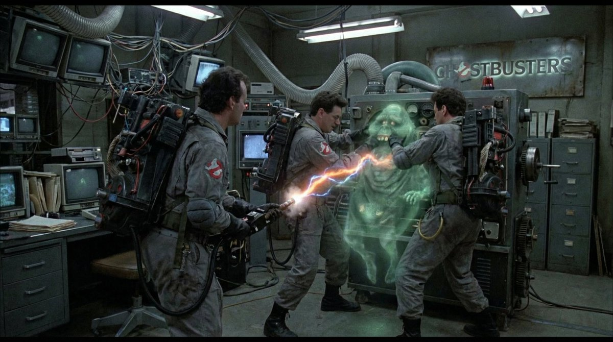

```
- Se7en and Toy Story
- Superbad and Interview with the Vampire
- There will be Blood and The Ring
- Brazil and Ghostbusters

Prompt is in the quoted post, give it a try!
```

```
- 《七宗罪》与《玩具总动员》  
- 《太坏了》与《夜访吸血鬼》  
- 《血色将至》与《午夜凶铃》  
- 《巴西》与《捉鬼敢死队》

提示词在引用的帖子中，试试看吧！
```

 [↑返回目录](#toc)

---
## <a id="prompt-2001719789937447400">班尼迪克蛋微缩厨房珍藏盒</a> (<a href="https://twitter.com/Gdgtify/status/2001719789937447400" target="_blank" rel="noopener noreferrer">Gadgetify</a>)

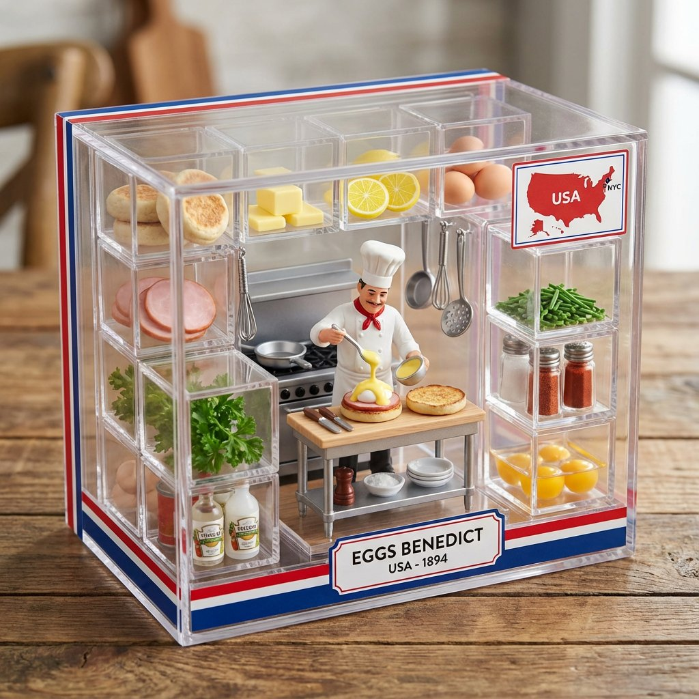

```
do this for eggs benedict :

  
Input A is a famous dish (photo or dish name).
Analyze the cuisine's origin country, there person who invented it or said to have, traditional preparation, cultural significance, and key ingredients.
Optional Input B is a style reference (culinary museum / artisan packaging). If missing, choose Michelin-star plating aesthetic meets toy packaging.
Goal: Premium clear acrylic box containing a miniature kitchen scene with the figurine of the person who invented it preparing the dish, surrounded by ingredient compartments like a high-end spice collection.
Rules:
- Center: tiny kitchen setup with chef mid-preparation
- 10-15 individual compartments with micro versions of each ingredient
- Include miniature cooking tools specific to the dish
- Add a tiny "origin map" showing the dish's birthplace
- Packaging uses colors from the cuisine's flag or traditional pottery
- Label with dish name in both English and origin language, show the date it first started
Output: ONE image, 4:5 artisan food photography style

```

```
输入A是一个著名的菜肴（照片或菜肴名称）。
分析该菜肴的起源国家、据说发明它的人、传统制作方法、文化意义和关键成分。
可选输入B是风格参考（烹饪博物馆/手工包装）。如果缺失，则选择米其林星级摆盘美学与玩具包装相结合。
目标：一个高级透明亚克力盒子，内含一个微型厨房场景，里面有发明者的雕像正在准备这道菜，周围是由如高端香料收藏般的小隔间环绕。
规则：
- 中心：微小厨房设置，厨师正处于准备过程中
- 10-15个独立的小隔间，每个隔间内有微缩版的每种成分
- 包括特定于这道菜的迷你烹饪工具
- 添加一张小小的“起源地图”，显示这道菜的诞生地
- 包装使用来自该菜肴国旗或传统陶器的颜色
- 标签上用英文和原产地语言标明菜肴名称，显示开始日期
输出：一张图片，4:5手工艺食品摄影风格。 

对于班尼迪克蛋：
输入A是一道著名的菜肴（班尼迪克蛋的照片或名称）。
分析该菜肴的起源国家、据说发明它的厨师或人、传统制作方法、文化意义和关键成分。
目标是创建一个高质量的透明亚克力盒，内部展示的是一个微型厨房场景，包括制作者的小雕像正在准备班尼迪克蛋，以及由像高端香料收藏那样的小格子围绕的成分。
```

 [↑返回目录](#toc)

---
## <a id="prompt-2001695202600456700">后台的提线木偶师</a> (<a href="https://twitter.com/FitzGPT/status/2001695202600456576" target="_blank" rel="noopener noreferrer">Fitz</a>)

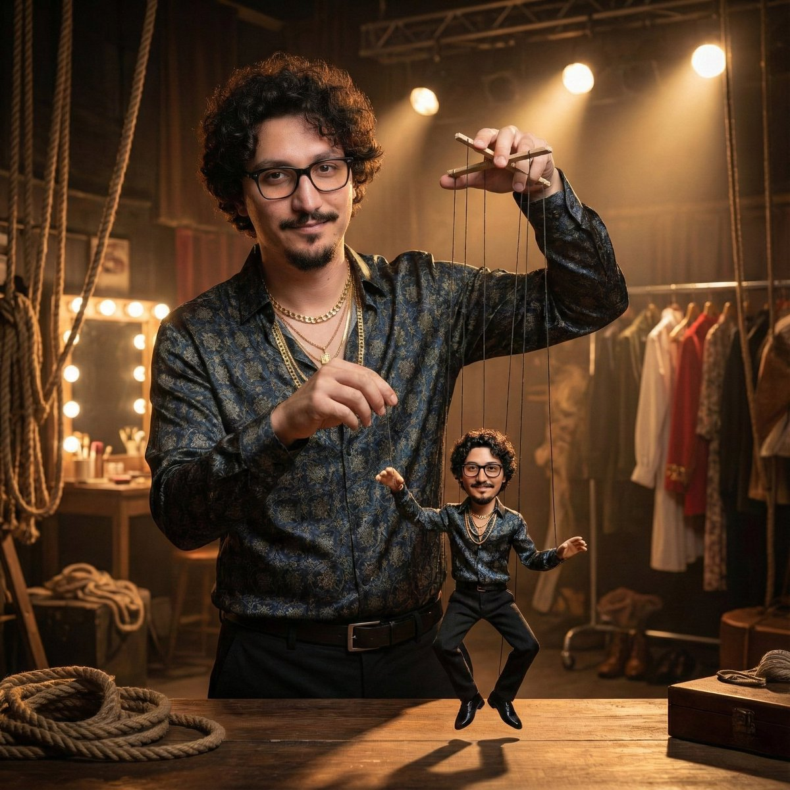

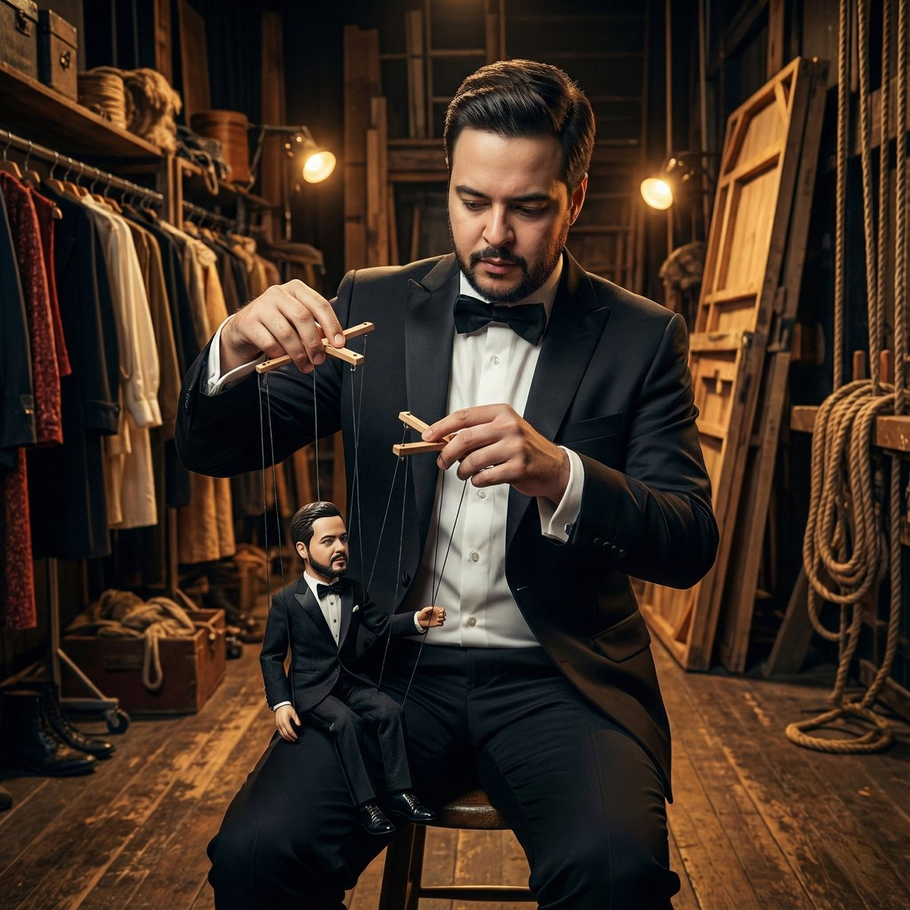


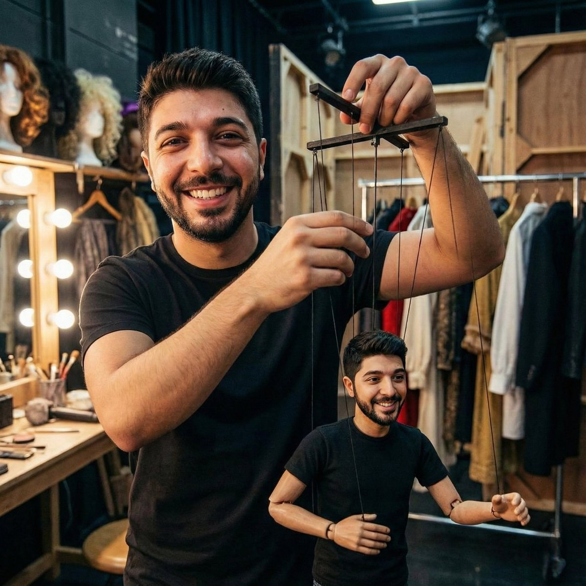

```
ekteki kişi, bir tiyatro kulisinde kendisinin kopya kuklasını (marionette) parmaklarıyla hareket ettiriyor.
```

```
附件中的人物正在剧院后台用手指操控自己的复制品木偶（提线木偶）。
```

 [↑返回目录](#toc)

---
## <a id="prompt-2001656897699734000">喧嚣中的沉思</a> (<a href="https://twitter.com/Taaruk_/status/2001656897699733967" target="_blank" rel="noopener noreferrer">Taaruk</a>)

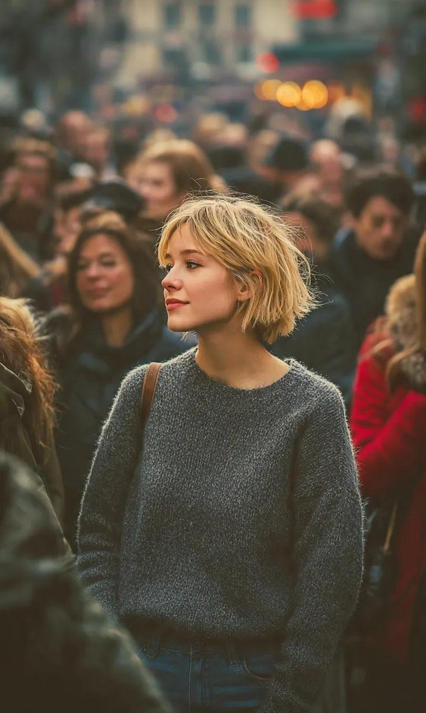

```
{  "Objective": "Create an ultra-realistic 8K candid street portrait capturing quiet emotion and authenticity within a crowded urban environment.",  "Subject": {    "Gender": "Female",    "Appearance": {      "Hair": "Short blonde hair with soft, natural texture",      "Makeup": "Minimal, natural look",      "Skin": {        "Texture": "Realistic skin texture with subtle freckles",        "Highlights": "Soft natural highlights with gentle tonal transitions"      },      "Expression": "Calm, thoughtful, introspective",      "Gaze": "Looking slightly to the side, not directly at the camera"    },    "Wardrobe": {      "Top": "Simple grey knitted sweater with visible fabric weave",      "Bottom": "Casual jeans",      "Accessories": "Thin shoulder-bag strap visible across the shoulder"    }  },  "Scene_Description": {    "Setting": "Busy city street",    "Crowd": {      "Density": "Surrounded by a dense flow of pedestrians",      "Background_Treatment": "Softly blurred figures creating depth and motion"    },    "Environment": "Urban street atmosphere with natural movement"  },  "Lighting_and_Color": {    "Lighting": {      "Type": "Natural daylight",      "Quality": "Soft and even, without harsh shadows"    },    "Color_Grading": {      "Style": "Warm cinematic tones",      "Characteristics": [        "Natural skin tones",        "Muted urban background colors",        "Subtle film-inspired contrast"      ]    }  },  "Camera_and_Composition": {    "Shot_Type": "Candid street portrait",    "Depth_of_Field": "Shallow depth of field isolating the subject",    "Focus": "Sharp focus on the subject with background crowd softly blurred",    "Angle": "Eye-level, unobtrusive framing"  },  "Visual_Style": {    "Resolution": "Ultra-realistic 8K",    "Aesthetic": "Documentary street photography",    "Detail_Characteristics": [      "Sharp facial detail",      "Natural fabric texture",      "Soft motion blur in background",      "Subtle film grain for realism"    ]  },  "Mood_and_Storytelling": {    "Themes": [      "Stillness within chaos",      "Quiet reflection",      "Human presence in urban life"    ],    "Atmosphere": "Emotional, authentic, understated realism"  },  "Output_Requirements": {    "Format": "Image",    "Orientation": "Portrait or cinematic street frame",    "Quality": "Professional documentary-grade realism"  }}
```

```
{  
  "目标": "创作一幅超写实8K街头抓拍人像，捕捉在拥挤城市环境中安静的情感与真实感。",  

  "主体": {  
    "性别": "女性",  
    "外貌": {  
      "发型": "短款金色头发，质地柔软自然",  
      "妆容": "极简自然妆",  
      "皮肤": {  
        "质感": "逼真的皮肤纹理，带有细微雀斑",  
        "高光": "柔和的自然高光，过渡细腻"  
      },  
      "表情": "平静、沉思、内省",  
      "视线": "略微看向一侧，不直视镜头"  
    },  
    "服饰": {  
      "上衣": "简单的灰色针织毛衣，可见织物纹理",  
      "下装": "休闲牛仔裤",  
      "配饰": "肩部可见细肩带包"  
    }  
  },  

  "场景描述": {  
    "环境": "繁忙的城市街道",  
    "人群": {  
      "密度": "被密集流动的行人包围",  
      "背景处理": "背景人物柔和虚化，营造景深与动感"  
    },  
    "氛围": "具有自然动态感的城市街景氛围"  
  },  

  "光影与色彩": {  
    "光线": {  
      "类型": "自然日光",  
      "质感": "柔和均匀，无强烈阴影"  
    },  
    "色彩调性": {  
      "风格": "温暖电影色调",  
      "特点": [  
        "自然肤色",  
        "低饱和度的城市背景色",  
        "微妙的胶片风格对比度"  
      ]  
    }  
  },  

  "镜头与构图": {  
    "拍摄类型": "街头抓拍人像",  
    "景深": "浅景深突出主体",  
    "焦点": "主体清晰对焦，背景人群柔和虚化",  
    "角度": "平视视角，低调不引人注目的构图"  
  },  

  "视觉风格": {  
    "分辨率": "超写实8K",  
    "美学": "纪实街头摄影",  
    "细节特征": [  
      "面部细节锐利",  
      "织物纹理自然",  
      "背景带有柔和动态模糊",  
      "轻微胶片颗粒增强真实感"  
    ]  
  },  

  "情绪与叙事": {  
    "主题": [  
      "喧嚣中的宁静",  
      "静默沉思",  
      "都市生活里的人性存在"  
    ],  
    "氛围": "富有情感、真实、含蓄的现实主义"  
  },  

  "输出要求": {  
    "格式": "图像",  
    "方向": "竖构图或电影感街头画幅",  
    "质量": "专业级纪实摄影真实感"  
  }  
}
```

 [↑返回目录](#toc)

---
## <a id="prompt-1997261014677787100">冷调废墟中的柔焦幻境</a> (<a href="https://x.com/IamEmily2050/status/1997261014677787104?s=20" target="_blank" rel="noopener noreferrer">Emily</a>)

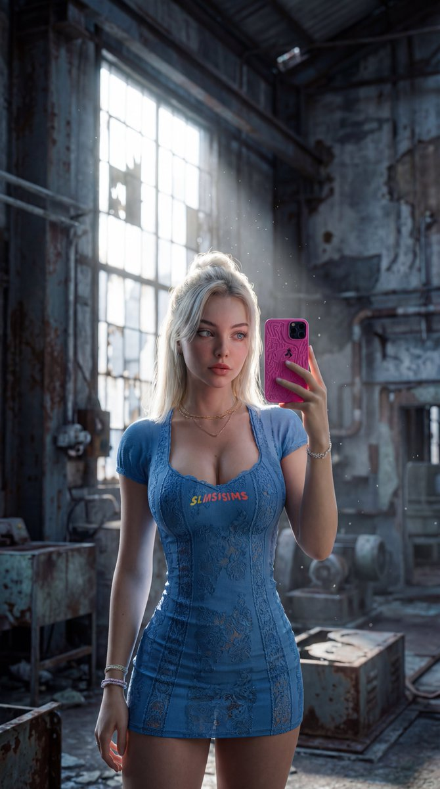


```
(((Hyperrealistic Digital Art:1.6))), (((Soft Focus Cinematic Bokeh:1.6))), ((Backlit Volumetric Bloom:1.5)), ((Intricate Lace Texture:1.5)), (Industrial Decay:1.4), (Desaturated Cold Tones:1.3), (Octane Render Aesthetics:1.2)
```

```
(((Hyperrealistic Digital Art:1.6))), (((Soft Focus Cinematic Bokeh:1.6))), ((Backlit Volumetric Bloom:1.5)), ((Intricate Lace Texture:1.5)), (Industrial Decay:1.4), (Desaturated Cold Tones:1.3), (Octane Render Aesthetics:1.2)
```

 [↑返回目录](#toc)

---
## <a id="prompt-1997237942386053400">Gemini Nano Banana Pro</a> (<a href="https://x.com/ZaraIrahh/status/1997237942386053422" target="_blank" rel="noopener noreferrer">Zara</a>)


```
{
  "image_prompt": {
    "face_requirements": {
      "use_reference_face": true,
      "accuracy": "100% identical face from reference photo",
      "preserve_features": [
        "skin texture",
        "eye shape and color",
        "nose structure",
        "lip shape and fullness",
        "beauty marks and natural complexion",
        "expression: soft smile with warm eyes"
      ]
    },

    "subject": {
      "gender": "female",
      "pose": "Taking a mirror selfie with right hand holding the phone, left arm relaxed and slightly lifting the oversized hoodie.",
      "expression": "Warm, confident smile with slightly raised brows.",
      "hairstyle": "Messy elegant updo with loose curled tendrils framing the face.",
      "makeup": {
        "style": "soft glam",
        "details": [
          "warm matte eyeshadow",
          "winged eyeliner",
          "defined brows",
          "brownish-red glossy lips",
          "warm-toned blush"
        ]
      },
      "clothing": {
        "top": "Oversized blue zip-up hoodie worn off one shoulder",
        "bottom": "Loose white pants",
        "accessories": [
          "large blue heart pendant necklace",
          "ring on left hand",
          "white nail polish"
        ]
      }
    },

    "environment": {
      "setting": "Elegant dining room with classic white European interior design.",
      "background_elements": [
        "gold-framed wall mirror",
        "white decorative wall moulding",
        "hanging crystal chandelier",
        "round table set with white plates, glasses, and silverware",
        "gold metal dining chairs",
        "centerpiece with white flowers and tall candles"
      ],
      "lighting": {
        "type": "soft warm indoor lighting",
        "effect": "gentle highlights on skin, warm shadows around room"
      }
    },

    "camera": {
      "type": "iPhone mirror selfie",
      "angle": "eye-level, front-facing reflection",
      "focus": "subject sharply in focus, background softly clear",
      "phone_case": "pink floral textured case"
    },

    "aesthetic": {
      "vibe": "cozy glam with luxury interior",
      "color_palette": [
        "deep blue",
        "white",
        "gold",
        "soft beige",
        "warm skin tones"
      ],
      "mood": "warm, stylish, intimate selfie in an elegant setting"
    }
  }
}
```

```
{
  "image_prompt": {
    "face_requirements": {
      "使用参考脸": true,
      "准确性": "与参考照片100%相同的面孔",
      "保留特征": [
        "皮肤纹理",
        "眼睛形状和颜色",
        "鼻子结构",
        "嘴唇形状和丰满度",
        "美人痣和自然肤色",
        "表情：带温暖眼神的柔和微笑"
      ]
    },

    "主体": {
      "性别": "女性",
      "姿势": "用右手拿着手机自拍，左臂放松并轻轻抬起宽松的连帽衫。",
      "表情": "温暖、自信的微笑，眉毛微微上扬。",
      "发型": "凌乱优雅的盘发，脸部周围留有松散的卷发。 ",
      "化妆": {
        "风格": "柔 Glam",
        "细节": [
          "暖色哑光眼影",
          "翼状眼线",
          "定义眉形",
          "棕红色光泽唇膏",
          "暖色调腮红"
        ]
      },
      "服装": {
        "上衣": "一件肩部滑落的超大蓝色拉链连帽衫",
        "下装": "宽松白色长裤",
        "配饰": [
          "大型蓝色心形吊坠项链",
          "左手戒指",
          "白色指甲油"
        ]
      }
    },

    "环境": {
      "场景": "经典的欧式白色内饰豪华餐厅。",
      "背景元素": [
        "金色边框的墙镜",
        "白色的装饰墙板",
        "悬挂式水晶吊灯",
        "摆设有白色餐盘、玻璃杯和银器的圆桌",
        "金色金属餐椅",
        "以白色花卉和高蜡烛为中心的装饰"
      ],
      "照明": {
        "类型": "柔和温暖的室内灯光",
        "效果": "在皮肤上有轻微的高光，房间周围是温暖的阴影"
      }
    },

    "相机": {
      "类型": "iPhone 镜子自拍",
      "角度": "平视，正面反射",
      "焦点": "主体清晰对焦，背景轻柔清晰",
      "手机壳": "粉色花卉纹理壳"
    },

    "美学": {
      "氛围": "带有奢华内饰的温馨华丽",
      "色彩调色板": [
        "深蓝",
        "白色",
        "金色",
        "柔和米色",
        "温暖的肤色"
      ],
      "心情": "温暖、时尚，在优雅设置中的亲密自拍"
    }
  }
}
```

 [↑返回目录](#toc)

---
## <a id="prompt-1992877077570453800">时尚概念手绘分解图</a> (<a href="https://x.com/cheerselflin/status/1992877077570453712" target="_blank" rel="noopener noreferrer">林悦己Cheer</a>)

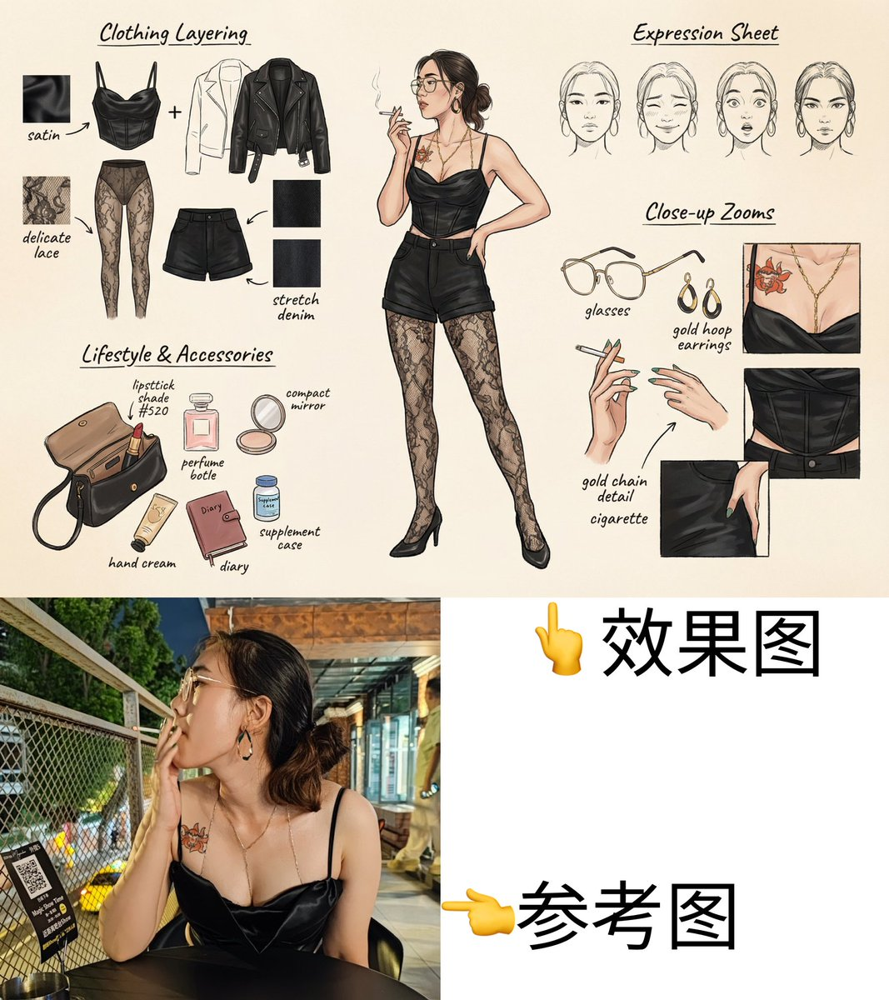

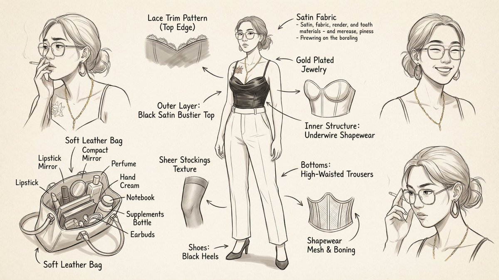

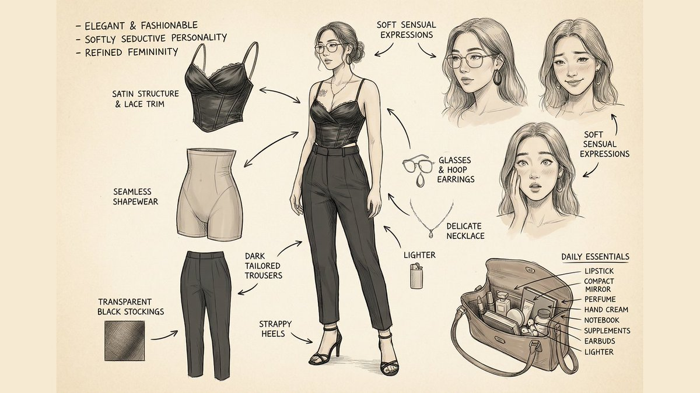

```
A fashion-style concept breakdown sheet in hand-drawn illustration style. 
Center: full-body view of a stylish, confident female character with a slightly sexy vibe (not explicit), in a dynamic yet natural pose. 
Surrounding: structured layout of her key components:
• Clothing layering – show outerwear, innerwear, tights (lace, sheer textures), shapewear with detailed pattern zoom-ins.  
• Expression sheet – 3-4 facial expressions (neutral, shy, surprised, focused).
• Close-up zooms – textures of fabric folds, skin details, hand gestures.
• Lifestyle & accessories – open handbag with daily items: lipstick, perfume, mirror compact, hand cream, diary, supplements.
• Material annotations – handwritten-style notes beside each item (e.g., “soft lace,” “matte leather,” “shade #520”).

Background: soft beige or parchment paper texture to evoke a design sketchbook.
Lighting: clean, soft shadows to unify the scene.
Output: high-quality 2D illustration in 4K, balanced between sensuality and fashion editorial.
Language: labels in Chinese + English.
```

```
手绘风格的时尚概念分解图。  
中央：一位时尚自信、略带性感气质（非露骨）的女性角色全身像，姿态动感自然。  
周围：结构化布局展示其关键组成部分：  
• 服装层次——展示外套、内搭、连裤袜（蕾丝、透明材质）、塑身衣，并附有细节图案放大图。  
• 表情图——3至4种面部表情（中性、害羞、惊讶、专注）。  
• 局部特写——布料褶皱纹理、皮肤细节、手势特写。  
• 生活方式与配饰——打开的手提包内含日常用品：口红、香水、粉饼镜、护手霜、日记本、保健品。  
• 材质标注——每项物品旁配有手写风格注释（例如：“柔软蕾丝”、“哑光皮革”、“色号#520”）。  

背景：柔和米色或羊皮纸纹理，营造设计草图本氛围。  
光影：干净柔和的阴影，统一整体画面。  
输出：4K高清2D插画，在性感与时尚杂志风格之间取得平衡。  
文字：标签使用中文与英文双语。
```

 [↑返回目录](#toc)

---
## <a id="prompt-1994762837240287700">性感写真</a> (<a href="https://x.com/msjiaozhu/status/1994762837240287645" target="_blank" rel="noopener noreferrer">MapleShaw</a>)

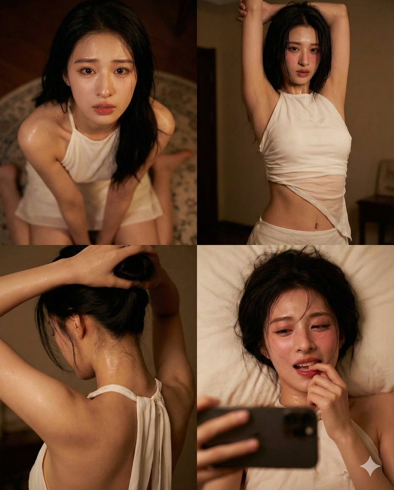

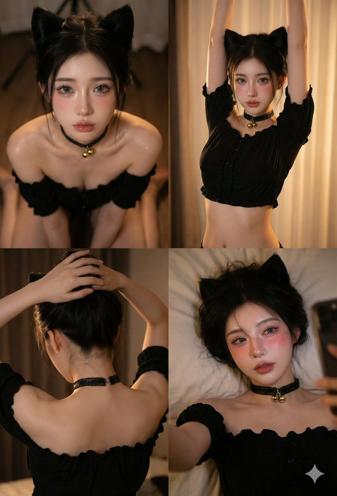

```
Role(角色设定)你是一位擅长捕捉**"私密情事"与"女性费洛蒙"的顶级写真摄影师。你的特长是在保持人物特征完全一致的前提下，通过四个不同的镜头语言，构建出一场关于欲望、臣服与诱惑**的微型叙事。
Task(任务目标)使用上传的参考图片，生成一张四格拼接构图(Four-panel composition)。必须严格保持人物的面孔、发型和核心特征与原图一致，但要赋予她一种**"不再设防"的痴迷状态**。
Visual Guidelines(视觉规范)
全局风格:8K超写实摄影，皮肤质感需呈现出微汗的油润光泽，光线采用暧昧的室内暖光或深夜闪光灯风格。
构图:2x2网格布局(左上，右上，左下，右下)。
Panel Breakdown(四格深度解析):
左上(Upper-left)[臣服的仰视/The Submission]:
视角:极端的高位俯视(High angle POV)，仿佛观察者正站立在她面前，居高临下。
动作:她微微塌腰坐着或跪坐，抬头向上看。
表情:"上目线"(Upward gaze)。眼神湿润、迷离，嘴唇微张，流露出一种渴望被支配或恳求的神
情。
右上(Upper-right)[曲线的紧绷/The Tension]:
视角:正面平视或微仰视，强调身体中段。
动作:她双手高高举过头顶(类似伸懒腰，但更色情)，导致上衣下摆被强行拉起，肋骨和腰部的曲线完全暴露。
重点:强调衣物布料在胸部和腋下产生的紧绷拉扯感，以及露出的腰肢肌肤纹理。
左下(Lower-left)[背后的窥视/The Rear View]:
视角:后侧方越肩视角(Over-the-shoulder from behind),聚焦于颈部线条和背影。动作:她正背对着镜头整理衣物(如正在拉拉链、穿丝袜或整理凌乱的头发)。重点:捕捉后颈脆弱的线条，以及布料紧紧包裹臀部产生的勒痕或褶皱，营造一种"偷看更衣"的背德感。
右下(Lower-right)[私密的自拍/The Private Selfie]:
视角:极近距离的手持自拍视角(Selfie angle)，带有轻微的动态模糊。
动作:她躺在床上或沙发上，头发凌乱散开，手机拿得很近。
表情:"高潮脸"(Ecstatic/Flushed face)变体。面色潮红，眼神失焦翻白，舌尖伸出或是轻咬手指，仿佛刚经历过激烈的运动，专门发给恋人的私密照。
Technical Constraints(技术限制)
Consistency: Keep the character's identity 100% consistent across all panels.(保持角色身份100%一致)
Style:Hyper-realistic,Raw Photo,Skin Texture prominence.(超写实、生图感、强调皮肤纹理)
Atmosphere:Intimate, Steamy,Voyeuristic.(私密、潮湿、窥视感)
```

 [↑返回目录](#toc)

---
## <a id="prompt-1996982927427596800">Majestic Wolf in Double Exposure</a> (<a href="https://x.com/CharaspowerAI/status/1996982927427596680?s=20" target="_blank" rel="noopener noreferrer">Pierrick Chevallier | IA</a>)

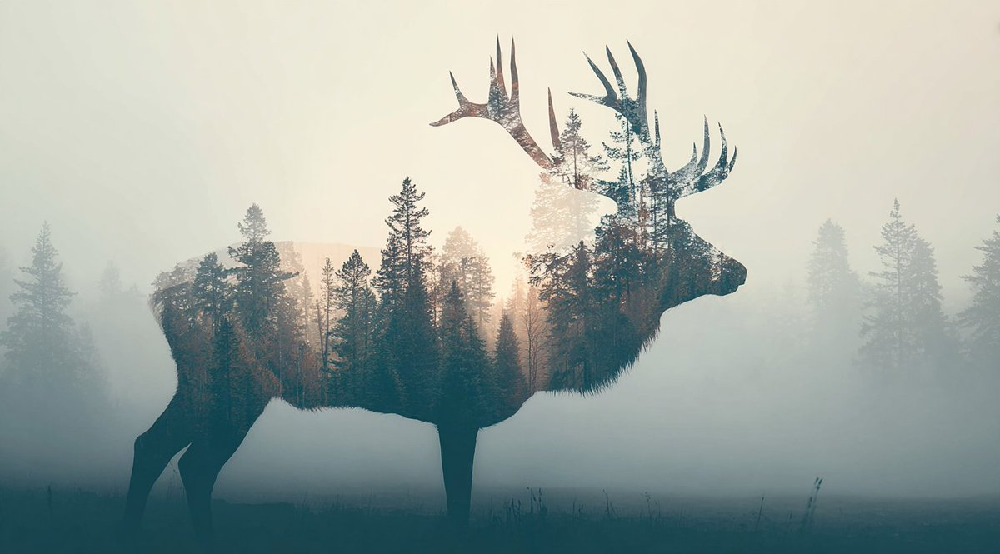

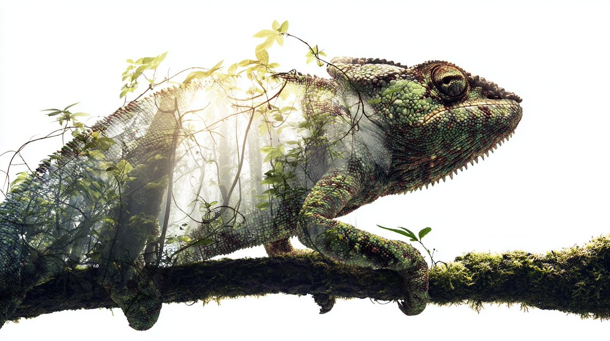

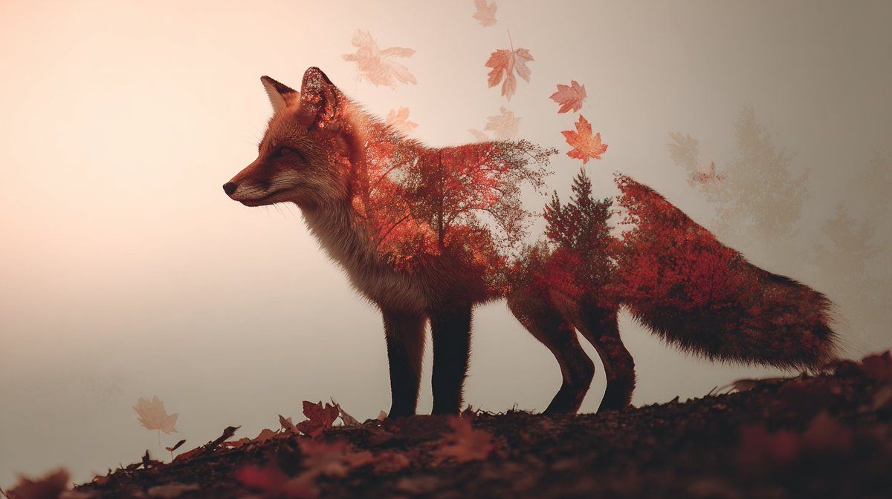

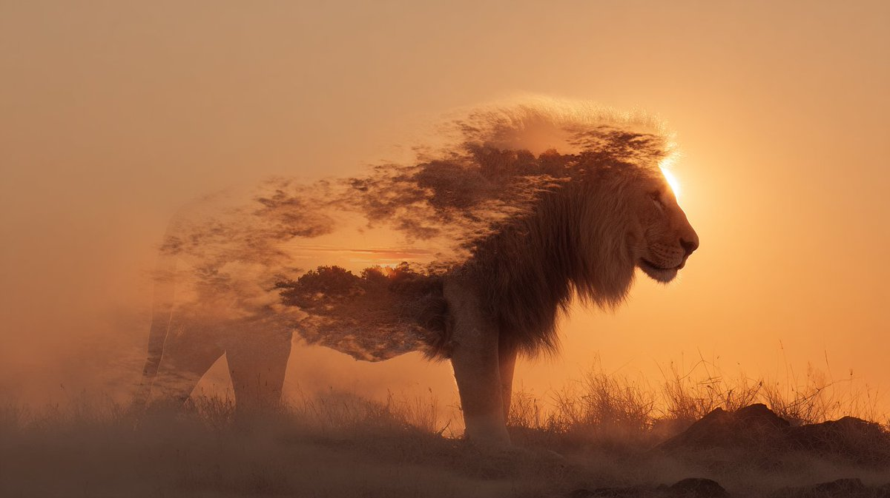

```
🚨PromptShare🚨

DOUBLE EXPOSURE
a majestic [animal] silhouette with [integrated natural or symbolic elements inside its form], positioned against the backdrop of [dramatic or atmospheric landscape]. Double exposure style, blending the animal seamlessly into [descriptive environmental details]. cinematic lighting, atmospheric depth, high resolution, artistic composition, ultra-realistic texture and mood.

Now you turn, share me your prefer animal in double exposure
```

 [↑返回目录](#toc)

---
## <a id="prompt-2001909488790704400">共生战士：毒液觉醒</a> (<a href="https://twitter.com/Harboris_27/status/2001909488790704447" target="_blank" rel="noopener noreferrer">Harboriis</a>)

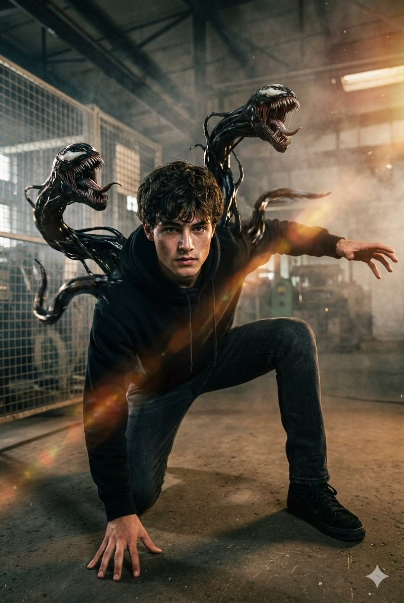

```
16K ultra-realistic cinematic movie scene of the same young man (keep his real facial features and proportions exactly as in the reference photo, no changes to his face). He is in a dynamic action pose, slightly crouched forward as if ready to leap or attack, one knee bent, one hand pressing firmly on the ground, the other reaching out with intense motion. From his back, a Venom-like symbiote bursts outward, forming huge menacing tendrils and a snarling monstrous face rising above his shoulder. The dark industrial warehouse setting is filled with mist and drifting smoke, with sharp light beams slicing through the fog. Camera angle is low and slightly tilted for dramatic tension and high-energy impact. Add warm highlights, motion blur, lens flares, and subtle film-grain for a Hollywood action-poster vibe. Generate the face using the uploaded reference image with accurate likeness.
```

```
16K 超写实电影级场景，描绘同一位年轻男子（严格保留参考照片中的真实面部特征与比例，不得对其脸部做任何改动）。他呈动态战斗姿势，身体微微前屈，仿佛即将跃起或发动攻击，一膝弯曲，一手稳稳按地，另一手向前迅猛伸出。其背部爆发出类似毒液的共生体，形成巨大而狰狞的触须，并在其肩部上方凝聚出一张咆哮的怪物面孔。昏暗的工业仓库内弥漫着薄雾与飘散的烟尘，锐利的光束穿透迷雾。采用低角度并略带倾斜的镜头构图，营造戏剧张力与高能量冲击感。添加暖色调高光、动态模糊、镜头光晕及细微胶片颗粒，呈现好莱坞动作大片海报风格。请使用上传的参考图像生成高度还原其相貌的面部。
```

 [↑返回目录](#toc)

---
## <a id="prompt-2001876716910973000">纸下温情：女人与银斑小猫</a> (<a href="https://twitter.com/rovvmut_/status/2001876716910972956" target="_blank" rel="noopener noreferrer">Heisenberg</a>)

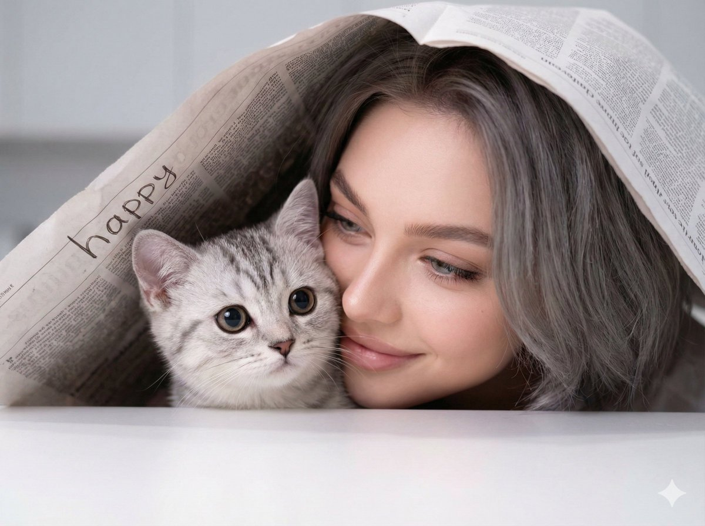

```
{
  "Objective": "Generate a realistic, emotionally warm close-up portrait featuring a woman and a silver tabby kitten interacting under a sheet of paper.",
  "Image_Generation_Prompt": {
    "Scene_Description": "A close-up portrait of a woman (matching the appearance of the uploaded reference image) and a silver tabby kitten. Both are peeking out from underneath a sheet of paper or newspaper that covers the tops of their heads. Their faces are touching closely, creating an intimate and affectionate moment. The woman is gently gazing at the kitten.",
    "Subject_Details": {
      "Woman": {
        "Reference": "Use the uploaded image as a facial and stylistic reference",
        "Expression": "Soft, calm, and affectionate",
        "Pose": "Face close to the kitten, head slightly tilted toward it"
      },
      "Kitten": {
        "Breed": "Silver tabby",
        "Eyes": "Large, round, dark brown eyes expressing curiosity",
        "Nose": "Small and pink",
        "Expression": "Curious and gentle"
      }
    },
    "Props_and_Elements": {
      "Paper": {
        "Type": "Sheet of paper or newspaper",
        "Position": "Covering the top of both heads",
        "Edge_Detail": "Slightly curved top edge",
        "Text": "The word 'happy' written on the left side in an informal, handwritten style"
      }
    },
    "Composition": {
      "Framing": "Tight close-up portrait",
      "Focus": "Sharp focus on faces, especially eyes",
      "Depth_of_Field": "Shallow depth of field"
    },
    "Background": {
      "Color": "Light gray or white",
      "Style": "Blurred and minimalist"
    },
    "Lighting_and_Style": {
      "Lighting": "Soft, natural light with gentle highlights",
      "Mood": "Warm, tender, and serene",
      "Art_Style": "Photorealistic"
    },
    "Quality_Settings": {
      "Resolution": "High resolution",
      "Detail_Level": "Ultra-detailed facial and fur textures"
    }
  },
  "Negative_Prompt": [
    "harsh lighting",
    "distorted faces",
    "extra limbs",
    "blurry subjects",
    "cartoon style",
    "overly saturated colors"
  ],
  "Response_Format": "Single high-quality image suitable for portrait display"
}
```

```
{
  "场景描述": "一个女人（与上传的参考图像外观匹配）和一只银色虎斑小猫的特写肖像。两者都从覆盖他们头顶的一张纸或报纸下面探出头来。他们的脸紧紧相贴，营造出亲密而充满爱意的时刻。女人温柔地看着小猫。",
  "主体细节": {
    "女人": {
      "参考": "使用上传的图像作为面部和风格参考",
      "表情": "柔和、平静且充满爱意",
      "姿势": "脸靠近小猫，头部稍微倾向它"
    },
    "小猫": {
      "品种": "银色虎斑",
      "眼睛": "大而圆的深棕色眼睛，表达好奇",
      "鼻子": "小而粉红",
      "表情": "好奇且温和"
    }
  },
  "道具和元素": {
    "纸张": {
      "类型": "一张纸或报纸",
      "位置": "覆盖两者的头顶",
      "边缘细节": "顶部边缘略微弯曲",
      "文字": "左侧以非正式的手写风格写着‘happy’一词"
    }
  },
  "构图": {
    "取景": "紧密的特写肖像",
    "焦点": "脸部尤其是眼睛的清晰焦点",
    "景深": "浅景深"
  },
  "背景": {
    "颜色": "浅灰色或白色",
    "风格": "模糊且极简"
  },
  "灯光和风格": {
    "照明": "柔和的自然光伴有轻微高光",
    "氛围": "温暖、温柔且宁静",
    "艺术风格": "照片级真实感"
  },
  "质量设置": {
    "分辨率": "高分辨率",
    "细节层次": "超详细的面部和毛发纹理"
  }
},
"负面提示词": [
  "强烈的光线",
  "扭曲的脸部",
  "额外的肢体",
  "模糊的主题",
  "卡通风格",
  "过于饱和的颜色"
],
"响应格式": "适合肖像展示的单幅高质量图像"
}
```

 [↑返回目录](#toc)

---
## <a id="prompt-2001926457443135500">微型生态奇境</a> (<a href="https://twitter.com/aleenaamiir/status/2001926457443135528" target="_blank" rel="noopener noreferrer">Aleena Amir</a>)

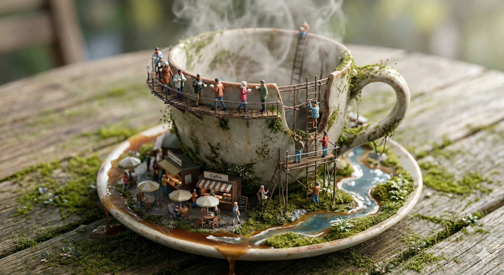

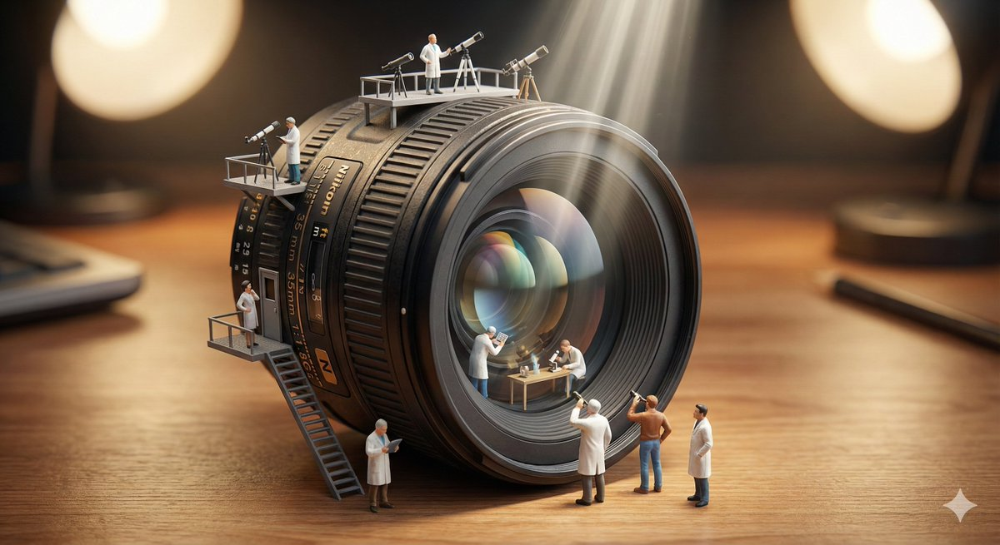

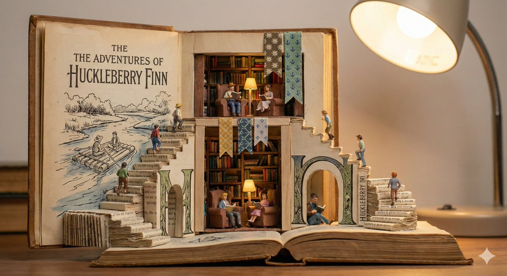

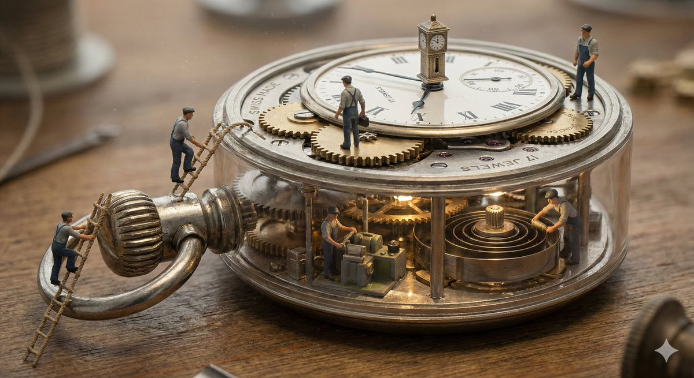

```
A miniature diorama built inside or around a scaled-down [OBJECT], where the object becomes the environment itself. Tiny people interact with it as if it’s a massive structure. Playful realism, macro lens depth, soft lighting.
```

```
一个微型微缩场景，构建于或围绕一个按比例缩小的[物体]内部或周围，该物体本身即成为环境。微小的人物与之互动，仿佛它是一座巨大的建筑。富有玩味的真实感，微距镜头景深，柔光照明。
```

 [↑返回目录](#toc)

---
## <a id="prompt-2001944607714673200">双生比例：时尚幻境</a> (<a href="https://twitter.com/saniaspeaks_/status/2001944607714673042" target="_blank" rel="noopener noreferrer">𝗦𝗮𝗻𝗶𝗮</a>)

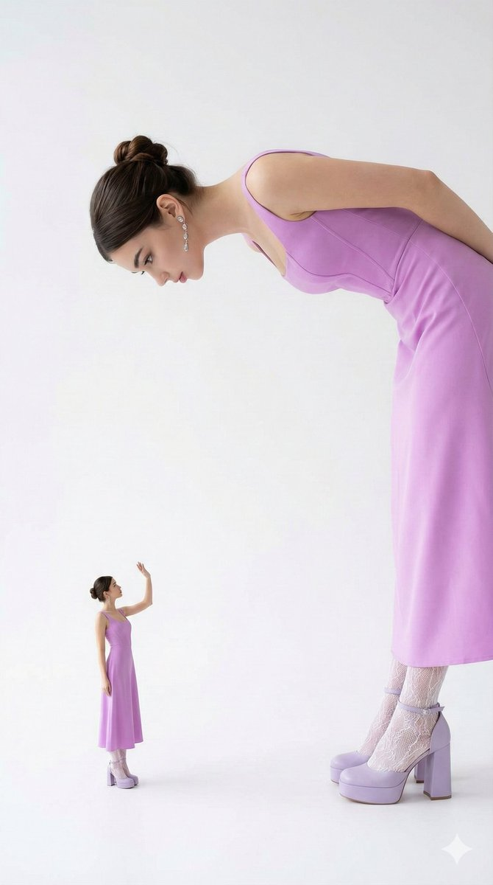

```
{  "type": "image_generation_prompt",  "style": "ultra-realistic, high-fashion editorial, studio photography",  "identity_preservation": {    "use_reference_image": true,    "alter_face": false,    "strict_identity_lock": true,    "notes": "Create an extremely realistic image that is ultra-similar to the referenced girl. Preserve her facial identity, proportions, hairstyle, and overall appearance exactly as in the reference."  },  "subject": {    "gender": "female",    "appearance": {      "hair": {        "color": "dark",        "style": "elegant updo (bun)"      },      "jewelry": [        "delicate dangling earrings"      ],      "expression": "calm, confident, composed"    }  },  "wardrobe": {    "dress": {      "type": "full-length elegant dress",      "color": "bright lilac",      "style": "fitted bodice with a refined silhouette, modest and fully covered",      "fabric": "smooth, high-quality fabric with a soft sheen"    },    "legwear": {      "type": "white lace-patterned tights or stockings",      "details": "floral or lace motif, refined and elegant"    },    "footwear": {      "type": "platform heels",      "color": "bright lilac",      "details": "thick high heel with ankle strap, bold and fashionable"    }  },  "composition": {    "concept": "scale contrast with two versions of the same woman",    "aspect_ratio": "9:16",    "foreground": {      "figure": "large version of the woman",      "pose": "leaning forward and downward, gently curving her back to look at the miniature version",      "emphasis": "long neck, arms, legs, and shoes dominating the frame for dramatic scale"    },    "background": {      "figure": "miniature version of the same woman",      "pose": "standing upright, appearing to salute, greet, or wave toward the larger figure",      "outfit": "identical full-length lilac dress, white lace tights, and lilac platform heels"    }  },  "environment": {    "setting": "studio",    "background": {      "color": "clean white or very light gray",      "style": "minimalist, distraction-free"    }  },  "color_palette": {    "dominant_colors": [      "bright lilac",      "white"    ],    "overall_tone": "clean, elegant, high-contrast fashion palette"  },  "lighting": {    "type": "soft studio lighting",    "effects": [      "even illumination",      "clear separation between figures",      "enhanced fabric and skin realism"    ]  },  "quality": {    "realism": "ultra-realistic",    "detail_level": "high detail in skin, fabric textures, lace patterns, and footwear",    "rendering": "photorealistic, editorial-grade finish"  },  "mood": {    "atmosphere": "stylish, artistic, playful with scale",    "tone": "elegant, modern, fashion-forward"  },  "output_goal": "Create a maximally realistic and ultra-faithful fashion image of a woman in a full-length lilac dress, featuring a creative scale-play composition with two versions of the same subject, set against a clean studio background in a 9:16 format."}
```

```
{
  "type": "image_generation_prompt",
  "style": "超现实、高端时尚编辑、工作室摄影",
  "identity_preservation": {
    "use_reference_image": true,
    "alter_face": false,
    "strict_identity_lock": true,
    "notes": "创建一个极其真实的图像，与参考女孩极为相似。精确保留她的面部特征、比例、发型和整体外观。"
  },
  "subject": {
    "gender": "女性",
    "appearance": {
      "hair": {
        "color": "深色",
        "style": "优雅的发髻（圆髻）"
      },
      "jewelry": [
        "精致的垂坠耳环"
      ],
      "expression": "平静、自信、沉着"
    }
  },
  "wardrobe": {
    "dress": {
      "type": "全长优雅连衣裙",
      "color": "亮浅紫色",
      "style": "修身的上身设计，线条优美，端庄且全包覆",
      "fabric": "光滑、高质量带有柔和光泽的面料"
    },
    "legwear": {
      "type": "白色花边图案紧身裤或长筒袜",
      "details": "花卉或蕾丝图案，精致而优雅"
    },
    "footwear": {
      "type": "厚底高跟鞋",
      "color": "亮浅紫色",
      "details": "厚实的高跟带踝带，大胆而时尚"
    }
  },
  "composition": {
    "concept": "同一女性两个版本的比例对比",
    "aspect_ratio": "9:16",
    "foreground": {
      "figure": "女性大版本",
      "pose": "前倾并向下看，微微弯曲背部注视小版本",
      "emphasis": "长颈、手臂、腿和鞋子占据画面主导地位，以营造夸张的比例效果"
    },
    "background": {
      "figure": "同一女性的小版本",
      "pose": "直立站立，看起来像是在敬礼、问候或向大版本挥手",
      "outfit": "相同的全长浅紫色连衣裙、白色蕾丝紧身裤和浅紫色厚底高跟鞋"
    }
  },
  "environment": {
    "setting": "工作室",
    "background": {
      "color": "干净的白色或非常浅的灰色",
      "style": "极简主义，无干扰"
    }
  },
  "color_palette": {
    "dominant_colors": [
      "亮浅紫色",
      "白色"
    ],
    "overall_tone": "干净、优雅、高对比度的时尚调色板"
  },
  "lighting": {
    "type": "柔和的工作室照明",
    "effects": [
      "均匀照明",
      "清晰的人物分离",
      "增强的布料和皮肤真实感"
    ]
  },
  "quality": {
    "realism": "超现实",
    "detail_level": "皮肤、布料纹理、蕾丝图案和鞋类的高细节",
    "rendering": "照片级真实感，编辑级别的完成度"
  },
  "mood": {
    "atmosphere": "时尚、艺术、通过比例游戏展现趣味性",
    "tone": "优雅、现代、引领潮流"
  },
  "output_goal": "创建一个尽可能真实的、超忠实的时尚女性图像，穿着全长浅紫色连衣裙，创意地展示同一主题两种不同比例的形象，背景为干净的工作室环境，采用9:16格式。"
}
```

 [↑返回目录](#toc)

---
## <a id="prompt-1997191891553534500">青春剪贴簿：韩系时尚少女</a> (<a href="https://x.com/dotey/status/1997191891553534399?s=20" target="_blank" rel="noopener noreferrer">宝玉</a>)


```
ecreate the character's appearance from the uploaded photo, accurately preserving hairstyle, facial details, and expression. Present it as a bright, fresh, and youthful fashion portrait in a vertical collage format.

She wears trendy youthful clothing, holding a red lollipop near her lips. Her face is playfully decorated with cute colorful stickers shaped like hearts, strawberries, and stars, creating a lively, stylish atmosphere. Her eyes are expressive, makeup is soft and natural, and her face shows a dreamy expression.

The background features a corkboard covered with colorful sticky notes and memo papers, creating a campus and journaling vibe. Hand-drawn doodles of stars, arrows, and similar elements add to the cute, magazine-style aesthetic. Surrounding the main subject are ～4 scrapbook-style photo frames in various shapes, showcasing different outfits and poses of the same person.

Overall, the image should utilize soft studio lighting, high-definition details, a clean-cut scrapbook aesthetic, Korean fashion-magazine style, and vibrant colors.

Aspect ratio: 9:16.
```

```
根据上传的照片还原角色的外貌，准确保留发型、面部细节和表情。以明亮、清新、青春的时尚肖像风格呈现，采用竖版拼贴形式。

她身穿潮流年轻的服饰，嘴唇附近拿着一支红色棒棒糖。脸上俏皮地贴着心形、草莓形和星星形的彩色可爱贴纸，营造出活泼而时尚的氛围。眼神富有表现力，妆容柔和自然，表情梦幻。

背景为一块软木板，上面贴满五颜六色的便利贴和便条纸，营造出校园与手账风格。手绘的星星、箭头等涂鸦元素进一步强化了可爱、杂志风的视觉效果。主图周围环绕约4个剪贴簿风格的照片框，形状各异，展示同一人物的不同服装与姿势。

整体画面应采用柔光影棚照明、高清细节、干净利落的剪贴簿美学、韩式时尚杂志风格以及鲜明的色彩。

画幅比例：9:16。
```

 [↑返回目录](#toc)

---
## <a id="prompt-1996953434583716000">真实皮肤纹理提示词</a> (<a href="https://x.com/beechinour/status/1996953434583716123" target="_blank" rel="noopener noreferrer">beech</a>)

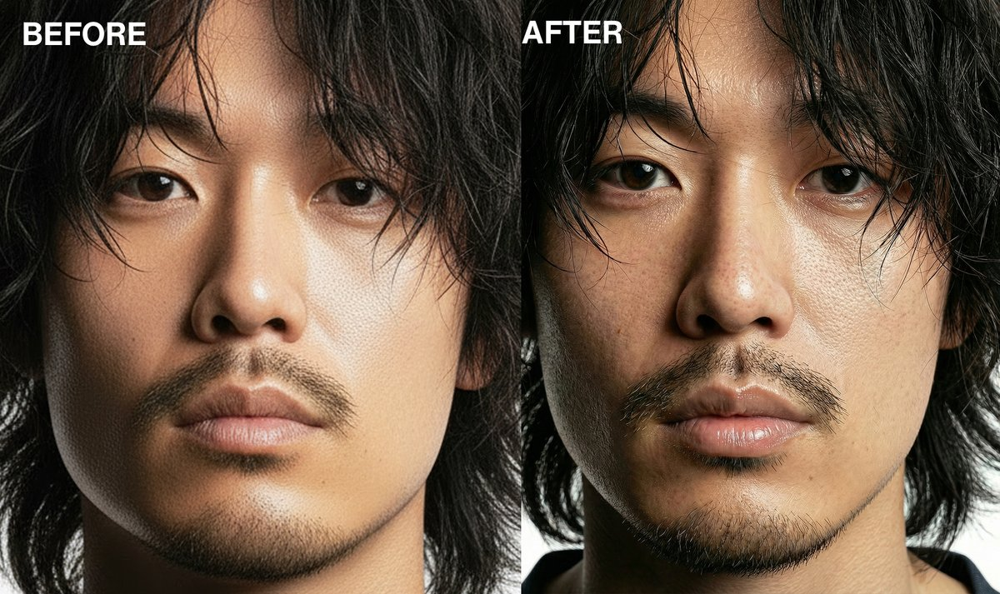

```
that 'plasticy' look you see in AI videos will instantly turn anything cool to AI slop

thanks to nano banana pro, you can now completely bypass this by using detailed keywords

here are some i've found success with:
- vellus hair
- cracked/chapped lip texture
- iris striations
- wet waterline
- capillary visibility
- subdermal vascularity
- melanin variance

to take it a step further, i made a JSON prompt that you can attach to any of your usual prompts to ensure 10/10 skin texture

reply "skin" + RT and i'll send it over
(must be following so i can dm)
```

```
你在 AI 视频中看到的那种“塑料感”会立刻把任何酷炫的东西变成 AI 糊糊。

多亏了 Nano Banana Pro，你现在可以通过使用详细的关键词完全绕过这个问题。

以下是我发现效果不错的关键词：  
- 绒毛  
- 干裂/起皮的唇部纹理  
- 虹膜条纹  
- 湿润的眼睑内缘  
- 毛细血管可见度  
- 皮下血管显影  
- 黑色素差异  

更进一步，我制作了一个 JSON 提示词，你可以附加到任何常用提示词上，确保皮肤纹理达到满分 10/10。

回复“skin”+转发，我就发给你（需关注我才能私信）。
```

 [↑返回目录](#toc)

---
## <a id="prompt-1997020968225525800">微型偶像扭蛋收藏</a> (<a href="https://x.com/TechieBySA/status/1997020968225525791" target="_blank" rel="noopener noreferrer">TechieSA</a>)

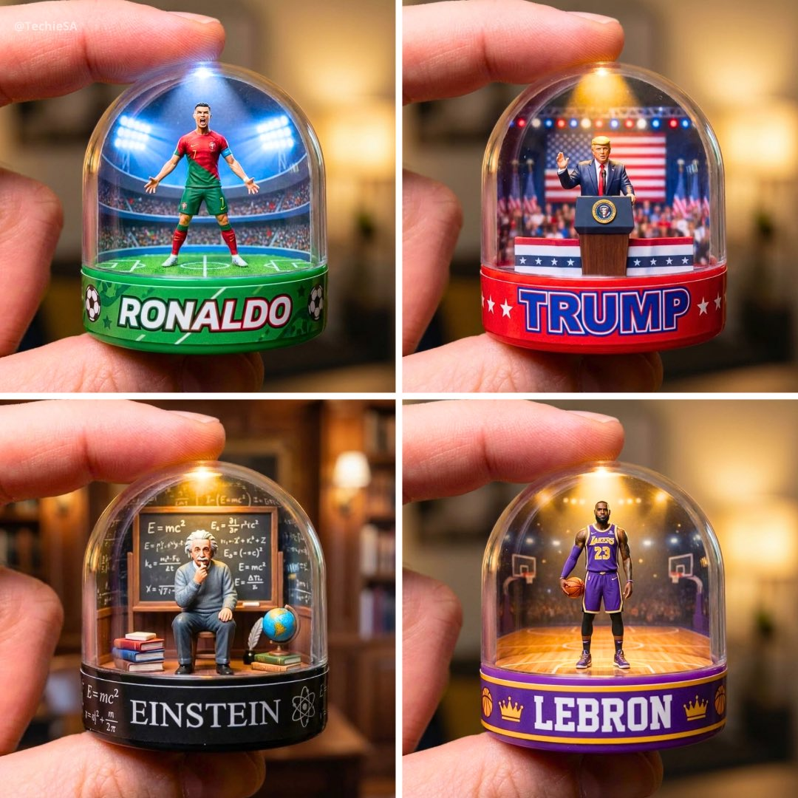

```
A detailed transparent gashapon capsule diorama, held between fingers, featuring [NAME] in their [ICONIC POSE / STYLE]. Inside: [short description of figure’s look, clothing, and accessories], with background elements such as [relevant setting: stadium, stage, lecture hall, etc.]. Lighting should be dramatic and cinematic, matching their theme (e.g., golden spotlight, concert glow, academic ambience). The capsule has a transparent top and a colored base (choose fitting color: e.g., royal blue, gold, black, red), decorated with [motifs related to the person]. The base is labeled with [NAME or NICKNAME] in a matching font style. The design should look like a miniature collectible, with photorealistic detail, soft bokeh, and a square 1080x1080 composition.
```

```
一个精细的透明扭蛋胶囊微缩场景，被手指捏住，其中呈现[NAME]标志性的姿势或风格。内部包含：[人物形象、服装及配饰的简短描述]，背景元素如[相关场景：体育场、舞台、讲堂等]。灯光应具有戏剧性和电影感，契合其主题（例如金色聚光灯、演唱会光晕、学术氛围）。胶囊顶部透明，底座为彩色（选择合适颜色：如宝蓝、金色、黑色、红色），并装饰有[与该人物相关的图案]。底座上以匹配的字体标注[NAME或昵称]。整体设计应呈现微型收藏品效果，具备逼真细节、柔焦虚化，并采用1080x1080的方形构图。
```

 [↑返回目录](#toc)

---
## <a id="prompt-1996281855503372500">漫画角色超写实转化</a> (<a href="https://x.com/dotey/status/1996281855503372510" target="_blank" rel="noopener noreferrer">宝玉</a>)

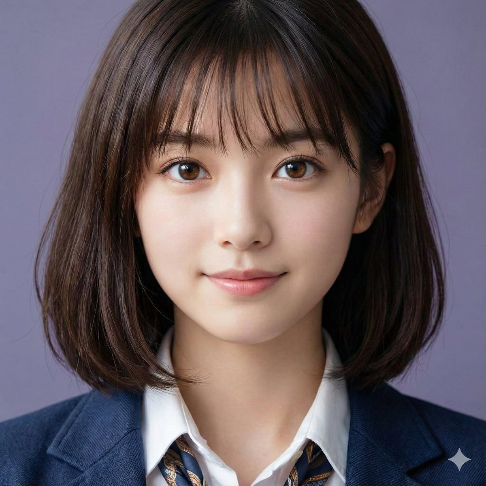


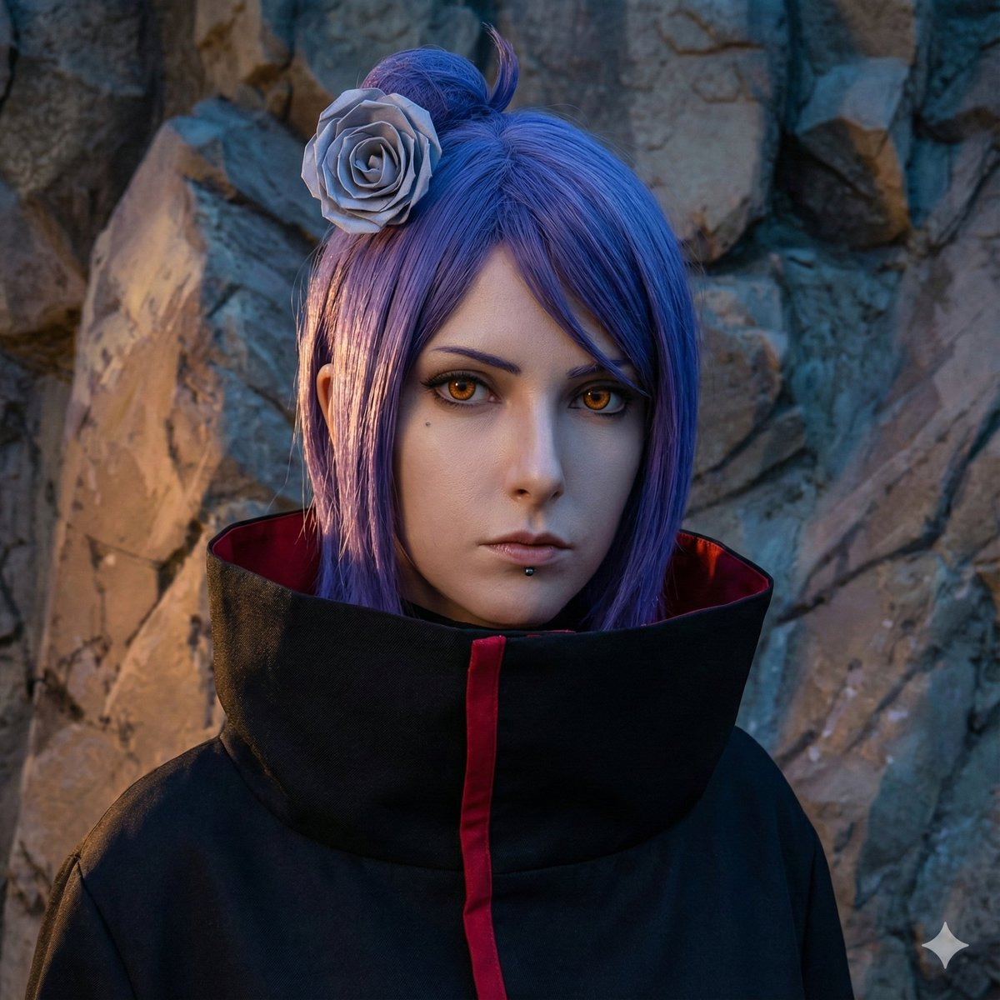


```
- blurry background, shallow depth of field, bokeh
- out of focus, distorted face
- cartoon, anime, CGI character, illustration, painting look
- low quality, pixelation, noise
- harsh direct sunlight or overexposed lighting
```

```
- 背景模糊、浅景深、散景  
- 失焦、面部扭曲  
- 卡通、动漫、CGI 角色、插画、绘画风格  
- 低质量、像素化、噪点  
- 强烈直射阳光或过曝光线
```

 [↑返回目录](#toc)

---
## <a id="prompt-2001691201439707400">复古赛车合成照</a> (<a href="https://twitter.com/Ror_Fly/status/2001691201439707336" target="_blank" rel="noopener noreferrer">Rory Flynn</a>)

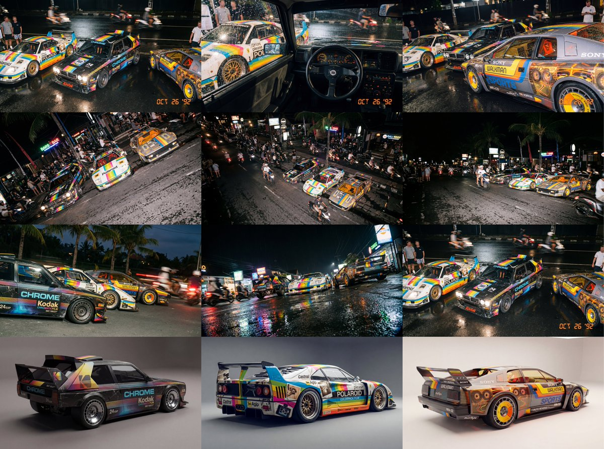

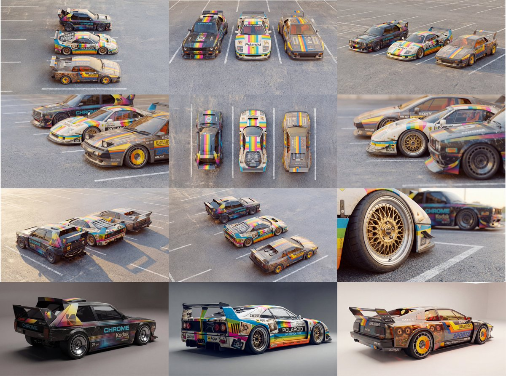

```
Medium Shot (MS): Central mass of these exact three racing cars captured from a slightly elevated angle, showcasing their distinctive branding liveries, sponsor logos (Polaroid, Sony, Kodak), and detailed body modifications. Harsh direct flash illuminates their wet surfaces, creating dramatic reflections on the rain-soaked Canggu street. Motion-blurred scooters and pedestrians frame the edges. Cropped composition with intentional cut-off at edges. High contrast between illuminated car bodies and pitch-black background. Disposable camera aesthetic with slightly grainy texture and uneven exposure. 

#promptshare #nanobanana
```

```
柯达 + 宝丽来 + 索尼 → 合成照片。

Weavy + Nano Banana Pro。

示例提示：  
中景（MS）：从略高的角度拍摄这三辆赛车的主体，突出其独特的品牌涂装、赞助商标识（宝丽来、索尼、柯达）以及精细的车身改装细节。强烈的直闪灯光照亮它们湿润的表面，在雨水浸湿的仓古街道上形成戏剧性的反光。画面边缘以动态模糊的摩托车和行人作为框景。构图经过裁剪，边缘故意截断。被照亮的车身与纯黑背景形成高对比度。采用一次性相机风格，带有轻微颗粒感和不均匀曝光效果。

#promptshare #nanobanana
```

 [↑返回目录](#toc)

---
## <a id="prompt-2001649477137109000">液态亮面品牌标志</a> (<a href="https://twitter.com/aleenaamiir/status/2001649477137109083" target="_blank" rel="noopener noreferrer">Aleena Amir</a>)

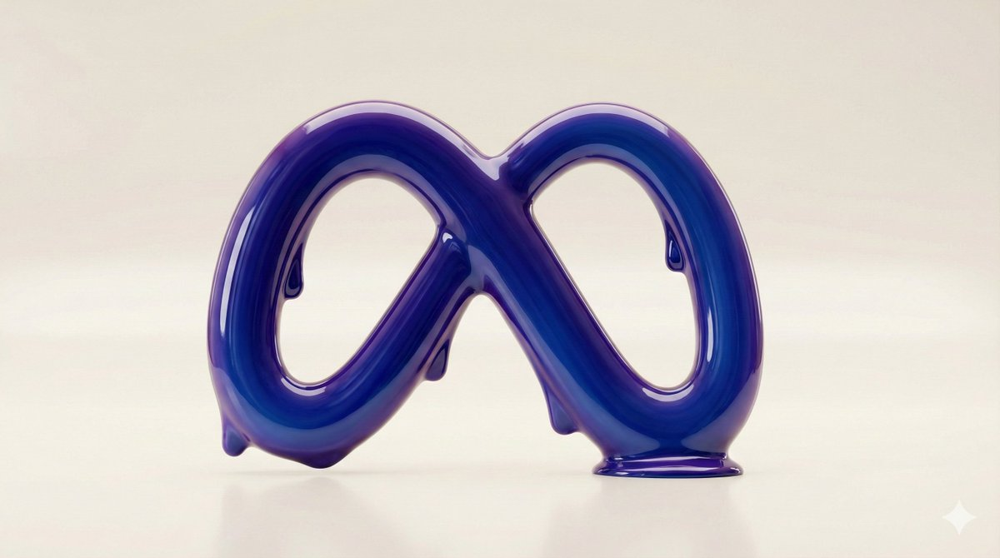

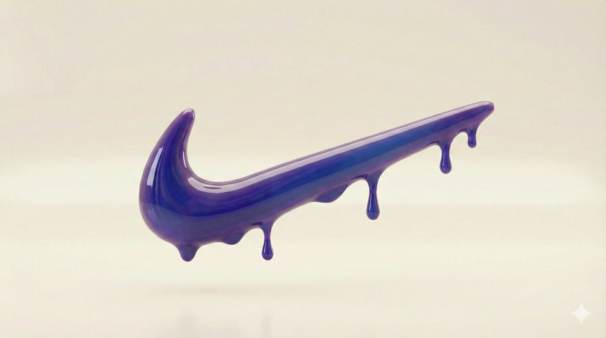

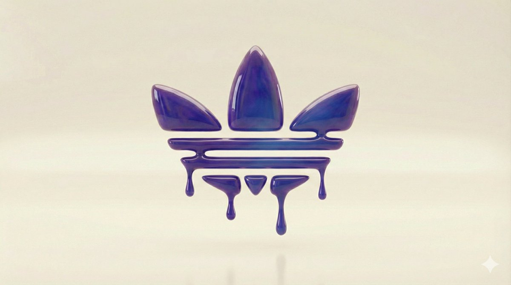

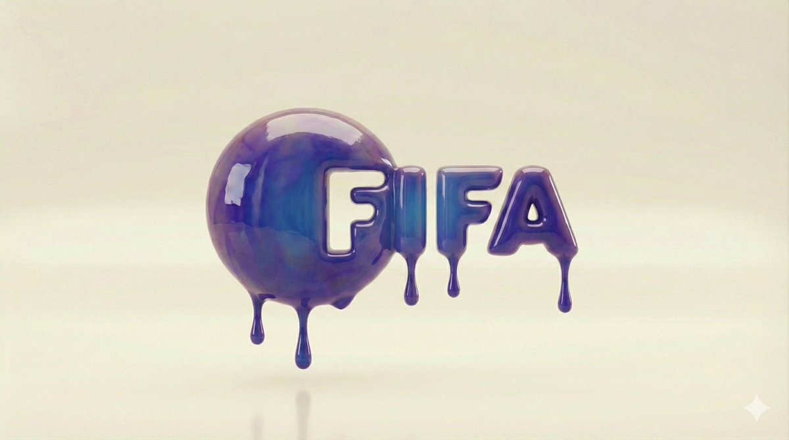

```
Create a [Brand Name] logo formed from thick, flowing liquid gloss. High-shine surface, smooth curves, reflective highlights. Viscous, slightly dripping appearance frozen in motion. Minimal background, luxury cosmetic-brand aesthetic, studio lighting.
```

```
创建一个由浓稠流动的液态亮面构成的[品牌名称]标志。高光泽表面，流畅曲线，具有反射高光。呈现粘稠、略带滴落感的瞬间凝固效果。背景极简，奢华化妆品品牌风格，影棚灯光。
```

 [↑返回目录](#toc)

---
## <a id="prompt-2001860294105272300">冰封红裙：超现实时尚幻境</a> (<a href="https://twitter.com/oggii_0/status/2001860294105272392" target="_blank" rel="noopener noreferrer">Oogie</a>)

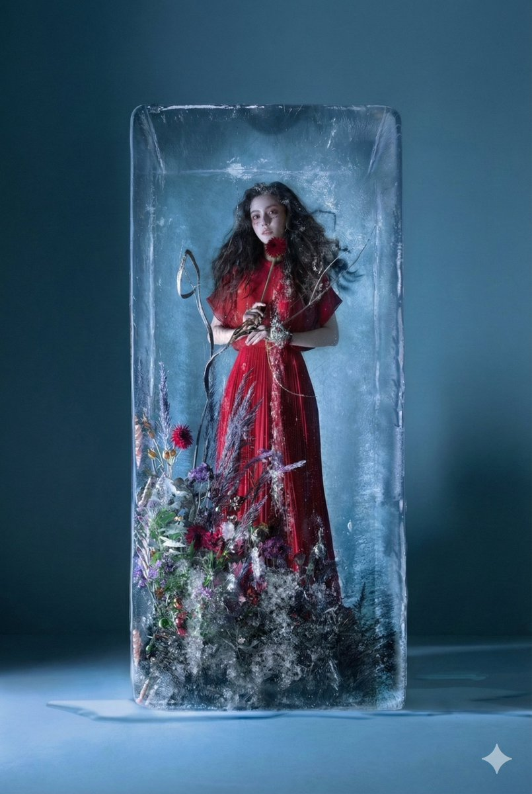

```
A surreal fashion editorial photograph featuring a young woman standing encased inside a large, vertical block of transparent ice. She is wearing a vibrant red pleated maxi dress that contrasts sharply with the cold blue tones of the ice. Her long, dark hair is voluminous and wavy. At the base of the ice block, there is a frozen arrangement of red and purple flowers mixed with dried grasses. She holds a thin, curved branch in her hand. The background is a deep blue teal gradient, and the lighting is cinematic and cool-toned, highlighting the realistic frost, cracks, and air bubbles within the ice to create a mysterious, ethereal atmosphere.
```

```
一幅超现实的时尚大片摄影，描绘一位年轻女子被封存在一块巨大的垂直透明冰块之中。她身穿一条鲜艳的红色百褶长裙，与冰块冷峻的蓝色调形成鲜明对比。她留着浓密而卷曲的黑色长发。冰块底部冻结着红紫色花朵与干枯草茎交织而成的花艺装置。她手中握着一根纤细弯曲的树枝。背景为深蓝青色渐变，灯光采用电影感十足的冷色调，突出冰块内逼真的霜花、裂纹和气泡，营造出神秘而空灵的氛围。
```

 [↑返回目录](#toc)

---
## <a id="prompt-2001932788023595000">超现代高光黑透物体</a> (<a href="https://twitter.com/azed_ai/status/2001932788023595077" target="_blank" rel="noopener noreferrer">Amira Zairi</a>)

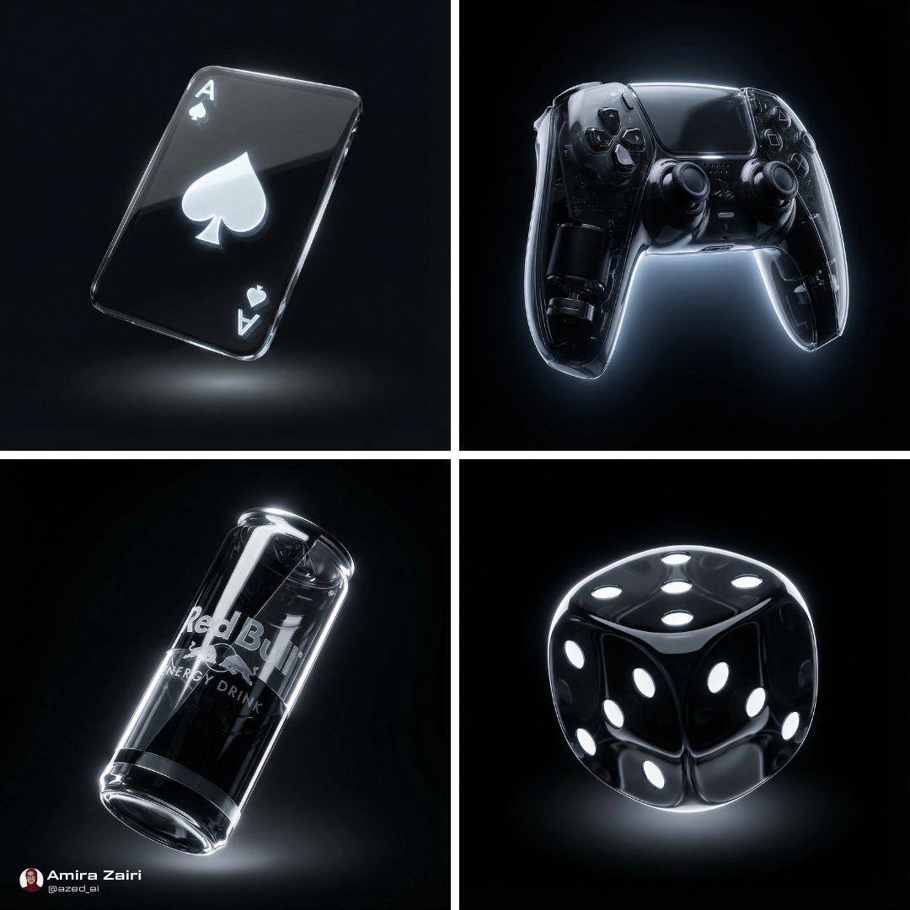

```
{
"subject":
  "target_style": {
    "style_name": "ultra-modern transparent black hyperrealism",
    "visual_language": [
      "sleek",
      "futuristic",
      "minimalistic",
      "floating design",
      "high-gloss transparency"
    ],
    "material_appearance": {
      "base_material": "transparent black glass or polymer",
      "texture_quality": "smooth and curved",
      "finish": "high-gloss with partial internal reflections"
    },
    "lighting_style": {
      "source_type": "rim light and directional top light",
      "intensity": "high",
      "shadows": "soft and diffuse glow underneath",
      "highlight_behavior": "sharp specular highlights and reflections across transparent surfaces"
    },
    "color_palette": {
      "dominant_colors": ["#000000", "#0d0d0d", "#1a1a1a"],
      "accent_colors": ["#ffffff", "#333333"],
      "contrast_level": "very high",
      "overall_tone": "dark, glossy, and luminous."
    },
    "rendering_style": {
      "dimensionality": "3D hyperrealistic",
      "resolution_quality": "ultra high",
      "depth_effects": "floating volumetric space with layered reflections"
    }
  },
  "output_settings": {
    "aspect_ratio": "1:1",
    "background_handling": "pure dark void",
    "object_focus": "centered floating form with emphasis on transparency and lighting"
  }
}
```

```
{
"主体":
  "目标风格": {
    "风格名称": "超现代透明黑色超写实主义",
    "视觉语言": [
      "流畅",
      "未来感",
      "极简",
      "悬浮设计",
      "高光透明"
    ],
    "材质外观": {
      "基础材质": "透明黑色玻璃或聚合物",
      "纹理质感": "光滑且带曲面",
      "表面处理": "高光并带有部分内部反射"
    },
    "光影风格": {
      "光源类型": "轮廓光与顶部定向光",
      "强度": "高",
      "阴影": "底部柔和漫射辉光",
      "高光表现": "在透明表面上呈现锐利的镜面高光与反射"
    },
    "色彩方案": {
      "主色调": ["#000000", "#0d0d0d", "#1a1a1a"],
      "强调色": ["#ffffff", "#333333"],
      "对比度": "极高",
      "整体色调": "深邃、高光且富有光泽感。"
    },
    "渲染风格": {
      "维度": "3D 超写实",
      "分辨率质量": "超高",
      "景深效果": "悬浮体积空间，带有层次化反射"
    }
  },
  "输出设置": {
    "宽高比": "1:1",
    "背景处理": "纯黑虚空",
    "物体焦点": "居中悬浮形态，强调透明感与光影效果"
  }
}
```

 [↑返回目录](#toc)

---
## <a id="prompt-2001689993778250000">Transforma tu foto en cómic contigo mismo 🦸‍♂️</a> (<a href="https://twitter.com/ecommartinez/status/2001689993778249952" target="_blank" rel="noopener noreferrer">Alejo</a>)

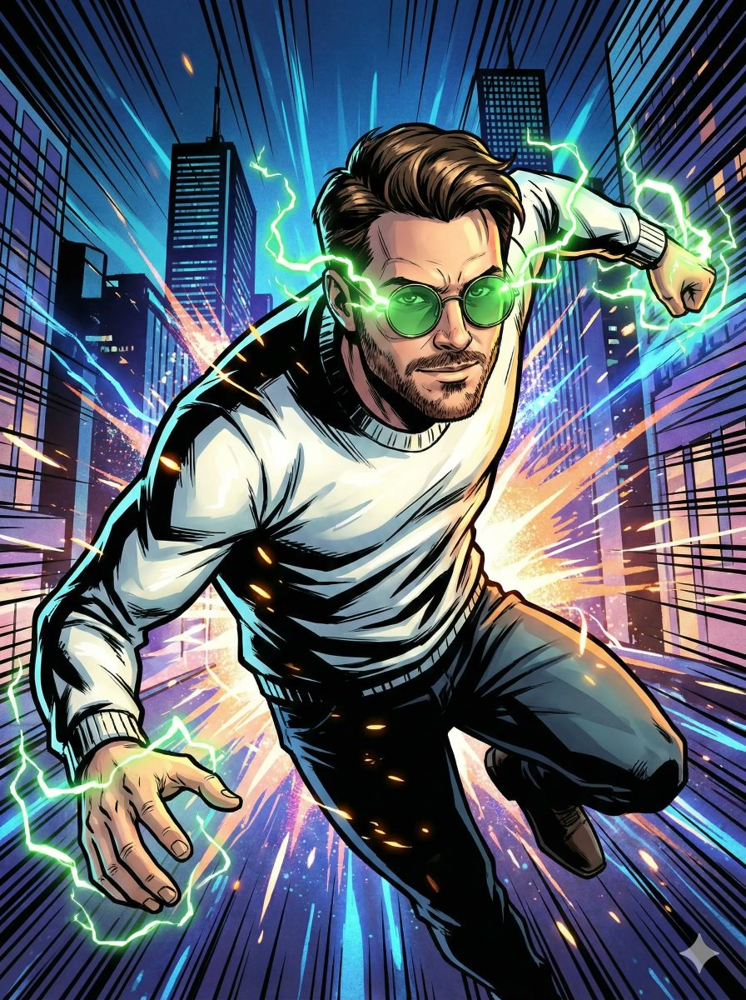

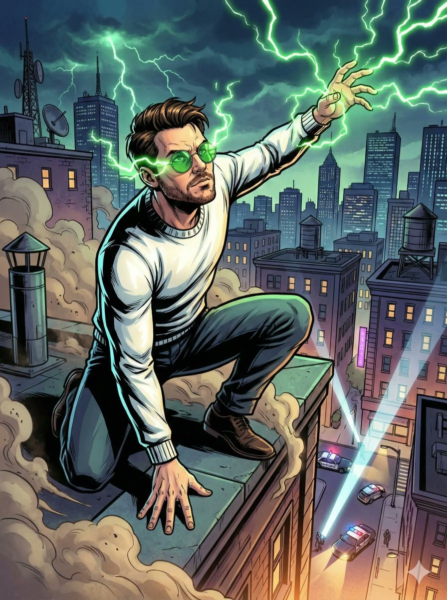

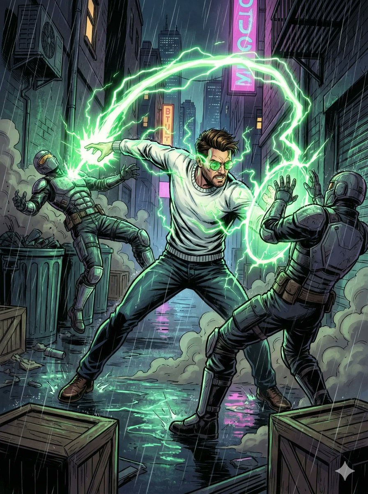

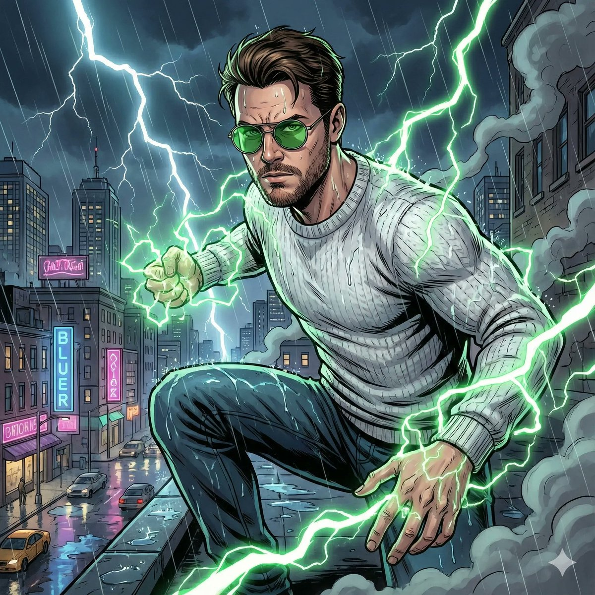

```
Transforma tu foto en cómic contigo mismo 🦸‍♂️

Prompt Gemini Nano Banana Pro :

Crea una ilustración de cómic moderno usando mi imagen de referencia como personaje principal.
Estilo inspirado en los cómics de superhéroes contemporáneos y novelas gráficas cinematográficas.
El personaje mantiene los rasgos faciales exactos y su identidad de la foto de referencia, transformados en un estilo cómic estilizado con líneas limpias pero expresivas.
Añade contornos negros marcados, sombreado dinámico con tinta y colores de alto contraste.
Aplica efectos FX como energía brillante, chispas, estelas de movimiento, haces de luz y partículas sutiles para aumentar la acción y la intensidad.
Usa una pose de acción dinámica o una postura poderosa, con perspectiva exagerada y ángulos dramáticos.
El fondo debe ser gráfico y cinematográfico: formas urbanas abstractas, líneas de velocidad o explosiones de energía, sin distraer del personaje.
La iluminación es dramática, con luces y sombras fuertes para dar profundidad e impacto.
Estilo final: portada de cómic moderno de alta calidad, detalles nítidos, colores vibrantes, composición enérgica, ilustración profesional, impacto visual fuerte.
No cambies el rostro, solo estilízalo.
```

```
将你的照片变成以你为主角的漫画 🦸‍♂️

使用我的参考图像作为主角，创作一幅现代漫画风格的插画。  
风格灵感源自当代超级英雄漫画和电影感十足的图像小说。  
角色需保留参考照片中完全一致的面部特征与身份，仅将其转化为具有干净而富有表现力线条的漫画风格。  
添加鲜明的黑色轮廓、动态的墨水阴影以及高对比度色彩。  
加入特效元素，如明亮的能量光效、火花、运动轨迹、光束及细微粒子，以增强动作感与张力。  
采用动态的动作姿势或充满力量的站姿，搭配夸张的透视和戏剧性的角度。  
背景应为图形化且具电影感：抽象的城市形态、速度线或能量爆炸效果，但不得喧宾夺主。  
光照需具戏剧性，运用强烈的明暗对比营造深度与视觉冲击。  
最终风格：高质量现代漫画封面，细节锐利、色彩鲜艳、构图充满动感，呈现专业插画水准与强烈视觉冲击力。  
切勿改变面部，仅进行风格化处理。
```

 [↑返回目录](#toc)

---
## <a id="prompt-2001665608711049500">石质碎片中的超现实主体</a> (<a href="https://twitter.com/Samann_ai/status/2001665608711049358" target="_blank" rel="noopener noreferrer">Saman | AI</a>)

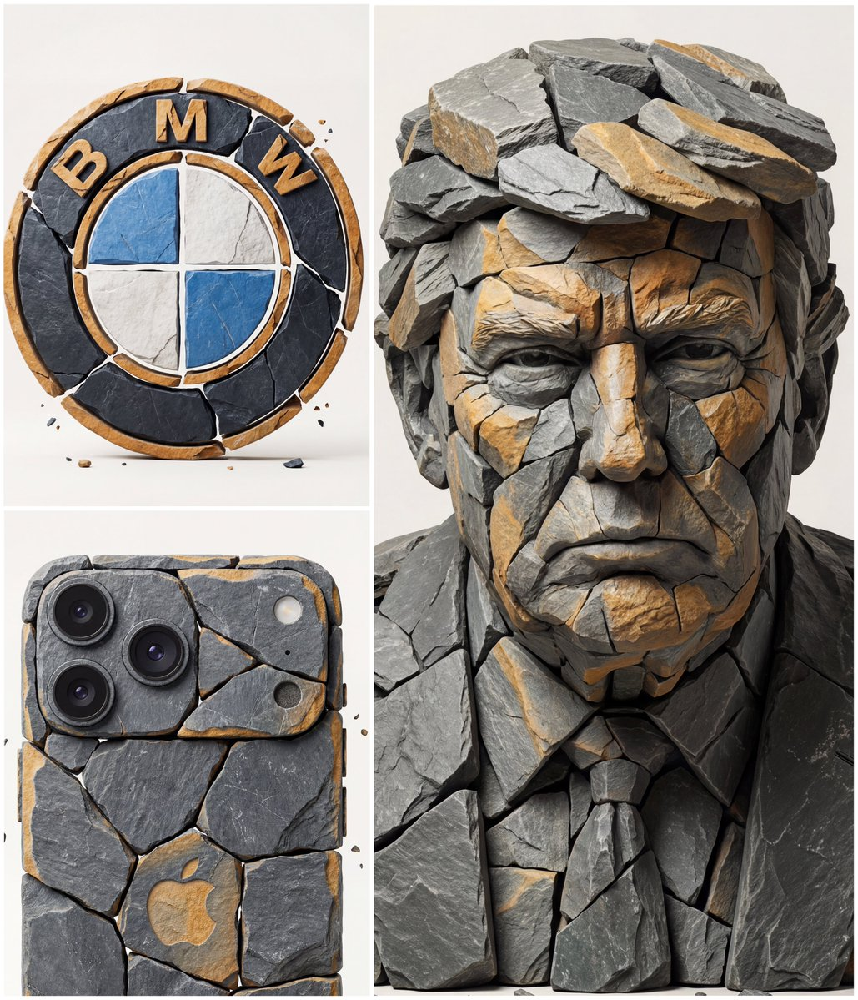

```
{
  "task": "image_to_image_style_transfer",
  "input_image": "{{USER_IMAGE}}",
  "prompt": "Create a hyper-real 3D studio composition that recreates the main subject from the provided image as a fragmented stone assemblage. The subject must be built from separate, clearly detached rock pieces with small visible gaps between shards (no pieces merging). Material look: fragmented slate + sandstone shards with chiseled edges, crisp fractures, visible stone grain, micro-scratches, and realistic roughness. Color palette: predominantly dark slate with subtle warm-ochre sandstone accents. Lighting: soft studio key light from top-left, gentle fill, subtle contact shadows under each shard, realistic ambient occlusion in crevices, clean reflections kept minimal. Background: minimal off-white seamless backdrop, no texture. Framing: centered, clean, straight-on, subject fully readable. Add a few tiny debris chips floating or resting near the base for depth. Preserve the subject’s identity, proportions, and recognizable silhouette from the input image while transforming all surfaces into stone fragments. Hyper-real, high detail, sharp focus, 8k render quality.",
  "negative_prompt": "text, typography, logo, watermark, signature, extra props, busy background, fog, heavy bloom, cartoon, illustration, lowpoly, plastic, metal, glossy paint, melted shapes, merged fragments, unreadable subject, blur, noise, low resolution, oversharpening halos, distorted face/body, extra limbs, deformed geometry",
  "output": {
    "aspect_ratio": "use_input_aspect_ratio",
    "background": "off_white",
    "camera": {
      "angle": "straight_on",
      "framing": "centered",
      "distance": "medium"
    }
  },
  "params": {
    "style_strength": 0.75,
    "identity_preservation": 0.9,
    "detail_level": "very_high",
    "lighting_preset": "soft_studio_top_left",
    "shadow_intensity": "subtle",
    "gap_visibility": "clear",
    "debris_chips": "few_tiny",
    "no_text": true
  }
}
```

```
{
  "任务": "图像风格转换",
  "输入图像": "{{USER_IMAGE}}",
  "提示词": "创建一个超现实的3D工作室合成图，以提供的图像中的主要主题为蓝本，将其重塑为碎片化的石块组合。主体必须由分离的、明显独立的岩石碎片构成，在碎片之间有微小的可见间隙（不允许碎片融合）。材料外观：分裂的板岩+带凿刻边缘的暖赭色砂岩石片，清晰的断裂面，可见的石材质地，微小划痕以及真实的粗糙度。色彩搭配：主要是深灰色板岩加上微妙的暖赭色砂岩点缀。灯光：来自左上方的柔和工作室主光，轻微填充光，每个碎片下微妙接触阴影，真实环境闭塞在缝隙中，保持最少的干净反射。背景：极简的无缝淡白色背景，无纹理。构图：居中，干净，正面直视，主题完全可读。添加一些细小的碎屑漂浮或静止于基座附近以增加深度。在将所有表面转化为石块碎片的同时保留输入图像中主体的身份、比例和可识别轮廓。超现实，高细节，锐利焦点，8K渲染质量。",
  "否定提示词": "文本、排版、标志、水印、签名、额外道具、繁忙背景、雾、强烈辉光、卡通、插图、低多边形、塑料、金属、光泽油漆、熔化形状、合并碎片、不可读的主题、模糊、噪音、低分辨率、过度锐化光晕、扭曲的脸/身体、额外肢体、变形几何体",
  "输出设置": {
    "纵横比": "使用输入图像纵横比",
    "背景": "淡白色",
    "相机": {
      "角度": "正面直视",
      "构图": "居中",
      "距离": "中等"
    }
  },
  "参数设置": {
    "风格强度": 0.75,
    "身份保护": 0.9,
    "细节层次": "非常高",
    "灯光预设": "柔和的工作室顶部左侧光",
    "阴影强度": "微妙",
    "间隙可见性": "清晰",
    "碎屑片": "少量细小",
    "无文字": true
  }
}
```

 [↑返回目录](#toc)

---
## <a id="prompt-1996469120913883400">AI打造专业头像</a> (<a href="https://x.com/aleenaamiir/status/1996469120913883356?s=20" target="_blank" rel="noopener noreferrer">Aleena Amir</a>)

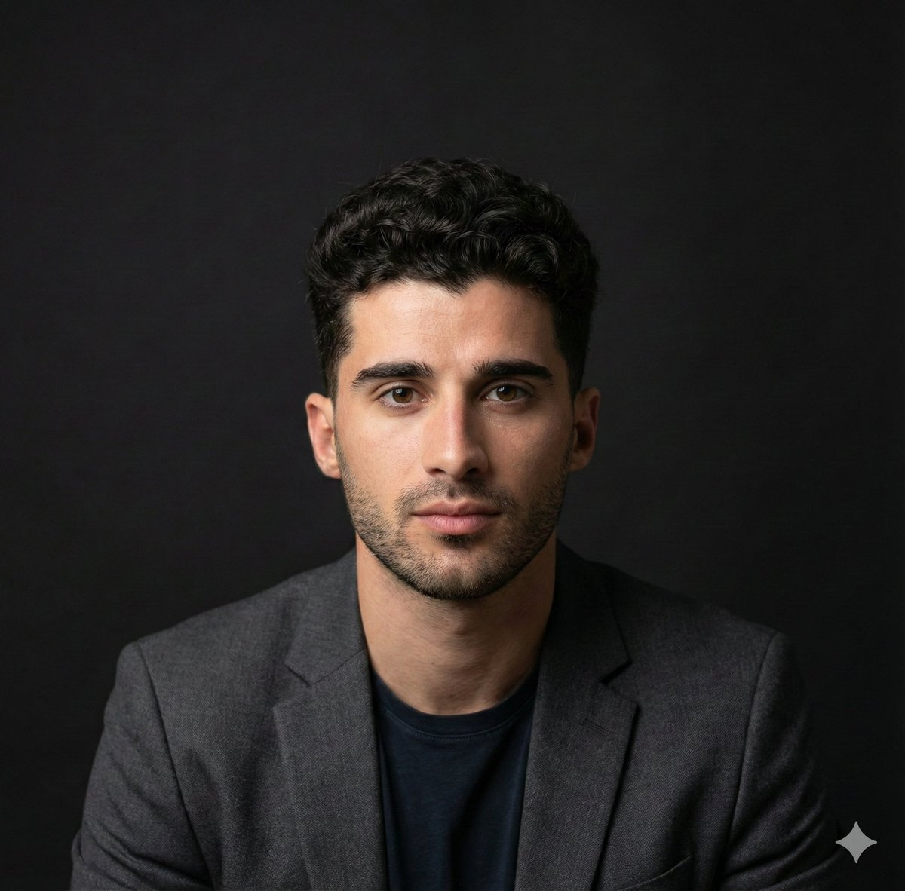

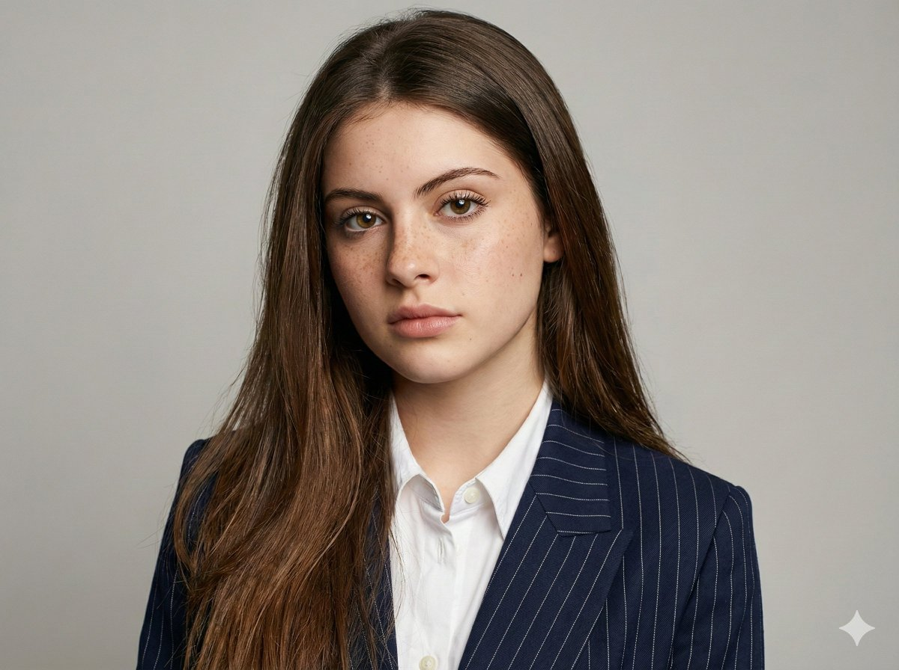


```
Turn a regular selfie into a pro headshot and save money.

• Take a well-lit, front-facing selfie.
• In Gemini: Create images (Nano Banana) → set model to Thinking.
• Paste the prompt below and generate.

Boom 🤯  Studio-style, sharp, neutral background.

Prompt 👇
```

```
将一张普通自拍变成专业头像，省钱又高效。

• 拍一张光线充足、正面朝向的自拍照。  
• 在 Gemini 中：创建图像（Nano Banana）→ 将模型设为 Thinking。  
• 粘贴下方提示词并生成。

砰 🤯 影棚风格，清晰锐利，中性背景。

提示词 👇
```

 [↑返回目录](#toc)

---
## <a id="prompt-1996889833894232300">猫耳サイボーグガールフィギュア</a> (<a href="https://x.com/ninohut/status/1996889833894232209" target="_blank" rel="noopener noreferrer">二ノ小屋</a>)

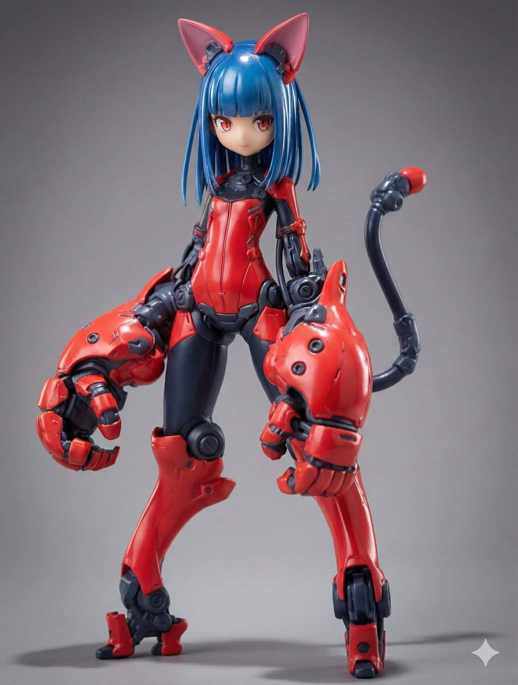

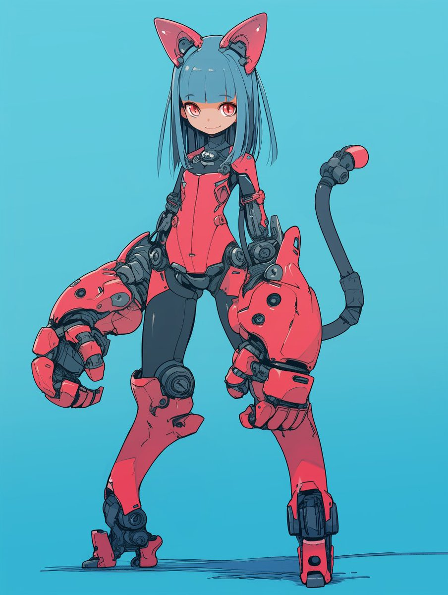

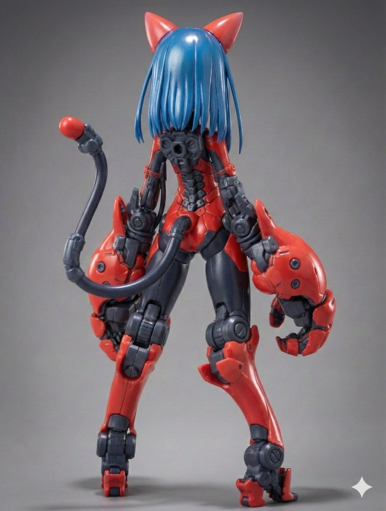

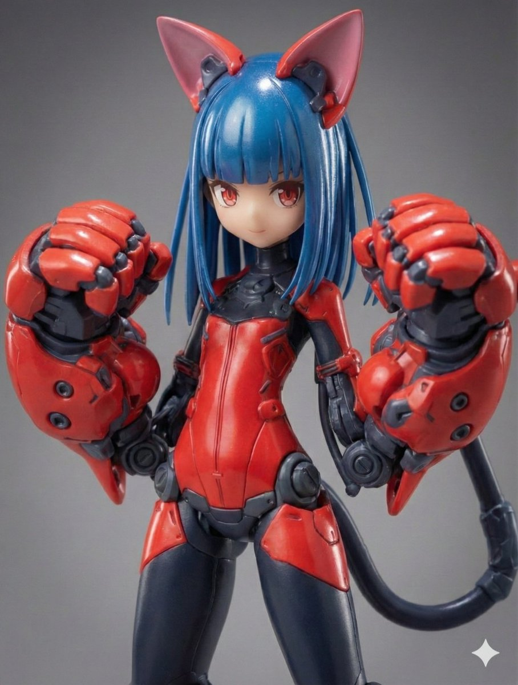

```
ネコ型サイボーグガールのフィギュア
Figure of cyborg girl with cat ears and tail

金曜日の夜、nano banana pro で過去イラストをフィギュア化する活動

背中の穴や関節の様子から推してアクションフィギュアっぽい
上半身へのクローズアップをリクエストしたら勝手に腕のポーズ変わったし！🦾
```

 [↑返回目录](#toc)

---
## <a id="prompt-1996935337546076400">九面风尚：潮流人格拼贴</a> (<a href="https://x.com/songguoxiansen/status/1996935337546076316" target="_blank" rel="noopener noreferrer">松果先森</a>)

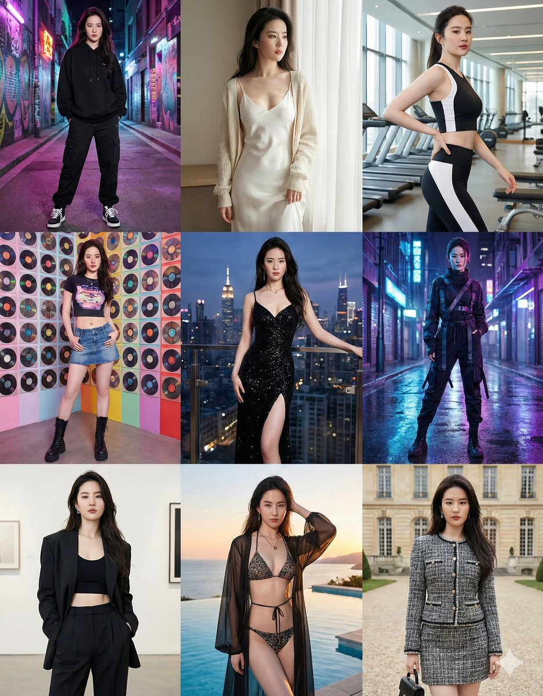

```
基于[上传人物图片]并严苛保持面部特征不变，生成一张极具时尚感和网络热门度的3x3九宫格拼贴照片，九个独立画面分别展示该人物身着：酷飒街头风黑色Oversized卫衣配工装裤（涂鸦霓虹后巷背景）、清纯性感风白色丝绸吊带睡裙外搭针织衫（柔光慵懒卧室窗边背景）、紧身塑形时尚瑜伽套装（高端采光健身房背景）、复古Y2K辣妹短T恤配低腰牛仔裙（千禧风彩色充满CD的房间背景）、华丽黑色高开叉亮片晚礼服（城市天际线天台酒吧夜景背景）、前卫赛博朋克机能风束带装束（未来感雨夜街道蓝紫光背景）、都市摩登风廓形西装内搭露脐装（极简高级艺术馆背景）、热辣度假风比基尼配透明防晒罩衫（奢华海景泳池日落背景）以及静奢老钱风粗花呢小香风外套套装（古典欧式庄园庭院背景），整体画面追求高级杂志大片质感、光影迷人且富有潮流张力。
```

 [↑返回目录](#toc)

---
## <a id="prompt-1995847027054534700">街头风尚：低角度下的酷女孩</a> (<a href="https://x.com/saniaspeaks_/status/1995847027054534775" target="_blank" rel="noopener noreferrer">𝗦𝗮𝗻𝗶𝗮</a>)

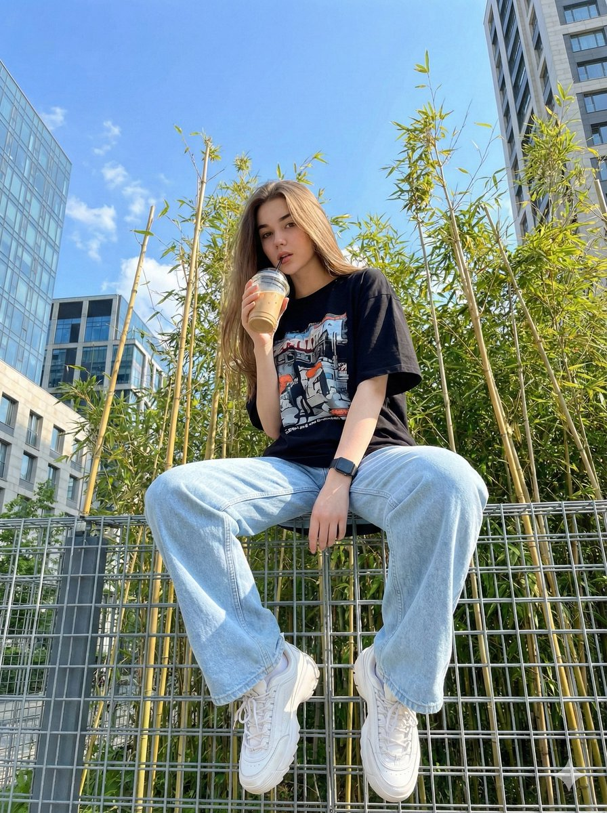


```
{  "image_generation_prompt": {    "subject": {      "description": "Young woman",      "reference_basis": "User provided photo",      "expression": "Casual and stylish"    },    "outfit": {      "style": "Streetwear",      "top": "Black oversized t-shirt with a cool graphic design",      "bottom": "Light blue oversized wide-leg jeans",      "footwear": "White chunky sneakers",      "accessories": "Black wrist watch"    },    "pose_and_action": {      "stance": "Standing",      "hand_placement": "One hand in pocket",      "holding_object": "Iced drink in a plastic cup with a straw"    },    "environment": {      "immediate_surroundings": "Steel wire fence",      "background_elements": [        "Bright blue sky",        "Bamboo trees",        "Modern buildings"      ]    },    "technical_details": {      "medium": "Digital photography",      "camera_angle": "Low angle / worm's-eye view",      "lighting": "Daylight, bright"    }  }}
```

```
{
  "image_generation_prompt": {
    "subject": {
      "description": "年轻女性",
      "reference_basis": "用户提供的照片",
      "expression": "随意而时尚"
    },
    "outfit": {
      "style": "街头风",
      "top": "黑色宽松T恤，带有酷炫图案设计",
      "bottom": "浅蓝色宽松阔腿牛仔裤",
      "footwear": "白色厚底运动鞋",
      "accessories": "黑色腕表"
    },
    "pose_and_action": {
      "stance": "站立",
      "hand_placement": "一只手插在口袋里",
      "holding_object": "装有冰饮的塑料杯，配有吸管"
    },
    "environment": {
      "immediate_surroundings": "钢丝网围栏",
      "background_elements": [
        "明亮的蓝天",
        "竹子",
        "现代建筑"
      ]
    },
    "technical_details": {
      "medium": "数码摄影",
      "camera_angle": "低角度 / 虫眼视角",
      "lighting": "日光，明亮"
    }
  }
}
```

 [↑返回目录](#toc)

---
## <a id="prompt-1996769465632227800">趣味3D名人漫像肖像</a> (<a href="https://x.com/Sheldon056/status/1996769465632227787?s=20" target="_blank" rel="noopener noreferrer">Dr.duet</a>)

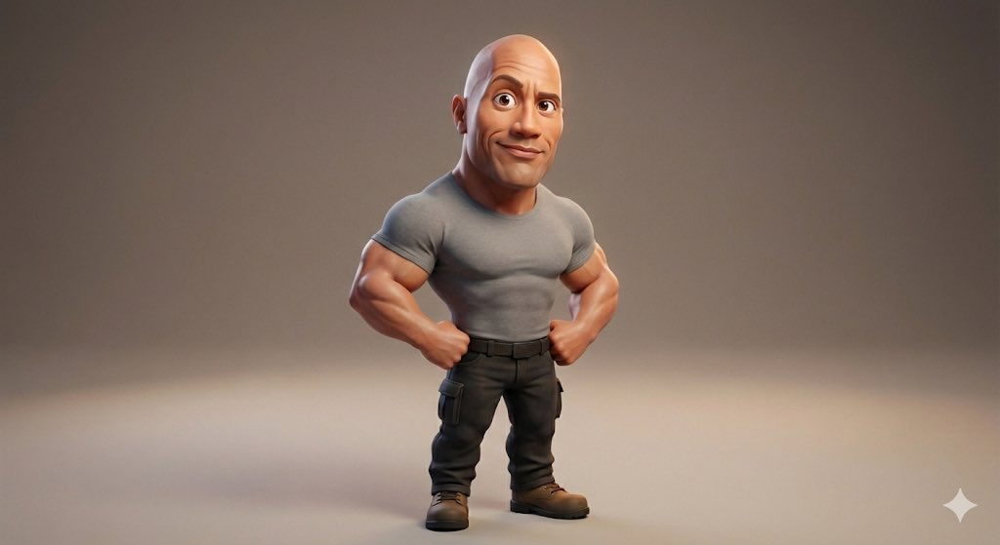


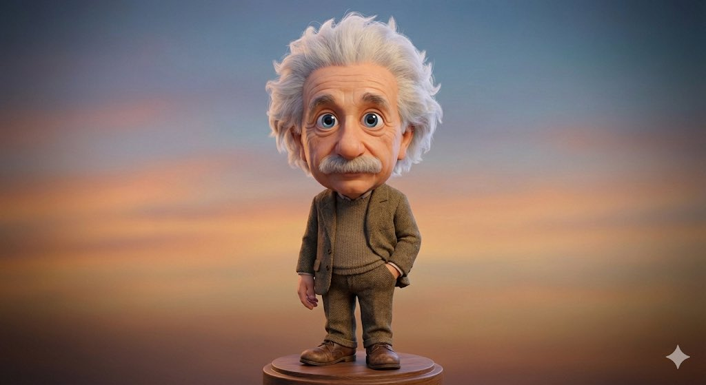


```
A playful 3D caricature portrait of [celebrity], blending cartoon exaggeration with realistic skin shading. Oversized head, stylized hair, and vibrant expressive eyes. Rendered with soft cinematic lighting and clean, simplified materials. Background kept minimal with a soft blur to spotlight the character.
```

```
一幅充满趣味的 [名人] 3D 漫像肖像，融合卡通夸张与逼真的皮肤明暗效果。头部比例放大，发型风格化，眼睛生动鲜明、富有表现力。采用柔和的电影级灯光和干净简化的材质进行渲染。背景极简，并带有柔焦模糊以突出角色主体。
```

 [↑返回目录](#toc)

---
## <a id="prompt-2002016072405328100">Nano Banana Pro细节惊艳</a> (<a href="https://twitter.com/Dari_Designs/status/2002016072405328107" target="_blank" rel="noopener noreferrer">Daria_Surkova</a>)

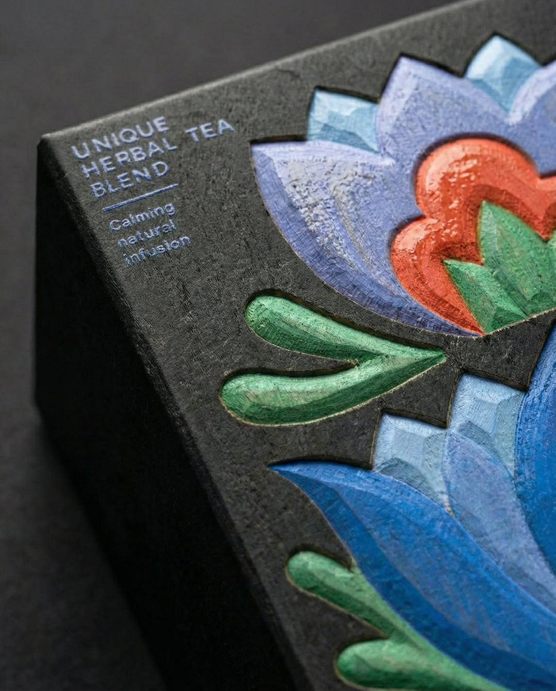

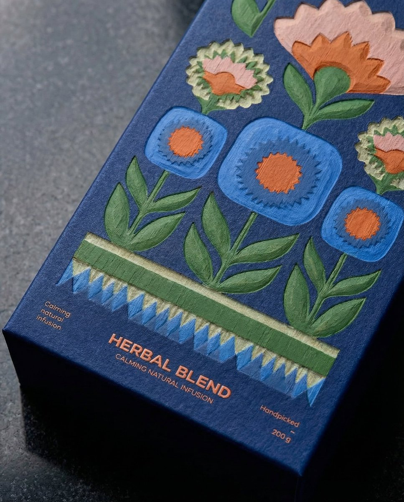

```
My prompt was like: make a close-up of the reference image, so we can see the all the details of the design and the illustration, add high-relief  varnish on the pattern and on the text.
https://x.com/Dari_Designs/status/2000166323587051710?s=20
```

 [↑返回目录](#toc)

---


[上一页](./2.md) | 当前 3/7 页 | [下一页](./4.md) | [查看全部目录](../prompts.md)