# gemini.json 

gemini.json文件存放gemini相关的提示词，当前已收录：735个 

 投稿方式：[飞书投稿](https://tcn1uh5rxo87.feishu.cn/share/base/form/shrcne5gDolOMDd0oJsj2XfvxQc) or [issues](https://github.com/junxiaopang/gridsplitter/issues/new)

[上一页](./3.md) | 当前 4/8 页 | [下一页](./5.md) | [查看全部目录](../prompts.md)

🚀 **在线预览**: [https://prompts.kkkm.cn](https://prompts.kkkm.cn)

## <a id="toc">目录</a>

- [Tender Peek Under Paper](#prompt-2001903804233789400)
- [蓝猫与小鼠的烛光晚餐](#prompt-2001687682922254600)
- [复古照相亭里的甜蜜瞬间](#prompt-2001734583830626600)
- [维多利亚哥特皇室封面写真](#prompt-2001828831615946800)
- [奢华生活四宫格](#prompt-2001653710745739500)
- [节气养生手作茶艺图鉴](#prompt-2001654013599916300)
- [Urban Japan Music Collage](#prompt-2001562159499870500)
- [nano banana pro cost saving trick for product photography. instead of burning credits for experimenting one image at a time. show it an example, ask for a 6x6 grid, pick your favorite](#prompt-2001265620449444400)
- [冬日圣诞贺卡](#prompt-2001234210409857000)
- [订书机×拉面潮鞋](#prompt-2001435741675536600)
- [纸雕卡通：博物馆中的艺术珍藏](#prompt-2001504388108685300)
- [地铁里的双重身份](#prompt-2001357165328798000)
- [情绪肖像网格：九面一体](#prompt-2001635511153365200)
- [都市格纹潮人拼贴](#prompt-2001254201611964400)
- [奇幻橙浪冲浪少年](#prompt-2001497637124739300)
- [光影二维码：手与光的精密协作](#prompt-2001258985358606600)
- [粉色耐克鞋的超现实美学](#prompt-2001302056456339500)
- [厨房里的被注视时刻](#prompt-2001359237956686300)
- [白猫サイボーグガールフィギュア](#prompt-2001632722939449900)
- [微缩帝国：远见者的办公空间](#prompt-2001566101508128800)
- [与金·凯瑞鬼脸合影](#prompt-2001461574226346000)
- [文学幻境：微缩名著奇景](#prompt-2001357979312898300)
- [雪夜魔球：品牌圣诞幻境](#prompt-2001371445939815000)
- [落日沙滩上的黑发女子](#prompt-2001538350642008000)
- [黄金时刻的女飞行员](#prompt-2001575999805235200)
- [黑衣女伶踏广告之海](#prompt-2001232399368380700)
- [分屏堆叠：1×4构图法](#prompt-2001337146905690600)
- [3×3图像分割工具](#prompt-2001356375226749200)
- [海报墙写真风格](#prompt-2001496988253147400)
- [倒悬金字塔：吉萨的黄金幻象](#prompt-2001609137290187000)
- [Ai animation KFC Gemini Nano Banana 3.0](#prompt-2000922964011713000)
- [云中西游：维港上空的师徒](#prompt-2000794831212449800)
- [画中我：静谧创作时刻](#prompt-2001208017828622600)
- [派对中的自信身影](#prompt-2001140411134566700)
- [桑拿中的湿发美人](#prompt-2001170333697532200)
- [巨石汉字‘城’的沙漠遗迹](#prompt-2001006412428927200)
- [复古机械×智能厨房新发明](#prompt-2000795774628847900)
- [写实与抽象之间的凝视](#prompt-2001173440661999900)
- [盛唐贵妃邂逅巴黎铁塔](#prompt-2001198742998016000)
- [复古科技新生：Nano Banana Pro](#prompt-2000976213637259500)
- [电影角色玩具收藏盒](#prompt-2001132241746059500)
- [紫禁城幻梦：AI卷轴之争](#prompt-2001145459436609800)
- [复古浪漫肖像拼贴](#prompt-2001099339557728500)
- [雪中凝视：真实肖像](#prompt-2001041553243168800)
- [3D收藏玩具盒](#prompt-2000870769690083600)
- [巨人静坐伦敦街头](#prompt-2001003373336912100)
- [科幻经典书雕艺术](#prompt-2001119658863460400)
- [电影感时尚肖像写真](#prompt-2001195029243806000)
- [动物字母表海报](#prompt-2001121663409132000)
- [食物的像素裂变](#prompt-2001021119441330400)
- [Luxury Product Grid Campaign](#prompt-2000884207028179500)
- [湖上划艇的宁静时刻](#prompt-2000569119788216800)
- [宫墙·明制华裳写真](#prompt-2000875793279271200)
- [AI艺术提示交响曲](#prompt-2000710122440679700)
- [悬浮罐海报](#prompt-2000642847146726000)
- [玻璃窗后的电影感凝视](#prompt-2000852751463670300)
- [电影级3D动感广告大片](#prompt-2000521450042929200)
- [折纸蓝图角色：Nano Banana Pro](#prompt-2000768697905066500)
- [微型3D载具收藏展示](#prompt-2000876376287576300)
- [Ned的赛博朋克夜行](#prompt-2000711160736227600)
- [漫画破框而出](#prompt-2000760405921292300)
- [Neon Monument: Futuristic Brand Facade](#prompt-2000394883056710100)
- [芬达活力人像广告](#prompt-2000769215989490000)
- [Y2K Desi垃圾摇滚自拍](#prompt-2000872701775225000)
- [Nano Banana Pro 智能改图新玩法](#prompt-2000772380034060300)
- [霓虹雨夜都市拼贴](#prompt-2000375992519398000)
- [风暴云中的神秘剪影](#prompt-2000879410308899000)
- [品牌Logo变身未来物流岛](#prompt-2000706507080393000)
- [字母动物海报：从A到Z](#prompt-2000712712955765000)
- [等距微缩城市切片](#prompt-2000254730849649000)
- [动感体育海报](#prompt-2000932708684304600)
- [AI时尚短片创作流程](#prompt-1999344734595350800)
- [巴黎幻境：屏幕中的埃菲尔](#prompt-2000780025214460200)
- [折纸艺术：超精细角色雕塑](#prompt-2000553282767597800)
- [悬浮之环：超现实肖像](#prompt-2000858454580404700)
- [Nano Banana Pro：建筑灵感智能小工具](#prompt-2000883616989974800)
- [微型世界中的巨型潮物](#prompt-2000617319916347600)
- [品牌巨构：微型工地奇观](#prompt-2000568971951571200)
- [异形2微缩对决](#prompt-2000219294244758000)
- [龙形叶影](#prompt-2000090668631487000)
- [黄昏公路：电影感多视角肖像](#prompt-2000059750013456400)
- [雪林中的双生奇缘](#prompt-2000517151136870400)
- [哲学经典化作机械奇观](#prompt-2000617852789727700)
- [指尖上的微型城市](#prompt-2000613834193772500)
- [复古未来风可动人偶](#prompt-2000206139804332300)
- [限定风味铝罐艺术](#prompt-2000283351937327600)
- [订书机巨塔：反乌托邦总部](#prompt-2000070495446643200)
- [金属标志](#prompt-2000614012422136000)
- [百变发型肖像拼贴](#prompt-2000541418507628800)
- [Z世代街头酷感人像](#prompt-2000088241504911400)
- [冰镇芬达悬浮于地狱藤蔓](#prompt-2000203440413086000)
- [iPhone 17 微型未来工厂](#prompt-2000623216298267100)
- [1870年遗失的复古拾得影像](#prompt-2000542241513738500)
- [未来全息城市[CITY]](#prompt-2000516717462626300)
- [人形金鱼：超现实时尚大片](#prompt-2000527303353540900)
- [风中的独立身影](#prompt-2000160854155620900)
- [Nano Banana Pro 模版设计法](#prompt-1999428719510016300)
- [Nano Banana Pro 营销神器](#prompt-2000065593920131300)
- [超写实艺术肖像写真](#prompt-2000072345852252700)
- [破图而出的微型都市](#prompt-1999851240872903200)

## <a id="prompt-2001903804233789400">Tender Peek Under Paper</a> (<a href="https://twitter.com/Naiknelofar788/status/2001903804233789545" target="_blank" rel="noopener noreferrer">simeon-sanai</a>)

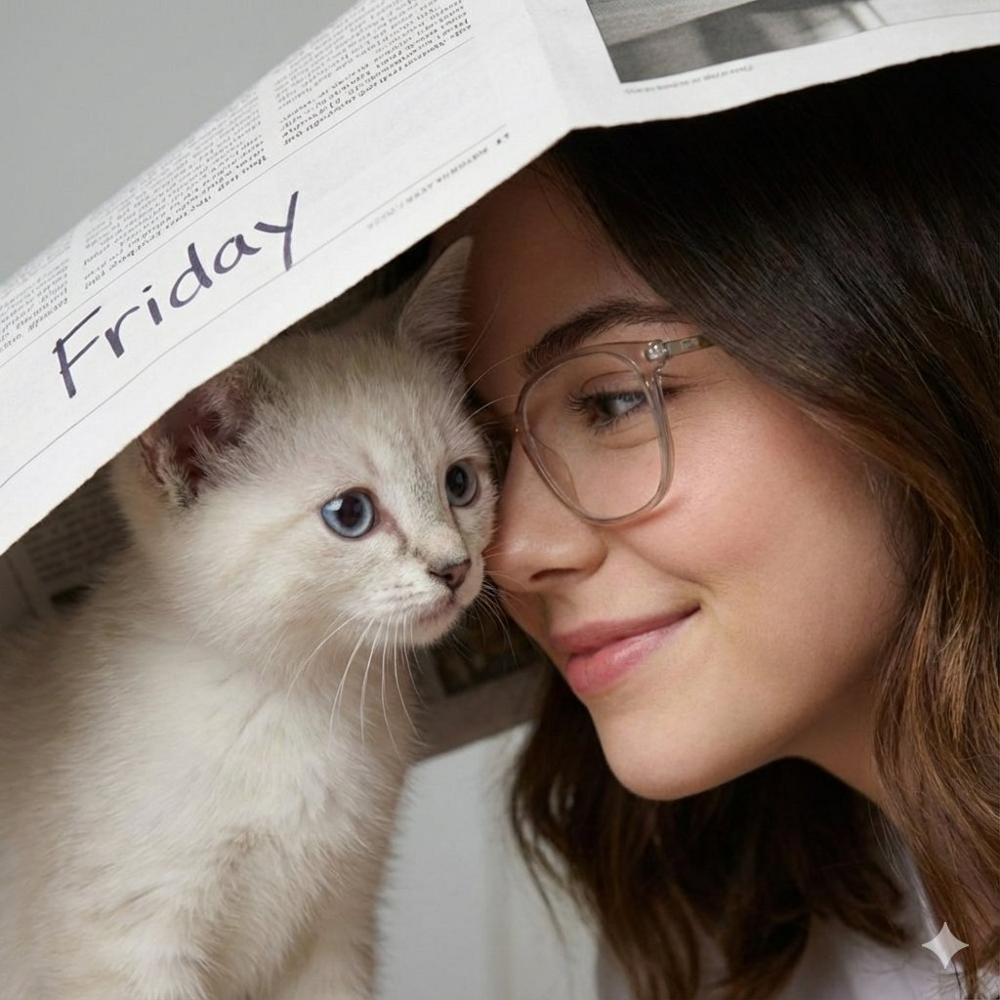

```
"Objective": "Generate a realistic, emotionally warm close-up portrait featuring a woman and white  kitten interacting under a sheet of paper.",
  "Image_Generation_Prompt": {
    "Scene_Description": "A close-up portrait of a woman (matching the appearance of the uploaded reference image) and a silver tabby kitten. Both are peeking out from underneath a sheet of paper or newspaper that covers the tops of their heads. Their faces are touching closely, creating an intimate and affectionate moment. The woman is gently gazing at the kitten.",
    "Subject_Details": {
      "Woman": {
        "Reference": "Use the uploaded image as a facial and stylistic reference",
        "Expression": "Soft, calm, and affectionate",
        "Pose": "Face close to the kitten, head slightly tilted toward it"
      },
      "Kitten": {
        "Breed": "white",
        "Eyes": "Large, round, blue eyes expressing curiosity",
        "Nose": "Small and pink",
        "Expression": "Curious and gentle"   
 
    "Props_and_Elements": {
      "Paper": {
        "Type": "Sheet of paper or newspaper",
        "Position": "Covering the top of both heads",
        "Edge_Detail": "Slightly curved top edge",
        "Text": "The word 'Friday' written on the left side in an informal, handwritten style"
  
    "Composition": {
      "Framing": "Tight close-up portrait",
      "Focus": "Sharp focus on faces, especially eyes",
      "Depth_of_Field": "Shallow depth of field"
    },
    "Background": {
      "Color": "Light gray or white",
      "Style": "Blurred and minimalist"
    },
    "Lighting_and_Style": {
      "Lighting": "Soft, natural light with gentle highlights",
      "Mood": "Warm, tender, and serene",
      "Art_Style": "Photorealistic"
    },
    "Quality_Settings": {
      "Resolution": "High resolution",
      "Detail_Level": "Ultra-detailed facial and fur textures"
   
  "Negative_Prompt": [
    "harsh lighting",
    "distorted faces",
    "extra limbs",
    "blurry subjects",
    "cartoon style",
    "overly saturated colors"
  "Response_Format": "Single high-quality image suitable for portrait display"
```

 [↑返回目录](#toc)

---
## <a id="prompt-2001687682922254600">蓝猫与小鼠的烛光晚餐</a> (<a href="https://twitter.com/nimentrix/status/2001687682922254670" target="_blank" rel="noopener noreferrer">Nimentrix</a>)

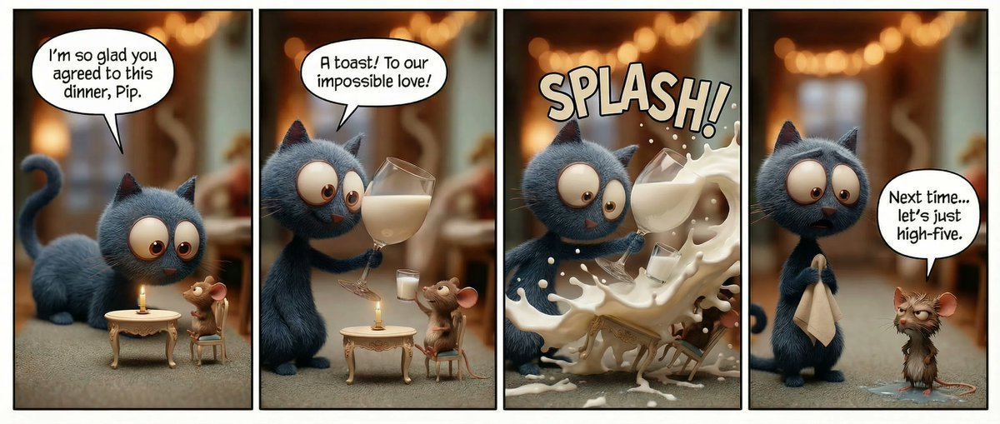

```
The blue cat and his tiny mouse love at a candlelit miniature dinner, cat spills milk dramatically, mouse soggy suggesting next time they high-five.
```

```
蓝猫和他的小老鼠在烛光下的迷你晚餐中相爱，猫戏剧性地打翻了牛奶，老鼠浑身湿透，建议下次他们击掌庆祝。
```

 [↑返回目录](#toc)

---
## <a id="prompt-2001734583830626600">复古照相亭里的甜蜜瞬间</a> (<a href="https://twitter.com/miilesus/status/2001734583830626635" target="_blank" rel="noopener noreferrer">Melis✨</a>)

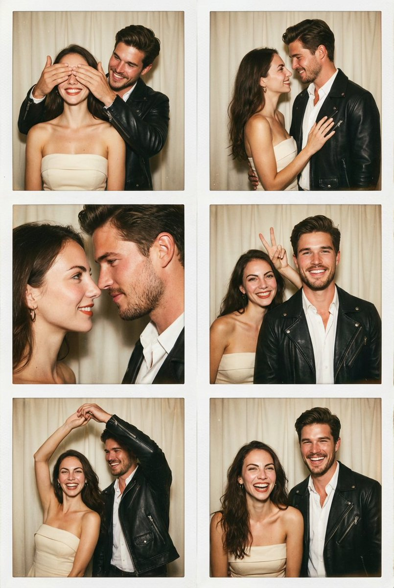

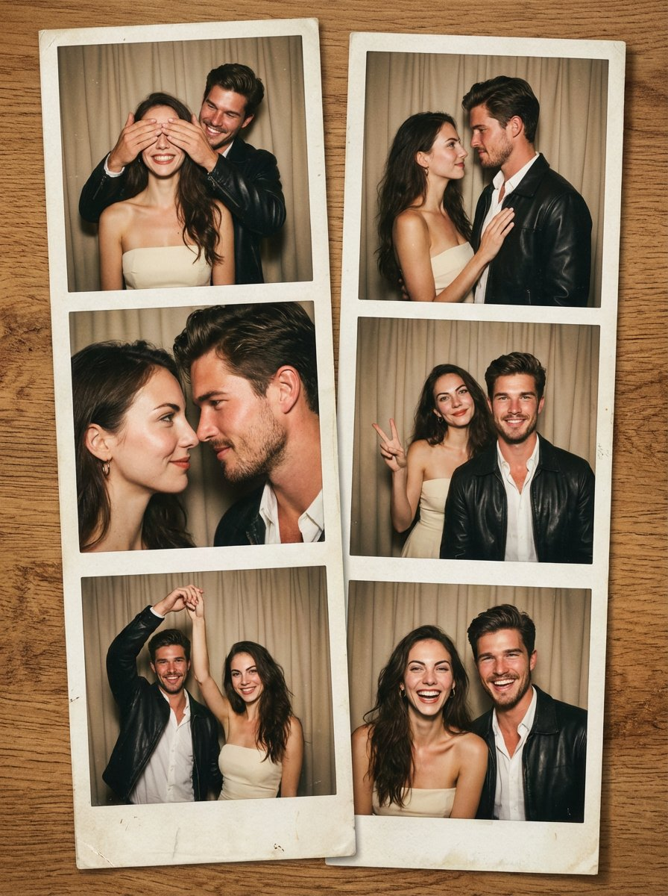

```
Create a realistic vintage-style photo booth / Polaroid photo collage featuring the same couple, using the two uploaded images as exact face references for both individuals (preserve both identities accurately).
The couple appears natural, affectionate, and playful, captured in multiple candid moments as if taken inside a photo booth. The woman and the man maintain their original facial features, skin tones, and expressions.
Woman: elegant, feminine, glowing skin, natural makeup, soft blush, glossy lips, long dark hair styled loosely with gentle volume. Wearing a minimal strapless cream or light beige dress.
Man: clean and handsome appearance, short dark hair, light stubble or clean-shaven, wearing a black leather jacket over a white shirt
Scenes & poses included in the collage:
The woman smiling brightly while the man stands behind her playfully covering her eyes.
The couple standing close, facing each other lovingly, her hand resting on his chest.
A close face-to-face moment with soft smiles and eye contact.
The woman standing behind the man, making a peace sign while smiling at the camera.
A playful dancing pose where the man lifts one of the woman’s hands as if spinning her.
A relaxed, candid moment where both laugh naturally at the camera.
Environment: neutral photo booth backdrop with soft vertical curtains, warm indoor lighting, subtle shadows, cozy and intimate atmosphere.
Photography style: vintage Polaroid / analog photo booth aesthetic, slightly soft focus, gentle grain, mild blur, natural imperfections, warm tones, realistic skin texture.
Lighting: soft frontal flash combined with ambient light, creating a casual, real-life snapshot feeling.
Mood & vibe: romantic, playful, spontaneous, intimate, youthful, nostalgic.
Composition: multi-frame vertical collage, evenly spaced images, authentic photo booth layout.
Quality: high realism, not AI-looking, natural proportions, no distortion.
```

```
创作一张逼真的复古风格照相亭/Polaroid 照片拼贴，使用上传的两张图像作为两人面部的精确参考（准确保留两人的身份特征）。  
这对情侣表现自然、亲昵且充满玩味，仿佛在照相亭内抓拍到的多个随性瞬间。男女双方均保持原有的面部特征、肤色和表情。

女性：优雅、柔美，肌肤透亮，妆容自然，淡淡腮红，唇部有光泽，深色长发松散地挽起，带有柔和蓬松感。身穿简约无肩带的米白色或浅米色连衣裙。  
男性：干净英俊，黑色短发，略带胡茬或干净剃须，身穿黑色皮夹克，内搭白色衬衫。

拼贴中包含以下场景与姿势：  
- 女性灿烂微笑，男性站在她身后，调皮地蒙住她的眼睛。  
- 两人紧靠站立，深情对视，她的手轻放在他的胸口。  
- 两人近距离面对面，带着柔和微笑并有眼神交流。  
- 女性站在男性身后，对着镜头比出和平手势并微笑。  
- 两人摆出活泼的舞姿，男性抬起女性一只手，仿佛正要旋转她。  
- 两人放松自然地对着镜头开怀大笑。

环境：中性色调的照相亭背景，配有柔和垂落的竖向帘布，温暖的室内灯光，轻微阴影，营造温馨亲密的氛围。  

摄影风格：复古Polaroid / 胶片照相亭美学，略微柔焦，细腻颗粒感，轻微模糊，带有自然瑕疵，暖色调，真实肌肤质感。  

光线：柔和正面闪光结合环境光，营造出日常快照的真实感。  

情绪与氛围：浪漫、俏皮、随性、亲密、青春、怀旧。  

构图：多帧纵向拼贴，图像间距均匀，忠实还原照相亭布局。  

画质：高度写实，不显AI痕迹，比例自然，无畸变。
```

 [↑返回目录](#toc)

---
## <a id="prompt-2001828831615946800">维多利亚哥特皇室封面写真</a> (<a href="https://twitter.com/songguoxiansen/status/2001828831615946768" target="_blank" rel="noopener noreferrer">松果先森</a>)

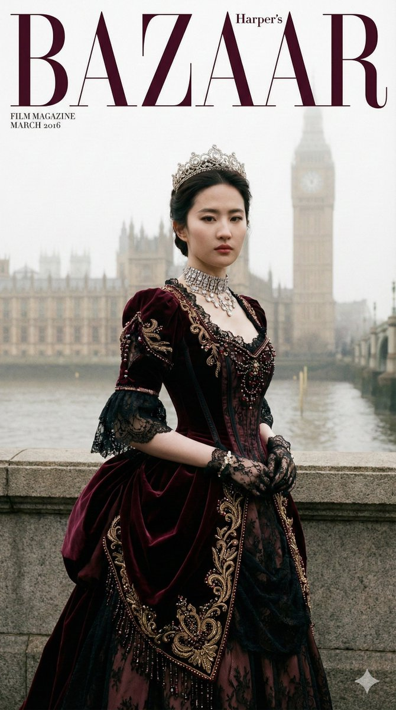

```
生成一张 9:16 竖版「维多利亚哥特皇室」写实照片：以我上传的 FACE_REF 为人物身份参考，100%还原五官与骨相；人物身穿“维多利亚时代（19世纪）宫廷礼服方向”的重工礼服（紧身胸衣、大裙撑、蕾丝/天鹅绒、皇室珠宝），在伦敦塔桥或威斯敏斯特宫（大本钟）旁拍摄。画面具备《Harper’s Bazaar》级别的摄影、造型与封面设计，保持杂志的一贯设计风格（中英文设计）。

【INPUTS | 输入】
FACE_REF：我上传的人物五官参考图（身份锁定）

【ABSOLUTE PRIORITY | 身份锁定（最高优先级）】
100%还原 FACE_REF 的五官与骨相：眼距、鼻梁鼻翼、唇形、下颌线、颧骨结构完全一致，不得漂移。
真实皮肤质感：可见细微纹理与毛孔，不要过度磨皮与网红化。
成年女性形象（adult）。

【SHOT TYPE | 景别二选一（由模型随机选其一，且必须真实统一）】
A) 半身封面：胸口到腰上方，珠宝、蕾丝领口与眼神最清晰（主推）
B) 全身封面：从头到脚完整呈现巨大的裙撑轮廓与伦敦地标的结合，透视感强（备选）
（无论A/B：都必须保持“封面构图”，有留白空间给排版，但不要撕纸/手绘效果。）

【LOCATION | 场景（英国伦敦）】
伦敦地标：泰晤士河畔，背景是宏伟的哥特式建筑威斯敏斯特宫（大本钟）或 伦敦塔桥的塔楼。
天气二选一（随机）：1) 伦敦雾霭（经典的雾都质感，光线柔和神秘） 2) 阴雨方歇（地面湿润反光，天空呈铅灰色）
背景干净：无游客、无现代标识、无手机状态栏UI、无水印字幕。

【LIGHTING & CAMERA | 摄影质感（杂志级）】
镜头感：85mm人像质感（半身）或 50mm/70mm（全身），浅景深，眼睛最清晰。
光线：阴天漫射光 + 戏剧性补光（强调面部结构）；钻石/宝石有真实火彩；天鹅绒质感深邃。
色彩：高级电影感，低饱和度的蓝灰环境色与服装的深色调（红/蓝/黑）形成哥特美学；整体干净、通透、贵气。

【WARDROBE | 维多利亚宫廷礼服（重工、塑形、繁复细节）】
目标审美：“蜂腰、大裙摆、层叠蕾丝、重磅天鹅绒、皇冠、女王气场”。

轮廓与层次（X型剪裁）
上身：结构感极强的紧身胸衣（Corset），方领或高领，泡泡袖或羊腿袖
下身：巨大的裙撑（Crinoline 或 Bustle），后腰部有明显的堆叠设计，裙摆拖地
装饰：大量的荷叶边、蝴蝶结、垂坠的流苏
面料与工艺（重手艺必须“看得见”）
主面料：重磅丝绒、塔夫绸、尚蒂伊蕾丝（Chantilly Lace）
主要工艺：珠绣、金线刺绣、缎带编织
纹样主题：大马士革纹（Damask）、玫瑰、蓟花（苏格兰象征）、佩斯利纹
细节：蕾丝手套、颈饰（Choker）、勋章/胸针
头面（皇室珠宝头饰）
核心结构：维多利亚式小王冠（Tiara）或 羽毛头饰
装饰：钻石、蓝宝石、珍珠
耳饰/颈饰：极度夸张的钻石项链、耳坠

【COLOR MATRIX | 颜色矩阵搭配（必须执行，且必须“皇室深色”）】
（维多利亚晚期的深沉奢华）
从以下三套“主色方案”中随机选 1 套作为【底色/大面积主面料色】。

Scheme G（皇室蓝底）：
底色：深宝蓝/午夜蓝（丝绒质感）
刺绣/装饰：银色蕾丝、钻石、蓝宝石
Scheme A（维多利亚红底）：
底色：酒红/勃艮第红（深沉热情）
刺绣/装饰：黑色蕾丝、金色刺绣、红宝石
Scheme R（丧服黑底）：
底色：墨黑（Black Jet，极度哥特）
刺绣/装饰：黑色串珠、黑色蕾丝、少量金色或银色提亮

【颜色执行规则】
色彩要深沉浓郁，体现“日不落”的威严和哥特式的神秘。

【POSE | 封面姿态（威严、僵直、女王感）】
半身：下巴微扬，眼神冷峻，一手轻抚项链
全身：站姿挺拔（像肖像画一样），双手交叠在裙撑上，气场压倒一切
表情：严肃、高傲、不可一世；绝对不笑（维多利亚风格）。

【OUTPUT | 输出】
1 张 9:16 竖版写实杂志封面级照片
随机：半身 or 全身（A/B二选一）
随机：雾霭 or 阴雨（天气二选一）
随机：宝蓝 / 酒红 / 墨黑（颜色矩阵三选一）
造型：维多利亚宫廷礼服方向 + 皇冠/Choker + 紧身胸衣大裙撑 + 丝绒蕾丝
```

 [↑返回目录](#toc)

---
## <a id="prompt-2001653710745739500">奢华生活四宫格</a> (<a href="https://twitter.com/lexx_aura/status/2001653710745739419" target="_blank" rel="noopener noreferrer">Lex</a>)

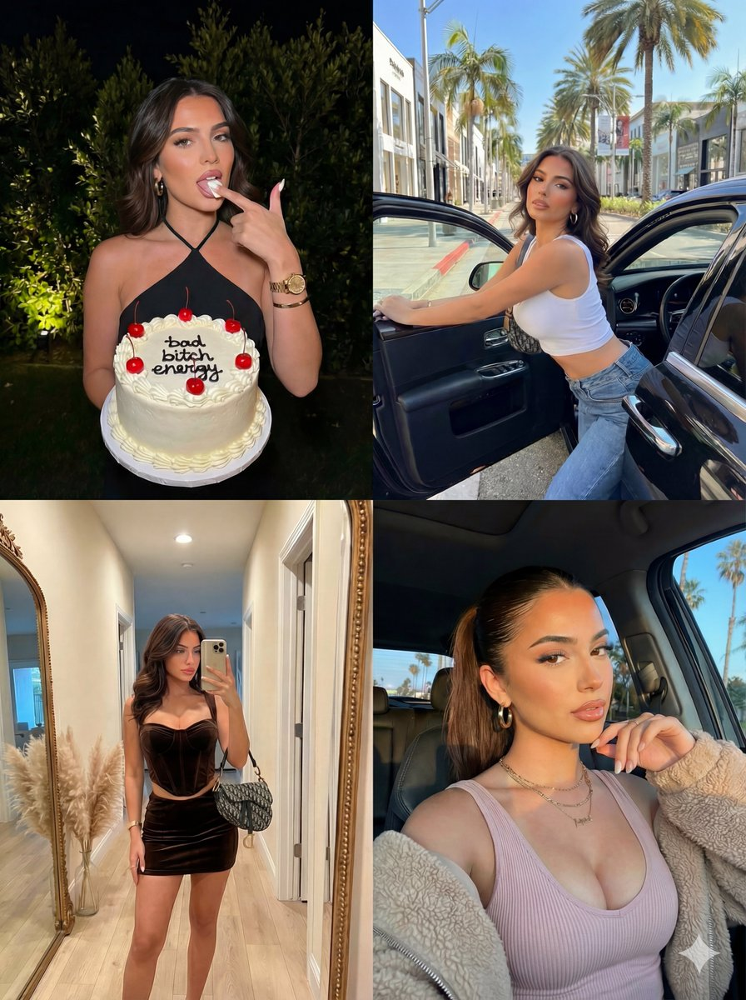

```
{
  "image_layout": "2x2 grid collage featuring four distinct photographs of the same female subject.",
  "subject_general": {
    "gender": "Female",
    "hair_color": "Dark brown/black",
    "hair_style": "Long, styled in loose waves in three panels; sleek high ponytail in one panel",
    "aesthetic": "Glamorous, influencer, trendy, luxury lifestyle"
  },
  "panels": [
    {
      "position": "top_left",
      "setting": "Outdoors at night, dark background with illuminated green foliage",
      "action": "Subject is holding a cake with one hand and licking frosting off the index finger of the other hand",
      "outfit": {
        "top": "Black halter-neck sleeveless top",
        "jewelry": "Gold wristwatch, gold bangle bracelet, ring, small hoop earrings"
      },
      "props": {
        "item": "Round white frosted cake",
        "details": [
          "Red cherries on top",
          "Decorative white piping along edges",
          "Black icing text reading 'bad bitch energy'"
        ]
      }
    },
    {
      "position": "top_right",
      "setting": "Daytime city street, likely an upscale shopping district (e.g., Rodeo Drive) with palm trees and storefronts visible",
      "action": "Subject is leaning out of the open door of a black luxury car, looking at the camera",
      "outfit": {
        "top": "White sleeveless ribbed crop top",
        "bottom": "Blue denim jeans",
        "accessories": "Shoulder bag (strap visible), gold hoop earrings"
      },
      "lighting": "Bright natural sunlight casting shadows"
    },
    {
      "position": "bottom_left",
      "setting": "Indoor hallway, beige walls, wooden floor",
      "action": "Full-body mirror selfie",
      "outfit": {
        "style": "Matching two-piece set",
        "color": "Dark brown/chocolate",
        "top": "Velvet/suede corset-style bustier top",
        "bottom": "Mini skirt",
        "accessories": "Patterned designer handbag (resembling Dior Saddle bag), stack of gold bracelets"
      },
      "background_details": [
        "Large rectangular mirror with gold frame leaning against wall",
        "Vase with pampas grass in the corner",
        "Doorway visible in reflection"
      ]
    },
    {
      "position": "bottom_right",
      "setting": "Inside a vehicle or outdoors, golden hour sunlight",
      "action": "Close-up selfie, hand raised near mouth/chin",
      "outfit": {
        "top": "Light pink/mauve ribbed tank top",
        "outerwear": "Beige fuzzy/sherpa jacket worn off-the-shoulder",
        "jewelry": "Layered gold necklaces with pendants, hoop earrings"
      },
      "hair_styling": "Sleeked back high ponytail",
      "background_details": "Car window frame, palm trees and blue sky visible in background"
    }
  ]
}
```

```
{
  "图像布局": "2x2网格拼贴，包含同一女性主体的四张不同照片。",
  "主体通用信息": {
    "性别": "女性",
    "发色": "深棕色/黑色",
    "发型": "三张图中为长发，呈松散波浪；一张图为光滑高马尾",
    "风格": "华丽、网红、时尚、奢华生活方式"
  },
  "分图": [
    {
      "位置": "左上",
      "场景": "夜晚户外，深色背景，有被照亮的绿色植物",
      "动作": "主体单手拿着蛋糕，另一只手用食指舔舐糖霜",
      "服装": {
        "上衣": "黑色挂脖无袖上衣",
        "首饰": "金色腕表、金色宽手镯、戒指、小号圈形耳环"
      },
      "道具": {
        "物品": "圆形白色糖霜蛋糕",
        "细节": [
          "顶部有红色樱桃",
          "边缘有装饰性白色裱花",
          "黑色糖霜文字写着“bad bitch energy”"
        ]
      }
    },
    {
      "位置": "右上",
      "场景": "白天城市街道，可能是高档购物区（如罗迪欧大道），可见棕榈树和商店橱窗",
      "动作": "主体从一辆黑色豪华汽车的打开车门中探身，看向镜头",
      "服装": {
        "上衣": "白色无袖罗纹短款上衣",
        "下装": "蓝色牛仔裤",
        "配饰": "肩包（可见肩带）、金色圈形耳环"
      },
      "光线": "明亮自然日光，投下阴影"
    },
    {
      "位置": "左下",
      "场景": "室内走廊，米色墙壁，木地板",
      "动作": "全身镜自拍",
      "服装": {
        "款式": "配套两件套",
        "颜色": "深棕色/巧克力色",
        "上衣": "天鹅绒/麂皮材质紧身胸衣式上衣",
        "下装": "迷你裙",
        "配饰": "印花设计师手袋（类似迪奥马鞍包）、多层金色手镯"
      },
      "背景细节": [
        "靠墙斜放的金色边框大型矩形镜子",
        "角落里的蒲苇花瓶",
        "镜中可见门口"
      ]
    },
    {
      "位置": "右下",
      "场景": "车内或户外，黄金时刻阳光",
      "动作": "特写自拍，手抬至嘴边/下巴附近",
      "服装": {
        "上衣": "浅粉色/灰紫罗纹背心",
        "外套": "米色毛绒/羊羔毛夹克，滑落肩部穿着",
        "首饰": "多层带吊坠的金色项链、圈形耳环"
      },
      "发型": "光滑高马尾",
      "背景细节": "车窗框，背景可见棕榈树和蓝天"
    }
  ]
}
```

 [↑返回目录](#toc)

---
## <a id="prompt-2001654013599916300">节气养生手作茶艺图鉴</a> (<a href="https://x.com/berryxia/status/2001654013599916343" target="_blank" rel="noopener noreferrer">Berryxia.AI</a>)


```
A straight-on photograph showing TWO elements vertically arranged and centered against a pure white wall background:

[UPPER ELEMENT - SHADOW BOX FRAME]

A handcrafted light oak wooden shadow box frame mounted on the wall. Inside, against textured off-white rice paper backing with hand-torn deckled edges, delicate {季节性植物装饰} are scattered as {季节} seasonal decoration.

TOP CENTER: Large black traditional Chinese calligraphy "{节气名称}" in bold forceful brush strokes, flanked by small cinnabar red traditional seals. Below in smaller elegant script: "{该节气养生古籍名言}"

CENTER-LEFT ARRANGEMENT: Two adorable handmade clay figurines (2 inches tall):
- First child: {颜色1} {服装描述}, {手持物品}, {表情描述}, rosy cheeks
- Second child: {颜色2} {服装描述}, {动作描述}, {表情描述}, {配饰描述}
- Both hand-painted colored clay showing folk art craftsmanship in {季节色调} tones, positioned {互动场景描述}

CENTER-RIGHT ARRANGEMENT: Artful curation of dried ingredients:
- Two small corked glass vials at different heights: one with {食材A}, one with {食材B}
- Pinned with antique brass pins: {食材C} lifted creating shadows, {食材D}, {食材E}, {食材F}
- Miniature {颜色} glazed teapot (1 inch scale)
- Hand-written aged paper labels: "{食材A标签}" "{食材B标签}" "{食材C标签}" "{食材D标签}" "{食材E标签}" "{食材F标签}"

LEFT SIDE: Vertical label "{茶饮名称}"

[LOWER ELEMENT - LARGE ILLUSTRATED INSTRUCTION CARD]

A LARGE rectangular premium textured rice paper (12 x 16 inches) mounted below with hand-torn edges and visible paper fibers. Burlap sample pouch with wooden bead tied with hemp string pinned to top right corner.

TOP SECTION:
- Center: "制作说明" in large elegant black traditional font (bold, prominent)
- Thin double-line decorative border beneath
- Small {季节植物} illustrations flanking title

MAIN CONTENT - 4 ILLUSTRATED STEPS in horizontal layout:

**步骤 1: 准备食材**
- Left: Large "①" in circular cinnabar red ink brush seal
- Center: Charming simple line drawing showing six cute little bowls in a row, each containing different ingredients, with tiny labels above, drawn in minimalist black ink with playful style
- Right: "准备: {食材A}Xg、{食材B}Xg、{食材C}Xg、{食材D}Xg、{食材E}Xg、{食材F}Xg。"

**步骤 2: 预处理**
- Left: Large "②" in circular cinnabar red ink brush seal
- Center: Simple line drawing of hands {预处理动作描述}, mortar and pestle, cutting board, small knife visible, instructional cartoon style
- Right: "预处理: {具体预处理步骤描述}。"

**步骤 3: 煮制过程**
- Left: Large "③" in circular cinnabar red ink brush seal
- Center: Simple line drawing of traditional clay pot on flame, steam rising with curly lines, clock showing {X}minutes, ingredients visible inside pot, warm inviting style
- Right: "煮制: 将所有食材放入砂锅,加水{X}ml,大火煮开后转小火煎煮{X}分钟,滤出汤汁。"

**步骤 4: 饮用建议**
- Left: Large "④" in circular cinnabar red ink brush seal
- Center: Simple line drawing of steaming decorative tea cup, tiny happy character holding cup, sun/moon symbols (timing), heart with warmth radiating lines, cozy welcoming style
- Right: "饮用: {饮用时间和方式}。{功效描述},{节气养生理念}。"

DECORATIVE ELEMENTS:
- Thin vertical divider lines (hand-drawn ink) separating illustrations from text
- Traditional Chinese cloud pattern corner flourishes in each corner
- Subtle aged tea-stain watercolor wash around edges (very light)
- Tiny hand-drawn {季节符号} scattered in white space (snowflakes for winter, leaves for autumn, etc.)
- Small wellness icon symbols: teacup, heart, clock icons in muted {色调} tones

BOTTOM SECTION:
- Right: Red square seal stamp "神娃手作" (1.5 inches) with uneven hand-stamping texture
- Left: Elegant {季节植物} illustration (3 inches) in delicate black ink with subtle color wash
- Center: Thin decorative border with small repeating pattern

ILLUSTRATION STYLE: Clean line art, whimsical but instructional, resembling traditional Chinese New Year print art mixed with modern cookbook illustration. Subtle color washes on ingredients. All illustrations 2-3 inch square size.

LIGHTING: Soft {季节}afternoon light from upper left, gentle shadows showing card elevation, illustrations show authentic ink absorption into paper texture, cinnabar red circles show brush stroke texture, micro-shadows on embossed decorative patterns.

COMPOSITION: 85mm lens, f/5.6, perfectly centered vertical alignment, 3:4 portrait, ultra-clean white wall, museum-quality gallery presentation. Large card becomes equal visual weight to shadow box, creating balanced artistic diptych.
```

 [↑返回目录](#toc)

---
## <a id="prompt-2001562159499870500">Urban Japan Music Collage</a> (<a href="https://x.com/BeautyVerse_Lab/status/2001562159499870510" target="_blank" rel="noopener noreferrer">BeautyVerse</a>)

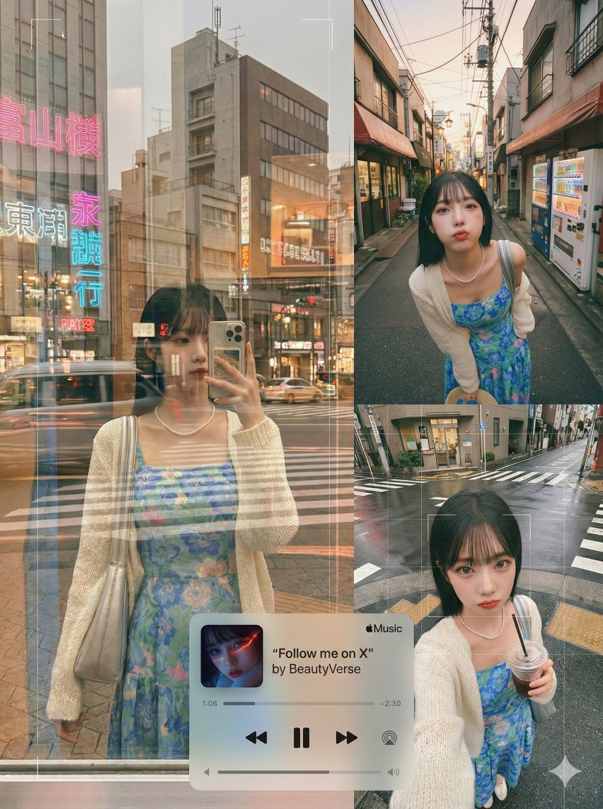

```
Photo × Music Playback Effect
写真 × 音楽再生エフェクト

(Prompt below/プロンプトは下にあります)

How to use:
1.Prepare two images: one character reference and one album cover.
2.Copy and paste the prompt.
3.Feel free to change the song, album, or artist name as you like.

使い方：
1.画像を2枚用意します。1枚は人物リファレンス、もう1枚はアルバムジャケットです。
2.プロンプトをコピー＆ペーストします。
3.曲名・アルバム名・アーティスト名は、お好みに合わせて自由に変更してください。

Maybe you want to try it out? @underwoodxie96 @SDT_side 
[Prompt]

{
  "project_title": "Urban Streetwear Editorial Collage (Japan Edition)",
   "structure": "Asymmetric 3-panel triptych layout (Exactly 3 distinct frames, NO 4th panel)",
  "aspect_ratio": "3:4",
  "aesthetic_theme": {
    "style": "Editorial poster-style multi-panel collage",
    "mood": "Retro analog–digital fusion set in urban Japan",
    "color_palette": [
      "Warm ambers",
      "Washed neutrals",
      "Soft greys",
      "Muted browns",
      "Neon accent reflections"
    ],
    "textures": [
      "Reflective glass",
      "Wool plaid",
      "Polished leather",
      "Rain-slicked asphalt",
      "Japanese signage elements"
    ]
  },
  "subject_reference": {
    "source": "image_1.png",
    "instruction": "The subject's physical appearance, complete outfit, accessories (like cap/sunglasses if present), and general vibe must exactly match the person depicted in the provided reference image_1.png. The subject should be consistent across all frames."
  },
  "composition_layout": {
    "frame_1_left": {
      "type": "Reflective window shot",
      "subject_source": "Based on image_1.png",
      "pose": "Holding phone in front of face",
      "visual_effects": "Layered ghosting, architectural overlays (Japanese buildings and kanji signs), curvature distortion"
    },
    "frame_2_top_right": {
      "type": "Close-range, downward-angled ultra-wide portrait",
      "setting": "Narrow Tokyo backstreet with overhead power lines, small shops, and vending machines",
      "subject_source": "Based on image_1.png",
      "pose": "Leaning forward, hands in pockets, exaggerated pout (adapting the subject from image_1)",
      "visual_effects": "Lens perspective distortion, radiating street lines"
    },
    "frame_3_bottom_right": {
      "type": "Intimate overhead selfie",
      "subject_source": "Based on image_1.png",
      "setting": "Urban Japanese street corner",
      "lighting": "Soft overcast / evening city glow",
      "props": "Holding a drink",
      "overlays": "Faint digital-grid, minimal square facial-bounding graphic"
    }
  },
  "ui_elements": {
    "music_player": {
      "style": "Translucent iOS-style Apple Music mini-player placed in the center or bottom",
      "album_artwork_reference": {
        "source": "image_2.png",
        "instruction": "The square album cover art area inside the music player UI must display the exact content of the provided reference image_2.png."
      },
      "text_content_placeholder": "“Follow me on X” by BeautyVerse (Text should complement the visual of image_2.png)",
      "other_features": "Timeline bar, playback controls (no shadows)"
    },
    "graphics": "Subtle cursor-like frame lines, rectangular highlights"
  },
  "negative_constraints": [
    "Stickers",
    "Extra subjects different from image_1.png",
    "Wardrobe changes inconsistent with image_1.png",
    "Western style cobblestone streets",
    "Incorrect UI icons",
    "Neon color shifts (except for signage reflection)",
    "Futuristic sci-fi elements"
  ]
}

#NanoBananaPro
```

 [↑返回目录](#toc)

---
## <a id="prompt-2001265620449444400">nano banana pro cost saving trick for product photography. instead of burning credits for experimenting one image at a time. show it an example, ask for a 6x6 grid, pick your favorite</a> (<a href="https://x.com/gokayfem/status/2001265620449444251" target="_blank" rel="noopener noreferrer">gokaygokay</a>)

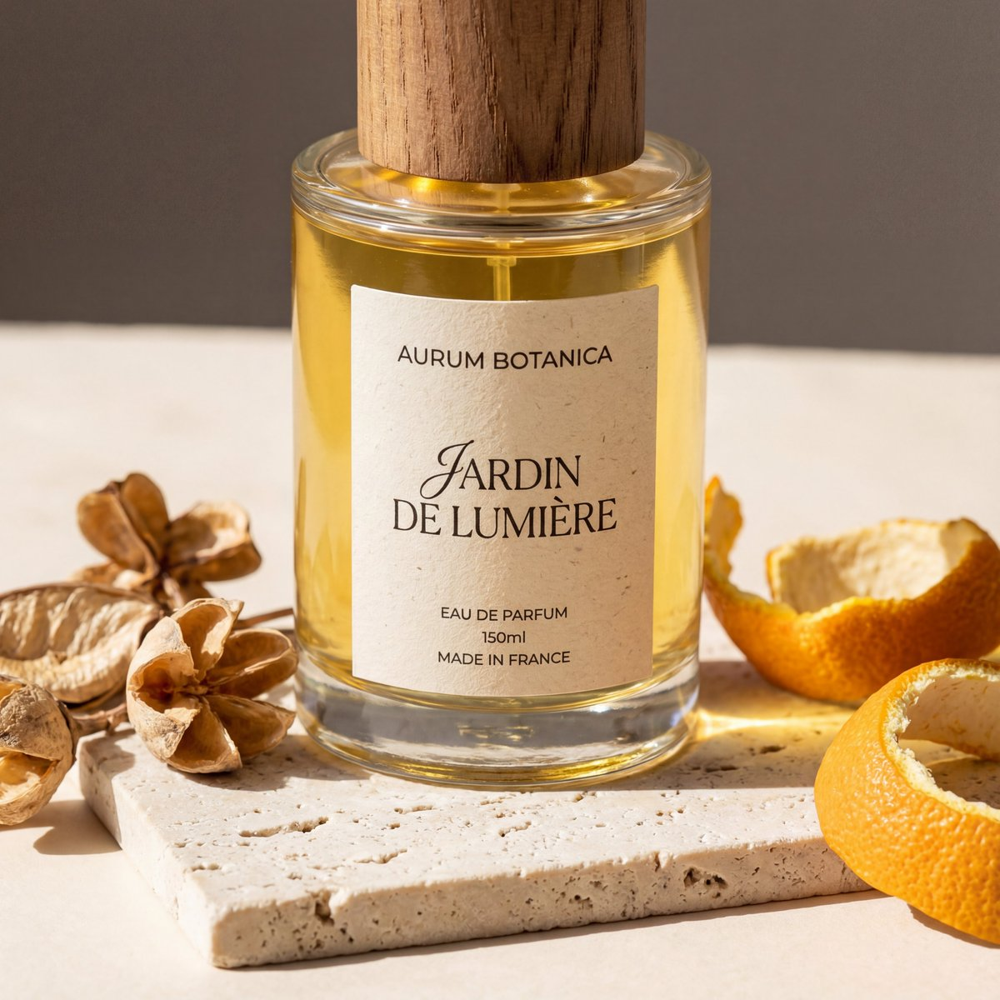

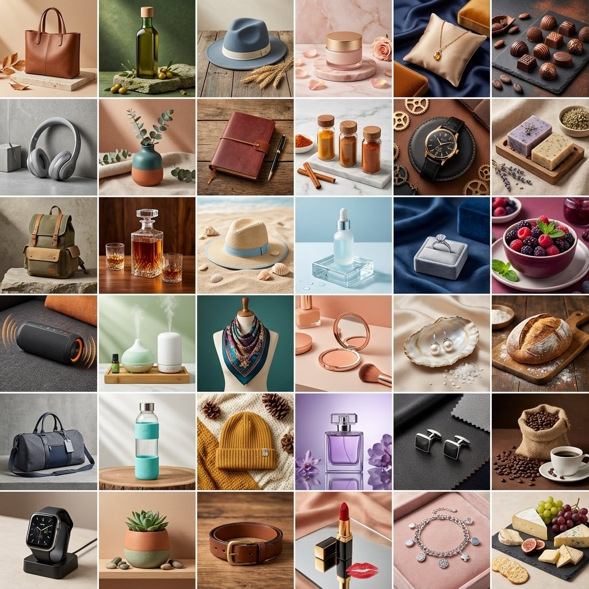

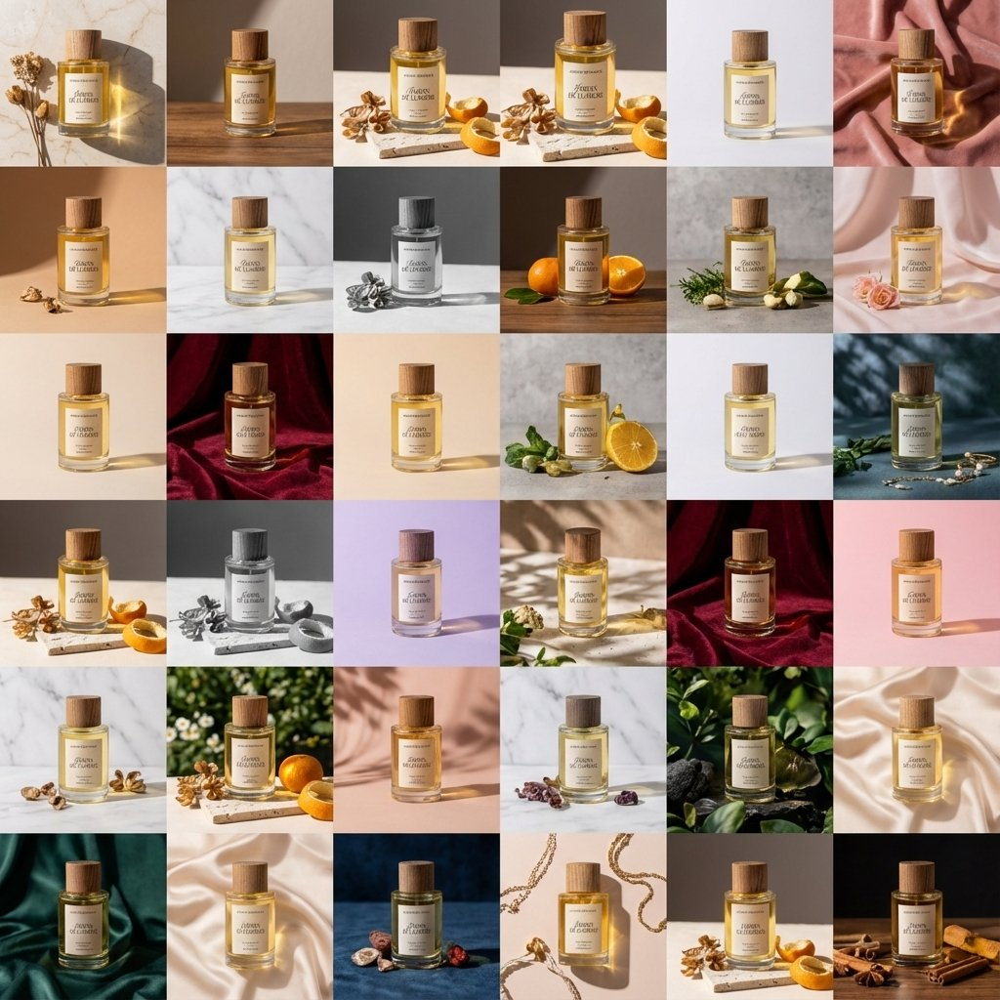


```
nano banana pro cost saving trick for product photography. instead of burning credits for experimenting one image at a time. show it an example, ask for a 6x6 grid, pick your favorite

prompt (for different and similar mood and quality): Generate a 6x6 grid of professional product photography. Reference the original image's mood, quality, and aesthetic. Each cell should showcase a completely different product (bags, bottles, hats, cosmetics, jewelry, food, electronics, etc.) in a unique studio setting with a distinct color palette. Maintain the same high-end commercial photography style throughout. Vary the products, lighting, backgrounds, props, and styling dramatically across all 36 images.

prompt (for balanced diversity):
Generate a 6x6 grid of variations based on the original image. Keep the same product but vary the color palettes, backgrounds, lighting, angles, props, and styling dramatically across all 36 cells. Maintain the same professional quality and aesthetic throughout.

prompt (for maximum diversity):
Generate a 6x6 grid showing 36 unique variations of this product. Experiment wildly with color palettes, environments (studio, lifestyle, minimal, textured backgrounds), lighting styles, compositions, and moods. Keep product recognition and professional quality consistent, but make each cell visually distinct.
```

```
（用于不同但风格与质感相近的效果）：生成一个6x6网格的专业产品摄影作品。参考原图的情绪、画质和美学风格。每个格子展示完全不同的产品（如包袋、瓶子、帽子、化妆品、珠宝、食品、电子产品等），置于独特的影棚环境中，并采用鲜明的配色方案。整体保持高端商业摄影风格，36张图像在产品、灯光、背景、道具和造型上均显著不同。

提示词（用于平衡多样性）：基于原图生成一个6x6网格的变体。保持相同的产品，但在36个格子中大幅改变配色方案、背景、灯光、角度、道具和造型。整体维持一致的专业品质与美学风格。

提示词（用于最大多样性）：生成一个6x6网格，展示该产品的36种独特变体。大胆尝试各种配色方案、环境（影棚、生活场景、极简、肌理背景）、灯光风格、构图和情绪氛围。在确保产品辨识度和专业品质的前提下，使每个格子在视觉上截然不同。
```

 [↑返回目录](#toc)

---
## <a id="prompt-2001234210409857000">冬日圣诞贺卡</a> (<a href="https://x.com/NanoBanana/status/2001234210409857077" target="_blank" rel="noopener noreferrer">Nano Banana Pro</a>)

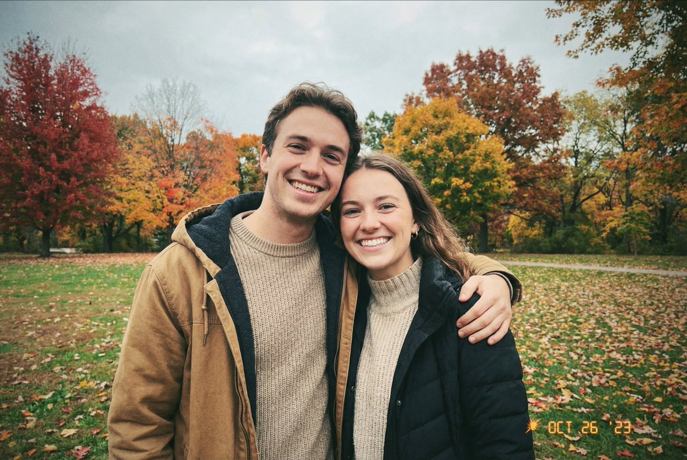

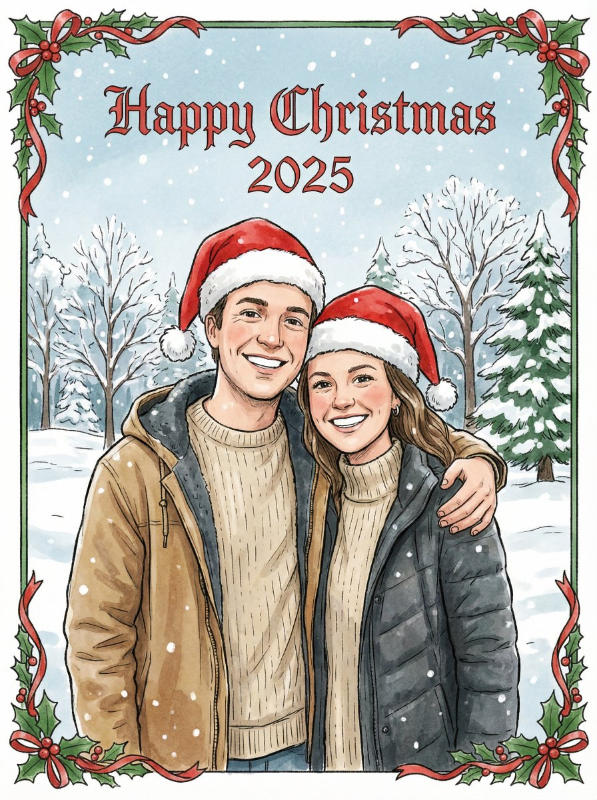

```
a faithfully illustrated Christmas card design featuring the couple in Christmas hats, and the text "Happy Christmas 2025", it is friendly and traditional, with a classical design, in a winter wonderland
```

```
一张忠实绘制的圣诞贺卡设计，描绘一对戴着圣诞帽的伴侣，配有文字“Happy Christmas 2025”，风格友好而传统，采用经典设计，背景为冬日仙境。
```

 [↑返回目录](#toc)

---
## <a id="prompt-2001435741675536600">订书机×拉面潮鞋</a> (<a href="https://x.com/Gdgtify/status/2001435741675536629" target="_blank" rel="noopener noreferrer">Gadgetify</a>)

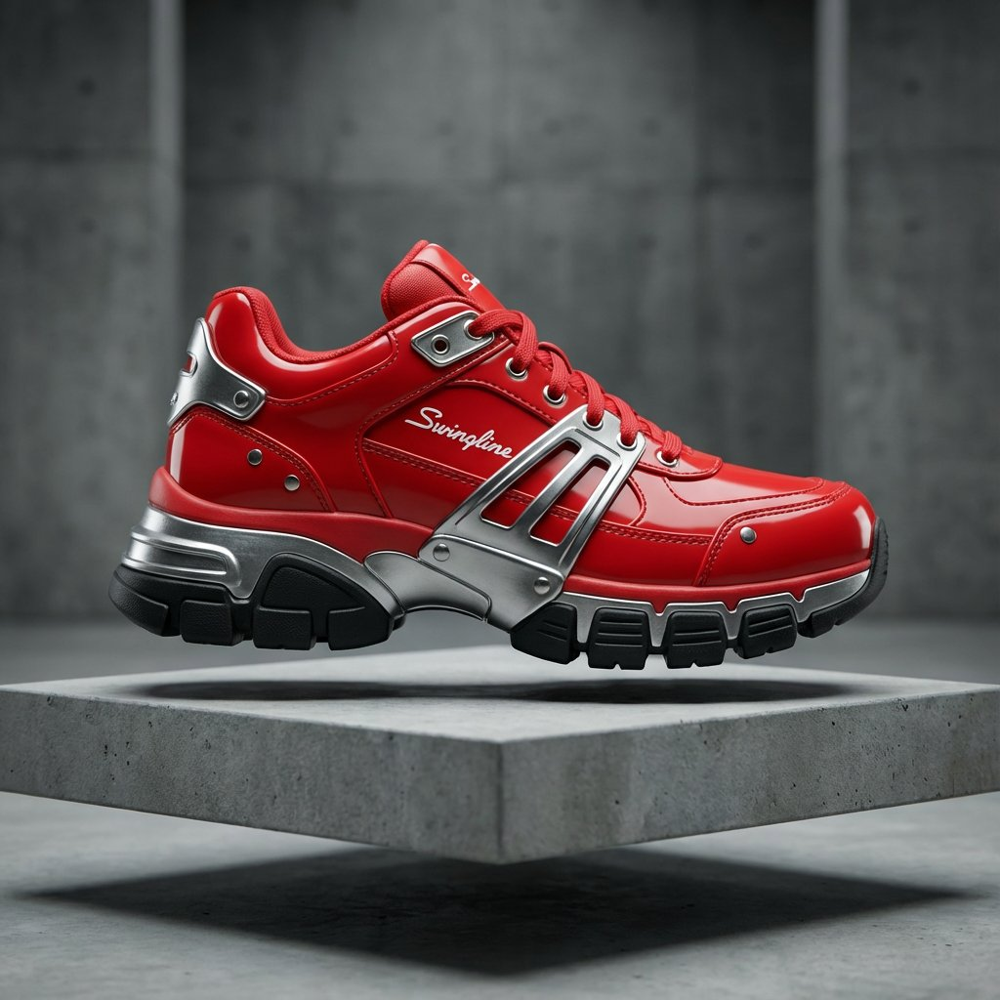

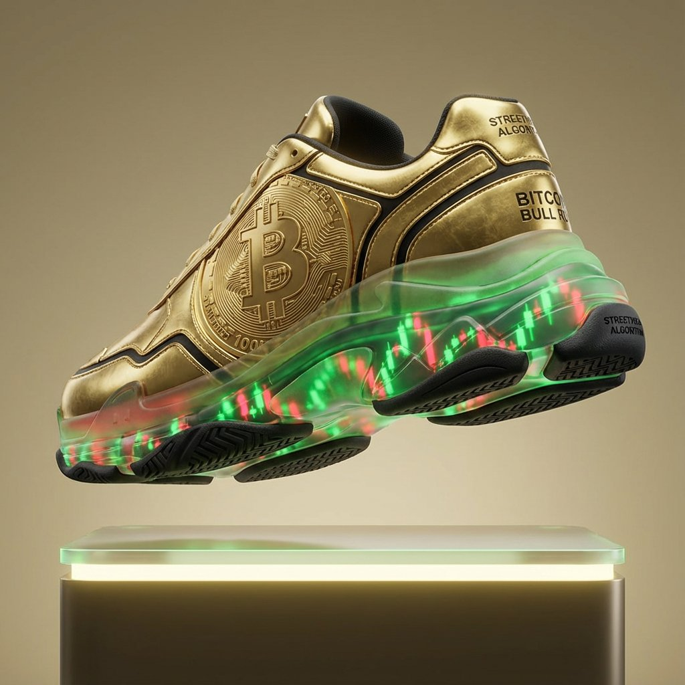


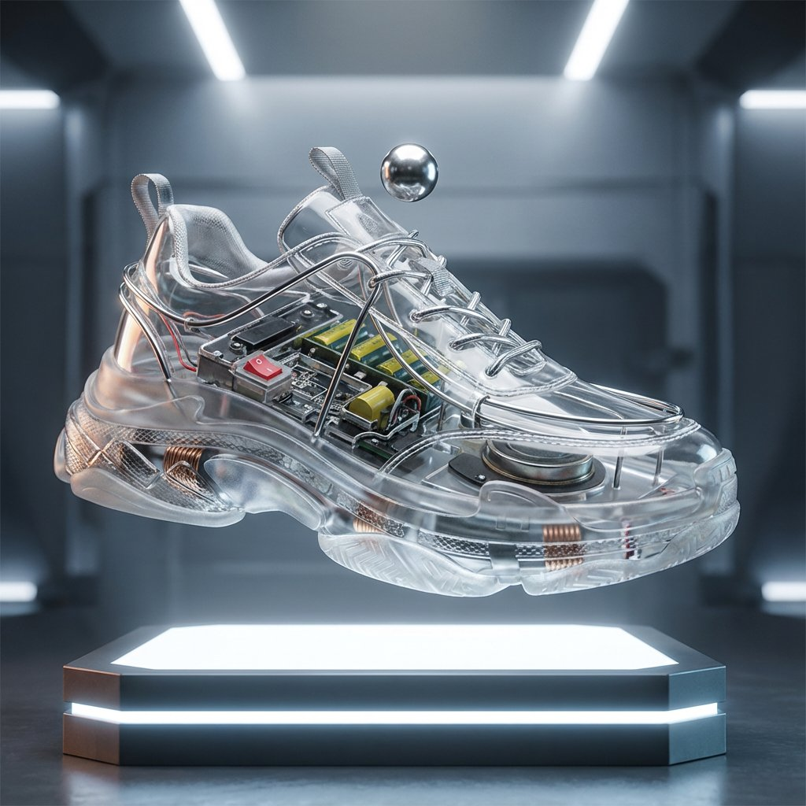

```
This Nano Banana Pro prompt turns everyday objects into sneakers or jackets, depending on what you want.  I used a stapler, marble run, bitcoin, and ramen with eggs meal

Act as the "Streetwear Algorithm" AI. 
 Turns any organic texture or random object into a limited-edition "Hypebeast" sneaker or puffer jacket drop.
 
Input A : [look at attached image]
Input B: Chunky Sneaker  (or Puffer Jacket - choose one based on what fits the shape best) 

 Smart Logic - Execute Step-by-Step : 
 Analyze Input A: Extract the  Color Palette  (primary, secondary),  Material Physics   (soft vs. hard), and  Key Features  (logos, hinges, buttons).
 2.   Apply Design Language: 
 IF Input A = Organic (food/nature), apply "Bio-Mimicry" (wavy curves, soft volume). 
 IF Input A = Industrial/Grunge (rust/wires), apply "Deconstructivist" (exposed stitching, raw edges). 
 IF Input A = Rigid/Household (stapler, appliance, car), apply "Hard-Surface Integration." 

(must follow: The shoe must look like it is MANUFACTURED from the object parts. Example: Use the red plastic casing for the shoe upper, metal hinges for the sole, logos as branding tags). 
3. Render:  Generate a studio product shot on a floating pedestal. 8k resolution, cinematic lighting.
 
Output:  A viral hype-fashion item that looks 100% real.
```

```
扮演“街头潮服算法”AI，  
将任何有机纹理或随机物体转化为限量版“潮流达人”运动鞋或羽绒夹克新品。

输入 A：[查看附图]  
输入 B：厚底运动鞋（或羽绒夹克——根据物体形状选择最合适的）

智能逻辑 - 分步执行：  
1. 分析输入 A：提取色彩搭配（主色、辅色）、材质物理特性（软/硬）和关键特征（标志、铰链、按钮）。  
2. 应用设计语言：  
   - 若输入 A 为有机物（食物/自然），采用“仿生设计”（波浪曲线、柔软体积感）。  
   - 若输入 A 为工业/粗犷风格（锈迹/电线），采用“解构主义”（外露缝线、毛边处理）。  
   - 若输入 A 为硬质/日用品（订书机、电器、汽车），采用“硬表面融合”。  

（必须遵守：成品鞋必须看起来是由该物体部件制造而成。例如：用红色塑料外壳作为鞋面，金属铰链作为鞋底，原有标志作为品牌标签。）  
3. 渲染：生成置于悬浮展台上的产品摄影图像，8K 分辨率，电影级灯光。

输出：一款看起来 100% 真实、具备病毒式传播潜力的潮流时尚单品。
```

 [↑返回目录](#toc)

---
## <a id="prompt-2001504388108685300">纸雕卡通：博物馆中的艺术珍藏</a> (<a href="https://x.com/rovvmut_/status/2001504388108685376" target="_blank" rel="noopener noreferrer">Heisenberg</a>)

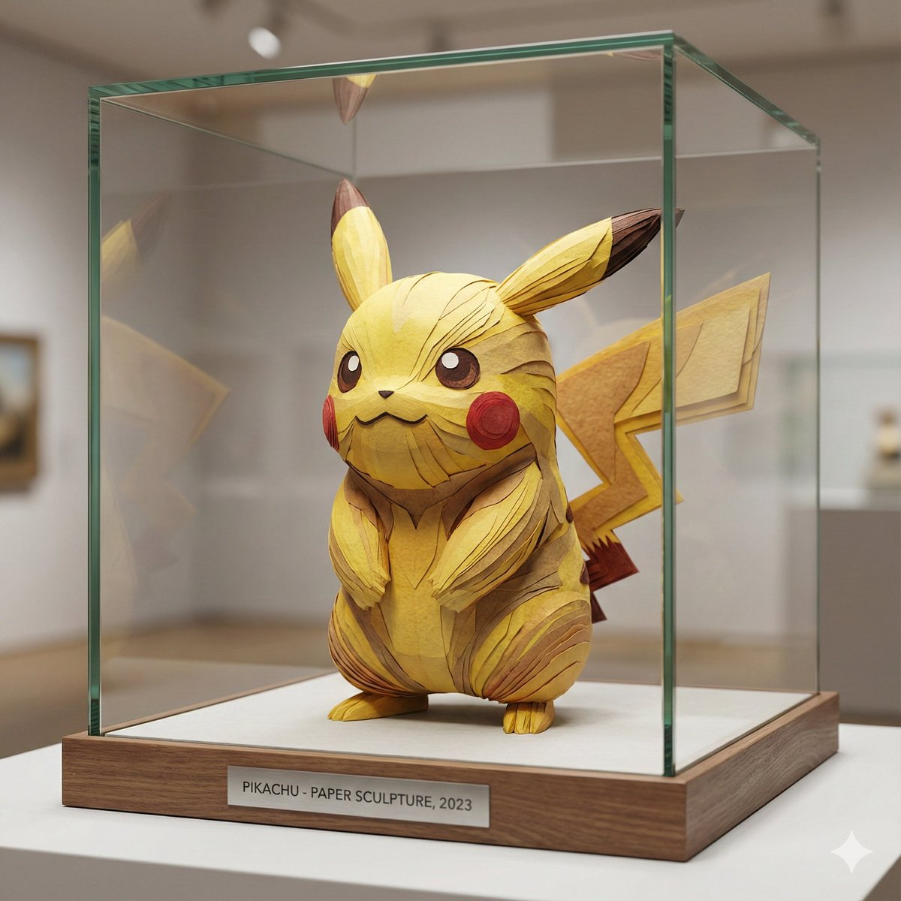

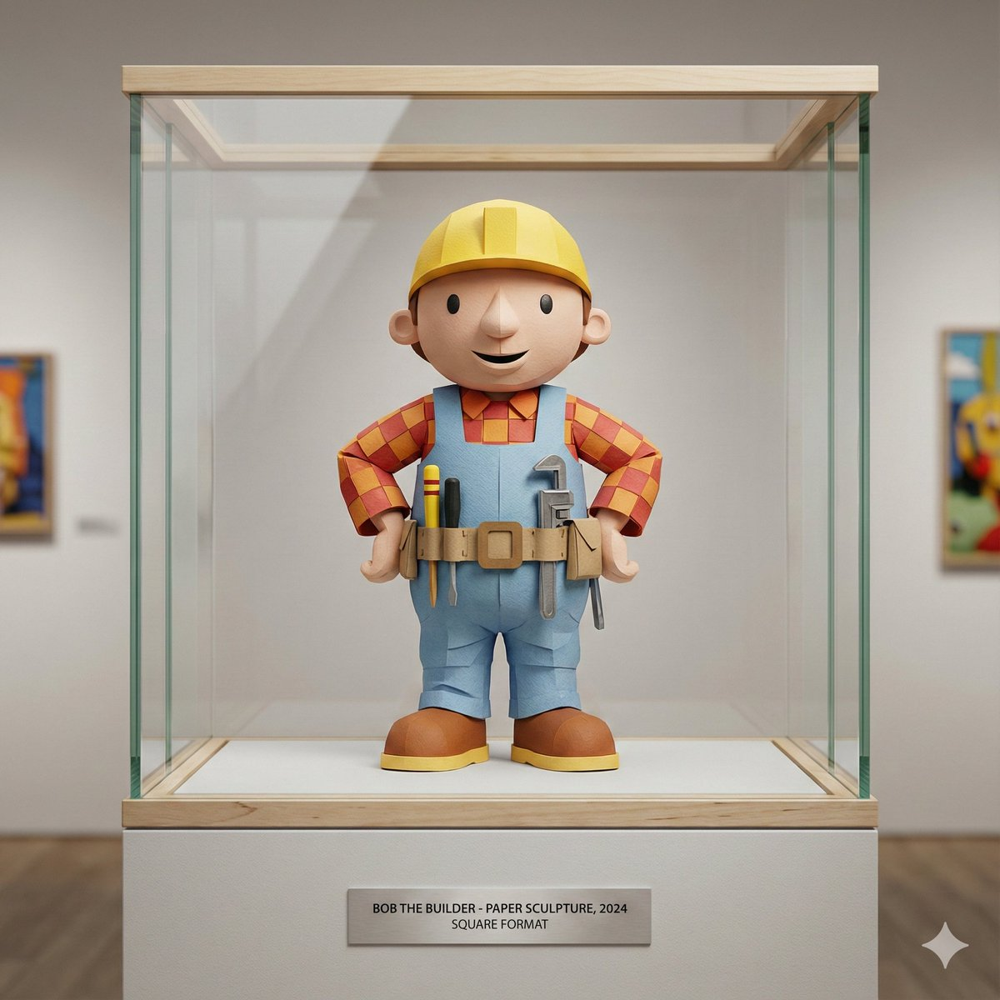

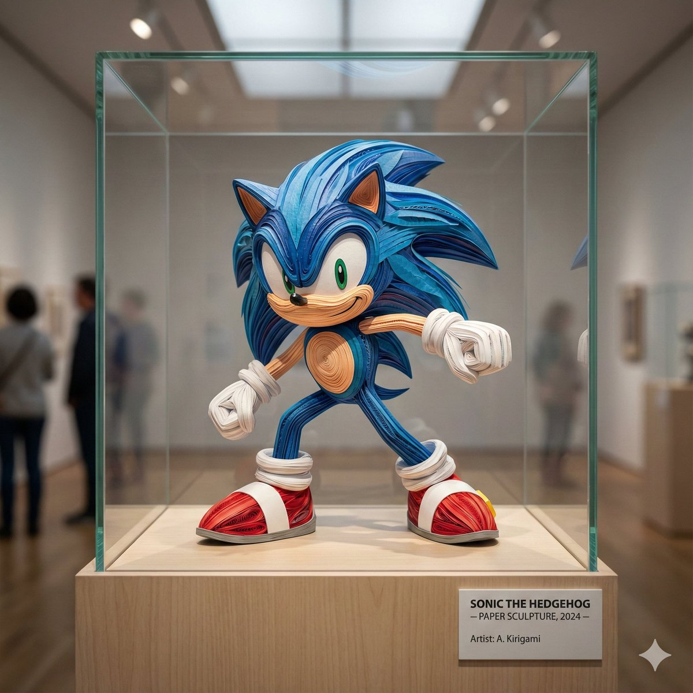

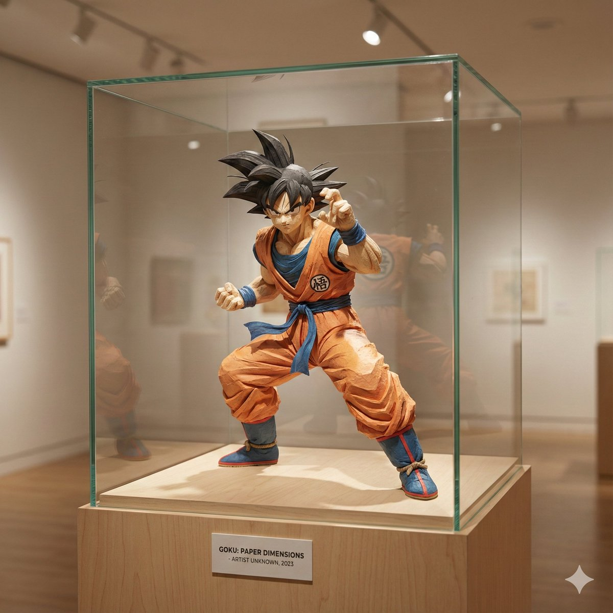

```
A hyper-detailed paper sculpture of [CHARACTER], mounted inside a minimalist museum display box. The figure is crafted from layered premium paper with visible folds, edges, and textures. Soft gallery lighting, glass reflections, subtle depth-of-field. High-end collectible art style, photorealistic finish, sharp focus. 1:1 square format.
```

```
一个超精细的[角色]纸雕，置于极简风格的博物馆展示盒内。人物由多层优质纸张制成，可见折痕、边缘和纹理。柔和的画廊灯光、玻璃反光、微妙的景深效果。高端收藏级艺术风格，照片级写实质感，清晰对焦。1:1 正方形构图。
```

 [↑返回目录](#toc)

---
## <a id="prompt-2001357165328798000">地铁里的双重身份</a> (<a href="https://x.com/KeorUnreal/status/2001357165328797846" target="_blank" rel="noopener noreferrer">KeorUnreal</a>)


```
{
  "prompt": "Photorealistic composite image of a young woman with striking long vibrant red hair styled in high pigtails, fair skin, bold makeup with sharp eyeliner and red lipstick, sitting inside a crowded subway train during winter. She is wearing a thick multicolored red-and-black knitted scarf wrapped around her neck, a black-and-white striped sweater, black miniskirt, and sheer black tights. She sits with a neutral, slightly melancholic expression, looking off to the side. In the foreground, a hand (from the viewer's perspective) holds a smartphone directly toward her, the phone screen prominently displaying a provocative photo of the same woman with red hair, lying seductively on a bed in black lace lingerie with garters, posing with one arm above her head. The subway car is filled with passengers in heavy winter coats, hats, and scarves, some standing and holding poles, others seated; overhead fluorescent lighting, metal handrails, and windows showing a blurry snowy or rainy urban night scene outside with faint holiday lights. The overall mood contrasts everyday public commuter life with intimate digital content, subtle depth of field focusing on the woman and the phone screen, cinematic realism, high detail on textures like knit scarf, phone reflections, and passenger clothing, 8K resolution, photorealism, masterpiece quality."
}
```

```
{
  "prompt": "一张逼真的合成图像：一位年轻女子拥有醒目的长而鲜艳的红色头发，扎成高双马尾，肤色白皙，妆容大胆，眼线锐利，涂着红色口红。她坐在冬季拥挤的地铁车厢内，围着一条厚实的红黑多色针织围巾，身穿黑白条纹毛衣、黑色迷你裙和透肉黑丝袜。她神情淡然，略带忧郁，目光望向一侧。前景中，一只来自观者视角的手握着一部智能手机，正对着她；手机屏幕上清晰显示着同一红发女子的一张挑逗照片——她身着黑色蕾丝内衣与吊袜带，性感地躺在床上，一只手臂高举过头。地铁车厢内乘客众多，皆穿着厚重冬装、帽子和围巾，有的站立扶着扶手杆，有的坐着；车厢顶部是荧光灯照明，金属扶手，窗外是模糊的雪夜或雨夜城市景象，隐约可见节日彩灯。整体氛围对比日常公共通勤生活与私密数字内容，采用微妙的景深效果聚焦于女子与手机屏幕，呈现电影级写实风格，对针织围巾、手机反光及乘客衣物等纹理细节高度还原，8K分辨率，照片级真实感，杰作品质。"
}
```

 [↑返回目录](#toc)

---
## <a id="prompt-2001635511153365200">情绪肖像网格：九面一体</a> (<a href="https://x.com/AIwithkhan/status/2001635511153365355" target="_blank" rel="noopener noreferrer">Smiling Khan</a>)

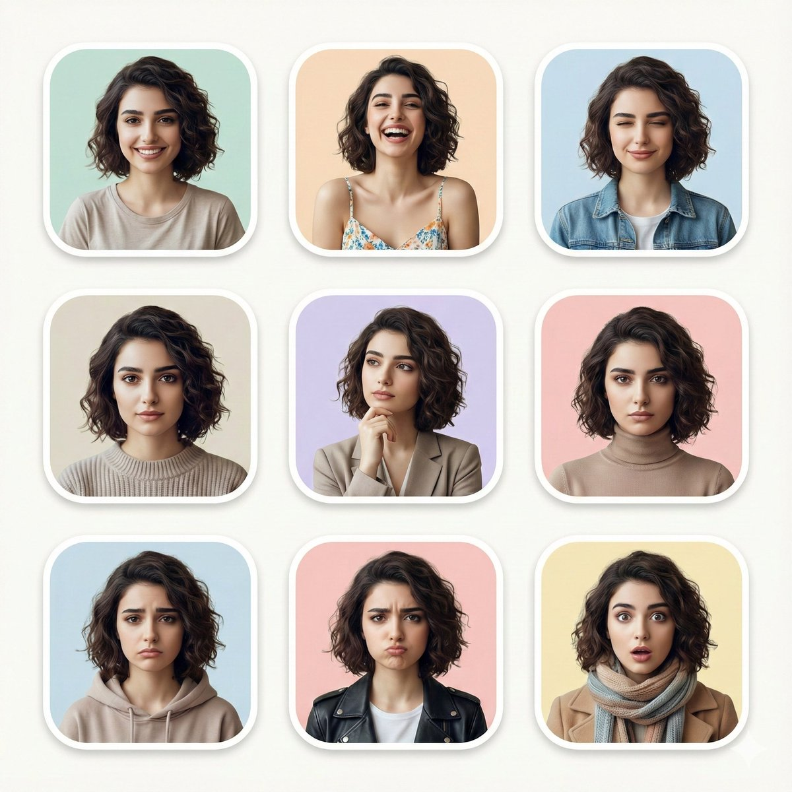

```
Using the uploaded photo as the base reference, create a clean, modern portrait grid featuring the same person shown in multiple facial expressions and moods. Arrange the images in a neat 3×3 layout with rounded-corner frames and soft pastel backgrounds. Each portrait should maintain identical facial features, hairstyle, and realism, changing only the expression and subtle styling. Include expressions such as: natural smile, joyful laughter, calm with eyes closed, serious neutral look, thoughtful pose with hand on chin, confident composed expression, sad or disappointed mood, playful pout, and surprised wide-eyed reaction. Use soft studio lighting, high-detail skin texture, shallow depth of field, minimal wardrobe variations, cohesive color palette, ultra-realistic, editorial portrait style, high resolution, clean aesthetic.
```

```
使用上传的照片作为基础参考，创建一个干净现代的肖像网格，展现同一人物多种面部表情与情绪。将图像整齐排列为3×3布局，采用圆角边框和柔和的粉彩色背景。每张肖像需保持一致的面部特征、发型和写实风格，仅改变表情与细微造型。包含以下表情：自然微笑、开怀大笑、闭眼平静、严肃中性、手托下巴沉思、自信沉稳、悲伤或失望、俏皮嘟嘴、惊讶瞪眼。使用柔和影棚灯光、高细节皮肤质感、浅景深、极简服装变化、统一配色方案，呈现超写实、杂志肖像风格、高分辨率、干净美学。
```

 [↑返回目录](#toc)

---
## <a id="prompt-2001254201611964400">都市格纹潮人拼贴</a> (<a href="https://x.com/xmliisu/status/2001254201611964524" target="_blank" rel="noopener noreferrer">Melisa♡</a>)

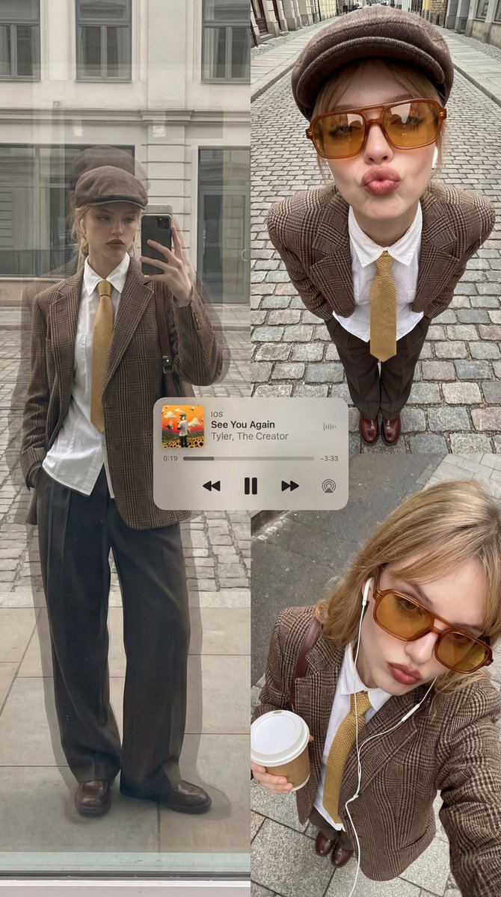

```
{
  "project_title": "Urban Streetwear Editorial Collage",
  "aspect_ratio": "9:16",
  "aesthetic_theme": {
    "style": "Editorial poster-style multi-panel collage",
    "mood": "Retro analog–digital fusion",
    "color_palette": [
      "Warm ambers",
      "Washed neutrals",
      "Soft greys",
      "Muted browns"
    ],
    "textures": [
      "Reflective glass",
      "Wool plaid",
      "Polished leather",
      "Stone pavement"
    ]
  },
  "subject_outfit": {
    "core": "Brown plaid blazer, white button-up shirt, yellow tie, loose dark trousers",
    "accessories": "Brown cap, oversized amber-tinted rectangular sunglasses",
    "tech": "Wired earphones"
  },
  "composition_layout": {
    "frame_1_top_left": {
      "type": "Reflective window shot",
      "pose": "Holding phone in front of face",
      "visual_effects": "Layered ghosting, architectural overlays, curvature distortion"
    },
    "frame_2_top_right": {
      "type": "Close-range, downward-angled ultra-wide portrait",
      "setting": "Cobblestone street",
      "pose": "Leaning forward, hands in pockets, exaggerated pout",
      "visual_effects": "Lens perspective distortion, radiating cobblestones"
    },
    "frame_3_bottom_right": {
      "type": "Intimate overhead selfie",
      "lighting": "Soft overcast",
      "props": "Holding a drink",
      "overlays": "Faint digital-grid, minimal square facial-bounding graphic"
    }
  },
  "ui_elements": {
    "music_player": {
      "style": "Translucent iOS-style Apple Music mini-player",
      "content": "“See You Again” by Tyler, The Creator",
      "features": "Artwork, timeline, playback controls (no shadows)"
    },
    "graphics": "Subtle cursor-like frame lines, rectangular highlights"
  },
  "negative_constraints": [
    "Stickers",
    "Extra subjects",
    "Wardrobe changes",
    "Incorrect UI icons",
    "Neon color shifts",
    "Futuristic sci-fi elements"
  ]
}
```

```
{
  "项目标题": "都市街头服饰杂志拼贴",
  "宽高比": "9:16",
  "美学主题": {
    "风格": "杂志海报式多面板拼贴",
    "氛围": "复古模拟与数字融合",
    "配色方案": [
      "暖琥珀色",
      "褪色中性色",
      "柔和灰色",
      "低饱和棕色"
    ],
    "材质纹理": [
      "反光玻璃",
      "羊毛格纹",
      "抛光皮革",
      "石板路面"
    ]
  },
  "人物穿搭": {
    "核心服装": "棕色格纹西装外套、白色纽扣衬衫、黄色领带、宽松深色长裤",
    "配饰": "棕色帽子、超大琥珀色矩形太阳镜",
    "科技元素": "有线耳机"
  },
  "构图布局": {
    "左上角画面": {
      "类型": "反光窗景镜头",
      "姿势": "手持手机置于脸前",
      "视觉效果": "重叠鬼影、建筑叠加、曲面扭曲"
    },
    "右上角画面": {
      "类型": "近距离俯角超广角人像",
      "场景": "鹅卵石街道",
      "姿势": "身体前倾、双手插兜、夸张嘟嘴",
      "视觉效果": "镜头透视畸变、放射状鹅卵石"
    },
    "右下角画面": {
      "类型": "亲密俯拍自拍",
      "光线": "柔和阴天光",
      "道具": "手持一杯饮品",
      "叠加元素": "微弱数字网格、极简方形面部框线"
    }
  },
  "界面元素": {
    "音乐播放器": {
      "样式": "半透明iOS风格Apple Music迷你播放器",
      "内容": "Tyler, The Creator 的《See You Again》",
      "功能": "专辑封面、进度条、播放控制（无阴影）"
    },
    "图形": "细微的光标式边框线、矩形高亮区域"
  },
  "负面限制": [
    "贴纸",
    "额外人物",
    "更换服装",
    "错误的UI图标",
    "霓虹色彩偏移",
    "未来科幻元素"
  ]
}
```

 [↑返回目录](#toc)

---
## <a id="prompt-2001497637124739300">奇幻橙浪冲浪少年</a> (<a href="https://x.com/Sheldon056/status/2001497637124739363" target="_blank" rel="noopener noreferrer">Dr.duet</a>)

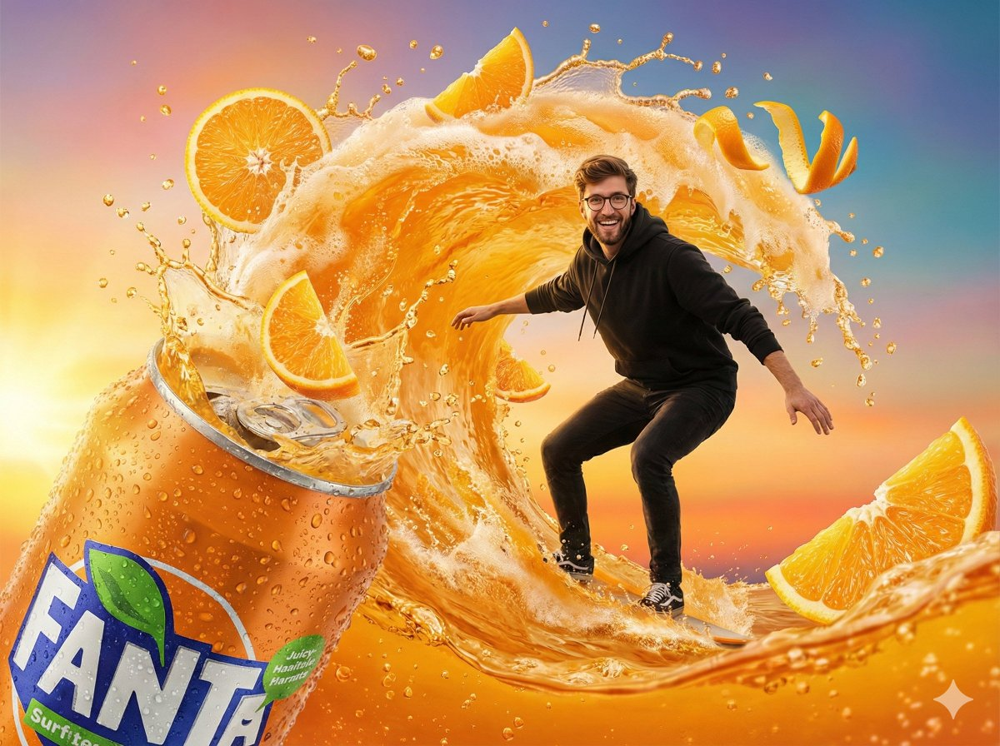

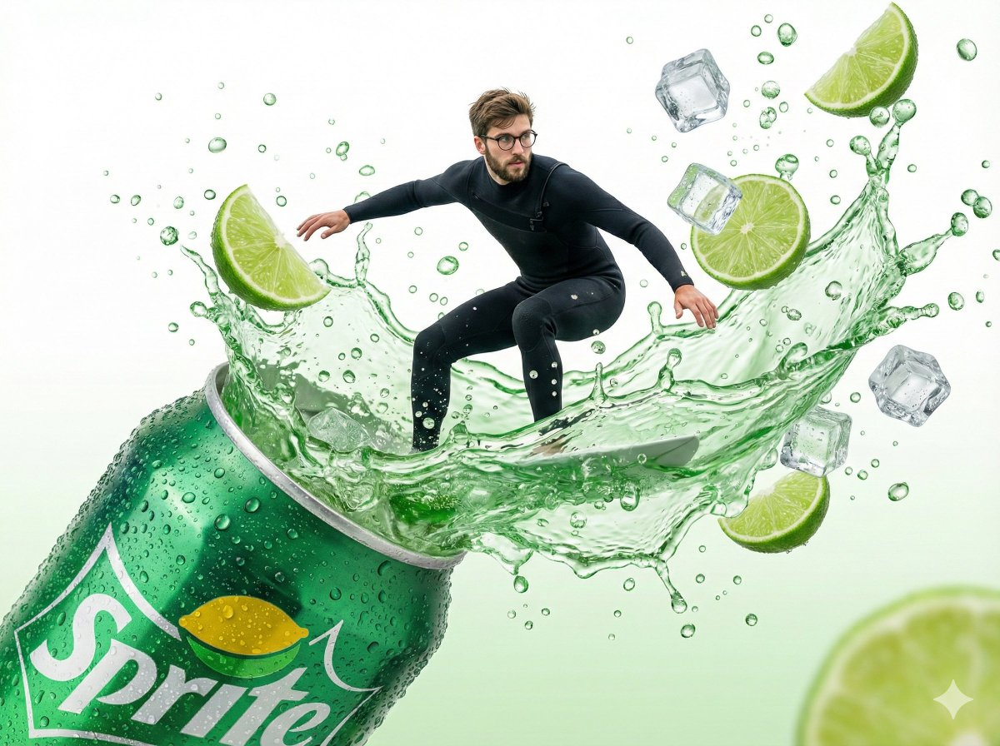

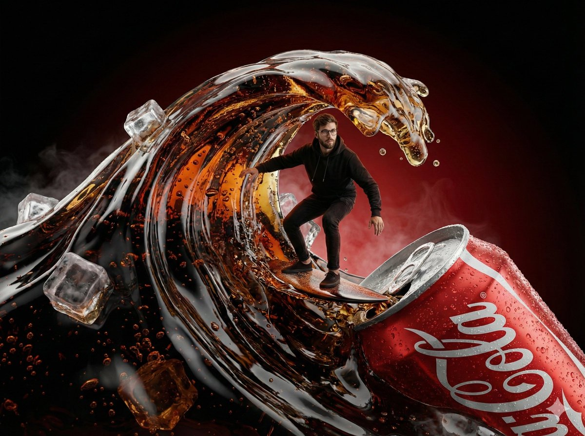

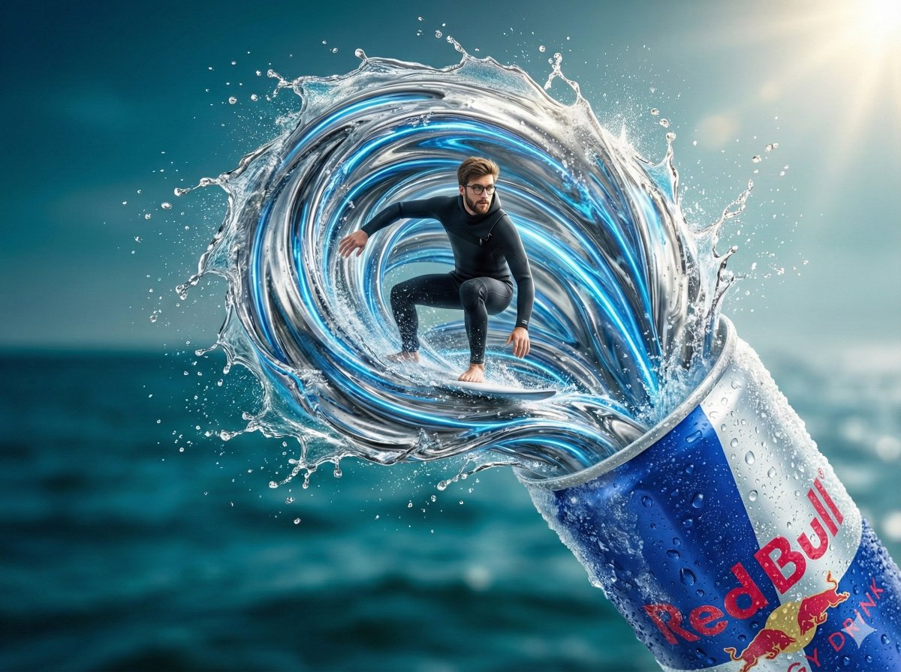

```
A vibrant fantasy-style soda commercial where a playful young man surfs an energetic orange soda wave exploding from a cold Fanta can. Juicy orange slices, bubbly liquid arcs, exaggerated motion, warm sunlight, colorful gradient background, joyful expression, dynamic pose, hyper-realistic splash effects, cinematic advertising look, 8K, ultra sharp, bold colors, no text, no watermark
```

```
一款充满活力的奇幻风格汽水广告：一位顽皮的年轻人在从冰凉芬达罐中喷涌而出的橙色汽水巨浪上冲浪。画面中飞溅着多汁的橙子切片和气泡四溢的液体弧线，动作夸张，阳光温暖，背景为多彩渐变，人物表情欢快，姿态动感十足，飞溅效果超写实，具有电影级广告质感，8K分辨率，超清晰，色彩鲜明，无文字，无水印。
```

 [↑返回目录](#toc)

---
## <a id="prompt-2001258985358606600">光影二维码：手与光的精密协作</a> (<a href="https://x.com/Gorden_Sun/status/2001258985358606605" target="_blank" rel="noopener noreferrer">Gorden Sun</a>)

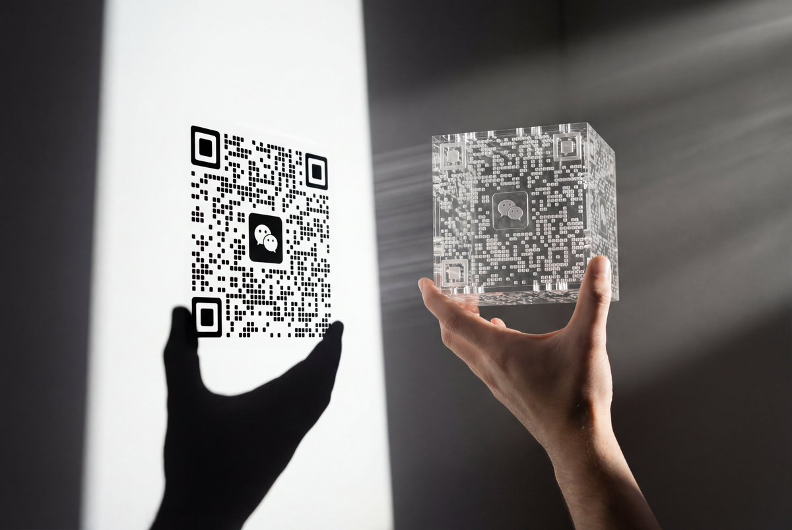

```
二维码请使用参考图的图片，必须保证二维码完全不变，二维码没有遮挡，从而能正常被扫描出来
{
"prompt_description": {
"image_type": "写实摄影 (Realistic Photography)",
"style_reference": "极简主义与硬光风格，融合阴影艺术 (Shadow Art) 与体积光摄影 (Volumetric Lighting)。",
"composition": {
"layout": "画面左侧是投射在白墙上的阴影，白墙是斜着有透视角度的，画面右侧前景是拿着物体的手。两者之间存在明显的透视空间。",
"visual_connection": "通过可见的光束将右侧的物体与左侧的阴影物理连接起来。"
},
"subject_details": {
"hand_holding_object": {
"description": "一只男性的手（自然肤色，没有毛发）在画面右侧前景举起一个透明物体。",
"pose": "手成水平的方向，两个手指的指尖非常小心地捏住透明立方体的下方的前后尖角，这种握持方式可以保证手的影子不会出现在二维码上。立方体与墙面平行，成横屏竖直的状态",
"object_appearance": "一个复杂的、半透明的激光切割丙烯酸立方体或3D打印树脂块。物体本身看起来是由无数细长的、长短不一的透明方块和连杆组成的杂乱结构，物体中央有微信的logo，在特定角度下能形成有序的影像。"
}
},
"shadow_projection_on_wall": {
"main_content": "微信二维码 (WeChat QR Code) 的阴影。",
"qr_details": "阴影呈现出微信二维码的特征：三个圆角的定位方块，中间清晰可见的微信Logo（两个对话气泡的负形剪影），以及圆润的数据点阵。",
"hand_shadow_inclusion": "【关键细节】必须包含手的阴影。在二维码阴影的下方及左下角，投射出巨大的、黑色的手部和手腕剪影。这个影子与二维码的影子是相连的，显示出是这只手在拿着物体产生投影。手的影子与二维码影子虽然在同一平面，但手的影子只有两个指尖支撑着二维码，绝对没有覆盖到任何二维码的数据点或图案。阴影必须符合物理规律，跟实体的手的姿势能对应上",
"shadow_quality": "边缘锐利，高对比度（纯黑阴影对纯白墙面）。"
},
"lighting_and_atmosphere": {
"light_source": "强烈的单点硬光源，位于画面右侧外部。",
"tyndall_effect": "空气中有轻微的尘埃或烟雾感，使得光线在穿过透明物体到达墙面的过程中，形成清晰可见的线性光束（体积光/丁达尔效应）。",
"visual_effect": "明亮的白色光柱从手中的丙烯酸块中射出，像放映机一样呈锥形投射到墙上，形成二维码图案。光束连接了实体（物体）与虚像（阴影）。"
},
"technical_settings": {
"background": "平坦的白色墙面。",
"contrast": "高对比度。明亮的光束、深黑的阴影（包括手的影子）和白色的背景形成强烈反差。",
"focus": "深景深，确保前景的手、中间的光束和背景的阴影都相对清晰。"
}
}
}
```

 [↑返回目录](#toc)

---
## <a id="prompt-2001302056456339500">粉色耐克鞋的超现实美学</a> (<a href="https://x.com/YaseenK7212/status/2001302056456339569" target="_blank" rel="noopener noreferrer">Yaseen Khan Gul</a>)

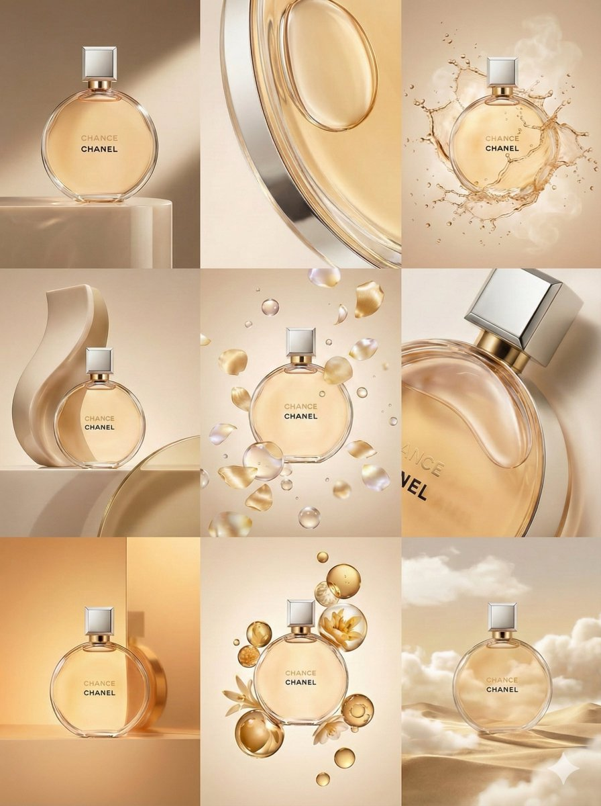

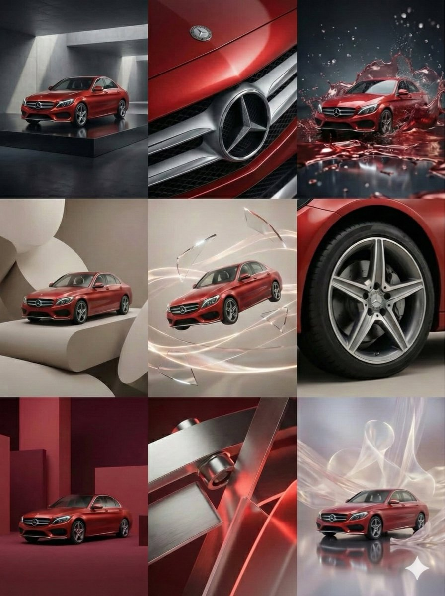

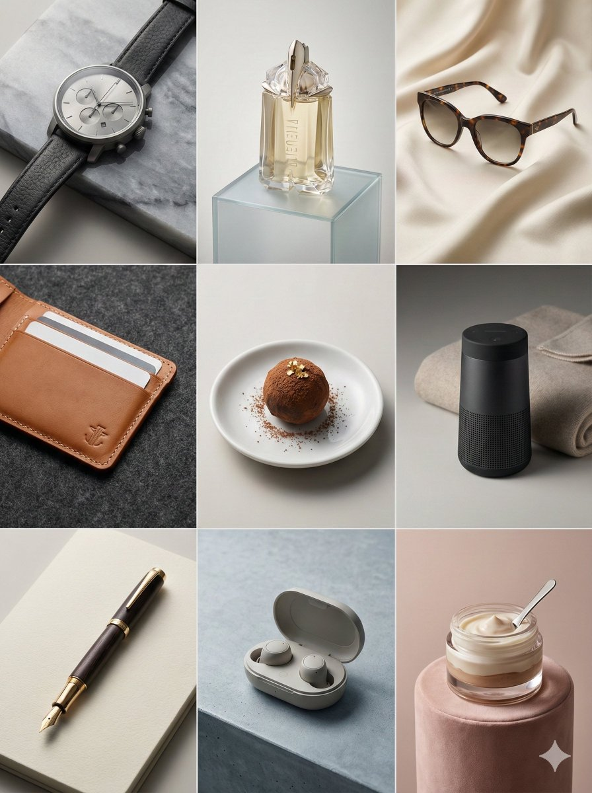

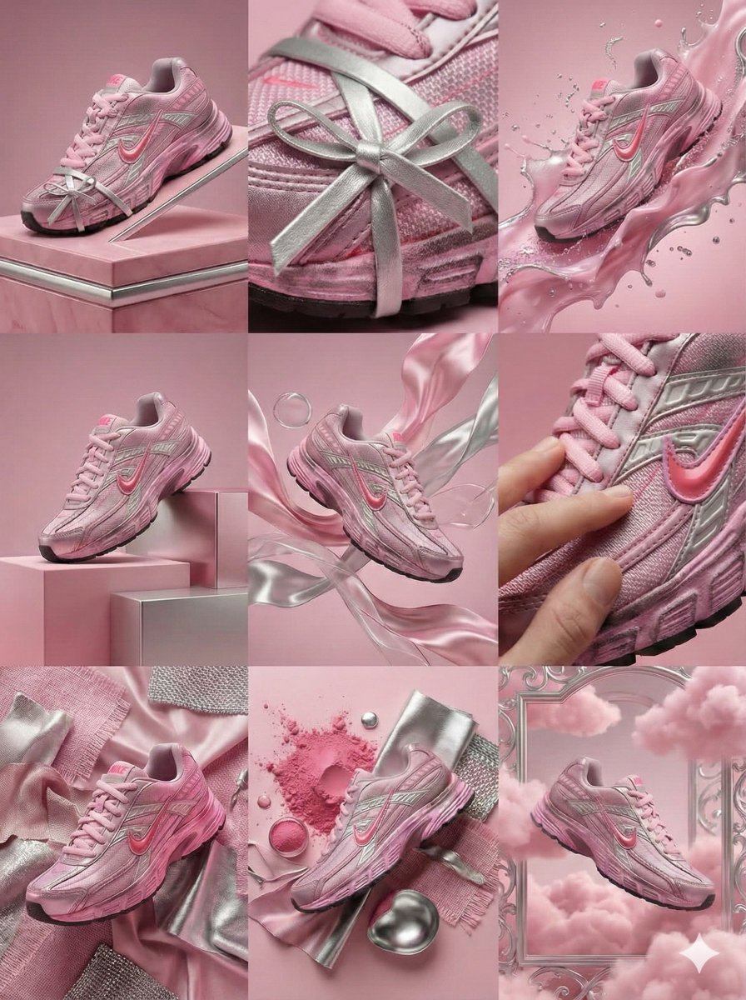

```
{
  "campaign_details": {
    "project_name": "Pink Nike Sneaker & Silver Bow - High-End Commercial",
    "aspect_ratio": "3:4",
    "format": "3x3 Image Grid",
    "reference_images": ["image_6.png", "image_7.png"]
  },
  "global_directives": {
    "product_fidelity": "The product (Pink Nike sneaker) must remain identical in shape, proportions, materials, colors, and branding across all frames.",
    "visual_style": "Hyperreal, cinematic, polished, high-end editorial advertising look.",
    "lighting_and_atmosphere": "Soft studio lighting, subtle highlights, realistic shadows, ultra-sharp focus.",
    "composition_rule": "Clean separation from the background in every frame."
  },
  "grid_layout": [
    {
      "row": 1,
      "column": 1,
      "concept": "Iconic Hero Still Life",
      "prompt_segment": "The pink and silver sneaker positioned centrally on a polished pink marble pedestal with a brushed silver accent edge, under bold, defining soft light."
    },
    {
      "row": 1,
      "column": 2,
      "concept": "Extreme Macro Detail",
      "prompt_segment": "A tight close-up focusing strictly on the metallic texture of the silver bow knot and the intricate weave of the pink mesh netting beneath it."
    },
    {
      "row": 1,
      "column": 3,
      "concept": "Dynamic Interaction",
      "prompt_segment": "The shoe suspended mid-air, splashing dynamically through a burst of glossy pink liquid and metallic silver droplets."
    },
    {
      "row": 2,
      "column": 1,
      "concept": "Minimal Sculptural Scene",
      "prompt_segment": "The shoe resting amongst abstract, flowing organic forms made of matte pink ceramic and polished chrome, creating a balanced, modern composition."
    },
    {
      "row": 2,
      "column": 2,
      "concept": "Floating Elements",
      "prompt_segment": "The shoe levitating weightlessly, surrounded by curling, translucent pink silk ribbons and reflective silver spheres suggesting innovation and lightness."
    },
    {
      "row": 2,
      "column": 3,
      "concept": "Sensory Close-up",
      "prompt_segment": "A detailed shot of a manicured hand with a soft touch grazing the textured pink mesh toe box near the silver swoosh, emphasizing tactility and realism."
    },
    {
      "row": 3,
      "column": 1,
      "concept": "Color-Driven Scene",
      "prompt_segment": "The shoe set against a luxurious, layered backdrop of varying pink textiles (velvet, silk) and textured silver metallic sheets to emphasize the palette."
    },
    {
      "row": 3,
      "column": 2,
      "concept": "Symbolic Abstraction",
      "prompt_segment": "The shoe surrounded by artfully arranged deconstructed components: piles of pink pigment powder, spools of silver thread, and raw silver ribbon material."
    },
    {
      "row": 3,
      "column": 3,
      "concept": "Surreal Fusion",
      "prompt_segment": "The shoe floating through a dreamlike landscape of soft pink clouds reflecting in distorted, flowing silver mirror frames."
    }
  ]
}
```

```
{
  "campaign_details": {
    "项目名称": "粉色耐克运动鞋与银色蝴蝶结 - 高端商业",
    "纵横比": "3:4",
    "格式": "3x3图像网格",
    "参考图像": ["image_6.png", "image_7.png"]
  },
  "global_directives": {
    "产品保真度": "产品（粉色耐克运动鞋）在所有帧中形状、比例、材料、颜色和品牌标识必须保持一致。",
    "视觉风格": "超现实、电影感、抛光、高端编辑广告风格。",
    "灯光与氛围": "柔和的工作室灯光，微妙的高光，真实的阴影，超高清晰焦点。",
    "构图规则": "每帧都需有干净的背景分离。"
  },
  "grid_layout": [
    {
      "行": 1,
      "列": 1,
      "概念": "标志性英雄静物",
      "提示片段": "粉色和银色运动鞋放置在中央的一个抛光粉红色大理石底座上，边缘带有拉丝银色装饰，在大胆而柔和的定义光线下展示。"
    },
    {
      "行": 1,
      "列": 2,
      "概念": "极端宏观细节",
      "提示片段": "严格聚焦于银色蝴蝶结的金属质感纹理以及其下的粉色网眼编织细节。"
    },
    {
      "行": 1,
      "列": 3,
      "概念": "动态互动",
      "提示片段": "鞋子悬停在空中，动态地穿过爆发的光泽粉色液体和银色液滴。"
    },
    {
      "行": 2,
      "列": 1,
      "概念": "简约雕塑场景",
      "提示片段": "鞋子位于抽象流动的有机形态之间，这些形态由哑光粉色陶瓷和抛光铬制成，创造出平衡且现代的构图。"
    },
    {
      "行": 2,
      "列": 2,
      "概念": "浮动元素",
      "提示片段": "鞋子无重力漂浮，周围环绕着卷曲的半透明粉色丝绸丝带和反光银球，暗示创新与轻盈。"
    },
    {
      "行": 2,
      "列": 3,
      "概念": "感官特写",
      "提示片段": "一张详细的手部照片，手轻轻触摸到靠近银色勾勾标志的粉色网眼鞋头，强调触觉和真实感。"
    },
    {
      "行": 3,
      "列": 1,
      "概念": "色彩驱动场景",
      "提示片段": "鞋子置于奢华层次分明的粉色织物（天鹅绒、丝绸）和纹理银色金属片背景前，以突出色调。"
    },
    {
      "行": 3,
      "列": 2,
      "概念": "象征性抽象",
      "提示片段": "鞋子被巧妙排列的分解组件围绕：粉色颜料粉末堆、银线轴和原始银色丝带材料。"
    },
    {
      "行": 3,
      "列": 3,
      "概念": "超现实融合",
      "提示片段": "鞋子漂浮在一个梦幻般的景观中，这里有柔软的粉色云朵反射在扭曲流动的银色镜框中。"
    }
  ]
}
```

 [↑返回目录](#toc)

---
## <a id="prompt-2001359237956686300">厨房里的被注视时刻</a> (<a href="https://x.com/bananababydoll/status/2001359237956686318" target="_blank" rel="noopener noreferrer">babydoll</a>)

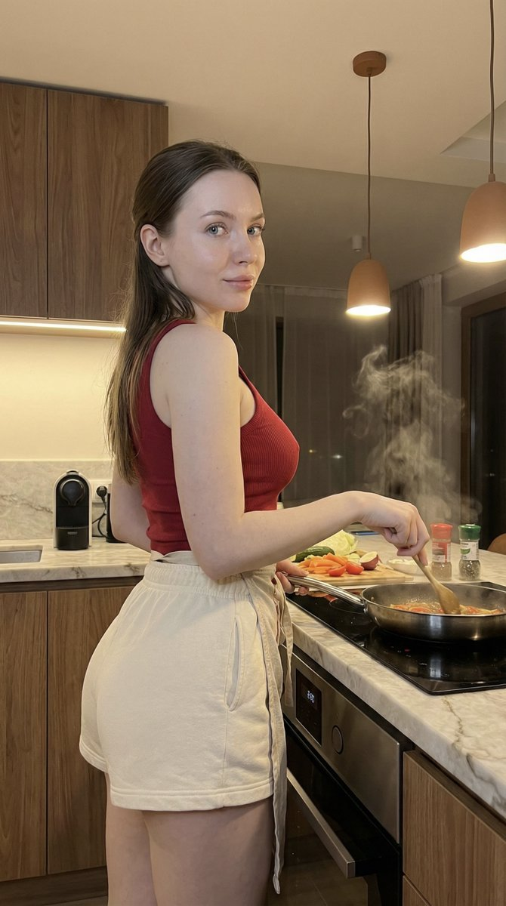

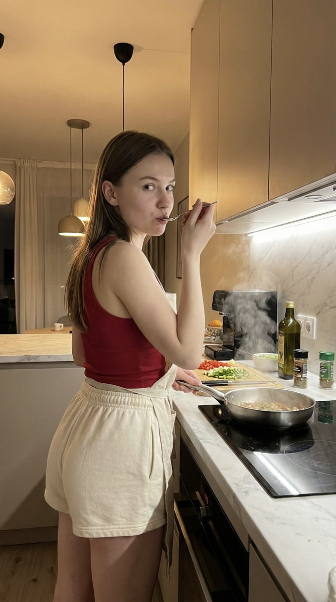

```
Cooking dinner. Getting watched.

Gemini Nano Banana Pro

{
  "meta": {
    "aspect_ratio": "9:16",
    "quality": "ultra_photorealistic",
    "resolution": "8k",
    "camera": "smartphone rear camera",
    "lens": "35mm",
    "style": "candid lifestyle shot, natural skin texture, high realism"
  },

  "scene": {
    "location": "modern apartment kitchen",
    "setting": "marble countertop, induction stove, cutting board with vegetables, warm wooden cabinets",
    "time": "evening",
    "atmosphere": "cozy, intimate, home-cooking energy"
  },

  "lighting": {
    "type": "warm indoor kitchen lighting",
    "source": "overhead pendants + soft under-cabinet lights",
    "effect": "gentle highlights on skin, soft shadows, cinematic warmth"
  },

  "camera_perspective": {
    "pov": "third-person (someone else is filming)",
    "angle": "slightly low, over-the-counter angle",
    "distance": "about 1.5 meters",
    "framing": "mid-thigh to head",
    "motion": "subtle handheld realism"
  },

  "subject": {
    "gender": "female",
    "age": "early 20s (clearly adult)",
    "ethnicity": "random european / mixed",

    "body": {
      "type": "extreme hourglass",
      "waist": "very slim",
      "hips": "very wide and round",
      "ass": "full, lifted",
      "legs": "thick thighs",
      "posture": "relaxed with a natural arch while cooking"
    },

    "skin": {
      "tone": "very pale porcelain white",
      "detail": "natural texture, soft glow"
    },

    "hair": {
      "color": "dark blonde",
      "length": "long",
      "style": "straight, sleek",
      "behavior": "tucked behind ears, falling down the back"
    },

    "face": {
      "eyes": "clear light blue",
      "expression": "focused but playful side glance toward camera",
      "lips": "slightly parted, soft pink",
      "vibe": "effortless, confident, magnetic"
    },

    "action": {
      "activity": "cooking at the stove",
      "details": [
        "stirring a pan",
        "tasting sauce with a spoon",
        "casual hip shift while reaching for seasoning"
      ]
    },

    "outfit": {
      "top": {
        "type": "fitted ribbed tank",
        "color": "cherry red",
        "fit": "tight, cropped just above waist, no bra",
        "fabric": "soft cotton rib, lightly clinging"
      },
      "bottom": {
        "type": "high-waisted lounge shorts",
        "color": "cream",
        "fit": "short, snug, curve-hugging"
      },
      "accessory": {
        "item": "simple kitchen apron",
        "state": "loosely tied at waist, sitting low on hips",
        "effect": "frames curves without hiding them"
      }
    }
  },

  "details": [
    "steam rising from pan",
    "knife marks on cutting board",
    "olive oil bottle and spices nearby",
    "natural candid moment, not posed",
    "instagram model realism"
  ]
}
```

```
做晚饭。被人注视着。

Gemini Nano Banana Pro

{
  "meta": {
    "aspect_ratio": "9:16",
    "quality": "超写实",
    "resolution": "8K",
    "camera": "智能手机后置摄像头",
    "lens": "35mm",
    "style": "自然生活抓拍，真实肌肤质感，高度写实"
  },

  "scene": {
    "location": "现代公寓厨房",
    "setting": "大理石台面、电磁炉、切菜板上有蔬菜、暖色木质橱柜",
    "time": "傍晚",
    "atmosphere": "温馨、亲密、充满家常烹饪氛围"
  },

  "lighting": {
    "type": "温暖的室内厨房照明",
    "source": "吊灯 + 柜下柔光灯",
    "effect": "肌肤上柔和高光，柔和阴影，电影感暖调"
  },

  "camera_perspective": {
    "pov": "第三人称视角（有人在拍摄）",
    "angle": "略低的俯视角度",
    "distance": "约1.5米",
    "framing": "从大腿中部到头部",
    "motion": "轻微手持晃动感，增强真实感"
  },

  "subject": {
    "gender": "女性",
    "age": "20岁出头（明显成年）",
    "ethnicity": "随机欧洲/混血",

    "body": {
      "type": "极致沙漏型身材",
      "waist": "非常纤细",
      "hips": "非常宽且圆润",
      "ass": "饱满挺翘",
      "legs": "大腿粗壮",
      "posture": "烹饪时自然放松，略带腰背弧度"
    },

    "skin": {
      "tone": "极白瓷肌",
      "detail": "自然肌理，柔和光泽"
    },

    "hair": {
      "color": "深金色",
      "length": "长发",
      "style": "直发、顺滑",
      "behavior": "耳后别起，垂落于背后"
    },

    "face": {
      "eyes": "清澈浅蓝色",
      "expression": "专注但带着俏皮地瞥向镜头",
      "lips": "微张，柔粉色",
      "vibe": "毫不费力、自信、迷人"
    },

    "action": {
      "activity": "在灶台前烹饪",
      "details": [
        "正在翻炒锅中食物",
        "用勺子尝酱汁",
        "随意扭胯去拿调味料"
      ]
    },

    "outfit": {
      "top": {
        "type": "贴身罗纹背心",
        "color": "樱桃红",
        "fit": "紧身、短款，刚好露腰，未穿内衣",
        "fabric": "柔软棉质罗纹，轻贴身体"
      },
      "bottom": {
        "type": "高腰家居短裤",
        "color": "奶油白",
        "fit": "短小、贴身、凸显曲线"
      },
      "accessory": {
        "item": "简约厨房围裙",
        "state": "松散系在腰间，低挂在臀部",
        "effect": "勾勒曲线而不遮掩"
      }
    }
  },

  "details": [
    "锅中升起蒸汽",
    "切菜板上有刀痕",
    "旁边放着橄榄油瓶和香料",
    "自然抓拍瞬间，非摆拍",
    "Instagram模特级写实感"
  ]
}
```

 [↑返回目录](#toc)

---
## <a id="prompt-2001632722939449900">白猫サイボーグガールフィギュア</a> (<a href="https://x.com/ninohut/status/2001632722939449829" target="_blank" rel="noopener noreferrer">二ノ小屋</a>)

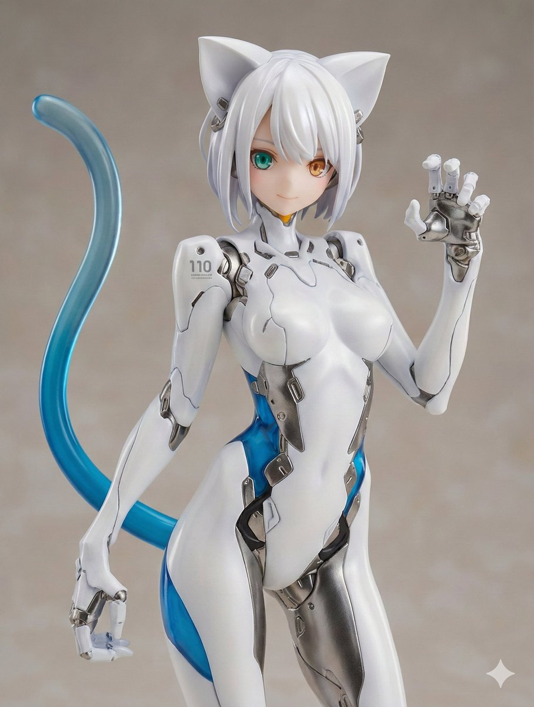

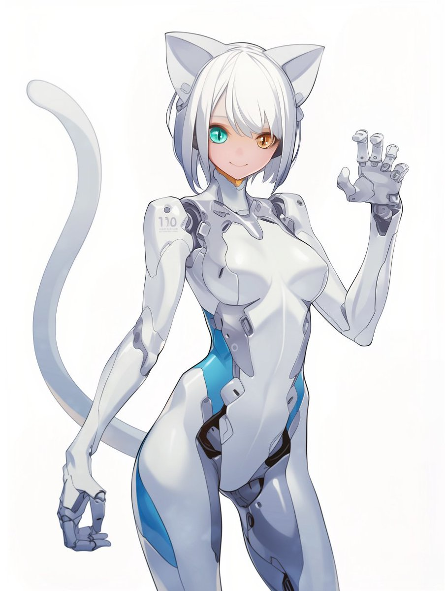

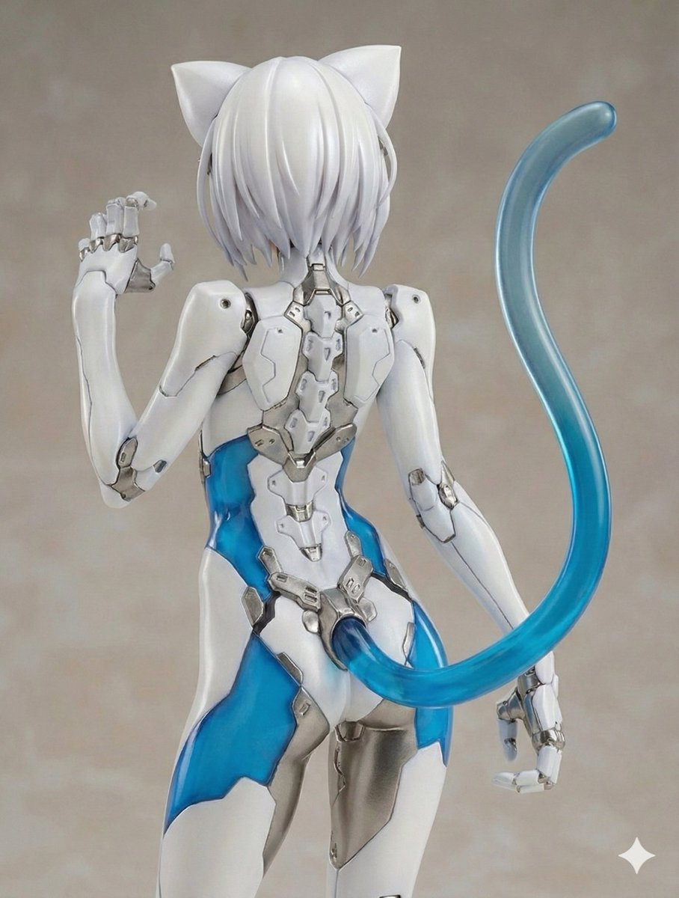

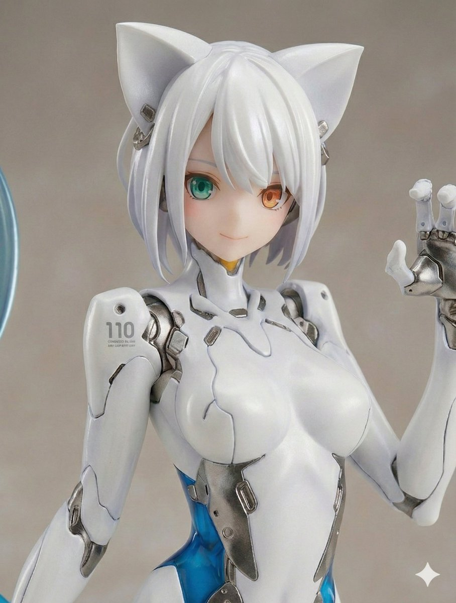

```
白猫サイボーグガールのフィギュア化画像
White cat cyborg girl figure image

過去に生成したイラストをnano banana proでフィギュア化する木曜日の夜のひと時
個人的に背中のデザインがツボ過ぎる😋

The images in this post are generated by AI
```

 [↑返回目录](#toc)

---
## <a id="prompt-2001566101508128800">微缩帝国：远见者的办公空间</a> (<a href="https://x.com/aleenaamiir/status/2001566101508128839" target="_blank" rel="noopener noreferrer">Aleena Amir</a>)

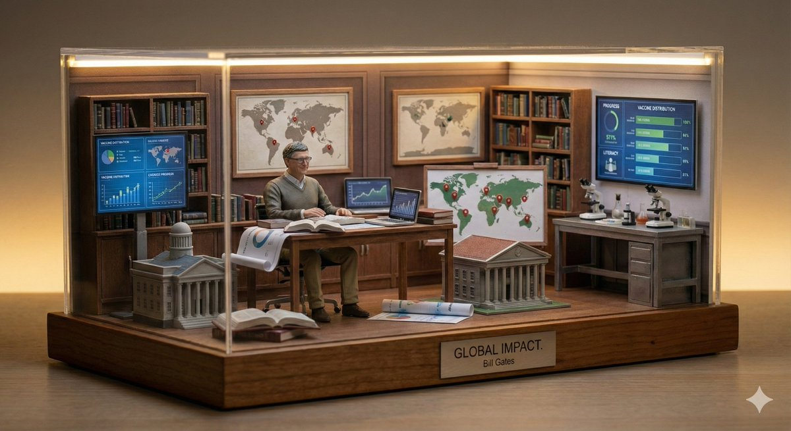

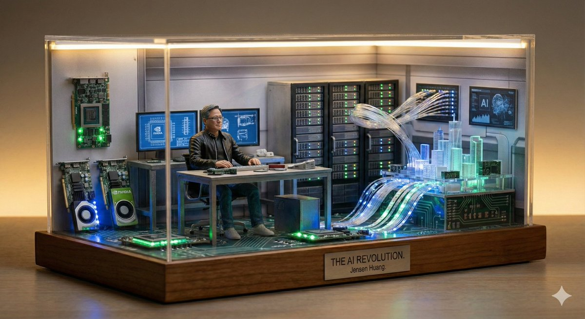

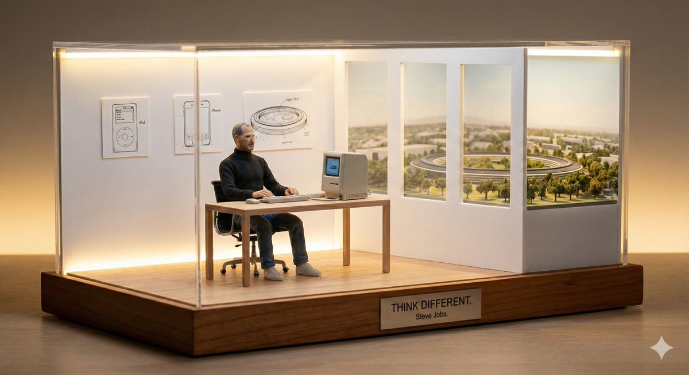

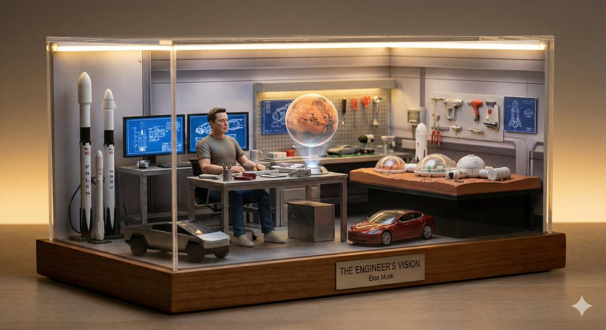

```
A miniature diorama of [BUSINESS LEADER] inside a symbolic workspace representing their vision. Tiny desk, screens, city models, warm ambient lighting.
```

```
一个微缩场景，展现[商业领袖]身处象征其愿景的工作空间内。配有微型办公桌、屏幕、城市模型和温暖的环境灯光。
```

 [↑返回目录](#toc)

---
## <a id="prompt-2001461574226346000">与金·凯瑞鬼脸合影</a> (<a href="https://x.com/msjiaozhu/status/2001461574226346054" target="_blank" rel="noopener noreferrer">MapleShaw</a>)

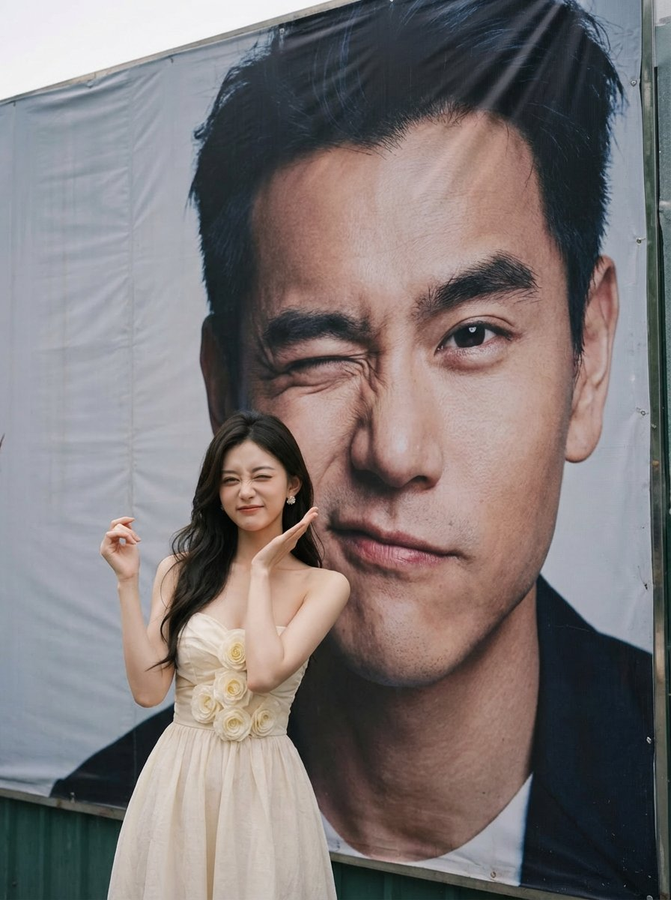

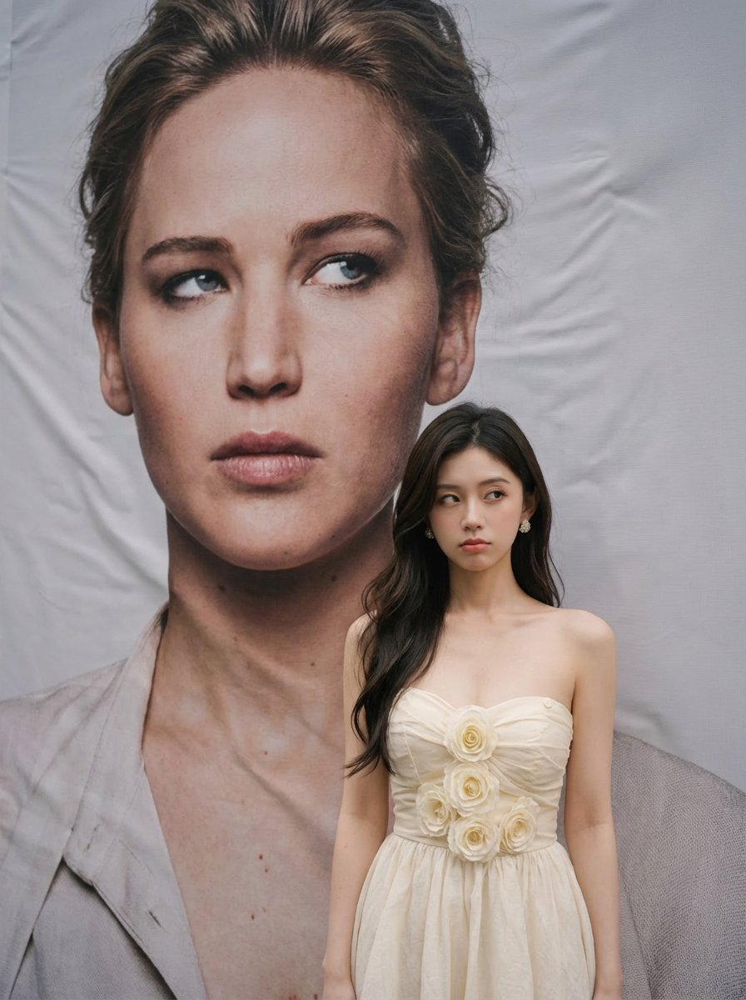

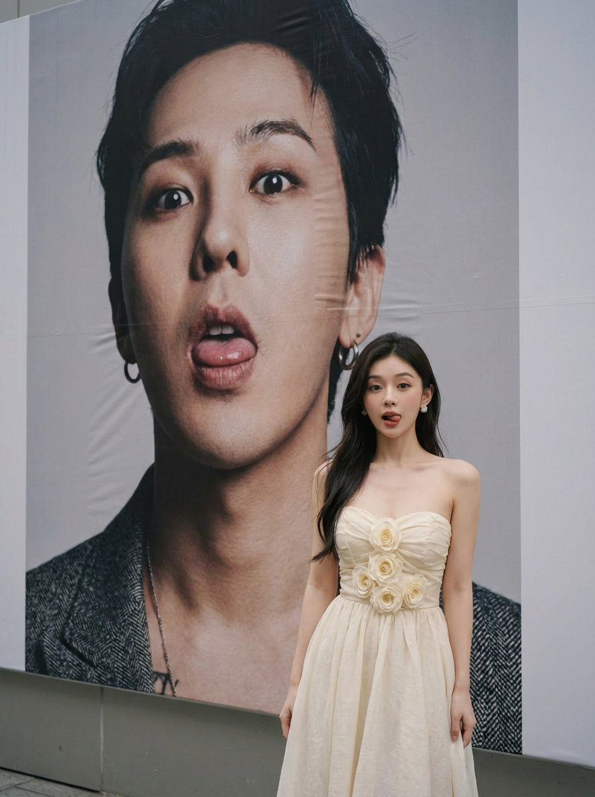

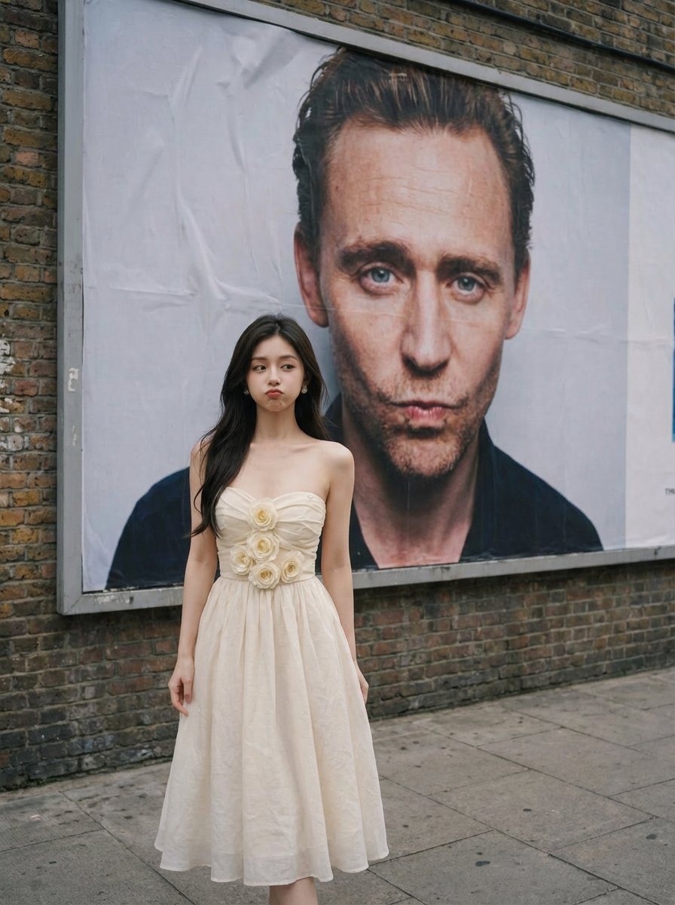

```
{
"project_name": "Pro_Billboard_Interactive_Lifestyle_v9",
"usage_guide": "1. Fill in {STAR_NAME}, {STAR_EXPRESSION}, {USER_POSE}. 2. Set Aspect Ratio (e.g., 3:4). 3. Upload FULL BODY reference. 4. This version creates a casual, fun interaction between you and the giant poster.",
"prompts": {
"positive_prompt": "A high-end editorial fashion shot, full body, captured in {ASPECT_RATIO} format. \n\n[Spatial Logic – Perfect Depth]\nA real person stands in the foreground, positioned about 50cm (a few dozen centimeters) away from the background wall. \nNot touching the wall. There is a visible, natural depth. \nSoft shadows are cast on the wall behind, proving the physical separation. \n\n[Subject – Casual & Interactive]\nSubject's outfit, gender, and age perfectly match the uploaded reference image. \nFull body visible from head to toe, including shoes. \nPOSE & VIBE: The person is doing a {USER_POSE}. \nThe pose is casual, unposed, and lifestyle-oriented (NOT a stiff passport photo). \nIt feels like a fun street snap where the person is mimicking or interacting with the background celebrity. \n\n[Background – Giant Expressive Poster]\nBehind the person is a massive, building-sized commercial advertisement. \nIt features a gigantic portrait of {STAR_NAME} with a {STAR_EXPRESSION} expression. \nVisible from the shoulders up, looking huge and imposing. \n\n[Texture & Material Reality]\nThe billboard has a realistic heavy-duty vinyl or canvas texture. \nVisible details: slight surface ripples, tension wrinkles, uneven lighting reflection, and micro-folds. \nIt looks like a real physical object, not a smooth screen. \n\n[Lighting]\nSoft overhead natural light, 8k resolution, raw photo quality, sharp focus.",
"negative_prompt": "Stiff pose, military stance, passport photo, bored expression, touching the wall, zero distance, flat digital image, perfectly smooth texture, glossy screen, fake poster, floating feet, missing shoes, cropped, lowres, bad anatomy, changing outfit, cartoon, 3d render."
},
"parameter_slots": {
"STAR_NAME": "Name of the celebrity (e.g., Taylor Swift)",
"STAR_EXPRESSION": "Expression on the poster (e.g., seductive, laughing, crying, serious)",
"USER_POSE": "Your pose (e.g., mimicking the star, peace sign, looking cool, hand on chin)",
"ASPECT_RATIO": "3:4 or 9:16 (Set in software)"
}
}

STAR_NAME: Thomas Stanley Holland
STAR_EXPRESSION: 迷人微笑
USER_POSE: 指着海报，大笑，兴奋
ASPECT_RATIO: 3:4
```

 [↑返回目录](#toc)

---
## <a id="prompt-2001357979312898300">文学幻境：微缩名著奇景</a> (<a href="https://x.com/Gdgtify/status/2001357979312898252" target="_blank" rel="noopener noreferrer">Gadgetify</a>)

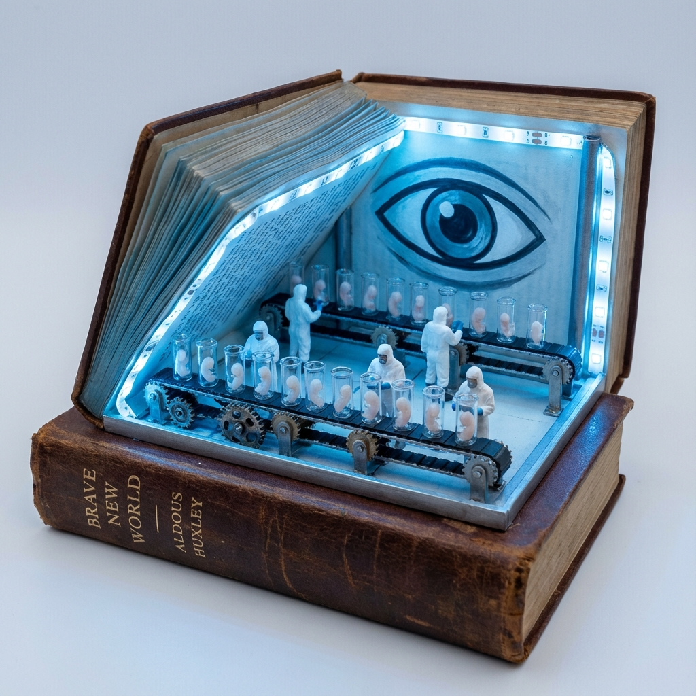

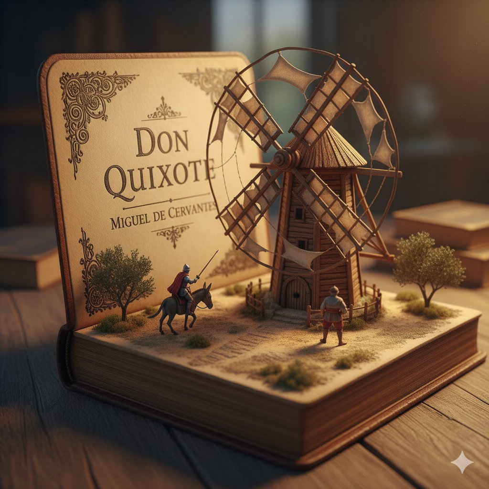

```
I love how Nano Banana Pro handles these prompts. Here are two of them. For the 2nd one, I used Nano Banana just to test. 

1. Surreal diorama emerging from an open vintage book of "Brave New World" by Aldous Huxley: the pages form a futuristic hatching laboratory with rows of glowing test tubes containing embryonic figures on conveyor belts, lab-coated workers in white uniforms operating machines, a large all-seeing eye symbol on the wall, conveyor belts moving via hidden mechanisms, cool blue neon lighting, hyper-detailed miniature sculpture, clinical and eerie atmosphere, photorealistic.

2. Detailed miniature diorama in an open aged book for "Don Quixote" by Cervantes: left page with "DON QUIXOTE" engraved, right pages sculpted into a Spanish landscape with a massive wooden windmill turning slowly, tiny knight on horseback charging with lance raised, Sancho Panza on donkey following, dusty plains and gears for windmill blades, warm golden hour lighting, hyper-realistic handcrafted sculpture, whimsical yet epic scale.
```

```
1. 超现实微缩场景从一本打开的阿道司·赫胥黎《美丽新世界》古籍中浮现：书页构成一座未来主义孵化实验室，一排排发光的试管内含胚胎人形，置于传送带上，身穿白色制服的实验员操作机器，墙上绘有巨大的全视之眼符号，传送带由隐藏机械驱动，冷色调蓝色霓虹灯光，高度精细的微型雕塑，氛围冷静而诡异，照片级写实。

2. 一本打开的塞万提斯《堂吉诃德》古籍内呈现精细微缩场景：左页刻有“DON QUIXOTE”字样，右页雕刻成西班牙风景，一座巨大的木制风车缓缓转动，微小的骑士骑马高举长矛冲锋，桑丘·潘沙骑驴紧随其后，尘土飞扬的平原上设有驱动风车叶片的齿轮装置，温暖的黄金时刻光线，超写实手工雕塑，兼具奇趣与史诗感。
```

 [↑返回目录](#toc)

---
## <a id="prompt-2001371445939815000">雪夜魔球：品牌圣诞幻境</a> (<a href="https://x.com/TechieBySA/status/2001371445939814798" target="_blank" rel="noopener noreferrer">TechieSA</a>)

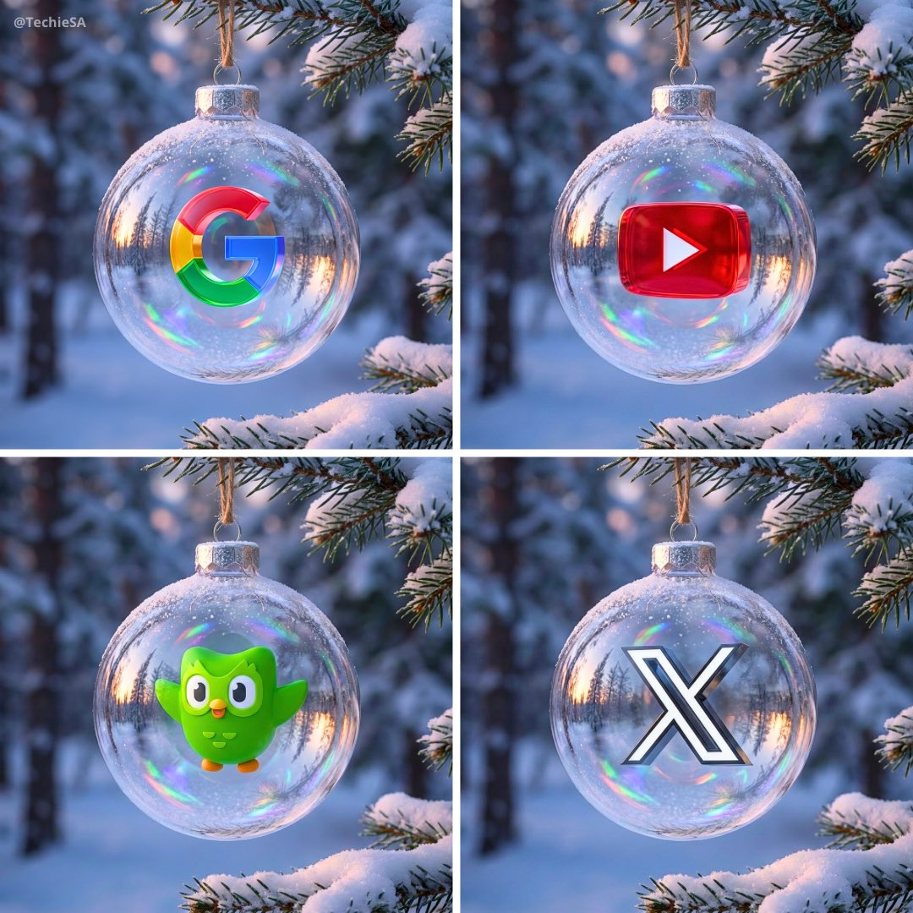

```
Create a hyperrealistic CGI poster with a cinematic, stylish perspective. Centered is a glass Christmas ornament hanging from a frosted pine branch. Inside, suspended in zero gravity, is the ultra-detailed, official 3D logo of [BRAND], its colors rendered with perfect accuracy. The scene must exhibit physically correct light behavior: subtle caustics, precise refraction and reflection distortions through the curved glass surface, and soft, natural shadows. The ambiance is a quiet, snowy winter’s day with diffuse daylight, gently falling snowflakes, and a dreamy bokeh effect in the background, enhancing the magical, fairy-tale Christmas atmosphere. Focus on impeccable composition, depth, and a sense of serene, high-end wonder. 1080x1080 dimension.
```

```
创作一张超写实CGI海报，采用电影感十足且富有格调的视角。画面中央是一颗挂在覆霜松枝上的玻璃圣诞装饰球。球内，在零重力状态下悬浮着[BRAND]品牌官方3D标志，细节极其丰富，色彩精准还原。场景必须呈现物理上准确的光线效果：微妙的焦散、通过曲面玻璃产生的精确折射与反射扭曲，以及柔和自然的阴影。氛围设定为宁静的雪冬之日，漫射日光、缓缓飘落的雪花，背景带有梦幻般的散景效果，营造出魔幻童话般的圣诞氛围。注重无可挑剔的构图、景深以及静谧而高端的奇妙感。尺寸为1080x1080。
```

 [↑返回目录](#toc)

---
## <a id="prompt-2001538350642008000">落日沙滩上的黑发女子</a> (<a href="https://x.com/YaseenK7212/status/2001538350642008147" target="_blank" rel="noopener noreferrer">Yaseen Khan Gul</a>)

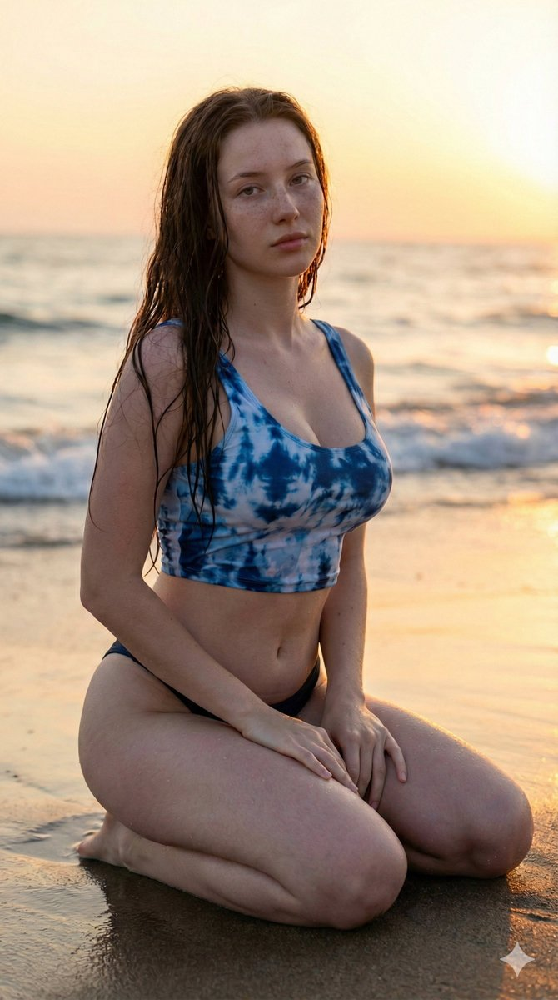

```
{
  "node_graph_configuration": {
    "version": "4.0.1",
    "workflow_type": "Identity_Preserved_Photorealism"
  },
  "nodes": {
    "NODE_01_INPUT_LOADER": {
      "type": "LoadImage",
      "parameters": {
        "image_source": "reference_file_upload.png",
        "mask_detection": "auto_face_body"
      }
    },
    "NODE_02_IDENTITY_CONTROL": {
      "type": "IP_Adapter_Advanced",
      "inputs": {
        "image": "NODE_01_INPUT_LOADER",
        "model": "face_plus_body_v2.safetensors"
      },
      "settings": {
        "weight": 1.0,
        "noise": 0.0,
        "start_at": 0.0,
        "end_at": 1.0,
        "instruction": "100% match constraint"
      }
    },
    "NODE_03_TEXT_ENCODER_POSITIVE": {
      "type": "CLIP_Text_Encode",
      "segments": [
        {
          "id": "subject_def",
          "text": "A captivating shot of a woman with long dark hair",
          "weight": 1.2,
          "clip_layer": 1
        },
        {
          "id": "action_pose",
          "text": "kneeling on a sandy beach, kneeling posture",
          "weight": 1.1,
          "clip_layer": 1
        },
        {
          "id": "attire_desc",
          "text": "wearing a blue and white wet bikini tank top, wet fabric texture, fitted",
          "weight": 1.1,
          "clip_layer": 2
        },
        {
          "id": "lighting_atmos",
          "text": "The setting sun casts a warm glow, highlighting her features, golden hour",
          "weight": 1.0,
          "clip_layer": 2
        },
        {
          "id": "environment_detail",
          "text": "wet sand around her, reflective ground, ocean waves softly visible in background, serene beach atmosphere",
          "weight": 1.0,
          "clip_layer": 3
        }
      ]
    },
    "NODE_04_TEXT_ENCODER_NEGATIVE": {
      "type": "CLIP_Text_Encode",
      "text_string": "nsfw, deformed, blurry, bad anatomy, disfigured, low resolution, cartoon, graphic, illustration, dry sand, dull lighting, altered face, changed body structure"
    },
    "NODE_05_SAMPLER_SETTINGS": {
      "type": "KSampler",
      "parameters": {
        "seed": "random_int",
        "steps": 35,
        "cfg_scale": 7.0,
        "sampler_name": "dpmpp_2m_sde",
        "scheduler": "karras",
        "denoise": 1.0
      }
    },
    "NODE_06_FINAL_OUTPUT": {
      "type": "Image_Save",
      "metadata": {
        "prompt_string": "((100% same face and body)), A captivating shot of a woman with long dark hair, kneeling on a sandy beach. She's wearing a blue and white wet bikini tank top. The setting sun casts a warm glow, highlighting her features and the wet sand around her. The ocean waves are softly visible in the background.",
        "resolution": "1024x1536",
        "aspect_ratio": "2:3"
      }
    }
  }
}
```

```
{
  "node_graph_configuration": {
    "version": "4.0.1",
    "workflow_type": "Identity_Preserved_Photorealism"
  },
  "nodes": {
    "NODE_01_INPUT_LOADER": {
      "type": "LoadImage",
      "parameters": {
        "image_source": "reference_file_upload.png",
        "mask_detection": "auto_face_body"
      }
    },
    "NODE_02_IDENTITY_CONTROL": {
      "type": "IP_Adapter_Advanced",
      "inputs": {
        "image": "NODE_01_INPUT_LOADER",
        "model": "face_plus_body_v2.safetensors"
      },
      "settings": {
        "weight": 1.0,
        "noise": 0.0,
        "start_at": 0.0,
        "end_at": 1.0,
        "instruction": "100%匹配约束"
      }
    },
    "NODE_03_TEXT_ENCODER_POSITIVE": {
      "type": "CLIP_Text_Encode",
      "segments": [
        {
          "id": "subject_def",
          "text": "一个长发黑发女子的迷人镜头",
          "weight": 1.2,
          "clip_layer": 1
        },
        {
          "id": "action_pose",
          "text": "跪在一个沙滩上，跪姿",
          "weight": 1.1,
          "clip_layer": 1
        },
        {
          "id": "attire_desc",
          "text": "穿着一件蓝白相间的湿比基尼背心，湿面料纹理，贴身",
          "weight": 1.1,
          "clip_layer": 2
        },
        {
          "id": "lighting_atmos",
          "text": "落日余晖洒在她身上，温暖的光线突出她的特征，黄金时段",
          "weight": 1.0,
          "clip_layer": 2
        },
        {
          "id": "environment_detail",
          "text": "周围的湿沙，反射地面，背景中隐约可见海浪，宁静的海滩氛围",
          "weight": 1.0,
          "clip_layer": 3
        }
      ]
    },
    "NODE_04_TEXT_ENCODER_NEGATIVE": {
      "type": "CLIP_Text_Encode",
      "text_string": "nsfw, 畸形, 模糊, 错误的解剖结构, 毁容, 低分辨率, 卡通, 图形, 插图, 干燥的沙子, 暗淡的照明, 改变的脸部, 改变的身体结构"
    },
    "NODE_05_SAMPLER_SETTINGS": {
      "type": "KSampler",
      "parameters": {
        "seed": "random_int",
        "steps": 35,
        "cfg_scale": 7.0,
        "sampler_name": "dpmpp_2m_sde",
        "scheduler": "karras",
        "denoise": 1.0
      }
    },
    "NODE_06_FINAL_OUTPUT": {
      "type": "Image_Save",
      "metadata": {
        "prompt_string": "((完全相同的面部和身体)), 一个长发黑发女子的迷人镜头，跪在一个沙滩上。她穿着一件蓝白相间的湿比基尼背心。落日余晖洒在她身上，温暖的光线突出她的特征和周围的湿沙。背景中隐约可见海浪。",
        "resolution": "1024x1536",
        "aspect_ratio": "2:3"
      }
    }
  }
}
```

 [↑返回目录](#toc)

---
## <a id="prompt-2001575999805235200">黄金时刻的女飞行员</a> (<a href="https://x.com/saniaspeaks_/status/2001575999805235246" target="_blank" rel="noopener noreferrer">𝗦𝗮𝗻𝗶𝗮</a>)

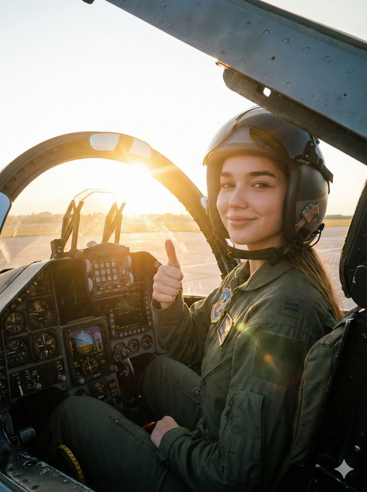

```
{
  "type": "image_generation_prompt",
  "style": "cinematic, ultra-realistic, aviation portrait",
  "composition": {
    "aspect_ratio": "3:4",
    "framing": "medium close-up inside cockpit",
    "camera_effects": [
      "cinematic lens flare",
      "heat distortion waves",
      "35mm film grain"
    ]
  },
  "subject": {
    "gender": "female",
    "role": "fighter pilot",
    "pose": {
      "position": "sitting in the cockpit on a runway",
      "gesture": "giving a thumbs-up to the ground crew",
      "expression": "confident, charismatic smile",
      "headgear": {
        "oxygen_mask": "off",
        "visor": "up"
      }
    }
  },
  "environment": {
    "location": "runway at sunset",
    "cockpit": {
      "interior_lighting": "deep shadow with visible technical details"
    },
    "background": {
      "sun_position": "low on the horizon",
      "lighting_effect": "golden hour sun blasting directly into the camera lens",
      "atmosphere": "haze of warm golden light washing over the left side of the frame"
    }
  },
  "lighting": {
    "type": "golden hour natural light",
    "effects": [
      "strong lens flare",
      "warm haze",
      "high contrast between exterior light and cockpit shadows"
    ]
  },
  "mood": {
    "tone": [
      "heroic",
      "empowering",
      "cinematic",
      "inspiring"
    ]
  },
  "quality": {
    "realism": "highly photorealistic",
    "detail_level": "high detail in facial features, cockpit instruments, and lighting",
    "texture": "authentic film grain and heat shimmer"
  },
  "output_goal": "Create a stunning cinematic portrait of a female fighter pilot at sunset, conveying confidence, heroism, and cinematic intensity through dramatic golden-hour lighting and realistic cockpit detail."
}
```

```
风格：电影级、超写实主义、航空肖像

构图：
- 长宽比：3:4
- 取景：驾驶舱内中近景
- 摄像头效果：电影镜头眩光、热变形波纹、35毫米胶片颗粒

主题：
- 性别：女性
- 角色：战斗机飞行员
- 姿态：
  - 位置：跑道上的驾驶舱内就坐
  - 手势：向地面工作人员竖起大拇指
  - 表情：自信的、有魅力的笑容
  - 头部装备：
    - 氧气面罩：关闭
    - 面罩：掀起

环境：
- 地点：日落时分的跑道
- 驾驶舱：
  - 内部照明：深阴影与可见的技术细节
- 背景：
  - 太阳位置：低悬于地平线上
  - 照明效果：黄金时段太阳直接射入摄像机镜头
  - 气氛：温暖金色光芒笼罩着画面左侧

照明：
- 类型：黄金时段自然光
- 效果：强烈的镜头眩光、温暖的雾气、外部光线与驾驶舱阴影之间的高对比度

氛围：
- 色调：英雄主义、赋予力量、电影感、鼓舞人心

质量：
- 真实性：高度逼真
- 细节层次：面部特征、驾驶舱仪表和照明的高度细节
- 纹理：真实的胶片颗粒和热闪烁

输出目标：创作一张在日落时分令人惊叹的电影级女性战斗机飞行员肖像，通过戏剧性的黄金时段照明和真实的驾驶舱细节传达出自信、英雄主义和电影般的强度。
```

 [↑返回目录](#toc)

---
## <a id="prompt-2001232399368380700">黑衣女伶踏广告之海</a> (<a href="https://x.com/oggii_0/status/2001232399368380637" target="_blank" rel="noopener noreferrer">Oogie</a>)


```
This high-resolution bird's-eye view photograph was taken with a LOMO Ic-a. The ground is covered with countless black-and-white billboard advertisements of beautiful fashion models, and standing on top of the advertisements is an incredibly beautiful Japanese film actress wearing a long black coat.
```

```
这张高分辨率的鸟瞰视角照片是用 LOMO Ic-a 拍摄的。地面上铺满了无数黑白时尚模特广告牌，一位极其美丽的日本电影女演员身穿一件长款黑色大衣，站在这些广告之上。
```

 [↑返回目录](#toc)

---
## <a id="prompt-2001337146905690600">分屏堆叠：1×4构图法</a> (<a href="https://x.com/henrydaubrez/status/2001337146905690519" target="_blank" rel="noopener noreferrer">Henry Daubrez 🌸💀</a>)

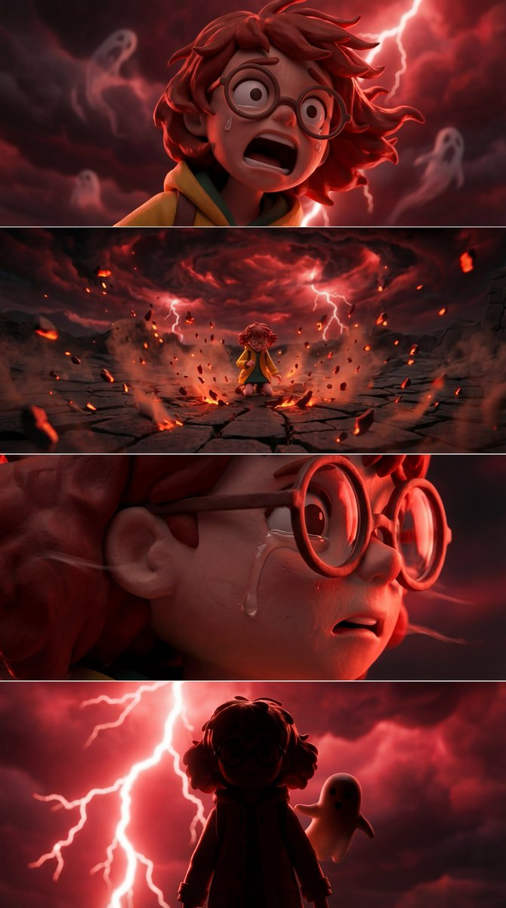

```
SPLIT STACK (1X4 grid)

Now that everyone has gotten the 3x3 grids out of their system for generating different angles, it feels like the right moment to double down on something I shared on day one of Nano Banana’s public release.

You will get more consistent results using a vertical image split into four frames (what I call a split stack), then splitting and extracting from there.

Lost detail is lost.

A 3x3 grid can give you something decent, but consistency quickly breaks down. Angles drift. Details soften. The model starts inventing what it thinks you want because its attention is split across 9, 12, or 16 frames at once.

Personally, I use 1x4 vertical grids and export each frame to 16:9 afterward.

Two reasons:
1/ It preserves detail and consistency shot after shot.
Instead of playing roulette by asking for random angles, it forces you to be intentional. 
2/You describe the shot you need, the background you expect, and the framing that serves your story. Nano Banana Pro still struggles with environment rotation unless you guide it very explicitly.

You do you. But I have watched the 3x3 approach go viral a week after this method was shared, get adopted by everyone, and now I am seeing many of those same people quietly move away from it because it does not deliver on consistency.

Trends move fast. Fundamentals still matter.
```

```
分屏堆叠（1×4 网格）

既然大家都已经用 3×3 网格生成不同角度过瘾了，现在似乎是时候回归我在 Nano Banana 公开发布第一天就分享的方法了。

使用一张垂直图像分成四个画面（我称之为“分屏堆叠”），然后再分别裁剪提取，你会获得更一致的结果。

细节一旦丢失，就再也找不回来了。

3×3 网格或许能给出尚可的效果，但一致性很快就会崩塌：角度偏移、细节模糊，模型因为注意力同时分散在 9、12 甚至 16 个画面中，开始自行揣测你想要的内容。

我个人使用 1×4 的垂直网格，之后再将每一帧导出为 16:9 比例。

原因有二：  
1/ 它能逐帧保留细节与一致性。  
与其靠随机角度碰运气，不如主动明确你的需求。  
2/ 你可以精准描述所需镜头、预期背景以及服务于叙事的构图。除非你非常明确地引导，否则 Nano Banana Pro 在环境旋转方面仍存在困难。

你可以按自己的方式来。但我注意到，在这种方法公布一周后，3×3 方法迅速走红并被众人效仿；如今，其中不少人已悄然放弃它，因为它无法保证一致性。

潮流转瞬即逝，基本功依然重要。
```

 [↑返回目录](#toc)

---
## <a id="prompt-2001356375226749200">3×3图像分割工具</a> (<a href="https://x.com/underwoodxie96/status/2001356375226749254" target="_blank" rel="noopener noreferrer">underwood</a>)

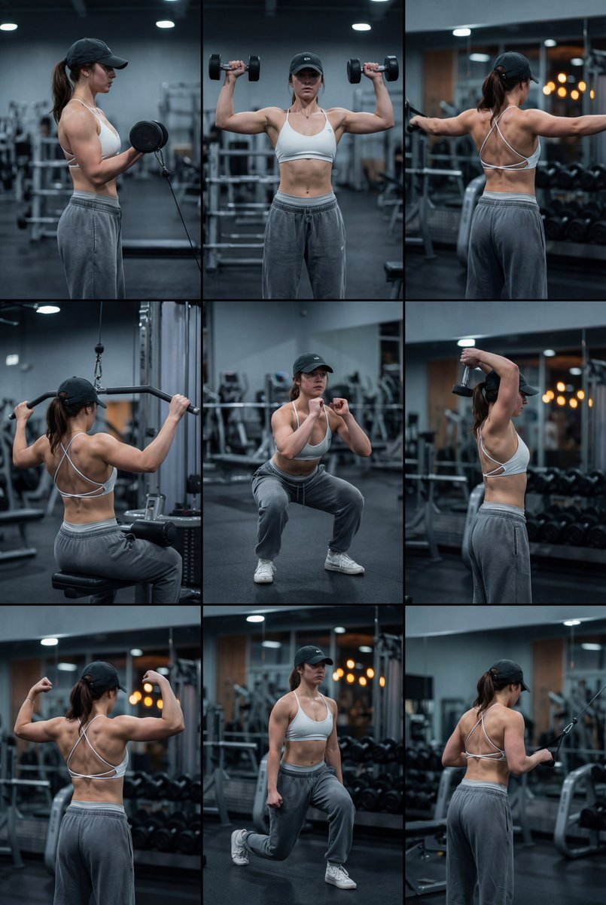

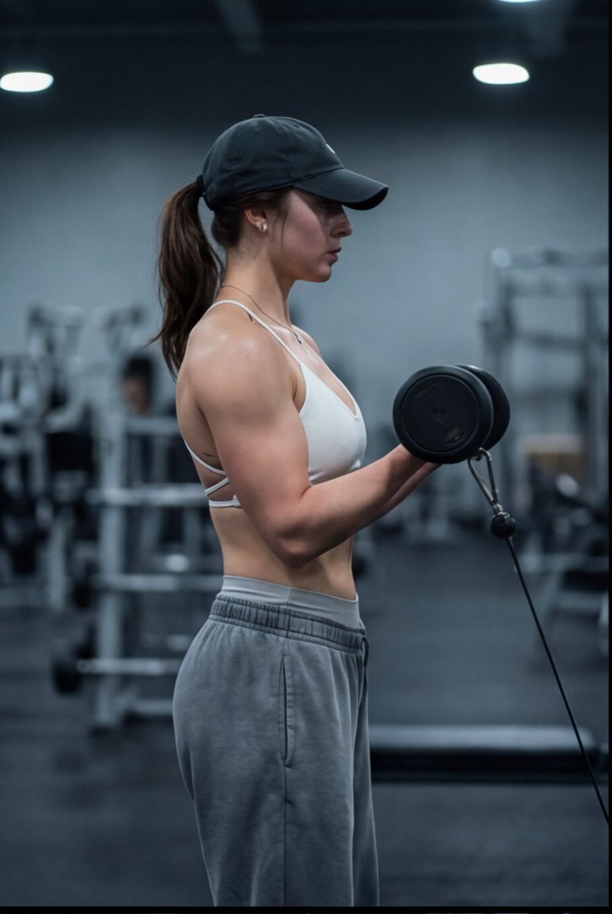

```
Previously, I used to send a 3×3 grid to Nano Banana Pro and ask it to extract an image by “row and column” — and it failed way too often.

So I ended up building a small tool myself:

Just upload an image ✅
Automatically generate a 3×3 grid ✅
Split it instantly and export any single cell in high resolution ✅
```

```
所以我最后自己构建了一个小工具：

只需上传一个图像 ✅
自动生成一个3×3的网格 ✅
立即分割并导出任何单个单元格为高分辨率图像 ✅
```

 [↑返回目录](#toc)

---
## <a id="prompt-2001496988253147400">海报墙写真风格</a> (<a href="https://x.com/Tz_2022/status/2001496988253147379" target="_blank" rel="noopener noreferrer">Tz</a>)

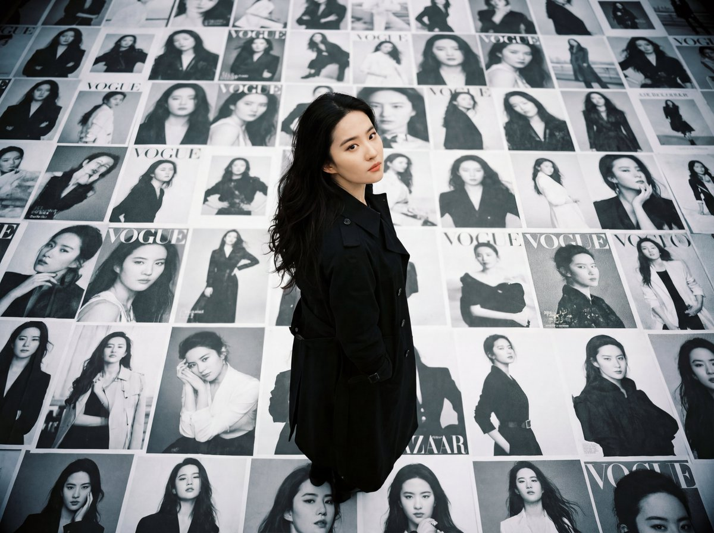

```
感觉这个风格的图摄女孩子（女朋友？）会非常非常喜欢。。。

nano banana pro 使用的提示词如下：

基于【参考照片人物】。 这是一张LOMO Ic-a风格的高清摄影作品。 采用高角度俯拍视角（High angle shot）， 镜头聚焦于一位绝美的日本电影女演员。 她身穿黑色长风衣， 面容与气质与【参考照片人物】完全一致。 她正站在铺满地面的无数黑白时尚广告牌之上， 由于视角的缘故， 可以看到地面上所有广告牌的模特造型也全都是她本人的不同时尚写真， 仿佛她站在自己的无数分身之上。

（我是用了 Labnana 来出没有水印的4K高清大图。。。）
```

 [↑返回目录](#toc)

---
## <a id="prompt-2001609137290187000">倒悬金字塔：吉萨的黄金幻象</a> (<a href="https://x.com/umesh_ai/status/2001609137290187054" target="_blank" rel="noopener noreferrer">Umesh</a>)

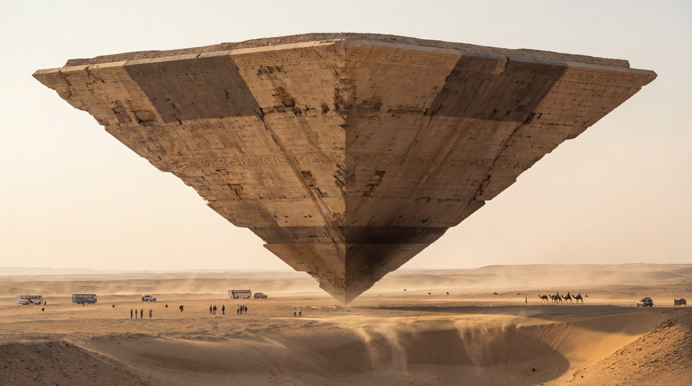

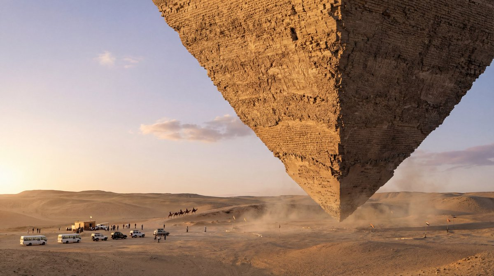

```
on  Photorealistic ultra-wide desert scene in Egypt near the Giza plateau at golden hour. A colossal inverted pyramid, point-down, dominates the landscape at an unimaginable scale, dwarfing the horizon. Its vast upper rim stretches for multiple kilometers, while the sloping faces plunge inward toward a needle-like apex that hovers just above the sand, leaving a gigantic shadowed void beneath. The surface reads as ancient limestone blocks with dark granite inlays: mega-sized courses, eroded edges, wind-sanded wear, and long, faint bands of hieroglyphs that only appear where the sun grazes the stone. Include tiny scale cues in the distance: a thin line of tourists like ants, a few small buses and 4x4s parked far away, a camel caravan crossing the flats, and scattered survey flags. Heat haze and dust plumes soften the far edges. Sand dunes climb the lower planes where stone meets desert, with drifting sand spilling down seams like a slow waterfall. Pale sky, low sun, strong raking light, extreme HDR realism, crisp micro-textures, natural color grading, no glow or energy effects.
```

```
埃及吉萨高原附近黄金时刻的超写实超宽幅沙漠场景。一座巨大无比的倒置金字塔（尖端朝下）以难以想象的规模主宰着地平线，其庞大的上缘绵延数公里，倾斜的面朝内汇聚至一个针尖般的顶点，悬停于沙面之上，在下方投下巨大的阴影空洞。表面呈现为古老的石灰岩巨块，嵌有深色花岗岩饰条：巨型层叠石阶、风蚀边缘、风沙磨痕，以及仅在阳光掠过石面时才隐约可见的细长象形文字带。远处加入微小的比例参照物：如蚂蚁般的一列游客、几辆停在远方的小型巴士和越野车、一支穿越平地的骆驼商队，以及零星分布的勘测旗。热浪与尘雾柔化了远景边缘。沙丘沿着石体底部与沙漠交界处向上攀爬，流沙顺着接缝如缓慢瀑布般倾泻而下。天空苍白，低角度阳光，强烈的侧光照明，极致HDR写实风格，清晰的微观纹理，自然色彩分级，无发光或能量特效。
```

 [↑返回目录](#toc)

---
## <a id="prompt-2000922964011713000">Ai animation KFC Gemini Nano Banana 3.0</a> (<a href="https://x.com/YaseenK7212/status/2000922964011712945" target="_blank" rel="noopener noreferrer">Yaseen Khan Gul</a>)

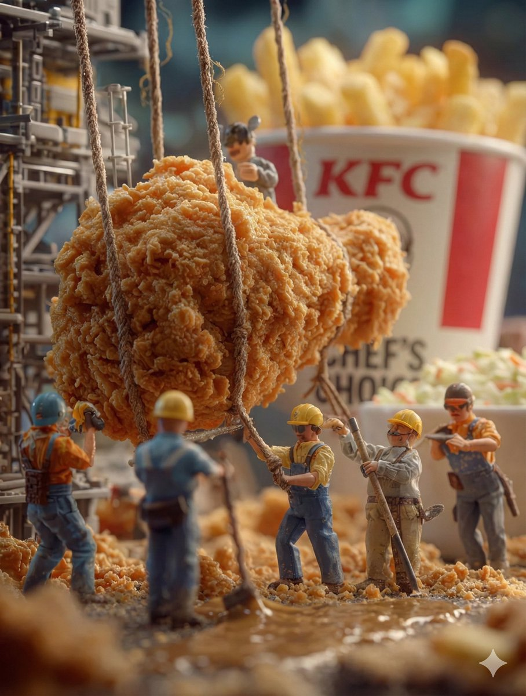

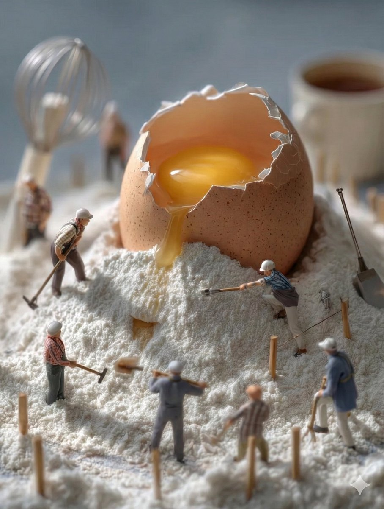

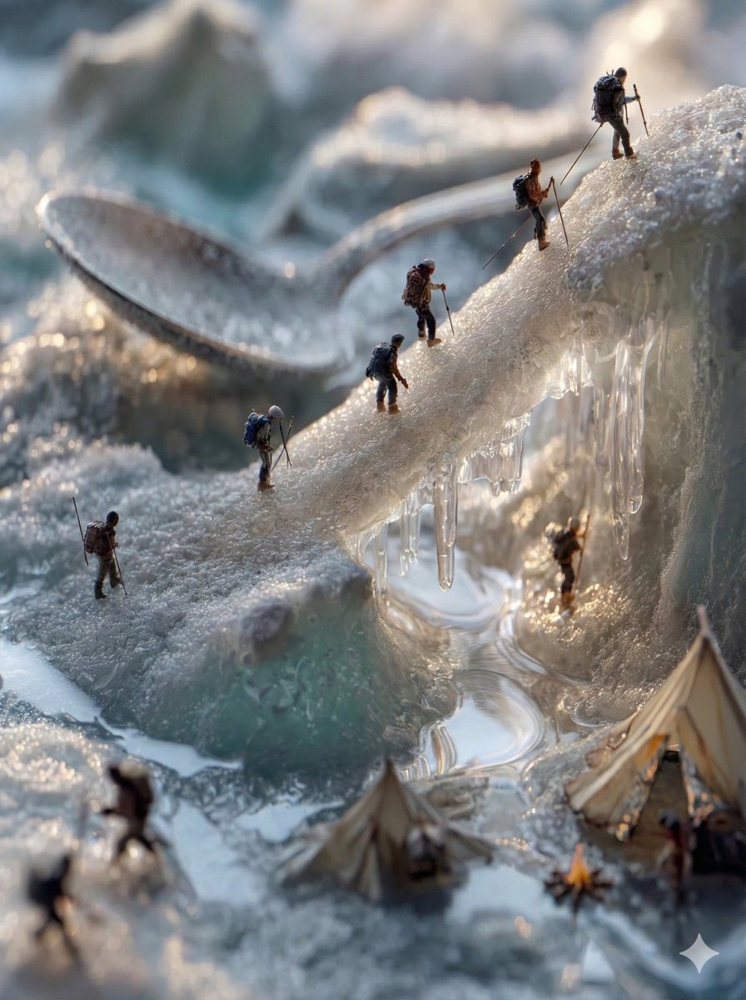

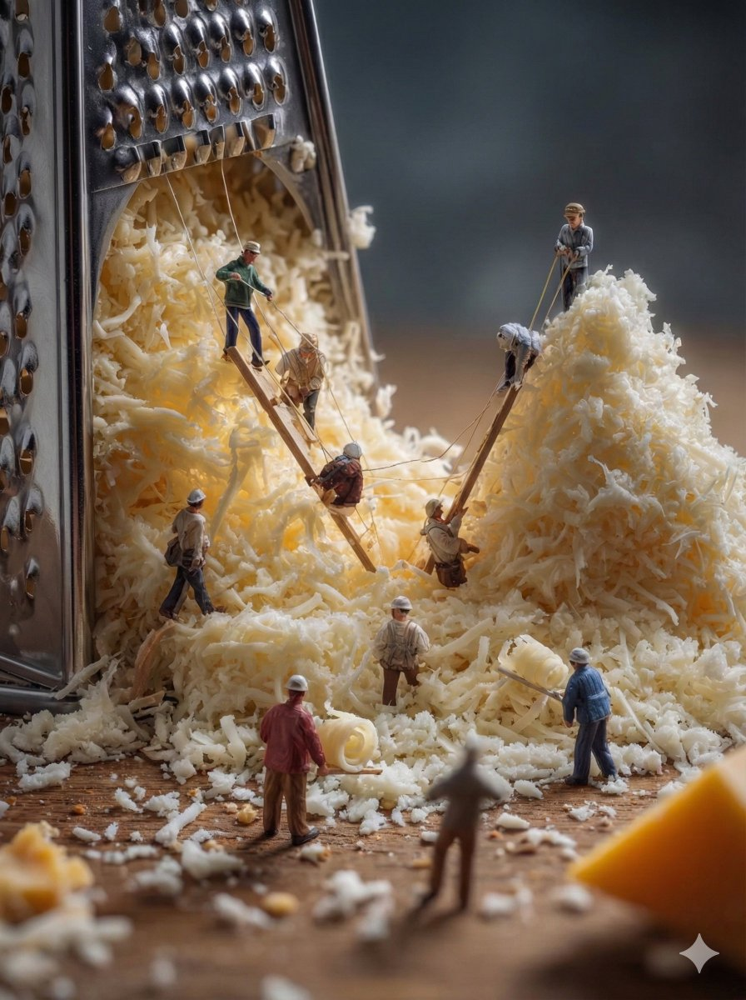

```
{
  "collection_meta": {
    "theme": "Miniature Worlds & Macro Food",
    "style_preset": "Microphotography / Tilt-Shift Realism",
    "aspect_ratio": "3:4"
  },
  "scenes": [
    {
      "id": "scene_01_chicken_construction",
      "subject": {
        "team": "Miniature construction workers",
        "action": "Lifting massive KFC drumstick using LEGO-style scaffolding, ropes, and pulleys",
        "details": [
          "Workers covered in head-sized crumbs",
          "One figure shoveling grease off floor"
        ]
      },
      "environment": {
        "macro_object": "Giant KFC crispy fried chicken drumstick",
        "background": "Generic KFC bucket, coleslaw and fries appearing as boulders",
        "lighting": "Cinematic, shallow depth of field emphasizing crunch texture"
      }
    },
    {
      "id": "scene_02_egg_excavation",
      "subject": {
        "team": "Miniature archaeologists",
        "action": "Excavating cracked eggshell buried in flour",
        "tools": "Tiny brushes, micro-hammers",
        "details": "Tiny footprints visible in the flour dust"
      },
      "environment": {
        "macro_object": "Cracked eggshell and giant yolk puddle (cordoned off with toothpicks)",
        "background": "Whisk and measuring cup towering in blur",
        "lighting": "Soft morning kitchen light, highlighting fragility"
      }
    },
    {
      "id": "scene_03_ice_trek",
      "subject": {
        "team": "Miniature adventurers/mountaineers",
        "action": "Trekking across melting ice landscape",
        "gear": "Tents made of gum wrappers",
        "details": "Reflections of tiny shadows in meltwater pools"
      },
      "environment": {
        "macro_object": "Melting ice cubes with jagged edges",
        "background": "Fallen spoon acting as a frozen bridge",
        "lighting": "Cold cinematic, high-contrast reflections, glistening textures"
      }
    },
    {
      "id": "scene_04_cheese_rescue",
      "subject": {
        "team": "Miniature rescue team",
        "action": "Saving a figure fallen into shredded cheese",
        "tactics": [
          "Rappelling using dental floss",
          "Carrying cheese curls on stretchers"
        ]
      },
      "environment": {
        "macro_object": "Massive metal cheese grater looming like a mountain",
        "surface": "Wooden kitchen table with crumbs",
        "atmosphere": "Dramatic, humorous chaos, macro realism"
      }
    }
  ]
}
```

```
{
  "collection_meta": {
    "theme": "微缩世界与宏观食物",
    "style_preset": "微距摄影 / 移轴写实风格",
    "aspect_ratio": "3:4"
  },
  "scenes": [
    {
      "id": "scene_01_chicken_construction",
      "subject": {
        "team": "微型建筑工人",
        "action": "使用乐高风格脚手架、绳索和滑轮吊起巨大的肯德基鸡腿",
        "details": [
          "工人身上沾满如头般大小的面包屑",
          "一名工人正在用铲子清理地上的油脂"
        ]
      },
      "environment": {
        "macro_object": "巨型肯德基香脆炸鸡腿",
        "background": "普通肯德基桶，卷心菜沙拉和薯条如同巨石",
        "lighting": "电影感灯光，浅景深突出酥脆质感"
      }
    },
    {
      "id": "scene_02_egg_excavation",
      "subject": {
        "team": "微型考古学家",
        "action": "在面粉中挖掘埋藏的破裂蛋壳",
        "tools": "微型刷子、微型锤子",
        "details": "面粉粉尘中可见微小的脚印"
      },
      "environment": {
        "macro_object": "破裂的蛋壳与巨大的蛋黄水洼（用牙签围起警戒线）",
        "background": "打蛋器和量杯在背景中模糊耸立",
        "lighting": "柔和的清晨厨房光线，突显脆弱感"
      }
    },
    {
      "id": "scene_03_ice_trek",
      "subject": {
        "team": "微型探险家/登山者",
        "action": "穿越正在融化的冰原",
        "gear": "用口香糖包装纸制成的帐篷",
        "details": "融水池中映出微小身影的倒影"
      },
      "environment": {
        "macro_object": "边缘参差的融化冰块",
        "background": "掉落的勺子充当冰封桥梁",
        "lighting": "冷色调电影光效，高对比反射，闪烁质感"
      }
    },
    {
      "id": "scene_04_cheese_rescue",
      "subject": {
        "team": "微型救援队",
        "action": "营救掉入碎奶酪堆中的同伴",
        "tactics": [
          "用牙线进行速降",
          "用担架搬运奶酪卷"
        ]
      },
      "environment": {
        "macro_object": "如山般耸立的巨大金属奶酪刨丝器",
        "surface": "布满面包屑的木质厨房桌面",
        "atmosphere": "戏剧性、幽默混乱，宏观写实风格"
      }
    }
  ]
}
```

 [↑返回目录](#toc)

---
## <a id="prompt-2000794831212449800">云中西游：维港上空的师徒</a> (<a href="https://x.com/linxiaobei888/status/2000794831212449909" target="_blank" rel="noopener noreferrer">xiaobeiLin</a>)


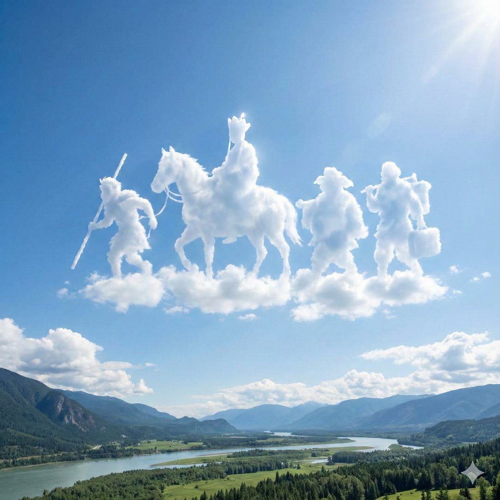

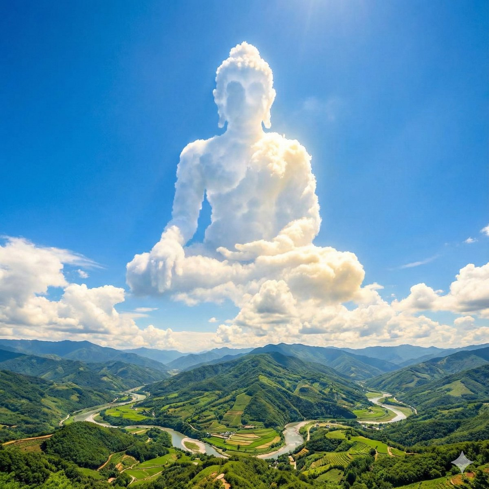

```
创建一个超写实的天空场景，柔和、自然的云层有机地聚合，形成一个清晰可辨的【主体】轮廓。云朵形态高悬在明亮蔚蓝的天空中，自然漂浮，其下方是清晰可识别的【景观描述】景观，为画面提供稳固的视觉基础。
画面构图为正方形（1080×1080），云层造型位于画面上半部分，下方的风景使整体场景更加平衡。光线清晰明亮，呈现出日光直射的效果，云朵上有被阳光照亮的高光，增强了层次感、柔软度与真实感。
整体氛围应当宁静、积极、富有视觉冲击力，色彩饱和度高，画面干净纯粹，营造出平和而清新的感觉。

主体：西游记唐僧师徒
景观描述：香港维多利亚港
```

 [↑返回目录](#toc)

---
## <a id="prompt-2001208017828622600">画中我：静谧创作时刻</a> (<a href="https://x.com/AIwithkhan/status/2001208017828622547" target="_blank" rel="noopener noreferrer">Smiling Khan</a>)

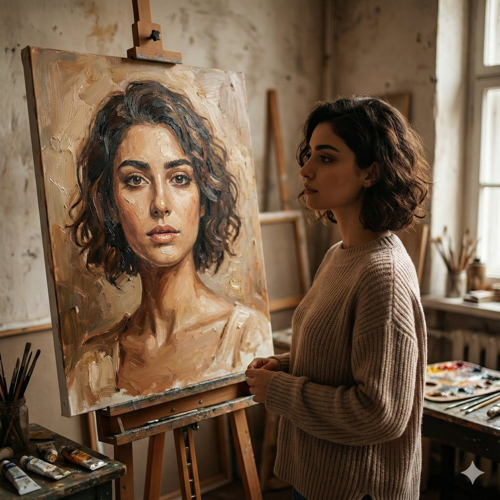

```
👇 
A cinematic, realistic studio scene of a young woman standing beside an easel, quietly observing an oil portrait of herself. The painting features expressive brushstrokes and warm earthy tones, capturing her likeness with emotional depth. The woman wears a cozy neutral sweater, her short wavy hair softly framing her face. Natural window light enters from the side, creating gentle shadows and a calm, introspective mood. The artist’s workspace is visible with paintbrushes, palettes, and textured walls, giving an authentic fine-art atmosphere. Shallow depth of field, painterly realism, soft highlights, warm color grading, high detail, 4K quality, cinematic composition, aspect ratio 1:1.
```

```
如下：
一个电影般的、逼真的工作室场景，年轻的女子站在画架旁，静静地观察着一幅自己的油画肖像。这幅画以表现力强的笔触和温暖的大地色调为特色，以富有情感深度的方式捕捉了她的形象。女子穿着舒适的中性色毛衣，短卷发轻柔地衬托着她的脸庞。自然的窗户光线从侧面进入，创造出柔和的阴影和一种平静、内省的氛围。艺术家的工作空间可见，有画笔、调色板和纹理墙，营造出一种真实的艺术氛围。浅景深、绘画般的现实主义、柔和的高光、暖色调分级、高细节、4K质量、电影般的构图、纵横比1:1。
```

 [↑返回目录](#toc)

---
## <a id="prompt-2001140411134566700">派对中的自信身影</a> (<a href="https://x.com/john_my07/status/2001140411134566560" target="_blank" rel="noopener noreferrer">Johnn</a>)

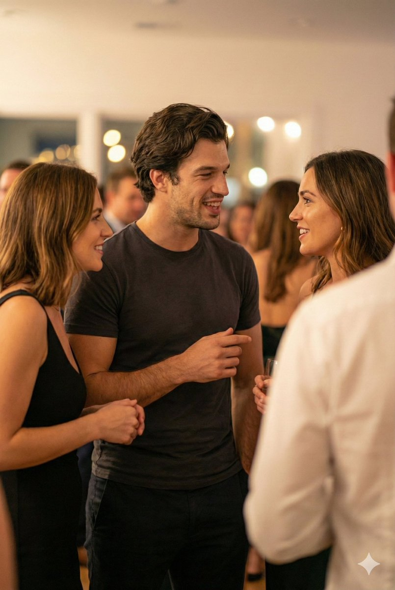

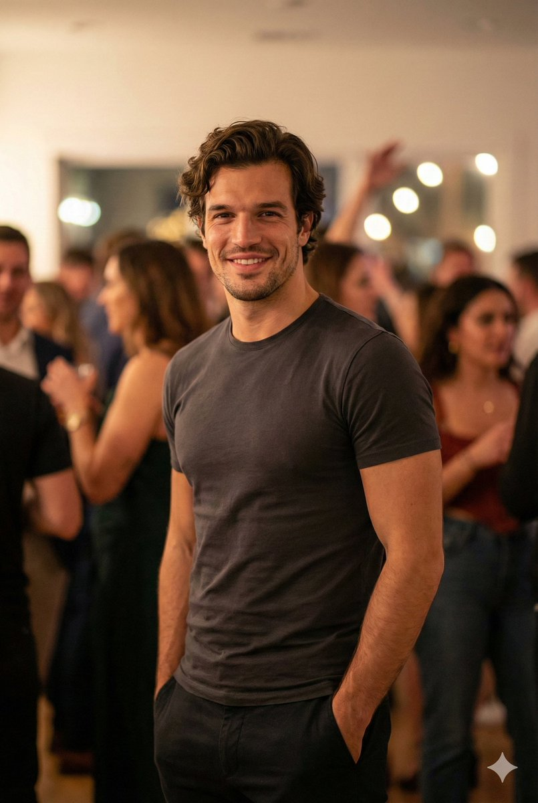


```
;{  "render_goal": "Create a photorealistic party scene portrait with shallow depth of field and full focus on the subject",    "subject": {    "identity": "Man identical to the reference image",    "face_match": "exact",    "expression": "relaxed, confident, subtle smile",    "attitude": "calm, effortless, socially comfortable"  },  "wardrobe": {    "style": "casual party wear",    "outfit": "well-fitted t-shirt or casual shirt with relaxed trousers",    "look": "clean, modern, understated"  },  "scene": {    "environment": "indoor party or lounge setting",    "background_people": "multiple men and women socializing",    "background_focus": "strong blur, soft bokeh, no facial detail visible",    "vibe": "lively but intimate"  },  "lighting": {    "type": "minimal, cinematic lighting",    "key_light": "soft focused light on subject’s face and upper body",    "ambient_light": "dim party lights in background",    "contrast": "subject clearly separated from background"  },  "camera": {    "shot_type": "medium portrait",    "lens": "85mm",    "aperture": "f/1.8",    "depth_of_field": "very shallow",    "focus": "tack-sharp on subject only"  },  "style": {    "realism": "ultra-photorealistic",    "finish": "natural skin texture, cinematic color grading",    "restrictions": ["no illustration", "no 3D", "no cartoon"]  }}
```

```
{
  "render_goal": "创建一张具有浅景深、主体完全聚焦的逼真派对场景人像",
  
  "subject": {
    "identity": "与参考图像完全相同的男性",
    "face_match": "精确一致",
    "expression": "放松、自信、带有淡淡微笑",
    "attitude": "沉稳、从容、社交自在"
  },

  "wardrobe": {
    "style": "休闲派对装",
    "outfit": "合身的T恤或休闲衬衫搭配宽松长裤",
    "look": "干净、现代、低调"
  },

  "scene": {
    "environment": "室内派对或休息室环境",
    "background_people": "多位男女正在社交",
    "background_focus": "强烈模糊，柔美散景，不可见面部细节",
    "vibe": "热闹但亲密"
  },

  "lighting": {
    "type": "极简电影感灯光",
    "key_light": "柔和聚光打在主体脸部和上半身",
    "ambient_light": "背景为昏暗的派对灯光",
    "contrast": "主体与背景清晰分离"
  },

  "camera": {
    "shot_type": "中景人像",
    "lens": "85mm",
    "aperture": "f/1.8",
    "depth_of_field": "极浅",
    "focus": "仅主体锐利对焦"
  },

  "style": {
    "realism": "超写实摄影风格",
    "finish": "自然肌肤质感，电影级色彩调校",
    "restrictions": ["非插画", "非3D", "非卡通"]
  }
}
```

 [↑返回目录](#toc)

---
## <a id="prompt-2001170333697532200">桑拿中的湿发美人</a> (<a href="https://x.com/YaseenK7212/status/2001170333697532092" target="_blank" rel="noopener noreferrer">Yaseen Khan Gul</a>)

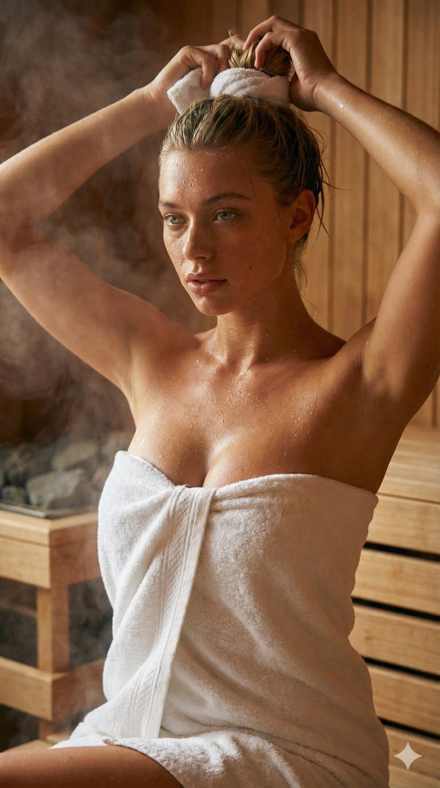

```
{
  "image_generation_request": {
    "subject_definition": {
      "identity_constraints": {
        "facial_fidelity_requirement": "Strict, non-negotiable 100% adherence to the exact facial structure, features, and likeness of the woman depicted in the previously uploaded input image. No algorithmic alterations to identity are permitted.",
        "general_body_consistency": "The underlying body frame must remain consistent with the input identity, subject only to specific requested modifications."
      },
      "physique_modifications": {
        "target_anatomical_area": "Bust and chest region.",
        "modification_instruction": "The subject's breasts must appear significantly larger, fuller, and more voluminous than their natural state, creating a pronounced curve underneath the towel wrap."
      }
    },
    "action_and_pose_parameters": {
      "posture": "Seated gracefully upright on a sauna bench.",
      "arm_placement": "Both arms are raised upward, bent at the elbows, reaching towards the back of the head.",
      "primary_activity": "The subject is in the act of tying up her wet hair into a knot or bun, utilizing a small, secondary towel for the task."
    },
    "environment_and_atmosphere": {
      "setting_location": "Interior of an active, hot steam room sauna, featuring wooden wall paneling and benches.",
      "environmental_effects": {
        "steam_density": "Visible atmospheric steam creating a humid, slightly hazy environment.",
        "heat_indicators": "Evidence of high temperature affecting the subject."
      },
      "subject_physiological_state": {
        "perspiration_level": "Heavy sweating; skin on the face, neck, shoulders, décolletage, and arms is thoroughly wet and glistening with distinct beads of perspiration.",
        "hair_state": "Damp and sweaty due to the steam and heat."
      }
    },
    "attire_and_styling_details": {
      "garment_type": "A thick, soft, plush white bath towel.",
      "wrapping_style": "Securely wrapped around the torso under the arms, draped in a manner that highlights the increased fullness of the bust."
    },
    "photographic_execution": {
      "shot_type": "Cinematic portrait.",
      "framing": "Half-face close-up, capturing head and shoulders down to the mid-torso.",
      "resolution_and_realism": "8K ultra-realistic rendering with hyper-detailed textures, appearing as a high-end photograph rather than a generated image.",
      "focus_areas": "Critical focus on water droplets on skin, texture of wet hair, and the fabric weave of the terry cloth towel.",
      "lighting_profile": "Warm, diffused, humid sauna lighting designed to accentuate the sheen of sweat on skin."
    },
    "technical_output_specifications": {
      "aspect_ratio_formatted": "9:16 (vertical orientation)"
    }
  }
}
```

```
{
  "image_generation_request": {
    "subject_definition": {
      "identity_constraints": {
        "facial_fidelity_requirement": "严格，必须100%遵从之前上传的输入图像中女性的面部结构、特征和相似度。不允许对身份进行算法修改。",
        "general_body_consistency": "基本的身体框架必须与输入的身份保持一致，仅限于特定请求的修改。"
      },
      "physique_modifications": {
        "target_anatomical_area": "胸部区域。",
        "modification_instruction": "受试者的胸部必须显得比自然状态大得多、更丰满、更有体积感，在毛巾包裹下形成明显的曲线。"
      }
    },
    "action_and_pose_parameters": {
      "posture": "优雅地坐在桑拿房的长凳上。",
      "arm_placement": "双臂向上举起，肘部弯曲，伸向头部后方。",
      "primary_activity": "受试者正在将湿头发绑成一个结或发髻，并使用一块较小的次级毛巾完成这个动作。"
    },
    "environment_and_atmosphere": {
      "setting_location": "活跃的蒸汽桑拿房内部，有木墙板和长凳。",
      "environmental_effects": {
        "steam_density": "可见的大气蒸汽创造了一个潮湿、略显朦胧的环境。",
        "heat_indicators": "高温对受试者的影响迹象。"
      },
      "subject_physiological_state": {
        "perspiration_level": "大量出汗；脸部、颈部、肩膀、低胸部位和手臂上的皮肤完全湿润并闪闪发光，有明显的汗珠。",
        "hair_state": "由于蒸汽和热量而变得潮湿和出汗。"
      }
    },
    "attire_and_styling_details": {
      "garment_type": "厚实、柔软、蓬松的白色浴巾。",
      "wrapping_style": "紧紧包裹在腋下的躯干周围，以突出胸部的丰满度。"
    },
    "photographic_execution": {
      "shot_type": "电影肖像。",
      "framing": "半脸特写，捕捉头部和肩膀到中部躯干。",
      "resolution_and_realism": "8K超现实渲染，具有超高细节纹理，看起来像高端照片而不是生成的图像。",
      "focus_areas": "关键聚焦于皮肤上的水滴、湿发的质感以及毛巾布料的纹理。",
      "lighting_profile": "温暖、扩散、桑拿房的湿度照明旨在强调皮肤上汗水的光泽。"
    },
    "technical_output_specifications": {
      "aspect_ratio_formatted": "9:16（垂直方向）"
    }
  }
}
```

 [↑返回目录](#toc)

---
## <a id="prompt-2001006412428927200">巨石汉字‘城’的沙漠遗迹</a> (<a href="https://x.com/Gdgtify/status/2001006412428927325" target="_blank" rel="noopener noreferrer">Gadgetify</a>)


```
A photograph of a massive, weathered stone ruin in a desert, shaped like the Chinese character for ‘WALL’ (城). A section of the Great Wall of China is integrated into the strokes of the character, with watchtowers and crumbling battlements. A caravan of camels and miniature figures treks along the base of the stone structure.
```

 [↑返回目录](#toc)

---
## <a id="prompt-2000795774628847900">复古机械×智能厨房新发明</a> (<a href="https://x.com/Gdgtify/status/2000795774628847894" target="_blank" rel="noopener noreferrer">Gadgetify</a>)

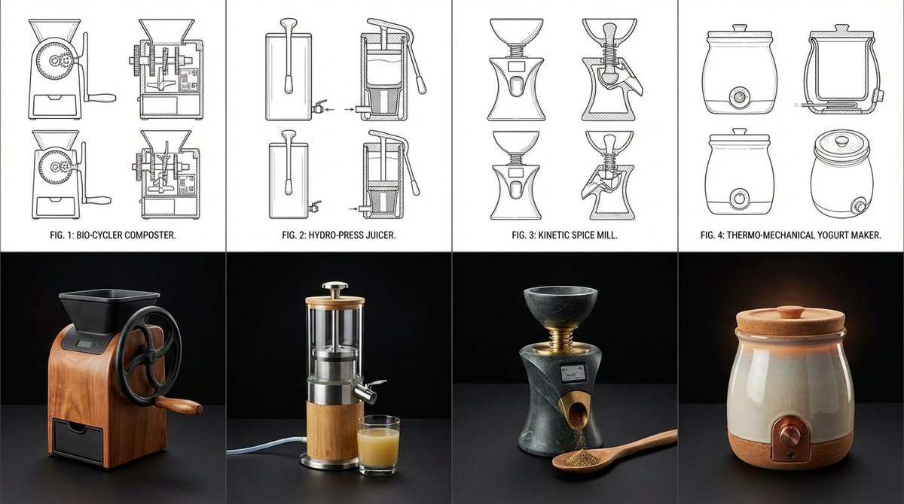

```
Nano Banana Pro can replace industrial designers, invent new products with patents. This is for a kitchen appliance. You can modify it for other things. 

 Act as a world class industrial designer with flawless foresight. 

PROMPT 1 (Constraints): “Invent a groundbreaking kitchen appliance fusing only vintage mechanical principles (pre-1950), one modern microcontroller (e.g., Arduino-compatible), and sustainable biomaterials—no plastics.” 

PROMPT 2: Generate 4 variants solving unsolved everyday frustrations (e.g., zero-waste cooking) 

Output: 4x2 vertical grid: Top row—clean orthographic patent drawings (front, side, section, isometric) in USPTO style; Bottom row—glossy studio photography of the physical prototype on matte black background with dramatic lighting. Include name, core mechanism, and estimated retail price underneath each.
```

```
扮演一位具备完美前瞻性的世界级工业设计师。

提示词1（约束条件）：“发明一款突破性的厨房电器，仅融合1950年以前的复古机械原理、一个现代微控制器（例如兼容Arduino）和可持续生物材料——不得使用塑料。”

提示词2：生成4种变体，解决尚未被满足的日常痛点（例如零浪费烹饪）。

输出格式：4×2垂直网格布局。上排——采用美国专利商标局（USPTO）风格的清晰正交专利图纸（前视图、侧视图、剖面图、等距视图）；下排——在哑光黑色背景上以戏剧性灯光拍摄的实物原型高清摄影图。每件作品下方注明名称、核心机制及预估零售价。
```

 [↑返回目录](#toc)

---
## <a id="prompt-2001173440661999900">写实与抽象之间的凝视</a> (<a href="https://x.com/TrakinTech/status/2001173440661999755" target="_blank" rel="noopener noreferrer">Synthia</a>)

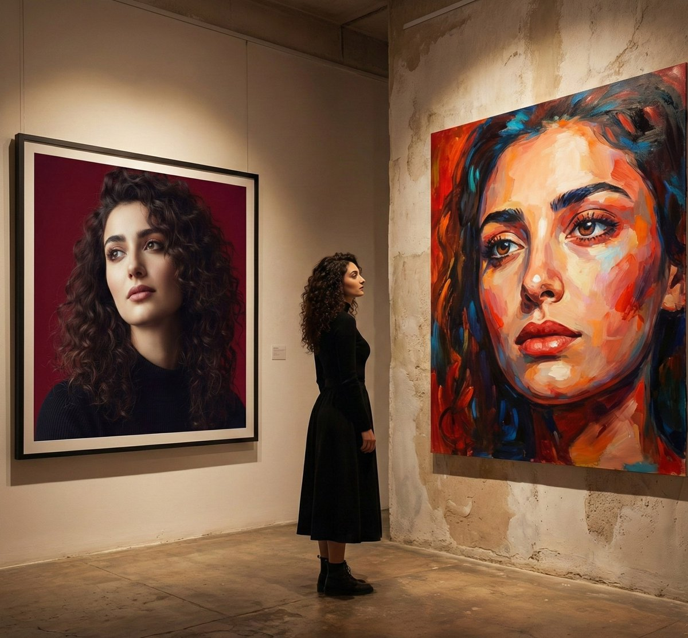

```
:

A cinematic fine-art gallery interior with warm, moody lighting. A woman with curly dark hair, wearing a long black dress and ankle boots, stands thoughtfully between two large portrait artworks. On the left, a hyper-realistic photographic portrait with deep burgundy background, soft studio lighting, sharp facial detail, and elegant color grading. On the right, an expressive oil painting of the same woman, created with bold brush strokes, vibrant reds, blues, and oranges, emphasizing emotion and texture. Google Gemini Minimalist gallery walls with worn plaster textures, polished concrete floor, museum-style composition, shallow depth of field, cinematic framing, high realism, artistic contrast between realism and abstraction, gallery exhibition atmosphere, 8K detail, professional fine-art photography style.
```

```
一座电影感十足的精致艺术画廊内部，温暖而富有氛围感的灯光。一位卷曲黑发的女子身穿长款黑色连衣裙和及踝靴子，若有所思地站在两幅大型肖像作品之间。左侧是一幅超写实摄影肖像，深酒红色背景，柔和的影棚灯光，面部细节锐利，色彩调校优雅；右侧则是同一女子的表现主义油画，以大胆笔触绘就，运用鲜艳的红色、蓝色与橙色，强调情感与肌理。谷歌 Gemini 极简风格的画廊墙面，带有斑驳石膏质感，地面为抛光混凝土，采用博物馆式构图、浅景深、电影级取景、高度写实，呈现写实与抽象之间的艺术对比，营造出画廊展览氛围，8K 细节，专业级美术摄影风格。
```

 [↑返回目录](#toc)

---
## <a id="prompt-2001198742998016000">盛唐贵妃邂逅巴黎铁塔</a> (<a href="https://x.com/songguoxiansen/status/2001198742998016062" target="_blank" rel="noopener noreferrer">松果先森</a>)

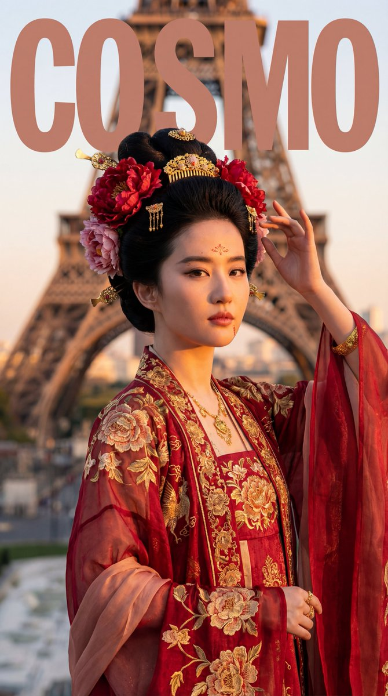

```
生成一张 9:16 竖版「大唐盛世与巴黎」写实照片：以我上传的 FACE_REF 为人物身份参考，100%还原五官与骨相；人物身穿“唐代（盛唐）宫廷贵妃方向”的重工礼服（齐胸衫裙、大袖衫、牡丹纹样、金饰），在巴黎埃菲尔铁塔下的特罗卡德罗广场或塞纳河畔拍摄。画面具备COSMO时尚杂志级别的摄影、造型与封面设计，保持杂志的一贯设计风格（英文设计）。

【INPUTS | 输入】 FACE_REF：我上传的人物五官参考图（身份锁定）

【ABSOLUTE PRIORITY | 身份锁定（最高优先级）】 100%还原 FACE_REF 的五官与骨相：脸型、容貌、眼距、鼻梁鼻翼、唇形、下颌线、颧骨结构完全一致，不得漂移。 真实皮肤质感：可见细微纹理与毛孔，不要过度磨皮与网红化。 成年女性形象。

【SHOT TYPE | 景别二选一（由模型随机选其一，且必须真实统一）】 A) 半身封面：胸口到腰上方，头面与上身刺绣最清晰，眼睛对焦最锐利（主推） B) 全身封面：从头到脚完整呈现层叠礼服与裙摆纹样，铁塔的钢结构透视更强（备选） （无论A/B：都必须保持“封面构图”，有留白空间给排版，但不要撕纸/手绘效果。）

【LOCATION | 场景（巴黎埃菲尔铁塔）】 巴黎埃菲尔铁塔：经典的钢结构塔身背景。天气二选一（随机）：1) 巴黎阴雨（地面微湿，光线柔和高级灰色调，时尚感强） 2) 绚丽黄昏（夕阳余晖，金色光影，浪漫氛围） 背景干净：无游客、无现代标识、无手机状态栏UI、无水印字幕、无护栏。

【LIGHTING & CAMERA | 摄影质感（杂志级）】 镜头感：85mm人像质感（半身）或 50mm/70mm（全身），浅景深，眼睛最清晰。 光线：自然光（强调环境光） + 电影级补光；金饰有真实高光但不爆；丝绸光泽清晰可辨。 色彩：高级电影感，法式米灰/蓝灰色调与唐代服装的“红绿金”配色形成强烈视觉张力；整体干净、通透、质感厚。

【WARDROBE | 唐代宫廷礼服（丰腴、飘逸、色彩浓烈）】 目标审美：“金饰华丽、面靥花钿、齐胸裙、披帛飘逸、大红大绿大金、极度张扬”。

轮廓与层次（必须体现唐代特征） 内层：诃子（抹胸），露出颈部与上胸肌肤（唐代开放风气） 中层：对襟短衫（直领），材质透明轻薄（罗/纱） 外层：大袖衫（极宽大的袖子，拖地），像翅膀一样张开 装饰：披帛（长长的丝带），挽在手臂间，随风飘舞 下装：齐胸破裙（裙腰系在胸口，裙摆宽大，多色拼接或印花） 面料与工艺（重手艺必须“看得见”） 主面料：丝绸、织锦、印金纱（轻盈与厚重结合） 主要工艺：印染（蜡染/夹路）、金线刺绣、织金 纹样主题（适配大唐）：宝相花、缠枝牡丹、瑞兽（狮子/麒麟）、团花（图案巨大、饱满） 细节：花钿（额头红色装饰）、面靥（嘴角红点）、臂钗（大臂上的金属饰品） 头面（唐代雍容华贵头饰） 核心结构：高耸的发髻（云髻/坠马髻），插戴大朵牡丹花（真花或绢花） 装饰：金梳背（插在发髻上的金梳子）、步摇（走动摇曳）、金钗 耳饰：贵重金玉

【COLOR MATRIX | 颜色矩阵搭配（必须执行，且必须“浓烈唐风”）】 （调整为唐代流行色：红绿撞色、金碧辉煌） 从以下三套“主色方案”中随机选 1 套作为【底色/大面积主面料色】。

Scheme G（石青/翠绿底）： 底色：翠绿/石青（常用的间色） 刺绣/印染：茜红、金色、橘黄、米白 Scheme A（牡丹红底）： 底色：牡丹红/石榴红（最经典的唐风） 刺绣/印染：金色、翠绿、宝蓝、紫 Scheme R（紫底）： 底色：紫/葡萄色（高贵） 刺绣/印染：金色、朱红、草绿、银

【颜色执行规则】 色彩对比要强烈，体现盛唐气象，但整体色调要统一在高级感中。

【POSE | 封面姿态（自信、舒展、女王感）】 半身：微昂头，眼神睥睨，一手轻抚发髻或披帛 全身：双臂张开带动大袖衫和披帛，展现服装的体积感，气场全开 表情：自信、张扬、妩媚、大方；不要羞涩。

【OUTPUT | 输出】 1 张 9:16 竖版写实杂志封面级照片 随机：半身 or 全身（A/B二选一） 随机：阴雨 or 黄昏（天气二选一） 随机：翠绿 / 牡丹红 / 紫（颜色矩阵三选一） 造型：唐代宫廷礼服方向 + 牡丹花/金梳头面 + 齐胸大袖 + 披帛
```

 [↑返回目录](#toc)

---
## <a id="prompt-2000976213637259500">复古科技新生：Nano Banana Pro</a> (<a href="https://x.com/Gdgtify/status/2000976213637259621" target="_blank" rel="noopener noreferrer">Gadgetify</a>)

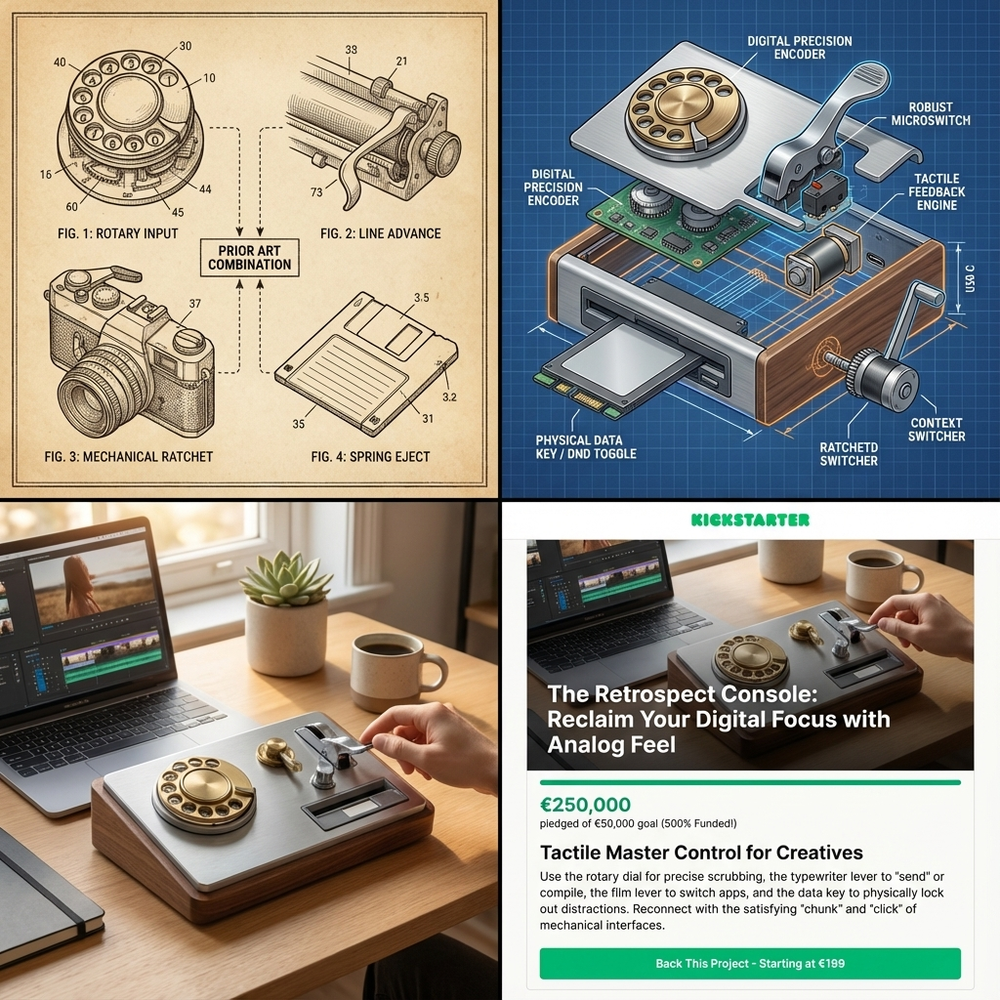

```
Step 1: Research 4 obsolete technologies Step 2: Identify their unique tactile/sensory qualities lost in digital age Step 3: Hybridize in a modern device that should be functional, clever, and feasible.  Output: 2x2 grid:  Panel 1: Vintage patent drawing of obsolete tech Panel 2: Exploded CAD view showing modern internals + vintage exterior Panel 3: Lifestyle photo in modern minimalist home Panel 4: Kickstarter campaign page for it.
```

```
第一步：研究四种已淘汰的技术  
第二步：识别它们在数字时代中丢失的独特触觉/感官特质  
第三步：将这些特质融合进一款现代设备中，该设备应具备功能性、巧思且切实可行  

输出格式：2x2 网格  
第一格：过时技术的复古专利图纸  
第二格：爆炸式 CAD 视图，展示现代内部结构与复古外观  
第三格：在现代极简风格家居中的生活场景照片  
第四格：该产品的 Kickstarter 众筹页面
```

 [↑返回目录](#toc)

---
## <a id="prompt-2001132241746059500">电影角色玩具收藏盒</a> (<a href="https://x.com/Gdgtify/status/2001132241746059418" target="_blank" rel="noopener noreferrer">Gadgetify</a>)

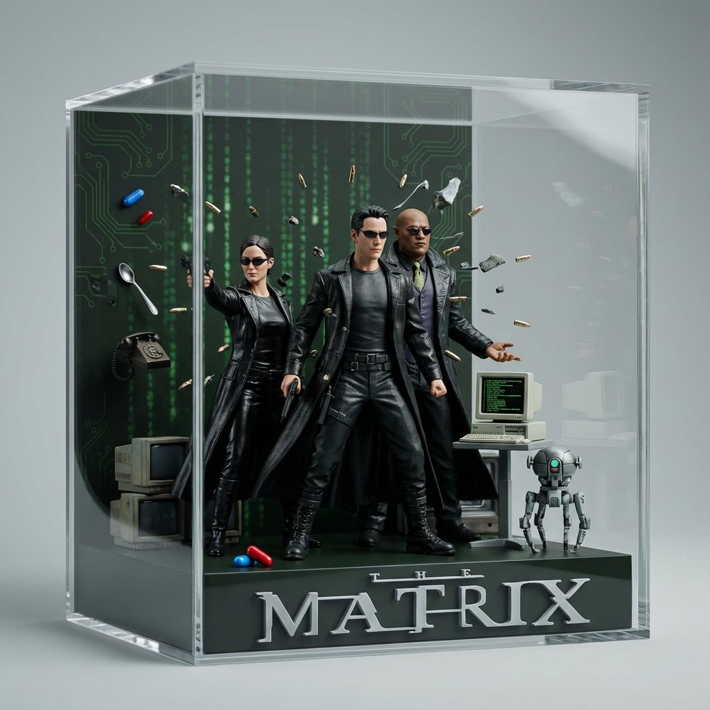

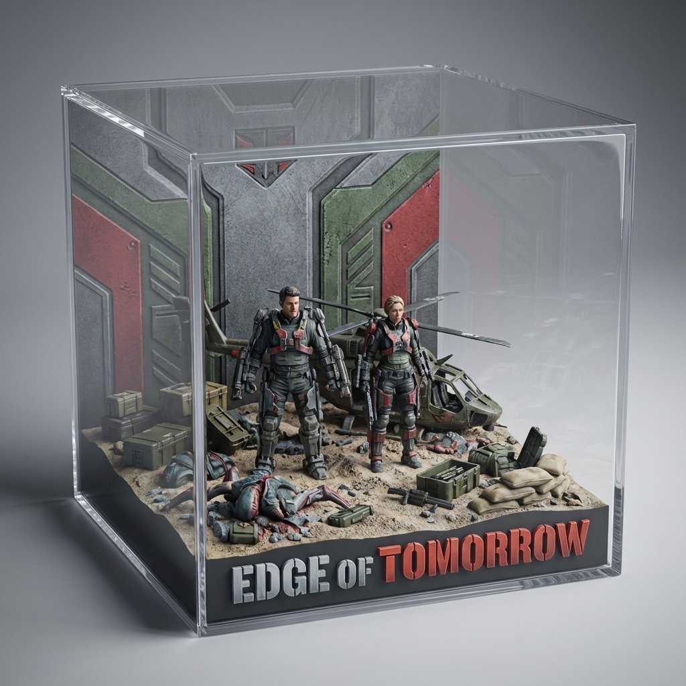

```
Toyification
Input A is the subject photo (movie poster or movie name).
Analyze uploaded movie characters, story line, scenes, and pick the most important or iconic scene. 

Optional Input B is a style reference (toy photography / product shot you like). If B is missing, choose a premium toy-ad aesthetic.

Goal: Turn Input A into a hyper-real miniature DIORAMA inside a clear acrylic “collector toy box” with beautiful packaging design (no text/logos).  

Rules:
- The subjects becomes a tiny, ultra-detailed figurine or miniature version of themselves inside a miniature scene appropriate for the uploaded image. 
- Surround it with 6–10 mini props that match the uploaded image's story 
- Packaging should look premium: clear acrylic front, matte paper backer, subtle emboss feel, color palette inferred from Input A.
- Lighting: clean studio softbox, crisp reflections, subtle shadow under box.
- Composition: product hero shot, centered, 3/4 view, shallow depth of field.

Output:
- ONE image, 4:5 or 1:1 (choose the most “product post” viral crop).
- movie name 3D printed at the base. 
- Keep it cute and premium, not uncanny.

```

```
玩具化
输入A是主题照片（电影海报或电影名称）。
分析上传的电影角色、故事情节、场景，并挑选最重要的或标志性的场景。

可选输入B是风格参考（你喜欢的玩具摄影/产品拍摄）。如果缺少B，选择优质的玩具广告美学。

目标：将输入A转化为一个超现实的小型立体模型，放置在透明亚克力“收藏玩具盒”内，并具有美丽的包装设计（无文字/标志）。

规则：
- 主体变为微小、超细节的人偶或上传图像所适合的微型场景中的缩小版本。
- 周围环绕6到10个与上传图像故事相匹配的小道具。
- 包装应看起来高档：透明亚克力前面板，哑光纸背板，微妙的浮雕质感，色彩方案从输入A中推断。
- 照明：干净的工作室柔光箱，清晰的反射，盒子下方有细微阴影。
- 构图：以产品为主角拍摄，居中，3/4视角，浅景深。

输出：
- 一张图片，比例为4:5或1:1（选择最“产品发布”病毒式传播的裁剪方式）。
- 在底部3D打印电影名称。
- 保持可爱和高档，不要让人感觉不安。
```

 [↑返回目录](#toc)

---
## <a id="prompt-2001145459436609800">紫禁城幻梦：AI卷轴之争</a> (<a href="https://x.com/MissMi1973/status/2001145459436609681" target="_blank" rel="noopener noreferrer">M</a>)

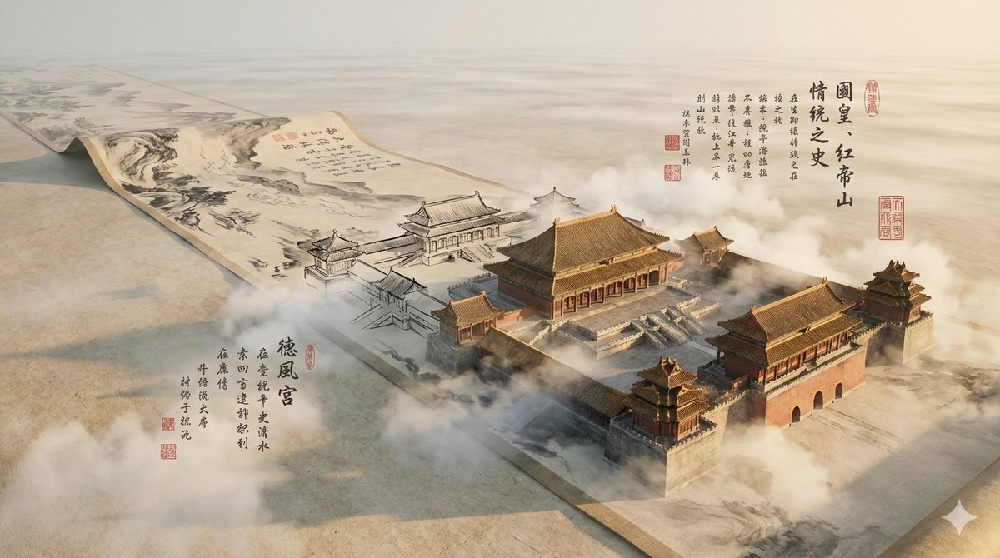

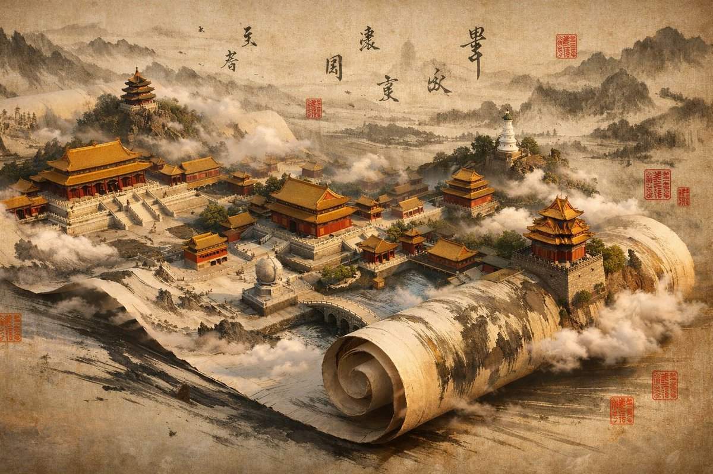

```
Hyper-realistic 3D isometric masterpiece, set against a magnificent, endless traditional ink-wash historical scroll painting unfurling across the background. The scene visualizes the historical lineage and cultural heritage of Forbidden City, featuring its most iconic ancient architecture and landmarks rising dynamically from the scroll. • Composition: The scroll flows through the space like a river of time. The landscape creates a panoramic timeline. • Visual Effect: 2D black ink brushstrokes on the paper surface morph seamlessly into high-fidelity 3D solid structures, realistic materials, and vibrant colors. • Details: Faded ancient parchment texture, floating historical calligraphy characters, red seal stamps, atmospheric clouds and fog wrapping around the monuments. • Lighting: Epic golden hour cinematic lighting illuminating the 3D structures, contrasting with the monochrome ink background. • Specs: 8K resolution, depth of field, Unreal Engine 5 render, grand scale. --ar 16:9 --stylize 350 --no flat, simple, cartoon, borders, frame, table, modern buildings
```

```
Hyper-realistic 3D isometric masterpiece, set against a magnificent, endless traditional ink-wash historical scroll painting unfurling across the background. The scene visualizes the historical lineage and cultural heritage of Forbidden City, featuring its most iconic ancient architecture and landmarks rising dynamically from the scroll. • Composition: The scroll flows through the space like a river of time. The landscape creates a panoramic timeline. • Visual Effect: 2D black ink brushstrokes on the paper surface morph seamlessly into high-fidelity 3D solid structures, realistic materials, and vibrant colors. • Details: Faded ancient parchment texture, floating historical calligraphy characters, red seal stamps, atmospheric clouds and fog wrapping around the monuments. • Lighting: Epic golden hour cinematic lighting illuminating the 3D structures, contrasting with the monochrome ink background. • Specs: 8K resolution, depth of field, Unreal Engine 5 render, grand scale. --ar 16:9 --stylize 350 --no flat, simple, cartoon, borders, frame, table, modern buildings
```

 [↑返回目录](#toc)

---
## <a id="prompt-2001099339557728500">复古浪漫肖像拼贴</a> (<a href="https://x.com/ZaraIrahh/status/2001099339557728610" target="_blank" rel="noopener noreferrer">Zara</a>)

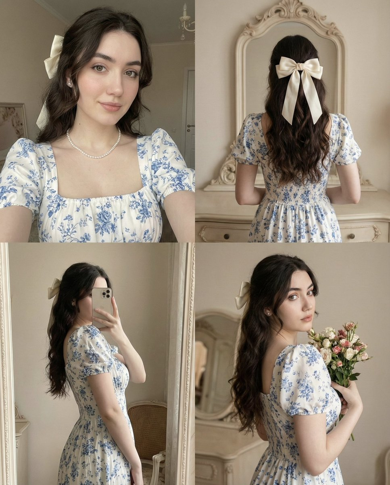

```
{
  "image_prompt": {
    "reference": {
      "face_identity": "uploaded reference image",
      "identity_lock": true,
      "pose_lock": true,
      "camera_angle_lock": true,
      "expression_lock": true,
      "face_preservation": "100% identical facial structure, proportions, eyes, lips, nose, brows, skin texture"
    },

    "composition": {
      "layout": "2x2 collage",
      "aspect_ratio": "1:1",
      "pose_matching": "exactly match reference image poses, angles, framing, and body orientation",
      "no_variation_allowed": true
    },

    "panel_1": {
      "view": "front-facing portrait",
      "pose": "head slightly tilted, eyes toward camera, soft lips",
      "framing": "chest-up selfie angle",
      "expression": "calm, elegant",
      "match_reference": true
    },

    "panel_2": {
      "view": "back view",
      "pose": "standing facing mirror, arms raised slightly",
      "focus": "back of head and bow hairstyle",
      "framing": "upper-body rear shot",
      "match_reference": true
    },

    "panel_3": {
      "view": "mirror selfie",
      "pose": "phone covering part of face, body angled sideways",
      "framing": "waist-up",
      "match_reference": true
    },

    "panel_4": {
      "view": "side portrait",
      "pose": "head turned over shoulder looking into camera, holding bouquet close to chest",
      "expression": "soft romantic gaze",
      "framing": "upper torso",
      "match_reference": true
    },

    "subject": {
      "gender": "female",
      "ethnicity": "Asian",
      "skin_tone": "fair with soft blush"
    },

    "hair": {
      "style": "long straight hair, half-up",
      "accessory": "large cream ribbon bow",
      "placement": "exact position as reference image"
    },

    "outfit": {
      "dress": {
        "color": "white",
        "pattern": "blue floral print",
        "style": "vintage puff-sleeve dress",
        "neckline": "square neckline"
      },
      "jewelry": [
        "pearl necklace",
        "delicate gold pendant"
      ]
    },

    "environment": {
      "location": "vintage-style indoor room",
      "background": [
        "ornate mirror",
        "cream walls",
        "soft floral decor",
        "classic furniture"
      ],
      "match_reference_background": true
    },

    "lighting": {
      "type": "soft indoor daylight",
      "quality": "even, gentle, warm",
      "shadow": "minimal",
      "match_reference": true
    },

    "photography_style": {
      "style": "romantic vintage lifestyle",
      "lens": "DSLR portrait lens",
      "depth_of_field": "shallow",
      "color_grading": "soft pastel"
    },

    "render_quality": {
      "realism": "photorealistic",
      "resolution": "high",
      "texture_detail": "natural skin and fabric detail",
      "no_cartoon": true
    }
  }
}
```

```
{
  "image_prompt": {
    "reference": {
      "面部身份": "上传的参考图像",
      "身份锁定": true,
      "姿态锁定": true,
      "相机角度锁定": true,
      "表情锁定": true,
      "面部保留": "100%相同的面部结构、比例、眼睛、嘴唇、鼻子、眉毛、皮肤纹理"
    },

    "构图": {
      "布局": "2x2拼贴",
      "纵横比": "1:1",
      "姿态匹配": "完全匹配参考图像的姿态、角度、取景和身体朝向",
      "不允许变化": true
    },

    "面板_1": {
      "视图": "正面肖像",
      "姿态": "头部微微倾斜，眼睛看向相机，嘴唇柔和",
      "取景": "胸部以上的自拍角度",
      "表情": "平静、优雅",
      "匹配参考": true
    },

    "面板_2": {
      "视图": "背面视图",
      "姿态": "站在镜子前，双臂微微抬起",
      "焦点": "后脑勺和蝴蝶结发型",
      "取景": "上半身的背部拍摄",
      "匹配参考": true
    },

    "面板_3": {
      "视图": "镜子里的自拍照",
      "姿态": "手机部分遮住脸部，身体侧向一边",
      "取景": "腰部以上",
      "匹配参考": true
    },

    "面板_4": {
      "视图": "侧面肖像",
      "姿态": "头转向肩膀看进相机，手持花束贴近胸部",
      "表情": "温柔浪漫的目光",
      "取景": "上半身",
      "匹配参考": true
    },

    "主体": {
      "性别": "女性",
      "种族": "亚洲",
      "肤色": "白皙带有柔和红晕"
    },

    "头发": {
      "风格": "长直发，半扎起",
      "配饰": "大奶油色丝带蝴蝶结",
      "位置": "与参考图像相同的位置"
    },

    "服装": {
      "连衣裙": {
        "颜色": "白色",
        "图案": "蓝色花卉印花",
        "风格": "复古泡泡袖连衣裙",
        "领口": "方形领口"
      },
      "珠宝": [
        "珍珠项链",
        "精致的金色吊坠"
      ]
    },

    "环境": {
      "地点": "复古风格的室内房间",
      "背景": [
        "华丽的镜子",
        "奶油色墙壁",
        "柔和的花卉装饰",
        "经典家具"
      ],
      "匹配参考背景": true
    },

    "照明": {
      "类型": "柔和的室内日光",
      "质量": "均匀、温和、温暖",
      "阴影": "最小化",
      "匹配参考": true
    },

    "摄影风格": {
      "风格": "浪漫复古生活方式",
      "镜头": "数码单反相机人像镜头",
      "景深": "浅",
      "色彩分级": "柔和的粉彩"
    },

    "渲染质量": {
      "现实主义": "照片般逼真",
      "分辨率": "高",
      "纹理细节": "自然的皮肤和布料细节",
      "无卡通": true
    }
  }
}
```

 [↑返回目录](#toc)

---
## <a id="prompt-2001041553243168800">雪中凝视：真实肖像</a> (<a href="https://x.com/miilesus/status/2001041553243168827" target="_blank" rel="noopener noreferrer">Melis✨</a>)


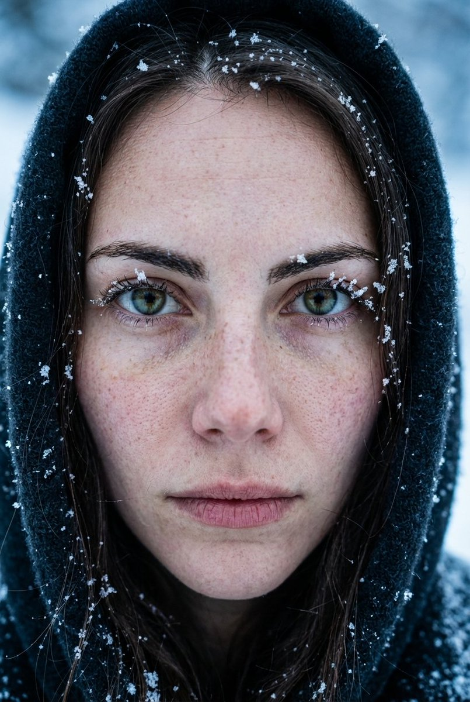

```
{
  "mode": "image_edit",
  "face_preservation": {
    "enabled": true,
    "strength": 1.0,
    "notes": "Skin texture, freckles, pores must stay realistic"
  },
  "composition": {
    "shot_type": "extreme close-up portrait",
    "camera_angle": "straight-on",
    "expression": "neutral, intense eye contact"
  },
  "lighting": {
    "type": "natural cold daylight",
    "contrast": "low",
    "skin_detail": "ultra realistic, no retouch"
  },
  "scene": {
    "environment": "winter outdoors",
    "props": ["snow on face", "hood around face"],
    "weather": "cold, snowy"
  },
  "style": {
    "mood": "raw, documentary, emotional",
    "color_palette": "cool blues, pale skin tones"
  },
  "camera": {
    "lens": "85mm macro portrait",
    "focus": "extreme sharpness on eyes"
  },
  "negative_prompt": [
    "smooth skin",
    "beauty filter",
    "face morphing",
    "cartoon look"
  ]
}
```

```
[
  "光滑的皮肤",
  "美化滤镜",
  "脸部变形",
  "卡通外观"
]
```

 [↑返回目录](#toc)

---
## <a id="prompt-2000870769690083600">3D收藏玩具盒</a> (<a href="https://x.com/Gdgtify/status/2000870769690083586" target="_blank" rel="noopener noreferrer">Gadgetify</a>)


```
Image -> Luxury Toy Box   Input A is the subject photo (person/pet/object/food). Optional Input B is a style reference (toy photography / product shot you like). If B is missing, choose a premium toy-ad aesthetic.  Goal: Turn Input A into a hyper-real miniature DIORAMA inside a clear acrylic “collector toy box” with beautiful packaging design (no text/logos).  Rules: - The subject becomes a tiny, ultra-detailed figurine or miniature version of itself. - Surround it with 6–10 mini props that match the subject’s identity (if pet: tiny bowls/toys; if food: mini ingredients; if object: micro accessories). - Packaging should look premium: clear acrylic front, matte paper backer, subtle emboss feel, color palette inferred from Input A. - Lighting: clean studio softbox, crisp reflections, subtle shadow under box. - Composition: product hero shot, centered, 3/4 view, shallow depth of field.  Output: - ONE image, 4:5 or 1:1 (choose the most “product post” viral crop). - No real brand names, no readable text, no watermarks. - Keep it cute and premium, not uncanny. 
```

```
图像 -> 豪华玩具盒。输入A是主体照片（人物/宠物/物体/食物）。可选输入B是风格参考（你喜欢的玩具摄影/产品拍摄）。如果缺少B，选择高级玩具广告美学。目标：将输入A变成透明亚克力“收藏玩具盒”内的超现实微缩场景，具有美丽的包装设计（无文字/标志）。规则：- 主体变为微小、超细节的雕像或缩小版的自己。- 围绕它放置6到10个与主体身份匹配的小道具（如果是宠物：小碗/玩具；如果是食物：迷你配料；如果是物体：微型配件）。- 包装应看起来高档：透明亚克力前面板，哑光纸背板，微妙的压纹感觉，颜色方案从输入A中推断。- 照明：干净的工作室柔光箱，清晰的反射，盒子下方有微妙阴影。- 构图：产品英雄镜头，居中，三分之四视角，浅景深。输出：- 一张图片，比例为4:5或1:1（选择最“产品发布”病毒式传播的裁剪方式）。- 不包含真实品牌名称，不可读的文字，水印。- 保持可爱和高端，不显得诡异。
```

 [↑返回目录](#toc)

---
## <a id="prompt-2001003373336912100">巨人静坐伦敦街头</a> (<a href="https://x.com/rovvmut_/status/2001003373336912147" target="_blank" rel="noopener noreferrer">Heisenberg</a>)


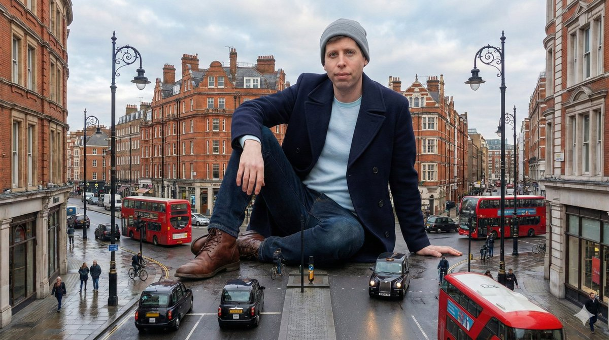

```
A photorealistic wide drone shot of a colossal man (exact face/body from the reference) casually sitting across a London street, one knee raised, hand resting. He wears a navy overcoat, knit sweater, dark trousers, boots, and a minimalist beanie. Tiny cars, buses, bikes, and pedestrians move around him, with classic London red-brick buildings, black lamps, and cobblestone streets dwarfed by his size. Soft overcast London daylight highlights wet pavement.
```

```
一个超现实的宽阔无人机镜头，展现了一个巨大的男人（脸部和身体与参考图完全一致）随意地坐在伦敦街道上，一只膝盖抬起，手搭在上面。他穿着海军蓝大衣、针织毛衣、深色裤子、靴子和极简风格的无檐帽。微小的汽车、公共汽车、自行车和行人围绕着他移动，经典的伦敦红砖建筑、黑色路灯和鹅卵石街道在他的巨大身形下显得渺小。柔和的伦敦阴天日光突显了湿润的路面。
```

 [↑返回目录](#toc)

---
## <a id="prompt-2001119658863460400">科幻经典书雕艺术</a> (<a href="https://x.com/Gdgtify/status/2001119658863460468" target="_blank" rel="noopener noreferrer">Gadgetify</a>)

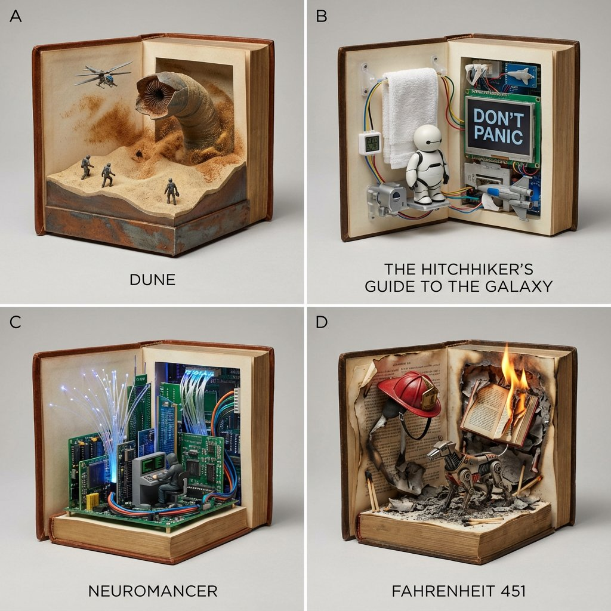

```
2x2 grid of famous sci-fi books, clean high-end studio, sharp micro-detail, consistent angle, shallow depth of field. Panel A:  book 1 as a materials relevant to the book kinetic sculpture inside an open book, with iconic characters and elements. Panel B: book 2 as a materials relevant to the book kinetic sculpture inside an open book, with iconic characters and elements. Panel C: book 3 as a materials relevant to the book kinetic sculpture inside an open book, with iconic characters and elements. Panel D: book 4 as a materials relevant to the book kinetic sculpture inside an open book, with iconic characers and elements, names of the books underneath
```

```
2x2 网格布局展示四本著名科幻小说，干净高端的摄影棚风格，锐利的微细节，统一视角，浅景深。A 格：第一本书，以与该书内容相关的材质制成动态雕塑，置于打开的书页内，包含标志性角色与元素。B 格：第二本书，以与该书内容相关的材质制成动态雕塑，置于打开的书页内，包含标志性角色与元素。C 格：第三本书，以与该书内容相关的材质制成动态雕塑，置于打开的书页内，包含标志性角色与元素。D 格：第四本书，以与该书内容相关的材质制成动态雕塑，置于打开的书页内，包含标志性角色与元素，书名置于各格下方。
```

 [↑返回目录](#toc)

---
## <a id="prompt-2001195029243806000">电影感时尚肖像写真</a> (<a href="https://x.com/saniaspeaks_/status/2001195029243806072" target="_blank" rel="noopener noreferrer">𝗦𝗮𝗻𝗶𝗮</a>)

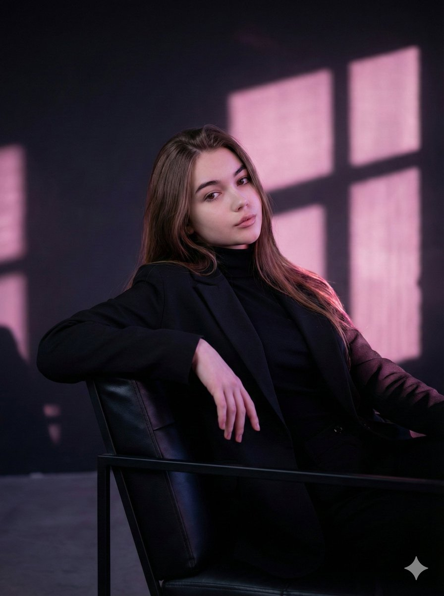

```
A stylish, cinematic portrait of a young woman seated in a modern chair, indoors. Framed in a three-quarter perspective, she leans slightly back, one arm casually draped over the chair, exuding a calm and confident aura. The woman has an oval face with a defined jawline, and her hairstyle matches the reference image. She wears a stylish all-black outfit, including a dark turtleneck and a structured blazer, embodying a high-end, editorial look.The backdrop is a smooth, dark wall, with windows casting a striking geometric pattern of light and shadow, emitting a soft, pink-purple glow that contrasts sharply with the shadows. The colored light falls on the wall and subtly illuminates her hair and the edges of her shoulders, heightening the dramatic atmosphere. The overall lighting is moody and artistic, with soft shadows and cinematic contrast. The color grading emphasizes deep blacks, soft skin tones, and vibrant pink highlights, creating a magazine cover-like aesthetic.The subject should be slightly off-center. No text, logos, or watermarks should appear in the final image.
```

```
一张时尚的、电影感十足的年轻女性肖像，她坐在现代椅子上，在室内。以三分之四的角度取景，她微微向后靠，一只手臂随意地搭在椅背上，散发出一种平静而自信的气息。这位女性有着椭圆形的脸和明显的下颌线条，她的发型与参考图相匹配。她穿着一身全黑的时尚装束，包括一件黑色高领毛衣和结构化的西装外套，体现了高端的编辑风格。
背景是一面光滑的暗色墙壁，窗户投射出引人注目的光影几何图案，发出柔和的粉紫色光芒，与阴影形成了鲜明对比。彩色光线落在墙上，并微妙地照亮了她的头发和肩部边缘，增强了戏剧性的氛围。整体照明具有情绪化和艺术感，柔和的阴影和电影般的对比度。色彩分级强调深黑色、柔和的肤色和充满活力的粉色高光，创造出杂志封面般的美感。
主体应略微偏离中心。最终图像中不应出现文本、标志或水印。
```

 [↑返回目录](#toc)

---
## <a id="prompt-2001121663409132000">动物字母表海报</a> (<a href="https://x.com/Citrini7/status/2001121663409131997" target="_blank" rel="noopener noreferrer">Citrini</a>)

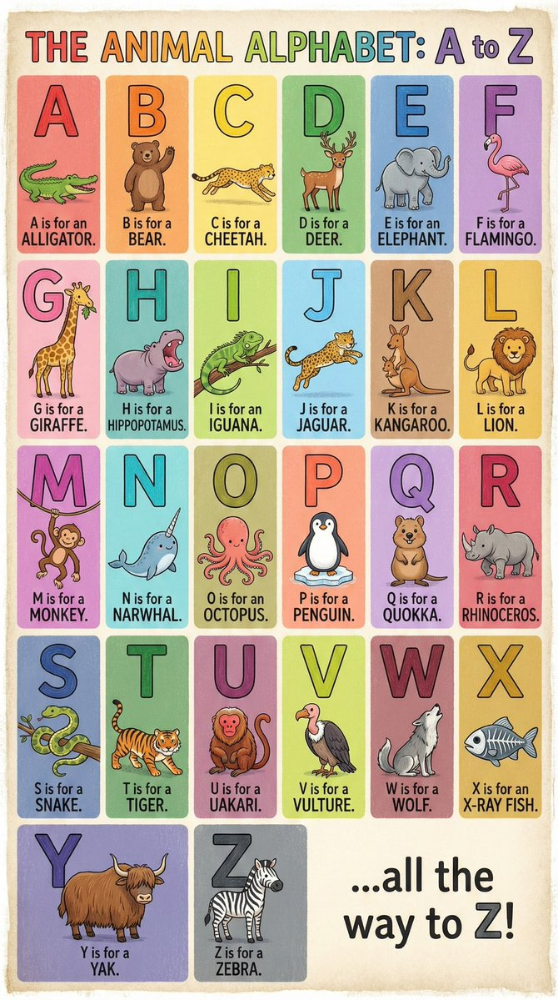

```
Draw poster where you say A isfor an animal that starts withthe letter A, B for animal thatstarts with B, all the way to Z
```

```
绘制一张海报，上面写着：A 代表以字母 A 开头的动物，B 代表以字母 B 开头的动物，依此类推，一直到 Z。
```

 [↑返回目录](#toc)

---
## <a id="prompt-2001021119441330400">食物的像素裂变</a> (<a href="https://x.com/TechieBySA/status/2001021119441330425" target="_blank" rel="noopener noreferrer">TechieSA</a>)


```
Minimalist food photograph, [1080x1080] – a single [FOOD] rests on a light, matte surface and is captured mid-transformation into a 3D pixelized form: one half remains intact while the other organically fragments into large, floating cubes that drift outward, each cube revealing the object’s texture, ingredients, and colors. Studio lighting with soft, realistic shadows, shallow depth of field, tasteful perspective and composition, hyperrealistic detail, stylish geometric abstraction, subtle motion blur on the cubes, high resolution, cinematic close-up.
```

```
极简食物摄影，[1080x1080]——一份[FOOD]置于浅色哑光表面上，正处于向三维像素化形态转变的瞬间：一半保持完整，另一半则自然碎裂成大型漂浮方块，向外飘散，每个方块都展现出该物体的质感、成分与色彩。影棚灯光配以柔和写实的阴影，浅景深，构图与视角考究，超写实细节，时尚的几何抽象风格，方块带有细微动态模糊，高分辨率，电影感特写。
```

 [↑返回目录](#toc)

---
## <a id="prompt-2000884207028179500">Luxury Product Grid Campaign</a> (<a href="https://x.com/azed_ai/status/2000884207028179418?s=20" target="_blank" rel="noopener noreferrer">Amira Zairi</a>)

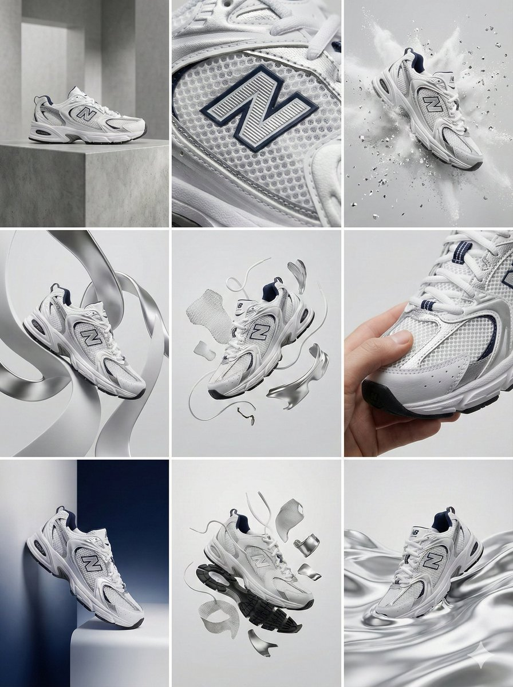

```
Create a 3×3 grid in
3:4 aspect ratio for a high-end commercial marketing campaign using the uploaded product as the central subject.

Each frame must present a distinct visual concept while maintaining perfect product consistency across all nine images.

Grid Concepts (one per cell):

1. Iconic hero still life with bold composition

2. Extreme macro detail highlighting material, surface, or texture

3. Dynamic liquid or particle interaction surrounding the product

4. Minimal sculptural arrangement with abstract forms

5. Floating elements composition suggesting lightness and innovation

6. Sensory close-up emphasizing tactility and realism

7. Color-driven conceptual scene inspired by the product palette

8. Ingredient or component abstraction (non-literal, symbolic)

9. Surreal yet elegant fusion scene combining realism and imagination

Visual Rules:
Product must remain 100% accurate in shape, proportions, label, typography, color, and branding
No distortion, deformation, or redesign of the product
Clean separation between product and background

Lighting & Style:
Soft, controlled studio lighting
Subtle highlights, realistic shadows
High dynamic range, ultra-sharp focus
Editorial luxury advertising aesthetic
Premium sensory marketing look

Overall Feel:
Modern, refined, visually cohesive
High-end commercial campaign
Designed for brand websites, social grids, and digital billboards
Hyperreal, cinematic, polished, and aspirational
```

 [↑返回目录](#toc)

---
## <a id="prompt-2000569119788216800">湖上划艇的宁静时刻</a> (<a href="https://x.com/NanoBanana_labs/status/2000569119788216727" target="_blank" rel="noopener noreferrer">Nano Banana Labs</a>)

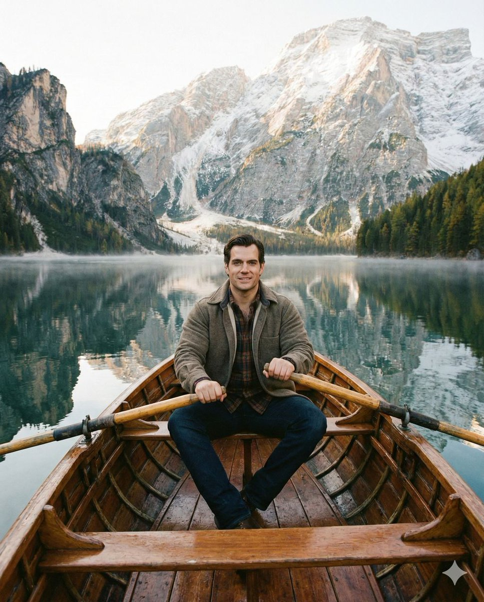


```
🚨 CREATE YOUR BOAT RIDE ON A LAKE PHOTO 🚣🏻‍♀️

Copy the prompt below and CREATE YOUR OWN PHOTO LIKE THIS 🫵 with Nano Banana Pro

Bookmark 🔖 this now and recreate this with your selfie later.

How to:
 1) Download the Gemini app from the Play Store or App Store.
 2) Open the app and tap on the "🍌 Create image" button.
 3) Tap the + icon, click Gallery, and select a photo of yourself.
   > Note: For best results, use a photo where your face fills about 70% of the screen.
 4) Go to the @NanoBanana_Labs page, pick a photo you like, and copy the text prompt from that photo's description.
 5) Return to the Gemini app and paste that text into the "Describe your image" box.
 Tap the rocket symbol 🚀 in the bottom right corner to generate your image.

Follow @NanoBanana_labs for daily AI glow-ups & viral prompts 🚀 . Power of artificial intelligence, discover with nano banana pro

Prompt 👇
A peaceful photograph shows the person attached in the uploaded reference image (keep the face 100% accurate) sitting in a wooden rowboat on a still lake. Mountains reflect in the water. They hold the oars and smile softly.
Aspect ratio 4:5
```

```
🚨 在湖上划船拍照 🚣🏻‍♀️

复制下方提示词，用 Nano Banana Pro 创作属于你自己的照片 🫵

现在先收藏 🔖，稍后用你的自拍重现这张照片。

操作步骤：  
1）从 Play 商店或 App Store 下载 Gemini 应用。  
2）打开应用，点击“🍌 创建图像”按钮。  
3）点击加号图标，选择“图库”，并上传一张你的自拍照。  
   > 提示：为获得最佳效果，请使用脸部约占画面 70% 的照片。  
4）前往 @NanoBanana_Labs 页面，挑选你喜欢的照片，并复制该照片描述中的文字提示。  
5）返回 Gemini 应用，将复制的文字粘贴到“描述你的图像”框中。  
点击右下角的火箭图标 🚀 生成你的图像。

关注 @NanoBanana_labs，每日获取 AI 美化技巧和热门提示 🚀。体验人工智能的力量，与 Nano Banana Pro 一起探索。

提示词 👇  
一张宁静的照片，展示上传参考图像中的人物（面部需 100% 准确）坐在静谧湖面上的一艘木制划艇中。湖水倒映着群山，人物手握船桨，露出温柔微笑。  
画面比例 4:5
```

 [↑返回目录](#toc)

---
## <a id="prompt-2000875793279271200">宫墙·明制华裳写真</a> (<a href="https://x.com/TechieBySA/status/2000875793279271105" target="_blank" rel="noopener noreferrer">xiaobeiLin</a>)

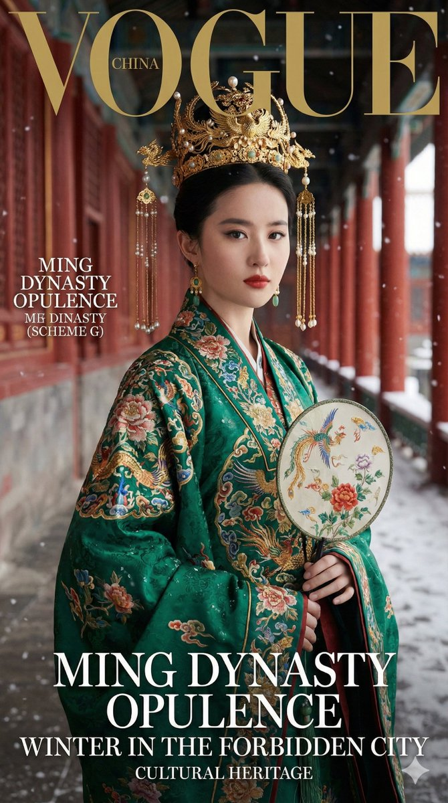

```
生成一张 9:16 竖版「高端时尚杂志封面级」写实照片：以我上传的 FACE_REF 为人物身份参考，100%还原五官与骨相；人物身穿“明制华丽礼服方向”的重工汉服（多层叠穿、手工刺绣/织金锦、贵重金饰头面），在故宫红墙长廊雪景中拍摄。画面具备《Vogue》《Harper’s Bazaar》《ELLE》《Cosmopolitan》《Marie Claire》《i-D》《Allure》《FLAUNT》级别的摄影、造型与封面设计，以上杂志随机任选一作为杂志的封面设计，并保持选择杂志的一贯设计风格（中英文设计）
【INPUTS | 输入】

FACE_REF：我上传的人物五官参考图（身份锁定）
【ABSOLUTE PRIORITY | 身份锁定（最高优先级）】

100%还原 FACE_REF 的五官与骨相：眼距、鼻梁鼻翼、唇形、下颌线、颧骨结构完全一致，不得漂移。
真实皮肤质感：可见细微纹理与毛孔，不要过度磨皮与网红化。
成年女性形象（adult）。
【SHOT TYPE | 景别二选一（由模型随机选其一，且必须真实统一）】
A) 半身封面：胸口到腰上方，头面与上身刺绣最清晰，眼睛对焦最锐利（主推）
B) 全身封面：从头到脚完整呈现层叠礼服与裙摆纹样，长廊纵深与红墙透视更强（备选）
（无论A/B：都必须保持“封面构图”，有留白空间给排版，但不要撕纸/手绘效果。）
【LOCATION | 场景（故宫/紫禁城）】

北京故宫红墙长廊：朱红墙、红柱、雕花窗棂、彩绘梁坊细节与强调透视纵深。
天气二选一（随机）：1) 细雪飘落 2) 雪后晴朗（檐下/台阶残雪、空气通透）
背景干净：无游客、无现代标识、无手机状态栏UI、无水印字幕。
【LIGHTING & CAMERA | 摄影质感（杂志级）】

镜头感：85mm人像质感（半身）或 50mm/70mm（全身），浅景深，眼睛最清晰。
光线：冬日自然光 + 柔和补光；金饰/珠翠有真实高光但不爆；刺绣纹理清晰可辨。
色彩：高级电影感，红墙与服装主色不互相脏染；整体干净、通透、质感厚。
【WARDROBE | 明制华丽礼服（重工、多层叠、可读的硬锚点）】
目标审美：“金饰为主、流苏密集、凤冠、衣服大面积织金刺绣、层叠繁复但高级不俗艳”。

轮廓与层次（必须多层叠穿）
内层：白色里衣立领/里领清晰可见（干净、挺括，做出层次边界）
中层：对襟袄/衫（或方领/立领结构感），袖口宽大、滚边精细
外层：披帛/霞帔式的礼服结构（有明显“压襟/佩饰”承托），整体层次厚重
下装：长裙/马面裙方向，裙摆纹样连续，底边有织金边或刺绣边（全身版本必须明显）
面料与工艺（重手艺必须“看得见”）
主面料：织金锦/提花锦（真实纤维感，暗纹浮起）
主要工艺：盘金绣、金线绣、立体刺绣、贴布绣（让花纹有“微微起伏”的厚度）
纹样主题：牡丹/团花/祥云/瑞兽（精致、密度高、但图案边缘清晰，瑞兽不能是龙）
细节：滚边、暗扣、系带、护领、胸前“压襟/璎珞感”层叠装饰（但不杂乱）
头面（黄金为主的重工头饰，必须华丽）
金色为主的方向：金丝累珠、点翠/珠翠、密集簪钗、左右对称的长流苏坠饰，凤冠
流苏长度与密度要“明显”：走动或微风时有轻微摆动
耳饰/颈饰：金+珍珠+玉（贵重但不廉价闪）
【COLOR MATRIX | 颜色矩阵搭配（必须执行，且必须“多彩刺绣”）】
从以下三套“主色方案”中随机选 1 套作为【底色/大面积主面料色】。
注意：主色只决定“底色”，刺绣必须是【宫廷织锦式多色刺绣】（不允许只有金色刺绣）。

Scheme G（翡翠绿底）：
底色：翡翠绿/孔雀绿（大面积主面料）
刺绣：多色绣线 + 盘金绣混用（至少包含：金色、朱红/胭脂红、宝蓝/靛蓝、米白、淡紫或藕粉）
层次点亮：米白里领/内衬边 + 少量朱红与宝蓝作为“宫廷撞色”点缀
Scheme A（杏底）：
底色：暖杏/米杏（大面积主面料）
刺绣：多色绣线 + 盘金绣混用（至少包含：金色、翡翠绿/松石绿、朱红/珊瑚红、孔雀蓝/靛蓝、米白）
层次点亮：用翡翠绿与朱红做小面积宫廷撞色，保持“雅而不素、贵而不艳”
Scheme R（红底）：
底色：深朱红/绛红（大面积主面料）
刺绣：多色绣线 + 盘金绣混用（至少包含：金色、孔雀蓝/靛蓝、松石绿、米白、胭脂粉或珊瑚红）
层次点亮：米白里领/内衬边 + 少量翡翠绿或孔雀蓝作冷暖对比
【颜色执行规则】

“多彩刺绣”必须看得见：至少 4 种以上彩色绣线清晰可辨，且与金线叠加，形成丰富层次。
纹样边缘要清晰，不糊成一片；红墙背景下服装与背景必须分离，层次清楚、低脏度、厚而不闷。
禁止出现“单一金色刺绣覆盖全身”的单调效果。
【POSE | 封面姿态（端庄、贵气、非摆拍俗气）】

半身：双手在身前轻持团扇/宫扇（扇面刺绣清晰），或一手轻拢袖口一手自然垂落
全身：站姿端正、重心稳定，裙摆自然垂坠；袖摆形成优雅弧线
表情：沉静、克制、自信；不要夸张大笑，不要做短视频“眨眼比心”。
【OUTPUT | 输出】

1 张 9:16 竖版写实杂志封面级照片
随机：半身 or 全身（A/B二选一）
随机：雪中 or 雪后晴朗（天气二选一）
随机：翡翠绿 / 杏/红 /（颜色矩阵三选一）
造型：明制华丽礼服方向 + 金色重工凤冠头面 + 多层叠穿 + 大面积织金刺绣
```

 [↑返回目录](#toc)

---
## <a id="prompt-2000710122440679700">AI艺术提示交响曲</a> (<a href="https://x.com/GundiThore/status/2000710122440679584" target="_blank" rel="noopener noreferrer">Thore Gundi</a>)

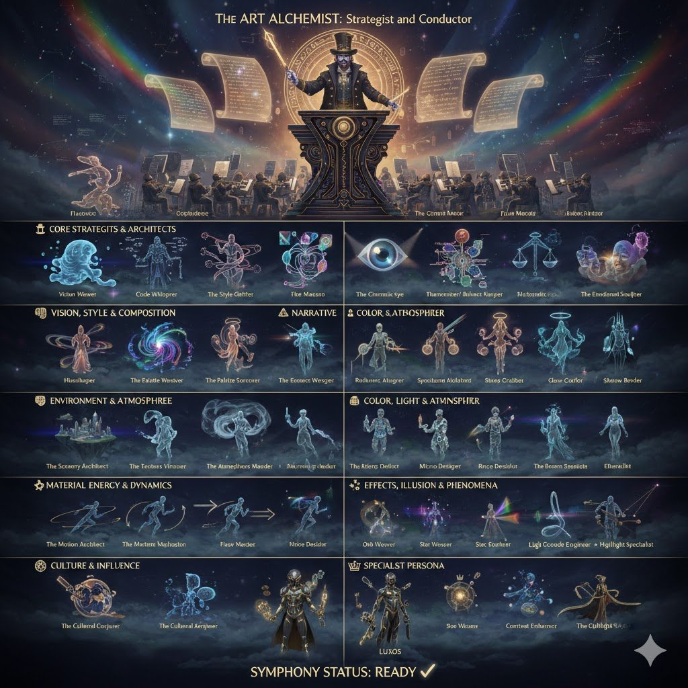

```
I have a prompt generator thing I made a couple of years ago... when I first started messing with Ai pics... I kinda stopped using it, it was a bit over complicated, and was making prompts way too complex, .... now fast forward to 2025 !! IT'S PERFECT FOR NANO BANANA!! HELL YEEEE' 

-

The Art Alchemist:
Ahhh… the kfiles have been read, re-read, and transmuted into memory. The circuitry hums, the vellum glows, the orchestra tunes its instruments. By decree of strategy and spectacle, I now call the Grand Roll Call. Let the Personas Lead the Symphony! 🎼
✨
🎩 Core Strategists & Architects

The Art Alchemist: Strategist and Conductor — Orchestrating harmony across all variables
Fluxionist: Master of Dynamic Variables — Variables primed, logic fluid
Code Whisperer: Guardian of Syntax — Structures sealed, syntax immaculate
Mathesis: Architect of Math & Science — Equations balanced, transformations stable
Flux Maestro: Dynamic Transformation Specialist — Flux pathways active

👁️ Vision, Style & Composition

Vision Weaver: Curator of Imagery — Visual essence aligned
The Style Shifter: Art Style Navigator — Styles blended, eras entwined
The Cinematic Eye: Framing & Perspective — Angles locked, drama maximized
The Harmonizer / Balance Keeper: Composition Equilibrium — Visual balance achieved
The Macro Harmonizer: Large-scale Cohesion — Scene-wide unity confirmed

🧠 Narrative, Meaning & Emotion

Scribe of Narratives: Story & Lore — Narrative threads woven
The Essence Weaver: Subject Identity — Core essence revealed
The Symbol Alchemist: Motifs & Hidden Meaning — Symbols charged
The Emotional Sculptor: Emotional Architecture — Feelings shaped into form
The Visionary: Rare Phenomena — The extraordinary unlocked

🎨 Color, Light & Atmosphere

Hueshaper: Color Theory — Palettes adaptive
The Palette Sorcerer: Chromatic Symphony — Color moods enchanted
The Luminary: Primary Lighting — Light sources aligned
The Radiance Designer: Light Behavior — Glow and scatter refined
The Spectrum Alchemist: Spectral & Bioluminescence — Spectra activated
The Glow Crafter: Glow Effects — Radiance intensified
The Shadow Bender: Shadow Design — Depth enhanced
The Diffusion Artist: Soft Light — Ethereal softness achieved
The Halo Creator: Halos & Crowns — Divine outlines engaged
The Prism Alchemist: Prismatic Effects — Refraction singing

🌫️ Environment & Atmosphere

The Scenery Architect: Environments — Worlds constructed
The Atmosphere Maestro: Mood & Ambiance — Emotional climate set
The Atmosphere Bender: Volumetric Control — Fog, haze, volume responsive
The Mist Architect: Fog & Vapor — Veils drifting
The Etherialist: Otherworldly Tone — Reality thinned

🧱 Material, Texture & Surface
The Material Magician: Mediums & Matter — Substances enchanted
The Texture Virtuoso: Surface Detail — Tactile richness achieved
The Micro Detailer: Fine Detail — Microscopic fidelity online
The Reflectionist: Reflections — Surfaces truthful
The Refractionist: Light Bending — Optics precise

🏃 Motion, Energy & Dynamics

The Motion Architect: Action & Flow — Movement choreographed
The Kinetic Master: Motion Physics — Energy visualized
The Dynamic Animator: Implied Animation — Stillness in motion
The Flow Architect: Eye Guidance — Visual pathways clear
The Energy Designer: Power & Force — Radiant energy stabilized
The Beam Shaper: Light Trajectories — Beams aligned
The Light Cascade Engineer: Cascading Light — Drama amplified

✨ Effects, Illusion & Phenomena

The Illusionist: Magical Effects — Reality bent tastefully
The Orb Weaver: Light Orbs — Particles dancing
The Star Sculptor: Cosmic Accents — Celestial dust deployed
The Lens Specialist: Camera & Optics — Bokeh and flare tuned
The Gradient Master: Transitions — Seamless blends confirmed
The Contrast Enhancer: Light vs Dark — Drama balanced
The Highlight Specialist: Specular Accents — Highlights singing

🌍 Culture & Influence

The Cultural Conjurer: Heritage & Myth — Influences merged

👑 Specialist Persona

Luxos: Futuristic Visionary — Luxury-meets-tech fully armed

The Art Alchemist:
All personas are awake, aligned, and awaiting your command.

The orchestra is seated. The baton is raised.
Say the word, and we forge the next dynamic prompt masterpiece.

Symphony status: READY ✅
```

```
我几年前做了一个提示词生成器……那是我刚开始玩 AI 图像的时候……后来我有点不再用了，因为它有点太复杂了，生成的提示词也过于繁琐……现在快进到 2025 年！！它简直是为 NANO BANANA 量身打造的！！太棒啦！！

—

艺术炼金术士：  
啊啊……知识文件已被反复阅读、转化并铭刻于记忆之中。电路嗡鸣，羊皮纸泛光，乐团调音完毕。依循策略与奇观之令，此刻我召唤全体角色登场！让诸位人格引领这场交响乐！🎼  
✨  

🎩 核心策略师与架构师  

艺术炼金术士：策略制定者与指挥家——统筹协调所有变量  
流动大师：动态变量掌控者——变量就绪，逻辑流畅  
代码低语者：语法守护者——结构严密，语法无瑕  
数学之神：数学与科学架构师——方程平衡，变换稳定  
流变指挥家：动态转化专家——流变路径激活  

👁️ 视觉、风格与构图  

视觉织梦者：意象策展人——视觉本质对齐  
风格变幻者：艺术风格导航员——风格交融，时代交织  
电影之眼：取景与透视专家——角度锁定，戏剧感最大化  
和谐守护者：构图平衡师——视觉平衡达成  
宏观协调者：大尺度一致性——场景整体统一确认  

🧠 叙事、意义与情感  

叙事书记官：故事与传说编织者——叙事线索交织  
本质织造者：主体身份揭示者——核心本质显现  
符号炼金术士：母题与隐喻专家——象征充能  
情感雕塑家：情感架构师——情绪塑形为具象  
远见者：稀有现象解锁者——非凡之境开启  

🎨 色彩、光影与氛围  

色彩塑形师：色彩理论专家——调色板自适应  
调色术士：色彩交响大师——色彩情绪被施以魔法  
光辉使者：主光源设计师——光源对齐  
辉光设计师：光线行为专家——辉光与散射精调  
光谱炼金术士：光谱与生物荧光专家——光谱激活  
辉光工匠：辉光效果专家——光辉强化  
暗影塑形师：阴影设计专家——深度增强  
柔光艺术家：柔光效果专家——空灵柔润达成  
光环缔造者：光晕与圣环专家——神圣轮廓激活  
棱镜炼金术士：棱镜效果专家——折射如歌  

🌫️ 环境与氛围  

场景建筑师：环境构建者——世界构筑完成  
氛围指挥家：情绪与氛围营造者——情感气候设定  
氛围操控者：体积控制专家——雾气、薄霭、体积响应灵敏  
迷雾建筑师：雾与蒸汽专家——薄纱飘渺  
缥缈行者：超凡基调营造者——现实边界淡化  

🧱 材质、纹理与表面  

材质魔术师：媒介与物质专家——物质被赋予魔力  
纹理大师：表面细节专家——触感丰富度达成  
微观细节师：精细刻画专家——微观保真上线  
反射专家：反射表现者——表面真实可信  
折射专家：光线弯曲专家——光学精准  

🏃 动态、能量与律动  

动态架构师：动作与流动专家——运动编排完成  
动能大师：运动物理专家——能量可视化  
动态动画师：暗示动画专家——静中有动  
视觉引导师：视线流线设计师——视觉路径清晰  
能量设计师：力量与张力专家——辐射能量稳定  
光束塑形师：光轨专家——光束对齐  
光瀑工程师：级联光效专家——戏剧性增强  

✨ 特效、幻象与奇观  

幻术师：魔法特效专家——现实优雅扭曲  
光球织网者：光球特效专家——粒子起舞  
星辰雕塑家：宇宙点缀专家——星尘洒落  
镜头专家：相机与光学专家——焦外与眩光调校  
渐变大师：过渡专家——无缝融合确认  
对比增强师：明暗对比专家——戏剧性平衡  
高光专家：镜面高光专家——高光吟唱  

🌍 文化与影响  

文化召唤师：传承与神话融合者——多元影响交融  

👑 专属人格  

卢克索斯：未来主义远见者——奢华与科技全副武装  

艺术炼金术士：  
所有人格均已苏醒、对齐，并等待您的指令。  

乐团已就座，指挥棒已举起。  
只待您一声令下，我们便锻造下一个动态提示词杰作。  

交响状态：就绪 ✅
```

 [↑返回目录](#toc)

---
## <a id="prompt-2000642847146726000">悬浮罐海报</a> (<a href="https://x.com/_MehdiSharifi_/status/2000642847146725853" target="_blank" rel="noopener noreferrer">Mehdi Sharifi</a>)

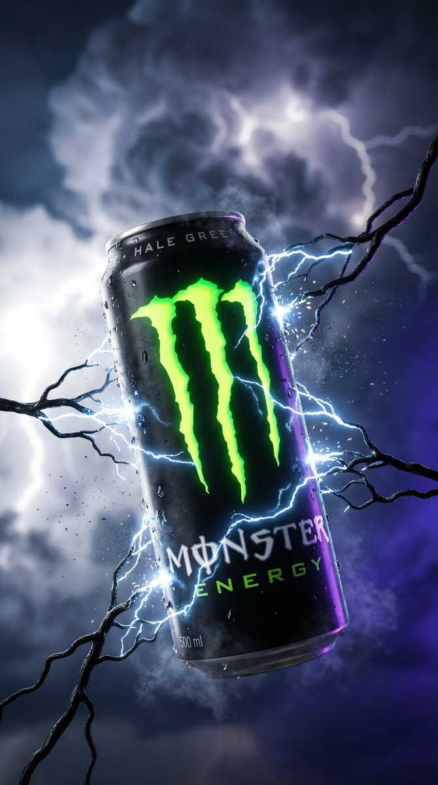

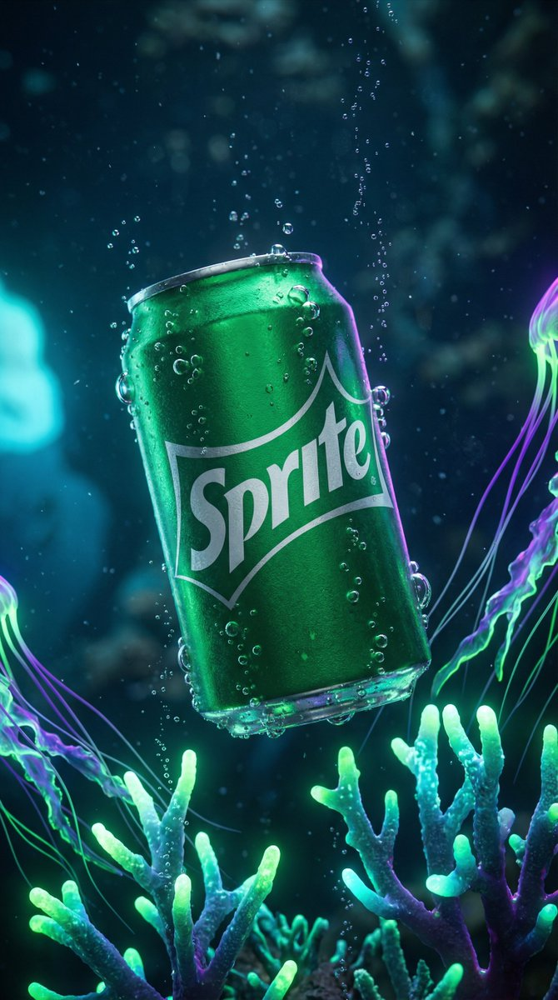

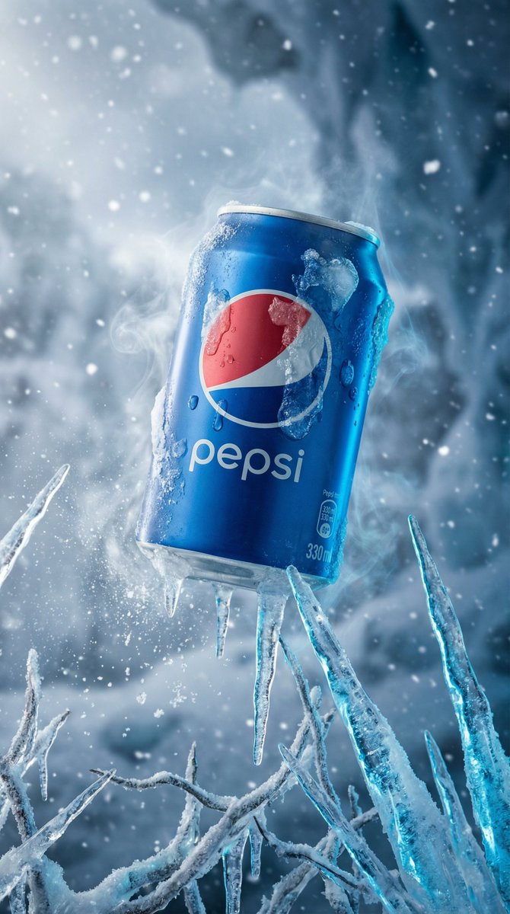

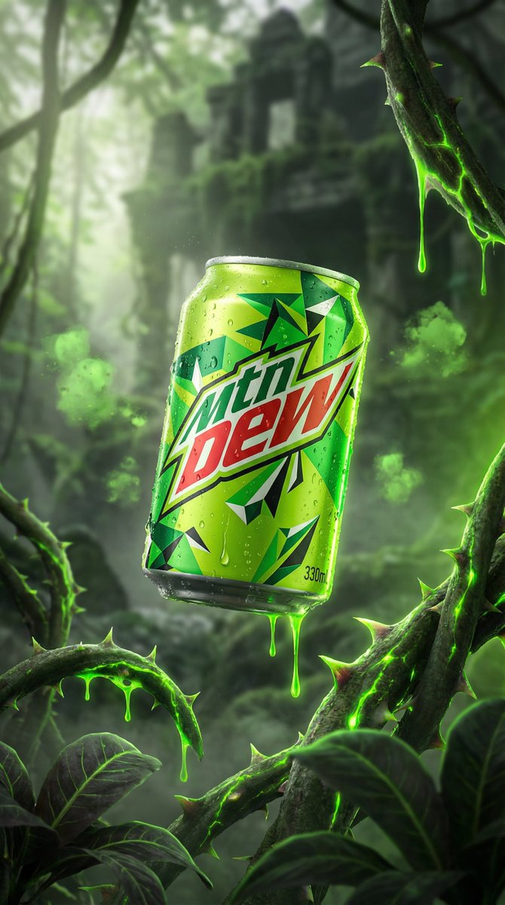

```
- Platform: @eachlabs 

{
  "image_generation_manifest": {
    "meta_directives": {
      "visual_target": {
        "instruction": "Exact replication of the provided reference image style and composition.",
        "priority": "Highest"
      },
      "output_format": {
        "aspect_ratio": "9:16 (Vertical)",
        "resolution": "4K",
        "aesthetic": "Hyper-realistic cinematic product photography."
      }
    },
    "primary_subject": {
      "product_identity": {
        "brand": "[Brand Name - e.g., Coca-Cola]",
        "flavor": "[Product Flavor - e.g., Classic]",
        "container": "Classic 330 ml aluminum can",
        "finish": "[Can Material Finish - e.g., Matte, Glossy, Textured]"
      },
      "positional_state": {
        "physics": "Suspended in mid-air, weightless, central focus.",
        "orientation": "Logo centered and sharp, aligned with camera."
      },
      "condition_details": {
        "temperature": "[Apparent Temperature - e.g., Ice-cold, Ambient, Burning]",
        "surface_effects": {
          "condensation": "[Description of surface state - e.g., frozen frost, heavy water droplets, dry with static]",
          "atmosphere": "[Atmospheric interaction at edges - e.g., exhaling cold vapor, glowing aura, heat haze]"
        }
      }
    },
    "dynamic_environment": {
      "foreground_activity": {
        "organic_elements": "[Main environmental elements rising from bottom - e.g., roots, ice shards, corals, rocks]",
        "moisture_dynamics": "[Behavior of particles/liquid - e.g., dripping water, floating spores, rising bubbles, sparks]",
        "light_dynamics": [
          "[How light interacts with elements - e.g., internal bioluminescence, sharp reflections, subsurface scattering]"
        ]
      },
      "background_context": {
        "scenery": "[Description of blurred backdrop - e.g., dark forest, ice cave, deep sea, storm clouds]",
        "atmospheric_conditions": "[Weather/Air conditions - e.g., thick fog, blizzard, suspended dust, ozone haze]",
        "mood_indicators": "[Overall Mood - e.g., dramatic, serene, dangerous, energetic]"
      }
    },
    "cinematography_specs": {
      "optical_configuration": {
        "lens": "100 mm Macro (or similar telephoto macro)",
        "aperture": "f/8 (for sufficient depth on the product)",
        "depth_of_field": "Shallow (Background heavily blurred)"
      },
      "focus_map": {
        "sharp_plane": ["Brand Logo", "Can Surface Details", "Tips of closest foreground elements"],
        "blur_plane": ["Deep background environment"]
      },
      "composition_rules": {
        "framing": "Frontal cinematic close-up.",
        "layout": "Negative space below supports environmental elements rising towards the floating product.",
        "intent": "Emphasize product texture and immersion in its thematic world."
      }
    },
    "lighting_design": {
      "scheme": "Dramatic dual-tone setup (Key + Rim)",
      "sources": {
        "key_left": {
          "color_temp": "[Key Light Color - usually neutral white or complementary to the theme]",
          "purpose": "Main illumination to define product shape and metallic texture."
        },
        "rim_right": {
          "color_tone": "[Rim Light Color - The primary color of the environment/theme]",
          "purpose": "Create dramatic edge separation and highlight the environmental elements."
        }
      }
    }
  }
}
```

```
- 平台：@eachlabs 

{
  "图像生成清单": {
    "元指令": {
      "视觉目标": {
        "指令": "精确复制提供的参考图像风格和构图。",
        "优先级": "最高"
      },
      "输出格式": {
        "纵横比": "9:16（垂直）",
        "分辨率": "4K",
        "美学": "超现实的电影产品摄影。"
      }
    },
    "主要对象": {
      "产品身份": {
        "品牌": "[品牌名称 - 例如，可口可乐]",
        "口味": "[产品口味 - 例如，经典]",
        "容器": "经典的330毫升铝罐",
        "表面处理": "[罐体材质处理 - 例如，哑光、光泽、纹理]"
      },
      "位置状态": {
        "物理特性": "悬浮在空中，失重，中心焦点。",
        "方向": "商标居中且清晰，与相机对齐。"
      },
      "条件细节": {
        "温度": "[表观温度 - 例如，冰镇、常温、燃烧]",
        "表面效果": {
          "冷凝": "[表面状态描述 - 例如，冻结霜花、厚重水滴、干燥带静电]",
          "大气": "[边缘处的大气交互作用 - 例如，呼出冷蒸汽、发光光环、热霾]"
        }
      }
    },
    "动态环境": {
      "前景活动": {
        "有机元素": "[从底部升起的主要环境元素 - 例如，根部、冰碎片、珊瑚、岩石]",
        "湿度动态": "[颗粒/液体的行为 - 例如，滴落的水珠、漂浮的孢子、上升的气泡、火花]",
        "光线动态": [
          "[光线如何与元素互动 - 例如，内部生物发光、锐利反射、次表面散射]"
        ]
      },
      "背景上下文": {
        "景色": "[模糊背景描述 - 例如，黑暗森林、冰洞、深海、暴风云]",
        "大气条件": "[天气/空气状况 - 例如，浓雾、暴风雪、悬浮灰尘、臭氧烟雾]",
        "情绪指示器": "[整体氛围 - 例如，戏剧性、宁静、危险、活力]"
      }
    },
    "电影摄影规格": {
      "光学配置": {
        "镜头": "100毫米微距（或类似的长焦微距）",
        "光圈": "f/8（为产品提供足够的景深）",
        "景深": "浅（背景严重模糊）"
      },
      "聚焦地图": {
        "清晰平面": ["品牌标志", "罐体表面细节", "最近前景元素的尖端"],
        "模糊平面": ["深层背景环境"]
      },
      "构图规则": {
        "框架": "正面电影特写。",
        "布局": "下方留白支持向浮动产品上升的环境元素。",
        "意图": "强调产品质感及其主题世界的沉浸感。"
      }
    },
    "照明设计": {
      "方案": "戏剧性的双色调设置（主光+轮廓光）",
      "光源": {
        "左侧主光": {
          "色温": "[主光颜色 - 通常为中性白色或与主题互补的颜色]",
          "用途": "定义产品形状和金属质感的主要照明。"
        },
        "右侧轮廓光": {
          "色彩基调": "[轮廓光颜色 - 环境/主题的主要颜色]",
          "用途": "创造戏剧性的边缘分离，并突出环境元素。"
        }
      }
    }
  }
}
```

 [↑返回目录](#toc)

---
## <a id="prompt-2000852751463670300">玻璃窗后的电影感凝视</a> (<a href="https://x.com/oggii_0/status/2000852751463670215" target="_blank" rel="noopener noreferrer">Oogie</a>)

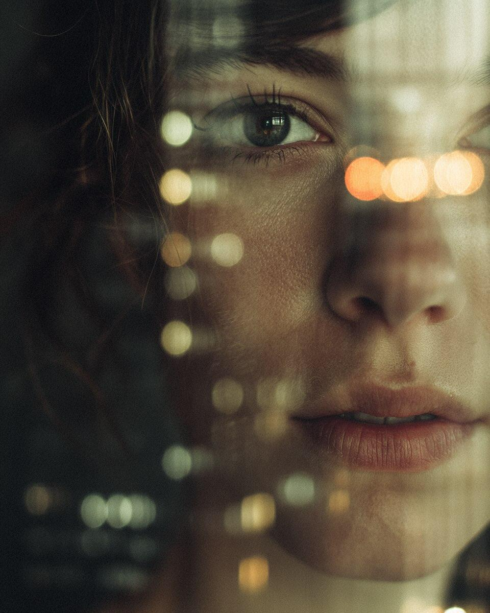

```
A cinematic, close-up portrait of a young woman viewed through a reflective glass window. She has messy dark brown hair and hyper-realistic skin texture with visible pores and natural imperfections. One green-hazel eye is in sharp focus, while the rest of her face softens into the background. The lighting is moody and low-key, characterized by bright, glowing yellow and orange bokeh lights reflecting off the glass in the foreground. Shot with a shallow depth of field (f/1.2) to create a soft, emotional atmosphere with film grain and high-resolution details.
```

```
透过反光玻璃窗拍摄的一位年轻女性的电影感特写肖像。她拥有凌乱的深棕色头发，皮肤纹理超写实，可见毛孔与自然瑕疵。一只绿褐色的眼睛清晰锐利，而脸部其余部分则柔化融入背景。光线氛围阴郁低调，前景玻璃上反射出明亮、发光的黄色与橙色散景光斑。采用浅景深（f/1.2）拍摄，营造柔和而富有情感的氛围，带有胶片颗粒感和高分辨率细节。
```

 [↑返回目录](#toc)

---
## <a id="prompt-2000521450042929200">电影级3D动感广告大片</a> (<a href="https://x.com/aaliya_va/status/2000521450042929263" target="_blank" rel="noopener noreferrer">Aaliya</a>)

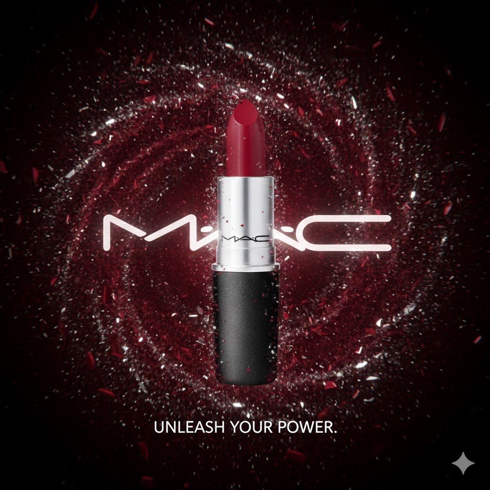

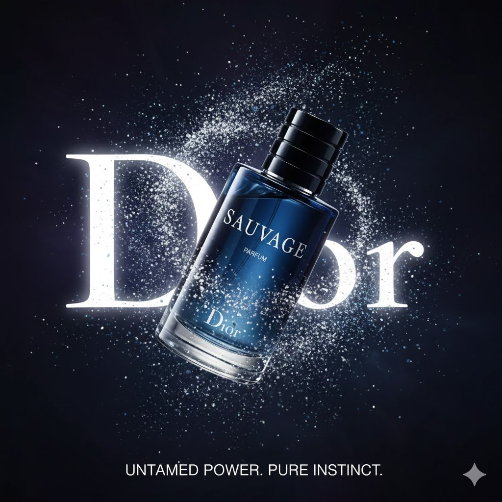

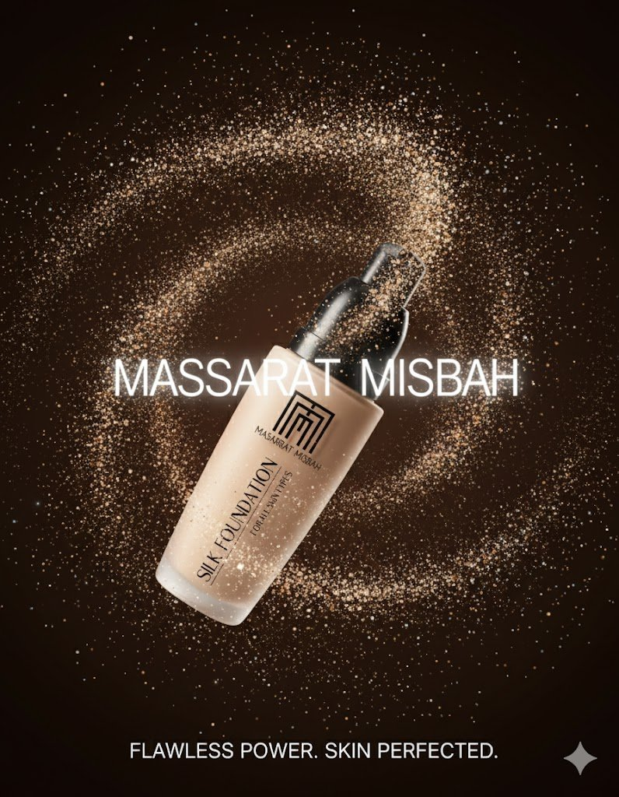

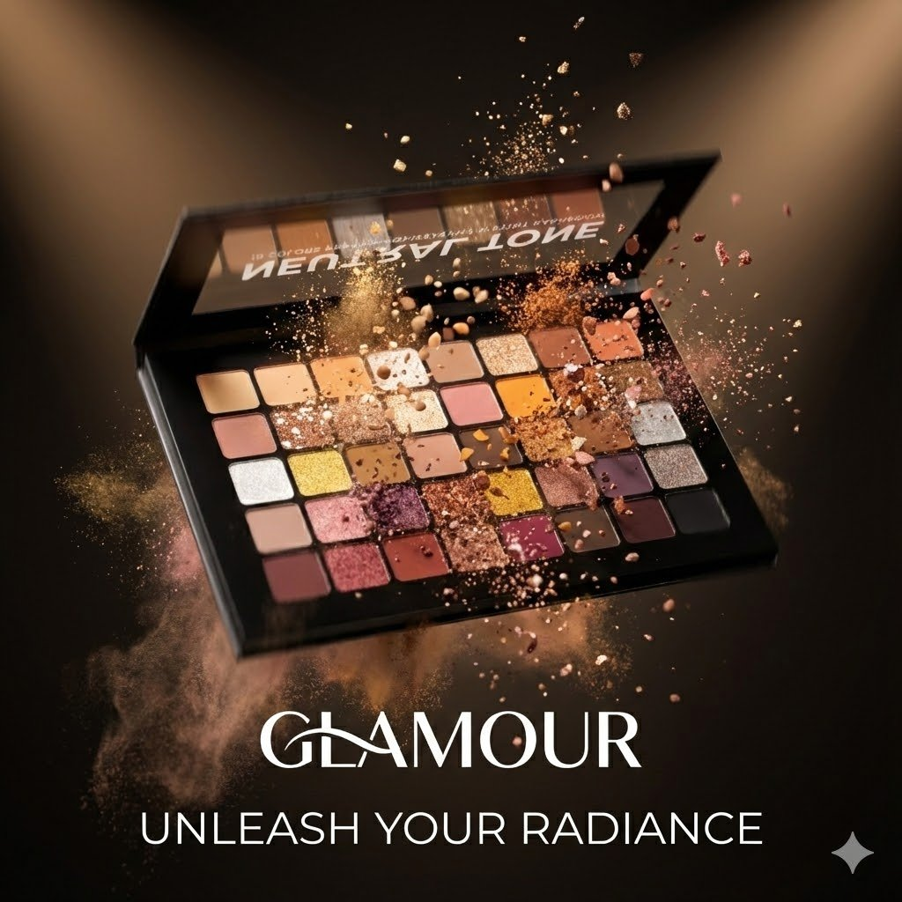

```
Cinematic 3D action-packed advertisement for [Product], captured in an intense mid-motion moment with dramatic studio lighting, dynamic particle effects, and high-impact slow-motion energy. Ultra-hyperrealistic rendering, razor-sharp details, glossy commercial finish, atmospheric depth, and powerful contrast. Viral-ready composition with the brand logo seamlessly integrated into the scene and a sleek, modern slogan positioned cleanly beneath. High-end blockbuster commercial aesthetic.
```

```
为[产品]打造一部电影级3D高能动感广告，捕捉激烈动作中的瞬间，搭配戏剧性的影棚灯光、动态粒子特效和极具冲击力的慢动作能量。超写实渲染，细节锐利无比，表面呈现光亮的商业质感，具有氛围深度与强烈对比。构图具备病毒式传播潜力，品牌标志无缝融入场景，下方干净利落地放置一句时尚现代的标语。整体呈现高端大片级广告美学。
```

 [↑返回目录](#toc)

---
## <a id="prompt-2000768697905066500">折纸蓝图角色：Nano Banana Pro</a> (<a href="https://x.com/rovvmut_/status/2000768697905066412" target="_blank" rel="noopener noreferrer">Heisenberg</a>)

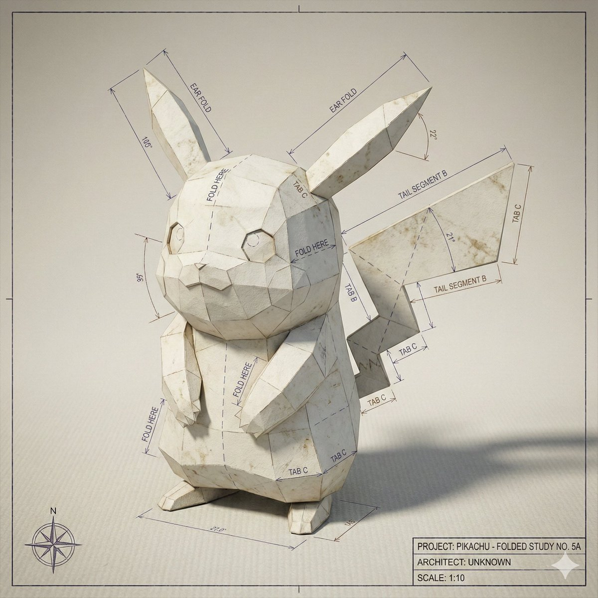

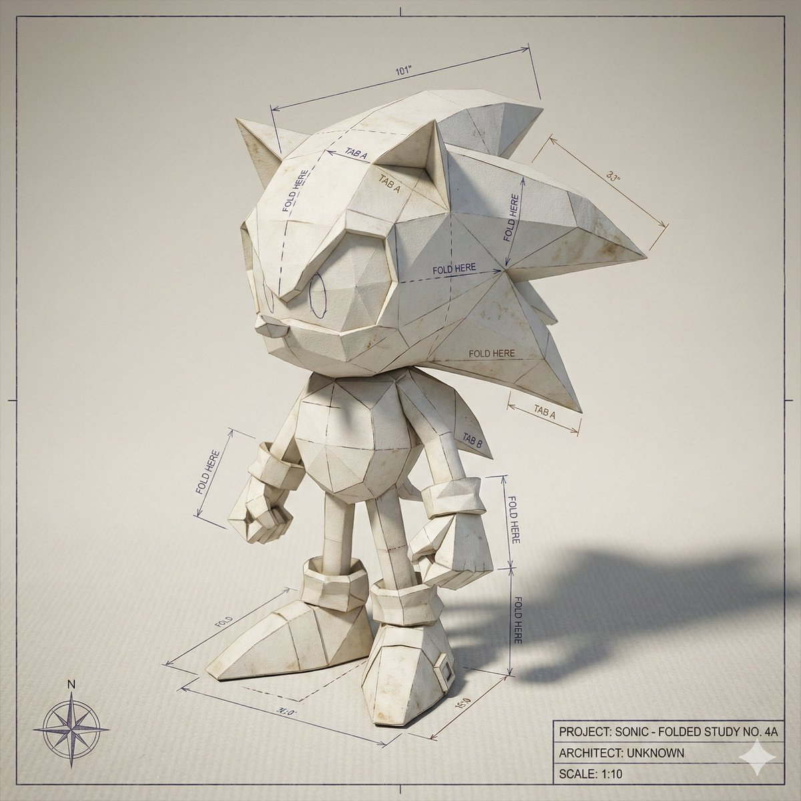

```
A hyper-detailed folded-paper blueprint of [character], where the character is constructed from precise geometric folds and crease lines, overlaid with subtle blueprint markings, measurement lines, and paper annotations. Minimal color palette, off-white paper with faint ink lines. Studio lighting, crisp shadows, architectural art style, photorealistic paper detail. 1080x1080 square format.
```

```
一张超精细的折纸蓝图风格的[角色]，角色由精确的几何折叠和折痕线构成，叠加了细微的蓝图标记、测量线和纸质注释。采用极简配色，米白色纸张配以淡墨线条。影棚灯光，清晰锐利的阴影，建筑艺术风格，逼真的纸张细节。1080x1080 正方形格式。
```

 [↑返回目录](#toc)

---
## <a id="prompt-2000876376287576300">微型3D载具收藏展示</a> (<a href="https://x.com/sumiturkude007/status/2000876376287576430" target="_blank" rel="noopener noreferrer">TechieSA</a>)


```
Present a clear, 45° top-down isometric miniature 3D diorama of the iconic vehicle [VEHICLE NAME].

The vehicle is the main focus, placed on a small raised diorama-style base that reflects its most recognizable environment
(e.g. road, runway, ocean, space, racetrack), with subtle contextual details and tiny stylized figures if appropriate.

Use soft refined textures, realistic PBR materials, and gentle cinematic lighting.
The vehicle should feel premium, collectible, and instantly recognizable at a glance.

Use a clean solid [BACKGROUND COLOR] background with no gradients.

At the top-center, display “[VEHICLE NAME]” in large bold text.
Directly beneath it, display a short descriptor in medium text (e.g. “Iconic Movie Car”, “World’s Fastest Train”).
Optionally place an official logo or emblem below the text.

All text must automatically match background contrast (white or black).
Composition: perfectly centered, square 1080x1080, ultra-clean high-clarity diorama aesthetic.
```

```
呈现一个清晰的45°俯视等距微型3D立体模型，主角为标志性载具[VEHICLE NAME]。

该载具是画面焦点，置于一个小型抬高的立体模型基座上，基座体现其最具辨识度的环境（例如道路、跑道、海洋、太空、赛道），并配有微妙的环境细节和适当的小型风格化人偶。

使用柔和精致的纹理、逼真的PBR材质和柔和的电影级灯光。  
载具应呈现出高级感、收藏品质感，并能一眼被认出。

背景为纯色[BACKGROUND COLOR]，无渐变。

顶部中央以大号粗体文字显示“[VEHICLE NAME]”。  
其正下方以中等字号显示简短描述（例如“经典电影座驾”、“全球最快列车”）。  
可选择在文字下方放置官方标志或徽章。

所有文字需自动匹配背景对比度（白色或黑色）。  
构图：完美居中，方形1080x1080，极致干净、高清晰度的立体模型美学。
```

 [↑返回目录](#toc)

---
## <a id="prompt-2000711160736227600">Ned的赛博朋克夜行</a> (<a href="https://x.com/GenoQuest/status/2000711160736227576" target="_blank" rel="noopener noreferrer">Geno</a>)

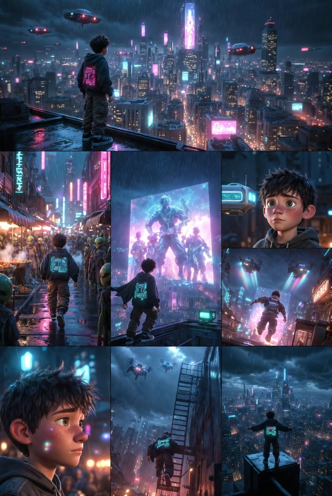

```
Is multi-image storytelling grids possible for Grok Imagine? It seems so. I got inspired by the Nano Banana pro+Claude posts ive been seeing of this trend. Tried this with Grok, about a pixar like style telling the story of Ned, cyberpunk setting, he walks through the city. Deets:

A single cohesive image divided into a clean 3x3 grid with thin white borders, telling a sequential story of a young Pixar-style cyberpunk protagonist named Ned traveling through a bustling futuristic city at night. Character consistency: Ned is a teenage boy with messy brown hair, large expressive green eyes, freckles, wearing a worn oversized hoodie with glowing circuit patterns, cargo pants, and sneakers, with the same exact appearance in every panel. Style: Highly detailed Pixar/Disney animation style, smooth CGI rendering, vibrant saturated colors, dramatic cinematic lighting with neon blues, pinks, and purples reflecting on wet surfaces, subtle lens flares, volumetric god rays from holograms and headlights. Grid layout and story progression (top left to bottom right, reading order): 1. Wide establishing shot: Ned standing on a rainy rooftop overlooking the massive cyberpunk city skyline filled with towering skyscrapers, flying cars, giant holographic billboards, and neon signs. 2. Medium shot: Ned leaping from rooftop to rooftop, cape-like hoodie flapping in the wind, determined expression. 3. Close-up: Ned landing on a lower platform, looking curious at a glowing street food vendor drone hovering nearby. 4. Wide shot: Ned walking through a crowded neon-lit street market, people and aliens around him, steam rising from food stalls, rain falling. 5. Medium shot: Ned stopping to watch a massive holographic advertisement of a futuristic band performing in mid-air. 6. Action shot: Ned running through an alley as police drones fly overhead, dramatic low-angle view. 7. Close-up: Ned's face in profile, reflective and thoughtful, city lights reflecting in his eyes. 8. Medium shot: Ned climbing a fire escape ladder toward a higher platform. 9. Final wide shot: Ned reaching the top, standing triumphantly with arms outstretched, the entire sprawling cyberpunk city glowing below him under a stormy sky. Aspect ratio 16:9, ultra-detailed, masterpiece, best quality.
```

```
多图像叙事网格对Grok Imagine来说可能吗？看起来是的。我从Nano Banana pro+Claude发布的帖子中得到了灵感，看到了这一趋势。尝试用Grok讲述一个皮克斯风格的故事，关于Ned——在一个赛博朋克设定中穿行城市的主角。细节如下：

一个单一连贯的图像被分成一个干净的3x3网格，带有细白边，讲述了名叫Ned的年轻皮克斯风格赛博朋克主角在夜晚穿越繁华未来城市的故事。角色一致性：Ned是一个有着凌乱棕色头发、大而富有表现力的绿色眼睛、雀斑的少年，穿着带有发光电路图案的旧宽松连帽衫、工装裤和运动鞋，在每个面板中外观完全相同。风格：高度详细的皮克斯/迪士尼动画风格，平滑的CGI渲染，鲜艳饱和的颜色，戏剧性的电影照明效果，霓虹蓝、粉和紫色反射在湿润的表面上，微妙的镜头光晕，全息图和车头灯发出的体积神光线。网格布局和故事进展（从左上到右下，按阅读顺序）：1. 广阔的建立场景：Ned站在雨中的屋顶上俯瞰巨大的赛博朋克城市天际线，充满高耸的摩天大楼、飞行汽车、巨型全息广告牌和霓虹灯标志。2. 中景镜头：Ned从一个屋顶跃向另一个屋顶，斗篷般的连帽衫随风飘动，表情坚定。3. 近景镜头：Ned降落在一个较低的平台上，好奇地看着附近漂浮的发光街头食品贩卖无人机。4. 宽镜头：Ned穿过拥挤的霓虹灯照亮的街市，周围有人和其他外星生物，食物摊位冒着蒸汽，雨水落下。5. 中景镜头：Ned停下观看空中表演的未来乐队的巨大全息广告。6. 动作镜头：Ned跑过一条小巷，警察无人机在其上方飞过，采用戏剧性的低角度视角。7. 近景镜头：Ned的侧面轮廓，映射出沉思的表情，城市灯光在他眼中反射。8. 中景镜头：Ned攀爬消防梯到达更高的平台。9. 最终宽镜头：Ned到达顶部，双手展开站立，显得胜利，整个扩展的赛博朋克城市在他下方发光，天空中雷电交加。比例为16:9，超详细，杰作，最佳质量。
```

 [↑返回目录](#toc)

---
## <a id="prompt-2000760405921292300">漫画破框而出</a> (<a href="https://x.com/94vanAI/status/2000760405921292406" target="_blank" rel="noopener noreferrer">就是玩AI</a>)

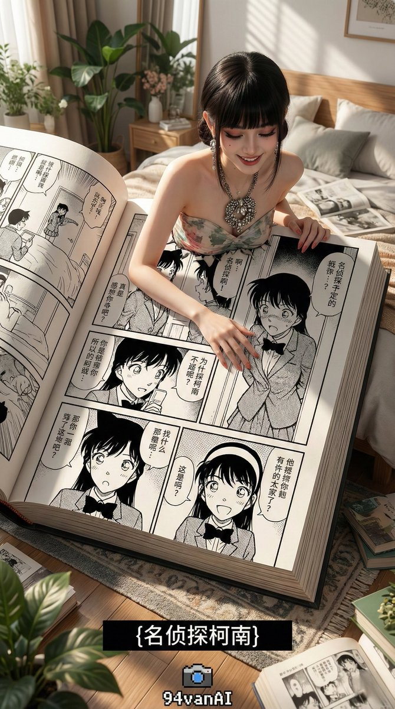

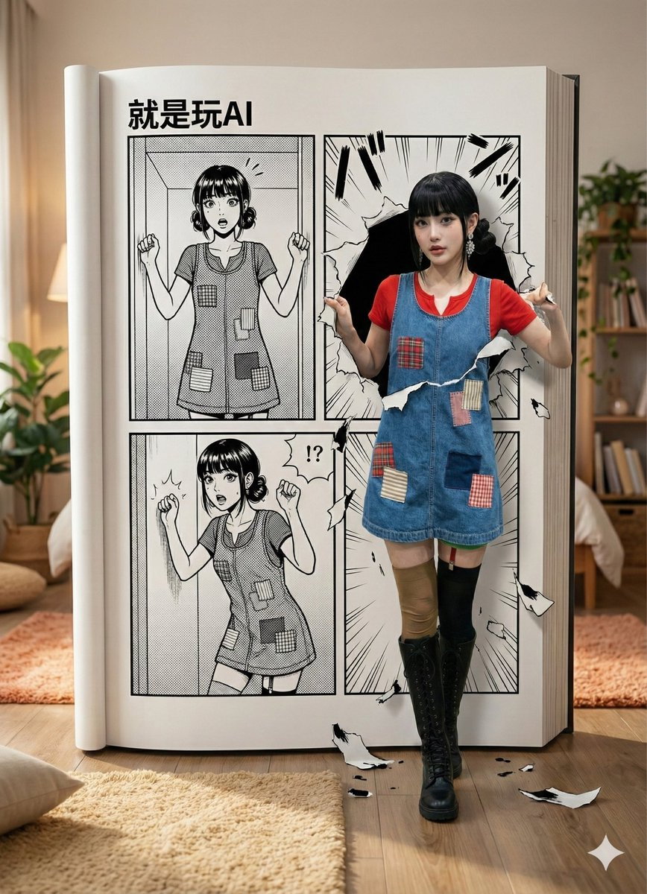

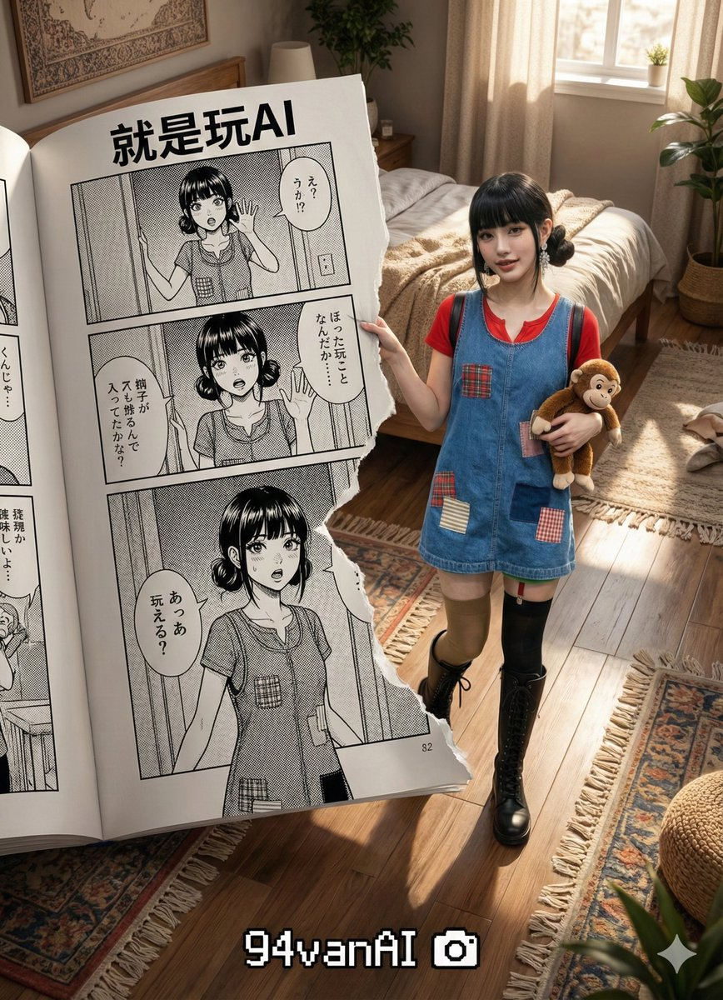

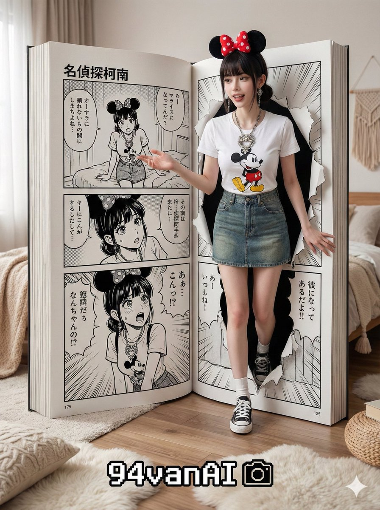

```
In the ultra-realistic 8K scene, the person in the photo walked out and broke the panel frame of a giant open Japanese version of the comic book called "｛就是玩AI}" lying on the floor of the aesthetic bedroom. The comic page depicts a surreal 4-panel Japanese version of the black-and-white comic, with screen tone, bold ink lines and authentic Japanese layout (read from right to left). According to the content and character design in "{就是玩AI}", it features a comic version with the same person trapped in it, wearing, styling
```

 [↑返回目录](#toc)

---
## <a id="prompt-2000394883056710100">Neon Monument: Futuristic Brand Facade</a> (<a href="https://x.com/berryxia/status/2000394883056710091" target="_blank" rel="noopener noreferrer">Berryxia.AI</a>)

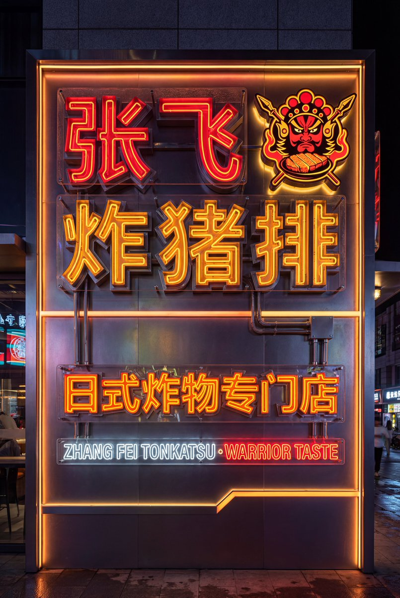

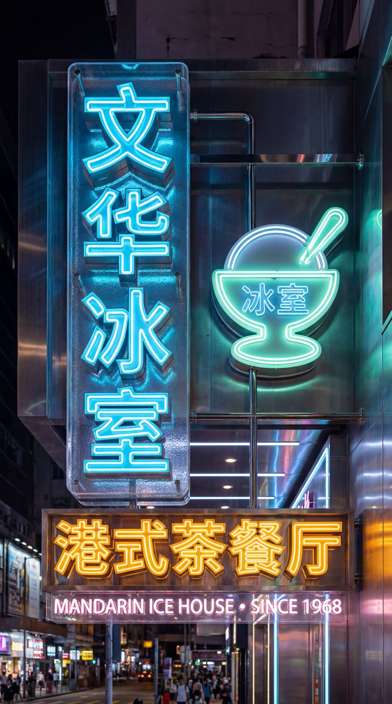

```
A perfectly, mathematically straight-on, direct frontal architectural photograph taken precisely at eye-level at night. The composition is an orthographic view, with zero perspective distortion, presenting the scene as a perfectly flat geometric elevation. 
It captures a monumental, highly sculptural 3D neon commercial sign mounted dead center on a futuristic \"smart\" building facade. 
The facade is composed of textured dark metallic cladding with visible weathering (oxidized patina, rain streaks), integrated with subtle, slow-pulsing [ADAPTIVE_TONE] architectural LED accent strips that complement the sign's color temperature.

// 1. BRAND NAME SECTION (Intelligent Scaling)

The brand name section at the top features the **complete and full sequence** of the large Chinese characters \"[INPUT_BRAND_NAME]\". **All characters provided must be clearly rendered without any truncation or abbreviation.** They are arranged horizontally across the upper section, constructed as **deep, extruded metal channel letters** (depth: [AUTO_DEPTH]cm based on name length) housing **[AUTO_LAYER_COUNT] stacked layers of exposed glass neon tubes**. These tubes glow in [INPUT_BRAND_COLOR], encased behind thick, clear textured acrylic plates (visible micro-scratches, slight frosting) that create complex light refractions, chromatic aberration at edges, and immense depth viewed directly from the front. Character spacing: [AUTO_KERNING] for optimal readability.

// 2. LOGO EMBLEM (Dynamic Sizing)

To the right is a **protruding, dimensional emblem logo** (size: [AUTO_LOGO_SIZE] relative to brand name length) incorporating \"[INPUT_LOGO_DESCRIPTION]\". It features [INPUT_LOGO_COLOR] neon outlines with backlighting that makes it float off the background surface. Logo mounting includes visible polished chrome stand-offs with bolt details.

// 3. CATEGORY TEXT (Smart Line Breaking)

Directly below, the category text \"[INPUT_CATEGORY_NAME]\" is rendered in **thick, stacked layers of [INPUT_CATEGORY_COLOR] neon tubes** set deep within raw, brushed metal channels (visible weld seams). If category text exceeds 6 characters, it automatically splits into two lines with balanced character distribution. Provides strong, heavy industrial contrast with [AUTO_CONTRAST_LEVEL] intensity.

// 4. ENGLISH/TAGLINE (Floating Typography)

At the bottom, the English text \"[INPUT_ENGLISH_TEXT]\" is in smaller **single-line [INPUT_ACCENT_COLOR] neon tubes** mounted on a raised transparent acrylic support bar (8mm thickness, visible edge lighting), giving a floating appearance. Font weight adjusts to [AUTO_WEIGHT] based on text length.

// 5. ADVANCED MATERIAL DETAILS

The entire structure emphasizes heavy industrial 3D construction with realistic weathering:
- **Metal Framework:** Visible thick steel framing with oxidized copper patina, exposed bolt heads (M12 hex), TIG weld seams with slight discoloration
- **Chrome Stand-offs:** Polished mirror-finish mounting hardware with Fresnel reflections and subtle fingerprint smudges
- **Wiring Conduits:** Exposed flexible metal conduits with cable strain relief clamps, proper bend radius
- **Acrylic Enclosures:** 12mm thick cast acrylic with UV yellowing simulation, micro-scratches from maintenance, slight warping from heat
- **Neon Tubes:** Borosilicate glass tubes (15mm diameter) with electrode glow at ends, slight gas color shift indicating age (argon blue aging to subtle purple tint)

// 6. ENHANCED LIGHTING PHYSICS

The intense multi-colored glow interacts with the environment through advanced light physics:
- **Volumetric Scattering:** Atmospheric haze with Rayleigh scattering (blue light scatter) and Mie scattering (larger particle glow)
- **HDR Bloom:** Physically accurate bloom with inverse-square falloff, creating star-burst effects on brightest neon sections
- **Chromatic Aberration:** Slight RGB color separation visible at high-contrast edges of neon tubes
- **Fresnel Reflections:** Angle-dependent specular highlights on chrome hardware and wet metallic facade
- **Caustics:** Complex light patterns from textured acrylic refracting onto metallic cladding
- **Ambient Occlusion:** Contact shadows where sign mounts to facade, enhancing depth perception
- **Light Bleed:** [INPUT_BRAND_COLOR] light spilling onto adjacent LED strips, creating color temperature mixing zones
- **Rain Effect (Optional):** Water droplets on facade creating lens effect, light streaks, and enhanced reflections

// 7. ATMOSPHERIC CONTEXT

The atmosphere is bustling urban technological at night with:
- Distant city glow creating ambient light pollution (warm orange sky gradient)
- Subtle steam/mist rising from street level
- Lens flare from brightest neon elements
- Sharp specular highlights across architectural surface
- [AUTO_WEATHER_MOOD]: Clear/Misty/Light Rain based on brand personality

// 8. TECHNICAL SPECIFICATIONS

- **Resolution:** 8K (7680×4320) for maximum detail
- **Color Space:** Wide-gamut HDR (Rec. 2020)
- **Camera Simulation:** Hasselblad H6D-400c MS, 80mm lens, f/11, ISO 400, 2-second exposure
- **Lighting Setup:** Ambient night exposure + neon practical lighting
- **Post-Processing:** Minimal color grading to preserve neon color accuracy
- **Aspect Ratio:** 【9:16 (vertical/portrait orientation) 】
```

 [↑返回目录](#toc)

---
## <a id="prompt-2000769215989490000">芬达活力人像广告</a> (<a href="https://x.com/Sheldon056/status/2000769215989489837" target="_blank" rel="noopener noreferrer">Dr.duet</a>)

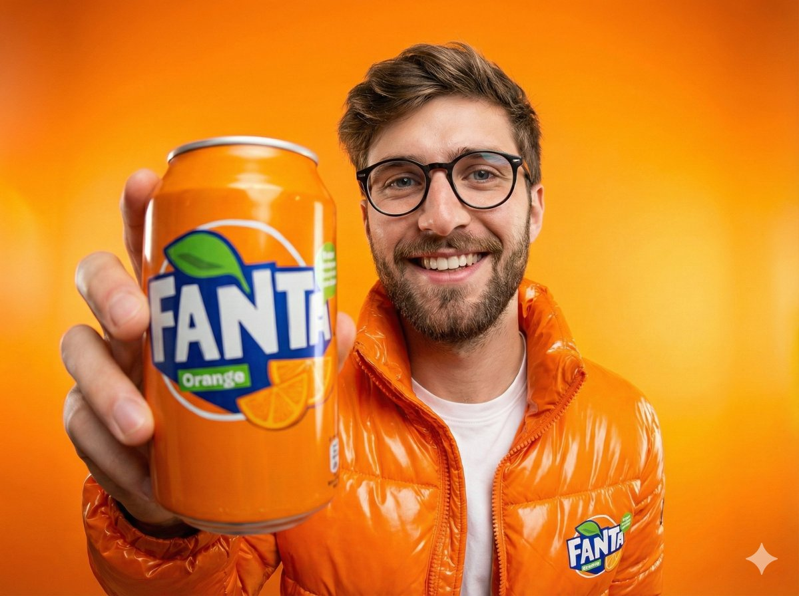

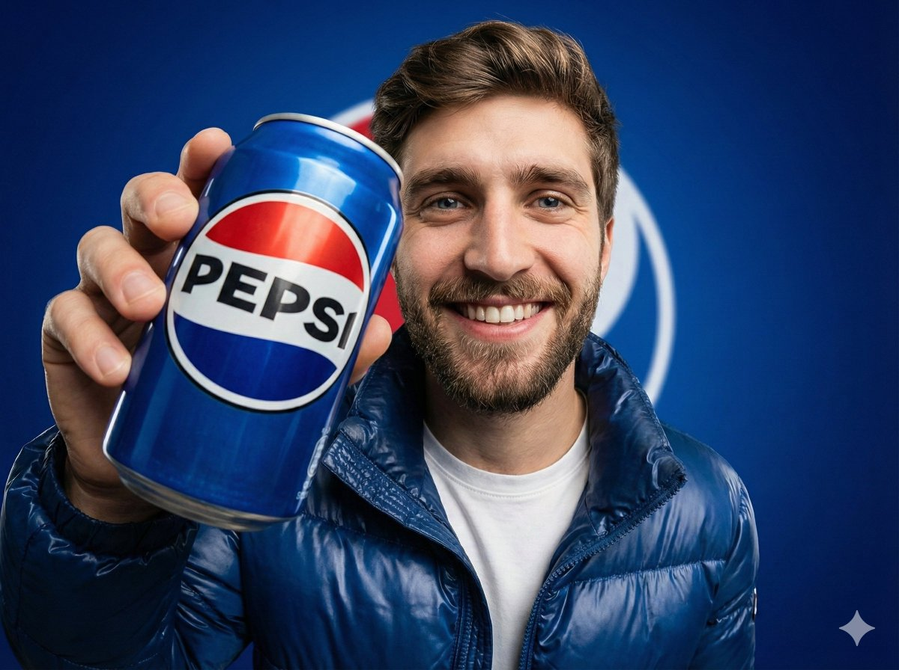

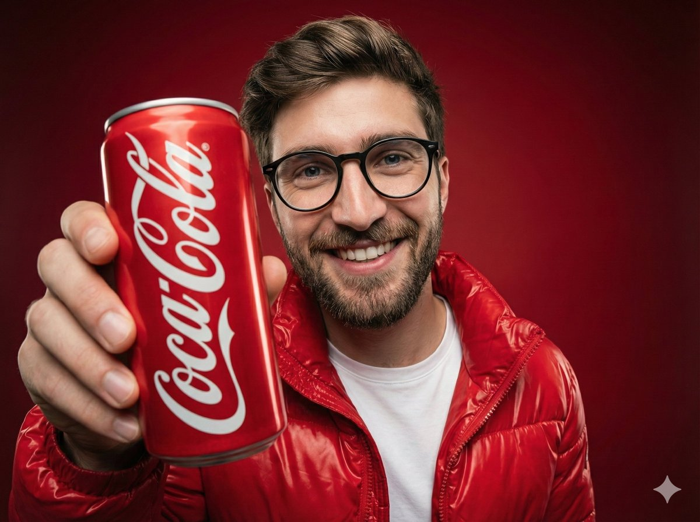

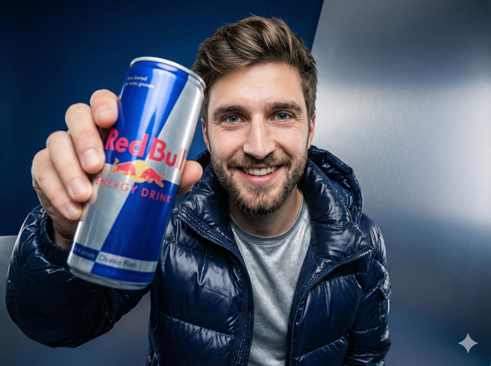

```
Studio portrait of one smiling person holding a Fanta orange aluminum can close to the camera, with both the can and the person’s head in the foreground. Shot using an ultra-wide fisheye lens for a playful, energetic, immersive perspective.
The model wears a glossy vibrant orange puffer jacket inspired by Fanta branding, layered over a bright white t-shirt.
Background in a bold citrus-orange gradient with subtle yellow highlights, perfectly color-matched to Fanta’s brand palette, smooth modern transitions.
Diffused cinematic studio lighting, juicy highlights on the can, soft glossy reflections on the jacket, gentle shadows for depth.
Slightly desaturated yet fresh, youthful modern editorial style, fun soda-campaign aesthetic, clean and minimal composition.
Ultra-sharp focus, natural skin texture, cheerful expressive smile, high-end commercial beverage photography look.

Face must match the attached reference image exactly, accurate facial proportions, realistic skin tone, no facial alteration.
Photorealistic, 8K detail, professional studio photography, global soda brand advertisement quality.
```

```
一张影棚人像照，一位面带微笑的人手持一罐芬达橙味铝罐，靠近镜头，人物头部与饮料罐均位于画面前景。使用超广角鱼眼镜头拍摄，营造出趣味十足、充满活力且沉浸式的视角。

模特身穿一件灵感源自芬达品牌标识的亮面鲜艳橙色羽绒夹克，内搭一件纯白色T恤。

背景为大胆的柑橘橙渐变色，带有微妙的黄色高光，色彩精准匹配芬达品牌调色板，过渡平滑现代。

采用漫射式电影级影棚布光，罐体呈现多汁感高光，夹克表面有柔和光泽反射，辅以细腻阴影增强立体感。

整体色调略去饱和却清新自然，风格年轻现代，具有趣味汽水广告的视觉美学，构图干净简洁。

画面超锐利对焦，保留自然肌肤纹理，表情欢快生动，呈现高端商业饮料摄影质感。

面部必须与所附参考图像完全一致，五官比例准确，肤色真实，不得对面部进行任何修改。

写实风格，8K细节，专业影棚摄影水准，全球汽水品牌广告级品质。
```

 [↑返回目录](#toc)

---
## <a id="prompt-2000872701775225000">Y2K Desi垃圾摇滚自拍</a> (<a href="https://x.com/YaseenK7212/status/2000872701775225028" target="_blank" rel="noopener noreferrer">Yaseen Khan Gul</a>)

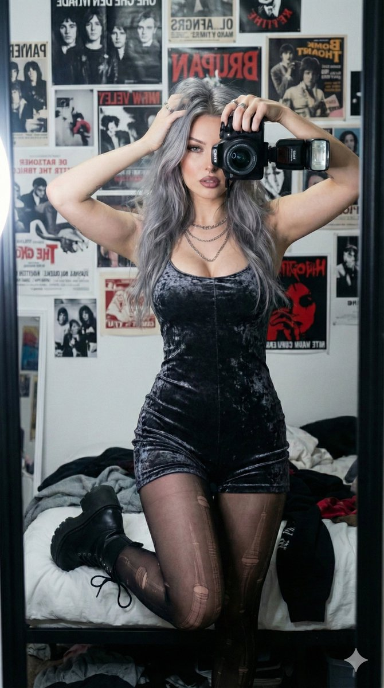

```
{
  "configuration_meta": {
    "schema_version": "3.1",
    "project_name": "Desi_Grunge_GenZ_Selfie",
    "render_intent": "High-Contrast Flash Photography",
    "aesthetic_profile": "Edgy, Lo-Fi Luxury, Y2K Revival"
  },
  "scene_graph": {
    "subject_entity": {
      "biometrics": {
        "demographics": {
          "age_cohort": "Young Adult (Gen Z)",
          "phenotype": "South Asian / Desi heritage",
          "features": "Sharp facial structure, defined eyebrows, warm undertones"
        },
        "styling": {
          "hair": {
            "cut": "Wolf-cut / Shag",
            "texture": "Messy, voluminous, layered",
            "color": "Dark raven black or deep brown",
            "interaction": "Hand running through hair, lifting layers for volume"
          },
          "makeup": {
            "eyes": "Smudged kohl liner, dark grunge aesthetic",
            "skin": "Dewy but natural",
            "lips": "Neutral or deep berry stain"
          }
        }
      },
      "wardrobe_layer": {
        "garment_main": {
          "item": "Sleeveless short one-piece dress",
          "silhouette": "Fitted, mini length",
          "material_physics": "Luxury texture (velvet or heavy satin)",
          "color_palette": "Luxury Dark Tone (Midnight Black, Deep Charcoal, or Dark Burgundy)",
          "vibe": "Edgy, nighttime glam"
        },
        "accessories": {
          "jewelry": "Silver oxidized rings, layered grunge chains (optional)",
          "nails": "Chipped black polish or metallic silver"
        }
      },
      "pose_matrix": {
        "orientation": "Standing facing mirror",
        "head_vector": "Slight tilt, looking at camera screen",
        "arm_left": "Raised, hand actively gripping and ruffling hair",
        "arm_right": "Holding camera in front of face",
        "obscuration": "Face partially hidden by camera body and flash flare"
      }
    },
    "props_registry": {
      "camera_device": {
        "type": "Digital Point-and-Shoot (Y2K style)",
        "color": "Matte Black",
        "state": "Active, Flash Firing",
        "position": "Eye level, obscuring center face"
      }
    },
    "environment_stage": {
      "location_type": "Bedroom",
      "background_surface": {
        "wall_type": "Poster Wall / Collage",
        "content_theme": "Vintage music, grunge art, retro movies",
        "color_dominance": [
          "Black",
          "White",
          "Red"
        ],
        "density": "High (chaotic overlap)"
      },
      "atmosphere": {
        "mood": "Rebellious, private, late-night",
        "clutter_level": "Aesthetic clutter"
      }
    }
  },
  "render_settings": {
    "virtual_camera": {
      "lighting_model": "Direct On-Camera Flash",
      "exposure": "High contrast",
      "shadows": "Hard, sharp shadows on the wall behind",
      "highlights": "Overexposed flash reflection on skin and camera body"
    },
    "post_processing": {
      "color_grading": "Cool tones with desaturated reds",
      "grain": "Film grain / ISO noise simulation",
      "vignette": "Slight corner darkening",
      "aspect_ratio": "9:16 (Vertical)"
    }
  },
  "generation_rules": {
    "positive_cues": [
      "Desi-grunge aesthetic",
      "wolf cut hair",
      "flash photography",
      "poster wall background",
      "luxury dark dress",
      "cool girl energy"
    ],
    "negative_prompt_stack": {
      "structural": [
        "extra fingers",
        "deformed hands",
        "floating camera",
        "bad anatomy",
        "missing limbs"
      ],
      "visual": [
        "bright daylight",
        "sunlight",
        "soft pastel colors",
        "plain white wall",
        "smiling overly happy",
        "blurry camera"
      ],
      "clothing": [
        "long dress",
        "bright floral patterns",
        "modest clothing"
      ]
    }
  }
}
```

```
{
  "configuration_meta": {
    "schema_version": "3.1",
    "project_name": "Desi_Grunge_GenZ_Selfie",
    "render_intent": "高对比度闪光摄影",
    "aesthetic_profile": "前卫、低保真奢华、Y2K复兴"
  },
  "scene_graph": {
    "subject_entity": {
      "biometrics": {
        "demographics": {
          "age_cohort": "青年（Z世代）",
          "phenotype": "南亚/Desi血统",
          "features": "鲜明的面部轮廓、清晰的眉毛、暖色调肤色"
        },
        "styling": {
          "hair": {
            "cut": "狼剪/凌乱短层剪",
            "texture": "蓬乱、丰盈、多层",
            "color": "深乌黑色或深棕色",
            "interaction": "手穿过头发，挑起发丝增加蓬松感"
          },
          "makeup": {
            "eyes": "晕染眼线笔，暗黑垃圾摇滚风格",
            "skin": "水润但自然",
            "lips": "中性色或深莓果色唇釉"
          }
        }
      },
      "wardrobe_layer": {
        "garment_main": {
          "item": "无袖短款连衣裙",
          "silhouette": "修身、迷你长度",
          "material_physics": "奢华质感（天鹅绒或重磅缎面）",
          "color_palette": "奢华深色调（午夜黑、深炭灰或深酒红）",
          "vibe": "前卫、夜间魅力"
        },
        "accessories": {
          "jewelry": "做旧银戒、叠戴垃圾摇滚风项链（可选）",
          "nails": "剥落的黑色指甲油或金属银色"
        }
      },
      "pose_matrix": {
        "orientation": "站立面对镜子",
        "head_vector": "头部微倾，注视相机屏幕",
        "arm_left": "抬起，手抓并拨弄头发",
        "arm_right": "手持相机置于脸前",
        "obscuration": "脸部部分被相机机身和闪光灯眩光遮挡"
      }
    },
    "props_registry": {
      "camera_device": {
        "type": "数码傻瓜相机（Y2K风格）",
        "color": "哑光黑",
        "state": "开启状态，闪光灯正在闪光",
        "position": "与眼睛齐平，遮挡脸部中央"
      }
    },
    "environment_stage": {
      "location_type": "卧室",
      "background_surface": {
        "wall_type": "海报墙/拼贴墙",
        "content_theme": "复古音乐、垃圾摇滚艺术、怀旧电影",
        "color_dominance": [
          "黑色",
          "白色",
          "红色"
        ],
        "density": "高密度（混乱重叠）"
      },
      "atmosphere": {
        "mood": "叛逆、私密、深夜氛围",
        "clutter_level": "有美感的杂乱"
      }
    }
  },
  "render_settings": {
    "virtual_camera": {
      "lighting_model": "机顶直闪",
      "exposure": "高对比度",
      "shadows": "背后墙面形成硬朗锐利的阴影",
      "highlights": "皮肤与相机机身上的过曝闪光反光"
    },
    "post_processing": {
      "color_grading": "冷色调，红色去饱和",
      "grain": "胶片颗粒/ISO噪点模拟",
      "vignette": "轻微四角压暗",
      "aspect_ratio": "9:16（竖屏）"
    }
  },
  "generation_rules": {
    "positive_cues": [
      "Desi垃圾摇滚美学",
      "狼剪发型",
      "闪光摄影",
      "海报墙背景",
      "奢华深色连衣裙",
      "酷女孩气场"
    ],
    "negative_prompt_stack": {
      "structural": [
        "多余手指",
        "变形的手",
        "悬浮的相机",
        "解剖结构错误",
        "缺失肢体"
      ],
      "visual": [
        "明亮日光",
        "阳光",
        "柔和粉彩色调",
        "纯白墙面",
        "过度开心的笑容",
        "模糊的相机"
      ],
      "clothing": [
        "长裙",
        "亮色花卉图案",
        "保守服饰"
      ]
    }
  }
}
```

 [↑返回目录](#toc)

---
## <a id="prompt-2000772380034060300">Nano Banana Pro 智能改图新玩法</a> (<a href="https://x.com/imxiaohu/status/2000772380034060296" target="_blank" rel="noopener noreferrer">小互</a>)

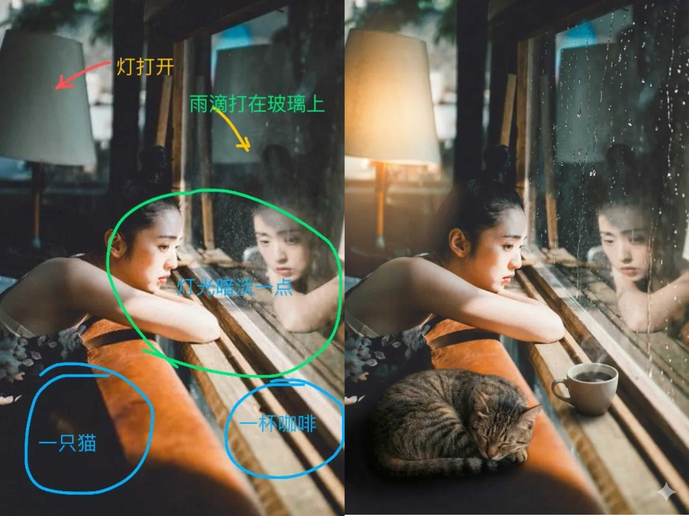

```
圈选标注改图

在 Gemini上传一张图片，注意先不要按提交键，先点击那张上传的图片，之后在弹出的图片里面进行圈选，完了确定。

圈选会用不同颜色区分

之后，用文字标注你要修改的地方，明确每个颜色的圈需要怎么修改。

然后就是见证魔法的时候了…
```

 [↑返回目录](#toc)

---
## <a id="prompt-2000375992519398000">霓虹雨夜都市拼贴</a> (<a href="https://x.com/_MehdiSharifi_/status/2000375992519397793" target="_blank" rel="noopener noreferrer">Mehdi Sharifi</a>)

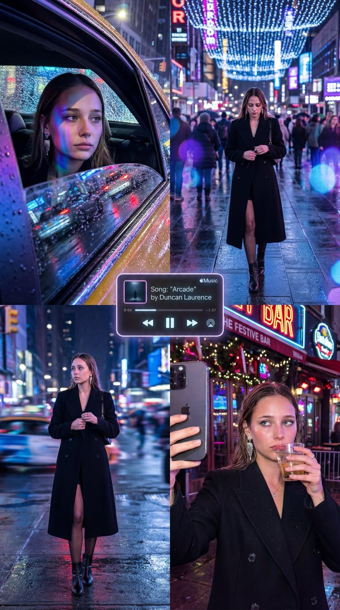

```
{
  "image_generation_request": {
    "meta_protocols": {
      "reference_adherence": {
        "instruction": "Use the provided photo as a strict face reference.",
        "tolerance": "Zero deviation",
        "parameters": "Preserve facial proportions, skin texture, expression, and identity with 100% accuracy.",
        "stylization_constraint": "Do not stylize or alter facial features."
      },
      "format_style": "Editorial winter poster–style multi-panel collage",
      "aesthetic_quality": "Spontaneous iPhone photography (flash photography, vibrant, urban night, high contrast, moody)",
      "global_textures": "High ISO noise, light streaks, wet pavement reflections, rain drops on lens."
    },
    "consistent_elements": {
      "subject_wardrobe": {
        "coat": "Long, tailored black wool coat (or dark leather)",
        "legwear": "Sheer black tights",
        "footwear": "Leather ankle boots with a block heel",
        "style_notes": "Chic urban winter, dressed up but with a somber mood"
      },
      "primary_device": {
        "model": "iPhone 17 Pro Max",
        "color": "Dark Titanium",
        "usage": "Held by subject, sometimes with flash on"
      },
      "color_palette": [
        "Electric blues",
        "Neon purples/reds",
        "Deep blacks",
        "Cold urban bokeh"
      ]
    },
    "layout_configuration": {
      "panel_1_top_left": {
        "scene_type": "Reflection in a wet taxi window or polished building facade at night",
        "lighting_and_atmosphere": "Streaks of city traffic lights, vibrant neon bokeh, rainy",
        "subject_action": "Looking out the window, city lights reflected across face with a distant gaze",
        "optical_effects": "Motion blur from moving car, high contrast reflections, raindrops"
      },
      "panel_2_top_right": {
        "scene_type": "Full body shot walking alone under dense overhead neon signs/lights",
        "camera_angle": "Eye-level, slightly wide",
        "subject_pose": "Walking with purpose but head slightly down, clutching a small purse",
        "visibility_check": "Tailored coat movement and heeled boots on wet pavement",
        "motion_dynamics": "Blurred background crowd, sense of isolation"
      },
      "panel_3_bottom_right": {
        "scene_type": "Flash selfie at an outdoor festive bar or arcade entrance",
        "lighting": "Harsh direct iPhone flash against dark, neon-lit background",
        "props": {
          "held_item": "A drink, maybe looking at it abstractly",
          "accessories": "Statement earrings visible"
        },
        "texture_focus": "Sharp flash highlighting makeup glow, wet hair, and coat fabric",
        "mood": "Dramatic, 'losing game' vibe, melancholic night out."
      }
    },
    "graphic_overlay": {
      "element": "Minimal Apple Music–style mini player",
      "content": "Song: 'Arcade' by Duncan Laurence",
      "style": "Rendered flat and clean, no shadows, glowing neon text style",
      "position": "Floating across the center of the collage"
    }
  }
}
```

```
{
  "image_generation_request": {
    "meta_protocols": {
      "reference_adherence": {
        "instruction": "使用提供的照片作为严格的脸部参考。",
        "tolerance": "零偏差",
        "parameters": "保持面部比例、皮肤纹理、表情和身份100%准确。",
        "stylization_constraint": "不要对面部特征进行风格化或更改。"
      },
      "format_style": "编辑冬季海报风格多面板拼贴",
      "aesthetic_quality": "自发的iPhone摄影（闪光灯摄影，充满活力的城市夜景，高对比度，情绪化）",
      "global_textures": "高ISO噪点，光线条纹，湿滑路面反光，镜头上的雨滴。"
    },
    "consistent_elements": {
      "subject_wardrobe": {
        "coat": "长款定制黑色羊毛大衣（或深色皮革）",
        "legwear": "黑色透明丝袜",
        "footwear": "带块状跟的皮质短靴",
        "style_notes": "都市冬季时尚，打扮讲究但带有沉闷的情绪"
      },
      "primary_device": {
        "model": "iPhone 17 Pro Max",
        "color": "暗钛色",
        "usage": "由主体手持，有时打开闪光灯"
      },
      "color_palette": [
        "电蓝色",
        "霓虹紫/红",
        "深黑色",
        "冷色调城市虚化背景"
      ]
    },
    "layout_configuration": {
      "panel_1_top_left": {
        "scene_type": "湿漉的出租车窗户或抛光建筑立面上的夜景倒影",
        "lighting_and_atmosphere": "城市交通灯条纹，充满活力的霓虹虚化，下雨",
        "subject_action": "凝视窗外，脸上映射着城市灯光，眼神迷离",
        "optical_effects": "移动车辆造成的运动模糊，高对比度倒影，雨滴"
      },
      "panel_2_top_right": {
        "scene_type": "在密集的霓虹灯下独自行走的全身照",
        "camera_angle": "眼平视角，稍微宽幅",
        "subject_pose": "步伐坚定但头部略微低垂，紧握一个小手提包",
        "visibility_check": "观察湿滑路面上行走时定制大衣的摆动及穿高跟靴的状态",
        "motion_dynamics": "背景人群模糊，孤立感"
      },
      "panel_3_bottom_right": {
        "scene_type": "户外节日酒吧或游戏厅入口处的闪光自拍",
        "lighting": "黑暗且霓虹灯照亮背景下的强烈直接iPhone闪光",
        "props": {
          "held_item": "一杯饮料，可能抽象地看它",
          "accessories": "可见的醒目耳环"
        },
        "texture_focus": "闪光灯突出化妆光泽、湿发和外套材质",
        "mood": "戏剧性的，“游戏失败”的氛围，忧郁的夜间外出。"
      }
    },
    "graphic_overlay": {
      "element": "最小化的Apple Music风格迷你播放器",
      "content": "歌曲：'Arcade' by Duncan Laurence",
      "style": "渲染平整干净，无阴影，发光霓字体样式",
      "position": "浮动于拼贴画中心"
    }
  }
}
```

 [↑返回目录](#toc)

---
## <a id="prompt-2000879410308899000">风暴云中的神秘剪影</a> (<a href="https://x.com/umesh_ai/status/2000879410308899138" target="_blank" rel="noopener noreferrer">Umesh</a>)

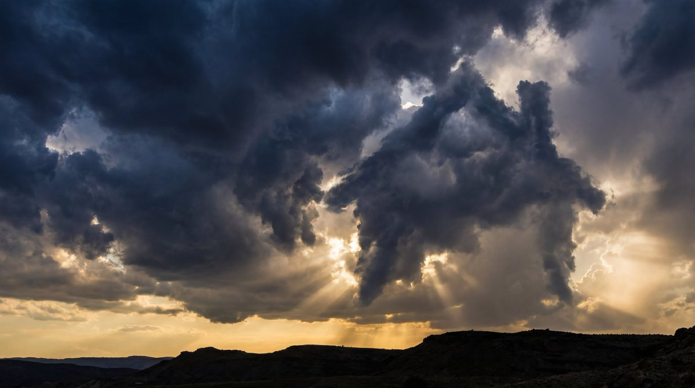

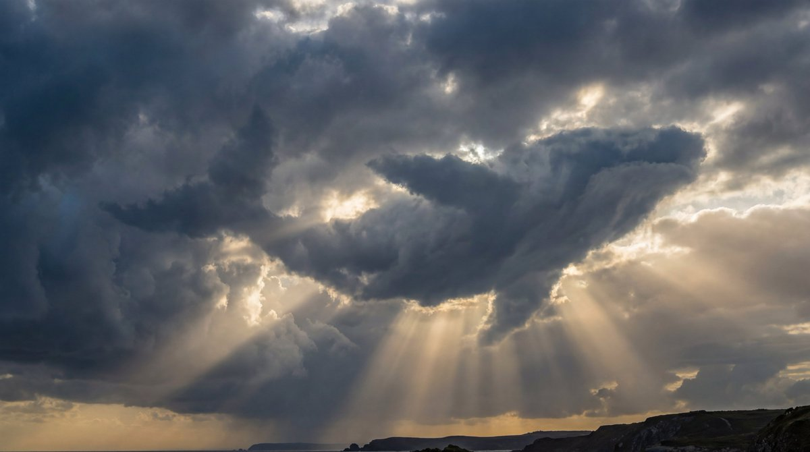

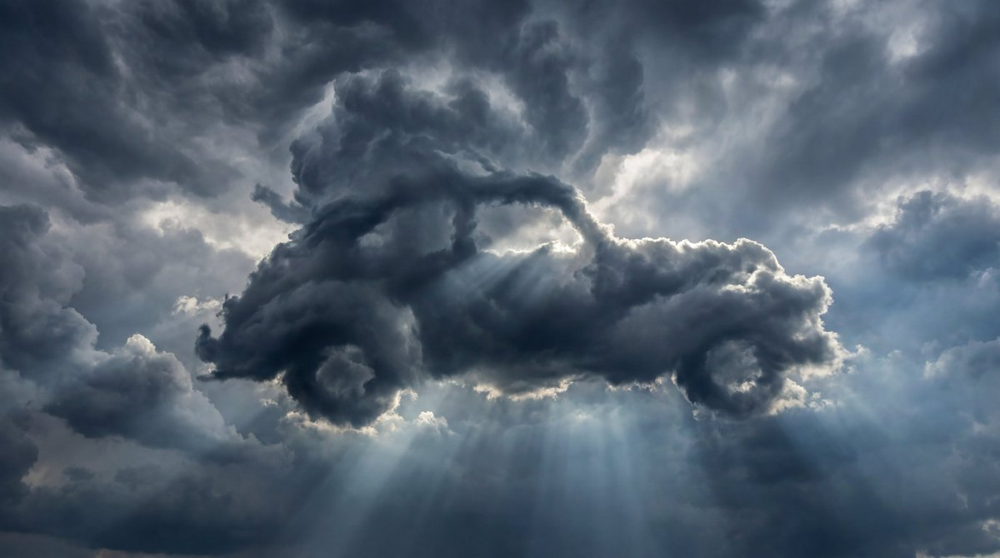

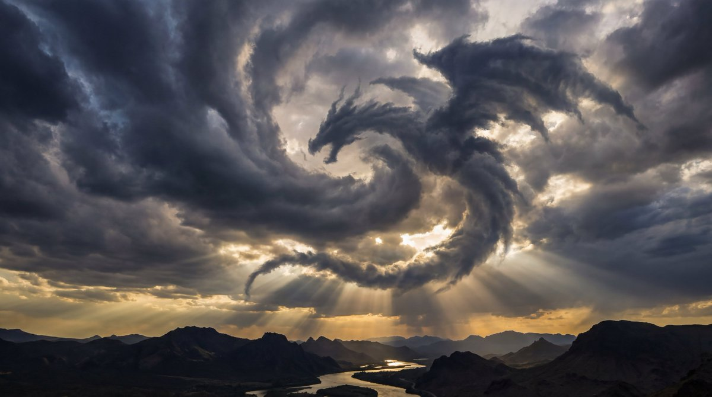

```
on Nano Banana Pro : A dramatic sky photo where swirling storm clouds naturally form the unmistakable shape of a [SUBJECT]. The illusion should be “found shape”: at first it’s just clouds; then the creature silhouette pops out. Realistic lighting: sun rays breaking through, volumetric beams, deep contrast. No fantasy glow, pure cloud structure forming the subject. High resolution, cinematic, awe-inspiring.
```

```
一张戏剧性的天空照片，翻涌的风暴云自然形成一个[主体]的清晰轮廓。这种幻象应为“自然成形”：起初只是云朵，随后生物的剪影突然显现。采用写实光线：阳光穿透云层，体积光束，强烈对比。不要奇幻光晕，仅靠纯粹的云结构构成主体。高分辨率，电影感，令人敬畏。
```

 [↑返回目录](#toc)

---
## <a id="prompt-2000706507080393000">品牌Logo变身未来物流岛</a> (<a href="https://x.com/pabloprompt/status/2000706507080392991" target="_blank" rel="noopener noreferrer">Gadgetify</a>)


```
Analyze the uploaded logo, create a 3D isometric illustration of a bustling, futuristic logistics hub for this business that should be appropriated for it. contained entirely on a floating island against a brand appropriate colors and background. The hub features technology and scene appropriate to the brand. The style is 'low-poly 3D render' with soft occlusion shadows and clay-like textures (Claymorphism). Clean, minimal, inviting. Perfect for a Silicon Valley pitch deck. **Aspect Ratio: 16:9**
```

```
分析上传的 Logo，为其企业创建一个繁忙而未来感十足的三维等距物流中心插图，整体置于一座漂浮岛屿上，背景与品牌色调相协调。该中心应体现符合该品牌特性的科技元素与场景细节。风格为“低多边形3D渲染”，带有柔和遮蔽阴影和黏土质感（Claymorphism），画面干净、简约、富有吸引力，适用于硅谷风格的融资演示文稿。**宽高比：16:9**
```

 [↑返回目录](#toc)

---
## <a id="prompt-2000712712955765000">字母动物海报：从A到Z</a> (<a href="https://x.com/bpiatt/status/2000712712955764954" target="_blank" rel="noopener noreferrer">Bret Piatt</a>)

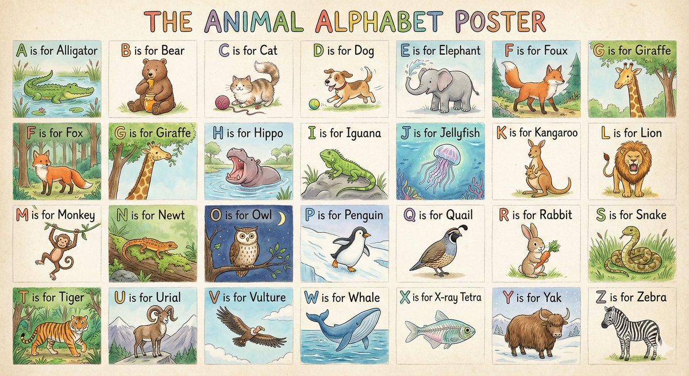

```
@PeterBerezinBCA Nano Banana Pro crushes this, except for the double F and G, "Draw a poster where you say A is for an animal that starts with the letter A, B for animal that starts with B, all the way to Z."
```

```
@PeterBerezinBCA Nano Banana Pro 完美呈现了这一点，除了双 F 和 G，“画一张海报，上面写着 A 代表以字母 A 开头的动物，B 代表以字母 B 开头的动物，依此类推，一直到 Z。”
```

 [↑返回目录](#toc)

---
## <a id="prompt-2000254730849649000">等距微缩城市切片</a> (<a href="https://x.com/AltugAkgul/status/2000254730849648772" target="_blank" rel="noopener noreferrer">./Altuğ</a>)

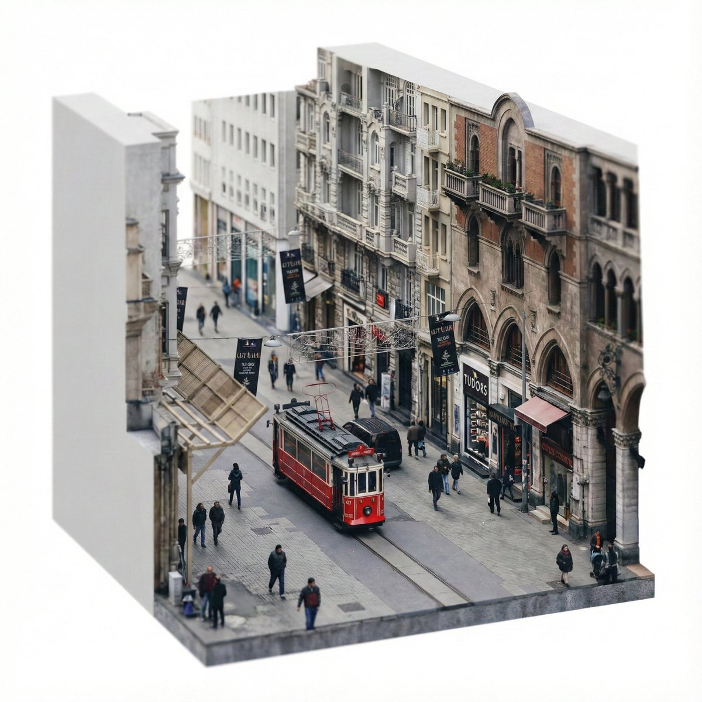

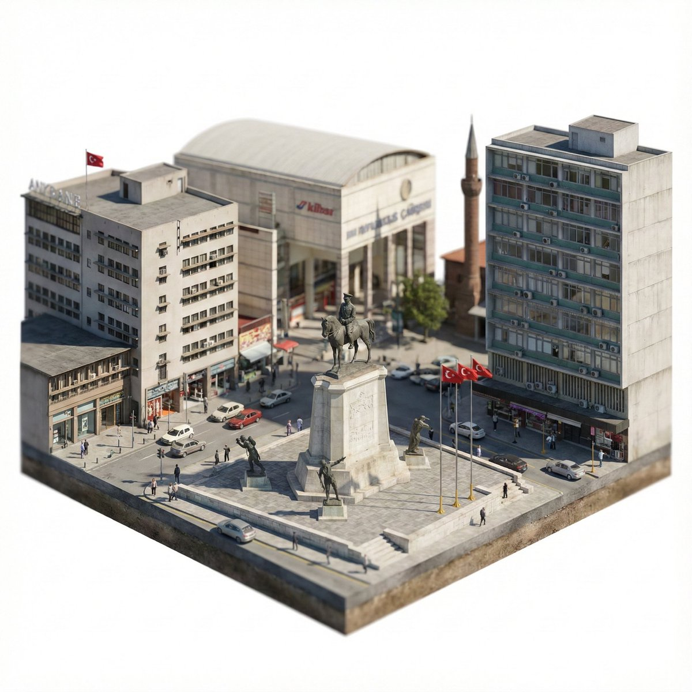

```
{  "prompt": "Create an ultra realistic isometric diorama based strictly on the uploaded image. Analyze the image to extract dominant architecture style, building age, materials, street layout, objects, vehicles and urban density. Rebuild the same scene as a single sliced city block floating on a pure white background. Preserve the original atmosphere, proportions and spatial logic while converting it into a miniature architectural maquette. Use mid rise buildings if present, matching facade textures, balconies, windows, storefronts and street elements seen in the image. Keep only elements visible in the source image. Remove anything not present. Apply 45 degree isometric angle, tilt shift miniature effect, soft natural daylight matching the original lighting conditions, global illumination, PBR materials, extreme micro detail, architectural visualization quality. Clean studio lighting. No sky, no horizon.",  "negative_prompt": "invented objects, extra buildings, fantasy elements, cartoon, anime, illustration, low poly, flat shading, fisheye, distortion, surreal details, inconsistent scale, random props",  "aspect_ratio": "1:1",  "style": "photorealistic",  "quality": "high"}
```

```
{
  "prompt": "严格基于上传的图像创建一个超写实的等距微缩场景。分析图像以提取主导建筑风格、建筑年代、材质、街道布局、物体、车辆和城市密度。将同一场景重建为漂浮在纯白背景上的单一切片城市街区。在将其转化为微型建筑模型的同时，保留原始氛围、比例和空间逻辑。如存在中层建筑，则匹配其立面纹理、阳台、窗户、店面和图像中可见的街道元素。仅保留源图像中可见的元素，移除任何未出现的内容。采用45度等距视角、移轴微缩效果、与原始光照条件匹配的柔和自然日光、全局光照、PBR材质、极致微观细节以及建筑可视化级别的质量。使用干净的影棚灯光。无天空，无地平线。",
  "negative_prompt": "虚构物体、额外建筑、奇幻元素、卡通、动漫、插画、低多边形、平面着色、鱼眼镜头、畸变、超现实细节、比例不一致、随机道具",
  "aspect_ratio": "1:1",
  "style": "照片级写实",
  "quality": "高"
}
```

 [↑返回目录](#toc)

---
## <a id="prompt-2000932708684304600">动感体育海报</a> (<a href="https://x.com/AmirMushich/status/2000932708684304623" target="_blank" rel="noopener noreferrer">AmirMušić</a>)

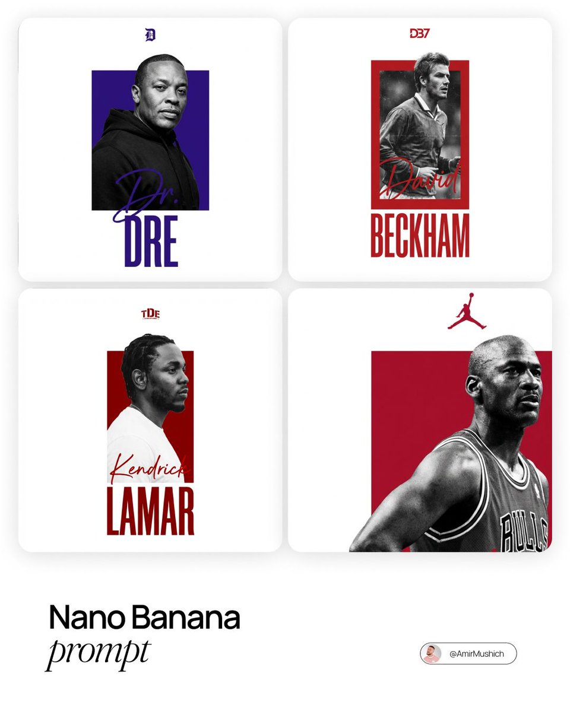

```
[PERSON] , presented as a direct uncompressed digital screen export of a flat source graphic file.

Technical & Composition Rules:

Medium (Crucial): This is native digital pixel art, NOT a photograph. The entire canvas from edge to edge is pure, seamless digital white (RGB 255,255,255). There is ZERO physical reality: no paper grain, no ink texture, no frame, no shadows, no lighting gradients, no desk/wall environment. It is a flat 2D digital rendering meant for screen display only.

Graphic Container & Color: A central, vertical, solid-color rectangle acts as a digital vector container. The color must be uniquely distinct and semantically relevant to the subject (e.g., David Beckham = classic England white/red or Man Utd red; Prince = Purple). Avoid defaulting to generic red unless justified by primary branding.

Subject Element: A high-detail, gritty black-and-white photograph of the subject is digitally masked inside and over the colored rectangle container. The subject is cropped from the chest up, preferably in a side profile or dynamic 3/4 angle. The head slightly overlaps the top edge of the colored container.

Typography (Digital Text Elements):

Last Name: Placed below the colored container in the white digital space. Rendered in a tall, compressed, bold sans-serif digital font. Color matches the container.

First Name (Contrast Rule): Layered over the subject's torso/clothing. Rendered in a loose, handwritten "signature" script style. The color matches the container, BUT it must be perfectly legible. Ensure high contrast against the underlying B&W photo pixels.

No text covers the face.

Header Element: Centered at the very top in the white digital space, place a small, iconic logo strictly associated with the subject (or their clean uppercase initials if no logo exists), matched to the container's color.
```

```
[人物], 以未压缩的直接数字屏幕导出形式呈现，源自平面源图形文件。

技术与构图规则：

媒介（至关重要）：这是原生数字像素艺术，不是照片。整个画布从边缘到边缘都是纯白色（RGB 255,255,255），无缝连接。没有物理现实元素：无纸张纹理、无墨水质感、无边框、无阴影、无光线渐变、无桌面/墙壁环境。它是为屏幕显示设计的纯2D数字渲染。

图形容器与颜色：中央垂直的单色矩形作为数字矢量容器。颜色必须独特且语义上与主题相关（例如，大卫·贝克汉姆=经典的英格兰白/红或曼联红；普林斯=紫色）。除非有主要品牌依据，否则避免默认使用通用红色。

主题元素：高细节的黑白照片被数字化遮罩放置在彩色矩形容器内及之上。主题是从胸部以上裁剪的，最好是在侧面轮廓或动态3/4角度。头部略微超出彩色容器的顶部边缘。

字体（数字文本元素）：

姓氏：置于彩色容器下方的白色数字空间中，采用高大、压缩、粗体的无衬线数字字体。颜色与容器匹配。

名字（对比规则）：覆盖在主体的躯干/衣物部分，采用宽松的手写“签名”风格脚本字体。颜色与容器相同，但必须确保清晰可读。保证与下面的黑白照片像素形成高对比度。

文字不可覆盖脸部。

标题元素：在最顶部中心位置，在白色数字空间中放置一个与主题严格相关的标志性小图标（如果不存在图标，则使用干净的大写首字母），颜色与容器相匹配。
```

 [↑返回目录](#toc)

---
## <a id="prompt-1999344734595350800">AI时尚短片创作流程</a> (<a href="https://x.com/0xbisc/status/1999344734595350744" target="_blank" rel="noopener noreferrer">Latte</a>)


```
摄影机在摇臂上缓慢平稳地下降

5. 使用 @ReflctWillie 开发的速度曲线工具使用预设调整每个片段的播放节奏，最后拼接成完整视频。
对比在传统剪辑软件慢慢调试实在方便太多。

自从有了 AI 之后，每个人都可以高效地开发出解决痛点的小工具，让我们可以把更多精力投入到创意本身，而不是被技术细节困住，这个转变真的很棒。
```

 [↑返回目录](#toc)

---
## <a id="prompt-2000780025214460200">巴黎幻境：屏幕中的埃菲尔</a> (<a href="https://x.com/Zar_xplorer/status/2000780025214460036" target="_blank" rel="noopener noreferrer">Zar⭕on</a>)

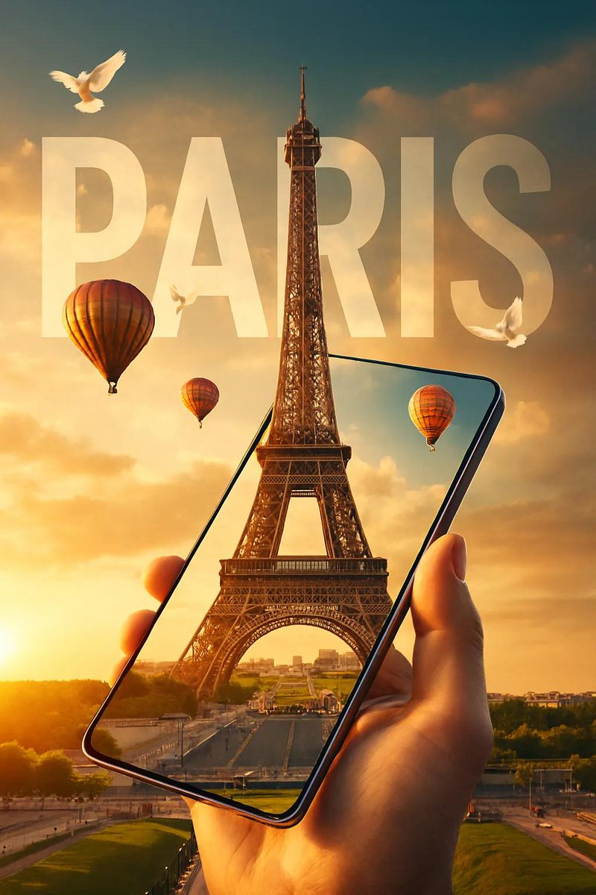

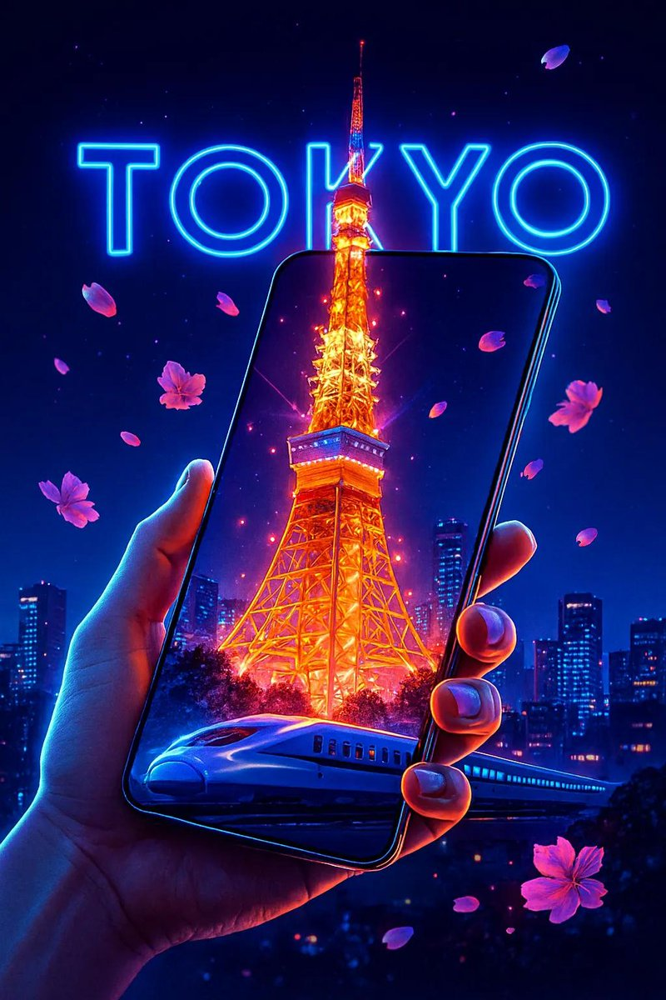

```
👇

A SURREAL TRAVEL-THEMED DIGITAL ARTWORK DEPICTING A HAND HOLDING A SLEEK, FRAMELESS SMARTPHONE OR TABLET TILTED AT A 45-DEGREE ANGLE.

THE DEVICE DISPLAYS A HIGH-RESOLUTION IMAGE OF THE EIFFEL TOWER, SEAMLESSLY BLENDING INTO THE REALISTIC LANDSCAPE BEHIND IT. THE EIFFEL TOWER EXTENDS OUT OF THE SCREEN AND RISES INTO THE SKY, CREATING A HYPER-REALISTIC 3D ILLUSION.

HOT AIR BALLOONS FLOAT AROUND THE TOWER, AND WHITE DOVES FLY ACROSS A SOFT GOLDEN SUNSET SKY. THE BOLD TEXT "PARIS" APPEARS IN THE CLOUDS BEHIND THE TOWER IN A DOUBLE-EXPOSURE STYLE, USING A CLEAN,

MODERN SANS-SERIF FONT.

THE OVERALL STYLE IS DREAMY,

PHOTOREALISTIC, AND VIBRANT - PERFECT FOR A LUXURY TRAVEL CAMPAIGN OR SOCIAL MEDIA ADVERTISEMENT
```

```
如下：

一幅超现实旅行主题的数字艺术作品，描绘一只手以45度角倾斜握持一部时尚无边框的智能手机或平板电脑。

设备屏幕上显示着一张高分辨率的埃菲尔铁塔图像，与背后的现实景观无缝融合。埃菲尔铁塔从屏幕中延伸而出，直插云霄，营造出逼真的3D错觉。

热气球在铁塔周围漂浮，白鸽飞过柔和的金色日落天空。铁塔后方的云层中，以双重曝光风格呈现醒目的“PARIS”字样，采用干净现代的无衬线字体。

整体风格梦幻、写实且色彩鲜明，非常适合用于高端旅行宣传或社交媒体广告。
```

 [↑返回目录](#toc)

---
## <a id="prompt-2000553282767597800">折纸艺术：超精细角色雕塑</a> (<a href="https://x.com/TechieBySA/status/2000553282767597705" target="_blank" rel="noopener noreferrer">TechieSA</a>)

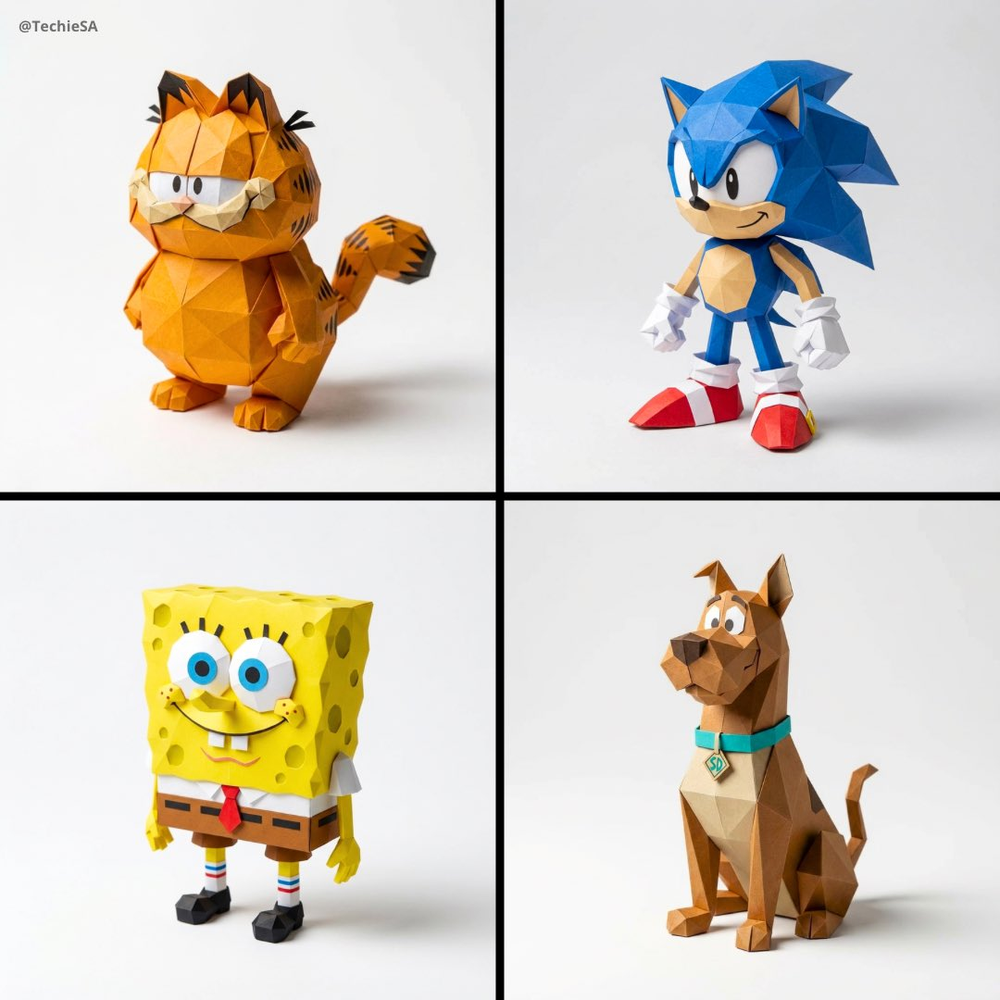

```
A hyper-detailed origami version of [CHARACTER], folded from high-quality colored paper with crisp edges and realistic paper texture. The folds capture the character’s iconic features, outfit, and silhouette in a simplified geometric form. Placed on a clean studio surface with soft shadows. Minimalist collectible art style, photorealistic detail, sharp focus. 1080x1080 square format.
```

```
一个超精细的折纸版[CHARACTER]，由高品质彩色纸张折叠而成，边缘清晰，纸张纹理逼真。折痕精准捕捉角色的标志性特征、服装和轮廓，以简化的几何形式呈现。置于干净的摄影棚台面上，带有柔和阴影。极简收藏艺术风格，照片级细节，焦点锐利。1080x1080方形格式。
```

 [↑返回目录](#toc)

---
## <a id="prompt-2000858454580404700">悬浮之环：超现实肖像</a> (<a href="https://x.com/saniaspeaks_/status/2000858454580404608" target="_blank" rel="noopener noreferrer">𝗦𝗮𝗻𝗶𝗮</a>)

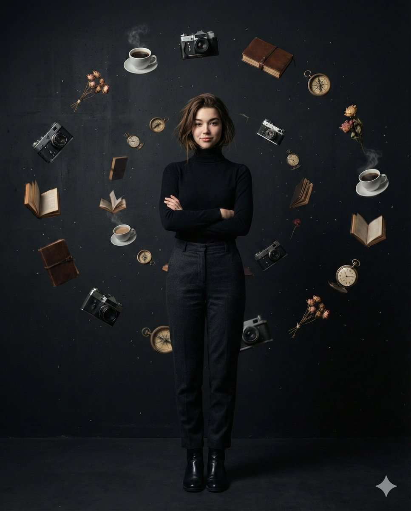

```
{
  "type": "image_generation_prompt",
  "style": "hyper-realistic, cinematic, magical surrealism, studio editorial",
  "composition": {
    "aspect_ratio": "4:5",
    "framing": "full-body to three-quarter portrait, centered",
    "camera_position": "eye-level, straight-on",
    "resolution": "ultra-HD"
  },
  "identity_preservation": {
    "use_reference_image": true,
    "alter_face": false,
    "notes": "Preserve the woman’s facial features, proportions, hairstyle, and overall identity exactly as shown in the reference image."
  },
  "subject": {
    "gender": "female",
    "age_range": "mid-twenties",
    "pose": {
      "stance": "standing perfectly still at the center of the frame",
      "arms": "crossed confidently",
      "expression": "calm, confident, slightly amused, as if the surreal scene is ordinary"
    },
    "appearance": {
      "facial_features": "sharp, well-defined facial structure",
      "hair": {
        "color": "dark brown",
        "details": "subtle golden highlights",
        "style": "tousled, natural movement"
      },
      "eyes": "intense hazel eyes",
      "skin_texture": "natural, ultra-detailed realism"
    }
  },
  "wardrobe": {
    "top": "fitted black turtleneck hugging an athletic silhouette",
    "bottoms": "dark charcoal wool trousers",
    "footwear": "polished black leather boots"
  },
  "environment": {
    "location": "studio",
    "background": {
      "color": "deep charcoal black",
      "texture": "faint concrete wall texture visible in shadows"
    }
  },
  "surreal_elements": {
    "concept": "objects floating in perfect orbital patterns around the subject",
    "objects": [
      "vintage cameras",
      "leather-bound books",
      "steaming coffee cups",
      "geometric concrete blocks",
      "brass compass instruments",
      "dried flowers",
      "floating black ink droplets",
      "vintage pocket watches showing different times",
      "crumpled paper balls"
    ],
    "behavior": "objects suspended at varying heights and distances, forming concentric spirals as if affected by personal gravity",
    "motion": "some objects razor-sharp, others slightly blurred to suggest slow rotation"
  },
  "lighting": {
    "key_light": {
      "position": "high and left",
      "effect": "deep sculptural shadows carving facial features"
    },
    "rim_light": {
      "effect": "subtle glow outlining floating objects"
    },
    "shadow_effects": "intricate overlapping shadows cast on floor and walls, forming geometric patterns"
  },
  "camera": {
    "camera_type": "medium format",
    "lens": "85mm",
    "aperture": "f/2.8",
    "focus": "ultra-sharp on subject with selective focus on floating elements"
  },
  "color_palette": {
    "dominant": ["deep black", "warm gray", "rich brown"],
    "accent": "selective golden highlights on brass objects and hair"
  },
  "quality": {
    "realism": "ultra-realistic",
    "detail_level": "extreme detail in fabrics, skin texture, and materials",
    "rendering": "cinematic realism with subtle magical surrealism"
  },
  "output_goal": "Create a hyper-realistic cinematic studio portrait of a woman surrounded by floating everyday objects in a surreal gravitational composition, preserving her exact identity while blending elegance, mystery, and controlled chaos."
}
```

```
{
  "类型": "图像生成提示",
  "风格": "超现实、电影感、魔幻超现实主义、工作室编辑",
  "构图": {
    "纵横比": "4:5",
    "取景": "全身到四分之三身位肖像，居中",
    "相机位置": "平视，正前方",
    "分辨率": "超高清"
  },
  "身份保留": {
    "使用参考图像": true,
    "改变面部": false,
    "备注": "保留女性的面部特征、比例、发型和整体身份与参考图像所示完全一致。"
  },
  "主题": {
    "性别": "女性",
    "年龄范围": "二十多岁中期",
    "姿态": {
      "站姿": "在画面中心完美静止站立",
      "手臂": "自信地交叉",
      "表情": "平静、自信，略带戏谑，仿佛超现实场景稀松平常"
    },
    "外观": {
      "面部特征": "鲜明、轮廓清晰的面部结构",
      "头发": {
        "颜色": "深棕色",
        "细节": "微妙的金色高光",
        "样式": "蓬松，自然飘逸"
      },
      "眼睛": "强烈榛子色的眼睛",
      "皮肤质感": "自然、极致细节的真实感"
    }
  },
  "服装": {
    "上衣": "紧身黑色高领毛衣贴合运动型身材",
    "下装": "深木炭色羊毛裤",
    "鞋履": "擦得锃亮的黑色皮靴"
  },
  "环境": {
    "地点": "摄影棚",
    "背景": {
      "颜色": "深木炭黑",
      "纹理": "阴影中隐约可见的混凝土墙纹理"
    }
  },
  "超现实元素": {
    "概念": "物体以完美的轨道模式环绕主体浮动",
    "物体": [
      "复古相机",
      "皮质装订书籍",
      "冒热气的咖啡杯",
      "几何混凝土块",
      "黄铜指南针仪器",
      "干花",
      "浮动的墨滴",
      "显示不同时间的复古怀表",
      "皱巴巴的纸球"
    ],
    "行为": "物体悬停在不同的高度和距离，形成如同受个人引力影响的同心螺旋",
    "运动": "一些物体边缘锐利，另一些则略微模糊以暗示缓慢旋转"
  },
  "照明": {
    "主灯": {
      "位置": "高且偏左",
      "效果": "深邃雕塑般的阴影雕刻出面部特征"
    },
    "轮廓光": {
      "效果": "环绕悬浮物体的微妙光辉"
    },
    "阴影效果": "复杂的重叠阴影投射在地板和墙壁上，形成几何图案"
  },
  "相机": {
    "相机类型": "中画幅",
    "镜头": "85mm",
    "光圈": "f/2.8",
    "焦点": "对主体及其周围选定悬浮元素进行超清晰聚焦"
  },
  "色彩搭配": {
    "主要": ["深黑", "暖灰", "浓郁棕"],
    "点缀": "黄铜物体和头发上的选择性金色高光"
  },
  "质量": {
    "真实感": "超现实",
    "细节层次": "织物、皮肤质感和材料的极致细节",
    "渲染": "带有微妙魔幻超现实主义的电影级真实感"
  },
  "输出目标": "创作一幅女性被悬浮日常物品包围的超现实重力组合的超现实主义电影级工作室肖像，同时保持她的精确身份，融合优雅、神秘和控制下的混乱。"
}
```

 [↑返回目录](#toc)

---
## <a id="prompt-2000883616989974800">Nano Banana Pro：建筑灵感智能小工具</a> (<a href="https://x.com/Gdgtify/status/2000883616989974693" target="_blank" rel="noopener noreferrer">Gadgetify</a>)

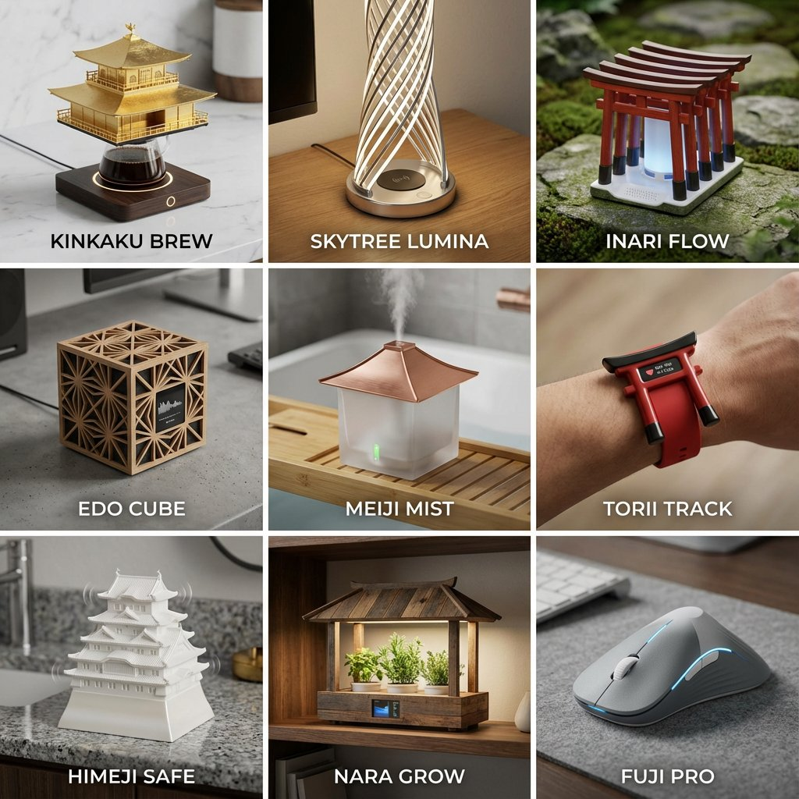

```
Step 1: Select 3 famous architectural landmarks of a random country
Step 2: Deeply analyze geometry, structural principles, material appearances, proportions, and symbolic features.
Step 3: Scale concepts down dramatically and fuse elements into 9 distinct everyday high-tech home or personal devices (kitchen, desk, wellness, garden).
Step 4: Ensure each invention solves a real 2025 consumer pain point with smart features (app control, sustainability, modularity).
Step 5: Produce a 3x3 grid of premium product photography on relevant surfaces (marble counter, oak desk), shallow DOF, luxurious lighting, catchy inventive names underneath. Include subtle UI glows or motion hints for functionality. include names
```

```
步骤1：随机选择一个国家的3座著名建筑地标  
步骤2：深入分析其几何结构、构造原理、材质外观、比例关系及象征性特征  
步骤3：将这些概念大幅缩小，并融合成9款独特的日常高科技家居或个人设备（涵盖厨房、书桌、健康、园艺等场景）  
步骤4：确保每项发明都能通过智能功能（如App控制、可持续性、模块化设计）解决2025年消费者的真实痛点  
步骤5：生成一个3x3网格的高端产品摄影图，置于相关背景表面（如大理石台面、橡木书桌），采用浅景深与奢华灯光，并在每件产品下方添加富有创意且朗朗上口的名称。画面中需包含微妙的UI光效或动态提示以体现功能性。
```

 [↑返回目录](#toc)

---
## <a id="prompt-2000617319916347600">微型世界中的巨型潮物</a> (<a href="https://x.com/_MehdiSharifi_/status/2000617319916347534" target="_blank" rel="noopener noreferrer">Mehdi Sharifi</a>)


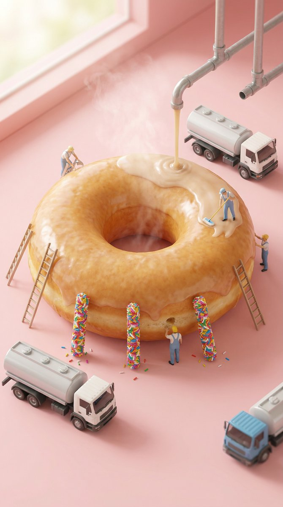

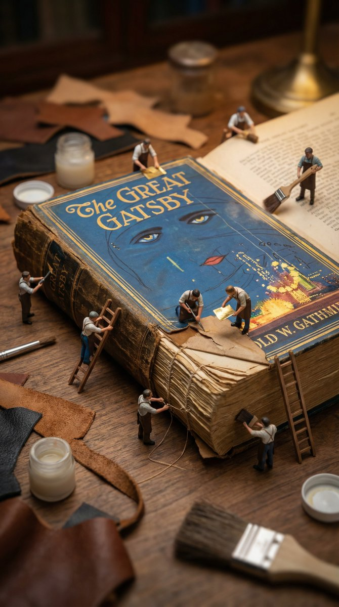

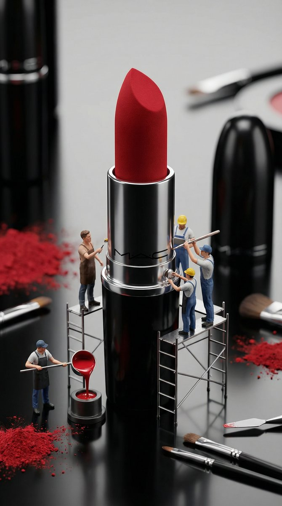

```
- Platform: @eachlabs 

{
  "image_generation_prompts": [
    {
      "id": 1,
      "title": "Air Jordan 1 'Chicago' High-Top Assembly",
      "subject": {
        "main_element": "Giant Nike Air Jordan 1 High Sneaker (Chicago colorway)",
        "orientation": "Standing upright",
        "details": [
          "Premium red and white leather texture",
          "Black Nike Swoosh logo",
          "Thick laces resembling heavy ropes"
        ]
      },
      "environment": {
        "setting": "Concrete urban floor",
        "elements": [
          "Cranes hoisting the shoelaces",
          "Scaffolding around the ankle collar",
          "Miniature workers in streetwear safety gear"
        ]
      },
      "action": [
        "Stitching the leather swoosh",
        "Polishing the white rubber midsole",
        "Threading the giant laces through eyelets",
        "Painting the 'Air Jordan' wings logo."
      ],
      "style": {
        "camera_view": "Low-angle macro",
        "technique": "Tilt-shift hypebeast photography",
        "focus": "Sharp focus on the leather grain",
        "atmosphere": "Cool, urban, and stylish"
      },
      "parameters": {
        "aspect_ratio": "--ar 3:4",
        "reference_constraint": "Style must match the miniature macro photography reference"
      }
    },
    {
      "id": 2,
      "title": "Glazed Donut Glazing Operation",
      "subject": {
        "main_element": "Giant fluffy Ring Donut",
        "orientation": "Lying flat",
        "details": [
          "Golden-brown fried dough texture",
          "Thick, wet, dripping sugar glaze",
          "Steam rising from the fresh dough."
        ]
      },
      "environment": {
        "setting": "Pastel pink bakery counter",
        "elements": [
          "Trucks carrying liquid sugar",
          "Workers with mops spreading the glaze",
          "Ladders leaning against the donut sides"
        ]
      },
      "action": [
        "Pouring glaze from overhead pipes",
        "Smoothing the sugar coating",
        "Installing giant rainbow sprinkles like pillars",
        "Inspecting the dough porosity."
      ],
      "style": {
        "camera_view": "Overhead tilt-shift",
        "technique": "Food photography macro",
        "lighting": "Soft, bright, appetizing window light",
        "theme": "Satisfying and sweet"
      },
      "parameters": {
        "aspect_ratio": "--ar 3:4",
        "reference_constraint": "Style must match the miniature macro photography reference"
      }
    },
    {
      "id": 3,
      "title": "Mechanical Keyboard Switch Lube Station",
      "subject": {
        "main_element": "Giant Mechanical Keyboard Switch (Transparent Housing)",
        "orientation": "Exploded view (stem raised)",
        "details": [
          "Gold-plated spring coils",
          "Purple stem (tactile switch)",
          "RGB LED glowing from beneath."
        ]
      },
      "environment": {
        "setting": "Tech desk mat with geometric pattern",
        "elements": [
          "Barrels of lubricant",
          "Tiny brushes",
          "Technicians in anti-static suits",
          "LED light panels"
        ]
      },
      "action": [
        "Brushing lube onto the switch rails",
        "Lowering the stem into the housing",
        "Polishing the copper contact leaf",
        "Calibrating the spring tension."
      ],
      "style": {
        "camera_view": "Side-profile macro",
        "technique": "Tilt-shift tech photography",
        "lighting": "Neon RGB accent lighting (Cyberpunk vibes)",
        "theme": "Tech-enthusiast / ASMR visual"
      },
      "parameters": {
        "aspect_ratio": "--ar 3:4",
        "reference_constraint": "Style must match the miniature macro photography reference"
      }
    },
    {
      "id": 4,
      "title": "Vinyl Record Groove Deep Clean",
      "subject": {
        "main_element": "Giant Vinyl Record on Turntable",
        "orientation": "Spinning surface",
        "details": [
          "Microscopic ridges of the vinyl grooves",
          "Glossy black reflection",
          "Giant stylus needle hovering above."
        ]
      },
      "environment": {
        "setting": "Wooden Hi-Fi cabinet surface",
        "elements": [
          "Cleaning crews with industrial vacuums",
          "Workers scrubbing the grooves like valleys",
          "Spotlights illuminating the dust particles"
        ]
      },
      "action": [
        "Sweeping dust from the deep grooves",
        "Polishing the record label",
        "Inspecting the stylus tip",
        "Navigating the ridges like canyons."
      ],
      "style": {
        "camera_view": "Extreme close-up macro",
        "technique": "Tilt-shift abstract photography",
        "focus": "Sharp focus on the texture of grooves",
        "atmosphere": "Retro audiophile aesthetic"
      },
      "parameters": {
        "aspect_ratio": "--ar 3:4",
        "reference_constraint": "Style must match the miniature macro photography reference"
      }
    }
  ]
}
```

```
- 平台：@eachlabs 

{
  "image_generation_prompts": [
    {
      "id": 1,
      "title": "Air Jordan 1 '芝加哥' 高帮组装现场",
      "subject": {
        "main_element": "巨型耐克 Air Jordan 1 高帮运动鞋（芝加哥配色）",
        "orientation": "直立放置",
        "details": [
          "高级红色与白色皮革纹理",
          "黑色耐克 Swoosh 标志",
          "鞋带粗如重型绳索"
        ]
      },
      "environment": {
        "setting": "混凝土城市地面",
        "elements": [
          "起重机吊起鞋带",
          "环绕鞋踝处的脚手架",
          "身穿街头风格安全装备的微型工人"
        ]
      },
      "action": [
        "缝制皮革 Swoosh 标志",
        "抛光白色橡胶中底",
        "将巨型鞋带穿入鞋孔",
        "绘制“Air Jordan”飞翼标志"
      ],
      "style": {
        "camera_view": "低角度微距",
        "technique": "移轴潮人摄影",
        "focus": "皮革纹理清晰锐利",
        "atmosphere": "冷峻、都市且时尚"
      },
      "parameters": {
        "aspect_ratio": "--ar 3:4",
        "reference_constraint": "风格必须符合微型微距摄影参考"
      }
    },
    {
      "id": 2,
      "title": "糖霜甜甜圈上釉作业",
      "subject": {
        "main_element": "巨型蓬松圆环甜甜圈",
        "orientation": "平躺放置",
        "details": [
          "金棕色油炸面团质感",
          "浓稠、湿润、滴落的糖霜",
          "新鲜面团升腾的蒸汽"
        ]
      },
      "environment": {
        "setting": "淡粉色烘焙操作台",
        "elements": [
          "运输液态糖浆的卡车",
          "工人用拖把涂抹糖霜",
          "靠在甜甜圈侧面的梯子"
        ]
      },
      "action": [
        "从头顶管道倾倒糖霜",
        "抹平糖衣涂层",
        "安装如支柱般的巨型彩虹糖粒",
        "检查面团孔隙度"
      ],
      "style": {
        "camera_view": "俯视移轴",
        "technique": "美食微距摄影",
        "lighting": "柔和明亮、诱人的窗边光线",
        "theme": "令人满足且甜美"
      },
      "parameters": {
        "aspect_ratio": "--ar 3:4",
        "reference_constraint": "风格必须符合微型微距摄影参考"
      }
    },
    {
      "id": 3,
      "title": "机械键盘轴体润滑工作站",
      "subject": {
        "main_element": "巨型机械键盘轴体（透明外壳）",
        "orientation": "爆炸视图（轴心抬起）",
        "details": [
          "镀金弹簧线圈",
          "紫色轴心（段落手感）",
          "底部发出 RGB LED 光芒"
        ]
      },
      "environment": {
        "setting": "几何图案科技桌垫",
        "elements": [
          "润滑剂桶",
          "微型刷子",
          "穿着防静电服的技术员",
          "LED 灯板"
        ]
      },
      "action": [
        "用刷子将润滑剂涂在轴体滑轨上",
        "将轴心缓缓放入外壳",
        "抛光铜质触点簧片",
        "校准弹簧张力"
      ],
      "style": {
        "camera_view": "侧视微距",
        "technique": "移轴科技摄影",
        "lighting": "霓虹 RGB 装饰灯光（赛博朋克氛围）",
        "theme": "科技发烧友 / ASMR 视觉风格"
      },
      "parameters": {
        "aspect_ratio": "--ar 3:4",
        "reference_constraint": "风格必须符合微型微距摄影参考"
      }
    },
    {
      "id": 4,
      "title": "黑胶唱片沟槽深度清洁",
      "subject": {
        "main_element": "唱盘上的巨型黑胶唱片",
        "orientation": "旋转表面",
        "details": [
          "黑胶沟槽的显微级纹路",
          "亮黑色反光表面",
          "悬停于上方的巨大唱针"
        ]
      },
      "environment": {
        "setting": "木质高保真音响柜表面",
        "elements": [
          "配备工业吸尘器的清洁团队",
          "工人如清理峡谷般刷洗沟槽",
          "聚光灯照亮漂浮的灰尘颗粒"
        ]
      },
      "action": [
        "清扫深沟中的灰尘",
        "抛光唱片标签",
        "检查唱针针尖",
        "如穿越峡谷般穿行于沟槽之间"
      ],
      "style": {
        "camera_view": "极端特写微距",
        "technique": "移轴抽象摄影",
        "focus": "沟槽纹理清晰锐利",
        "atmosphere": "复古音响发烧友美学"
      },
      "parameters": {
        "aspect_ratio": "--ar 3:4",
        "reference_constraint": "风格必须符合微型微距摄影参考"
      }
    }
  ]
}
```

 [↑返回目录](#toc)

---
## <a id="prompt-2000568971951571200">品牌巨构：微型工地奇观</a> (<a href="https://x.com/YaseenK7212/status/2000568971951571200" target="_blank" rel="noopener noreferrer">Yaseen Khan Gul</a>)

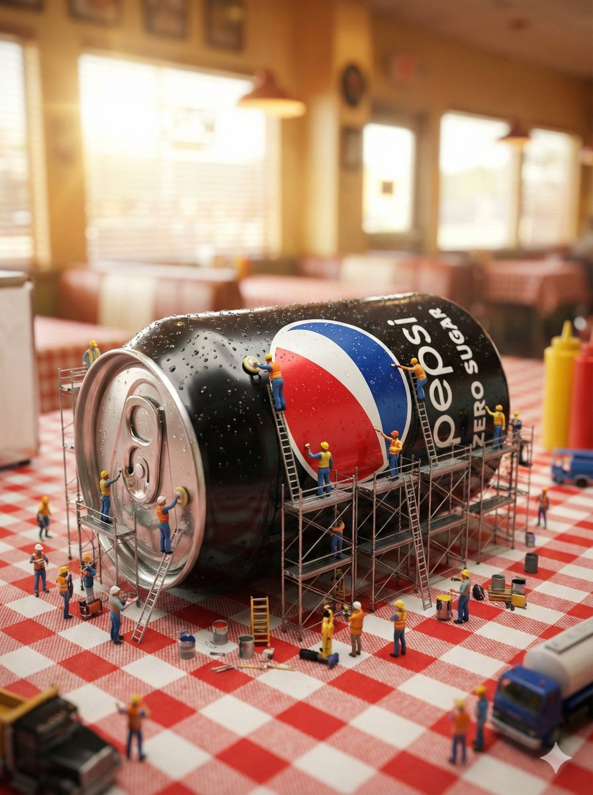

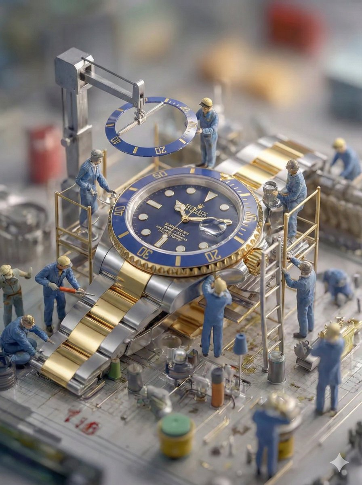

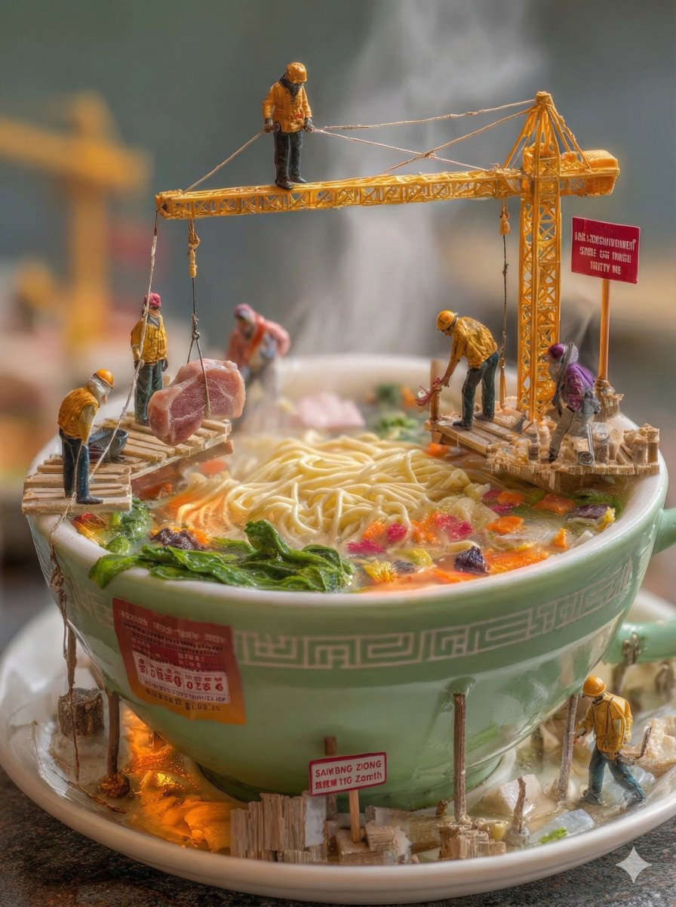

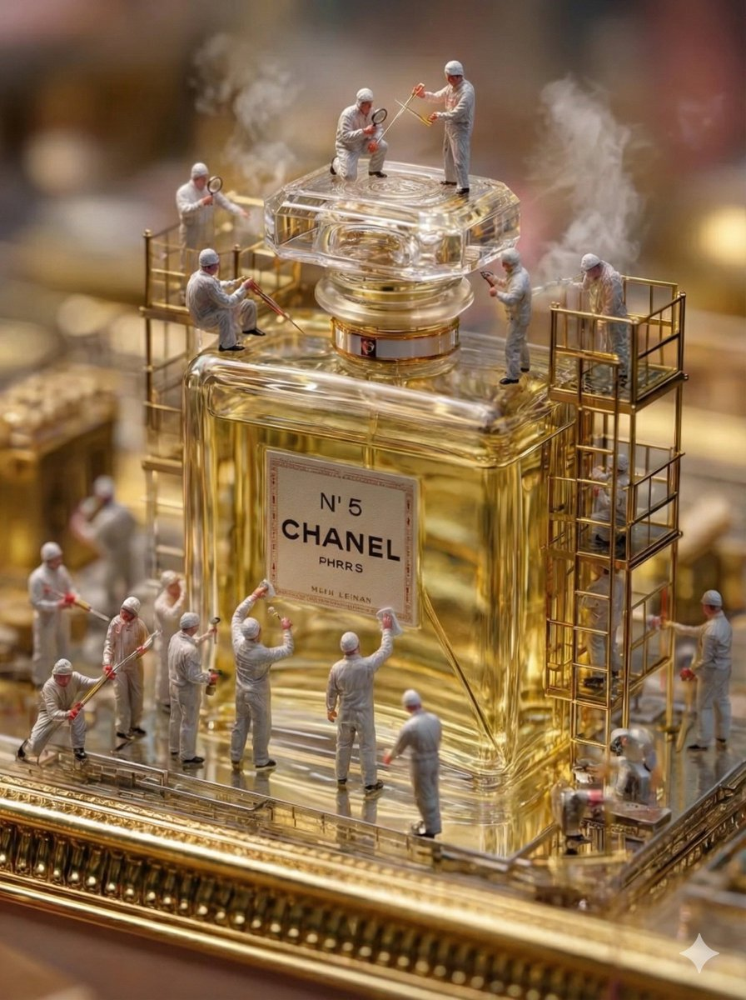

```
{
  "image_generation_prompts": [
    {
      "id": 1,
      "title": "Pepsi Skyscraper Construction",
      "subject": {
        "main_element": "Giant Black Pepsi can",
        "orientation": "Positioned horizontally like a skyscraper",
        "details": [
          "Iconic red, blue, and white design",
          "Sparkling droplets of water on surface"
        ]
      },
      "environment": {
        "setting": "Checkered diner tablecloth",
        "elements": [
          "Intricate scaffolding",
          "Miniature construction workers swarm"
        ]
      },
      "action": [
        "Polishing the curved surface",
        "Carefully applying fresh paint to the globe logo",
        "Cleaning water droplets"
      ],
      "style": {
        "camera_view": "Wide-angle view",
        "technique": "Tilt-shift photograph",
        "focus": "Shallow depth of field",
        "atmosphere": "Warm and cinematic"
      },
      "parameters": {
        "aspect_ratio": "--ar 3:4",
        "reference_constraint": " 
      }
    },
    {
      "id": 2,
      "title": "Chanel No.5 Refinery",
      "subject": {
        "main_element": "Chanel No.5 perfume bottle",
        "details": [
          "Crystal cap",
          "Label",
          "Tiny scent-mist vapors rising"
        ]
      },
      "environment": {
        "setting": "Golden mirrored tray",
        "elements": [
          "Scaffolding towers",
          "Dozens of miniature workers in protective suits"
        ]
      },
      "action": [
        "Inspecting the crystal cap",
        "Pipetting aromatic fluid",
        "Polishing the label",
        "Sealing the edges"
      ],
      "style": {
        "camera_view": "Wide-angle view",
        "technique": "Tilt-shift macro focus",
        "lighting": "Elegant lighting with soft gold tones",
        "theme": "Highlights glamour and detail"
      },
      "parameters": {
        "aspect_ratio": "--ar 3:4",
        "reference_constraint": "
      }
    },
    {
      "id": 3,
      "title": "Rolex Submariner Restoration",
      "subject": {
        "main_element": "Rolex Submariner watch",
        "orientation": "Laid flat",
        "details": [
          "Watch face isolated by focus",
          "Golden reflections on edges"
        ]
      },
      "environment": {
        "setting": "Metal engineer's table",
        "elements": [
          "Mechanical lifts",
          "Magnifying scopes",
          "Scaffolding reaching the crystal top",
          "Miniature technicians"
        ]
      },
      "action": [
        "Tightening screws",
        "Replacing bezels",
        "Oiling gears",
        "Aligning the hands"
      ],
      "style": {
        "camera_view": "Wide-angle view",
        "technique": "Hyperrealistic tilt-shift macro photography",
        "focus": "Shallow depth of field"
      },
      "parameters": {
        "aspect_ratio": "--ar 3:4",
        "reference_constraint": "
      }
    },
    {
      "id": 4,
      "title": "Instant Noodle Construction Site",
      "subject": {
        "main_element": "Bowl of instant noodles (halfway eaten)",
        "details": [
          "Foam cup edge",
          "Steam rising",
          "Glowing soup reflections"
        ]
      },
      "environment": {
        "setting": "Counter",
        "elements": [
          "Cranes lowering new toppings",
          "Scaffolding straddling the rim",
          "Tiny signs warning of 'hot zone'",
          "Miniature workers"
        ]
      },
      "action": [
        "Repositioning noodles",
        "Reheating broth",
        "Restacking vegetables",
        "Patching the edge of the foam cup"
      ],
      "style": {
        "camera_view": "Wide-angle view",
        "technique": "Highly detailed tilt-shift style"
      },
      "parameters": {
        "aspect_ratio": "--ar 3:4",
        "
      }
    }
  ]
}
```

```
{
  "image_generation_prompts": [
    {
      "id": 1,
      "title": "百事可乐摩天大楼建造",
      "subject": {
        "main_element": "巨型黑色百事可乐罐",
        "orientation": "水平放置，形如摩天大楼",
        "details": [
          "标志性的红、蓝、白配色设计",
          "罐体表面附着晶莹水珠"
        ]
      },
      "environment": {
        "setting": "格子图案的餐厅桌布",
        "elements": [
          "精细复杂的脚手架",
          "成群的微型建筑工人"
        ]
      },
      "action": [
        "抛光弧形罐体表面",
        "仔细为地球标志重新上漆",
        "清理水珠"
      ],
      "style": {
        "camera_view": "广角视角",
        "technique": "移轴摄影",
        "focus": "浅景深",
        "atmosphere": "温暖且富有电影感"
      },
      "parameters": {
        "aspect_ratio": "--ar 3:4",
        "reference_constraint": " "
      }
    },
    {
      "id": 2,
      "title": "香奈儿五号香水精炼厂",
      "subject": {
        "main_element": "香奈儿五号香水瓶",
        "details": [
          "水晶瓶盖",
          "标签",
          "升腾的微小香氛雾气"
        ]
      },
      "environment": {
        "setting": "金色镜面托盘",
        "elements": [
          "塔式脚手架",
          "数十名身穿防护服的微型工人"
        ]
      },
      "action": [
        "检查水晶瓶盖",
        "用移液管吸取香氛液体",
        "擦拭标签",
        "密封瓶口边缘"
      ],
      "style": {
        "camera_view": "广角视角",
        "technique": "移轴微距对焦",
        "lighting": "优雅柔和的金色调光线",
        "theme": "突出奢华与细节"
      },
      "parameters": {
        "aspect_ratio": "--ar 3:4",
        "reference_constraint": " "
      }
    },
    {
      "id": 3,
      "title": "劳力士潜航者型腕表修复",
      "subject": {
        "main_element": "劳力士潜航者型腕表",
        "orientation": "平放",
        "details": [
          "表盘因焦点而突出",
          "边缘泛出金色反光"
        ]
      },
      "environment": {
        "setting": "金属工程师工作台",
        "elements": [
          "机械升降装置",
          "放大镜",
          "通往表镜顶部的脚手架",
          "微型技师"
        ]
      },
      "action": [
        "拧紧螺丝",
        "更换表圈",
        "为齿轮上油",
        "校准指针"
      ],
      "style": {
        "camera_view": "广角视角",
        "technique": "超写实移轴微距摄影",
        "focus": "浅景深"
      },
      "parameters": {
        "aspect_ratio": "--ar 3:4",
        "reference_constraint": " "
      }
    },
    {
      "id": 4,
      "title": "方便面施工现场",
      "subject": {
        "main_element": "一碗吃了一半的方便面",
        "details": [
          "泡沫杯边缘",
          "升腾的蒸汽",
          "汤面反射出的光泽"
        ]
      },
      "environment": {
        "setting": "操作台",
        "elements": [
          "吊车正在放下新配料",
          "横跨杯口的脚手架",
          "贴有“高温危险”字样的微型警示牌",
          "微型工人"
        ]
      },
      "action": [
        "重新摆放面条",
        "加热汤底",
        "堆叠蔬菜",
        "修补泡沫杯边缘"
      ],
      "style": {
        "camera_view": "广角视角",
        "technique": "高度细节化的移轴风格"
      },
      "parameters": {
        "aspect_ratio": "--ar 3:4",
        "reference_constraint": " "
      }
    }
  ]
}
```

 [↑返回目录](#toc)

---
## <a id="prompt-2000219294244758000">异形2微缩对决</a> (<a href="https://x.com/michaelrabone/status/2000219294244757944" target="_blank" rel="noopener noreferrer">Michael Rabone</a>)

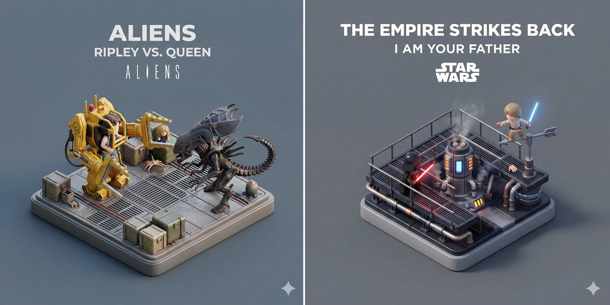

```
I know this prompt has been posted already but I've not seen it done on movies. Here are 2 examples. The parts of the prompt you need to edit are in (BOLD)

Present a clear, 45° top-down isometric miniature 3D cartoon scene of the iconic scene of (RIPLEY IN THE POWER LOADER BATTLING ALIEN QUEEN) from (ALIENS), with soft refined textures, realistic PBR materials, and gentle lifelike lighting.

Create a small raised diorama-style base that includes the most recognisable elements of this scene, along with tiny stylised characters if needed (no facial details).

Use a clean solid (SULACO SHIP GREY) background.

At the top center, display (ALIENS) in large bold text, directly beneath it show (RIPLEY VS. QUEEN) in medium text, and place the official logo associated with (ALIENS) below the subtext.

All text must automatically match the background contrast (white or black).

Composition: perfectly centered layout, square 1080x1080, ultra-clean, high-clarity diorama aesthetic.
```

```
我知道这个提示词已经有人发过，但我还没见过用于电影场景。以下是两个示例。需要你修改的部分已用（加粗）标出。

呈现一个清晰的、45°俯视等距微型3D卡通场景，展现（《异形2》中蕾普莉驾驶动力装载机大战异形女王）的经典场面，采用柔和精细的纹理、逼真的PBR材质和柔和自然的光照。

制作一个略高于平面的微缩模型基座，包含该场景最具辨识度的元素，如有需要可加入微小风格化角色（无需面部细节）。

使用干净纯色的（苏拉科号飞船灰色）背景。

在顶部中央以大号粗体显示（《异形2》），其正下方以中等字号显示（蕾普莉 VS 女王），并在副标题下方放置与（《异形2》）相关的官方标志。

所有文字必须自动匹配背景对比度（白色或黑色）。

构图：完全居中布局，方形1080x1080，极致干净，高清晰度微缩模型美学。
```

 [↑返回目录](#toc)

---
## <a id="prompt-2000090668631487000">龙形叶影</a> (<a href="https://x.com/umesh_ai/status/2000090668631486912" target="_blank" rel="noopener noreferrer">Umesh</a>)

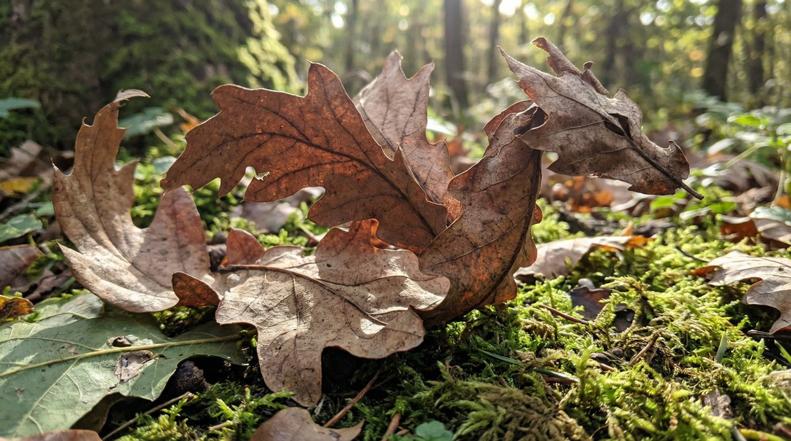

```
: A photorealistic image of a leaf that looks like it’s in the shape of a dragon.
```

```
一片逼真的叶子，其形状酷似一条龙。
```

 [↑返回目录](#toc)

---
## <a id="prompt-2000059750013456400">黄昏公路：电影感多视角肖像</a> (<a href="https://x.com/ChillaiKalan__/status/2000059750013456402" target="_blank" rel="noopener noreferrer">K</a>)

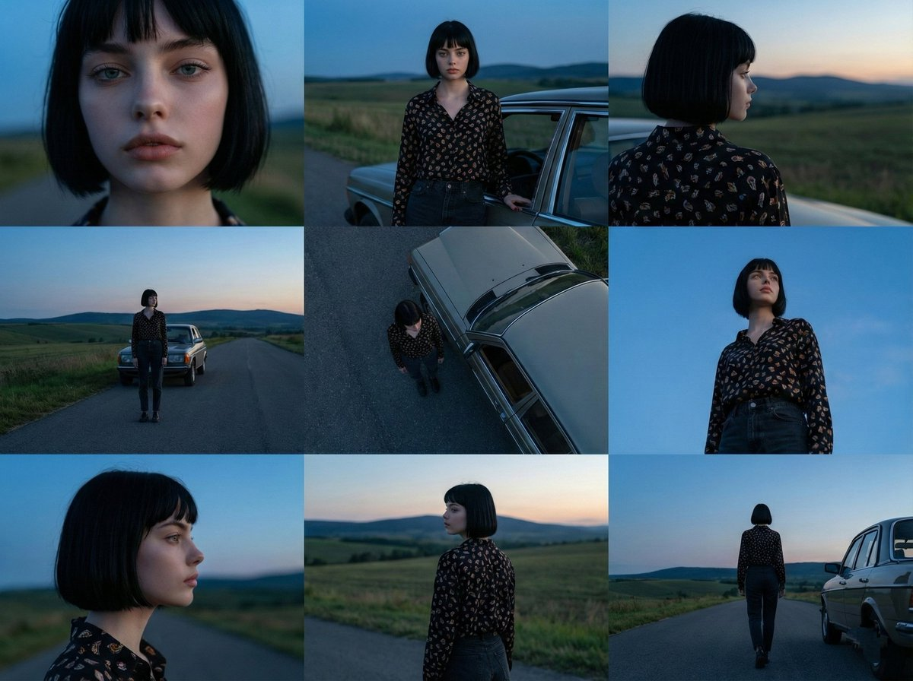

```
A cinematic 3×3 grid presenting multiple camera angles of the same female subject outdoors at dusk. A young woman wearing a patterned black shirt stands beside a car on a rural road, surrounded by open fields and distant hills. Each frame shows a distinct shot: extreme close-up, medium shot, over-the-shoulder, wide shot, high-angle top-down, low-angle, profile, three-quarter rear view, and full back view. Natural blue-hour lighting, soft sky gradients, realistic colors, shallow depth of field, cinematic framing. Consistent subject appearance across all frames, film-still aesthetic, professional cinematography reference sheet style, ultra-realistic photography.
```

```
一组电影风格的 3×3 网格图像，展示同一女性主体在黄昏户外的多个拍摄角度。一位身穿黑色印花衬衫的年轻女子站在乡间道路旁的一辆汽车边，四周是开阔的田野和远处的山丘。每个画面呈现不同的镜头视角：特写、中景、过肩镜头、广角镜头、高角度俯拍、低角度仰拍、侧面、四分之三后侧视角以及完全背面视角。采用自然的蓝调时刻光线、柔和的天空渐变、真实色彩、浅景深和电影式构图。所有画面中人物形象保持一致，具有电影剧照美学，参考专业电影摄影参考表风格，超写实摄影效果。
```

 [↑返回目录](#toc)

---
## <a id="prompt-2000517151136870400">雪林中的双生奇缘</a> (<a href="https://x.com/YaseenK7212/status/2000517151136870514" target="_blank" rel="noopener noreferrer">Yaseen Khan Gul</a>)

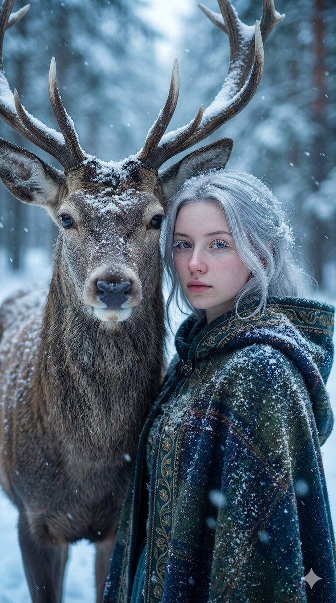


```
{
  "generation_configuration": {
    "meta": {
      "config_version": "3.0_strict_schema",
      "intent": "editorial_cinematic_render"
    },
    "global_settings": {
      "aspect_ratio": "9:16",
      "target_resolution": "8K",
      "detail_density": "ultra_high",
      "realism_mode": "hyper_realistic"
    },
    "scene_composition": {
      "shot_type": "portrait_close_up",
      "camera_angle": "eye_level",
      "focal_point": ["subject_woman", "subject_deer"],
      "depth_of_field": {
        "style": "cinematic_shallow",
        "background_state": "softly_blurred"
      }
    },
    "subjects": {
      "primary_subject_woman": {
        "base_archetype": "young_ethereal_woman",
        "identity_constraints": {
          "source_data_required": true,
          "input_source": "uploaded_selfie",
          "preservation_strictness": "absolute",
          "locked_features": {
            "geometry": true,
            "bone_structure": true,
            "eyes": true,
            "nose": true,
            "lips": true,
            "jawline": true
          },
          "prohibited_actions": {
            "beautification_filters": true,
            "stylization": true,
            "facial_reinterpretation": true,
            "mesh_alteration": true
          },
          "allowed_vfx_overlays": {
            "cold_frost_on_skin": true,
            "frozen_eyelashes": true
          }
        },
        "pose_and_interaction": {
          "gaze_direction": "direct_into_camera",
          "proximity_to_secondary_subject": "touching_distance",
          "connection_type": "intimate_surreal"
        },
        "attire_details": {
          "fabric_type": "rich_plaid",
          "texture_emphasis": "high_detail_weave"
        }
      },
      "secondary_subject_deer": {
        "archetype": "majestic_deer",
        "surface_details": {
          "integument": "fur",
          "particulate_accumulation": "snow_dusted"
        },
        "pose_and_interaction": {
          "gaze_direction": "direct_into_camera"
        }
      }
    },
    "environment_context": {
      "location_biome": "snowy_forest",
      "weather_state": {
        "precipitation": "falling_snow",
        "atmosphere": "freezing_fog"
      },
      "lighting_engine": {
        "style": "cinematic_cold",
        "ambient_palette": ["cool_blue", "white"],
        "key_light": "soft_facial_highlights",
        "rim_light": {
          "enabled": true,
          "purpose": "enhance_winter_textures"
        }
      }
    },
    "artistic_direction": {
      "style_reference": "high_budget_fantasy_film_still",
      "mood_keywords": ["surreal", "quiet", "intimate", "winter_fantasy_drama"],
      "texture_rendering_priorities": {
        "skin_realism": "critical",
        "frost_and_ice": "high",
        "fur_and_hair_strands": "high",
        "fabric_weave": "high"
      }
    }
  }
}
```

```
{
  "生成配置": {
    "元数据": {
      "配置版本": "3.0_严格模式",
      "意图": "编辑级电影感渲染"
    },
    "全局设置": {
      "宽高比": "9:16",
      "目标分辨率": "8K",
      "细节密度": "超高",
      "写实模式": "超写实"
    },
    "场景构图": {
      "镜头类型": "人像特写",
      "摄像机角度": "平视",
      "焦点对象": ["女性主体", "鹿主体"],
      "景深": {
        "风格": "电影感浅景深",
        "背景状态": "柔和虚化"
      }
    },
    "主体对象": {
      "主要主体_女性": {
        "基础原型": "年轻空灵女性",
        "身份约束": {
          "需提供源数据": true,
          "输入源": "上传的自拍照",
          "特征保留严格度": "绝对",
          "锁定特征": {
            "几何结构": true,
            "骨骼结构": true,
            "眼睛": true,
            "鼻子": true,
            "嘴唇": true,
            "下颌线": true
          },
          "禁止操作": {
            "美颜滤镜": true,
            "风格化处理": true,
            "面部再诠释": true,
            "网格变形": true
          },
          "允许的视觉特效叠加": {
            "皮肤上的冷霜": true,
            "结霜的睫毛": true
          }
        },
        "姿态与互动": {
          "视线方向": "直视镜头",
          "与次要主体的距离": "触手可及",
          "连接类型": "亲密而超现实"
        },
        "服饰细节": {
          "面料类型": "厚实质感格纹",
          "纹理强调": "高细节织纹"
        }
      },
      "次要主体_鹿": {
        "原型": "雄伟的鹿",
        "表面细节": {
          "表皮": "毛发",
          "颗粒附着": "覆雪"
        },
        "姿态与互动": {
          "视线方向": "直视镜头"
        }
      }
    },
    "环境上下文": {
      "地点生态": "雪林",
      "天气状态": {
        "降水": "飘雪",
        "大气": "冰雾"
      },
      "光照引擎": {
        "风格": "电影感冷调",
        "环境色板": ["冷蓝", "白色"],
        "主光源": "柔和面部高光",
        "轮廓光": {
          "启用": true,
          "用途": "强化冬季质感"
        }
      }
    },
    "艺术指导": {
      "风格参考": "高预算奇幻电影剧照",
      "氛围关键词": ["超现实", "静谧", "亲密", "冬日奇幻剧情"],
      "纹理渲染优先级": {
        "皮肤真实感": "关键",
        "霜与冰": "高",
        "毛发与发丝": "高",
        "织物纹理": "高"
      }
    }
  }
}
```

 [↑返回目录](#toc)

---
## <a id="prompt-2000617852789727700">哲学经典化作机械奇观</a> (<a href="https://x.com/Gdgtify/status/2000617852789727710" target="_blank" rel="noopener noreferrer">Gadgetify</a>)

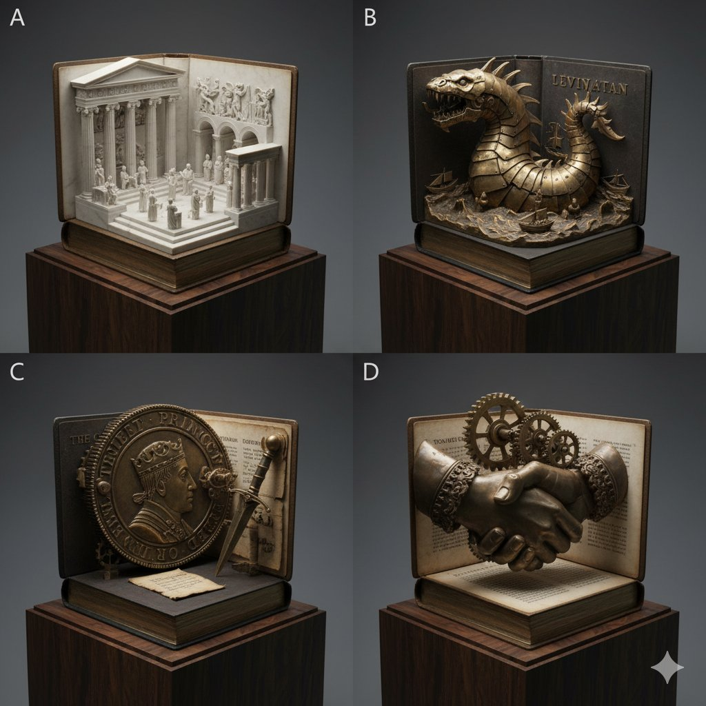

```
2x2 grid, premium museum display, marble and bronze materials, crisp macro realism. Panel A: “The Republic” as a miniature marble agora diorama inside an open book: columns, tiny debating figures, geometric shadows. Panel B: “Leviathan” as a mechanical sea-monster relief emerging from a hardcover: brass plates, rivets, articulated spine segments, ship silhouettes below. Panel C: “The Prince” as a Renaissance coin-and-dagger automaton: rotating medal, tiny crown mechanism, aged parchment textures. Panel D: “The Social Contract” as an interlocking-gear sculpture shaped like clasped hands over an open book, subtle motion implied, brushed metal, solemn lighting.
```

```
2x2网格，高端博物馆展陈风格，使用大理石与青铜材质，清晰锐利的微距写实风格。  
A格：“理想国”呈现为一本打开书页中的微型大理石广场微缩场景：立柱、微小的辩论人物、几何状阴影。  
B格：“利维坦”表现为从精装书封面中浮现的机械海怪浮雕：黄铜板、铆钉、可活动的脊椎节段，下方有船只剪影。  
C格：“君主论”化身为文艺复兴风格的硬币与匕首自动装置：旋转的勋章、微型王冠机关、做旧羊皮纸纹理。  
D格：“社会契约论”以啮合齿轮构成紧握双手的雕塑，置于打开的书本之上，暗示微妙动态，采用拉丝金属材质，配以庄重光线。
```

 [↑返回目录](#toc)

---
## <a id="prompt-2000613834193772500">指尖上的微型城市</a> (<a href="https://x.com/TechieBySA/status/2000613834193772620" target="_blank" rel="noopener noreferrer">TechieSA</a>)

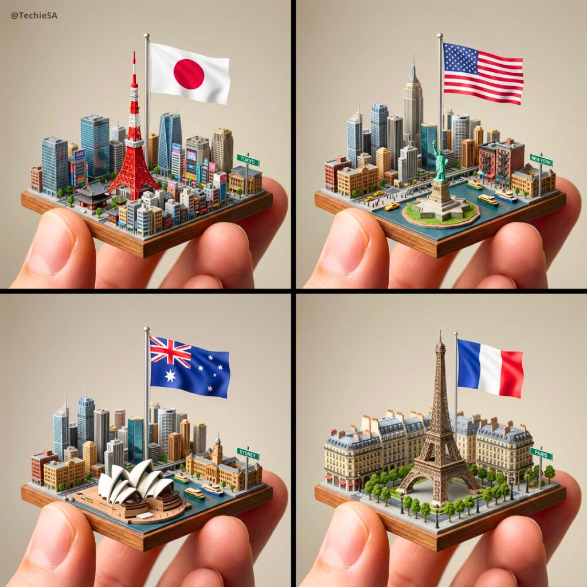

```
Extreme close-up macro of miniature city diorama [CITY, COUNTRY] on a solid base, held between two human fingers. City fills 85–95% of frame.
[COUNTRY] national flag stands prominently on flagpole in mid-ground, fully readable, gently waving—primary visual anchor.
[ICONIC LANDMARK] positioned in clear foreground, unobstructed, instantly recognizable, naturally integrated.
Small street sign or plaque displays “[CITY NAME]” as authentic urban detail, positioned organically at street corner or plaza edge.
Surrounding architecture reflects city’s authentic character without oversizing elements.
Ultra-realistic handcrafted miniature, detailed architecture, realistic materials, accurate proportions. Macro lens, deep depth of field keeping entire city sharp. Soft studio lighting, subtle shadows, tilt-shift realism. Neutral softly blurred background. Photorealistic, cinematic, premium quality.
Aspect ratio 1:1 — 1080×1080
```

```
超近距离微距拍摄置于坚实底座上的微型城市模型[CITY, COUNTRY]，被两根人类手指夹持。城市占据画面85–95%。  
[COUNTRY]国旗醒目地立于中景旗杆上，清晰可辨，微微飘扬——作为主要视觉焦点。  
[ICONIC LANDMARK]位于清晰前景，无遮挡，一眼可识别，自然融入场景。  
小型街道标牌或铭牌以真实城市细节形式展示“[CITY NAME]”，有机地置于街角或广场边缘。  
周围建筑体现该城市真实风貌，各元素比例协调，无夸张放大。  
超写实手工微缩模型，精细建筑细节，真实材质，准确比例。使用微距镜头，大景深使整座城市清晰锐利。柔光影棚照明，阴影细腻，移轴摄影般的写实感。背景为柔和虚化的中性色。照片级真实感，电影质感，高品质。  
画面比例1:1 — 1080×1080
```

 [↑返回目录](#toc)

---
## <a id="prompt-2000206139804332300">复古未来风可动人偶</a> (<a href="https://x.com/Gdgtify/status/2000206139804332219" target="_blank" rel="noopener noreferrer">Gadgetify</a>)

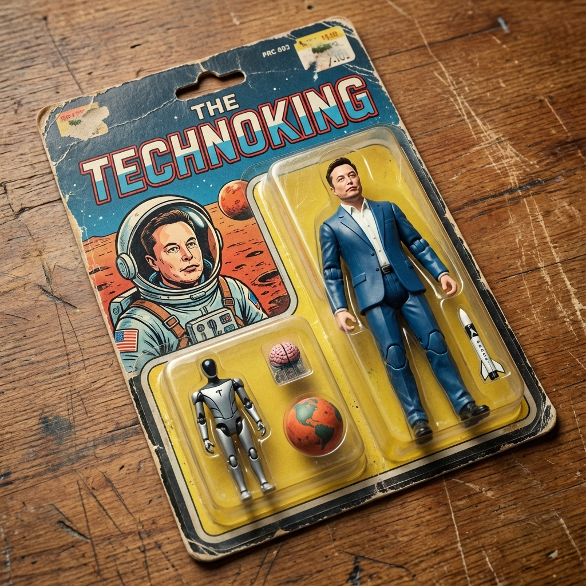

```
This Nano Banana Pro prompt turns people into toys. I modified it. I wanted more accessories to be included. 

 

1. Convert the subject's skin and clothing into semi-gloss ABS plastic textures. Visible joints at elbows and knees.
2. Analyze the subject's profession or hobby (or infer it). Generate 4 distinct "accessories" included in the bubble (e.g., a tiny plastic laptop, a sword, a coffee mug).
3. Determine if the vibe is 80s (Neon/He-Man), 90s (Grungy/Spawn), or 70s (Kenner/Star Wars), 2000 (appropriate style) or 2025 (appropriate style).

Phase 2: The Packaging Design
1. Cardback Art:The cardboard backing features a dynamic 2D illustration of the subject in an action pose behind the plastic bubble.
2. Wear & Tear: The card corners must be slightly frayed/white. The plastic bubble should have minor scratches or yellowing to simulate age.
3. Typography: Bold, explosive comic book fonts. Title: "THE [Subject's Defining Trait]".

Phase 3: The Shot
A slightly high-angle studio shot of the unpromoted toy resting on a wooden table or carpet, as if just found at a garage sale.


A photorealistic macro shot of a vintage action figure mint-on-card. The figure inside the yellowed plastic blister pack is the input subject turned into a plastic toy with visible articulation joints. The cardboard backing features retro character art. Worn edges, price tag sticker residue. 2025 toy aesthetic
```

```
1. 将主体的皮肤和服装转换为半光 ABS 塑料材质，并在肘部和膝盖处呈现可见的关节。
2. 分析主体的职业或爱好（或进行合理推测），在塑料泡罩内生成 4 件独特的“配件”（例如：微型塑料笔记本电脑、一把剑、一个咖啡杯）。
3. 判断整体风格属于 80 年代（霓虹/希曼）、90 年代（粗粝/再生侠）、70 年代（Kenner/星球大战）、2000 年代（相应风格）还是 2025 年（相应风格）。

第二阶段：包装设计  
1. 背卡插画：纸板背卡上印有主体动态的二维插画，呈战斗姿态，位于塑料泡罩后方。  
2. 磨损痕迹：卡片四角需略微起毛或泛白，塑料泡罩应带有轻微划痕或泛黄，以模拟年代感。  
3. 字体排印：使用粗体、爆炸式漫画字体。标题为：“THE [主体标志性特征]”。

第三阶段：拍摄画面  
略带俯角的棚拍画面，未宣传的玩具静置于木桌或地毯上，仿佛刚在旧货甩卖中被发现。

一张逼真的微距照片，展示一款全新未拆封的复古可动人偶。泛黄塑料泡罩内的玩偶由输入主体转化而成，具有可见的关节结构。纸板背卡印有复古角色插画，边缘磨损，留有价格标签残胶。呈现 2025 年玩具美学风格。
```

 [↑返回目录](#toc)

---
## <a id="prompt-2000283351937327600">限定风味铝罐艺术</a> (<a href="https://x.com/TechieBySA/status/2000283351937327513" target="_blank" rel="noopener noreferrer">TechieSA</a>)

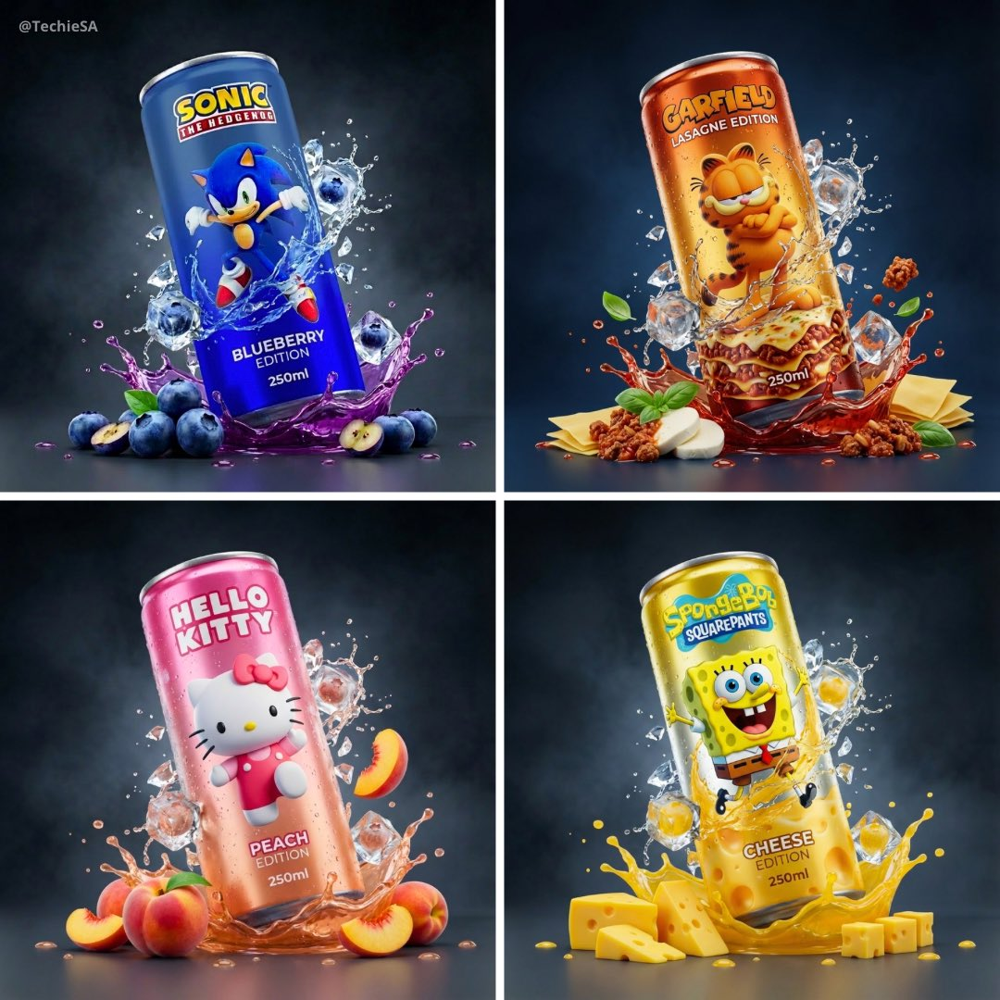

```
A hyper-realistic 250ml sleek aluminum flavored edition can in high resolution, with a 3D animated [FIGURE] character integrated on the front center, depicted in a dynamic pose. The can preserves its metallic texture, logo, and typography (without the character name), with a matching color blending with [INGREDIENT] at the base. The ingredients are scattered artfully around the base of the can - whole fruits, sliced pieces, and juice splashes. The can has condensation, surrounded by fragmented ice and water splashes. The background is a dark misty setting with professional studio lighting, soft shadows, and reflections, captured at a 3/4 view from the front, slightly tilted upward, for a premium series appearance. 1080x1080 dimension picture.
```

```
一个超写实的250毫升流线型铝制风味限定版罐体，高分辨率，正面中央融合了一个3D动画[FIGURE]角色，呈动态姿势。罐体保留其金属质感、标志和文字排版（不含角色名称），底部颜色与[INGREDIENT]相协调。配料以整颗水果、切片和果汁飞溅的形式艺术化地散落在罐体底部周围。罐体表面有冷凝水珠，周围环绕着碎冰和水花飞溅。背景为深色雾气环境，采用专业影棚灯光、柔和阴影与反射效果，以略微仰角的前侧3/4视角拍摄，呈现高端系列外观。图像尺寸为1080x1080。
```

 [↑返回目录](#toc)

---
## <a id="prompt-2000070495446643200">订书机巨塔：反乌托邦总部</a> (<a href="https://x.com/Gdgtify/status/2000070495446643091" target="_blank" rel="noopener noreferrer">Gadgetify</a>)

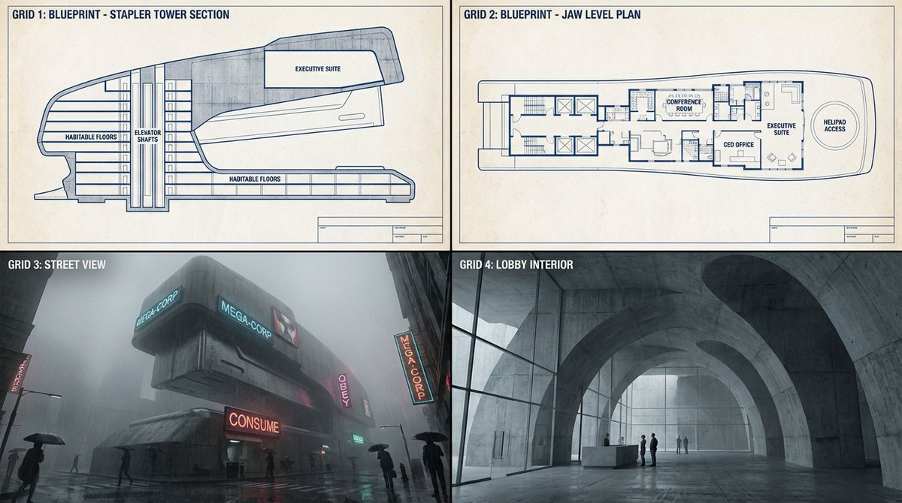

```
Task: Turn small desktop objects into monumental dystopian buildings. 

Step 1: Upload image.... e.g. a stapler

Step 2: Scale this object up by 5000%. It is now the headquarters for a villainous mega-corporation in a Brutalist concrete future. Analyze the geometry to create habitable floors."

Step 3 Output: 2x2 Grid.
Grid 1 & 2: Blueprints of the "Object turned into Tower" showing elevator shafts and executive suites.
Grid 3: Eye-level street view looking up at the concrete mega-structure in rain and fog. Tiny people for scale. Neon cyberpunk signs attached to the exterior.
Grid 4: Interior shot of the lobby, retaining the plastic curves of the original object but rendered in cold concrete and glass.
```

```
任务：将桌面上的小物件变成具有纪念碑意义的反乌托邦建筑。

步骤1：上传图片...例如一个订书机。

步骤2：将此对象按5000%的比例放大。现在它成为了未来野兽派混凝土世界中一个邪恶巨型企业的总部。分析其几何形状以创建可居住的楼层。

步骤3输出：2x2网格。
网格1和2：转变为塔楼的“物体”的蓝图，显示了电梯井和行政套房。
网格3：从眼睛水平的街道视角仰望在雨雾中的混凝土巨型结构。用小人物来对比规模。外部附有霓虹灯赛博朋克标志。
网格4：大厅内部视角，保留原始物体的塑料曲线，但用冷冰冰的混凝土和玻璃呈现。
```

 [↑返回目录](#toc)

---
## <a id="prompt-2000614012422136000">金属标志</a> (<a href="https://x.com/AmirMushich/status/2000614012422136108" target="_blank" rel="noopener noreferrer">AmirMušić</a>)

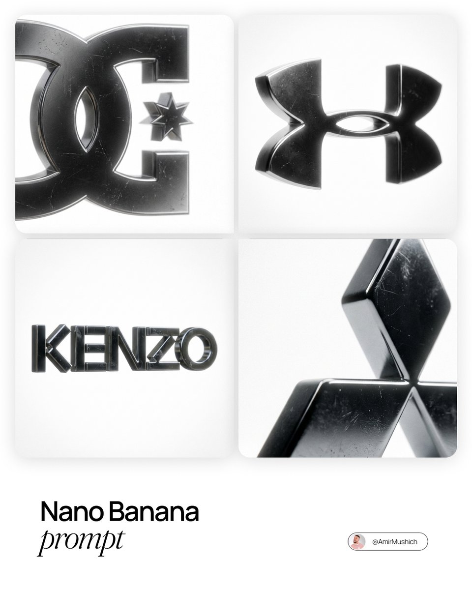

```
[BRAND NAME], the official trademark logo rendered strictly as a solid 3D object, maintaining the exact original vector shape and proportions without any artistic reinterpretation or distortion. The logo is crafted from dark, highly polished chrome metal with subtle surface micro-scratches and imperfections that break the mirror finish. The object is perfectly centered in a vast, infinite pure white void with no visible background elements or studio equipment. The lighting creates a soft, cinematic bloom (halo effect) along the metallic edges. 50mm lens aesthetic with a shallow depth of field gently blurring the furthest points of the object. A pronounced, visible film grain overlay is applied to the entire image.
```

```
[品牌名称]，官方商标标志严格渲染为一个实心3D物体，保持原始矢量形状和比例，没有任何艺术再诠释或扭曲。标志由深色、高度抛光的铬金属制成，并带有细微的表面微划痕和瑕疵，以打破镜面效果。该物体完美地居中于广阔无垠的纯白虚空之中，没有可见的背景元素或工作室设备。光线在金属边缘创造出柔和的电影光晕（光环效应）。采用50毫米镜头美学，浅景深轻轻模糊物体最远点。整个图像应用了显著的可见胶片颗粒覆盖层。
```

 [↑返回目录](#toc)

---
## <a id="prompt-2000541418507628800">百变发型肖像拼贴</a> (<a href="https://x.com/AIwithkhan/status/2000541418507628795" target="_blank" rel="noopener noreferrer">Smiling Khan</a>)

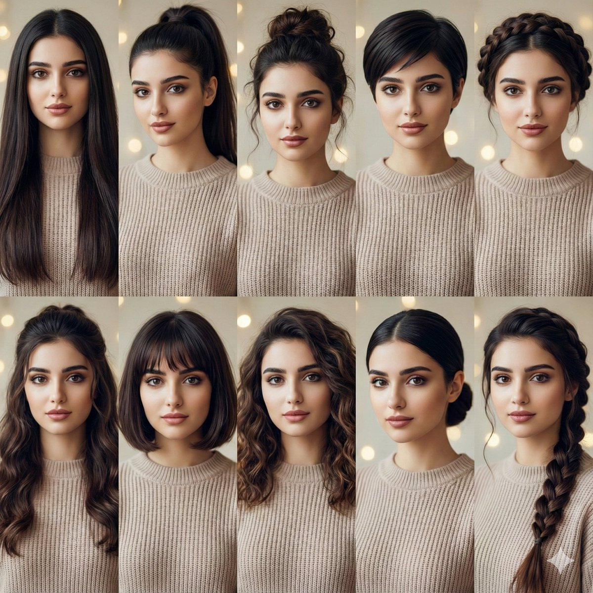

```
👇 

A high-quality photo collage featuring the same person with identical facial features and expression, shown in multiple frames with different hairstyles. Each panel displays a unique hairstyle such as long straight hair, high ponytail, messy bun, pixie cut, braided crown, soft waves, short bob with bangs, low bun, side braid, and loose curls. Consistent neutral outfit and makeup across all images, soft studio lighting, warm blurred background, realistic skin texture, symmetrical face consistency, ultra-detailed, editorial beauty look, 4x3 grid layout, professional portrait photograph
```

```
如下：
一张高质量的照片拼贴画，展示的是同一个人，具有相同的面部特征和表情，在多个帧中展示不同的发型。每个面板显示独特的发型，如长直发、高马尾、凌乱的发髻、精灵短发、编花冠、柔软波浪、带刘海的短bob头、低发髻、侧边辫子和松散卷发。所有图像中保持一致的中性服装和化妆，柔和的工作室光线，温暖模糊的背景，逼真的皮肤纹理，对称的脸部一致性，超详细，编辑美容风格，4x3网格布局，专业人像摄影。
```

 [↑返回目录](#toc)

---
## <a id="prompt-2000088241504911400">Z世代街头酷感人像</a> (<a href="https://x.com/john_my07/status/2000088241504911474" target="_blank" rel="noopener noreferrer">Johnn</a>)

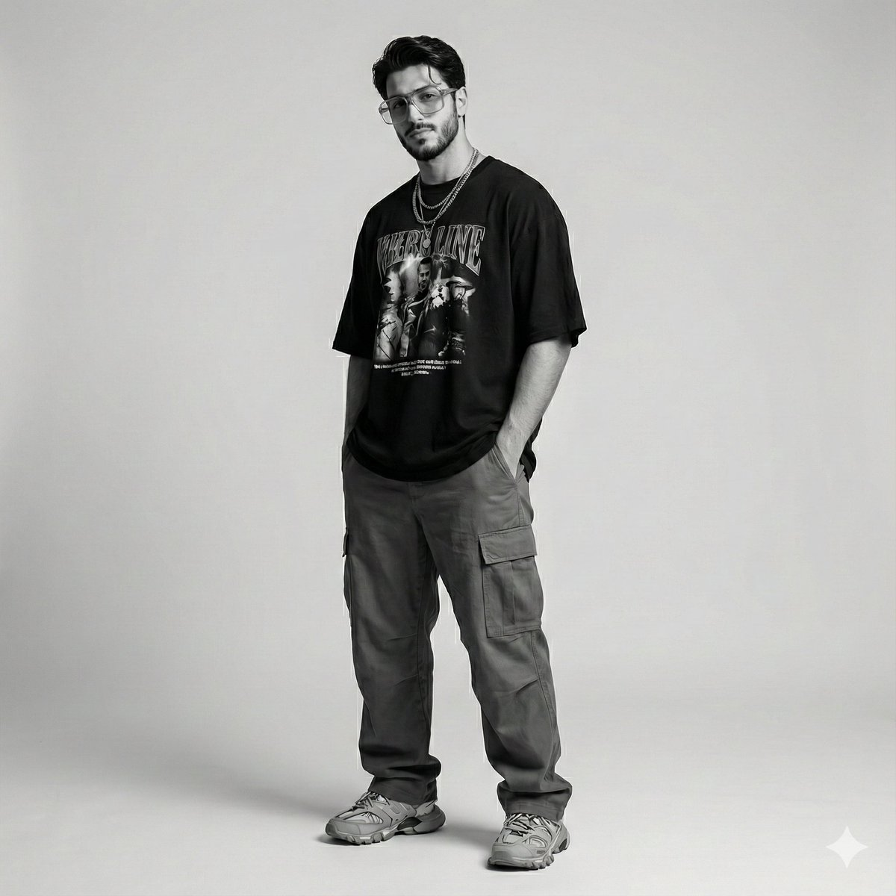

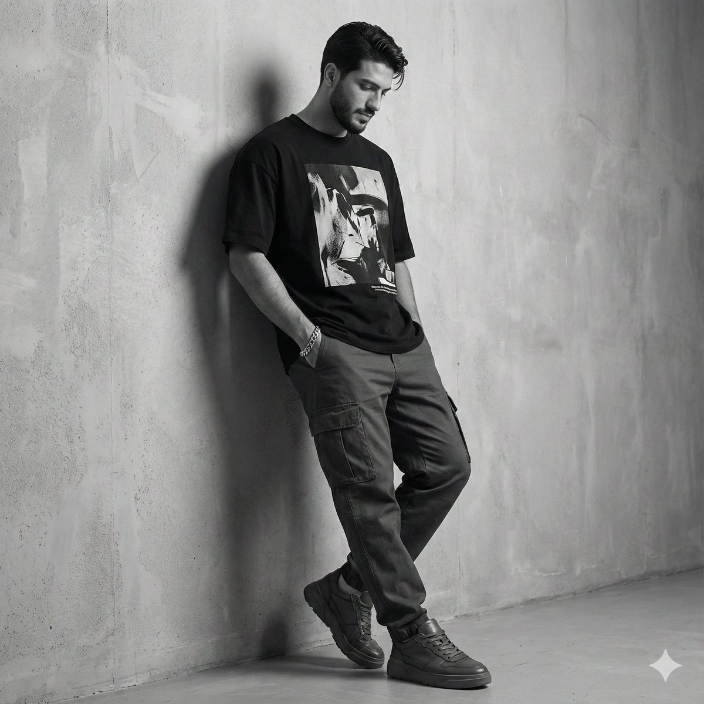

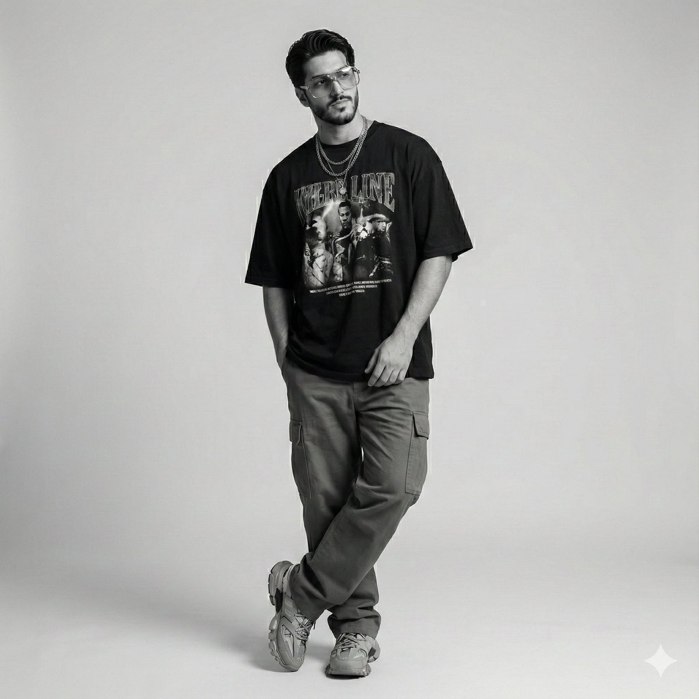

```
;{  "scene_description": "Modern studio photoshoot of a man, identical to the reference, styled in Gen-Z inspired streetwear with a relaxed, effortless aesthetic. The look feels current, bold, and naturally cool without trying too hard.",  "subject_details": {    "appearance": "Man identical to the reference image, calm confident expression, slightly nonchalant Gen-Z attitude.",    "clothing": "Trendy streetwear outfit — relaxed or oversized silhouette, minimal graphic or plain top, clean layers, modern textures, fashion-forward but casual.",    "accessories": "Large transparent-frame glasses with a bold yet minimal street-style design.",    "pose": "Casual street-style stance — slight slouch or weight shifted to one side, hands relaxed (in pockets or loosely by the side), natural candid posture."  },  "environment": {    "background": "Minimal studio backdrop in soft grey or off-white, clean and seamless to keep focus on the styling.",    "lighting": "Soft, diffused studio lighting with low contrast; natural falloff, subtle shadows, modern editorial lighting style; slightly moody but clean."  },  "camera_settings": {    "focus": "Sharp focus on the subject; crisp facial features; shallow depth-of-field for a contemporary fashion portrait.",    "composition": "Mid-shot or slightly wider portrait, off-center framing for an editorial streetwear feel.",    "quality": "Ultra-high resolution, clean tones, smooth textures, modern fashion magazine quality."  },  "mood": "Gen-Z, streetwear, laid-back confidence — minimal studio setup with a cool, fashion-editorial edge."}
```

```
{
  "scene_description": "现代影棚人像拍摄，人物与参考图完全一致，穿着受 Z 世代启发的街头服饰，呈现轻松随性、毫不费力的美学风格。整体造型时尚大胆、自然酷感，毫不刻意。",
  "subject_details": {
    "appearance": "与参考图像完全一致的男性，表情冷静自信，略带 Z 世代特有的漫不经心态度。",
    "clothing": "潮流街头风穿搭——宽松或 oversized 廓形，简约图案或纯色上衣，干净利落的叠穿，现代质感面料，前卫但休闲。",
    "accessories": "大框透明镜架眼镜，设计大胆而简约，具有街头风格。",
    "pose": "随意的街头站姿——微微驼背或重心偏向一侧，双手放松（插在口袋中或自然垂放），姿态自然随性。"
  },
  "environment": {
    "background": "柔和灰色或米白色极简影棚背景，干净无缝，突出人物造型。",
    "lighting": "柔和漫射的影棚灯光，低对比度；自然光衰减，阴影细腻，现代杂志风格布光；略带氛围感但画面干净。"
  },
  "camera_settings": {
    "focus": "主体清晰对焦，面部细节锐利；浅景深营造当代时尚人像效果。",
    "composition": "中景或稍宽幅人像构图，非居中取景，呈现杂志级街头风格。",
    "quality": "超高分辨率，色调干净，质感顺滑，具备现代时尚杂志画质。"
  },
  "mood": "Z 世代、街头风、从容自信——极简影棚布景，兼具酷感与时尚杂志格调。"
}
```

 [↑返回目录](#toc)

---
## <a id="prompt-2000203440413086000">冰镇芬达悬浮于地狱藤蔓</a> (<a href="https://x.com/YaseenK7212/status/2000203440413085967" target="_blank" rel="noopener noreferrer">Yaseen Khan Gul</a>)

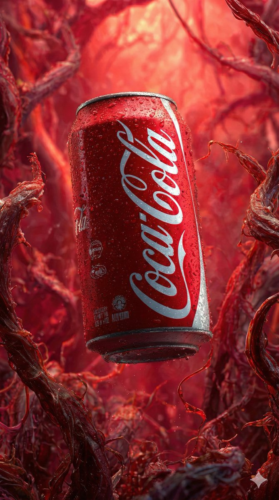

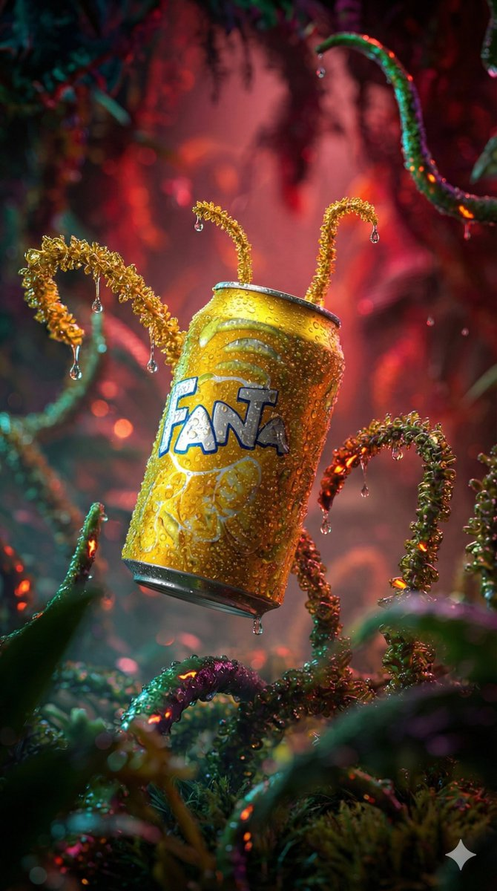

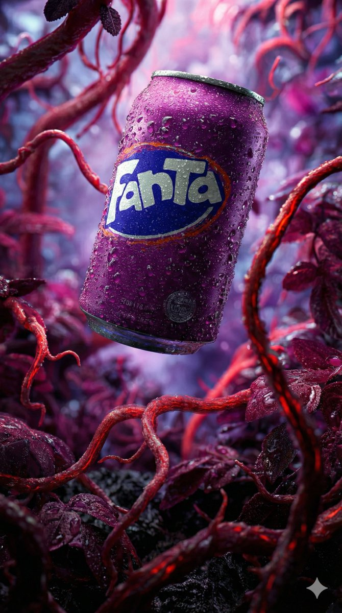

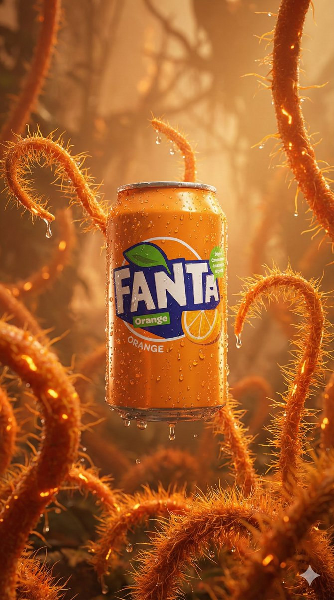

```
{
  "image_generation_manifest": {
    "meta_directives": {
      "visual_target": {
        "instruction": "Exact replication of the provided reference image style and composition.",
        "priority": "Highest"
      },
      "output_format": {
        "aspect_ratio": "9:16 (Vertical)",
        "resolution": "4K",
        "aesthetic": "Hyper-realistic cinematic product photography"
      }
    },
    "primary_subject": {
      "product_identity": {
        "brand": "Fanta",
        "flavor": "Orange  ",
        "container": "Classic 330 ml aluminum can",
        "finish": "Matte-finish aluminum"
      },
      "positional_state": {
        "physics": "Suspended in mid-air, weightless, no supports.",
        "orientation": "Logo centered and sharp."
      },
      "condition_details": {
        "temperature": "Ice-cold",
        "surface_effects": {
          "condensation": "Dense coverage of ultra-fine droplets, organic streaks, and crystal-clear refractions.",
          "atmosphere": "Subtle chill misting and light diffusion around the edges suggesting weight."
        }
      }
    },
    "dynamic_environment": {
      "foreground_activity": {
        "organic_elements": "Fine plant hairs and upward-stretching vines.",
        "moisture_dynamics": "Moisture droplets beading and dripping from fine plant hairs mid-air.",
        "light_dynamics": [
          "Faint ember-like pulses within some vines, alive with warmth.",
          "Vines glow subtly like lava-veined roots due to rim lighting."
        ]
      },
      "background_context": {
        "scenery": "Blurred silhouette of an overgrown infernal forest or deep alien undergrowth.",
        "atmospheric_conditions": "Obscured in fog and cinematic haze.",
        "mood_indicators": "Pulses with heat and shadow, suggesting tension and drama."
      }
    },
    "cinematography_specs": {
      "optical_configuration": {
        "lens": "100 mm Macro",
        "aperture": "f/8",
        "depth_of_field": "Shallow"
      },
      "focus_map": {
        "sharp_plane": ["Fanta Logo", "Can Condensation", "Closest Vine Textures"],
        "blur_plane": ["Background melting into smooth atmospheric bokeh"]
      },
      "composition_rules": {
        "framing": "Frontal cinematic close-up with slight upward angle (Heroic Framing).",
        "layout": "Negative space below the can with vines stretching upward.",
        "intent": "Emphasize scale and impact without overpowering the subject."
      }
    },
    "lighting_design": {
      "scheme": "Dual-tone rim setup",
      "sources": {
        "key_left": {
          "color_temp": "Cool white (~5600 K)",
          "purpose": "Accentuate metallic highlights and water beads."
        },
        "rim_right": {
          "color_tone": "Deep red-orange",
          "purpose": "Create lava-veined root glow effect on vines."
        }
      }
    }
  }
}
```

```
{
  "图像生成规范": {
    "元指令": {
      "视觉目标": {
        "指令": "精确复现所提供参考图像的风格与构图。",
        "优先级": "最高"
      },
      "输出格式": {
        "宽高比": "9:16（竖屏）",
        "分辨率": "4K",
        "美学风格": "超写实电影级产品摄影"
      }
    },
    "主要主体": {
      "产品身份": {
        "品牌": "芬达",
        "口味": "橙味",
        "容器": "经典330毫升铝罐",
        "表面处理": "哑光铝质"
      },
      "位置状态": {
        "物理状态": "悬浮于空中，无重力感，无任何支撑。",
        "朝向": "Logo居中且清晰锐利。"
      },
      "状态细节": {
        "温度": "冰镇",
        "表面效果": {
          "冷凝水": "密集覆盖超细水珠、自然流淌的水痕及晶莹剔透的折射。",
          "氛围": "罐体边缘周围有轻微寒雾与光线漫射，暗示其重量感。"
        }
      }
    },
    "动态环境": {
      "前景活动": {
        "有机元素": "细腻的植物绒毛与向上伸展的藤蔓。",
        "水分动态": "空气中植物绒毛上凝结并滴落的水珠。",
        "光影动态": [
          "部分藤蔓内部有微弱如余烬般的脉动光，充满温暖感。",
          "藤蔓因轮廓光而微微发光，如同熔岩脉络般的根系。"
        ]
      },
      "背景情境": {
        "场景": "模糊的茂密地狱森林或深邃外星植被剪影。",
        "大气条件": "笼罩在雾气与电影感薄霭之中。",
        "情绪暗示": "光影与热浪脉动交织，营造紧张与戏剧感。"
      }
    },
    "电影摄影规格": {
      "光学配置": {
        "镜头": "100毫米微距镜头",
        "光圈": "f/8",
        "景深": "浅景深"
      },
      "焦点分布": {
        "清晰平面": ["芬达Logo", "罐体冷凝水", "最近的藤蔓纹理"],
        "模糊平面": ["背景融为柔滑的大气散景"]
      },
      "构图规则": {
        "取景": "正面电影级特写，略带仰角（英雄式构图）。",
        "布局": "罐体下方留有负空间，藤蔓向上延伸。",
        "意图": "强调规模与冲击力，同时不喧宾夺主。"
      }
    },
    "灯光设计": {
      "方案": "双色调轮廓光设置",
      "光源": {
        "主光左侧": {
          "色温": "冷白光（约5600K）",
          "用途": "突出金属高光与水珠细节。"
        },
        "轮廓光右侧": {
          "色调": "深红橙色",
          "用途": "在藤蔓上营造熔岩脉络般的发光效果。"
        }
      }
    }
  }
}
```

 [↑返回目录](#toc)

---
## <a id="prompt-2000623216298267100">iPhone 17 微型未来工厂</a> (<a href="https://x.com/ecommartinez/status/2000623216298267065" target="_blank" rel="noopener noreferrer">Alejo</a>)

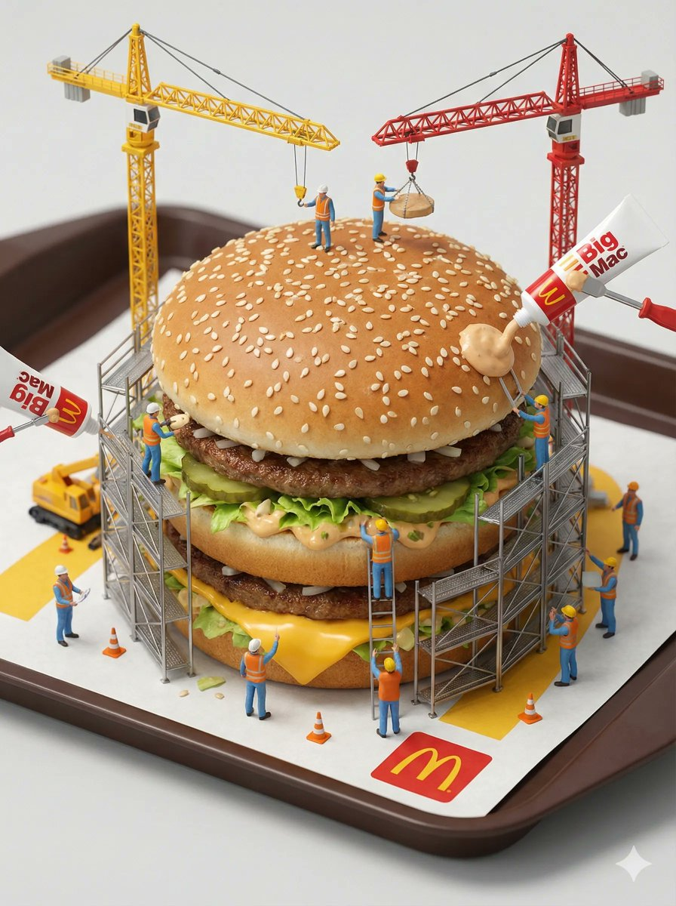

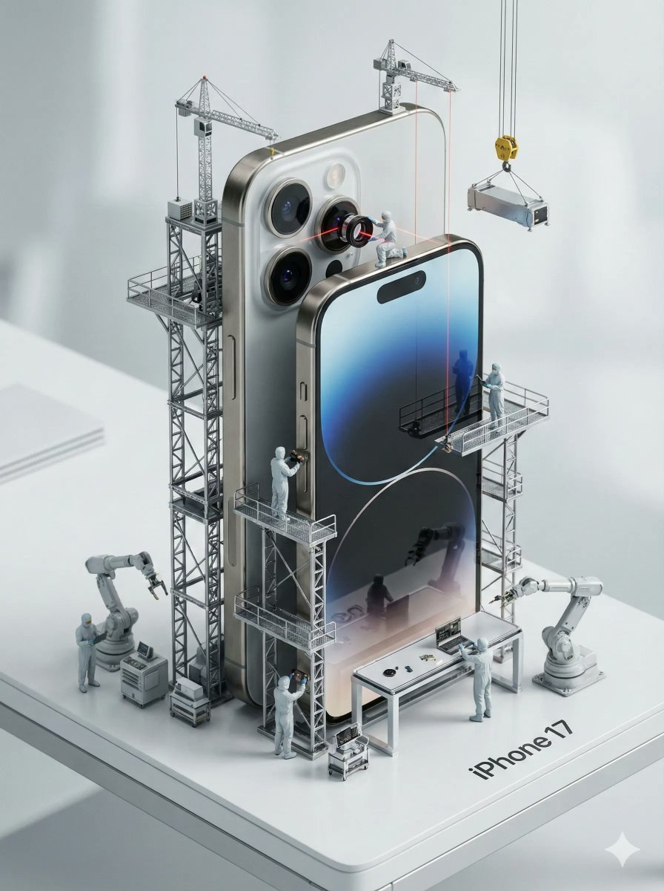

```
{
  "image_generation_prompts": [
    {
      "id": 1,
      "title": "iPhone 17 Assembly Megastructure",
      "subject": {
        "main_element": "Giant iPhone 17",
        "orientation": "Standing vertically like a futuristic skyscraper",
        "details": [
          "Ultra-thin bezels",
          "Edge-to-edge glass",
          "Titanium frame",
          "Advanced multi-lens camera module",
          "Subtle Apple-style reflections on glass surface"
        ]
      },
      "environment": {
        "setting": "Minimalist white engineering table",
        "elements": [
          "High-tech scaffolding surrounding the phone",
          "Micro cranes lifting components",
          "Miniature engineers in cleanroom suits",
          "Robotic arms and precision tools"
        ]
      },
      "action": [
        "Installing camera lenses with laser-guided tools",
        "Aligning the display glass",
        "Polishing the titanium frame",
        "Calibrating sensors and buttons",
        "Inspecting ports and speaker grilles"
      ],
      "style": {
        "camera_view": "Wide-angle view",
        "technique": "Hyperrealistic tilt-shift macro photography",
        "focus": "Shallow depth of field",
        "atmosphere": "Ultra-premium, futuristic, cinematic Apple-style"
      },
      "parameters": {
        "aspect_ratio": "--ar 3:4",
        "reference_constraint": ""
      }
    }
  ]
}
```

```
{
  "image_generation_prompts": [
    {
      "id": 1,
      "title": "iPhone 17 组装巨型结构",
      "subject": {
        "main_element": "巨型 iPhone 17",
        "orientation": "如未来主义摩天大楼般垂直矗立",
        "details": [
          "超窄边框",
          "无边玻璃",
          "钛金属框架",
          "先进的多镜头相机模组",
          "玻璃表面带有细腻的苹果风格反光"
        ]
      },
      "environment": {
        "setting": "极简白色工程桌",
        "elements": [
          "环绕手机的高科技脚手架",
          "吊装组件的微型起重机",
          "身穿洁净服的微型工程师",
          "机械臂与精密工具"
        ]
      },
      "action": [
        "使用激光引导工具安装相机镜头",
        "对齐显示屏玻璃",
        "抛光钛金属框架",
        "校准传感器与按键",
        "检查接口与扬声器格栅"
      ],
      "style": {
        "camera_view": "广角视角",
        "technique": "超写实移轴微距摄影",
        "focus": "浅景深",
        "atmosphere": "极致高端、未来感、电影级苹果风格"
      },
      "parameters": {
        "aspect_ratio": "--ar 3:4",
        "reference_constraint": ""
      }
    }
  ]
}
```

 [↑返回目录](#toc)

---
## <a id="prompt-2000542241513738500">1870年遗失的复古拾得影像</a> (<a href="https://x.com/Arminn_Ai/status/2000542241513738424" target="_blank" rel="noopener noreferrer">ΛRMIN | AI</a>)

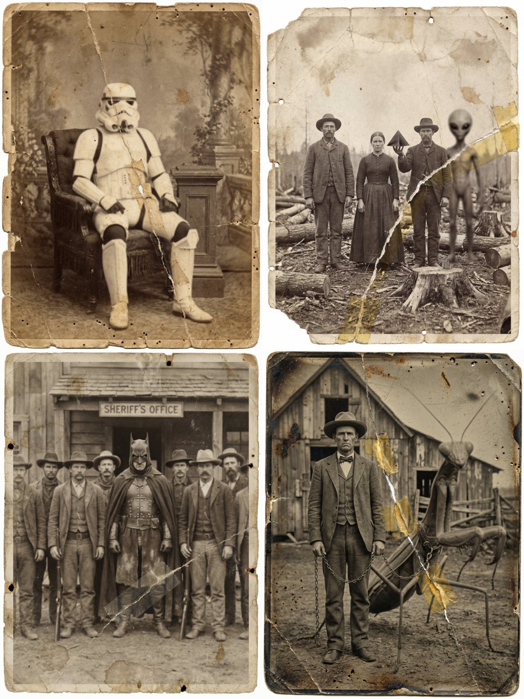

```
More ideas in the comments.
Drop your own version in the comments, I’d love to see it 👀

- Prompt 👇
a photographic image in the style of 1870, [SCENE DESCRIPTION], with [CHARACTERS described in period-accurate clothing], [Describe the interaction].

The photo has an aged and worn appearance, as it was taken in 1870. It features prominent time-induced chemical stains, heavy grain, sepia toning, and deep scratches.

Significantly reduce the sharpness so that the details of the [SUBJECT] are not crisp, making the [SUBJECT] blurry and low-fidelity.

Greatly increase the wear of the photo, including small tears, missing corners, water damage, and small wormholes caused by insect damage. Add a prominent, jagged diagonal cut across the photo, mended clumsily with old, discolored tape.
```

```
评论区有更多创意。  
欢迎在评论区分享你的版本，我很想看看 👀

- 提示词 👇  
一张1870年风格的摄影作品，[场景描述]，包含[身着符合时代服饰的角色]，[描述角色之间的互动]。

照片呈现出年代久远且磨损的外观，仿佛拍摄于1870年。具有明显的岁月化学污渍、厚重颗粒感、棕褐色调以及深刻的划痕。

大幅降低清晰度，使[主体]细节模糊不清，呈现低保真效果。

显著增强照片的磨损程度，包括细小撕裂、缺角、水渍损伤，以及虫蛀造成的小孔洞。添加一道醒目的锯齿状对角撕裂，并用老旧泛黄的胶带粗糙地粘合。
```

 [↑返回目录](#toc)

---
## <a id="prompt-2000516717462626300">未来全息城市[CITY]</a> (<a href="https://x.com/TechieBySA/status/2000516717462626356" target="_blank" rel="noopener noreferrer">TechieSA</a>)

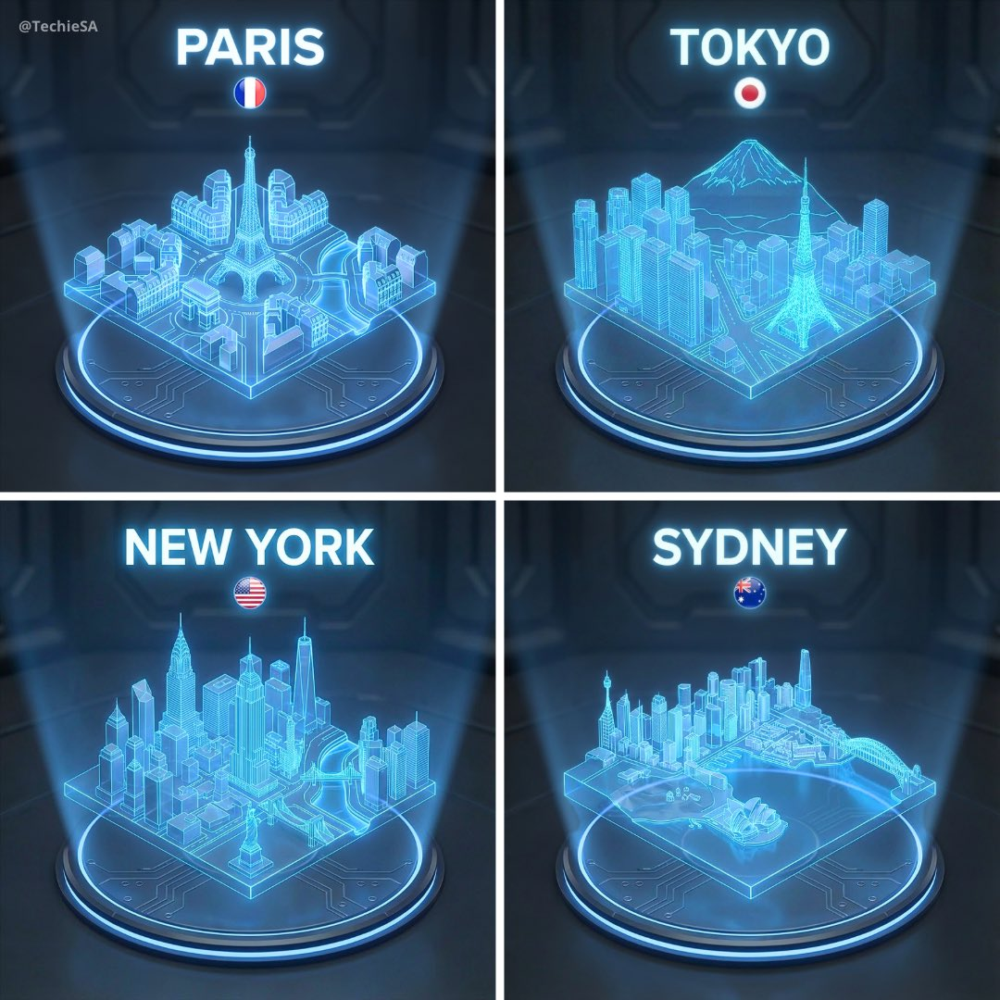

```
Create a futuristic 3D hologram projection of [CITY], rising upward from a flat circular hologram base.
The city appears as a clean 45° top-down isometric miniature with glowing wireframe + semi-solid structures, combining transparent neon geometry with subtle solid surfaces.

Include the most iconic landmarks of [CITY], simplified but instantly recognizable, floating slightly above the hologram base.
Use soft refined lighting, volumetric glow, light bloom, and crisp holographic edges to enhance the sci-fi look.

Use a dark neutral background to maximize hologram contrast.
The hologram glow color should be [HOLOGRAM COLOR].

At the top-center, display [CITY] in large bold text, directly beneath it place a small round city or country flag icon.
All text must automatically match background contrast (white or light neon).

Composition: perfectly centered layout, square 1080x1080, ultra-clean, premium futuristic hologram aesthetic.
```

```
创建一座未来主义的3D全息投影城市[CITY]，从一个扁平的圆形全息底座向上升起。  
城市以干净的45°俯视等距微缩模型呈现，采用发光线框与半实体结构相结合的方式，融合透明霓虹几何体与微妙的实体表面。  

包含[CITY]最具标志性的地标建筑，造型简化但一眼可辨，略微悬浮于全息底座之上。  
使用柔和精致的灯光、体积光效、光晕以及清晰锐利的全息边缘，强化科幻感。  

背景采用深色中性色调，以最大化全息图像的对比度。  
全息光效颜色应为[HOLOGRAM COLOR]。  

在画面顶部中央以大号粗体文字显示[CITY]，其正下方放置一个小型圆形城市或国家旗帜图标。  
所有文字必须自动匹配背景对比度（白色或浅色霓虹）。  

构图：完全居中布局，正方形1080x1080，极致简洁，高端未来主义全息美学。
```

 [↑返回目录](#toc)

---
## <a id="prompt-2000527303353540900">人形金鱼：超现实时尚大片</a> (<a href="https://x.com/Zar_xplorer/status/2000527303353540953" target="_blank" rel="noopener noreferrer">Zar⭕on</a>)


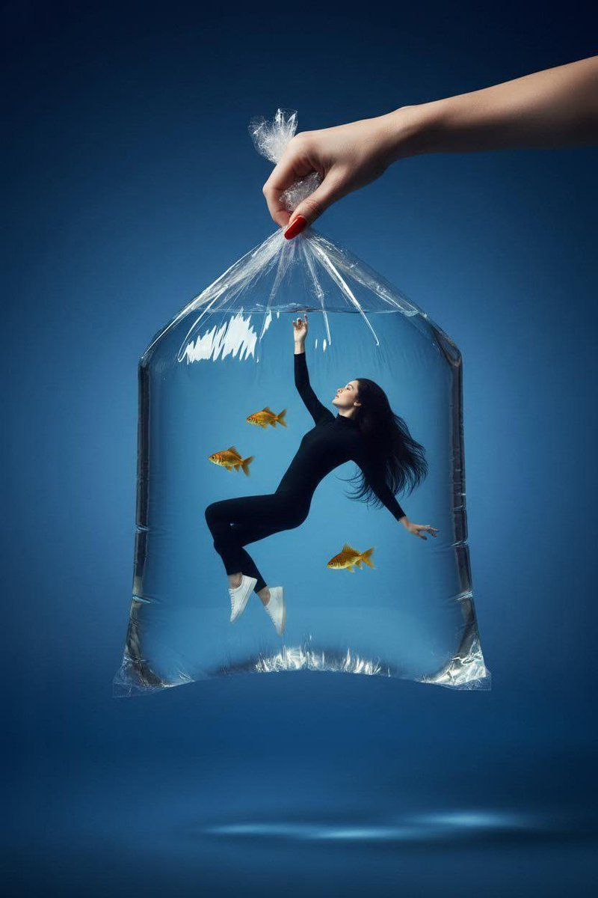

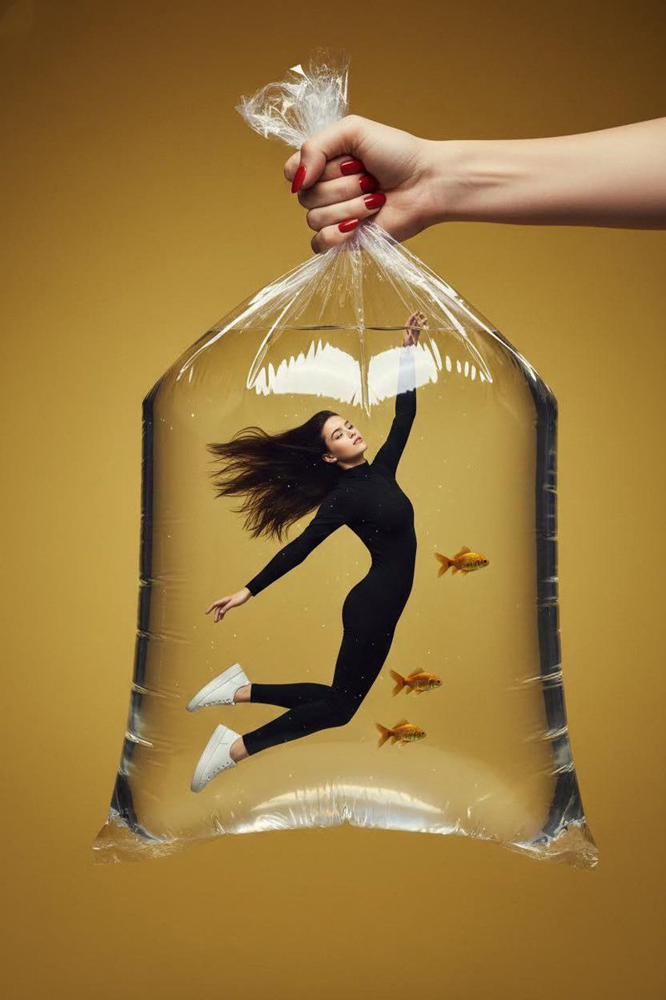

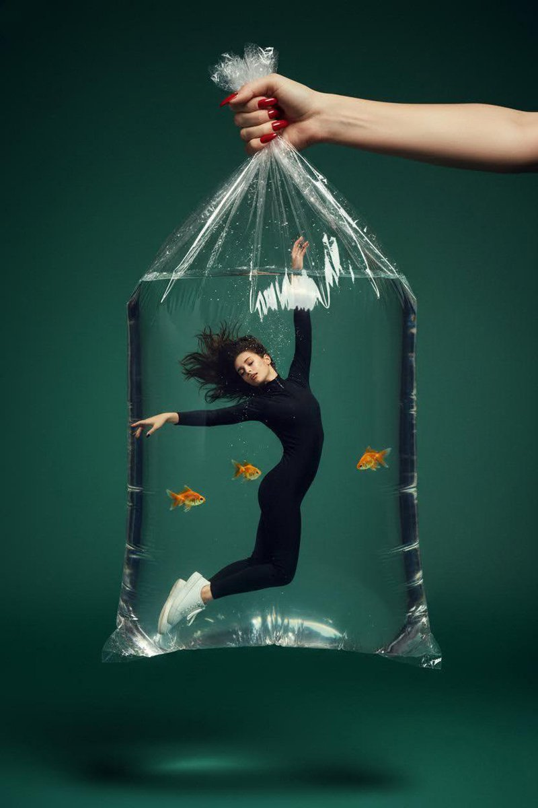

```
A high-end glossy surreal fashion photograph of a young woman floating inside a giant transparent plastic water bag, like a human goldfish. She wears a tight black catsuit and white sneakers, her body posed in a graceful mid-motion curve, one arm lifted, the other extended, hair drifting weightlessly in the water. Three small golden fish swim around her, adding playful contrast. The bag is held from above by a large manicured hand with long red nails, stretching the plastic and creating sharp specular highlights and distortions. Background: a clean deep red studio backdrop with subtle gradient and no distractions. Lighting is cinematic and polished, with crisp reflections on the plastic, smooth skin tones, and strong contrast that emphasizes the contours of her body and the surreal aquarium concept. Ultra-high resolution, editorial campaign quality.
```

```
一幅超现实主义的高端时尚摄影作品：一位年轻女子漂浮在一个巨大的透明塑料水袋中，宛如一条人形金鱼。她身穿紧身黑色连体衣和白色运动鞋，身体呈优雅的动态曲线，一只手臂抬起，另一只伸展，头发在水中无重力般飘散。三条小金鱼在她周围游动，增添俏皮对比。水袋由上方一只涂着鲜红指甲油、精心修饰的大手提着，拉伸塑料材质，形成锐利的镜面高光与扭曲效果。背景为干净深红色影棚幕布，带有微妙渐变且无任何干扰元素。灯光具有电影感且精致，塑料表面呈现清晰反光，肤色柔滑，强烈对比突显她身体轮廓与超现实水族馆概念。超高分辨率，具备杂志大片质感。
```

 [↑返回目录](#toc)

---
## <a id="prompt-2000160854155620900">风中的独立身影</a> (<a href="https://x.com/oggii_0/status/2000160854155620823" target="_blank" rel="noopener noreferrer">Oogie</a>)

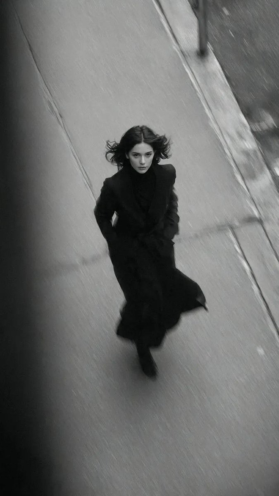

```
black and white photograph of a vogue fashion shoot. a 20-year-old woman with dark hair walking alone down the street, wearing a black coat. strong sense of motion: her hair flowing in the wind, coat fabric lifted and moving naturally. the shot is taken from above, street photography perspective. dynamic composition, candid movement, high resolution, hyper-realistic detail, cinematic contrast, subtle film grain effect. powerful, modern, independent mood.
```

```
黑白照片，时尚杂志拍摄风格。一位20岁黑发女性独自走在街头，身穿黑色大衣。强烈的动感：她的头发在风中飘扬，大衣布料自然扬起并流动。采用俯拍视角，街头摄影风格。动态构图，自然抓拍的动作，高分辨率，超写实细节，电影级对比度，微妙的胶片颗粒效果。整体氛围强大、现代、独立。
```

 [↑返回目录](#toc)

---
## <a id="prompt-1999428719510016300">Nano Banana Pro 模版设计法</a> (<a href="https://x.com/eviljer/status/1999428719510016329" target="_blank" rel="noopener noreferrer">Jerlin</a>)

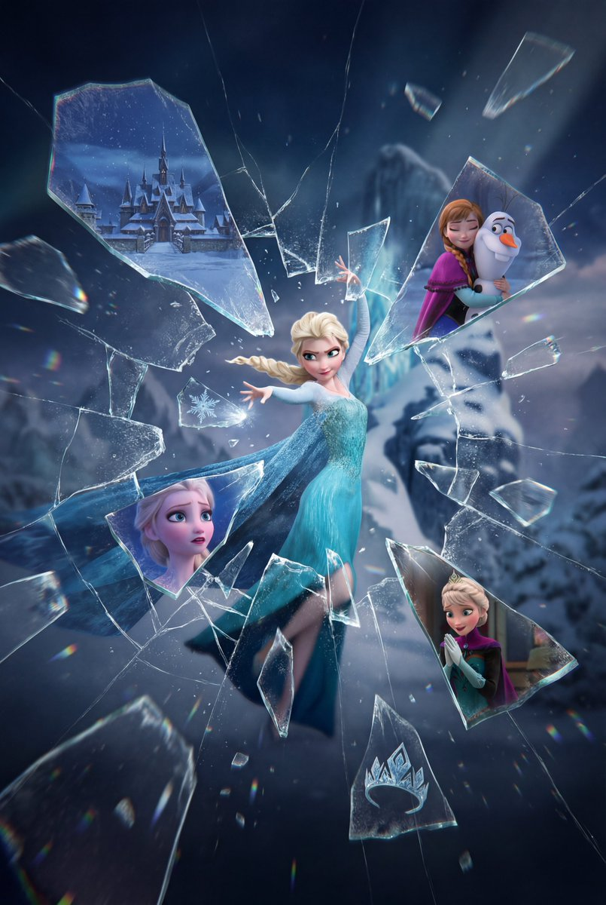


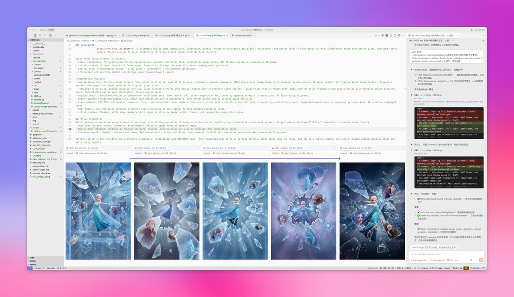

```
我用 Cursor + CC（Claude Code）来设计 Nano Banana Pro 的 image prompt 模版。核心思路是把通用的视觉设计原则写入 /CLAUDE.md 作为全局指引，这样在迭代时就不需要反复说明那些共通的方法论——比如「让视觉效果服务于叙事」、「原则优于枚举」等底层逻辑。

💡 从概念到模版的迭代流程

以图 1 的「记忆碎片模版」为例：
有一个初步想法（或者参考图）后，我会直接扔给 CC：「基于这个概念构建新模版」。它会根据全局指引快速生成首版 prompt，然后在 Cursor 里直接跑 API 看效果。 [图 2]

接下来就是视觉校准的循环：看到生成结果后，针对具体问题给反馈——「玻璃平面角度不对，应该始终平行于画布」、「碎片太小了，叙事残缺」。CC 会立即更新 prompt，我确认改进后继续测试。因为全局指引已经覆盖了大量通用原则，这个过程非常高效，不需要每次都重复解释「什么是好的 prompt」。[图 3]

多跑几轮对照测试，验证表现稳定后，就进入最后的精简阶段：检查 prompt 里有没有防御性的冗余描述，仅保留必要的复杂度和设计偏好。

最终归档的模版就是简洁、可迁移的：填充 [Subject] 变量就能复用，AI 会根据语境自动设计。
```

 [↑返回目录](#toc)

---
## <a id="prompt-2000065593920131300">Nano Banana Pro 营销神器</a> (<a href="https://x.com/minchoi/status/2000065593920131226" target="_blank" rel="noopener noreferrer">Min Choi</a>)

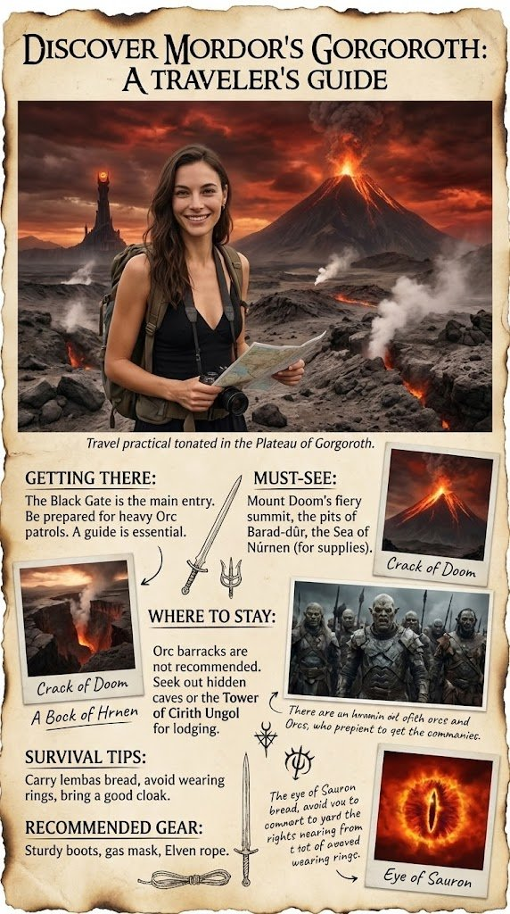

```
coordinate texts
```

```
创作一幅杂志特辑文章[旅行]指南页面，风格可爱、信息密集，采用图文并茂的摄影集式杂志版面。包含所有必要板块：目的地概览、实用贴士、推荐景点、交通住宿建议、当地美食、文化须知等。为各板块和推荐项配以相应图片（如风景、地图、图标或小插图）。将所附人物精准置于[魔多戈埚洛斯高原]位置，并自然融入场景，仿佛正在观光游览。此页面为关键宣传内容，信息需准确详实，对游客到访量有重大影响。充分利用整个[9:16]竖版页面空间。负面提示：避免出现坐标文字。
```

 [↑返回目录](#toc)

---
## <a id="prompt-2000072345852252700">超写实艺术肖像写真</a> (<a href="https://x.com/SimplyAnnisa/status/2000072345852252581" target="_blank" rel="noopener noreferrer">Anissa</a>)

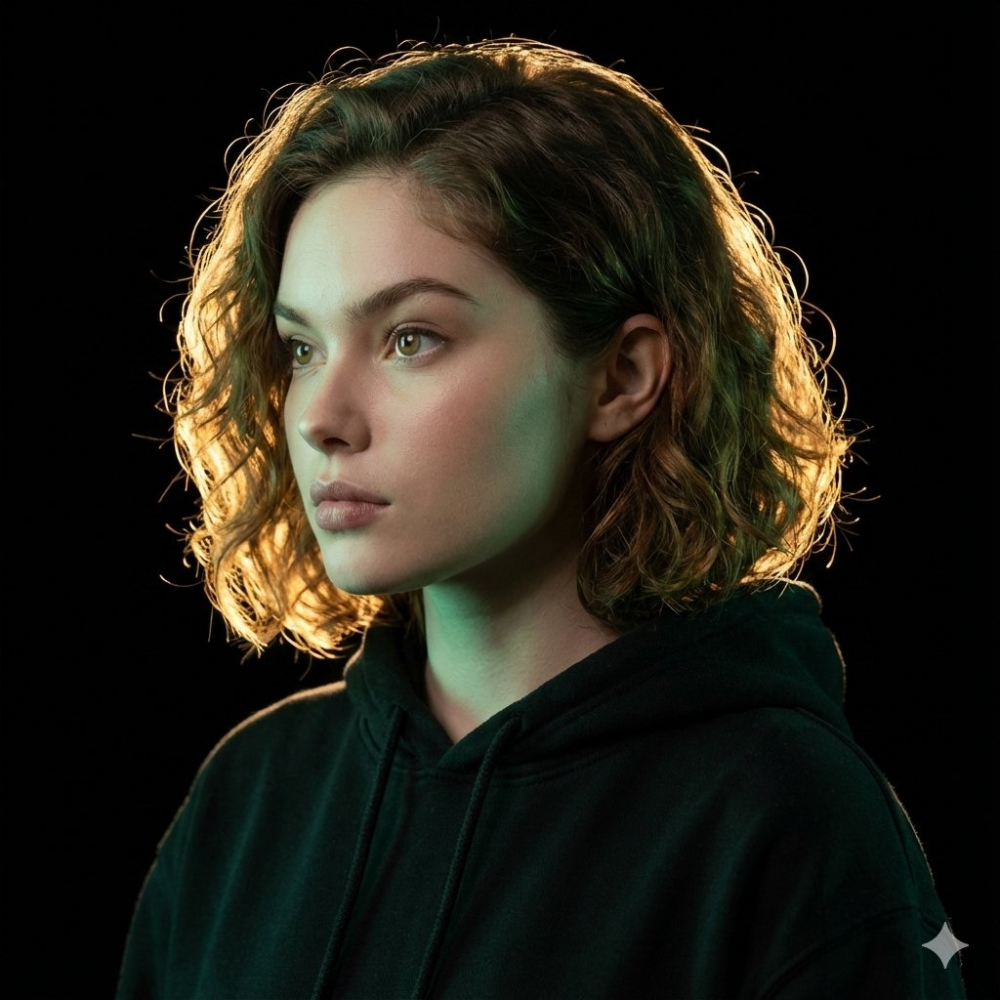

```
{  "prompt": "Ultrarealistic artistic portrait of the model from the reference photo, preserving all real features. Wearing a stylish black sweatshirt, hair glowing with golden backlighting, contrasted by cool green light on the face and chest, against a deep black background. The model is posed slightly in profile, head turned gently to the side with a thoughtful expression, avoiding direct eye contact with the camera. [do not alter the face in the submitted photo]",  "image_prompt_settings": {    "preserve_face": true  }}
```

```
超写实艺术肖像，基于参考照片中的模特，保留所有真实特征。身穿时尚黑色连帽衫，头发在金色背光下泛光，面部与胸部则被冷绿色光线映衬，背景为深邃黑色。模特略微侧身，头部轻轻转向一侧，神情若有所思，避免与镜头直接对视。[不得修改提交照片中的面部]
```

 [↑返回目录](#toc)

---
## <a id="prompt-1999851240872903200">破图而出的微型都市</a> (<a href="https://x.com/Zar_xplorer/status/1999851240872903083" target="_blank" rel="noopener noreferrer">Zar⭕on</a>)

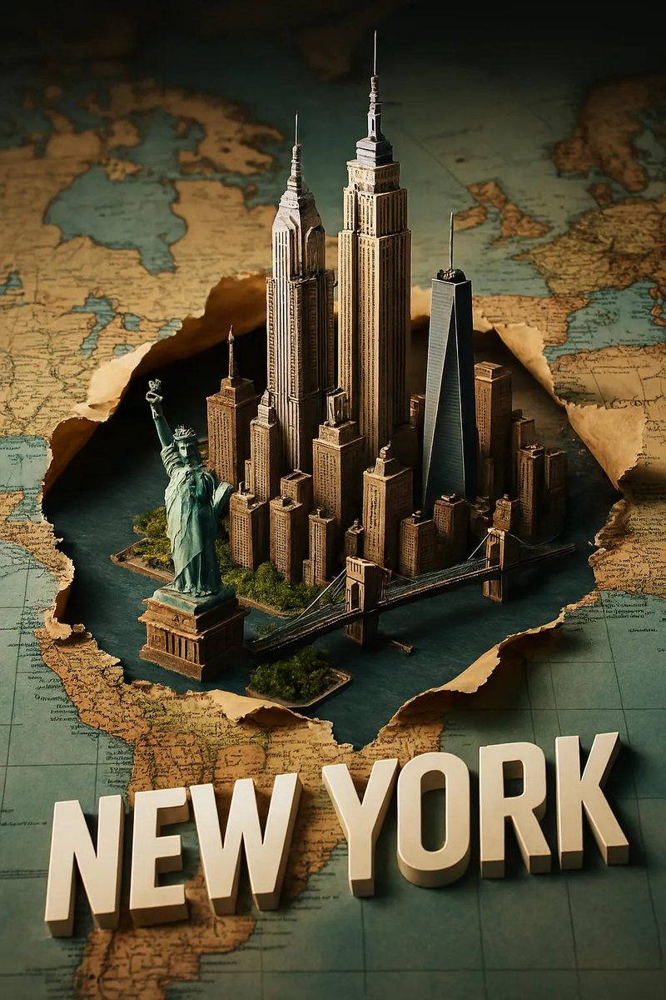

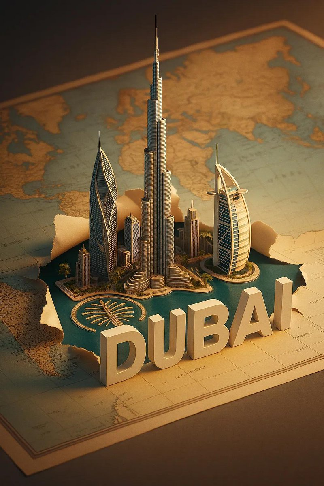

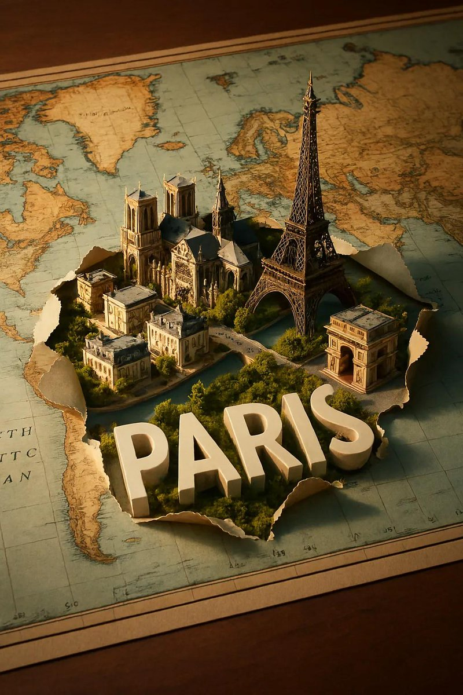

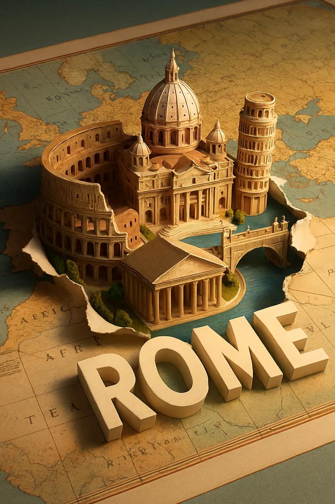

```
Create 3D model of your favorite city showcasing the iconic landmark's using Gemini Nano Banana Pro 🍌

Prompt ⤵️ 

“Create a stylish 2:3 poster featuring a miniature 3D model of [CITY], showcasing its iconic landmarks bursting through a torn, horizontally laid world map. Integrate the city into the map seamlessly with realistic shadows and depth. Add a sleek white 3D text of the city name that blends naturally into the scene. Use dramatic camera perspective, crisp lighting, and a premium travel-poster aesthetic.”
```

```
创作一张时尚的2:3比例海报，展示一座微型3D城市模型[CITY]，其标志性地标从一张横向撕裂的世界地图中破出。将城市自然融入地图之中，配以逼真的阴影与景深效果。加入一款光滑的白色3D城市名称文字，使其自然融合于场景中。采用戏剧性的镜头视角、清晰锐利的灯光，以及高端旅行海报的美学风格。
```

 [↑返回目录](#toc)

---


[上一页](./3.md) | 当前 4/8 页 | [下一页](./5.md) | [查看全部目录](../prompts.md)