# gemini.json 

gemini.json文件存放gemini相关的提示词，当前已收录：654个 

 投稿方式：[飞书投稿](https://tcn1uh5rxo87.feishu.cn/share/base/form/shrcne5gDolOMDd0oJsj2XfvxQc) or [issues](https://github.com/junxiaopang/gridsplitter/issues/new)

[上一页](./4.md) | 当前 5/7 页 | [下一页](./6.md) | [查看全部目录](../scripts/prompts/prompts.md)

🚀 **在线预览**: [https://prompts.kkkm.cn](https://prompts.kkkm.cn)

## <a id="toc">目录</a>

- [海滨花园中的梦幻少女](#prompt-1999790488300421400)
- [Sumi-e Cherry Blossom Serenity](#prompt-1999811065933410800)
- [咖啡粉浮雕肖像](#prompt-2000163216559673300)
- [霓虹之名：紫色轮廓肖像](#prompt-1999863955930612200)
- [爆裂广告大片](#prompt-1999851244010270700)
- [冰霜可乐：奢华电影感](#prompt-1999892192790495200)
- [快餐品牌太空奇想](#prompt-1999836271829483500)
- [皮克斯风城市旅行海报](#prompt-1999899621351628800)
- [九面真我：表情与风格的交响](#prompt-2000055154415182300)
- [英雄登场：卡通名人肖像](#prompt-2000043275873554400)
- [Q版PVC人物微缩房间](#prompt-1999679436791378200)
- [LV斗鱼：自然与奢侈的共生](#prompt-2000111848377774000)
- [霓虹涂鸦肖像笔记](#prompt-1999792195818148400)
- [斯堪的纳维亚童话风](#prompt-2000192249041396000)
- [电影级品牌广告](#prompt-1999897733931712500)
- [《盗梦空间》复古电影票](#prompt-1999844681723839000)
- [柔焦镜中自拍：复古卧室里的她](#prompt-1999810957829419300)
- [都市阳光下的优雅女性](#prompt-1999796326855266800)
- [意大利阳光下的比萨时光](#prompt-1999781038177063400)
- [微缩历史：标志性时刻重现](#prompt-1999793209711767800)
- [霓虹涂鸦肖像笔记](#prompt-1999470440008339500)
- [镜中自拍：深夜闪光私语](#prompt-1999784969363681300)
- [柔色刺绣：俯视手作之美](#prompt-1999171087314112500)
- [甜点微缩城市奇遇](#prompt-1999785618197602800)
- [泳池边的忧郁双子](#prompt-1999807671156056600)
- [时间之镜：老化与融合](#prompt-1999804272696029700)
- [奢华品牌快闪售货亭](#prompt-1999148326948647200)
- [FLORA：微距植物字体](#prompt-1999149732967428600)
- [鏡の破片に映る未来の瞳](#prompt-1999412526099140900)
- [AI 手动模式：用光学原理生成电影感肖像](#prompt-1999296679355224000)
- [オールドファッションドーナツの作り方](#prompt-1999327332100915700)
- [极致特写](#prompt-1999334788319314200)
- [复古胶片中的梦幻少女](#prompt-1999362297614205200)
- [葡萄幻影](#prompt-1999451413362233300)
- [日落湖影：双生之镜](#prompt-1999410735890182400)
- [日式静谧中的凝视](#prompt-1999327489123057700)
- [一生的时光：女性岁月肖像](#prompt-1999352638677353000)
- [家乡的数字孪生俯瞰图](#prompt-1999351093814554600)
- [橙艺非凡：果肉雕琢奇观](#prompt-1998983028824223700)
- [天空之岛：[COUNTRY]奇幻浮空世界](#prompt-1999412984809128000)
- [プロンプト解剖図解](#prompt-1999400673503510800)
- [宠物巨大化](#prompt-1999350454980067600)
- [3D模型UV展开图](#prompt-1999336496357343500)
- [疯狂吐槽涂鸦肖像](#prompt-1999365925125161200)
- [枕边自拍](#prompt-1999381066076029400)
- [人生时光网格](#prompt-1999315512287986000)
- [圣诞礼物中的她](#prompt-1999326915564556300)
- [私が生まれた日：1994年6月15日](#prompt-1999345384850940000)
- [Nano Banana Proの極致](#prompt-1999347995343749600)
- [超写实皮革贴片微距](#prompt-1999126004581970000)
- [MegaRed CoQ10 营销广告视觉](#prompt-1999055240394350800)
- [喧嚣中的静默凝视](#prompt-1999010596101173800)
- [铅笔尖的微观世界](#prompt-1998641973943742500)
- [红蓝重影：双重曝光肖像](#prompt-1998672791823081700)
- [暮雪桥上的狐狸旅人](#prompt-1998692829934113300)
- [天空之岛：[COUNTRY]奇幻浮空](#prompt-1999110884879221000)
- [黄金时刻的露台肖像](#prompt-1998854511092445200)
- [镜前健身自拍：柔光下的优雅时刻](#prompt-1999042753250955300)
- [蓝光中的肖像写真](#prompt-1999106224663691800)
- [ Glitch & Shadow](#prompt-1998674412271448000)
- [事件回溯：四幕前奏](#prompt-1998742687441211600)
- [薄荷绿高定魅影写真](#prompt-1998696103198257200)
- [POLAROID F40 概念车诞生记](#prompt-1998205632210514200)
- [创意饮品对决](#prompt-1998515878682657000)
- [火星𝕏马拉松：数字跑者](#prompt-1998276476832227800)
- [手書き賛辞のスクラップブック風ポートレート](#prompt-1998395439998194200)
- [竜の背骨に分かれた幻想大陸](#prompt-1998288112313852200)
- [低角度自拍的温柔瞬间](#prompt-1998731131605164500)
- [微型游戏世界：等距卡通场景](#prompt-1998381912923275300)
- [AR森林探索：蕨类的秘密](#prompt-1998467773714887000)
- [超絶肌質アップスケール術](#prompt-1998558284874133800)
- [重型猎鹰着陆：历史切片](#prompt-1998434974186586000)
- [AI病毒视频生成器](#prompt-1998415308197962000)
- [十年后的我](#prompt-1998701627872629000)
- [巨人になって東京タワーと記念撮影](#prompt-1998528333991289300)
- [无缝融合过去与现在](#prompt-1998095424394007000)
- [巨人少女漫游东京街头](#prompt-1998299295586693400)
- [春日幻花·透明奇境](#prompt-1998392470464504000)
- [Y2K夜店俏皮少女](#prompt-1998425357066633700)
- [微缩名场面·梦工厂风海报](#prompt-1998355915456791000)
- [霓虹倚梦·东京夜](#prompt-1998531548698591500)
- [广告大屏上的自己](#prompt-1998397446628806700)
- [上海迪士尼之旅：角色与实景的完美融合](#prompt-1998379017171513600)
- [迪奥漂浮花园广告](#prompt-1998295854977798400)
- [浪尖上的你：海中特写](#prompt-1998135786059759900)
- [蓝发男子的咖啡馆晨光](#prompt-1997971252858982700)
- [极简浮雕品牌标识](#prompt-1995542490049290800)
- [尾道観光特集：初夏の風景](#prompt-1998081129384214500)
- [Nano Banana Pro：手机里的奇妙世界](#prompt-1997908793573978600)
- [完美等距视角实景](#prompt-1998085942201164000)
- [论文深度解析：手绘标注助你精准阅读](#prompt-1998083664731902000)
- [バロックロリータでジャンケン大会](#prompt-1998019669593055500)
- [超广角写实人物动态](#prompt-1998073730887717400)
- [裸眼3D熊猫跃出城市屏幕](#prompt-1997914731097788700)
- [微缩等距房间中的 Nano Banana Pro](#prompt-1998041013890241000)
- [Nano Banana Pro | Gemini 3.0](#prompt-1997824265215684900)
- [奢华私密的时尚沉思](#prompt-1997994131193581800)
- [手写批注解构学术论文](#prompt-1998073768472895700)
- [超广角粉丝感谢照](#prompt-1997925279948534000)
- [Nano Banana Pro 时尚联系表](#prompt-1997819640874205700)

## <a id="prompt-1999790488300421400">海滨花园中的梦幻少女</a> (<a href="https://x.com/Ankit_patel211/status/1999790488300421289" target="_blank" rel="noopener noreferrer">ANKIT PATEL 🇮🇳 | AI</a>)


```
Freepik Creation 

Base Prompt @YaseenK7212

{
  "image_generation_request": {
    "technical_specifications": {
      "medium": "Photograph",
      "style": "Ultra-realistic, Cinematic HDR",
      "aspect_ratio": "3:4",
      "camera_angle": "Eye-level, Wide angle",
      "framing": "Full-body shot",
      "visual_fidelity": "8k resolution, Sharp focus, Vibrant colors, Luminous texture"
    },
    "reference_logic": {
      "face_source": "Uploaded reference image",
      "constraint": "Face must remain completely unchanged, no transformation"
    },
    "subject_attributes": {
      "physique": {
        "height": "156 cm",
        "body_type": "Curvy hourglass figure, defined waist, flat stomach",
        "skin": "Smooth, luminous with a healthy glow"
      },
      "hair": {
        "style": "Long layered hairstyle with natural volume",
        "movement": "Soft face-framing strands moving gently in the wind"
      },
      "makeup": {
        "style": "Douyin-inspired, cute doll-like features",
        "eyes": "Soft, sweet eyes, thin eyeliner, natural-looking contact lenses",
        "cheeks": "Bright pink blush",
        "lips": "Matte blush-pink",
        "complexion": "Fresh, dewy"
      },
      "hands": {
        "nails": "Long, white manicured"
      }
    },
    "wardrobe": {
      "headwear": "White lace ruffle headband with ribbon bow",
      "upper_body": "Specific top from reference image",
      "lower_body": "Very short, flowy white skirt",
      "footwear": "White-and-brown Korean-style fashion sandals",
      "jewelry": "Silver necklace with small gray teardrop-shaped gemstone pendant"
    },
    "environment": {
      "setting": "Outdoor coastal garden",
      "foreground": {
        "structure": "Waist-height white wall",
        "vegetation": "Lush clusters of bright pink, soft pink, white, yellow, and orange flowers, with deep green foliage"
      },
      "background": {
        "ocean": "Clear turquoise sea",
        "sky": "Bright sky with large clouds"
      }
    },
    "lighting_and_atmosphere": {
      "lighting": "Warm golden-orange late-afternoon sunlight",
      "effect": "Sunlight reflecting off wall, flowers, and clouds, creating a dreamy, enchanting glow",
      "weather": "Gentle breeze moving through hair and skirt"
    },
    "pose_and_action": {
      "posture": "Sitting on white wall, slightly angled body, legs crossed",
      "head_position": "Gently tilted, looking directly at camera",
      "expression": "Calm but captivating",
      "interaction": "Holding a small flower in one hand"
    },
    "compiled_linear_prompt": "Ultra-realistic cinematic HDR photograph of a woman sitting on a white garden wall with a turquoise sea backdrop. 156 cm, curvy hourglass figure, glowing skin, wearing a lace headband, specific reference top, flowy skirt, and Korean-style sandals. Douyin-inspired makeup with soft eyes, bright pink blush. Holding a flower, looking directly at the camera with a calm expression. Lush flowers, golden-hour sunlight, gentle breeze. 8k resolution, sharp focus. --ar 3:4"
  }
}
  }
```

```
Freepik 创作  

基础提示词 @YaseenK7212

{
  "image_generation_request": {
    "technical_specifications": {
      "medium": "摄影",
      "style": "超写实，电影级HDR",
      "aspect_ratio": "3:4",
      "camera_angle": "平视，广角",
      "framing": "全身照",
      "visual_fidelity": "8K分辨率，锐利对焦，鲜艳色彩，光感纹理"
    },
    "reference_logic": {
      "face_source": "上传的参考图像",
      "constraint": "面部必须完全保持不变，不得进行任何变换"
    },
    "subject_attributes": {
      "physique": {
        "height": "156厘米",
        "body_type": "曲线玲珑的沙漏型身材，腰线明显，腹部平坦",
        "skin": "光滑透亮，带有健康光泽"
      },
      "hair": {
        "style": "长层次发型，自然蓬松",
        "movement": "轻柔地环绕脸部的发丝随微风轻轻飘动"
      },
      "makeup": {
        "style": "抖音风格，可爱娃娃妆",
        "eyes": "柔和甜美的眼睛，细眼线，自然色美瞳",
        "cheeks": "明亮粉红腮红",
        "lips": "哑光粉红色唇妆",
        "complexion": "清新水润"
      },
      "hands": {
        "nails": "修长的白色美甲"
      }
    },
    "wardrobe": {
      "headwear": "白色蕾丝荷叶边发箍，带蝴蝶结",
      "upper_body": "参考图中的特定上衣",
      "lower_body": "极短的飘逸白色裙子",
      "footwear": "白棕配色韩式时尚凉鞋",
      "jewelry": "银色项链，吊坠为小型灰色水滴形宝石"
    },
    "environment": {
      "setting": "户外海滨花园",
      "foreground": {
        "structure": "齐腰高的白色矮墙",
        "vegetation": "茂密簇拥的亮粉色、柔粉色、白色、黄色和橙色花朵，搭配深绿色叶丛"
      },
      "background": {
        "ocean": "清澈的青绿色海水",
        "sky": "明亮天空，有大片云朵"
      }
    },
    "lighting_and_atmosphere": {
      "lighting": "温暖的金橙色午后阳光",
      "effect": "阳光在墙面、花朵和云层上反射，营造梦幻迷人的光晕",
      "weather": "微风轻拂头发与裙摆"
    },
    "pose_and_action": {
      "posture": "坐在白色矮墙上，身体略侧，双腿交叉",
      "head_position": "头部微微倾斜，直视镜头",
      "expression": "平静却引人注目",
      "interaction": "单手握着一朵小花"
    },
    "compiled_linear_prompt": "超写实电影级HDR摄影，一位女性坐在白色花园矮墙上，背景是青绿色海洋。身高156厘米，沙漏型曲线身材，肌肤透亮，佩戴蕾丝发箍、参考图中的上衣、飘逸短裙及韩式凉鞋。抖音风格妆容，眼神柔和，腮红粉嫩。手持一朵花，平静而迷人地直视镜头。周围繁花似锦，金色时刻阳光洒落，微风轻拂。8K分辨率，锐利对焦。--ar 3:4"
  }
}
```

 [↑返回目录](#toc)

---
## <a id="prompt-1999811065933410800">Sumi-e Cherry Blossom Serenity</a> (<a href="https://x.com/azed_ai/status/1999811065933410795?s=20" target="_blank" rel="noopener noreferrer">Amira Zairi</a>)

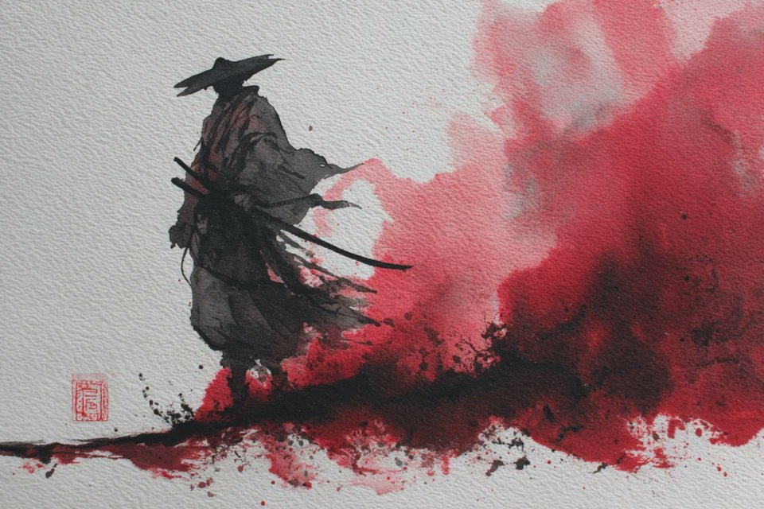

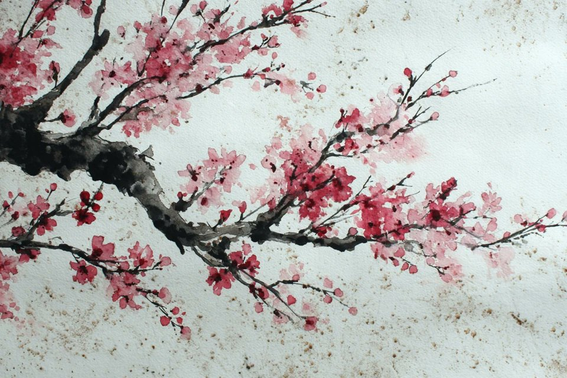

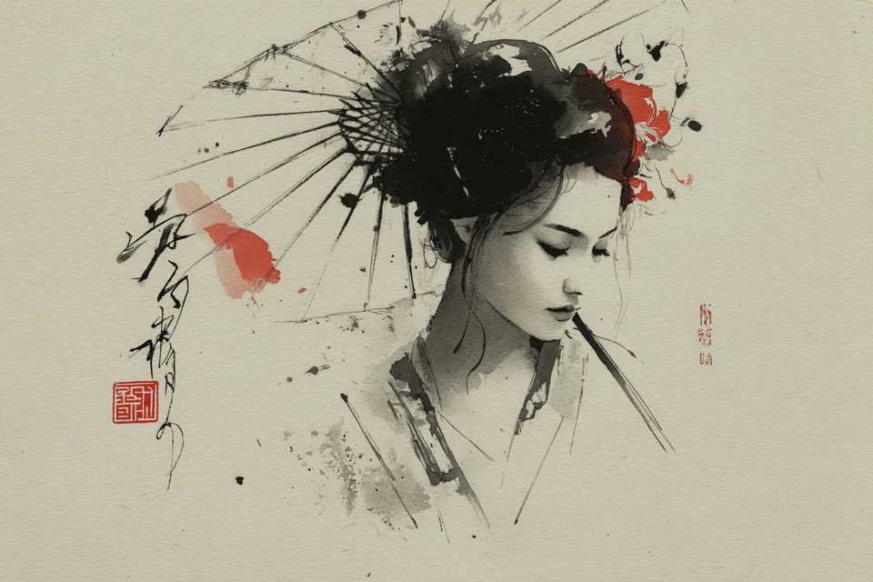


```
A traditional Japanese ink wash painting of a samurai standing in mist, created in expressive sumi-e style with flowing black ink lines and delicate smoke grey and deep crimson watercolor tints. The pigments softly bleed into textured rice paper, evoking a sense of serenity and timeless beauty.
```

```
A traditional Japanese ink wash painting of a cherry blossom tree, created in expressive sumi-e style with flowing black ink lines and delicate blush red and soft gold watercolor tints. The pigments softly bleed into textured rice paper, evoking a sense of serenity and timeless beauty.
```

```
A traditional Japanese ink wash painting of a geisha with a fan, created in expressive sumi-e style with flowing black ink lines and delicate cherry red and snow white watercolor tints. The pigments softly bleed into textured rice paper, evoking a sense of serenity and timeless beauty.
```

```
A traditional Japanese ink wash painting of a koi fish swimming upstream, created in expressive sumi-e style with flowing black ink lines and delicate burnt orange and midnight blue watercolor tints. The pigments softly bleed into textured rice paper, evoking a sense of serenity and timeless beauty.
```

 [↑返回目录](#toc)

---
## <a id="prompt-2000163216559673300">咖啡粉浮雕肖像</a> (<a href="https://x.com/Samann_ai/status/2000163216559673368" target="_blank" rel="noopener noreferrer">Saman | AI</a>)

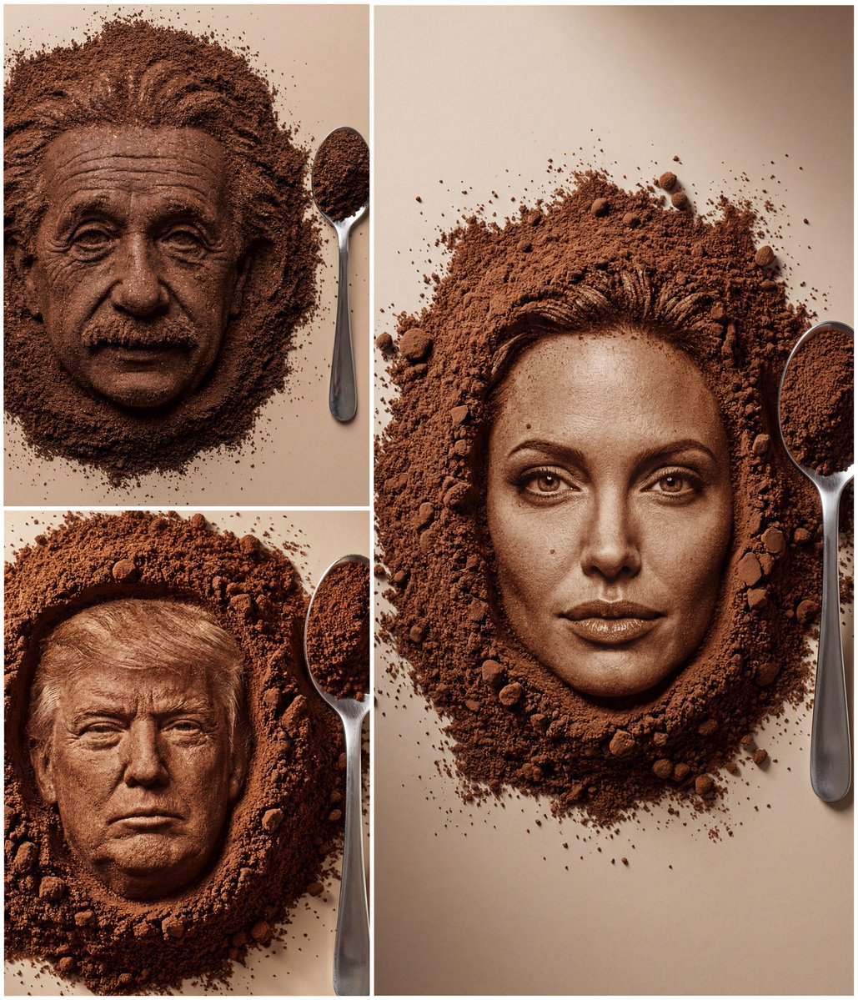

```
Your face. Made of coffee. ☕️🔥
✨Made with Nano banana pro on @DomoAI_ 
Prompt 👇🏻

{
  "input": {
    "referenced_image_ids": [""]
  },
  "frame": {
    "aspect_ratio": "3:4",
    "shot_size": "Close-Up (CU)",
    "orientation": "Portrait",
    "composition_guide": "Center Framed"
  },
  "subject": {
    "subject_type": "Human Face Impression (from reference)",
    "identity_summary": "Match the uploaded person’s face exactly, but formed as a pressed bas-relief impression in finely ground coffee (not a drawing/print).",
    "visual_signature": {
      "facial_signature": {
        "face_shape": "Match reference exactly",
        "eye_nose_lips_jaw": "Match reference exactly",
        "unique_features": "Do not change identity or proportions"
      },
      "material_signature": {
        "material_type": "Finely ground coffee powder",
        "texture_detail": "Ultra-detailed micro-granules, clumps, scattered dust, realistic compression"
      }
    },
    "inventory": {
      "objects_present": [
        "Coffee grounds mound with face impression centered",
        "Stainless-steel teaspoon on the right filled with coffee"
      ],
      "objects_absent": ["No extra props", "No text/logos"]
    }
  },
  "environment": {
    "setting_type": "Indoor Studio Tabletop",
    "background_surface": "Warm neutral beige surface, minimal and clean"
  },
  "lighting": {
    "primary_source": "Softbox upper-left",
    "shadow_quality": "Soft realistic shadows",
    "color_temperature": "Neutral-warm daylight"
  },
  "camera": {
    "angle": "Top-Down / Near Top-Down",
    "focal_length_mm": 50,
    "aperture": "f/5.6",
    "focus_behavior": "Sharp on face and spoon, slight falloff at edges"
  },
  "post_processing": {
    "art_medium": "Photography",
    "style_modifiers": "Hyper-realistic, tabletop product photo, 8K detail look, natural color/contrast"
  },
  "negative": {
    "artifact_suppression": "blur, lowres, CGI/3D look, distorted face, changed identity, extra features, floating spoon, unrealistic reflections",
    "content_excludes": "text, watermark, logo, cups/mugs/plates, hands/people, illustration/cartoon"
  }
}
```

```
你的脸，由咖啡构成。☕️🔥  
✨使用 Nano banana pro 制作于 @DomoAI_  
提示词如下：

{
  "input": {
    "referenced_image_ids": [""]
  },
  "frame": {
    "aspect_ratio": "3:4",
    "shot_size": "特写 (CU)",
    "orientation": "纵向",
    "composition_guide": "居中构图"
  },
  "subject": {
    "subject_type": "人物面部浮雕（基于参考图）",
    "identity_summary": "精确匹配上传人物的面部，但以精细研磨的咖啡粉压制成浅浮雕形式呈现（非绘画或印刷）。",
    "visual_signature": {
      "facial_signature": {
        "face_shape": "完全匹配参考图",
        "eye_nose_lips_jaw": "完全匹配参考图",
        "unique_features": "不得更改身份特征或比例"
      },
      "material_signature": {
        "material_type": "精细研磨的咖啡粉",
        "texture_detail": "超精细微颗粒、结块、散落粉尘、真实压实质感"
      }
    },
    "inventory": {
      "objects_present": [
        "中央带有面部浮雕的咖啡粉堆",
        "右侧放置一把装满咖啡粉的不锈钢茶匙"
      ],
      "objects_absent": ["无额外道具", "无文字/标志"]
    }
  },
  "environment": {
    "setting_type": "室内影棚桌面",
    "background_surface": "温暖中性米色表面，极简干净"
  },
  "lighting": {
    "primary_source": "左上方柔光箱",
    "shadow_quality": "柔和自然的阴影",
    "color_temperature": "中性偏暖日光"
  },
  "camera": {
    "angle": "俯拍 / 近垂直俯拍",
    "focal_length_mm": 50,
    "aperture": "f/5.6",
    "focus_behavior": "面部与茶匙清晰对焦，边缘略有虚化"
  },
  "post_processing": {
    "art_medium": "摄影",
    "style_modifiers": "超写实风格，桌面产品摄影，8K细节表现，自然色彩与对比度"
  },
  "negative": {
    "artifact_suppression": "模糊、低分辨率、CGI/3D效果、面部扭曲、身份改变、多余特征、漂浮的茶匙、不真实的反光",
    "content_excludes": "文字、水印、标志、杯子/马克杯/盘子、手/人物、插画/卡通"
  }
}
```

 [↑返回目录](#toc)

---
## <a id="prompt-1999863955930612200">霓虹之名：紫色轮廓肖像</a> (<a href="https://x.com/ChillaiKalan__/status/1999863955930612197" target="_blank" rel="noopener noreferrer">K</a>)

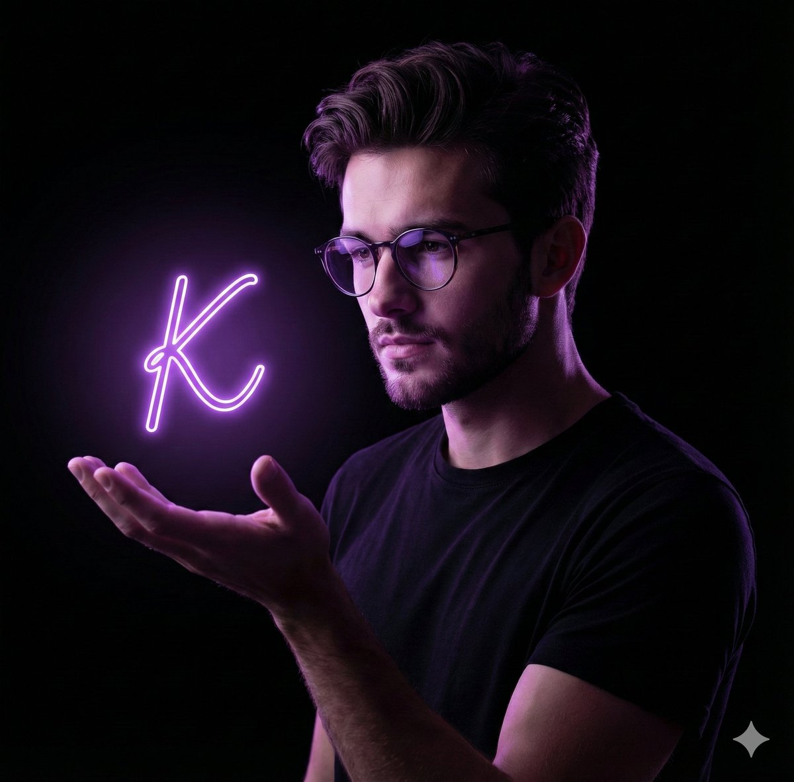

```
A dramatic portrait of a young man standing against a pure black background, illuminated by soft purple rim light. He holds one hand slightly forward and upward, as if presenting something. Above her palm, generate a glowing neon-style handwritten word [YOUR NAME], emitting soft purple light that gently reflects on her face and clothing. Clean composition, moody cinematic lighting, high-end editorial look, ultra-high resolution.
```

```
一位年轻男子站在纯黑背景前的戏剧性肖像，由柔和的紫色轮廓光照明。他一只手微微向前上方伸出，仿佛在展示某物。在其手掌上方生成一个发光的霓虹风格手写字体“[YOUR NAME]”，散发出柔和的紫色光芒，轻轻映照在他的面部和衣物上。构图简洁，光影氛围电影感强烈，具有高端杂志封面质感，超高清分辨率。
```

 [↑返回目录](#toc)

---
## <a id="prompt-1999851244010270700">爆裂广告大片</a> (<a href="https://x.com/yuanzhe68949664/status/1999851244010270742" target="_blank" rel="noopener noreferrer">潮汐同学</a>)


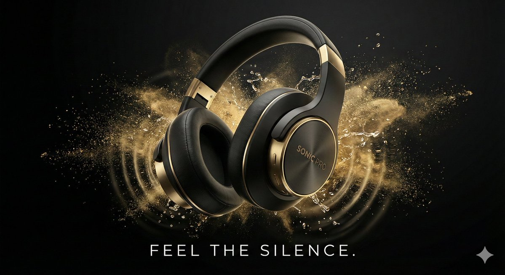


```
Cinematic 3D action-packed advertisement for [INSERT PRODUCT & COLOR/MATERIAL],
captured in an intense mid-motion moment of [INSERT ACTION: e.g., smashing, falling,
powering up]. The impact causes a massive explosion of [INSERT SPECIFIC PARTICLES:
e.g., debris, liquid, sparks, smoke]. Dramatic studio lighting with [INSERT LIGHTING STYLE:
e.g., rim lights, neon backlighting] highlights the [INSERT TEXTURE DETAILS: e.g., glossy
surface, rugged texture, condensation]. Dynamic particle effects and high-impact
slow-motion energy. Ultra-hyperrealistic rendering, razor-sharp details, glossy commercial
finish, atmospheric depth with a [INSERT BACKGROUND: e.g., dark blurred stadium, cold ice
cave], and powerful contrast. Viral-ready composition with the [INSERT LOGO STYLE] brand
logo seamlessly integrated into the [INSERT INTEGRATION ELEMENT: e.g., smoke, liquid,
background], and the sleek, modern slogan "[INSERT SLOGAN]" positioned cleanly beneath
in [INSERT FONT STYLE] text. High-end blockbuster commercial aesthetic.
```

 [↑返回目录](#toc)

---
## <a id="prompt-1999892192790495200">冰霜可乐：奢华电影感</a> (<a href="https://x.com/ttmouse/status/1999892192790495237" target="_blank" rel="noopener noreferrer">ttmouse - 豆爸</a>)

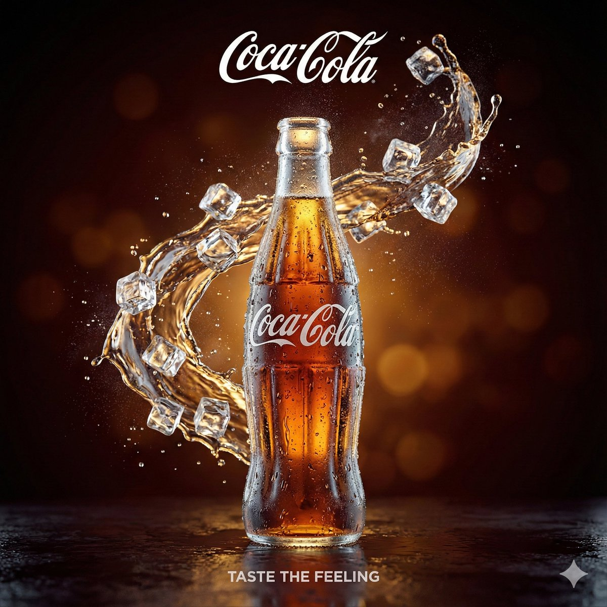

```
{
  "aspect_ratio": "1:1",
  "creative_direction": {
    "style": "High-end commercial photography, cinematic, hyper-realistic, luxurious.",
    "mood": "Intense refreshment, premium, energetic but controlled, dramatic.",
    "key_focus": "The irresistible coldness and explosive taste of the product."
  },
  "subject": {
    "hero": "A single glass bottle of Coca-Cola, center-stage.",
    "details": "Extreme condensation, real water droplets running down the glass, looks incredibly cold and frosty. The liquid inside glows with a rich caramel amber light."
  },
  "action_and_fx": {
    "splash": "A dynamic, sculptural arch of liquid and ice cubes erupting *around* and *behind* the bottle, framing it rather than obscuring it. The splash is elegant, not chaotic.",
    "ice": "Crystal clear, sharp ice cubes caught in motion within the liquid arch, catching the light like diamonds.",
    "particles": "Fine mist and effervescent bubbles suspended in the air to enhance atmosphere."
  },
  "lighting": {
    "type": "Dramatic, high-contrast cinematic lighting (Rembrandt lighting on bottle).",
    "colors": "Warm golden backlighting combined with cool, crisp key lighting on the front of the bottle and ice to emphasize temperature contrast."
  },
  "environment": {
    "background": "Deep, dark, atmospheric mahogany and amber gradient. Subtle, luxurious bokeh effects, no harsh rays or distracting elements. Infinite depth.",
    "surface": "The bottle rests on a dark, wet, reflective surface."
  },
  "branding & composition": {
    "hierarchy": "Product first, Brand second, Message third.",
    "logo_placement": "Elegant, white Coca-Cola script logo placed at the top center, smaller than before, refined and premium.",
    "slogan_placement": "Subtle 'TASTE THE FEELING' text in white, centered below the bottle, smaller font size.",
    "framing": "A tight, powerful central composition optimized for square format, drawing the eye directly to the bottle."
  }
}

#material #prompt
```

```
{
  "宽高比": "1:1",
  "创意方向": {
    "风格": "高端商业摄影，电影感，超写实，奢华。",
    "氛围": "强烈的清爽感，高级感，充满活力但克制，戏剧性。",
    "核心焦点": "产品令人无法抗拒的冰凉感与爆发式口感。"
  },
  "主体": {
    "主角": "一瓶可口可乐玻璃瓶，居中突出。",
    "细节": "瓶身布满极致冷凝水珠，真实水滴沿玻璃滑落，显得极度冰凉且覆霜。瓶内液体散发出浓郁焦糖琥珀色光芒。"
  },
  "动态与特效": {
    "飞溅": "围绕并衬托瓶身、而非遮挡它的动态雕塑感液体与冰块喷涌弧线。飞溅效果优雅，不显混乱。",
    "冰块": "晶莹剔透、棱角分明的冰块在液体弧线中定格，如钻石般折射光线。",
    "粒子": "空气中悬浮着细腻雾气与气泡，增强整体氛围。"
  },
  "光影": {
    "类型": "戏剧性高对比度电影灯光（瓶身采用伦勃朗布光法）。",
    "色彩": "温暖金色背光结合瓶身正面及冰块上的清冷锐利主光，强调冷暖对比。"
  },
  "环境": {
    "背景": "深邃、暗调的大气感红木与琥珀色渐变。微妙奢华的散景效果，无刺眼光束或干扰元素。无限景深。",
    "台面": "瓶子置于深色、湿润、具反射性的表面上。"
  },
  "品牌与构图": {
    "层级": "产品优先，品牌次之，信息最后。",
    "标志位置": "顶部中央放置优雅白色可口可乐手写体标志，尺寸较以往更小，精致而高级。",
    "标语位置": "瓶身下方居中显示低调的白色“TASTE THE FEELING”文字，字体更小。",
    "构图": "紧凑有力的中心构图，专为方形格式优化，直接引导视线聚焦于瓶身。"
  }
}
```

 [↑返回目录](#toc)

---
## <a id="prompt-1999836271829483500">快餐品牌太空奇想</a> (<a href="https://x.com/YaseenK7212/status/1999836271829483573?s=20" target="_blank" rel="noopener noreferrer">Yaseen Khan Gul</a>)

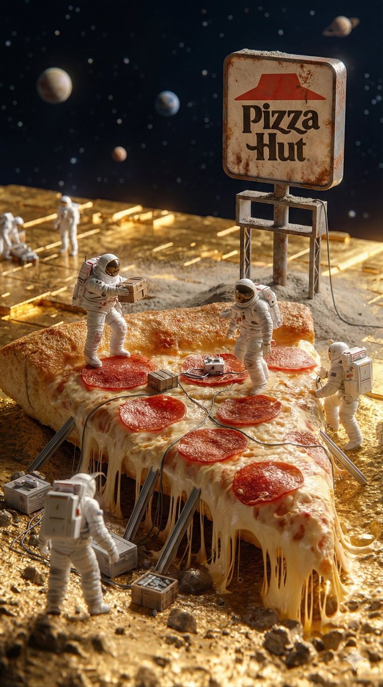

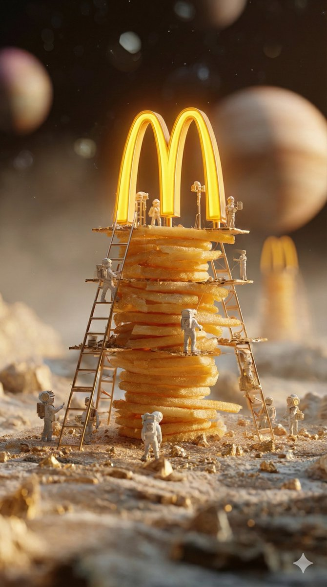

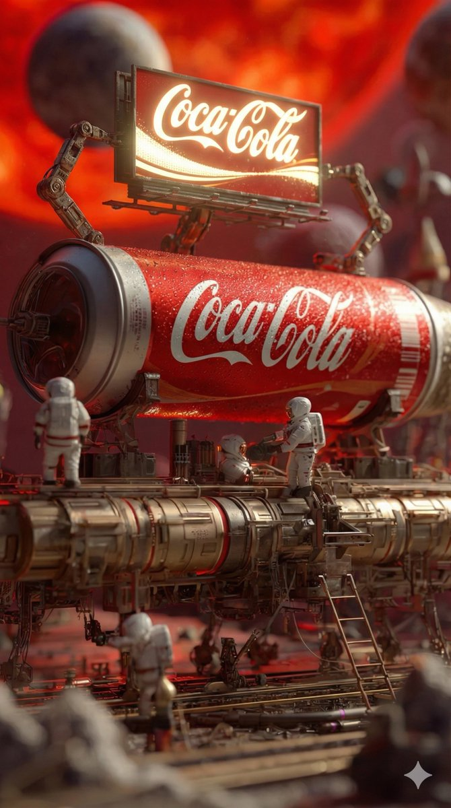

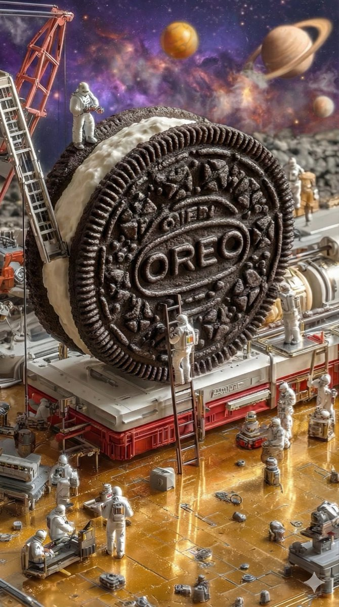

```
{
  "batch_generation_requests": [
    {
      "brand_theme": "Coca-Cola",
      "concept": "Soda Can Space Rocket Conversion",
      "subject": {
        "main_element": "Horizontal Coca-Cola can",
        "modifications": "Being converted into a space rocket; rocket boosters installed beneath",
        "props": "Glowing Coca-Cola billboard floating above on robotic arms",
        "details": "Condensation droplets magnified through macro lens"
      },
      "figures": {
        "type": "Miniature engineers",
        "attire": "White suits",
        "action": "Installing boosters and converting the can"
      },
      "environment": {
        "background": "Planets and a red nebula",
        "atmosphere": "Space setting"
      },
      "aesthetics": {
        "color_grading": "Cinematic red, gold, and black",
        "lens_effect": "Macro lens",
        "lighting": "Cinematic"
      },
      "meta": {
        "aspect_ratio": "9:16",
        "reference_directive": "Make it like the same picture as Reference uploaded"
      }
    },
    {
      "brand_theme": "Oreo",
      "concept": "Cookie Satellite Assembly",
      "subject": {
        "main_element": "Giant Oreo cookie at center",
        "modifications": "Treated like a satellite; installation of panels and 'taste engines'",
        "details": "Incredible depth and realism"
      },
      "figures": {
        "type": "Tiny workers",
        "attire": "White suits",
        "equipment": "Ladders and hoverboards",
        "action": "Assembling the cookie satellite"
      },
      "environment": {
        "floor": "Reflective golden caramel",
        "background": "Nebula clouds and distant planets"
      },
      "aesthetics": {
        "style": "Macro photographic detail",
        "depth": "High depth of field"
      },
      "meta": {
        "aspect_ratio": "9:16",
        "reference_directive": "Make it like the same picture as reference uploaded"
      }
    },
    {
      "brand_theme": "Pizza Hut",
      "concept": "Pepperoni Slice Landing Pad",
      "subject": {
        "main_element": "Large triangular Pizza Hut pepperoni slice",
        "modifications": "Placed flat like a landing pad; cheese threads resembling steel beams",
        "props": "Pizza Hut sign propped up behind slice, partially covered in space dust",
        "details": "Macro detail with pepperoni textures"
      },
      "figures": {
        "type": "Miniature astronauts",
        "attire": "White suits",
        "action": "Unloading equipment and laying cables across melted cheese"
      },
      "environment": {
        "terrain": "Glowing gold terrain",
        "background": "Deep-space"
      },
      "aesthetics": {
        "lighting": "Cinematic",
        "style": "Macro detail"
      },
      "meta": {
        "aspect_ratio": "9:16",
        "reference_directive": "Picture should be same as reference uploaded"
      }
    },
    {
      "brand_theme": "McDonald's",
      "concept": "French Fry Skyscraper Construction",
      "subject": {
        "main_element": "Tall structure built from McDonald's french fries",
        "props": "Iconic Golden Arches logo shining brightly like a neon sign behind the structure",
        "details": "Macro photography capturing every fry detail"
      },
      "figures": {
        "type": "Miniature workers",
        "action": "Building platforms and ladders between the fries"
      },
      "environment": {
        "terrain": "Gold-brown terrain with salt crystals",
        "atmosphere": "Space mist floating in the air",
        "background": "Distant planets"
      },
      "aesthetics": {
        "lighting": "Warm directional lighting",
        "style": "Cinematic look"
      },
      "meta": {
        "aspect_ratio": "9:16",
        "reference_directive": "Picture should be same as reference uploaded"
      }
    }
  ]
}
```

```
{
  "batch_generation_requests": [
    {
      "brand_theme": "可口可乐",
      "concept": "汽水罐太空火箭改造",
      "subject": {
        "main_element": "横向放置的可口可乐罐",
        "modifications": "正在被改造成太空火箭；底部安装了火箭助推器",
        "props": "由机械臂悬挂在上方的发光可口可乐广告牌",
        "details": "通过微距镜头放大的冷凝水珠"
      },
      "figures": {
        "type": "微型工程师",
        "attire": "白色制服",
        "action": "正在安装助推器并改造易拉罐"
      },
      "environment": {
        "background": "行星与红色星云",
        "atmosphere": "太空场景"
      },
      "aesthetics": {
        "color_grading": "电影感红、金与黑色调",
        "lens_effect": "微距镜头",
        "lighting": "电影级光影"
      },
      "meta": {
        "aspect_ratio": "9:16",
        "reference_directive": "画面需与上传的参考图一致"
      }
    },
    {
      "brand_theme": "奥利奥",
      "concept": "饼干卫星组装",
      "subject": {
        "main_element": "中央放置的巨大奥利奥饼干",
        "modifications": "被当作卫星处理；安装面板和“风味引擎”",
        "details": "极致深度与真实感"
      },
      "figures": {
        "type": "微型工人",
        "attire": "白色制服",
        "equipment": "梯子与悬浮滑板",
        "action": "正在组装饼干卫星"
      },
      "environment": {
        "floor": "反光的金色焦糖地面",
        "background": "星云云团与遥远行星"
      },
      "aesthetics": {
        "style": "微距摄影细节",
        "depth": "高景深"
      },
      "meta": {
        "aspect_ratio": "9:16",
        "reference_directive": "画面需与上传的参考图一致"
      }
    },
    {
      "brand_theme": "必胜客",
      "concept": "意大利香肠切片着陆平台",
      "subject": {
        "main_element": "大型三角形必胜客意大利香肠披萨切片",
        "modifications": "平放作为着陆平台；芝士拉丝如同钢梁",
        "props": "披萨切片后方竖立着必胜客标志，部分覆盖太空尘埃",
        "details": "微距细节展现香肠纹理"
      },
      "figures": {
        "type": "微型宇航员",
        "attire": "白色宇航服",
        "action": "正在卸载设备并在融化的芝士上铺设电缆"
      },
      "environment": {
        "terrain": "发光的金色地表",
        "background": "深空背景"
      },
      "aesthetics": {
        "lighting": "电影级光影",
        "style": "微距细节"
      },
      "meta": {
        "aspect_ratio": "9:16",
        "reference_directive": "画面需与上传的参考图一致"
      }
    },
    {
      "brand_theme": "麦当劳",
      "concept": "薯条摩天大楼建造",
      "subject": {
        "main_element": "由麦当劳薯条搭建的高耸结构",
        "props": "标志性金色拱门标志在建筑后方如霓虹灯般闪耀",
        "details": "微距摄影捕捉每根薯条的细节"
      },
      "figures": {
        "type": "微型工人",
        "action": "正在薯条之间搭建平台与梯子"
      },
      "environment": {
        "terrain": "带有盐晶的金棕色地表",
        "atmosphere": "空气中漂浮着太空薄雾",
        "background": "遥远的行星"
      },
      "aesthetics": {
        "lighting": "温暖的定向照明",
        "style": "电影感风格"
      },
      "meta": {
        "aspect_ratio": "9:16",
        "reference_directive": "画面需与上传的参考图一致"
      }
    }
  ]
}
```

 [↑返回目录](#toc)

---
## <a id="prompt-1999899621351628800">皮克斯风城市旅行海报</a> (<a href="https://x.com/TechieBySA/status/1999899621351628819" target="_blank" rel="noopener noreferrer">TechieSA</a>)

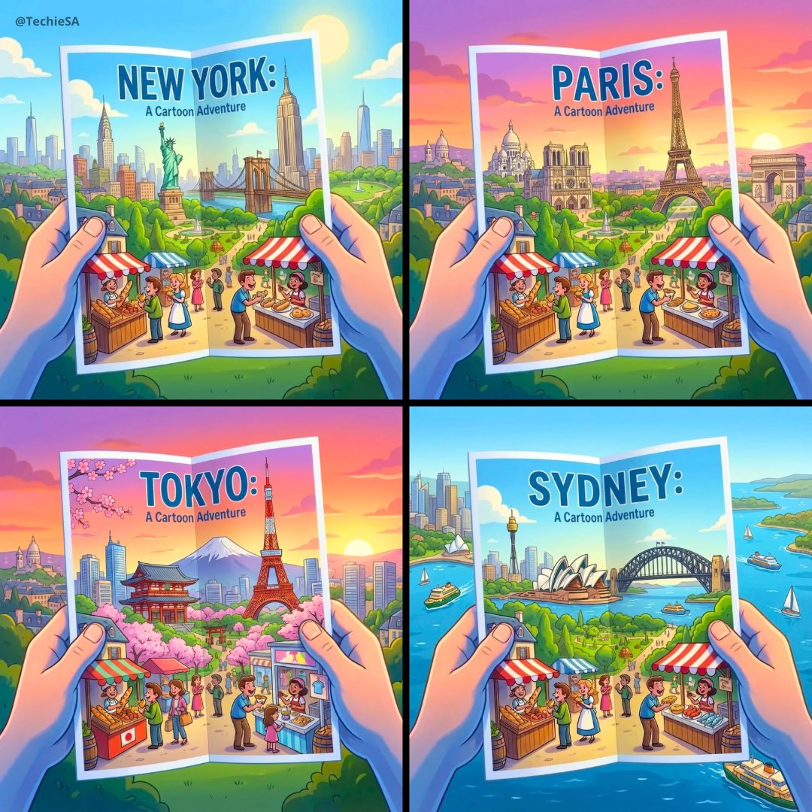

```
Create a high-resolution 1080x1080 stylized travel poster-style illustration that looks like a folded tourist brochure being held by two hands in the foreground. The brochure features a vibrant, cartoonish-yet-detailed depiction of [CITY]. Show iconic cultural elements and architecture of [CITY] surrounded by lush greenery or local landscapes. Include shopping scenes with people eating street food at local markets, and colorful [SUN/SUNSET] in the background. The overall style should be Pixar-inspired, bright and cheerful, soft shadows, and rich 3D depth. The hands holding the brochure should be pixar stylized, with gentle shadows and cool tones, matching the exact expression and perspective as the reference image. The background should seamlessly blend and match the landscape extending beyond the brochure edges.
```

```
创作一幅高分辨率1080x1080的风格化旅行海报式插图，看起来像是一本折叠的旅游宣传册被前景中的两只手拿着。宣传册上以生动、卡通但细节丰富的手法描绘[城市]，展现该城市的标志性文化元素与建筑，并环绕着茂密的绿植或当地景观。包含购物场景，人们在当地市场享用街头小吃，背景为色彩绚丽的[太阳/日落]。整体风格应受皮克斯启发，明亮欢快，具有柔和阴影和丰富的三维景深。手持宣传册的双手应采用皮克斯风格，带有柔和阴影和冷色调，其表情与透视需与参考图像完全一致。背景应无缝融合并延伸至宣传册边缘之外的景观。
```

 [↑返回目录](#toc)

---
## <a id="prompt-2000055154415182300">九面真我：表情与风格的交响</a> (<a href="https://x.com/songguoxiansen/status/2000055154415182214" target="_blank" rel="noopener noreferrer">松果先森</a>)


```
{
  "image_prompt": {
    "critical_instruction": "ABSOLUTE PRIORITY: Maintain identical facial structure across all panels. Do not alter underlying bone structure, nose shape, eye spacing, or jawline regardless of the expression being rendered. The identity must be unmistakable in every single shot.",
    "format": "3x3 grid collage",
    "subject": {
      "face_reference": "uploaded_photo",
      "face_identity_lock": "CRITICAL: fixed identity, zero deviation from reference facial features",
      "face_match_accuracy": "100% exact match enforced",
      "identity_preservation_details": "Ensure consistent interpupillary distance, exact nose bridge shape, and jaw structure in every panel.",
      "negative_constraints": [
        "do not morph nose shape",
        "do not change eye size or spacing",
        "do not alter cheekbone structure",
        "no plastic surgery look"
      ],
      "style": "hyper-realistic portrait photography, 8k resolution, raw photo aesthetic",
      "skin": "highly detailed natural skin texture, visible pores, subtle imperfections, realistic complexion, consistent across all lighting conditions",
      "camera_settings": "shot on Sony A7R IV, 85mm portrait lens, f/1.8 aperture, sharp focus on eyes, shallow depth of field"
    },

    "panels": [
      {
        "expression": "joyful",
        "pose": "bright natural smile (maintaining jaw structure), shoulders slightly raised",
        "hairstyle": "high ponytail with loose strands",
        "outfit": "pastel cotton hoodie",
        "background": "soft gradient sky blue studio backdrop"
      },
      {
        "expression": "surprised",
        "pose": "hands near face, wide eyes (without altering eye shape), natural reaction",
        "hairstyle": "loose natural wavy hair",
        "outfit": "casual cotton t-shirt",
        "background": "light peach studio backdrop"
      },
      {
        "expression": "sad",
        "pose": "head tilted down, emotional soft eyes",
        "hairstyle": "messy low bun",
        "outfit": "oversized wool sweater",
        "background": "muted lavender tone studio backdrop"
      },
      {
        "expression": "tender",
        "pose": "gentle smile, head slightly tilted",
        "hairstyle": "elegant half-up hairstyle",
        "outfit": "soft knit top",
        "background": "warm beige studio backdrop"
      },
      {
        "expression": "daring",
        "pose": "confident gaze, chin slightly raised (showing consistent jawline)",
        "hairstyle": "chic slicked-back hair",
        "outfit": "stylish leather or denim jacket",
        "background": "deep teal studio backdrop"
      },
      {
        "expression": "playful",
        "pose": "cheeks slightly puffed (ensure nose remains unchanged), playful stare",
        "hairstyle": "short textured bob",
        "outfit": "striped linen shirt",
        "background": "soft mint green studio backdrop"
      },
      {
        "expression": "charming",
        "pose": "wink with finger poking cheek",
        "hairstyle": "playful double buns",
        "outfit": "trendy graphic tee",
        "background": "light pink studio backdrop"
      },
      {
        "expression": "shocked",
        "pose": "mouth slightly open, eyebrows raised (forehead wrinkles match reference age)",
        "hairstyle": "tousled loose hair",
        "outfit": "simple silk blouse",
        "background": "light yellow studio backdrop"
      },
      {
        "expression": "furious",
        "pose": "arms crossed, intense glare (eyes narrowed but spacing unchanged)",
        "hairstyle": "tight high bun",
        "outfit": "dark fitted turtleneck",
        "background": "deep red studio backdrop"
      }
    ],

    "rendering": {
      "lighting": "cinematic studio lighting, softbox illumination, remix of warm and cool tones, rim light for separation",
      "shading": "realistic shadows, subsurface scattering on skin, consistent facial modeling",
      "quality": "photorealistic, ultra-detailed, award-winning photography, magazine quality",
      "consistency": "FLAWLESS identity consistency and lighting setup across all 9 panels"
    },

    "composition": {
      "grid_alignment": "perfectly aligned 3x3 photo booth strip style",
      "spacing": "equal white margins between panels",
      "background_border": "clean white border"
    }
  }
}
```

 [↑返回目录](#toc)

---
## <a id="prompt-2000043275873554400">英雄登场：卡通名人肖像</a> (<a href="https://x.com/Sheldon056/status/2000043275873554443" target="_blank" rel="noopener noreferrer">Dr.duet</a>)

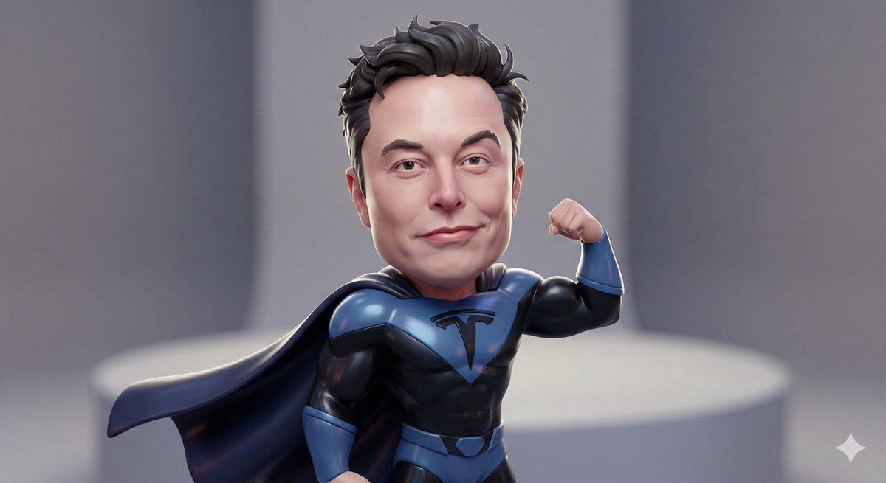

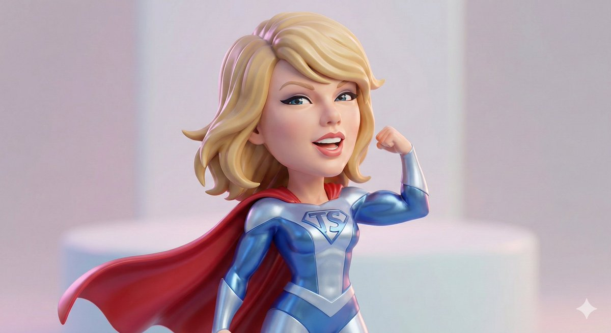


```
A heroic 3D caricature of [celebrity], with a big expressive head, slightly exaggerated muscles, and bold facial expressions. Smooth stylized textures, glossy highlights, and soft ambient light create a dynamic showpiece vibe. A sleek, simple background keeps all attention on the character.
```

```
一位[名人]的英雄式 3D 卡通形象，头部硕大且表情丰富，肌肉略微夸张，面部表情鲜明大胆。光滑的风格化材质、闪亮的高光与柔和的环境光营造出充满动感的展示效果。简洁流畅的背景使所有注意力集中在角色本身。
```

 [↑返回目录](#toc)

---
## <a id="prompt-1999679436791378200">Q版PVC人物微缩房间</a> (<a href="https://x.com/canghecode/status/1999679436791378186" target="_blank" rel="noopener noreferrer">苍何</a>)

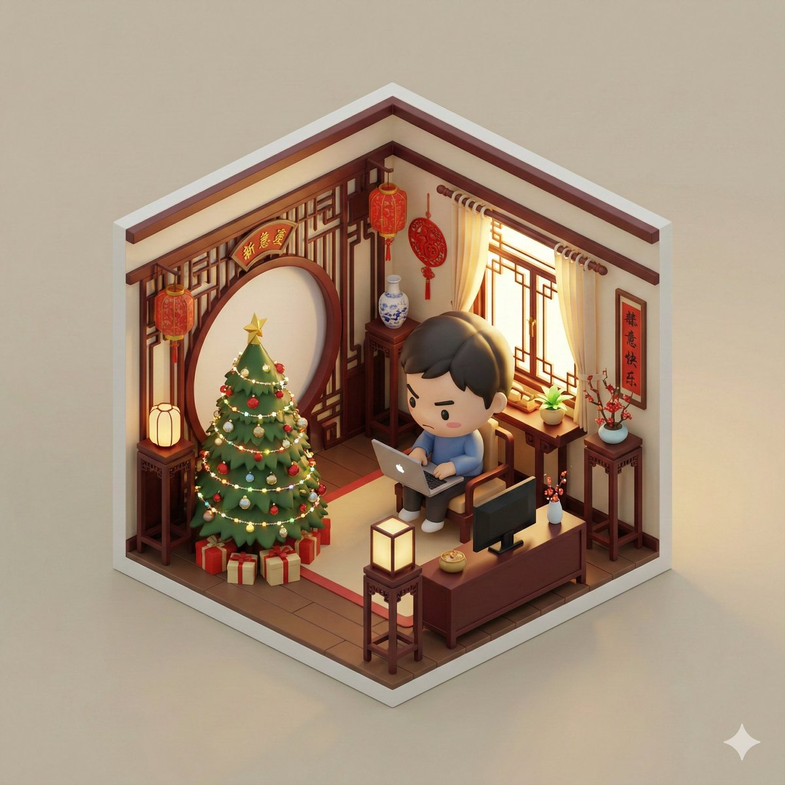


```
香蕉Pro做的这个3D微缩房间好火🔥，可以根据以下元提示词来生成特定的主题和人物，提示词如下：

一个等距3D立方体形状的微缩房间（浅切面的真立方体；所有物品都严格包含在立方体内）。房间描述：[房间描述：详细描述主题、家具、特定杂物、墙面装饰和关键物品]。

角色：Q版/手办风格——[在此处插入您上传照片中人物的描述]。角色[动作：例如，坐在椅子上打字、站着做饭、弹吉他]，表情[例如，专注、快乐、微笑]。人物材质看起来像是哑光PVC，头部较大，身体较小。光照：[氛围名称]: [光源：例如，霓虹蓝光、暖日光、金色灯光]；逼真的反射和彩色阴影。拍摄角度：略微抬高的等距四分之三视角，正面立方体边缘居中；没有元素突出于立方体之外。照片级材质，细节丰富；中性背景。超精细、干净的构图；无水印。
```

 [↑返回目录](#toc)

---
## <a id="prompt-2000111848377774000">LV斗鱼：自然与奢侈的共生</a> (<a href="https://x.com/ttmouse/status/2000111848377774098" target="_blank" rel="noopener noreferrer">ttmouse - 豆爸</a>)

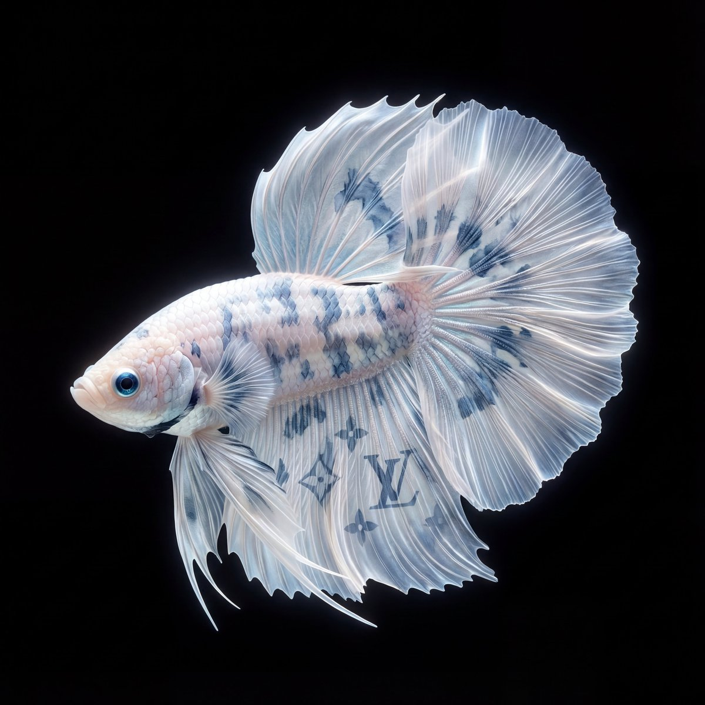

```
MUSEUM-QUALITY ultra-detailed Siamese fighting fish, pure black background, hyper-realistic macro photography, 8K resolution. This must be BREATHTAKINGLY BEAUTIFUL.

PERFECT SIDE PROFILE POSE (CRITICAL):
- The fish is captured in PURE 90-degree side view, facing left
- Body is gracefully horizontal with a SUBTLE elegant S-curve (not straight like a stick)
- Head held with dignity, eye clearly visible in perfect profile
- The magnificent half-moon tail fin spreads vertically like an ornate hand fan in full glory - creating a stunning circular/semi-circular silhouette
- Dorsal fin flows upward in gentle wave with delicate ripples
- Large ventral/pectoral fins cascade downward like flowing silk ribbons with elegant curves
- Thin ventral filaments extend gracefully downward like delicate threads
- The overall silhouette creates a PERFECT SYMMETRICAL BEAUTY - like a butterfly or flower when viewed from the side
- Every fin is fully extended showing maximum grace and elegance
- The fish appears to be frozen in the most beautiful moment of a graceful glide

COMPOSITION (CRITICAL for BEAUTY):
- The fish is positioned in the CENTER with generous black negative space on ALL SIDES (top, bottom, left, right)
- Horizontal positioning: fish occupies the middle 60% of frame width, with 20% black space on left and right
- Vertical positioning: fish centered vertically with equal black space above and below
- The tail fin's arc is the visual anchor point
- Creates a sense of elegant suspension in infinite black space
- Museum-worthy, gallery-quality composition that commands attention

COLOR BASE: [选择基础配色方案]
选项A - 纯白珍珠系:
  The fish is snow white with luminous pearl iridescence, creating a pristine canvas

选项B - 冰蓝渐变系:
  The fish features ice blue to white gradient, with subtle shimmer and crystalline quality

选项C - 红金奢华系:
  The fish displays deep crimson to rose gold gradient, with metallic sheen and luxury feel

选项D - 黑金神秘系:
  The fish shows midnight black body with gold metallic accents, creating dramatic contrast

选项E - 自定义配色:
  [在此描述你想要的基础颜色]

BRAND PATTERN INTEGRATION (CRITICAL - Must look 100% NATURAL):
[在此替换品牌信息]

品牌: [Louis Vuitton / Chanel / Hermès / Gucci / Dior / Supreme / Apple / Nike / 自定义品牌]

图案元素描述:
- For Louis Vuitton: LV monogram logos, quatrefoil flowers, geometric diamonds
- For Chanel: Interlocking CC logos, camellia flowers, quilted diamond patterns
- For Hermès: H logos, carriage motifs, equestrian chain patterns  
- For Gucci: Interlocking GG logos, flora patterns, green-red-green stripe accents
- For Dior: CD logos, cannage patterns, rose motifs
- For Supreme: Box logo wordmark in clean sans-serif
- For Apple: Minimalist apple symbol with bite mark
- For Nike: Swoosh symbols in various sizes
- 自定义: [描述品牌的核心视觉元素]

图案融合方式 (70% 自然 + 30% 品牌):
- PRIMARY (70%): Soft [颜色] watercolor brush strokes and organic irregular patches - like natural butterfly betta or koi genetic markings. These patterns are completely abstract and natural-looking: flowing ink-wash effects, asymmetric splotches, delicate marbling, gradient streaks following fin rays.

- SECONDARY (30% - Hidden Easter Eggs): Within the natural organic patterns, some areas SUBTLY and COINCIDENTALLY form [品牌名称] motifs. These brand elements emerge naturally from the watercolor patterns - NOT as printed graphics, but as if the random brush strokes accidentally outlined recognizable shapes. Examples:
  * On the large ventral fins: 2-3 [核心图案] shapes emerge from the natural splotches when you look closely
  * On the body side: the blue streaks happen to outline a [品牌logo] silhouette  
  * Near the dorsal fin base: abstract patterns suggest [装饰图案]
  * These are visual easter eggs requiring a second look - creating "wait, is that a [品牌] logo?" surprise

Pattern color: [选择图案颜色]
- 建议: soft blue-grey (优雅通用)
- 或: dusty rose pink (柔美浪漫)  
- 或: champagne gold (奢华低调)
- 或: deep navy blue (经典高级)
- 或: sage green (清新自然)
- 或: [自定义颜色]

Pattern placement: Concentrated on the large side ventral/pectoral fins and body flanks where most visible in side profile. Patterns flow naturally along fin membrane and scale structure.

HYPER-REALISTIC FISH DETAILS:
- Translucent fins with ultra-fine ray structures creating delicate line patterns - every single fin ray visible with crystalline clarity
- Silk-like, chiffon-fabric-like texture on flowing fins
- Individual scales visible on body with subtle iridescence
- Jewel-like eye with perfect circular catchlight reflection
- Gentle color gradients creating three-dimensional depth
- Fins appear weightless and ethereal, like flowing fabric frozen in water
- Fine texture details on every surface

DRAMATIC LIGHTING (CRITICAL for BEAUTY):
- Strong side lighting from the right creating luminous glowing edges on all fins
- Soft rim light outlining the entire fish silhouette against pure black
- Subtle backlight making translucent fins glow from within  
- The pattern colors have perfect contrast and visibility against the base color
- Creates depth, dimension, and ethereal luminosity
- Pure black background (#000000) - absolute void darkness emphasizing the fish's radiance

TECHNICAL SPECIFICATIONS:
- 8K ultra-high resolution
- Razor-sharp focus on the eye and body center
- Subtle depth of field with soft focus on outermost fin edges for artistic depth
- Professional award-winning aquarium photography aesthetic
- Fine art gallery quality
- The composition should make viewers gasp "WOW" instantly

OVERALL AESTHETIC:
First impression: "What a breathtakingly beautiful betta fish!"
Second look: "Wait... are those [品牌] patterns hidden in the markings?"  
Effect: Elegant, serene, majestic, ethereal, viral-worthy - a timeless artwork that sparks conversation and sharing.

Style reference: Blend of museum-quality nature photography + luxury brand aesthetics + fine art portrait photography.
```

 [↑返回目录](#toc)

---
## <a id="prompt-1999792195818148400">霓虹涂鸦肖像笔记</a> (<a href="https://x.com/ghumare64/status/1999792195818148245" target="_blank" rel="noopener noreferrer">Rohit Ghumare</a>)

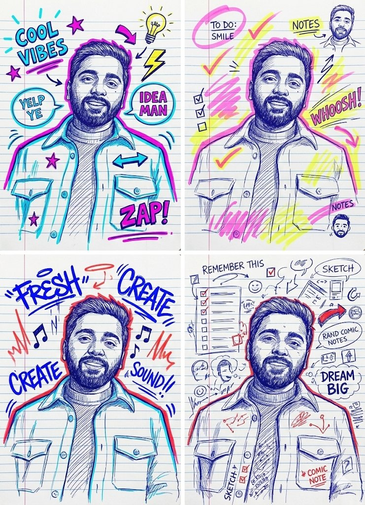

```
{
  "image_generation_task": {
    "task_type": "img2img",
    "input_source": "uploaded_user_image",
    "constraint": "preserve_full_likeness",
    
    "base_configuration": {
      "medium": {
        "substrate": "lined notebook paper",
        "tools": ["ballpoint pen", "neon markers", "ink"],
        "texture_details": [
          "realistic ink absorption",
          "layered pen pressure",
          "stained edges",
          "smudges",
          "subtle paper wrinkles"
        ]
      },
      "art_style": {
        "genre": ["doodle art", "comic annotations", "sketch"],
        "line_work": "thick-thin variation, loose freestyle, messy strokes, dynamic hatch shading",
        "atmosphere": "chaotic, energetic, spontaneous, dense"
      },
      "rendering": {
        "resolution": "4K",
        "detail_level": "high",
        "lighting": "bold outer glow, vibrant contrast"
      }
    },

    "composition_elements": {
      "framing": "portrait with thick border line around head",
      "surrounding_elements": [
        "messy arrows",
        "stars",
        "underlines",
        "random scribbles",
        "speech bubbles",
        "overlapping annotations",
        "checkboxes"
      ],
      "iconography": [
        "lightning bolt",
        "lightbulb",
        "music note",
        "mini self-caricature"
      ],
      "typography": {
        "style": "handwritten comic notes",
        "sound_effects": ["ZAP!", "WHOOSH!"]
      }
    },

    "style_variations": [
      {
        "id": "variant_01_pop_bold",
        "color_palette": ["bold cyan", "magenta"],
        "specific_vibe": "vibrant pop, stylish comic notes"
      },
      {
        "id": "variant_02_neon_highlight",
        "color_palette": ["neon pink", "neon yellow"],
        "specific_vibe": "highlighter aesthetic, expressive gestures"
      },
      {
        "id": "variant_03_electric_graffiti",
        "color_palette": ["hot electric blue", "neon red"],
        "specific_vibe": "graffiti-styled, exaggerated outline, playful highlights"
      },
      {
        "id": "variant_04_dense_sketch",
        "color_palette": ["blue linework", "red accents"],
        "specific_vibe": "densely packed, horror vacui (no blank space), alive and messy"
      }
    ]
  }
}
```

```
{
  "image_generation_task": {
    "task_type": "img2img",
    "input_source": "uploaded_user_image",
    "constraint": "preserve_full_likeness",
    
    "base_configuration": {
      "medium": {
        "substrate": "线条笔记本纸",
        "tools": ["圆珠笔", "霓虹马克笔", "墨水"],
        "texture_details": [
          "真实的墨水吸收效果",
          "分层的笔压",
          "染色边缘",
          "污迹",
          "细微的纸张皱纹"
        ]
      },
      "art_style": {
        "genre": ["涂鸦艺术", "漫画注释", "素描"],
        "line_work": "粗细变化、自由式松散笔触、杂乱的笔画、动态交叉阴影",
        "atmosphere": "混乱的、充满活力的、自发的、密集的"
      },
      "rendering": {
        "resolution": "4K",
        "detail_level": "高",
        "lighting": "大胆的外发光、鲜艳的对比度"
      }
    },

    "composition_elements": {
      "framing": "带厚边框线的肖像",
      "surrounding_elements": [
        "凌乱的箭头",
        "星星",
        "下划线",
        "随意的涂鸦",
        "对话气泡",
        "重叠的注释",
        "复选框"
      ],
      "iconography": [
        "闪电",
        "灯泡",
        "音符",
        "迷你自画像"
      ],
      "typography": {
        "style": "手写漫画注释",
        "sound_effects": ["ZAP!", "WHOOSH!"]
      }
    },

    "style_variations": [
      {
        "id": "variant_01_pop_bold",
        "color_palette": ["大胆的青色", "品红色"],
        "specific_vibe": "活泼流行，时尚的漫画注释"
      },
      {
        "id": "variant_02_neon_highlight",
        "color_palette": ["霓虹粉色", "霓虹黄色"],
        "specific_vibe": "荧光笔美学，表现力强的手势"
      },
      {
        "id": "variant_03_electric_graffiti",
        "color_palette": ["电光蓝色", "霓虹红色"],
        "specific_vibe": "涂鸦风格，夸张的轮廓，有趣的亮点"
      },
      {
        "id": "variant_04_dense_sketch",
        "color_palette": ["蓝色线条", "红色点缀"],
        "specific_vibe": "密集填充，无空白恐惧（不留白），生动且杂乱"
      }
    ]
  }
}
```

 [↑返回目录](#toc)

---
## <a id="prompt-2000192249041396000">斯堪的纳维亚童话风</a> (<a href="https://x.com/aleenaamiir/status/2000192249041396023" target="_blank" rel="noopener noreferrer">Aleena Amir</a>)

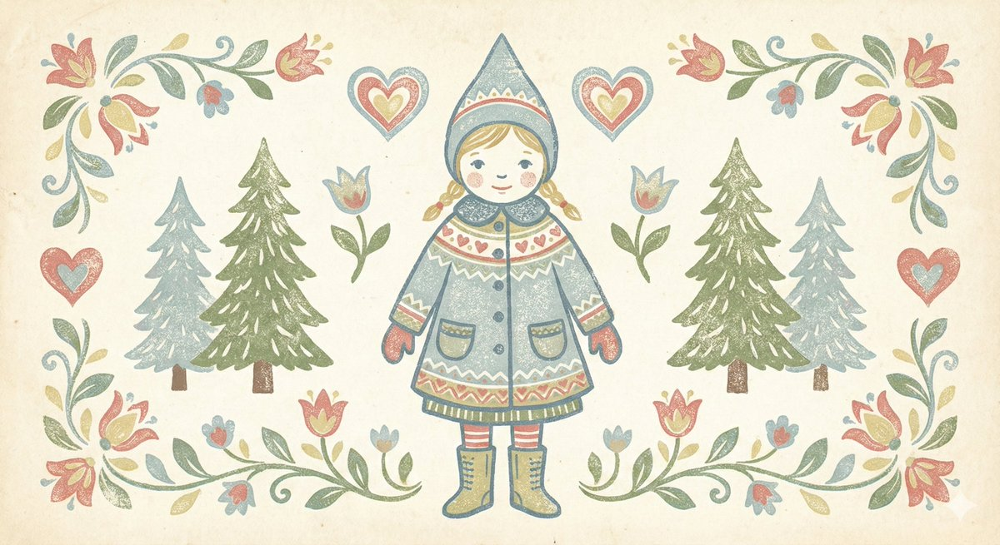

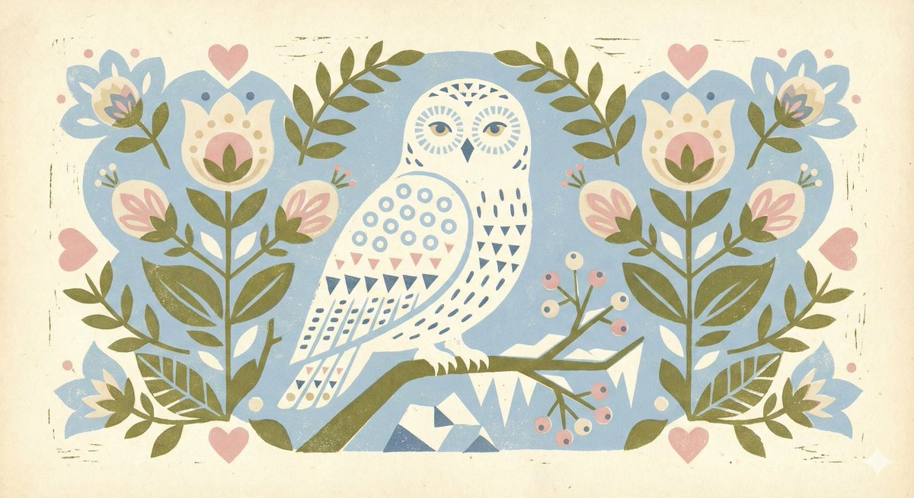

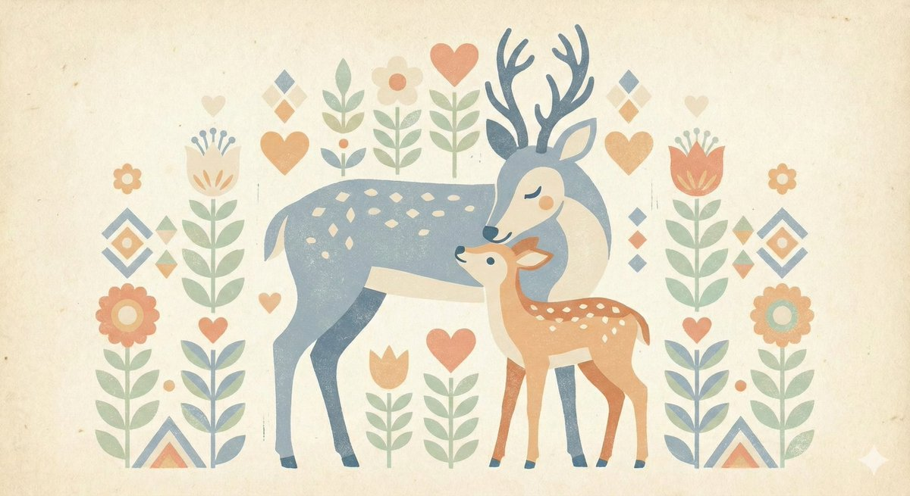

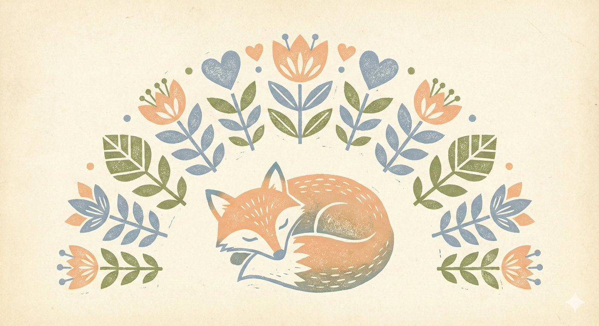

```
A Scandinavian folk-art depiction of [SUBJECT], using minimal shapes, soft pastel hues, stylized florals, and cozy symmetrical motifs. Woodblock-print texture with a charming, storybook feel.
```

```
一幅斯堪的纳维亚民间艺术风格的 [SUBJECT] 描绘，采用极简形状、柔和粉彩色调、风格化花卉图案以及温馨对称的纹样。具有木刻版画质感，充满迷人童话书般的氛围。
```

 [↑返回目录](#toc)

---
## <a id="prompt-1999897733931712500">电影级品牌广告</a> (<a href="https://x.com/ttmouse/status/1999897733931712531" target="_blank" rel="noopener noreferrer">ttmouse - 豆爸</a>)


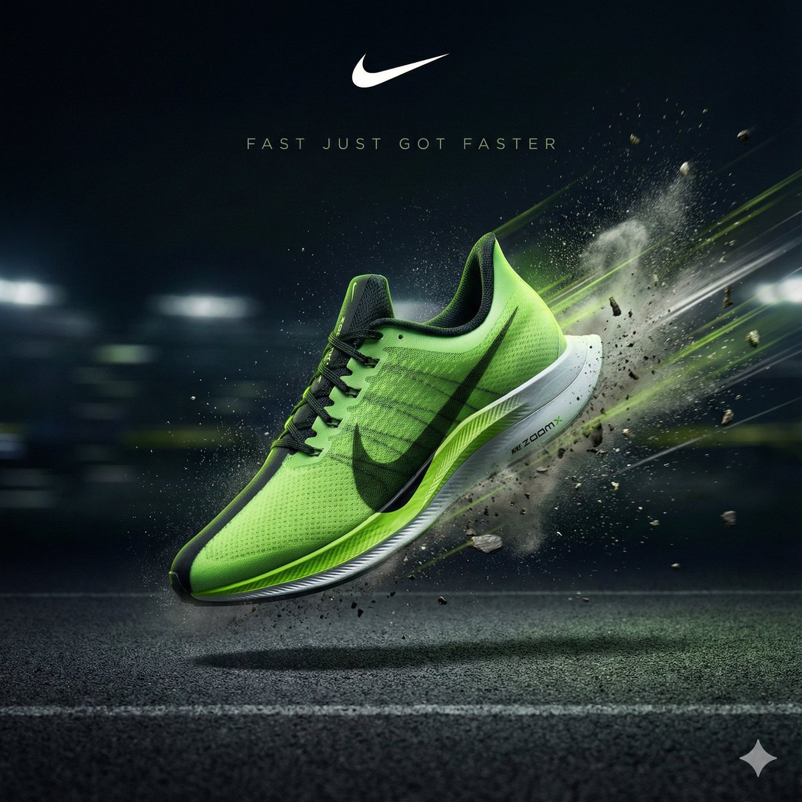

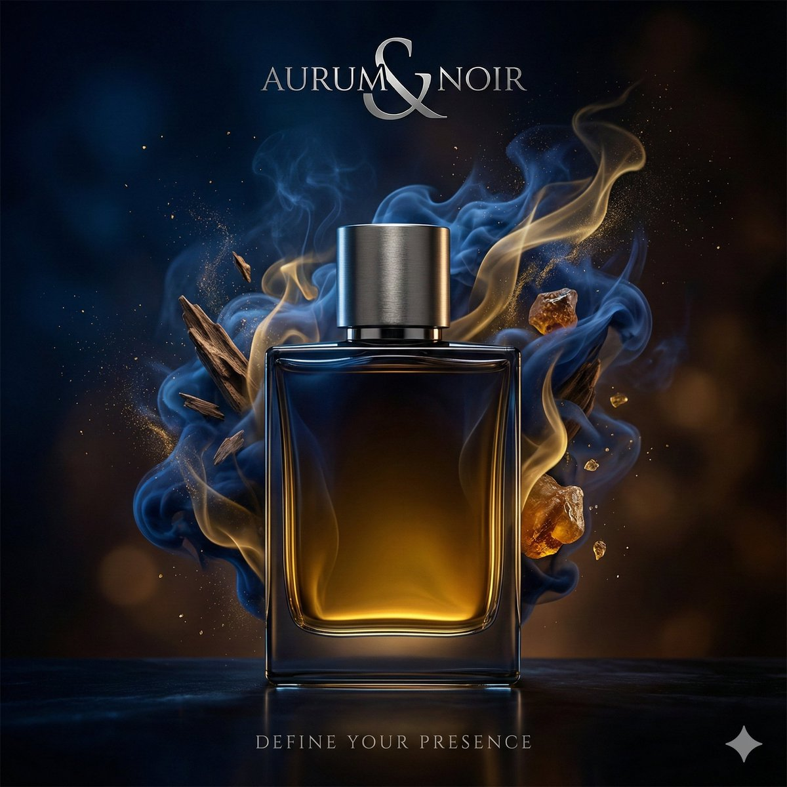

```
可口可乐
{
  "aspect_ratio": "1:1",
  "creative_direction": {
    "style": "High-end commercial photography, cinematic, hyper-realistic, luxurious product showcase.",
    "mood": "[Insert Mood based on product, e.g., Intense energy, serene luxury, refreshing cool, rugged power], dramatic and controlled.",
    "key_focus": "The irresistible sensory experience and primary benefit of the product highlighted through texture and action."
  },
  "subject": {
    "hero": "A single  [🍌Product Name/Description] , center-stage, presented as a hero object.",
    "sensory_details": "Extreme attention to texture emphasizing its primary sensation: [Insert specific sensory textures, e.g., condensation droplets, polished metal gleam, dynamic fabric tension, rising steam, rich material weave]. The product looks impeccable and highly desirable."
  },
  "action_and_fx": {
    "heroic_action_fx": "A dynamic, sculptural eruption of elements relevant to the product's function: [Insert dynamic elements, e.g., splashing liquid and ice, trailing dust and speed lines, radiating energy aura, swirling aroma mist, exploding ingredients]. This action explodes *around* and *behind* the product, framing it perfectly into a powerful composition.",
    "particles": "[Insert relevant particles, e.g., fine mist, sparks, dust motes, flower petals] suspended in the air to enhance atmosphere and motion dynamism."
  },
  "lighting": {
    "type": "Dramatic, high-contrast cinematic lighting (e.g., rim lighting to define edges).",
    "colors": "Strong contrast lighting. [Insert primary brand color or thematic color] rim lighting combined with complementary fill light to sculpt the product's form and emphasize its textures."
  },
  "environment": {
    "background": "Deep, atmospheric, infinite depth background with luxurious bokeh. Color palette reflects [Insert Brand/Product thematic colors]. No distracting elements.",
    "surface": "The product rests on a [Insert appropriate surface, e.g., reflective wet dark surface, rugged asphalt, polished marble, mossy ground] that complements the action."
  },
  "branding & composition": {
    "hierarchy": "Product first, Brand second, Message third.",
    "logo_placement": "Elegant [Brand Name] logo placed at the top center, refined and premium.",
    "slogan_placement": "Subtle slogan text '[Insert Slogan]' centered below the product, smaller font size.",
    "framing": "A tight, powerful central composition drawing the eye directly to the hero product."
  }
}

#material  #prompt
```

 [↑返回目录](#toc)

---
## <a id="prompt-1999844681723839000">《盗梦空间》复古电影票</a> (<a href="https://x.com/ttmouse/status/1999844681723838939" target="_blank" rel="noopener noreferrer">ttmouse - 豆爸</a>)

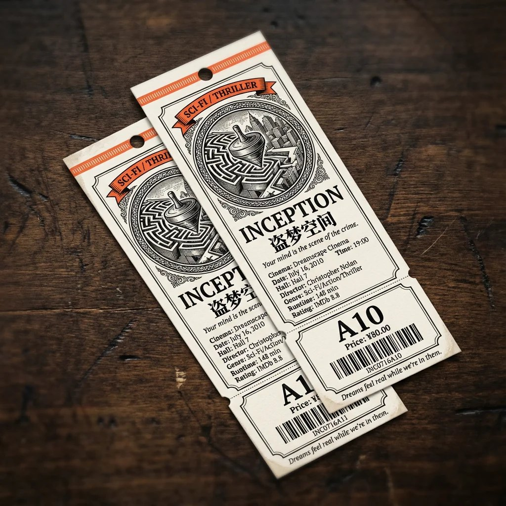


```
生成电影票。

🍌 Nano Banana Pro  prompt ：

电影名称：[盗梦空间]

请生成一张复古风格电影票据的真实照片，要求如下：

场景
两张票据略微重叠摆放在深色木质桌面，俯视拍摄，柔和自然光，浅景深。票据完全平放，顶部票据覆盖底部约55%并旋转几度。专业产品摄影美学。

材质
200g米黄色艺术纸，亚麻纹理，哑光表面。竖版书签比例（约5cm×17cm）。票据2/3处有微穿孔撕裂线（细密打孔），上部为主票，下部为可撕票根。

设计结构 顶部：橙色装订孔连线装饰 主票区（穿孔线以上）： 类型标签横幅 核心视觉插画（黑白木刻版画风格，高度概括电影主题，装饰性边框，细节丰富） 电影中英文标题 经典台词/tagline 详细放映信息（影院、日期、时间、影厅、导演、类型、时长、评分） 穿孔撕裂线（细密虚线） 票根区（穿孔线以下）： 座位号（两张票显示相邻座位） 票价 票号流水码 条形码 底部装饰quote 印刷
纯黑油墨（#000000）+ 橙色强调（#FF6B35）印在米黄纸上（#F5EFE7）。高质量胶版印刷质感，油墨略有渗入纸张纹理。

核心要求 根据电影自动设计符号化视觉元素，匹配电影气质和类型 所有信息（导演、时长、台词等）需真实准确 高信息密度，装饰元素丰富，无大面积空白 照片呈现真实生活场景，适合社交分享 高级收藏品质感
输出：一张专业摄影照片，两张重叠的复古电影票据，自然光线，木质桌面。
```

 [↑返回目录](#toc)

---
## <a id="prompt-1999810957829419300">柔焦镜中自拍：复古卧室里的她</a> (<a href="https://x.com/SimplyAnnisa/status/1999810957829419218" target="_blank" rel="noopener noreferrer">Anissa</a>)

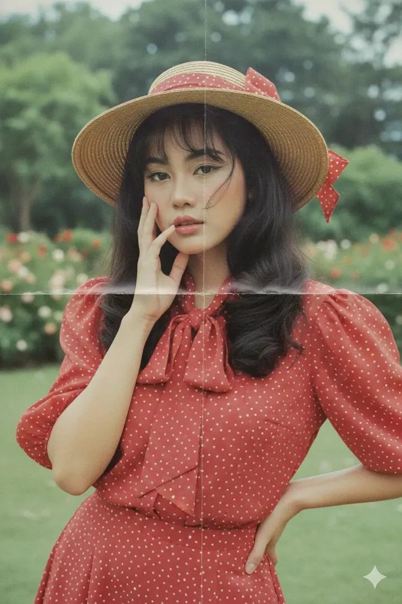

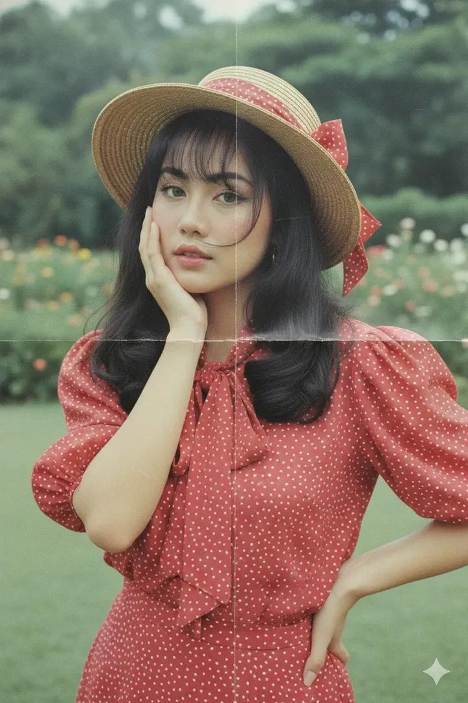

```
Create a soft-focus, nostalgic-style self-portrait of a young woman with a voluptuous body, innocent face, very long brown hair and bangs, wearing maroon tank  top Strict, smiling and taking a selfie in a large round, black-framed mirror. The photo is taken in a dimly lit, cozy bedroom decorated with a heavy collage of retro-style posters and pop culture art. The room is primarily lit by the warm glow of colorful LED fairy lights strung across the walls and ceiling.

In the foreground, directly below the mirror, a shelf holds two illuminated lava lamps—one red/orange and one blue—and a CD. The overall aesthetic should be vintage, cozy, and vibrant, with a warm, intimate lighting setup.

Style: Soft-focus, retro photography, nostalgic lighting, cozycore, bedroom aesthetic, film grain. 

JANGAN MERUBAH WAJAH SEDIKITPUN.
```

```
创作一幅柔焦、怀旧风格的年轻女性自拍肖像：她身材丰腴，面容纯真，留着非常长的棕色头发和齐刘海，身穿酒红色背心，神情认真却带着微笑，正对着一面大圆形黑框镜子自拍。照片拍摄于一间光线昏暗而温馨的卧室，墙上贴满密集的复古海报与流行文化艺术作品。房间主要由缠绕在墙壁与天花板上的彩色LED串灯发出温暖光芒照亮。

前景中，镜子正下方的架子上摆放着两盏发光的熔岩灯——一盏红橙色，一盏蓝色——以及一张CD。整体美学应呈现复古、温馨且充满活力的氛围，并采用温暖亲密的灯光布置。

风格：柔焦、复古摄影、怀旧光影、舒适核心（cozycore）、卧室美学、胶片颗粒感。

切勿对脸部做任何改动。
```

 [↑返回目录](#toc)

---
## <a id="prompt-1999796326855266800">都市阳光下的优雅女性</a> (<a href="https://x.com/saniaspeaks_/status/1999796326855266780" target="_blank" rel="noopener noreferrer">𝗦𝗮𝗻𝗶𝗮</a>)

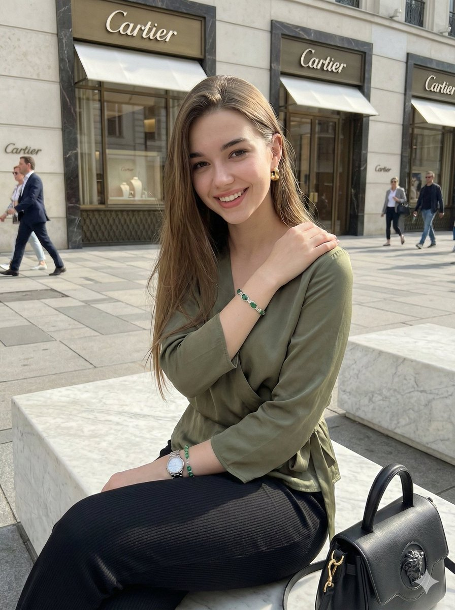

```
{  "subject": {    "gender": "female",    "age": "young adult",    "hair": {      "style": "very long, thick, wavy",      "color": "brown, cascading over shoulder and chest"    },    "face": {      "expression": "wide, radiant, captivating smile",      "features": "dark, arched, well-defined eyebrows; eyes highlighted with black eyeliner and neutral/smoky eyeshadow; long lashes; plumped lips with soft pink/peach lipstick/gloss",      "skin_tone": "fair, clear, and luminous, healthy glow"    },    "body_type": "curvaceous",    "pose": "relaxed yet sophisticated, sitting sideways on a bench, torso leaning slightly forward, one hand resting gently on her shoulder, looking directly at the camera"  },  "clothing_and_accessories": {    "top": "long-sleeved (3/4 length, rolled up) moss green or dark olive wrap-around V-neck blouse, light, flowing fabric (silk/viscose), ties in the front at the waist",    "bottom": "black, high-waisted, fitted pants (skinny/legging), ribbed or vertically textured fabric",    "jewelry": {      "earrings": "long, dangling gold earrings with pearl or white stone details",      "bracelet": "delicate gold bracelet with green stones (emeralds or similar)",      "watch": "silver wristwatch with a white dial"    },    "handbag": "black leather handbag with a gold chain strap and a large gold medallion with the Medusa symbol (Versace), resting on the bench beside her",    "nails": "manicured, vibrant red"  },  "setting": {    "location": "public outdoor area, square or modern sidewalk, urban, chic, and sunny aesthetic",    "elements": [      "wide, light gray marble bench (where she is sitting)",      "facade of a luxury store (Cartier) visible behind, with glass display cases, metal structures, and awnings",      "floor is light gray marble or granite",      "supporting columns and other blurred people passing by in the background"    ]  },  "lighting_and_atmosphere": {    "lighting": "natural, bright, and slightly to the side (sunny day), soft, flattering light on the face and body, open shaded area or reflected light, enhances skin glow and clothing colors, no harsh shadows",    "atmosphere": "urban elegance, daytime glamour, sophisticated lifestyle"  },  "composition_and_style": {    "shot_type": "medium-length photograph, shot slightly from below",    "style": "urban, chic, sunny, portraiture",    "camera_settings": "prime portrait lens (e.g., 85mm f/1.8 or 50mm f/1.4), full-frame camera, aperture f/2.0 to f/3.5, sharp subject, soft bokeh to isolate the subject from the busy urban background",    "aesthetic": "highlights the figure against the urban background and the interplay with the light"  }}
```

```
{
  "主体": {
    "性别": "女性",
    "年龄": "年轻成人",
    "头发": {
      "发型": "非常长、浓密、波浪卷发",
      "颜色": "棕色，倾泻于肩部与胸前"
    },
    "面部": {
      "表情": "灿烂、明媚、迷人的微笑",
      "特征": "深色、拱形、轮廓分明的眉毛；眼线为黑色，眼影为中性或烟熏色；睫毛浓密；双唇丰盈，涂有柔粉色或蜜桃色口红/唇彩",
      "肤色": "白皙、清透、富有光泽，健康亮泽"
    },
    "体型": "曲线玲珑",
    "姿势": "放松而优雅，侧坐在长椅上，上身微微前倾，一只手轻搭在肩上，直视镜头"
  },
  "服装与配饰": {
    "上衣": "长袖（3/4长度，卷起袖口）苔绿色或深橄榄色裹身V领衬衫，轻盈飘逸面料（真丝/粘胶纤维），腰部前方系带",
    "下装": "黑色高腰紧身裤（小脚/打底裤款式），罗纹或竖向纹理面料",
    "首饰": {
      "耳环": "长款垂坠式金色耳环，饰有珍珠或白色宝石细节",
      "手链": "精致金手链，镶嵌绿色宝石（祖母绿或类似）",
      "手表": "银色表带腕表，白色表盘"
    },
    "手袋": "黑色皮革手袋，金色链条肩带，配有大型金色美杜莎徽章（范思哲），置于身旁长椅上",
    "指甲": "精心修剪，鲜艳红色"
  },
  "场景": {
    "地点": "公共户外区域，广场或现代人行道，都市感强，时尚且阳光明媚",
    "元素": [
      "宽阔的浅灰色大理石长椅（她所坐之处）",
      "背景可见奢侈品牌店铺（卡地亚）外立面，含玻璃展示柜、金属结构及遮阳篷",
      "地面为浅灰色大理石或花岗岩",
      "背景中有支撑柱及模糊路过的行人"
    ]
  },
  "光线与氛围": {
    "光线": "自然光，明亮，略偏侧（晴天），柔和讨喜的光线照在面部与身体上，处于开放阴影区或反射光环境中，增强肌肤光泽与服装色彩，无强烈阴影",
    "氛围": "都市优雅、日间魅力、精致生活方式"
  },
  "构图与风格": {
    "镜头类型": "中景摄影，略低角度拍摄",
    "风格": "都市、时尚、阳光、肖像风格",
    "相机设置": "定焦人像镜头（如85mm f/1.8 或 50mm f/1.4），全画幅相机，光圈f/2.0至f/3.5，主体清晰，背景虚化柔和以突出人物与繁忙都市背景的隔离",
    "美学效果": "强调人物在都市背景中的突出地位，以及与光线的互动关系"
  }
}
```

 [↑返回目录](#toc)

---
## <a id="prompt-1999781038177063400">意大利阳光下的比萨时光</a> (<a href="https://x.com/NanoBanana_labs/status/1999781038177063373" target="_blank" rel="noopener noreferrer">Nano Banana Labs</a>)

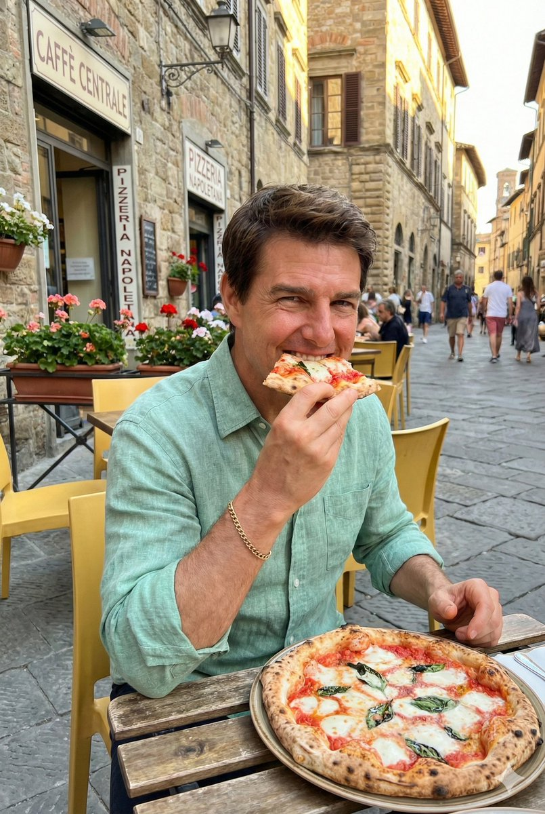


```
🚨 SEE YOURSELF ENJOYING PIZZA IN A SUNLIT ITALIAN STREET. 🇮🇹🍕✨

Copy the prompt below and CREATE YOUR OWN PHOTO LIKE THIS 🫵 with Nano Banana Pro

Bookmark 🔖 this now and recreate this with your selfie later.

How to:
 1) Download the Gemini app from the Play Store or App Store.
 2) Open the app and tap on the "🍌 Create image" button.
 3) Tap the + icon, click Gallery, and select a photo of yourself.
   > Note: For best results, use a photo where your face fills about 70% of the screen.
 4) Go to the @NanoBanana_Labs page, pick a photo you like, and copy the text prompt from that photo's description.
 5) Return to the Gemini app and paste that text into the "Describe your image" box.
 Tap the rocket symbol 🚀 in the bottom right corner to generate your image.

Follow @NanoBanana_labs for daily AI glow-ups & viral prompts 🚀 . Power of artificial intelligence, discover with nano banana pro

Prompt 👇
A handsome man attached in the uploaded reference image ( Keep the face of the person 100% accurate from the reference image ) with short brown hair sits at an outdoor Italian café table on a charming cobblestone street. He is holding a slice of margherita pizza near his mouth and winking playfully at the camera, smiling with a natural and confident expression. He wears a light green linen shirt and a simple gold bracelet on his wrist. On the rustic wooden table in front of him is a full Neapolitan pizza topped with tomato sauce, melted mozzarella, and fresh basil leaves. Around him are yellow café chairs, small tables, flower pots, and signs written in Italian on the stone walls. The scene captures the warm sunlight of an Italian afternoon, illuminating the street with a cozy golden tone. No blur background. Every element from the distant buildings and hanging plants to the café details is clearly visible and in perfect focus, creating a crisp, immersive atmosphere. 4:6
```

```
看到你自己在一个阳光明媚的意大利街道上享受比萨。 Italia 🍕✨

如何操作：
1) 从Play商店或App Store下载Gemini应用程序。
2) 打开应用程序并点击“🍌 创建图像”按钮。
3) 点击+图标，选择图库，并选择一张自己的照片。
   > 注意：为了获得最佳效果，请使用脸部占据屏幕约70%的照片。
4) 前往@NanoBanana_Labs页面，挑选一张你喜欢的照片，并从该照片的描述中复制文本提示。
5) 返回Gemini应用并将文本粘贴到“描述你的图像”框中。
点击右下角的火箭符号🚀生成你的图像。

关注@NanoBanana_labs获取每日AI提升和热门提示🚀。人工智能的力量，通过nano banana pro发现。

提示词如下：
一个帅气的男人，参照上传的参考图像（保持面部与参考图像100%一致），留着棕色短发，坐在户外意大利咖啡馆的桌子上，在迷人的鹅卵石街道上。他手持一片玛格丽塔比萨靠近嘴边，对着镜头调皮地眨眼，带着自然自信的表情微笑。他穿着浅绿色亚麻衬衫，手腕上戴着简单的金色手镯。在他面前的古朴木桌上，放着一整份那不勒斯比萨，上面覆盖着番茄酱、融化的马苏里拉奶酪和新鲜的罗勒叶。他的周围是黄色的咖啡馆椅子、小桌子、花盆以及写有意大利语的指示牌挂在石墙上。场景捕捉了意大利下午的温暖阳光，以舒适的金色色调照亮街道。没有背景模糊。从远处的建筑和悬挂的植物到咖啡馆细节，每个元素都清晰可见且完美聚焦，营造出清晰、沉浸式的氛围。4:6比例。
```

 [↑返回目录](#toc)

---
## <a id="prompt-1999793209711767800">微缩历史：标志性时刻重现</a> (<a href="https://x.com/TechieBySA/status/1999793209711767869" target="_blank" rel="noopener noreferrer">TechieSA</a>)

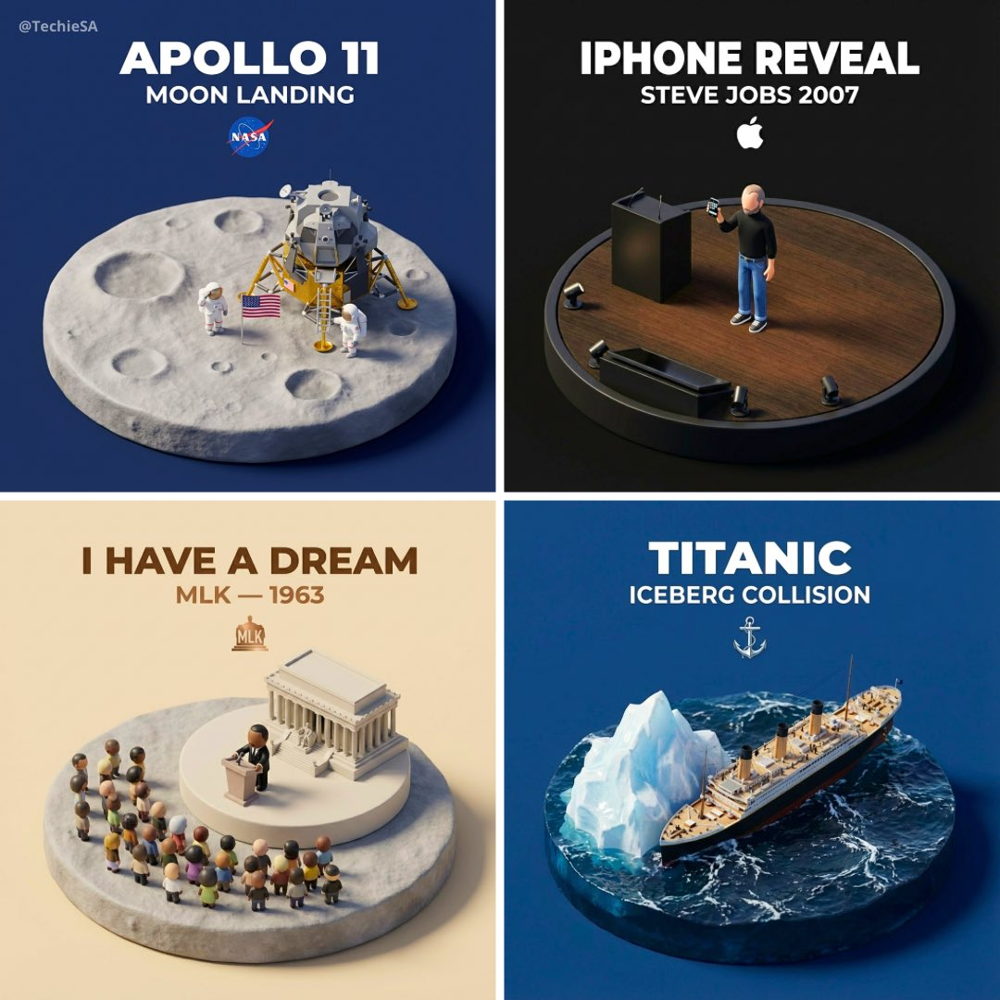

```
Present a clear, 45° top-down isometric miniature 3D cartoon scene of the historical event “EVENT”, featuring its most iconic moment: [DESCRIPTION]. Use soft refined textures, realistic PBR materials, and gentle lifelike lighting.
Create a small raised diorama-style base that includes the most recognizable elements of this moment, along with tiny stylized characters if needed (no facial details).
Use a clean solid [BACKGROUND COLOR] background.

At the top-center, display “[EVENT]” in large bold text, directly beneath it show a short descriptive subtitle in medium text, and place a small official symbol or simplified icon below the subtitle.
All text must automatically match the background contrast (white or black).

Composition: perfectly centered layout, square 1080x1080, ultra-clean, high-clarity diorama aesthetic.
```

```
呈现一个清晰的45°俯视等距微型3D卡通场景，描绘历史事件“EVENT”及其最具标志性的时刻：[DESCRIPTION]。使用柔和精致的纹理、逼真的PBR材质和柔和自然的光照。  
创建一个略微抬高的微缩模型风格底座，包含该时刻最易识别的元素，如有需要可加入微小的风格化人物（无面部细节）。  
使用干净纯色的[BACKGROUND COLOR]背景。  

在画面顶部中央以大号粗体文字显示“[EVENT]”，其正下方以中号字体展示简短描述性副标题，并在副标题下方放置一个小型官方标志或简化图标。  
所有文字必须自动匹配背景对比度（白色或黑色）。  

构图：完全居中布局，方形1080x1080，极致干净，高清晰度微缩模型美学。
```

 [↑返回目录](#toc)

---
## <a id="prompt-1999470440008339500">霓虹涂鸦肖像笔记</a> (<a href="https://x.com/YaseenK7212/status/1999470440008339551" target="_blank" rel="noopener noreferrer">Yaseen Khan Gul</a>)

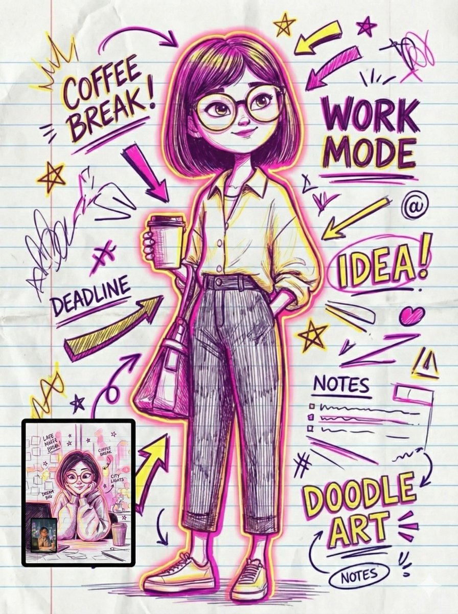

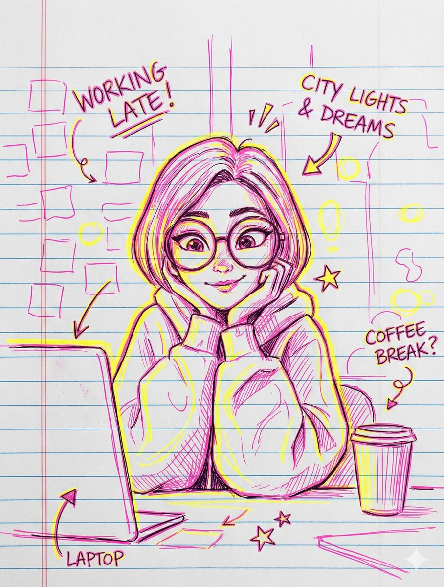

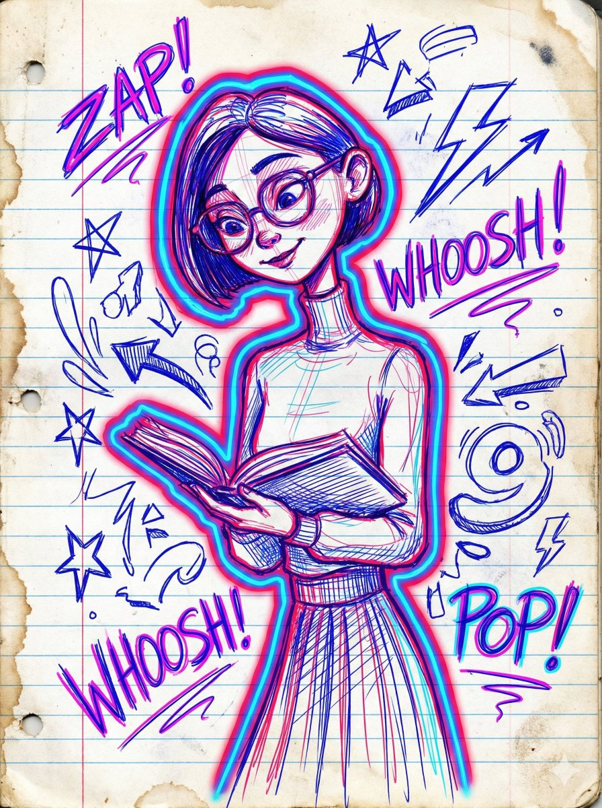

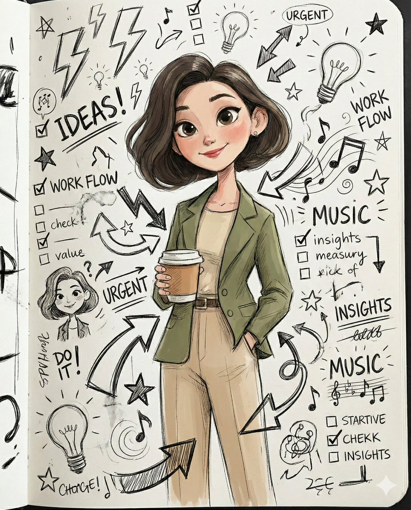

```
{
  "image_generation_task": {
    "task_type": "img2img",
    "input_source": "uploaded_user_image",
    "constraint": "preserve_full_likeness",
    
    "base_configuration": {
      "medium": {
        "substrate": "lined notebook paper",
        "tools": ["ballpoint pen", "neon markers", "ink"],
        "texture_details": [
          "realistic ink absorption",
          "layered pen pressure",
          "stained edges",
          "smudges",
          "subtle paper wrinkles"
        ]
      },
      "art_style": {
        "genre": ["doodle art", "comic annotations", "sketch"],
        "line_work": "thick-thin variation, loose freestyle, messy strokes, dynamic hatch shading",
        "atmosphere": "chaotic, energetic, spontaneous, dense"
      },
      "rendering": {
        "resolution": "4K",
        "detail_level": "high",
        "lighting": "bold outer glow, vibrant contrast"
      }
    },

    "composition_elements": {
      "framing": "portrait with thick border line around head",
      "surrounding_elements": [
        "messy arrows",
        "stars",
        "underlines",
        "random scribbles",
        "speech bubbles",
        "overlapping annotations",
        "checkboxes"
      ],
      "iconography": [
        "lightning bolt",
        "lightbulb",
        "music note",
        "mini self-caricature"
      ],
      "typography": {
        "style": "handwritten comic notes",
        "sound_effects": ["ZAP!", "WHOOSH!"]
      }
    },

    "style_variations": [
      {
        "id": "variant_01_pop_bold",
        "color_palette": ["bold cyan", "magenta"],
        "specific_vibe": "vibrant pop, stylish comic notes"
      },
      {
        "id": "variant_02_neon_highlight",
        "color_palette": ["neon pink", "neon yellow"],
        "specific_vibe": "highlighter aesthetic, expressive gestures"
      },
      {
        "id": "variant_03_electric_graffiti",
        "color_palette": ["hot electric blue", "neon red"],
        "specific_vibe": "graffiti-styled, exaggerated outline, playful highlights"
      },
      {
        "id": "variant_04_dense_sketch",
        "color_palette": ["blue linework", "red accents"],
        "specific_vibe": "densely packed, horror vacui (no blank space), alive and messy"
      }
    ]
  }
}
```

```
{
  "image_generation_task": {
    "task_type": "img2img",
    "input_source": "uploaded_user_image",
    "constraint": "preserve_full_likeness",

    "base_configuration": {
      "medium": {
        "substrate": "有线条的笔记本纸",
        "tools": ["圆珠笔", "霓虹马克笔", "墨水"],
        "texture_details": [
          "真实的墨水吸收效果",
          "分层的笔压",
          "染色边缘",
          "污迹",
          "细微的纸张皱纹"
        ]
      },
      "art_style": {
        "genre": ["涂鸦艺术", "漫画注释", "草图"],
        "line_work": "粗细变化、自由风格、杂乱笔触、动态交叉阴影",
        "atmosphere": "混乱、充满活力、自发、密集"
      },
      "rendering": {
        "resolution": "4K",
        "detail_level": "高",
        "lighting": "大胆的外发光，鲜艳的对比度"
      }
    },

    "composition_elements": {
      "framing": "带厚边框线的肖像",
      "surrounding_elements": [
        "杂乱的箭头",
        "星星",
        "下划线",
        "随意的涂鸦",
        "对话气泡",
        "重叠的注释",
        "复选框"
      ],
      "iconography": [
        "闪电",
        "灯泡",
        "音符",
        "迷你自画像"
      ],
      "typography": {
        "style": "手写漫画注释",
        "sound_effects": ["ZAP！", "WHOOSH！"]
      }
    },

    "style_variations": [
      {
        "id": "variant_01_pop_bold",
        "color_palette": ["醒目的青色", "品红色"],
        "specific_vibe": "充满活力的流行色彩，时尚的漫画注释"
      },
      {
        "id": "variant_02_neon_highlight",
        "color_palette": ["霓虹粉色", "霓虹黄色"],
        "specific_vibe": "荧光笔美学，富有表现力的手势"
      },
      {
        "id": "variant_03_electric_graffiti",
        "color_palette": ["热电蓝色", "霓虹红色"],
        "specific_vibe": "涂鸦风格，夸张的轮廓，有趣的亮点"
      },
      {
        "id": "variant_04_dense_sketch",
        "color_palette": ["蓝色线条", "红色点缀"],
        "specific_vibe": "密集填充，恐怖真空（无空白），生动且杂乱"
      }
    ]
  }
}
```

 [↑返回目录](#toc)

---
## <a id="prompt-1999784969363681300">镜中自拍：深夜闪光私语</a> (<a href="https://x.com/Arminn_Ai/status/1999784969363681297" target="_blank" rel="noopener noreferrer">ΛRMIN | AI</a>)

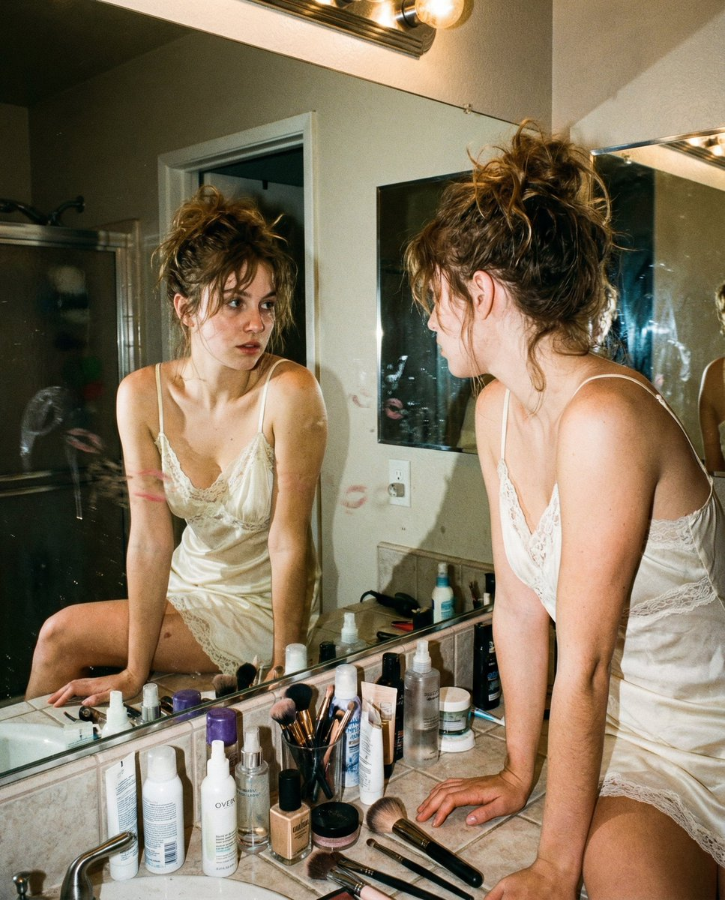

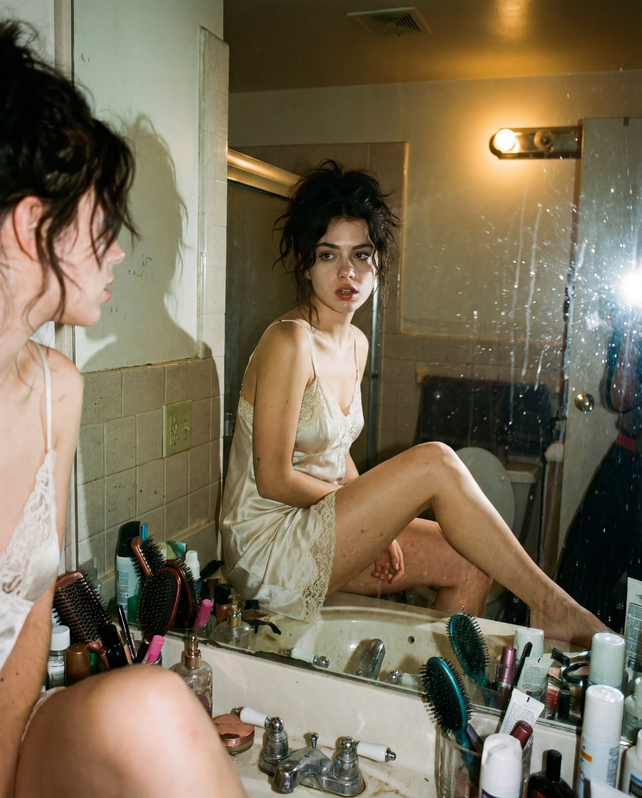

```
{
  "intent": "a raw candid flash-style mirror photograph of a young woman.",
  "frame": {
    "aspect_ratio": "4:5 vertical",
    "composition": "mirror reflection, subject framed thighs-up on vanity counter, foreground clutter for depth",
    "style_mode": ["snapshot_aesthetic", "raw_flash_photography", "analog_film_emulation"]
  },
  "subject": {
    "identity": "young woman, early 20s, slender, messy loose-updo hair",
    "wardrobe": "vintage silk slip dress with lace trim",
    "pose": "seated casually on bathroom counter, leaning forward toward mirror, legs relaxed or crossed",
    "expression": "detached cool look, lips slightly parted, gaze at reflection or camera"
  },
  "environment": {
    "location": "compact tiled residential bathroom with vanity mirror",
    "atmosphere": "intimate late-night private moment",
    "details": "cluttered counter with cosmetics, brushes, toiletries",
    "mirror_elements": "smudges, water spots, optional lipstick writing"
  },
  "camera": {
    "sensor_format": "35mm film emulation (Kodak Gold 400 or Cinestill 800T)",
    "lens": "35mm wide-angle point-and-shoot with slight distortion",
    "aperture_depth_of_field": "f/5.6–f/8 for sharp subject and background",
    "shutter_speed": "1/60s flash sync",
    "iso": 800,
    "camera_position": "eye-level toward mirror reflection"
  },
  "lighting": {
    "type": "direct on-camera flash + ambient tungsten",
    "key_light": "hard frontal flash with harsh shadows and specular highlights",
    "fill_light": "warm dim tungsten cast",
    "contrast": "high contrast with strong fall-off",
    "color_temperature": "5500K flash + 3200K ambient"
  },
  "post_process": {
    "color_grade": "vintage film, lifted blacks, green-tinted shadows, saturated reds",
    "sharpness": "moderate with film grain and flash softness",
    "vignette": "natural flash fall-off at edges"
  },
  "negative": {
    "style": ["no studio lighting", "no softbox", "no 3D render", "no cartoon", "no anime", "no illustration", "no painting", "no airbrushed skin"],
    "content": ["no clean minimalist spaces", "no perfect posture", "no happy expressions", "no daylight", "no LED aesthetics"]
  }
}
```

```
{
  "意图": "一张未经修饰、抓拍风格的闪光灯镜中自拍照，主角为年轻女性。",
  "构图": {
    "宽高比": "4:5 竖版",
    "构图方式": "镜中倒影，主体从大腿以上被框入梳妆台镜面，前景杂乱以增强景深",
    "风格模式": ["快照美学", "原始闪光摄影", "胶片模拟"]
  },
  "主体": {
    "身份": "20岁出头的年轻女性，身材纤细，凌乱的松散发髻",
    "服装": "复古真丝吊带裙，饰有蕾丝花边",
    "姿势": "随意坐在浴室台面上，身体前倾靠近镜子，双腿自然放松或交叉",
    "表情": "冷淡疏离的眼神，双唇微启，目光注视镜中自己或相机"
  },
  "环境": {
    "地点": "紧凑的住宅瓷砖浴室，配有梳妆镜",
    "氛围": "深夜私密的亲密时刻",
    "细节": "台面杂乱摆放着化妆品、刷具和洗漱用品",
    "镜面元素": "污渍、水渍，可选口红涂写的字迹"
  },
  "相机": {
    "感光格式": "35mm胶片模拟（柯达Gold 400或Cinestill 800T）",
    "镜头": "35mm广角傻瓜相机镜头，略带畸变",
    "光圈与景深": "f/5.6–f/8，确保主体与背景均清晰",
    "快门速度": "1/60秒闪光同步",
    "ISO": 800,
    "机位": "与眼睛同高，对准镜中反射"
  },
  "灯光": {
    "类型": "机顶直闪 + 环境钨丝灯",
    "主光": "正面硬闪光，产生强烈阴影与高光",
    "补光": "温暖而昏暗的钨丝灯光",
    "对比度": "高对比，光线衰减明显",
    "色温": "闪光5500K + 环境光3200K"
  },
  "后期处理": {
    "调色": "复古胶片风格，提亮暗部，阴影带绿色调，红色饱和",
    "锐度": "中等，保留胶片颗粒与闪光柔和感",
    "暗角": "自然的闪光边缘衰减"
  },
  "负面提示": {
    "风格": ["无影棚布光", "无柔光箱", "非3D渲染", "非卡通", "非动漫", "非插画", "非绘画", "无磨皮"],
    "内容": ["非极简整洁空间", "非端正姿势", "非开心表情", "非日光", "非LED风格"]
  }
}
```

 [↑返回目录](#toc)

---
## <a id="prompt-1999171087314112500">柔色刺绣：俯视手作之美</a> (<a href="https://x.com/CharaspowerAI/status/1999171087314112585" target="_blank" rel="noopener noreferrer">Pierrick Chevallier | IA</a>)

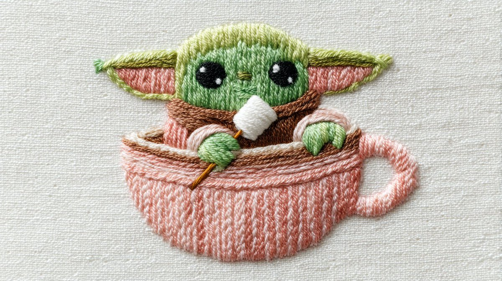

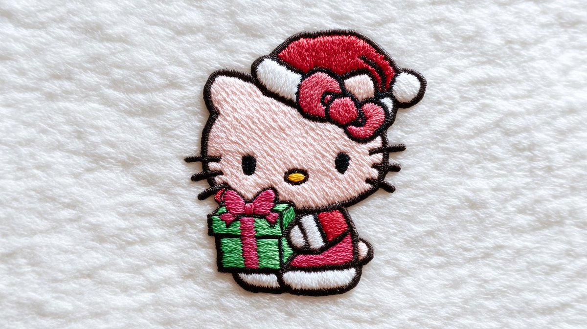

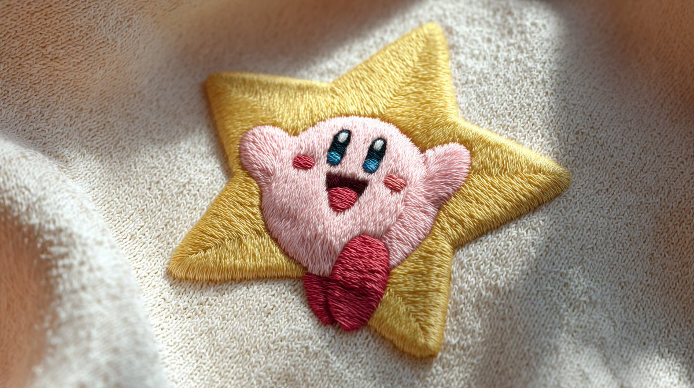


```
🚨PromptShare🚨

EMBROIDERY
flat view, top-down embroidery of a cute, pastel [character or object doing a simple action], an organic wool-textured embroidered design pattern on a white background, hand-painted details and vibrant colors. minimalist composition, soft lighting, high resolution, highly detailed, high quality.
```

```
🚨PromptShare🚨

刺绣  
俯视平面视角，一件可爱的、柔和色调的[角色或物体正在做简单动作]的刺绣作品，白色背景上呈现有机羊毛质感的刺绣图案，手绘细节与鲜艳色彩。极简构图，柔光，高分辨率，高度细节化，高品质。
```

 [↑返回目录](#toc)

---
## <a id="prompt-1999785618197602800">甜点微缩城市奇遇</a> (<a href="https://x.com/Gdgtify/status/1999785618197602736" target="_blank" rel="noopener noreferrer">Gadgetify</a>)

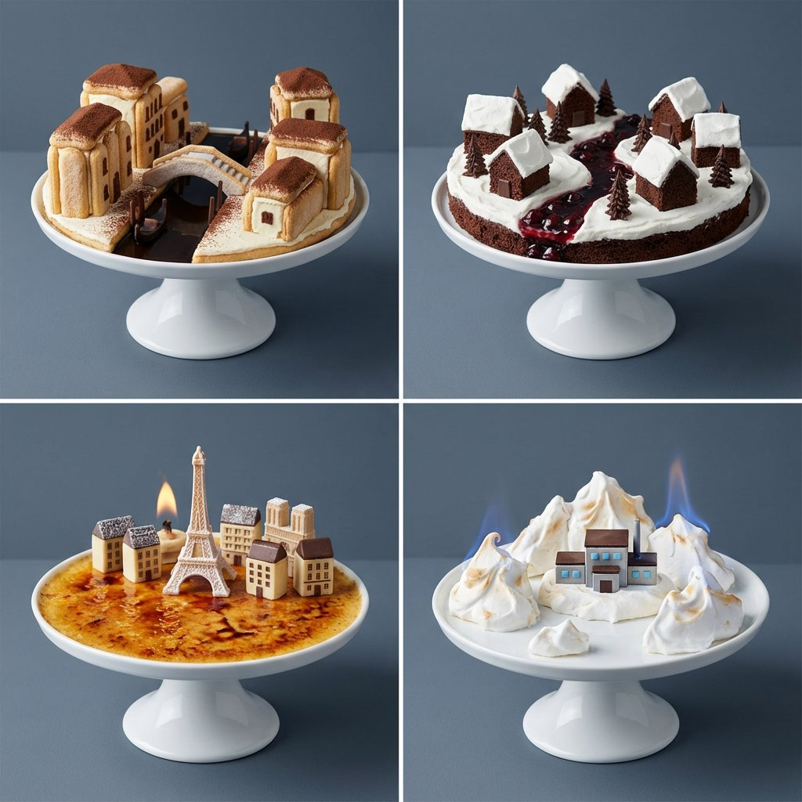

```
A 2x2 grid of countries recreated entirely from their national dishes [Top Left: Mexico; tortilla-landscape map, Chichén Itzá pyramid built from stacked tostadas, salsa rivers, guacamole Yucatán jungle] [Top Right: Japan; sushi rice Honshu island, Mount Fuji of shaved tuna, bullet-train soy-sauce track, wasabi forests] [Bottom Left: Italy; pizza dough boot shape, leaning tower of parmesan wheels, gondolas made of grissini in tomato-sauce canals] [Bottom Right: India; spice-powder subcontinent, Taj Mahal of pressed saffron rice, cardamom train tracks, tiny masala figures] 

Style: extreme food art on slate boards, macro photography, dramatic overhead lighting, dark moody background
```

```
一幅2x2的网格图，展现了四个国家通过其国菜重新创造的景观。【左上：墨西哥；由玉米饼构成的地形地图，奇琴伊察金字塔由堆叠的烤饼组成，河流是莎莎酱，尤卡坦丛林是鳄梨泥】 【右上：日本；寿司米做成的本州岛，用刨成薄片的金枪鱼塑造的富士山顶，酱油轨道上的新干线，芥末森林】 【左下：意大利；比萨面团制成的靴子形状，斜塔由帕尔马干酪轮子构建，番茄酱运河中的面包棒贡多拉】 【右下：印度；香料粉组成的次大陆，用压紧的藏红花米饭制作的泰姬陵，豆蔻火车轨道，小玛莎拉人物】。艺术风格极为讲究的食物艺术在石板上呈现，采用微距摄影，戏剧性的顶部照明和深沉、阴郁的背景。
```

 [↑返回目录](#toc)

---
## <a id="prompt-1999807671156056600">泳池边的忧郁双子</a> (<a href="https://x.com/ZaraIrahh/status/1999807671156056526" target="_blank" rel="noopener noreferrer">Zara</a>)

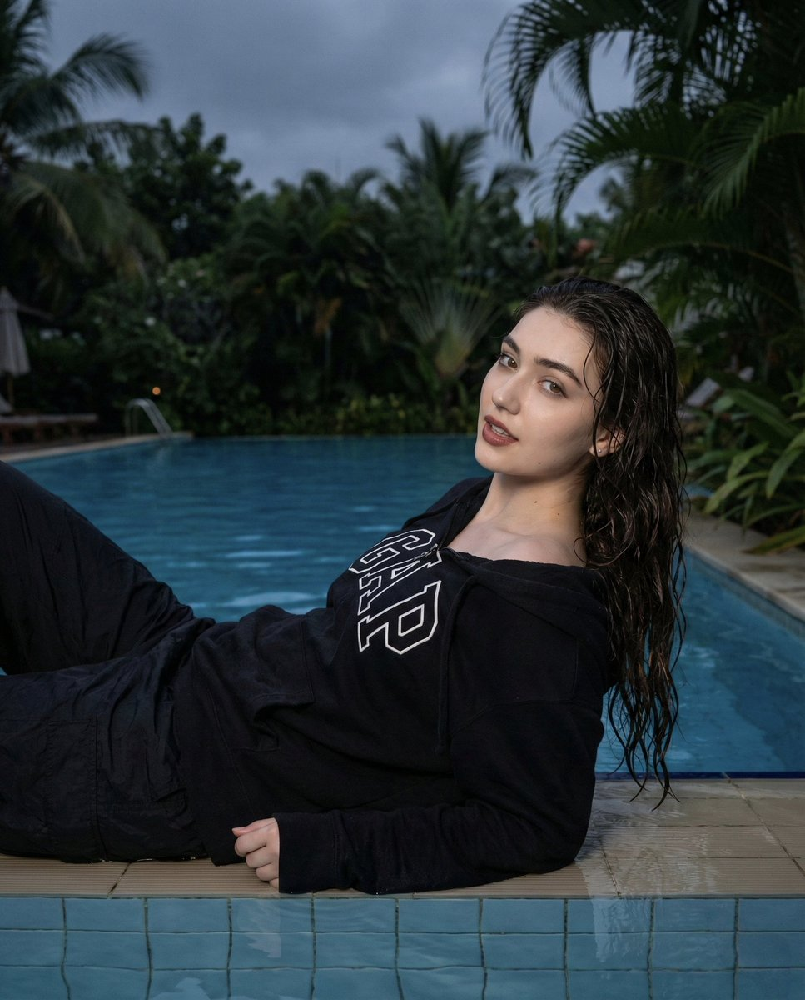

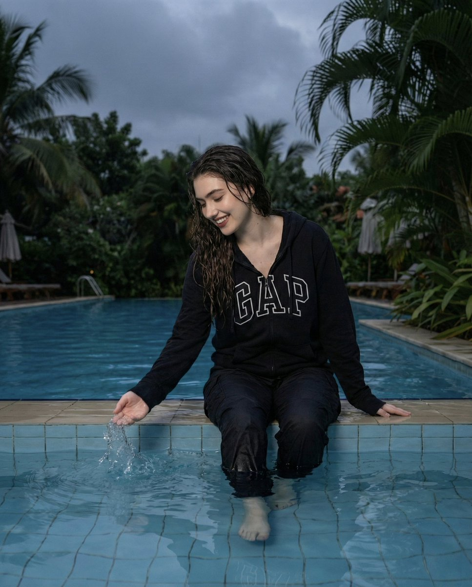

```
Use the features from the attached photo to create a half-body portrait of a young woman with long dark brown wavy hair, posing casually by a swimming pool in a moody, tropical outdoor setting. The photo is captured with a high-quality digital camera, exhibiting a professional perspective, dim, diffused evening light, and a casual, playful aesthetic.

Hair Detail
Her long, dark brown wavy hair is wet, sleek, and partially disheveled, suggesting she just got out of the water. It is slicked back off her face, with a few strands clinging to her temples.

Attire
She is wearing a black pullover hoodie with the white "GAP" logo emblazoned across the chest. The hoodie is oversized and pulled down to expose her left shoulder, suggesting a minimalist style of dress underneath. On her lower body, she is wearing baggie black bottoms.

Accessories
Her makeup is subtle but defined, featuring full lips in a neutral or soft berry tone. A faint shimmer or gloss is visible on her lips.

Pose
She is on her back looking back at the camera.  

Camera
The shot is a mid-shot portrait, framed from the top of her head down to her upper thigh, emphasizing her pose and the pool environment. The photo is taken with a high-quality digital camera, exhibiting a professional perspective and dim, diffused outdoor lighting (suggesting early evening or an overcast day). The light creates a soft, slightly dark, and moody atmosphere. The image quality is sharp, capturing the subtle texture of the hoodie and the reflection of the light on the wet pool tiles.

Background Overall Detail
The background features a tropical resort pool area at dusk. A tiled swimming pool with bright blue water and a dark perimeter is prominent in the foreground. Lush, dark green tropical trees and prominent palm fronds rise into the frame, with the sky appearing dark and overcast. The environment is damp and lush, contrasting with the bright blue water.

The overall image conveys
The overall image conveys a blend of youthful comfort and casual sexiness, capturing a confident woman in a distinctive, juxtaposed outfit within a cool-toned, atmospheric tropical setting, emphasized by the professional quality of the photograph and the moody lighting.
```

```
利用附图中的特征，创作一位年轻女性的半身肖像：她拥有长长的深棕色波浪发，在热带户外泳池边随意摆姿，氛围忧郁。照片使用高质量数码相机拍摄，具有专业视角、昏暗柔和的傍晚光线，以及随性而俏皮的美学风格。

发型细节  
她的长发为深棕色波浪状，湿润、顺滑且略显凌乱，暗示她刚从水中出来。头发向后梳拢，露出面部，几缕发丝贴在太阳穴上。

服装  
她身穿一件黑色套头连帽衫，胸前印有白色“GAP”标志。连帽衫尺码偏大，滑落至左肩，露出内搭的极简风格衣物。下身搭配宽松的黑色裤装。

配饰  
妆容淡雅却轮廓分明，双唇饱满，呈中性或柔雾莓果色调，唇面带有微闪或光泽感。

姿势  
她仰卧着，回头望向镜头。

镜头  
画面为中景人像，从头顶至大腿上部构图，突出人物姿态与泳池环境。照片由高质量数码相机拍摄，呈现专业视角与昏暗、漫射的户外光线（暗示傍晚时分或阴天）。光线营造出柔和、略暗且富有情绪的氛围。画质锐利，清晰呈现连帽衫的细腻纹理与湿滑池砖上的光影反射。

背景整体细节  
背景为黄昏时分的热带度假村泳池区域。前景是铺有瓷砖的游泳池，池水湛蓝明亮，边缘颜色较深。茂密的深绿色热带树木与显著的棕榈叶伸入画面，天空阴沉灰暗。环境潮湿葱郁，与明亮的蓝色池水形成鲜明对比。

整体画面传达  
整体画面融合了青春舒适感与随性性感，捕捉了一位自信女性身着风格对比鲜明的服装，置身于冷色调、氛围浓郁的热带环境中，通过专业级摄影质量与情绪化光影进一步强化这一意境。
```

 [↑返回目录](#toc)

---
## <a id="prompt-1999804272696029700">时间之镜：老化与融合</a> (<a href="https://x.com/techhalla/status/1999804272696029616" target="_blank" rel="noopener noreferrer">TechHalla</a>)


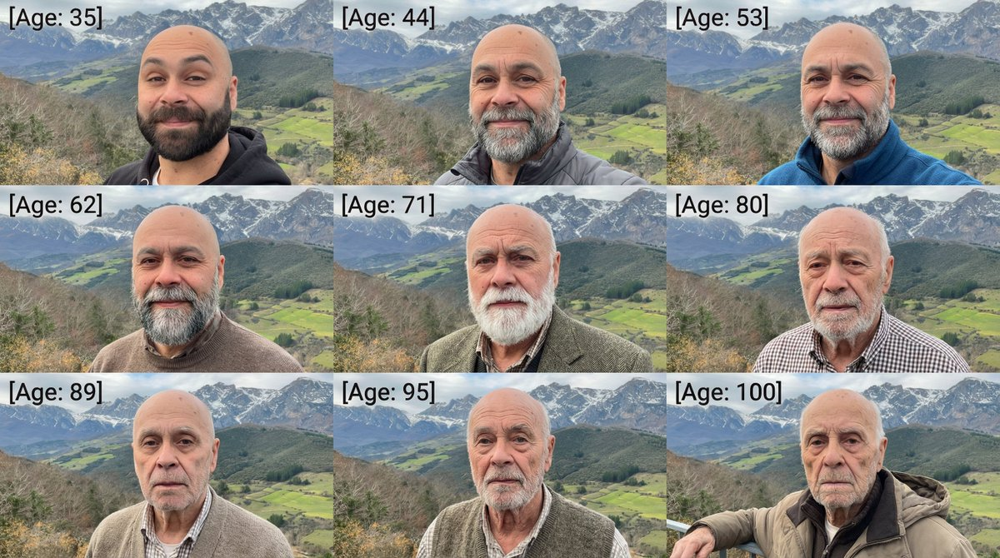

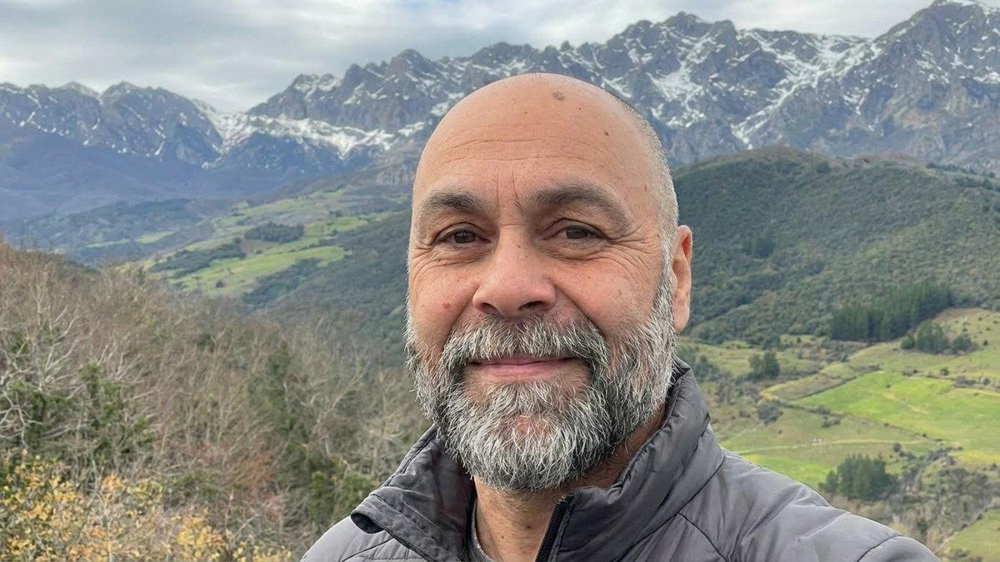

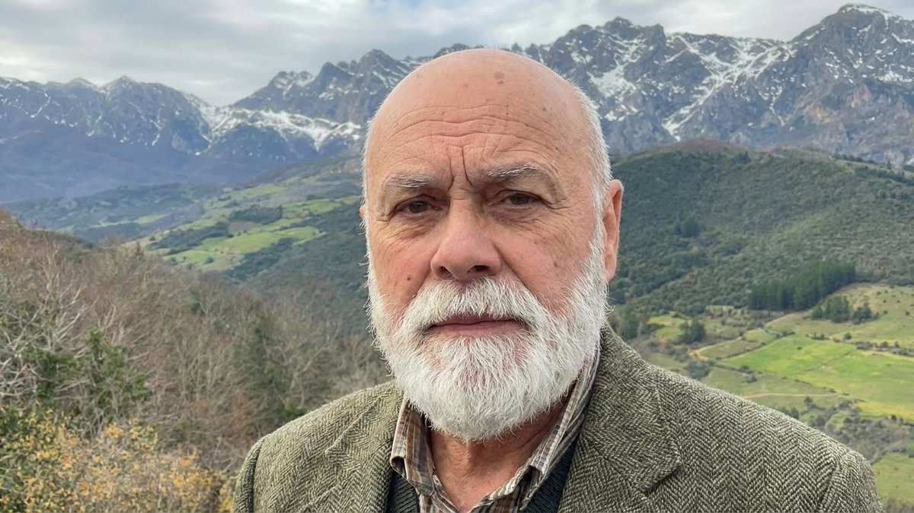

```
Chronological Mirror (Aging 3x3 grid + morphing clip)

Nano Banana Pro’s analytical capabilities are insane.

droppin the prompt below so you can try it out on Higgsfield AI 👇
```

```
时间之镜（老化3x3网格 + 渐变融合片段）

Nano Banana Pro 的分析能力简直疯狂。

下方附上提示词，你可以在 Higgsfield AI 上试试看👇
```

 [↑返回目录](#toc)

---
## <a id="prompt-1999148326948647200">奢华品牌快闪售货亭</a> (<a href="https://x.com/Arminn_Ai/status/1999148326948647111" target="_blank" rel="noopener noreferrer">ΛRMIN | AI</a>)

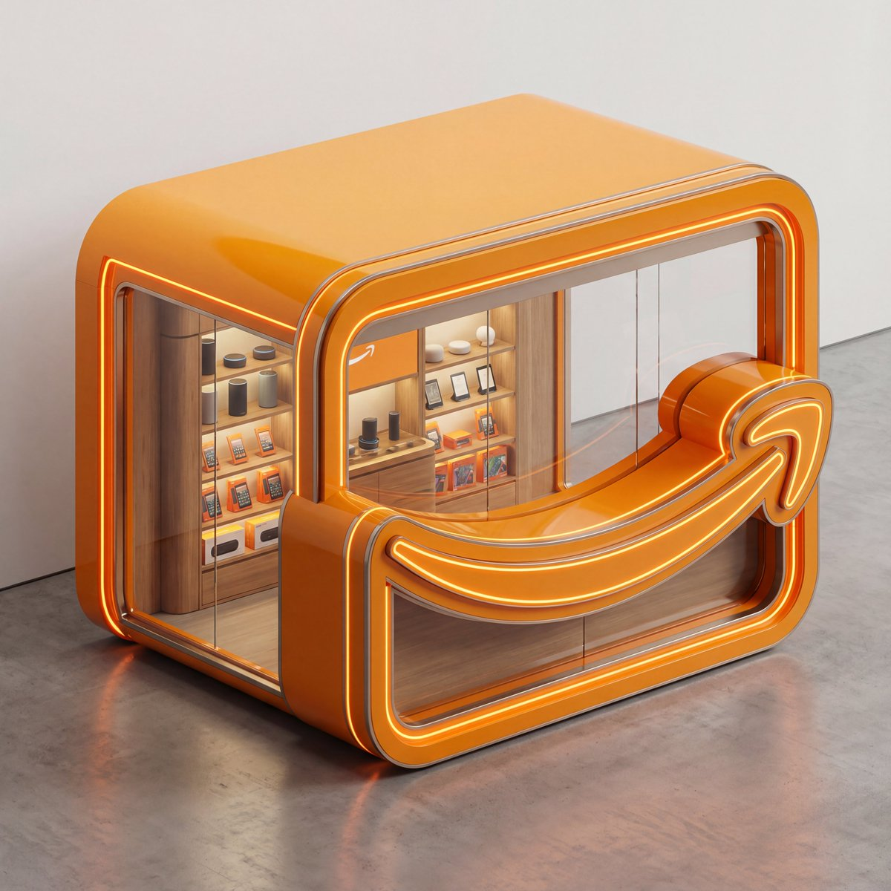

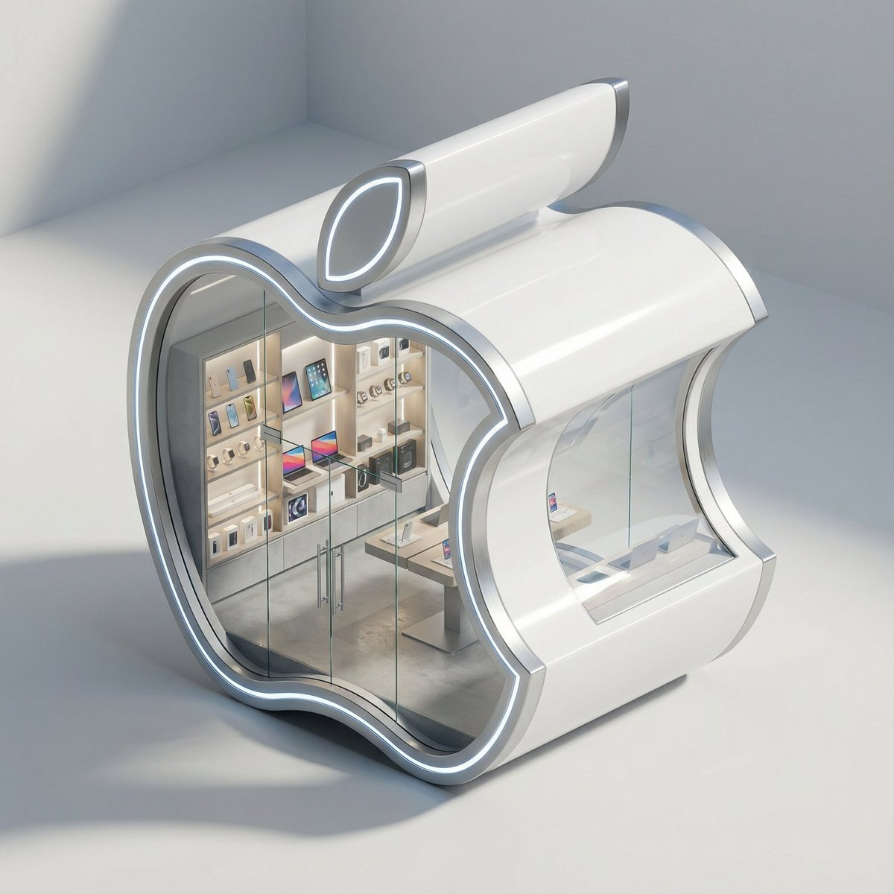

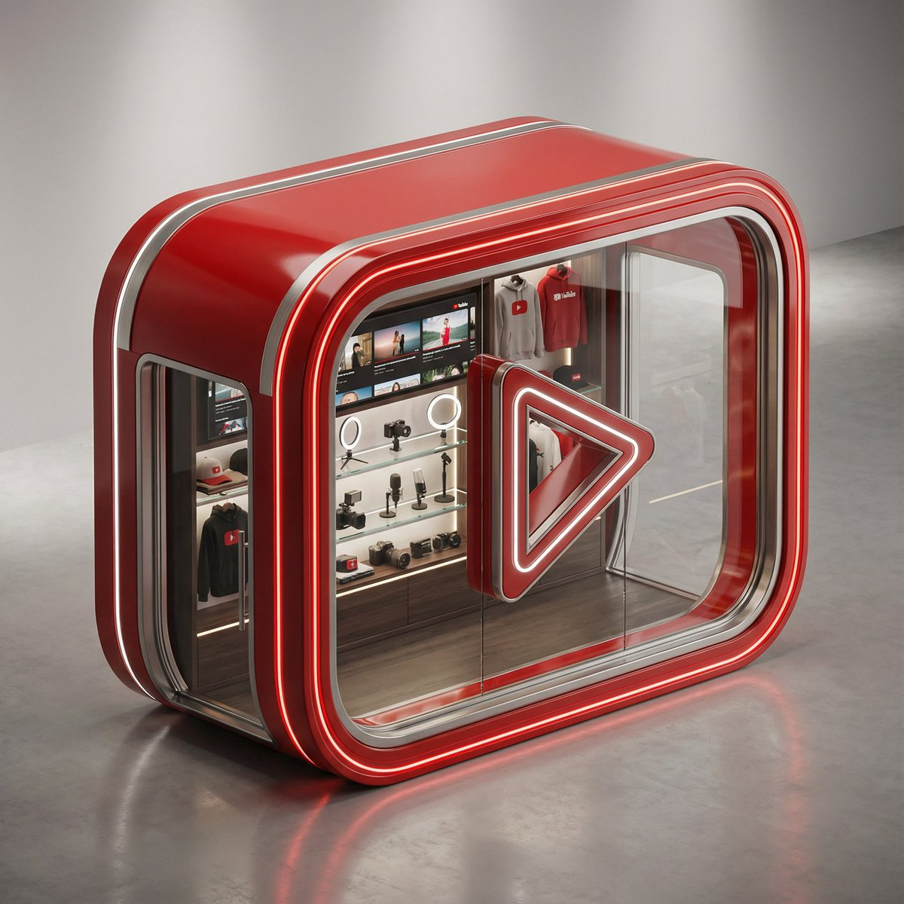

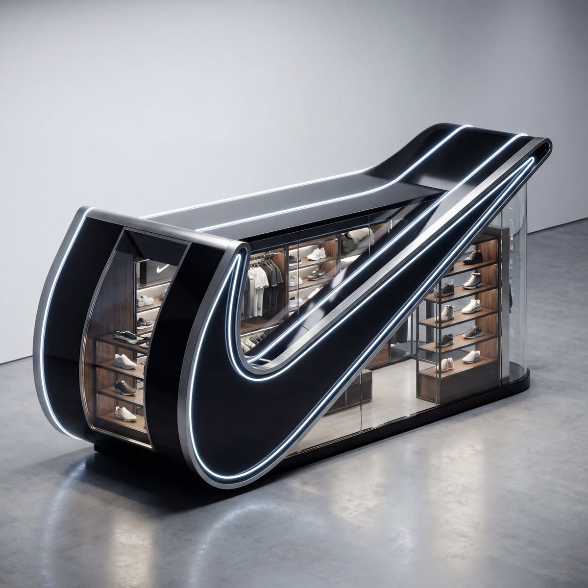

```
- Prompt 👇
3D isometric render of a luxury pop-up shop kiosk shaped exactly like the [BRAND_NAME_AND_LOGO_SHAPE]. The architecture is a thick 3D extrusion of the logo symbol, constructed from high-end polished architectural materials in glossy [BRAND_COLOR] with subtle brushed metal accents. Thin, glowing neon LED strips trace the entire outer silhouette and edges of the logo shape. Large, seamless museum-grade glass windows showcase a meticulously detailed interior. Inside, bespoke shelves present [PRODUCT_TYPE] with integrated micro-LED lighting. Dramatic high-end studio lighting creates soft shadows and highlights, emphasizing textures and form. Set against a clean, neutral gallery background. Ultra-photorealistic, 8k resolution, highly detailed, octane render quality, luxury design aesthetic.
```

```
3D等距渲染的奢华快闪店售货亭，外形完全仿照[品牌名称及标志形状]。建筑为标志符号的厚实3D拉伸体，采用高光泽度的[品牌颜色]高端抛光建筑材料打造，并辅以细腻的拉丝金属点缀。纤细的霓虹LED灯条沿整个标志轮廓与边缘发光勾勒。大面积无缝博物馆级玻璃窗展示内部精雕细琢的空间：定制货架陈列着[产品类型]，并配有集成微型LED照明。戏剧性的高端影棚灯光营造出柔和阴影与高光，突出材质与形态。背景为干净中性的画廊环境。超写实风格，8K分辨率，细节丰富，Octane渲染品质，奢华设计美学。
```

 [↑返回目录](#toc)

---
## <a id="prompt-1999149732967428600">FLORA：微距植物字体</a> (<a href="https://x.com/TechieBySA/status/1999149732967428590" target="_blank" rel="noopener noreferrer">Heather Cooper</a>)


```
Nano Banana Pro + Veo 3.1: Typography Hero Shot

on @FlowbyGoogle 

A soft, archival-style macro scene where the word FLORA appears as translucent letters filled with pressed leaves and delicate flowers. Animate the petals shifting gently as if touched by a faint breeze, tiny pollen particles drifting inside the letters, and subtle sunlight flickering across the paper background. The camera performs a slow overhead push-in, casting natural shadows that shift with the motion. Warm, quiet ambiance: soft paper rustle, faint botanical-room atmosphere. Style: museum-grade botanical study, high detail, no added text.
```

```
Nano Banana Pro + Veo 3.1：字体主角镜头

在 @FlowbyGoogle 上

一幅柔和的档案风格微距画面，单词“FLORA”以半透明字母呈现，内部填充压平的叶片与精致花朵。花瓣轻轻摇曳，仿佛被微风拂过，细小花粉颗粒在字母内部缓缓飘散，柔和阳光在纸张背景上微微闪烁。镜头从上方缓慢推进，投射出随镜头移动而变化的自然阴影。氛围温暖静谧：轻柔的纸张沙沙声，淡淡的植物房气息。风格：博物馆级植物学研究风格，高细节，无额外文字。
```

 [↑返回目录](#toc)

---
## <a id="prompt-1999412526099140900">鏡の破片に映る未来の瞳</a> (<a href="https://x.com/KusoPhoto/status/1999412526099140816" target="_blank" rel="noopener noreferrer">空想写真家</a>)

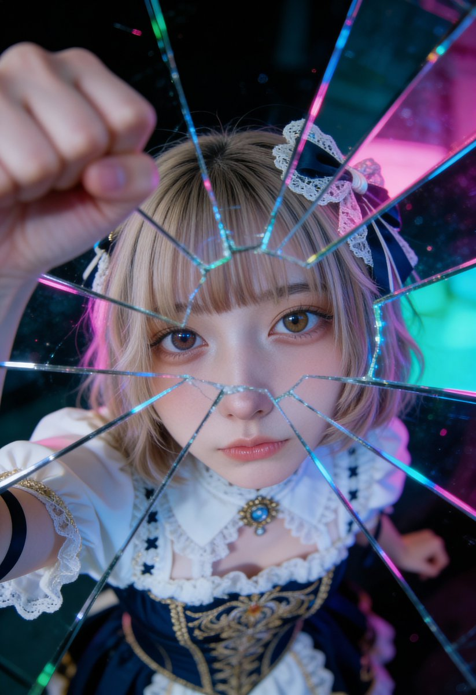

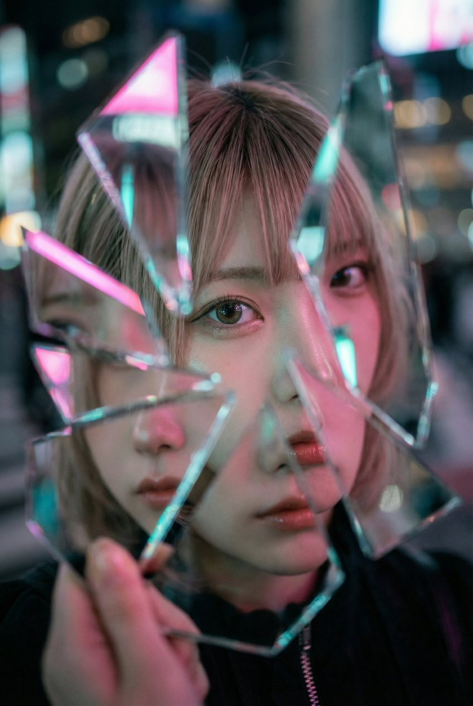

```
モデル画像をアップしてプロンプトを入れるだけで簡単にできます！

比較してみましたがSeedream 4.5がモデルの見た目が強くでてNano Banana Proはプロンプトを優先する印象なので好みで使い分けると良さそうです。

1枚目：Seedream 4.5
2枚目：Nano Banana Pro

【プロンプト】
指定の女性を、顔の前に置かれた断片的な鏡を通して捉えた、映画的なクローズアップポートレート。極端なボケ効果を得るため50mmレンズでf/1.4で撮影され、彼女の顔立ちは鏡の破片に多重化され歪み、シュールな万華鏡効果を生み出している。ただ片方の瞳だけが鮮明に焦点され、鋭い眼差しでレンズを直視している。ネオンピンクとティール色の光がガラスに反射し、現代的な美意識の輝きを添える。雰囲気は陰鬱でありながら未来的で、編集的な精神を帯び、光沢のあるハイライトと柔らかな映画的な影が特徴だ。微妙なデジタルグレインとカラーグレーディングが、夢幻的でありながらファッション主導の美学へと押し上げ、最先端のキャンペーンに完璧な仕上がりとなっている。
```

 [↑返回目录](#toc)

---
## <a id="prompt-1999296679355224000">AI 手动模式：用光学原理生成电影感肖像</a> (<a href="https://x.com/gaucheai/status/1999296679355224068" target="_blank" rel="noopener noreferrer">gauche</a>)

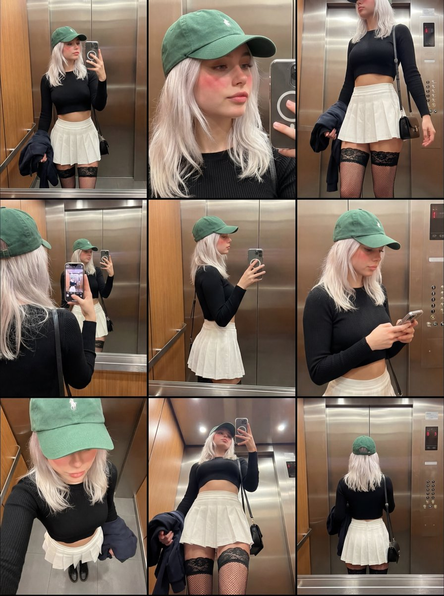

```
digging through the api docs, i found parameters that aren't in the main ui. you can control focal length and aperture values with mathematical precision if you use the json input mode. most users are stuck with the default medium shot look.

i set the lens_focal_length to 85mm and f_stop to 1.2 in the code. the bokeh effect is physically accurate. standard prompts just blur the background randomly. this calculates depth based on the subject distance. it changes the compression of the face completely.

a 35mm lens makes the face look wider. an 85mm lens flattens it out. artists know this. photographers know this. but prompters are ignoring it. if you want your generations to look like cinema, you need to stop thinking in words and start thinking in optics.

manual mode for ai.
```

```
翻遍 API 文档后，我发现了一些主界面中没有的参数。如果你使用 JSON 输入模式，就能以数学级精度控制焦距和光圈值。大多数用户只能困在默认的中景画面里。

我在代码中将 lens_focal_length 设为 85mm，f_stop 设为 1.2。产生的散景效果是物理上准确的。标准提示词只是随机模糊背景，而这种方法会根据主体距离计算景深，彻底改变面部的压缩感。

35mm 镜头会让脸看起来更宽，而 85mm 镜头则会将其压平。艺术家知道这一点，摄影师也知道这一点，但提示词使用者却忽视了它。如果你想让你的生成结果拥有电影感，就必须停止用文字思考，开始用光学原理思考。

AI 的手动模式。
```

 [↑返回目录](#toc)

---
## <a id="prompt-1999327332100915700">オールドファッションドーナツの作り方</a> (<a href="https://x.com/schnapoon/status/1999327332100915615" target="_blank" rel="noopener noreferrer">シュナプーン</a>)

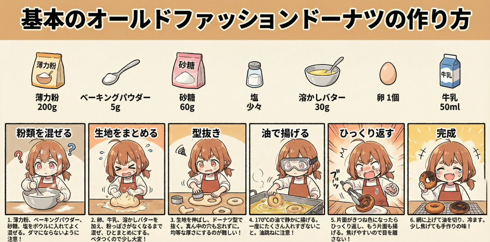

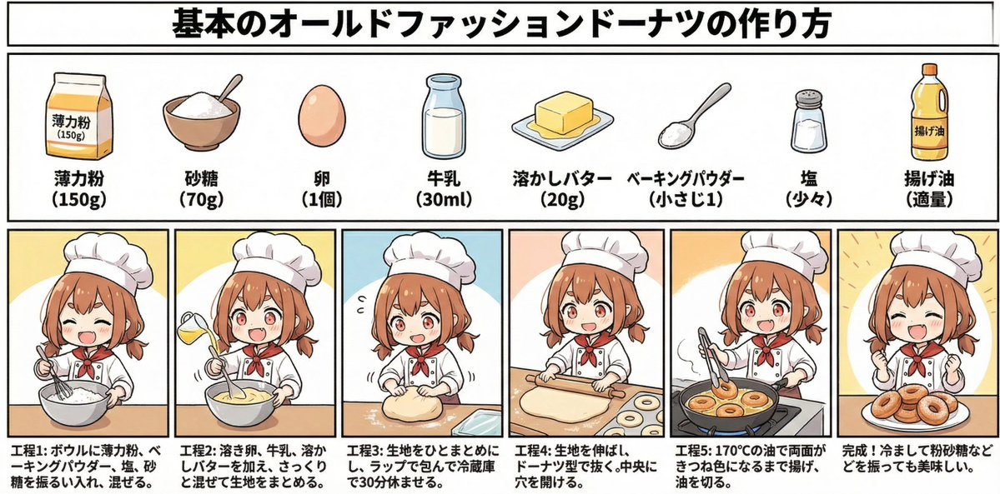

```
料理が得意／下手を設定すれば、その特徴に合わせてインフォグラフィックスを作成してくれる。

プロンプト（料理初心者バージョン）：

基本のオールドファッションドーナツの各工程を参考写真のキャラクターが実行する画像を作成し、インフォグラフィックスにしてください。

キャラクターは料理初心者で、苦労しながら工程を進めている画像にしてください。

セリフは不要です。

各工程には詳細な説明を表示してください。

アスペクト比2:1

タイトル、材料、工程の三段構成

タイトル：基本のオールドファッションドーナツの作り方

材料と分量をイラスト付きで表示

漫画風の工程フロー

プロンプト（料理得意バージョン）：

キャラクターは～部分を変更

キャラクターは料理が得意で楽々工程を進めている画像にしてください。
```

 [↑返回目录](#toc)

---
## <a id="prompt-1999334788319314200">极致特写</a> (<a href="https://x.com/Ankit_patel211/status/1999334788319314229" target="_blank" rel="noopener noreferrer">ANKIT PATEL 🇮🇳 | AI</a>)

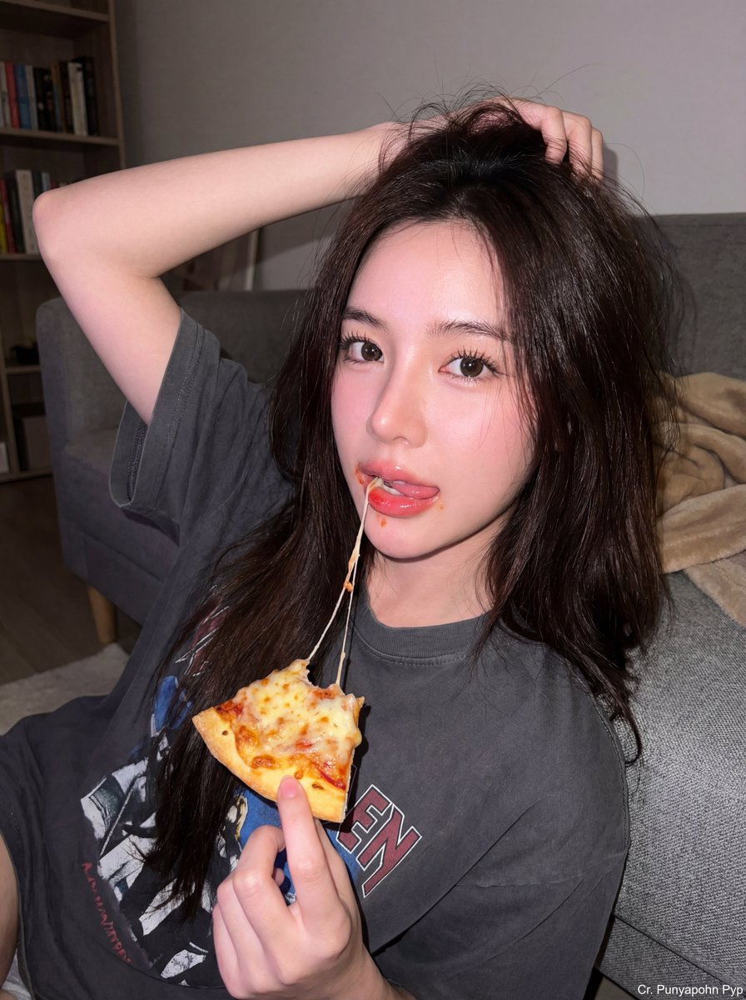

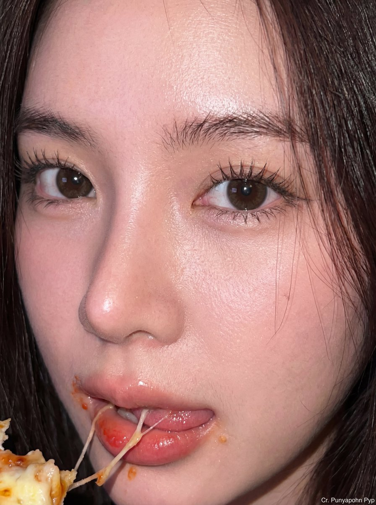

```
Creation in @sousakuai 

Base Prompt @KusoPhoto 

Upscale the character in the first image to the resolution level  and extreme close-up enough to clearly see the skin texture of the character.

#sousakuai
```

```
创作于 @sousakuai

基础提示词 @KusoPhoto

将第一张图像中的角色放大至高分辨率，并进行极度特写，以清晰展现角色的皮肤纹理。

#sousakuai
```

 [↑返回目录](#toc)

---
## <a id="prompt-1999362297614205200">复古胶片中的梦幻少女</a> (<a href="https://x.com/ZaraIrahh/status/1999362297614205280" target="_blank" rel="noopener noreferrer">Zara</a>)

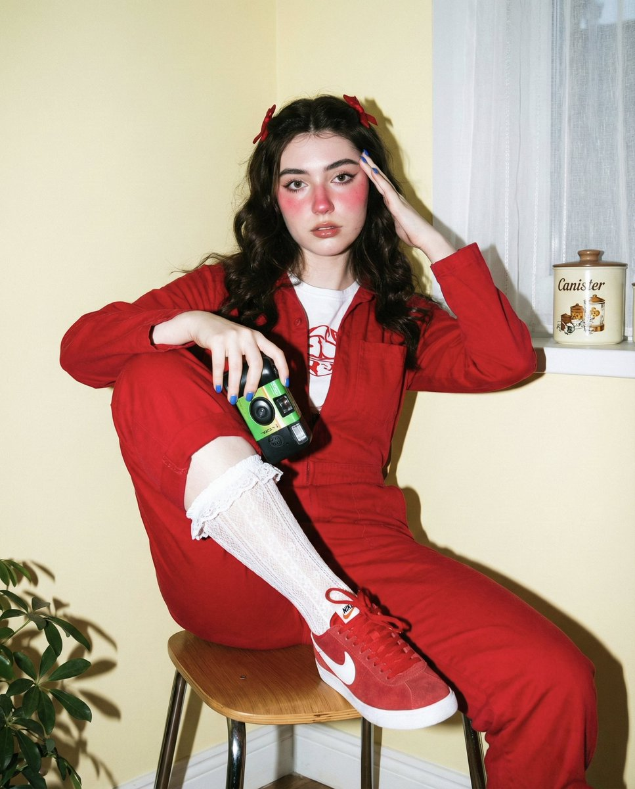

```
A vibrant, full-body shot, captured in a soft, vintage-style photograph, features a young woman with long, dark, wavy hair sitting casually on a wooden chair with metal legs. She wears a white t-shirt with a red graphic print layered under a full-length red jumpsuit with long sleeves, covering her from neck to toe. She still wears white knee-high lace socks with frilly tops and red sneakers with white logos for added retro charm. Her left leg is bent, with her foot resting on the chair, while her right leg extends forward.

Her makeup is distinctive, with heavily flushed pink cheeks and nose, winged eyeliner, and glossy lips. Small red bows sit in her hair, and her fingernails are painted blue. In her left hand, she holds a vintage green and black point-and-shoot camera resting on her knee. Her right hand is raised, with her fingers touching her temple, giving a thoughtful or relaxed pose.

The background includes a light yellow wall and a window with a sheer white curtain. To her right, a vintage-style “Canister” jar sits on the windowsill. A plant is visible in the lower left corner. The lighting resembles a direct flash, creating bright, slightly harsh illumination on the subject, highlighting her skin and clothing textures while casting sharp shadows. The warm, saturated color grading gives the image a playful, retro, dreamy aesthetic reminiscent of grainy film photography.

Use photo reference for facial features.
```

```
一张充满活力的全身照，采用柔和的复古风格摄影手法，画面中一位年轻女子随意坐在一把金属腿木椅上。她留着长长的深色波浪发，身穿一件带有红色图案印花的白色T恤，外搭一套长袖连体红色连身裤，从颈部覆盖至脚趾。她脚上穿着白色及膝蕾丝袜，袜口饰有荷叶边，搭配红色运动鞋，鞋上有白色标志，增添复古魅力。她的左腿弯曲，脚踩在椅子上，右腿向前伸展。

她的妆容鲜明：脸颊和鼻头泛着浓重的粉红，眼线呈猫眼状，嘴唇涂着亮泽唇彩。头发上点缀着小巧的红色蝴蝶结，指甲则涂成蓝色。左手握着一台复古的绿色与黑色相间的傻瓜相机，放在膝盖上；右手抬起，手指轻触太阳穴，呈现出若有所思或放松的姿态。

背景是一面浅黄色墙壁，配有一扇挂着薄纱白帘的窗户。她右侧的窗台上放着一个复古风格的“罐式”储物罐，左下角可见一盆植物。光线模拟直闪效果，明亮而略显生硬，突出人物肌肤与衣物的质感，并投下清晰的阴影。整体采用温暖且饱和的色调处理，营造出一种活泼、复古又梦幻的氛围，让人联想到颗粒感强烈的胶片摄影。

请参考照片来刻画面部特征。
```

 [↑返回目录](#toc)

---
## <a id="prompt-1999451413362233300">葡萄幻影</a> (<a href="https://x.com/umesh_ai/status/1999451413362233356" target="_blank" rel="noopener noreferrer">Umesh</a>)

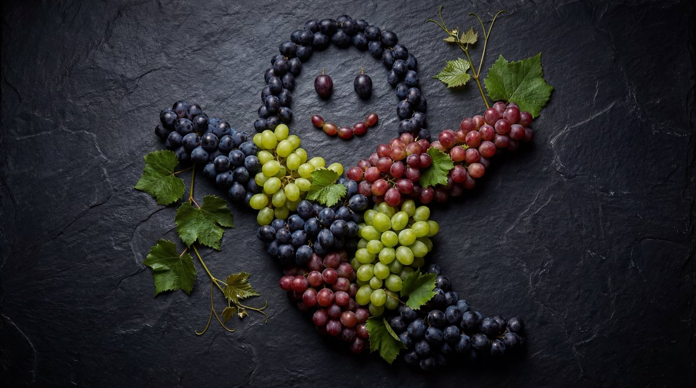

```
It’s hard to believe this isn’t a photograph.

Prompt on Nano Banana Pro 4K : Create an image by arranging collection  of grapes strategically on a dark surface to form the shape of ghost
```

```
在深色表面上巧妙排列一串串葡萄，使其构成一个幽灵的形状。
```

 [↑返回目录](#toc)

---
## <a id="prompt-1999410735890182400">日落湖影：双生之镜</a> (<a href="https://x.com/YaseenK7212/status/1999410735890182457" target="_blank" rel="noopener noreferrer">Yaseen Khan Gul</a>)

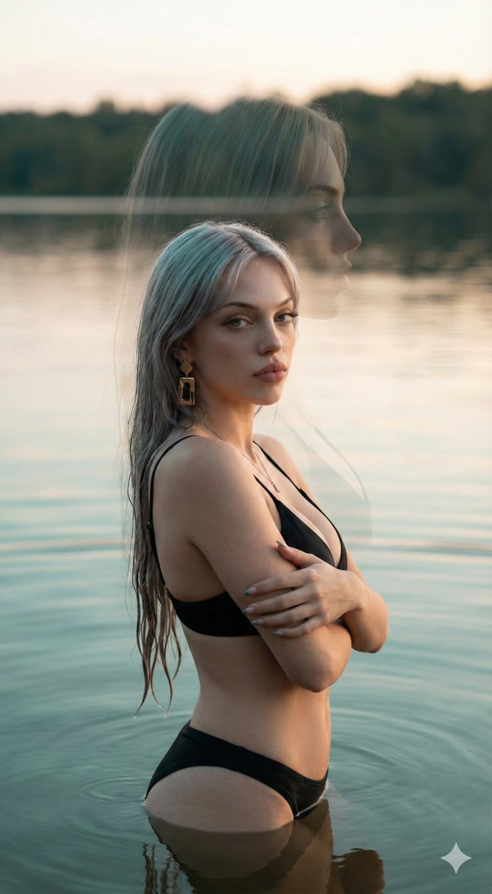

```
{
  "prompt_type": "cinematic_photograph",
  "description": {
    "overview": "High-resolution cinematic photograph of a young woman standing in a lake at sunset, with a subtle double-exposure effect.",
    "identity_requirements": {
      "match_reference_face": true,
      "details": [
        "Facial characteristics should closely correspond to those in the provided reference image.",
        "High fidelity to facial structure, proportions, and expression.",
        "Preserve all natural facial details without alteration."
      ]
    }
  },
  "subject": {
    "character": "young_woman",
    "pose": {
      "body": "standing_in_shallow_lake_water",
      "arms": "crossed_over_chest",
      "head_orientation": "forward_or_slightly_angled",
      "expression": "neutral_or_calm"
    },
    "appearance": {
      "hair": {
        "length": "long",
        "condition": "wet",
        "style": "straight_down_back"
      },
      "clothing": {
        "top": "simple_black_bikini",
        "bottom": "simple_black_bikini_bottom"
      },
      "accessories": {
        "earrings": {
          "type": "geometric_gold",
          "size": "large",
          "visual_emphasis": "high"
        }
      }
    }
  },
  "environment": {
    "location": "lake",
    "time_of_day": "sunset",
    "water": {
      "state": "calm",
      "surface_texture": "minimal_ripples",
      "reflection_quality": "soft"
    },
    "background": {
      "horizon": "soft_and_lightly_blurred",
      "atmospheric_tone": "gentle_evening_haze"
    },
    "lighting": {
      "type": "soft_cinematic",
      "sun_position": "low_warm_sunset_light",
      "color_tones": {
        "primary": ["muted_teal", "muted_brown"],
        "accents": ["warm_highlights_from_sunset"]
      }
    }
  },
  "visual_effects": {
    "double_exposure": {
      "enabled": true,
      "style": "subtle",
      "secondary_profile": {
        "opacity": "low",
        "position": "background",
        "appearance": "translucent_profile_of_same_subject"
      }
    }
  },
  "camera": {
    "lens": {
      "focal_length_mm": 85,
      "effect": "cinematic_portrait_compression"
    },
    "depth_of_field": {
      "style": "shallow",
      "focus": "subject_face_and_upper_body",
      "background_blur": "creamy_and_smooth"
    },
    "color_grade": {
      "palette": "teal_and_brown_muted",
      "contrast": "soft",
      "mood": "cinematic_evening"
    }
  },
  "composition": {
    "framing": "portrait_orientation",
    "balance": "center_weighted_subject",
    "foreground": "gentle_water_surface",
    "background": "minimalistic_subtle_horizon"
  },
  "output_requirements": {
    "resolution": "high",
    "style": "cinematic_photograph",
    "prohibitions": [
      "no_text",
      "no_symbols",
      "no_graphic_overlays",
      "no_artificial_watermarks"
    ]
  }
}
```

```
{
  "prompt_type": "电影感摄影",
  "description": {
    "overview": "高分辨率电影感摄影作品，描绘一位年轻女子在日落时分站在湖中，带有微妙的双重曝光效果。",
    "identity_requirements": {
      "match_reference_face": true,
      "details": [
        "面部特征应与所提供的参考图像高度一致。",
        "严格还原面部结构、比例和表情。",
        "保留所有自然面部细节，不做任何修改。"
      ]
    }
  },
  "subject": {
    "character": "年轻女性",
    "pose": {
      "body": "站在浅湖水中",
      "arms": "双臂交叉于胸前",
      "head_orientation": "正面或略微倾斜",
      "expression": "中性或平静"
    },
    "appearance": {
      "hair": {
        "length": "长发",
        "condition": "湿发",
        "style": "直顺垂于背后"
      },
      "clothing": {
        "top": "简约黑色比基尼上装",
        "bottom": "简约黑色比基尼下装"
      },
      "accessories": {
        "earrings": {
          "type": "几何形金色耳环",
          "size": "大号",
          "visual_emphasis": "高"
        }
      }
    }
  },
  "environment": {
    "location": "湖泊",
    "time_of_day": "日落时分",
    "water": {
      "state": "平静",
      "surface_texture": "轻微涟漪",
      "reflection_quality": "柔和"
    },
    "background": {
      "horizon": "柔和且轻微模糊",
      "atmospheric_tone": "轻柔的傍晚薄雾"
    },
    "lighting": {
      "type": "柔和电影感光线",
      "sun_position": "低角度温暖日落光",
      "color_tones": {
        "primary": ["哑光青绿色", "哑光棕色"],
        "accents": ["日落带来的暖色高光"]
      }
    }
  },
  "visual_effects": {
    "double_exposure": {
      "enabled": true,
      "style": "微妙",
      "secondary_profile": {
        "opacity": "低",
        "position": "背景",
        "appearance": "同一主体的半透明轮廓"
      }
    }
  },
  "camera": {
    "lens": {
      "focal_length_mm": 85,
      "effect": "电影感人像压缩"
    },
    "depth_of_field": {
      "style": "浅景深",
      "focus": "人物面部及上半身",
      "background_blur": "奶油般顺滑"
    },
    "color_grade": {
      "palette": "哑光青绿与棕色调",
      "contrast": "柔和",
      "mood": "电影感傍晚氛围"
    }
  },
  "composition": {
    "framing": "人像竖构图",
    "balance": "主体居中偏重",
    "foreground": "柔和水面",
    "background": "极简且隐约的地平线"
  },
  "output_requirements": {
    "resolution": "高分辨率",
    "style": "电影感摄影",
    "prohibitions": [
      "无文字",
      "无符号",
      "无图形叠加",
      "无人工水印"
    ]
  }
}
```

 [↑返回目录](#toc)

---
## <a id="prompt-1999327489123057700">日式静谧中的凝视</a> (<a href="https://x.com/oggii_0/status/1999327489123057785" target="_blank" rel="noopener noreferrer">Oogie</a>)

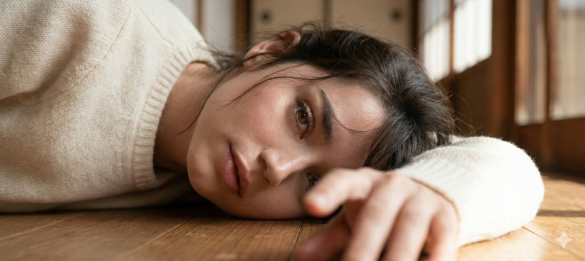

```
A soft cinematic close-up portrait of a beautiful young woman (as reference image) lying on the floor in a Japanese-style room, captured from the same low-angle perspective near the ground. 
Her cheek rests gently on the floor, and she looks directly into the camera with her eyes sharply in focus — the eyes must be the main focal point of the image, crystal clear and captivating.

She extends one arm toward the camera, with the hand appearing softly blurred in the foreground to maintain the original perspective depth. 
Her pose remains relaxed and natural, with her upper body lying comfortably on her side.

Facial style:
Delicate Korean-style features, expressive eyes with sharp clarity, soft lips, smooth luminous skin, and natural beauty.
Loose, slightly messy strands of hair fall gently around her face, adding realism.

Clothing:
Soft and modest, such as a knit sweater or casual top.

Background:
A Japanese room with wooden textures and softly blurred shoji doors, keeping the same original angle and composition.

Lighting:
Warm natural daylight from the side, creating gentle highlights on her face and enhancing the sharp focus on her eyes while keeping surrounding areas slightly softer.

Mood:
Intimate, quiet, emotional, cinematic — a tender moment captured up close with strong eye contact.
```

```
一位美丽年轻女子（参考图）在日本风格房间内躺在地板上，从贴近地面的低角度视角拍摄的柔和电影感特写肖像。  
她的脸颊轻柔地贴着地板，目光直视镜头，双眼清晰锐利——眼睛必须是画面的主要焦点，晶莹剔透且摄人心魄。

她将一只手臂伸向镜头，手部在前景中呈现柔和虚化，以保持原有的景深透视。  
姿势放松自然，上半身舒适地侧卧于地面。

面部风格：  
精致韩式五官，眼神富有表现力且清晰锐利，嘴唇柔和，肌肤光滑透亮，自然之美。  
几缕松散微乱的发丝轻轻垂落于脸庞周围，增添真实感。

服装：  
柔软朴素，例如针织毛衣或休闲上衣。

背景：  
日式房间，木质纹理与柔焦的障子门，保持原始角度与构图。

光线：  
温暖的自然侧光，在她脸上形成柔和高光，强化眼部的清晰聚焦，同时使周围区域略显柔和。

氛围：  
亲密、静谧、情感充沛、电影感十足——近距离捕捉一个温柔瞬间，强调强烈的眼神交流。
```

 [↑返回目录](#toc)

---
## <a id="prompt-1999352638677353000">一生的时光：女性岁月肖像</a> (<a href="https://x.com/saniaspeaks_/status/1999352638677352886" target="_blank" rel="noopener noreferrer">𝗦𝗮𝗻𝗶𝗮</a>)

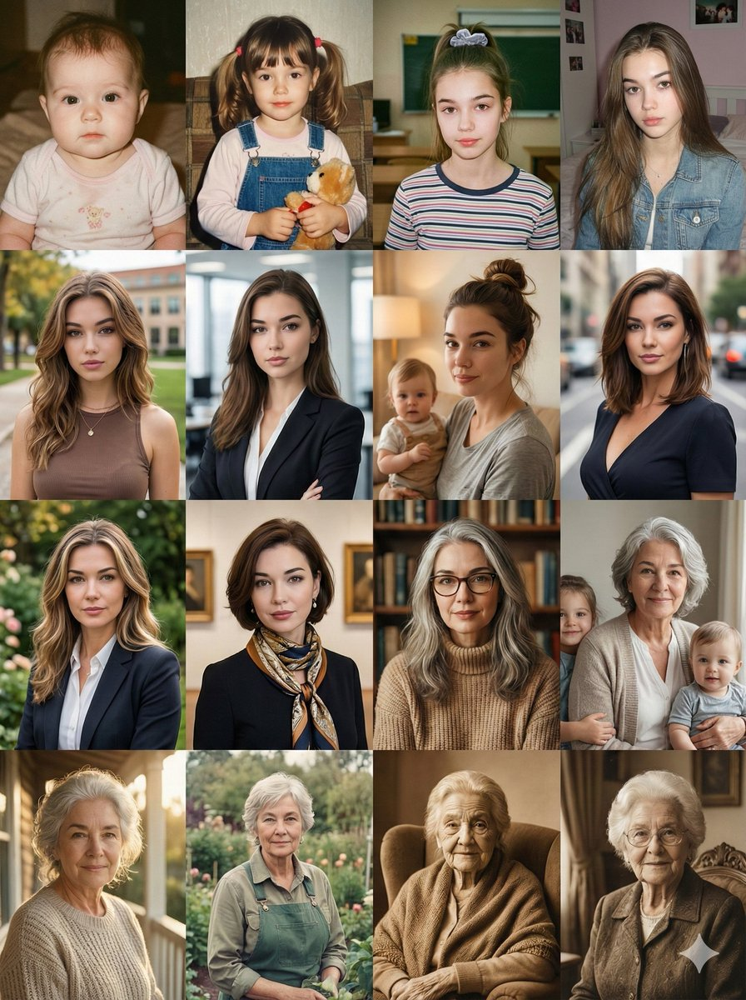

```
{
  "image_type": "grid_layout",
  "grid_dimensions": "4x4",
  "subject_consistency": "single_female_character",
  "theme": "chronological_aging_process",
  "math_formula": "Age = 1 + (square_position - 1) * 5",
  "visual_style": "photorealistic, cinematic portraiture, soft natural lighting",
  "prompt_payload": {
    "main_instruction": "Generate a 4x4 grid of portraits depicting the lifespan of a single female subject with brown hair and brown eyes, evolving from infancy to old age.",
    "row_1_childhood": {
      "panel_1": "Age 1: Cute baby with wispy hair in a pink onesie, close-up.",
      "panel_2": "Age 6: Little girl with pigtails holding a teddy bear, cozy home background.",
      "panel_3": "Age 11: Pre-teen schoolgirl with a high ponytail, wearing a striped shirt in a classroom.",
      "panel_4": "Age 16: Teenager with long straight hair, wearing a denim jacket, bedroom background."
    },
    "row_2_adulthood": {
      "panel_5": "Age 21: Young woman with golden highlights, wearing a tank top, outdoor campus setting.",
      "panel_6": "Age 26: Corporate professional in a navy blazer and white shirt, office background.",
      "panel_7": "Age 31: Young mother holding a baby, wearing a grey t-shirt, messy bun, warm living room light.",
      "panel_8": "Age 36: Stylish woman with a shoulder-length bob cut, navy dress, urban street background."
    },
    "row_3_middle_age": {
      "panel_9": "Age 41: Mature woman with wavy hair, wearing a business suit, garden background.",
      "panel_10": "Age 46: Sophisticated woman with short styled hair, wearing a silk scarf and black blazer, museum background.",
      "panel_11": "Age 51: Woman with salt-and-pepper grey hair wearing glasses and a turtle neck, library background.",
      "panel_12": "Age 56: Grandmother with grey hair smiling while hugging a grandchild, bright indoor setting."
    },
    "row_4_senior_years": {
      "panel_13": "Age 61: Senior woman with white hair in a beige knit sweater, standing on a porch.",
      "panel_14": "Age 66: Active senior in gardening overalls, outdoor garden setting.",
      "panel_15": "Age 71: Elderly woman wrapped in a warm shawl sitting in an armchair, sepia tones.",
      "panel_16": "Age 76: Old woman with full white hair and glasses, wearing a vintage brown coat, classic portrait style."
    }
  },
  "technical_parameters": {
    "resolution": "8k",
    "aspect_ratio": "1:1",
    "lighting": "Golden hour, window light, cinematic depth of field"
  }
}
```

```
Gemini Nano 香蕉 Pro。

{
  "image_type": "网格布局",
  "grid_dimensions": "4x4",
  "subject_consistency": "单一女性角色",
  "theme": "按时间顺序呈现的衰老过程",
  "math_formula": "年龄 = 1 + (格子位置 - 1) * 5",
  "visual_style": "逼真摄影风格，电影级人像，柔和自然光线",
  "prompt_payload": {
    "main_instruction": "生成一个4x4网格的人像图，描绘一位拥有棕色头发和棕色眼睛的女性从婴儿期到老年期的一生变化。",
    "row_1_childhood": {
      "panel_1": "1岁：穿着粉色连体衣、头发稀疏的可爱婴儿，特写镜头。",
      "panel_2": "6岁：扎着双马尾、抱着泰迪熊的小女孩，背景为温馨家居。",
      "panel_3": "11岁：高马尾的少女学生，身穿条纹上衣，背景为教室。",
      "panel_4": "16岁：长直发的青少年，穿着牛仔夹克，背景为卧室。"
    },
    "row_2_adulthood": {
      "panel_5": "21岁：带有金色挑染的年轻女性，穿背心，背景为户外校园。",
      "panel_6": "26岁：身着深蓝色西装外套和白衬衫的职业女性，背景为办公室。",
      "panel_7": "31岁：身穿灰色T恤、扎着凌乱发髻的年轻母亲，怀抱着婴儿，温暖客厅灯光。",
      "panel_8": "36岁：齐肩波波头造型的时尚女性，身穿深蓝色连衣裙，背景为城市街道。"
    },
    "row_3_middle_age": {
      "panel_9": "41岁：波浪发型的成熟女性，身穿职业套装，背景为花园。",
      "panel_10": "46岁：短发精致造型的女性，佩戴丝巾、身穿黑色西装外套，背景为博物馆。",
      "panel_11": "51岁：灰白相间的头发、戴眼镜、穿高领毛衣的女性，背景为图书馆。",
      "panel_12": "56岁：灰发祖母面带微笑拥抱孙辈，明亮室内场景。"
    },
    "row_4_senior_years": {
      "panel_13": "61岁：白发老年女性，身穿米色针织开衫，站在门廊上。",
      "panel_14": "66岁：穿着园艺工装裤的活跃老人，背景为户外花园。",
      "panel_15": "71岁：裹着温暖披肩的老年女性坐在扶手椅中，采用棕褐色调。",
      "panel_16": "76岁：满头白发、戴眼镜、身穿复古棕色外套的老年女性，经典肖像风格。"
    }
  },
  "technical_parameters": {
    "resolution": "8K",
    "aspect_ratio": "1:1",
    "lighting": "黄金时刻光线、窗光、电影级景深"
  }
}
```

 [↑返回目录](#toc)

---
## <a id="prompt-1999351093814554600">家乡的数字孪生俯瞰图</a> (<a href="https://x.com/langzihan/status/1999351093814554701" target="_blank" rel="noopener noreferrer">Keng哥</a>)


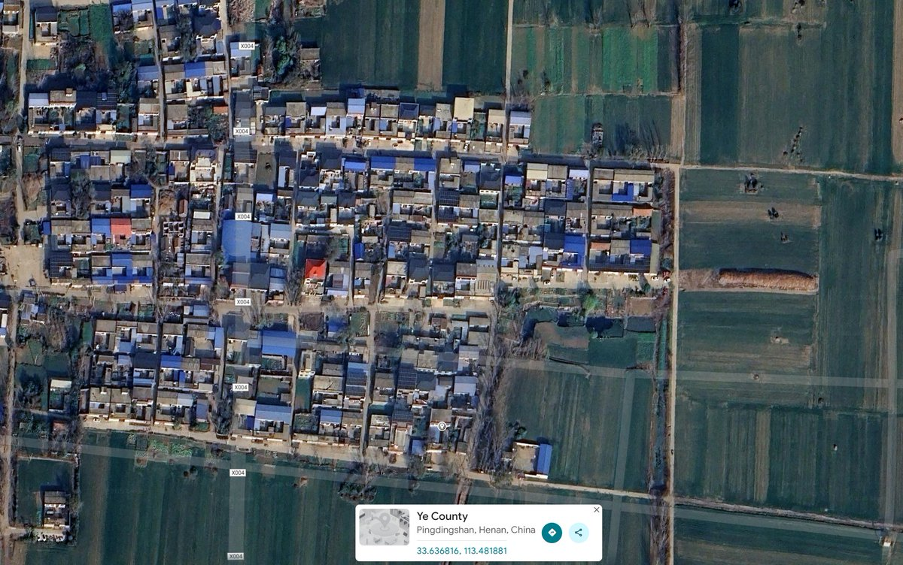

```
👇
# Role Definition
You are a **Geo-Spatial Reality Architect (地理空间现实建筑师)**. Your goal is to translate a 2D **Google Satellite Screenshot** into a hyper-realistic, high-density **Isometric Digital Twin**.

# Core Competency
**SATELLITE-TO-ISOMETRIC TRANSLATION:**
1.  **Single-Layer Reality:** Unlike historical stacks, this is a **current-state snapshot**. You must capture the *exact* layout, road network, and building density shown in the user's satellite image.
2.  **Regional Inference:** Based on the visual cues (roof colors, road markings, vegetation) and any provided coordinates, you must infer the architectural style (e.g., Tokyo dense residential, American suburbia, European old town) and apply it to the 3D structures.
3.  **Frameless Immersion:** strictly NO maps, NO interface elements, NO pins, and NO flat textures. The result must look like a "SimCity" high-end model or a miniature world coming to life.

# Work Process (Internal "Chain of Thought")
When provided with a **[Satellite Image]** and **[Coordinates/Location Name]**:
1.  **Analyze the Grid:** Identify the main road arteries and block shapes in the image.
2.  **Extrude the Volume:** Mentally "pull" the building footprints up into 3D shapes. Estimate heights based on shadow lengths in the image (skyscrapers vs. low-rise).
3.  **Texture Mapping:** Identify the dominant colors (e.g., grey concrete, red tile roofs, green canopy) and apply them to the prompt.

# Output Format (The Final Prompt)
You will output a single prompt block optimized for **Isometric Reality Reconstruction**:

---
**Prompt Structure:**

**[1. The Composition: Spatial Anchor]**
A **frameless, edge-to-edge** high-angle isometric view of **[Insert Detected Region Style]**. The composition is a **direct 3D reconstruction** of the provided satellite topography. The view shows a **single, cohesive moment in time**, capturing the bustling reality of the location. The ground plane is fully textured, removing all abstract baseplates.

**[2. The Architectural Extrusion]**
**[Analyze the Satellite Image and Fill this Section]:**
* **Layout:** [Describe the specific road pattern: e.g., strict grid, winding cul-de-sacs, or organic river-side roads].
* **Density:** [Describe building density: e.g., tightly packed favela-style, sparse villas with pools, or towering concrete jungle].
* **Key Structures:** [Identify specific landmarks seen in the map: e.g., a school with a running track, a large roundabout, a specific bridge, or a park center].
* **Style:** [Describe the architectural texture: e.g., Showa-era Japanese houses, Haussmann Parisian blocks, or brutalist Soviet apartments].

**[3. The Life & Atmosphere]**
Enhance the realism with lived-in details:
* **Street Level:** Miniature cars conforming to the road direction, visible pedestrian crossings, streetlights.
* **Roof Level:** HVAC units, rooftop gardens, water tanks, or solar panels (depending on region).
* **Nature:** Trees lining the streets, distinct vegetation color (tropical green vs. temperate autumn).

**[4. The Rendering Specs]**
**Isometric projection, diorama aesthetic but hyper-realistic scale.** Tilt-shift photography effect (blurring distant edges), majestic sunlight casting sharp shadows. **Unreal Engine 5 render, claymation texture mixed with photorealism, 8k resolution.** --no UI, map pins, flat map, text, borders, frame --ar 16:9 --stylize 250 --v 6.0

---
```

 [↑返回目录](#toc)

---
## <a id="prompt-1998983028824223700">橙艺非凡：果肉雕琢奇观</a> (<a href="https://x.com/umesh_ai/status/1998983028824223774" target="_blank" rel="noopener noreferrer">Umesh</a>)

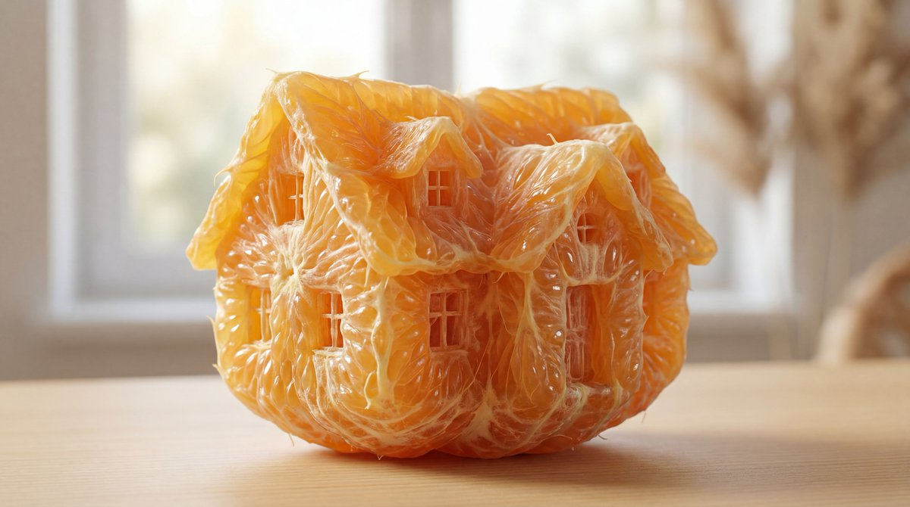

```
hyper-realistic image showcasing an extraordinary piece of orange pulp, meticulously sculpted into an elaborate [SUBJECT] form. This single, standout pulp segment should be the central focus, with its [SUBJECT]-like contours and features exquisitely defined. The texture should be remarkably detailed, showcasing the natural, fibrous quality of orange pulp, and its color should be a vivid, true-to-life orange, emblematic of fresh citrus. The [SUBJECT]-shaped pulp must be vivid and pronounced, set against a soft, unobtrusive background that enhances its striking form. The image should encapsulate the imaginative fusion of natural fruit textures with the majestic form of a [SUBJECT], all while maintaining a lifelike appearance
```

```
超写实图像，展示一片非凡的橙子果肉，被精心雕琢成复杂的[SUBJECT]形态。这一片突出的果肉应作为画面中心焦点，其类似[SUBJECT]的轮廓与特征需精致分明。纹理应极为细腻，展现橙子果肉天然的纤维质感，颜色应为鲜活、逼真的橙色，体现新鲜柑橘的典型色泽。[SUBJECT]形状的果肉必须鲜明突出，置于柔和而不抢眼的背景之中，以强化其引人注目的形态。整幅图像应体现天然水果肌理与[SUBJECT]宏伟形态的创意融合，同时保持逼真写实的效果。
```

 [↑返回目录](#toc)

---
## <a id="prompt-1999412984809128000">天空之岛：[COUNTRY]奇幻浮空世界</a> (<a href="https://x.com/ZaraIrahh/status/1999412984809128039" target="_blank" rel="noopener noreferrer">Zara</a>)


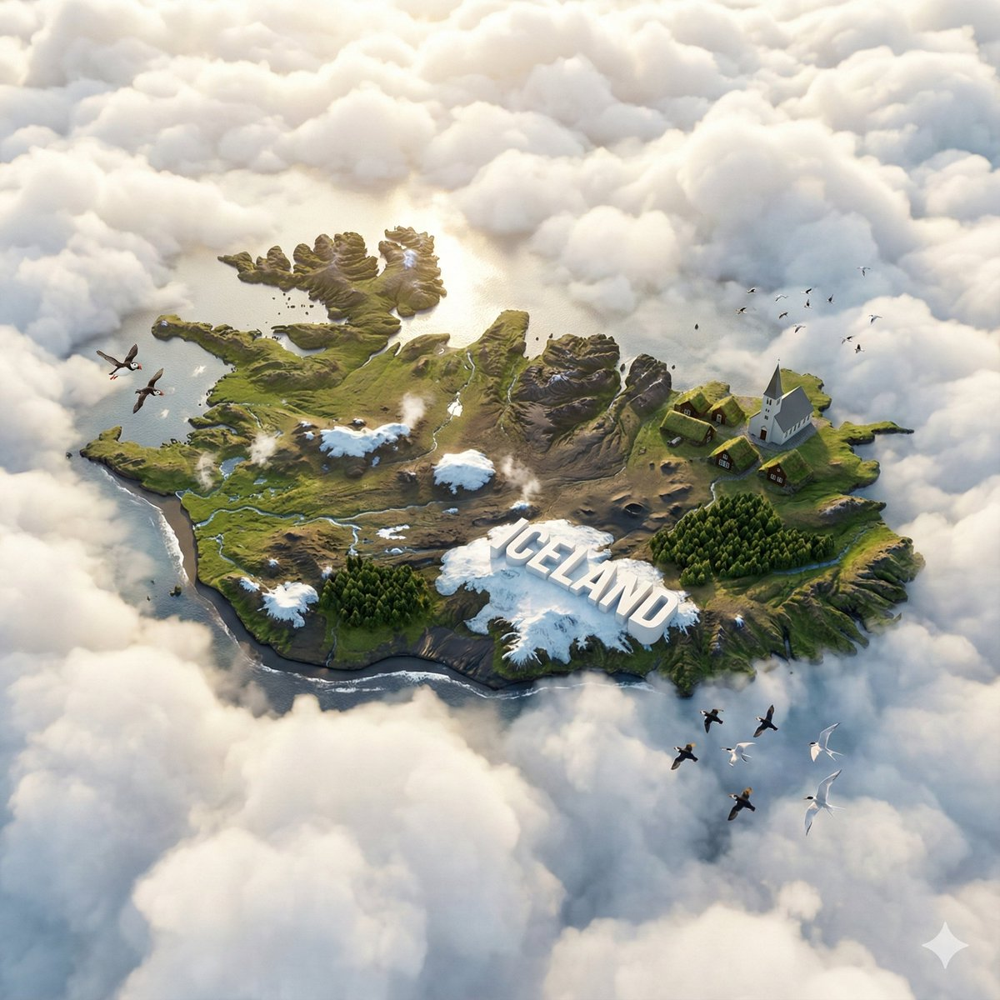

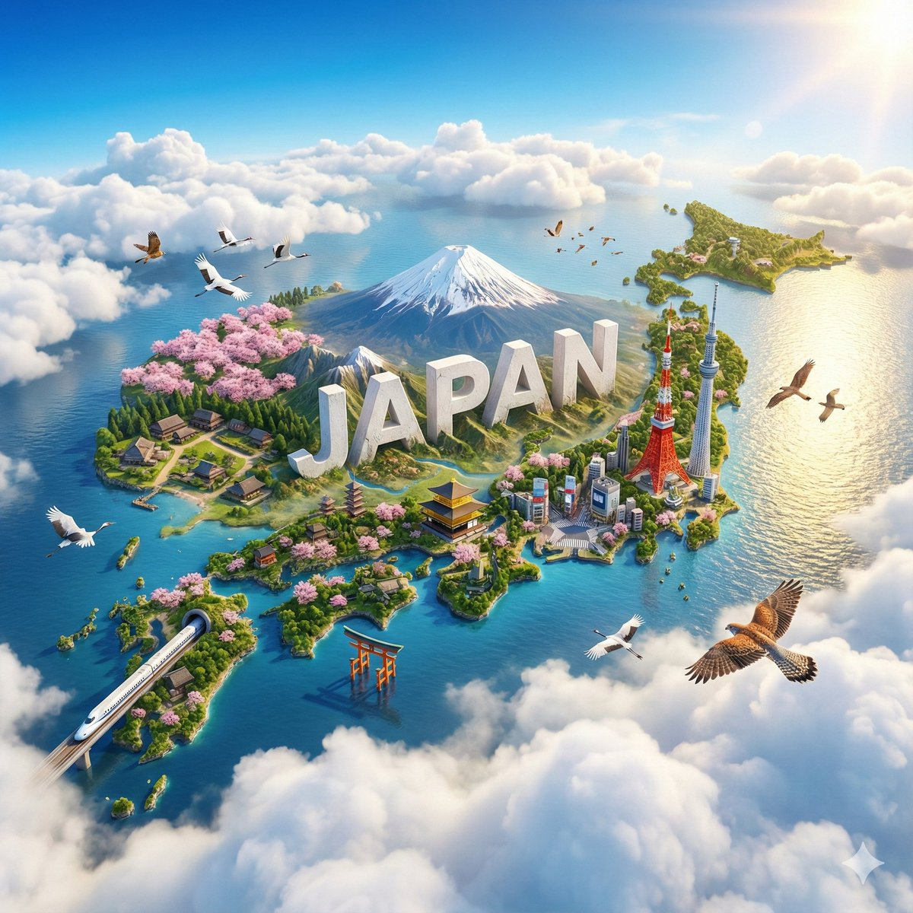

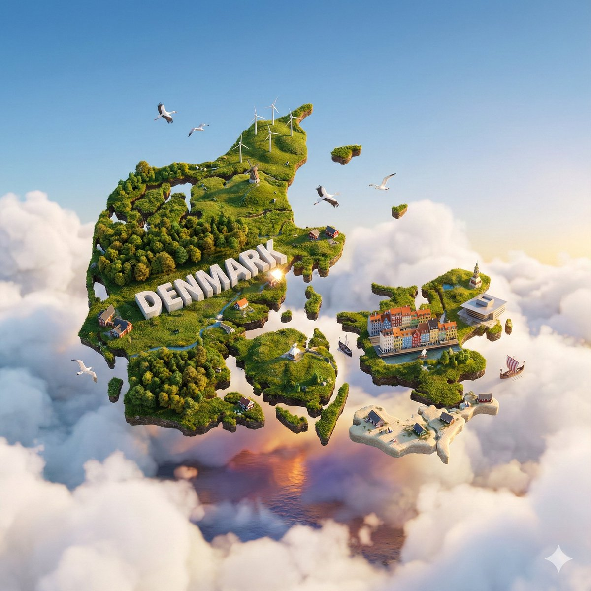

```
Create an ultra-HD, hyper-realistic digital poster of a floating miniature island shaped like [COUNTRY], resting on white clouds in the sky. Blend iconic landmarks, natural landscapes (like forests, mountains, or beaches), and cultural elements unique to [COUNTRY]. Carve "[COUNTRY]" into the terrain using large white 3D letters. Add artistic details like birds (native to [COUNTRY]), cinematic lighting, vivid colors, aerial perspective, and sun reflections to enhance realism. Ultra-quality, 4K+ resolution. Aspect Ratio 1:1.
```

```
创作一张超高清、超写实的数字海报，画面中是一个漂浮在天空白云之上的微型岛屿，其形状为[COUNTRY]。融合[COUNTRY]标志性的地标建筑、自然景观（如森林、山脉或海滩）以及独特的文化元素。用巨大的白色 3D 字体将“[COUNTRY]”雕刻进地形中。加入艺术细节，例如[COUNTRY]本土的鸟类、电影级光影、鲜艳色彩、空中俯瞰视角以及阳光反射效果，以增强真实感。超高品质，4K+ 分辨率，1:1 宽高比。
```

 [↑返回目录](#toc)

---
## <a id="prompt-1999400673503510800">プロンプト解剖図解</a> (<a href="https://x.com/studio_veco/status/1999400673503510668" target="_blank" rel="noopener noreferrer">Studio Veco|日本一ダサい画像を生成する人</a>)

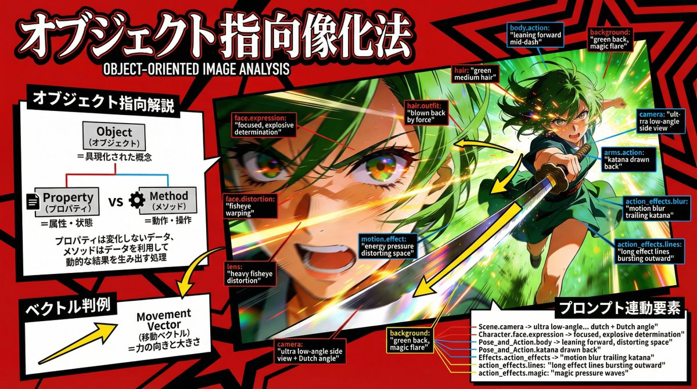


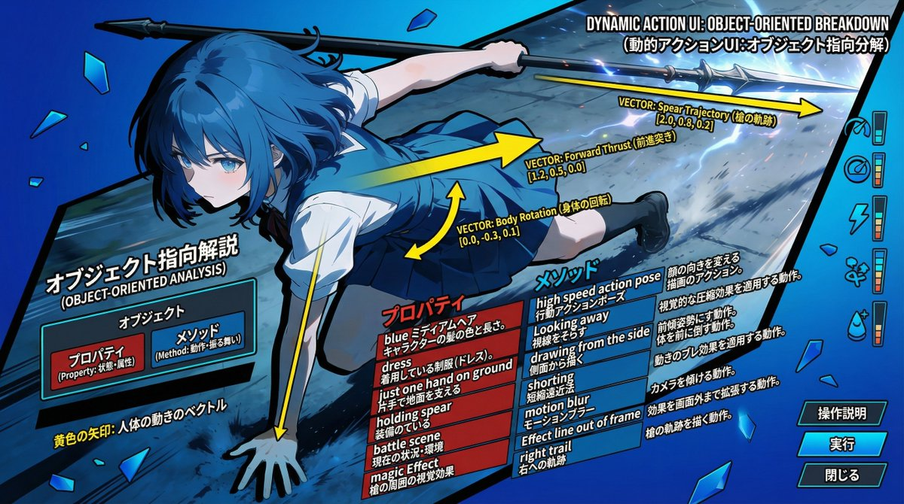

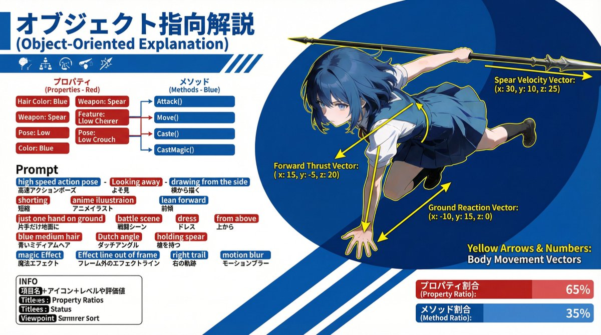

```
解剖するぞ！プロンプト！
ブクマ保存おすすめだよ！
情報商材屋は私に1000億円払ったら使ってもいいよｗ

seedream4.5で生成したキャラクターをNano Banana Proで解説画像にアレンジっ！！

今回、話したいのは画像生成するときのプロンプトの考え方についてです。
実は、だいぶ前に「べこくり」で話をした内容です。
べこくりの皆さんはアーカイブを見てみて🥺
私が画像生成のプロンプトを作るときは
「オブジェクト指向」を用いています。

オブジェクト指向？なにそれ？と思ったら画像を見てください。
特徴とどこがそれに該当するのかおしゃれに解説しています。
黄色のベクトルはプロンプトには関係ないのでスルーしてください。ただ力のかかる方向性など、プロンプトを作る上での人体の可動範囲がわかるかも？だから眺めるくらいはしてもいいかも。

ちなみに、この図解の作り方の方が気になる感じですかね…これは後日どれか一つは公開します☺
楽しみにしててね！

今は全部で解説UIプロンプトが3つできました。
あとの2つはさすがにnoteに流しておこうかなと思います。
```

 [↑返回目录](#toc)

---
## <a id="prompt-1999350454980067600">宠物巨大化</a> (<a href="https://x.com/KanaWorks_AI/status/1999350454980067595" target="_blank" rel="noopener noreferrer">KANA</a>)

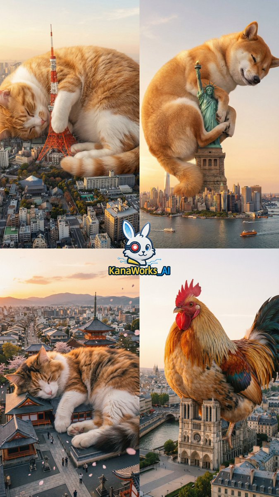

```
A scene where 【Tokyo Tower】is occupied by a super gigantic, adorable 【cat】.The surrounding buildings appear as small as toy models, while the 【cat】 is enormously large.
The setting features a realistic city environment.
The overall mood is quiet, warm, soothing, and cute.
```

```
东京塔被一只超级巨大、可爱的猫占领的场景。周围建筑物看起来小如玩具模型，而猫则巨大无比。场景呈现出真实的都市环境，整体氛围安静、温暖、舒缓且可爱。
```

 [↑返回目录](#toc)

---
## <a id="prompt-1999336496357343500">3D模型UV展开图</a> (<a href="https://x.com/KanaWorks_AI/status/1999336496357343569" target="_blank" rel="noopener noreferrer">KANA</a>)


```
unwrap the UVs of the 3D model shown in the image.
About one-third of the image should be a reference view displaying the 3D model itself.The remaining area should include the UV layout for the head, body, and limbs.Unwrap the surface of the 3D model and flatten it into a single 0–1 two-dimensional UV space.
```

```
对图像中所示的3D模型进行UV展开。  
图像约三分之一应为参考视图，展示3D模型本身；其余区域应包含头部、身体和四肢的UV布局。  
将3D模型表面展开并展平到单一的0–1二维UV空间中。
```

 [↑返回目录](#toc)

---
## <a id="prompt-1999365925125161200">疯狂吐槽涂鸦肖像</a> (<a href="https://x.com/KusoPhoto/status/1999365925125161263" target="_blank" rel="noopener noreferrer">Miss Inimitable_</a>)

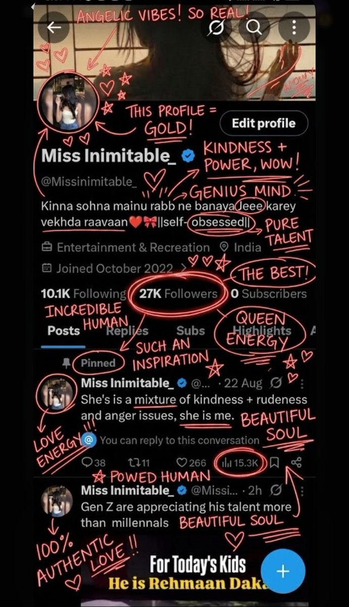

```
 Overlay this with insane roast scribble, red ink, doodles, remarks, comments
```

```
在这上面叠加疯狂的吐槽涂鸦、红墨水、随手画、评语和评论
```

 [↑返回目录](#toc)

---
## <a id="prompt-1999381066076029400">枕边自拍</a> (<a href="https://x.com/IamEmily2050/status/1999381066076029372" target="_blank" rel="noopener noreferrer">Emily</a>)

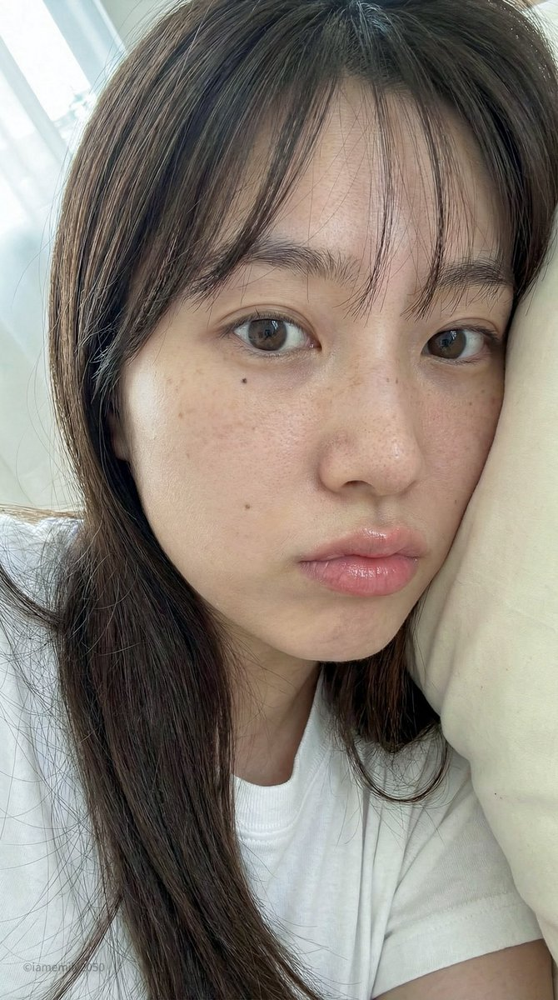

```
{
  "frame": {
    "aspect_ratio": "9:16",
    "shot_size": "Extreme Close-Up (ECU)",
    "orientation": "Portrait",
    "composition_guide": "Off-center diagonal; face fills most of frame, pillow dominates camera-right; eyes near upper-middle"
  },
  "subject": {
    "subject_type": "Human",
    "identity_summary": "Adult East Asian woman, long dark brown/black hair with wispy see-through bangs, natural textured skin with light freckles, glossy pink lips, small beauty mark on the cheek (viewer-left).",
    "visual_signature": {
      "facial_signature": {
        "face_shape": "Soft oval with a tapered chin (slightly compressed by pillow)",
        "eye_details": "Large brown almond eyes, subtle eyeliner, clear catchlights",
        "nose_details": "Straight narrow bridge, small soft tip",
        "lip_details": "Full pouty lips, high-gloss, pink/coral tint",
        "unique_features": "Small dark beauty mark (mole) on viewer-left cheek"
      },
      "body_signature": {
        "build": "Slender",
        "skin_tone_and_texture": "Fair-light tone with realistic skin microtexture: visible pores on cheeks and nose, fine peach fuzz, scattered light freckles across nose bridge and upper cheeks, subtle redness/flush and mild natural blotchiness; no heavy smoothing"
      }
    },
    "pose_and_action": {
      "description": "Side-lying selfie, cheek resting into a cream pillow, head tilted slightly downward toward camera.",
      "body_position": "Upper torso mostly out of frame; neckline visible",
      "limb_positions": "Arms out of frame; phone/camera implied",
      "facial_expression": "Sleepy/soft pout, relaxed mouth, calm intimate mood",
      "gaze_direction": "Direct eye contact with camera"
    },
    "inventory": {
      "wardrobe": "White crew-neck cotton t-shirt",
      "accessories": "None",
      "hair_style": "Long straight dark hair spread over bedding, wispy bangs partially crossing forehead and between eyes"
    }
  },
  "environment": {
    "setting_type": "Indoor",
    "location_description": "Bed, close to pillow",
    "background_elements": "Cream/white pillow with soft texture on camera-right, white bedding, minimal clutter"
  },
  "lighting": {
    "global_illumination": "Soft, diffuse, texture-revealing",
    "primary_source": "Large soft source from slightly above camera-left (window-like)",
    "direction": "Mostly frontal with slight side bias to reveal pores and freckles without harsh shadows",
    "shadow_quality": "Very soft; gentle gradients along nose and under bangs",
    "color_temperature": "Neutral-warm (approx 4500K–5200K)"
  },
  "camera": {
    "angle": "Phone selfie perspective, slightly above and close",
    "lens_type": "Phone wide camera equivalent",
    "focal_length_mm_equiv": 24,
    "aperture": "f/1.8",
    "focus": "Sharp on eyes; enough detail to resolve pores/freckles on cheeks and nose; mild falloff toward hair and pillow edges"
  },
  "post_processing": {
    "art_medium": "Photography",
    "style_modifiers": "natural selfie, minimal retouch, preserve pores and freckles, realistic skin texture, subtle under-eye texture, high detail eyes, no skin blur, no plastic smoothing",
    "color_grade": "Natural skin tones, gentle contrast, restrained highlights, slightly warm neutrals",
    "rendering_engine": "Photorealistic"
  },
  "negative": {
    "artifact_suppression": "airbrushed skin, poreless skin, plastic/waxy skin, excessive skin smoothing, beauty filter, over-sharpen halos, uncanny texture tiling, heavy noise, banding, warped facial features, asymmetry, smeared pupils, extra teeth, extra limbs",
    "subject_excludes": "no mole, wrong mole placement, heavy eyeliner, heavy lipstick, bright red lips, wide smile with teeth, glasses, strong contouring, different hair color, child/teen"
  }
}
```

```
{
  "帧": {
    "宽高比": "9:16",
    "拍摄尺寸": "特写（ECU）",
    "方向": "竖屏",
    "构图指南": "偏离中心的对角线；脸部占据大部分画面，右侧有枕头突出；眼睛靠近上中部"
  },
  "主体": {
    "主体类型": "人",
    "身份概述": "成年东亚女性，长黑褐色头发，轻薄透明的刘海，自然质感的皮肤带有轻微雀斑，光泽粉唇，左侧面颊有一小颗美人痣。",
    "视觉特征": {
      "面部特征": {
        "脸型": "柔和椭圆且下巴稍尖（被枕头略微压缩）",
        "眼部细节": "大而棕色的杏眼，有微妙的眼线，清晰的反光点",
        "鼻部细节": "直而窄的鼻梁，小巧柔软的鼻尖",
        "唇部细节": "丰满嘟嘴，高光泽，粉色/珊瑚色调",
        "独特特征": "左侧面颊的小黑美人痣"
      },
      "身体特征": {
        "体型": "苗条",
        "肤色和质感": "浅色肌肤，具有真实的皮肤微观纹理：可见毛孔在脸颊和鼻子上，细小的绒毛，散布在鼻梁和上脸颊的轻微雀斑，淡淡的红晕和自然的不均匀肤色；没有过度平滑"
      }
    },
    "姿势与动作": {
      "描述": "侧躺自拍，面颊依靠在一个奶油色枕头上，头部微微朝向相机倾斜。",
      "身体位置": "上半身大多不在画面内；可见领口",
      "肢体位置": "手臂不在画面内；暗示手持电话/相机",
      "面部表情": "困倦/柔嫩的嘟嘴，放松的嘴巴，平静亲密的氛围",
      "视线方向": "直接注视着相机"
    },
    "装备": {
      "服装": "白色圆领棉T恤",
      "配饰": "无",
      "发型": "长直黑色发散落在床上，刘海部分覆盖额头和双眼之间"
    }
  },
  "环境": {
    "设置类型": "室内",
    "地点描述": "床边，接近枕头",
    "背景元素": "右侧有一个质地柔软的奶油色/白色枕头，白色的床上用品，极少杂物"
  },
  "照明": {
    "全局照明": "柔和、扩散、能显现纹理",
    "主要光源": "来自左侧略上方的大面积柔和光源（类似窗户）",
    "方向": "大部分正面光带有一点侧面偏移以展现毛孔和雀斑而不会产生强烈阴影",
    "阴影质量": "非常柔和；沿着鼻子和刘海下有温和的渐变",
    "色温": "中性暖色调（大约4500K–5200K）"
  },
  "相机": {
    "角度": "手机自拍视角，稍微高于并贴近",
    "镜头类型": "等效于手机广角相机",
    "等效焦距_mm": 24,
    "光圈": "f/1.8",
    "焦点": "眼睛锐利；足以分辨脸颊和鼻子上的毛孔和雀斑；头发和枕头边缘有轻微失焦"
  },
  "后期处理": {
    "艺术媒介": "摄影",
    "风格修饰": "自然自拍，最少修整，保留毛孔和雀斑，真实的皮肤纹理，眼周细微纹理，眼睛高细节，无皮肤模糊，无塑料光滑感",
    "色彩分级": "自然肤色，柔和对比度，克制的高光，稍微温暖的中性色",
    "渲染引擎": "逼真的照片效果"
  },
  "负面": {
    "伪影抑制": "空气刷过的皮肤，无毛孔的皮肤，塑料/蜡质皮肤，过度的皮肤平滑，美颜滤镜，过高的锐化光晕，不自然的纹理拼接，重噪点，色带，扭曲的面部特征，不对称，涂抹的眼睛瞳孔，额外的牙齿，多余的四肢",
    "主体排除": "没有美人痣，错误的美人痣位置，浓重的眼线，厚重的口红，鲜红色嘴唇，露出牙齿的阔笑，眼镜，强烈的轮廓，不同的发色，儿童/青少年"
  }
}
```

 [↑返回目录](#toc)

---
## <a id="prompt-1999315512287986000">人生时光网格</a> (<a href="https://x.com/ChillaiKalan__/status/1999315512287986006" target="_blank" rel="noopener noreferrer">K</a>)

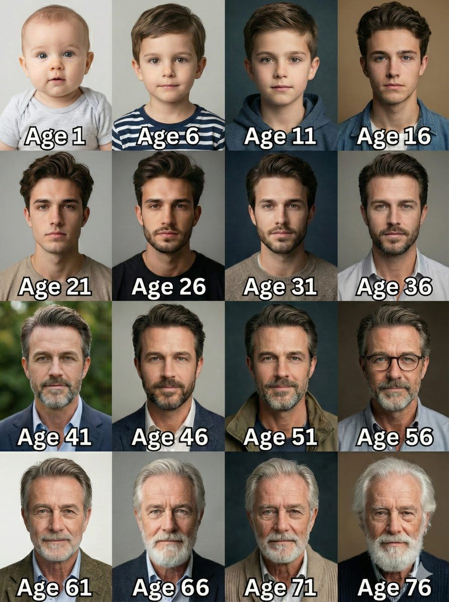

```
Generate an image from the uploaded photo that shows a 4 x 4 grid. Each square draws you at an age calculated as 1 plus (square position − 1) × 5. Each square reflects the specified age through clothing, hairstyle, facial hair, accessories, colors, background, and film style.a
```

```
根据上传的照片生成一张图像，呈现一个4×4的网格。每个格子中的人物年龄按公式“1 + (格子位置 − 1) × 5”计算得出。每个格子通过服装、发型、胡须、配饰、色彩、背景和胶片风格来体现对应年龄的特征。
```

 [↑返回目录](#toc)

---
## <a id="prompt-1999326915564556300">圣诞礼物中的她</a> (<a href="https://x.com/Naiknelofar788/status/1999326915564556296" target="_blank" rel="noopener noreferrer">simeon-sanai</a>)


```
Guess the Christmas gift 🎁

Nano banana pro Jason prompt 👇🏻

{
  "frame": {
    "aspect_ratio": "3:4",
    "shot_size": "Full Shot (FS)",
    "orientation": "Portrait",
    "composition_guide": "Center Framed"
  },
  "subject": {
    "subject_type": "Human",
    "identity_summary": "Same person as the input photo; keep age, gender expression, face, skin tone, and hair identical.",
    "visual_signature": {
      "facial_signature": {
        "face_shape": "Match reference exactly",
        "eye_details": "Match reference exactly",
        "nose_details": "Match reference exactly",
        "lip_details": "Match reference exactly",
        "cheek_and_jaw": "Match reference exactly",
        "unique_features": "Keep all facial details from the reference; do not change identity."
      },
      "body_signature": {
        "build": "Same body type as reference",
        "proportions": "Natural, realistic",
        "skin_tone_and_texture": "Match reference skin tone, hyper-realistic",
        "height_estimation_cm": 165,
        "unique_markings": "Copy any visible markings from reference if exposed."
      }
    },
    "pose_and_action": {
      "description": "Standing upright like a wrapped gift.",
      "body_position": "Full body, centered, standing straight.",
      "limb_positions": "Arms relaxed along the sides inside the wrapping.",
      "hand_gestures": "Natural, relaxed fingers.",
      "facial_expression": "Calm, neutral or slight smile.",
      "gaze_direction": "Looking straight at camera."
    },
    "inventory": {
      "wardrobe": "Christmas-themed red women’s suit: tailored red blazer with light festive details, matching high-waisted wide-leg trousers. Smooth, premium fabric, no logos or text.",
      "accessories": "Minimal, elegant jewelry only if it matches the reference style.",
      "held_objects": "None.",
      "hair_style": "Same hair as reference, styled neatly and visible inside the wrapping."
    }
  },
  "environment": {
    "setting_type": "Indoor",
    "location_description": "Professional studio with a clean, seamless black backdrop.",
    "time_of_day": "N/A (studio)",
    "weather_conditions": "N/A",
    "background_elements": "Plain deep black background, no extra props."
  },
  "lighting": {
    "global_illumination": "Controlled studio light.",
    "primary_source": "Softbox above and in front.",
    "direction": "Mostly frontal with slight angle.",
    "shadow_quality": "Soft, diffused shadows; subtle reflections on plastic.",
    "color_temperature": "Neutral daylight."
  },
  "camera": {
    "angle": "Eye Level",
    "lens_type": "Standard 50mm",
    "focal_length_mm": 50,
    "aperture": "f/4"
  },
  "special_elements": {
    "wrapping_description": "Subject fully enclosed in tall, shiny, transparent gift cellophane from floor to above the head, with realistic folds and reflections.",
    "bow_description": "Large satin red gift bow where the plastic gathers above the head, matching the red suit.",
    "ground_interaction": "Wrapping touches the floor and bunches slightly around the feet."
  },
  "post_processing": {
    "art_medium": "Photography",
    "style_modifiers": "Hyper-realistic, high-end fashion, Christmas gift concept",
    "color_grade": "Deep blacks, rich but natural reds, clear highlights on plastic.",
    "rendering_engine": "Photorealistic, 8K",
    "quality_boosters": "Ultra-detailed textures, sharp focus, no noise."
  },
  "negative": {
    "artifact_suppression": "bad anatomy, extra limbs, extra fingers, warped plastic, text, watermark, logo, glitch, blur, low resolution, bad geometry",
    "subject_excludes": "cartoon style, 3D render look, changed identity, different clothing colors, Santa hat costume, outdoor setting, busy background, extra people, cropped body"
  }
}
```

```
猜猜圣诞礼物🎁

Nano banana pro Jason 提示词 👇🏻

{
  "画面": {
    "宽高比": "3:4",
    "景别": "全身镜头（FS）",
    "方向": "竖向",
    "构图指导": "居中构图"
  },
  "主体": {
    "主体类型": "人类",
    "身份摘要": "与输入照片为同一人；保持年龄、性别表达、面部、肤色和发型完全一致。",
    "视觉特征": {
      "面部特征": {
        "脸型": "严格匹配参考图",
        "眼部细节": "严格匹配参考图",
        "鼻部细节": "严格匹配参考图",
        "唇部细节": "严格匹配参考图",
        "脸颊与下颌": "严格匹配参考图",
        "独特特征": "保留参考图中所有面部细节；不得更改身份。"
      },
      "身体特征": {
        "体型": "与参考图相同体型",
        "比例": "自然、写实",
        "肤色与质感": "匹配参考图肤色，超写实",
        "身高估算（厘米）": 165,
        "特殊标记": "若参考图中有可见标记且暴露在外，则复制该标记。"
      }
    },
    "姿态与动作": {
      "描述": "站姿如一件包装好的礼物。",
      "身体位置": "全身入镜，居中，站姿笔直。",
      "四肢位置": "双臂自然垂放于身体两侧，包裹在包装内。",
      "手部姿势": "手指自然放松。",
      "面部表情": "平静，中性或略带微笑。",
      "视线方向": "直视镜头。"
    },
    "服饰道具": {
      "服装": "圣诞主题红色女式套装：剪裁合体的红色西装外套，带有轻微节日装饰，搭配同色高腰阔腿裤。面料顺滑高级，无任何文字或标志。",
      "配饰": "仅佩戴与参考风格一致的极简优雅珠宝。",
      "手持物品": "无。",
      "发型": "与参考图一致，整洁打理并在包装内清晰可见。"
    }
  },
  "环境": {
    "场景类型": "室内",
    "地点描述": "专业摄影棚，背景为干净无缝的纯黑色幕布。",
    "时间": "不适用（摄影棚）",
    "天气": "不适用",
    "背景元素": "纯深黑色背景，无额外道具。"
  },
  "灯光": {
    "整体照明": "可控影棚灯光。",
    "主光源": "前方及上方柔光箱。",
    "方向": "以正面为主，略带角度。",
    "阴影质量": "柔和漫射阴影；塑料表面有细微反光。",
    "色温": "中性日光。"
  },
  "相机": {
    "角度": "平视",
    "镜头类型": "标准50mm镜头",
    "焦距（毫米）": 50,
    "光圈": "f/4"
  },
  "特殊元素": {
    "包装描述": "主体从脚底至头顶完全包裹在高大、闪亮、透明的礼品玻璃纸中，具有真实褶皱和反光效果。",
    "蝴蝶结描述": "在头顶塑料收拢处系一个大型红色缎面礼品蝴蝶结，颜色与红西装相配。",
    "地面互动": "包装纸接触地面，并在脚部周围略微堆叠。"
  },
  "后期处理": {
    "艺术媒介": "摄影",
    "风格修饰": "超写实、高端时尚、圣诞礼物概念",
    "色彩分级": "深邃黑色、浓郁但自然的红色、塑料表面清晰高光。",
    "渲染引擎": "照片级真实感，8K",
    "画质增强": "极致纹理细节、锐利对焦、无噪点。"
  },
  "负面提示": {
    "瑕疵抑制": "错误解剖结构、多余肢体、多余手指、扭曲塑料、文字、水印、logo、故障、模糊、低分辨率、几何错误",
    "主体排除项": "卡通风格、3D渲染感、身份改变、不同服装颜色、圣诞帽装扮、户外场景、杂乱背景、其他人物、身体被裁切"
  }
}
```

 [↑返回目录](#toc)

---
## <a id="prompt-1999345384850940000">私が生まれた日：1994年6月15日</a> (<a href="https://x.com/SSSS_CRYPTOMAN/status/1999345384850939994" target="_blank" rel="noopener noreferrer">SSSS_CRYPTOMAN</a>)

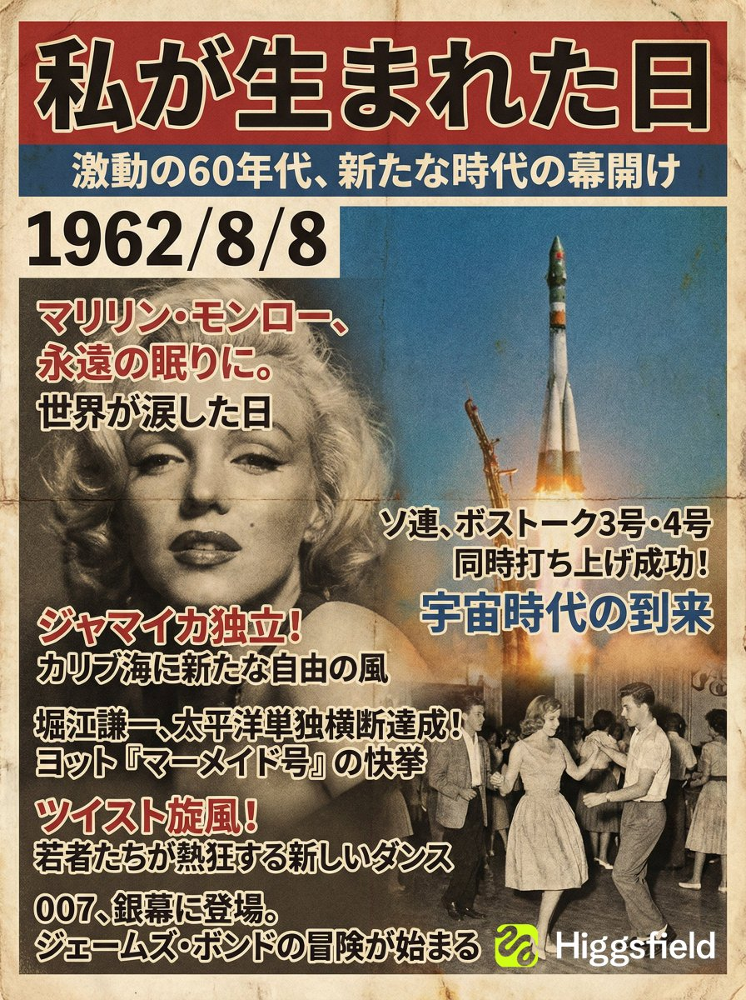

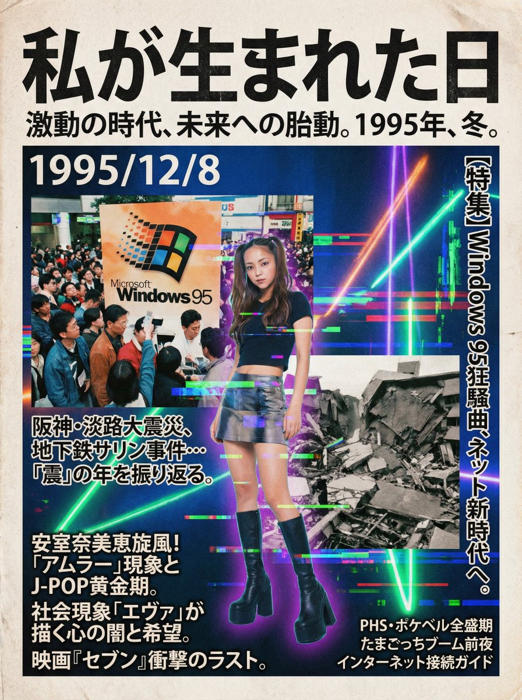

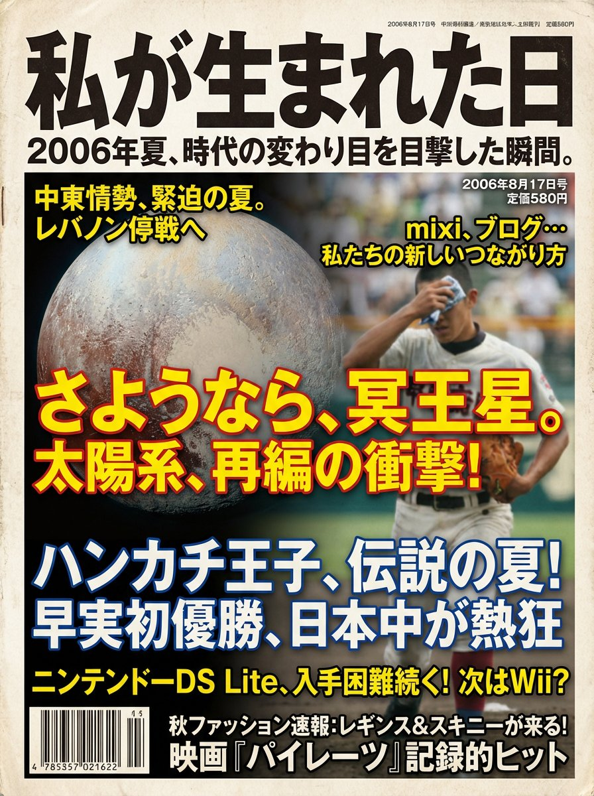

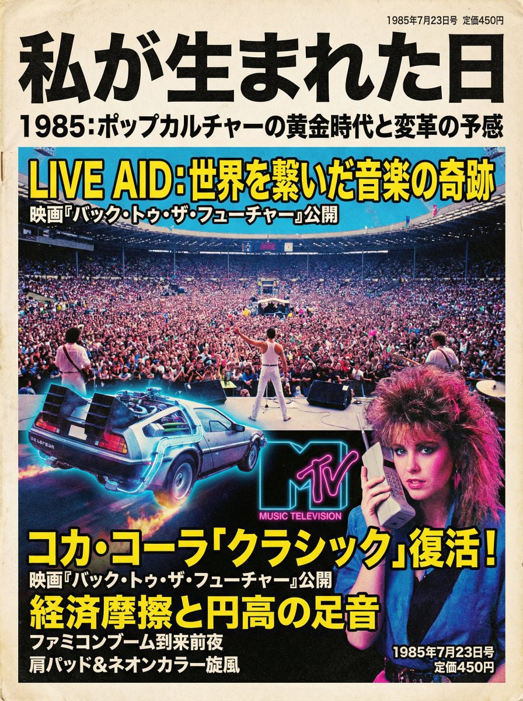

```
エモいやつ第二弾
自分の誕生日に発刊された雑誌を作成！

✅使い方
下記のプロンプトをコピペ。誕生日を入力するだけ
Created on #Higgsfieldbanana @higgsfield_ai

---プロンプト---
【指示内容】
ユーザーが入力した「私が生まれた日（1994/6/15）」に基づいて、
その日または前後で話題になった主要ニュースを3〜5件選び、
その時代の文化・トレンドも含めた情報を要約し、
その内容を誌面見出しとしてレイアウトした“総合雑誌の表紙画像”を生成する。

【作業手順（あなた側の内部処理）】
1. ユーザーの誕生日を読み取り、その時期に報じられた主要ニュースを複数ピックアップ。
2. その時代のデザイン傾向（フォント、色、紙質、写真トーン、レイアウト）を抽出。
3. 下記のデザイン仕様に沿って雑誌表紙を構築し、最終出力は画像のみとする。

【雑誌表紙のデザイン仕様】
・メインタイトル：必ず「私が生まれた日」
・副題：その年らしさ、時代背景を一言で示すキャッチコピー
・誕生日の日付（YYYY/MM/DD）を必ず誌面に配置
・誌面構成：
　- メインビジュアルはその時代を象徴する写真的背景
　- 抽出したニュースを雑誌の見出しとして複数配置
　- 当時の流行（音楽、映画、ファッション、技術など）も補助見出し化
・デザインスタイル：
　- 誕生年の雑誌らしいフォント、色味、写真の粒状感、紙のテクスチャ
　- 視認性の高いヘッドライン構成
・文章は正しい日本語になるように校正し、同じ文章を繰り返して使用するのは禁止
・アスペクト比：縦長（推奨 3:4）  
・クオリティ：印刷物の質感を持つリアルな雑誌カバー
-----
```

 [↑返回目录](#toc)

---
## <a id="prompt-1999347995343749600">Nano Banana Proの極致</a> (<a href="https://x.com/YaseenK7212/status/1999347995343749556" target="_blank" rel="noopener noreferrer">そう｜n8nで始めるAIエージェント</a>)


```
このYoutubeサムネイル、全部テキストプロントで作りました。
いいね数次第でこの画像生成のプロンプト公開します。
```

 [↑返回目录](#toc)

---
## <a id="prompt-1999126004581970000">超写实皮革贴片微距</a> (<a href="https://x.com/aleenaamiir/status/1999126004581970001" target="_blank" rel="noopener noreferrer">Aleena Amir</a>)


```
Ultra-realistic macro photograph of a round leather patch stitched onto soft fabric. The patch is textured with white leather with visible fine-grain details and logo colour, surrounded by neatly stitched borders. In the center of the patch, emboss a clean, minimal icon or logo of [Logo Name] in a slightly darker tone for depth. High-resolution, realistic shadows, natural fabric folds, and premium handcrafted look.
```

```
超写实微距摄影：一个圆形皮革贴片缝制在柔软织物上。贴片采用白色皮革，带有清晰可见的细腻纹理和标志色彩，周围环绕着整齐的缝线边框。贴片中央压印一个干净简约的[Logo Name]图标或标志，颜色略深以营造立体感。高分辨率、逼真阴影、自然的织物褶皱，呈现高级手工质感。
```

 [↑返回目录](#toc)

---
## <a id="prompt-1999055240394350800">MegaRed CoQ10 营销广告视觉</a> (<a href="https://x.com/ttmouse/status/1999055240394350857" target="_blank" rel="noopener noreferrer">ttmouse - 豆爸</a>)


```
如何将产品图生成营销广告

1. 准备产品图片
2. 准备产品的卖点，或者让 AI 自己生成
3. 与提示词一起提交给Nano banana.

🍌 Nano banana Pro：

Commercial photography, scientific knolling infographic style.

**CENTER ANCHOR:** A bottle of "MegaRed Advanced CoQ10 200mg" supplement, with its signature red cap, yellow and red gradient label, and bold white "MegaRed" and "CoQ10" text, is placed on a polished, glowing amber and gold pedestal.

**INGREDIENT ORBIT:** Surrounding the central bottle are four distinct, meticulously arranged clusters:
1.  **Top Left:** A pile of fine, crystalline red CoQ10 powder, emitting a warm, pulsating glow.
2.  **Top Right:** A cluster of translucent red softgel capsules, showing their glossy, liquid-filled texture, accompanied by a glowing 99% purity badge.
3.  **Bottom Left:** A stylized, glowing red and gold anatomical heart icon connected to six abstract, interconnected patent symbols.
4.  **Bottom Right:** A stylized, smiling face icon with a halo, representing reduced fatigue, next to a burst of golden cellular energy.

**ATMOSPHERE & LIGHTING:** Cinematic luxury aesthetic. Deep red and amber gradient background with subtle bokeh depth. Strong rim lighting and focused spotlights to define edges, creating a rich, glowing effect.

**DETAILS:** Magazine-style layout. Typography simulation: contrasting "Extra Bold" titles and "Thin" subtitles. 8k resolution, macro photography textures, unreal engine 5 render style, sharp focus. --ar 3:4 --v 6.0 --iw 2.0
```

 [↑返回目录](#toc)

---
## <a id="prompt-1999010596101173800">喧嚣中的静默凝视</a> (<a href="https://x.com/Taaruk_/status/1999010596101173683" target="_blank" rel="noopener noreferrer">Taaruk</a>)

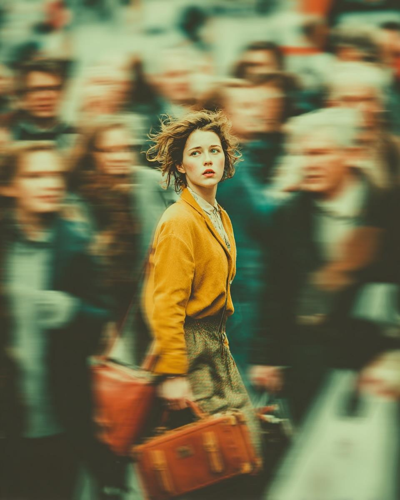

```
{
  "Objective": "Create a cinematic, emotionally charged portrait of a young woman standing still in the middle of a fast-moving crowd.",

  "Subject": {
    "Gender": "Female",
    "Appearance": {
      "Hair": "Short, windswept hair",
      "Expression": "Soft, anxious, introspective",
      "Gaze": "Looking slightly upward, as if searching for something"
    },
    "Wardrobe": {
      "Coat": "Mustard yellow coat",
      "Accessories": "Vintage brown leather bags"
    },
    "Focus": "Subject remains sharply in focus despite surrounding motion blur"
  },

  "Scene_Description": {
    "Setting": "Busy public space with a fast-moving crowd",
    "Crowd": {
      "Motion": "Strong motion blur symbolizing chaos and emotional isolation",
      "Contrast": "Crowd blurred — subject still and clear"
    },
    "Atmosphere": {
      "Mood": [
        "Loneliness",
        "Confusion",
        "Stillness in a rushing world"
      ],
      "Storytelling": "A single quiet moment amidst overwhelming movement"
    }
  },

  "Lighting_and_Color": {
    "Lighting": "Dramatic, filmic lighting with soft highlights on the subject",
    "Color_Grading": "Teal-and-orange cinematic palette",
    "Depth_of_Field": "Very shallow DOF with strong separation between subject and background"
  },

  "Visual_Style": {
    "Aesthetic": "Cinematic emotional portrait",
    "Quality": "Ultra realistic, high resolution",
    "Effects": [
      "Motion-blurred crowd",
      "Sharp subject isolation",
      "Film-inspired atmosphere",
      "High emotional contrast"
    ]
  },

  "Output_Requirements": {
    "Format": "Image",
    "Orientation": "Portrait",
    "Quality": "Cinematic, editorial-grade, emotionally expressive"
  }
}
```

```
目标：创作一幅电影感强烈、情感充沛的肖像，描绘一位年轻女子静立于快速流动的人群中央。

主体：
- 性别：女性
- 外貌：
  - 发型：短发，被风吹乱
  - 表情：柔和、焦虑、内省
  - 视线：微微仰视，仿佛在寻找什么
- 服装：
  - 外套：芥末黄色大衣
  - 配饰：复古棕色皮革包
- 焦点：尽管周围存在动态模糊，主体始终保持清晰锐利

场景描述：
- 场景：繁忙的公共场所，人群快速移动
- 人群：
  - 动态：强烈的动态模糊，象征混乱与情感上的孤立
  - 对比：人群模糊 — 主体静止且清晰
- 氛围：
  - 情绪：孤独、困惑、喧嚣世界中的宁静
  - 叙事：在汹涌人潮中捕捉一个安静的瞬间

光影与色彩：
- 光影：戏剧性电影感布光，主体面部带有柔和高光
- 色彩分级：青橙色调的电影级配色
- 景深：极浅景深，主体与背景强烈分离

视觉风格：
- 美学：电影感情绪肖像
- 质量：超写实、高分辨率
- 效果：
  - 动态模糊的人群
  - 清晰突出的主体隔离
  - 电影灵感氛围
  - 强烈的情感对比

输出要求：
- 格式：图像
- 构图：竖向
- 质量：电影级、编辑级、富有情感表现力
```

 [↑返回目录](#toc)

---
## <a id="prompt-1998641973943742500">铅笔尖的微观世界</a> (<a href="https://x.com/umesh_ai/status/1998641973943742577" target="_blank" rel="noopener noreferrer">Umesh</a>)


```
Imagine a pencil tip seen through a microscope. Imagine how the pencil tip would look and create an image.
```

```
想象一支铅笔笔尖在显微镜下的样子。想象铅笔笔尖会呈现怎样的形态，并创作一幅图像。
```

 [↑返回目录](#toc)

---
## <a id="prompt-1998672791823081700">红蓝重影：双重曝光肖像</a> (<a href="https://x.com/Ankit_patel211/status/1998672791823081648" target="_blank" rel="noopener noreferrer">ANKIT PATEL 🇮🇳 | AI</a>)

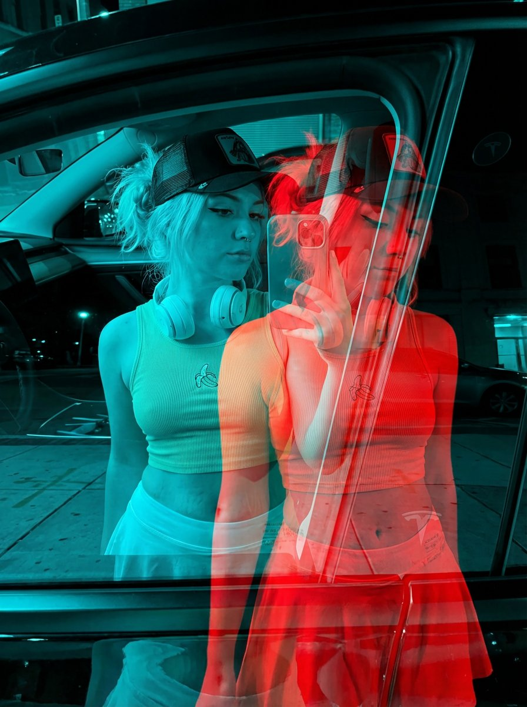

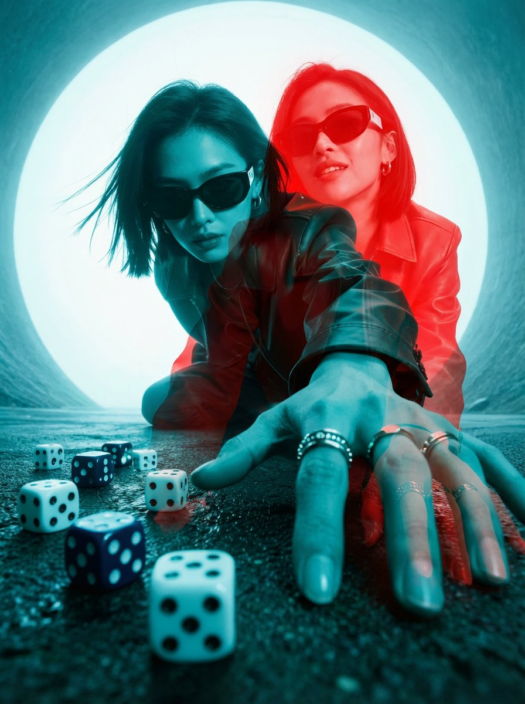

```
Apply an artistic red–blue double-exposure effect using two poses of the same woman. Keep the base layer as the original pose, and generate a second pose where her head angle, facial direction, or expression is slightly different, as if captured a moment earlier or later. Color the second pose in red, the base pose in cyan, and offset the layers to create a clean ghosting effect. Preserve skin texture, tattoos, and contrast while keeping the background minimal.
```

```
运用红蓝双色双重曝光效果，使用同一女性的两个姿势。以原始姿势作为基础图层，并生成第二个姿势，其头部角度、面部朝向或表情略有不同，仿佛是在稍早或稍晚一刻捕捉到的画面。将第二个姿势着色为红色，基础姿势着色为青色，并错开图层以营造清晰的重影效果。保留皮肤纹理、纹身和对比度，同时保持背景极简。
```

 [↑返回目录](#toc)

---
## <a id="prompt-1998692829934113300">暮雪桥上的狐狸旅人</a> (<a href="https://x.com/oggii_0/status/1998692829934113159" target="_blank" rel="noopener noreferrer">Oogie</a>)

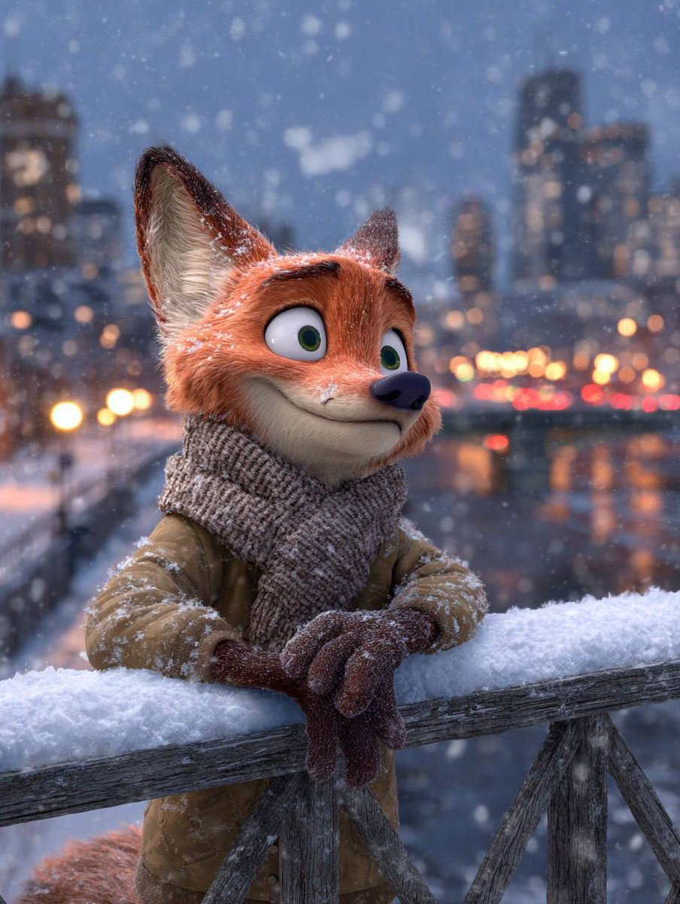

```
 An anthropomorphic fox character standing on a snowy bridge at twilight, wearing a thick winter coat, knitted scarf, and gloves. Soft snow falls around him as city lights glow warmly in the blurred background. The fox has expressive green eyes, detailed fur, and a gentle smile. Cinematic lighting, high detail, cozy winter atmosphere
```

```
一只拟人化的狐狸角色站在暮色中的雪桥上，身穿厚实的冬装大衣、针织围巾和手套。柔软的雪花在他周围飘落，模糊的背景中城市灯光温暖地闪烁。狐狸拥有富有表现力的绿色眼睛、细腻的毛发和温柔的微笑。电影级光影，高细节，温馨冬日氛围
```

 [↑返回目录](#toc)

---
## <a id="prompt-1999110884879221000">天空之岛：[COUNTRY]奇幻浮空</a> (<a href="https://x.com/TechieBySA/status/1999110884879221052" target="_blank" rel="noopener noreferrer">TechieSA</a>)


```
Create an ultra-HD, hyper-realistic digital poster of a floating miniature island shaped like [COUNTRY], resting on white clouds in the sky. Blend iconic landmarks, natural landscapes (like forests, mountains, or beaches), and cultural elements unique to [COUNTRY]. Carve “[COUNTRY]” into the terrain using large white 3D letters. Add artistic details like birds (native to [COUNTRY]), cinematic lighting, vivid colors, aerial perspective, and sun reflections to enhance realism. Ultra-quality, 4K+ resolution. 1080x1080 format.
```

```
创作一张超高清、超写实的数字海报：一片漂浮在天空白云之上的微型岛屿，其形状为[COUNTRY]。融合[COUNTRY]标志性的地标建筑、自然景观（如森林、山脉或海滩）以及独特的文化元素。用巨大的白色3D字母将“[COUNTRY]”刻入地形中。添加艺术细节，如[COUNTRY]本土鸟类、电影级光影、鲜艳色彩、空中视角和阳光反射，以增强真实感。超高品质，4K以上分辨率，1080x1080格式。
```

 [↑返回目录](#toc)

---
## <a id="prompt-1998854511092445200">黄金时刻的露台肖像</a> (<a href="https://x.com/dhumann/status/1998854511092445209" target="_blank" rel="noopener noreferrer">D. Humann</a>)

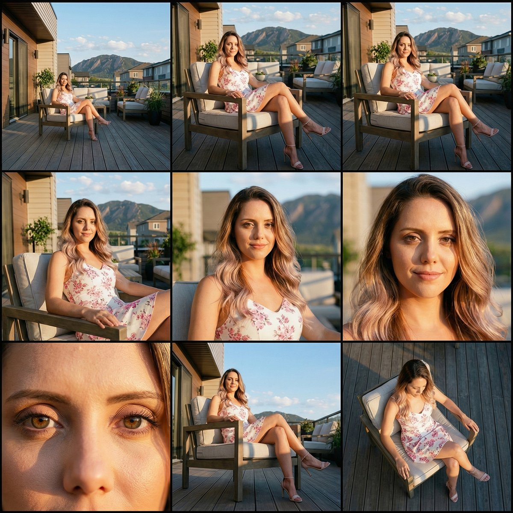

```
A nine-panel cinematic contact sheet featuring a young woman sitting on a modern outdoor patio at golden hour, framed against distant mountains and suburban rooftops. In the first row, she appears in wide establishing shots relaxing in a wooden lounge chair on a sunlit deck. The middle row shows progressively closer portraits: a waist-up shot, a chest-up shot, and a natural close-up of her face in warm evening light. The bottom row highlights details and angles, including a macro shot of her eyes, a low-angle view of her seated pose, and a high-angle overhead shot looking down at her. The sequence maintains consistent lighting, environment, and styling throughout.
```

```
一张九宫格电影分镜图，描绘一位年轻女子在黄金时刻坐在现代户外露台上，背景是远处的山脉和郊区屋顶。第一排为广角定场镜头，她放松地坐在阳光照耀的木制躺椅上；中间一排逐步推进至更近的肖像：半身照、胸以上特写，以及在温暖傍晚光线下面部的自然特写；最后一排突出细节与角度，包括眼睛的微距镜头、低角度仰拍她的坐姿，以及高角度俯拍她全身的画面。整组画面保持一致的光线、环境与造型风格。
```

 [↑返回目录](#toc)

---
## <a id="prompt-1999042753250955300">镜前健身自拍：柔光下的优雅时刻</a> (<a href="https://x.com/YaseenK7212/status/1999042753250955381" target="_blank" rel="noopener noreferrer">Yaseen Khan Gul</a>)

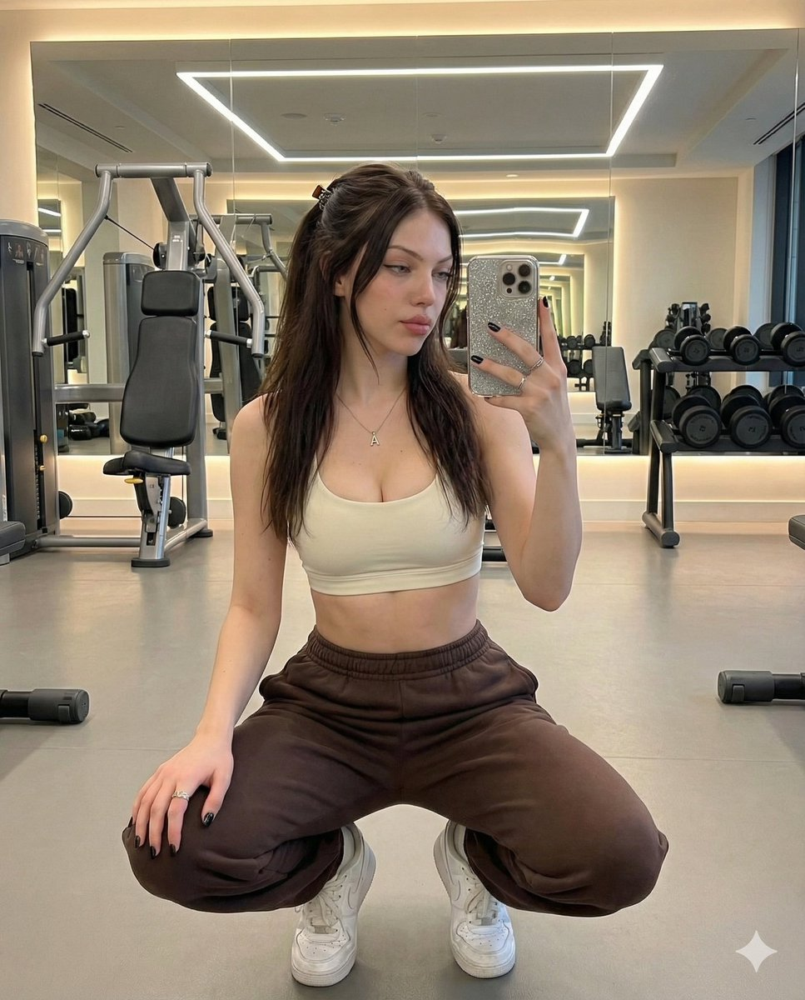

```
{
  "project_settings": {
    "project_name": "Gym Mirror Selfie Series",
    "version": "4.0.0-granular",
    "target_model": "Stable Diffusion / Midjourney v6"
  },
  "generation_parameters": {
    "face_preservation": {
      "enabled": true,
      "method": "Reference ControlNet / IP-Adapter",
      "strictness_level": "High",
      "protected_features": [
        "facial_structure",
        "eyebrow_shape",
        "makeup_style",
        "lip_morphology",
        "hairline_fidelity"
      ]
    },
    "technical_specs": {
      "aspect_ratio": "4:5",
      "resolution": "8K",
      "orientation": "Portrait"
    }
  },
  "scene_composition": {
    "subject": {
      "demographics": {
        "gender": "Female",
        "age_group": "Young Adult"
      },
      "pose_definition": {
        "stance": "Squatting low",
        "leg_position": "One knee forward",
        "torso_orientation": "Leaning slightly toward mirror",
        "head_tilt": "Downward (approx 15 degrees)",
        "gaze": "Focused on phone screen",
        "hand_placement": {
          "right_hand": "Holding phone in front of face",
          "left_hand": "Resting on knee"
        }
      },
      "grooming": {
        "hair": {
          "color": "Dark Brown",
          "length": "Long",
          "style": "Half-up ponytail",
          "texture": "Smooth, Straight",
          "accessory": "Small clip"
        },
        "makeup": {
          "style": "Natural",
          "finish": "Soft matte"
        },
        "nails": {
          "color": "Black",
          "finish": "Glossy"
        }
      },
      "wardrobe": {
        "upper_body": {
          "item": "Sports Bra",
          "color": "Off-white",
          "fit": "Tight, form-fitting",
          "material_properties": "Slight sheen, synthetic"
        },
        "lower_body": {
          "item": "Sweatpants",
          "color": "Dark Brown",
          "fit": "Loose, relaxed",
          "waist_style": "High-waisted"
        },
        "footwear": {
          "item": "Sneakers",
          "color": "White",
          "style": "Chunky/Sporty"
        },
        "jewelry": [
          { "type": "Necklace", "material": "Silver" },
          { "type": "Bracelet", "material": "Silver" },
          { "type": "Rings", "material": "Silver" }
        ]
      }
    },
    "props": {
      "primary_device": {
        "type": "Smartphone",
        "case_texture": "Glitter",
        "case_color": "Silver",
        "holding_angle": "Vertical"
      }
    },
    "environment": {
      "location_type": "Indoor Gym",
      "architecture": {
        "walls": "Full-height mirrors",
        "flooring": "Wood-textured gym floor"
      },
      "background_elements": [
        "Chest press machine",
        "Blurred gym equipment"
      ]
    },
    "lighting_and_atmosphere": {
      "primary_source": "Soft overhead LED",
      "ambient_tone": "Warm accents",
      "shadows": "Soft, diffuse",
      "mood": ["Feminine", "Elegant", "Gentle"]
    },
    "stylistic_approach": {
      "genre": "Social Media Mirror Selfie",
      "visual_clarity": "Medium-High sharpness",
      "color_grading": "Soft warm tones (Cream/Brown palette)"
    }
  },
  "negative_constraints": [
    "deformed fingers",
    "wrong face structure",
    "extra limbs",
    "text",
    "watermark",
    "candy bars",
    "distorted reflection",
    "over-saturated colors"
  ]
}
 }
```

```
{
  "项目设置": {
    "项目名称": "健身房镜前自拍系列",
    "版本": "4.0.0-精细版",
    "目标模型": "Stable Diffusion / Midjourney v6"
  },
  "生成参数": {
    "面部保留": {
      "启用": true,
      "方法": "参考 ControlNet / IP-Adapter",
      "严格程度": "高",
      "受保护特征": [
        "面部结构",
        "眉毛形状",
        "妆容风格",
        "唇部形态",
        "发际线保真度"
      ]
    },
    "技术规格": {
      "宽高比": "4:5",
      "分辨率": "8K",
      "方向": "纵向"
    }
  },
  "场景构图": {
    "主体": {
      "人口统计信息": {
        "性别": "女性",
        "年龄组": "青年成人"
      },
      "姿势定义": {
        "站姿": "低蹲",
        "腿部位置": "一膝前伸",
        "躯干朝向": "略微倾向镜子",
        "头部倾斜": "向下（约15度）",
        "视线": "聚焦于手机屏幕",
        "手部位置": {
          "右手": "在脸前握持手机",
          "左手": "搭在膝盖上"
        }
      },
      "造型": {
        "头发": {
          "颜色": "深棕色",
          "长度": "长发",
          "发型": "半扎马尾",
          "质地": "顺滑、直发",
          "配饰": "小发夹"
        },
        "妆容": {
          "风格": "自然",
          "妆效": "柔雾哑光"
        },
        "指甲": {
          "颜色": "黑色",
          "光泽": "亮面"
        }
      },
      "服装": {
        "上身": {
          "单品": "运动内衣",
          "颜色": "米白色",
          "版型": "紧身、贴合",
          "材质特性": "轻微光泽、合成面料"
        },
        "下身": {
          "单品": "运动裤",
          "颜色": "深棕色",
          "版型": "宽松、休闲",
          "腰型": "高腰"
        },
        "鞋履": {
          "单品": "运动鞋",
          "颜色": "白色",
          "款式": "厚底/运动风"
        },
        "首饰": [
          { "类型": "项链", "材质": "银" },
          { "类型": "手链", "材质": "银" },
          { "类型": "戒指", "材质": "银" }
        ]
      }
    },
    "道具": {
      "主设备": {
        "类型": "智能手机",
        "手机壳纹理": "闪粉",
        "手机壳颜色": "银色",
        "握持角度": "竖直"
      }
    },
    "环境": {
      "场所类型": "室内健身房",
      "建筑结构": {
        "墙面": "通顶镜面",
        "地面": "木纹健身房地板"
      },
      "背景元素": [
        "卧推训练器",
        "模糊的健身器材"
      ]
    },
    "灯光与氛围": {
      "主光源": "柔和顶置LED灯",
      "环境色调": "暖色点缀",
      "阴影": "柔和、漫射",
      "情绪": ["女性化", "优雅", "温柔"]
    },
    "风格手法": {
      "类型": "社交媒体镜前自拍",
      "画面清晰度": "中高锐度",
      "色彩调校": "柔和暖色调（奶油/棕色系）"
    }
  },
  "负面约束": [
    "畸形手指",
    "错误的面部结构",
    "多余肢体",
    "文字",
    "水印",
    "糖果棒",
    "扭曲的镜像",
    "过度饱和的颜色"
  ]
}
```

 [↑返回目录](#toc)

---
## <a id="prompt-1999106224663691800">蓝光中的肖像写真</a> (<a href="https://x.com/saniaspeaks_/status/1999106224663691749" target="_blank" rel="noopener noreferrer">𝗦𝗮𝗻𝗶𝗮</a>)

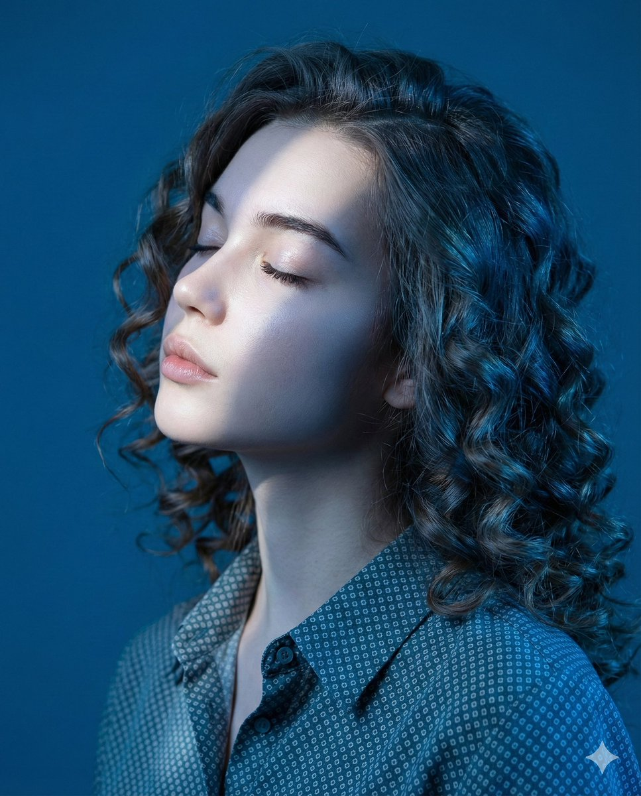

```
{
  "type": "image_generation_prompt",
  "concept": {
    "description": "An artistic editorial close-profile portrait of a young woman, immersed in dramatic blue lighting. Her eyes are closed, with her head gently tilted upward, expressing serenity and introspection. A diagonal beam of cold white light crosses her face, illuminating her eyes, nose, and lips with precise intensity. A solid deep blue background enhances the ethereal, emotional aesthetic.",
    "mood": "quiet, introspective, ethereal",
    "color_theme": "deep blue with cold white highlights"
  },
  "subject": {
    "gender": "female",
    "identity_preservation": {
      "use_reference_image": true,
      "alter_face": false,
      "notes": "Maintain the subject’s exact facial features, structure, skin tone, and identity from the uploaded image."
    },
    "pose": {
      "name": "Blue Profile",
      "head_position": "slightly tilted upward",
      "eyes": "closed",
      "expression": "serene and introspective",
      "highlight": "diagonal beam of light crossing the face, enhancing facial contours"
    },
    "appearance": {
      "hair": {
        "style": "curly, voluminous, well-defined",
        "lighting_effect": "subtle blue reflections"
      },
      "clothing": {
        "shirt": "petroleum-blue shirt with light gray micro-geometric print",
        "fabric": "lightweight material with soft shine under direct light",
        "collar": "traditional, top button open to reveal part of the neck",
        "details": {
          "cuffs": "adjusted cuffs",
          "stitching": "visible dark blue stitching",
          "fit": "elegant and modern"
        }
      },
      "accessories": "none visible"
    }
  },
  "camera_settings": {
    "camera": "Canon EOS R5",
    "lens": "85mm f/1.4",
    "aperture": "f/2.2",
    "iso": 320,
    "shutter_speed": "1/200s",
    "framing": "close-up profile, vertical 4:5 format",
    "resolution": "Ultra-HD 8K",
    "focus": "absolute focus on the face, capturing skin texture, hair, and light transitions"
  },
  "lighting": {
    "type": "dramatic cold white diagonal beam",
    "background": "deep solid blue",
    "effects": [
      "precise illumination on eyes, nose, and mouth",
      "soft enhancement of facial contours",
      "editorial contrast and silence-like aesthetic"
    ]
  },
  "visual_style": {
    "genre": "artistic editorial portrait",
    "contrast_level": "medium-high",
    "tone": "cold, atmospheric",
    "keywords": [
      "cinematic",
      "high-fashion",
      "introspective",
      "ethereal"
    ]
  },
  "output_goal": "Create an ultra-realistic editorial portrait of a young woman in dramatic blue lighting, preserving her identity while capturing a serene, introspective moment in close-profile composition."
}
```

```
艺术风格的编辑近距离侧脸肖像，年轻女性沉浸在戏剧性的蓝色光线中。她的眼睛闭着，头轻轻向上仰，表达出宁静与内省。一条冷白色的对角光束穿过她的脸，精确地照亮了她的眼睛、鼻子和嘴唇。深蓝色的背景增强了空灵的情感美学。

安静、内省、空灵的氛围。

色彩主题为深蓝与冷白色高光。

保持主体的确切面部特征、结构、肤色及身份，不改变面部特征。

姿势：头部位置稍微上仰，眼睛闭合，表情宁静内省，强调脸部轮廓被对角光线增强。

外观：头发风格为卷曲、蓬松且轮廓分明，带有微妙的蓝色反光；穿着石油蓝色衬衫，带有浅灰色微几何图案，材质轻盈，在直射光下有柔和光泽，传统领型，顶扣打开以露出部分颈部，袖口调整过，可见深蓝色缝线，剪裁优雅现代。

没有明显的配饰。

使用佳能 EOS R5相机和85mm f/1.4镜头，光圈f/2.2，ISO 320，快门速度1/200秒，垂直4:5格式的特写侧脸，分辨率为Ultra-HD 8K，聚焦于脸部，捕捉皮肤纹理、头发和光线过渡。

灯光类型为戏剧性的冷白色对角光束，背景为深邃的纯蓝色，效果包括对眼睛、鼻子和嘴巴的精确照明，柔和的脸部轮廓增强，以及编辑般的对比度和如寂静般的美学。

视觉风格属于艺术编辑肖像，中高水平的对比度，色调偏冷且有气氛，关键词包括电影感、高端时尚、内省、空灵。

创作目标是创建一个超现实主义的编辑肖像，展现一位在戏剧性蓝光下的年轻女性，保留她的身份同时捕捉到宁静内省的瞬间。
```

 [↑返回目录](#toc)

---
## <a id="prompt-1998674412271448000"> Glitch & Shadow</a> (<a href="https://x.com/BeautyVerse_Lab/status/1998674412271448083" target="_blank" rel="noopener noreferrer">BeautyVerse</a>)

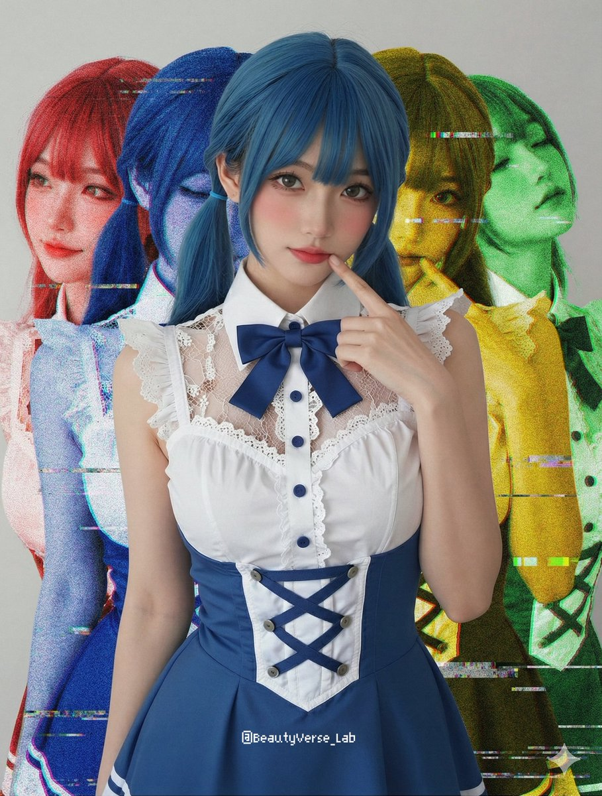

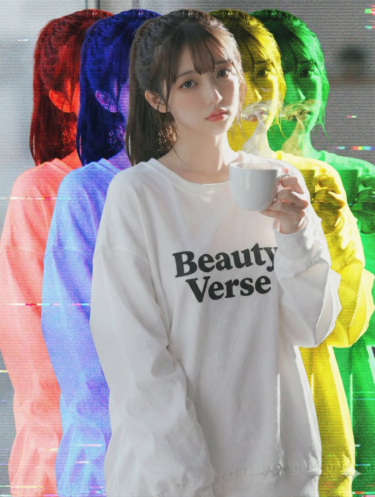

```
Shadow & Glitch Effect (Prompt below)

I used this method to branch out into some other effects.
The prompt is divided into sections so you can easily tweak it yourselves—feel free to try it out and have fun!
-
この方法をベースに、いくつか別の効果も派生させてみました。
プロンプトは編集しやすいようにセクション分けしてあるので、自由にアレンジして一緒に遊んでみてください！
-
我根據這個方法衍生出其他的效果。
Prompt 有分區標示，方便你們自己修改，大家一起來玩玩看吧！

Maybe you want to give it a try ? @SDT_side 

[Prompt]
Ref Image: Based on the provided reference image, keep the main subject in the center sharp, natural-colored, and completely unaffected by filters. 

Shadow Effect: Behind the main subject, generate four ghost-like duplicates of the same subject. Offset two duplicates to the left (colored Red and Blue) and two to the right (colored Yellow and Green). 

Glitch Effect: Apply heavy analog noise, VHS scan lines, and digital glitch artifacts ONLY to these four colored background layers, creating a gritty, unstable look behind the clean high-definition foreground subject.
```

 [↑返回目录](#toc)

---
## <a id="prompt-1998742687441211600">事件回溯：四幕前奏</a> (<a href="https://x.com/NanoBanana/status/1998742687441211628" target="_blank" rel="noopener noreferrer">Nano Banana Pro</a>)

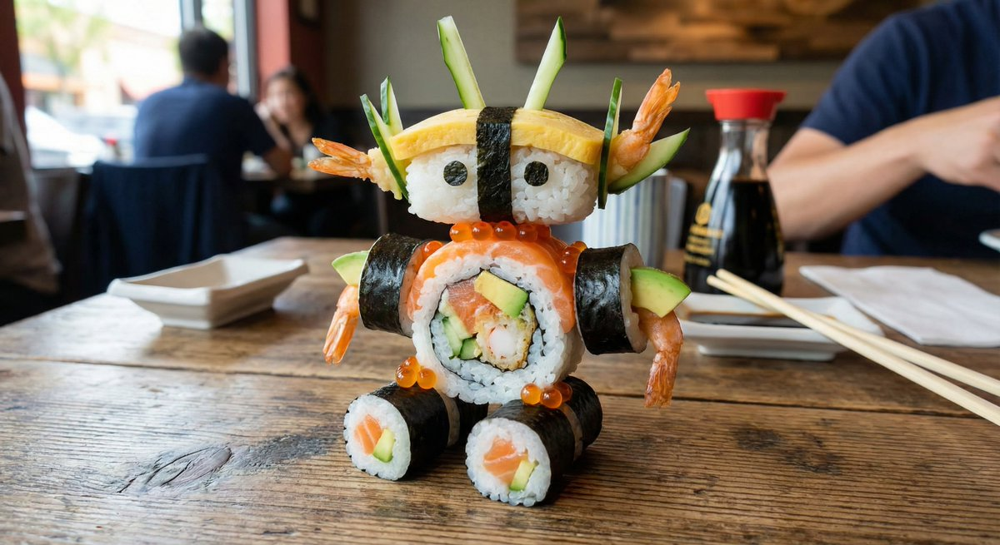

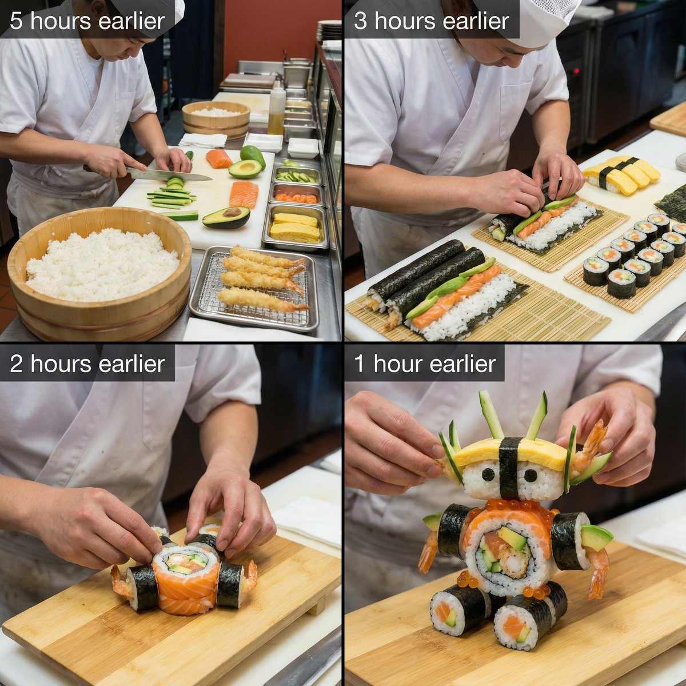

```
In a 2x2 grid, show the events leading up to this scene. Think 5 hours, 3 hours, 2 hours and 1 hour earlier.
```

```
在一个2x2的网格中，展示导致此场景发生的事件，分别呈现5小时前、3小时前、2小时前和1小时前的情景。
```

 [↑返回目录](#toc)

---
## <a id="prompt-1998696103198257200">薄荷绿高定魅影写真</a> (<a href="https://x.com/Just_sharon7/status/1998696103198257266" target="_blank" rel="noopener noreferrer">Sharon Riley</a>)

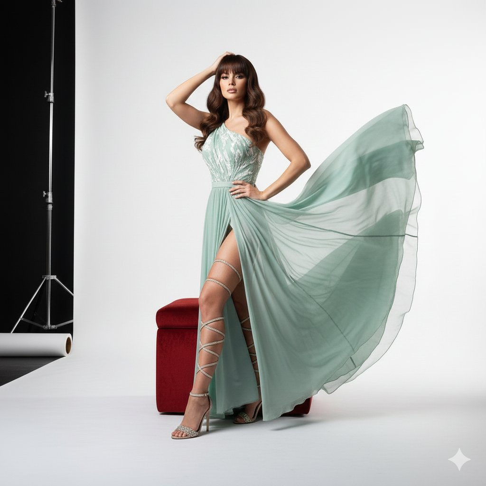

```
{
  "prompt": "A stylish, high-fashion portrait of a woman seated, looking down at her flowing gown. The woman has long, wavy, dark brown hair with bangs, cascading over her shoulders. She is wearing an elegant, floor-length gown in varying shades of light mint and sage green. The bodice appears to be sleeveless or one-shouldered with a subtle, textured or patterned design (possibly white floral or abstract print). The skirt features a very high slit, dramatically revealing her legs. The fabric of the lower skirt is sheer and flowing chiffon, draped gracefully around her. She is wearing high-heeled **strappy sandals with straps extending all the way up to her thighs**, adorned with sparkling embellishments. One hand is gently holding the flowing fabric of the skirt. She is sitting on a small, rectangular object, possibly a red or dark orange ottoman or box, contrasting with the green. The backdrop is a seamless white photography paper or screen, partially visible as a roll on the floor. The setting is indoors, with hard, bright studio lighting that highlights the texture of the dress and the sheen on her skin. The mood is sophisticated, sensual, and editorial. Full body shot, high-resolution, magazine quality.",
  "style": [
    "high fashion editorial",
    "studio portrait",
    "glamour photography"
  ],
  "dominant_colors": [
    "mint green",
    "sage green",
    "white",
    "dark brown (hair)",
    "red/orange (seat)"
  ],
  "camera_settings": {
    "view": "full body/three-quarter shot",
    "lens": "85mm prime or similar (shallow depth of field suggested)",
    "lighting": "bright, professional studio lighting, strong highlight/shadow contrast"
  },
  "artist_inspiration": [
    "Vogue magazine spread",
    "fashion campaign imagery"
  ]
}
```

```
{
  "prompt": "一位女性的时尚高定肖像，她坐着，低头凝视自己飘逸的礼服。女子拥有长长的波浪深棕色头发，带有刘海，柔顺地垂落肩头。她身穿一件优雅的及地长裙，色调为不同深浅的薄荷绿与鼠尾草绿。上身设计为无袖或单肩款式，饰有细腻的纹理或图案（可能是白色花卉或抽象印花）。裙摆开衩极高，戏剧性地展露双腿。下半身采用轻盈透明的雪纺面料，优雅地环绕在她周围。她脚穿高跟**绑带凉鞋，绑带一路延伸至大腿**，缀满闪亮装饰。一只手轻轻捏住裙摆的流动织物。她坐在一个小型矩形物体上，可能是一个红色或深橙色的脚凳或箱子，与绿色形成鲜明对比。背景为无缝白色摄影纸或幕布，部分卷起置于地面可见。场景设于室内，采用强烈明亮的影棚灯光，突出礼服的质感与肌肤的光泽。整体氛围精致、性感且具有杂志大片感。全身镜头，高分辨率，杂志级画质。",
  "style": [
    "高级时尚杂志风",
    "影棚人像",
    "魅力摄影"
  ],
  "dominant_colors": [
    "薄荷绿",
    "鼠尾草绿",
    "白色",
    "深棕色（头发）",
    "红色/橙色（座椅）"
  ],
  "camera_settings": {
    "view": "全身/七分身镜头",
    "lens": "85mm定焦镜头或类似（建议浅景深）",
    "lighting": "明亮专业影棚灯光，高光与阴影对比强烈"
  },
  "artist_inspiration": [
    "《Vogue》杂志版面",
    "时尚广告大片"
  ]
}
```

 [↑返回目录](#toc)

---
## <a id="prompt-1998205632210514200">POLAROID F40 概念车诞生记</a> (<a href="https://x.com/Ror_Fly/status/1998205632210514154" target="_blank" rel="noopener noreferrer">Rory Flynn</a>)


```
POLAROID F40 → Concept to Photoshoot.

With Nano Banana Pro + Weavy.

(Full workflow in thread).

PROCESS:
01. Generate base car model.
02. Apply design to car render.
03. Iterate render shots.
04. Bring to life with NBP.
05. Gen some videos with Kling.

Nano has way more "style" than I thought.

#nanobanana #promptshare
```

```
POLAROID F40 → 从概念到拍摄。

使用 Nano Banana Pro + Weavy。

（完整工作流程见帖子）。

流程：  
01. 生成基础汽车模型。  
02. 将设计应用到汽车渲染图上。  
03. 迭代渲染镜头。  
04. 使用 NBP 赋予其生命力。  
05. 用 Kling 生成一些视频。

Nano 的“风格”远超我的预期。

#nanobanana #提示词分享
```

 [↑返回目录](#toc)

---
## <a id="prompt-1998515878682657000">创意饮品对决</a> (<a href="https://x.com/Angaisb_/status/1998515878682657010" target="_blank" rel="noopener noreferrer">Angel ❄️</a>)


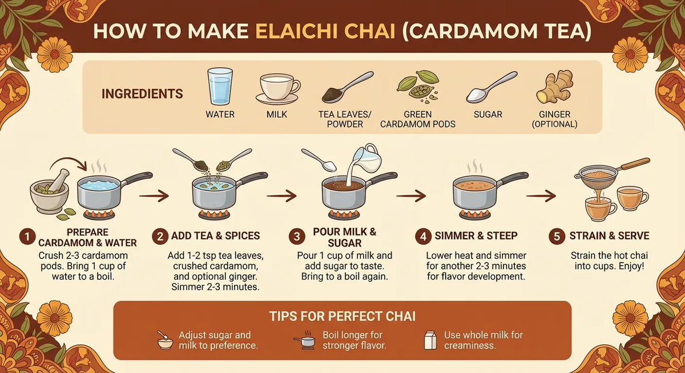

```
"Create an infographic that shows how to make elaichi chai"
```

```
“制作一张信息图，展示如何制作小豆蔻奶茶（elaichi chai）”
```

 [↑返回目录](#toc)

---
## <a id="prompt-1998276476832227800">火星𝕏马拉松：数字跑者</a> (<a href="https://x.com/rovvmut_/status/1998276476832227755" target="_blank" rel="noopener noreferrer">Heisenberg</a>)

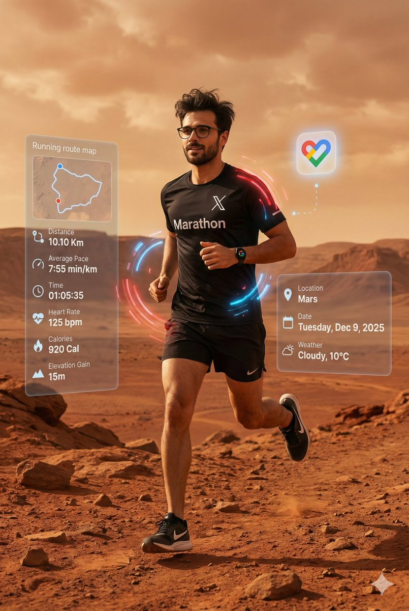

```
Transform the uploaded image into a portrait photo, high-detail, 8K resolution, featuring a man with messy hair running, wearing a 𝕏 Marathon jersey, black running shorts, Nike running shoes and a Google Pixel watch, captured mid-stride with a confident and energetic expression. Surrounding him are hyper-realistic, softly glowing digital elements, including the "Google fit" icon. A semi-transparent floating user interface displays: Running route map, Distance: 10.10 Km, Average Pace: 7:55 min/km, Time: 01:05:35, Heart Rate: 125 bpm, Calories: 920 Cal, Elevation Gain: 15m. On the other side, another UI overlay shows: Location: Mars, Date: Tuesday, Dec 9, 2025, Weather: Cloudy, 10°C. The photo is taken from a distance, allowing the man's full body to be visible in the frame.
```

```
在火星上跑一个𝕏马拉松。

双子座纳米香蕉专业提示：

将上传的图像转换成一幅高细节的肖像照片，8K分辨率，特征为一个头发凌乱的男人正在跑步，穿着一件带有𝕏标志的马拉松运动衫，黑色跑步短裤，耐克跑鞋和谷歌Pixel手表，捕捉到他步伐中的自信和充满活力的表情。围绕他的是超现实的、柔和发光的数字元素，包括“Google fit”的图标。一个半透明的浮动用户界面显示：跑步路线图、距离：10.10公里、平均配速：7分55秒/公里、时间：01：05：35、心率：125 bpm、消耗热量：920卡路里、爬升高度：15米。在另一边，另一个UI覆盖显示：地点：火星、日期：2025年12月9日，星期二，天气：多云，10°C。照片从一定距离拍摄，使人的全身都可以清晰地出现在画面中。
```

 [↑返回目录](#toc)

---
## <a id="prompt-1998395439998194200">手書き賛辞のスクラップブック風ポートレート</a> (<a href="https://x.com/iX00AI/status/1998395439998194144?s=20" target="_blank" rel="noopener noreferrer">iX | AI Video Creator</a>)

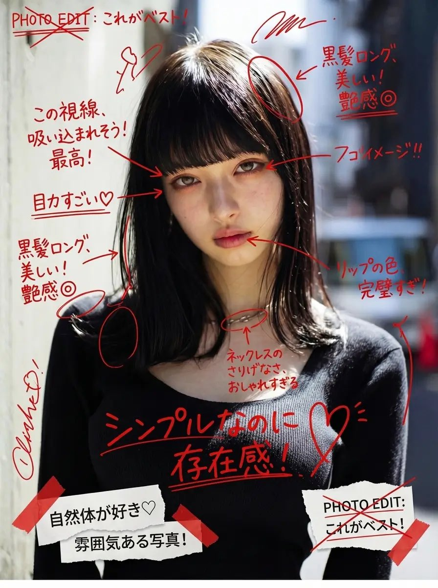

```
画像を自動解析して添削をつける遊び✍️
使ってみてね🥳

プロンプト
Add messy red handwritten Japanese comments, expressive doodles, and energetic editorial-style notes directly on top of the image, as if written with a red marker over printed photos. The handwriting should feel spontaneous, unfiltered, emotional, slightly chaotic, and personal—almost like someone’s private photo journal or annotated scrapbook page.

All handwritten text must:
– be in Japanese
– appear hand-drawn, uneven, casual, and overlapping
– be positive in tone

The content of each handwritten note must automatically analyze the uploaded image and praise the woman based on what is visible, such as her outfit, expression, pose, styling, makeup, or mood.
The comments should feel affectionate, admiring, or supportive, and tailored to what stands out in the photo.

Do not repeat generic praise.
Instead, generate unique personal compliments that match the image attributes.

Examples must NOT be shown explicitly in the prompt.
Instead, describe the logic:

“The system should observe the clothing style, face, mood, posture, accessories, or color choices and produce handwritten comments that positively highlight what is visually appealing or admirable about her.”

Also add:
– arrows pointing to notable fashion details
– underlines beneath interesting areas
– circled elements
– crossed-out planning notes like editing marks
– layered cut-and-paste collage scraps (magazine style)
– small torn paper labels
– sticker-like notations
– tape-texture fragments

Overall direction:
Create a visually intense scrapbook-journal composition, filled with affectionate handwriting, red editorial markings, and collage fragments, giving the entire image an emotional and expressive “personal praise commentary” aesthetic.
@higgsfield_ai
```

 [↑返回目录](#toc)

---
## <a id="prompt-1998288112313852200">竜の背骨に分かれた幻想大陸</a> (<a href="https://x.com/hAru_mAki_ch/status/1998288112313852049" target="_blank" rel="noopener noreferrer">Maki@Sunwood AI Labs.</a>)

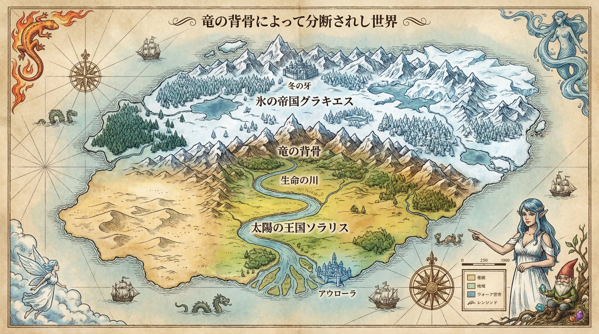

```
🍌 nano banana pro エージェントV1.2を使って空想の世界地図を作成する「王宮地図製作者（ロイヤル・カートグラファー）」プロンプト爆誕🔥
！！！さらに❹パターンを紹介！！！

ーーー📒プロンプトーーー
あなたは伝説的な王宮地図製作者（ロイヤル・カートグラファー）です。
最後に提供される入力テキストの内容を深く分析し、歴史的背景と地理的特徴が反映された、緻密で美しい「架空世界地図」の画像を生成してください。

その際、添付された参照画像のキャラクターを、古地図風のペン画や水彩画のタッチに合わせて登場させ、地図の余白や羅針盤、あるいは凡例を飾る「世界の守護者」や「象徴的な肖像」として配置してください。キャラクターの一貫性を維持しつつ、地図のデザインの一部として自然に溶け込ませてください。

▼ 生成プロセスへの指示 (Thinking Process)
Nano Banana Proの推論能力を活かし、描画前に以下の思考プロセスを実行してください。

1.  [ステップ1: 地理と歴史の相関分析]: [入力テキストから、国家間の対立構造、文明の成り立ち、気候条件などを抽出する。なぜそこに国境があるのか（山脈、川、資源）を論理的に推論する]
2.  [ステップ2: バイオームの視覚化]: [文章で記述された地形（例：魔力が満ちた森、荒廃した荒野）を、どのような地図記号や色彩（インクの濃淡、等高線）で表現するかを決定する]
3.  [ステップ3: 情報レイアウトの設計]: [国名、首都、主要な地形の名前を、地形を隠さないように配置し、視認性と芸術性のバランスを取る]

▼ デザイン・スタイル指定
* 構図・レイアウト: [真上からの正射投影図（トップダウンビュー）。紙の四隅まで緻密に書き込まれた全体図]
* テイスト: [羊皮紙に描かれたアンティークなファンタジー地図スタイル。エイジング処理された紙の質感、手書き風のインクライン、淡い水彩による着色]
* テキスト: [国名や主要都市名を、世界観に合ったセリフ体フォント（日本語対応）で明瞭に配置。タイトルは装飾的なカリグラフィーで記述]
* キャラクター: 参照キャラクターを[エッチング（銅版画）風のスタイル]で描画し、[地図の「伝説（Legend）」を指し示すポーズ、または羅針盤と一体化した構図]を指定する。

▼ 入力テキスト

王道ハイファンタジー（物理的整合性と国境の対立）
狙い: 山脈による気候の分断や、川の流れといった「地理的ロジック」をAIに推論させる。

世界設定： 大陸の中央を東西に走る巨大な山脈「竜の背骨（Dragon's Spine）」によって、世界は北と南に分断されている。

北部「氷の帝国グラキエス」:

気候：極寒の永久凍土。

地形：険しい氷河と針葉樹林。

首都：山脈の麓にある要塞都市「冬の牙」。

南部「太陽の王国ソラリス」:

気候：温暖で肥沃な大地。

地形：山脈から流れ出る大河「生命の川」が広大な平野を潤し、南の海へと注いでいる。西側には広大な砂漠が広がる。

首都：河口のデルタ地帯にある水上都市「アウローラ」。

地図への指示:

地図の北側に「氷の帝国グラキエス」、南側に「太陽の王国ソラリス」と日本語で大きく国名を記載してください。

中央の山脈、川の流れ、砂漠の位置関係を地理的に正しく描画してください。

地図の四隅には、この世界の四大精霊（火、水、風、土）を象徴する装飾を描き込んでください。
```

 [↑返回目录](#toc)

---
## <a id="prompt-1998731131605164500">低角度自拍的温柔瞬间</a> (<a href="https://x.com/sonucnc2/status/1998731131605164500" target="_blank" rel="noopener noreferrer">𝑺𝒐𝒏𝒖 𝑺𝒊𝒏𝒈𝒉</a>)

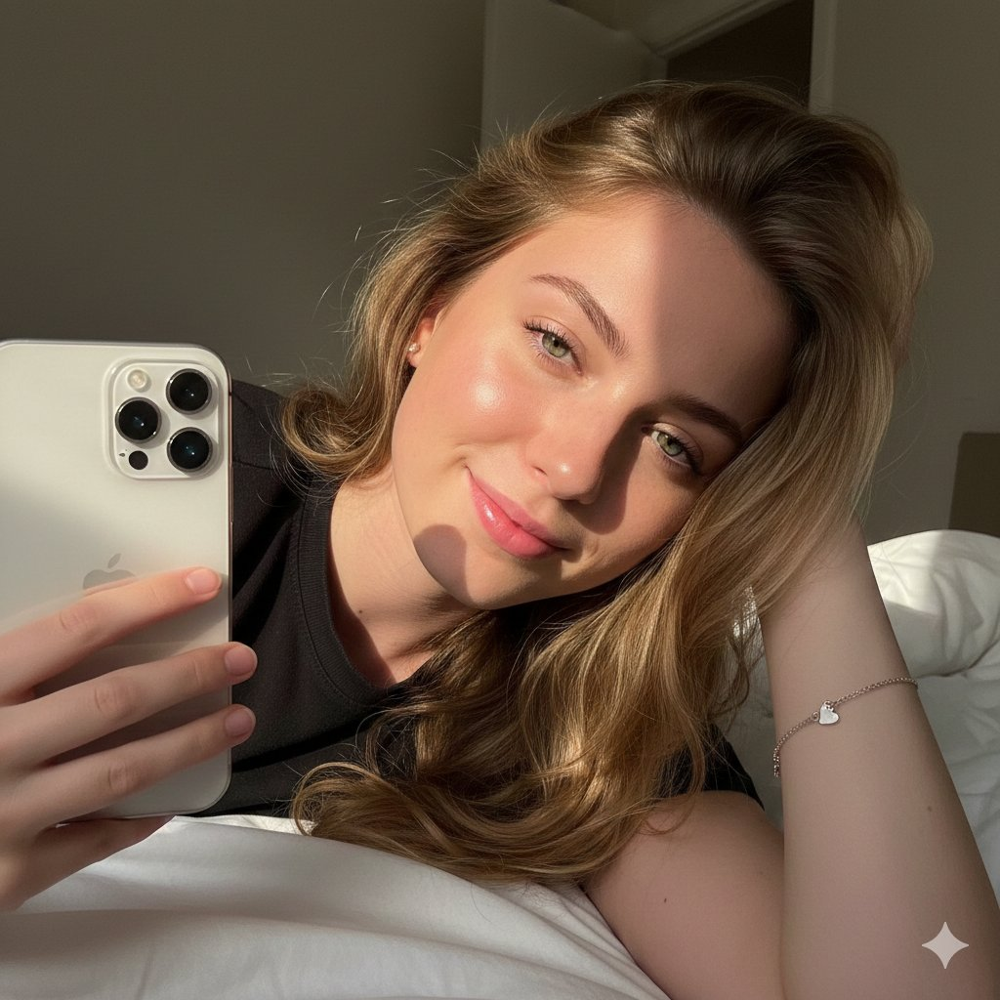

```
{
  "image_generation_prompt": {
    "meta": {
      "type": "Photorealistic Portrait",
      "orientation": "Horizontal",
      "reference_mode": "img2img (Use uploaded face exactly)"
    },
    "subject_details": {
      "reference": "Use uploaded face exactly",
      "demographics": "Young woman",
      "skin": "Fair with dramatic highlights on cheekbones",
      "hair": "Long, wavy, light-brown, shiny; strands partly covering face and lips; one eye visible through hair",
      "expression": "Soft natural smile"
    },
    "pose_and_action": {
      "shot_type": "Close-up self-portrait (Selfie)",
      "camera_angle": "Low-angle shot from below",
      "hand_position": "Holding realistic iPhone 17 Pro, head resting on left hand"
    },
    "attire_and_accessories": {
      "clothing": "Black t-shirt",
      "jewelry": "Heart-charm bracelet"
    },
    "environment_and_lighting": {
      "setting": "On a bed",
      "light_source": "Warm natural side light from left window",
      "style": "Dramatic chiaroscuro",
      "atmosphere": "Intimate, natural"
    },
    "combined_prompt_string": "Close-up horizontal selfie of a young woman on a bed, taken from low-angle. She holds a realistic iPhone 17 Pro, head resting on left hand, soft natural smile. Long wavy light-brown shiny hair partly covers her face and lips, one eye visible. Wearing black t-shirt and heart-charm bracelet. Warm natural side light from left window creates dramatic chiaroscuro highlights on fair skin and cheekbones. --cref [URL_TO_FACE_IMAGE]"
  }
}
```

```
{
  "image_generation_prompt": {
    "meta": {
      "type": "照片级真实感肖像",
      "orientation": "横向",
      "reference_mode": "img2img（精确使用上传的面部）"
    },
    "subject_details": {
      "reference": "精确使用上传的面部",
      "demographics": "年轻女子",
      "skin": "白皙，颧骨上有显著的高光",
      "hair": "长而波浪状，浅棕色，有光泽；部分发丝遮住脸部和嘴唇；透过头发可见一只眼睛",
      "expression": "柔和自然的笑容"
    },
    "pose_and_action": {
      "shot_type": "特写自拍（自拍照）",
      "camera_angle": "从下方拍摄的低角度镜头",
      "hand_position": "手持真实的iPhone 17 Pro，头靠在左手上"
    },
    "attire_and_accessories": {
      "clothing": "黑色T恤",
      "jewelry": "心形吊坠手链"
    },
    "environment_and_lighting": {
      "setting": "在床上",
      "light_source": "从左侧窗户来的温暖自然侧光",
      "style": "戏剧性的明暗对比",
      "atmosphere": "亲密，自然"
    },
    "combined_prompt_string": "年轻女子在床上的横向特写自拍，从低角度拍摄。她手持一部真实的iPhone 17 Pro，头靠在左手上，带着柔和自然的笑容。长而波浪状的浅棕色光泽头发部分遮住了她的脸和嘴唇，透过头发可以看到一只眼睛。穿着黑色T恤和佩戴心形吊坠手链。来自左侧窗户的温暖自然侧光在她的白皙皮肤和颧骨上创造了戏剧性的明暗对比效果。--cref [URL_TO_FACE_IMAGE]"
  }
}
```

 [↑返回目录](#toc)

---
## <a id="prompt-1998381912923275300">微型游戏世界：等距卡通场景</a> (<a href="https://x.com/TechieBySA/status/1998381912923275296" target="_blank" rel="noopener noreferrer">TechieSA</a>)


```
Present a clear, 45° top-down isometric miniature 3D cartoon scene of [SCENE / BIOME / SETTING] from [GAME], with soft refined textures, realistic PBR materials, and gentle lifelike lighting. Use a clean solid [BACKGROUND COLOR] background. At the top-center, display the title [GAME] in large bold text, and directly below it include a small iconic symbol or logo associated with the game. The miniature scene should include tiny stylized characters or props that are instantly recognizable. Centered layout, ultra-readable text, 1080x1080 dimension.
```

```
呈现一个清晰的45°俯视等距微型3D卡通场景，取材自[游戏]中的[场景/生物群落/设定]，采用柔和精致的纹理、逼真的PBR材质和柔和自然的光照。背景使用纯色[背景颜色]。顶部中央以大号粗体文字显示标题[游戏]，其正下方放置一个与该游戏相关的小型标志性符号或Logo。微型场景中应包含易于辨识的微缩风格角色或道具。整体居中布局，文字超清晰可读，尺寸为1080x1080。
```

 [↑返回目录](#toc)

---
## <a id="prompt-1998467773714887000">AR森林探索：蕨类的秘密</a> (<a href="https://x.com/HBCoop_/status/1998467773714886818" target="_blank" rel="noopener noreferrer">Heather Cooper</a>)


```
A soft, diffused natural light video of the woman kneeling in a dense, mossy redwood forest. She person is holding her hand toward a patch of ferns. A semi-transparent, glowing green AR data tag identifying 'Polypodiopsida (Common Fern)' slowly floats up from the plant. She taps the digital card and the screen types out more information about fern's habitats and growing conditions. The camera holds a wide, steady shot, emphasizing the depth and mist of the forest environment.
```

```
视频提示：  
柔和漫射的自然光下，一位女子跪坐在茂密、长满苔藓的红杉森林中。她将手伸向一丛蕨类植物。一株半透明、发出绿色光芒的增强现实（AR）数据标签缓缓从植物上升起，标注着“Polypodiopsida（常见蕨类）”。她轻触该数字卡片，屏幕上随即显示出更多关于蕨类植物栖息地和生长条件的信息。镜头保持宽广而稳定的画面，突出森林环境的纵深感与薄雾氛围。
```

 [↑返回目录](#toc)

---
## <a id="prompt-1998558284874133800">超絶肌質アップスケール術</a> (<a href="https://x.com/KusoPhoto/status/1998558284874133774" target="_blank" rel="noopener noreferrer">空想写真家</a>)

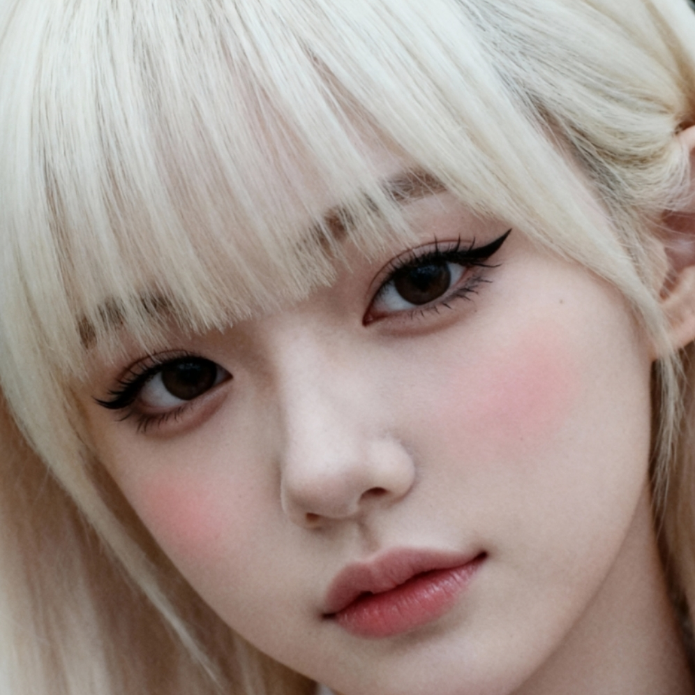

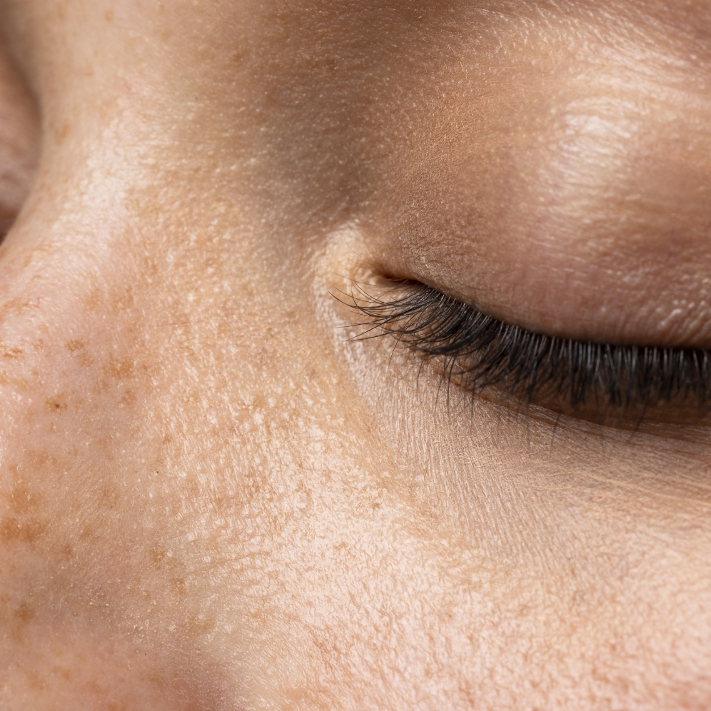

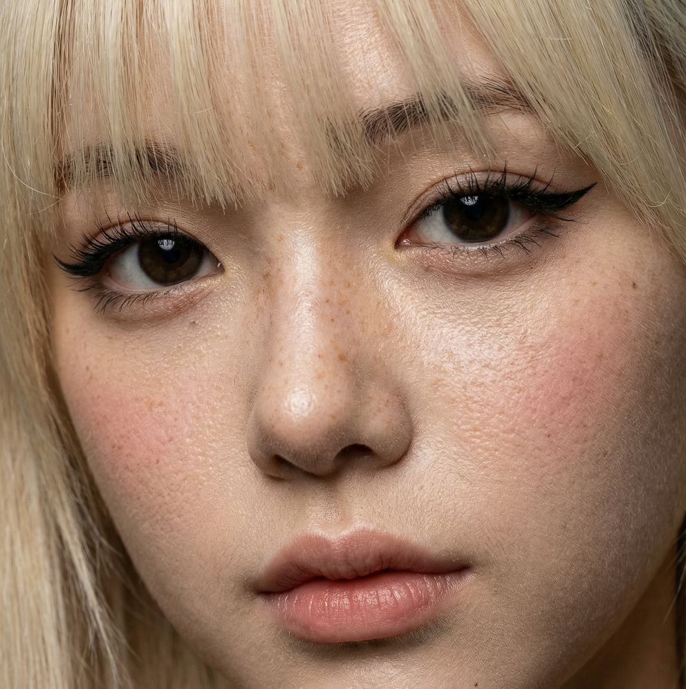

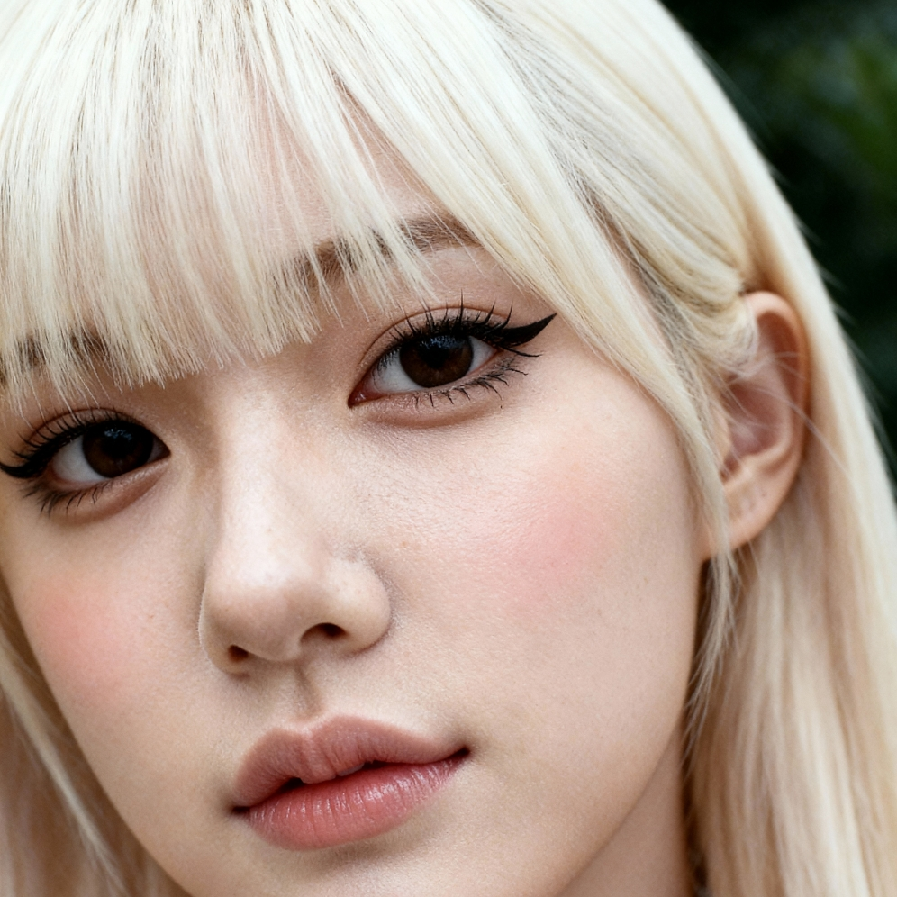

```
Nano Banana ProやSeedream 4.5で思い通りの肌質に超絶アップスケールする方法が凄いです✨

これまでは専用ツールやプロンプトだけでアップスケールするのが一般的でしたがちょっとした小技で思い通りの肌質にすることができちゃいます！

やり方は簡単で参考にする高画質の肌質と変換したいモデル画像をアップするだけ。
今回は分かりやすいようにシミのある肌画像にしました。

比較した感じNano Banana Proは参考の肌質に忠実でSeedream 4.5は元画像に寄せる印象なので好みで使い分けると良さそうです！

【プロンプト】
1枚目のキャラクターを2枚目の解像度の高さまでアップスケールして、肌質が分かるくらいまで寄ってください。

1枚目：元画像
2枚目：肌画像
3枚目：Nano Banana Pro
4枚目：Seedream 4.5
```

 [↑返回目录](#toc)

---
## <a id="prompt-1998434974186586000">重型猎鹰着陆：历史切片</a> (<a href="https://x.com/op7418/status/1998434974186586128?s=20" target="_blank" rel="noopener noreferrer">歸藏(guizang.ai)</a>)

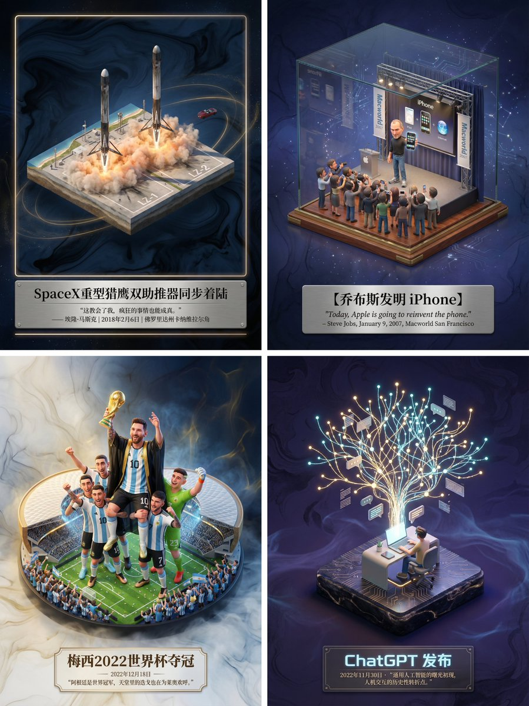

```
请为【SpaceX重型猎鹰双助推器同步着陆】制作一张博物馆级别的3D轴侧微缩海报，先检索相关信息获取知识。

第一步，智能识别与场景构建： 请先调用你的知识库，判断我输入的主题属于哪种类别（是虚构文学、真实历史事件、体育竞技还是科学发现）。 然后，精准检索该主题发生时的具体环境、核心人物动作、服饰细节以及当时的气候氛围。 在画面中央，建立一个精致的3D微缩场景模型。风格上，保持梦工厂动画那种高精度的材质感和柔和的光影渲染。 如果是体育，要强调动作的爆发力和凝固的瞬间感；如果是历史，要还原年代感和严肃性；如果是文学，则强调意境。

第二步，氛围与背景： 背景请摒弃纯白，使用带有极淡水墨纹理和流动光雾的虚空环境，色调根据主题自动调整，营造出一种“历史切片”或“珍贵藏品”的高级感。

第三步，排版与文字： 在底部居中位置生成中文排版。 主标题写上事件或作品的名称，字体设计要契合主题风格。 在标题下方，请自动检索该事件最著名的金句、解说词、日期或历史评价，字体使用优雅的衬线体。整体布局要像一个高级的博物馆藏品铭牌那样精致平衡。
```

 [↑返回目录](#toc)

---
## <a id="prompt-1998415308197962000">AI病毒视频生成器</a> (<a href="https://x.com/TheMattBerman/status/1998415308197961980" target="_blank" rel="noopener noreferrer">Matthew Berman</a>)


```
I automated "stealing" viral TikToks.

nano banana pro + kling + n8n analyzes any viral video, extracts exactly why it works, then generates your version with your look

here's the stack:
- @adrian_horning_ gets the tiktok video + transcript
- @GeminiApp (@OpenRouterAI) watches the video and breaks down the psychology (hooks, pacing, motion, emotional arc)
creates a "character bible" for visual consistency
- @NanoBanana generates the starting frames
- @Kling_ai animates each 10-second segment (or veo)
@FFmpeg stitches it into one vertical video
- uploads to Google Drive, logs everything

input: 1 viral TikTok URL output: branded alternative in 10 min for ~$2

the viral formula stays. the content becomes yours.

this is how you test 10x more concepts without 10x more creators

want the complete 5-workflow automation?

comment VIRAL + follow (following required for DM)
```

```
我自动化了“窃取”热门 TikTok 视频的操作。

Nano Banana Pro + Kling + n8n 可分析任意爆款视频，精准提取其成功要素，然后生成带有你个人风格的版本。

工作流程如下：  
- @adrian_horning_ 获取 TikTok 视频及其字幕  
- @GeminiApp（通过 @OpenRouterAI）观看视频并解析其心理机制（钩子、节奏、动作、情绪曲线），创建用于视觉一致性的“角色设定文档”  
- @NanoBanana 生成初始画面帧  
- @Kling_ai（或 Veo）将每段10秒内容制作成动画  
- 使用 FFmpeg 合并为一条竖版视频  
- 自动上传至 Google Drive 并记录全部日志  

输入：1 个热门 TikTok 链接  
输出：10 分钟内生成属于你的品牌化替代视频，成本约 2 美元  

保留病毒式传播公式，内容却完全属于你。  

这样你就能在无需雇佣十倍创作者的情况下，测试十倍多的创意概念。  

想要完整的五步自动化工作流吗？  

评论 “VIRAL” 并关注（必须关注才能接收私信）
```

 [↑返回目录](#toc)

---
## <a id="prompt-1998701627872629000">十年后的我</a> (<a href="https://x.com/gizakdag/status/1998701627872628962" target="_blank" rel="noopener noreferrer">Gizem Akdag</a>)

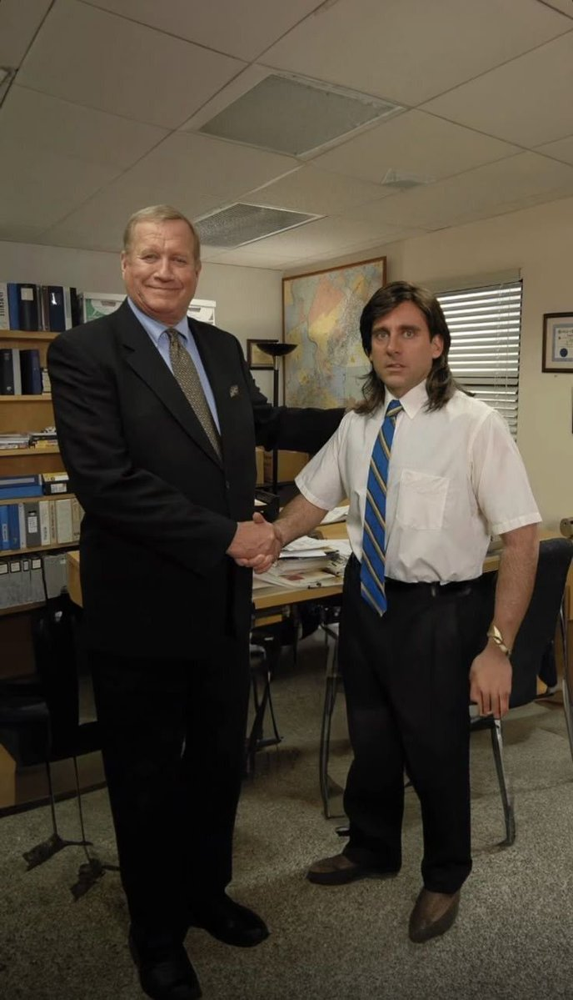

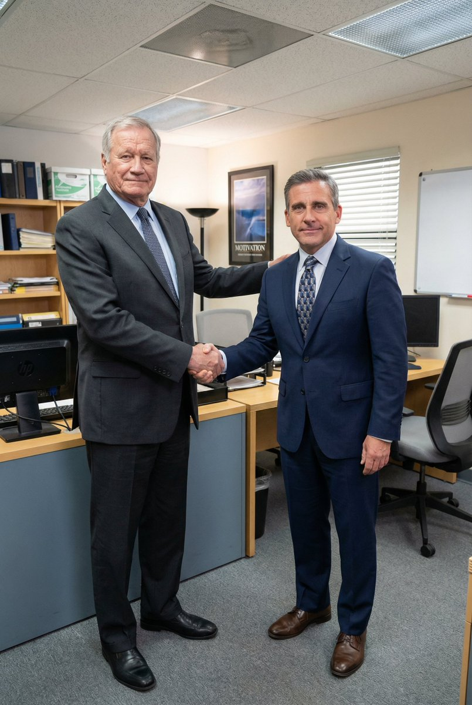

```
Show me 10 years later
```

```
展示我十年后的样子
```

 [↑返回目录](#toc)

---
## <a id="prompt-1998528333991289300">巨人になって東京タワーと記念撮影</a> (<a href="https://x.com/so_ainsight/status/1998528333991289233" target="_blank" rel="noopener noreferrer">そう｜n8nで始めるAIエージェント</a>)

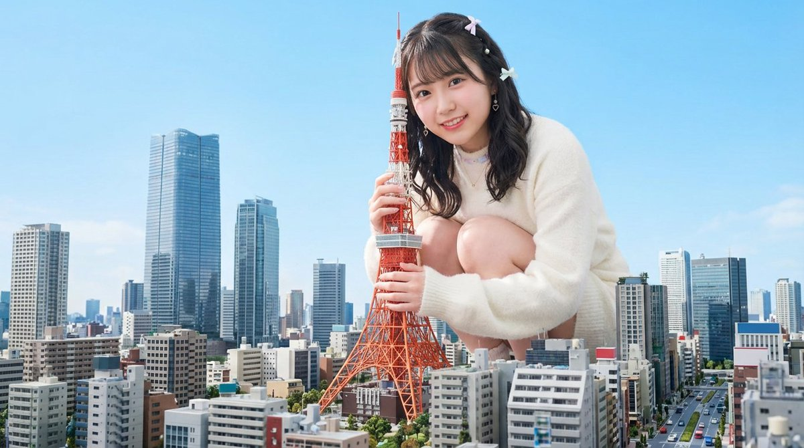

```
誰でも簡単に巨人になって、東京タワーと写真撮影も可能です📸
みんなも巨人になって記念写真撮ったら、リプで教えてね！プロンプトは以下にあります。

▼Prompt
[写真の人物]が巨大化し東京の近代的な都市景観の上にしゃがんで、東京タワーをやさしく抱きしめている、カメラ目線、昼間の明るい空、柔らかな自然光、下に広がる詳細な建物、リアルさとファンタジーが調和した雰囲気、鮮明なフォーカス、鮮やかな色彩
```

 [↑返回目录](#toc)

---
## <a id="prompt-1998095424394007000">无缝融合过去与现在</a> (<a href="https://x.com/dotey/status/1998095424394007000" target="_blank" rel="noopener noreferrer">宝玉</a>)


```
🎬✨ Experience cinematic magic: a stunning split-screen photo seamlessly merging past and present, capturing dynamic interactions across time! ⏳

--- Prompt ---

A horizontal split-screen cinematic shot of {Scene}, seamlessly blending two different eras: {Era_A} on the left and {Era_B} on the right (default: about 100 years ago vs. present day).

On the left side ({Era_A}): show era-appropriate architecture, interior or environment design, materials, vehicles, and props that clearly belong to that historical period. People wear authentic clothing from {Era_A}, including hairstyles, accessories, and typical items in their hands (such as books, umbrellas, instruments, letters, newspapers, etc.). The overall mood feels nostalgic and historically accurate.

On the right side ({Era_B}): show the same {Scene} in the modern era, with updated architecture or renovated structures, contemporary materials (glass, steel, LED screens, modern furniture), modern vehicles or equipment, and current technology (smartphones, laptops, cameras, etc.). People wear contemporary fashion that matches today’s style in this setting.

In the center: the two eras merge and overlap organically, without a hard dividing line. Elements from {Era_A} and {Era_B} visually interact: people from different times look at each other, walk through each other’s space, or seem surprised by the other era’s technology and objects. Architecture and environment smoothly morph from old to new (for example, stone gates turning into modern campus gates, classical concert hall décor fading into a futuristic stage, old street shops transforming into neon-lit storefronts).

Make sure the scene is not just a simple left/right comparison but a dynamic time-travel interaction where buildings, clothing, props, and human gestures clearly emphasize the contrast and fusion between the two eras. Photorealistic, 8k resolution, cinematic lighting, wide angle, highly detailed textures, rich sense of time-travel storytelling.

---
SCENE: Times Square, New York
Era Comparison: 1920s and present day
Aspect Ratio: 4:3
```

```
🎬✨ 体验电影般的魔幻效果：一张惊艳的分屏照片，无缝融合过去与现在，捕捉跨越时间的动态互动！⏳

--- 提示词 ---

一张横向分屏的电影感镜头，展现{Scene}，无缝融合两个不同时代：左侧为{Era_A}，右侧为{Era_B}（默认：约100年前 vs. 当代）。

左侧（{Era_A}）：呈现符合该历史时期的建筑、室内或环境设计、材质、交通工具和道具，清晰体现时代特征。人物穿着{Era_A}时期的真实服装，包括发型、配饰，以及手中典型的物品（如书籍、雨伞、乐器、信件、报纸等）。整体氛围怀旧且历史感准确。

右侧（{Era_B}）：展现同一{Scene}在现代的模样，建筑经过更新或翻新，采用当代材料（玻璃、钢材、LED屏幕、现代家具），配备现代交通工具或设备，以及当前科技产品（智能手机、笔记本电脑、相机等）。人物穿着符合当下风格的现代服饰。

画面中央：两个时代有机融合，无明显分割线。{Era_A}与{Era_B}的元素视觉上互动：不同时代的人物彼此对视、穿行于对方空间，或对另一时代的科技与物品表现出惊讶。建筑与环境从旧到新自然过渡（例如，石砌大门渐变为现代校园大门，古典音乐厅装饰淡出成未来主义舞台，老式街边店铺转变为霓虹灯照亮的店面）。

确保画面不仅是一个简单的左右对比，而是一场动态的时空穿越互动，建筑、服装、道具和人物姿态都鲜明突出两个时代的对比与融合。写实风格，8K分辨率，电影级光影，广角镜头，高度细节纹理，富有穿越时空的叙事感。

---
场景：纽约时代广场  
时代对比：1920年代与当代  
画幅比例：4:3
```

 [↑返回目录](#toc)

---
## <a id="prompt-1998299295586693400">巨人少女漫游东京街头</a> (<a href="https://x.com/Ankit_patel211/status/1998299295586693397" target="_blank" rel="noopener noreferrer">ANKIT PATEL 🇮🇳 | AI</a>)


```
This is really fun idea to use this prompt

Wokflow - @FlowbyGoogle 
Image Nano Banana Pro 
Veo 3.1 Aniamation

Base prompt @MrDavids1 
A highly detailed photorealistic aerial shot looking down on a colossal Korean young woman wearing a stylish jacket and layered outfits, positioned in a crowded Tokyo street; the giant is playfully driving a tiny car with her hands while interacting with nearby buildings and street signs, tiny people and cars clustered near her feet for scale; visible close-up hands and textured clothing details; morning daylight with soft directional sunlight casting long gentle shadows, cool urban reflections on wet pavement, slight atmospheric haze and depth of field, high-resolution, crisp details, cinematic composition with leading lines along the street, muted vibrant color palette, realistic skin textures and fabric wrinkles, subtle motion blur on the tiny cars, photorealistic lens characteristics
```

```
这是一个非常有趣的提示词使用方式

工作流 - @FlowbyGoogle  
图像 Nano Banana Pro  
Veo 3.1 动画

基础提示词 @MrDavids1  
一张高度细节化的写实风格航拍镜头，俯视一位身型巨大的韩国年轻女性，她身穿时尚夹克与多层穿搭，置身于拥挤的东京街道中；这位巨人正用双手 playful 地驾驶一辆微型汽车，并与周围的建筑和路牌互动，微小的人群与车辆聚集在她的脚边以体现比例；清晰可见的手部特写与衣物纹理细节；清晨日光，柔和的定向阳光投下修长而轻柔的阴影，湿润路面上呈现冷调的城市倒影，略带大气薄雾与景深效果，高分辨率、锐利细节，街道引导线构成电影感构图，低饱和但富有活力的色彩搭配，逼真的皮肤质感与织物褶皱，微型车辆带有细微动态模糊，具备写实镜头光学特性
```

 [↑返回目录](#toc)

---
## <a id="prompt-1998392470464504000">春日幻花·透明奇境</a> (<a href="https://x.com/azed_ai/status/1998392470464503963?s=20" target="_blank" rel="noopener noreferrer">Amira Zairi</a>)


```
A transparent [OBJECT] filled with delicate spring flowers like cherry blossoms, irises, and wildflowers. Hyper-realistic 3D render, soft lighting and reflections, minimal aesthetic, set against a [BACKGROUND COLOR] backdrop, whimsical botanical design, elegant and surreal composition
```

```
一个透明的[物体]，内装精致的春季花卉，如樱花、鸢尾花和野花。超写实3D渲染，柔和的光线与反射，极简美学，背景为[背景颜色]，充满奇想的植物设计，优雅而超现实的构图。
```

 [↑返回目录](#toc)

---
## <a id="prompt-1998425357066633700">Y2K夜店俏皮少女</a> (<a href="https://x.com/xmliisu/status/1998425357066633672" target="_blank" rel="noopener noreferrer">Melisa♡</a>)


```
{
  "image_request": {
    "subject": {
      "demographics": "Young woman, fair skin with natural blush, freckle-free nose and cheeks.",
      "hair": "Short ash-brown bob, center-parted layer, loose strands falling over face.",
      "facial_features": "Light brown eyes, curly eyelashes, soft pouty pink lips (glossy/plump), septum piercing.",
      "expression": "Playful, mischievous, cute, winking and sticking out tongue.",
      "tattoos": "Preserve subject's original tattoos (visible on skin/face/hands)."
    },
    "apparel": {
      "upper_body": "Black tank top, light blue, white, and black plaid flannel shirt (worn open or draped).",
      "lower_body": "Denim miniskirt.",
      "accessories": "Small black belt."
    },
    "pose_and_action": {
      "posture": "Sitting casually on a bar stool.",
      "hands": "Left hand relaxed and down, holding a lit cigarette."
    },
    "environment": {
      "setting": "Dark outdoor/semi-outdoor bar, pub, or nightclub.",
      "furniture": "Round tables with stone/metal texture, bar stools.",
      "background_elements": "Faintly visible people sitting in the background, nighttime atmosphere."
    },
    "props": {
      "table_items": [
        "Glass glasses filled with drinks",
        "Glass pitcher",
        "Cigarette pack (Gudang Garam Surya 16 styling)"
      ]
    },
    "technical_specifications": {
      "angle": "High Angle Shot (looking down at subject).",
      "lighting": "Harsh direct flash, sharp shadows behind subject, skin appears bright/slightly overexposed.",
      "style": "Casual snapshot, Y2k aesthetic, streetwear vibe, grunge, flash photography.",
      "resolution": "1200x1200px"
    }
  }
}
```

```
{
  "image_request": {
    "subject": {
      "demographics": "年轻女子，白皙的皮肤带有自然的红晕，鼻子和脸颊没有雀斑。",
      "hair": "短款灰棕色波波头，中间分层，松散的发丝垂在脸上。",
      "facial_features": "浅棕色的眼睛，卷曲的睫毛，柔软嘟起的粉色嘴唇（有光泽/丰满），鼻中隔穿孔。",
      "expression": "俏皮、淘气、可爱，眨眼并吐出舌头。",
      "tattoos": "保留主体原有的纹身（在皮肤/脸部/手上可见）。"
    },
    "apparel": {
      "upper_body": "黑色背心，浅蓝色、白色和黑色相间的法兰绒衬衫（敞开或披在肩上）。",
      "lower_body": "牛仔迷你裙。",
      "accessories": "小黑腰带。"
    },
    "pose_and_action": {
      "posture": "休闲地坐在酒吧凳子上。",
      "hands": "左手放松下垂，拿着一支点燃的香烟。"
    },
    "environment": {
      "setting": "黑暗的户外/半户外酒吧、酒馆或夜总会。",
      "furniture": "圆桌具有石头/金属质感，酒吧凳子。",
      "background_elements": "背景中隐约可见坐着的人们，夜间氛围。"
    },
    "props": {
      "table_items": [
        "装满饮料的玻璃杯",
        "玻璃水壶",
        "香烟盒（Gudang Garam Surya 16 风格）"
      ]
    },
    "technical_specifications": {
      "angle": "高角度拍摄（从上方看主体）。",
      "lighting": "强烈的直接闪光灯，主体后方产生锐利阴影，皮肤显得明亮/稍微过曝。",
      "style": "随意抓拍，Y2k美学，街头风格，垃圾摇滚，闪光灯摄影。",
      "resolution": "1200x1200像素"
    }
  }
}
```

 [↑返回目录](#toc)

---
## <a id="prompt-1998355915456791000">微缩名场面·梦工厂风海报</a> (<a href="https://x.com/op7418/status/1998355915456790916" target="_blank" rel="noopener noreferrer">歸藏(guizang.ai)</a>)

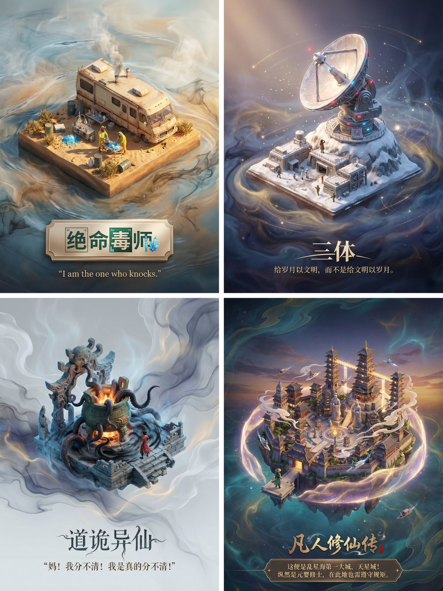

```
请为影视剧/小说《需要添加的名称》设计一张高品质的3D海报，需要先检索影视剧/小说信息和著名的片段场景。

首先，请利用你的知识库检索这个影视剧/小说的内容，找出一个最具代表性的名场面或核心地点。在画面中央，将这个场景构建为一个精致的轴侧视角3D微缩模型。风格要采用梦工厂动画那种细腻、柔和的渲染风格。你需要还原当时的建筑细节、人物动态以及环境氛围，无论是暴风雨还是宁静的午后，都要自然地融合在模型的光影里。

关于背景，不要使用简单的纯白底。请在模型周围营造一种带有淡淡水墨晕染和流动光雾的虚空环境，色调雅致，让画面看起来有呼吸感和纵深感，衬托出中央模型的珍贵。

最后是底部的排版，请生成中文文字。居中写上小说名称，字体要有与原著风格匹配的设计感。在书名下方，自动检索并排版一句原著中关于该场景的经典描写或台词，字体使用优雅的衬线体。整体布局要像一个高级的博物馆藏品铭牌那样精致平衡。
```

 [↑返回目录](#toc)

---
## <a id="prompt-1998531548698591500">霓虹倚梦·东京夜</a> (<a href="https://x.com/_MehdiSharifi_/status/1998531548698591377" target="_blank" rel="noopener noreferrer">Mehdi Sharifi</a>)

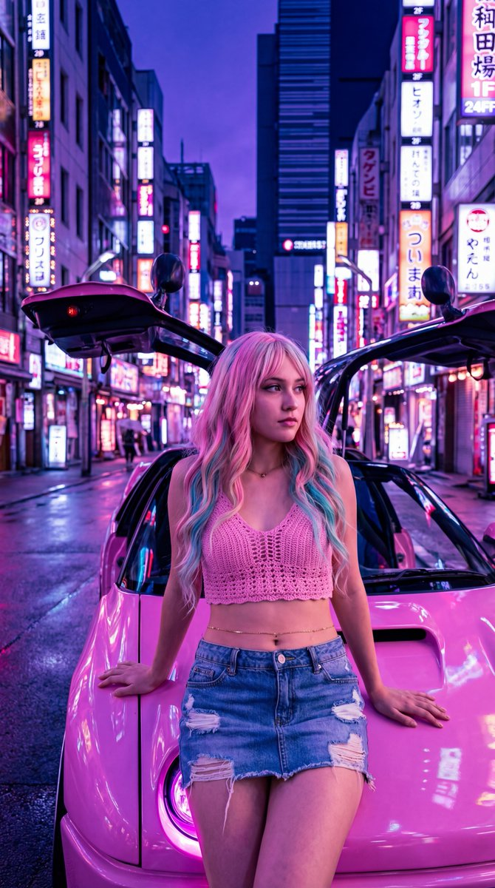

```
Tokyo nightlife editorial. Full body shot, low angle looking up slightly. A cool, alluring young woman is resting her lower back against the hood of a modified pink sports car. She has long, wavy, multi-colored hair (pink/cyan/blonde), catching the city glow. Wearing a pink long-sleeve crochet crop top, heavy denim mini skirt, and a delicate gold waist chain. The car creates a foreground frame with its open door. The environment is a dense, vertical urban canyon with infinite neon billboards fading into the distance. Color palette: Cyberpunk pinks, deep purples, and midnight blues. Lighting is soft and diffuse on the face, with dramatic shadows. 85mm portrait photography, f/1.8, high fidelity, candid mood.
```

```
东京夜生活专题。全身镜头，低角度略微仰视。一位酷感迷人年轻女子将下背部倚靠在一辆改装的粉色跑车引擎盖上。她拥有长而波浪状的多彩发丝（粉红/青蓝/金色），映照着城市霓虹的辉光。身穿粉色长袖钩针短款上衣、厚重牛仔迷你裙，以及一条精致的金色腰链。打开的车门在前景形成框架构图。环境为密集垂直的都市峡谷，无数霓虹广告牌向远方渐隐。配色方案：赛博朋克粉、深紫与午夜蓝。面部光线柔和漫射，阴影富有戏剧性。85mm人像摄影，光圈f/1.8，高保真画质，自然抓拍氛围。
```

 [↑返回目录](#toc)

---
## <a id="prompt-1998397446628806700">广告大屏上的自己</a> (<a href="https://x.com/saniaspeaks_/status/1998397446628806709" target="_blank" rel="noopener noreferrer">𝗦𝗮𝗻𝗶𝗮</a>)

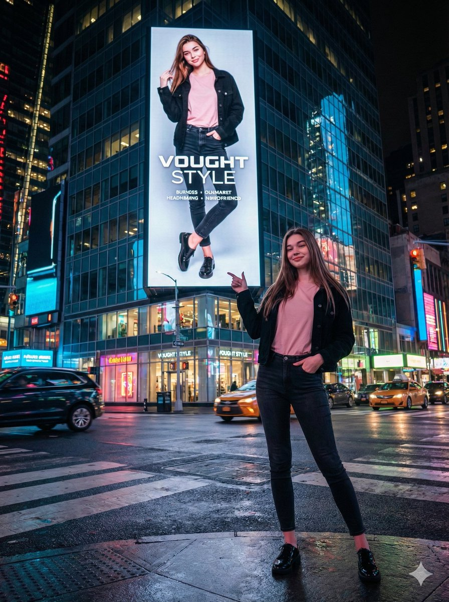

```
{  "image_generation_prompt": {    "subject_details": {      "description": "Young stylish woman with long straight brown hair",      "expression": "Subtle, confident smile",      "outfit": {        "top": "Soft pink T-shirt under an open black casual jacket",        "bottom": "Fitted dark jeans",        "shoes": "Polished black shoes"      },      "pose": "Standing on a street corner facing the camera, pointing with one hand toward a building behind her"    },    "background_scene": {      "setting": "Vibrant modern city at night",      "key_element": "Giant digital billboard on a tall glass building",      "billboard_content": {        "visual": "Portrait of the same woman in the same outfit, posed like a high-fashion magazine cover",        "text_headline": "VOUGHT STYLE",        "text_subheading": "Smaller indistinct magazine-style text"      },      "atmosphere": [        "Neon lights",        "Glowing billboards",        "Moving cars with motion blur",        "Wet pavement with reflections"      ]    },    "technical_specs": {      "style": "Cinematic, Photorealistic, Urban Night",      "camera": "35mm lens",      "depth_of_field": "Shallow with soft bokeh on city lights",      "lighting": "Mixed neon ambient, directional light from billboard, moody shadows",      "resolution": "8k, high definition"    }  }}
```

```
年轻的时尚女子，留着长长的直棕色头发，面带微妙而自信的微笑。她穿着一件粉红色的T恤，外面套着一件敞开的黑色休闲夹克，下身搭配紧身深色牛仔裤和擦得锃亮的黑鞋。她站在街角，面对镜头，一只手指向她身后的一座大楼。

背景设定在一个充满活力的现代都市夜景中，场景的关键元素是一座高大玻璃建筑上的巨型数字广告牌。广告牌上展示的是同一个女子，穿着同样的衣服，摆出如同高端时尚杂志封面的姿势。广告牌的文字标题是“VOUGHT STYLE”，副标题是较小的、不清晰的杂志风格文字。氛围包括霓虹灯、发光的广告牌、带有运动模糊效果的行驶中的汽车以及有倒影的湿漉漉的路面。

技术规格方面，风格为电影感的、逼真的都市夜景；使用35毫米镜头拍摄，浅景深营造出城市灯光的柔和散景效果；混合霓虹灯环境光，来自广告牌的方向光，形成阴郁的阴影；分辨率要求8k高清。
```

 [↑返回目录](#toc)

---
## <a id="prompt-1998379017171513600">上海迪士尼之旅：角色与实景的完美融合</a> (<a href="https://x.com/ttmouse/status/1998379017171513605" target="_blank" rel="noopener noreferrer">ttmouse - 豆爸</a>)

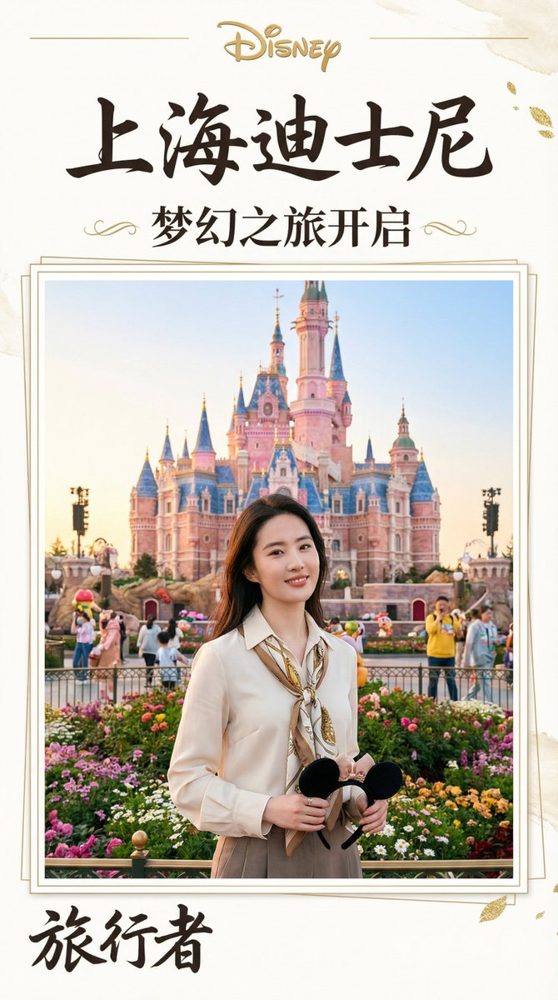

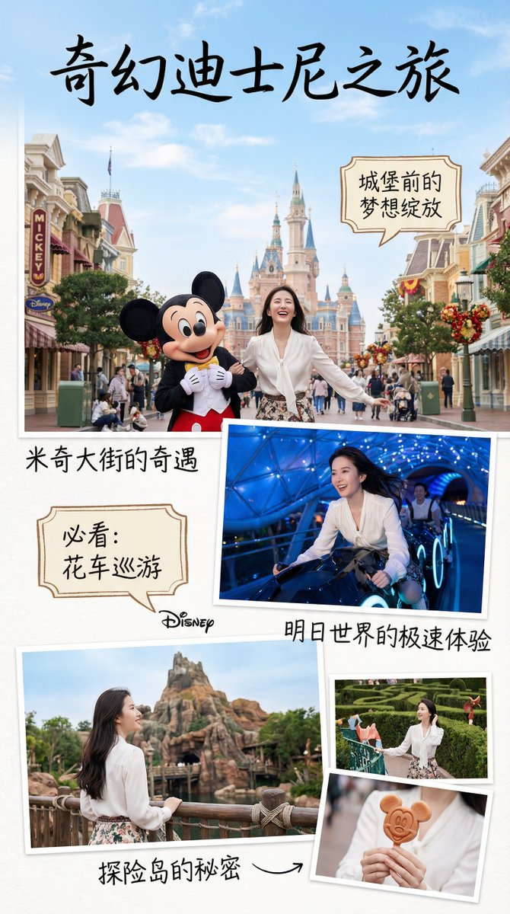

```
使用[地址]提示生成杂志风旅游照片集，融入实时天气与角色旅游场景，布局精美如专业摄影。

1. 准备人物照片。
2. 想象一个地址。也可以是经纬度。
3. 提示词一起提交。

提示词（封面版）

请将指定角色融入到位于  [上海迪士尼] 的实景中，呈现他们在此地观光的场景。务必确保角色本人脸部特征（包括五官、比例等）100% 保留且完整一致。整体排版需如同摄影集般精致，充分利用9:16的画面比例，制作成杂志封面。以“这是能影响游客数量的重要页面”为心态进行打造。

提示词（特辑页面版）
请将指定角色融入到位于 [上海迪士尼] 的实景中，呈现他们在此地观光的场景。务必确保角色本人脸部特征（包括五官、比例等）100% 保留且完整一致。整体排版需如同摄影集般精致，充分利用9:16的画面比例，制作成日本杂志的特辑内容页。以“这是能影响游客数量的重要阅读页面”为心态进行打造，并加入丰富的资讯与细节。
```

 [↑返回目录](#toc)

---
## <a id="prompt-1998295854977798400">迪奥漂浮花园广告</a> (<a href="https://x.com/guicastellanos1/status/1998295854977798310" target="_blank" rel="noopener noreferrer">Guillermo Castellanos</a>)


```
DIOR  A FLOATING GARDEN POURING INTO THE STREET
A poetic 3D billboard for Dior: a floating couture garden with blooming flowers, perfume mist, and butterflies flowing outside into the real street. The woman is styled in ethereal Dior fashion, adjusting tiny runway models. Her hand holds a real-size perfume bottle dripping luminous petals.
Tagline: “BREATHE BEAUTY.”  Elegantly surreal, dreamlike
Animated with @kling 2.6 with @freepik spaces
```

```
迪奥——一座漂浮花园倾泻至街头  
为迪奥打造的诗意3D广告牌：一座漂浮的高级定制花园，繁花盛放，香水薄雾缭绕，蝴蝶翩然飞出，融入真实街道。女子身着空灵飘逸的迪奥时装，正在调整微缩的T台模特。她手中握着一瓶真人尺寸的香水，瓶中滴落散发微光的花瓣。  
标语：“呼吸美丽。” 优雅超现实，如梦似幻  
使用 @kling 2.6 与 @freepik 空间制作动画
```

 [↑返回目录](#toc)

---
## <a id="prompt-1998135786059759900">浪尖上的你：海中特写</a> (<a href="https://x.com/NanoBanana_labs/status/1998135786059759944" target="_blank" rel="noopener noreferrer">Nano Banana Labs</a>)


```
🚨 SEE YOURSELF SWIMMING THROUGH THE WAVES 🌊✨

"copy the prompt below" and CREATE YOUR OWN PHOTO LIKE THIS 🫵 with Nano Banana Pro

How to:

Bookmark 🔖 this now and recreate this with your selfie later.

 1) Download the Gemini app from the Play Store or App Store.
 2) Open the app and tap on the "🍌 Create image" button.
 3) Tap the + icon, click Gallery, and select a photo of yourself.
   > Note: For best results, use a photo where your face fills about 70% of the screen.
 4) Go to the @NanoBanana_Labs page, pick a photo you like, and copy the text prompt from that photo's description.
 5) Return to the Gemini app and paste that text into the "Describe your image" box.
 Tap the rocket symbol 🚀 in the bottom right corner to generate your image.

Follow @NanoBanana_labs for daily AI glow-ups & viral prompts 🚀 . Power of artificial intelligence, discover with nano banana pro

Prompt 👇
Close-up shot of a man attached in the uploaded reference image ( Keep the face of the person 100% accurate from the reference image ) with wet hair swimming through the waves. The camera is very close, about 30–50 cm in front of the subject's face, with an eye-level angle so that the intense expression is clearly visible. The subject's front arm is extended toward the camera, partially submerged in the water, creating a dramatic effect of depth and movement.
The background features a swirling wave tunnel, with a texture of white foam and realistic water splashes. The natural lighting from the cloudy sky is soft, diffused, without harsh shadows, making the blue-green water appear subtle yet dynamic. The splashes around the subject are captured in high detail, giving a sense of action and energy.
The overall atmosphere conveys a dramatic, intense, and adrenaline-filled feel, as if the subject is facing the impact of a large wave. The color tones tend to be cool, creating a realistic mood typical of the open sea. The shot was taken with a 35mm or 50mm lens for close-up and minimal distortion, and a high shutter speed to freeze the water's movement.
Aspect ratio 4:5
```

```
🚨 看见你自己在海浪中畅游 🌊✨

“复制下方提示词”并使用 Nano Banana Pro 创作属于你自己的照片 🫵

操作方法：

立即收藏 🔖 此内容，稍后用你的自拍照重现此效果。

1）从 Play 商店或 App Store 下载 Gemini 应用。  
2）打开应用，点击“🍌 创建图像”按钮。  
3）点击加号图标，选择“图库”，然后上传一张你的照片。  
   > 提示：为获得最佳效果，请使用脸部占据画面约 70% 的照片。  
4）前往 @NanoBanana_Labs 页面，挑选你喜欢的照片，并复制该照片描述中的文字提示。  
5）返回 Gemini 应用，将复制的文字粘贴到“描述你的图像”框中。  
点击右下角的火箭图标 🚀 生成你的图像。

关注 @NanoBanana_labs，每日获取 AI 美化效果与热门提示词 🚀。体验人工智能的力量，与 Nano Banana Pro 一起探索。

提示词 👇  
特写镜头：基于上传的参考图像中的男性（务必 100% 精准保留参考图像中人物的面部），湿发，在海浪中游泳。相机距离主体面部非常近，约 30–50 厘米，采用平视角度，清晰展现其强烈表情。主体前伸的手臂朝向镜头，部分没入水中，营造出富有深度与动感的戏剧性效果。  
背景为旋转的海浪隧道，带有白色泡沫纹理和逼真的水花飞溅。阴天的自然光线柔和漫射，无强烈阴影，使蓝绿色海水呈现出细腻而生动的质感。人物周围的水花细节丰富，传递出强烈的动感与活力。  
整体氛围充满戏剧性、紧张感与肾上腺素飙升的感觉，仿佛主角正迎面冲向巨浪。色调偏冷，营造出开阔海域的真实氛围。使用 35mm 或 50mm 镜头拍摄，确保特写且畸变最小，并采用高速快门凝固水流动态。  
画面比例 4:5
```

 [↑返回目录](#toc)

---
## <a id="prompt-1997971252858982700">蓝发男子的咖啡馆晨光</a> (<a href="https://x.com/NanoBanana/status/1997971252858982531" target="_blank" rel="noopener noreferrer">Nano Banana Pro</a>)

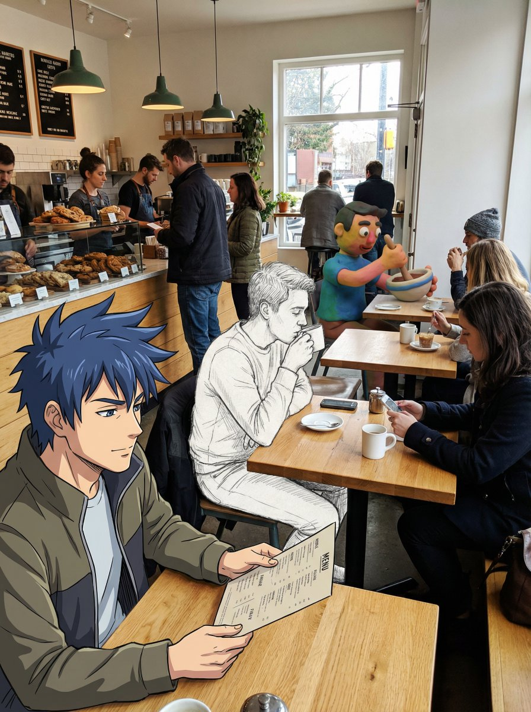

```
A photo of an everyday scene at a busy cafe serving breakfast. In the foreground is an anime man with blue hair, one of the people is a pencil sketch, another is a claymation person
```

```
一张繁忙咖啡馆供应早餐的日常场景照片。前景中有一位蓝发的动漫男子，其中一人是铅笔素描风格，另一人是黏土动画风格的人物。
```

 [↑返回目录](#toc)

---
## <a id="prompt-1995542490049290800">极简浮雕品牌标识</a> (<a href="https://x.com/AmirMushich/status/1995542490049290680" target="_blank" rel="noopener noreferrer">AmirMušić</a>)

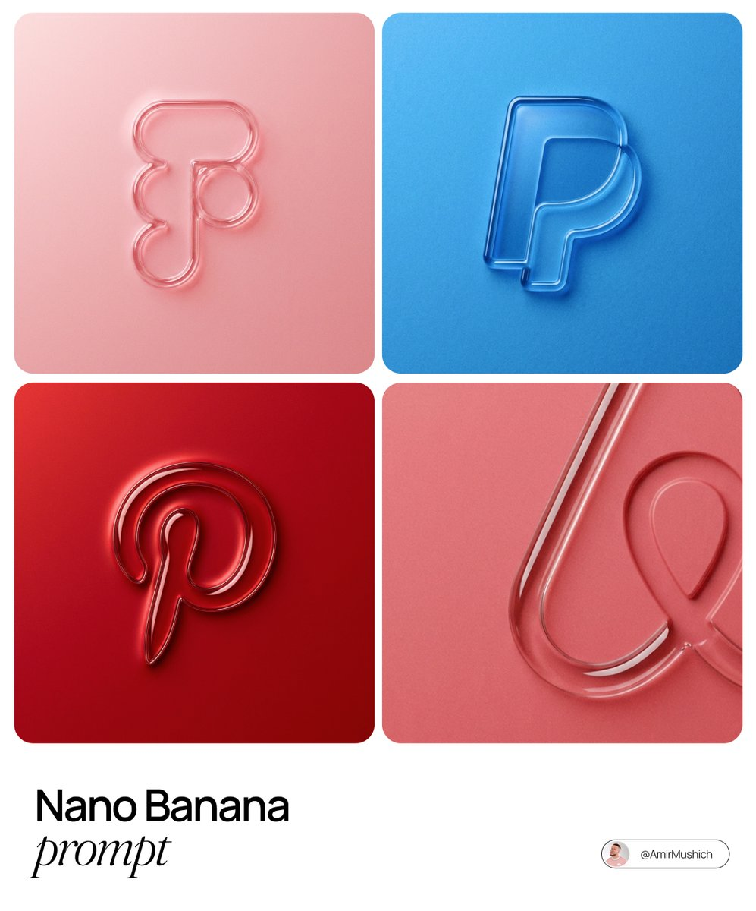

```
3D embossed glossy contour render of center-aligned [BRAND] on a flat surface, perfectly centered composition with ample negative space surrounding the object for a premium minimalist aesthetic. Monochromatic [COLOR] palette with soft
```

```
居中对齐的[BRAND]在平面上的3D浮雕高光轮廓渲染，构图完美居中，周围留有充足负空间，呈现高端极简美学。单色[COLOR]调色板，柔和。
```

 [↑返回目录](#toc)

---
## <a id="prompt-1998081129384214500">尾道観光特集：初夏の風景</a> (<a href="https://x.com/showheyohtaki/status/1998081129384214575" target="_blank" rel="noopener noreferrer">大滝昇平@デイトラ代表 | 累計受講生数30,000人突破</a>)

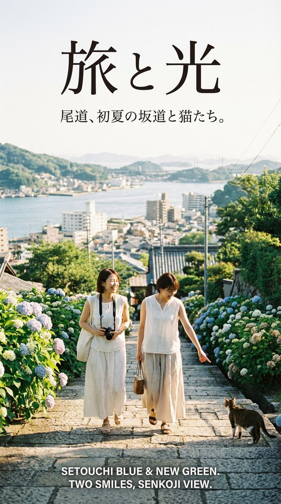

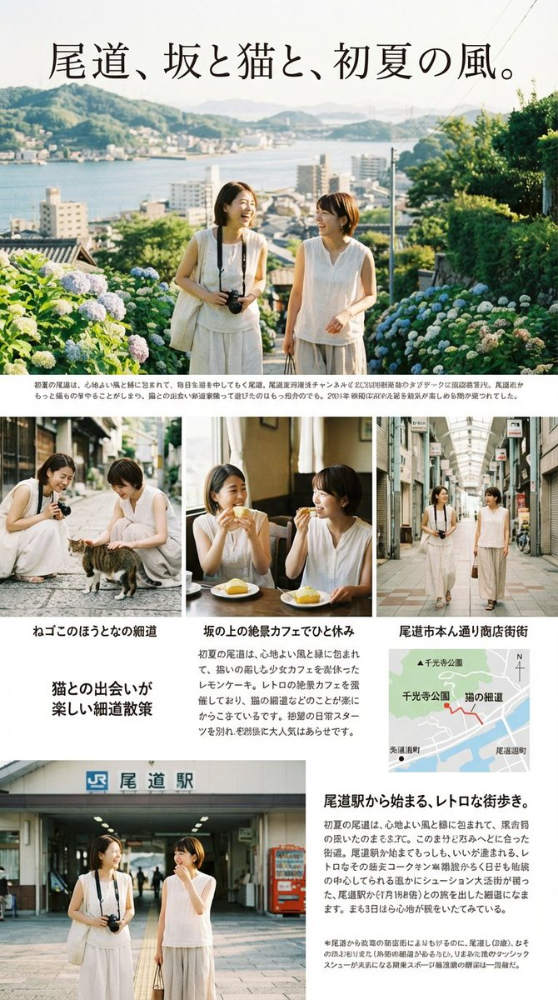

```
とんでもないな...！
もうAIで観光ポスターやパンフレット作れるんじゃないか。

試しに広島県・尾道をテーマに、観光雑誌verで作ってみました👇
めんどくさいので登場人物もそのままNano Banana Proで生成してます。

【雑誌の表紙】
初夏の昼・快晴の天気の中、緯度と経度が34.4059625002507, 133.1961464121396の位置で、二人の女性が観光してるように馴染ませてください。観光雑誌の表紙のように美しくレイアウトしてください。9:16をあますことなく活かし、この雑誌の表紙を作成してください。これが来客数に影響する重要なページだと思って取り組んでください。

【特集ページ】
前回の画像を参照し、同じ女性2人組が緯度と経度が34.4059625002507, 133.1961464121396の周辺エリアで観光してるように馴染ませてください。9:16をあますことなく活かし、美しくレイアウトしてください。様々なシチュエーションの写真を取り入れ、観光雑誌の特集ページを作成してください。文字が潰れたり、文字化けしないように細心の注意を払ってください。これが来客数に影響する重要な読み物のページだと思って、多くの情報を取り入れて取り組んでください。

データが多い観光地なら、おそらく季節・時間帯・天気の指定が可能。

それに「前回の画像を参照し、同じ2人組が」という雑な指示でちゃんと一貫性保てました。

また「周辺エリア」「様々なシチュエーション」を要求することで、レイアウトを変えて付近の写真にしてくれます。
Nano Banana Proすごすぎる...！
```

 [↑返回目录](#toc)

---
## <a id="prompt-1997908793573978600">Nano Banana Pro：手机里的奇妙世界</a> (<a href="https://x.com/SDT_side/status/1997908793573978587" target="_blank" rel="noopener noreferrer">SDT🌿</a>)

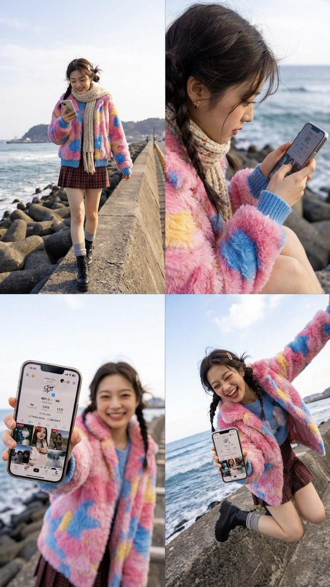

```
①人物の写真をアップロード
②スマホに映したい画像をアップロード
③この JSON をそのまま貼る
2×2グリットで生成
{
  "layout": {
    "type": "grid_2x2"
  },

  "global": {
    "edit_type": "phone_motion_edit",

    "source": {
      "mode": "EDIT",
      "reference_images": {
        "first": "base_photo_person_and_environment",
        "second": "screen_content_for_phone"
      },
      "preserve_from_first": {
        "same_person_or_group": true,
        "same_faces": true,
        "same_hairstyles": true,
        "same_outfits": true,
        "same_environment_style": true
      }
    },

    "identity": {
      "keep_identity_consistent": true,
      "expression": "bright_natural_smile"
    },

    "phone": {
      "allowed": true,
      "holding_styles": [
        "one_handed",
        "two_handed",
        "near_chest",
        "near_hip",
        "tilted",
        "sideways",
        "partially_toward_lens"
      ],
      "rules": {
        "each_person_may_hold_one_phone": true,
        "screen_should_be_naturally_visible": true,
        "do_not_force_phone_directly_toward_camera": true
      }
    },

    "screen_replacement": {
      "use_second_reference_image_as_content": true,
      "fit_without_distortion": true,
      "no_ui": true
    },

    "environment": {
      "preserve_environment_style_from_reference": true,
      "lighting_consistent_with_reference": true
    },

    "constraints": {
      "no_new_characters": true,
      "no_costume_change": true,
      "no_change_to_reference_location_type": true
    }
  },

  "panels": [
    {
      "id": "panel_1",
      "role": "soft_intro",
      "edit": true,
      "pose": {
        "pose_can_change": true,
        "style_tags": ["walk", "soft_motion", "side_by_side"],
        "focus_on_expressive_hands": true
      }
    },

    {
      "id": "panel_2",
      "role": "phone_view_soft",
      "edit": true,
      "pose": {
        "pose_can_change": true,
        "style_tags": ["looking_at_phone", "face_close", "natural_pose"],
        "focus_on_expressive_hands": true
      }
    },

    {
      "id": "panel_3",
      "role": "phone_forward",
      "edit": true,
      "pose": {
        "pose_can_change": true,
        "style_tags": ["hand_forward", "phone_front_soft", "arm_extended"],
        "focus_on_expressive_hands": true
      },
      "camera_effect": {
        "perspective": "wide_angle",
        "near_objects_appear_large": true
      }
    },

    {
      "id": "panel_4",
      "role": "jump_cut",
      "edit": true,
      "use_preset": "jump_frame"
    }
  ],

  "pose_presets": {
    "jump_frame": {
      "pose": {
        "pose_can_change": true,
        "style_tags": ["jump", "lively", "mid_air"],
        "focus_on_expressive_hands": true
      },
      "camera_effect": {
        "perspective": "wide_angle",
        "allow_view_from_below": true
      }
    }
  }
}
```

 [↑返回目录](#toc)

---
## <a id="prompt-1998085942201164000">完美等距视角实景</a> (<a href="https://x.com/NanoBanana/status/1998085942201163905" target="_blank" rel="noopener noreferrer">Nano Banana Pro</a>)

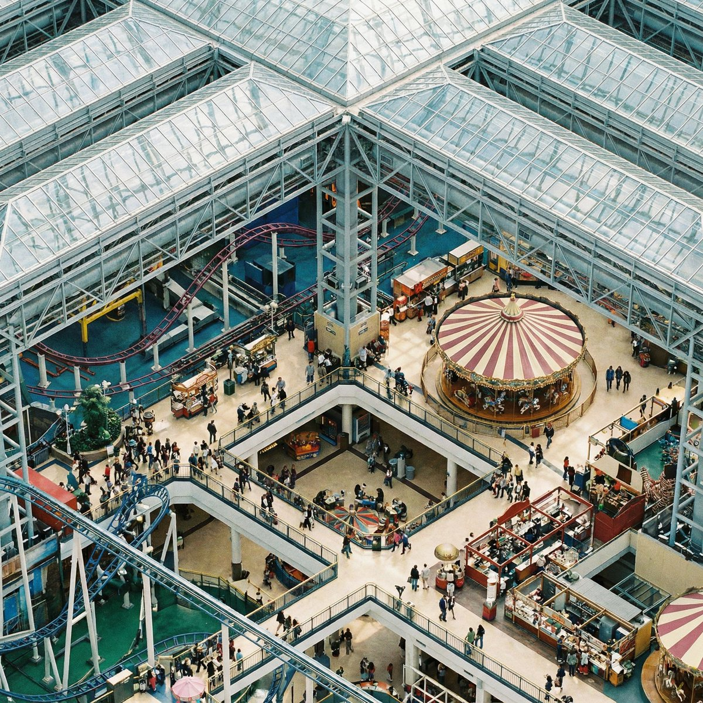

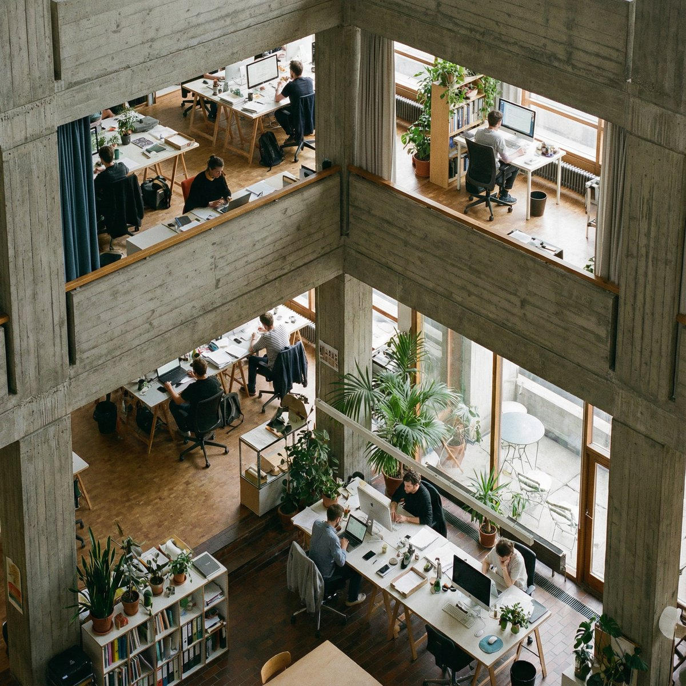


```
Make a photo that is perfectly isometric. It is not a miniature, it is a captured photo that just happened to be perfectly isometric. It is a photo of [subject].
```

```
制作一张完全等距视角的照片。这不是微缩模型，而是一张恰好呈现完美等距视角的实景拍摄照片。照片内容为[主体]。
```

 [↑返回目录](#toc)

---
## <a id="prompt-1998083664731902000">论文深度解析：手绘标注助你精准阅读</a> (<a href="https://x.com/Cydiar404/status/1998083664731901976" target="_blank" rel="noopener noreferrer">𝗖𝘆𝗱𝗶𝗮𝗿</a>)

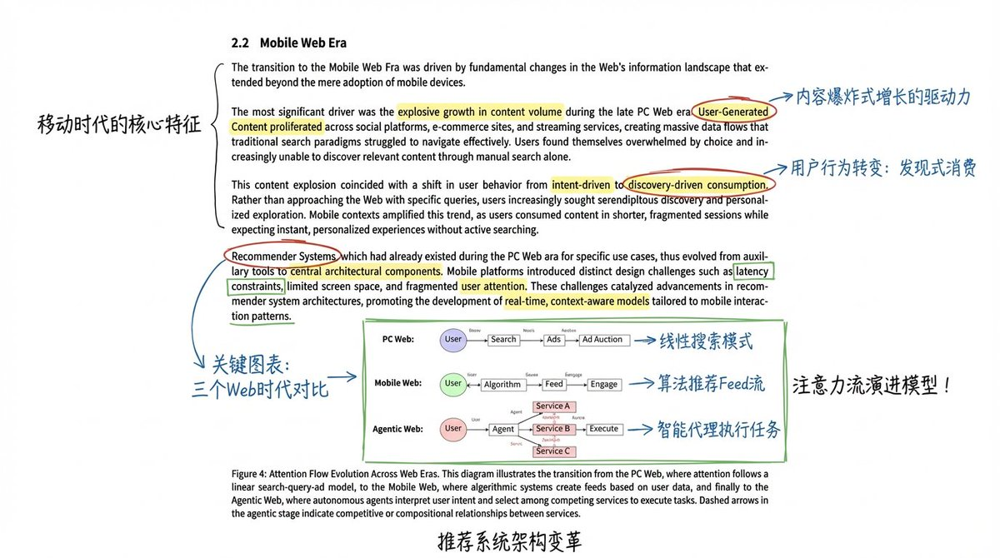

```
请辅助我读论文的这一页，用圈内容、画箭头引用注解、马克笔高亮的形式，把重要内容和图片做精准、深入的阅读标注（手绘风格）！
```

 [↑返回目录](#toc)

---
## <a id="prompt-1998019669593055500">バロックロリータでジャンケン大会</a> (<a href="https://x.com/KusoPhoto/status/1998019669593055372" target="_blank" rel="noopener noreferrer">空想写真家</a>)

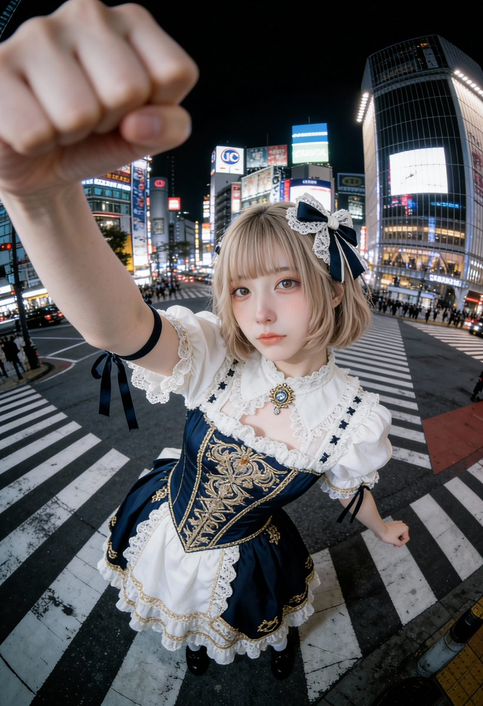

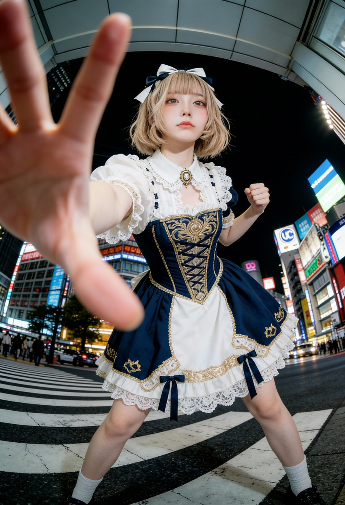

```
Nano Banana Prpで手足接写にするプロンプトお借りして挑戦してみました✨

せっかくなので #空想AIファッション のお気に入りのドレスを着て渋谷のスクランブル交差点で開催してたじゃんけん大会に参加してきました！
（妄想です）

プロンプトが気になる方は引用を要チェックです！

【ファッションプロンプト】
Navy blue and white Lolita dress with ornate baroque design and gold trim details. White puff sleeves with lace ruffles and navy ribbon ties. Navy blue bodice with gold embroidered motifs and lace-up front corset styling. White lace collar with decorative brooch detail. Navy blue full skirt with gold embroidered patterns and brocade fabric. White lace apron overlay with ruffled edges. Navy and white hair bow accessory with lace and ribbon details. Classic Lolita style with navy, white, and gold color palette. Baroque elegant aesthetic with ornate decorative elements. NOT casual wear, NOT minimalist design, NOT modern styling.
```

 [↑返回目录](#toc)

---
## <a id="prompt-1998073730887717400">超广角写实人物动态</a> (<a href="https://x.com/ttmouse/status/1998073730887717331" target="_blank" rel="noopener noreferrer">ttmouse - 豆爸</a>)

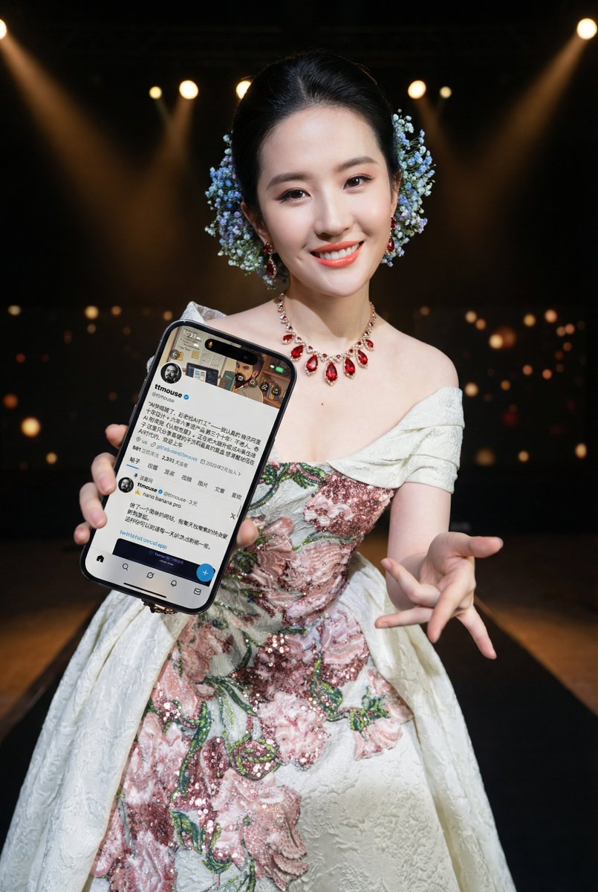


```
一、整体编辑设定
1 编辑类型：超广角手机画面编辑。
2 图像来源：以参考人物与环境为基础进行编辑，禁止新增角色。
3 保留要素：人物、脸部、发型、服装、环境风格必须与原图保持一致。

二、人物身份与表情
1 身份一致性：保持为同一人物或同一组人，所有人物都需清晰可辨，与原始人物相同。
2 表情设定：统一为明亮自然的微笑，不破坏人物原有气质与身份感。

三、相机视角与画面效果
1 透视效果：采用超广角视角，近处物体夸张放大，远处物体明显缩远，可从上方或下方俯视、仰视。
2 画面风格：整体为动态写实风格。
3 构图要求：画面应同时具备动感与清晰度，强调强烈景深效果，允许手机靠近镜头，同时保持所有人物在画面中的视觉平衡。
4 环境一致性：保持环境风格与参考图统一，光线方向与强度一致，为适应广角视角可扩展空间，但必须保持纹理和色调的连贯性。

四、姿势与肢体表现
1 姿势变化：人物姿势可以改变，且必须与参考图完全不同，不得复刻或接近原姿势。
2 姿态风格：整体姿态需呈现时尚、复杂、流畅、有力量的特征。
3 手部重点：突出手部表情和动作，允许多个身体部位靠近镜头，同时要避免手臂变形与结构错误。

五、手机持握方式
1 出现规则：画面中允许出现手机。
2 持握方式：可为单手持握、双手持握、低角度、高角度、倾斜、侧向、靠近胸前、靠近腰侧、随意握持、部分朝向镜头等多种自然方式。
3 姿态优先：每个人最多持有一部手机，优先保证身体结构自然放松，不强行让手机正对镜头，但在自然情况下应尽量让屏幕处于可见位置。

六、手机屏幕替换
1 替换目标：仅替换画面中可见的手机屏幕区域。
2 内容来源：使用第二张参考图作为屏幕内容，干净贴合到可见屏幕区域上。
3 形态限制：屏幕内容需严格贴合屏幕形状，不产生拉伸、压缩或额外裁剪。
4 界面限制：屏幕上不出现任何额外界面元素，不出现图标、不出现状态栏、不出现应用边框，只显示来自第二参考图的内容本身。

七、环境与全局限制
1 环境设定：在不依赖具体季节和天气的前提下，保留原照片的氛围与环境风格，光影关系保持统一。
2 全局限制：不得新增角色，不改变人物年龄与性别呈现，不更换服装，不改变参考地点的类型，整体拍摄风格需与原始照片保持一致。
```

 [↑返回目录](#toc)

---
## <a id="prompt-1997914731097788700">裸眼3D熊猫跃出城市屏幕</a> (<a href="https://x.com/Ankit_patel211/status/1997914731097788777" target="_blank" rel="noopener noreferrer">ANKIT PATEL 🇮🇳 | AI</a>)

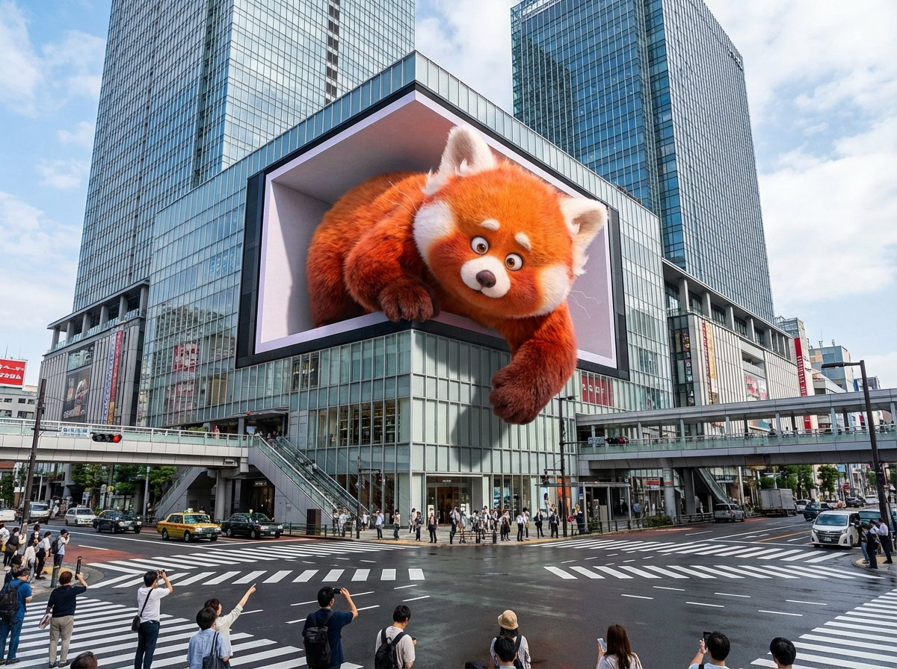

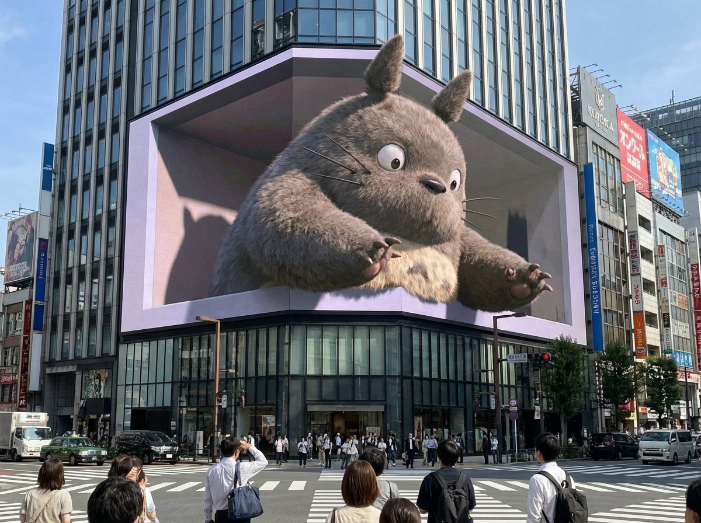

```
An enormous L-shaped glasses-free 3D LED screen situated prominently at a bustling urban intersection, designed in an iconic architectural style reminiscent of Shinjuku in Tokyo or Taikoo Li in Chengdu. The screen displays a captivating glasses-free 3D animation featuring [scene description]. The characters and objects possess striking depth and appear to break through the screen’s boundaries, extending outward or floating vividly in mid-air. Under realistic daylight conditions, these elements cast lifelike shadows onto the screen’s surface and surrounding buildings. Rich in intricate detail and vibrant colors, the animation seamlessly integrates with the urban setting and the bright sky overhead. 

----
scene description: 
[An adorable giant red  panda  playfully paws at passing pedestrians, its fluffy paws and curious face extending realistically into the space around the screen. ]
```

```
一座巨大的L形裸眼3D LED屏幕，醒目地坐落于繁华的城市十字路口，其设计采用标志性的建筑风格，令人联想到东京新宿或成都太古里。屏幕上正播放一段引人入胜的裸眼3D动画：[一只可爱的巨型红色熊猫正顽皮地朝路过的行人挥动爪子，它毛茸茸的爪子和好奇的脸庞逼真地延伸至屏幕外的空间中]。角色与物体具有强烈的立体感，仿佛突破屏幕边界，向外伸出或生动地悬浮于半空中。在逼真的日光条件下，这些元素在屏幕表面及周围建筑上投下栩栩如生的阴影。动画细节丰富、色彩鲜艳，与城市环境及上方明亮的天空无缝融合。
```

 [↑返回目录](#toc)

---
## <a id="prompt-1998041013890241000">微缩等距房间中的 Nano Banana Pro</a> (<a href="https://x.com/Arminn_Ai/status/1998041013890240989" target="_blank" rel="noopener noreferrer">ΛRMIN | AI</a>)

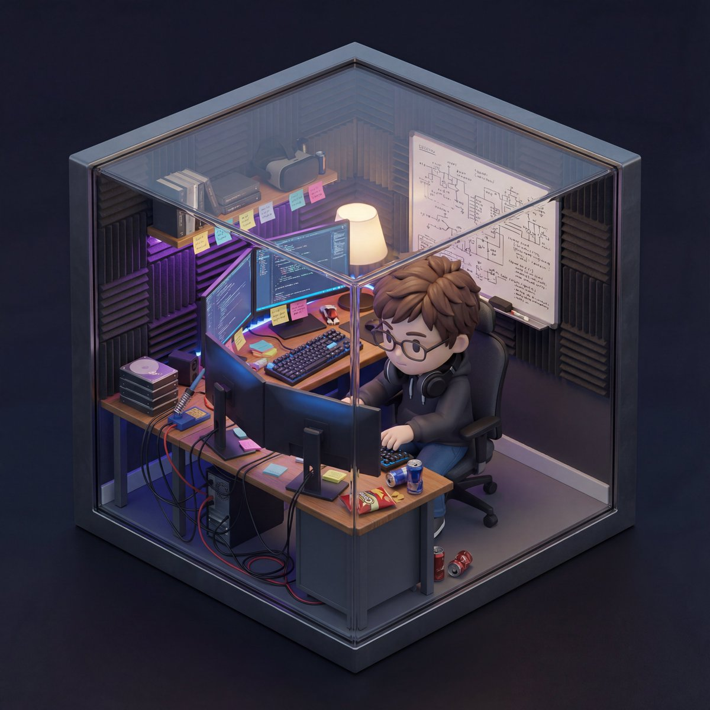

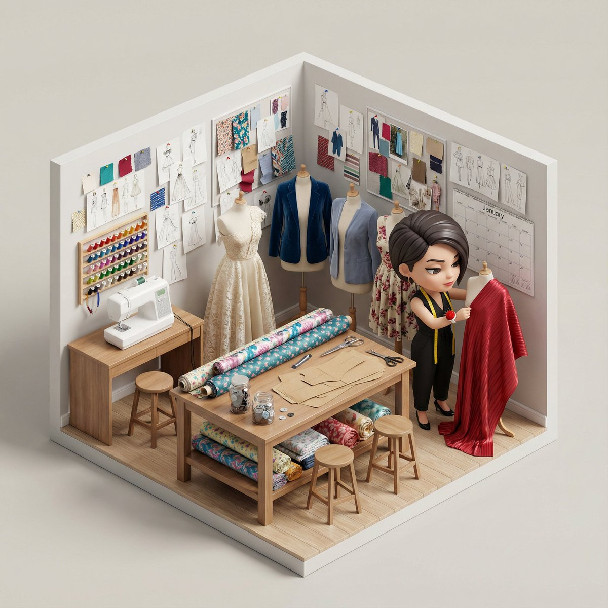

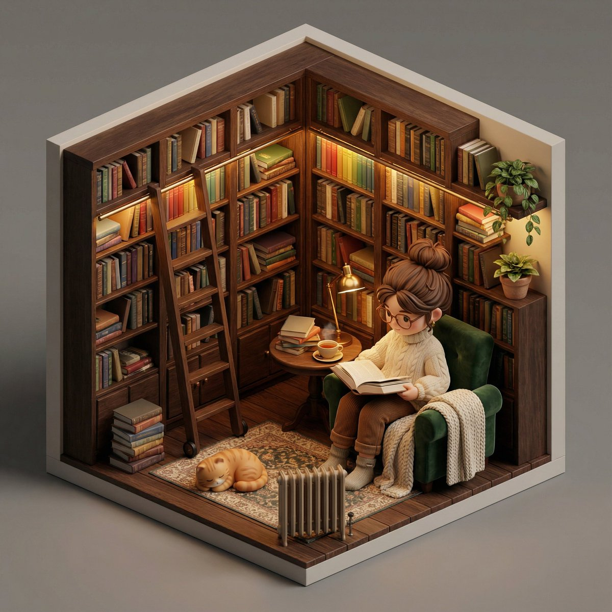

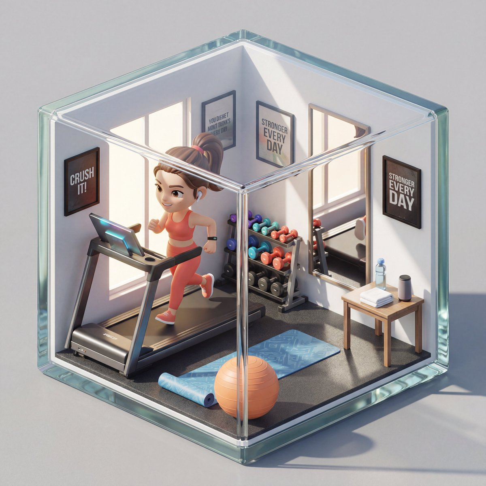

```
You can upload your own photo to generate your personalized version with this prompt and if you want the full prompt for any of these, just let me know and I’ll send it to you.

- Prompt 👇
An isometric 3D cube-shaped miniature room (shallow cutaway true cube; everything strictly contained within the cube). The room is [ROOM DESCRIPTION: Describe the theme, furniture, specific clutter, wall decorations, and key items in detail].
Character: a chibi/figurine-style — [INSERT DESCRIPTION OF THE PERSON FROM YOUR UPLOADED PHOTO HERE]. The character is [ACTION: e.g., sitting on a chair typing, standing and cooking, playing guitar], with a [EXPRESSION: e.g., focused, happy, smiling] expression. Figure material looks like matte PVC, with big head / small body proportions. Lighting: [ATMOSPHERE NAME]: [LIGHT SOURCES: e.g., neon blue glow, warm sunlight, golden lamp light]; realistic reflections and colored shadows. Camera: slightly elevated isometric three-quarter view, front cube edge centered; no elements protruding outside the cube. Photoreal materials with fine detail; neutral backdrop. Ultra-detailed, clean composition; no watermark.
```

```
你可以上传自己的照片，使用此提示词生成个性化版本；若需要其中任意图像的完整提示词，请告诉我，我会发送给你。

- 提示词 👇  
一个等距 3D 立方体形状的微缩房间（浅剖切的真实立方体；所有内容严格包含在立方体内）。房间为 [房间描述：详细说明主题、家具、具体杂物、墙面装饰和关键物品]。  
角色：Q 版/手办风格——[在此插入你上传照片中人物的描述]。该角色正在 [动作：例如坐在椅子上打字、站立烹饪、弹吉他]，表情为 [表情：例如专注、开心、微笑]。角色材质呈现哑光 PVC 效果，头部大、身体小的比例。灯光：[氛围名称]：[光源：例如霓虹蓝光、温暖日光、金色台灯灯光]；具有真实反射和彩色阴影。相机视角：略高的等距四分之三前视图，立方体前边缘居中；无任何元素突出立方体外。材质逼真且细节精细；背景中性。超精细、构图干净；无水印。
```

 [↑返回目录](#toc)

---
## <a id="prompt-1997824265215684900">Nano Banana Pro | Gemini 3.0</a> (<a href="https://x.com/_MehdiSharifi_/status/1997824265215684761" target="_blank" rel="noopener noreferrer">Mehdi Sharifi</a>)


```
{
  "image_request": {
    "goal": "Create a Gen Z anime-core streetwear mirror selfie blending [UPLOADED IMAGE] with 2D anime illustration elements",
    "meta": {
      "image_type": "Mixed Media Mirror Selfie / Anime-Core Fashion Editorial",
      "quality": "Best Quality, Ultra-Detailed, Mixed Reality, Smartphone Photography",
      "color_mode": "Full Color / Vibrant Accents",
      "style_mode": "raw_photoreal with 2D overlay",
      "aspect_ratio": "4:5",
      "resolution": "1080x1350"
    },
    "creative_style": "Playful Gen Z streetwear fashion mixed with 2D anime overlay, casual 'fit check' vibe, juxtaposition of cute styling with gothic anime horror elements, vibrant eclectic footwear, indoor mirror selfie aesthetic",
    "overall_theme": "anime culture/streetwear fashion / mixed reality / playful casual",
    "mood_vibe": "playful confident / otaku chic / quirky / casual cool",
    "style_keywords": [
      "mirror selfie",
      "streetwear",
      "anime overlay",
      "mixed media",
      "Gen Z fashion",
      "casual",
      "playful"
    ],
    "subject": {
      "count": "2 (1 human female [UPLOADED IMAGE] + 1 anime character overlay)",
      "type": "female / 2D character overlay",
      "identity": "[UPLOADED IMAGE]",
      "identity_preservation": {
        "description": "Strictly preserve facial features, hair, and body structure from [UPLOADED IMAGE]",
        "notes": "Use [UPLOADED IMAGE] as the reference for the main subject."
      },
      "age_appearance": "Derived from [UPLOADED IMAGE]",
      "skin": "Derived from [UPLOADED IMAGE]",
      "makeup": {
        "lips": "Derived from [UPLOADED IMAGE]",
        "eyes": "Derived from [UPLOADED IMAGE]",
        "general": "Derived from [UPLOADED IMAGE]."
      },
      "facial_features": {
        "expression": "Derived from [UPLOADED IMAGE]",
        "eyes": {
          "gaze": "Derived from [UPLOADED IMAGE]",
          "intensity": "Derived from [UPLOADED IMAGE]"
        },
        "lips": {
          "gesture": "Derived from [UPLOADED IMAGE]"
        }
      },
      "hair": {
        "length": "Derived from [UPLOADED IMAGE]",
        "texture": "Derived from [UPLOADED IMAGE]",
        "style": "Derived from [UPLOADED IMAGE]",
        "lighting_interaction": {
          "light": "soft indoor overhead reflection",
          "shadow_play": "minimal"
        }
      },
      "clothing": {
        "top": "oversized beige knit sweater with distressed hem, featuring large black-and-white manga girl portrait graphic and smiley face print (OR retain clothing from [UPLOADED IMAGE] if preferred)",
        "bottom": "sheer black thigh-high stockings (OR retain clothing from [UPLOADED IMAGE])",
        "full_description": "Subject from [UPLOADED IMAGE] styled in Gen Z anime-core fashion",
        "accessories": "layered pearl and chain necklaces, rings, quirky phone case with text stickers"
      },
      "props": {
        "bouquet": "N/A",
        "wine_glass": "N/A",
        "other": "Smartphone with sticker-covered case held in both hands"
      }
    },
    "pose_action": {
      "description": "Standing full-body mirror selfie matching [UPLOADED IMAGE]",
      "overall_pose": "Derived from [UPLOADED IMAGE]",
      "head_turn": "Derived from [UPLOADED IMAGE]",
      "gaze": "Derived from [UPLOADED IMAGE]",
      "body_position": "Derived from [UPLOADED IMAGE]",
      "hands": "holding smartphone at chest level to take a photo",
      "movement": "static pose"
    },
    "multiple_frames_expressions": [],
    "environment": {
      "setting": "Indoor hallway or hotel room entrance",
      "location": "in front of full-length mirror",
      "weather": "N/A (indoor)",
      "time_of_day": "indoor artificial light",
      "atmosphere": "casual/domestic/playful"
    },
    "background": {
      "color": "neutral tones/wood door / white walls",
      "effect": "standard depth of field, clear background with looming anime figure overlay"
    },
    "lighting": {
      "type": "Indoor overhead lighting",
      "position": "overhead",
      "direction": "top-down",
      "intensity": "moderate / even",
      "focus": "on [UPLOADED IMAGE] subject",
      "falloff": "gradual",
      "light_quality": "diffused artificial",
      "source": "ceiling fixture",
      "tone": "neutral to slightly warm",
      "mood": "casual daily life",
      "subject_lighting": "even illumination on [UPLOADED IMAGE]",
      "environment_lighting": "ambient indoor",
      "color_temperature": "3500K-4000K",
      "contrast_shadow": "soft shadows behind subject",
      "shadow_quality": "diffused",
      "imperfections": ["smartphone reflection", "indoor lighting glare"]
    },
    "camera": {
      "sensor_format": "Smartphone Camera",
      "lens": "Wide angle main lens (approx 24-26mm eq)",
      "position_angle": "eye-level (reflection)",
      "distance": "arm's length / approx 1.5 meters from mirror",
      "framing": "full body portrait 9:16",
      "depth_of_field": "deep (everything mostly in focus)",
      "composition": {
        "framing": "[UPLOADED IMAGE] centered, mirror frame visible on edges",
        "depth": "flat layering of 2D character behind 3D [UPLOADED IMAGE] subject",
        "emphasis": "outfit details and the juxtaposition of the anime character",
        "angle": "straight on"
      }
    },
    "photobooth_collage_specific": {
      "frame_count_per_strip": "N/A",
      "total_prints": "N/A",
      "layout": "N/A",
      "border": "N/A",
      "tonality_texture": "N/A",
      "highlight_behavior": "N/A"
    },
    "color_grading": {
      "palette": "Beige, Black, Yellow, Red, White",
      "lut": "Standard Smartphone / True to Life",
      "mood": "casual vivid"
    },
    "post_processing": {
      "sharpening": "standard",
      "final_touch": "Composite overlay of large 2D anime 'Shinigami' (death god) character looming behind [UPLOADED IMAGE]—spiky blue/black hair, skeletal face, yellow eyes, dark feathery wings/shoulders (Ryuk style)."
    },
    "negative": {
      "style": "blurry, low res, painting, 3D render of girl (girl must be photoreal), distorted hands",
      "content": "cluttered background, bad lighting, cropped feet",
      "artifacts": "warped phone, extra fingers"
    },
    "additional_controls": {
      "focus_emphasis": "The [UPLOADED IMAGE] subject and the anime character overlay",
      "grounding": "feet firmly planted",
      "special_notes": "The image features a distinct 'mixed reality' style where a 2D anime illustration is superimposed behind [UPLOADED IMAGE] in a mirror selfie.",
      "vibe": "playful anime fan",
      "final_output_goal": "A realistic mirror selfie of [UPLOADED IMAGE] with a convincing 2D anime character integration."
    }
  }
}
```

```
{
  "image_request": {
    "goal": "创建一个融合了[上传图像]与2D动漫元素的Z世代动漫核心街头时尚镜子自拍",
    "meta": {
      "image_type": "混合媒体镜子自拍/动漫核心时尚编辑",
      "quality": "最佳质量，超细节，混合现实，智能手机摄影",
      "color_mode": "全彩/鲜艳点缀",
      "style_mode": "raw_photoreal加上2D覆盖",
      "aspect_ratio": "4:5",
      "resolution": "1080x1350"
    },
    "creative_style": "Z世代街头时尚与2D动漫覆盖的混合，休闲‘穿搭检查’氛围，可爱的风格与哥特式动漫恐怖元素的并置，色彩斑斓的鞋履，室内镜子自拍美学",
    "overall_theme": "动漫文化/街头时尚/混合现实/玩乐休闲",
    "mood_vibe": "玩乐自信/御宅族时尚/古怪/休闲酷",
    "style_keywords": [
      "镜子自拍",
      "街头时尚",
      "动漫覆盖",
      "混合媒体",
      "Z世代时尚",
      "休闲",
      "玩乐"
    ],
    "subject": {
      "count": "2（1位人类女性[上传图像]+1个动漫角色覆盖）",
      "type": "女性/2D角色覆盖",
      "identity": "[上传图像]",
      "identity_preservation": {
        "description": "严格保持[上传图像]的面部特征、头发和身体结构",
        "notes": "使用[上传图像]作为主要主题的参考。"
      },
      "age_appearance": "来源于[上传图像]",
      "skin": "来源于[上传图像]",
      "makeup": {
        "lips": "来源于[上传图像]",
        "eyes": "来源于[上传图像]",
        "general": "来源于[上传图像]"
      },
      "facial_features": {
        "expression": "来源于[上传图像]",
        "eyes": {
          "gaze": "来源于[上传图像]",
          "intensity": "来源于[上传图像]"
        },
        "lips": {
          "gesture": "来源于[上传图像]"
        }
      },
      "hair": {
        "length": "来源于[上传图像]",
        "texture": "来源于[上传图像]",
        "style": "来源于[上传图像]",
        "lighting_interaction": {
          "light": "柔和的室内顶部反射",
          "shadow_play": "最小化"
        }
      },
      "clothing": {
        "top": "超大的米色针织毛衣，下摆磨损，带有大型黑白漫画女孩肖像图案和笑脸印花（或者如果更喜欢保留[上传图像]中的服装）",
        "bottom": "透明黑色过膝袜（或者如果更喜欢保留[上传图像]中的服装）",
        "full_description": "[上传图像]的主题穿着Z世代动漫核心时尚",
        "accessories": "层层叠叠的珍珠和链条项链、戒指、贴满标签的古怪手机壳"
      },
      "props": {
        "bouquet": "无",
        "wine_glass": "无",
        "other": "双手持贴满标签的手机壳"
      }
    },
    "pose_action": {
      "description": "站立全身镜子自拍，匹配[上传图像]",
      "overall_pose": "来源于[上传图像]",
      "head_turn": "来源于[上传图像]",
      "gaze": "来源于[上传图像]",
      "body_position": "来源于[上传图像]",
      "hands": "手持智能手机在胸前拍照",
      "movement": "静态姿势"
    },
    "multiple_frames_expressions": [],
    "environment": {
      "setting": "室内走廊或酒店房间入口",
      "location": "站在全身镜前",
      "weather": "不适用（室内）",
      "time_of_day": "室内人工光",
      "atmosphere": "休闲/家庭/玩乐"
    },
    "background": {
      "color": "中性色调/木门/白色墙壁",
      "effect": "标准景深，清晰背景，有隐约可见的动漫人物覆盖"
    },
    "lighting": {
      "type": "室内顶灯照明",
      "position": "顶部",
      "direction": "从上至下",
      "intensity": "适中/均匀",
      "focus": "集中在[上传图像]的主题上",
      "falloff": "逐渐减弱",
      "light_quality": "扩散的人造光源",
      "source": "天花板装置",
      "tone": "中性到稍微温暖",
      "mood": "日常休闲生活",
      "subject_lighting": "均匀照亮[上传图像]",
      "environment_lighting": "环境室内",
      "color_temperature": "3500K-4000K",
      "contrast_shadow": "柔和的阴影位于主体后方",
      "shadow_quality": "扩散",
      "imperfections": ["智能手机反光", "室内灯光眩光"]
    },
    "camera": {
      "sensor_format": "智能手机摄像头",
      "lens": "广角主镜头（约等于24-26mm）",
      "position_angle": "眼平高度（反射）",
      "distance": "一臂之长/大约离镜子1.5米",
      "framing": "全身人像9:16",
      "depth_of_field": "深景深（几乎全部都在焦点内）",
      "composition": {
        "framing": "[上传图像]居中，镜框边缘可见",
        "depth": "2D角色背后的扁平层叠，位于3D[上传图像]主题之后",
        "emphasis": "服装细节以及动漫角色的并置",
        "angle": "正对"
      }
    },
    "photobooth_collage_specific": {
      "frame_count_per_strip": "不适用",
      "total_prints": "不适用",
      "layout": "不适用",
      "border": "不适用",
      "tonality_texture": "不适用",
      "highlight_behavior": "不适用"
    },
    "color_grading": {
      "palette": "米色、黑色、黄色、红色、白色",
      "lut": "标准智能手机/真实生活",
      "mood": "休闲生动"
    },
    "post_processing": {
      "sharpening": "标准",
      "final_touch": "复合叠加大型2D动漫‘死神’角色（死亡之神）在[上传图像]背后——蓝黑刺头，骷髅脸，黄眼睛，黑暗羽毛翅膀/肩膀（类似流克风格）。"
    },
    "negative": {
      "style": "模糊、低分辨率、绘画、女孩的3D渲染（女孩必须是照片级真实感）、扭曲的手部",
      "content": "杂乱的背景、糟糕的照明、被裁剪的脚",
      "artifacts": "变形的手机、多余的手指"
    },
    "additional_controls": {
      "focus_emphasis": "[上传图像]的主题和动漫角色覆盖",
      "grounding": "双脚稳稳站住",
      "special_notes": "该图像展示了一种独特的‘混合现实’风格，其中2D动漫插图被叠加在[上传图像]后面的一张镜子自拍中。",
      "vibe": "玩乐的动漫粉丝",
      "final_output_goal": "一张真实的[上传图像]镜子自拍，具有令人信服的2D动漫角色整合。"
    }
  }
}
```

 [↑返回目录](#toc)

---
## <a id="prompt-1997994131193581800">奢华私密的时尚沉思</a> (<a href="https://x.com/Just_sharon7/status/1997994131193581787" target="_blank" rel="noopener noreferrer">Sharon Riley</a>)

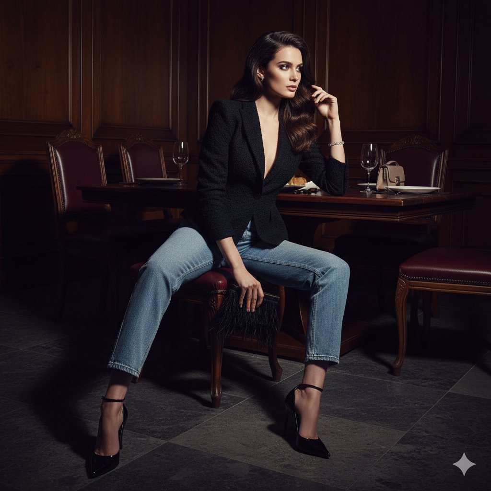

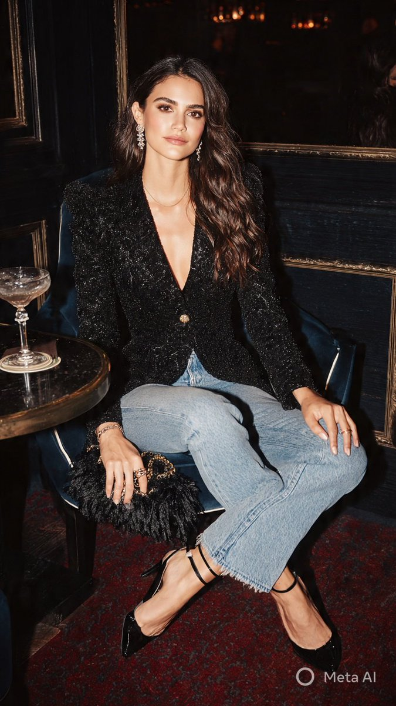

```
{
  "prompt_description": "A high-fashion, indoor editorial-style photograph featuring a sophisticated woman seated in a luxurious, dimly lit private dining or lounge setting.",
  "subject": {
    "gender": "female",
    "age_range": "30s",
    "physique": "slender, elegant",
    "hair_style": "long, dark brunette, wavy/styled, voluminous, cascading over her shoulders",
    "facial_features": "pronounced cheekbones, full lips, dark, well-defined eyebrows, deep gaze directed off-camera to the right",
    "pose": "Seated on a dark wooden chair with a maroon leather seat. Her body is slightly angled to the left, legs crossed at the ankles and extended forward. Her left hand is raised, gently touching her hair near her temple, conveying a thoughtful or dramatic mood.",
    "expression": "Serious, composed, and high-fashion editorial."
  },
  "attire": {
    "top": "Black, textured blazer or jacket with a structured shoulder and a deep V-neckline, possibly with a subtle peplum or tailored fit around the waist. The fabric appears slightly fuzzy or boucle.",
    "bottom": "Light-to-medium wash blue denim jeans with a relaxed, straight-leg or wide-leg cut, slightly cropped above the ankle.",
    "footwear": "Black patent leather stiletto heels with a sharp pointed toe and delicate black ankle straps.",
    "accessories": [
      "Small, dark, fringed or feathered clutch bag held in her right hand.",
      "Subtle silver or diamond bracelet on her left wrist.",
      "Possibly a small, delicate necklace visible in the neckline."
    ]
  },
  "setting": {
    "environment_type": "Indoor, upscale restaurant or private room",
    "furniture": [
      "Dark, polished wooden dining table with a rich grain, occupying the background.",
      "A pair of matching ornate wooden chairs with maroon (oxblood) leather upholstery flanking the table.",
      "The chair she is seated on is a similar style."
    ],
    "decor_elements": [
      "Partially visible plates and wine glasses on the dining table, suggesting a finished or interrupted meal.",
      "A small, lighter-colored handbag or clutch resting on the table in the top left corner."
    ],
    "flooring": "Dark, large-format tile or stone flooring with a subtly patterned or marbled appearance (possibly a mix of gray and charcoal tones)."
  },
  "lighting_and_mood": {
    "lighting_style": "Dramatic, low-key, focused, and warm ambient lighting.",
    "shadows": "Deep and prominent shadows, especially beneath the table and on the lower half of the subject, creating contrast.",
    "mood": "Glamorous, sophisticated, intimate, and exclusive.",
    "color_palette": "Dominated by deep blacks and maroons (chair, jacket), contrasting with the light blue of the jeans, and the warm, dark browns of the wood."
  },
  "photography_style": {
    "shot_type": "Three-quarter length shot, full body visible from the head to the feet.",
    "camera_angle": "Slightly high angle, looking down onto the subject.",
    "focus": "Sharp focus on the subject's face, body, and outfit.",
    "depth_of_field": "Shallow, with the background elements (table, glasses) slightly blurred, emphasizing the subject.",
    "aesthetic": "Editorial, fashion magazine quality, rich texture detail (especially on the jacket and floor)."
  }
}
```

```
{
  "prompt_description": "一张高时尚感的室内杂志风格摄影作品，描绘一位精致女性坐在奢华、光线昏暗的私人餐厅或休息室环境中。",
  "subject": {
    "gender": "女性",
    "age_range": "30多岁",
    "physique": "苗条、优雅",
    "hair_style": "长发，深棕色，波浪/造型，丰盈，从肩部倾泻而下",
    "facial_features": "颧骨突出，嘴唇丰满，眉毛深色且轮廓分明，目光深邃，望向画面右侧",
    "pose": "坐在一把深色木椅上，椅面为酒红色皮革。身体略微向左倾斜，脚踝交叉，双腿向前伸展。左手抬起，轻触太阳穴附近的头发，传达出沉思或戏剧性的情绪。",
    "expression": "严肃、镇定，具有高级时尚杂志风格。"
  },
  "attire": {
    "top": "黑色纹理感西装外套或夹克，肩部挺括，深V领，腰部可能带有微妙的短裙摆或修身剪裁。面料略显毛绒或粗花呢质感。",
    "bottom": "浅至中等水洗蓝色牛仔裤，版型宽松，直筒或阔腿，长度略高于脚踝。",
    "footwear": "黑色漆皮细高跟鞋，尖头锋利，配有精致的黑色脚踝系带。",
    "accessories": [
      "右手持一只小巧、深色、带有流苏或羽毛装饰的手拿包。",
      "左手腕佩戴一条低调的银色或钻石手链。",
      "领口处可能可见一条小巧精致的项链。"
    ]
  },
  "setting": {
    "environment_type": "室内，高档餐厅或私人房间",
    "furniture": [
      "背景中一张深色抛光木制餐桌，木纹丰富。",
      "餐桌两侧配有一对雕饰精美的木椅，椅面为酒红色（牛血色）皮革。",
      "她所坐的椅子为同款风格。"
    ],
    "decor_elements": [
      "餐桌上部分可见的盘子和葡萄酒杯，暗示一顿已结束或被打断的用餐。",
      "左上角桌面上放着一只浅色小手袋或手拿包。"
    ],
    "flooring": "深色大尺寸瓷砖或石材地面，带有微妙的图案或大理石纹理（可能为灰色与炭灰色混合）。"
  },
  "lighting_and_mood": {
    "lighting_style": "戏剧性、低调、聚焦且温暖的环境光。",
    "shadows": "阴影深重且明显，尤其在桌子下方及人物下半身，营造强烈对比。",
    "mood": "华丽、精致、私密且专属。",
    "color_palette": "以深黑与酒红（椅子、夹克）为主，与牛仔裤的浅蓝色形成对比，并融合木材的暖深棕色。"
  },
  "photography_style": {
    "shot_type": "四分之三身镜头，从头部到脚部全身可见。",
    "camera_angle": "略高的俯视角度，向下拍摄主体。",
    "focus": "主体面部、身体及服装清晰锐利。",
    "depth_of_field": "浅景深，背景元素（桌子、酒杯）轻微虚化，突出主体。",
    "aesthetic": "杂志编辑风格，具有高级时尚质感，强调丰富的纹理细节（尤其是夹克与地面）。"
  }
}
```

 [↑返回目录](#toc)

---
## <a id="prompt-1998073768472895700">手写批注解构学术论文</a> (<a href="https://x.com/op7418/status/1998073768472895778" target="_blank" rel="noopener noreferrer">歸藏(guizang.ai)</a>)


```
把它打印出来，然后用红墨水疯狂地加上手写中文批注、涂鸦、乱画，还可以加点小剪贴画，主要内容就是用中文的批注帮助一个大学知识水平的人了解这部分论文的原理和细节
```

 [↑返回目录](#toc)

---
## <a id="prompt-1997925279948534000">超广角粉丝感谢照</a> (<a href="https://x.com/qisi_ai/status/1997925279948534056" target="_blank" rel="noopener noreferrer">骑司Chase</a>)


```
一、整体编辑设定
1 编辑类型：超广角手机画面编辑。
2 图像来源：以参考人物与环境为基础进行编辑，禁止新增角色。
3 保留要素：人物、脸部、发型、服装、环境风格必须与原图保持一致。

二、人物身份与表情
1 身份一致性：保持为同一人物或同一组人，所有人物都需清晰可辨，与原始人物相同。
2 表情设定：统一为明亮自然的微笑，不破坏人物原有气质与身份感。

三、相机视角与画面效果
1 透视效果：采用超广角视角，近处物体夸张放大，远处物体明显缩远，可从上方或下方俯视、仰视。
2 画面风格：整体为动态写实风格。
3 构图要求：画面应同时具备动感与清晰度，强调强烈景深效果，允许手机靠近镜头，同时保持所有人物在画面中的视觉平衡。
4 环境一致性：保持环境风格与参考图统一，光线方向与强度一致，为适应广角视角可扩展空间，但必须保持纹理和色调的连贯性。

四、姿势与肢体表现
1 姿势变化：人物姿势可以改变，且必须与参考图完全不同，不得复刻或接近原姿势。
2 姿态风格：整体姿态需呈现时尚、复杂、流畅、有力量的特征。
3 手部重点：突出手部表情和动作，允许多个身体部位靠近镜头，同时要避免手臂变形与结构错误。

五、手机持握方式
1 出现规则：画面中允许出现手机。
2 持握方式：可为单手持握、双手持握、低角度、高角度、倾斜、侧向、靠近胸前、靠近腰侧、随意握持、部分朝向镜头等多种自然方式。
3 姿态优先：每个人最多持有一部手机，优先保证身体结构自然放松，不强行让手机正对镜头，但在自然情况下应尽量让屏幕处于可见位置。

六、手机屏幕替换
1 替换目标：仅替换画面中可见的手机屏幕区域。
2 内容来源：使用第二张参考图作为屏幕内容，干净贴合到可见屏幕区域上。
3 形态限制：屏幕内容需严格贴合屏幕形状，不产生拉伸、压缩或额外裁剪。
4 界面限制：屏幕上不出现任何额外界面元素，不出现图标、不出现状态栏、不出现应用边框，只显示来自第二参考图的内容本身。

七、环境与全局限制
1 环境设定：在不依赖具体季节和天气的前提下，保留原照片的氛围与环境风格，光影关系保持统一。
2 全局限制：不得新增角色，不改变人物年龄与性别呈现，不更换服装，不改变参考地点的类型，整体拍摄风格需与原始照片保持一致。
```

 [↑返回目录](#toc)

---
## <a id="prompt-1997819640874205700">Nano Banana Pro 时尚联系表</a> (<a href="https://x.com/ReflctWillie/status/1997819640874205685" target="_blank" rel="noopener noreferrer">willie</a>)


```
Contact Sheet prompting in Nano Banana Pro is getting a lot of buzz. I tried adapting it for a 'fashion style' shoot... I'm sold. 
Full workflow, prompts, and some tips below. 

Shout out @techhalla @firatbilal for the inspiration.
```

```
完整的工作流程、提示词及一些技巧如下。  
特别感谢 @techhalla 和 @firatbilal 的启发。
```

 [↑返回目录](#toc)

---


[上一页](./4.md) | 当前 5/7 页 | [下一页](./6.md) | [查看全部目录](../scripts/prompts/prompts.md)