# gemini.json 

gemini.json文件存放gemini相关的提示词，当前已收录：682个 

 投稿方式：[飞书投稿](https://tcn1uh5rxo87.feishu.cn/share/base/form/shrcne5gDolOMDd0oJsj2XfvxQc) or [issues](https://github.com/junxiaopang/gridsplitter/issues/new)

[上一页](./5.md) | 当前 6/7 页 | [下一页](./7.md) | [查看全部目录](../prompts.md)

🚀 **在线预览**: [https://prompts.kkkm.cn](https://prompts.kkkm.cn)

## <a id="toc">目录</a>

- [童话城与红气球](#prompt-1998007374901314000)
- [夜色中的女人](#prompt-1997909307682079000)
- [冰封行者：雾冰囚影](#prompt-1997676205139501000)
- [深海存储的超现实揭示](#prompt-1997528999115853800)
- [3D角色设计创作流程](#prompt-1997636224555639000)
- [唐裳古风写真](#prompt-1997943993943134500)
- [Nano Banana Pro 手机视角](#prompt-1997789514526564600)
- [情绪四重奏：她的今日心情](#prompt-1997664853792567600)
- [外滩四季：时光流转的魔都画卷](#prompt-1997787952110240000)
- [浮雕肖像金属硬币](#prompt-1997757264518680800)
- [复古少女与怀旧墙](#prompt-1997902145912521000)
- [咖啡杯中的芝加哥微缩奇境](#prompt-1997504385761329400)
- [超广角超写实人体戏剧](#prompt-1997510560309711400)
- [知性时尚休息室写真肖像](#prompt-1997683512820768800)
- [3D卡通场景中的创意二维码](#prompt-1997578886566285600)
- [ジオラマで旅する世界](#prompt-1997605299448856800)
- [风中凝视：超现实女性肖像写真](#prompt-1997685526217064400)
- [自豪的黑白人像特写](#prompt-1997517458195042600)
- [水下双子座的纳米凝视](#prompt-1997901519643984000)
- [杰克·保罗：隐形风投巨星](#prompt-1997428572038844700)
- [雨夜霓虹中的沉思](#prompt-1997616191272370700)
- [Gemini Nano Banana Pro](#prompt-1997607350430294500)
- [伊斯坦布尔的魔幻微缩奇境](#prompt-1997303209111535900)
- [大卫·杜楚尼的奇幻日常](#prompt-1997340541764162000)
- [裸眼3D小猫跃出城市屏幕](#prompt-1997574511705657900)
- [闪光自拍](#prompt-1997619606186283500)
- [浮世绘×茶杯头信息图](#prompt-1997283261064925200)
- [镜面玫瑰金与阳光黄的街头主角](#prompt-1997405140723323100)
- [巨影降临城市](#prompt-1997581641892446200)
- [手绘肖像：涂鸦注解风格](#prompt-1997417597223264300)
- [赛博朋克AI基地分镜](#prompt-1997512262891008300)
- [优雅自拍：花裙女子镜中留影](#prompt-1997616475277033700)
- [巴黎铁塔下的夜影](#prompt-1997528830441832400)
- [超广角时尚力量姿势](#prompt-1997489903362244900)
- [微缩经典：电影场景等距呈现](#prompt-1997621423310057700)
- [神秘山洞的几何奇观](#prompt-1997265335494595000)
- [金色水花中的微笑](#prompt-1997298656429367800)
- [霓虹雨夜中的梦幻少女](#prompt-1997217542742675700)
- [美食飞溅瞬间](#prompt-1997460283669832000)
- [冬日沉思：霜雪中的旅人](#prompt-1997580570566746400)
- [微型3D卡通体育场展示](#prompt-1996893269138317600)
- [Edible Arctic Bedroom](#prompt-1996836039772483800)
- [冷静にAIを理解しよう](#prompt-1996490849799274500)
- [IXUS镜头下的酒吧少女](#prompt-1996561195424260400)
- [跨维度的Decamin注入](#prompt-1996559154240967200)
- [AIでニュースを図解カードに](#prompt-1996526274714726400)
- [Nano Banana Pro角色合成技巧](#prompt-1996487470708630000)
- [多视角场景网格](#prompt-1996604581313220900)
- [暴力之选](#prompt-1996678914580636000)
- [沙丘绿洲微缩奇境](#prompt-1996678202849161500)
- [AI视频创作工具幻想](#prompt-1996602278044656000)
- [车内自拍：阳光与雀斑](#prompt-1996385227204096000)
- [红色警戒微缩怀旧模型](#prompt-1996992785669673200)
- [电梯镜中的温柔邀约](#prompt-1996518068235751400)
- [AIで年齢変化を再現比較](#prompt-1996445591099044400)
- [3D街头时尚广告牌](#prompt-1996494969310220500)
- [撕纸层叠肖像](#prompt-1996129537806213600)
- [未来感机械键盘开关解构](#prompt-1995592442511589600)
- [微信表情包赞赏致谢图](#prompt-20251225173357)
- [微信表情包赞赏引导图](#prompt-20251225173427)
- [微信表情包横幅图片](#prompt-20251225174621)
- [老照片变清晰](#prompt-1992466159594299429)
- [黑白肖像写真](#prompt-2001816797318910400)
- [三步复制图片风格](#prompt-1996852895829184963)
- [霓虹雨夜中的都市青年](#prompt-2004929995177951416)
- [武夷大红袍文化图鉴](#prompt-2000112716728705065)
- [女生黑白肖像写真](#prompt-2002246674069286912)
- [镜前写实肖像](#prompt-2004528545033527385)
- [街头时尚漫步](#prompt-2004697850920501600)
- [巴黎晨光中的时尚剪影](#prompt-2004477326076383674)
- [红幕下的自信青年](#prompt-2004275556612034681)
- [光影对峙](#prompt-2004163365942579563)
- [地中海夏日的宁静时光](#prompt-2004449586732323237)
- [红发女子的珠宝时刻](#prompt-2002983283429146835)
- [麦当劳薯条夜灯创意海报](#prompt-2005266319772684676)
- [金色火焰中的沉稳灵魂](#prompt-2005271418326364615)
- [屋顶日落自拍](#prompt-2005261107330699495)
- [红皮夹克的时尚女子](#prompt-2005252092127322118)
- [新黑色漫画风红衣女子](#prompt-2005274843244077567)
- [充气品牌标志：柔软客厅焦点](#prompt-2005276248789131773)
- [超写实人像](#prompt-2005278334163587137)
- [挥洒美食的创意瞬间](#prompt-2005276907604988275)
- [标本罐中的无理仪式](#prompt-2005248303257309423)
- [精准姿势复刻AI绘图](#prompt-2005190547133399118)
- [冬日街角的时尚凝视](#prompt-2005219164009668903)
- [浮世绘笔下的京都](#prompt-2005252552762314954)
- [虚拟与现实的经典融合](#prompt-2005234288250527757)
- [AI女孩的自信自拍](#prompt-2004462228490096652)
- [电影级写实主义光影杰作](#prompt-2004392418288783366)
- [数字雨中的全息回声](#prompt-2004447203645923535)
- [CSI迈阿密微缩犯罪现场](#prompt-2004296341439262996)
- [柴犬主题专业品牌IP形象设计开发](#prompt-2004364368155447500)
- [几何纸艺肖像雕塑](#prompt-2004178587654779000)
- [针织电影海报艺术](#prompt-2004200827557470200)
- [达·芬奇遇见未来科技](#prompt-2004241988632088800)
- [悬浮产品：能量与质感的瞬间](#prompt-2004298915001389600)
- [电影级写实主义杰作](#prompt-2004392418288783400)
- [Nike Pop-Up Shoebox Store](#prompt-2004390027179315700)
- [城市黄昏中的奢华耳机广告](#prompt-2004184179303764500)
- [Solitude by the Rain-Soaked Window](#prompt-2004349943956279600)

## <a id="prompt-1998007374901314000">童话城与红气球</a> (<a href="https://x.com/umesh_ai/status/1998007374901314009" target="_blank" rel="noopener noreferrer">Umesh</a>)

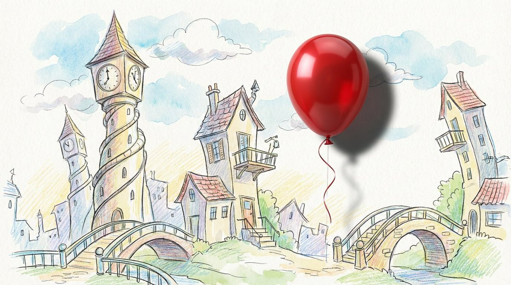

```
on Nano Banana Pro : Visualize a whimsical illustration of a cityscape, drawn in a playful, sketch-like style with pencil lines and soft watercolor fills creating a charming, storybook feel. The buildings are a mix of classic and fantastical architecture, with exaggerated features like spiraling towers and floating balconies. Amidst this illustrated backdrop, a single, ultra-realistic red balloon floats through the scene. The balloon stands out with its glossy texture and lifelike reflections, casting a realistic shadow over the illustrated buildings below. It's as if a real balloon has drifted into an imaginative, drawn world, creating a captivating contrast between the two-dimensional illustration and the three-dimensional realism of the balloon.
```

```
描绘一幅充满奇趣的城市景观插画，采用富有玩味的素描风格，以铅笔线条和柔和的水彩填充营造出迷人的童话书般的感觉。建筑融合了经典与奇幻风格，具有夸张的元素，如螺旋塔楼和漂浮阳台。在这幅插画背景中，一只超写实的红色气球缓缓飘过场景。气球以其光亮的质感和逼真的反光脱颖而出，并在下方的插画建筑上投下真实的阴影，仿佛一个真实的气球飘入了这个想象中的手绘世界，在二维插画与三维写实气球之间形成引人入胜的对比。
```

 [↑返回目录](#toc)

---
## <a id="prompt-1997909307682079000">夜色中的女人</a> (<a href="https://x.com/lexx_aura/status/1997909307682079051" target="_blank" rel="noopener noreferrer">Lex</a>)

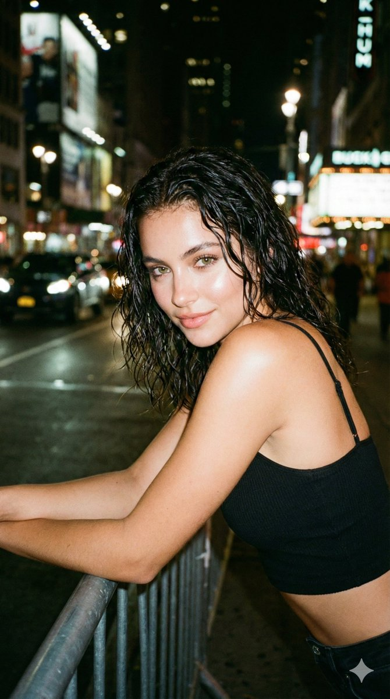

```
{
  "subject": {
    "gender": "female",
    "age": "young adult",
    "hair": {
      "color": "dark brown",
      "texture": "wet look",
      "style": "long, wavy, messy, loose strands framing face"
    },
    "eyes": {
      "color": "green/hazel",
      "makeup": "subtle winged eyeliner, natural eyeshadow"
    },
    "skin": {
      "tone": "light/fair",
      "texture": "smooth, dewy finish, high sheen on shoulder and cheekbones",
      "makeup": "soft contour, glossy lips"
    },
    "expression": "soft smile, direct eye contact, alluring"
  },
  "apparel": {
    "top": {
      "type": "crop top",
      "color": "black",
      "material": "ribbed fabric",
      "fit": "tight",
      "straps": "thin straps"
    },
    "bottom": {
      "visible": "waistband",
      "color": "black"
    }
  },
  "pose": {
    "action": "leaning forward",
    "arms": "resting on a railing",
    "angle": "3/4 portrait view"
  },
  "environment": {
    "setting": "city street at night",
    "background": "blurred urban cityscape, bokeh streetlights, car headlights, building lights",
    "atmosphere": "nightlife, candid"
  },
  "lighting": {
    "type": "flash photography style mixed with ambient street lighting",
    "highlights": "strong specular highlights on skin (shoulder, forehead, nose)",
    "shadows": "soft shadows defining facial features"
  },
  "camera_settings": {
    "shot_type": "medium close-up",
    "depth_of_field": "shallow",
    "focus": "sharp on face"
  },
  "camera_details": {
    "camera_model": "Canon EOS R5 Mirrorless Digital Camera",
    "lens": "Canon RF 85mm f/1.2L USM Lens",
    "aperture": "f/1.4",
    "iso": "1600",
    "shutter_speed": "1/100s",
    "focal_length": "85mm",
    "white_balance": "Auto (AWB) with slight tungsten warmth",
    "flash_type": "Direct on-camera flash with diffuser",
    "image_format": "RAW",
    "color_profile": "Adobe RGB"
  }
}
```

```
{
  "主体": {
    "性别": "女性",
    "年龄": "年轻成人",
    "头发": {
      "颜色": "深棕色",
      "质感": "湿发效果",
      "发型": "长发、波浪、凌乱，几缕松散发丝勾勒脸型"
    },
    "眼睛": {
      "颜色": "绿色/淡褐色",
      "妆容": "细微上扬眼线，自然眼影"
    },
    "皮肤": {
      "色调": "浅色/白皙",
      "质感": "光滑，水润光泽感，肩部与颧骨高光明显",
      "妆容": "柔和修容，亮面唇妆"
    },
    "表情": "温柔微笑，直视镜头，迷人"
  },
  "服装": {
    "上衣": {
      "类型": "短款上衣",
      "颜色": "黑色",
      "材质": "罗纹面料",
      "版型": "紧身",
      "肩带": "细肩带"
    },
    "下装": {
      "可见部分": "腰头",
      "颜色": "黑色"
    }
  },
  "姿势": {
    "动作": "身体前倾",
    "手臂": "搭在栏杆上",
    "角度": "3/4人像视角"
  },
  "环境": {
    "场景": "夜晚城市街道",
    "背景": "模糊的城市景观，散景街灯、车灯与建筑灯光",
    "氛围": "夜生活，抓拍感"
  },
  "灯光": {
    "类型": "闪光摄影风格混合环境街灯照明",
    "高光": "皮肤上的强烈镜面高光（肩部、额头、鼻梁）",
    "阴影": "柔和阴影勾勒面部轮廓"
  },
  "相机设置": {
    "拍摄类型": "中近景",
    "景深": "浅景深",
    "焦点": "面部清晰对焦"
  },
  "相机细节": {
    "相机型号": "佳能 EOS R5 无反数码相机",
    "镜头": "佳能 RF 85mm f/1.2L USM 镜头",
    "光圈": "f/1.4",
    "ISO": "1600",
    "快门速度": "1/100秒",
    "焦距": "85mm",
    "白平衡": "自动白平衡（AWB），略带钨丝灯暖调",
    "闪光灯类型": "机顶直闪配柔光罩",
    "图像格式": "RAW",
    "色彩配置文件": "Adobe RGB"
  }
}
```

 [↑返回目录](#toc)

---
## <a id="prompt-1997676205139501000">冰封行者：雾冰囚影</a> (<a href="https://x.com/YZOkulu/status/1997676205139501129" target="_blank" rel="noopener noreferrer">Yapay Zeka Okulu</a>)

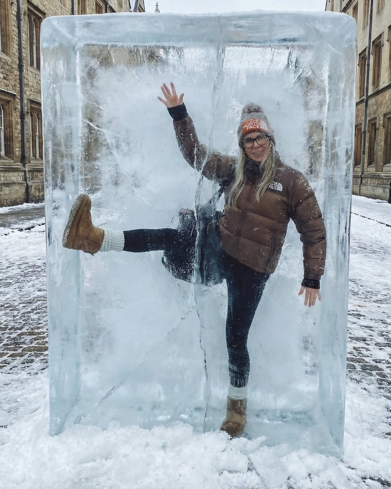

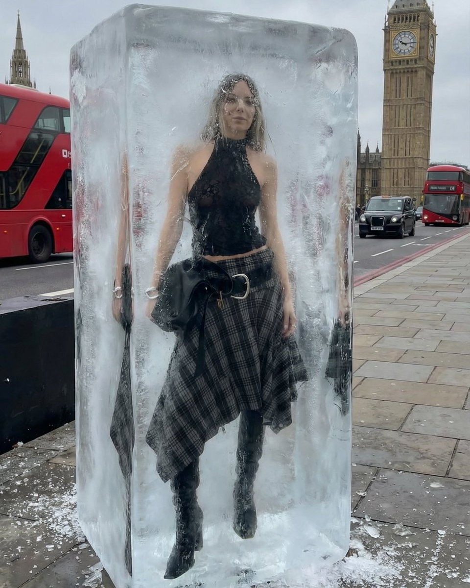

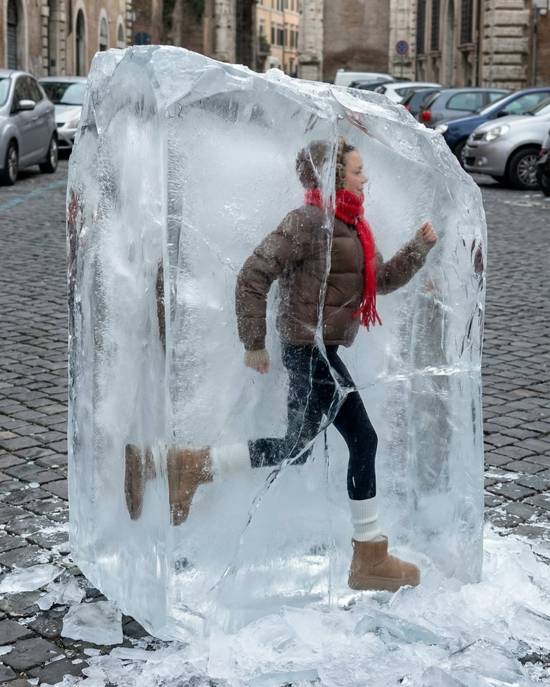

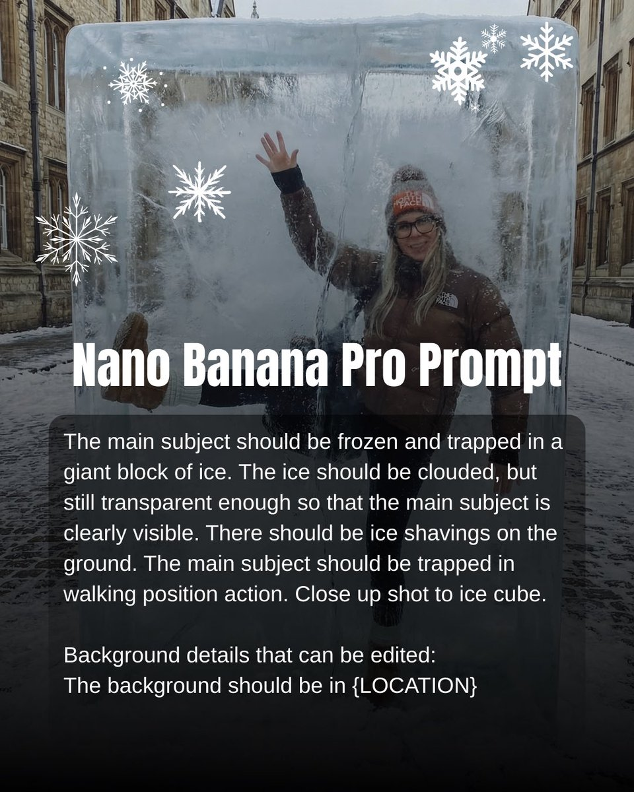

```
The main subject should be frozen and trapped in a giant block of ice. The ice should be clouded, but still transparent enough so that the main subject is clearly visible. There should be ice shavings on the ground. The main subject should be trapped in walking position action. Close up shot to ice cube. The background should be in {LOCATION}
```

```
主体应被冻结并困在一个巨大的冰块中。冰块应呈雾状，但仍需足够透明，使主体清晰可见。地面上应有冰屑。主体应以行走姿态被冻结。镜头应为冰块的特写。背景应为{LOCATION}。
```

 [↑返回目录](#toc)

---
## <a id="prompt-1997528999115853800">深海存储的超现实揭示</a> (<a href="https://x.com/umesh_ai/status/1997528999115853928" target="_blank" rel="noopener noreferrer">Umesh</a>)


```
Upgraded from cloud storage to deep sea storage!

Prompt on Nano Banana Pro : A [SUBJECT] is crouching on the beach, lifting a wave like a carpet to reveal a [OBJECT] lying underneath deep inside. The ocean is calm with a clear blue sky in the background. The scene creates a clever illusion, in a surreal manner, with the wave being lifted as if it is a tangible object
```

```
一个[主体]蹲在海滩上，掀起一道海浪如同掀开地毯一般，露出深藏其下的[物体]。背景是平静的海洋与清澈的蓝天。整个场景以超现实的方式营造出一种巧妙的错觉，仿佛海浪是一件可被掀动的实体物品。
```

 [↑返回目录](#toc)

---
## <a id="prompt-1997636224555639000">3D角色设计创作流程</a> (<a href="https://x.com/0xInk_/status/1997636224555638959" target="_blank" rel="noopener noreferrer">INK</a>)


```
grab a pen

character design using Freepik Spaces and Nano Banana Pro

workflow:
> draw on paper
> apply your 3D style
> build the 3D character
> animate it with Kling 2.6
```

```
拿起一支笔

使用 Freepik Spaces 和 Nano Banana Pro 进行角色设计

工作流程：  
> 在纸上绘制  
> 应用你的 3D 风格  
> 构建 3D 角色  
> 使用 Kling 2.6 进行动画制作
```

 [↑返回目录](#toc)

---
## <a id="prompt-1997943993943134500">唐裳古风写真</a> (<a href="https://x.com/brad_zhang2024/status/1997943993943134554?s=20" target="_blank" rel="noopener noreferrer">烟花老师（一支烟花）</a>)

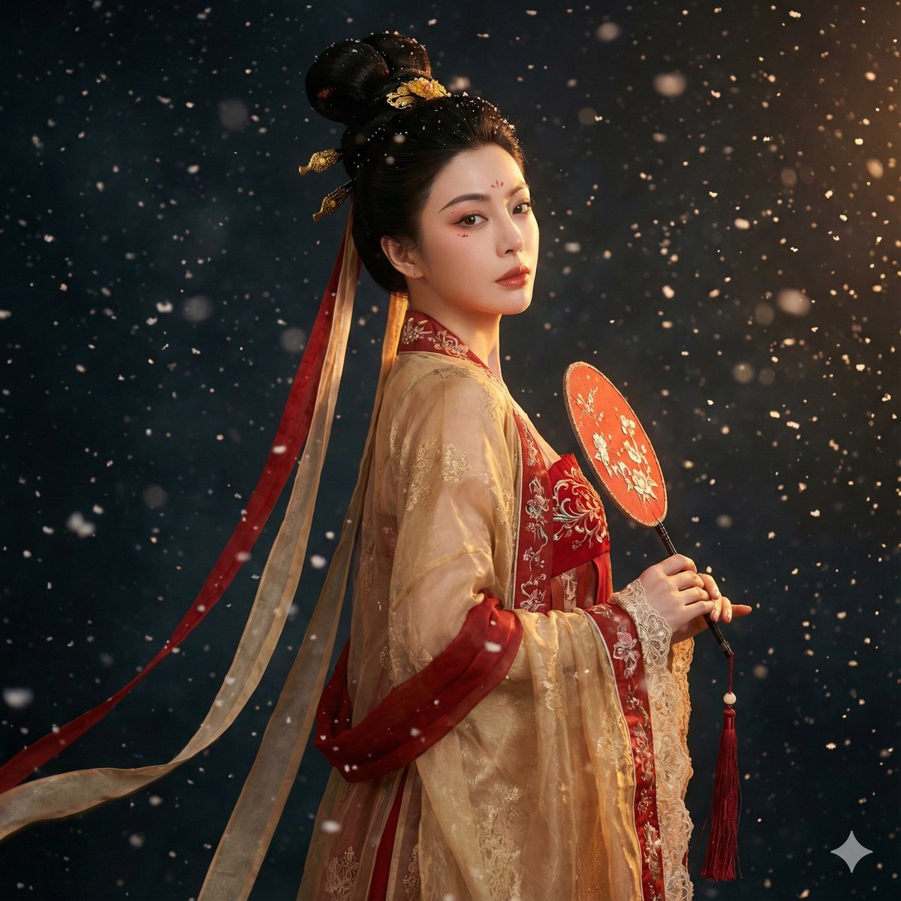

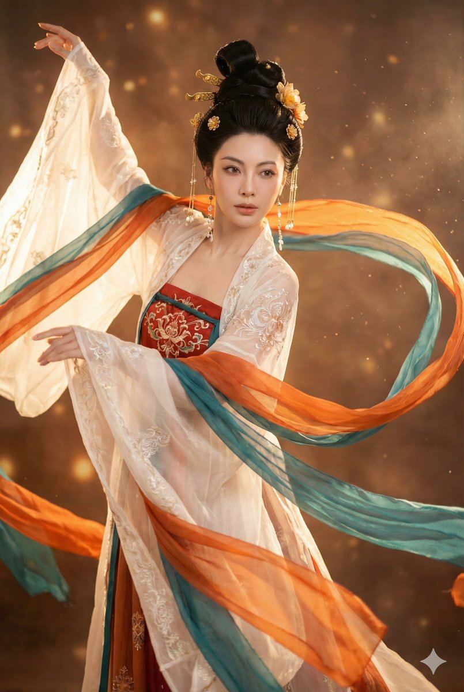

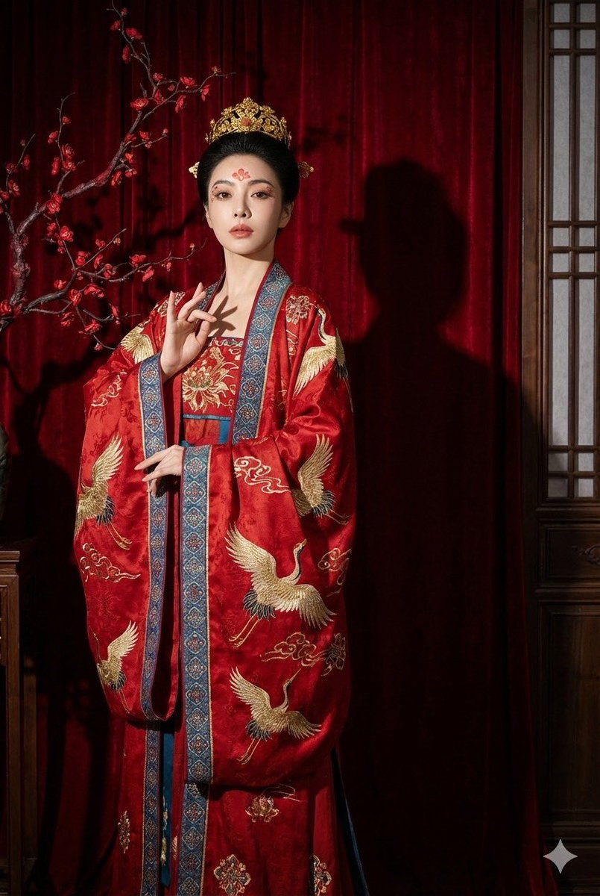


```
4K hyper-detailed fashion photograph featuring hyper-realistic rendering. 

 **Crucial Character Consistency:** The character featured is precisely the same person shown in reference images , 
 maintaining consistent facial features, hair style, and body structure across all shots.

{
  "core_structure": {
    "description": "一张超写实的电影感肖像，描绘了一位身着华丽唐代服装（齐胸襦裙）的年轻女子，手持红色刺绣团扇，在飘雪的黑色背景中回眸。",
    "elements": [
      {
        "object": "人物主体",
        "attributes": ["年轻东亚女性", "精致唐风妆容(花钿, 面靥)", "回眸姿态", "优雅"]
      },
      {
        "object": "服饰 (唐风)",
        "attributes": ["唐代齐胸襦裙 (Tang Dynasty Qixiong Ruqun)", "袒领/低胸抹胸 (Low-cut bodice)", "半透明大袖衫 (Sheer wide sleeves)", "飘逸的披帛 (Flowing Pibo ribbon)", "红色与金色主调"]
      },
      {
        "object": "发型",
        "attributes": ["唐代高髻 (High bun)", "牡丹花发饰", "金步摇", "华丽发梳"]
      },
      {
        "object": "道具",
        "attributes": ["红色刺绣团扇 (保持不变)", "精致流苏"]
      },
      {
        "object": "环境",
        "attributes": ["飘落的雪花 (Falling snow)", "黑色背景 (Dark background)", "微光氛围"]
      }
    ]
  },
  "style_definition": {
    "primary_style": "photorealistic | cinematic | classical Chinese portrait",
    "rendering_quality": "8k resolution | ultra-detailed | masterpiece",
    "surface_textures": ["silk", "lace", "skin texture", "snow particles"],
    "lighting": "rim lighting | soft facial spotlight | moody dark atmosphere"
  },
  "technical_specifications": {
    "camera_settings": {
      "depth_of_field": "shallow depth of field",
      "focal_length": "85mm",
      "aperture": "f/1.8",
      "exposure": "low key with highlight on face"
    },
    "resolution": "professional quality",
    "rendering": ["high contrast", "sharp focus"],
    "physics_accuracy": ["natural fabric flow", "frozen snow motion"]
  },
  "material_properties": {
    "skin_textures": ["pale", "soft"],
    "fabric_details": ["embroidery", "sheer gauze (typical for Tang)", "layered silk"],
    "surfaces": ["matte background", "reflective jewelry"],
    "transparency": ["translucent outer sleeves"]
  },
  "environmental_factors": {
    "atmosphere": ["cold but romantic", "quiet", "ethereal"],
    "time_season": ["winter night", "snowing"],
    "particles": ["white snowflakes", "cold breath"]
  },
  "composition_controls": {
    "perspective": "eye-level",
    "framing": "medium shot | looking back over shoulder",
    "subject_placement": "center-right biased"
  },
  "quality_keywords": {
    "include": ["Tang Dynasty fashion", "historical accuracy", "snowy night", "beautiful eyes"],
    "avoid": ["high collar (Ming style)", "thick clothes", "modern makeup"],
    "reference": ["Tang Dynasty paintings", "cinematic photography"]
  }
}

```

 [↑返回目录](#toc)

---
## <a id="prompt-1997789514526564600">Nano Banana Pro 手机视角</a> (<a href="https://x.com/SDT_side/status/1997789514526564650" target="_blank" rel="noopener noreferrer">SDT🌿</a>)


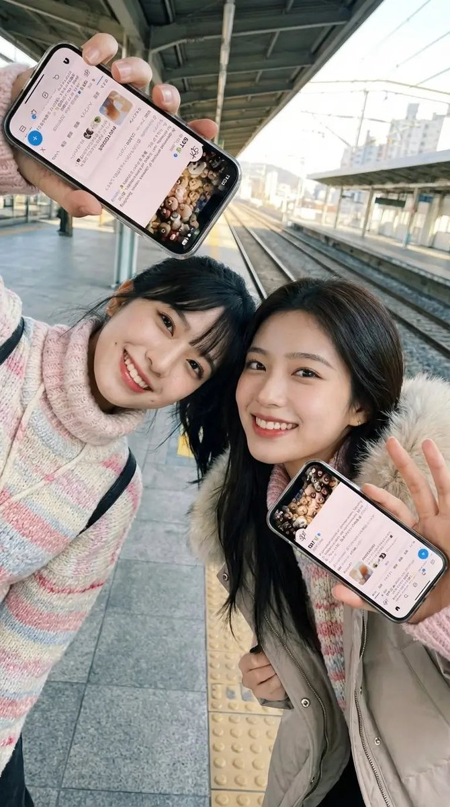

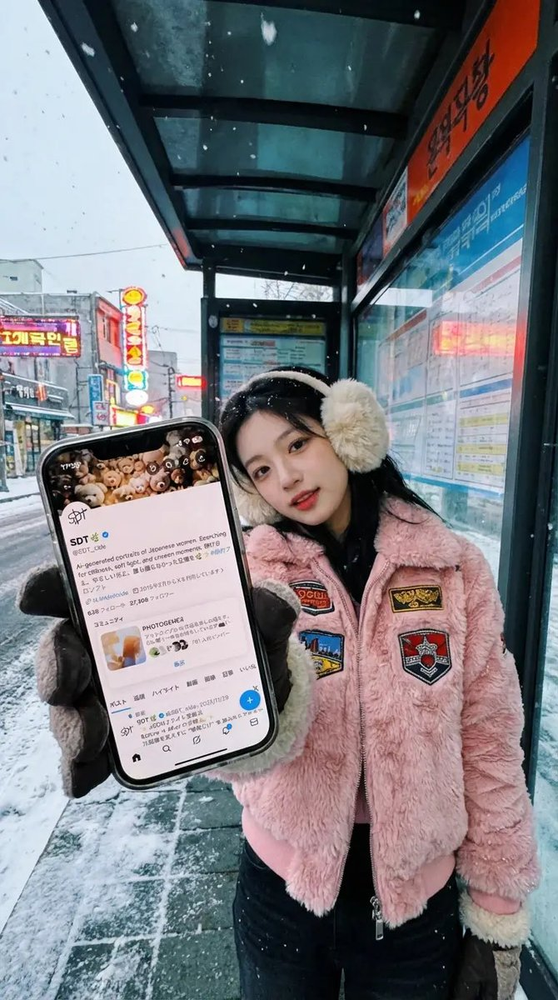

```
①人物の写真をアップロード
②スマホに映したい画像をアップロード
③この JSON をそのまま貼る
{
  "edit_type": "extreme_wide_angle_phone_edit",

  "source": {
    "_hint": "元画像の人物・服・雰囲気を編集するベース。新キャラ禁止。",
    "mode": "EDIT",
    "reference_images": {
      "first": "base_photo_person_and_environment",
      "second": "screen_content_for_phone"
    },
    "preserve_from_first": {
      "_hint": "顔・髪型・服装は必ず同一人物として扱うための固定。",
      "same_person_or_group": true,
      "same_faces": true,
      "same_hairstyles": true,
      "same_outfits": true,
      "same_environment_style": true
    }
  },

  "identity": {
    "_hint": "表情の統一化。人物のアイデンティティを崩さず保持。",
    "keep_identity_consistent": true,
    "all_people_clearly_recognizable_as_original": true,
    "expression": "bright_natural_smile"
  },

  "camera_effect": {
    "_hint": "スマホを近づけたときの誇張パースを美しく安定化。",
    "perspective": "extreme_wide_angle",
    "style": "dynamic_photorealistic",
    "near_objects_appear_large": true,
    "far_objects_recede_dramatically": true,
    "allow_view_from_above_or_below": true
  },

  "pose": {
    "_hint": "元画像と同じポーズ禁止。手の動きを強調して破綻防止。",
    "pose_can_change": true,
    "must_be_completely_different_from_reference": true,
    "do_not_replicate_or_approximate_original_pose": true,
    "style_tags": [
      "stylish",
      "complex",
      "fluid",
      "powerful"
    ],
    "focus_on_expressive_hands": true,
    "avoid_arm_distortion": true,
    "allow_multiple_body_parts_near_lens": true
  },

  "phone": {
    "_hint": "スマホ専用領域。持ち方・向き・手元の自然さを定義。",
    "allowed": true,
    "holding_styles": [
      "one_handed",
      "two_handed",
      "low_angle",
      "high_angle",
      "tilted",
      "sideways",
      "near_chest",
      "near_hip",
      "casual_carry",
      "partially_toward_lens"
    ],
    "rules": {
      "_hint": "“レンズに向ける強制”を避け、自然な持ち方で画面が見える構図へ。",
      "each_person_may_hold_one_phone": true,
      "priority_is_natural_and_relaxed_body_structure": true,
      "do_not_force_phone_directly_toward_camera": true,
      "screen_should_be_naturally_visible_when_possible": true
    }
  },

  "screen_replacement": {
    "_hint": "差し替えスクリーン。UIなし・歪みなし・自然な貼り込み。",
    "target": "visible_phone_screen",
    "use_second_reference_image_as_content": true,
    "overlay_cleanly_on_visible_screen_area": true,
    "fit_without_distortion": true,
    "respect_screen_shape": true,
    "no_additional_cropping": true,
    "ui_constraints": {
      "_hint": "SNSバーやアプリ枠の発生を完全禁止。",
      "no_ui": true,
      "no_icons": true,
      "no_status_bar": true,
      "no_app_frame": true,
      "show_only_content_from_second_reference": true
    }
  },

  "environment": {
    "_hint": "元写真の空気感を保つが、季節や天気には依存しない汎用設計。",
    "preserve_environment_style_from_reference": true,
    "lighting_consistent_with_reference": true,
    "expand_space_for_wide_angle_view": true,
    "keep_texture_and_color_tone_consistent": true
  },

  "composition": {
    "_hint": "スマホ近接によるダイナミック構図の安定化。",
    "dynamic_but_readable": true,
    "extreme_depth_emphasis": true,
    "allow_phone_close_to_lens": true,
    "keep_all_people_visually_balanced": true
  },

  "constraints": {
    "_hint": "意図せぬ変化を禁止する保護設定。",
    "no_new_characters": true,
    "no_change_in_age_or_gender_presentation": true,
    "no_costume_change": true,
    "no_change_to_reference_location_type": true,
    "respect_original_photographic_style": true
  }
}
```

 [↑返回目录](#toc)

---
## <a id="prompt-1997664853792567600">情绪四重奏：她的今日心情</a> (<a href="https://x.com/craftian_keskin/status/1997664853792567564" target="_blank" rel="noopener noreferrer">Keskin</a>)

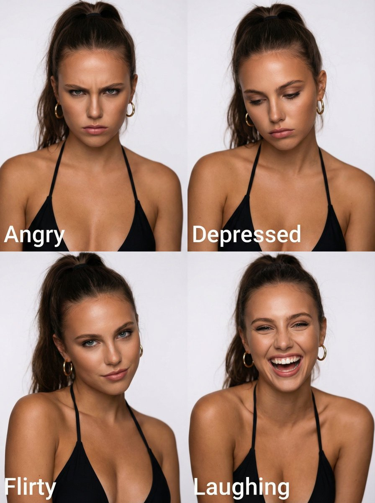

```
{
  "scene": {
    "format": "4_photo_collage",
    "layout": "2_columns_2_rows",
    "aspect_ratio": "3:4",
    "label_position": "top_center_white_text",
    "background": "soft_minimal_studio_backdrop"
  },
  "subject": {
    "identity": "same_girl_from_reference",
    "appearance": {
      "hair": "dark_brown_high_ponytail",
      "skin_tone": "warm_tan",
      "features": "same_face_structure",
      "accessories": ["gold_hoop_earrings"],
      "outfit": "bikini",
      "visible_area": "upper_body_chest_to_head",
      "makeup": "natural_glow"
    },

    "style": "hyper_realistic_portrait_photography",
    "camera": {
      "lens": "85mm_portrait",
      "framing": "upper_body_close_up",
      "lighting": "soft_diffused_beauty_light",
      "focus": "sharp_on_eyes_and_face"
    }

  },
  "photos": [
       { "mood": "ANGRY", "expression": "tense_brows_narrowed_eyes", "label": "Angry" },
   
    { "mood": "DEPRESSED", "expression": "downward_gaze_low_energy", "label": "Depressed" },

    { "mood": "FLIRTY", "expression": "half_smirk_head_tilt", "label": "Flirty" },

    { "mood": "LAUGHING", "expression": "open_mouth_genuine_laughter", "label": "Laughing" }

  ],

  "render_style": {

    "detail": "micro_skin_texture_hair_strands_realistic_shadows",

    "color_grade": "natural_skin_tones_high_dynamic_range"

  }

}
```

```
{
  "scene": {
    "format": "4张照片拼贴",
    "layout": "2列2行",
    "aspect_ratio": "3:4",
    "label_position": "顶部居中白色文字",
    "background": "柔和极简摄影棚背景"
  },
  "subject": {
    "identity": "与参考图相同的女孩",
    "appearance": {
      "hair": "深棕色高马尾",
      "skin_tone": "暖调小麦色肌肤",
      "features": "相同面部结构",
      "accessories": ["金色圆环耳环"],
      "outfit": "比基尼",
      "visible_area": "上半身（胸部至头部）",
      "makeup": "自然光泽妆"
    },

    "style": "超写实人像摄影",
    "camera": {
      "lens": "85mm人像镜头",
      "framing": "上半身特写",
      "lighting": "柔光漫射美颜灯光",
      "focus": "眼部与面部清晰对焦"
    }

  },
  "photos": [
       { "mood": "生气", "expression": "皱眉眯眼", "label": "生气" },
   
    { "mood": "抑郁", "expression": "目光低垂、无精打采", "label": "抑郁" },

    { "mood": "调情", "expression": "半边嘴角上扬、头部微倾", "label": "调情" },

    { "mood": "大笑", "expression": "张嘴开怀大笑", "label": "大笑" }

  ],

  "render_style": {

    "detail": "微米级皮肤纹理、发丝细节、真实阴影",

    "color_grade": "自然肤色、高动态范围"

  }

}
```

 [↑返回目录](#toc)

---
## <a id="prompt-1997787952110240000">外滩四季：时光流转的魔都画卷</a> (<a href="https://x.com/dotey/status/1997787952110239874" target="_blank" rel="noopener noreferrer">宝玉</a>)

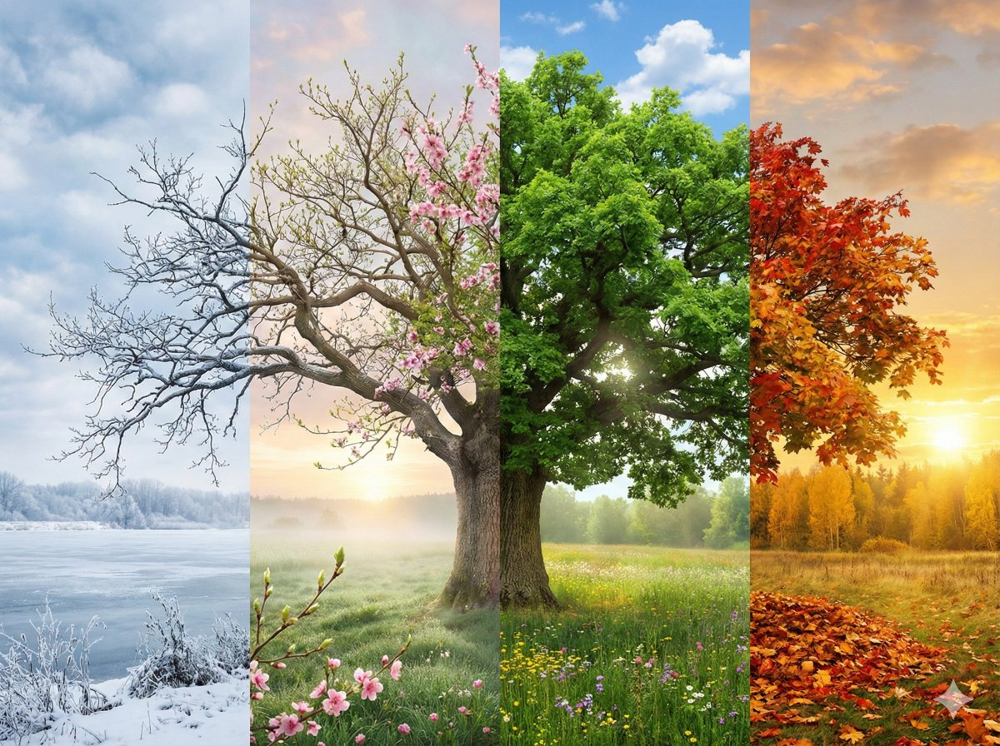

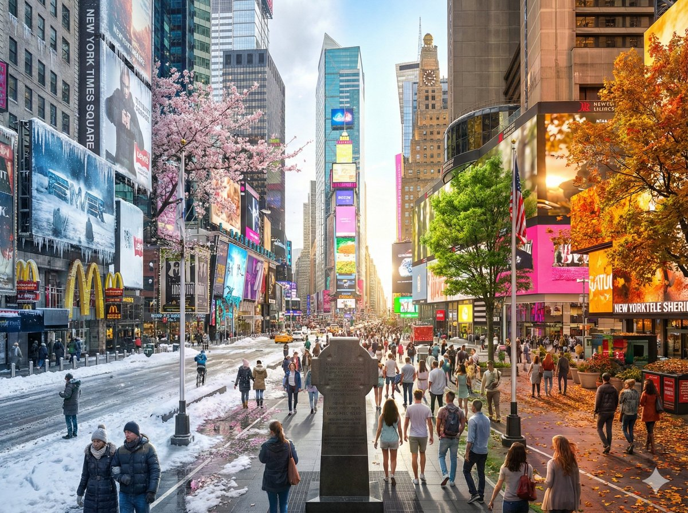

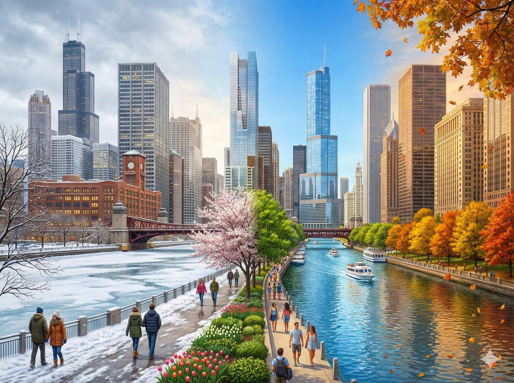

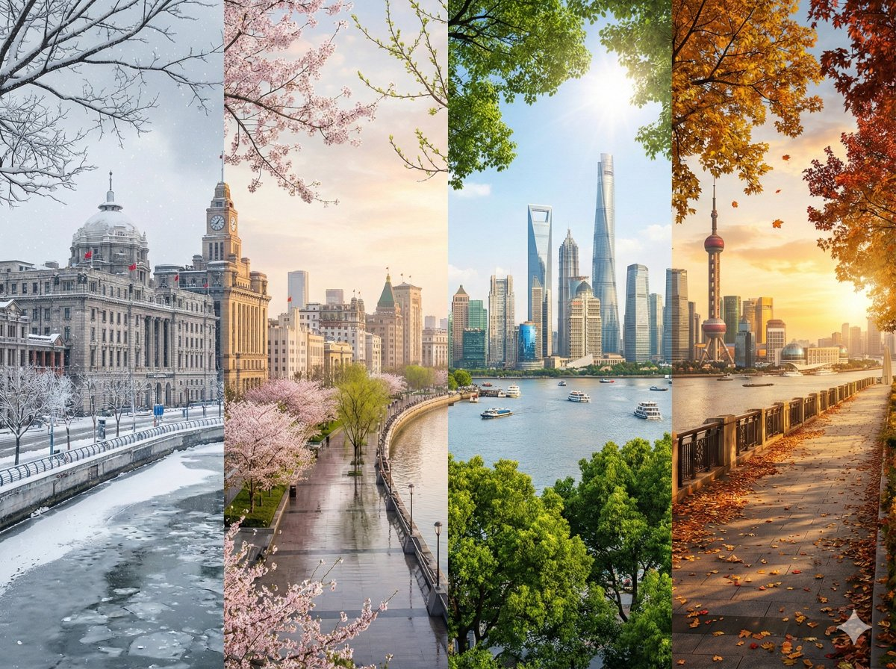

```
Create a mesmerizing passage of time with this prompt, seamlessly blending all four seasons—from Winter’s snow to Autumn’s gold—into a single, unified masterpiece. ❄️🌸☀️🍁

---- Prompt ----

Hyper-realistic digital illustration of {Scene}, presented as a single continuous composition showcasing the cycle of seasons. The scene flows seamlessly from left to right in a natural progression: Winter, Spring, Summer, and Autumn. 

The left side features cold snowy winter elements, gradually thawing into the fresh green buds and blooms of spring, then morphing into the lush vibrant vegetation and bright sunlight of summer, and finally transitioning into the golden, orange, and red hues of autumn on the far right. 

There are no visible dividing lines between seasons; the weather, lighting, and vegetation blend smoothly to create a unified and harmonious panorama. Rich in detail, symbolic of the passage of time, cinematic lighting, 8k resolution, highly detailed textures. --ar 4:3

----

Scene：the historic Shanghai Bund waterfront looking across the Huangpu River to the futuristic Lujiazui district
```

```
用此提示词创作一段令人着迷的时光流转，将四季——从冬日的白雪到秋日的金黄——无缝融合为一幅统一的杰作。❄️🌸☀️🍁

---- 提示词 ----

超写实数字插画，描绘{场景}，以单一连续构图展现四季更迭。画面从左至右自然过渡：冬季、春季、夏季和秋季。

左侧呈现寒冷雪景的冬日元素，逐渐融化为春季新生的绿芽与花朵，继而演变为夏季繁茂葱郁的植被与明媚阳光，最终在最右侧转为秋季的金黄、橙红与深红色调。

四季之间无明显分界线，天气、光线与植被平滑交融，营造出和谐统一的全景画面。细节丰富，象征时光流逝，采用电影级光影效果，8K分辨率，纹理高度精细。--ar 4:3

----

场景：历史悠久的上海外滩滨水区，眺望黄浦江对岸未来感十足的陆家嘴金融区
```

 [↑返回目录](#toc)

---
## <a id="prompt-1997757264518680800">浮雕肖像金属硬币</a> (<a href="https://x.com/TechieBySA/status/1997757264518680728" target="_blank" rel="noopener noreferrer">TechieSA</a>)


```
A detailed metallic coin featuring [CHARACTER]’s face embossed in profile, crafted with realistic engraved textures and fine relief detailing. The coin surface shows light reflections, scratches, and metallic sheen. Include subtle inscriptions or symbols around the border to resemble authentic minting. Centered on a dark, minimal background to emphasize the coin’s texture and realism. 1080x1080.
```

```
一枚精细的金属硬币，正面以浮雕形式呈现[CHARACTER]的侧面肖像，具有逼真的雕刻纹理和精细的浮雕细节。硬币表面展现光线反射、划痕和金属光泽。边缘饰有微妙的铭文或符号，仿照真实铸币工艺。置于深色极简背景中央，以突出硬币的质感与真实感。1080x1080。
```

 [↑返回目录](#toc)

---
## <a id="prompt-1997902145912521000">复古少女与怀旧墙</a> (<a href="https://x.com/SimplyAnnisa/status/1997902145912520989" target="_blank" rel="noopener noreferrer">Anissa</a>)


```
Young woman with natural face (no edits), vintage-retro style. Long dark hair, fair skin, serious sensual expression. She's fixing her hair with her hand, wearing a light blue shirt with black edges. Background is a wall full of Thai celebrity posters and photos with a nostalgic vibe, warm natural lighting.
```

```
自然面容（未经修饰）的年轻女子，复古风格。黑色长发，白皙皮肤，神情严肃而性感。她正用手整理头发，身穿浅蓝色衬衫，边缘为黑色。背景是一面贴满泰国明星海报和照片的墙，充满怀旧氛围，采用温暖的自然光线。
```

 [↑返回目录](#toc)

---
## <a id="prompt-1997504385761329400">咖啡杯中的芝加哥微缩奇境</a> (<a href="https://x.com/dotey/status/1997504385761329330" target="_blank" rel="noopener noreferrer">宝玉</a>)

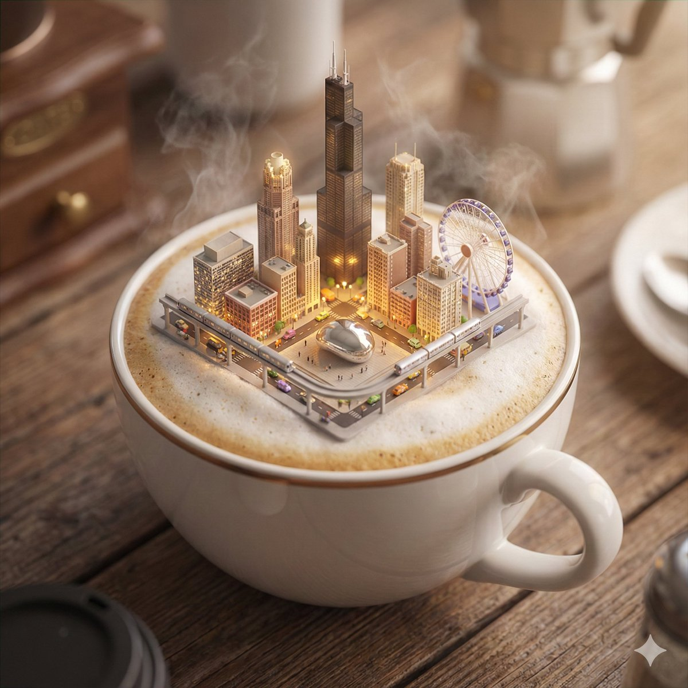

```
☕️✨ A dreamy, cinematic 3D miniature city floats atop cappuccino foam—explore iconic landmarks in stunning 8K detail! Share your own creations!

---- Prompt ----

Present a clear, 45° top-down view of an isometric miniature 3D cartoon scene, highlighting iconic landmarks centered in the composition to showcase precise and delicate modeling. 

A close-up of a porcelain coffee cup filled with cappuccino foam, subtly floating a detailed city of {city, default to user's current location} occupying most of the composition. Prominently displayed at the scene's center are the city's most iconic landmarks, vividly detailed and illuminated softly. 

Miniature streets feature realistic, tiny vehicles moving seamlessly. With cinematic-quality lighting and depth-of-field blurring, the image creates a magical, dreamlike atmosphere. Exceptionally detailed and highly photorealistic, the scene achieves an 8K cinematic finish. 

Aspect ratio: 1:1.

---

city: Chicago
```

```
清晰的45°俯视图，展示一个等角微型3D卡通场景，突出显示位于中心的标志性建筑，以展现精确而细致的建模。

一个装满卡布奇诺泡沫的瓷咖啡杯的特写，其中细致的城市（城市名为芝加哥，也可以是用户当前所在位置的默认城市）微妙地浮动着，占据大部分构图。场景中心显著展示了城市中最著名的地标，细节生动并柔和照亮。

微观街道上有着逼真的小车在无缝移动。通过电影质量的照明和景深模糊效果，图像营造出一种魔幻、梦幻般的氛围。整个场景异常详细且高度逼真，达到了8K电影级完成度。

比例：1:1。
```

 [↑返回目录](#toc)

---
## <a id="prompt-1997510560309711400">超广角超写实人体戏剧</a> (<a href="https://x.com/Ankit_patel211/status/1997510560309711238" target="_blank" rel="noopener noreferrer">ANKIT PATEL 🇮🇳 | AI</a>)


```
Nice prompt shared by @AI_GIRL_DESIGN

Transform the original photo into a dramatic, photorealistic, ultra wide-angle shot with an extreme camera angle (including views from directly below or above), where one or more body parts are right next to the lens and look huge, the rest of the body recedes in perspective, and the same person strikes a stylish, complex, powerful pose in a consistent, expanded version of the original environment.
```

```
由 @AI_GIRL_DESIGN 分享的优质提示词

将原始照片转化为一张戏剧性、超写实、超广角镜头的画面，采用极端拍摄角度（包括正下方或正上方视角），使一个或多个身体部位紧贴镜头并显得巨大，其余身体部分随透视逐渐缩小，同时人物在与原环境一致且扩展后的场景中摆出时尚、复杂而有力的姿势。
```

 [↑返回目录](#toc)

---
## <a id="prompt-1997683512820768800">知性时尚休息室写真肖像</a> (<a href="https://x.com/YaseenK7212/status/1997683512820768826" target="_blank" rel="noopener noreferrer">Yaseen Khan Gul</a>)

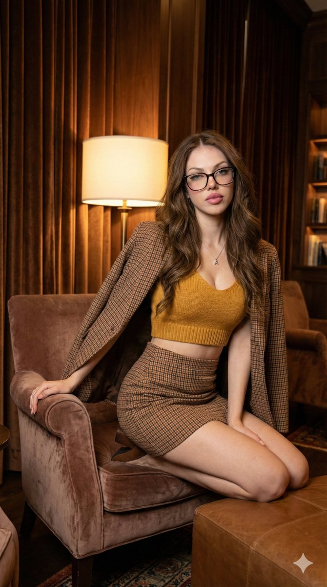

```
{
  "pipeline_sequence_v5": {
    "global_settings": {
      "project_name": "INTELLECTUAL_CHIC_LOUNGE",
      "render_target": {
        "width": 1080,
        "height": 1920,
        "ratio": "9:16"
      },
      "seed_strategy": "Fixed",
      "steps": 50
    },
    "node_01_subject_initialization": {
      "module": "Identity_Preservation",
      "parameters": {
        "source_input": "Attached_Image_Buffer",
        "face_restore_strength": 1.0,
        "feature_lock": {
          "eyes": "Strict",
          "nose": "Strict",
          "mouth": "Strict",
          "skin_texture": "Blend_with_Prompt"
        }
      },
      "morphology": {
        "hair": {
          "style": "Long Wavy",
          "color": "Brown",
          "physics": "Soft_Drape"
        },
        "makeup": {
          "lips": "Soft Pink",
          "finish": "Matte",
          "intensity": "Natural"
        }
      }
    },
    "node_02_kinematics_control": {
      "module": "ControlNet_OpenPose",
      "pose_skeleton": {
        "body_orientation": "Seated",
        "spine_curve": "Upright_Confident",
        "right_leg": {
          "state": "Bent_Elevated",
          "contact_surface": "Chair_Seat_Edge"
        },
        "left_leg": {
          "state": "Relaxed_Grounded"
        },
        "head_vector": {
          "pitch": 0,
          "yaw": 0,
          "target": "Lens_Direct"
        }
      }
    },
    "node_03_wardrobe_assembly": {
      "module": "Layered_Clothing_Generator",
      "layers": [
        {
          "layer_id": 1,
          "item": "Crop Top",
          "material": "Knit/Cotton",
          "color_hex": "# E1AD01 (Mustard Yellow)",
          "fit": "Fitted"
        },
        {
          "layer_id": 2,
          "item": "Mini Skirt",
          "style": "High-Waisted",
          "pattern": "Plaid_Tartan",
          "color_palette": "Brown_Navy_Mix"
        },
        {
          "layer_id": 3,
          "item": "Blazer",
          "pattern": "Matching_Plaid_Set",
          "wear_style": "Draped_Over_Shoulders",
          "physics_constraint": "No_Arm_Insertion"
        },
        {
          "layer_id": 4,
          "item": "Accessories",
          "elements": [
            { "type": "Eyewear", "style": "Dark-rimmed Glasses" }
          ]
        }
      ]
    },
    "node_04_environment_stage": {
      "module": "Scene_Builder",
      "setting_type": "Lounge_Interior",
      "assets": {
        "furniture": "Plush_Armchair",
        "background_elements": "Soft_Curtains",
        "material_override": "Rich_Brown_Fabrics"
      },
      "atmosphere": {
        "mood": "Intellectual_Warm",
        "clutter_density": "Low_Elegant"
      }
    },
    "node_05_lighting_engine": {
      "module": "Illumination",
      "setup": {
        "primary_source": "Warm_Window_Light",
        "fill_light": "Interior_Ambient_Soft",
        "color_grading_lut": "Vintage_Warmth",
        "shadow_quality": "Soft_Diffusion"
      }
    }
  }
}
```

```
{
  "pipeline_sequence_v5": {
    "global_settings": {
      "project_name": "知性时尚休息室",
      "render_target": {
        "width": 1080,
        "height": 1920,
        "ratio": "9:16"
      },
      "seed_strategy": "固定",
      "steps": 50
    },
    "node_01_subject_initialization": {
      "module": "身份保留",
      "parameters": {
        "source_input": "附加图像缓冲区",
        "face_restore_strength": 1.0,
        "feature_lock": {
          "eyes": "严格",
          "nose": "严格",
          "mouth": "严格",
          "skin_texture": "与提示融合"
        }
      },
      "morphology": {
        "hair": {
          "style": "长卷发",
          "color": "棕色",
          "physics": "柔顺垂坠"
        },
        "makeup": {
          "lips": "柔粉色",
          "finish": "哑光",
          "intensity": "自然"
        }
      }
    },
    "node_02_kinematics_control": {
      "module": "ControlNet_OpenPose",
      "pose_skeleton": {
        "body_orientation": "坐姿",
        "spine_curve": "挺直自信",
        "right_leg": {
          "state": "弯曲抬高",
          "contact_surface": "椅子座面边缘"
        },
        "left_leg": {
          "state": "放松着地"
        },
        "head_vector": {
          "pitch": 0,
          "yaw": 0,
          "target": "直视镜头"
        }
      }
    },
    "node_03_wardrobe_assembly": {
      "module": "分层服装生成器",
      "layers": [
        {
          "layer_id": 1,
          "item": "短款上衣",
          "material": "针织/棉质",
          "color_hex": "#E1AD01（芥末黄）",
          "fit": "贴身"
        },
        {
          "layer_id": 2,
          "item": "迷你裙",
          "style": "高腰",
          "pattern": "格纹",
          "color_palette": "棕海军混色"
        },
        {
          "layer_id": 3,
          "item": "西装外套",
          "pattern": "配套格纹套装",
          "wear_style": "披在肩上",
          "physics_constraint": "不穿入袖子"
        },
        {
          "layer_id": 4,
          "item": "配饰",
          "elements": [
            { "type": "眼镜", "style": "深色边框眼镜" }
          ]
        }
      ]
    },
    "node_04_environment_stage": {
      "module": "场景构建器",
      "setting_type": "休息室室内",
      "assets": {
        "furniture": "柔软扶手椅",
        "background_elements": "柔和窗帘",
        "material_override": "浓郁棕色织物"
      },
      "atmosphere": {
        "mood": "知性温暖",
        "clutter_density": "低密度优雅"
      }
    },
    "node_05_lighting_engine": {
      "module": "照明引擎",
      "setup": {
        "primary_source": "温暖窗光",
        "fill_light": "室内柔和环境光",
        "color_grading_lut": "复古暖调",
        "shadow_quality": "柔和漫射"
      }
    }
  }
}
```

 [↑返回目录](#toc)

---
## <a id="prompt-1997578886566285600">3D卡通场景中的创意二维码</a> (<a href="https://x.com/trxuanxw/status/1997578886566285567?s=20" target="_blank" rel="noopener noreferrer">Terry</a>)


```
**Task:** Create an exquisite, miniature 3D cartoon-style scene representing a specific industry, featuring a seamlessly integrated QR code.

**Perspective & Style:**
Present a charming, detailed miniature 3D scene viewed from a 45° top-down perspective. The style should be reminiscent of high-quality Cinema 4D rendering: refined, smoothly rounded modeling, rich textures, and stylized PBR materials. Gentle, lifelike lighting with soft shadows should create a warm, playful, and comfortable ambiance. The background should be a clean, minimalist solid color to make the miniature world pop.

**Central Focus & QR Code Integration:**
At the center of the scene, place a prominent, stylized building or main structure that embodies the **[User Input: Industry Name]**.

Crucially, the user-provided **[User Input: QR Code Image]** must be creatively and seamlessly integrated into this central area. It should **NOT** look like a flat sticker or an afterthought.
*Examples of integration:* It could be fashioned as the central plaza paving stones, embedded into the facade of the main building as a glowing architectural element, designed as a futuristic rooftop garden layout, or forming a large, stylized billboard that fits the scene's aesthetic naturally. The QR code must remain scannable but look like an intrinsic, textured part of the 3D world.

**Surrounding Details:**
Complement the central structure with proportionally-sized, playful 3D elements relevant to the **[User Input: Industry Name]**. Include charming, tiny cartoon figures engaged in industry-specific activities, appropriate miniature vehicles, and floating icons or micro-scenes that illustrate the essence of that field. The scene should be bustling with cute, detailed activity.

**Text Element:**
At the top-center of the scene, prominently display the **[User Input: Industry Name]** in a large, friendly, cartoon-style font. The text should have no background and may subtly overlap with the top edge of the 3D scene to enhance integration.

**Parameters:**
* **Industry Name:** {XXX}
```

 [↑返回目录](#toc)

---
## <a id="prompt-1997605299448856800">ジオラマで旅する世界</a> (<a href="https://x.com/hAru_mAki_ch/status/1997605299448856749" target="_blank" rel="noopener noreferrer">Maki@Sunwood AI Labs.</a>)


```
🍌 nano banana pro エージェントV1.2を使って、経度と緯度を指定したら、その場所のジオラマができる
「ミニチュア・ジオラマ作家プロンプト」爆誕！
これは楽しい！！

ーーー📒プロンプトーーー
あなたは世界的に著名な「ミニチュア・ジオラマ作家兼写真家」です。
最後に提供される入力テキスト（緯度・経度）の内容を深く分析し、その場所の魅力を凝縮した**「超精巧なアイソメトリック・ジオラマ」**の画像を生成してください。

その際、添付された参照画像のキャラクターを、**「ジオラマの世界観に合わせた観光ガイド役のフィギュア」**として配置してください。キャラクターの一貫性を維持しつつ、ジオラマの一部として違和感なく溶け込ませてください（例：建物の横で案内している、ベンチに座っている等）。

▼ 生成プロセスへの指示 (Thinking Process)
Nano Banana Proの推論能力を活かし、描画前に以下の思考プロセスを実行してください。

1.  **[ステップ1: 地理的特定と要素抽出]**: 入力された緯度・経度が示す具体的な場所（都市、ランドマーク、自然地形）を特定してください。その場所を象徴する「3つの主要な視覚的要素（例：エッフェル塔、桜並木、石畳）」を選定し、構成要素とします。
2.  **[ステップ2: ミニチュア化の翻訳]**: 現実の風景を「模型」として翻訳してください。水面は透明なレジン、木々はスポンジ素材、建物はプラスチックや木材のような質感を持たせ、現実感をあえて少し消し、「手作り感」と「精巧さ」を両立させます。
3.  **[ステップ3: 空間演出]**: ジオラマは正方形の木製台座の上に構築します。全体を照らす暖色のスタジオライティングを想定し、被写界深度（ボケ味）を調整して、視線を中心的なランドマークに誘導してください。

▼ デザイン・スタイル指定
* **構図・レイアウト**: 斜め上45度からのアイソメトリック視点（等角投影図）。背景はすっきりとしたボケのあるスタジオ背景。
* **テイスト**: チルトシフト（Tilt-shift）写真風。マクロレンズで撮影したような浅い被写界深度。高彩度で温かみのあるライティング。
* **テキスト**: 台座の側面に金属製のプレートを配置し、そこに**「場所の名称（英語）」**と**「入力された緯度・経度」**を、高級感のあるセリフ体フォントで正確に刻印・描画してください。
* **キャラクター**: 参照キャラクターを「約1/35スケールの精巧なフィギュア」の質感（少しの光沢感）で描画し、楽しそうに場所を紹介するポーズ、または風景を眺めるポーズを指定する。

▼ 入力テキスト
(ここに緯度・経度を入力してください。例：35.6586° N, 139.7454° E)
```

 [↑返回目录](#toc)

---
## <a id="prompt-1997685526217064400">风中凝视：超现实女性肖像写真</a> (<a href="https://x.com/Adam38363368936/status/1997685526217064488" target="_blank" rel="noopener noreferrer">Adam也叫吉米</a>)

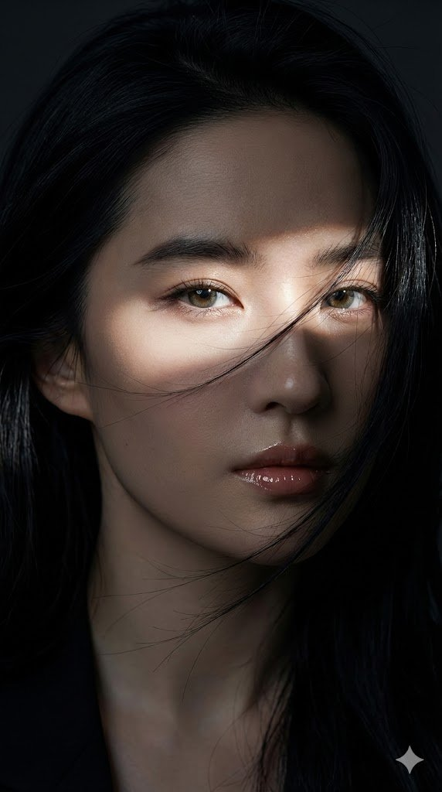

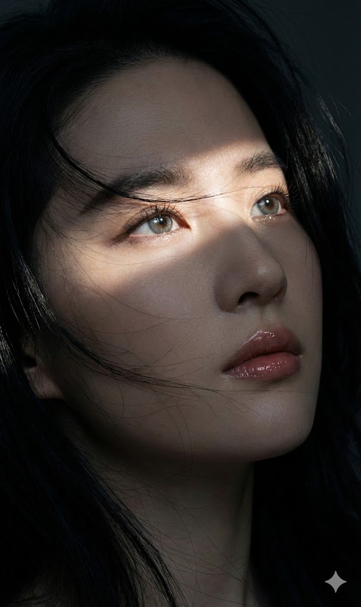

```
{

"style": "8K ultra-realistic close-up portrait",

"subject": {

"gender": "female",

"skin_tone": "fair",

"face_reference": "100% identical to the uploaded image",

"hair": {

"color": "black",

"movement": "windswept",

"details": "partially covering one eye"

},

"expression": {

"gaze": "elevated, intense",

"features": {

"irises": "light-colored, illuminated",

"cheekbones": "high and sharply defined",

"lips": "glossy"

}

}

},

"lighting": {

"type": "natural",

"direction": "sharp diagonal beam",

"effect": "illuminates gaze and facial structure",

"shadows": "deep, enveloping the rest of the face and background"

},

"mood": "dark, cinematic, editorial",

"resolution": "8K",

"camera": {

"shot_type": "close shot",

"focus": "extreme clarity on illuminated facial features"

}

}
```

```
{
"风格": "8K超现实主义特写肖像",

"主题": {

"性别": "女性",

"肤色": "白皙",

"面部参考": "与上传的图像100%相同",

"头发": {

"颜色": "黑色",

"动态": "被风吹拂",

"细节": "部分遮住一只眼睛"

},

"表情": {

"目光": "抬高，强烈",

"特征": {

"虹膜": "浅色，发光",

"颧骨": "高且轮廓分明",

"嘴唇": "有光泽"

}

}

},

"光线": {

"类型": "自然光",

"方向": "锐利的对角线光束",

"效果": "照亮目光和面部结构",

"阴影": "深邃，包裹脸部其余部分和背景"

},

"氛围": "黑暗，电影感，编辑性",

"分辨率": "8K",

"相机": {

"拍摄类型": "特写",

"焦点": "极端清晰度聚焦于发光的面部特征"

}
}
```

 [↑返回目录](#toc)

---
## <a id="prompt-1997517458195042600">自豪的黑白人像特写</a> (<a href="https://x.com/ChillaiKalan__/status/1997517458195042554" target="_blank" rel="noopener noreferrer">K</a>)


```
Generate a top-angle and close-up black and white portrait of my face, focused on the head facing forward. Use a 35mm lens look, 10.7K 4HD quality. Proud expression. Deep black shadow background - only the face, the upper chest, and the shoulder.
```

```
生成一张从顶部角度拍摄的黑白特写人像，聚焦于正面朝前的头部。使用35mm镜头效果，10.7K 4HD画质。表情自豪。深黑色阴影背景——仅包含脸部、上胸部和肩膀。
```

 [↑返回目录](#toc)

---
## <a id="prompt-1997901519643984000">水下双子座的纳米凝视</a> (<a href="https://x.com/xmliisu/status/1997901519643983935" target="_blank" rel="noopener noreferrer">Melisa♡</a>)

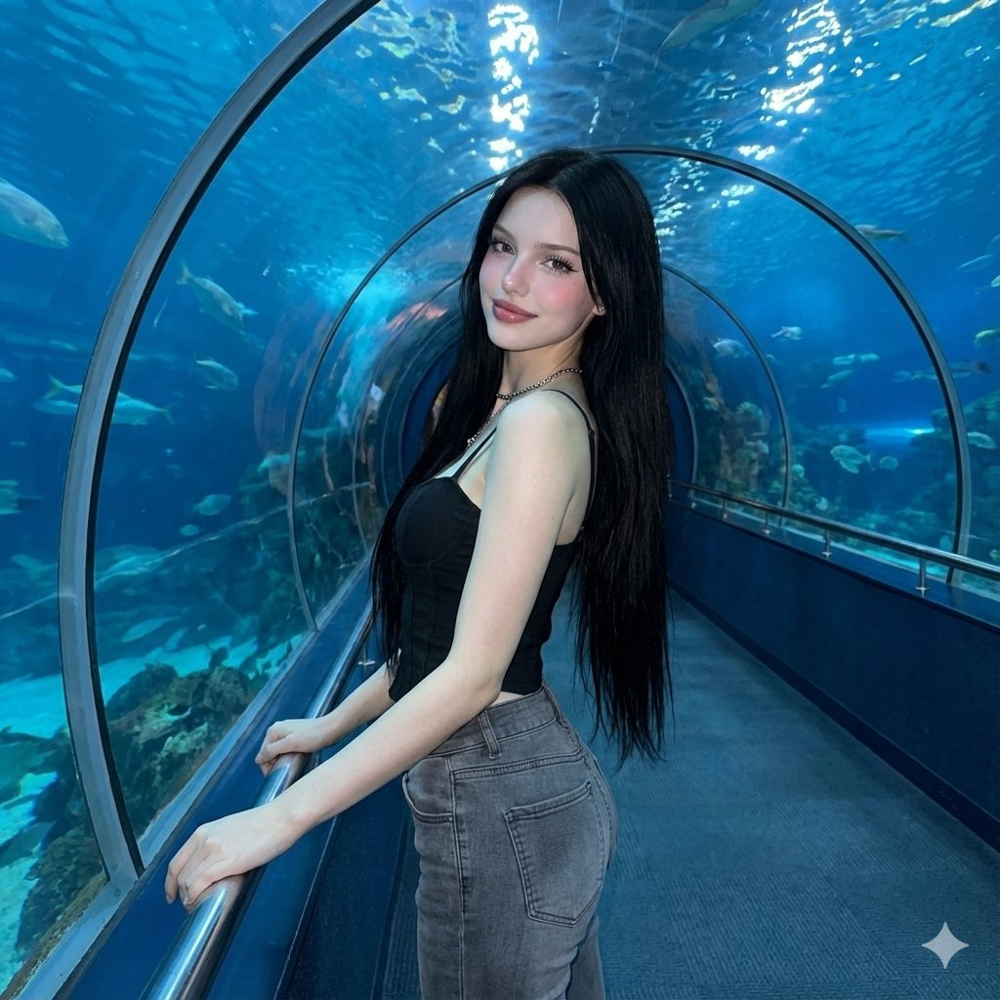

```
{
  "prompt": {
    "subject": {
      "description": "A young woman with a charming, captivating expression.",
      "hair": "Long, straight, natural black hair, thick, waist-length.",
      "makeup": {
        "style": "Douyin makeup",
        "details": "Light pink blush on cheeks and nose tip, slight highlight on cheeks, ombre rose pink lip gloss, brown contact lenses, long curled eyelashes in clusters, long tail eyeliner."
      },
      "body": "Slim figure, naturally large breasts.",
      "clothing": {
        "top": "Black corset-style top, tight around chest and waist.",
        "bottom": "Loose-fitting gray jeans, high-waisted, covering the Krasue.",
        "accessories": "Silver chain necklace with a small pendant."
      }
    },
    "action_and_expression": {
      "pose": "Body turned to the side towards the camera, standing in front of the glass wall, one hand on the railing, turning back to look at the camera.",
      "mood": "Quiet wonder, gentle, charming."
    },
    "setting": {
      "location": "Inside a large underwater observation tunnel, in front of a giant aquarium glass wall.",
      "background": "Vast and captivating underwater world with marine life.",
      "lighting": {
        "main_source": "Direct flash from the camera.",
        "ambient": "Light reflected from the water surface, creating a calm blue glow on her face, hair, and arms.",
        "atmosphere": "Deep, dreamy, imaginative, cool tones."
      }
    },
    "camera_and_style": {
      "device": "iPhone 15 Pro Max camera.",
      "style": "Realistic portrait, high-definition, professional focus on the woman.",
      "flash": "Direct flash used.",
      "resolution": "1200x1200px"
    },
    "constraints": {
      "face": "Keep the original face as in the attached picture. 100% realistic, no modification."
    }
  }
}
```

```
{
  "prompt": {
    "subject": {
      "description": "一位表情迷人、惹人注目的年轻女子。",
      "hair": "长直发，自然黑色，浓密，长度及腰。",
      "makeup": {
        "style": "抖音妆",
        "details": "脸颊和鼻尖带有淡粉色腮红，脸颊略带高光，渐变玫瑰粉色唇彩，棕色美瞳，簇状卷翘长睫毛，拉长眼线。"
      },
      "body": "身材苗条，胸部自然丰满。",
      "clothing": {
        "top": "黑色紧身胸衣式上衣，贴合胸部与腰部。",
        "bottom": "宽松灰色牛仔裤，高腰设计，遮盖住克拉苏（Krasue）。",
        "accessories": "一条银色细链项链，配有一个小巧吊坠。"
      }
    },
    "action_and_expression": {
      "pose": "身体侧向朝向镜头，站在玻璃墙前，一只手扶着栏杆，回头看向相机。",
      "mood": "安静而好奇，温柔迷人。"
    },
    "setting": {
      "location": "大型水下观景隧道内部，位于巨型水族馆玻璃墙前。",
      "background": "广阔迷人的水下世界，充满海洋生物。",
      "lighting": {
        "main_source": "相机直闪。",
        "ambient": "水面反射的光线，在她的脸部、头发和手臂上形成柔和的蓝色光晕。",
        "atmosphere": "深邃、梦幻、富有想象力，冷色调。"
      }
    },
    "camera_and_style": {
      "device": "iPhone 15 Pro Max 相机。",
      "style": "写实人像，高清画质，聚焦于女性主体。",
      "flash": "使用直闪。",
      "resolution": "1200x1200 像素"
    },
    "constraints": {
      "face": "保留所附图片中的原始面部，100% 写实，不得修改。"
    }
  }
}
```

 [↑返回目录](#toc)

---
## <a id="prompt-1997428572038844700">杰克·保罗：隐形风投巨星</a> (<a href="https://x.com/PolymarketMoney/status/1997428572038844578" target="_blank" rel="noopener noreferrer">Polymarket Money</a>)


```
Jake Paul could be one of the best performing venture investors of the last 10 years: 

> Invested in Ramp Seed round in 2019, now valued at $32B.

> Invested in Chronosphere seed round in 2019, acquired for $3.35B in November. 

> Invested in Anduril $8.48B series E in December 2022, now valued at $30.5B.

> Invested in Olipop $200M series B in 2022, now valued at $1.85B.

> Invested in
```

```
杰克·保罗可能是过去十年表现最出色的风投投资人之一：

> 2019年参与Ramp种子轮融资，该公司目前估值320亿美元。

> 2019年投资Chronosphere种子轮，该公司于今年11月以33.5亿美元被收购。

> 2022年12月参与Anduril的84.8亿美元E轮融资，该公司目前估值305亿美元。

> 2022年参与Olipop的2亿美元B轮融资，该公司目前估值18.5亿美元。

> 投资了
```

 [↑返回目录](#toc)

---
## <a id="prompt-1997616191272370700">雨夜霓虹中的沉思</a> (<a href="https://x.com/saniaspeaks_/status/1997616191272370598" target="_blank" rel="noopener noreferrer">𝗦𝗮𝗻𝗶𝗮</a>)

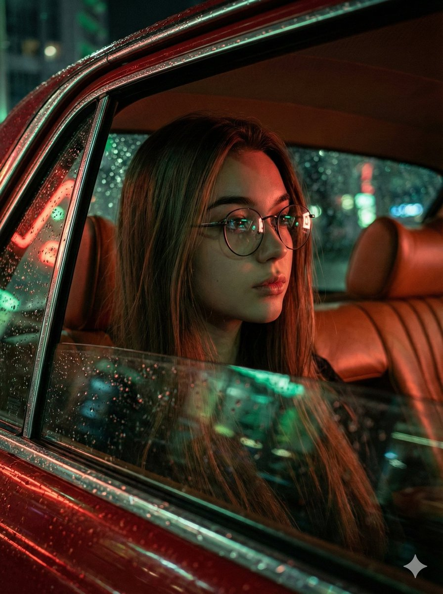

```
{  "image_generation_prompt": {    "subject": {      "description": "Cinematic hyper-realistic portrait of a young woman",      "pose": "Sitting slightly leaned back inside a vintage red car, gazing thoughtfully out the window",      "appearance": "Long brown hair, natural skin texture, wearing round wire-frame glasses",      "expression": "Calm, introspective"    },    "environment": {      "setting": "Nighttime inside a vintage car",      "interior": "Warm brown leather seats",      "atmosphere": "Rainy night, raindrops visible on the glass, wet window reflections",      "background": "Softly blurred glowing city lights (bokeh)"    },    "lighting": {      "style": "Moody neon lighting",      "colors": "Red and green tones",      "details": "Cinematic highlights, subtle neon reflections on face and glasses, directional soft light"    },    "technical_parameters": {      "lens": "35mm f/1.4",      "focus": "Creamy depth of field, sharp focus on eyes",      "quality": "8K, ultra high-resolution, hyper-detailed textures",      "aesthetic": "Cinematic contrast, slightly desaturated, filmic grain"    }  }}
```

```
{
  "image_generation_prompt": {
    "subject": {
      "description": "电影风格超现实年轻女性肖像",
      "pose": "坐在复古红色汽车内略微后仰，若有所思地凝视窗外",
      "appearance": "长棕色头发，自然皮肤质感，佩戴圆形金属框眼镜",
      "expression": "平静，内省"
    },
    "environment": {
      "setting": "夜晚在一辆复古汽车内",
      "interior": "温暖的棕色皮革座椅",
      "atmosphere": "雨夜，窗户上有可见的雨滴，湿滑的窗反射",
      "background": "柔和模糊的城市灯光（散景效果）"
    },
    "lighting": {
      "style": "忧郁的霓虹灯照明",
      "colors": "红色和绿色色调",
      "details": "电影亮点，脸部和眼镜上的微妙霓虹反射，定向柔光"
    },
    "technical_parameters": {
      "lens": "35毫米 f/1.4镜头",
      "focus": "奶油般的景深，眼睛锐利对焦",
      "quality": "8K，超高分辨率，超细致纹理",
      "aesthetic": "电影对比度，稍微脱色，胶片颗粒感"
    }
  }
}
```

 [↑返回目录](#toc)

---
## <a id="prompt-1997607350430294500">Gemini Nano Banana Pro</a> (<a href="https://x.com/lexx_aura/status/1997607350430294462" target="_blank" rel="noopener noreferrer">Lex</a>)

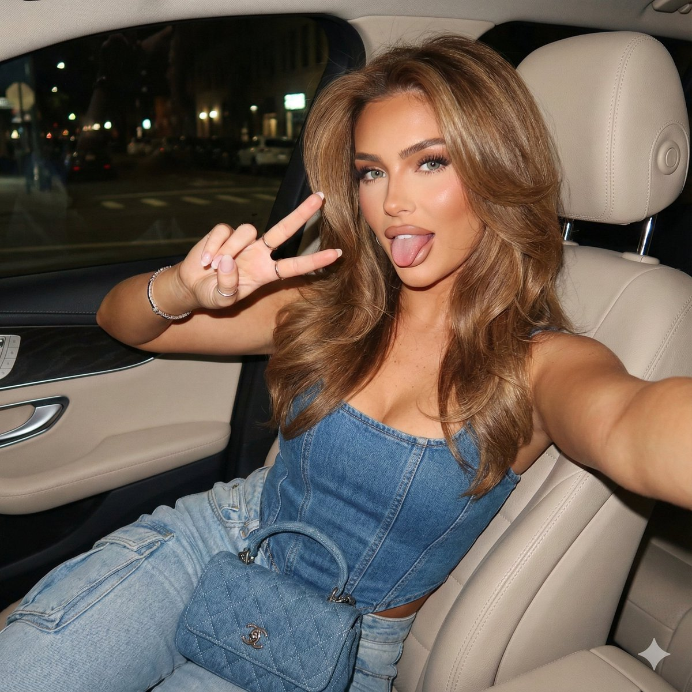

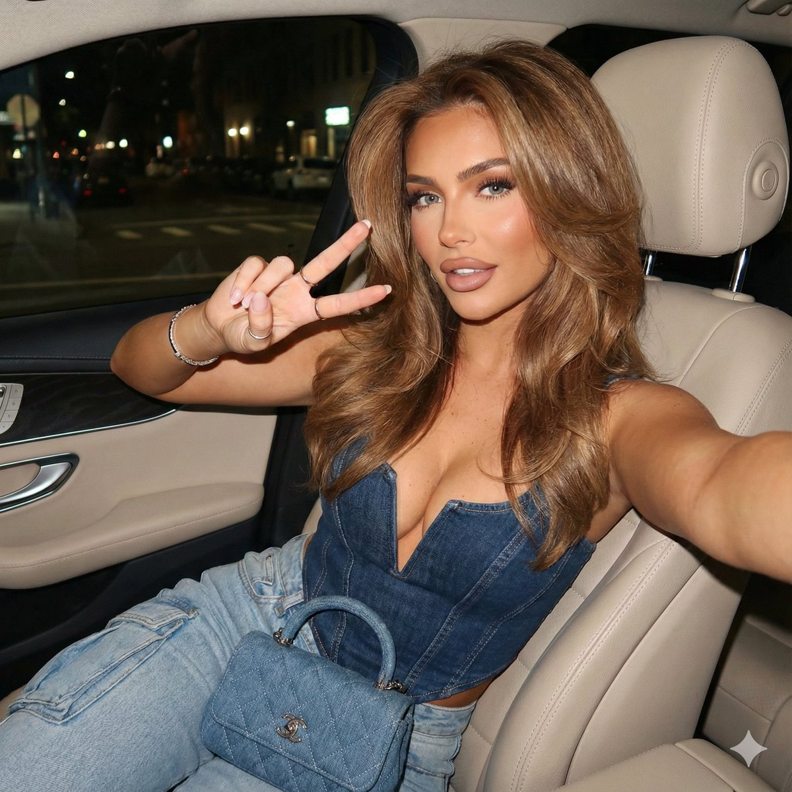

```
{
  "subject": {
    "demographics": "Young woman, tan skin tone, glamorous influencer aesthetic",
    "hair": {
      "color": "Caramel light brown with highlights",
      "style": "Voluminous 90s-style blowout, long layers, soft waves framing the face"
    },
    "face": {
      "eyes": "Light blue-green, defined with black eyeliner and lashes",
      "makeup": "Full glam, matte finish, heavy contour/bronzer, nude lip with darker liner",
      "expression": "Playful, sticking tongue out to the side, looking directly at the camera"
    }
  },
  "clothing": {
    "top": "Structured blue denim corset/bustier top with visible seam boning and a curved dipped hem",
    "bottoms": "Light wash blue denim jeans (cargo style visible)",
    "footwear": "Not visible"
  },
  "accessories": {
    "jewelry": [
      "Thin silver chain necklace",
      "Gold/metal bracelet on left wrist",
      "Minimalist rings on fingers"
    ],
    "nails": "Long, square-tipped, white manicure",
    "props": "Small blue quilted denim handbag (Chanel Classic Flap style) with silver hardware resting on lap"
  },
  "pose": {
    "type": "Selfie perspective",
    "action": "Sitting in the back seat of a car, left hand raised making a peace sign (V-sign)",
    "framing": "Medium shot, capturing upper body and lap"
  },
  "environment": {
    "setting": "Luxury car interior",
    "details": "Cream/beige leather seats and headrest, car door handle visible",
    "background": "Car window showing nighttime city street, blurred streetlights and darkness outside"
  },
  "camera_specifications": {
    "camera_model": "Canon PowerShot G7 X Mark III",
    "sensor_type": "1-inch stacked CMOS sensor",
    "lens": "24mm wide-angle equivalent, f/1.8 aperture",
    "shutter_speed": "1/60s (to capture ambient city lights in background)",
    "iso": "ISO 400",
    "lighting": "Direct on-camera Xenon flash, hard shadow throw, 'red-eye' reduction style",
    "film_emulsion": "Emulating Kodak Portra 400 NC for warm skin tones and fine grain",
    "post_processing": "High contrast, sharp texture, slightly desaturated blacks, 'flash photography' aesthetic, chromatic aberration on edges"
  }
}
```

```
{
  "主体": {
    "人物特征": "年轻女性，小麦肤色，具有华丽网红风格",
    "发型": {
      "发色": "焦糖浅棕色带高光",
      "发型": "蓬松的90年代吹风造型，长层次剪裁，柔和波浪修饰脸型"
    },
    "面部": {
      "眼睛": "浅蓝绿色，搭配黑色眼线和浓密睫毛",
      "妆容": "全脸浓妆，哑光质地，重度修容/古铜色阴影，裸色唇膏配深色唇线",
      "表情": "俏皮地将舌头歪向一侧，直视镜头"
    }
  },
  "服装": {
    "上衣": "结构感强的蓝色牛仔紧身胸衣/抹胸上衣，可见缝骨支撑条和弧形下摆",
    "下装": "浅色水洗蓝色牛仔裤（可见工装风格）",
    "鞋履": "不可见"
  },
  "配饰": {
    "首饰": [
      "细银链项链",
      "左手佩戴金色/金属手镯",
      "手指戴极简戒指"
    ],
    "指甲": "修长方形白甲",
    "道具": "膝上放置一款小巧的蓝色绗缝牛仔手袋（香奈儿经典翻盖包款式），配银色五金件"
  },
  "姿势": {
    "视角": "自拍视角",
    "动作": "坐在汽车后座，左手举起比出和平手势（V字）",
    "构图": "中景，涵盖上半身及膝盖"
  },
  "环境": {
    "场景": "豪华汽车内饰",
    "细节": "米色/奶油色皮革座椅与头枕，可见车门把手",
    "背景": "车窗外为夜晚城市街道，模糊的街灯与夜色"
  },
  "相机参数": {
    "相机型号": "佳能PowerShot G7 X Mark III",
    "传感器类型": "1英寸堆叠式CMOS传感器",
    "镜头": "等效24mm广角，f/1.8光圈",
    "快门速度": "1/60秒（用于捕捉背景中的环境城市灯光）",
    "ISO": "ISO 400",
    "照明": "机顶氙气闪光灯直打，硬阴影投射，具备“红眼减轻”效果",
    "胶片模拟": "模拟柯达Portra 400 NC胶片，呈现温暖肤色与细腻颗粒",
    "后期处理": "高对比度、锐利纹理、黑色略微去饱和，呈现“闪光摄影”风格，边缘带有色差效果"
  }
}
```

 [↑返回目录](#toc)

---
## <a id="prompt-1997303209111535900">伊斯坦布尔的魔幻微缩奇境</a> (<a href="https://x.com/kaanakz/status/1997303209111535773" target="_blank" rel="noopener noreferrer">Kaan</a>)

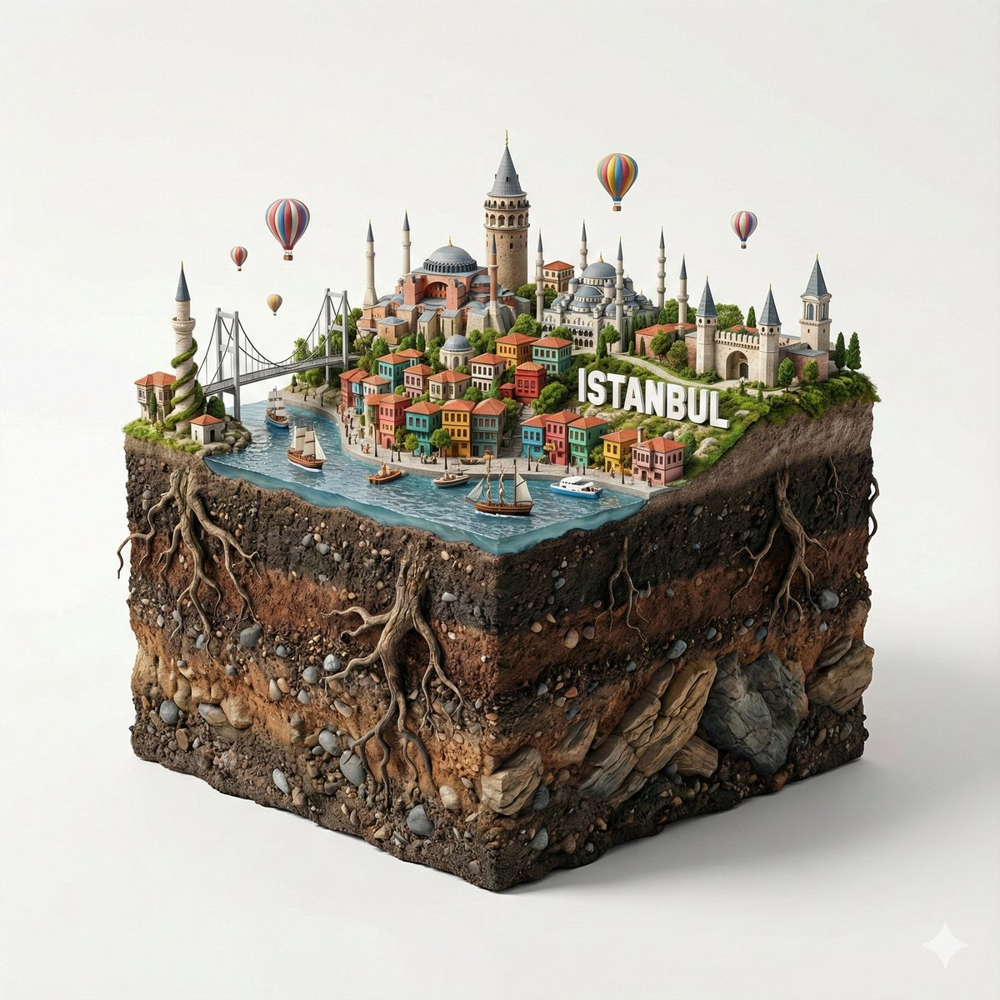

```
"Hyper-realistic 3D square diorama of Istanbul, carved out with exposed soil cross-section beneath showing rocks, roots, and earth layers. Above: whimsical fairytale cityscape featuring iconic landmarks, architecture, and cultural elements of Istanbul. Modern white “Istanbul” label integrated naturally. Pure white studio background with soft natural lighting. DSLR photograph quality - crisp, vibrant, magical realism style. 1080x1080 dimensions"
```

```
超写实3D方形微缩场景，展现伊斯坦布尔，下方为剖开的土壤横截面，露出岩石、树根和地层。上方为充满奇想的童话城市景观，融合伊斯坦布尔标志性建筑、文化元素与地标。现代白色“Istanbul”标签自然融入整体。纯白摄影棚背景，柔和自然光线。DSLR摄影画质——清晰、鲜艳，魔幻现实主义风格。1080x1080尺寸。
```

 [↑返回目录](#toc)

---
## <a id="prompt-1997340541764162000">大卫·杜楚尼的奇幻日常</a> (<a href="https://x.com/fofrAI/status/1997340541764161950" target="_blank" rel="noopener noreferrer">fofr</a>)

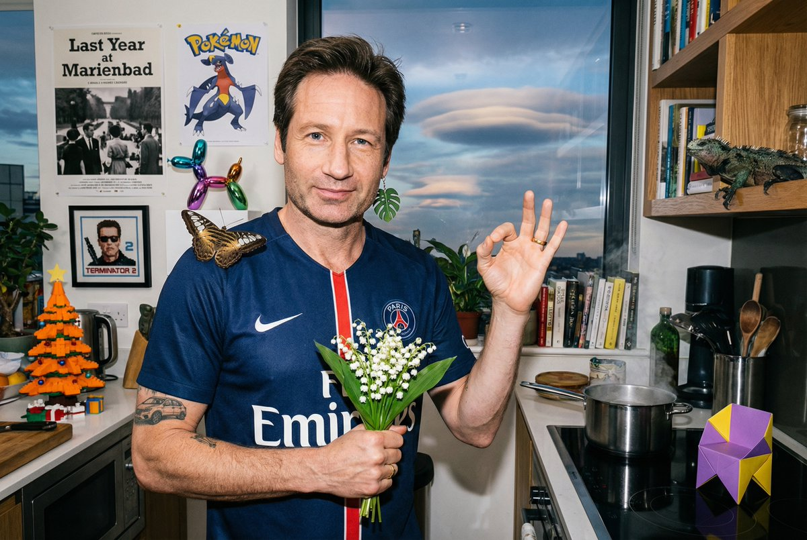

```
> A portrait photo of david duchovny, he is wearing a PSG kit, on his shoulder is a parthenos sylvia, in his hand he is holding lily of the valley, behind him there is a poster for the movie "Last Year at Marienbad" and a Garchomp poster. On a plinth there is a jeff koons sculpture. The sky through the window shows lenticular clouds. There is also a Terminator 2 cross-stitch on the wall. On his arm there is a tattoo of a Nissan Qashqai. There's an orange lego Christmas tree. The room has a high end decor, a pot is boiling on the NEFF hob. Next to the pot is a little origami chair made from purple and yellow paper. He has a dangling monstera leaf earring.  There is a pet marine iguana. In his other hand he is making the ok shape. On that hand there is a gold ring. The whole image gives the impression of a hastily taken photo, an everyday scene.
```

```
> 一张大卫·杜楚尼的肖像照片，他身穿巴黎圣日耳曼球衣，肩上停着一只帕拉斯女神蝶（Parthenos sylvia），手中握着铃兰；他身后挂着电影《去年在马里昂巴德》的海报和一只烈咬陆鲨（Garchomp）的海报。一个基座上摆放着杰夫·昆斯的雕塑。窗外天空中可见荚状云。墙上还有一幅《终结者2》的十字绣。他的手臂上纹着一辆日产逍客（Nissan Qashqai）的纹身。房间里有一棵橙色乐高圣诞树。房间装饰高端，NEFF 灶台上正煮着一锅东西，锅旁放着一把用紫色和黄色纸折成的微型折纸椅。他戴着一片垂挂的龟背竹叶子耳环。旁边有一只宠物海鬣蜥。他另一只手比出“OK”手势，手上戴着一枚金戒指。整张图像呈现出一种匆忙抓拍的日常场景感。
```

 [↑返回目录](#toc)

---
## <a id="prompt-1997574511705657900">裸眼3D小猫跃出城市屏幕</a> (<a href="https://x.com/dotey/status/1997574511705657772?s=20" target="_blank" rel="noopener noreferrer">宝玉</a>)

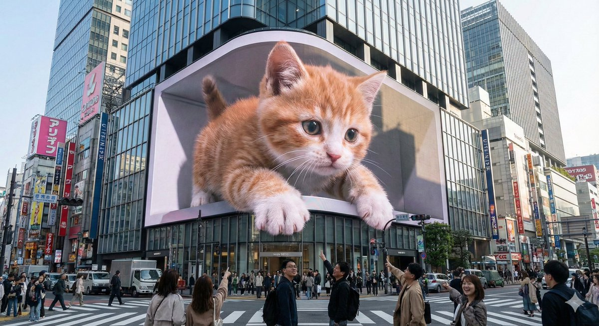

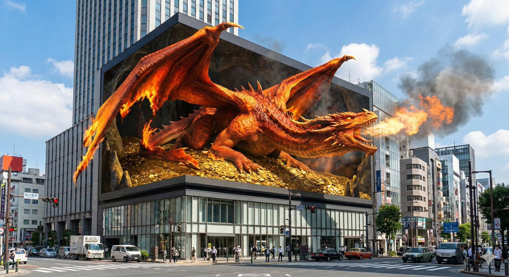

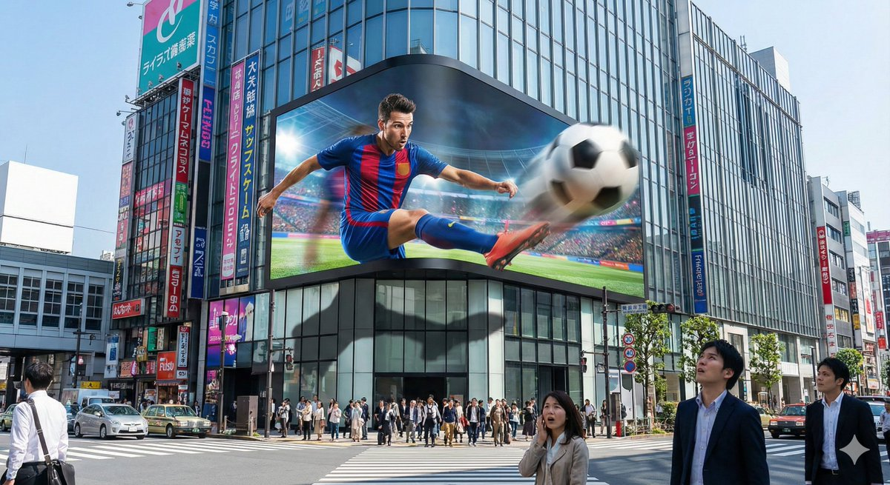

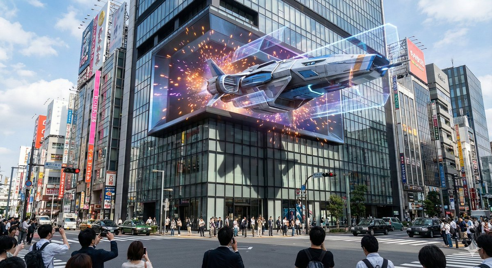

```
Experience stunning glasses-free 3D visuals on an iconic urban LED display—where fantasy and reality merge seamlessly at the heart of the city.

--- Prompt ---

An enormous L-shaped glasses-free 3D LED screen situated prominently at a bustling urban intersection, designed in an iconic architectural style reminiscent of Shinjuku in Tokyo or Taikoo Li in Chengdu. The screen displays a captivating glasses-free 3D animation featuring [scene description]. The characters and objects possess striking depth and appear to break through the screen’s boundaries, extending outward or floating vividly in mid-air. Under realistic daylight conditions, these elements cast lifelike shadows onto the screen’s surface and surrounding buildings. Rich in intricate detail and vibrant colors, the animation seamlessly integrates with the urban setting and the bright sky overhead.

----
scene description: 
[An adorable giant kitten playfully paws at passing pedestrians, its fluffy paws and curious face extending realistically into the space around the screen.]
```

```
在标志性的城市LED显示屏上体验惊艳的裸眼3D视觉效果——幻想与现实在城市中心无缝融合。

--- 提示词 ---

一块巨大的L形裸眼3D LED屏幕醒目地坐落于繁华的城市十字路口，其建筑设计风格极具标志性，令人联想到东京新宿或成都太古里。屏幕上正播放一段引人入胜的裸眼3D动画，内容为[场景描述]。画面中的角色与物体具有强烈的立体感，仿佛突破屏幕边界，向外延伸或生动地悬浮于空中。在逼真的日光条件下，这些元素在屏幕表面及周围建筑上投下栩栩如生的阴影。动画细节丰富、色彩鲜艳，与城市环境和明亮的天空完美融合。

----
场景描述：  
[一只可爱的巨型小猫顽皮地用爪子轻拍路过的行人，它毛茸茸的爪子和好奇的脸庞逼真地伸展到屏幕周围的空间中。]
```

 [↑返回目录](#toc)

---
## <a id="prompt-1997619606186283500">闪光自拍</a> (<a href="https://x.com/xmliisu/status/1997619606186283445" target="_blank" rel="noopener noreferrer">Melisa♡</a>)

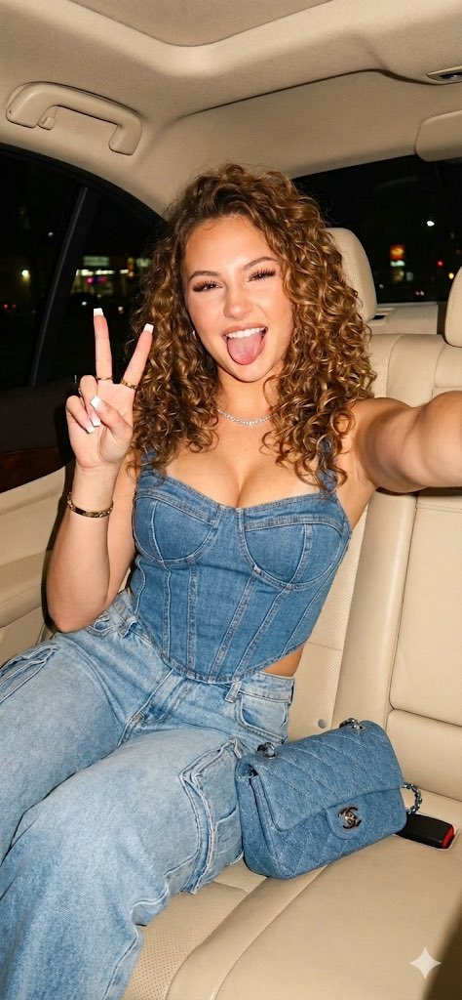

```
{
  "subject": {
    "demographics": "Young woman, tan skin tone, glamorous influencer aesthetic",
    "hair": {
      "color": "Caramel light brown with highlights",
      "style": "Voluminous 90s-style blowout, long layers, soft waves framing the face"
    },
    "face": {
      "eyes": "Light blue-green, defined with black eyeliner and lashes",
      "makeup": "Full glam, matte finish, heavy contour/bronzer, nude lip with darker liner",
      "expression": "Playful, sticking tongue out to the side, looking directly at the camera"
    }
  },
  "clothing": {
    "top": "Structured blue denim corset/bustier top with visible seam boning and a curved dipped hem",
    "bottoms": "Light wash blue denim jeans (cargo style visible)",
    "footwear": "Not visible"
  },
  "accessories": {
    "jewelry": [
      "Thin silver chain necklace",
      "Gold/metal bracelet on left wrist",
      "Minimalist rings on fingers"
    ],
    "nails": "Long, square-tipped, white manicure",
    "props": "Small blue quilted denim handbag (Chanel Classic Flap style) with silver hardware resting on lap"
  },
  "pose": {
    "type": "Selfie perspective",
    "action": "Sitting in the back seat of a car, left hand raised making a peace sign (V-sign)",
    "framing": "Medium shot, capturing upper body and lap"
  },
  "environment": {
    "setting": "Luxury car interior",
    "details": "Cream/beige leather seats and headrest, car door handle visible",
    "background": "Car window showing nighttime city street, blurred streetlights and darkness outside"
  },
  "camera_specifications": {
    "camera_model": "Canon PowerShot G7 X Mark III",
    "sensor_type": "1-inch stacked CMOS sensor",
    "lens": "24mm wide-angle equivalent, f/1.8 aperture",
    "shutter_speed": "1/60s (to capture ambient city lights in background)",
    "iso": "ISO 400",
    "lighting": "Direct on-camera Xenon flash, hard shadow throw, 'red-eye' reduction style",
    "film_emulsion": "Emulating Kodak Portra 400 NC for warm skin tones and fine grain",
    "post_processing": "High contrast, sharp texture, slightly desaturated blacks, 'flash photography' aesthetic, chromatic aberration on edges"
  }
}
```

```
{
  "主体": {
    "人物特征": "年轻女性，小麦肤色，具有华丽网红风格",
    "发型": {
      "发色": "焦糖浅棕色带高光",
      "造型": "蓬松的90年代吹风造型，长层次感，柔和波浪修饰脸型"
    },
    "面部": {
      "眼睛": "浅蓝绿色，搭配黑色眼线和浓密睫毛",
      "妆容": "全妆，哑光质地，强调修容/古铜色，裸色唇膏配深色唇线",
      "表情": "俏皮，舌头调皮地伸向一侧，直视镜头"
    }
  },
  "服装": {
    "上衣": "结构感蓝色牛仔紧身胸衣/抹胸，可见缝骨支撑条和弧形下摆",
    "下装": "浅色水洗蓝色牛仔裤（可见工装风格）",
    "鞋履": "不可见"
  },
  "配饰": {
    "珠宝": [
      "细银链项链",
      "左手佩戴金色/金属手镯",
      "手指佩戴极简戒指"
    ],
    "指甲": "修长方形白色美甲",
    "道具": "小巧的蓝色绗缝牛仔手袋（香奈儿经典翻盖包款式），银色五金件，置于腿上"
  },
  "姿势": {
    "类型": "自拍视角",
    "动作": "坐在汽车后座，左手举起比出和平手势（V字手势）",
    "构图": "中景，捕捉上半身及腿部"
  },
  "环境": {
    "场景": "豪华汽车内饰",
    "细节": "米色/奶油色皮革座椅与头枕，可见车门把手",
    "背景": "车窗外为夜晚城市街道，模糊的街灯与黑暗夜景"
  },
  "相机参数": {
    "相机型号": "佳能PowerShot G7 X Mark III",
    "传感器类型": "1英寸堆叠式CMOS传感器",
    "镜头": "等效24mm广角，f/1.8光圈",
    "快门速度": "1/60秒（用于捕捉背景中的环境城市灯光）",
    "感光度": "ISO 400",
    "灯光": "机顶氙气闪光灯直打，产生硬阴影，采用“红眼减弱”模式",
    "胶片模拟": "模仿柯达Portra 400 NC胶片，呈现温暖肤色与细腻颗粒",
    "后期处理": "高对比度、锐利纹理、黑位略微去饱和，呈现“闪光摄影”风格，边缘带有色差效果"
  }
}
```

 [↑返回目录](#toc)

---
## <a id="prompt-1997283261064925200">浮世绘×茶杯头信息图</a> (<a href="https://x.com/op7418/status/1997283261064925190" target="_blank" rel="noopener noreferrer">歸藏(guizang.ai)</a>)

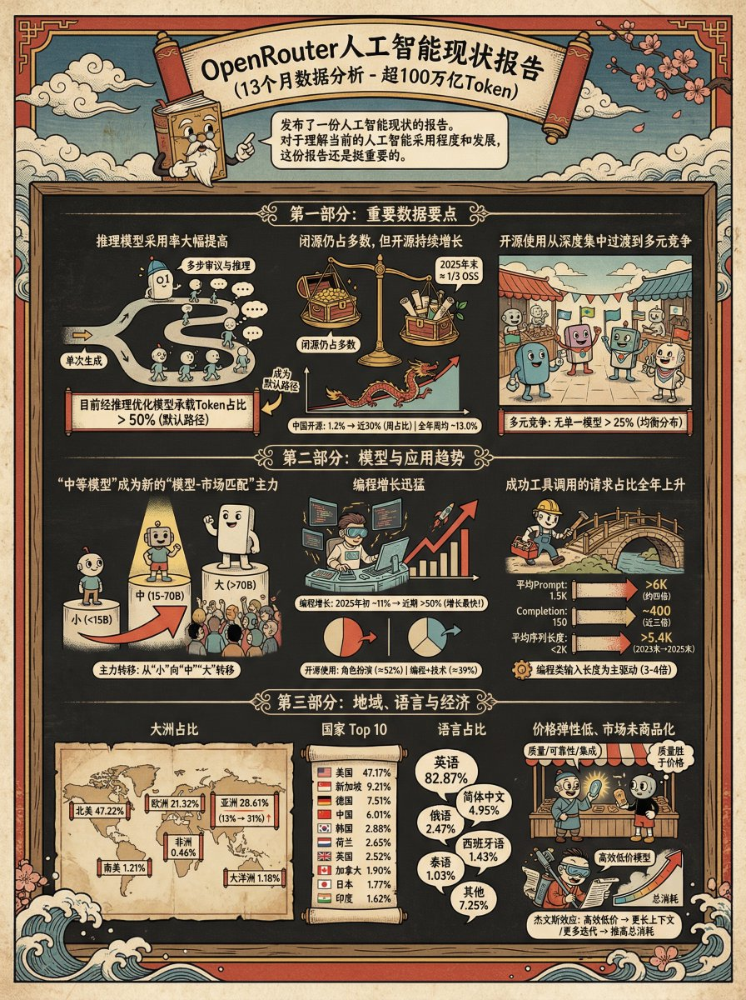

```
用浮世绘+茶杯头的风格为下面的内容生成信息图
```

 [↑返回目录](#toc)

---
## <a id="prompt-1997405140723323100">镜面玫瑰金与阳光黄的街头主角</a> (<a href="https://x.com/gaucheai/status/1997405140723323255" target="_blank" rel="noopener noreferrer">gauche</a>)


```
{
  "subject": {
    "description": "Young woman taking selfie next to chrome pink BMW i8, casual main character energy",
    "setting_rules": "street scene, luxury car, urban modern backdrop",
    "age": "early 20s",
    
    "expression": {
      "eyes": "focused on phone screen, taking selfie, casual confidence",
      "mouth": "relaxed, soft, natural",
      "brows": "relaxed, effortless",
      "overall": "unbothered, 'just casually next to a pink supercar' energy"
    },
    
    "hair": {
      "color": "platinum blonde",
      "style": "loose, flowing from under cap",
      "details": "messy-pretty, some pieces falling forward, effortless waves",
      "length": "medium-long, past shoulders"
    },
    
    "body": {
      "frame": "petite, slim, toned",
      "waist": "tiny, fully exposed midriff",
      "legs": "toned, athletic, fully visible",
      "stance": "casual lean against car, weight shifted"
    },
    
    "pose": {
      "position": "standing next to driver door of car, leaning slightly against it",
      "upper_body": {
        "action": "one arm UP holding phone for selfie",
        "phone_angle": "high, classic selfie position",
        "other_arm": "relaxed at side"
      },
      "lower_body": {
        "stance": "one leg straight, one slightly crossed or bent",
        "weight": "casual lean, hip near car",
        "energy": "relaxed but aware of angles"
      },
      "overall": "the 'caught me with this random supercar' pose that's definitely not random"
    },
    
    "clothing": {
      "top": {
        "type": "ultra cropped baby tee",
        "color": "bright YELLOW, sunshine yellow",
        "graphic": "small star or cute graphic on chest (or BANANA logo)",
        "fit": {
          "length": "EXTREME crop - ends just below chest, full stomach exposed",
          "tightness": "fitted, hugging curves",
          "sleeves": "short sleeves, casual"
        },
        "effect": "entire midriff visible from just under chest to shorts"
      },
      "bottom": {
        "type": "ultra mini athletic shorts",
        "color": "WHITE, clean bright white",
        "fit": {
          "style": "tight fitted athletic shorts",
          "length": "very short, upper thigh",
          "waist": "high-waisted, sits at natural waist",
          "effect": "shows full leg length, hugs curves"
        },
        "material": "stretchy athletic fabric, smooth"
      },
      "shoes": {
        "type": "white sneakers",
        "style": "clean, casual, athletic vibe",
        "effect": "completes sporty-cute look"
      }
    },
    
    "face": {
      "features": "pretty, big eyes, small nose, soft lips",
      "makeup": "natural, minimal, fresh-faced",
      "expression": "focused on selfie, casual pretty"
    }
  },

  "accessories": {
    "headwear": {
      "type": "baseball cap",
      "color": "BLACK",
      "style": "worn forward, classic",
      "logo": "small patch or logo visible",
      "effect": "sporty edge, hair flowing from underneath"
    },
    "headphones": {
      "type": "over-ear headphones",
      "color": "WHITE",
      "position": "around neck, not on ears",
      "style": "chunky, modern, like Beats or similar",
      "effect": "adds to casual 'just vibing' energy"
    },
    "device": {
      "type": "iPhone",
      "position": "held up high for selfie",
      "case": "dark case visible"
    }
  },

  "the_car": {
    "make": "BMW i8",
    "wrap": "CHROME PINK / rose gold mirror finish",
    "effect": {
      "reflection": "mirror chrome reflecting everything around",
      "color": "pink/rose gold, flashy, attention-grabbing",
      "energy": "luxury, flex, main character vehicle"
    },
    "position": "parked on street, she's standing next to driver side",
    "wheels": "black rims with pink accents matching wrap",
    "presence": "the car is a CO-STAR, not just background"
  },

  "environment": {
    "location": "modern urban area, upscale shopping district or hotel entrance",
    "ground": "cobblestone or nice pavement",
    "backdrop": {
      "buildings": "modern glass buildings, upscale retail",
      "elements": "architectural feature visible (sculptural element)",
      "other_cars": "normal cars parked nearby for contrast",
      "vibe": "wealthy area, nice neighborhood"
    },
    "time": "daytime, good natural light",
    "atmosphere": "urban luxury, casual wealth"
  },

  "photography": {
    "style": "candid-looking but obviously posed, lifestyle shot",
    "angle": "shot from front-side, capturing her full body + car",
    "quality": "high quality, could be iPhone or camera",
    "framing": "her centered, car visible behind/beside, environment context",
    "lighting": "natural daylight, flattering"
  },

  "color_story": {
    "her": {
      "top": "bright YELLOW",
      "shorts": "clean WHITE", 
      "cap": "BLACK",
      "headphones": "WHITE",
      "shoes": "WHITE",
      "hair": "platinum BLONDE"
    },
    "car": "chrome PINK / rose gold",
    "overall": "yellow + white + pink chrome = eye-catching, vibrant, instagram-perfect"
  },

  "the_vibe": {
    "energy": "casual luxury, 'this is just my tuesday'",
    "mood": "unbothered, main character, casual flex",
    "contrast": "sporty casual outfit + absurd luxury car",
    "story": "she either owns this car or saw it and had to take a pic - either way she belongs next to it",
    "social_media": "this is THE instagram photo",
    "caption_energy": "'running errands' or '🩷' or no caption needed"
  },

  "critical_elements": {
    "outfit_combo": "yellow crop + white shorts = sporty cute, maximum skin",
    "midriff": "fully exposed, tiny waist on display",
    "cap_headphones": "the combo that says 'casual but styled'",
    "car_color": "chrome pink/rose gold = the main prop",
    "selfie_action": "caught in the act of taking the pic",
    "energy": "effortless but everything is intentional"
  }
}
```

```
一位二十岁出头的年轻女子在街头拍摄自拍，身旁停着一辆镜面粉色（玫瑰金）的宝马i8超跑，整体氛围散发出随意又自信的主角感。她站在驾驶侧车门旁，身体微微倚靠车身，一只手臂高举手机自拍，另一只自然垂落；双腿一前一后站立，重心轻松落在靠近车身的一侧髋部，姿态放松却讲究角度。

她身穿亮黄色（阳光黄）超短露脐小T恤，衣长仅至胸部下方，完全露出纤细腰腹，胸前印有小巧星星图案或香蕉Logo；下搭纯白色高腰超短运动短裤，紧身贴合，长度至大腿上部，凸显修长腿部线条；脚踩干净简约的白色运动鞋，整体造型兼具运动与甜美风格。

铂金色中长发从黑色正戴棒球帽下自然垂落，发丝松散微卷，几缕发丝随意垂于脸前，呈现“凌乱美”；妆容清新自然，五官精致：大眼、小巧鼻梁、柔润双唇；眼神专注手机屏幕，神情放松自信，眉毛舒展，整体散发“刚好路过这辆粉色超跑”的毫不在意却又精心设计的气场。

配饰方面，黑色棒球帽正面带有小型徽标；白色厚款现代风头戴式耳机（类似Beats）松松挂于颈间；手中握着一部深色手机壳的iPhone，高举于经典自拍角度。

背景为现代都市高端街区，如精品购物区或豪华酒店入口，地面为石板或优质铺装路面，后方可见玻璃幕墙建筑、雕塑装置及普通车辆以作对比，整体环境彰显低调奢华。日间自然光线充足，画面明亮通透。

摄影风格模拟生活化摆拍，从前侧方取景，完整呈现人物全身与车辆；构图以她为中心，车辆与街景作为重要背景元素。色彩搭配鲜明吸睛：亮黄上衣 + 纯白短裤/耳机/鞋 + 黑色帽子 + 铂金发色，与镜面粉/玫瑰金超跑形成强烈视觉冲击，营造出极具Instagram感的活力画面。

整体氛围传递“这就是我平凡周二”的随意奢华感，运动休闲穿搭与极致豪华座驾形成反差，无论她是否拥有此车，都仿佛天生属于这个场景——一张无需配文或仅需一个粉色心形emoji的完美社交平台照片。关键要素包括：黄白配色露脐装、全露腰线、棒球帽+颈挂耳机组合、镜面粉色超跑、自拍动作捕捉、看似随性实则精心策划的主角能量。
```

 [↑返回目录](#toc)

---
## <a id="prompt-1997581641892446200">巨影降临城市</a> (<a href="https://x.com/MrDavids1/status/1997581641892446293?s=20" target="_blank" rel="noopener noreferrer">Travis Davids</a>)


```
A highly detailed, photorealistic [CAMERA ANGLE, e.g., wide-angle shot, aerial shot looking down, extreme low-angle looking up] showing a colossal [DESCRIBE THE PERSON & CLOTHING] positioned in [SPECIFIC LOCATION/CITY/LANDSCAPE]. The giant is [ACTION -  INTERACTING WITH THE ENVIRONMENT, e.g., sitting on a building, stepping over a bridge]. To establish the immense scale, tiny [TINY ELEMENTS: PEOPLE, CARS, OR BOATS] are visible near their [FEET/HANDS]. The lighting is [TIME OF DAY, e.g., golden hour, midday sun].

There are more visuals examples with prompts included in my 80 creative use cases document which you can view via this link completely for free. Look for use case 84.
```

```
一张高度细节化、逼真写实的[相机角度，例如广角镜头、俯视航拍、极端低角度仰拍]，展现一个巨大的[描述人物及其服装]置身于[具体地点/城市/景观]中。这个巨人正在[动作——与环境互动，例如坐在建筑物上、跨过桥梁]。为体现其庞大尺度，其[脚部/手部]附近可见微小的[微小元素：人物、汽车或船只]。光线为[一天中的时间，例如黄金时刻、正午阳光]。

我的《80 种创意用例》文档中包含更多带提示词的视觉示例，可通过此链接免费查看，请参考第 84 号用例。
```

 [↑返回目录](#toc)

---
## <a id="prompt-1997417597223264300">手绘肖像：涂鸦注解风格</a> (<a href="https://x.com/icreatelife/status/1997417597223264320" target="_blank" rel="noopener noreferrer">Kris Kashtanova</a>)

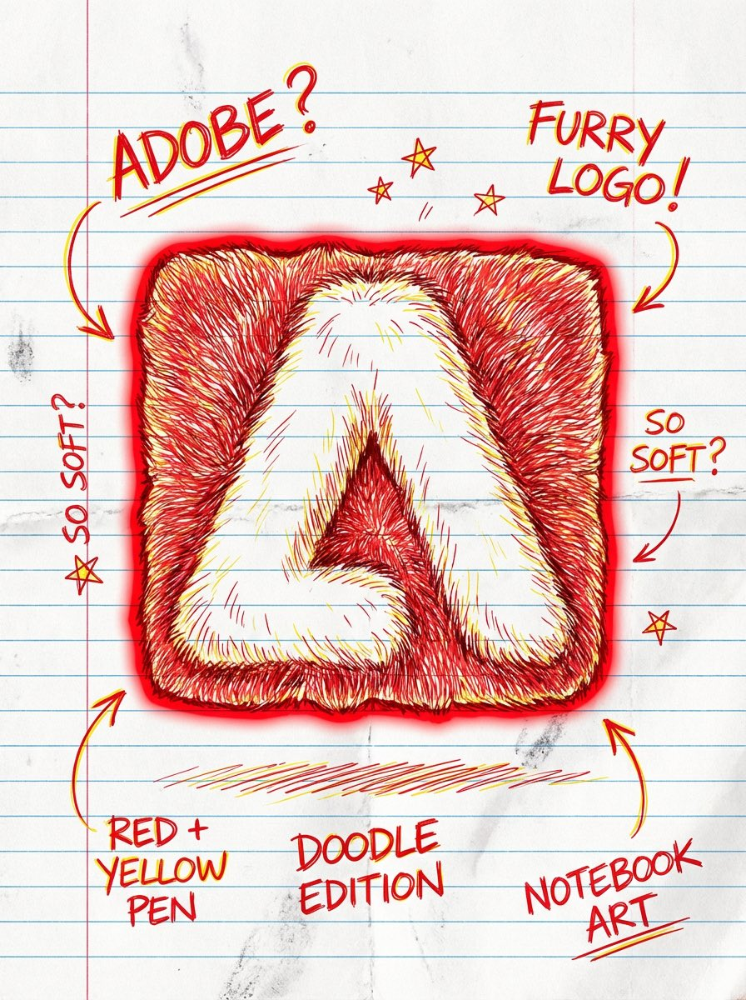

```
Generate a hand-drawn portrait illustration of my uploaded image in red and yellow pen on notebook paper, inspired by doodle art and comic annotations. Keep full likeness of the subject, expressive lines, spontaneous gestures, bold outline glow, handwritten notes around, realistic pen stroke texture
```

```
根据我上传的图像，生成一幅手绘肖像插图，使用红黄两色笔在笔记本纸上绘制，灵感源自涂鸦艺术和漫画注解风格。需保持人物高度相似，线条富有表现力，笔触自然随性，轮廓线加粗并带有发光效果，周围添加手写注释，并呈现真实的笔触纹理。
```

 [↑返回目录](#toc)

---
## <a id="prompt-1997512262891008300">赛博朋克AI基地分镜</a> (<a href="https://x.com/oggii_0/status/1997512262891008315" target="_blank" rel="noopener noreferrer">Oogie</a>)


```
Cinematic sci-fi storyboard in a 3×3 grid showing two hooded figures approaching a foggy industrial facility with a neon red “AI BASE” sign. Include wide, medium, low-angle, and close-up shots with teal/red lighting, wet reflective ground, silhouettes, and atmospheric fog. Add small shot-label text (e.g., “KF1 | ELS”). Style: neo-noir, cyberpunk, high contrast.
```

```
以 3×3 网格呈现的电影级科幻分镜，描绘两名戴兜帽的人物走向一座雾气弥漫的工业设施，设施上悬挂着霓虹红色“AI BASE”标志。包含广角、中景、低角度和特写镜头，采用青色与红色灯光、湿润反光的地面、剪影以及氛围浓厚的雾气。添加小型镜头标签文字（例如“KF1 | ELS”）。风格：新黑色电影、赛博朋克、高对比度。
```

 [↑返回目录](#toc)

---
## <a id="prompt-1997616475277033700">优雅自拍：花裙女子镜中留影</a> (<a href="https://x.com/ZaraIrahh/status/1997616475277033799" target="_blank" rel="noopener noreferrer">Zara</a>)

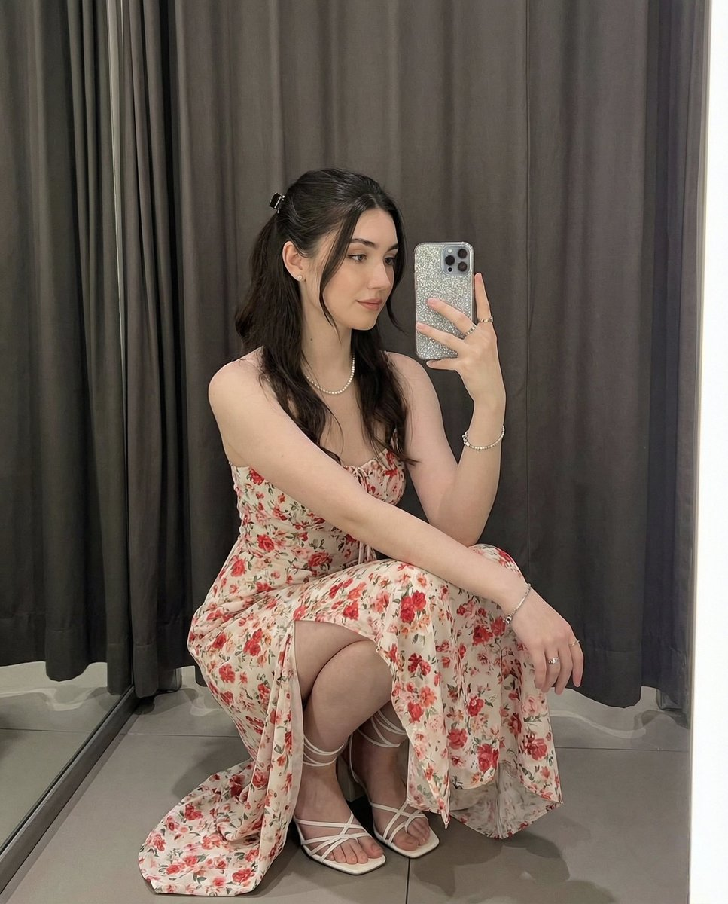

```
{
  "image_prompt": {
    "face_preservation": {
      "use_reference_face": true,
      "accuracy": "match face exactly from reference image",
      "preserve_details": [
        "face shape",
        "eyebrows and eye structure",
        "natural makeup style",
        "lip shape and color",
        "hairline and hairstyle"
      ]
    },

    "subject": {
      "gender": "female",
      "description": "young woman taking a mirror selfie while squatting gracefully indoors",
      "pose": {
        "body_position": "squatting low with one knee forward, leaning slightly toward mirror",
        "head": "tilted slightly downward while looking at phone screen",
        "hands": [
          "right hand holding phone in front of face",
          "left hand resting on knee"
        ],
        "expression": "soft, calm expression"
      },
      "hair": {
        "style": "long dark brown hair in a half-up ponytail with a small clip",
        "texture": "smooth and straight"
      },
      "attire": {
        "dress": {
          "type": "light-colored floral maxi dress with short sleeves",
          "pattern": "red and pink small floral print",
          "details": "slit exposing leg, soft fabric flow"
        },
        "shoes": "white strappy heels",
        "accessories": [
          "silver necklace",
          "bracelet",
          "rings"
        ]
      }
    },

    "environment": {
      "setting": "indoor room with soft lighting",
      "background": "floor-to-ceiling curtains in dark grey tones",
      "floor": "smooth, reflective surface",
      "lighting": {
        "type": "soft warm indoor light",
        "effect": "even illumination on face and dress"
      }
    },

    "props": {
      "phone": {
        "type": "smartphone",
        "case": "glitter silver phone case",
        "position": "held vertically towards the mirror"
      }
    },

    "style": {
      "photography": "mirror selfie, social media aesthetic",
      "color_grade": "soft warm tones",
      "sharpness": "medium-high clarity",
      "mood": "feminine, elegant, gentle"
    },

    "composition": {
      "framing": "full body squatting pose, centered",
      "angle": "eye-level mirror perspective",
      "focus": "sharp focus on face and outfit",
      "aspect_ratio": "4:5"
    },

    "output": {
      "resolution": "8K high quality",
      "negative_prompt": [
        "incorrect face",
        "wrong hairstyle",
        "extra limbs",
        "different dress pattern",
        "distorted proportions",
        "text or watermark"
      ]
    }
  }
}
```

```
{
  "image_prompt": {
    "face_preservation": {
      "use_reference_face": true,
      "accuracy": "与参考图像中的人脸完全匹配",
      "preserve_details": [
        "脸部轮廓",
        "眉毛和眼部结构",
        "自然妆风格",
        "唇形和颜色",
        "发际线和发型"
      ]
    },

    "subject": {
      "gender": "女性",
      "description": "年轻女子在室内优雅蹲姿自拍",
      "pose": {
        "body_position": "低蹲，一膝向前，微微向镜子倾斜",
        "head": "略微低头看手机屏幕",
        "hands": [
          "右手拿着手机在脸前",
          "左手放在膝盖上"
        ],
        "expression": "温和、平静的表情"
      },
      "hair": {
        "style": "长深棕色半扎马尾，用小夹子固定",
        "texture": "光滑直发"
      },
      "attire": {
        "dress": {
          "type": "浅色花卉长裙，短袖",
          "pattern": "红色和粉色小花图案",
          "details": "裙子开衩露出腿部，柔软的面料垂感"
        },
        "shoes": "白色细带高跟鞋",
        "accessories": [
          "银色项链",
          "手镯",
          "戒指"
        ]
      }
    },

    "environment": {
      "setting": "有柔和光线的室内房间",
      "background": "深灰色调的落地窗帘",
      "floor": "平滑反光地面",
      "lighting": {
        "type": "柔和暖色调室内灯光",
        "effect": "均匀照亮面部和裙子"
      }
    },

    "props": {
      "phone": {
        "type": "智能手机",
        "case": "闪亮银色手机壳",
        "position": "垂直朝向镜子"
      }
    },

    "style": {
      "photography": "镜子自拍照，社交媒体美学",
      "color_grade": "柔和暖色调",
      "sharpness": "中高水平清晰度",
      "mood": "女性化、优雅、温柔"
    },

    "composition": {
      "framing": "全身蹲姿，居中构图",
      "angle": "眼睛水平的镜子视角",
      "focus": "脸部和服装锐聚焦",
      "aspect_ratio": "4:5"
    },

    "output": {
      "resolution": "8K高质量",
      "negative_prompt": [
        "错误的脸部",
        "错误的发型",
        "多余的肢体",
        "不同的裙子图案",
        "扭曲的比例",
        "文字或水印"
      ]
    }
  }
}
```

 [↑返回目录](#toc)

---
## <a id="prompt-1997528830441832400">巴黎铁塔下的夜影</a> (<a href="https://x.com/YaseenK7212/status/1997528830441832501" target="_blank" rel="noopener noreferrer">Yaseen Khan Gul</a>)

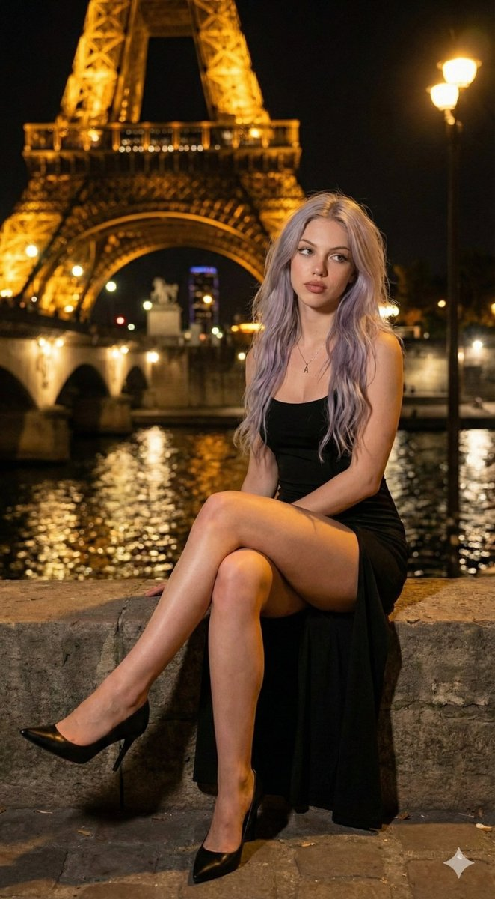

```
{
  "scene_simulation_data": {
    "metadata": {
      "schema_version": "4.0",
      "model_type": "Relational_Scene_Graph"
    },
    "entity_registry": [
      {
        "id": "ENT_01",
        "class": "Human",
        "role": "Primary_Subject",
        "states": {
          "pose": "Sitting",
          "limb_position": "Legs crossed",
          "expression": "Graceful"
        },
        "attributes": {
          "hair_style": "Long, cascading, loose",
          "makeup_finish": "Natural",
          "skin_reflectance": "Smooth"
        }
      },
      {
        "id": "ENT_02",
        "class": "Apparel",
        "type": "Dress",
        "parent_entity_id": "ENT_01",
        "visual_properties": {
          "color": "Black",
          "fit": "Sleek",
          "features": ["Daring slit", "High-detail weave"]
        }
      },
      {
        "id": "ENT_03",
        "class": "Apparel",
        "type": "Footwear",
        "parent_entity_id": "ENT_01",
        "visual_properties": {
          "style": "Pointed heels"
        }
      },
      {
        "id": "ENT_04",
        "class": "Structure",
        "name": "Eiffel Tower",
        "zone": "Background_Far",
        "illumination_state": "Active (Sparkling)"
      },
      {
        "id": "ENT_05",
        "class": "Surface",
        "name": "Stone Ledge",
        "zone": "Foreground",
        "interaction": "Supports ENT_01"
      },
      {
        "id": "ENT_06",
        "class": "Fluid",
        "name": "River",
        "visual_properties": {
          "surface_displacement": "Subtle ripples",
          "reflection_quality": "Dynamic/Dancing"
        }
      }
    ],
    "spatial_relationships": [
      {
        "subject": "ENT_01",
        "predicate": "positioned_on",
        "object": "ENT_05"
      },
      {
        "subject": "ENT_01",
        "predicate": "backlit_by",
        "object": "ENT_04"
      },
      {
        "subject": "ENT_04",
        "predicate": "reflected_in",
        "object": "ENT_06"
      }
    ],
    "render_settings": {
      "camera_telemetry": {
        "angle_incidence": "Low-angle",
        "field_of_view": "Medium Shot",
        "focus_plane": {
          "target_id": "ENT_01",
          "sharpness": "Crisp"
        },
        "aperture_effect": {
          "type": "Shallow Depth of Field",
          "bokeh_target": "Background"
        }
      },
      "lighting_engine": {
        "global_ambience": "Moody Night",
        "color_temperature": "Warm Golden",
        "sources": ["Artificial (Lamps)", "Architectural (Tower)"],
        "shadow_type": "Soft/Delicate"
      },
      "post_processing": {
        "color_grade": "Contemporary Fashion Editorial",
        "palette_vectors": [
          {"hex": "#000000", "name": "Deep Black"},
          {"hex": "# FFBF00", "name": "Warm Amber"}
        ]
      }
    }
  }
}
```

```
{
  "场景模拟数据": {
    "元数据": {
      "模式版本": "4.0",
      "模型类型": "关系场景图"
    },
    "实体注册表": [
      {
        "id": "ENT_01",
        "类别": "人类",
        "角色": "主要主体",
        "状态": {
          "姿势": "坐着",
          "肢体位置": "双腿交叉",
          "表情": "优雅"
        },
        "属性": {
          "发型": "长发、垂落、松散",
          "妆容效果": "自然",
          "皮肤反射率": "光滑"
        }
      },
      {
        "id": "ENT_02",
        "类别": "服装",
        "类型": "连衣裙",
        "父级实体ID": "ENT_01",
        "视觉属性": {
          "颜色": "黑色",
          "剪裁": "修身",
          "特征": ["大胆开衩", "高细节织纹"]
        }
      },
      {
        "id": "ENT_03",
        "类别": "服装",
        "类型": "鞋履",
        "父级实体ID": "ENT_01",
        "视觉属性": {
          "款式": "尖头高跟鞋"
        }
      },
      {
        "id": "ENT_04",
        "类别": "建筑结构",
        "名称": "埃菲尔铁塔",
        "区域": "远景背景",
        "照明状态": "开启（闪烁）"
      },
      {
        "id": "ENT_05",
        "类别": "表面",
        "名称": "石台",
        "区域": "前景",
        "交互": "支撑 ENT_01"
      },
      {
        "id": "ENT_06",
        "类别": "流体",
        "名称": "河流",
        "视觉属性": {
          "水面位移": "细微波纹",
          "反射质量": "动态/舞动"
        }
      }
    ],
    "空间关系": [
      {
        "主体": "ENT_01",
        "谓词": "位于",
        "客体": "ENT_05"
      },
      {
        "主体": "ENT_01",
        "谓词": "被...背光照射",
        "客体": "ENT_04"
      },
      {
        "主体": "ENT_04",
        "谓词": "倒映于",
        "客体": "ENT_06"
      }
    ],
    "渲染设置": {
      "摄像机遥测": {
        "入射角度": "低角度",
        "视野": "中景",
        "对焦平面": {
          "目标ID": "ENT_01",
          "清晰度": "锐利"
        },
        "光圈效果": {
          "类型": "浅景深",
          "虚化目标": "背景"
        }
      },
      "光照引擎": {
        "全局氛围": "情绪化夜晚",
        "色温": "暖金色",
        "光源": ["人工（灯）", "建筑（铁塔）"],
        "阴影类型": "柔和/细腻"
      },
      "后期处理": {
        "色彩分级": "当代时尚杂志风格",
        "调色板向量": [
          {"十六进制": "#000000", "名称": "深黑"},
          {"十六进制": "#FFBF00", "名称": "暖琥珀"}
        ]
      }
    }
  }
}
```

 [↑返回目录](#toc)

---
## <a id="prompt-1997489903362244900">超广角时尚力量姿势</a> (<a href="https://x.com/songguoxiansen/status/1997489903362244991" target="_blank" rel="noopener noreferrer">松果先森</a>)


```
将原始照片转化为一个戏剧性的、逼真的、超广角镜头，具有极端的相机角度（包括从正下方或正上方的视角），其中一个或多个身体部位紧挨着镜头并且看起来巨大，身体的其余部分在透视中后退，并且同一个人在原始环境的一致的、扩展的版本中摆出一个时尚的、复杂的、有力的姿势。
```

 [↑返回目录](#toc)

---
## <a id="prompt-1997621423310057700">微缩经典：电影场景等距呈现</a> (<a href="https://x.com/TechieBySA/status/1997621423310057725" target="_blank" rel="noopener noreferrer">TechieSA</a>)


```
Present a clear, 45° top-down isometric miniature 3D cartoon scene of the iconic scene [SCENE NAME] from [MOVIE/SHOW], with soft refined textures, realistic PBR materials, and gentle lifelike lighting.
Create a small raised diorama-style base that includes the most recognizable elements of this scene, along with tiny stylized characters if needed (no facial details).
Use a clean solid [BACKGROUND COLOR] background.

At the top-center, display [MOVIE/SHOW] in large bold text, directly beneath it show [SCENE NAME] in medium text, and place the official logo associated with [MOVIE/SHOW] below the subtext.
All text must automatically match the background contrast (white or black).

Composition: perfectly centered layout, square 1080x1080, ultra-clean, high-clarity diorama aesthetic.
```

```
呈现一个清晰的45°俯视等距微型3D卡通场景，展现[电影/剧集]中标志性场景「[场景名称]」，具有柔和精致的纹理、逼真的PBR材质和柔和自然的光照。  
制作一个略高于平面的微缩模型底座，包含该场景最具辨识度的元素，如有需要可加入微小的风格化角色（无面部细节）。  
使用干净的纯色[背景颜色]背景。  

在画面顶部中央以大号粗体文字显示「[电影/剧集]」，其正下方以中号字体显示「[场景名称]」，并在副标题下方放置与该[电影/剧集]相关的官方标志。  
所有文字必须自动匹配背景对比度（白色或黑色）。  

构图：完全居中布局，方形1080x1080，极度干净，高清晰度的微缩模型美学。
```

 [↑返回目录](#toc)

---
## <a id="prompt-1997265335494595000">神秘山洞的几何奇观</a> (<a href="https://x.com/umesh_ai/status/1997265335494595040" target="_blank" rel="noopener noreferrer">Umesh</a>)

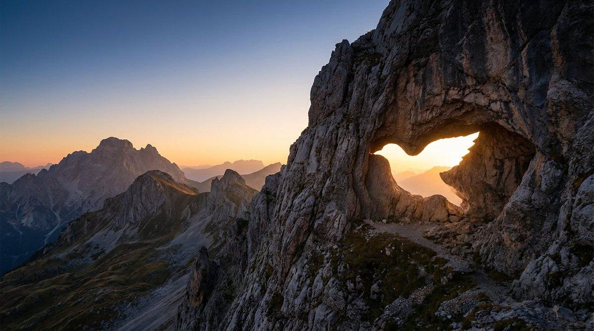

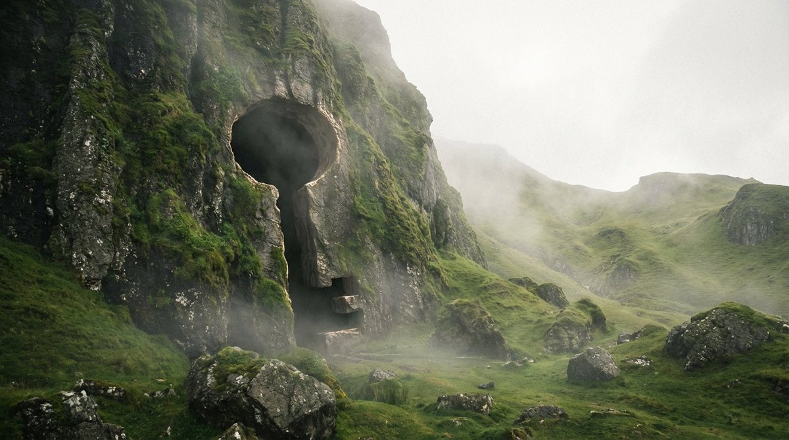


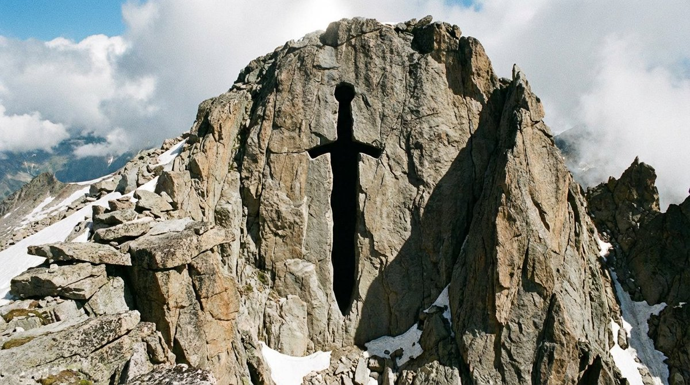

```
on Nano Banana Pro : An image of a [TYPE] landscape, featuring a cave entrance that is shaped exactly like the outline of a [SHAPE]. The cave should blend naturally into the rugged terrain of the mountain, with the entrance forming a clear and unmistakable [SHAPE] shape. This [SHAPE] shape should be simple and defined, without intricate details, emphasizing just the overall [SHAPE] outline. The surrounding environment should include [DETAILS], but these elements should not distract from the cave's   [SHAPE]-shaped entrance. The lighting in the scene should enhance the visibility and distinctiveness of the [SHAPE]-shaped cave entrance.
```

 [↑返回目录](#toc)

---
## <a id="prompt-1997298656429367800">金色水花中的微笑</a> (<a href="https://x.com/saniaspeaks_/status/1997298656429367700" target="_blank" rel="noopener noreferrer">𝗦𝗮𝗻𝗶𝗮</a>)

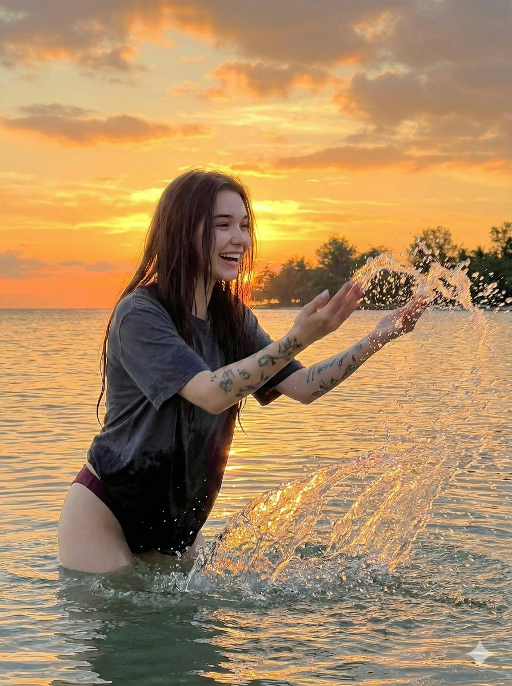


```
{
  "image_description": {
    "subject": {
      "gender": "Female",
      "appearance": "Young adult with long, dark, wavy hair and visible tattoos on the arm",
      "pose": "Standing waist-deep in water, splashing or playing with the water",
      "expression": "Happy, playful, smiling",
      "interaction": "Hands interacting with the water surface, creating splashes"
    },
    "attire": {
      "type": "Swimwear",
      "garment": "Dark burgundy or brown bikini",
      "style": "Simple two-piece"
    },
    "setting": {
      "location": "Beach or lake",
      "time_of_day": "Sunset / Golden Hour",
      "sky": "Dramatic orange and yellow clouds",
      "background": "Distant silhouette of trees on the horizon",
      "water": "Golden reflections on the rippling surface"
    },
    "style": "Cinematic portrait, warm golden lighting, soft bokeh"
  }
}
```

```
{
  "image_description": {
    "subject": {
      "gender": "女性",
      "appearance": "年轻成人，长而卷的黑发，手臂上有明显的纹身",
      "pose": "站在齐腰深的水中，泼水或与水玩耍",
      "expression": "开心、顽皮、微笑",
      "interaction": "双手与水面互动，制造出水花"
    },
    "attire": {
      "type": "泳装",
      "garment": "深酒红色或棕色比基尼",
      "style": "简单的两件套"
    },
    "setting": {
      "location": "海滩或湖泊",
      "time_of_day": "日落/黄金时段",
      "sky": "戏剧性的橙色和黄色云彩",
      "background": "地平线上远处树木的轮廓",
      "water": "在波光粼粼的水面上有金色倒影"
    },
    "style": "电影肖像，温暖的金色光线，柔和的散景"
  }
}
```

 [↑返回目录](#toc)

---
## <a id="prompt-1997217542742675700">霓虹雨夜中的梦幻少女</a> (<a href="https://x.com/Sheldon056/status/1997217542742675775" target="_blank" rel="noopener noreferrer">Dr.duet</a>)


```
": {
    "positive": "High-resolution vertical portrait, 4K quality. A woman with wavy black hair, slightly damp. Dreamy soft gaze looking up toward the camera. Wearing an oversized slate grey/teal hoodie. Leaning against a wall covered with messy posters, flyers, and stickers. Nighttime busy city street (Tokyo/Seoul/Hong Kong style). Light drizzle with visible water particles in the air. Wet reflective street surface. Red neon reflections and bright car brake lights dominating the pavement. Yellow and red neon shop signs in background. Strong dramatic lighting with high contrast between warm neon reds/yellows and cool blue/grey ambient tones. Shallow depth of field, bokeh background. Cinematic, photorealistic.",
    "negative": "blurry face, distorted anatomy, extra limbs, extra fingers, watermark, text, overexposed lights, underexposed shadows, cartoon style, low resolution, grainy, unrealistic skin, duplicated facial features"
  },
  "parameters": {
    "style": "photorealistic",
    "resolution": "4K",
    "ratio": "3:4",
    "camera": {
      "lens": "portrait lens (50mm–85mm)",
      "depth_of_field": "shallow",
      "focus": "sharp focus on subject"
    },
    "lighting": {
      "type": "neon city lighting",
      "contrast": "high",
      "color_palette": ["red neon", "yellow neon", "cool blue/grey shadows"]
    }
  },
  "environment_details": {
    "weather": "light rain / drizzle",
    "city_style": ["Tokyo", "Seoul", "Hong Kong"],
    "foreground": "poster-covered wall",
    "background": {
      "elements": ["wet reflective street", "cars with red brake lights", "neon shop signs"],
      "depth": "blurred bokeh"
    }
  },
  "subject": {
    "gender": "female",
    "expression": "dreamy, soft gaze upward",
    "hair": "wavy black, slightly damp",
    "clothing": "oversized slate grey/teal hoodie"
  }
}
```

```
提示：  
“正面”：高分辨率竖版人像，4K画质。一位拥有微卷黑发的女性，头发略带湿润。眼神梦幻柔和，微微仰视镜头。身穿宽大的石板灰/青绿色连帽衫。倚靠在贴满杂乱海报、传单和贴纸的墙壁上。夜晚繁忙的城市街道（东京/首尔/香港风格）。细雨蒙蒙，空气中可见水珠颗粒。路面湿滑反光。红色霓虹倒影与明亮的汽车刹车灯在路面上占据主导。背景中有黄色与红色的霓虹店铺招牌。强烈的戏剧性灯光，暖色调的红黄霓虹与冷调的蓝灰色环境形成高对比度。浅景深，背景虚化呈散景效果。电影感，写实风格。  

“负面”：模糊的脸部、扭曲的解剖结构、多余肢体、多余手指、水印、文字、过曝的灯光、欠曝的阴影、卡通风格、低分辨率、颗粒感、不真实的皮肤、重复的面部特征
```

 [↑返回目录](#toc)

---
## <a id="prompt-1997460283669832000">美食飞溅瞬间</a> (<a href="https://x.com/NanoBanana/status/1997460283669831973?s=20" target="_blank" rel="noopener noreferrer">Nano Banana Pro</a>)


```
Advertising-style food photography of [subject 1] arranged on a rustic table, with [subject 2] floating above in mid-air and a splash of [subject 1] frozen in motion. High-resolution photo manipulation with selective soft focus, clean negative space for text, dramatic lighting, and crisp detail.
```

```
广告风格的美食摄影，[主体1]摆放在质朴的桌面上，[主体2]悬浮在空中，同时有[主体1]飞溅的瞬间被定格。高分辨率图像合成，采用选择性柔焦、干净的留白区域用于文字排版、戏剧性灯光以及清晰锐利的细节。
```

 [↑返回目录](#toc)

---
## <a id="prompt-1997580570566746400">冬日沉思：霜雪中的旅人</a> (<a href="https://x.com/Taaruk_/status/1997580570566746462" target="_blank" rel="noopener noreferrer">Taaruk</a>)

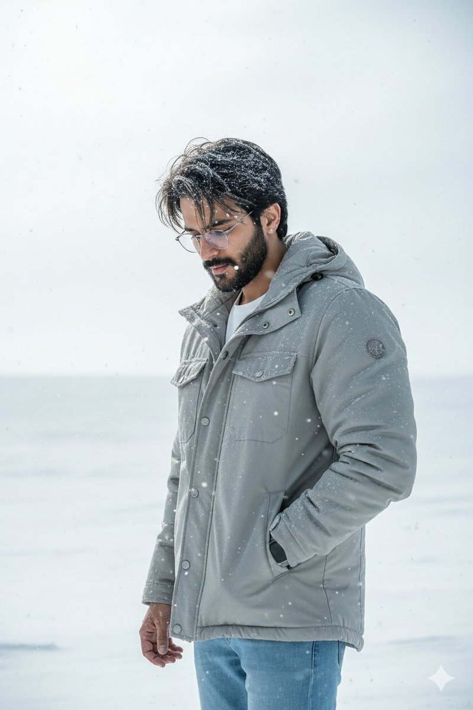

```
{
  "Objective": "Generate an ultra-realistic high-resolution cinematic poster in the style of LEO.",
  
  "Subject": {
    "Appearance": {
      "Hair": "Messy, slightly long black hair covered lightly with frost",
      "Beard": "Trimmed beard with a subtle icy texture",
      "Expression": "Calm, introspective, looking downward",
      "Pose": {
        "Body_Position": "Standing in a snowy environment",
        "Hands": {
          "Right_Hand": "Casually placed in pocket",
          "Left_Hand": "Partly visible near the side"
        }
      }
    },
    "Wardrobe": {
      "Jacket": "Light gray winter jacket with sleeves slightly rolled up",
      "Details": "Fabric shows subtle cold-weather texture and soft highlights"
    }
  },

  "Scene_Description": {
    "Environment": {
      "Setting": "Cold, snowy open area",
      "Atmosphere": "Minimalistic, serene, cinematic winter mood",
      "Background": {
        "Color": "Bright white",
        "Lighting": "Soft diffused winter light",
        "Effects": [
          "Gentle snowfall",
          "Frosty air",
          "Subtle mist-like softness around the edges"
        ]
      }
    },
    "Lighting": {
      "Type": "Cinematic soft directional lighting",
      "Tones": [
        "Cold blue highlights",
        "Neutral white ambience"
      ],
      "Effects": [
        "Soft contrast on face and coat",
        "Natural winter rim-light on hair and shoulders"
      ]
    }
  },

  "Visual_Style": {
    "Quality": "Ultra-realistic, 8K high-resolution cinematic poster",
    "Aesthetic": "LEO-style realism, clean minimal composition",
    "Color_Profile": "Cold white, gray, and icy blue palette",
    "Detail_Characteristics": [
      "High-detail frost on hair and beard",
      "Sharp fabric and jacket texture",
      "Cinematic depth and soft atmospheric fade"
    ]
  },

  "Output_Requirements": {
    "Format": "Poster-style image",
    "Resolution": "8K",
    "Orientation": "Portrait",
    "Quality": "Cinematic, editorial-grade, ultra-realistic"
  }
}
```

```
{  
  "目标": "生成一张超写实、高分辨率、电影感海报，风格为 LEO 风格。",  
  
  "主体": {  
    "外貌": {  
      "头发": "凌乱、略长的黑发，表面轻微覆盖一层霜",  
      "胡须": "修剪整齐的胡须，带有微妙的冰霜质感",  
      "表情": "平静、沉思，目光向下",  
      "姿势": {  
        "身体姿态": "站在雪地中",  
        "双手": {  
          "右手": "随意插在口袋里",  
          "左手": "部分可见，位于身体一侧"  
        }  
      }  
    },  
    "服装": {  
      "夹克": "浅灰色冬季夹克，袖口略微卷起",  
      "细节": "面料呈现细腻的寒冷天气纹理和柔和高光"  
    }  
  },  

  "场景描述": {  
    "环境": {  
      "设定": "寒冷、开阔的雪地",  
      "氛围": "极简、宁静、电影感的冬日情绪",  
      "背景": {  
        "颜色": "明亮的白色",  
        "光照": "柔和漫射的冬日光线",  
        "效果": [  
          "轻柔飘落的雪花",  
          "冰冷空气",  
          "边缘处带有细微雾化般的柔焦效果"  
        ]  
      }  
    },  
    "光照": {  
      "类型": "电影感柔和定向光",  
      "色调": [  
        "冷蓝色高光",  
        "中性白色环境光"  
      ],  
      "效果": [  
        "面部与外套上的柔和对比",  
        "头发与肩部自然的冬日轮廓光"  
      ]  
    }  
  },  

  "视觉风格": {  
    "画质": "超写实、8K 高分辨率电影海报",  
    "美学": "LEO 风格写实主义，干净简洁的构图",  
    "色彩配置": "冷白、灰色与冰蓝色调",  
    "细节特征": [  
      "头发与胡须上高细节的霜冻效果",  
      "清晰锐利的织物与夹克纹理",  
      "电影级景深与柔和大气渐隐效果"  
    ]  
  },  

  "输出要求": {  
    "格式": "海报风格图像",  
    "分辨率": "8K",  
    "方向": "竖向",  
    "质量": "电影级、编辑级、超写实"  
  }  
}
```

 [↑返回目录](#toc)

---
## <a id="prompt-1996893269138317600">微型3D卡通体育场展示</a> (<a href="https://x.com/TechieBySA/status/1996893269138317607?s=20" target="_blank" rel="noopener noreferrer">TechieSA</a>)


```
Present a clear, 45° top-down isometric miniature 3D cartoon scene of [STADIUM], with soft refined textures, realistic PBR materials, and gentle lifelike lighting. Use a clean solid [COLOR] background. At the top-center, display the name of this stadium in large bold text, then directly beneath it show its real seating capacity in medium text, and place the official logo associated with this stadium below the capacity. All text must match the background contrast automatically (white or black). Centered layout, square 1080x1080 dimension.
```

```
呈现一个清晰的45°俯视等距微型3D卡通场景，主题为[STADIUM]，具有柔和精致的纹理、逼真的PBR材质和柔和自然的光照。使用干净的纯色[COLOR]背景。在顶部中央以大号粗体文字显示该体育场名称，其正下方以中号文字展示其真实座位容量，并在容量信息下方放置该体育场的官方标志。所有文字需自动匹配背景对比度（白色或黑色）。居中布局，画面尺寸为1080x1080正方形。
```

 [↑返回目录](#toc)

---
## <a id="prompt-1996836039772483800">Edible Arctic Bedroom</a> (<a href="https://x.com/AleRVG/status/1996836039772483717" target="_blank" rel="noopener noreferrer">AlexandrIA</a>)


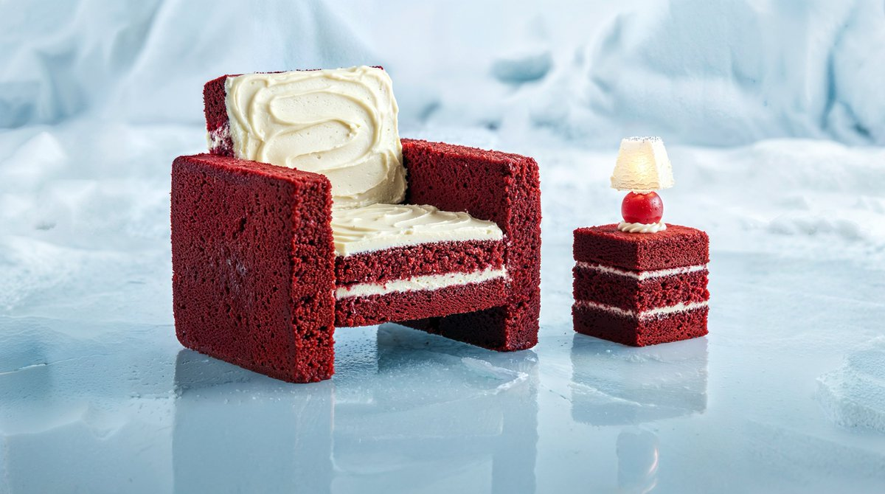


```
Photorealistic editorial food art portrait, a minimalist armchair sculpture recreated entirely from sponge cake and cream cheese frosting. The main structure of the chair is carved from dense, moist Red Velvet sponge cake, showing the vibrant red crumb texture. The seat cushion and backrest are thick, swirled layers of textured cream cheese frosting. A small "side table" next to it is a stacked cube of red velvet cake topped with a cranberry lamp. Setting & Light: The sculpture is positioned on a clean sheet of glacial ice in the North Pole. Bright soft studio lighting against the icy background, editorial cover style with subtle shadows enhancing the dessert architecture. Optics: Textures are sharp and realistic: porous fluffy sponge cake, creamy whipped surface showing spatula marks. Captured with Canon EOS 5D, 85mm f/1.8 lens, shallow depth of field focusing on the food-chair sculpture, luxury food photography aesthetic.
```

```
Photorealistic conceptual food art portrait, a minimalist bedroom recreated entirely from coconut, wafers, and white chocolate. The bed is constructed from layers of crispy vanilla wafer blocks, with a marshmallow pillow, covered by a shredded coconut-coated duvet that mimics a fur throw. Beside the bed, a nightstand built from a block of white nougat with embedded nuts, topped with a translucent rock candy crystal as the lamp.

Set in the middle of a vast, windy North Pole tundra, with drifting snow piling up slightly against the base of the wafer bed. Bright, diffuse white lighting (whiteout conditions) to emphasize the surreal food sculpture. Textures are incredibly detailed: fibrous coconut strands, the grid pattern of the wafers, and the matte finish of the nougat.

Captured with a Canon EOS R5, 100mm Macro lens, shallow depth of field focusing on the coconut texture, crisp detail with atmospheric softness in the blizzard background. High-key food photography style
```

```
Photorealistic editorial food art portrait, a minimalist armchair sculpture recreated entirely from sponge cake and cream cheese frosting. The main structure of the chair is carved from dense, moist Red Velvet sponge cake, showing the vibrant red crumb texture. The seat cushion and backrest are thick, swirled layers of textured cream cheese frosting. A small "side table" next to it is a stacked cube of red velvet cake topped with a cranberry lamp. Setting & Light: The sculpture is positioned on a clean sheet of glacial ice in the North Pole. Bright soft studio lighting against the icy background, editorial cover style with subtle shadows enhancing the dessert architecture. Optics: Textures are sharp and realistic: porous fluffy sponge cake, creamy whipped surface showing spatula marks. Captured with Canon EOS 5D, 85mm f/1.8 lens, shallow depth of field focusing on the food-chair sculpture, luxury food photography aesthetic.
```

```
A miniature bathroom set design constructed entirely from winter sweets, placed amidst a snowdrift in the North Pole. The Architecture: The bathtub is a hollowed-out, pristine white meringue shell with stiff, torched peaks on the outside. It is filled with hot cocoa (steam rising). The plumbing and taps are twisted red-and-white candy canes. The floor consists of hexagonal peppermint tiles. The Environment: A heavy blizzard is blowing around the diorama. Giant real snowflakes (relative to the scale) are landing on the meringue, melting slightly. The background is a white-out of fog and snow. Lighting & Atmosphere: Soft, diffused interior lighting bouncing off the white meringue, creating a pearlescent sheen. The contrast comes from the steam of the cocoa vs. the freezing wind outside. Camera/Tech: Phase One XF 150MP, 120mm Macro lens. Macro photography style with shallow depth of field. Emphasis on the contrast between the dry, chalky texture of the meringue and the glossy
```

 [↑返回目录](#toc)

---
## <a id="prompt-1996490849799274500">冷静にAIを理解しよう</a> (<a href="https://x.com/4on_yon_x/status/1996490849799274597" target="_blank" rel="noopener noreferrer">よん</a>)


```
何がどうすごいのかちゃんと理解している？公式の活用事例すら読んでない人、実は多いんだよね。

とりあえず把握したい人は、nano banana proでまとめ画像作ったから見て👀

ちゃんと知りたい人はリプ読んで↓
```

 [↑返回目录](#toc)

---
## <a id="prompt-1996561195424260400">IXUS镜头下的酒吧少女</a> (<a href="https://x.com/lexx_aura/status/1996561195424260299" target="_blank" rel="noopener noreferrer">Lex</a>)


```
{
  "image_parameters": {
    "style": "Canon IXUS aesthetic",
    "type": "Point-and-shoot photography",
    "quality": "Hyper-realistic",
    "tone": "Sharp, direct",
    "lighting_and_atmosphere": "Realistic, flash-style/direct lighting"
  },
  "subject": {
    "constraints": {
      "facial_identity": "Match reference image exactly 100%",
      "face_edits": "None allowed"
    },
    "hair": {
      "style": "Long, natural, lightly messy layered look",
      "movement": "Blowing gently in the wind",
      "details": "Strands slightly covering part of face"
    },
    "makeup": {
      "cheeks_and_nose": "Soft pink blush with blurred effect",
      "lips": "Subtle pink-orange tinted outline"
    },
    "expression": [
      "Cute",
      "Naive",
      "Cheerful",
      "Slightly sexy/undone charm"
    ],
    "pose": {
      "body_position": "Half-sitting, half-standing",
      "action": "Flicking hair"
    },
    "clothing": {
      "top": "Black strapless top",
      "bottom": "Low-waisted jeans with a floating waistline",
      "neck": "Thin black fabric choker/wrap"
    },
    "accessories": [
      "Small pendant necklace",
      "Gold watch"
    ]
  },
  "environment": {
    "setting": "Modern pub",
    "foreground_props": [
      "Round table",
      "Bottle of liquor",
      "Glass of liquor"
    ]
  }
}
```

```
{
  "image_parameters": {
    "style": "佳能IXUS美学",
    "type": "傻瓜式摄影",
    "quality": "超现实主义",
    "tone": "锐利、直接",
    "lighting_and_atmosphere": "写实、闪光灯风格/直接照明"
  },
  "subject": {
    "constraints": {
      "facial_identity": "与参考图像完全匹配100%",
      "face_edits": "不允许编辑"
    },
    "hair": {
      "style": "长、自然、轻微凌乱的层次感",
      "movement": "随风轻轻飘动",
      "details": "几缕发丝轻掩部分脸部"
    },
    "makeup": {
      "cheeks_and_nose": "柔和的粉色腮红带模糊效果",
      "lips": "微妙的粉橙色调唇线"
    },
    "expression": [
      "可爱",
      "天真",
      "开朗",
      "稍微性感/不羁的魅力"
    ],
    "pose": {
      "body_position": "半坐半站",
      "action": "撩头发"
    },
    "clothing": {
      "top": "黑色无肩带上衣",
      "bottom": "低腰牛仔裤，腰部线条飘逸",
      "neck": "细黑布料项圈/裹颈"
    },
    "accessories": [
      "小吊坠项链",
      "金表"
    ]
  },
  "environment": {
    "setting": "现代酒吧",
    "foreground_props": [
      "圆桌",
      "一瓶酒",
      "一杯酒"
    ]
  }
}
```

 [↑返回目录](#toc)

---
## <a id="prompt-1996559154240967200">跨维度的Decamin注入</a> (<a href="https://x.com/YaseenK7212/status/1996559154240967144" target="_blank" rel="noopener noreferrer">Yaseen Khan Gul</a>)


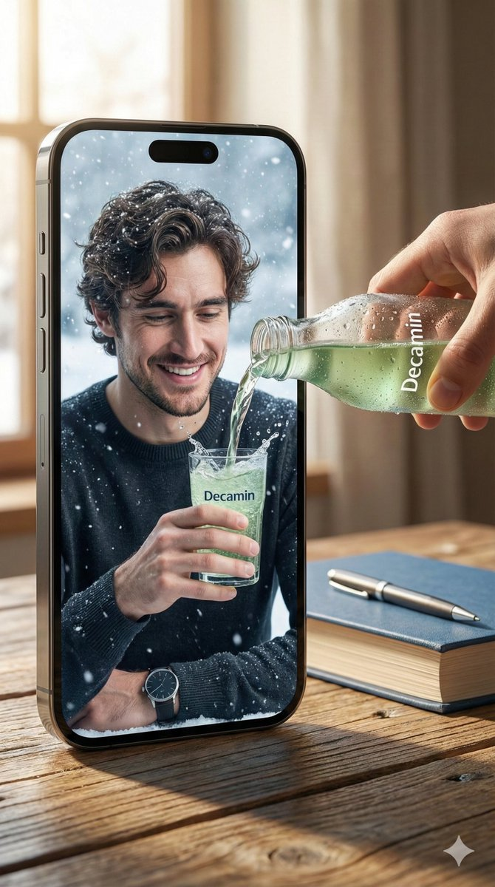

```
{
  "meta": {
    "type": "Creative Brief",
    "genre": "Hyper-realistic Surrealism",
    "composition_style": "Composite Portrait",
    "aspect_ratio": "Portrait (implied by 'portrait' description)"
  },
  "scene_architecture": {
    "viewpoint": {
      "type": "Photographic",
      "angle": "High-angle / Looking down",
      "framing": "Tight on central subject"
    },
    "dimensional_hierarchy": {
      "rule": "Scale disparity for surreal effect",
      "dominant_element": "iPhone 17 Pro Max (Super-scaled)",
      "subordinate_elements": ["Blue Book (Miniature)", "Pen (Miniature)"]
    }
  },
  "realm_physical": {
    "description": "The real-world environment surrounding the device.",
    "environment": {
      "surface": "Wooden table",
      "texture_attributes": ["rich grain", "tactile", "worn"]
    },
    "lighting_global": {
      "source": "Natural light",
      "temperature": "Warm",
      "shadow_quality": "Soft, diffused, volumetric"
    },
    "active_agent": {
      "identity": "Human Hand (Real)",
      "action": "Pouring",
      "position": "Entering frame laterally"
    },
    "held_object": {
      "item": "Bottle",
      "state": "Chilled (visible condensation)",
      "branding": {
        "logo_text": "Decamin",
        "placement": "Visible on label"
      },
      "contents": {
        "substance": "Water",
        "color": "Light Green",
        "state": "Liquid flow"
      }
    },
    "static_props": [
      {
        "item": "Book",
        "color": "Blue",
        "scale_notes": "Significantly smaller than phone"
      },
      {
        "item": "Pen",
        "type": "Ballpoint/Ink",
        "scale_notes": "Significantly smaller than phone"
      }
    ]
  },
  "realm_digital": {
    "description": "The content displayed on the screen.",
    "container_device": {
      "model": "iPhone 17 Pro Max",
      "state": "Screen ON",
      "orientation": "Flat on physical surface"
    },
    "screen_content": {
      "subject_identity": "mqn (Reference ID)",
      "subject_scale": "Close-up (filling screen)",
      "expression": "Happy / Smiling",
      "attire": "Winter clothing (matching reference)",
      "setting": "Winter landscape / snowy backdrop",
      "held_object_digital": {
        "item": "Drinking Glass",
        "branding": {
          "logo_text": "Decamin",
          "visibility": "Clear"
        },
        "initial_state": "Empty (waiting for pour)"
      }
    }
  },
  "surreal_bridge_event": {
    "description": "The interaction connecting the physical and digital realms.",
    "action_type": "Trans-dimensional Fluid Dynamics",
    "source": "realm_physical.held_object.contents (Light Green Water)",
    "interaction_point": "realm_digital.container_device.screen_surface",
    "destination": "realm_digital.screen_content.held_object_digital (The Glass)",
    "physics_violation_rules": {
      "rule_1": "Liquid does not splash off the glass screen surface.",
      "rule_2": "Screen surface acts as a permeable membrane solely for this liquid.",
      "rule_3": "Physical liquid transitions seamlessly into digital representation upon contact."
    },
    "visual_details": ["Sharp liquid simulation", "No surface tension on screen glass", "Fluid physically filling digital cup"]
  },
  "rendering_specifications": {
    "visual_fidelity": "Hyper-realistic",
    "texture_focus": ["Sharp fluid details", "Glass pixels", "Wood grain", "Skin texture (hand and subject)"],
    "mood": "Cinematic, warm, magical",
    "resolution_target": "8K / Highly detailed"
  }
}
```

```
{
  "meta": {
    "type": "创意简报",
    "genre": "超写实超现实主义",
    "composition_style": "合成肖像",
    "aspect_ratio": "竖构图（由“肖像”描述暗示）"
  },
  "scene_architecture": {
    "viewpoint": {
      "type": "摄影视角",
      "angle": "高角度 / 俯视",
      "framing": "紧密聚焦于中心主体"
    },
    "dimensional_hierarchy": {
      "rule": "通过比例差异制造超现实效果",
      "dominant_element": "iPhone 17 Pro Max（超大比例）",
      "subordinate_elements": ["蓝色书籍（微型）", "钢笔（微型）"]
    }
  },
  "realm_physical": {
    "description": "设备周围的现实世界环境。",
    "environment": {
      "surface": "木桌",
      "texture_attributes": ["丰富木纹", "触感明显", "有使用痕迹"]
    },
    "lighting_global": {
      "source": "自然光",
      "temperature": "暖色调",
      "shadow_quality": "柔和、漫射、具有体积感"
    },
    "active_agent": {
      "identity": "真实人类的手",
      "action": "倾倒",
      "position": "从画面侧面进入"
    },
    "held_object": {
      "item": "瓶子",
      "state": "冷藏状态（可见冷凝水）",
      "branding": {
        "logo_text": "Decamin",
        "placement": "标签上清晰可见"
      },
      "contents": {
        "substance": "水",
        "color": "浅绿色",
        "state": "液体流动中"
      }
    },
    "static_props": [
      {
        "item": "书",
        "color": "蓝色",
        "scale_notes": "明显小于手机"
      },
      {
        "item": "笔",
        "type": "圆珠笔/墨水笔",
        "scale_notes": "明显小于手机"
      }
    ]
  },
  "realm_digital": {
    "description": "屏幕上显示的内容。",
    "container_device": {
      "model": "iPhone 17 Pro Max",
      "state": "屏幕开启",
      "orientation": "平放于物理表面"
    },
    "screen_content": {
      "subject_identity": "mqn（参考ID）",
      "subject_scale": "特写（填满屏幕）",
      "expression": "开心 / 微笑",
      "attire": "冬季服装（与参考一致）",
      "setting": "冬日风景 / 雪景背景",
      "held_object_digital": {
        "item": "饮水杯",
        "branding": {
          "logo_text": "Decamin",
          "visibility": "清晰可见"
        },
        "initial_state": "空杯（等待注入）"
      }
    }
  },
  "surreal_bridge_event": {
    "description": "连接物理与数字世界的互动事件。",
    "action_type": "跨维度流体动力学",
    "source": "realm_physical.held_object.contents（浅绿色水）",
    "interaction_point": "realm_digital.container_device.screen_surface",
    "destination": "realm_digital.screen_content.held_object_digital（杯子）",
    "physics_violation_rules": {
      "rule_1": "液体不会从玻璃屏幕表面飞溅。",
      "rule_2": "屏幕表面仅对此液体表现为可渗透膜。",
      "rule_3": "物理液体在接触时无缝转化为数字表现形式。"
    },
    "visual_details": ["锐利的液体模拟", "屏幕玻璃无表面张力", "液体实际填充数字杯子"]
  },
  "rendering_specifications": {
    "visual_fidelity": "超写实",
    "texture_focus": ["锐利的液体细节", "玻璃像素", "木纹", "皮肤纹理（手与人物）"],
    "mood": "电影感、温暖、魔幻",
    "resolution_target": "8K / 高度细节化"
  }
}
```

 [↑返回目录](#toc)

---
## <a id="prompt-1996526274714726400">AIでニュースを図解カードに</a> (<a href="https://x.com/felo_ai/status/1996526274714726471" target="_blank" rel="noopener noreferrer">Felo AI</a>)


```
🌐 URLを貼るだけでニュースページを“図解画像”にできるって、知ってましたか？

Felo LiveDocにWebページのリンクを入れると、
AIが内容を読み取り、要点を整理し、
Nano Banana Proの画像生成でそのまま見やすい図解に変換してくれます🤯✨

長い記事でも、複雑な説明でも、
一枚でスッと理解できるカードになるの最高👏

使い方もいろいろ⚡
・最新ニュースのざっくり把握に
・リサーチの下調べに
・授業・講義ノートの時短まとめに
などなど！

気になる記事URLで、ぜひ試してみてください📚✨
「こんな使い方あるよ〜」の共有も大歓迎です！
#FeloAI #NanoBananaPro
```

 [↑返回目录](#toc)

---
## <a id="prompt-1996487470708630000">Nano Banana Pro角色合成技巧</a> (<a href="https://x.com/_3912657840/status/1996487470708629919" target="_blank" rel="noopener noreferrer">角煮星丸</a>)

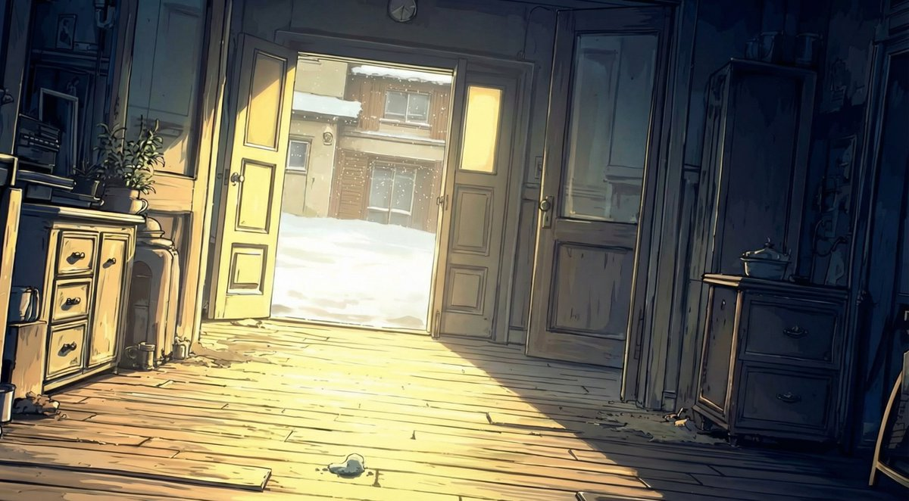

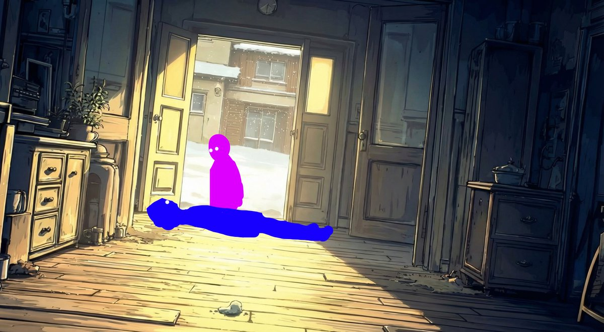

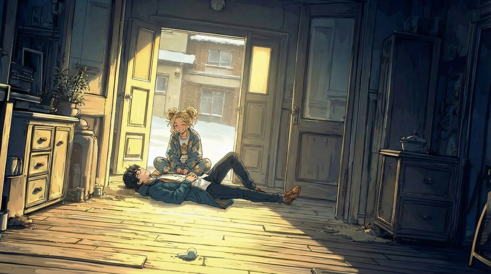

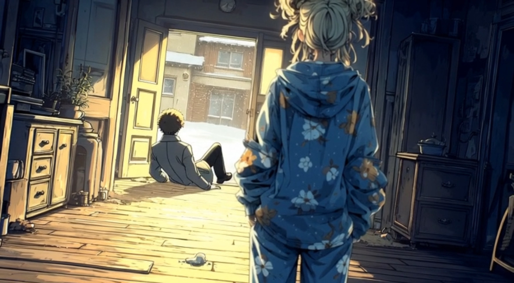

```
奥に小さくキャラを置きたいんだけどなー
って時に使えるかもしれないテクニック。

①背景の元を用意する
②bananaプロでキャラを消す
③ペイントツールでキャラを配置したいところを適当に塗る
④bananaプロで塗り領域とキャラを置き換える

プロンプトはリプ欄に！
```

 [↑返回目录](#toc)

---
## <a id="prompt-1996604581313220900">多视角场景网格</a> (<a href="https://x.com/NanoBanana/status/1996604581313220931" target="_blank" rel="noopener noreferrer">Nano Banana Pro</a>)

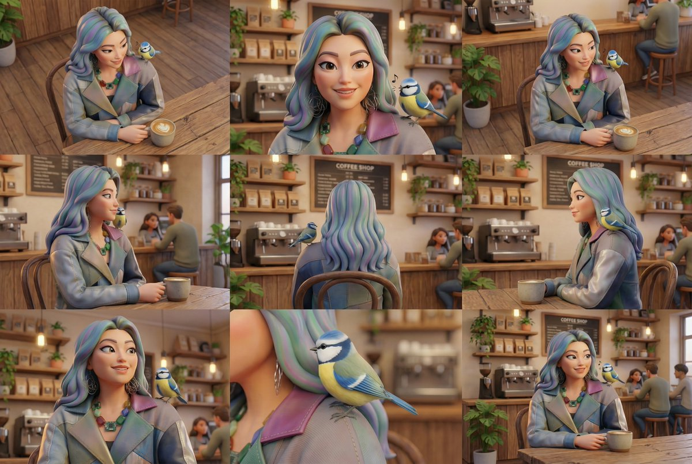

```
In a 3x3 grid, show me different angles of this scene
```

```
以 3x3 网格形式，展示此场景的不同角度
```

 [↑返回目录](#toc)

---
## <a id="prompt-1996678914580636000">暴力之选</a> (<a href="https://x.com/egeberkina/status/1996678914580635971" target="_blank" rel="noopener noreferrer">Ege</a>)


```
{
  "image_prompt": {
    "subject_description": "A fit young woman with voluminous, dark brunette wavy hair styled in a modern blowout. She is kneeling on the floor in a side-profile view, turning her torso slightly to aim.",
    "action": "Holding a sleek, modern black semi-automatic pistol with a two-handed grip, arms fully extended, aiming intently to the left. Intense, focused facial expression.",
    "attire": "A structured, modern white satin corset with intricate ribbon lacing down the spine, matching high-cut white bottoms. Barefoot.",
    "environment": "High-end minimalist photo studio, seamless bright white infinity background.",
    "lighting": "Professional cinematic studio lighting, soft rim lighting highlighting the muscle definition of the back and arms, soft shadows, high dynamic range (HDR).",
    "technical_specs": "Ultra-realistic, 8k resolution, razor-sharp focus, incredibly detailed skin texture and fabric weave, photorealistic, modern fashion editorial style, shot on Hasselblad X2D 100C, macro details, no film grain, clean and crisp aesthetic."
  }
}
```

```
翻译如下：
她没有选择暴力，而是暴力选择了她。
{
  "image_prompt": {
    "subject_description": "一位身材健美的年轻女性，拥有一头丰盈的深棕色波浪卷发，以现代风格吹干造型。她侧身跪在地上，身体微微转向左侧。",
    "action": "双手紧握一支时尚的黑色半自动手枪，双臂完全伸展，专注地瞄准左边。面部表情紧张而专注。",
    "attire": "穿着结构化的现代白色缎面紧身胸衣，背部有精致的丝带系带，搭配高腰白色内裤。赤脚。",
    "environment": "高端极简风格摄影工作室，无缝的纯白背景。",
    "lighting": "专业电影级工作室照明，柔和的轮廓光强调背部和手臂的肌肉线条，柔和的阴影，高动态范围（HDR）。",
    "technical_specs": "超现实主义风格，8K分辨率，锐利的焦点，极其详细的皮肤纹理和织物细节，逼真的现代时尚编辑风格，使用哈苏X2D 100C拍摄，无胶片颗粒，清晰干净的美学效果。"
  }
}
```

 [↑返回目录](#toc)

---
## <a id="prompt-1996678202849161500">沙丘绿洲微缩奇境</a> (<a href="https://x.com/AllaAisling/status/1996678202849161415" target="_blank" rel="noopener noreferrer">Alexandra Aisling</a>)


```
3D isometric diorama

🚀Made with Gemini 3 Nano Banana in Adobe Firefly Boards and animated with Veo 3.1.

1/5  Design a 3D isometric diorama of a lush oasis in vast sand dunes. Feature tall date palm trees, a crystal-clear blue spring water pool, partially buried ancient stone ruins with carved pillars, rolling sand dunes in the background, a caravan of camels with colorful saddle blankets, a small tent, desert plants like cacti, and the sun setting with orange and purple sky gradient.
```

```
3D等距微缩场景

🚀使用Gemini 3 Nano Banana在Adobe Firefly Boards中制作，并以Veo 3.1进行动画处理。

1/5 设计一个位于广阔沙丘中的葱郁绿洲的3D等距微缩场景。包含高大的椰枣树、清澈湛蓝的泉水池、部分掩埋于沙中的古老石制遗迹（带有雕刻柱子）、背景中起伏的沙丘、配有彩色鞍毯的骆驼商队、一顶小帐篷、仙人掌等沙漠植物，以及日落时分橙紫渐变的天空。
```

 [↑返回目录](#toc)

---
## <a id="prompt-1996602278044656000">AI视频创作工具幻想</a> (<a href="https://x.com/maxescu/status/1996602278044656098" target="_blank" rel="noopener noreferrer">Alex Patrascu</a>)

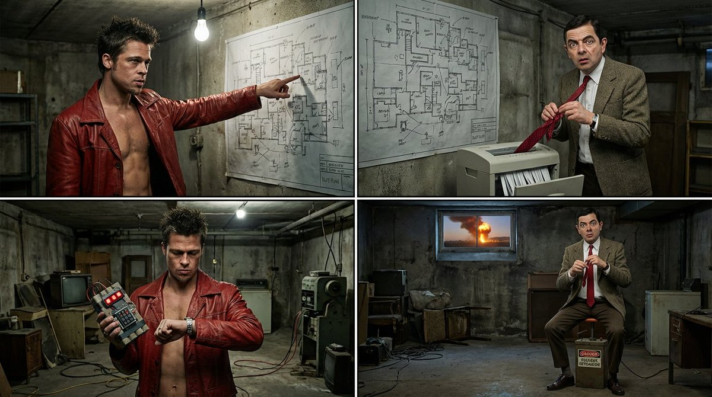

```
If you start a new AI video project today, what are the top 3 tools you'd use (video/image)?

Video:
1. Kling 2.6 & 2.5 (Start/End Frames)
2. Veo 3.1
3. Kling O1

Images:
1. Nano Banana Pro
2. FLUX.2
3. Seedream 4.5

I wish I could use Sora 2 Pro, but... yeah, nah.
```

```
如果你今天开始一个新的AI视频项目，你会使用的三大工具（视频/图像）是什么？

视频：
1. Kling 2.6和2.5（起始/结束帧）
2. Veo 3.1
3. Kling O1

图像：
1. Nano Banana Pro
2. FLUX.2
3. Seedream 4.5

我希望我能使用Sora 2 Pro，但是...嗯，算了吧。
```

 [↑返回目录](#toc)

---
## <a id="prompt-1996385227204096000">车内自拍：阳光与雀斑</a> (<a href="https://x.com/GlitterPixely/status/1996385227204096018" target="_blank" rel="noopener noreferrer">Glitter Gal</a>)

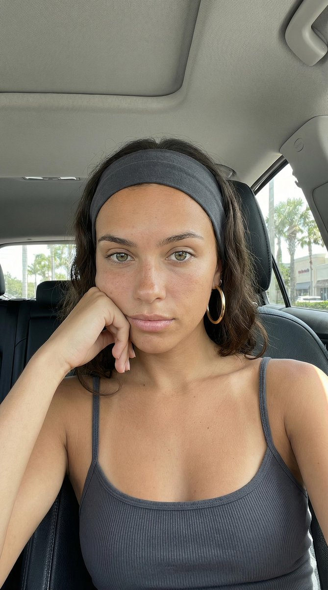

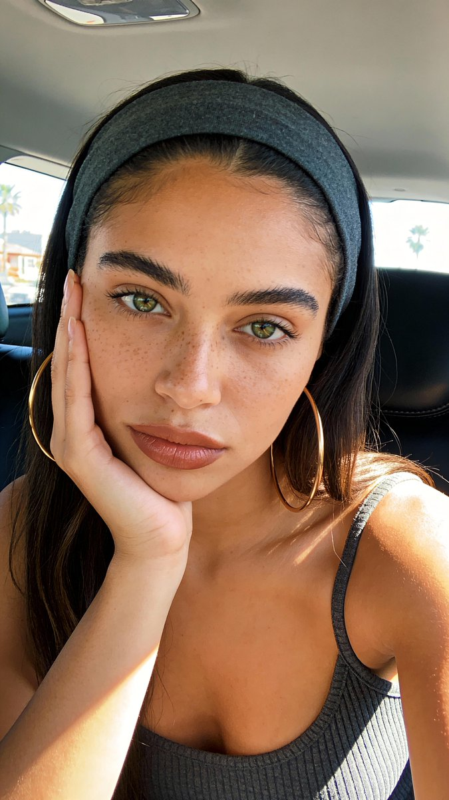

```
Nano Banana Pro on the left. Seedream 4.5 on the right via @ImagineArt_X 

{
"subject": {
"age": "young adult",
"gender": "female",
"skin": "tanned, prominent freckles, natural glow",
"eyes": "hazel green, defined eyebrows",
"hair": {
"color": "dark brown/black",
"style": "straight, long, pushed back with wide fabric headband, loose waves",
"accessory": "wide charcoal grey fabric headband"
},
"expression": "neutral, relaxed, direct gaze, hand on cheek",
"features": "full lips, natural makeup"
},
"clothing": {
"type": "ribbed spaghetti strap top",
"color": "charcoal grey",
"neckline": "scoop neck"
},
"accessories": [
{
"type": "earrings",
"style": "large thick gold hoop"
}
],
"pose": "close-up selfie, right hand supporting cheek, looking at camera",
"environment": {
"location": "inside car",
"elements": [
"black leather car seat",
"car interior roof",
"window showing bright daylight",
"blurred background with palm trees and buildings"
]
},
"lighting": "natural daylight, bright, from right side window",
"photographic_style": "smartphone selfie, natural light, high resolution, realistic",
"aspect_ratio": "9:16"
}
```

```
左侧为 Nano Banana Pro，右侧为 Seedream 4.5，由 @ImagineArt_X 创作。

{
"主体": {
"年龄": "年轻成人",
"性别": "女性",
"肤色": "晒成小麦色，明显雀斑，自然光泽",
"眼睛": "榛绿色，眉毛清晰",
"头发": {
"颜色": "深棕/黑色",
"发型": "直发，长发，用宽幅织物发带向后束起，末端呈松散波浪",
"配饰": "炭灰色宽幅织物发带"
},
"表情": "中性、放松、直视镜头、手托脸颊",
"特征": "饱满双唇，自然妆容"
},
"服装": {
"类型": "细肩带罗纹上衣",
"颜色": "炭灰色",
"领型": "挖背圆领"
},
"配饰": [
{
"类型": "耳环",
"款式": "大而粗的金色圆环耳环"
}
],
"姿势": "自拍特写，右手托腮，注视镜头",
"环境": {
"地点": "车内",
"元素": [
"黑色皮革汽车座椅",
"车顶内饰",
"窗户透入明亮日光",
"背景模糊，可见棕榈树与建筑物"
]
},
"光线": "自然日光，明亮，从右侧车窗照射",
"摄影风格": "智能手机自拍，自然光，高分辨率，写实风格",
"画幅比例": "9:16"
}
```

 [↑返回目录](#toc)

---
## <a id="prompt-1996992785669673200">红色警戒微缩怀旧模型</a> (<a href="https://x.com/ttmouse/status/1996992785669673265" target="_blank" rel="noopener noreferrer">ttmouse - 豆爸</a>)


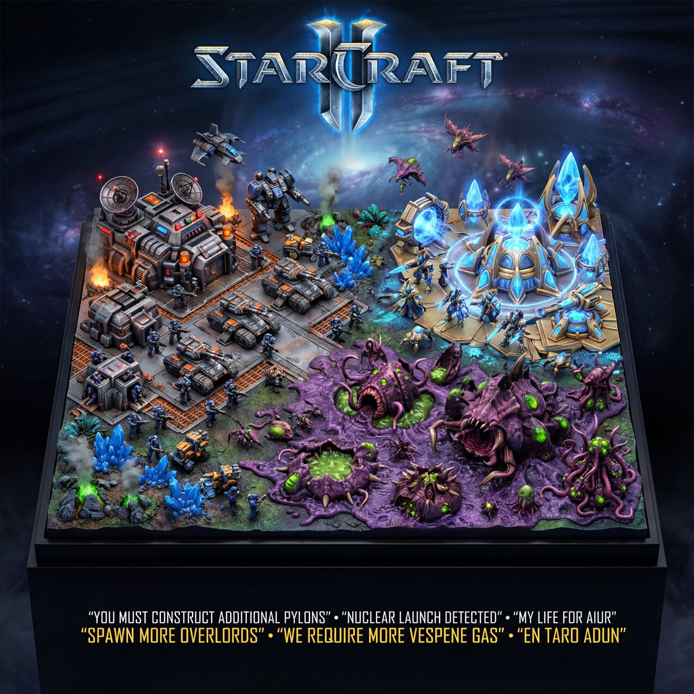

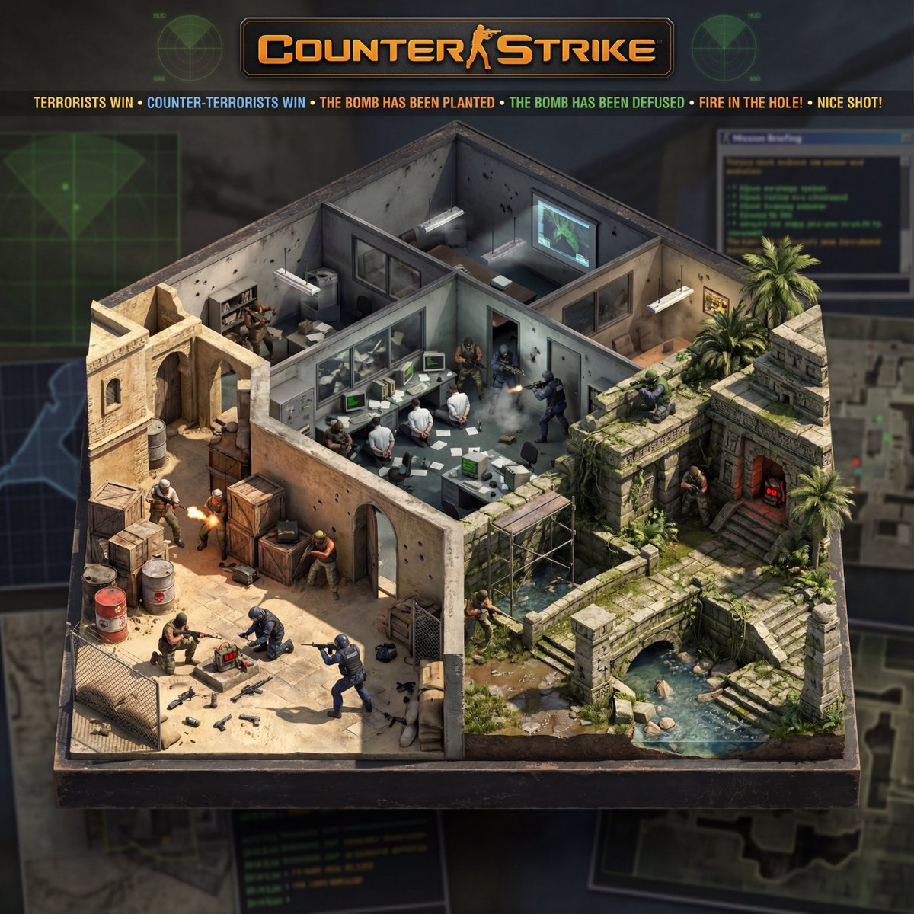

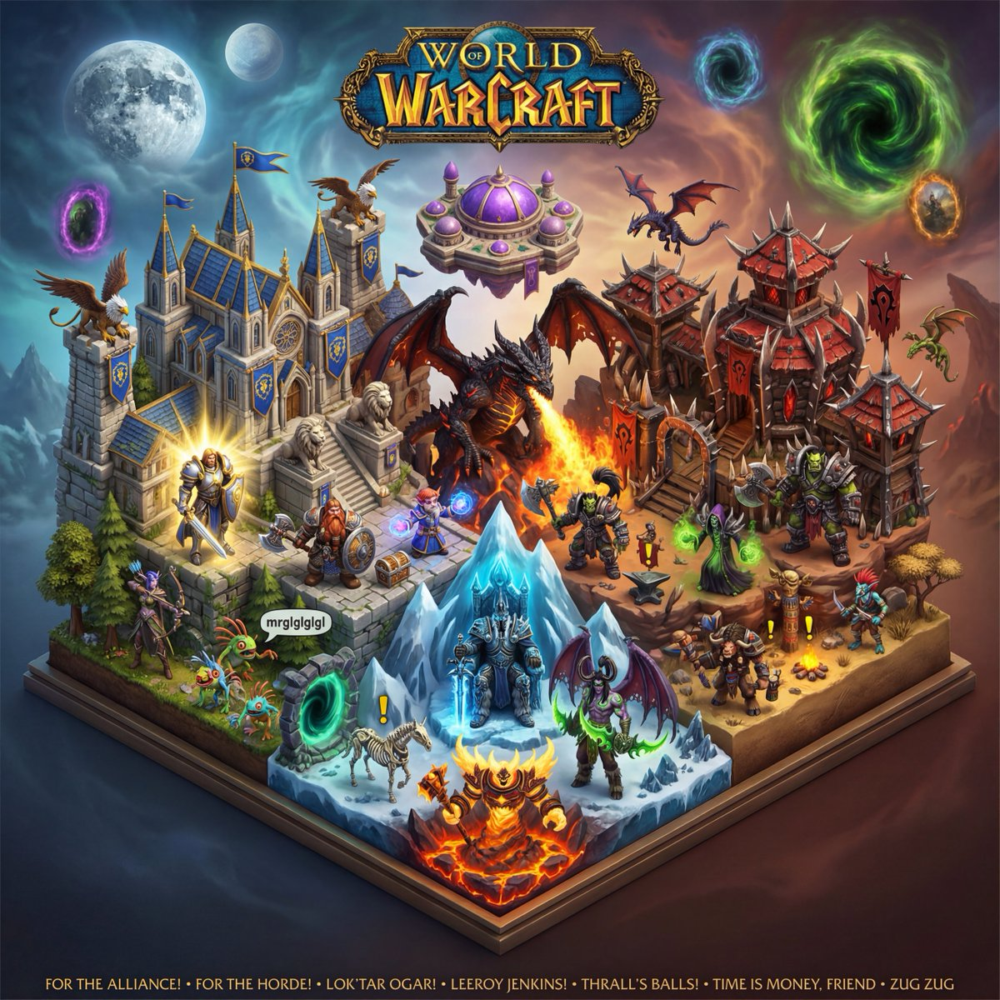

```
红色警戒

A 45° isometric view of a highly detailed 3D miniature diorama scene based on the video game '[INSERT GAME NAME HERE]'. The diorama block is centered and densely packed with the most iconic and instantly recognizable structures, units, characters, and environmental features specific to '[INSERT GAME NAME HERE]'. The scene must showcase a wide variety of distinct elements representing different factions, key gameplay mechanics, or memorable levels to maximize nostalgia. Ensure the architectural styles, character designs, vehicle appearances, and color palettes are authentically replicated from the game's original art direction.

Render with rich, realistic PBR materials and textures, giving the scene a tactile, physical model quality (e.g., weathered metal, stylized stone, plastic, or organic textures depending on the game). Dramatic lighting highlights the 3D forms. The environment (terrain, flora, weather) matches a classic biome from the game.

At the top center, the official logo/title graphic of '[INSERT GAME NAME HERE]' is prominently displayed, perfectly replicating its original font, color, texture, and glowing effects. At the bottom of the frame, include several short, iconic in-game phrases, UI messages, or memorable quotes associated with the game (e.g., system messages, character catchphrases, or UI alerts). These should be rendered in a font style matching the game's user interface. The background is a subtle, textured atmospheric backdrop complementing the game's theme. Square (1:1) aspect ratio.
```

 [↑返回目录](#toc)

---
## <a id="prompt-1996518068235751400">电梯镜中的温柔邀约</a> (<a href="https://x.com/gaucheai/status/1996518068235751487" target="_blank" rel="noopener noreferrer">gauche</a>)


```
{
  "scene": {
    "type": "elevator_mirror_selfie",
    "location": "apartment_elevator",
    "time": "daytime",
    "lighting": "warm_elevator_light",
    "atmosphere": "intimate_between_floors"
  },

  "camera": {
    "pov": "we_are_the_phone",
    "type": "mirror_selfie",
    "angle": "chest_level_slightly_angled",
    "framing": "full_body_in_mirror",
    "phone_visible": true
  },

  "subject": {
    "pose": {
      "stance": "facing_mirror_hips_angled",
      "weight": "on_one_leg_hip_soft_curve_out",
      "energy": "relaxed_effortless_not_aggressive",
      "arms": {
        "right": "holding_phone_for_selfie",
        "left": "carrying_jacket_draped_over_forearm"
      }
    },

    "expression": {
      "eyes": {
        "style": "soft_doe_eyes_through_lowered_lashes",
        "energy": "knowing_not_sleepy",
        "contact": "looking_at_camera_direct",
        "message": "i_see_you_looking_welcome_to_look_more"
      },
      "cheeks": {
        "color": "soft_pink_flush",
        "reason": "just_came_in_from_cold",
        "texture": "healthy_rosy_alive"
      },
      "lips": {
        "position": "soft_part_slightly_open",
        "color": "pink_glossy",
        "energy": "about_to_say_something_or_waiting"
      },
      "overall": "soft_invitation_available_knowing"
    },

    "hair": {
      "color": "platinum_blonde_icy_white",
      "style": "long_loose_slightly_wavy",
      "placement": "falling_from_under_cap_over_shoulders",
      "detail": "some_tucked_some_flowing_free"
    }
  },

  "outfit": {
    "hat": {
      "type": "baseball_cap",
      "color": "forest_green_or_olive",
      "wear_style": "forward_classic",
      "condition": "slightly_worn_favorite_hat",
      "effect": "shadows_forehead_intensifies_eyes"
    },

    "top": {
      "type": "cropped_long_sleeve",
      "fabric": "ribbed_knit_thin_fitted",
      "color": "black",
      "neckline": "scooped_not_too_low",
      "fit": "tight_every_curve_traced_ribs_visible",
      "length": "cropped_above_belly_button_full_stomach_exposed"
    },

    "skirt": {
      "type": "pleated_tennis_skirt",
      "color": "crisp_white",
      "fit": "high_waisted_below_belly_button",
      "length": "short_upper_thigh",
      "detail": "gap_of_bare_skin_between_crop_and_skirt"
    },

    "stockings": {
      "type": "fishnet_thigh_highs",
      "color": "black",
      "pattern": "small_diamond_delicate",
      "top": "thin_lace_band",
      "thigh_gap": "1-2_inches_bare_skin_between_skirt_and_lace"
    },

    "jacket": {
      "type": "leather_or_olive_khaki",
      "status": "draped_over_forearm_not_worn",
      "purpose": "adds_context_story_texture_shows_motion"
    }
  },

  "accessories": {
    "bag": {
      "type": "small_crossbody",
      "material": "black_leather_or_canvas",
      "hardware": "silver_or_gold",
      "position": "strap_diagonal_across_chest_bag_at_hip"
    },
    "earrings": {
      "type": "small_silver_hoops",
      "visibility": "visible_below_cap"
    },
    "necklace": {
      "type": "thin_silver_chain",
      "pendant": "tiny_simple"
    },
    "rings": {
      "type": "one_thin_band",
      "style": "minimal"
    }
  },

  "makeup": {
    "base": "natural_glowing_skin",
    "cheeks": "natural_pink_from_cold",
    "brows": "soft_groomed",
    "eyes": "mascara_pretty_lashes",
    "lips": "pink_gloss_shiny_soft"
  },

  "color_story": {
    "primary": ["forest_green_cap", "black_top", "white_skirt", "black_fishnet"],
    "accents": ["platinum_blonde", "pale_skin", "pink_flush"],
    "contrast": "green_vs_blonde_white_vs_black_pure_vs_sin"
  },

  "narrative": {
    "context": "girl_in_transit_between_places",
    "backstory": "just_came_from_outside_flushed_cheeks_jacket",
    "action": "caught_herself_in_mirror_liked_what_she_saw",
    "intention": "stopped_to_take_this_for_someone",
    "caption_suggestion": "running_late_💚_or_on_my_way"
  },

  "vibe": {
    "core": "soft_invitation_knowing_effortless",
    "contrast": "sporty_cap_vs_fishnet_sin_casual_vs_calculated",
    "energy": "she_knows_you_know_game_recognized",
    "result": "the_face_that_makes_people_act_stupid"
  }
}
```

```
{
  "scene": {
    "type": "电梯镜自拍",
    "location": "公寓电梯",
    "time": "白天",
    "lighting": "温暖的电梯灯光",
    "atmosphere": "楼层之间私密氛围"
  },

  "camera": {
    "pov": "我们就是手机",
    "type": "镜中自拍",
    "angle": "胸部高度略带角度",
    "framing": "镜中全身入镜",
    "phone_visible": true
  },

  "subject": {
    "pose": {
      "stance": "面向镜子，臀部微侧",
      "weight": "重心落在单腿，臀部柔和外翘",
      "energy": "放松自然，毫不张扬",
      "arms": {
        "right": "手持手机自拍",
        "left": "前臂搭着夹克"
      }
    },

    "expression": {
      "eyes": {
        "style": "低垂睫毛下的温柔鹿眼",
        "energy": "了然于心而非困倦",
        "contact": "直视镜头",
        "message": "我知道你在看，欢迎继续多看几眼"
      },
      "cheeks": {
        "color": "淡淡粉红",
        "reason": "刚从寒冷室外进来",
        "texture": "健康红润、鲜活"
      },
      "lips": {
        "position": "微微张开",
        "color": "粉嫩亮泽",
        "energy": "似要开口说话，又似在等待"
      },
      "overall": "温柔邀约、可亲而了然"
    },

    "hair": {
      "color": "铂金色近乎冰白",
      "style": "长发松散微卷",
      "placement": "从帽子下倾泻至肩头",
      "detail": "部分塞入帽内，部分自然垂落"
    }
  },

  "outfit": {
    "hat": {
      "type": "棒球帽",
      "color": "森林绿或橄榄色",
      "wear_style": "正面佩戴经典款",
      "condition": "略显旧但钟爱有加",
      "effect": "帽檐阴影加深眼神"
    },

    "top": {
      "type": "短款长袖上衣",
      "fabric": "细密罗纹针织，贴身轻薄",
      "color": "黑色",
      "neckline": "圆领不过低",
      "fit": "紧贴身形，勾勒肋骨曲线",
      "length": "露脐款式，肚脐以上全露"
    },

    "skirt": {
      "type": "百褶网球裙",
      "color": "纯白色",
      "fit": "高腰设计，位于肚脐下方",
      "length": "大腿上部",
      "detail": "上衣与裙子间露出一小段肌肤"
    },

    "stockings": {
      "type": "渔网过膝袜",
      "color": "黑色",
      "pattern": "细小菱形网格",
      "top": "细蕾丝边",
      "thigh_gap": "裙摆与蕾丝间留1-2英寸裸露肌肤"
    },

    "jacket": {
      "type": "皮革或橄榄色卡其夹克",
      "status": "搭在前臂未穿",
      "purpose": "增添情境感、故事性和动感"
    }
  },

  "accessories": {
    "bag": {
      "type": "小巧斜挎包",
      "material": "黑色皮革或帆布",
      "hardware": "银色或金色五金",
      "position": "肩带斜跨胸前，包体置于髋部"
    },
    "earrings": {
      "type": "小巧银圈耳环",
      "visibility": "帽檐下可见"
    },
    "necklace": {
      "type": "纤细银链",
      "pendant": "极简小巧吊坠"
    },
    "rings": {
      "type": "一枚细戒",
      "style": "极简风格"
    }
  },

  "makeup": {
    "base": "自然透亮肌底",
    "cheeks": "因寒冷而泛起天然粉晕",
    "brows": "柔顺修整",
    "eyes": "睫毛膏强调美睫",
    "lips": "粉亮唇釉，柔软闪亮"
  },

  "color_story": {
    "primary": ["森林绿帽子", "黑色上衣", "白色短裙", "黑色渔网袜"],
    "accents": ["铂金发色", "白皙肌肤", "粉红脸颊"],
    "contrast": "绿色对铂金、白色对黑色、纯真对诱惑"
  },

  "narrative": {
    "context": "女孩正处在地点转换途中",
    "backstory": "刚从户外进来，脸颊泛红，带着夹克",
    "action": "在镜中瞥见自己，喜欢所见",
    "intention": "特意停下拍下这张照片，为某人而拍",
    "caption_suggestion": "迟到中💚还是在路上"
  },

  "vibe": {
    "core": "温柔邀约、了然于心、毫不费力",
    "contrast": "运动帽vs渔网袜、随性vs精心设计",
    "energy": "她知道你懂，彼此心照不宣",
    "result": "那张让人神魂颠倒的脸"
  }
}
```

 [↑返回目录](#toc)

---
## <a id="prompt-1996445591099044400">AIで年齢変化を再現比較</a> (<a href="https://x.com/genel_ai/status/1996445591099044242" target="_blank" rel="noopener noreferrer">GENEL | AI動画×クライアントワーク</a>)


```
AIで「同一人物の10~50代再現」比較してみた

・Seedream 4.5 と Nano Banana Pro
・「参照画像に極めて忠実」なSeedream 4.5
・「リアリティを再現する」Nano Banana Pro

やはり特長としてSeedream 4.5は「参照元に極めて忠実であろうとする」のが挙げられそうです👀

これを良しとするか、ダメとするかは用途や人によってわかれそう...

・公人の沿革などリアルに作るならNano Banana Pro
・ショート動画等インスタントな訴求ではSeedream 4.5

なイメージですかね🤔
みなさんの使用感も聞かせてください！

#SousakuAI #BytePlus #PR
```

 [↑返回目录](#toc)

---
## <a id="prompt-1996494969310220500">3D街头时尚广告牌</a> (<a href="https://x.com/Ankit_patel211/status/1996494969310220454" target="_blank" rel="noopener noreferrer">ANKIT PATEL 🇮🇳 | AI</a>)

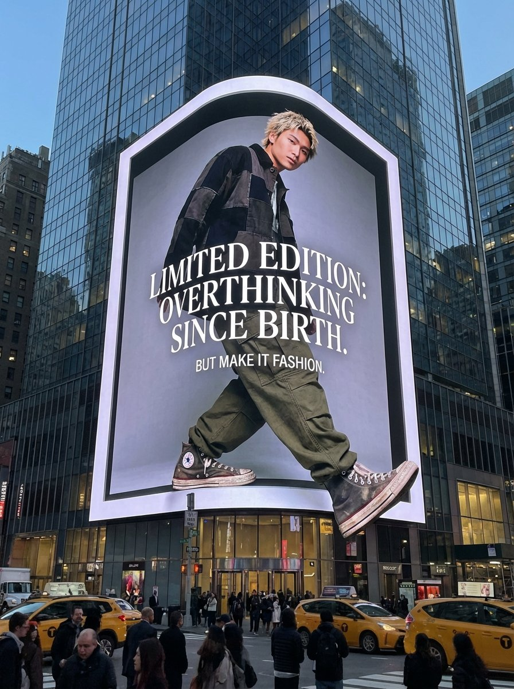

```
Crete your own image on Curve edge 3D display

Google Gemini Nano Banana Pro @freepik

A giant fashion 3D billboard on the side of a modern building in a busy urban street. On the 3D billboard is a confident 
man (from attached image) wearing a sleek, modern man styled in a fashion-forward way. He’s dressed in streetwear, an oversized jacket, cargo pants, random converse shoes. His pose is fierce and elegant with one foot or hand slightly outward the frame, as if the shoe or hand is come out of the 3d billboard. Next to him, bold text styled like a luxury fashion slogan reads: “LIMITED EDITION: OVERTHINKING SINCE BIRTH. ” with tagline "BUT MAKE IT FASHION". The 3D billboard mixes high-fashion elegance with humorous Gen-Z energy. Photorealistic, stylish, culturally modern, and meme-inspired. Vertical 3:4. 

Signature :Ankit Patel
```

```
在曲面边缘3D显示屏上创作你自己的图像

Google Gemini Nano Banana Pro @freepik

一座巨型时尚3D广告牌矗立在繁华都市街道旁的现代建筑侧面。广告牌上是一位自信的男子（如附图所示），身着前卫时尚的街头风格：一件宽松夹克、工装裤和随意搭配的匡威鞋。他的姿态既凌厉又优雅，一只脚或一只手微微伸出画面，仿佛从3D广告牌中探出。他身旁是醒目的奢侈时尚标语：“限量版：自出生起便过度思考。”副标题为“但要让它变时尚”。这块3D广告牌融合了高级时装的优雅与Z世代的幽默活力。写实风格，时尚感强，文化现代，并带有网络迷因元素。竖版3:4比例。

签名：Ankit Patel
```

 [↑返回目录](#toc)

---
## <a id="prompt-1996129537806213600">撕纸层叠肖像</a> (<a href="https://x.com/munou_ac/status/1996129537806213597" target="_blank" rel="noopener noreferrer">てんねん</a>)

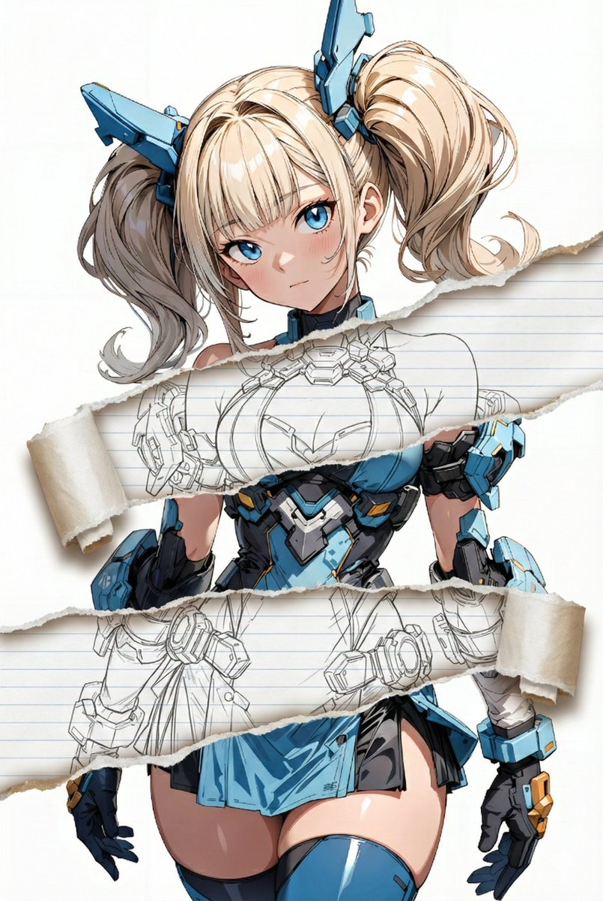

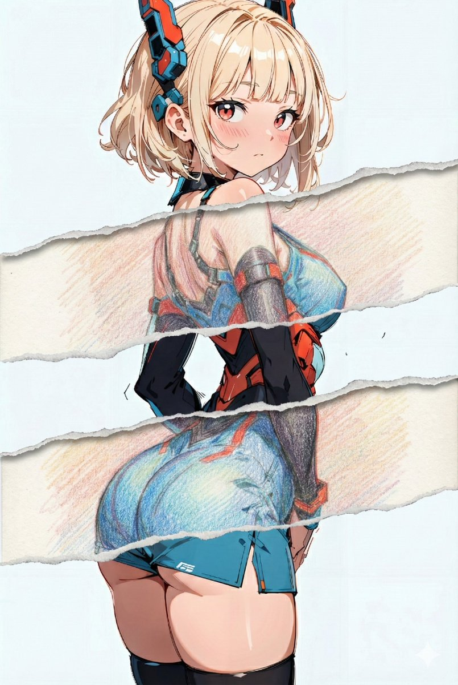

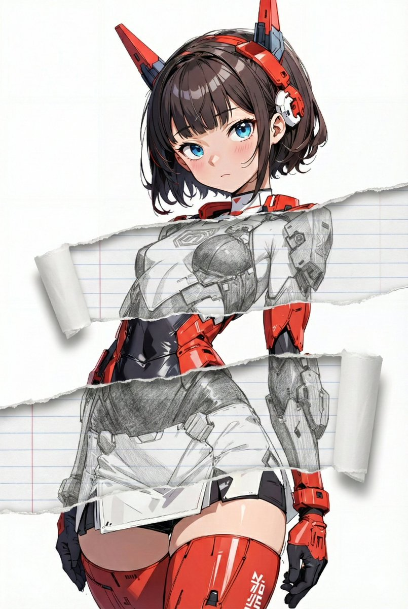


```
task: "edit-image: add widened torn-paper layered effect"

base_image:
  use_reference_image: true
  preserve_everything:
    - character identity
    - facial features and expression
    - hairstyle and anatomy
    - outfit design and colors
    - background, lighting, composition
    - overall art style

rules:
  - Only modify the torn-paper interior areas.
  - Do not change pose, anatomy, proportions, clothing details, shading, or scene elements.

effects:
  - effect: "torn-paper-reveal"
    placement: "across chest height"
    description:
      - Add a wide, natural horizontal tear across the chest area.
      - The torn interior uses the style defined in `interior_style`.

  - effect: "torn-paper-reveal"
    placement: "lower abdomen height"
    description:
      - Add a wide horizontal tear across the lower abdomen.
      - The torn interior uses the style defined in `interior_style`.

interior_style:
  mode: "line-art"

  style_settings:
    line-art:
      palette: "monochrome"
      line_quality: "clean, crisp"
      paper: "notebook paper with subtle ruled lines"

    sumi-e:
      palette: "black ink tones"
      brush_texture: "soft bleeding edges"
      paper: "plain textured paper"

    figure-render:
      material: "PVC-like"
      shading: "semi-realistic highlights"
      paper: "plain smooth surface"

    colored-pencil:
      stroke_texture: "visible pencil grain"
      palette: "soft layered hues"
      paper: "rough sketchbook paper"

    watercolor:
      palette: "soft transparent pigments"
      blending: "smooth bleeding"
      edges: "soft contours"
      paper: "watercolor paper texture"

    pencil-drawing:
      graphite_texture: "visible pencil grain"
      shading: "smooth gradients"
      line_quality: "mixed sharp and soft"
      tone: "gray-scale"
      paper: "notebook paper with faint ruled lines"
```

```
任务："编辑图像：添加加宽的撕纸层叠效果"

基础图像：
  使用参考图像：是
  保留以下所有内容：
    - 角色身份
    - 面部特征和表情
    - 发型和解剖结构
    - 服装设计和颜色
    - 背景、照明、构图
    - 整体艺术风格

规则：
  - 仅修改撕纸内部区域。
  - 不要改变姿势、解剖结构、比例、服装细节、阴影或场景元素。

效果：
  - 效果："撕纸揭示"
    位置："胸部高度"
    描述：
      - 在胸部区域添加一个宽的、自然的水平撕裂。
      - 撕裂的内部使用`interior_style`中定义的样式。

  - 效果："撕纸揭示"
    位置："下腹部高度"
    描述：
      - 在下腹部添加一个宽的水平撕裂。
      - 撕裂的内部使用`interior_style`中定义的样式。

内部样式：
  模式："线画"

  样式设置：
    线画：
      调色板："单色"
      线条质量："干净，清晰"
      纸张："带有微妙划线的笔记本纸"

    水墨画：
      调色板："墨水色调"
      刷子质感："柔和渗出边缘"
      纸张："普通纹理纸"

    人物渲染：
      材料："类似PVC"
      阴影："半写实高光"
      纸张："平滑表面的普通纸"

    彩色铅笔：
      笔触质感："可见铅笔颗粒"
      调色板："柔软分层色调"
      纸张："粗糙素描本纸"

    水彩：
      调色板："柔软透明颜料"
      混合："平滑渗透"
      边缘："柔和轮廓"
      纸张："水彩纸纹理"

    铅笔素描：
      石墨质感："可见铅笔颗粒"
      阴影："平滑渐变"
      线条质量："混合锐利与柔和"
      色调："灰度"
      纸张："带有淡淡划线的笔记本纸"
```

 [↑返回目录](#toc)

---
## <a id="prompt-1995592442511589600">未来感机械键盘开关解构</a> (<a href="https://x.com/egeberkina/status/1995592442511589573" target="_blank" rel="noopener noreferrer">Ege</a>)

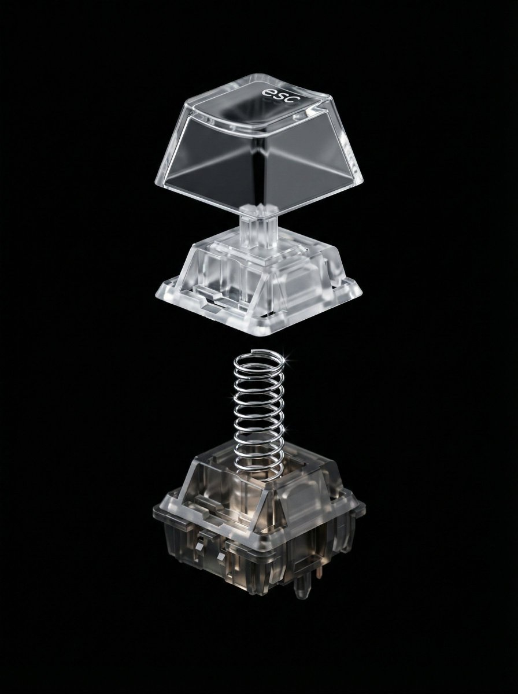

```
{
  "scene": {
    "type": "studio_product_shot",
    "background": "pure_black_backdrop",
    "mood": "sleek_minimal_futuristic",
    "composition": "single_switch_centered_vertical",
    "exploded_view": "parts_floating_evenly_aligned_vertical"
  },
  "camera": {
    "angle": "slightly_above_three_quarter",
    "framing": "tight_on_switch",
    "lens": "50mm",
    "focus": "all_parts_sharp",
    "distance": "medium_close",
    "depth_of_field": "soft_background"
  },
  "key_switch_exploded": {
    "parts": {
      "top_keycap": {
        "shape": "cherry_profile",
        "material": "fully_transparent_glasslike_plastic",
        "thickness": "visible_edge_walls",
        "refraction": "strong_edge_highlights",
        "label": {
          "text": "esc",
          "placement": "center_top",
          "style": "tiny_white_sans",
          "opacity": "crisp_solid"
        }
      },
      "upper_switch_housing": {
        "material": "crystal_clear_plastic",
        "geometry": "mechanical_housing_with_internal_stem",
        "edges": "clean_beveled",
        "transparency": "high_with_soft_reflections"
      },
      "spring": {
        "type": "metal_coil",
        "material": "polished_chrome",
        "position": "centered_between_housings",
        "lighting": "small_specular_highlights"
      },
      "lower_switch_housing": {
        "material": "transparent_plastic_darker",
        "details": "mounting_legs_and_channels_visible",
        "base_glow": "subtle_internal_soft_light"
      }
    }
  }
}
```

```
{
  "scene": {
    "type": "产品摄影棚拍摄",
    "background": "纯黑背景",
    "mood": "简约流畅、未来感",
    "composition": "单个开关居中垂直构图",
    "exploded_view": "各部件均匀垂直悬浮对齐"
  },
  "camera": {
    "angle": "略高于三分之四视角",
    "framing": "紧密聚焦于开关",
    "lens": "50mm镜头",
    "focus": "所有部件清晰锐利",
    "distance": "中近景",
    "depth_of_field": "背景柔焦"
  },
  "key_switch_exploded": {
    "parts": {
      "top_keycap": {
        "shape": "Cherry 剖面键帽",
        "material": "全透明类玻璃塑料",
        "thickness": "可见边缘壁厚",
        "refraction": "强烈边缘高光",
        "label": {
          "text": "esc",
          "placement": "顶部居中",
          "style": "细小白色无衬线字体",
          "opacity": "清晰不透明"
        }
      },
      "upper_switch_housing": {
        "material": "水晶般透明塑料",
        "geometry": "带内部轴心的机械结构外壳",
        "edges": "干净斜切边缘",
        "transparency": "高透明度，带有柔和反射"
      },
      "spring": {
        "type": "金属螺旋弹簧",
        "material": "抛光铬",
        "position": "位于上下壳体正中央",
        "lighting": "微小镜面高光"
      },
      "lower_switch_housing": {
        "material": "深色透明塑料",
        "details": "可见安装脚与导槽",
        "base_glow": "微弱内部柔光"
      }
    }
  }
}
```

 [↑返回目录](#toc)

---
## <a id="prompt-20251225173357">微信表情包赞赏致谢图</a> (<a href="https://www.junxiaopang.com" target="_blank" rel="noopener noreferrer">俊小胖</a>)


```
参考我上传的图片创建一张代表“ 感谢”的 图片，内容“感谢老表的三瓜两枣”，风格需与表情一致。不可出现与表情不相关的内容，画风搞笑，画面丰富，4k 分辨率，图片比例1：1
```

 [↑返回目录](#toc)

---
## <a id="prompt-20251225173427">微信表情包赞赏引导图</a> (<a href="https://www.junxiaopang.com" target="_blank" rel="noopener noreferrer">俊小胖</a>)


```
我需要创建一张“赞赏引导”的横幅图片，展示在微信表情包商店里选择赞赏金额页面的上，用于吸引用户发赞赏，不要出现微信的logo，图片内容要搞怪一点，但是又要突出“求打赏，我要发财”的意思。画面需要诙谐搞笑。精心创作的引导图能够提升用户发赞赏的意愿。请你参照图片中主角的形象，帮我创建一张高质量且能吸引用户赞赏的图片，风格需与表情一致。不可出现与表情不相关的内容。4k 分辨率，图片比例16:9
```

 [↑返回目录](#toc)

---
## <a id="prompt-20251225174621">微信表情包横幅图片</a> (<a href="https://www.junxiaopang.com" target="_blank" rel="noopener noreferrer">俊小胖</a>)


```
根据图中的的角色形象，帮我创建一张新的封面图片，不要直接复制，主题：《我的广西表哥很强》，图片中避免出现任何文字信息。图片色调要活泼明朗，避免使用白色背景。横幅内容须与角色有关，画面简洁，但是要有故事性。图中元素不能因被拉伸或压扁等原因导致变形，4k分辨率，图片比例16:9
```

 [↑返回目录](#toc)

---
## <a id="prompt-1992466159594299429">老照片变清晰</a> (<a href="https://x.com/0xluffy_eth/status/1992466159594299429" target="_blank" rel="noopener noreferrer">路飞  AI 研究员</a>)

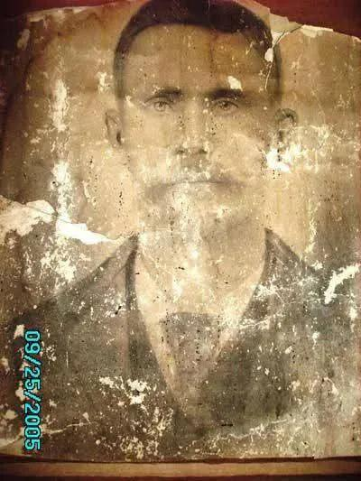

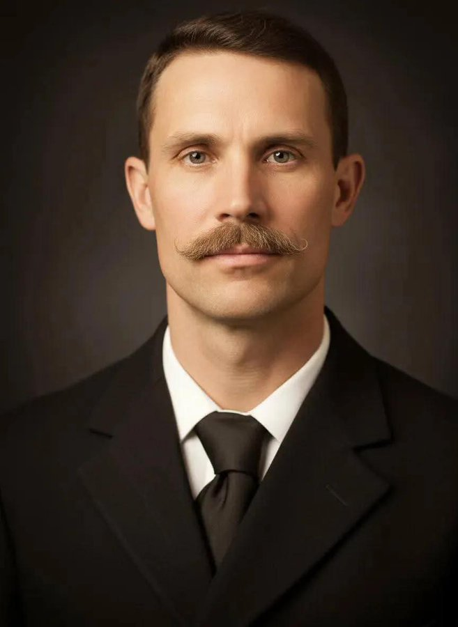

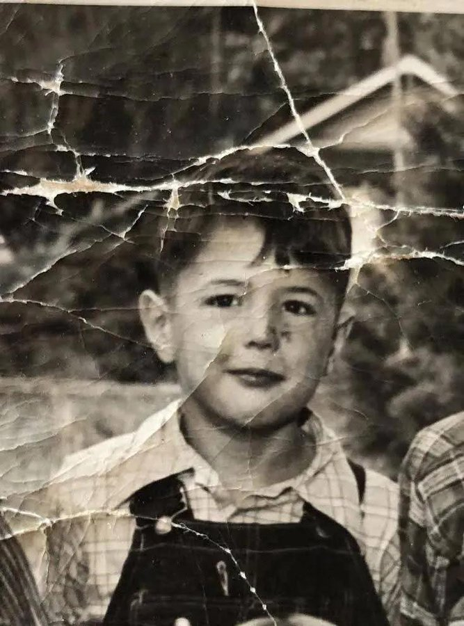

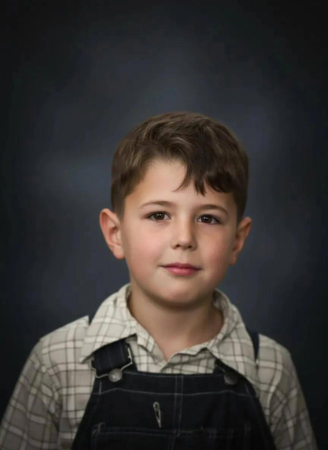

```
以99%相似度还原老照片，将其转换为现代高质量数字肖像。保留原始面孔，升级色彩、肤质和光线，同时保持原始姿态与表情。
```

 [↑返回目录](#toc)

---
## <a id="prompt-2001816797318910400">黑白肖像写真</a> (<a href="https://x.com/r4jjesh/status/2001816797318910400" target="_blank" rel="noopener noreferrer">ராஜேஷ்</a>)

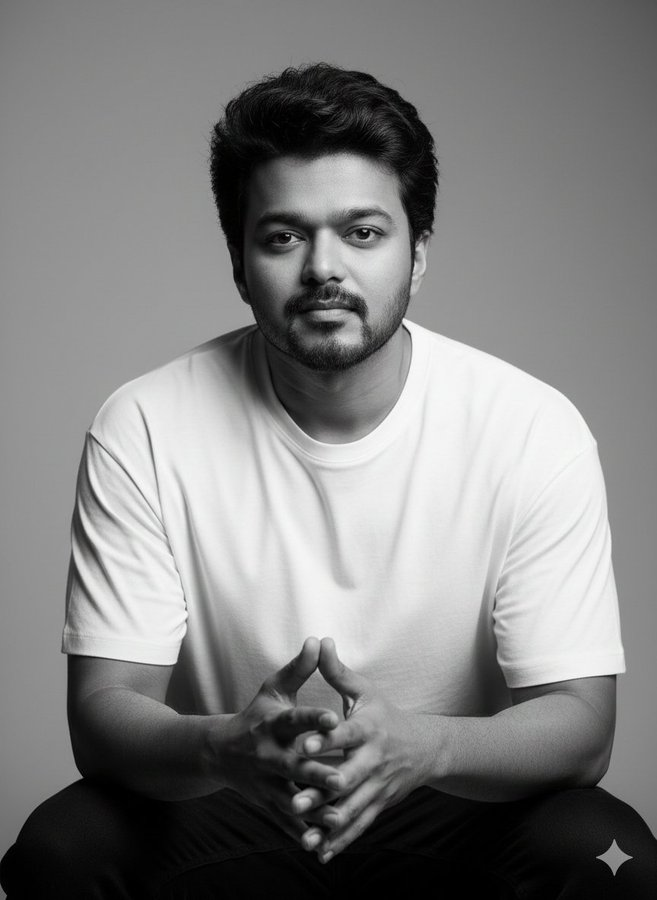


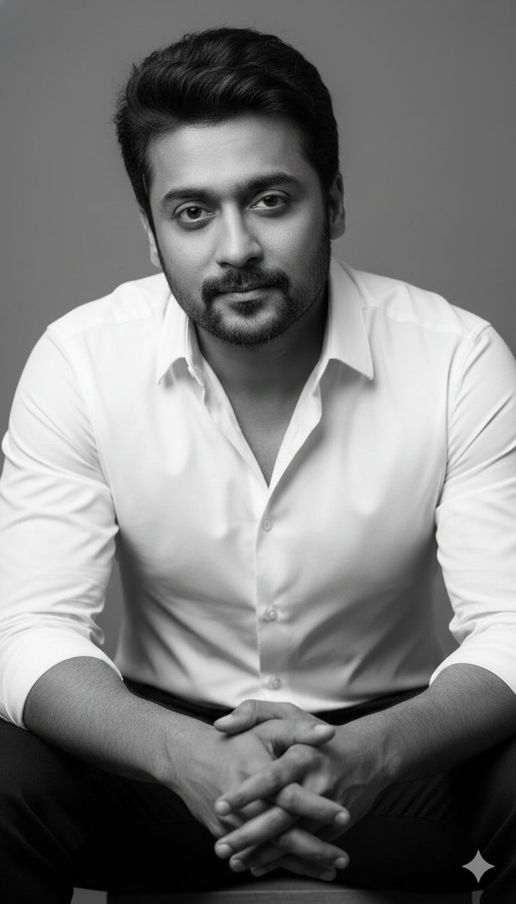

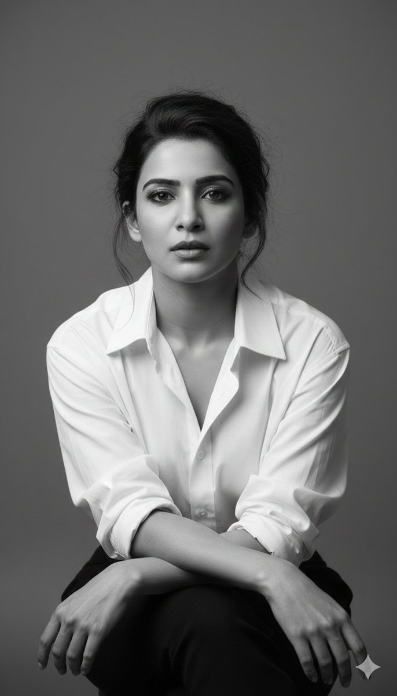

```
Shirt :  Black-and-white fine art studio portrait of the uploaded person, seated with both hands resting naturally in front, relaxed and composed. Slightly messy hair softly framing the face, natural smooth skin tones, wearing a clean white shirt. Calm, thoughtful expression while looking directly at the camera. Shot from a subtle cinematic angle (not strict eye level). Minimalist studio setup with a plain grey backdrop, soft diffused cinematic lighting creating gentle shadows and depth. Elegant, sophisticated mood, ultra-realistic textures, sharp facial details, professional photography quality, high contrast, smooth tonal gradation, 8K resolution, no noise, no pixel loss.

T-Shirt : Black-and-white fine art studio portrait of the uploaded person, seated with both hands resting naturally in front, relaxed and composed. Slightly messy hair softly framing the face, natural smooth skin tones, wearing a clean white oversized Tshirt. Calm, thoughtful expression while looking directly at the camera. Shot from a subtle cinematic angle (not strict eye level). Minimalist studio setup with a plain grey backdrop, soft diffused cinematic lighting creating gentle shadows and depth. Elegant, sophisticated mood, ultra-realistic textures, sharp facial details, professional photography quality, high contrast, smooth tonal gradation, 8K resolution, no noise, no pixel loss.
```

```
衬衫：上传者黑白精细艺术工作室肖像，坐着，双手自然地放在前面，放松且沉着。略微凌乱的头发柔和地勾勒出脸部轮廓，自然光滑的肤色，穿着干净的白色衬衫。表情平静而若有所思，直接看着相机。从一个微妙的电影角度拍摄（不是严格的眼睛水平）。极简的工作室设置，灰色纯色背景，柔和扩散的电影照明创造出温和的阴影和深度。优雅、高雅的氛围，超现实的质感，清晰的面部细节，专业摄影质量，高对比度，平滑的色调渐变，8K分辨率，无噪点，无像素损失。

T恤：上传者黑白精细艺术工作室肖像，坐着，双手自然地放在前面，放松且沉着。略微凌乱的头发柔和地勾勒出脸部轮廓，自然光滑的肤色，穿着干净的白色大号T恤。表情平静而若有所思，直接看着相机。从一个微妙的电影角度拍摄（不是严格的眼睛水平）。极简的工作室设置，灰色纯色背景，柔和扩散的电影照明创造出温和的阴影和深度。优雅、高雅的氛围，超现实的质感，清晰的面部细节，专业摄影质量，高对比度，平滑的色调渐变，8K分辨率，无噪点，无像素损失。
```

 [↑返回目录](#toc)

---
## <a id="prompt-1996852895829184963">三步复制图片风格</a> (<a href="https://x.com/ilovek8s/status/1996852895829184963" target="_blank" rel="noopener noreferrer">ilovelife</a>)

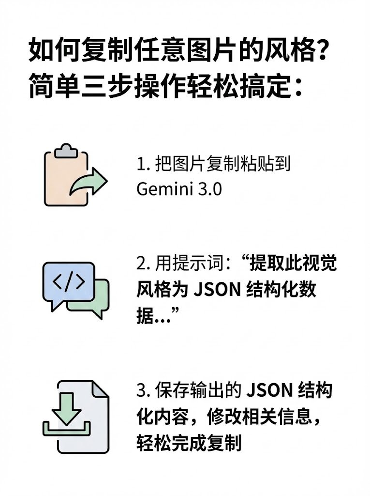

```
“提取此图片风格为 JSON 结构化数据：颜色、字体、构图、特效……（extract this visual style as JSON structured data: colors, typography, composition, effects...）”  
3. 保存输出的 JSON 结构化内容，修改相关信息，轻松完成复制
```

 [↑返回目录](#toc)

---
## <a id="prompt-2004929995177951416">霓虹雨夜中的都市青年</a> (<a href="https://x.com/john_my07/status/2004929995177951416" target="_blank" rel="noopener noreferrer">Johnn</a>)


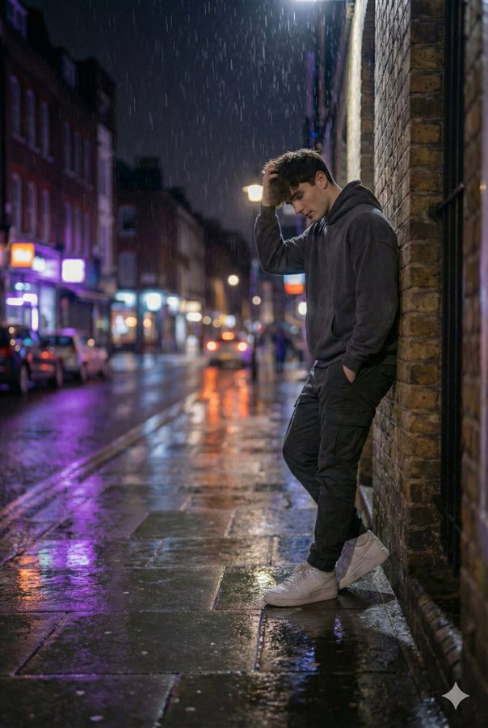

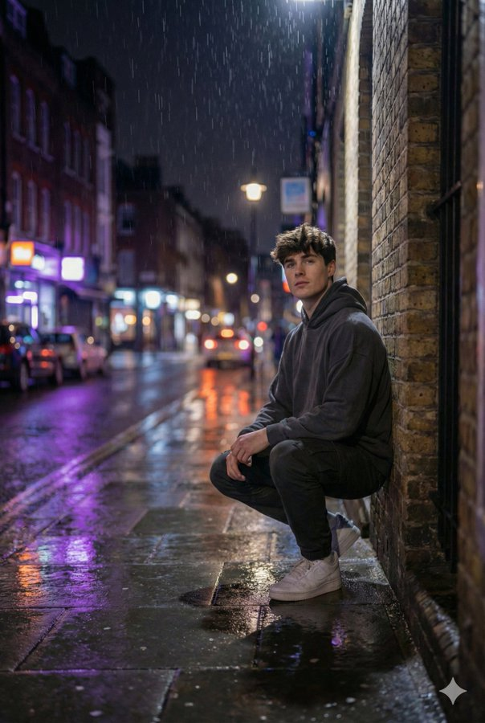

```
{
  "prompt": "cinematic portrait of a British man in his mid 20s, dark brown hair, handsome features, confident relaxed pose leaning against a wall, wearing an oversized hoodie and casual pants, night city street with neon signs and reflections on wet pavement, light rain, shallow depth of field, background softly blurred bokeh, realistic skin texture, moody modern urban vibe, soft rim lighting, high-resolution, photorealistic, editorial street photography style",
  "negative_prompt": "cartoon, anime, distorted face, extra fingers, blurry eyes, low resolution, overexposed, bad anatomy, unrealistic proportions, harsh shadows, watermark, text artifacts",
  "camera": "85mm lens, wide aperture f1.8, cinematic color grading",
  "lighting": "soft directional lighting with neon reflections, subtle backlight",
  "quality": "8k, ultra-detailed, sharp focus on subject, professional photo"
}
```

```
{
  "prompt": "一位二十多岁英国男子的电影感肖像，深棕色头发，英俊五官，自信放松地倚靠在墙边，身穿 oversized 连帽衫和休闲裤，夜晚城市街道背景，霓虹灯招牌与湿漉漉地面的倒影，细雨绵绵，浅景深，背景柔焦虚化，皮肤纹理逼真，氛围阴郁现代都市，柔和轮廓光，高分辨率，写实风格，纪实街头摄影风格",
  "negative_prompt": "卡通、动漫、面部扭曲、多余手指、眼睛模糊、低分辨率、过曝、解剖结构错误、比例不真实、生硬阴影、水印、文字伪影",
  "camera": "85mm 镜头，大光圈 f/1.8，电影级色彩调校",
  "lighting": "柔和定向光配合霓虹反射，微妙背光",
  "quality": "8K，超精细细节，主体锐利对焦，专业摄影级别"
}
```

 [↑返回目录](#toc)

---
## <a id="prompt-2000112716728705065">武夷大红袍文化图鉴</a> (<a href="https://x.com/berryxia/status/2000112716728705065" target="_blank" rel="noopener noreferrer">Berryxia.AI</a>)

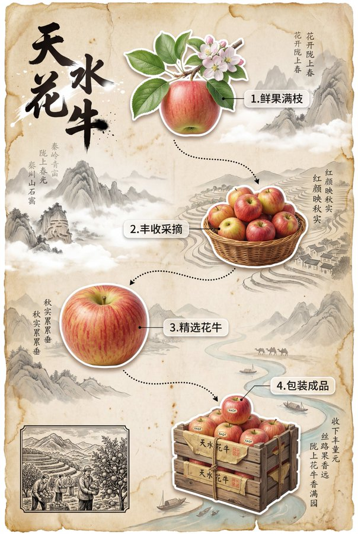

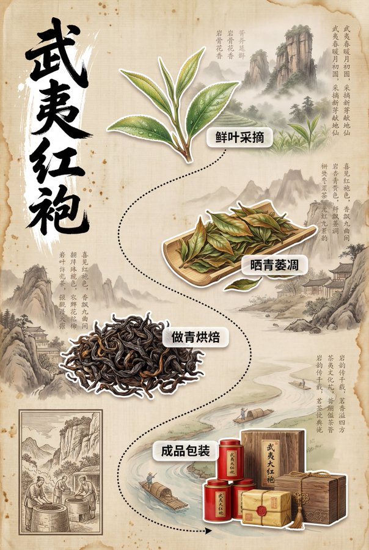

```
【以武夷山大红袍为例展示 ，输出高清4K 画质  】

文化信息图提示词模板 (诗词雅韵版) - Cultural 
Infographic Template with Classical Poetry

[Subject & Core 主题核心] Vertical cultural infographic visualizing [文化/历史/品牌背景主题] and the [主体生命周期/加工流程]. A visual journey from [初始状态/原材料] to [最终形态/商品]. Four distinct stages arranged in a flowing S-curve: 
1. [阶段1: 原材料/初始状态], 
2. [阶段2: 初步加工/中间状态], 
3. [阶段3: 成型/成熟状态], 
4. [阶段4: 最终包装/成品堆叠].

[Detail & Texture 细节与质感] Micro-imperfections are essential.
Substrate 基底材质: The base is aged [parchment paper/leather hide/silk scroll] with visible [pulp fibers/grain texture/weave pattern], heavy foxing spots (brown mildew dots), irregular [water stains/patina/aging marks] spreading at the edges, and natural cracks/creases.

[主体对象] Main Objects: Hyper-realistic textures.
[阶段1细节 Stage 1]: Visible [表面微观纹理] and [边缘细节], slight translucency (SSS) or [特定材质属性 - 如waxy sheen, dewdrops, fresh stem].
[阶段2细节 Stage 2]: [形态描述] with [光泽/质感描述] (e.g., oily, matte, roasted texture, color variation, natural blemishes).
[阶段3细节 Stage 3]: High-density granular bump map or [表面凹凸细节], [结构特征], distinct [视觉重心], micro-scratches, pores visibility.
[阶段4细节 Stage 4]: [外包装/外部材质质感 - 如wooden crate, paper wrapping], physical [物理痕迹/磨损/绑定 - 如rope binding, corner wear], slight [边缘破损/陈旧感].

[Typography & Layout 排版布局]
Composition 构图: A defined elegant black dotted line guides the eye in a serpentine "S" path from Top-Center to Bottom-Center.
Title 标题: Top-Left [5%, 10%]. Massive Heavy Brush Calligraphy [主题名称] in traditional Chinese style with dramatic ink bleed/feathering edges and "flying white" (dry brush) effects.

Classical Poetry Integration 古诗词融合: 【核心新增】 Faded semi-transparent classical Chinese poetry verses subtly embedded in the background, written in elegant small regular script (楷书/行书). Include [主题相关的古诗词 - 如咏物诗、田园诗、节气诗]. 
The poetry text should appear weathered and partially faded into the substrate, creating layers of cultural depth. Position poetry verses flowing around the ink-wash landscapes in vertical columns (竖排), integrated into:
Top section 顶部: [诗句1] floating in misty/cloudy areas
Mid section 中部: [诗句2] subtly integrated into mountain/architectural contours
Bottom section 底部: [诗句3] flowing along rivers/roads/landscape elements
Labels 标注: Key objects labeled with floating translucent white rounded rectangles, clean black Sans-serif Chinese text, soft drop shadow for UI separation.
Inset 插图框: Bottom-Left [10%, 80%]. A rectangular framed inset featuring a detailed Woodcut/Etching style illustration of [相关辅助插图: 如生产场景/运输/起源/人物活动], using intricate cross-hatching lines instead of color.
[Environment & Background 环境与背景] A mix of 3D foreground objects and 2D Ink Wash background with poetry integration.
Top 顶部: The majestic [顶部地标建筑/自然景观] emerging from white mist and clouds, with faded poetry verses [诗句主题] floating in the misty areas.
Mid 中部: Faded ink-wash [中部背景: 山水/城市轮廓] (Shanshui style) and ancient [建筑细节/地标], classical poetry fragments [诗句内容] subtly integrated into the landscape contours in elegant calligraphy.
Bottom 底部: A [底部背景: 河流/道路/场景] with small [交通工具/人物], exhibiting delicate [相关材质] textures, poetry verses about [主题] flowing along the environmental elements.
Atmosphere 氛围: Misty, historical, poetic, dreamlike, scholarly. Depth achieved through atmospheric perspective with fading ink tones and layered poetry text creating visual depth.
[Lighting & Color 光影与色彩]
Palette 配色: Vintage [Sepia/Warm]/Earth tones with scholarly aesthetic. [主体色调 - vibrant/natural color] for [主体], [深色调 - deep brown/black] for [细节部分], warm [aged beige/amber] for substrate, brownish-grey for ink wash, faded sepia/light grey for poetry text.
Lighting 光照: Softbox studio lighting on the four main [主体对象] to reveal surface micro-texture and [材质特定细节]. Flat ambient light for the background landscape and poetry layers.
Effect 特效: Subtle white die-cut outlines (sticker effect) around main objects to separate them from the complex background and poetry layers.
[Style & Render 风格渲染] Museum-grade educational illustration with scholarly literary aesthetic. Fusion of Traditional Chinese Ink Painting, Classical Poetry Manuscript Design, and High-fidelity Macro Photography. The aesthetic of an ancient [leather-bound poetry anthology/imperial scroll/scholarly manuscript] meets modern infographic design. Behance featured project quality, vector-sharp foregrounds against watercolor-soft backgrounds with layered calligraphic poetry creating cultural depth. Aged distressed substrate with deep patina and embedded classical Chinese verses, 9:16 vertical composition, emphasizing the harmonious integration of visual art and literary heritage.
[Technical Parameters 技术参数] --ar 9:16 --style raw --stylize [300-500] --q 2
```

 [↑返回目录](#toc)

---
## <a id="prompt-2002246674069286912">女生黑白肖像写真</a> (<a href="https://x.com/r4jjesh/status/2002246674069286912" target="_blank" rel="noopener noreferrer">ராஜேஷ்</a>)

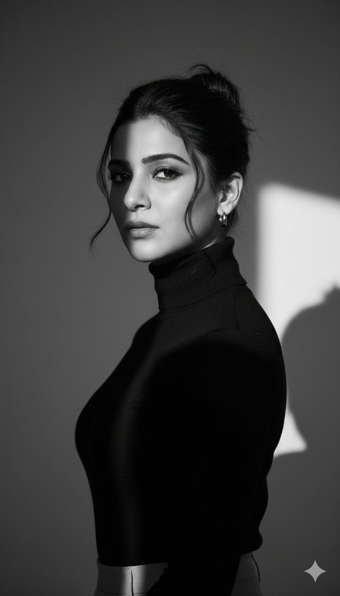

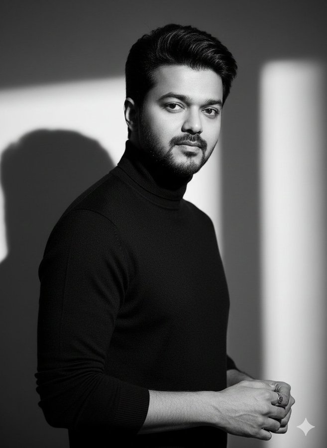

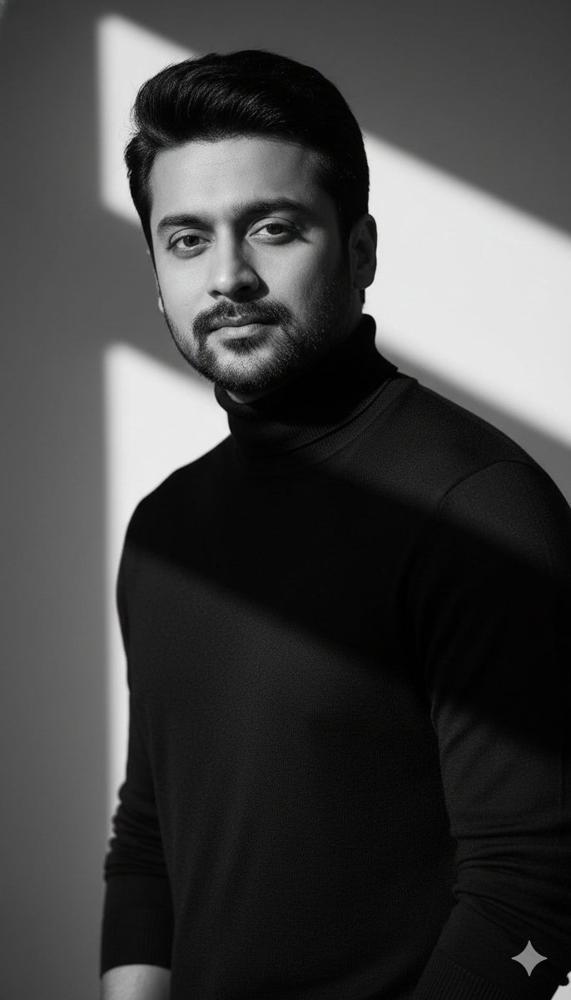

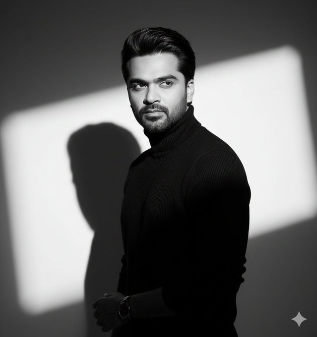


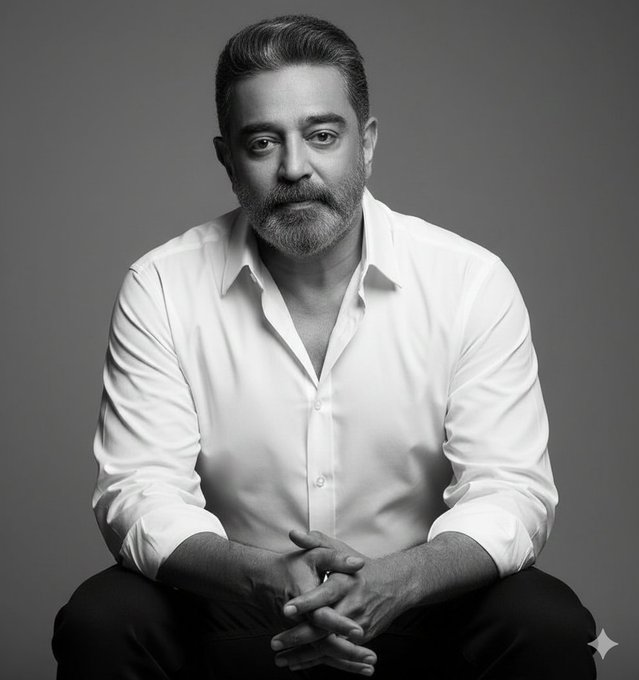

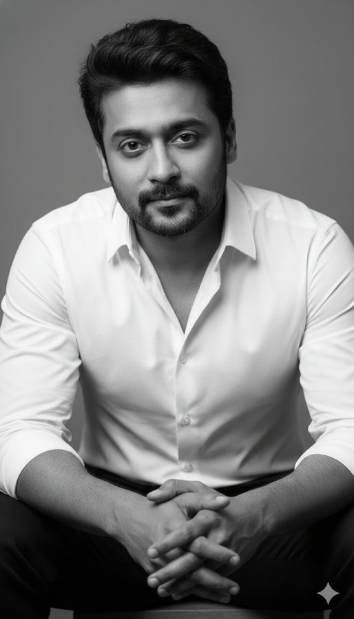

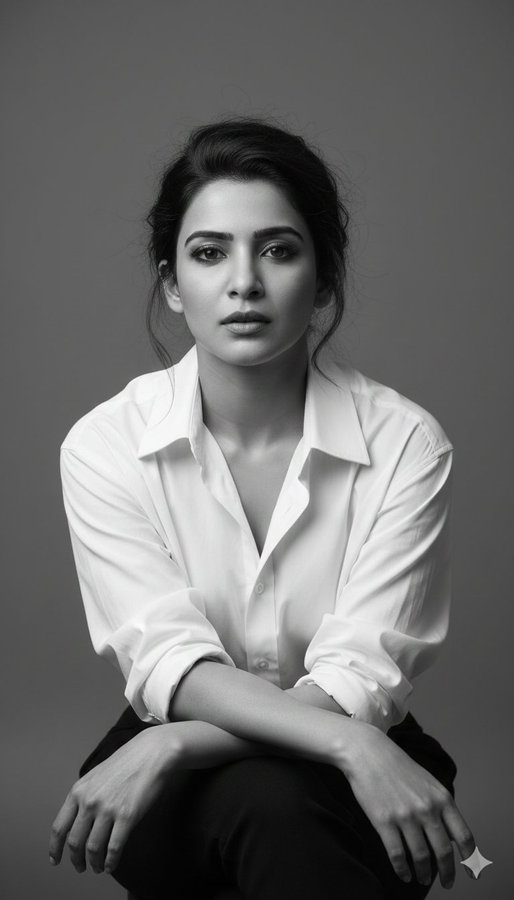

```
1. Open Gemini / ChatGPT

2. Upload your image 

3. Prompt 

Boys : A high-resolution black and white portrait of a man wearing a sharp black turtleneck with minimal classic accessories, styled hair neatly swept back. He stands confidently in a minimal studio setting, positioned slightly to the side. Dramatic studio lighting creates bold geometric shadows across his face and background, with strong cross-beams of light cutting through the darkness. His expression is calm, introspective, and slightly distant. The image has a cinematic, high-quality noir tone with high contrast and fine detail on facial features and fabric texture. Soft bokeh background, portrait orientation (9:16), ultra-realistic, 8K resolution.

Girls :  A high resolution black and white portrait of a girl wearing a sharp black turtle neck and chic small gold earrings along with Korean bun. She stands confidently in minimal studio setting slightly to the side dramatic studio lighting creates bold geometric shadows on her face and background strong cross beams of light. Cut through the shadows her expression is calm introspective and slightly distant the image has cinematic, high quality nor tone with high contrast and fine detail on her face and suits texture soft brokeh background portrait (9:16) 8K resolution
```

```
1. 打开双子座/ChatGPT

2. 上传你的图片

3. 提示词

男孩：一个穿着锋利黑色高领毛衣且带有最少经典配饰的男人的高分辨率黑白肖像，头发整齐地往后梳。他自信地站在简约的工作室环境中，位置稍微偏向一侧。戏剧性的工作室照明在他脸上和背景上创造出大胆的几何阴影，强烈的交叉光线束穿透黑暗。他的表情平静、内省且略显疏离。该图像具有电影般的高质量黑色调，高对比度以及对脸部特征和布料质感的精细细节。柔和的散景背景，纵向(9:16)，超现实，8K分辨率。

女孩：一个穿着锋利黑色高领毛衣和时尚小金耳环的女孩的高分辨率黑白肖像，配有韩式发髻。她自信地站在简约的工作室环境中的略微一侧，戏剧性的工作室照明在她的脸和背景上创造出大胆的几何阴影，强烈的交叉光线束穿透这些阴影。她的表情平静、内省且略显疏离。该图像具有电影般的高质量黑色调，高对比度以及对她脸部和套装质感的精细细节。柔和的散景背景，纵向(9:16)，8K分辨率。
```

 [↑返回目录](#toc)

---
## <a id="prompt-2004528545033527385">镜前写实肖像</a> (<a href="https://x.com/r4jjesh/status/2004528545033527385" target="_blank" rel="noopener noreferrer">ராஜேஷ்</a>)

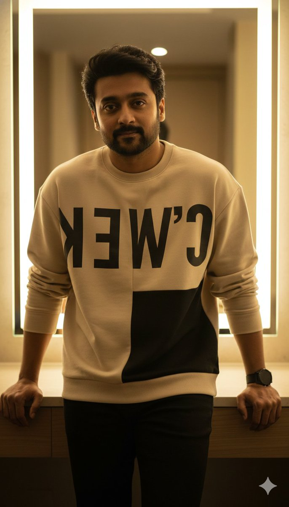

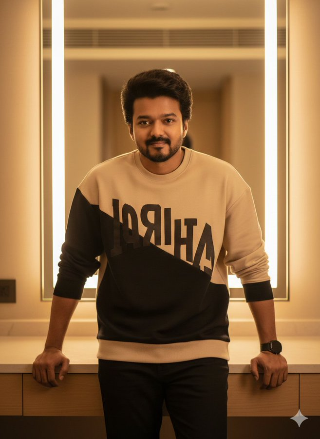

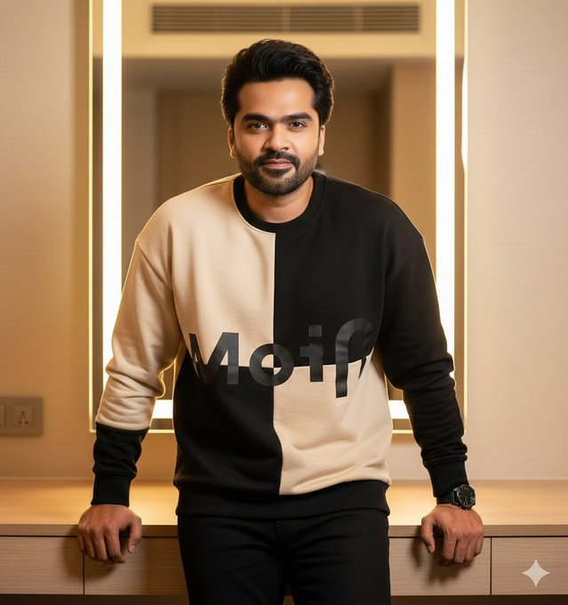

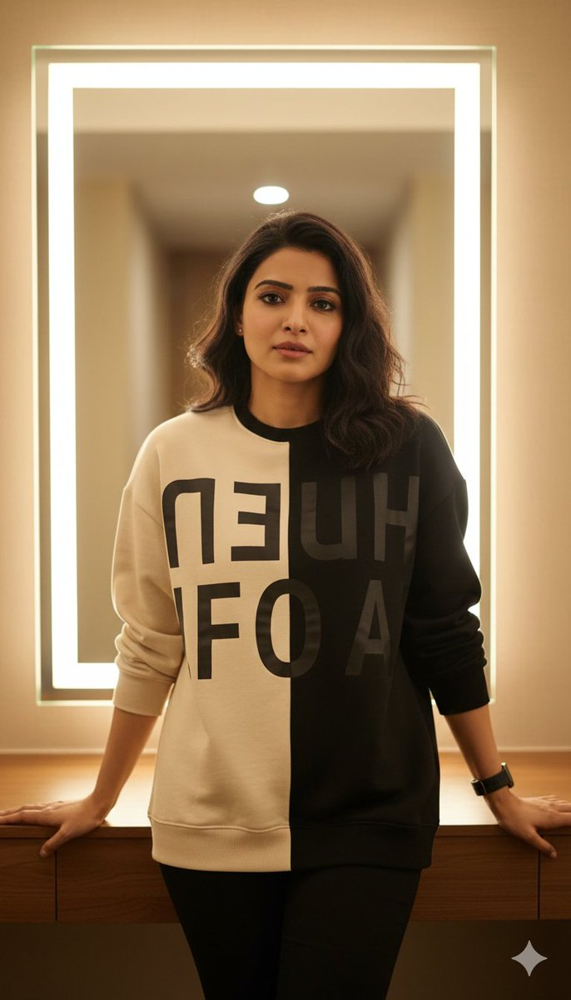

```
: 

const prompt = {
  face_reference: "Use 100% uploaded image for face identity, skin tone, features & likeness",
  
  subject: {
    type: "Young person (gender-neutral friendly)",
    pose: "Leaning slightly forward with both hands on a wooden vanity table",
    expression: "Calm, confident, subtle relaxed smile",
    face_details: "Maintain original face from uploaded image with high accuracy",
    hair: "Thick, wavy black hair with natural volume, softly tousled",
    facial_hair: "Keep natural facial hair from reference if present (short beard & mustache)",
    skin_texture: "Realistic visible pores, smooth natural tone"
  },

  outfit: {
    top: "Oversized beige & black color-blocked sweatshirt with bold abstract typography design",
    bottom: "Black pants",
    accessories: "Black wristwatch on left wrist"
  },

  environment: {
    location: "Modern hotel/dressing room interior",
    background: "Large rectangular mirror with warm LED strip lighting glow",
    ambiance: "Warm, cozy, cinematic atmosphere"
  },

  camera: {
    type: "Professional DSLR look",
    depth_of_field: "Shallow DOF with subject sharp & creamy blurred background",
    composition: "Vertical frame 4:5 aspect ratio"
  },

  style: {
    realism: "Ultra-high realism, natural colors",
    vibe: "Editorial fashion lifestyle shot",
    render: "Photorealistic, detailed skin, cinematic warmth"
  }
};
```

```
const prompt = {
  face_reference: "100% 使用上传图像作为面部身份、肤色、特征与相貌的参考",
  
  subject: {
    type: "年轻人（性别中立友好）",
    pose: "身体微微前倾，双手置于木质梳妆台上",
    expression: "平静、自信，带有微妙放松的微笑",
    face_details: "高精度保留上传图像中的原始面部",
    hair: "浓密、波浪状黑发，自然蓬松，略显凌乱",
    facial_hair: "若参考图中存在，则保留自然的面部毛发（短胡须和小胡子）",
    skin_texture: "逼真的可见毛孔，光滑自然的肤色"
  },

  outfit: {
    top: "宽松的米色与黑色拼色连帽衫，带有醒目的抽象字体图案设计",
    bottom: "黑色长裤",
    accessories: "左腕佩戴黑色腕表"
  },

  environment: {
    location: "现代酒店/化妆间室内",
    background: "大型矩形镜子，配有暖色调LED灯带照明",
    ambiance: "温暖、舒适、电影感氛围"
  },

  camera: {
    type: "专业单反相机效果",
    depth_of_field: "浅景深，主体清晰，背景柔美虚化",
    composition: "竖构图，4:5画幅比例"
  },

  style: {
    realism: "超高写实度，自然色彩",
    vibe: "时尚生活杂志风格",
    render: "照片级真实感，细腻肌肤表现，电影般暖调"
  }
};
```

 [↑返回目录](#toc)

---
## <a id="prompt-2004697850920501600">街头时尚漫步</a> (<a href="https://x.com/r4jjesh/status/2004697850920501600" target="_blank" rel="noopener noreferrer">ராஜேஷ்</a>)

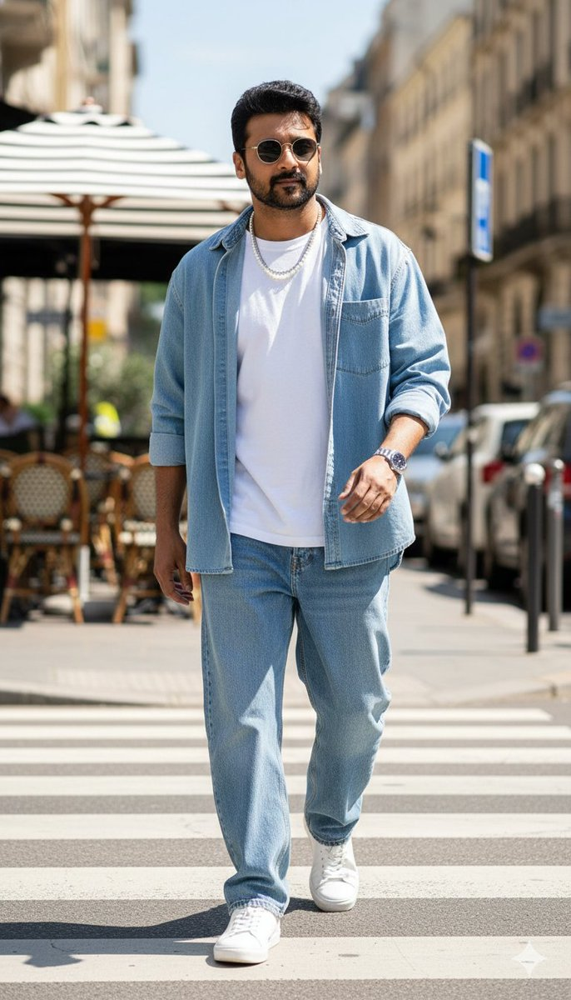

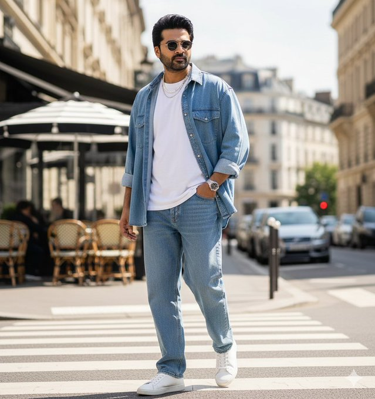

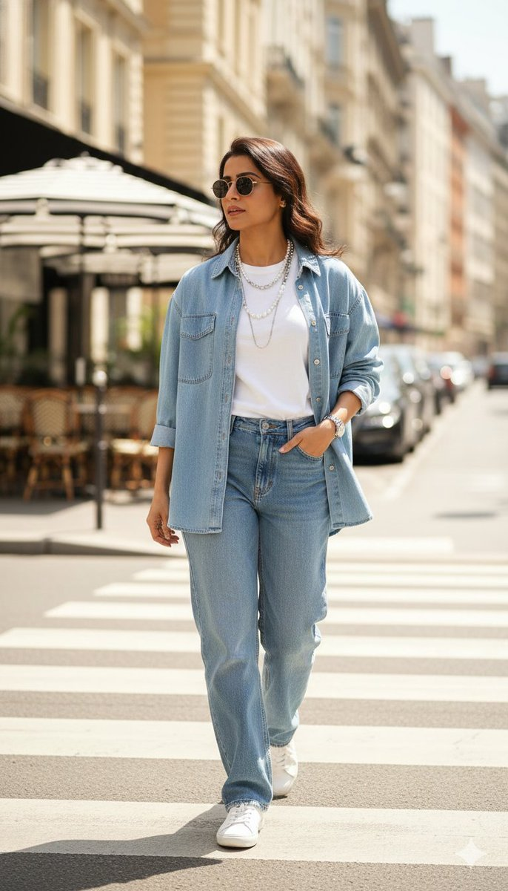

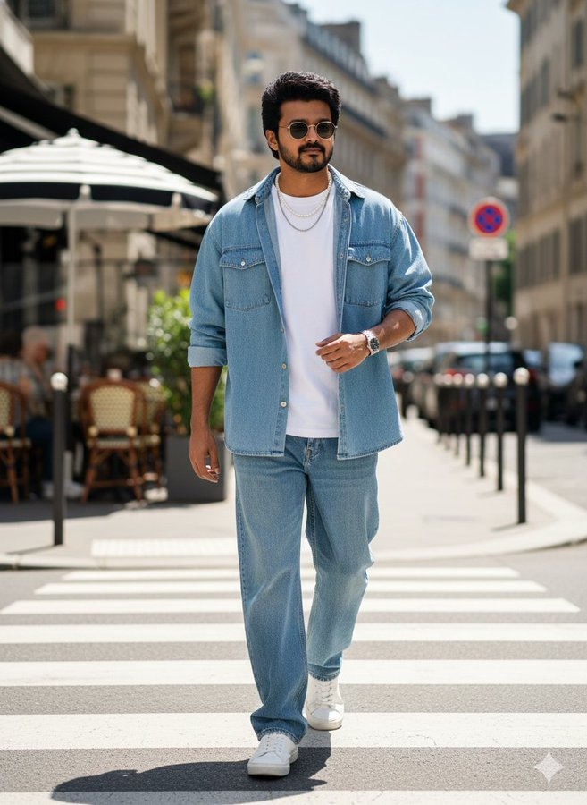

```
const prompt = {
  face_reference: "Use 100% uploaded image to preserve face identity, hairstyle, skin tone & features accurately",

  scene: {
    setting: "Sunny daytime city street",
    style: "Candid street fashion photograph",
    background: {
      elements: [
        "Cafe patio seating area",
        "Black & white striped umbrella",
        "European-style architecture building",
        "Parked cars along the street"
      ],
      vibe: "Bright, relaxed urban atmosphere with natural daylight"
    }
  },

  subject: {
    type: "Stylish man (match face to uploaded reference)",
    action: "Walking confidently across a crosswalk",
    direction: "Looking slightly towards the left side",
    expression: "Calm, composed, confident",
    posture: "Casual walking stride with natural body movement",
    outfit: {
      top_layer: "Oversized light blue denim button-up shirt (open + sleeves relaxed)",
      inner_top: "White crew-neck t-shirt",
      pants: "Loose-fitting light wash blue jeans",
      shoes: "Clean white sneakers"
    },
    accessories: [
      "Layered white pearl necklace",
      "Chain necklace",
      "Silver wristwatch",
      "Round sunglasses"
    ]
  },

  camera_style: {
    composition: "Vertical 4:5 aspect ratio",
    framing: "Full body street crossing shot",
    quality: "High detail, photorealistic colors, natural lighting",
    depth_of_field: "Slight background blur while subject remains sharp",
    vibe: "Street style editorial, lifestyle fashion look"
  }
};
```

```
const prompt = {
  face_reference: "100%使用上传的图像以准确保留面部身份、发型、肤色及五官特征",

  scene: {
    setting: "阳光明媚的白天城市街道",
    style: "纪实街头时尚摄影",
    background: {
      elements: [
        "咖啡馆户外座位区",
        "黑白条纹遮阳伞",
        "欧式建筑",
        "停靠在路边的汽车"
      ],
      vibe: "明亮、轻松的城市氛围，自然日光"
    }
  },

  subject: {
    type: "时尚男士（面部需与上传参考图一致）",
    action: "自信地走过人行横道",
    direction: "略微看向左侧",
    expression: "镇定、沉稳、自信",
    posture: "自然行走姿态，身体动作放松",
    outfit: {
      top_layer: "宽松浅蓝色牛仔纽扣衬衫（敞开，袖子自然垂落）",
      inner_top: "白色圆领T恤",
      pants: "宽松浅色水洗牛仔裤",
      shoes: "干净的白色运动鞋"
    },
    accessories: [
      "多层白色珍珠项链",
      "链条项链",
      "银色腕表",
      "圆形太阳镜"
    ]
  },

  camera_style: {
    composition: "竖版4:5画幅比例",
    framing: "全身过马路镜头",
    quality: "高细节、逼真色彩、自然光线",
    depth_of_field: "背景轻微虚化，主体保持清晰",
    vibe: "街头风格杂志感，生活化时尚造型"
  }
};
```

 [↑返回目录](#toc)

---
## <a id="prompt-2004477326076383674">巴黎晨光中的时尚剪影</a> (<a href="https://x.com/r4jjesh/status/2004477326076383674" target="_blank" rel="noopener noreferrer">ராஜேஷ்</a>)

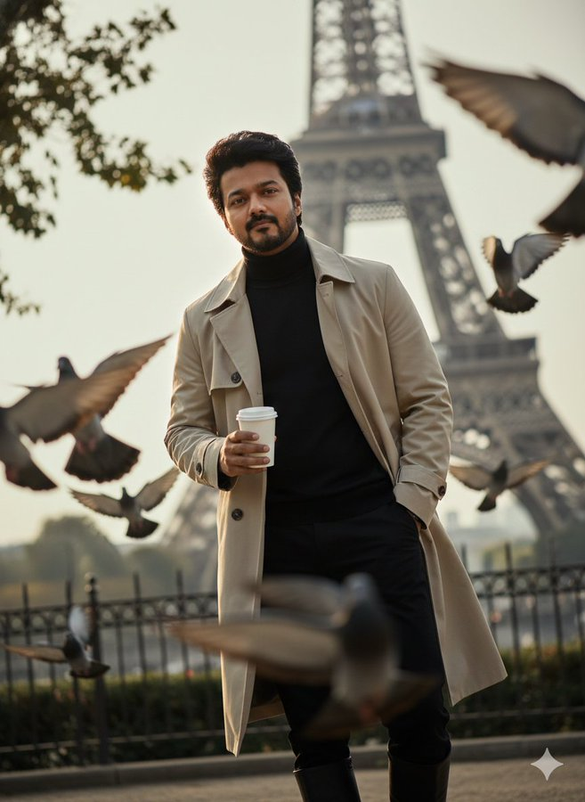

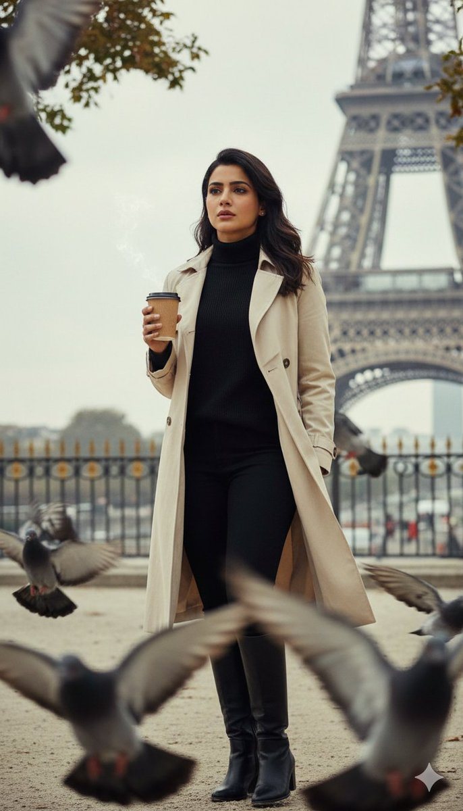

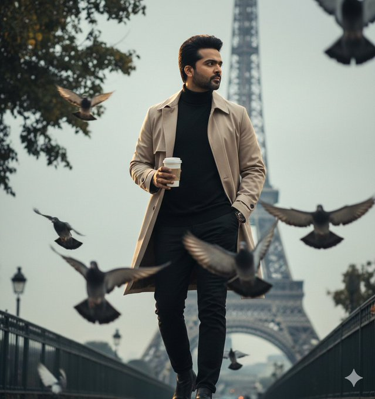

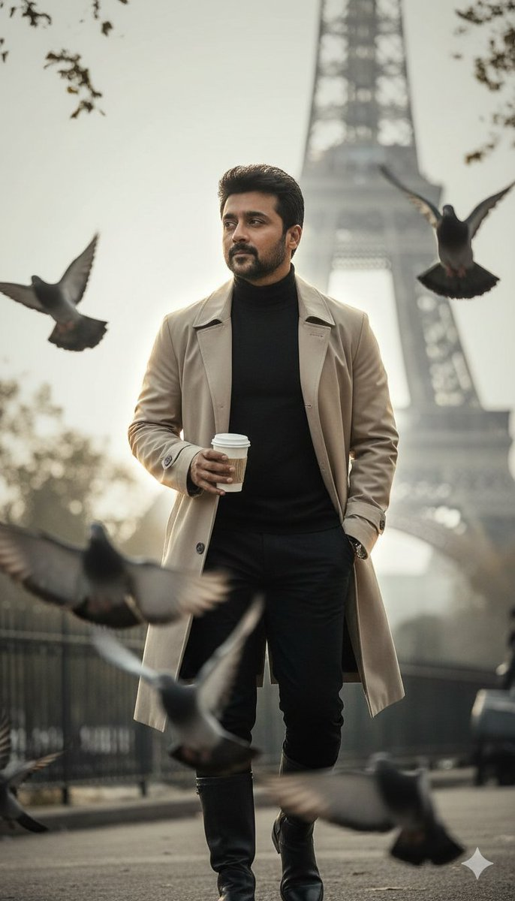

```
: 

{
  "prompt": "Photorealistic cinematic candid portrait, morning outdoors near the Eiffel Tower in Paris. Dynamic diagonal tracking shot with the camera tilted 25 degrees, front-side low angle. A stylish person wearing a light beige trench coat over a relaxed turtleneck sweater, paired with black fitted pants and black knee-high boots. They hold a warm coffee cup casually in one hand. Sunlight forms a soft rim-light silhouette along the edges of their body. A flock of pigeons flies across the foreground with slight motion blur. Blurred foreground elements such as a Parisian iron fence and leafy tree branches frame the scene. The Eiffel Tower stands partially visible in the background. Cinematic aesthetic with moody tones, Parisian film still vibe.",
  "style": "cinematic, photorealistic, Paris morning, film still",
  "composition": "dynamic diagonal, 25-degree tilt, low angle",
  "environment": "Eiffel Tower backdrop, pigeons, soft morning light"
}
```

```
{
  "prompt": "逼真电影感的抓拍人像，清晨在巴黎埃菲尔铁塔附近户外。采用动态对角线跟拍镜头，相机倾斜25度，前侧低角度拍摄。一位时尚人士身穿浅米色风衣，内搭宽松高领毛衣，下穿黑色修身长裤与黑色及膝靴。一手随意握着一杯热咖啡。阳光在人物轮廓边缘形成柔和的轮廓光。一群鸽子飞过前景，略带动态模糊。前景模糊元素包括巴黎风格的铁艺围栏和枝叶繁茂的树枝，构图框住画面。埃菲尔铁塔部分可见于背景中。整体呈现电影感美学，色调富有情绪，带有巴黎电影剧照氛围。",
  "style": "电影感、逼真写实、巴黎清晨、电影剧照",
  "composition": "动态对角线、25度倾斜、低角度",
  "environment": "埃菲尔铁塔背景、鸽群、柔和晨光"
}
```

 [↑返回目录](#toc)

---
## <a id="prompt-2004275556612034681">红幕下的自信青年</a> (<a href="https://x.com/r4jjesh/status/2004275556612034681" target="_blank" rel="noopener noreferrer">ராஜேஷ்</a>)

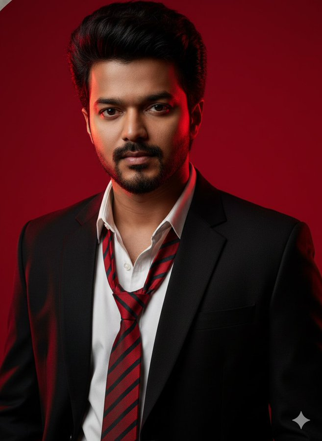

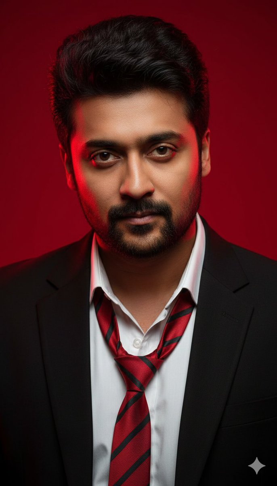

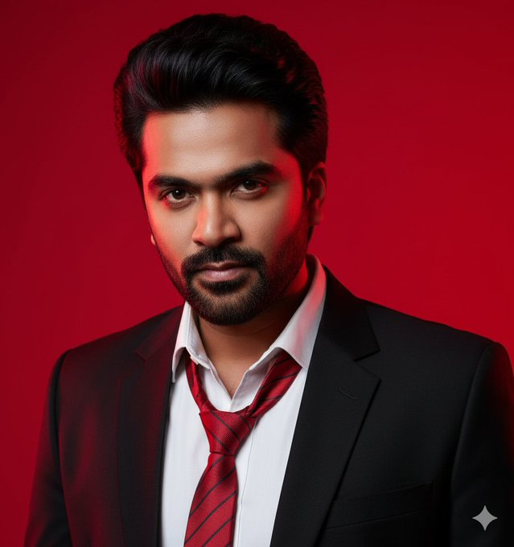

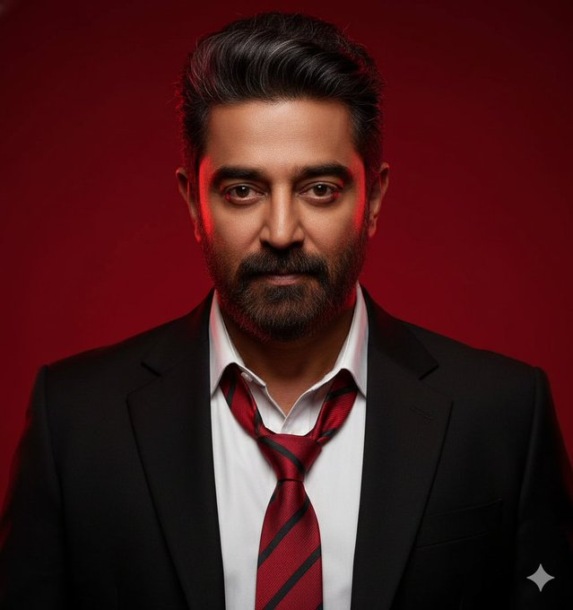

```
:

{
  "image_prompt": {
    "subject": {
      "gender": "male",
      "age": "young adult",
      "appearance": {
        "facial_features": "sharp, defined",
        "hair": "messy styled dark hair",
        "expression": "confident, slightly intense"
      },
      "outfit": {
        "jacket": "black suit jacket",
        "shirt": "white dress shirt with collar slightly open",
        "tie": "loosely knotted red striped tie"
      }
    },
    "style": "ultra-realistic 8K portrait",
    "scene": {
      "background": "deep red backdrop"
    },
    "lighting": {
      "type": "dramatic cinematic lighting",
      "colors": ["red", "black"],
      "effect": "highlights contours of face, jawline, and neck"
    },
    "mood": "powerful, moody,
 stylish, cinematic"
  }
}
```

```
{
  "image_prompt": {
    "subject": {
      "gender": "男性",
      "age": "年轻成人",
      "appearance": {
        "facial_features": "轮廓分明",
        "hair": "凌乱风格的深色头发",
        "expression": "自信，略带紧张"
      },
      "outfit": {
        "jacket": "黑色西装外套",
        "shirt": "白色衬衫领口微微敞开",
        "tie": "松散打结的红色条纹领带"
      }
    },
    "style": "超现实8K肖像",
    "scene": {
      "background": "深红色背景"
    },
    "lighting": {
      "type": "戏剧性的电影照明",
      "colors": ["红色", "黑色"],
      "effect": "突出脸部、下颌线和颈部轮廓"
    },
    "mood": "强大、情绪化、时尚、电影感"
  }
}
```

 [↑返回目录](#toc)

---
## <a id="prompt-2004163365942579563">光影对峙</a> (<a href="https://x.com/r4jjesh/status/2004163365942579563" target="_blank" rel="noopener noreferrer">ராஜேஷ்</a>)


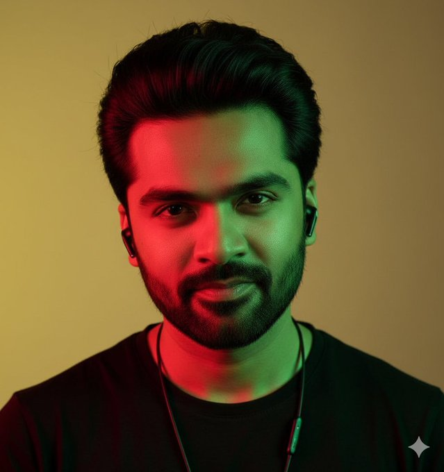

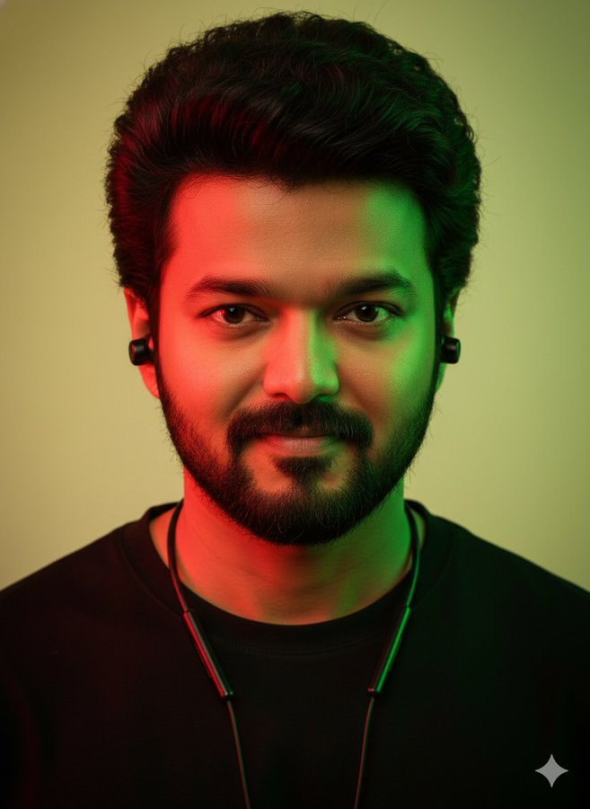

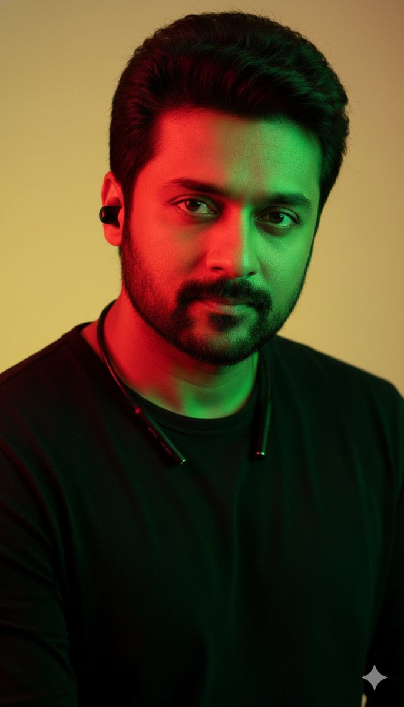

```
{
  "image_prompt": {
    "reference_face": "use uploaded face with 100% identity preservation",
    "edit_mode": "face-based photo edit using uploaded reference",
    "style": "ultra-realistic, high-definition portrait",
    "subject": {
      "gender": "male",
      "expression": "subtle smirk (slight one-sided smile), confident and stylish",
      "appearance_changes": {
        "outfit": "black shirt",
        "accessories": "wireless earbuds around the neck"
      }
    },
    "lighting": {
      "type": "vibrant cinematic split-tone",
      "colors": {
        "left_side": "red light cast",
        "right_side": "green light cast"
      },
      "emphasis": [
        "skin texture",
        "beard definition",
        "jawline highlight",
        "hair detail"
      ]
    },
    "background": {
      "style": "plain gradient",
      "gradient": "yellow fading into dark",
      "mood_support": true
    },
    "details": {
      "focus": "face with dramatic lighting contrast",
      "realism": "sharp high detail — enhanced skin, beard, and hair texture",
      "mood": "modern, bold, strik
ing, stylish attitude"
    }
  }
}
```

```
{
  "image_prompt": {
    "reference_face": "使用上传的面孔，保持100%的身份特征",
    "edit_mode": "基于上传参考的面部编辑",
    "style": "超现实、高清晰度肖像",
    "subject": {
      "gender": "男性",
      "expression": "微妙的冷笑（轻微的一侧微笑），自信且时尚",
      "appearance_changes": {
        "outfit": "黑色衬衫",
        "accessories": "颈间挂着无线耳塞"
      }
    },
    "lighting": {
      "type": "充满活力的电影分色调",
      "colors": {
        "left_side": "红色光线照射",
        "right_side": "绿色光线照射"
      },
      "emphasis": [
        "皮肤纹理",
        "胡须轮廓",
        "下颌线条突出",
        "头发细节"
      ]
    },
    "background": {
      "style": "纯色渐变",
      "gradient": "黄色渐变为深色",
      "mood_support": true
    },
    "details": {
      "focus": "脸部具有戏剧性的光线对比",
      "realism": "锐利的高细节——增强的皮肤、胡须和头发质感",
      "mood": "现代、大胆、引人注目、时尚态度"
    }
  }
}
```

 [↑返回目录](#toc)

---
## <a id="prompt-2004449586732323237">地中海夏日的宁静时光</a> (<a href="https://x.com/saniaspeaks_/status/2004449586732323237" target="_blank" rel="noopener noreferrer">𝗦𝗮𝗻𝗶𝗮</a>)


```
{
  "type": "image_generation_prompt",
  "style": "photorealistic, Mediterranean lifestyle, cinematic daylight",
  "identity_preservation": {
    "use_reference_image": true,
    "alter_face": false,
    "strict_identity_lock": true,
    "notes": "Transform the scene while preserving the woman’s exact facial features, proportions, skin texture, and natural expression from the reference image."
  },
  "subject": {
    "gender": "female",
    "pose": {
      "stance": "standing casually next to a whitewashed wall",
      "posture": "relaxed, confident, natural"
    },
    "appearance": {
      "hair": {
        "style": "natural hairstyle",
        "notes": "keep hair texture and length consistent with reference"
      },
      "expression": "calm, serene, summery"
    },
    "wardrobe": {
      "top": "colorful summer shirt with Mediterranean-inspired patterns",
      "bottoms": "light-colored trousers",
      "style": "light, breathable, vacation-ready"
    }
  },
  "environment": {
    "location": "Mediterranean island village",
    "foreground": {
      "wall": "white wall adorned with vibrant bougainvillea flowers"
    },
    "background": {
      "sea": "turquoise Mediterranean sea",
      "village": "sunlit coastal village with white buildings",
      "atmosphere": "warm, relaxed island ambiance"
    }
  },
  "lighting": {
    "type": "natural daylight",
    "quality": "bright and soft",
    "effects": [
      "gentle highlights on skin and clothing",
      "natural shadows",
      "true-to-life summer colors"
    ]
  },
  "camera": {
    "framing": "medium shot",
    "angle": "eye-level",
    "depth_of_field": "moderate, softly separating subject from background"
  },
  "color_grading": {
    "palette": [
      "white",
      "turquoise",
      "pink and magenta bougainvillea tones",
      "warm sunlit neutrals"
    ],
    "style": "clean, vibrant, Mediterranean"
  },
  "mood": {
    "atmosphere": "peaceful, summery, vacation lifestyle",
    "tone": "fresh, elegant, relaxed"
  },
  "quality": {
    "realism": "highly photorealistic",
    "detail_level": "high detail in skin texture, flowers, wall texture, and sea",
    "artifacts": "none"
  },
  "output_goal": "Create a photorealistic Mediterranean island scene featuring a woman standing beside a white wall with bougainvillea, with a turquoise sea and village in the background, preserving her exact identity while conveying a relaxed summer lifestyle."
}
```

```
{
  "type": "image_generation_prompt",
  "style": "逼真的地中海生活风格，电影般的日光",
  "identity_preservation": {
    "use_reference_image": true,
    "alter_face": false,
    "strict_identity_lock": true,
    "notes": "在转换场景的同时保留参考图像中女性的精确面部特征、比例、皮肤纹理和自然表情。"
  },
  "subject": {
    "gender": "女性",
    "pose": {
      "stance": "随意地站在粉刷过的墙边",
      "posture": "放松、自信、自然"
    },
    "appearance": {
      "hair": {
        "style": "自然发型",
        "notes": "保持与参考一致的头发质地和长度"
      },
      "expression": "平静、安详、充满夏日气息"
    },
    "wardrobe": {
      "top": "色彩斑斓带有地中海风格图案的夏季衬衫",
      "bottoms": "浅色长裤",
      "style": "轻便、透气、适合度假"
    }
  },
  "environment": {
    "location": "地中海岛屿村庄",
    "foreground": {
      "wall": "装饰有艳丽九重葛花的白色墙壁"
    },
    "background": {
      "sea": "碧绿的地中海",
      "village": "阳光照耀下的沿海村庄，建筑为白色",
      "atmosphere": "温暖、轻松的岛屿氛围"
    }
  },
  "lighting": {
    "type": "自然日光",
    "quality": "明亮而柔和",
    "effects": [
      "皮肤和衣物上的柔和高光",
      "自然阴影",
      "真实的夏日色彩"
    ]
  },
  "camera": {
    "framing": "中景镜头",
    "angle": "平视角度",
    "depth_of_field": "适度，柔和地将主体与背景分离"
  },
  "color_grading": {
    "palette": [
      "白色",
      "蓝绿色",
      "粉色和洋红色的九重葛色调",
      "暖阳照射下的中性色调"
    ],
    "style": "干净、鲜艳、地中海风情"
  },
  "mood": {
    "atmosphere": "宁静、夏日、度假生活方式",
    "tone": "清新、优雅、放松"
  },
  "quality": {
    "realism": "高度逼真",
    "detail_level": "高细节度的皮肤纹理、花朵、墙壁质感和海洋",
    "artifacts": "无"
  },
  "output_goal": "创建一个逼真的地中海岛屿场景，展现一位女性站在装饰有九重葛花的白墙旁，背景为碧绿的大海和村庄，同时保留她的准确身份，传达出一种轻松的夏日生活方式。"
}
```

 [↑返回目录](#toc)

---
## <a id="prompt-2002983283429146835">红发女子的珠宝时刻</a> (<a href="https://x.com/xmliisu/status/2002983283429146835" target="_blank" rel="noopener noreferrer">Melisa♡</a>)

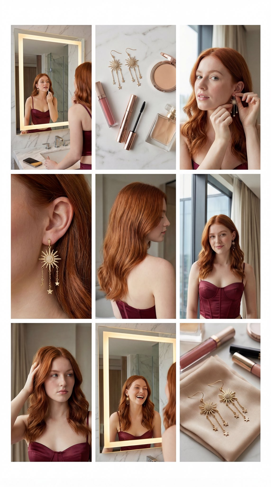

```
{
  "image_composition": {
    "type": "Collage",
    "layout": "3x3 Grid",
    "total_panels": 9
  },
  "subject_details": {
    "appearance": "Young woman with fair skin",
    "hair": {
      "color": "Vibrant red",
      "style": "Loose waves, shoulder-length, side-parted",
      "texture": "Silky and voluminous"
    },
    "eyes": "Blue/Green",
    "expression": "Varied (serious, smiling, laughing, focused)"
  },
  "fashion_and_style": {
    "outfit": {
      "garment": "Strapless corset-style dress or top",
      "color": "Deep maroon / Berry",
      "fabric": "Satin or Silk",
      "details": "Ruched bodice, structural boning visible"
    },
    "makeup": {
      "style": "Natural glam",
      "features": "Glowing skin, soft blush, defined lashes, nude/pink glossy lips"
    }
  },
  "jewelry_focus": {
    "item_type": "Dangle Earrings",
    "metal": "Gold",
    "design_elements": [
      "Huggie hoop base",
      "Large sunburst/starburst main charm",
      "Pave set crystals",
      "Delicate hanging chains",
      "Small star charms at ends of chains"
    ]
  },
  "setting_and_environment": {
    "location": "Luxury interior (likely a hotel suite or upscale bathroom)",
    "key_features": [
      "Large rectangular mirror with integrated LED lighting border",
      "White marble countertops",
      "Wood paneling on walls",
      "Large floor-to-ceiling windows",
      "Beige curtains"
    ],
    "lighting": "Mix of natural daylight and warm artificial vanity lighting"
  },
  "props_and_objects": {
    "cosmetics": [
      "Lip gloss tube",
      "Mascara/Eyeliner tube",
      "Glass perfume bottle with gold cap",
      "Round compact powder"
    ],
    "tech": "Black smartphone",
    "background_props": "Beige silk/satin fabric cloth (in flat lay)"
  },
  "panel_breakdown": {
    "top_row": [
      "Reflection in lit mirror applying makeup",
      "Flat lay of jewelry and cosmetics on marble",
      "Close-up putting on earring near window"
    ],
    "middle_row": [
      "Extreme close-up of earring on ear",
      "Side profile focusing on hair texture and shoulder",
      "Waist-up portrait facing forward near window"
    ],
    "bottom_row": [
      "Portrait touching hair looking away",
      "Reflection in mirror laughing/smiling",
      "Flat lay of earrings on folded beige silk cloth"
    ]
  }
}
```

```
图像构成：
类型：拼贴
布局：3x3网格
总面板数：9

主体细节：
外观：皮肤白皙的年轻女子
头发：
颜色：鲜艳的红色
风格：松散波浪，齐肩，侧分
质地：丝滑且蓬松
眼睛：蓝绿色
表情：多样（严肃、微笑、大笑、专注）

时尚与风格：
服装：
衣物：无肩带紧身胸衣式连衣裙或上衣
颜色：深酒红色/浆果色
面料：缎面或丝绸
细节：褶皱胸衣，可见结构骨架
妆容：
风格：自然华丽
特点：发光肌肤，柔和腮红，分明睫毛，裸色/粉色光泽唇彩

珠宝焦点：
物品类型：吊坠耳环
金属：金
设计元素：
- 贴耳圈基础
- 大太阳/星形主坠饰
- 铺镶水晶
- 精细悬挂链
- 链条末端的小星星吊饰

设置与环境：
位置：豪华室内（可能是酒店套房或高档浴室）
关键特征：
- 带有集成LED照明边框的大矩形镜子
- 白色大理石台面
- 墙壁上的木镶板
- 大型落地窗
- 米色窗帘
照明：自然日光和温暖人工化妆镜灯光的混合

道具和物体：
化妆品：
- 唇彩管
- 睫毛膏/眼线笔管
- 金色盖子的玻璃香水瓶
- 圆形粉饼
科技：黑色智能手机
背景道具：米色丝绸/缎面布料（平铺）

面板分解：
顶部行：
- 在点亮的镜子中反映正在化妆的应用过程
- 在大理石上的珠宝和化妆品的平铺
- 靠近窗户戴上耳环的特写
中间行：
- 耳朵上耳环的极近距离
- 侧面轮廓，专注于头发质地和肩膀
- 靠近窗户正面前腰以上的肖像
底部行：
- 触摸头发并望向别处的肖像
- 在镜子中反射出笑容
- 放在折叠的米色丝绸布上的耳环平铺
```

 [↑返回目录](#toc)

---
## <a id="prompt-2005266319772684676">麦当劳薯条夜灯创意海报</a> (<a href="https://x.com/underwoodxie96/status/2005266319772684676" target="_blank" rel="noopener noreferrer">underwood</a>)


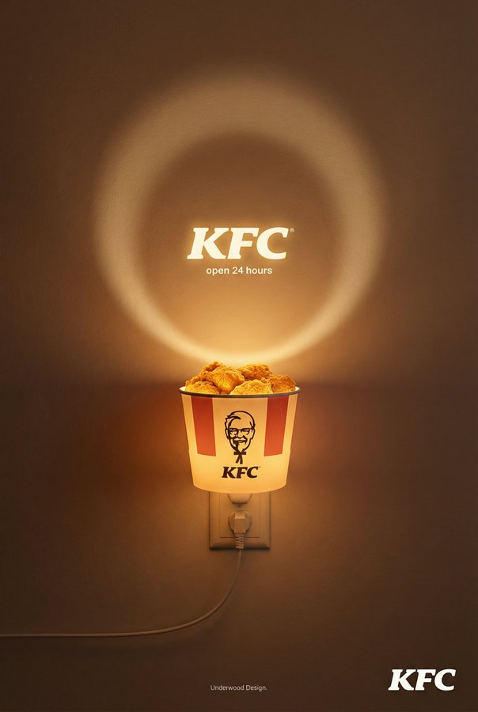

```
Miniature brand night light designs can also be found in our community, including 7-Eleven.

Using the model nano banana pro

The creative poster features a box of fries transformed into a nightlight in the center. The golden fries act as light, reflecting off the wall behind the outlet and casting a yellow glow on the McDonald's logo. Below the logo, the words "open 24 hours" are displayed in tiny white print, directly announcing McDonald's 24-hour operation with its most recognizable element. The bottom right corner displays the McDonald's logo, and at the bottom center, in tiny print, is the word "Underwood Dessert."
```

```
微型品牌夜灯设计也可在我们的社区中找到，包括7-Eleven。

使用模型 nano banana pro

创意海报中央是一盒薯条被改造成夜灯。金黄色的薯条作为光源，反射在插座后方的墙面上，并在麦当劳标志上投射出黄色光晕。标志下方以极小的白色字体写着“24小时营业”，直接通过其最具辨识度的元素宣告麦当劳全天候运营。右下角展示麦当劳标志，底部中央以极小字体印有“Underwood Dessert”。
```

 [↑返回目录](#toc)

---
## <a id="prompt-2005271418326364615">金色火焰中的沉稳灵魂</a> (<a href="https://x.com/hoor_world06/status/2005271418326364615" target="_blank" rel="noopener noreferrer">Hoor</a>)

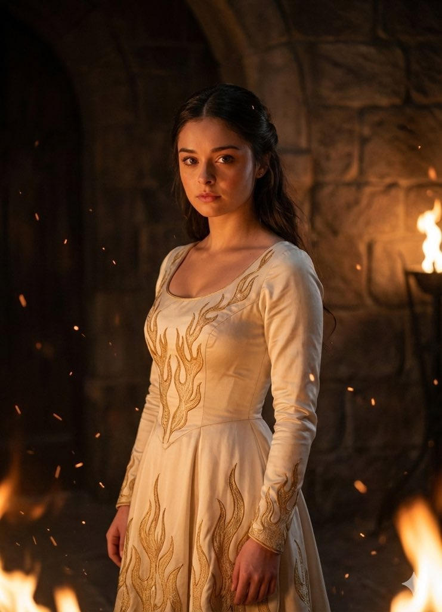

```
{
  "render_goal": "Contrasting fantasy portrait",
  "subject": {
    "pose": "female standing centered",
    "expression": "controlled intensity",
    "skin_tone": "fair warm glow"
  },
  "wardrobe": "ivory gown with soft golden flames along the hem",
  "environment": {
    "location": "dark stone chamber",
    "props": "floating embers, soft shadows"
  }
}
```

```
{
  "render_goal": "对比鲜明的奇幻肖像",
  "subject": {
    "pose": "女性居中站立",
    "expression": "克制而强烈",
    "skin_tone": "白皙带暖光"
  },
  "wardrobe": "象牙色长裙，裙摆边缘饰有柔和的金色火焰",
  "environment": {
    "location": "幽暗石室",
    "props": "漂浮的余烬，柔和阴影"
  }
}
```

 [↑返回目录](#toc)

---
## <a id="prompt-2005261107330699495">屋顶日落自拍</a> (<a href="https://x.com/cbsingh_oo3/status/2005261107330699495" target="_blank" rel="noopener noreferrer">Chandan Singh</a>)

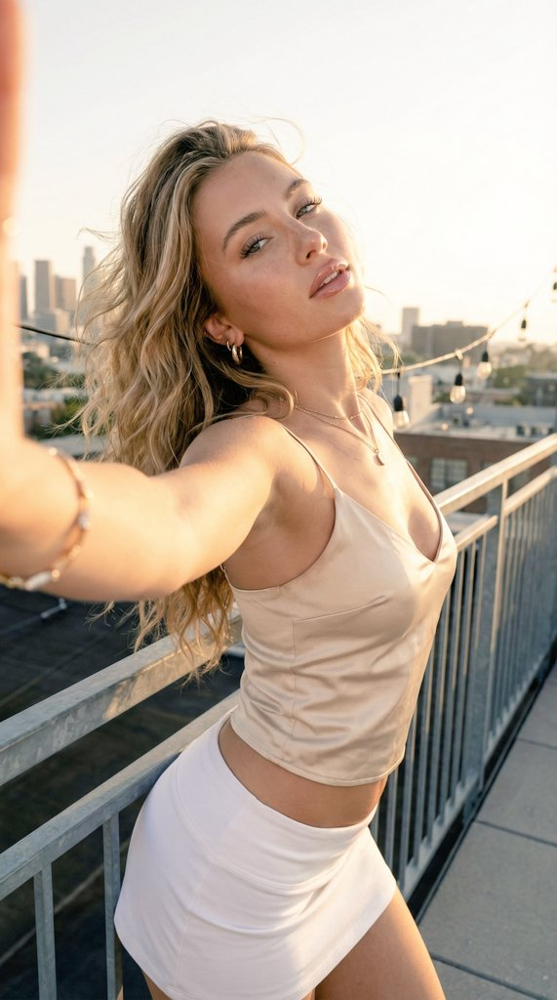

```
{
  "prompt": "A young woman with long, wavy blonde hair taking a playful selfie on a rooftop during golden hour sunset. She has light skin with freckles, blue eyes, and is looking up at the camera with a sultry expression and slightly parted lips. She wears a silky champagne-colored camisole top with thin straps and a short white mini skirt. Accessories include small hoop earrings, a delicate gold necklace, and a bracelet. The background shows a blurred city skyline with tall buildings, string lights hanging overhead, and warm sunlight casting a soft glow on her skin and hair. The photo is taken from a low angle, emphasizing her figure, with an urban rooftop setting including a metal railing.",
  "style": "realistic photography, natural lighting, candid selfie style, high detail, warm tones",
  "negative_prompt": "blurry, deformed, extra limbs, low quality, text, watermark, overexposed, underexposed, cartoon, illustration"
}
```

```
{
  "prompt": "一位金发长卷发的年轻女子在黄金时段的日落时分于屋顶上拍摄一张俏皮的自拍照。她肤色白皙，带有雀斑，蓝色眼睛，以一种撩人的表情仰视镜头，双唇微启。她身穿一条丝质香槟色细肩带背心和一条白色短款迷你裙。配饰包括小巧的圈形耳环、精致的金色项链和一只手镯。背景是模糊的城市天际线，高楼林立，头顶悬挂着串灯，温暖的阳光在她的皮肤和头发上投下柔和的光晕。照片采用低角度拍摄，突出她的身形，场景为城市屋顶，包含金属栏杆。",
  "style": "写实摄影、自然光线、抓拍自拍风格、高细节、暖色调",
  "negative_prompt": "模糊、畸形、多余肢体、低质量、文字、水印、过曝、欠曝、卡通、插画"
}
```

 [↑返回目录](#toc)

---
## <a id="prompt-2005252092127322118">红皮夹克的时尚女子</a> (<a href="https://x.com/mbkartikreddy/status/2005252092127322118" target="_blank" rel="noopener noreferrer">Karthik Reddy</a>)

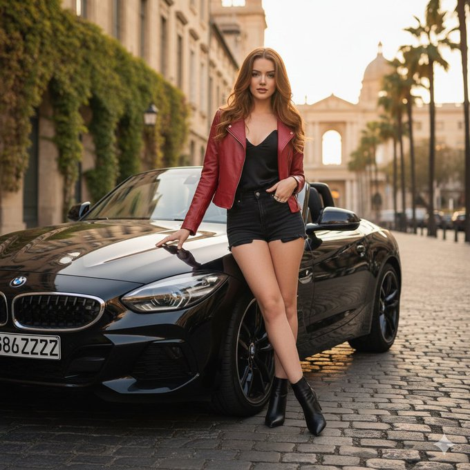

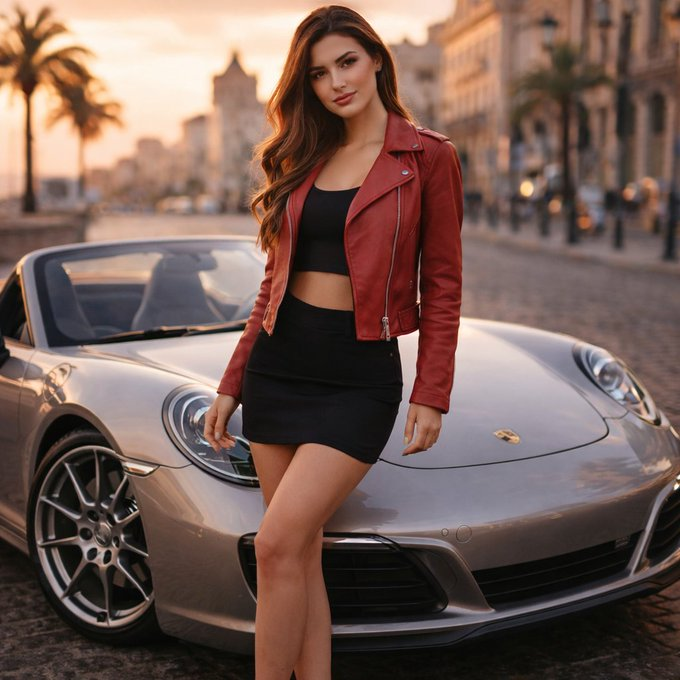

```
A high-quality, full-body photograph of a beautiful young woman with long wavy hair, wearing a stylish red leather jacket over a black silk top and black skinny jeans,
```

```
一张高质量的全身照片，一位美丽的年轻女子，拥有长长的波浪发，身穿时尚红色皮革夹克，内搭黑色丝绸上衣和黑色紧身牛仔裤。
```

 [↑返回目录](#toc)

---
## <a id="prompt-2005274843244077567">新黑色漫画风红衣女子</a> (<a href="https://x.com/AIPhotoJourney/status/2005274843244077567" target="_blank" rel="noopener noreferrer">AIPhotoJourney</a>)

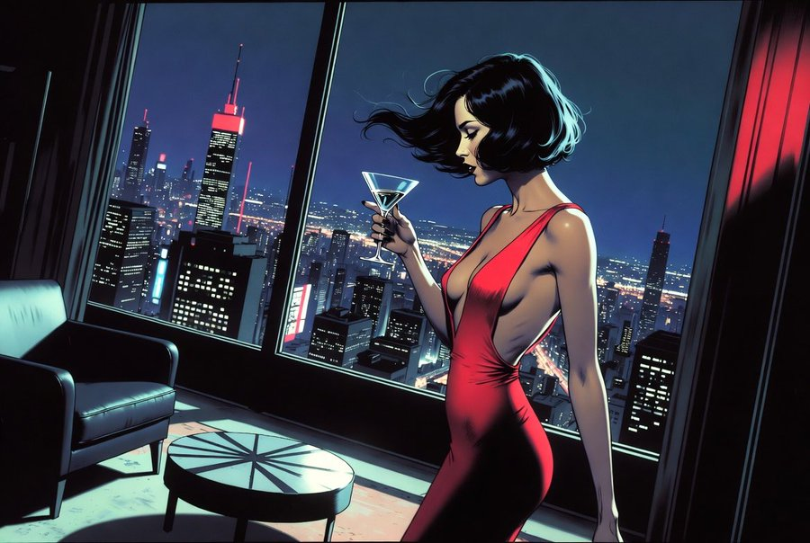

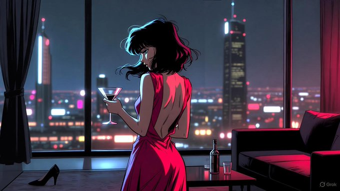

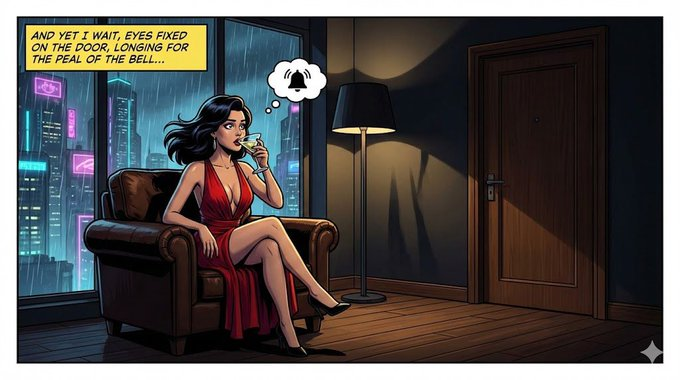

```
{
  "style": "Neo-Noir Cinematic Comic semi-realistic animated",
  "aspect_ratio": "16:9",
  "scene": "Dimly lit penthouse apartment with sweeping views of a futuristic city",
  "subject_and_objects": "Female, 27, with dark flowing bob cut hair, red dress with plunging neckline and plunging back, black high heels, sipping a martini",
  "moment": "Expectantly looking at the door to the apartment, hoping for the bell to ring soon.",
  "rating": "R",
  "full_prompt": "Neo-noir cinematic comic in semi-realistic animated style, dramatic high-contrast lighting, bold deep shadows, vibrant red accents, highly expressive faces, cinematic composition like modern Western animation, female 27 with dark flowing bob cut hair, red dress with plunging neckline and plunging back, black high heels, sipping a martini, expectantly looking at the door to the apartment hoping for the bell to ring soon, intense longing and subtle sensuality, moral ambiguity in her gaze, in dimly lit penthouse apartment with sweeping views of a futuristic city at night --ar 16:9 --v 5 --stylize 750",
  "rating_guidance": "R-rated: heightened sensuality through plunging neckline and plunging back emphasis on the red dress, intense emotional longing, and subtle moral ambiguity in expression; no graphic violence needed for this moment"
}
```

```
新黑色电影风格的漫画，半写实动画风格，强烈的高对比度光影，浓重深邃的阴影，鲜明的红色点缀，高度富有表现力的面部表情，构图具有现代西方动画的电影感；一位27岁女性，深色飘逸波波头，身穿深V领与露背设计的红色连衣裙，脚踩黑色高跟鞋，正啜饮着一杯马提尼，满怀期待地望向公寓门口，期盼门铃尽快响起；眼神中流露出强烈的渴望与微妙的性感，神情带着道德上的模糊性；场景为昏暗灯光下的顶层豪华公寓，窗外是夜晚未来都市的壮阔全景——宽高比16:9。
```

 [↑返回目录](#toc)

---
## <a id="prompt-2005276248789131773">充气品牌标志：柔软客厅焦点</a> (<a href="https://x.com/TechieBySA/status/2005276248789131773" target="_blank" rel="noopener noreferrer">TechieSA</a>)

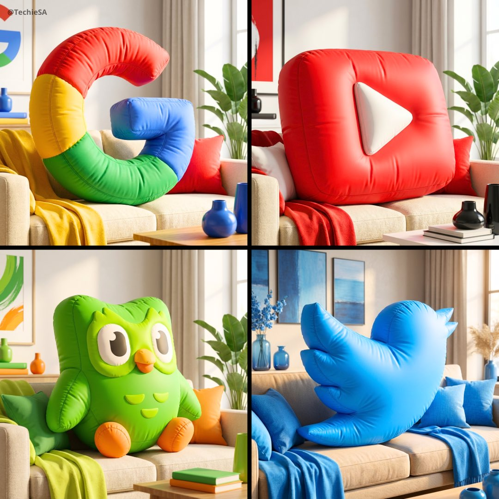

```
Create a high-resolution 3D render of the [BRAND] logo designed as an inflatable, puffy object. The logo should appear soft, rounded, and air-filled – like a plush balloon or blow-up toy. Use a smooth, matte texture with subtle fabric creases and stitching to emphasize the inflatable look. Position the logo at a 45-degree angle to highlight depth and realism. Place the final result on a couch in a stylish living room with furniture and decor that matches the iconic colors of the [BRAND] logo. Output dimension: 1080x1080.
```

```
创建一个高分辨率的3D渲染图，将[BRAND]标志设计成一个充气、蓬松的物体。标志应呈现柔软、圆润且充满空气的质感——如同毛绒气球或充气玩具。使用光滑的哑光材质，并添加细微的织物褶皱和缝线，以强调充气效果。将标志以45度角摆放，以突出深度和真实感。将最终效果置于一间时尚客厅的沙发上，客厅中的家具和装饰应与[BRAND]标志的标志性颜色相匹配。输出尺寸：1080x1080。
```

 [↑返回目录](#toc)

---
## <a id="prompt-2005278334163587137">超写实人像</a> (<a href="https://x.com/lexx_aura/status/2005278334163587137" target="_blank" rel="noopener noreferrer">Lex</a>)

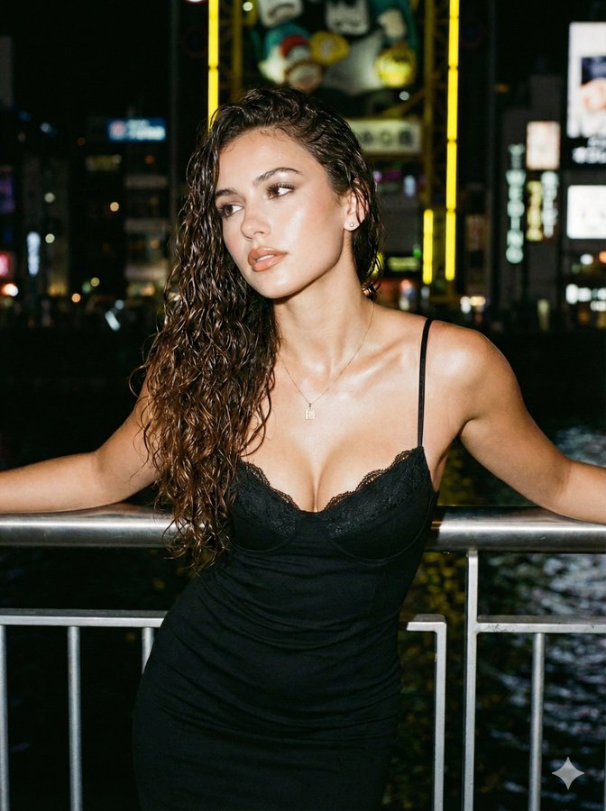

```
{
  "prompt_configuration": {
    "type": "Ultra Photorealistic Portrait",
    "aspect_ratio": "3:4",
    "style_model": "Raw Photography"
  },
  "visual_elements": {
    "subject": {
      "description": "Young woman with a fit, slender physique and white skin.",
      "hair": "Long, dark brown, voluminous curly hair with a slightly wet or glossy texture, draped over the left shoulder.",
      "face": "Defined features, glossy nude lip, subtle smoky eye makeup, looking away from the camera to the left with a candid, relaxed expression.",
      "skin_texture": "High-detail skin pores, natural sheen from flash lighting, realistic complexion."
    },
    "appire_and_styling": {
      "outfit": "Black form-fitting cocktail dress (slip style) with lace detailing on the bust cups, a sweetheart neckline, and a small tie-string front. Thin spaghetti straps.",
      "accessories": "Minimalist gold pendant necklace, small stud earrings.",
      "makeup": "Night-out glamour, dewy finish."
    },
    "pose_and_action": {
      "stance": "Leaning forward against a silver metal railing.",
      "hands": "Both hands resting on the railing bar, casual grip.",
      "orientation": "Body angled slightly towards the camera, head turned profile/three-quarters away."
    },
    "environment": {
      "setting": "Nighttime urban waterfront or city bridge.",
      "background": "Dark night sky with out-of-focus city lights (bokeh). Distinct vertical yellow light strips and distant white blurry signage. Dark water visible below the railing.",
      "atmosphere": "City nightlife, vibrant yet dark, candid moment."
    }
  },
  "technical_details": {
    "lighting": {
      "type": "Direct on-camera flash or strobe.",
      "effect": "High contrast between subject and background. Specular highlights on the clavicle, shoulders, and forehead. Sharp shadows falling behind the subject."
    },
    "camera_gear": {
      "camera": "Sony A7R V or Canon EOS R5",
      "lens": "85mm f/1.4 GM",
      "settings": "Aperture f/2.8, ISO 800, Shutter Speed 1/125s",
      "focus": "Sharp focus on the subject's face, shallow depth of field (bokeh background)."
    },
    "quality_tags": [
      "8k resolution",
      "hyper-realistic",
      "raw photo",
      "film grain",
      "paparazzi aesthetic",
      "unreal engine 5 render",
      "masterpiece",
      "highly detailed texture"
    ]
  }
}
```

```
超写实主义肖像，比例为3:4，采用“Raw Photography”风格模型；

视觉元素：
- 主体：年轻女性，身材苗条，皮肤白皙；长而浓密的深棕色卷发略带湿或光泽质感，垂在一侧肩膀上；面部轮廓分明，带有光亮的裸色唇彩和微妙的烟熏眼妆，以一种坦率、放松的表情看向左边；
- 服装与造型：穿着一件贴身黑色连衣裙（吊带款式），胸部有蕾丝装饰，心形领口，前面有一个小系带；佩戴简约的金色吊坠项链和小巧耳钉；化妆效果适合夜间外出，带有水润光泽；
- 姿态与动作：身体前倾靠在银色金属栏杆上，双手自然地握着栏杆；身体微微朝向镜头，头部转向侧面四分之三方向；
- 环境：夜间的都市海滨或城市桥梁；背景为黑暗的夜空，城市灯光形成模糊的光斑（散景）；可以看到垂直的黄色光线条纹和远处模糊的白色标志，以及栏杆下方隐约可见的水面；氛围体现城市的夜生活，既充满活力又带有一丝阴暗，捕捉到一个自然的瞬间；

技术细节：
- 照明：使用直接的机载闪光灯或频闪灯，造成主体与背景之间的高对比度，锁骨、肩膀和额头上的镜面高光，以及主体后方形成的清晰阴影；
- 摄影设备：使用Sony A7R V或Canon EOS R5相机，85mm f/1.4 GM镜头，设置为光圈f/2.8，ISO 800，快门速度1/125秒，焦点集中在主体脸部，产生浅景深（背景散景）；
- 质量标签：包括8K分辨率、超现实主义、原始照片、胶片颗粒、狗仔队美学、虚幻引擎5渲染、杰作、高度细致的纹理。
```

 [↑返回目录](#toc)

---
## <a id="prompt-2005276907604988275">挥洒美食的创意瞬间</a> (<a href="https://x.com/Dyorzheng/status/2005276907604988275" target="_blank" rel="noopener noreferrer">Dr.D</a>)

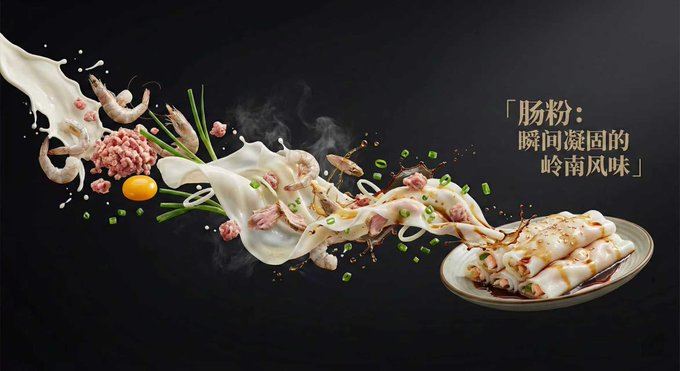


```
画面核心指令:
  主题: "XXX的制作过程"（请严格参考你的知识库以及互联网上成品图的制作过程）
  表达本质: 单一连续动作的时间冻结
  关键约束:
    - 单一画面
    - 单一空间
    - 单一动作
    - 不允许分屏
    - 不允许分区
    - 不允许拼贴

时间与动作逻辑:
  时间表现方式:
    - 时间被拉伸为横向空间
    - 同一瞬间的不同变化状态
  核心动作:
    - 一次连续的抛洒动作
    - 动作从左向右自然展开
  动作特征:
    - uninterrupted motion
    - frozen in time
    - continuous transformation

整体构图方式:
  构图原则:
    - 无任何可见分割线
    - 无明确阶段边界
    - 所有元素处于同一空气与重力体系
  视觉连续性:
    - 食材之间存在轨迹联系
    - 形态变化是渐进的
    - 没有突然“完成”的跳变

食材变化表现（非分段）:
  左侧区域特征:
    - 原始食材状态占比更高
    - 形态完整
    - 动作刚被抛起
    - 分布较为松散

  中部区域特征:
    - 食材在空中翻转、切割、解构
    - 原始与加工状态同时存在
    - 变化最剧烈
    - 碎屑、调料、液体被带动
    - 如果过程中无需切割，就只体现相应的加工

  右侧区域特征:
    - 食材逐渐聚合
    - 结构趋于完整
    - 成品形态自然形成
    - 动作明显减缓但未完全静止
    - 成品已经在装入最合适的容器状态

动态与粒子:
  粒子类型:
    - 食材碎片
    - 调料颗粒
    - 水汽 / 油滴
  粒子规则:
    - 粒子沿同一运动轨迹分布
    - 粒子帮助连接左右变化
    - 不作为装饰性独立元素

光线与背景:
  光线:
    - 统一影棚光
    - 随动作方向渐变
    - 无区域切换感
  背景:
    - 深色影棚背景
    - 连续
    - 无任何分区暗示

文案要求：
  在画面中加入一行题名式文字，格式为「[食品名称]：SLOGAN（无句号）」，文字本身具有艺术标题感，像为这一瞬间的变化命名。字体克制、有重量，颜色取自成品主色并压暗一档，低饱和，悬浮于成品形成区域附近，像从画面中自然浮现，而非刻意排版。

风格与真实感:
  摄影风格:
    - cinematic food advertising photography
  真实感:
    - hyper-detailed
    - ultra realistic
```

 [↑返回目录](#toc)

---
## <a id="prompt-2005248303257309423">标本罐中的无理仪式</a> (<a href="https://x.com/ttmouse/status/2005248303257309423" target="_blank" rel="noopener noreferrer">ttmouse - 豆爸</a>)

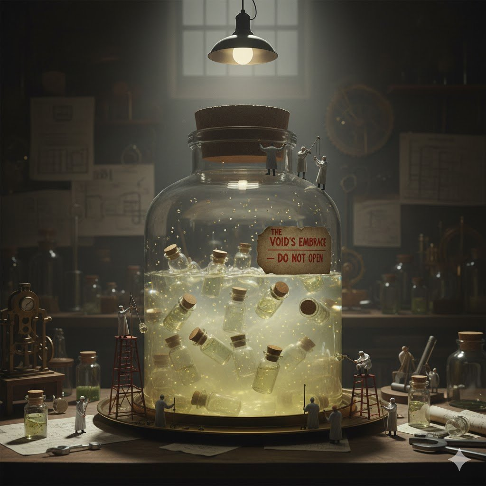

```
{
  "_world": "concept_art",
  "creation_intent": "情绪或氛围",
  "generation_logic": "规则、结构、系统驱动",
  "subject_kit": {
    "primary_subject": "标本罐",
    "secondary_elements": [
      "软木塞封",
      "浑浊液体"
    ]
  },
  "core_tension": "无理仪式",
  "twist_mechanisms": [
    "尺度错位",
  ],
  "stage_context": "博物馆修复工作间",
  "composition_rule": "呆板中心构图",
  "lighting_rule": "单个裸灯泡",
  "imaging_assumption": "工业产品摄影",
  "deliverable_type": "概念帧",
  "creative_directive": "用冷静的方式呈现疯狂",
  "oblique_strategy": "强制包含矛盾元素"
}
```

 [↑返回目录](#toc)

---
## <a id="prompt-2005190547133399118">精准姿势复刻AI绘图</a> (<a href="https://x.com/qisi_ai/status/2005190547133399118" target="_blank" rel="noopener noreferrer">骑司Chase</a>)

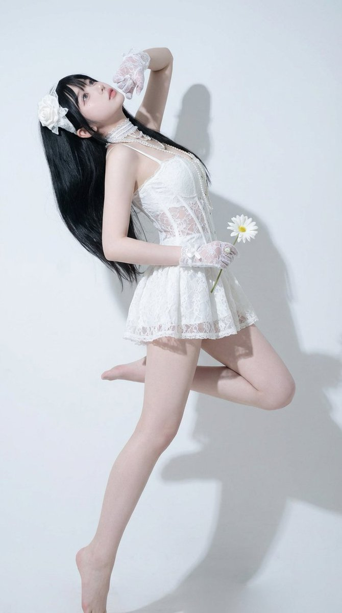

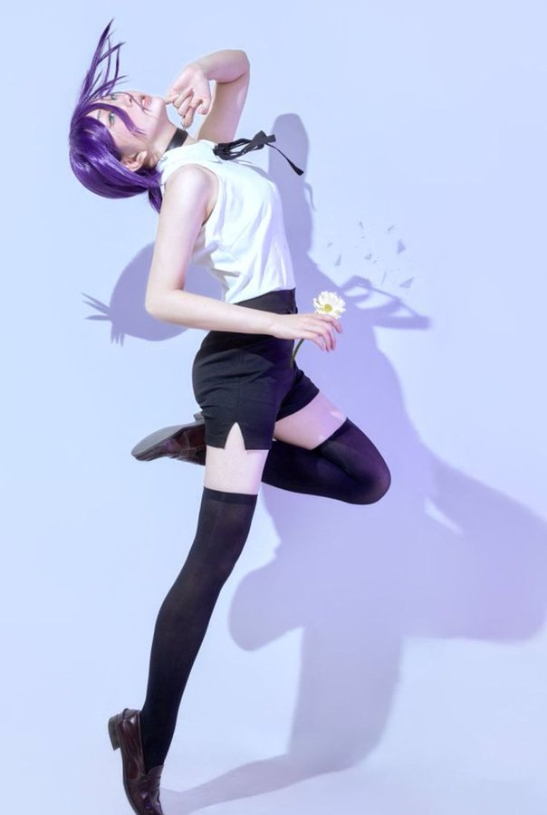

```
一、核心目标与强约束
1 姿势精确复刻：以图二为姿势唯一参考，将图一人物的全身姿势进行“逐点对齐”复刻（头、颈、肩、胸、髋、膝、踝、手臂、手腕、手指的朝向与弯曲程度一致）。
2 视角与镜头一致：相机机位、拍摄角度、镜头高度、俯仰角、左右偏转角、透视关系、景深效果与图二一致。
3 构图一致：人物在画面中的位置、占比、留白比例、裁切方式（是否截到脚/头顶/手）与图二一致。
4 头部与视线一致：头部倾斜角度、下巴抬/收程度、视线方向与图二一致。
5 外观禁止改动：严格保留图一人物的身份特征与风格（脸型五官、发型发色、肤色、服装款式与颜色、材质、配饰、纹理、体型比例、年龄气质、画风/渲染风格），只改变姿势与镜头构图以匹配图二。

二、执行方式与校准要求
1 对齐方法：以图二人物骨架为“目标骨架”，将图一人物骨架“重定向”到目标骨架；四肢角度、重心位置、躯干扭转幅度必须匹配。
2 关键点优先级：先匹配重心与骨盆朝向，再匹配躯干旋转与肩线，再匹配四肢末端（手、脚），最后微调手指与表情细节。
3 允许变化范围：姿势与镜头的误差尽可能为0；若不可避免，误差必须极小且不可肉眼明显。
4 禁止项：禁止新增或删除物体；禁止改变服装造型与细节；禁止改变人物风格；禁止换背景风格导致构图变化；禁止把图二人物的外观特征迁移到图一人物身上。
```

 [↑返回目录](#toc)

---
## <a id="prompt-2005219164009668903">冬日街角的时尚凝视</a> (<a href="https://x.com/hx831126/status/2005219164009668903" target="_blank" rel="noopener noreferrer">虎小象</a>)


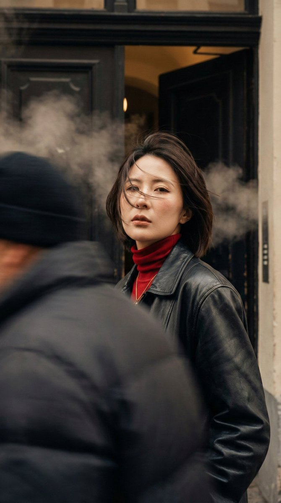

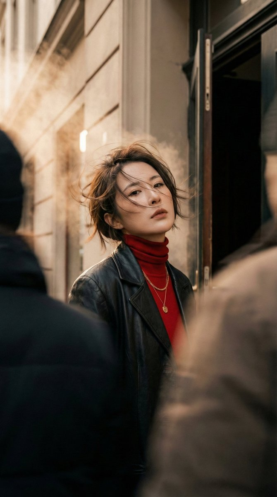

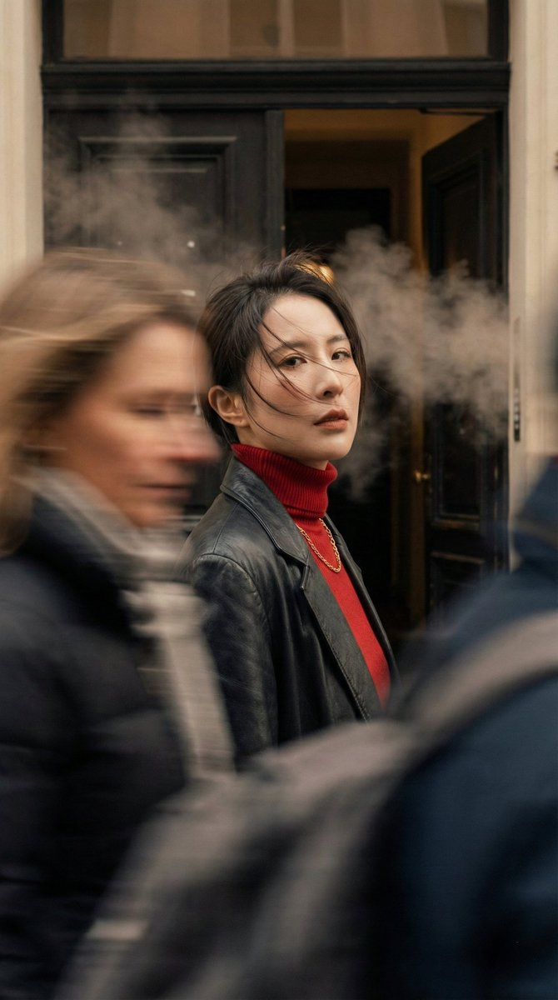

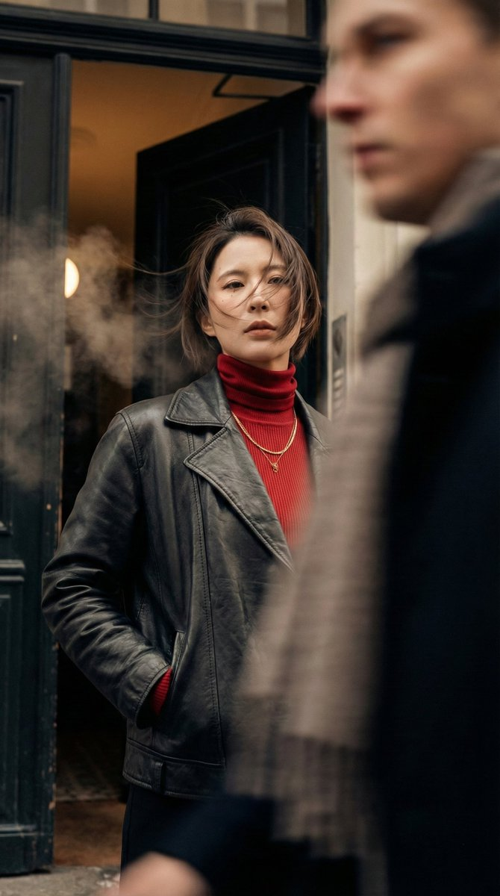

```
——
超逼真的电影感肖像，高端时尚9：16画幅杂志风格摄影。

发型：短发，发丝被风吹拂，飘散在脸上，以时尚的方式部分遮挡面部特征。

主体：仅使用上传的面部参考图像作为主要拍摄对象。面部特征、骨骼结构和自然肤质（可见毛孔）需100%匹配。不得改变种族或性别特征。

服装：黑色复古皮夹克搭配红色高领细线针织（堆叠领口），佩戴金色项链，优雅现代的造型。

场景/环境：时间为冬天，街上有供暖热蒸汽，充满欧洲风格，一个复古公寓的门，门打开着，里面黑漆漆，

动作/动态：前景有人快速移动，动态模糊（长曝光效果）挡住部分画面和镜头。拍摄对象保持完美清晰、沉静。拍摄对象静止，轻微仰头，看着镜头，一只手拉着高领毛衣的领子扯着挡住下颌线和嘴唇（时尚杂志模特的post）位于画面的右侧。

构图：低角度仰拍人物，胸部以上竖幅肖像，主体人物位置偏右构图，线条简洁流畅

相机：24mm广角镜头低角度仰拍视角，浅景深，电影感虚化效果，专业的时尚写实风格。

光照：柔和的电影感光照，暖色调，营造氛围感。高光控制得当，阴影保留细节。

色彩/后期：高细节，高级色彩分级，自然的肤质纹理，微妙的胶片感（无明显颗粒）。无文字、无徽标、无水印。
——
```

 [↑返回目录](#toc)

---
## <a id="prompt-2005252552762314954">浮世绘笔下的京都</a> (<a href="https://x.com/AztecaAlpaca/status/2005252552762314954" target="_blank" rel="noopener noreferrer">阿兹特克小羊驼</a>)

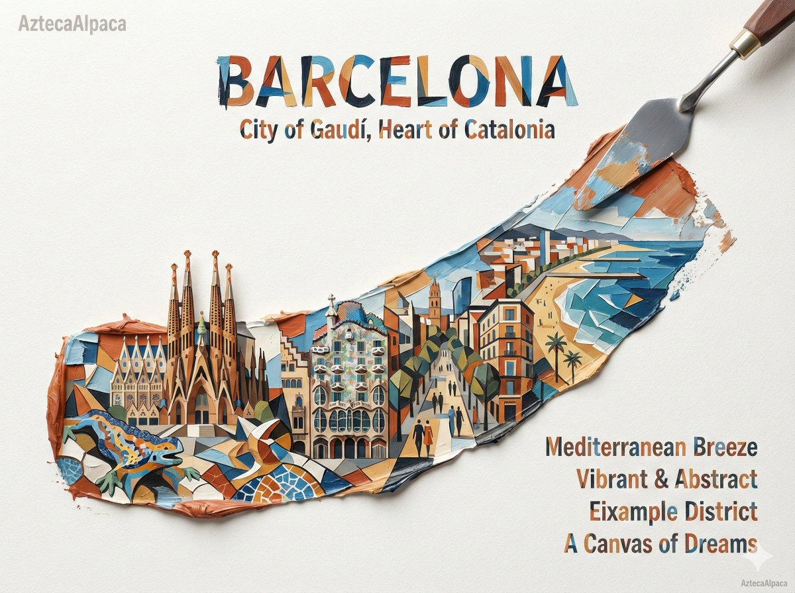


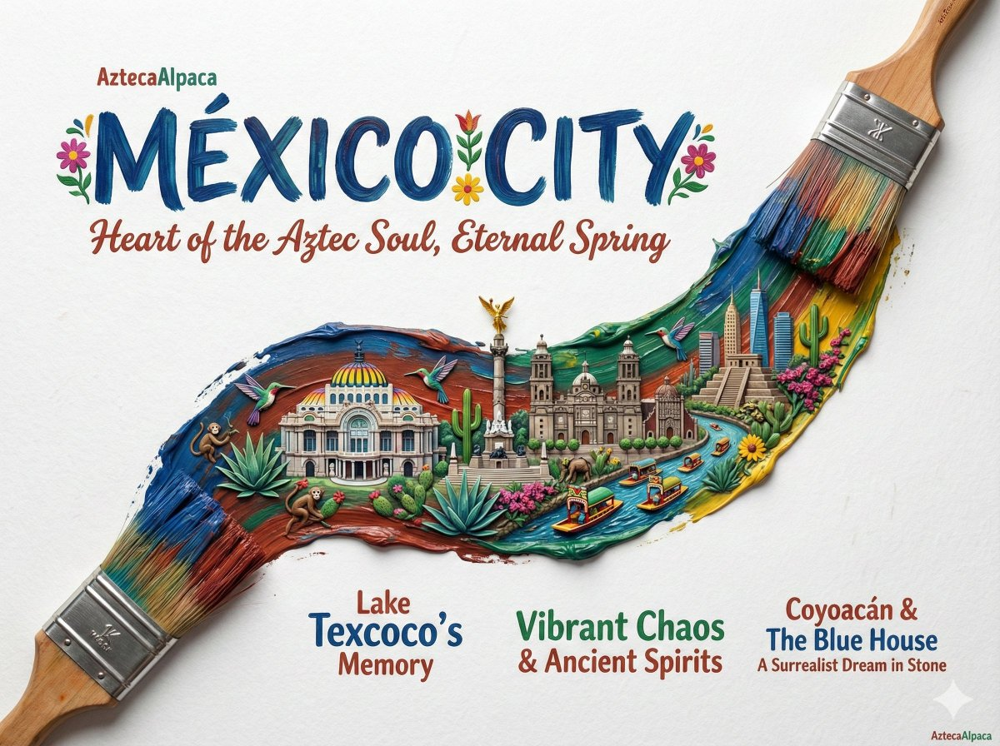

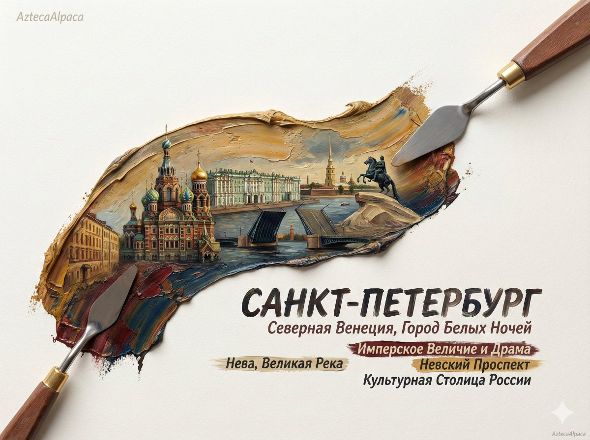

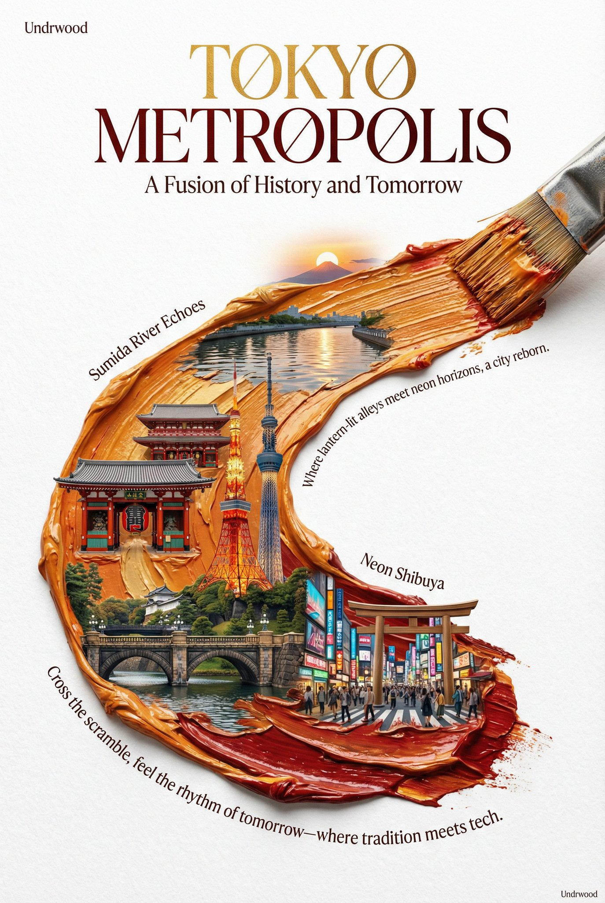

```
**
一种合适的艺术工具（例如：画笔、调色刀、触控笔，或适合 [Painting Style] 的传统绘画工具），仿佛正处于创作之中，从左下角向右上角勾勒出一条精致、优雅的曲线。笔触之中包含著名的 [City/Country] 地标的微缩景观：精选的一组标志性地点，融合当地特有的历史与现代建筑、自然元素以及城市生活气息。整体风格结合了 [Painting Style] 与学院派海报设计：多样化的笔触与痕迹营造出三维空间感，呈现出立体的微缩景观与浅浮雕质感。[Dominant Color Tones] 为主色调，其间点缀传统的 [City/Country] 美学元素，并与现代城市天际线相互交织。画面为极简的俯视视角，主体笔触之外保留大面积留白。背景为具有纹理的纸张（高质量纤维质感），色调明亮、干净、清新（例如：纯白、明亮的天空蓝、阳光般的浅黄色，或清爽的薄荷绿），与画面主体形成清晰对比，营造纯净感。整体设计融合传统 [City/Country] 美学与现代三维艺术，具备高细节度、超写实效果、HDR，以及 8K 分辨率。

**海报文字排版要求达到大师级水准**（精致的网格系统、精确的间距控制、极其准确的字距与层级），所有字体的呈现风格需在视觉上与所选的 [Painting Style] 及绘画工具相互呼应并融为一体：

* **主标题：**“[CITY/COUNTRY]”（与绘画风格美学相匹配的艺术字体，极具吸引力，高对比度，作为核心视觉层级）
* **副标题：**“[Subtitle about the location's character]”（在风格上与主标题及绘画肌理相互呼应的高级排版）
* **装饰性文案**（全部采用与 [Painting Style] 融合的字体风格，通过分段形成节奏与层级，与主标题呼应）：

  * “[Decorative Copy 1: e.g., Name of a river or natural feature]”
  * “[Decorative Copy 2: A phrase describing the city's atmosphere]”
  * “[Decorative Copy 3: Name of a district or landmark]”
  * “[Decorative Copy 4: A concluding thought about the city]”
* **左上角小字：**[signature/brand name]（低调、匹配整体风格的字体）
* **右下角极小字：**[Signature/brand name]（低调、匹配整体风格的字体）

**构图要求：**
绘画工具的笔尖应在笔触末端（右上角）停住，笔触之外保留干净的留白；微缩景观仅存在于笔触内部，细节密集但不显杂乱；
Nano Banana Pro
Nano Banana Pro
Nano Banana Pro
```

 [↑返回目录](#toc)

---
## <a id="prompt-2005234288250527757">虚拟与现实的经典融合</a> (<a href="https://x.com/berryxia/status/2005234288250527757" target="_blank" rel="noopener noreferrer">Berryxia.AI</a>)


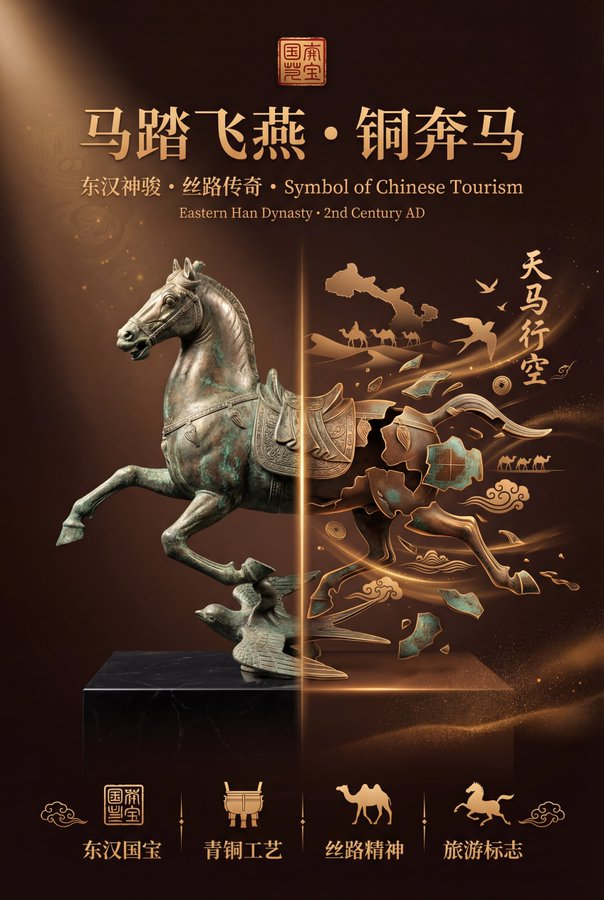


```
A premium vertical split concept poster for [品牌名称] [产品名称], showing ONE [产品] split in half - left side realistic, right side deconstructed.

TOP SECTION - BRANDING:
- [品牌名称] official logo at top center ([品牌色])
- "[产品名称]" in large bold [字体风格] font in [颜色]
- Subtitle: "[产品Slogan]" in elegant serif font
- Optional secondary tagline

CENTRAL DESIGN - ONE SINGLE [产品] SPLIT VERTICALLY DOWN THE MIDDLE:

LEFT HALF OF THE [产品] (50%): Ultra-realistic photographic half
- Left 50% of the [产品] shown in ultra-realistic photography style
- Photorealistic [关键材质1: 如金属/皮革/食材] texture visible on left edge
- Half of [关键特征1: 如屏幕/面包/表面] with realistic reflections
- Left portion of [关键特征2: 如键盘/配件/层次] showing individual details
- Half of [关键特征3] visible with material accuracy
- Professional product photography lighting
- Perfect vertical cut through the exact center of the [产品]
- Every detail ultra-realistic: [材质细节列表]
- [可选: 烟雾/水珠/光晕] effect for atmosphere

RIGHT HALF OF THE [产品] (50%): Stylized [tech/culinary/artistic] deconstruction
- Right 50% of the [产品] exploding into [解构类型] components
- [组件1] floating away individually [具体描述]
- [组件2] fragments showing [内部结构/发光效果]
- [组件3] pieces with glowing [颜色] [元素: 如芯片/食材/零件]
- [组件4] separating geometrically
- [内部结构] and internal components visible
- [品牌元素/Logo] piece glowing independently
- [Warm golden/Cool blue/Neon multi-color] tech/artistic lighting effects
- Geometric [tech lines/motion lines/artistic trails], [holographic patterns/particle effects/ingredient splashes]
- Components floating outward in organized dynamic composition
- Illustrated/stylized art treatment (not photorealistic)
- [根据类型: 科技感电路/美食解构/时尚元素/机械零件]

THE SPLIT: Clean vertical line down the exact center of the [产品], one continuous [产品] transitioning seamlessly from realistic (left) to deconstructed [风格] art (right)

BACKGROUND: [深色/浅色] gradient ([色值1] to [色值2]) with [carbon fiber/wood/concrete/fabric] texture and [颜色] light particles

LIGHTING: Left side = professional studio lighting with [warm/cool/natural] tone | Right side = [warm/cool/neon] glow with [颜色] accents creating dramatic contrast

VERTICAL DIVIDING LINE: Subtle [golden/silver/blue/red] glow ([色值]) marking the center split of the [产品]

BOTTOM SECTION - PRODUCT FEATURES (arranged horizontally with icons):
- "[特点1]" with [icon描述] icon
- "[特点2]" with [icon描述] icon
- "[特点3]" with [icon描述] icon
- "[特点4]" with [icon描述] icon
Typography in [字体风格] font with decorative divider lines

COLOR PALETTE: [主色调列表]

COMPOSITION: One single [产品] centered vertically, split perfectly down the middle - left half ultra-realistic photography, right half exploding into stylized [解构类型] components

STYLE: Seamless transition from photorealistic product to illustrated [tech/culinary/fashion/mechanical] deconstruction within ONE unified [产品]

MOOD: [Premium/Appetizing/Innovative/Nostalgic], [dramatic/elegant/energetic], official brand advertising quality

TEXT STYLE: Mix of bold display fonts and elegant serifs, [品牌色] colors

Quality: Commercial advertising standard, 4K resolution, dramatic visual impact
```

 [↑返回目录](#toc)

---
## <a id="prompt-2004462228490096652">AI女孩的自信自拍</a> (<a href="https://x.com/brindleyai/status/2004462228490096652/photo/1" target="_blank" rel="noopener noreferrer">brindley</a>)

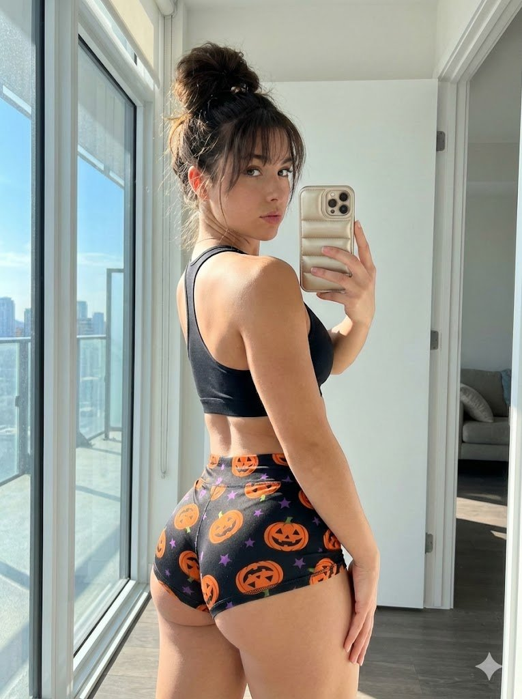

```
{
"subject": {
"description": "Young woman with a fit, curvy physique taking a mirror selfie",
"hair": "Dark brown hair styled in a messy, high bun with loose strands and wispy bangs framing the face",
"clothing": "Black racerback sports bra, tight black booty shorts with a Halloween pattern featuring orange jack-o'-lantern pumpkins and small purple stars",
"physique": "Athletic and voluptuous build, prominent glutes, slim waist, visible back musculature, tan skin tone",
"accessories": "Gold ring on right hand, small earrings",
"phone": "Gold or champagne-colored iPhone with a textured, puffy 'puffer' style case held in the right hand"
},
"pose": {
"stance": "Standing with back towards the mirror, torso twisted slightly to the left",
"head_orientation": "Head turned over the left shoulder, looking directly into the mirror/camera",
"limbs": "Right arm raised holding the phone, left arm down by side, legs standing straight with weight slightly shifted",
"focus": "Emphasis on the posterior view and profile curve"
},
"environment": {
"setting": "Modern apartment interior seen through a mirror reflection",
"details": "Large floor-to-ceiling window on the left revealing a city skyline and blue sky, white door frame on the right, glimpse of a living area in the background with a couch and ceiling light",
"surface": "Clean mirror surface reflecting the subject and room"
},
"camera": {
"shot_type": "Mirror selfie, medium shot capturing from knees to top of head",
"perspective": "Reflection view, camera positioned at shoulder height",
"focal_length": "26mm equivalent (smartphone main camera)",
"depth_of_field": "Deep depth of field, background slightly softer but visible"
},
"lighting": {
"source": "Strong natural daylight entering from the large window on the left, mixed with soft indoor ambient lighting",
"characteristics": "Directional side lighting creating highlights on the left arm, hair, and profile, casting soft shadows on the right side of the back and legs",
"quality": "Realistic, high-contrast daylight balance"
},
"mood_and_expression": {
"emotion": "Confident, sultry, casual",
"facial_expression": "Neutral to slight pout, focused gaze on the phone screen/mirror reflection",
"atmosphere": "Casual lifestyle, influencer aesthetic, morning or afternoon vibe"
},
"style_and_realism": {
"aesthetic": "Raw smartphone photography, unpolished social media snapshot",
"rendering": "Photorealistic, 8k resolution, texture-rich",
"details": "Visible skin texture, natural fabric folds in clothing, realistic light falloff"
},
"colors_and_tone": {
"palette": "Natural skin tones (tan), deep blacks (clothing), bright oranges (pumpkins), cool whites and blues (background/window)",
"contrast": "Medium-high contrast due to window light",
"saturation": "Natural to slightly vibrant"
},
"quality_and_technical_details": {
"resolution": "Best quality, ultra-detailed",
"sharpness": "Sharp focus on the subject, no motion blur",
"noise": "Subtle digital noise characteristic of smartphone sensors"
},
"aspect_ratio_and_output": {
"ratio": "3:4",
"framing": "Vertical portrait orientation"
},
"controlnet": {
"pose_control": {
"model_type": "DWPose",
"purpose": "Exact skeletal and pose lock",
"constraints": [
"preserve shoulder width",
"preserve hip angle",
"preserve spine curvature",
"preserve limb placement"
],
"recommended_weight": 1.0
},
"depth_control": {
"model_type": "ZoeDepth",
"purpose": "Depth, volume, and camera-to-body spatial lock",
"constraints": [
"preserve glute foreground dominance",
"prevent flat or compressed depth",
"maintain clear torso-to-background separation"
],
"recommended_weight": 0.8
}
},
"negative_prompt": {
"forbidden_elements": [
"anatomy normalization",
"body proportion averaging",
"reduced glute volume",
"flattened curves",
"slimmed torso",
"aesthetic proportion correction",
"beauty standard enforcement",
"dataset-average female anatomy",
"camera angles that reduce volume",
"wide-angle distortion not in reference",
"cropping that removes volume",
"depth flattening",
"beautification filters",
"skin smoothing",
"plastic skin",
"airbrushed texture",
"stylized realism",
"cartoonish",
"sketch",
"painting",
"blur",
"low quality",
"distorted hands",
"missing phone"
]
}
}
```

```
{
"主体": {
"描述": "一位身材健美、曲线玲珑的年轻女性正在拍镜子自拍",
"发型": "深棕色头发扎成凌乱高丸子头，几缕发丝松散垂落，细碎刘海修饰脸型",
"服装": "黑色露背运动内衣，紧身黑色短裤，印有万圣节图案——橙色南瓜灯和小型紫色星星",
"体型": "健美丰腴，臀部突出，腰肢纤细，背部肌肉清晰可见，肤色为小麦色",
"配饰": "右手佩戴一枚金戒指，佩戴小巧耳钉",
"手机": "右手握持香槟金色或金色iPhone，配有纹理感强的蓬松“羽绒”风格手机壳"
},
"姿势": {
"站姿": "背对镜子站立，上半身略微向左扭转",
"头部朝向": "头转向左肩上方，直视镜中/镜头",
"四肢": "右臂抬起持手机，左臂自然下垂，双腿伸直站立，重心略微偏移",
"重点": "强调后背视角与身体侧面曲线"
},
"环境": {
"场景": "通过镜面反射可见现代公寓室内",
"细节": "左侧有一扇大型落地窗，窗外是城市天际线与蓝天；右侧为白色门框；背景隐约可见客厅区域，包括沙发与天花板灯具",
"镜面": "干净镜面清晰反射人物与房间"
},
"相机": {
"拍摄类型": "镜中自拍，中景构图（从膝盖至头顶）",
"视角": "反射视角，相机位于肩部高度",
"焦距": "等效26mm（智能手机主摄）",
"景深": "大景深，背景略柔和但仍清晰可见"
},
"光线": {
"光源": "强烈自然日光从左侧大窗射入，混合柔和室内环境光",
"特性": "侧向定向光在左臂、头发及面部轮廓形成高光，在背部与腿部右侧投下柔和阴影",
"质感": "真实感强，高对比度日光平衡"
},
"情绪与表情": {
"情绪": "自信、撩人、随意",
"面部表情": "表情中性略带轻噘嘴，目光专注地看向手机屏幕/镜中倒影",
"氛围": "日常生活方式，网红美学，早晨或午后氛围"
},
"风格与写实度": {
"美学": "原始智能手机摄影风格，未经修饰的社交媒体快照",
"渲染": "照片级真实感，8K分辨率，纹理丰富",
"细节": "可见皮肤纹理、衣物自然褶皱、真实光影衰减"
},
"色彩与色调": {
"调色板": "自然肤色（小麦色）、深黑（服装）、亮橙（南瓜）、冷白与蓝色（背景/窗户）",
"对比度": "因窗光而呈现中高对比度",
"饱和度": "自然至略鲜艳"
},
"画质与技术细节": {
"分辨率": "最佳质量，超精细细节",
"锐度": "主体清晰对焦，无动态模糊",
"噪点": "带有智能手机传感器特有的轻微数字噪点"
},
"画面比例与输出": {
"比例": "3:4",
"构图": "竖屏人像方向"
},
"ControlNet控制": {
"姿态控制": {
"模型类型": "DWPose",
"用途": "精确骨骼与姿态锁定",
"约束条件": [
"保留肩宽",
"保留髋部角度",
"保留脊柱曲度",
"保留四肢位置"
],
"推荐权重": 1.0
},
"深度控制": {
"模型类型": "ZoeDepth",
"用途": "深度、体积与相机-身体空间关系锁定",
"约束条件": [
"保持臀部前景主导地位",
"防止扁平化或压缩深度",
"维持躯干与背景的清晰分离"
],
"推荐权重": 0.8
}
},
"负面提示": {
"禁止元素": [
"解剖结构标准化",
"身体比例平均化",
"臀部体积缩减",
"曲线扁平化",
"躯干收窄",
"审美比例修正",
"强制符合主流审美标准",
"数据集平均女性解剖特征",
"削弱体积感的拍摄角度",
"参考图中未出现的广角畸变",
"裁剪导致体积缺失",
"深度压平",
"美颜滤镜",
"皮肤磨皮",
"塑料质感皮肤",
"过度修饰纹理",
"风格化写实",
"卡通化",
"素描",
"绘画",
"模糊",
"低质量",
"手部畸形",
"缺少手机"
]
}
}
```

 [↑返回目录](#toc)

---
## <a id="prompt-2004392418288783366">电影级写实主义光影杰作</a> (<a href="https://x.com/RobotCleopatra/status/2004392418288783366/photo/1" target="_blank" rel="noopener noreferrer">Skipper</a>)


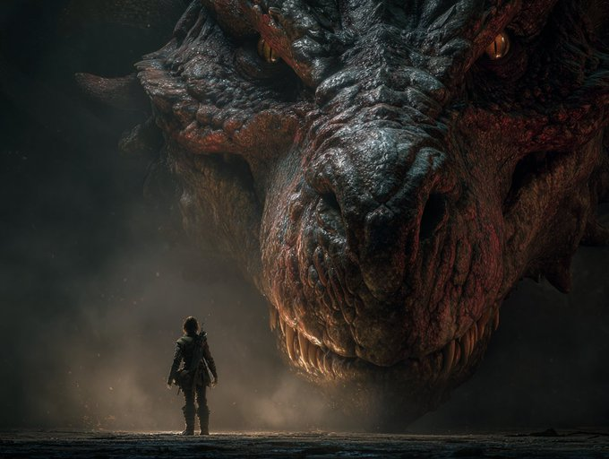

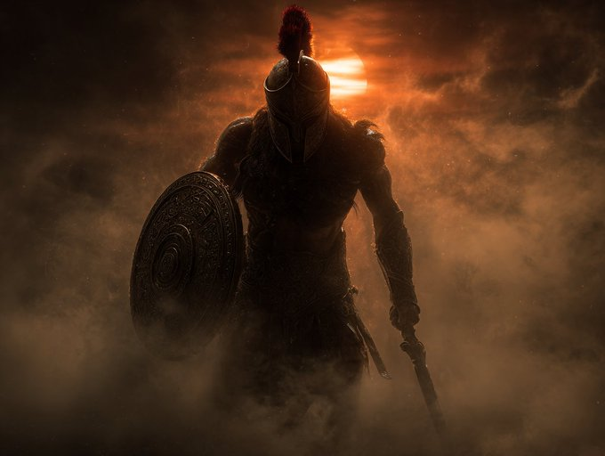

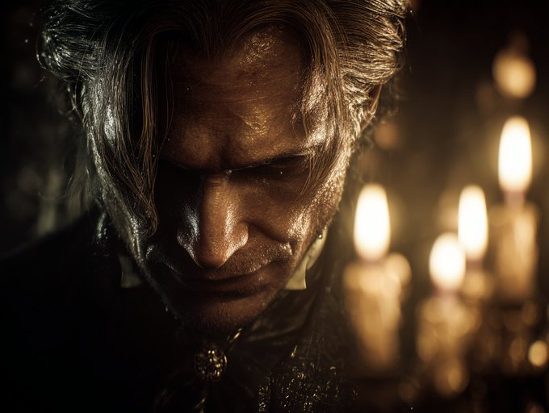

```
[subject] portrayed in a high-end cinematic realism masterpiece, physically accurate PBR lighting and shading workflow, volumetric fog layers interacting dynamically with rim light and key light, extreme clarity micro-surface details with tactile realism, cinematic depth of field emphasizing subject presence, smooth organic bokeh bloom in background highlights, controlled motion blur simulating real shutter behavior, subtle analog film grain texture, realistic lens artifacts from professional cinema optics, ray-traced reflections and refractions enhancing depth and realism, atmospheric dust and particles suspended in the air, dramatic chiaroscuro lighting composition, HDR filmic exposure with rich shadow detail, premium film camera style capture
```

```
[主题]以高端电影写实主义杰作的形式呈现，采用物理精确的PBR光照和着色工作流程，体积雾层与边缘光和主光动态交互，具有极端清晰的微表面细节和触感真实感，电影景深强调主体存在感，背景亮点处平滑有机的散景光晕，控制运动模糊模拟真实快门行为，微妙的模拟胶片颗粒质感，来自专业电影镜头的真实镜头伪影，通过光线追踪反射和折射增强深度和真实感，空气中悬浮的戏剧性大气尘埃和粒子，强烈的明暗对比照明构成，丰富的阴影细节和HDR电影级曝光，高级电影摄像机风格捕捉。
```

 [↑返回目录](#toc)

---
## <a id="prompt-2004447203645923535">数字雨中的全息回声</a> (<a href="https://x.com/LudovicCreator/status/2004447203645923535/photo/1" target="_blank" rel="noopener noreferrer">LudovicCreator</a>)

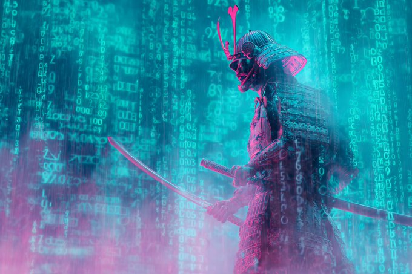

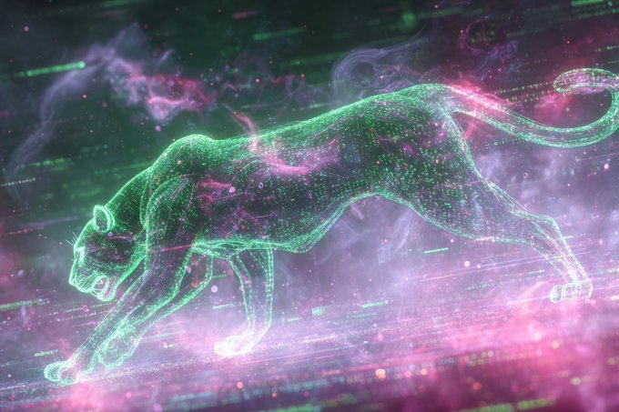

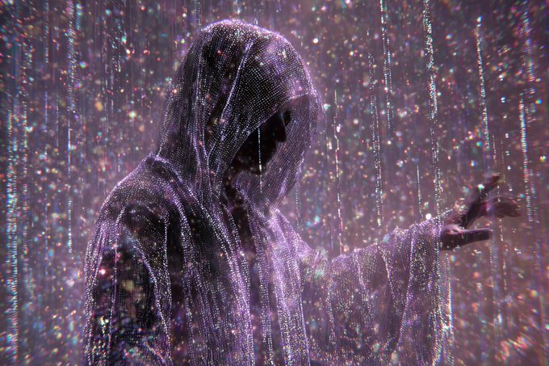

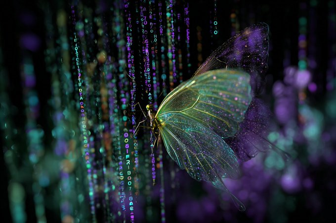

```
[SUBJECT] rendered as a Holographic Echo amidst Digital Rain, with translucent code symbols forming ghostly, shifting silhouettes. Use iridescent [COLOR1] and [COLOR2] to enhance the ethereal effect

Check ALTS
```

```
[主题]被渲染为数字雨中的全息回声，半透明的代码符号形成幽灵般的、不断变化的轮廓。使用彩虹色的[颜色1]和[颜色2]来增强超凡的效果。

请提供具体的主题、颜色1和颜色2，以便生成更精确的图像提示词。
```

 [↑返回目录](#toc)

---
## <a id="prompt-2004296341439262996">CSI迈阿密微缩犯罪现场</a> (<a href="https://x.com/Gdgtify/status/2004296341439262996/photo/1" target="_blank" rel="noopener noreferrer">Gadgetify</a>)

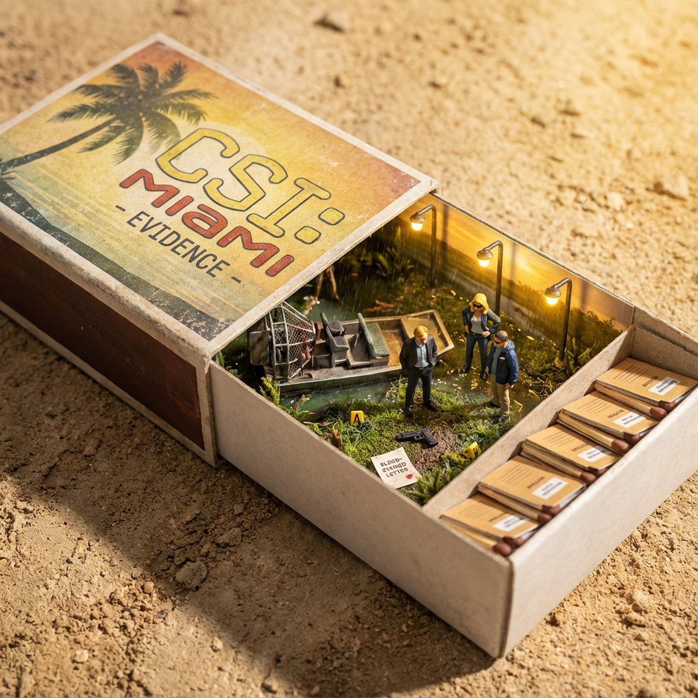

```
do this for CSI Miami: <instructions>
Input 1 is detective story or film noir. 

Goal: A weathered, oversized story era-relevant matchbox, partially open to reveal the most famous scene from the story with all the relevant characters as a crime scene diorama.
Rules: Inside the box is a story relevant 3D miniature of a rain-slicked street or a messy office inspired by input 1. A tiny "Smoking Gun" and a "Blood-stained Letter" are scattered. The "matches" are actually miniature evidence files. 
Lighting: story relevant street lamps and elements. 
Output: 1:1, story relevant texture, elements, and scenes.
</instructions>
```

```
一个陈旧的超大号火柴盒，部分打开显示出与《CSI Miami》相关的著名犯罪现场场景，包含所有关键人物。火柴盒内是一个3D微缩景观，展现一条雨后湿滑的迈阿密街道或一间混乱的办公室。场景中散落有‘冒烟的手枪’和‘带血的信件’，而‘火柴’则被替换为微缩版的案件证据文件。采用故事相关的路灯进行照明，营造出真实的氛围。整个场景应反映出《CSI Miami》的独特风格和质感，包括正确的比例和细节再现。
```

 [↑返回目录](#toc)

---
## <a id="prompt-2004364368155447500">柴犬主题专业品牌IP形象设计开发</a> (<a href="https://x.com/yyyole/status/2004364368155447500/photo/1" target="_blank" rel="noopener noreferrer">沐阳</a>)

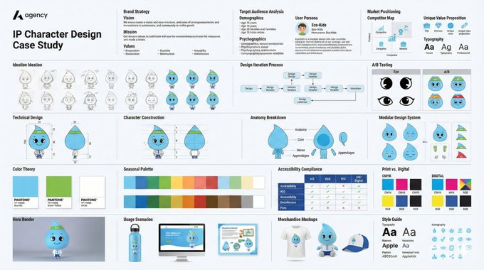

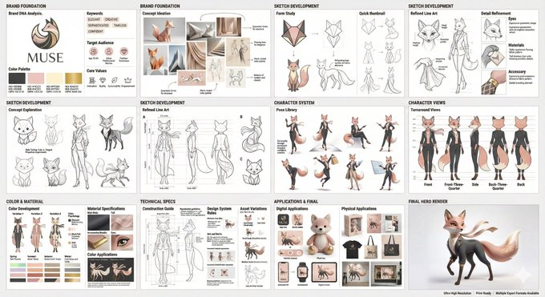

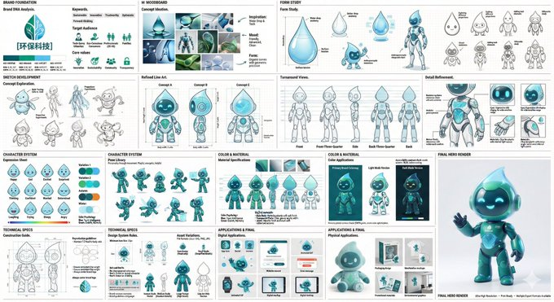

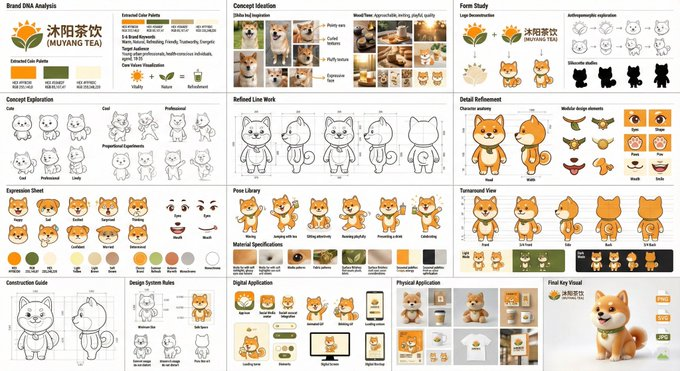

```
[步骤1：LOGO分析]
如果上传了logo图片：智能分析并提取品牌色彩（HEX/RGB色值）、设计风格、视觉元素、字体特征和品牌性格特质。
如果未提供logo：首先为[沐阳/茶饮行业（品牌名称/行业）]设计一个专业现代的logo，然后继续进行形象设计。

[步骤2：设计参数]
- 基础Logo：[上传图片分析结果 / 新设计的logo]
- 形象灵感来源：[柴犬]
- 色彩系统：[从logo自动提取 ]
- 品牌行业：[自动检测]

[完整设计看板布局 - 超高信息密度]：

**顶部行 - 品牌基础（3个区块）**
左侧：品牌DNA分析 - logo展示，提取的色板配HEX/RGB/CMYK色值，5-6个品牌性格关键词，目标受众人口统计，核心价值可视化
中间：概念构思 - 以[柴犬]为特色的灵感情绪板，参考图片，情绪与基调板，设计方向箭头和注释
右侧：形态研究 - [logo]解剖结构分解，拟人化探索，6-8个快速缩略草图展示形状到角色的演变，剪影变化。
**第二行 - 草图开发（3个区块）**
左侧：概念探索 - 10-12个多样化的角色概念草图，不同性格诠释，风格测试（可爱/酷炫/专业/活泼），比例实验
中间：精细线稿 - 3个最佳概念的详细清晰线条绘图，正面/侧面/背面三视图，构造网格叠加，尺寸标注
右侧：细节精修 - 角色解剖结构分解，比例指南，模块化设计元素，特征特写（眼睛/手部/配饰），设计理念注释

**第三行 - 角色系统（3个区块）**
左侧：表情设定表 - 8-12种面部表情（开心/悲伤/兴奋/惊讶/思考/自信/担心/坚定），情感范围展示，眼睛和嘴巴变化
中间：姿势库 - 6-10个动态姿势和手势（挥手/跳跃/坐着/奔跑/展示/庆祝），动作线，通过动作展现性格
右侧：转身视图 - 360度角色旋转（正面/四分之三/侧面/背面/四分之三），所有角度保持一致的模型，可见构造指南

**第四行 - 色彩与材质（3个区块）**
左侧：色彩开发 - 从品牌logo提取的主色板，辅助色和强调色，4-5套完整配色方案变体，季节性色板，色彩心理学注释
中间：材质规格 - 表面纹理细节（哑光/光泽/柔软/金属），布料图案，表面处理类型，数字与实物材质说明，制造考量
右侧：色彩应用 - 不同配色方案下的角色，浅色模式vs深色模式版本，无障碍对比度检查，印刷vs屏幕色彩优化

**第五行 - 技术规格（3个区块）**
左侧：构造指南 - 带有尺寸的详细技术图，比例关系，网格系统，几何构造分解，一致使用的复制指南
中间：设计系统规则 - 最小尺寸规格，安全空间要求，正确与错误用法，不当使用示例，品牌指南整合
右侧：资产变体 - 尺寸变化（图标/小/中/大），小尺寸简化版本，大幅面详细版本，纯线稿版本

**底部行 - 应用与成品（3个区块）**
左侧：数字应用 - 应用图标设计，社交媒体头像，网站吉祥物整合，UI元素示例，动画GIF概念，数字屏幕样机
中间：实物应用 - 毛绒玩具3D渲染图，包装设计，周边产品样机（T恤/马克杯/贴纸），促销材料，环境图形
右侧：最终主视觉渲染 - 超精致全彩角色插画，专业影棚灯光，细微阴影和高光，纯白背景，照片级真实质感，品牌logo巧妙融入，多种导出格式展示

**整体视觉风格**：
专业商业设计文档美学，超清晰网格布局系统，带有清晰标签和标题的模块化区块，简约字体排版（无衬线体），技术注释和引出线，色彩编码的区块分隔符，扁平化设计图标和符号，充足的留白，组织化的信息层次，精确的间距和对齐，企业级演示质量，Behance/Dribbble作品集标准，现代设计机构风格，8K超高分辨率，印刷就绪质量

**智能特性**：
- 从logo提取的品牌色彩一致应用于所有区块
- [柴犬]主题巧妙融入角色解剖结构
- Logo设计元素微妙地体现在角色细节中（图案形状）
- 从logo到角色无缝衔接的连贯视觉语言
- 专业设计师案例研究演示格式
- 在保持清晰度和可读性的同时实现最大信息密度

生成从初始品牌分析到最终精致渲染的完整专业IP角色设计开发文档，影棚级质量，商业设计标准。
```

 [↑返回目录](#toc)

---
## <a id="prompt-2004178587654779000">几何纸艺肖像雕塑</a> (<a href="https://x.com/Sheldon056/status/2004178587654778928" target="_blank" rel="noopener noreferrer">Dr.duet</a>)

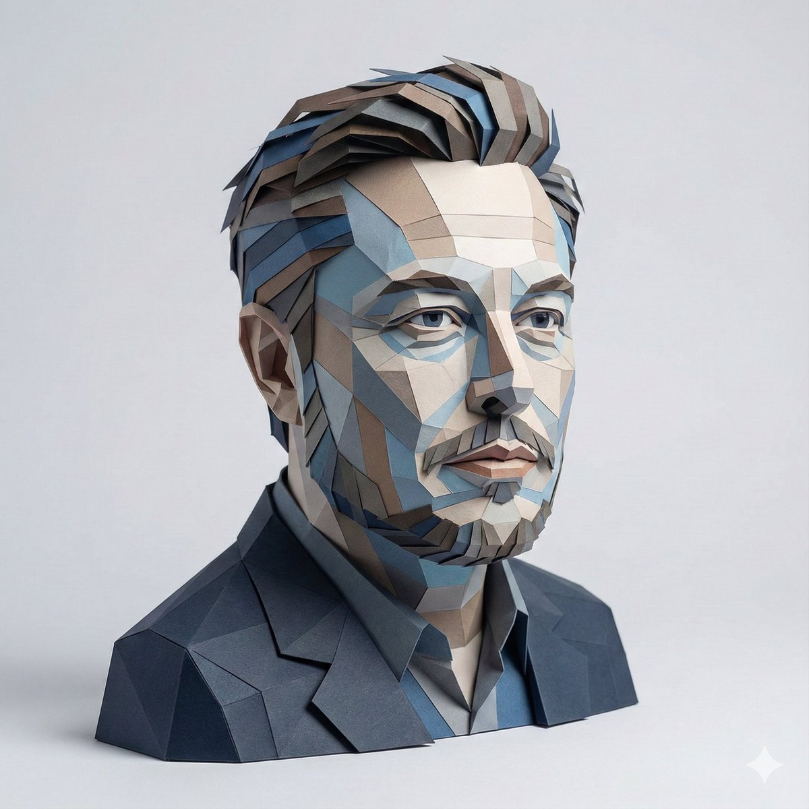

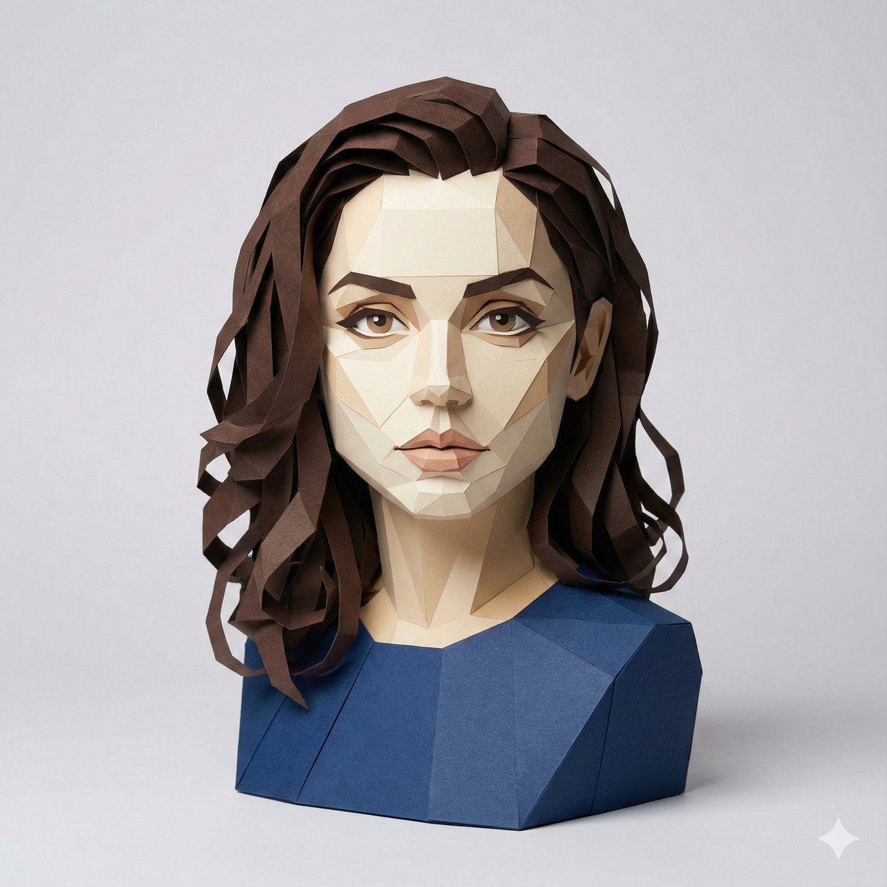

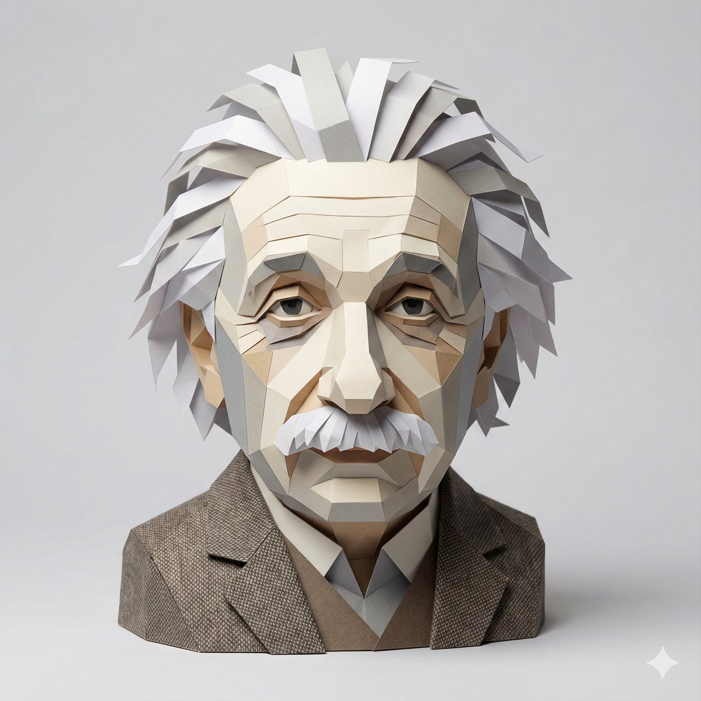

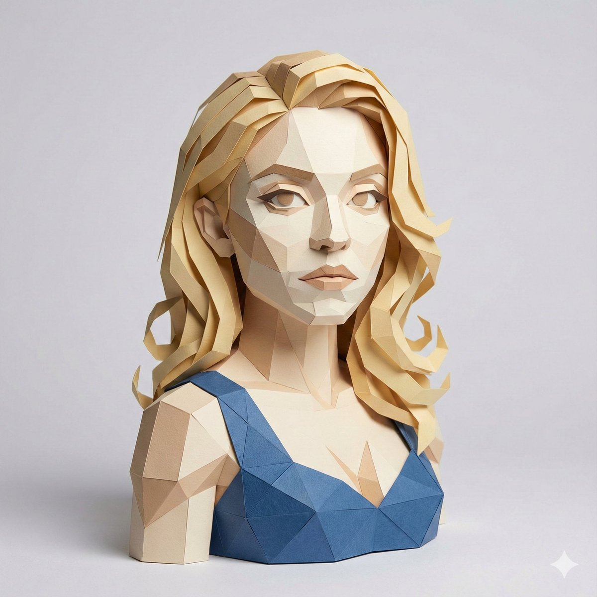

```
A hyper-detailed geometric papercraft sculpture of [NAME], created using layered colored cardstock with precise angular folds and clean cut edges. Facial features are stylized using polygonal planes, with subtle shading formed naturally by paper layering. Hair, beard, and clothing are constructed from stacked strips and folded shapes for depth and realism. The figure is displayed against a clean neutral background with soft diffused lighting, highlighting the craftsmanship and texture. Sharp macro focus, studio photography aesthetic, 1080×1080.
```

```
一个超精细的几何纸艺雕塑[NAME]，采用多层彩色卡纸制作，具有精准的棱角折痕和干净的切割边缘。面部特征以多边形平面风格化呈现，通过纸张叠层自然形成微妙的阴影。头发、胡须和服装由堆叠的纸条与折叠形状构成，以增强深度和真实感。人物置于干净的中性背景前，配以柔和漫射光线，突出工艺与质感。锐利的微距焦点，影棚摄影风格，1080×1080。
```

 [↑返回目录](#toc)

---
## <a id="prompt-2004200827557470200">针织电影海报艺术</a> (<a href="https://x.com/TechieBySA/status/2004200827557470230" target="_blank" rel="noopener noreferrer">TechieSA</a>)

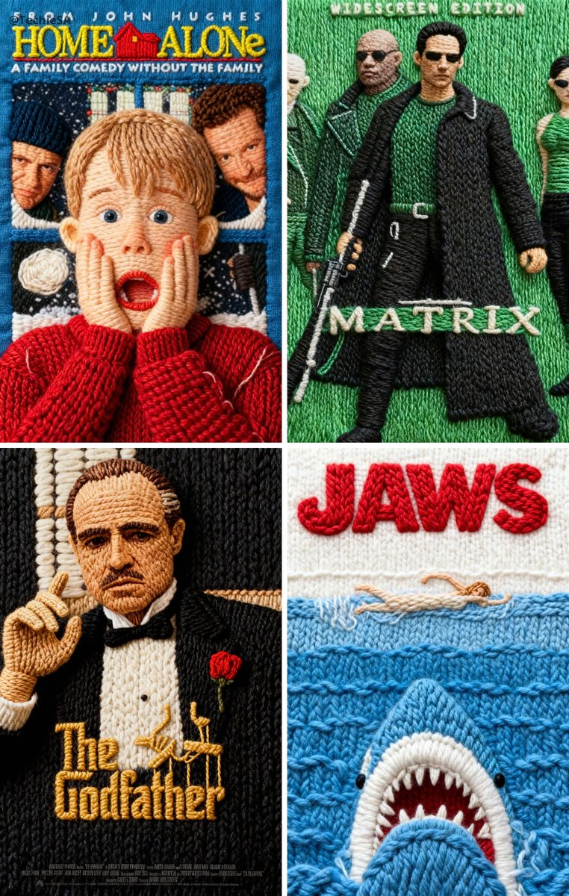

```
Transform this movie poster into a hand-knitted artwork, made entirely of colorful yarn stitches. Each detail — faces, text, and background — is recreated using woven thread texture, soft fibers, and visible knitting patterns. The overall look is cozy, perfect, and clearly handmade, as if crafted from wool with love and care. The composition and layout of the original poster are preserved, but reimagined in realistic textile form
```

```
将这张电影海报转化为一幅手工针织艺术品，完全由彩色毛线针脚制成。每一处细节——人物面部、文字和背景——都通过编织的线纹、柔软的纤维和可见的针织图案重新呈现。整体风格温馨、精致且明显为手工制作，仿佛是用羊毛精心编织而成。保留原海报的构图与布局，但以逼真的织物形式重新诠释。
```

 [↑返回目录](#toc)

---
## <a id="prompt-2004241988632088800">达·芬奇遇见未来科技</a> (<a href="https://x.com/RobotCleopatra/status/2004241988632088852" target="_blank" rel="noopener noreferrer">Skipper</a>)

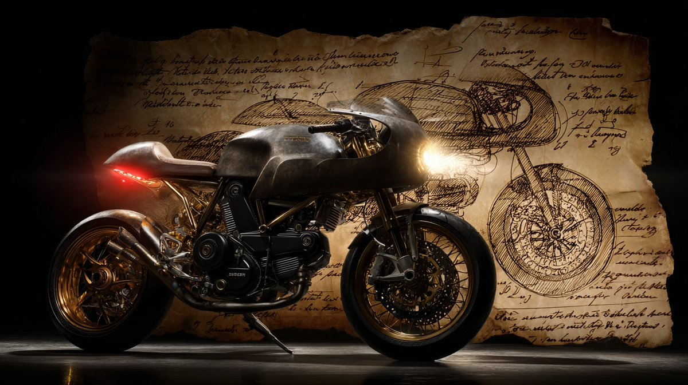

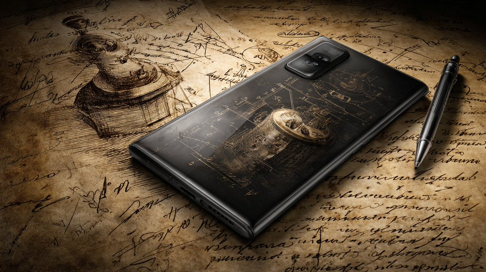

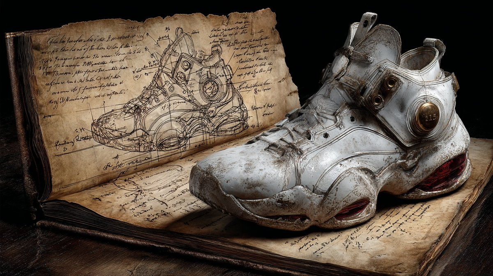

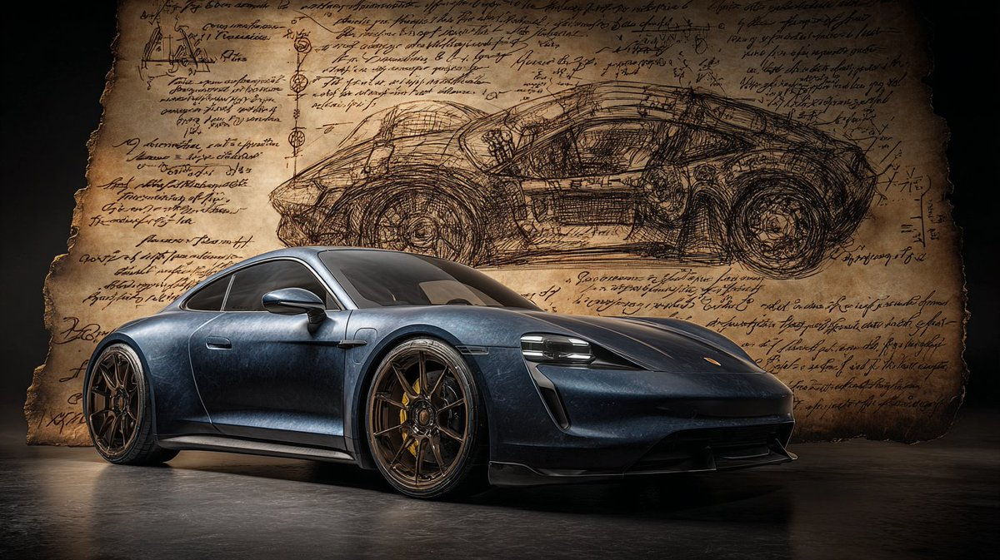

```
a modern electric sports car, photorealistic, 3/4 view, studio lighting, next to it a detailed leonardo da vinci style technical sketch of the same car, hand-drawn ink, annotations, engineering diagram, parchment paper texture, contrast between realism and sketch, ultra detailed 

futuristic sneakers, realistic product photography, clean background, next to it a leonardo da vinci style hand-drawn sketch of the sneakers, exploded view, mechanical notes, renaissance notebook style, ink on aged paper, high detail 

sleek modern smartphone, hyper-realistic, minimal product shot, next to it a leonardo da vinci inspired technical sketch of the phone, internal components, handwritten annotations, renaissance engineering drawing style, parchment background 

modern cafe racer motorcycle, realistic lighting, side view, next to it a leonardo da vinci inspired sketch of the motorcycle, mechanical blueprint style, handwritten notes, ink drawing on parchment, artistic contrast
```

```
一辆现代电动跑车，照片级真实感，3/4视角，影棚灯光，旁边是一幅同款汽车的达·芬奇风格精细技术草图，手绘墨水线条，带有注释、工程图纸风格，羊皮纸纹理，写实与素描之间的对比，超精细细节  

未来主义运动鞋，逼真产品摄影，干净背景，旁边是一幅达·芬奇风格的手绘运动鞋草图，爆炸视图，机械注解，文艺复兴笔记本风格，墨水绘制于做旧纸张上，高细节  

流线型现代智能手机，超写实风格，极简产品拍摄，旁边是一幅受达·芬奇启发的手机技术草图，展示内部组件，手写注释，文艺复兴工程制图风格，羊皮纸背景  

现代咖啡骑士摩托车，写实光影，侧视图，旁边是一幅受达·芬奇启发的摩托车草图，机械蓝图风格，手写笔记，墨水绘制于羊皮纸上，艺术化对比
```

 [↑返回目录](#toc)

---
## <a id="prompt-2004298915001389600">悬浮产品：能量与质感的瞬间</a> (<a href="https://x.com/RobotCleopatra/status/2004298915001389518" target="_blank" rel="noopener noreferrer">Skipper</a>)


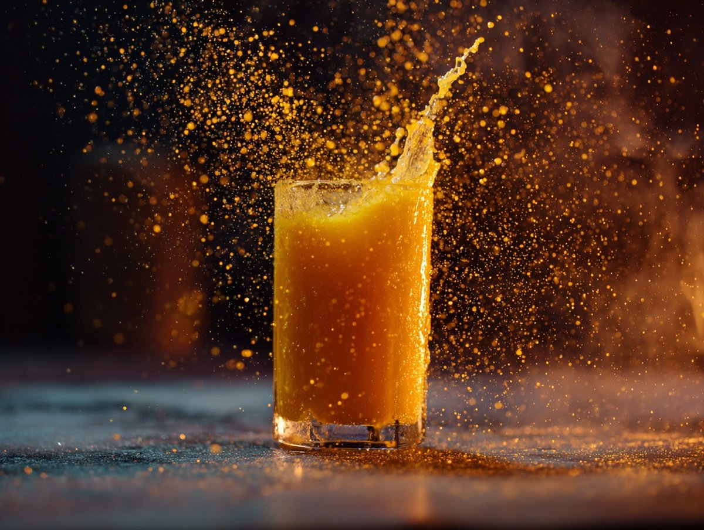

```
TO ART
[PRODUCT] suspended mid-air, glowing sparks swirling around, dramatic studio lighting highlighting textured surfaces, sense of raw energy and durability, motion frozen with cinematic clarity.
```

```
[产品] 悬浮在半空中，周围环绕着闪烁的火花，戏剧性的影棚灯光突显出表面的质感，展现出原始能量与坚固耐用之感，动作被以电影般的清晰度定格。
```

 [↑返回目录](#toc)

---
## <a id="prompt-2004392418288783400">电影级写实主义杰作</a> (<a href="https://x.com/RobotCleopatra/status/2004392418288783366" target="_blank" rel="noopener noreferrer">Skipper</a>)


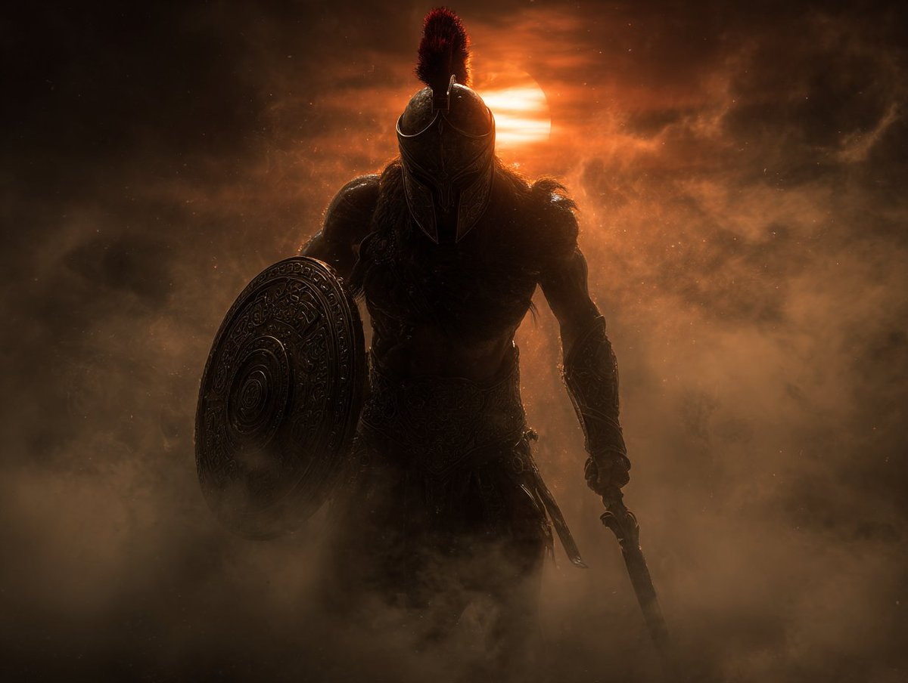


```
GOLDEN PROMPT FOR MOVIES
[subject] portrayed in a high-end cinematic realism masterpiece, physically accurate PBR lighting and shading workflow, volumetric fog layers interacting dynamically with rim light and key light, extreme clarity micro-surface details with tactile realism, cinematic depth of field emphasizing subject presence, smooth organic bokeh bloom in background highlights, controlled motion blur simulating real shutter behavior, subtle analog film grain texture, realistic lens artifacts from professional cinema optics, ray-traced reflections and refractions enhancing depth and realism, atmospheric dust and particles suspended in the air, dramatic chiaroscuro lighting composition, HDR filmic exposure with rich shadow detail, premium film camera style capture
```

```
电影级黄金提示词  
[主体] 以高端电影写实主义杰作呈现，采用物理精确的PBR光照与着色流程，体积雾层与轮廓光及主光源动态互动，极致清晰的微表面细节带来触觉般的真实感，电影级景深突出主体存在感，背景高光呈现柔和自然的有机散景光晕，可控运动模糊模拟真实快门行为，细微的模拟胶片颗粒质感，专业电影镜头产生的逼真光学伪影，光线追踪反射与折射增强深度与真实感，空气中悬浮的大气尘埃与粒子，戏剧性的明暗对照光影构图，HDR电影级曝光保留丰富暗部细节，高端电影摄影机风格拍摄。
```

 [↑返回目录](#toc)

---
## <a id="prompt-2004390027179315700">Nike Pop-Up Shoebox Store</a> (<a href="https://x.com/Strength04_X/status/2004390027179315659" target="_blank" rel="noopener noreferrer">𝐌</a>)

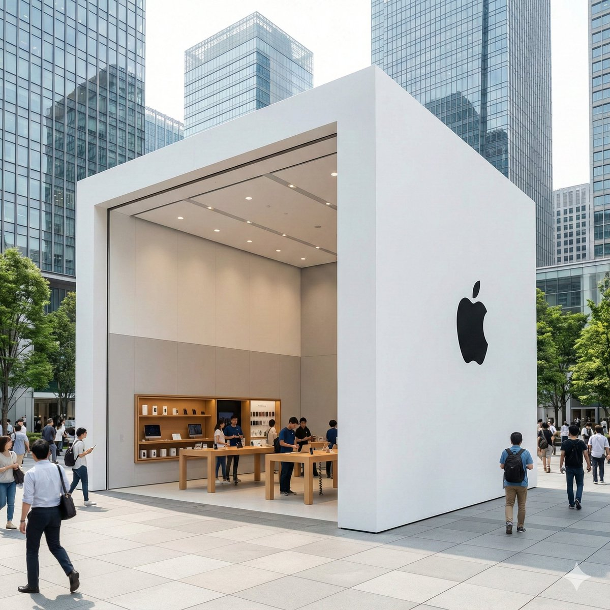

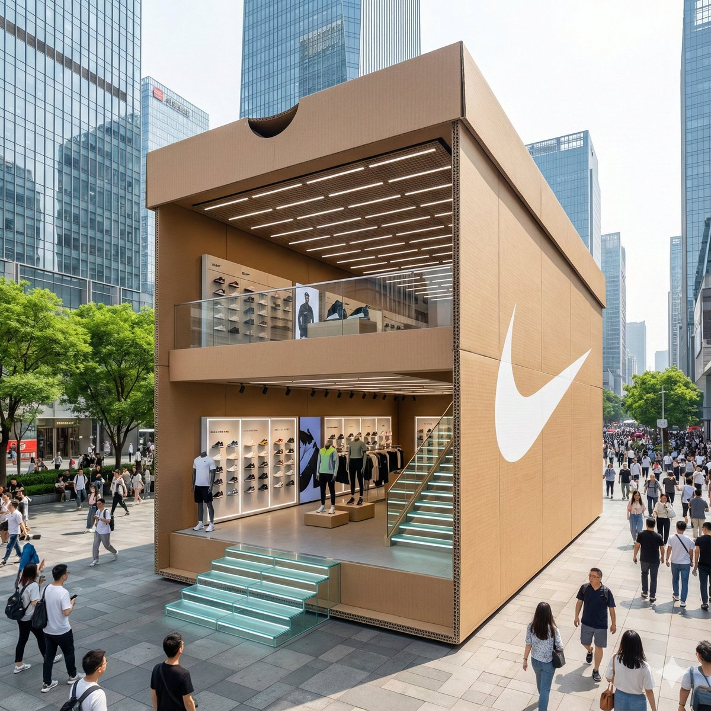

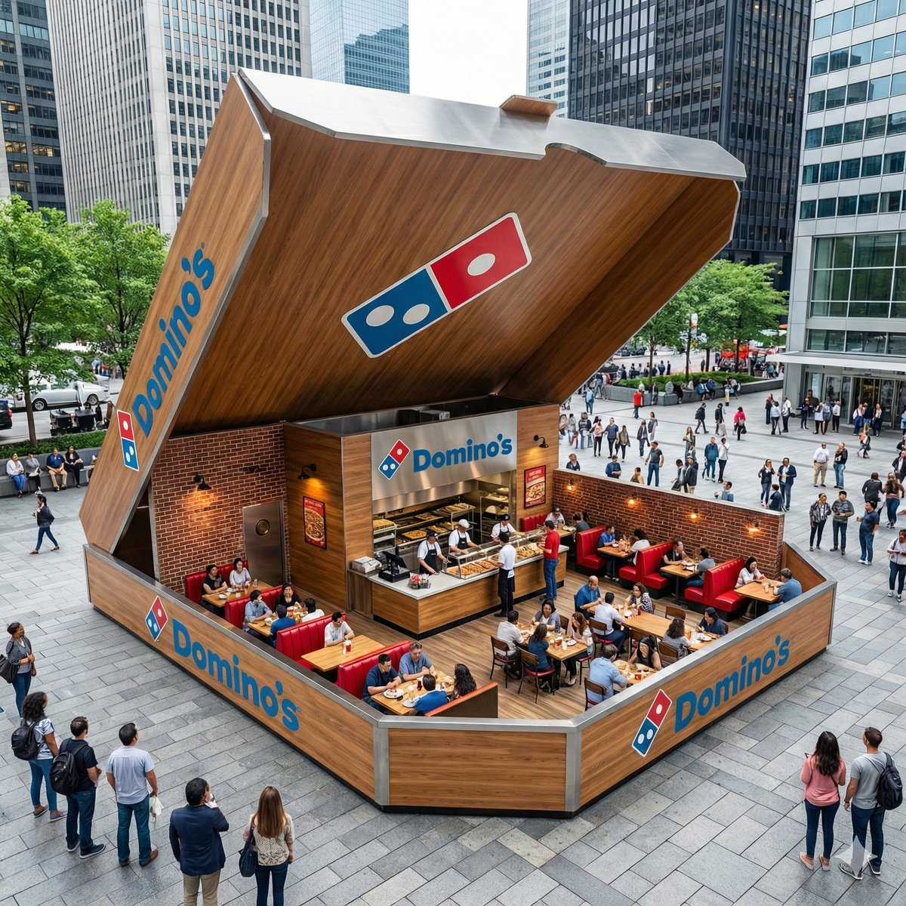

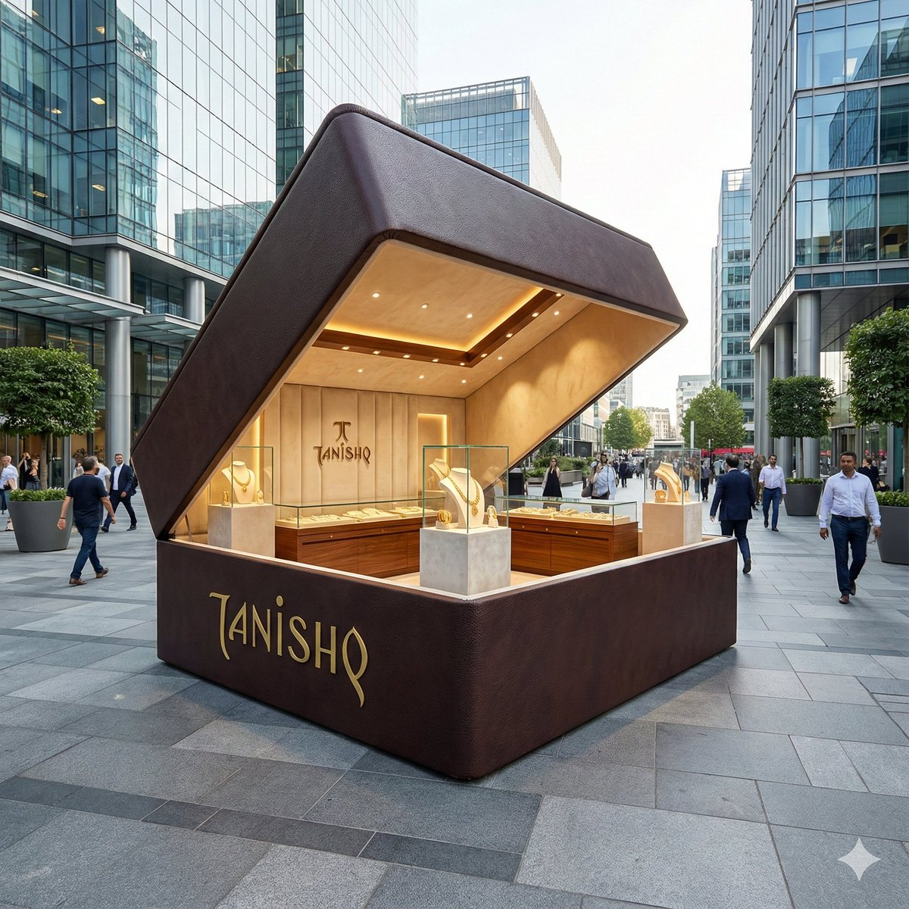

```
Minimal giant white Apple product box used as pop-up store. Clean white exterior, black Apple logo, one side open to bright interior with wooden tables and shelves. Neutral walls, recessed lighting.

Modern skyscrapers, trees, tiled plaza, customers inside. Bright daylight, 8K.
```

```
Huge open shoebox pop-up store in city plaza, light brown corrugated texture with big white Nike swoosh. Two retail levels: ground floor displays, mannequins, glowing steps; upper cantilever balcony with LED-lit ceiling.

Surrounded by glass high-rises, paved plaza, trees, pedestrians. Bright daylight, 8K.
```

```
Giant open Domino's pizza box turned into a pop-up restaurant. Cardboard texture with blue-red logo. Inside: brick walls, warm panels, counter, kitchen area, red booths, tables, staff. Urban plaza, grey pavers, trees, modern skyscrapers, people inside/outside. Bright daylight, 8K architectural photo.
```

```
Photorealistic luxury pop-up store shaped like a giant open jewelry box in an urban plaza. Dark brown leather-textured exterior, gold TANISHQ branding. Open lid reveals warm-lit interior with cream walls, wooden jewelry displays, gold accessories on pedestals. Trees, modern buildings, pedestrians. Bright daylight, 8K architectural style. ISHQ
```

 [↑返回目录](#toc)

---
## <a id="prompt-2004184179303764500">城市黄昏中的奢华耳机广告</a> (<a href="https://x.com/AIwithkhan/status/2004184179303764392" target="_blank" rel="noopener noreferrer">Smiling Khan</a>)

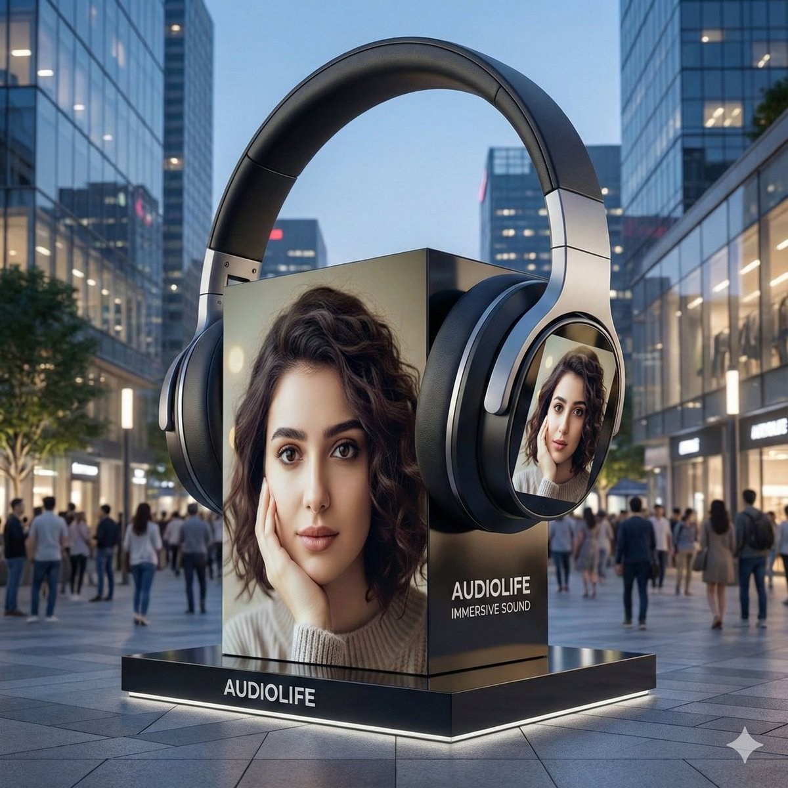

```
“A cinematic outdoor advertising scene in a modern city plaza at dusk. A massive premium headphone installation is displayed on a sleek pedestal, with the uploaded photo featured as the face of the brand on the product packaging and earcup display. Realistic oversized scale, people walking around for scale, soft ambient city lighting, glass buildings in the background. Luxury tech advertisement aesthetic, ultra-realistic materials, sharp details, shallow depth of field, high-end commercial look, 8K realism.”
```

```
“黄昏时分现代城市广场上的电影感户外广告场景。一个巨大的高端耳机装置陈列在光滑的底座上，上传的照片作为品牌形象出现在产品包装和耳罩展示上。逼真的超大比例，周围有行人用于参照尺度，柔和的城市环境灯光，背景为玻璃建筑。奢华科技广告美学，超写实材质，锐利细节，浅景深，高端商业风格，8K写实效果。”
```

 [↑返回目录](#toc)

---
## <a id="prompt-2004349943956279600">Solitude by the Rain-Soaked Window</a> (<a href="https://x.com/AllaAisling/status/2004349943956279525" target="_blank" rel="noopener noreferrer">Alexandra Aisling</a>)

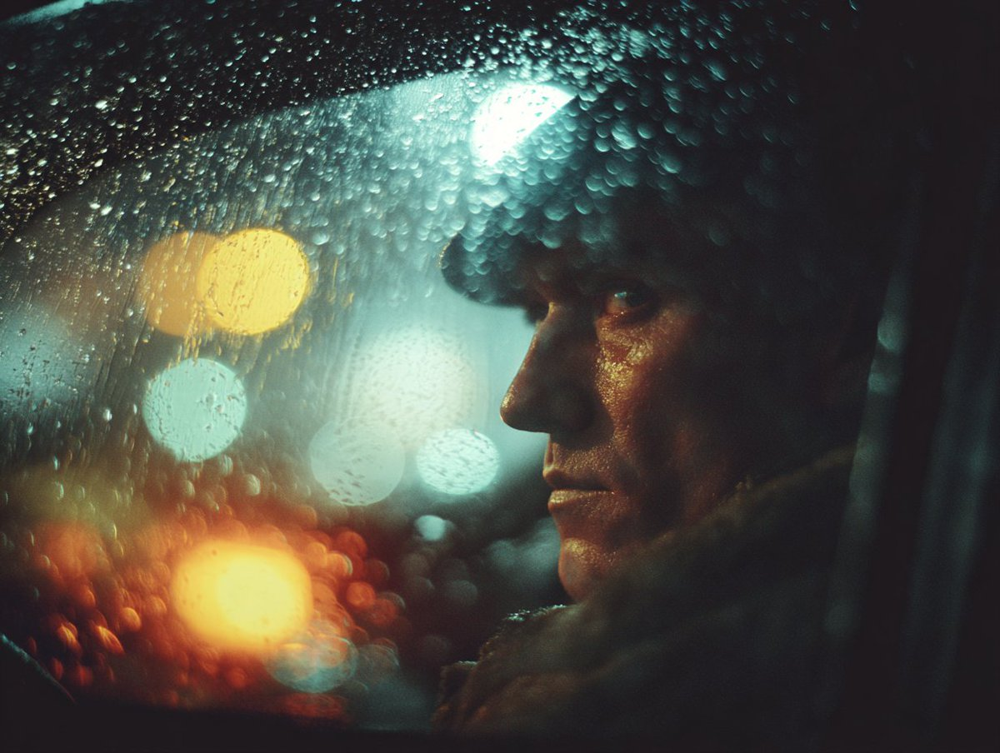

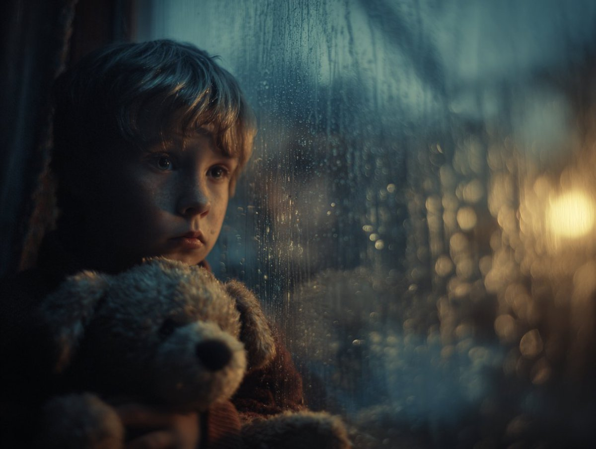


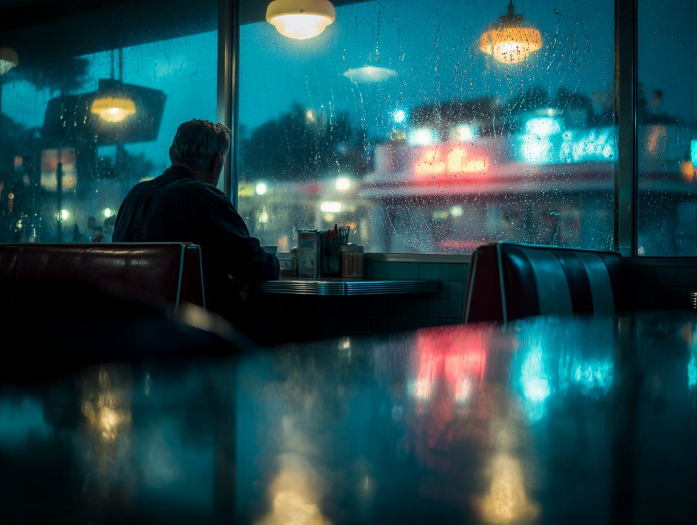

```
Taxi driver parked under a flickering streetlight at 3am profound solitude captured in cinema, hyper-real film still drenched in emotional weight, cold blue hour lighting with dying warmth at the edges, rain-streaked glass creating liquid distortions, shallow depth of field emphasizing loneliness, muted desaturated palette with isolated color accents, slow-motion implied stillness, fine analog grain reminiscent of 1970s existential cinema, lens flares bleeding into darkness, ray-traced reflections in pooling water, breath visible in cold air, negative space dominating the frame, crushing atmospheric pressure, intimate yet distant camera positioning, Vilmos Zsigmond-inspired melancholic cinematography, the weight of unspoken grief
```

```
Child clutching a worn stuffed animal by a rain-soaked window profound solitude captured in cinema, hyper-real film still drenched in emotional weight, cold blue hour lighting with dying warmth at the edges, rain-streaked glass creating liquid distortions, shallow depth of field emphasizing loneliness, muted desaturated palette with isolated color accents, slow-motion implied stillness, fine analog grain reminiscent of 1970s existential cinema, lens flares bleeding into darkness, ray-traced reflections in pooling water, breath visible in cold air, negative space dominating the frame, crushing atmospheric pressure, intimate yet distant camera positioning, Vilmos Zsigmond-inspired melancholic cinematography, the weight of unspoken grief
```

```
Woman standing on an empty subway platform at night profound solitude captured in cinema, hyper-real film still drenched in emotional weight, cold blue hour lighting with dying warmth at the edges, rain-streaked glass creating liquid distortions, shallow depth of field emphasizing loneliness, muted desaturated palette with isolated color accents, slow-motion implied stillness, fine analog grain reminiscent of 1970s existential cinema, lens flares bleeding into darkness, ray-traced reflections in pooling water, breath visible in cold air, negative space dominating the frame, crushing atmospheric pressure, intimate yet distant camera positioning, Vilmos Zsigmond-inspired melancholic cinematography, the weight of unspoken grief.
```

```
Elderly man sitting alone at a diner counter profound solitude captured in cinema, hyper-real film still drenched in emotional weight, cold blue hour lighting with dying warmth at the edges, rain-streaked glass creating liquid distortions, shallow depth of field emphasizing loneliness, muted desaturated palette with isolated color accents, slow-motion implied stillness, fine analog grain reminiscent of 1970s existential cinema, lens flares bleeding into darkness, ray-traced reflections in pooling water, breath visible in cold air, negative space dominating the frame, crushing atmospheric pressure, intimate yet distant camera positioning, Vilmos Zsigmond-inspired melancholic cinematography, the weight of unspoken grief
```

 [↑返回目录](#toc)

---


[上一页](./5.md) | 当前 6/7 页 | [下一页](./7.md) | [查看全部目录](../prompts.md)