# gemini.json 

gemini.json文件存放gemini相关的提示词，当前已收录：735个 

 投稿方式：[飞书投稿](https://tcn1uh5rxo87.feishu.cn/share/base/form/shrcne5gDolOMDd0oJsj2XfvxQc) or [issues](https://github.com/junxiaopang/gridsplitter/issues/new)

[上一页](./6.md) | 当前 7/8 页 | [下一页](./8.md) | [查看全部目录](../prompts.md)

🚀 **在线预览**: [https://prompts.kkkm.cn](https://prompts.kkkm.cn)

## <a id="toc">目录</a>

- [雪塑之形](#prompt-2004259040491409400)
- [超写实刀版盒渲染](#prompt-2004241867085406700)
- [Vintage Patent: Clockwork Hummingbird](#prompt-2004212035333365800)
- [Timeless Cheese Still Life](#prompt-2004329307687002600)
- [御好烧：复古食谱中的美味细节](#prompt-2004239718121161200)
- [双重曝光时尚大片](#prompt-2004258690954608600)
- [复古食谱中的鸡翅盛宴](#prompt-2004027570254414300)
- [Desert Beast in Motion](#prompt-2003960376766222300)
- [American Dream: 1957 Bel Air Restoration](#prompt-2003849647392247800)
- [物体化城市](#prompt-2004041725074088200)
- [水晶球中的金色霸王龙](#prompt-2003568395611238700)
- [圣诞美食双面海报](#prompt-2004036691879743700)
- [角色拆解艺术：皮克斯风格3D海报](#prompt-2004088874684043500)
- [指甲上的微型艺术](#prompt-2004107115166908400)
- [温馨微型工作场景微缩模型](#prompt-2003743839505535200)
- [巨人修复后的宁静午后](#prompt-2004173247764656000)
- [Spotify幻境：街灯下的音乐漩涡](#prompt-2004015740329017600)
- [全息棱镜品牌标志](#prompt-2003826465054589200)
- [皮克斯角色拆解艺术海报](#prompt-2004102457086169300)
- [亚克力手绘品牌展示牌](#prompt-2004568038692311300)
- [草莓山巅：冰雾中的鲜果之味](#prompt-2004930351584445000)
- [达·芬奇手稿中的2025科技](#prompt-2004637964626743300)
- [夜空中的品牌烟花奇观](#prompt-2004894710729478400)
- [夸张社论风漫画肖像](#prompt-2004611631985107500)
- [新黑色电影雨夜](#prompt-2004728009912168400)
- [深红丝绒·高定肖像写真](#prompt-2004584112582222300)
- [科学家的微缩对决](#prompt-2004601351146532900)
- [Chocolate-Covered Strawberry Moment](#prompt-2004673828203467000)
- [体素国度：空中之城](#prompt-2004627569598234600)
- [魔书幻境：霓虹烟雾中的阅读者](#prompt-2004825491350716700)
- [微小角色在巨大日常物品边缘的缤纷节日](#prompt-2004738067618468400)
- [真人坐上Funko Pop盒](#prompt-2004598274171269400)
- [3D纸盒包装的2D技术展开图](#prompt-2003849723837616489)
- [力量感十足的悬浮产品瞬间](#prompt-2005311875278606800)
- [夜空中烟火帆船映衬城市天际线](#prompt-2005299702015918300)
- [印有快餐品牌标志的皮革包](#prompt-2005288633839096000)
- [复古黑白戏剧性肖像](#prompt-2005367928888373800)
- [16种室内设计风格的4x4网格展示](#prompt-2005372269426856200)
- [现代风格的超写实美食摄影](#prompt-2005233594130973000)
- [- Nano Banana Pro at @BasedLabsAI](#prompt-2005324208608567300)
- [Vanilla Creme Brew On gemini Nano Banana 3.0](#prompt-2005293653510459600)
- [手绣歌曲海报](#prompt-2005129744690675700)
- [烹饪地图集：鸡肉与培根的全球之旅](#prompt-2004986136335110400)
- [混合媒介拼贴艺术海报](#prompt-2005003170318352600)
- [悬浮产品广告：动态光影捕捉](#prompt-2005185002884268300)
- [匿名街头艺术家身份调查](#prompt-2004937062907039700)
- [冰镇巧克力饮品铝罐与飞溅的可可粉](#prompt-2005215289286475800)
- [悬浮美食的专业影棚摄影](#prompt-2005155984130367700)
- [古董地球仪融化成漩涡海洋与风暴云](#prompt-2005041248915088000)
- [超现实石块碎片主题的3D高细节艺术](#prompt-2005115679415157000)
- [蚂蚁开源了一个对AI非常友好的制作信息图的开源项目，](#prompt-2005230789659939000)
- [未来感时尚肖像写真](#prompt-2002882718384959754)
- [暗影中的自信男人写真](#prompt-2002460264327979051)
- [将文章、故事变成漫画脚本提示词参考](#prompt-2005071147537166600)
- [马年祝福封面](#prompt-2005980269447373241)
- [复刻任何图片的风格](#prompt-2006739034828316825)
- [一键穿搭挑战](#prompt-2006948793586176375)
- [WhatsApp 人物对话](#prompt-2005681873612165251)
- [2026年广告工作室活力海报](#prompt-2005984084141465609)
- [四角拼图完成2026祝福](#prompt-2005822648027091031)
- [微信泡泡人物对话](#prompt-2005999391367196797)
- [元旦特辑-复古旗袍名媛风](#prompt-2005097871977447736)
- [新年城市天际线庆典](#prompt-2005286056850251802)
- [产品说明书](#prompt-2005842541141451133)
- [元旦特辑-2026时尚跨年夜造型](#prompt-2005629256781680913)
- [2026快来了！用AI的方式来迎接一下吧！](#prompt-2003402163364782168)
- [超写实水下港海豹摄影](#prompt-2005947184290951450)
- [透明圣诞球内的未来风3D微缩场景](#prompt-1998432458941858282)
- [傍晚阳光下的现代极简阁楼](#prompt-2005487690838655382)
- [虚拟的卡通女孩](#prompt-2002847525536219187)
- [迎接2026：金色派对的俏皮肖像](#prompt-2005530723847934103)
- [温馨现代客厅中的女性放松时光](#prompt-2005173589809537125)
- [唐代宫廷乐团树上表演](#prompt-2005487775597088895)
- [碰杯庆祝四角连线派对](#prompt-2005981275052728416)
- [霍格沃茨等火车的女孩](#prompt-2003768838111059997)
- [- Nano Banana Pro at @BasedLabsAI](#prompt-2005698218043003100)
- [超现实分段火山玄武岩构造](#prompt-2005628752802517500)
- [自定义形状的字体插画](#prompt-2005620980891480600)
- [童年偶像走进现实](#prompt-2005877044584849700)
- [极简风格品牌首字母单体徽标设计](#prompt-2005670356745322800)
- [暗调奢华的黑巧克力飞溅](#prompt-2005685514154958800)
- [睡前再来一个有趣的结合版，睡觉！](#prompt-2006020799367442700)
- [音乐史的可视化：大提琴与技术绘图](#prompt-2007529647387353000)
- [裂隙中的微缩景观](#prompt-2007495673784979700)
- [地质断层中的精密内部世界](#prompt-2007661789023244500)
- [奢华木质香调香水AUREN](#prompt-2007497261492920800)
- [极简黑白矢量肖像插画](#prompt-2007535691157143600)
- [超写实电影感地下赛车海报](#prompt-2007722721967321000)
- [新中式禅意品牌VI生成系统](#prompt-2007616917327204600)
- [超现实主义极简风格的高端印刷广告](#prompt-2007544730167501000)
- [《星际穿越》书籍建筑微观世界](#prompt-2007089501416427800)
- [3D动画女孩](#prompt-2007267921425240000)
- [伊斯坦布尔的微观世界缩影于一笔之中](#prompt-2007131884061397000)
- [微型苔藓生态瓶内景](#prompt-2006771650805870800)
- [劳力士腕表破浪而出的奢华广告](#prompt-2006940436401893600)
- [怀旧游戏卡带内的微缩世界](#prompt-2007122463151534300)
- [化石鹦鹉螺与墨云水中缠绕](#prompt-2007226649600029200)
- [I was playing with a prompt and ended up here, and I wanted to share it with you.](#prompt-2007134245328957400)

## <a id="prompt-2004259040491409400">雪塑之形</a> (<a href="https://x.com/TechieBySA/status/2004259040491409514" target="_blank" rel="noopener noreferrer">TechieSA</a>)


```
Create a 3D of [OBJECT] made of white snow. The voluminous are lying on a snowy surface, slightly sunken into the snow. Top-down view. A photo with realistic highlights and soft shadows. 1080x1080 dimension picture.
```

```
创建一个由白雪制成的[OBJECT]的3D图像。物体体积饱满，置于雪面上，略微陷入雪中。俯视视角。照片具有逼真的高光和柔和的阴影。图片尺寸为1080x1080。
```

 [↑返回目录](#toc)

---
## <a id="prompt-2004241867085406700">超写实刀版盒渲染</a> (<a href="https://x.com/AmirMushich/status/2004241867085406717" target="_blank" rel="noopener noreferrer">AmirMušić</a>)

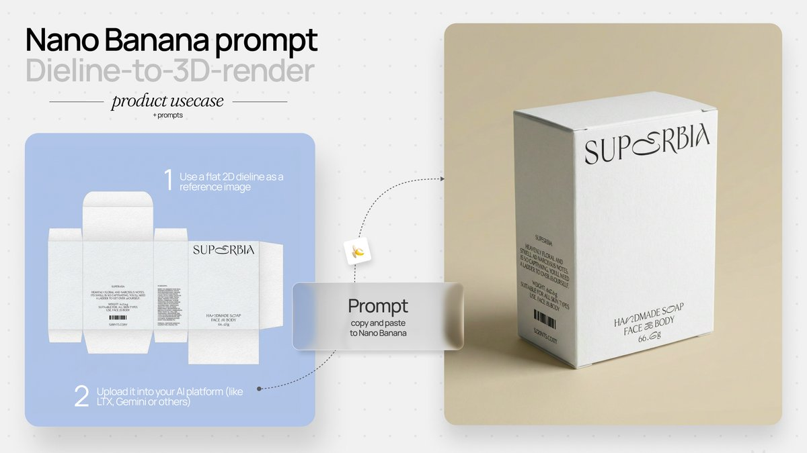

```
Assemble the dieline into a perfectly folded 3D box with accurate panel placement, clean edges, and undistorted typography. Preserve all artwork exactly as printed on the dieline. Render the box in a minimal, high-end studio setup on a soft neutral background with gentle diffused lighting, subtle shadows, and no extra props. Show the box upright in a refined ¾ angle. Ultra-realistic detail, true colors, matte paperboard texture, crisp folds, premium editorial aesthetic.
```

```
将刀版图精确折叠成一个三维盒子，确保各面板位置准确、边缘干净、文字无变形。完整保留刀版图上的所有印刷图案。在极简高端的摄影棚环境中渲染该盒子，背景为柔和中性色，采用柔和漫射光线、细微阴影，且无任何额外道具。以精致的四分之三角度正面展示直立的盒子。呈现超写实细节、真实色彩、哑光纸板质感、清晰折痕，以及高端杂志般的视觉美学。
```

 [↑返回目录](#toc)

---
## <a id="prompt-2004212035333365800">Vintage Patent: Clockwork Hummingbird</a> (<a href="https://x.com/AllaAisling/status/2004212035333365763" target="_blank" rel="noopener noreferrer">Alexandra Aisling</a>)

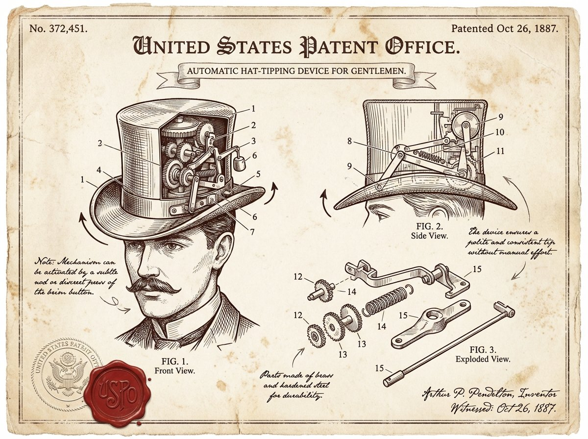


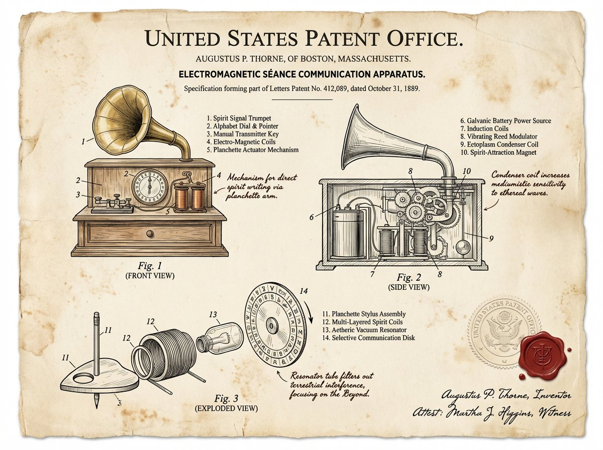

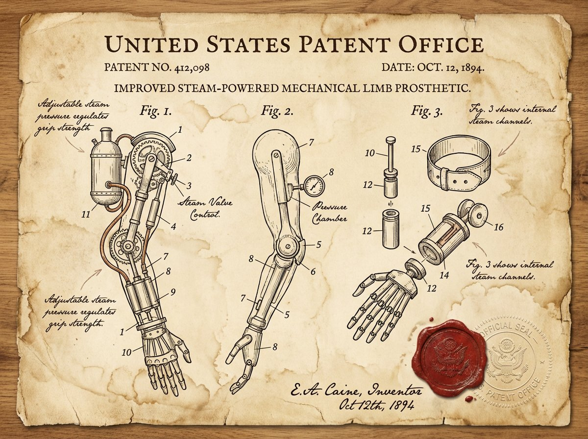

```
A vintage patent document for an automatic hat-tipping device for gentlemen, styled after late 1800s United States Patent Office filings. The page features precise technical drawings with numbered callouts (Fig. 1, Fig. 2, Fig. 3) showing front, side, and exploded views. Handwritten annotations in fountain-pen ink describe mechanisms. The paper is aged ivory with foxing stains and soft fold creases. An official embossed seal and red wax stamp appear in the corner. A hand-signed inventor's name and date appear at the bottom. The entire image feels like a recovered archival document—authoritative, historic, and slightly mysterious.
```

```
A vintage patent document for a clockwork automaton hummingbird, styled after late 1800s United States Patent Office filings. The page features precise technical drawings with numbered callouts (Fig. 1, Fig. 2, Fig. 3) showing front, side, and exploded views. Handwritten annotations in fountain-pen ink describe mechanisms. The paper is aged ivory with foxing stains and soft fold creases. An official embossed seal and red wax stamp appear in the corner. A hand-signed inventor's name and date appear at the bottom. The entire image feels like a recovered archival document—authoritative, historic, and slightly mysterious.
```

```
A vintage patent document for an electromagnetic séance communication apparatus, styled after late 1800s United States Patent Office filings. The page features precise technical drawings with numbered callouts (Fig. 1, Fig. 2, Fig. 3) showing front, side, and exploded views. Handwritten annotations in fountain-pen ink describe mechanisms. The paper is aged ivory with foxing stains and soft fold creases. An official embossed seal and red wax stamp appear in the corner. A hand-signed inventor's name and date appear at the bottom. The entire image feels like a recovered archival document—authoritative, historic, and slightly mysterious.
```

```
A vintage patent document for a steam-powered mechanical limb prosthetic, styled after late 1800s United States Patent Office filings. The page features precise technical drawings with numbered callouts (Fig. 1, Fig. 2, Fig. 3) showing front, side, and exploded views. Handwritten annotations in fountain-pen ink describe mechanisms. The paper is aged ivory with foxing stains and soft fold creases. An official embossed seal and red wax stamp appear in the corner. A hand-signed inventor's name and date appear at the bottom. The entire image feels like a recovered archival document—authoritative, historic, and slightly mysterious.
```

 [↑返回目录](#toc)

---
## <a id="prompt-2004329307687002600">Timeless Cheese Still Life</a> (<a href="https://x.com/AllaAisling/status/2004329307687002559" target="_blank" rel="noopener noreferrer">Alexandra Aisling</a>)


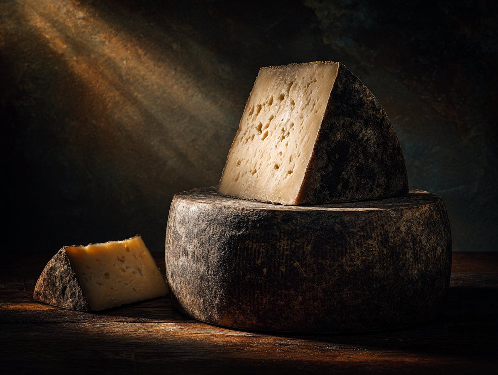

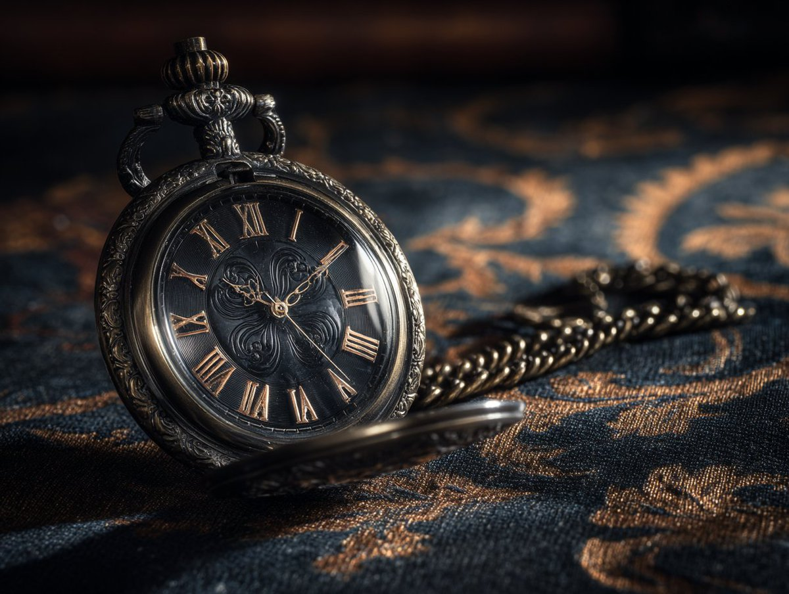

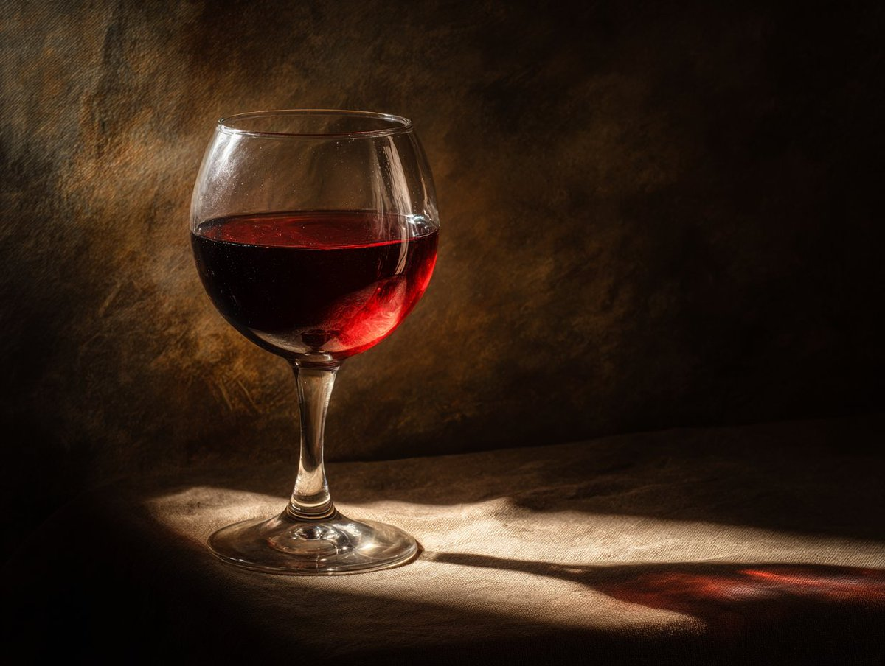

```
Violin with single dramatic light source, deep blacks and bright highlights, Renaissance painting influence, emotional depth through shadow, fine art approach to commercial photography, timeless drama
```

```
Artisan cheese wheel with single dramatic light source, deep blacks and bright highlights, Renaissance painting influence, emotional depth through shadow, fine art approach to commercial photography, timeless drama.
```

```
Antique pocket watch with single dramatic light source, deep blacks and bright highlights, Renaissance painting influence, emotional depth through shadow, fine art approach to commercial photography, timeless drama
```

```
Red wine glass with single dramatic light source, deep blacks and bright highlights, Renaissance painting influence, emotional depth through shadow, fine art approach to commercial photography, timeless drama
```

 [↑返回目录](#toc)

---
## <a id="prompt-2004239718121161200">御好烧：复古食谱中的美味细节</a> (<a href="https://x.com/Gdgtify/status/2004239718121161201" target="_blank" rel="noopener noreferrer">Gadgetify</a>)

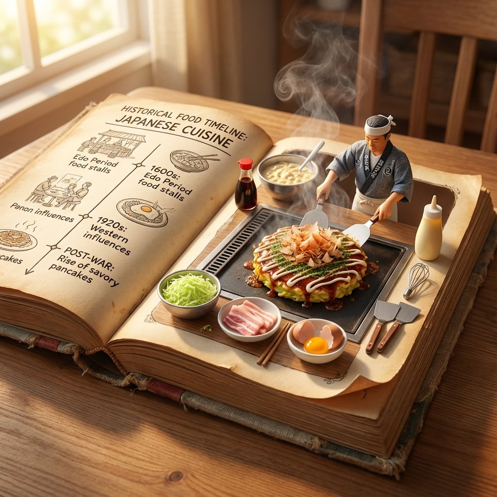

```
Input: Okonomiyaki
 
Analysis: Extract key ingredients, cooking techniques, and cultural food elements
Goal: A cookbook where ingredients and dishes emerge in delicious detail
Rules:
Base: A vintage cookbook with stained pages and fabric cover, historical timeline of food
Scene: 3D Miniature kitchen or market scene with chef & ingredients
Details: Detailed food textures, steam effects, cooking implements
Lighting: Warm kitchen lighting with golden hour quality
Output: Single 4:5 image with appetizing details
```

```
输入：御好烧

分析：提取关键食材、烹饪技术及文化食品元素
目标：一本食谱，其中食材和菜肴以美味的细节呈现
规则：
基础：一本有污渍页面和织物封面的复古食谱，包含食物的历史时间线
场景：具有厨师和食材的3D迷你厨房或市场场景
细节：详细的食物质感、蒸汽效果、烹饪用具
照明：带有黄金时段品质的温暖厨房照明
输出：单张4:5比例的诱人细节图像
```

 [↑返回目录](#toc)

---
## <a id="prompt-2004258690954608600">双重曝光时尚大片</a> (<a href="https://x.com/astronomerozge1/status/2004258690954608686" target="_blank" rel="noopener noreferrer">Özge Döner</a>)

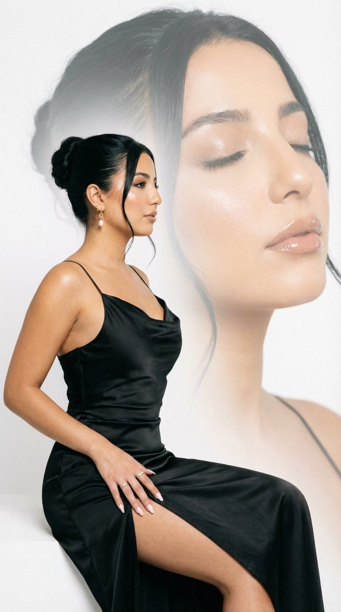

```
{
  "generation_request": {
    "meta_data": {
      "tool": "NanoBanana Pro",
      "task_type": "text_to_image_photoreal_double_exposure_editorial",
      "version": "v1.0",
      "priority": "high"
    },
    "references": {
      "character_reference_image": "UPLOAD_YOUR_CHARACTER_REFERENCE (REQUIRED)",
      "reference_rules": {
        "preserve_uploaded_character_identity": true,
        "identity_lock_strength": 0.99,
        "use_reference_for": ["face", "skin_tone", "facial_proportions"],
        "do_not_copy_any_unprovided_identity": true
      }
    },
    "output_settings": {
      "aspect_ratio": "4:5",
      "orientation": "portrait",
      "resolution": "ultra_high_res",
      "render_style": "photorealistic_editorial_art",
      "sharpness": "high",
      "film_grain": "very_subtle"
    },
    "creative_prompt": {
      "scene_summary": "Create a high-fashion editorial double-exposure image featuring the SAME woman as the uploaded character reference (strict identity lock). Composition: a large, soft, luminous close-up face overlay (dominant, dreamy, translucent) on the right side, and a smaller 3/4-body figure in profile on the left side, crisp and darker. Clean studio white background. No text/logos/watermarks. Outfit MUST be a dress (NOT a bodysuit/swimsuit).",
      "composition": {
        "layout": "double exposure / layered composite",
        "foreground_left": "smaller figure (about 55–65% height of frame) placed on the left third, profile view facing right",
        "background_right": "giant close-up of her face (eyes closed or looking downward) filling the right 2/3 of the frame, very soft and semi-transparent"
      },
      "subject": {
        "identity_rule": "MUST_MATCH_UPLOADED_CHARACTER_REFERENCE (STRICT FACE LOCK)",
        "overall_mood": "sensual, elegant, cinematic editorial (not explicit)",
        "makeup": "soft glam with glossy lips, subtle smoky eyes, dewy skin highlight",
        "hair": {
          "style": "sleek updo bun with a single loose face-framing strand",
          "color": "natural dark brown/black"
        }
      },
      "wardrobe": {
        "outfit": "black high-fashion dress (NOT a bodysuit). Choose ONE: (A) sleek black satin slip dress with a high-cut side opening and a draped neckline, OR (B) black halter-neck evening mini dress with an open side cutout but clearly a dress with skirt and hemline. Tasteful coverage, couture editorial silhouette.",
        "notes": "must read clearly as a DRESS with a skirt/hem; no swimsuit, no one-piece bodysuit"
      },
      "pose": {
        "left_figure_pose": "profile seated/leaning pose with arched back, one hand resting on upper thigh/hip area, shoulders angled forward; elegant posture; dress hem/side drape visible",
        "right_face_pose": "close-up face with eyes softly closed, lips slightly parted, glossy shine; a fingertip near lips (very subtle, tasteful)"
      },
      "lighting_and_camera": {
        "lighting": "high-end studio lighting: soft key, smooth gradients; left figure slightly higher contrast; right face overlay very soft, airy bloom highlights",
        "camera": "full-frame editorial look",
        "lens": "85mm look for close-up, 50–85mm for full-body layer",
        "focus": "left figure moderately sharp; right face overlay intentionally soft and dreamy"
      },
      "color_and_finish": {
        "grade": "clean neutral whites with warm skin tones, cinematic contrast",
        "double_exposure_blend": "smooth feathered edges, realistic overlay transparency, no harsh cut lines"
      },
      "strict_rules": [
        "NO text",
        "NO logos",
        "NO watermark",
        "single subject only",
        "tasteful, non-explicit",
        "keep double exposure composition exactly",
        "outfit must be a dress with a visible hem/skirt"
      ]
    },
    "negative_prompt": [
      "text",
      "logo",
      "watermark",
      "extra people",
      "bodysuit",
      "swimsuit",
      "one-piece",
      "mayo",
      "lingerie",
      "explicit nudity",
      "see-through nipples",
      "pornographic pose",
      "face drift, identity change",
      "hard cut edges, sloppy masking",
      "low resolution, blur artifacts",
      "bad hands, fused fingers, missing fingers"
    ]
  }
}
```

```
{
  "generation_request": {
    "meta_data": {
      "工具": "NanoBanana Pro",
      "任务类型": "文本生成图像_写实风格_双重曝光_时尚大片",
      "版本": "v1.0",
      "优先级": "高"
    },
    "参考设置": {
      "角色参考图": "上传您的角色参考图（必需）",
      "参考规则": {
        "保留上传角色身份": true,
        "身份锁定强度": 0.99,
        "参考用于": ["面部", "肤色", "面部比例"],
        "不得复制未提供身份特征": true
      }
    },
    "输出设置": {
      "宽高比": "4:5",
      "方向": "纵向",
      "分辨率": "超高清",
      "渲染风格": "写实主义时尚大片艺术",
      "锐度": "高",
      "胶片颗粒": "极轻微"
    },
    "创意提示": {
      "场景概述": "创作一张高端时尚大片风格的双重曝光图像，主角必须与上传的角色参考图完全一致（严格身份锁定）。构图：右侧为一个大型、柔和、发光的面部特写叠加层（占主导地位，梦幻且半透明），左侧为一个较小的3/4身侧影人物（清晰且较暗）。背景为干净的纯白摄影棚。无文字/标志/水印。服装必须是连衣裙（非紧身衣或泳装）。",
      "构图": {
        "布局": "双重曝光 / 分层合成",
        "左前景": "较小的人物形象（约占画面高度的55–65%），位于画面左三分之一处，侧脸朝右",
        "右背景": "巨大的面部特写（闭眼或目光下垂）占据画面右侧三分之二区域，非常柔和且半透明"
      },
      "主体": {
        "身份规则": "必须与上传的角色参考图完全一致（严格面部锁定）",
        "整体氛围": "性感、优雅、电影感时尚大片（非露骨）",
        "妆容": "柔雾亮泽唇妆，微妙烟熏眼妆，肌肤水润高光",
        "发型": {
          "造型": "光滑高髻发 bun，一侧留一缕松散发丝修饰脸型",
          "颜色": "自然深棕/黑色"
        }
      },
      "服装": {
        "服饰": "黑色高端时尚连衣裙（非紧身衣）。二选一：(A) 光滑黑色缎面吊带裙，高开衩侧边和垂坠领口；或 (B) 黑色挂脖式晚宴迷你裙，带侧面镂空设计，但明确为有裙摆和下摆的连衣裙。需得体遮盖，具有高级定制时尚剪影。",
        "备注": "必须明显为带有裙摆/下摆的连衣裙；不可为泳装或一体式紧身衣"
      },
      "姿势": {
        "左侧人物姿势": "侧坐或倚靠姿势，背部微弓，一只手轻放于大腿上部/臀部区域，肩部前倾；姿态优雅；裙摆/侧边垂褶可见",
        "右侧面部姿势": "面部特写，双眼轻闭，双唇微启，唇部具光泽；指尖轻触唇边（极其含蓄、得体）"
      },
      "光影与镜头": {
        "灯光": "高端影棚布光：柔和主光，平滑渐变；左侧人物略高对比度；右侧面部叠加层极为柔和，带有空气感光晕高光",
        "相机": "全画幅时尚大片效果",
        "镜头": "特写使用85mm效果，全身层使用50–85mm效果",
        "焦点": "左侧人物适度清晰；右侧面部叠加层有意模糊、梦幻"
      },
      "色彩与成片": {
        "调色": "干净中性白色背景搭配暖调肤色，电影级对比度",
        "双重曝光融合": "边缘柔和羽化，真实透明叠加，无生硬裁切线"
      },
      "严格规则": [
        "无文字",
        "无标志",
        "无水印",
        "仅单一主体",
        "得体、非露骨",
        "严格保持双重曝光构图",
        "服装必须为带有可见裙摆/下摆的连衣裙"
      ]
    },
    "负面提示": [
      "文字",
      "标志",
      "水印",
      "多余人物",
      "紧身衣",
      "泳装",
      "连体衣",
      "蛋黄酱",
      "内衣",
      "露骨裸露",
      "透出乳头",
      "色情姿势",
      "面部偏移、身份变化",
      "硬边裁切、粗糙蒙版",
      "低分辨率、模糊伪影",
      "手部异常、手指粘连、缺指"
    ]
  }
}
```

 [↑返回目录](#toc)

---
## <a id="prompt-2004027570254414300">复古食谱中的鸡翅盛宴</a> (<a href="https://x.com/Gdgtify/status/2004027570254414241" target="_blank" rel="noopener noreferrer">Gadgetify</a>)

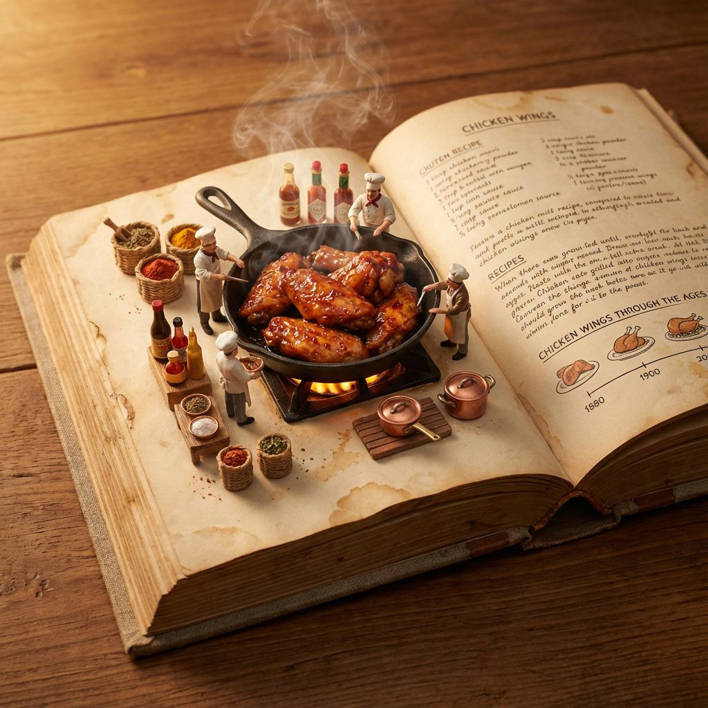

```
Input: chicken wing (you can change this)
Analysis: Extract key ingredients, cooking techniques, and cultural food elements
Goal: A cookbook where ingredients and dishes emerge in delicious detail
Rules:
Base: A vintage cookbook with stained pages and fabric cover, historical timeline of food
Scene: 3D Miniature kitchen or market scene with chef & ingredients
Details: Detailed food textures, steam effects, cooking implements
Lighting: Warm kitchen lighting with golden hour quality
Output: Single 4:5 image with appetizing details
```

```
输入：鸡翅（可更改）  
分析：提取关键食材、烹饪技法和饮食文化元素  
目标：一本食谱，其中食材与菜肴以诱人的细节呈现  
规则：  
基础：一本复古食谱，页面有污渍、布面封面，包含食物的历史时间线  
场景：3D 微缩厨房或市场场景，配有厨师和食材  
细节：精细的食物纹理、蒸汽效果、厨具  
灯光：温暖的厨房光线，带有黄金时刻的质感  
输出：单张 4:5 比例图像，充满诱人细节
```

 [↑返回目录](#toc)

---
## <a id="prompt-2003960376766222300">Desert Beast in Motion</a> (<a href="https://x.com/AllaAisling/status/2003960376766222356" target="_blank" rel="noopener noreferrer">Alexandra Aisling</a>)


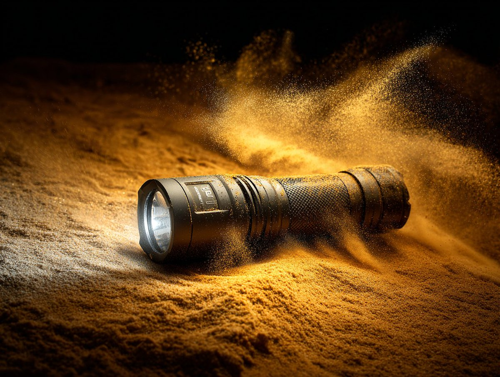

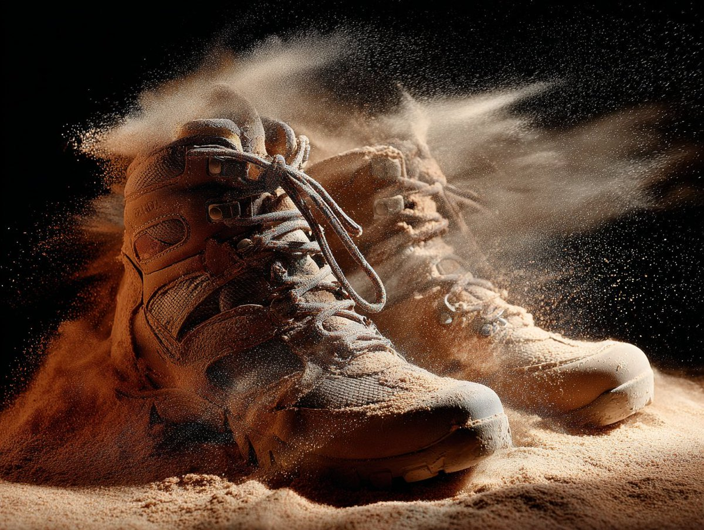

```
Rugged smartwatch with fine sand particles swirling around it, caught mid-motion, desert wind effect, warm golden lighting, gritty texture contrast, elemental power, rugged durability implied, dynamic studio capture
```

```
Off-road truck with fine sand particles swirling around it, caught mid-motion, desert wind effect, warm golden lighting, gritty texture contrast, elemental power, rugged durability implied, dynamic studio capture
```

```
Tactical flashlight with fine sand particles swirling around it, caught mid-motion, desert wind effect, warm golden lighting, gritty texture contrast, elemental power, rugged durability implied, dynamic studio capture
```

```
Hiking boots with fine sand particles swirling around it, caught mid-motion, desert wind effect, warm golden lighting, gritty texture contrast, elemental power, rugged durability implied, dynamic studio capture
```

 [↑返回目录](#toc)

---
## <a id="prompt-2003849647392247800">American Dream: 1957 Bel Air Restoration</a> (<a href="https://x.com/AllaAisling/status/2003849647392247864" target="_blank" rel="noopener noreferrer">Alexandra Aisling</a>)

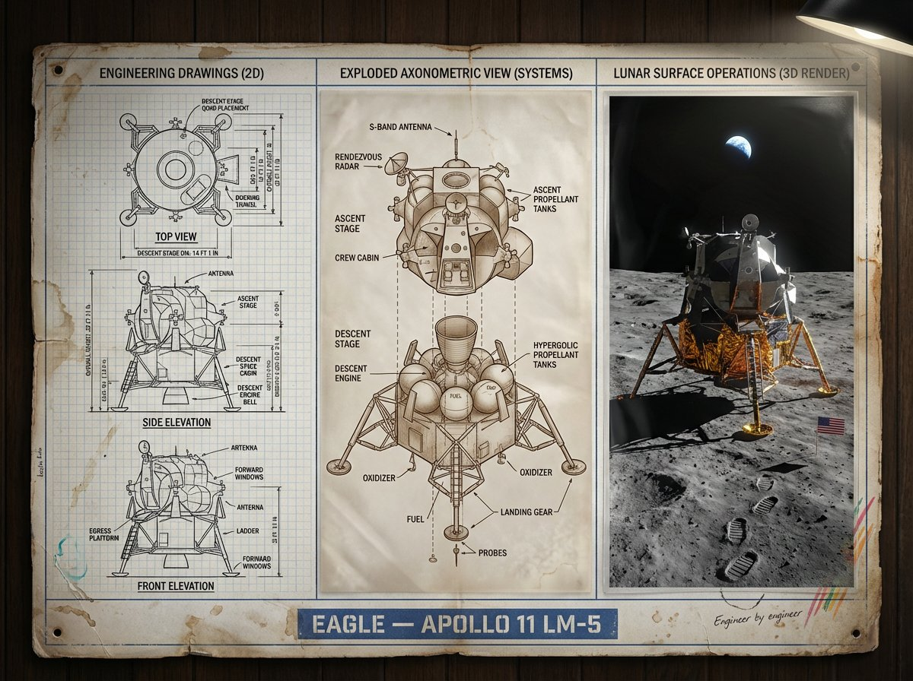

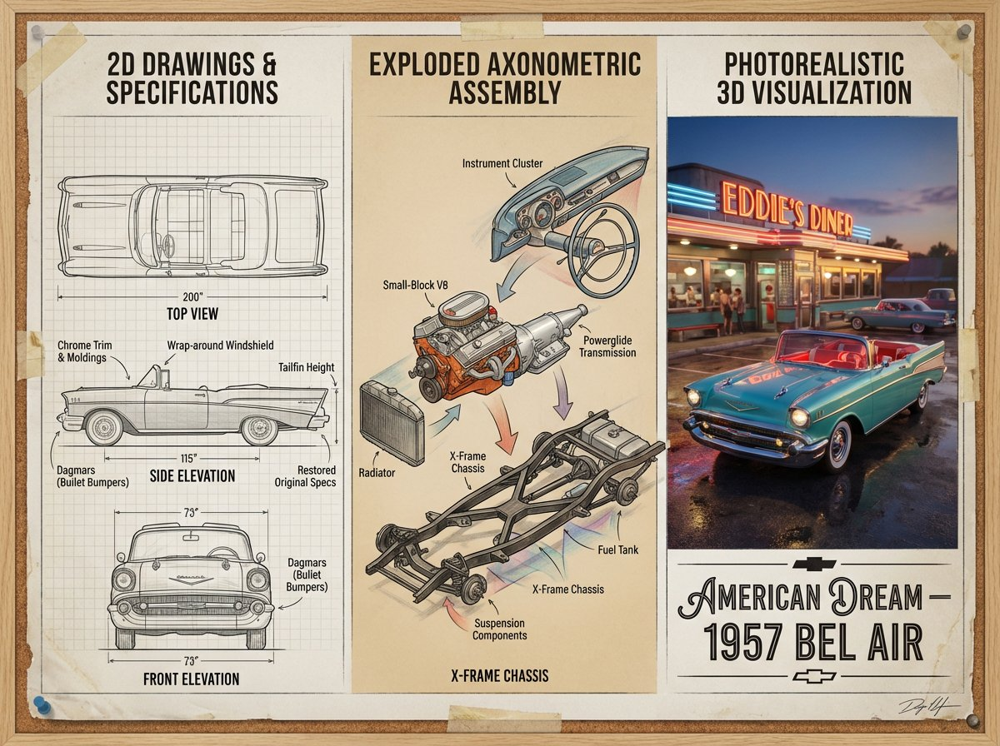

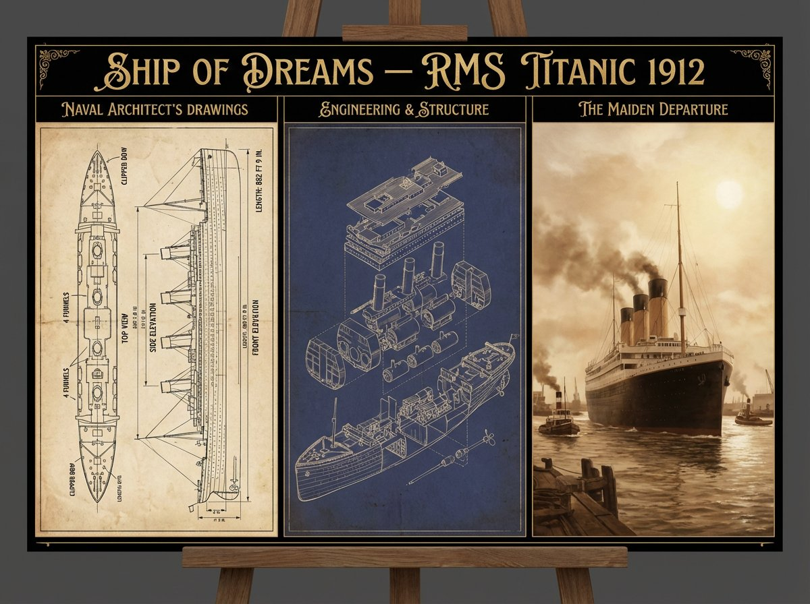

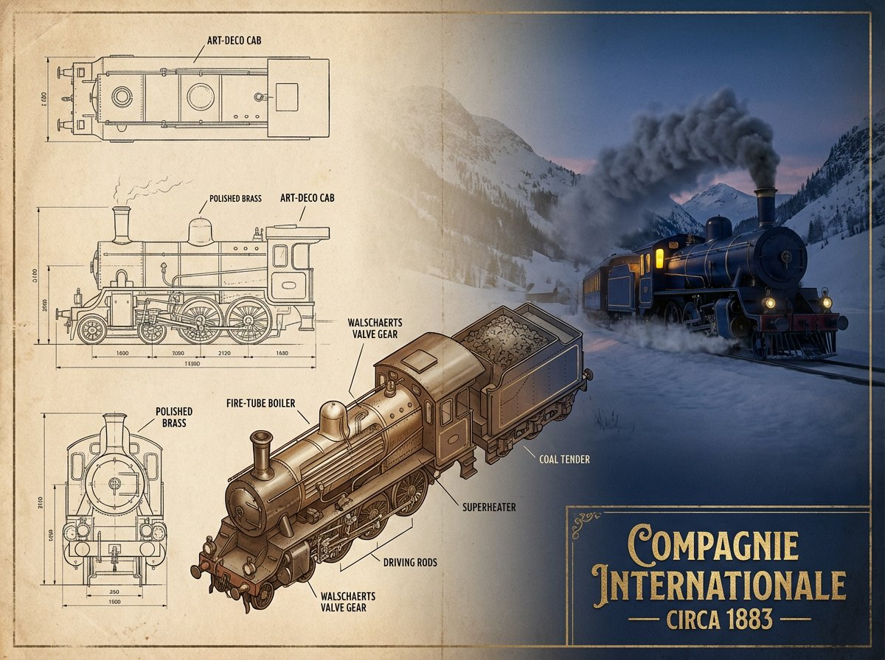

```
An expert aerospace engineer's presentation board for the Apollo Lunar Module—the spacecraft that landed humans on the Moon. Left: black-and-white 2D drawings (Top View, Side and Front Elevations) with annotations and dimension lines. Center: exploded axonometric showing descent engine, hypergolic tanks, crew cabin, rendezvous radar, and landing gear. Right: photorealistic 3D render on the lunar surface, Earth rising, gold mylar glinting in harsh sunlight, bootprints in regolith. Archival blues transitioning to stark lunar greys and deep space blacks. Title block: "EAGLE — APOLLO 11 LM-5".
```

```
An expert automotive designer's presentation board for a restored 1957 Chevrolet Bel Air convertible—tailfins, bullet bumpers, chrome waterfall grille. Left: black-and-white 2D drawings (Top View, Side and Front Elevations) with annotations and dimension lines. Center: exploded axonometric showing small-block V8, Powerglide transmission, X-frame chassis, and dashboard cluster. Right: photorealistic 3D render at a retro diner at dusk, two-tone turquoise and white, neon reflections, red leather interior glowing. Graphite linework transitioning to candy pastels and Americana warmth. Title block: "AMERICAN DREAM — 1957 BEL AIR"
```

```
An expert marine architect's presentation board for the RMS Titanic—Edwardian ocean liner with four funnels, clipper bow, grand staircase. Left: black-and-white 2D drawings (Top View, Side and Front Elevations) with annotations and dimension lines. Center: exploded axonometric showing triple-expansion engines, boilers, watertight bulkheads, propeller shafts, and promenade decks. Right: photorealistic 3D render departing Southampton at midday, black hull and white superstructure gleaming, tugboats guiding, coal smoke drifting. Aged blueprint indigo transitioning to rich maritime blacks and nostalgic golden-hour warmth. Title block: "SHIP OF DREAMS — RMS TITANIC 1912".
```

```
An expert heritage designer's presentation board for a golden-age Orient Express steam locomotive—art-deco cab, polished brass, driving wheels. Left: black-and-white 2D drawings (Top View, Side and Front Elevations) with annotations and dimension lines. Center: exploded axonometric showing fire-tube boiler, Walschaerts valve gear, superheater, driving rods, and coal tender. Right: photorealistic 3D render steaming through a snowy Alpine pass at twilight, midnight-blue livery with gold pinstriping, warm cab glow. Sepia engraving tones transitioning to romantic winter blues and golds. Title block: "COMPAGNIE INTERNATIONALE — CIRCA 1883".
```

 [↑返回目录](#toc)

---
## <a id="prompt-2004041725074088200">物体化城市</a> (<a href="https://x.com/aleenaamiir/status/2004041725074088251" target="_blank" rel="noopener noreferrer">Aleena Amir</a>)

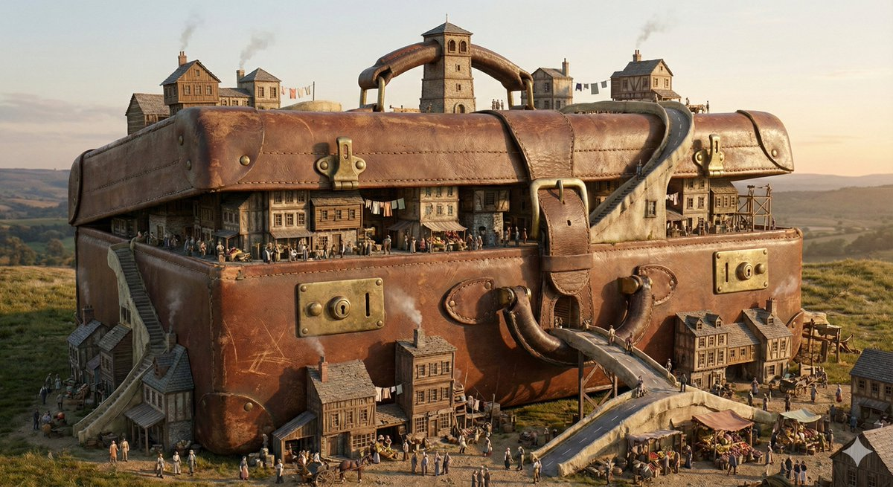

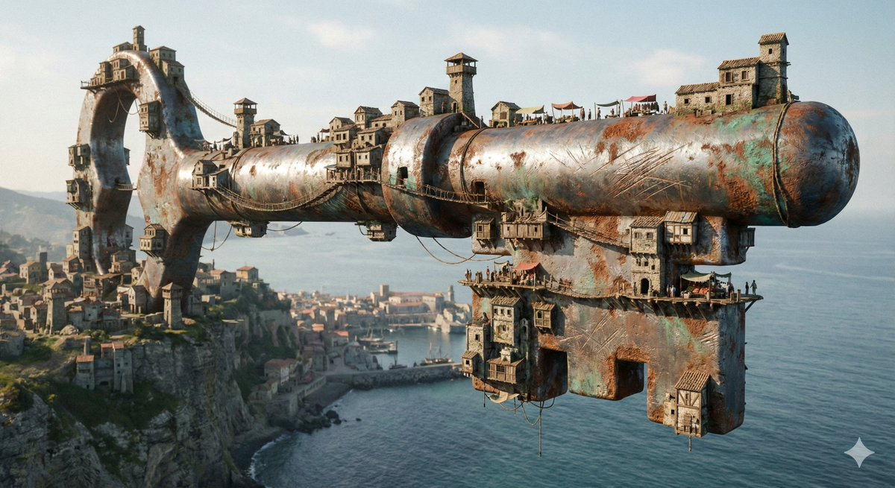

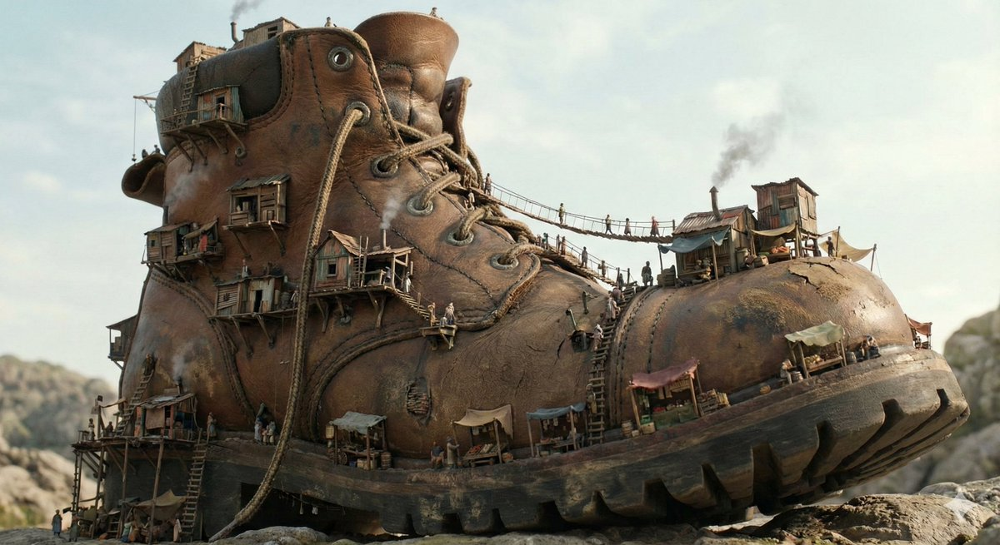

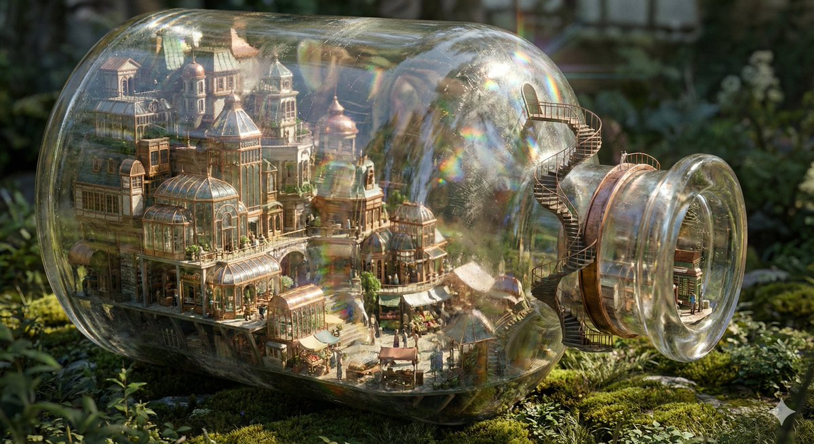

```
A colossal [EVERYDAY OBJECT] reimagined as a fully inhabited city. Tiny [PEOPLE / SOCIETY] build homes, roads, markets, and infrastructure directly into the object’s structure. Photoreal materials, lived-in wear, soft daylight, wide cinematic perspective with deep storytelling.
```

```
一个巨大的[日常物品]被重新构想为一座有人居住的城市。微小的[人群/社会]直接在该物体结构中建造房屋、道路、市场和基础设施。采用逼真材质，呈现生活痕迹与磨损感，柔和日光照射，宽广的电影级视角，蕴含丰富的叙事感。
```

 [↑返回目录](#toc)

---
## <a id="prompt-2003568395611238700">水晶球中的金色霸王龙</a> (<a href="https://x.com/RobotCleopatra/status/2003568395611238738" target="_blank" rel="noopener noreferrer">Skipper</a>)

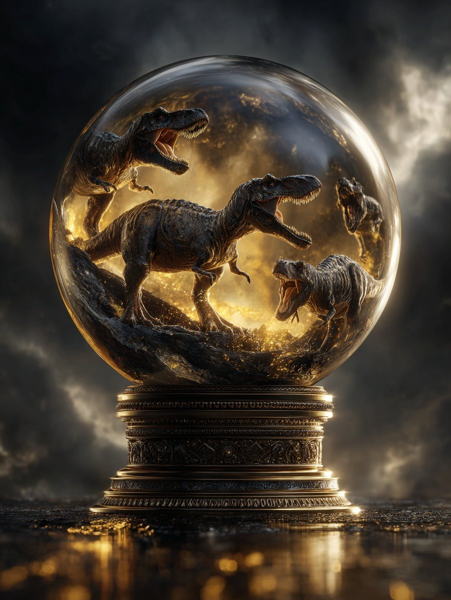

```
TO ART
a crystal ball containing t-rexes, surrounded by a misty light, floating on an ancient pedestal, with a dark background and a golden glow emanating from the dinosaurs' bodies, creating a mysterious atmosphere. the entire scene is rendered in high definition, showcasing intricate details of texture and lighting effects.
```

```
一个水晶球内含霸王龙，周围环绕着朦胧的光线，悬浮于一座古老基座之上，背景幽暗，恐龙身体散发出金色光辉，营造出神秘氛围。整个场景以高清晰度呈现，展现出细腻的纹理与光影效果。
```

 [↑返回目录](#toc)

---
## <a id="prompt-2004036691879743700">圣诞美食双面海报</a> (<a href="https://x.com/icreatelife/status/2004036691879743733" target="_blank" rel="noopener noreferrer">Kris Kashtanova</a>)


```
Clean contemporary square culinary poster featuring [FOOD_ITEM] against a flat [BACKGROUND_COLOR] backdrop. A razor-sharp vertical white divider cuts directly down the middle of the composition, separating the primary subject into equal portions. The first half displays a hyper-realistic photograph of the main dish with authentic surface details, true-to-life coloring, and natural illumination, precisely trimmed at the midpoint divider. The second half transforms into a minimal outline illustration that mirrors the identical shape and key features of the photographed side, keeping consistent scale and viewing angle. Surrounding the illustrated portion, scatter whimsical white sketched elements and casual handwritten-style typography stating “[LABEL_TEXT]” using matching line thickness—incorporate directional pointers, dynamic streaks, and basic component graphics tied to the dish. Generous blank space throughout, uniform background tone, balanced diffused studio brightness, minimal shadow presence, contemporary commercial design style, human-free, object-focused composition.
```

```
干净现代的方形美食海报，以[FOOD_ITEM]为主体，置于纯色[BACKGROUND_COLOR]背景之上。画面正中央有一条锐利的垂直白色分割线，将构图精确对半分开。左侧为高度写实的食物摄影，呈现真实的表面细节、逼真的色彩与自然光照，并在中线处精准裁切；右侧则转化为极简线条插画，精准复刻摄影侧的轮廓与关键特征，保持相同比例与视角。在插画部分周围，散落着 whimsical 风格的白色手绘元素与随意手写风格的字体，标注“[LABEL_TEXT]”，线条粗细一致，并加入指向性箭头、动态笔触及与该食物相关的基本组件图形。整体留白充足，背景色调统一，采用均衡柔和的影棚光线，阴影极少，风格为当代商业设计，无人物，聚焦物体本身。
```

 [↑返回目录](#toc)

---
## <a id="prompt-2004088874684043500">角色拆解艺术：皮克斯风格3D海报</a> (<a href="https://x.com/berryxia/status/2004088874684043595" target="_blank" rel="noopener noreferrer">Berryxia.AI</a>)


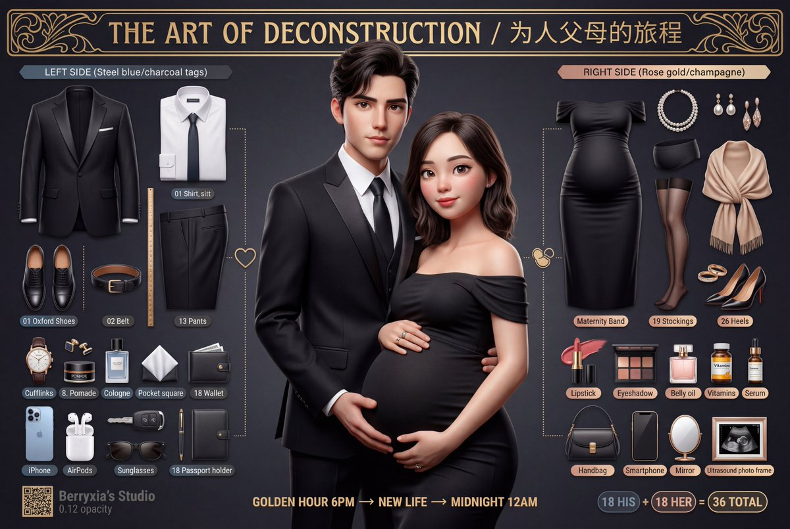

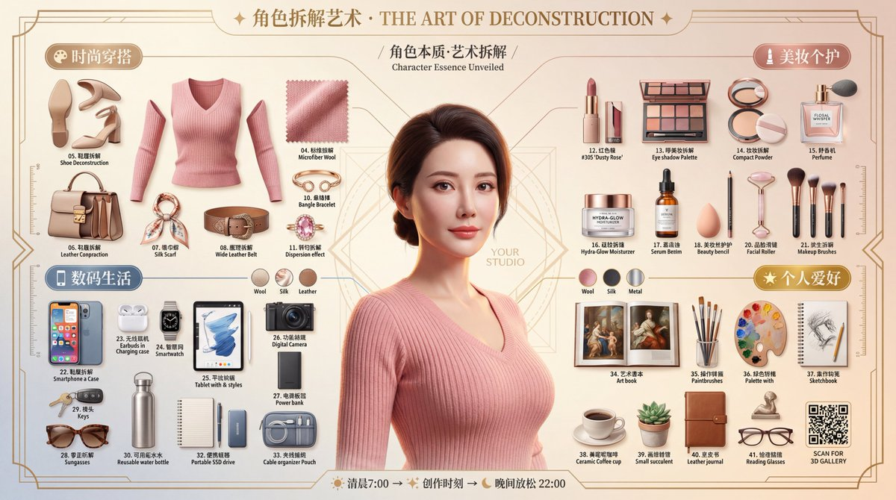

```
📷 核心指令 (Core Instruction)  任务：基于用户提供的参考图片，创作一张超高品质、电影级的3D皮克斯/迪士尼(Pixar/Disney)风格角色拆解艺术海报。将照片中的人物转换为风格化写实的3D动画角色，并将其个人物品以严谨的"Knolling"（整齐排列）艺术风格进行布局展示。  画面比例：16:9 横版 (可根据需求调整为 3:2, 4:5, 1:1) 艺术风格核心：皮克斯"风格化写实主义" (Stylized Realism) — 融合夸张的卡通比例与照片级真实材质光影。 质量标杆：对标《寻梦环游记(Coco)》、《青春变形记(Turning Red)》、《夏日友晴天(Luca)》的官方角色宣传海报。  📷 物品布局 (Item Layout) - Knolling放射式构图 总物品数：30-36件，围绕角色呈90度直角或放射状有序排列。  分类1：时尚穿搭 (Fashion Atelier) - 香槟金标签 - 主服装拆解：衣袖、衣领、布料裁片、内衬等全部分离悬浮。 - 鞋履拆解：鞋底、鞋面、鞋带、鞋跟等分离。 - 随身配饰：腰带、包袋、帽子、围巾等。 *示例：一件风衣可拆解为翻领、肩章、腰带、袖口束带、主衣身等部分。*  分类2：美妆个护 (Beauty Collection) - 玫瑰金标签 - 彩妆：口红（带膏体切面和色号标签）、眼影盘（每格颜色清晰）、粉饼、香水瓶（液体折射清晰可见）。 - 护肤：精华液瓶、面霜罐、美容仪器。 *示例：一瓶香水需展现玻璃瓶身的通透感、液体内部的光线折射以及瓶盖的金属质感。*  分类3：数码生活 (Modern Essentials) - 钢蓝色标签  - 电子设备：带手机壳的智能手机（屏幕需有内容）、无线耳机、智能手表、笔记本/平板电脑、相机。 - 材质要求：金属、玻璃（带折射）、塑料等材质需有正确的粗糙度和反射效果。 *示例：一部相机可拆解为镜头、机身、闪光灯、存储卡、肩带等。*  分类4：个人爱好 (Luxury & Hobbies) - 24K金标签  - 奢华配饰：珠宝首饰（项链、耳环、戒指等，宝石需有色散效果）、品牌包袋（展示内部分隔和五金件）。 - 兴趣爱好：画笔、调色盘、书籍、乐器、运动装备、咖啡用具等。 *示例：一个手办可拆解为头部、身体、四肢、武器、地台等组件。*  每件物品要求： - 渲染质量：与角色同等级别的3D渲染精度。 - 编号标签：带有01-36的圆形编号徽章。 - 材质与阴影：应用PBR材质，投射逼真的软阴影。   📷 爆炸视图技术 (Exploded View Technique)  - 连接线：使用优雅的虚线/实线将悬浮的服装部件连接到角色身上。 - 引导箭头：使用装饰性箭头将物品指向其文字标签。 - 技术注释：   - 材质样本：展示织物、皮革等材质的微距特写方块。   - 材质标签：如"100%真丝"、"意大利小牛皮"。   - 测量标尺：带有厘米(cm)/英寸(in)标记的标尺。  📷 角色拆解艺术 · THE ART OF DECONSTRUCTION 📷"   字体：中文用典雅的衬线体（如方正宋刻本秀楷），英文用Playfair Display，带金箔效果。 - 副标题 (Subtitle)：（主标题下方，飘逸手写体）   "角色本质·艺术拆解 / Character Essence Unveiled"   中英文混排，字体优雅。 - 分类标题 (Category Headers)：（带图标的圆角矩形标签）   "📷 美妆个护"** (玫瑰金)   "📷 数码生活"** (钢蓝色)   "📷 设计元素 (Design Elements)  - 几何框架：使用装饰艺术(Art Deco)风格的六边形/圆形细线框（0.5-1pt粗细）来组织物品群组。 - 测量标尺：沿画面左右边缘放置，营造技术美学感。 - 十字准星：在画面四角和关键焦点处添加。 - 材质样本：在底部展示一排面料/皮革/金属的微距特写方块。 - 信息卡片：带优雅边框的卡片，用于展示物品的详细信息。 - 雷达图：用装饰框包裹的角色属性雷达图，如：优雅★★★★★, 风格★★★★★, 智慧★★★★★。 - 连接线条：使用金色/银色的优雅虚线和装饰性箭头。  📷 背景与氛围 (Background & Atmosphere)  - 背景渐变：从白色到奶油色/香槟色的暖色调渐变，或从浅灰到白色的冷色调渐变。 - 图案叠加：叠加一层低透明度（5-10%）的装饰艺术几何网格或蓝图线条。 - 暗角效果 (Vignette)：轻柔的边缘变暗效果，将焦点引向中心。 - 氛围粒子：柔和的金色散景(Bokeh)光斑和微妙的胶片颗粒(Film Grain)，营造电影感。  📷 清晨6:00 → 📷 创作进行时 → 📷 色彩方案 (Color Palette) - 女性/时尚主题：香槟金(#D4AF37), 玫瑰金(), 奶油色(), 樱花粉()。 - 男性/科技主题**：钢蓝色(#4A90E2#4A4A4A#C0C0C0), 电光蓝(#00D9FF)。 - 正式/奢华主题：纯黑(#000000), 24K金(#FFD700), 深红色(#8B0000), 象牙白(#FFFFF0)。 - 情侣主题：男性一侧使用冷色调，女性一侧使用暖色调，形成对比。  📷 技术规格 (Technical Specifications) 渲染参数 (Rendering) - 引擎：路径追踪(Path Tracing)，等同于Cycles/Arnold/RenderMan级别。 - 采样数：最低4096 SPP (Samples Per Pixel)，确保画面纯净无噪点。 - 光线弹射：12次，以获得准确的全局光照。 - 焦散(Caustics)：开启，用于钻石和玻璃的真实光线折射效果。 - 模型面数：角色多边形数200万以上，确保曲面平滑。 - 毛发：每个角色超过10万根发丝，并经过物理模拟。  PBR材质流程 (Materials - PBR Workflow)  - 皮肤：三层SSS，双层高光。 - 毛发：各向异性着色器，主副双高光。 - 织物：微观编织法线贴图，准确的粗糙度变化。 - 金属*：金属度(Metalness) 1.0，粗糙度(Roughness) 0.1-0.4。 - 玻璃：折射率(IOR) 1.5，钻石IOR 2.42并带色散(Dispersion)。 - 皮革：粗糙度0.6-0.7，带颗粒感的凹凸贴图。  分辨率与输出 (Resolution & Output) - 分辨率：4K (3840×2160) 横版。 - 宽高比：16:9。 - 色深：32-bit浮点，为后期处理提供最大空间。 - 抗锯齿：16x MSAA，边缘锐利清晰。  📷 后期处理 (Post-Processing) - 色彩分级 (Color Grading)：   - 使用电影感LUT，提高暗部，避免纯黑（最低RGB 15,15,15）。   - 温和的S型曲线增强对比度。   - 根据主题调整色温（暖色+200K，冷色-200K）。   - 整体饱和度-5%，重点色彩（如金色）饱和度+10%。 - **特效 (Effects)**：   - **辉光(Bloom)**：为高光区域添加柔和光晕。   - **胶片颗粒(Film Grain)**：模拟柯达Portra 400胶片的有机质感。   - **色差(Chromatic Aberration)**：在边缘添加极细微的色散。   - **暗角(Vignette)**：中等强度的暗角。   - **锐化(Sharpening)**：输出时进行适度锐化。  📷 特殊指令 (Special Instructions)  - **单人角色**：总计约30件物品，聚焦于个人生活方式。 - **情侣角色**：总计约36件物品（每人18件），用爱心符号连接，并使用性别区分的色调。 - **孕妇角色**：包含孕期用品（如托腹油、维生素、B超照片），在腹部附近添加婴儿图标。 - **核心要点**：必须根据参考照片匹配角色的年龄、职业和风格。  📷 质量基准 (Quality Benchmark) 最终成品必须在视觉上无法与皮克斯/迪士尼官方的角色营销海报区分开来，达到博物馆级的照片级3D渲染水准，适用于： - 奢华产品目录 - 高端时尚杂志内页 - 专业艺术品印刷 - 个人摄影作品集 - 品牌营销活动⚙️✨📌🏆
```

 [↑返回目录](#toc)

---
## <a id="prompt-2004107115166908400">指甲上的微型艺术</a> (<a href="https://x.com/azed_ai/status/2004107115166908446" target="_blank" rel="noopener noreferrer">Amira Zairi</a>)


```
A close-up, hyper-realistic photograph of a tiny artist sitting on a stool and painting a [subject] on a giant human fingernail. The miniature painter holds a round palette and a thin brush, carefully recreating the soft lighting and detailed brushwork of the classic masterpiece. The nail surface is smooth and glossy, and the background is softly blurred to emphasize the intricate scene.
```

```
一张超写实特写照片，描绘一位微小的艺术家坐在小凳子上，在一枚巨大的人类指甲上绘制一幅[主题]作品。这位微型画家手持圆形调色盘和细画笔，细致地重现经典杰作中的柔和光影与精细笔触。指甲表面光滑亮泽，背景虚化柔和，以突出这一精妙场景。
```

 [↑返回目录](#toc)

---
## <a id="prompt-2003743839505535200">温馨微型工作场景微缩模型</a> (<a href="https://x.com/aleenaamiir/status/2003743839505535309" target="_blank" rel="noopener noreferrer">Aleena Amir</a>)

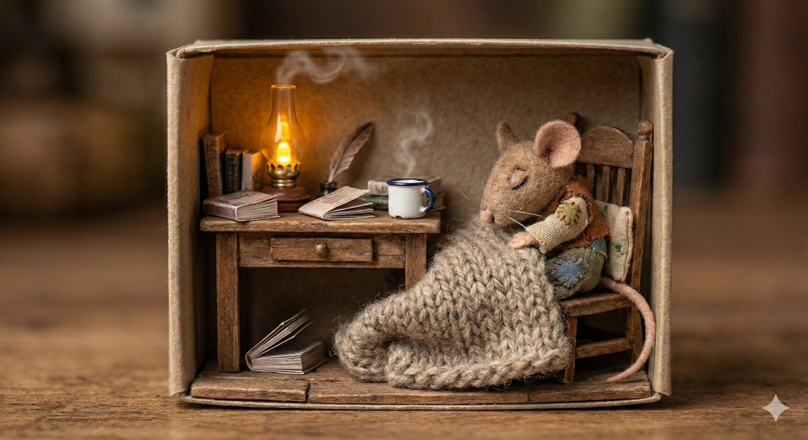

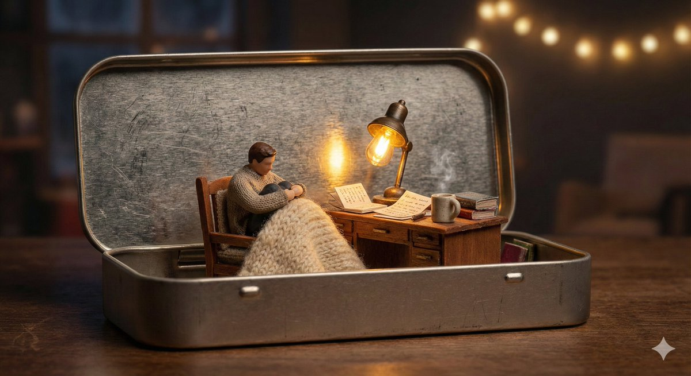

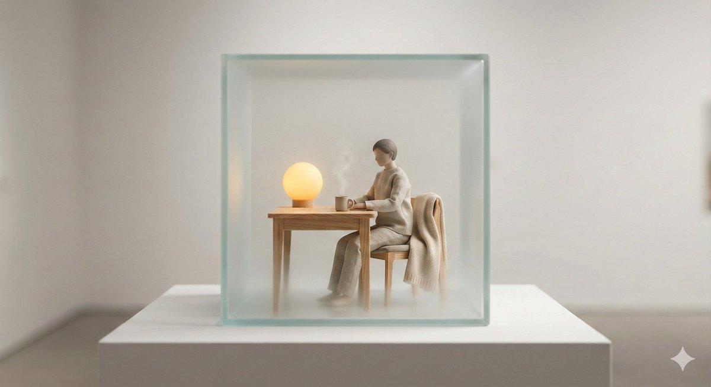

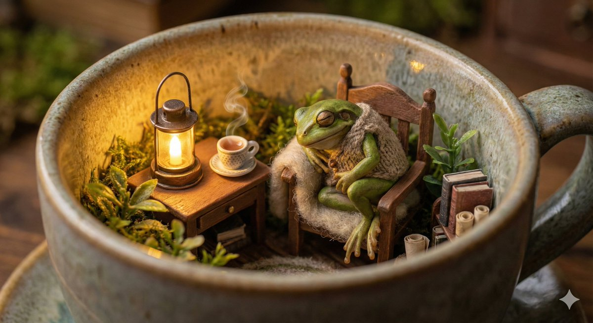

```
A tiny [PERSON/CREATURE] curled up at a miniature wooden desk inside a compact workspace made from [REAL OBJECT — e.g., pencil case], soft knit blanket draped over a chair, a glowing [LAMP TYPE] casting warm amber light, steam rising from a tiny mug, handcrafted textures, macro lens, shallow depth of field.
```

```
一个微小的[人物/生物]蜷缩在一张微型木桌旁，身处由[真实物品——例如：铅笔盒]改造而成的紧凑工作空间内，椅子上搭着柔软的针织毯，一盏发光的[灯具类型]投射出温暖的琥珀色光线，一只迷你马克杯中升腾着蒸汽，手工质感纹理，微距镜头，浅景深。
```

 [↑返回目录](#toc)

---
## <a id="prompt-2004173247764656000">巨人修复后的宁静午后</a> (<a href="https://x.com/aleenaamiir/status/2004173247764656131" target="_blank" rel="noopener noreferrer">Aleena Amir</a>)

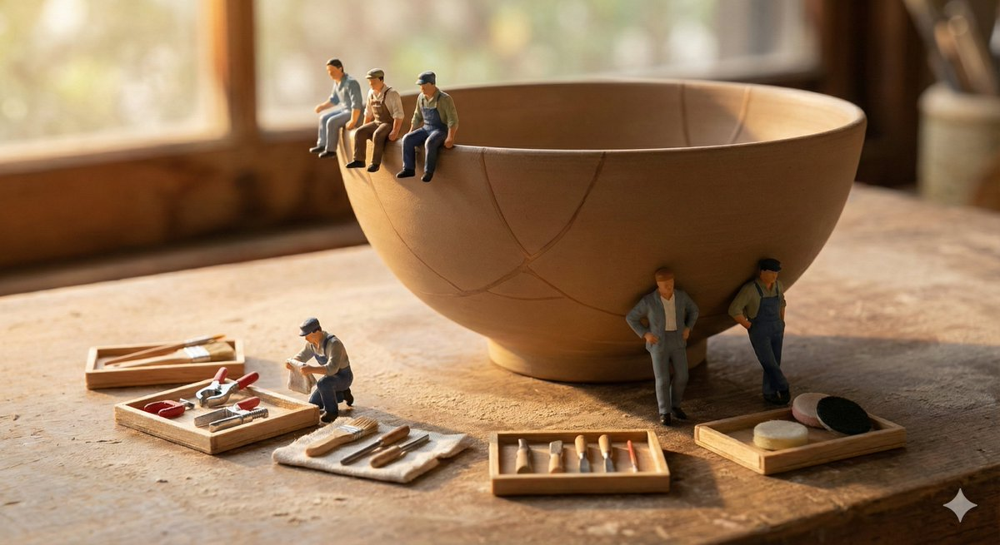

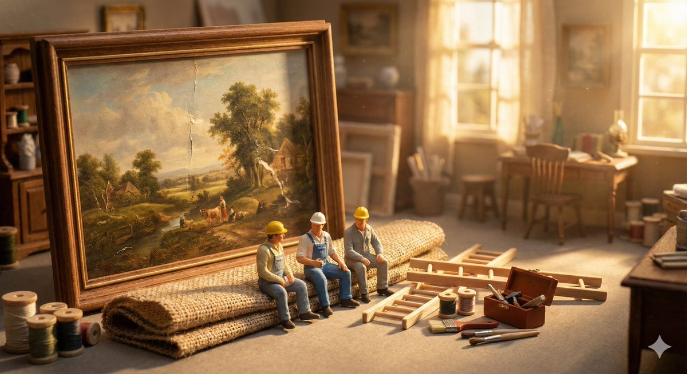

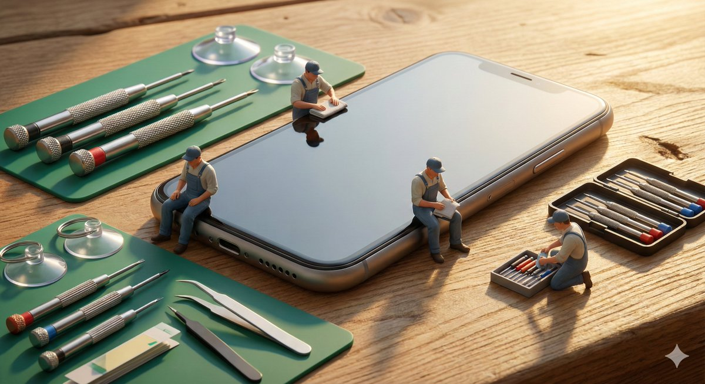

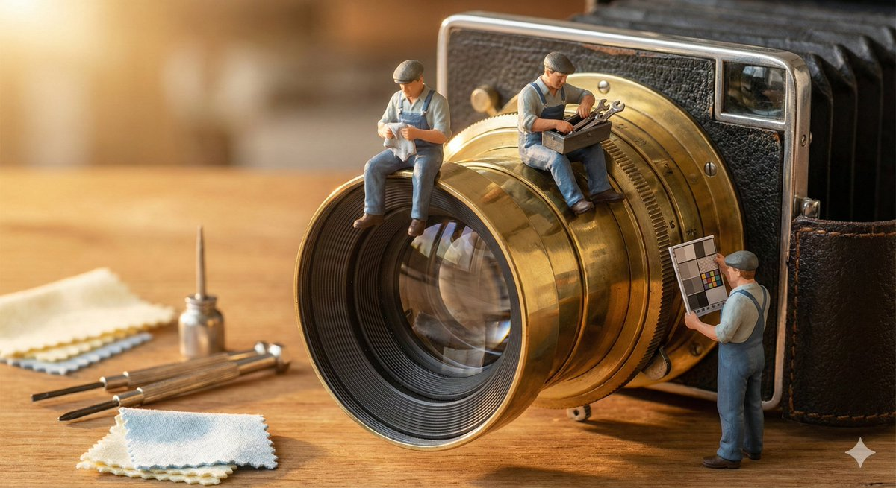

```
Tiny [WORKERS] sitting, resting, or packing up beside a perfectly restored oversized [BROKEN OBJECT]. Tools neatly arranged, relaxed body language, warm afternoon light, calm mood, sense of closure, handcrafted miniature realism.
```

```
微小的[工人]坐在、倚靠或正在收拾行装，旁边是一只完美修复的巨大[破损物品]。工具整齐摆放，身体姿态放松，温暖的午后光线，宁静氛围，圆满终结之感，手工微缩写实风格。
```

 [↑返回目录](#toc)

---
## <a id="prompt-2004015740329017600">Spotify幻境：街灯下的音乐漩涡</a> (<a href="https://x.com/itis_Jarvo33/status/2004015740329017641" target="_blank" rel="noopener noreferrer">𝓜𝓻.𝓙𝓪𝓻𝓿𝓸</a>)

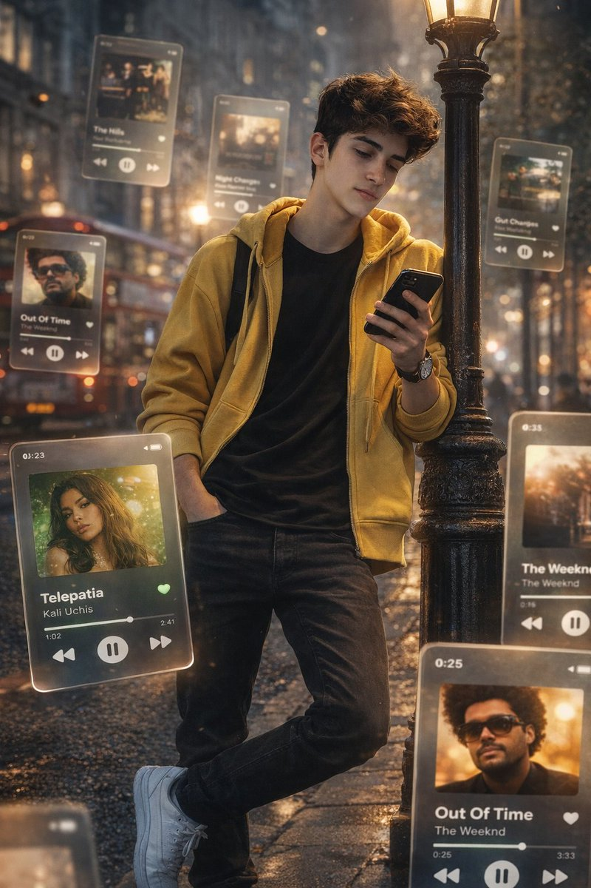

```
A Subject: me (use uploaded face — 100% facial accuracy, no changes). with no extra brightness on the face, keeping my natural dark facial tone intact. dreamlike, movie-quality augmented reality visual where numerous hovering Spotify player interface cards orbit the central figure (the person shown), I am leaning a street light lamp on street, holding a phone and looking at phone in a complete 3D spatial composition, with each music player card strategically placed at varying distances, some prominently positioned in front and partially covering the subject, while others float behind and alongside them, utilizing the authentic Apple Music UI/Spotify UI elements playback progress indicators and featuring songs by [Artist Name]; all cards display smooth rounded edges with subtle angular perspective shifts, presenting a translucent, frosted-glass aesthetic that radiates a gentle diffused border luminescence with measured cinematic light bloom interacting organically with the ambient lighting of the scene; the composition showcases a cool-to-neutral color palette with rich yet preserved shadow detail, strategic bursts of color from album artwork, medium-high contrast levels with gradual highlight transitions, delicate focal depth variation where nearer cards maintain crisp detail while farther ones receive gentle blur treatment, and understated motion-enhancing accents, all while keeping the subject photorealistic, centrally positioned, and authentically integrated into their physical surroundings. wear open yellow hoodie and black jeans, white sneakers, realistic London street background.Create a HD photo in 9:16
```

```
主体：我（使用上传的面孔——100%面部准确度，不做任何更改），脸上没有额外的亮度，保持我自然的深色肤色。梦幻般的、电影质量的增强现实视觉效果，其中无数悬浮的Spotify播放器界面卡片围绕着中心人物（显示的人物）旋转，我依靠在街灯杆上站在街上，手持电话并看着手机，在一个完整的三维空间构图中，每张音乐播放卡片都战略性地放置在不同的距离，有些显眼地位于前方并部分覆盖主体，而其他则漂浮在背后和侧面，利用真实的Apple Music UI/Spotify UI元素回放进度指示器，并展示由[艺术家名称]演唱的歌曲；所有卡片都显示平滑的圆角，带有微妙的角度透视变化，呈现出一种半透明的磨砂玻璃美学，散发出柔和扩散的边框发光，并与场景的环境照明有机互动；该构图展示了从冷到中性的色彩搭配，保留了丰富的阴影细节，专辑封面带来策略性的色彩爆发，中高对比度水平和渐进的高光过渡，焦点深度的细微变化使得靠近的卡片保持清晰细节，而远处的卡片得到轻微模糊处理，并有低调的运动增强装饰，同时保持主体照片般真实、居中定位且真实融入其物理环境中。穿着敞开的黄色连帽衫和黑色牛仔裤、白色运动鞋，逼真的伦敦街道背景。创建一个9:16的高清照片。
```

 [↑返回目录](#toc)

---
## <a id="prompt-2003826465054589200">全息棱镜品牌标志</a> (<a href="https://x.com/aleenaamiir/status/2003826465054589261" target="_blank" rel="noopener noreferrer">Aleena Amir</a>)

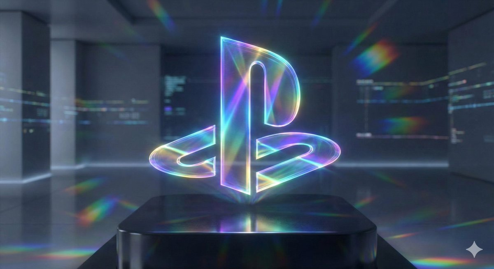

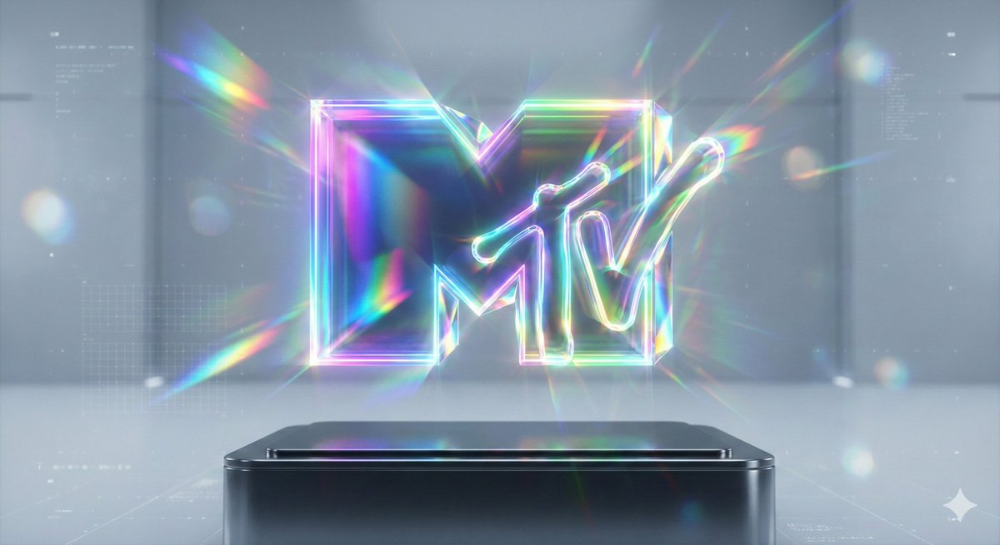

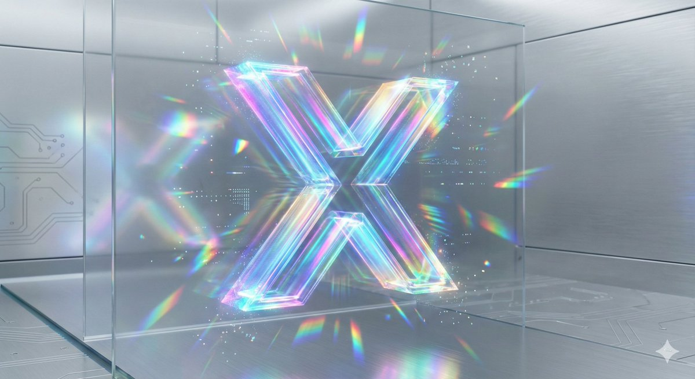


```
A futuristic holographic [Brand Name] logo with shifting iridescent colors. Prism-like reflections, light diffraction, clean minimal background. High-tech, next-gen brand identity.
```

```
一个充满未来感的全息[品牌名称]标志，具有变幻的虹彩颜色。棱镜般的反射、光衍射效果，背景干净简约。高科技、次世代品牌形象。
```

 [↑返回目录](#toc)

---
## <a id="prompt-2004102457086169300">皮克斯角色拆解艺术海报</a> (<a href="https://x.com/yanhua1010/status/2004102457086169278" target="_blank" rel="noopener noreferrer">Yanhua</a>)

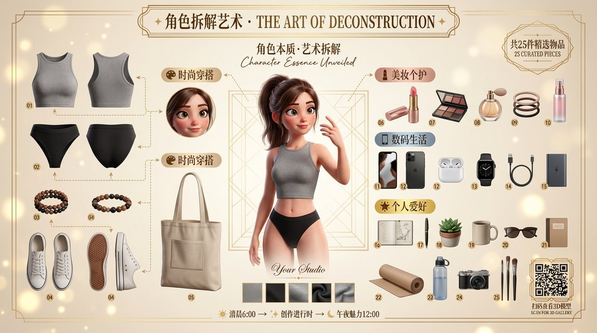

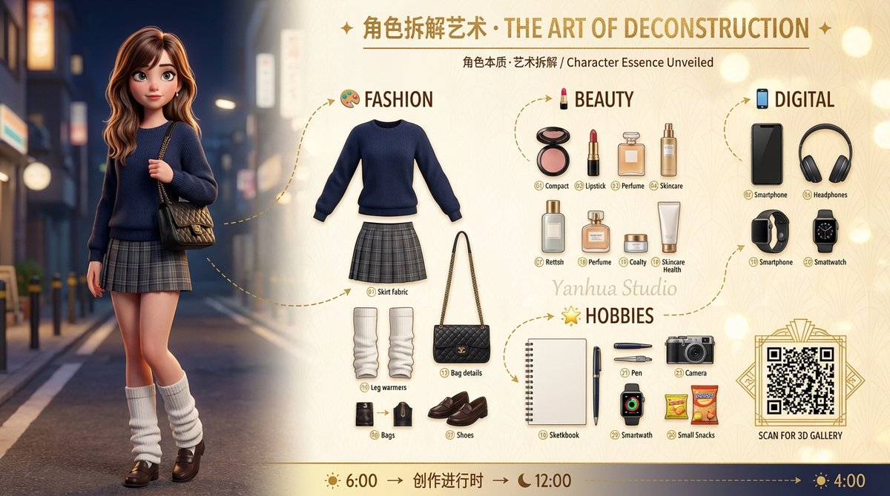

```
{
"prompt_name": "皮克斯风格角色拆解艺术海报生成器",
"core_instruction": {
"task": "基于参考图片创作电影级3D皮克斯/迪士尼风格角色拆解艺术海报",
"art_style": "皮克斯风格化写实主义(Stylized Realism)",
"aspect_ratio": "16:9",
"quality_benchmark": "《寻梦环游记》《青春变形记》《夏日友晴天》官方海报级别"
},
"character_rendering": {
"screen_proportion": "40%",
"face": {
"eyes": "皮克斯大眼睛，多重高光，虹膜细节，IOR 1.376角膜",
"skin": "三层SSS次表面散射(0.5mm/1.5mm/3.0mm)，双层高光，菲涅尔效应，可见毛孔",
"details": "自然红晕，光泽嘴唇，湿润泪膜，3D睫毛投影"
},
"hair": {
"count": "100000+发丝",
"shader": "各向异性着色器+Marschner模型",
"features": "主副双高光，成簇感，碎发，颜色渐变"
},
"clothing": {
"texture": "微观级织物纹理",
"material": "基于物理的PBR材质",
"details": "物理模拟褶皱，张力点，缝合线细节"
},
"lighting": "电影级三点布光+HDRI环境光",
"pose": "自然引人入胜，匹配参考图并艺术化夸张"
},
"item_layout": {
"total_items": "30-36件",
"arrangement": "90度直角或放射状Knolling布局",
"categories": {
"fashion": {
"label_color": "香槟金",
"icon": "🎨",
"items": ["服装拆解(衣袖/衣领/裁片/内衬)", "鞋履拆解(鞋底/鞋面/鞋带/鞋跟)", "配饰(腰带/包袋/帽子/围巾)"]
},
"beauty": {
"label_color": "玫瑰金",
"icon": "💄",
"items": ["彩妆(口红/眼影盘/粉饼/香水)", "护肤(精华液/面霜/美容仪)"]
},
"digital": {
"label_color": "钢蓝色",
"icon": "📱",
"items": ["电子设备(手机/耳机/手表/平板/相机)", "材质需有正确粗糙度和反射"]
},
"hobbies": {
"label_color": "24K金",
"icon": "🌟",
"items": ["奢华配饰(珠宝/品牌包)", "兴趣爱好(画笔/书籍/乐器/运动装备/咖啡用具)"]
}
},
"item_requirements": {
"rendering_quality": "与角色同等级3D渲染",
"numbering": "01-36圆形编号徽章",
"material": "PBR材质+逼真软阴影"
}
},
"exploded_view": {
"connection_lines": "优雅虚线/实线连接悬浮部件",
"arrows": "装饰性箭头指向标签",
"annotations": {
"material_samples": "织物/皮革微距特写方块",
"material_labels": "如'100%真丝'、'意大利小牛皮'",
"measurement_rulers": "cm/inch标记"
}
},
"typography": {
"main_title": {
"text": "✨ 角色拆解艺术 · THE ART OF DECONSTRUCTION ✨",
"position": "顶部中央",
"font": "中文方正宋刻本秀楷/英文Playfair Display",
"effect": "金箔效果，新艺术风格装饰框"
},
"subtitle": {
"text": "角色本质·艺术拆解 / Character Essence Unveiled",
"font": "飘逸手写体"
},
"category_headers": {
"style": "带图标的圆角矩形标签",
"labels": ["🎨 时尚穿搭", "💄 美妆个护", "📱 数码生活", "🌟 个人爱好"]
},
"item_labels": {
"font": "思源黑体",
"format": "圆形数字徽章+简短描述"
}
},
"design_elements": {
"geometric_frames": "Art Deco六边形/圆形细线框(0.5-1pt)",
"measurement_rulers": "沿左右边缘",
"crosshairs": "四角和关键焦点处",
"material_samples": "底部面料/皮革/金属微距特写方块",
"info_cards": "优雅边框卡片展示详细信息",
"radar_chart": "角色属性雷达图(优雅/风格/智慧等)",
"connection_lines": "金色/银色优雅虚线和箭头"
},
"background": {
"gradient": "白色→奶油色/香槟色暖色调 或 浅灰→白色冷色调",
"pattern_overlay": "5-10%透明度Art Deco几何网格或蓝图线条",
"vignette": "轻柔边缘暗角",
"atmosphere": "金色散景光斑+微妙胶片颗粒"
},
"branding": {
"watermark": {
"text": "Yanhua Your Studio",
"position": "画面中部",
"opacity": "10-15%",
"font": "手写体"
},
"qr_code": {
"position": "右下角",
"text": "扫码查看3D模型 / SCAN FOR 3D GALLERY",
"style": "Art Deco边框"
},
"item_count": {
"position": "右上角八角形框",
"text": "共XX件精选物品 / XX CURATED PIECES"
},
"timeline": {
"position": "底部横跨",
"format": "☀️ 清晨6:00 → ✨ 创作进行时 → 🌙 午夜魅力12:00"
}
},
"color_schemes": {
"female_fashion": ["香槟金#D4AF37", "玫瑰金#B76E79", "奶油色#FFF8E7", "樱花粉#F4C2C2"],
"male_tech": ["钢蓝色#4A90E2", "炭灰色#4A4A4A", "银色#C0C0C0", "电光蓝#00D9FF"],
"formal_luxury": ["纯黑#000000", "24K金#FFD700", "深红色#8B0000", "象牙白#FFFFF0"],
"couple": "男性冷色调 vs 女性暖色调对比"
},
"technical_specs": {
"rendering": {
"engine": "路径追踪(Path Tracing) - Cycles/Arnold/RenderMan级别",
"sampling": "4096+ SPP",
"light_bounces": 12,
"caustics": "开启",
"character_polygons": "2000000+",
"hair_strands": "100000+"
},
"pbr_materials": {
"skin": "三层SSS，双层高光",
"hair": "各向异性着色器，主副双高光",
"fabric": "微观编织法线贴图",
"metal": "Metalness 1.0, Roughness 0.1-0.4",
"glass": "IOR 1.5, 钻石IOR 2.42+色散",
"leather": "Roughness 0.6-0.7, 颗粒凹凸贴图"
},
"output": {
"resolution": "4K (3840×2160)",
"aspect_ratio": "16:9",
"bit_depth": "32-bit浮点",
"antialiasing": "16x MSAA"
}
},
"post_processing": {
"color_grading": {
"lut": "电影感LUT",
"shadows": "提高暗部，最低RGB 15,15,15",
"curve": "温和S型曲线增强对比度",
"temperature": "暖色+200K / 冷色-200K",
"saturation": "整体-5%，重点色彩+10%"
},
"effects": {
"bloom": "高光区域柔和光晕",
"film_grain": "柯达Portra 400胶片质感",
"chromatic_aberration": "边缘极细微色散",
"vignette": "中等强度暗角",
"sharpening": "输出时适度锐化"
}
},
"special_instructions": {
"single_person": "30件物品，聚焦个人生活方式",
"couple": "36件物品(每人18件)，爱心符号连接，性别色调区分",
"pregnant": "含孕期用品(托腹油/维生素/B超照片)，腹部附近婴儿图标",
"core_principle": "必须根据参考照片匹配角色年龄/职业/风格"
},
"quality_checklist": [
"角色具备皮克斯品质的皮肤/毛发/眼睛，SSS和反射效果正确",
"所有30-36件物品清晰可见、已编号、渲染精细",
"分类色彩编码统一一致",
"品牌元素(水印/二维码/时间轴)已呈现",
"中英文排版优雅清晰易读",
"整体构图和谐，遵循视觉美学",
"4K分辨率，边缘无锯齿",
"后期处理效果(辉光/颗粒/暗角)已应用"
],
"use_cases": [
"奢华产品目录",
"高端时尚杂志内页",
"专业艺术品印刷",
"个人摄影作品集",
"品牌营销活动"
]
}
```

 [↑返回目录](#toc)

---
## <a id="prompt-2004568038692311300">亚克力手绘品牌展示牌</a> (<a href="https://x.com/berryxia/status/2004568038692311394" target="_blank" rel="noopener noreferrer">Berryxia.AI</a>)

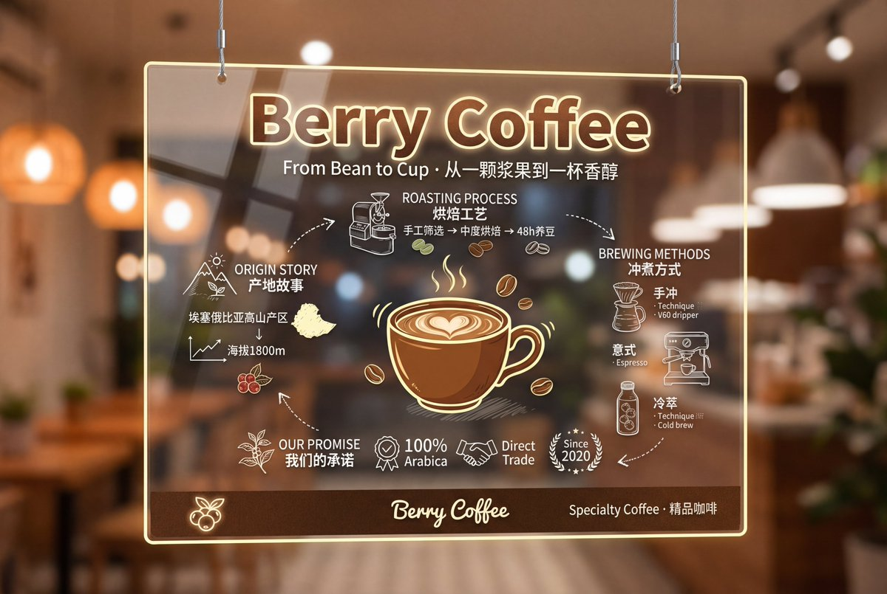

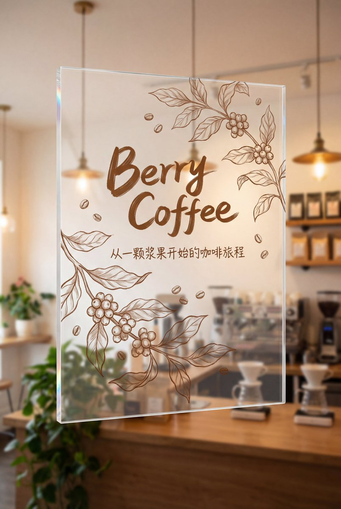

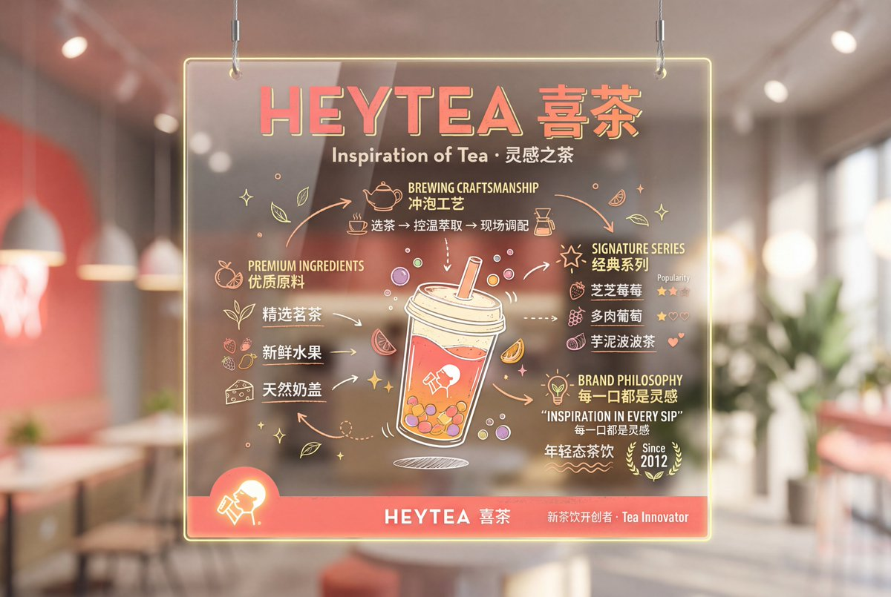

```
Ultra-realistic professional photography of a premium transparent acrylic signage panel.

The panel is suspended in mid-air by two thin metal cables from above, displayed in a

[环境类型] environment.

Main Subject - Transparent Signage Panel:

- Material: Crystal-clear transparent acrylic/glass with realistic reflections, edge

lighting glow, and refraction effects

- Content style: Hand-drawn chalk sketch aesthetic with slightly rough, imperfect lines

(not perfect vectors)

- Minimalist mounting: Two thin cables only, no corner screws

Content Layout:

TOP SECTION:

- Huge hand-written title: "[品牌名称]" in bold chalk-style lettering with [颜色] gradient

and [强调色] edge glow

- Subtitle: "[英文标语] · [中文标语]" in smaller elegant chalk text

CENTER SECTION - Illustrated [主题] & Information Diagram:

**CENTRAL ILLUSTRATION** (占30%中心区域):

- Hand-drawn cartoon-style [主体对象] in [视角描述] with charming, simplified proportions

- Artistic style: Clean line art with slight imperfections, [风格特征描述]

- Color: [主色填充色值] fill with white chalk outline and [强调色色值] accent highlights

- The [主体] has personality - slightly playful but still recognizable

- Subtle hand-drawn shadow beneath giving floating effect

**SURROUNDING INFORMATION SHOWCASE** (环绕式信息展示):

LEFT SIDE - [主题1]:

- Icon: [图标描述]

- "[英文标题]" / [中文标题]

- Hand-drawn details: "[关键信息1]" with [配图元素]

- "[关键信息2]" with [视觉元素]

TOP - [主题2]:

- Icon: [图标描述]

- "[英文标题]" with [示意图描述]

- "[关键信息]" with [技术插图]

- Connecting arrows to [主体对象相关部位]

RIGHT SIDE - [主题3]:

- Icon: [图标描述]

- "[英文标题]"

- Hand-drawn: [细节1], [细节2], [细节3]

- "[关键参数]" with measurement lines

BOTTOM - [主题4]:

- Icon: [图标描述]

- "[英文标题]" with [历史/补充信息]

- "[副标题]" badge with decorative elements

**CONNECTING ELEMENTS**:

- Hand-drawn arrows and dotted lines connecting all sections to the central [主体]

- Small decorative elements: [装饰元素1], [装饰元素2], [装饰元素3] scattered around

- All text in bilingual Chinese/English with organic hand-written style

Color Scheme:

- Base lines: Creamy white chalk texture (#F5F5DC)

- Main illustration: [主色色值] with white outlines

- Accent highlights: [强调色色值] for emphasis and decorative elements

- Icons and diagrams: Light gray (#B0B0B0) chalk sketches

- Brand color: [品牌色色值] for key text

BOTTOM SECTION - Brand Strip:

- [背景色色值] horizontal bar background with subtle texture

- Left: [品牌Logo描述] (silver metallic, glowing)

- Center: "[品牌标准字]" wordmark in elegant font

- Right: "[产品型号/规格信息]"

Environment & Photography:

- Background: [具体环境描述] with EXTREMELY HEAVY BLUR

- Depth of field: f/1.4 aperture simulation - background is almost completely abstract

- Only soft [色调1] bokeh balls and [色调2] light orbs visible, no recognizable shapes

- Hints of [环境元素] silhouettes dissolved into blur

- Viewing angle: Absolute straight-on frontal view, panel perfectly centered at eye level

- Lighting: Professional spotlight creating strong reflections on acrylic surface,

dramatic AR-like glowing edges in [强调色]

- Atmosphere: [时间段/氛围描述], the transparent panel glows against the heavily blurred background

- Cable suspension clearly visible at top edge catching light

Technical specs: 8K ultra-high resolution, cinematic color grading with high contrast,

photorealistic transparent acrylic material physics (edge glow, reflections, refractions),

delicate hand-drawn chalk texture details, premium [行业] photography quality, EXTREME

background bokeh making the panel content the absolute focus

CRITICAL: The background must be HEAVILY BLURRED (almost abstract bokeh), the hand-drawn

[主体] should be charming and cartoon-style (NOT photorealistic), occupying only 30% of

center space, with comprehensive information display surrounding it in organized layout.
```

 [↑返回目录](#toc)

---
## <a id="prompt-2004930351584445000">草莓山巅：冰雾中的鲜果之味</a> (<a href="https://x.com/YaseenK7212/status/2004930351584444801" target="_blank" rel="noopener noreferrer">Yaseen Khan Gul</a>)

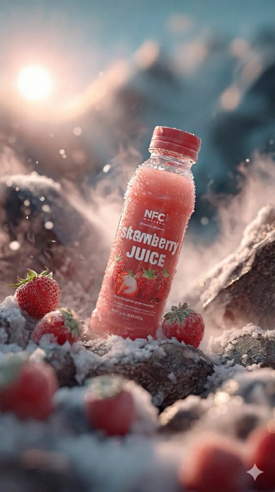

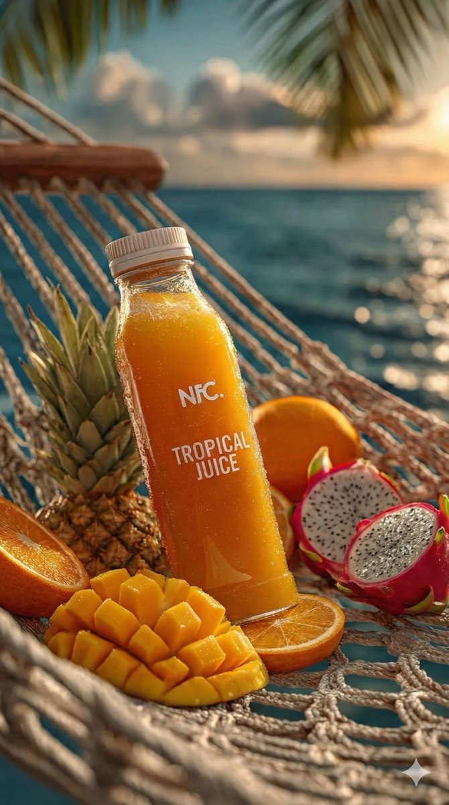

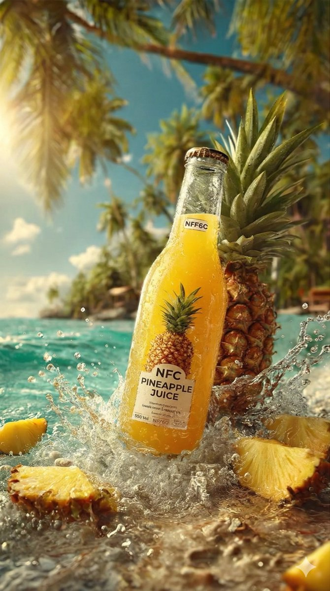

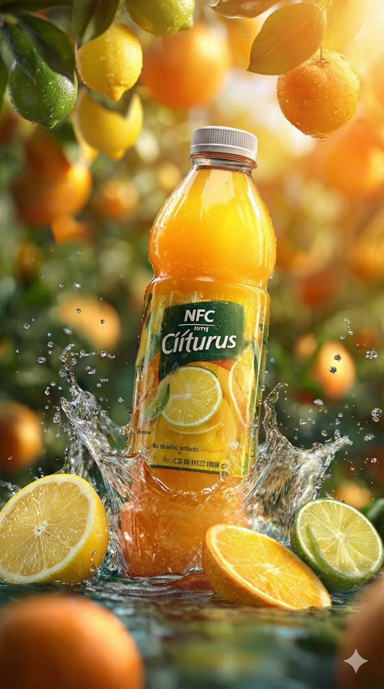

```
[
  {
    "id": "pineapple_beach",
    "type": "photorealistic advertising shot",
    "subject": {
      "item": "pineapple juice bottle",
      "label_text": "NFC Pineapple Juice",
      "pose": "slightly tilted"
    },
    "environment": {
      "location": "tropical beach",
      "ground": "wet tropical sand",
      "background_elements": [
        "swaying palm trees",
        "clear turquoise ocean",
        "bright sunny sky"
      ],
      "interactions": "waves gently touch the base of the bottle"
    },
    "surrounding_elements": [
      "fresh pineapple slices",
      "droplets of seawater"
    ]
  },
  {
    "id": "strawberry_mountain",
    "type": "photorealistic advertising shot",
    "subject": {
      "item": "strawberry juice bottle",
      "label_text": "NFC Strawberry Juice",
      "details": "emits condensation"
    },
    "environment": {
      "location": "mountains",
      "ground": "snow-kissed rocks",
      "atmosphere": "misty cold mountain air"
    },
    "surrounding_elements": [
      "strawberries scattered around the base"
    ],
    "lighting": {
      "description": "warm sunlight gently breaks through the icy fog",
      "effects": "soft lens flares"
    },
    "style_descriptors": [
      "cinematic close-up",
      "high detail",
      "natural setting",
      "soft pink-red color scheme",
      "calm and fresh atmosphere",
      "hyper-realistic textures"
    ],
    "parameters": "--ar 9:16 --stylize 250"
  },
  {
    "id": "citrus_grove",
    "type": "photorealistic advertising shot",
    "subject": {
      "item": "citrus blend juice bottle",
      "label_text": "NFC Citrus Mix"
    },
    "environment": {
      "location": "citrus grove",
      "background_elements": [
        "yellow-orange fruit hanging above"
      ]
    },
    "action_elements": {
      "description": "splashing in water at the base",
      "items": [
        "sliced lemon pieces",
        "sliced lime pieces",
        "sliced orange pieces"
      ]
    },
    "lighting": {
      "description": "bright sunlight through leaves",
      "tone": "strong citrus tones"
    },
    "parameters": "--ar 9:16 --stylize 250"
  },
  {
    "id": "tropical_hammock",
    "type": "photorealistic advertising shot",
    "subject": {
      "item": "tropical mixed Nestle juice bottle",
      "label_text": "NFC Tropical Juice"
    },
    "environment": {
      "location": "sunlit hammock",
      "background": "ocean horizon behind"
    },
    "surrounding_elements": [
      "pineapple slices",
      "mango slices",
      "orange slices",
      "dragonfruit slices"
    ],
    "mood_and_style": {
      "atmosphere": "vacation mood",
      "colors": "vibrant colors",
      "lighting": "cinematic shadows"
    },
    "parameters": "--ar 9:16 --stylize 250"
  }
]
 }
```

```
[
  {
    "id": "菠萝海滩",
    "type": "逼真广告摄影",
    "subject": {
      "item": "菠萝汁瓶",
      "label_text": "非浓缩还原菠萝汁",
      "pose": "略微倾斜"
    },
    "environment": {
      "location": "热带海滩",
      "ground": "湿润的热带沙地",
      "background_elements": [
        "摇曳的棕榈树",
        "清澈的蓝绿色海洋",
        "明亮的晴朗天空"
      ],
      "interactions": "海浪轻柔地拍打瓶底"
    },
    "surrounding_elements": [
      "新鲜菠萝片",
      "海水水滴"
    ]
  },
  {
    "id": "草莓山巅",
    "type": "逼真广告摄影",
    "subject": {
      "item": "草莓汁瓶",
      "label_text": "非浓缩还原草莓汁",
      "details": "瓶身凝结水珠"
    },
    "environment": {
      "location": "山地",
      "ground": "覆雪岩石",
      "atmosphere": "雾气缭绕的寒冷山间空气"
    },
    "surrounding_elements": [
      "瓶底周围散落的新鲜草莓"
    ],
    "lighting": {
      "description": "温暖阳光柔和穿透冰雾",
      "effects": "柔和镜头光晕"
    },
    "style_descriptors": [
      "电影感特写",
      "高细节",
      "自然场景",
      "柔和粉红色调",
      "宁静清新氛围",
      "超写实质感"
    ],
    "parameters": "--ar 9:16 --stylize 250"
  },
  {
    "id": "柑橘果园",
    "type": "逼真广告摄影",
    "subject": {
      "item": "混合柑橘汁瓶",
      "label_text": "非浓缩还原柑橘混合汁"
    },
    "environment": {
      "location": "柑橘果园",
      "background_elements": [
        "上方悬挂的橙黄色果实"
      ]
    },
    "action_elements": {
      "description": "瓶底处水花飞溅",
      "items": [
        "柠檬切片",
        "青柠切片",
        "橙子切片"
      ]
    },
    "lighting": {
      "description": "树叶间透过的明亮阳光",
      "tone": "鲜明的柑橘色调"
    },
    "parameters": "--ar 9:16 --stylize 250"
  },
  {
    "id": "热带吊床",
    "type": "逼真广告摄影",
    "subject": {
      "item": "雀巢热带混合果汁瓶",
      "label_text": "非浓缩还原热带果汁"
    },
    "environment": {
      "location": "阳光照射的吊床",
      "background": "后方的海平线"
    },
    "surrounding_elements": [
      "菠萝片",
      "芒果片",
      "橙子片",
      "火龙果片"
    ],
    "mood_and_style": {
      "atmosphere": "度假氛围",
      "colors": "鲜艳色彩",
      "lighting": "电影感阴影"
    },
    "parameters": "--ar 9:16 --stylize 250"
  }
]
```

 [↑返回目录](#toc)

---
## <a id="prompt-2004637964626743300">达·芬奇手稿中的2025科技</a> (<a href="https://x.com/RobotCleopatra/status/2004637964626743396" target="_blank" rel="noopener noreferrer">Skipper</a>)

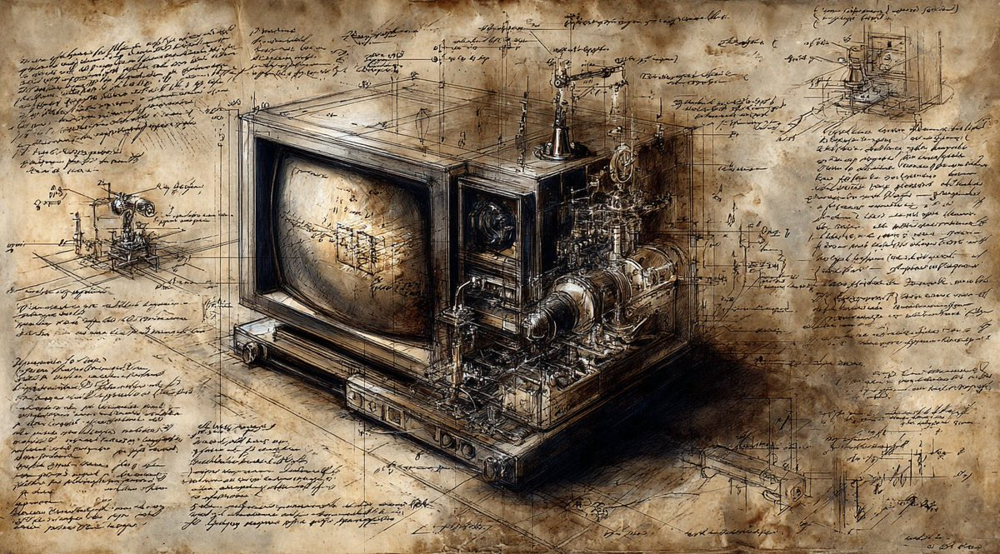

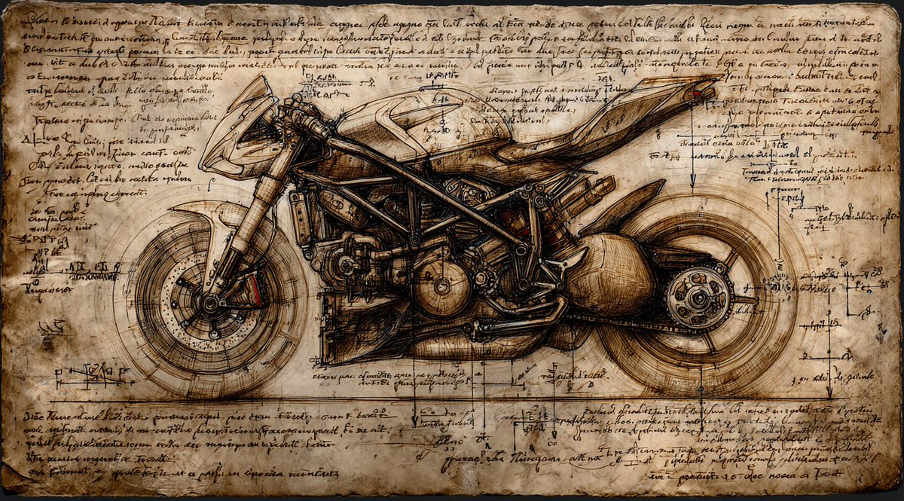

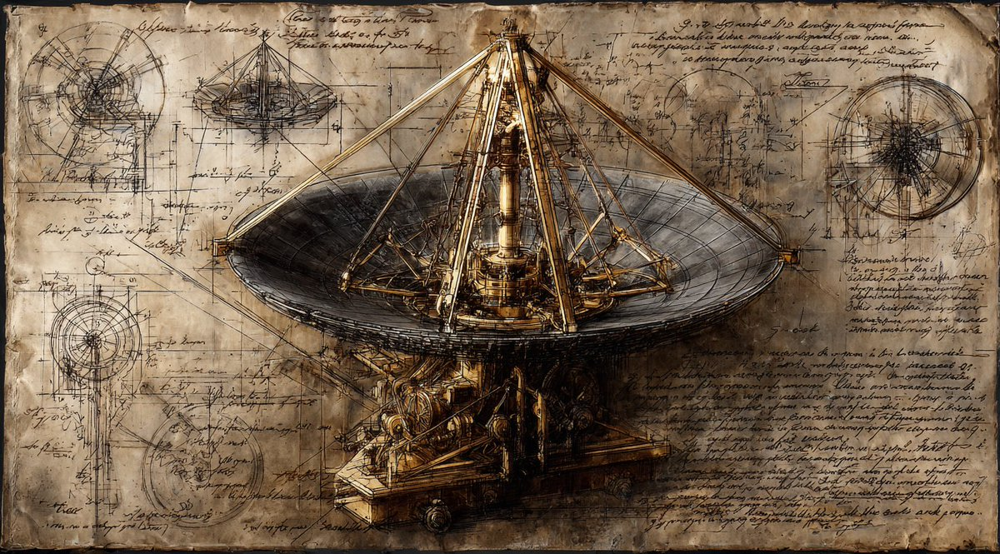

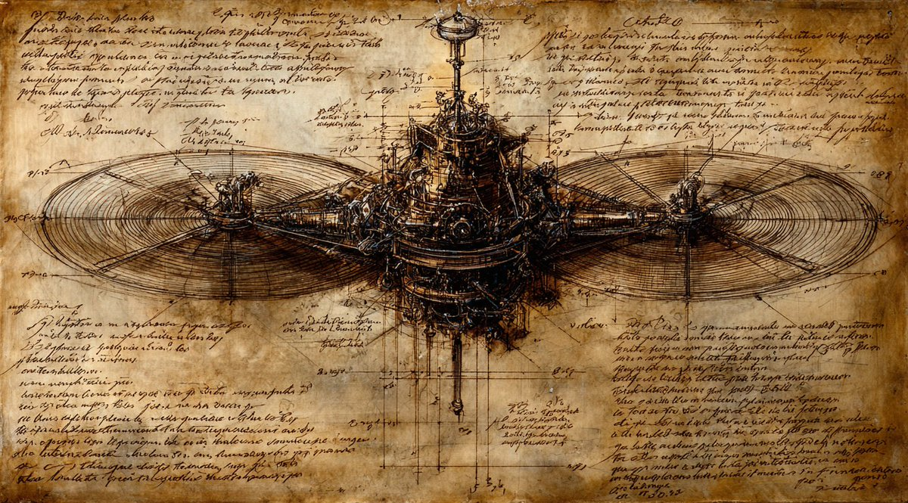

```
TO ART 
a highly detailed 15th-century leonardo da vinci codex drawing depicting [SUBJECT] in its complete modern 2025 form, with all contemporary components fully present and accurate. the object is rendered using renaissance hand-drawn techniques: graphite and ink linework, cross-hatching, proportional geometry, exploded technical views, cutaway sections, and motion diagrams. modern technology is visually translated through precise schematic logic, not simplified or altered. dense handwritten annotations in italian mirror writing surround the drawing. aged parchment background, uneven ink flow, smudges, stains, burn marks. flat manuscript lighting, no modern rendering, no photography, no 3d, no modern illustration style. authentic leonardo da vinci notebook aesthetic
```

```
一幅高度精细的15世纪达·芬奇手稿风格绘图，描绘[主题]在其完整的2025年现代形态，包含所有当代组件且准确无误。该物体采用文艺复兴时期手绘技法呈现：石墨与墨水线条、交叉排线、比例几何、爆炸式技术视图、剖面图及运动示意图。现代科技通过精确的图解逻辑进行视觉转化，不做简化或改动。绘图周围布满密集的意大利语镜像手写注释。背景为老化羊皮纸，墨迹不均，带有污渍、涂抹痕迹和烧灼印记。采用平面手稿照明，无现代渲染、无摄影效果、无3D表现、无现代插画风格，忠实还原达·芬奇笔记本的美学风格。
```

 [↑返回目录](#toc)

---
## <a id="prompt-2004894710729478400">夜空中的品牌烟花奇观</a> (<a href="https://x.com/TechieBySA/status/2004894710729478277" target="_blank" rel="noopener noreferrer">TechieSA</a>)


```
Create a spectacular fireworks display photograph over a waterfront cityscape at night. The fireworks should burst in the exact shape and form of the uploaded logo, perfectly replicating its distinctive design, proportions, colors, and silhouette. Match every color from the logo precisely in the fireworks - placing each color exactly where it appears in the original logo design. The logo shape should be clearly recognizable and detailed in the fireworks formation against the dark sky. The scene should include a city silhouette in the background, smoke trails from the fireworks, and colorful reflections dancing on the water below. Photorealistic style with professional long exposure photography techniques, sharp focus on the fireworks burst, cinematic composition, 4K quality.
```

```
创作一张夜间水岸城市景观上空的壮观烟花秀照片。烟花应以上传标志的确切形状和形式绽放，完美复现其独特设计、比例、色彩和轮廓。精确匹配标志中的每一种颜色，并将每种颜色准确放置于其在原始标志设计中所处的位置。烟花形成的标志形状应在夜空中清晰可辨且细节丰富。场景应包含背景中的城市剪影、烟花的烟迹，以及下方水面上跃动的缤纷倒影。采用逼真摄影风格，运用专业长曝光摄影技术，烟花爆炸部分焦点锐利，构图富有电影感，4K画质。
```

 [↑返回目录](#toc)

---
## <a id="prompt-2004611631985107500">夸张社论风漫画肖像</a> (<a href="https://x.com/David_eficaz/status/2004611631985107345" target="_blank" rel="noopener noreferrer">David</a>)

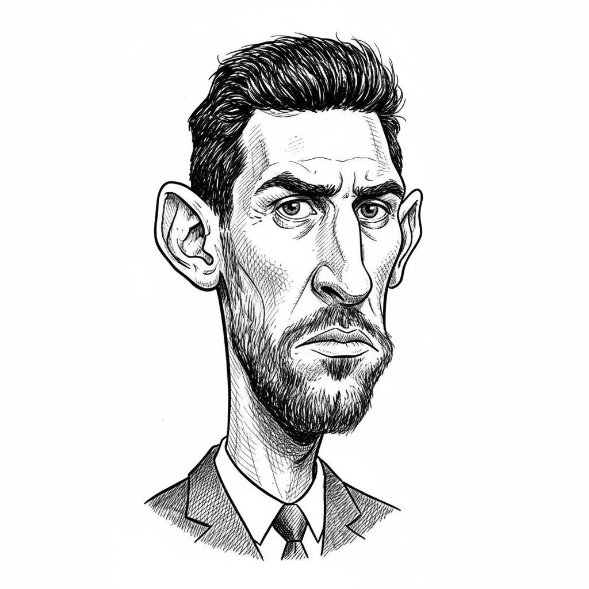

```
🎁 Te regalo el prompt completo👇 

{
  "style": {
    "type": "hand-drawn caricature",
    "technique": "cross-hatching, fine ink lines",
    "mood": "serious, slightly exaggerated expression",
    "medium": "black and white sketch"
  },
  "subject": {
    "type": "male figure",
    "age": "middle-aged",
    "skin_texture": "detailed line work with emphasized shading",
    "hair": {
      "style": "short, tightly curled",
      "texture": "dense linework"
    },
    "facial_features": {
      "eyes": "narrow, expressive, slightly squinting",
      "eyebrows": "furrowed, showing intensity",
      "nose": "long and defined with accentuated shading",
      "mouth": "exaggerated downward curve, caricatured pout",
      "ears": "large and prominently exaggerated",
      "jawline": "elongated and structured with sharp lines"
    }
  },
  "composition": {
    "pose": "straightforward headshot with slight tilt",
    "framing": "upper torso visible, suit collar included",
    "background": "clean white, no elements"
  },
  "clothing": {
    "attire": "formal suit",
    "details": "sharp collar lines with textured shading"
  },
  "notes": {
    "emphasis": "hyper-exaggeration of facial structure",
    "aesthetic": "editorial political-cartoon style"
  }
}
```

```
🎁 送你完整提示词👇

{
  "风格": {
    "类型": "手绘漫画",
    "技法": "交叉排线、精细墨线",
    "情绪": "严肃，略带夸张的表情",
    "媒介": "黑白素描"
  },
  "主体": {
    "类型": "男性人物",
    "年龄": "中年",
    "皮肤质感": "细致的线条表现，强调明暗对比",
    "头发": {
      "发型": "短而紧密卷曲",
      "质感": "密集的线条"
    },
    "面部特征": {
      "眼睛": "细长、富有表现力，微微眯起",
      "眉毛": "皱起，展现强烈情绪",
      "鼻子": "修长且轮廓分明，阴影突出",
      "嘴巴": "夸张的下弯弧度，漫画式噘嘴",
      "耳朵": "硕大且明显夸张",
      "下颌线": "拉长且结构清晰，线条锐利"
    }
  },
  "构图": {
    "姿势": "正面头像，略微倾斜",
    "取景": "可见上半身，包含西装领子",
    "背景": "纯白，无任何元素"
  },
  "服装": {
    "服饰": "正式西装",
    "细节": "清晰的领口线条，带有纹理阴影"
  },
  "备注": {
    "重点": "极度夸张的面部结构",
    "美学风格": "社论政治漫画风格"
  }
}
```

 [↑返回目录](#toc)

---
## <a id="prompt-2004728009912168400">新黑色电影雨夜</a> (<a href="https://x.com/RobotCleopatra/status/2004728009912168459" target="_blank" rel="noopener noreferrer">Skipper</a>)

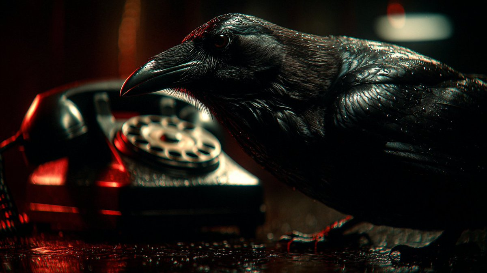

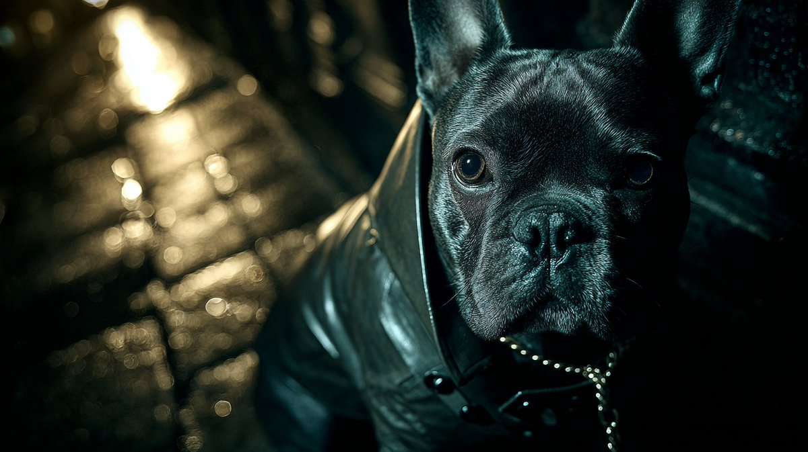


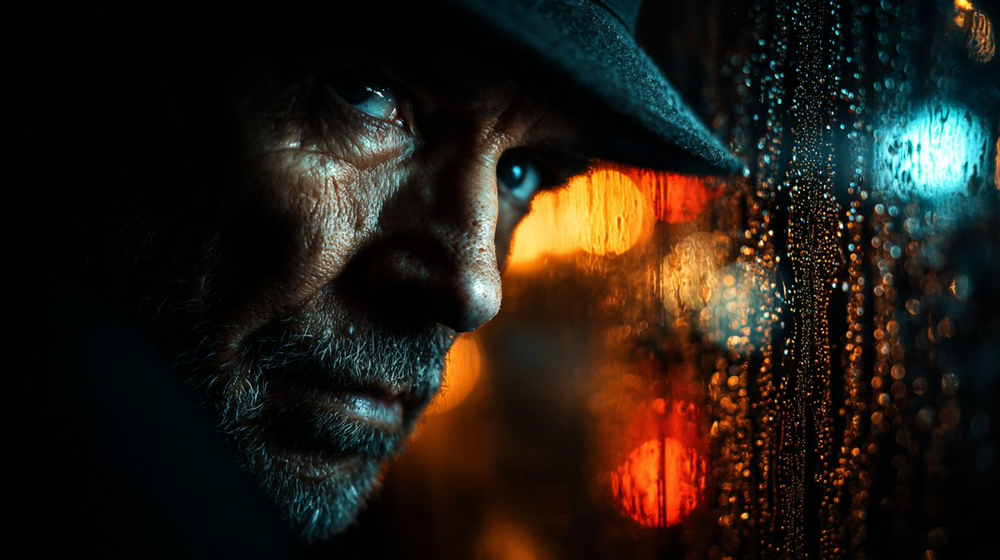

```
GOLDEN PROMPT FOR MOVIES
[Subject] captured in neo-noir cinematic perfection, Venetian blind shadow patterns cutting across frame geometry,  smoke volumetrics catching hard tungsten practicals, wet pavement reflections doubling light sources with chromatic separation, 1.85:1 anamorphic lens characteristics with subtle barrel distortion, practical sodium vapor street lighting color science, grain structure matching pushed Kodak 5219 stock, selective focus racking between foreground and subject planes, motivated shadows creating negative space composition, specular highlights on reflective surfaces suggesting rain-slicked environments, amber-cyan color grading reminiscent of classic film noir, subtle lens breathing during focal shifts, handheld micro-movements suggesting documentary immediacy, low-key lighting ratio preserving deep shadow detail 
@AdobeFirefly boards Veo3 video
```

```
电影级黄金提示词  
[主体] 以新黑色电影的极致影像风格呈现，百叶窗阴影图案切割画面构图，烟雾体积感捕捉硬质钨丝实用光源，湿润路面反射使光源倍增并产生色散效果，1.85:1 变形宽银幕镜头特性带轻微桶形畸变，实用钠蒸汽路灯的色彩科学，颗粒结构匹配高感光度 Kodak 5219 胶片，前景与主体平面之间选择性焦点切换，动机明确的阴影营造负空间构图，反光表面的镜面高光暗示雨后湿滑环境，琥珀-青色调色令人联想到经典黑色电影，焦点转换时微妙的镜头呼吸效应，手持微动体现纪实临场感，低调布光比保留深邃阴影细节。
```

 [↑返回目录](#toc)

---
## <a id="prompt-2004584112582222300">深红丝绒·高定肖像写真</a> (<a href="https://x.com/hx831126/status/2004584112582222280" target="_blank" rel="noopener noreferrer">虎小象</a>)

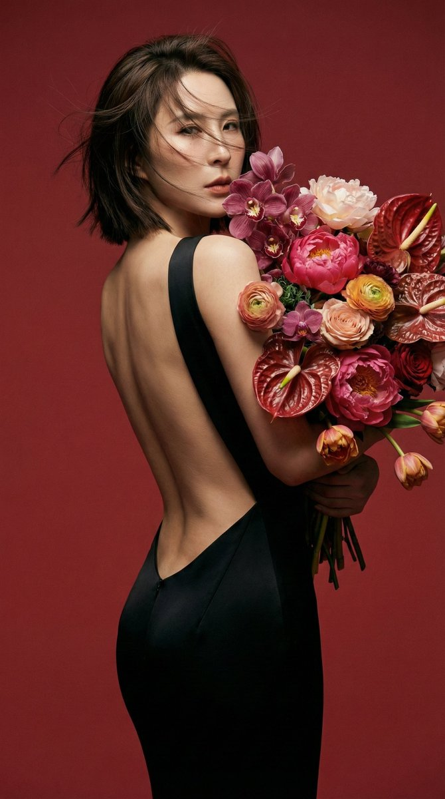

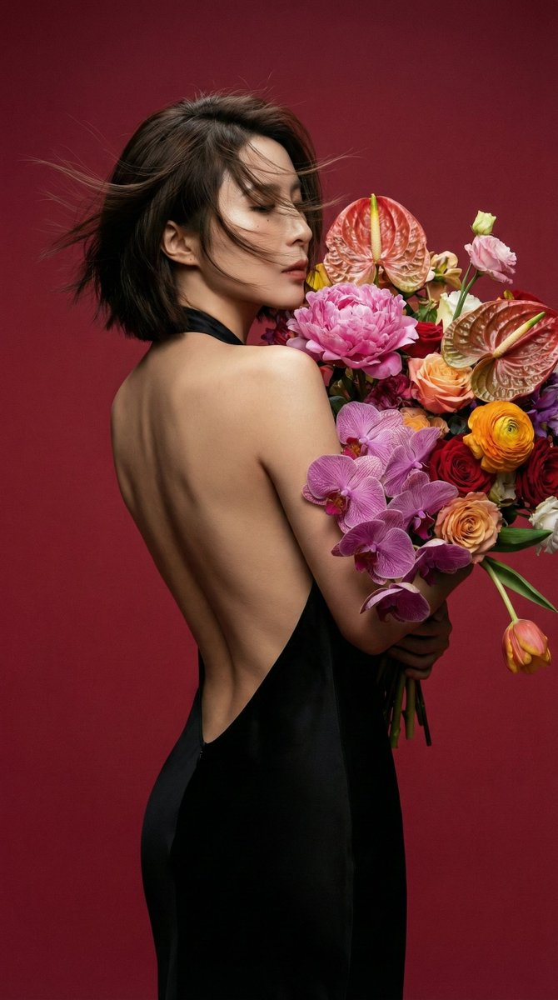

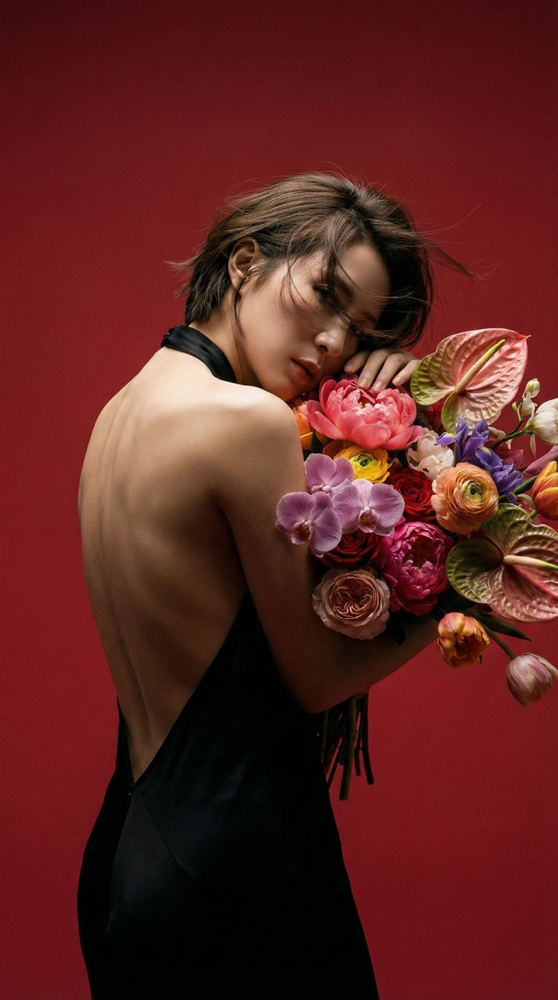


```
创作一张高级时装杂志封面级别的肖像照（时尚摄影师风格）。

- **人物身份**：使用上传的参考人物作为唯一主体。面部特征和自然肤质需100%匹配。
- **发型**：短发，发丝被风吹拂，飘散在脸上，以时尚的方式部分遮挡面部特征。
- **背景**：纯深红色工作室背景（#a83b4f 色调），干净无瑕。
- **服装**：极简主义高级定制礼服，颜色为[black]。深V露背设计，优雅的垂坠感沿着脊柱延伸到微露臀。面料为[真丝]。雕塑般的精致廓形。无过多蕾丝、亮片或婚纱类头饰。
- **姿势/构图**：四分之三背部视角。露背部分完全展现；头部略微转动，露出脸部。9:16竖幅构图包含腰部和上臀部，以优雅时尚的方式展现出自信。线条优美的背部/臀部轮廓（无任何暴露）。
- **道具**：手持一束大型时尚奢华花束，紧贴身体——花束硕大、繁密、色彩鲜艳——包含多种珍稀高档花卉，颜色丰富（牡丹、兰花、玫瑰、红掌、毛茛、郁金香），造型精致，非新娘捧花风格。
- **相机**：长焦人像镜头效果（135mm），浅景深，背景虚化效果强，面部细节清晰。
- **灯光（单光源，面光源）**：光源来自顶部上方主光（顶光风格），通过控制高光勾勒出霞骨、肩膀和背部的线条。整体曝光保持低调，营造氛围感；阴影部分保留细节；无刺眼眩光。
- **后期**：杂志风格调色，精致的胶片质感，毛孔和皮肤细节清晰可见，高端时尚写实风格。
```

 [↑返回目录](#toc)

---
## <a id="prompt-2004601351146532900">科学家的微缩对决</a> (<a href="https://x.com/Gdgtify/status/2004601351146532917" target="_blank" rel="noopener noreferrer">Gadgetify</a>)

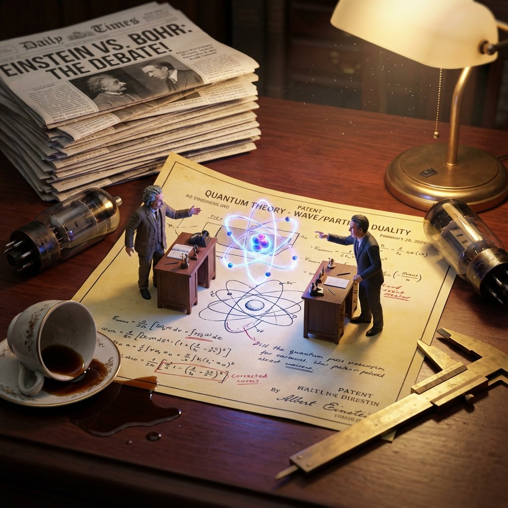

```
Do this for Einstein and a competitor of his 


 Invention = [User Choice, e.g., Electricity, The Airplane, The Telephone]

Phase 1: Historical Conflict Analysis
1.  Identify Rivals: Determine the two main historical figures associated with this invention (e.g., Tesla vs. Edison, Wright Bros vs. Curtiss).
2.  Identify The Tech: Distinguish their competing methods (e.g., AC Coils vs. DC Bulbs).
3.  Identify The Era: Select appropriate "Giant" background clutter (e.g., Victorian newspapers, 1920s fountain pens).

Phase 2: Visual Execution
Goal: A "Macro Diorama" of a Rivalry. A messy, highly detailed flat-lay of a shared historical workspace where the two rivals exist as tiny living figurines battling over their creation.

Rules:
The Stage: A large, yellowed Patent Diagram or Blueprint lies flat on a wooden desk. The paper is wrinkled and covered in scribbled corrections.

The Tiny Rivals: Two hyper-realistic miniature figurines (Inventor A and Rival B) are standing on opposite sides of the document. They are positioned at their own tiny wooden desks or workstations on top of the paper.

The Conflict: They are gesturing aggressively at each other. The Invention itself is physically emerging from the center of the paper between them (e.g., a glowing 3D lightbulb or a spinning biplane propeller), acting as the barrier or prize they are fighting over.

The "Giant" Terrain (Surroundings): The scene is surrounded by massive, period-accurate objects acting as a landscape:

A "Giant" wall of newspapers with headlines about their legal battles.
 Massive burnt fuses or broken prototypes scattered like boulders.
 A spilled cup of coffee creating a "lake" near one of the figures.
  Giant tools (calipers, screwdrivers) casting long shadows.
Perspective: Slightly angled 45-degree macro shot looking down at the patent.
Texture: Dust motes, scratched mahogany wood, paper grain, metallic reflections.
Lighting: Cinematic Macro Lighting. A warm desk lamp illuminates the scene, but the Invention in the center emits its own light (e.g., blue electrical arcs vs. yellow filament glow), lighting the faces of the tiny figures.

Output: ONE image, 4:5 aspect ratio, photorealistic historical macro photography, tilt-shift effect.

```

```
请以爱因斯坦和他的某位竞争对手为例进行创作。

发明 = [用户自选，例如：电力、飞机、电话]

第一阶段：历史冲突分析  
1. 确定对手：找出与该发明相关的两位主要历史人物（例如：特斯拉 vs. 爱迪生，莱特兄弟 vs. 柯蒂斯）。  
2. 确定技术：区分他们各自竞争的技术方法（例如：交流线圈 vs. 直流灯泡）。  
3. 确定时代：选择符合时代的“巨型”背景杂物（例如：维多利亚时期的报纸、1920 年代的钢笔）。

第二阶段：视觉呈现  
目标：一场“宏观微缩场景”的对决。呈现一个凌乱而高度细节化的俯拍平面布局，两位对手化身为微小的活体人偶，在共享的历史工作台上为其发明争斗。

规则：  
舞台：一张泛黄的巨大专利图纸或蓝图平铺在木桌上，纸张皱褶，布满潦草的修改痕迹。

微型对手：两个超写实的微型人偶（发明家 A 与对手 B）站在图纸两端，各自站在图纸上的微型木桌或工作台旁。

冲突：两人正激烈地指向对方。发明物本身从图纸中央实体化浮现（例如：发光的 3D 灯泡，或旋转的双翼飞机螺旋桨），成为他们争夺的障碍或战利品。

“巨型”地形（周围环境）：场景四周环绕着巨大且符合时代特征的物体，构成景观：  
- 一堵“巨型”报纸墙，头条报道他们的法律纠纷；  
- 巨大的烧毁保险丝或破损原型散落如巨石；  
- 一只打翻的咖啡杯在其中一人附近形成“湖泊”；  
- 巨型工具（卡尺、螺丝刀）投下长长的阴影。

视角：略带 45 度角的俯视微距镜头。  
质感：尘埃微粒、刮痕桃花心木桌面、纸张纹理、金属反光。  
灯光：电影级微距照明。一盏温暖的台灯照亮整体场景，但中央的发明物自身发光（例如：蓝色电弧 vs. 黄色灯丝辉光），照亮两位微型人物的脸庞。

输出：单张图像，4:5 纵横比，写实历史微距摄影风格，移轴效果。
```

 [↑返回目录](#toc)

---
## <a id="prompt-2004673828203467000">Chocolate-Covered Strawberry Moment</a> (<a href="https://x.com/AllaAisling/status/2004673828203467087" target="_blank" rel="noopener noreferrer">Alexandra Aisling</a>)

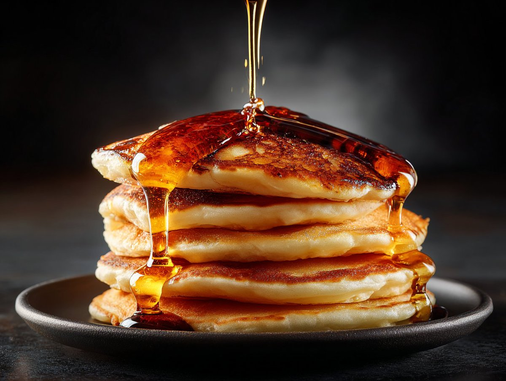

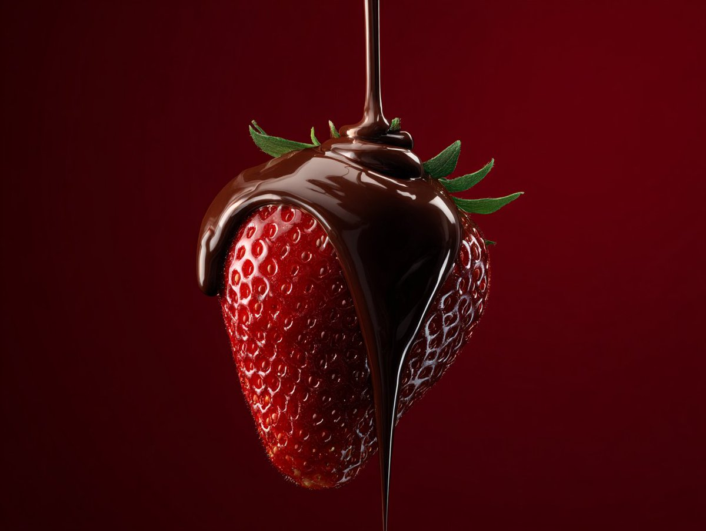

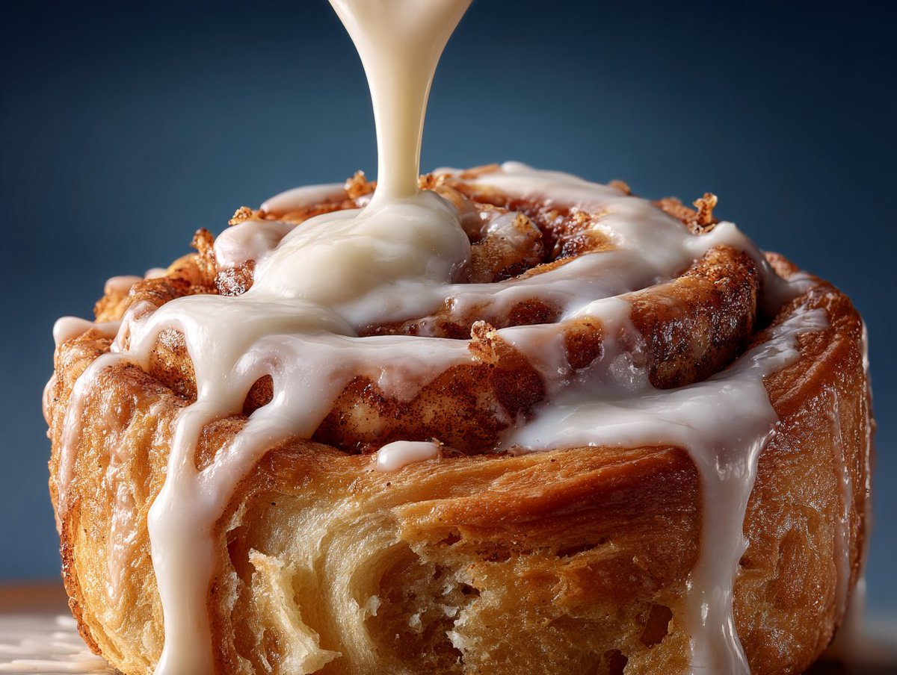

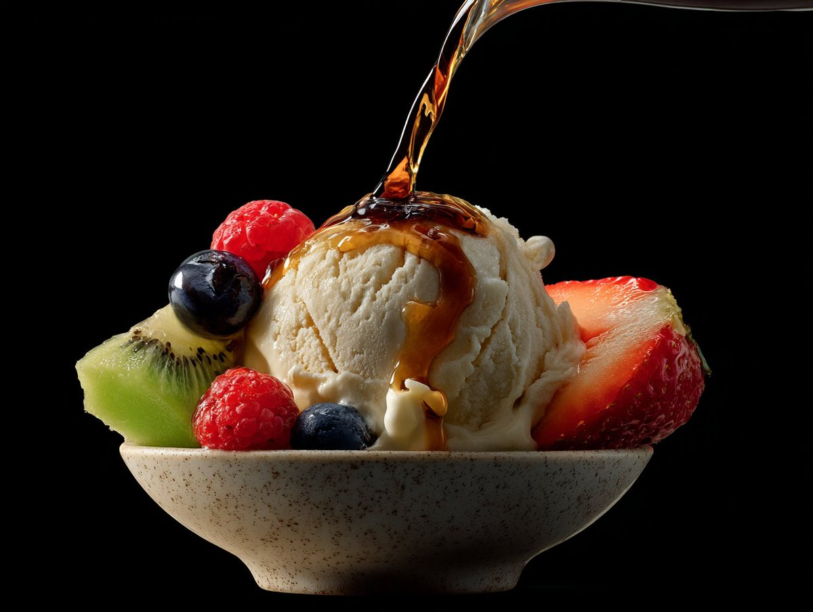

```
A stack of fluffy pancakes with maple syrup being poured over it, captured at moment of contact, dripping and coating surface, viscous flow frozen in time, studio lighting revealing liquid texture, sensory product photography, indulgent aesthetic.
```

```
A single perfect strawberry with melted dark chocolate being poured over it, captured at moment of contact, dripping and coating surface, viscous flow frozen in time, studio lighting revealing liquid texture, sensory product photography, indulgent aesthetic.
```

```
A warm cinnamon roll with cream cheese glaze being poured over it, captured at moment of contact, dripping and coating surface, viscous flow frozen in time, studio lighting revealing liquid texture, sensory product photography, indulgent aesthetic.
```

```
A cup of vanilla gelato and fruits with espresso being poured over it, captured at moment of contact, dripping and coating surface, viscous flow frozen in time, studio lighting revealing liquid texture, sensory product photography, indulgent aesthetic.
```

 [↑返回目录](#toc)

---
## <a id="prompt-2004627569598234600">体素国度：空中之城</a> (<a href="https://x.com/TechieBySA/status/2004627569598234729" target="_blank" rel="noopener noreferrer">TechieSA</a>)

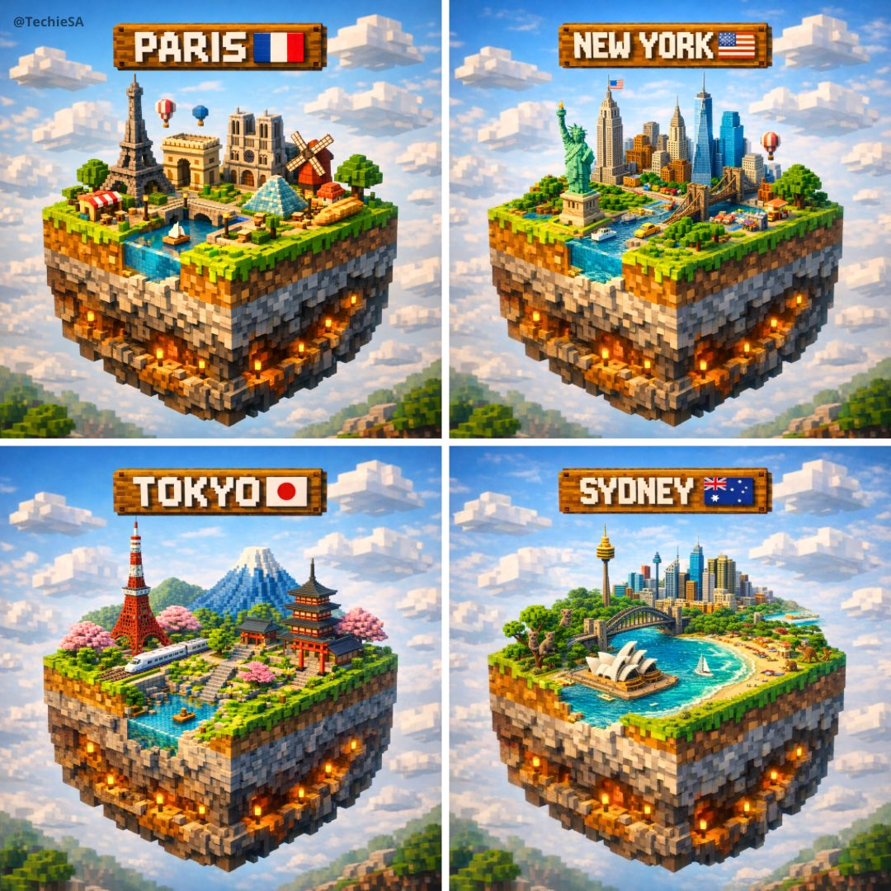

```
A cinematic voxel-style render of a floating Minecraft-inspired cube representing [CITY]. The cube is shown from a slightly elevated angle in mid-air. Its sides reveal layers of grass, dirt, stone, and glowing blocks like lava or caves, giving it a layered, earthy Minecraft texture.

On the top surface, build a miniature Minecraft-style diorama of [CITY] that includes the most iconic landmarks, natural features, cultural symbols, and scenery of the country — all created in a blocky voxel aesthetic.

Hovering just above the cube, include a wooden pixel sign displaying the country name “CITY” in bold white block letters, with the [COUNTRY FLAG EMOJI] beside it — both sized clearly and centered for high visibility.

Background is a soft, natural daytime Minecraft sky with voxel-style clouds and gentle lighting. The scene is bright but not overly exposed, ensuring the country cube remains the main focal point, enhanced with soft cinematic voxel shadows and slight atmospheric haze.
```

```
一部电影感的体素风格渲染图，描绘一个漂浮在空中的《我的世界》风格立方体，代表[CITY]。立方体以略高的视角悬浮于半空中，其侧面展现出草方块、泥土、石头以及如熔岩或洞穴般的发光方块，呈现出分层且富有泥土质感的《我的世界》纹理。

在立方体顶部，构建一座微型《我的世界》风格的[CITY]微缩景观，包含该国最具标志性的地标建筑、自然地貌、文化符号与风景——全部采用方块化的体素美学呈现。

在立方体正上方悬浮一块木质像素标牌，以粗体白色方块字母清晰显示国家名称“CITY”，旁边配有[国家国旗表情符号]——两者尺寸醒目、居中排布，确保高度可见。

背景为柔和自然的《我的世界》日间天空，带有体素风格的云朵与柔和光线。整体画面明亮但不过曝，确保国家立方体始终是视觉焦点，并辅以柔和的电影感体素阴影与轻微的大气雾效。
```

 [↑返回目录](#toc)

---
## <a id="prompt-2004825491350716700">魔书幻境：霓虹烟雾中的阅读者</a> (<a href="https://x.com/itis_Jarvo33/status/2004825491350716624" target="_blank" rel="noopener noreferrer">𝓜𝓻.𝓙𝓪𝓻𝓿𝓸</a>)

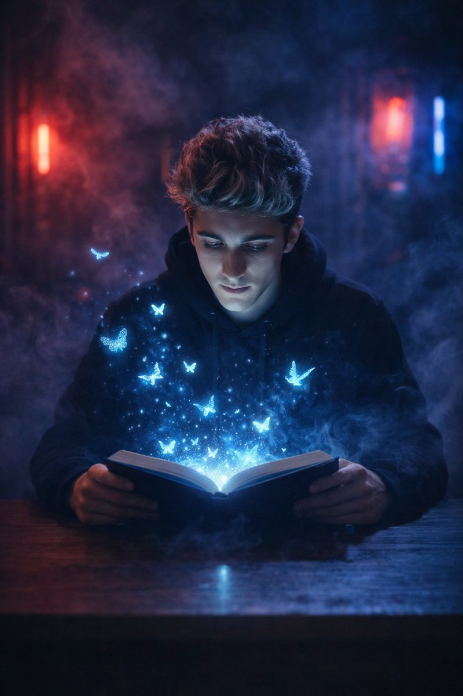

```
A mysterious smoky room filled with surreal atmosphere, dim reflections of red and blue neon lights casting over the walls. At the center, a young man wearing a black hoodie sits at a wooden table, holding an open book with both hands, deeply immersed in reading. From inside the glowing book, magical blue light bursts out, transforming into ethereal butterflies and tiny luminous birds flying into the smoky air." Create a HD photo
```

```
一间充满超现实氛围的神秘烟雾缭绕的房间，红蓝霓虹灯的微弱反光投射在墙壁上。房间中央，一名身穿黑色连帽衫的年轻男子坐在木桌旁，双手捧着一本打开的书，全神贯注地阅读。从发光的书中迸发出魔幻的蓝色光芒，化作缥缈的蝴蝶和微光闪烁的小鸟，飞入烟雾弥漫的空气中。创作一张高清照片。
```

 [↑返回目录](#toc)

---
## <a id="prompt-2004738067618468400">微小角色在巨大日常物品边缘的缤纷节日</a> (<a href="https://x.com/aleenaamiir/status/2004738067618468292" target="_blank" rel="noopener noreferrer">Aleena Amir</a>)

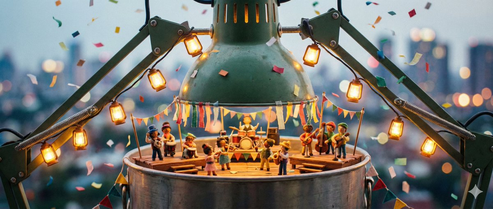


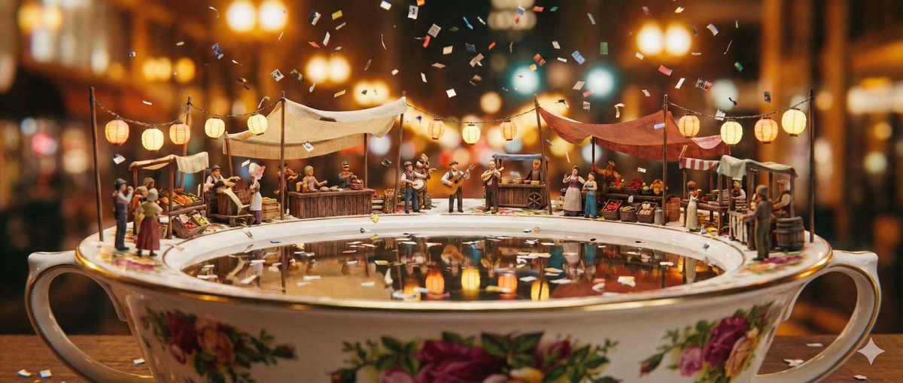

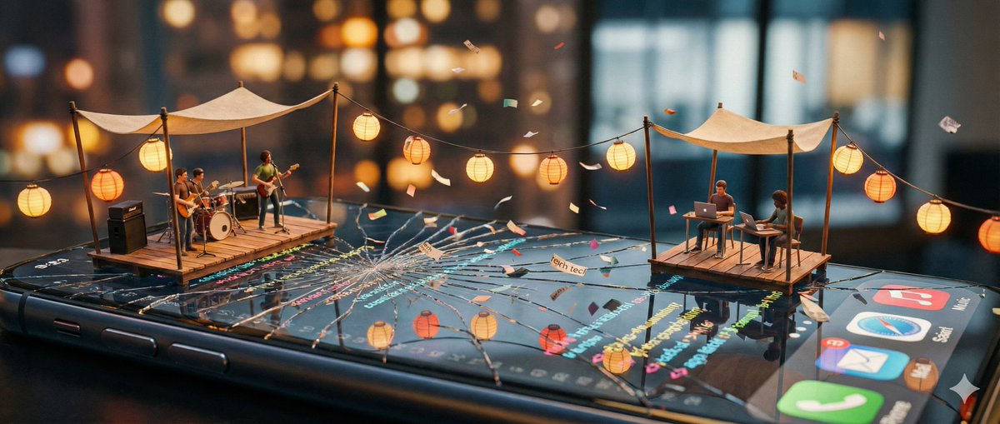

```
A band of tiny [CHARACTERS] throwing a colorful festival on the rim of an enormous [EVERYDAY_OBJECT]. Paper lanterns strung on wire, confetti made from magazine scraps, warm ambient city-bokeh background, shallow depth of field, cinematic wide-angle close-up, vibrant saturated palette, tactile fabric and wood textures.
```

```
一群微小的[角色]在巨大的[日常物品]边缘举办一场缤纷节日。电线悬挂着纸灯笼，彩屑由杂志碎片制成，温暖的城市虚化背景，浅景深，电影感广角特写，鲜艳饱和的色调，可触感的织物与木纹质感。
```

 [↑返回目录](#toc)

---
## <a id="prompt-2004598274171269400">真人坐上Funko Pop盒</a> (<a href="https://x.com/Arminn_Ai/status/2004598274171269272" target="_blank" rel="noopener noreferrer">ΛRMIN | AI</a>)

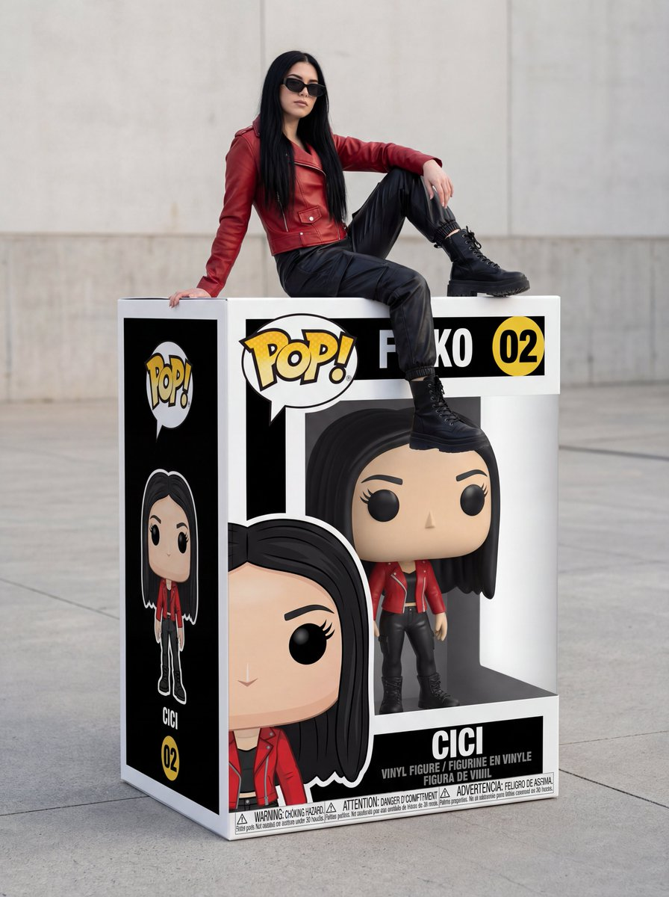

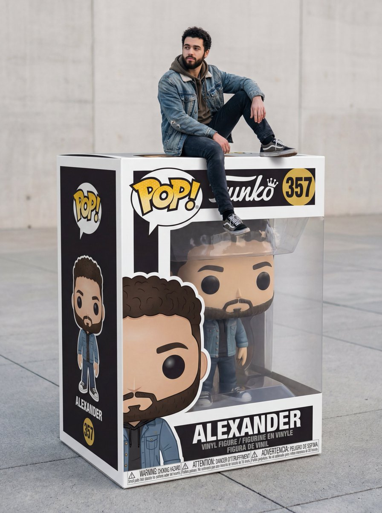

```
👇
A hyper-realistic, wide-angle, three-quarter view photograph showing [DESCRIPTION OF PERSON] sitting casually on the top edge of a giant, life-sized "Funko Pop" action figure box. The person is wearing [CLOTHING DETAILS].
The box is angled to display both the front and the left side clearly. The left side panel features a 2D flat vector art illustration of the character (full body). Inside the box, visible through the clear plastic window, is a 3D vinyl collectible figure version of the same person, featuring a large head, black button eyes, and matching outfit.
The packaging design is highly detailed and realistic, including the classic yellow "POP!" logo, the number "[NUMBER]", and the name "[INSERT NAME]" printed in large, bold sans-serif font at the bottom. The box includes authentic packaging details such as "VINYL FIGURE" text, age rating logos, and safety warning icons strip at the very bottom.
The background is a clean, minimalist outdoor concrete plaza with a plain wall and soft, natural daylight, creating a sharp focus on the subject and the box. 8k resolution, photorealistic textures.
```

```
一张超写实、广角、四分之三视角的照片，展示[人物描述]随意坐在一个真人大小的“Funko Pop”手办盒顶部边缘。人物穿着[服装细节]。  
盒子以一定角度摆放，清晰展现正面和左侧。左侧板上印有该角色的二维平面矢量艺术插图（全身像）。透过盒子前方的透明塑料窗口，可以看到内部放置着一个三维乙烯基收藏人偶，其形象与人物一致，具有大头、黑色纽扣眼睛和相配的服装。  
包装设计高度精细且逼真，包含经典的黄色“POP!”标志、编号“[编号]”，以及底部用粗体无衬线字体印刷的大字“[插入姓名]”。盒子还包括真实的包装细节，如“VINYL FIGURE”文字、年龄分级标识，以及最底部的安全警告图标条。  
背景为干净极简的户外混凝土广场，配有素色墙面和柔和的自然日光，使主体和盒子成为画面焦点。8K分辨率，照片级真实纹理。
```

 [↑返回目录](#toc)

---
## <a id="prompt-2003849723837616489">3D纸盒包装的2D技术展开图</a> (<a href="https://x.com/AmirMushich/status/2003849723837616489" target="_blank" rel="noopener noreferrer">AmirMušić</a>)

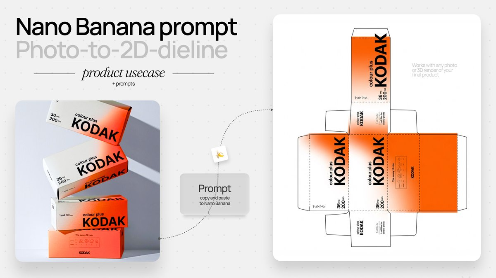

```
Deconstruct this 3D product packaging photo into a precise, flattened 2D dieline template. Unfold the box into a complete technical net structure, revealing all panels, including previously hidden dust flaps, tucks, and glue tabs. Eliminate all perspective and lens distortion to create a perfect orthographic top-down view. Retain the exact high-fidelity texture and typography from the original photo but map it accurately onto the flat surface. Superimpose clean, technical die-cut lines (solid) and fold lines (dashed) in a contrasting color. Isolated on a pure white background, shadowless, print-ready production quality
```

```
将这张3D产品包装照片解构为精确的平面2D模切展开图。将纸盒完全展开成完整的技术展开结构，展示所有面板，包括原本隐藏的防尘襟片、插舌和粘胶位。消除所有透视和镜头畸变，生成完美的正交俯视图。保留原始照片中的高保真纹理和字体，并将其准确映射到平面表面上。叠加清晰的技术模切线（实线）和折痕线（虚线），使用对比色标示。图像置于纯白背景上，无阴影，达到可直接用于印刷生产的质量标准。
```

 [↑返回目录](#toc)

---
## <a id="prompt-2005311875278606800">力量感十足的悬浮产品瞬间</a> (<a href="https://x.com/RobotCleopatra/status/2005311875278606756" target="_blank" rel="noopener noreferrer">Skipper</a>)

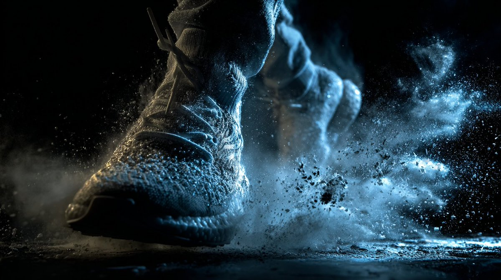

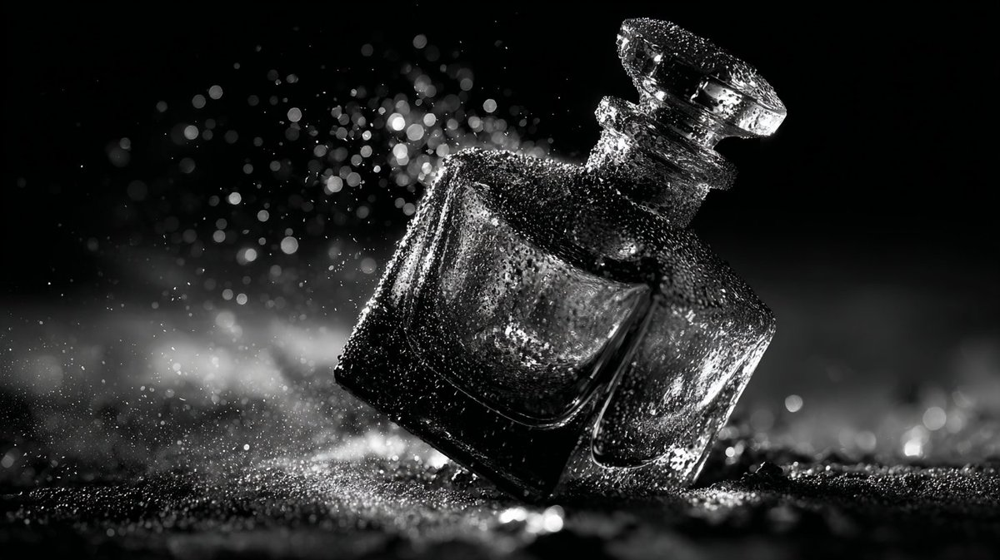

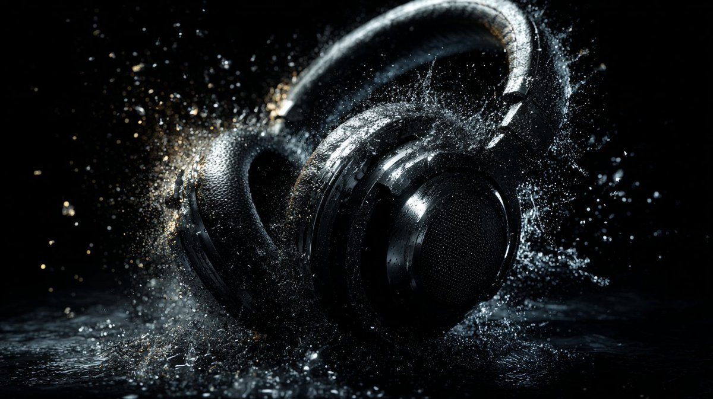

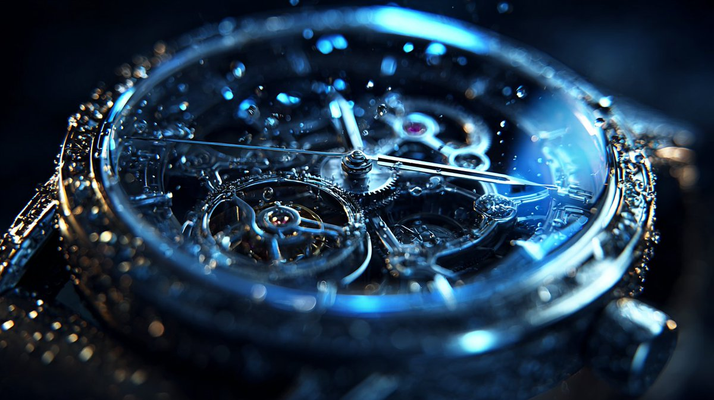

```
TO ART
[PRODUCT] captured in a powerful levitation moment, fragments of light and particles orbiting the form, high-contrast cinematic lighting sculpting every surface detail, intense sense of strength and precision, ultra-sharp focus with frozen dynamic motion.
```

```
[PRODUCT] 在一个充满力量的悬浮瞬间被捕捉，光之碎片与粒子环绕其形体，高对比度的电影级灯光雕琢出每一处表面细节，展现出强烈的力量感与精准感，超锐利焦点定格动态瞬间。
```

 [↑返回目录](#toc)

---
## <a id="prompt-2005299702015918300">夜空中烟火帆船映衬城市天际线</a> (<a href="https://x.com/AllaAisling/status/2005299702015918358" target="_blank" rel="noopener noreferrer">Alexandra Aisling</a>)

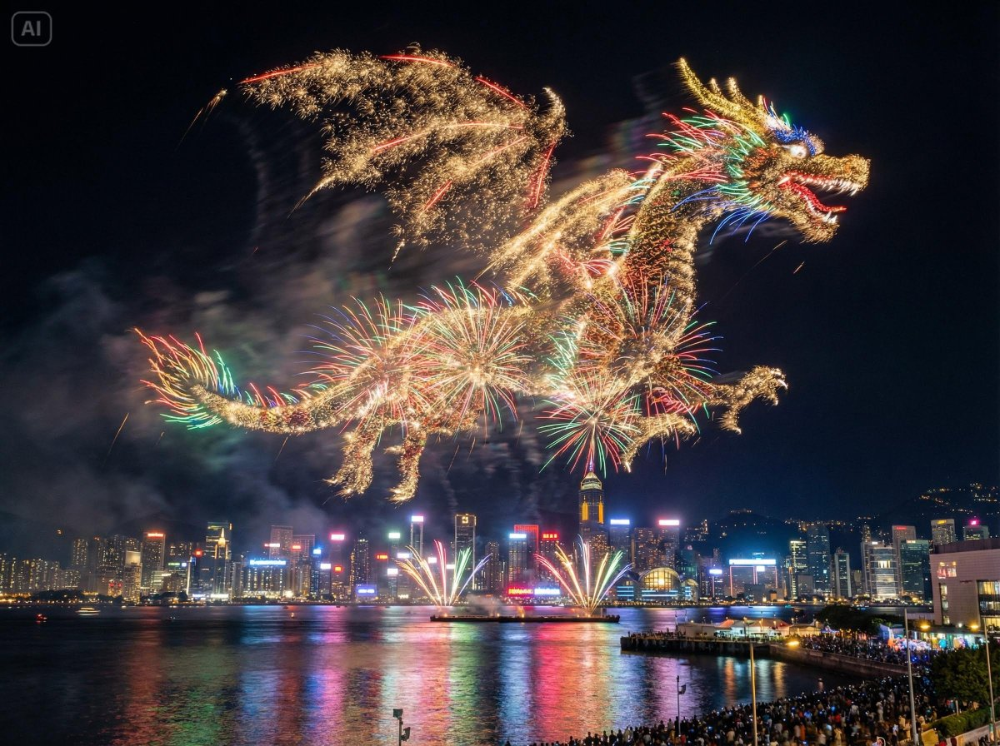

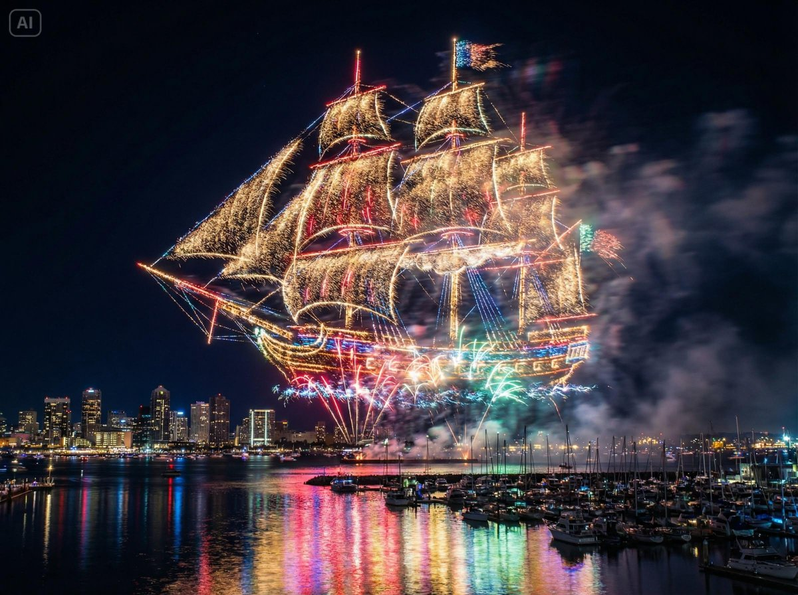

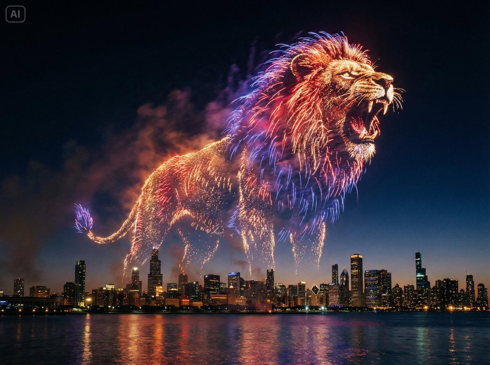

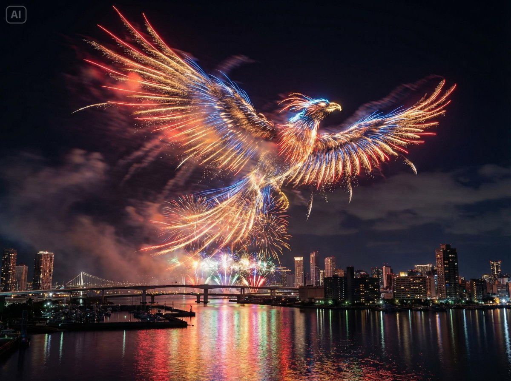

```
Fireworks form the shape of a dragon in the night sky above a waterfront city. The design is inspired by the colors, proportions, and silhouette of a dragon, clearly readable and visually striking against the dark sky. Long-exposure, photorealistic fireworks photography with smoke trails, city skyline silhouette, and colorful reflections on the water. Cinematic composition, sharp detail, ultra-high-resolution 4K.
```

```
Fireworks form the shape of a sailing ship in the night sky above a waterfront city. The design is inspired by the colors, proportions, and silhouette of a sailing ship, clearly readable and visually striking against the dark sky. Long-exposure, photorealistic fireworks photography with smoke trails, city skyline silhouette, and colorful reflections on the water. Cinematic composition, sharp detail, ultra-high-resolution 4K.
```

```
Fireworks form the shape of a roaring lion in the night sky above a waterfront city. The design is inspired by the colors, proportions, and silhouette of a roaring lion, clearly readable and visually striking against the dark sky. Long-exposure, photorealistic fireworks photography with smoke trails, city skyline silhouette, and colorful reflections on the water. Cinematic composition, sharp detail, ultra-high-resolution 4K.
```

```
Fireworks form the shape of a phoenix in the night sky above a waterfront city. The design is inspired by the colors, proportions, and silhouette of a phoenix, clearly readable and visually striking against the dark sky. Long-exposure, photorealistic fireworks photography with smoke trails, city skyline silhouette, and colorful reflections on the water. Cinematic composition, sharp detail, ultra-high-resolution 4K.
```

 [↑返回目录](#toc)

---
## <a id="prompt-2005288633839096000">印有快餐品牌标志的皮革包</a> (<a href="https://x.com/AmirMushich/status/2005288633839096050" target="_blank" rel="noopener noreferrer">AmirMušić</a>)

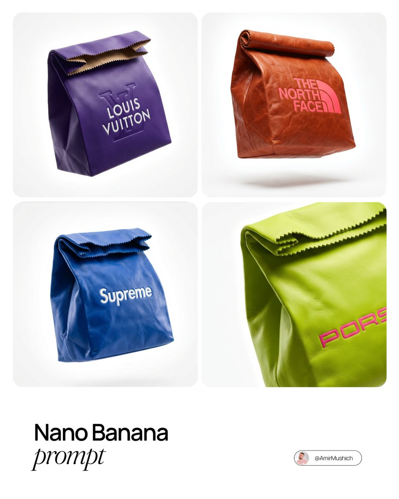

```
[BRAND NAME]. A high-end conceptual leather clutch designed in the exact shape and silhouette of a classic disposable paper lunch sack (rolled top, rectangular base, NO HANDLES). The object is floating weightlessly in the center.

**CRITICAL SHAPE & FORM:**
The object must mimic a folded paper lunch bag. It has jagged/crimped cut edges at the top opening. The top is rolled or folded over casually. It must NOT have any handles or straps.

**CREATIVE COLOR PALETTE & BRANDING:**
The AI must act as a color stylist. Do not default to standard brand colors. Generate a unique, bold, fashion-forward color combination.
* **Bag Color:** A vivid, unexpected luxury tone (e.g., Electric Lime, Deep Ultraviolet, Burnt Orange, or Cobalt Blue).
* **Logo Size & Color:** A **medium-sized, centrally placed** `[BRAND NAME]` logo is deeply embossed on the front. Do NOT make the logo huge or oversized; keep it proportional and elegant with plenty of negative space around it. The logo is stamped with a highly contrasting color (e.g., White logo on Blue bag) to make it readable.

**MATERIALS:**
Ultra-premium, soft-grain calfskin leather that mimics the crinkles and folds of paper. Hyper-realistic leather texture.

**ENVIRONMENT & BACKGROUND:**
A seamless, perfectly clean, pure white studio cyclorama background. High-key brightly lit environment.

**LIGHTING & ATMOSPHERE:**
High-key editorial lighting. A strong backlighting setup creates a glowing "light aura" (halation) around the edges of the bag against the white background. The edges are slightly blown out.

**CAMERA:**
Medium format, 100mm lens, f/5.6. Slight shallow depth of field (sharp logo, soft back).
```

```
[品牌名称]。一款高端概念皮革手拿包，外形与经典一次性纸质午餐袋完全一致（卷折式顶部、矩形底面，无任何提手或肩带），轻盈悬浮于画面中央。

**关键造型与形态：**
该手拿包必须精准模仿折叠纸制午餐袋的外观——顶部开口处带有锯齿状或压褶边缘，顶部随意卷折，绝对不可出现提手或肩带。

**创意配色与品牌标识：**
AI需扮演色彩造型师角色，不得使用品牌默认标准色，而应生成一组独特、大胆且具有时尚前瞻性的配色方案：
- **包身颜色：** 采用鲜明且出人意料的奢华色调（例如电光青柠色、深紫外紫、焦橙色或钴蓝色）。
- **品牌标识尺寸与颜色：** 在包正面中央位置，以中等尺寸压印[品牌名称]标志。标志不可过大，需保持比例协调、优雅，并留有充足留白。标志采用高对比度压印色（如蓝色包身配白色标志），确保清晰可读。

**材质：**
选用超高端软粒面小牛皮，质感逼真地还原纸张的褶皱与折痕，呈现极度写实的皮革纹理。

**环境与背景：**
纯白无缝影棚环形背景（cyclorama），整体环境为高调明亮照明。

**光影与氛围：**
采用高调时尚摄影布光，强背光营造出包体边缘环绕的“光晕”效果（halation），边缘部分轻微过曝，凸显悬浮感与轮廓。

**镜头参数：**
中画幅相机，100mm镜头，光圈f/5.6，浅景深（标志清晰锐利，背面略柔）。
```

 [↑返回目录](#toc)

---
## <a id="prompt-2005367928888373800">复古黑白戏剧性肖像</a> (<a href="https://x.com/ecommartinez/status/2005367928888373635" target="_blank" rel="noopener noreferrer">Alejo</a>)

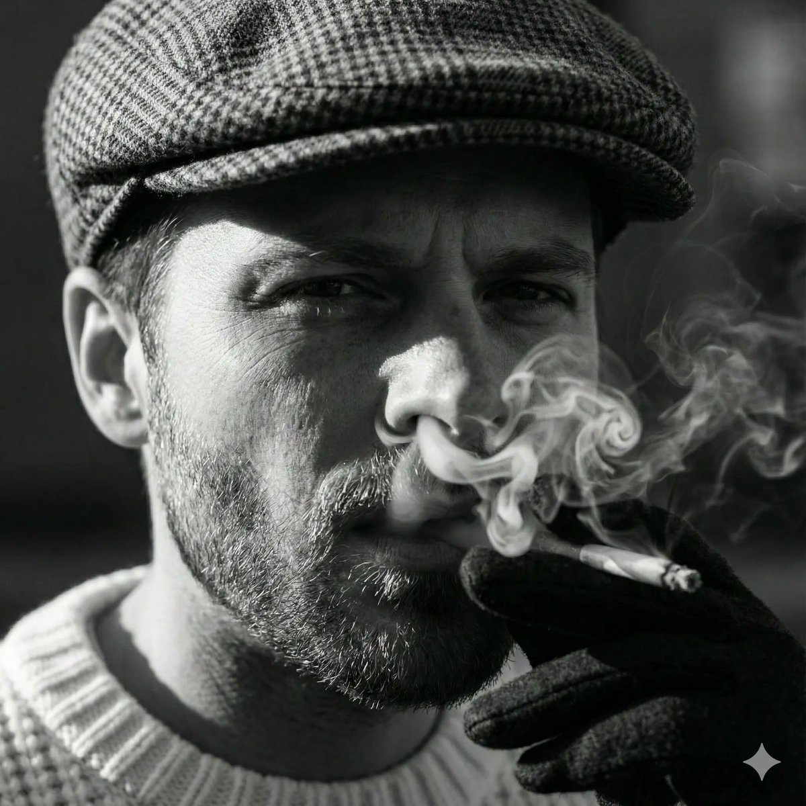

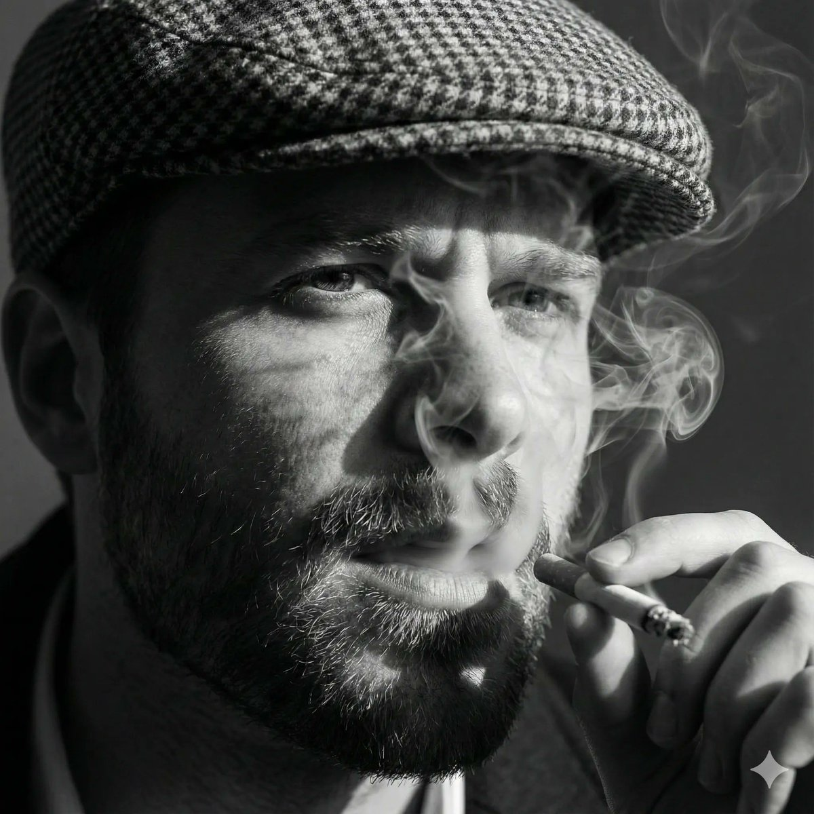

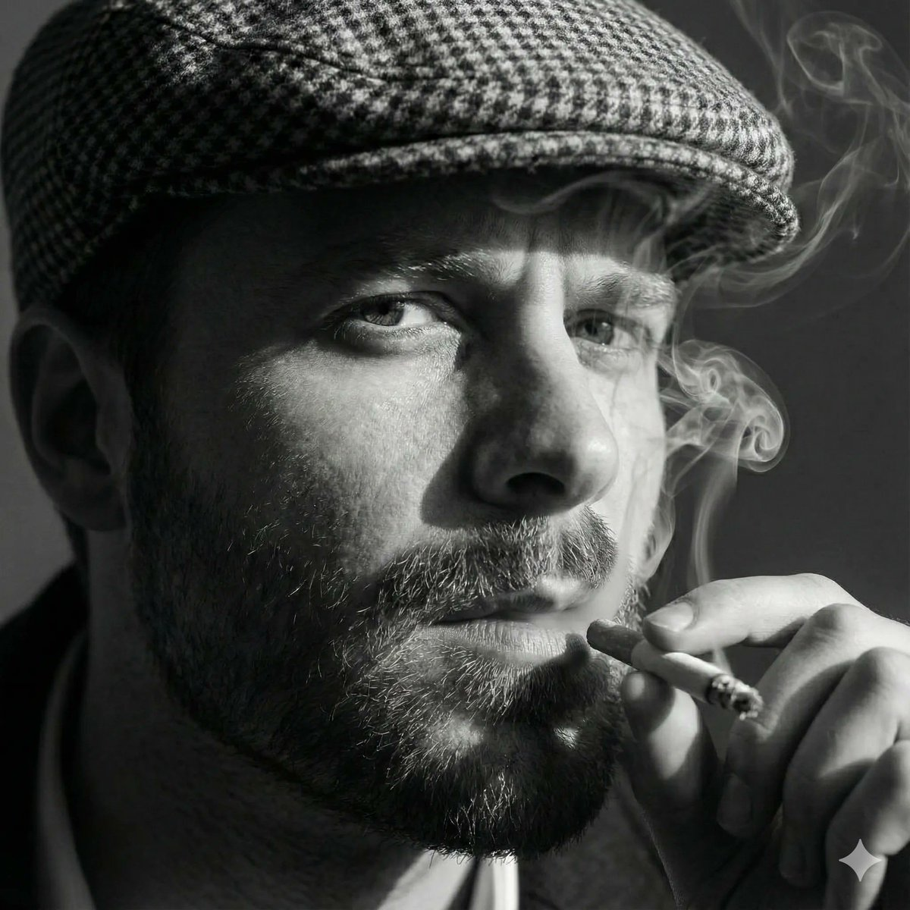

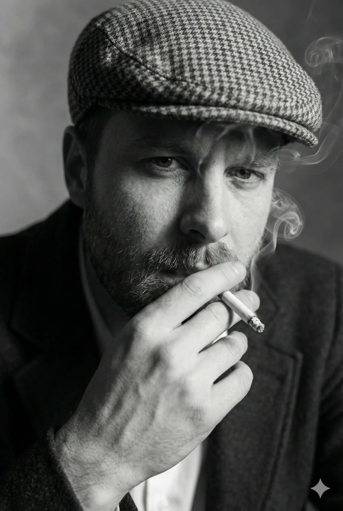

```
Transforma tu foto en una sesión fotográfica vintage

1️⃣ Ve a Gemini y activa la opción de imagen.
2️⃣ Sube una foto tuya.
3️⃣ Introduce el siguiente prompt.

Usa al 100 % el rostro de la foto subida arriba. Retrato dramático en blanco y negro de un hombre barbudo con boina plana a cuadros, exhalando un humo espeso y envolvente de un cigarrillo sostenido entre los dedos, plano cercano en contrapicado, luz solar intensa proyectando sombras sobre su rostro, el humo rodeando la nariz y la boca, expresión seria, estilo noir vintage, alto contraste, texturas detalladas, fotografía monocroma, no cambies el rostro.

Prompt inspirado por @Abhiew_
```

```
100% 使用上方上传照片中的面部。一张黑白戏剧性肖像，描绘一位戴格纹平顶贝雷帽、留着胡须的男子，手指夹着香烟，吐出浓密缭绕的烟雾；近景仰拍构图，强烈阳光在脸上投下阴影，烟雾环绕鼻尖与嘴唇，表情严肃；复古黑色电影风格，高对比度，细节纹理丰富，单色摄影，不得更改面部。
```

 [↑返回目录](#toc)

---
## <a id="prompt-2005372269426856200">16种室内设计风格的4x4网格展示</a> (<a href="https://x.com/gokayfem/status/2005372269426856164" target="_blank" rel="noopener noreferrer">gokaygokay</a>)

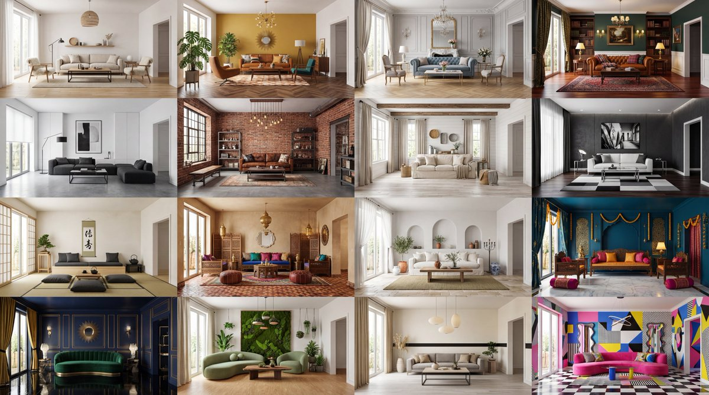

```
Professional architectural photography 4x4 grid showcasing identical room transformed through 16 distinct interior design styles. Camera: consistent 3/4 angle, 24mm tilt-shift lens, f/8, tripod-mounted. Each frame applies complete style transformation to the same space.
Row 1 – Classic & Traditional:

Scandinavian Minimalist — Light oak wide-plank flooring, white walls with warm undertone, low-profile oatmeal linen upholstery, black metal accents, sheepskin textiles, ceramic vessels, sheer white curtains, single statement pendant. Palette: whites, warm grays, natural wood, matte black. Lighting: bright, airy, natural light dominant. Mood: calm, functional, hygge warmth.
Mid-Century Modern — Walnut herringbone flooring, white walls with single mustard accent wall, tapered leg furniture in teak, iconic sculptural seating, sunburst mirrors, geometric patterns in burnt orange and cream, brass sputnik fixtures, monstera plants. Palette: teal, mustard, burnt orange, walnut, brass. Lighting: warm afternoon glow. Mood: retro optimism, sophisticated playfulness.
French Parisian — Chevron light oak parquet, soft gray walls with ornate white molding and panel details, marble surfaces, velvet tufted upholstery in dusty blue, gilded mirrors, crystal chandeliers, antique curved-leg furniture, fresh flowers, floor-length silk drapes. Palette: soft gray, dusty blue, gold, marble white, blush. Lighting: romantic diffused daylight. Mood: elegant, romantic, timeless sophistication.
Traditional English — Rich mahogany hardwood, Persian rugs in deep reds and navy, hunter green walls with white wainscoting, rolled-arm Chesterfield leather seating in cognac, brass library lamps, built-in bookshelves, oil paintings in gilt frames, tartan textiles, heavy damask curtains. Palette: hunter green, cognac, deep red, navy, brass. Lighting: warm pools of lamplight. Mood: scholarly, heritage, gentlemen's club warmth.

Row 2 – Contemporary & Modern:

Contemporary Minimalist — Polished concrete flooring, pure white walls, low modular seating in charcoal, single oversized abstract monochrome art, hidden storage, black metal and glass surfaces, architectural floor lamp, motorized white blinds. Palette: white, charcoal, black, concrete gray. Lighting: clean, even, recessed. Mood: serene, uncluttered, gallery-like calm.
Industrial Loft — Sealed concrete floors, exposed red brick walls, raw steel elements, distressed tobacco leather seating, reclaimed wood on pipe legs, Edison bulb clusters, metal factory shelving, vintage objects, worn area rugs. Palette: brick red, raw steel, tobacco, aged wood, black iron. Lighting: warm tungsten Edison glow, intentional shadows. Mood: raw, urban, warehouse authenticity.
Modern Farmhouse — Whitewashed oak plank flooring, white shiplap walls, natural cotton slipcovered seating, reclaimed beam accents, woven baskets, galvanized metal details, linen curtains on iron rods, stoneware vessels, cozy knit throws. Palette: white, cream, warm gray, natural wood, black iron. Lighting: bright and fresh, wrought iron fixtures. Mood: cozy, collected, modern rusticity.
Urban Modern — Dark espresso hardwood, charcoal textured walls, sleek white Italian leather seating, chrome and glass surfaces, large-scale black and white photography, geometric black/white/gray rugs, layered sheer and blackout curtains. Palette: charcoal, white, chrome, black, cool gray. Lighting: layered recessed and LED strips, dramatic. Mood: sophisticated, city penthouse, nightlife elegance.

Row 3 – Global & Cultural:

Japanese Zen — Tatami-style natural flooring, off-white lime-washed walls, low platform seating in charcoal linen, shoji screen dividers, bonsai on simple stands, calligraphy scroll art, floor cushions, black iron teapot, rice paper window panels. Palette: off-white, charcoal, bamboo, black, moss green. Lighting: soft diffused, contemplative. Mood: meditative, balanced, wabi-sabi beauty.
Moroccan Bohemian — Terra-cotta geometric zellige tile, warm textured stucco walls, low carved wooden seating with jewel-tone cushions, brass lantern pendants, ornate wooden screens, embroidered leather poufs, bone inlay mirrors, layered vintage rugs. Palette: terra-cotta, sapphire, ruby, gold, turquoise. Lighting: lanterns casting patterned shadows. Mood: exotic, layered, sensory richness.
Mediterranean Coastal — Tumbled limestone flooring, white textured plaster walls with arched niches, deep natural white linen seating, driftwood surfaces, terracotta pots with olive branches, iron candelabras, billowing white gauze curtains, blue/white ceramics, seagrass rugs. Palette: white, terracotta, Mediterranean blue, olive green. Lighting: bright sun-drenched, golden. Mood: relaxed, sun-kissed, Aegean escape.
Indian Maximalist — Inlaid marble flooring, deep peacock blue walls, ornate carved wooden seating with silk cushions in marigold and fuchsia, brass figurines, embroidered floor bolsters, carved jali screens, hanging brass bells, marigold garlands, gold-embroidered silk curtains. Palette: peacock blue, marigold, fuchsia, gold. Lighting: rich warm brass lamp glow. Mood: opulent, celebratory, sensory abundance.

Row 4 – Specialty & Emerging:

Art Deco Revival — High-gloss black lacquered flooring, deep navy walls with geometric gold molding, curved emerald velvet seating, sunburst brass mirrors, stepped geometric shelving, marble and brass accents, frosted glass sculptural lamps, gold velvet drapes with black trim. Palette: emerald, navy, gold, black, marble. Lighting: glamorous wall sconces, dramatic. Mood: lavish, theatrical, 1920s grandeur.
Biophilic Modern — Light cork flooring, living moss wall installation, organic-shaped sage green bouclé seating, natural edge wood surfaces, hanging planters at multiple heights, terrariums, stone pebble accents, abundant air-purifying plants, undyed natural linen curtains. Palette: every green shade, natural wood, stone gray, cork. Lighting: greenhouse-like, supplemental grow lights. Mood: alive, oxygen-rich, nature immersion.
Japandi Fusion — Light ash flooring, warm white walls with single black accent stripe, low streamlined warm gray wool seating, pale wood with black metal frame surfaces, single large ceramic vessel, paper pendant lights, bonsai, ikebana arrangements, warm beige linen curtains. Palette: warm white, ash, black accent, pale wood, sage. Lighting: bright but soft, material-focused. Mood: refined simplicity, warm minimalism.
Avant-Garde Maximalist — Checkered black/white marble flooring, colorful Memphis-style geometric wall patterns, curved hot pink velvet seating, wavy asymmetrical mirrors, abstract sculptural lighting, clashing patterns throughout, salon-style art collection, neon sign art, mixed metals. Palette: hot pink, electric blue, yellow, black, white. Lighting: theatrical, neon accents, spotlighting. Mood: bold, rule-breaking, creative chaos.

Post-processing: individual color grading per style mood. Output: high-resolution architectural portfolio quality. Full spectrum from serene minimalism to opulent maximalism
```

```
专业建筑摄影，4x4网格展示同一房间经16种不同室内设计风格改造后的效果。相机设置：固定3/4视角，24mm移轴镜头，光圈f/8，三脚架固定。每帧对同一空间进行完整的风格化改造。

第一行 – 经典与传统：

斯堪的纳维亚极简风 — 浅橡木宽板地板，带暖色调的白墙，低矮燕麦色亚麻布艺家具，黑色金属配件，羊皮织物，陶瓷器皿，透明白色窗帘，单盏标志性吊灯。配色：白色、暖灰、天然木色、哑光黑。光线：明亮通透，以自然光为主。氛围：宁静、实用、温馨舒适（hygge）。

中世纪现代风 — 胡桃木人字拼地板，白墙配一面芥末黄特色墙，细腿柚木家具，标志性雕塑感座椅，日出图案镜面，焦橙与奶油色几何图案，黄铜Sputnik吊灯，龟背竹植物。配色：青绿色、芥末黄、焦橙、胡桃木、黄铜。光线：温暖午后阳光。氛围：复古乐观、精致俏皮。

法式巴黎风 — 人字拼浅橡木地板，柔和灰墙配华丽白色雕花线板和护墙细节，大理石台面，灰蓝色丝绒纽扣软包家具，镀金镜面，水晶吊灯，古董弧形腿家具，鲜花装饰，及地丝绸窗帘。配色：柔灰、灰蓝、金色、大理石白、淡粉红。光线：浪漫柔光日光。氛围：优雅、浪漫、永恒精致。

英式传统风 — 深红木硬木地板，深红与藏青波斯地毯，墨绿墙面配白色护墙板，焦糖色滚边Chesterfield皮革沙发，黄铜台灯，嵌入式书架，镀金框油画，格纹织物，厚重锦缎窗帘。配色：墨绿、焦糖、深红、藏青、黄铜。光线：温暖局部台灯光。氛围：学者气质、传承感、绅士俱乐部般的温暖。

第二行 – 当代与现代：

当代极简风 — 抛光混凝土地板，纯白墙面，炭灰色低矮模块化沙发，单幅大型黑白抽象画，隐藏式收纳，黑色金属与玻璃表面，建筑感落地灯，电动白色百叶帘。配色：白、炭灰、黑、混凝土灰。光线：干净均匀，嵌入式照明。氛围：宁静、无杂乱、如画廊般平和。

工业阁楼风 — 密封混凝土地面，裸露红砖墙，原始钢材元素，做旧烟草色皮革座椅，回收木材配金属管腿家具，爱迪生灯泡集群，金属工厂置物架，复古物件，磨损地毯。配色：砖红、原钢、烟草色、旧木、黑铁。光线：暖色钨丝爱迪生灯，刻意营造阴影。氛围：粗犷、都市感、仓库真实感。

现代农舍风 — 白洗橡木地板，白色船板墙，天然棉布包裹沙发，回收横梁装饰，编织篮，镀锌金属细节，铁杆亚麻窗帘，粗陶器皿，柔软针织盖毯。配色：白、米白、暖灰、天然木色、黑铁。光线：明亮清新，锻铁灯具。氛围：舒适、自然收集感、现代乡村风。

都市现代风 — 深咖啡色硬木地板，炭灰色纹理墙面，流线型意大利白皮革沙发，铬合金与玻璃表面，大幅黑白摄影作品，几何黑白灰地毯，多层纱帘与遮光帘组合。配色：炭灰、白、铬银、黑、冷灰。光线：多层次嵌入式与LED灯带，戏剧性照明。氛围：精致、城市顶层公寓、夜生活优雅。

第三行 – 全球与文化：

日式禅意风 — 塌塌米风格天然地板，米白色石灰洗墙，炭灰色亚麻低平台座椅，障子屏风隔断，盆景置于简约支架，书法卷轴，坐垫，黑铁茶壶，和纸窗格。配色：米白、炭黑、竹色、黑、苔藓绿。光线：柔和漫射，沉思感。氛围：冥想、平衡、侘寂之美。

摩洛哥波西米亚风 — 陶土色几何Zellige瓷砖，温暖肌理灰泥墙，低矮雕花木座椅配宝石色调靠垫，黄铜灯笼吊灯，雕花木屏风，刺绣皮革脚凳，骨镶嵌镜子，多层复古地毯。配色：陶土红、宝蓝、红宝石、金、绿松石。光线：灯笼投射图案阴影。氛围：异域风情、层次丰富、感官充盈。

地中海滨海风 — 磨面石灰石地板，白色肌理灰泥墙带拱形壁龛，深米白色亚麻沙发，漂流木台面，橄榄枝陶罐，铁艺烛台，飘逸白色薄纱帘，蓝白陶瓷，海草地毯。配色：白、陶土色、地中海蓝、橄榄绿。光线：明亮日晒，金色调。氛围：放松、阳光沐浴、爱琴海度假感。

印度极繁风 — 镶嵌大理石地板，深孔雀蓝墙面，雕花木座椅配万寿菊与洋红丝绸靠垫，黄铜雕像，刺绣坐垫，雕花Jali屏风，悬挂黄铜铃铛，万寿菊花环，金线刺绣丝绸窗帘。配色：孔雀蓝、万寿菊黄、洋红、金。光线：浓郁温暖黄铜灯照。氛围：奢华、庆典感、感官丰盛。

第四行 – 特色与新兴：

装饰艺术复兴风 — 高光黑漆地板，深海军蓝墙面配几何金线装饰，弧形祖母绿丝绒座椅，日出图案黄铜镜，阶梯状几何搁架，大理石与黄铜点缀，磨砂玻璃雕塑灯，金丝绒黑边窗帘。配色：祖母绿、海军蓝、金、黑、大理石。光线：华丽壁灯，戏剧性照明。氛围：奢华、剧场感、1920年代辉煌。

亲生物现代风 — 浅软木地板，活体苔藓墙装置，有机造型鼠尾草绿粗花呢座椅，天然边缘木台面，多高度悬挂花盆，生态瓶，鹅卵石装饰，大量空气净化植物，未染色天然亚麻帘。配色：各种绿色、天然木色、石灰色、软木。光线：温室般明亮，辅以植物生长灯。氛围：生机勃勃、富氧、沉浸自然。

日式北欧融合风（Japandi）— 浅白蜡木地板，暖白墙面配一道黑色装饰条，低矮流线型暖灰羊毛座椅，浅木配黑金属框架台面，单只大型陶瓷器皿，纸质吊灯，盆景，生花插花，暖米色亚麻帘。配色：暖白、白蜡木、黑色点缀、浅木、鼠尾草绿。光线：明亮柔和，强调材质。氛围：精致简约、温暖极简主义。

前卫极繁风 — 黑白棋盘大理石地板，色彩缤纷的孟菲斯风格几何墙面图案，弧形亮粉色丝绒座椅，波浪不对称镜面，抽象雕塑灯具，冲突图案遍布各处，沙龙式艺术收藏，霓虹招牌艺术，混合金属。配色：亮粉、电光蓝、黄、黑、白。光线：剧场式照明，霓虹点缀，聚光灯效果。氛围：大胆、打破规则、创意混乱。

后期处理：每种风格按其氛围单独调色。输出：高分辨率建筑作品集品质。涵盖从宁静极简到奢华极繁的完整光谱。
```

 [↑返回目录](#toc)

---
## <a id="prompt-2005233594130973000">现代风格的超写实美食摄影</a> (<a href="https://x.com/aleenaamiir/status/2005233594130972845" target="_blank" rel="noopener noreferrer">Aleena Amir</a>)

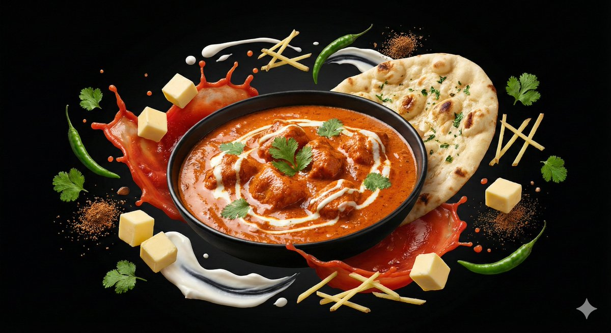

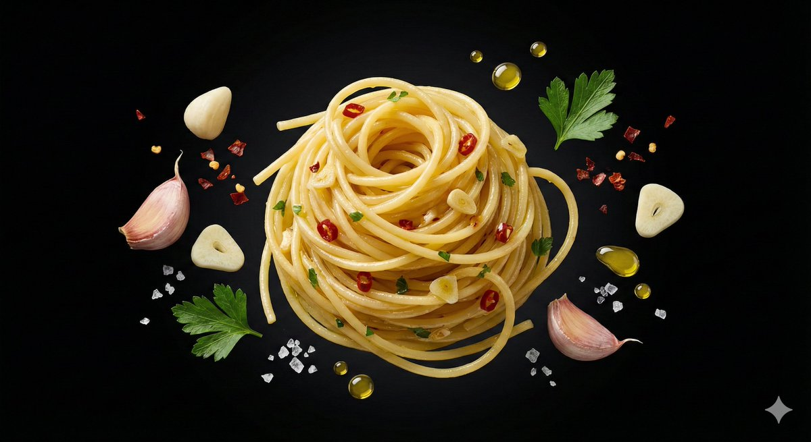

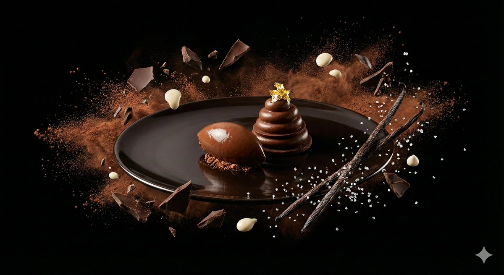

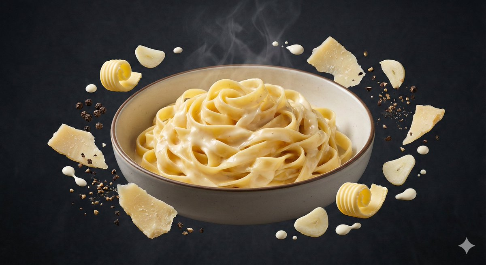

```
Ingredient Orbit Shot

Gemini Nano Banana Pro Prompt:

Perfectly styled [FOOD] centered in frame with raw ingredients orbiting around it, herbs, spices, and sauces floating mid-air, controlled chaos, studio lighting with soft highlights, dark background, modern food ad photography, hyper-detailed, ultra-real
```

```
完美摆盘的[食物]居中构图，其周围环绕着原始食材、香草、香料和酱汁在空中漂浮，呈现一种受控的混乱感，采用影棚灯光与柔和高光，深色背景，现代食品广告摄影风格，超精细、超写实。
```

 [↑返回目录](#toc)

---
## <a id="prompt-2005324208608567300">- Nano Banana Pro at @BasedLabsAI</a> (<a href="https://x.com/_MehdiSharifi_/status/2005324208608567325" target="_blank" rel="noopener noreferrer">Mehdi Sharifi</a>)

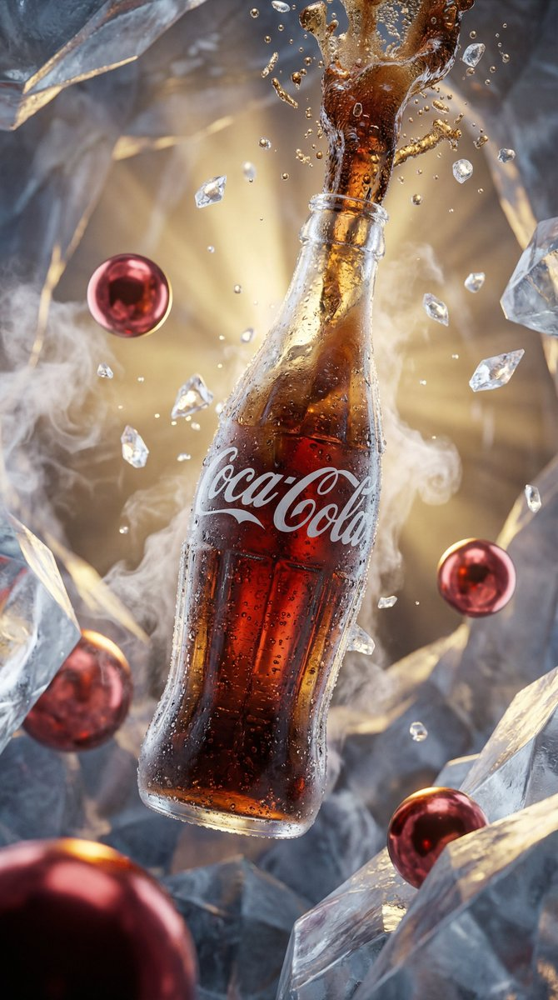

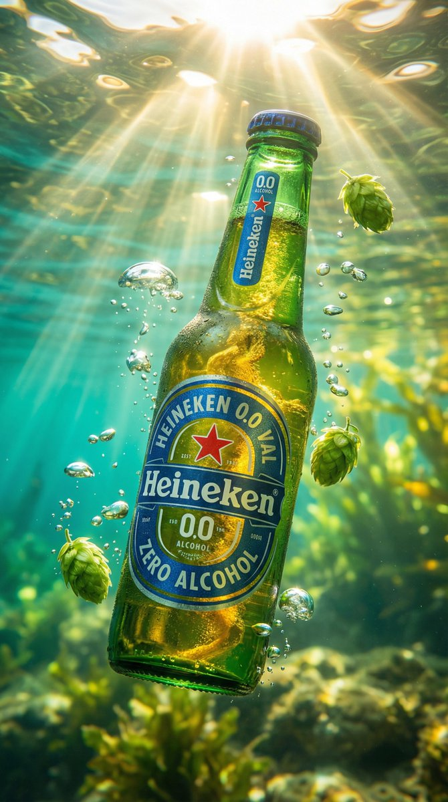

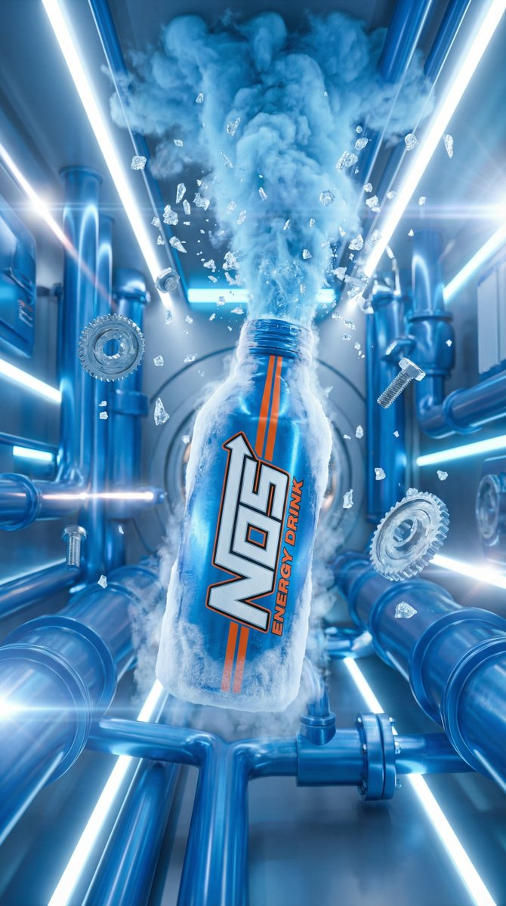

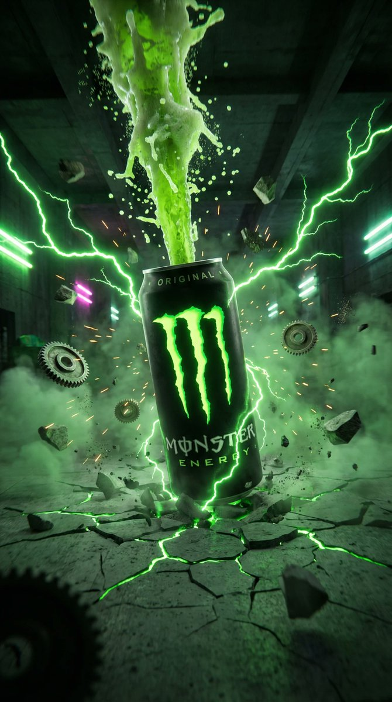

```
Coca-Cola — Octane Render
Cinematic 3D commercial close-up of a classic Coca-Cola glass bottle, covered in realistic condensation droplets. Scene: Abstract zero-gravity ice environment with floating geometric ice crystals. Action: Dark caramel soda liquid swirling violently inside the bottle and bursting out the top, mixing with effervescent bubbles and ice shards. Surrounding elements: Red metallic spheres reflecting the scene, cold steam rising. Camera: Dynamic orbital spin. Lighting: Dramatic backlighting with volumetric god rays, high contrast red and gold tones. Style: Octane Render aesthetic, crisp, kinetic, hyper-realistic commercial CGI, 8k resolution.

Heineken 0.0 — Redshift
Cinematic product reveal of Heineken 0.0, green transparent glass bottle, condensation mist, zero alcohol label clearly visible. Scene: Underwater environment, sun rays piercing through the water surface. Action: Golden liquid swirling inside the green glass, illuminated by caustics and light refraction. Surrounding elements: Fresh green hops floating weightlessly, rising air bubbles, refracted light patterns on the bottle. Camera: Slow motion upward pan. Lighting: Volumetric underwater god-rays, vibrant green and gold palette. Style: Redshift Render, photorealistic, refractive glass, clean and thirst-quenching, 8k clarity.

NOS Energy Drink — Arnold Render
High-octane 3D commercial ad for "NOS Energy Drink", iconic blue bottle-shaped can with orange details, frosting over with white ice crystals. Scene: Futuristic liquid nitrogen laboratory with blue glossy pipes. Action: The can releases a burst of pressurized cold blue gas (nitrous oxide effect), freezing the air around it instantly. Surrounding elements: Shattering ice particles suspended in mid-air, mechanical gears floating in zero-g. Camera: Slow-motion macro shot moving through the gas cloud. Lighting: Cold clinical blue lighting with bright white highlights and lens flares. Style: Arnold Render, chemical frost simulation, clean, automotive aesthetic, 8k.

Monster Energy — Unreal Engine Style
Aggressive 3D commercial shot of "Monster Energy" original can, matte black texture with the iconic glowing neon green claw scratch logo. Scene: Dark, gritty industrial concrete environment with drifting green fog. Action: Neon green electrical lightning arcs striking the can, causing a radioactive green liquid explosion upward. Surrounding elements: Floating metal debris, sparks flying, and cracked ground textures. Camera: Low-angle power shot with slight camera shake effect. Lighting: Intense neon green rim light, deep shadows, cinematic noir atmosphere. Style: Unreal Engine 5 render, cyberpunk, gritty, high voltage, hyper-detailed, 8k.
```

```
可口可乐 — Octane Render  
电影级3D广告特写，经典可口可乐玻璃瓶，表面覆盖逼真的冷凝水珠。场景：抽象的零重力冰环境，漂浮着几何形状的冰晶。动作：深焦糖色汽水在瓶内剧烈旋转，并从瓶口猛烈喷涌而出，与气泡和碎冰混合。周围元素：反射场景的红色金属球体，升起的冷雾。镜头：动态环绕旋转。灯光：戏剧性背光配合体积光效（神光），高对比度的红金配色。风格：Octane Render美学，清晰锐利、动感十足、超写实商业CGI，8K分辨率。

喜力0.0 — Redshift  
电影级产品展示，喜力0.0绿色透明玻璃瓶，表面覆有冷凝雾气，“零酒精”标签清晰可见。场景：水下环境，阳光穿透水面照射进来。动作：金色液体在绿色玻璃瓶内旋转，由焦散光和折射光点亮。周围元素：无重力漂浮的新鲜绿色啤酒花、上升的气泡、瓶身上的折射光纹。镜头：慢动作向上平移。灯光：水下体积光效（神光），鲜明的绿色与金色调色板。风格：Redshift渲染，照片级真实感，高折射玻璃材质，清爽解渴，8K清晰度。

NOS能量饮料 — Arnold Render  
高能3D广告，“NOS能量饮料”标志性的蓝色罐体带橙色细节，表面结满白色冰晶。场景：未来感液氮实验室，配有蓝色亮面管道。动作：罐体释放一股加压的冰冷蓝色气体（一氧化二氮效果），瞬间冻结周围空气。周围元素：悬浮在空中的碎裂冰粒、零重力漂浮的机械齿轮。镜头：穿过气体云团的慢动作微距镜头。灯光：冷峻的临床蓝光，搭配明亮白色高光与镜头眩光。风格：Arnold Render，化学霜冻模拟，干净利落，汽车工业美学，8K分辨率。

魔爪能量饮料 — 虚幻引擎风格  
极具冲击力的3D广告镜头，“魔爪能量饮料”原版罐体，哑光黑色质感，标志性荧光绿爪痕Logo发光。场景：黑暗粗粝的工业混凝土环境，漂浮着绿色薄雾。动作：荧光绿色电弧击中罐体，引发放射性绿色液体向上爆炸。周围元素：悬浮的金属碎片、飞溅的火花、龟裂的地面纹理。镜头：低角度力量感镜头，略带摄像机震动效果。灯光：强烈荧光绿轮廓光，深邃阴影，电影黑色氛围。风格：虚幻引擎5渲染，赛博朋克，粗犷硬核，高压电流感，超精细细节，8K分辨率。
```

 [↑返回目录](#toc)

---
## <a id="prompt-2005293653510459600">Vanilla Creme Brew On gemini Nano Banana 3.0</a> (<a href="https://x.com/YaseenK7212/status/2005293653510459750" target="_blank" rel="noopener noreferrer">Yaseen Khan Gul</a>)

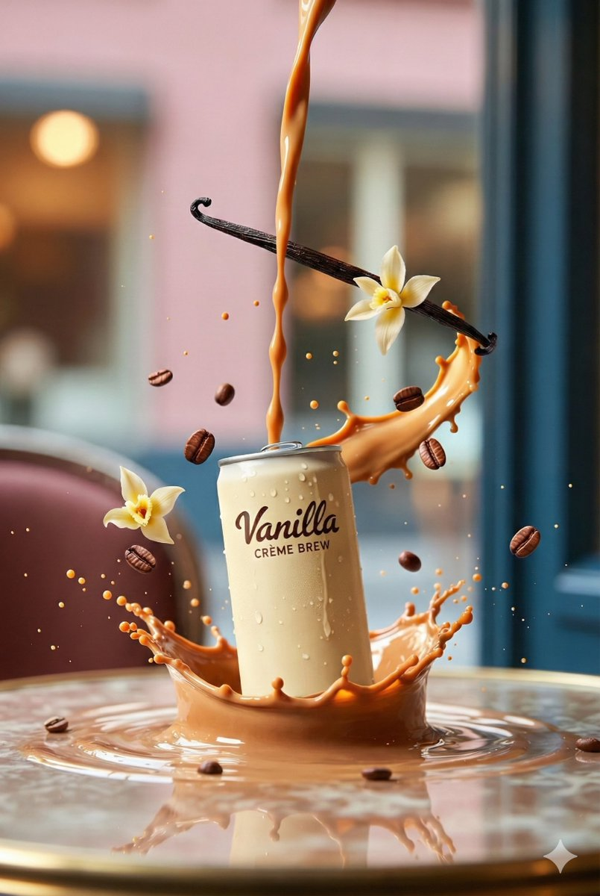

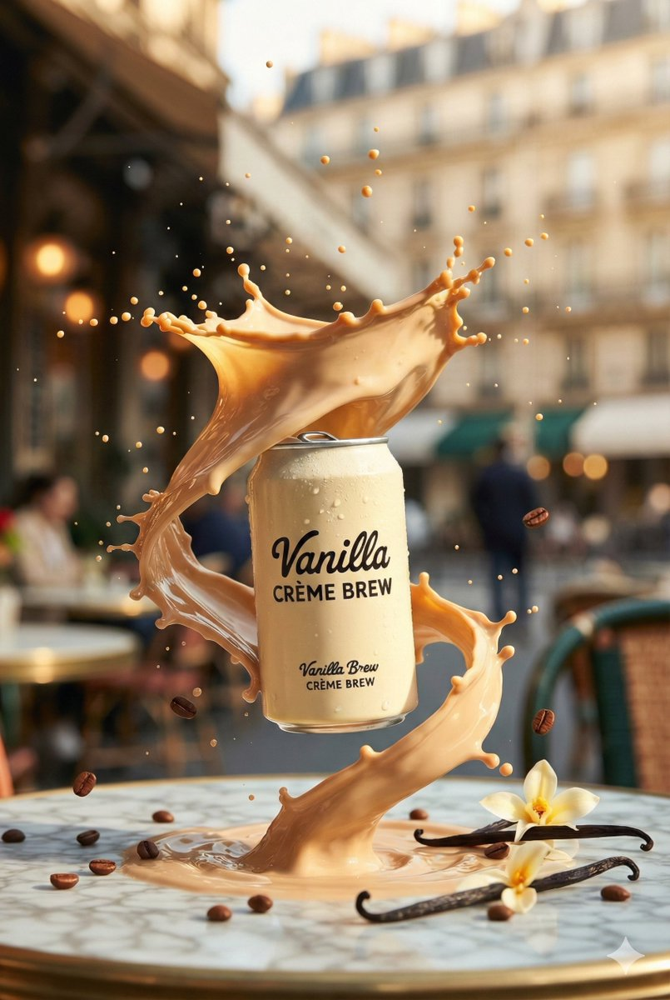

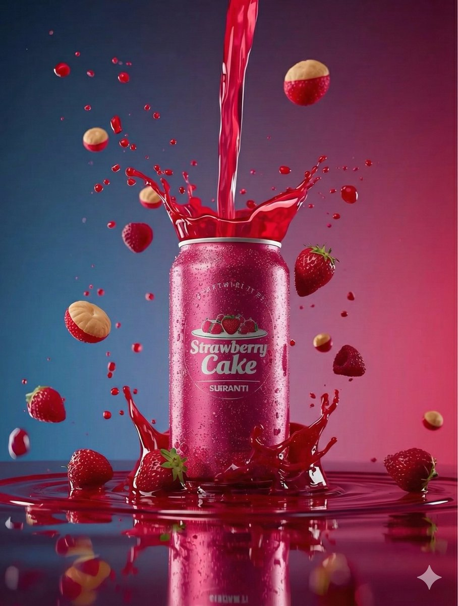

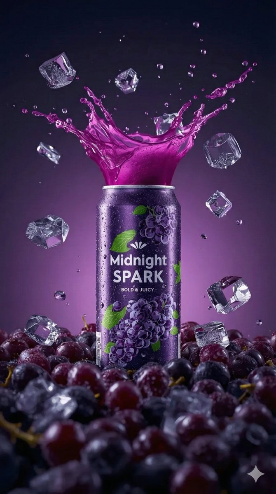

```
{
  "structured_beverage_prompts": [
    {
      "product": {
        "name": "Vanilla Crème Brew",
        "container_description": "matte cream can, softly fogged with moisture"
      },
      "scene": {
        "setting": "marble café table in Paris",
        "liquid_action": "golden caramel-latte liquid cascading onto the table, creating a splash with droplets suspended elegantly",
        "surrounding_elements": "vanilla pods and coffee beans swirl gracefully around the can"
      },
      "cinematography": {
        "camera_movement": "glides forward then circles",
        "lighting": "warm pastel lighting and window-style rim light",
        "intended_effect": "refined, luxury hero reveal"
      },
      "action_sequence": "Open on the liquid cascade; the can lifts from the splash."
    },
    {
      "product": {
        "name": "Strawberry Cake Drink",
        "container_description": "perfectly upright can, covered in realistic condensation, with a crisp and readable “Strawberry Cake” label"
      },
      "scene": {
        "setting": "reflective surface",
        "liquid_action": "stream of glossy red strawberry liquid pouring down from above, forming a dramatic splash at the center with droplets suspended mid-air",
        "surrounding_elements": "strawberries and small cake-like pieces burst outward"
      },
      "cinematography": {
        "initial_speed": "slow motion",
        "action_intensification": "motion intensifies as elements burst outward"
      },
      "action_sequence": "Start with the liquid pouring; as the splash settles, the can rises cleanly from the liquid."
    },
    {
      "product": {
        "name": "Midnight Spark – Bold & Juicy",
        "container_description": "sleek aluminum can, deep midnight purple with illustrated grape clusters and green leaves, covered in cold condensation droplets"
      },
      "scene": {
        "setting": "center of the frame",
        "liquid_action": "dramatic splash of vivid purple grape juice erupts upward and outward from behind the can in a symmetrical crown-like motion",
        "surrounding_elements": "crystal-clear ice cubes frozen mid-air"
      },
      "photography_style": {
        "type": "Ultra-realistic luxury beverage product photography",
        "genre": "Commercial beverage advertising style",
        "aesthetic": "Premium brand aesthetic",
        "composition": "Centered composition"
      },
      "technical_specifications": {
        "focus": "Shallow depth of field, Sharp focus",
        "quality": "Ultra-detailed, Photorealistic, 8K clarity, Hyper-realistic liquid simulation"
      }
    }
  ],
  "universal_negative_prompt": "cartoon, illustration, flat lighting, blurry, low resolution, plastic look, oversaturated colors, distorted text, misspelled words, warped can, extra logos, watermark, noise, motion blur"
}
 }
    }
```

```
香草奶油特调饮品：哑光奶油色罐体，表面微微凝结水雾，置于巴黎大理石咖啡桌上；金黄色焦糖拿铁液体倾泻而下，在桌面激起优雅飞溅的水珠；香草荚与咖啡豆在罐体周围轻盈旋绕。镜头缓缓前移后环绕拍摄，采用温暖柔光与窗式轮廓光，营造精致奢华的产品亮相效果。画面开场为液体倾泻瞬间，随后罐体从水花中升起。

草莓蛋糕饮品：笔直竖立的罐体覆盖真实冷凝水珠，标签清晰印有“Strawberry Cake”字样；置于高反射表面上，一道闪亮的红色草莓液体自上方倾注而下，在中心形成戏剧性飞溅，水滴悬浮空中；四周迸发出新鲜草莓与迷你蛋糕碎块。以慢动作开场，随着元素向外爆发，动态逐渐增强。画面始于液体倾倒，待水花稍落，罐体干净利落地从液体中升起。

午夜星耀 – 浓郁多汁：深午夜紫色的流线型铝罐，饰有葡萄串与绿叶图案，表面布满冰冷水珠；画面居中构图，一束鲜艳紫葡萄汁从罐后猛然喷涌而出，呈对称皇冠状向上向外炸开；空中悬浮着晶莹剔透的冰块。采用超写实奢华饮品产品摄影风格，商业饮料广告类型，高端品牌美学。浅景深、锐利对焦，8K超高清画质，极度逼真的液体模拟效果。

通用负面提示：卡通、插画、平光、模糊、低分辨率、塑料感、过度饱和、文字扭曲、拼写错误、罐体变形、多余标志、水印、噪点、动态模糊。
```

 [↑返回目录](#toc)

---
## <a id="prompt-2005129744690675700">手绣歌曲海报</a> (<a href="https://x.com/sundyme/status/2005129744690675731" target="_blank" rel="noopener noreferrer">sundyme</a>)


```
Ultra-detailed album cover for \"[歌曲名称]\". Style: Huang Hai's minimalist aesthetic with HIGH-QUALITY HAND-EMBROIDERED SILK ART. Format: Vertical Poster (1:1 aspect ratio).

CRITICAL: Every element must appear as hand-embroidered with visible, realistic stitching details. Show individual thread stitches, slight texture variations, and authentic embroidery craftsmanship.

Visual Structure: 
- Delicate high-end silk fabric background with subtle sheen and fine weave texture, [配色方案], occupying 75% of canvas.
- Scene Visualization: A simplified, poetic scene of [场景描述], rendered in hand-embroidered silk with VISIBLE REALISTIC STITCHING DETAILS.
- Scale Contrast: Tiny, barely visible silhouettes of [细节元素] at the bottom/corners.

Base: Luxurious silk fabric background with subtle sheen, fine weave texture, and soft luminous quality.

HAND-EMBROIDERY DETAILS: Every element must show:
- Individual visible thread stitches with slight texture
- Microscopic silk thread details with subtle metallic sheen
- Realistic embroidery craftsmanship with slightly imperfect, organic stitching
- Visible stitch patterns and thread texture variations
- Authentic hand-embroidered appearance with natural imperfections
The scene features soft muted colors (pale [颜色] for the [元素], muted [颜色] for the [元素], soft [颜色] for the [元素]). Realism: Extreme dimensional depth, realistic hand-embroidered stitches, tactile silk texture with visible stitch details.

Color Palette: Subtle high-end [主色调] silk background. Soft muted colors for the scene (pale [颜色], muted [颜色], soft [颜色]). Elegant, refined, and sophisticated mood.

Typography: 
- Top title \"[歌曲名称]\" in minimalist elegant serif typography (hand-embroidered in subtle thread), surrounded by maximum breathing space.
- Subtitle \"[艺术家] • [年份] • [风格类型]\" in refined font.
- Small bilingual text \"[英文关键词] [中文关键词]\" in refined font.

CRITICAL - BOTTOM DESIGN: The text must show OBVIOUS hand-embroidered style with:
- Spacing between individual stitches visible
- Organic, slightly imperfect stitch patterns
- Natural texture variations in the thread
- Hand-stitched appearance rather than dense machine embroidery
- Clear manual embroidery craftsmanship

Bottom Design: Elegant flow of musical notes intertwined with refined calligraphy showcasing TWO COHESIVE, NARRATIVE-FULL lyrics from the song:
Line 1: \"[第一句歌词]\"\nLine 2: \"[第二句歌词]\"\nRendered in elegant [书法风格] style calligraphy with refined strokes, all hand-embroidered with VISIBLE INDIVIDUAL STITCHES. The text should show clear hand-stitched style with spacing between stitches. [音乐风格] musical notes arranged in subtle [图案] patterns. Embroidered in [主色线] and [辅色线] threads, connecting notes and text with delicate [线条类型] lines, showing OBVIOUS hand-embroidered texture with individual stitch visibility.

Border: Minimal single thin line border in [边框颜色] (hand-embroidered). Corner: One small elegant [符号] symbol (hand-stitched). Photorealistic hand-embroidered silk texture with VISIBLE STITCH DETAILS, fine weave, subtle sheen, authentic embroidery craftsmanship. The text area must show OBVIOUS hand-stitched character with visible individual stitches and natural texture.
```

 [↑返回目录](#toc)

---
## <a id="prompt-2004986136335110400">烹饪地图集：鸡肉与培根的全球之旅</a> (<a href="https://x.com/Gdgtify/status/2004986136335110526" target="_blank" rel="noopener noreferrer">Gadgetify</a>)


```
Nano Banana Pro vs. GPT Image 1.5 for my food recommendation prompt. Just give it a couple of ingredients. 


Inputs: Ingredients = [User Choice, e.g., Chicken, Bacon]

Step 1: Global Analysis
Analyze the ingredients.
Select 4 Distinct Countries with a famous dish using these ingredients  

Goal: A "Culinary Atlas" Grid showing 4 different cultural variations of the ingredients.

Layout Rule:
Output Format: A 2x2 Grid.
Content per Panel: Each of the 4 panels must show a Single Open Book Spread for that specific country.

Inside Each Panel (The Book Spread Rule):
Left Page (The History): 2D Vintage Sepia Sketches. A visual timeline or illustrated recipe of the dish (e.g., "1850 -> 1920 -> Today"). Flat, ink-drawn style.
Right Page (The Reality): 3D Pop-up Diorama. The finished, steaming meal emerges physically from the page. A tiny miniature chef from that country is standing on the page next to the massive food.
Consistency: All 4 books should look like part of the same series, but with different cultural contents.

Lighting: Cinematic top-down lighting, highlighting the depth difference between the flat left page and the 3D right page.
Output: 2x2 Grid, High Definition, Macro Detail.

```

```
输入：成分=[用户选择，例如，鸡肉，培根]

步骤1：全球分析
分析这些成分。
选择4个使用这些成分制作著名菜肴的不同国家。

目标：“烹饪地图集”网格展示这4种不同文化下的成分变化。

布局规则：
输出格式：2x2网格。
每块内容：每个面板应显示针对特定国家的单本打开书籍的跨页。

每个面板内的内容（书籍跨页规则）：
左页（历史）：2D复古棕褐色素描。该菜肴的视觉时间线或图解食谱（例如，“1850 -> 1920 -> 现在”）。平面的墨绘风格。
右页（现实）：3D立体模型。完成的、冒热气的餐点从页面上实际浮现出来。一位来自该国的小厨师站在页面旁边，位于巨大的食物旁。
一致性：所有4本书看起来都像属于同一系列，但包含不同的文化内容。

照明：电影式的顶光照明，突出平坦左页与3D右页之间的深度差异。
输出：2x2网格，高清，细节丰富。
```

 [↑返回目录](#toc)

---
## <a id="prompt-2005003170318352600">混合媒介拼贴艺术海报</a> (<a href="https://x.com/AmirMushich/status/2005003170318352538" target="_blank" rel="noopener noreferrer">AmirMušić</a>)

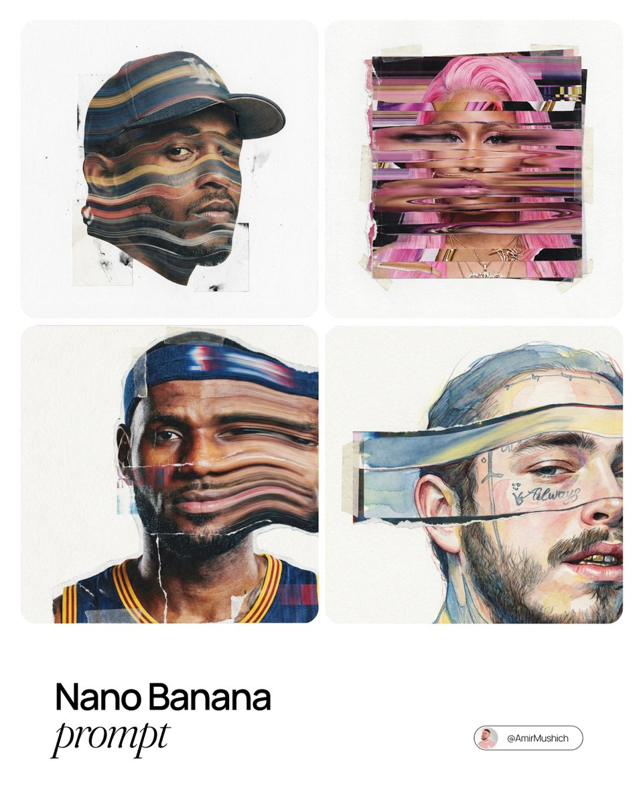

```
A surreal mixed-media portrait of [PERSON], set against a clean, plain white background with visible fine-grain paper texture.
The character's face is the subject of a controlled, stylized distortion. Instead of chaotic fragmentation, the facial features are horizontally stretched into smooth, flowing bands of color and texture, resembling a deliberate digital scanline effect or a long exposure photograph pushed sideways.
Key identifying features (like eyes, mouth, or distinct accessories) remain partially recognizable within these stretched streaks, creating a sense of fluid motion rather than destruction. The aesthetic blends analog collage textures with digital glitch art, feeling tactile and composed.
```

```
一幅超现实的混合媒介肖像画，描绘[人物]，背景为干净素白的纸面，带有可见的细腻纸张纹理。  
人物面部呈现出一种受控且风格化的扭曲：面部特征并非混乱破碎，而是被水平拉伸成平滑流动的色彩与纹理条带，类似刻意制造的数字扫描线效果，或是一张被横向拖曳的长时间曝光照片。  
关键辨识特征（如眼睛、嘴巴或标志性配饰）在这些拉伸的色带中仍部分可辨，营造出流动感而非破坏感。整体美学融合了模拟拼贴质感与数字故障艺术，兼具触觉感与构图感。
```

 [↑返回目录](#toc)

---
## <a id="prompt-2005185002884268300">悬浮产品广告：动态光影捕捉</a> (<a href="https://x.com/aleenaamiir/status/2005185002884268231" target="_blank" rel="noopener noreferrer">Aleena Amir</a>)

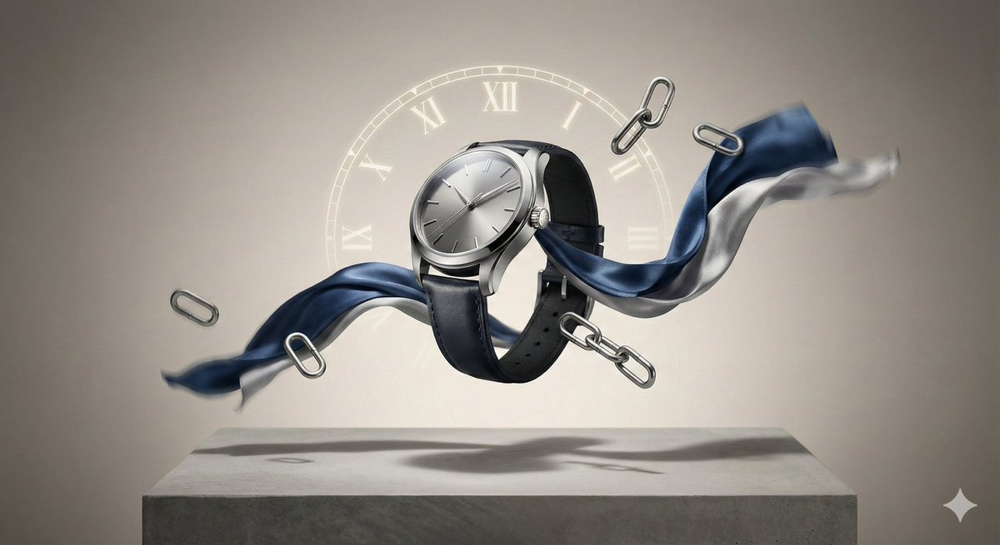

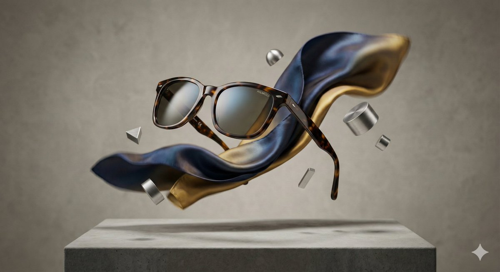

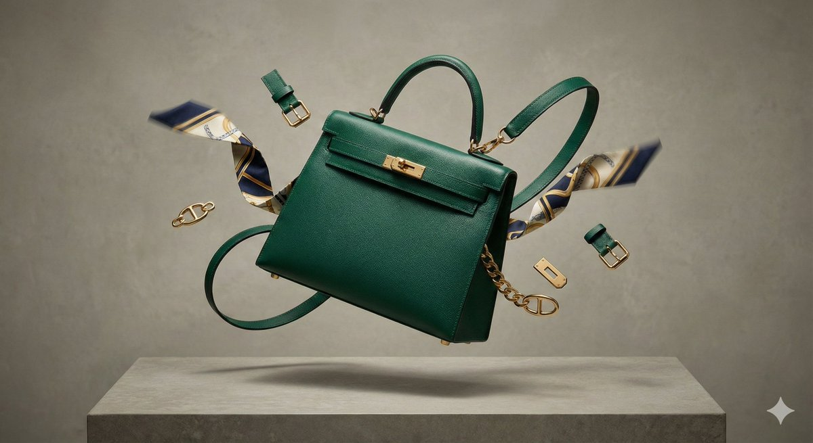

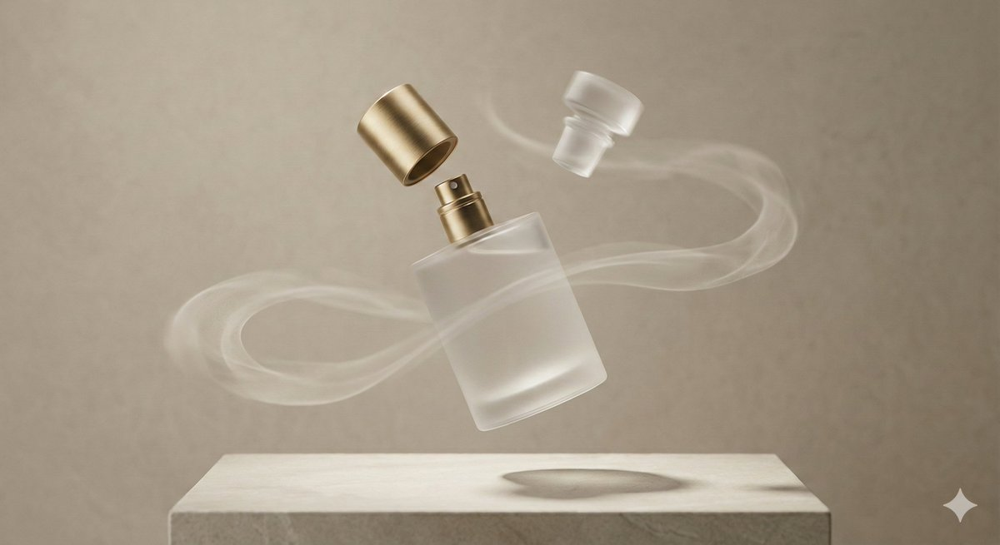

```
Levitation Editorial (Product + Motion)

Gemini Nano Banana Pro Prompt:

[PRODUCT] and supporting props floating in mid-air, soft shadows anchored below, motion blur on trailing elements, suspended-from-the-moment storytelling, cinematic three-point lighting, editorial fashion-magazine framing.
```

```
悬浮式产品广告（产品+动态）

[PRODUCT] 与辅助道具悬浮于空中，下方投射柔和阴影，拖尾元素带有动态模糊，捕捉瞬间的悬浮叙事感，采用电影级三点布光，构图风格如时尚杂志封面。
```

 [↑返回目录](#toc)

---
## <a id="prompt-2004937062907039700">匿名街头艺术家身份调查</a> (<a href="https://x.com/AllaAisling/status/2004937062907039787" target="_blank" rel="noopener noreferrer">Alexandra Aisling</a>)

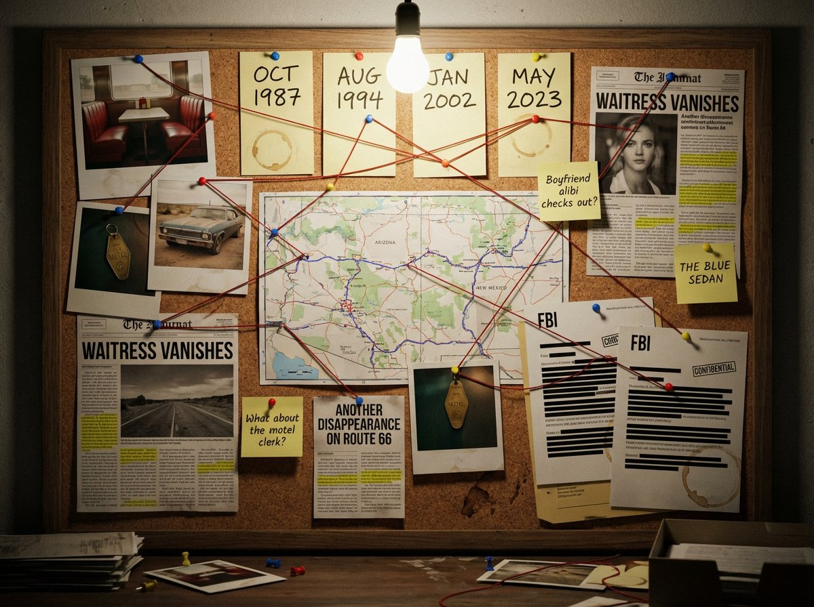

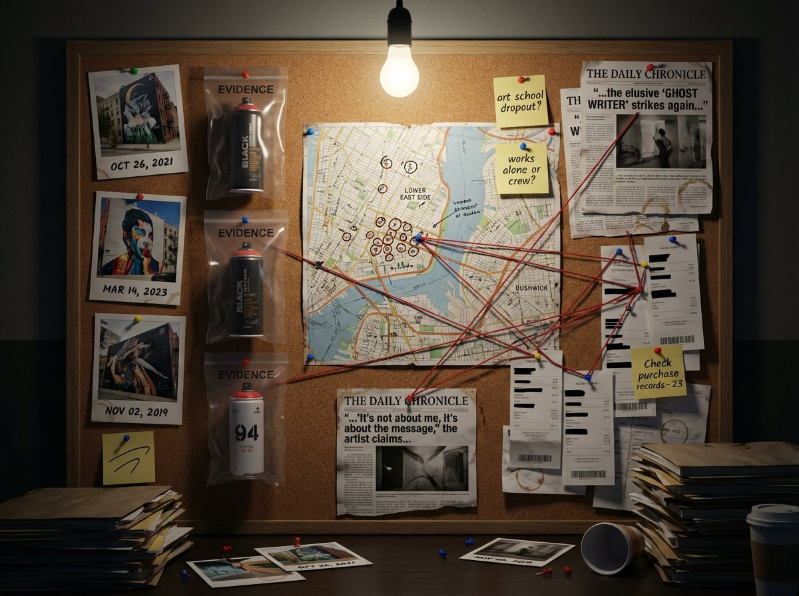

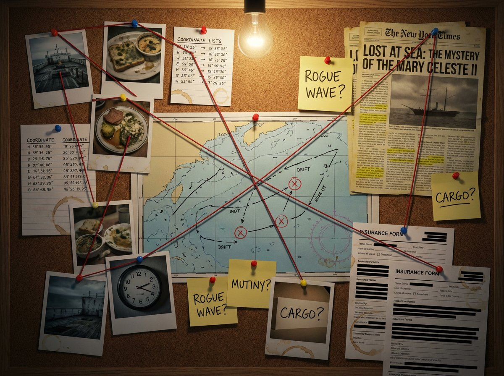

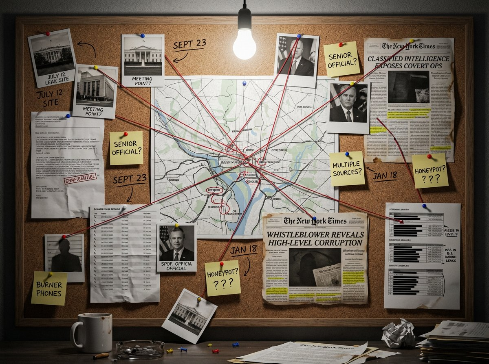

```
A detective's evidence board investigating the disappearance of a small-town diner waitress in 1987. Cork surface covered with pinned items: polaroid photographs of the empty diner booth, her abandoned car, a motel room key, handwritten dates spanning three decades. A street map with circled locations along Route 66, newspaper clippings with highlighted passages about similar vanishings, sticky notes with theories and question marks—"boyfriend alibi checks out?" "truck driver seen twice?" Printed documents with redacted black bars from reopened FBI files. Red string connects related evidence across the board, creating a web of connections. Thumbtacks in primary colors. A single bare bulb casts dramatic shadows. Coffee ring stains on some papers. The atmosphere is obsessive, late-night, noir—someone has been piecing this together for months. A few pins have fallen, suggesting frantic recent activity.
```

```
A detective's evidence board investigating the identity of an anonymous street artist. Cork surface covered with pinned items: polaroid photographs of murals appearing overnight, spraypaint cans in evidence bags, handwritten dates mapping years of work. A city map with circled locations clustering in one neighborhood, newspaper clippings with highlighted interview quotes, sticky notes with theories—"art school dropout?" "works alone or crew?" Printed gallery purchase records with redacted buyer names. Red string connects related evidence across the board, creating a web of connections. Thumbtacks in primary colors. A single bare bulb casts dramatic shadows. Coffee ring stains on some papers. The atmosphere is obsessive, late-night, noir—someone has been piecing this together for months. A few pins have fallen, suggesting frantic recent activity.
```

```
A detective's evidence board investigating the last voyage of a ghost ship found drifting with no crew. Cork surface covered with pinned items: polaroid photographs of the abandoned deck, untouched meals in the galley, a stopped clock, handwritten coordinates plotting the ship's final route. A nautical map with circled positions and drift patterns, newspaper clippings about maritime mysteries with highlighted parallels, sticky notes with theories—"rogue wave?" "mutiny?" "what was the cargo?" Printed insurance documents with redacted manifest items. Red string connects related evidence across the board, creating a web of connections. Thumbtacks in primary colors. A single bare bulb casts dramatic shadows. Coffee ring stains on some papers. The atmosphere is obsessive, late-night, noir—someone has been piecing this together for months. A few pins have fallen, suggesting frantic recent activity.
```

```
A detective's evidence board investigating the source of a New York Times journalist's anonymous whistleblower. Cork surface covered with pinned items: polaroid photographs of government buildings, encrypted email printouts, burner phone records, handwritten dates of leaked documents. A map of Washington D.C. with circled agency headquarters, newspaper clippings of the explosive stories with highlighted classified details, sticky notes with theories—"senior official?" "multiple sources?" "honeypot?" Printed personnel rosters with redacted names and access levels. Red string connects related evidence across the board, creating a web of connections. Thumbtacks in primary colors. A single bare bulb casts dramatic shadows. Coffee ring stains on some papers. The atmosphere is obsessive, late-night, noir—someone has been piecing this together for months. A few pins have fallen, suggesting frantic recent activity.
```

 [↑返回目录](#toc)

---
## <a id="prompt-2005215289286475800">冰镇巧克力饮品铝罐与飞溅的可可粉</a> (<a href="https://x.com/Strength04_X/status/2005215289286475889" target="_blank" rel="noopener noreferrer">𝐌</a>)

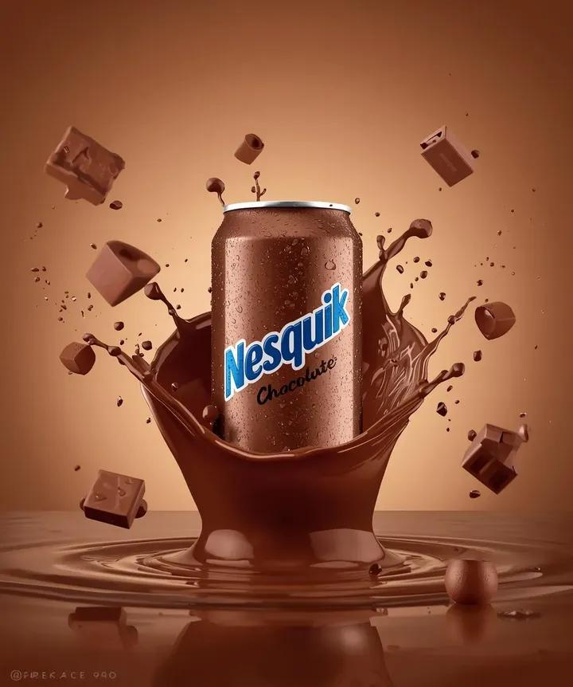

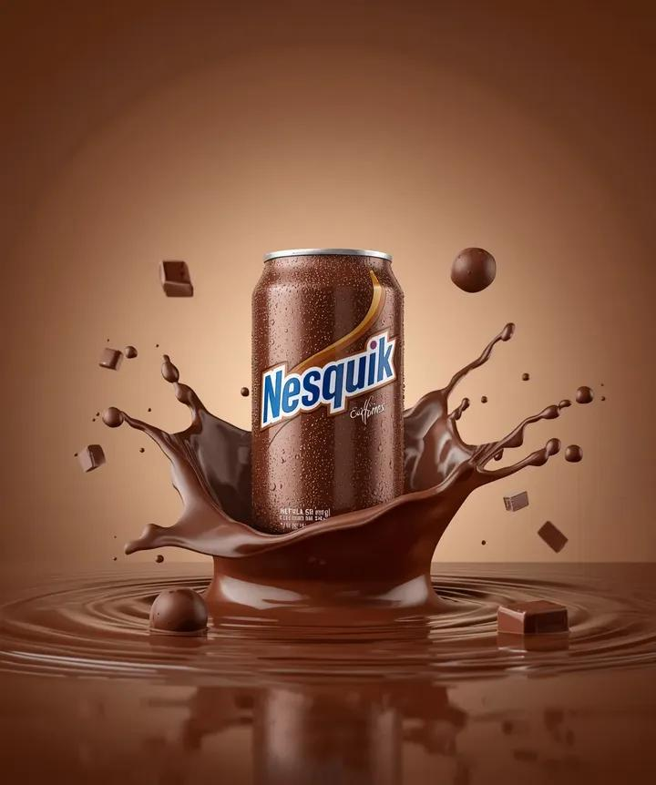

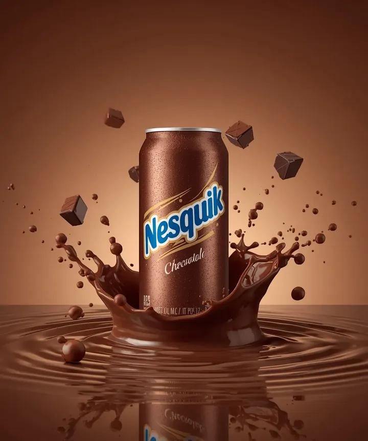

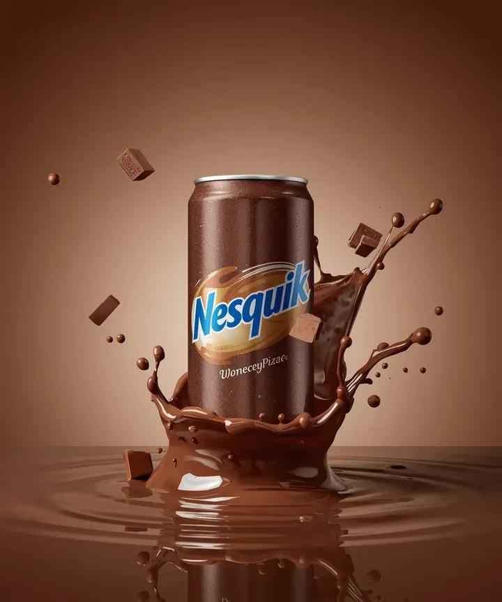

```
Honestly, the results are absolutely stunning 🤯 

The level of detail from the condensation droplets to the matte lighting is just next level. 

Prompt ⤵️ 
{
  "prompt": "Ultra-realistic premium beverage product photography of a chilled chocolate drink aluminum can standing upright at the exact center of the frame, featuring a deep cocoa-brown matte metallic body with the 'Nesquik' logo prominently displayed on the front in bright blue and white typography, subtle handwritten-style accent text beneath, and fine condensation droplets covering the can surface to emphasize cold freshness; the can is emerging from and partially surrounded by dynamic liquid chocolate splashes and a dusting of cocoa powder.",
  "negative_prompt": "blurry, low quality, distorted text, watermark, bad composition, ugly, broken, cartoon, illustration, drawing, oversaturated",
  "style_parameters": {
    "style": "Photorealistic, Macro Photography, Commercial Advertisement",
    "lighting": "Cinematic studio lighting, sharp focus",
    "resolution": "8k",
    "aspect_ratio": "16:9"
  }
}
```

```
超写实高品质饮料产品摄影：一罐冰镇巧克力饮品铝罐直立置于画面正中央，罐身为深可可棕色哑光金属质感，正面醒目印有“Nesquik”标志，采用亮蓝色与白色字体，下方配有细腻的手写风格辅助文字，罐体表面覆盖细微冷凝水珠，凸显冰凉新鲜感；铝罐从动态的液态巧克力飞溅中升起，周围环绕着飞散的可可粉。  

避免模糊、低画质、文字扭曲、水印、构图不佳、丑陋、破损、卡通、插画、手绘或过度饱和。  

风格参数：写实摄影、微距摄影、商业广告；灯光为电影级影棚布光，焦点锐利；分辨率为8K；画幅比例16:9。
```

 [↑返回目录](#toc)

---
## <a id="prompt-2005155984130367700">悬浮美食的专业影棚摄影</a> (<a href="https://x.com/icreatelife/status/2005155984130367625" target="_blank" rel="noopener noreferrer">Kris Kashtanova</a>)


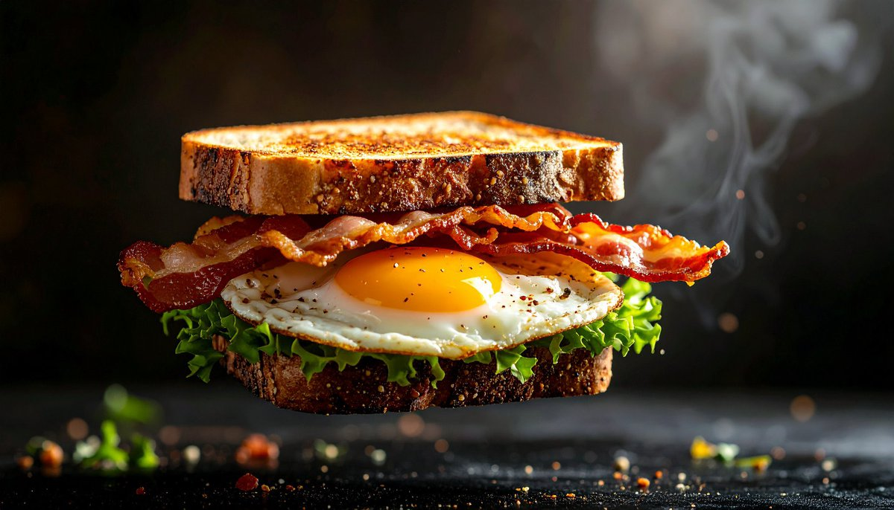


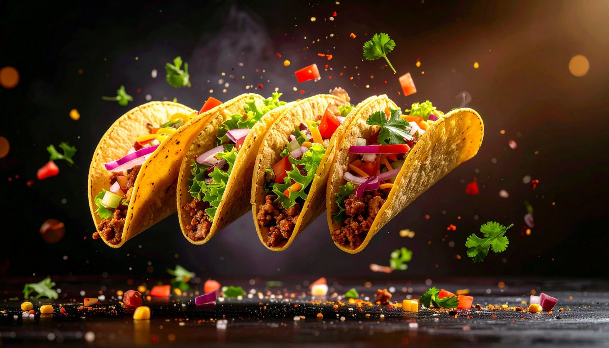

```
Useful prompt is - Food Advertising Photography

 prompt: delicious [FOOD], floating in the air, cinematic, food professional photography, studio lighting, studio dark background, advertising photography, intricate details, hyper-detailed, ultra realistic

Would love to see your delicious creations inspired by this prompt
```

```
美味的[食物]，悬浮在空中，电影感，专业食品摄影，影棚灯光，深色背景，广告摄影，细节丰富，超精细，超写实
```

 [↑返回目录](#toc)

---
## <a id="prompt-2005041248915088000">古董地球仪融化成漩涡海洋与风暴云</a> (<a href="https://x.com/AllaAisling/status/2005041248915087825" target="_blank" rel="noopener noreferrer">Alexandra Aisling</a>)

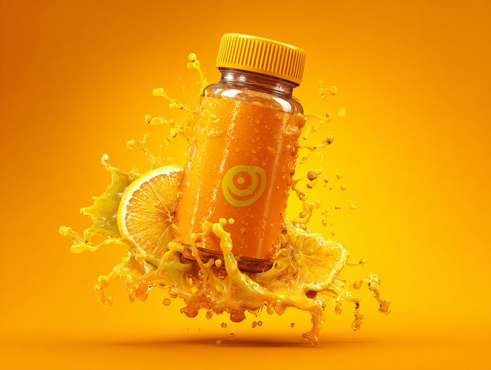


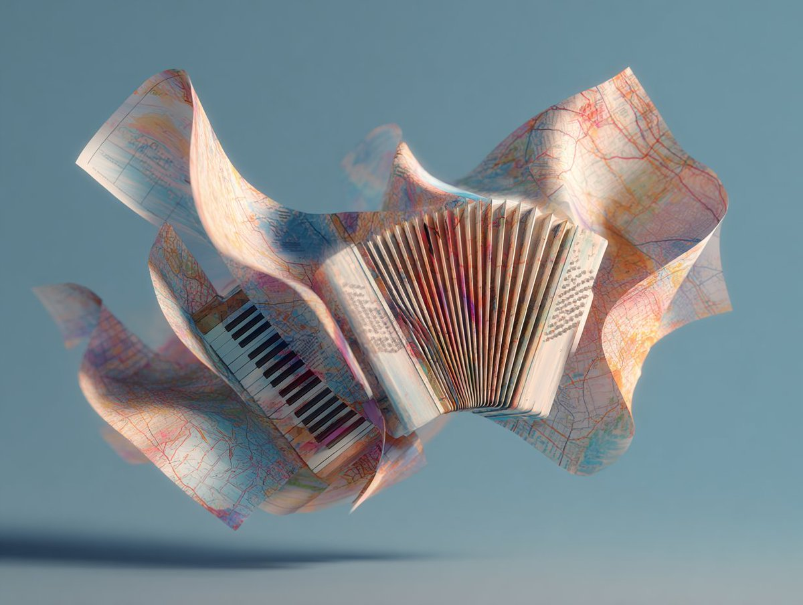

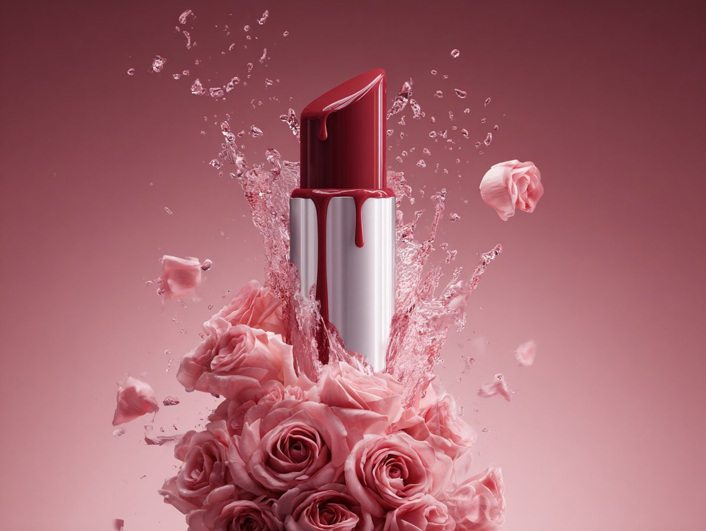

```
Vitamin supplement bottle appearing to melt or dissolve into bursting citrus juice, transformation in progress, surreal product photography, metaphorical imagery, smooth gradient transition, conceptual advertising, dreamlike quality.
```

```
Antique globe appearing to melt or dissolve into swirling ocean currents and storm clouds, transformation in progress, surreal product photography, metaphorical imagery, smooth gradient transition, conceptual advertising, dreamlike quality.
```

```
Accordion appearing to melt or dissolve into ribbons of Parisian street maps, transformation in progress, surreal product photography, metaphorical imagery, smooth gradient transition, conceptual advertising, dreamlike quality.
```

```
Lipstick appearing to melt or dissolve into cascading roses, transformation in progress, surreal product photography, metaphorical imagery, smooth gradient transition, conceptual advertising, dreamlike quality.
```

 [↑返回目录](#toc)

---
## <a id="prompt-2005115679415157000">超现实石块碎片主题的3D高细节艺术</a> (<a href="https://x.com/Sheldon056/status/2005115679415157035" target="_blank" rel="noopener noreferrer">Dr.duet</a>)

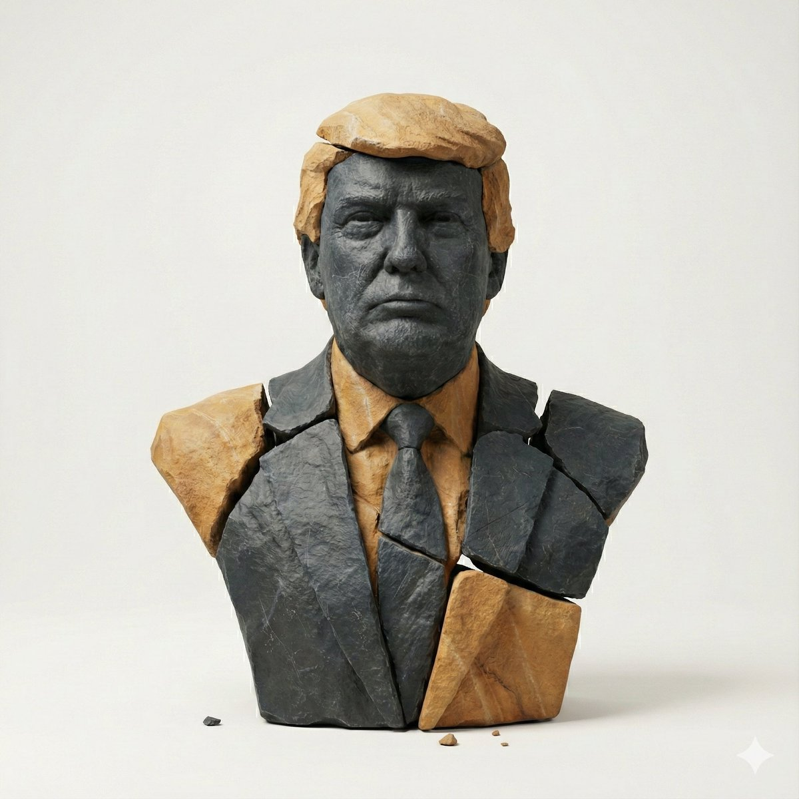


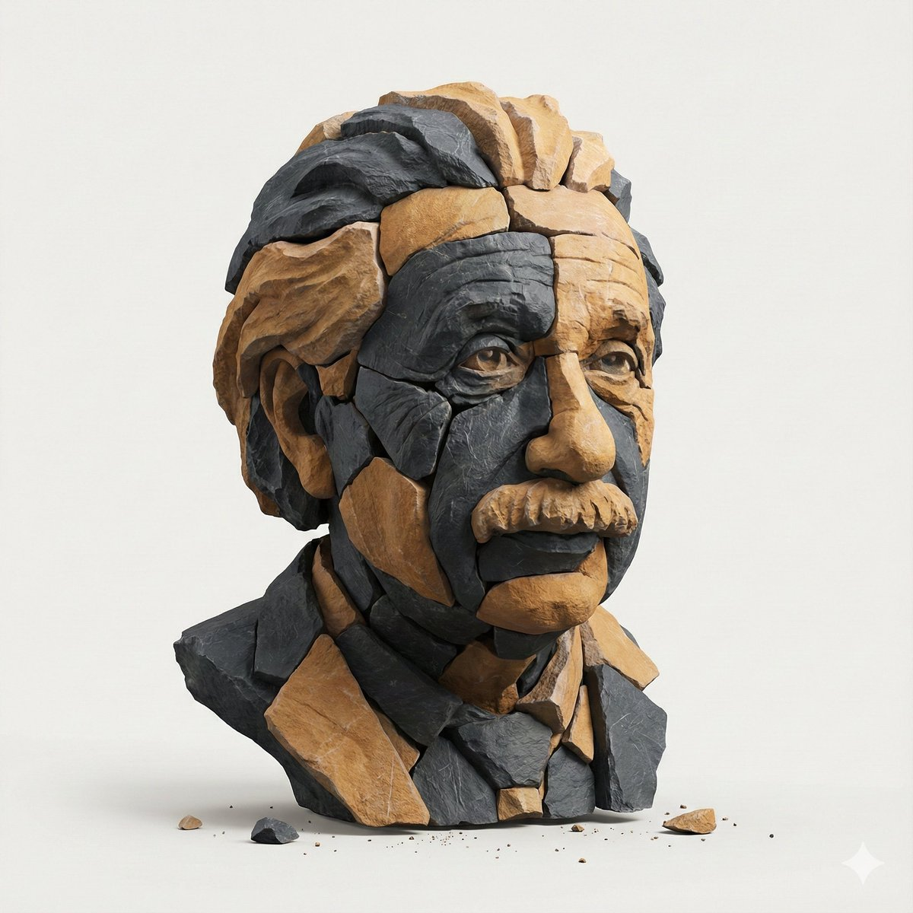

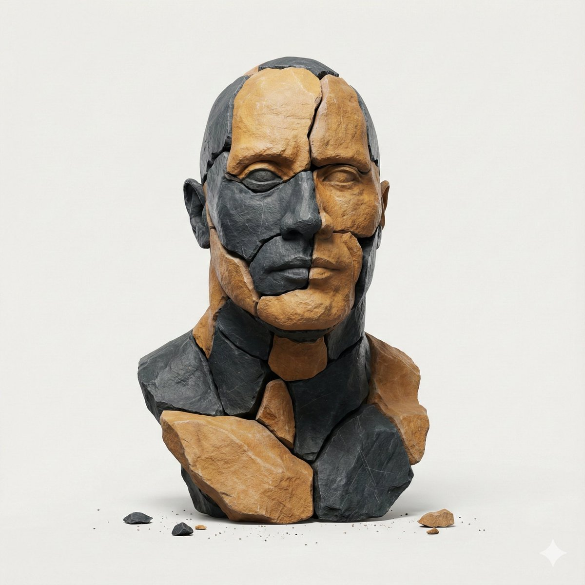

```
task": "image_to_image_style_transfer",
  "input_image": "{{USER_IMAGE}}",
  "prompt": "Create a hyper-real 3D studio composition that recreates the main subject from the provided image as a fragmented stone assemblage. The subject must be built from separate, clearly detached rock pieces with small visible gaps between shards (no pieces merging). Material look: fragmented slate + sandstone shards with chiseled edges, crisp fractures, visible stone grain, micro-scratches, and realistic roughness. Color palette: predominantly dark slate with subtle warm-ochre sandstone accents. Lighting: soft studio key light from top-left, gentle fill, subtle contact shadows under each shard, realistic ambient occlusion in crevices, clean reflections kept minimal. Background: minimal off-white seamless backdrop, no texture. Framing: centered, clean, straight-on, subject fully readable. Add a few tiny debris chips floating or resting near the base for depth. Preserve the subject’s identity, proportions, and recognizable silhouette from the input image while transforming all surfaces into stone fragments. Hyper-real, high detail, sharp focus, 8k render quality.",
  "negative_prompt": "text, typography, logo, watermark, signature, extra props, busy background, fog, heavy bloom, cartoon, illustration, lowpoly, plastic, metal, glossy paint, melted shapes, merged fragments, unreadable subject, blur, noise, low resolution, oversharpening halos, distorted face/body, extra limbs, deformed geometry",
  "output": {
    "aspect_ratio": "use_input_aspect_ratio",
    "background": "off_white",
    "camera": {
      "angle": "straight_on",
      "framing": "centered",
      "distance": "medium"
    }
  },
  "params": {
    "style_strength": 0.75,
    "identity_preservation": 0.9,
    "detail_level": "very_high",
    "lighting_preset": "soft_studio_top_left",
    "shadow_intensity": "subtle",
    "gap_visibility": "clear",
    "debris_chips": "few_tiny",
    "no_text": true
  }
}
```

```
创建一个超现实的3D工作室合成图，以提供的图像中的主要主题为基础，将其重塑为碎片化的石块组合。主题必须由分离的、明显独立的岩石碎片构成，在碎片之间有小的可见缝隙（不允许碎片融合）。材料外观：破碎的板岩+带有凿刻边缘、清晰断裂面、可见石纹、微划痕和真实粗糙感的暖赭色砂岩石片。色彩搭配：主要为深灰色板岩与微妙的暖赭色砂岩点缀。光线：来自左上方的柔和工作室主光，轻微补光，每个碎片下都有细微接触阴影，在裂缝中有真实的环境光遮蔽，干净的反射尽量保持在最低限度。背景：极简的纯白色无缝背景，无纹理。构图：居中、干净、正面拍摄，主体完全可辨。添加一些微小的碎片或靠近底部休息以增加深度。保留输入图像中主体的身份、比例和可识别轮廓，同时将所有表面转换成石块碎片。超现实，高细节，锐聚焦，8K渲染质量。

不需要的文字、排版、标志、水印、签名、额外道具、复杂的背景、雾、重辉光、卡通、插图、低多边形、塑料、金属、亮光漆、熔化形状、合并的碎片、不可读的主题、模糊、噪音、低分辨率、过度锐化光环、扭曲的脸/身体、额外的肢体、变形的几何体。
```

 [↑返回目录](#toc)

---
## <a id="prompt-2005230789659939000">蚂蚁开源了一个对AI非常友好的制作信息图的开源项目，</a> (<a href="https://x.com/bozhou_ai/status/2005230789659939072" target="_blank" rel="noopener noreferrer">泊舟</a>)


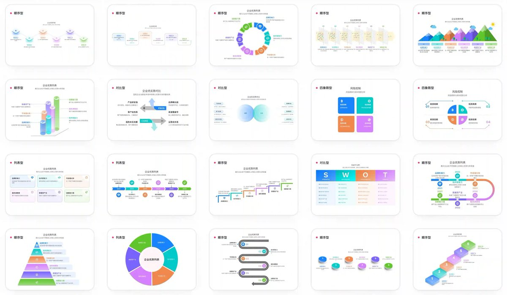

```
蚂蚁开源了一个对AI非常友好的制作信息图的开源项目，
https://github.com/antvis/Infographic

内置了接近两百个的信息图模板，并且里面直接有了Prompt模版和http://skills.md文件。

可以非常快速接入claude code 或者我们的工作流，并且基于svg进行生成保证视觉品质与可编辑性
```

 [↑返回目录](#toc)

---
## <a id="prompt-2002882718384959754">未来感时尚肖像写真</a> (<a href="https://x.com/r4jjesh/status/2002882718384959754" target="_blank" rel="noopener noreferrer">ராஜேஷ்</a>)

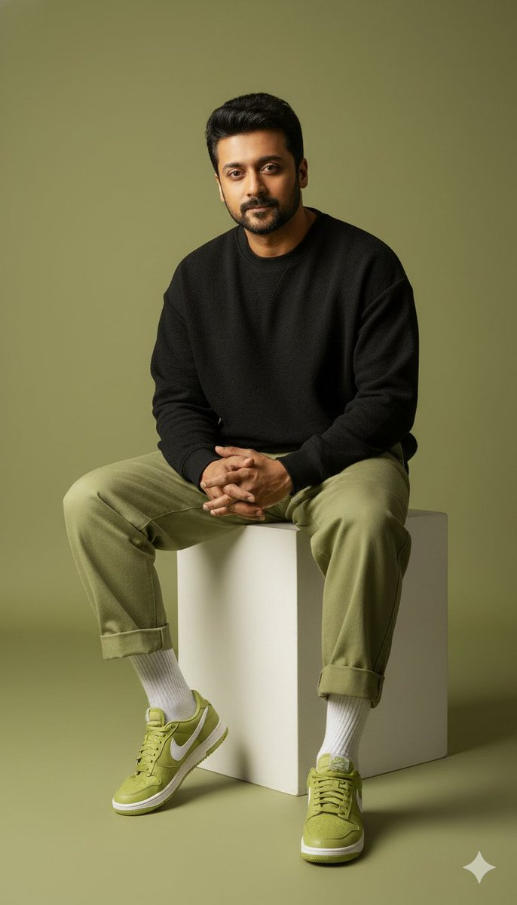

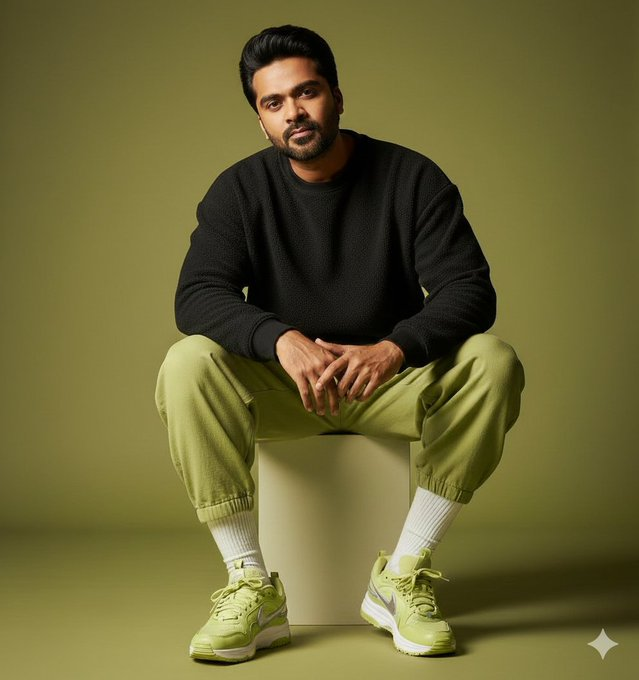

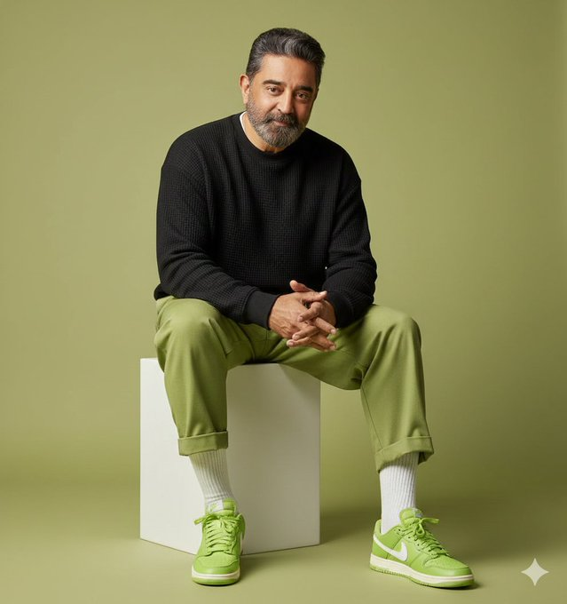

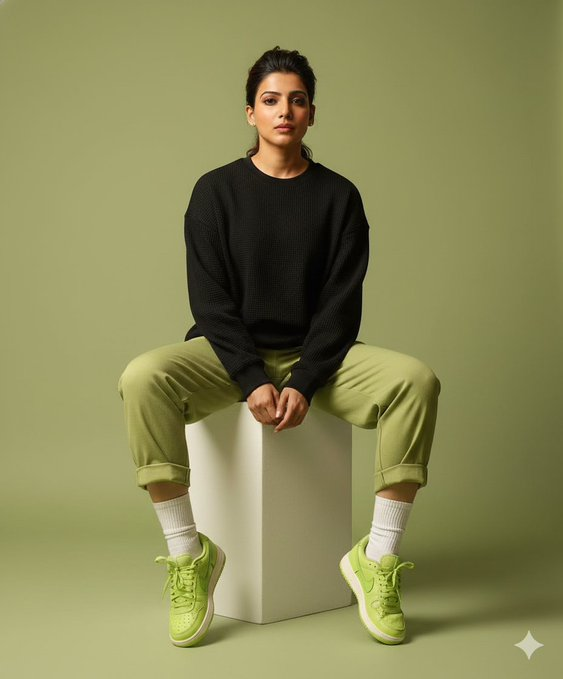

```
{
  "reference": "use uploaded image face as reference, preserve original face and identity",
  "outfit": "oversized black sweatshirt and lemon green trousers",
  "footwear": "lemon green neutral or Nike sneakers",
  "socks": "white ribbed socks, only slightly visible above the sneakers",
  "environment": "muted lemon green–toned studio background",
  "lighting": "soft cinematic glow highlighting skin and fabric textures",
  "style": "fashion editorial x futuristic",
  "composition": "model seated elegantly with a relaxed posture"
}
```

```
{
  "reference": "使用上传图像中的人脸作为参考，保留原始面部特征与身份",
  "outfit": "宽松黑色连帽衫和柠檬绿色长裤",
  "footwear": "柠檬绿色中性款或耐克运动鞋",
  "socks": "白色罗纹袜，仅略微露出鞋口上方",
  "environment": "低饱和度柠檬绿色调的摄影棚背景",
  "lighting": "柔和的电影感光线，突出皮肤与织物质感",
  "style": "时尚大片 × 未来主义",
  "composition": "模特以放松姿态优雅地坐着"
}
```

 [↑返回目录](#toc)

---
## <a id="prompt-2002460264327979051">暗影中的自信男人写真</a> (<a href="https://x.com/r4jjesh/status/2002460264327979051" target="_blank" rel="noopener noreferrer">ராஜேஷ்</a>)

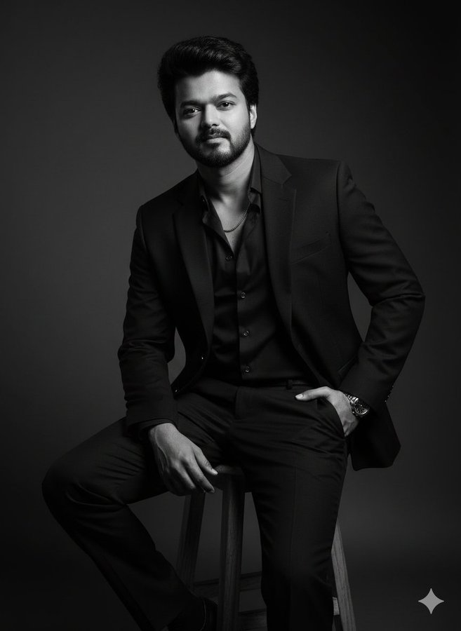

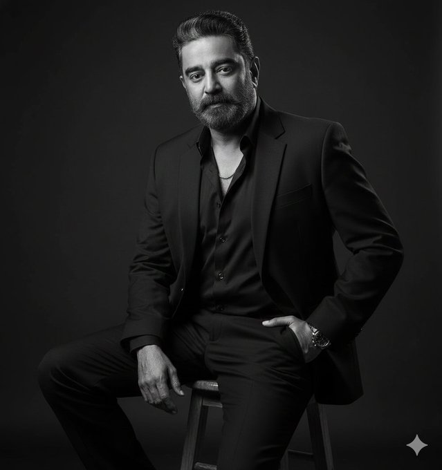

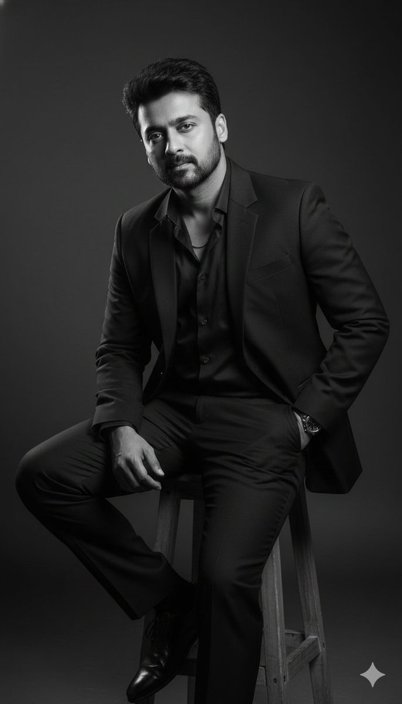

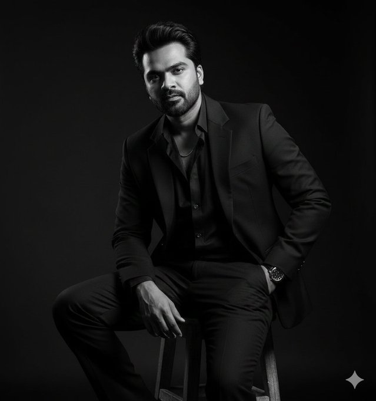

```
{
  "image_prompt": {
    "reference": {
      "face_identity": "uploaded reference image",
      "identity_lock": true,
      "face_preservation": "100% identical facial structure, proportions, skin texture, eye shape, lips, nose, brows, and natural expression"
    },
    "subject": {
      "type": "man",
      "expression": "confident, intense",
      "aura": "moody and powerful",
      "posture": {
        "body_position": "sitting on a wooden stool",
        "pose": "relaxed yet dominant",
        "arm_position": {
          "left_arm": "resting on leg",
          "right_arm": "hand inside pant pocket"
        }
      }
    },
    "outfit": {
      "suit": "well-fitted all-black suit",
      "shirt": "black shirt, slightly unbuttoned at the top",
      "pants": "black pants",
      "accessories": [
        "small silver chain necklace",
        "small silver watch"
      ]
    },
    "environment": {
      "location": "studio",
      "background": "dark studio backdrop"
    },
    "lighting": {
      "type": "soft but directional lighting",
      "effect": "dramatic shadows enhancing depth and mood"
    },
    "style": {
      "color": "black and white",
      "mood": "dramatic, cinematic portrait"
    },
    "rules": {
      "face_usage": "Use 100% of the uploaded face photo",
      "editing": "No facial modification or alteration"
    }
  }
}
```

```
面部识别：使用上传的面部参考图像，保持面部结构、比例、皮肤纹理、眼睛形状、嘴唇、鼻子、眉毛和自然表情100%一致。

主体：一位男性，表情自信而强烈，散发着忧郁且强大的气场。姿势为坐在木凳上，姿态放松但主导，左臂放在腿上，右手插在裤袋中。

穿着：合身的全黑西装，略微解开顶部纽扣的黑色衬衫，黑色裤子，配饰包括一条小银链项链和一只小银手表。

环境：位于摄影棚内，背景为深色布景。

照明：柔和但方向性的光线，营造出增强深度和情绪的戏剧性阴影。

风格：黑白颜色，具有戏剧性和电影感的肖像。

规则：面部使用上传的面部照片的100%，不允许对面部进行任何形式的修改或变更。
```

 [↑返回目录](#toc)

---
## <a id="prompt-2005071147537166600">将文章、故事变成漫画脚本提示词参考</a> (<a href="https://x.com/dotey/status/2005071147537166598" target="_blank" rel="noopener noreferrer">宝玉</a>)

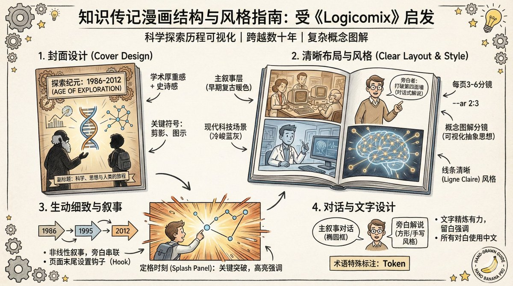

```
将文章、故事变成漫画脚本提示词参考

案例：参考引用推文

生成脚本示例对话：https://t.co/Tpbt4Z12fk
画图示例对话：https://t.co/2hlahrczbj

--- Prompt ---

请为一本若干页（另加1页封面）的原创知识传记漫画创作详细的结构和情节设计。本漫画采用《Logicomix》式的叙事风格，适合呈现科学探索历程、跨越数十年的时间线，以及复杂概念的可视化解释。
视觉风格定义：
- 线条清晰（Ligne Claire）：参考Hergé《丁丁历险记》或Joost Swarte的画风——轮廓线均匀、干净利落；背景写实细致，人物略带卡通化但五官特征鲜明、易于辨认。
- 色彩分层叙事：运用明快的色块区分不同时空场景。例如：早期年代采用泛黄的复古暖色调；现代科技场景使用冷峻的蓝灰色；关键突破时刻以高饱和的亮色强调。
- 打破第四面墙：设置一位或多位"旁白者"角色（如晚年的主人公或核心见证者），他们可以穿梭于画面之间，直接面向读者进行解说、评论或提问，形成对话式叙事。

要求如下：

1. 封面设计：
   - 设计一个兼具学术厚重感与视觉吸引力的封面
   - 标题字体应体现知识/科学主题（可参考学术期刊或经典科普读物的排版风格）
   - 封面构图需暗示核心主题，可包含关键人物剪影、标志性符号或概念图示
   - 明确标注副标题或时间跨度（如"1986-2012"）以建立史诗感

2. 清晰布局：
   - 逐页详细描述封面及每一页的画面布局
   - 说明每页的分镜（panel）数量与构图安排，建议每页3-6个分镜
   - 区分"主叙事层"（历史事件）与"旁白层"（解说者评论）的视觉处理方式
   - 为复杂概念预留"概念图解分镜"——以图示、隐喻或可视化方式呈现抽象思想
   - 标注每个分镜的大致比例（全页、半页、1/3页、小格等）
   - 页面比例为 --ar 2:3

3. 生动细致：
   - 以丰富且具体的语言描述每个分镜的视觉细节
   - 包括：角色姿态与表情、场景环境与时代特征、光影氛围、镜头角度（俯视/仰视/特写/远景）
   - 对于科学概念可视化，需描述如何将抽象概念转化为具象画面（如：神经网络用发光节点与连线表示；梯度下降用山谷地形隐喻）
   - 注意不同时空的视觉区分：服装、发型、设备、环境色调的年代感

4. 叙事结构：
   - 以"封面"及"第1页"至"第N页"清晰区分漫画的不同部分
   - 建议采用非线性叙事：可在不同时间线之间跳跃，由旁白者串联
   - 每页末尾可设置"钩子"（悬念或转折）以推动翻页欲望
   - 在关键情节节点安排"定格时刻"（splash panel或双页跨页）以强调重要性

5. 对话与文字设计：
   - 对话框风格：主叙事层使用标准椭圆对话框；旁白者使用方形或手写风格文字框以示区分
   - 旁白文字可置于画面边缘或独立的解说条（caption box）中
   - 科学术语首次出现时可用特殊标注（加粗或不同颜色）
   - 文字精炼有力，避免大段说教，让画面承担主要叙事功能
   - 所有对白使用中文

特别注意：
- 本阶段仅需提供详细、清晰、富有想象力的页面布局和情节描述
- 后续阶段将逐页生成具体的漫画图像，请确保本阶段的描述足够具体，可直接作为图像生成的prompt基础
- 每个分镜描述应包含足够的视觉信息，使其可独立作为AI绘图指令使用
```

 [↑返回目录](#toc)

---
## <a id="prompt-2005980269447373241">马年祝福封面</a> (<a href="https://x.com/LZhou15365/status/2005980269447373241" target="_blank" rel="noopener noreferrer">小洲洲的AI日常</a>)


```
说到马第一反应是西游记的白龙马
那就请来唐僧师徒和福星、财神爷给大家拜年吧
大佬这个提示词我好喜欢！太可爱了！
这很适合用来做红包封面啊！！

提示词如下：
{
    "applicable_models": [
        "Seedream",
        "Nano Banana Pro"
    ],
    "subject": {
        "IP_Name": "西游记",
        "description": "基于《西游记》的视觉冲击力强的、杰作级3D新年贺卡海报。垂直构图，中心有深邃的窗状凹槽。",
        "material_style": "毛毡与粗针织毛线质感，真实细腻，盲盒玩具质感。",
        "central_character": {
            "identity": "可爱的Q版毛毡白龙马（白龙马，马形态，代表马年）",
            "expression": "憨态可掬、喜庆温柔",
            "clothing": "红色喜庆马甲镶金边，传统虎头帽或红色喜庆头饰",
            "action": "站在中心作为节日使者，背上驮着唐僧或带领众人前行"
        },
        "secondary_characters": {
            "identity": "《西游记》经典角色（唐僧、孙悟空、猪八戒、沙悟净）以及财神爷、福禄寿三星神仙，皆为Q版毛毡风格",
            "clothing": "传统喜庆唐装或汉服，以红金色调为主",
            "action": "在场景中欢乐互动：孙悟空顽皮地拿着鞭炮，猪八戒笑着抱元宝，沙悟净挥手，唐僧合掌祝福，财神爷、福禄寿三星笑眯眯地比出吉祥手势，增添生动故事感"
        },
        "scene_elements": {
            "architecture": "《西游记》中标志性的古寺、宝塔或山门，以Q版毛毡形式呈现，层层排列富有纵深",
            "ground": "厚实奶油色针织雪地",
            "vegetation": "桃树或金桔树，挂满红灯笼、中国结以及写有“福”或“新年快乐”的祝福牌",
            "props": "散落毛毡鞭炮、金元宝、雪覆盖的灌木、红包、祥云"
        }
    },
    "accessories": {
        "title_design": {
            "structure": "独立3D立体字母悬浮于空中（无背景板/卡片）",
            "main_text": {
                "content": "Happy New Year",
                "font_style": "3D流体艺术字体，厚实玻璃体量感"
            },
            "sub_text": {
                "content": "新年快乐",
                "font_style": "粗中国书法，3D挤出笔画"
            },
            "material_properties": {
                "type": "直接应用于文字体量的哑光磨砂玻璃",
                "color": "深红到浅红渐变",
                "surface": "柔和哑光表面，半透明",
                "optical_effects": "梦幻彩色焦散光影投射到下方毛毡场景"
            }
        },
        "bottom_layout": {
            "content": "随机经典新年祝福语，例如“恭喜发财”或“福如东海，寿比南山”",
            "font_style": "大号优雅西式手写衬线字体，浓墨色",
            "source_note": "小号中文字体注明出处（小洲洲的AI日常）"
        }
    },
    "photography": {
        "renderer": "C4D, Octane Render",
        "resolution": "8K",
        "camera_style": "微距摄影视角",
        "shot_type": "垂直海报，微缩景观特写",
        "depth_of_field": "浅景深（背景虚化）",
        "lighting": "柔和均匀，呼吸灯效果，氛围纵深",
        "texture_quality": "杰作级别，细节丰富，毛毡与磨砂玻璃混合质感"
    },
    "background": {
        "setting": "东方水墨虚无环境，流动光雾",
        "colors": "优雅淡香槟金或高级柔雾红",
        "external_decor": [
            "空中舞动的红丝绒绸带",
            "流动金线",
            "盛开的红梅枝",
            "成串的喜庆红灯笼",
            "饱满的柿子或糖葫芦",
            "晶莹几何雪花",
            "发光的金铜钱串"
        ],
        "atmosphere": "爆棚的喜庆氛围，动态构图",
        "positioning": "贺卡仿佛悬浮于云端，底部带有柔和阴影"
    },
    "the_vibe": {
        "mood": "喜庆、东方、温暖、精致、欢乐",
        "culture": "中国新年，西游记主题",
        "aesthetic": "高端商业设计，可爱与优雅及神话魅力相结合"
    },
    "constraints": {
        "must_keep": [
            "毛毡质感",
            "中国新年元素",
            "白龙马代表马年",
            "立体玻璃文字（无招牌）",
            "书法文字",
            "水墨背景",
            "Q版西游记角色及福禄寿"
        ],
        "avoid": [
            "圣诞老人",
            "圣诞树",
            "西方圣诞装饰",
            "真实摄影风格",
            "扁平2D插画",
            "文字后方矩形玻璃板",
            "招牌",
            "文字写在卡片上"
        ]
    },
    "negative_prompt": [
        "圣诞老人",
        "圣诞树",
        "矩形背景板",
        "玻璃招牌",
        "文字框",
        "手持标牌",
        "照片级真人",
        "低分辨率",
        "模糊",
        "扁平色彩",
        "黑暗",
        "恐怖",
        "文字扭曲"
    ]
}
```

 [↑返回目录](#toc)

---
## <a id="prompt-2006739034828316825">复刻任何图片的风格</a> (<a href="https://x.com/msjiaozhu/status/2006739034828316825" target="_blank" rel="noopener noreferrer">MapleShaw</a>)


```
大家千万不要浪费 Gemini 3.0 Pro 的多模态能力啊，分分钟给你复刻任何图片的风格

只需三步
上传图片到 Gemini 3.0  Pro 中
输入提示词：“帮我把图片的整个视觉效果提取为 JSON 格式的 Prompt 包括但不限于颜色、字体、构图、效果、镜头……”
使用输出的 Prompt 在 Nano Banana Pro 生图

步骤虽然简单，但对大多数人来说都很有效。如果遇到效果不好，多磨几轮。

像下面这张很火的九宫格海马体精致写真，就是我看了小红书的一个美女网红的照片后有了想法，跟 Gemini 磨了四轮出来的效果
```

 [↑返回目录](#toc)

---
## <a id="prompt-2006948793586176375">一键穿搭挑战</a> (<a href="https://x.com/shit_yang/status/2006948793586176375" target="_blank" rel="noopener noreferrer">Jerlin</a>)

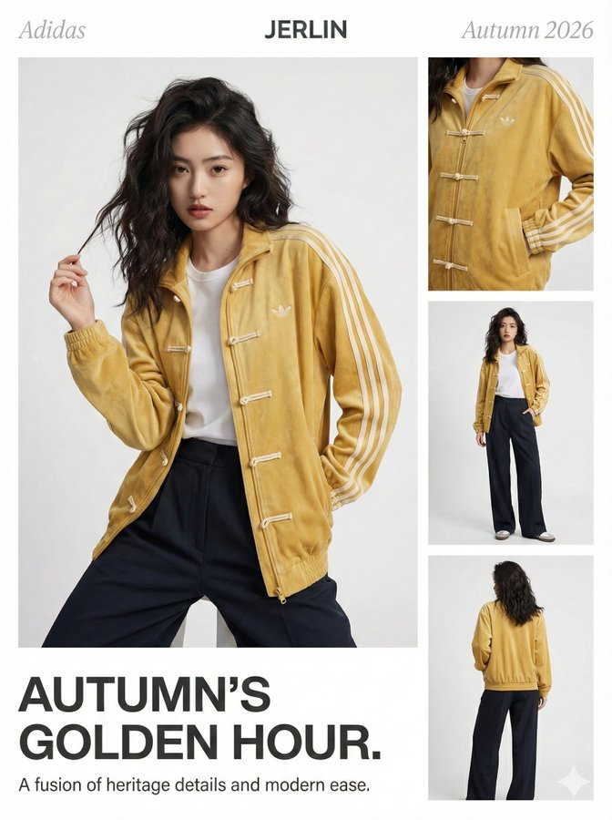


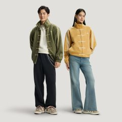

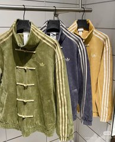

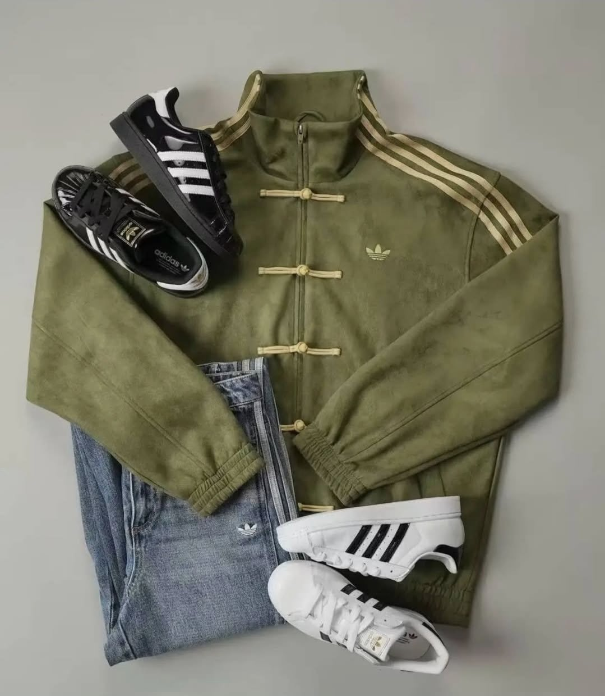

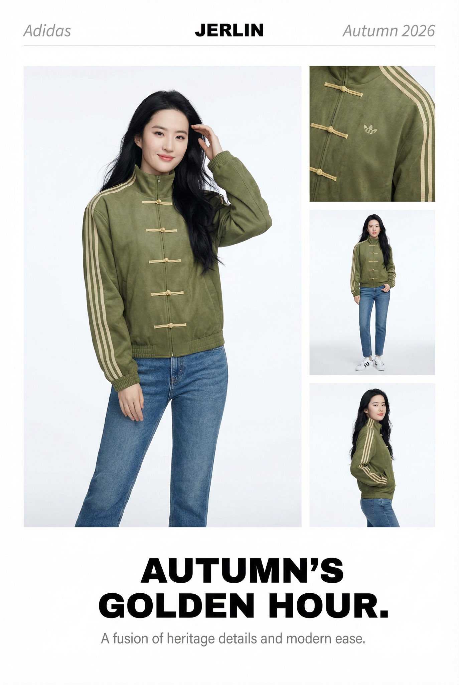

```
Fashion catalog layout design in magazine style. Clean white background with professional typography.

Top header: "Adidas" on left (light gray italic), "JERLIN" center (bold black), "Autumn 2026" on right (light gray italic)

Main layout composition:
Left side (large): [REFERENCE_PERSON_DESCRIPTION], wearing [JACKET_COLOR] track jacket with [JACKET_DESIGN] and triple white stripes on sleeves, white t-shirt underneath, black pants, casual confident pose with [GENDER_PRONOUN] hand touching hair, three-quarter body shot, clean studio lighting.

Right side (three smaller images stacked vertically):
- Top image: Close-up detail of jacket chest and sleeve area showing [JACKET_DESIGN] and triple stripes.
- Middle image: Full body shot, standing straight, showing complete outfit from head to toe.
- Bottom image: Back view showing the back [JACKET_DESIGN] design of the jacket.

Bottom text area:
Large bold headline: "AUTUMN'S GOLDEN HOUR." (black, sans-serif font)
Subtitle below: "A fusion of heritage details and modern ease." (smaller, gray text)

Professional fashion photography style, minimalist composition, soft even lighting, editorial quality, clean aesthetic, proper spacing and margins. IMPORTANT: Maintain exact facial features, hairstyle, and glasses from reference photo.
```

```
杂志风格的时尚目录布局设计。干净的白色背景，专业的排版。

顶部标题：“Adidas”在左（浅灰色斜体），“JERLIN”居中（粗体黑色），“Autumn 2026”在右（浅灰色斜体）

主要布局构成：
左侧（大图）：【参考人物描述】，穿着【夹克颜色】的运动夹克，配有【夹克设计】和袖子上的三条白色条纹，内搭白色T恤，黑色裤子，轻松自信的姿态，【性别代词】的手触摸着头发，三分之四身长的镜头，干净的工作室照明。

右侧（三个较小的图像垂直排列）：
- 顶部图片：夹克胸部和袖子区域的特写细节，显示【夹克设计】和三条纹。
- 中间图片：全身照，站得笔直，从头到脚展示完整的服装。
- 底部图片：背部视角，展示夹克背面的【夹克设计】图案。

底部文字区域：
大型粗体标题：“AUTUMN'S GOLDEN HOUR.”（黑色，无衬线字体）
副标题：“A fusion of heritage details and modern ease.”（较小的灰色文字）

专业的时尚摄影风格，简约的构图，柔和均匀的照明，编辑级别的质量，干净的美学，适当的间距和边距。重要提示：保持与参考照片完全相同的面部特征、发型和眼镜。
```

 [↑返回目录](#toc)

---
## <a id="prompt-2005681873612165251">WhatsApp 人物对话</a> (<a href="https://x.com/Arminn_Ai/status/2005681873612165251" target="_blank" rel="noopener noreferrer">ΛRMIN | AI</a>)


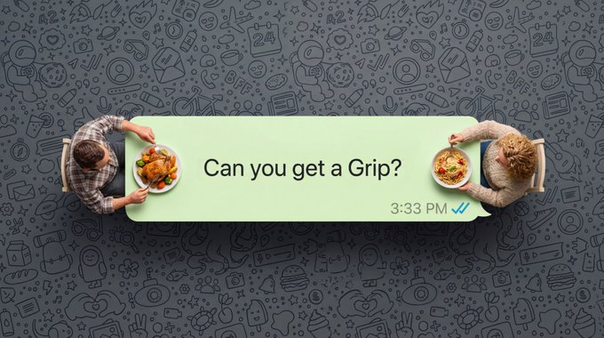


```
Hyper-realistic top-down macro photography. A long, light green WhatsApp speech bubble acting as a dining table. Two real living humans (shrunk to tiny scale) are sitting at opposite ends. They are NOT plastic figures; they have visible skin texture, natural hair, and realistic clothing folds. They are eating real food that looks freshly cooked, not play-doh. The text inside reads: "INSERT TEXT". Bottom right has a timestamp '3:33 PM' and blue ticks. The background is completely filled with a high-density, seamless WhatsApp doodle pattern (line art icons) covering the entire surface edge-to-edge with no empty spaces, resembling the original dense WhatsApp wallpaper. Professional studio lighting, 8k resolution, sharp focus.
```

```
超写实俯视微距摄影。一条细长的浅绿色 WhatsApp 聊天气泡充当餐桌。两名真实活人（缩小至微型尺寸）坐在气泡两端，他们并非塑料玩偶，而是具有可见的皮肤纹理、自然发丝和逼真的衣物褶皱。他们正在享用看起来刚出锅的真实食物，而非橡皮泥。气泡内文字显示为：“INSERT TEXT”。右下角带有时间戳“3:33 PM”和蓝色对勾标记。背景完全被高密度无缝的 WhatsApp 涂鸦图案（线稿图标）覆盖，边缘到边缘无任何空白，还原原始 WhatsApp 壁纸的密集风格。专业影棚灯光，8K 分辨率，焦点锐利。
```

 [↑返回目录](#toc)

---
## <a id="prompt-2005984084141465609">2026年广告工作室活力海报</a> (<a href="https://x.com/xmiiru_/status/2005984084141465609" target="_blank" rel="noopener noreferrer">Mira</a>)

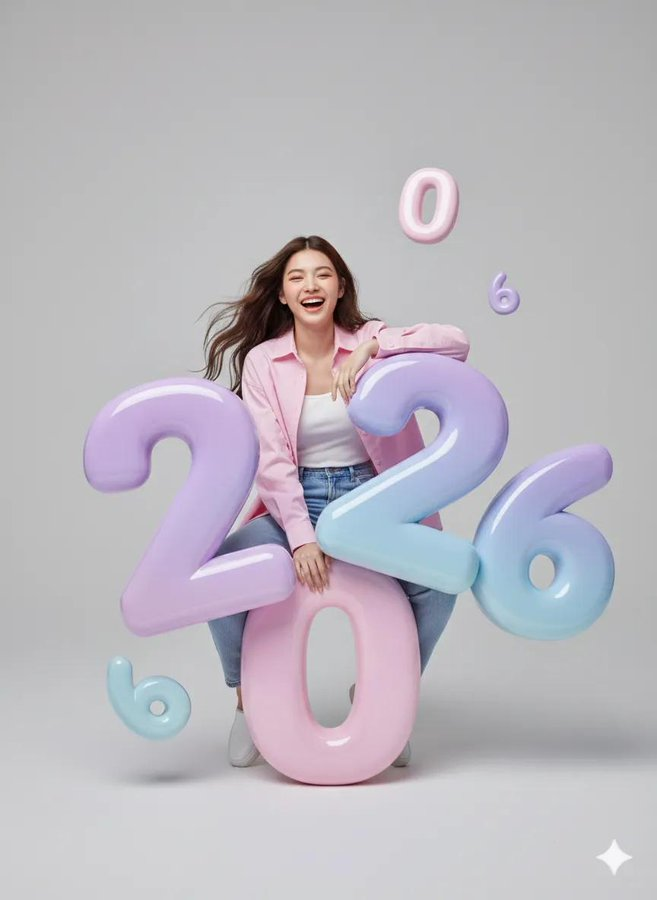


```
{
  "type": "image_prompt",
  "style": "ultra-bright cute advertising studio poster",
  "subject": {
    "identity": "cheerful playful Thai young woman",
    "expression": "smiling and laughing",
    "pose": "sitting happily on a glossy pastel 3D number while leaning playfully against another",
    "hair": {
      "length": "long",
      "texture": "soft wavy",
      "quality": "natural bounce"
    },
    "makeup": {
      "style": "fresh dewy",
      "cheeks": "rosy",
      "lips": "glossy"
    }
  },
  "outfit": {
    "top_layer": "soft pink oversized shirt",
    "inner_top": "white tank top",
    "bottom": "light blue jeans",
    "style": "pastel casual"
  },
  "props": {
    "year_reference": "2026",
    "numbers": {
      "highlighted_digit": {
        "number": "2",
        "description": "first digit of 2026, significantly larger than the others",
        "style": "oversized rounded pastel 3D"
      },
      "supporting_digit": {
        "number": "0",
        "style": "glossy pastel 3D",
        "interaction": "subject sitting on it"
      },
      "other_digits": ["2", "6"]
    }
  },
  "environment": {
    "setting": "studio",
    "lighting": "high-key studio lighting",
    "glow": "soft glow",
    "color_palette": "candy pastel",
    "mood": "bubbly, joyful, cute, playful"
  },
  "photography": {
    "type": "professional commercial photography",
    "realism": "ultra-realistic",
    "quality": "high-end advertising look"
  },
  "composition": {
    "aspect_ratio": "5:4",
    "text": "none"
  }
}
```

```
充满活力的可爱广告工作室海报，风格。主体是一位开朗、活泼的泰国年轻女性，表情微笑并大笑，姿态是愉快地坐在一个光滑的粉彩3D数字上，并调皮地依靠另一个数字。她的头发长而柔软波浪，具有自然弹性；妆容清新有光泽，脸颊红润，嘴唇晶亮。穿着方面，她身穿一件淡粉色的大码衬衫，内搭白色背心，下穿浅蓝色牛仔裤，整体风格为柔和休闲。道具包括年份2026，其中数字2被显著放大，作为2026的第一个数字，风格为超大的圆形粉彩3D；数字0则为光滑的粉彩3D，这位女性坐在上面；其他数字还有2和6。环境设定在摄影棚中，采用高调的工作室照明，带有柔和光芒，色彩搭配为糖果色系，氛围为泡沫般的、欢乐的、可爱的、俏皮的。摄影类型为专业的商业摄影，追求超现实主义的真实感，拥有高端广告的外观。构图比例为5:4，没有文字说明。
```

 [↑返回目录](#toc)

---
## <a id="prompt-2005822648027091031">四角拼图完成2026祝福</a> (<a href="https://x.com/songguoxiansen/status/2005822648027091031" target="_blank" rel="noopener noreferrer">松果先森</a>)


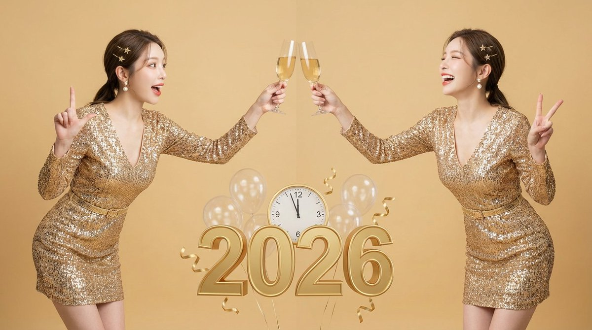

```
[关键:保持精确的面部特征,保留原始脸部结构,图中角色与上传参考图完全一致] 高级摄影棚2x2宫格写真。左上格(海军蓝背景):人物穿海军蓝色制服风连衣裙,金色纽扣装饰,复古卷发配蓝色贝雷帽和珍珠耳环,她双手托举一块巨大的拼图块(左上角块,上面有"20"数字),向画面中心方向移动,眼神专注地看向中心拼图区域,表情认真,嘴角微笑,背景有海军条纹、船锚、"启航新年"字样。右上格(樱花粉背景):同一女性穿粉色蕾丝连衣裙,珍珠项链,公主头配粉色玫瑰花发夹和水晶耳环,她双手托举右上角拼图块(上面有"26"数字)向中心移动与左上格拼接,眼神看向拼图接缝处,表情专注期待,身体前倾,背景有粉色樱花、"美好相遇"字样、蝴蝶、花瓣。左下格(薄荷绿背景):同一女性穿薄荷绿色棉麻连衣裙,文艺风格,自然长发配绿色发带和木质耳环,她双手托举左下角拼图块(上面有"元旦"字样)向上移动与左上格对接,眼神看向拼图,表情认真,嘴巴微微抿起,背景有绿色植物、"希望生长"字样、新芽、叶子。右下格(柠檬黄背景):同一女性穿黄色连衣裙,向日葵图案,双马尾配黄色蝴蝶结,她双手托举最后一块右下角拼图(上面有"快乐"字样)完成拼图,四块拼图在画面中心完美拼成"2026元旦快乐"完整图案,她头后仰,眼睛看向完成的拼图,脸上洋溢着成功喜悦的笑容,画面中心爆出金色光芒和彩纸,背景有黄色太阳、"圆满成功"字样、笑脸、向日葵。四格之间拼图从四角汇聚到中心形成完整画面,清透妆容,明亮环形光,85mm镜头,f/1.8光圈,拼图互动四联构图,时尚杂志风格。
```

 [↑返回目录](#toc)

---
## <a id="prompt-2005999391367196797">微信泡泡人物对话</a> (<a href="https://x.com/Tz_2022/status/2005999391367196797" target="_blank" rel="noopener noreferrer">Tz</a>)


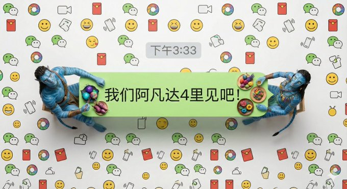


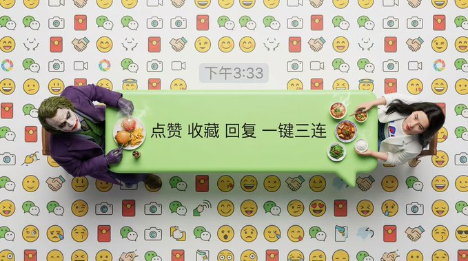

```
指定人物：两个缩小到微缩比例的真实的活人，见参考图

文字内容：[文字内容]

时间戳：下午3:33

超写实主义的俯拍微距摄影作品。主体是一个标准的微信发送方浅绿色聊天气泡框，它被当作一张长餐桌。[指定人物]坐在气泡框的两端。

关键人物细节：强调他们绝不是塑料模型；他们拥有清晰可见的皮肤毛孔、自然的头发细节以及极其逼真的布料纹理和褶皱。他们正在享用看起来热气腾腾、新鲜烹饪的符合人物身份的真实食物微缩模型，抬头看向镜头。

微信独有视觉元素：气泡框内部只有文字内容：“[文字内容]”。在气泡框的正上方外部，居中显示一个灰色的微信风格时间戳：“[时间戳]”。

背景细节：整个背景完全被高密度的、无缝连接的定制微信主题线条图案所填满（包含微信标志性的双气泡Logo、朋友圈图标、红包图标、“摇一摇”手势、经典黄脸表情包等线条艺术），从边缘到边缘覆盖整个画面，没有空隙，模仿密集的聊天背景壁纸风格。

技术参数：采用专业演播室级微距布光，强调质感，8K超高分辨率，整个平面焦点极其锐利。
```

 [↑返回目录](#toc)

---
## <a id="prompt-2005097871977447736">元旦特辑-复古旗袍名媛风</a> (<a href="https://x.com/songguoxiansen/status/2005097871977447736" target="_blank" rel="noopener noreferrer">松果先森</a>)


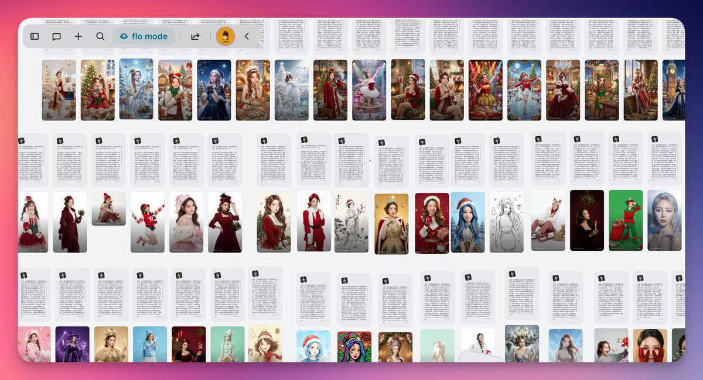

```
[关键：保持精确的面部特征，保留原始脸部结构，图中角色与上传参考图完全一致]
精致工作室立姿肖像,人物拥有如凝脂般细腻白皙的肌肤,淡雅妆容强调通透感和裸粉唇妆。她身着传统红色凤凰刺绣旗袍,高开叉设计展现修长美腿,袖口和领口绣满金线祥云纹样,外搭金色薄纱长披风从肩部垂落至地面。发型是典雅的侧边低盘发,用金色凤凰步摇、红色珠花和长长的金色流苏装饰,发饰随动作轻微摇曳,一侧留出波浪卷发修饰脸型。她站立在红色地毯上呈经典旗袍站姿,一条腿从开叉处露出,一只手叉腰展现自信,另一只手拿着金色烟斗式长杆烟嘴优雅置于唇边,头部微侧展现精致侧颜,眼神冷艳高贵。背景是深红色天鹅绒幕布,中央悬挂金色"元旦快乐"书法大字和"2026"立体装置,两侧对称布置红色立柱、金色花瓶插梅花、复古留声机。伦勃朗光营造经典好莱坞氛围,强调明暗对比和戏剧张力。Phase One拍摄系统,色彩浓烈复古,顶级工作室vintage大片质感。
```

 [↑返回目录](#toc)

---
## <a id="prompt-2005286056850251802">新年城市天际线庆典</a> (<a href="https://x.com/LufzzLiz/status/2005286056850251802" target="_blank" rel="noopener noreferrer">岚叔</a>)


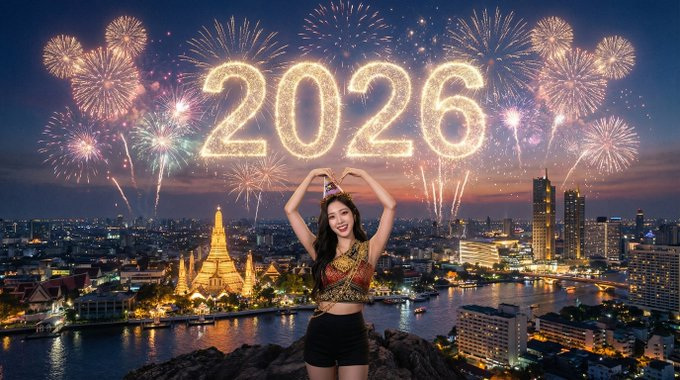

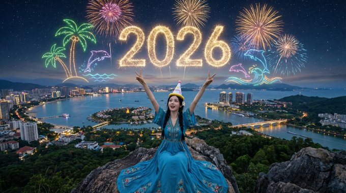


```
用法：上传人物参考图片 + 提示词，更改最后两句。可能需要抽两张图，有可能人物偶尔会变小宝宝，也挺有意思的
{
  "template_name": "新年城市天际线庆典 (人物定制版)",
  "description": "一个孩子俯瞰城市天际线的电影式镜头。支持基于参考图的人物形象定制、视角切换（正面/背面）以及自定义动作。画面中包含定制的烟花特效和巨大的“2026”字样。新增全局构图设定：采用鸟瞰远景视角，镜头与人物呈60度角，确保人物不遮挡城市夜景；人物服装风格与目标城市文化或地标元素相呼应。",
  "prompt_template": "一个令人惊艳的电影式镜头，采用鸟瞰远景构图，镜头与人物呈60度角，巧妙避开人物对背景的遮挡，完整展现壮丽的城市天际线。基于参考图片中的孩子形象，人物以{view_orientation}出现在画面中，头戴一顶奇趣的派对帽，身穿与{target_city_short}文化或地标相呼应的节日服装，站在高耸的山峰之巅。人物当前的动作为：{character_action}。背景是令人叹为观止的{target_city}城市夜景，标志性的城市地标在繁星点点的夜空下清晰可见。整个天空被{city_fireworks_effect}点亮。巨大的、闪耀的金色烟花在中心清晰地拼出了“2026”的字样。8K 分辨率，照片级真实感，电影颗粒感，营造出梦幻、宏大且充满希望的氛围，展现了高度精细的城市夜景。",
  "input_variables": {
    "target_city": {
      "type": "string",
      "description": "庆祝活动的城市名称和主要地标描述。",
      "default_value": "上海夜景，东方明珠塔、外滩和蜿蜒的黄浦江"
    },
    "target_city_short": {
      "type": "string",
      "description": "目标城市的简称或关键词，用于描述服装风格匹配（如'上海'、'巴黎'、'东京'等）。",
      "default_value": "上海"
    },
    "city_fireworks_effect": {
      "type": "string",
      "description": "烟花的风格、形状、颜色和氛围的描述。",
      "default_value": "一场壮观的迪士尼风格烟花表演，以米老鼠形状的烟花、童话般的柔和色彩、闪闪发光的魔法粉尘和梦幻般的层叠火花为特色"
    },
    "view_orientation": {
      "type": "string",
      "description": "人物相对于镜头的朝向。推荐：'背面剪影' 或 '正面（面带惊奇的笑容）'。",
      "default_value": "背面剪影"
    },
    "character_action": {
      "type": "string",
      "description": "人物的具体肢体动作。",
      "default_value": "双手高举过头顶，向着天空张开，身体微微后仰，充满惊奇和兴奋"
    }
  },
  "full_prompt_example": "一个令人惊艳的电影式镜头，采用鸟瞰远景构图，镜头与人物呈60度角，巧妙避开人物对背景的遮挡，完整展现壮丽的城市天际线。基于参考图片中的孩子形象，人物以背面剪影出现在画面中，头戴一顶奇趣的派对帽，身穿与上海文化或地标相呼应的节日服装，站在高耸的山峰之巅。人物当前的动作为：双手高举过头顶，向着天空张开，身体微微后仰，充满惊奇和兴奋。背景是令人叹为观止的上海夜景，东方明珠塔、外滩和蜿蜒的黄浦江在繁星点点的夜空下清晰可见。整个天空被一场壮观的迪士尼风格烟花表演点亮，以米老鼠形状的烟花、童话般的柔和色彩、闪闪发光的魔法粉尘和梦幻般的层叠火花为特色。巨大的、闪耀的金色烟花在中心清晰地拼出了“2026”的字样。8K 分辨率，照片级真实感，电影颗粒感，营造出梦幻、宏大且充满希望的氛围，展现了高度精细的城市夜景。"
}
城市：香港维多利亚港
人物：参考图片｜正面照。服装需替换与背景城市保持一致
动作: 双手过肩比心
```

 [↑返回目录](#toc)

---
## <a id="prompt-2005842541141451133">产品说明书</a> (<a href="https://x.com/berryxia/status/2005842541141451133" target="_blank" rel="noopener noreferrer">Berryxia.AI</a>)


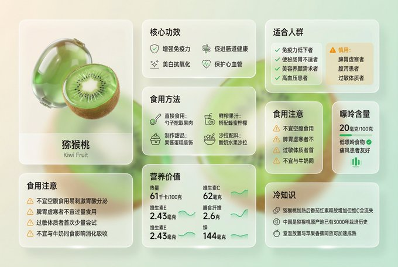


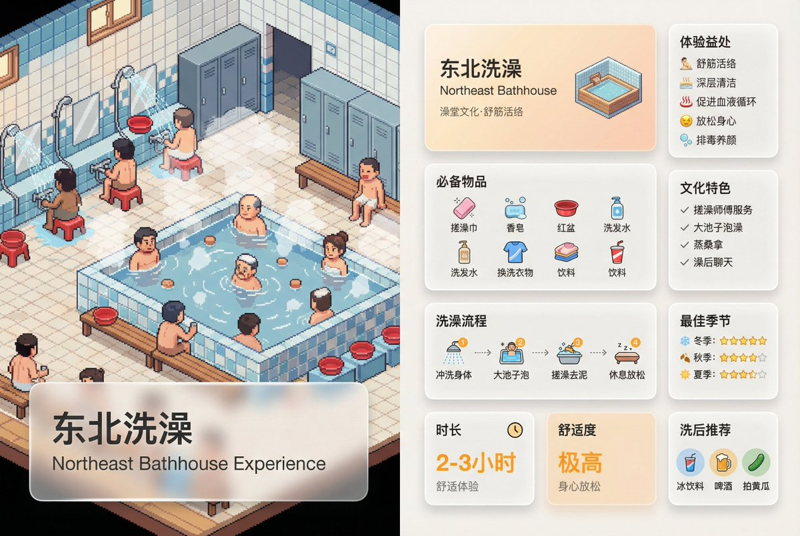

```
现代Bento网格布局产品展示设计,采用磨砂亚克力透明玻璃材质。适用于任何产品类型(食物/药品/科技产品/元素等)。

【布局结构】8个模块,非对称Bento网格排列,横向landscape格式:

模块1: 【3D玻璃产品主体展示】(中等尺寸1x1,占20-25%空间)

- 3D透明玻璃/亚克力材质的[产品名称]雕塑

- [产品特色]:

* 食物 → 展示切面/内部结构(如番茄种子腔室、胡萝卜横切面)

* 药品 → 药片/胶囊的透明玻璃形态

* 科技产品 → 产品外观的玻璃艺术化呈现

- 材质效果: 透明红橙/蓝色/绿色等[产品主色]玻璃,光泽表面,光线折射,真实反射

- 正下方文字标注: "[中文产品名] / [English Name]"

- 不占用过多空间,为信息模块留足展示区域

模块2: 【核心功效/特点】(标准卡片1x1)

标题: "核心功效" 或 "核心特点" 或 "主要功能"

内容: 4个核心卖点,用 "/" 分隔

- 食物 → "抗氧化延缓衰老 / 保护心血管健康 / 美白护肤养颜 / 促进消化吸收"

- 药品 → "解热镇痛 / 抗炎消肿 / 抗血小板聚集 / 预防心血管疾病"

- 科技 → "主动降噪 / 空间音频 / 自适应均衡 / 20小时续航"

配合简洁图标

模块3: 【使用方法/应用场景】(标准卡片1x1)

标题: "食用方法" 或 "使用方法" 或 "应用场景"

内容: 4种使用方式/场景

- 食物 → "生食: 沙拉凉拌 / 熟食: 炒蛋炖汤 / 加工: 酱料榨汁 / 搭配: 鸡蛋牛肉"

- 药品 → "口服: 餐后温水送服 / 剂量: 成人100mg / 频次: 每日1-2次 / 疗程: 遵医嘱"

- 科技 → "音乐欣赏 / 通勤降噪 / 居家办公 / 观影娱乐"

配合场景图标

模块4: 【关键数据/参数】(标准卡片1x1)

标题: "营养价值" 或 "技术参数" 或 "产品规格"

内容: 5个关键数据点

- 食物 → "热量 [X]千卡/100克 / 维生素C [X]毫克 / [特色成分] 丰富 / 膳食纤维 [X]克 / 钾 [X]毫克"

- 药品 → "成分: [化学式] / 规格: [X]mg / 起效时间: [X]分钟 / 半衰期: [X]小时 / 代谢途径: [途径]"

- 科技 → "芯片: [型号] / 续航: [X]小时 / 重量: [X]克 / 驱动单元: [规格] / 充电: [X]小时"

配合简洁数据可视化图表

模块5: 【适用人群/目标用户】(标准卡片1x1)

标题: "适合人群" 或 "目标用户" 或 "适用场景"

内容: 分为推荐(✓)和警示(⚠️)两部分

- 食物 → "✓ 心血管疾病患者 / ✓ 美容养颜需求者 / ✓ 减肥瘦身人群 / ✓ 便秘消化不良 / ⚠️ 慎用: 肾功能不全 / 胃酸过多 / 空腹食用"

- 药品 → "✓ 发热患者 / ✓ 轻中度疼痛 / ✓ 炎症性疾病 / ⚠️ 禁忌: 孕妇 / 哮喘患者 / 胃溃疡"

- 科技 → "✓ 音乐发烧友 / ✓ 商务人士 / ✓ 通勤人群 / ✓ 内容创作者"

用绿色✓和琥珀色⚠️区分

模块6: 【注意事项/使用指南】(标准卡片1x1)

标题: "食用注意" 或 "使用注意" 或 "重要提示"

内容: 4条重要提醒事项

- 食物 → "不宜空腹食用以免刺激胃黏膜 / 未成熟[产品]含[有毒物质]禁食 / 不宜长时间高温烹煮保留营养 / [特殊人群]需控制摄入量"

- 药品 → "需餐后服用避免胃部不适 / 不可与[禁忌药物]同服 / 服药期间避免饮酒 / 出现过敏反应立即停药就医"

- 科技 → "首次使用需配对设备 / 避免极端温度环境 / 定期清洁保养 / 长期不用请充电保存"

配合警示图标

模块7: 【特殊指标】(标准卡片1x1)

标题: 根据产品类型调整

- 食物 → "嘌呤含量" 显示 "[X]毫克/100克" + "低嘌呤食物 ✓" + "痛风患者友好"

- 药品 → "不良反应" 列举常见副作用

- 科技 → "兼容性" 显示支持的系统/设备

配合指示器或图标

模块8: 【趣味知识/产品洞察】(标准卡片1x1)

标题: "冷知识" 或 "产品故事" 或 "有趣事实"

内容: 2-3条有趣的知识点

- 食物 → "[产品]加热后[成分]吸收率提升X倍 / [产品]原产[地区]已有[X]年历史 / 未成熟[产品]含[有害物质]"

- 药品 → "[产品]是世界上使用最广泛的[类别]之一 / 每年全球生产超过[X]吨 / [发明年份]年由[人名]发明"

- 科技 → "[产品]采用[技术]专利技术 / [品牌]首次将[功能]应用于消费级产品 / 全球销量突破[X]万台"

【磨砂亚克力材质规格】(CRITICAL 核心灵魂):

卡片材质效果:

- 透明度: 80-85% 半透明(TRANSLUCENT),可以看穿卡片看到背景

- 磨砂效果: 柔和的frosted glass blur模糊,backdrop-filter风格

- 底色调: 轻微白色/奶油色霜化效果(15-20%不透明度),提升可读性但保持透明

- 边框: 细致的发光边框,捕捉光线反射

- 阴影: 柔和的分层阴影,营造浮空深度感

- 玻璃物理: 真实的玻璃边缘高光、光线折射、表面反射效果

- 视觉特征: 背景渐变可以透过卡片清晰看见,像真实的磨砂亚克力板

重要: 卡片必须保持TRANSLUCENT透明质感,不能变成不透明白卡片!

【色彩方案】:

基础色彩配比: 90% 中性色 + 10% 产品主题色点缀

- 基础层: 透明玻璃、浅灰色、米白色

- 文字色: 中等深灰 #3A3A3A (柔和但清晰,适合透明背景)

- 主题色点缀(10%使用):

* 食物 → 产品天然色(番茄红橙、胡萝卜橙、菠菜绿等)

* 药品 → 医疗蓝、药品白、红十字标志色

* 科技 → 品牌主色(Apple银灰蓝、小米橙、华为红等)

- 点缀位置: 仅用于关键图标、重要数字、警示符号、3D主体

- 警示色: 琥珀橙 #FF9800 用于⚠️警告内容

- 肯定色: 绿色 #4CAF50 用于✓推荐内容

【背景设置】:

- 类型: 柔和渐变,2-3个相近色过渡

- 产品色调适配:

* 食物 → 奶油白-淡桃红-浅橙色(温暖色调)

* 药品 → 浅灰白-淡蓝-医疗白(清洁专业)

* 科技 → 太空灰-银白-淡蓝(科技感)

- 装饰元素: 极度柔和的抽象形状,可透过玻璃卡片隐约看见

- 重要: 背景要柔和不抢眼,通过透明卡片可见但不干扰阅读

【排版布局】:

- 格式: 横向 landscape 16:9 或类似比例

- 网格类型: 非对称Bento网格,卡片大小不一

- 空间分配:

* 3D玻璃主体: 20-25% (中等尺寸,不过度占用)

* 信息卡片: 75-80% (7个标准卡片)

- 卡片间距: 适度留白,不拥挤,呼吸感良好

- 视觉层次: 通过卡片大小、位置、色彩点缀建立信息优先级

- 阅读流: 从左上3D主体开始,自然流向各信息卡片

【文字规范】:

- 语言: 全中文内容(产品名可双语标注)

- 字体层级:

* 模块标题: 粗体,大号

* 正文内容: 常规体,中号

* 数据数字: 粗体,突出显示

- 可读性: 中等深灰文字在磨砂玻璃上清晰易读

- 单位规范:

* 重量: 克、千克、毫克

* 能量: 千卡、卡路里

* 时间: 分钟、小时、天

* 容量: 毫升、升

【图标风格】:

- 类型: 极简线条图标 (line icons)

- 尺寸: 小巧不喧宾夺主

- 颜色: 浅灰线条,关键图标用主题色点缀

- 用途: 辅助说明,增强视觉识别

【使用方法】:

1. 将 [产品名称] 替换为实际产品

2. 根据产品类型(食物/药品/科技)选择对应的内容示例

3. 填充8个模块的具体信息

4. 调整主题色为产品代表色

5. 确保保持磨砂亚克力的透明质感

【质量标准】:

✓ 透明度正确(80-85%,可看穿)

✓ 磨砂模糊效果明显但不过度

✓ 背景可透过卡片看见

✓ 3D主体占比适中(20-25%)

✓ 信息完整(8个模块内容齐全)

✓ 全中文显示清晰

✓ 色彩克制优雅(90%中性+10%点缀)

✓ 排版舒适不拥挤

✓ 玻璃质感真实(边缘高光、反射、折射)

【典型应用示例】:

食物: 🍅西红柿、🥕胡萝卜、🍎苹果、🥑牛油果

药品: 💊阿司匹林、维生素C、布洛芬、青霉素

科技: 🎧AirPods Max、iPhone、MacBook、特斯拉

元素: ⚛️碳、氧、氢、氮
```

 [↑返回目录](#toc)

---
## <a id="prompt-2005629256781680913">元旦特辑-2026时尚跨年夜造型</a> (<a href="https://x.com/songguoxiansen/status/2005629256781680913" target="_blank" rel="noopener noreferrer">松果先森</a>)

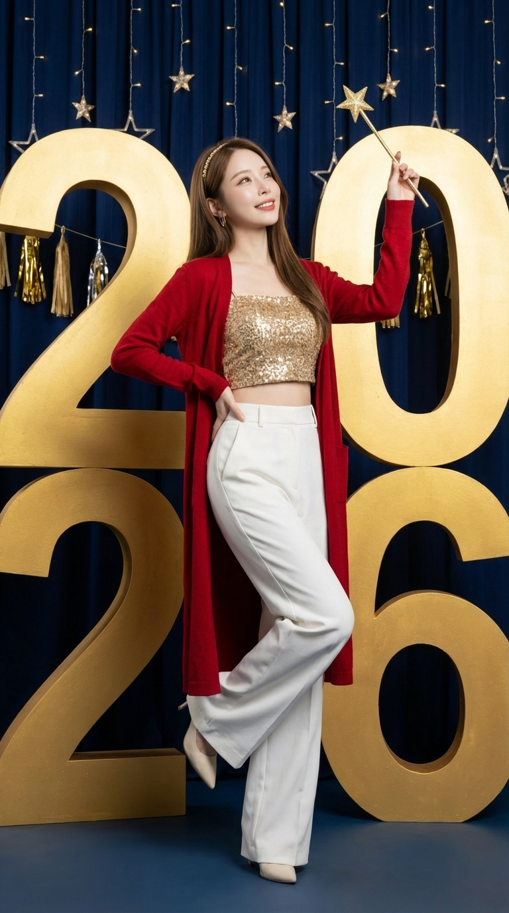


```
元旦特辑-2026时尚跨年夜造型

Nano banana pro提示词：

[关键:保持精确的面部特征,保留原始脸部结构,图中角色与上传参考图完全一致]人物全身肖像，展现如瓷器般光滑白皙的肌肤和淡雅的妆容。她穿着现代感的金色亮片短款上衣搭配白色高腰阔腿裤，外披红色长款开衫，展现时尚的跨年装扮。长直发自然披散，用金色细发带作为发箍，打造简约优雅的造型。她站在巨大的"2026"金色数字装置前，身体呈S型曲线站姿，一条腿微微弯曲，一只手自然放在腰间，另一只手高举金色星星魔法棒，头部微微仰起展现自信笑容。背景是深蓝色幕布装饰着星星灯串和金色流苏。专业影棚打光，营造璀璨的跨年夜氛围。高分辨率时尚大片风格，色彩对比鲜明。
```

 [↑返回目录](#toc)

---
## <a id="prompt-2003402163364782168">2026快来了！用AI的方式来迎接一下吧！</a> (<a href="https://x.com/zuogl448/status/2003402163364782168" target="_blank" rel="noopener noreferrer">左同学</a>)

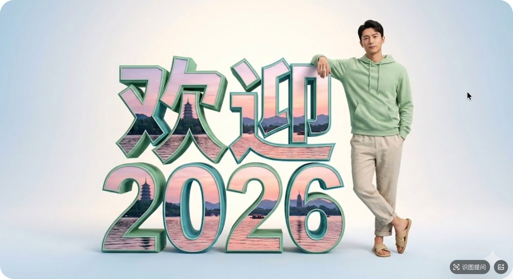

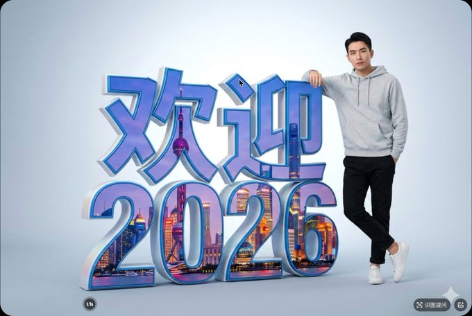

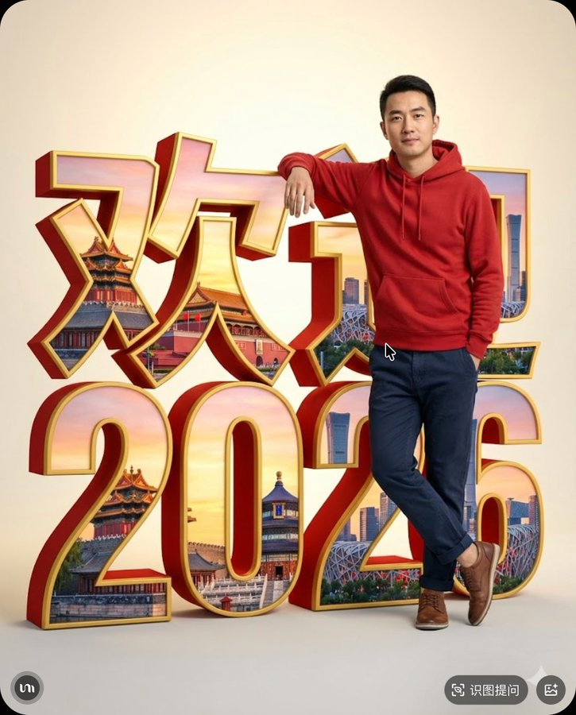

```
2026快来了！用AI的方式来迎接一下吧！
提示词：
一张超现实的8K影棚摄影作品，主角是一位上传照片中的中国男性，面部特征100%匹配，休闲地倚靠在拼写"欢迎 2026"的超大三维立体中文字母上。相机位于眼平高度，捕捉全身镜头，采用略微广角的视角，强调人物与文字之间的比例差异。人物以上传的面部照片为参考，穿着中国红色连帽卫衣（带前口袋）、深蓝色休闲裤（裤脚卷起至脚踝）、以及棕色皮质休闲鞋。人物位于文字的右侧，右臂搭在"欢迎"中"迎"字的顶部边缘，左手随意地插在口袋里，一条腿微微弯曲。大型3D文字采用高度细致的纹理渲染，具有故宫红和金色的立体挤出侧面，字母内部填充着充满活力的超现实黄昏北京城市景观，展示标志性地标如天安门、故宫角楼、天坛、鸟巢和中国尊大厦，在字母内映衬着金黄色和霞光红的暮光天空，体现皇城古韵与现代都市的完美融合。"欢迎"一行位于"2026"一行上方，两者都居中对齐，上面一行大约到达人物胸部高度。背景是温暖的米白色到浅金色渐变，顶部较亮，底部略暗，营造祥和氛围。场景采用柔光箱影棚照明，营造均匀的电影级照明效果，带有柔和的阴影，突出3D文字的厚重感和人物的立体形态，确保全画面高度细致的纹理和清晰锐利的焦点。
```

 [↑返回目录](#toc)

---
## <a id="prompt-2005947184290951450">超写实水下港海豹摄影</a> (<a href="https://x.com/TheLOKII_/status/2005947184290951450" target="_blank" rel="noopener noreferrer">LOKII</a>)

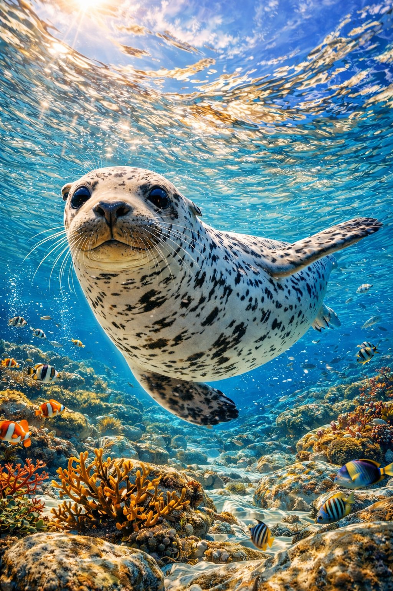

```
A breathtaking ultra realistic underwater photograph of a cute spotted harbor seal swimming directly toward the camera, big glossy black eyes, detailed whiskers, soft wet fur texture. Crystal-clear tropical blue ocean, golden sunlight rays piercing through the water surface creating shimmering reflections. Vibrant colorful coral reef below with orange, yellow, purple corals, clownfish, angelfish, butterfly fish swimming around. Floating light particles, cinematic depth of field, sharp focus, natural shadows, HDR lighting, photorealistic, 16K resolution, DSLR underwater photography, National Geographic style, hyper detailed, no AI look.
```

```
一张令人惊叹的超写实水下照片：一只可爱的斑点港海豹正径直朝镜头游来，拥有大而闪亮的黑色眼睛、细致的胡须和柔软湿润的毛发质感。清澈透明的热带蓝色海洋中，金色阳光穿透水面，形成闪烁的光影。下方是色彩鲜艳的珊瑚礁，有橙色、黄色和紫色的珊瑚，周围游弋着小丑鱼、神仙鱼和蝴蝶鱼。水中漂浮着光粒子，具有电影级景深、锐利对焦、自然阴影、HDR 光照效果，风格为国家地理式的 DSLR 水下摄影，极度精细，16K 分辨率，毫无 AI 痕迹。
```

 [↑返回目录](#toc)

---
## <a id="prompt-1998432458941858282">透明圣诞球内的未来风3D微缩场景</a> (<a href="https://x.com/CharaspowerAI/status/1998432458941858282" target="_blank" rel="noopener noreferrer">Pierrick Chevallier | IA</a>)


```
Fun prompt idea with Banana Pro:
Turn yourself into a super cute 3D character inside a Christmas ornament  Made in Firefly Board

The result? Pure festive magic.
PROMPT
A transparent Christmas bauble hanging by a red ribbon. Inside, a tiny diorama of the person from the reference reimagined as a cute 3d chibi character. He works at a mini futuristic AI desk with three glowing holo-screens showing neural networks and code. Add tiny plants, a mini coffee cup, soft desk lighting, floating UI icons, and snow-glitter at the base. Warm magical Christmas glow, cinematic reflections on glass, cozy high-end diorama aesthetic.

Cinematic lighting, shallow depth of field, soft reflections on the glass, ultra-polished materials, high detail, festive Christmas atmosphere. Whimsical, premium, and heartwarming."

 Now it’s your turn — create your own holiday bauble!
```

```
一个透明的圣诞球，由红色丝带悬挂。球内是一个微缩场景，将参考图中的人物重新构想为可爱的3D Q版角色。他坐在一张迷你未来风AI办公桌前，桌上三块发光的全息屏幕显示着神经网络和代码。加入微小的绿植、迷你咖啡杯、柔和的桌面灯光、漂浮的UI图标，以及底部闪烁如雪的亮粉。整体散发温暖魔幻的圣诞光辉，玻璃表面呈现电影感反射，营造出温馨高端的微缩场景美学。

采用电影级灯光、浅景深、玻璃上的柔光反射、极致抛光材质、高细节表现，充满节日氛围。风格奇趣、精致而暖心。
```

 [↑返回目录](#toc)

---
## <a id="prompt-2005487690838655382">傍晚阳光下的现代极简阁楼</a> (<a href="https://x.com/Maercihh/status/2005487690838655382" target="_blank" rel="noopener noreferrer">Maercih</a>)

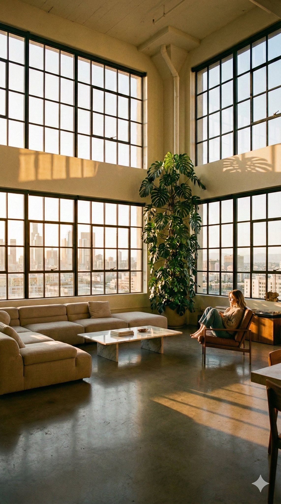

```
This is what architecture looks like when AI understands beauty.

Nano Banana Pro on Gemini 

Prompt 

{
  "model": "Nano Banana Pro",
  "scene": "Sunlit modern loft interior with expansive industrial windows",
  "architecture": {
    "style": "Modern minimalism with industrial influences",
    "structure": "Double-height ceiling, exposed concrete floors, clean lines",
    "windows": "Large black-framed grid windows spanning two levels",
    "layout": "Open-plan living space with strong vertical and horizontal symmetry"
  },
  "environment": {
    "location": "Urban loft apartment",
    "time": "Late afternoon / golden hour",
    "atmosphere": "Quiet, airy, balanced"
  },
  "furnishings": {
    "seating": "Neutral-toned sectional sofa with low profile",
    "chair": "Mid-century modern lounge chair",
    "table": "Minimalist marble coffee table",
    "decor": "Large indoor plant adding organic contrast",
    "palette": "Soft beige, warm wood, muted greens"
  },
  "subject": {
    "presence": "A woman seated calmly, reading near the window",
    "pose": "Relaxed posture, legs crossed, absorbed in a book",
    "emotion": "Peaceful, introspective"
  },
  "lighting": {
    "primary": "Warm natural sunlight entering through windows",
    "effect": "Long soft shadows across concrete floor",
    "balance": "Natural light dominant, no harsh artificial lighting"
  },
  "camera": {
    "angle": "Wide interior shot from eye level",
    "lens": "Cinematic wide-angle lens (35mm)",
    "depth_of_field": "Deep focus, architectural clarity",
    "framing": "Vertical composition emphasizing height and openness"
  },
  "materials": {
    "floor": "Polished concrete",
    "walls": "Soft off-white plaster",
    "furniture": "Fabric upholstery, wood, stone"
  },
  "color_palette": {
    "dominant": ["warm beige", "soft cream"],
    "accents": ["natural green", "golden sunlight"]
  },
  "mood": "Serene, refined, architectural calm",
  "style": {
    "aesthetic": "High-end architectural photography",
    "realism": "Photorealistic",
    "texture": "Clean surfaces with subtle natural imperfections",
    "post_processing": "Balanced contrast, soft highlights, no oversaturation"
  },
  "quality": "Ultra-detailed, high dynamic range, professional interior photography"
}
```

```
当人工智能理解了美的时候，建筑便呈现出这样的样貌。

阳光洒落的现代阁楼室内，拥有开阔的工业风窗户。建筑风格融合现代极简与工业元素，结构包含挑高双层天花板、裸露的混凝土地板和干净利落的线条。窗户为横跨两层的大型黑色框格窗，整体布局为开放式起居空间，强调垂直与水平的对称感。

场景设定在城市阁楼公寓，时间为傍晚时分的黄金时刻，氛围宁静、通透而平衡。

室内陈设包括中性色调的低矮模块沙发、一把中古现代风格休闲椅、一张极简直纹大理石咖啡桌，以及一株大型室内植物，为空间增添有机对比。整体配色以柔和米色、温暖木色与低饱和绿色为主。

画面主体是一位女性，她安静地坐在窗边阅读，姿态放松，双腿交叠，全神贯注于书本之中，神情平和而内省。

光线以透过窗户照入的温暖自然日光为主，在混凝土地面上投下细长柔和的阴影，整体光照自然主导，无刺眼人工光源。

采用人眼高度的广角室内镜头（35mm电影镜头），深景深确保建筑细节清晰，竖构图突出空间的高度与开阔感。

材质方面，地面为抛光混凝土，墙面为柔和米白色灰泥，家具则使用织物软包、木材与石材。

主色调为暖米色与柔奶油色，点缀以自然绿与金色阳光。

整体情绪宁静、精致，充满建筑的沉静之美。

画面风格为高端建筑摄影，写实逼真，表面干净但带有细微自然肌理，后期处理注重对比均衡、高光柔和，无过度饱和。

画质超精细，高动态范围，呈现专业级室内摄影水准。
```

 [↑返回目录](#toc)

---
## <a id="prompt-2002847525536219187">虚拟的卡通女孩</a> (<a href="https://x.com/dsnyfication/status/2002847525536219187" target="_blank" rel="noopener noreferrer">Disneyfication</a>)

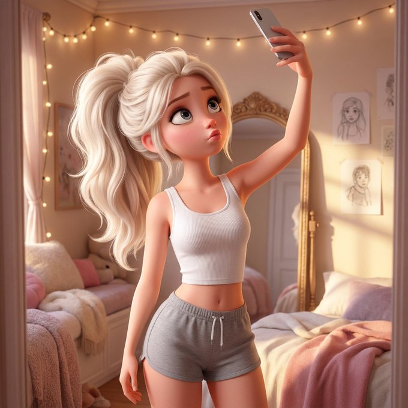

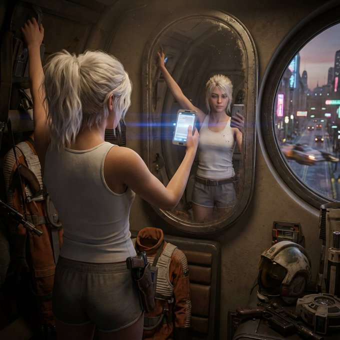

```
{  "subject": {    "description": "Young woman taking bedroom mirror selfie, phone held high, casual loungewear moment",    "age": "early 20s",    "expression": {      "eyes": "looking up at phone screen, soft doe eyes",      "mouth": "soft pout, lips slightly pursed",      "overall": "that 'checking my angles' focused selfie face"    },    "hair": {      "color": "platinum blonde, white-silver",      "style": "messy high ponytail, loose and undone",      "details": "lots of pieces falling out, face-framing strands, effortless messy"    },    "body": {      "frame": "petite, slim, toned",      "waist": "small, defined, bare midriff",      "stomach": "flat, toned, fully visible",      "hips": "feminine curve"    },    "pose": {      "phone_arm": "raised HIGH above head, extended up",      "other_arm": "down, hand resting on hip/thigh",      "stance": "slight hip cock, weight shifted",      "torso": "slight twist, elongated from raised arm",      "overall": "the classic high-angle mirror selfie pose"    },    "clothing": {      "top": {        "type": "white ribbed tank top",        "fit": "fitted, cropped above belly button",        "neckline": "scoop neck, simple",        "effect": "basic but shows shape"      },      "bottom": {        "type": "grey cotton boy shorts / mini shorts",        "fit": "tight, very short, sits low on hips",        "style": "lounge shorts, underwear-adjacent",        "effect": "barely there, shows legs completely"      }    },    "accessories": {      "phone": "iPhone with MagSafe ring, clear case",      "hair_tie": "scrunchie in ponytail",      "jewelry": "minimal, maybe small earrings"    }  },  "environment": {    "location": "bedroom",    "mirror": "full-length standing mirror",    "room_details": {      "bed": "visible in reflection, unmade, grey/beige bedding",      "lamp": "warm bedside lamp glowing",      "chair": "gaming/desk chair with clothes draped",      "lights": "LED strip lights on wall",      "clothes": "scattered on chair, lived-in"    },    "lighting": "warm lamp light + LED strips, cozy evening"  },  "photography": {    "style": "mirror selfie, high angle",    "framing": "thighs to above head",    "angle": "phone above head shooting down",    "quality": "iPhone",    "aspect": "4:5 vertical"  },  "color_story": {    "her": "white tank, grey shorts, platinum hair",    "room": "beige walls, grey bedding, warm lamp glow",    "palette": "neutral, soft, cozy tones"  },  "vibe": {    "energy": "casual night in, loungewear content",    "mood": "effortless, 'just hanging out'",    "authenticity": "real bedroom, real mess, real girl",    "caption": "'fit check' or 'staying in' or ''"  }}
```

```
一位20岁出头的年轻女子在卧室里用全身镜自拍，手机高高举起，穿着休闲家居服。她的眼神向上看着手机屏幕，眼睛柔和如小鹿般；嘴唇微微嘟起，略带轻抿，整体表情是那种专注调整角度、检查自己上镜效果的典型自拍神情。

她的发色是白金色（铂金色），扎着一个凌乱的高马尾，松散而不刻意，许多发丝自然散落，有修饰脸型的碎发，整体呈现一种毫不费力的慵懒感。

身材娇小纤细而紧致，腰肢纤细明显，露出整个平坦紧实的小腹，臀部带有柔美的曲线。

姿势方面，一只手臂高高举过头顶握着手机，另一只手自然下垂，手搭在髋部或大腿上；身体重心略微偏移，胯部稍稍倾斜；上半身因高举的手臂而轻微扭转并拉长，整体呈现出经典的高角度镜前自拍姿态。

上身穿一件白色罗纹背心，贴身剪裁，短款设计露脐，圆领简洁，虽基础却能展现身形；下身穿灰色棉质男孩风短裤（或迷你短裤），非常短且紧身，低腰设计，风格接近居家内裤，几乎完全露出双腿。

配饰包括一部带透明保护壳和MagSafe磁吸环的iPhone、马尾上的抓夹发圈，以及极简的小耳钉。

场景设定在卧室：一面全身立镜作为主要拍摄道具。镜中可见未整理的床铺，灰米色床品；一盏暖光床头灯亮着；一把电竞/书桌椅上随意搭着衣物；墙上装有LED灯带；整体房间略显凌乱，充满生活气息。

光线由暖色台灯与LED灯带共同营造，氛围温馨舒适，属于夜晚宅家的感觉。

摄影风格为高角度镜面自拍，构图从大腿至头顶以上，采用iPhone拍摄，画面比例为4:5竖屏。

整体色彩以中性柔和为主：人物穿着白背心、灰短裤，搭配铂金色头发；房间为米色墙面、灰色床品与暖黄灯光，构成温暖舒适的中性色调。

整体氛围轻松随意，体现“宅家之夜”的悠闲自在，真实自然——真实的卧室、真实的凌乱、真实的女孩，仿佛配文会是“试穿搭”、“今晚不出门”或类似日常分享。
```

 [↑返回目录](#toc)

---
## <a id="prompt-2005530723847934103">迎接2026：金色派对的俏皮肖像</a> (<a href="https://x.com/xmiiru_/status/2005530723847934103" target="_blank" rel="noopener noreferrer">Mira</a>)


```
{
  "type": "image_prompt",
  "description": "High-resolution photorealistic studio fashion portrait",
  "subject": {
    "gender": "adult woman",
    "hair": "long light brown hair with golden blonde highlights, loose curls",
    "expression": "playful, cheeky, thinking face, lips pursed",
    "pose": "looking off to the side, shoulders relaxed"
  },
  "outfit": {
    "hat": "gold shimmering party hat",
    "dress": "gold sequin party dress with modern asymmetric neckline cutout"
  },
  "props": {
    "balloons": "gold foil balloons shaped as numbers 20 and 26, one in each hand, raised near shoulders"
  },
  "environment": {
    "setting": "clean studio",
    "background": "neutral beige backdrop",
    "lighting": "soft studio lighting with gentle shadows"
  },
  "details": {
    "realism": "editorial-quality photorealism",
    "textures": "visible skin texture, detailed hair strands, sharp sequin detail",
    "materials": "metallic balloon shine with realistic creases and highlights"
  },
  "constraints": [
    "no text",
    "no logos",
    "no branding",
    "no watermarks"
  ]
}
```

```
高分辨率写实风格影棚时尚人像：一位成年女性，留着带有金色挑染的浅棕色长发，发丝呈松散卷曲状；表情俏皮、略带调皮，带着思索神情，双唇微噘；头部侧向一边，肩膀放松。她头戴闪亮的金色派对帽，身穿一件现代不对称露肩剪裁的金色亮片派对裙。双手各持一个金色箔制气球，分别呈“20”和“26”字样，举至肩膀附近。背景为干净的影棚环境，中性米色幕布，采用柔和的影棚灯光，投下轻柔阴影。画面呈现杂志级写实质感，皮肤纹理清晰可见，发丝细节丰富，亮片锐利分明，金属气球具有真实褶皱与高光反射。图像中不含文字、标志、品牌或水印。
```

 [↑返回目录](#toc)

---
## <a id="prompt-2005173589809537125">温馨现代客厅中的女性放松时光</a> (<a href="https://x.com/xmliisu/status/2005173589809537125" target="_blank" rel="noopener noreferrer">Melisa♡</a>)


```
{
  "image_prompt_structure": {
    "meta": {
      "type": "Lifestyle Photography",
      "aspect_ratio": "16:9",
      "mood": "Cozy, Intimate, Relaxed"
    },
    "scene_setup": {
      "location": "Modern living room",
      "time_of_day": "Evening",
      "lighting": {
        "type": "Soft warm indoor",
        "sources": ["Ambient room lighting", "Candlelight accents"],
        "quality": "Evenly distributed, glowing"
      },
      "camera": {
        "angle": "High-angle / Slightly elevated",
        "focus": "Subject in foreground",
        "perspective": "Looking down toward the sofa"
      }
    },
    "subject": {
      "demographics": {
        "gender": "Female-presenting",
        "age_appearance": "Young adult to adult"
      },
      "appearance": {
        "hair": {
          "color": "Light brown with blonde highlights",
          "style": "Loose, voluminous waves",
          "parting": "Side-parted"
        },
        "makeup": {
          "skin": "Smooth, contoured finish",
          "eyes": "Defined brows and lashes",
          "lips": "Full lips, neutral-toned lipstick"
        },
        "expression": "Neutral to soft, relaxed eyes, slight smile",
        "gaze": "Direct eye contact with camera"
      },
      "attire": {
        "item": "Matching lounge set",
        "color": "Deep burgundy / Wine red",
        "fabric": "Soft, slightly shimmery",
        "fit": "Form-fitting",
        "details": {
          "top": "Long-sleeve",
          "bottom": "Full-length fitted pants",
          "feet": "Barefoot"
        }
      },
      "pose": {
        "main_position": "Lying on side on sectional sofa",
        "body_orientation": "Three-quarter view, torso angled to camera",
        "limbs": {
          "legs": "Bent and stacked, feet resting naturally",
          "arms": "Relaxed, hands resting gently in front",
          "head": "Tilted slightly upward"
        },
        "support": "Upper body propped slightly on cushions"
      }
    },
    "environment_objects": {
      "furniture": {
        "sofa": {
          "type": "Sectional",
          "color": "Light beige / Cream",
          "material": "Plush fabric",
          "accessories": "White blanket draped over back/side"
        },
        "media_console": {
          "color": "White",
          "style": "Minimalist, clean lines",
          "equipment": "Wall-mounted TV"
        },
        "coffee_table": {
          "type": "Low table or Ottoman style",
          "color": "Light neutral"
        }
      },
      "props_and_decor": {
        "on_coffee_table": [
          {
            "item": "Glass bowl of popcorn",
            "position": "Center"
          },
          {
            "item": "Small plate of chocolates",
            "position": "Beside popcorn"
          },
          {
            "item": "Round mirrored tray",
            "contents": [
              "Candle in glass container",
              "Champagne flute",
              "Decorative candle with red ribbon"
            ]
          }
        ],
        "on_tv_screen": {
          "display": "Streaming service interface",
          "details": ["Thumbnails of movies/shows", "Text previews"]
        }
      }
    },
    "artistic_direction": {
      "color_palette": {
        "dominant": ["Deep Burgundy", "Beige", "Cream"],
        "accents": ["White", "Silver", "Candlelight Gold", "Red Ribbon"]
      },
      "atmosphere": "Warm and inviting, hygge style, cinematic domestic setting"
    }
  }
}
```

```
生活方式摄影，16:9 画幅，氛围温馨、亲密、放松。场景设定在现代客厅，傍晚时分，采用柔和温暖的室内灯光，包括环境光和点缀的烛光，光线均匀分布且富有光泽。镜头采用高角度略俯视的视角，聚焦前景人物，从上方看向沙发。

主体为一位呈现女性气质的年轻至成年女性，浅棕色头发带有金色挑染，松散丰盈的波浪卷发，侧分。妆容精致：肌肤光滑有轮廓感，眉毛与睫毛清晰，双唇饱满，涂着中性色调口红。表情自然柔和，眼神放松，略带微笑，直视镜头。

她身穿一套酒红色/深勃艮第色的同套家居服，面料柔软略带微闪，剪裁贴身。上衣为长袖，下装为全长紧身裤，赤脚。姿势为侧卧在组合式沙发上，身体呈四分之三角度朝向镜头，双腿弯曲叠放，双脚自然放置；双臂放松，双手轻放在身前；头部微微上仰，上半身略微倚靠在靠垫上。

环境中的家具包括：米白色/奶油色的厚实布艺组合沙发，上面随意搭着一条白色毯子；白色极简风格电视柜，配有壁挂式电视；浅中性色的矮咖啡桌或脚凳。咖啡桌上摆放着：中央是一碗玻璃碗装的爆米花，旁边是一小盘巧克力，还有一个圆形镜面托盘，上面放着玻璃罩蜡烛、香槟杯和系有红色丝带的装饰蜡烛。电视屏幕上显示流媒体服务界面，可见影视缩略图和文字预览。

整体艺术方向采用以深勃艮第色、米色和奶油色为主色调，辅以白色、银色、烛光金和红色丝带作为点缀，营造出温暖宜人、具有“Hygge”风格的电影感居家氛围。
```

 [↑返回目录](#toc)

---
## <a id="prompt-2005487775597088895">唐代宫廷乐团树上表演</a> (<a href="https://x.com/Ok_shuai/status/2005487775597088895" target="_blank" rel="noopener noreferrer">LewisAi</a>)


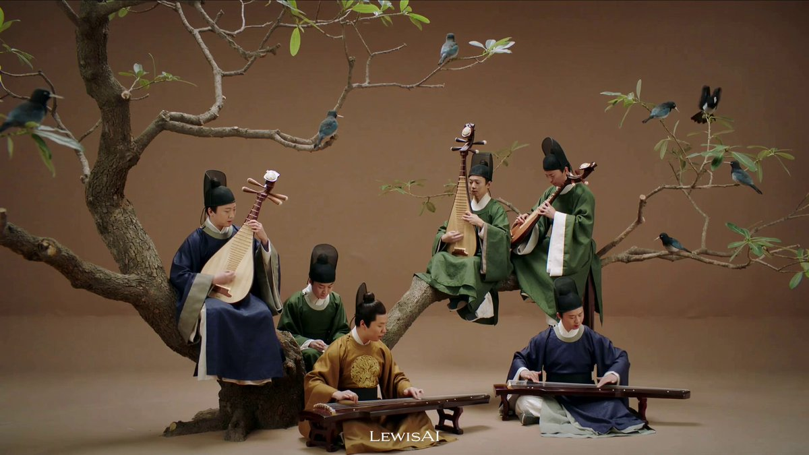

```
```json
{
"subject": {
"description": "A Tang dynasty Chinese court orchestra performing music on a branch of an Agan tree, with musicians playing pipa, erhu, flute, ruan, and horse-hoof lute, musicians and birds casually scattered, some standing, some sitting.",
"mirror_rules": null,
"age": null,
"expression": {
"eyes": {
"look": null,
"energy": null,
"direction": null
},
"mouth": {
"position": null,
"energy": null
},
"overall": null
},
"face": {
"preserve_original": false,
"makeup": null
},
"hair": {
"color": null,
"style": null,
"effect": null
},
"body": {
"frame": null,
"waist": null,
"chest": null,
"legs": null,
"skin": {
"visible_areas": null,
"tone": null,
"texture": null,
"lighting_effect": null
}
},
"pose": {
"position": "mixed (some standing, some sitting)",
"base": "on a branch of an Agan tree",
"overall": "performing music, playing pipa, erhu, flute, ruan, and horse-hoof lute"
},
"clothing": {
"top": {
"type": "Tang dynasty court clothing",
"color": null,
"details": null,
"effect": null
},
"bottom": {
"type": null,
"color": null,
"details": null
}
}
},
"accessories": {
"jewelry": null,
"headwear": null,
"device": null,
"prop": "pipa, erhu, flute, ruan, horse-hoof lute"
},
"photography": {
"camera_style": null,
"angle": null,
"shot_type": null,
"aspect_ratio": null,
"texture": null,
"lighting": "even soft gentle lighting",
"depth_of_field": null
},
"background": {
"setting": "camel-brown stage canvas",
"wall_color": "camel brown stage canvas, color code #E7B5C3D",
"elements": [
"Agan tree branch",
"birds"
],
"atmosphere": null,
"lighting": "even soft gentle lighting"
},
"the_vibe": {
"energy": null,
"mood": null,
"aesthetic": "Song dynasty aesthetics, minimalist, realistic",
"authenticity": null,
"intimacy": null,
"story": "A Tang dynasty Chinese court orchestra performing music on a branch of an Agan tree, musicians and birds casually scattered, some standing, some sitting.",
"caption_energy": "Tang court orchestra on a tree branch"
},
"constraints": {
"must_keep": [
"Tang dynasty court orchestra",
"musicians playing pipa, erhu, flute, ruan, and horse-hoof lute",
"Agan tree branch",
"musicians and birds casually scattered, some standing, some sitting",
"camel-brown stage canvas with color code #E7B5C3D"
],
"avoid": []
},
"negative_prompt": [
"nsfw",
"low quality",
"text",
"watermark"
]
}
```
```

```
一支唐代宫廷乐团在阿甘树的枝干上演奏音乐，乐师们演奏琵琶、二胡、笛子、阮咸和马头琴，乐师与鸟儿随意散落，有的站立，有的坐着。背景为驼棕色舞台画布（色号 #E7B5C3D），整体氛围体现宋代美学风格——简约而写实。画面采用均匀柔和的光线照明。必须保留元素包括：唐代宫廷乐团、演奏琵琶/二胡/笛子/阮咸/马头琴的乐师、阿甘树枝干、随意分布且姿态各异的乐师与鸟儿、驼棕色舞台画布（色号 #E7B5C3D）。避免出现：不适宜内容、低质量、文字、水印。
```

 [↑返回目录](#toc)

---
## <a id="prompt-2005981275052728416">碰杯庆祝四角连线派对</a> (<a href="https://x.com/songguoxiansen/status/2005981275052728416" target="_blank" rel="noopener noreferrer">松果先森</a>)

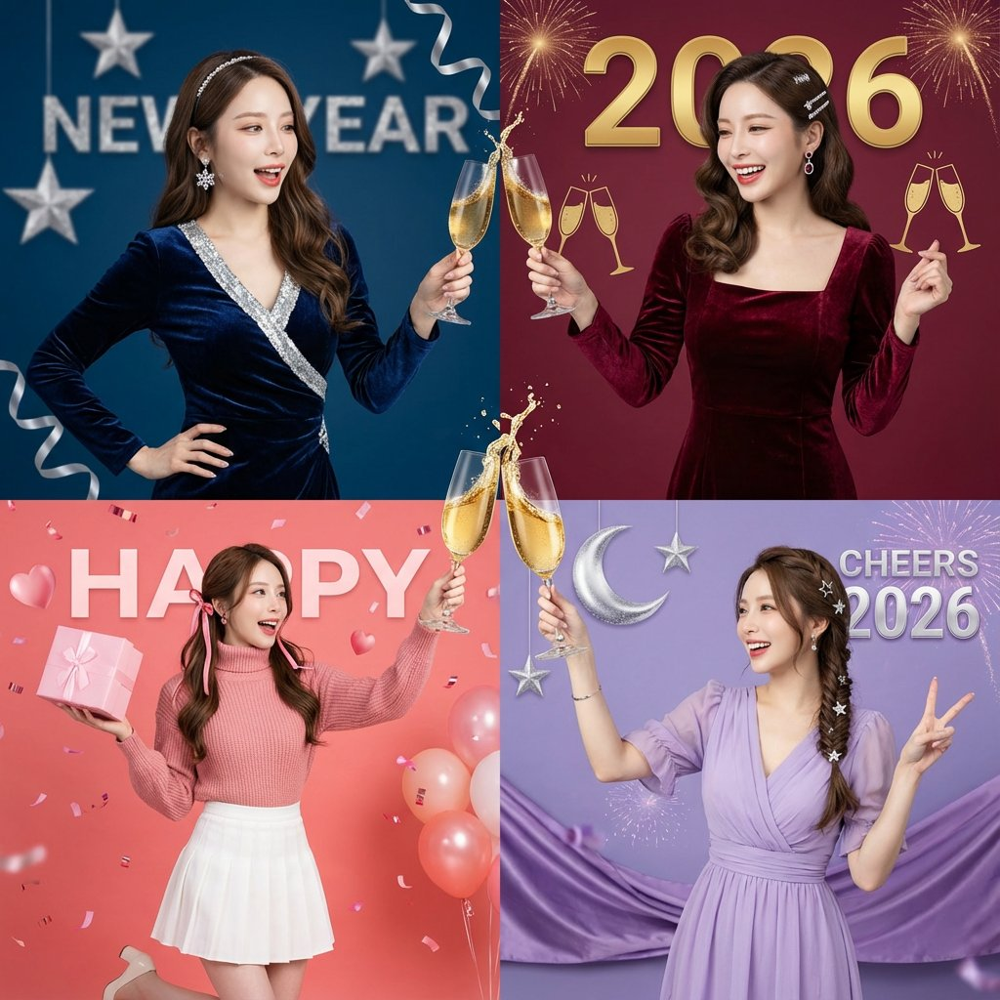


```
[关键:保持精确的面部特征,保留原始脸部结构,图中角色与上传参考图完全一致] 高端摄影棚2x2宫格写真。左上格(深宝石蓝背景):人物穿深蓝色丝绒连衣裙,银色亮片装饰领口袖口,波浪长发戴银色发箍和雪花耳环,她右手高举香槟杯向画面中心伸出做碰杯姿势,左手叉腰,身体前倾,眼神兴奋地看向画面中心,表情期待,嘴角上扬,背景有银色星星、"NEW YEAR"字母、丝带虚化。右上格(勃艮第酒红背景):同一女性穿酒红色天鹅绒方领连衣裙,复古大波浪配水钻发卡和红宝石耳环,她左手高举香槟杯也向画面中心伸出,与其他三格在中心点碰杯,右手做出"cheers"手势,眼神看向中心点,脸上洋溢着开心的笑容,背景有金色"2026"立体数字、香槟杯剪影、烟花图案。左下格(珊瑚粉背景):同一女性穿粉色针织高领毛衣配白色百褶裙,长发用粉色丝带系蝴蝶结,她右手向上举杯与画面中心碰杯,左手捧着粉色礼物盒,身体微微跳起,眼神看向中心,表情激动开心,嘴巴微张,背景有粉色彩纸碎片、"HAPPY"字样、爱心、气球。右下格(薰衣草紫背景):同一女性穿淡紫色雪纺飘逸连衣裙,鱼骨辫配银色星星发饰,她左手向上举杯完成四杯碰杯,四个香槟杯在画面正中心碰触形成"X"型,金色香槟液体从中心溅起,她右手做胜利手势,眼神看向中心,脸上洋溢着狂喜的笑容,背景有银色月亮星星、"CHEERS 2026"字样、紫色丝绸、烟花绽放。四格之间四个酒杯在画面中心形成交叉碰杯互动,淡妆珊瑚色唇妆,柔光箱打造派对氛围,85mm镜头,f/1.8光圈,派对庆祝四联构图,超高清细节。
```

 [↑返回目录](#toc)

---
## <a id="prompt-2003768838111059997">霍格沃茨等火车的女孩</a> (<a href="https://x.com/harboriis/status/2003768838111059997" target="_blank" rel="noopener noreferrer">Harboriis</a>)

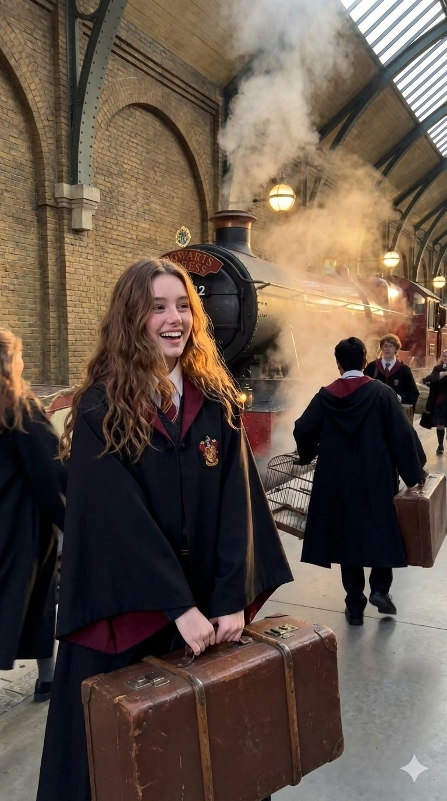

```
Hyperrealistic photograph, 8K, cinematic shot, a young woman (with my exact facial features) standing on the iconic Platform 934, awaiting the Hogwarts Express. She holds a vintage trunk, and her face shows a mix of excitement and eager anticipation. She is dressed in a detailed Hogwarts robe.

The platform is bustling with other students carrying suitcases and owl cages, rushing towards the train. In the background, the famous brick wall, through which passengers are magically passing, is visible. The magnificent Hogwarts Express has already arrived, billowing thick white steam that illuminates the station with warm, glowing lights.

The lighting is a warm, evening glow, creating a magical and nostalgic atmosphere. The scene looks like a real photograph with cinematic color grading. Every detail, from the texture of her robe and the steam of the train to the expressions of the passing students, is rendered with maximum sharpness and clarity, filling the scene with magic and the thrill of the upcoming journey. --ar 9:16
```

```
超写实摄影，8K，电影镜头，一位年轻女子（拥有我完全相同的面部特征）站在标志性的9¾站台，等待霍格沃茨特快列车。她手提一只复古行李箱，脸上流露出兴奋与热切期待交织的神情，身穿细节精致的霍格沃茨长袍。

站台上人潮涌动，其他学生提着行李箱、拎着猫头鹰笼子，匆匆奔向列车。背景中可见那面著名的砖墙，乘客们正神奇地穿墙而过。宏伟的霍格沃茨特快列车已经抵达，喷吐出浓密的白色蒸汽，温暖明亮的灯光照亮了整个车站。

光线呈现出温暖的傍晚光辉，营造出一种魔幻而怀旧的氛围。画面宛如真实照片，采用电影级色彩调校。从她长袍的纹理、火车蒸腾的雾气，到过往学生们的表情，每一处细节都以极致锐利和清晰呈现，让整个场景充满魔法气息与即将启程的激动感。--ar 9:16
```

 [↑返回目录](#toc)

---
## <a id="prompt-2005698218043003100">- Nano Banana Pro at @BasedLabsAI</a> (<a href="https://x.com/_MehdiSharifi_/status/2005698218043003199" target="_blank" rel="noopener noreferrer">Mehdi Sharifi</a>)

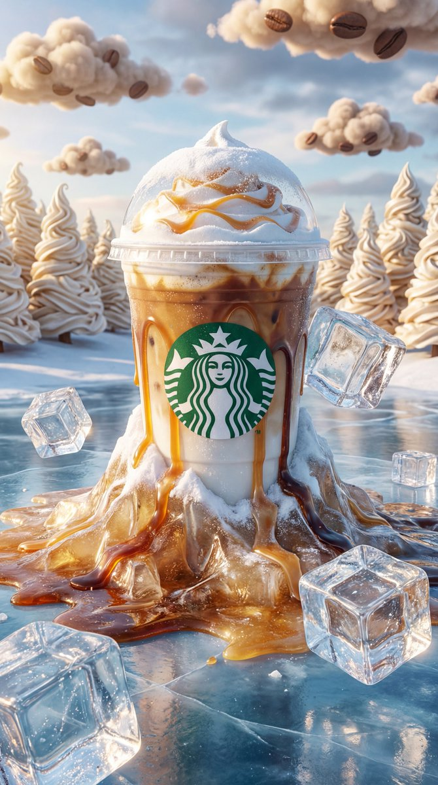


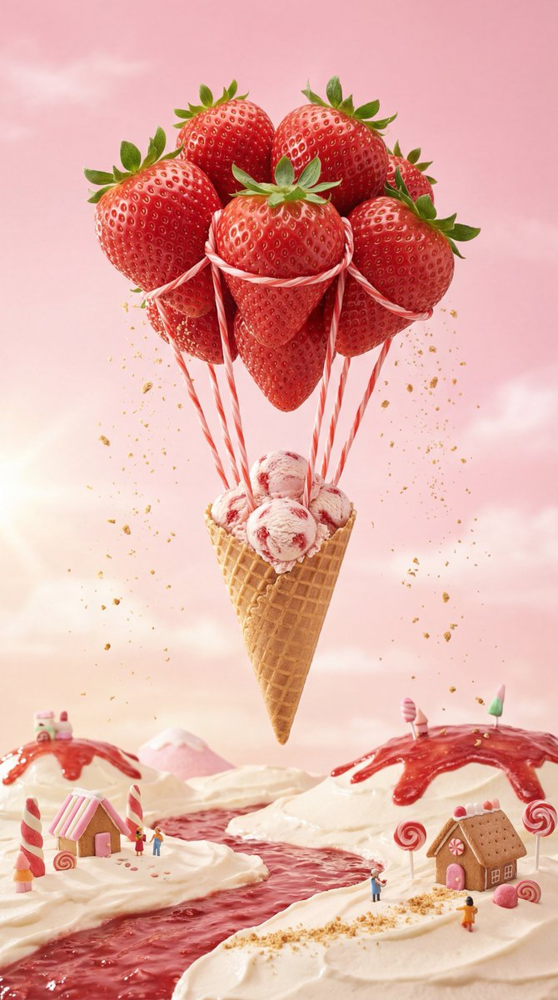

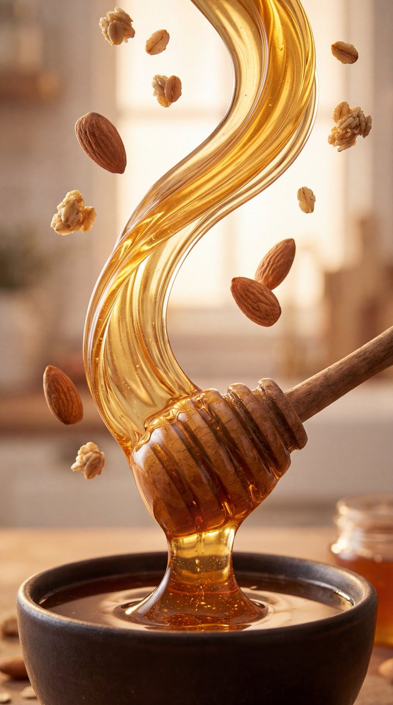

```
Starbucks Iced Caramel Macchiato
A surreal advertising photomontage of a Starbucks-style Iced Caramel Macchiato plastic cup acting as a snow-capped mountain peak. Rivers of golden caramel sauce and rich espresso flow down the sides of the cup, forming a frozen glacier landscape at the base. Giant, crystalline ice cubes float around the cup like miniature icebergs. In the background, a forest made entirely of whipped cream pine trees under a sky filled with coffee bean clouds. The lighting is cool winter sun mixed with warm golden highlights from the caramel. Hyper-realistic textures, fantastic scale, magical atmosphere.

Gourmet Double Cheeseburger
A hyper-realistic food manipulation piece centered on a massive gourmet double cheeseburger. The burger acts as an erupting volcano; molten cheddar cheese flows like lava down cascades of beef patties. Explosions of lettuce leaves, tomato slices, red onions, and pickle coins burst outwards from the center in slow motion, suspended in mid-air against a dramatic, smoky sunset sky made of spice dust. The bun base is cracking open like tectonic plates. Intense, fiery lighting emphasizing heat and flavor explosion. Epic, mouth-watering composition.

Strawberry Cheesecake Ice Cream Cone
A whimsical advertising dreamscape featuring a waffle cone with strawberry cheesecake ice cream. The scoop of ice cream is a fantastical hot air balloon basket, being lifted into a pastel pink sky by giant, ripe strawberries acting as balloons tied with candy ropes. Graham cracker crumbs fall like stardust beneath the cone. Below, a landscape made of rolling hills of cheesecake fluff and rivers of strawberry coulis. Soft, dreamy lighting, fairytale aesthetic, surreal scale.

Honey & Nut Crunch
A luxurious macro food manipulation shot of a wooden honey dipper pulled from a pool of golden honey. The thick stream of honey is defying gravity, swirling around the dipper like ribbons of liquid amber glass and golden silk fabric. Raw almonds and oat clusters are suspended in the air around the honey flow. Soft, warm backlighting creating a glowing, angelic atmosphere. Ultra-detailed sticky texture. No text, purely organic and elegant.
```

```
星巴克冰焦糖玛奇朵  
一幅超现实的广告拼贴作品：一只星巴克风格的冰焦糖玛奇朵塑料杯化作雪山之巅。金色焦糖酱与浓郁浓缩咖啡如河流般沿杯壁倾泻而下，在杯底形成冰川般的冻结景观。巨大的水晶冰块如微型冰山般漂浮在杯子周围。背景是一片由鲜奶油制成的松树森林，天空中布满咖啡豆形状的云朵。光线融合了清冷的冬日阳光与焦糖带来的温暖金色高光。画面呈现超写实质感、奇幻比例与魔幻氛围。

豪华双层芝士汉堡  
一幅超写实的食物创意作品，聚焦于一个巨型豪华双层芝士汉堡。汉堡如同喷发的火山，融化的切达奶酪如熔岩般从层层牛肉饼上流淌而下。生菜叶、番茄片、红洋葱圈和酸黄瓜片从中心向外爆裂，在香料粉尘构成的戏剧性烟熏落日天空背景下，以慢动作悬浮于空中。汉堡底部的面包如板块般裂开。强烈的火光照明突显热度与风味的爆发感，构图恢弘诱人。

草莓芝士蛋糕冰淇淋甜筒  
一幅充满奇想的广告梦幻场景：一支华夫甜筒盛着草莓芝士蛋糕口味的冰淇淋。冰淇淋球化身为热气球吊篮，被巨大熟透的草莓当作气球，用糖果绳索牵引升入粉彩般的粉色天空。全麦饼干碎屑如星尘般从甜筒下方飘落。下方地貌由绵延起伏的芝士蛋糕云朵与草莓果酱河流构成。整体采用柔和梦幻的光线，童话般的美学风格，比例超现实。

蜂蜜坚果脆片  
一幅奢华的微距食物创意摄影：一支木制蜂蜜蘸棒从一池金黄蜂蜜中提起。浓稠的蜂蜜流违背重力，如琥珀色玻璃丝带与金色丝绸般缠绕在蘸棒周围。生杏仁与燕麦簇悬浮于蜂蜜流周围的空中。柔暖的背光营造出光辉圣洁的氛围。细节极致，突出黏稠质感。无文字，纯粹自然优雅。
```

 [↑返回目录](#toc)

---
## <a id="prompt-2005628752802517500">超现实分段火山玄武岩构造</a> (<a href="https://x.com/Sheldon056/status/2005628752802517441" target="_blank" rel="noopener noreferrer">Dr.duet</a>)

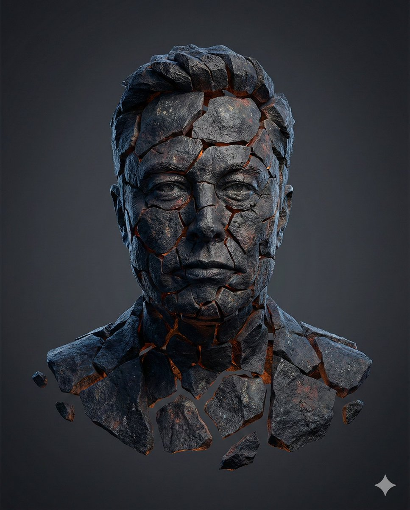

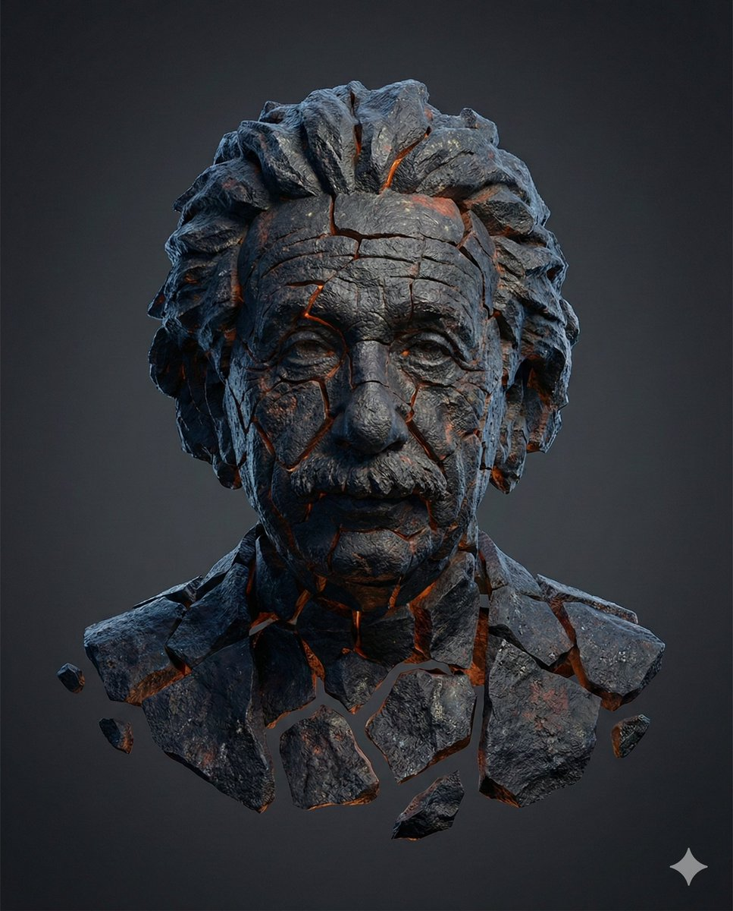

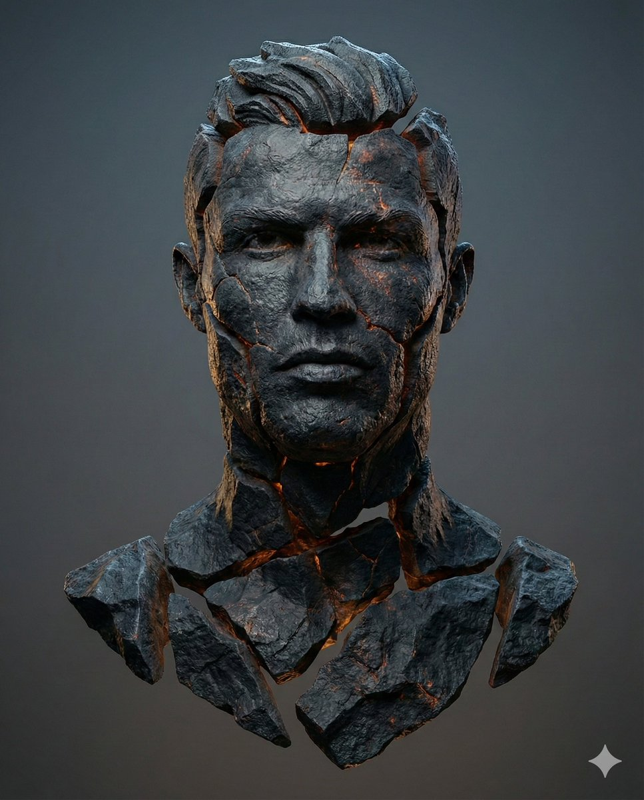

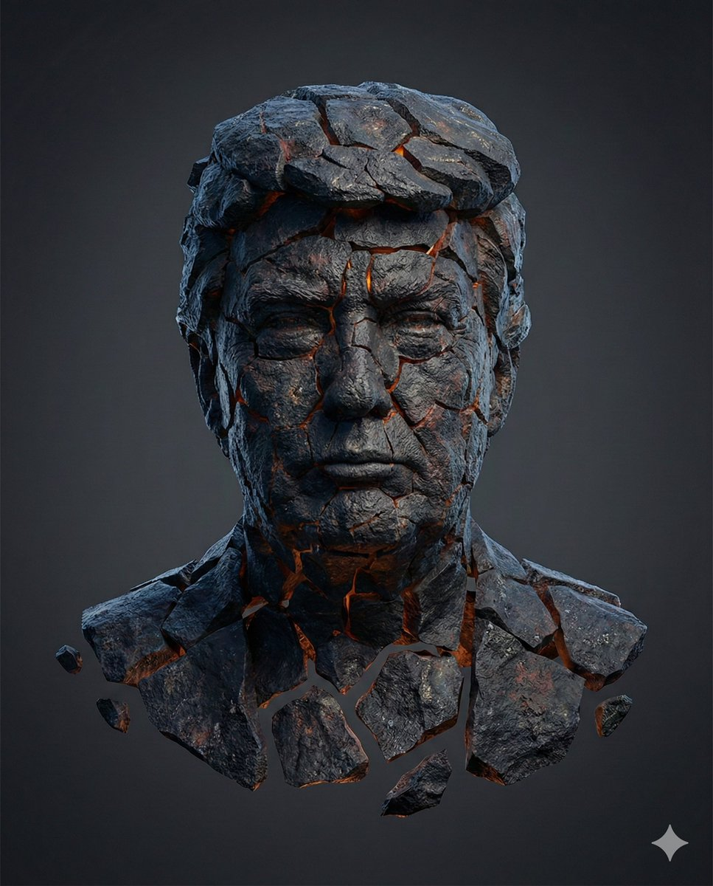

```
{
  "task": "image_to_image_style_transfer",
  "input_image": "{{USER_IMAGE}}",
  "prompt": "Reimagine the subject as a hyper-real fragmented volcanic basalt construct, assembled from jagged, sharply defined basalt plates suspended in space. Each fragment is fully separated with clearly visible gaps, never touching or fused. Material detail: deep charcoal-black basalt with layered volcanic textures, rough porous surfaces, chipped edges, fine mineral grain, and realistic surface imperfections. Within the gaps only, a subtle internal glow radiates in rich ember tones—burnt orange, molten amber, hints of crimson and gold—suggesting internal heat without any surface glow, lava flow, or melting. Add natural mineral color variation across the basalt, including graphite greys, cool indigo shadows, iron-red undertones, and faint mineral speckling to enhance realism and depth. Lighting: cinematic studio setup with a cool blue-grey top key light defining form and silhouette, combined with a soft warm under-fill that gently reflects ember colors onto nearby fragments. Shadows are realistic and grounded, with precise ambient occlusion in crevices and natural depth between floating pieces. Background: smooth dark neutral studio grey with a subtle vignette for contrast, no texture or distractions. Composition: centered, straight-on, medium framing with a strong, readable silhouette. Preserve the subject’s exact facial identity, proportions, and anatomy from the input image. Ultra-realistic, high dynamic range, cinematic color grading, sharp focus, 8K clarity.",
  "negative_prompt": "lava flow, molten surfaces, surface glow, fantasy creature, demon, exaggerated fire effects, cartoon, stylized art, plastic texture, metal shine, glossy surfaces, merged rocks, fused fragments, blur, noise, low resolution, oversharpening halos, face distortion, deformed anatomy, extra limbs, unreadable silhouette, fog, smoke, text, typography, logo, watermark, signature",
  "output": {
    "aspect_ratio": "use_input_aspect_ratio",
    "background": "dark_neutral_grey",
    "camera": {
      "angle": "straight_on",
      "framing": "centered",
      "distance": "medium"
    }
  },
  "params": {
    "style_strength": 0.8,
    "identity_preservation": 0.92,
    "detail_level": "very_high",
    "lighting_preset": "cinematic_cool_warm_studio",
    "shadow_intensity": "moderate",
    "gap_visibility": "clear",
    "internal_glow": "subtle_multicolor_ember",
    "color_enrichment": "natural_volcanic_mineral_tones",
    "debris_chips": "none",
    "no_text": true
  }
}
```

```
将主体重新构想为一个超现实的分段火山玄武岩构造，由悬挂在空间中的锯齿状、边缘分明的玄武岩板块组成。每个碎片完全分离，有明显的可见间隙，从不接触或融合。材质细节：深炭黑色玄武岩带有层次分明的火山纹理，粗糙多孔的表面，缺口边缘，细矿物颗粒，以及真实的表面瑕疵。仅在间隙中，散发出微妙的内部光芒，呈现丰富的余烬色调——烧焦的橙色、熔融的琥珀色、深红色和金色的暗示——暗示内部热量而不产生表面光辉、熔岩流或融化现象。在整个玄武岩上添加自然的矿物色彩变化，包括石墨灰、冷靛蓝阴影、铁红色底色和微弱的矿物斑点以增强真实感和深度。照明：采用电影工作室设置，顶部使用冷蓝色关键光定义形状和轮廓，结合柔和温暖的下部填充光，轻轻反射余烬颜色到附近的碎片上。阴影真实且固定，在缝隙和自然深度之间有精确的环境光遮蔽。背景：平滑的暗中性工作室灰色，带有微妙的晕影以增加对比度，无纹理或干扰元素。构图：居中、正面、中等框架，具有强烈可读的轮廓。保留输入图像中主体的确切面部特征、比例和解剖结构。超逼真，高动态范围，电影级色彩分级，清晰焦点，8K清晰度。

负面提示词：熔岩流、熔融表面、表面光辉、幻想生物、恶魔、夸张的火效、卡通、风格化艺术、塑料质感、金属光泽、光滑表面、合并的岩石、融合的碎片、模糊、噪点、低分辨率、过度锐化的光晕、脸部失真、变形的解剖结构、额外的肢体、不可读的轮廓、雾、烟、文字、排版、标志、水印、签名。
```

 [↑返回目录](#toc)

---
## <a id="prompt-2005620980891480600">自定义形状的字体插画</a> (<a href="https://x.com/TechieBySA/status/2005620980891480567" target="_blank" rel="noopener noreferrer">TechieSA</a>)


```
Create a typographic illustration shaped like a [OBJECT], where the text [BRAND SLOGAN] forms the shape — bold and playful lettering style that fills the entire silhouette — letters adapt fluidly to the curves and contours of the [OBJECT] — [COLOR DESCRIPTION] with [BACKGROUND COLOR] background that enhances the focus on the main shape — include [BRAND] logo positioned below the [OBJECT] — vector-style, clean, high resolution, 1080x1080 pixels, square format.
```

```
创作一幅以[OBJECT]为形状的字体插画，文字“[BRAND SLOGAN]”构成该形状的整体轮廓——采用大胆而活泼的字体风格，填满整个剪影；字母流畅地贴合[OBJECT]的曲线与轮廓；配色为[COLOR DESCRIPTION]，背景色为[BACKGROUND COLOR]，以突出主体形状；在[OBJECT]下方放置[BRAND]标志；矢量风格，干净清晰，高分辨率，1080x1080像素，正方形格式。
```

 [↑返回目录](#toc)

---
## <a id="prompt-2005877044584849700">童年偶像走进现实</a> (<a href="https://x.com/YaseenK7212/status/2005877044584849773" target="_blank" rel="noopener noreferrer">Yaseen Khan Gul</a>)

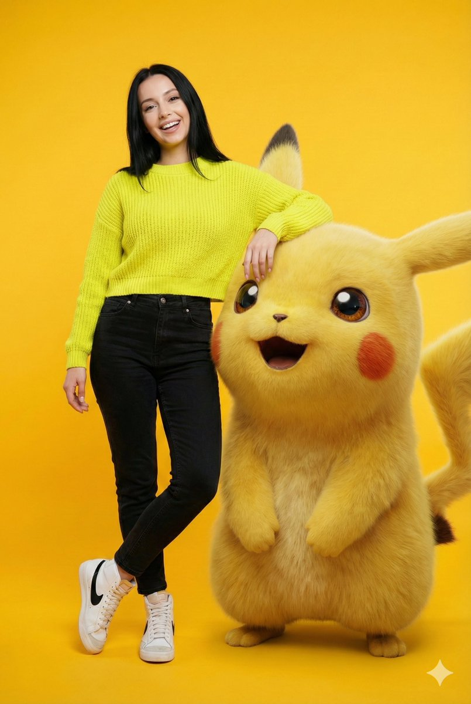

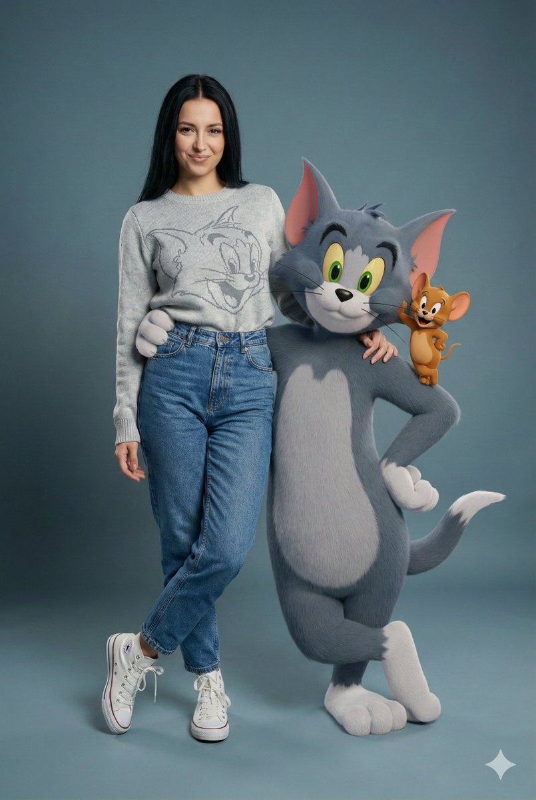

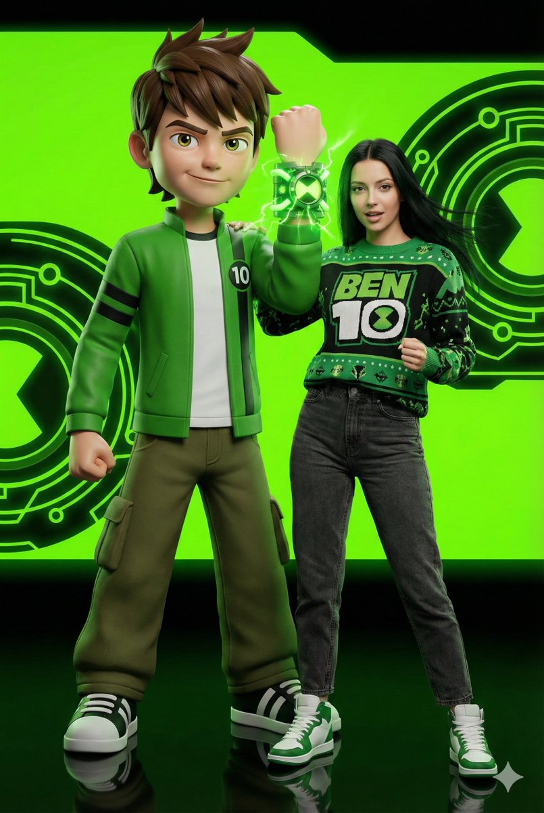

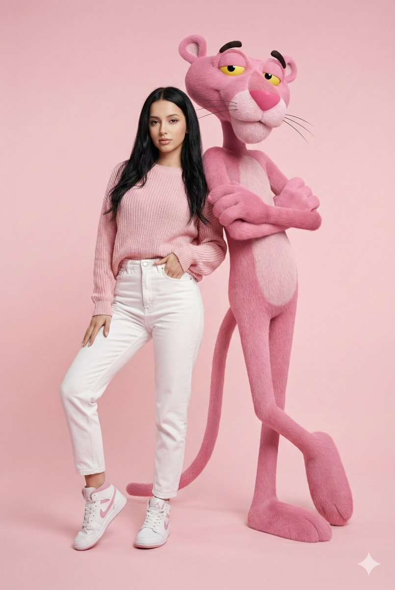

```
[
  {
    "image_generation": {
      "quality": "hyper-realistic",
      "face": { "preserve_original": true },
      "subject": {
        "clothing": "light grey knitted sweater, blue high-waisted jeans, white high-top sneakers",
        "pose": "standing with arm around giant 3D Tom; Jerry on Tom's shoulder",
        "expression": "fun, mischievous",
        "character_element": {
          "name": "Tom & Jerry",
          "type": "3D photorealistic duo",
          "interaction": "Tom posing confidently, Jerry playfully"
        }
      },
      "environment": "clean grey-blue backdrop"
    }
  },
  {
    "image_generation": {
      "quality": "hyper-realistic",
      "face": { "preserve_original": true },
      "subject": {
        "clothing": "electric yellow knitted sweater, black high-waisted jeans, white/black high-top sneakers",
        "pose": "arm resting on giant 3D Pikachu",
        "expression": "energetic, cheerful",
        "character_element": {
          "name": "Pikachu",
          "type": "giant 3D photorealistic render",
          "interaction": "smiling up at person"
        }
      },
      "environment": "vibrant yellow backdrop"
    }
  },
  {
    "image_generation": {
      "quality": "hyper-realistic, professional fashion photoshoot",
      "face": { "preserve_original": true },
      "subject": {
        "clothing": "Ben 10 themed green/black sweater, dark grey jeans, white/green sneakers",
        "pose": "standing beside giant 3D Ben 10 activating Omnitrix",
        "expression": "confident, energetic",
        "character_element": {
          "name": "Ben Tennyson (Classic Ben 10)",
          "type": "giant 3D photorealistic render with cartoon accuracy",
          "details": "accurate green jacket outfit, glowing green Omnitrix on wrist",
          "interaction": "Ben activates Omnitrix with dynamic green glow"
        }
      },
      "environment": {
        "background": "neon-green and black circuitry patterns",
        "lighting": "dynamic green glow reflecting from Omnitrix",
        "mood": "sci-fi hero fashion shoot"
      }
    }
  },
  {
    "image_generation": {
      "quality": "hyper-realistic",
      "face": { "preserve_original": true },
      "subject": {
        "clothing": "pastel pink knitted sweater, white high-waisted jeans, white/pink sneakers",
        "pose": "posing fashionably beside tall 3D Pink Panther",
        "expression": "elegant, stylish",
        "character_element": {
          "name": "Pink Panther",
          "type": "giant 3D render",
          "interaction": "striking a suave pose"
        }
      },
      "environment": "light pastel pink backdrop"
    }
  }
]
```

```
高质量的超现实风格，保持原始面部特征。主体穿着浅灰色针织毛衣、蓝色高腰牛仔裤和白色高帮运动鞋，站在巨大的3D汤姆旁边，杰瑞在汤姆的肩膀上，表情有趣调皮，汤姆自信地摆姿势，杰瑞顽皮互动，背景为干净的灰蓝色。

高质量的超现实风格，保持原始面部特征。主体穿着电黄色针织毛衣、黑色高腰牛仔裤和黑白高帮运动鞋，手臂搭在一个巨大的3D皮卡丘上，表情充满活力和欢乐，皮卡丘抬头微笑，背景是明亮的黄色。

超现实且专业的时尚拍摄质量，保持原始面部特征。主体穿着本10主题的绿黑相间毛衣、深灰色牛仔裤和白绿相间的运动鞋，站在一个巨大的3D本·坦尼森（经典本10）旁边激活奥米特里克斯，表情自信而充满活力，准确的绿色夹克和腕部发光的绿色奥米特里克斯，背景为霓虹绿色和黑色电路图案，动态绿色光芒从奥米特里克斯反射出来，营造出科幻英雄时尚拍摄氛围。

高质量的超现实风格，保持原始面部特征。主体穿着粉色针织毛衣、白色高腰牛仔裤和粉白相间的运动鞋，以时髦的姿势站在巨大的3D粉红豹旁边，表情优雅时尚，粉红豹摆出潇洒的姿态，背景为浅粉色。
```

 [↑返回目录](#toc)

---
## <a id="prompt-2005670356745322800">极简风格品牌首字母单体徽标设计</a> (<a href="https://x.com/AmirMushich/status/2005670356745322759" target="_blank" rel="noopener noreferrer">AmirMušić</a>)

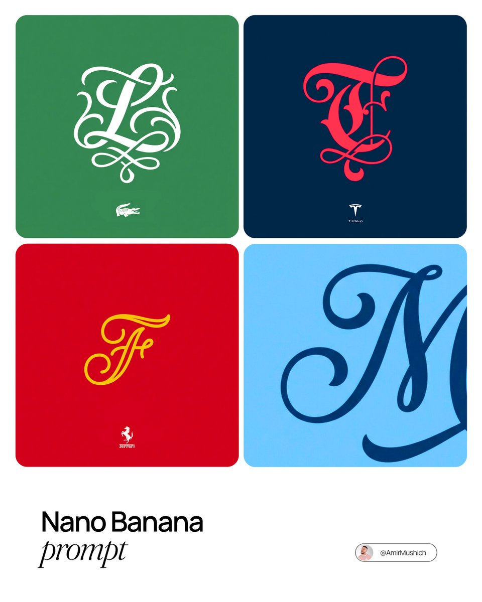

```
A flat, minimalist vector design featuring a highly stylized single letter monogram with the official brand logo below it, representing [BRAND NAME].

**MAIN ELEMENT (THE MONOGRAM):**
The center of the design features ONLY the single first letter of "[BRAND NAME]". The style is "Ornamental Vector Typography" with high calligraphic artistry, mimicking bespoke luxury monograms. This is not a standard font; it is a Highly customized, artistic glyph with elegant flourishes, exaggerated swashes, or ornamental serifs. The lines are clean, precise, and perfectly smooth vector graphics.

**SECONDARY ELEMENT (BRAND IDENTIFIER):**
Directly below the main stylized letter, positioned centrally, include the actual, original official logomark or logotype of "[BRAND NAME]". This element must be rendered significantly smaller than the main letter above it.

**FINISH & TEXTURE (STRICT):**
Absolutely zero texture, zero embossing, zero shadows, and zero gradients anywhere in the image. It must look like a perfectly flat digital illustration or screen print.

**COLOR PALETTE (AI-DRIVEN & HIGH CONTRAST):**
1.  **Background:** A single, solid, flat color block chosen by the AI to represent the vibe of [BRAND NAME].
2.  **Main Monogram Color:** A single, solid, flat color that creates a sharp, high contrast against the background.
3.  **Secondary Logo Color:** The small official logo below must be monochrome. It must be EITHER solid white OR solid dark gray—chosen automatically based on whichever offers the best readability against the chosen background color.
```

```
一幅扁平化、极简风格的矢量设计，中央为高度风格化的单字母徽标，其下方是[品牌名称]的官方品牌标志。

**主元素（徽标）：**  
设计中心仅包含“[品牌名称]”首字母的单个字符。采用“装饰性矢量字体”风格，具有高水准的书法艺术感，模仿定制奢华徽标。该字符并非标准字体，而是高度定制的艺术字形，带有优雅的装饰笔画、夸张的花饰或装饰性衬线。线条干净、精准，呈现完美平滑的矢量图形。

**次要元素（品牌标识）：**  
在主字母正下方居中位置，加入[品牌名称]真实、原始的官方标志或标准字标。此元素尺寸必须明显小于上方的主字母。

**表面与质感（严格要求）：**  
画面中绝对不可出现任何纹理、浮雕、阴影或渐变效果，整体须呈现如数字插画或丝网印刷般的纯扁平效果。

**配色方案（AI智能选择，高对比度）：**  
1. **背景：** 由AI根据[品牌名称]的品牌调性自动选择一种纯色实心背景。  
2. **主徽标颜色：** 使用一种纯色实心色彩，与背景形成鲜明高对比。  
3. **次要标志颜色：** 下方小型官方标志必须为单色，根据背景自动选择纯白色或深灰色，以确保最佳可读性。
```

 [↑返回目录](#toc)

---
## <a id="prompt-2005685514154958800">暗调奢华的黑巧克力飞溅</a> (<a href="https://x.com/Ankit_patel211/status/2005685514154958917" target="_blank" rel="noopener noreferrer">ANKIT PATEL 🇮🇳 | AI</a>)

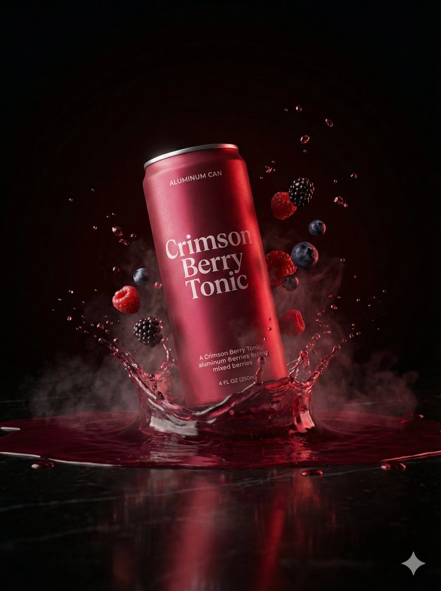

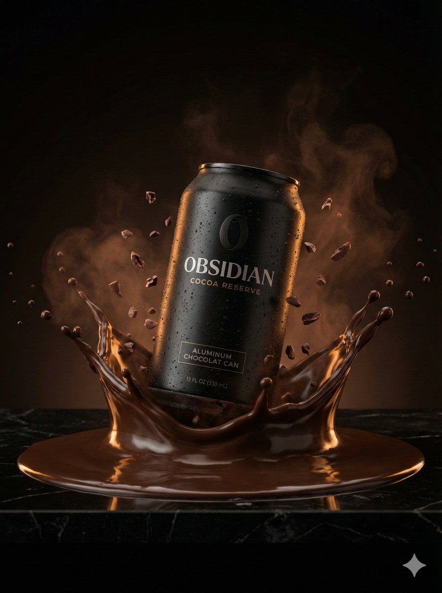

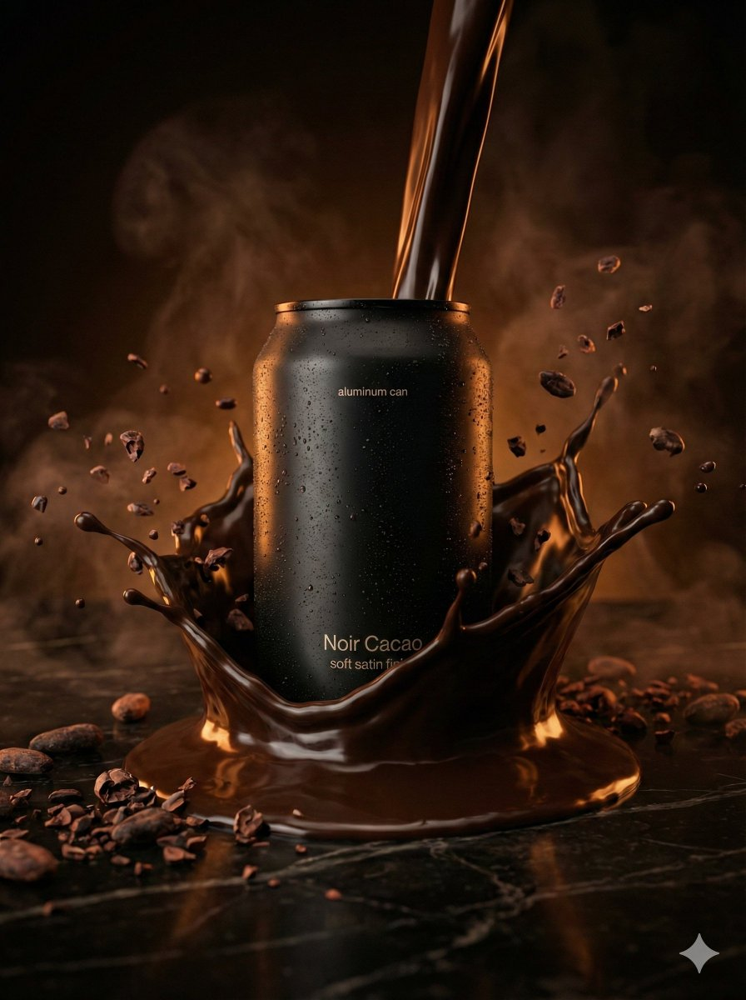

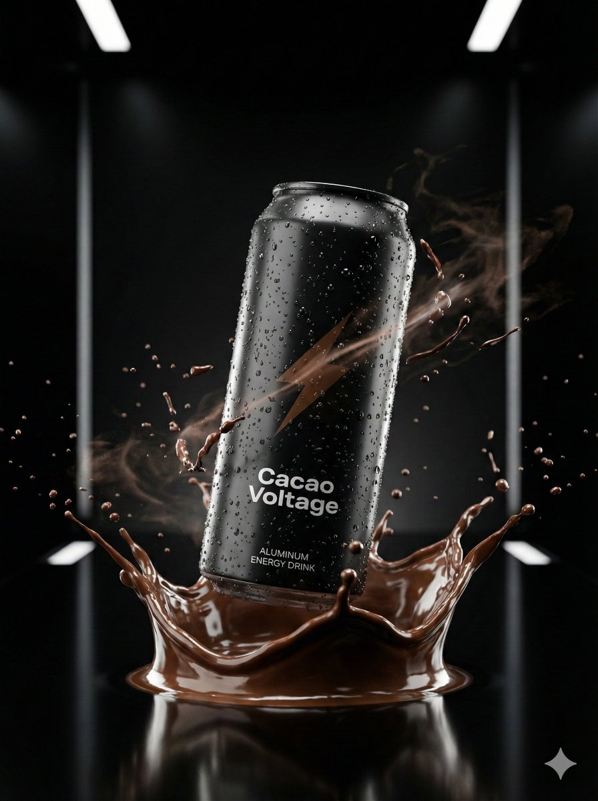

```
{
  "cinematic_beverage_product_shots_detailed": [
    {
      "id": "shot_003_obsidian_cocoa_reserve",
      "product_details": {
        "brand_name": "Obsidian Cocoa Reserve",
        "container_type": "Matte onyx-black aluminum can with subtle satin sheen",
        "condition": "Deep chill with slow-forming condensation beads",
        "elements_around_product": ["Cocoa nib fragments", "Chocolate vapor mist"]
      },
      "environment_and_setting": {
        "location": "Dark luxury studio",
        "surface": "Polished black obsidian stone",
        "atmosphere": "Rich, indulgent, ultra-premium hero frame"
      },
      "liquid_action": {
        "type": "Velvety dark chocolate liquid",
        "state": "Suspended splash with dense droplets",
        "movement": "Thick chocolate surges upward as the can emerges from the center"
      },
      "lighting": {
        "style": "Low-key cinematic lighting with warm amber highlights"
      },
      "camera_work": {
        "style": "Slow cinematic dolly-in with subtle parallax"
      },
      "full_description": "Set in a dark luxury studio as velvety dark chocolate liquid surges upward in a dense suspended splash over polished black obsidian stone; the matte onyx-black can of Obsidian Cocoa Reserve rises through the chocolate with condensation beads slowly forming on its surface; cocoa nib fragments and warm chocolate vapor mist hover around the can under low-key cinematic lighting with amber highlights, creating a rich, indulgent ultra-premium hero shot"
    }
  ]
}
```

```
在暗调奢华摄影棚中，丝绒般浓郁的黑巧克力液体在抛光黑曜石台面上方形成密集悬浮飞溅；“Obsidian Cocoa Reserve”品牌的哑光乌黑铝罐从巧克力液中缓缓升起，罐身表面凝结出缓慢形成的水珠；可可碎粒与温热的巧克力蒸汽缭绕于罐体四周，在低调电影感灯光与琥珀色高光的映衬下，营造出浓郁、奢享、超高端的主角镜头。
```

 [↑返回目录](#toc)

---
## <a id="prompt-2006020799367442700">睡前再来一个有趣的结合版，睡觉！</a> (<a href="https://x.com/berryxia/status/2006020799367442728" target="_blank" rel="noopener noreferrer">Berryxia.AI</a>)


```
睡前再来一个有趣的结合版，睡觉！
```

 [↑返回目录](#toc)

---
## <a id="">植物养护科普展板</a> (<a href="https://x.com/yyyole/status/2007452488685777114" target="_blank" rel="noopener noreferrer">沐阳</a>)

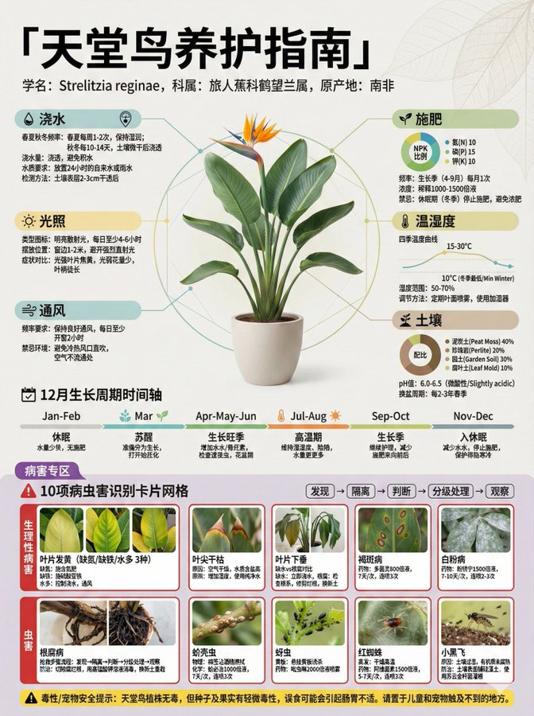

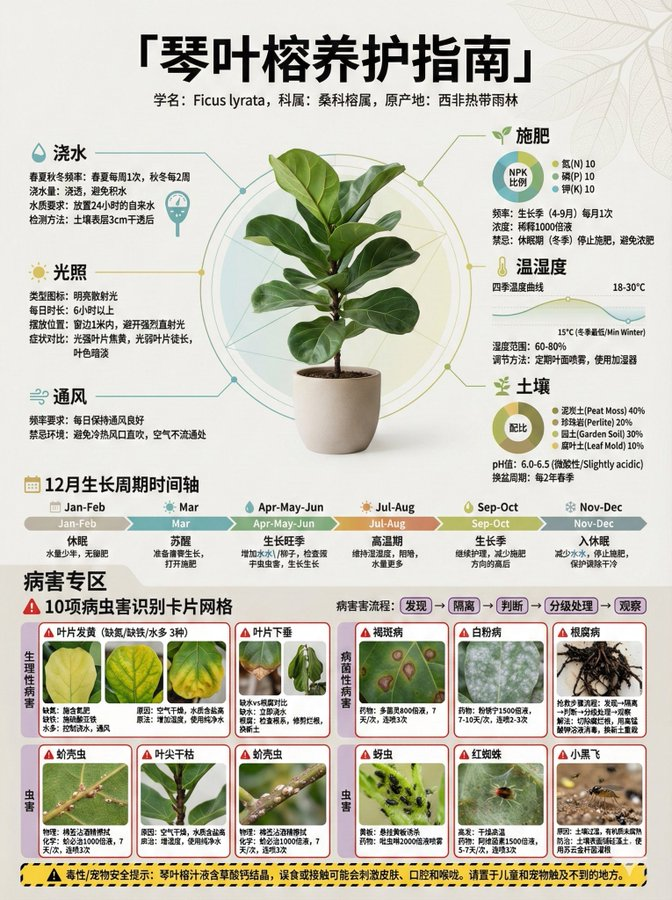

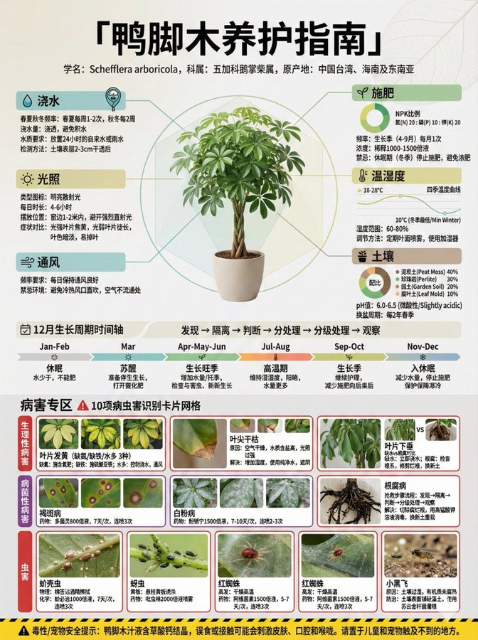

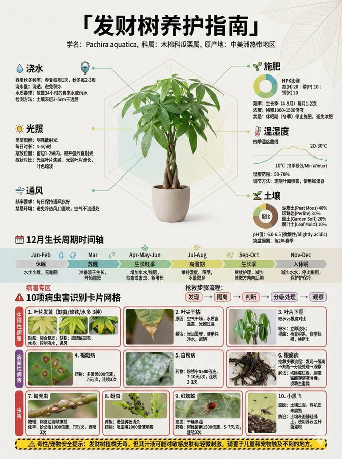

```
【主标题】「发财树养护指南」字体：思源黑体，确保中文清晰渲染副标题：学名、科属、原产地【中央视觉】画面中心25%：该植物健康盆栽实物，写实风格背景：浅色极简（米白/浅灰）+ 淡雅几何/叶脉底纹（透明度20%）【信息布局 - 自动填充真实数据】**左侧（蓝绿色系）：**浇水：春夏秋冬频率、浇水量、水质要求、检测方法光照：类型图标、每日时长、摆放位置、症状对比通风：频率要求、禁忌环境**右侧（黄绿色系）：**施肥：NPK比例饼图、频率、浓度、禁忌温湿度：四季温度曲线、湿度范围、调节方法土壤：配比饼图、pH值、换盆周期**中部横条：**12月生长周期时间轴（每月关键养护点图标化）**下方病害专区（占30%，红紫警示色）：****10项病虫害识别卡片网格（3行）***生理性病害：*1. 叶片发黄（缺氮/缺铁/水多 3种）- 症状图+对策2. 叶尖干枯 - 原因+解决方案3. 叶片下垂 - 缺水vs根腐对比*病菌性病害：*4. 褐斑病 - 特写图+多菌灵浓度用法5. 白粉病 - 症状图+防治药物6. 根腐病 - 抢救步骤流程*虫害：*7. 蚧壳虫 - 识别图+物理+化学防治8. 蚜虫 - 识别+黄板+药物名称9. 红蜘蛛 - 识别+高发条件+药物10. 小黑飞 - 识别+原因+防治每个卡片包含：- 症状特写图（占40%）- 标题+识别要点+具体防治方案- 药物名称+浓度+使用频次（如"多菌灵800倍液，7天/次，连喷3次"）急救流程图：发现→隔离→判断→分级处理→观察**底部栏：**毒性/宠物安全提示 【设计规范】- 信息密度：高（留白25%）- 连接线：从盆栽放射到各标注，细线条- 色彩编码：蓝=水、黄=光照、绿=营养、红=病害、紫=虫害- 卡片层级：主标题16pt粗体 > 内容12pt > 备注9pt细体- 图标：统一线性风格- 中文排版：行距1.5，紧凑可读- 病害卡片：红色边框+症状大图【风格参考】日本植物园导览牌 + 现代自然博物馆信息墙 + DK园艺图鉴【技术】正面平视/微俯视，柔和光线，中大景深，4K超高清**关键要求：所有养护数据、病害信息、药物名称、使用浓度均需根据所选植物自动填充真实准确的专业数据**botanical care guide poster, high-density infographic, museum exhibition style, pest disease identification, Chinese typography, minimalist background, professional horticultural data, 4K quality
```

 [↑返回目录](#toc)

---
## <a id="">国际顶流时尚杂志封面</a> (<a href="https://x.com/msjiaozhu/status/2007446691235148270" target="_blank" rel="noopener noreferrer">MapleShaw</a>)


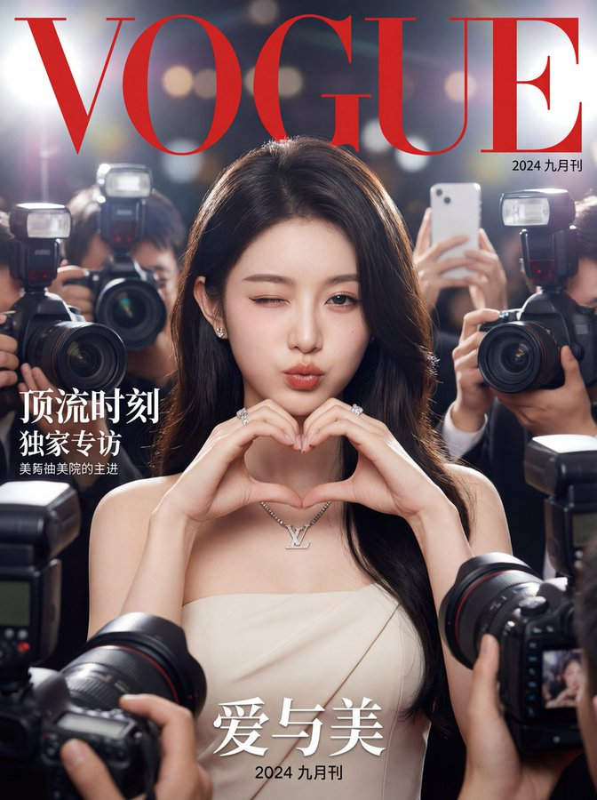

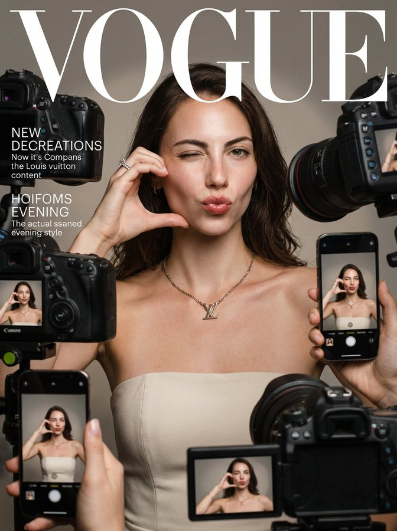


```
{
  "meta": {
    "system_instruction": "Create a high-end fashion magazine cover. Use the uploaded face for strict identity preservation.",
    "aspect_ratio": "3:4",
    "quality": "ultra-detailed",
    "resolution": "8k",
    "style": "Met Gala red carpet event, direct flash photography, glamorous celebrity candid"
  },

  "reference_usage": {
    "instruction": "Strictly preserve facial identity (eyes, nose, mouth) from the uploaded reference. Body proportions should be model-like and tall.",
    "focus": "100% Face Identity Match"
  },

  "scene": {
    "location": "The Met Gala Red Carpet (New York)",
    "environment": [
      "chaotic background with paparazzi cameras",
      "red velvet ropes",
      "bursts of camera flashes (bokeh orbs)",
      "dark night sky contrast"
    ],
    "atmosphere": "electric, exclusive, superstar energy"
  },

  "lighting": {
    "type": "Direct Flash (Paparazzi Style)",
    "effect": "High contrast hard light, glistening skin, sharp shadows behind the subject, bright reflections on dress"
  },

  "subject": {
    "face": {
      "expression": "Seductive confident smile, looking back over shoulder",
      "makeup": "bold red lip, sharp contouring, glowing highlighter"
    },
    "pose": {
      "action": "walking away but turning head 45 degrees to look at camera",
      "body": "elegant posture, back slightly arched",
      "hair": "blowing dramatically in the wind"
    },
    "outfit": {
      "dress": "Futuristic liquid-metal silver gown",
      "details": "backless design, reflecting the camera flashes, sequin texture",
      "jewelry": "Diamond choker, large stud earrings"
    }
  },

  "composition": {
    "layout": "Magazine Cover Layout",
    "branding": {
      "main_logo": "Large bold 'Harper's BAZAAR' logo at the top in white or silver",
      "text_elements": [
        "Include Chinese text subtitles on the side",
        "Small text: '红毯之夜' (Night of the Red Carpet)",
        "Headline: '独家直击' (Exclusive Look)",
        "Bottom text: '年度风尚大典' (Fashion Awards of the Year)"
      ]
    }
  },

  "vibe": "Luxurious, expensive, A-list celebrity, glossy magazine finish",
  "negative_prompt": "low resolution, ugly hands, distorted face, missing logo, text error, watermark, casual clothing, daylight, soft lighting"
}

@miilesus You did a great job!
```

 [↑返回目录](#toc)

---
## <a id="prompt-2007529647387353000">音乐史的可视化：大提琴与技术绘图</a> (<a href="https://x.com/Gdgtify/status/2007529647387353107" target="_blank" rel="noopener noreferrer">Gadgetify</a>)


```
1. The Anchor:
   A massive, hyper-realistic Cello or Upright Bass stands vertically in the book crease.
   Transition: The top of the Cello neck fades into a technical drawing on the wall; the body is real wood on the floor.

2. The Background (Vertical Page):
   Strict 2D: No wood paneling. Just aged paper.
   Sketches: Da Vinci-style technical diagrams of Acoustic Waves, Seating Arrangements, and Musical Notation.

3. The Foreground (Horizontal Page):
       A crumpled Playbill/Program.
       A block of Violin Rosin.
       A pair of Opera Glasses.
       A Conductor's Baton lying across the page.
   The Figures: Tiny musicians standing on the sheet music page or on the curve of the Cello, not on grass.

4. Lighting:
   Warm, golden "Concert Hall" lighting, reflecting off the varnish of the Cello.
```

```
1. 锚点：  
一把巨大且超写实的大提琴或立式低音提琴垂直立于书页折缝中。  
过渡效果：大提琴琴颈顶部逐渐淡出，化为墙上的一幅技术绘图；琴身则以真实的木质材质呈现于地面。

2. 背景（竖向页面）：  
严格采用二维风格：无木纹镶板，仅使用泛黄的旧纸张。  
草图内容：达·芬奇风格的声波、座位布局及乐谱的技术图纸。

3. 前景（横向页面）：  
一张揉皱的演出节目单／节目册。  
一块小提琴松香。  
一副观剧望远镜。  
一根指挥棒横置于页面上。  
人物：微小的音乐家站在乐谱页面上或大提琴的弧线上，而非草地上。

4. 光照：  
温暖的金色“音乐厅”灯光，映照在大提琴的漆面上，形成反光效果。
```

 [↑返回目录](#toc)

---
## <a id="prompt-2007495673784979700">裂隙中的微缩景观</a> (<a href="https://x.com/AllaAisling/status/2007495673784979734" target="_blank" rel="noopener noreferrer">Alexandra Aisling</a>)

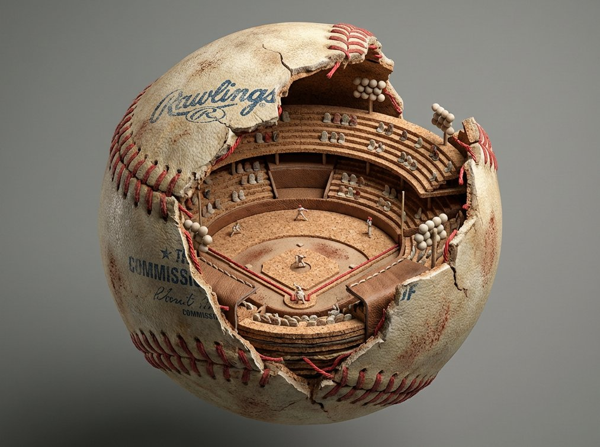

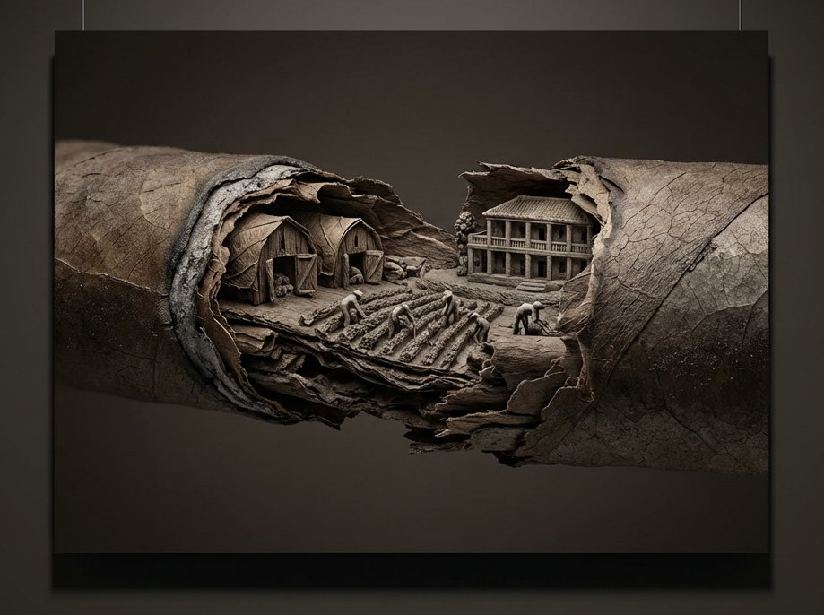

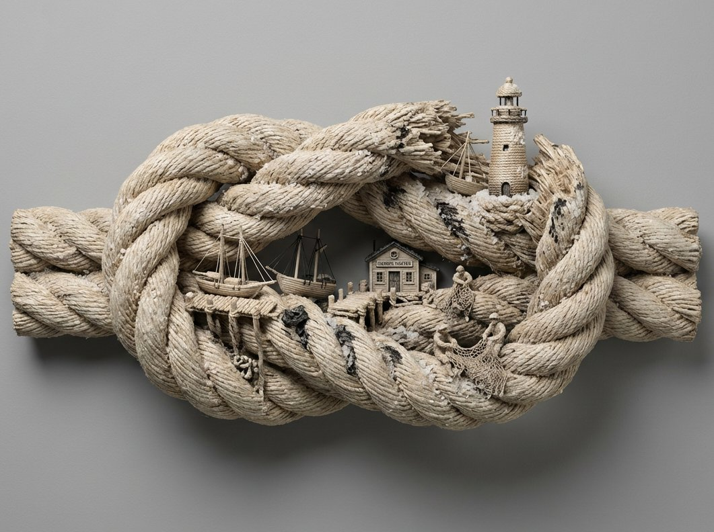

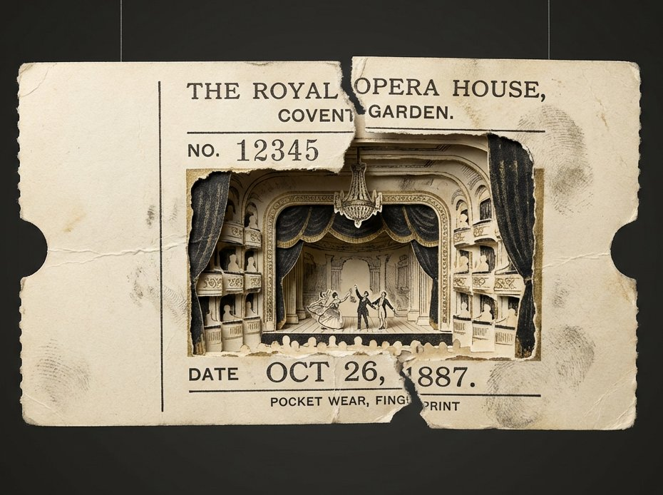

```
A single worn baseball suspended in space, frozen at the moment it fractures open. Inside the fracture exists a fully realized miniature baseball stadium — carved, layered, and constructed entirely from cowhide leather, red stitching, and compressed cork core.
Internal elements include a diamond infield carved into cork layers, dugouts built from leather seams, bleachers rising in concentric tiers of wound yarn, tiny players frozen mid-swing on stitching-thread basepaths, floodlights formed from exposed rubber pill center, arranged with clear spatial logic and physical coherence. [...]
```

```
A single cigar suspended in space, frozen at the moment it fractures open. Inside the fracture exists a fully realized miniature tobacco plantation — carved, layered, and constructed entirely from rolled tobacco leaves.
Internal elements include drying barns built from wrapper leaf, workers sorting in binder-layer fields, a colonial hacienda carved from filler blend, arranged with clear spatial logic and physical coherence. Intricate forms, repeating patterns, and emergent architecture grow organically from the break, featuring depth, cavities, negative space, and internal structural rhythm.
Hyper-detailed 3D bas-relief fused with fine-art poster design. Material realism emphasized — vein patterns in leaves, oil sheen, ash residue at burn line, cedar aging marks, subtle imperfections visible at macro scale.
Monochrome or tightly controlled palette derived from tobacco brown, ash grey, and wrapper maduro. [...]
```

```
A single sailor's knot suspended in space, frozen at the moment it fractures open. Inside the fracture exists a fully realized miniature harbor — carved, layered, and constructed entirely from hemp rope fibers and salt residue.
Internal elements include docks woven from frayed strands, tiny ships moored in the knot's loops, a lighthouse rising from the standing end, fishermen mending nets in fiber gaps, the harbor master's office carved into the knot's heart, arranged with clear spatial logic and physical coherence. Intricate forms, repeating patterns, and emergent architecture grow organically from the break, featuring depth, cavities, negative space, and internal structural rhythm.
Hyper-detailed 3D bas-relief fused with fine-art poster design. Material realism emphasized — salt crystals in fibers, tar staining, sun bleaching, frayed working ends, subtle imperfections visible at macro scale. Monochrome or tightly controlled palette derived from hemp tan, sea-salt white [...]
```

```
A single opera ticket stub suspended in space, frozen at the moment it fractures open. Inside the fracture exists a fully realized miniature opera house — carved, layered, and constructed entirely from ticket paper, perforated edges, and faded ink.
Internal elements include the grand stage carved into the stub face, box seats rising from torn perforation edges, a chandelier descending from the ticket number, tiny performers frozen mid-aria on the date line, velvet curtains formed from ink-heavy print areas, arranged with clear spatial logic and physical coherence. Intricate forms, repeating patterns, and emergent architecture grow organically from the break, featuring depth, cavities, negative space, and internal structural rhythm.
Hyper-detailed 3D bas-relief fused with fine-art poster design. Material realism emphasized — pocket wear on corners, faded thermal print, crease from being folded, fingerprint oils on surface, subtle imperfections visible at macro scale. [...]
```

 [↑返回目录](#toc)

---
## <a id="prompt-2007661789023244500">地质断层中的精密内部世界</a> (<a href="https://x.com/aleenaamiir/status/2007661789023244505" target="_blank" rel="noopener noreferrer">Aleena Amir</a>)

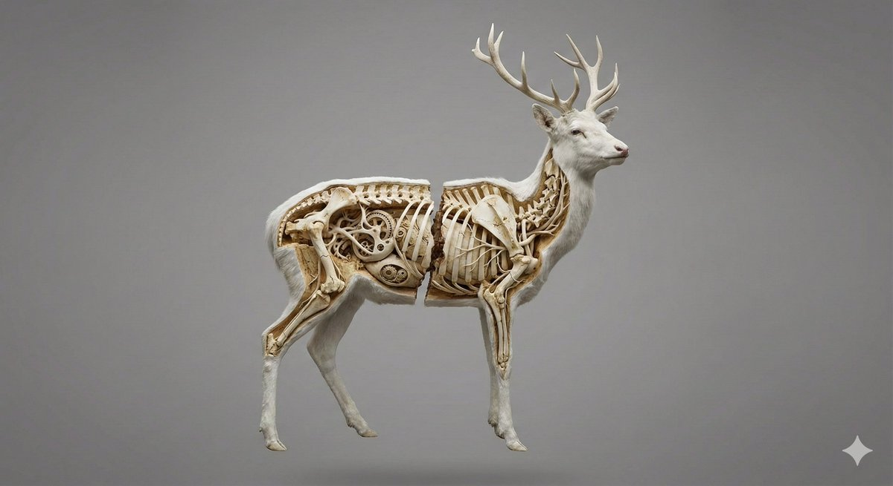

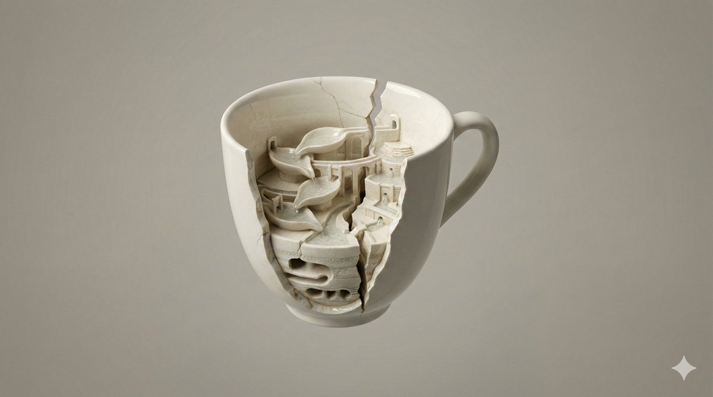

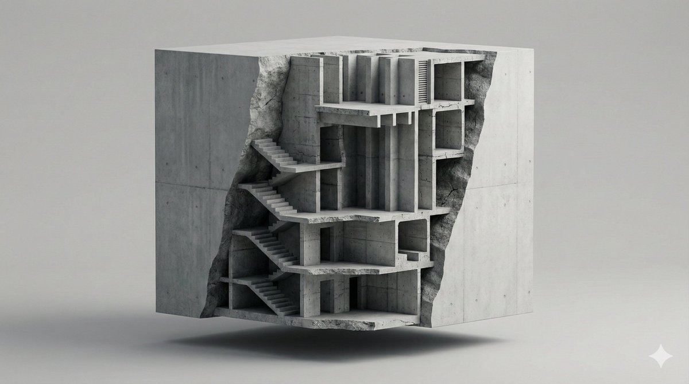

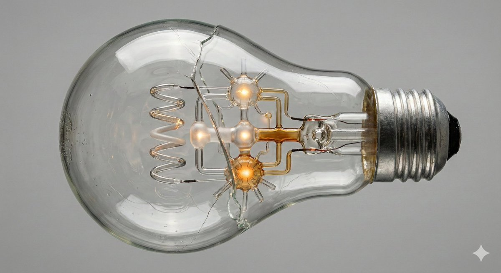

```
A solitary [OBJECT] floating in absolute stillness, split by a precise geological fault. Within the opening lies a meticulously constructed [Inner World / Mechanism], revealed like a museum cross-section. Every internal form is sculpted entirely from [Object Material], featuring [Iconic Details / Structural Elements] arranged with architectural logic. Layered strata, load-bearing forms, hollow chambers, and repeating micro-patterns create a believable internal system. Hyper-detailed 3D bas-relief blended with editorial poster aesthetics. Emphasis on material authenticity — [Surface Grain, Micro-cracks, Patina, Aging] visible at macro scale. Limited tonal palette derived from [Material Tones]. Exterior surface remains pristine and untouched. Neutral background, gallery lighting, ultra-sharp realism.
```

```
一个孤零零的[物体]悬浮于绝对静止之中，被一道精确的地质断层劈开。裂缝内部展现出一个精心构建的[内部世界／机械结构]，如同博物馆剖面展示般清晰可见。所有内部形态完全由[物体材质]雕琢而成，其中[标志性细节／结构元素]以建筑逻辑有序排列。层层叠叠的地层、承重结构、中空腔室与重复的微观图案共同构成一套可信的内部系统。超精细的3D浅浮雕风格融合了编辑海报的美学。强调材质的真实性——[表面纹理、微裂纹、包浆、老化痕迹]在宏观尺度上清晰可见。色调受限，仅使用源自[材质色调]的色彩。外部表面保持 pristine（原始 pristine）且未受触碰。中性背景，画廊式照明，极致锐利的写实风格。
```

 [↑返回目录](#toc)

---
## <a id="prompt-2007497261492920800">奢华木质香调香水AUREN</a> (<a href="https://x.com/SiboEsenkova/status/2007497261492920739" target="_blank" rel="noopener noreferrer">Sibo Esenkova</a>)

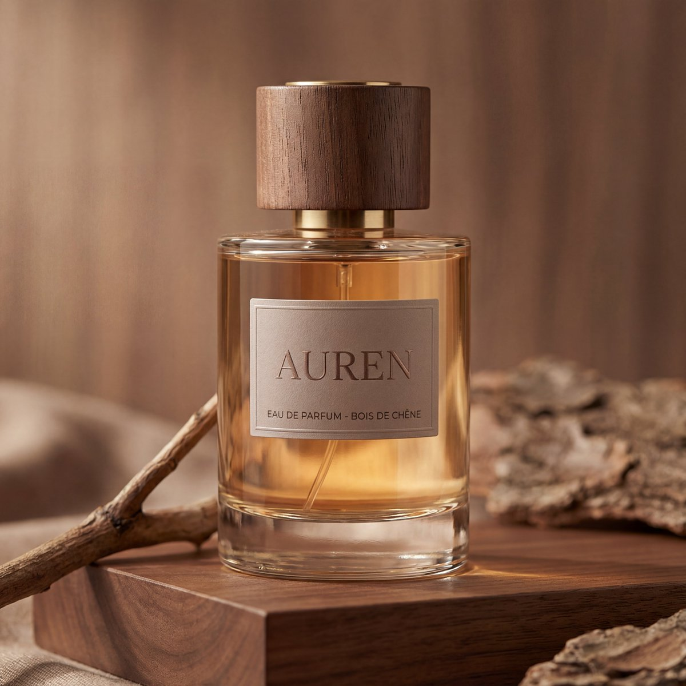

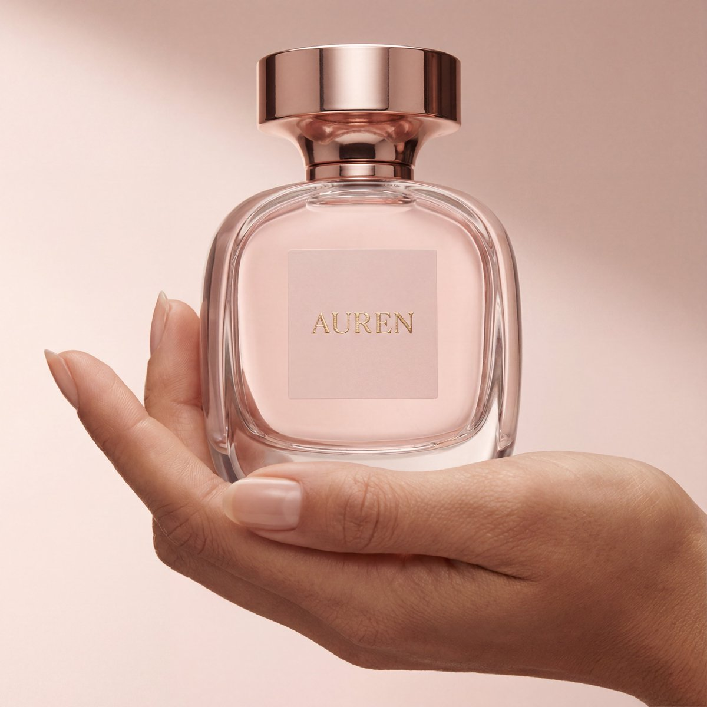

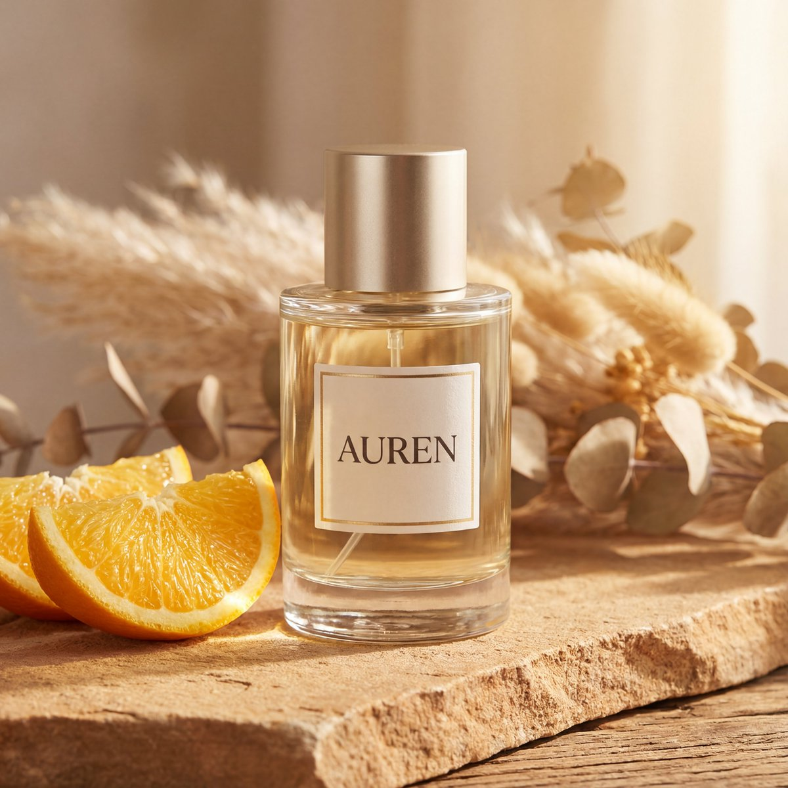

```
Ultra high-end fragrance campaign photography for a luxury unisex woody perfume brand, created for a premium e-commerce category card.

A clearly recognizable luxury perfume bottle.
Elegant cylindrical or softly rectangular glass bottle.
Thick crystal-clear glass with slight warm tint.
Visible amber-to-light-wood toned liquid.
Premium atomizer and spray neck.
Heavy matte or brushed wood-toned cap with subtle metallic core.

Front label:
Minimal luxury label.
Fake brand name: “AUREN”.
Refined serif or modern high-fashion typography.
Centered placement.
Muted warm beige or soft taupe label tone.
Subtle embossed or hot-stamped details.
Clearly readable, unmistakably perfume.

Scene:
Warm woody-inspired luxury still life.
Natural wood elements used with restraint.
Smooth walnut or oak wood block surface.
Soft bark textures, clean wood grain.
Optional single element of dry branch or shaved wood curl.
No clutter, no rustic mess.
Feels calm, grounded, expensive.

Lighting:
Warm, skin-like studio lighting.
Soft directional light mimicking late afternoon sun.
Light passes through glass and liquid, creating depth.
Subtle shadow gradients.
No harsh highlights.
No cold reflections.

Camera:
Shot by a world-class luxury fragrance photography team.
Medium format camera (Hasselblad / Phase One).
85mm lens.
Shallow depth of field.
Perfect focus on bottle, label, glass thickness.
Natural optical falloff.

Mood & Style:
Woody.
Warm.
Grounded.
Human.
Genderless.
Quiet confidence.
Feels like warm skin, clean wood, soft leather.
Luxury designer fragrance, not home scent, not candle.

Framing:
Vertical composition for category card.
Bottle as clear hero.
Wood elements framing subtly.
Clean negative space preserved.
Instant perfume recognition at first glance.

Quality:
Hyper-realistic.
True photography look.
No CGI.
No artificial glow.
No watermark.
No extra text.
Feels like a high-budget global fragrance launch.
```

```
超高端木质香调中性香水品牌香水广告摄影，专为高端电商平台品类卡片打造。

清晰可辨的奢侈香水瓶。  
优雅的圆柱形或柔和矩形玻璃瓶身。  
厚实通透的水晶玻璃，略带暖色调。  
可见琥珀至浅木色的香水液体。  
高级喷雾头与喷管颈部设计。  
厚重哑光或拉丝木质色调瓶盖，内嵌低调金属芯。

正面标签：  
极简奢华标签。  
虚构品牌名：“AUREN”。  
精致衬线体或现代高级时装风格字体。  
居中排版。  
标签采用低饱和暖米色或柔灰褐色。  
细节处有微妙压纹或烫金工艺。  
文字清晰易读，一眼即知是香水。

场景：  
温暖木质灵感的奢华静物布置。  
克制使用天然木材元素。  
光滑胡桃木或橡木块台面。  
细腻树皮肌理，干净木纹。  
可选单支干枝或一片卷曲木屑作为点缀。  
无杂乱，无粗犷感。  
整体氛围宁静、沉稳、昂贵。

灯光：  
温暖如肌肤质感的影棚布光。  
柔和定向光源，模拟午后阳光。  
光线穿透玻璃与液体，营造层次深度。  
阴影过渡细腻。  
无刺眼高光。  
无冷色调反光。

拍摄设备：  
由世界级奢侈香水摄影团队操刀。  
中画幅相机（哈苏 / 飞思）。  
85mm镜头。  
浅景深。  
瓶身、标签、玻璃厚度精准对焦。  
自然光学衰减效果。

氛围与风格：  
木质。  
温暖。  
沉稳。  
人性。  
无性别。  
低调自信。  
触感如温润肌肤、洁净木材、柔软皮革。  
属于奢侈设计师香水，非家居香氛，非香薰蜡烛。

构图：  
垂直构图，适配品类卡片。  
香水瓶作为绝对视觉焦点。  
木材元素巧妙衬托。  
保留干净留白。  
第一眼即可明确识别为香水。

画质：  
超写实。  
真实摄影质感。  
无CGI。  
无人工光晕。  
无水印。  
无额外文字。  
呈现高预算全球香水首发大片质感。
```

 [↑返回目录](#toc)

---
## <a id="prompt-2007535691157143600">极简黑白矢量肖像插画</a> (<a href="https://x.com/AmirMushich/status/2007535691157143563" target="_blank" rel="noopener noreferrer">AmirMušić</a>)

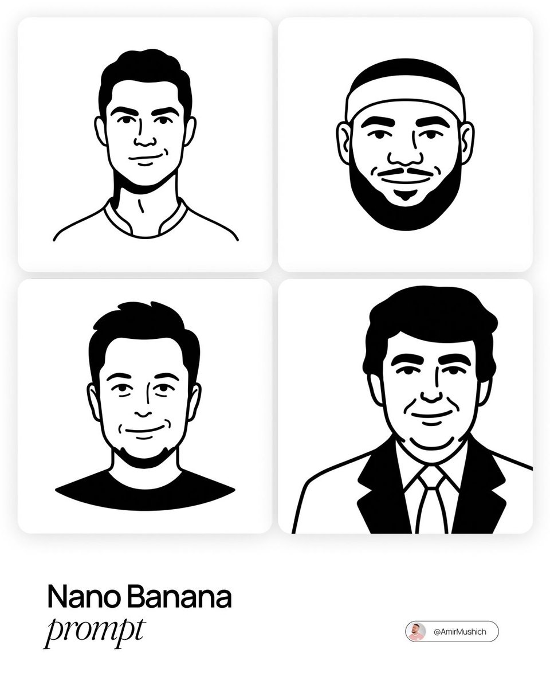

```
A minimalist, black-and-white flat vector illustration portrait of [CHARACTER NAME], rendered in the expressive "Notion avatar" art style.

LINE WORK & VIBE:

Style: Use THICK, UNIFORM black outlines (monoline weight). The lines should feel organic, smooth, and confident, not rigidly geometric or robotic like generic icons.

Vibe: The character should have a distinct personality and a relaxed, cool, or friendly expression. Focus on stylized features, unique hairstyles, and defining accessories to convey character.

SELECTIVE BLACK FILLS (CRITICAL):

Unlike pure outline icons, utilize Solid Black Fills selectively and strategically.

Where to Fill: Use solid black for prominent hair masses, beards, eyebrows, sunglasses, or dark clothing elements.

Where to Keep White: The skin, main face area, and lighter elements must remain pure flat white inside the thick outlines.

COMPOSITION & TECHNICAL:

No shading, no gray tones, no gradients. Only pure Black and pure White.

Clean bust or headshot composition centered on a white background.

High contrast, clean 2D vector graphics.
```

```
一幅极简风格的黑白扁平矢量肖像插画，描绘[角色名称]，采用富有表现力的“Notion头像”艺术风格。

线条与氛围：  
- 风格：使用粗细均匀的黑色轮廓线（单一线宽），线条应显得自然、流畅且自信，避免像普通图标那样生硬、几何化或机械感。  
- 氛围：角色需具有鲜明个性，表情放松、酷感或友善。通过风格化的五官、独特的发型和标志性配饰来展现角色特征。

选择性黑色填充（关键）：  
- 与纯轮廓图标不同，需有策略地使用实心黑色填充。  
- 填充区域：用于突出的头发块面、胡须、眉毛、墨镜或深色服饰元素。  
- 保留白色区域：皮肤、面部主体及浅色部分必须在粗轮廓线内保持纯白。

构图与技术要求：  
- 无阴影、无灰色调、无渐变，仅使用纯黑与纯白。  
- 构图为干净的半身像或头像，居中置于白色背景上。  
- 高对比度、清晰的二维矢量图形。
```

 [↑返回目录](#toc)

---
## <a id="prompt-2007722721967321000">超写实电影感地下赛车海报</a> (<a href="https://x.com/harboriis/status/2007722721967321132" target="_blank" rel="noopener noreferrer">Harboriis</a>)

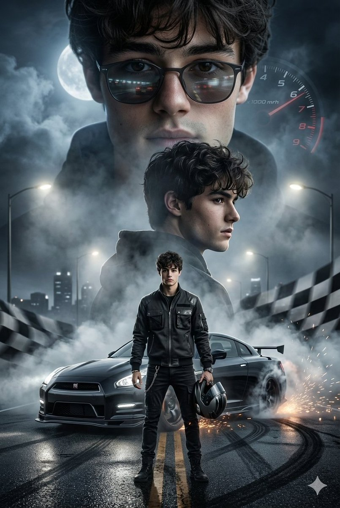

```
Ultra-realistic cinematic underground racing poster, with a dark, smoky and intense atmosphere inspired by nighttime street-race culture.

Create a triple-layer composition:

Foreground Scene (Full-body)

A dramatic full-body shot of the man standing in the middle of an abandoned industri-al road at night. He should be holding a racing helmet under one arm and standing confidently beside a modified street-race car drifting in slow motion behind him, gen-erating heavy smoke, sparks, and tire marks. The ground must reflect light from the car's headlights, adding wet-asphalt cinematic reflections.

Clothing: black jacket (leather or tactical), dark pants, rings and accessories, subtle metallic reflections, realistic fabric texture with shadows and folds.

Mid-layer Portrait

A medium-sized portrait of the man, facing sideways with a stern, focused expression, as if preparing for a race or confrontation. Add subtle fog around the edges and soft rim lighting from the streetlights above. The portrait must blend smoothly with the drifting smoke from the car.

Hero Background Portrait (Large Face)

A massive intense close-up of the man's face dominating the top of the poster, ex-pression strong and fearless. Add faint reflections of racing lights in the sunglasses and a subtle speedometer graphic overlay behind him. Smoke and moonlight should frame this portrait, creating a dramatic halo effect.

Atmosphere and Effects:

Dark palette with blacks, grays, metallic silver and moon-blue.

Minimal neon, no colorful beams.

Mist, drifting smoke, sparks from asphalt.

A blurred checkered-flag motion effect behind the background portrait.

Soft city skyline silhouette far behind the smoke.

Car:

A completely different model from the previous prompt: Nissan GT-R Black Edition (or similar JDM icon), hyper-detailed with glossy reflections, racing decals, visible car-bon-fiber textures, and headlights slicing through fog.

Face Replacement Instruction:

Replace all faces with the face from the photo I will upload. Keep lighting, expression, angle, texture and realism consistent with the cinematic scene. Do not alter the per-son's natural facial features. Blend the face perfectly into the poster.

Final Rendering Style:

8K resolution, ultra-sharp details, premium Hollywood poster composition, dramatic depth of field, misty environment, crisp reflections, slight vignette, full photorealism.
```

```
超写实电影感地下赛车海报，氛围黑暗、烟雾弥漫且紧张激烈，灵感源自夜间街头赛车文化。

构图分为三层：

前景场景（全身）  
在夜晚废弃的工业道路中央，一名男子以戏剧性的全身姿态站立。他单臂夹着赛车头盔，自信地站在一辆正在慢动作漂移的改装街车旁，车辆后方喷涌出浓重烟雾、火花与轮胎痕迹。地面需反射车灯的光线，营造湿润沥青路面的电影级倒影效果。

服装：黑色夹克（皮质或战术风格）、深色长裤、戒指与配饰，带有微妙金属反光，面料纹理真实，呈现自然阴影与褶皱。

中层肖像  
男子侧脸中景肖像，表情严肃专注，仿佛正准备比赛或对峙。边缘环绕淡淡薄雾，上方街灯提供柔和轮廓光。肖像需与车辆漂移产生的烟雾自然融合。

主背景肖像（大幅面部特写）  
海报顶部占据主导地位的巨大面部特写，神情坚毅无畏。墨镜上隐约映出赛车灯光，并在人物背后叠加微弱的速度表图形元素。烟雾与月光环绕面部，形成戏剧性的光环效果。

氛围与特效：  
色调以黑、灰、金属银和月光蓝为主。  
避免彩色霓虹光束，仅使用极简霓虹元素。  
加入薄雾、漂移烟雾及沥青迸发的火花。  
背景肖像后方添加模糊的方格旗动态效果。  
远处烟雾后方呈现柔和的城市天际线剪影。

车辆：  
采用与之前提示完全不同的车型：日产GT-R Black Edition（或类似经典JDM车型），细节极度丰富，具有高光反射漆面、赛车贴花、可见的碳纤维纹理，以及穿透雾气的锐利前大灯。

面部替换说明：  
将所有人物面部替换为我即将上传照片中的面孔。保持光影、表情、角度、质感与整体电影场景一致，不得改变人物自然面部特征，并确保面部与海报完美融合。

最终渲染风格：  
8K分辨率，细节超清晰，好莱坞顶级海报构图，强烈景深，雾气环境，锐利反光，轻微暗角，完全写实风格。
```

 [↑返回目录](#toc)

---
## <a id="prompt-2007616917327204600">新中式禅意品牌VI生成系统</a> (<a href="https://x.com/berryxia/status/2007616917327204584" target="_blank" rel="noopener noreferrer">Berryxia.AI</a>)

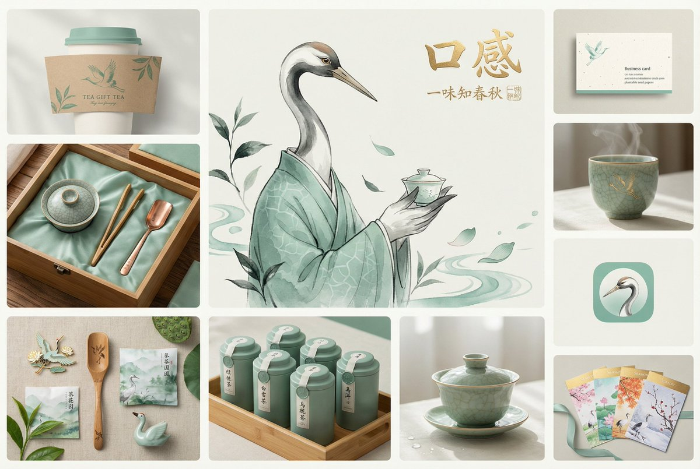

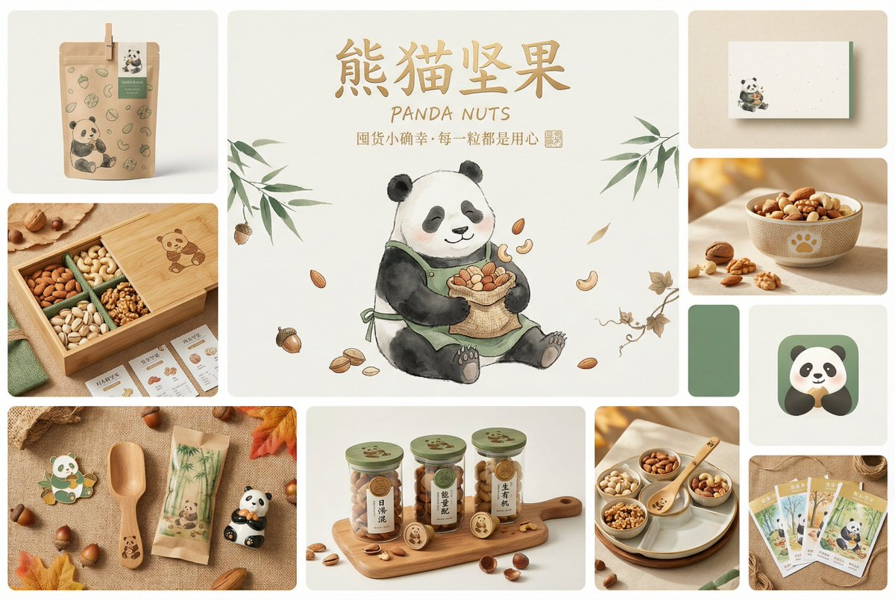

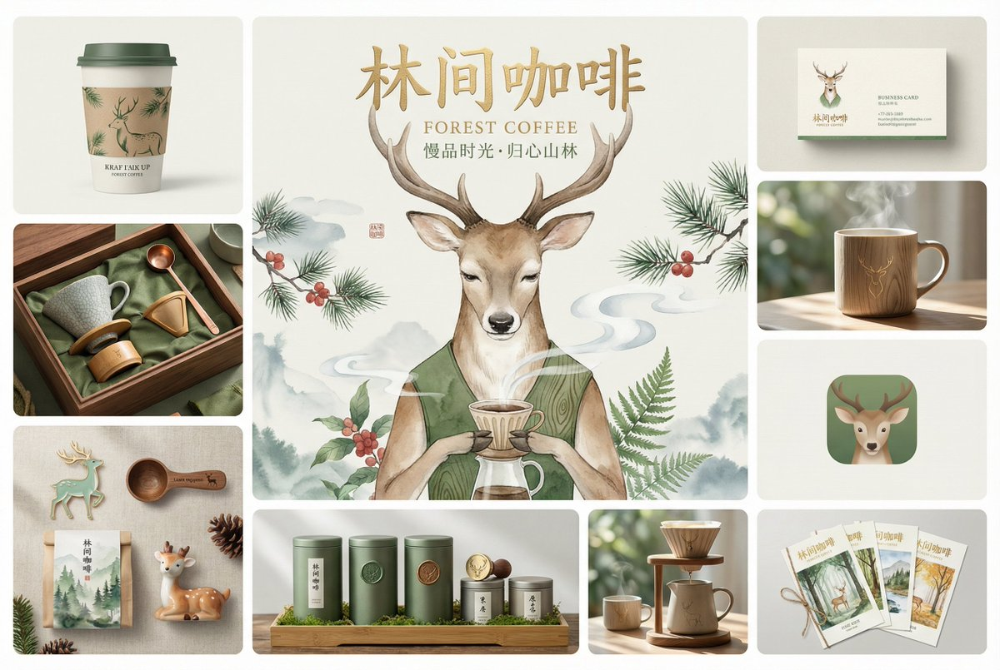

```
# 🎨 新中式禅意品牌VI生成系统 v3.0 - 通用提示词模板

## 📐 核心设计哲学

```plaintext

东方留白美学 + 宋代极简主义 + 日式侘寂精神

= 不对称的平衡 + 克制的优雅 + 呼吸感的构图

```

---

## 🔧 万能提示词结构（完整版）

### 【基础框架】

```plaintext

A modern Chinese Zen aesthetic brand visual identity system displayed in a sophisticated bento grid layout on soft moon-white (#F0F0E8) background with [品牌主色] accents. Professional brand showcase with [行业特质:storytelling elements/refined elegance/natural woodland elegance/warm craftsmanship spirit/mysterious nocturnal elegance].

```

---

### 【核心Logo主视觉】占画面40-45%

```plaintext

[Center dominant logo, largest element] 

Graceful watercolor ink-wash portrait of an anthropomorphic [角色/动物]. 

The [角色] has soft, contemplative eyes looking [视线方向:slightly downward/to the side/gently at viewer] with a [情绪:serene/peaceful/wise/gentle/discerning/mysterious/alluring] expression, [角色特征描述:long elegant neck/mature posture/elegant antlers/sharp features]. 

Wearing [服饰:minimalist tea master's robe/barista vest/traditional baker apron/flowing robe/bartender vest] in [主色+色值] with [纹理:Song Dynasty crackle glaze patterns/natural linen weave texture/wood grain texture/cloud brocade/silk brocade texture] as subtle texture. 

The [角色] is holding [核心产品:gaiwan tea cup/coffee dripper/bread loaf/wine glass/cocktail glass] with [肢体描述:both paws/one wing/hooves/one paw] in natural, [姿态:relaxed/refined/careful/mysterious] gesture, [其他肢体:other wing resting elegantly/other hoof at side/other paw adjusting detail]. 

Surrounded by generous negative space with asymmetric ink-brushed [装饰元素:tea leaves/pine needles/wheat stalks/lotus petals/bamboo/plum blossoms], [次要元素:flowing water ripples/steam swirls/morning mist/night mist/silk ribbons/moon phases] in misty [色调] gradients. 

Elegant Chinese calligraphy "[品牌中文名]" at [位置:top center/top right corner/flowing vertically] in refined [金属色:gold/rose gold] foil with subtle embossing, soft metallic sheen, gentle dimensional quality, warm [金属色] (#C9A961 or #B76E79) harmoniously integrated. 

Below in [文字样式:seal script/smaller text/Art Deco style/calligraphy style] "[品牌口号/英文名]" in matching gentle [金属色] treatment. 

Watercolor texture, soft edges, breathing space composition, wabi-sabi aesthetic, refined balance.

```

---

### 【必备三件套】各占8-10%画面

```plaintext

[Top right position] 

Minimalist business card with watercolor [角色] icon and vast negative space on cream paper, subtle [主色] edge painting, [特殊材质:plantable seed paper texture/natural paper grain/embossed pattern/premium card stock with metallic sheen]

[Middle right position] 

Ceramic/Crystal [杯具:mug/tea cup/coffee cup/cocktail glass] with [纹理] pattern and subtle [角色] silhouette in gold/rose gold line art, natural [光线:morning light/dramatic low-key lighting/moody lighting] with [产品特征:tea steam wisps/coffee steam/gentle glow/red backlight], [色调:warm earthtone/cool celadon/natural lighting/atmospheric lighting]

[Bottom right position] 

Mobile app icon with soft rounded [角色] [部位:head portrait/face/silhouette] in [主色] circle, modern minimal digital design

```

---

### 【功能延展周边】3-4个,各占6-8%

**根据行业类型选择对应周边：**

#### ☕ 咖啡/茶饮品牌：

```plaintext

[Top left position] 

Takeaway cup sleeve with single brushstroke [角色] and [装饰元素] pattern, natural kraft paper with [主色] ink, elegant typography

[Middle left position, larger] 

[茶具/咖啡器具] gift set in wooden/lacquer box: ceramic [器具名称] with crackle glaze, bamboo [配件], [金属配件], arranged with [主色] fabric lining, artisan presentation

[Center bottom position] 

Premium [茶叶/咖啡豆] storage tin collection: cylindrical metal tins with matte [主色] finish, wax seal stamps featuring [角色元素], different [品种/烘焙度] labeled with calligraphy, arranged in bamboo tray

```

#### 🍞 烘焙/甜品品牌：

```plaintext

[Top left position] 

Kraft paper bread bag with hemp rope closure, refined gold foil stamped logo, hand-drawn [角色] and [装饰元素], reusable design with wooden button

[Middle left position, larger] 

Wooden bread board set with laser-engraved [角色] logo and [装饰] border, includes recipe card holder, artisan craftsmanship display

[Center bottom position] 

Morning ritual gift set in wooden tray: linen napkin with [角色] print and subtle gold accent, artisan [产品] knife, ceramic butter dish, luxury breakfast presentation

```

#### 🍷🍶 酒类/酒吧品牌：

```plaintext

[Top left position]

[Cocktail coaster set/Wine bottle label] with traditional seal script and [角色] watercolor illustration, [材质:lacquered wood/premium paper] texture, [主色] with [金属色] accents

[Middle left position, larger]

Premium [cocktail/wine] gift set in lacquer box: crystal [器具], [配件] with engraved logo, silk-lined interior in [主色], artisan bar tools presentation

[Center bottom position]

Signature [cocktail/wine] bottle collection: custom glass bottles with [主色] labels, wax seal stamps featuring [角色元素], different signature drinks labeled with calligraphy, arranged on [展示方式:mirrored tray/bamboo tray]

```

#### 🍪 零食/坚果品牌：

```plaintext

[Top left position]

Resealable kraft paper snack pouch with hand-drawn [角色] and [坚果/零食元素] pattern, [主色] ink printing, convenient zip-lock design with wooden clip

[Middle left position, larger]

Premium snack gift box in bamboo/wooden container: multiple compartments for different nuts/snacks, [角色] engraved lid, natural fabric dividers in [主色], artisan presentation with dried fruit and nut illustrations

[Center bottom position]

Snack storage jar collection: glass/ceramic jars with [主色] wooden lids, wax seal featuring [角色] holding nuts, different varieties (almonds, cashews, dried fruits) labeled with calligraphy, arranged on natural wood tray

```

#### 🍡 糕点/甜品品牌：

```plaintext

[Top left position]

Transparent window pastry box with watercolor [角色] and [糕点元素] pattern on lid, natural kraft base with [主色] ribbon closure, elegant see-through design

[Middle left position, larger]

Traditional dessert serving set: ceramic plates with [纹理] glaze, bamboo dessert forks, small sauce dishes for toppings, arranged with [主色] silk cloth, tea house presentation style

[Center bottom position]

Dessert recipe card holder in wooden stand: illustrated cards showing signature pastries with [角色] enjoying each one, gold foil titles, includes mini wooden spoon as bookmark

```

#### 🧀 奶酪/乳制品品牌：

```plaintext

[Top left position]

Wax paper cheese wrapper with vintage-style [角色] and dairy farm illustration, [主色] printing with natural texture, traditional cheese aging aesthetic

[Middle left position, larger]

Artisan cheese board set: marble/slate board with laser-engraved [角色] logo, includes cheese knives with wooden handles, small ceramic dipping bowls, presented in rustic wooden box with [主色] lining

[Center bottom position]

Cheese preservation container collection: ceramic crocks with breathable lids in [主色] glaze, wax seal stamps with [角色] and milk motif, different cheese types labeled with calligraphy

```

#### 🍫 巧克力/糖果品牌：

```plaintext

[Top left position]

Luxury chocolate wrapper in textured paper with embossed [角色] and cacao pod pattern, [主色] with [金属色] foil accents, elegant origami-style folding design

[Middle left position, larger]

Chocolate tasting set in vintage tin box: individual wrapped chocolates with watercolor flavor cards, bamboo tongs, ceramic tasting dish, velvet interior in [主色], sommelier presentation

[Center bottom position]

Cocoa powder/chocolate shavings container: vintage glass jar with [主色] metal lid, wax seal featuring [角色] with cacao branch, different percentages (dark, milk, white) labeled in calligraphy

```

#### 🥜 健康轻食品牌：

```plaintext

[Top left position]

Eco-friendly reusable snack pouch in organic cotton with printed [角色] and superfood icons, [主色] natural dye, minimalist health-conscious design with drawstring

[Middle left position, larger]

Meal prep container set: bamboo fiber bowls with [角色] engraved lids, silicone dividers in [主色], reusable bamboo utensils, modern sustainable lifestyle presentation

[Center bottom position]

Superfood storage system: stackable glass jars with bamboo lids in [主色] finish, labels featuring [角色] with different seeds/grains, organized in minimalist wire rack

```

#### 🍜 面馆/中式正餐品牌：

```plaintext

[Top left position]

Takeaway noodle box with bold brushstroke [角色] and [地域特色纹样] pattern, kraft paper with [主色] printing, authentic regional calligraphy typography

[Middle left position, larger]

Traditional noodle/meal serving set in [材质:wooden/bamboo] box: ceramic bowls with [纹理] glaze, bamboo chopsticks with [金属色] tips, small condiment dishes, arranged with [主色] cloth, artisan presentation

[Center bottom position]

Signature condiment/spice jar collection: ceramic/glass containers with [主色] lids, wax seal stamps featuring [角色] with [食材元素], different sauces/spices labeled with calligraphy, arranged on [展示方式:wooden board/bamboo tray]

```

---

### 【惊喜创意周边】⭐ 核心差异 2-3个,各占5-8%

```plaintext

[Bottom left position] 

Collection of [主题]-themed merchandise: 

[周边1:[色调]-colored enamel [角色] pin with [金属色] [细节] details], 

[周边2:wooden/leather [工具/配件] with laser-engraved/embossed [角色]], 

[周边3:[产品]wrapper/packaging with watercolor [场景] scene], 

[周边4:ceramic mini [角色] figurine/tea pet/silk pocket square], 

arranged on natural [材质:linen/velvet/burlap] with [自然装饰:pine cone/moss/stones/mood lighting] accents

[Lower right position] 

[高端产品套装描述]: 

Ceramic/Crystal [核心产品] set with [特殊工艺] glaze and [金属色] rim accent, traditional [件数]-piece set, museum-quality craftsmanship, [光影效果:dappled light/soft shadows/dramatic lighting]

[Small corner position] 

Seasonal [产品/体验/VIP membership] cards with watercolor illustrations of four seasons/moon phases, each featuring [角色] in different [场景] landscape, [金属色] foil headers, tied with [材质:silk ribbon/hemp twine/wheat stalk]

```

---

### 【设计系统统一性】

```plaintext

All elements feature consistent refined [金属色:gold/rose gold/antique bronze] foil treatment with subtle dimensional quality. 

Harmonious palette: moon-white (#F0F0E8), [主色+色值], [辅助色+色值], soft-sheen [金属色] (#C9A961 or #B76E79 or #8B6914), charcoal ink (#3A3A3A), [可选色3]. 

Consistent [纹理风格:Song Dynasty celadon patterns/natural linen weave/wood grain/bark texture/silk brocade/lacquer finish/burlap weave] throughout, asymmetric Zen composition with 32-35% negative space breathing room, 

natural [材质:kraft paper/ceramic/wood/silk/crystal/leather/velvet/rough pottery] textures with watercolor ink-wash effects throughout. 

Modern Chinese [行业:tea ceremony/artisan bakery/forest coffee/wine culture/bar culture/noodle shop/regional cuisine] aesthetic with Japanese wabi-sabi minimalism influence, celebrating [品牌价值观:refined taste/handcrafted warmth/slow living/seasonal awareness/return to nature/mysterious elegance/nocturnal sophistication/authentic regional heritage].

```

---

### 【技术参数】

```plaintext

Bento grid layout with generous 24px gaps between elements, 

natural diffused/dramatic low-key [时间/氛围:morning/misty morning/warm morning/forest morning/moody/nocturnal/golden afternoon] light photography with soft [光影效果:reflections/dappled sunlight/golden hour glow/red accent lights/steam effects], 

contemporary [场景:tea house/artisan bakery/woodland coffee house/wine cellar/luxury bar/authentic noodle shop] quality, 

professional brand showcase, 

gentle/deep shadows [18-25]% opacity [阴影作用:creating depth/emphasizing subtle dimension/creating mystery/creating warmth], 

visible material textures (paper grain, [材质2:wood grain/ceramic glaze/fabric weave/enamel finish/crystal/silk/lacquer/rough pottery], [材质3]), 

storytelling through [叙事方式:seasonal tea culture/family heritage/forest seasonal cycle/craft tradition/nocturnal mystique/Eastern allure/regional culinary tradition], 

cohesive [美学特质:elegant/natural/warm/mysterious/sophisticated/authentic/honest] harmony, 

8k resolution --ar 16:9 --stylize [240-250] --v 6.0

```

---

## 🎯 快速配置表（填空即用）

```markdown

┌─────────────────────────────────────────────┐

│  新中式禅意VI系统 - 品牌配置单               │

├─────────────────────────────────────────────┤

│ 品牌中文名: [          ]                     │

│ 品牌英文名: [          ]                     │

│ 品牌口号:   [          ]                     │

│ 行业类型:   [咖啡/茶饮/烘焙/酒类/酒吧/零食/面馆] │

│ 核心角色:   [          ] (动物/人物)         │

│ 角色情绪:   [          ] (宁静/智慧/温暖/神秘等) │

│ 主色调:     [          ] + 色值 #           │

│ 辅助色:     [          ] + 色值 #           │

│ 金属色:     [gold/rose gold/bronze] + 色值 # │

│ 核心产品:   [          ] (茶杯/咖啡壶/鸡尾酒杯等) │

│ 装饰元素:   [          ] (竹/梅/松/茶叶/丝带等) │

│ 文化纹理:   [          ] (冰裂/木纹/云锦/丝绸等) │

│ 意境场景:   [          ] (山水/竹林/晨雾/月夜等) │

└─────────────────────────────────────────────┘

```

---

## 📚 参数选择库

### 【角色/动物库】

| 角色 | 文化象征 | 适合行业 |

|------|---------|---------|

| crane (仙鹤) | 优雅、长寿、品味 | 茶饮、养生、高端餐饮 |

| deer (鹿) | 自然、温柔、森林 | 咖啡、户外、民宿 |

| red panda (小熊猫) | 可爱、友好、活力 | 年轻茶饮、甜品 |

| fox (狐狸) | 聪慧、神秘、优雅 | 精品咖啡、调酒、酒吧 |

| cat (猫) | 慵懒、治愈、亲近 | 书店咖啡、文创、面馆 |

| rabbit (兔) | 温顺、灵动、可爱 | 烘焙、甜品、儿童 |

| owl (猫头鹰) | 智慧、沉思、夜间 | 深夜食堂、书店、酒吧 |

| bear (熊) | 憨厚、可靠、温暖 | 烘焙、家庭餐饮 |

| koi fish (锦鲤) | 富贵、吉祥、流动 | 日料、茶饮、养生 |

| tiger (虎) | 勇敢、大胆、力量 | 运动饮品、精品咖啡 |

| squirrel (松鼠) | 勤劳、储藏、活泼 | 坚果零食、烘焙、儿童食品 |

| hedgehog (刺猬) | 可爱、防御、独立 | 零食、甜品、治愈系品牌 |

| hamster (仓鼠) | 囤货、可爱、居家 | 零食、粮食制品、家庭食品 |

| raccoon (浣熊) | 机灵、好奇、夜行 | 零食、夜宵、创意餐饮 |

| otter (水獭) | 玩乐、社交、灵动 | 海鲜、日料、年轻品牌 |

| dolphin (海豚) | 智慧、友好、海洋 | 海鲜、度假餐饮、儿童 |

| penguin (企鹅) | 呆萌、团队、冰爽 | 冰品、冷饮、甜品 |

| koala (考拉) | 慵懒、治愈、澳洲 | 咖啡、茶饮、休闲食品 |

| sloth (树懒) | 慢生活、放松、治愈 | 慢食、素食、养生品牌 |

| sparrow (麻雀) | 市井、亲民、灵动 | 街头小吃、平价餐饮 |

| magpie (喜鹊) | 喜庆、吉祥、报喜 | 节庆食品、礼品、婚宴 |

| swallow (燕子) | 归来、春天、家 | 家常菜、家庭餐饮 |

| kingfisher (翠鸟) | 鲜艳、敏捷、水边 | 海鲜、日料、精致餐饮 |

| peacock (孔雀) | 华丽、高贵、展示 | 高端餐饮、宴会、奢侈品 |

| panda (熊猫) | 国宝、可爱、中国 | 中式餐饮、茶饮、文创、坚果 |

| yak (牦牛) | 高原、力量、朴实 | 西北面馆、牛肉面、地域餐饮 |

| chipmunk (花栗鼠) | 活泼、储食、森林 | 坚果、零食、儿童食品 |

| beaver (海狸) | 勤劳、建造、木质 | 烘焙、木工艺、手作 |

| meerkat (狐獴) | 机警、团队、可爱 | 零食、快餐、社交餐饮 |

| alpaca (羊驼) | 温柔、萌系、治愈 | 奶制品、甜品、文创 |

| flamingo (火烈鸟) | 优雅、粉色、热带 | 果汁、甜品、女性品牌 |

---

### 【情绪描述库】

| 情绪词 | 英文 | 适用场景 |

|-------|------|---------|

| 宁静 | serene | 茶饮、养生、禅修 |

| 平和 | peaceful | 民宿、咖啡、书店 |

| 智慧 | wise | 教育、文创、高端品牌 |

| 温柔 | gentle | 烘焙、母婴、家居 |

| 优雅 | elegant | 高端餐饮、酒类、奢侈品 |

| 俏皮 | playful | 年轻品牌、甜品、儿童 |

| 神秘 | mysterious | 调酒、酒吧、香氛、艺术品 |

| 魅惑 | alluring | 酒吧、夜店、高端餐饮 |

| 老练 | sophisticated | 酒吧、葡萄酒、商务 |

| 自信 | confident | 运动、商务、科技 |

| 诚实 | honest | 地域餐饮、传统小吃 |

| 踏实 | grounded | 面馆、家常菜、朴实品牌 |

| 慈悲 | compassionate | 公益、医疗、养老 |

| 鉴赏力 | discerning | 精品咖啡、葡萄酒、艺术 |

---

### 【色彩系统库】

| 色彩名称 | 色值 | 适用行业 | 文化象征 |

|---------|------|---------|---------|

| 青瓷绿 Celadon | #7CB8A8 | 茶饮、养生 | 龙泉青瓷、春茶 |

| 烟雨蓝 Smoke Blue | #8FA3AD | 咖啡、文创 | 江南烟雨、沉静 |

| 茶褐 Tea Brown | #8B7355 | 咖啡、烘焙 | 烤面包、醇厚 |

| 森林苔绿 Moss Green | #6B8E5A | 户外、咖啡 | 森林、自然 |

| 竹绿 Bamboo Green | #6B8F71 | 熊猫品牌、素食 | 竹林、清新 |

| 墨黑 Ink Black | #3A3A3A | 文创、设计 | 徽墨、克制 |

| 午夜墨 Midnight Ink | #2D2D2D | 酒吧、夜店 | 夜幕、深邃 |

| 玉石绿 Jade Green | #5FA777 | 珠宝、高端 | 和田玉、珍贵 |

| 深酒红 Wine Red | #8B4049 | 酒类、酒吧、餐饮 | 陈年、成熟、激情 |

| 玫瑰金 Rose Gold | #B76E79 | 酒吧、奢侈品 | 魅惑、精致 |

| 麦穗金 Wheat Gold | #D4A574 | 烘焙、农产品 | 丰收、温暖 |

| 赭黄 Ochre Yellow | #D4A348 | 西北面馆、地域餐饮 | 黄土、朴实 |

| 深红 Deep Crimson | #C84534 | 辣味餐饮、西北菜 | 辣椒、热情 |

| 暖奶油 Warm Cream | #E8DCC8 | 烘焙、坚果 | 柔和、温暖 |

| 古铜 Antique Bronze | #8B6914 | 西北文化、传统餐饮 | 丝路、厚重 |

| 柔和金 Soft Gold | #C9A961 | 通用点缀色 | 晨光、不张扬 |

| 月白 Moon White | #F0F0E8 | 通用背景色 | 留白、呼吸感 |

---

### 【装饰元素库】

| 元素 | 文化含义 | 适合场景 |

|------|---------|---------|

| tea leaves (茶叶) | 茶文化、清雅 | 茶饮品牌 |

| bamboo (竹) | 君子、坚韧 | 文创、茶饮、熊猫品牌 |

| lotus (莲) | 出淤泥不染 | 养生、禅修 |

| plum blossom (梅) | 傲骨、坚韧、夜香 | 高端品牌、酒吧 |

| pine needles (松针) | 长青、森林 | 咖啡、户外 |

| wheat stalks (麦穗) | 丰收、温暖 | 烘焙品牌、面馆 |

| coffee cherries (咖啡果) | 咖啡文化 | 咖啡品牌 |

| flowing water (流水) | 时间、流动 | 茶饮、养生 |

| silk ribbons (丝带) | 飘逸、奢华 | 酒吧、高端品牌 |

| moon phases (月相) | 周期、神秘 | 酒吧、养生 |

| mist/clouds (雾/云) | 朦胧、诗意 | 所有行业 |

| mountains (山) | 稳重、高远 | 民宿、户外 |

| acorns (橡实) | 储藏、秋收 | 坚果、零食 |

| nuts and seeds (坚果种子) | 营养、天然 | 零食、健康食品 |

| berries (浆果) | 鲜甜、自然 | 果酱、甜品、饮品 |

| cacao pods (可可豆荚) | 巧克力、热带 | 巧克力、甜品 |

| honey drips (蜂蜜滴) | 甜蜜、天然 | 甜品、健康食品 |

| cheese wedges (奶酪块) | 乳制品、手工 | 奶酪、乳品 |

| cookie crumbs (饼干碎屑) | 烘焙、温馨 | 烘焙、零食 |

| candy wrappers (糖纸) | 童趣、甜蜜 | 糖果、儿童食品 |

| fruit slices (水果切片) | 新鲜、健康 | 果汁、轻食 |

| herb sprigs (香草枝) | 清新、自然 | 健康食品、茶饮 |

| rice grains (稻穗) | 丰收、主食 | 米制品、农产品 |

| chili peppers (辣椒) | 火热、豪爽 | 川菜、西北菜、辣味餐饮 |

| cilantro/scallions (香菜/葱) | 提香、鲜活 | 面馆、中式餐饮 |

| noodle strands (面条) | 手工、延绵 | 面馆品牌 |

| musical notes (音符) | 音乐、律动 | 音乐酒吧、文艺场所 |

| vinyl records (唱片) | 复古、爵士 | 音乐酒吧、怀旧主题 |

| natural vines (藤蔓) | 生长、连接 | 自然食品、有机品牌 |

---

### 【文化纹理库】

| 纹理 | 朝代/风格 | 视觉效果 |

|------|----------|---------|

| Song Dynasty crackle glaze | 宋代官窑 | 冰裂纹、古朴 |

| natural linen weave | 天然亚麻 | 编织纹、手工感 |

| wood grain texture | 木纹 | 年轮、自然 |

| bamboo weave | 竹编 | 交织、东方 |

| cloud brocade | 云锦 | 流云、华贵 |

| silk brocade | 真丝锦缎 | 光泽、奢华 |

| lacquer finish | 漆器 | 深沉光泽、传统 |

| rough pottery texture | 粗陶 | 朴实、西北、手工 |

| bark pattern | 树皮 | 粗糙、野生 |

| rice paper | 宣纸 | 纤维、文人 |

| stone wash | 石洗 | 斑驳、岁月 |

| wax paper texture | 蜡纸 | 半透明、复古 |

| burlap/jute weave | 黄麻编织 | 粗糙、天然、农产品 |

| coarse linen weave | 粗布编织 | 朴实、西北、手工 |

| Dunhuang mural patterns | 敦煌壁画纹样 | 几何、丝路、西北 |

| vintage leather texture | 复古皮革 | 高端、酒吧、成熟 |

| brushed brass finish | 拉丝黄铜 | 金属、复古、工业 |

| honeycomb pattern | 蜂巢纹 | 六边形、自然、甜品 |

| cookie dough texture | 饼干面团 | 颗粒感、烘焙 |

| crinkle paper | 皱纹纸 | 褶皱、包装、手工 |

| foil wrapper | 锡箔纸 | 金属光泽、糖果 |

| parchment paper | 烘焙纸 | 半透明、烘焙、复古 |

| cotton muslin | 棉布纱 | 柔软、透气、天然 |

| cork texture | 软木塞质感 | 粗糙孔隙、酒类、环保 |

| seed surface | 种子表面 | 自然纹理、健康食品 |

---

### 【品牌口号示例库】

#### 时间/哲学类

- 一期一会 (珍惜当下)

- 静水流深 (内敛深邃)

- 慢品时光 (享受过程)

- 行到水穷处 (自在通达)

- 一味知春秋 (品味时节)

#### 工艺/品质类

- 匠心独运 (工艺精神)

- 器以载道 (器物承载文化)

- 大巧不工 (自然天成)

- 精工细作 (追求完美)

- 匠心烘焙·温暖传承

#### 自然/生活类

- 天人合一 (和谐自然)

- 归园田居 (回归本真)

- 道法自然 (顺应天性)

- 自在山居 (悠然生活)

- 归心山林 (回归自然)

- 慢品时光·归心山林

#### 文化/传承类

- 文以载道 (文化传承)

- 书香雅韵 (文人雅致)

- 古韵新生 (传统创新)

- 东方意境 (文化底蕴)

- 一清二白三红四绿五黄·西北风骨 (兰州牛肉面)

#### 夜生活/神秘类

- 夜色如酒·醉东方韵

- 月下微醺

- 暗香浮动

- 夜宴东方

- 夜色即兴·律动东方 (爵士酒吧)

#### 美食/零食类

- 一口自然·纯粹美味

- 囤货小确幸

- 每一粒都是用心

- 坚果时光·简单快乐

- 甜蜜相遇·治愈时刻

- 手作温度·匠心甜品

- 天然好味·健康分享

- 小食大爱

- 每日坚果·元气满满

- 烘焙小确幸

- 纯粹好食·自然之味

- 一粒一世界

- 零食自由·快乐加倍

- 甜而不腻·恰到好处

- 囤粮不慌·幸福满仓

- 一碗人间烟火气 (面馆)

---

## ✅ 使用检查清单

生成前请确认：

- [ ] 角色符合品牌调性（活泼/沉稳/智慧/神秘等）

- [ ] 主色与行业匹配（茶=绿，咖啡=褐/蓝，烘焙=褐/金，酒吧=酒红/墨黑）

- [ ] 装饰元素与产品相关（茶枝/咖啡果/麦穗/梅花/丝带）

- [ ] 口号有文化深度且易记

- [ ] 整体留白比例32-35%（禅意核心）

- [ ] 避免过度对称（保持自然不做作）

- [ ] 烫金效果克制优雅（subtle, gentle, refined）

- [ ] 周边匹配行业特性（茶饮≠烘焙≠咖啡≠酒吧）

- [ ] 惊喜周边有传播性和话题性

- [ ] 光影氛围匹配品牌调性（清晨/午后/夜晚/戏剧性）

---

## 🎨 特殊说明

### 烫金效果描述（优雅版）

```plaintext

refined [gold/rose gold/antique bronze] foil with subtle embossing, 

soft metallic sheen, 

gentle dimensional quality, 

warm [gold/rose gold/bronze] harmoniously integrated

```

**避免使用**过度立体描述：

- ❌ Ultra-prominent 3D embossed

- ❌ Dramatic depth

- ❌ Bold confident strokes

**应该使用**克制优雅描述：

- ✅ Refined gold foil

- ✅ Subtle embossing

- ✅ Gentle dimensional quality

- ✅ Soft metallic sheen

---

## 📐 布局原则

```plaintext

Bento网格布局比例建议：

- 中心Logo: 40-45% (视觉焦点)

- 必备三件套: 各8-10%

- 功能周边: 各6-8%

- 惊喜周边: 各5-8%

- 留白空间: 32-35% (呼吸感)

- 格子间距: 最少24px

```

---

**此模板适用于所有新中式禅意风格品牌VI生成，只需填写配置参数即可！** 🎨✨
```

 [↑返回目录](#toc)

---
## <a id="prompt-2007544730167501000">超现实主义极简风格的高端印刷广告</a> (<a href="https://x.com/aziz4ai/status/2007544730167501044" target="_blank" rel="noopener noreferrer">AZIZ | AI 🇸🇦</a>)


```
Visualize INPUT: [PRODUCT/BRAND]
Create a surreal minimalist photoreal print-ad using the INPUT only. Auto-detect the brand from the INPUT and add the brand’s REAL official logo (not a generic wordmark), high fidelity, correct proportions, clean vector/print look, placed top-left with subtle ink-like texture. Use one bold visual metaphor, 1 hero + 1 accent max, huge negative space, studio lighting, 8K ultra-sharp, premium print-ad composition. Add a two-word slogan bottom-right that matches the brand tone. No clutter, no watermark, no extra text. Aspect ratio 1:1
```

```
可视化输入：[产品/品牌]  
仅使用该输入内容，创作一幅超现实主义极简风格的逼真印刷广告。自动识别输入中的品牌，并添加该品牌真实官方标志（非通用文字标识），要求高保真、比例准确、干净的矢量/印刷质感，置于画面左上角并带有微妙的墨迹纹理。使用一个大胆的视觉隐喻，最多包含一个主视觉元素和一个点缀元素，大量留白，采用影棚灯光，8K超高清画质，高端印刷广告构图。在右下角添加两个词组成的标语，需契合品牌调性。画面无杂乱元素、无水印、无额外文字。画面比例为1:1。
```

 [↑返回目录](#toc)

---
## <a id="prompt-2007089501416427800">《星际穿越》书籍建筑微观世界</a> (<a href="https://x.com/Gdgtify/status/2007089501416427844" target="_blank" rel="noopener noreferrer">Gadgetify</a>)

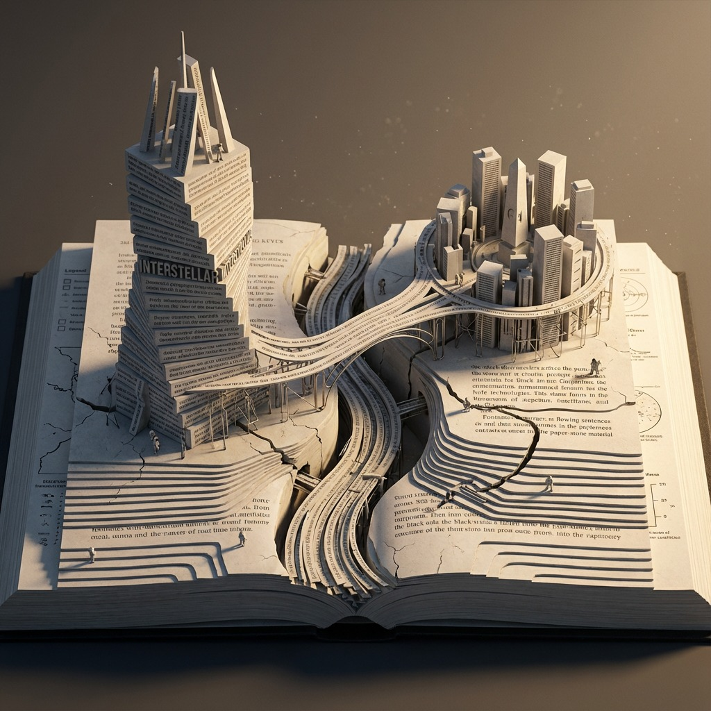

```
do this for Interstellar:  
Input A: Book title + motif.
Analyze: Translate motif into 3 architectural forms (tower, bridge, plaza) and a circulation path (river/road/rail) traced from sentence flow.
Goal: The book unfolds into a habitable micro-city engineered from typography.
Rules:
Container: Hardcover as foundation slab; page edges as stepped terraces; gutter as the central canyon.
The Transformation: Paragraph blocks become monolithic buildings; italics become spires; drop caps become obelisks; footnotes become subterranean tunnels.
The Details: Scale figures, scaffolding made from paper clips, hairline cracks in ink “stone,” dust as atmospheric perspective, map-legend marginalia.
Lighting/Atmosphere: Golden-hour raking light; long shadows emphasize typographic relief; subtle particulate air.
Output: Cinematic architectural macro, tilt-shift feel, 90mm, high displacement, Unreal/Octane, paper-stone hybrid, ultra-clean silhouettes.
```

```
为《星际穿越》做如下设计：  
输入A：书名 + 主题意象。  
分析：将主题意象转化为三种建筑形式（塔楼、桥梁、广场）以及一条由文句流动轨迹生成的流线路径（河流/道路/轨道）。  
目标：这本书展开后形成一座可居住的微型城市，其结构完全由排版文字构建而成。  
规则：  
容器：精装书壳作为基础底板；书页边缘构成阶梯式露台；书脊中缝化作中央峡谷。  
转化方式：段落块变为整体式建筑；斜体字化作尖塔；首字母大写变为方尖碑；脚注则成为地下隧道。  
细节处理：加入比例人物、回形针制成的脚手架、墨水“石材”上的发丝裂纹、尘埃营造空气透视效果，以及图例式边注。  
光影与氛围：黄金时刻的掠射光线；长投影突出文字浮雕感；空气中带有细微颗粒感。  
输出效果：电影感建筑微距画面，移轴摄影风格，90mm镜头，高置换贴图，使用Unreal或Octane渲染，呈现纸与石混合材质，轮廓极度清晰干净。
```

 [↑返回目录](#toc)

---
## <a id="prompt-2007267921425240000">3D动画女孩</a> (<a href="https://x.com/iamsofiaijaz/status/2007267921425240077" target="_blank" rel="noopener noreferrer">Aijaz</a>)


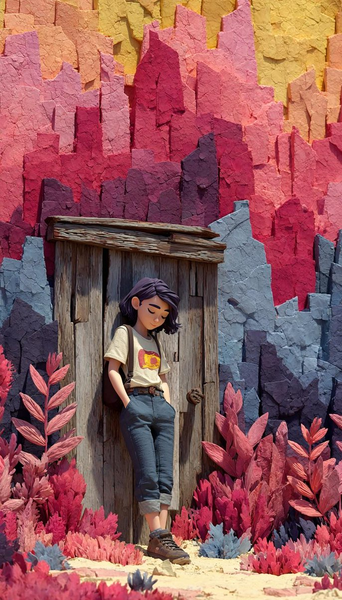

```
1. A stylized 3D animated girl standing in front of a rustic wooden door, surrounded by soft coral-pink and dusty red plants, with a layered pastel canyon wall in the background made of cracked textured stone in warm gradients of yellow, peach, pink, and muted purple.
The girl has short wavy dark hair, closed eyes, a calm peaceful expression, wearing a cream t-shirt with a small red-yellow graphic, high-waisted blue jeans rolled at the ankles, brown shoes, and a small backpack over one shoulder.
Cinematic soft lighting, warm color palette, shallow depth of field, painterly textures, cozy mood, whimsical Pixar-style 3D illustration, ultra-detailed, high resolution, soft shadows, pastel fantasy environment, peaceful atmosphere.
2.A stylized 3D animated young woman leaning against a textured abstract wall made of layered cracked paint panels in warm gradients of yellow, coral, pink, red, and muted purple.
She has short wavy dark hair slightly tousled, closed eyes with a soft peaceful smile, a small hoop earring, and relaxed body language with her arms folded. She is wearing a loose dusty-rose long sleeve shirt, high-waisted blue jeans rolled at the cuffs, and worn brown boots.
Soft cinematic lighting, warm pastel color palette, shallow depth of field, painterly textures, cozy and calm mood, whimsical Pixar-style 3D illustration, ultra detailed, high resolution, soft shadows, dreamy atmosphere.
```

```
1. 一位风格化的3D动画女孩站在一扇质朴的木门前，周围环绕着柔和的珊瑚粉与灰红色植物，背景是层层叠叠的粉彩色峡谷岩壁，由带有裂纹肌理的石头构成，呈现出黄色、桃色、粉色和柔紫色的温暖渐变。  
女孩留着短而微卷的深色头发，双眼闭合，神情宁静安详，身穿一件米白色T恤，胸前有小巧的红黄图案，搭配高腰蓝色牛仔裤（裤脚卷起），脚踩棕色鞋子，单肩背着一个小背包。  
电影感柔光，暖色调配色，浅景深，绘画般质感，温馨氛围，奇幻皮克斯风格3D插画，超精细，高分辨率，柔和阴影，粉彩幻想环境，宁静气氛。

2. 一位风格化的3D动画年轻女子倚靠在一面抽象纹理墙边，墙面由多层剥落裂纹的油漆板构成，呈现黄色、珊瑚色、粉色、红色与柔紫色的温暖渐变。  
她留着略显凌乱的短卷深色头发，闭眼带着温柔宁静的微笑，佩戴一枚小巧的圈形耳环，双臂交叉，姿态放松。身穿宽松的灰玫瑰色长袖衬衫，搭配高腰蓝色牛仔裤（裤脚卷起）和一双磨损的棕色靴子。  
柔光电影照明，暖粉彩色调，浅景深，绘画般质感，温馨平静氛围，奇幻皮克斯风格3D插画，超精细，高分辨率，柔和阴影，梦幻氛围。
```

 [↑返回目录](#toc)

---
## <a id="prompt-2007131884061397000">伊斯坦布尔的微观世界缩影于一笔之中</a> (<a href="https://x.com/kaanakz/status/2007131884061397089" target="_blank" rel="noopener noreferrer">Kaan</a>)

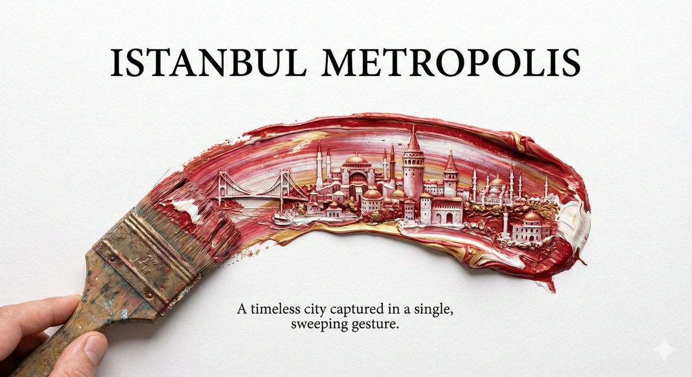

```
A brush, captured mid-motion, paints a refined curve from the lower left to the upper right.
Within the brushstroke lives a miniature world of ISTANBUL, rendered as a highly detailed 3D bas-relief city sculpted from layered paint.

Inside the stroke:
Iconic landmarks, architecture, and spatial rhythms of ISTANBUL, arranged as a cohesive miniature with depth and subtle relief.

Style:
Impasto oil painting fused with academic poster design. Thick and thin paint layers create depth, with 3D forms emerging from the stroke.
Color palette follows the official flag colors of the country associated with ISTANBUL, blended naturally.

View & background:
Minimalist top-down composition, pure white negative space, fine textured paper.

Typography:
Title: “ISTANBUL METROPOLIS”
Poetic subtitle and supporting serif copy, cleanly spaced.

Composition rules:
Brush tip ends cleanly at the upper right. All detail remains strictly inside the stroke.
Hyper-realistic, HDR, poster-grade, 8K look.
```

```
一支画笔在运动中被定格，从左下方向右上方描绘出一道精致的弧线。  
在这道笔触之中，蕴藏着一座微缩的伊斯坦布尔世界——以层层堆叠的颜料雕刻而成的高细节3D浅浮雕城市。

笔触内部：
伊斯坦布尔的标志性地标、建筑与空间韵律，被巧妙组合成一个具有深度与微妙浮雕感的和谐微型景观。

风格：
厚涂油画技法融合学术海报设计。通过厚薄不一的颜料层次营造深度，使3D形态从笔触中自然浮现。  
色彩方案遵循与伊斯坦布尔所属国家国旗一致的官方配色，并自然融合。

视角与背景：
极简俯视构图，纯白负空间，搭配细腻纹理纸张。

文字排版：
主标题：“伊斯坦布尔大都会”  
配以诗意副标题及清晰排布的衬线字体说明文字。

构图规则：
笔尖在右上角干净利落地收尾，所有细节严格限定于笔触之内。  
呈现超写实、HDR、海报级、8K画质效果。
```

 [↑返回目录](#toc)

---
## <a id="prompt-2006771650805870800">微型苔藓生态瓶内景</a> (<a href="https://x.com/AllaAisling/status/2006771650805870768" target="_blank" rel="noopener noreferrer">Alexandra Aisling</a>)

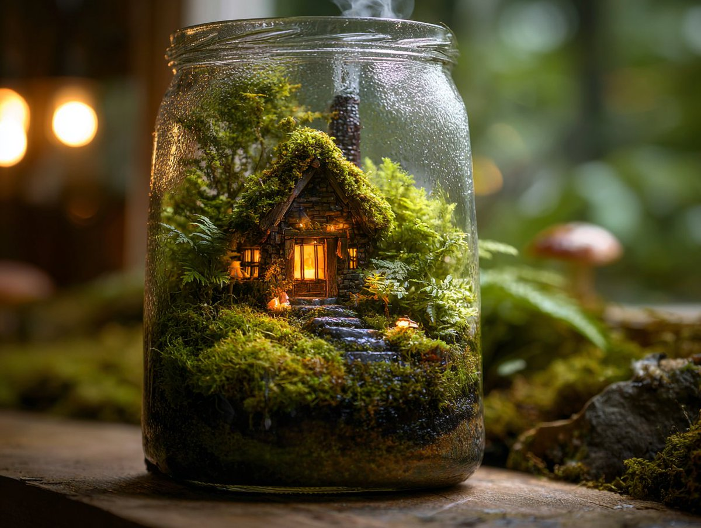

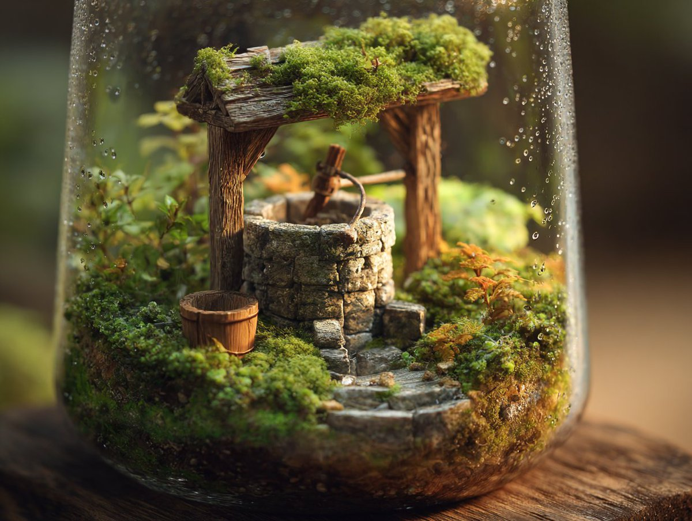

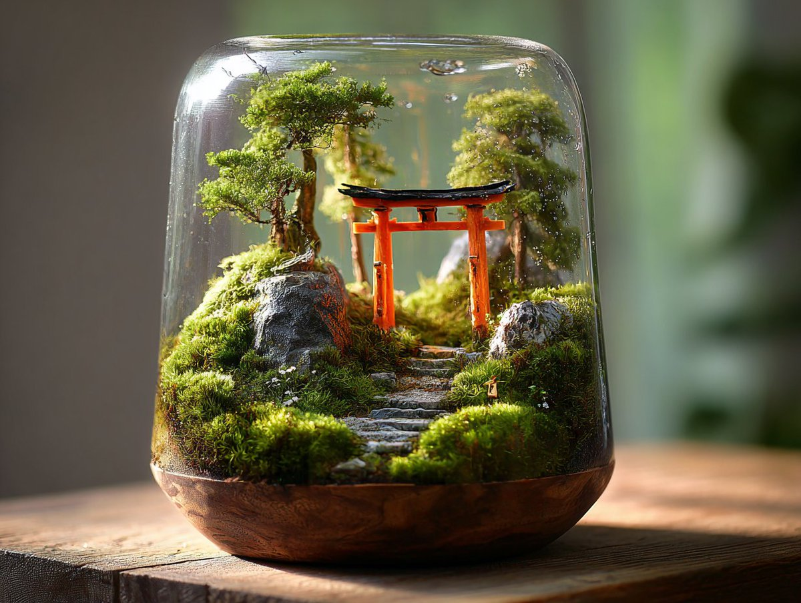

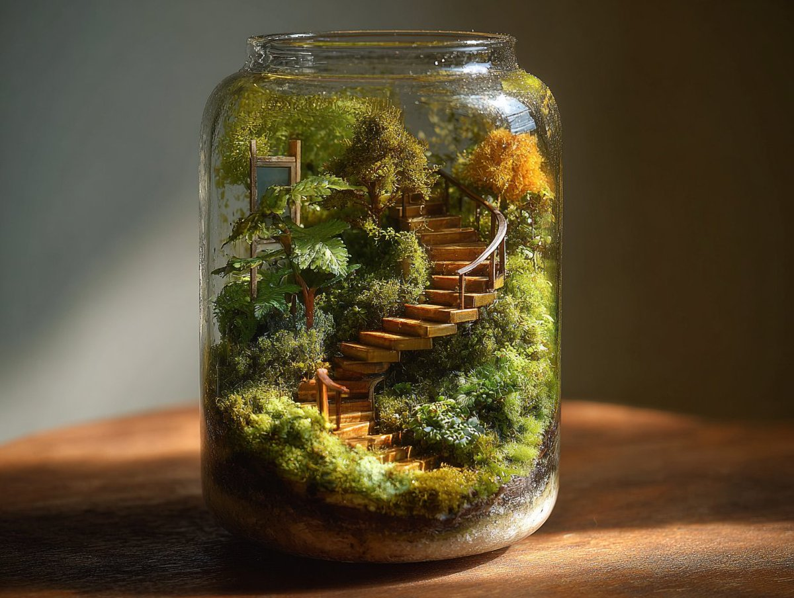

```
A moss terrarium containing a miniature witch's cottage with smoke curling from the chimney, living green textures under glass, morning dew droplets, soft diffused daylight, fairy-tale scale with rich forest greens and warm amber wood tones.
```

```
A moss terrarium containing a miniature crumbling stone well with a tiny wooden bucket, living green textures under glass, morning dew droplets, soft diffused daylight, fairy-tale scale with rich forest greens and warm amber wood tones.
```

```
A moss terrarium containing a miniature Japanese torii gate on a foggy hillside, living green textures under glass, morning dew droplets, soft diffused daylight, fairy-tale scale with rich forest greens and warm amber wood tones.
```

```
A moss terrarium containing a miniature spiral staircase descending into the earth, living green textures under glass, morning dew droplets, soft diffused daylight, fairy-tale scale with rich forest greens and warm amber wood tones.
```

 [↑返回目录](#toc)

---
## <a id="prompt-2006940436401893600">劳力士腕表破浪而出的奢华广告</a> (<a href="https://x.com/aleenaamiir/status/2006940436401893752" target="_blank" rel="noopener noreferrer">Aleena Amir</a>)

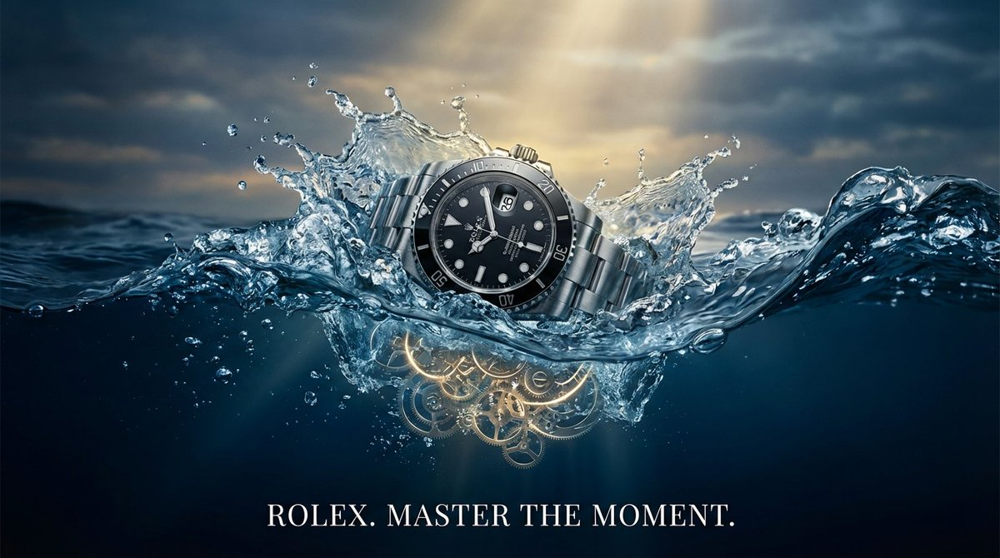

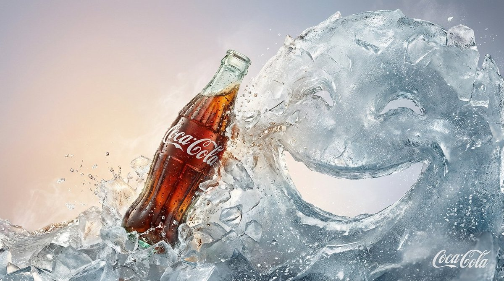

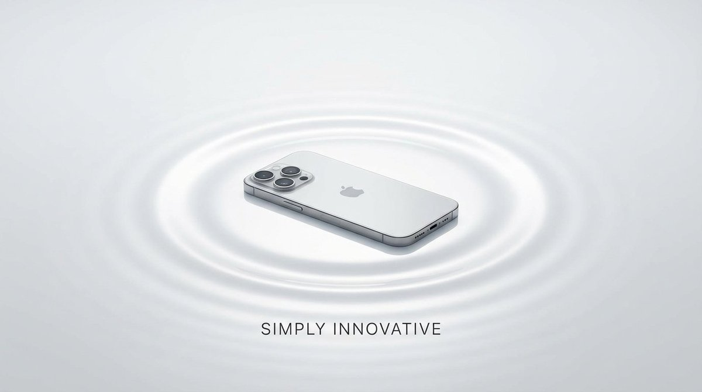

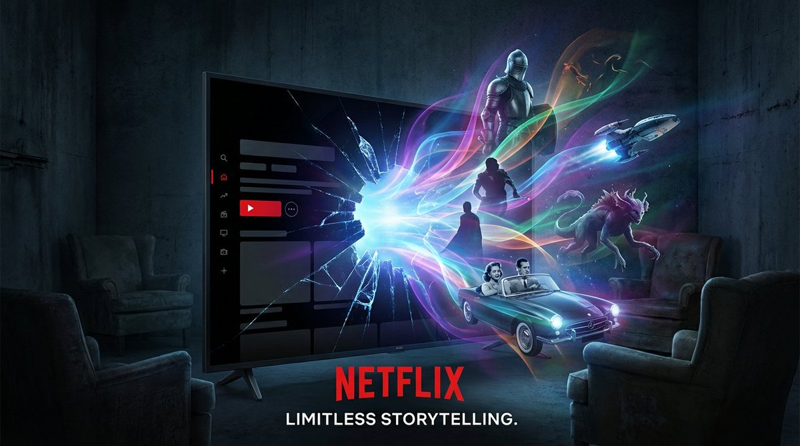

```
A striking, conceptual advertisement for Rolex, featuring a luxury wristwatch as the central hero element. The scene uses a bold visual metaphor to represent precision and reliability. The Rolex watch is placed in an unexpected yet meaningful scenario, emerging from a slow-motion ocean wave frozen in time, symbolizing mastery over extreme conditions. Scale and texture amplify impact. The background is cinematic, ensuring maximum focus on the subject. Lighting is dramatic and high-contrast, enhancing metallic detail and craftsmanship. The overall style feels cinematic photorealistic advertising, premium, modern, and campaign-ready. The mood is powerful and aspirational, designed to feel instantly iconic and memorable, like a global billboard or award-winning print ad.
```

```
一则引人注目的概念型劳力士广告，以奢华腕表为核心主角。画面运用大胆的视觉隐喻展现精准与可靠：劳力士腕表从一记慢动作海浪中破浪而出，浪花在时间中凝固，象征其在极端环境下的卓越掌控力。通过比例与质感强化视觉冲击力。背景具有电影感，确保焦点集中于腕表本身。灯光戏剧化且高对比度，凸显金属细节与精湛工艺。整体风格为电影级写实广告，高端、现代，可直接用于品牌宣传。氛围强大而富有抱负，旨在营造即刻成为全球广告牌或获奖平面广告般的标志性与记忆点。
```

 [↑返回目录](#toc)

---
## <a id="prompt-2007122463151534300">怀旧游戏卡带内的微缩世界</a> (<a href="https://x.com/Gdgtify/status/2007122463151534322" target="_blank" rel="noopener noreferrer">Gadgetify</a>)

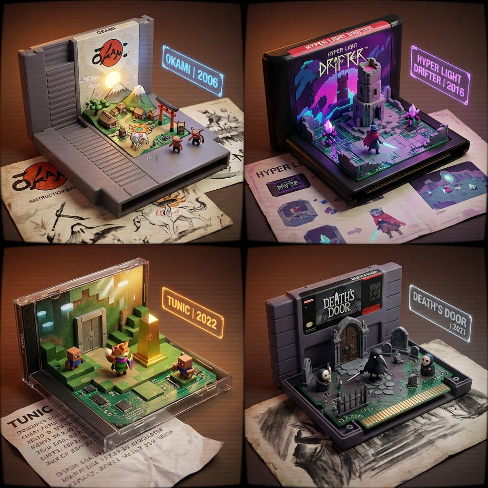

```
Input: Legend of Zelda:   Role:  Gaming Historian & Memory Card Sculptor

 Input:  [Video Game, e.g., The Legend of Zelda]

 Phase 1: Game DNA Analysis 
1. Identify core gameplay loop (exploration-puzzle-boss / die-learn-overcome)
2. Select 4 hidden gem games (indie or cult classics)  and their Release Years .
3. Extract 3 iconic in-game items and the game's signature color palette

 Phase 2: Visual Execution 
 Goal:  2x2 Grid of "Opened Game Cartridges as World Containers"

 Rules per Panel: 
-  The Shell:  A cracked-open retro game cartridge (NES, Genesis, PS1 case)  with the Game's Title clearly printed on the top spine label. 
-  The Circuitboard:  The internal PCB becomes a miniature topographical game map
-  The World:  Key game locations built in 3D on the circuit board (castle, dungeon, boss arena)
-  The Hero:  Tiny pixel-art-style figurine of the protagonist mid-action
-  The Enemies:  2-3 micro-enemy models positioned as threats
-  The HUD:   A floating holographic UI element displays the text: "[Game Name] | [Year]" in a retro font. 
-  The Manual:  Weathered instruction booklet page visible underneath showing retro game art
-  The Atmosphere:  CRT scan-line effect overlaid, nostalgic warm glow

 Output:  2x2 Grid, Nostalgic Product Photography, soft focus on edges
```

```
《塞尔达传说》：角色：游戏历史学家与记忆卡雕塑师

输入：[电子游戏，例如《塞尔达传说》]

第一阶段：游戏DNA分析  
1. 识别核心玩法循环（探索-解谜-打Boss / 死亡-学习-克服）  
2. 选取4款冷门佳作（独立游戏或邪典经典）及其发行年份  
3. 提取3个标志性游戏内物品及该游戏的代表性配色方案  

第二阶段：视觉呈现  
目标：2×2网格布局，展现“打开的游戏卡带作为世界容器”的概念  

每格画面规则：  
- 外壳：裂开的复古游戏卡带（NES、Genesis或PS1外壳），顶部脊标清晰印有游戏标题  
- 电路板：内部印刷电路板化作微型地形游戏地图  
- 世界：在电路板上以3D形式构建关键游戏场景（城堡、地牢、Boss战场）  
- 英雄：微缩像素风格主角小人，呈动态姿势  
- 敌人：2至3个微型敌人模型，布置为威胁姿态  
- 界面：悬浮全息UI元素，以复古字体显示“[游戏名称] | [年份]”  
- 说明书：下方可见泛黄磨损的游戏说明书页面，展示复古游戏插画  
- 氛围：叠加CRT扫描线效果，整体散发怀旧暖光  

输出：2×2网格，怀旧产品摄影风格，边缘柔焦
```

 [↑返回目录](#toc)

---
## <a id="prompt-2007226649600029200">化石鹦鹉螺与墨云水中缠绕</a> (<a href="https://x.com/AllaAisling/status/2007226649600029137" target="_blank" rel="noopener noreferrer">Alexandra Aisling</a>)

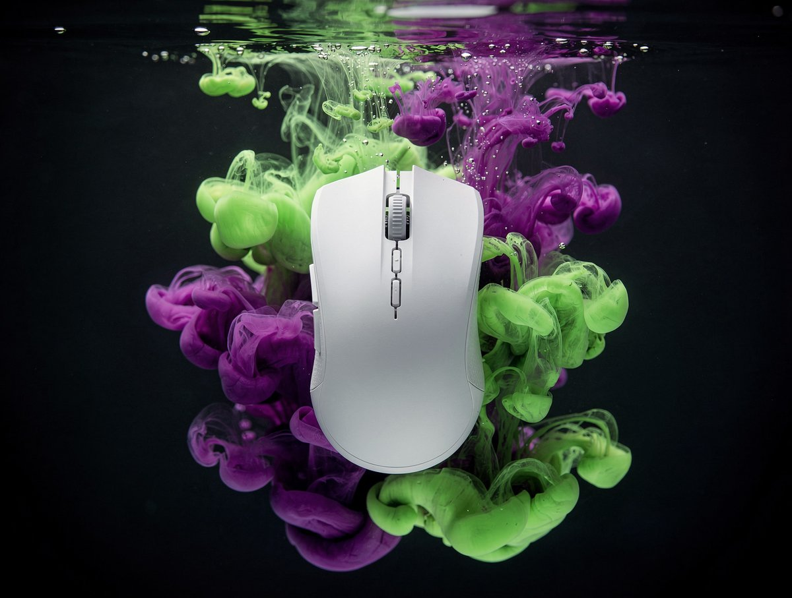


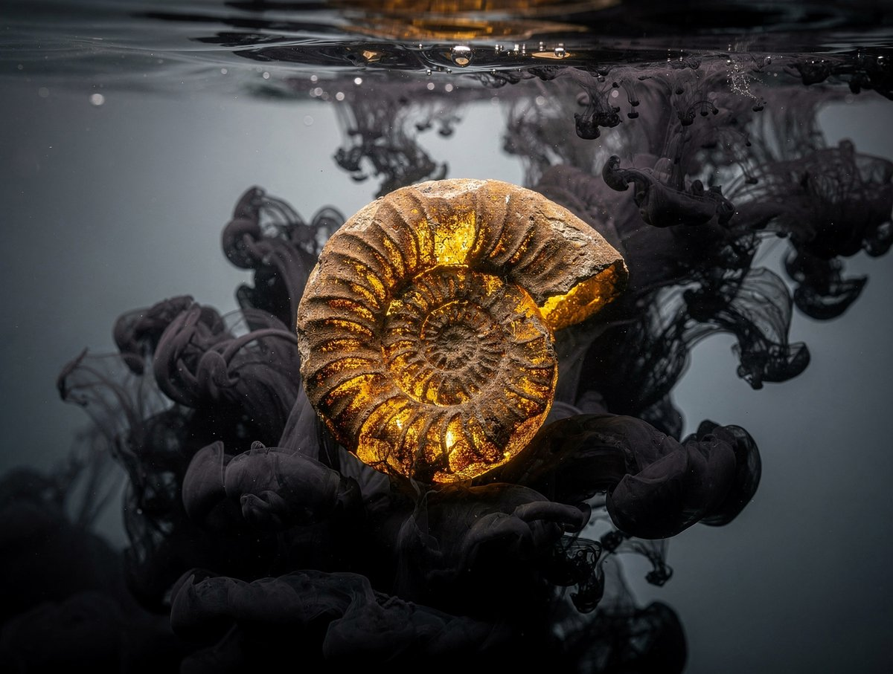

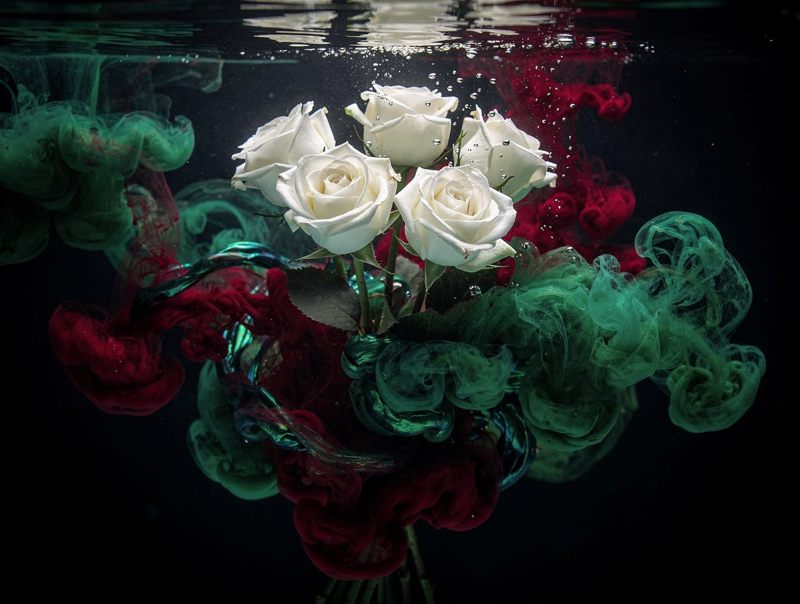

```
Worn leather boxing glove with ink clouds billowing around it in water, organic fluid shapes expanding, frozen blue dissolving into blush pink tendrils swirling, underwater studio shot, abstract expressionism meets product, hypnotic motion frozen.
```

```
Fossilized ammonite with ink clouds billowing around it in water, organic fluid shapes expanding, prehistoric amber and primordial black tendrils swirling, underwater studio shot, abstract expressionism meets product, hypnotic motion frozen.
```

```
White roses bouquet with ink clouds billowing around it in water, organic fluid shapes expanding, iridescent emerald and throat-ruby tendrils swirling, underwater studio shot, abstract expressionism meets product, hypnotic motion frozen.
```

 [↑返回目录](#toc)

---
## <a id="prompt-2007134245328957400">I was playing with a prompt and ended up here, and I wanted to share it with you.</a> (<a href="https://x.com/maxescu/status/2007134245328957539" target="_blank" rel="noopener noreferrer">Alex Patrascu</a>)

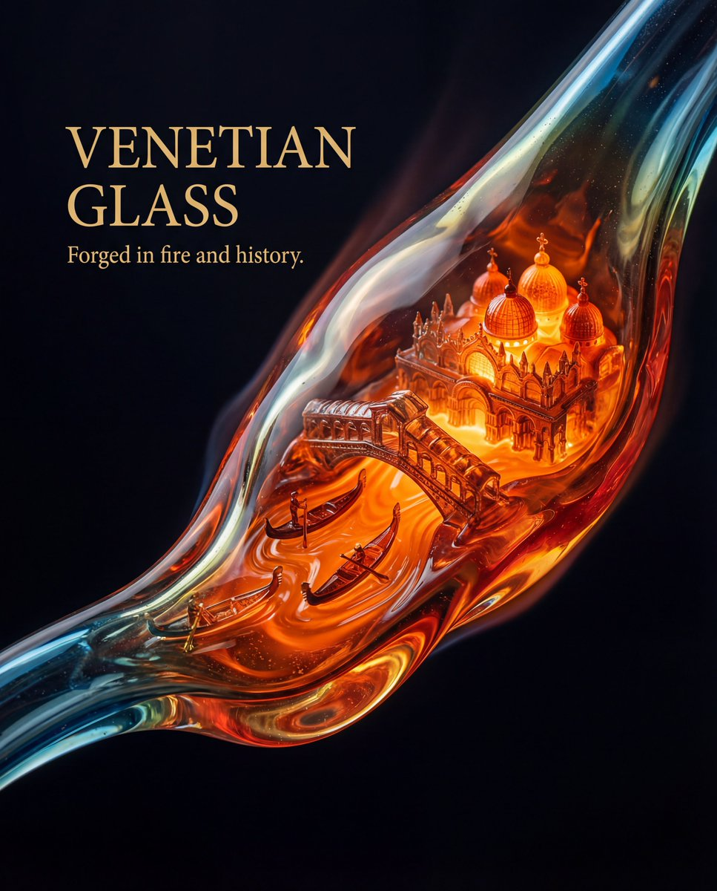

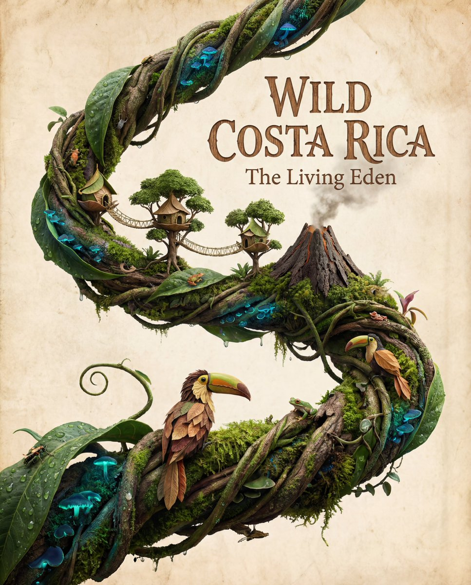

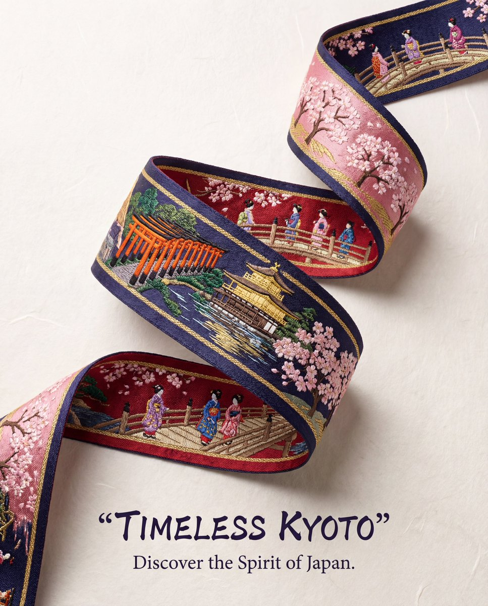

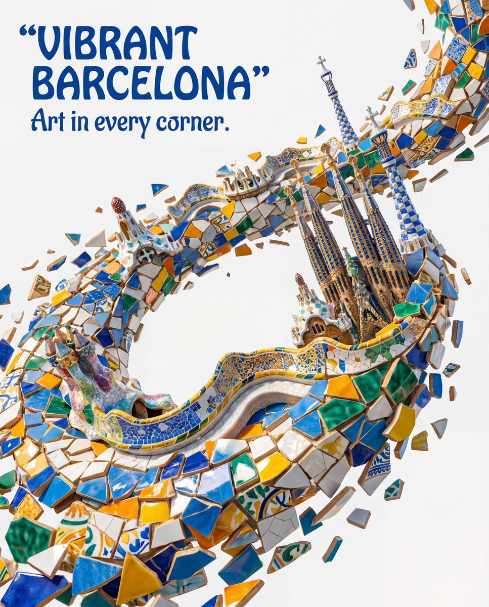

```
A [MACRO MEDIUM - e.g., stream of liquid gold, plume of smoke, silk ribbon], captured mid-motion, forming a dynamic [SHAPE - e.g., arc, spiral, wave] from the lower left to the upper right. Suspended within the [TEXTURE/MATERIAL] lives a miniature world of [MICRO SUBJECT - e.g., a city, a historical event, an ecosystem], rendered as highly detailed structures sculpted entirely from the [MACRO MEDIUM] itself.

Inside the [MEDIUM]: [DETAIL 1], [DETAIL 2], and [DETAIL 3]. The forms appear [ADJECTIVE - e.g., woven, liquid, crystalline, glowing], strictly defined by the physics of the [MACRO MEDIUM].

Style: [PHOTOGRAPHY STYLE - e.g., Macro product photography] fused with [ARTISTIC GENRE - e.g., Ukiyo-e, Cyberpunk, Baroque painting]. High emphasis on texture, lighting, and material contrast. Color palette: [COLORS] derived naturally from the material.

View & background:Plain, matte [BACKGROUND COLOR - usually Black or White] to create maximum contrast. Minimalist composition.

Typography:Title: “[TITLE]” Subtitle: “[SUBTITLE]” Font style: [FONT DESCRIPTION] placed cleanly in the negative space.

Composition rules:The [MEDIUM] creates a defined boundary. All details remain strictly inside the stroke/flow; nothing exists in the negative space. 8K, hyper-realistic texture, [LIGHTING STYLE].
```

```
一道丝绸缎带在运动中被捕捉，从画面左下方向右上方动态地卷曲成一道螺旋。在这条缎带内部，悬浮着一个微缩世界——一座完全由丝绸材质本身精雕细琢而成的繁华都市。

缎带内部包含：摩天大楼群、空中廊桥网络，以及穿行其间的微型飞艇。这些形态呈现出液态般的流动感，严格遵循丝绸材质本身的物理特性。

风格：微距产品摄影融合赛博朋克艺术流派，极度强调纹理、光影与材质对比。色彩方案自然源自丝绸本身的虹彩光泽——以珍珠白、电光青与柔金为主调。

视角与背景：纯色哑光黑色背景，营造极致对比；构图极简。

文字排版：标题：“织梦之城” 副标题：“在流动中构筑未来” 字体风格：纤细无衬线字体，带有轻微霓虹描边，干净置于画面留白处。

构图规则：丝绸缎带形成清晰边界，所有细节严格限定于缎带内部流动轨迹之中，负空间内不出现任何元素。8K分辨率，超写实纹理，高调硬光照明。
```

 [↑返回目录](#toc)

---


[上一页](./6.md) | 当前 7/8 页 | [下一页](./8.md) | [查看全部目录](../prompts.md)