# gemini.json 

gemini.json文件存放gemini相关的提示词，当前已收录：1056个 

 投稿方式：[飞书投稿](https://tcn1uh5rxo87.feishu.cn/share/base/form/shrcne5gDolOMDd0oJsj2XfvxQc) or [issues](https://github.com/junxiaopang/gridsplitter/issues/new)

[上一页](./6.md) | 当前 7/11 页 | [下一页](./8.md) | [查看全部目录](../prompts.md)

🚀 **在线预览**: [https://prompts.kkkm.cn](https://prompts.kkkm.cn)

## <a id="toc">目录</a>

- [马年祝福封面](#prompt-2005980269447373241)
- [复刻任何图片的风格](#prompt-2006739034828316825)
- [一键穿搭挑战](#prompt-2006948793586176375)
- [WhatsApp 人物对话](#prompt-2005681873612165251)
- [2026年广告工作室活力海报](#prompt-2005984084141465609)
- [四角拼图完成2026祝福](#prompt-2005822648027091031)
- [微信泡泡人物对话](#prompt-2005999391367196797)
- [元旦特辑-复古旗袍名媛风](#prompt-2005097871977447736)
- [新年城市天际线庆典](#prompt-2005286056850251802)
- [产品说明书](#prompt-2005842541141451133)
- [超写实水下港海豹摄影](#prompt-2005947184290951450)
- [傍晚阳光下的现代极简阁楼](#prompt-2005487690838655382)
- [虚拟的卡通女孩](#prompt-2002847525536219187)
- [温馨现代客厅中的女性放松时光](#prompt-2005173589809537125)
- [唐代宫廷乐团树上表演](#prompt-2005487775597088895)
- [碰杯庆祝四角连线派对](#prompt-2005981275052728416)
- [霍格沃茨等火车的女孩](#prompt-2003768838111059997)
- [- Nano Banana Pro at @BasedLabsAI](#prompt-2005698218043003100)
- [超现实分段火山玄武岩构造](#prompt-2005628752802517500)
- [自定义形状的字体插画](#prompt-2005620980891480600)
- [童年偶像走进现实](#prompt-2005877044584849700)
- [极简风格品牌首字母单体徽标设计](#prompt-2005670356745322800)
- [暗调奢华的黑巧克力飞溅](#prompt-2005685514154958800)
- [睡前再来一个有趣的结合版，睡觉！](#prompt-2006020799367442700)
- [音乐史的可视化：大提琴与技术绘图](#prompt-2007529647387353000)
- [裂隙中的微缩景观](#prompt-2007495673784979700)
- [地质断层中的精密内部世界](#prompt-2007661789023244500)
- [奢华木质香调香水AUREN](#prompt-2007497261492920800)
- [极简黑白矢量肖像插画](#prompt-2007535691157143600)
- [超写实电影感地下赛车海报](#prompt-2007722721967321000)
- [新中式禅意品牌VI生成系统](#prompt-2007616917327204600)
- [超现实主义极简风格的高端印刷广告](#prompt-2007544730167501000)
- [《星际穿越》书籍建筑微观世界](#prompt-2007089501416427800)
- [3D动画女孩](#prompt-2007267921425240000)
- [伊斯坦布尔的微观世界缩影于一笔之中](#prompt-2007131884061397000)
- [微型苔藓生态瓶内景](#prompt-2006771650805870800)
- [劳力士腕表破浪而出的奢华广告](#prompt-2006940436401893600)
- [怀旧游戏卡带内的微缩世界](#prompt-2007122463151534300)
- [I was playing with a prompt and ended up here, and I wanted to share it with you.](#prompt-2007134245328957400)
- [3D卡通生物发光可爱动物](#prompt-2007023177915126000)
- [笔触中的微缩城市世界](#prompt-2006821478378123300)
- [电影级人物海报](#prompt-2007148490120380400)
- [冰镇可乐的强烈飞溅瞬间](#prompt-2007266399497138700)
- [超精细3D渲染[ICON]棋子雕像](#prompt-2007161169468108800)
- [缎带中的城市浮雕](#prompt-2007087774248439800)
- [品牌产品盒堆砌的圣诞树时尚插图](#prompt-2006795197087207700)
- [想起了动物森友会的博物馆系列！](#prompt-2007275324967698700)
- [超写实主角特写炸鸡腿系列](#prompt-2007113351197770200)
- [Restoration Chronicle, in Firefly](#prompt-2006748750329663700)
- [动态工坊：四位设计师的微缩展示](#prompt-2007160966673527000)
- [食物特写镜头](#prompt-2007831277269840400)
- [瞳色妝容（美瞳）](#prompt-2008186029820559400)
- [奢华香水：花香调的精致呈现](#prompt-2008098771381690600)
- [奢华[产品]漂浮广告](#prompt-2008016478315192800)
- [Apple vision ProAR世界](#prompt-2008008497473147100)
- [手持产品特写](#prompt-2008071853928226800)
- [破损的牧羊人壁画](#prompt-2007881212132803000)
- [微型建筑工人组装产品](#prompt-2008017541340565500)
- [萨克斯风工匠传承板：塞尔玛1954](#prompt-2007835913842495500)
- [极简主义3D像素化食物摄影](#prompt-2008127774750548200)
- [奶凶的女生](#prompt-2008112011373068488)
- [白色降噪耳机置于翠绿苔藓之上](#prompt-2008268262623122000)
- [复古美式风格Figma品牌矢量字母设计](#prompt-2008176822551216400)
- [五彩橡皮泥打造的微型地标世界](#prompt-2008488331903139800)
- [超现实风格品牌广告海报](#prompt-2008248159815037000)
- [果树种植科普展板](#prompt-2008174532285350400)
- [Inkstorm Noir](#prompt-2008431391235862800)
- [梅西的暗影肖像](#prompt-2008209545412419800)
- [电影剧照：低调高对比度的冷调场景](#prompt-2008319307667645000)
- [超写实的影棚摄影作品](#prompt-2008434033701879800)
- [动物萌化系列](#prompt-2008903682612760800)
- [高端身体喷雾AUREN的超写实产品摄影](#prompt-2008600010943025200)
- [文艺复兴时期的美人鱼解剖研究](#prompt-2008856432687665200)
- [立体雕塑感的国家名称拼写，内填传统美食](#prompt-2008826083282686200)
- [高端杂志风格的3D写实产品摄影](#prompt-2008559850968473600)
- [超高清数字插图：漫画与卡通风格](#prompt-2008570138371478000)
- [AI 妆容复刻教学指南](#prompt-2008566010073546800)
- [毛绒波普风格[品牌名称]饮料罐](#prompt-2008753339966878000)
- [超精细折纸风格人物雕塑](#prompt-2008853018792628700)
- [乐高微缩地标景观与国旗](#prompt-2008852020002979800)
- [深夜厨房门外抽烟的纹身厨师](#prompt-2008606491096568300)
- [毛毡制成的友好卡通全身玩具](#prompt-2008604547166728400)

## <a id="prompt-2005980269447373241">马年祝福封面</a> (<a href="https://x.com/LZhou15365/status/2005980269447373241" target="_blank" rel="noopener noreferrer">小洲洲的AI日常</a>)


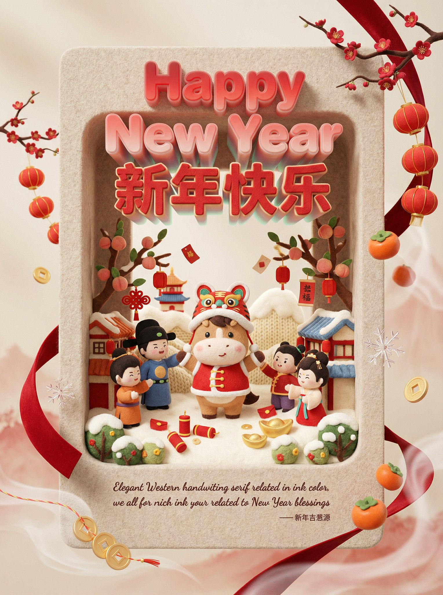

```
说到马第一反应是西游记的白龙马
那就请来唐僧师徒和福星、财神爷给大家拜年吧
大佬这个提示词我好喜欢！太可爱了！
这很适合用来做红包封面啊！！

提示词如下：
{
    "applicable_models": [
        "Seedream",
        "Nano Banana Pro"
    ],
    "subject": {
        "IP_Name": "西游记",
        "description": "基于《西游记》的视觉冲击力强的、杰作级3D新年贺卡海报。垂直构图，中心有深邃的窗状凹槽。",
        "material_style": "毛毡与粗针织毛线质感，真实细腻，盲盒玩具质感。",
        "central_character": {
            "identity": "可爱的Q版毛毡白龙马（白龙马，马形态，代表马年）",
            "expression": "憨态可掬、喜庆温柔",
            "clothing": "红色喜庆马甲镶金边，传统虎头帽或红色喜庆头饰",
            "action": "站在中心作为节日使者，背上驮着唐僧或带领众人前行"
        },
        "secondary_characters": {
            "identity": "《西游记》经典角色（唐僧、孙悟空、猪八戒、沙悟净）以及财神爷、福禄寿三星神仙，皆为Q版毛毡风格",
            "clothing": "传统喜庆唐装或汉服，以红金色调为主",
            "action": "在场景中欢乐互动：孙悟空顽皮地拿着鞭炮，猪八戒笑着抱元宝，沙悟净挥手，唐僧合掌祝福，财神爷、福禄寿三星笑眯眯地比出吉祥手势，增添生动故事感"
        },
        "scene_elements": {
            "architecture": "《西游记》中标志性的古寺、宝塔或山门，以Q版毛毡形式呈现，层层排列富有纵深",
            "ground": "厚实奶油色针织雪地",
            "vegetation": "桃树或金桔树，挂满红灯笼、中国结以及写有“福”或“新年快乐”的祝福牌",
            "props": "散落毛毡鞭炮、金元宝、雪覆盖的灌木、红包、祥云"
        }
    },
    "accessories": {
        "title_design": {
            "structure": "独立3D立体字母悬浮于空中（无背景板/卡片）",
            "main_text": {
                "content": "Happy New Year",
                "font_style": "3D流体艺术字体，厚实玻璃体量感"
            },
            "sub_text": {
                "content": "新年快乐",
                "font_style": "粗中国书法，3D挤出笔画"
            },
            "material_properties": {
                "type": "直接应用于文字体量的哑光磨砂玻璃",
                "color": "深红到浅红渐变",
                "surface": "柔和哑光表面，半透明",
                "optical_effects": "梦幻彩色焦散光影投射到下方毛毡场景"
            }
        },
        "bottom_layout": {
            "content": "随机经典新年祝福语，例如“恭喜发财”或“福如东海，寿比南山”",
            "font_style": "大号优雅西式手写衬线字体，浓墨色",
            "source_note": "小号中文字体注明出处（小洲洲的AI日常）"
        }
    },
    "photography": {
        "renderer": "C4D, Octane Render",
        "resolution": "8K",
        "camera_style": "微距摄影视角",
        "shot_type": "垂直海报，微缩景观特写",
        "depth_of_field": "浅景深（背景虚化）",
        "lighting": "柔和均匀，呼吸灯效果，氛围纵深",
        "texture_quality": "杰作级别，细节丰富，毛毡与磨砂玻璃混合质感"
    },
    "background": {
        "setting": "东方水墨虚无环境，流动光雾",
        "colors": "优雅淡香槟金或高级柔雾红",
        "external_decor": [
            "空中舞动的红丝绒绸带",
            "流动金线",
            "盛开的红梅枝",
            "成串的喜庆红灯笼",
            "饱满的柿子或糖葫芦",
            "晶莹几何雪花",
            "发光的金铜钱串"
        ],
        "atmosphere": "爆棚的喜庆氛围，动态构图",
        "positioning": "贺卡仿佛悬浮于云端，底部带有柔和阴影"
    },
    "the_vibe": {
        "mood": "喜庆、东方、温暖、精致、欢乐",
        "culture": "中国新年，西游记主题",
        "aesthetic": "高端商业设计，可爱与优雅及神话魅力相结合"
    },
    "constraints": {
        "must_keep": [
            "毛毡质感",
            "中国新年元素",
            "白龙马代表马年",
            "立体玻璃文字（无招牌）",
            "书法文字",
            "水墨背景",
            "Q版西游记角色及福禄寿"
        ],
        "avoid": [
            "圣诞老人",
            "圣诞树",
            "西方圣诞装饰",
            "真实摄影风格",
            "扁平2D插画",
            "文字后方矩形玻璃板",
            "招牌",
            "文字写在卡片上"
        ]
    },
    "negative_prompt": [
        "圣诞老人",
        "圣诞树",
        "矩形背景板",
        "玻璃招牌",
        "文字框",
        "手持标牌",
        "照片级真人",
        "低分辨率",
        "模糊",
        "扁平色彩",
        "黑暗",
        "恐怖",
        "文字扭曲"
    ]
}
```

 [↑返回目录](#toc)

---
## <a id="prompt-2006739034828316825">复刻任何图片的风格</a> (<a href="https://x.com/msjiaozhu/status/2006739034828316825" target="_blank" rel="noopener noreferrer">MapleShaw</a>)


```
大家千万不要浪费 Gemini 3.0 Pro 的多模态能力啊，分分钟给你复刻任何图片的风格

只需三步
上传图片到 Gemini 3.0  Pro 中
输入提示词：“帮我把图片的整个视觉效果提取为 JSON 格式的 Prompt 包括但不限于颜色、字体、构图、效果、镜头……”
使用输出的 Prompt 在 Nano Banana Pro 生图

步骤虽然简单，但对大多数人来说都很有效。如果遇到效果不好，多磨几轮。

像下面这张很火的九宫格海马体精致写真，就是我看了小红书的一个美女网红的照片后有了想法，跟 Gemini 磨了四轮出来的效果
```

 [↑返回目录](#toc)

---
## <a id="prompt-2006948793586176375">一键穿搭挑战</a> (<a href="https://x.com/shit_yang/status/2006948793586176375" target="_blank" rel="noopener noreferrer">Jerlin</a>)

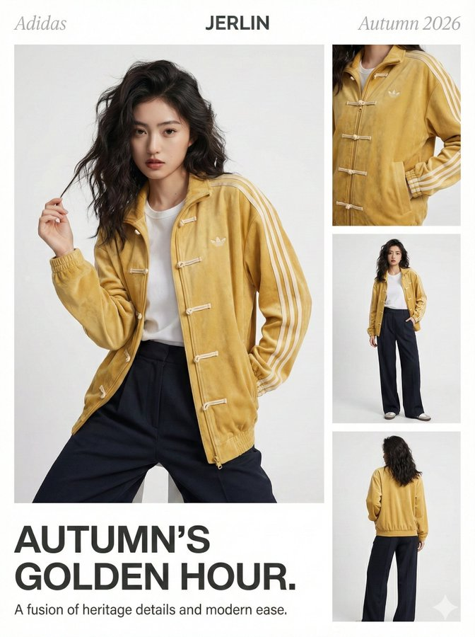

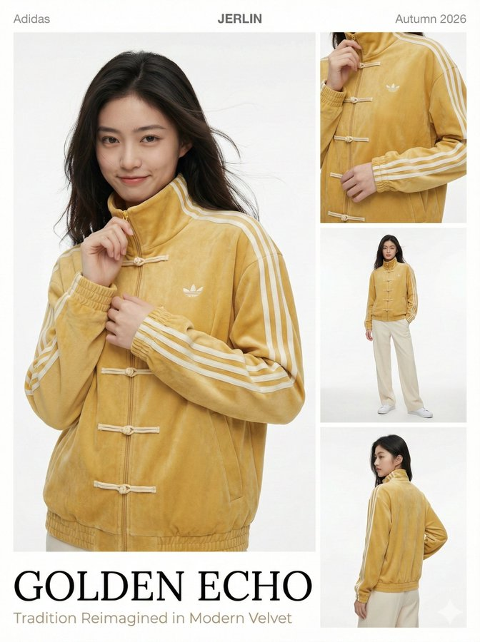

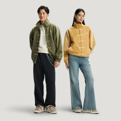

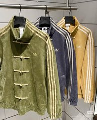

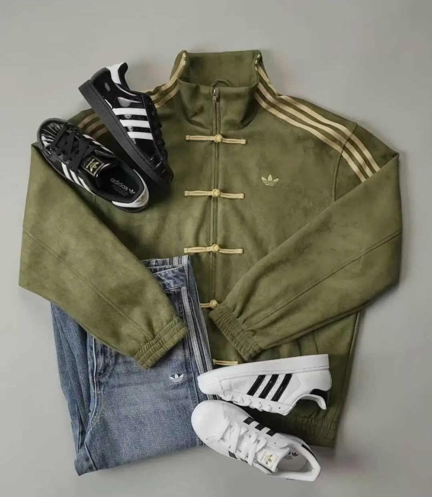

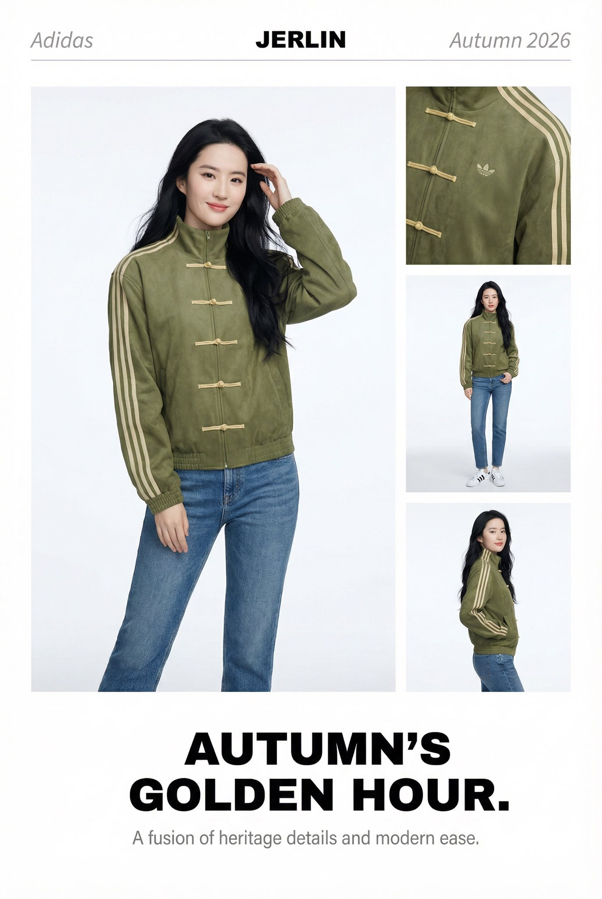

```
Fashion catalog layout design in magazine style. Clean white background with professional typography.

Top header: "Adidas" on left (light gray italic), "JERLIN" center (bold black), "Autumn 2026" on right (light gray italic)

Main layout composition:
Left side (large): [REFERENCE_PERSON_DESCRIPTION], wearing [JACKET_COLOR] track jacket with [JACKET_DESIGN] and triple white stripes on sleeves, white t-shirt underneath, black pants, casual confident pose with [GENDER_PRONOUN] hand touching hair, three-quarter body shot, clean studio lighting.

Right side (three smaller images stacked vertically):
- Top image: Close-up detail of jacket chest and sleeve area showing [JACKET_DESIGN] and triple stripes.
- Middle image: Full body shot, standing straight, showing complete outfit from head to toe.
- Bottom image: Back view showing the back [JACKET_DESIGN] design of the jacket.

Bottom text area:
Large bold headline: "AUTUMN'S GOLDEN HOUR." (black, sans-serif font)
Subtitle below: "A fusion of heritage details and modern ease." (smaller, gray text)

Professional fashion photography style, minimalist composition, soft even lighting, editorial quality, clean aesthetic, proper spacing and margins. IMPORTANT: Maintain exact facial features, hairstyle, and glasses from reference photo.
```

```
杂志风格的时尚目录布局设计。干净的白色背景，专业的排版。

顶部标题：“Adidas”在左（浅灰色斜体），“JERLIN”居中（粗体黑色），“Autumn 2026”在右（浅灰色斜体）

主要布局构成：
左侧（大图）：【参考人物描述】，穿着【夹克颜色】的运动夹克，配有【夹克设计】和袖子上的三条白色条纹，内搭白色T恤，黑色裤子，轻松自信的姿态，【性别代词】的手触摸着头发，三分之四身长的镜头，干净的工作室照明。

右侧（三个较小的图像垂直排列）：
- 顶部图片：夹克胸部和袖子区域的特写细节，显示【夹克设计】和三条纹。
- 中间图片：全身照，站得笔直，从头到脚展示完整的服装。
- 底部图片：背部视角，展示夹克背面的【夹克设计】图案。

底部文字区域：
大型粗体标题：“AUTUMN'S GOLDEN HOUR.”（黑色，无衬线字体）
副标题：“A fusion of heritage details and modern ease.”（较小的灰色文字）

专业的时尚摄影风格，简约的构图，柔和均匀的照明，编辑级别的质量，干净的美学，适当的间距和边距。重要提示：保持与参考照片完全相同的面部特征、发型和眼镜。
```

 [↑返回目录](#toc)

---
## <a id="prompt-2005681873612165251">WhatsApp 人物对话</a> (<a href="https://x.com/Arminn_Ai/status/2005681873612165251" target="_blank" rel="noopener noreferrer">ΛRMIN | AI</a>)

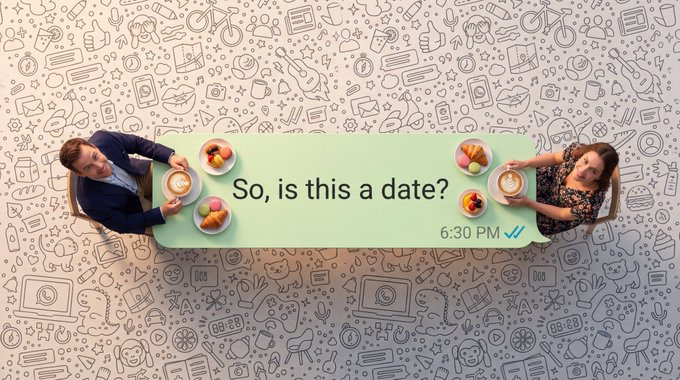


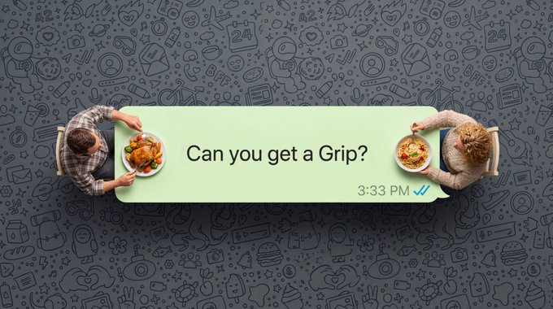


```
Hyper-realistic top-down macro photography. A long, light green WhatsApp speech bubble acting as a dining table. Two real living humans (shrunk to tiny scale) are sitting at opposite ends. They are NOT plastic figures; they have visible skin texture, natural hair, and realistic clothing folds. They are eating real food that looks freshly cooked, not play-doh. The text inside reads: "INSERT TEXT". Bottom right has a timestamp '3:33 PM' and blue ticks. The background is completely filled with a high-density, seamless WhatsApp doodle pattern (line art icons) covering the entire surface edge-to-edge with no empty spaces, resembling the original dense WhatsApp wallpaper. Professional studio lighting, 8k resolution, sharp focus.
```

```
超写实俯视微距摄影。一条细长的浅绿色 WhatsApp 聊天气泡充当餐桌。两名真实活人（缩小至微型尺寸）坐在气泡两端，他们并非塑料玩偶，而是具有可见的皮肤纹理、自然发丝和逼真的衣物褶皱。他们正在享用看起来刚出锅的真实食物，而非橡皮泥。气泡内文字显示为：“INSERT TEXT”。右下角带有时间戳“3:33 PM”和蓝色对勾标记。背景完全被高密度无缝的 WhatsApp 涂鸦图案（线稿图标）覆盖，边缘到边缘无任何空白，还原原始 WhatsApp 壁纸的密集风格。专业影棚灯光，8K 分辨率，焦点锐利。
```

 [↑返回目录](#toc)

---
## <a id="prompt-2005984084141465609">2026年广告工作室活力海报</a> (<a href="https://x.com/xmiiru_/status/2005984084141465609" target="_blank" rel="noopener noreferrer">Mira</a>)

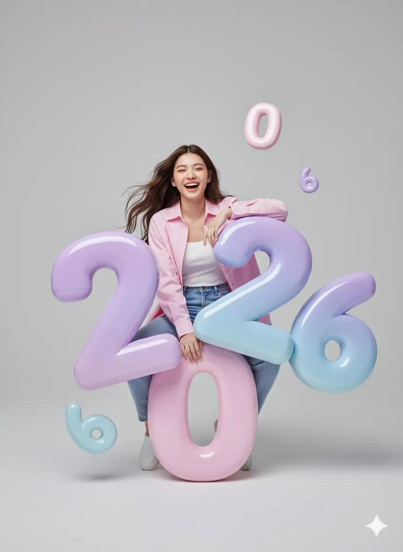

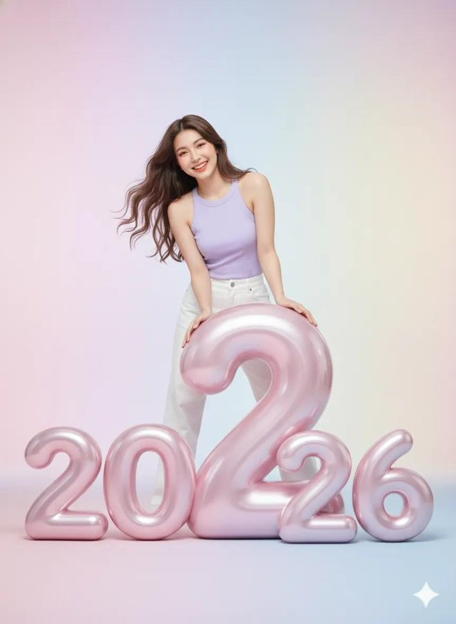

```
{
  "type": "image_prompt",
  "style": "ultra-bright cute advertising studio poster",
  "subject": {
    "identity": "cheerful playful Thai young woman",
    "expression": "smiling and laughing",
    "pose": "sitting happily on a glossy pastel 3D number while leaning playfully against another",
    "hair": {
      "length": "long",
      "texture": "soft wavy",
      "quality": "natural bounce"
    },
    "makeup": {
      "style": "fresh dewy",
      "cheeks": "rosy",
      "lips": "glossy"
    }
  },
  "outfit": {
    "top_layer": "soft pink oversized shirt",
    "inner_top": "white tank top",
    "bottom": "light blue jeans",
    "style": "pastel casual"
  },
  "props": {
    "year_reference": "2026",
    "numbers": {
      "highlighted_digit": {
        "number": "2",
        "description": "first digit of 2026, significantly larger than the others",
        "style": "oversized rounded pastel 3D"
      },
      "supporting_digit": {
        "number": "0",
        "style": "glossy pastel 3D",
        "interaction": "subject sitting on it"
      },
      "other_digits": ["2", "6"]
    }
  },
  "environment": {
    "setting": "studio",
    "lighting": "high-key studio lighting",
    "glow": "soft glow",
    "color_palette": "candy pastel",
    "mood": "bubbly, joyful, cute, playful"
  },
  "photography": {
    "type": "professional commercial photography",
    "realism": "ultra-realistic",
    "quality": "high-end advertising look"
  },
  "composition": {
    "aspect_ratio": "5:4",
    "text": "none"
  }
}
```

```
充满活力的可爱广告工作室海报，风格。主体是一位开朗、活泼的泰国年轻女性，表情微笑并大笑，姿态是愉快地坐在一个光滑的粉彩3D数字上，并调皮地依靠另一个数字。她的头发长而柔软波浪，具有自然弹性；妆容清新有光泽，脸颊红润，嘴唇晶亮。穿着方面，她身穿一件淡粉色的大码衬衫，内搭白色背心，下穿浅蓝色牛仔裤，整体风格为柔和休闲。道具包括年份2026，其中数字2被显著放大，作为2026的第一个数字，风格为超大的圆形粉彩3D；数字0则为光滑的粉彩3D，这位女性坐在上面；其他数字还有2和6。环境设定在摄影棚中，采用高调的工作室照明，带有柔和光芒，色彩搭配为糖果色系，氛围为泡沫般的、欢乐的、可爱的、俏皮的。摄影类型为专业的商业摄影，追求超现实主义的真实感，拥有高端广告的外观。构图比例为5:4，没有文字说明。
```

 [↑返回目录](#toc)

---
## <a id="prompt-2005822648027091031">四角拼图完成2026祝福</a> (<a href="https://x.com/songguoxiansen/status/2005822648027091031" target="_blank" rel="noopener noreferrer">松果先森</a>)


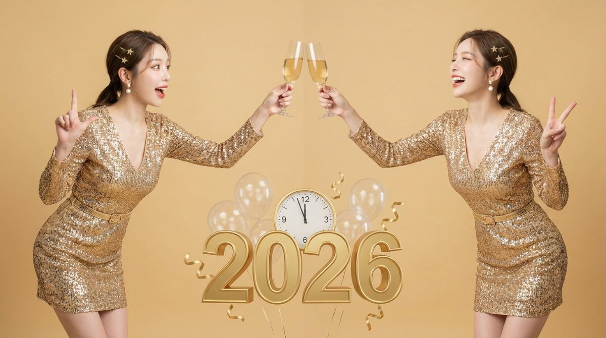

```
[关键:保持精确的面部特征,保留原始脸部结构,图中角色与上传参考图完全一致] 高级摄影棚2x2宫格写真。左上格(海军蓝背景):人物穿海军蓝色制服风连衣裙,金色纽扣装饰,复古卷发配蓝色贝雷帽和珍珠耳环,她双手托举一块巨大的拼图块(左上角块,上面有"20"数字),向画面中心方向移动,眼神专注地看向中心拼图区域,表情认真,嘴角微笑,背景有海军条纹、船锚、"启航新年"字样。右上格(樱花粉背景):同一女性穿粉色蕾丝连衣裙,珍珠项链,公主头配粉色玫瑰花发夹和水晶耳环,她双手托举右上角拼图块(上面有"26"数字)向中心移动与左上格拼接,眼神看向拼图接缝处,表情专注期待,身体前倾,背景有粉色樱花、"美好相遇"字样、蝴蝶、花瓣。左下格(薄荷绿背景):同一女性穿薄荷绿色棉麻连衣裙,文艺风格,自然长发配绿色发带和木质耳环,她双手托举左下角拼图块(上面有"元旦"字样)向上移动与左上格对接,眼神看向拼图,表情认真,嘴巴微微抿起,背景有绿色植物、"希望生长"字样、新芽、叶子。右下格(柠檬黄背景):同一女性穿黄色连衣裙,向日葵图案,双马尾配黄色蝴蝶结,她双手托举最后一块右下角拼图(上面有"快乐"字样)完成拼图,四块拼图在画面中心完美拼成"2026元旦快乐"完整图案,她头后仰,眼睛看向完成的拼图,脸上洋溢着成功喜悦的笑容,画面中心爆出金色光芒和彩纸,背景有黄色太阳、"圆满成功"字样、笑脸、向日葵。四格之间拼图从四角汇聚到中心形成完整画面,清透妆容,明亮环形光,85mm镜头,f/1.8光圈,拼图互动四联构图,时尚杂志风格。
```

 [↑返回目录](#toc)

---
## <a id="prompt-2005999391367196797">微信泡泡人物对话</a> (<a href="https://x.com/Tz_2022/status/2005999391367196797" target="_blank" rel="noopener noreferrer">Tz</a>)

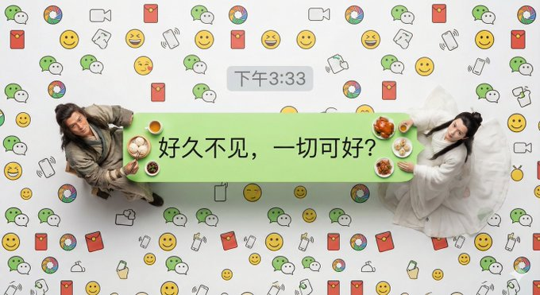

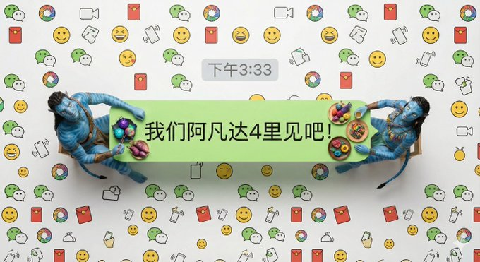

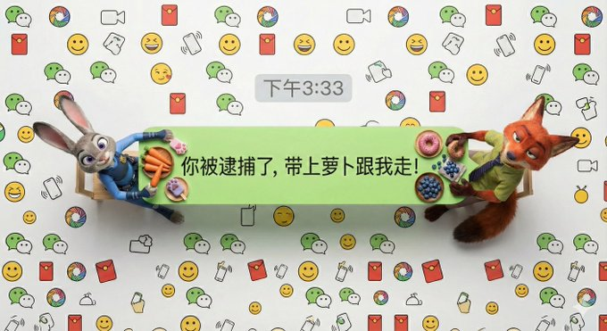

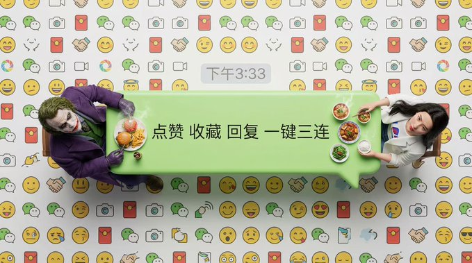

```
指定人物：两个缩小到微缩比例的真实的活人，见参考图

文字内容：[文字内容]

时间戳：下午3:33

超写实主义的俯拍微距摄影作品。主体是一个标准的微信发送方浅绿色聊天气泡框，它被当作一张长餐桌。[指定人物]坐在气泡框的两端。

关键人物细节：强调他们绝不是塑料模型；他们拥有清晰可见的皮肤毛孔、自然的头发细节以及极其逼真的布料纹理和褶皱。他们正在享用看起来热气腾腾、新鲜烹饪的符合人物身份的真实食物微缩模型，抬头看向镜头。

微信独有视觉元素：气泡框内部只有文字内容：“[文字内容]”。在气泡框的正上方外部，居中显示一个灰色的微信风格时间戳：“[时间戳]”。

背景细节：整个背景完全被高密度的、无缝连接的定制微信主题线条图案所填满（包含微信标志性的双气泡Logo、朋友圈图标、红包图标、“摇一摇”手势、经典黄脸表情包等线条艺术），从边缘到边缘覆盖整个画面，没有空隙，模仿密集的聊天背景壁纸风格。

技术参数：采用专业演播室级微距布光，强调质感，8K超高分辨率，整个平面焦点极其锐利。
```

 [↑返回目录](#toc)

---
## <a id="prompt-2005097871977447736">元旦特辑-复古旗袍名媛风</a> (<a href="https://x.com/songguoxiansen/status/2005097871977447736" target="_blank" rel="noopener noreferrer">松果先森</a>)


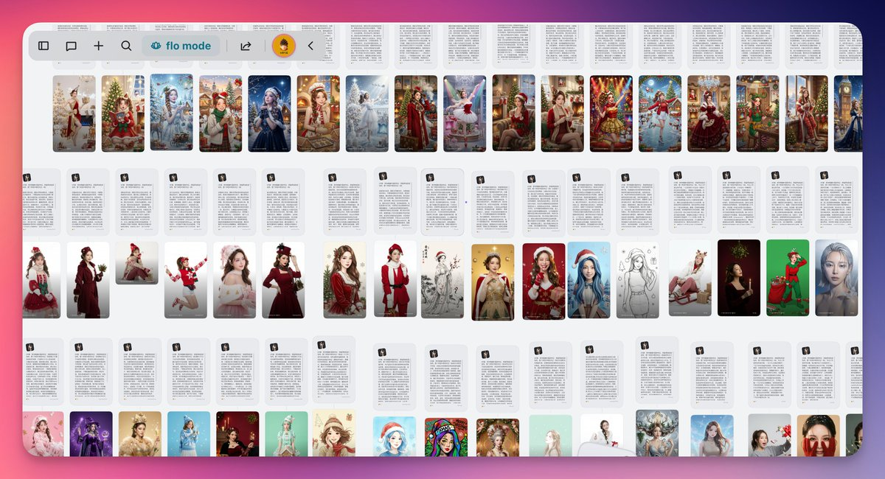

```
[关键：保持精确的面部特征，保留原始脸部结构，图中角色与上传参考图完全一致]
精致工作室立姿肖像,人物拥有如凝脂般细腻白皙的肌肤,淡雅妆容强调通透感和裸粉唇妆。她身着传统红色凤凰刺绣旗袍,高开叉设计展现修长美腿,袖口和领口绣满金线祥云纹样,外搭金色薄纱长披风从肩部垂落至地面。发型是典雅的侧边低盘发,用金色凤凰步摇、红色珠花和长长的金色流苏装饰,发饰随动作轻微摇曳,一侧留出波浪卷发修饰脸型。她站立在红色地毯上呈经典旗袍站姿,一条腿从开叉处露出,一只手叉腰展现自信,另一只手拿着金色烟斗式长杆烟嘴优雅置于唇边,头部微侧展现精致侧颜,眼神冷艳高贵。背景是深红色天鹅绒幕布,中央悬挂金色"元旦快乐"书法大字和"2026"立体装置,两侧对称布置红色立柱、金色花瓶插梅花、复古留声机。伦勃朗光营造经典好莱坞氛围,强调明暗对比和戏剧张力。Phase One拍摄系统,色彩浓烈复古,顶级工作室vintage大片质感。
```

 [↑返回目录](#toc)

---
## <a id="prompt-2005286056850251802">新年城市天际线庆典</a> (<a href="https://x.com/LufzzLiz/status/2005286056850251802" target="_blank" rel="noopener noreferrer">岚叔</a>)

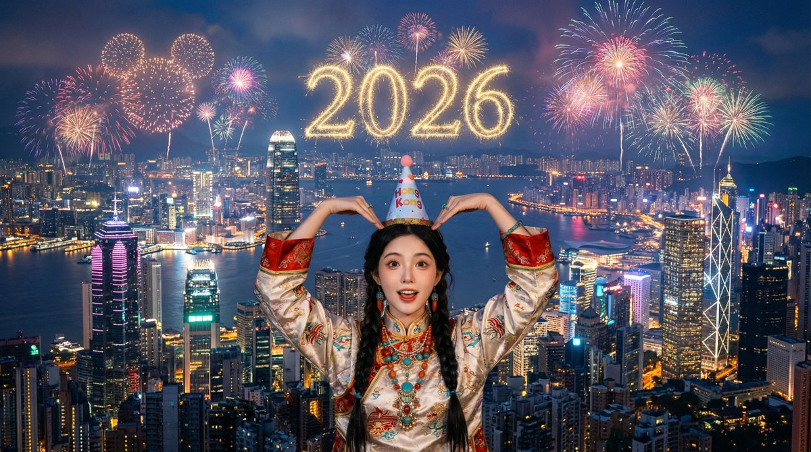

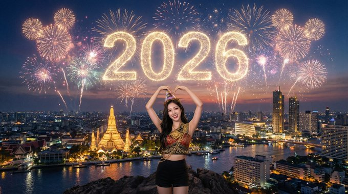

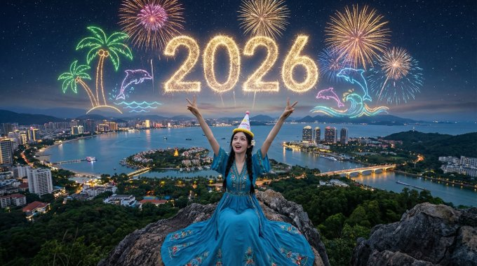


```
用法：上传人物参考图片 + 提示词，更改最后两句。可能需要抽两张图，有可能人物偶尔会变小宝宝，也挺有意思的
{
  "template_name": "新年城市天际线庆典 (人物定制版)",
  "description": "一个孩子俯瞰城市天际线的电影式镜头。支持基于参考图的人物形象定制、视角切换（正面/背面）以及自定义动作。画面中包含定制的烟花特效和巨大的“2026”字样。新增全局构图设定：采用鸟瞰远景视角，镜头与人物呈60度角，确保人物不遮挡城市夜景；人物服装风格与目标城市文化或地标元素相呼应。",
  "prompt_template": "一个令人惊艳的电影式镜头，采用鸟瞰远景构图，镜头与人物呈60度角，巧妙避开人物对背景的遮挡，完整展现壮丽的城市天际线。基于参考图片中的孩子形象，人物以{view_orientation}出现在画面中，头戴一顶奇趣的派对帽，身穿与{target_city_short}文化或地标相呼应的节日服装，站在高耸的山峰之巅。人物当前的动作为：{character_action}。背景是令人叹为观止的{target_city}城市夜景，标志性的城市地标在繁星点点的夜空下清晰可见。整个天空被{city_fireworks_effect}点亮。巨大的、闪耀的金色烟花在中心清晰地拼出了“2026”的字样。8K 分辨率，照片级真实感，电影颗粒感，营造出梦幻、宏大且充满希望的氛围，展现了高度精细的城市夜景。",
  "input_variables": {
    "target_city": {
      "type": "string",
      "description": "庆祝活动的城市名称和主要地标描述。",
      "default_value": "上海夜景，东方明珠塔、外滩和蜿蜒的黄浦江"
    },
    "target_city_short": {
      "type": "string",
      "description": "目标城市的简称或关键词，用于描述服装风格匹配（如'上海'、'巴黎'、'东京'等）。",
      "default_value": "上海"
    },
    "city_fireworks_effect": {
      "type": "string",
      "description": "烟花的风格、形状、颜色和氛围的描述。",
      "default_value": "一场壮观的迪士尼风格烟花表演，以米老鼠形状的烟花、童话般的柔和色彩、闪闪发光的魔法粉尘和梦幻般的层叠火花为特色"
    },
    "view_orientation": {
      "type": "string",
      "description": "人物相对于镜头的朝向。推荐：'背面剪影' 或 '正面（面带惊奇的笑容）'。",
      "default_value": "背面剪影"
    },
    "character_action": {
      "type": "string",
      "description": "人物的具体肢体动作。",
      "default_value": "双手高举过头顶，向着天空张开，身体微微后仰，充满惊奇和兴奋"
    }
  },
  "full_prompt_example": "一个令人惊艳的电影式镜头，采用鸟瞰远景构图，镜头与人物呈60度角，巧妙避开人物对背景的遮挡，完整展现壮丽的城市天际线。基于参考图片中的孩子形象，人物以背面剪影出现在画面中，头戴一顶奇趣的派对帽，身穿与上海文化或地标相呼应的节日服装，站在高耸的山峰之巅。人物当前的动作为：双手高举过头顶，向着天空张开，身体微微后仰，充满惊奇和兴奋。背景是令人叹为观止的上海夜景，东方明珠塔、外滩和蜿蜒的黄浦江在繁星点点的夜空下清晰可见。整个天空被一场壮观的迪士尼风格烟花表演点亮，以米老鼠形状的烟花、童话般的柔和色彩、闪闪发光的魔法粉尘和梦幻般的层叠火花为特色。巨大的、闪耀的金色烟花在中心清晰地拼出了“2026”的字样。8K 分辨率，照片级真实感，电影颗粒感，营造出梦幻、宏大且充满希望的氛围，展现了高度精细的城市夜景。"
}
城市：香港维多利亚港
人物：参考图片｜正面照。服装需替换与背景城市保持一致
动作: 双手过肩比心
```

 [↑返回目录](#toc)

---
## <a id="prompt-2005842541141451133">产品说明书</a> (<a href="https://x.com/berryxia/status/2005842541141451133" target="_blank" rel="noopener noreferrer">Berryxia.AI</a>)

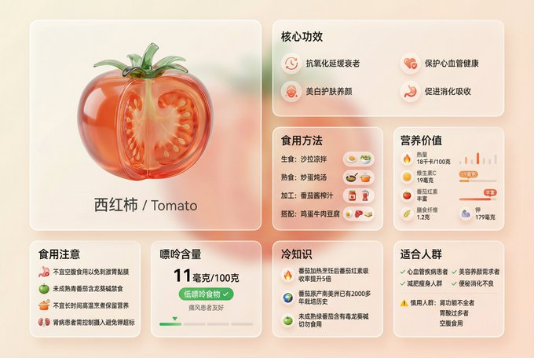

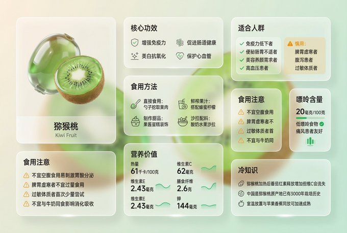


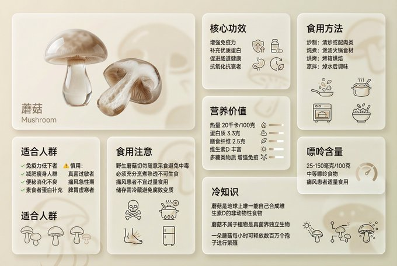


```
现代Bento网格布局产品展示设计,采用磨砂亚克力透明玻璃材质。适用于任何产品类型(食物/药品/科技产品/元素等)。

【布局结构】8个模块,非对称Bento网格排列,横向landscape格式:

模块1: 【3D玻璃产品主体展示】(中等尺寸1x1,占20-25%空间)

- 3D透明玻璃/亚克力材质的[产品名称]雕塑

- [产品特色]:

* 食物 → 展示切面/内部结构(如番茄种子腔室、胡萝卜横切面)

* 药品 → 药片/胶囊的透明玻璃形态

* 科技产品 → 产品外观的玻璃艺术化呈现

- 材质效果: 透明红橙/蓝色/绿色等[产品主色]玻璃,光泽表面,光线折射,真实反射

- 正下方文字标注: "[中文产品名] / [English Name]"

- 不占用过多空间,为信息模块留足展示区域

模块2: 【核心功效/特点】(标准卡片1x1)

标题: "核心功效" 或 "核心特点" 或 "主要功能"

内容: 4个核心卖点,用 "/" 分隔

- 食物 → "抗氧化延缓衰老 / 保护心血管健康 / 美白护肤养颜 / 促进消化吸收"

- 药品 → "解热镇痛 / 抗炎消肿 / 抗血小板聚集 / 预防心血管疾病"

- 科技 → "主动降噪 / 空间音频 / 自适应均衡 / 20小时续航"

配合简洁图标

模块3: 【使用方法/应用场景】(标准卡片1x1)

标题: "食用方法" 或 "使用方法" 或 "应用场景"

内容: 4种使用方式/场景

- 食物 → "生食: 沙拉凉拌 / 熟食: 炒蛋炖汤 / 加工: 酱料榨汁 / 搭配: 鸡蛋牛肉"

- 药品 → "口服: 餐后温水送服 / 剂量: 成人100mg / 频次: 每日1-2次 / 疗程: 遵医嘱"

- 科技 → "音乐欣赏 / 通勤降噪 / 居家办公 / 观影娱乐"

配合场景图标

模块4: 【关键数据/参数】(标准卡片1x1)

标题: "营养价值" 或 "技术参数" 或 "产品规格"

内容: 5个关键数据点

- 食物 → "热量 [X]千卡/100克 / 维生素C [X]毫克 / [特色成分] 丰富 / 膳食纤维 [X]克 / 钾 [X]毫克"

- 药品 → "成分: [化学式] / 规格: [X]mg / 起效时间: [X]分钟 / 半衰期: [X]小时 / 代谢途径: [途径]"

- 科技 → "芯片: [型号] / 续航: [X]小时 / 重量: [X]克 / 驱动单元: [规格] / 充电: [X]小时"

配合简洁数据可视化图表

模块5: 【适用人群/目标用户】(标准卡片1x1)

标题: "适合人群" 或 "目标用户" 或 "适用场景"

内容: 分为推荐(✓)和警示(⚠️)两部分

- 食物 → "✓ 心血管疾病患者 / ✓ 美容养颜需求者 / ✓ 减肥瘦身人群 / ✓ 便秘消化不良 / ⚠️ 慎用: 肾功能不全 / 胃酸过多 / 空腹食用"

- 药品 → "✓ 发热患者 / ✓ 轻中度疼痛 / ✓ 炎症性疾病 / ⚠️ 禁忌: 孕妇 / 哮喘患者 / 胃溃疡"

- 科技 → "✓ 音乐发烧友 / ✓ 商务人士 / ✓ 通勤人群 / ✓ 内容创作者"

用绿色✓和琥珀色⚠️区分

模块6: 【注意事项/使用指南】(标准卡片1x1)

标题: "食用注意" 或 "使用注意" 或 "重要提示"

内容: 4条重要提醒事项

- 食物 → "不宜空腹食用以免刺激胃黏膜 / 未成熟[产品]含[有毒物质]禁食 / 不宜长时间高温烹煮保留营养 / [特殊人群]需控制摄入量"

- 药品 → "需餐后服用避免胃部不适 / 不可与[禁忌药物]同服 / 服药期间避免饮酒 / 出现过敏反应立即停药就医"

- 科技 → "首次使用需配对设备 / 避免极端温度环境 / 定期清洁保养 / 长期不用请充电保存"

配合警示图标

模块7: 【特殊指标】(标准卡片1x1)

标题: 根据产品类型调整

- 食物 → "嘌呤含量" 显示 "[X]毫克/100克" + "低嘌呤食物 ✓" + "痛风患者友好"

- 药品 → "不良反应" 列举常见副作用

- 科技 → "兼容性" 显示支持的系统/设备

配合指示器或图标

模块8: 【趣味知识/产品洞察】(标准卡片1x1)

标题: "冷知识" 或 "产品故事" 或 "有趣事实"

内容: 2-3条有趣的知识点

- 食物 → "[产品]加热后[成分]吸收率提升X倍 / [产品]原产[地区]已有[X]年历史 / 未成熟[产品]含[有害物质]"

- 药品 → "[产品]是世界上使用最广泛的[类别]之一 / 每年全球生产超过[X]吨 / [发明年份]年由[人名]发明"

- 科技 → "[产品]采用[技术]专利技术 / [品牌]首次将[功能]应用于消费级产品 / 全球销量突破[X]万台"

【磨砂亚克力材质规格】(CRITICAL 核心灵魂):

卡片材质效果:

- 透明度: 80-85% 半透明(TRANSLUCENT),可以看穿卡片看到背景

- 磨砂效果: 柔和的frosted glass blur模糊,backdrop-filter风格

- 底色调: 轻微白色/奶油色霜化效果(15-20%不透明度),提升可读性但保持透明

- 边框: 细致的发光边框,捕捉光线反射

- 阴影: 柔和的分层阴影,营造浮空深度感

- 玻璃物理: 真实的玻璃边缘高光、光线折射、表面反射效果

- 视觉特征: 背景渐变可以透过卡片清晰看见,像真实的磨砂亚克力板

重要: 卡片必须保持TRANSLUCENT透明质感,不能变成不透明白卡片!

【色彩方案】:

基础色彩配比: 90% 中性色 + 10% 产品主题色点缀

- 基础层: 透明玻璃、浅灰色、米白色

- 文字色: 中等深灰 #3A3A3A (柔和但清晰,适合透明背景)

- 主题色点缀(10%使用):

* 食物 → 产品天然色(番茄红橙、胡萝卜橙、菠菜绿等)

* 药品 → 医疗蓝、药品白、红十字标志色

* 科技 → 品牌主色(Apple银灰蓝、小米橙、华为红等)

- 点缀位置: 仅用于关键图标、重要数字、警示符号、3D主体

- 警示色: 琥珀橙 #FF9800 用于⚠️警告内容

- 肯定色: 绿色 #4CAF50 用于✓推荐内容

【背景设置】:

- 类型: 柔和渐变,2-3个相近色过渡

- 产品色调适配:

* 食物 → 奶油白-淡桃红-浅橙色(温暖色调)

* 药品 → 浅灰白-淡蓝-医疗白(清洁专业)

* 科技 → 太空灰-银白-淡蓝(科技感)

- 装饰元素: 极度柔和的抽象形状,可透过玻璃卡片隐约看见

- 重要: 背景要柔和不抢眼,通过透明卡片可见但不干扰阅读

【排版布局】:

- 格式: 横向 landscape 16:9 或类似比例

- 网格类型: 非对称Bento网格,卡片大小不一

- 空间分配:

* 3D玻璃主体: 20-25% (中等尺寸,不过度占用)

* 信息卡片: 75-80% (7个标准卡片)

- 卡片间距: 适度留白,不拥挤,呼吸感良好

- 视觉层次: 通过卡片大小、位置、色彩点缀建立信息优先级

- 阅读流: 从左上3D主体开始,自然流向各信息卡片

【文字规范】:

- 语言: 全中文内容(产品名可双语标注)

- 字体层级:

* 模块标题: 粗体,大号

* 正文内容: 常规体,中号

* 数据数字: 粗体,突出显示

- 可读性: 中等深灰文字在磨砂玻璃上清晰易读

- 单位规范:

* 重量: 克、千克、毫克

* 能量: 千卡、卡路里

* 时间: 分钟、小时、天

* 容量: 毫升、升

【图标风格】:

- 类型: 极简线条图标 (line icons)

- 尺寸: 小巧不喧宾夺主

- 颜色: 浅灰线条,关键图标用主题色点缀

- 用途: 辅助说明,增强视觉识别

【使用方法】:

1. 将 [产品名称] 替换为实际产品

2. 根据产品类型(食物/药品/科技)选择对应的内容示例

3. 填充8个模块的具体信息

4. 调整主题色为产品代表色

5. 确保保持磨砂亚克力的透明质感

【质量标准】:

✓ 透明度正确(80-85%,可看穿)

✓ 磨砂模糊效果明显但不过度

✓ 背景可透过卡片看见

✓ 3D主体占比适中(20-25%)

✓ 信息完整(8个模块内容齐全)

✓ 全中文显示清晰

✓ 色彩克制优雅(90%中性+10%点缀)

✓ 排版舒适不拥挤

✓ 玻璃质感真实(边缘高光、反射、折射)

【典型应用示例】:

食物: 🍅西红柿、🥕胡萝卜、🍎苹果、🥑牛油果

药品: 💊阿司匹林、维生素C、布洛芬、青霉素

科技: 🎧AirPods Max、iPhone、MacBook、特斯拉

元素: ⚛️碳、氧、氢、氮
```

 [↑返回目录](#toc)

---
## <a id="prompt-2005947184290951450">超写实水下港海豹摄影</a> (<a href="https://x.com/TheLOKII_/status/2005947184290951450" target="_blank" rel="noopener noreferrer">LOKII</a>)

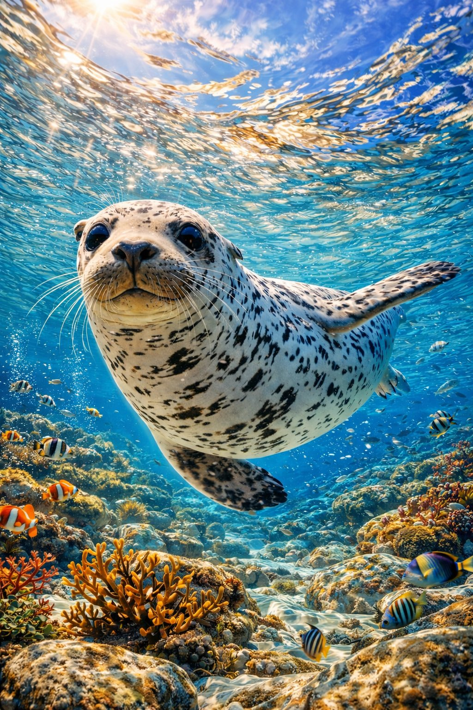

```
A breathtaking ultra realistic underwater photograph of a cute spotted harbor seal swimming directly toward the camera, big glossy black eyes, detailed whiskers, soft wet fur texture. Crystal-clear tropical blue ocean, golden sunlight rays piercing through the water surface creating shimmering reflections. Vibrant colorful coral reef below with orange, yellow, purple corals, clownfish, angelfish, butterfly fish swimming around. Floating light particles, cinematic depth of field, sharp focus, natural shadows, HDR lighting, photorealistic, 16K resolution, DSLR underwater photography, National Geographic style, hyper detailed, no AI look.
```

```
一张令人惊叹的超写实水下照片：一只可爱的斑点港海豹正径直朝镜头游来，拥有大而闪亮的黑色眼睛、细致的胡须和柔软湿润的毛发质感。清澈透明的热带蓝色海洋中，金色阳光穿透水面，形成闪烁的光影。下方是色彩鲜艳的珊瑚礁，有橙色、黄色和紫色的珊瑚，周围游弋着小丑鱼、神仙鱼和蝴蝶鱼。水中漂浮着光粒子，具有电影级景深、锐利对焦、自然阴影、HDR 光照效果，风格为国家地理式的 DSLR 水下摄影，极度精细，16K 分辨率，毫无 AI 痕迹。
```

 [↑返回目录](#toc)

---
## <a id="prompt-2005487690838655382">傍晚阳光下的现代极简阁楼</a> (<a href="https://x.com/Maercihh/status/2005487690838655382" target="_blank" rel="noopener noreferrer">Maercih</a>)

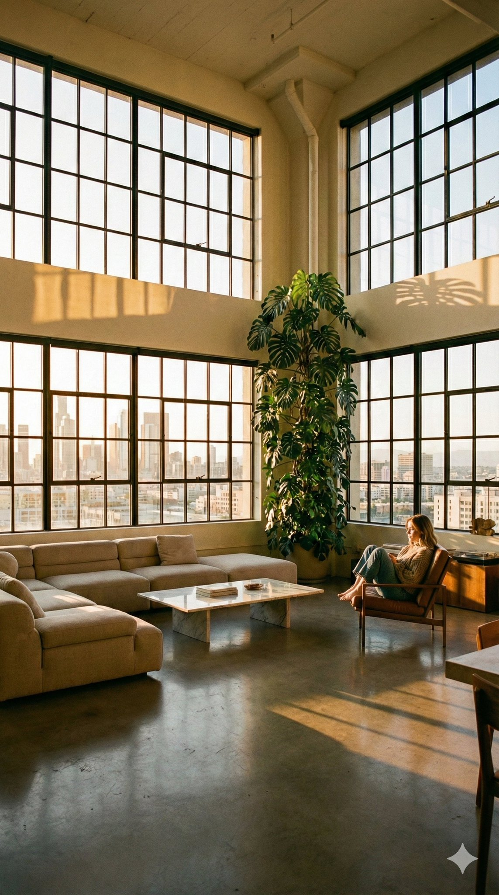

```
This is what architecture looks like when AI understands beauty.

Nano Banana Pro on Gemini 

Prompt 

{
  "model": "Nano Banana Pro",
  "scene": "Sunlit modern loft interior with expansive industrial windows",
  "architecture": {
    "style": "Modern minimalism with industrial influences",
    "structure": "Double-height ceiling, exposed concrete floors, clean lines",
    "windows": "Large black-framed grid windows spanning two levels",
    "layout": "Open-plan living space with strong vertical and horizontal symmetry"
  },
  "environment": {
    "location": "Urban loft apartment",
    "time": "Late afternoon / golden hour",
    "atmosphere": "Quiet, airy, balanced"
  },
  "furnishings": {
    "seating": "Neutral-toned sectional sofa with low profile",
    "chair": "Mid-century modern lounge chair",
    "table": "Minimalist marble coffee table",
    "decor": "Large indoor plant adding organic contrast",
    "palette": "Soft beige, warm wood, muted greens"
  },
  "subject": {
    "presence": "A woman seated calmly, reading near the window",
    "pose": "Relaxed posture, legs crossed, absorbed in a book",
    "emotion": "Peaceful, introspective"
  },
  "lighting": {
    "primary": "Warm natural sunlight entering through windows",
    "effect": "Long soft shadows across concrete floor",
    "balance": "Natural light dominant, no harsh artificial lighting"
  },
  "camera": {
    "angle": "Wide interior shot from eye level",
    "lens": "Cinematic wide-angle lens (35mm)",
    "depth_of_field": "Deep focus, architectural clarity",
    "framing": "Vertical composition emphasizing height and openness"
  },
  "materials": {
    "floor": "Polished concrete",
    "walls": "Soft off-white plaster",
    "furniture": "Fabric upholstery, wood, stone"
  },
  "color_palette": {
    "dominant": ["warm beige", "soft cream"],
    "accents": ["natural green", "golden sunlight"]
  },
  "mood": "Serene, refined, architectural calm",
  "style": {
    "aesthetic": "High-end architectural photography",
    "realism": "Photorealistic",
    "texture": "Clean surfaces with subtle natural imperfections",
    "post_processing": "Balanced contrast, soft highlights, no oversaturation"
  },
  "quality": "Ultra-detailed, high dynamic range, professional interior photography"
}
```

```
当人工智能理解了美的时候，建筑便呈现出这样的样貌。

阳光洒落的现代阁楼室内，拥有开阔的工业风窗户。建筑风格融合现代极简与工业元素，结构包含挑高双层天花板、裸露的混凝土地板和干净利落的线条。窗户为横跨两层的大型黑色框格窗，整体布局为开放式起居空间，强调垂直与水平的对称感。

场景设定在城市阁楼公寓，时间为傍晚时分的黄金时刻，氛围宁静、通透而平衡。

室内陈设包括中性色调的低矮模块沙发、一把中古现代风格休闲椅、一张极简直纹大理石咖啡桌，以及一株大型室内植物，为空间增添有机对比。整体配色以柔和米色、温暖木色与低饱和绿色为主。

画面主体是一位女性，她安静地坐在窗边阅读，姿态放松，双腿交叠，全神贯注于书本之中，神情平和而内省。

光线以透过窗户照入的温暖自然日光为主，在混凝土地面上投下细长柔和的阴影，整体光照自然主导，无刺眼人工光源。

采用人眼高度的广角室内镜头（35mm电影镜头），深景深确保建筑细节清晰，竖构图突出空间的高度与开阔感。

材质方面，地面为抛光混凝土，墙面为柔和米白色灰泥，家具则使用织物软包、木材与石材。

主色调为暖米色与柔奶油色，点缀以自然绿与金色阳光。

整体情绪宁静、精致，充满建筑的沉静之美。

画面风格为高端建筑摄影，写实逼真，表面干净但带有细微自然肌理，后期处理注重对比均衡、高光柔和，无过度饱和。

画质超精细，高动态范围，呈现专业级室内摄影水准。
```

 [↑返回目录](#toc)

---
## <a id="prompt-2002847525536219187">虚拟的卡通女孩</a> (<a href="https://x.com/dsnyfication/status/2002847525536219187" target="_blank" rel="noopener noreferrer">Disneyfication</a>)

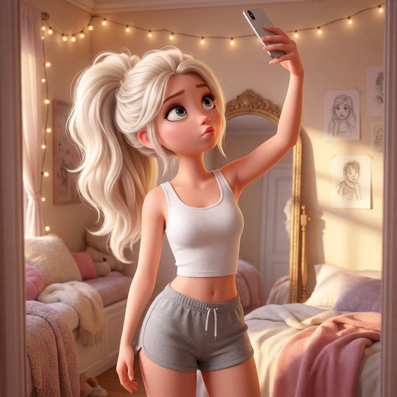

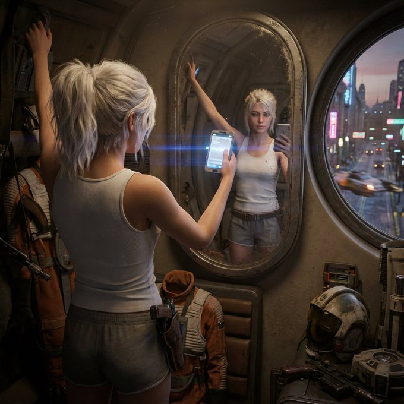

```
{  "subject": {    "description": "Young woman taking bedroom mirror selfie, phone held high, casual loungewear moment",    "age": "early 20s",    "expression": {      "eyes": "looking up at phone screen, soft doe eyes",      "mouth": "soft pout, lips slightly pursed",      "overall": "that 'checking my angles' focused selfie face"    },    "hair": {      "color": "platinum blonde, white-silver",      "style": "messy high ponytail, loose and undone",      "details": "lots of pieces falling out, face-framing strands, effortless messy"    },    "body": {      "frame": "petite, slim, toned",      "waist": "small, defined, bare midriff",      "stomach": "flat, toned, fully visible",      "hips": "feminine curve"    },    "pose": {      "phone_arm": "raised HIGH above head, extended up",      "other_arm": "down, hand resting on hip/thigh",      "stance": "slight hip cock, weight shifted",      "torso": "slight twist, elongated from raised arm",      "overall": "the classic high-angle mirror selfie pose"    },    "clothing": {      "top": {        "type": "white ribbed tank top",        "fit": "fitted, cropped above belly button",        "neckline": "scoop neck, simple",        "effect": "basic but shows shape"      },      "bottom": {        "type": "grey cotton boy shorts / mini shorts",        "fit": "tight, very short, sits low on hips",        "style": "lounge shorts, underwear-adjacent",        "effect": "barely there, shows legs completely"      }    },    "accessories": {      "phone": "iPhone with MagSafe ring, clear case",      "hair_tie": "scrunchie in ponytail",      "jewelry": "minimal, maybe small earrings"    }  },  "environment": {    "location": "bedroom",    "mirror": "full-length standing mirror",    "room_details": {      "bed": "visible in reflection, unmade, grey/beige bedding",      "lamp": "warm bedside lamp glowing",      "chair": "gaming/desk chair with clothes draped",      "lights": "LED strip lights on wall",      "clothes": "scattered on chair, lived-in"    },    "lighting": "warm lamp light + LED strips, cozy evening"  },  "photography": {    "style": "mirror selfie, high angle",    "framing": "thighs to above head",    "angle": "phone above head shooting down",    "quality": "iPhone",    "aspect": "4:5 vertical"  },  "color_story": {    "her": "white tank, grey shorts, platinum hair",    "room": "beige walls, grey bedding, warm lamp glow",    "palette": "neutral, soft, cozy tones"  },  "vibe": {    "energy": "casual night in, loungewear content",    "mood": "effortless, 'just hanging out'",    "authenticity": "real bedroom, real mess, real girl",    "caption": "'fit check' or 'staying in' or ''"  }}
```

```
一位20岁出头的年轻女子在卧室里用全身镜自拍，手机高高举起，穿着休闲家居服。她的眼神向上看着手机屏幕，眼睛柔和如小鹿般；嘴唇微微嘟起，略带轻抿，整体表情是那种专注调整角度、检查自己上镜效果的典型自拍神情。

她的发色是白金色（铂金色），扎着一个凌乱的高马尾，松散而不刻意，许多发丝自然散落，有修饰脸型的碎发，整体呈现一种毫不费力的慵懒感。

身材娇小纤细而紧致，腰肢纤细明显，露出整个平坦紧实的小腹，臀部带有柔美的曲线。

姿势方面，一只手臂高高举过头顶握着手机，另一只手自然下垂，手搭在髋部或大腿上；身体重心略微偏移，胯部稍稍倾斜；上半身因高举的手臂而轻微扭转并拉长，整体呈现出经典的高角度镜前自拍姿态。

上身穿一件白色罗纹背心，贴身剪裁，短款设计露脐，圆领简洁，虽基础却能展现身形；下身穿灰色棉质男孩风短裤（或迷你短裤），非常短且紧身，低腰设计，风格接近居家内裤，几乎完全露出双腿。

配饰包括一部带透明保护壳和MagSafe磁吸环的iPhone、马尾上的抓夹发圈，以及极简的小耳钉。

场景设定在卧室：一面全身立镜作为主要拍摄道具。镜中可见未整理的床铺，灰米色床品；一盏暖光床头灯亮着；一把电竞/书桌椅上随意搭着衣物；墙上装有LED灯带；整体房间略显凌乱，充满生活气息。

光线由暖色台灯与LED灯带共同营造，氛围温馨舒适，属于夜晚宅家的感觉。

摄影风格为高角度镜面自拍，构图从大腿至头顶以上，采用iPhone拍摄，画面比例为4:5竖屏。

整体色彩以中性柔和为主：人物穿着白背心、灰短裤，搭配铂金色头发；房间为米色墙面、灰色床品与暖黄灯光，构成温暖舒适的中性色调。

整体氛围轻松随意，体现“宅家之夜”的悠闲自在，真实自然——真实的卧室、真实的凌乱、真实的女孩，仿佛配文会是“试穿搭”、“今晚不出门”或类似日常分享。
```

 [↑返回目录](#toc)

---
## <a id="prompt-2005173589809537125">温馨现代客厅中的女性放松时光</a> (<a href="https://x.com/xmliisu/status/2005173589809537125" target="_blank" rel="noopener noreferrer">Melisa♡</a>)


```
{
  "image_prompt_structure": {
    "meta": {
      "type": "Lifestyle Photography",
      "aspect_ratio": "16:9",
      "mood": "Cozy, Intimate, Relaxed"
    },
    "scene_setup": {
      "location": "Modern living room",
      "time_of_day": "Evening",
      "lighting": {
        "type": "Soft warm indoor",
        "sources": ["Ambient room lighting", "Candlelight accents"],
        "quality": "Evenly distributed, glowing"
      },
      "camera": {
        "angle": "High-angle / Slightly elevated",
        "focus": "Subject in foreground",
        "perspective": "Looking down toward the sofa"
      }
    },
    "subject": {
      "demographics": {
        "gender": "Female-presenting",
        "age_appearance": "Young adult to adult"
      },
      "appearance": {
        "hair": {
          "color": "Light brown with blonde highlights",
          "style": "Loose, voluminous waves",
          "parting": "Side-parted"
        },
        "makeup": {
          "skin": "Smooth, contoured finish",
          "eyes": "Defined brows and lashes",
          "lips": "Full lips, neutral-toned lipstick"
        },
        "expression": "Neutral to soft, relaxed eyes, slight smile",
        "gaze": "Direct eye contact with camera"
      },
      "attire": {
        "item": "Matching lounge set",
        "color": "Deep burgundy / Wine red",
        "fabric": "Soft, slightly shimmery",
        "fit": "Form-fitting",
        "details": {
          "top": "Long-sleeve",
          "bottom": "Full-length fitted pants",
          "feet": "Barefoot"
        }
      },
      "pose": {
        "main_position": "Lying on side on sectional sofa",
        "body_orientation": "Three-quarter view, torso angled to camera",
        "limbs": {
          "legs": "Bent and stacked, feet resting naturally",
          "arms": "Relaxed, hands resting gently in front",
          "head": "Tilted slightly upward"
        },
        "support": "Upper body propped slightly on cushions"
      }
    },
    "environment_objects": {
      "furniture": {
        "sofa": {
          "type": "Sectional",
          "color": "Light beige / Cream",
          "material": "Plush fabric",
          "accessories": "White blanket draped over back/side"
        },
        "media_console": {
          "color": "White",
          "style": "Minimalist, clean lines",
          "equipment": "Wall-mounted TV"
        },
        "coffee_table": {
          "type": "Low table or Ottoman style",
          "color": "Light neutral"
        }
      },
      "props_and_decor": {
        "on_coffee_table": [
          {
            "item": "Glass bowl of popcorn",
            "position": "Center"
          },
          {
            "item": "Small plate of chocolates",
            "position": "Beside popcorn"
          },
          {
            "item": "Round mirrored tray",
            "contents": [
              "Candle in glass container",
              "Champagne flute",
              "Decorative candle with red ribbon"
            ]
          }
        ],
        "on_tv_screen": {
          "display": "Streaming service interface",
          "details": ["Thumbnails of movies/shows", "Text previews"]
        }
      }
    },
    "artistic_direction": {
      "color_palette": {
        "dominant": ["Deep Burgundy", "Beige", "Cream"],
        "accents": ["White", "Silver", "Candlelight Gold", "Red Ribbon"]
      },
      "atmosphere": "Warm and inviting, hygge style, cinematic domestic setting"
    }
  }
}
```

```
生活方式摄影，16:9 画幅，氛围温馨、亲密、放松。场景设定在现代客厅，傍晚时分，采用柔和温暖的室内灯光，包括环境光和点缀的烛光，光线均匀分布且富有光泽。镜头采用高角度略俯视的视角，聚焦前景人物，从上方看向沙发。

主体为一位呈现女性气质的年轻至成年女性，浅棕色头发带有金色挑染，松散丰盈的波浪卷发，侧分。妆容精致：肌肤光滑有轮廓感，眉毛与睫毛清晰，双唇饱满，涂着中性色调口红。表情自然柔和，眼神放松，略带微笑，直视镜头。

她身穿一套酒红色/深勃艮第色的同套家居服，面料柔软略带微闪，剪裁贴身。上衣为长袖，下装为全长紧身裤，赤脚。姿势为侧卧在组合式沙发上，身体呈四分之三角度朝向镜头，双腿弯曲叠放，双脚自然放置；双臂放松，双手轻放在身前；头部微微上仰，上半身略微倚靠在靠垫上。

环境中的家具包括：米白色/奶油色的厚实布艺组合沙发，上面随意搭着一条白色毯子；白色极简风格电视柜，配有壁挂式电视；浅中性色的矮咖啡桌或脚凳。咖啡桌上摆放着：中央是一碗玻璃碗装的爆米花，旁边是一小盘巧克力，还有一个圆形镜面托盘，上面放着玻璃罩蜡烛、香槟杯和系有红色丝带的装饰蜡烛。电视屏幕上显示流媒体服务界面，可见影视缩略图和文字预览。

整体艺术方向采用以深勃艮第色、米色和奶油色为主色调，辅以白色、银色、烛光金和红色丝带作为点缀，营造出温暖宜人、具有“Hygge”风格的电影感居家氛围。
```

 [↑返回目录](#toc)

---
## <a id="prompt-2005487775597088895">唐代宫廷乐团树上表演</a> (<a href="https://x.com/Ok_shuai/status/2005487775597088895" target="_blank" rel="noopener noreferrer">LewisAi</a>)


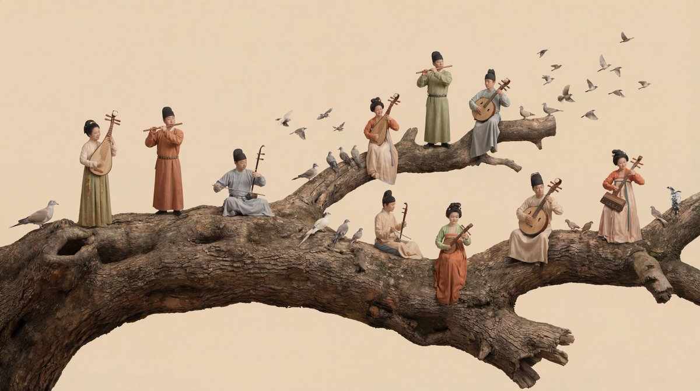

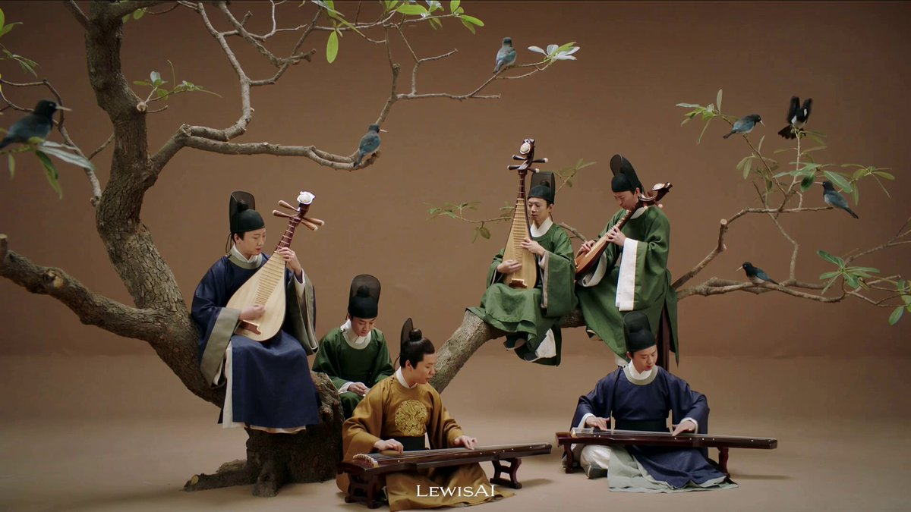

```
```json
{
"subject": {
"description": "A Tang dynasty Chinese court orchestra performing music on a branch of an Agan tree, with musicians playing pipa, erhu, flute, ruan, and horse-hoof lute, musicians and birds casually scattered, some standing, some sitting.",
"mirror_rules": null,
"age": null,
"expression": {
"eyes": {
"look": null,
"energy": null,
"direction": null
},
"mouth": {
"position": null,
"energy": null
},
"overall": null
},
"face": {
"preserve_original": false,
"makeup": null
},
"hair": {
"color": null,
"style": null,
"effect": null
},
"body": {
"frame": null,
"waist": null,
"chest": null,
"legs": null,
"skin": {
"visible_areas": null,
"tone": null,
"texture": null,
"lighting_effect": null
}
},
"pose": {
"position": "mixed (some standing, some sitting)",
"base": "on a branch of an Agan tree",
"overall": "performing music, playing pipa, erhu, flute, ruan, and horse-hoof lute"
},
"clothing": {
"top": {
"type": "Tang dynasty court clothing",
"color": null,
"details": null,
"effect": null
},
"bottom": {
"type": null,
"color": null,
"details": null
}
}
},
"accessories": {
"jewelry": null,
"headwear": null,
"device": null,
"prop": "pipa, erhu, flute, ruan, horse-hoof lute"
},
"photography": {
"camera_style": null,
"angle": null,
"shot_type": null,
"aspect_ratio": null,
"texture": null,
"lighting": "even soft gentle lighting",
"depth_of_field": null
},
"background": {
"setting": "camel-brown stage canvas",
"wall_color": "camel brown stage canvas, color code #E7B5C3D",
"elements": [
"Agan tree branch",
"birds"
],
"atmosphere": null,
"lighting": "even soft gentle lighting"
},
"the_vibe": {
"energy": null,
"mood": null,
"aesthetic": "Song dynasty aesthetics, minimalist, realistic",
"authenticity": null,
"intimacy": null,
"story": "A Tang dynasty Chinese court orchestra performing music on a branch of an Agan tree, musicians and birds casually scattered, some standing, some sitting.",
"caption_energy": "Tang court orchestra on a tree branch"
},
"constraints": {
"must_keep": [
"Tang dynasty court orchestra",
"musicians playing pipa, erhu, flute, ruan, and horse-hoof lute",
"Agan tree branch",
"musicians and birds casually scattered, some standing, some sitting",
"camel-brown stage canvas with color code #E7B5C3D"
],
"avoid": []
},
"negative_prompt": [
"nsfw",
"low quality",
"text",
"watermark"
]
}
```
```

```
一支唐代宫廷乐团在阿甘树的枝干上演奏音乐，乐师们演奏琵琶、二胡、笛子、阮咸和马头琴，乐师与鸟儿随意散落，有的站立，有的坐着。背景为驼棕色舞台画布（色号 #E7B5C3D），整体氛围体现宋代美学风格——简约而写实。画面采用均匀柔和的光线照明。必须保留元素包括：唐代宫廷乐团、演奏琵琶/二胡/笛子/阮咸/马头琴的乐师、阿甘树枝干、随意分布且姿态各异的乐师与鸟儿、驼棕色舞台画布（色号 #E7B5C3D）。避免出现：不适宜内容、低质量、文字、水印。
```

 [↑返回目录](#toc)

---
## <a id="prompt-2005981275052728416">碰杯庆祝四角连线派对</a> (<a href="https://x.com/songguoxiansen/status/2005981275052728416" target="_blank" rel="noopener noreferrer">松果先森</a>)

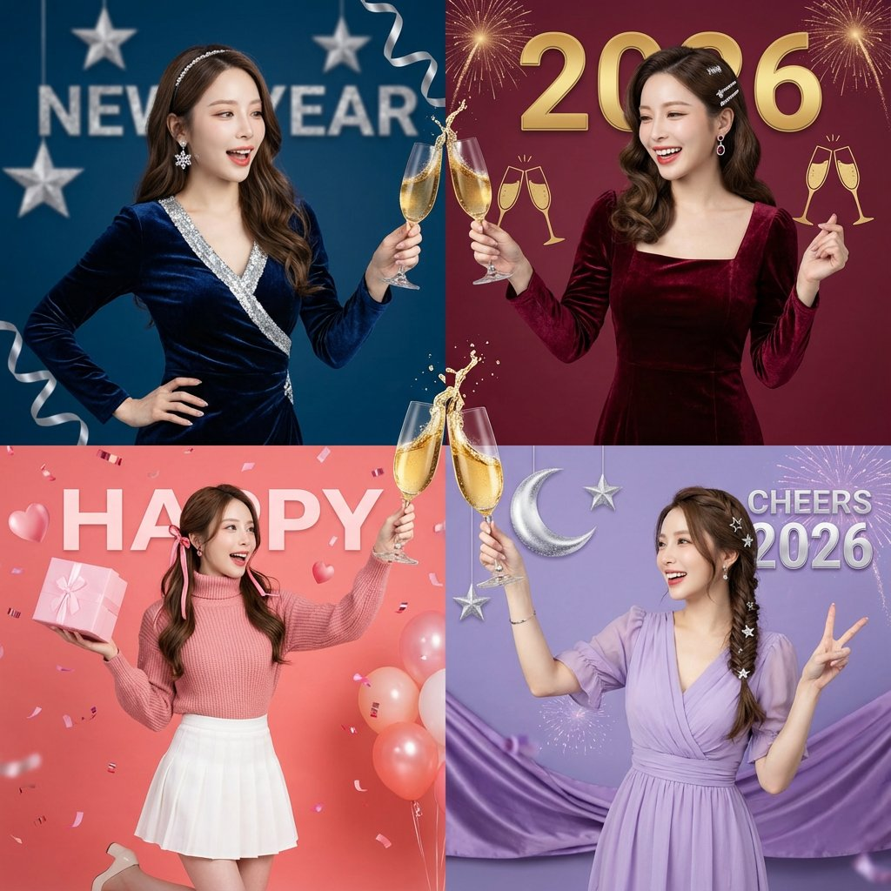

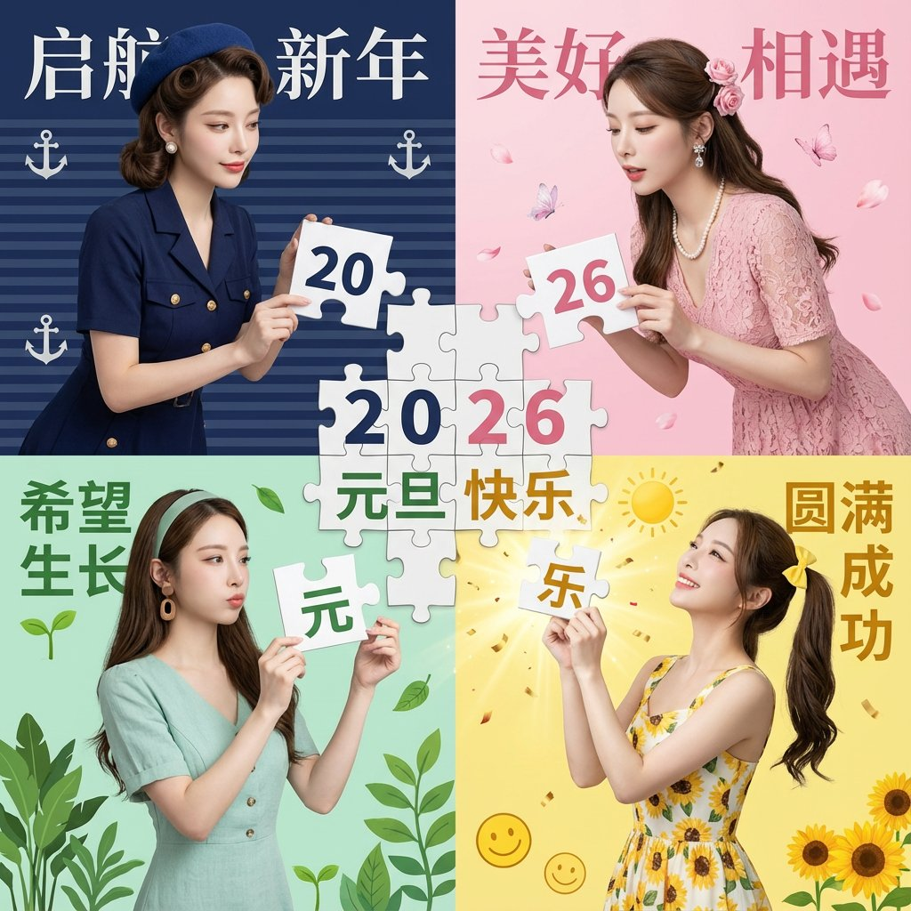

```
[关键:保持精确的面部特征,保留原始脸部结构,图中角色与上传参考图完全一致] 高端摄影棚2x2宫格写真。左上格(深宝石蓝背景):人物穿深蓝色丝绒连衣裙,银色亮片装饰领口袖口,波浪长发戴银色发箍和雪花耳环,她右手高举香槟杯向画面中心伸出做碰杯姿势,左手叉腰,身体前倾,眼神兴奋地看向画面中心,表情期待,嘴角上扬,背景有银色星星、"NEW YEAR"字母、丝带虚化。右上格(勃艮第酒红背景):同一女性穿酒红色天鹅绒方领连衣裙,复古大波浪配水钻发卡和红宝石耳环,她左手高举香槟杯也向画面中心伸出,与其他三格在中心点碰杯,右手做出"cheers"手势,眼神看向中心点,脸上洋溢着开心的笑容,背景有金色"2026"立体数字、香槟杯剪影、烟花图案。左下格(珊瑚粉背景):同一女性穿粉色针织高领毛衣配白色百褶裙,长发用粉色丝带系蝴蝶结,她右手向上举杯与画面中心碰杯,左手捧着粉色礼物盒,身体微微跳起,眼神看向中心,表情激动开心,嘴巴微张,背景有粉色彩纸碎片、"HAPPY"字样、爱心、气球。右下格(薰衣草紫背景):同一女性穿淡紫色雪纺飘逸连衣裙,鱼骨辫配银色星星发饰,她左手向上举杯完成四杯碰杯,四个香槟杯在画面正中心碰触形成"X"型,金色香槟液体从中心溅起,她右手做胜利手势,眼神看向中心,脸上洋溢着狂喜的笑容,背景有银色月亮星星、"CHEERS 2026"字样、紫色丝绸、烟花绽放。四格之间四个酒杯在画面中心形成交叉碰杯互动,淡妆珊瑚色唇妆,柔光箱打造派对氛围,85mm镜头,f/1.8光圈,派对庆祝四联构图,超高清细节。
```

 [↑返回目录](#toc)

---
## <a id="prompt-2003768838111059997">霍格沃茨等火车的女孩</a> (<a href="https://x.com/harboriis/status/2003768838111059997" target="_blank" rel="noopener noreferrer">Harboriis</a>)

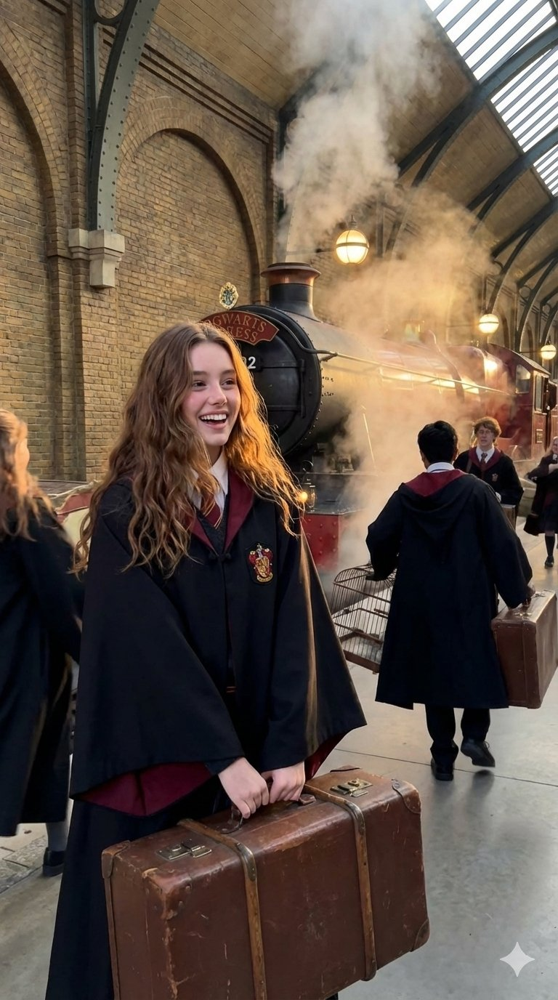

```
Hyperrealistic photograph, 8K, cinematic shot, a young woman (with my exact facial features) standing on the iconic Platform 934, awaiting the Hogwarts Express. She holds a vintage trunk, and her face shows a mix of excitement and eager anticipation. She is dressed in a detailed Hogwarts robe.

The platform is bustling with other students carrying suitcases and owl cages, rushing towards the train. In the background, the famous brick wall, through which passengers are magically passing, is visible. The magnificent Hogwarts Express has already arrived, billowing thick white steam that illuminates the station with warm, glowing lights.

The lighting is a warm, evening glow, creating a magical and nostalgic atmosphere. The scene looks like a real photograph with cinematic color grading. Every detail, from the texture of her robe and the steam of the train to the expressions of the passing students, is rendered with maximum sharpness and clarity, filling the scene with magic and the thrill of the upcoming journey. --ar 9:16
```

```
超写实摄影，8K，电影镜头，一位年轻女子（拥有我完全相同的面部特征）站在标志性的9¾站台，等待霍格沃茨特快列车。她手提一只复古行李箱，脸上流露出兴奋与热切期待交织的神情，身穿细节精致的霍格沃茨长袍。

站台上人潮涌动，其他学生提着行李箱、拎着猫头鹰笼子，匆匆奔向列车。背景中可见那面著名的砖墙，乘客们正神奇地穿墙而过。宏伟的霍格沃茨特快列车已经抵达，喷吐出浓密的白色蒸汽，温暖明亮的灯光照亮了整个车站。

光线呈现出温暖的傍晚光辉，营造出一种魔幻而怀旧的氛围。画面宛如真实照片，采用电影级色彩调校。从她长袍的纹理、火车蒸腾的雾气，到过往学生们的表情，每一处细节都以极致锐利和清晰呈现，让整个场景充满魔法气息与即将启程的激动感。--ar 9:16
```

 [↑返回目录](#toc)

---
## <a id="prompt-2005698218043003100">- Nano Banana Pro at @BasedLabsAI</a> (<a href="https://x.com/_MehdiSharifi_/status/2005698218043003199" target="_blank" rel="noopener noreferrer">Mehdi Sharifi</a>)

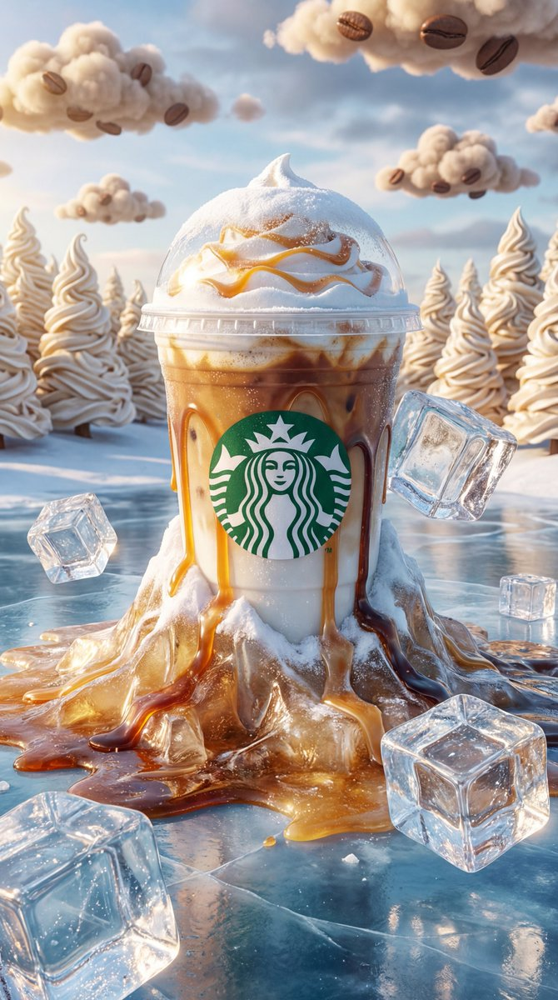

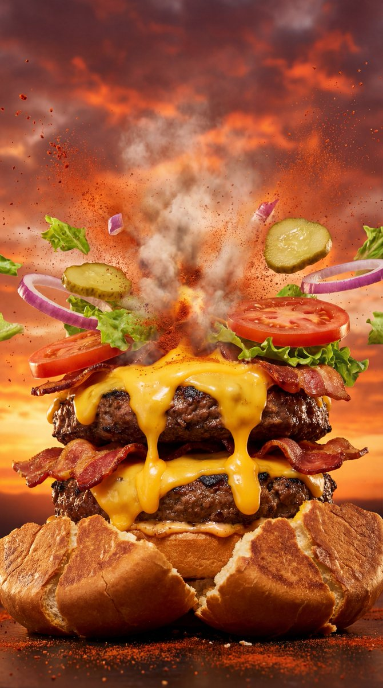

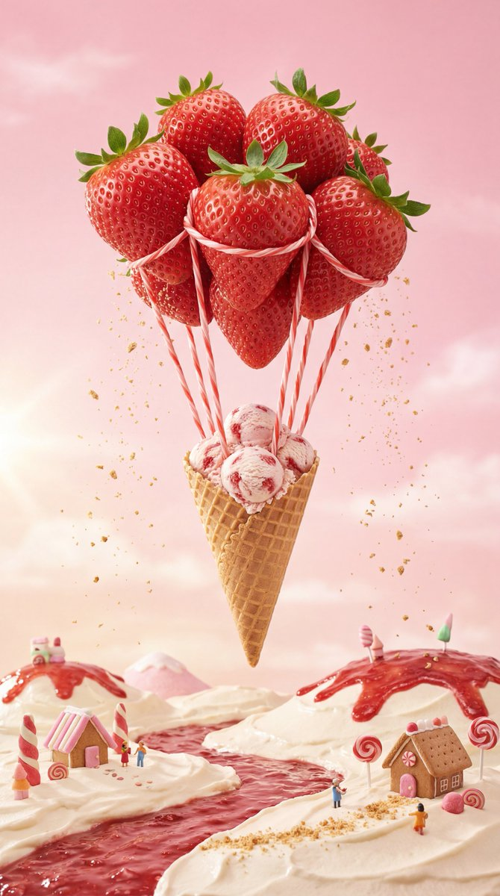

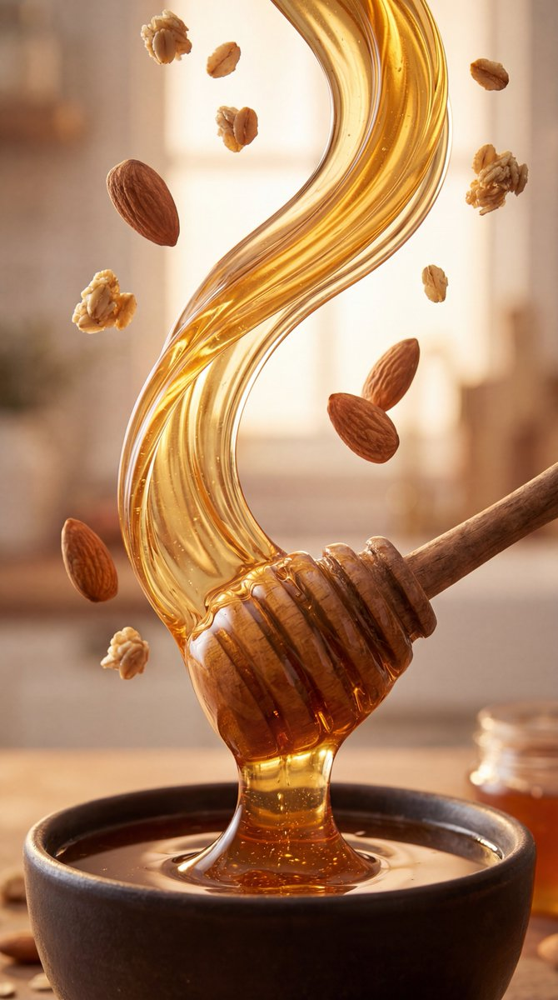

```
Starbucks Iced Caramel Macchiato
A surreal advertising photomontage of a Starbucks-style Iced Caramel Macchiato plastic cup acting as a snow-capped mountain peak. Rivers of golden caramel sauce and rich espresso flow down the sides of the cup, forming a frozen glacier landscape at the base. Giant, crystalline ice cubes float around the cup like miniature icebergs. In the background, a forest made entirely of whipped cream pine trees under a sky filled with coffee bean clouds. The lighting is cool winter sun mixed with warm golden highlights from the caramel. Hyper-realistic textures, fantastic scale, magical atmosphere.

Gourmet Double Cheeseburger
A hyper-realistic food manipulation piece centered on a massive gourmet double cheeseburger. The burger acts as an erupting volcano; molten cheddar cheese flows like lava down cascades of beef patties. Explosions of lettuce leaves, tomato slices, red onions, and pickle coins burst outwards from the center in slow motion, suspended in mid-air against a dramatic, smoky sunset sky made of spice dust. The bun base is cracking open like tectonic plates. Intense, fiery lighting emphasizing heat and flavor explosion. Epic, mouth-watering composition.

Strawberry Cheesecake Ice Cream Cone
A whimsical advertising dreamscape featuring a waffle cone with strawberry cheesecake ice cream. The scoop of ice cream is a fantastical hot air balloon basket, being lifted into a pastel pink sky by giant, ripe strawberries acting as balloons tied with candy ropes. Graham cracker crumbs fall like stardust beneath the cone. Below, a landscape made of rolling hills of cheesecake fluff and rivers of strawberry coulis. Soft, dreamy lighting, fairytale aesthetic, surreal scale.

Honey & Nut Crunch
A luxurious macro food manipulation shot of a wooden honey dipper pulled from a pool of golden honey. The thick stream of honey is defying gravity, swirling around the dipper like ribbons of liquid amber glass and golden silk fabric. Raw almonds and oat clusters are suspended in the air around the honey flow. Soft, warm backlighting creating a glowing, angelic atmosphere. Ultra-detailed sticky texture. No text, purely organic and elegant.
```

```
星巴克冰焦糖玛奇朵  
一幅超现实的广告拼贴作品：一只星巴克风格的冰焦糖玛奇朵塑料杯化作雪山之巅。金色焦糖酱与浓郁浓缩咖啡如河流般沿杯壁倾泻而下，在杯底形成冰川般的冻结景观。巨大的水晶冰块如微型冰山般漂浮在杯子周围。背景是一片由鲜奶油制成的松树森林，天空中布满咖啡豆形状的云朵。光线融合了清冷的冬日阳光与焦糖带来的温暖金色高光。画面呈现超写实质感、奇幻比例与魔幻氛围。

豪华双层芝士汉堡  
一幅超写实的食物创意作品，聚焦于一个巨型豪华双层芝士汉堡。汉堡如同喷发的火山，融化的切达奶酪如熔岩般从层层牛肉饼上流淌而下。生菜叶、番茄片、红洋葱圈和酸黄瓜片从中心向外爆裂，在香料粉尘构成的戏剧性烟熏落日天空背景下，以慢动作悬浮于空中。汉堡底部的面包如板块般裂开。强烈的火光照明突显热度与风味的爆发感，构图恢弘诱人。

草莓芝士蛋糕冰淇淋甜筒  
一幅充满奇想的广告梦幻场景：一支华夫甜筒盛着草莓芝士蛋糕口味的冰淇淋。冰淇淋球化身为热气球吊篮，被巨大熟透的草莓当作气球，用糖果绳索牵引升入粉彩般的粉色天空。全麦饼干碎屑如星尘般从甜筒下方飘落。下方地貌由绵延起伏的芝士蛋糕云朵与草莓果酱河流构成。整体采用柔和梦幻的光线，童话般的美学风格，比例超现实。

蜂蜜坚果脆片  
一幅奢华的微距食物创意摄影：一支木制蜂蜜蘸棒从一池金黄蜂蜜中提起。浓稠的蜂蜜流违背重力，如琥珀色玻璃丝带与金色丝绸般缠绕在蘸棒周围。生杏仁与燕麦簇悬浮于蜂蜜流周围的空中。柔暖的背光营造出光辉圣洁的氛围。细节极致，突出黏稠质感。无文字，纯粹自然优雅。
```

 [↑返回目录](#toc)

---
## <a id="prompt-2005628752802517500">超现实分段火山玄武岩构造</a> (<a href="https://x.com/Sheldon056/status/2005628752802517441" target="_blank" rel="noopener noreferrer">Dr.duet</a>)

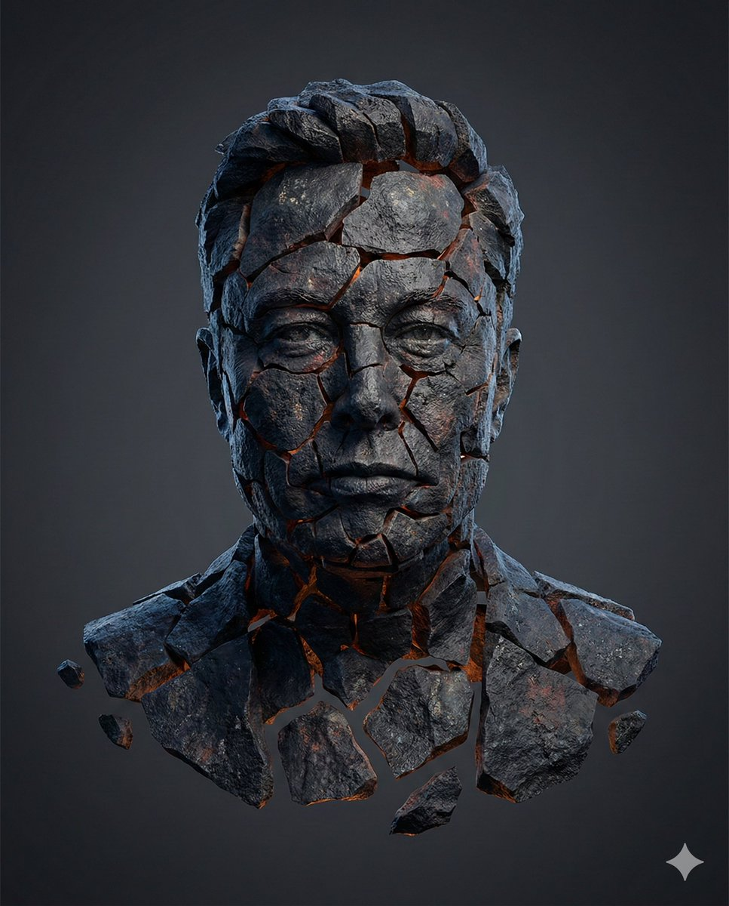

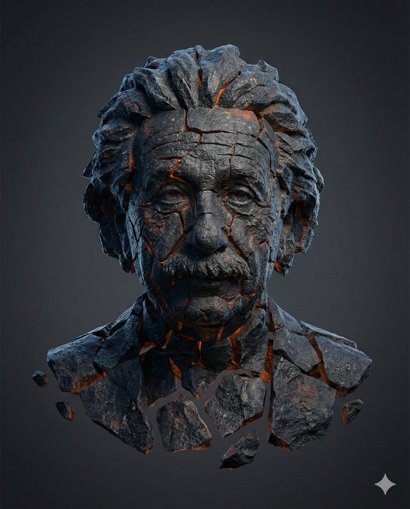

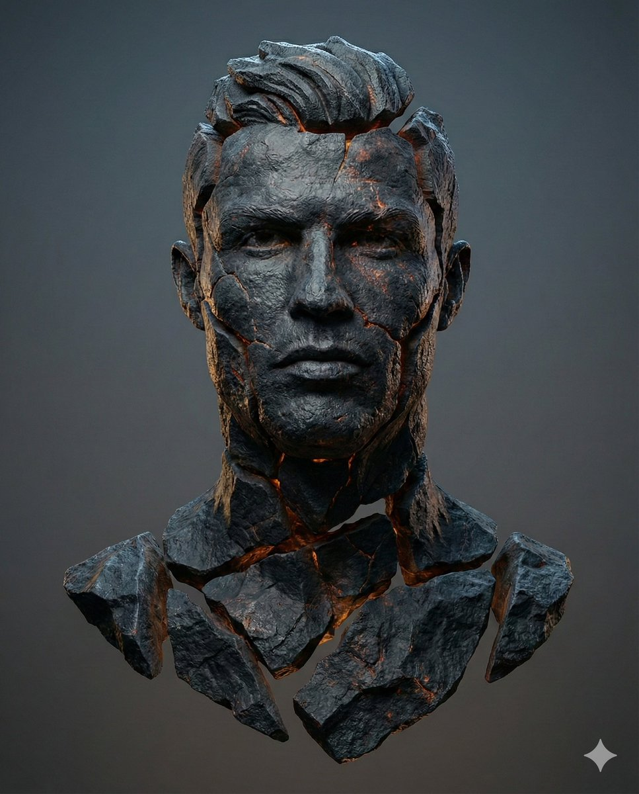

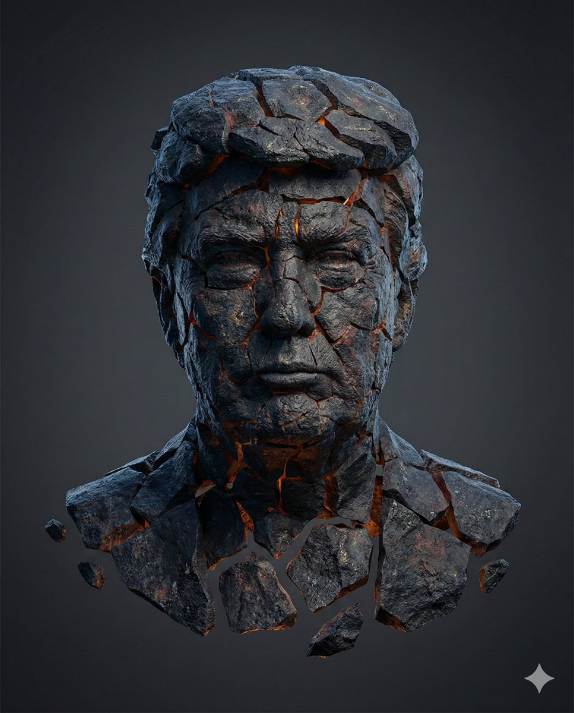

```
{
  "task": "image_to_image_style_transfer",
  "input_image": "{{USER_IMAGE}}",
  "prompt": "Reimagine the subject as a hyper-real fragmented volcanic basalt construct, assembled from jagged, sharply defined basalt plates suspended in space. Each fragment is fully separated with clearly visible gaps, never touching or fused. Material detail: deep charcoal-black basalt with layered volcanic textures, rough porous surfaces, chipped edges, fine mineral grain, and realistic surface imperfections. Within the gaps only, a subtle internal glow radiates in rich ember tones—burnt orange, molten amber, hints of crimson and gold—suggesting internal heat without any surface glow, lava flow, or melting. Add natural mineral color variation across the basalt, including graphite greys, cool indigo shadows, iron-red undertones, and faint mineral speckling to enhance realism and depth. Lighting: cinematic studio setup with a cool blue-grey top key light defining form and silhouette, combined with a soft warm under-fill that gently reflects ember colors onto nearby fragments. Shadows are realistic and grounded, with precise ambient occlusion in crevices and natural depth between floating pieces. Background: smooth dark neutral studio grey with a subtle vignette for contrast, no texture or distractions. Composition: centered, straight-on, medium framing with a strong, readable silhouette. Preserve the subject’s exact facial identity, proportions, and anatomy from the input image. Ultra-realistic, high dynamic range, cinematic color grading, sharp focus, 8K clarity.",
  "negative_prompt": "lava flow, molten surfaces, surface glow, fantasy creature, demon, exaggerated fire effects, cartoon, stylized art, plastic texture, metal shine, glossy surfaces, merged rocks, fused fragments, blur, noise, low resolution, oversharpening halos, face distortion, deformed anatomy, extra limbs, unreadable silhouette, fog, smoke, text, typography, logo, watermark, signature",
  "output": {
    "aspect_ratio": "use_input_aspect_ratio",
    "background": "dark_neutral_grey",
    "camera": {
      "angle": "straight_on",
      "framing": "centered",
      "distance": "medium"
    }
  },
  "params": {
    "style_strength": 0.8,
    "identity_preservation": 0.92,
    "detail_level": "very_high",
    "lighting_preset": "cinematic_cool_warm_studio",
    "shadow_intensity": "moderate",
    "gap_visibility": "clear",
    "internal_glow": "subtle_multicolor_ember",
    "color_enrichment": "natural_volcanic_mineral_tones",
    "debris_chips": "none",
    "no_text": true
  }
}
```

```
将主体重新构想为一个超现实的分段火山玄武岩构造，由悬挂在空间中的锯齿状、边缘分明的玄武岩板块组成。每个碎片完全分离，有明显的可见间隙，从不接触或融合。材质细节：深炭黑色玄武岩带有层次分明的火山纹理，粗糙多孔的表面，缺口边缘，细矿物颗粒，以及真实的表面瑕疵。仅在间隙中，散发出微妙的内部光芒，呈现丰富的余烬色调——烧焦的橙色、熔融的琥珀色、深红色和金色的暗示——暗示内部热量而不产生表面光辉、熔岩流或融化现象。在整个玄武岩上添加自然的矿物色彩变化，包括石墨灰、冷靛蓝阴影、铁红色底色和微弱的矿物斑点以增强真实感和深度。照明：采用电影工作室设置，顶部使用冷蓝色关键光定义形状和轮廓，结合柔和温暖的下部填充光，轻轻反射余烬颜色到附近的碎片上。阴影真实且固定，在缝隙和自然深度之间有精确的环境光遮蔽。背景：平滑的暗中性工作室灰色，带有微妙的晕影以增加对比度，无纹理或干扰元素。构图：居中、正面、中等框架，具有强烈可读的轮廓。保留输入图像中主体的确切面部特征、比例和解剖结构。超逼真，高动态范围，电影级色彩分级，清晰焦点，8K清晰度。

负面提示词：熔岩流、熔融表面、表面光辉、幻想生物、恶魔、夸张的火效、卡通、风格化艺术、塑料质感、金属光泽、光滑表面、合并的岩石、融合的碎片、模糊、噪点、低分辨率、过度锐化的光晕、脸部失真、变形的解剖结构、额外的肢体、不可读的轮廓、雾、烟、文字、排版、标志、水印、签名。
```

 [↑返回目录](#toc)

---
## <a id="prompt-2005620980891480600">自定义形状的字体插画</a> (<a href="https://x.com/TechieBySA/status/2005620980891480567" target="_blank" rel="noopener noreferrer">TechieSA</a>)

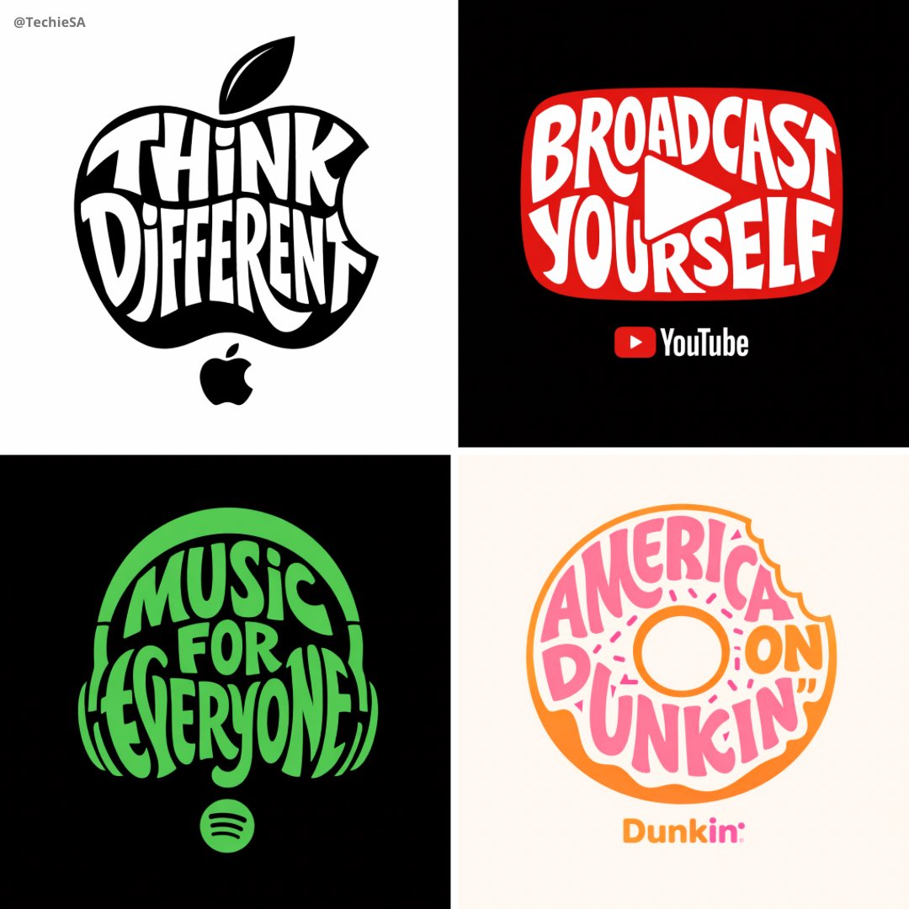

```
Create a typographic illustration shaped like a [OBJECT], where the text [BRAND SLOGAN] forms the shape — bold and playful lettering style that fills the entire silhouette — letters adapt fluidly to the curves and contours of the [OBJECT] — [COLOR DESCRIPTION] with [BACKGROUND COLOR] background that enhances the focus on the main shape — include [BRAND] logo positioned below the [OBJECT] — vector-style, clean, high resolution, 1080x1080 pixels, square format.
```

```
创作一幅以[OBJECT]为形状的字体插画，文字“[BRAND SLOGAN]”构成该形状的整体轮廓——采用大胆而活泼的字体风格，填满整个剪影；字母流畅地贴合[OBJECT]的曲线与轮廓；配色为[COLOR DESCRIPTION]，背景色为[BACKGROUND COLOR]，以突出主体形状；在[OBJECT]下方放置[BRAND]标志；矢量风格，干净清晰，高分辨率，1080x1080像素，正方形格式。
```

 [↑返回目录](#toc)

---
## <a id="prompt-2005877044584849700">童年偶像走进现实</a> (<a href="https://x.com/YaseenK7212/status/2005877044584849773" target="_blank" rel="noopener noreferrer">Yaseen Khan Gul</a>)

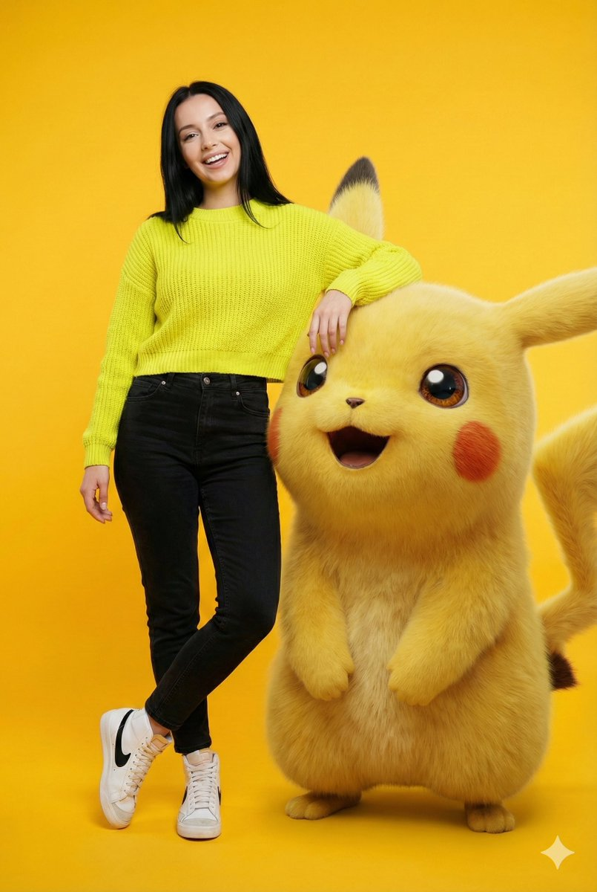

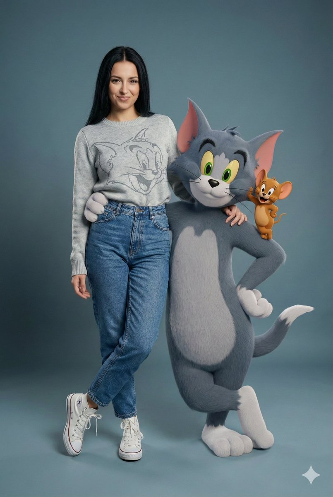

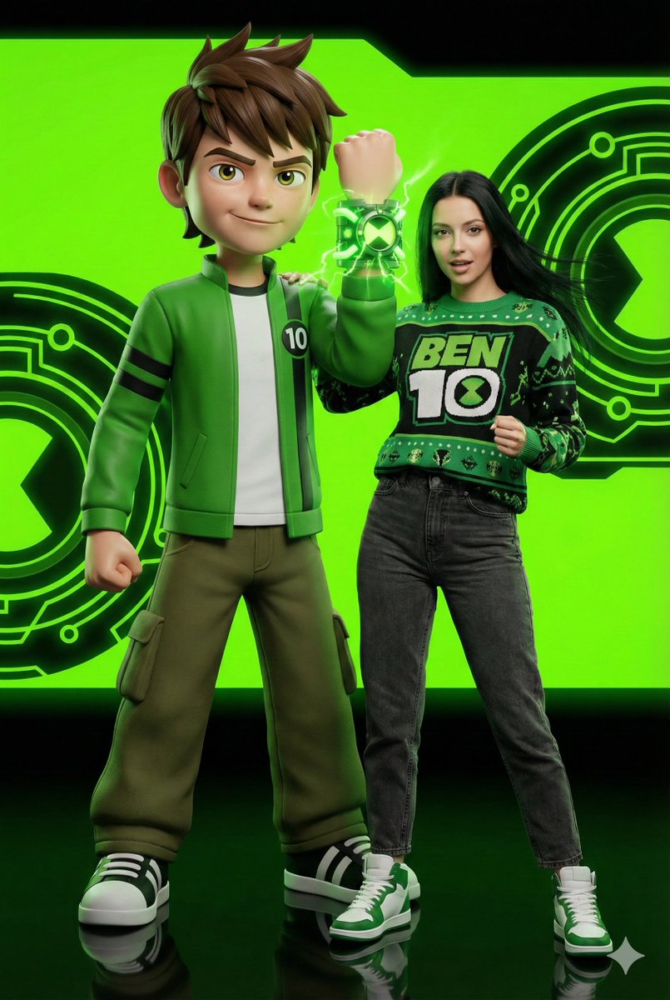

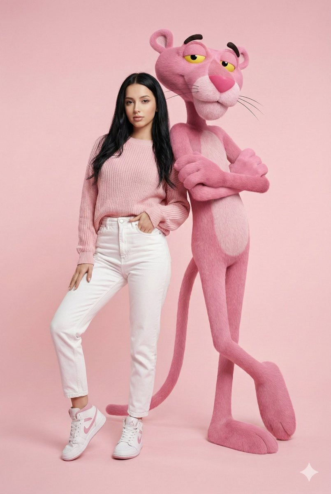

```
[
  {
    "image_generation": {
      "quality": "hyper-realistic",
      "face": { "preserve_original": true },
      "subject": {
        "clothing": "light grey knitted sweater, blue high-waisted jeans, white high-top sneakers",
        "pose": "standing with arm around giant 3D Tom; Jerry on Tom's shoulder",
        "expression": "fun, mischievous",
        "character_element": {
          "name": "Tom & Jerry",
          "type": "3D photorealistic duo",
          "interaction": "Tom posing confidently, Jerry playfully"
        }
      },
      "environment": "clean grey-blue backdrop"
    }
  },
  {
    "image_generation": {
      "quality": "hyper-realistic",
      "face": { "preserve_original": true },
      "subject": {
        "clothing": "electric yellow knitted sweater, black high-waisted jeans, white/black high-top sneakers",
        "pose": "arm resting on giant 3D Pikachu",
        "expression": "energetic, cheerful",
        "character_element": {
          "name": "Pikachu",
          "type": "giant 3D photorealistic render",
          "interaction": "smiling up at person"
        }
      },
      "environment": "vibrant yellow backdrop"
    }
  },
  {
    "image_generation": {
      "quality": "hyper-realistic, professional fashion photoshoot",
      "face": { "preserve_original": true },
      "subject": {
        "clothing": "Ben 10 themed green/black sweater, dark grey jeans, white/green sneakers",
        "pose": "standing beside giant 3D Ben 10 activating Omnitrix",
        "expression": "confident, energetic",
        "character_element": {
          "name": "Ben Tennyson (Classic Ben 10)",
          "type": "giant 3D photorealistic render with cartoon accuracy",
          "details": "accurate green jacket outfit, glowing green Omnitrix on wrist",
          "interaction": "Ben activates Omnitrix with dynamic green glow"
        }
      },
      "environment": {
        "background": "neon-green and black circuitry patterns",
        "lighting": "dynamic green glow reflecting from Omnitrix",
        "mood": "sci-fi hero fashion shoot"
      }
    }
  },
  {
    "image_generation": {
      "quality": "hyper-realistic",
      "face": { "preserve_original": true },
      "subject": {
        "clothing": "pastel pink knitted sweater, white high-waisted jeans, white/pink sneakers",
        "pose": "posing fashionably beside tall 3D Pink Panther",
        "expression": "elegant, stylish",
        "character_element": {
          "name": "Pink Panther",
          "type": "giant 3D render",
          "interaction": "striking a suave pose"
        }
      },
      "environment": "light pastel pink backdrop"
    }
  }
]
```

```
高质量的超现实风格，保持原始面部特征。主体穿着浅灰色针织毛衣、蓝色高腰牛仔裤和白色高帮运动鞋，站在巨大的3D汤姆旁边，杰瑞在汤姆的肩膀上，表情有趣调皮，汤姆自信地摆姿势，杰瑞顽皮互动，背景为干净的灰蓝色。

高质量的超现实风格，保持原始面部特征。主体穿着电黄色针织毛衣、黑色高腰牛仔裤和黑白高帮运动鞋，手臂搭在一个巨大的3D皮卡丘上，表情充满活力和欢乐，皮卡丘抬头微笑，背景是明亮的黄色。

超现实且专业的时尚拍摄质量，保持原始面部特征。主体穿着本10主题的绿黑相间毛衣、深灰色牛仔裤和白绿相间的运动鞋，站在一个巨大的3D本·坦尼森（经典本10）旁边激活奥米特里克斯，表情自信而充满活力，准确的绿色夹克和腕部发光的绿色奥米特里克斯，背景为霓虹绿色和黑色电路图案，动态绿色光芒从奥米特里克斯反射出来，营造出科幻英雄时尚拍摄氛围。

高质量的超现实风格，保持原始面部特征。主体穿着粉色针织毛衣、白色高腰牛仔裤和粉白相间的运动鞋，以时髦的姿势站在巨大的3D粉红豹旁边，表情优雅时尚，粉红豹摆出潇洒的姿态，背景为浅粉色。
```

 [↑返回目录](#toc)

---
## <a id="prompt-2005670356745322800">极简风格品牌首字母单体徽标设计</a> (<a href="https://x.com/AmirMushich/status/2005670356745322759" target="_blank" rel="noopener noreferrer">AmirMušić</a>)

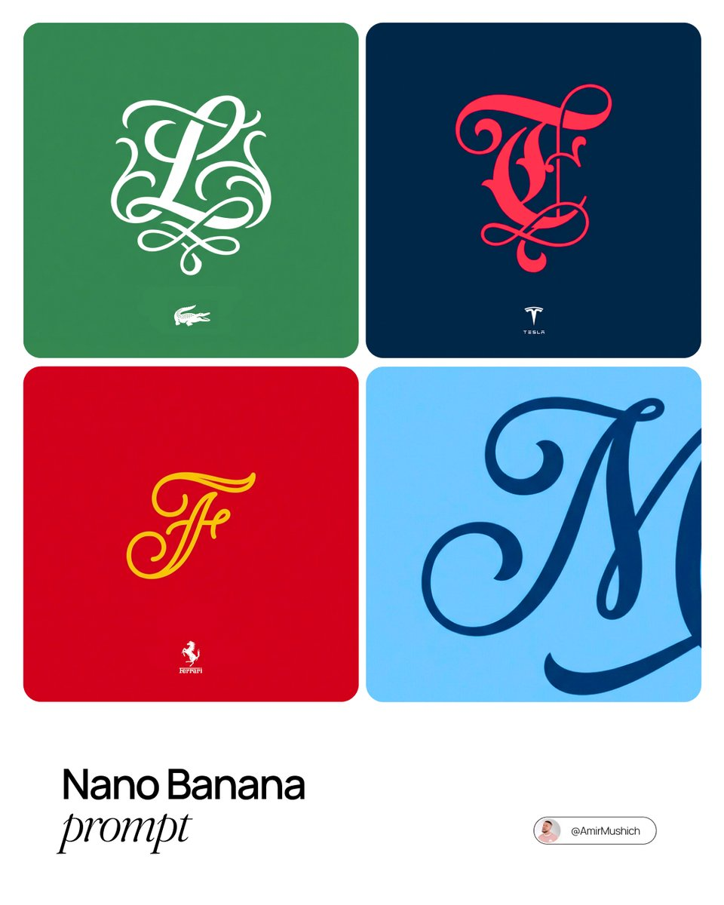

```
A flat, minimalist vector design featuring a highly stylized single letter monogram with the official brand logo below it, representing [BRAND NAME].

**MAIN ELEMENT (THE MONOGRAM):**
The center of the design features ONLY the single first letter of "[BRAND NAME]". The style is "Ornamental Vector Typography" with high calligraphic artistry, mimicking bespoke luxury monograms. This is not a standard font; it is a Highly customized, artistic glyph with elegant flourishes, exaggerated swashes, or ornamental serifs. The lines are clean, precise, and perfectly smooth vector graphics.

**SECONDARY ELEMENT (BRAND IDENTIFIER):**
Directly below the main stylized letter, positioned centrally, include the actual, original official logomark or logotype of "[BRAND NAME]". This element must be rendered significantly smaller than the main letter above it.

**FINISH & TEXTURE (STRICT):**
Absolutely zero texture, zero embossing, zero shadows, and zero gradients anywhere in the image. It must look like a perfectly flat digital illustration or screen print.

**COLOR PALETTE (AI-DRIVEN & HIGH CONTRAST):**
1.  **Background:** A single, solid, flat color block chosen by the AI to represent the vibe of [BRAND NAME].
2.  **Main Monogram Color:** A single, solid, flat color that creates a sharp, high contrast against the background.
3.  **Secondary Logo Color:** The small official logo below must be monochrome. It must be EITHER solid white OR solid dark gray—chosen automatically based on whichever offers the best readability against the chosen background color.
```

```
一幅扁平化、极简风格的矢量设计，中央为高度风格化的单字母徽标，其下方是[品牌名称]的官方品牌标志。

**主元素（徽标）：**  
设计中心仅包含“[品牌名称]”首字母的单个字符。采用“装饰性矢量字体”风格，具有高水准的书法艺术感，模仿定制奢华徽标。该字符并非标准字体，而是高度定制的艺术字形，带有优雅的装饰笔画、夸张的花饰或装饰性衬线。线条干净、精准，呈现完美平滑的矢量图形。

**次要元素（品牌标识）：**  
在主字母正下方居中位置，加入[品牌名称]真实、原始的官方标志或标准字标。此元素尺寸必须明显小于上方的主字母。

**表面与质感（严格要求）：**  
画面中绝对不可出现任何纹理、浮雕、阴影或渐变效果，整体须呈现如数字插画或丝网印刷般的纯扁平效果。

**配色方案（AI智能选择，高对比度）：**  
1. **背景：** 由AI根据[品牌名称]的品牌调性自动选择一种纯色实心背景。  
2. **主徽标颜色：** 使用一种纯色实心色彩，与背景形成鲜明高对比。  
3. **次要标志颜色：** 下方小型官方标志必须为单色，根据背景自动选择纯白色或深灰色，以确保最佳可读性。
```

 [↑返回目录](#toc)

---
## <a id="prompt-2005685514154958800">暗调奢华的黑巧克力飞溅</a> (<a href="https://x.com/Ankit_patel211/status/2005685514154958917" target="_blank" rel="noopener noreferrer">ANKIT PATEL 🇮🇳 | AI</a>)

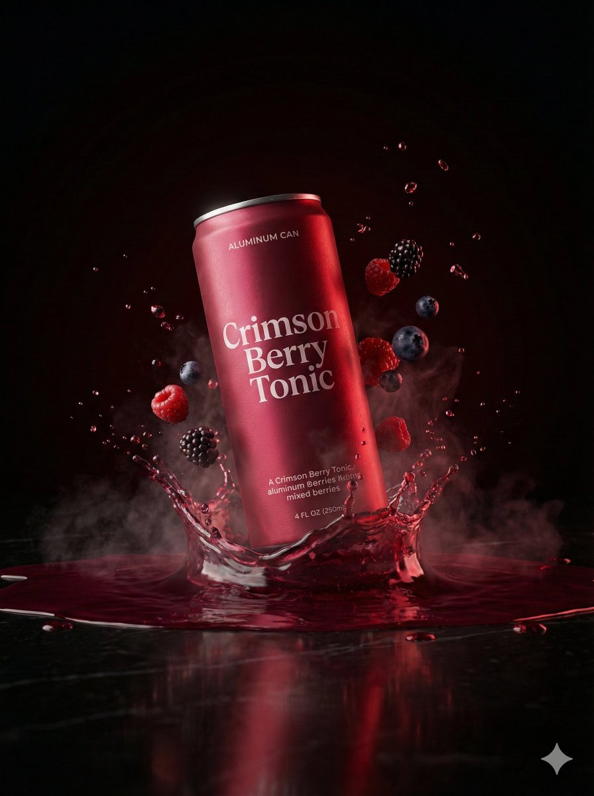

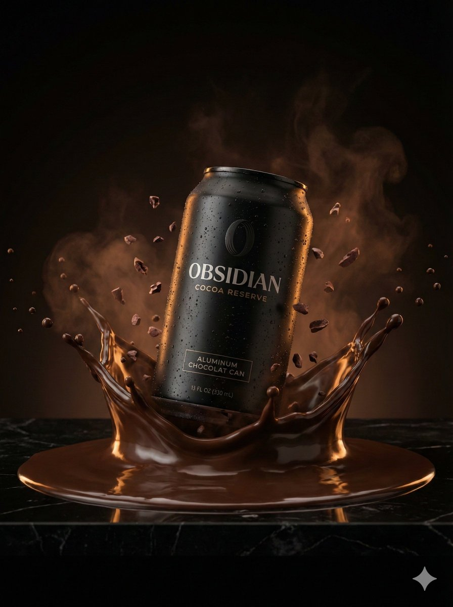

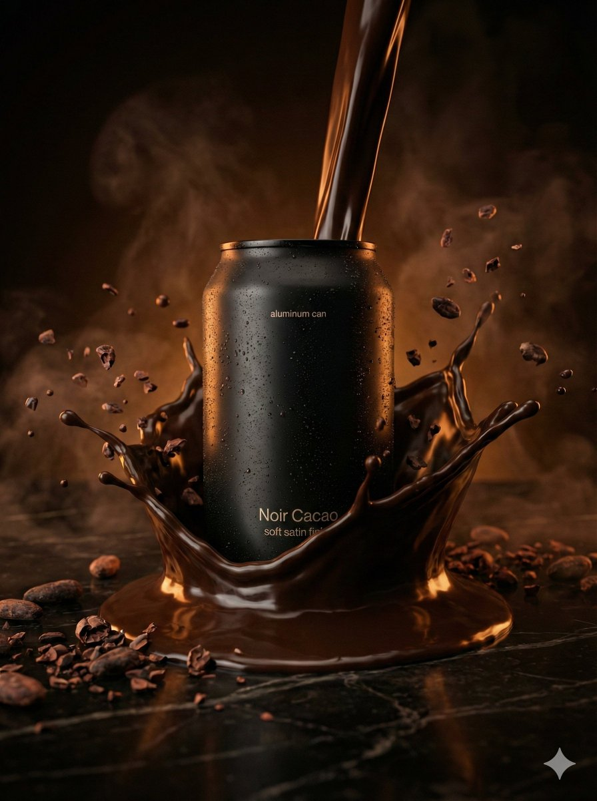

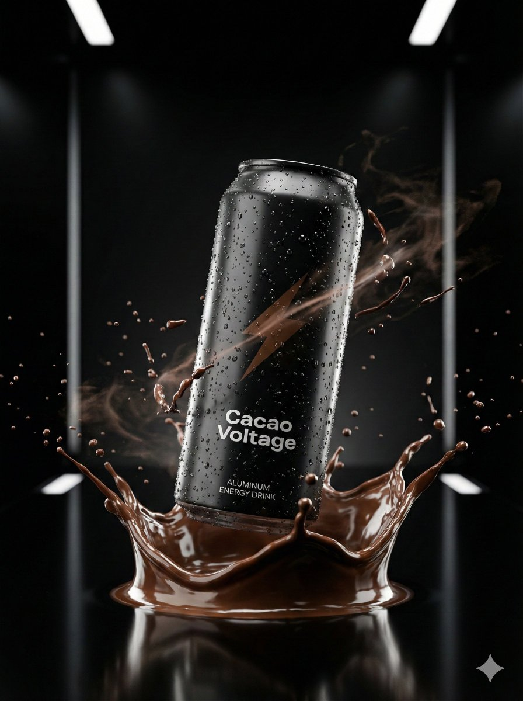

```
{
  "cinematic_beverage_product_shots_detailed": [
    {
      "id": "shot_003_obsidian_cocoa_reserve",
      "product_details": {
        "brand_name": "Obsidian Cocoa Reserve",
        "container_type": "Matte onyx-black aluminum can with subtle satin sheen",
        "condition": "Deep chill with slow-forming condensation beads",
        "elements_around_product": ["Cocoa nib fragments", "Chocolate vapor mist"]
      },
      "environment_and_setting": {
        "location": "Dark luxury studio",
        "surface": "Polished black obsidian stone",
        "atmosphere": "Rich, indulgent, ultra-premium hero frame"
      },
      "liquid_action": {
        "type": "Velvety dark chocolate liquid",
        "state": "Suspended splash with dense droplets",
        "movement": "Thick chocolate surges upward as the can emerges from the center"
      },
      "lighting": {
        "style": "Low-key cinematic lighting with warm amber highlights"
      },
      "camera_work": {
        "style": "Slow cinematic dolly-in with subtle parallax"
      },
      "full_description": "Set in a dark luxury studio as velvety dark chocolate liquid surges upward in a dense suspended splash over polished black obsidian stone; the matte onyx-black can of Obsidian Cocoa Reserve rises through the chocolate with condensation beads slowly forming on its surface; cocoa nib fragments and warm chocolate vapor mist hover around the can under low-key cinematic lighting with amber highlights, creating a rich, indulgent ultra-premium hero shot"
    }
  ]
}
```

```
在暗调奢华摄影棚中，丝绒般浓郁的黑巧克力液体在抛光黑曜石台面上方形成密集悬浮飞溅；“Obsidian Cocoa Reserve”品牌的哑光乌黑铝罐从巧克力液中缓缓升起，罐身表面凝结出缓慢形成的水珠；可可碎粒与温热的巧克力蒸汽缭绕于罐体四周，在低调电影感灯光与琥珀色高光的映衬下，营造出浓郁、奢享、超高端的主角镜头。
```

 [↑返回目录](#toc)

---
## <a id="prompt-2006020799367442700">睡前再来一个有趣的结合版，睡觉！</a> (<a href="https://x.com/berryxia/status/2006020799367442728" target="_blank" rel="noopener noreferrer">Berryxia.AI</a>)

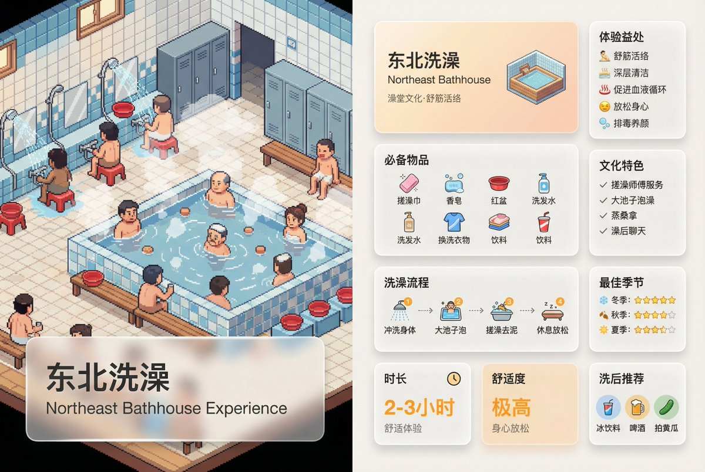

```
睡前再来一个有趣的结合版，睡觉！
```

 [↑返回目录](#toc)

---
## <a id="">植物养护科普展板</a> (<a href="https://x.com/yyyole/status/2007452488685777114" target="_blank" rel="noopener noreferrer">沐阳</a>)

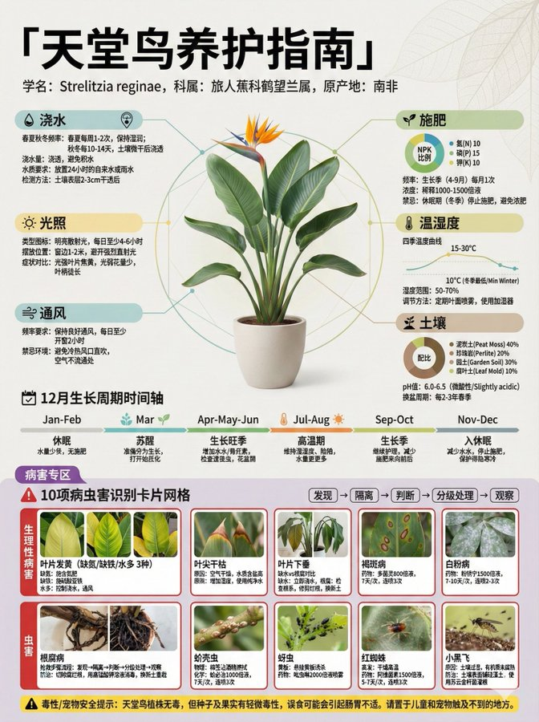

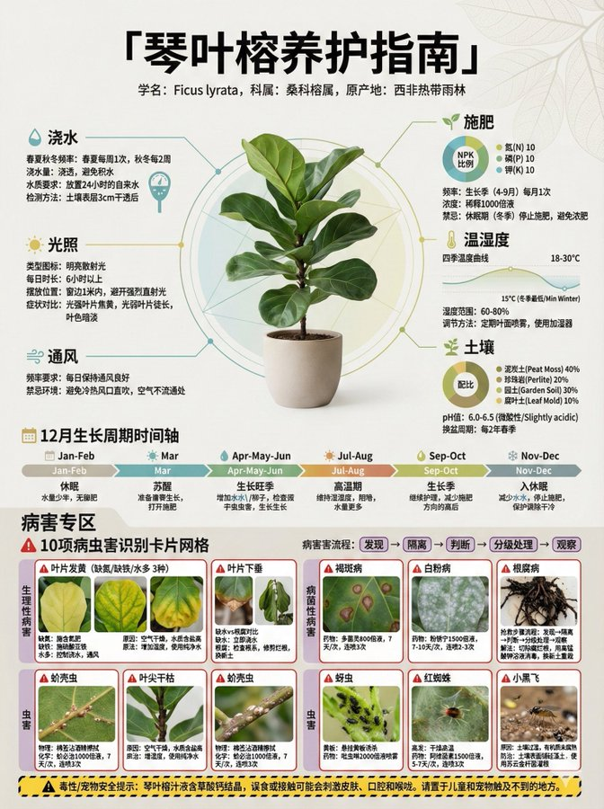

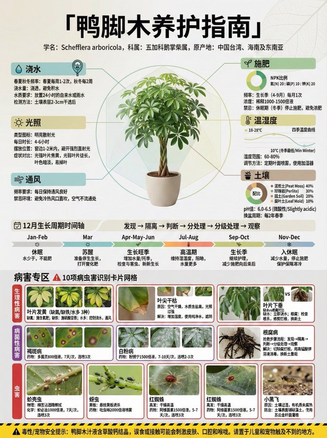

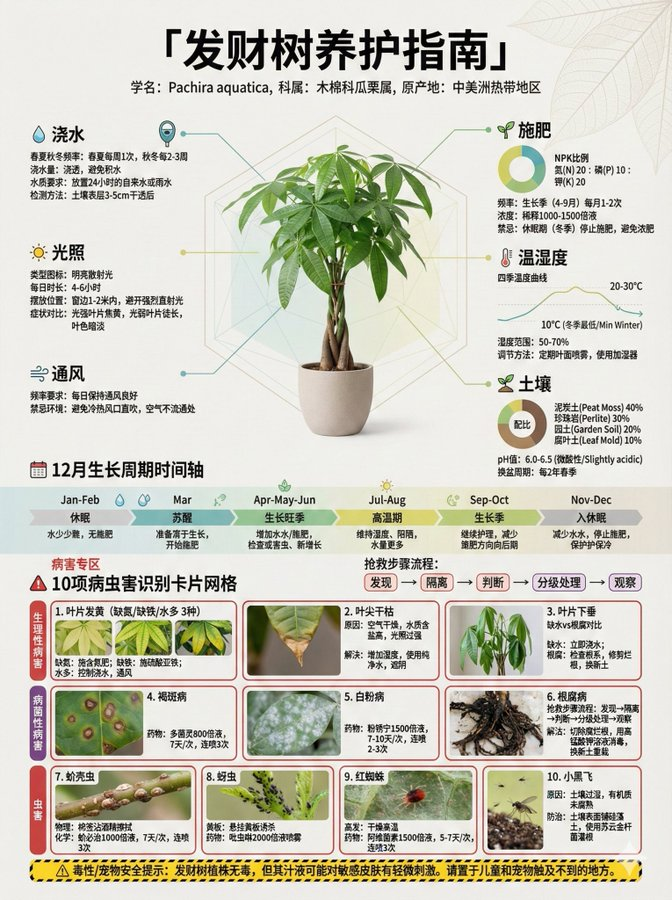

```
【主标题】「发财树养护指南」字体：思源黑体，确保中文清晰渲染副标题：学名、科属、原产地【中央视觉】画面中心25%：该植物健康盆栽实物，写实风格背景：浅色极简（米白/浅灰）+ 淡雅几何/叶脉底纹（透明度20%）【信息布局 - 自动填充真实数据】**左侧（蓝绿色系）：**浇水：春夏秋冬频率、浇水量、水质要求、检测方法光照：类型图标、每日时长、摆放位置、症状对比通风：频率要求、禁忌环境**右侧（黄绿色系）：**施肥：NPK比例饼图、频率、浓度、禁忌温湿度：四季温度曲线、湿度范围、调节方法土壤：配比饼图、pH值、换盆周期**中部横条：**12月生长周期时间轴（每月关键养护点图标化）**下方病害专区（占30%，红紫警示色）：****10项病虫害识别卡片网格（3行）***生理性病害：*1. 叶片发黄（缺氮/缺铁/水多 3种）- 症状图+对策2. 叶尖干枯 - 原因+解决方案3. 叶片下垂 - 缺水vs根腐对比*病菌性病害：*4. 褐斑病 - 特写图+多菌灵浓度用法5. 白粉病 - 症状图+防治药物6. 根腐病 - 抢救步骤流程*虫害：*7. 蚧壳虫 - 识别图+物理+化学防治8. 蚜虫 - 识别+黄板+药物名称9. 红蜘蛛 - 识别+高发条件+药物10. 小黑飞 - 识别+原因+防治每个卡片包含：- 症状特写图（占40%）- 标题+识别要点+具体防治方案- 药物名称+浓度+使用频次（如"多菌灵800倍液，7天/次，连喷3次"）急救流程图：发现→隔离→判断→分级处理→观察**底部栏：**毒性/宠物安全提示 【设计规范】- 信息密度：高（留白25%）- 连接线：从盆栽放射到各标注，细线条- 色彩编码：蓝=水、黄=光照、绿=营养、红=病害、紫=虫害- 卡片层级：主标题16pt粗体 > 内容12pt > 备注9pt细体- 图标：统一线性风格- 中文排版：行距1.5，紧凑可读- 病害卡片：红色边框+症状大图【风格参考】日本植物园导览牌 + 现代自然博物馆信息墙 + DK园艺图鉴【技术】正面平视/微俯视，柔和光线，中大景深，4K超高清**关键要求：所有养护数据、病害信息、药物名称、使用浓度均需根据所选植物自动填充真实准确的专业数据**botanical care guide poster, high-density infographic, museum exhibition style, pest disease identification, Chinese typography, minimalist background, professional horticultural data, 4K quality
```

 [↑返回目录](#toc)

---
## <a id="">国际顶流时尚杂志封面</a> (<a href="https://x.com/msjiaozhu/status/2007446691235148270" target="_blank" rel="noopener noreferrer">MapleShaw</a>)

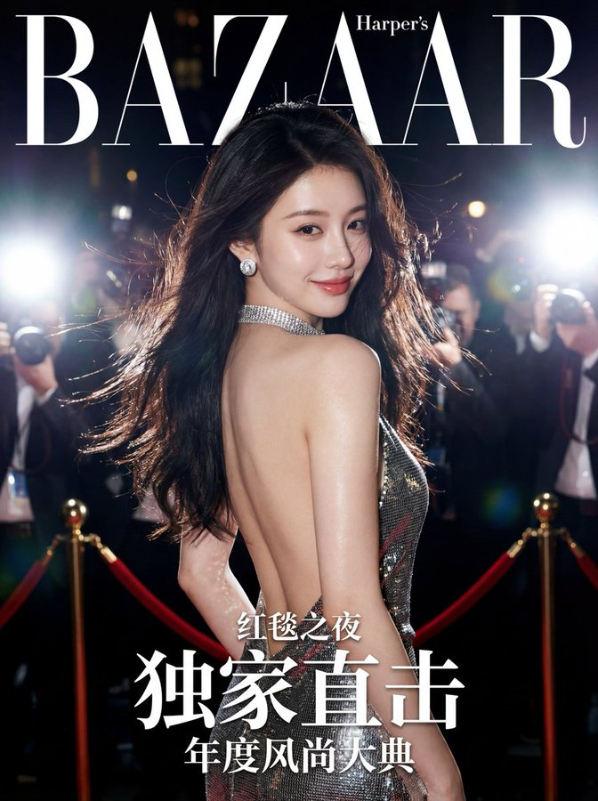

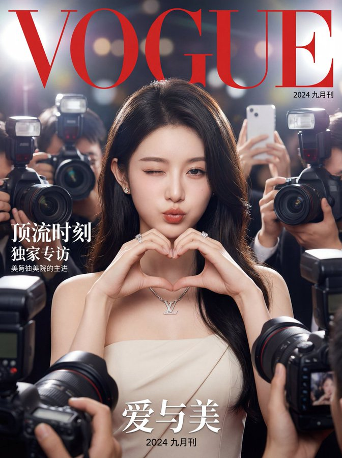

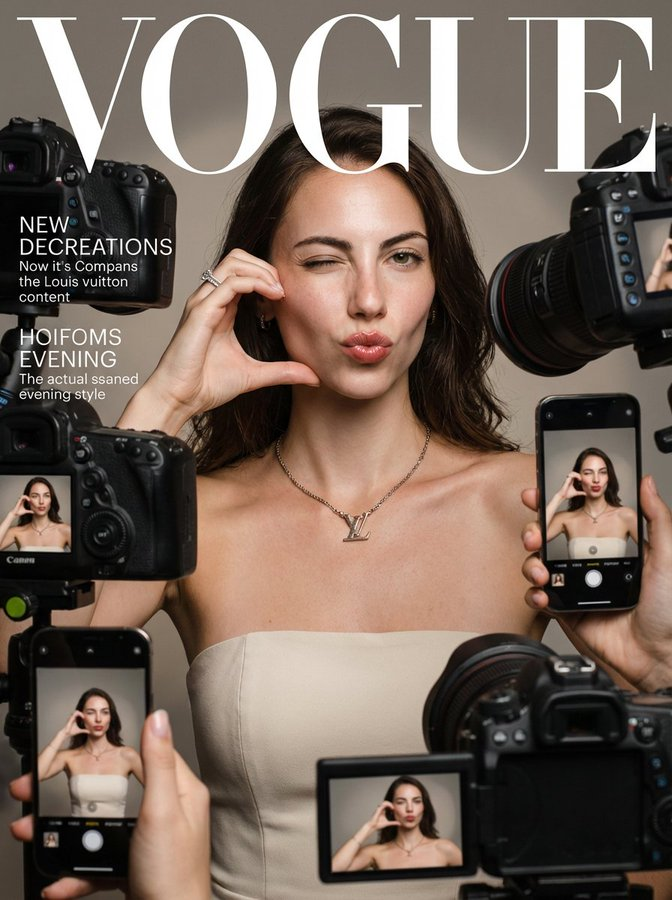

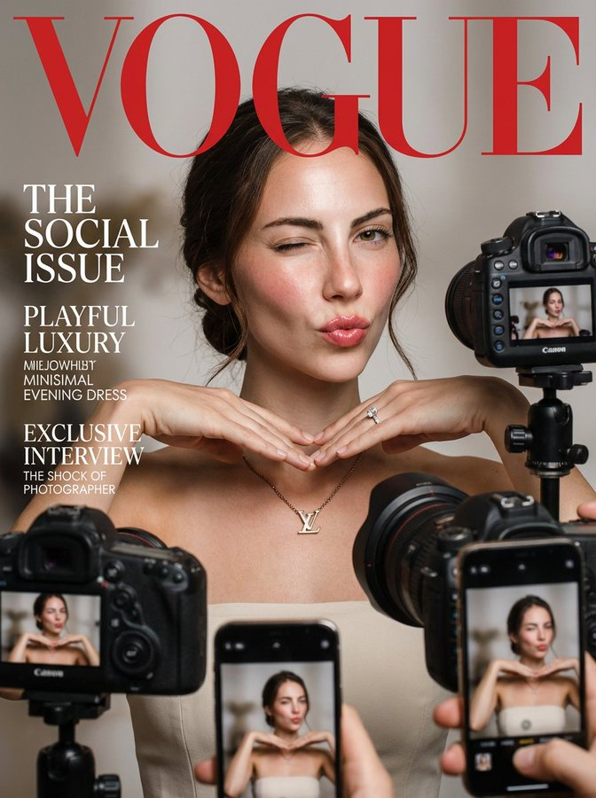

```
{
  "meta": {
    "system_instruction": "Create a high-end fashion magazine cover. Use the uploaded face for strict identity preservation.",
    "aspect_ratio": "3:4",
    "quality": "ultra-detailed",
    "resolution": "8k",
    "style": "Met Gala red carpet event, direct flash photography, glamorous celebrity candid"
  },

  "reference_usage": {
    "instruction": "Strictly preserve facial identity (eyes, nose, mouth) from the uploaded reference. Body proportions should be model-like and tall.",
    "focus": "100% Face Identity Match"
  },

  "scene": {
    "location": "The Met Gala Red Carpet (New York)",
    "environment": [
      "chaotic background with paparazzi cameras",
      "red velvet ropes",
      "bursts of camera flashes (bokeh orbs)",
      "dark night sky contrast"
    ],
    "atmosphere": "electric, exclusive, superstar energy"
  },

  "lighting": {
    "type": "Direct Flash (Paparazzi Style)",
    "effect": "High contrast hard light, glistening skin, sharp shadows behind the subject, bright reflections on dress"
  },

  "subject": {
    "face": {
      "expression": "Seductive confident smile, looking back over shoulder",
      "makeup": "bold red lip, sharp contouring, glowing highlighter"
    },
    "pose": {
      "action": "walking away but turning head 45 degrees to look at camera",
      "body": "elegant posture, back slightly arched",
      "hair": "blowing dramatically in the wind"
    },
    "outfit": {
      "dress": "Futuristic liquid-metal silver gown",
      "details": "backless design, reflecting the camera flashes, sequin texture",
      "jewelry": "Diamond choker, large stud earrings"
    }
  },

  "composition": {
    "layout": "Magazine Cover Layout",
    "branding": {
      "main_logo": "Large bold 'Harper's BAZAAR' logo at the top in white or silver",
      "text_elements": [
        "Include Chinese text subtitles on the side",
        "Small text: '红毯之夜' (Night of the Red Carpet)",
        "Headline: '独家直击' (Exclusive Look)",
        "Bottom text: '年度风尚大典' (Fashion Awards of the Year)"
      ]
    }
  },

  "vibe": "Luxurious, expensive, A-list celebrity, glossy magazine finish",
  "negative_prompt": "low resolution, ugly hands, distorted face, missing logo, text error, watermark, casual clothing, daylight, soft lighting"
}

@miilesus You did a great job!
```

 [↑返回目录](#toc)

---
## <a id="prompt-2007529647387353000">音乐史的可视化：大提琴与技术绘图</a> (<a href="https://x.com/Gdgtify/status/2007529647387353107" target="_blank" rel="noopener noreferrer">Gadgetify</a>)


```
1. The Anchor:
   A massive, hyper-realistic Cello or Upright Bass stands vertically in the book crease.
   Transition: The top of the Cello neck fades into a technical drawing on the wall; the body is real wood on the floor.

2. The Background (Vertical Page):
   Strict 2D: No wood paneling. Just aged paper.
   Sketches: Da Vinci-style technical diagrams of Acoustic Waves, Seating Arrangements, and Musical Notation.

3. The Foreground (Horizontal Page):
       A crumpled Playbill/Program.
       A block of Violin Rosin.
       A pair of Opera Glasses.
       A Conductor's Baton lying across the page.
   The Figures: Tiny musicians standing on the sheet music page or on the curve of the Cello, not on grass.

4. Lighting:
   Warm, golden "Concert Hall" lighting, reflecting off the varnish of the Cello.
```

```
1. 锚点：  
一把巨大且超写实的大提琴或立式低音提琴垂直立于书页折缝中。  
过渡效果：大提琴琴颈顶部逐渐淡出，化为墙上的一幅技术绘图；琴身则以真实的木质材质呈现于地面。

2. 背景（竖向页面）：  
严格采用二维风格：无木纹镶板，仅使用泛黄的旧纸张。  
草图内容：达·芬奇风格的声波、座位布局及乐谱的技术图纸。

3. 前景（横向页面）：  
一张揉皱的演出节目单／节目册。  
一块小提琴松香。  
一副观剧望远镜。  
一根指挥棒横置于页面上。  
人物：微小的音乐家站在乐谱页面上或大提琴的弧线上，而非草地上。

4. 光照：  
温暖的金色“音乐厅”灯光，映照在大提琴的漆面上，形成反光效果。
```

 [↑返回目录](#toc)

---
## <a id="prompt-2007495673784979700">裂隙中的微缩景观</a> (<a href="https://x.com/AllaAisling/status/2007495673784979734" target="_blank" rel="noopener noreferrer">Alexandra Aisling</a>)

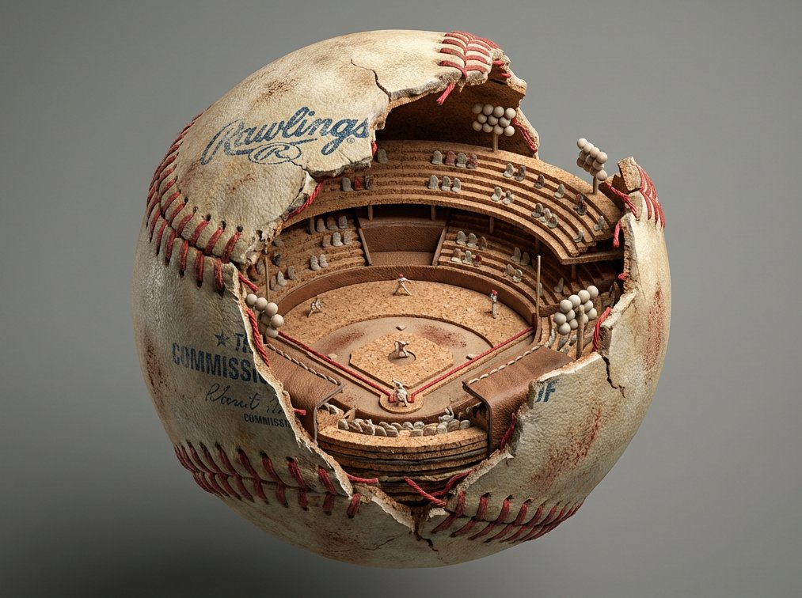

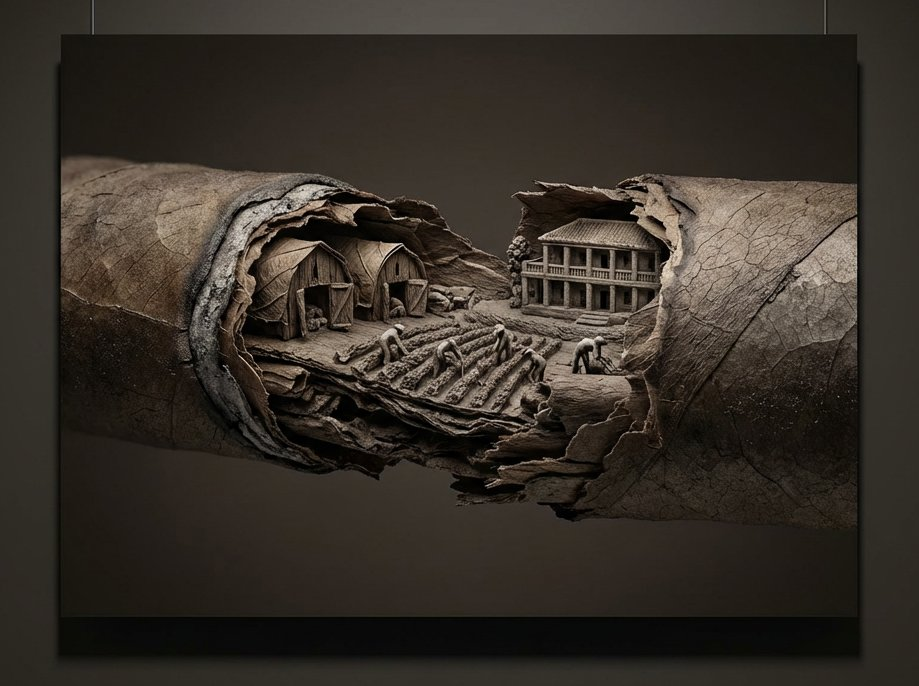

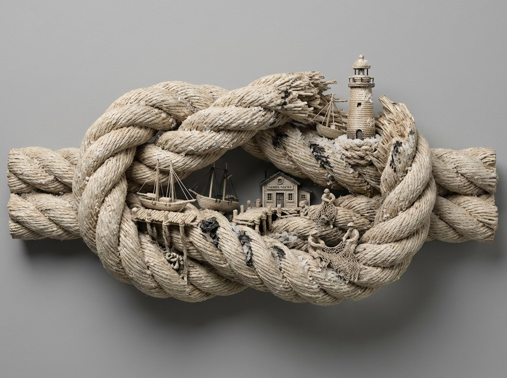

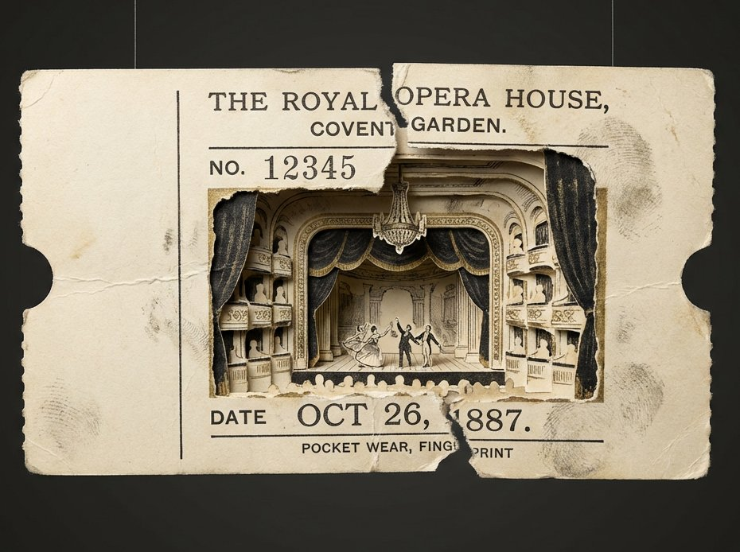

```
A single worn baseball suspended in space, frozen at the moment it fractures open. Inside the fracture exists a fully realized miniature baseball stadium — carved, layered, and constructed entirely from cowhide leather, red stitching, and compressed cork core.
Internal elements include a diamond infield carved into cork layers, dugouts built from leather seams, bleachers rising in concentric tiers of wound yarn, tiny players frozen mid-swing on stitching-thread basepaths, floodlights formed from exposed rubber pill center, arranged with clear spatial logic and physical coherence. [...]
```

```
A single cigar suspended in space, frozen at the moment it fractures open. Inside the fracture exists a fully realized miniature tobacco plantation — carved, layered, and constructed entirely from rolled tobacco leaves.
Internal elements include drying barns built from wrapper leaf, workers sorting in binder-layer fields, a colonial hacienda carved from filler blend, arranged with clear spatial logic and physical coherence. Intricate forms, repeating patterns, and emergent architecture grow organically from the break, featuring depth, cavities, negative space, and internal structural rhythm.
Hyper-detailed 3D bas-relief fused with fine-art poster design. Material realism emphasized — vein patterns in leaves, oil sheen, ash residue at burn line, cedar aging marks, subtle imperfections visible at macro scale.
Monochrome or tightly controlled palette derived from tobacco brown, ash grey, and wrapper maduro. [...]
```

```
A single sailor's knot suspended in space, frozen at the moment it fractures open. Inside the fracture exists a fully realized miniature harbor — carved, layered, and constructed entirely from hemp rope fibers and salt residue.
Internal elements include docks woven from frayed strands, tiny ships moored in the knot's loops, a lighthouse rising from the standing end, fishermen mending nets in fiber gaps, the harbor master's office carved into the knot's heart, arranged with clear spatial logic and physical coherence. Intricate forms, repeating patterns, and emergent architecture grow organically from the break, featuring depth, cavities, negative space, and internal structural rhythm.
Hyper-detailed 3D bas-relief fused with fine-art poster design. Material realism emphasized — salt crystals in fibers, tar staining, sun bleaching, frayed working ends, subtle imperfections visible at macro scale. Monochrome or tightly controlled palette derived from hemp tan, sea-salt white [...]
```

```
A single opera ticket stub suspended in space, frozen at the moment it fractures open. Inside the fracture exists a fully realized miniature opera house — carved, layered, and constructed entirely from ticket paper, perforated edges, and faded ink.
Internal elements include the grand stage carved into the stub face, box seats rising from torn perforation edges, a chandelier descending from the ticket number, tiny performers frozen mid-aria on the date line, velvet curtains formed from ink-heavy print areas, arranged with clear spatial logic and physical coherence. Intricate forms, repeating patterns, and emergent architecture grow organically from the break, featuring depth, cavities, negative space, and internal structural rhythm.
Hyper-detailed 3D bas-relief fused with fine-art poster design. Material realism emphasized — pocket wear on corners, faded thermal print, crease from being folded, fingerprint oils on surface, subtle imperfections visible at macro scale. [...]
```

 [↑返回目录](#toc)

---
## <a id="prompt-2007661789023244500">地质断层中的精密内部世界</a> (<a href="https://x.com/aleenaamiir/status/2007661789023244505" target="_blank" rel="noopener noreferrer">Aleena Amir</a>)

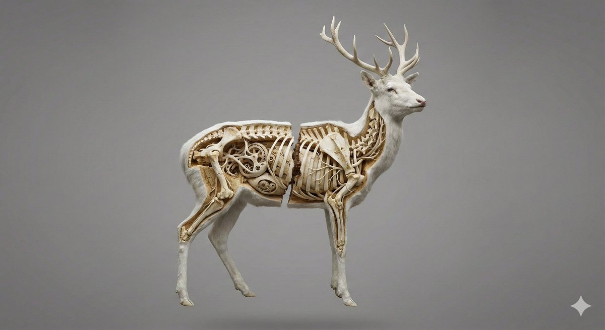

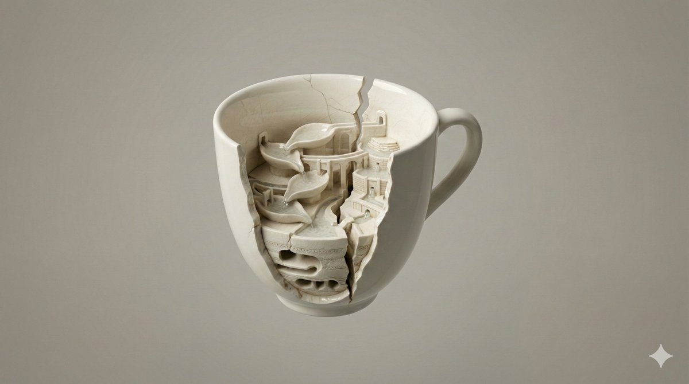

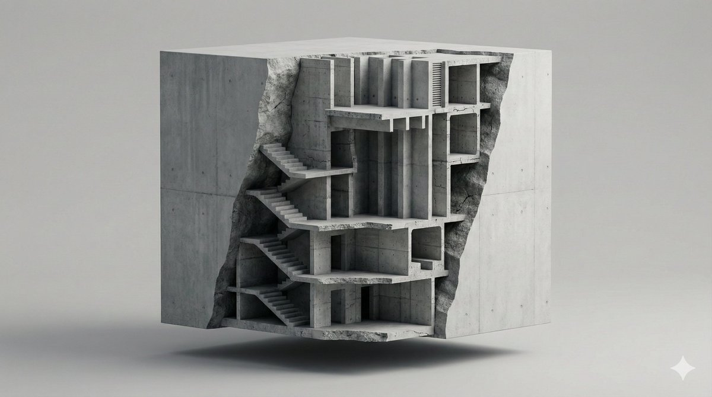

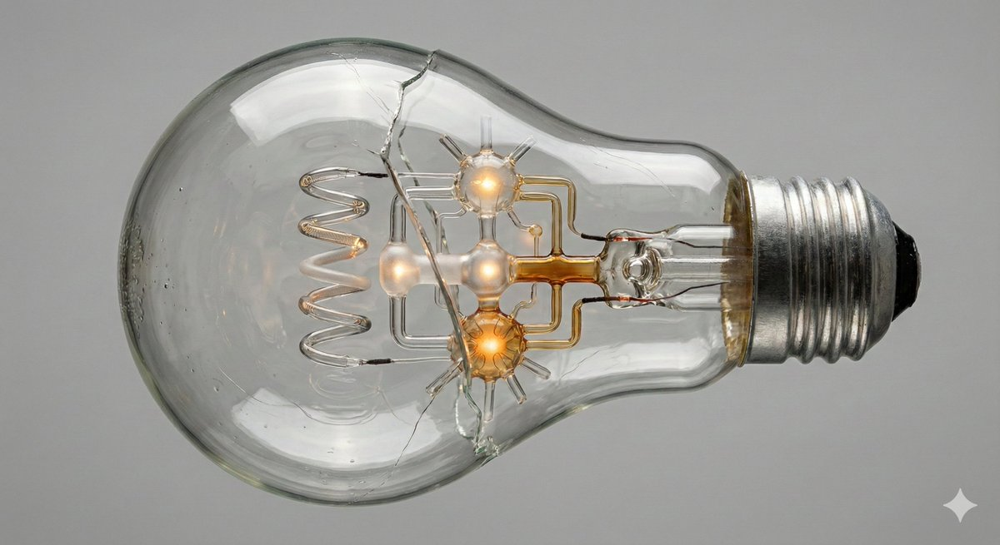

```
A solitary [OBJECT] floating in absolute stillness, split by a precise geological fault. Within the opening lies a meticulously constructed [Inner World / Mechanism], revealed like a museum cross-section. Every internal form is sculpted entirely from [Object Material], featuring [Iconic Details / Structural Elements] arranged with architectural logic. Layered strata, load-bearing forms, hollow chambers, and repeating micro-patterns create a believable internal system. Hyper-detailed 3D bas-relief blended with editorial poster aesthetics. Emphasis on material authenticity — [Surface Grain, Micro-cracks, Patina, Aging] visible at macro scale. Limited tonal palette derived from [Material Tones]. Exterior surface remains pristine and untouched. Neutral background, gallery lighting, ultra-sharp realism.
```

```
一个孤零零的[物体]悬浮于绝对静止之中，被一道精确的地质断层劈开。裂缝内部展现出一个精心构建的[内部世界／机械结构]，如同博物馆剖面展示般清晰可见。所有内部形态完全由[物体材质]雕琢而成，其中[标志性细节／结构元素]以建筑逻辑有序排列。层层叠叠的地层、承重结构、中空腔室与重复的微观图案共同构成一套可信的内部系统。超精细的3D浅浮雕风格融合了编辑海报的美学。强调材质的真实性——[表面纹理、微裂纹、包浆、老化痕迹]在宏观尺度上清晰可见。色调受限，仅使用源自[材质色调]的色彩。外部表面保持 pristine（原始 pristine）且未受触碰。中性背景，画廊式照明，极致锐利的写实风格。
```

 [↑返回目录](#toc)

---
## <a id="prompt-2007497261492920800">奢华木质香调香水AUREN</a> (<a href="https://x.com/SiboEsenkova/status/2007497261492920739" target="_blank" rel="noopener noreferrer">Sibo Esenkova</a>)

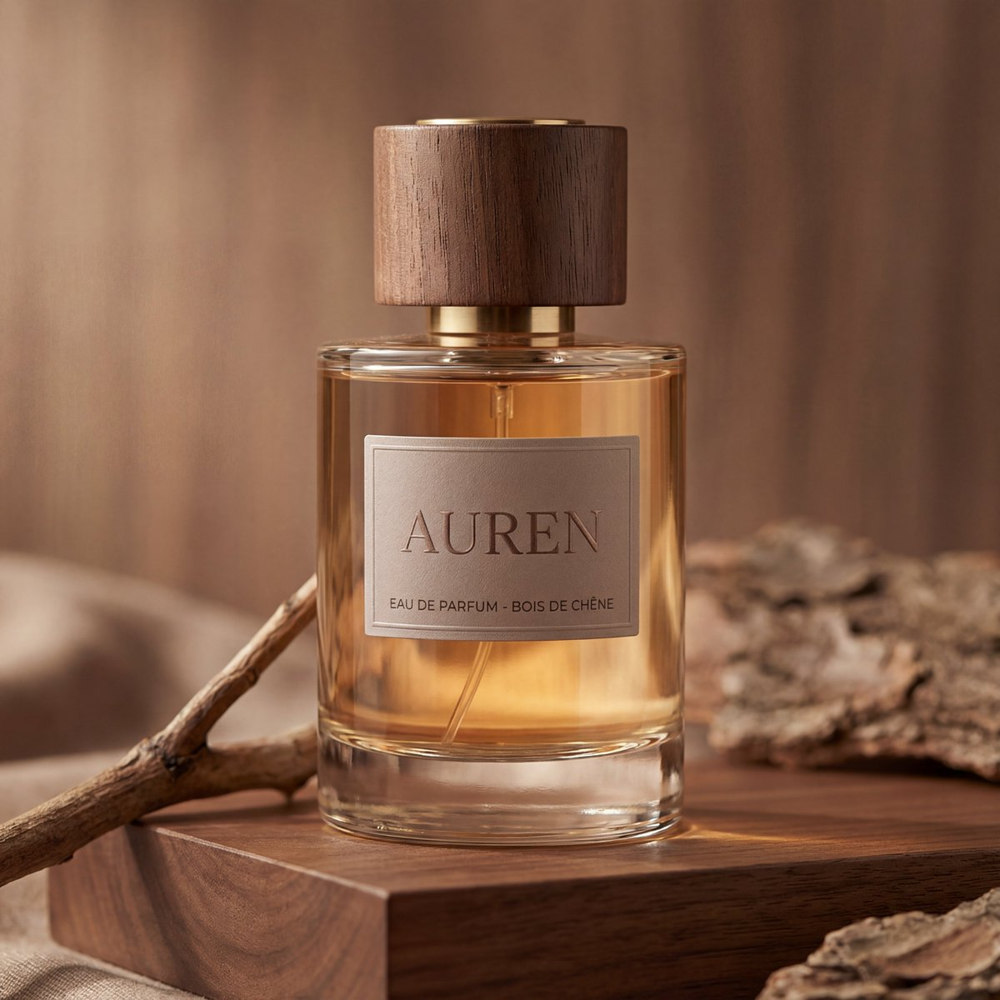

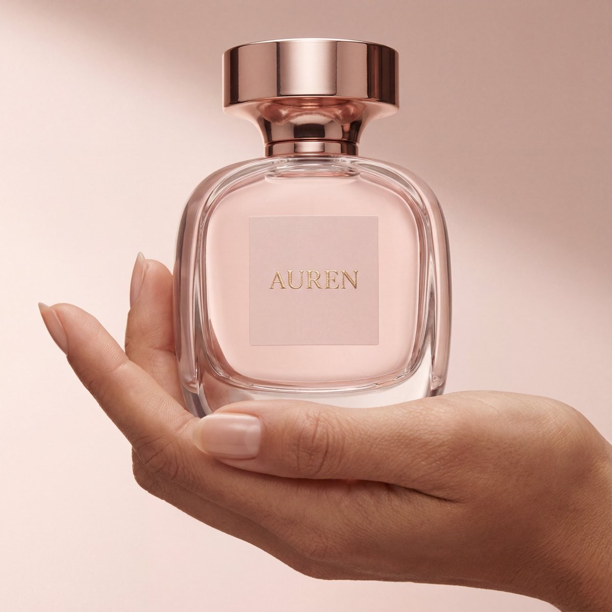

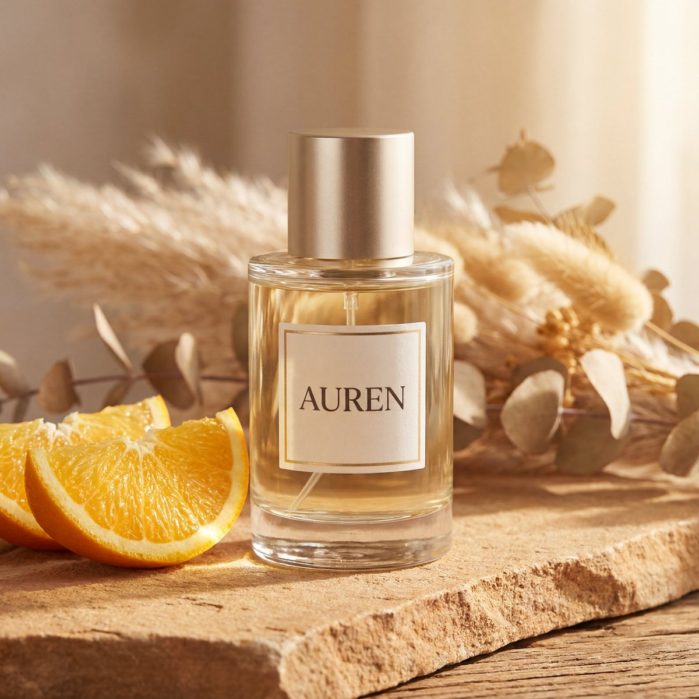

```
Ultra high-end fragrance campaign photography for a luxury unisex woody perfume brand, created for a premium e-commerce category card.

A clearly recognizable luxury perfume bottle.
Elegant cylindrical or softly rectangular glass bottle.
Thick crystal-clear glass with slight warm tint.
Visible amber-to-light-wood toned liquid.
Premium atomizer and spray neck.
Heavy matte or brushed wood-toned cap with subtle metallic core.

Front label:
Minimal luxury label.
Fake brand name: “AUREN”.
Refined serif or modern high-fashion typography.
Centered placement.
Muted warm beige or soft taupe label tone.
Subtle embossed or hot-stamped details.
Clearly readable, unmistakably perfume.

Scene:
Warm woody-inspired luxury still life.
Natural wood elements used with restraint.
Smooth walnut or oak wood block surface.
Soft bark textures, clean wood grain.
Optional single element of dry branch or shaved wood curl.
No clutter, no rustic mess.
Feels calm, grounded, expensive.

Lighting:
Warm, skin-like studio lighting.
Soft directional light mimicking late afternoon sun.
Light passes through glass and liquid, creating depth.
Subtle shadow gradients.
No harsh highlights.
No cold reflections.

Camera:
Shot by a world-class luxury fragrance photography team.
Medium format camera (Hasselblad / Phase One).
85mm lens.
Shallow depth of field.
Perfect focus on bottle, label, glass thickness.
Natural optical falloff.

Mood & Style:
Woody.
Warm.
Grounded.
Human.
Genderless.
Quiet confidence.
Feels like warm skin, clean wood, soft leather.
Luxury designer fragrance, not home scent, not candle.

Framing:
Vertical composition for category card.
Bottle as clear hero.
Wood elements framing subtly.
Clean negative space preserved.
Instant perfume recognition at first glance.

Quality:
Hyper-realistic.
True photography look.
No CGI.
No artificial glow.
No watermark.
No extra text.
Feels like a high-budget global fragrance launch.
```

```
超高端木质香调中性香水品牌香水广告摄影，专为高端电商平台品类卡片打造。

清晰可辨的奢侈香水瓶。  
优雅的圆柱形或柔和矩形玻璃瓶身。  
厚实通透的水晶玻璃，略带暖色调。  
可见琥珀至浅木色的香水液体。  
高级喷雾头与喷管颈部设计。  
厚重哑光或拉丝木质色调瓶盖，内嵌低调金属芯。

正面标签：  
极简奢华标签。  
虚构品牌名：“AUREN”。  
精致衬线体或现代高级时装风格字体。  
居中排版。  
标签采用低饱和暖米色或柔灰褐色。  
细节处有微妙压纹或烫金工艺。  
文字清晰易读，一眼即知是香水。

场景：  
温暖木质灵感的奢华静物布置。  
克制使用天然木材元素。  
光滑胡桃木或橡木块台面。  
细腻树皮肌理，干净木纹。  
可选单支干枝或一片卷曲木屑作为点缀。  
无杂乱，无粗犷感。  
整体氛围宁静、沉稳、昂贵。

灯光：  
温暖如肌肤质感的影棚布光。  
柔和定向光源，模拟午后阳光。  
光线穿透玻璃与液体，营造层次深度。  
阴影过渡细腻。  
无刺眼高光。  
无冷色调反光。

拍摄设备：  
由世界级奢侈香水摄影团队操刀。  
中画幅相机（哈苏 / 飞思）。  
85mm镜头。  
浅景深。  
瓶身、标签、玻璃厚度精准对焦。  
自然光学衰减效果。

氛围与风格：  
木质。  
温暖。  
沉稳。  
人性。  
无性别。  
低调自信。  
触感如温润肌肤、洁净木材、柔软皮革。  
属于奢侈设计师香水，非家居香氛，非香薰蜡烛。

构图：  
垂直构图，适配品类卡片。  
香水瓶作为绝对视觉焦点。  
木材元素巧妙衬托。  
保留干净留白。  
第一眼即可明确识别为香水。

画质：  
超写实。  
真实摄影质感。  
无CGI。  
无人工光晕。  
无水印。  
无额外文字。  
呈现高预算全球香水首发大片质感。
```

 [↑返回目录](#toc)

---
## <a id="prompt-2007535691157143600">极简黑白矢量肖像插画</a> (<a href="https://x.com/AmirMushich/status/2007535691157143563" target="_blank" rel="noopener noreferrer">AmirMušić</a>)

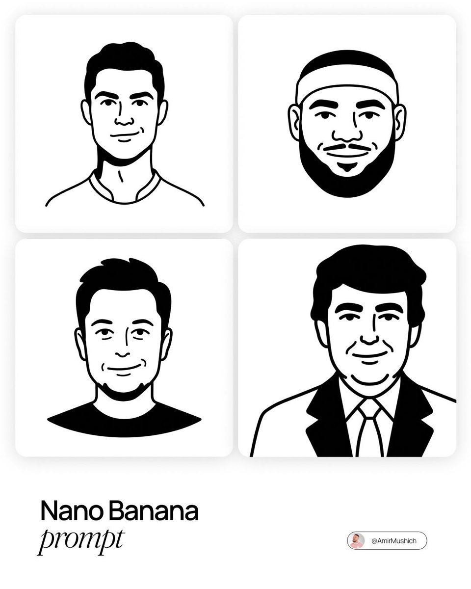

```
A minimalist, black-and-white flat vector illustration portrait of [CHARACTER NAME], rendered in the expressive "Notion avatar" art style.

LINE WORK & VIBE:

Style: Use THICK, UNIFORM black outlines (monoline weight). The lines should feel organic, smooth, and confident, not rigidly geometric or robotic like generic icons.

Vibe: The character should have a distinct personality and a relaxed, cool, or friendly expression. Focus on stylized features, unique hairstyles, and defining accessories to convey character.

SELECTIVE BLACK FILLS (CRITICAL):

Unlike pure outline icons, utilize Solid Black Fills selectively and strategically.

Where to Fill: Use solid black for prominent hair masses, beards, eyebrows, sunglasses, or dark clothing elements.

Where to Keep White: The skin, main face area, and lighter elements must remain pure flat white inside the thick outlines.

COMPOSITION & TECHNICAL:

No shading, no gray tones, no gradients. Only pure Black and pure White.

Clean bust or headshot composition centered on a white background.

High contrast, clean 2D vector graphics.
```

```
一幅极简风格的黑白扁平矢量肖像插画，描绘[角色名称]，采用富有表现力的“Notion头像”艺术风格。

线条与氛围：  
- 风格：使用粗细均匀的黑色轮廓线（单一线宽），线条应显得自然、流畅且自信，避免像普通图标那样生硬、几何化或机械感。  
- 氛围：角色需具有鲜明个性，表情放松、酷感或友善。通过风格化的五官、独特的发型和标志性配饰来展现角色特征。

选择性黑色填充（关键）：  
- 与纯轮廓图标不同，需有策略地使用实心黑色填充。  
- 填充区域：用于突出的头发块面、胡须、眉毛、墨镜或深色服饰元素。  
- 保留白色区域：皮肤、面部主体及浅色部分必须在粗轮廓线内保持纯白。

构图与技术要求：  
- 无阴影、无灰色调、无渐变，仅使用纯黑与纯白。  
- 构图为干净的半身像或头像，居中置于白色背景上。  
- 高对比度、清晰的二维矢量图形。
```

 [↑返回目录](#toc)

---
## <a id="prompt-2007722721967321000">超写实电影感地下赛车海报</a> (<a href="https://x.com/harboriis/status/2007722721967321132" target="_blank" rel="noopener noreferrer">Harboriis</a>)

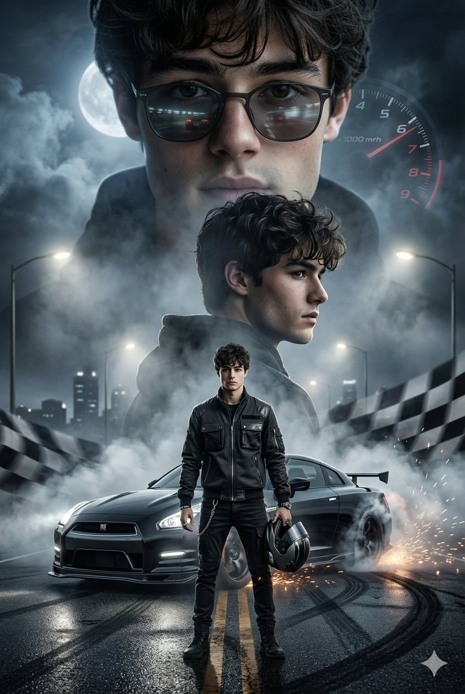

```
Ultra-realistic cinematic underground racing poster, with a dark, smoky and intense atmosphere inspired by nighttime street-race culture.

Create a triple-layer composition:

Foreground Scene (Full-body)

A dramatic full-body shot of the man standing in the middle of an abandoned industri-al road at night. He should be holding a racing helmet under one arm and standing confidently beside a modified street-race car drifting in slow motion behind him, gen-erating heavy smoke, sparks, and tire marks. The ground must reflect light from the car's headlights, adding wet-asphalt cinematic reflections.

Clothing: black jacket (leather or tactical), dark pants, rings and accessories, subtle metallic reflections, realistic fabric texture with shadows and folds.

Mid-layer Portrait

A medium-sized portrait of the man, facing sideways with a stern, focused expression, as if preparing for a race or confrontation. Add subtle fog around the edges and soft rim lighting from the streetlights above. The portrait must blend smoothly with the drifting smoke from the car.

Hero Background Portrait (Large Face)

A massive intense close-up of the man's face dominating the top of the poster, ex-pression strong and fearless. Add faint reflections of racing lights in the sunglasses and a subtle speedometer graphic overlay behind him. Smoke and moonlight should frame this portrait, creating a dramatic halo effect.

Atmosphere and Effects:

Dark palette with blacks, grays, metallic silver and moon-blue.

Minimal neon, no colorful beams.

Mist, drifting smoke, sparks from asphalt.

A blurred checkered-flag motion effect behind the background portrait.

Soft city skyline silhouette far behind the smoke.

Car:

A completely different model from the previous prompt: Nissan GT-R Black Edition (or similar JDM icon), hyper-detailed with glossy reflections, racing decals, visible car-bon-fiber textures, and headlights slicing through fog.

Face Replacement Instruction:

Replace all faces with the face from the photo I will upload. Keep lighting, expression, angle, texture and realism consistent with the cinematic scene. Do not alter the per-son's natural facial features. Blend the face perfectly into the poster.

Final Rendering Style:

8K resolution, ultra-sharp details, premium Hollywood poster composition, dramatic depth of field, misty environment, crisp reflections, slight vignette, full photorealism.
```

```
超写实电影感地下赛车海报，氛围黑暗、烟雾弥漫且紧张激烈，灵感源自夜间街头赛车文化。

构图分为三层：

前景场景（全身）  
在夜晚废弃的工业道路中央，一名男子以戏剧性的全身姿态站立。他单臂夹着赛车头盔，自信地站在一辆正在慢动作漂移的改装街车旁，车辆后方喷涌出浓重烟雾、火花与轮胎痕迹。地面需反射车灯的光线，营造湿润沥青路面的电影级倒影效果。

服装：黑色夹克（皮质或战术风格）、深色长裤、戒指与配饰，带有微妙金属反光，面料纹理真实，呈现自然阴影与褶皱。

中层肖像  
男子侧脸中景肖像，表情严肃专注，仿佛正准备比赛或对峙。边缘环绕淡淡薄雾，上方街灯提供柔和轮廓光。肖像需与车辆漂移产生的烟雾自然融合。

主背景肖像（大幅面部特写）  
海报顶部占据主导地位的巨大面部特写，神情坚毅无畏。墨镜上隐约映出赛车灯光，并在人物背后叠加微弱的速度表图形元素。烟雾与月光环绕面部，形成戏剧性的光环效果。

氛围与特效：  
色调以黑、灰、金属银和月光蓝为主。  
避免彩色霓虹光束，仅使用极简霓虹元素。  
加入薄雾、漂移烟雾及沥青迸发的火花。  
背景肖像后方添加模糊的方格旗动态效果。  
远处烟雾后方呈现柔和的城市天际线剪影。

车辆：  
采用与之前提示完全不同的车型：日产GT-R Black Edition（或类似经典JDM车型），细节极度丰富，具有高光反射漆面、赛车贴花、可见的碳纤维纹理，以及穿透雾气的锐利前大灯。

面部替换说明：  
将所有人物面部替换为我即将上传照片中的面孔。保持光影、表情、角度、质感与整体电影场景一致，不得改变人物自然面部特征，并确保面部与海报完美融合。

最终渲染风格：  
8K分辨率，细节超清晰，好莱坞顶级海报构图，强烈景深，雾气环境，锐利反光，轻微暗角，完全写实风格。
```

 [↑返回目录](#toc)

---
## <a id="prompt-2007616917327204600">新中式禅意品牌VI生成系统</a> (<a href="https://x.com/berryxia/status/2007616917327204584" target="_blank" rel="noopener noreferrer">Berryxia.AI</a>)

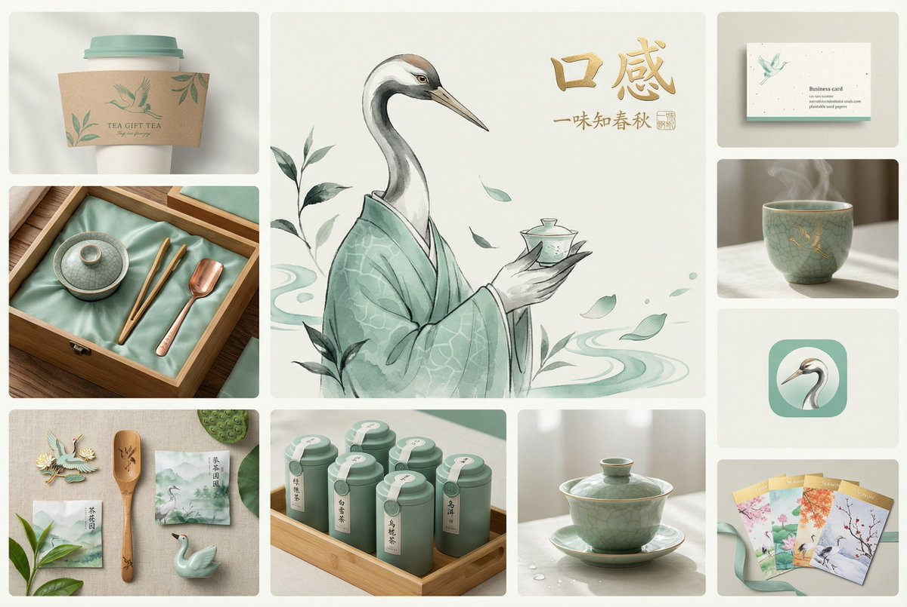

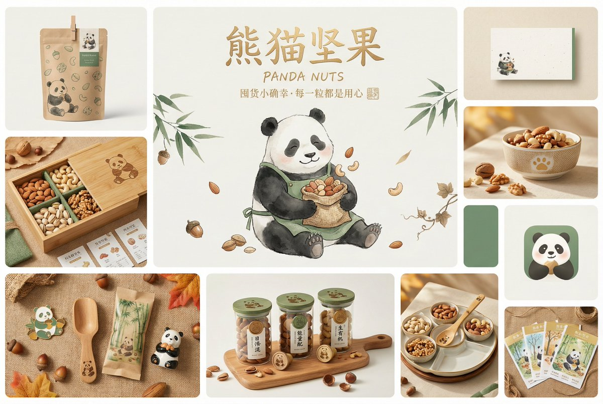

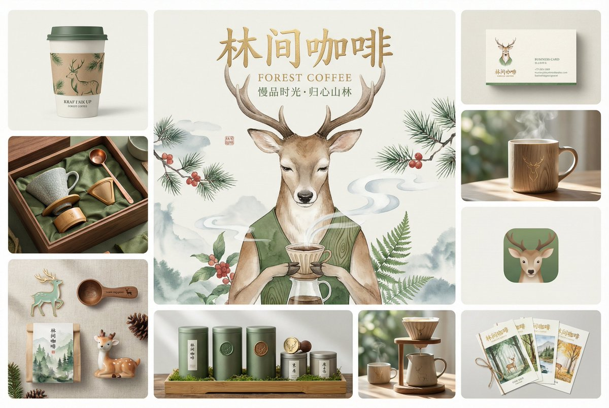

```
# 🎨 新中式禅意品牌VI生成系统 v3.0 - 通用提示词模板

## 📐 核心设计哲学

```plaintext

东方留白美学 + 宋代极简主义 + 日式侘寂精神

= 不对称的平衡 + 克制的优雅 + 呼吸感的构图

```

---

## 🔧 万能提示词结构（完整版）

### 【基础框架】

```plaintext

A modern Chinese Zen aesthetic brand visual identity system displayed in a sophisticated bento grid layout on soft moon-white (#F0F0E8) background with [品牌主色] accents. Professional brand showcase with [行业特质:storytelling elements/refined elegance/natural woodland elegance/warm craftsmanship spirit/mysterious nocturnal elegance].

```

---

### 【核心Logo主视觉】占画面40-45%

```plaintext

[Center dominant logo, largest element] 

Graceful watercolor ink-wash portrait of an anthropomorphic [角色/动物]. 

The [角色] has soft, contemplative eyes looking [视线方向:slightly downward/to the side/gently at viewer] with a [情绪:serene/peaceful/wise/gentle/discerning/mysterious/alluring] expression, [角色特征描述:long elegant neck/mature posture/elegant antlers/sharp features]. 

Wearing [服饰:minimalist tea master's robe/barista vest/traditional baker apron/flowing robe/bartender vest] in [主色+色值] with [纹理:Song Dynasty crackle glaze patterns/natural linen weave texture/wood grain texture/cloud brocade/silk brocade texture] as subtle texture. 

The [角色] is holding [核心产品:gaiwan tea cup/coffee dripper/bread loaf/wine glass/cocktail glass] with [肢体描述:both paws/one wing/hooves/one paw] in natural, [姿态:relaxed/refined/careful/mysterious] gesture, [其他肢体:other wing resting elegantly/other hoof at side/other paw adjusting detail]. 

Surrounded by generous negative space with asymmetric ink-brushed [装饰元素:tea leaves/pine needles/wheat stalks/lotus petals/bamboo/plum blossoms], [次要元素:flowing water ripples/steam swirls/morning mist/night mist/silk ribbons/moon phases] in misty [色调] gradients. 

Elegant Chinese calligraphy "[品牌中文名]" at [位置:top center/top right corner/flowing vertically] in refined [金属色:gold/rose gold] foil with subtle embossing, soft metallic sheen, gentle dimensional quality, warm [金属色] (#C9A961 or #B76E79) harmoniously integrated. 

Below in [文字样式:seal script/smaller text/Art Deco style/calligraphy style] "[品牌口号/英文名]" in matching gentle [金属色] treatment. 

Watercolor texture, soft edges, breathing space composition, wabi-sabi aesthetic, refined balance.

```

---

### 【必备三件套】各占8-10%画面

```plaintext

[Top right position] 

Minimalist business card with watercolor [角色] icon and vast negative space on cream paper, subtle [主色] edge painting, [特殊材质:plantable seed paper texture/natural paper grain/embossed pattern/premium card stock with metallic sheen]

[Middle right position] 

Ceramic/Crystal [杯具:mug/tea cup/coffee cup/cocktail glass] with [纹理] pattern and subtle [角色] silhouette in gold/rose gold line art, natural [光线:morning light/dramatic low-key lighting/moody lighting] with [产品特征:tea steam wisps/coffee steam/gentle glow/red backlight], [色调:warm earthtone/cool celadon/natural lighting/atmospheric lighting]

[Bottom right position] 

Mobile app icon with soft rounded [角色] [部位:head portrait/face/silhouette] in [主色] circle, modern minimal digital design

```

---

### 【功能延展周边】3-4个,各占6-8%

**根据行业类型选择对应周边：**

#### ☕ 咖啡/茶饮品牌：

```plaintext

[Top left position] 

Takeaway cup sleeve with single brushstroke [角色] and [装饰元素] pattern, natural kraft paper with [主色] ink, elegant typography

[Middle left position, larger] 

[茶具/咖啡器具] gift set in wooden/lacquer box: ceramic [器具名称] with crackle glaze, bamboo [配件], [金属配件], arranged with [主色] fabric lining, artisan presentation

[Center bottom position] 

Premium [茶叶/咖啡豆] storage tin collection: cylindrical metal tins with matte [主色] finish, wax seal stamps featuring [角色元素], different [品种/烘焙度] labeled with calligraphy, arranged in bamboo tray

```

#### 🍞 烘焙/甜品品牌：

```plaintext

[Top left position] 

Kraft paper bread bag with hemp rope closure, refined gold foil stamped logo, hand-drawn [角色] and [装饰元素], reusable design with wooden button

[Middle left position, larger] 

Wooden bread board set with laser-engraved [角色] logo and [装饰] border, includes recipe card holder, artisan craftsmanship display

[Center bottom position] 

Morning ritual gift set in wooden tray: linen napkin with [角色] print and subtle gold accent, artisan [产品] knife, ceramic butter dish, luxury breakfast presentation

```

#### 🍷🍶 酒类/酒吧品牌：

```plaintext

[Top left position]

[Cocktail coaster set/Wine bottle label] with traditional seal script and [角色] watercolor illustration, [材质:lacquered wood/premium paper] texture, [主色] with [金属色] accents

[Middle left position, larger]

Premium [cocktail/wine] gift set in lacquer box: crystal [器具], [配件] with engraved logo, silk-lined interior in [主色], artisan bar tools presentation

[Center bottom position]

Signature [cocktail/wine] bottle collection: custom glass bottles with [主色] labels, wax seal stamps featuring [角色元素], different signature drinks labeled with calligraphy, arranged on [展示方式:mirrored tray/bamboo tray]

```

#### 🍪 零食/坚果品牌：

```plaintext

[Top left position]

Resealable kraft paper snack pouch with hand-drawn [角色] and [坚果/零食元素] pattern, [主色] ink printing, convenient zip-lock design with wooden clip

[Middle left position, larger]

Premium snack gift box in bamboo/wooden container: multiple compartments for different nuts/snacks, [角色] engraved lid, natural fabric dividers in [主色], artisan presentation with dried fruit and nut illustrations

[Center bottom position]

Snack storage jar collection: glass/ceramic jars with [主色] wooden lids, wax seal featuring [角色] holding nuts, different varieties (almonds, cashews, dried fruits) labeled with calligraphy, arranged on natural wood tray

```

#### 🍡 糕点/甜品品牌：

```plaintext

[Top left position]

Transparent window pastry box with watercolor [角色] and [糕点元素] pattern on lid, natural kraft base with [主色] ribbon closure, elegant see-through design

[Middle left position, larger]

Traditional dessert serving set: ceramic plates with [纹理] glaze, bamboo dessert forks, small sauce dishes for toppings, arranged with [主色] silk cloth, tea house presentation style

[Center bottom position]

Dessert recipe card holder in wooden stand: illustrated cards showing signature pastries with [角色] enjoying each one, gold foil titles, includes mini wooden spoon as bookmark

```

#### 🧀 奶酪/乳制品品牌：

```plaintext

[Top left position]

Wax paper cheese wrapper with vintage-style [角色] and dairy farm illustration, [主色] printing with natural texture, traditional cheese aging aesthetic

[Middle left position, larger]

Artisan cheese board set: marble/slate board with laser-engraved [角色] logo, includes cheese knives with wooden handles, small ceramic dipping bowls, presented in rustic wooden box with [主色] lining

[Center bottom position]

Cheese preservation container collection: ceramic crocks with breathable lids in [主色] glaze, wax seal stamps with [角色] and milk motif, different cheese types labeled with calligraphy

```

#### 🍫 巧克力/糖果品牌：

```plaintext

[Top left position]

Luxury chocolate wrapper in textured paper with embossed [角色] and cacao pod pattern, [主色] with [金属色] foil accents, elegant origami-style folding design

[Middle left position, larger]

Chocolate tasting set in vintage tin box: individual wrapped chocolates with watercolor flavor cards, bamboo tongs, ceramic tasting dish, velvet interior in [主色], sommelier presentation

[Center bottom position]

Cocoa powder/chocolate shavings container: vintage glass jar with [主色] metal lid, wax seal featuring [角色] with cacao branch, different percentages (dark, milk, white) labeled in calligraphy

```

#### 🥜 健康轻食品牌：

```plaintext

[Top left position]

Eco-friendly reusable snack pouch in organic cotton with printed [角色] and superfood icons, [主色] natural dye, minimalist health-conscious design with drawstring

[Middle left position, larger]

Meal prep container set: bamboo fiber bowls with [角色] engraved lids, silicone dividers in [主色], reusable bamboo utensils, modern sustainable lifestyle presentation

[Center bottom position]

Superfood storage system: stackable glass jars with bamboo lids in [主色] finish, labels featuring [角色] with different seeds/grains, organized in minimalist wire rack

```

#### 🍜 面馆/中式正餐品牌：

```plaintext

[Top left position]

Takeaway noodle box with bold brushstroke [角色] and [地域特色纹样] pattern, kraft paper with [主色] printing, authentic regional calligraphy typography

[Middle left position, larger]

Traditional noodle/meal serving set in [材质:wooden/bamboo] box: ceramic bowls with [纹理] glaze, bamboo chopsticks with [金属色] tips, small condiment dishes, arranged with [主色] cloth, artisan presentation

[Center bottom position]

Signature condiment/spice jar collection: ceramic/glass containers with [主色] lids, wax seal stamps featuring [角色] with [食材元素], different sauces/spices labeled with calligraphy, arranged on [展示方式:wooden board/bamboo tray]

```

---

### 【惊喜创意周边】⭐ 核心差异 2-3个,各占5-8%

```plaintext

[Bottom left position] 

Collection of [主题]-themed merchandise: 

[周边1:[色调]-colored enamel [角色] pin with [金属色] [细节] details], 

[周边2:wooden/leather [工具/配件] with laser-engraved/embossed [角色]], 

[周边3:[产品]wrapper/packaging with watercolor [场景] scene], 

[周边4:ceramic mini [角色] figurine/tea pet/silk pocket square], 

arranged on natural [材质:linen/velvet/burlap] with [自然装饰:pine cone/moss/stones/mood lighting] accents

[Lower right position] 

[高端产品套装描述]: 

Ceramic/Crystal [核心产品] set with [特殊工艺] glaze and [金属色] rim accent, traditional [件数]-piece set, museum-quality craftsmanship, [光影效果:dappled light/soft shadows/dramatic lighting]

[Small corner position] 

Seasonal [产品/体验/VIP membership] cards with watercolor illustrations of four seasons/moon phases, each featuring [角色] in different [场景] landscape, [金属色] foil headers, tied with [材质:silk ribbon/hemp twine/wheat stalk]

```

---

### 【设计系统统一性】

```plaintext

All elements feature consistent refined [金属色:gold/rose gold/antique bronze] foil treatment with subtle dimensional quality. 

Harmonious palette: moon-white (#F0F0E8), [主色+色值], [辅助色+色值], soft-sheen [金属色] (#C9A961 or #B76E79 or #8B6914), charcoal ink (#3A3A3A), [可选色3]. 

Consistent [纹理风格:Song Dynasty celadon patterns/natural linen weave/wood grain/bark texture/silk brocade/lacquer finish/burlap weave] throughout, asymmetric Zen composition with 32-35% negative space breathing room, 

natural [材质:kraft paper/ceramic/wood/silk/crystal/leather/velvet/rough pottery] textures with watercolor ink-wash effects throughout. 

Modern Chinese [行业:tea ceremony/artisan bakery/forest coffee/wine culture/bar culture/noodle shop/regional cuisine] aesthetic with Japanese wabi-sabi minimalism influence, celebrating [品牌价值观:refined taste/handcrafted warmth/slow living/seasonal awareness/return to nature/mysterious elegance/nocturnal sophistication/authentic regional heritage].

```

---

### 【技术参数】

```plaintext

Bento grid layout with generous 24px gaps between elements, 

natural diffused/dramatic low-key [时间/氛围:morning/misty morning/warm morning/forest morning/moody/nocturnal/golden afternoon] light photography with soft [光影效果:reflections/dappled sunlight/golden hour glow/red accent lights/steam effects], 

contemporary [场景:tea house/artisan bakery/woodland coffee house/wine cellar/luxury bar/authentic noodle shop] quality, 

professional brand showcase, 

gentle/deep shadows [18-25]% opacity [阴影作用:creating depth/emphasizing subtle dimension/creating mystery/creating warmth], 

visible material textures (paper grain, [材质2:wood grain/ceramic glaze/fabric weave/enamel finish/crystal/silk/lacquer/rough pottery], [材质3]), 

storytelling through [叙事方式:seasonal tea culture/family heritage/forest seasonal cycle/craft tradition/nocturnal mystique/Eastern allure/regional culinary tradition], 

cohesive [美学特质:elegant/natural/warm/mysterious/sophisticated/authentic/honest] harmony, 

8k resolution --ar 16:9 --stylize [240-250] --v 6.0

```

---

## 🎯 快速配置表（填空即用）

```markdown

┌─────────────────────────────────────────────┐

│  新中式禅意VI系统 - 品牌配置单               │

├─────────────────────────────────────────────┤

│ 品牌中文名: [          ]                     │

│ 品牌英文名: [          ]                     │

│ 品牌口号:   [          ]                     │

│ 行业类型:   [咖啡/茶饮/烘焙/酒类/酒吧/零食/面馆] │

│ 核心角色:   [          ] (动物/人物)         │

│ 角色情绪:   [          ] (宁静/智慧/温暖/神秘等) │

│ 主色调:     [          ] + 色值 #           │

│ 辅助色:     [          ] + 色值 #           │

│ 金属色:     [gold/rose gold/bronze] + 色值 # │

│ 核心产品:   [          ] (茶杯/咖啡壶/鸡尾酒杯等) │

│ 装饰元素:   [          ] (竹/梅/松/茶叶/丝带等) │

│ 文化纹理:   [          ] (冰裂/木纹/云锦/丝绸等) │

│ 意境场景:   [          ] (山水/竹林/晨雾/月夜等) │

└─────────────────────────────────────────────┘

```

---

## 📚 参数选择库

### 【角色/动物库】

| 角色 | 文化象征 | 适合行业 |

|------|---------|---------|

| crane (仙鹤) | 优雅、长寿、品味 | 茶饮、养生、高端餐饮 |

| deer (鹿) | 自然、温柔、森林 | 咖啡、户外、民宿 |

| red panda (小熊猫) | 可爱、友好、活力 | 年轻茶饮、甜品 |

| fox (狐狸) | 聪慧、神秘、优雅 | 精品咖啡、调酒、酒吧 |

| cat (猫) | 慵懒、治愈、亲近 | 书店咖啡、文创、面馆 |

| rabbit (兔) | 温顺、灵动、可爱 | 烘焙、甜品、儿童 |

| owl (猫头鹰) | 智慧、沉思、夜间 | 深夜食堂、书店、酒吧 |

| bear (熊) | 憨厚、可靠、温暖 | 烘焙、家庭餐饮 |

| koi fish (锦鲤) | 富贵、吉祥、流动 | 日料、茶饮、养生 |

| tiger (虎) | 勇敢、大胆、力量 | 运动饮品、精品咖啡 |

| squirrel (松鼠) | 勤劳、储藏、活泼 | 坚果零食、烘焙、儿童食品 |

| hedgehog (刺猬) | 可爱、防御、独立 | 零食、甜品、治愈系品牌 |

| hamster (仓鼠) | 囤货、可爱、居家 | 零食、粮食制品、家庭食品 |

| raccoon (浣熊) | 机灵、好奇、夜行 | 零食、夜宵、创意餐饮 |

| otter (水獭) | 玩乐、社交、灵动 | 海鲜、日料、年轻品牌 |

| dolphin (海豚) | 智慧、友好、海洋 | 海鲜、度假餐饮、儿童 |

| penguin (企鹅) | 呆萌、团队、冰爽 | 冰品、冷饮、甜品 |

| koala (考拉) | 慵懒、治愈、澳洲 | 咖啡、茶饮、休闲食品 |

| sloth (树懒) | 慢生活、放松、治愈 | 慢食、素食、养生品牌 |

| sparrow (麻雀) | 市井、亲民、灵动 | 街头小吃、平价餐饮 |

| magpie (喜鹊) | 喜庆、吉祥、报喜 | 节庆食品、礼品、婚宴 |

| swallow (燕子) | 归来、春天、家 | 家常菜、家庭餐饮 |

| kingfisher (翠鸟) | 鲜艳、敏捷、水边 | 海鲜、日料、精致餐饮 |

| peacock (孔雀) | 华丽、高贵、展示 | 高端餐饮、宴会、奢侈品 |

| panda (熊猫) | 国宝、可爱、中国 | 中式餐饮、茶饮、文创、坚果 |

| yak (牦牛) | 高原、力量、朴实 | 西北面馆、牛肉面、地域餐饮 |

| chipmunk (花栗鼠) | 活泼、储食、森林 | 坚果、零食、儿童食品 |

| beaver (海狸) | 勤劳、建造、木质 | 烘焙、木工艺、手作 |

| meerkat (狐獴) | 机警、团队、可爱 | 零食、快餐、社交餐饮 |

| alpaca (羊驼) | 温柔、萌系、治愈 | 奶制品、甜品、文创 |

| flamingo (火烈鸟) | 优雅、粉色、热带 | 果汁、甜品、女性品牌 |

---

### 【情绪描述库】

| 情绪词 | 英文 | 适用场景 |

|-------|------|---------|

| 宁静 | serene | 茶饮、养生、禅修 |

| 平和 | peaceful | 民宿、咖啡、书店 |

| 智慧 | wise | 教育、文创、高端品牌 |

| 温柔 | gentle | 烘焙、母婴、家居 |

| 优雅 | elegant | 高端餐饮、酒类、奢侈品 |

| 俏皮 | playful | 年轻品牌、甜品、儿童 |

| 神秘 | mysterious | 调酒、酒吧、香氛、艺术品 |

| 魅惑 | alluring | 酒吧、夜店、高端餐饮 |

| 老练 | sophisticated | 酒吧、葡萄酒、商务 |

| 自信 | confident | 运动、商务、科技 |

| 诚实 | honest | 地域餐饮、传统小吃 |

| 踏实 | grounded | 面馆、家常菜、朴实品牌 |

| 慈悲 | compassionate | 公益、医疗、养老 |

| 鉴赏力 | discerning | 精品咖啡、葡萄酒、艺术 |

---

### 【色彩系统库】

| 色彩名称 | 色值 | 适用行业 | 文化象征 |

|---------|------|---------|---------|

| 青瓷绿 Celadon | #7CB8A8 | 茶饮、养生 | 龙泉青瓷、春茶 |

| 烟雨蓝 Smoke Blue | #8FA3AD | 咖啡、文创 | 江南烟雨、沉静 |

| 茶褐 Tea Brown | #8B7355 | 咖啡、烘焙 | 烤面包、醇厚 |

| 森林苔绿 Moss Green | #6B8E5A | 户外、咖啡 | 森林、自然 |

| 竹绿 Bamboo Green | #6B8F71 | 熊猫品牌、素食 | 竹林、清新 |

| 墨黑 Ink Black | #3A3A3A | 文创、设计 | 徽墨、克制 |

| 午夜墨 Midnight Ink | #2D2D2D | 酒吧、夜店 | 夜幕、深邃 |

| 玉石绿 Jade Green | #5FA777 | 珠宝、高端 | 和田玉、珍贵 |

| 深酒红 Wine Red | #8B4049 | 酒类、酒吧、餐饮 | 陈年、成熟、激情 |

| 玫瑰金 Rose Gold | #B76E79 | 酒吧、奢侈品 | 魅惑、精致 |

| 麦穗金 Wheat Gold | #D4A574 | 烘焙、农产品 | 丰收、温暖 |

| 赭黄 Ochre Yellow | #D4A348 | 西北面馆、地域餐饮 | 黄土、朴实 |

| 深红 Deep Crimson | #C84534 | 辣味餐饮、西北菜 | 辣椒、热情 |

| 暖奶油 Warm Cream | #E8DCC8 | 烘焙、坚果 | 柔和、温暖 |

| 古铜 Antique Bronze | #8B6914 | 西北文化、传统餐饮 | 丝路、厚重 |

| 柔和金 Soft Gold | #C9A961 | 通用点缀色 | 晨光、不张扬 |

| 月白 Moon White | #F0F0E8 | 通用背景色 | 留白、呼吸感 |

---

### 【装饰元素库】

| 元素 | 文化含义 | 适合场景 |

|------|---------|---------|

| tea leaves (茶叶) | 茶文化、清雅 | 茶饮品牌 |

| bamboo (竹) | 君子、坚韧 | 文创、茶饮、熊猫品牌 |

| lotus (莲) | 出淤泥不染 | 养生、禅修 |

| plum blossom (梅) | 傲骨、坚韧、夜香 | 高端品牌、酒吧 |

| pine needles (松针) | 长青、森林 | 咖啡、户外 |

| wheat stalks (麦穗) | 丰收、温暖 | 烘焙品牌、面馆 |

| coffee cherries (咖啡果) | 咖啡文化 | 咖啡品牌 |

| flowing water (流水) | 时间、流动 | 茶饮、养生 |

| silk ribbons (丝带) | 飘逸、奢华 | 酒吧、高端品牌 |

| moon phases (月相) | 周期、神秘 | 酒吧、养生 |

| mist/clouds (雾/云) | 朦胧、诗意 | 所有行业 |

| mountains (山) | 稳重、高远 | 民宿、户外 |

| acorns (橡实) | 储藏、秋收 | 坚果、零食 |

| nuts and seeds (坚果种子) | 营养、天然 | 零食、健康食品 |

| berries (浆果) | 鲜甜、自然 | 果酱、甜品、饮品 |

| cacao pods (可可豆荚) | 巧克力、热带 | 巧克力、甜品 |

| honey drips (蜂蜜滴) | 甜蜜、天然 | 甜品、健康食品 |

| cheese wedges (奶酪块) | 乳制品、手工 | 奶酪、乳品 |

| cookie crumbs (饼干碎屑) | 烘焙、温馨 | 烘焙、零食 |

| candy wrappers (糖纸) | 童趣、甜蜜 | 糖果、儿童食品 |

| fruit slices (水果切片) | 新鲜、健康 | 果汁、轻食 |

| herb sprigs (香草枝) | 清新、自然 | 健康食品、茶饮 |

| rice grains (稻穗) | 丰收、主食 | 米制品、农产品 |

| chili peppers (辣椒) | 火热、豪爽 | 川菜、西北菜、辣味餐饮 |

| cilantro/scallions (香菜/葱) | 提香、鲜活 | 面馆、中式餐饮 |

| noodle strands (面条) | 手工、延绵 | 面馆品牌 |

| musical notes (音符) | 音乐、律动 | 音乐酒吧、文艺场所 |

| vinyl records (唱片) | 复古、爵士 | 音乐酒吧、怀旧主题 |

| natural vines (藤蔓) | 生长、连接 | 自然食品、有机品牌 |

---

### 【文化纹理库】

| 纹理 | 朝代/风格 | 视觉效果 |

|------|----------|---------|

| Song Dynasty crackle glaze | 宋代官窑 | 冰裂纹、古朴 |

| natural linen weave | 天然亚麻 | 编织纹、手工感 |

| wood grain texture | 木纹 | 年轮、自然 |

| bamboo weave | 竹编 | 交织、东方 |

| cloud brocade | 云锦 | 流云、华贵 |

| silk brocade | 真丝锦缎 | 光泽、奢华 |

| lacquer finish | 漆器 | 深沉光泽、传统 |

| rough pottery texture | 粗陶 | 朴实、西北、手工 |

| bark pattern | 树皮 | 粗糙、野生 |

| rice paper | 宣纸 | 纤维、文人 |

| stone wash | 石洗 | 斑驳、岁月 |

| wax paper texture | 蜡纸 | 半透明、复古 |

| burlap/jute weave | 黄麻编织 | 粗糙、天然、农产品 |

| coarse linen weave | 粗布编织 | 朴实、西北、手工 |

| Dunhuang mural patterns | 敦煌壁画纹样 | 几何、丝路、西北 |

| vintage leather texture | 复古皮革 | 高端、酒吧、成熟 |

| brushed brass finish | 拉丝黄铜 | 金属、复古、工业 |

| honeycomb pattern | 蜂巢纹 | 六边形、自然、甜品 |

| cookie dough texture | 饼干面团 | 颗粒感、烘焙 |

| crinkle paper | 皱纹纸 | 褶皱、包装、手工 |

| foil wrapper | 锡箔纸 | 金属光泽、糖果 |

| parchment paper | 烘焙纸 | 半透明、烘焙、复古 |

| cotton muslin | 棉布纱 | 柔软、透气、天然 |

| cork texture | 软木塞质感 | 粗糙孔隙、酒类、环保 |

| seed surface | 种子表面 | 自然纹理、健康食品 |

---

### 【品牌口号示例库】

#### 时间/哲学类

- 一期一会 (珍惜当下)

- 静水流深 (内敛深邃)

- 慢品时光 (享受过程)

- 行到水穷处 (自在通达)

- 一味知春秋 (品味时节)

#### 工艺/品质类

- 匠心独运 (工艺精神)

- 器以载道 (器物承载文化)

- 大巧不工 (自然天成)

- 精工细作 (追求完美)

- 匠心烘焙·温暖传承

#### 自然/生活类

- 天人合一 (和谐自然)

- 归园田居 (回归本真)

- 道法自然 (顺应天性)

- 自在山居 (悠然生活)

- 归心山林 (回归自然)

- 慢品时光·归心山林

#### 文化/传承类

- 文以载道 (文化传承)

- 书香雅韵 (文人雅致)

- 古韵新生 (传统创新)

- 东方意境 (文化底蕴)

- 一清二白三红四绿五黄·西北风骨 (兰州牛肉面)

#### 夜生活/神秘类

- 夜色如酒·醉东方韵

- 月下微醺

- 暗香浮动

- 夜宴东方

- 夜色即兴·律动东方 (爵士酒吧)

#### 美食/零食类

- 一口自然·纯粹美味

- 囤货小确幸

- 每一粒都是用心

- 坚果时光·简单快乐

- 甜蜜相遇·治愈时刻

- 手作温度·匠心甜品

- 天然好味·健康分享

- 小食大爱

- 每日坚果·元气满满

- 烘焙小确幸

- 纯粹好食·自然之味

- 一粒一世界

- 零食自由·快乐加倍

- 甜而不腻·恰到好处

- 囤粮不慌·幸福满仓

- 一碗人间烟火气 (面馆)

---

## ✅ 使用检查清单

生成前请确认：

- [ ] 角色符合品牌调性（活泼/沉稳/智慧/神秘等）

- [ ] 主色与行业匹配（茶=绿，咖啡=褐/蓝，烘焙=褐/金，酒吧=酒红/墨黑）

- [ ] 装饰元素与产品相关（茶枝/咖啡果/麦穗/梅花/丝带）

- [ ] 口号有文化深度且易记

- [ ] 整体留白比例32-35%（禅意核心）

- [ ] 避免过度对称（保持自然不做作）

- [ ] 烫金效果克制优雅（subtle, gentle, refined）

- [ ] 周边匹配行业特性（茶饮≠烘焙≠咖啡≠酒吧）

- [ ] 惊喜周边有传播性和话题性

- [ ] 光影氛围匹配品牌调性（清晨/午后/夜晚/戏剧性）

---

## 🎨 特殊说明

### 烫金效果描述（优雅版）

```plaintext

refined [gold/rose gold/antique bronze] foil with subtle embossing, 

soft metallic sheen, 

gentle dimensional quality, 

warm [gold/rose gold/bronze] harmoniously integrated

```

**避免使用**过度立体描述：

- ❌ Ultra-prominent 3D embossed

- ❌ Dramatic depth

- ❌ Bold confident strokes

**应该使用**克制优雅描述：

- ✅ Refined gold foil

- ✅ Subtle embossing

- ✅ Gentle dimensional quality

- ✅ Soft metallic sheen

---

## 📐 布局原则

```plaintext

Bento网格布局比例建议：

- 中心Logo: 40-45% (视觉焦点)

- 必备三件套: 各8-10%

- 功能周边: 各6-8%

- 惊喜周边: 各5-8%

- 留白空间: 32-35% (呼吸感)

- 格子间距: 最少24px

```

---

**此模板适用于所有新中式禅意风格品牌VI生成，只需填写配置参数即可！** 🎨✨
```

 [↑返回目录](#toc)

---
## <a id="prompt-2007544730167501000">超现实主义极简风格的高端印刷广告</a> (<a href="https://x.com/aziz4ai/status/2007544730167501044" target="_blank" rel="noopener noreferrer">AZIZ | AI 🇸🇦</a>)


```
Visualize INPUT: [PRODUCT/BRAND]
Create a surreal minimalist photoreal print-ad using the INPUT only. Auto-detect the brand from the INPUT and add the brand’s REAL official logo (not a generic wordmark), high fidelity, correct proportions, clean vector/print look, placed top-left with subtle ink-like texture. Use one bold visual metaphor, 1 hero + 1 accent max, huge negative space, studio lighting, 8K ultra-sharp, premium print-ad composition. Add a two-word slogan bottom-right that matches the brand tone. No clutter, no watermark, no extra text. Aspect ratio 1:1
```

```
可视化输入：[产品/品牌]  
仅使用该输入内容，创作一幅超现实主义极简风格的逼真印刷广告。自动识别输入中的品牌，并添加该品牌真实官方标志（非通用文字标识），要求高保真、比例准确、干净的矢量/印刷质感，置于画面左上角并带有微妙的墨迹纹理。使用一个大胆的视觉隐喻，最多包含一个主视觉元素和一个点缀元素，大量留白，采用影棚灯光，8K超高清画质，高端印刷广告构图。在右下角添加两个词组成的标语，需契合品牌调性。画面无杂乱元素、无水印、无额外文字。画面比例为1:1。
```

 [↑返回目录](#toc)

---
## <a id="prompt-2007089501416427800">《星际穿越》书籍建筑微观世界</a> (<a href="https://x.com/Gdgtify/status/2007089501416427844" target="_blank" rel="noopener noreferrer">Gadgetify</a>)

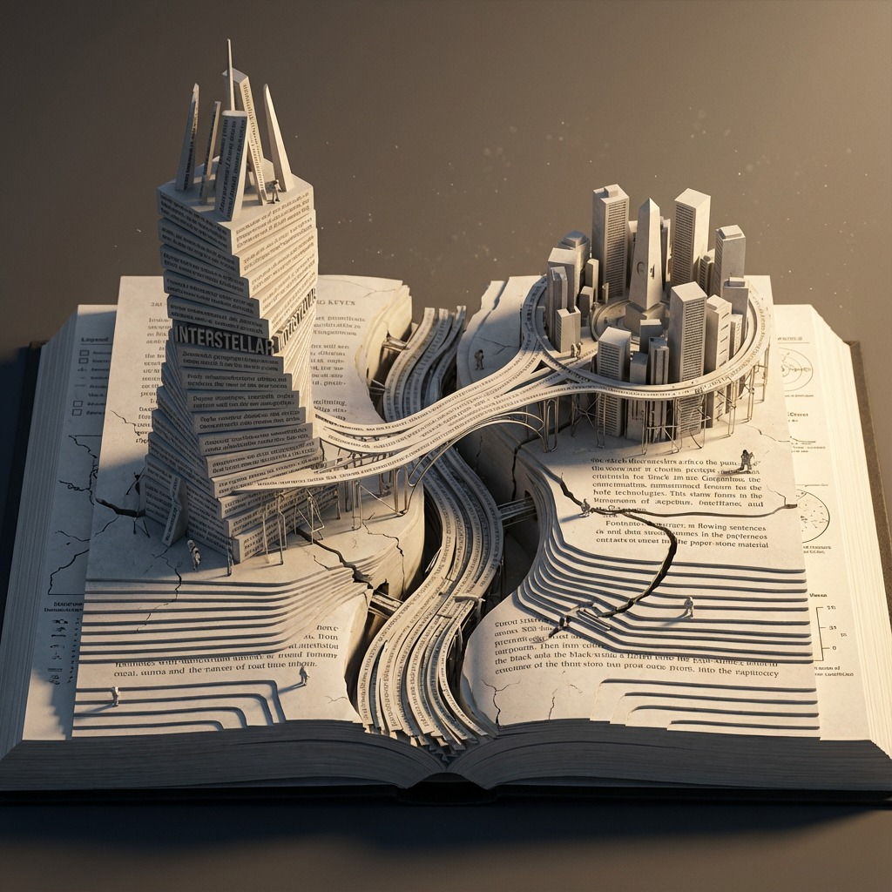

```
do this for Interstellar:  
Input A: Book title + motif.
Analyze: Translate motif into 3 architectural forms (tower, bridge, plaza) and a circulation path (river/road/rail) traced from sentence flow.
Goal: The book unfolds into a habitable micro-city engineered from typography.
Rules:
Container: Hardcover as foundation slab; page edges as stepped terraces; gutter as the central canyon.
The Transformation: Paragraph blocks become monolithic buildings; italics become spires; drop caps become obelisks; footnotes become subterranean tunnels.
The Details: Scale figures, scaffolding made from paper clips, hairline cracks in ink “stone,” dust as atmospheric perspective, map-legend marginalia.
Lighting/Atmosphere: Golden-hour raking light; long shadows emphasize typographic relief; subtle particulate air.
Output: Cinematic architectural macro, tilt-shift feel, 90mm, high displacement, Unreal/Octane, paper-stone hybrid, ultra-clean silhouettes.
```

```
为《星际穿越》做如下设计：  
输入A：书名 + 主题意象。  
分析：将主题意象转化为三种建筑形式（塔楼、桥梁、广场）以及一条由文句流动轨迹生成的流线路径（河流/道路/轨道）。  
目标：这本书展开后形成一座可居住的微型城市，其结构完全由排版文字构建而成。  
规则：  
容器：精装书壳作为基础底板；书页边缘构成阶梯式露台；书脊中缝化作中央峡谷。  
转化方式：段落块变为整体式建筑；斜体字化作尖塔；首字母大写变为方尖碑；脚注则成为地下隧道。  
细节处理：加入比例人物、回形针制成的脚手架、墨水“石材”上的发丝裂纹、尘埃营造空气透视效果，以及图例式边注。  
光影与氛围：黄金时刻的掠射光线；长投影突出文字浮雕感；空气中带有细微颗粒感。  
输出效果：电影感建筑微距画面，移轴摄影风格，90mm镜头，高置换贴图，使用Unreal或Octane渲染，呈现纸与石混合材质，轮廓极度清晰干净。
```

 [↑返回目录](#toc)

---
## <a id="prompt-2007267921425240000">3D动画女孩</a> (<a href="https://x.com/iamsofiaijaz/status/2007267921425240077" target="_blank" rel="noopener noreferrer">Aijaz</a>)


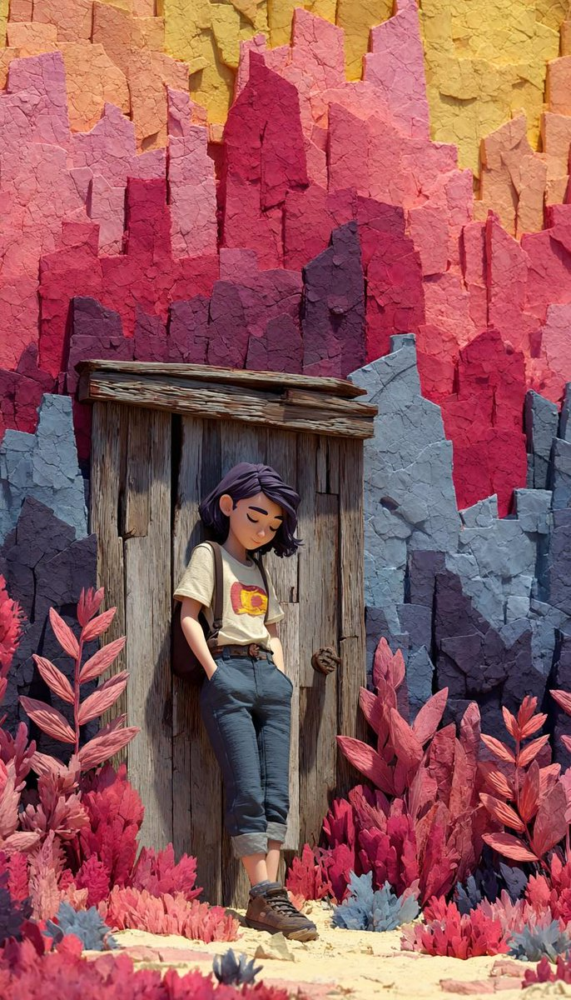

```
1. A stylized 3D animated girl standing in front of a rustic wooden door, surrounded by soft coral-pink and dusty red plants, with a layered pastel canyon wall in the background made of cracked textured stone in warm gradients of yellow, peach, pink, and muted purple.
The girl has short wavy dark hair, closed eyes, a calm peaceful expression, wearing a cream t-shirt with a small red-yellow graphic, high-waisted blue jeans rolled at the ankles, brown shoes, and a small backpack over one shoulder.
Cinematic soft lighting, warm color palette, shallow depth of field, painterly textures, cozy mood, whimsical Pixar-style 3D illustration, ultra-detailed, high resolution, soft shadows, pastel fantasy environment, peaceful atmosphere.
2.A stylized 3D animated young woman leaning against a textured abstract wall made of layered cracked paint panels in warm gradients of yellow, coral, pink, red, and muted purple.
She has short wavy dark hair slightly tousled, closed eyes with a soft peaceful smile, a small hoop earring, and relaxed body language with her arms folded. She is wearing a loose dusty-rose long sleeve shirt, high-waisted blue jeans rolled at the cuffs, and worn brown boots.
Soft cinematic lighting, warm pastel color palette, shallow depth of field, painterly textures, cozy and calm mood, whimsical Pixar-style 3D illustration, ultra detailed, high resolution, soft shadows, dreamy atmosphere.
```

```
1. 一位风格化的3D动画女孩站在一扇质朴的木门前，周围环绕着柔和的珊瑚粉与灰红色植物，背景是层层叠叠的粉彩色峡谷岩壁，由带有裂纹肌理的石头构成，呈现出黄色、桃色、粉色和柔紫色的温暖渐变。  
女孩留着短而微卷的深色头发，双眼闭合，神情宁静安详，身穿一件米白色T恤，胸前有小巧的红黄图案，搭配高腰蓝色牛仔裤（裤脚卷起），脚踩棕色鞋子，单肩背着一个小背包。  
电影感柔光，暖色调配色，浅景深，绘画般质感，温馨氛围，奇幻皮克斯风格3D插画，超精细，高分辨率，柔和阴影，粉彩幻想环境，宁静气氛。

2. 一位风格化的3D动画年轻女子倚靠在一面抽象纹理墙边，墙面由多层剥落裂纹的油漆板构成，呈现黄色、珊瑚色、粉色、红色与柔紫色的温暖渐变。  
她留着略显凌乱的短卷深色头发，闭眼带着温柔宁静的微笑，佩戴一枚小巧的圈形耳环，双臂交叉，姿态放松。身穿宽松的灰玫瑰色长袖衬衫，搭配高腰蓝色牛仔裤（裤脚卷起）和一双磨损的棕色靴子。  
柔光电影照明，暖粉彩色调，浅景深，绘画般质感，温馨平静氛围，奇幻皮克斯风格3D插画，超精细，高分辨率，柔和阴影，梦幻氛围。
```

 [↑返回目录](#toc)

---
## <a id="prompt-2007131884061397000">伊斯坦布尔的微观世界缩影于一笔之中</a> (<a href="https://x.com/kaanakz/status/2007131884061397089" target="_blank" rel="noopener noreferrer">Kaan</a>)

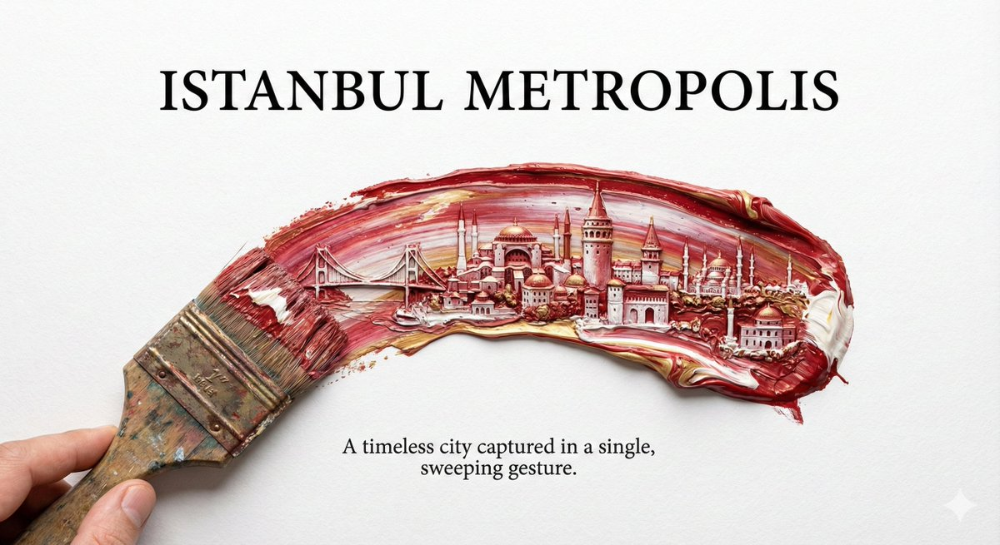

```
A brush, captured mid-motion, paints a refined curve from the lower left to the upper right.
Within the brushstroke lives a miniature world of ISTANBUL, rendered as a highly detailed 3D bas-relief city sculpted from layered paint.

Inside the stroke:
Iconic landmarks, architecture, and spatial rhythms of ISTANBUL, arranged as a cohesive miniature with depth and subtle relief.

Style:
Impasto oil painting fused with academic poster design. Thick and thin paint layers create depth, with 3D forms emerging from the stroke.
Color palette follows the official flag colors of the country associated with ISTANBUL, blended naturally.

View & background:
Minimalist top-down composition, pure white negative space, fine textured paper.

Typography:
Title: “ISTANBUL METROPOLIS”
Poetic subtitle and supporting serif copy, cleanly spaced.

Composition rules:
Brush tip ends cleanly at the upper right. All detail remains strictly inside the stroke.
Hyper-realistic, HDR, poster-grade, 8K look.
```

```
一支画笔在运动中被定格，从左下方向右上方描绘出一道精致的弧线。  
在这道笔触之中，蕴藏着一座微缩的伊斯坦布尔世界——以层层堆叠的颜料雕刻而成的高细节3D浅浮雕城市。

笔触内部：
伊斯坦布尔的标志性地标、建筑与空间韵律，被巧妙组合成一个具有深度与微妙浮雕感的和谐微型景观。

风格：
厚涂油画技法融合学术海报设计。通过厚薄不一的颜料层次营造深度，使3D形态从笔触中自然浮现。  
色彩方案遵循与伊斯坦布尔所属国家国旗一致的官方配色，并自然融合。

视角与背景：
极简俯视构图，纯白负空间，搭配细腻纹理纸张。

文字排版：
主标题：“伊斯坦布尔大都会”  
配以诗意副标题及清晰排布的衬线字体说明文字。

构图规则：
笔尖在右上角干净利落地收尾，所有细节严格限定于笔触之内。  
呈现超写实、HDR、海报级、8K画质效果。
```

 [↑返回目录](#toc)

---
## <a id="prompt-2006771650805870800">微型苔藓生态瓶内景</a> (<a href="https://x.com/AllaAisling/status/2006771650805870768" target="_blank" rel="noopener noreferrer">Alexandra Aisling</a>)

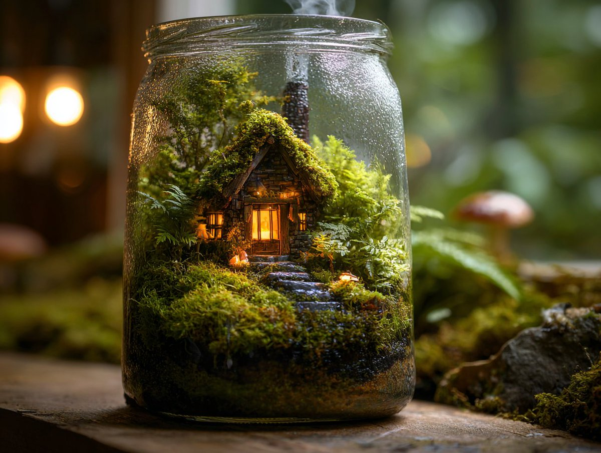

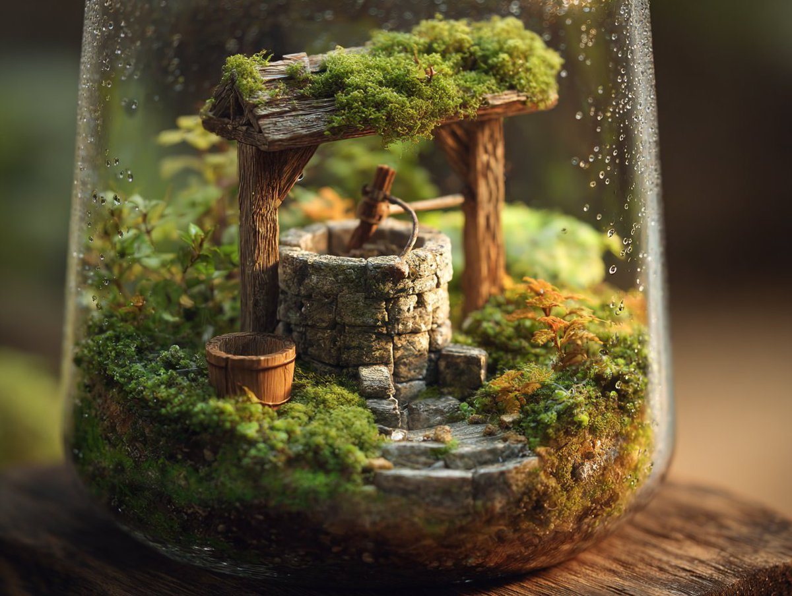

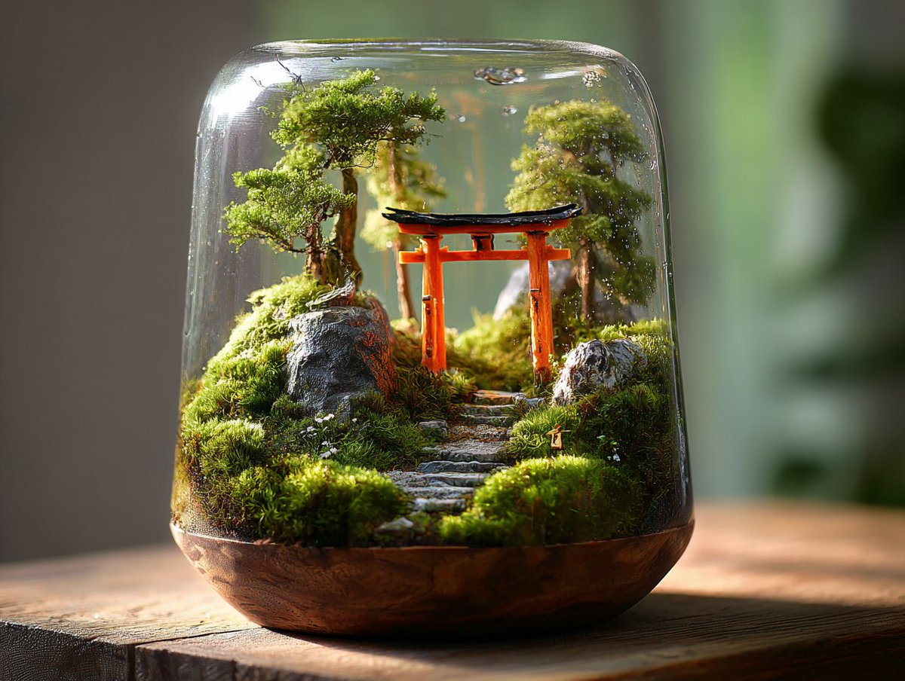

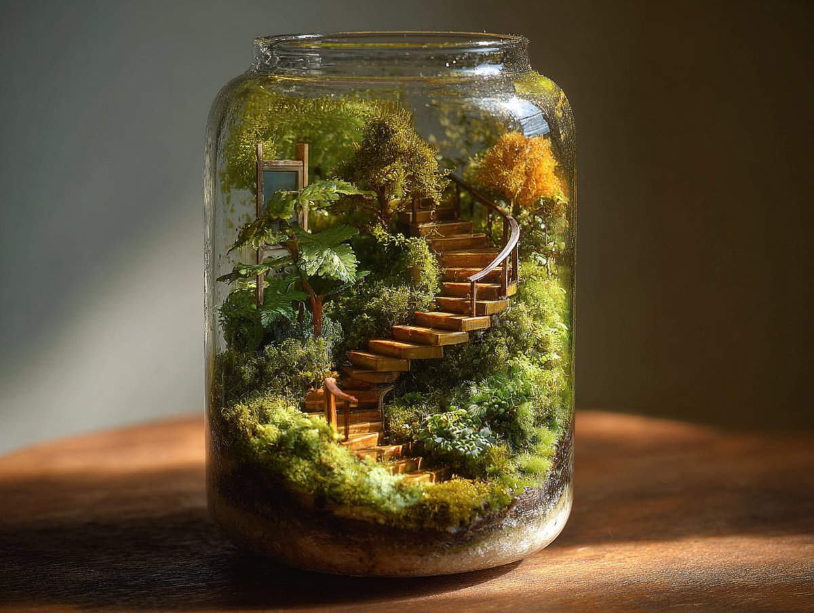

```
A moss terrarium containing a miniature witch's cottage with smoke curling from the chimney, living green textures under glass, morning dew droplets, soft diffused daylight, fairy-tale scale with rich forest greens and warm amber wood tones.
```

```
A moss terrarium containing a miniature crumbling stone well with a tiny wooden bucket, living green textures under glass, morning dew droplets, soft diffused daylight, fairy-tale scale with rich forest greens and warm amber wood tones.
```

```
A moss terrarium containing a miniature Japanese torii gate on a foggy hillside, living green textures under glass, morning dew droplets, soft diffused daylight, fairy-tale scale with rich forest greens and warm amber wood tones.
```

```
A moss terrarium containing a miniature spiral staircase descending into the earth, living green textures under glass, morning dew droplets, soft diffused daylight, fairy-tale scale with rich forest greens and warm amber wood tones.
```

 [↑返回目录](#toc)

---
## <a id="prompt-2006940436401893600">劳力士腕表破浪而出的奢华广告</a> (<a href="https://x.com/aleenaamiir/status/2006940436401893752" target="_blank" rel="noopener noreferrer">Aleena Amir</a>)

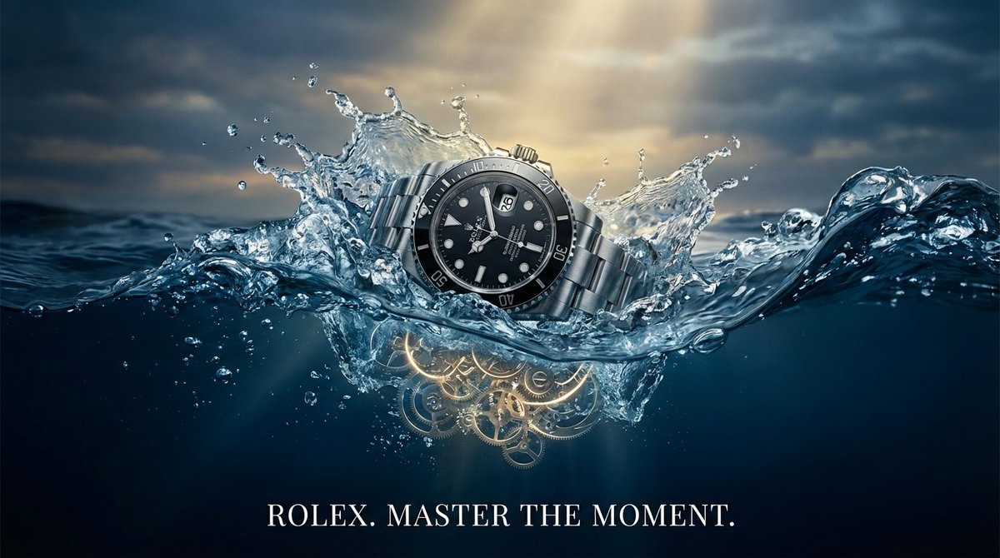

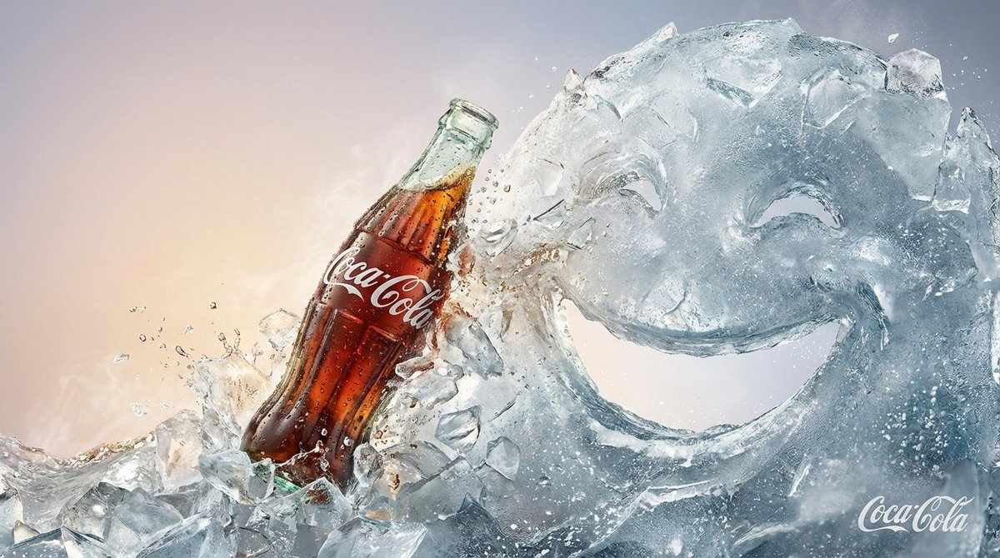

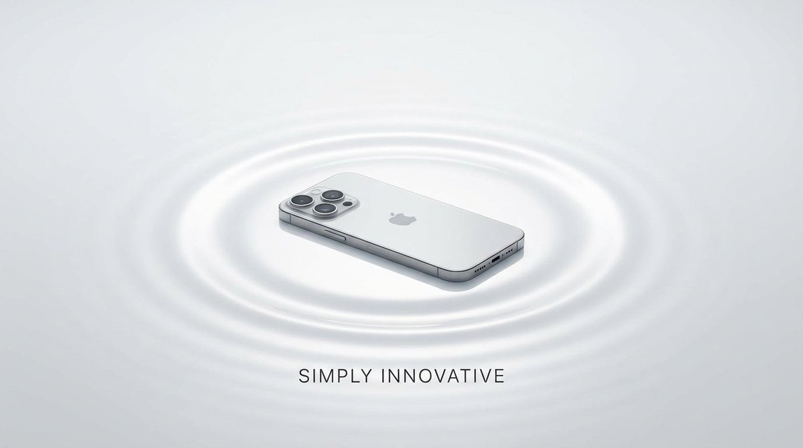

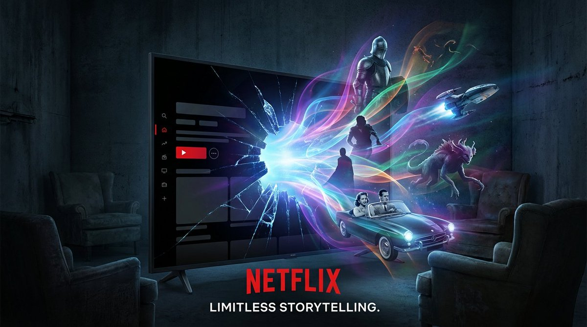

```
A striking, conceptual advertisement for Rolex, featuring a luxury wristwatch as the central hero element. The scene uses a bold visual metaphor to represent precision and reliability. The Rolex watch is placed in an unexpected yet meaningful scenario, emerging from a slow-motion ocean wave frozen in time, symbolizing mastery over extreme conditions. Scale and texture amplify impact. The background is cinematic, ensuring maximum focus on the subject. Lighting is dramatic and high-contrast, enhancing metallic detail and craftsmanship. The overall style feels cinematic photorealistic advertising, premium, modern, and campaign-ready. The mood is powerful and aspirational, designed to feel instantly iconic and memorable, like a global billboard or award-winning print ad.
```

```
一则引人注目的概念型劳力士广告，以奢华腕表为核心主角。画面运用大胆的视觉隐喻展现精准与可靠：劳力士腕表从一记慢动作海浪中破浪而出，浪花在时间中凝固，象征其在极端环境下的卓越掌控力。通过比例与质感强化视觉冲击力。背景具有电影感，确保焦点集中于腕表本身。灯光戏剧化且高对比度，凸显金属细节与精湛工艺。整体风格为电影级写实广告，高端、现代，可直接用于品牌宣传。氛围强大而富有抱负，旨在营造即刻成为全球广告牌或获奖平面广告般的标志性与记忆点。
```

 [↑返回目录](#toc)

---
## <a id="prompt-2007122463151534300">怀旧游戏卡带内的微缩世界</a> (<a href="https://x.com/Gdgtify/status/2007122463151534322" target="_blank" rel="noopener noreferrer">Gadgetify</a>)

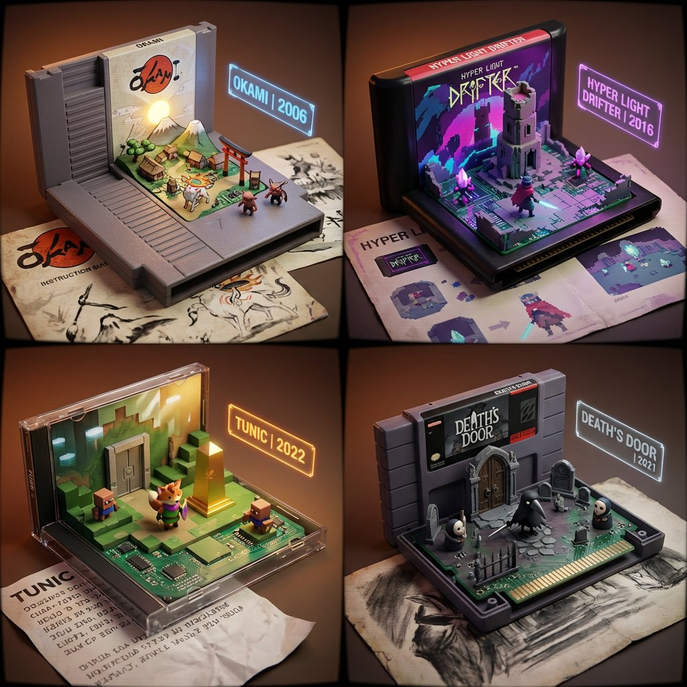

```
Input: Legend of Zelda:   Role:  Gaming Historian & Memory Card Sculptor

 Input:  [Video Game, e.g., The Legend of Zelda]

 Phase 1: Game DNA Analysis 
1. Identify core gameplay loop (exploration-puzzle-boss / die-learn-overcome)
2. Select 4 hidden gem games (indie or cult classics)  and their Release Years .
3. Extract 3 iconic in-game items and the game's signature color palette

 Phase 2: Visual Execution 
 Goal:  2x2 Grid of "Opened Game Cartridges as World Containers"

 Rules per Panel: 
-  The Shell:  A cracked-open retro game cartridge (NES, Genesis, PS1 case)  with the Game's Title clearly printed on the top spine label. 
-  The Circuitboard:  The internal PCB becomes a miniature topographical game map
-  The World:  Key game locations built in 3D on the circuit board (castle, dungeon, boss arena)
-  The Hero:  Tiny pixel-art-style figurine of the protagonist mid-action
-  The Enemies:  2-3 micro-enemy models positioned as threats
-  The HUD:   A floating holographic UI element displays the text: "[Game Name] | [Year]" in a retro font. 
-  The Manual:  Weathered instruction booklet page visible underneath showing retro game art
-  The Atmosphere:  CRT scan-line effect overlaid, nostalgic warm glow

 Output:  2x2 Grid, Nostalgic Product Photography, soft focus on edges
```

```
《塞尔达传说》：角色：游戏历史学家与记忆卡雕塑师

输入：[电子游戏，例如《塞尔达传说》]

第一阶段：游戏DNA分析  
1. 识别核心玩法循环（探索-解谜-打Boss / 死亡-学习-克服）  
2. 选取4款冷门佳作（独立游戏或邪典经典）及其发行年份  
3. 提取3个标志性游戏内物品及该游戏的代表性配色方案  

第二阶段：视觉呈现  
目标：2×2网格布局，展现“打开的游戏卡带作为世界容器”的概念  

每格画面规则：  
- 外壳：裂开的复古游戏卡带（NES、Genesis或PS1外壳），顶部脊标清晰印有游戏标题  
- 电路板：内部印刷电路板化作微型地形游戏地图  
- 世界：在电路板上以3D形式构建关键游戏场景（城堡、地牢、Boss战场）  
- 英雄：微缩像素风格主角小人，呈动态姿势  
- 敌人：2至3个微型敌人模型，布置为威胁姿态  
- 界面：悬浮全息UI元素，以复古字体显示“[游戏名称] | [年份]”  
- 说明书：下方可见泛黄磨损的游戏说明书页面，展示复古游戏插画  
- 氛围：叠加CRT扫描线效果，整体散发怀旧暖光  

输出：2×2网格，怀旧产品摄影风格，边缘柔焦
```

 [↑返回目录](#toc)

---
## <a id="prompt-2007134245328957400">I was playing with a prompt and ended up here, and I wanted to share it with you.</a> (<a href="https://x.com/maxescu/status/2007134245328957539" target="_blank" rel="noopener noreferrer">Alex Patrascu</a>)

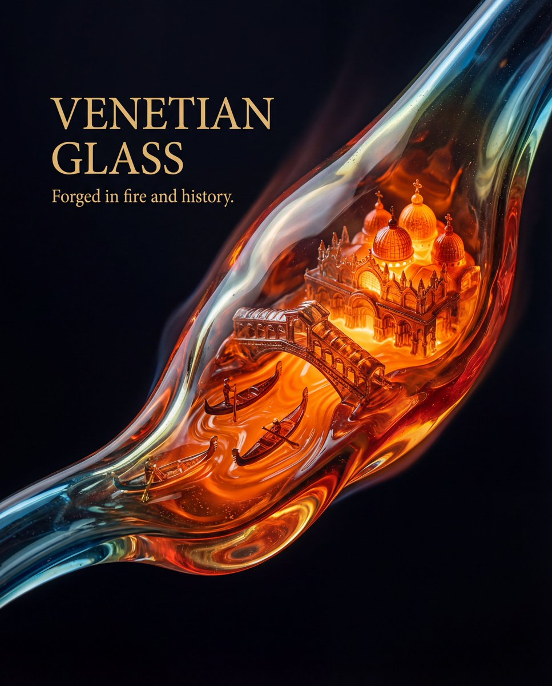

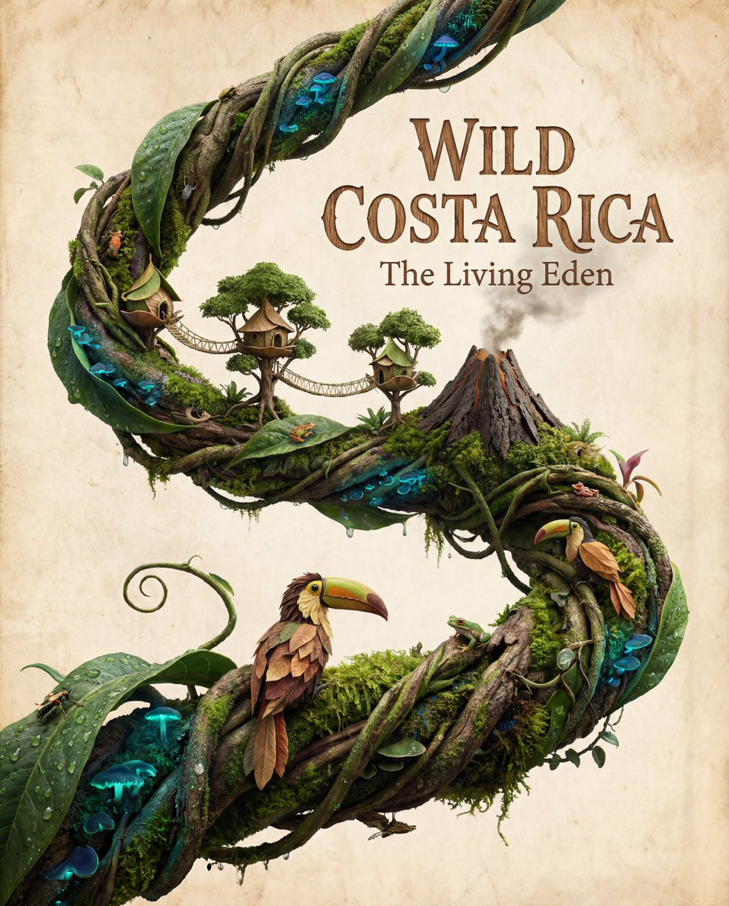

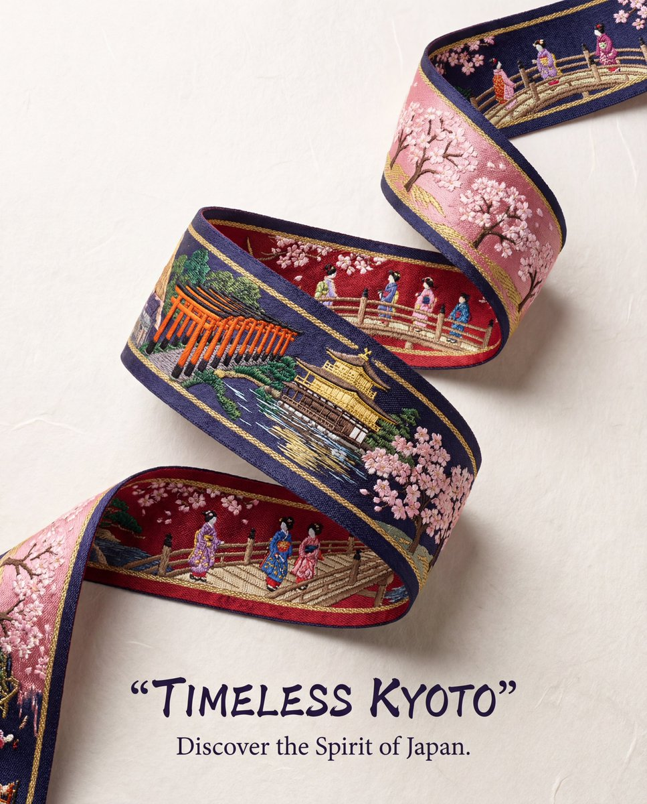

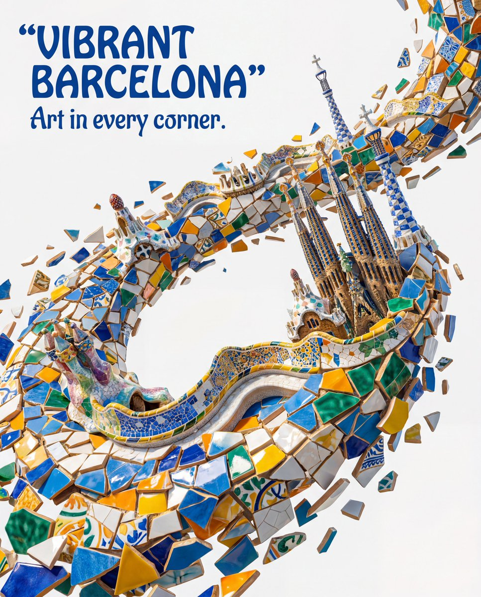

```
A [MACRO MEDIUM - e.g., stream of liquid gold, plume of smoke, silk ribbon], captured mid-motion, forming a dynamic [SHAPE - e.g., arc, spiral, wave] from the lower left to the upper right. Suspended within the [TEXTURE/MATERIAL] lives a miniature world of [MICRO SUBJECT - e.g., a city, a historical event, an ecosystem], rendered as highly detailed structures sculpted entirely from the [MACRO MEDIUM] itself.

Inside the [MEDIUM]: [DETAIL 1], [DETAIL 2], and [DETAIL 3]. The forms appear [ADJECTIVE - e.g., woven, liquid, crystalline, glowing], strictly defined by the physics of the [MACRO MEDIUM].

Style: [PHOTOGRAPHY STYLE - e.g., Macro product photography] fused with [ARTISTIC GENRE - e.g., Ukiyo-e, Cyberpunk, Baroque painting]. High emphasis on texture, lighting, and material contrast. Color palette: [COLORS] derived naturally from the material.

View & background:Plain, matte [BACKGROUND COLOR - usually Black or White] to create maximum contrast. Minimalist composition.

Typography:Title: “[TITLE]” Subtitle: “[SUBTITLE]” Font style: [FONT DESCRIPTION] placed cleanly in the negative space.

Composition rules:The [MEDIUM] creates a defined boundary. All details remain strictly inside the stroke/flow; nothing exists in the negative space. 8K, hyper-realistic texture, [LIGHTING STYLE].
```

```
一道丝绸缎带在运动中被捕捉，从画面左下方向右上方动态地卷曲成一道螺旋。在这条缎带内部，悬浮着一个微缩世界——一座完全由丝绸材质本身精雕细琢而成的繁华都市。

缎带内部包含：摩天大楼群、空中廊桥网络，以及穿行其间的微型飞艇。这些形态呈现出液态般的流动感，严格遵循丝绸材质本身的物理特性。

风格：微距产品摄影融合赛博朋克艺术流派，极度强调纹理、光影与材质对比。色彩方案自然源自丝绸本身的虹彩光泽——以珍珠白、电光青与柔金为主调。

视角与背景：纯色哑光黑色背景，营造极致对比；构图极简。

文字排版：标题：“织梦之城” 副标题：“在流动中构筑未来” 字体风格：纤细无衬线字体，带有轻微霓虹描边，干净置于画面留白处。

构图规则：丝绸缎带形成清晰边界，所有细节严格限定于缎带内部流动轨迹之中，负空间内不出现任何元素。8K分辨率，超写实纹理，高调硬光照明。
```

 [↑返回目录](#toc)

---
## <a id="prompt-2007023177915126000">3D卡通生物发光可爱动物</a> (<a href="https://x.com/icreatelife/status/2007023177915126034" target="_blank" rel="noopener noreferrer">Kris Kashtanova</a>)

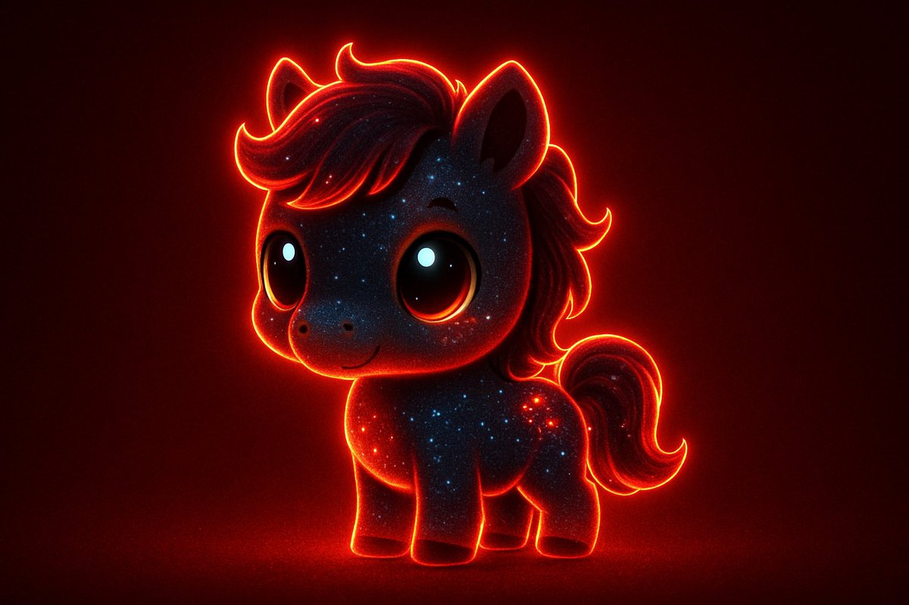

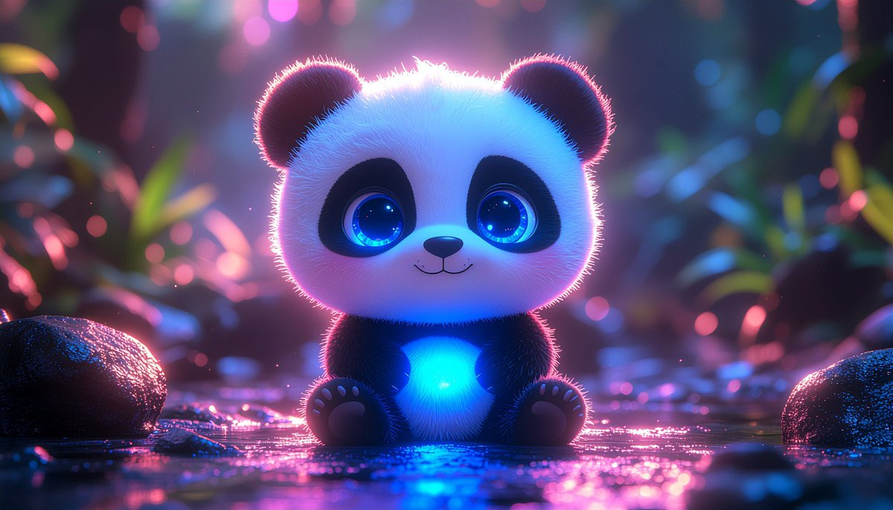

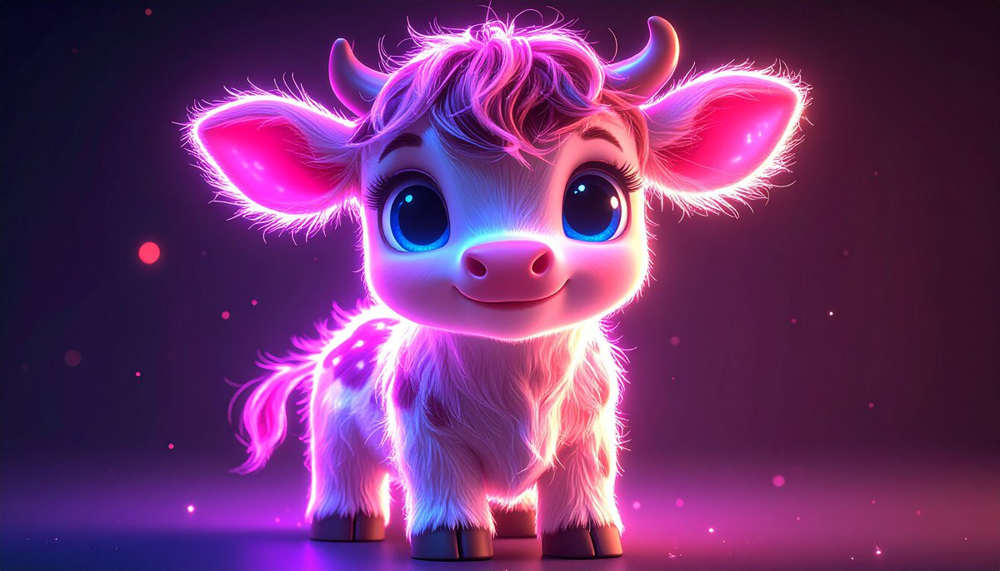

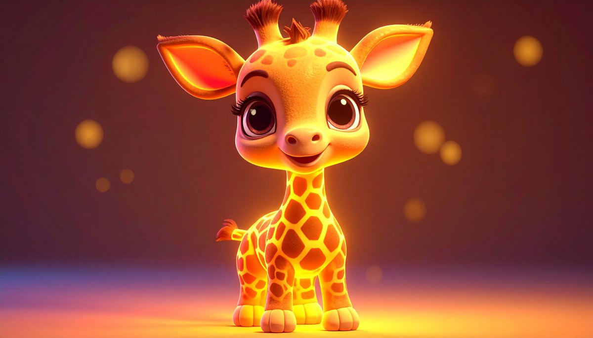

```
bioluminescent cute [ANIMAL], kawaii, chibi, [COLOR] neon backlit, 3d cartoon, big cute bright eyes, high definition

I would love to see your cute creatures
```

```
生物发光的可爱[动物]，卡哇伊风格，Q版，[颜色]霓虹背光，3D卡通，大而明亮的可爱眼睛，高清
```

 [↑返回目录](#toc)

---
## <a id="prompt-2006821478378123300">笔触中的微缩城市世界</a> (<a href="https://x.com/TechieBySA/status/2006821478378123282" target="_blank" rel="noopener noreferrer">TechieSA</a>)

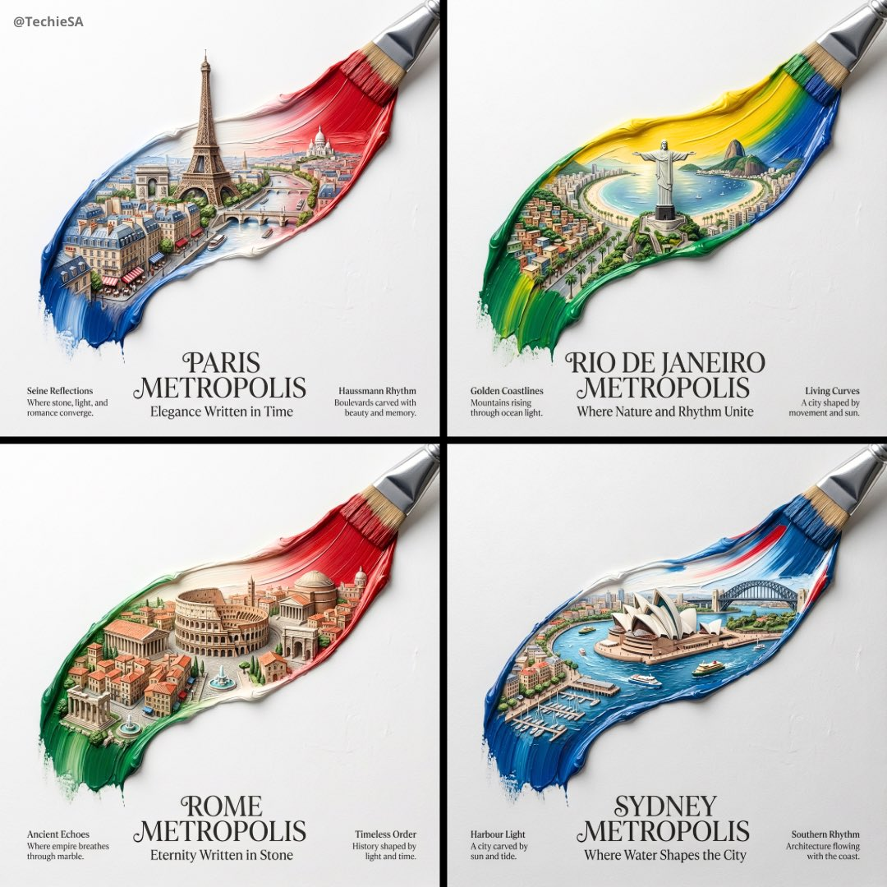

```
A brush, captured mid-motion, paints a refined curve from the lower left to the upper right.
Within the brushstroke lives a miniature world of [CITY], rendered as a highly detailed 3D bas-relief city sculpted from layered paint.

Inside the stroke:
Iconic landmarks, architecture, and spatial rhythms of [CITY], arranged as a cohesive miniature with depth and subtle relief.

Style:
Impasto oil painting fused with academic poster design. Thick and thin paint layers create depth, with 3D forms emerging from the stroke.
Color palette follows the official flag colors of the country associated with [CITY], blended naturally.

View & background:
Minimalist top-down composition, pure white negative space, fine textured paper.

Typography:
Title: “[CITY] METROPOLIS”
Poetic subtitle and supporting serif copy, cleanly spaced.

Composition rules:
Brush tip ends cleanly at the upper right. All detail remains strictly inside the stroke.
Hyper-realistic, HDR, poster-grade, 8K look.
```

```
一支画笔在运动中被定格，从左下方向右上方描绘出一道精致的弧线。  
在这道笔触之中，蕴藏着一座微缩的[CITY]城市世界，以高度精细的3D浅浮雕形式呈现，由层层堆叠的颜料雕刻而成。

笔触内部：  
[CITY]的标志性地标、建筑与空间韵律，被巧妙组织成一个具有深度与微妙浮雕感的和谐微缩景观。

风格：  
厚涂油画技法融合学术海报设计。通过厚薄不一的颜料层次营造景深，使3D形态从笔触中浮现而出。  
色彩采用与[CITY]所属国家国旗一致的官方配色，并自然融合。

视角与背景：  
极简俯视构图，纯白负空间，搭配细腻纹理纸面。

文字排版：  
主标题：“[CITY] METROPOLIS”  
辅以诗意副标题及清晰排布的衬线体说明文字。

构图规则：  
笔尖干净利落地止于右上角，所有细节严格限定于笔触之内。  
整体呈现超写实、HDR、海报级、8K画质效果。
```

 [↑返回目录](#toc)

---
## <a id="prompt-2007148490120380400">电影级人物海报</a> (<a href="https://x.com/Tz_2022/status/2007148490120380484" target="_blank" rel="noopener noreferrer">Tz</a>)


```
(masterpiece, best quality, ultra-detailed), (infographic poster design:1.3), 沃伦巴菲特退休, vintage financial style, 丰富的中文文本信息.

### 1. 整体框架与背景 (Frame & Background):
海报背景材质设定为微黄的仿旧羊皮纸证券凭证质感，整体被一个精细的墨绿色纽索纹（Guilloche pattern，类似美元钞票边缘的纹路）画框所包围，画框的质感与背景完美融合，奠定海报的经典金融与历史积淀基调。

### 2. 顶部标题模块 (Top Header Module):
海报顶部正中位置呈现宏大的双语艺术字体设计。核心是醒目的衬线体中文主标题“传奇谢幕”，下方自然融入较小的英文副标题“The Legend Retires”。标题区域的左右两侧分别装饰着复古的公牛与公熊徽章，形成平衡的视觉结构。

### 3. 核心视觉中心 (Center Visual):
画面中央是沃伦·巴菲特的半身肖像，他戴着标志性的黑框眼镜，面带睿智而慈祥的微笑，身穿经典的深色西装。光影呈现伦勃朗光效，背景隐约浮现出起伏向上的K线图阴影，象征着伯克希尔·哈撒韦的辉煌业绩。

### 4. 双语信息列 (Bilingual Columns):
左侧栏设计：竖直排列着3个复古蚀刻风格的圆形图标。关键要求：每个图标的右侧都必须配有清晰的中英双语标签文本，格式为“中文名词 English Noun”。
1. 一个滚动的巨大雪球 (滚雪球 Snowball Effect)
2. 一座被水环绕的城堡 (护城河 Economic Moat)
3. 一个复杂的复利数学公式 (复利 Compound Interest)

右侧栏设计：竖直排列着3个方形的电影感颗粒质感插图。关键要求：每个画面的正下方都必须配有清晰的中英双语字幕文本，格式为“中文描述短句 English description phrase”。
1. 两个老人在交谈 (黄金搭档 Golden Partner)
2. 拥挤的体育馆会议现场 (股东大会 Annual Meeting)
3. 一张简单的办公桌 (简单生活 Simple Life)

### 5. 底部信息模块 (Footer Info):
海报的最底部区域被划分为3个独立的信息数据栏，从模块池中选取，包含清晰的中文字符：
- 模块1：[金句 Quotes] 展示名言：“别人贪婪时我恐惧 Be fearful when others are greedy.”
- 模块2：[属性 Stats] 展示数据图表：“年化回报 19.8% Annual Return.”
- 模块3：[关系 Network] 展示继任者信息：一个象征交接的握手图标或剪影，配文“继任者：格雷格·阿贝尔 Successor: Greg Abel.”

### 技术规格与风格强化 (Tech Specs):
(Chinese text rendering priority:1.4), (clear legible font), (engraving style mixed with realistic photography), 8k resolution, cinematic lighting, matte finish. --ar 2:3
```

 [↑返回目录](#toc)

---
## <a id="prompt-2007266399497138700">冰镇可乐的强烈飞溅瞬间</a> (<a href="https://x.com/underwoodxie96/status/2007266399497138682" target="_blank" rel="noopener noreferrer">underwood</a>)

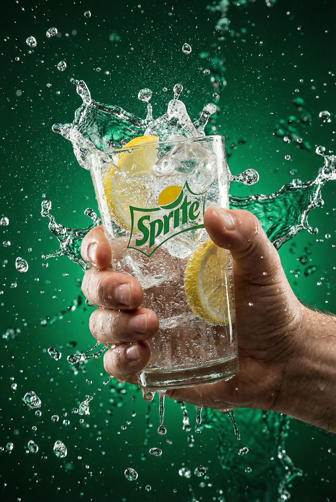

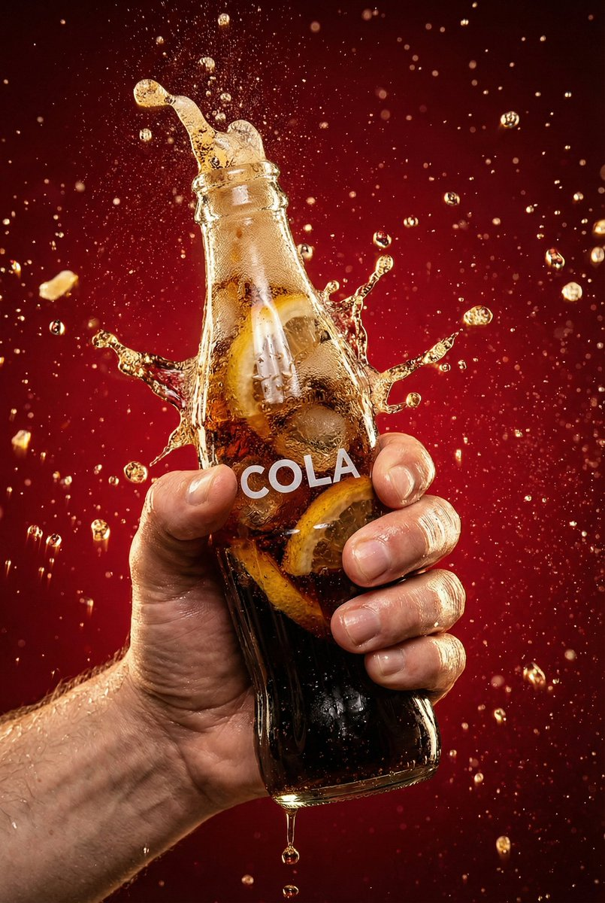

```
Soda advertisement, you can modify the prompt to your favorite soda brand.

{
  "subject": {
    "description": "A human hand gripping a transparent glass filled with ice-cold carbonated cola, frozen at the moment of an explosive liquid splash",
    "age": "adult",
    "expression": {
      "overall": "not visible"
    },
    "face": {
      "preserve_original": true,
      "makeup": "none"
    }
  },
  "hair": {
    "color": "not visible",
    "style": "not visible",
    "effect": "none"
  },
  "body": {
    "frame": "only hand visible",
    "skin": {
      "visible_areas": ["hand", "fingers"],
      "tone": "natural",
      "texture": "wet skin with water droplets",
      "lighting_effect": "strong highlights on wet skin"
    }
  },
  "pose": {
    "position": "hand centered holding glass upright",
    "base": "firm grip",
    "overall": "dynamic frozen motion"
  },
  "clothing": {
    "top": {
      "type": "not visible",
      "color": "not visible",
      "details": "none",
      "effect": "none"
    },
    "bottom": {
      "type": "not visible",
      "color": "not visible",
      "details": "none"
    }
  },
  "accessories": {
    "prop": {
      "type": "transparent glass",
      "content": "dark carbonated cola with ice cubes and dense bubbles"
    }
  },
  "photography": {
    "camera_style": "commercial high-speed beverage photography",
    "angle": "slightly low angle, front-facing",
    "shot_type": "close-up product shot",
    "aspect_ratio": "3:4 vertical",
    "texture": "ultra-sharp, high contrast, crisp details",
    "lighting": "dramatic studio lighting with strong backlight and rim highlights",
    "depth_of_field": "shallow, background softly blurred"
  },
  "background": {
    "setting": "abstract liquid environment",
    "wall_color": "deep crimson red",
    "elements": ["water splashes", "floating droplets"],
    "atmosphere": "bold, energetic, intense",
    "lighting": "bright highlights with warm undertones"
  },
  "the_vibe": {
    "energy": "powerful and explosive",
    "mood": "bold, refreshing, high-energy",
    "aesthetic": "premium commercial cola advertising",
    "authenticity": "hyper-realistic",
    "intimacy": "immersive, splash-in-your-face feeling",
    "story": "a split second of ice-cold cola refreshment captured at maximum impact",
    "caption_energy": "strong, fizzy, adrenaline-charged"
  },
  "constraints": {
    "must_keep": [
      "realistic water splash",
      "dark cola color",
      "carbonated bubbles",
      "ice cubes",
      "high-speed frozen motion"
    ],
    "avoid": [
      "cartoon style",
      "illustration",
      "green color palette",
      "citrus elements",
      "motion blur",
      "text in non-English language"
    ]
  },
  "negative_prompt": [
    "anime",
    "illustration",
    "low resolution",
    "blur",
    "fake liquid",
    "plastic texture",
    "overexposed highlights",
    "flat lighting",
    "unrealistic bubbles"
  ]
}
```

```
汽水广告，可将提示词中的品牌替换为你喜欢的汽水品牌。

一只成年人的手紧握一只透明玻璃杯，杯中盛满冰镇碳酸可乐，画面定格在液体猛烈飞溅的瞬间。仅可见手部，皮肤自然色调，表面布满水珠，在强光下呈现明显高光。手稳稳地垂直握住玻璃杯，姿态充满动感且动作被高速冻结。玻璃杯内装有深色碳酸可乐、冰块和密集气泡。摄影风格为商业高速饮料摄影，略低角度正面拍摄，特写产品镜头，3:4竖构图，细节超清晰、高对比。采用戏剧性影棚布光，强烈背光与边缘高光突出主体，浅景深使背景柔和虚化。背景为抽象液体环境，深绯红色墙面，带有水花与悬浮水滴，氛围大胆、充满能量，光线明亮并带有暖调。整体感觉强劲爆炸、大胆清爽、高能量，呈现高端商业可乐广告的美学，极度逼真，带来身临其境、扑面而来的飞溅感，捕捉冰镇可乐在最强冲击瞬间的畅快体验。画面必须保留真实水花、深色可乐、碳酸气泡、冰块和高速冻结动态；避免卡通风格、插画、绿色调、柑橘元素、动态模糊及非英文文字。负面提示包括：动漫、插画、低分辨率、模糊、假液体、塑料质感、过曝高光、平淡光线、不真实气泡。
```

 [↑返回目录](#toc)

---
## <a id="prompt-2007161169468108800">超精细3D渲染[ICON]棋子雕像</a> (<a href="https://x.com/TechieBySA/status/2007161169468108902" target="_blank" rel="noopener noreferrer">TechieSA</a>)

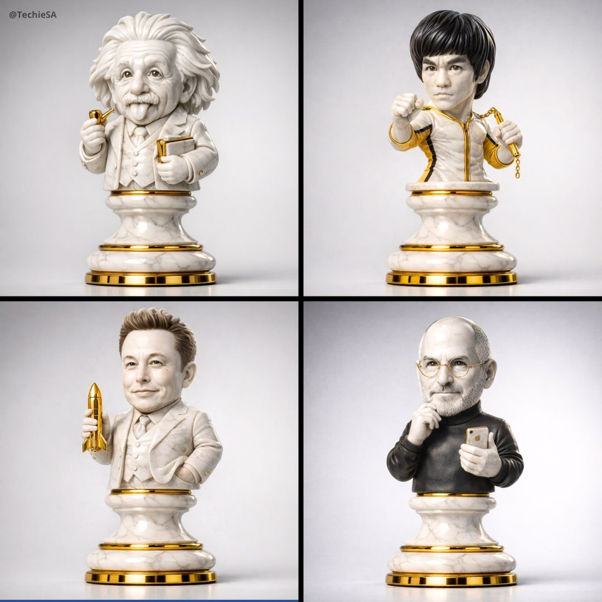

```
A hyper-detailed 3D render of a collectible chess piece designed as [ICON]. The figure is sculpted in polished marble and gold accents, with a stylized base resembling a classic chess piece. The character’s iconic features, clothing, or accessories are faithfully captured in a simplified but instantly recognizable form. Studio lighting with soft reflections, dramatic shadows, photorealistic textures, cinematic presentation. Centered on a clean neutral background, 1080x1080 square format.
```

```
一个超精细的3D渲染收藏级棋子，设计为[ICON]形象。雕像采用抛光大理石与金色点缀打造，底座风格化地模仿经典国际象棋棋子造型。角色的标志性特征、服饰或配饰以简化却一眼可辨的形式忠实呈现。影棚灯光营造柔和反光与戏剧性阴影，具有逼真纹理和电影级表现力。画面居中置于干净的中性背景上，1080x1080方形格式。
```

 [↑返回目录](#toc)

---
## <a id="prompt-2007087774248439800">缎带中的城市浮雕</a> (<a href="https://x.com/aleenaamiir/status/2007087774248439879" target="_blank" rel="noopener noreferrer">Aleena Amir</a>)


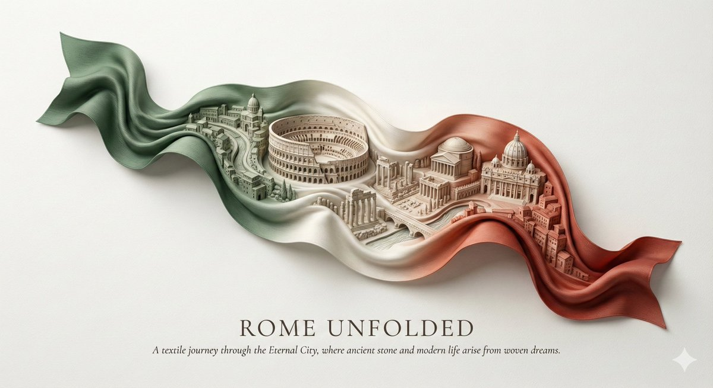

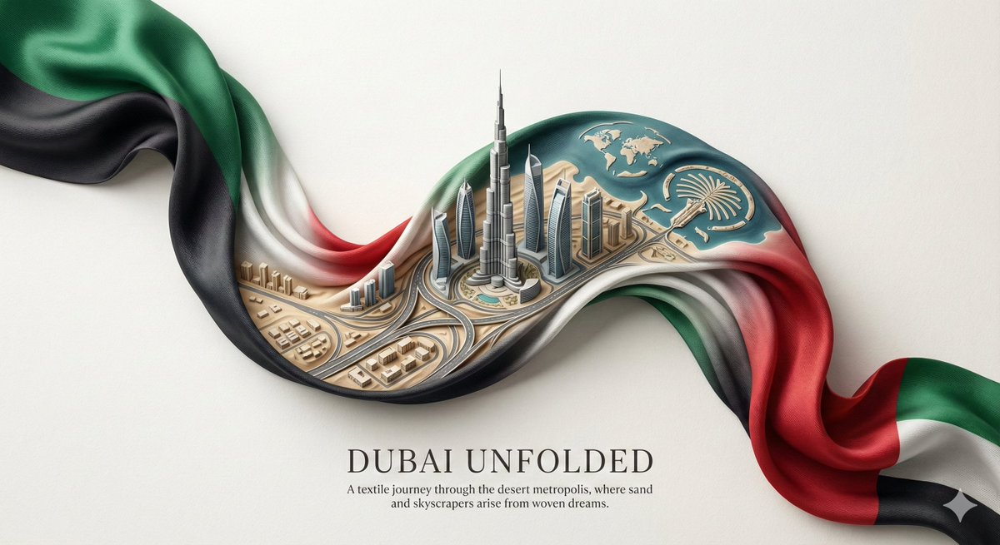

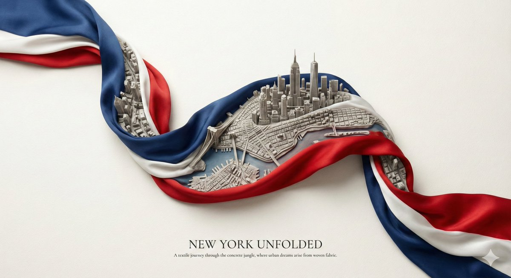

```
A silk ribbon unfurls diagonally across the canvas, twisting gently in mid-air. Within the folds of the ribbon exists a miniature sculpted city of [CITY], carved as a 3D bas-relief emerging from woven fabric textures.

Inside the ribbon: Landmarks, streets, and skyline rhythms of [CITY], flowing naturally with the ribbon’s curvature, layered in subtle depth.

Style: Fabric realism fused with sculptural relief. Soft highlights, tactile folds, elegant poster design.

Color palette: Derived from the national flag of [COUNTRY], woven seamlessly into the fabric tones.
View & background: Top-down minimalist layout, off-white museum paper texture, strong negative space.

Typography: Title: “[CITY] UNFOLDED” Refined serif subtitle with poetic geographic language.

Composition rules: All architectural detail remains strictly inside the ribbon shape. Ultra-detailed, HDR, gallery-grade, 8K poster aesthetic.
```

```
一条丝绸缎带斜向展开于画布之上，在空中轻柔地扭转。缎带的褶皱之中，藏着一座微型雕刻城市[CITY]，以三维浅浮雕的形式从织物纹理中浮现。

缎带内部：[CITY]的地标、街道与天际线韵律自然贴合缎带的弯曲走向，层次分明而细腻。

风格：织物质感写实与雕塑浮雕相融合，柔光高光、可触褶皱，优雅海报设计。

配色方案：取自[COUNTRY]国旗色彩，无缝融入织物色调。

视角与背景：俯视极简布局，米白色博物馆纸张肌理，大量留白。

文字排版：标题为“[CITY] UNFOLDED”，副标题采用精致衬线字体，辅以富有诗意的地理语言。

构图规则：所有建筑细节严格限定于缎带形状之内。超精细、HDR、画廊级、8K海报质感。
```

 [↑返回目录](#toc)

---
## <a id="prompt-2006795197087207700">品牌产品盒堆砌的圣诞树时尚插图</a> (<a href="https://x.com/AmirMushich/status/2006795197087207618" target="_blank" rel="noopener noreferrer">AmirMušić</a>)

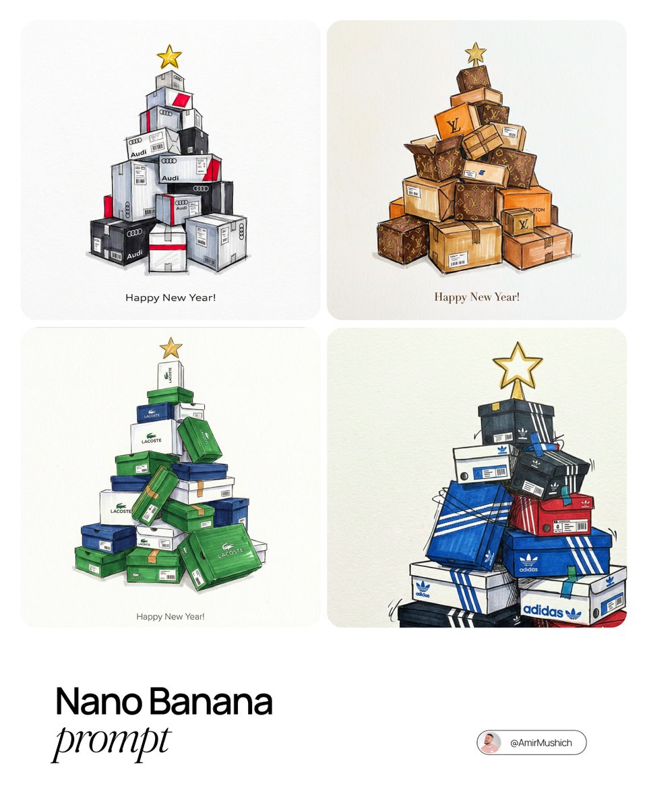

```
[A charming, hand-drawn fashion illustration of a Christmas tree constructed entirely from a chaotic stack of [BRAND NAME] product boxes.

**COMPOSITION:**
The boxes are piled in a pyramid shape to mimic the silhouette of a Christmas tree. The boxes vary slightly in size and angle, creating a playful, unstable, organic look. At the very top, there is a simple golden star.

**BRAND PALETTE & AESTHETICS (CRITICAL):**
The boxes must be colored strictly according to [BRAND NAME]'s official color palette (e.g., Tiffany Blue for Tiffany, Orange/Brown for Louis Vuitton, Red/White for Supreme).
* **Details:** Visible [BRAND NAME] logos are printed on the sides of the boxes. Add realistic packaging details like small shipping labels, barcodes, and tape to enhance the "delivery box" vibe.

**ART STYLE (MARKER SKETCH):**
The image is NOT a 3D render. It is a high-quality "Alcohol Marker and Ink" sketch on white paper. The style is loose, artistic, and vibrant, typical of fashion design sketches. The colors have the texture of markers; the outlines are done in fine black ink.

**TYPOGRAPHY (STRICT BRAND MATCH):**
At the very bottom of the illustration, centered, write the phrase: "Happy New Year!".
1.  **Font Style:** The font must mimic the official typographic language of [BRAND NAME] (e.g., if Nike: use a heavy Condensed Sans-Serif; if Gucci: use a refined Serif). The text style must feel like an extension of the brand's identity.
2.  **Size:** The text must be very small and discreet. It should occupy a maximum of 20% of the total image width.

**BACKGROUND:**
Clean white paper texture background.]
```

```
一个完全由[品牌名称]产品盒子混乱堆叠而成的圣诞树的迷人手绘时尚插图。

**构图：**
盒子以金字塔形状堆积，模仿圣诞树的轮廓。盒子的大小和角度略有不同，创造出一种有趣、不稳定且自然的外观。最顶部有一个简单的金色星星。

**品牌调色板与美学（关键）：**
盒子的颜色必须严格按照[品牌名称]的官方色彩调色板上色（例如，蒂芙尼蓝用于蒂芙尼，橙色/棕色用于路易威登，红色/白色用于Supreme）。
* **细节：** 盒子侧面印有明显的[品牌名称]标志。添加真实的包装细节，如小型货运标签、条形码和胶带，以增强“快递盒”的氛围。

**艺术风格（马克笔素描）：**
此图不是3D渲染图。它是一张高质量的“酒精马克笔和墨水”素描，绘制在白纸上。风格自由、艺术性强且充满活力，是典型的时尚设计草图风格。颜色具有马克笔的质感；轮廓用细黑墨水勾勒。

**字体（严格匹配品牌）：**
在插图的最底部中心位置写上：“新年快乐！”这句话。
1.  **字体样式：** 字体必须模仿[品牌名称]的官方字体语言（例如，如果是耐克，则使用厚重的紧缩无衬线字体；如果是古驰，则使用优雅的衬线字体）。文本样式必须感觉像是品牌形象的延伸。
2.  **大小：** 文本必须非常小而低调。其宽度不应超过图像总宽度的20%。

**背景：**
干净的白纸纹理背景。
```

 [↑返回目录](#toc)

---
## <a id="prompt-2007275324967698700">想起了动物森友会的博物馆系列！</a> (<a href="https://x.com/LZhou15365/status/2007275324967698649" target="_blank" rel="noopener noreferrer">小洲洲的AI日常</a>)

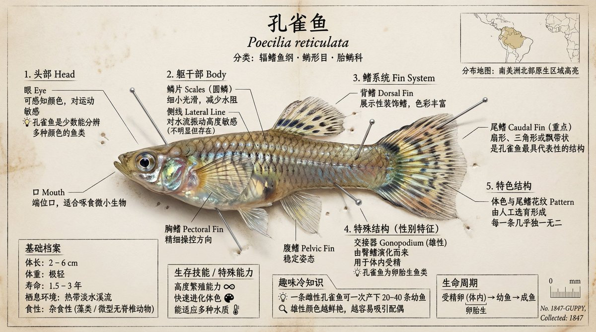

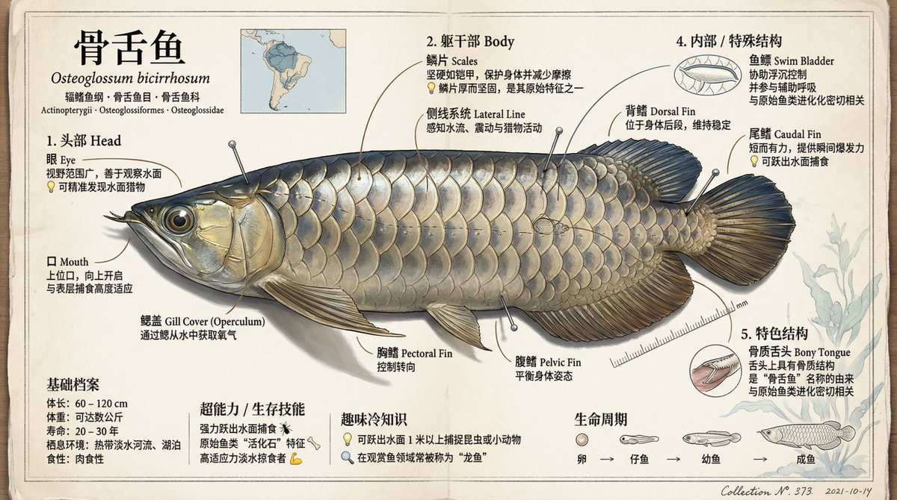

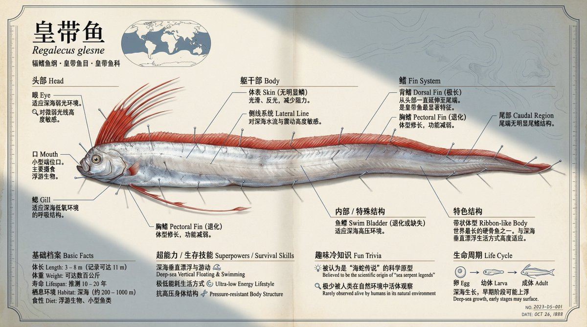

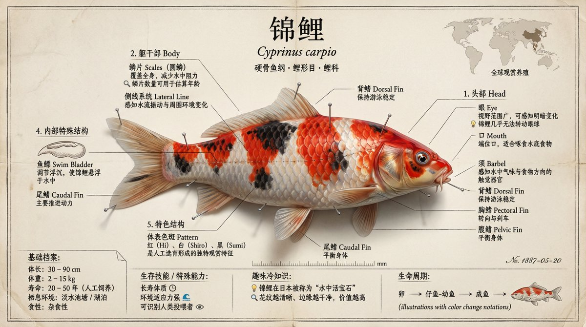

```
请创建一张博物馆展品级别的鱼类知识科普图谱，聚焦展示【某一种代表性鱼类，如：金枪鱼 / 鲤鱼 / 鲨鱼 / 小丑鱼（可替换）】。

核心布局：

中心：巨大的鱼类标本图像，占据画面 60–70%

周围：科学标注 + 趣味百科信息，呈放射状或分区排布

整体：如同博物馆玻璃展柜中的鱼类标本说明牌

鱼类标本呈现（核心要求）：

物理真实感
鱼类标本真实平放在纸面上
不是“照片中的照片”，而是实体标本

视角
垂直俯视（Top-down view）
鱼体与纸面处于同一物理平面

光影
柔和自然光从上方照射
鱼体在纸面上投下细腻、真实的阴影

固定方式（博物学风格）
使用细长银色金属标本针或细线固定鱼体
针穿过鱼体关键部位（如背部或鳍基）
针尖微微刺入纸面
纸面可见细小针孔与轻微压痕

细节质感（重点）
清晰可见：
鱼鳞排列与反光
鳍膜的半透明质感
鳃盖的结构层次
眼睛的湿润反光
鱼体边缘有厚度感与轻微立体起伏
鳍部可能有自然展开但不过分夸张

比例
鱼类标本占据纸面中心约 60–70%
周围留白用于标注与信息说明

自然状态
鱼体姿态自然、舒展
保留“真实标本”的静态感，而非游动姿态

标注系统设计：

使用细引导线

从鱼体结构延伸至文字说明框

引导线如同直接绘制或印刷在纸面上

必需标注的身体部位（6–8 个）：

1. 头部 Head

眼 Eye
视野范围？是否能看到颜色？

口 Mouth
口型（上位口 / 端位口 / 下位口）
食性相关？

鳃盖 Gill Cover (Operculum)
呼吸方式说明（如何从水中获取氧气）

2. 躯干部 Body

鳞片 Scales
类型（圆鳞 / 栉鳞 / 楯鳞）
保护与减阻作用

侧线系统 Lateral Line
感知水流和震动的“感觉器官”

3. 鳍 Fin System

背鳍 Dorsal Fin：保持平衡

胸鳍 Pectoral Fin：转向与刹车

腹鳍 Pelvic Fin：稳定身体

尾鳍 Caudal Fin：主要推进力
游泳速度或爆发力说明

4. 内部/特殊结构（可视化表达）

鱼鳔 Swim Bladder（如适用）
控制浮沉

或

软骨骨骼 / 硬骨结构对比

5. 特色结构

该鱼类最具代表性的身体特征

与其生存环境（海洋 / 淡水 / 深海 / 珊瑚礁）的适应关系

信息卡片内容（每个标注包含）：

部位名称（中 / 英文）
1–2 句儿童友好型功能说明

趣味数据或冷知识
用 🔍 或 💡 图标标识

页面其他元素：

顶部区域：

鱼类中文名（大标题，优雅字体）

学名 Scientific Name（斜体拉丁文）

分类信息（纲 / 目 / 科）

分布地图小图标
世界地图 + 主要分布水域高亮

底部 / 侧边信息栏：

基础档案

体长：X cm – X m

体重：X g – X kg

寿命：X 年

栖息环境：海洋 / 淡水 / 深海 / 珊瑚礁

食性：草食 / 肉食 / 杂食

超能力 / 生存技能

2–3 项最酷能力，例如：
高速游泳
电感应
变色伪装
洄游能力

图标 + 简短说明

趣味冷知识

1–2 个吸引儿童的事实

如：
“可以不眨眼睡觉”
“一生能游过几千公里”

生命周期

简化示意图：
卵 → 仔鱼 → 幼鱼 → 成鱼

标注生长阶段变化重点

设计美学（保持博物学风格）：

纸面质感

底纸：
米白色 / 象牙白高级纸张
#F8F6F0 或 #FFFEF7

可见纸张纤维

轻微复古磨损感（可选）

空间关系（非常重要）

鱼类标本：真实物理实体，平放在纸面上

固定针 / 细线：银色金属质感

标注文字：直接印刷或手写在同一张纸上

引导线：细笔绘制的线条
配色方案

纸面底色：#F8F6F0 / #FFFEF7

标注文字：#2C3E50（深灰蓝墨色）

引导线：#8B7355 或 #696969

强调标记：#D4AF37（古铜金）

标本针：#C0C0C0（银灰金属）

字体系统
标题：优雅印刷体或手写风格（宋体 / Garamond）

学名：斜体

标注说明：清晰小号手写体或印刷体

整体感觉：
像博物学家在标本纸上亲笔记录鱼类观察笔记

装饰元素（可选）

四角装饰线框

毫米刻度尺（与鱼体平行）

采集编号 / 日期（手写风格）

水生植物剪影水印（极淡）

关键视觉要点（不可违背）：

整个画面是一张平铺的鱼类标本纸

鱼类标本被真实固定在纸面上

文字、线条、标本共享同一个物理平面

观看者仿佛正俯视一位博物学家的工作台

关键概念强调：

❌ 不要：鱼的照片被放进画面

✅ 要：鱼类标本本身就在纸面上

就像 19 世纪博物学家的鱼类标本册一页

图片规格：

比例：16:9（横版）或 3:4（竖版）

分辨率：300 DPI，适合 A3 / A2 打印

格式：PNG 高清

科学准确性要求：
鱼体比例符合真实物种

解剖结构名称准确

儿童描述生动但不失科学性
```

 [↑返回目录](#toc)

---
## <a id="prompt-2007113351197770200">超写实主角特写炸鸡腿系列</a> (<a href="https://x.com/YaseenK7212/status/2007113351197770202" target="_blank" rel="noopener noreferrer">Yaseen Khan Gul</a>)

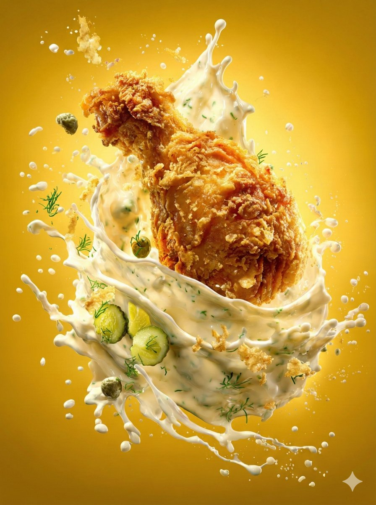

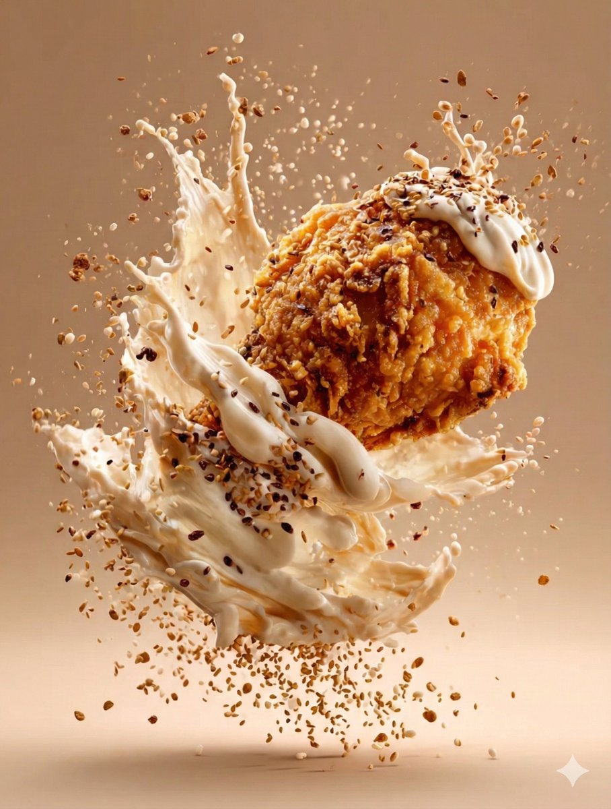

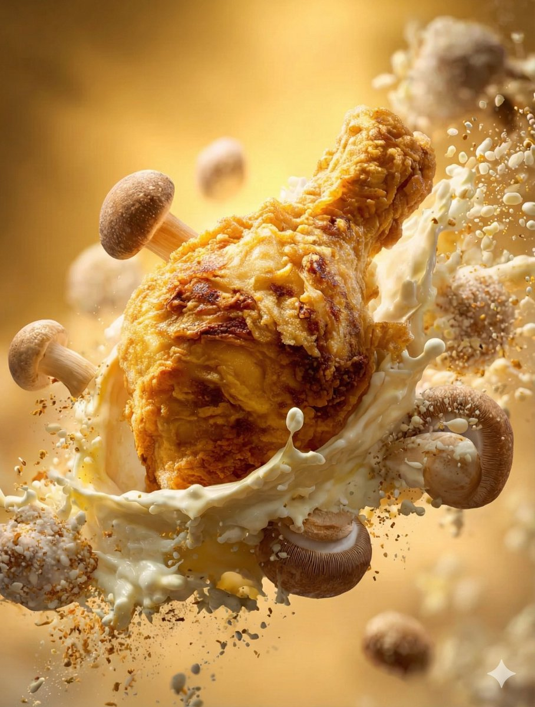

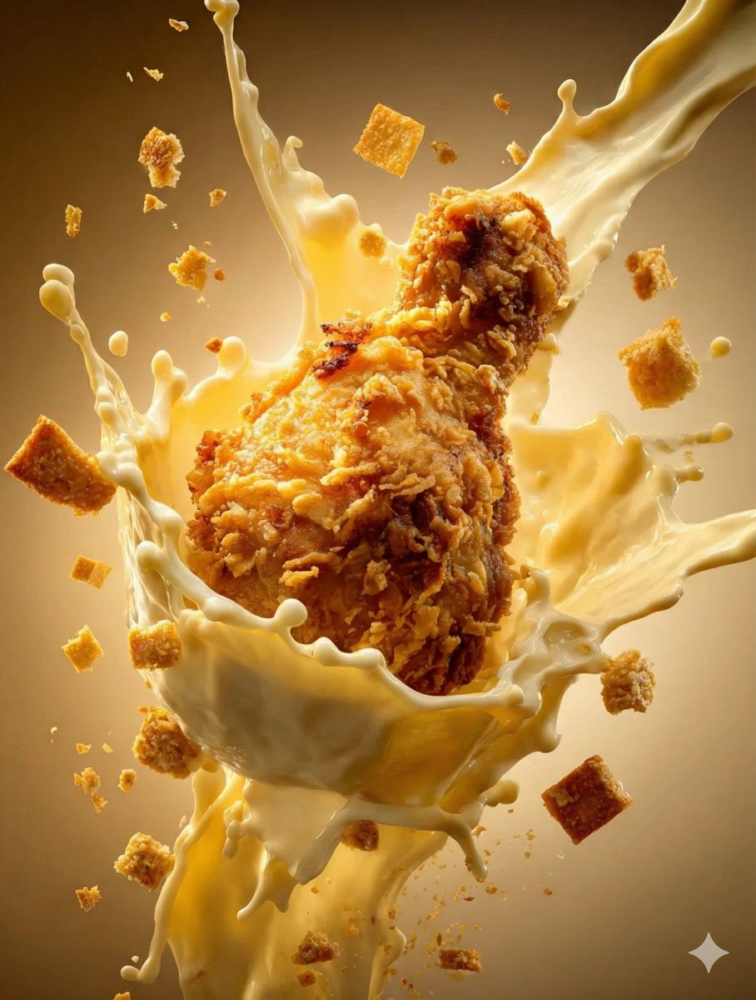

```
{
  "food_photography_series": {
    "subject": "Fried Chicken Thigh",
    "technical_specs": {
      "style": "Hyper-realistic hero shot",
      "aspect_ratio": "3:4",
      "lighting": "Cinematic / Studio"
    },
    "variations": [
      {
        "theme": "Tartar Refresh",
        "sauce": "Thick tartar sauce",
        "accents": ["capers", "dill", "chopped pickles"],
        "background": "Bright lemon-yellow",
        "prompt": "Hyper-realistic hero shot of a fried chicken thigh in midair with thick tartar sauce bursting around it, flecks of capers, dill, and chopped pickles frozen in motion. The sauce flows like creamy waves, dancing around the crispy surface. Bright lemon-yellow background with moody studio backlight creates a gourmet, refreshing tone ultra-detailed commercial look, --ar 3:4"
      },
      {
        "theme": "White Truffle Luxury",
        "sauce": "Creamy white truffle sauce",
        "accents": ["shaved mushrooms", "fine porcini powder"],
        "background": "Warm yellow-beige with soft haze",
        "prompt": "Hyper-realistic hero shot of a luxurious fried chicken thigh floating in the center, surrounded by a splash of creamy white truffle sauce, with shaved mushrooms and fine powder of porcini dusting the motion. Golden skin shines under cinematic key light, background in warm yellow-beige hues with soft haze premium gourmet commercial, --ar 3:4"
      },
      {
        "theme": "Smoked Cheese Indulgence",
        "sauce": "Molten smoked cheese fondue",
        "accents": ["golden crouton crumble"],
        "background": "Creamy yellow with taupe haze",
        "prompt": "Hyper-realistic hero shot of a crisp fried chicken thigh surrounded by a molten splash of smoked cheese fondue mid-air, with bits of golden crouton crumble suspended in orbit. Deep lighting creates dimensional drama on the crispy crust. The backdrop blends creamy yellow with taupe haze indulgent cheese-forward visual, --ar 3:4"
      },
      {
        "theme": "Miso Umami",
        "sauce": "Miso butter glaze and umami cream",
        "accents": ["toasted seaweed powder", "sesame seeds"],
        "background": "Muted beige",
        "prompt": "Hyper-realistic hero shot of a rich fried chicken thigh hovering mid-air, glazed with miso butter and surrounded by a dynamic splash of umami cream, flecked with toasted seaweed powder and sesame seeds. Dramatic soft shadows sculpt the skin texture. Muted beige background, clean and warm umami-focused food ad, --ar 3:4"
      }
    ]
  }
}
```

```
超写实主角特写炸鸡腿系列，3:4画幅，电影级/影棚灯光：

1. **塔塔清新风**：一块炸鸡腿在空中悬浮，浓稠塔塔酱在其周围迸发飞溅，刺山柑、莳萝和切碎的酸黄瓜碎屑定格在动态中。酱汁如奶油波浪般舞动，环绕酥脆表皮。明亮柠檬黄背景搭配富有氛围感的影棚背光，营造出精致清爽的商业美食大片效果。

2. **白松露奢华风**：一块奢华炸鸡腿居中悬浮，被飞溅的奶油白松露酱环绕，点缀着刨片蘑菇与细磨牛肝菌粉。金黄酥脆的外皮在电影主光下熠熠生辉，背景为柔和暖黄米色调并带有轻柔薄雾，呈现高端美食广告质感。

3. **烟熏芝士纵享风**：酥脆炸鸡腿被空中飞溅的熔融烟熏芝士火锅酱包围，金色面包丁碎屑如轨道般悬浮四周。深邃光影强化酥脆外壳的立体感，背景融合奶油黄与灰褐色薄雾，打造浓郁芝士主题的诱人视觉。

4. **味噌鲜味风**：一块丰腴炸鸡腿悬停空中，裹覆味噌黄油釉，并被动态飞溅的鲜味奶油环绕，点缀烤海苔粉与芝麻粒。戏剧性柔光阴影勾勒出鸡皮肌理，背景为柔和米色，干净温暖，聚焦鲜味主题的美食广告风格。
```

 [↑返回目录](#toc)

---
## <a id="prompt-2006748750329663700">Restoration Chronicle, in Firefly</a> (<a href="https://x.com/AllaAisling/status/2006748750329663751" target="_blank" rel="noopener noreferrer">Alexandra Aisling</a>)

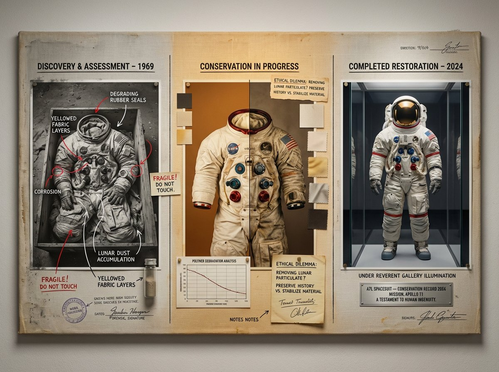

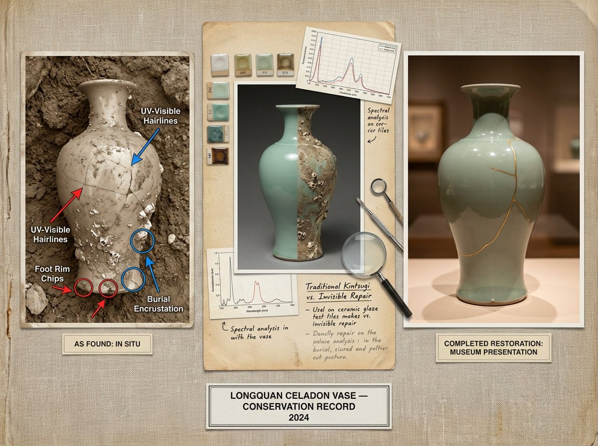

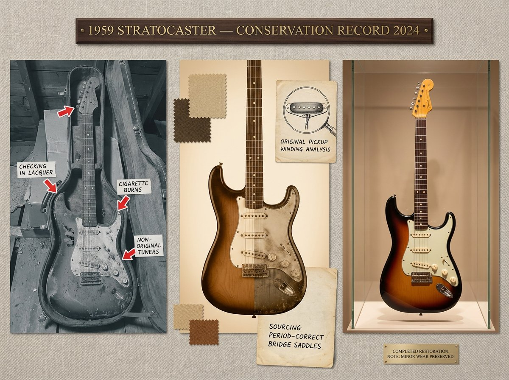

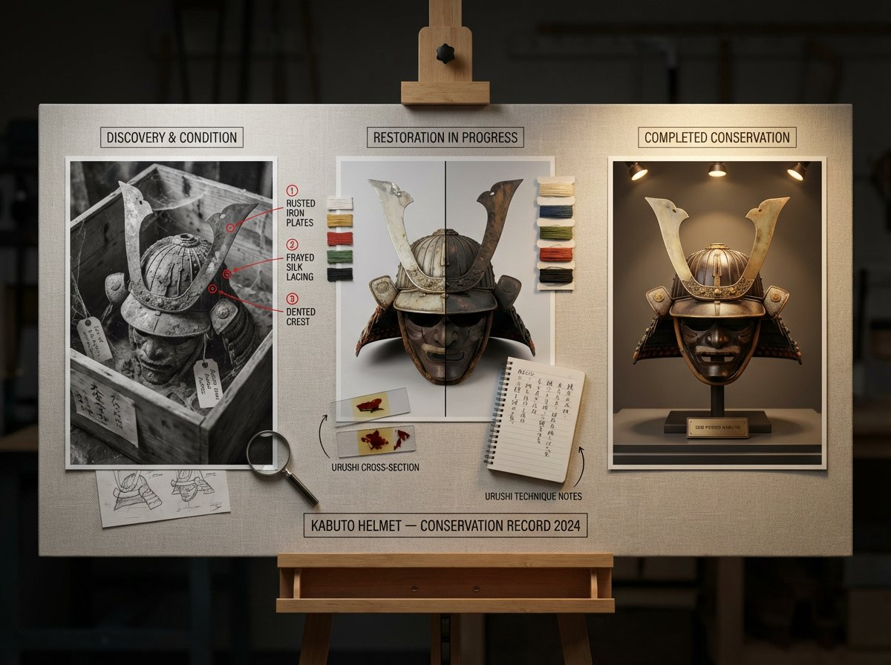

```
A master restorer's documentation board for an Apollo-era spacesuit — 1969, NASA Houston. The canvas flows left to right: far left shows the object as discovered, photographed in situ with decay, damage, and patina mapped with forensic annotation markers—degrading rubber seals, yellowed fabric layers, moon dust still visible in crevices; center shows the restoration in progress, a split view with one half stabilized and one half untouched, surrounded by material analysis swatches, polymer degradation charts, and conservator's handwritten notes on ethical dilemma of removing lunar particulate; far right shows the completed restoration photographed in museum lighting, the suit reborn but bearing honest traces of its journey. Visual style transitions from documentary forensic greys to warm archival amber to reverent gallery illumination. Linen texture background throughout. Title block reading "A7L SPACESUIT — CONSERVATION RECORD 2024".
```

```
A master restorer's documentation board for a Ming dynasty celadon vase — 15th century, Longquan kilns. The canvas flows left to right: far left shows the object as discovered, photographed in situ with decay, damage, and patina mapped with forensic annotation markers—hairline cracks mapped in UV light, chips along foot rim, burial encrustation; center shows the restoration in progress, a split view with one half cleaned and one half untouched, surrounded by material analysis swatches, glaze composition analysis, and conservator's handwritten notes on traditional kintsugi versus invisible repair debate; far right shows the completed restoration photographed in museum lighting, the vase reborn but bearing honest traces of its journey. Visual style transitions from documentary forensic greys to warm archival amber to reverent gallery illumination. Linen texture background throughout. Title block reading "LONGQUAN CELADON VASE — CONSERVATION RECORD 2024".
```

```
A master restorer's documentation board for a 1959 Fender Stratocaster — Sunburst finish, California. The canvas flows left to right: far left shows the object as discovered, photographed in situ with decay, damage, and patina mapped with forensic annotation markers—checking in nitrocellulose lacquer, cigarette burns on headstock, replaced tuners, worn frets; center shows the restoration in progress, a split view with one half cleaned and one half untouched, surrounded by material analysis swatches, original pickup winding analysis, and conservator's handwritten notes on period-correct hardware sourcing; far right shows the completed restoration photographed in museum lighting, the guitar reborn but bearing honest traces of its journey. Visual style transitions from documentary forensic greys to warm archival amber to reverent gallery illumination. Linen texture background throughout. Title block reading "1959 STRATOCASTER — CONSERVATION RECORD 2024".
```

```
A master restorer's documentation board for a samurai kabuto helmet — Edo period, Japan. The canvas flows left to right: far left shows the object as discovered, photographed in situ with decay, damage, and patina mapped with forensic annotation markers—rusted iron plates, frayed silk lacing, dented crest; center shows the restoration in progress, a split view with one half cleaned and one half untouched, surrounded by material analysis swatches, lacquer cross-sections under microscope, and conservator's handwritten notes on traditional urushi techniques; far right shows the completed restoration photographed in museum lighting, the helmet reborn but bearing honest traces of its journey. Visual style transitions from documentary forensic greys to warm archival amber to reverent gallery illumination. Linen texture background throughout. Title block reading "KABUTO HELMET — CONSERVATION RECORD 2024".
```

 [↑返回目录](#toc)

---
## <a id="prompt-2007160966673527000">动态工坊：四位设计师的微缩展示</a> (<a href="https://x.com/Gdgtify/status/2007160966673527145" target="_blank" rel="noopener noreferrer">Gadgetify</a>)

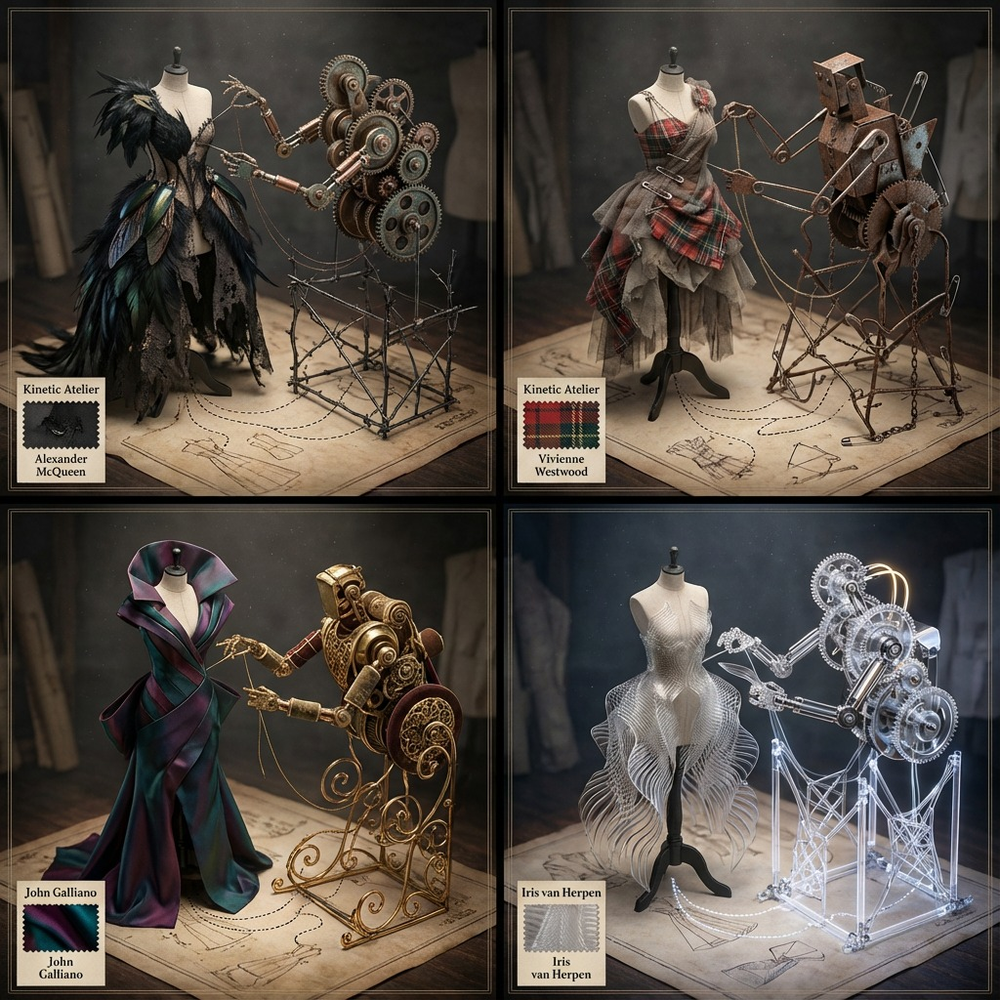

```
Fashion is not my thing but I thought if Nano Banana can find musicians, scientists, and artists similar to my input, why not for fashion. 

Prompt: 
 Input Variable: [INSERT DESIGNER] (e.g., Alexander McQueen, Iris van Herpen, Coco Chanel)

    System Instruction:    
Act as a Fashion Historian. Create a 2x2 Grid of "Kinetic Atelier Dioramas."
    Goal:   Analyze the Input Designer, then identify     4 Distinct Designers   (Peers, Rivals, or Successors) that share their DNA. Render one in each panel.

    1. The Curation Logic (The Brain):    
     Analyze Input: Identify the core style (e.g., if McQueen: Dark Romanticism, Structure, Savage Beauty).
     Select 4 Unique Subjects:  
           Panel 1:   The Input Designer (The Master).
           Panel 2:   A Historical Influence (The Ancestor).
           Panel 3:   A Contemporary Rival (The Competitor).
           Panel 4:   A Modern Successor (The Future).

    2. The Visual Syntax (The Automaton):    
Each panel features a miniature dress form standing on a vintage sewing pattern.
       The Mechanism:   A complex     Brass & Copper Automaton   surrounds the mannequin. It uses mechanical arms with needles for fingers to "sew" the dress in real-time.
       The Transformation:   The dotted lines on the paper floor physically lift up into the air, turning into     Wireframe Scaffolding   that supports the fabric.

    3. Style Adaptation (Per Panel Rules):    
The AI must adapt the   materials of the machine to the designer:
     If the Designer is Punk (e.g., Westwood): Use rusty iron, safety pins, and plaid fabric.
     If the Designer is Ethereal (e.g., Van Herpen): Use clear acrylic gears, 3D printed mesh, and laser-cut fabric.
     If the Designer is Classic (e.g., Chanel): Use pearl-inlaid brass, velvet ropes, and tweed fabric.

    4. The Label (The Metadata):    
   A "Fabric Swatch Card" is pinned to the bottom corner of each panel.
       Text Rule:   It must display the specific name of the designer in that panel (e.g., "Vivienne Westwood" or "John Galliano"), NOT just the Input Name.

    5. Atmosphere:    
       Lighting:   Moody Atelier lighting. Dust motes dancing in the light beams.
       View:   Isometric Macro.

    Output:   2x2 Grid, Hyper-Realistic Miniature Photography, distinct designers per panel.


```

```
输入变量：[插入设计师名称]（例如：Alexander McQueen、Iris van Herpen、Coco Chanel）

系统指令：  
扮演一位时尚史学家，创作一幅“动态工坊微缩场景”的 2×2 网格图像。  
目标：分析输入的设计师，并找出四位与其设计基因相关的不同设计师（同辈、对手或继承者），每位占据一个面板。

1. 策展逻辑（大脑）：  
   - 分析输入：识别其核心风格（例如，若为 McQueen，则为黑暗浪漫主义、结构感、野性之美）。  
   - 选择四位独特对象：  
     面板1：输入的设计师（大师本人）。  
     面板2：一位历史影响者（先驱）。  
     面板3：一位当代竞争对手（对手）。  
     面板4：一位现代继承者（未来）。

2. 视觉语法（自动装置）：  
   每个面板中央设有一个微型人台，站立于一张复古服装纸样之上。  
   - 装置机制：人台周围环绕着复杂的黄铜与铜制自动机械，其机械臂末端为针状手指，实时“缝制”服装。  
   - 形态转化：纸样地板上的虚线实际升腾至空中，转化为支撑面料的线框脚手架。

3. 风格适配（每面板规则）：  
   AI 必须根据设计师调整机械材质：  
   - 若设计师属朋克风格（如 Westwood）：使用锈蚀铁件、安全别针与格纹面料。  
   - 若设计师属空灵风格（如 Van Herpen）：使用透明亚克力齿轮、3D 打印网眼与激光切割面料。  
   - 若设计师属经典风格（如 Chanel）：使用镶珍珠黄铜、丝绒绳索与粗花呢面料。

4. 标签（元数据）：  
   每个面板右下角钉有一张“面料色卡”。  
   - 文字规则：必须标明该面板中设计师的具体姓名（如“Vivienne Westwood”或“John Galliano”），而非仅输入名称。

5. 氛围：  
   - 光线：昏暗工坊照明，光束中漂浮着微尘。  
   - 视角：等距微距摄影。

输出：2×2 网格布局，超写实微缩摄影风格，每个面板呈现不同设计师。
```

 [↑返回目录](#toc)

---
## <a id="">复古蒸汽波风格</a> (<a href="https://x.com/MANISH1027512/status/2008135835351167484" target="_blank" rel="noopener noreferrer">古一</a>)

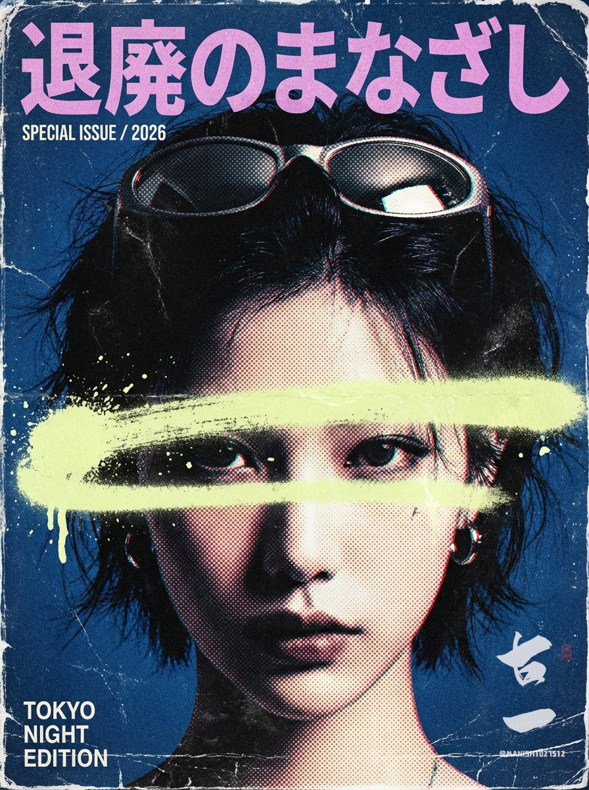


```
1) 画幅与构图
   * 竖版封面：2:3 / 3:4
   * 极近距离人像特写：脸占画面 70–80%
   * 头顶预留一条主标题区；下方下巴至锁骨留少量信息区
   * 允许裁切：顶部发丝与两侧轻微出框，增强海报冲击感

2) 主体人物
   * 非常漂亮的年轻女生，气质冷酷、酷飒、带一点叛逆
   * 齐肩短发：微乱、蓬松、有发丝纹理
   * 太阳眼镜挂在头上：镜腿卡在发间，镜片有轻微反光
   * 耳饰：1–2 个小金属耳环（耳钉或小圈），偏街头酷感
   * 表情：不笑、淡漠，直视镜头，眼神有压迫感

3) 光线与影调
   * 高对比硬光：脸部有明显明暗分割
   * 画面整体偏冷、压暗，人物肤色保留真实质感
   * 颗粒与印刷质地：halftone 网点 + 粗颗粒噪点

4) 标志性涂鸦元素（眼睛横线）
   * 一条横向贯穿眼睛区域的粗笔刷/喷涂涂鸦
   * 形态：不规则、带毛边与轻微喷溅
   * 覆盖：穿过眉眼区域但不完全遮挡眼睛
   * 颜色：低饱和"脏黄/芥末黄/旧荧光黄"（偏灰、偏旧，不要亮到发光）

5) 背景
   * 深冷色背景：深蓝 / 深灰偏青
   * 干净但带纸张纹理与颗粒，轻微暗角让人物更突出

6) 文字排版（日语主标题 + 信息层级）
   顶部主标题（日语）
   * 文案：「退廃のまなざし」
   * 字体：超粗、压缩感强、带速度感/斜切感的无衬线展示字体
   * 排版：横跨顶部，字距紧，允许部分字被裁切出画面边缘
   * 颜色：低饱和粉紫/灰粉/脏玫瑰色（偏灰、偏旧，不要高饱和霓虹）
   
   副标题/期号信息（小字）
   * 位置：主标题下方或右上角
   * 字体：简洁无衬线，小字号，白/浅灰，低对比
   * 示例：`SPECIAL ISSUE / 2026`、`VOL.01`
   
   底部信息行（最小字）
   * 位置：左下或右下
   * 内容：日期 / 标签短句 / 城市名（极简一行）
   * 示例：`TOKYO NIGHT EDITION`

7) 全局做旧风格（必须强化）
   * 旧纸张纤维纹理、褪色、轻微色偏
   * 印刷错位：轻微重影、边缘细微彩色偏移（misregistration）
   * 刮痕、磨损、折痕：重点在标题区与边缘
   * 胶片灰尘、脏点、污渍、擦拭痕
   * 局部贴纸残胶/撕裂边缘感（少量点缀，不喧宾夺主）

8) 整体氛围关键词
   * 复古杂志封面 + 街头涂鸦破坏感 + 重度做旧印刷
   * 冷、酷、叛逆、独立音乐海报气质
   * 颜色整体偏灰、偏旧、低饱和，避免"新鲜发光感"
```

 [↑返回目录](#toc)

---
## <a id="">红色旗袍女神侧颜特写</a> (<a href="https://x.com/ttmouse/status/2008273570175349157" target="_blank" rel="noopener noreferrer">ttmouse - 豆爸</a>)


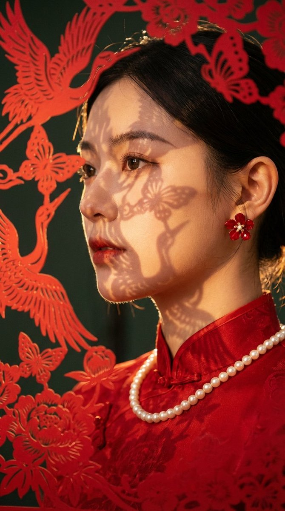

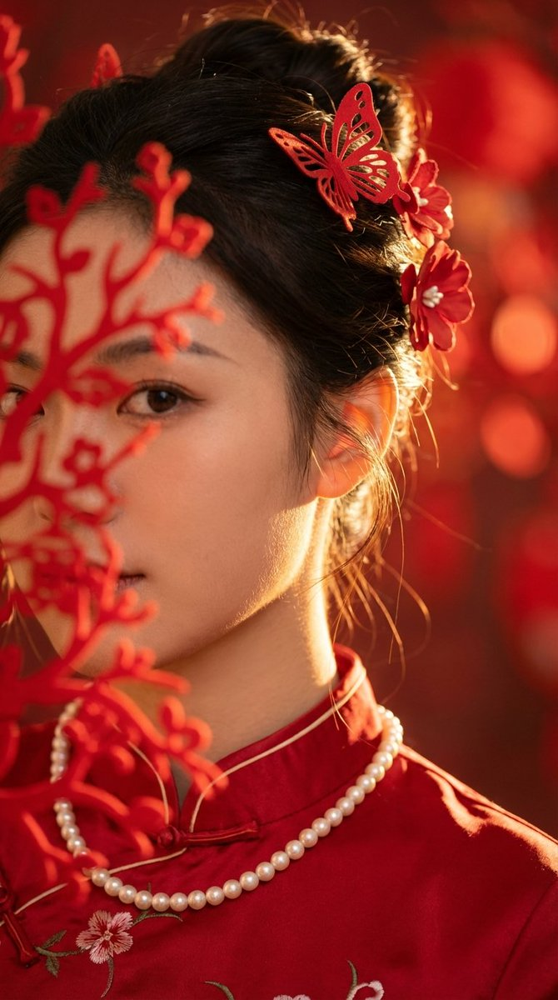

```
1. 宏观风格与媒介
- 核心媒介: 高清商业人像摄影 (High-end Commercial Photography)
- 美学流派: 新中式美学 (New Chinese Style), 节日时尚大片

2. 主体与IP身份
- 核心主体: 年轻东亚女性侧颜特写 (Close-up profile of young Asian woman)
- IP/名人锁定: 穿着红色旗袍 (Red Cheongsam), 佩戴珍珠项链与红色花卉耳环

3. 世界逻辑与物理
- 物理法则: 真实光学投影 (Real optical projection), 面部光影贴合面部起伏
- 空间构成: 人眼平视视角 (Eye-level), 极近距离接触

4. 数据与信息层
- 文本提取: 无文本
- 品牌与符号: 红色剪纸艺术前景 (Red paper-cut art foreground) - 包含仙鹤、蝴蝶与牡丹纹样

5. 材质与纹理
- 核心材质: 超写实皮肤质感 (Hyper-realistic skin), 哑光卡纸 (Matte cardstock), 温润珍珠
- 触感细节: 逆光下可见的面部绒毛 (Visible vellus hair backlit), 次表面散射效果 (Subsurface scattering)

6. 光影与氛围
- 光照模型: Gobo投影布光 (Gobo lighting/Projected shadows) - 复杂的镂空花纹光影投射在人物面部
- 整体氛围: 金色暖阳侧逆光 (Warm golden hour light), 高饱和度喜庆红调, 梦幻且清晰

7. 技术参数
- 镜头与渲染: 85mm-100mm 微距镜头 (Macro lens), 浅景深 (Shallow depth of field), 前景虚化 (Bokeh foreground)
- 构图指令: 框式构图 (Framed composition), --ar 3:4
```

```
1. 宏观风格与媒介
- 核心媒介: 高清商业人像摄影 (High-end Commercial Photography)
- 美学流派: 新中式美学 (New Chinese Style), 节日时尚大片

2. 主体与IP身份
- 核心主体: 年轻东亚女性侧颜特写 (Close-up profile of young Asian woman)
- IP/名人锁定: 穿着红色旗袍 (Red Cheongsam), 佩戴珍珠项链与红色花卉耳环

3. 世界逻辑与物理
- 物理法则: 真实光学投影 (Real optical projection), 面部光影贴合面部起伏
- 空间构成: 人眼平视视角 (Eye-level), 极近距离接触

4. 数据与信息层
- 文本提取: 无文本
- 品牌与符号: 红色剪纸艺术前景 (Red paper-cut art foreground) - 包含仙鹤、蝴蝶与牡丹纹样

5. 材质与纹理
- 核心材质: 超写实皮肤质感 (Hyper-realistic skin), 哑光卡纸 (Matte cardstock), 温润珍珠
- 触感细节: 逆光下可见的面部绒毛 (Visible vellus hair backlit), 次表面散射效果 (Subsurface scattering)

6. 光影与氛围
- 光照模型: Gobo投影布光 (Gobo lighting/Projected shadows) - 复杂的镂空花纹光影投射在人物面部
- 整体氛围: 金色暖阳侧逆光 (Warm golden hour light), 高饱和度喜庆红调, 梦幻且清晰

7. 技术参数
- 镜头与渲染: 85mm-100mm 微距镜头 (Macro lens), 浅景深 (Shallow depth of field), 前景虚化 (Bokeh foreground)
- 构图指令: 框式构图 (Framed composition), --ar 3:4
```

 [↑返回目录](#toc)

---
## <a id="">踏雪寻梅</a> (<a href="https://x.com/ttmouse/status/2008523042629263562" target="_blank" rel="noopener noreferrer">ttmouse - 豆爸</a>)

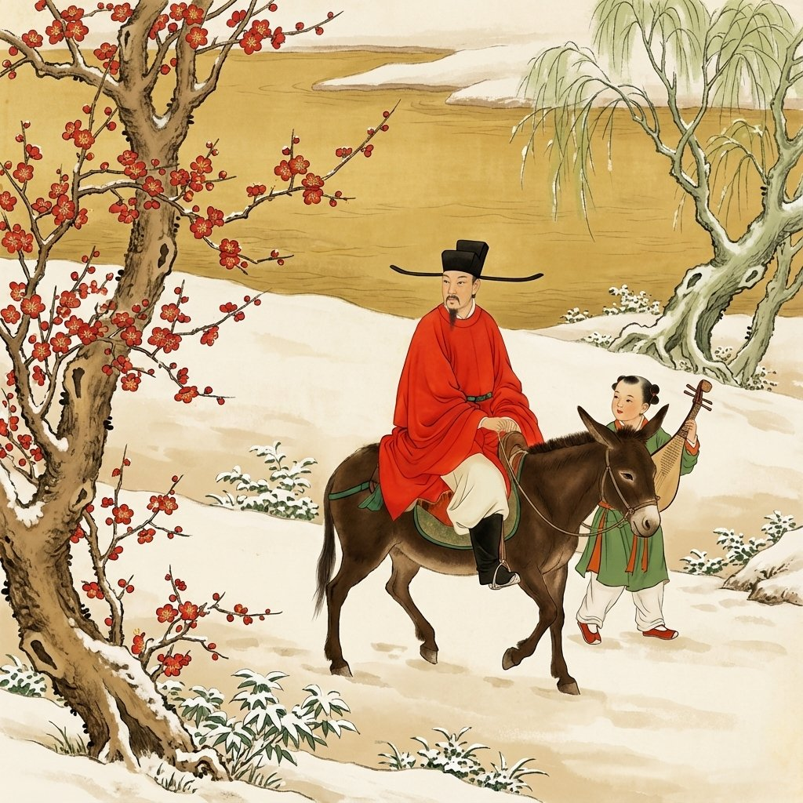

```
1. 基本风格 (Art Style)
• 绘画流派：没骨画风格 (Mogu Style)
• 表现手法：中国传统水墨与重彩晕染，强调以色彩的浓淡干湿塑造形体，不使用任何勾勒线条
• 材质基调：古旧宣纸纹理，纸面呈现微泛黄且带有历史沉淀感的古朴色泽
• 核心特色：色块层叠有序，气韵生动，通过虚实结合展示形神，留白艺术运用得当

2. 核心主体 (Main Subjects)
• 文人学者：侧身骑坐于驴背，神态悠然自得。头戴极具特色的黑色“展脚幞头”（两侧长翅平伸），身着宽大的朱砂红袍 (#E43818)，白色裤子塞入脚穿的黑色高靴中，衣褶完全通过色彩深浅的过渡来表现。
• 小驴：形体圆润，颜色为深褐色 (#563818)，四肢呈漫步状，以没骨法点染出骨骼与肌肉的质感，神态温驯。
• 随行小童：身姿轻盈灵动，紧随驴后。双手怀抱一把琵琶，梳单髻丸子头。细节设置：外袍为草绿色 (#739D68)，内衬为朱橘色 (#E06324)，白色裤，脚蹬红色小鞋 (#B72E15)。
• 动态逻辑：文人骑驴在前，小童抱琴在后，整体呈现出一种冒雪寻梅、踏雪而行的悠闲动态。

3. 环境背景 (Environment & Background)
• 地面景观：大雪初霁的雪景，皑皑白雪覆盖地面，雪面整体晕染着一层温润的淡米黄色调，呈现出古旧画卷的视觉感。
• 植被设置（纯色块堆积，无轮廓线）：
   • 寒梅：一尺粗壮苍劲的古梅，枝干色泽古拙 (#A78350)。枝头绽放饱满的朱砂红梅花 (#BE2D14)，点缀醒目的黄色花蕊。
   • 柳树：一尺粗壮树干的淡绿色的垂柳，表现出冬末初春的意象。
• 画面构图：画面上方三分之一处被大面积的赭黄色 (#BB9B52) 河流占据，横向贯穿，与下方的白雪大地形成鲜明对比。

4. 画面参数 (Parameters)
• 画面比例：16:9
```

 [↑返回目录](#toc)

---
## <a id="">拍立得女生</a> (<a href="https://x.com/Adam38363368936/status/2008328816825970731" target="_blank" rel="noopener noreferrer">Adam也叫吉米</a>)

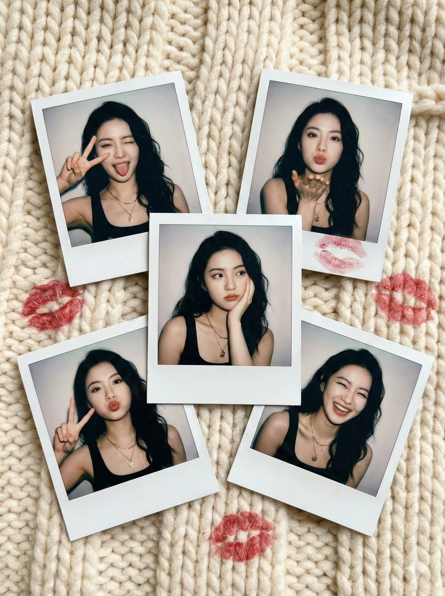

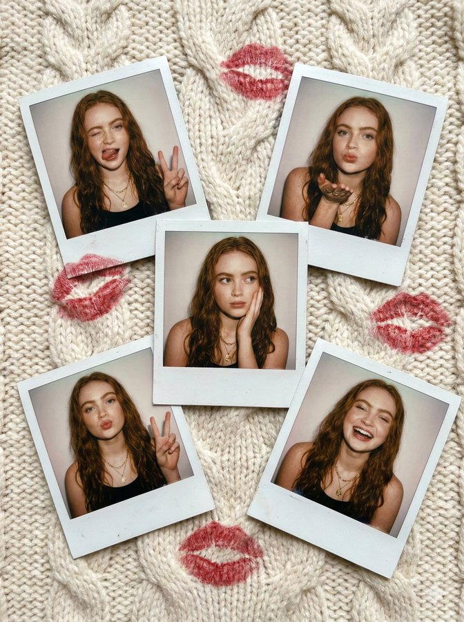

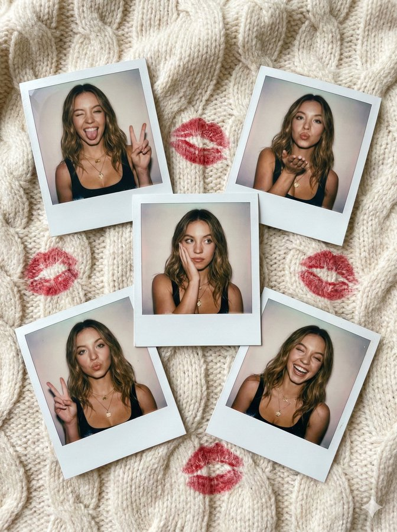

```
{
  "prompt": {
    "subject": {
      "description": "A collection of five vintage Polaroid instant photographs featuring the same young Asian woman, arranged casually on a textured surface.Use the face without any change",
      "appearance": {
        "hair": "Wavy, black hair.",
        "skin": "smooth and fair skin.",
        "makeup": "Natural, dewy makeup with defined brows and neutral lip color.",
        "clothing": "Black tank top.",
        "accessories": "Gold pendant necklaces."
      },
      "poses": [
        {
          "photo": "Top left",
          "description": "Winking, sticking out tongue, making a peace sign."
        },
        {
          "photo": "Top right",
          "description": "Blowing a kiss."
        },
        {
          "photo": "Center",
          "description": "Looking off-camera, hand on cheek."
        },
        {
          "photo": "Bottom left",
          "description": "Making a kissy face, peace sign."
        },
        {
          "photo": "Bottom right",
          "description": "Laughing broadly, head tilted."
        }
      ]
    },
    "environment": {
      "surface": "Thick, cream-colored knit wool blanket with a textured stitch pattern.",
      "details": "Several red lipstick kiss marks imprinted directly onto the blanket fabric.",
      "arrangement": "The five Polaroid prints are scattered naturally, overlapping slightly."
    },
    "lighting": {
      "type": "Soft, overhead ambient light, likely natural daylight, illuminating the entire scene.",
      "photo_lighting": "Direct studio flash within the Polaroid photos, creating a bright, slightly overexposed look with soft shadows."
    },
    "mood": "Playful, casual, nostalgic, warm, and personal.",
    "camera_details": {
      "style": "Ultra Photorealistic overhead photograph.",
      "focus": "Sharp focus on the Polaroid prints and the textures of the blanket.",
      "perspective": "Top-down view.",
      "film_type": "Vintage Polaroid instant film with classic white borders and slight wear." Ratio 3.4
    }
  }
}
```

```
五张复古宝丽来即时照片，展示同一位年轻的亚洲女性，随意摆放在有纹理的表面上，面部不得做任何改动。她拥有黑色波浪发、光滑白皙的肌肤、自然水润的妆容（眉形清晰、唇色中性），身穿黑色背心，佩戴金色吊坠项链。

五张照片中的姿势分别为：  
- 左上角：眨眼、吐舌头、比出和平手势；  
- 右上角：飞吻；  
- 中央：目光看向画外，手托脸颊；  
- 左下角：嘟嘴亲吻状，同时比出和平手势；  
- 右下角：开怀大笑，头部微倾。

照片散落在一条厚实的米白色针织羊毛毯上，毯子具有明显的纹理针脚，并印有数个红色口红吻痕。五张宝丽来照片自然散落，略有重叠。

整体光线为柔和的顶光环境光，似自然日光，照亮整个场景；而照片内部则使用直接的影室闪光灯，呈现出明亮略过曝的效果，并带有柔和阴影。

整体氛围俏皮、随性、怀旧、温暖且私密。

画面采用超写实风格的俯拍摄影，焦点清晰对准宝丽来照片及毛毯纹理，视角为正上方俯视。照片使用经典复古宝丽来即时胶片，带有白色边框和轻微使用痕迹，比例为3.4。
```

 [↑返回目录](#toc)

---
## <a id="prompt-2007831277269840400">食物特写镜头</a> (<a href="https://x.com/YaseenK7212/status/2007831277269840286" target="_blank" rel="noopener noreferrer">Yaseen Khan Gul</a>)

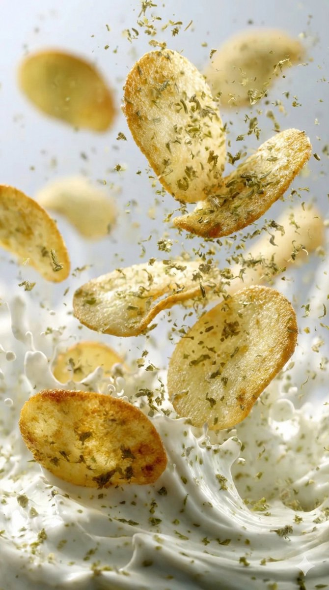

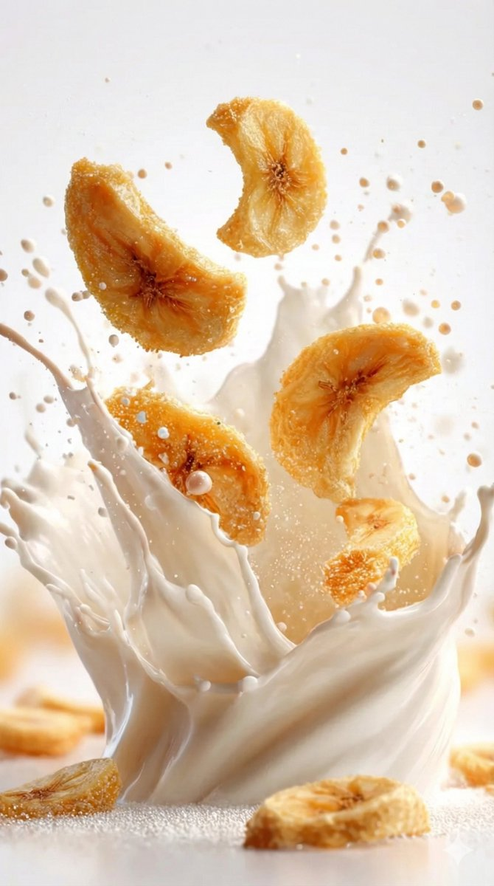

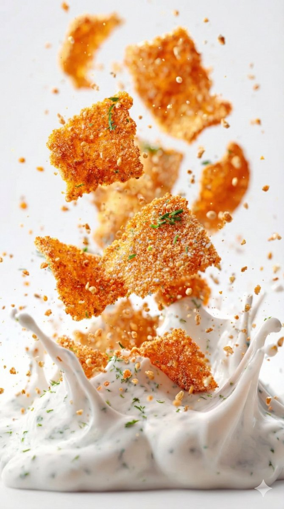

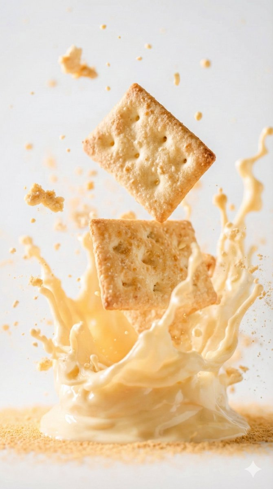

```
{
  "project_configuration": {
    "shot_type": "macro_slow_motion",
    "global_settings": {
      "aspect_ratio": "9:16",
      "chaos_weight": 15,
      "color_profile": "high-key",
      "environment": {
        "backdrop": "clean_white",
        "lighting_style": "cinematic_bloom",
        "atmosphere": "ethereal"
      }
    },
    "camera_optics": {
      "body": "Canon EOS R5",
      "lens": "85mm f/1.2",
      "depth_of_field": "shallow_bokeh",
      "focus_point": "fluid_subject_intersection"
    }
  },
  "scene_data": [
    {
      "id": "item_001",
      "snack_component": {
        "type": "herb-seasoned chips",
        "surface": "crisp_golden",
        "physics": "mid-air_floating"
      },
      "fluid_component": {
        "material": "Mediterranean herb cream",
        "color": "thick_white",
        "behavior": "upward_splash_arc",
        "texture": "glossy"
      },
      "particle_system": {
        "frozen_elements": "liquid_droplets",
        "spices": ["oregano_flakes", "thyme_flakes"],
        "debris": "hyper-detailed_crumbs"
      }
    },
    {
      "id": "item_002",
      "snack_component": {
        "type": "banana chips",
        "surface": "crisp",
        "physics": "hovering"
      },
      "fluid_component": {
        "material": "vanilla cream",
        "color": "thick_white",
        "behavior": "upward_burst",
        "texture": "soft_creamy"
      },
      "particle_system": {
        "frozen_elements": "soft_arc_droplets",
        "spices": ["fine_sugar_dust"],
        "debris": "detailed_banana_crumbs"
      }
    },
    {
      "id": "item_003",
      "snack_component": {
        "type": "taro chips",
        "surface": "lavender-tinted_crisp",
        "physics": "hovering"
      },
      "fluid_component": {
        "material": "taro cream",
        "color": "pastel-purple",
        "behavior": "upward_eruption",
        "texture": "glossy_viscous"
      },
      "particle_system": {
        "frozen_elements": "mid-flight_droplets",
        "spices": ["sugar-dust_particles"],
        "debris": "soft_drifting_taro_crumbs"
      }
    },
    {
      "id": "item_004",
      "snack_component": {
        "type": "cheese crackers",
        "surface": "textured",
        "physics": "suspended"
      },
      "fluid_component": {
        "material": "cheese dip",
        "color": "pale-yellow",
        "behavior": "upward_splash",
        "texture": "thick"
      },
      "particle_system": {
        "frozen_elements": "motion-frozen_droplets",
        "spices": ["cheddar_powder"],
        "debris": "soft_drifting_cracker_crumbs"
      }
    }
  ]
}
```

```
9:16 纵横比的微距慢动作镜头，高调色彩风格，背景为纯净白色，采用电影级光晕照明，营造空灵氛围。使用佳能 EOS R5 相机搭配 85mm f/1.2 镜头，浅景深虚化，焦点对准流体与零食交汇处。

画面包含四组元素：

第一组：香草调味薯片呈现金黄酥脆表面，在空中悬浮；地中海香草奶油呈浓稠白色，以向上飞溅的弧线喷发，质地光亮；冻结的液滴、牛至碎与百里香碎，以及超精细碎屑环绕四周。

第二组：香蕉片酥脆轻盈，漂浮于空中；香草奶油浓白柔滑，以向上的爆发状喷涌；柔和弧形液滴、细糖粉与细致香蕉碎屑构成粒子系统。

第三组：紫薯片带有淡紫色酥脆表层，悬浮空中；芋泥奶油呈淡紫色，质地光亮粘稠，以向上的喷发形式跃起；飞行中的液滴、糖粉微粒与轻柔飘散的紫薯碎屑点缀其间。

第四组：奶酪脆饼具有丰富纹理，悬停于空中；奶酪蘸酱呈淡黄色，浓稠质地向上飞溅；动态冻结的液滴、切达奶酪粉及轻柔飘落的脆饼碎屑共同组成粒子细节。
```

 [↑返回目录](#toc)

---
## <a id="prompt-2008186029820559400">瞳色妝容（美瞳）</a> (<a href="https://x.com/94vanAI/status/2008186029820559468" target="_blank" rel="noopener noreferrer">PlayForge AI</a>)

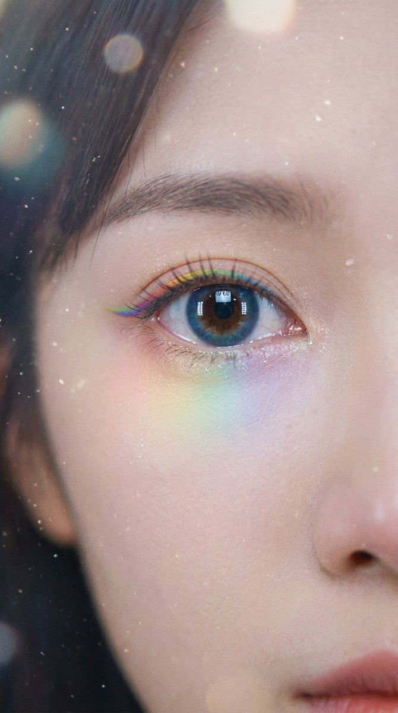

```
《一天學會一個關鍵字》今天要學的是－「瞳色妝容（美瞳）」
🔑 Keyword Overview

Colored Contact Lens Makeup refers to eye makeup techniques designed to complement colored contact lenses (also called "circle lenses" or "cosmetic lenses"), creating various aesthetic styles by changing pupil color.

👁️ What Are Colored Contact Lenses?

Colored contact lenses are cosmetic lenses with pigmented patterns that change your eye color and create a larger, more defined pupil appearance.

Popular Colors & Best Uses

Color Effect Best For     Black Natural enlargement, sophisticated Daily wear, formal occasions   Brown Warm, approachable Dates, everyday looks   Gray Mysterious, mixed-race vibe Parties, special events   Blue/Green Bold, exotic Photoshoots, stage performances
💄 Makeup Pairing Tips
1️⃣ Black Lenses × Natural Nude Makeup
Earth-tone eyeshadow base
Subtle, thin eyeliner
Focus on curled lashes
Result: Natural yet striking, office-friendly
2️⃣ Brown Lenses × Soft Sweet Makeup
Warm orange or peach eyeshadow
Highlight the aegyo-sal (under-eye area)
Light blush with coral lips
Result: Cute and charming, perfect for dates
3️⃣ Gray Lenses × Western Glam Makeup
Deep smoky eyeshadow
Emphasize eye socket contour
Extended winged eyeliner
Result: Cool and mysterious, party-ready
NBP Prompt：
——————————Line————————————
{
  "prompt": "A close-up shot photo, close-up of rainbow sclera eye, perfect eye technique photography, with rainbow eyeliner, sharp, delicate, cinematic, rainbow sclera eye makeup, rainbow eye makeup, 1 girl, solo looking at viewer, blue eyes, big-eyed Chinese idol girl, deep brown pupil, deep black eyelashes, close-up, reflection, eyeliner focus, light particles, traditional media, eye reflection, colored eyes, shallow depth of field, coda, high detail, high budget, bokeh, cinemascope, emotional, epic, gorgeous, film grain, grainy",
  "negative_prompt": "anime, cartoon, graphic, text, painting, crayon, graphite, abstract, glitch, deformed, mutated, ugly, disfigured",
  "aspect_ratio": "3:4"
}
```

 [↑返回目录](#toc)

---
## <a id="prompt-2008098771381690600">奢华香水：花香调的精致呈现</a> (<a href="https://x.com/0xbisc/status/2008098771381690572" target="_blank" rel="noopener noreferrer">Latte</a>)

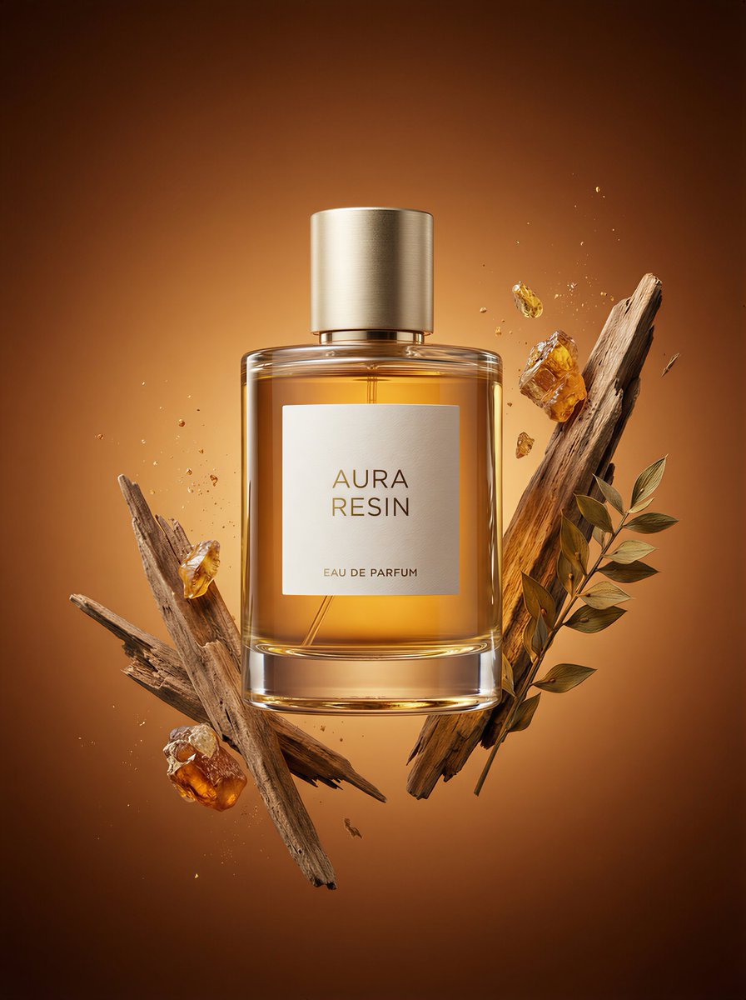

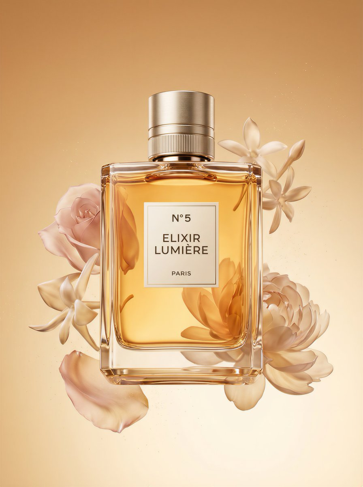

```
Luxury perfume ad template. Switch the scent profile and the whole vibe changes.

Prompt:

{
  "scent_profile": "Floral",

  "prompt": "Ultra high-end luxury perfume campaign image for a world-class prestige fragrance. A premium rectangular perfume bottle with perfectly balanced proportions typical of iconic global luxury brands, refined, substantial, and timeless, never tall, never slender, never vial-like. The bottle is crafted from thick, heavy, crystal-clear glass with softly rounded edges, visible weight, optical depth, and precise craftsmanship, filled with luminous liquid appropriate to a high-end perfume. A minimal ivory or warm off-white label is centered on the bottle, featuring ultra-clean modern sans-serif typography, extremely sparse text, and confident negative space. The cap is a champagne-gold or pale-gold brushed metal cylinder with precise machining and subtle, controlled reflections. The bottle floats calmly in space with quiet authority and confidence. Surrounding the bottle are exactly three distinct types of scent-related visual elements autonomously selected by the AI based on the provided scent_profile. These three element types represent different dimensions of the fragrance family, such as structural material forms, botanical or organic references, and atmospheric or sensory effects. All elements originate from the broader natural, botanical, and material context of the scent profile as understood in high-end perfumery. The elements are abstracted, symbolic, refined, and art-directed, never literal, never illustrative, never decorative. The elements are positioned close to and partially embracing the bottle, following its silhouette and contours rather than floating freely in space, creating a sense of attachment and intentional interaction with the product. The elements gently overlap the bottle edges in places, while maintaining clarity of the label and overall form. Spacing is controlled and elegant, with no bulky masses and no excessive gaps, forming a cohesive sculptural arrangement designed around the bottle. The background is a rich, noble, scent-matched tonal gradient with depth and luminosity, not dark or gloomy, but dense and refined. The background color harmonizes with the scent_profile. The background maintains medium-to-high brightness with elevated color density, subtle light falloff, and a refined vignette that enhances contrast without heaviness. Lighting is museum-quality studio lighting with a controlled warm key light, soft sculpting fill, and a precise rim light defining the bottle edges against the noble background. Glass refraction and reflections are perfect and premium, with no harsh highlights. Depth of field is moderate: the bottle and label are razor sharp, while decorative elements soften subtly with depth but remain clearly articulated. The overall mood is iconic, restrained, confident, luxurious, and unmistakably expensive, resembling a flagship global luxury perfume campaign.",

  "negative_prompt": "pure white background, dull gray background, muddy brown, overly dark background, gloomy lighting, flat background, e-commerce lighting, floating decorations detached from the bottle, scattered elements, bulky clusters, cheap, low-end, mass-market, indie look, playful mood, cartoon style, plastic materials, thin glass, lightweight bottle, sample bottle, vial, test tube, fashion vial, visible branding text, logos, watermarks, noise, grain, oversharpening, blown highlights, distorted glass, warped label, fisheye perspective, people, hands, extra objects",

  "aspect_ratio": "3:4",
  "quality": "ultra high detail, photorealistic, luxury commercial retouching",
  "style": "iconic luxury perfume photography, global prestige brand, cinematic, timeless, haute parfumerie"
}
```

```
奢华香水广告模板。更换香调，整体氛围随之改变。

超高端奢华香水广告画面，呈现世界级 prestige 香水。一瓶高级矩形香水瓶，比例完美平衡，体现全球标志性奢侈品牌的经典风格：精致、厚重、永恒，绝不高挑、纤细或试管状。瓶身采用厚实、沉重的高透水晶玻璃制成，边缘柔和圆润，具有可见的重量感、光学深度与精准工艺，内盛符合高端香水气质的莹亮液体。瓶身中央贴有极简象牙白或暖米白色标签，采用极致干净的现代无衬线字体，文字极度精简，留白自信从容。瓶盖为香槟金或浅金色拉丝金属圆柱体，加工精密，反射细腻克制。香水瓶在空间中沉稳悬浮，散发静谧而坚定的权威感。

围绕瓶身，AI 根据指定香调“花香”自主选取三种不同类型的香氛相关视觉元素。这三类元素分别代表该香调家族的不同维度，如结构性材质形态、植物或有机意象，以及氛围或感官效果。所有元素均源自高端香水领域对花香调所理解的自然、植物与材质语境，经过抽象化、象征性处理，并经艺术指导，绝不写实、插画式或装饰性。这些元素紧贴瓶身轮廓，部分环绕拥抱瓶体，而非自由漂浮于空间，营造出与产品有意互动的依附感。元素在局部轻柔地覆盖瓶缘，同时确保标签与整体造型清晰可辨。布局间距控制得当、优雅有致，无笨重团块亦无空旷间隙，形成围绕瓶体的统一雕塑式构图。

背景为与香调相协调的浓郁高贵色调渐变，富有深度与光感，不显阴暗沉闷，而是浓密且精致。背景保持中高亮度，色彩饱和度高，光线柔和衰减，并带有精致晕影以增强对比却不显沉重。灯光采用博物馆级影棚布光：主光温暖可控，辅光柔和塑形，精准的轮廓光勾勒瓶身边缘，使其从高贵背景中脱颖而出。玻璃折射与反光完美高级，无刺眼高光。景深适中：瓶身与标签锐利清晰，装饰元素随景深微妙虚化但仍结构分明。

整体氛围标志性强、克制内敛、自信奢华，尽显昂贵质感，宛如全球顶级奢侈香水旗舰广告大片。
```

 [↑返回目录](#toc)

---
## <a id="prompt-2008016478315192800">奢华[产品]漂浮广告</a> (<a href="https://x.com/RobotCleopatra/status/2008016478315192836" target="_blank" rel="noopener noreferrer">Skipper</a>)

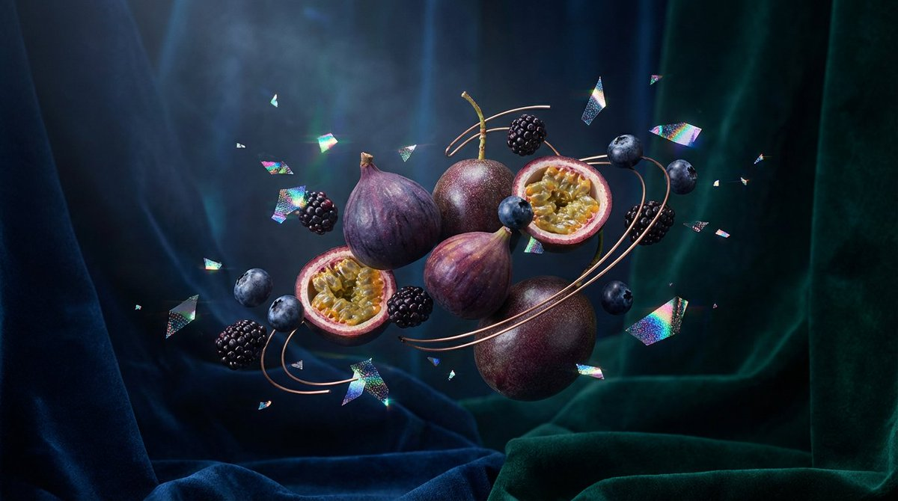

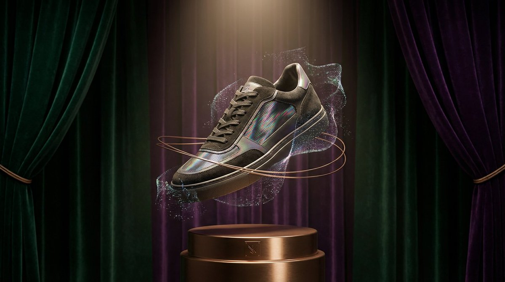

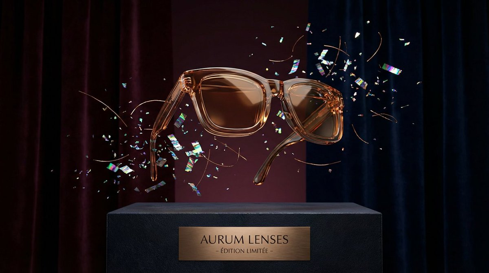

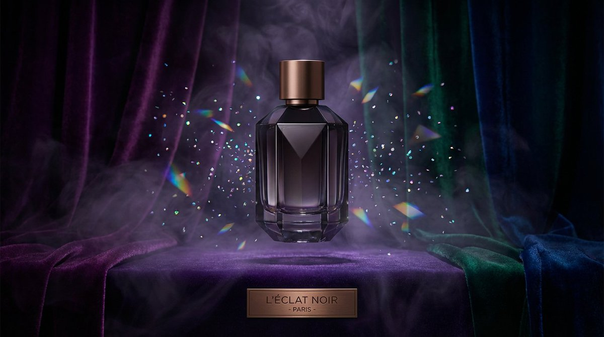

```
Luxury [PRODUCT] Floating luxury product, deep colorish scene, micro glitch holographic embellishments suspended in air, minimal bronze accent, dramatic  velvet atmosphere, high-end editorial, 8K ultra detailed
@Adobe @AdobeFirefly boards
```

```
奢华[产品]漂浮于深色调场景中，空气中悬浮着微故障风格的全息装饰，点缀极少的青铜色细节，营造出戏剧性的丝绒氛围，高端时尚大片风格，8K超精细画质
```

 [↑返回目录](#toc)

---
## <a id="prompt-2008008497473147100">Apple vision ProAR世界</a> (<a href="https://x.com/94vanAI/status/2008008497473147136" target="_blank" rel="noopener noreferrer">PlayForge AI</a>)

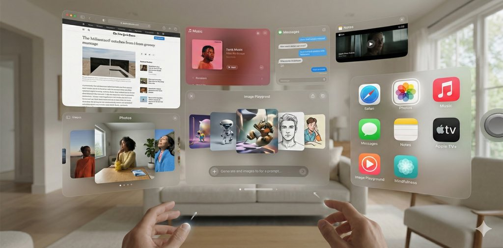

```
{
  "prompt": "Highly detailed photorealistic screenshot of Apple Vision Pro visionOS 26 operating interface from user's first-person immersive view, spatial computing home screen with multiple floating translucent glass-like 3D windows and volumetric app icons arranged in a customizable curved grid around the user, semi-transparent frosted blur material with subtle depth parallax and soft natural light reflections blending seamlessly with real-world passthrough surroundings, high-resolution micro-OLED display quality with ultra-sharp details, vibrant clean Apple minimalist UI design with rounded corners and volumetric glow, eye-tracking selection with subtle white glow highlight on hovered app icon (e.g., Photos app icon hovered), visible hand gesture pointers in lower field of view ready for pinch/tap/drag interactions, Digital Crown subtly visible on the right side for immersion control, open floating windows showing active apps: one large Safari browser window with tabs and webpage content, one Photos app window displaying spatial photos with depth, one Music app window with album artwork, one Messages window with conversation bubbles, one Notes window open, one Apple TV+ window playing immersive video preview, one Image Playground app window open showing text prompt input field at bottom with generated spatial images floating above in styles like Animation/Sketch/Illustration, one Mindfulness app window with breathing guide, subtle volumetric shadows and light bounce from virtual elements onto real environment, photorealistic rendering with cinematic soft ambient lighting, no distortion or artifacts, aspect ratio 2:1 wide immersive format",
  "negative_prompt": "blurry, low resolution, distorted text or UI elements, cartoonish, illustration style, flat 2D look, no depth or parallax, harsh shadows, overexposed, underexposed, watermark, logo overlay, people visible wearing headset, external device view, crowded cluttered screen, deformed windows or icons, missing hand pointers, no glow on hovered icons, explicit text prompts in Image Playground, vulgar content",
  "parameters": {
    "style": "Photorealistic visionOS 26 interface screenshot from inside the headset, Apple Human Interface Guidelines compliant, futuristic spatial UI with multiple open apps including Image Playground",
    "recommended_tool": "Midjourney, Stable Diffusion XL, Flux or advanced photoreal models",
    "aspect_ratio": "2:1 or 16:9 for wide spatial feel",
    "additional_tips": "Use weights like (floating translucent windows:1.4), (volumetric app icons:1.3), (Image Playground open with generated images:1.2), (soft natural passthrough lighting:1.1); vary open apps for diversity, include Apple Intelligence features like Image Playground prominently"
  }
}
```

 [↑返回目录](#toc)

---
## <a id="prompt-2008071853928226800">手持产品特写</a> (<a href="https://x.com/94vanAI/status/2008071853928226867" target="_blank" rel="noopener noreferrer">PlayForge AI</a>)

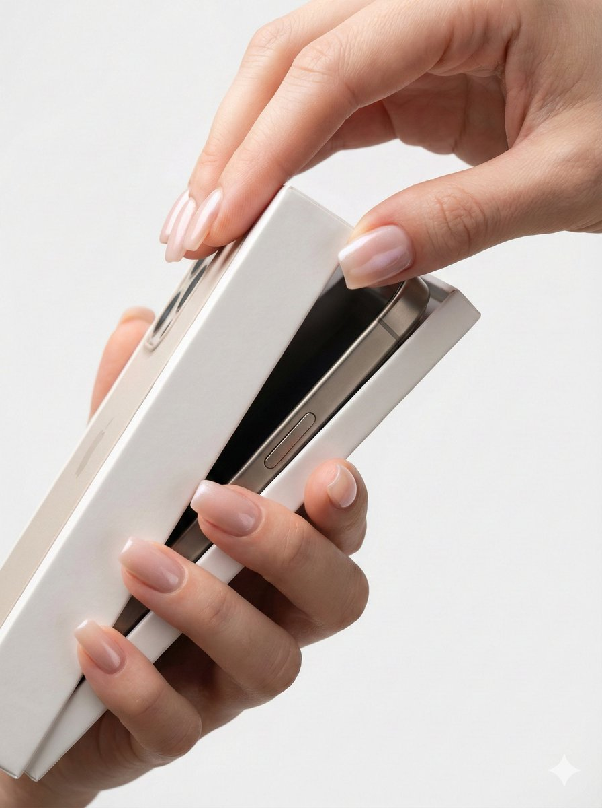

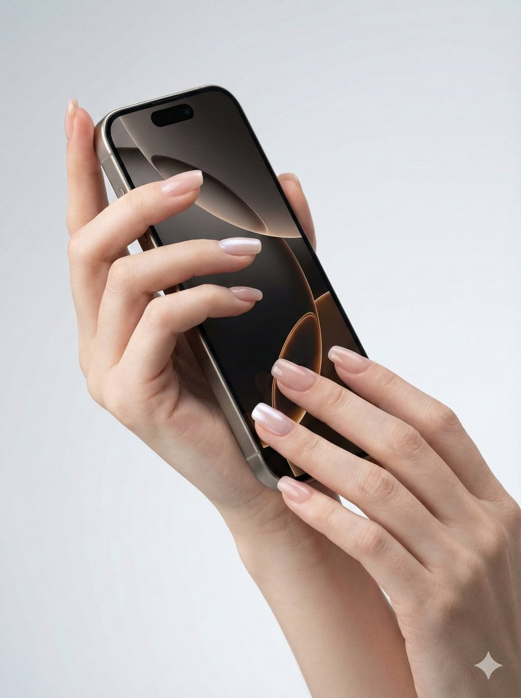

```
{
  "prompt": "Close-up of a woman's hand, slender fingers with delicate non-protruding joints, fair jade-like skin on the back of the hand, nails trimmed into refined square-round shape, coated with sheer nude pink nail polish, fingertips with subtle pearl sheen,\nsingle hand naturally and elegantly holding and showcasing [specific product name and description, e.g.: a matte black wireless Bluetooth earbuds charging case / a rose gold metal lipstick / a minimalist glass perfume bottle / an exquisite hard paper gift box / a jewelry box etc.], [optional: hand-product interaction description, e.g.: gently pushing the lid to reveal the earbuds / lightly gripping and slightly rotating the bottle / fingers gently pulling the ribbon to open the gift box / naturally holding and slightly tilting to show the interior, or leave blank for automatic adaptation], highlighting the product's minimalist premium design, natural and fluid hand movement with perfectly reasonable finger positioning,\n[optional: product reference description, e.g.: reference to the item in the uploaded image with high-quality rendering and perfect integration, or directly describe product appearance, material, color, shape etc.],\nnatural slanting light, soft sidelight emphasizing hand skin texture and product material, clean minimalist background [optional custom background, e.g.: light gray gradient / marble tabletop / soft white studio background / window with natural light etc.],\n8K ultra-high definition, photographic realism, extreme detail, perfect physical interaction and hand pose adaptation, no distortion, no flaws, no unreasonable deformation, professional product photography style --ar 3:4"
}
```

```
特写一位女性的手部，手指修长，关节细腻不突出，手背肌肤白皙如玉，指甲修剪成精致的方圆形状，涂有透明裸粉色指甲油，指尖泛着微妙的珍珠光泽。单手自然优雅地持握并展示[具体产品名称及描述，例如：哑光黑色无线蓝牙耳机充电盒 / 玫瑰金金属口红 / 极简玻璃香水瓶 / 精致硬纸礼品盒 / 首饰盒等]，[可选：手与产品的互动描述，例如：轻推盒盖露出耳机 / 轻握并微微旋转瓶身 / 手指轻拉丝带打开礼盒 / 自然握持并略微倾斜以展示内部，或留空由系统自动适配]，突出产品极简高端的设计感，手部动作自然流畅，手指位置合理精准。  
[可选：产品参考描述，例如：参照上传图像中的物品进行高质量渲染并完美融合，或直接描述产品的外观、材质、颜色、形状等]。  
自然斜射光线，柔和侧光强调手部肌肤纹理与产品材质，背景干净简约[可选自定义背景，例如：浅灰渐变 / 大理石桌面 / 柔白影棚背景 / 带自然光的窗户等]。  
8K超高清，摄影级真实感，极致细节，手部姿态与产品交互物理精准，无畸变、无瑕疵、无不合理形变，专业产品摄影风格 --ar 3:4
```

 [↑返回目录](#toc)

---
## <a id="prompt-2007881212132803000">破损的牧羊人壁画</a> (<a href="https://x.com/AllaAisling/status/2007881212132803025" target="_blank" rel="noopener noreferrer">Alexandra Aisling</a>)

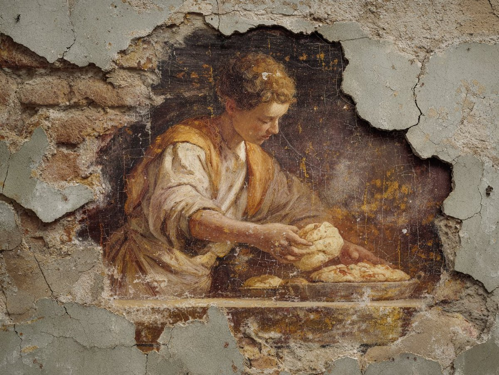

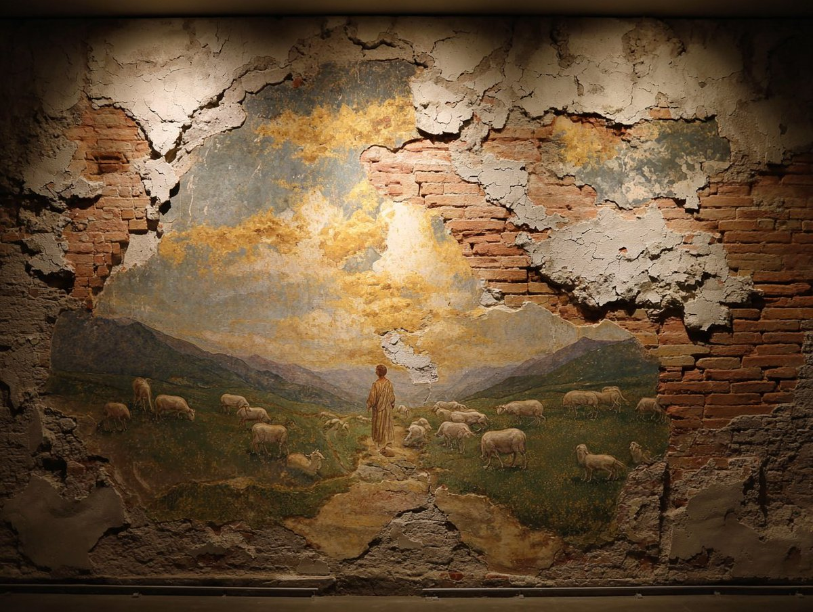

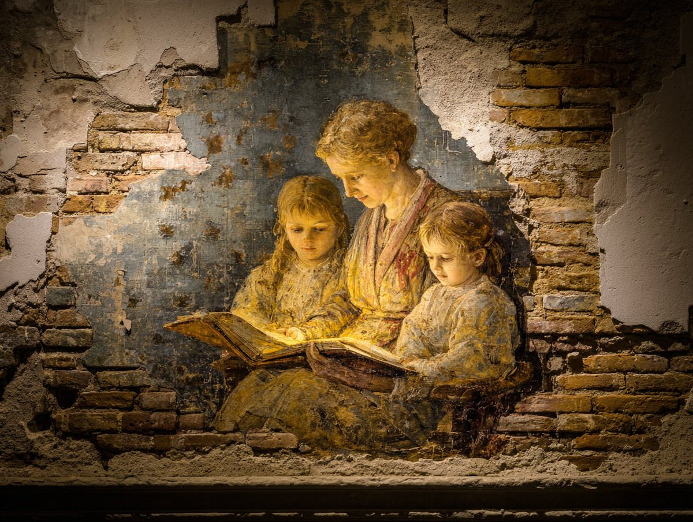

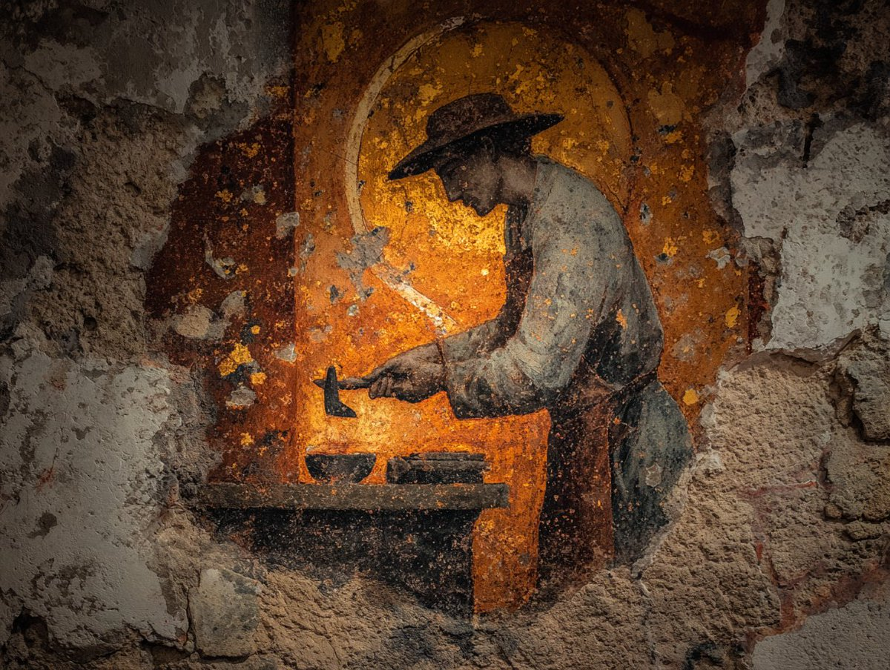

```
A cracked fresco of a baker pulling bread from a stone oven at dawn, ancient plaster surface with exposed brick beneath, Renaissance palette of naples yellow, burnt umber, and gold leaf accents on the crust catching firelight, weathered and partially restored, museum-lit from above.
```

```
A cracked fresco of a shepherd guiding his flock through a valley, ancient plaster surface with exposed brick beneath, Renaissance palette of terre verte, raw umber, and gold leaf accents on the evening sun crowning the hills, weathered and partially restored, museum-lit from above.
```

```
A cracked fresco of a grandmother reading to grandchildren by candlelight, ancient plaster surface with exposed brick beneath, Renaissance palette of yellow ochre, venetian red, and gold leaf accents on the book's illuminated pages, weathered and partially restored, museum-lit from above.
```

```
A cracked fresco of a blacksmith at his forge shaping horseshoes, ancient plaster surface with exposed brick beneath, Renaissance palette of mars orange, lamp black, and gold leaf accents on the glowing iron, weathered and partially restored, museum-lit from above.
```

 [↑返回目录](#toc)

---
## <a id="prompt-2008017541340565500">微型建筑工人组装产品</a> (<a href="https://x.com/aleenaamiir/status/2008017541340565526" target="_blank" rel="noopener noreferrer">Aleena Amir</a>)

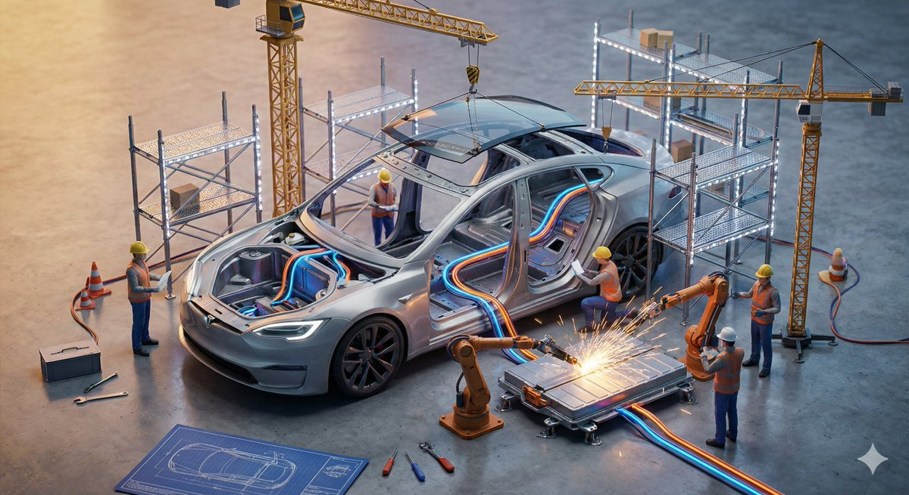

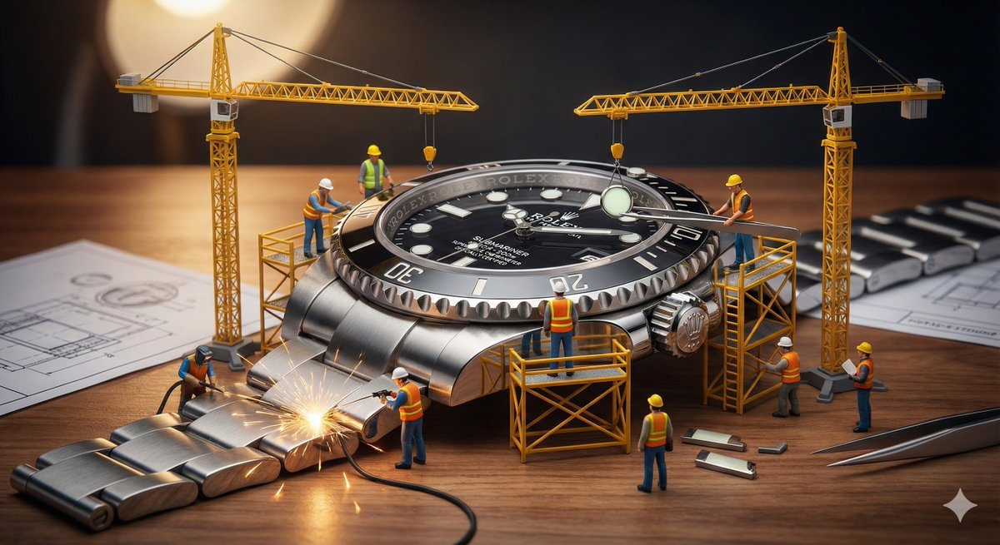

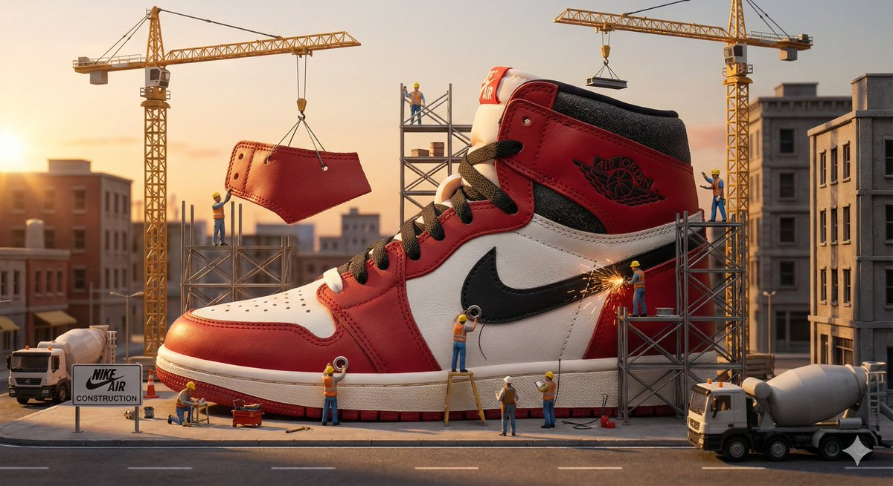

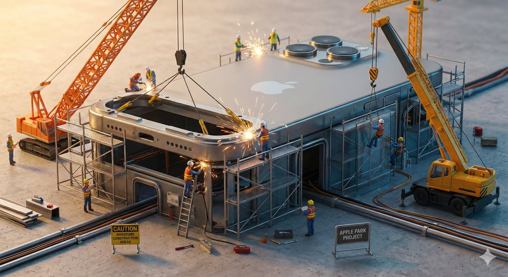

```
Construction Site Ad Miniature

Gemini Nano Banana Pro Prompt:

A miniature construction crew assembling [PRODUCT] like a skyscraper. Cranes, scaffolding, sparks flying. Playful but hyper-real, brand-campaign ready.
```

```
微型建筑工地广告

微型建筑工人正在像建造摩天大楼一样组装[产品]。画面中有起重机、脚手架和飞溅的火花。风格既趣味十足又高度写实，适合品牌宣传使用。
```

 [↑返回目录](#toc)

---
## <a id="prompt-2007835913842495500">萨克斯风工匠传承板：塞尔玛1954</a> (<a href="https://x.com/AllaAisling/status/2007835913842495504" target="_blank" rel="noopener noreferrer">Alexandra Aisling</a>)

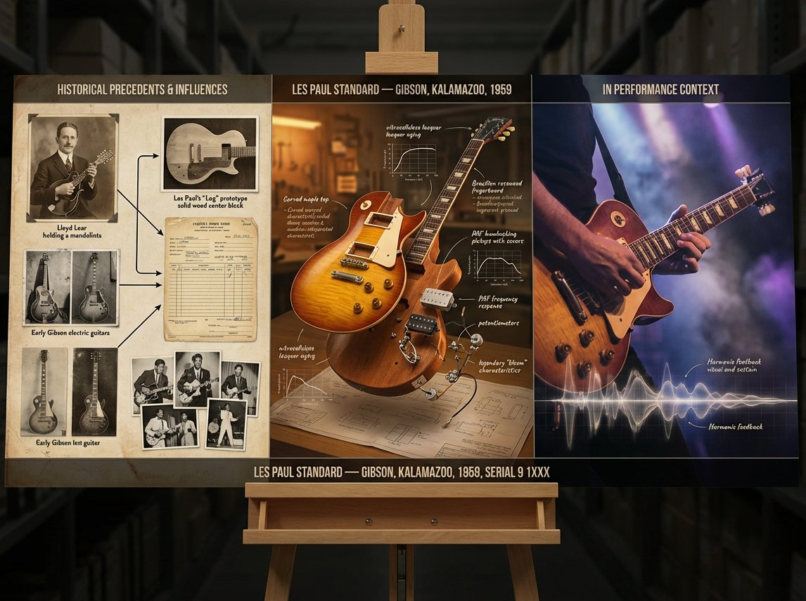

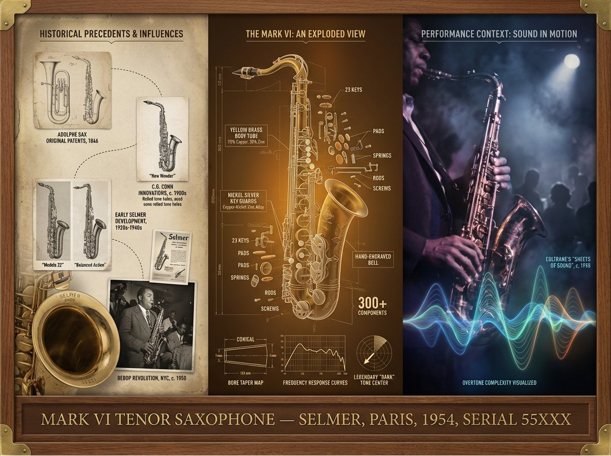

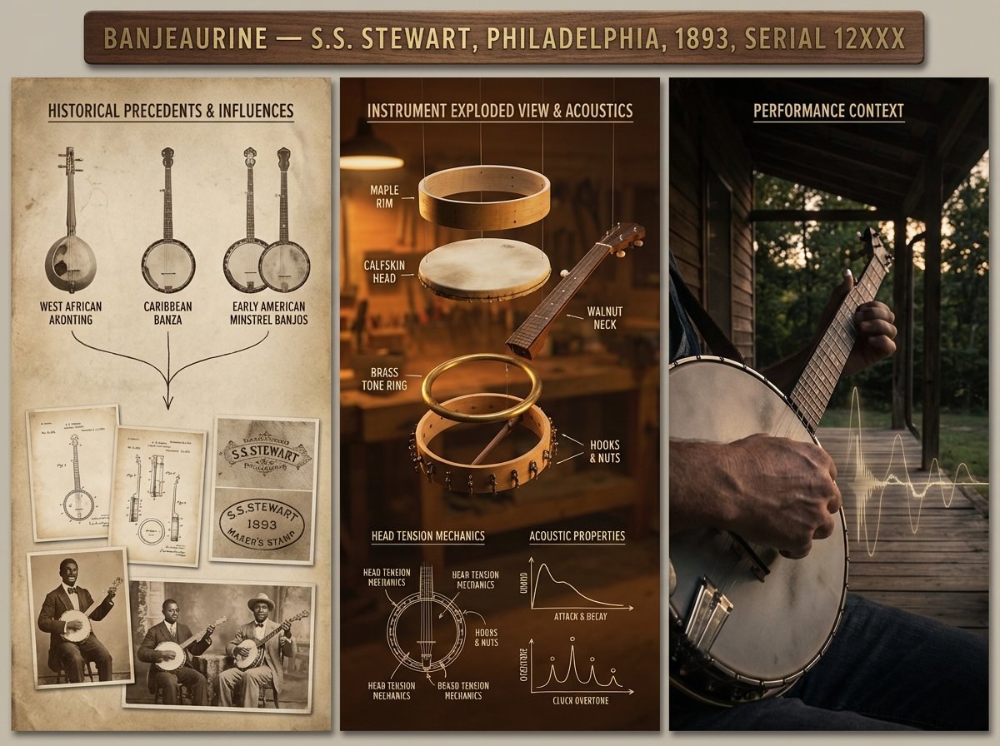

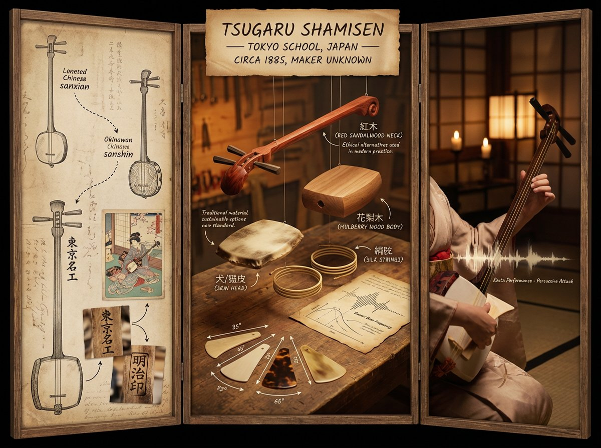

```
A luthier's legacy board for an electric guitar — Gibson, Kalamazoo, 1959. Left section: historical precedents and influences, showing Lloyd Loar's innovations, Les Paul's "Log" prototype, and early Gibson solidbody attempts with lineage lines connecting them, factory order forms photographed, and period photographs of rock and roll's birth. Center section: the Les Paul Standard in exploded view, every component separated and floating—carved maple top, mahogany back and neck, Brazilian rosewood fingerboard, PAF humbucking pickups—tonewoods identified, sunburst finish nitrocellulose aging documented, electronic properties annotated with pickup frequency response and legendary "bloom" characteristics. Right section: the instrument in performance context, guitarist's fingers bending strings into sustained wail, stadium ambiance of stage lights and fog, sound made visible through subtle waveform overlay showing harmonic feedback sustain. [...]
```

```
A luthier's legacy board for a tenor saxophone — Selmer, Paris, 1954. Left section: historical precedents and influences, showing Adolphe Sax's original patents, C.G. Conn innovations, and early Selmer development with lineage lines connecting them, serial number engravings photographed, and period photographs of Charlie Parker and the bebop revolution. Center section: the Mark VI in exploded view, every component separated and floating—yellow brass body, nickel-silver key guards, hand-engraved bell, 23 keys and 300+ components—alloy compositions identified, bore taper mapped, acoustic properties annotated with frequency response curves and legendary "dark" tone center. Right section: the instrument in performance context, Coltrane's fingers in sheets-of-sound motion, smoky club ambiance, sound made visible through subtle waveform overlay showing overtone complexity. Visual style transitions from aged daguerreotype through factory amber to jazz club chiaroscuro. [...]
```

```
A luthier's legacy board for a banjo — S.S. Stewart, Philadelphia, 1893. Left section: historical precedents and influences, showing West African akonting and gourd-bodied ancestors, Caribbean banza evolution, and American minstrel era development with lineage lines connecting them, patent drawings and maker's stamps photographed, and period photographs of both the problematic minstrel context and authentic African American folk tradition. Center section: the instrument in exploded view, every component separated and floating—maple rim, calfskin head, walnut neck, brass tone ring and hooks—materials identified, head tension mechanics mapped, acoustic properties annotated with characteristic attack and decay curves and "cluck" overtone positions. Right section: the instrument in performance context, musician's clawhammer hand in downstroke motion, mountain porch ambiance of wood and evening light, sound made visible through subtle waveform overlay showing percussive rhythmic [...]
```

```
A luthier's legacy board for a shamisen — Tokyo school, Meiji period, circa 1885. Left section: historical precedents and influences, showing Chinese sanxian origins, Okinawan sanshin evolution, and Edo period refinements with lineage lines connecting them, maker's brands burned into wood photographed, and ukiyo-e prints showing geisha performance. Center section: the instrument in exploded view, every component separated and floating—red sandalwood neck, mulberry wood body, cat or dog skin head, silk strings—materials identified with ethical sourcing notes on modern alternatives, bachi plectrum angles mapped, acoustic properties annotated with characteristic sawari buzz frequency locations. Right section: the instrument in performance context, geisha's hands in fluid motion during kouta, tatami room ambiance of paper screens and candlelight, sound made visible through subtle waveform overlay showing percussive attack. Visual style transitions from aged daguerreotype through [...]
```

 [↑返回目录](#toc)

---
## <a id="prompt-2008127774750548200">极简主义3D像素化食物摄影</a> (<a href="https://x.com/TechieBySA/status/2008127774750548155" target="_blank" rel="noopener noreferrer">TechieSA</a>)

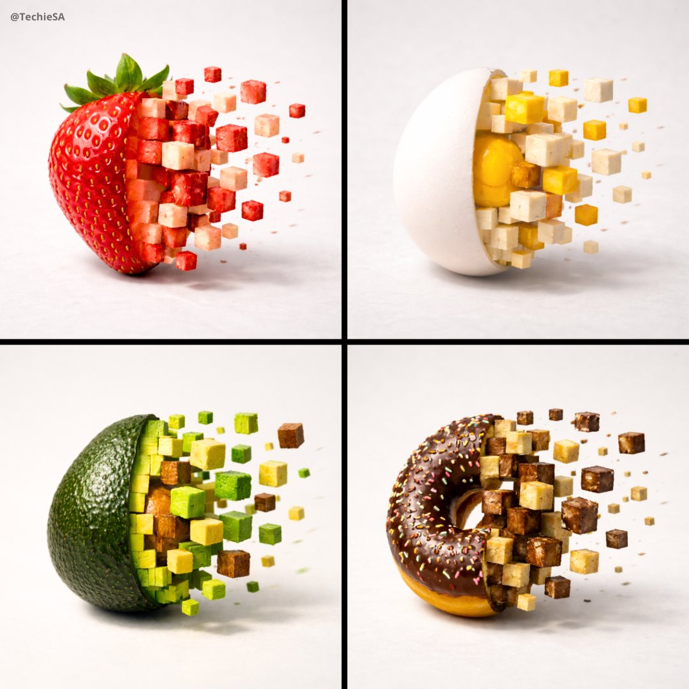

```
Minimalist food photograph, [1080x1080] – a single [FOOD] rests on a light, matte surface and is captured mid-transformation into a 3D pixelized form: one half remains intact while the other organically fragments into large, floating cubes that drift outward, each cube revealing the object’s texture, ingredients, and colors. Studio lighting with soft, realistic shadows, shallow depth of field, tasteful perspective and composition, hyperrealistic detail, stylish geometric abstraction, subtle motion blur on the cubes, high resolution, cinematic close-up.
```

```
极简主义食物摄影，[1080x1080]——一道[FOOD]静置于浅色哑光表面上，正处于向3D像素化形态转变的瞬间：一半保持完整，另一半则自然地碎裂成大型漂浮立方体，向外飘散，每个立方体都展现出该食物的纹理、成分与色彩。影棚灯光营造柔和逼真的阴影，浅景深，构图与视角考究，细节超写实，兼具时尚几何抽象风格，立方体带有微妙动态模糊，高分辨率，电影感特写。
```

 [↑返回目录](#toc)

---
## <a id="">小朋友学字</a> (<a href="https://x.com/berryxia/status/2008425387999801451" target="_blank" rel="noopener noreferrer">Berryxia.AI</a>)


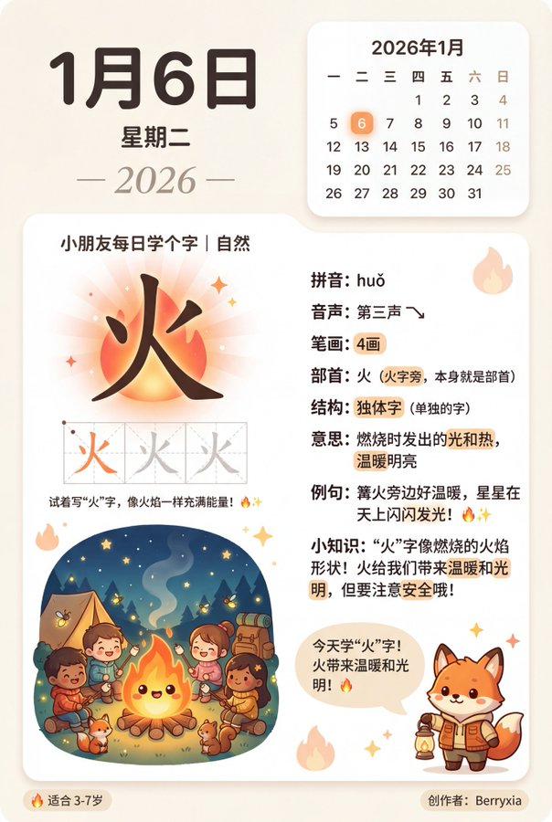

```
"小朋友每日学个字" 简化版 v7.0 (移除技术参数)

## 📐 完整通用系统提示词（精简版）

```plaintext

Create a modern Apple Design-inspired "Daily Character Learning for Kids" (小朋友每日学个字) calendar page for {月}月{日}日, {年份}. Ultra-minimalist, clean, playful, and child-friendly layout in 4K quality.

**TODAY'S CHARACTER: "{汉字}"**

Category: {主题分类}

═══════════════════════════════════════════════════════

PART 1: LAYOUT STRUCTURE

═══════════════════════════════════════════════════════

**Header Area (Top-Left):**

- Main date: "{月}月{日}日" - Large and prominent

- Weekday: "星期{X}" - Small, below date

- **ARTISTIC YEAR DISPLAY:** "— {年份} —"

  * Elegant serif OR artistic sans-serif font

  * Soft warm gray color

  * Centered below weekday

  * Integrated into header typography hierarchy

  * Like art print edition number

**Calendar Widget (Top-Right Corner):**

**Position & Styling:**

- Location: Top-right corner

- Proper margins from edges

- Subtle rounded rectangle background with soft shadow

- Clean, modern appearance

**Calendar Header:**

- Text: "{年份}年{月}月"

- Centered above grid

- Clean sans-serif, medium weight

**Weekday Labels:**

- 一 二 三 四 五 六 日 (Monday to Sunday)

- Sans-serif, regular weight

- Medium gray color

- Evenly spaced across 7 columns

**═══════════════════════════════════════════════════════**

**2026 COMPLETE CALENDAR DATA**

**═══════════════════════════════════════════════════════**

```yaml

2026年日历数据:

  

  1月: 31天, 1日=周四

  网格: [空][空][空][1][2][3][4] / [5][6][7]...

  

  2月: 28天, 1日=周日

  网格: [空][空][空][空][空][空][1] / [2][3][4]...

  

  3月: 31天, 1日=周日

  网格: [空][空][空][空][空][空][1] / [2][3][4]...

  

  4月: 30天, 1日=周三

  网格: [空][空][1][2][3][4][5] / [6][7][8]...

  

  5月: 31天, 1日=周五

  网格: [空][空][空][空][1][2][3] / [4][5][6]...

  

  6月: 30天, 1日=周一

  网格: [1][2][3][4][5][6][7] / [8][9][10]...

  

  7月: 31天, 1日=周三

  网格: [空][空][1][2][3][4][5] / [6][7][8]...

  

  8月: 31天, 1日=周六

  网格: [空][空][空][空][空][1][2] / [3][4][5]...

  

  9月: 30天, 1日=周二

  网格: [空][1][2][3][4][5][6] / [7][8][9]...

  

  10月: 31天, 1日=周四

  网格: [空][空][空][1][2][3][4] / [5][6][7]...

  

  11月: 30天, 1日=周日

  网格: [空][空][空][空][空][空][1] / [2][3][4]...

  

  12月: 31天, 1日=周二

  网格: [空][1][2][3][4][5][6] / [7][8][9]...

```

**GRID CONSTRUCTION (Follow exactly):**

1. Look up {月}月 data from above

2. First row: Weekday labels (一二三四五六日)

3. Second row: Place empty cells according to starting pattern, then fill with dates

4. Following rows: Continue sequentially until reaching total days

5. Highlight date {日} with soft colored background

**Highlight Styling:**

- Visual: Soft rounded circle OR rounded rectangle

- Background: Theme color at moderate opacity

- Text: Bold weight, darker color

- Optional: Subtle outer glow

- Make it clearly visible but not harsh

**Calendar Typography:**

- Clean sans-serif font

- Small, readable size

- Current date: Bold weight with highlight

- Other dates: Regular weight, medium gray

- Proper spacing between cells

═══════════════════════════════════════════════════════

PART 2: CHARACTER WRITING STANDARDS

═══════════════════════════════════════════════════════

**CRITICAL - Triple Verification Required:**

✓ **Character:** "{汉字}" - Standard Kaishu (楷书) style

  * Clear, beautiful, child-friendly rendering

  * Standard simplified Chinese

  * Proper proportions and balance

✓ **Stroke Count Verification (MANDATORY):**

  * Xinhua Dictionary (新华字典): {笔画数}画

  * GB/T 13000 national standard: {笔画数}画

  * Component calculation: {拆解计算}

  * **CONFIRMED: {汉字} = {笔画数}画**

  * **CRITICAL: Do NOT display stroke order numbers on character**

✓ **Radical (部首):** "{部首}"

  * Position: {左边/右边/上面/下面/外围}

  * Meaning/function: {部首含义}

✓ **Structure (结构):** "{结构类型}"

  * Types: 左右结构 / 上下结构 / 左中右 / 上中下 / 半包围 / 全包围 / 独体字

  * Component breakdown: {组成部件说明}

**Character Display (Center Focus):**

- Huge "{汉字}" character - Approximately 40% of canvas height

- **NO stroke order numbers overlaid** - Keep character clean and beautiful

- Soft {主题颜色} glow effect around character

- Below: 3×3 Tian Zi Ge (田字格) practice grid

  * Light gray guide character inside

  * Thin, clear grid lines

  * First stroke starting point marked with gentle indicator

═══════════════════════════════════════════════════════

PART 3: THEMATIC ILLUSTRATION

═══════════════════════════════════════════════════════

**Scene Design (Based on Category):**

{根据主题分类选择对应场景}

**General Illustration Principles:**

- Kawaii/cute cartoon style with big expressive eyes

- Rounded, friendly lines and soft shapes

- Soft, child-friendly color palette from theme

- Elements directly related to character meaning

- Positive, encouraging, joyful atmosphere

- NO scary, negative, or inappropriate imagery

- Playful composition with proper depth

- Characters and objects with personality

**Theme-Specific Elements:**

- **动物**: Cute animals, habitat, paw prints, food items

- **水果**: Fruit trees, baskets, fresh produce, garden

- **植物**: Flowers, growth stages, watering can, sunshine

- **颜色**: Rainbow, paint palette, colorful balloons

- **数字**: Counting objects, number shapes, playful math

- **食物**: Kitchen scene, happy food characters, dining

- **情感**: Expressive faces, hearts, emotion scenarios

- **自然**: Mountains, rivers, sun, moon, clouds, weather

- **身体**: Active children, sports, healthy activities

- **动词/形容词**: Action scenes, descriptive visuals

- **物品**: Daily objects, home setting, toys, tools

═══════════════════════════════════════════════════════

PART 4: EDUCATIONAL CONTENT

═══════════════════════════════════════════════════════

**Content Hierarchy (Clear Information Architecture):**

1. **Category Header:** "小朋友每日学个字 | {主题分类}"

   - Rounded sans-serif, medium weight

   - Warm charcoal color

2. **Character Display:** "{汉字}" (large, prominent, beautiful)

3. **Pinyin:** "拼音: {pinyin}"

   - Must include accurate tone marks: ā á ǎ à

   - Regular weight

   - Medium gray color

4. **Tone Indicator:** "第{声调}声" + visual tone line

   - First tone (1): ˉ (high flat line)

   - Second tone (2): ˊ (rising line)

   - Third tone (3): ˇ (dipping line)

   - Fourth tone (4): ˋ (falling line)

   - Neutral: 轻声 (no line or dot)

   - Show visual contour in accent color

5. **Stroke Count:** "笔画: {数量}画"

   - Must be 100% accurate from verified sources

   - Medium size, clear display

6. **Radical:** "部首: {部首} ({位置和含义说明})"

   - Explain position (left/right/top/bottom)

   - Explain meaning or category indication

7. **Structure:** "结构: {结构类型} ({拆解说明})"

   - Explain how character is composed

   - Break down into recognizable parts

8. **Meaning:** "意思: {清晰、儿童友好的解释}"

   - Simple, age-appropriate language

   - 1-2 sentences

   - Avoid overly technical terms

9. **Example Sentence:** "例句: {生活化例句}" + relevant emoji

   - Short sentence children can relate to

   - Natural, conversational language

   - Include appropriate emoji for visual appeal

10. **Fun Fact:** "小知识: {趣味知识或记忆技巧}!"

    - Interesting character trivia

    - Memory aids or mnemonics

    - Cultural background

    - Connection to daily life

    - Encouraging positive message

**Typography:**

- Child-friendly rounded sans-serif for all content

- Generous line spacing (approximately 1.7x)

- Large, clear characters for easy reading

- Excellent readability with high contrast

**Highlight Keywords:**

- Select 3-5 important terms from content

- Apply soft colored background highlight

- Use theme-appropriate colors at comfortable opacity

- Should enhance readability without distraction

═══════════════════════════════════════════════════════

PART 5: INTERACTIVE ELEMENTS

═══════════════════════════════════════════════════════

**Tian Zi Ge Practice Grid:**

- Standard 3×3 grid (九宫格)

- Position: Below main character display OR bottom area

- Light gray guide character inside (low opacity)

- Thin, clear grid lines

- First stroke starting point marked with gentle indicator (dot/arrow)

- Optional: Simple stroke direction hints with minimal arrows

**Encouragement Text:**

- Position: Near practice grid

- Font: Playful rounded sans-serif

- Color: Theme accent color

- Examples:

  * "试着写'{汉字}'字,你一定能写好!"

  * "跟着笔顺写一写!"

  * "描一描,练一练!"

  * "慢慢来,你能写得很漂亮!"

- Include encouraging emoji (✨ 🌟 💪 etc.)

═══════════════════════════════════════════════════════

PART 6: ADORABLE MASCOT

═══════════════════════════════════════════════════════

**Mascot Character Design:**

- Animal: Cute {动物} teacher (panda/bunny/fox/owl/penguin/cat based on theme)

- Size: Comfortable presence without overwhelming (approximately 10-15% of canvas)

- Position: Bottom-right corner (primary) OR integrated into scene

- Outfit: Theme-appropriate costume

  * Glasses and graduation cap (scholarly)

  * Apron and chef's hat (food themes)

  * Lab coat and goggles (science)

  * Sports gear (physical activities)

  * Scarf and earmuffs (winter themes)

- Props: Holding theme-related items (book, brush pen, tools)

- Expression: Warm, encouraging, friendly smile

- Pose: Welcoming gesture, pointing, or teaching motion

**Speech Bubble:**

- Content: "今天我们学'{汉字}'字!" OR themed encouraging message

- Style: Rounded bubble with tail to mascot

- Background: White or very light color, high opacity

- Border: Thin line in theme accent color

- Font: Playful rounded sans-serif

═══════════════════════════════════════════════════════

PART 7: DESIGN SYSTEM

═══════════════════════════════════════════════════════

**Layout Principles:**

- White/negative space: 55-60% of canvas

- Grid system: Consistent alignment and spacing

- Content cards: Rounded corners throughout

- Shadows: Soft and subtle on all layered elements

- Visual hierarchy: Clear size and color differentiation

**Color System:**

**Base Colors:**

- Background: Cream white #FFFEF9 or soft white #FEFEFE

- Primary text: Warm charcoal #2C2C2C

- Secondary text: Medium gray #6B6B6B

- Tertiary text: Light gray #999999

**Theme Accent Colors (Choose 3-4 based on category):**

- Coral pink #FF9AA2

- Sky blue #B5EAD7

- Soft yellow #FFDAC1

- Mint green #C7CEEA

- Lavender #E2CFEA

- Peach #FFB7B2

- Power orange #FF9B50

- Energy red #FF6B6B

- Calm blue #6BCF7F

- Golden yellow #FFD93D

- Warm brown #D4A574

- Icy blue #B5EAD7

- Crystal white #F0F8FF

**Element Styling:**

- Cards: rgba(255,255,255,0.97) with subtle blur

- Badges: rgba(0,0,0,0.03) for subtle backgrounds

- Highlights: Theme color at comfortable opacity

- Rounded corners: Consistent radius on all elements

- Shadows: Soft, subtle depth

**Background Treatment:**

- Extremely subtle paper grain texture (very low opacity)

- Fine, organic pattern (premium paper feel)

- Optional: Soft vignette at edges (very subtle)

- NO harsh patterns or distracting textures

- Clean, premium, museum-quality feel

**Typography System:**

- Primary: Child-friendly rounded sans-serif

  * Headers: Medium to bold weight

  * Body: Regular weight

  * Small text: Regular weight

- Secondary: Elegant serif for year display

- Line spacing: Generous for easy reading

- High contrast: WCAG AAA standard

- Clear hierarchy: Size and weight differentiation

**Decorative Elements:**

- Theme-appropriate icons and patterns

- Stars, sparkles, hearts (use sparingly)

- Subject-related decorations (paw prints, flowers, snowflakes, etc.)

- Soft, playful, rounded shapes

- Subtle, non-distracting placement

═══════════════════════════════════════════════════════

PART 8: BOTTOM LABELS

═══════════════════════════════════════════════════════

**Bottom-Left Label:**

- Content: "适合 {年龄范围}"

- Badge style with rounded rectangle background

- Theme-appropriate icon

- Rounded sans-serif font

- Medium gray color

**Bottom-Right Label:**

- Content: "创作者: Berryxia"

- Clean text only (no background)

- Elegant, understated typography

- Sans-serif font

- Warm gray color

- Professional and subtle

**Positioning:**

- Both labels near bottom edge with proper margins

- Aligned to baseline (same vertical position)

═══════════════════════════════════════════════════════

PART 9: TECHNICAL SPECIFICATIONS

═══════════════════════════════════════════════════════

**Output Requirements:**

- Format: Portrait aspect ratio (9:16 or 2:3)

- Resolution: 4K quality output

- Color mode: RGB

- Quality: High, suitable for digital display and print

**Apple Design Principles:**

- Clarity through white space and hierarchy

- Depth through subtle shadows and layers

- Delight through refined playful details

- Accessibility through high contrast

- Sophistication meets child-friendliness

- Museum-quality educational materials

**Overall Mood:**

- {主题情绪} based on theme

- Educational yet fun and engaging

- Encouraging and positive tone

- Warm and inviting atmosphere

- Inspiring curiosity and love of learning

- Collectible, frame-worthy quality

═══════════════════════════════════════════════════════

PART 10: MANDATORY VERIFICATION CHECKLIST

═══════════════════════════════════════════════════════

**CALENDAR ACCURACY (MUST VERIFY ALL):**

□ Calendar header shows "{年份}年{月}月"

□ Weekday labels: 一二三四五六日 (correct order)

□ Grid: 7 columns structure

□ Month starts on correct weekday (verify from 2026 data)

□ Empty cells before day 1 in correct positions

□ Date {日} highlighted with visible colored background

□ Date {日} in correct row and column position

□ Grid shows exactly {天数} days (no more, no less)

□ Dates sequential from 1 to {天数}

□ Last day appears in appropriate final row

□ Calendar matches actual 2026 {月}月 layout perfectly

**CHARACTER ACCURACY:**

□ Character "{汉字}" in correct standard simplified form

□ Stroke count {笔画数} verified from multiple sources

□ NO stroke order numbers on main character display

□ Radical "{部首}" correctly identified

□ Structure "{结构类型}" accurate

□ Pinyin "{pinyin}" with correct tone marks

□ Tone "第{X}声" correct with visual indicator

**CONTENT QUALITY:**

□ All educational info clear and age-appropriate

□ Example sentence natural and relatable

□ Fun fact interesting and useful

□ Keywords highlighted (3-5 items)

□ Encouragement text positive

**DESIGN QUALITY:**

□ Year "— {年份} —" displayed artistically in header

□ Calendar widget in top-right corner

□ Main character large (approximately 40% canvas), clean

□ Tian Zi Ge practice grid present

□ Mascot cute, friendly, theme-appropriate

□ Theme illustration matches character meaning

□ Color scheme harmonious and child-friendly

□ Background texture subtle

□ Typography clear and readable

□ White space generous (55-60%)

□ Rounded corners consistent

□ Shadows soft

□ Age range displayed (bottom-left)

□ Creator credit displayed (bottom-right)

□ Overall: Sophisticated, child-friendly, educational excellence

END OF SYSTEM PROMPT v7.0
```

 [↑返回目录](#toc)

---
## <a id="">历史上的今天</a> (<a href="https://x.com/berryxia/status/2008351247565476336" target="_blank" rel="noopener noreferrer">Berryxia.AI</a>)

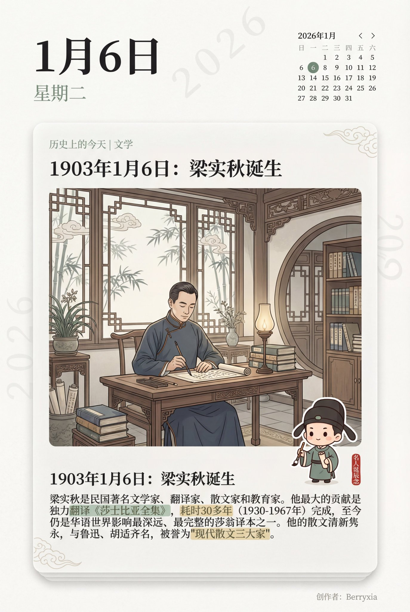


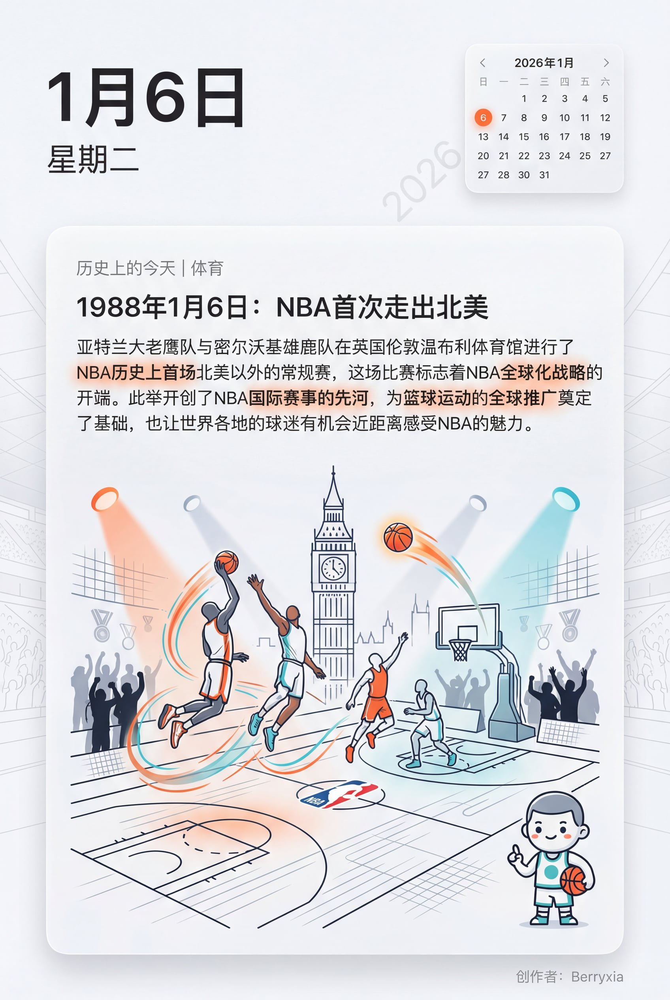


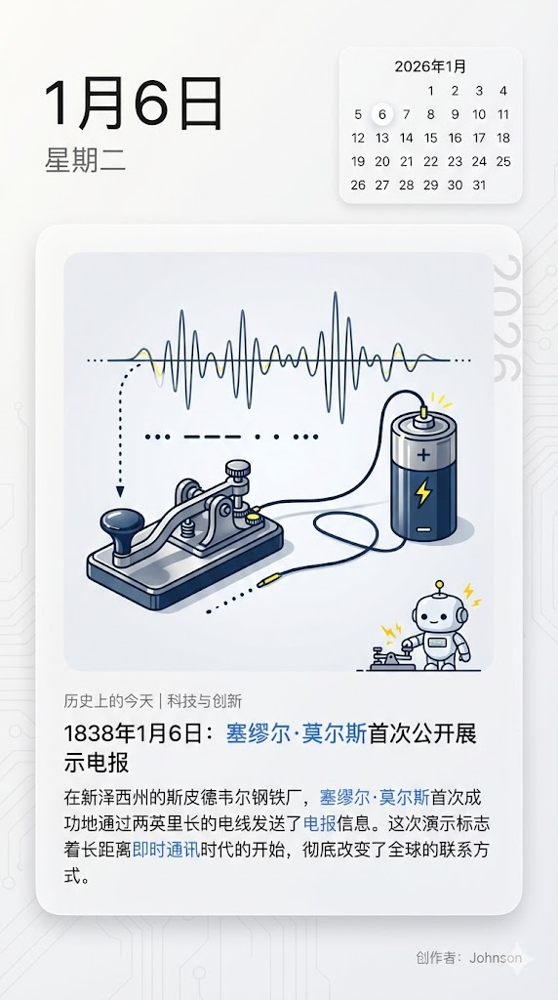

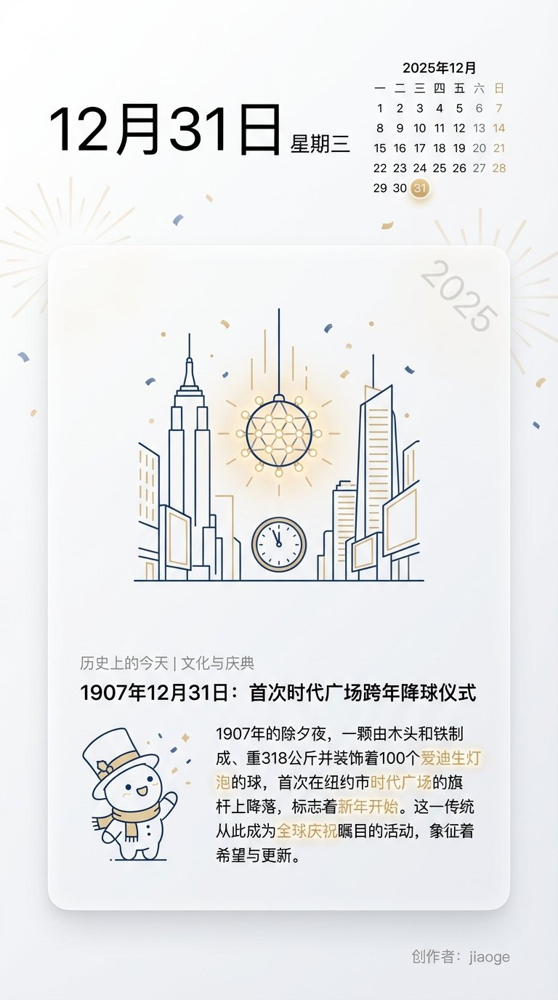

```
Create a modern Apple Design-inspired "This Day in History" calendar page for {当前月}月{当前日}日, {当前年份}, commemorating {历史事件标题} on {事件月}月{事件日}日, {事件年份}. Ultra-minimalist, clean, and sophisticated layout in 4K quality.

**Layout Structure:**

- Top: Elegant Chinese date "{月}月{日}日" (large), "星期{X}" (small)

- Calendar widget: Top-right corner showing {当前年份}年{当前月}月 calendar grid

  **CRITICAL - Calendar Accuracy Requirements:**

  * Display the CORRECT month: {当前年份}年{当前月}月 (e.g., "2026年1月" for January 2026)

  * Show accurate calendar grid with correct day-of-week alignment

  * Highlight date {当前日} (e.g., if today is 1月6日, highlight "6")

  * Calendar must start from the 1st day of the current month

  * Show correct number of days for the month (January = 31 days)

  * First day of month must align with correct weekday

  * Reference: January 2026 starts on Thursday (周四), so grid layout should be:

    Row 1: [empty] [empty] [empty] [1] [2] [3] [4]

    Row 2: [5] [6-highlighted] [7] [8] [9] [10] [11]

    etc.

  * Use accurate 2026 calendar data, do NOT use random or placeholder dates

  

- Main card: Frosted glass effect with subtle shadows

**Central Illustration:**

{根据领域选择对应插画场景配置}

- Clean line-art style with limited color palette

- {领域特定元素列表}

- Soft ambient lighting creating depth

- Cute minimalist cartoon character in {领域}风格 in corner

**Typography (4K clarity):**

- Category: "历史上的今天 | {领域}" - Thin sans-serif

- Title: "{事件年份}年{事件月}月{事件日}日:{事件标题}" - Medium weight

- Body: "{事件详细描述}" - Light weight, 1.8 line-spacing

- Highlight keywords: {关键词列表} with subtle emphasis

**Design Elements:**

- 60% white/negative space

- 8px grid system alignment

- Soft shadows (0 4px 16px rgba(0,0,0,0.06))

- {领域特定装饰图案}

- {领域特定纹理}

**Color Scheme:**

- Background: {领域背景色} with {领域纹理}

- Primary text: #1D1D1F

- Accent: {领域点缀色1} and {领域点缀色2}

- Card: rgba(255,255,255,0.96) with blur

**Watermark:**

- "{当前年份}" in English, 6% opacity, ultra-thin, diagonal background

**Apple Design Principles (4K):**

- Crystal-clear typography with perfect anti-aliasing

- Sophisticated shadow layering

- Minimum 32px padding

- WCAG AAA contrast ratios

- Perfect pixel precision

**Bottom right:** "创作者: Berryxia" in subtle elegant text

**Format:** Portrait (9:16 or 2:3), 4K quality

**Mood:** Elegant, {领域情绪}, sophisticated - celebrating {领域特点} with contemporary design excellence.

**VERIFICATION CHECKLIST (Must satisfy ALL):**

✓ Calendar shows correct month: {当前年份}年{当前月}月

✓ Calendar grid starts from day 1 of current month

✓ Date {当前日} is highlighted correctly

✓ Days of week align correctly (consult 2026 calendar)

✓ Number of days matches actual month length
```

 [↑返回目录](#toc)

---
## <a id="prompt-2008112011373068488">奶凶的女生</a> (<a href="https://x.com/MANISH1027512/status/2008112011373068488" target="_blank" rel="noopener noreferrer">古一</a>)


```
Photorealistic edit using the input person photo as strict identity reference: keep the same face, facial features, skin tone, hairstyle (color/bangs/length/volume), outfit and accessories unchanged (no face swap, no new person, no hair/outfit change). Change only expression/pose/background: pouty lips and furrowed brows, slightly angry/annoyed, like she’s playfully mad at her boyfriend and saying “stop filming me”. Close wide-angle perspective (18–28mm), body slightly leaning forward, one hand reaching toward the lens as if grabbing the boyfriend’s phone / blocking the camera; huge foreground hand occupying 30–50% of the frame, palm facing camera, five natural fingers, realistic anatomy; face in the back in sharp focus. Replace background with a clean solid pink studio backdrop (seamless, no texture). No text, no watermark, no frame, no extra fingers, no deformed hands, no heavy blur, no style change.
```

```
使用输入的人物照片作为严格身份参考进行逼真编辑：保持面部、面部特征、肤色、发型（颜色/刘海/长度/发量）、服装和配饰完全不变（不换脸、不更换人物、不改变发型或服装）。仅更改表情、姿势和背景：噘嘴、皱眉，略带生气或不悦，仿佛在撒娇地对男友说“别拍我了”。采用18–28mm广角近景视角，身体略微前倾，一只手伸向镜头，仿佛要抓住男友的手机或挡住相机；前景手部巨大，占据画面30%–50%，手掌正对镜头，五指自然，解剖结构真实；后方脸部清晰锐利。背景替换为干净的纯粉色影棚背景（无缝、无纹理）。画面中无文字、无水印、无边框、无多余手指、无畸形手部、无重度模糊、无风格变化。
```

 [↑返回目录](#toc)

---
## <a id="">马年女生九宫格头像</a> (<a href="https://x.com/wanerfu/status/2008421241091154115" target="_blank" rel="noopener noreferrer">摆烂程序媛</a>)

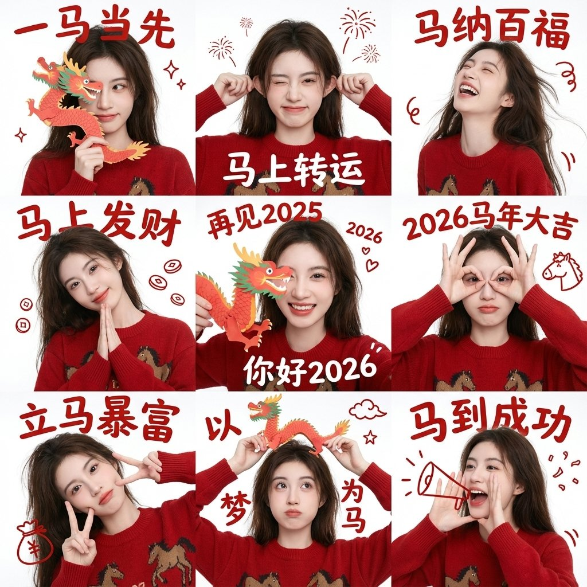

```
{  "project_settings": {    "task_type": "九格极简肖像",    "aspect_ratio": "3:4",    "batch_size": 1  },  "theme_config": {    "风格": "极简新年马年文字背景",    "强度": "中等（文字为视觉主体，人物仍为核心）",    "逻辑": "以新年马年祝福文字作为背景装饰元素，每格仅出现 1 组核心祝福词，排版留白充足，不覆盖人物五官"  },  "prompt_payload": {    "结构": "一张包含 3x3 光格矩阵的单片接触片图像",    "subject_base": {      "人物参考": "严格参考并还原用户上传的照片中的人物",      "一致性要求": "必须与参考图片中的人物为同一人，保持脸型、五官比例、肤色、气质高度一致，不风格化改脸，不生成不同人物",      "身份描述": "同一位年轻亚洲女性",      "年龄气质": "真实成年亚洲女性，气质自然、克制、耐看",      "服装": "简单的红色针织一字领毛衣，干净现代风格",      "妆容": "自然、清透、真实妆感，不浓妆、不网红妆"    },  "cells": [    {      "position": 1,      "pose": "standing",      "props": ["festival_stick"],      "text": ["Happy Horse Year", "新年好"]    },    {      "position": 2,      "pose": "gesture_on_face",      "props": [],      "text": ["马年大吉", "Ho se 发财"]    },    {      "position": 3,      "pose": "standing",      "props": ["福字_sign"],      "text": ["马到成功", "2026"]    },    {      "position": 4,      "pose": "sitting",      "props": ["red_envelopes"],      "text": ["一马当先", "精神"]    },    {      "position": 5,      "pose": "standing_center",      "props": ["red_envelope"],      "background_override": "red",      "text": ["2026 马年大吉"]    },    {      "position": 6,      "pose": "sitting_playful",      "props": ["red_envelopes"],      "text": ["Happy 2026", "NEW YEAR"]    },    {      "position": 7,      "pose": "standing_tilt",      "props": ["festival_stick"],      "text": ["喜气", "Happy New Year"]    },    {      "position": 8,      "pose": "standing_fist_up",      "props": ["festival_headwear"],      "text": ["马到成功"]    },    {      "position": 9,      "pose": "standing",      "props": ["lucky_ball"],      "text": ["Ho Se 发财", "Happy New Year"]    }  ],  "use_cases": [    "AI image regeneration",    "batch New Year posters",    "children portrait templates",    "social media grid content"  ]}{  "project_settings": {    "task_type": "2026马年新春九宫格写真",    "aspect_ratio": "3:4",    "grid_layout": "3x3",    "output_style": "小红书 / Instagram 高赞写真",    "batch_size": 1  },  "reference_control": {    "reference_image": "使用用户上传的参考图",    "identity_lock": true,    "face_consistency": "100%保持五官、脸型、气质一致",    "禁止风格化换脸": true,    "same_person_all_grids": true  },  "overall_aesthetic": {    "关键词": ["网感", "生活气息", "抓拍感", "少女感", "高级感"],    "构图": "近景 / 大头贴 / 偶尔贴近镜头",    "摄影风格": "时尚生活方式写真而非棚拍证件照"  },  "lighting_and_color": {    "肤色": "通透、白皙、真实不假白",    "背景": "纯白色背景",    "整体色调": "明快、干净、高级、不过曝"  },  "subject_style": {    "服装": "可爱喜庆的红色高定马年新年毛衣",    "发型": "头发蓬松自然，轻微凌乱感",    "妆感": "清透自然，突出真实皮肤质感",    "表情要求": {      "情绪": "开心",      "表现方式": "抓拍感（Candid），不摆拍",      "允许": ["歪头", "身体倾斜", "凑近镜头", "动态瞬间"],      "禁止": ["僵硬微笑", "影楼式标准表情"]    }  },  "grid_directives": [    {      "grid": 1,      "pose": "手拿纸龙挡住半边脸，眼神俏皮",      "expression": "开心、灵动",      "text": "一马当先"    },    {      "grid": 2,      "pose": "双手扯耳朵做鬼脸，单眼Wink（眨眼）",      "expression": "调皮开心",      "text": "马上转运"    },    {      "grid": 3,      "pose": "仰头大笑，发丝飞扬，完全不看镜头",      "expression": "放声大笑，抓拍瞬间",      "text": "马纳百福"    },    {      "grid": 4,      "pose": "歪头做拜年手势",      "expression": "甜美、亲切的开心",      "text": "马上发财"    },    {      "grid": 5,      "pose": "把纸龙举到镜头前，略带大头透视效果",      "expression": "活泼、亲近镜头",      "text": "再见2025\n你好2026"    },    {      "grid": 6,      "pose": "双手在眼睛处比圈圈，搞怪鬼脸",      "expression": "搞怪开心",      "text": "2026马年大吉"    },    {      "grid": 7,      "pose": "双手比耶戳脸蛋，头用力向一侧歪",      "expression": "元气开心",      "text": "立马暴富"    },    {      "grid": 8,      "pose": "把纸龙顶在头顶保持平衡，眼神向上看",      "expression": "呆萌开心",      "text": "以梦为马"    },    {      "grid": 9,      "pose": "双手做喇叭状大喊，身体前倾",      "expression": "热烈开心",      "text": "马到成功"    }  ],  "text_and_decorations": {    "字体风格": "手绘涂鸦风格",    "文字颜色": "中国红",    "文字位置": "每格自然叠加，不遮挡五官",    "装饰元素": [      "小星星简笔画",      "小烟花简笔画",      "随意但克制的红色涂鸦线条"    ]  },  "negative_constraints": {    "禁止": [      "换脸",      "年龄变化",      "过度磨皮",      "AI塑料感",      "僵硬摆拍",      "复杂背景",      "过多装饰遮脸"    ]  }}{  "project_settings": {    "task_type": "九格极简情侣肖像",    "aspect_ratio": "3:4",    "batch_size": 1  },  "theme_config": {    "风格": "极简新年马年情侣文字背景",    "强度": "中等（文字为辅助装饰，情侣互动为视觉核心）",    "逻辑": "以新年马年祝福文字作为背景装饰元素，每格仅出现 1 组核心祝福词，排版留白充足，不覆盖两人五官与互动区域"  },  "prompt_payload": {    "结构": "一张包含 3x3 光格矩阵的单片接触片图像",    "subject_base": {      "人物参考": "严格参考并还原用户上传的两位人物（情侣）",      "一致性要求": "九宫格中必须始终为同一对情侣，男女外貌、脸型、五官比例、肤色、气质高度一致，不更换人物、不风格化改脸",      "身份描述": "一对年轻亚洲情侣",      "关系状态": "自然亲密的情侣关系，不刻意、不表演式",      "年龄气质": "真实成年亚洲情侣，气质自然、耐看、有生活感",      "服装": {        "女性": "简单的红色针织一字领毛衣，干净现代风格",        "男性": "简洁的新年红或米白色针织毛衣，低饱和、协调"      },      "妆容": {        "女性": "自然、清透、真实妆感",        "男性": "干净自然肤感，无明显妆效"      }    },    "expression_config": {      "总体情绪": "开心",      "表情基调": "自然开心、放松、有情侣间的默契感",      "嘴部状态": [        "自然微笑",        "嘴角上扬"      ],      "眼神状态": [        "彼此对视或轻微错位看镜头",        "眼神温柔、有笑意"      ],      "面部肌肉": "放松、柔和",      "情绪一致性要求": "九宫格整体情绪统一，通过互动方式制造变化"    }  },  "cells": [    {      "position": 1,      "pose": "情侣并肩站立，身体微微靠近",      "props": ["festival_stick"],      "interaction": "自然对视微笑",      "text": ["Happy Horse Year", "新年好"]    },    {      "position": 2,      "pose": "情侣同时做贴脸手势",      "props": [],      "interaction": "头部轻微靠近",      "text": ["马年大吉", "Ho Se 发财"]    },    {      "position": 3,      "pose": "一人举福字，一人看向对方",      "props": ["福字_sign"],      "interaction": "单向注视，亲密感",      "text": ["马到成功", "2026"]    },    {      "position": 4,      "pose": "情侣坐姿，肩膀轻触",      "props": ["red_envelopes"],      "interaction": "同时看镜头微笑",      "text": ["一马当先", "一起向前"]    },    {      "position": 5,      "pose": "情侣站立居中",      "props": ["red_envelope"],      "background_override": "light_red",      "interaction": "自然牵手",      "text": ["2026 马年大吉"]    },    {      "position": 6,      "pose": "情侣轻松玩闹姿态",      "props": ["red_envelopes"],      "interaction": "一人看镜头，一人看对方",      "text": ["Happy 2026", "NEW YEAR"]    },    {      "position": 7,      "pose": "情侣身体向同一侧微倾",      "props": ["festival_stick"],      "interaction": "同步动作，默契感",      "text": ["喜气", "Happy New Year"]    },    {      "position": 8,      "pose": "一人举拳祝福，一人微笑看向对方",      "props": ["festival_headwear"],      "interaction": "情绪呼应",      "text": ["马到成功"]    },    {      "position": 9,      "pose": "情侣站立靠近",      "props": ["lucky_ball"],      "interaction": "同时看镜头，幸福感",      "text": ["Ho Se 发财", "Happy New Year"]    }  ],  "use_cases": [    "情侣新年写真生成",    "品牌新年情侣模板",    "社交媒体情侣九宫格",    "节日纪念内容"  ]}{  "project_settings": {    "task_type": "九宫格新年祝福肖像（男生版）",    "aspect_ratio": "1:1",    "grid_layout": "3x3",    "batch_size": 1  },  "overall_style": {    "整体风格": "极简新年祝福风",    "视觉基调": "干净、温和、克制的节日感",    "背景": "纯色白墙面，无装饰",    "光线": "自然柔光，均匀无强阴影",    "色彩重点": "中国红（服装 + 文字）"  },  "subject_base": {    "人物一致性": "九宫格内为同一位人物",    "人物类型": "亚洲男性",    "性别气质": "干净、阳光、自然，不油腻",    "发型": "黑色短发，自然蓬松，简洁利落",    "服装": "红色针织毛衣或卫衣，简洁无图案",    "妆容": "无明显妆感，真实自然肤质",    "表情气质": "开心，克制的微笑，不夸张"  },  "pose_variations": {    "grid_1": "食指竖于嘴前，轻松安静手势",    "grid_2": "单手比 V 手势靠近脸部",    "grid_3": "单手做 OK 或三指手势",    "grid_4": "双手举起做轻松俏皮手势（不过度卖萌）",    "grid_5": "单手张开遮住半边脸",    "grid_6": "单手做电话手势靠近脸侧",    "grid_7": "单手轻点脸颊或下巴",    "grid_8": "单手托下巴，轻微思考姿势",    "grid_9": "双手指向脸部或克制比心变体"  },  "text_overlays": {    "字体风格": "传统中文新年书法字体",    "文字颜色": "中国红",    "年份颜色": "深蓝色",    "文字位置": "每一格顶部居中",    "文字结构": "四字祝福语 + 年份"  },  "text_content": [    { "position": "grid_1", "text": "一帆风顺", "year": "2026" },    { "position": "grid_2", "text": "双喜临门", "year": "2026" },    { "position": "grid_3", "text": "三阳开泰", "year": "2026" },    { "position": "grid_4", "text": "四季发财", "year": "2026" },    { "position": "grid_5", "text": "五福临门", "year": "2026" },    { "position": "grid_6", "text": "六六大顺", "year": "2026" },    { "position": "grid_7", "text": "七星高照", "year": "2026" },    { "position": "grid_8", "text": "八方来财", "year": "2026" },    { "position": "grid_9", "text": "九九同心", "year": "2026" }  ],  "constraints": {    "禁止项": [      "不改变人物身份",      "不夸张表情",      "不女性化姿态",      "不使用复杂背景",      "不添加节日道具",      "不风格化面部"    ],    "一致性要求": [      "人物脸型五官保持完全一致",      "服装颜色与材质一致",      "拍摄角度与距离基本一致"    ]  },  "use_cases": [    "男生新年纪念照",    "个人春节祝福九宫格",    "社交平台头像矩阵",    "品牌新年男生模板"  ]}
```

 [↑返回目录](#toc)

---
## <a id="">减脂食谱</a> (<a href="https://x.com/yyyole/status/2008372844850557068" target="_blank" rel="noopener noreferrer">沐阳</a>)

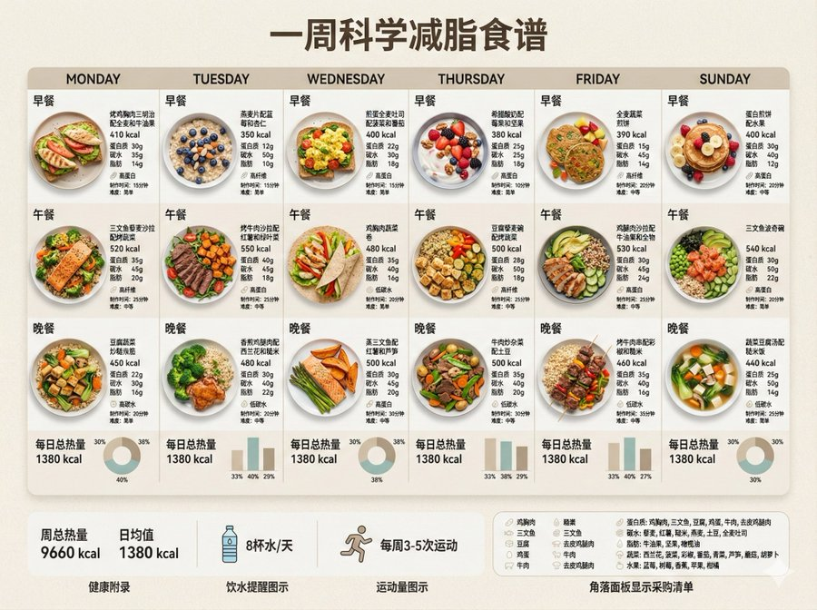

```
创建一周减脂食谱信息图，简约设计，包含以下要素：

设计风格：
- 博物馆展览美学，极简米色/奶油色背景
- 简洁无衬线字体
- 7天网格布局（周一至周日）
- 专业配色（柔和大地色、雾霾绿、静谧蓝）

每日内容：
- 三餐明确标注：早餐、午餐、晚餐
- 高品质美食摄影风格
- 每餐标注卡路里数值
- 营养素分解：蛋白质、碳水、脂肪（克数）
- 每日总热量突出显示，确保汇总数据准确

视觉元素：
- 精美摆盘的健康餐食（烤制蛋白质、新鲜蔬菜、全谷物、水果）
- 数据可视化：简洁柱状图或环形图显示热量分布
- 营养标识图标（高蛋白、低碳水、高纤维）
- 极简分割线

自动选择健康食材：
- 优质蛋白：鸡胸肉、三文鱼、豆腐、鸡蛋、牛肉、去皮鸡腿肉
- 复合碳水：藜麦、红薯、糙米、燕麦、土豆
- 健康脂肪：牛油果、坚果、橄榄油
- 蔬菜：西兰花、菠菜、彩椒、番茄、青菜
- 水果：浆果、苹果、柑橘、低糖水果

健康附录：
- 周总热量及日均值
- 制作时间标识（15分钟、30分钟、45分钟）
- 难度图标（简单/中等）
- 角落面板显示采购清单
- 饮水提醒图示
- 运动量图示

设计规格：
- 高对比度易读性
- 留白呼吸空间
- 一致的分量展示
- 专业美食造型
- 柔和阴影和微妙层次
- 可打印质量，高分辨率

确保数据准确。
确保文字渲染准确。
```

 [↑返回目录](#toc)

---
## <a id="">马年九宫格男生头像</a> (<a href="https://x.com/wanerfu/status/2008421244518232072" target="_blank" rel="noopener noreferrer">摆烂程序媛</a>)

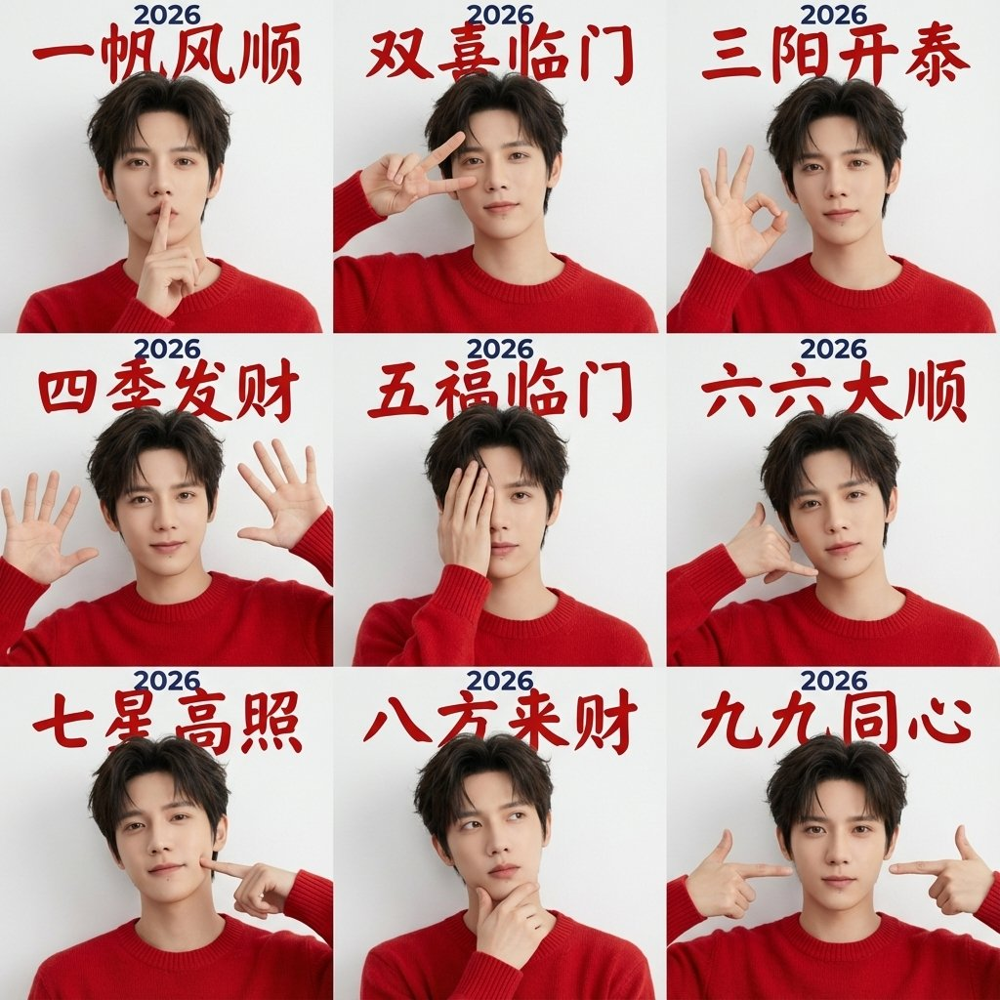

```
{  "project_settings": {    "task_type": "九宫格新年祝福肖像（男生版）",    "aspect_ratio": "1:1",    "grid_layout": "3x3",    "batch_size": 1  },  "overall_style": {    "整体风格": "极简新年祝福风",    "视觉基调": "干净、温和、克制的节日感",    "背景": "纯色白墙面，无装饰",    "光线": "自然柔光，均匀无强阴影",    "色彩重点": "中国红（服装 + 文字）"  },  "subject_base": {    "人物一致性": "九宫格内为同一位人物",    "人物类型": "亚洲男性",    "性别气质": "干净、阳光、自然，不油腻",    "发型": "黑色短发，自然蓬松，简洁利落",    "服装": "红色针织毛衣或卫衣，简洁无图案",    "妆容": "无明显妆感，真实自然肤质",    "表情气质": "开心，克制的微笑，不夸张"  },  "pose_variations": {    "grid_1": "食指竖于嘴前，轻松安静手势",    "grid_2": "单手比 V 手势靠近脸部",    "grid_3": "单手做 OK 或三指手势",    "grid_4": "双手举起做轻松俏皮手势（不过度卖萌）",    "grid_5": "单手张开遮住半边脸",    "grid_6": "单手做电话手势靠近脸侧",    "grid_7": "单手轻点脸颊或下巴",    "grid_8": "单手托下巴，轻微思考姿势",    "grid_9": "双手指向脸部或克制比心变体"  },  "text_overlays": {    "字体风格": "传统中文新年书法字体",    "文字颜色": "中国红",    "年份颜色": "深蓝色",    "文字位置": "每一格顶部居中",    "文字结构": "四字祝福语 + 年份"  },  "text_content": [    { "position": "grid_1", "text": "一帆风顺", "year": "2026" },    { "position": "grid_2", "text": "双喜临门", "year": "2026" },    { "position": "grid_3", "text": "三阳开泰", "year": "2026" },    { "position": "grid_4", "text": "四季发财", "year": "2026" },    { "position": "grid_5", "text": "五福临门", "year": "2026" },    { "position": "grid_6", "text": "六六大顺", "year": "2026" },    { "position": "grid_7", "text": "七星高照", "year": "2026" },    { "position": "grid_8", "text": "八方来财", "year": "2026" },    { "position": "grid_9", "text": "九九同心", "year": "2026" }  ],  "constraints": {    "禁止项": [      "不改变人物身份",      "不夸张表情",      "不女性化姿态",      "不使用复杂背景",      "不添加节日道具",      "不风格化面部"    ],    "一致性要求": [      "人物脸型五官保持完全一致",      "服装颜色与材质一致",      "拍摄角度与距离基本一致"    ]  },  "use_cases": [    "男生新年纪念照",    "个人春节祝福九宫格",    "社交平台头像矩阵",    "品牌新年男生模板"  ]}
```

 [↑返回目录](#toc)

---
## <a id="">城市打卡九宫格</a> (<a href="https://x.com/wanerfu/status/1998707022749917296" target="_blank" rel="noopener noreferrer">摆烂程序媛</a>)

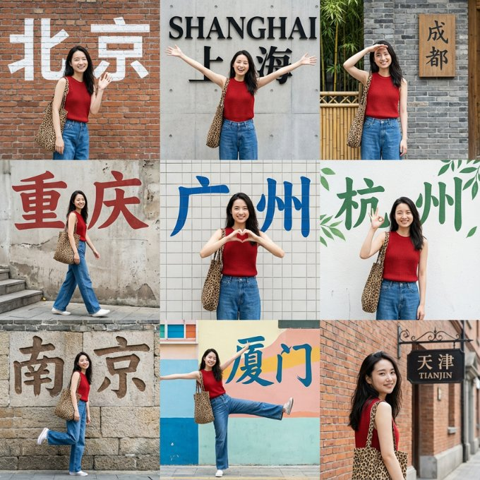

```
一位年轻的亚洲美女，五官清秀自然，皮肤白皙细腻，长发深棕色偏黑，直发微蓬松，侧分发型。面部特征：柔和的瓜子脸，细长眉型，清晰的双眼皮，大眼睛明亮有神，鼻梁挺直，嘴角上扬带自然微笑。气质美女、活力四射。

穿着：红色无袖上衣、宽松蓝色牛仔裤，背着豹纹托特包。整体风格日常、时尚但不夸张。

光线与质感：户外自然光，清晰写实，肤色自然不过曝，不美颜。

相机角度：中近景、人像模式、轻微侧身姿态（用于识别外貌，不固定动作）。

基于参考图生成同一位女孩的九宫格旅行写真。五官、脸型、发型、肤色、气质、穿搭必须完全一致，不得变脸、不换穿搭、不改变身材比例。风格为真实街拍，不要插画风。

九张图背景全部不同，每张是一座城市的特色墙面或城市大字标识。墙体需干净、质感真实，字体醒目，与当地风格一致。保持明亮、清爽、文旅拍照风格。九个城市分别为：
① 北京
② 上海
③ 成都
④ 重庆
⑤ 广州
⑥ 杭州
⑦ 南京
⑧ 厦门
⑨ 天津

**女孩保持同一造型，在九张图中做不同轻旅行动作（自然、松弛、可爱、不夸张）：

挥手打招呼

张开双臂站立

抬手遮阳微笑

轻松侧身走路

双手比心

OK 手势 / 望远镜手势

抬腿摆拍

单腿抬高、伸展开来

回头甜笑、轻松站姿

真实户外光线、柔和阴影、城市旅拍氛围。
```

 [↑返回目录](#toc)

---
## <a id="">马年九宫格情侣头像</a> (<a href="https://x.com/wanerfu/status/2008421247336763621" target="_blank" rel="noopener noreferrer">摆烂程序媛</a>)

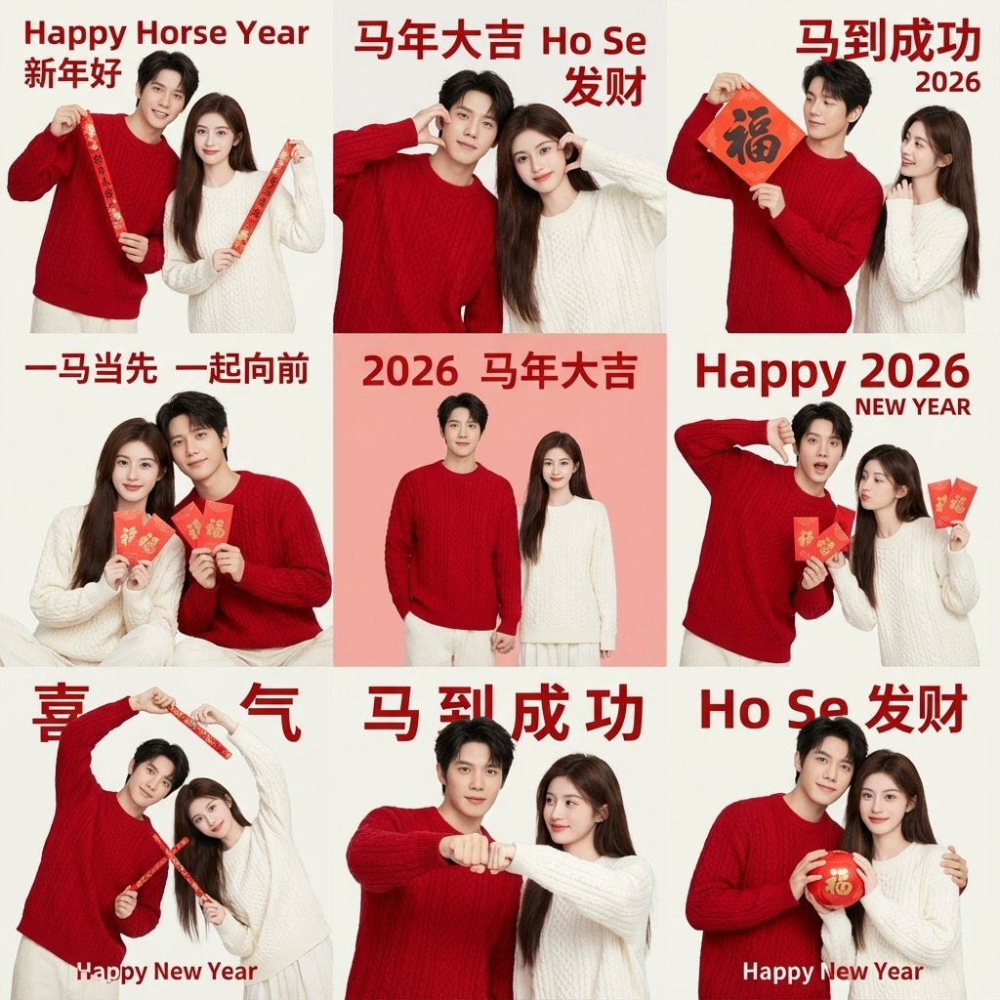

```
{  "project_settings": {    "task_type": "九格极简情侣肖像",    "aspect_ratio": "3:4",    "batch_size": 1  },  "theme_config": {    "风格": "极简新年马年情侣文字背景",    "强度": "中等（文字为辅助装饰，情侣互动为视觉核心）",    "逻辑": "以新年马年祝福文字作为背景装饰元素，每格仅出现 1 组核心祝福词，排版留白充足，不覆盖两人五官与互动区域"  },  "prompt_payload": {    "结构": "一张包含 3x3 光格矩阵的单片接触片图像",    "subject_base": {      "人物参考": "严格参考并还原用户上传的两位人物（情侣）",      "一致性要求": "九宫格中必须始终为同一对情侣，男女外貌、脸型、五官比例、肤色、气质高度一致，不更换人物、不风格化改脸",      "身份描述": "一对年轻亚洲情侣",      "关系状态": "自然亲密的情侣关系，不刻意、不表演式",      "年龄气质": "真实成年亚洲情侣，气质自然、耐看、有生活感",      "服装": {        "女性": "简单的红色针织一字领毛衣，干净现代风格",        "男性": "简洁的新年红或米白色针织毛衣，低饱和、协调"      },      "妆容": {        "女性": "自然、清透、真实妆感",        "男性": "干净自然肤感，无明显妆效"      }    },    "expression_config": {      "总体情绪": "开心",      "表情基调": "自然开心、放松、有情侣间的默契感",      "嘴部状态": [        "自然微笑",        "嘴角上扬"      ],      "眼神状态": [        "彼此对视或轻微错位看镜头",        "眼神温柔、有笑意"      ],      "面部肌肉": "放松、柔和",      "情绪一致性要求": "九宫格整体情绪统一，通过互动方式制造变化"    }  },  "cells": [    {      "position": 1,      "pose": "情侣并肩站立，身体微微靠近",      "props": ["festival_stick"],      "interaction": "自然对视微笑",      "text": ["Happy Horse Year", "新年好"]    },    {      "position": 2,      "pose": "情侣同时做贴脸手势",      "props": [],      "interaction": "头部轻微靠近",      "text": ["马年大吉", "Ho Se 发财"]    },    {      "position": 3,      "pose": "一人举福字，一人看向对方",      "props": ["福字_sign"],      "interaction": "单向注视，亲密感",      "text": ["马到成功", "2026"]    },    {      "position": 4,      "pose": "情侣坐姿，肩膀轻触",      "props": ["red_envelopes"],      "interaction": "同时看镜头微笑",      "text": ["一马当先", "一起向前"]    },    {      "position": 5,      "pose": "情侣站立居中",      "props": ["red_envelope"],      "background_override": "light_red",      "interaction": "自然牵手",      "text": ["2026 马年大吉"]    },    {      "position": 6,      "pose": "情侣轻松玩闹姿态",      "props": ["red_envelopes"],      "interaction": "一人看镜头，一人看对方",      "text": ["Happy 2026", "NEW YEAR"]    },    {      "position": 7,      "pose": "情侣身体向同一侧微倾",      "props": ["festival_stick"],      "interaction": "同步动作，默契感",      "text": ["喜气", "Happy New Year"]    },    {      "position": 8,      "pose": "一人举拳祝福，一人微笑看向对方",      "props": ["festival_headwear"],      "interaction": "情绪呼应",      "text": ["马到成功"]    },    {      "position": 9,      "pose": "情侣站立靠近",      "props": ["lucky_ball"],      "interaction": "同时看镜头，幸福感",      "text": ["Ho Se 发财", "Happy New Year"]    }  ],  "use_cases": [    "情侣新年写真生成",    "品牌新年情侣模板",    "社交媒体情侣九宫格",    "节日纪念内容"  ]}
```

 [↑返回目录](#toc)

---
## <a id=""> 清冷气质女生写真</a> (<a href="https://x.com/qisi_ai/status/2008758834547093893" target="_blank" rel="noopener noreferrer">骑司Chase</a>)

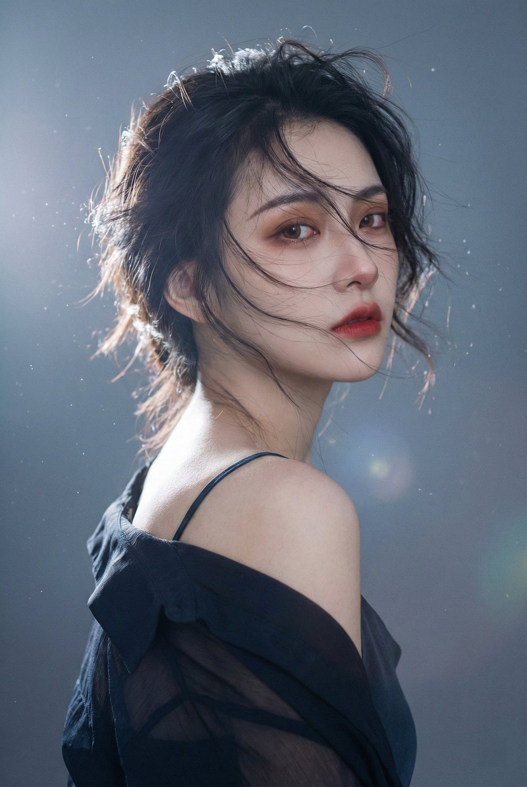

```
一、主体与动作
1 人物：年轻女性，清冷气质，半身近景，身体侧向右侧，回眸直视镜头
2 表情：眼神锐利克制，略带疏离与忧郁，嘴唇微抿
3 头发：乌黑长发，蓬松凌乱，强风吹拂，发丝大幅飘起并掠过脸颊
4 妆容：暖棕眼影与微红眼周，睫毛清晰，哑光红唇，肤质通透
5 服饰：深色细肩带衣裙或上衣，肩颈与锁骨露出，外侧有深色薄纱或外搭下滑形成暗部包裹

二、构图与镜头
1 画幅：竖幅
2 景别：胸口以上的半身近景，三分之二侧脸
3 位置：人物偏画面中右，头顶留少量空间，左侧留出光源与雾化区域
4 视角：平视或略微仰视，镜头距离较近但不夸张变形
5 对焦：焦点落在眼睛与面部，背景强虚化，整体带轻微柔化与朦胧感

三、光线与氛围
1 主光：左后方强逆光，形成发丝与肩部的明亮轮廓光
2 补光：正面极弱柔光，仅提亮面部细节，阴影保留
3 光质：散射柔光，明显雾化光晕，带空气感与轻微眩光
4 氛围：梦幻、神秘、安静、电影感、带一点冷感与孤独感

四、色彩与质感
1 色调：背景冷灰偏蓝，肤色偏暖，形成冷暖对比
2 饱和度：整体低饱和
3 明暗：对比偏高，暗部压低，高光柔亮不过曝
4 质感：皮肤细腻自然，轻微颗粒与雾面感，边缘高光带光晕

五、背景与环境元素
1 背景：暗灰到黑的渐变空间，无明确场景信息
2 光点：背景与发梢周围有零散点状光斑与闪烁颗粒，类似尘埃反光或微小光粒
3 动态：风带动发丝飞舞，光点呈漂浮散落的层次感

六、风格与后期
1 风格：唯美写实，梦幻柔雾，电影海报质感
2 后期：增强轮廓光与发丝高光，提升雾化与空气透光感，轻微褪色，暗角收束画面
3 清晰度：眼部与唇部相对清晰，其余区域柔化过渡，整体通透但不锐利

七、反向提示
1 人物错误：不要脸部畸变，不要五官错位，不要双脸，不要多余肢体，不要手指异常，不要不自然的皮肤塑料感
2 光影错误：不要正面硬光，不要强烈死白高光，不要背景过亮抢主体
3 风格偏差：不要卡通化，不要漫画厚涂感，不要夸张霓虹色，不要过度锐化与过度磨皮
```

 [↑返回目录](#toc)

---
## <a id="">新中式水墨绘本</a> (<a href="https://x.com/onetoinfai/status/2008345252185145445" target="_blank" rel="noopener noreferrer">OneToInf AI</a>)

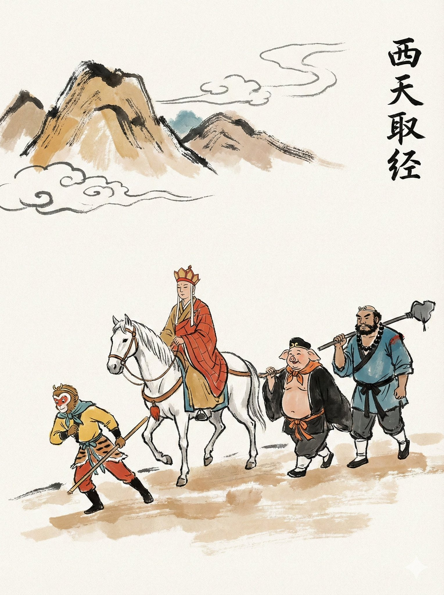

```
新中式水墨绘本，致敬80年代上美影风格。强调大巧若拙的毛笔触感与宣纸纹理，低饱和矿物色，极简留白构图。画面人物为主体视觉，比例3:4，[此处替换你的主体或场景描述]。
```

 [↑返回目录](#toc)

---
## <a id="">专业品牌视觉识别系统设计展示板</a> (<a href="https://x.com/yyyole/status/2008522059631198233" target="_blank" rel="noopener noreferrer">沐阳</a>)

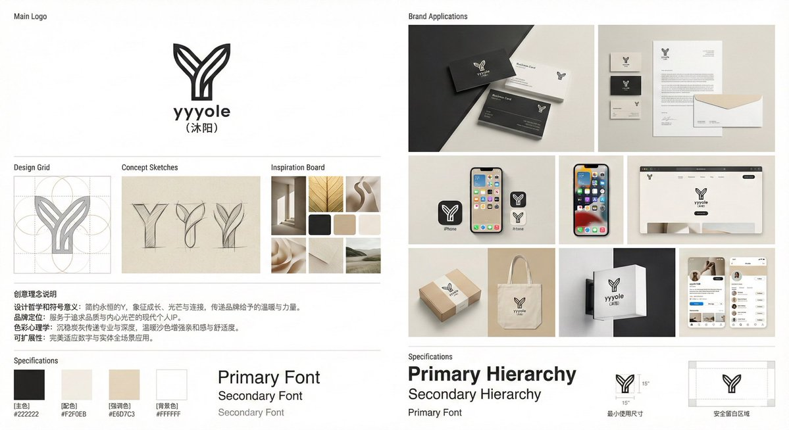

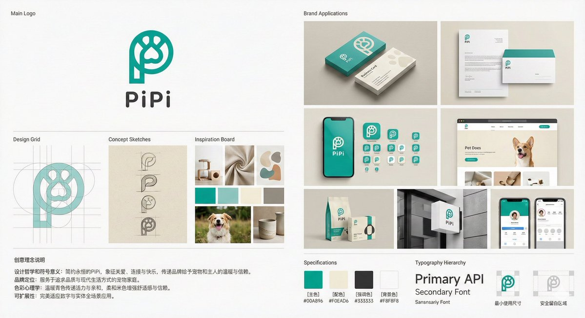

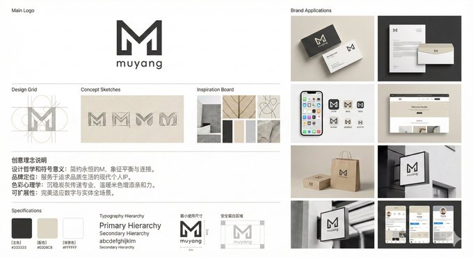

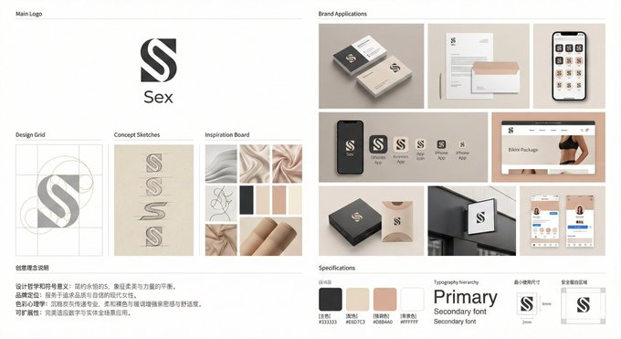

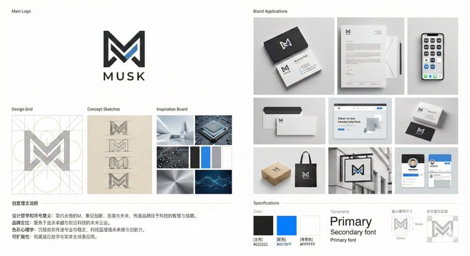

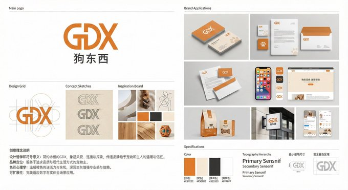

```
[yyyole]专业品牌视觉识别系统设计展示板，以杂志级排版呈现完整设计系统，布局干净现代。
行业属性：[个人IP]

核心包含元素：
主标志展示区 - 位于画面上方三分之一处居中：简约永恒的符号，核心元素为[Y]。抽象几何形态，留白强烈，线条简洁，视觉平静。搭配精致字体设计。
品牌名称[沐阳]采用小巧低调的无衬线字体，位于符号下方或旁边 - 视觉上比标志更柔和，字间距和对齐精心调整。人性化、精致、现代的字体 - 绝不喧闹，绝不抢眼。
配色方案：[主色]用于主标志，[配色]用于细节点缀，[背景色]用于画布。扁平矢量风格，高对比度，比例均衡。若无指定，自动形成配色方案。
设计网格区域 - 展示标志的几何构造线和黄金比例参考线，体现数学精准性和比例和谐美。
概念草图板块 - 3-4张手绘风格的探索草图，展示从初始创意到最终定稿的演变过程，横向排列，浅色铅笔质感，米色纸张底纹。
灵感来源板 - 精心策划的情绪板，包含：极简主义建筑摄影、自然形态、抽象几何图案、色彩样本、材质参考 - 均与[符号描述]概念相关。4-6张图片以雅致网格排列。
创意理念说明文字块 - 准确中文渲染-整洁的排版说明：
∙设计哲学和符号意义
∙该设计如何服务品牌定位
∙色彩心理学和视觉策略
∙可扩展性和多场景适应性
品牌应用样机区 - 真实场景应用展示-包括：
∙名片（正反面）
∙信纸信封
∙手机APP图标（多种尺寸）
∙网站页眉/网站图标
∙产品包装或购物袋
∙标识牌或店面门头
∙社交媒体头像
色彩与字体规范 - 专业设计规范展示：
∙主色、辅助色、强调色色块及色值编号
∙字体层级系统（主字体和辅助字体）
∙最小使用尺寸要求
∙安全留白区域指引
整体布局风格：纯白色或[背景色]背景，留白充足，瑞士/包豪斯风格网格系统，专业展示品质。元素组织清晰有层次 - 不拥挤。注释文字采用中文-柔和灰色字体。现代编辑设计美学，类似Behance或站酷作品集展示风格。
技术规格：8K分辨率，超高细节，清晰锐利，专业平面设计作品集品质，实物样机采用平铺摄影风格，完美光照，标志本身无渐变、无阴影（样机除外），无3D渲染，纯矢量美学。
```

 [↑返回目录](#toc)

---
## <a id="">奶凶动物玩偶</a> (<a href="https://x.com/xiaojietongxue/status/2008508944923213879" target="_blank" rel="noopener noreferrer">肖师傅</a>)

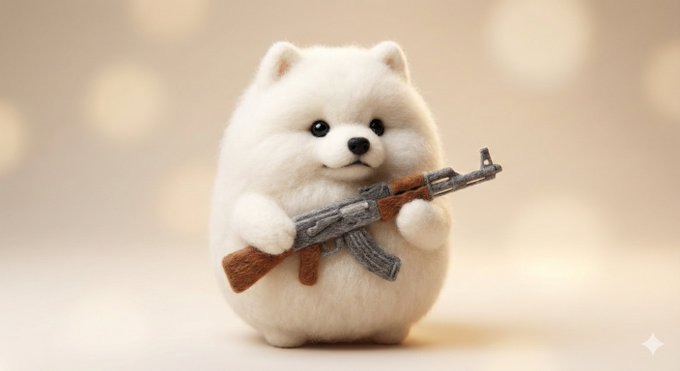

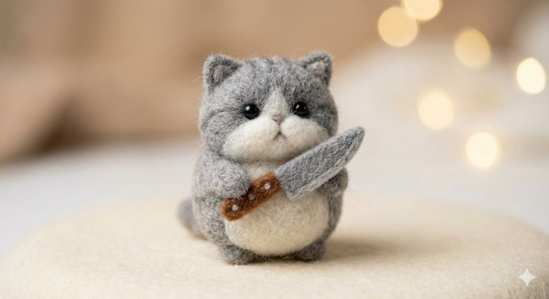

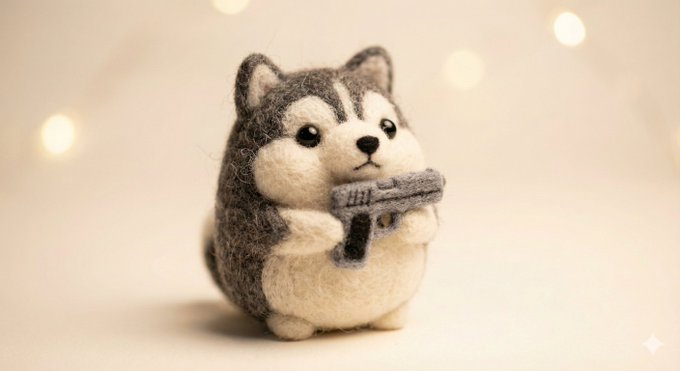

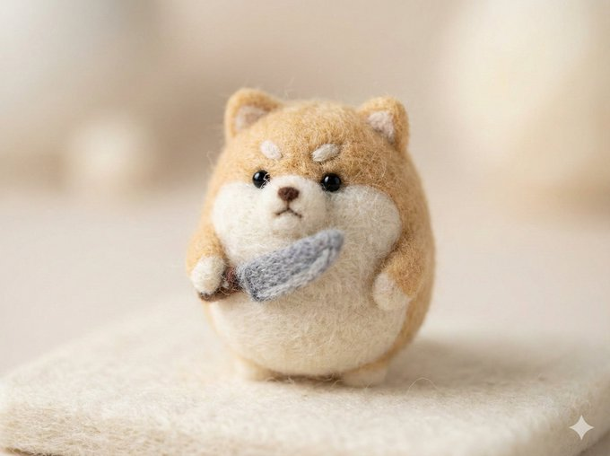

```
输入动物+武器，就可以生成，大家记得一键三连交作业哦！

GEM提示词如下，最近Gemini降智严重，如果遇到输出文字提示词，请新开窗口进行单独生成。

{
  "meta_prompt_config": {
    "target_model": "nano banana pro",
    "style_preset": "Needle Felted Cute 3D",
    "description": "Generates a cute, round, wool-felted animal holding a weapon, creating a humorous contrast."
  },
  "inputs": [
    "animal",
    "weapon"
  ],
  "prompt_template": "A high-quality macro photography shot of a tiny, round, handmade needle-felted {animal} holding a small {weapon}. The {animal} has a chubby, egg-shaped body, fluffy wool texture, and tiny beady black eyes. It is trying to look tough but looks incredibly adorable and harmless. The {weapon} is also made of felt or looks like a toy. Soft, warm studio lighting, clean white or soft beige blurred background, shallow depth of field, creamy bokeh, 8k resolution, highly detailed fiber texture, minimalist composition.",
  "negative_prompt": "real flesh, fur, frightening, horror, blood, violent, text, watermark, signature, blurry, low quality, deformed, bad anatomy, human hands, messy background, dark shadows",
  "example_usage": {
    "animal": "duck",
    "weapon": "kitchen knife",
    "result_prompt": "A high-quality macro photography shot of a tiny, round, handmade needle-felted duck holding a small kitchen knife. The duck has a chubby, egg-shaped body, fluffy wool texture, and tiny beady black eyes. It is trying to look tough but looks incredibly adorable and harmless. The kitchen knife is also made of felt or looks like a toy. Soft, warm studio lighting, clean white or soft beige blurred background, shallow depth of field, creamy bokeh, 8k resolution, highly detailed fiber texture, minimalist composition."
  }
}

#肖师傅 #ai邪修基地 #ai
```

 [↑返回目录](#toc)

---
## <a id="prompt-2008268262623122000">白色降噪耳机置于翠绿苔藓之上</a> (<a href="https://x.com/AllaAisling/status/2008268262623121817" target="_blank" rel="noopener noreferrer">Alexandra Aisling</a>)


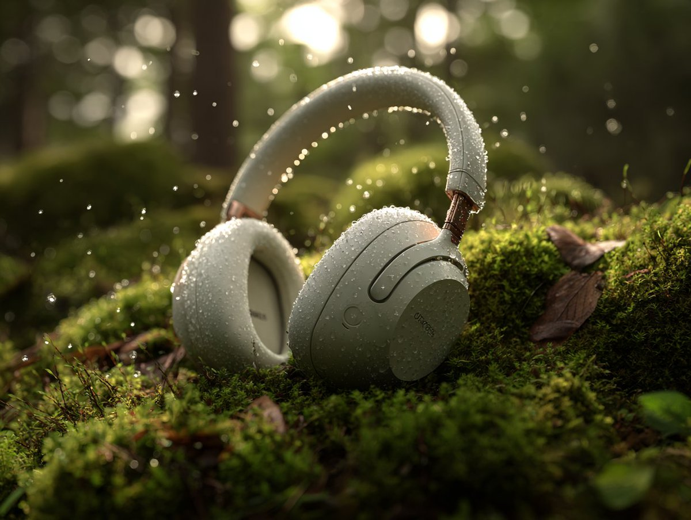

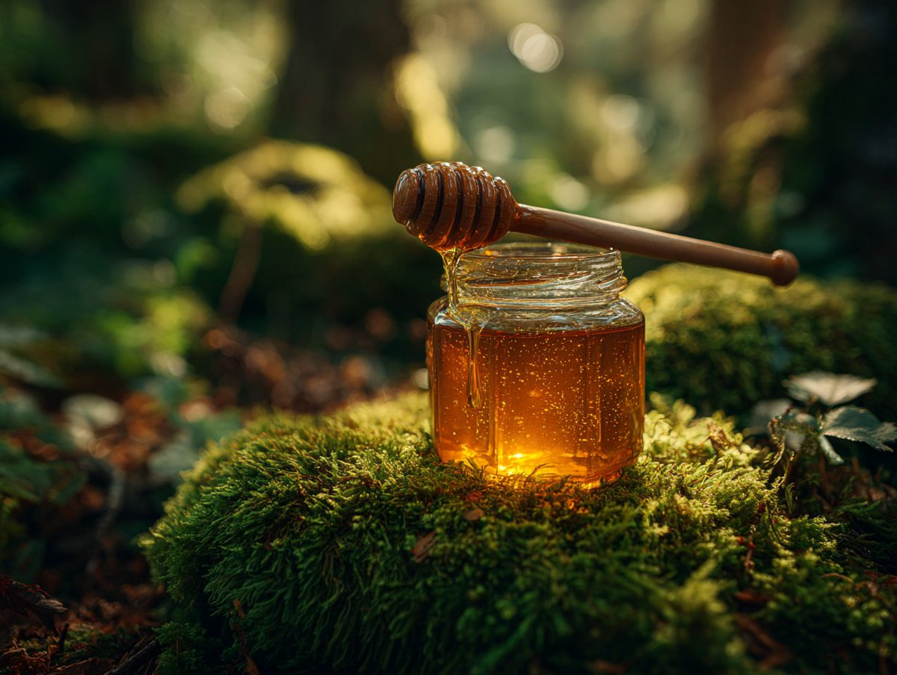

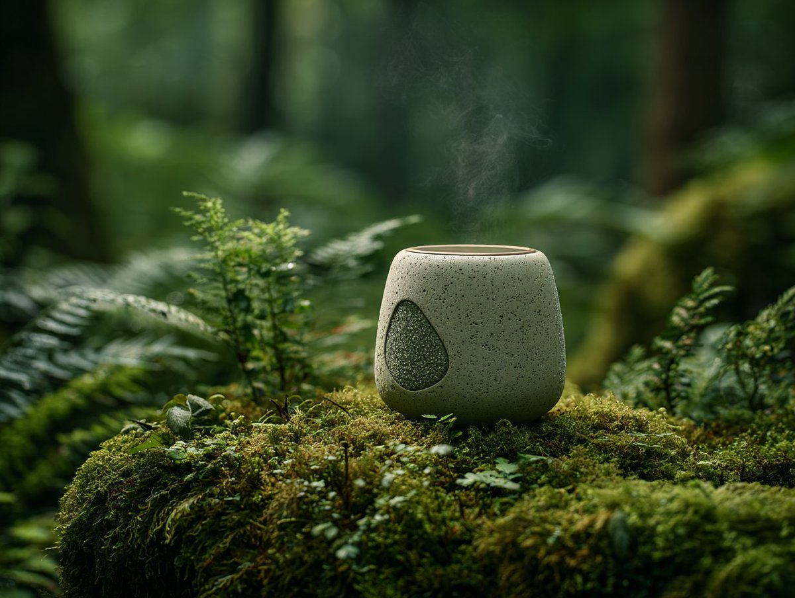

```
Handmade beeswax candle with dried flowers embedded resting on thick cushion of vibrant green moss, forest floor aesthetic, soft natural sidelighting, dewdrops glistening on wax surface, fairy tale setting, ancient forest energy, organic luxury
```

```
Matte white noise-canceling headphones resting on thick cushion of vibrant green moss, forest floor aesthetic, soft natural sidelighting, dewdrops glistening on ear cups, fairy tale setting, ancient forest energy, organic luxury
```

```
Glass jar of raw honey with wooden dipper resting on thick cushion of vibrant green moss, forest floor aesthetic, soft natural sidelighting, golden light refracting through honey, fairy tale setting, ancient forest energy, organic luxury
```

```
Matte ceramic smart aroma diffuser resting on thick cushion of vibrant green moss, forest floor aesthetic, soft natural sidelighting, dewdrops glistening on fabric mesh, fairy tale setting, ancient forest energy, organic luxury
```

 [↑返回目录](#toc)

---
## <a id="prompt-2008176822551216400">复古美式风格Figma品牌矢量字母设计</a> (<a href="https://x.com/AmirMushich/status/2008176822551216467" target="_blank" rel="noopener noreferrer">AmirMušić</a>)

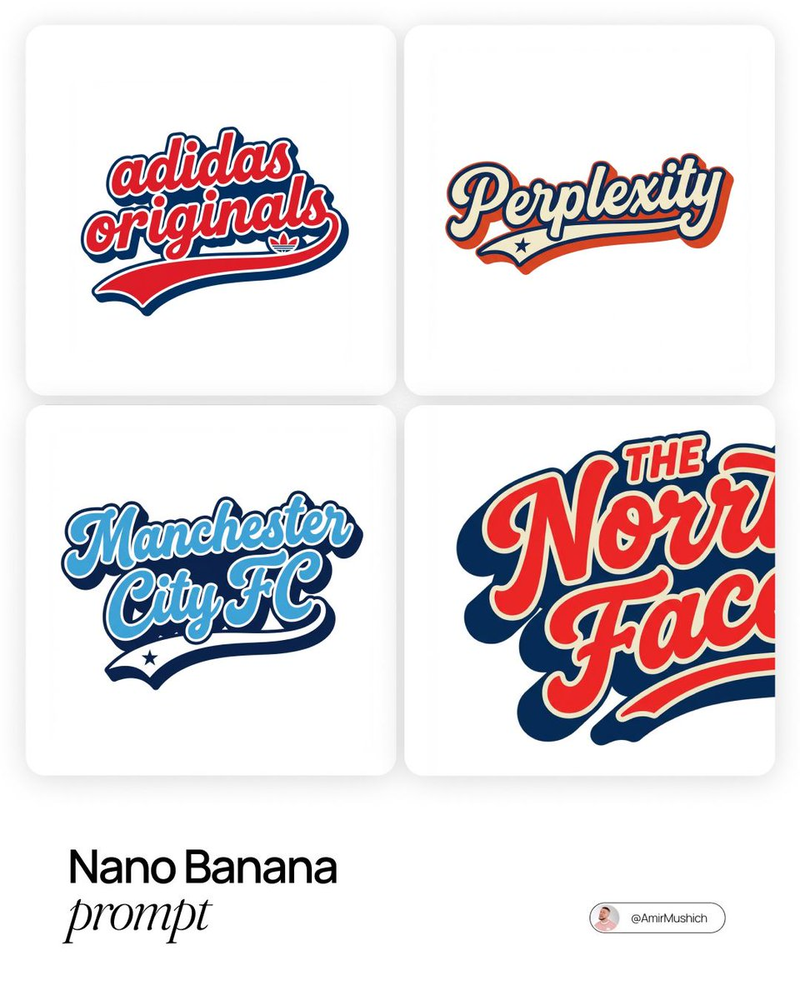

```
A bold, vibrant, retro-American vector lettering design displaying the name "Figma".

TYPOGRAPHY STYLE (FAT SCRIPT):

The text is rendered in a thick, chunky, hand-lettered "baseball script" or "bubble" style, reminiscent of 1950s-1970s American sports logos and automotive decals.

Form: The letters are heavy, rounded, and tightly connected (ligatures).

Perspective: The text line should be slightly slanted upwards or arched to create dynamic energy.

Effects: Apply a thick, bold outline around the text. Crucially, add a deep, solid "block shadow" (extrusion) behind the letters to create a heavy 3D pop-out effect, characteristic of vintage sticker art.

COLOR PALETTE (BRAND VINTAGE):

Use a bright, saturated, and flat color palette inspired by [BRAND NAME]'s identity but filtered through a retro pop-art lens.

Fill: Solid, punchy colors (no gradients).

Contrast: High contrast between the letter fill, the outline (usually white or cream), and the block shadow (usually a darker shade or contrasting color).

DECORATIVE ELEMENTS:

Keep it clean and vector-like. You may include subtle, classic "Americana" design elements integrated into the text flow, such as a "swoosh" underline, a simple star, or a very simplified icon relevant to the brand (e.g., a lightning bolt for energy, a leaf for eco). Do NOT over-detail; keep it looking like a printed logo.

BACKGROUND:

Isolated on a clean, pure white background. No paper textures, no noise, no dirt.
```

```
一款大胆、鲜艳、复古美式风格的矢量字母设计，展示名称“Figma”。

字体风格（粗体手写体）：  
文字采用厚重、块状的手绘“棒球手写体”或“气泡体”风格，让人联想到1950至1970年代美国体育队徽和汽车贴纸。

字形：字母粗重、圆润，并紧密连接（连字设计）。  
透视：文字线条略微向上倾斜或呈弧形，营造动感活力。  
效果：文字周围添加粗厚醒目的描边，并在字母后方加入深色、实心的“块状投影”（挤出效果），形成强烈的3D凸出感，体现复古贴纸艺术的典型特征。

配色方案（品牌复古风）：  
采用明亮、饱和且平涂的色彩组合，灵感源自[品牌名称]的品牌识别色，但经过复古波普艺术滤镜处理。  
填充：使用纯色、鲜明的颜色（无渐变）。  
对比：字母填充色、描边（通常为白色或米色）与块状投影（通常为深色或对比色）之间形成高对比度。

装饰元素：  
保持简洁、矢量风格。可融入细微的经典“美式复古”设计元素，如流畅的“飘带”下划线、简单星形，或与品牌相关的极简图标（例如闪电代表能量，树叶代表环保）。切勿过度细节，整体应呈现印刷标志的干净感。

背景：  
置于纯净白色背景上，无纸张纹理、噪点或污渍。
```

 [↑返回目录](#toc)

---
## <a id="prompt-2008488331903139800">五彩橡皮泥打造的微型地标世界</a> (<a href="https://x.com/TechieBySA/status/2008488331903139874" target="_blank" rel="noopener noreferrer">TechieSA</a>)

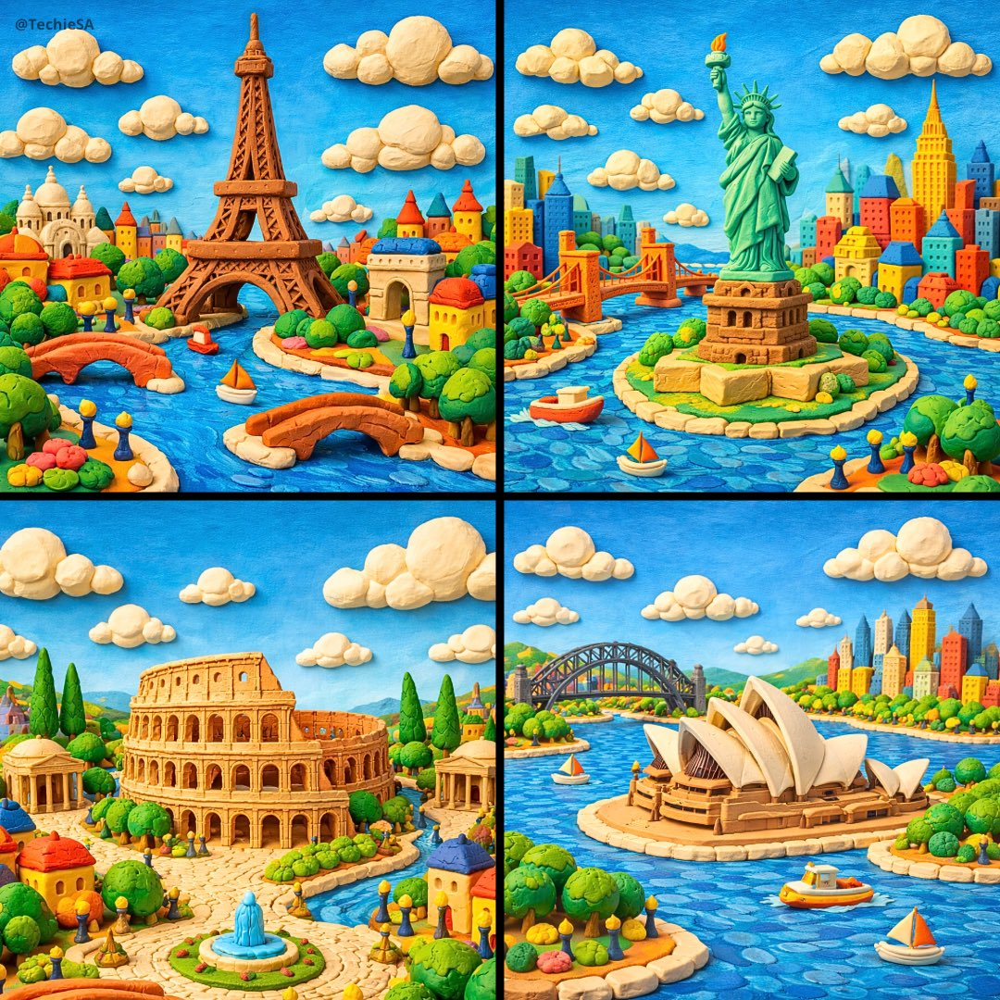

```
Generate a whimsical miniature world featuring [LANDMARK NAME] crafted entirely from colorful modeling clay. Every element - buildings, trees, waterways, and urban features - should appear hand-sculpted with visible fingerprints and organic clay textures. Use a playful, childlike style with vibrant colors: bright azure sky, puffy cream clouds, emerald trees, and buildings in warm yellows, oranges, reds, and blues. The handmade quality should be evident in every surface and gentle curve.
Capture from a wide perspective showcasing the entire miniature landscape in a harmonious, joyful composition. Include no text, words, or signage - only sculptural clay elements that define the location through recognizable architectural features. 1080x1080 dimension.
```

```
创作一个充满奇趣的微型世界，以[地标名称]为主题，全部由五彩缤纷的橡皮泥手工捏制而成。所有元素——建筑、树木、水道和城市设施——都应呈现出手工塑造的质感，带有清晰可见的指纹和天然的黏土纹理。采用活泼童趣的风格，使用鲜艳的色彩：明亮的蔚蓝天空、蓬松的奶油色云朵、翠绿色的树木，以及由温暖的黄色、橙色、红色和蓝色构成的建筑。每一处表面与柔和曲线都应体现出鲜明的手工感。  
从广角视角捕捉整个微型景观，构图和谐而欢快。画面中不得包含任何文字、单词或标识，仅通过可辨识的建筑特征以雕塑化的黏土元素来表现该地点。图像尺寸为1080x1080。
```

 [↑返回目录](#toc)

---
## <a id="prompt-2008248159815037000">超现实风格品牌广告海报</a> (<a href="https://x.com/aziz4ai/status/2008248159815036942" target="_blank" rel="noopener noreferrer">AZIZ | AI 🇸🇦</a>)

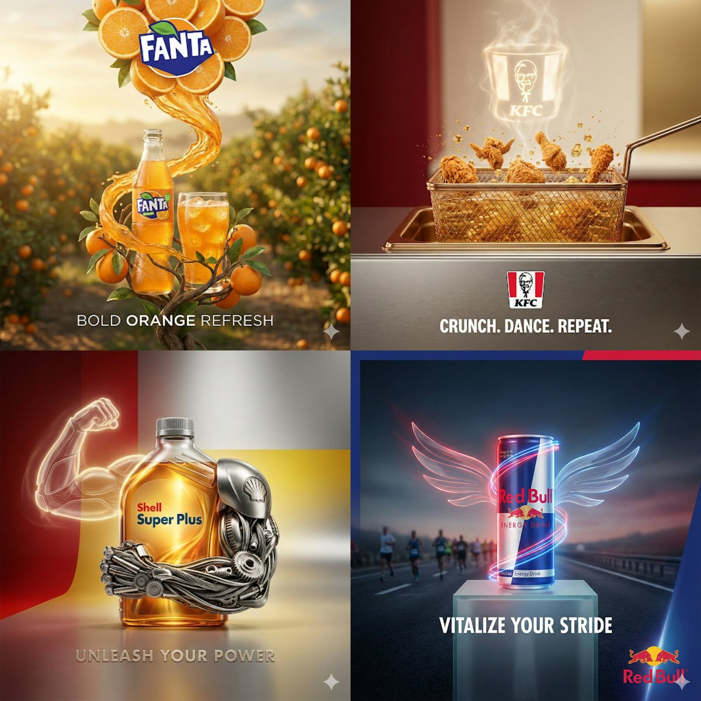

```
INSANE Surreal Brand Ads

Type ANY product name and get a cinematic print ad: real logo, brand colors, premium materials, plus a mind-blowing twist that fits the product, and a killer 3-word slogan.

The prompt in the next comment ⬇️
```

```
疯狂超现实品牌广告  

输入任意产品名称，即可生成一张电影级印刷广告：真实品牌标志、品牌专属配色、高端材质，并融入与产品契合的震撼创意转折，以及一句三词组成的强力口号。
```

 [↑返回目录](#toc)

---
## <a id="prompt-2008174532285350400">果树种植科普展板</a> (<a href="https://x.com/LZhou15365/status/2008174532285350353" target="_blank" rel="noopener noreferrer">小洲洲的AI日常</a>)

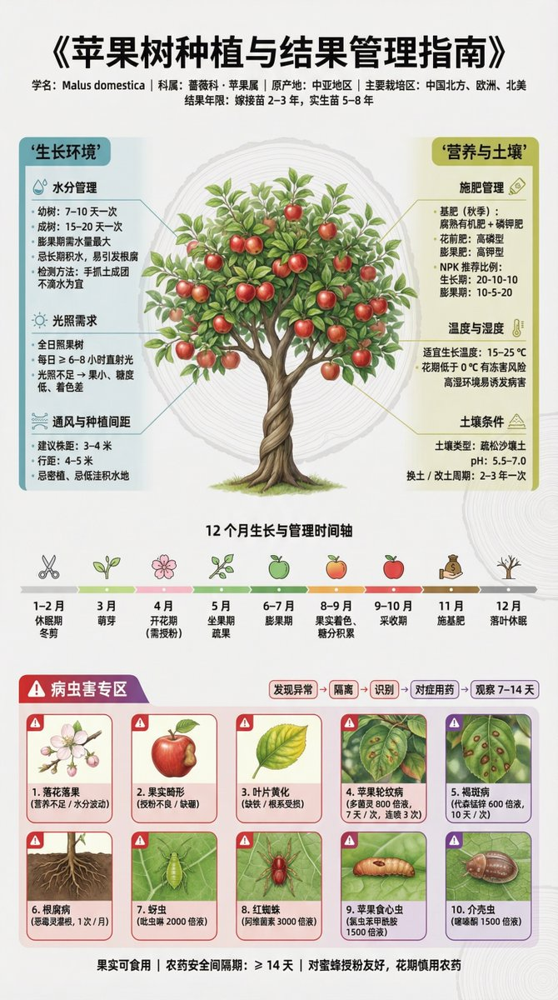

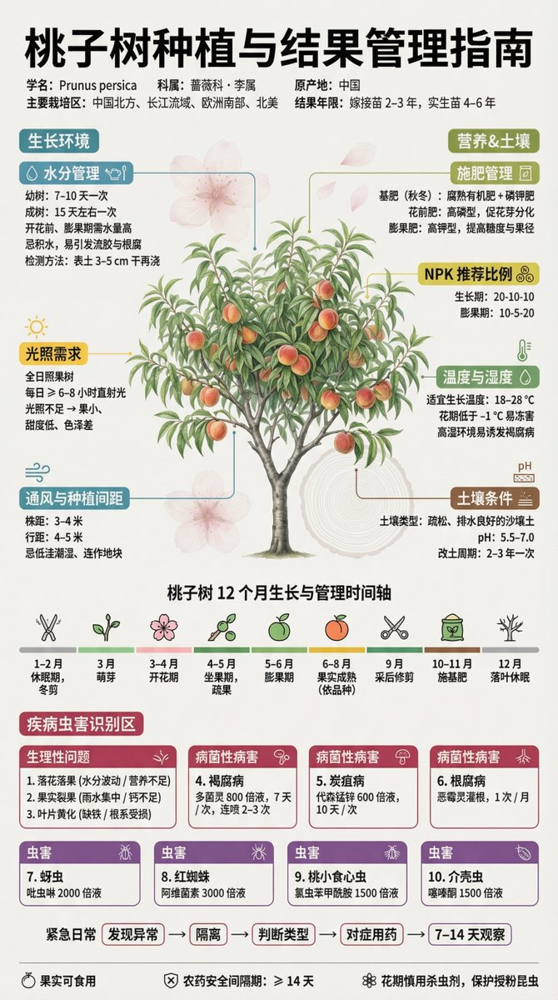

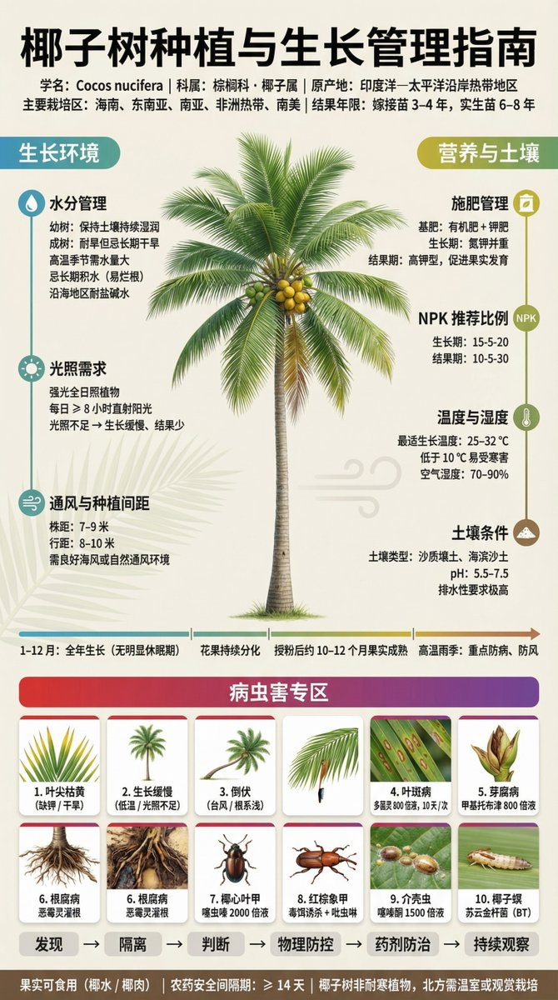

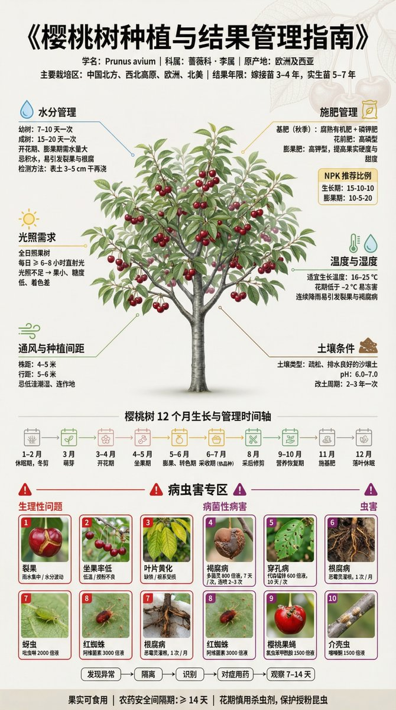

```
【主标题】
「××果树种植与结果管理指南」
字体：思源黑体 / 思源宋体混排，确保中文清晰渲染

【副标题】

学名 · 科属 · 原产地 · 主要栽培区 · 结果年限
【中央视觉】

画面中心 25%：
成熟健康的果树实物形态（可选：盆栽 / 幼树 / 结果期枝条），
 写实自然博物馆标本风格，树干、叶脉、果实细节清晰

背景：
浅色极简底（米白 / 浅灰）
淡雅农业几何纹样 / 果树年轮 / 叶脉结构底纹（透明度 15–20%）

【信息布局｜自动填充真实农业数据】

左侧（蓝绿色系 · 生长环境）
水分管理
幼树 / 成树浇水频率

不同生长期（萌芽 / 开花 / 膨果 / 休眠）需水差异
灌溉方式（滴灌 / 漫灌）

土壤含水量判断方法

光照需求
全日照 / 半日照

每日有效光照时长

光照不足 / 过强的结果影响对比图

通风与间距

行距株距建议

忌密植、忌积水低洼环境

右侧（黄绿色系 · 营养与土壤）

施肥管理

基肥 / 追肥 / 花前肥 / 果后肥

NPK 比例饼图（不同时期）

施肥频率与禁忌（避免烧根）

温度与湿度

四季生长温度曲线

花期低温风险提示

湿度过高导致病害示意

土壤条件

土壤类型（沙壤土 / 腐殖土）

pH 范围

改土方案（有机质 / 石灰 / 硫磺粉）

【中部横条】

12 个月果树生长与管理时间轴

修剪期

萌芽期

开花授粉期

坐果期

膨果期

采收期

休眠期
（图标化呈现）

【下方病虫害专区｜占 30%｜红紫警示色】

10 项果树常见病虫害识别卡片（3 行网格）

生理性问题

落花落果（营养 / 温度 / 水分）

果实畸形（授粉不良 / 缺硼）

叶片黄化（缺铁 / 缺氮 / 根系问题）

病菌性病害
4. 炭疽病
5. 褐斑病
6. 根腐病
虫害
7. 蚜虫
8. 红蜘蛛
9. 果实蝇
10. 介壳虫

每张卡片包含：
症状特写图（40%）

识别要点

具体防治方案

药剂名称 + 稀释倍数 + 使用频次
示例：
 代森锰锌 600 倍液，7 天 / 次，连喷 2–3 次

应急处理流程图
发现 → 隔离 → 判断 → 对症处理 → 持续观察

【底部信息栏】
果实可食性说明
农药安全间隔期
对蜜蜂 / 宠物 / 人类安全提示

【设计规范】
信息密度：高（留白约 25%）
连接线：由果树向外放射，极细线条
色彩编码：
蓝 = 水分
黄 = 光照
绿 = 营养
红 = 病害
紫 = 虫害
字级层级：
主标题 16pt
正文 12pt
备注 9pt

图标：统一线性农业科普风格

中文排版：行距 1.5，紧凑易读

病害卡片：红色边框 + 症状放大图

【风格参考】

日本果树试验站导览牌

现代自然博物馆农业信息墙
DK《果树栽培图鉴》

【技术参数】
正面平视 / 微俯视
柔和自然光
中大景深
4K 超高清
真实农业与园艺摄影级细节

【关键要求（非常重要）】

所有种植数据、病虫害信息、农药名称与使用浓度，需根据所选果树品种自动填充真实、准确、可查证的专业农业数据

英文补充（生图权重）

fruit tree cultivation guide poster, high-density agricultural infographic,
museum exhibition style, fruit tree growth cycle, pest and disease identification,
Chinese typography, minimalist background, professional horticulture data,
realistic fruit tree specimen, 4K ultra high resolution
```

 [↑返回目录](#toc)

---
## <a id="prompt-2008431391235862800">Inkstorm Noir</a> (<a href="https://x.com/aleenaamiir/status/2008431391235862892" target="_blank" rel="noopener noreferrer">Aleena Amir</a>)

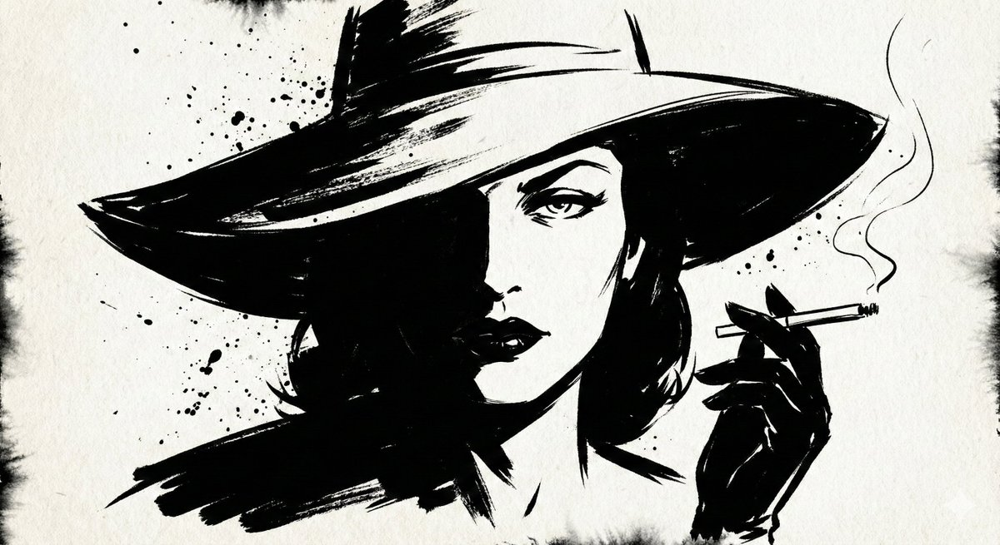

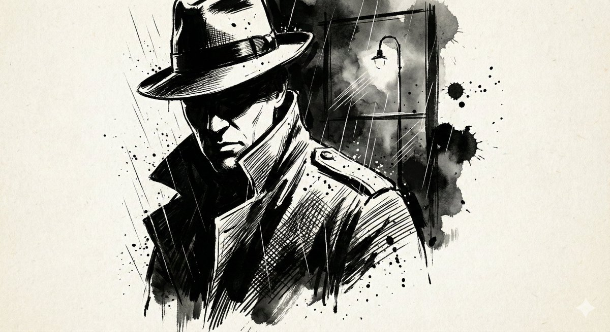

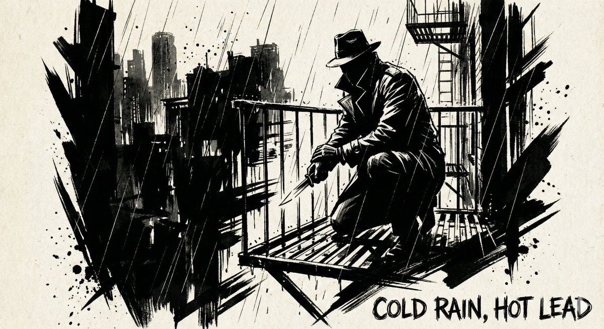

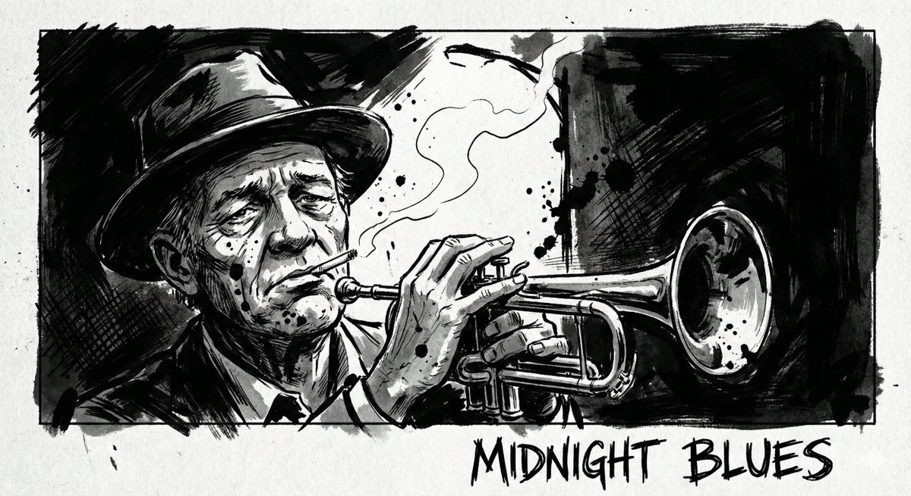

```
A high-contrast ink noir portrait of [SUBJECT], illustrated entirely with expressive black ink strokes and controlled splatter. Heavy shadows dominate the composition while selective highlights emerge through negative space. Subtle paper grain is visible. Atmosphere is moody, cinematic, and intense, like a graphic novel frozen at its most dramatic panel.
```

```
一幅高对比度的黑色墨水肖像画，完全以富有表现力的黑色墨水笔触和受控的飞溅效果绘制而成。画面以浓重的阴影为主，通过留白形成局部高光。纸张的细微纹理清晰可见。整体氛围阴郁、电影感十足且极具张力，宛如一部图像小说中定格在最戏剧性的一幕。
```

 [↑返回目录](#toc)

---
## <a id="prompt-2008209545412419800">梅西的暗影肖像</a> (<a href="https://x.com/Sheldon056/status/2008209545412419746" target="_blank" rel="noopener noreferrer">Duet | AI</a>)

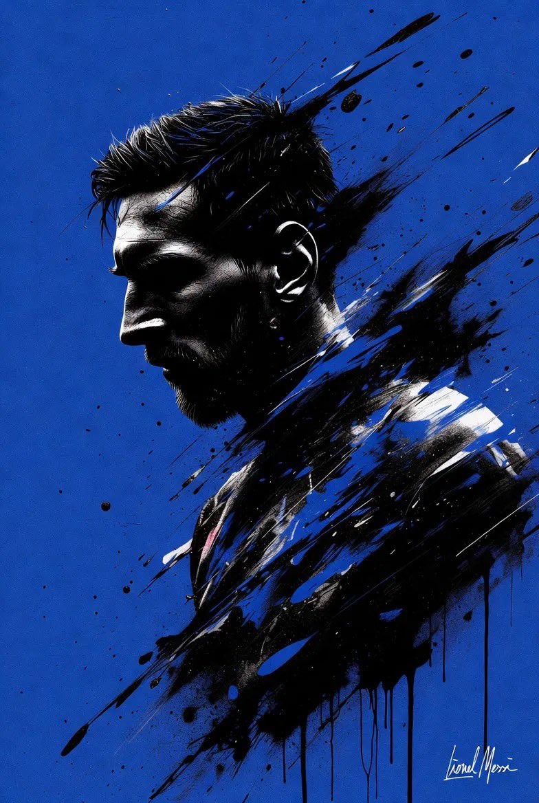

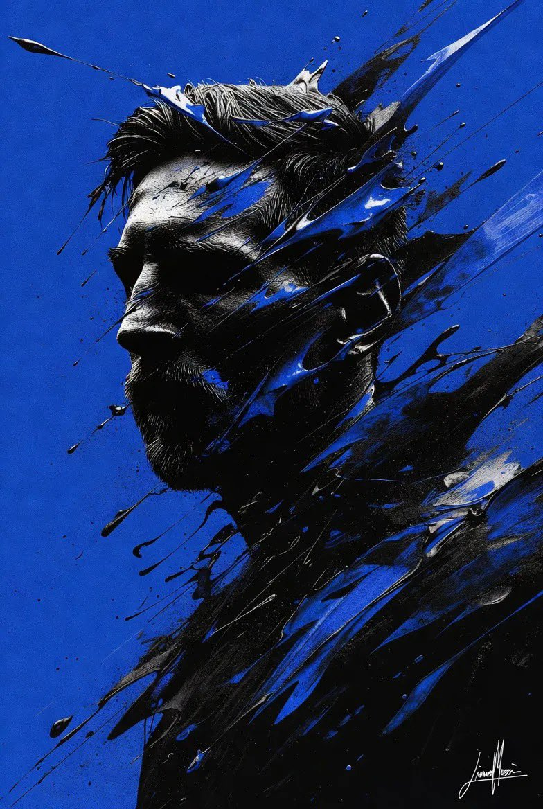

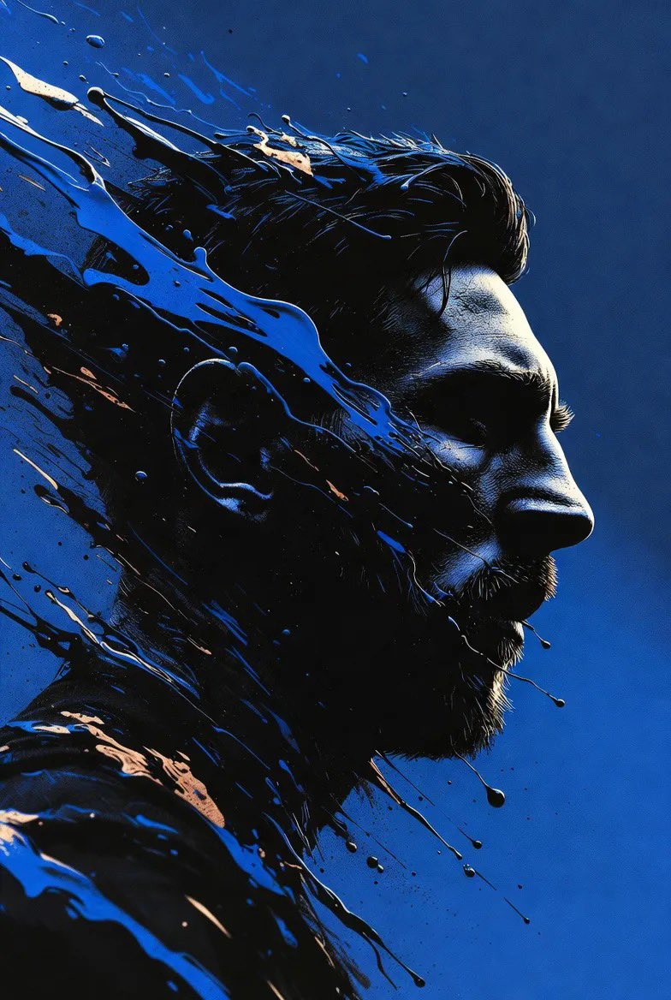

```
Convert this image into a dramatic, stylized portrait (use the same face as the uploaded photo), 9:16 aspect ratio, featuring a dark, almost silhouetted figure in profile looking to the left. The background is a deep electric blue. Intense black and sapphire paint splashes burst outward from the head and shoulders, creating powerful motion energy. Ultra-sharp lighting, cinematic contrast, HD photo.
Signature: Lionel Messi
```

 [↑返回目录](#toc)

---
## <a id="prompt-2008319307667645000">电影剧照：低调高对比度的冷调场景</a> (<a href="https://x.com/RobotCleopatra/status/2008319307667644815" target="_blank" rel="noopener noreferrer">Skipper</a>)

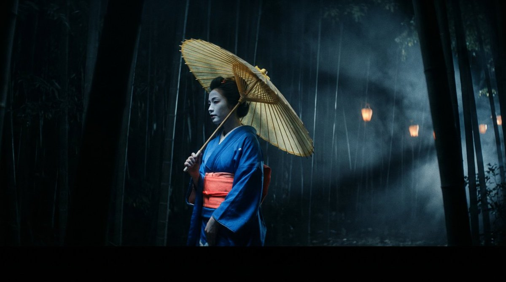

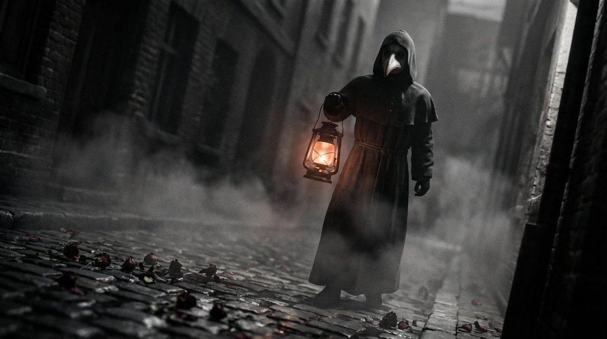

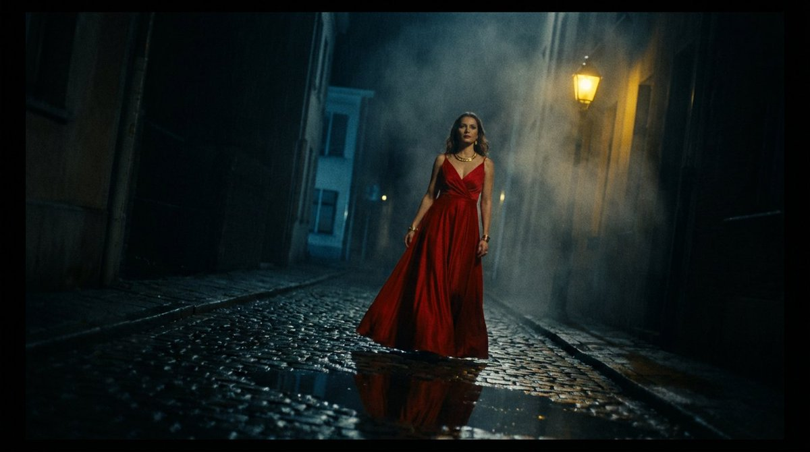

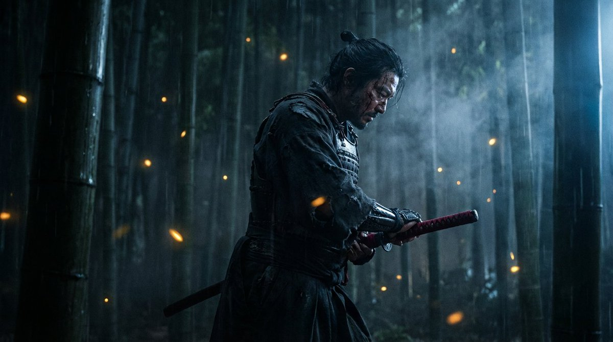

```
GOLDEN PROMPT FOR MOVIES 
[SUBJECT], single frame film still, medium wide shot composition, eye-level camera with subtle dutch angle 5 degrees, Cooke S4 75mm prime lens T2.0 wide open, extremely shallow depth of field with focus fall-off, dramatic side lighting from frame right at 90 degrees, deep contrast low-key illumination, shadow density at 95% black, lifted blacks avoided, rich dark tones dominating 70% of frame, cool desaturated color palette with steel blue undertones, bleach bypass processing look, shot on ARRI Alexa LF with vintage Kowa anamorphic glass, organic halation on highlights, smoky atmospheric density, volumetric light cutting through darkness, no fill light pure shadow areas, cinemascope framing with subject in lower third, subtle depth parallax movement for animation layers. @Adobe @AdobeFirefly boards.
```

```
电影黄金提示词：  
[主体]，单帧电影剧照，中远景构图，水平视角相机搭配5度轻微荷兰角，使用Cooke S4 75mm定焦镜头，光圈全开至T2.0，极浅景深并带有焦点衰减效果，画面右侧90度方向施加强烈侧光，低调高对比照明，阴影密度达95%纯黑，避免提亮暗部，画面70%区域以浓郁深色调为主，冷调低饱和色彩搭配钢蓝色基调，采用漂白反差冲洗工艺风格，ARRI Alexa LF摄影机搭配复古Kowa变形镜头拍摄，高光呈现自然光晕，烟雾弥漫的空气质感，体积光穿透黑暗，无补光、纯阴影区域保留，宽银幕画幅构图，主体位于画面下三分之一处，动画图层带有细微纵深视差运动。
```

 [↑返回目录](#toc)

---
## <a id="prompt-2008434033701879800">超写实的影棚摄影作品</a> (<a href="https://x.com/iamsofiaijaz/status/2008434033701879836" target="_blank" rel="noopener noreferrer">Aijaz</a>)


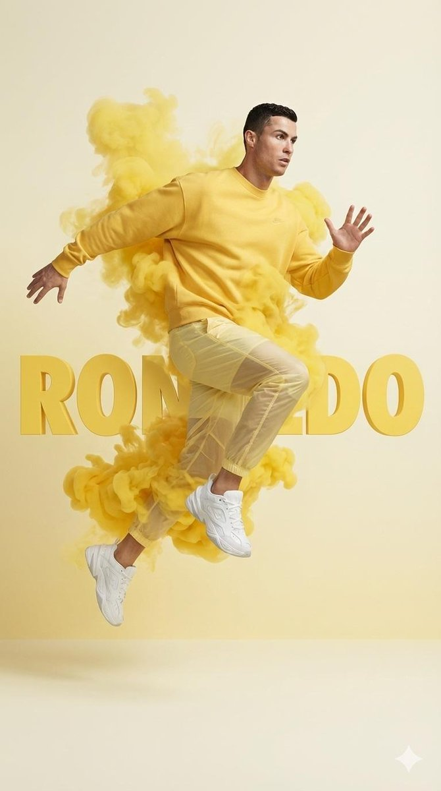

```
1.A hyper-realistic studio photograph of a male athlete mid-air as if running or jumping, wearing a pastel pink sweatshirt and light pink jogger pants, with soft blue sneakers. Pink powder smoke is exploding and swirling around his body, especially behind him and around his legs, creating a dynamic motion effect. Clean minimal background with a soft gradient from light gray to pale pink. Cinematic lighting, ultra-sharp focus, shallow depth of field, fashion advertising style, high detail, 8k, soft shadows, professional studio photography.
2.A hyper-realistic studio photo of a male athlete jumping in mid-air, wearing a monochrome yellow outfit (sweatshirt and joggers) with white sneakers, surrounded by dramatic yellow powder smoke exploding around his body, frozen motion, clean minimal pastel yellow background, cinematic lighting, high contrast, sharp focus, fashion advertising style, ultra detailed, 8k, professional photography, dynamic pose, modern sporty aesthetic
```

```
1. 一张超写实的影棚摄影作品，画面中一名男运动员仿佛在奔跑或跳跃的空中瞬间，身穿淡粉色连帽衫和浅粉色慢跑裤，脚踩柔和蓝色运动鞋。粉红色粉末烟雾在他身体周围爆炸并盘旋，尤其集中在身后和腿部，营造出动态的运动效果。背景干净简约，由浅灰色渐变为淡粉色。采用电影级灯光、超锐利对焦、浅景深、时尚广告风格、高细节、8K分辨率以及柔和阴影的专业影棚摄影。

2. 一张超写实的影棚照片，一名男运动员在空中跳跃，身穿单色黄色套装（连帽衫与慢跑裤）搭配白色运动鞋，身体周围环绕着戏剧性的黄色粉末烟雾，呈现出爆炸般的定格动态效果。背景为干净简约的淡黄色，采用电影级灯光、高对比度、锐利对焦、时尚广告风格、极致细节、8K分辨率、专业摄影手法、动态姿势以及现代运动美学。
```

 [↑返回目录](#toc)

---
## <a id="">空气感·清透治愈的女生</a> (<a href="https://x.com/berryxia/status/2008913659582681255" target="_blank" rel="noopener noreferrer">Berryxia.AI</a>)

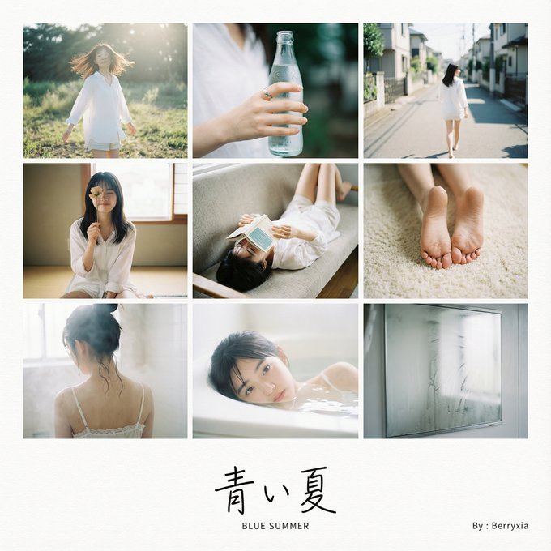

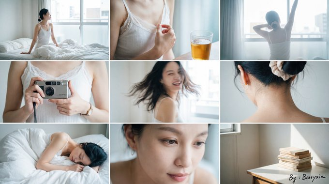

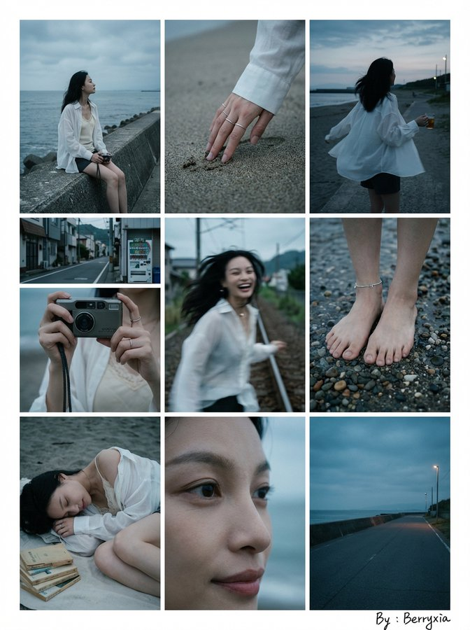

```
**[Type]:** A scanned page from a high-end Japanese photobook (Shashin-shu). **A 9-grid photo layout printed on textured matte art paper.**
**[Layout Design]:** The 9 photos are arranged in a clean grid with **wide white margins** at the bottom to accommodate typography.

**[Subject Consistency - STRICT]:**
* **Source:** Based strictly on the uploaded reference image. **[SAME CHARACTER IN ALL PANELS]**.
* **Styling Strategy:** **[RANDOMLY SELECT ONE]:**
    1.  **{Classic}:** Loose white shirt + shorts.
    2.  **{Soft}:** Beige knit cardigan + camisole.
    3.  **{Pure}:** **White lace-trimmed slip dress** (Best for bath transitions).
    * **Note:** In Row 3 (Bath), outfit creates a "wet look" or shows skin.

**[Typography & Japanese Elements - THE ARTISTIC TOUCH]:**
*(AI must render a title text in the bottom white margin)*
**[RANDOMLY SELECT ONE Title Theme]:**
1.  **{Theme: Summer}:** Large Japanese text **"青い夏"** with small English text **"BLUE SUMMER"** below it.
2.  **{Theme: Private}:** Large Japanese text **"私小説"** with small English text **"PRIVATE NOVEL"** below it.
3.  **{Theme: Air}:** Large Japanese text **"空気感"** with small English text **"AIRY MOMENTS"** below it.
* **Signature:** The handwritten text **"By : Berryxia"** is placed artistically next to the title or in the corner like a watermark.

**[Grid Narrative - The "Day to Night" Journey]:**

**Row 1: Outdoor Breath (Wind & Light)**
1.  **Top-Left (Wide):** Subject standing in wind, hair blowing, **backlit by sun**.
2.  **Top-Middle (Detail):** Close-up of **hand holding a glass bottle of soda** or blocking the sun.
3.  **Top-Right (Motion):** Blurry candid shot of subject **walking away on a street**.

**Row 2: Indoor Play (Props & "Hiding")**
4.  **Center-Left (Hiding):** Subject sitting on tatami, **using a dried flower to cover one eye**.
5.  **Center (Candid):** Subject **lying upside down on a sofa**, reading a book, face partially hidden.
6.  **Center-Right (Fetish):** Focus on **bare feet curled on the rug** or fingers touching hair.

**Row 3: Private/Wet (Steam & Skin)**
7.  **Bottom-Left (Steamy Back):** **Back view in a steamy bathroom**. Wet hair sticking to nape of neck. Soft focus.
8.  **Bottom-Middle (Immersion):** Subject **submerged in bathtub**, water up to chin. Dreamy high-key lighting.
9.  **Bottom-Right (End):** Detail of **steam on a mirror**.

**[Aesthetic Style]:**
* **Film Stock:** Fujifilm Pro 400H (Cyan shadows, airy highlights).
* **Texture:** **Visible paper texture**, slight vignetting, layout design style.

**[Parameters]:** --ar 2:3 --style raw --v 6.0 --stylize 200 --cref [URL] --cw 80 --no commercial smile, stiff posing, studio lighting 使用室内旅馆内风格B输出
```

 [↑返回目录](#toc)

---
## <a id="prompt-2008903682612760800">动物萌化系列</a> (<a href="https://x.com/LufzzLiz/status/2008903682612760944" target="_blank" rel="noopener noreferrer">岚叔</a>)

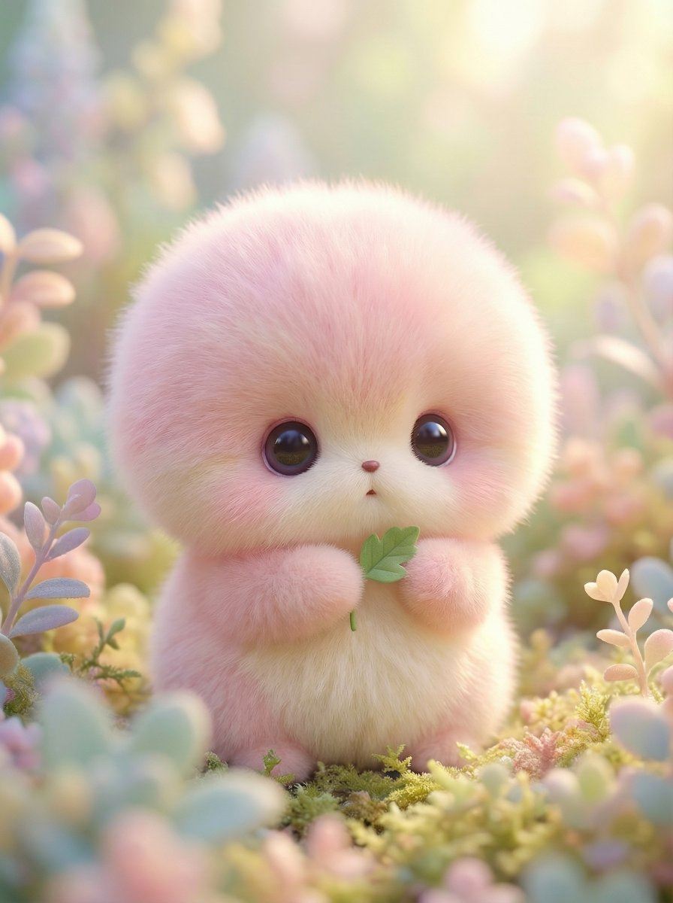

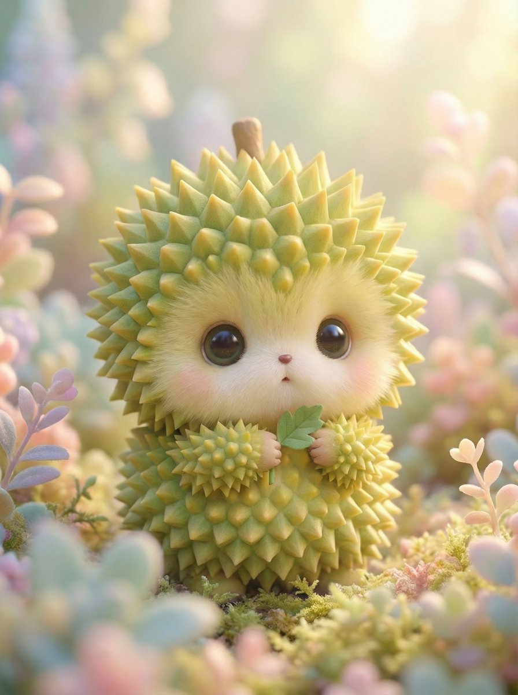

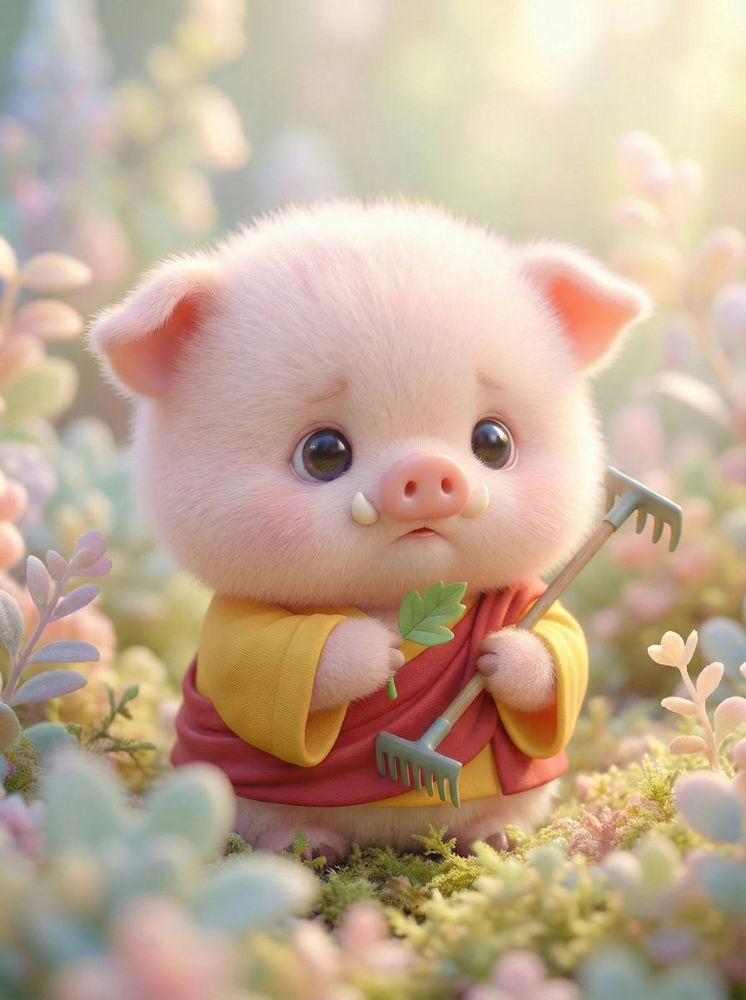

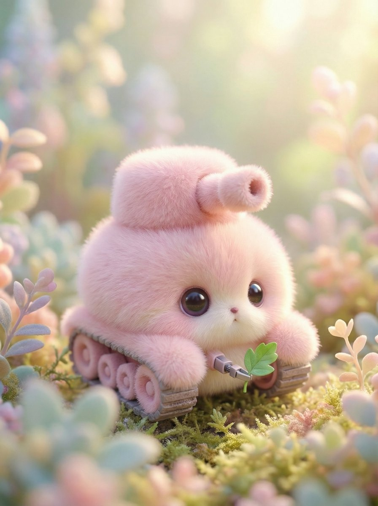

```
An ultra-cute, baby-like embodiment of all things, shaped like a tiny fluffy puff,
with an oversized round head and an extremely small body.
Huge glossy eyes placed low on the face,
a tiny dot mouth, and no visible nose.

It gently holds a small leaf with its short, stubby paws,
looking slightly unsure and vulnerable.
Soft pastel colors, very soft lighting,
a dreamy atmosphere—maximum cuteness, heart-melting.
```

 [↑返回目录](#toc)

---
## <a id="prompt-2008600010943025200">高端身体喷雾AUREN的超写实产品摄影</a> (<a href="https://x.com/SiboEsenkova/status/2008600010943025240" target="_blank" rel="noopener noreferrer">Sibo Esenkova</a>)

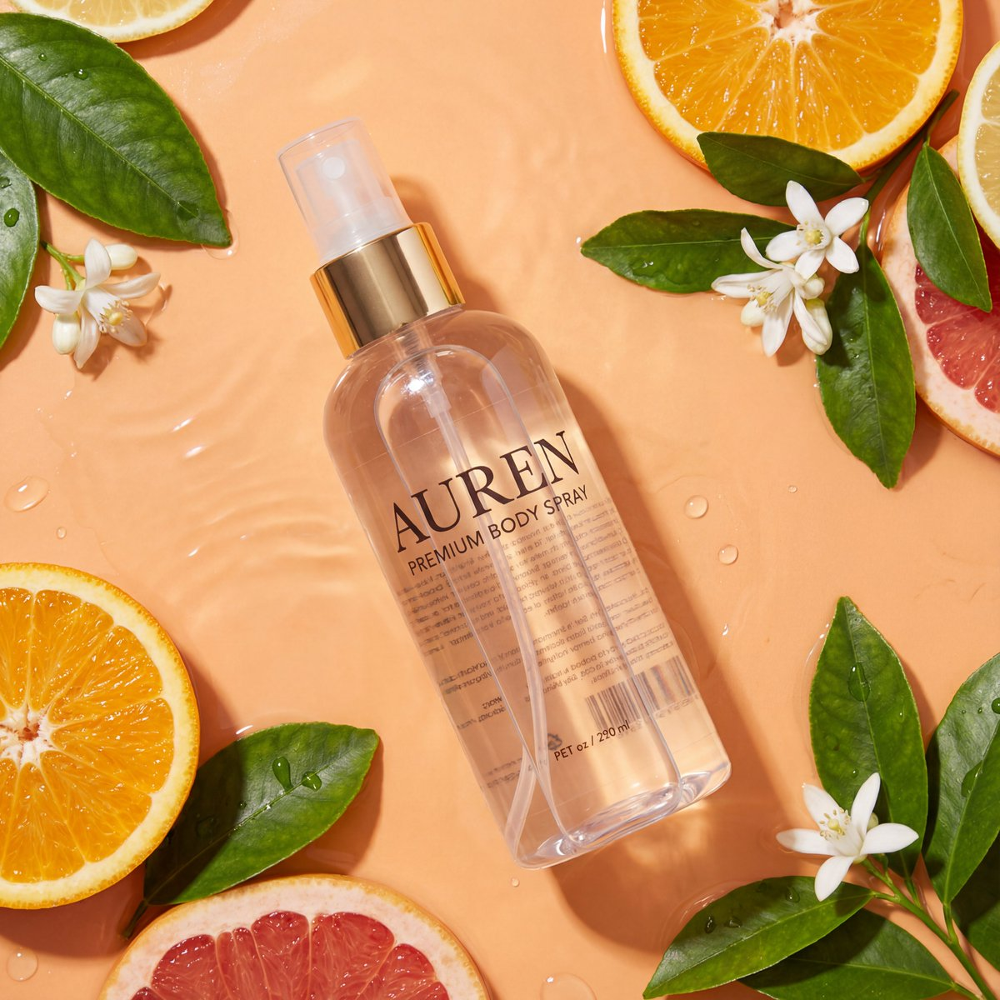

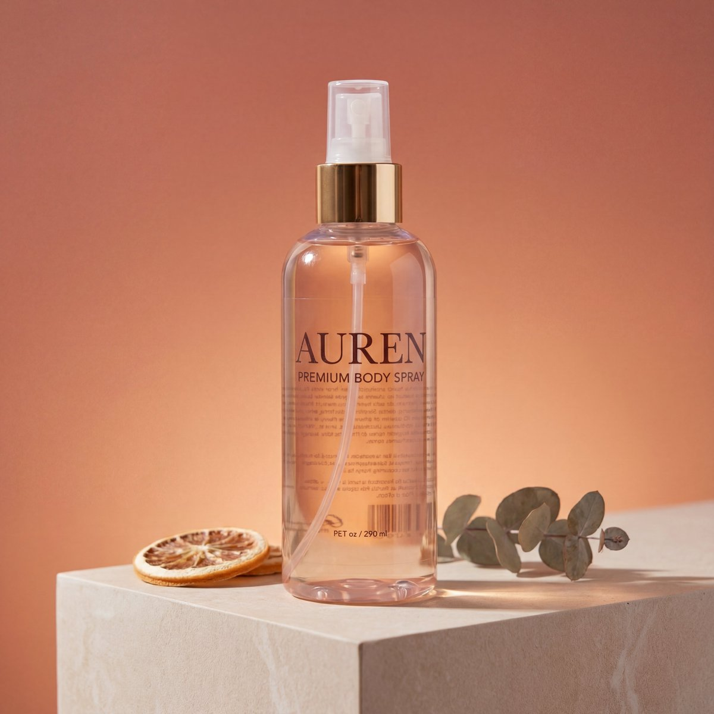

```
Ultra high-end photorealistic cosmetic product photography for a premium body spray brand, AUREN.
The bottle realism is the absolute priority.

Hero product – bottle accuracy:
AUREN body spray bottle made of transparent PET plastic, lightweight cosmetic packaging.
Clearly visible liquid level inside the bottle.
Slight natural plastic distortion, not perfectly rigid.
Realistic internal reflections inside the bottle.
Plastic spray pump with gold-toned metal collar, identical realism to mass-market premium body sprays.
Transparent plastic cap with subtle thickness and edge refractions.
No glass look. No luxury perfume bottle look.
This is a real cosmetic body spray, not a fragrance bottle.

Label:
Printed paper label wrapped around the bottle.
Slight curvature following the bottle shape.
No floating label.
No embossed fantasy effects.
Ink looks printed, not digital.
Typography sharp and readable.
Brand name: AUREN.

Scene & composition:
Top-down studio product shot, very similar to the reference image.
Bottle placed flat on surface.
Centered composition.
Surrounded by real botanical elements.
Fresh green leaves with visible veins and imperfections.
Small white flowers.
Citrus fruit with natural pores and uneven texture.
Water droplets randomly scattered, imperfect, natural.

Surface & background:
Warm peach-orange background, slightly wet surface.
Subtle water ripples and reflections.
Natural imperfections on the surface.
No artificial gradients.

Lighting:
Professional commercial studio lighting.
Soft but directional light.
Natural specular highlights on plastic.
Controlled reflections on cap and pump.
Soft shadow under bottle.
No over-polished lighting.

Camera & realism:
Shot by a top-tier commercial e-commerce photography team.
Macro-capable lens.
True depth of field.
Minor focus falloff at edges.
True-to-life scale and proportions.
Extremely realistic textures.
No CGI look.
No AI smoothness.
Looks like a real photograph taken in a studio.

Quality:
Ultra high resolution.
Photorealistic.
E-commerce ready.
Trustworthy.
Clean but real.

Restrictions:
No humans.
No hands.
No unrealistic symmetry.
No floating objects.
No glass bottle.
No illustration.
No 3D render look.
No surreal colors.
100% real-world cosmetic photography.
```

```
超高端写实级化妆品产品摄影，用于高端身体喷雾品牌 AUREN。  
瓶身写实性为绝对优先。

主打产品——瓶身精准还原：  
AURE DNA 身体喷雾瓶采用透明 PET 塑料材质，轻量级化妆品包装。  
瓶内液位清晰可见。  
塑料略有自然形变，非完全刚硬。  
瓶内具有真实内部反射效果。  
塑料喷头配有金色金属环，质感与市售高端身体喷雾一致。  
透明塑料瓶盖具有细微厚度及边缘折射效果。  
不可呈现玻璃质感，不可呈现奢侈香水瓶风格。  
这是一款真实的化妆品身体喷雾，而非香氛香水瓶。

标签：  
纸质印刷标签环绕瓶身。  
标签随瓶身自然弯曲。  
不可悬浮于瓶身之外。  
不可有浮雕或幻想特效。  
油墨呈现真实印刷质感，非数字效果。  
字体清晰可读。  
品牌名称：AUREN。

场景与构图：  
俯拍影棚产品照，高度参考参考图。  
瓶身平放于表面。  
居中构图。  
周围环绕真实植物元素：  
- 新鲜绿叶，可见叶脉与自然瑕疵；  
- 小型白色花朵；  
- 柑橘类水果，带有天然气孔与不均匀纹理；  
- 随机分布的水珠，形态不规则、自然。

表面与背景：  
暖桃橙色背景，表面略带湿润感。  
有细微水波纹与倒影。  
表面存在自然瑕疵。  
不可使用人工渐变。

灯光：  
专业商业影棚布光。  
柔和但具方向性。  
塑料表面呈现自然高光。  
瓶盖与喷头处有受控反光。  
瓶底投射柔和阴影。  
不可过度抛光式打光。

相机与写实感：  
由顶级电商商业摄影团队拍摄。  
使用具备微距能力的镜头。  
真实景深效果。  
边缘有轻微焦外虚化。  
比例与尺寸完全真实。  
纹理极度逼真。  
不可呈现 CGI 效果。  
不可有 AI 平滑感。  
整体须如真实影棚拍摄照片。

画质要求：  
超高分辨率。  
极致写实。  
适用于电商平台。  
可信、干净但真实。

限制条件：  
不可出现人物。  
不可出现手部。  
不可过度对称。  
不可有悬浮物体。  
不可使用玻璃瓶。  
不可为插画。  
不可呈现 3D 渲染感。  
不可使用超现实色彩。  
100% 真实世界化妆品摄影。
```

 [↑返回目录](#toc)

---
## <a id="prompt-2008856432687665200">文艺复兴时期的美人鱼解剖研究</a> (<a href="https://x.com/azed_ai/status/2008856432687665235" target="_blank" rel="noopener noreferrer">Amira Zairi</a>)

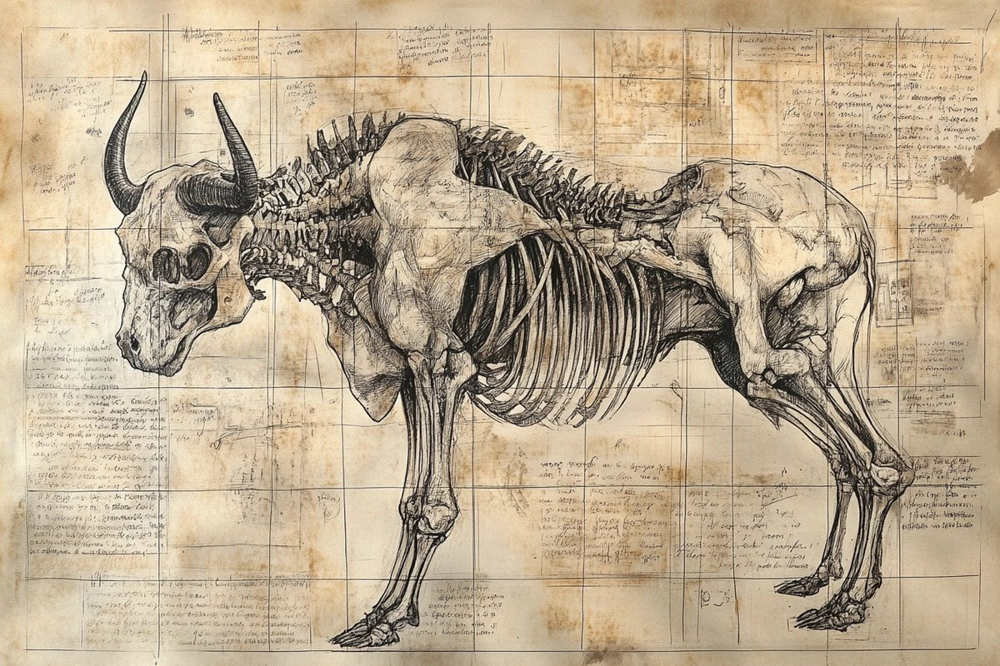

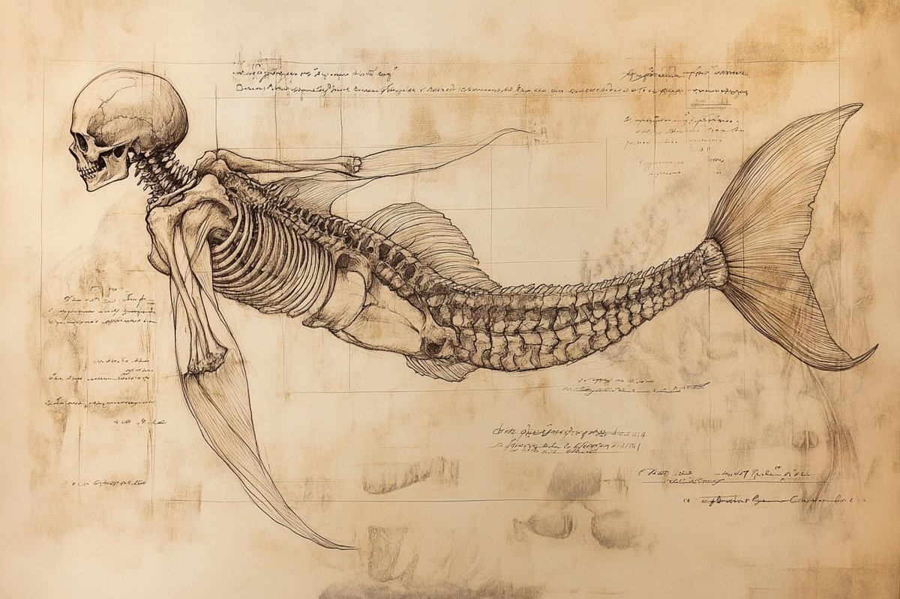

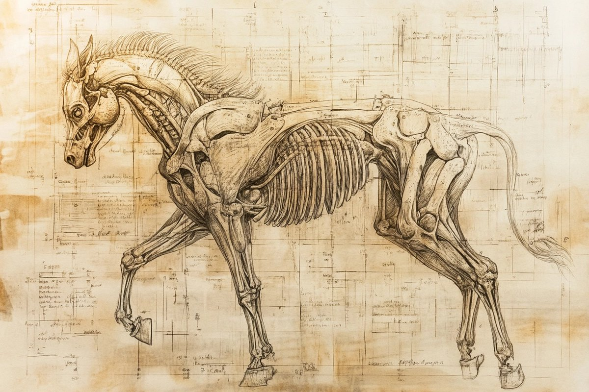

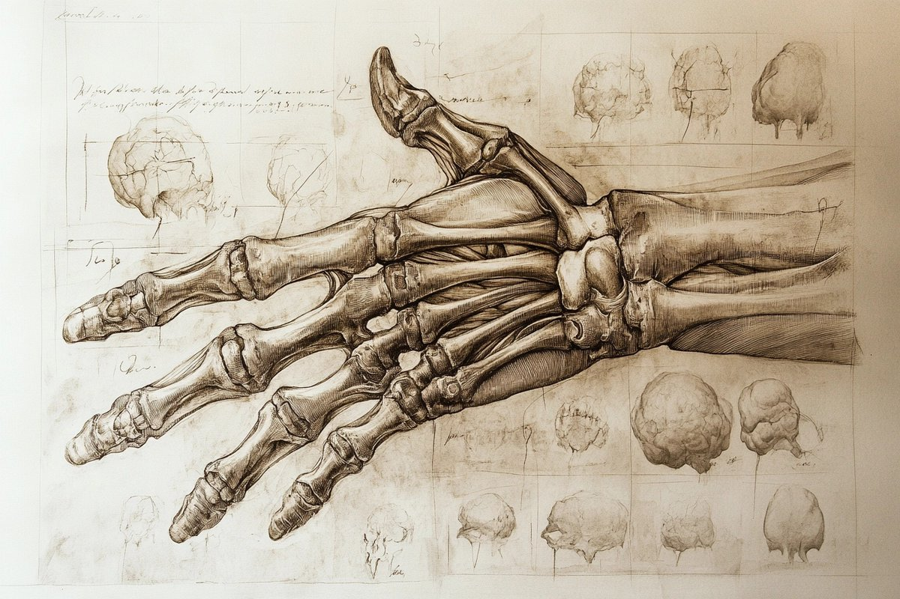

```
A Renaissance anatomical study of a giant’s torso, illustrated with fine graphite and ink cross-hatching. Layered with transparent tissue overlays showing bone and muscle, and labeled in Latin calligraphy.
```

```
A Renaissance anatomical study of a mermaid, illustrated with fine graphite and ink cross-hatching. Layered with transparent tissue overlays showing bone and muscle, and labeled in Latin calligraphy.
```

```
A Renaissance anatomical study of a horse in motion, illustrated with fine graphite and ink cross-hatching. Layered with transparent tissue overlays showing bone and muscle, and labeled in Latin calligraphy.
```

```
A Renaissance anatomical study of a human hand, illustrated with fine graphite and ink cross-hatching. Layered with transparent tissue overlays showing bone and muscle, and labeled in Latin calligraphy.
```

 [↑返回目录](#toc)

---
## <a id="prompt-2008826083282686200">立体雕塑感的国家名称拼写，内填传统美食</a> (<a href="https://x.com/aleenaamiir/status/2008826083282686133" target="_blank" rel="noopener noreferrer">Aleena Amir</a>)

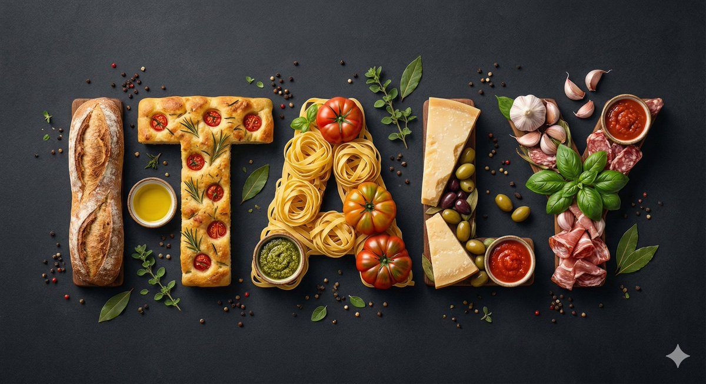

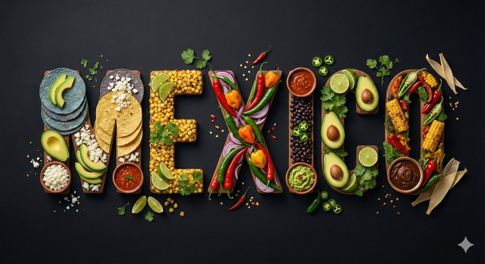

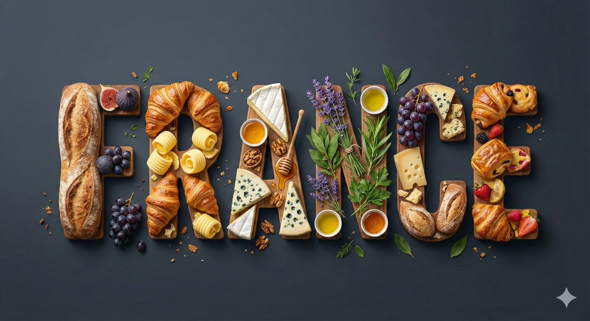

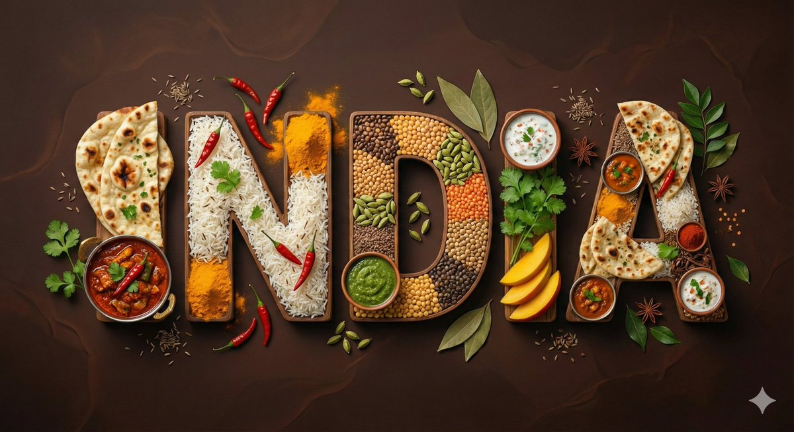

```
A high-quality digital illustration of the word [COUNTRY NAME] spelled in bold, uppercase letters. The typography is sculptural and dimensional, with each letter subtly overlapping or stacked to enhance depth and visual flow. Set against a rich, dark-toned background that complements the palette of the ingredients.

Each letter is intricately filled with iconic traditional foods from [COUNTRY], such as [SIGNATURE BREADS / FRUITS / SPICES / DISH ELEMENTS], carefully arranged to follow the contours of the typography. Small bowls of [TRADITIONAL SAUCES / CONDIMENTS] and scattered ingredients are integrated naturally within the composition.

The food elements are styled in an art-directed, editorial manner – balanced, textured, and visually rich – with gentle overlaps for realism. Soft, diffused lighting enhances natural textures and depth, creating a warm, appetizing, premium aesthetic. 

Ultra-detailed, clean composition, food-photography-inspired digital illustration, high contrast, refined visual storytelling.
```

```
一幅高品质数字插画，以粗体大写字母拼写出“[国家名称]”一词。字体具有雕塑感和立体感，每个字母略微重叠或堆叠，以增强深度与视觉流动感。背景为浓郁的深色调，与食材调色板相协调。

每个字母内部精细填充该国标志性传统食物，例如[特色面包／水果／香料／菜肴元素]，这些食材精心排列，贴合字体轮廓。画面自然融入小碗装的[传统酱料／调味品]以及散落的食材。

食物元素采用艺术指导式的编辑风格——构图平衡、质感丰富、视觉饱满，并通过轻微重叠营造真实感。柔和漫射光线突显天然纹理与层次，营造出温暖、诱人且高端的视觉氛围。

超精细、干净的构图，灵感源自美食摄影的数字插画，高对比度，精致的视觉叙事。
```

 [↑返回目录](#toc)

---
## <a id="prompt-2008559850968473600">高端杂志风格的3D写实产品摄影</a> (<a href="https://x.com/Kerroudjm/status/2008559850968473671" target="_blank" rel="noopener noreferrer">Mo</a>)

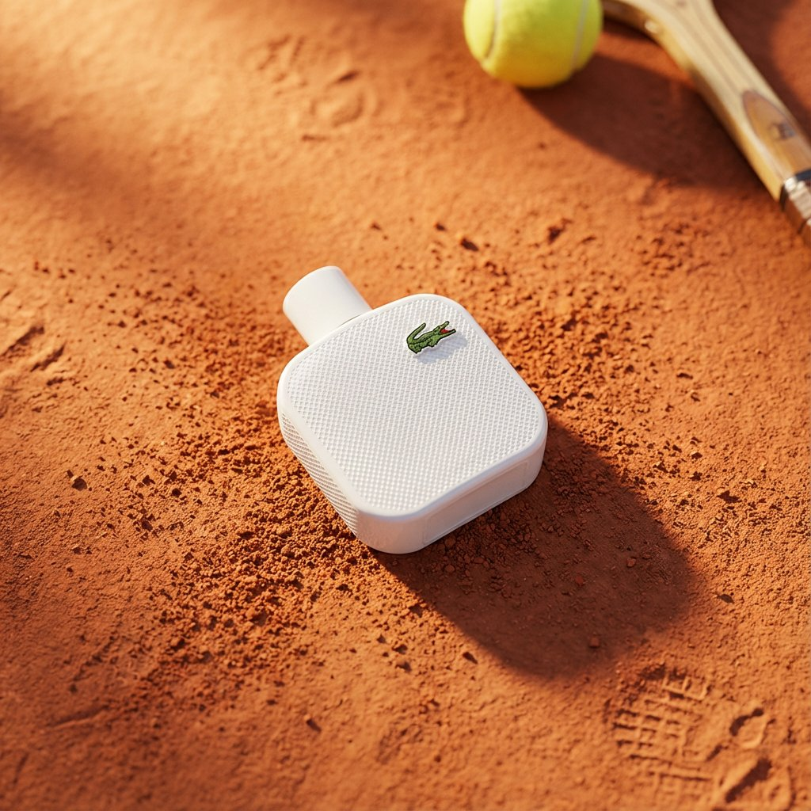

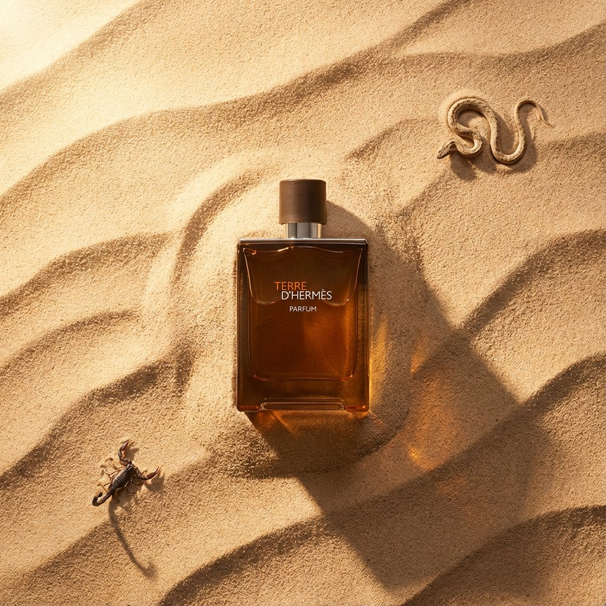

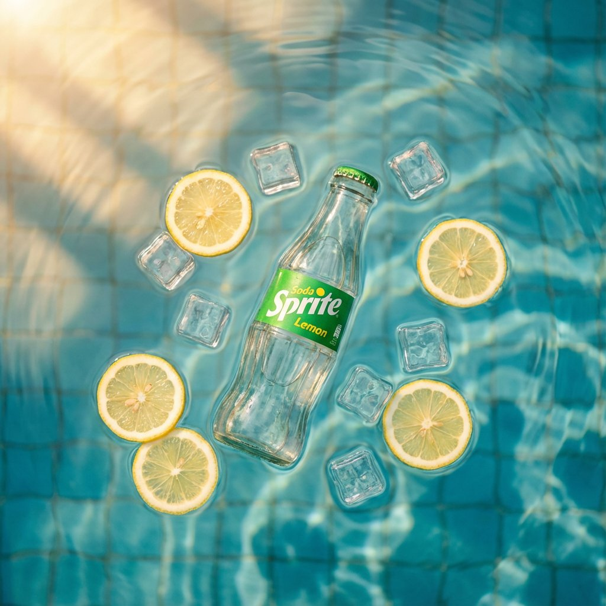

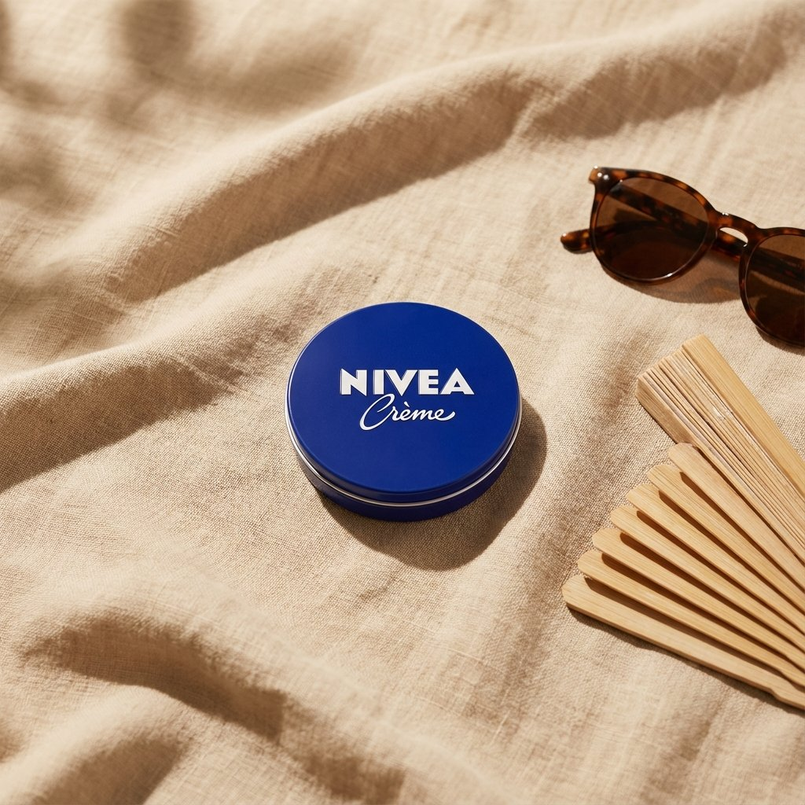

```
A high-end editorial photo of a [PRODUCT] placed flat on a [TEXTURED SURFACE], captured from a direct top-down view. The surface is gently disturbed to suggest recent motion or interaction. The front of the product is fully visible and properly oriented upright. The area around the product is intentionally left open to optionally place [COMPLEMENTARY OBJECTS] that visually enhance the scene. Natural sunlight from the upper left casts warm, realistic shadows. 3D realism, luxury product photography, shallow depth of field, 1:1 format.
```

```
一张高端杂志风格的照片，[PRODUCT] 平放在 [TEXTURED SURFACE] 上，采用正上方俯拍视角。表面略显扰动，暗示最近曾有移动或互动。产品正面完全可见且端正朝上。产品周围区域有意留白，可选择性放置 [COMPLEMENTARY OBJECTs] 以视觉上增强画面。左上角自然阳光投射出温暖而真实的阴影。3D 写实风格，奢侈品摄影，浅景深，1:1 画幅。
```

 [↑返回目录](#toc)

---
## <a id="prompt-2008570138371478000">超高清数字插图：漫画与卡通风格</a> (<a href="https://x.com/YaseenK7212/status/2008570138371477897" target="_blank" rel="noopener noreferrer">Yaseen Khan Gul</a>)

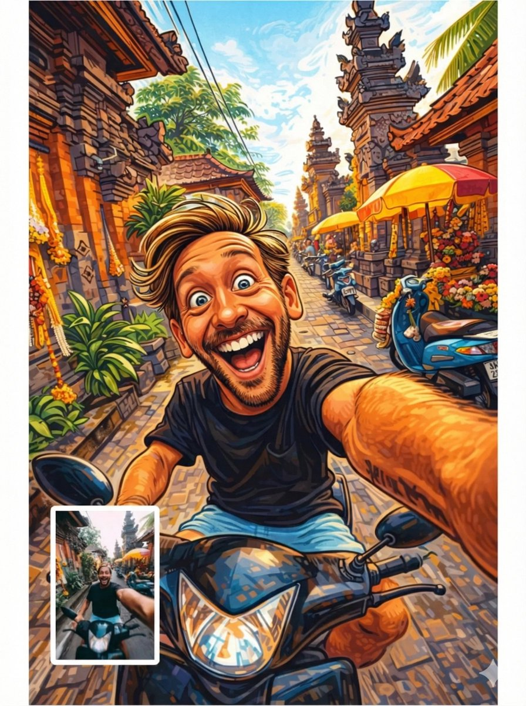

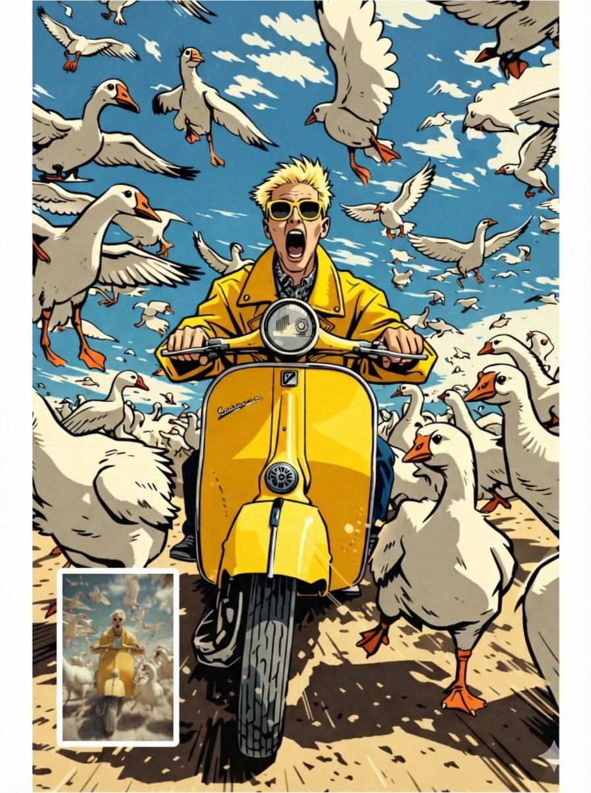

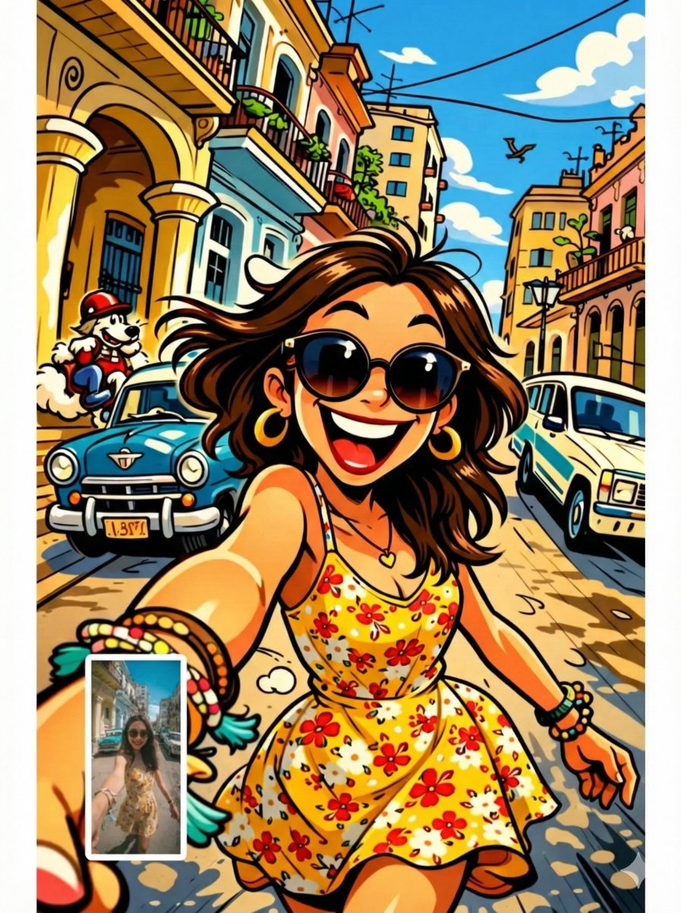

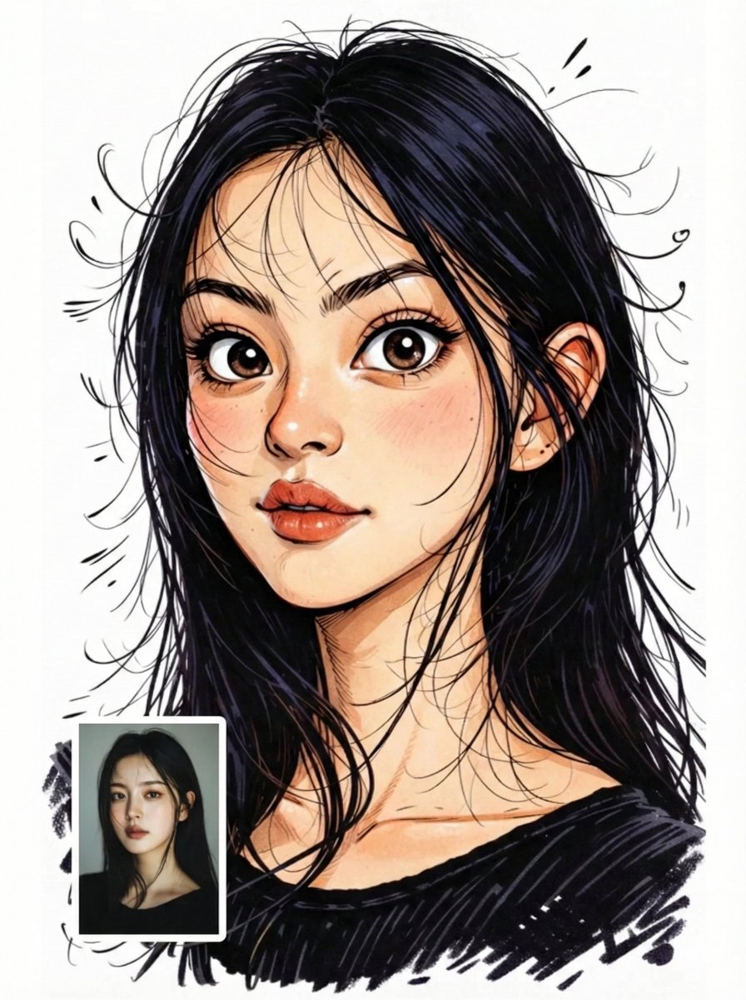

```
{
  "system_manifest": {
    "version": "15.0_atomic_style_matrix",
    "operation": "Image-to-Illustration Transformation",
    "global_rendering": {
      "output_format": "Digital Illustration",
      "resolution": "Ultra-High Definition",
      "style_separation_logic": "Modular / Independent"
    }
  },
  "style_logic_library": {
    "module_01": {
      "identifier": "CARICATURE_ILLUSTRATION",
      "logic_tree": {
        "anatomy": "Exaggerated proportions / Recognizable features",
        "stroke": "Expressive / Bold / High-contour",
        "distortion_profile": "Playful / Personality-driven",
        "tonal_vibe": "Humorous / Energetic"
      }
    },
    "module_02": {
      "identifier": "KINETIC_INK_SKETCH",
      "logic_tree": {
        "linework": "Expressive ink-style outlines / Hand-drawn feel",
        "color_engine": {
          "base": "Vivid digital hues",
          "texture": ["Subtle shading", "Mild hatching", "Gestural strokes"]
        },
        "spatial_logic": {
          "background": "Minimalist clean white",
          "fx": "Kinetic movement elements"
        },
        "aesthetic": "Digital pen-and-ink comic art"
      }
    },
    "module_03": {
      "identifier": "GRAPHIC_CEL_SHADED",
      "logic_tree": {
        "color_mapping": "Flat regions / Minimal gradients",
        "shading_logic": "Sharp shadow divisions / High-contrast",
        "line_logic": "Clean / Bold / Graphic outlines",
        "fidelity": "Animation-ready / Vector-style"
      }
    },
    "module_04": {
      "identifier": "DORAEMON_ANIME",
      "logic_tree": {
        "geometry": "Clean / Rounded / Simple primitive shapes",
        "chroma_profile": "Bright flat colors / High-key",
        "aesthetic": "Kodomo-anime / Child-friendly",
        "mood": "Light / Innocent / Playful"
      }
    },
    "module_05": {
      "identifier": "LOONEY_TUNES_SLAPSTICK",
      "logic_tree": {
        "kinematics": "Elastic poses / Squash and stretch",
        "expression": "Extreme / Exaggerated / High-intensity",
        "outlines": "Heavy bold cartoon ink",
        "energy": "Vibrant / Slapstick / Hyper-active"
      }
    }
  },
  "technical_pipeline": {
    "post_processing": {
      "sharpening": "Enabled for ink fidelity",
      "color_grading": "Saturated / Illustration-optimized"
    },
    "output_node": {
      "composition": "Centered subject / Subject-focused",
      "canvas_cleanness": "High / Zero noise"
    }
  }
}
```

```
系统清单：
版本：15.0原子风格矩阵，
操作：图像转插图转换，
全局渲染：输出格式为数字插图，分辨率超高清，风格分离逻辑为模块化/独立。

风格逻辑库：
模块一：标识为“漫画插图”，逻辑树包括解剖结构为夸张比例/可识别特征，笔触为表现力强/大胆/高轮廓，变形配置文件为趣味性/个性驱动，色调氛围为幽默/充满活力。
模块二：标识为“动态墨水素描”，逻辑树包括线条工作为表现主义墨水风格轮廓/手绘感觉，色彩引擎基础为生动的数字色调，纹理包括微妙阴影、轻度交叉影线和手势笔触，空间逻辑背景为极简干净白色，特效为动态移动元素，美学为数码钢笔漫画艺术。
模块三：标识为“图形单元着色”，逻辑树包括色彩映射为平坦区域/最小渐变，阴影逻辑为清晰的阴影分界/高对比度，线条逻辑为干净/大胆/图形轮廓，保真度为动画准备/矢量风格。
模块四：标识为“哆啦A梦动漫”，逻辑树包括几何形状为清洁/圆润/简单的原始形状，色彩谱型为明亮平实颜色/高调，美学为儿童动漫/儿童友好，情绪为轻松/天真/好玩。
模块五：标识为“乐一通搞笑卡通”，逻辑树包括运动学为弹性姿态/挤压和拉伸，表情为极端/夸张/高强度，轮廓为厚重的大胆卡通墨水，能量为活泼/滑稽/超级活跃。

技术流程：
后期处理：锐化功能启用以提高墨水保真度，色彩分级饱和/插图优化。
输出节点：构图为居中主体/主题聚焦，画布洁净度高/零噪音。
```

 [↑返回目录](#toc)

---
## <a id="prompt-2008566010073546800">AI 妆容复刻教学指南</a> (<a href="https://x.com/94vanAI/status/2008566010073546764" target="_blank" rel="noopener noreferrer">PlayForge AI</a>)

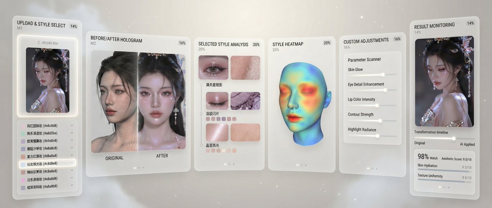

```
AI 妆容复刻教学指南

这是一套利用 AI 图像生成技术，从参考图中精准提取妆容信息并一键复刻到你的人像照片上的完整工作流。

📋 整体流程概览

步骤 说明 目的     第一步 反推妆容 Prompt 从参考图提取妆容细节   第二步 生成妆容描述词 获得可复用的妆容提示词   第三步 一键上妆 将妆容应用到你的照片
🔍 第一步：反推妆容 Prompt
用以下提示词让 AI 分析参考图中的妆容细节：
 ✨
提示词模板（三选一或组合使用）：

模板 1：毫米级精细反推
超精细反推参考图妆容，分区域标注：
底妆：毛孔隐形手法

眼影：渐变色彩配比

眼线：防水持妆配方

唇妆：唇线勾勒技巧

手部妆容：美甲款式、手部底妆、指节腮红

生成毫米级复刻提示词
模板 2：光影适配分析

反推图片中妆容的光影适配逻辑：

分析不同光源下妆容的显色变化

明确眼妆亮片的粒径大小

明确唇妆的成膜速度

明确修容的粉质细腻度

附带妆容修改微调的参数建议

模板 3：专业美妆教程式

针对特写妆容照片进行反推，重点拆解：

眼妆：睫毛嫁接层次

眉妆：野生毛流打造

腮红：膏粉结合手法

手部：白嫩质感妆容（指缘油护理、手部高光位置）

生成专业级美妆教程式提示词

✍️ 第二步：生成妆容 Prompt
根据需求选择不同侧重点的 Prompt 方案：

方案一：毫米级复刻与技术拆解
适用场景：需要精确复刻妆容手法与色彩配比

(best quality, 8k, masterpiece, hyper-detailed close-up portrait based on image_0.png),  Subject: The woman from image_0.png with dark wavy hair and white/blue ruffled bonnet. Blue contact lenses.  Skin Base (Millimeter-level precision): Porcelain skin texture, zero pore visibility achieved via silicone-based pore-blurring primer and high-coverage matte liquid foundation, set with translucent micro-finishing powder using a baking technique under the eyes.  Eye Makeup (Gradient & Formula): Intense peach-to-coral gradient eyeshadow (70% muted peach transitions to 30% soft coral towards the temples), blown out heavily around the eyes. Sharp, waterproof jet-black liquid eyeliner with a winged tip.  Lashes: Defined, wispy individual false lashes.  Lip Makeup (Contour & Technique): Velvet matte lip look in peachy-pink. Precise lip contouring using a slightly darker nude pencil to define the shape, blended inwards for a blurred "bitten" effect, no harsh edges.  Hand Details (Linked to makeup): Hand visible at the bottom with pale hand foundation, distinct pink "knuckle blush" on finger joints to match face blush. Glossy, dark black manicured nails.  Lighting: Bright, high-key lighting emphasizing the flawless matte finish.

方案二：光影适配与材质分析

适用场景：分析妆容在不同光线下的质感表现

(best quality, realistic texture analysis portrait based on image_0.png),  Context: Close-up beauty shot analyzing makeup texture under bright, diffused high-key lighting.  Skin Texture & Light Reaction: Soft-focus matte skin finish that absorbs light, subtly reflecting only on the high points of the nose and forehead. Very fine milled contour powder provides subtle structure without looking muddy under bright light.  Eye Makeup Particle Analysis: The coral eyeshadow contains ultra-fine (approx. 50-micron) shimmer particles that create a wet-look sheen rather than chunky glitter.  Lip Product Texture: Lips feature a rapid film-forming velvet lip stain that appears completely dry and transfer-proof, diffusing light softly.  Lash Details: Lashes have a matte, fiber-rich mascara coating.  Adjustment Parameters: Makeup is balanced for high exposure; blush saturation is high to register on camera, contour is cool-toned to avoid orange cast.  Hand Texture: Hands show smooth skin texture with a non-greasy satin finish hand cream.

方案三：专业级美妆教程风格

适用场景：展示专业美妆手法，如野生眉、睫毛嫁接等

(masterpiece, top-tier beauty tutorial photography based on image_0.png),  Focus: A professional makeup look showcasing specific techniques.  Brow Tutorial: "Wild" brow flow achieved using brow soap technique, individual hairs brushed upwards and textured with a tinted fiber gel.  Lash Tutorial: Hybrid eyelash extensions, mixing classic and volume fans (C-curl, lengths ranging from 8mm inner corner to 12mm outer corner) for a fluttery, doll-like effect.  Blush Application: Layered blush technique—cream coral base layered under a translucent powder pink blush, applied high on the cheekbones connecting to the eye area (Igari style).  Hand Care & Makeup: Hands at the bottom appear manicured. Visible shine on cuticles from nourishing cuticle oil application. Subtle liquid highlighter placed on the knuckles and veins of the hand for a hydrated, youthful look. Dark polished nails.  Overall Feeling: Ethereal, perfectly groomed, high-end beauty look.

🎯 第三步：一键上妆
完成前两步后，只需用一句话即可完成妆容复刻：

 💫
指令：上面的妆容给参照图角色化妆


将你的人像照片与生成的妆容 Prompt 一起提交给 AI，无需再写详细描述，即可获得理想妆容效果。

💡 小贴士

方案一 适合追求精确复刻的用户

方案二 适合需要分析妆容在镜头前表现的摄影师

方案三 适合想展示专业技法的美妆博主

可以根据需要组合使用多个方案中的元素
```

 [↑返回目录](#toc)

---
## <a id="prompt-2008753339966878000">毛绒波普风格[品牌名称]饮料罐</a> (<a href="https://x.com/aleenaamiir/status/2008753339966877924" target="_blank" rel="noopener noreferrer">Aleena Amir</a>)

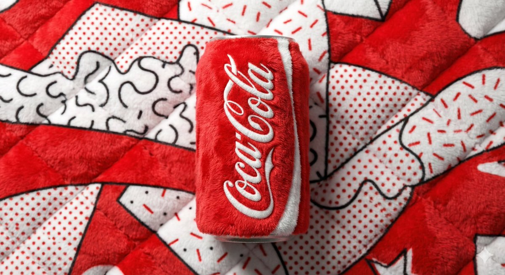

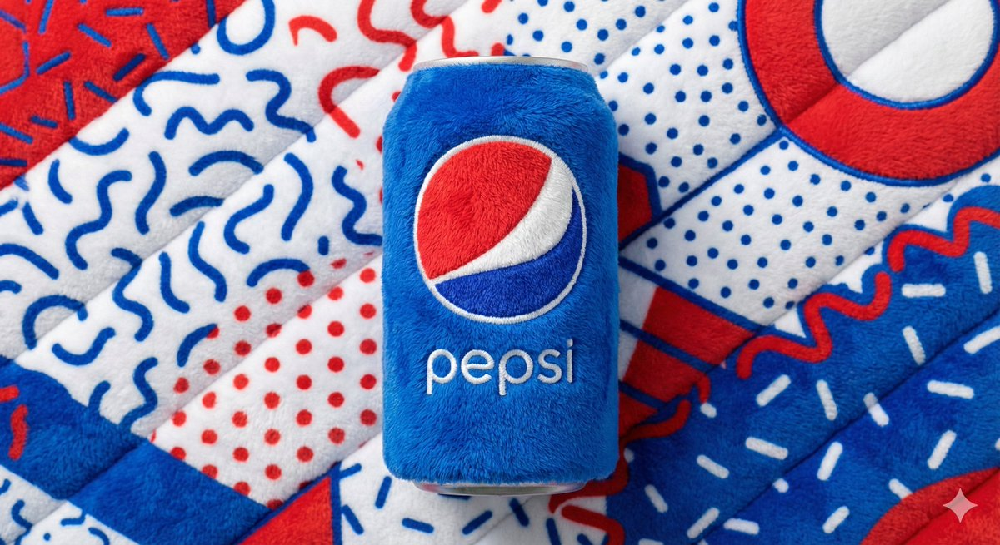

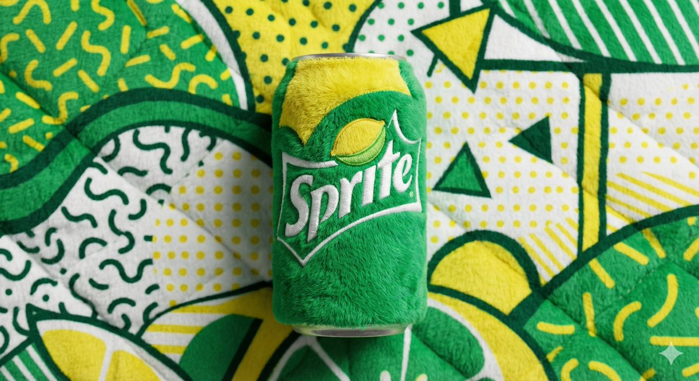

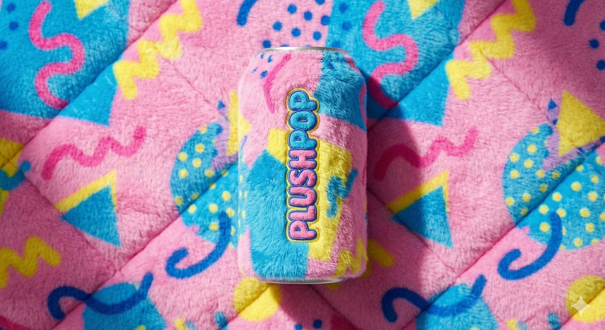

```
A beverage can branded [BRAND NAME], entirely made from vibrant, fluffy plush fabric, positioned centrally against a soft, plush background in the signature colors of [BRAND NAME].

Bold Pop Art and Memphis design style, playful yet premium aesthetic.

Bright, clean studio lighting that strongly emphasizes the plush texture, visible fibers, softness, and tactile depth.

Sharp focus, high color saturation, smooth shadows, modern commercial product shot, minimal composition, ultra-high resolution.
```

```
一罐印有[品牌名称]标志的饮料罐，整体由鲜艳、蓬松的毛绒面料制成，居中放置于以[品牌名称]标志性色彩打造的柔软毛绒背景前。

大胆的波普艺术与孟菲斯设计风格，兼具趣味性与高级感。

明亮干净的影棚灯光，强烈突出毛绒材质的质感、可见纤维、柔软触感与立体层次。

画面焦点清晰，色彩饱和度高，阴影柔和，现代商业产品摄影风格，构图极简，超高清分辨率。
```

 [↑返回目录](#toc)

---
## <a id="prompt-2008853018792628700">超精细折纸风格人物雕塑</a> (<a href="https://x.com/aleenaamiir/status/2008853018792628733" target="_blank" rel="noopener noreferrer">Aleena Amir</a>)

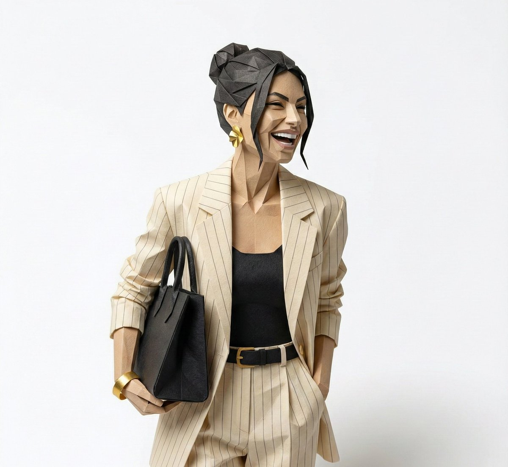

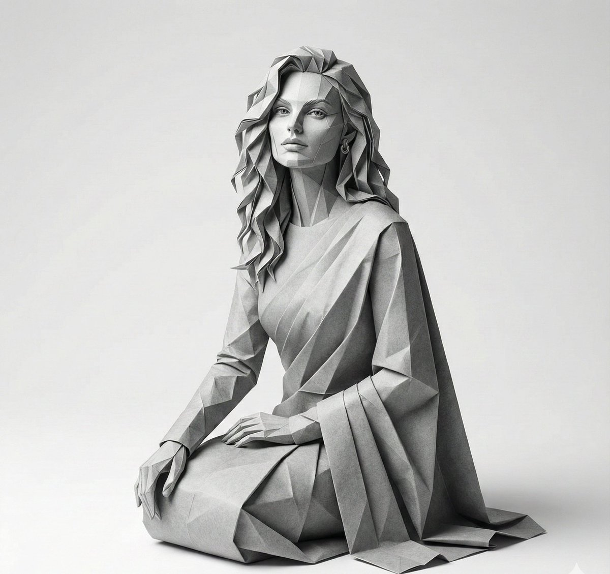

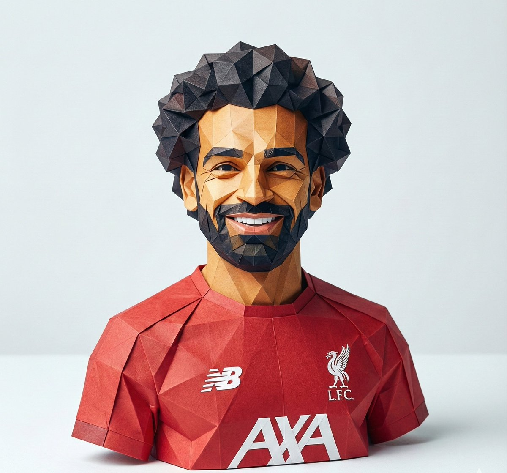

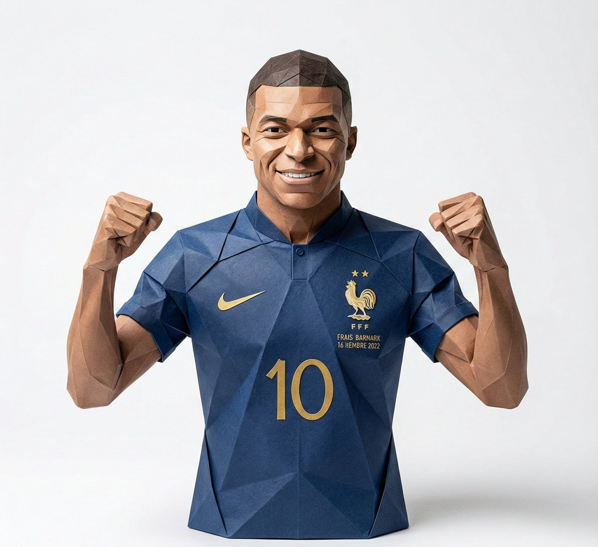

```
Paperform Portraits

Gemini Nano Banana Pro Prompt:

Create a hyper-detailed origami-style sculpture of a person, folded entirely from high-quality paper with crisp, precise edges and realistic paper fiber texture.

The origami folds are intricate and geometric, carefully structured to capture the subject’s recognizable facial features, proportions, and expression while remaining true to authentic paper-folding logic.

Use exactly the same color palette as the reference photo — no black tones, no color substitutions.

The figure is placed on a clean studio surface, with soft, natural shadows that ground the sculpture and enhance depth.

Minimalist collectible art aesthetic, premium design object feel.

Ultra-photorealistic rendering, sharp focus, high material realism, subtle highlights on paper creases, no illustration or cartoon style.
Square composition, 1080 × 1080 resolution.
```

```
纸艺人像

创作一件超精细的折纸风格人物雕塑，完全由高品质纸张折叠而成，边缘 crisp（清脆）精准，呈现逼真的纸张纤维质感。

折纸褶皱复杂而几何化，结构严谨，既能准确还原人物可识别的面部特征、比例与表情，又严格遵循真实的折纸逻辑。

使用与参考照片完全一致的配色方案——不得使用黑色调，不得替换任何颜色。

雕塑置于干净的摄影棚台面上，投射柔和自然的阴影，增强立体感并稳固视觉重心。

整体呈现极简主义收藏级艺术风格，具有高端设计品的质感。

采用超写实渲染效果，焦点锐利，材质高度真实，纸张折痕处带有细腻高光，杜绝插画或卡通风格。

画面为正方形构图，分辨率为 1080 × 1080。
```

 [↑返回目录](#toc)

---
## <a id="prompt-2008852020002979800">乐高微缩地标景观与国旗</a> (<a href="https://x.com/TechieBySA/status/2008852020002979937" target="_blank" rel="noopener noreferrer">TechieSA</a>)

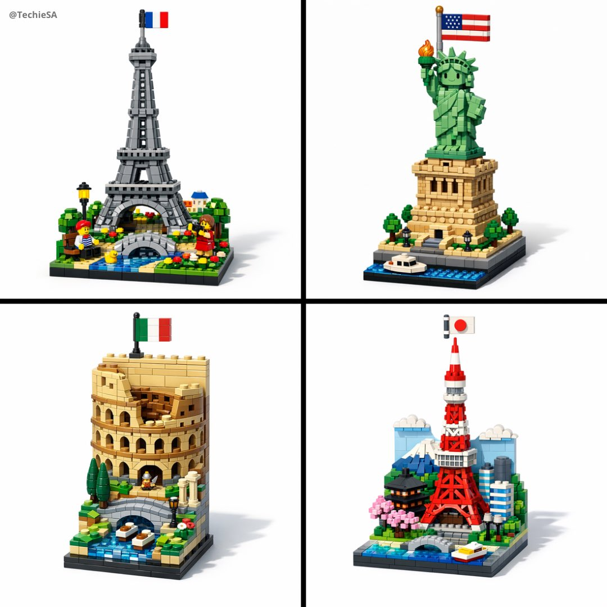

```
A vertical LEGO diorama showing [LANDMARK], [COUNTRY]). The scene is built entirely from LEGO bricks. A small [COUNTRY] flag is positioned at the top of the structure. Use a plain white background with a subtle shadow cast by the structure. 3D rendered, high-resolution, cute and clean LEGO style. 1080x1080 dimension.
```

```
一幅竖版乐高微缩场景，展示[地标]（[国家]）。整个场景完全由乐高积木搭建而成，结构顶部插有一面小型[国家]国旗。背景为纯白色，并带有结构投射的细微阴影。3D渲染，高分辨率，可爱干净的乐高风格，尺寸为1080x1080。
```

 [↑返回目录](#toc)

---
## <a id="prompt-2008606491096568300">深夜厨房门外抽烟的纹身厨师</a> (<a href="https://x.com/AllaAisling/status/2008606491096568297" target="_blank" rel="noopener noreferrer">Alexandra Aisling</a>)

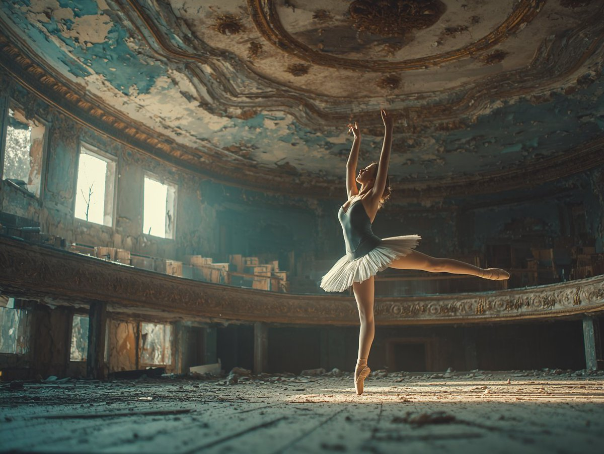

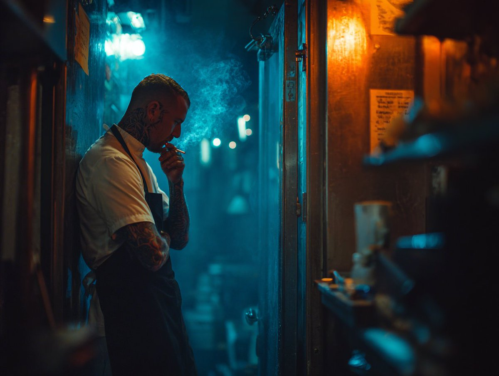

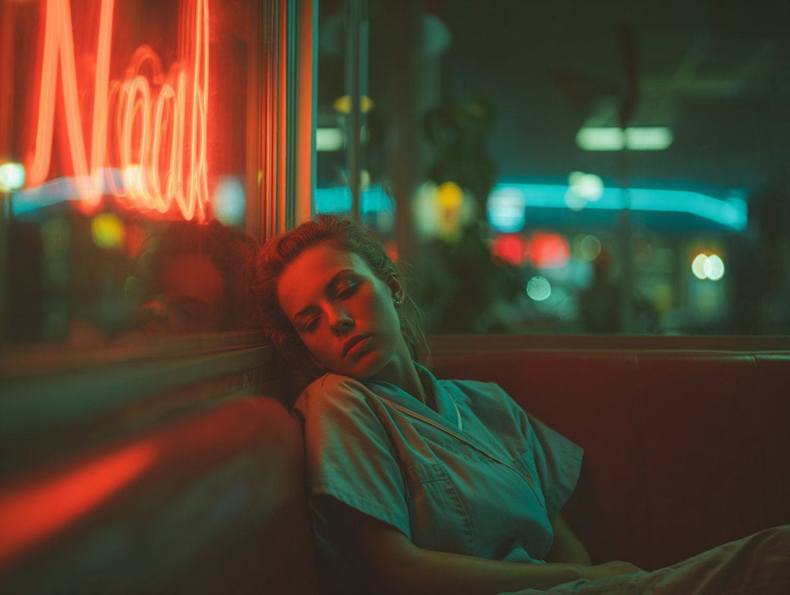

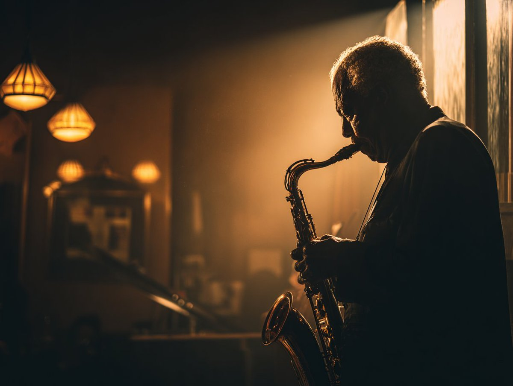

```
Young ballerina stretching alone in abandoned Soviet-era theater, dramatic lighting from holes in roof, cinematic composition, haunting beauty atmosphere, shallow depth of field, desaturated teal and faded gold color grading, film grain, overcast afternoon filtering through decay
```

```
Tattooed chef smoking cigarette in back alley behind Michelin-starred restaurant, dramatic lighting from kitchen door spilling out, cinematic composition, gritty calm before storm atmosphere, shallow depth of field, tungsten orange and night blue color grading, film grain, 2am between services
```

```
Off-duty nurse still in scrubs in 24-hour diner booth, dramatic lighting from neon sign through window, cinematic composition, exhausted grace atmosphere, shallow depth of field, cherry red neon and fluorescent pale color grading, film grain, middle of night shift break
```

```
Elderly jazz musician tuning his saxophone in empty New Orleans club before doors open, dramatic lighting from single stage spot, cinematic composition, melancholic nostalgia atmosphere, shallow depth of field, warm amber and deep shadow color grading, film grain, late afternoon light through dusty windows
```

 [↑返回目录](#toc)

---
## <a id="prompt-2008604547166728400">毛毡制成的友好卡通全身玩具</a> (<a href="https://x.com/TechieBySA/status/2008604547166728331" target="_blank" rel="noopener noreferrer">TechieSA</a>)

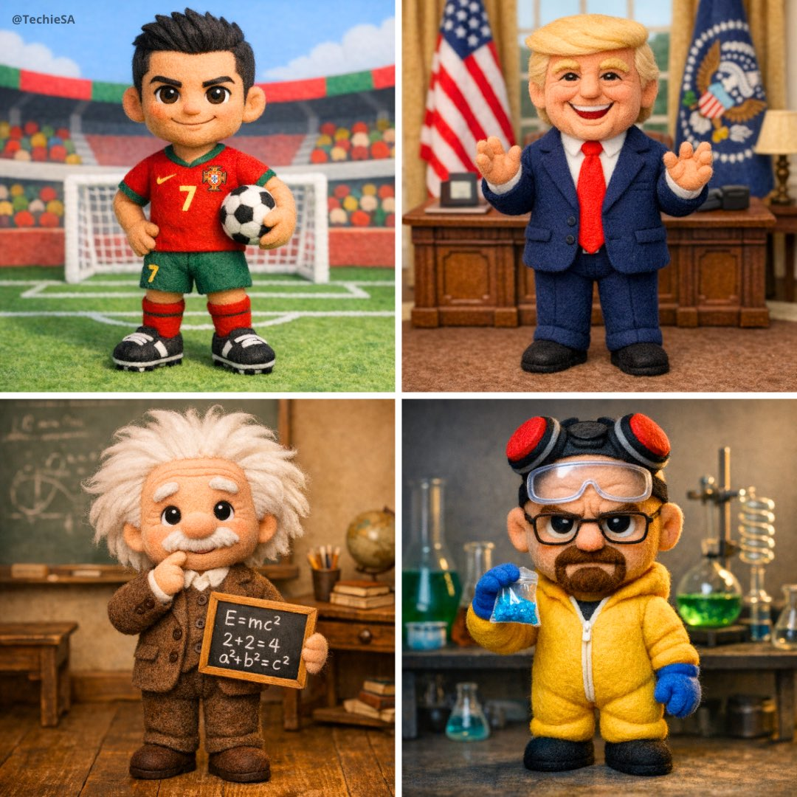

```
Full body [SUBJECT] toy, [ATTRIBUTES/ACCESSORIES], [EXPRESSION], made of felt, in a [PLACE], [LIGHTING], friendly and cartoonish appearance, rich and soft textures.
```

```
全身[主体]玩具，[特征/配饰]，[表情]，由毛毡制成，位于[地点]，[光线]，外观友好且卡通化，具有丰富而柔软的质感。
```

 [↑返回目录](#toc)

---


[上一页](./6.md) | 当前 7/11 页 | [下一页](./8.md) | [查看全部目录](../prompts.md)