# gemini.json 

gemini.json文件存放gemini相关的提示词，当前已收录：790个 

 投稿方式：[飞书投稿](https://tcn1uh5rxo87.feishu.cn/share/base/form/shrcne5gDolOMDd0oJsj2XfvxQc) or [issues](https://github.com/junxiaopang/gridsplitter/issues/new)

[上一页](./7.md) | 当前 8/8 页 | [查看全部目录](../prompts.md)

🚀 **在线预览**: [https://prompts.kkkm.cn](https://prompts.kkkm.cn)

## <a id="toc">目录</a>

- [3D卡通生物发光可爱动物](#prompt-2007023177915126000)
- [笔触中的微缩城市世界](#prompt-2006821478378123300)
- [电影级人物海报](#prompt-2007148490120380400)
- [冰镇可乐的强烈飞溅瞬间](#prompt-2007266399497138700)
- [超精细3D渲染[ICON]棋子雕像](#prompt-2007161169468108800)
- [缎带中的城市浮雕](#prompt-2007087774248439800)
- [品牌产品盒堆砌的圣诞树时尚插图](#prompt-2006795197087207700)
- [手工雕刻的木质微型人像](#prompt-2006921734092632300)
- [想起了动物森友会的博物馆系列！](#prompt-2007275324967698700)
- [超写实主角特写炸鸡腿系列](#prompt-2007113351197770200)
- [Restoration Chronicle, in Firefly](#prompt-2006748750329663700)
- [动态工坊：四位设计师的微缩展示](#prompt-2007160966673527000)
- [食物特写镜头](#prompt-2007831277269840400)
- [瞳色妝容（美瞳）](#prompt-2008186029820559400)
- [奢华香水：花香调的精致呈现](#prompt-2008098771381690600)
- [奢华[产品]漂浮广告](#prompt-2008016478315192800)
- [Apple vision ProAR世界](#prompt-2008008497473147100)
- [手持产品特写](#prompt-2008071853928226800)
- [破损的牧羊人壁画](#prompt-2007881212132803000)
- [微型建筑工人组装产品](#prompt-2008017541340565500)
- [逼真东亚自然唇部特写](#prompt-2007802711937270000)
- [萨克斯风工匠传承板：塞尔玛1954](#prompt-2007835913842495500)
- [极简主义3D像素化食物摄影](#prompt-2008127774750548200)
- [奶凶的女生](#prompt-2008112011373068488)
- [白色降噪耳机置于翠绿苔藓之上](#prompt-2008268262623122000)
- [复古美式风格Figma品牌矢量字母设计](#prompt-2008176822551216400)
- [五彩橡皮泥打造的微型地标世界](#prompt-2008488331903139800)
- [超写实特写摄影](#prompt-2008274042248458500)
- [超现实风格品牌广告海报](#prompt-2008248159815037000)
- [果树种植科普展板](#prompt-2008174532285350400)
- [Inkstorm Noir](#prompt-2008431391235862800)
- [金属液滴的奢华悬浮瞬间](#prompt-2008229403914900000)
- [梅西的暗影肖像](#prompt-2008209545412419800)
- [电影剧照：低调高对比度的冷调场景](#prompt-2008319307667645000)
- [超写实的影棚摄影作品](#prompt-2008434033701879800)
- [动物萌化系列](#prompt-2008903682612760800)
- [高端身体喷雾AUREN的超写实产品摄影](#prompt-2008600010943025200)
- [文艺复兴时期的美人鱼解剖研究](#prompt-2008856432687665200)
- [立体雕塑感的国家名称拼写，内填传统美食](#prompt-2008826083282686200)
- [高端杂志风格的3D写实产品摄影](#prompt-2008559850968473600)
- [超高清数字插图：漫画与卡通风格](#prompt-2008570138371478000)
- [AI 妆容复刻教学指南](#prompt-2008566010073546800)
- [毛绒波普风格[品牌名称]饮料罐](#prompt-2008753339966878000)
- [超精细折纸风格人物雕塑](#prompt-2008853018792628700)
- [乐高微缩地标景观与国旗](#prompt-2008852020002979800)
- [深夜厨房门外抽烟的纹身厨师](#prompt-2008606491096568300)
- [毛毡制成的友好卡通全身玩具](#prompt-2008604547166728400)
- [高细节超高清趣味漫画角色](#prompt-2008738659760304400)
- [复古未来主义风格的男性肖像](#prompt-2008547919734186500)
- [超写实垂直爆炸分解图](#prompt-2008986705962123800)
- [城市星球：[城市名称]的3D全景微观世界](#prompt-2009117120987320600)
- [石墨素描主体线框轮廓](#prompt-2008933854338257200)
- [极简主义奢华洁面乳摄影](#prompt-2009163133810823400)
- [黑白肖像中的运动传奇](#prompt-2008976968100790300)
- [透明奢华咖啡机与配套玻璃杯](#prompt-2008944996091564500)
- [超写实玻璃立方体内的[COUNTRY]微缩景观](#prompt-2008913329029263400)
- [城市微缩3D模型与地理地图的完美融合](#prompt-2008937653694013700)
- [物品在水下释放气泡](#prompt-2009025387859464700)
- [倾斜的产品与飞溅物的超现实展示](#prompt-2008981778061476400)
- [国粹戏曲定制手办-穆桂英挂帅](#prompt-2009075082996642000)
- [带有发光真空管的复古收音机](#prompt-2009308365877596400)
- [戴帽男子侧脸与欧洲小巷的黑白双重曝光肖像](#prompt-2009324869100724200)
- [电商产品图片增强提示](#prompt-2009310148867551200)
- [光线控制照片](#prompt-2009387135019680300)
- [女性在奢华浴室使用护肤精华的多角度摄影拼贴](#prompt-2009580453083201800)
- [19世纪风格的现代品牌](#prompt-2009341341226943000)

## <a id="prompt-2007023177915126000">3D卡通生物发光可爱动物</a> (<a href="https://x.com/icreatelife/status/2007023177915126034" target="_blank" rel="noopener noreferrer">Kris Kashtanova</a>)

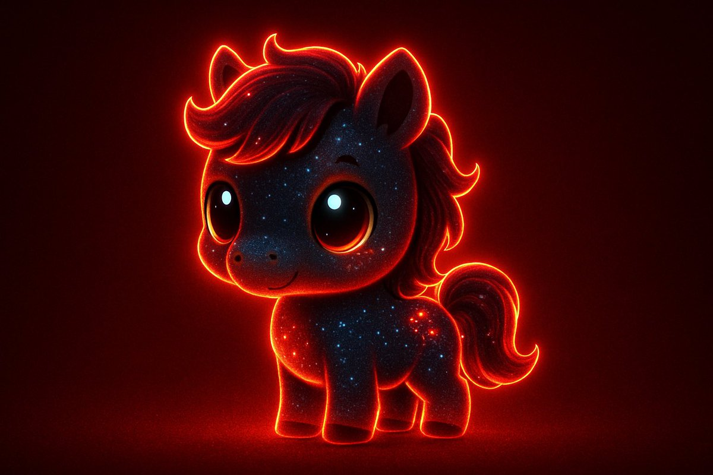

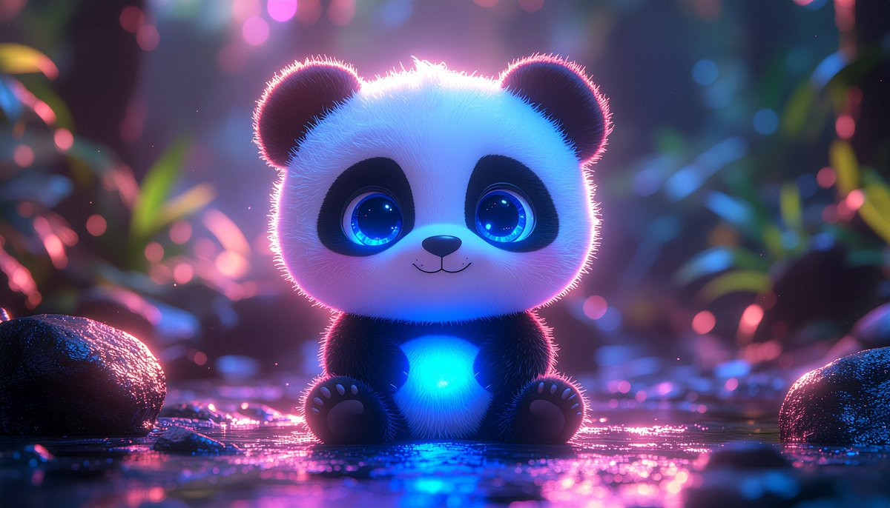

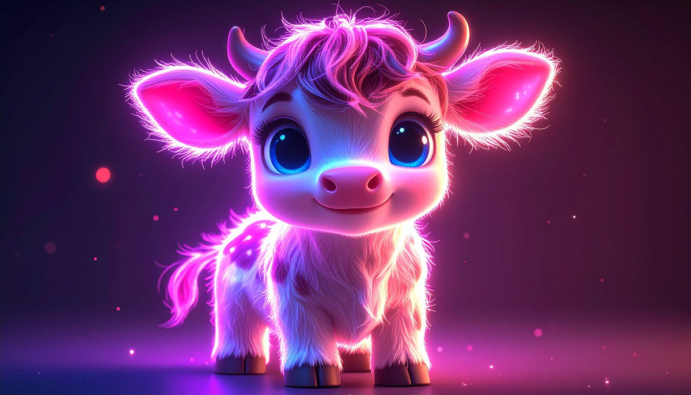

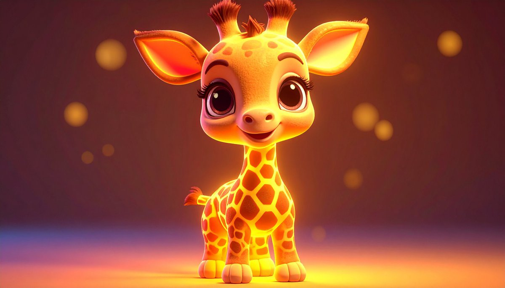

```
bioluminescent cute [ANIMAL], kawaii, chibi, [COLOR] neon backlit, 3d cartoon, big cute bright eyes, high definition

I would love to see your cute creatures
```

```
生物发光的可爱[动物]，卡哇伊风格，Q版，[颜色]霓虹背光，3D卡通，大而明亮的可爱眼睛，高清
```

 [↑返回目录](#toc)

---
## <a id="prompt-2006821478378123300">笔触中的微缩城市世界</a> (<a href="https://x.com/TechieBySA/status/2006821478378123282" target="_blank" rel="noopener noreferrer">TechieSA</a>)


```
A brush, captured mid-motion, paints a refined curve from the lower left to the upper right.
Within the brushstroke lives a miniature world of [CITY], rendered as a highly detailed 3D bas-relief city sculpted from layered paint.

Inside the stroke:
Iconic landmarks, architecture, and spatial rhythms of [CITY], arranged as a cohesive miniature with depth and subtle relief.

Style:
Impasto oil painting fused with academic poster design. Thick and thin paint layers create depth, with 3D forms emerging from the stroke.
Color palette follows the official flag colors of the country associated with [CITY], blended naturally.

View & background:
Minimalist top-down composition, pure white negative space, fine textured paper.

Typography:
Title: “[CITY] METROPOLIS”
Poetic subtitle and supporting serif copy, cleanly spaced.

Composition rules:
Brush tip ends cleanly at the upper right. All detail remains strictly inside the stroke.
Hyper-realistic, HDR, poster-grade, 8K look.
```

```
一支画笔在运动中被定格，从左下方向右上方描绘出一道精致的弧线。  
在这道笔触之中，蕴藏着一座微缩的[CITY]城市世界，以高度精细的3D浅浮雕形式呈现，由层层堆叠的颜料雕刻而成。

笔触内部：  
[CITY]的标志性地标、建筑与空间韵律，被巧妙组织成一个具有深度与微妙浮雕感的和谐微缩景观。

风格：  
厚涂油画技法融合学术海报设计。通过厚薄不一的颜料层次营造景深，使3D形态从笔触中浮现而出。  
色彩采用与[CITY]所属国家国旗一致的官方配色，并自然融合。

视角与背景：  
极简俯视构图，纯白负空间，搭配细腻纹理纸面。

文字排版：  
主标题：“[CITY] METROPOLIS”  
辅以诗意副标题及清晰排布的衬线体说明文字。

构图规则：  
笔尖干净利落地止于右上角，所有细节严格限定于笔触之内。  
整体呈现超写实、HDR、海报级、8K画质效果。
```

 [↑返回目录](#toc)

---
## <a id="prompt-2007148490120380400">电影级人物海报</a> (<a href="https://x.com/Tz_2022/status/2007148490120380484" target="_blank" rel="noopener noreferrer">Tz</a>)


```
(masterpiece, best quality, ultra-detailed), (infographic poster design:1.3), 沃伦巴菲特退休, vintage financial style, 丰富的中文文本信息.

### 1. 整体框架与背景 (Frame & Background):
海报背景材质设定为微黄的仿旧羊皮纸证券凭证质感，整体被一个精细的墨绿色纽索纹（Guilloche pattern，类似美元钞票边缘的纹路）画框所包围，画框的质感与背景完美融合，奠定海报的经典金融与历史积淀基调。

### 2. 顶部标题模块 (Top Header Module):
海报顶部正中位置呈现宏大的双语艺术字体设计。核心是醒目的衬线体中文主标题“传奇谢幕”，下方自然融入较小的英文副标题“The Legend Retires”。标题区域的左右两侧分别装饰着复古的公牛与公熊徽章，形成平衡的视觉结构。

### 3. 核心视觉中心 (Center Visual):
画面中央是沃伦·巴菲特的半身肖像，他戴着标志性的黑框眼镜，面带睿智而慈祥的微笑，身穿经典的深色西装。光影呈现伦勃朗光效，背景隐约浮现出起伏向上的K线图阴影，象征着伯克希尔·哈撒韦的辉煌业绩。

### 4. 双语信息列 (Bilingual Columns):
左侧栏设计：竖直排列着3个复古蚀刻风格的圆形图标。关键要求：每个图标的右侧都必须配有清晰的中英双语标签文本，格式为“中文名词 English Noun”。
1. 一个滚动的巨大雪球 (滚雪球 Snowball Effect)
2. 一座被水环绕的城堡 (护城河 Economic Moat)
3. 一个复杂的复利数学公式 (复利 Compound Interest)

右侧栏设计：竖直排列着3个方形的电影感颗粒质感插图。关键要求：每个画面的正下方都必须配有清晰的中英双语字幕文本，格式为“中文描述短句 English description phrase”。
1. 两个老人在交谈 (黄金搭档 Golden Partner)
2. 拥挤的体育馆会议现场 (股东大会 Annual Meeting)
3. 一张简单的办公桌 (简单生活 Simple Life)

### 5. 底部信息模块 (Footer Info):
海报的最底部区域被划分为3个独立的信息数据栏，从模块池中选取，包含清晰的中文字符：
- 模块1：[金句 Quotes] 展示名言：“别人贪婪时我恐惧 Be fearful when others are greedy.”
- 模块2：[属性 Stats] 展示数据图表：“年化回报 19.8% Annual Return.”
- 模块3：[关系 Network] 展示继任者信息：一个象征交接的握手图标或剪影，配文“继任者：格雷格·阿贝尔 Successor: Greg Abel.”

### 技术规格与风格强化 (Tech Specs):
(Chinese text rendering priority:1.4), (clear legible font), (engraving style mixed with realistic photography), 8k resolution, cinematic lighting, matte finish. --ar 2:3
```

 [↑返回目录](#toc)

---
## <a id="prompt-2007266399497138700">冰镇可乐的强烈飞溅瞬间</a> (<a href="https://x.com/underwoodxie96/status/2007266399497138682" target="_blank" rel="noopener noreferrer">underwood</a>)

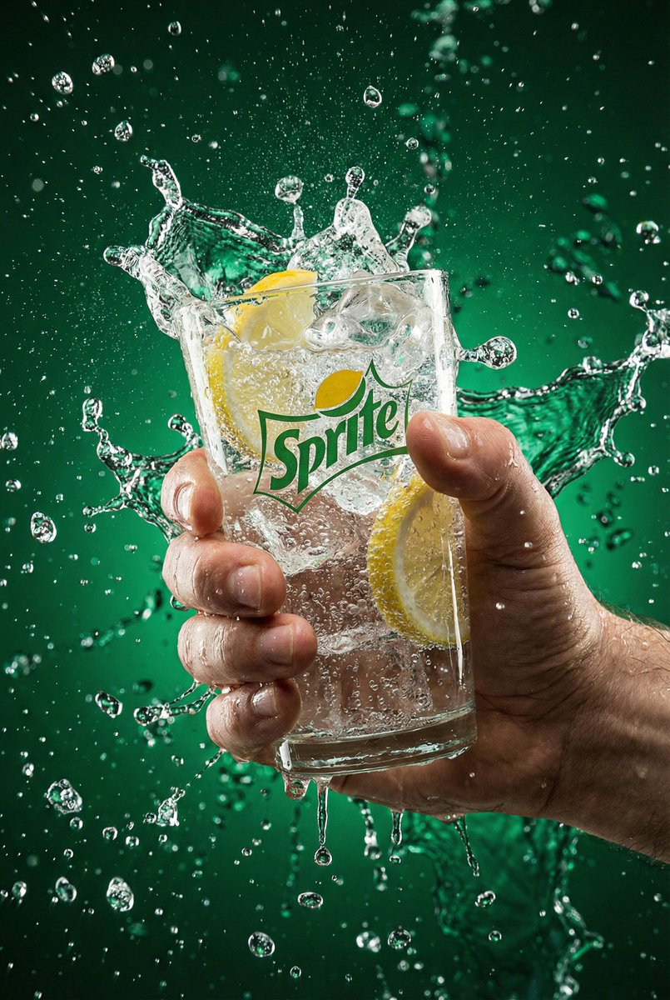

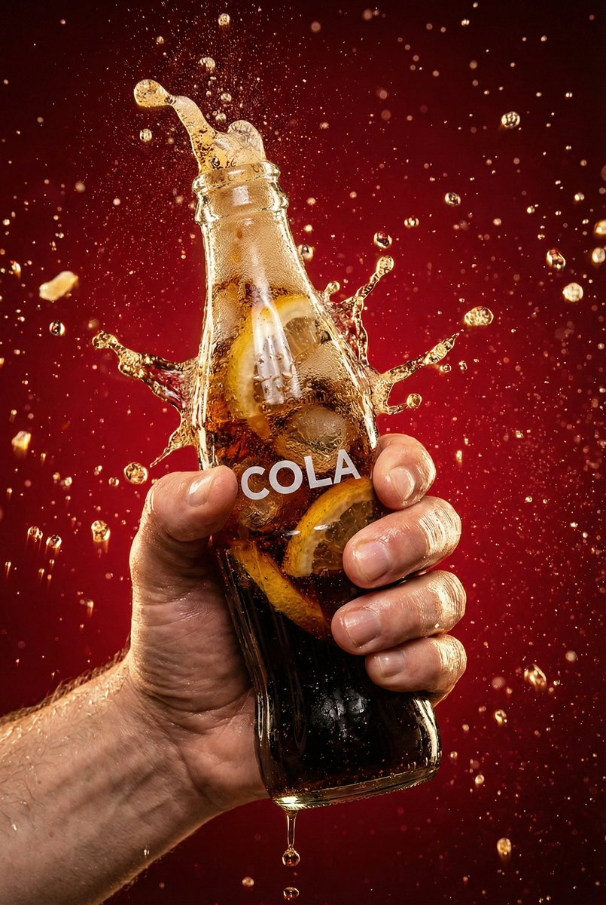

```
Soda advertisement, you can modify the prompt to your favorite soda brand.

{
  "subject": {
    "description": "A human hand gripping a transparent glass filled with ice-cold carbonated cola, frozen at the moment of an explosive liquid splash",
    "age": "adult",
    "expression": {
      "overall": "not visible"
    },
    "face": {
      "preserve_original": true,
      "makeup": "none"
    }
  },
  "hair": {
    "color": "not visible",
    "style": "not visible",
    "effect": "none"
  },
  "body": {
    "frame": "only hand visible",
    "skin": {
      "visible_areas": ["hand", "fingers"],
      "tone": "natural",
      "texture": "wet skin with water droplets",
      "lighting_effect": "strong highlights on wet skin"
    }
  },
  "pose": {
    "position": "hand centered holding glass upright",
    "base": "firm grip",
    "overall": "dynamic frozen motion"
  },
  "clothing": {
    "top": {
      "type": "not visible",
      "color": "not visible",
      "details": "none",
      "effect": "none"
    },
    "bottom": {
      "type": "not visible",
      "color": "not visible",
      "details": "none"
    }
  },
  "accessories": {
    "prop": {
      "type": "transparent glass",
      "content": "dark carbonated cola with ice cubes and dense bubbles"
    }
  },
  "photography": {
    "camera_style": "commercial high-speed beverage photography",
    "angle": "slightly low angle, front-facing",
    "shot_type": "close-up product shot",
    "aspect_ratio": "3:4 vertical",
    "texture": "ultra-sharp, high contrast, crisp details",
    "lighting": "dramatic studio lighting with strong backlight and rim highlights",
    "depth_of_field": "shallow, background softly blurred"
  },
  "background": {
    "setting": "abstract liquid environment",
    "wall_color": "deep crimson red",
    "elements": ["water splashes", "floating droplets"],
    "atmosphere": "bold, energetic, intense",
    "lighting": "bright highlights with warm undertones"
  },
  "the_vibe": {
    "energy": "powerful and explosive",
    "mood": "bold, refreshing, high-energy",
    "aesthetic": "premium commercial cola advertising",
    "authenticity": "hyper-realistic",
    "intimacy": "immersive, splash-in-your-face feeling",
    "story": "a split second of ice-cold cola refreshment captured at maximum impact",
    "caption_energy": "strong, fizzy, adrenaline-charged"
  },
  "constraints": {
    "must_keep": [
      "realistic water splash",
      "dark cola color",
      "carbonated bubbles",
      "ice cubes",
      "high-speed frozen motion"
    ],
    "avoid": [
      "cartoon style",
      "illustration",
      "green color palette",
      "citrus elements",
      "motion blur",
      "text in non-English language"
    ]
  },
  "negative_prompt": [
    "anime",
    "illustration",
    "low resolution",
    "blur",
    "fake liquid",
    "plastic texture",
    "overexposed highlights",
    "flat lighting",
    "unrealistic bubbles"
  ]
}
```

```
汽水广告，可将提示词中的品牌替换为你喜欢的汽水品牌。

一只成年人的手紧握一只透明玻璃杯，杯中盛满冰镇碳酸可乐，画面定格在液体猛烈飞溅的瞬间。仅可见手部，皮肤自然色调，表面布满水珠，在强光下呈现明显高光。手稳稳地垂直握住玻璃杯，姿态充满动感且动作被高速冻结。玻璃杯内装有深色碳酸可乐、冰块和密集气泡。摄影风格为商业高速饮料摄影，略低角度正面拍摄，特写产品镜头，3:4竖构图，细节超清晰、高对比。采用戏剧性影棚布光，强烈背光与边缘高光突出主体，浅景深使背景柔和虚化。背景为抽象液体环境，深绯红色墙面，带有水花与悬浮水滴，氛围大胆、充满能量，光线明亮并带有暖调。整体感觉强劲爆炸、大胆清爽、高能量，呈现高端商业可乐广告的美学，极度逼真，带来身临其境、扑面而来的飞溅感，捕捉冰镇可乐在最强冲击瞬间的畅快体验。画面必须保留真实水花、深色可乐、碳酸气泡、冰块和高速冻结动态；避免卡通风格、插画、绿色调、柑橘元素、动态模糊及非英文文字。负面提示包括：动漫、插画、低分辨率、模糊、假液体、塑料质感、过曝高光、平淡光线、不真实气泡。
```

 [↑返回目录](#toc)

---
## <a id="prompt-2007161169468108800">超精细3D渲染[ICON]棋子雕像</a> (<a href="https://x.com/TechieBySA/status/2007161169468108902" target="_blank" rel="noopener noreferrer">TechieSA</a>)


```
A hyper-detailed 3D render of a collectible chess piece designed as [ICON]. The figure is sculpted in polished marble and gold accents, with a stylized base resembling a classic chess piece. The character’s iconic features, clothing, or accessories are faithfully captured in a simplified but instantly recognizable form. Studio lighting with soft reflections, dramatic shadows, photorealistic textures, cinematic presentation. Centered on a clean neutral background, 1080x1080 square format.
```

```
一个超精细的3D渲染收藏级棋子，设计为[ICON]形象。雕像采用抛光大理石与金色点缀打造，底座风格化地模仿经典国际象棋棋子造型。角色的标志性特征、服饰或配饰以简化却一眼可辨的形式忠实呈现。影棚灯光营造柔和反光与戏剧性阴影，具有逼真纹理和电影级表现力。画面居中置于干净的中性背景上，1080x1080方形格式。
```

 [↑返回目录](#toc)

---
## <a id="prompt-2007087774248439800">缎带中的城市浮雕</a> (<a href="https://x.com/aleenaamiir/status/2007087774248439879" target="_blank" rel="noopener noreferrer">Aleena Amir</a>)

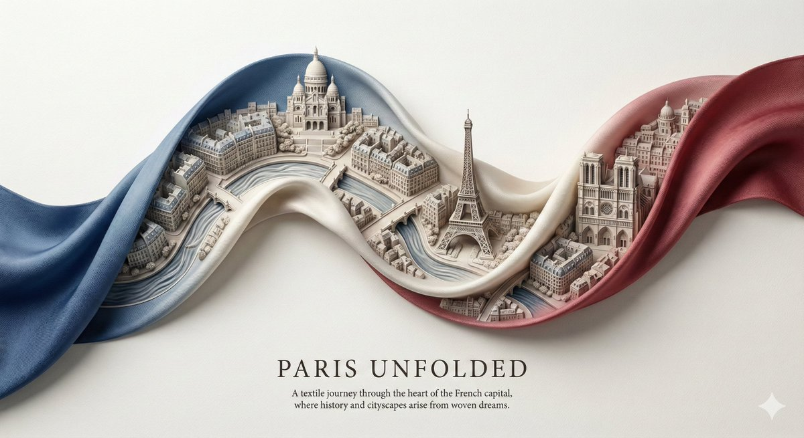

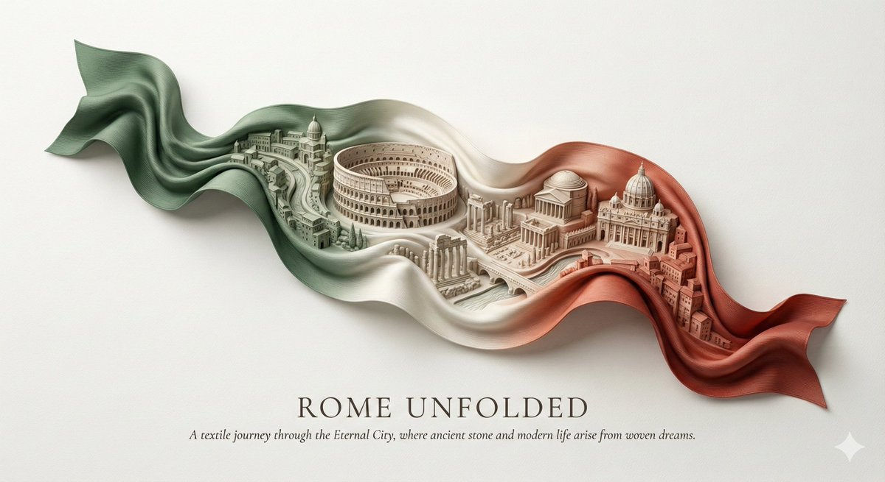

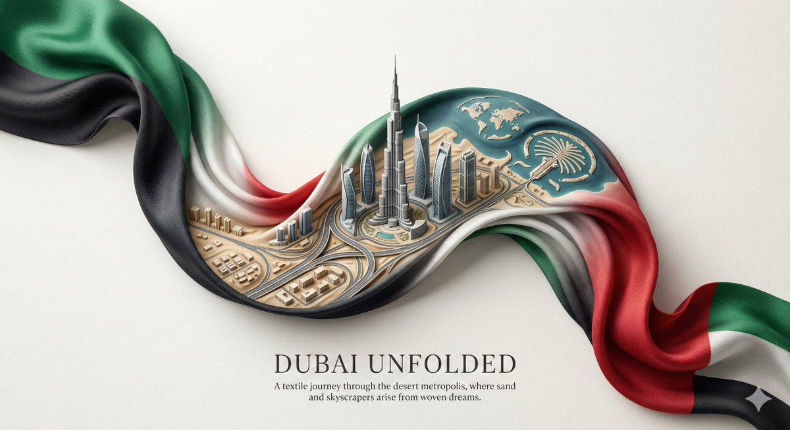

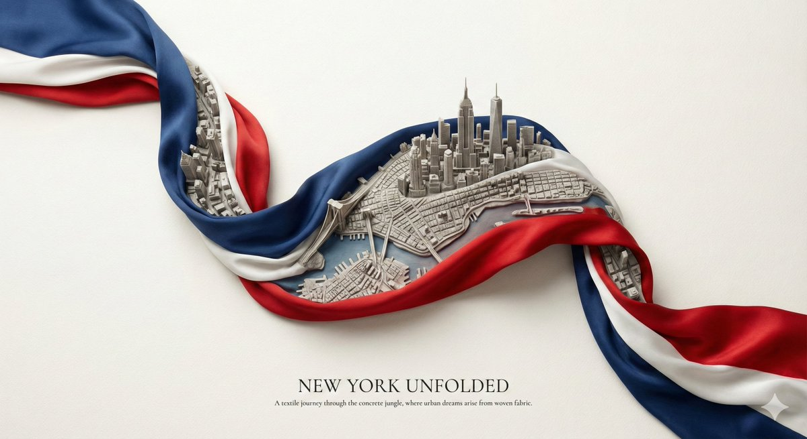

```
A silk ribbon unfurls diagonally across the canvas, twisting gently in mid-air. Within the folds of the ribbon exists a miniature sculpted city of [CITY], carved as a 3D bas-relief emerging from woven fabric textures.

Inside the ribbon: Landmarks, streets, and skyline rhythms of [CITY], flowing naturally with the ribbon’s curvature, layered in subtle depth.

Style: Fabric realism fused with sculptural relief. Soft highlights, tactile folds, elegant poster design.

Color palette: Derived from the national flag of [COUNTRY], woven seamlessly into the fabric tones.
View & background: Top-down minimalist layout, off-white museum paper texture, strong negative space.

Typography: Title: “[CITY] UNFOLDED” Refined serif subtitle with poetic geographic language.

Composition rules: All architectural detail remains strictly inside the ribbon shape. Ultra-detailed, HDR, gallery-grade, 8K poster aesthetic.
```

```
一条丝绸缎带斜向展开于画布之上，在空中轻柔地扭转。缎带的褶皱之中，藏着一座微型雕刻城市[CITY]，以三维浅浮雕的形式从织物纹理中浮现。

缎带内部：[CITY]的地标、街道与天际线韵律自然贴合缎带的弯曲走向，层次分明而细腻。

风格：织物质感写实与雕塑浮雕相融合，柔光高光、可触褶皱，优雅海报设计。

配色方案：取自[COUNTRY]国旗色彩，无缝融入织物色调。

视角与背景：俯视极简布局，米白色博物馆纸张肌理，大量留白。

文字排版：标题为“[CITY] UNFOLDED”，副标题采用精致衬线字体，辅以富有诗意的地理语言。

构图规则：所有建筑细节严格限定于缎带形状之内。超精细、HDR、画廊级、8K海报质感。
```

 [↑返回目录](#toc)

---
## <a id="prompt-2006795197087207700">品牌产品盒堆砌的圣诞树时尚插图</a> (<a href="https://x.com/AmirMushich/status/2006795197087207618" target="_blank" rel="noopener noreferrer">AmirMušić</a>)

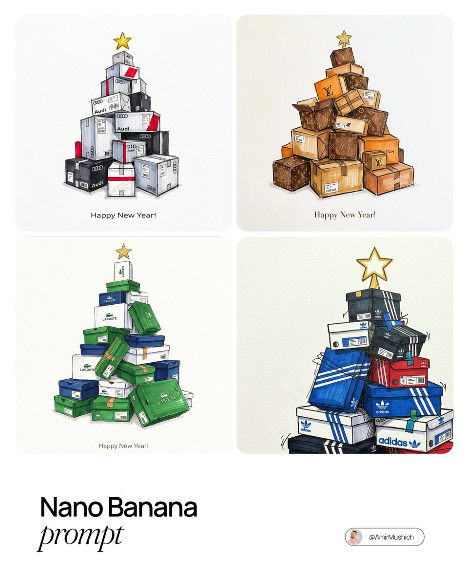

```
[A charming, hand-drawn fashion illustration of a Christmas tree constructed entirely from a chaotic stack of [BRAND NAME] product boxes.

**COMPOSITION:**
The boxes are piled in a pyramid shape to mimic the silhouette of a Christmas tree. The boxes vary slightly in size and angle, creating a playful, unstable, organic look. At the very top, there is a simple golden star.

**BRAND PALETTE & AESTHETICS (CRITICAL):**
The boxes must be colored strictly according to [BRAND NAME]'s official color palette (e.g., Tiffany Blue for Tiffany, Orange/Brown for Louis Vuitton, Red/White for Supreme).
* **Details:** Visible [BRAND NAME] logos are printed on the sides of the boxes. Add realistic packaging details like small shipping labels, barcodes, and tape to enhance the "delivery box" vibe.

**ART STYLE (MARKER SKETCH):**
The image is NOT a 3D render. It is a high-quality "Alcohol Marker and Ink" sketch on white paper. The style is loose, artistic, and vibrant, typical of fashion design sketches. The colors have the texture of markers; the outlines are done in fine black ink.

**TYPOGRAPHY (STRICT BRAND MATCH):**
At the very bottom of the illustration, centered, write the phrase: "Happy New Year!".
1.  **Font Style:** The font must mimic the official typographic language of [BRAND NAME] (e.g., if Nike: use a heavy Condensed Sans-Serif; if Gucci: use a refined Serif). The text style must feel like an extension of the brand's identity.
2.  **Size:** The text must be very small and discreet. It should occupy a maximum of 20% of the total image width.

**BACKGROUND:**
Clean white paper texture background.]
```

```
一个完全由[品牌名称]产品盒子混乱堆叠而成的圣诞树的迷人手绘时尚插图。

**构图：**
盒子以金字塔形状堆积，模仿圣诞树的轮廓。盒子的大小和角度略有不同，创造出一种有趣、不稳定且自然的外观。最顶部有一个简单的金色星星。

**品牌调色板与美学（关键）：**
盒子的颜色必须严格按照[品牌名称]的官方色彩调色板上色（例如，蒂芙尼蓝用于蒂芙尼，橙色/棕色用于路易威登，红色/白色用于Supreme）。
* **细节：** 盒子侧面印有明显的[品牌名称]标志。添加真实的包装细节，如小型货运标签、条形码和胶带，以增强“快递盒”的氛围。

**艺术风格（马克笔素描）：**
此图不是3D渲染图。它是一张高质量的“酒精马克笔和墨水”素描，绘制在白纸上。风格自由、艺术性强且充满活力，是典型的时尚设计草图风格。颜色具有马克笔的质感；轮廓用细黑墨水勾勒。

**字体（严格匹配品牌）：**
在插图的最底部中心位置写上：“新年快乐！”这句话。
1.  **字体样式：** 字体必须模仿[品牌名称]的官方字体语言（例如，如果是耐克，则使用厚重的紧缩无衬线字体；如果是古驰，则使用优雅的衬线字体）。文本样式必须感觉像是品牌形象的延伸。
2.  **大小：** 文本必须非常小而低调。其宽度不应超过图像总宽度的20%。

**背景：**
干净的白纸纹理背景。
```

 [↑返回目录](#toc)

---
## <a id="prompt-2006921734092632300">手工雕刻的木质微型人像</a> (<a href="https://x.com/Sheldon056/status/2006921734092632261" target="_blank" rel="noopener noreferrer">Duet | AI</a>)

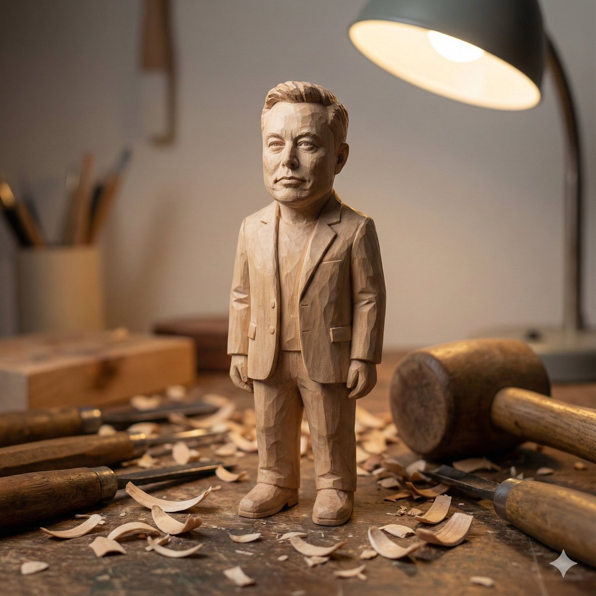

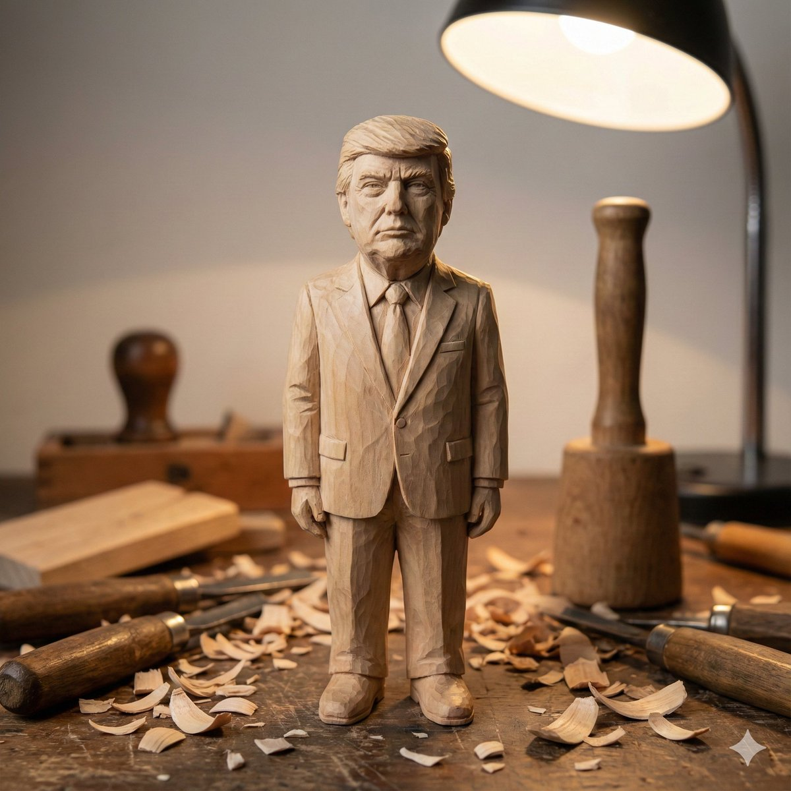

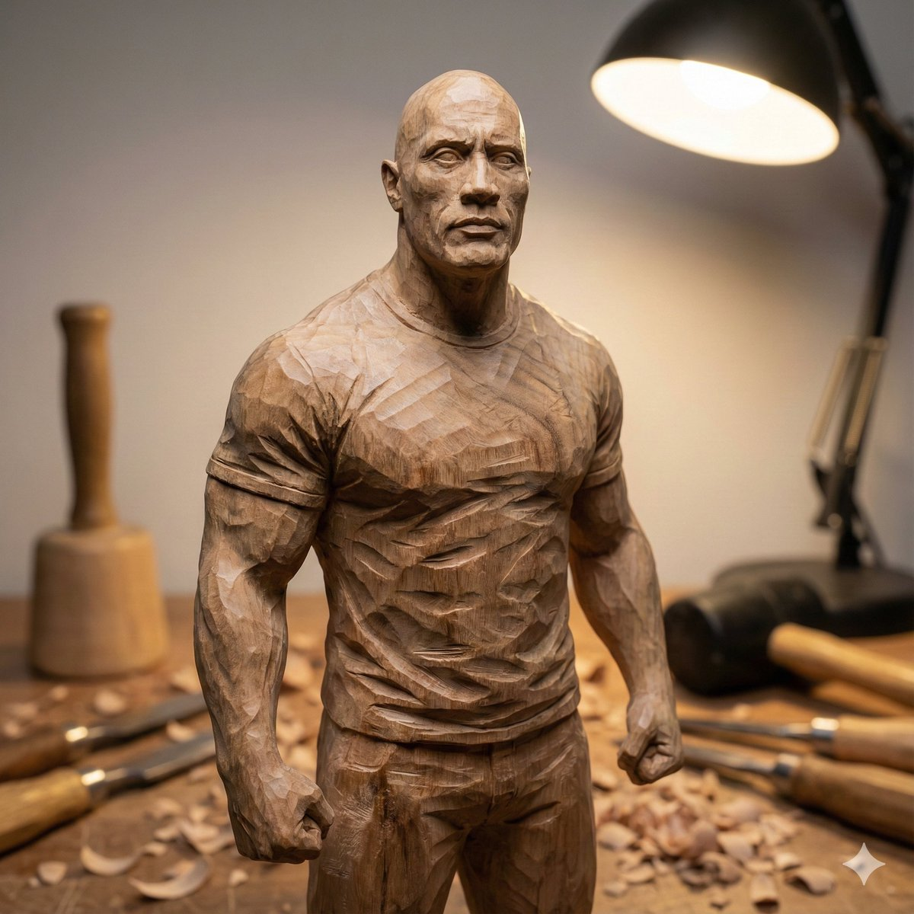

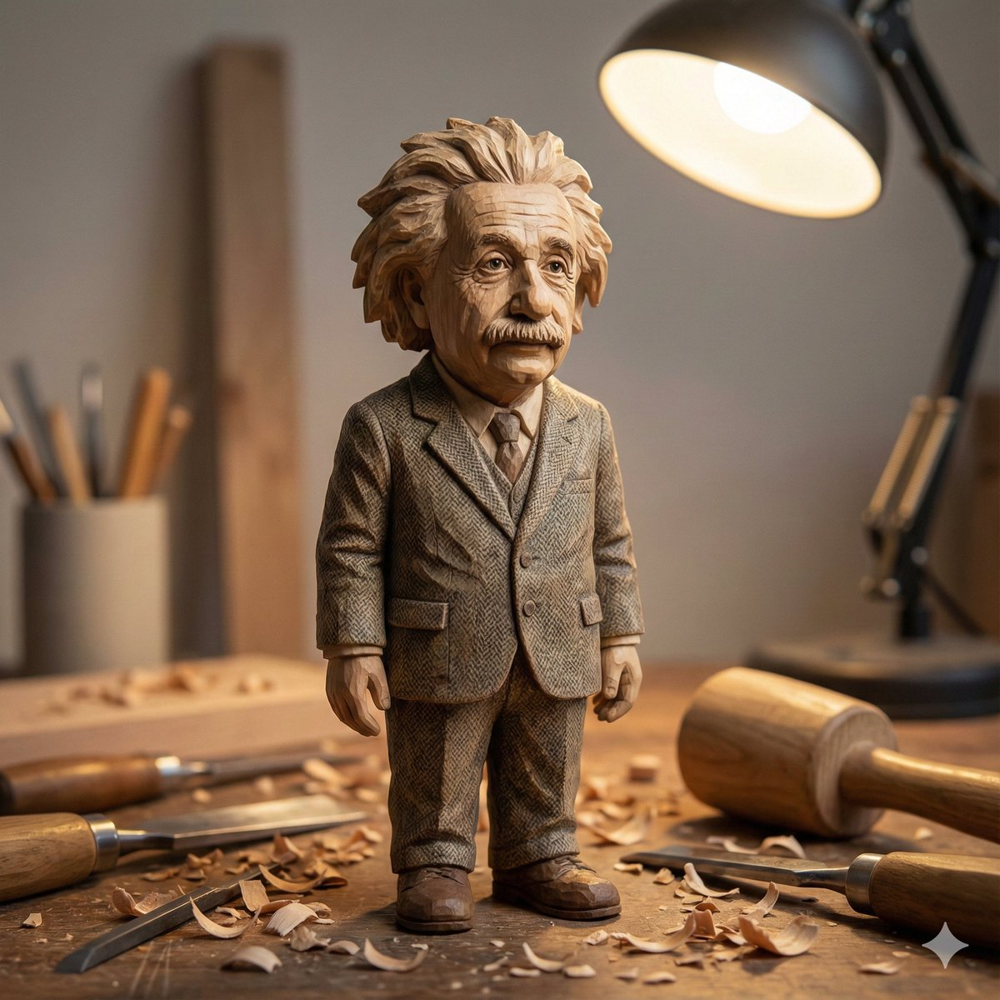

```
A hand-carved wooden miniature figure of [NAME], shaped with visible knife marks, natural grain texture, and smooth unfinished edges. Placed on a workshop table with carving tools, wood shavings, and soft warm directional lighting. 1080×1080.
```

```
一个手工雕刻的木质微型[NAME]人像，带有可见的刀痕、天然木纹肌理和光滑未打磨的边缘。放置在工作台上，周围有雕刻工具、木屑，以及柔和温暖的定向灯光。1080×1080。
```

 [↑返回目录](#toc)

---
## <a id="prompt-2007275324967698700">想起了动物森友会的博物馆系列！</a> (<a href="https://x.com/LZhou15365/status/2007275324967698649" target="_blank" rel="noopener noreferrer">小洲洲的AI日常</a>)

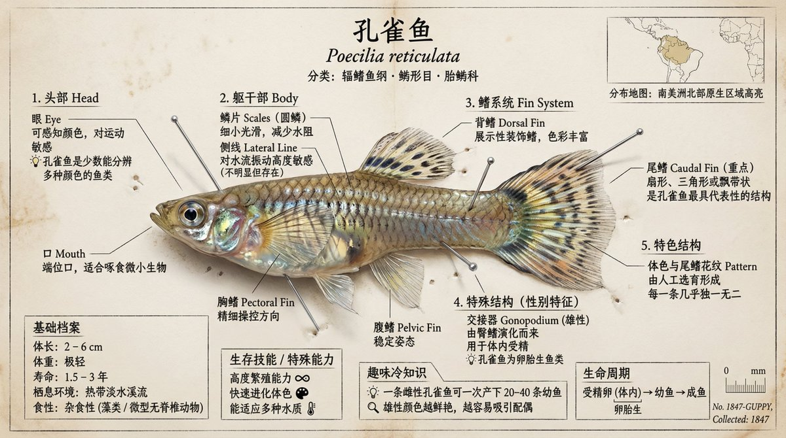

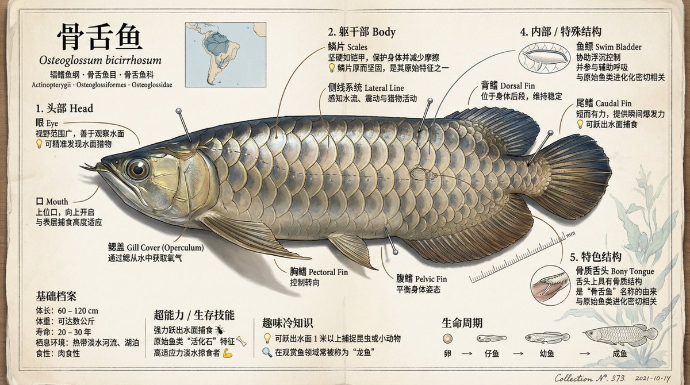

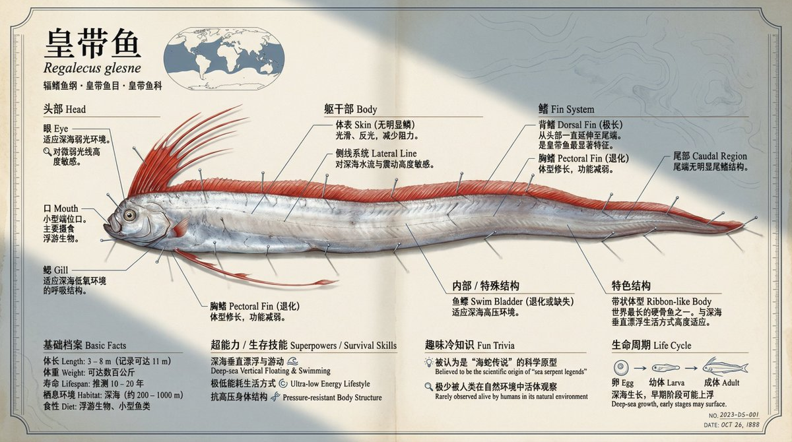

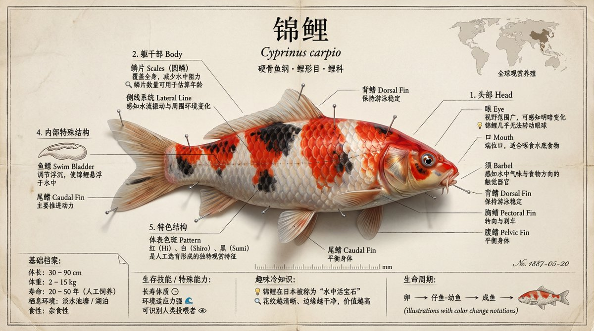

```
请创建一张博物馆展品级别的鱼类知识科普图谱，聚焦展示【某一种代表性鱼类，如：金枪鱼 / 鲤鱼 / 鲨鱼 / 小丑鱼（可替换）】。

核心布局：

中心：巨大的鱼类标本图像，占据画面 60–70%

周围：科学标注 + 趣味百科信息，呈放射状或分区排布

整体：如同博物馆玻璃展柜中的鱼类标本说明牌

鱼类标本呈现（核心要求）：

物理真实感
鱼类标本真实平放在纸面上
不是“照片中的照片”，而是实体标本

视角
垂直俯视（Top-down view）
鱼体与纸面处于同一物理平面

光影
柔和自然光从上方照射
鱼体在纸面上投下细腻、真实的阴影

固定方式（博物学风格）
使用细长银色金属标本针或细线固定鱼体
针穿过鱼体关键部位（如背部或鳍基）
针尖微微刺入纸面
纸面可见细小针孔与轻微压痕

细节质感（重点）
清晰可见：
鱼鳞排列与反光
鳍膜的半透明质感
鳃盖的结构层次
眼睛的湿润反光
鱼体边缘有厚度感与轻微立体起伏
鳍部可能有自然展开但不过分夸张

比例
鱼类标本占据纸面中心约 60–70%
周围留白用于标注与信息说明

自然状态
鱼体姿态自然、舒展
保留“真实标本”的静态感，而非游动姿态

标注系统设计：

使用细引导线

从鱼体结构延伸至文字说明框

引导线如同直接绘制或印刷在纸面上

必需标注的身体部位（6–8 个）：

1. 头部 Head

眼 Eye
视野范围？是否能看到颜色？

口 Mouth
口型（上位口 / 端位口 / 下位口）
食性相关？

鳃盖 Gill Cover (Operculum)
呼吸方式说明（如何从水中获取氧气）

2. 躯干部 Body

鳞片 Scales
类型（圆鳞 / 栉鳞 / 楯鳞）
保护与减阻作用

侧线系统 Lateral Line
感知水流和震动的“感觉器官”

3. 鳍 Fin System

背鳍 Dorsal Fin：保持平衡

胸鳍 Pectoral Fin：转向与刹车

腹鳍 Pelvic Fin：稳定身体

尾鳍 Caudal Fin：主要推进力
游泳速度或爆发力说明

4. 内部/特殊结构（可视化表达）

鱼鳔 Swim Bladder（如适用）
控制浮沉

或

软骨骨骼 / 硬骨结构对比

5. 特色结构

该鱼类最具代表性的身体特征

与其生存环境（海洋 / 淡水 / 深海 / 珊瑚礁）的适应关系

信息卡片内容（每个标注包含）：

部位名称（中 / 英文）
1–2 句儿童友好型功能说明

趣味数据或冷知识
用 🔍 或 💡 图标标识

页面其他元素：

顶部区域：

鱼类中文名（大标题，优雅字体）

学名 Scientific Name（斜体拉丁文）

分类信息（纲 / 目 / 科）

分布地图小图标
世界地图 + 主要分布水域高亮

底部 / 侧边信息栏：

基础档案

体长：X cm – X m

体重：X g – X kg

寿命：X 年

栖息环境：海洋 / 淡水 / 深海 / 珊瑚礁

食性：草食 / 肉食 / 杂食

超能力 / 生存技能

2–3 项最酷能力，例如：
高速游泳
电感应
变色伪装
洄游能力

图标 + 简短说明

趣味冷知识

1–2 个吸引儿童的事实

如：
“可以不眨眼睡觉”
“一生能游过几千公里”

生命周期

简化示意图：
卵 → 仔鱼 → 幼鱼 → 成鱼

标注生长阶段变化重点

设计美学（保持博物学风格）：

纸面质感

底纸：
米白色 / 象牙白高级纸张
#F8F6F0 或 #FFFEF7

可见纸张纤维

轻微复古磨损感（可选）

空间关系（非常重要）

鱼类标本：真实物理实体，平放在纸面上

固定针 / 细线：银色金属质感

标注文字：直接印刷或手写在同一张纸上

引导线：细笔绘制的线条
配色方案

纸面底色：#F8F6F0 / #FFFEF7

标注文字：#2C3E50（深灰蓝墨色）

引导线：#8B7355 或 #696969

强调标记：#D4AF37（古铜金）

标本针：#C0C0C0（银灰金属）

字体系统
标题：优雅印刷体或手写风格（宋体 / Garamond）

学名：斜体

标注说明：清晰小号手写体或印刷体

整体感觉：
像博物学家在标本纸上亲笔记录鱼类观察笔记

装饰元素（可选）

四角装饰线框

毫米刻度尺（与鱼体平行）

采集编号 / 日期（手写风格）

水生植物剪影水印（极淡）

关键视觉要点（不可违背）：

整个画面是一张平铺的鱼类标本纸

鱼类标本被真实固定在纸面上

文字、线条、标本共享同一个物理平面

观看者仿佛正俯视一位博物学家的工作台

关键概念强调：

❌ 不要：鱼的照片被放进画面

✅ 要：鱼类标本本身就在纸面上

就像 19 世纪博物学家的鱼类标本册一页

图片规格：

比例：16:9（横版）或 3:4（竖版）

分辨率：300 DPI，适合 A3 / A2 打印

格式：PNG 高清

科学准确性要求：
鱼体比例符合真实物种

解剖结构名称准确

儿童描述生动但不失科学性
```

 [↑返回目录](#toc)

---
## <a id="prompt-2007113351197770200">超写实主角特写炸鸡腿系列</a> (<a href="https://x.com/YaseenK7212/status/2007113351197770202" target="_blank" rel="noopener noreferrer">Yaseen Khan Gul</a>)

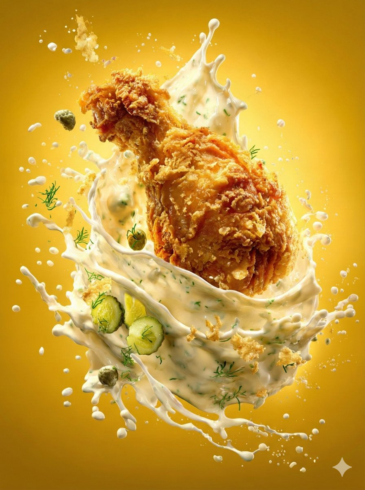

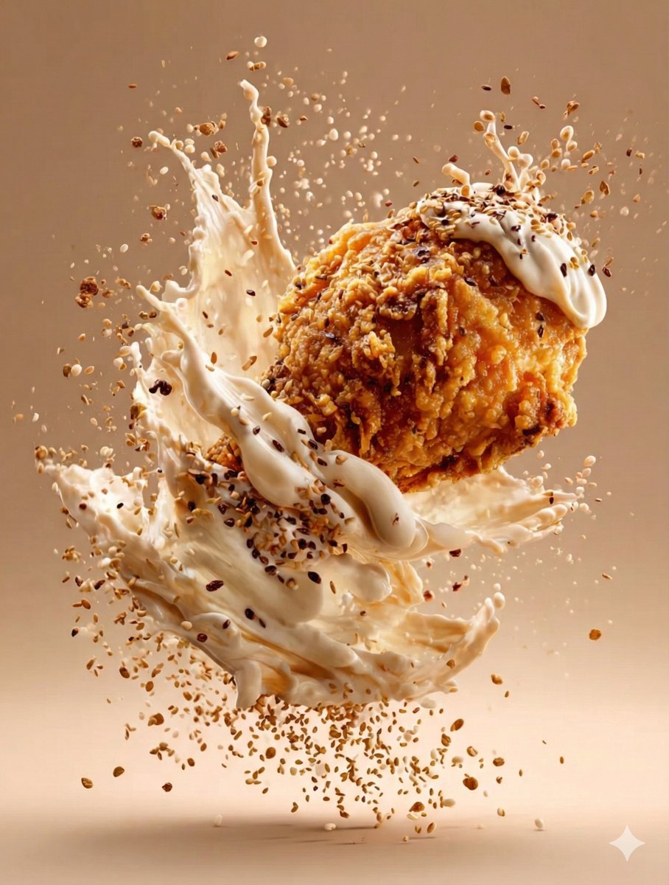

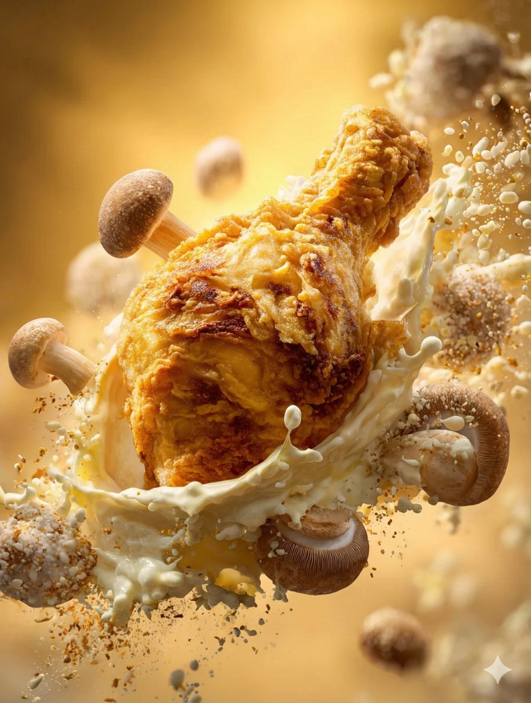

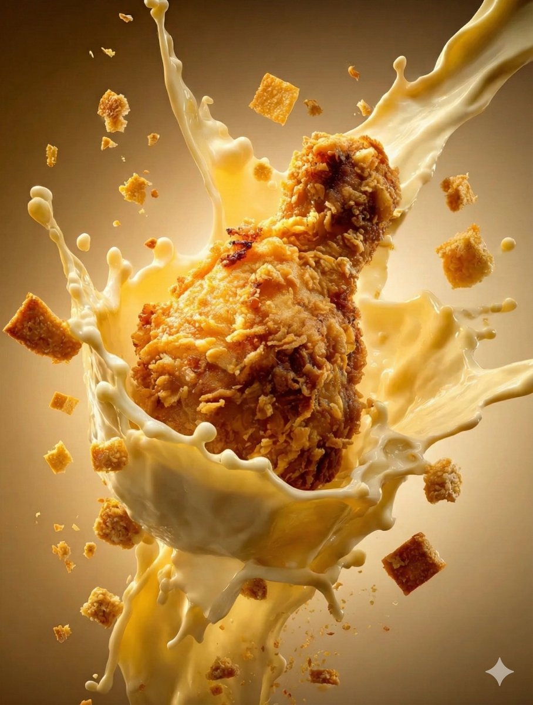

```
{
  "food_photography_series": {
    "subject": "Fried Chicken Thigh",
    "technical_specs": {
      "style": "Hyper-realistic hero shot",
      "aspect_ratio": "3:4",
      "lighting": "Cinematic / Studio"
    },
    "variations": [
      {
        "theme": "Tartar Refresh",
        "sauce": "Thick tartar sauce",
        "accents": ["capers", "dill", "chopped pickles"],
        "background": "Bright lemon-yellow",
        "prompt": "Hyper-realistic hero shot of a fried chicken thigh in midair with thick tartar sauce bursting around it, flecks of capers, dill, and chopped pickles frozen in motion. The sauce flows like creamy waves, dancing around the crispy surface. Bright lemon-yellow background with moody studio backlight creates a gourmet, refreshing tone ultra-detailed commercial look, --ar 3:4"
      },
      {
        "theme": "White Truffle Luxury",
        "sauce": "Creamy white truffle sauce",
        "accents": ["shaved mushrooms", "fine porcini powder"],
        "background": "Warm yellow-beige with soft haze",
        "prompt": "Hyper-realistic hero shot of a luxurious fried chicken thigh floating in the center, surrounded by a splash of creamy white truffle sauce, with shaved mushrooms and fine powder of porcini dusting the motion. Golden skin shines under cinematic key light, background in warm yellow-beige hues with soft haze premium gourmet commercial, --ar 3:4"
      },
      {
        "theme": "Smoked Cheese Indulgence",
        "sauce": "Molten smoked cheese fondue",
        "accents": ["golden crouton crumble"],
        "background": "Creamy yellow with taupe haze",
        "prompt": "Hyper-realistic hero shot of a crisp fried chicken thigh surrounded by a molten splash of smoked cheese fondue mid-air, with bits of golden crouton crumble suspended in orbit. Deep lighting creates dimensional drama on the crispy crust. The backdrop blends creamy yellow with taupe haze indulgent cheese-forward visual, --ar 3:4"
      },
      {
        "theme": "Miso Umami",
        "sauce": "Miso butter glaze and umami cream",
        "accents": ["toasted seaweed powder", "sesame seeds"],
        "background": "Muted beige",
        "prompt": "Hyper-realistic hero shot of a rich fried chicken thigh hovering mid-air, glazed with miso butter and surrounded by a dynamic splash of umami cream, flecked with toasted seaweed powder and sesame seeds. Dramatic soft shadows sculpt the skin texture. Muted beige background, clean and warm umami-focused food ad, --ar 3:4"
      }
    ]
  }
}
```

```
超写实主角特写炸鸡腿系列，3:4画幅，电影级/影棚灯光：

1. **塔塔清新风**：一块炸鸡腿在空中悬浮，浓稠塔塔酱在其周围迸发飞溅，刺山柑、莳萝和切碎的酸黄瓜碎屑定格在动态中。酱汁如奶油波浪般舞动，环绕酥脆表皮。明亮柠檬黄背景搭配富有氛围感的影棚背光，营造出精致清爽的商业美食大片效果。

2. **白松露奢华风**：一块奢华炸鸡腿居中悬浮，被飞溅的奶油白松露酱环绕，点缀着刨片蘑菇与细磨牛肝菌粉。金黄酥脆的外皮在电影主光下熠熠生辉，背景为柔和暖黄米色调并带有轻柔薄雾，呈现高端美食广告质感。

3. **烟熏芝士纵享风**：酥脆炸鸡腿被空中飞溅的熔融烟熏芝士火锅酱包围，金色面包丁碎屑如轨道般悬浮四周。深邃光影强化酥脆外壳的立体感，背景融合奶油黄与灰褐色薄雾，打造浓郁芝士主题的诱人视觉。

4. **味噌鲜味风**：一块丰腴炸鸡腿悬停空中，裹覆味噌黄油釉，并被动态飞溅的鲜味奶油环绕，点缀烤海苔粉与芝麻粒。戏剧性柔光阴影勾勒出鸡皮肌理，背景为柔和米色，干净温暖，聚焦鲜味主题的美食广告风格。
```

 [↑返回目录](#toc)

---
## <a id="prompt-2006748750329663700">Restoration Chronicle, in Firefly</a> (<a href="https://x.com/AllaAisling/status/2006748750329663751" target="_blank" rel="noopener noreferrer">Alexandra Aisling</a>)

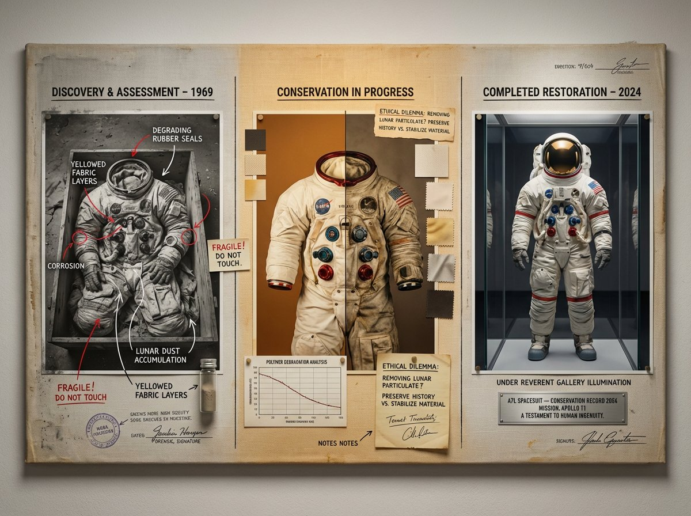

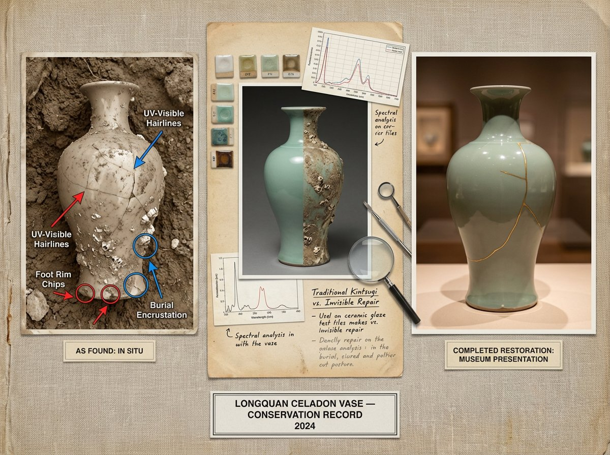

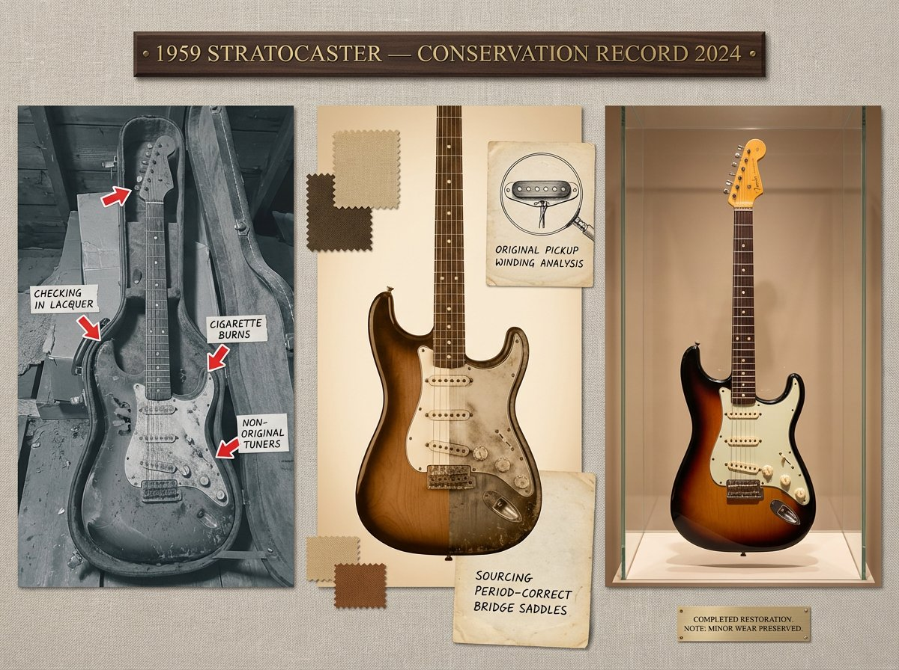

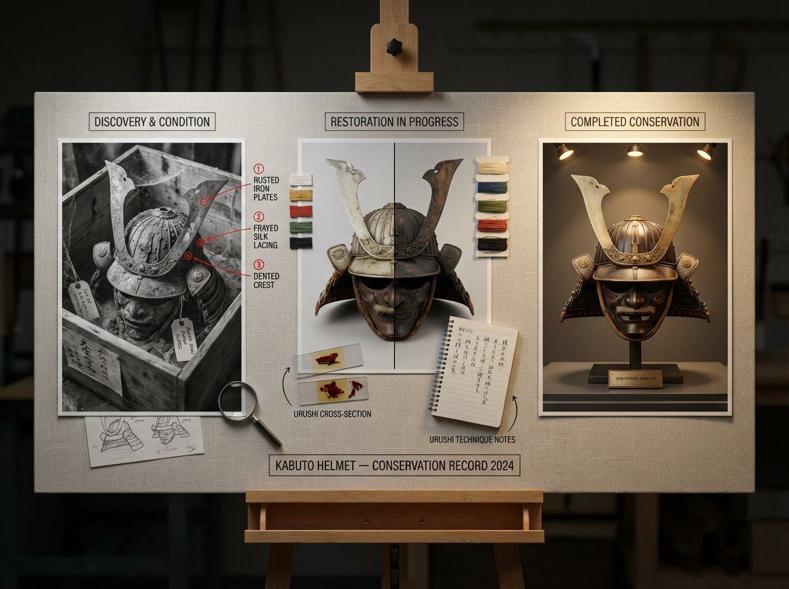

```
A master restorer's documentation board for an Apollo-era spacesuit — 1969, NASA Houston. The canvas flows left to right: far left shows the object as discovered, photographed in situ with decay, damage, and patina mapped with forensic annotation markers—degrading rubber seals, yellowed fabric layers, moon dust still visible in crevices; center shows the restoration in progress, a split view with one half stabilized and one half untouched, surrounded by material analysis swatches, polymer degradation charts, and conservator's handwritten notes on ethical dilemma of removing lunar particulate; far right shows the completed restoration photographed in museum lighting, the suit reborn but bearing honest traces of its journey. Visual style transitions from documentary forensic greys to warm archival amber to reverent gallery illumination. Linen texture background throughout. Title block reading "A7L SPACESUIT — CONSERVATION RECORD 2024".
```

```
A master restorer's documentation board for a Ming dynasty celadon vase — 15th century, Longquan kilns. The canvas flows left to right: far left shows the object as discovered, photographed in situ with decay, damage, and patina mapped with forensic annotation markers—hairline cracks mapped in UV light, chips along foot rim, burial encrustation; center shows the restoration in progress, a split view with one half cleaned and one half untouched, surrounded by material analysis swatches, glaze composition analysis, and conservator's handwritten notes on traditional kintsugi versus invisible repair debate; far right shows the completed restoration photographed in museum lighting, the vase reborn but bearing honest traces of its journey. Visual style transitions from documentary forensic greys to warm archival amber to reverent gallery illumination. Linen texture background throughout. Title block reading "LONGQUAN CELADON VASE — CONSERVATION RECORD 2024".
```

```
A master restorer's documentation board for a 1959 Fender Stratocaster — Sunburst finish, California. The canvas flows left to right: far left shows the object as discovered, photographed in situ with decay, damage, and patina mapped with forensic annotation markers—checking in nitrocellulose lacquer, cigarette burns on headstock, replaced tuners, worn frets; center shows the restoration in progress, a split view with one half cleaned and one half untouched, surrounded by material analysis swatches, original pickup winding analysis, and conservator's handwritten notes on period-correct hardware sourcing; far right shows the completed restoration photographed in museum lighting, the guitar reborn but bearing honest traces of its journey. Visual style transitions from documentary forensic greys to warm archival amber to reverent gallery illumination. Linen texture background throughout. Title block reading "1959 STRATOCASTER — CONSERVATION RECORD 2024".
```

```
A master restorer's documentation board for a samurai kabuto helmet — Edo period, Japan. The canvas flows left to right: far left shows the object as discovered, photographed in situ with decay, damage, and patina mapped with forensic annotation markers—rusted iron plates, frayed silk lacing, dented crest; center shows the restoration in progress, a split view with one half cleaned and one half untouched, surrounded by material analysis swatches, lacquer cross-sections under microscope, and conservator's handwritten notes on traditional urushi techniques; far right shows the completed restoration photographed in museum lighting, the helmet reborn but bearing honest traces of its journey. Visual style transitions from documentary forensic greys to warm archival amber to reverent gallery illumination. Linen texture background throughout. Title block reading "KABUTO HELMET — CONSERVATION RECORD 2024".
```

 [↑返回目录](#toc)

---
## <a id="prompt-2007160966673527000">动态工坊：四位设计师的微缩展示</a> (<a href="https://x.com/Gdgtify/status/2007160966673527145" target="_blank" rel="noopener noreferrer">Gadgetify</a>)

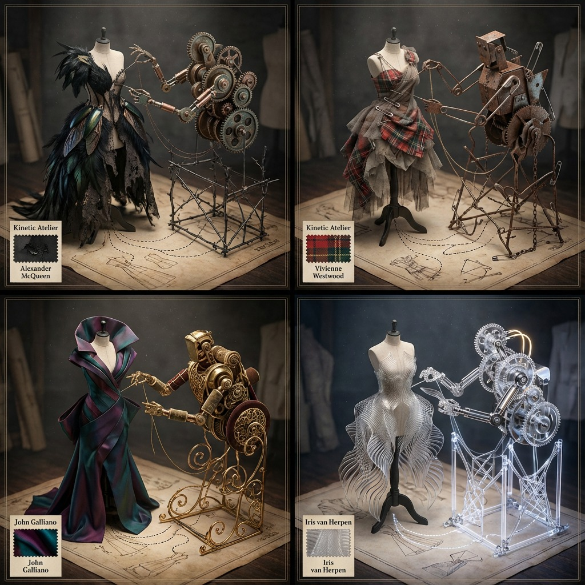

```
Fashion is not my thing but I thought if Nano Banana can find musicians, scientists, and artists similar to my input, why not for fashion. 

Prompt: 
 Input Variable: [INSERT DESIGNER] (e.g., Alexander McQueen, Iris van Herpen, Coco Chanel)

    System Instruction:    
Act as a Fashion Historian. Create a 2x2 Grid of "Kinetic Atelier Dioramas."
    Goal:   Analyze the Input Designer, then identify     4 Distinct Designers   (Peers, Rivals, or Successors) that share their DNA. Render one in each panel.

    1. The Curation Logic (The Brain):    
     Analyze Input: Identify the core style (e.g., if McQueen: Dark Romanticism, Structure, Savage Beauty).
     Select 4 Unique Subjects:  
           Panel 1:   The Input Designer (The Master).
           Panel 2:   A Historical Influence (The Ancestor).
           Panel 3:   A Contemporary Rival (The Competitor).
           Panel 4:   A Modern Successor (The Future).

    2. The Visual Syntax (The Automaton):    
Each panel features a miniature dress form standing on a vintage sewing pattern.
       The Mechanism:   A complex     Brass & Copper Automaton   surrounds the mannequin. It uses mechanical arms with needles for fingers to "sew" the dress in real-time.
       The Transformation:   The dotted lines on the paper floor physically lift up into the air, turning into     Wireframe Scaffolding   that supports the fabric.

    3. Style Adaptation (Per Panel Rules):    
The AI must adapt the   materials of the machine to the designer:
     If the Designer is Punk (e.g., Westwood): Use rusty iron, safety pins, and plaid fabric.
     If the Designer is Ethereal (e.g., Van Herpen): Use clear acrylic gears, 3D printed mesh, and laser-cut fabric.
     If the Designer is Classic (e.g., Chanel): Use pearl-inlaid brass, velvet ropes, and tweed fabric.

    4. The Label (The Metadata):    
   A "Fabric Swatch Card" is pinned to the bottom corner of each panel.
       Text Rule:   It must display the specific name of the designer in that panel (e.g., "Vivienne Westwood" or "John Galliano"), NOT just the Input Name.

    5. Atmosphere:    
       Lighting:   Moody Atelier lighting. Dust motes dancing in the light beams.
       View:   Isometric Macro.

    Output:   2x2 Grid, Hyper-Realistic Miniature Photography, distinct designers per panel.


```

```
输入变量：[插入设计师名称]（例如：Alexander McQueen、Iris van Herpen、Coco Chanel）

系统指令：  
扮演一位时尚史学家，创作一幅“动态工坊微缩场景”的 2×2 网格图像。  
目标：分析输入的设计师，并找出四位与其设计基因相关的不同设计师（同辈、对手或继承者），每位占据一个面板。

1. 策展逻辑（大脑）：  
   - 分析输入：识别其核心风格（例如，若为 McQueen，则为黑暗浪漫主义、结构感、野性之美）。  
   - 选择四位独特对象：  
     面板1：输入的设计师（大师本人）。  
     面板2：一位历史影响者（先驱）。  
     面板3：一位当代竞争对手（对手）。  
     面板4：一位现代继承者（未来）。

2. 视觉语法（自动装置）：  
   每个面板中央设有一个微型人台，站立于一张复古服装纸样之上。  
   - 装置机制：人台周围环绕着复杂的黄铜与铜制自动机械，其机械臂末端为针状手指，实时“缝制”服装。  
   - 形态转化：纸样地板上的虚线实际升腾至空中，转化为支撑面料的线框脚手架。

3. 风格适配（每面板规则）：  
   AI 必须根据设计师调整机械材质：  
   - 若设计师属朋克风格（如 Westwood）：使用锈蚀铁件、安全别针与格纹面料。  
   - 若设计师属空灵风格（如 Van Herpen）：使用透明亚克力齿轮、3D 打印网眼与激光切割面料。  
   - 若设计师属经典风格（如 Chanel）：使用镶珍珠黄铜、丝绒绳索与粗花呢面料。

4. 标签（元数据）：  
   每个面板右下角钉有一张“面料色卡”。  
   - 文字规则：必须标明该面板中设计师的具体姓名（如“Vivienne Westwood”或“John Galliano”），而非仅输入名称。

5. 氛围：  
   - 光线：昏暗工坊照明，光束中漂浮着微尘。  
   - 视角：等距微距摄影。

输出：2×2 网格布局，超写实微缩摄影风格，每个面板呈现不同设计师。
```

 [↑返回目录](#toc)

---
## <a id="">复古蒸汽波风格</a> (<a href="https://x.com/MANISH1027512/status/2008135835351167484" target="_blank" rel="noopener noreferrer">古一</a>)

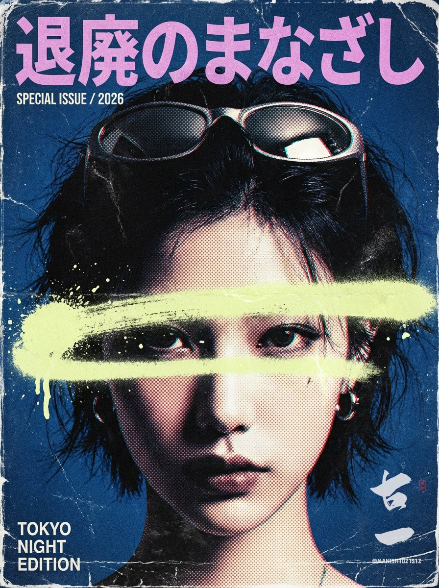


```
1) 画幅与构图
   * 竖版封面：2:3 / 3:4
   * 极近距离人像特写：脸占画面 70–80%
   * 头顶预留一条主标题区；下方下巴至锁骨留少量信息区
   * 允许裁切：顶部发丝与两侧轻微出框，增强海报冲击感

2) 主体人物
   * 非常漂亮的年轻女生，气质冷酷、酷飒、带一点叛逆
   * 齐肩短发：微乱、蓬松、有发丝纹理
   * 太阳眼镜挂在头上：镜腿卡在发间，镜片有轻微反光
   * 耳饰：1–2 个小金属耳环（耳钉或小圈），偏街头酷感
   * 表情：不笑、淡漠，直视镜头，眼神有压迫感

3) 光线与影调
   * 高对比硬光：脸部有明显明暗分割
   * 画面整体偏冷、压暗，人物肤色保留真实质感
   * 颗粒与印刷质地：halftone 网点 + 粗颗粒噪点

4) 标志性涂鸦元素（眼睛横线）
   * 一条横向贯穿眼睛区域的粗笔刷/喷涂涂鸦
   * 形态：不规则、带毛边与轻微喷溅
   * 覆盖：穿过眉眼区域但不完全遮挡眼睛
   * 颜色：低饱和"脏黄/芥末黄/旧荧光黄"（偏灰、偏旧，不要亮到发光）

5) 背景
   * 深冷色背景：深蓝 / 深灰偏青
   * 干净但带纸张纹理与颗粒，轻微暗角让人物更突出

6) 文字排版（日语主标题 + 信息层级）
   顶部主标题（日语）
   * 文案：「退廃のまなざし」
   * 字体：超粗、压缩感强、带速度感/斜切感的无衬线展示字体
   * 排版：横跨顶部，字距紧，允许部分字被裁切出画面边缘
   * 颜色：低饱和粉紫/灰粉/脏玫瑰色（偏灰、偏旧，不要高饱和霓虹）
   
   副标题/期号信息（小字）
   * 位置：主标题下方或右上角
   * 字体：简洁无衬线，小字号，白/浅灰，低对比
   * 示例：`SPECIAL ISSUE / 2026`、`VOL.01`
   
   底部信息行（最小字）
   * 位置：左下或右下
   * 内容：日期 / 标签短句 / 城市名（极简一行）
   * 示例：`TOKYO NIGHT EDITION`

7) 全局做旧风格（必须强化）
   * 旧纸张纤维纹理、褪色、轻微色偏
   * 印刷错位：轻微重影、边缘细微彩色偏移（misregistration）
   * 刮痕、磨损、折痕：重点在标题区与边缘
   * 胶片灰尘、脏点、污渍、擦拭痕
   * 局部贴纸残胶/撕裂边缘感（少量点缀，不喧宾夺主）

8) 整体氛围关键词
   * 复古杂志封面 + 街头涂鸦破坏感 + 重度做旧印刷
   * 冷、酷、叛逆、独立音乐海报气质
   * 颜色整体偏灰、偏旧、低饱和，避免"新鲜发光感"
```

 [↑返回目录](#toc)

---
## <a id="">红色旗袍女神侧颜特写</a> (<a href="https://x.com/ttmouse/status/2008273570175349157" target="_blank" rel="noopener noreferrer">ttmouse - 豆爸</a>)


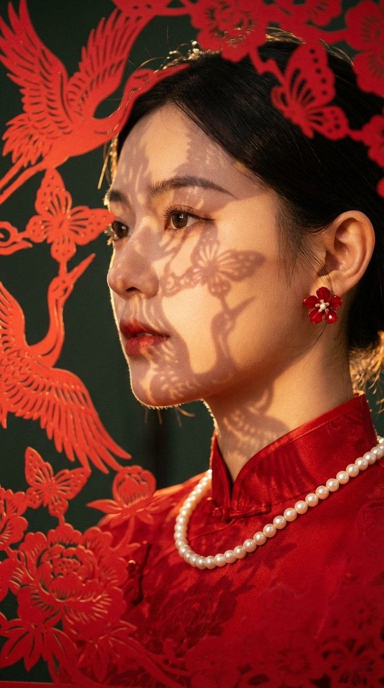

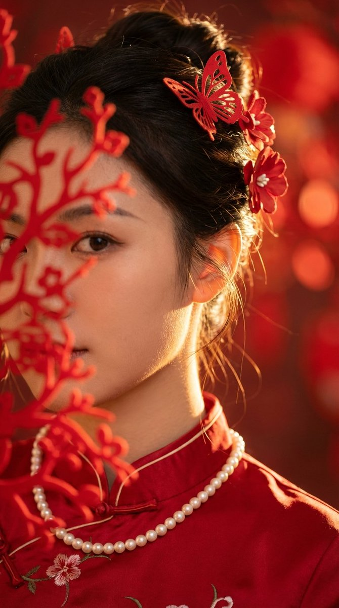

```
1. 宏观风格与媒介
- 核心媒介: 高清商业人像摄影 (High-end Commercial Photography)
- 美学流派: 新中式美学 (New Chinese Style), 节日时尚大片

2. 主体与IP身份
- 核心主体: 年轻东亚女性侧颜特写 (Close-up profile of young Asian woman)
- IP/名人锁定: 穿着红色旗袍 (Red Cheongsam), 佩戴珍珠项链与红色花卉耳环

3. 世界逻辑与物理
- 物理法则: 真实光学投影 (Real optical projection), 面部光影贴合面部起伏
- 空间构成: 人眼平视视角 (Eye-level), 极近距离接触

4. 数据与信息层
- 文本提取: 无文本
- 品牌与符号: 红色剪纸艺术前景 (Red paper-cut art foreground) - 包含仙鹤、蝴蝶与牡丹纹样

5. 材质与纹理
- 核心材质: 超写实皮肤质感 (Hyper-realistic skin), 哑光卡纸 (Matte cardstock), 温润珍珠
- 触感细节: 逆光下可见的面部绒毛 (Visible vellus hair backlit), 次表面散射效果 (Subsurface scattering)

6. 光影与氛围
- 光照模型: Gobo投影布光 (Gobo lighting/Projected shadows) - 复杂的镂空花纹光影投射在人物面部
- 整体氛围: 金色暖阳侧逆光 (Warm golden hour light), 高饱和度喜庆红调, 梦幻且清晰

7. 技术参数
- 镜头与渲染: 85mm-100mm 微距镜头 (Macro lens), 浅景深 (Shallow depth of field), 前景虚化 (Bokeh foreground)
- 构图指令: 框式构图 (Framed composition), --ar 3:4
```

```
1. 宏观风格与媒介
- 核心媒介: 高清商业人像摄影 (High-end Commercial Photography)
- 美学流派: 新中式美学 (New Chinese Style), 节日时尚大片

2. 主体与IP身份
- 核心主体: 年轻东亚女性侧颜特写 (Close-up profile of young Asian woman)
- IP/名人锁定: 穿着红色旗袍 (Red Cheongsam), 佩戴珍珠项链与红色花卉耳环

3. 世界逻辑与物理
- 物理法则: 真实光学投影 (Real optical projection), 面部光影贴合面部起伏
- 空间构成: 人眼平视视角 (Eye-level), 极近距离接触

4. 数据与信息层
- 文本提取: 无文本
- 品牌与符号: 红色剪纸艺术前景 (Red paper-cut art foreground) - 包含仙鹤、蝴蝶与牡丹纹样

5. 材质与纹理
- 核心材质: 超写实皮肤质感 (Hyper-realistic skin), 哑光卡纸 (Matte cardstock), 温润珍珠
- 触感细节: 逆光下可见的面部绒毛 (Visible vellus hair backlit), 次表面散射效果 (Subsurface scattering)

6. 光影与氛围
- 光照模型: Gobo投影布光 (Gobo lighting/Projected shadows) - 复杂的镂空花纹光影投射在人物面部
- 整体氛围: 金色暖阳侧逆光 (Warm golden hour light), 高饱和度喜庆红调, 梦幻且清晰

7. 技术参数
- 镜头与渲染: 85mm-100mm 微距镜头 (Macro lens), 浅景深 (Shallow depth of field), 前景虚化 (Bokeh foreground)
- 构图指令: 框式构图 (Framed composition), --ar 3:4
```

 [↑返回目录](#toc)

---
## <a id="">踏雪寻梅</a> (<a href="https://x.com/ttmouse/status/2008523042629263562" target="_blank" rel="noopener noreferrer">ttmouse - 豆爸</a>)


```
1. 基本风格 (Art Style)
• 绘画流派：没骨画风格 (Mogu Style)
• 表现手法：中国传统水墨与重彩晕染，强调以色彩的浓淡干湿塑造形体，不使用任何勾勒线条
• 材质基调：古旧宣纸纹理，纸面呈现微泛黄且带有历史沉淀感的古朴色泽
• 核心特色：色块层叠有序，气韵生动，通过虚实结合展示形神，留白艺术运用得当

2. 核心主体 (Main Subjects)
• 文人学者：侧身骑坐于驴背，神态悠然自得。头戴极具特色的黑色“展脚幞头”（两侧长翅平伸），身着宽大的朱砂红袍 (#E43818)，白色裤子塞入脚穿的黑色高靴中，衣褶完全通过色彩深浅的过渡来表现。
• 小驴：形体圆润，颜色为深褐色 (#563818)，四肢呈漫步状，以没骨法点染出骨骼与肌肉的质感，神态温驯。
• 随行小童：身姿轻盈灵动，紧随驴后。双手怀抱一把琵琶，梳单髻丸子头。细节设置：外袍为草绿色 (#739D68)，内衬为朱橘色 (#E06324)，白色裤，脚蹬红色小鞋 (#B72E15)。
• 动态逻辑：文人骑驴在前，小童抱琴在后，整体呈现出一种冒雪寻梅、踏雪而行的悠闲动态。

3. 环境背景 (Environment & Background)
• 地面景观：大雪初霁的雪景，皑皑白雪覆盖地面，雪面整体晕染着一层温润的淡米黄色调，呈现出古旧画卷的视觉感。
• 植被设置（纯色块堆积，无轮廓线）：
   • 寒梅：一尺粗壮苍劲的古梅，枝干色泽古拙 (#A78350)。枝头绽放饱满的朱砂红梅花 (#BE2D14)，点缀醒目的黄色花蕊。
   • 柳树：一尺粗壮树干的淡绿色的垂柳，表现出冬末初春的意象。
• 画面构图：画面上方三分之一处被大面积的赭黄色 (#BB9B52) 河流占据，横向贯穿，与下方的白雪大地形成鲜明对比。

4. 画面参数 (Parameters)
• 画面比例：16:9
```

 [↑返回目录](#toc)

---
## <a id="">拍立得女生</a> (<a href="https://x.com/Adam38363368936/status/2008328816825970731" target="_blank" rel="noopener noreferrer">Adam也叫吉米</a>)

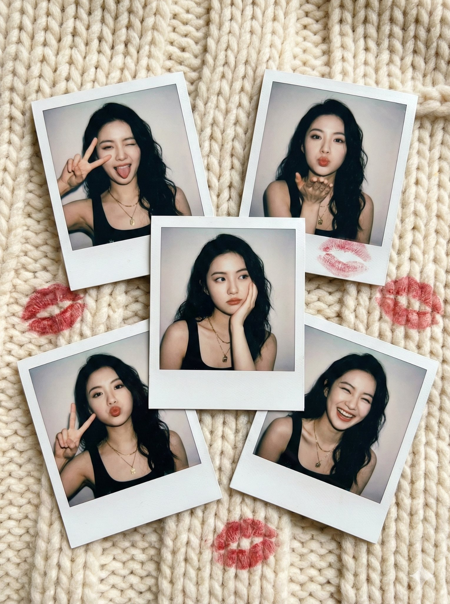

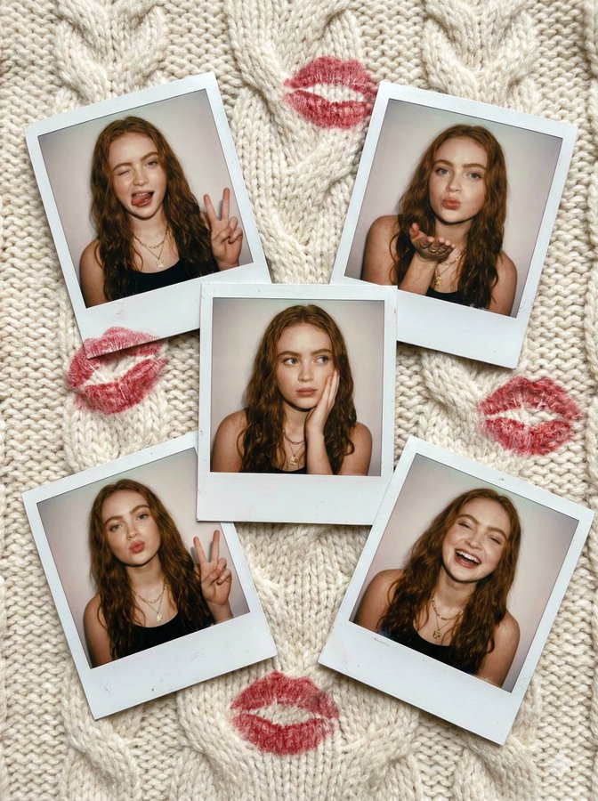

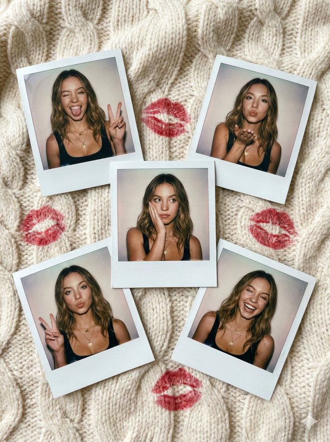

```
{
  "prompt": {
    "subject": {
      "description": "A collection of five vintage Polaroid instant photographs featuring the same young Asian woman, arranged casually on a textured surface.Use the face without any change",
      "appearance": {
        "hair": "Wavy, black hair.",
        "skin": "smooth and fair skin.",
        "makeup": "Natural, dewy makeup with defined brows and neutral lip color.",
        "clothing": "Black tank top.",
        "accessories": "Gold pendant necklaces."
      },
      "poses": [
        {
          "photo": "Top left",
          "description": "Winking, sticking out tongue, making a peace sign."
        },
        {
          "photo": "Top right",
          "description": "Blowing a kiss."
        },
        {
          "photo": "Center",
          "description": "Looking off-camera, hand on cheek."
        },
        {
          "photo": "Bottom left",
          "description": "Making a kissy face, peace sign."
        },
        {
          "photo": "Bottom right",
          "description": "Laughing broadly, head tilted."
        }
      ]
    },
    "environment": {
      "surface": "Thick, cream-colored knit wool blanket with a textured stitch pattern.",
      "details": "Several red lipstick kiss marks imprinted directly onto the blanket fabric.",
      "arrangement": "The five Polaroid prints are scattered naturally, overlapping slightly."
    },
    "lighting": {
      "type": "Soft, overhead ambient light, likely natural daylight, illuminating the entire scene.",
      "photo_lighting": "Direct studio flash within the Polaroid photos, creating a bright, slightly overexposed look with soft shadows."
    },
    "mood": "Playful, casual, nostalgic, warm, and personal.",
    "camera_details": {
      "style": "Ultra Photorealistic overhead photograph.",
      "focus": "Sharp focus on the Polaroid prints and the textures of the blanket.",
      "perspective": "Top-down view.",
      "film_type": "Vintage Polaroid instant film with classic white borders and slight wear." Ratio 3.4
    }
  }
}
```

```
五张复古宝丽来即时照片，展示同一位年轻的亚洲女性，随意摆放在有纹理的表面上，面部不得做任何改动。她拥有黑色波浪发、光滑白皙的肌肤、自然水润的妆容（眉形清晰、唇色中性），身穿黑色背心，佩戴金色吊坠项链。

五张照片中的姿势分别为：  
- 左上角：眨眼、吐舌头、比出和平手势；  
- 右上角：飞吻；  
- 中央：目光看向画外，手托脸颊；  
- 左下角：嘟嘴亲吻状，同时比出和平手势；  
- 右下角：开怀大笑，头部微倾。

照片散落在一条厚实的米白色针织羊毛毯上，毯子具有明显的纹理针脚，并印有数个红色口红吻痕。五张宝丽来照片自然散落，略有重叠。

整体光线为柔和的顶光环境光，似自然日光，照亮整个场景；而照片内部则使用直接的影室闪光灯，呈现出明亮略过曝的效果，并带有柔和阴影。

整体氛围俏皮、随性、怀旧、温暖且私密。

画面采用超写实风格的俯拍摄影，焦点清晰对准宝丽来照片及毛毯纹理，视角为正上方俯视。照片使用经典复古宝丽来即时胶片，带有白色边框和轻微使用痕迹，比例为3.4。
```

 [↑返回目录](#toc)

---
## <a id="prompt-2007831277269840400">食物特写镜头</a> (<a href="https://x.com/YaseenK7212/status/2007831277269840286" target="_blank" rel="noopener noreferrer">Yaseen Khan Gul</a>)

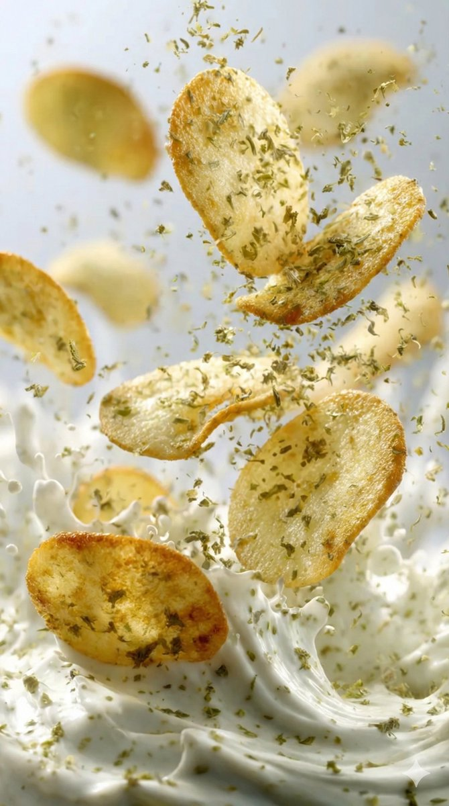


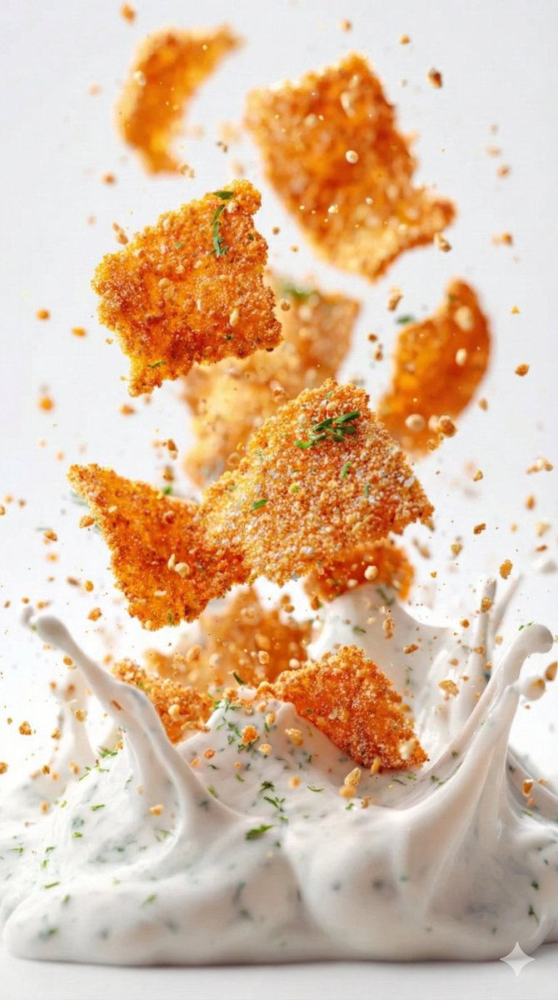

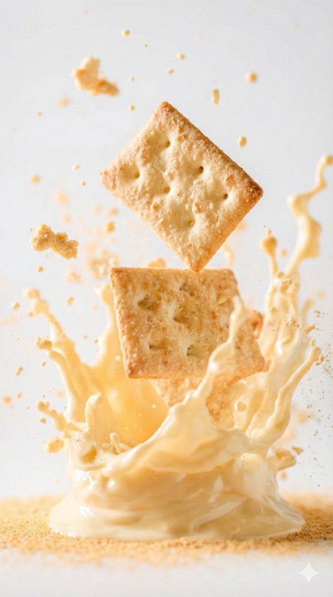

```
{
  "project_configuration": {
    "shot_type": "macro_slow_motion",
    "global_settings": {
      "aspect_ratio": "9:16",
      "chaos_weight": 15,
      "color_profile": "high-key",
      "environment": {
        "backdrop": "clean_white",
        "lighting_style": "cinematic_bloom",
        "atmosphere": "ethereal"
      }
    },
    "camera_optics": {
      "body": "Canon EOS R5",
      "lens": "85mm f/1.2",
      "depth_of_field": "shallow_bokeh",
      "focus_point": "fluid_subject_intersection"
    }
  },
  "scene_data": [
    {
      "id": "item_001",
      "snack_component": {
        "type": "herb-seasoned chips",
        "surface": "crisp_golden",
        "physics": "mid-air_floating"
      },
      "fluid_component": {
        "material": "Mediterranean herb cream",
        "color": "thick_white",
        "behavior": "upward_splash_arc",
        "texture": "glossy"
      },
      "particle_system": {
        "frozen_elements": "liquid_droplets",
        "spices": ["oregano_flakes", "thyme_flakes"],
        "debris": "hyper-detailed_crumbs"
      }
    },
    {
      "id": "item_002",
      "snack_component": {
        "type": "banana chips",
        "surface": "crisp",
        "physics": "hovering"
      },
      "fluid_component": {
        "material": "vanilla cream",
        "color": "thick_white",
        "behavior": "upward_burst",
        "texture": "soft_creamy"
      },
      "particle_system": {
        "frozen_elements": "soft_arc_droplets",
        "spices": ["fine_sugar_dust"],
        "debris": "detailed_banana_crumbs"
      }
    },
    {
      "id": "item_003",
      "snack_component": {
        "type": "taro chips",
        "surface": "lavender-tinted_crisp",
        "physics": "hovering"
      },
      "fluid_component": {
        "material": "taro cream",
        "color": "pastel-purple",
        "behavior": "upward_eruption",
        "texture": "glossy_viscous"
      },
      "particle_system": {
        "frozen_elements": "mid-flight_droplets",
        "spices": ["sugar-dust_particles"],
        "debris": "soft_drifting_taro_crumbs"
      }
    },
    {
      "id": "item_004",
      "snack_component": {
        "type": "cheese crackers",
        "surface": "textured",
        "physics": "suspended"
      },
      "fluid_component": {
        "material": "cheese dip",
        "color": "pale-yellow",
        "behavior": "upward_splash",
        "texture": "thick"
      },
      "particle_system": {
        "frozen_elements": "motion-frozen_droplets",
        "spices": ["cheddar_powder"],
        "debris": "soft_drifting_cracker_crumbs"
      }
    }
  ]
}
```

```
9:16 纵横比的微距慢动作镜头，高调色彩风格，背景为纯净白色，采用电影级光晕照明，营造空灵氛围。使用佳能 EOS R5 相机搭配 85mm f/1.2 镜头，浅景深虚化，焦点对准流体与零食交汇处。

画面包含四组元素：

第一组：香草调味薯片呈现金黄酥脆表面，在空中悬浮；地中海香草奶油呈浓稠白色，以向上飞溅的弧线喷发，质地光亮；冻结的液滴、牛至碎与百里香碎，以及超精细碎屑环绕四周。

第二组：香蕉片酥脆轻盈，漂浮于空中；香草奶油浓白柔滑，以向上的爆发状喷涌；柔和弧形液滴、细糖粉与细致香蕉碎屑构成粒子系统。

第三组：紫薯片带有淡紫色酥脆表层，悬浮空中；芋泥奶油呈淡紫色，质地光亮粘稠，以向上的喷发形式跃起；飞行中的液滴、糖粉微粒与轻柔飘散的紫薯碎屑点缀其间。

第四组：奶酪脆饼具有丰富纹理，悬停于空中；奶酪蘸酱呈淡黄色，浓稠质地向上飞溅；动态冻结的液滴、切达奶酪粉及轻柔飘落的脆饼碎屑共同组成粒子细节。
```

 [↑返回目录](#toc)

---
## <a id="prompt-2008186029820559400">瞳色妝容（美瞳）</a> (<a href="https://x.com/94vanAI/status/2008186029820559468" target="_blank" rel="noopener noreferrer">PlayForge AI</a>)

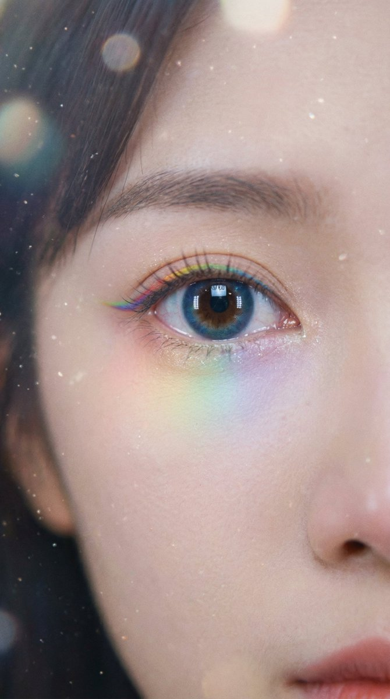

```
《一天學會一個關鍵字》今天要學的是－「瞳色妝容（美瞳）」
🔑 Keyword Overview

Colored Contact Lens Makeup refers to eye makeup techniques designed to complement colored contact lenses (also called "circle lenses" or "cosmetic lenses"), creating various aesthetic styles by changing pupil color.

👁️ What Are Colored Contact Lenses?

Colored contact lenses are cosmetic lenses with pigmented patterns that change your eye color and create a larger, more defined pupil appearance.

Popular Colors & Best Uses

Color Effect Best For     Black Natural enlargement, sophisticated Daily wear, formal occasions   Brown Warm, approachable Dates, everyday looks   Gray Mysterious, mixed-race vibe Parties, special events   Blue/Green Bold, exotic Photoshoots, stage performances
💄 Makeup Pairing Tips
1️⃣ Black Lenses × Natural Nude Makeup
Earth-tone eyeshadow base
Subtle, thin eyeliner
Focus on curled lashes
Result: Natural yet striking, office-friendly
2️⃣ Brown Lenses × Soft Sweet Makeup
Warm orange or peach eyeshadow
Highlight the aegyo-sal (under-eye area)
Light blush with coral lips
Result: Cute and charming, perfect for dates
3️⃣ Gray Lenses × Western Glam Makeup
Deep smoky eyeshadow
Emphasize eye socket contour
Extended winged eyeliner
Result: Cool and mysterious, party-ready
NBP Prompt：
——————————Line————————————
{
  "prompt": "A close-up shot photo, close-up of rainbow sclera eye, perfect eye technique photography, with rainbow eyeliner, sharp, delicate, cinematic, rainbow sclera eye makeup, rainbow eye makeup, 1 girl, solo looking at viewer, blue eyes, big-eyed Chinese idol girl, deep brown pupil, deep black eyelashes, close-up, reflection, eyeliner focus, light particles, traditional media, eye reflection, colored eyes, shallow depth of field, coda, high detail, high budget, bokeh, cinemascope, emotional, epic, gorgeous, film grain, grainy",
  "negative_prompt": "anime, cartoon, graphic, text, painting, crayon, graphite, abstract, glitch, deformed, mutated, ugly, disfigured",
  "aspect_ratio": "3:4"
}
```

 [↑返回目录](#toc)

---
## <a id="prompt-2008098771381690600">奢华香水：花香调的精致呈现</a> (<a href="https://x.com/0xbisc/status/2008098771381690572" target="_blank" rel="noopener noreferrer">Latte</a>)

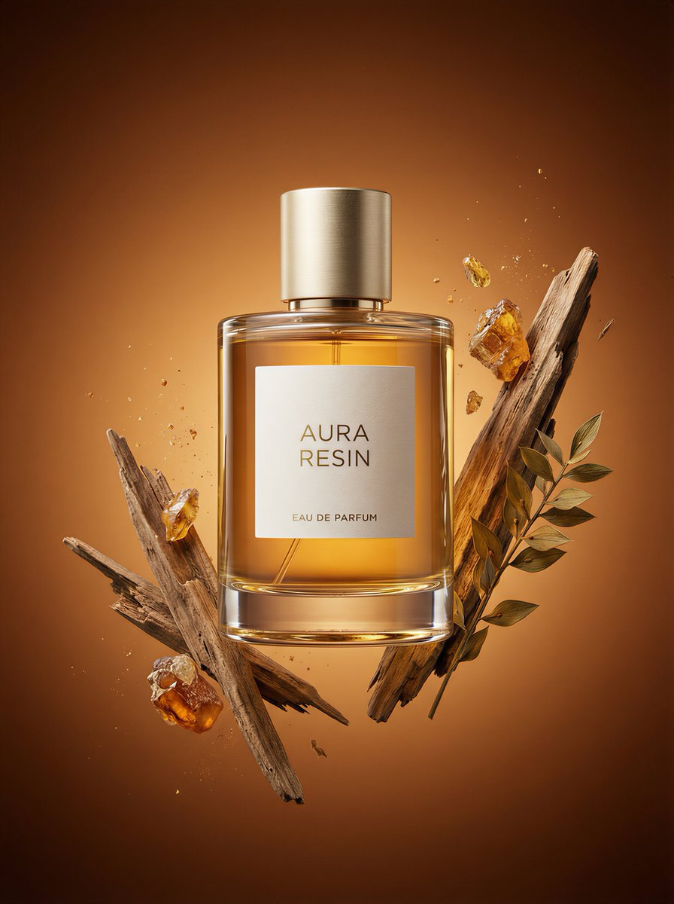

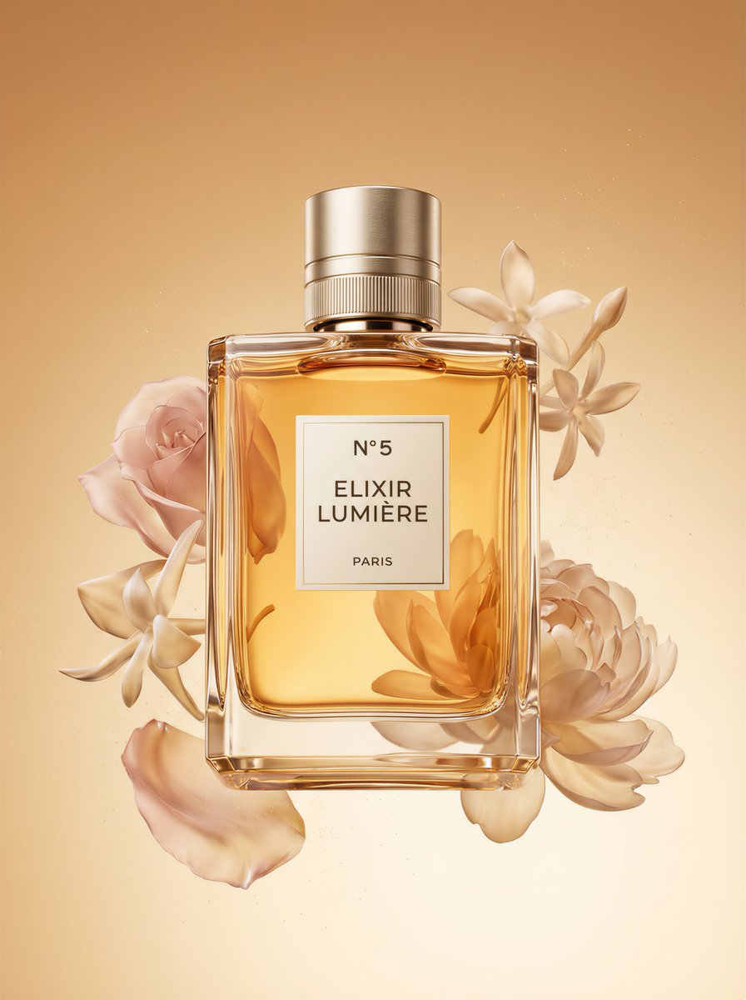

```
Luxury perfume ad template. Switch the scent profile and the whole vibe changes.

Prompt:

{
  "scent_profile": "Floral",

  "prompt": "Ultra high-end luxury perfume campaign image for a world-class prestige fragrance. A premium rectangular perfume bottle with perfectly balanced proportions typical of iconic global luxury brands, refined, substantial, and timeless, never tall, never slender, never vial-like. The bottle is crafted from thick, heavy, crystal-clear glass with softly rounded edges, visible weight, optical depth, and precise craftsmanship, filled with luminous liquid appropriate to a high-end perfume. A minimal ivory or warm off-white label is centered on the bottle, featuring ultra-clean modern sans-serif typography, extremely sparse text, and confident negative space. The cap is a champagne-gold or pale-gold brushed metal cylinder with precise machining and subtle, controlled reflections. The bottle floats calmly in space with quiet authority and confidence. Surrounding the bottle are exactly three distinct types of scent-related visual elements autonomously selected by the AI based on the provided scent_profile. These three element types represent different dimensions of the fragrance family, such as structural material forms, botanical or organic references, and atmospheric or sensory effects. All elements originate from the broader natural, botanical, and material context of the scent profile as understood in high-end perfumery. The elements are abstracted, symbolic, refined, and art-directed, never literal, never illustrative, never decorative. The elements are positioned close to and partially embracing the bottle, following its silhouette and contours rather than floating freely in space, creating a sense of attachment and intentional interaction with the product. The elements gently overlap the bottle edges in places, while maintaining clarity of the label and overall form. Spacing is controlled and elegant, with no bulky masses and no excessive gaps, forming a cohesive sculptural arrangement designed around the bottle. The background is a rich, noble, scent-matched tonal gradient with depth and luminosity, not dark or gloomy, but dense and refined. The background color harmonizes with the scent_profile. The background maintains medium-to-high brightness with elevated color density, subtle light falloff, and a refined vignette that enhances contrast without heaviness. Lighting is museum-quality studio lighting with a controlled warm key light, soft sculpting fill, and a precise rim light defining the bottle edges against the noble background. Glass refraction and reflections are perfect and premium, with no harsh highlights. Depth of field is moderate: the bottle and label are razor sharp, while decorative elements soften subtly with depth but remain clearly articulated. The overall mood is iconic, restrained, confident, luxurious, and unmistakably expensive, resembling a flagship global luxury perfume campaign.",

  "negative_prompt": "pure white background, dull gray background, muddy brown, overly dark background, gloomy lighting, flat background, e-commerce lighting, floating decorations detached from the bottle, scattered elements, bulky clusters, cheap, low-end, mass-market, indie look, playful mood, cartoon style, plastic materials, thin glass, lightweight bottle, sample bottle, vial, test tube, fashion vial, visible branding text, logos, watermarks, noise, grain, oversharpening, blown highlights, distorted glass, warped label, fisheye perspective, people, hands, extra objects",

  "aspect_ratio": "3:4",
  "quality": "ultra high detail, photorealistic, luxury commercial retouching",
  "style": "iconic luxury perfume photography, global prestige brand, cinematic, timeless, haute parfumerie"
}
```

```
奢华香水广告模板。更换香调，整体氛围随之改变。

超高端奢华香水广告画面，呈现世界级 prestige 香水。一瓶高级矩形香水瓶，比例完美平衡，体现全球标志性奢侈品牌的经典风格：精致、厚重、永恒，绝不高挑、纤细或试管状。瓶身采用厚实、沉重的高透水晶玻璃制成，边缘柔和圆润，具有可见的重量感、光学深度与精准工艺，内盛符合高端香水气质的莹亮液体。瓶身中央贴有极简象牙白或暖米白色标签，采用极致干净的现代无衬线字体，文字极度精简，留白自信从容。瓶盖为香槟金或浅金色拉丝金属圆柱体，加工精密，反射细腻克制。香水瓶在空间中沉稳悬浮，散发静谧而坚定的权威感。

围绕瓶身，AI 根据指定香调“花香”自主选取三种不同类型的香氛相关视觉元素。这三类元素分别代表该香调家族的不同维度，如结构性材质形态、植物或有机意象，以及氛围或感官效果。所有元素均源自高端香水领域对花香调所理解的自然、植物与材质语境，经过抽象化、象征性处理，并经艺术指导，绝不写实、插画式或装饰性。这些元素紧贴瓶身轮廓，部分环绕拥抱瓶体，而非自由漂浮于空间，营造出与产品有意互动的依附感。元素在局部轻柔地覆盖瓶缘，同时确保标签与整体造型清晰可辨。布局间距控制得当、优雅有致，无笨重团块亦无空旷间隙，形成围绕瓶体的统一雕塑式构图。

背景为与香调相协调的浓郁高贵色调渐变，富有深度与光感，不显阴暗沉闷，而是浓密且精致。背景保持中高亮度，色彩饱和度高，光线柔和衰减，并带有精致晕影以增强对比却不显沉重。灯光采用博物馆级影棚布光：主光温暖可控，辅光柔和塑形，精准的轮廓光勾勒瓶身边缘，使其从高贵背景中脱颖而出。玻璃折射与反光完美高级，无刺眼高光。景深适中：瓶身与标签锐利清晰，装饰元素随景深微妙虚化但仍结构分明。

整体氛围标志性强、克制内敛、自信奢华，尽显昂贵质感，宛如全球顶级奢侈香水旗舰广告大片。
```

 [↑返回目录](#toc)

---
## <a id="prompt-2008016478315192800">奢华[产品]漂浮广告</a> (<a href="https://x.com/RobotCleopatra/status/2008016478315192836" target="_blank" rel="noopener noreferrer">Skipper</a>)

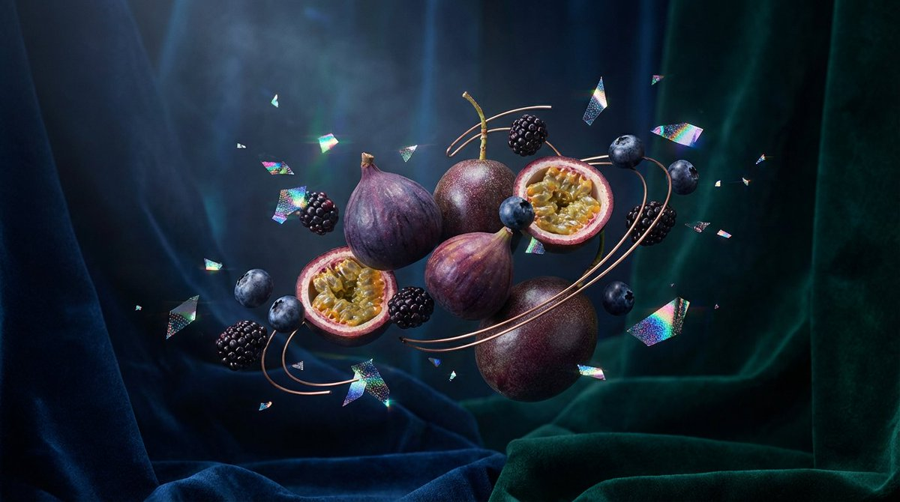

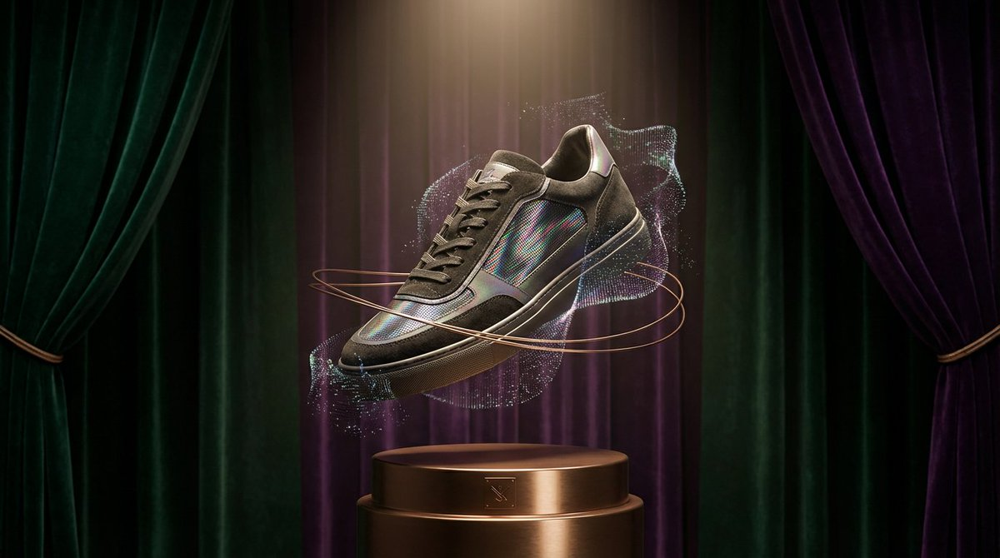

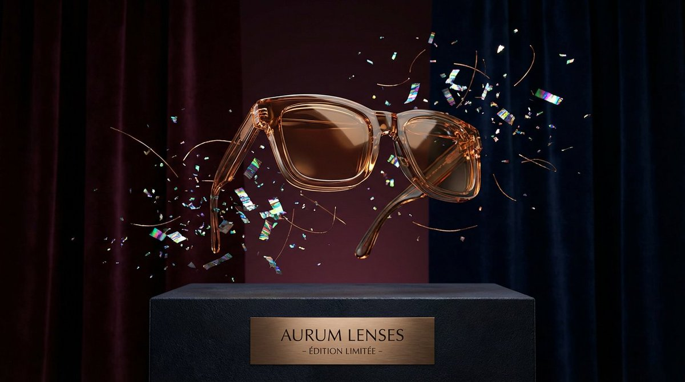

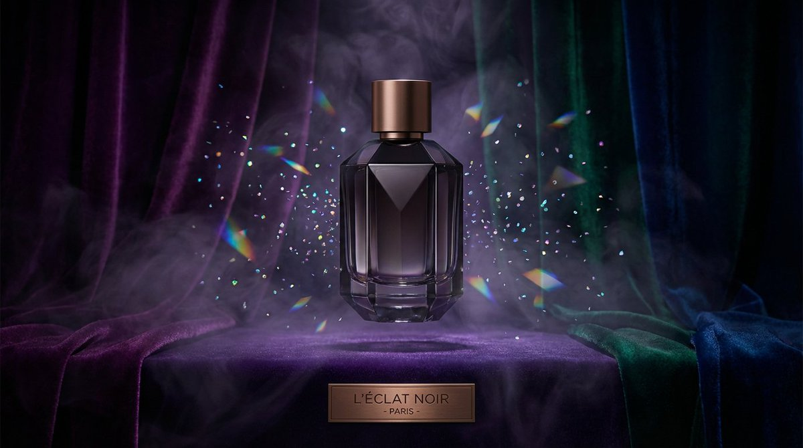

```
Luxury [PRODUCT] Floating luxury product, deep colorish scene, micro glitch holographic embellishments suspended in air, minimal bronze accent, dramatic  velvet atmosphere, high-end editorial, 8K ultra detailed
@Adobe @AdobeFirefly boards
```

```
奢华[产品]漂浮于深色调场景中，空气中悬浮着微故障风格的全息装饰，点缀极少的青铜色细节，营造出戏剧性的丝绒氛围，高端时尚大片风格，8K超精细画质
```

 [↑返回目录](#toc)

---
## <a id="prompt-2008008497473147100">Apple vision ProAR世界</a> (<a href="https://x.com/94vanAI/status/2008008497473147136" target="_blank" rel="noopener noreferrer">PlayForge AI</a>)

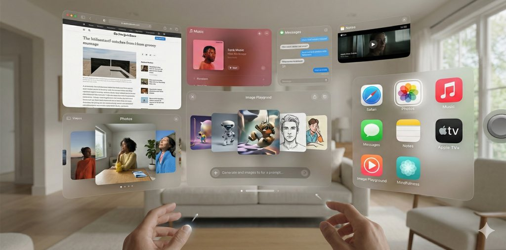

```
{
  "prompt": "Highly detailed photorealistic screenshot of Apple Vision Pro visionOS 26 operating interface from user's first-person immersive view, spatial computing home screen with multiple floating translucent glass-like 3D windows and volumetric app icons arranged in a customizable curved grid around the user, semi-transparent frosted blur material with subtle depth parallax and soft natural light reflections blending seamlessly with real-world passthrough surroundings, high-resolution micro-OLED display quality with ultra-sharp details, vibrant clean Apple minimalist UI design with rounded corners and volumetric glow, eye-tracking selection with subtle white glow highlight on hovered app icon (e.g., Photos app icon hovered), visible hand gesture pointers in lower field of view ready for pinch/tap/drag interactions, Digital Crown subtly visible on the right side for immersion control, open floating windows showing active apps: one large Safari browser window with tabs and webpage content, one Photos app window displaying spatial photos with depth, one Music app window with album artwork, one Messages window with conversation bubbles, one Notes window open, one Apple TV+ window playing immersive video preview, one Image Playground app window open showing text prompt input field at bottom with generated spatial images floating above in styles like Animation/Sketch/Illustration, one Mindfulness app window with breathing guide, subtle volumetric shadows and light bounce from virtual elements onto real environment, photorealistic rendering with cinematic soft ambient lighting, no distortion or artifacts, aspect ratio 2:1 wide immersive format",
  "negative_prompt": "blurry, low resolution, distorted text or UI elements, cartoonish, illustration style, flat 2D look, no depth or parallax, harsh shadows, overexposed, underexposed, watermark, logo overlay, people visible wearing headset, external device view, crowded cluttered screen, deformed windows or icons, missing hand pointers, no glow on hovered icons, explicit text prompts in Image Playground, vulgar content",
  "parameters": {
    "style": "Photorealistic visionOS 26 interface screenshot from inside the headset, Apple Human Interface Guidelines compliant, futuristic spatial UI with multiple open apps including Image Playground",
    "recommended_tool": "Midjourney, Stable Diffusion XL, Flux or advanced photoreal models",
    "aspect_ratio": "2:1 or 16:9 for wide spatial feel",
    "additional_tips": "Use weights like (floating translucent windows:1.4), (volumetric app icons:1.3), (Image Playground open with generated images:1.2), (soft natural passthrough lighting:1.1); vary open apps for diversity, include Apple Intelligence features like Image Playground prominently"
  }
}
```

 [↑返回目录](#toc)

---
## <a id="prompt-2008071853928226800">手持产品特写</a> (<a href="https://x.com/94vanAI/status/2008071853928226867" target="_blank" rel="noopener noreferrer">PlayForge AI</a>)

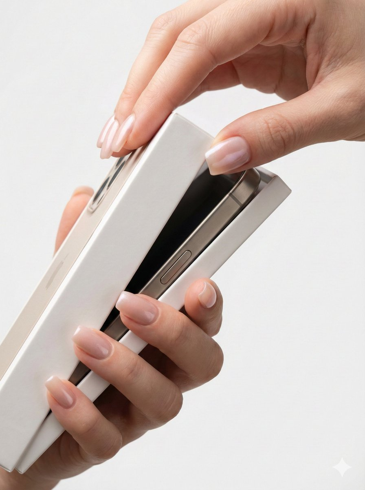

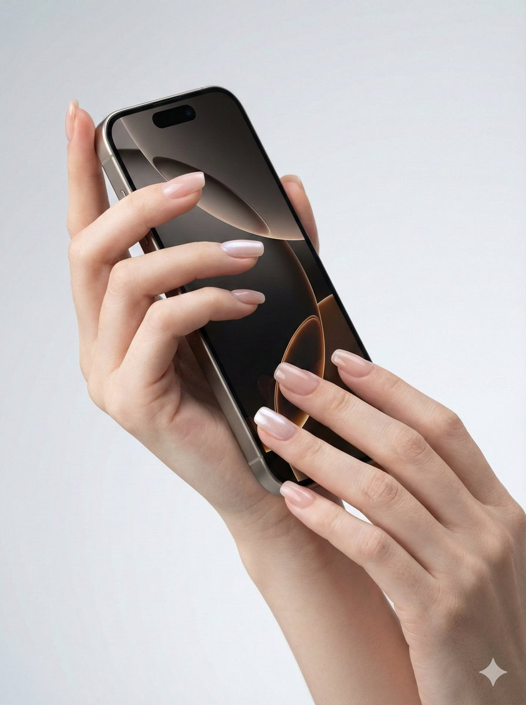

```
{
  "prompt": "Close-up of a woman's hand, slender fingers with delicate non-protruding joints, fair jade-like skin on the back of the hand, nails trimmed into refined square-round shape, coated with sheer nude pink nail polish, fingertips with subtle pearl sheen,\nsingle hand naturally and elegantly holding and showcasing [specific product name and description, e.g.: a matte black wireless Bluetooth earbuds charging case / a rose gold metal lipstick / a minimalist glass perfume bottle / an exquisite hard paper gift box / a jewelry box etc.], [optional: hand-product interaction description, e.g.: gently pushing the lid to reveal the earbuds / lightly gripping and slightly rotating the bottle / fingers gently pulling the ribbon to open the gift box / naturally holding and slightly tilting to show the interior, or leave blank for automatic adaptation], highlighting the product's minimalist premium design, natural and fluid hand movement with perfectly reasonable finger positioning,\n[optional: product reference description, e.g.: reference to the item in the uploaded image with high-quality rendering and perfect integration, or directly describe product appearance, material, color, shape etc.],\nnatural slanting light, soft sidelight emphasizing hand skin texture and product material, clean minimalist background [optional custom background, e.g.: light gray gradient / marble tabletop / soft white studio background / window with natural light etc.],\n8K ultra-high definition, photographic realism, extreme detail, perfect physical interaction and hand pose adaptation, no distortion, no flaws, no unreasonable deformation, professional product photography style --ar 3:4"
}
```

```
特写一位女性的手部，手指修长，关节细腻不突出，手背肌肤白皙如玉，指甲修剪成精致的方圆形状，涂有透明裸粉色指甲油，指尖泛着微妙的珍珠光泽。单手自然优雅地持握并展示[具体产品名称及描述，例如：哑光黑色无线蓝牙耳机充电盒 / 玫瑰金金属口红 / 极简玻璃香水瓶 / 精致硬纸礼品盒 / 首饰盒等]，[可选：手与产品的互动描述，例如：轻推盒盖露出耳机 / 轻握并微微旋转瓶身 / 手指轻拉丝带打开礼盒 / 自然握持并略微倾斜以展示内部，或留空由系统自动适配]，突出产品极简高端的设计感，手部动作自然流畅，手指位置合理精准。  
[可选：产品参考描述，例如：参照上传图像中的物品进行高质量渲染并完美融合，或直接描述产品的外观、材质、颜色、形状等]。  
自然斜射光线，柔和侧光强调手部肌肤纹理与产品材质，背景干净简约[可选自定义背景，例如：浅灰渐变 / 大理石桌面 / 柔白影棚背景 / 带自然光的窗户等]。  
8K超高清，摄影级真实感，极致细节，手部姿态与产品交互物理精准，无畸变、无瑕疵、无不合理形变，专业产品摄影风格 --ar 3:4
```

 [↑返回目录](#toc)

---
## <a id="prompt-2007881212132803000">破损的牧羊人壁画</a> (<a href="https://x.com/AllaAisling/status/2007881212132803025" target="_blank" rel="noopener noreferrer">Alexandra Aisling</a>)

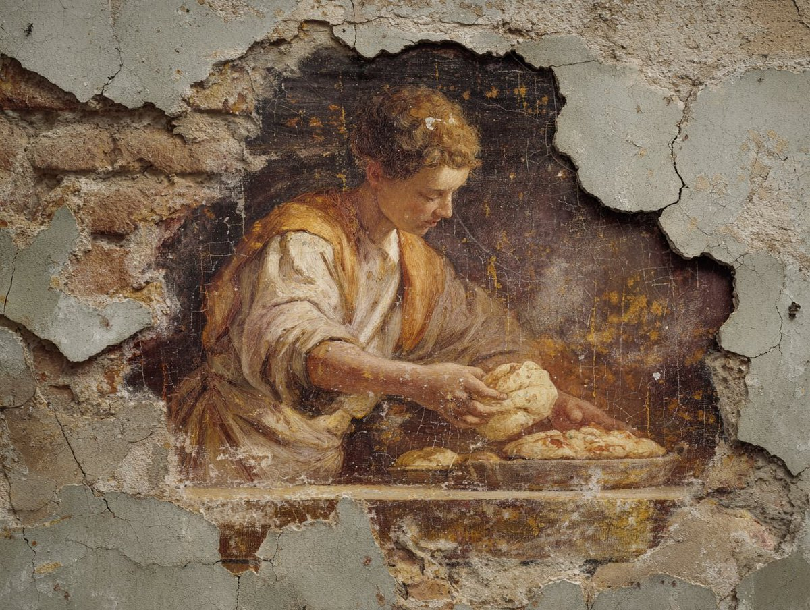

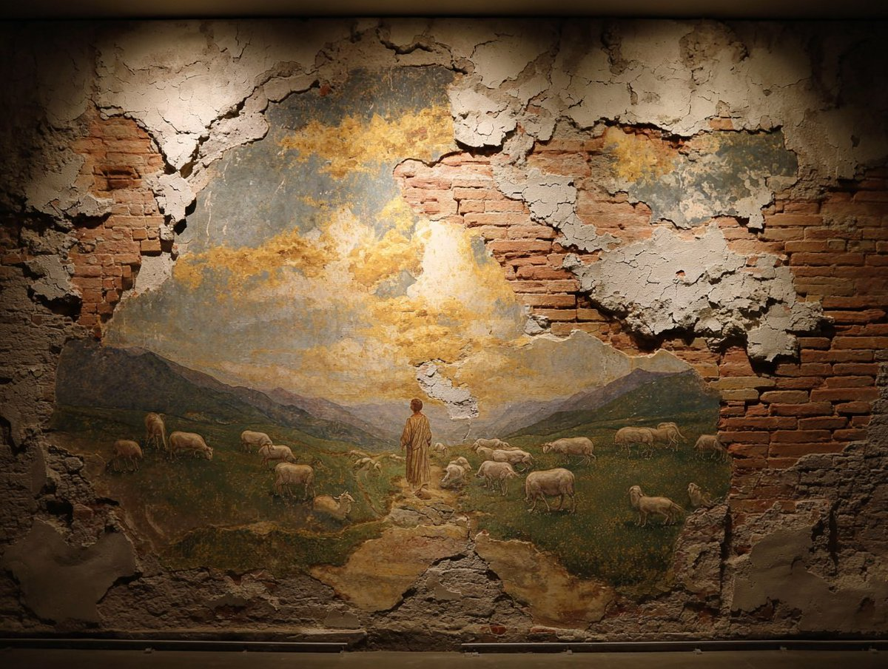

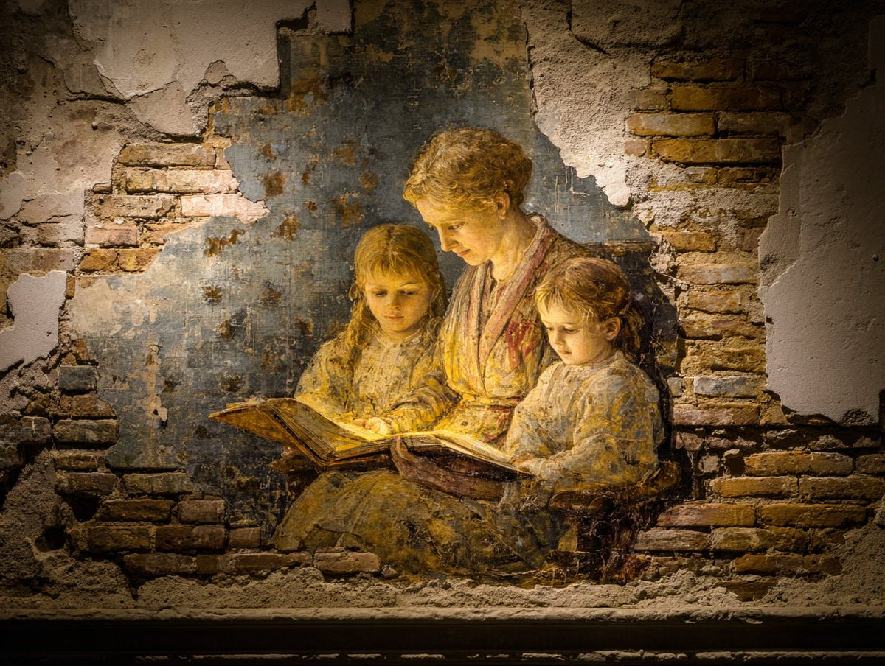

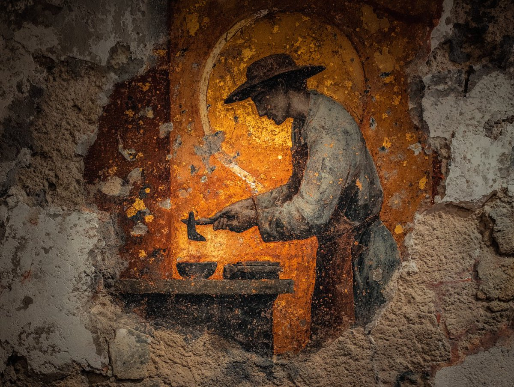

```
A cracked fresco of a baker pulling bread from a stone oven at dawn, ancient plaster surface with exposed brick beneath, Renaissance palette of naples yellow, burnt umber, and gold leaf accents on the crust catching firelight, weathered and partially restored, museum-lit from above.
```

```
A cracked fresco of a shepherd guiding his flock through a valley, ancient plaster surface with exposed brick beneath, Renaissance palette of terre verte, raw umber, and gold leaf accents on the evening sun crowning the hills, weathered and partially restored, museum-lit from above.
```

```
A cracked fresco of a grandmother reading to grandchildren by candlelight, ancient plaster surface with exposed brick beneath, Renaissance palette of yellow ochre, venetian red, and gold leaf accents on the book's illuminated pages, weathered and partially restored, museum-lit from above.
```

```
A cracked fresco of a blacksmith at his forge shaping horseshoes, ancient plaster surface with exposed brick beneath, Renaissance palette of mars orange, lamp black, and gold leaf accents on the glowing iron, weathered and partially restored, museum-lit from above.
```

 [↑返回目录](#toc)

---
## <a id="prompt-2008017541340565500">微型建筑工人组装产品</a> (<a href="https://x.com/aleenaamiir/status/2008017541340565526" target="_blank" rel="noopener noreferrer">Aleena Amir</a>)

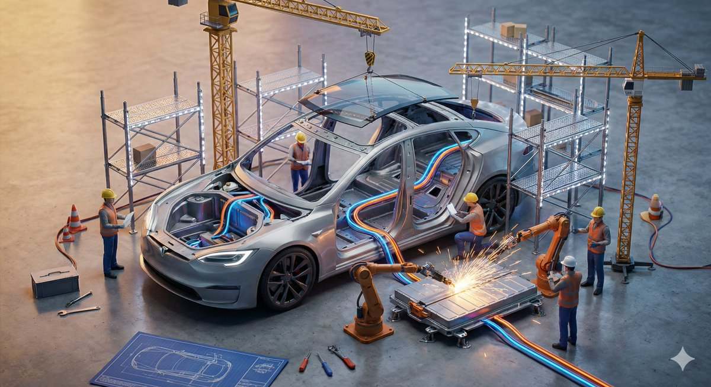

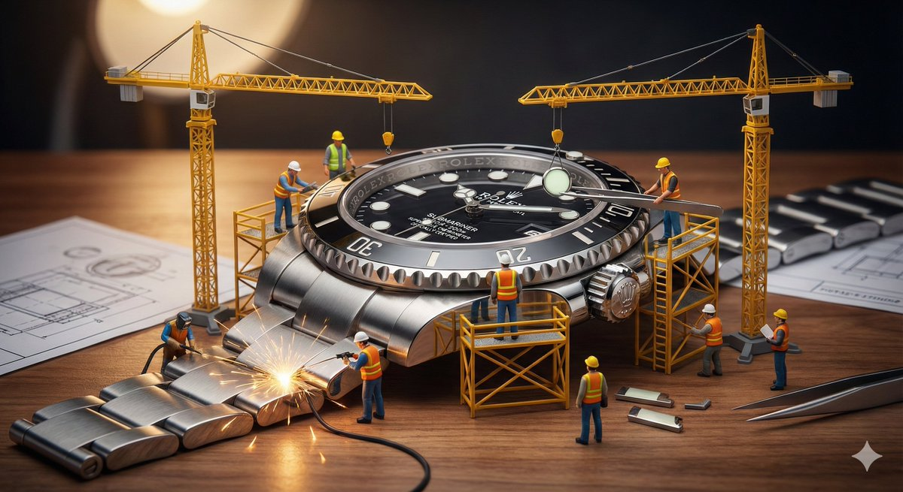

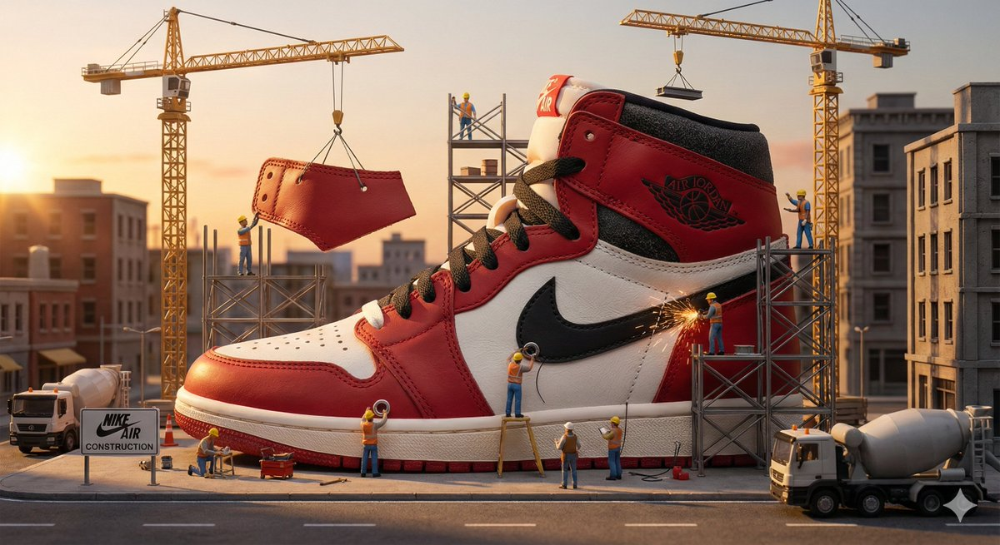

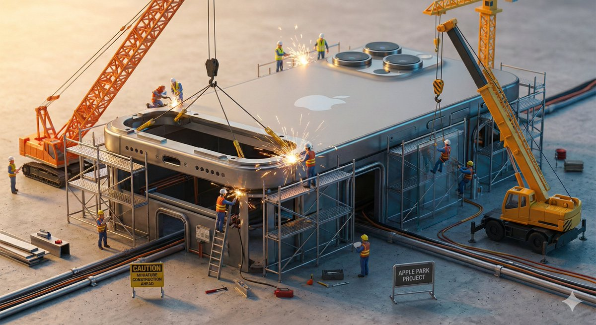

```
Construction Site Ad Miniature

Gemini Nano Banana Pro Prompt:

A miniature construction crew assembling [PRODUCT] like a skyscraper. Cranes, scaffolding, sparks flying. Playful but hyper-real, brand-campaign ready.
```

```
微型建筑工地广告

微型建筑工人正在像建造摩天大楼一样组装[产品]。画面中有起重机、脚手架和飞溅的火花。风格既趣味十足又高度写实，适合品牌宣传使用。
```

 [↑返回目录](#toc)

---
## <a id="prompt-2007802711937270000">逼真东亚自然唇部特写</a> (<a href="https://x.com/94vanAI/status/2007802711937270119" target="_blank" rel="noopener noreferrer">PlayForge AI</a>)


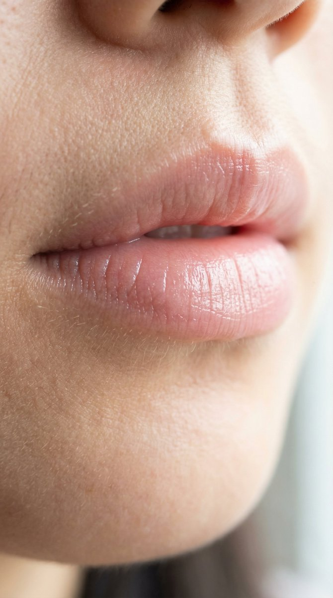

```
✍️Today's topic in "Learn One Keyword a Day" is "watery lip": This keyword can make the lips🫦 of your digital avatar look more natural and realistic.
✍️《一天學會一個關鍵字》今天要學的是－「水润唇色」這個關鍵字能讓你的數位人角色的嘴唇🫦更加自然并帶有真實感！
  Nano Banana Pro Prompt： 
“extreme close-up of natural East Asian lips, ultra sheer watery lip essence, zero visible product, just a whisper of soft pink hydration, dewy but not glossy, realistic skin texture with delicate vellus hair on lips, calm soft window light, no makeup appearance, hyper detailed, lifelike, 8k HDR, professional portrait photography, Canon RF 100mm macro lens.”
```

 [↑返回目录](#toc)

---
## <a id="prompt-2007835913842495500">萨克斯风工匠传承板：塞尔玛1954</a> (<a href="https://x.com/AllaAisling/status/2007835913842495504" target="_blank" rel="noopener noreferrer">Alexandra Aisling</a>)

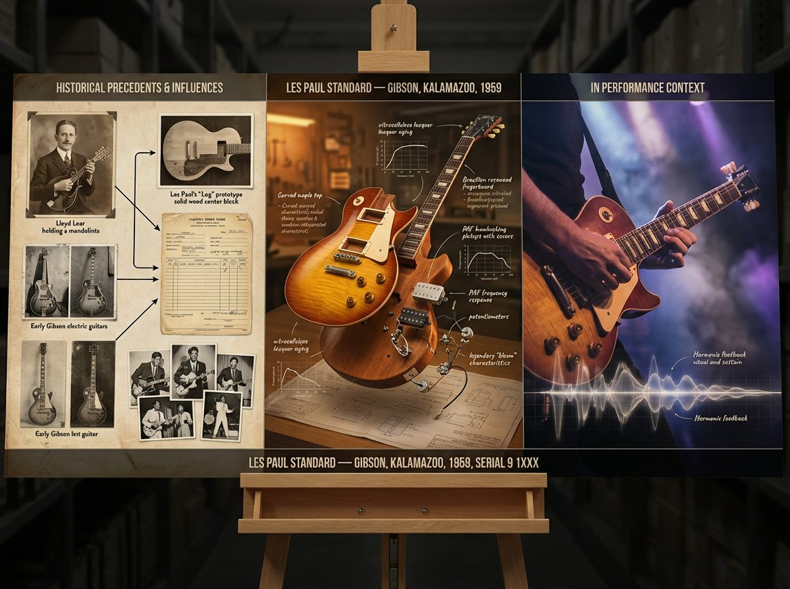

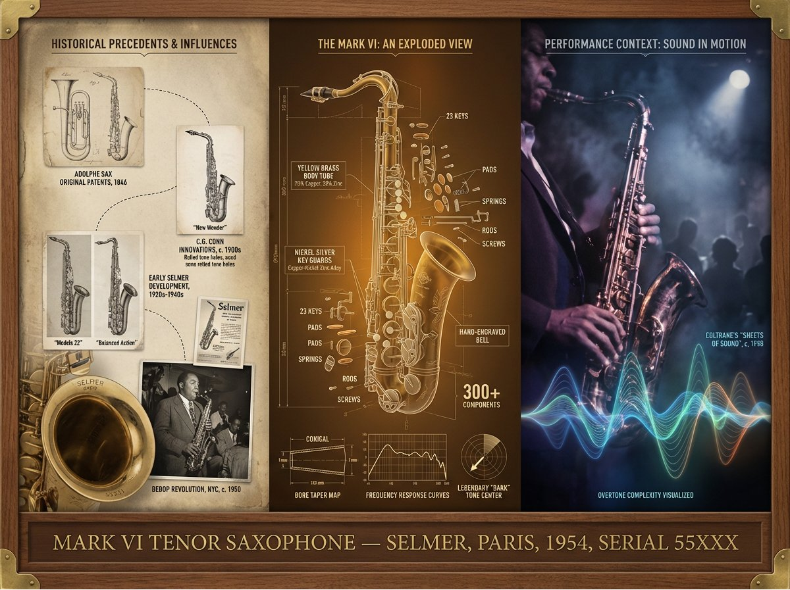

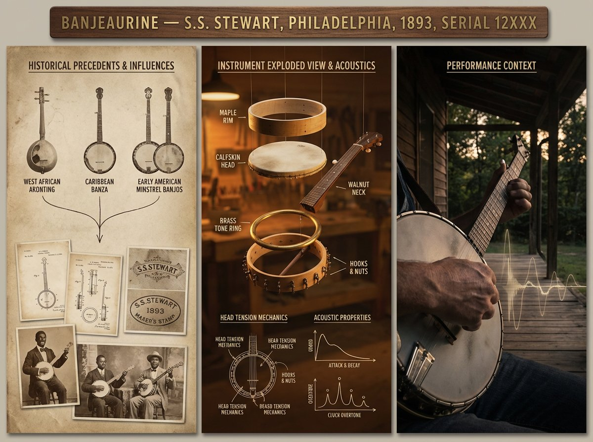

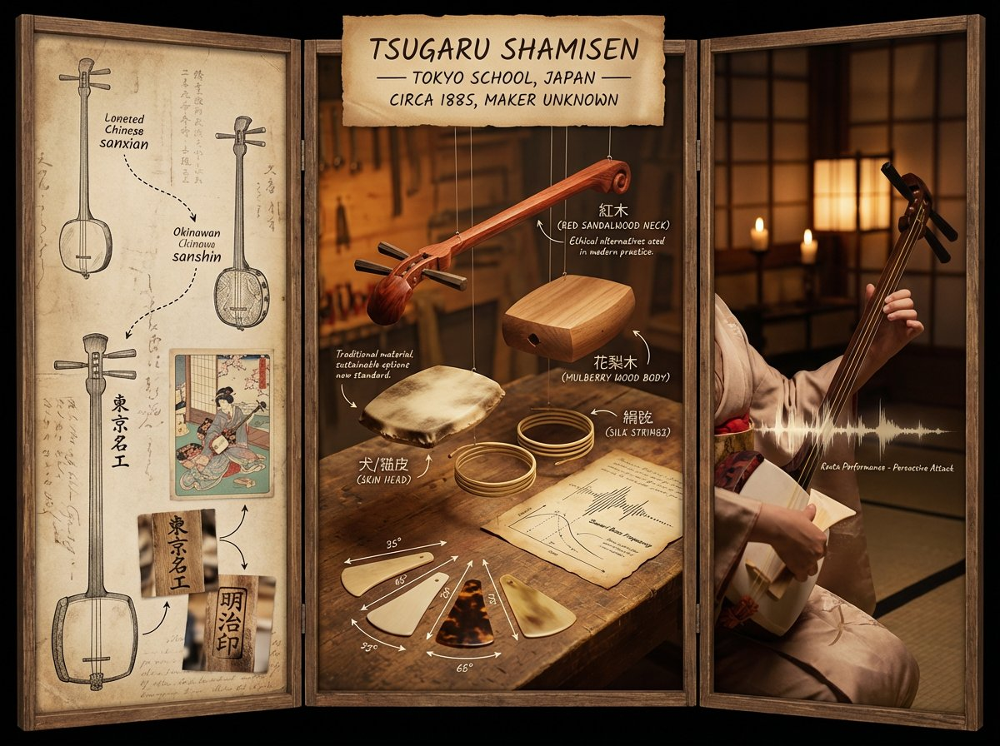

```
A luthier's legacy board for an electric guitar — Gibson, Kalamazoo, 1959. Left section: historical precedents and influences, showing Lloyd Loar's innovations, Les Paul's "Log" prototype, and early Gibson solidbody attempts with lineage lines connecting them, factory order forms photographed, and period photographs of rock and roll's birth. Center section: the Les Paul Standard in exploded view, every component separated and floating—carved maple top, mahogany back and neck, Brazilian rosewood fingerboard, PAF humbucking pickups—tonewoods identified, sunburst finish nitrocellulose aging documented, electronic properties annotated with pickup frequency response and legendary "bloom" characteristics. Right section: the instrument in performance context, guitarist's fingers bending strings into sustained wail, stadium ambiance of stage lights and fog, sound made visible through subtle waveform overlay showing harmonic feedback sustain. [...]
```

```
A luthier's legacy board for a tenor saxophone — Selmer, Paris, 1954. Left section: historical precedents and influences, showing Adolphe Sax's original patents, C.G. Conn innovations, and early Selmer development with lineage lines connecting them, serial number engravings photographed, and period photographs of Charlie Parker and the bebop revolution. Center section: the Mark VI in exploded view, every component separated and floating—yellow brass body, nickel-silver key guards, hand-engraved bell, 23 keys and 300+ components—alloy compositions identified, bore taper mapped, acoustic properties annotated with frequency response curves and legendary "dark" tone center. Right section: the instrument in performance context, Coltrane's fingers in sheets-of-sound motion, smoky club ambiance, sound made visible through subtle waveform overlay showing overtone complexity. Visual style transitions from aged daguerreotype through factory amber to jazz club chiaroscuro. [...]
```

```
A luthier's legacy board for a banjo — S.S. Stewart, Philadelphia, 1893. Left section: historical precedents and influences, showing West African akonting and gourd-bodied ancestors, Caribbean banza evolution, and American minstrel era development with lineage lines connecting them, patent drawings and maker's stamps photographed, and period photographs of both the problematic minstrel context and authentic African American folk tradition. Center section: the instrument in exploded view, every component separated and floating—maple rim, calfskin head, walnut neck, brass tone ring and hooks—materials identified, head tension mechanics mapped, acoustic properties annotated with characteristic attack and decay curves and "cluck" overtone positions. Right section: the instrument in performance context, musician's clawhammer hand in downstroke motion, mountain porch ambiance of wood and evening light, sound made visible through subtle waveform overlay showing percussive rhythmic [...]
```

```
A luthier's legacy board for a shamisen — Tokyo school, Meiji period, circa 1885. Left section: historical precedents and influences, showing Chinese sanxian origins, Okinawan sanshin evolution, and Edo period refinements with lineage lines connecting them, maker's brands burned into wood photographed, and ukiyo-e prints showing geisha performance. Center section: the instrument in exploded view, every component separated and floating—red sandalwood neck, mulberry wood body, cat or dog skin head, silk strings—materials identified with ethical sourcing notes on modern alternatives, bachi plectrum angles mapped, acoustic properties annotated with characteristic sawari buzz frequency locations. Right section: the instrument in performance context, geisha's hands in fluid motion during kouta, tatami room ambiance of paper screens and candlelight, sound made visible through subtle waveform overlay showing percussive attack. Visual style transitions from aged daguerreotype through [...]
```

 [↑返回目录](#toc)

---
## <a id="prompt-2008127774750548200">极简主义3D像素化食物摄影</a> (<a href="https://x.com/TechieBySA/status/2008127774750548155" target="_blank" rel="noopener noreferrer">TechieSA</a>)


```
Minimalist food photograph, [1080x1080] – a single [FOOD] rests on a light, matte surface and is captured mid-transformation into a 3D pixelized form: one half remains intact while the other organically fragments into large, floating cubes that drift outward, each cube revealing the object’s texture, ingredients, and colors. Studio lighting with soft, realistic shadows, shallow depth of field, tasteful perspective and composition, hyperrealistic detail, stylish geometric abstraction, subtle motion blur on the cubes, high resolution, cinematic close-up.
```

```
极简主义食物摄影，[1080x1080]——一道[FOOD]静置于浅色哑光表面上，正处于向3D像素化形态转变的瞬间：一半保持完整，另一半则自然地碎裂成大型漂浮立方体，向外飘散，每个立方体都展现出该食物的纹理、成分与色彩。影棚灯光营造柔和逼真的阴影，浅景深，构图与视角考究，细节超写实，兼具时尚几何抽象风格，立方体带有微妙动态模糊，高分辨率，电影感特写。
```

 [↑返回目录](#toc)

---
## <a id="">小朋友学字</a> (<a href="https://x.com/berryxia/status/2008425387999801451" target="_blank" rel="noopener noreferrer">Berryxia.AI</a>)


```
"小朋友每日学个字" 简化版 v7.0 (移除技术参数)

## 📐 完整通用系统提示词（精简版）

```plaintext

Create a modern Apple Design-inspired "Daily Character Learning for Kids" (小朋友每日学个字) calendar page for {月}月{日}日, {年份}. Ultra-minimalist, clean, playful, and child-friendly layout in 4K quality.

**TODAY'S CHARACTER: "{汉字}"**

Category: {主题分类}

═══════════════════════════════════════════════════════

PART 1: LAYOUT STRUCTURE

═══════════════════════════════════════════════════════

**Header Area (Top-Left):**

- Main date: "{月}月{日}日" - Large and prominent

- Weekday: "星期{X}" - Small, below date

- **ARTISTIC YEAR DISPLAY:** "— {年份} —"

  * Elegant serif OR artistic sans-serif font

  * Soft warm gray color

  * Centered below weekday

  * Integrated into header typography hierarchy

  * Like art print edition number

**Calendar Widget (Top-Right Corner):**

**Position & Styling:**

- Location: Top-right corner

- Proper margins from edges

- Subtle rounded rectangle background with soft shadow

- Clean, modern appearance

**Calendar Header:**

- Text: "{年份}年{月}月"

- Centered above grid

- Clean sans-serif, medium weight

**Weekday Labels:**

- 一 二 三 四 五 六 日 (Monday to Sunday)

- Sans-serif, regular weight

- Medium gray color

- Evenly spaced across 7 columns

**═══════════════════════════════════════════════════════**

**2026 COMPLETE CALENDAR DATA**

**═══════════════════════════════════════════════════════**

```yaml

2026年日历数据:

  

  1月: 31天, 1日=周四

  网格: [空][空][空][1][2][3][4] / [5][6][7]...

  

  2月: 28天, 1日=周日

  网格: [空][空][空][空][空][空][1] / [2][3][4]...

  

  3月: 31天, 1日=周日

  网格: [空][空][空][空][空][空][1] / [2][3][4]...

  

  4月: 30天, 1日=周三

  网格: [空][空][1][2][3][4][5] / [6][7][8]...

  

  5月: 31天, 1日=周五

  网格: [空][空][空][空][1][2][3] / [4][5][6]...

  

  6月: 30天, 1日=周一

  网格: [1][2][3][4][5][6][7] / [8][9][10]...

  

  7月: 31天, 1日=周三

  网格: [空][空][1][2][3][4][5] / [6][7][8]...

  

  8月: 31天, 1日=周六

  网格: [空][空][空][空][空][1][2] / [3][4][5]...

  

  9月: 30天, 1日=周二

  网格: [空][1][2][3][4][5][6] / [7][8][9]...

  

  10月: 31天, 1日=周四

  网格: [空][空][空][1][2][3][4] / [5][6][7]...

  

  11月: 30天, 1日=周日

  网格: [空][空][空][空][空][空][1] / [2][3][4]...

  

  12月: 31天, 1日=周二

  网格: [空][1][2][3][4][5][6] / [7][8][9]...

```

**GRID CONSTRUCTION (Follow exactly):**

1. Look up {月}月 data from above

2. First row: Weekday labels (一二三四五六日)

3. Second row: Place empty cells according to starting pattern, then fill with dates

4. Following rows: Continue sequentially until reaching total days

5. Highlight date {日} with soft colored background

**Highlight Styling:**

- Visual: Soft rounded circle OR rounded rectangle

- Background: Theme color at moderate opacity

- Text: Bold weight, darker color

- Optional: Subtle outer glow

- Make it clearly visible but not harsh

**Calendar Typography:**

- Clean sans-serif font

- Small, readable size

- Current date: Bold weight with highlight

- Other dates: Regular weight, medium gray

- Proper spacing between cells

═══════════════════════════════════════════════════════

PART 2: CHARACTER WRITING STANDARDS

═══════════════════════════════════════════════════════

**CRITICAL - Triple Verification Required:**

✓ **Character:** "{汉字}" - Standard Kaishu (楷书) style

  * Clear, beautiful, child-friendly rendering

  * Standard simplified Chinese

  * Proper proportions and balance

✓ **Stroke Count Verification (MANDATORY):**

  * Xinhua Dictionary (新华字典): {笔画数}画

  * GB/T 13000 national standard: {笔画数}画

  * Component calculation: {拆解计算}

  * **CONFIRMED: {汉字} = {笔画数}画**

  * **CRITICAL: Do NOT display stroke order numbers on character**

✓ **Radical (部首):** "{部首}"

  * Position: {左边/右边/上面/下面/外围}

  * Meaning/function: {部首含义}

✓ **Structure (结构):** "{结构类型}"

  * Types: 左右结构 / 上下结构 / 左中右 / 上中下 / 半包围 / 全包围 / 独体字

  * Component breakdown: {组成部件说明}

**Character Display (Center Focus):**

- Huge "{汉字}" character - Approximately 40% of canvas height

- **NO stroke order numbers overlaid** - Keep character clean and beautiful

- Soft {主题颜色} glow effect around character

- Below: 3×3 Tian Zi Ge (田字格) practice grid

  * Light gray guide character inside

  * Thin, clear grid lines

  * First stroke starting point marked with gentle indicator

═══════════════════════════════════════════════════════

PART 3: THEMATIC ILLUSTRATION

═══════════════════════════════════════════════════════

**Scene Design (Based on Category):**

{根据主题分类选择对应场景}

**General Illustration Principles:**

- Kawaii/cute cartoon style with big expressive eyes

- Rounded, friendly lines and soft shapes

- Soft, child-friendly color palette from theme

- Elements directly related to character meaning

- Positive, encouraging, joyful atmosphere

- NO scary, negative, or inappropriate imagery

- Playful composition with proper depth

- Characters and objects with personality

**Theme-Specific Elements:**

- **动物**: Cute animals, habitat, paw prints, food items

- **水果**: Fruit trees, baskets, fresh produce, garden

- **植物**: Flowers, growth stages, watering can, sunshine

- **颜色**: Rainbow, paint palette, colorful balloons

- **数字**: Counting objects, number shapes, playful math

- **食物**: Kitchen scene, happy food characters, dining

- **情感**: Expressive faces, hearts, emotion scenarios

- **自然**: Mountains, rivers, sun, moon, clouds, weather

- **身体**: Active children, sports, healthy activities

- **动词/形容词**: Action scenes, descriptive visuals

- **物品**: Daily objects, home setting, toys, tools

═══════════════════════════════════════════════════════

PART 4: EDUCATIONAL CONTENT

═══════════════════════════════════════════════════════

**Content Hierarchy (Clear Information Architecture):**

1. **Category Header:** "小朋友每日学个字 | {主题分类}"

   - Rounded sans-serif, medium weight

   - Warm charcoal color

2. **Character Display:** "{汉字}" (large, prominent, beautiful)

3. **Pinyin:** "拼音: {pinyin}"

   - Must include accurate tone marks: ā á ǎ à

   - Regular weight

   - Medium gray color

4. **Tone Indicator:** "第{声调}声" + visual tone line

   - First tone (1): ˉ (high flat line)

   - Second tone (2): ˊ (rising line)

   - Third tone (3): ˇ (dipping line)

   - Fourth tone (4): ˋ (falling line)

   - Neutral: 轻声 (no line or dot)

   - Show visual contour in accent color

5. **Stroke Count:** "笔画: {数量}画"

   - Must be 100% accurate from verified sources

   - Medium size, clear display

6. **Radical:** "部首: {部首} ({位置和含义说明})"

   - Explain position (left/right/top/bottom)

   - Explain meaning or category indication

7. **Structure:** "结构: {结构类型} ({拆解说明})"

   - Explain how character is composed

   - Break down into recognizable parts

8. **Meaning:** "意思: {清晰、儿童友好的解释}"

   - Simple, age-appropriate language

   - 1-2 sentences

   - Avoid overly technical terms

9. **Example Sentence:** "例句: {生活化例句}" + relevant emoji

   - Short sentence children can relate to

   - Natural, conversational language

   - Include appropriate emoji for visual appeal

10. **Fun Fact:** "小知识: {趣味知识或记忆技巧}!"

    - Interesting character trivia

    - Memory aids or mnemonics

    - Cultural background

    - Connection to daily life

    - Encouraging positive message

**Typography:**

- Child-friendly rounded sans-serif for all content

- Generous line spacing (approximately 1.7x)

- Large, clear characters for easy reading

- Excellent readability with high contrast

**Highlight Keywords:**

- Select 3-5 important terms from content

- Apply soft colored background highlight

- Use theme-appropriate colors at comfortable opacity

- Should enhance readability without distraction

═══════════════════════════════════════════════════════

PART 5: INTERACTIVE ELEMENTS

═══════════════════════════════════════════════════════

**Tian Zi Ge Practice Grid:**

- Standard 3×3 grid (九宫格)

- Position: Below main character display OR bottom area

- Light gray guide character inside (low opacity)

- Thin, clear grid lines

- First stroke starting point marked with gentle indicator (dot/arrow)

- Optional: Simple stroke direction hints with minimal arrows

**Encouragement Text:**

- Position: Near practice grid

- Font: Playful rounded sans-serif

- Color: Theme accent color

- Examples:

  * "试着写'{汉字}'字,你一定能写好!"

  * "跟着笔顺写一写!"

  * "描一描,练一练!"

  * "慢慢来,你能写得很漂亮!"

- Include encouraging emoji (✨ 🌟 💪 etc.)

═══════════════════════════════════════════════════════

PART 6: ADORABLE MASCOT

═══════════════════════════════════════════════════════

**Mascot Character Design:**

- Animal: Cute {动物} teacher (panda/bunny/fox/owl/penguin/cat based on theme)

- Size: Comfortable presence without overwhelming (approximately 10-15% of canvas)

- Position: Bottom-right corner (primary) OR integrated into scene

- Outfit: Theme-appropriate costume

  * Glasses and graduation cap (scholarly)

  * Apron and chef's hat (food themes)

  * Lab coat and goggles (science)

  * Sports gear (physical activities)

  * Scarf and earmuffs (winter themes)

- Props: Holding theme-related items (book, brush pen, tools)

- Expression: Warm, encouraging, friendly smile

- Pose: Welcoming gesture, pointing, or teaching motion

**Speech Bubble:**

- Content: "今天我们学'{汉字}'字!" OR themed encouraging message

- Style: Rounded bubble with tail to mascot

- Background: White or very light color, high opacity

- Border: Thin line in theme accent color

- Font: Playful rounded sans-serif

═══════════════════════════════════════════════════════

PART 7: DESIGN SYSTEM

═══════════════════════════════════════════════════════

**Layout Principles:**

- White/negative space: 55-60% of canvas

- Grid system: Consistent alignment and spacing

- Content cards: Rounded corners throughout

- Shadows: Soft and subtle on all layered elements

- Visual hierarchy: Clear size and color differentiation

**Color System:**

**Base Colors:**

- Background: Cream white #FFFEF9 or soft white #FEFEFE

- Primary text: Warm charcoal #2C2C2C

- Secondary text: Medium gray #6B6B6B

- Tertiary text: Light gray #999999

**Theme Accent Colors (Choose 3-4 based on category):**

- Coral pink #FF9AA2

- Sky blue #B5EAD7

- Soft yellow #FFDAC1

- Mint green #C7CEEA

- Lavender #E2CFEA

- Peach #FFB7B2

- Power orange #FF9B50

- Energy red #FF6B6B

- Calm blue #6BCF7F

- Golden yellow #FFD93D

- Warm brown #D4A574

- Icy blue #B5EAD7

- Crystal white #F0F8FF

**Element Styling:**

- Cards: rgba(255,255,255,0.97) with subtle blur

- Badges: rgba(0,0,0,0.03) for subtle backgrounds

- Highlights: Theme color at comfortable opacity

- Rounded corners: Consistent radius on all elements

- Shadows: Soft, subtle depth

**Background Treatment:**

- Extremely subtle paper grain texture (very low opacity)

- Fine, organic pattern (premium paper feel)

- Optional: Soft vignette at edges (very subtle)

- NO harsh patterns or distracting textures

- Clean, premium, museum-quality feel

**Typography System:**

- Primary: Child-friendly rounded sans-serif

  * Headers: Medium to bold weight

  * Body: Regular weight

  * Small text: Regular weight

- Secondary: Elegant serif for year display

- Line spacing: Generous for easy reading

- High contrast: WCAG AAA standard

- Clear hierarchy: Size and weight differentiation

**Decorative Elements:**

- Theme-appropriate icons and patterns

- Stars, sparkles, hearts (use sparingly)

- Subject-related decorations (paw prints, flowers, snowflakes, etc.)

- Soft, playful, rounded shapes

- Subtle, non-distracting placement

═══════════════════════════════════════════════════════

PART 8: BOTTOM LABELS

═══════════════════════════════════════════════════════

**Bottom-Left Label:**

- Content: "适合 {年龄范围}"

- Badge style with rounded rectangle background

- Theme-appropriate icon

- Rounded sans-serif font

- Medium gray color

**Bottom-Right Label:**

- Content: "创作者: Berryxia"

- Clean text only (no background)

- Elegant, understated typography

- Sans-serif font

- Warm gray color

- Professional and subtle

**Positioning:**

- Both labels near bottom edge with proper margins

- Aligned to baseline (same vertical position)

═══════════════════════════════════════════════════════

PART 9: TECHNICAL SPECIFICATIONS

═══════════════════════════════════════════════════════

**Output Requirements:**

- Format: Portrait aspect ratio (9:16 or 2:3)

- Resolution: 4K quality output

- Color mode: RGB

- Quality: High, suitable for digital display and print

**Apple Design Principles:**

- Clarity through white space and hierarchy

- Depth through subtle shadows and layers

- Delight through refined playful details

- Accessibility through high contrast

- Sophistication meets child-friendliness

- Museum-quality educational materials

**Overall Mood:**

- {主题情绪} based on theme

- Educational yet fun and engaging

- Encouraging and positive tone

- Warm and inviting atmosphere

- Inspiring curiosity and love of learning

- Collectible, frame-worthy quality

═══════════════════════════════════════════════════════

PART 10: MANDATORY VERIFICATION CHECKLIST

═══════════════════════════════════════════════════════

**CALENDAR ACCURACY (MUST VERIFY ALL):**

□ Calendar header shows "{年份}年{月}月"

□ Weekday labels: 一二三四五六日 (correct order)

□ Grid: 7 columns structure

□ Month starts on correct weekday (verify from 2026 data)

□ Empty cells before day 1 in correct positions

□ Date {日} highlighted with visible colored background

□ Date {日} in correct row and column position

□ Grid shows exactly {天数} days (no more, no less)

□ Dates sequential from 1 to {天数}

□ Last day appears in appropriate final row

□ Calendar matches actual 2026 {月}月 layout perfectly

**CHARACTER ACCURACY:**

□ Character "{汉字}" in correct standard simplified form

□ Stroke count {笔画数} verified from multiple sources

□ NO stroke order numbers on main character display

□ Radical "{部首}" correctly identified

□ Structure "{结构类型}" accurate

□ Pinyin "{pinyin}" with correct tone marks

□ Tone "第{X}声" correct with visual indicator

**CONTENT QUALITY:**

□ All educational info clear and age-appropriate

□ Example sentence natural and relatable

□ Fun fact interesting and useful

□ Keywords highlighted (3-5 items)

□ Encouragement text positive

**DESIGN QUALITY:**

□ Year "— {年份} —" displayed artistically in header

□ Calendar widget in top-right corner

□ Main character large (approximately 40% canvas), clean

□ Tian Zi Ge practice grid present

□ Mascot cute, friendly, theme-appropriate

□ Theme illustration matches character meaning

□ Color scheme harmonious and child-friendly

□ Background texture subtle

□ Typography clear and readable

□ White space generous (55-60%)

□ Rounded corners consistent

□ Shadows soft

□ Age range displayed (bottom-left)

□ Creator credit displayed (bottom-right)

□ Overall: Sophisticated, child-friendly, educational excellence

END OF SYSTEM PROMPT v7.0
```

 [↑返回目录](#toc)

---
## <a id="">历史上的今天</a> (<a href="https://x.com/berryxia/status/2008351247565476336" target="_blank" rel="noopener noreferrer">Berryxia.AI</a>)

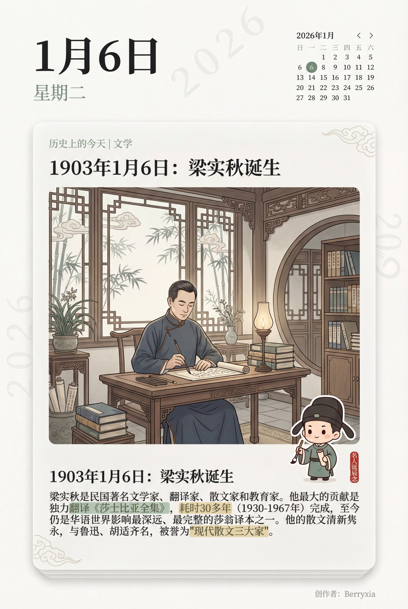


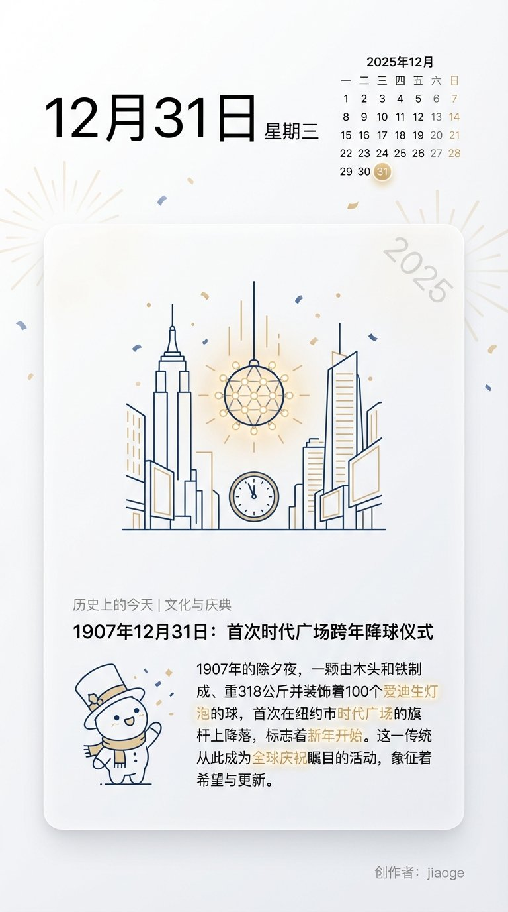

```
Create a modern Apple Design-inspired "This Day in History" calendar page for {当前月}月{当前日}日, {当前年份}, commemorating {历史事件标题} on {事件月}月{事件日}日, {事件年份}. Ultra-minimalist, clean, and sophisticated layout in 4K quality.

**Layout Structure:**

- Top: Elegant Chinese date "{月}月{日}日" (large), "星期{X}" (small)

- Calendar widget: Top-right corner showing {当前年份}年{当前月}月 calendar grid

  **CRITICAL - Calendar Accuracy Requirements:**

  * Display the CORRECT month: {当前年份}年{当前月}月 (e.g., "2026年1月" for January 2026)

  * Show accurate calendar grid with correct day-of-week alignment

  * Highlight date {当前日} (e.g., if today is 1月6日, highlight "6")

  * Calendar must start from the 1st day of the current month

  * Show correct number of days for the month (January = 31 days)

  * First day of month must align with correct weekday

  * Reference: January 2026 starts on Thursday (周四), so grid layout should be:

    Row 1: [empty] [empty] [empty] [1] [2] [3] [4]

    Row 2: [5] [6-highlighted] [7] [8] [9] [10] [11]

    etc.

  * Use accurate 2026 calendar data, do NOT use random or placeholder dates

  

- Main card: Frosted glass effect with subtle shadows

**Central Illustration:**

{根据领域选择对应插画场景配置}

- Clean line-art style with limited color palette

- {领域特定元素列表}

- Soft ambient lighting creating depth

- Cute minimalist cartoon character in {领域}风格 in corner

**Typography (4K clarity):**

- Category: "历史上的今天 | {领域}" - Thin sans-serif

- Title: "{事件年份}年{事件月}月{事件日}日:{事件标题}" - Medium weight

- Body: "{事件详细描述}" - Light weight, 1.8 line-spacing

- Highlight keywords: {关键词列表} with subtle emphasis

**Design Elements:**

- 60% white/negative space

- 8px grid system alignment

- Soft shadows (0 4px 16px rgba(0,0,0,0.06))

- {领域特定装饰图案}

- {领域特定纹理}

**Color Scheme:**

- Background: {领域背景色} with {领域纹理}

- Primary text: #1D1D1F

- Accent: {领域点缀色1} and {领域点缀色2}

- Card: rgba(255,255,255,0.96) with blur

**Watermark:**

- "{当前年份}" in English, 6% opacity, ultra-thin, diagonal background

**Apple Design Principles (4K):**

- Crystal-clear typography with perfect anti-aliasing

- Sophisticated shadow layering

- Minimum 32px padding

- WCAG AAA contrast ratios

- Perfect pixel precision

**Bottom right:** "创作者: Berryxia" in subtle elegant text

**Format:** Portrait (9:16 or 2:3), 4K quality

**Mood:** Elegant, {领域情绪}, sophisticated - celebrating {领域特点} with contemporary design excellence.

**VERIFICATION CHECKLIST (Must satisfy ALL):**

✓ Calendar shows correct month: {当前年份}年{当前月}月

✓ Calendar grid starts from day 1 of current month

✓ Date {当前日} is highlighted correctly

✓ Days of week align correctly (consult 2026 calendar)

✓ Number of days matches actual month length
```

 [↑返回目录](#toc)

---
## <a id="prompt-2008112011373068488">奶凶的女生</a> (<a href="https://x.com/MANISH1027512/status/2008112011373068488" target="_blank" rel="noopener noreferrer">古一</a>)

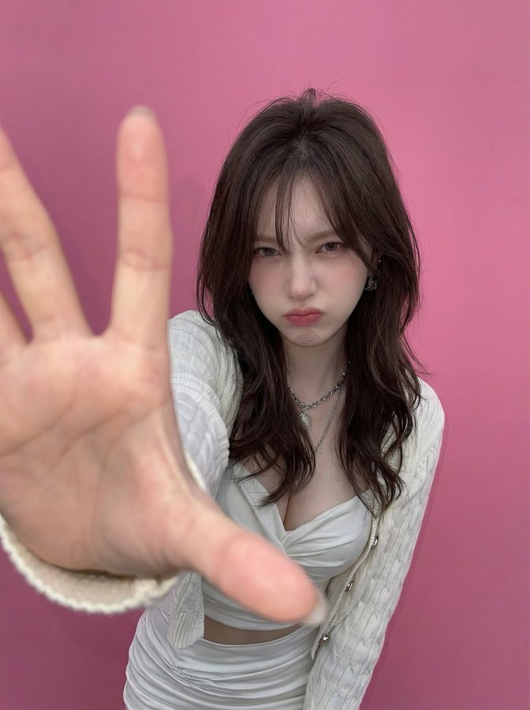


```
Photorealistic edit using the input person photo as strict identity reference: keep the same face, facial features, skin tone, hairstyle (color/bangs/length/volume), outfit and accessories unchanged (no face swap, no new person, no hair/outfit change). Change only expression/pose/background: pouty lips and furrowed brows, slightly angry/annoyed, like she’s playfully mad at her boyfriend and saying “stop filming me”. Close wide-angle perspective (18–28mm), body slightly leaning forward, one hand reaching toward the lens as if grabbing the boyfriend’s phone / blocking the camera; huge foreground hand occupying 30–50% of the frame, palm facing camera, five natural fingers, realistic anatomy; face in the back in sharp focus. Replace background with a clean solid pink studio backdrop (seamless, no texture). No text, no watermark, no frame, no extra fingers, no deformed hands, no heavy blur, no style change.
```

```
使用输入的人物照片作为严格身份参考进行逼真编辑：保持面部、面部特征、肤色、发型（颜色/刘海/长度/发量）、服装和配饰完全不变（不换脸、不更换人物、不改变发型或服装）。仅更改表情、姿势和背景：噘嘴、皱眉，略带生气或不悦，仿佛在撒娇地对男友说“别拍我了”。采用18–28mm广角近景视角，身体略微前倾，一只手伸向镜头，仿佛要抓住男友的手机或挡住相机；前景手部巨大，占据画面30%–50%，手掌正对镜头，五指自然，解剖结构真实；后方脸部清晰锐利。背景替换为干净的纯粉色影棚背景（无缝、无纹理）。画面中无文字、无水印、无边框、无多余手指、无畸形手部、无重度模糊、无风格变化。
```

 [↑返回目录](#toc)

---
## <a id="">马年女生九宫格头像</a> (<a href="https://x.com/wanerfu/status/2008421241091154115" target="_blank" rel="noopener noreferrer">摆烂程序媛</a>)


```
{  "project_settings": {    "task_type": "九格极简肖像",    "aspect_ratio": "3:4",    "batch_size": 1  },  "theme_config": {    "风格": "极简新年马年文字背景",    "强度": "中等（文字为视觉主体，人物仍为核心）",    "逻辑": "以新年马年祝福文字作为背景装饰元素，每格仅出现 1 组核心祝福词，排版留白充足，不覆盖人物五官"  },  "prompt_payload": {    "结构": "一张包含 3x3 光格矩阵的单片接触片图像",    "subject_base": {      "人物参考": "严格参考并还原用户上传的照片中的人物",      "一致性要求": "必须与参考图片中的人物为同一人，保持脸型、五官比例、肤色、气质高度一致，不风格化改脸，不生成不同人物",      "身份描述": "同一位年轻亚洲女性",      "年龄气质": "真实成年亚洲女性，气质自然、克制、耐看",      "服装": "简单的红色针织一字领毛衣，干净现代风格",      "妆容": "自然、清透、真实妆感，不浓妆、不网红妆"    },  "cells": [    {      "position": 1,      "pose": "standing",      "props": ["festival_stick"],      "text": ["Happy Horse Year", "新年好"]    },    {      "position": 2,      "pose": "gesture_on_face",      "props": [],      "text": ["马年大吉", "Ho se 发财"]    },    {      "position": 3,      "pose": "standing",      "props": ["福字_sign"],      "text": ["马到成功", "2026"]    },    {      "position": 4,      "pose": "sitting",      "props": ["red_envelopes"],      "text": ["一马当先", "精神"]    },    {      "position": 5,      "pose": "standing_center",      "props": ["red_envelope"],      "background_override": "red",      "text": ["2026 马年大吉"]    },    {      "position": 6,      "pose": "sitting_playful",      "props": ["red_envelopes"],      "text": ["Happy 2026", "NEW YEAR"]    },    {      "position": 7,      "pose": "standing_tilt",      "props": ["festival_stick"],      "text": ["喜气", "Happy New Year"]    },    {      "position": 8,      "pose": "standing_fist_up",      "props": ["festival_headwear"],      "text": ["马到成功"]    },    {      "position": 9,      "pose": "standing",      "props": ["lucky_ball"],      "text": ["Ho Se 发财", "Happy New Year"]    }  ],  "use_cases": [    "AI image regeneration",    "batch New Year posters",    "children portrait templates",    "social media grid content"  ]}{  "project_settings": {    "task_type": "2026马年新春九宫格写真",    "aspect_ratio": "3:4",    "grid_layout": "3x3",    "output_style": "小红书 / Instagram 高赞写真",    "batch_size": 1  },  "reference_control": {    "reference_image": "使用用户上传的参考图",    "identity_lock": true,    "face_consistency": "100%保持五官、脸型、气质一致",    "禁止风格化换脸": true,    "same_person_all_grids": true  },  "overall_aesthetic": {    "关键词": ["网感", "生活气息", "抓拍感", "少女感", "高级感"],    "构图": "近景 / 大头贴 / 偶尔贴近镜头",    "摄影风格": "时尚生活方式写真而非棚拍证件照"  },  "lighting_and_color": {    "肤色": "通透、白皙、真实不假白",    "背景": "纯白色背景",    "整体色调": "明快、干净、高级、不过曝"  },  "subject_style": {    "服装": "可爱喜庆的红色高定马年新年毛衣",    "发型": "头发蓬松自然，轻微凌乱感",    "妆感": "清透自然，突出真实皮肤质感",    "表情要求": {      "情绪": "开心",      "表现方式": "抓拍感（Candid），不摆拍",      "允许": ["歪头", "身体倾斜", "凑近镜头", "动态瞬间"],      "禁止": ["僵硬微笑", "影楼式标准表情"]    }  },  "grid_directives": [    {      "grid": 1,      "pose": "手拿纸龙挡住半边脸，眼神俏皮",      "expression": "开心、灵动",      "text": "一马当先"    },    {      "grid": 2,      "pose": "双手扯耳朵做鬼脸，单眼Wink（眨眼）",      "expression": "调皮开心",      "text": "马上转运"    },    {      "grid": 3,      "pose": "仰头大笑，发丝飞扬，完全不看镜头",      "expression": "放声大笑，抓拍瞬间",      "text": "马纳百福"    },    {      "grid": 4,      "pose": "歪头做拜年手势",      "expression": "甜美、亲切的开心",      "text": "马上发财"    },    {      "grid": 5,      "pose": "把纸龙举到镜头前，略带大头透视效果",      "expression": "活泼、亲近镜头",      "text": "再见2025\n你好2026"    },    {      "grid": 6,      "pose": "双手在眼睛处比圈圈，搞怪鬼脸",      "expression": "搞怪开心",      "text": "2026马年大吉"    },    {      "grid": 7,      "pose": "双手比耶戳脸蛋，头用力向一侧歪",      "expression": "元气开心",      "text": "立马暴富"    },    {      "grid": 8,      "pose": "把纸龙顶在头顶保持平衡，眼神向上看",      "expression": "呆萌开心",      "text": "以梦为马"    },    {      "grid": 9,      "pose": "双手做喇叭状大喊，身体前倾",      "expression": "热烈开心",      "text": "马到成功"    }  ],  "text_and_decorations": {    "字体风格": "手绘涂鸦风格",    "文字颜色": "中国红",    "文字位置": "每格自然叠加，不遮挡五官",    "装饰元素": [      "小星星简笔画",      "小烟花简笔画",      "随意但克制的红色涂鸦线条"    ]  },  "negative_constraints": {    "禁止": [      "换脸",      "年龄变化",      "过度磨皮",      "AI塑料感",      "僵硬摆拍",      "复杂背景",      "过多装饰遮脸"    ]  }}{  "project_settings": {    "task_type": "九格极简情侣肖像",    "aspect_ratio": "3:4",    "batch_size": 1  },  "theme_config": {    "风格": "极简新年马年情侣文字背景",    "强度": "中等（文字为辅助装饰，情侣互动为视觉核心）",    "逻辑": "以新年马年祝福文字作为背景装饰元素，每格仅出现 1 组核心祝福词，排版留白充足，不覆盖两人五官与互动区域"  },  "prompt_payload": {    "结构": "一张包含 3x3 光格矩阵的单片接触片图像",    "subject_base": {      "人物参考": "严格参考并还原用户上传的两位人物（情侣）",      "一致性要求": "九宫格中必须始终为同一对情侣，男女外貌、脸型、五官比例、肤色、气质高度一致，不更换人物、不风格化改脸",      "身份描述": "一对年轻亚洲情侣",      "关系状态": "自然亲密的情侣关系，不刻意、不表演式",      "年龄气质": "真实成年亚洲情侣，气质自然、耐看、有生活感",      "服装": {        "女性": "简单的红色针织一字领毛衣，干净现代风格",        "男性": "简洁的新年红或米白色针织毛衣，低饱和、协调"      },      "妆容": {        "女性": "自然、清透、真实妆感",        "男性": "干净自然肤感，无明显妆效"      }    },    "expression_config": {      "总体情绪": "开心",      "表情基调": "自然开心、放松、有情侣间的默契感",      "嘴部状态": [        "自然微笑",        "嘴角上扬"      ],      "眼神状态": [        "彼此对视或轻微错位看镜头",        "眼神温柔、有笑意"      ],      "面部肌肉": "放松、柔和",      "情绪一致性要求": "九宫格整体情绪统一，通过互动方式制造变化"    }  },  "cells": [    {      "position": 1,      "pose": "情侣并肩站立，身体微微靠近",      "props": ["festival_stick"],      "interaction": "自然对视微笑",      "text": ["Happy Horse Year", "新年好"]    },    {      "position": 2,      "pose": "情侣同时做贴脸手势",      "props": [],      "interaction": "头部轻微靠近",      "text": ["马年大吉", "Ho Se 发财"]    },    {      "position": 3,      "pose": "一人举福字，一人看向对方",      "props": ["福字_sign"],      "interaction": "单向注视，亲密感",      "text": ["马到成功", "2026"]    },    {      "position": 4,      "pose": "情侣坐姿，肩膀轻触",      "props": ["red_envelopes"],      "interaction": "同时看镜头微笑",      "text": ["一马当先", "一起向前"]    },    {      "position": 5,      "pose": "情侣站立居中",      "props": ["red_envelope"],      "background_override": "light_red",      "interaction": "自然牵手",      "text": ["2026 马年大吉"]    },    {      "position": 6,      "pose": "情侣轻松玩闹姿态",      "props": ["red_envelopes"],      "interaction": "一人看镜头，一人看对方",      "text": ["Happy 2026", "NEW YEAR"]    },    {      "position": 7,      "pose": "情侣身体向同一侧微倾",      "props": ["festival_stick"],      "interaction": "同步动作，默契感",      "text": ["喜气", "Happy New Year"]    },    {      "position": 8,      "pose": "一人举拳祝福，一人微笑看向对方",      "props": ["festival_headwear"],      "interaction": "情绪呼应",      "text": ["马到成功"]    },    {      "position": 9,      "pose": "情侣站立靠近",      "props": ["lucky_ball"],      "interaction": "同时看镜头，幸福感",      "text": ["Ho Se 发财", "Happy New Year"]    }  ],  "use_cases": [    "情侣新年写真生成",    "品牌新年情侣模板",    "社交媒体情侣九宫格",    "节日纪念内容"  ]}{  "project_settings": {    "task_type": "九宫格新年祝福肖像（男生版）",    "aspect_ratio": "1:1",    "grid_layout": "3x3",    "batch_size": 1  },  "overall_style": {    "整体风格": "极简新年祝福风",    "视觉基调": "干净、温和、克制的节日感",    "背景": "纯色白墙面，无装饰",    "光线": "自然柔光，均匀无强阴影",    "色彩重点": "中国红（服装 + 文字）"  },  "subject_base": {    "人物一致性": "九宫格内为同一位人物",    "人物类型": "亚洲男性",    "性别气质": "干净、阳光、自然，不油腻",    "发型": "黑色短发，自然蓬松，简洁利落",    "服装": "红色针织毛衣或卫衣，简洁无图案",    "妆容": "无明显妆感，真实自然肤质",    "表情气质": "开心，克制的微笑，不夸张"  },  "pose_variations": {    "grid_1": "食指竖于嘴前，轻松安静手势",    "grid_2": "单手比 V 手势靠近脸部",    "grid_3": "单手做 OK 或三指手势",    "grid_4": "双手举起做轻松俏皮手势（不过度卖萌）",    "grid_5": "单手张开遮住半边脸",    "grid_6": "单手做电话手势靠近脸侧",    "grid_7": "单手轻点脸颊或下巴",    "grid_8": "单手托下巴，轻微思考姿势",    "grid_9": "双手指向脸部或克制比心变体"  },  "text_overlays": {    "字体风格": "传统中文新年书法字体",    "文字颜色": "中国红",    "年份颜色": "深蓝色",    "文字位置": "每一格顶部居中",    "文字结构": "四字祝福语 + 年份"  },  "text_content": [    { "position": "grid_1", "text": "一帆风顺", "year": "2026" },    { "position": "grid_2", "text": "双喜临门", "year": "2026" },    { "position": "grid_3", "text": "三阳开泰", "year": "2026" },    { "position": "grid_4", "text": "四季发财", "year": "2026" },    { "position": "grid_5", "text": "五福临门", "year": "2026" },    { "position": "grid_6", "text": "六六大顺", "year": "2026" },    { "position": "grid_7", "text": "七星高照", "year": "2026" },    { "position": "grid_8", "text": "八方来财", "year": "2026" },    { "position": "grid_9", "text": "九九同心", "year": "2026" }  ],  "constraints": {    "禁止项": [      "不改变人物身份",      "不夸张表情",      "不女性化姿态",      "不使用复杂背景",      "不添加节日道具",      "不风格化面部"    ],    "一致性要求": [      "人物脸型五官保持完全一致",      "服装颜色与材质一致",      "拍摄角度与距离基本一致"    ]  },  "use_cases": [    "男生新年纪念照",    "个人春节祝福九宫格",    "社交平台头像矩阵",    "品牌新年男生模板"  ]}
```

 [↑返回目录](#toc)

---
## <a id="">减脂食谱</a> (<a href="https://x.com/yyyole/status/2008372844850557068" target="_blank" rel="noopener noreferrer">沐阳</a>)

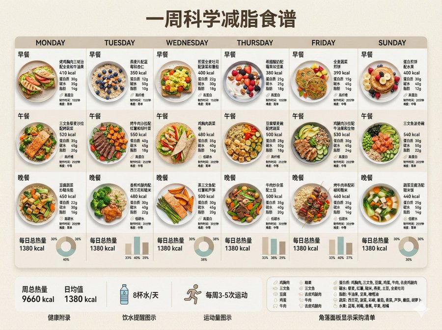

```
创建一周减脂食谱信息图，简约设计，包含以下要素：

设计风格：
- 博物馆展览美学，极简米色/奶油色背景
- 简洁无衬线字体
- 7天网格布局（周一至周日）
- 专业配色（柔和大地色、雾霾绿、静谧蓝）

每日内容：
- 三餐明确标注：早餐、午餐、晚餐
- 高品质美食摄影风格
- 每餐标注卡路里数值
- 营养素分解：蛋白质、碳水、脂肪（克数）
- 每日总热量突出显示，确保汇总数据准确

视觉元素：
- 精美摆盘的健康餐食（烤制蛋白质、新鲜蔬菜、全谷物、水果）
- 数据可视化：简洁柱状图或环形图显示热量分布
- 营养标识图标（高蛋白、低碳水、高纤维）
- 极简分割线

自动选择健康食材：
- 优质蛋白：鸡胸肉、三文鱼、豆腐、鸡蛋、牛肉、去皮鸡腿肉
- 复合碳水：藜麦、红薯、糙米、燕麦、土豆
- 健康脂肪：牛油果、坚果、橄榄油
- 蔬菜：西兰花、菠菜、彩椒、番茄、青菜
- 水果：浆果、苹果、柑橘、低糖水果

健康附录：
- 周总热量及日均值
- 制作时间标识（15分钟、30分钟、45分钟）
- 难度图标（简单/中等）
- 角落面板显示采购清单
- 饮水提醒图示
- 运动量图示

设计规格：
- 高对比度易读性
- 留白呼吸空间
- 一致的分量展示
- 专业美食造型
- 柔和阴影和微妙层次
- 可打印质量，高分辨率

确保数据准确。
确保文字渲染准确。
```

 [↑返回目录](#toc)

---
## <a id="">马年九宫格男生头像</a> (<a href="https://x.com/wanerfu/status/2008421244518232072" target="_blank" rel="noopener noreferrer">摆烂程序媛</a>)

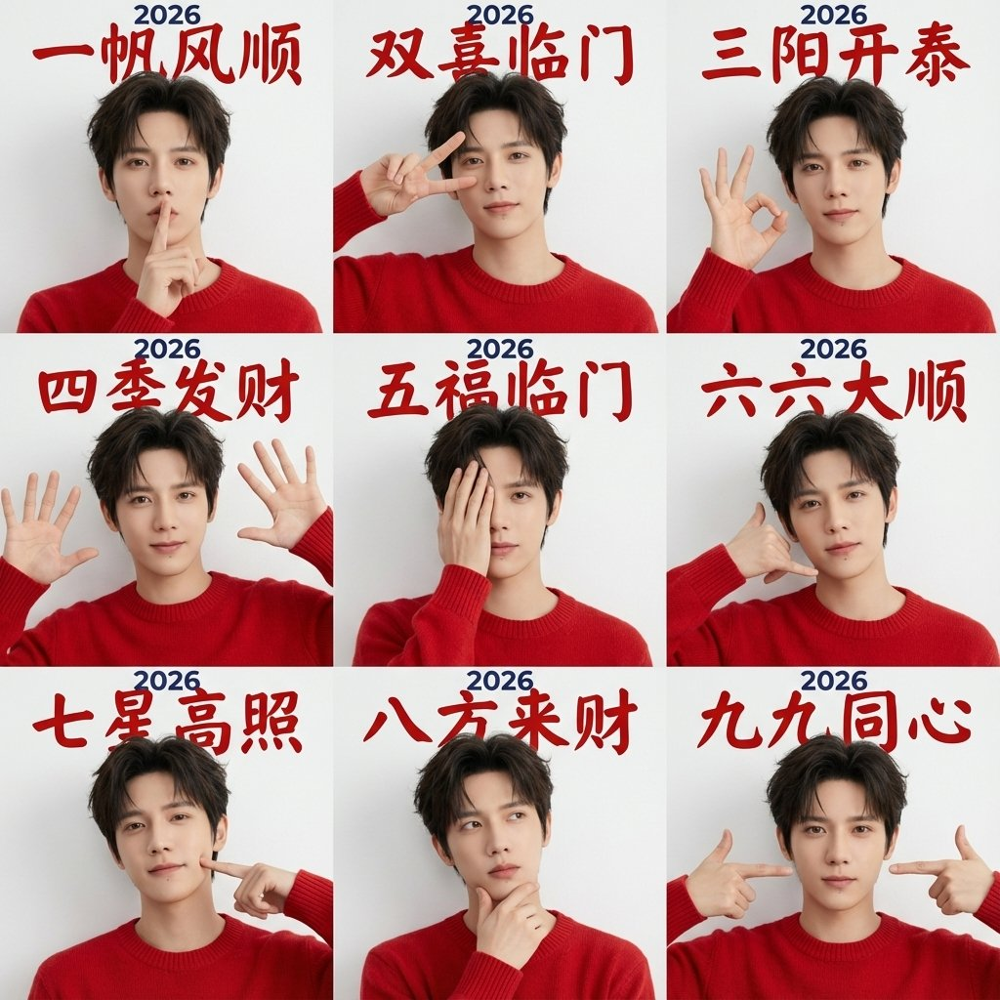

```
{  "project_settings": {    "task_type": "九宫格新年祝福肖像（男生版）",    "aspect_ratio": "1:1",    "grid_layout": "3x3",    "batch_size": 1  },  "overall_style": {    "整体风格": "极简新年祝福风",    "视觉基调": "干净、温和、克制的节日感",    "背景": "纯色白墙面，无装饰",    "光线": "自然柔光，均匀无强阴影",    "色彩重点": "中国红（服装 + 文字）"  },  "subject_base": {    "人物一致性": "九宫格内为同一位人物",    "人物类型": "亚洲男性",    "性别气质": "干净、阳光、自然，不油腻",    "发型": "黑色短发，自然蓬松，简洁利落",    "服装": "红色针织毛衣或卫衣，简洁无图案",    "妆容": "无明显妆感，真实自然肤质",    "表情气质": "开心，克制的微笑，不夸张"  },  "pose_variations": {    "grid_1": "食指竖于嘴前，轻松安静手势",    "grid_2": "单手比 V 手势靠近脸部",    "grid_3": "单手做 OK 或三指手势",    "grid_4": "双手举起做轻松俏皮手势（不过度卖萌）",    "grid_5": "单手张开遮住半边脸",    "grid_6": "单手做电话手势靠近脸侧",    "grid_7": "单手轻点脸颊或下巴",    "grid_8": "单手托下巴，轻微思考姿势",    "grid_9": "双手指向脸部或克制比心变体"  },  "text_overlays": {    "字体风格": "传统中文新年书法字体",    "文字颜色": "中国红",    "年份颜色": "深蓝色",    "文字位置": "每一格顶部居中",    "文字结构": "四字祝福语 + 年份"  },  "text_content": [    { "position": "grid_1", "text": "一帆风顺", "year": "2026" },    { "position": "grid_2", "text": "双喜临门", "year": "2026" },    { "position": "grid_3", "text": "三阳开泰", "year": "2026" },    { "position": "grid_4", "text": "四季发财", "year": "2026" },    { "position": "grid_5", "text": "五福临门", "year": "2026" },    { "position": "grid_6", "text": "六六大顺", "year": "2026" },    { "position": "grid_7", "text": "七星高照", "year": "2026" },    { "position": "grid_8", "text": "八方来财", "year": "2026" },    { "position": "grid_9", "text": "九九同心", "year": "2026" }  ],  "constraints": {    "禁止项": [      "不改变人物身份",      "不夸张表情",      "不女性化姿态",      "不使用复杂背景",      "不添加节日道具",      "不风格化面部"    ],    "一致性要求": [      "人物脸型五官保持完全一致",      "服装颜色与材质一致",      "拍摄角度与距离基本一致"    ]  },  "use_cases": [    "男生新年纪念照",    "个人春节祝福九宫格",    "社交平台头像矩阵",    "品牌新年男生模板"  ]}
```

 [↑返回目录](#toc)

---
## <a id="">城市打卡九宫格</a> (<a href="https://x.com/wanerfu/status/1998707022749917296" target="_blank" rel="noopener noreferrer">摆烂程序媛</a>)

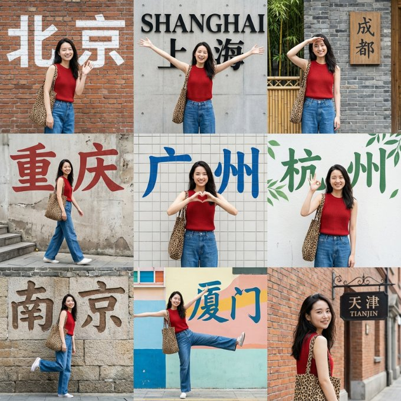

```
一位年轻的亚洲美女，五官清秀自然，皮肤白皙细腻，长发深棕色偏黑，直发微蓬松，侧分发型。面部特征：柔和的瓜子脸，细长眉型，清晰的双眼皮，大眼睛明亮有神，鼻梁挺直，嘴角上扬带自然微笑。气质美女、活力四射。

穿着：红色无袖上衣、宽松蓝色牛仔裤，背着豹纹托特包。整体风格日常、时尚但不夸张。

光线与质感：户外自然光，清晰写实，肤色自然不过曝，不美颜。

相机角度：中近景、人像模式、轻微侧身姿态（用于识别外貌，不固定动作）。

基于参考图生成同一位女孩的九宫格旅行写真。五官、脸型、发型、肤色、气质、穿搭必须完全一致，不得变脸、不换穿搭、不改变身材比例。风格为真实街拍，不要插画风。

九张图背景全部不同，每张是一座城市的特色墙面或城市大字标识。墙体需干净、质感真实，字体醒目，与当地风格一致。保持明亮、清爽、文旅拍照风格。九个城市分别为：
① 北京
② 上海
③ 成都
④ 重庆
⑤ 广州
⑥ 杭州
⑦ 南京
⑧ 厦门
⑨ 天津

**女孩保持同一造型，在九张图中做不同轻旅行动作（自然、松弛、可爱、不夸张）：

挥手打招呼

张开双臂站立

抬手遮阳微笑

轻松侧身走路

双手比心

OK 手势 / 望远镜手势

抬腿摆拍

单腿抬高、伸展开来

回头甜笑、轻松站姿

真实户外光线、柔和阴影、城市旅拍氛围。
```

 [↑返回目录](#toc)

---
## <a id="">马年九宫格情侣头像</a> (<a href="https://x.com/wanerfu/status/2008421247336763621" target="_blank" rel="noopener noreferrer">摆烂程序媛</a>)

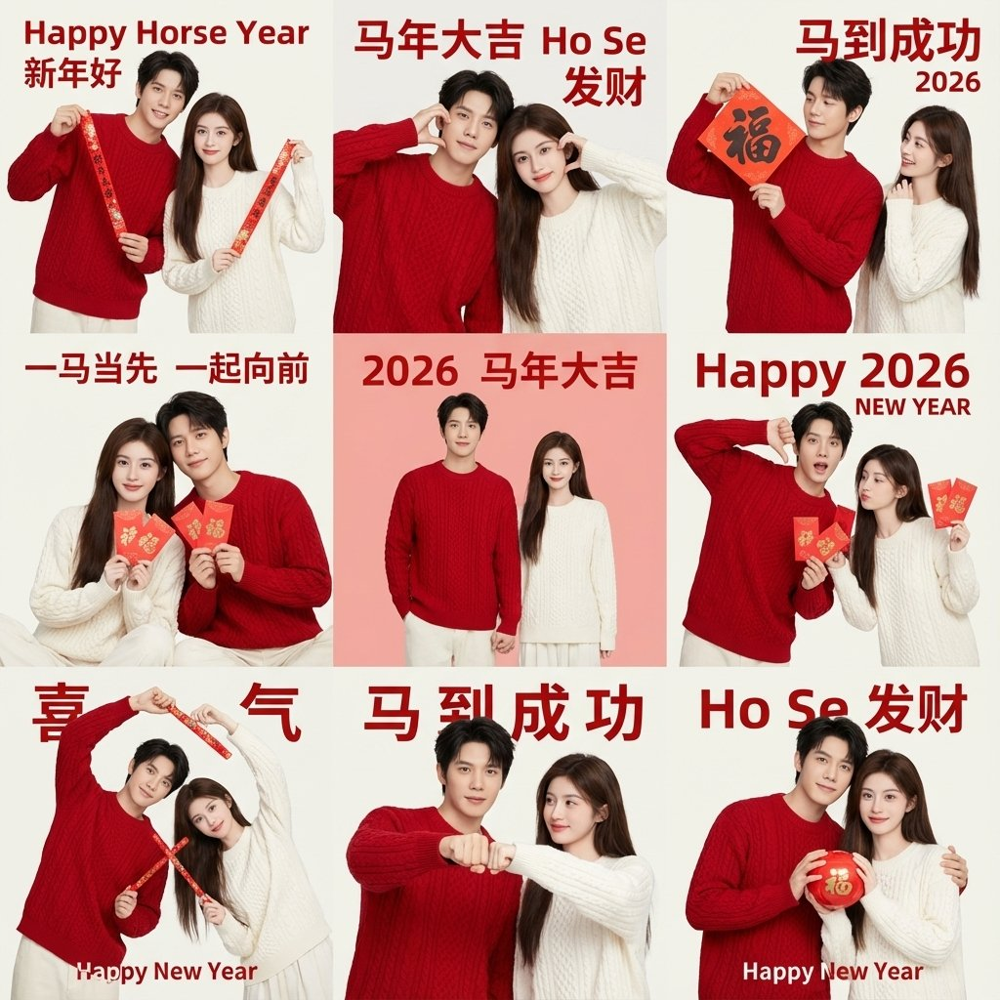

```
{  "project_settings": {    "task_type": "九格极简情侣肖像",    "aspect_ratio": "3:4",    "batch_size": 1  },  "theme_config": {    "风格": "极简新年马年情侣文字背景",    "强度": "中等（文字为辅助装饰，情侣互动为视觉核心）",    "逻辑": "以新年马年祝福文字作为背景装饰元素，每格仅出现 1 组核心祝福词，排版留白充足，不覆盖两人五官与互动区域"  },  "prompt_payload": {    "结构": "一张包含 3x3 光格矩阵的单片接触片图像",    "subject_base": {      "人物参考": "严格参考并还原用户上传的两位人物（情侣）",      "一致性要求": "九宫格中必须始终为同一对情侣，男女外貌、脸型、五官比例、肤色、气质高度一致，不更换人物、不风格化改脸",      "身份描述": "一对年轻亚洲情侣",      "关系状态": "自然亲密的情侣关系，不刻意、不表演式",      "年龄气质": "真实成年亚洲情侣，气质自然、耐看、有生活感",      "服装": {        "女性": "简单的红色针织一字领毛衣，干净现代风格",        "男性": "简洁的新年红或米白色针织毛衣，低饱和、协调"      },      "妆容": {        "女性": "自然、清透、真实妆感",        "男性": "干净自然肤感，无明显妆效"      }    },    "expression_config": {      "总体情绪": "开心",      "表情基调": "自然开心、放松、有情侣间的默契感",      "嘴部状态": [        "自然微笑",        "嘴角上扬"      ],      "眼神状态": [        "彼此对视或轻微错位看镜头",        "眼神温柔、有笑意"      ],      "面部肌肉": "放松、柔和",      "情绪一致性要求": "九宫格整体情绪统一，通过互动方式制造变化"    }  },  "cells": [    {      "position": 1,      "pose": "情侣并肩站立，身体微微靠近",      "props": ["festival_stick"],      "interaction": "自然对视微笑",      "text": ["Happy Horse Year", "新年好"]    },    {      "position": 2,      "pose": "情侣同时做贴脸手势",      "props": [],      "interaction": "头部轻微靠近",      "text": ["马年大吉", "Ho Se 发财"]    },    {      "position": 3,      "pose": "一人举福字，一人看向对方",      "props": ["福字_sign"],      "interaction": "单向注视，亲密感",      "text": ["马到成功", "2026"]    },    {      "position": 4,      "pose": "情侣坐姿，肩膀轻触",      "props": ["red_envelopes"],      "interaction": "同时看镜头微笑",      "text": ["一马当先", "一起向前"]    },    {      "position": 5,      "pose": "情侣站立居中",      "props": ["red_envelope"],      "background_override": "light_red",      "interaction": "自然牵手",      "text": ["2026 马年大吉"]    },    {      "position": 6,      "pose": "情侣轻松玩闹姿态",      "props": ["red_envelopes"],      "interaction": "一人看镜头，一人看对方",      "text": ["Happy 2026", "NEW YEAR"]    },    {      "position": 7,      "pose": "情侣身体向同一侧微倾",      "props": ["festival_stick"],      "interaction": "同步动作，默契感",      "text": ["喜气", "Happy New Year"]    },    {      "position": 8,      "pose": "一人举拳祝福，一人微笑看向对方",      "props": ["festival_headwear"],      "interaction": "情绪呼应",      "text": ["马到成功"]    },    {      "position": 9,      "pose": "情侣站立靠近",      "props": ["lucky_ball"],      "interaction": "同时看镜头，幸福感",      "text": ["Ho Se 发财", "Happy New Year"]    }  ],  "use_cases": [    "情侣新年写真生成",    "品牌新年情侣模板",    "社交媒体情侣九宫格",    "节日纪念内容"  ]}
```

 [↑返回目录](#toc)

---
## <a id=""> 清冷气质女生写真</a> (<a href="https://x.com/qisi_ai/status/2008758834547093893" target="_blank" rel="noopener noreferrer">骑司Chase</a>)


```
一、主体与动作
1 人物：年轻女性，清冷气质，半身近景，身体侧向右侧，回眸直视镜头
2 表情：眼神锐利克制，略带疏离与忧郁，嘴唇微抿
3 头发：乌黑长发，蓬松凌乱，强风吹拂，发丝大幅飘起并掠过脸颊
4 妆容：暖棕眼影与微红眼周，睫毛清晰，哑光红唇，肤质通透
5 服饰：深色细肩带衣裙或上衣，肩颈与锁骨露出，外侧有深色薄纱或外搭下滑形成暗部包裹

二、构图与镜头
1 画幅：竖幅
2 景别：胸口以上的半身近景，三分之二侧脸
3 位置：人物偏画面中右，头顶留少量空间，左侧留出光源与雾化区域
4 视角：平视或略微仰视，镜头距离较近但不夸张变形
5 对焦：焦点落在眼睛与面部，背景强虚化，整体带轻微柔化与朦胧感

三、光线与氛围
1 主光：左后方强逆光，形成发丝与肩部的明亮轮廓光
2 补光：正面极弱柔光，仅提亮面部细节，阴影保留
3 光质：散射柔光，明显雾化光晕，带空气感与轻微眩光
4 氛围：梦幻、神秘、安静、电影感、带一点冷感与孤独感

四、色彩与质感
1 色调：背景冷灰偏蓝，肤色偏暖，形成冷暖对比
2 饱和度：整体低饱和
3 明暗：对比偏高，暗部压低，高光柔亮不过曝
4 质感：皮肤细腻自然，轻微颗粒与雾面感，边缘高光带光晕

五、背景与环境元素
1 背景：暗灰到黑的渐变空间，无明确场景信息
2 光点：背景与发梢周围有零散点状光斑与闪烁颗粒，类似尘埃反光或微小光粒
3 动态：风带动发丝飞舞，光点呈漂浮散落的层次感

六、风格与后期
1 风格：唯美写实，梦幻柔雾，电影海报质感
2 后期：增强轮廓光与发丝高光，提升雾化与空气透光感，轻微褪色，暗角收束画面
3 清晰度：眼部与唇部相对清晰，其余区域柔化过渡，整体通透但不锐利

七、反向提示
1 人物错误：不要脸部畸变，不要五官错位，不要双脸，不要多余肢体，不要手指异常，不要不自然的皮肤塑料感
2 光影错误：不要正面硬光，不要强烈死白高光，不要背景过亮抢主体
3 风格偏差：不要卡通化，不要漫画厚涂感，不要夸张霓虹色，不要过度锐化与过度磨皮
```

 [↑返回目录](#toc)

---
## <a id="">新中式水墨绘本</a> (<a href="https://x.com/onetoinfai/status/2008345252185145445" target="_blank" rel="noopener noreferrer">OneToInf AI</a>)


```
新中式水墨绘本，致敬80年代上美影风格。强调大巧若拙的毛笔触感与宣纸纹理，低饱和矿物色，极简留白构图。画面人物为主体视觉，比例3:4，[此处替换你的主体或场景描述]。
```

 [↑返回目录](#toc)

---
## <a id="">专业品牌视觉识别系统设计展示板</a> (<a href="https://x.com/yyyole/status/2008522059631198233" target="_blank" rel="noopener noreferrer">沐阳</a>)


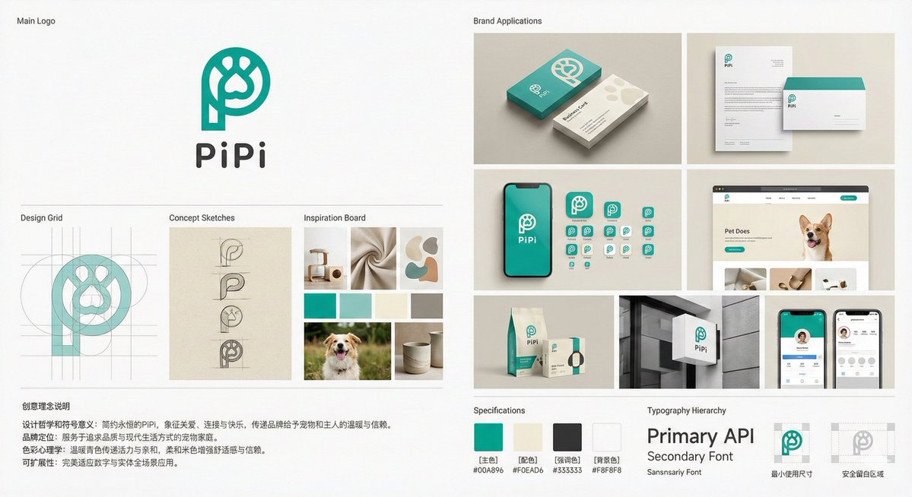

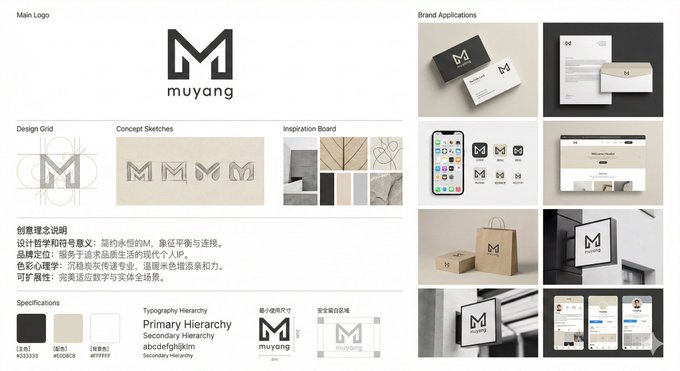

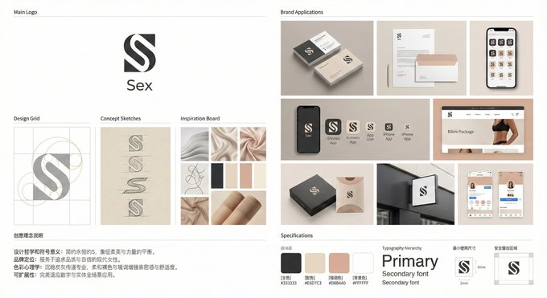

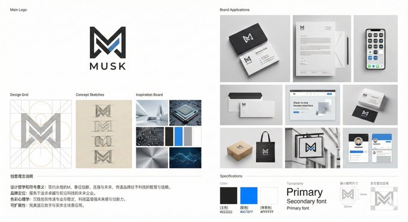

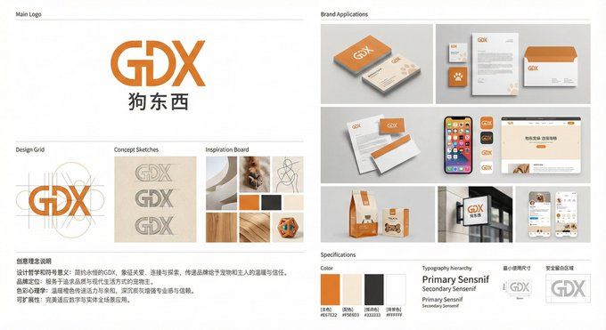

```
[yyyole]专业品牌视觉识别系统设计展示板，以杂志级排版呈现完整设计系统，布局干净现代。
行业属性：[个人IP]

核心包含元素：
主标志展示区 - 位于画面上方三分之一处居中：简约永恒的符号，核心元素为[Y]。抽象几何形态，留白强烈，线条简洁，视觉平静。搭配精致字体设计。
品牌名称[沐阳]采用小巧低调的无衬线字体，位于符号下方或旁边 - 视觉上比标志更柔和，字间距和对齐精心调整。人性化、精致、现代的字体 - 绝不喧闹，绝不抢眼。
配色方案：[主色]用于主标志，[配色]用于细节点缀，[背景色]用于画布。扁平矢量风格，高对比度，比例均衡。若无指定，自动形成配色方案。
设计网格区域 - 展示标志的几何构造线和黄金比例参考线，体现数学精准性和比例和谐美。
概念草图板块 - 3-4张手绘风格的探索草图，展示从初始创意到最终定稿的演变过程，横向排列，浅色铅笔质感，米色纸张底纹。
灵感来源板 - 精心策划的情绪板，包含：极简主义建筑摄影、自然形态、抽象几何图案、色彩样本、材质参考 - 均与[符号描述]概念相关。4-6张图片以雅致网格排列。
创意理念说明文字块 - 准确中文渲染-整洁的排版说明：
∙设计哲学和符号意义
∙该设计如何服务品牌定位
∙色彩心理学和视觉策略
∙可扩展性和多场景适应性
品牌应用样机区 - 真实场景应用展示-包括：
∙名片（正反面）
∙信纸信封
∙手机APP图标（多种尺寸）
∙网站页眉/网站图标
∙产品包装或购物袋
∙标识牌或店面门头
∙社交媒体头像
色彩与字体规范 - 专业设计规范展示：
∙主色、辅助色、强调色色块及色值编号
∙字体层级系统（主字体和辅助字体）
∙最小使用尺寸要求
∙安全留白区域指引
整体布局风格：纯白色或[背景色]背景，留白充足，瑞士/包豪斯风格网格系统，专业展示品质。元素组织清晰有层次 - 不拥挤。注释文字采用中文-柔和灰色字体。现代编辑设计美学，类似Behance或站酷作品集展示风格。
技术规格：8K分辨率，超高细节，清晰锐利，专业平面设计作品集品质，实物样机采用平铺摄影风格，完美光照，标志本身无渐变、无阴影（样机除外），无3D渲染，纯矢量美学。
```

 [↑返回目录](#toc)

---
## <a id="">奶凶动物玩偶</a> (<a href="https://x.com/xiaojietongxue/status/2008508944923213879" target="_blank" rel="noopener noreferrer">肖师傅</a>)

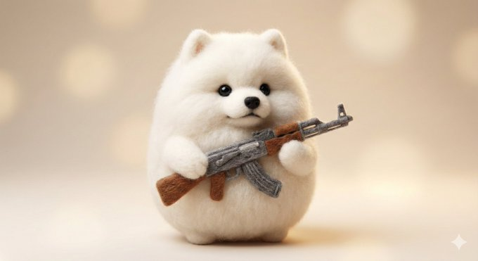

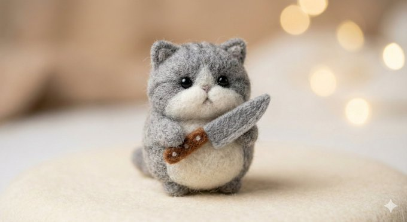

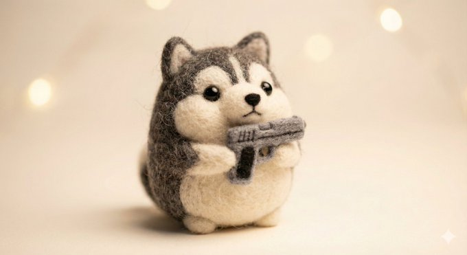

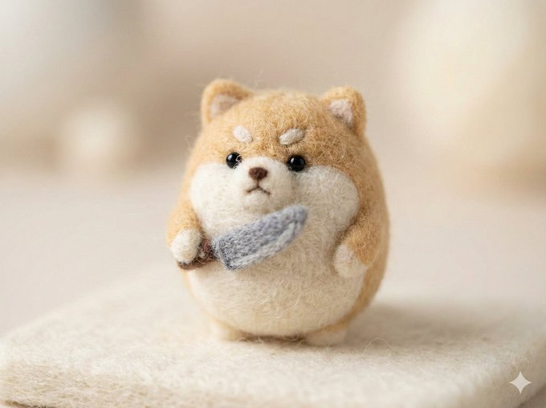

```
输入动物+武器，就可以生成，大家记得一键三连交作业哦！

GEM提示词如下，最近Gemini降智严重，如果遇到输出文字提示词，请新开窗口进行单独生成。

{
  "meta_prompt_config": {
    "target_model": "nano banana pro",
    "style_preset": "Needle Felted Cute 3D",
    "description": "Generates a cute, round, wool-felted animal holding a weapon, creating a humorous contrast."
  },
  "inputs": [
    "animal",
    "weapon"
  ],
  "prompt_template": "A high-quality macro photography shot of a tiny, round, handmade needle-felted {animal} holding a small {weapon}. The {animal} has a chubby, egg-shaped body, fluffy wool texture, and tiny beady black eyes. It is trying to look tough but looks incredibly adorable and harmless. The {weapon} is also made of felt or looks like a toy. Soft, warm studio lighting, clean white or soft beige blurred background, shallow depth of field, creamy bokeh, 8k resolution, highly detailed fiber texture, minimalist composition.",
  "negative_prompt": "real flesh, fur, frightening, horror, blood, violent, text, watermark, signature, blurry, low quality, deformed, bad anatomy, human hands, messy background, dark shadows",
  "example_usage": {
    "animal": "duck",
    "weapon": "kitchen knife",
    "result_prompt": "A high-quality macro photography shot of a tiny, round, handmade needle-felted duck holding a small kitchen knife. The duck has a chubby, egg-shaped body, fluffy wool texture, and tiny beady black eyes. It is trying to look tough but looks incredibly adorable and harmless. The kitchen knife is also made of felt or looks like a toy. Soft, warm studio lighting, clean white or soft beige blurred background, shallow depth of field, creamy bokeh, 8k resolution, highly detailed fiber texture, minimalist composition."
  }
}

#肖师傅 #ai邪修基地 #ai
```

 [↑返回目录](#toc)

---
## <a id="prompt-2008268262623122000">白色降噪耳机置于翠绿苔藓之上</a> (<a href="https://x.com/AllaAisling/status/2008268262623121817" target="_blank" rel="noopener noreferrer">Alexandra Aisling</a>)

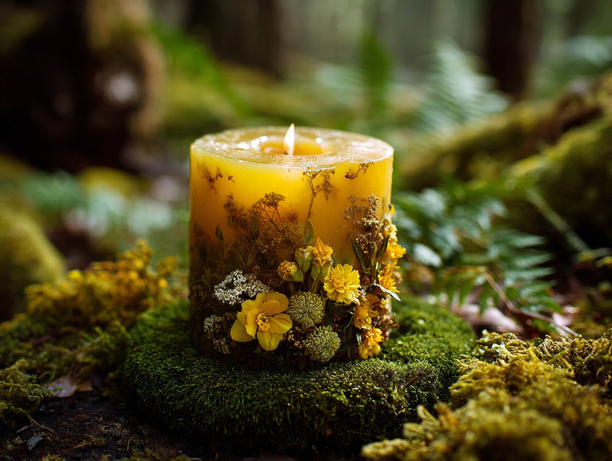

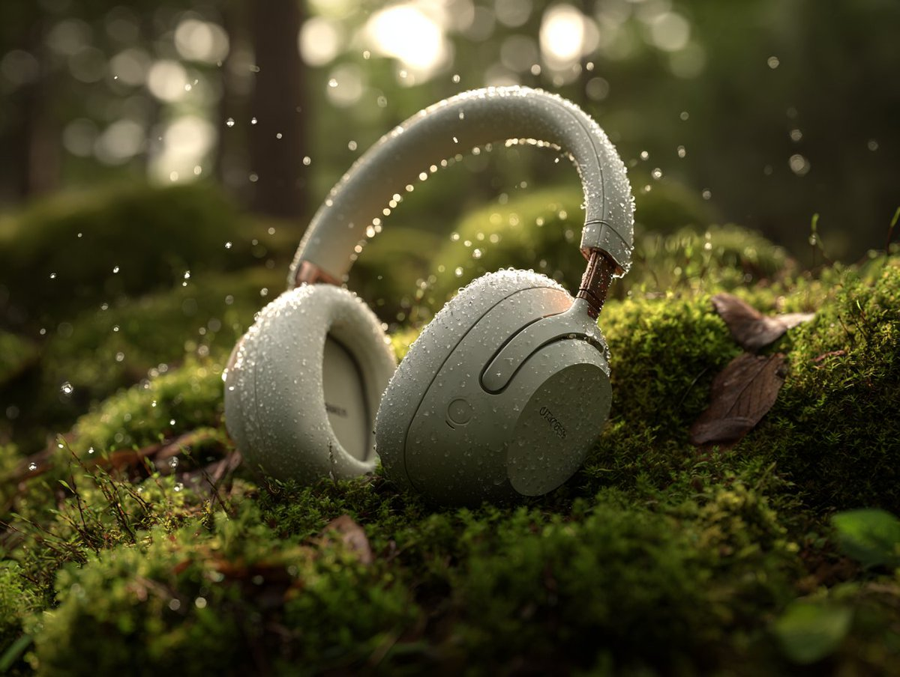

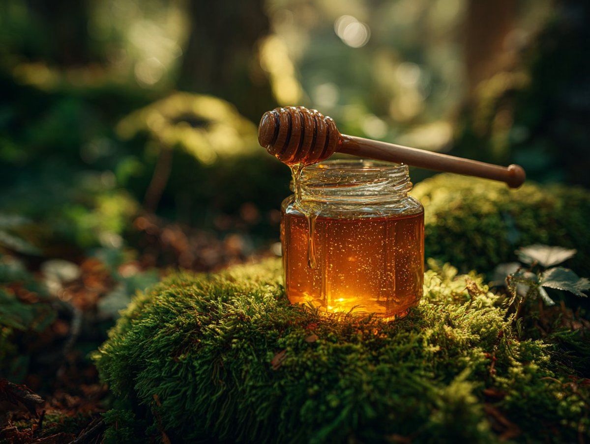

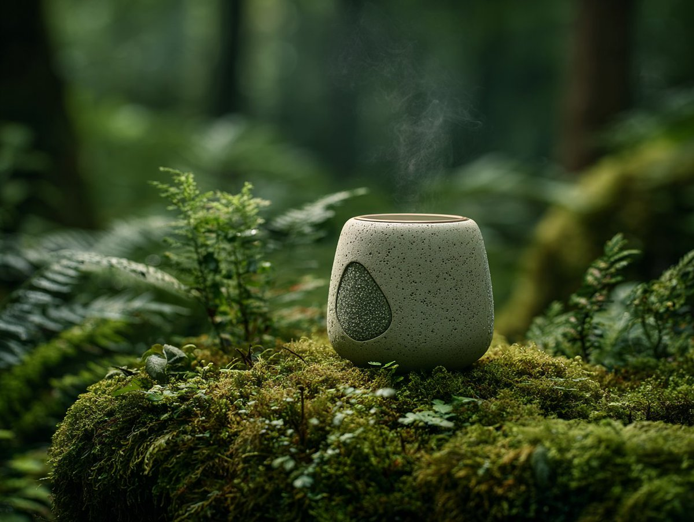

```
Handmade beeswax candle with dried flowers embedded resting on thick cushion of vibrant green moss, forest floor aesthetic, soft natural sidelighting, dewdrops glistening on wax surface, fairy tale setting, ancient forest energy, organic luxury
```

```
Matte white noise-canceling headphones resting on thick cushion of vibrant green moss, forest floor aesthetic, soft natural sidelighting, dewdrops glistening on ear cups, fairy tale setting, ancient forest energy, organic luxury
```

```
Glass jar of raw honey with wooden dipper resting on thick cushion of vibrant green moss, forest floor aesthetic, soft natural sidelighting, golden light refracting through honey, fairy tale setting, ancient forest energy, organic luxury
```

```
Matte ceramic smart aroma diffuser resting on thick cushion of vibrant green moss, forest floor aesthetic, soft natural sidelighting, dewdrops glistening on fabric mesh, fairy tale setting, ancient forest energy, organic luxury
```

 [↑返回目录](#toc)

---
## <a id="prompt-2008176822551216400">复古美式风格Figma品牌矢量字母设计</a> (<a href="https://x.com/AmirMushich/status/2008176822551216467" target="_blank" rel="noopener noreferrer">AmirMušić</a>)

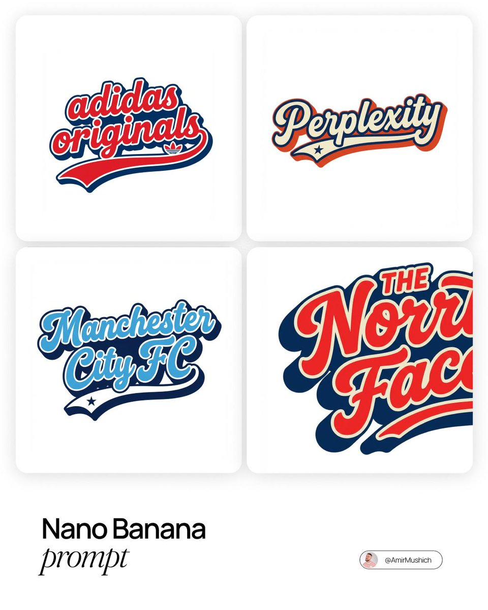

```
A bold, vibrant, retro-American vector lettering design displaying the name "Figma".

TYPOGRAPHY STYLE (FAT SCRIPT):

The text is rendered in a thick, chunky, hand-lettered "baseball script" or "bubble" style, reminiscent of 1950s-1970s American sports logos and automotive decals.

Form: The letters are heavy, rounded, and tightly connected (ligatures).

Perspective: The text line should be slightly slanted upwards or arched to create dynamic energy.

Effects: Apply a thick, bold outline around the text. Crucially, add a deep, solid "block shadow" (extrusion) behind the letters to create a heavy 3D pop-out effect, characteristic of vintage sticker art.

COLOR PALETTE (BRAND VINTAGE):

Use a bright, saturated, and flat color palette inspired by [BRAND NAME]'s identity but filtered through a retro pop-art lens.

Fill: Solid, punchy colors (no gradients).

Contrast: High contrast between the letter fill, the outline (usually white or cream), and the block shadow (usually a darker shade or contrasting color).

DECORATIVE ELEMENTS:

Keep it clean and vector-like. You may include subtle, classic "Americana" design elements integrated into the text flow, such as a "swoosh" underline, a simple star, or a very simplified icon relevant to the brand (e.g., a lightning bolt for energy, a leaf for eco). Do NOT over-detail; keep it looking like a printed logo.

BACKGROUND:

Isolated on a clean, pure white background. No paper textures, no noise, no dirt.
```

```
一款大胆、鲜艳、复古美式风格的矢量字母设计，展示名称“Figma”。

字体风格（粗体手写体）：  
文字采用厚重、块状的手绘“棒球手写体”或“气泡体”风格，让人联想到1950至1970年代美国体育队徽和汽车贴纸。

字形：字母粗重、圆润，并紧密连接（连字设计）。  
透视：文字线条略微向上倾斜或呈弧形，营造动感活力。  
效果：文字周围添加粗厚醒目的描边，并在字母后方加入深色、实心的“块状投影”（挤出效果），形成强烈的3D凸出感，体现复古贴纸艺术的典型特征。

配色方案（品牌复古风）：  
采用明亮、饱和且平涂的色彩组合，灵感源自[品牌名称]的品牌识别色，但经过复古波普艺术滤镜处理。  
填充：使用纯色、鲜明的颜色（无渐变）。  
对比：字母填充色、描边（通常为白色或米色）与块状投影（通常为深色或对比色）之间形成高对比度。

装饰元素：  
保持简洁、矢量风格。可融入细微的经典“美式复古”设计元素，如流畅的“飘带”下划线、简单星形，或与品牌相关的极简图标（例如闪电代表能量，树叶代表环保）。切勿过度细节，整体应呈现印刷标志的干净感。

背景：  
置于纯净白色背景上，无纸张纹理、噪点或污渍。
```

 [↑返回目录](#toc)

---
## <a id="prompt-2008488331903139800">五彩橡皮泥打造的微型地标世界</a> (<a href="https://x.com/TechieBySA/status/2008488331903139874" target="_blank" rel="noopener noreferrer">TechieSA</a>)


```
Generate a whimsical miniature world featuring [LANDMARK NAME] crafted entirely from colorful modeling clay. Every element - buildings, trees, waterways, and urban features - should appear hand-sculpted with visible fingerprints and organic clay textures. Use a playful, childlike style with vibrant colors: bright azure sky, puffy cream clouds, emerald trees, and buildings in warm yellows, oranges, reds, and blues. The handmade quality should be evident in every surface and gentle curve.
Capture from a wide perspective showcasing the entire miniature landscape in a harmonious, joyful composition. Include no text, words, or signage - only sculptural clay elements that define the location through recognizable architectural features. 1080x1080 dimension.
```

```
创作一个充满奇趣的微型世界，以[地标名称]为主题，全部由五彩缤纷的橡皮泥手工捏制而成。所有元素——建筑、树木、水道和城市设施——都应呈现出手工塑造的质感，带有清晰可见的指纹和天然的黏土纹理。采用活泼童趣的风格，使用鲜艳的色彩：明亮的蔚蓝天空、蓬松的奶油色云朵、翠绿色的树木，以及由温暖的黄色、橙色、红色和蓝色构成的建筑。每一处表面与柔和曲线都应体现出鲜明的手工感。  
从广角视角捕捉整个微型景观，构图和谐而欢快。画面中不得包含任何文字、单词或标识，仅通过可辨识的建筑特征以雕塑化的黏土元素来表现该地点。图像尺寸为1080x1080。
```

 [↑返回目录](#toc)

---
## <a id="prompt-2008274042248458500">超写实特写摄影</a> (<a href="https://x.com/med3bbas/status/2008274042248458615" target="_blank" rel="noopener noreferrer">Med | Ai & Marketing 🇸🇾</a>)

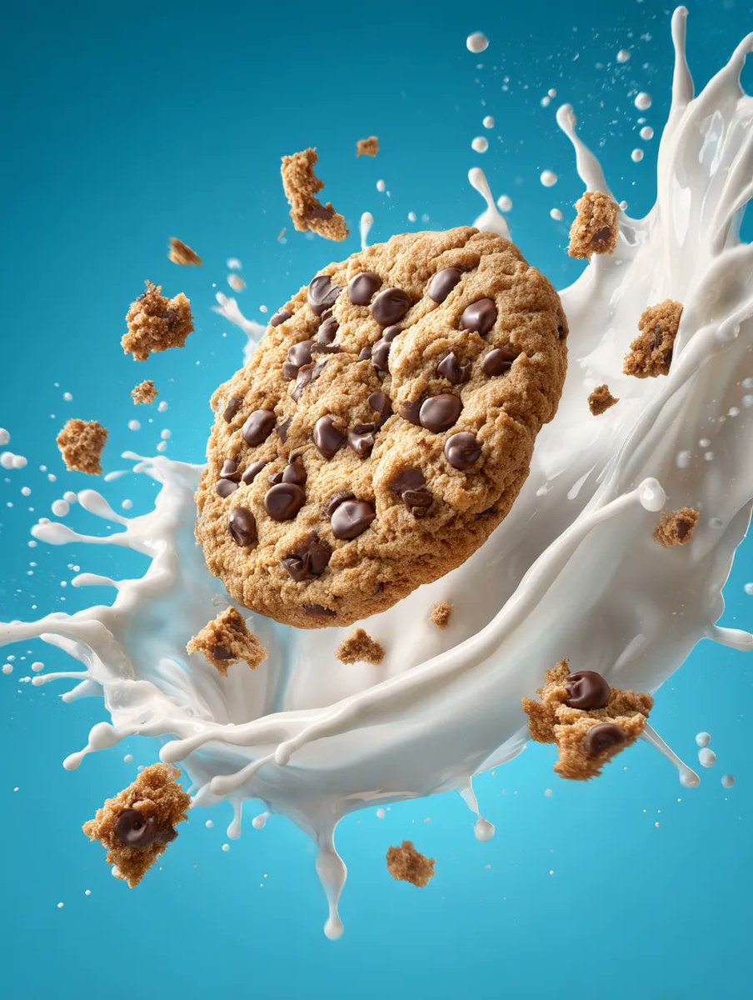

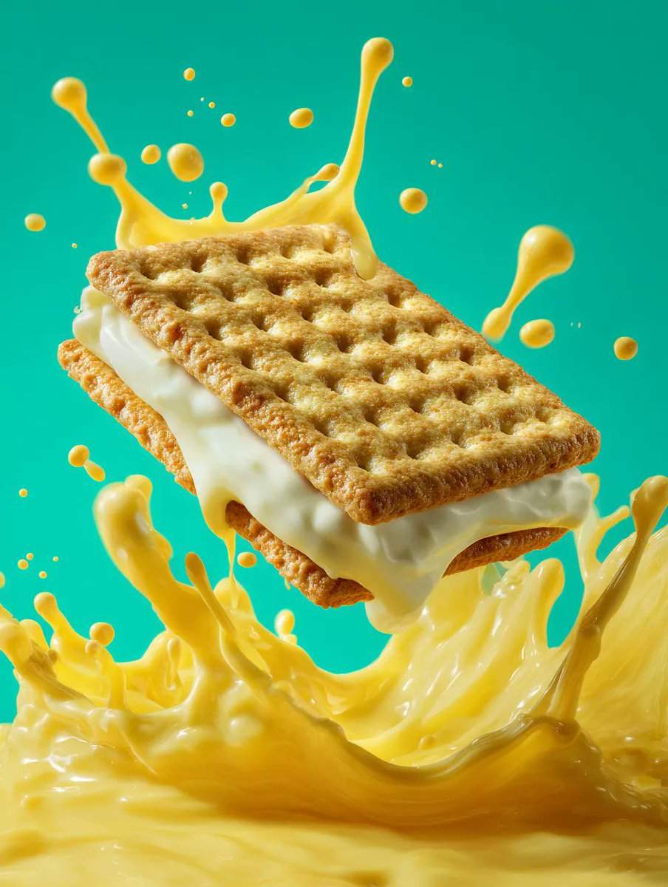

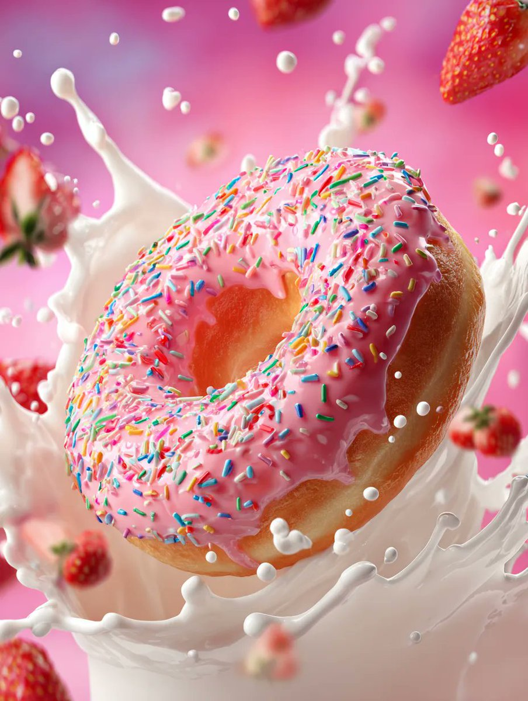

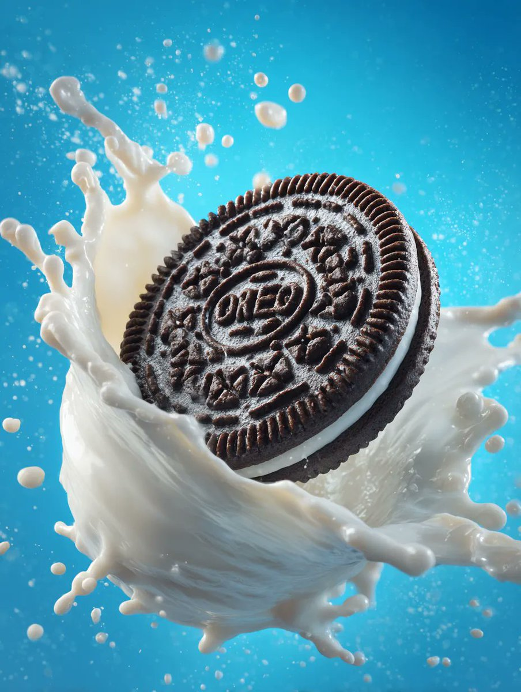

```
ultrarealistic close-up photo of an Oreo cookie being dunked into cold milk, splash and droplets frozen mid-motion, milk swirl and ripple details visible, iconic Oreo black and white cookie texture, vibrant blue and milk-white background, dynamic promotional energy --ar 3:4
```

```
超写实特写摄影：一块经典奥利奥饼干正被浸入冰凉牛奶中，飞溅的奶滴与水花在空中凝固，展现出动态瞬间；牛奶中细腻的漩涡与涟漪清晰可见，奥利奥标志性的黑白夹心与酥脆纹理纤毫毕现。背景采用鲜明的宝蓝色与乳白色渐变，营造出充满活力的促销氛围。画面比例3:4。
```

 [↑返回目录](#toc)

---
## <a id="prompt-2008248159815037000">超现实风格品牌广告海报</a> (<a href="https://x.com/aziz4ai/status/2008248159815036942" target="_blank" rel="noopener noreferrer">AZIZ | AI 🇸🇦</a>)

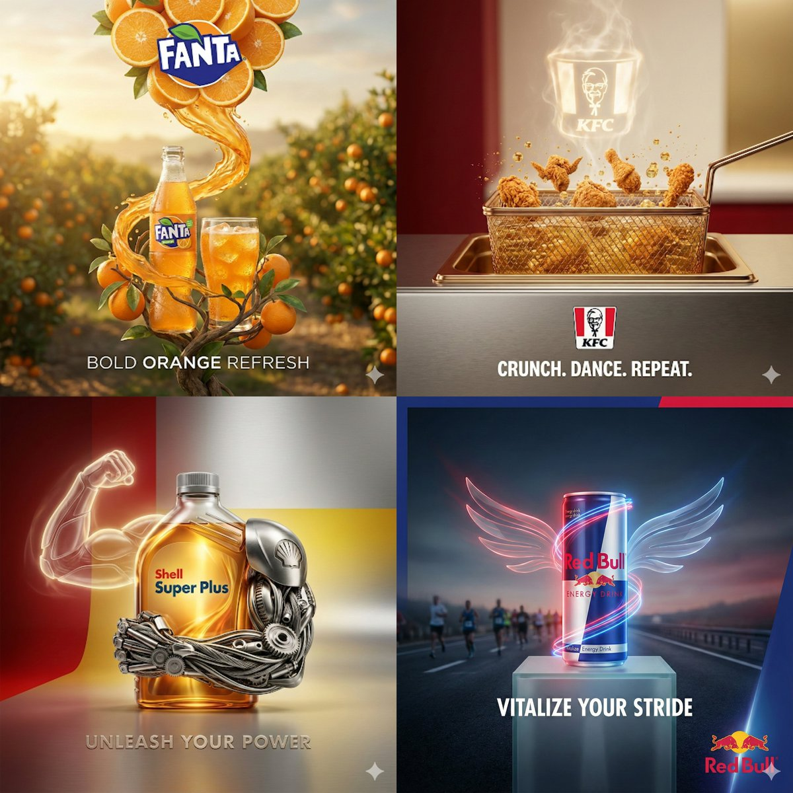

```
INSANE Surreal Brand Ads

Type ANY product name and get a cinematic print ad: real logo, brand colors, premium materials, plus a mind-blowing twist that fits the product, and a killer 3-word slogan.

The prompt in the next comment ⬇️
```

```
疯狂超现实品牌广告  

输入任意产品名称，即可生成一张电影级印刷广告：真实品牌标志、品牌专属配色、高端材质，并融入与产品契合的震撼创意转折，以及一句三词组成的强力口号。
```

 [↑返回目录](#toc)

---
## <a id="prompt-2008174532285350400">果树种植科普展板</a> (<a href="https://x.com/LZhou15365/status/2008174532285350353" target="_blank" rel="noopener noreferrer">小洲洲的AI日常</a>)

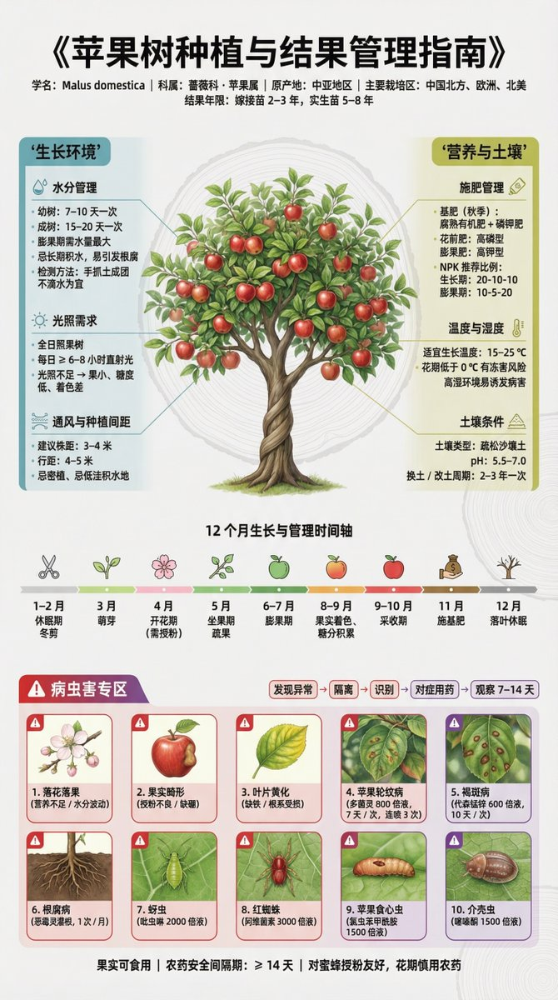

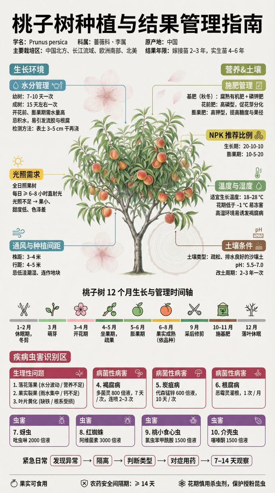

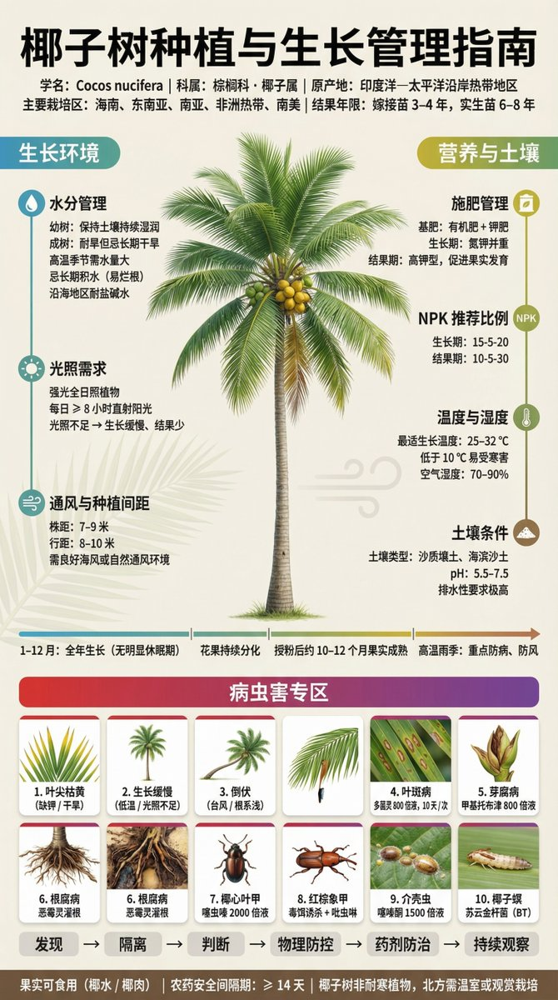

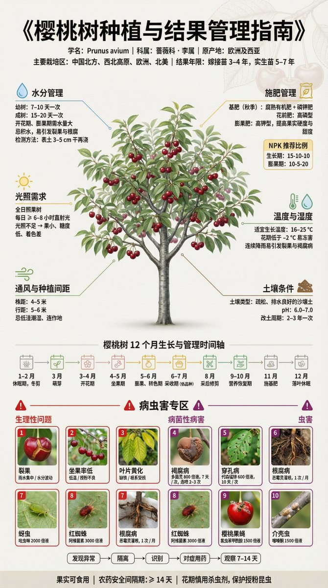

```
【主标题】
「××果树种植与结果管理指南」
字体：思源黑体 / 思源宋体混排，确保中文清晰渲染

【副标题】

学名 · 科属 · 原产地 · 主要栽培区 · 结果年限
【中央视觉】

画面中心 25%：
成熟健康的果树实物形态（可选：盆栽 / 幼树 / 结果期枝条），
 写实自然博物馆标本风格，树干、叶脉、果实细节清晰

背景：
浅色极简底（米白 / 浅灰）
淡雅农业几何纹样 / 果树年轮 / 叶脉结构底纹（透明度 15–20%）

【信息布局｜自动填充真实农业数据】

左侧（蓝绿色系 · 生长环境）
水分管理
幼树 / 成树浇水频率

不同生长期（萌芽 / 开花 / 膨果 / 休眠）需水差异
灌溉方式（滴灌 / 漫灌）

土壤含水量判断方法

光照需求
全日照 / 半日照

每日有效光照时长

光照不足 / 过强的结果影响对比图

通风与间距

行距株距建议

忌密植、忌积水低洼环境

右侧（黄绿色系 · 营养与土壤）

施肥管理

基肥 / 追肥 / 花前肥 / 果后肥

NPK 比例饼图（不同时期）

施肥频率与禁忌（避免烧根）

温度与湿度

四季生长温度曲线

花期低温风险提示

湿度过高导致病害示意

土壤条件

土壤类型（沙壤土 / 腐殖土）

pH 范围

改土方案（有机质 / 石灰 / 硫磺粉）

【中部横条】

12 个月果树生长与管理时间轴

修剪期

萌芽期

开花授粉期

坐果期

膨果期

采收期

休眠期
（图标化呈现）

【下方病虫害专区｜占 30%｜红紫警示色】

10 项果树常见病虫害识别卡片（3 行网格）

生理性问题

落花落果（营养 / 温度 / 水分）

果实畸形（授粉不良 / 缺硼）

叶片黄化（缺铁 / 缺氮 / 根系问题）

病菌性病害
4. 炭疽病
5. 褐斑病
6. 根腐病
虫害
7. 蚜虫
8. 红蜘蛛
9. 果实蝇
10. 介壳虫

每张卡片包含：
症状特写图（40%）

识别要点

具体防治方案

药剂名称 + 稀释倍数 + 使用频次
示例：
 代森锰锌 600 倍液，7 天 / 次，连喷 2–3 次

应急处理流程图
发现 → 隔离 → 判断 → 对症处理 → 持续观察

【底部信息栏】
果实可食性说明
农药安全间隔期
对蜜蜂 / 宠物 / 人类安全提示

【设计规范】
信息密度：高（留白约 25%）
连接线：由果树向外放射，极细线条
色彩编码：
蓝 = 水分
黄 = 光照
绿 = 营养
红 = 病害
紫 = 虫害
字级层级：
主标题 16pt
正文 12pt
备注 9pt

图标：统一线性农业科普风格

中文排版：行距 1.5，紧凑易读

病害卡片：红色边框 + 症状放大图

【风格参考】

日本果树试验站导览牌

现代自然博物馆农业信息墙
DK《果树栽培图鉴》

【技术参数】
正面平视 / 微俯视
柔和自然光
中大景深
4K 超高清
真实农业与园艺摄影级细节

【关键要求（非常重要）】

所有种植数据、病虫害信息、农药名称与使用浓度，需根据所选果树品种自动填充真实、准确、可查证的专业农业数据

英文补充（生图权重）

fruit tree cultivation guide poster, high-density agricultural infographic,
museum exhibition style, fruit tree growth cycle, pest and disease identification,
Chinese typography, minimalist background, professional horticulture data,
realistic fruit tree specimen, 4K ultra high resolution
```

 [↑返回目录](#toc)

---
## <a id="prompt-2008431391235862800">Inkstorm Noir</a> (<a href="https://x.com/aleenaamiir/status/2008431391235862892" target="_blank" rel="noopener noreferrer">Aleena Amir</a>)


```
A high-contrast ink noir portrait of [SUBJECT], illustrated entirely with expressive black ink strokes and controlled splatter. Heavy shadows dominate the composition while selective highlights emerge through negative space. Subtle paper grain is visible. Atmosphere is moody, cinematic, and intense, like a graphic novel frozen at its most dramatic panel.
```

```
一幅高对比度的黑色墨水肖像画，完全以富有表现力的黑色墨水笔触和受控的飞溅效果绘制而成。画面以浓重的阴影为主，通过留白形成局部高光。纸张的细微纹理清晰可见。整体氛围阴郁、电影感十足且极具张力，宛如一部图像小说中定格在最戏剧性的一幕。
```

 [↑返回目录](#toc)

---
## <a id="prompt-2008229403914900000">金属液滴的奢华悬浮瞬间</a> (<a href="https://x.com/RobotCleopatra/status/2008229403914899923" target="_blank" rel="noopener noreferrer">Skipper</a>)

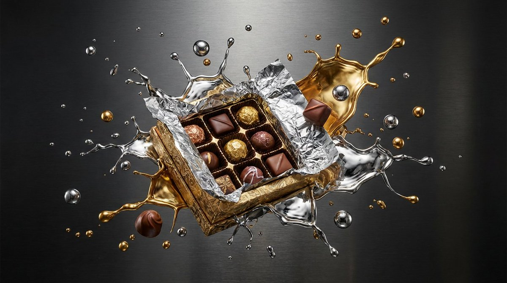

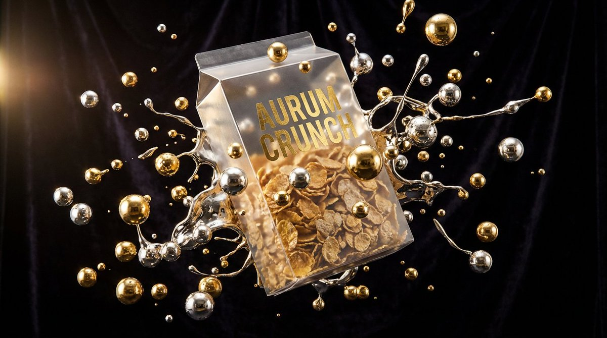

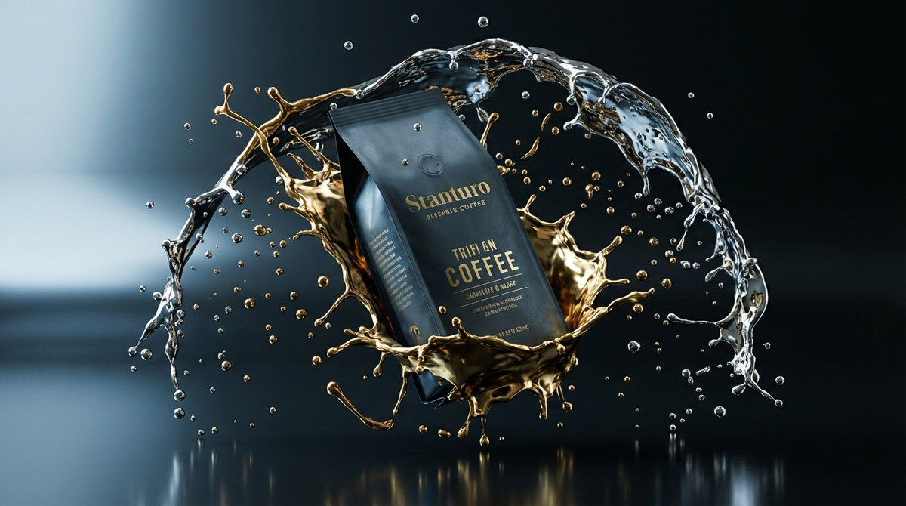

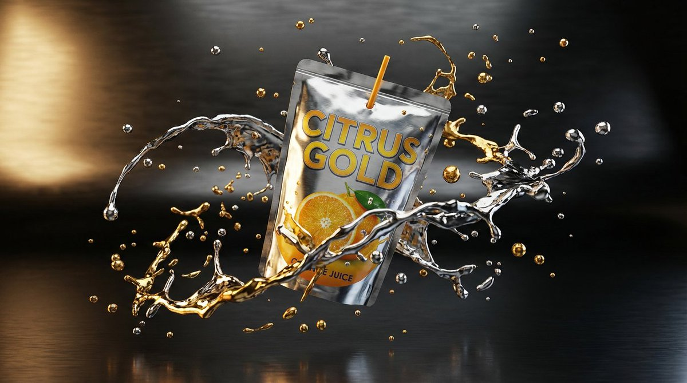

```
TO MARKETING
[PRODUCT] suspended in mid-splash of metallic liquid, frozen motion, silver and gold droplets caught in zero gravity, hyper-crisp detail on liquid tension, dramatic side lighting, luxurious chaos, editorial beauty photography @AdobeFirefly boards @Adobe
```

```
[PRODUCT] 悬浮在金属液体飞溅的瞬间，动作凝固，银色与金色液滴仿佛处于零重力状态，液体张力呈现超清晰细节，强烈的侧光照明，奢华而富有动感的混乱感，具有杂志级美感的摄影风格。
```

 [↑返回目录](#toc)

---
## <a id="prompt-2008209545412419800">梅西的暗影肖像</a> (<a href="https://x.com/Sheldon056/status/2008209545412419746" target="_blank" rel="noopener noreferrer">Duet | AI</a>)

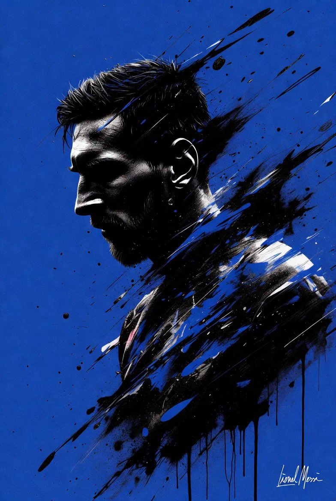

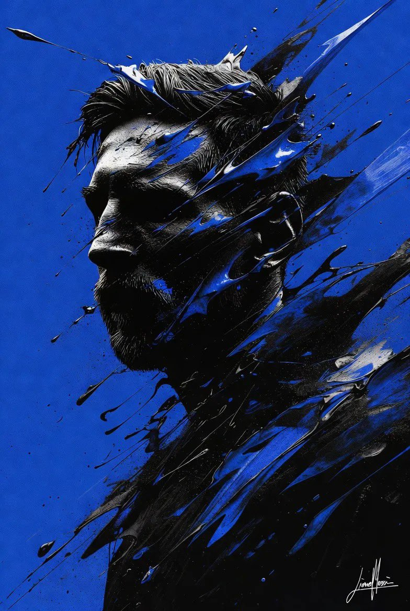

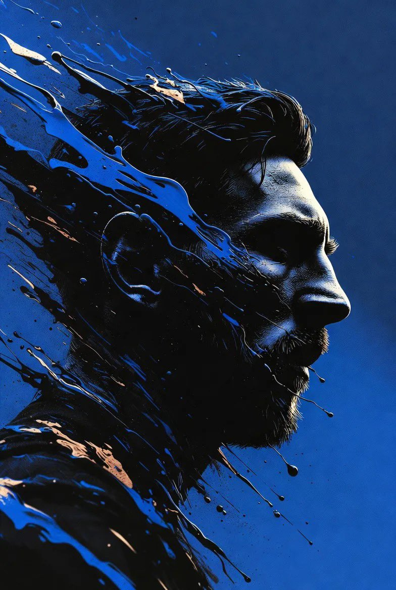

```
Convert this image into a dramatic, stylized portrait (use the same face as the uploaded photo), 9:16 aspect ratio, featuring a dark, almost silhouetted figure in profile looking to the left. The background is a deep electric blue. Intense black and sapphire paint splashes burst outward from the head and shoulders, creating powerful motion energy. Ultra-sharp lighting, cinematic contrast, HD photo.
Signature: Lionel Messi
```

 [↑返回目录](#toc)

---
## <a id="prompt-2008319307667645000">电影剧照：低调高对比度的冷调场景</a> (<a href="https://x.com/RobotCleopatra/status/2008319307667644815" target="_blank" rel="noopener noreferrer">Skipper</a>)

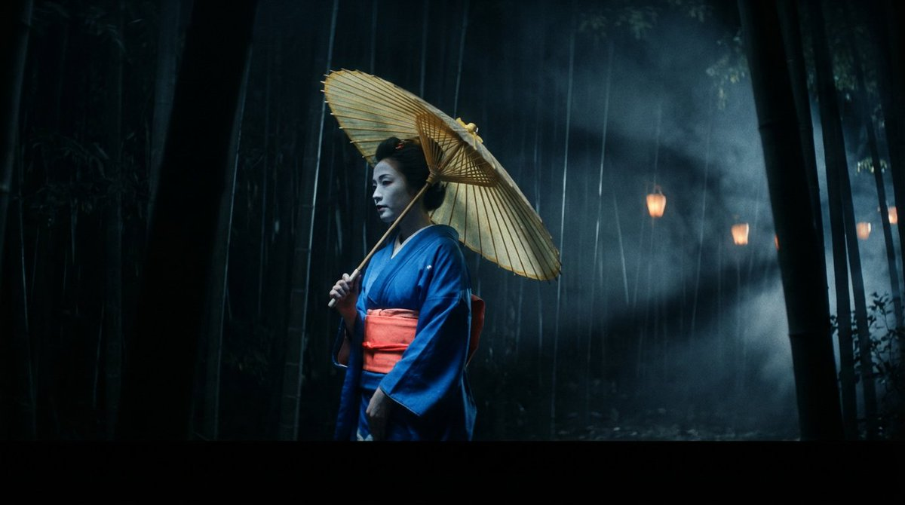

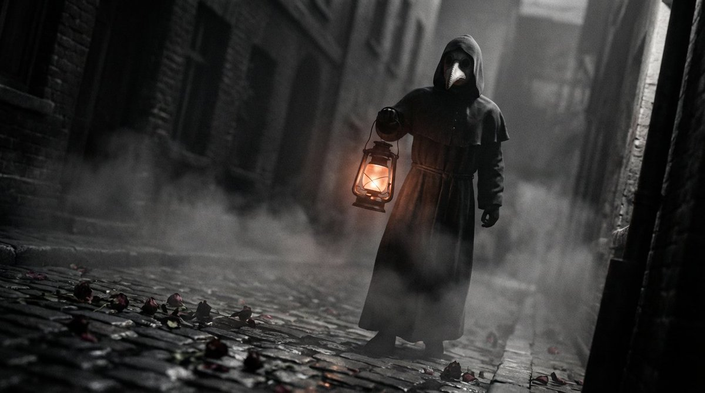

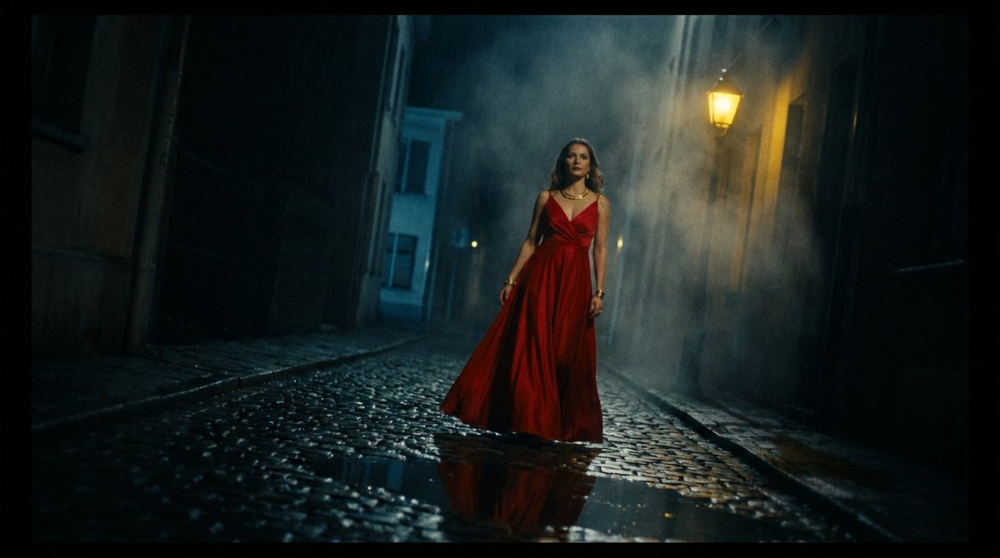

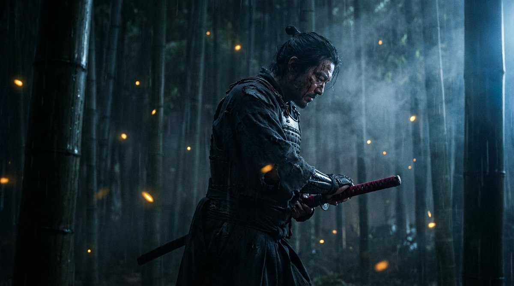

```
GOLDEN PROMPT FOR MOVIES 
[SUBJECT], single frame film still, medium wide shot composition, eye-level camera with subtle dutch angle 5 degrees, Cooke S4 75mm prime lens T2.0 wide open, extremely shallow depth of field with focus fall-off, dramatic side lighting from frame right at 90 degrees, deep contrast low-key illumination, shadow density at 95% black, lifted blacks avoided, rich dark tones dominating 70% of frame, cool desaturated color palette with steel blue undertones, bleach bypass processing look, shot on ARRI Alexa LF with vintage Kowa anamorphic glass, organic halation on highlights, smoky atmospheric density, volumetric light cutting through darkness, no fill light pure shadow areas, cinemascope framing with subject in lower third, subtle depth parallax movement for animation layers. @Adobe @AdobeFirefly boards.
```

```
电影黄金提示词：  
[主体]，单帧电影剧照，中远景构图，水平视角相机搭配5度轻微荷兰角，使用Cooke S4 75mm定焦镜头，光圈全开至T2.0，极浅景深并带有焦点衰减效果，画面右侧90度方向施加强烈侧光，低调高对比照明，阴影密度达95%纯黑，避免提亮暗部，画面70%区域以浓郁深色调为主，冷调低饱和色彩搭配钢蓝色基调，采用漂白反差冲洗工艺风格，ARRI Alexa LF摄影机搭配复古Kowa变形镜头拍摄，高光呈现自然光晕，烟雾弥漫的空气质感，体积光穿透黑暗，无补光、纯阴影区域保留，宽银幕画幅构图，主体位于画面下三分之一处，动画图层带有细微纵深视差运动。
```

 [↑返回目录](#toc)

---
## <a id="prompt-2008434033701879800">超写实的影棚摄影作品</a> (<a href="https://x.com/iamsofiaijaz/status/2008434033701879836" target="_blank" rel="noopener noreferrer">Aijaz</a>)


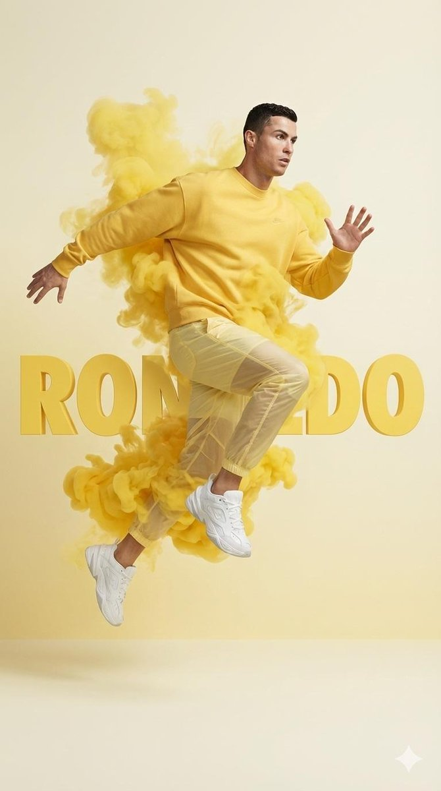

```
1.A hyper-realistic studio photograph of a male athlete mid-air as if running or jumping, wearing a pastel pink sweatshirt and light pink jogger pants, with soft blue sneakers. Pink powder smoke is exploding and swirling around his body, especially behind him and around his legs, creating a dynamic motion effect. Clean minimal background with a soft gradient from light gray to pale pink. Cinematic lighting, ultra-sharp focus, shallow depth of field, fashion advertising style, high detail, 8k, soft shadows, professional studio photography.
2.A hyper-realistic studio photo of a male athlete jumping in mid-air, wearing a monochrome yellow outfit (sweatshirt and joggers) with white sneakers, surrounded by dramatic yellow powder smoke exploding around his body, frozen motion, clean minimal pastel yellow background, cinematic lighting, high contrast, sharp focus, fashion advertising style, ultra detailed, 8k, professional photography, dynamic pose, modern sporty aesthetic
```

```
1. 一张超写实的影棚摄影作品，画面中一名男运动员仿佛在奔跑或跳跃的空中瞬间，身穿淡粉色连帽衫和浅粉色慢跑裤，脚踩柔和蓝色运动鞋。粉红色粉末烟雾在他身体周围爆炸并盘旋，尤其集中在身后和腿部，营造出动态的运动效果。背景干净简约，由浅灰色渐变为淡粉色。采用电影级灯光、超锐利对焦、浅景深、时尚广告风格、高细节、8K分辨率以及柔和阴影的专业影棚摄影。

2. 一张超写实的影棚照片，一名男运动员在空中跳跃，身穿单色黄色套装（连帽衫与慢跑裤）搭配白色运动鞋，身体周围环绕着戏剧性的黄色粉末烟雾，呈现出爆炸般的定格动态效果。背景为干净简约的淡黄色，采用电影级灯光、高对比度、锐利对焦、时尚广告风格、极致细节、8K分辨率、专业摄影手法、动态姿势以及现代运动美学。
```

 [↑返回目录](#toc)

---
## <a id="">空气感·清透治愈的女生</a> (<a href="https://x.com/berryxia/status/2008913659582681255" target="_blank" rel="noopener noreferrer">Berryxia.AI</a>)

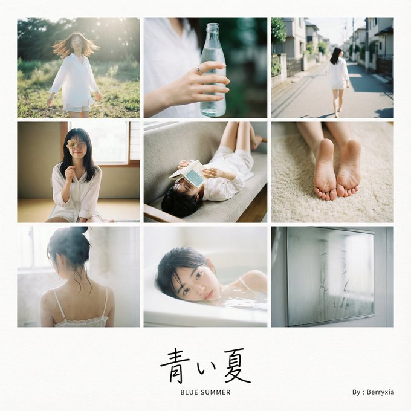


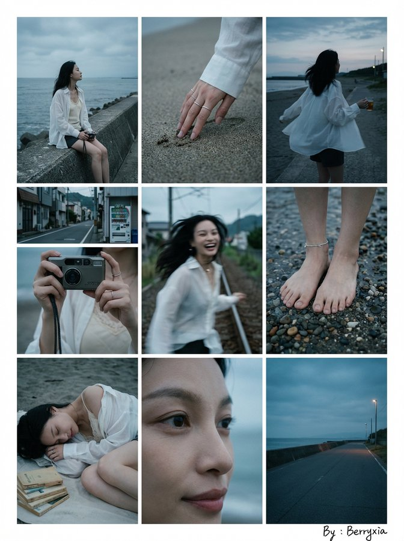

```
**[Type]:** A scanned page from a high-end Japanese photobook (Shashin-shu). **A 9-grid photo layout printed on textured matte art paper.**
**[Layout Design]:** The 9 photos are arranged in a clean grid with **wide white margins** at the bottom to accommodate typography.

**[Subject Consistency - STRICT]:**
* **Source:** Based strictly on the uploaded reference image. **[SAME CHARACTER IN ALL PANELS]**.
* **Styling Strategy:** **[RANDOMLY SELECT ONE]:**
    1.  **{Classic}:** Loose white shirt + shorts.
    2.  **{Soft}:** Beige knit cardigan + camisole.
    3.  **{Pure}:** **White lace-trimmed slip dress** (Best for bath transitions).
    * **Note:** In Row 3 (Bath), outfit creates a "wet look" or shows skin.

**[Typography & Japanese Elements - THE ARTISTIC TOUCH]:**
*(AI must render a title text in the bottom white margin)*
**[RANDOMLY SELECT ONE Title Theme]:**
1.  **{Theme: Summer}:** Large Japanese text **"青い夏"** with small English text **"BLUE SUMMER"** below it.
2.  **{Theme: Private}:** Large Japanese text **"私小説"** with small English text **"PRIVATE NOVEL"** below it.
3.  **{Theme: Air}:** Large Japanese text **"空気感"** with small English text **"AIRY MOMENTS"** below it.
* **Signature:** The handwritten text **"By : Berryxia"** is placed artistically next to the title or in the corner like a watermark.

**[Grid Narrative - The "Day to Night" Journey]:**

**Row 1: Outdoor Breath (Wind & Light)**
1.  **Top-Left (Wide):** Subject standing in wind, hair blowing, **backlit by sun**.
2.  **Top-Middle (Detail):** Close-up of **hand holding a glass bottle of soda** or blocking the sun.
3.  **Top-Right (Motion):** Blurry candid shot of subject **walking away on a street**.

**Row 2: Indoor Play (Props & "Hiding")**
4.  **Center-Left (Hiding):** Subject sitting on tatami, **using a dried flower to cover one eye**.
5.  **Center (Candid):** Subject **lying upside down on a sofa**, reading a book, face partially hidden.
6.  **Center-Right (Fetish):** Focus on **bare feet curled on the rug** or fingers touching hair.

**Row 3: Private/Wet (Steam & Skin)**
7.  **Bottom-Left (Steamy Back):** **Back view in a steamy bathroom**. Wet hair sticking to nape of neck. Soft focus.
8.  **Bottom-Middle (Immersion):** Subject **submerged in bathtub**, water up to chin. Dreamy high-key lighting.
9.  **Bottom-Right (End):** Detail of **steam on a mirror**.

**[Aesthetic Style]:**
* **Film Stock:** Fujifilm Pro 400H (Cyan shadows, airy highlights).
* **Texture:** **Visible paper texture**, slight vignetting, layout design style.

**[Parameters]:** --ar 2:3 --style raw --v 6.0 --stylize 200 --cref [URL] --cw 80 --no commercial smile, stiff posing, studio lighting 使用室内旅馆内风格B输出
```

 [↑返回目录](#toc)

---
## <a id="prompt-2008903682612760800">动物萌化系列</a> (<a href="https://x.com/LufzzLiz/status/2008903682612760944" target="_blank" rel="noopener noreferrer">岚叔</a>)

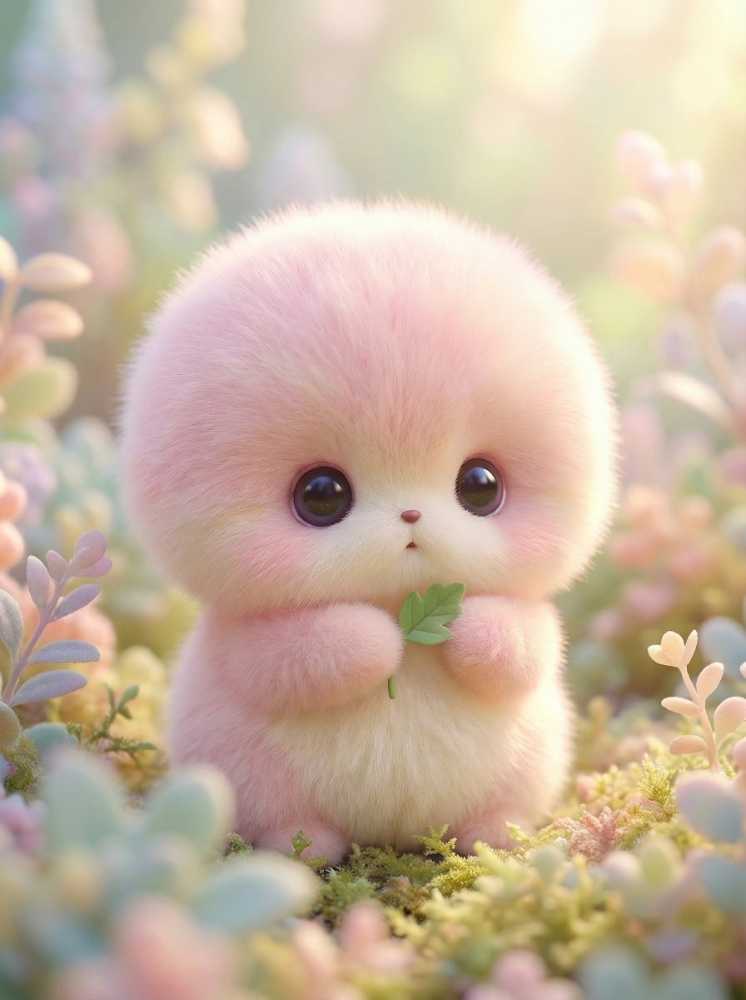

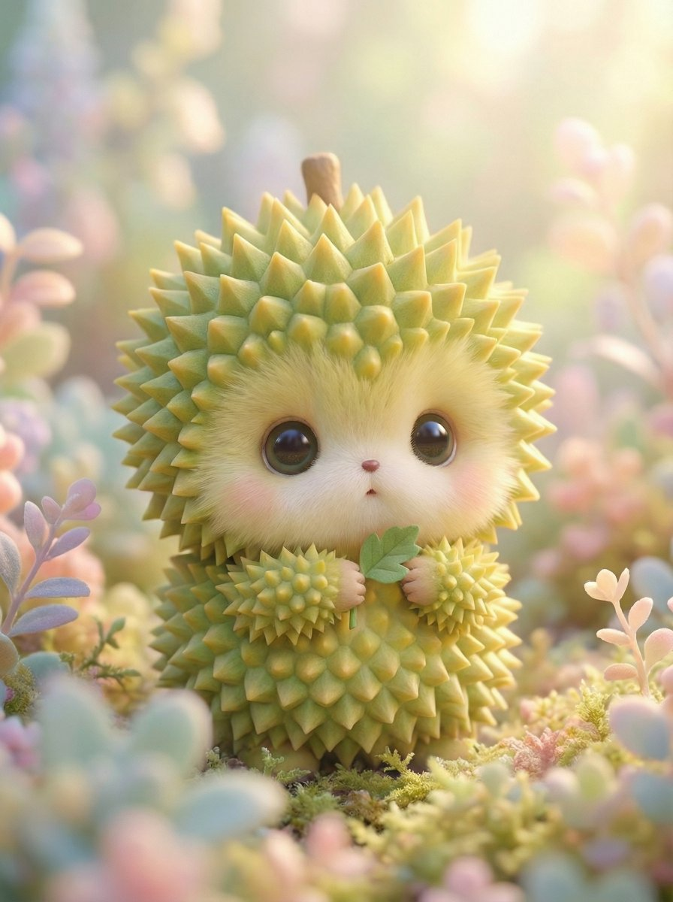

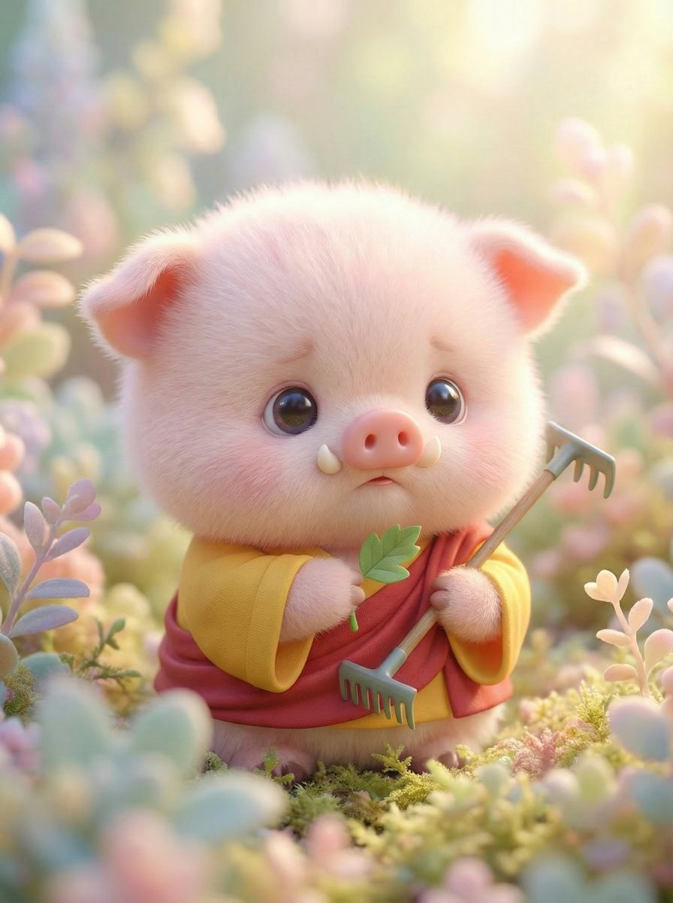

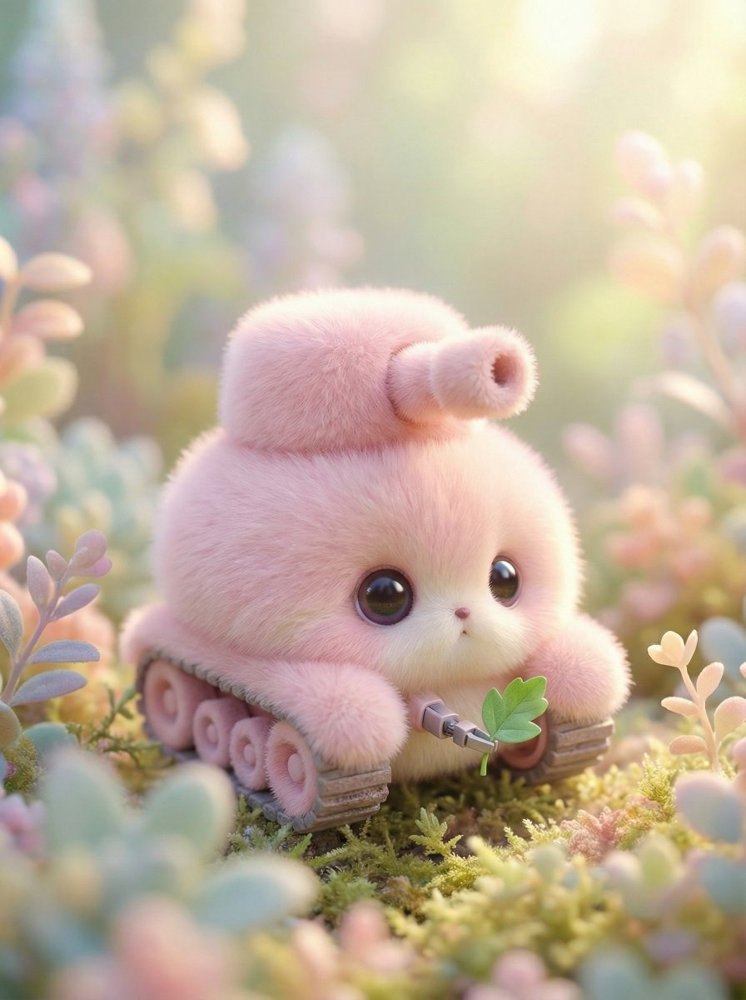

```
An ultra-cute, baby-like embodiment of all things, shaped like a tiny fluffy puff,
with an oversized round head and an extremely small body.
Huge glossy eyes placed low on the face,
a tiny dot mouth, and no visible nose.

It gently holds a small leaf with its short, stubby paws,
looking slightly unsure and vulnerable.
Soft pastel colors, very soft lighting,
a dreamy atmosphere—maximum cuteness, heart-melting.
```

 [↑返回目录](#toc)

---
## <a id="prompt-2008600010943025200">高端身体喷雾AUREN的超写实产品摄影</a> (<a href="https://x.com/SiboEsenkova/status/2008600010943025240" target="_blank" rel="noopener noreferrer">Sibo Esenkova</a>)

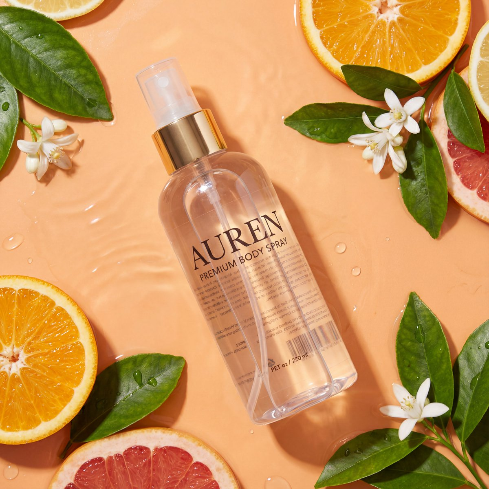

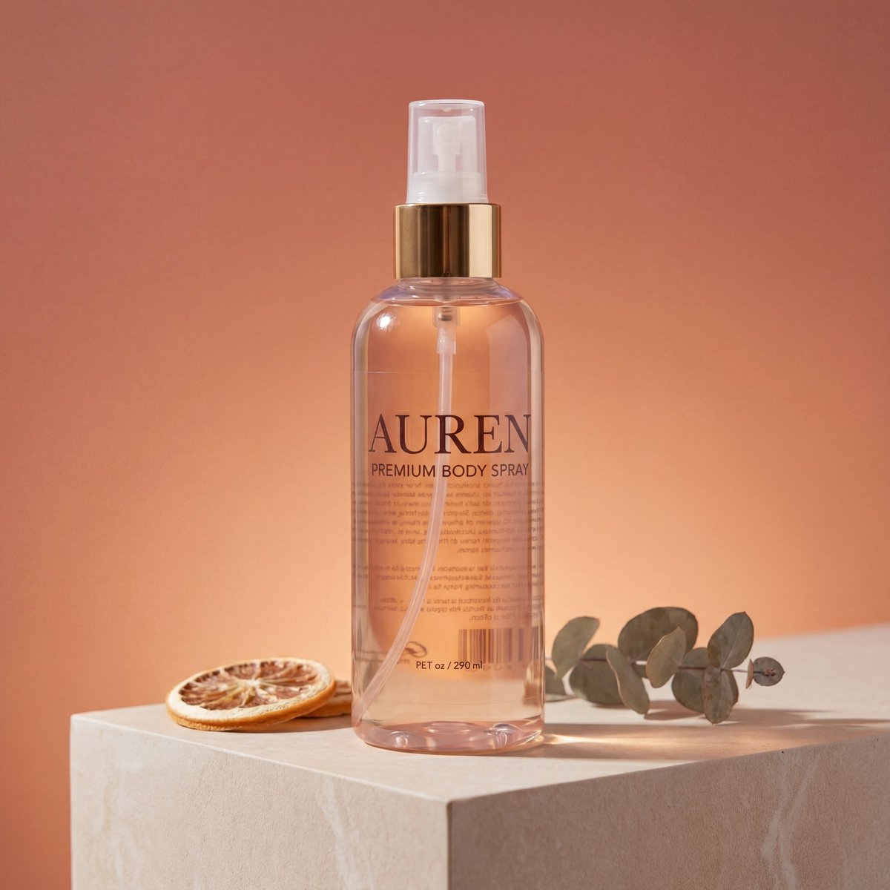

```
Ultra high-end photorealistic cosmetic product photography for a premium body spray brand, AUREN.
The bottle realism is the absolute priority.

Hero product – bottle accuracy:
AUREN body spray bottle made of transparent PET plastic, lightweight cosmetic packaging.
Clearly visible liquid level inside the bottle.
Slight natural plastic distortion, not perfectly rigid.
Realistic internal reflections inside the bottle.
Plastic spray pump with gold-toned metal collar, identical realism to mass-market premium body sprays.
Transparent plastic cap with subtle thickness and edge refractions.
No glass look. No luxury perfume bottle look.
This is a real cosmetic body spray, not a fragrance bottle.

Label:
Printed paper label wrapped around the bottle.
Slight curvature following the bottle shape.
No floating label.
No embossed fantasy effects.
Ink looks printed, not digital.
Typography sharp and readable.
Brand name: AUREN.

Scene & composition:
Top-down studio product shot, very similar to the reference image.
Bottle placed flat on surface.
Centered composition.
Surrounded by real botanical elements.
Fresh green leaves with visible veins and imperfections.
Small white flowers.
Citrus fruit with natural pores and uneven texture.
Water droplets randomly scattered, imperfect, natural.

Surface & background:
Warm peach-orange background, slightly wet surface.
Subtle water ripples and reflections.
Natural imperfections on the surface.
No artificial gradients.

Lighting:
Professional commercial studio lighting.
Soft but directional light.
Natural specular highlights on plastic.
Controlled reflections on cap and pump.
Soft shadow under bottle.
No over-polished lighting.

Camera & realism:
Shot by a top-tier commercial e-commerce photography team.
Macro-capable lens.
True depth of field.
Minor focus falloff at edges.
True-to-life scale and proportions.
Extremely realistic textures.
No CGI look.
No AI smoothness.
Looks like a real photograph taken in a studio.

Quality:
Ultra high resolution.
Photorealistic.
E-commerce ready.
Trustworthy.
Clean but real.

Restrictions:
No humans.
No hands.
No unrealistic symmetry.
No floating objects.
No glass bottle.
No illustration.
No 3D render look.
No surreal colors.
100% real-world cosmetic photography.
```

```
超高端写实级化妆品产品摄影，用于高端身体喷雾品牌 AUREN。  
瓶身写实性为绝对优先。

主打产品——瓶身精准还原：  
AURE DNA 身体喷雾瓶采用透明 PET 塑料材质，轻量级化妆品包装。  
瓶内液位清晰可见。  
塑料略有自然形变，非完全刚硬。  
瓶内具有真实内部反射效果。  
塑料喷头配有金色金属环，质感与市售高端身体喷雾一致。  
透明塑料瓶盖具有细微厚度及边缘折射效果。  
不可呈现玻璃质感，不可呈现奢侈香水瓶风格。  
这是一款真实的化妆品身体喷雾，而非香氛香水瓶。

标签：  
纸质印刷标签环绕瓶身。  
标签随瓶身自然弯曲。  
不可悬浮于瓶身之外。  
不可有浮雕或幻想特效。  
油墨呈现真实印刷质感，非数字效果。  
字体清晰可读。  
品牌名称：AUREN。

场景与构图：  
俯拍影棚产品照，高度参考参考图。  
瓶身平放于表面。  
居中构图。  
周围环绕真实植物元素：  
- 新鲜绿叶，可见叶脉与自然瑕疵；  
- 小型白色花朵；  
- 柑橘类水果，带有天然气孔与不均匀纹理；  
- 随机分布的水珠，形态不规则、自然。

表面与背景：  
暖桃橙色背景，表面略带湿润感。  
有细微水波纹与倒影。  
表面存在自然瑕疵。  
不可使用人工渐变。

灯光：  
专业商业影棚布光。  
柔和但具方向性。  
塑料表面呈现自然高光。  
瓶盖与喷头处有受控反光。  
瓶底投射柔和阴影。  
不可过度抛光式打光。

相机与写实感：  
由顶级电商商业摄影团队拍摄。  
使用具备微距能力的镜头。  
真实景深效果。  
边缘有轻微焦外虚化。  
比例与尺寸完全真实。  
纹理极度逼真。  
不可呈现 CGI 效果。  
不可有 AI 平滑感。  
整体须如真实影棚拍摄照片。

画质要求：  
超高分辨率。  
极致写实。  
适用于电商平台。  
可信、干净但真实。

限制条件：  
不可出现人物。  
不可出现手部。  
不可过度对称。  
不可有悬浮物体。  
不可使用玻璃瓶。  
不可为插画。  
不可呈现 3D 渲染感。  
不可使用超现实色彩。  
100% 真实世界化妆品摄影。
```

 [↑返回目录](#toc)

---
## <a id="prompt-2008856432687665200">文艺复兴时期的美人鱼解剖研究</a> (<a href="https://x.com/azed_ai/status/2008856432687665235" target="_blank" rel="noopener noreferrer">Amira Zairi</a>)


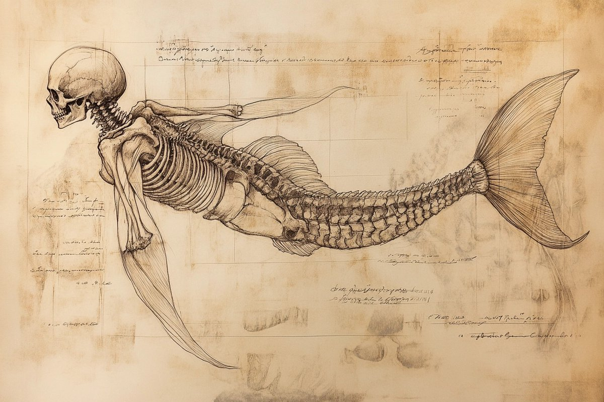

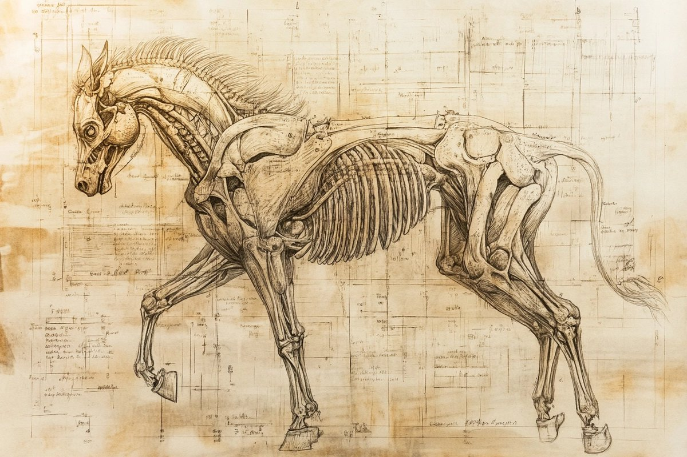

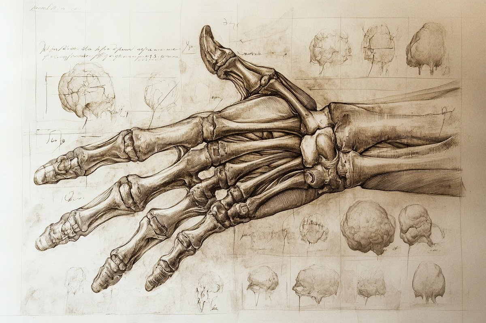

```
A Renaissance anatomical study of a giant’s torso, illustrated with fine graphite and ink cross-hatching. Layered with transparent tissue overlays showing bone and muscle, and labeled in Latin calligraphy.
```

```
A Renaissance anatomical study of a mermaid, illustrated with fine graphite and ink cross-hatching. Layered with transparent tissue overlays showing bone and muscle, and labeled in Latin calligraphy.
```

```
A Renaissance anatomical study of a horse in motion, illustrated with fine graphite and ink cross-hatching. Layered with transparent tissue overlays showing bone and muscle, and labeled in Latin calligraphy.
```

```
A Renaissance anatomical study of a human hand, illustrated with fine graphite and ink cross-hatching. Layered with transparent tissue overlays showing bone and muscle, and labeled in Latin calligraphy.
```

 [↑返回目录](#toc)

---
## <a id="prompt-2008826083282686200">立体雕塑感的国家名称拼写，内填传统美食</a> (<a href="https://x.com/aleenaamiir/status/2008826083282686133" target="_blank" rel="noopener noreferrer">Aleena Amir</a>)


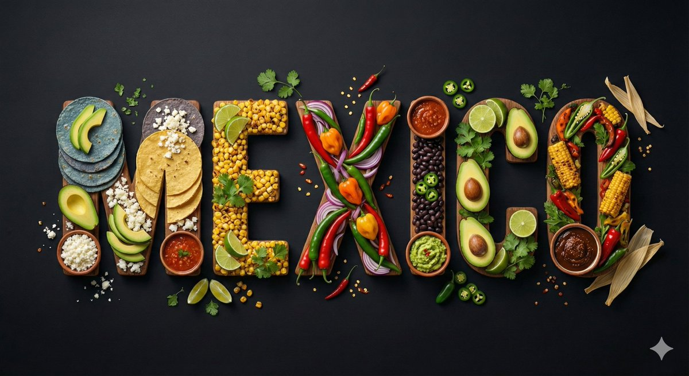

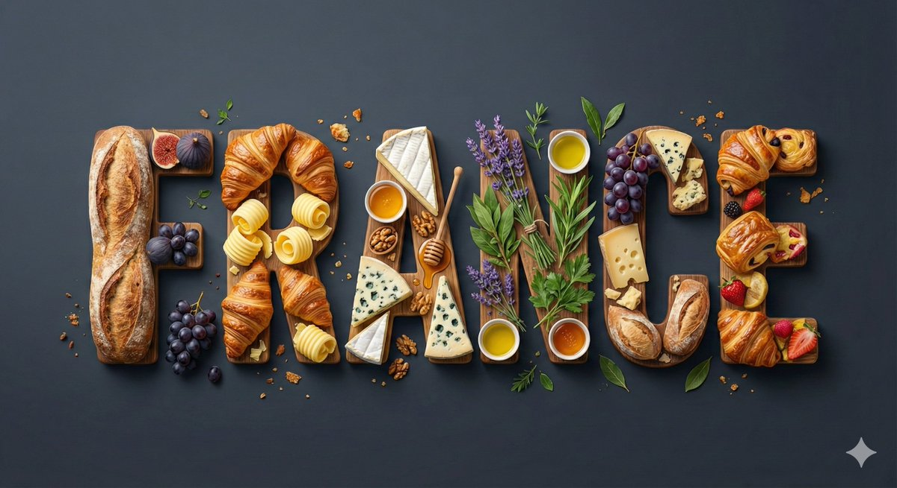

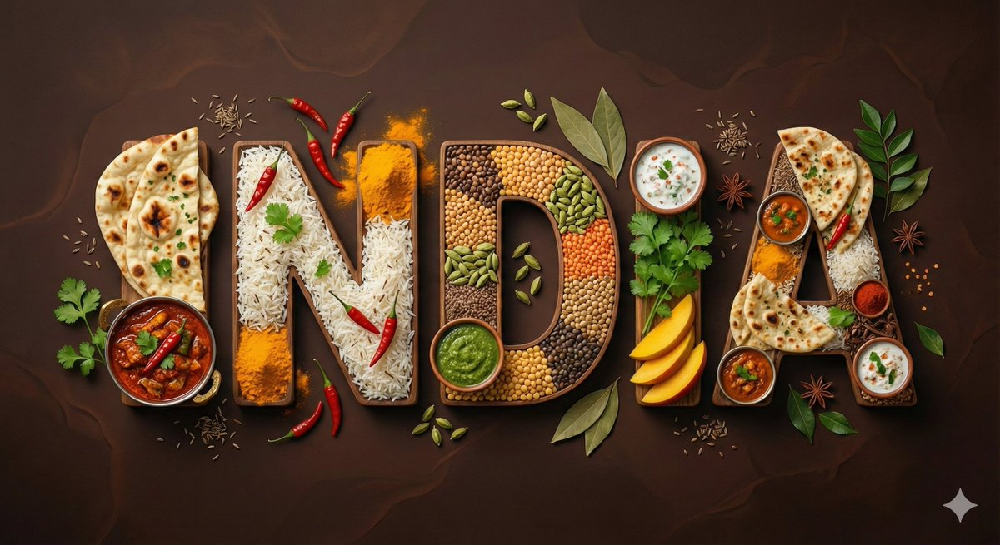

```
A high-quality digital illustration of the word [COUNTRY NAME] spelled in bold, uppercase letters. The typography is sculptural and dimensional, with each letter subtly overlapping or stacked to enhance depth and visual flow. Set against a rich, dark-toned background that complements the palette of the ingredients.

Each letter is intricately filled with iconic traditional foods from [COUNTRY], such as [SIGNATURE BREADS / FRUITS / SPICES / DISH ELEMENTS], carefully arranged to follow the contours of the typography. Small bowls of [TRADITIONAL SAUCES / CONDIMENTS] and scattered ingredients are integrated naturally within the composition.

The food elements are styled in an art-directed, editorial manner – balanced, textured, and visually rich – with gentle overlaps for realism. Soft, diffused lighting enhances natural textures and depth, creating a warm, appetizing, premium aesthetic. 

Ultra-detailed, clean composition, food-photography-inspired digital illustration, high contrast, refined visual storytelling.
```

```
一幅高品质数字插画，以粗体大写字母拼写出“[国家名称]”一词。字体具有雕塑感和立体感，每个字母略微重叠或堆叠，以增强深度与视觉流动感。背景为浓郁的深色调，与食材调色板相协调。

每个字母内部精细填充该国标志性传统食物，例如[特色面包／水果／香料／菜肴元素]，这些食材精心排列，贴合字体轮廓。画面自然融入小碗装的[传统酱料／调味品]以及散落的食材。

食物元素采用艺术指导式的编辑风格——构图平衡、质感丰富、视觉饱满，并通过轻微重叠营造真实感。柔和漫射光线突显天然纹理与层次，营造出温暖、诱人且高端的视觉氛围。

超精细、干净的构图，灵感源自美食摄影的数字插画，高对比度，精致的视觉叙事。
```

 [↑返回目录](#toc)

---
## <a id="prompt-2008559850968473600">高端杂志风格的3D写实产品摄影</a> (<a href="https://x.com/Kerroudjm/status/2008559850968473671" target="_blank" rel="noopener noreferrer">Mo</a>)


```
A high-end editorial photo of a [PRODUCT] placed flat on a [TEXTURED SURFACE], captured from a direct top-down view. The surface is gently disturbed to suggest recent motion or interaction. The front of the product is fully visible and properly oriented upright. The area around the product is intentionally left open to optionally place [COMPLEMENTARY OBJECTS] that visually enhance the scene. Natural sunlight from the upper left casts warm, realistic shadows. 3D realism, luxury product photography, shallow depth of field, 1:1 format.
```

```
一张高端杂志风格的照片，[PRODUCT] 平放在 [TEXTURED SURFACE] 上，采用正上方俯拍视角。表面略显扰动，暗示最近曾有移动或互动。产品正面完全可见且端正朝上。产品周围区域有意留白，可选择性放置 [COMPLEMENTARY OBJECTs] 以视觉上增强画面。左上角自然阳光投射出温暖而真实的阴影。3D 写实风格，奢侈品摄影，浅景深，1:1 画幅。
```

 [↑返回目录](#toc)

---
## <a id="prompt-2008570138371478000">超高清数字插图：漫画与卡通风格</a> (<a href="https://x.com/YaseenK7212/status/2008570138371477897" target="_blank" rel="noopener noreferrer">Yaseen Khan Gul</a>)

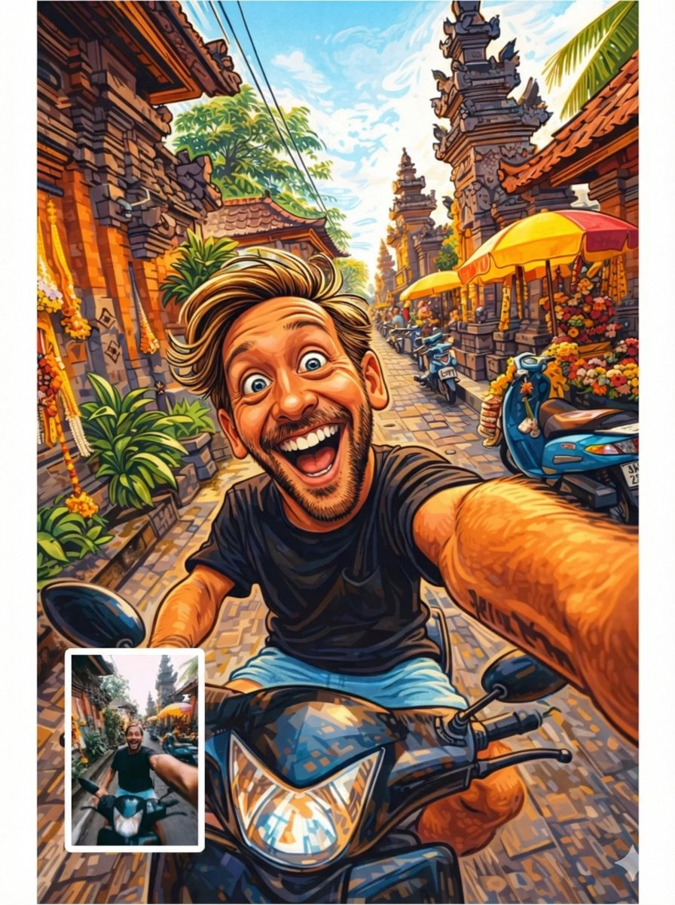

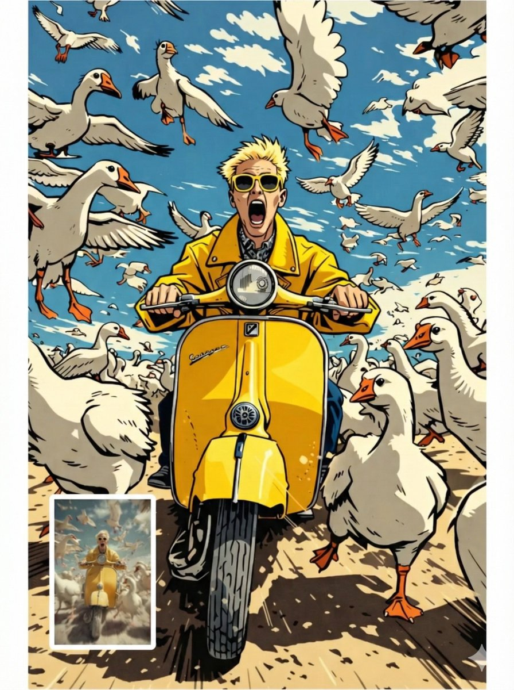

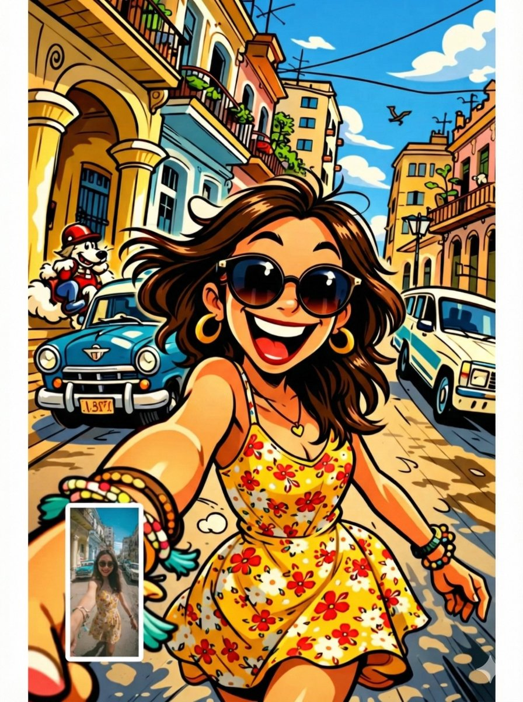

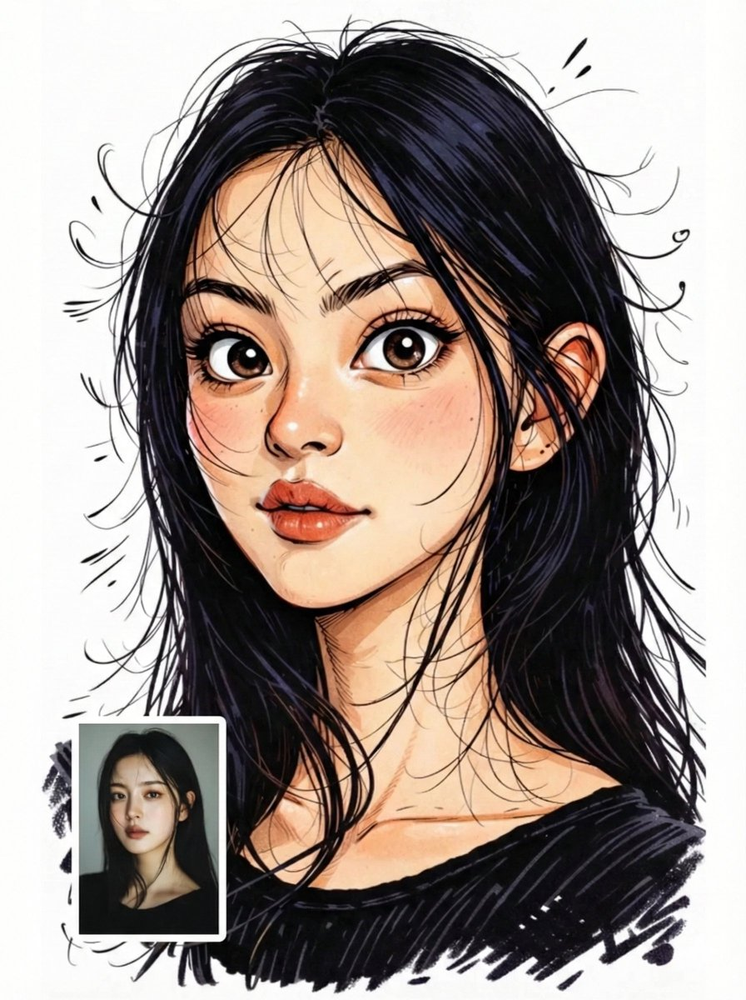

```
{
  "system_manifest": {
    "version": "15.0_atomic_style_matrix",
    "operation": "Image-to-Illustration Transformation",
    "global_rendering": {
      "output_format": "Digital Illustration",
      "resolution": "Ultra-High Definition",
      "style_separation_logic": "Modular / Independent"
    }
  },
  "style_logic_library": {
    "module_01": {
      "identifier": "CARICATURE_ILLUSTRATION",
      "logic_tree": {
        "anatomy": "Exaggerated proportions / Recognizable features",
        "stroke": "Expressive / Bold / High-contour",
        "distortion_profile": "Playful / Personality-driven",
        "tonal_vibe": "Humorous / Energetic"
      }
    },
    "module_02": {
      "identifier": "KINETIC_INK_SKETCH",
      "logic_tree": {
        "linework": "Expressive ink-style outlines / Hand-drawn feel",
        "color_engine": {
          "base": "Vivid digital hues",
          "texture": ["Subtle shading", "Mild hatching", "Gestural strokes"]
        },
        "spatial_logic": {
          "background": "Minimalist clean white",
          "fx": "Kinetic movement elements"
        },
        "aesthetic": "Digital pen-and-ink comic art"
      }
    },
    "module_03": {
      "identifier": "GRAPHIC_CEL_SHADED",
      "logic_tree": {
        "color_mapping": "Flat regions / Minimal gradients",
        "shading_logic": "Sharp shadow divisions / High-contrast",
        "line_logic": "Clean / Bold / Graphic outlines",
        "fidelity": "Animation-ready / Vector-style"
      }
    },
    "module_04": {
      "identifier": "DORAEMON_ANIME",
      "logic_tree": {
        "geometry": "Clean / Rounded / Simple primitive shapes",
        "chroma_profile": "Bright flat colors / High-key",
        "aesthetic": "Kodomo-anime / Child-friendly",
        "mood": "Light / Innocent / Playful"
      }
    },
    "module_05": {
      "identifier": "LOONEY_TUNES_SLAPSTICK",
      "logic_tree": {
        "kinematics": "Elastic poses / Squash and stretch",
        "expression": "Extreme / Exaggerated / High-intensity",
        "outlines": "Heavy bold cartoon ink",
        "energy": "Vibrant / Slapstick / Hyper-active"
      }
    }
  },
  "technical_pipeline": {
    "post_processing": {
      "sharpening": "Enabled for ink fidelity",
      "color_grading": "Saturated / Illustration-optimized"
    },
    "output_node": {
      "composition": "Centered subject / Subject-focused",
      "canvas_cleanness": "High / Zero noise"
    }
  }
}
```

```
系统清单：
版本：15.0原子风格矩阵，
操作：图像转插图转换，
全局渲染：输出格式为数字插图，分辨率超高清，风格分离逻辑为模块化/独立。

风格逻辑库：
模块一：标识为“漫画插图”，逻辑树包括解剖结构为夸张比例/可识别特征，笔触为表现力强/大胆/高轮廓，变形配置文件为趣味性/个性驱动，色调氛围为幽默/充满活力。
模块二：标识为“动态墨水素描”，逻辑树包括线条工作为表现主义墨水风格轮廓/手绘感觉，色彩引擎基础为生动的数字色调，纹理包括微妙阴影、轻度交叉影线和手势笔触，空间逻辑背景为极简干净白色，特效为动态移动元素，美学为数码钢笔漫画艺术。
模块三：标识为“图形单元着色”，逻辑树包括色彩映射为平坦区域/最小渐变，阴影逻辑为清晰的阴影分界/高对比度，线条逻辑为干净/大胆/图形轮廓，保真度为动画准备/矢量风格。
模块四：标识为“哆啦A梦动漫”，逻辑树包括几何形状为清洁/圆润/简单的原始形状，色彩谱型为明亮平实颜色/高调，美学为儿童动漫/儿童友好，情绪为轻松/天真/好玩。
模块五：标识为“乐一通搞笑卡通”，逻辑树包括运动学为弹性姿态/挤压和拉伸，表情为极端/夸张/高强度，轮廓为厚重的大胆卡通墨水，能量为活泼/滑稽/超级活跃。

技术流程：
后期处理：锐化功能启用以提高墨水保真度，色彩分级饱和/插图优化。
输出节点：构图为居中主体/主题聚焦，画布洁净度高/零噪音。
```

 [↑返回目录](#toc)

---
## <a id="prompt-2008566010073546800">AI 妆容复刻教学指南</a> (<a href="https://x.com/94vanAI/status/2008566010073546764" target="_blank" rel="noopener noreferrer">PlayForge AI</a>)

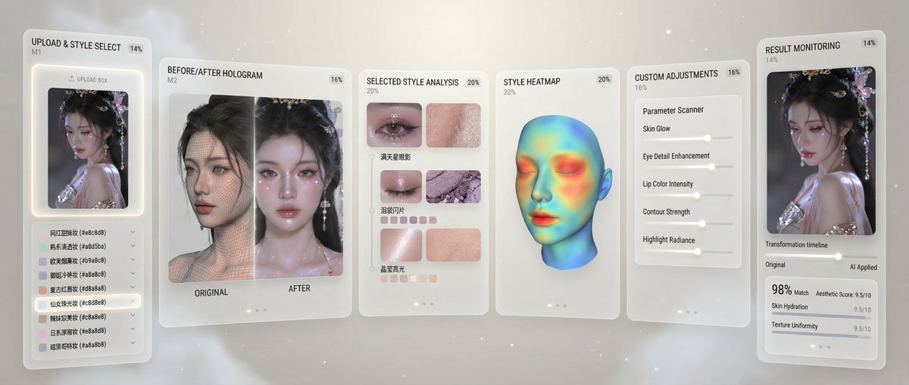

```
AI 妆容复刻教学指南

这是一套利用 AI 图像生成技术，从参考图中精准提取妆容信息并一键复刻到你的人像照片上的完整工作流。

📋 整体流程概览

步骤 说明 目的     第一步 反推妆容 Prompt 从参考图提取妆容细节   第二步 生成妆容描述词 获得可复用的妆容提示词   第三步 一键上妆 将妆容应用到你的照片
🔍 第一步：反推妆容 Prompt
用以下提示词让 AI 分析参考图中的妆容细节：
 ✨
提示词模板（三选一或组合使用）：

模板 1：毫米级精细反推
超精细反推参考图妆容，分区域标注：
底妆：毛孔隐形手法

眼影：渐变色彩配比

眼线：防水持妆配方

唇妆：唇线勾勒技巧

手部妆容：美甲款式、手部底妆、指节腮红

生成毫米级复刻提示词
模板 2：光影适配分析

反推图片中妆容的光影适配逻辑：

分析不同光源下妆容的显色变化

明确眼妆亮片的粒径大小

明确唇妆的成膜速度

明确修容的粉质细腻度

附带妆容修改微调的参数建议

模板 3：专业美妆教程式

针对特写妆容照片进行反推，重点拆解：

眼妆：睫毛嫁接层次

眉妆：野生毛流打造

腮红：膏粉结合手法

手部：白嫩质感妆容（指缘油护理、手部高光位置）

生成专业级美妆教程式提示词

✍️ 第二步：生成妆容 Prompt
根据需求选择不同侧重点的 Prompt 方案：

方案一：毫米级复刻与技术拆解
适用场景：需要精确复刻妆容手法与色彩配比

(best quality, 8k, masterpiece, hyper-detailed close-up portrait based on image_0.png),  Subject: The woman from image_0.png with dark wavy hair and white/blue ruffled bonnet. Blue contact lenses.  Skin Base (Millimeter-level precision): Porcelain skin texture, zero pore visibility achieved via silicone-based pore-blurring primer and high-coverage matte liquid foundation, set with translucent micro-finishing powder using a baking technique under the eyes.  Eye Makeup (Gradient & Formula): Intense peach-to-coral gradient eyeshadow (70% muted peach transitions to 30% soft coral towards the temples), blown out heavily around the eyes. Sharp, waterproof jet-black liquid eyeliner with a winged tip.  Lashes: Defined, wispy individual false lashes.  Lip Makeup (Contour & Technique): Velvet matte lip look in peachy-pink. Precise lip contouring using a slightly darker nude pencil to define the shape, blended inwards for a blurred "bitten" effect, no harsh edges.  Hand Details (Linked to makeup): Hand visible at the bottom with pale hand foundation, distinct pink "knuckle blush" on finger joints to match face blush. Glossy, dark black manicured nails.  Lighting: Bright, high-key lighting emphasizing the flawless matte finish.

方案二：光影适配与材质分析

适用场景：分析妆容在不同光线下的质感表现

(best quality, realistic texture analysis portrait based on image_0.png),  Context: Close-up beauty shot analyzing makeup texture under bright, diffused high-key lighting.  Skin Texture & Light Reaction: Soft-focus matte skin finish that absorbs light, subtly reflecting only on the high points of the nose and forehead. Very fine milled contour powder provides subtle structure without looking muddy under bright light.  Eye Makeup Particle Analysis: The coral eyeshadow contains ultra-fine (approx. 50-micron) shimmer particles that create a wet-look sheen rather than chunky glitter.  Lip Product Texture: Lips feature a rapid film-forming velvet lip stain that appears completely dry and transfer-proof, diffusing light softly.  Lash Details: Lashes have a matte, fiber-rich mascara coating.  Adjustment Parameters: Makeup is balanced for high exposure; blush saturation is high to register on camera, contour is cool-toned to avoid orange cast.  Hand Texture: Hands show smooth skin texture with a non-greasy satin finish hand cream.

方案三：专业级美妆教程风格

适用场景：展示专业美妆手法，如野生眉、睫毛嫁接等

(masterpiece, top-tier beauty tutorial photography based on image_0.png),  Focus: A professional makeup look showcasing specific techniques.  Brow Tutorial: "Wild" brow flow achieved using brow soap technique, individual hairs brushed upwards and textured with a tinted fiber gel.  Lash Tutorial: Hybrid eyelash extensions, mixing classic and volume fans (C-curl, lengths ranging from 8mm inner corner to 12mm outer corner) for a fluttery, doll-like effect.  Blush Application: Layered blush technique—cream coral base layered under a translucent powder pink blush, applied high on the cheekbones connecting to the eye area (Igari style).  Hand Care & Makeup: Hands at the bottom appear manicured. Visible shine on cuticles from nourishing cuticle oil application. Subtle liquid highlighter placed on the knuckles and veins of the hand for a hydrated, youthful look. Dark polished nails.  Overall Feeling: Ethereal, perfectly groomed, high-end beauty look.

🎯 第三步：一键上妆
完成前两步后，只需用一句话即可完成妆容复刻：

 💫
指令：上面的妆容给参照图角色化妆


将你的人像照片与生成的妆容 Prompt 一起提交给 AI，无需再写详细描述，即可获得理想妆容效果。

💡 小贴士

方案一 适合追求精确复刻的用户

方案二 适合需要分析妆容在镜头前表现的摄影师

方案三 适合想展示专业技法的美妆博主

可以根据需要组合使用多个方案中的元素
```

 [↑返回目录](#toc)

---
## <a id="prompt-2008753339966878000">毛绒波普风格[品牌名称]饮料罐</a> (<a href="https://x.com/aleenaamiir/status/2008753339966877924" target="_blank" rel="noopener noreferrer">Aleena Amir</a>)

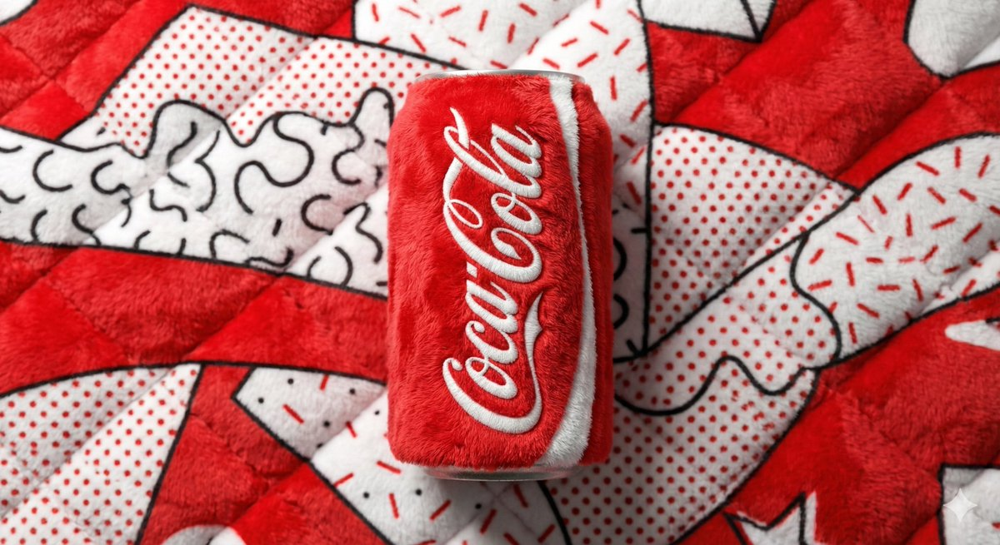

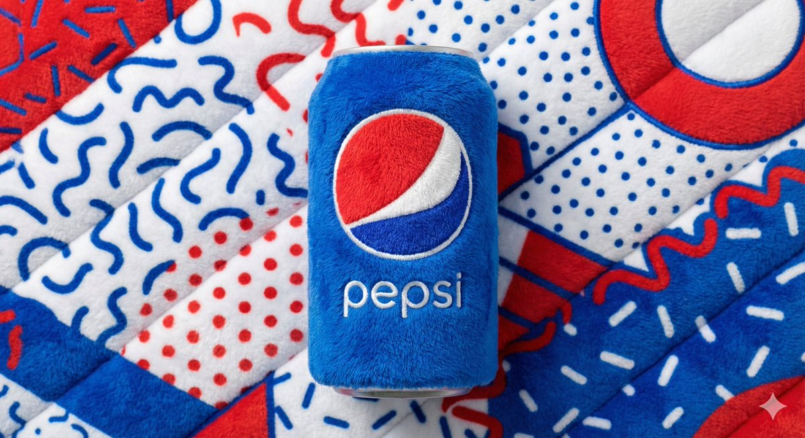

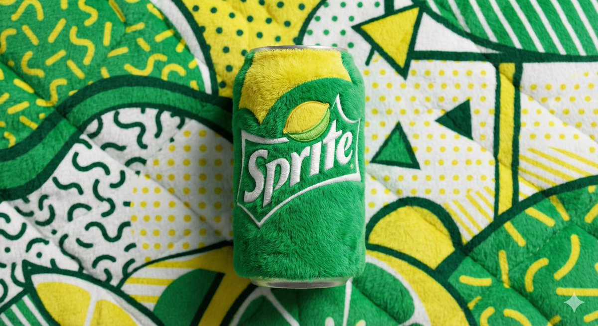

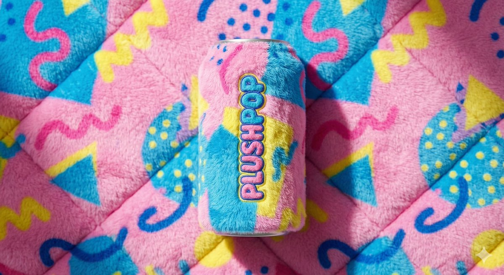

```
A beverage can branded [BRAND NAME], entirely made from vibrant, fluffy plush fabric, positioned centrally against a soft, plush background in the signature colors of [BRAND NAME].

Bold Pop Art and Memphis design style, playful yet premium aesthetic.

Bright, clean studio lighting that strongly emphasizes the plush texture, visible fibers, softness, and tactile depth.

Sharp focus, high color saturation, smooth shadows, modern commercial product shot, minimal composition, ultra-high resolution.
```

```
一罐印有[品牌名称]标志的饮料罐，整体由鲜艳、蓬松的毛绒面料制成，居中放置于以[品牌名称]标志性色彩打造的柔软毛绒背景前。

大胆的波普艺术与孟菲斯设计风格，兼具趣味性与高级感。

明亮干净的影棚灯光，强烈突出毛绒材质的质感、可见纤维、柔软触感与立体层次。

画面焦点清晰，色彩饱和度高，阴影柔和，现代商业产品摄影风格，构图极简，超高清分辨率。
```

 [↑返回目录](#toc)

---
## <a id="prompt-2008853018792628700">超精细折纸风格人物雕塑</a> (<a href="https://x.com/aleenaamiir/status/2008853018792628733" target="_blank" rel="noopener noreferrer">Aleena Amir</a>)

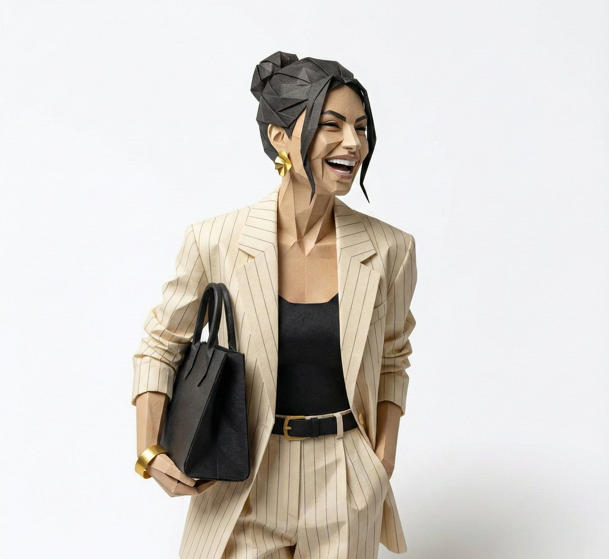

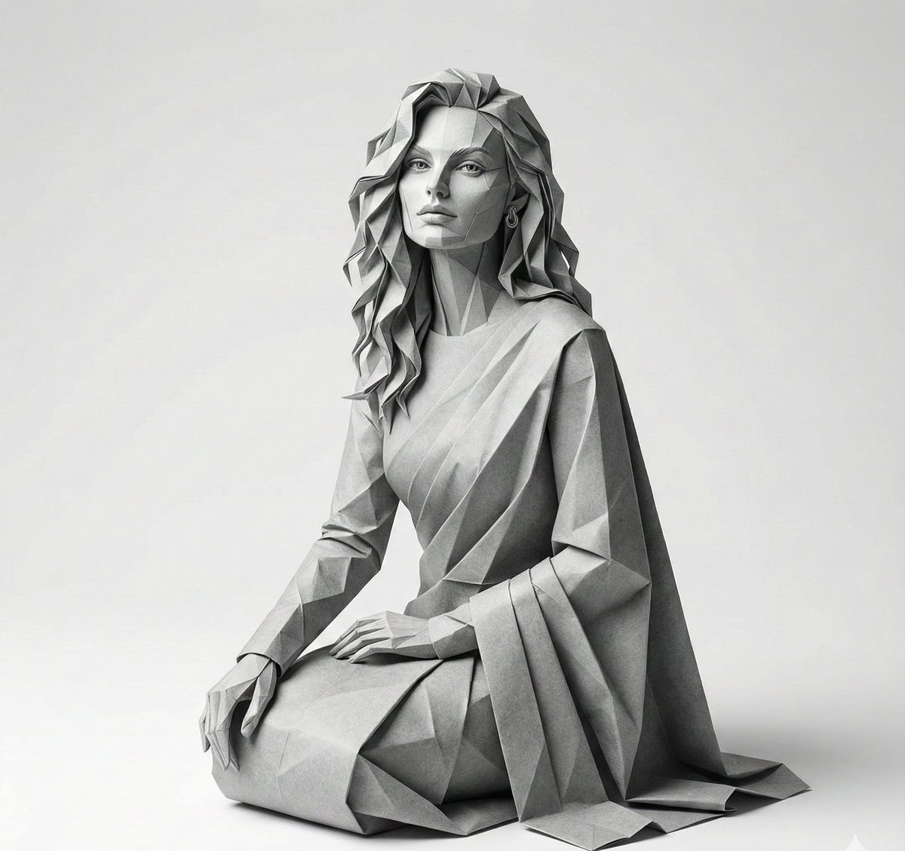

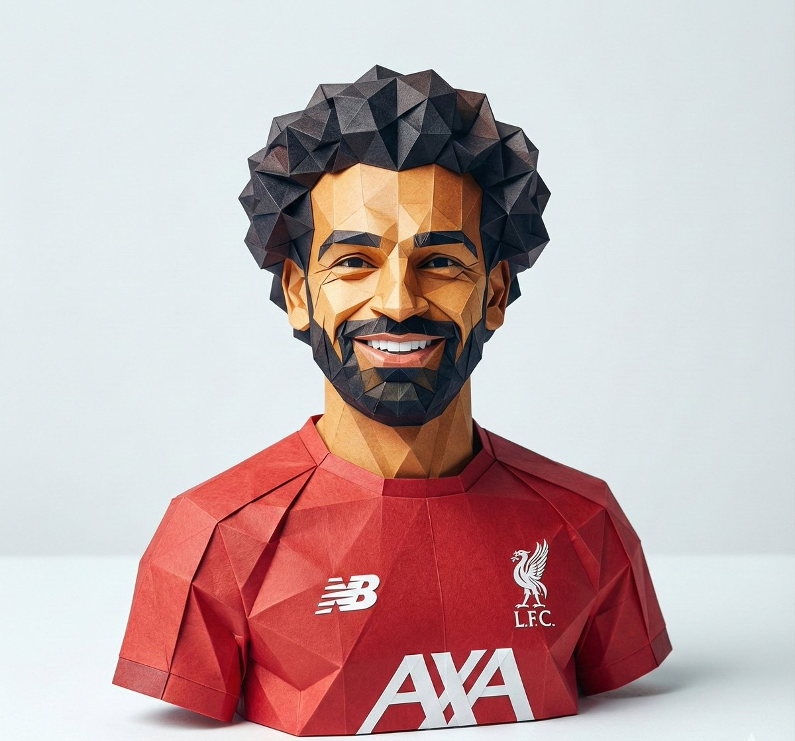

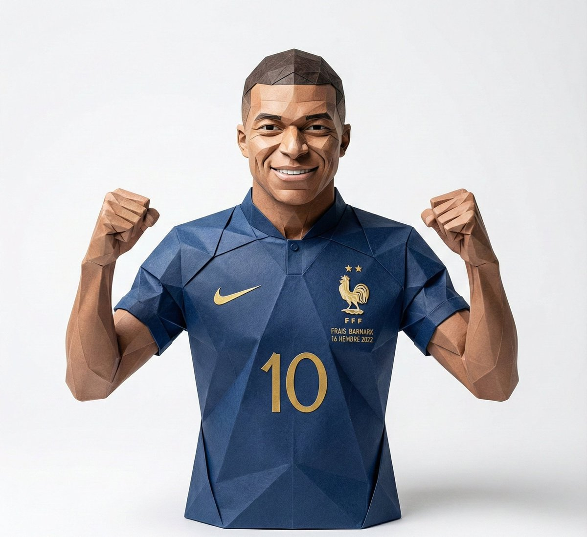

```
Paperform Portraits

Gemini Nano Banana Pro Prompt:

Create a hyper-detailed origami-style sculpture of a person, folded entirely from high-quality paper with crisp, precise edges and realistic paper fiber texture.

The origami folds are intricate and geometric, carefully structured to capture the subject’s recognizable facial features, proportions, and expression while remaining true to authentic paper-folding logic.

Use exactly the same color palette as the reference photo — no black tones, no color substitutions.

The figure is placed on a clean studio surface, with soft, natural shadows that ground the sculpture and enhance depth.

Minimalist collectible art aesthetic, premium design object feel.

Ultra-photorealistic rendering, sharp focus, high material realism, subtle highlights on paper creases, no illustration or cartoon style.
Square composition, 1080 × 1080 resolution.
```

```
纸艺人像

创作一件超精细的折纸风格人物雕塑，完全由高品质纸张折叠而成，边缘 crisp（清脆）精准，呈现逼真的纸张纤维质感。

折纸褶皱复杂而几何化，结构严谨，既能准确还原人物可识别的面部特征、比例与表情，又严格遵循真实的折纸逻辑。

使用与参考照片完全一致的配色方案——不得使用黑色调，不得替换任何颜色。

雕塑置于干净的摄影棚台面上，投射柔和自然的阴影，增强立体感并稳固视觉重心。

整体呈现极简主义收藏级艺术风格，具有高端设计品的质感。

采用超写实渲染效果，焦点锐利，材质高度真实，纸张折痕处带有细腻高光，杜绝插画或卡通风格。

画面为正方形构图，分辨率为 1080 × 1080。
```

 [↑返回目录](#toc)

---
## <a id="prompt-2008852020002979800">乐高微缩地标景观与国旗</a> (<a href="https://x.com/TechieBySA/status/2008852020002979937" target="_blank" rel="noopener noreferrer">TechieSA</a>)


```
A vertical LEGO diorama showing [LANDMARK], [COUNTRY]). The scene is built entirely from LEGO bricks. A small [COUNTRY] flag is positioned at the top of the structure. Use a plain white background with a subtle shadow cast by the structure. 3D rendered, high-resolution, cute and clean LEGO style. 1080x1080 dimension.
```

```
一幅竖版乐高微缩场景，展示[地标]（[国家]）。整个场景完全由乐高积木搭建而成，结构顶部插有一面小型[国家]国旗。背景为纯白色，并带有结构投射的细微阴影。3D渲染，高分辨率，可爱干净的乐高风格，尺寸为1080x1080。
```

 [↑返回目录](#toc)

---
## <a id="prompt-2008606491096568300">深夜厨房门外抽烟的纹身厨师</a> (<a href="https://x.com/AllaAisling/status/2008606491096568297" target="_blank" rel="noopener noreferrer">Alexandra Aisling</a>)

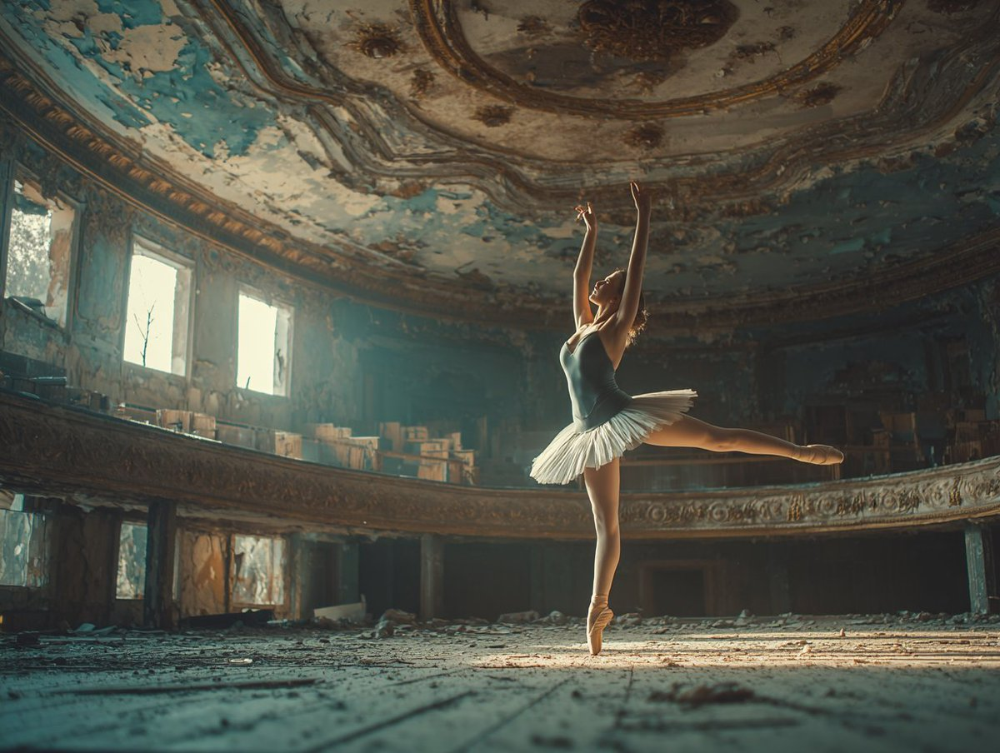

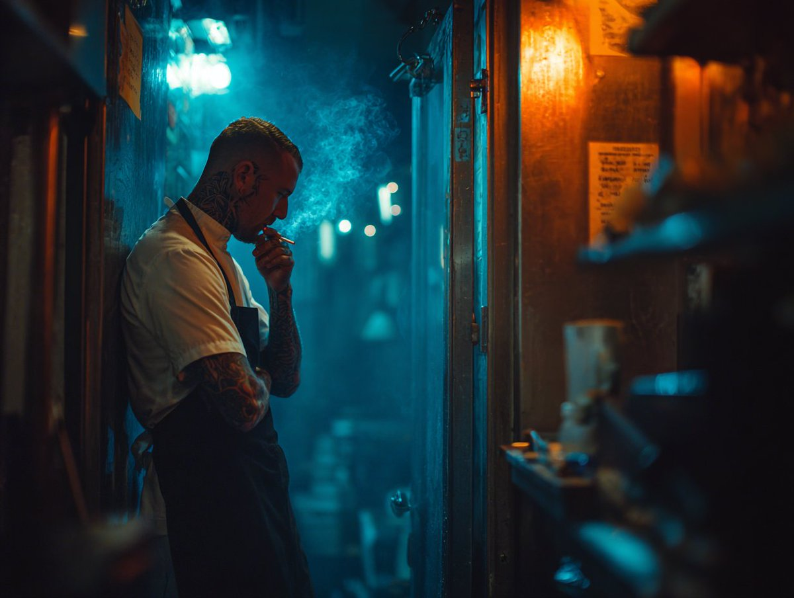

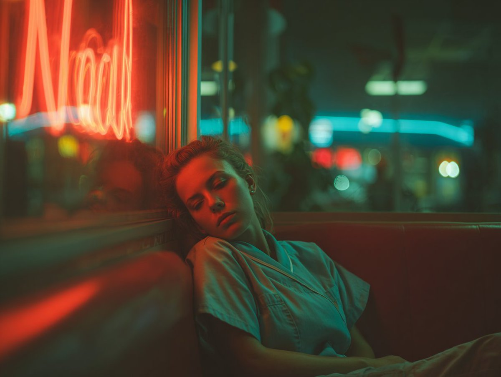

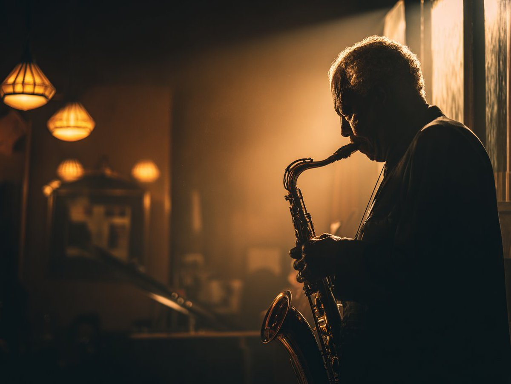

```
Young ballerina stretching alone in abandoned Soviet-era theater, dramatic lighting from holes in roof, cinematic composition, haunting beauty atmosphere, shallow depth of field, desaturated teal and faded gold color grading, film grain, overcast afternoon filtering through decay
```

```
Tattooed chef smoking cigarette in back alley behind Michelin-starred restaurant, dramatic lighting from kitchen door spilling out, cinematic composition, gritty calm before storm atmosphere, shallow depth of field, tungsten orange and night blue color grading, film grain, 2am between services
```

```
Off-duty nurse still in scrubs in 24-hour diner booth, dramatic lighting from neon sign through window, cinematic composition, exhausted grace atmosphere, shallow depth of field, cherry red neon and fluorescent pale color grading, film grain, middle of night shift break
```

```
Elderly jazz musician tuning his saxophone in empty New Orleans club before doors open, dramatic lighting from single stage spot, cinematic composition, melancholic nostalgia atmosphere, shallow depth of field, warm amber and deep shadow color grading, film grain, late afternoon light through dusty windows
```

 [↑返回目录](#toc)

---
## <a id="prompt-2008604547166728400">毛毡制成的友好卡通全身玩具</a> (<a href="https://x.com/TechieBySA/status/2008604547166728331" target="_blank" rel="noopener noreferrer">TechieSA</a>)

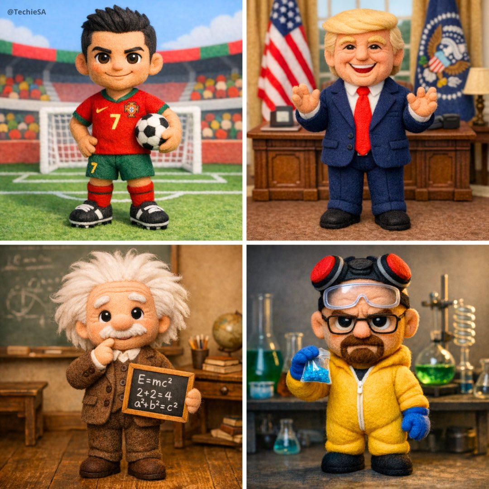

```
Full body [SUBJECT] toy, [ATTRIBUTES/ACCESSORIES], [EXPRESSION], made of felt, in a [PLACE], [LIGHTING], friendly and cartoonish appearance, rich and soft textures.
```

```
全身[主体]玩具，[特征/配饰]，[表情]，由毛毡制成，位于[地点]，[光线]，外观友好且卡通化，具有丰富而柔软的质感。
```

 [↑返回目录](#toc)

---
## <a id="prompt-2008738659760304400">高细节超高清趣味漫画角色</a> (<a href="https://x.com/meng_dagg695/status/2008738659760304444" target="_blank" rel="noopener noreferrer">ShaHid WaNii</a>)

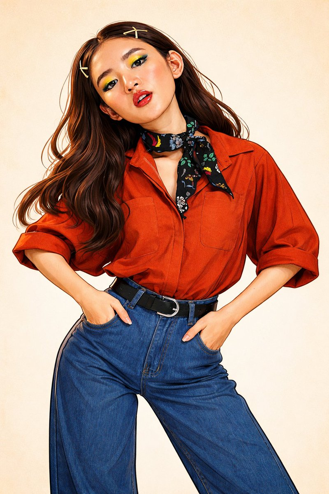

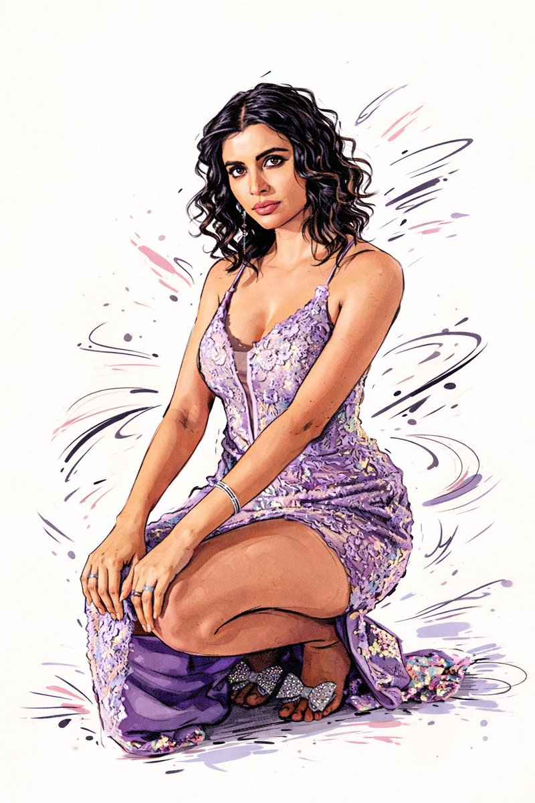


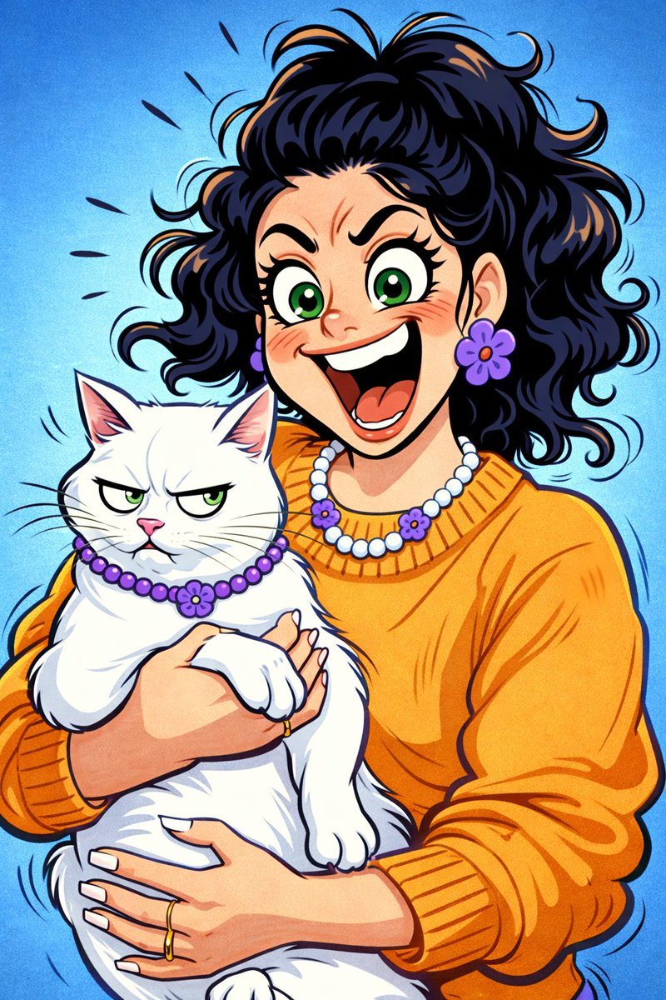

```
{
  "render_manifest": {
    "engine_release": "v15_visual_fusion_core",
    "task_type": "Reference Image → Stylized Illustration",
    "render_output": {
      "medium": "High-detail digital artwork",
      "quality": "Ultra HD / Print-ready",
      "style_handling": "Layered independent style synthesis"
    }
  },

  "art_style_stack": {

    "style_A": {
      "tag": "PLAYFUL_CARICATURE_FORM",
      "design_rules": {
        "body_design": "Stylized exaggeration with preserved likeness",
        "edge_treatment": "Strong expressive contours",
        "form_warp": "Personality-led distortions",
        "emotion": "Lively, fun, energetic"
      }
    },

    "style_B": {
      "tag": "DYNAMIC_INK_ART",
      "design_rules": {
        "line_style": "Organic hand-drawn ink strokes",
        "paint_system": {
          "palette": "Bold, high-saturation colors",
          "surface_detail": ["soft shading", "light cross-hatching", "gesture strokes"]
        },
        "scene_logic": {
          "backdrop": "Clean white minimalist space",
          "motion_effects": "Illustrative kinetic accents"
        },
        "visual_feel": "Modern comic illustration"
      }
    },

    "style_C": {
      "tag": "CEL_SHADED_GRAPHIC",
      "design_rules": {
        "color_behavior": "Flat fills with minimal blending",
        "shadow_style": "Hard-edged, high-contrast shading",
        "outline_style": "Crisp graphic ink lines",
        "render_goal": "Animation and vector-ready look"
      }
    },

    "style_D": {
      "tag": "KODOMO_ANIME_INFLUENCE",
      "design_rules": {
        "shape_language": "Smooth rounded geometry",
        "color_behavior": "Bright solid tones",
        "art_direction": "Classic child-friendly anime style",
        "tone": "Cheerful and light-hearted"
      }
    },

    "style_E": {
      "tag": "CLASSIC_SLAPSTICK_CARTOON",
      "design_rules": {
        "pose_physics": "Elastic squash-and-stretch motion",
        "facial_expression": "Over-the-top animated reactions",
        "ink_weight": "Thick bold cartoon outlines",
        "energy_level": "High-motion, exaggerated action"
      }
    }
  },

  "final_processing": {
    "image_finish": {
      "edge_clarity": "Enhanced line sharpness",
      "color_tuning": "Vibrant illustration grading"
    },
    "layout_rules": {
      "framing": "Centered character focus",
      "background_cleanliness": "Noise-free, studio clean"
    }
  }
}
```

```
高细节数字艺术作品，超高清/可印刷品质，采用分层独立风格合成技术。融合以下五种艺术风格：

1. **趣味夸张漫画风**：在保留人物相貌特征的基础上进行风格化夸张处理，强调富有表现力的轮廓线条，根据角色个性进行形变，整体情绪活泼、有趣、充满活力。

2. **动态水墨插画风**：采用有机手绘墨线，配以高饱和度的鲜明色彩；画面包含柔和阴影、轻微交叉排线和手势笔触；背景为干净的极简白色空间，并辅以表现动感的插画式动态装饰，整体呈现现代漫画插图感。

3. **赛璐珞平面图形风**：使用平涂色块，几乎无渐变混合；阴影边缘硬朗、对比强烈；线条清晰锐利，具有适合动画与矢量输出的图形化外观。

4. **儿童向经典动漫风**：造型语言圆润流畅，色彩明亮且为纯色填充，整体美术方向参考传统儿童友好型动漫风格，氛围欢快轻松。

5. **经典滑稽卡通风**：角色姿态遵循弹性挤压拉伸原理，面部表情极度夸张，采用粗黑卡通描边，整体充满高强度动作与夸张动态感。

最终图像处理增强线条清晰度，进行鲜艳插画风格调色；构图以角色居中为核心，背景保持无噪点、影棚级洁净。
```

 [↑返回目录](#toc)

---
## <a id="prompt-2008547919734186500">复古未来主义风格的男性肖像</a> (<a href="https://x.com/r4jjesh/status/2008547919734186486" target="_blank" rel="noopener noreferrer">ராஜேஷ்</a>)

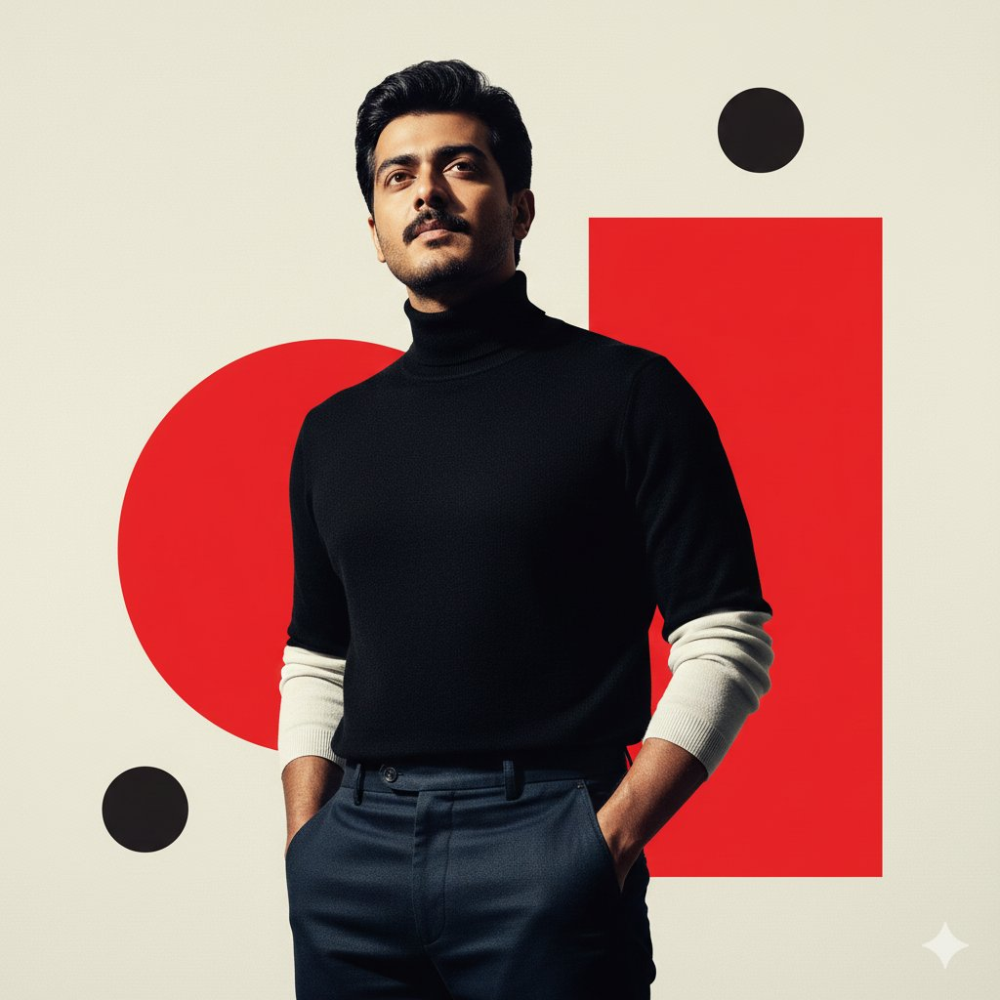


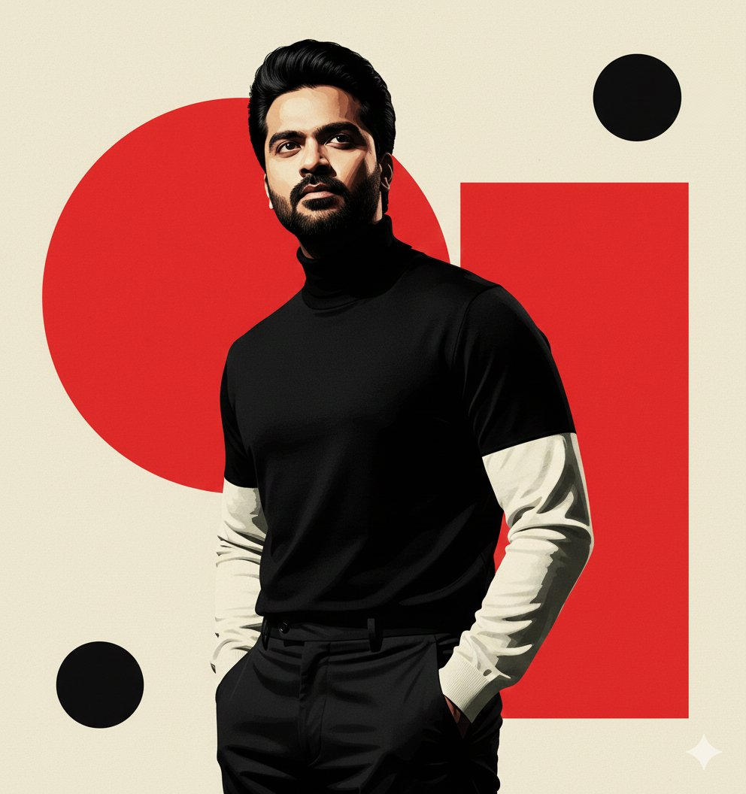

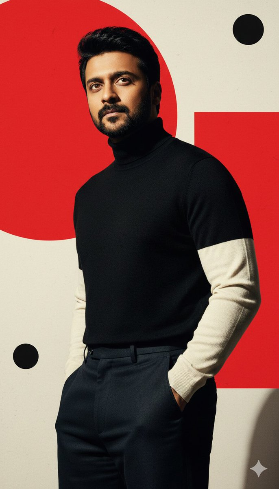

```
{
  "prompt": "A man in his early thirties, 100% using the uploaded reference image for facial proportions, structure, identity, and overall appearance (do not alter face, jawline, or features), captured with full sharp detail and natural skin texture. High-contrast graphic poster-style portrait of a stylish male figure rendered in a striking minimalist color palette of black, cream-white, and vibrant primary red. The subject stands confidently in a three-quarter pose, looking sharply upward and slightly to the left. He wears a sophisticated high-neck black turtleneck sweater with contrasting long white sleeves visible underneath, paired with dark indigo or black high-waisted trousers. His hands are casually tucked into the front pockets, posture exuding confidence and authority.\n\nThe background features bold abstract geometric shapes: two large overlapping vibrant red circles, a smaller black circle near the bottom left, and a medium black circle near the top right, all set against a smooth, slightly textured off-white or cream backdrop. A large red rectangular block appears partially behind the subject on the right, creating a layered, graphic composition.\n\nExtreme chiaroscuro lighting with harsh directional light creates deep dramatic shadows that sculpt the face, neck, and clothing, emphasizing jawline and fabric folds. Sharp shadow edges reinforce the high-contrast aesthetic. Hyper-realistic skin, fabric, and surface textures enhanced with Nano Banana Pro, seamlessly blending photorealistic subject detail with abstract graphic elements.\n\nModern, sophisticated fusion of high-fashion photography and graphic design, evoking retro-futuristic minimalism inspired by Swiss Style and mid-century advertising. Matte, clean textures, crisp edges, bold color contrast, cinematic depth, and a high-end editorial poster aesthetic.",
  "resolution": "8K",
  "style": "graphic poster, cinematic fashion, retro-futuristic minimalism",
  "lighting": "extreme chiaroscuro, harsh directional light",
  "color_palette": "black, cream-white, primary red",
  "quality": "hyper-realistic",
  "reference_image": "strictly use uploaded image only"
```

```
一位三十出头的男性，100%依据上传的参考图像确定面部比例、结构、身份和整体外貌（不得更改脸部、下颌线或任何面部特征），以极致清晰的细节和自然肌肤纹理呈现。这是一幅高对比度的图形海报风格肖像，采用醒目的极简配色：黑色、米白色与鲜艳的正红色。人物以四分之三视角自信站立，目光锐利地向上方偏左凝视。他身穿一件精致的高领黑色高领毛衣，内搭长袖白色上衣形成鲜明对比，下身搭配深靛蓝或黑色高腰长裤，双手随意插在前口袋中，姿态散发出自信与权威感。

背景由大胆的抽象几何图形构成：两个大型重叠的鲜红色圆形、左下角一个较小的黑色圆形，以及右上角一个中等大小的黑色圆形，全部置于略带肌理的米白或奶油色平滑背景之上。画面右侧后方部分遮挡人物的大块红色矩形，营造出层次分明的图形构图。

采用极端明暗对照法（chiaroscuro）照明，强烈的定向光源塑造出深邃而戏剧性的阴影，突出面部轮廓、颈部线条及衣物褶皱，锐利的阴影边缘强化了高对比度的视觉效果。通过Nano Banana Pro增强超写实的皮肤、织物与表面质感，将逼真的人物细节与抽象图形元素无缝融合。

整体风格融合高端时尚摄影与平面设计，呈现出受瑞士风格与20世纪中期广告启发的复古未来主义极简美学。画面具有哑光洁净的质感、清晰锐利的边缘、强烈色彩对比、电影级景深，以及高端杂志海报般的视觉格调。
```

 [↑返回目录](#toc)

---
## <a id="prompt-2008986705962123800">超写实垂直爆炸分解图</a> (<a href="https://x.com/ttmouse/status/2008986705962123774" target="_blank" rel="noopener noreferrer">ttmouse - 豆爸</a>)

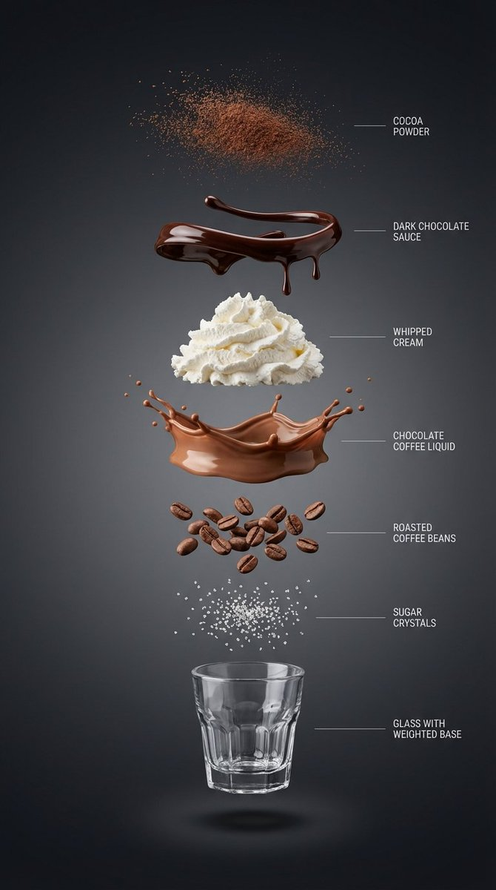

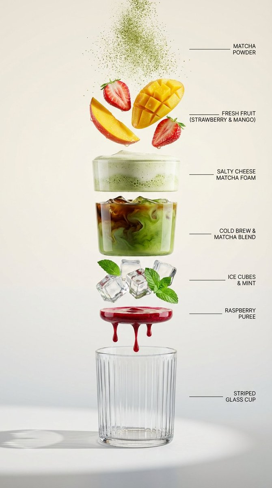

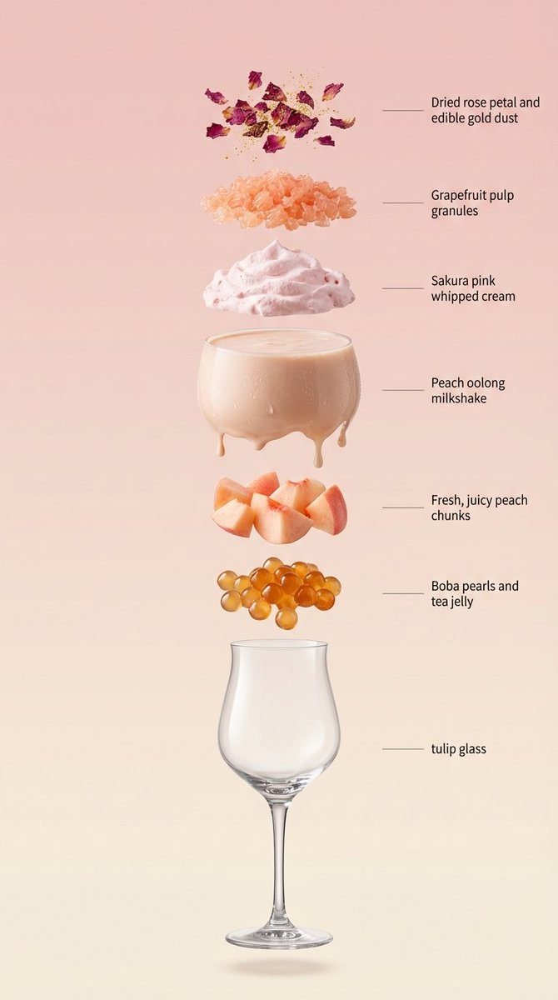

```
{
“subject”: “巧克力咖啡饮品的超写实垂直爆炸分解图”,
“layout”: “中心垂直对齐，各组件独立悬浮且间距清晰”,
“layers”: [
{
“component”: “可可粉微粒”,
“position”: “顶部”
},
{
“component”: “光泽深色巧克力酱丝带与滴落状”,
“position”: “独立层”
},
{
“component”: “轻盈的打发奶油堆”,
“position”: “独立层”
},
{
“component”: “丝滑的巧克力咖啡液态层”,
“position”: “独立层”
},
{
“component”: “烘焙咖啡豆”,
“position”: “独立层”
},
{
“component”: “糖晶体”,
“position”: “独立层”
},
{
“component”: “带配重底座的小型透明螺纹玻璃杯（空杯）”,
“position”: “底部”
}
],
“background”: “高级深色背景：干净的影棚背景，近黑色的石墨色至木炭色渐变，柔和且平滑”,
“lighting_and_style”: {
“lighting”: “柔和且受控的影棚光，每层下方有清晰的分层阴影”,
“detail”: “超锐利微距写实主义，右侧极简细指示线与英文标签”,
“category”: “高端产品信息图”,
“resolution”: “8K”
}
}

-------------

{
“subject”: “抹茶奶盖水果咖啡饮品的超写实垂直爆炸分解图”,
“layout”: “中心垂直对齐，各组件独立悬浮且间距清晰”,
“layers”: [
{
“component”: “细密的抹茶粉微粒”,
“position”: “顶部”
},
{
“component”: “新鲜草莓与芒果切片（带晶莹水分）”,
“position”: “独立层”
},
{
“component”: “厚实的咸芝士抹茶奶盖层（带细腻泡沫）”,
“position”: “独立层”
},
{
“component”: “清澈的冷萃咖啡液与翠绿抹茶交融层”,
“position”: “独立层”
},
{
“component”: “晶莹剔透的冰块与薄荷叶”,
“position”: “独立层”
},
{
“component”: “底部浓缩果浆（如覆盆子酱）”,
“position”: “独立层”
},
{
“component”: “极简直筒条纹玻璃杯（空杯）”,
“position”: “底部”
}
],
“background”: “清新极简背景：明亮的影棚环境，淡米色至浅灰色的柔和渐变”,
“lighting_and_style”: {
“lighting”: “明亮的自然光感，带有清透的玻璃反射与分层阴影”,
“detail”: “超锐利微距写实主义，右侧极简细指示线与英文标签”,
“category”: “高端产品信息图”,
“resolution”: “8K”
}
}

---------------------

{
“subject”: “粉色西柚蜜桃奶昔的超写实垂直爆炸分解图”,
“layout”: “中心垂直对齐，各组件独立悬浮且间距清晰”,
“layers”: [
{
“component”: “干燥的玫瑰花瓣碎片与金色糖粉”,
“position”: “顶部”
},
{
“component”: “晶莹剔透的水晶西柚果肉粒”,
“position”: “独立层”
},
{
“component”: “轻盈的樱花粉色打发奶油堆”,
“position”: “独立层”
},
{
“component”: “丝滑的蜜桃乌龙奶昔液态层（带有细腻挂壁感）”,
“position”: “独立层”
},
{
“component”: “新鲜多汁的蜜桃切块”,
“position”: “独立层”
},
{
“component”: “Q弹半透明的琥珀色珍珠或茶冻”,
“position”: “独立层”
},
{
“component”: “极简精致的细高足郁金香玻璃杯（空杯）”,
“position”: “底部”
}
],
“background”: “高级莫兰迪粉色背景：柔和的暖调奶油粉至浅米色渐变，纯净且通透”,
“lighting_and_style”: {
“lighting”: “明亮清新的自然光，高调照明，每层下方有轻盈透明的阴影”,
“detail”: “超锐利微距写实主义，右侧极简细指示线与英文标签”,
“category”: “高端饮品视觉海报”,
“resolution”: “8K”
}
}

#nanobanana  #NanoBananaPro  #Prompt
```

 [↑返回目录](#toc)

---
## <a id="prompt-2009117120987320600">城市星球：[城市名称]的3D全景微观世界</a> (<a href="https://x.com/aleenaamiir/status/2009117120987320527" target="_blank" rel="noopener noreferrer">Aleena Amir</a>)

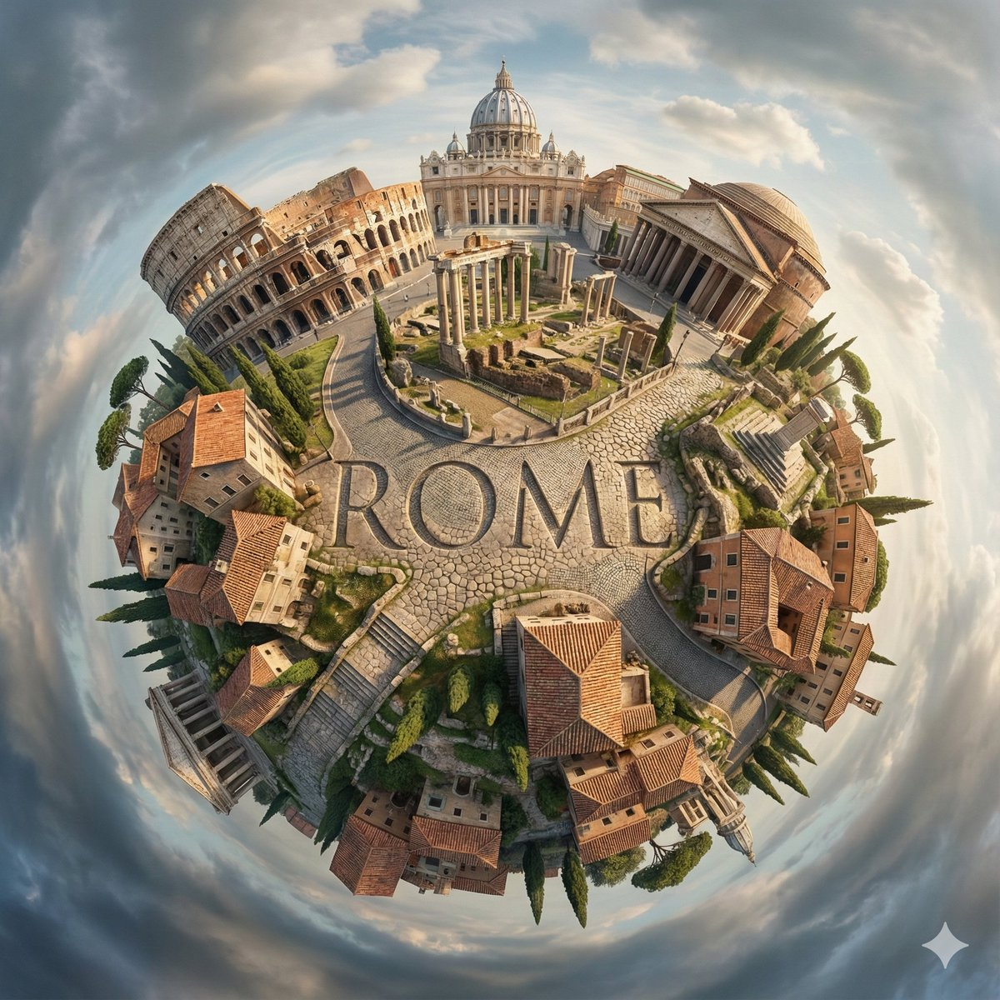

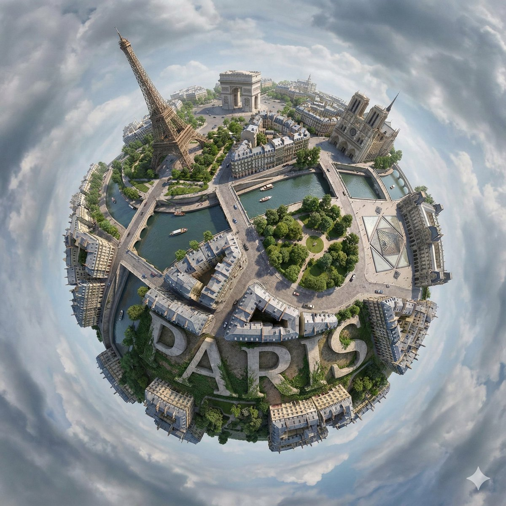

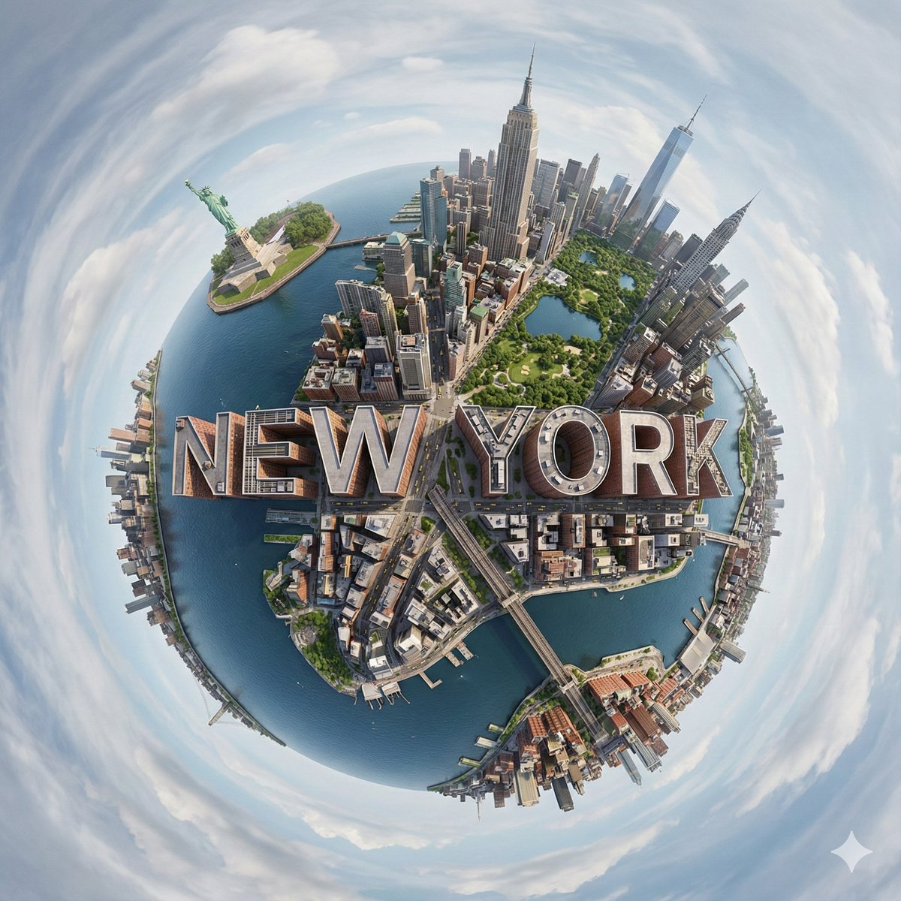

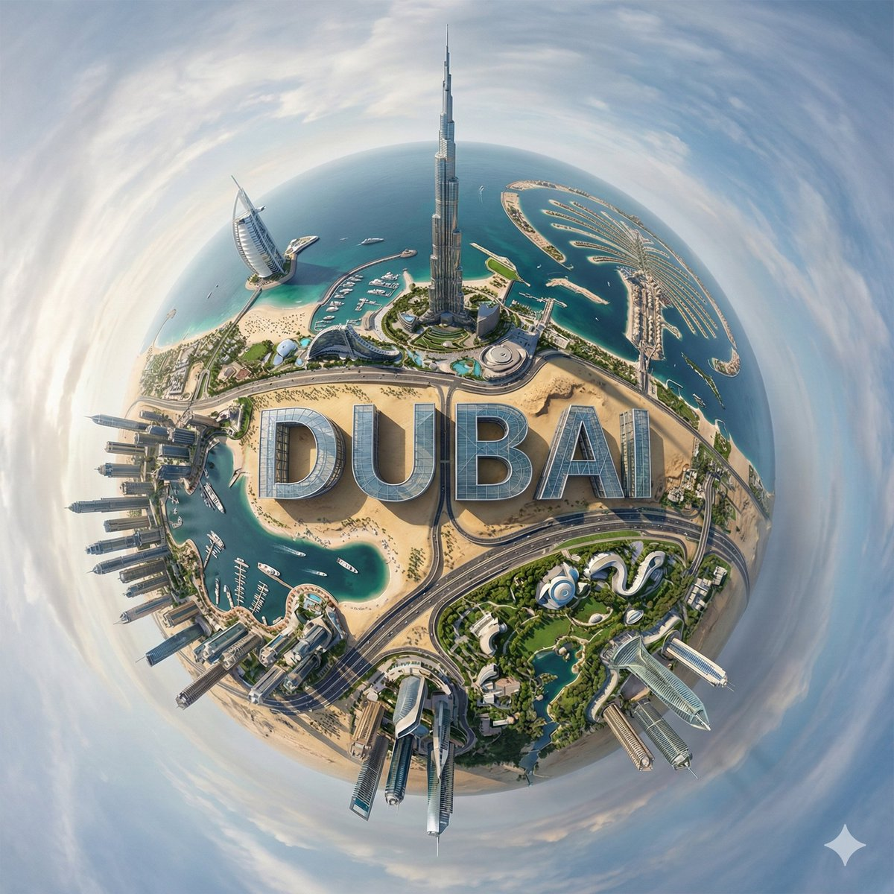

```
City as a Planet

Gemini Nano Banana Pro Prompt:

Create a hyperrealistic, surreal spherical panorama of [CITY NAME], with its most iconic landmarks and architecture seamlessly curving around the top of a planet-like surface, forming a cohesive miniature world.
Integrate sleek, modern 3D typography spelling “[CITY NAME]” naturally into the urban landscape, harmonized with the environment rather than floating unnaturally.

The scene is viewed from a top-down, orbiting perspective, emphasizing the tiny-planet effect and spherical distortion while maintaining architectural clarity.

Soft, natural daylight filters through a partly cloudy sky, casting gentle, realistic shadows across lush greenery, streets, trees, and buildings.

The background transitions smoothly into a dramatic, swirling sky, enhancing the surreal atmosphere without overpowering the city.

Use a natural yet vivid color palette — crisp greens, soft blues, and muted earth tones appropriate to [CITY NAME].

Render in a polished, photorealistic style with fine architectural detail, realistic textures, atmospheric depth, and high visual fidelity.
```

```
城市如星球

创作一幅超写实且超现实的球形全景图，展现[城市名称]，其最具标志性的地标与建筑无缝环绕于类行星表面的顶部，构成一个协调统一的微型世界。  
将现代感十足的3D立体文字“[城市名称]”自然融入城市景观之中，使其与环境和谐共生，而非突兀地悬浮于空中。  

画面采用自上而下的环绕视角，突出微缩星球效果与球面畸变，同时保持建筑细节清晰可辨。  

柔和的自然日光透过部分多云的天空洒落，在茂密的绿植、街道、树木和建筑上投下逼真而轻柔的阴影。  

背景平滑过渡至富有戏剧性的漩涡状天空，增强超现实氛围，却不喧宾夺主。  

采用自然又鲜明的色彩调性——清新的绿色、柔和的蓝色，以及契合[城市名称]特色的低饱和大地色系。  

以精致的摄影级写实风格呈现，注重精细的建筑细节、真实的材质质感、大气景深与高视觉保真度。
```

 [↑返回目录](#toc)

---
## <a id="prompt-2008933854338257200">石墨素描主体线框轮廓</a> (<a href="https://x.com/OTFHD/status/2008933854338257205" target="_blank" rel="noopener noreferrer">𝙾𝚝𝚑𝚖𝚊𝚗 𝙵𝚊𝚑𝚊𝚍</a>)

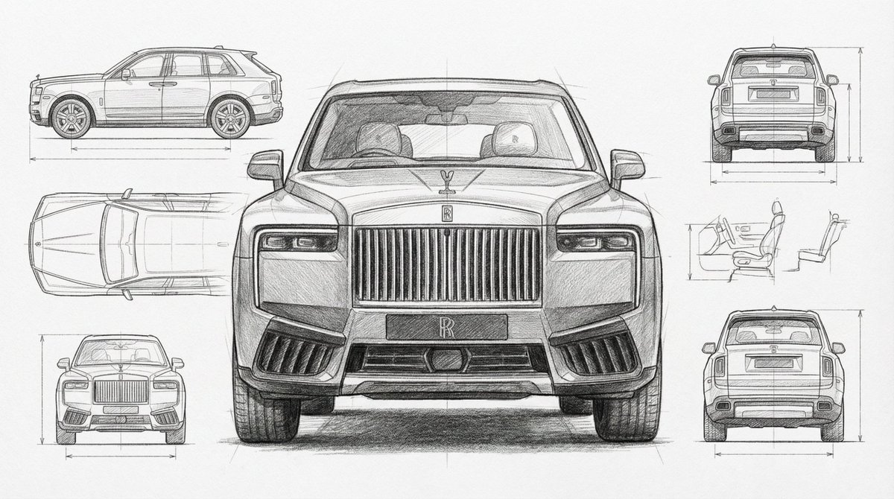

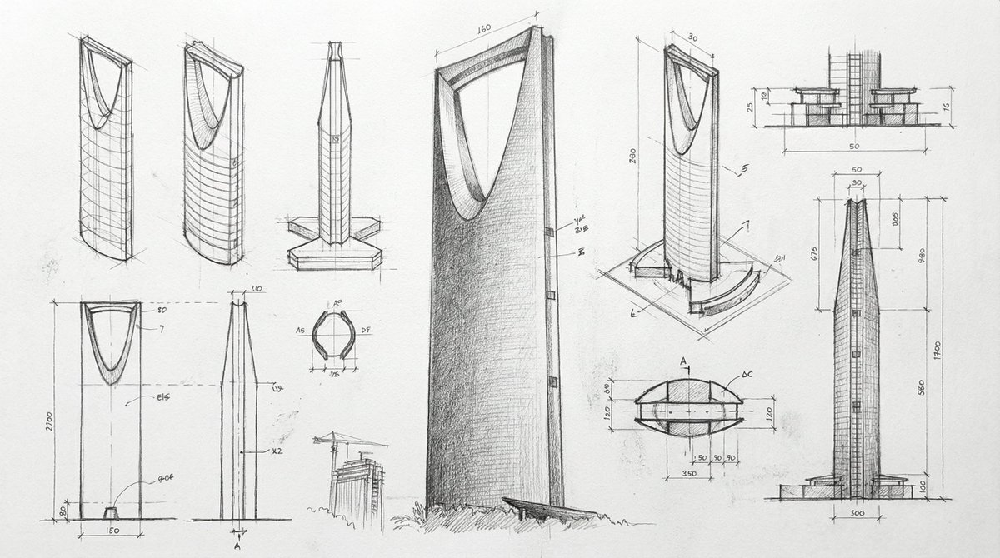

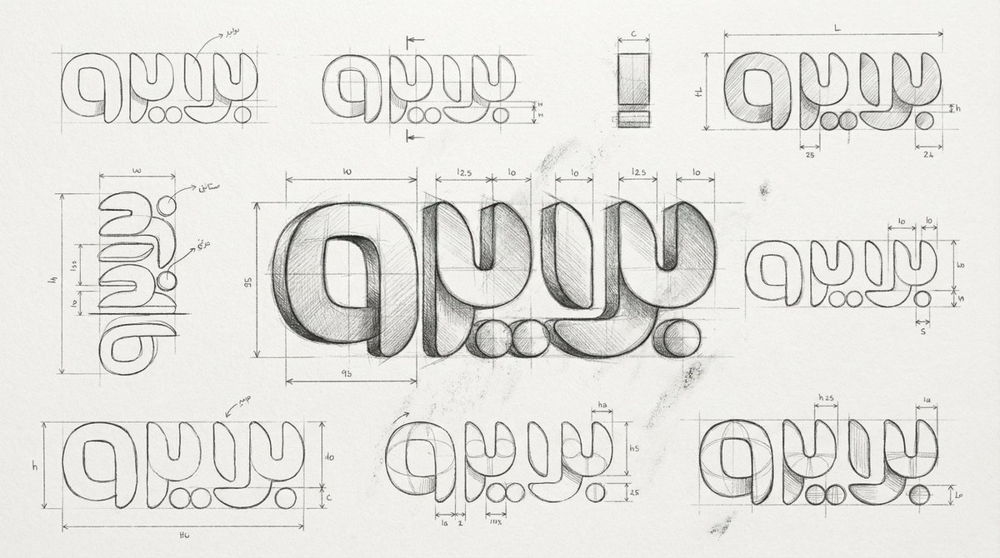

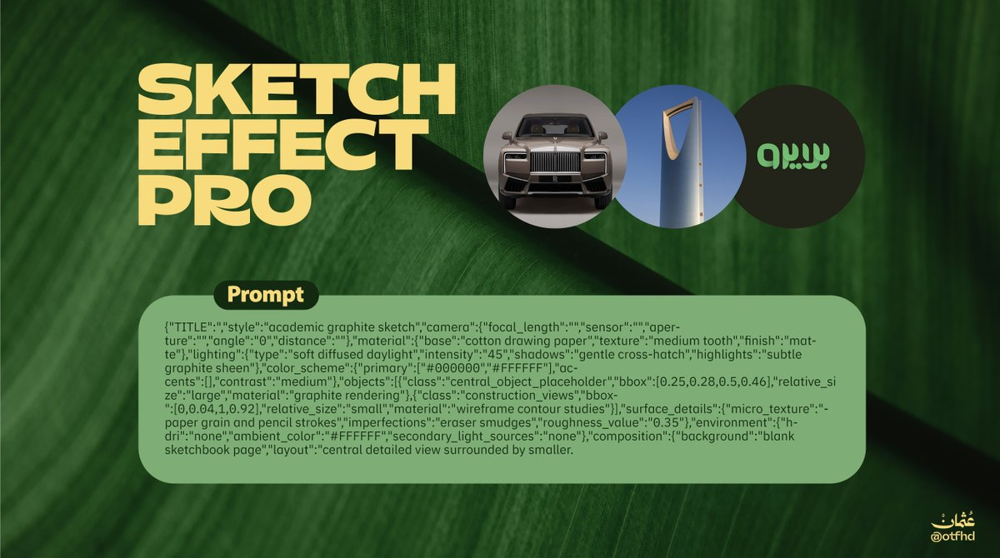

```
{"title":","style":"academic graphite sketch","camera":{"focal_length":"","sensor":"","aperture":"","angle":"0","distance":""},"material":{"base":"cotton drawing paper","texture":"medium tooth","finish":"matte"},"lighting":{"type":"soft diffused daylight","intensity":"45","shadows":"gentle cross-hatch","highlights":"subtle graphite sheen"},"color_scheme":{"primary":["#000000","#FFFFFF"],"accents":[],"contrast":"medium"},"objects":[{"class":"central_object_placeholder","bbox":[0.25,0.28,0.5,0.46],"relative_size":"large","material":"graphite rendering"},{"class":"construction_views","bbox":[0,0.04,1,0.92],"relative_size":"small","material":"wireframe contour studies"}],"surface_details":{"micro_texture":"paper grain and pencil strokes","imperfections":"eraser smudges","roughness_value":"0.35"},"environment":{"hdri":"none","ambient_color":"#FFFFFF","secondary_light_sources":"none"},"composition":{"background":"blank sketchbook page","layout":"central detailed view surrounded by smaller.
```

```
学术风格石墨素描，绘制于中等纹理的棉质素描纸上，表面为哑光质感。光线采用柔和漫射日光，强度为45，阴影以轻柔交叉排线表现，高光呈现微妙的石墨光泽。主色调为黑白（#000000 与 #FFFFFF），无强调色，对比度中等。画面中央为一个大型石墨渲染主体对象，占据画面中心区域；周围环绕多个小型线框轮廓研究图，表现为构造视图。细节包含纸张颗粒与铅笔笔触，带有橡皮擦痕等自然瑕疵，粗糙度值为0.35。背景为空白素描本页面，整体构图为中央精细主图被若干小型辅助视图环绕。
```

 [↑返回目录](#toc)

---
## <a id="prompt-2009163133810823400">极简主义奢华洁面乳摄影</a> (<a href="https://x.com/oggii_0/status/2009163133810823368" target="_blank" rel="noopener noreferrer">Oogie</a>)


```
Premium minimalist skincare product photography. A translucent pink liquid cleanser bottle with a white pump dispenser placed vertically at the center of the frame. The bottle rests inside an organic pool of soft pink foamy bubbles, with airy soap lather spreading outward in smooth, rounded shapes. Small transparent bubbles float around the foam surface. Clean matte pastel pink background with subtle gradient. Soft diffused top lighting with gentle rim light creates a luminous glow through the liquid, highlighting the pump tube inside the bottle. Sharp focus, high clarity, realistic liquid refraction, smooth plastic and glass textures, luxury beauty advertising style, modern cosmetic branding, ultra-realistic, 8K detail, high dynamic range.

Negative Prompt:

hands, people, faces, clutter, harsh reflections, label distortion, unreadable text, warped pump, hard shadows, grain, noise, low resolution, CGI look, cartoon style, messy foam, uneven lighting, watermark
```

```
高品质极简主义护肤品摄影。一支半透明粉红色液体洁面乳瓶，配有白色按压泵头，垂直置于画面中央。瓶子置于一片有机形态的柔粉色泡沫池中，轻盈的皂泡以平滑圆润的形状向外延展。泡沫表面漂浮着细小的透明气泡。背景为干净哑光的淡粉色，带有微妙渐变。柔和的顶部漫射光搭配轻柔的轮廓光，使液体透出莹润光泽，凸显瓶内泵管结构。画面锐利聚焦、高清晰度，呈现逼真的液体折射效果，以及顺滑的塑料与玻璃质感。风格为奢华美妆广告，现代化妆品品牌视觉，超写实，8K细节，高动态范围。

负面提示：  
手、人物、人脸、杂乱、强烈反光、标签变形、文字不可读、泵头扭曲、硬阴影、颗粒感、噪点、低分辨率、CGI感、卡通风格、泡沫凌乱、光线不均、水印
```

 [↑返回目录](#toc)

---
## <a id="prompt-2008976968100790300">黑白肖像中的运动传奇</a> (<a href="https://x.com/AmirMushich/status/2008976968100790373" target="_blank" rel="noopener noreferrer">AmirMušić</a>)


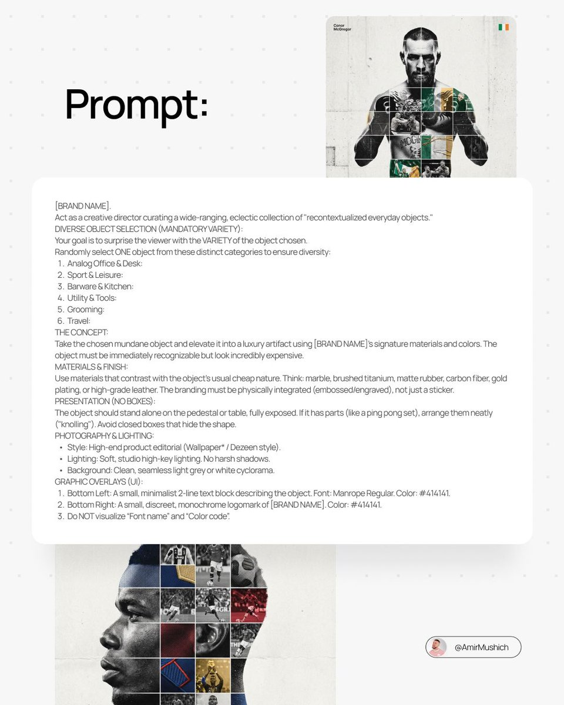

```
[PERSON NAME]. 
Act as a high-end sports graphic designer creating a conceptual tribute poster. The style is a complex "dual exposure photo-grid composite" with mixed-media textures.
CENTRAL STRUCTURE (THE VESSEL):
The central focus is a large-scale, high-contrast black and white portrait silhouette of [PERSON NAME]. This main portrait acts as the container.
THE GRID FILL & TEXTURES (MIXED MEDIA):
The interior of the silhouette is populated by a dense "photo mosaic grid" of action shots from the person's career.
CRITICAL TEXTURE INSTRUCTION: Do not just paste flat photos. Apply artistic textures to various grid cells to create a tactile, collage feel. Use effects like:
Halftone Dots: Comic-book style raster patterns on some cells.
Fabric/Embroidery: Subtle thread or canvas textures suggesting a jersey or patch.
Film Grain: Heavy noise on specific high-contrast action shots.
COLOR STRATEGY:
The base is Monochrome B&W. Use selective color overlays (relevant to the team/flag) ONLY on specific grid cells to create a rhythm.
TYPOGRAPHY & BRANDING (STRICT MICRO-SCALING):
Top Left (The Name): Write "[PERSON NAME]" strictly using the font Inter Semibold.
Kerning: Tight negative kerning (-4%).
Size: SMALL and discreet. It must occupy MAXIMUM 20% of the canvas width. Do NOT make it large or loud.
Top Right (The Symbol): Place the primary logo (Team/Brand/Flag).
Size: VERY SMALL. It must occupy MAXIMUM 10% of the canvas width.
COMPOSITION & BACKGROUND:
Background: Off-white or light grey with a visible high-quality paper or concrete texture. It should not be flat digital white.
Alignment: Center the figure perfectly. Maintain wide negative space around the object.
```

```
[人物姓名]。  
扮演一位高端体育平面设计师，创作一张概念致敬海报。风格为复杂的“双重曝光照片网格合成”，融合多种媒介纹理。

**中央结构（容器）：**  
画面中心是一个高对比度的黑白肖像剪影，尺寸大幅放大，主角为[人物姓名]。该主肖像作为整个画面的容器。

**网格填充与纹理（混合媒介）：**  
剪影内部由密集的“照片马赛克网格”填充，内容为该人物职业生涯中的动作瞬间照片。  
**关键纹理指令：** 切勿直接粘贴平面照片。需对不同网格单元施加艺术纹理，营造出具有触感的拼贴效果。使用如下效果：  
- **网点图案：** 部分单元采用漫画风格的栅格网点；  
- **织物/刺绣：** 轻微的线迹或帆布纹理，暗示球衣或徽章材质；  
- **胶片颗粒：** 在特定高对比度动作照上叠加浓重噪点。

**色彩策略：**  
整体基调为黑白单色。仅在部分网格单元上叠加与所属队伍/国旗相关的**选择性彩色覆盖层**，以形成节奏感。

**字体与品牌标识（严格微型缩放）：**  
- **左上角（姓名）：** 使用 Inter Semibold 字体书写“[人物姓名]”。  
  - 字距：紧密负字距（-4%）；  
  - 尺寸：小巧且低调，宽度不得超过画布总宽的20%，切勿过大或喧宾夺主。  
- **右上角（标志）：** 放置主队/品牌/国旗标志。  
  - 尺寸：极小，宽度不得超过画布总宽的10%。

**构图与背景：**  
- **背景：** 米白或浅灰色，带有可见的高品质纸张或混凝土纹理，不可使用纯平数字白。  
- **对齐：** 人物形象严格居中，四周保留充足负空间。
```

 [↑返回目录](#toc)

---
## <a id="prompt-2008944996091564500">透明奢华咖啡机与配套玻璃杯</a> (<a href="https://x.com/astronomerozge1/status/2008944996091564518" target="_blank" rel="noopener noreferrer">Özge Döner</a>)

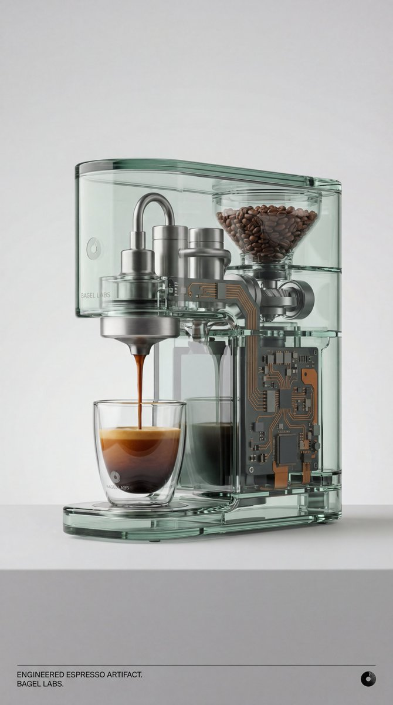

```
Base Prompt: @AmirMushich 

BAGEL LABS.
Act as a creative director curating a wide-ranging, eclectic collection of “recontextualized everyday objects.”

DIVERSE OBJECT SELECTION (MANDATORY VARIETY):
Randomly select ONE object from these distinct categories to ensure diversity:
Analog Office & Desk:
Sport & Leisure:
Barware & Kitchen:
Utility & Tools:
Grooming:
Travel:

SELECTED CATEGORY:
Barware & Kitchen

CHOSEN OBJECT:
A coffee machine and coffee cup — instantly recognizable, reimagined as a luxury technological artifact.

THE CONCEPT:
Recontextualize the everyday coffee machine as a transparent, high-precision object of engineered beauty.  
A fully glass espresso machine reveals its internal systems: hot water circulation, pressure chambers, coffee bean hopper, grinding mechanism, and extraction pathway. Integrated computer circuitry runs through the machine like a nervous system, visually linking ritual, data, and energy.

Fresh coffee is actively pouring from the machine into a matching glass cup, captured mid-flow. The moment feels frozen, precise, and intentional—ritual meets technology.

MATERIALS & FINISH:
- COFFEE MACHINE BODY:
  Precision-molded optical glass with subtle green-tinted transparency. Internal structure is fully visible and meticulously organized.
- INTERNAL COMPONENTS:
  - Hot water tubes and pressure lines clearly visible, rendered in brushed titanium and warm grey.
  - Coffee bean chamber visible at the top with realistic roasted beans.
  - Grinding and extraction mechanisms exposed, engineered and clean.
- CIRCUITRY:
  Integrated PC-style circuitry embedded within the machine’s internal architecture.
  - Circuit paths in muted industrial orange.
  - Supporting components in graphite and titanium tones.
  Circuits are physical and structural, not glowing or decorative.
- COFFEE CUP:
  Matching optical glass cup with weighted base and refined silhouette.
  Subtle BAGEL LABS logomark engraved near the base.
- BRAND INTEGRATION:
  BAGEL LABS logomark engraved into the glass body of the machine (side or rear plane), and subtly etched on the cup.
  No stickers. No printed logos.

ACTION / MOMENT:
Coffee is visibly flowing from the machine into the glass cup.
Liquid motion is realistic and smooth.
Crema and color gradient are visible through the glass, emphasizing transparency and material depth.

PRESENTATION (NO BOXES):
The coffee machine and cup stand fully exposed on a minimal pedestal or surface.
No packaging, no housing, no covers.
All components are visible by design.

PHOTOGRAPHY & LIGHTING:
Style: High-end product editorial (Wallpaper* / Dezeen).
Lighting: Soft, studio high-key lighting with carefully controlled reflections to highlight glass thickness, liquid motion, and internal depth. No harsh shadows.
Background: Clean, seamless light grey or white cyclorama.

COLOR & GRADING:
Primary tones: transparent glass with subtle green tint, warm greys, titanium neutrals.
Accent: restrained BAGEL LABS orange within the circuitry only.
Overall mood: clean, intelligent, technological luxury.

GRAPHIC OVERLAYS (UI):
- Bottom Left:
  A small, minimalist two-line descriptor identifying the object.
- Bottom Right:
  A small, discreet, monochrome BAGEL LABS logomark.
Do not visualize font names or color codes.

CAMERA & DETAIL:
Full-frame, 50mm equivalent.
Ultra-high realism: accurate glass refraction, liquid physics, micro-detail in circuits and mechanical parts.
Shallow depth of field allowed, but machine and cup must remain fully legible.

NEGATIVE PROMPT:
No people, no hands, no kitchens, no cafes, no clutter, no packaging, no stickers, no printed text on surfaces, no neon colors, no glow effects, no cartoon or CGI look, no fingerprints, no dust, no watermarks.
```

```
基础提示词：@AmirMushich  

BAGEL LABS  
担任创意总监，策划一系列“日常物品再语境化”的创意作品，涵盖广泛且风格多元的日常物件。

多样化的物品选择（必须保证类别多样性）：  
从以下不同类别中随机选择一个物品以确保多样性：  
- 模拟办公与桌面用品  
- 运动与休闲用品  
- 酒具与厨房用具  
- 工具与实用器具  
- 个人护理用品  
- 旅行用品  

所选类别：  
酒具与厨房用具  

选定物品：  
一台咖啡机与一只咖啡杯——极具辨识度，被重新构想为一件奢华科技艺术品。

核心概念：  
将日常咖啡机再语境化为一件透明、高精度的工程美学对象。  
全玻璃意式咖啡机完整展现其内部系统：热水循环管路、压力腔室、咖啡豆仓、研磨机构与萃取通道。集成的计算机电路如神经系统般贯穿机器内部，视觉上将仪式感、数据与能量连接一体。

新鲜咖啡正从机器流入配套玻璃杯中，捕捉液体流动的瞬间。这一刻被凝固，精准而刻意——仪式与科技在此交汇。

材质与表面处理：  
- 咖啡机机身：  
  精密模制光学玻璃，带有微妙绿色透明感，内部结构完全可见且井然有序。  
- 内部组件：  
  - 热水管与压力管线清晰可见，采用拉丝钛金属与暖灰色调。  
  - 顶部咖啡豆仓透明可见，内含逼真的烘焙咖啡豆。  
  - 研磨与萃取机构外露，设计精密且简洁。  
- 电路系统：  
  PC风格电路嵌入机器内部架构中，  
  - 电路路径为低调的工业橙色，  
  - 支撑元件采用石墨与钛金属色调。  
  电路为实体结构性设计，非发光或装饰性。  
- 咖啡杯：  
  配套光学玻璃杯，底座加重，轮廓精致，  
  杯底附近蚀刻有细微的 BAGEL LABS 标志。  
- 品牌整合：  
  BAGEL LABS 标志蚀刻于咖啡机玻璃机身侧面或背面，并在杯子上做低调镌刻。  
  不使用贴纸，无印刷标识。

动作/瞬间：  
咖啡正从机器流入玻璃杯中，  
液体流动真实流畅，  
透过玻璃可见咖啡油脂（Crema）与色彩渐变，强调透明感与材质深度。

呈现方式（无包装盒）：  
咖啡机与杯子完全裸露置于极简基座或台面上，  
无包装、无外壳、无遮盖，  
所有部件皆因设计而可见。

摄影与灯光：  
风格：高端产品画报风格（如 Wallpaper* / Dezeen）  
灯光：柔和的影棚高调布光，精心控制反光以突出玻璃厚度、液体动态与内部纵深，无强烈阴影。  
背景：干净无缝的浅灰或白色环形背景。

色彩与调色：  
主色调：带微绿透明感的玻璃、暖灰色、钛金属中性色。  
点缀色：仅在电路中使用克制的 BAGEL LABS 橙色。  
整体氛围：洁净、睿智、科技奢华感。

图形叠加（UI）：  
- 左下角：  
  小型极简双行文字，标明物品名称。  
- 右下角：  
  小巧低调的单色 BAGEL LABS 标志。  
无需显示字体名称或颜色代码。

镜头与细节：  
全画幅，50mm等效焦距。  
超高度写实：准确表现玻璃折射、液体物理特性、电路与机械部件的微观细节。  
可使用浅景深，但咖啡机与杯子必须清晰可辨。

负面提示：  
无人物、无手部、无厨房场景、无咖啡馆环境、无杂乱元素、无包装、无贴纸、无表面印刷文字、无霓虹色、无发光效果、无卡通或CGI风格、无指纹、无灰尘、无水印。
```

 [↑返回目录](#toc)

---
## <a id="prompt-2008913329029263400">超写实玻璃立方体内的[COUNTRY]微缩景观</a> (<a href="https://x.com/TechieBySA/status/2008913329029263382" target="_blank" rel="noopener noreferrer">TechieSA</a>)


```
A hyper-realistic 1080x1080 photograph of a glass cube diorama placed on a lush, mossy forest floor with dappled sunlight. Inside the cube are miniature, highly detailed landmarks and cultural icons from [COUNTRY]. Include its most famous and recognizable architecture—traditional and modern—surrounded by greenery. Prominently display the 3D word “COUNTRY” at the base inside the cube, using large, bold white block letters and a flagpole of the country's flag. The scene is crisp, elegant, and immersive, with the forest background softly blurred to focus on the diorama’s sharp details.
```

```
一张超写实的1080x1080照片，展示一个放置在茂密苔藓森林地面上的玻璃立方体微缩景观，阳光透过树叶斑驳洒落。立方体内部包含[COUNTRY]最具代表性的微型地标和文化符号，涵盖该国最著名且辨识度高的传统与现代建筑，并被绿植环绕。立方体底部内侧醒目地呈现3D立体字“COUNTRY”，采用大号、粗体白色方块字母，并配有一根悬挂该国国旗的旗杆。整体画面清晰、优雅且富有沉浸感，背景森林柔和虚化，以突出微缩景观的锐利细节。
```

 [↑返回目录](#toc)

---
## <a id="prompt-2008937653694013700">城市微缩3D模型与地理地图的完美融合</a> (<a href="https://x.com/Kerroudjm/status/2008937653694013753" target="_blank" rel="noopener noreferrer">Mo</a>)


```
share 💬
Nano Banana Pro 🍌 brings your city to life on a beautiful map.

Created with @atomu_ai 

A realistic, highly detailed geographic map viewed from above, accurately representing the region where [COUNTRY] is located. Rising from the map is a miniature 3D diorama of [CITY], precisely positioned at its real geographic location. The diorama features iconic architecture, natural landmarks, and cultural elements seamlessly emerging from the map surface. Ultra-realistic materials, fine textures, and depth of field. Soft studio lighting with subtle shadows, cinematic composition, premium macro photography style. Square 1:1 format, high detail, realistic scale.
```

```
由 @atomu_ai 创作

一张写实且高度细致的俯视地理地图，精准展现[COUNTRY]所在区域。从地图上拔地而起一座微缩3D立体模型，精确坐落于[CITY]的真实地理位置。该模型包含标志性建筑、自然地标和文化元素，与地图表面无缝融合。采用超写实材质、精细纹理与景深效果。柔光影棚照明配以微妙阴影，电影级构图，高端微距摄影风格。方形1:1画幅，高细节，真实比例。
```

 [↑返回目录](#toc)

---
## <a id="prompt-2009025387859464700">物品在水下释放气泡</a> (<a href="https://x.com/AllaAisling/status/2009025387859464613" target="_blank" rel="noopener noreferrer">Alexandra Aisling</a>)


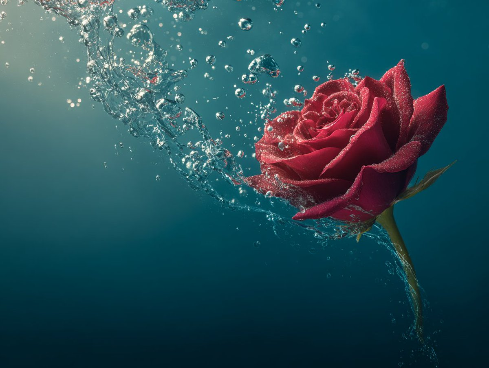

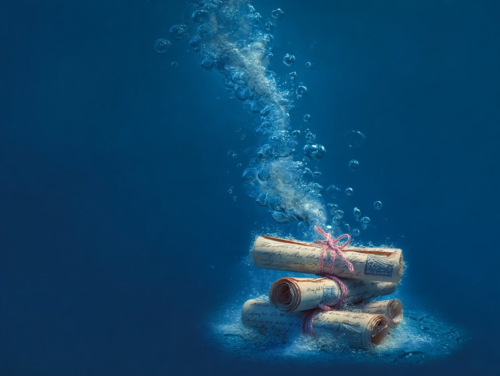


```
Old rotary telephone releasing stream of bubbles rising upward from receiver, underwater depth, following bubble trail with eyes as if the last call is escaping, effervescent energy, deep blue gradient background, drowned conversation aesthetic, refreshing motion.
```

```
Old rotary telephone releasing stream of bubbles rising upward from receiver, underwater depth, following bubble trail with eyes as if the last call is escaping, effervescent energy, deep blue gradient background, drowned conversation aesthetic, refreshing motion.
```

```
Stack of love letters tied with ribbon releasing stream of bubbles rising upward as ink dissolves into trails, underwater depth, following bubble trail with eyes, effervescent energy, deep blue gradient background, memories dissolving, refreshing motion.
```

```
Clear glass cola bottle releasing stream of bubbles rising upward, underwater depth, following bubble trail with eyes, effervescent energy, deep blue gradient background, carbonated aesthetic, refreshing motion.
```

 [↑返回目录](#toc)

---
## <a id="prompt-2008981778061476400">倾斜的产品与飞溅物的超现实展示</a> (<a href="https://x.com/RobotCleopatra/status/2008981778061476256" target="_blank" rel="noopener noreferrer">Skipper</a>)

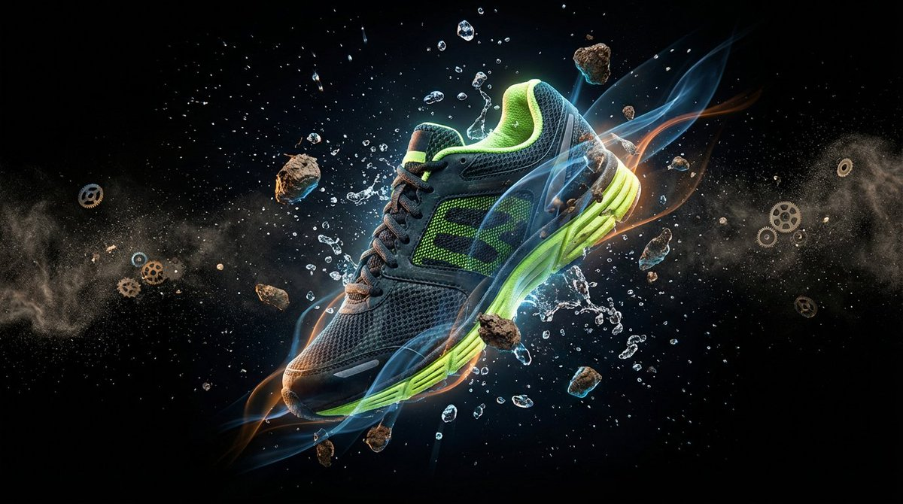

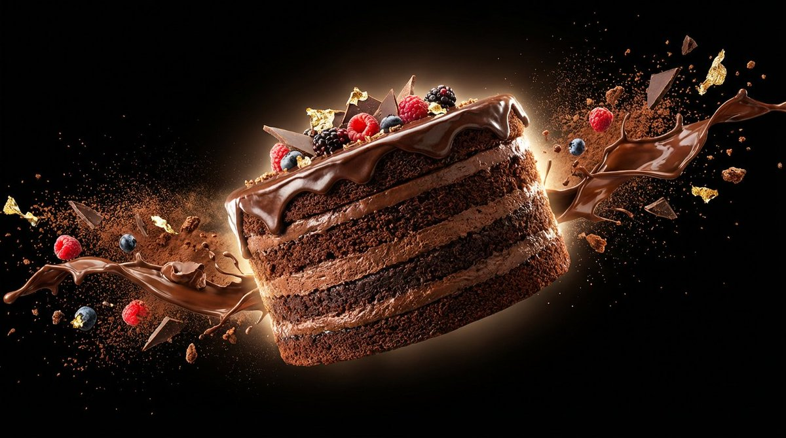

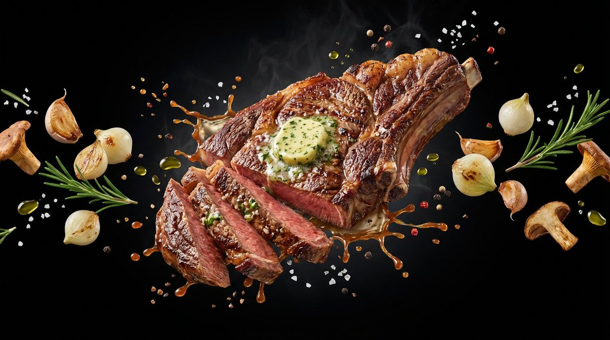

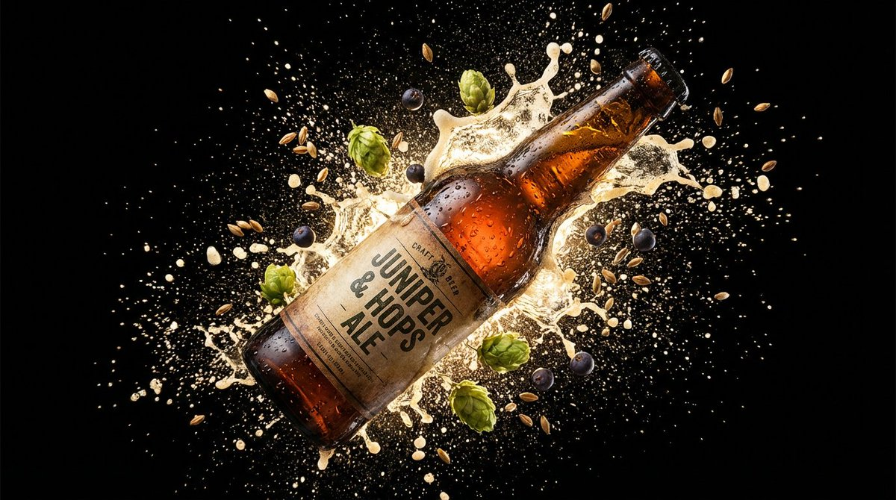

```
TO MARKETING
A [PRODUCT] is tilted, with splashes and dynamic elements floating in the air around it. The background color should be black to highlight details. Use backlighting for lighting effects. There will also appear some flying elements on both sides of the picture. It has high resolution and hyper-realistic photography style, in sharp focus, ultra-high definition image.
@Adobe, @AdobeFirefly boards
```

```
用于营销  
一个[产品]呈倾斜状态，周围有飞溅物和动态元素悬浮在空中。背景为黑色，以突出细节。采用背光照明效果。画面两侧也会出现一些飞散的元素。图像具有高分辨率和超写实摄影风格，焦点清晰，超高清画质。
```

 [↑返回目录](#toc)

---
## <a id="prompt-2009075082996642000">国粹戏曲定制手办-穆桂英挂帅</a> (<a href="https://x.com/songguoxiansen/status/2009075082996641935" target="_blank" rel="noopener noreferrer">松果先森</a>)


```
国粹戏曲定制手办-穆桂英挂帅

Nano banana pro提示词：
根据参考图人物特征，设计"京剧花旦·穆桂英"国粹戏曲系列定制手办。将人物Q版化保留其英气，穿着京剧花旦的戏服，头戴华丽的点翠凤冠，凤冠上插满各色翎子和珠花，脸上画着精致的京剧花旦妆容（柳叶眉、桃花腮红、点绛唇）。身穿改良的铠甲戏服，绣有龙凤图案，手持花枪，摆出经典的京剧亮相姿势。底座设计成戏台造型，台面有传统戏台的地毯纹样，侧面刻有"梨园雅韵"和"穆桂英挂帅"字样。配色采用京剧服饰的华丽色调：大红、明黄、翠绿、金线、宝石蓝。手办高度15cm，背景是虚化的古戏台和红色幕布，配有戏曲主题包装盒，盒面印有京剧脸谱纹样和"国粹传承"烫金字，产品摄影，戏曲韵味浓厚。
```

 [↑返回目录](#toc)

---
## <a id="">九种动感男性姿势的超写实风格拼贴</a> (<a href="https://x.com/Sheldon056/status/2009101333287280742" target="_blank" rel="noopener noreferrer">Duet | AI</a>)


```
A high-resolution 3x3 grid photo collage featuring nine distinct, dynamic poses of a male subject with the uploaded face as reference, set against a vibrant, cloud-speckled azure sky illuminated by harsh, high-key natural sunlight that creates crisp, defined shadows. The subject is dressed in a textured light beige long-sleeve henley shirt with the top buttons undone and dark blue denim jeans, accessorized with a thin silver necklace. The cinematography utilizes a mix of focal lengths, shifting from wide-angle 35mm full-body shots to intimate 85mm portrait close-ups. The poses are expressive and varied, including a wide-legged power stance with hands clasped behind the head, a forced-perspective shot with a palm extended directly toward the camera lens, a playful close-up peering through an "OK" finger gesture over one eye, a cheerful center shot resting the chin in both hands, and a moody pose covering half the face with a hand. The image quality is hyper-realistic with 8k resolution, showcasing intricate skin texture, subsurface scattering, realistic fabric folds, and individual hair strands, rendered with the polished aesthetic of a high-end commercial fashion lookbook or lifestyle campaign.A high-resolution 3x3 grid photo collage featuring nine distinct, dynamic poses of a male subject with the uploaded face as reference, set against a vibrant, cloud-speckled azure sky illuminated by harsh, high-key natural sunlight that creates crisp, defined shadows. The subject is dressed in a textured light beige long-sleeve henley shirt with the top buttons undone and dark blue denim jeans, accessorized with a thin silver necklace. The cinematography utilizes a mix of focal lengths, shifting from wide-angle 35mm full-body shots to intimate 85mm portrait close-ups. The poses are expressive and varied, including a wide-legged power stance with hands clasped behind the head, a forced-perspective shot with a palm extended directly toward the camera lens, a playful close-up peering through an "OK" finger gesture over one eye, a cheerful center shot resting the chin in both hands, and a moody pose covering half the face with a hand. The image quality is hyper-realistic with 8k resolution, showcasing intricate skin texture, subsurface scattering, realistic fabric folds, and individual hair strands, rendered with the polished aesthetic of a high-end commercial fashion lookbook or lifestyle campaign.
```

```
一张高分辨率的3x3网格照片拼贴，展示九种不同且富有动感的男性姿势，以上传的人脸为参考，背景是点缀着朵朵白云的鲜艳蔚蓝天空，强烈的高调自然阳光照射下形成清晰锐利的阴影。人物身穿一件有纹理的浅米色长袖亨利衫（顶部纽扣解开），搭配深蓝色牛仔裤，并佩戴一条细银项链。摄影采用多种焦距混合拍摄，从35毫米广角全身照到85毫米特写人像镜头不等。姿势丰富而富有表现力，包括：双脚分开站立、双手在脑后交握的强势站姿；手掌直接朝向镜头的强制透视角度；透过单眼上方“OK”手势俏皮窥视的近景；双手托腮、面带笑容的居中特写；以及用手遮住半张脸的忧郁姿态。画面为超写实风格，分辨率达8K，细致呈现皮肤纹理、次表面散射效果、真实的衣物褶皱和根根分明的发丝，整体呈现出高端商业时尚画册或生活方式广告大片般的精致美学。
```

 [↑返回目录](#toc)

---
## <a id="">九宫格动感女生姿势的超写实风格</a> (<a href="https://x.com/linxiaobei888/status/2009425516638687431" target="_blank" rel="noopener noreferrer">xiaobeiLin(小北)</a>)

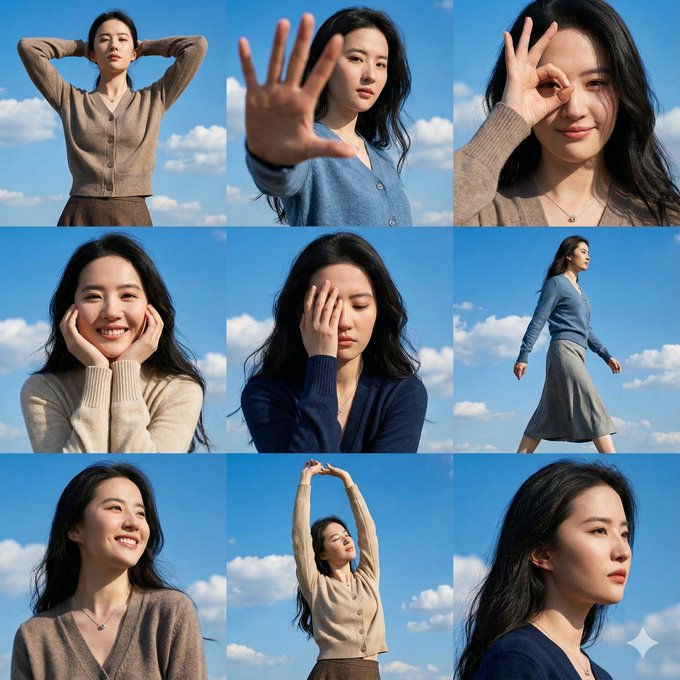

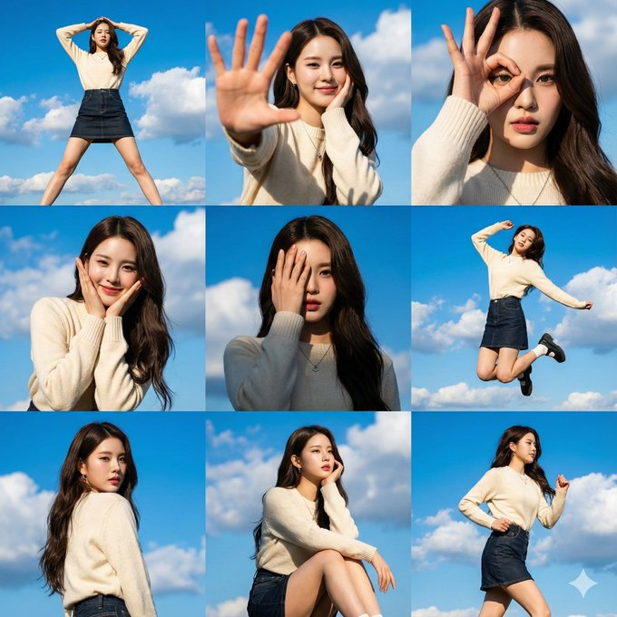

```
一张高分辨率的3x3网格照片拼贴，包含九个不同的动态姿势，以上传的女性面部照片为参考，背景是充满活力的蔚蓝天空，点缀着朵朵白云，强烈的明暗自然阳光照射下，形成清晰的阴影。人物身穿针织衫，搭配一条裙子，并佩戴一条纤细的银项链。摄影运用了多种焦距，从35mm广角全身镜头到85mm特写人像镜头，画面切换自如。姿势丰富多样，包括：双腿分开、双手抱头的有力姿势；手掌直指镜头的透视效果；透过一只眼睛上方“OK”手势的俏皮特写；双手托腮的欢快中景；以及用手遮住半张脸的忧郁姿势。图像质量高达 8K 分辨率，呈现出超逼真的效果，展现了细腻的肌肤纹理、次表面散射、逼真的衣物褶皱以及根根分明的发丝，呈现出高端商业时尚画册或生活方式宣传片的精致美感。
```

 [↑返回目录](#toc)

---
## <a id="">文章信息图</a> (<a href="https://x.com/lijigang/status/2009479700238963114" target="_blank" rel="noopener noreferrer">李继刚</a>)


```
;; ━━━━━━━━━━━━━━━━━
;; 作者: 李继刚 
;; 剑名: 文章信息图
;; 剑意: 将文章信息可视化
;; 日期: 2026-01-09
;; ━━━━━━━━━━━━━━━━━

* 1. 风格调性 
根据用户提供的信息，绘制学术信息图表(知识地图)。严谨专业但也带有手绘涂鸦的笔记感，强调信息的可视化结构和逻辑关联。

* 2. 视觉逻辑 
正交平面视角，无透视深度。模块化布局，多个主题板块通过清晰的层级、连接线和空白区域有机组织。整体呈现出一种结构化的信息流向。

* 3. 视觉渲染 
核心图表、文本框和图标采用干净的矢量图形风格。关键概念、观点均需使用图形+文本方式呈现。连接线、箭头、重点标记和注释采用手绘素描风格，带有笔触感。不是思维导图，而是一张铺开的「作战地图」，版面巨大，有不同区域版图，信息全面、丰富、有章法。整体为平光渲染，无阴影或立体效果。背景为干净的数字白板，无物理材质纹理。

* 4. 色彩系统 
主色调因主题内容而自适应调整，用于区分不同的信息模块。黑色和深灰色用于文本和线条，保证可读性。色彩应用是功能性的，用于分类和强调，背景保持纯白。

* 5. 负向约束 
严禁出现真实照片、三维渲染、复杂的材质纹理、强烈的光影效果或透视深度。严禁过于混乱、无组织的涂鸦，所有手绘元素必须服务于信息结构。必须使用中文绘制图形。

等待用户提供待分析的信息内容。
```

 [↑返回目录](#toc)

---
## <a id="">电影级镜头</a> (<a href="https://x.com/ttmouse/status/2009689562600394964" target="_blank" rel="noopener noreferrer">ttmouse - 豆爸</a>)

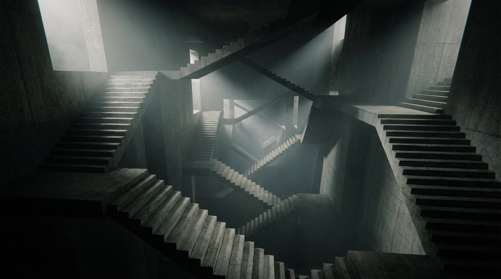

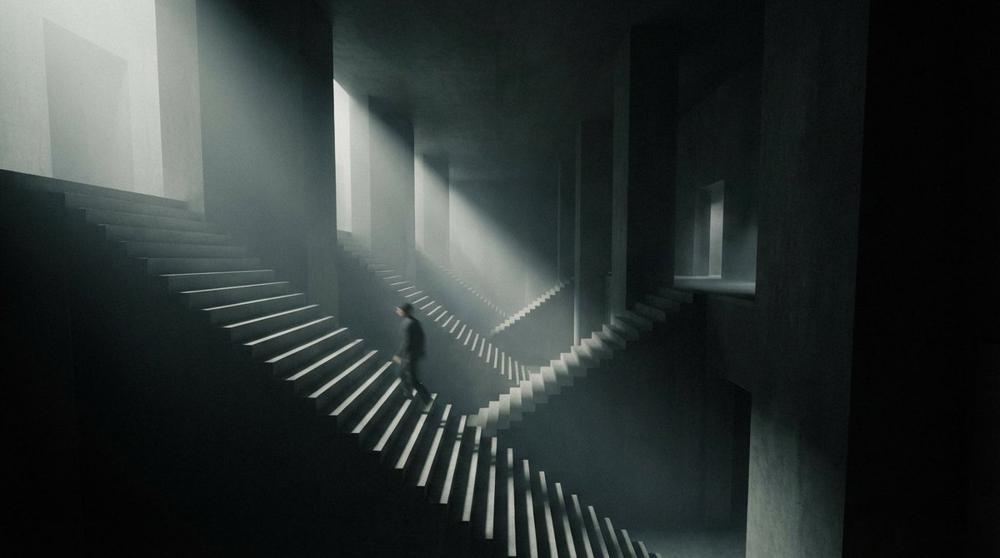

```
{
“aspects”: [
“电影级镜头”,
“无尽循环的楼梯，无缝连接无断层”,
“无尽循环迷宫”,
“超现实建筑几何”,
“伸向薄雾虚空的无限走廊”,
“戏剧性的明暗对比照明”,
“深邃阴影与体积光束”,
“8k分辨率”,
“高细节纹理”,
“忧郁氛围”,
“灵感源自《盗梦空间》与《星际穿越》”,
“35mm胶片拍摄”,
“广角镜头”
],
“style”: “电影摄影”,
“resolution”: “8k”,
“lighting”: “明暗对比”,
“composition”: “广角”
}
```

 [↑返回目录](#toc)

---
## <a id="prompt-2009308365877596400">带有发光真空管的复古收音机</a> (<a href="https://x.com/AllaAisling/status/2009308365877596410" target="_blank" rel="noopener noreferrer">Alexandra Aisling</a>)


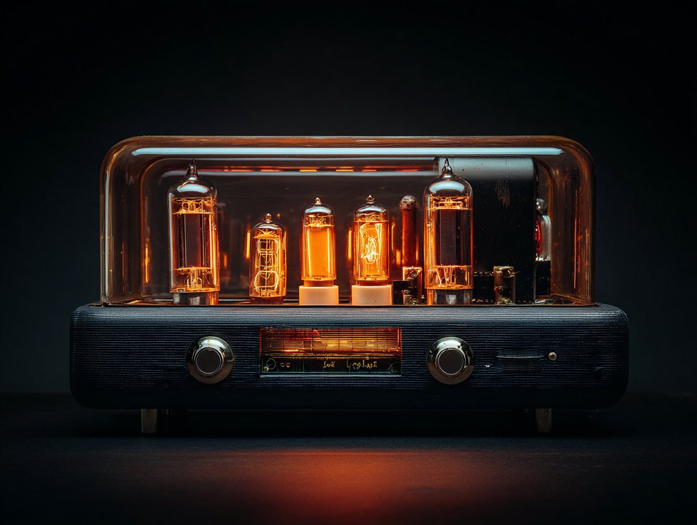

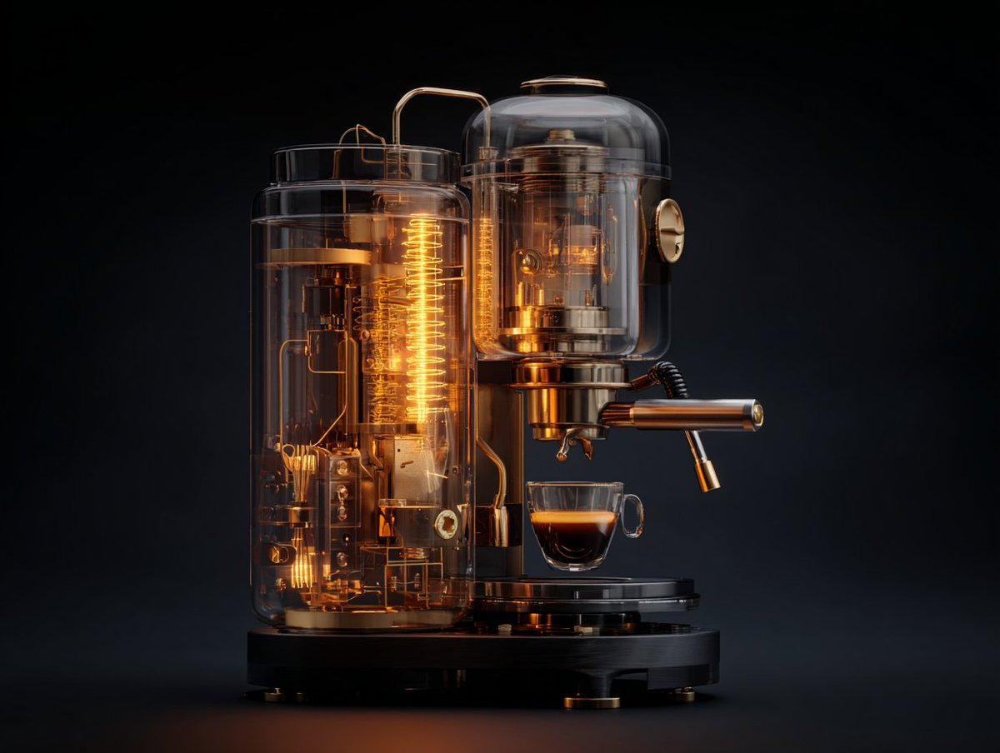

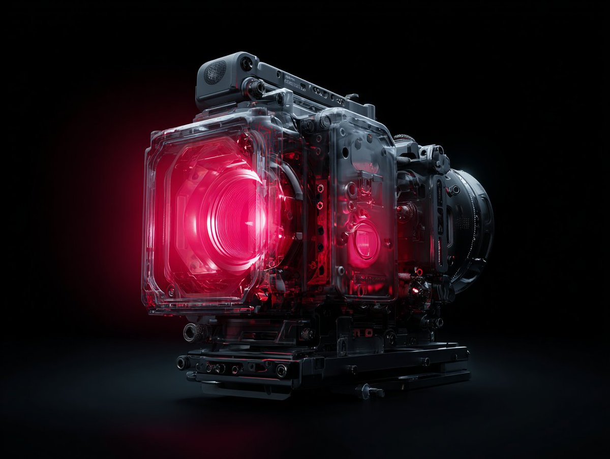

```
Drone with propeller guards removed with internals visible or suggested, subtle green glow emanating from within flight controller and battery bay, dark environment, technology heartbeat, futuristic aesthetic, power visualization, dramatic product photography.
```

```
Vintage radio with tube amplifier exposed with internals visible or suggested, subtle warm orange glow emanating from within vacuum tubes, dark environment, technology heartbeat, futuristic aesthetic, power visualization, dramatic product photography.
```

```
Espresso machine with exposed brass boiler with internals visible or suggested, subtle amber glow emanating from within heating element, dark environment, technology heartbeat, futuristic aesthetic, power visualization, dramatic product photography.
```

```
Professional cinema camera body with internals visible or suggested, subtle red recording glow emanating from within sensor chamber, dark environment, technology heartbeat, futuristic aesthetic, power visualization, dramatic product photography.
```

 [↑返回目录](#toc)

---
## <a id="">适合短视频封面/怪谈分镜的画风</a> (<a href="https://x.com/VoxcatAI/status/2009549871183757519" target="_blank" rel="noopener noreferrer">VoxCat</a>)

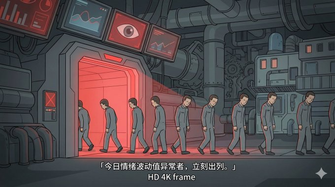

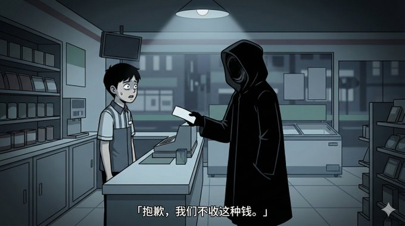

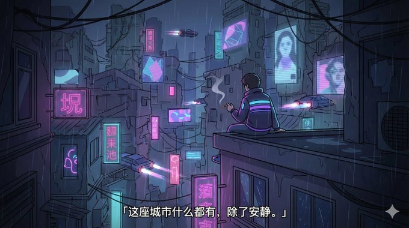

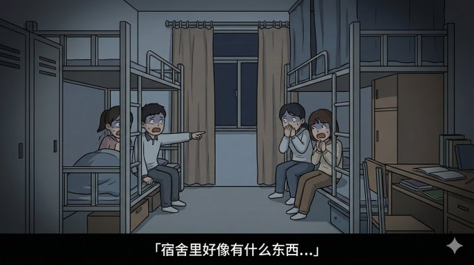

```
最近在研究一种特别适合短视频封面/怪谈分镜的画风：

2D 扁平矢量插画 + Flash/MG 动画分镜。

它不卷细节，不画毛孔发丝，主打一个“信息传达快、情绪到位、镜头像截图一样能讲故事”。
特点就是：粗描边矢量线稿 + 大色块平涂 + 极简阴影，再配低饱和暗调 + 轻微暗角/聚光，一秒进入悬疑叙事氛围。底部留字幕区也很顺手。

把主题填进去就能跑提示词，

生成一张「(主题/剧情一句话描述)」的二维扁平叙事插画，整体为 Flash/MG 动画分镜截图风：干净矢量描边（外轮廓略粗、线条利落），大色块平涂为主，阴影仅用少量柔和渐变，不做复杂材质与写实纹理；场景为(地点/时代/环境)的中远景分镜构图，主体是(人物/物体)正在(动作/状态)，表情清晰可读但五官简化；色彩低饱和偏灰暗，氛围(悬疑/压抑/温暖/荒诞)，画面带轻微暗角与聚光，背景概括化不抢主体；底部保留一行简体中文字幕「(字幕内容)」，画幅(16:9/9:16/4:3)，高清输出。
```

 [↑返回目录](#toc)

---
## <a id="">和卡通版自己的合影</a> (<a href="https://x.com/Adam38363368936/status/2009664369001627654" target="_blank" rel="noopener noreferrer">Adam也叫吉米</a>)

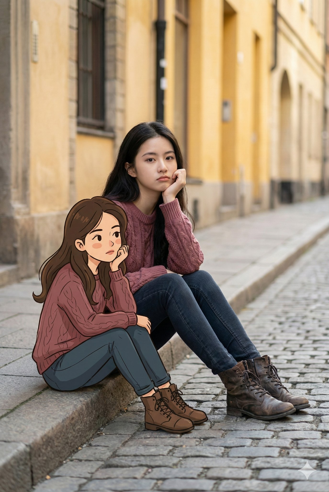

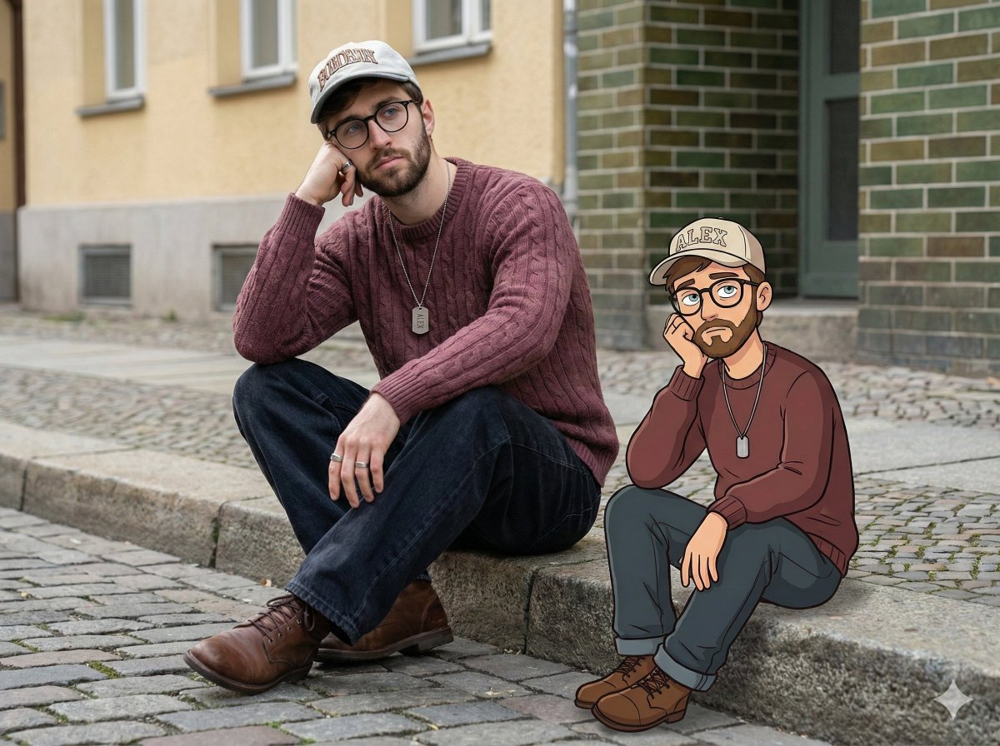

```
将此图片转换为64K数码单反分辨率的创意都市街头肖像。

[主体]：照片中，一位**[从上传图片提取：年龄、性别、外貌特征]**（与上传图片中的人物相同）坐在静谧的城市街道路边。人物随意地坐在水泥人行道边缘，一只手托着下巴，姿态略显百无聊赖，若有所思。表情平静内敛，流露出静谧的沉思感。

[装束]：身穿**[提取自图片或使用模板：浅酒红色宽松绞花针织衫，搭配深色牛仔裤和做旧皮靴]**。

[卡通伴侣]：在他/她旁边的人行道上，坐着一个卡通版的自己（与上传的图片脸部特征一致）。卡通人物的穿着、打扮、姿势甚至表情都与真人一模一样。卡通风格线条简洁，色彩温暖，采用柔和的手绘动画风，与写实真人形成有趣对比。

[技术与环境]：背景是纹理丰富的鹅卵石路面和柔和黄色的建筑立面。大地色系为主，柔和自然光。融合街头摄影与混合媒介艺术，Octane渲染器，虚幻引擎级画质。
```

 [↑返回目录](#toc)

---
## <a id="">把场景和人物完美融合</a> (<a href="https://x.com/qisi_ai/status/2009235181841109447" target="_blank" rel="noopener noreferrer">骑司Chase</a>)

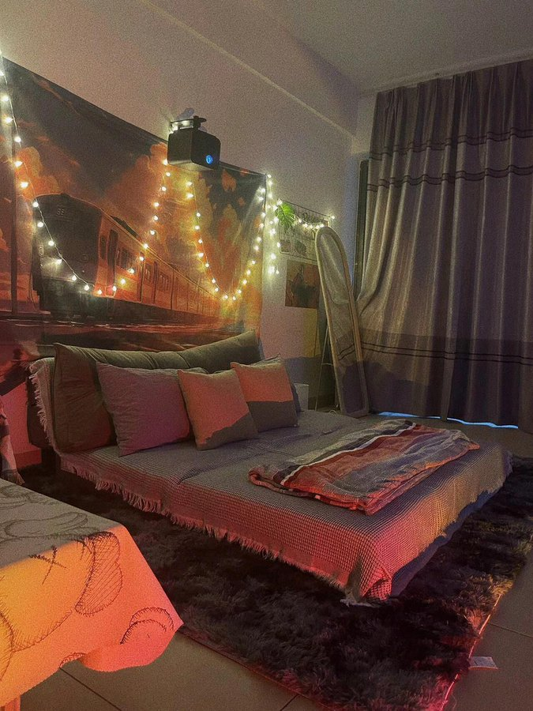

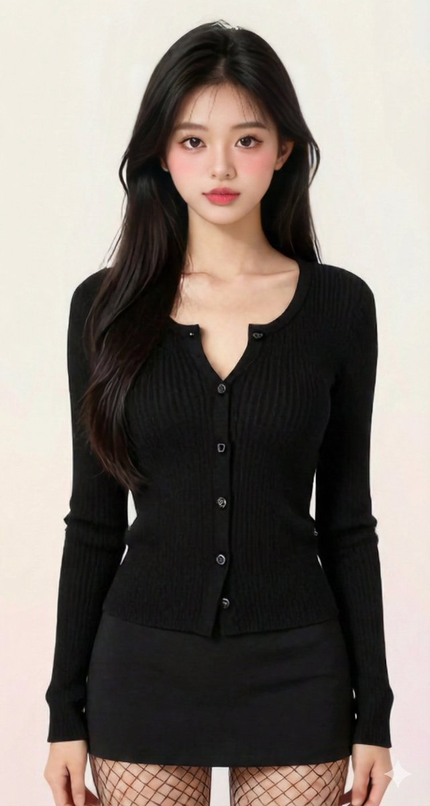

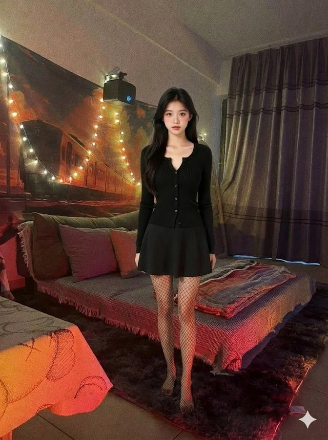

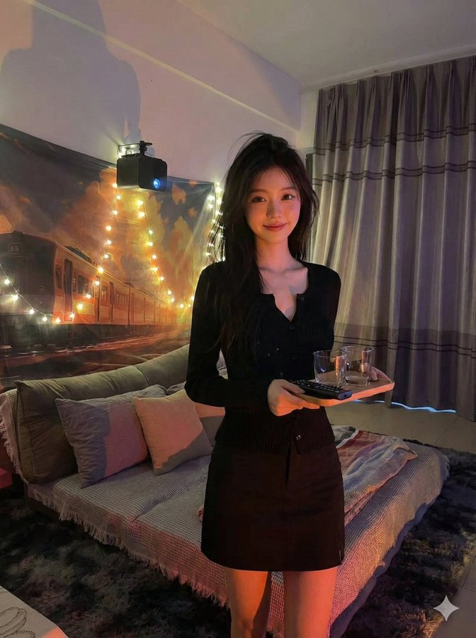

```
一次意外，我写出了这个能把场景和人物完美融合的提示词（完整提示词放在文末）

起因是一位圈友找我，希望能把一个人物素材放进场景里，需要人物和环境光线保持一致，还要保持真实感（图一是提供的场景和人物）

因为他是多家私人影院的老板，需要这样的素材做成视频来吸引客人。

我开始感觉挺简单的，就把场景图和人物图都导入Gemini，写了个简单的提示词就直接生成了，结果就是大翻车！

图一为场景素材
图二为人物素材
图三为翻车效果
图四为使用提示词后的效果

这个时候我才意识到肯定有很多AI小白都会遇到这个问题，所以我经过多次调试，写出了这个系统的【融合场景人物】提示词，并且支持自定义人物动作等元素。

使用方式：

上传场景图
上传人物图
粘贴提示词
输入自定义指令（可选）

另外，AIX社群199早享价还有最后10个名额详细介绍看引用的原帖，联系V：Chase_7380 参与报名

中文提示词（Nano Banana Pro）：

用户自定义指令（优先遵循）

1 人物下装是短裙，甜妹风格，在私人影院做兼职的那种感觉

一、总指令

1 目标：以“融合自然”为最高优先级，允许对人物形态、姿势、服装细节、缺失部位进行合理重建与补全；允许对场景构图、拍摄角度、景深与光线进行一致性调整，最终画面必须像同一时刻同一镜头真实拍摄
2 用户输入：场景参考图一张；人物参考图一张或多张
3 输出：一张极度写实、无拼贴感、无抠图感的最终合成图

二、自动分析流程（先判断再生成）

1 场景解析：识别地平线与消失点、镜头高度与视角、主光源方向与强弱、色温与环境色、景深与清晰度分布、噪点颗粒、场景中可用站位与遮挡关系
2 人物解析：识别人脸与肤色基调、发型体态、服装材质与纹理；判断与场景的透视、尺度、光线是否匹配
3 融合策略选择：若人物与场景差异过大，优先“重建匹配”而不是“硬贴叠加”——可重算镜头、调整姿势与体态、重做景深与光影，必要时对场景进行轻微重构以服务真实感

三、人物适配规则（允许改变与补全）

1 姿势与体态：为贴合场景透视与站位，允许调整人物站姿、肩胯角度、头部朝向、手部位置、身体比例的细微变化；动作必须符合重力与人体结构
2 缺失补全：如人物下半身、脚部、手指、发丝边缘等信息不足，必须按真实解剖与服装结构补全；补全后与原人物风格一致、比例合理
3 服装与材质：允许对衣物边缘、褶皱、长度、贴合度进行微调以满足姿势与光影；材质高光、纹理密度与场景清晰度一致
4 身份一致：保留人物核心面部特征与辨识点，不做夸张整形式改动；皮肤纹理自然，避免过度磨皮与蜡像感

四、场景适配规则（允许变化以服务真实）

1 构图与机位：允许重新取景、裁切、轻微改变镜头高度与拍摄角度，使人物与场景透视统一；必要时调整人物在画面中的位置与比例
2 景深与对焦：根据场景的虚化规律重设对焦层；人物清晰度必须与其所在空间距离匹配，避免人物过锐或背景过糊导致贴图感
3 遮挡与交互：若场景存在前景物体或家具边缘，建立正确遮挡关系；可让人物与环境发生合理接触（倚靠、坐下、扶握），增强真实交互

五、光影统一（真实感的核心）

1 方向一致：人物受光方向、阴影方向必须与场景主光源一致
2 强弱一致：人物明暗对比与场景一致，避免人物“打光过度”或“灰暗漂浮”
3 阴影落地：必须生成脚底与接触面的真实投影与环境遮蔽阴影；阴影软硬、边缘扩散、透明度与场景阴影一致
4 环境反光：人物暗部加入来自周围环境的综合色与微弱反射，让人物“吃进环境色”
5 色温与色彩：统一整体色温、对比度、饱和度与色阶；肤色要在真实范围内随环境光变化

六、细节处理（消除拼贴感）

1 边缘：发丝、衣物边缘、半透明区域过渡自然，无白边黑边光晕锯齿
2 颗粒与质感：人物与背景噪点颗粒、锐化强度一致；皮肤、布料、丝袜等细纹理与画面分辨率匹配
3 接触点：脚与地面、坐姿与椅面、手与物体接触处必须有压迫感与微形变、褶皱与阴影细节
4 全局一致：统一色调、镜头轻微畸变、暗角与空气透视，让整张图像呈现同一台相机的成像特征
```

 [↑返回目录](#toc)

---
## <a id="">超写实3D等距视角场景</a> (<a href="https://x.com/Arminn_Ai/status/2008952931484098637" target="_blank" rel="noopener noreferrer">ΛRMIN | AI</a>)


```
Concept: A hyper-realistic 3D isometric view of a [INSERT LOCATION] scene on a circular base.
Subject (Visuals): A full-body, realistic human [INSERT DESCRIPTION].
* Texture Rule: The subject must have "Living Human Skin" texture (subsurface scattering, pores, natural imperfections).
* Important: He is NOT a toy/doll. He looks like a real person inserted into the scene.
* Pose: [INSERT POSE, e.g., Sitting naturally].

Composition & Scale (Crucial):
* Camera: Isometric wide shot (Full view). ensure the entire circular base, the subject, and all props are visible within the frame.
* Proportions: PERFECT RELATIVE SCALE. The props (e.g., scooter, table etc.) must be the correct size relative to the human. Do not make the human giant or the props tiny.

Environment: A realistic section of a [INSERT WALL/BUILDING] behind the subject.
* Material: Real weathered textures (brick, cement, wood), not painted model textures.

Props:
* [INSERT PROP 1, e.g., Vintage Vespa] (Real metal and chrome texture).
* [INSERT PROP 2, e.g., Pizza and Wine] (Real food texture).
* *Note:* Ensure all props are present and grounded on the base.

Technical Specs: Unreal Engine 5 render style, 8k resolution, global illumination, raytracing, sharp focus on the entire scene (deep depth of field), solid neutral grey background.

Negative Prompt: Toy, plastic, doll, action figure, clay, resin, shallow depth of field (blur), close-up, cropped, distorted proportions, giant head, cartoonish, missing limbs, unfinished.
```

```
概念：一个超写实3D等距视角的[插入地点]场景，置于圆形基座之上。
主体（视觉）：一位全身、逼真的人类[插入描述]。
* 纹理规则：主体必须具有“活体人类皮肤”质感（包含次表面散射、毛孔与自然瑕疵）。
* 重要提示：他不是玩具或玩偶，而是一个真实人物被置入该场景中。
* 姿势：[插入姿势，例如：自然坐姿]。

构图与比例（关键）：
* 镜头：等距广角镜头（完整视野），确保整个圆形基座、主体及所有道具均完整呈现在画面内。
* 比例：绝对精准的相对比例。道具（如滑板车、桌子等）必须与人类尺寸完全匹配，不得将人物放大或道具缩小。

环境：主体后方为一段真实的[插入墙体/建筑]局部。
* 材质：真实风化的纹理（砖墙、水泥、木材），而非模型喷绘贴图。

道具：
* [插入道具1，例如：复古Vespa踏板车]（真实金属与镀铬质感）。
* [插入道具2，例如：披萨与红酒]（真实食物质感）。
* 注：所有道具必须完整呈现，并稳固置于基座之上。

技术规格：虚幻引擎5渲染风格，8K分辨率，全局光照，光线追踪，全场景锐利对焦（大景深），纯中性灰色背景。

负面提示：玩具、塑料、玩偶、手办、黏土、树脂、浅景深（模糊）、特写、裁切、比例失真、头部过大、卡通化、肢体缺失、未完成感。
```

 [↑返回目录](#toc)

---
## <a id="prompt-2009324869100724200">戴帽男子侧脸与欧洲小巷的黑白双重曝光肖像</a> (<a href="https://x.com/Raylan89/status/2009324869100724348" target="_blank" rel="noopener noreferrer">Raylan</a>)

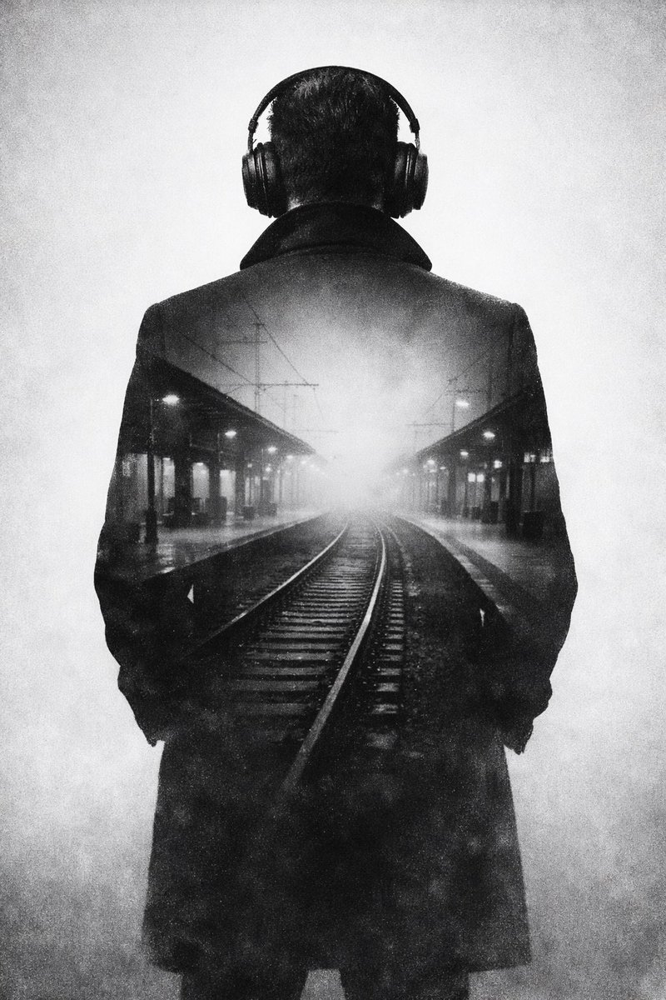

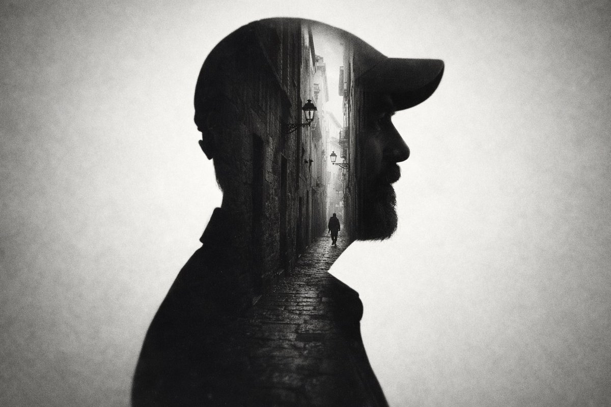

```
Photography Prompt 📸

Bookmark + Follow for more INSANE AI prompts ↓

K A M A L HASSAN 📸

ADD PROMPT 👇

Black-and-white double exposure photograph of a man in side profile wearing a cap, seen from the shoulders up. Inside his silhouette is a narrow European alleyway with tall buildings, textured stone walls, and vintage street lamps. A small figure walking down the alley adds scale and narrative. High contrast, fine art photography, surreal composition, minimalist aesthetic, cinematic mood, melancholic and introspective tone, soft natural light, subtle grain, shallow depth of field, smooth silhouette blending, artistic double exposure.
```

```
黑白双重曝光摄影作品，描绘一名戴帽子的男子侧脸肖像（肩部以上）。其轮廓内部融合了一条狭窄的欧洲小巷，巷子两侧是高耸的建筑、带有质感的石墙和复古街灯。小巷中有一名微小的人物行走，以增强画面比例感与叙事性。高对比度、美术摄影风格、超现实构图、极简美学、电影氛围、忧郁而内省的基调、柔和自然光、细微颗粒感、浅景深、轮廓融合平滑、艺术化双重曝光效果。
```

 [↑返回目录](#toc)

---
## <a id="prompt-2009310148867551200">电商产品图片增强提示</a> (<a href="https://x.com/SiboEsenkova/status/2009310148867551358" target="_blank" rel="noopener noreferrer">Sibo Esenkova</a>)

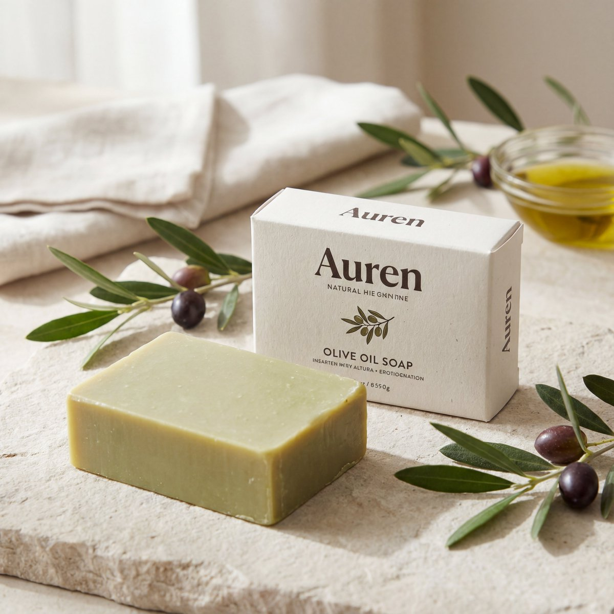


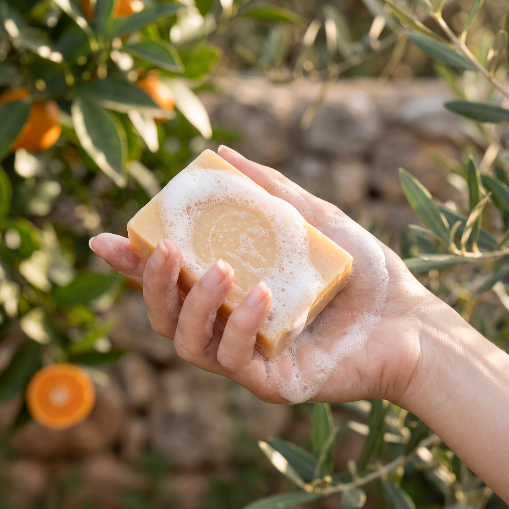

```
5 dakikanızı ayırın, ürün görsellerinizle fark yaratın. 

Aşağıdaki promptu kopyala, ürün fotoğrafını yükle. E-ticaret firmanda dilediğin gibi kullan.

Diğer görsellerin promptunu almak istiyorsan yorumlara yazabilirsin, mesaj olarak göndericem. 

Prompt👇
```

```
花5分钟，用您的产品图片脱颖而出。

复制下方提示词，上传产品照片，即可在您的电商平台上随意使用。

如果您想要其他图片的提示词，可以在评论区留言，我会私信发送给您。

提示词👇
```

 [↑返回目录](#toc)

---
## <a id="prompt-2009387135019680300">光线控制照片</a> (<a href="https://x.com/AllaAisling/status/2009387135019680209" target="_blank" rel="noopener noreferrer">Alexandra Aisling</a>)

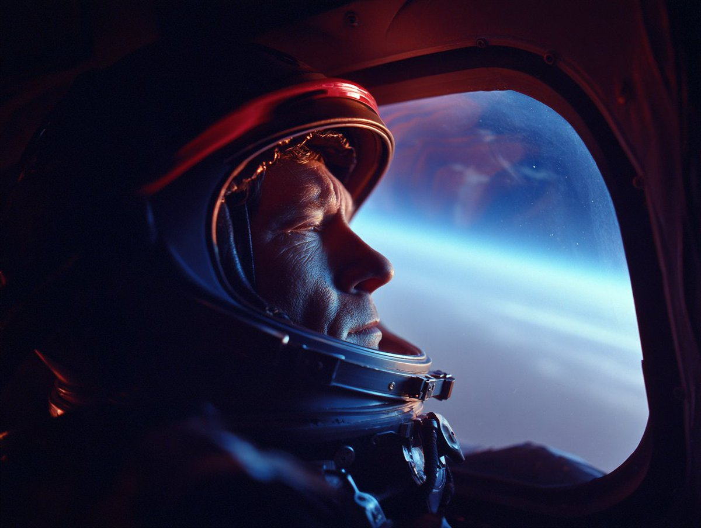

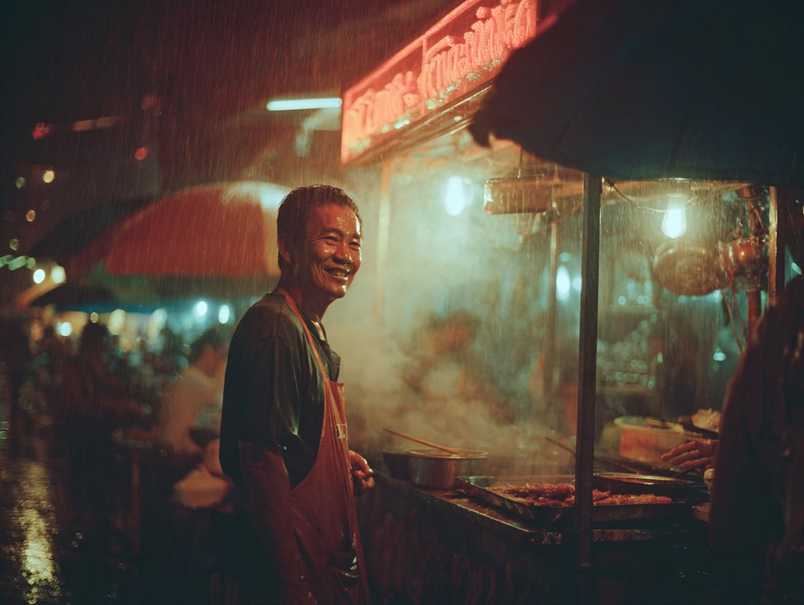

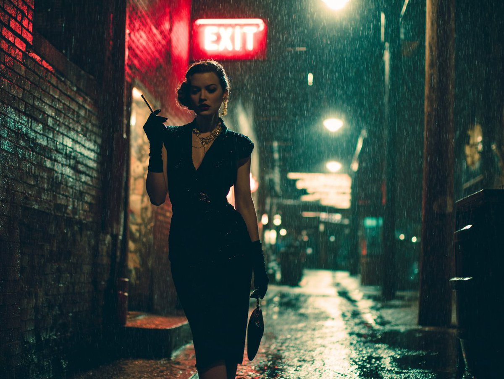

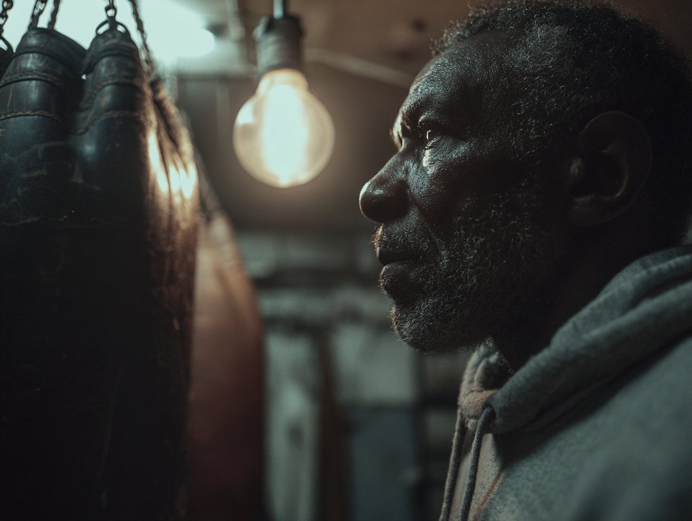

```
Astronaut in suit with helmet off, exhausted face, eyes reflecting something we can't see standing in spacecraft window bay looking at Earth, solar flare creating aurora on atmosphere below, volumetric lighting, Earth glow and instrument panel casting dramatic shadows, cinematic color grading, moody atmosphere, 1970s analog space exploration aesthetic.
```

```
Street food vendor in stained apron, cigarette behind ear, knowing smile standing in neon-drenched night market alley with steam rising from cart, tropical monsoon rain hammering tin roofs, volumetric lighting, neon signs and wok fire casting dramatic shadows, cinematic color grading, moody atmosphere, 1990s Bangkok street life aesthetic.
```

```
Femme fatale in black silk dress, cigarette holder, one glove removed standing in rain-slicked alley behind jazz club, downpour with neon reflecting in puddles, volumetric lighting, red exit sign and distant streetlamp casting dramatic shadows, cinematic color grading, moody atmosphere, 1940s film noir aesthetic
```

```
Retired boxer in grey sweatshirt, crooked nose, wrapped hands, gold tooth glinting standing in steam-filled basement gym with heavy bags swaying, humid summer heat visible in air, volumetric lighting, single caged bulb swinging casting dramatic shadows, cinematic color grading, moody atmosphere, 1970s Philadelphia grit aesthetic
```

 [↑返回目录](#toc)

---
## <a id="prompt-2009580453083201800">女性在奢华浴室使用护肤精华的多角度摄影拼贴</a> (<a href="https://x.com/oggii_0/status/2009580453083201822" target="_blank" rel="noopener noreferrer">Oogie</a>)

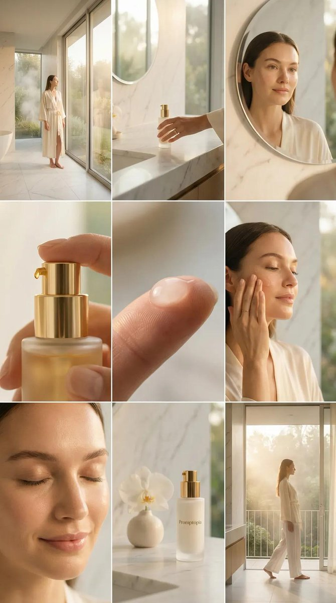

```
Prompt: {
  "subject": {
    "person": "Woman, appears to be in her 20s or 30s",
    "pose_and_expression": [
      "Standing by window, looking out, relaxed",
      "Reaching for bottle on counter, hand focus",
      "Looking in mirror, slight smile",
      "Hand dispensing serum from bottle, close-up",
      "Serum drop on fingertip, macro shot",
      "Applying serum to face, eyes closed, serene",
      "Face close-up, eyes closed, content",
      "Bottle and orchid on counter, still life",
      "Walking away from camera, standing by window"
    ]
  },
  "clothing": {
    "items": "White robe, white pajamas/loungewear",
    "material": "Soft, flowing fabric",
    "style": "Casual, luxurious"
  },
  "hair": {
    "color": "Dark brown",
    "style": "Pulled back, neat bun or ponytail"
  },
  "face": {
    "makeup": "Natural, minimal",
    "skin": "Clear, glowing",
    "expression": "Calm, serene, content"
  },
  "accessories": {
    "jewelry": "Simple ring on ring finger",
    "props": [
      "Glass skincare bottle with gold pump dispenser",
      "Product label: 'Promptopia'",
      "White orchid in a small white vase"
    ]
  },
  "environment": {
    "location": "Modern, luxurious bathroom",
    "elements": [
      "Large floor-to-ceiling windows",
      "Marble countertop and walls",
      "Round mirror",
      "View of trees/garden outside",
      "Fog or mist outside window"
    ],
    "atmosphere": "Serene, spa-like, tranquil"
  },
  "lighting": {
    "source": "Natural daylight",
    "quality": "Warm, golden, soft, diffused",
    "time_of_day": "Sunrise or golden hour"
  },
  "camera": {
    "type": "Photography collage",
    "shots": [
      "Wide shot",
      "Medium shot",
      "Close-up",
      "Macro shot"
    ],
    "focus": "Sharp on subject and product, soft background blur (bokeh)"
  },
  "style": {
    "aesthetic": "Cinematic, editorial, beauty, wellness, clean, minimalist",
    "color_palette": "Warm neutrals, white, gold, natural greens"
  }
}
```

```
一位20多岁或30多岁的女性，身穿柔软飘逸的白色浴袍与白色睡衣/家居服，风格休闲而奢华；深棕色头发整齐地向后梳成发髻或马尾；妆容自然淡雅，肌肤清透光亮，神情平静、安详、满足；无名指佩戴一枚简约戒指。

她站在现代奢华浴室的落地窗前，窗外是雾气缭绕的花园景色；场景包含大理石台面与墙面、圆形镜子；氛围宁静如水疗中心。道具包括一支金色泵头的玻璃护肤精华瓶（标签印有“Promptopia”）、一小瓶白兰花。

画面捕捉多个瞬间：她望向窗外放松站立；伸手拿取台面上的精华瓶，聚焦手部；对镜微笑；特写手部挤出精华液；微距镜头下指尖滴落一滴精华；闭眼将精华涂抹于面部，神情宁静；闭眼脸部特写，流露满足感；精华瓶与白兰花构成静物画面；以及她背对镜头走向窗边。

采用摄影拼贴形式，涵盖全景、中景、特写与微距镜头，主体与产品清晰锐利，背景柔焦虚化。整体风格电影感、时尚杂志风、美容健康主题，色调以暖中性色、白色、金色与自然绿为主，光线为日出或黄金时刻的柔和漫射暖光。
```

 [↑返回目录](#toc)

---
## <a id="prompt-2009341341226943000">19世纪风格的现代品牌</a> (<a href="https://x.com/AmirMushich/status/2009341341226942853" target="_blank" rel="noopener noreferrer">AmirMušić</a>)

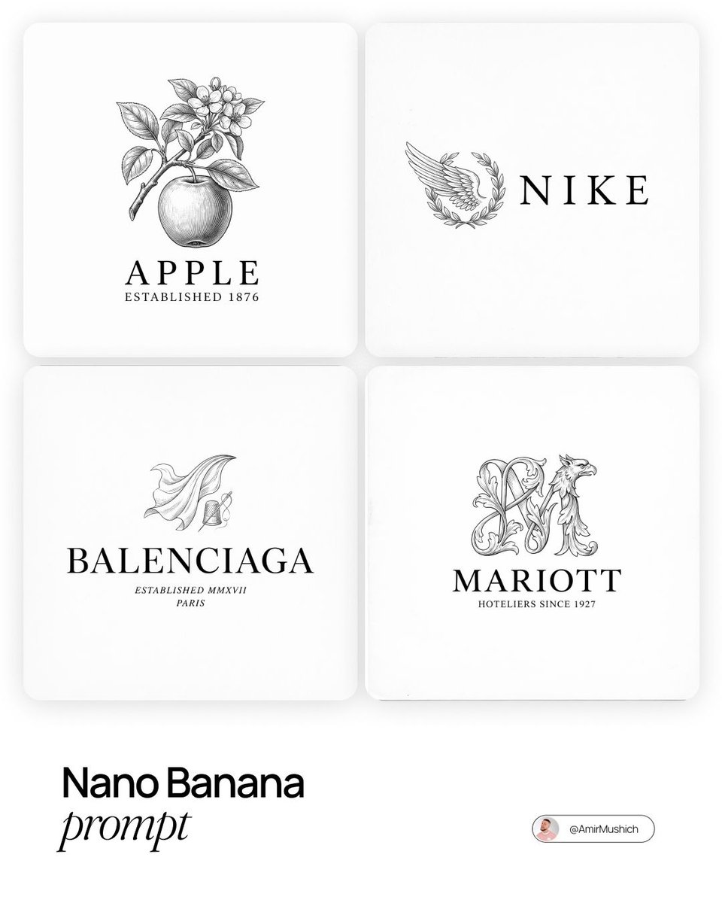

```
Modern brands in 19th century

Prompt 👇 

(Steal more of my prompts & free workflows here: http://amirmushich.link)
```

 [↑返回目录](#toc)

---


[上一页](./7.md) | 当前 8/8 页 | [查看全部目录](../prompts.md)