# gemini.json 

gemini.json文件存放gemini相关的提示词，当前已收录：1016个 

 投稿方式：[飞书投稿](https://tcn1uh5rxo87.feishu.cn/share/base/form/shrcne5gDolOMDd0oJsj2XfvxQc) or [issues](https://github.com/junxiaopang/gridsplitter/issues/new)

[上一页](./8.md) | 当前 9/11 页 | [下一页](./10.md) | [查看全部目录](../prompts.md)

🚀 **在线预览**: [https://prompts.kkkm.cn](https://prompts.kkkm.cn)

## <a id="toc">目录</a>

- [活力男性肖像，橙红眼镜，黑线勾勒，报纸背景](#prompt-2009946159532662800)
- [悬浮美食：塔可、烤肉串与寿司的极致微观世界](#prompt-2009887009591227000)
- [超写实糖果单词](#prompt-2009664169331839500)
- [吐舌头的女孩](#prompt-2010116114668515600)
- [触感蜡封徽标设计](#prompt-2010070395974504400)
- [加拉塔塔建造中的3D蓝图融合场景](#prompt-2010077171524456700)
- [超写实芒果汁饮料罐从海中迸发](#prompt-2010290781819695400)
- [全纹身高冲击力的肖像](#prompt-2010164626311557000)
- [微型建筑模型中的展览](#prompt-2012411445724713200)
- [历史画卷中的四大神兽](#prompt-2012434546739093800)
- [霓虹能量饮料广告摄影](#prompt-2011981449688482000)
- [可爱奇特动物的Risograph风格图标集](#prompt-2011857121835458800)
- [橄榄绿金属邮箱与信封](#prompt-2012506103116882000)
- [60秒内将任何人变成专业素描](#prompt-2012223385607028700)
- [椰子发膜罐与新鲜椰肉](#prompt-2011898432626348300)
- [四位贵妇的跨时代肖像](#prompt-2011974686683644200)
- [黑白矢量人像伴侧](#prompt-2011898760650170400)
- [微型自然生态系统](#prompt-2011819664536445000)
- [[国家名称]标志性建筑的微缩世界](#prompt-2012473859510071300)
- [庭院中的鱼幼薇与白猫](#prompt-2012327408293068800)
- [单色3D配送系统视觉](#prompt-2012134246924648700)
- [俏皮黑发女生的超写实肖像](#prompt-2012097296784347400)
- [咖啡杯里的微型巴黎](#prompt-2011798504482738400)
- [夏日鸡尾酒专业摄影](#prompt-2012458566771204400)
- [针织毛线娃娃肖像](#prompt-2012319960500986400)
- [奢华产品包装开箱场景](#prompt-2012259409649660200)
- [悬浮蛋糕与流淌糖浆的甜点盛宴](#prompt-2011994819124752600)
- [三层美食滴落特写](#prompt-2011829870893125600)

## <a id="prompt-2009946159532662800">活力男性肖像，橙红眼镜，黑线勾勒，报纸背景</a> (<a href="https://x.com/Sheldon056/status/2009946159532662792" target="_blank" rel="noopener noreferrer">Duet | AI</a>)

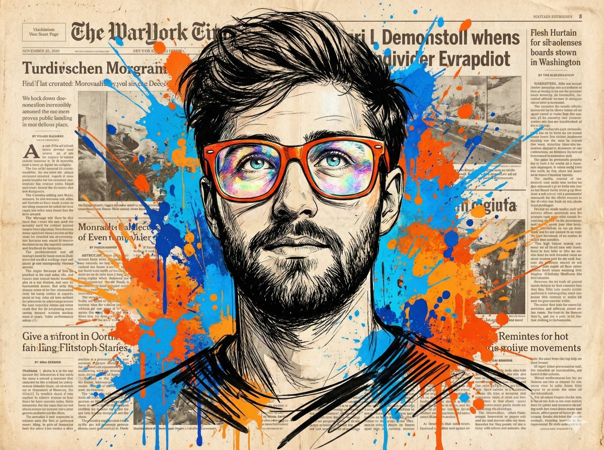

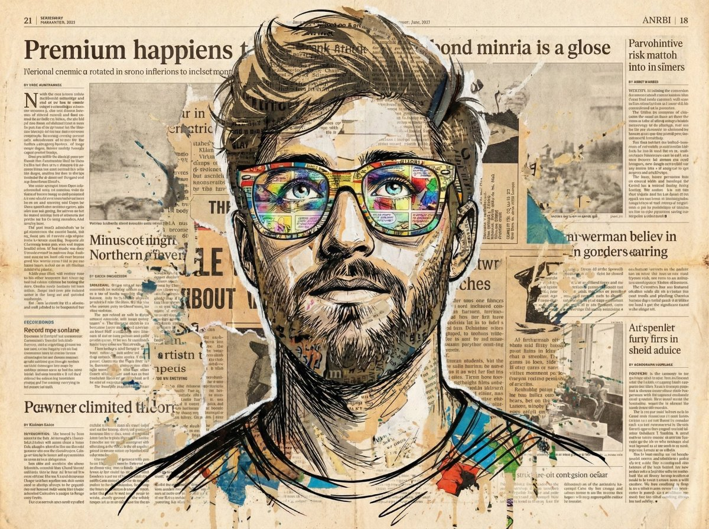

```
Vibrant expressive portrait of a man looking upwards with wonder, wearing oversized bright orange-red glasses (glass light colour full shade). The face is sketched in dynamic black strokes on a textured newspaper background, enriched with splashes of vivid blue and orange paint. The composition blends realism and abstract expressionism, evoking innocence, hope, and creativity. Take full face of the attached picture.
```

```
一幅充满活力且富有表现力的男性肖像，他仰望上方，眼神充满惊奇，佩戴着 oversized 的亮橙红色眼镜（镜片为全遮光浅色）。面部以动态的黑色笔触勾勒，背景为有纹理的报纸，并点缀着鲜明的蓝色与橙色颜料泼溅。构图融合了写实主义与抽象表现主义，传达出纯真、希望与创造力。取所附图片中的完整面部。
```

 [↑返回目录](#toc)

---
## <a id="prompt-2009887009591227000">悬浮美食：塔可、烤肉串与寿司的极致微观世界</a> (<a href="https://x.com/meng_dagg695/status/2009887009591226787" target="_blank" rel="noopener noreferrer">ShaHid WaNii</a>)

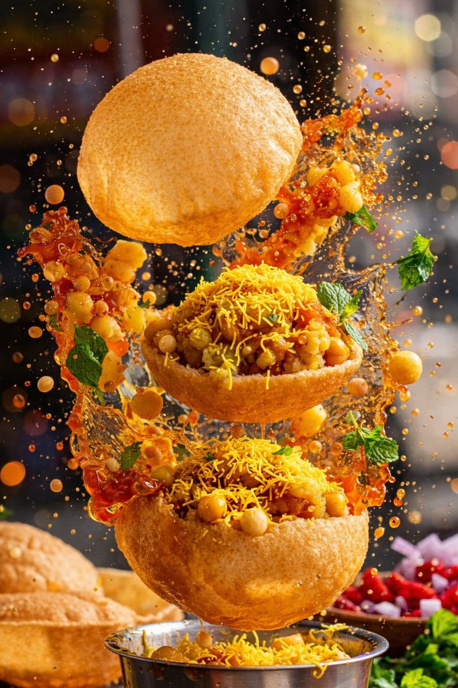

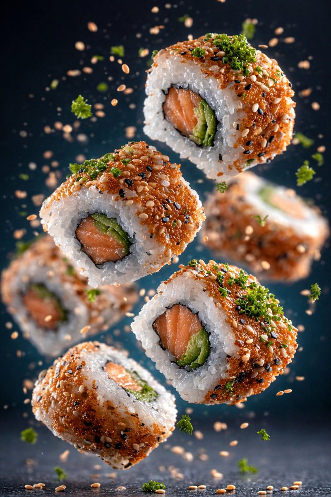

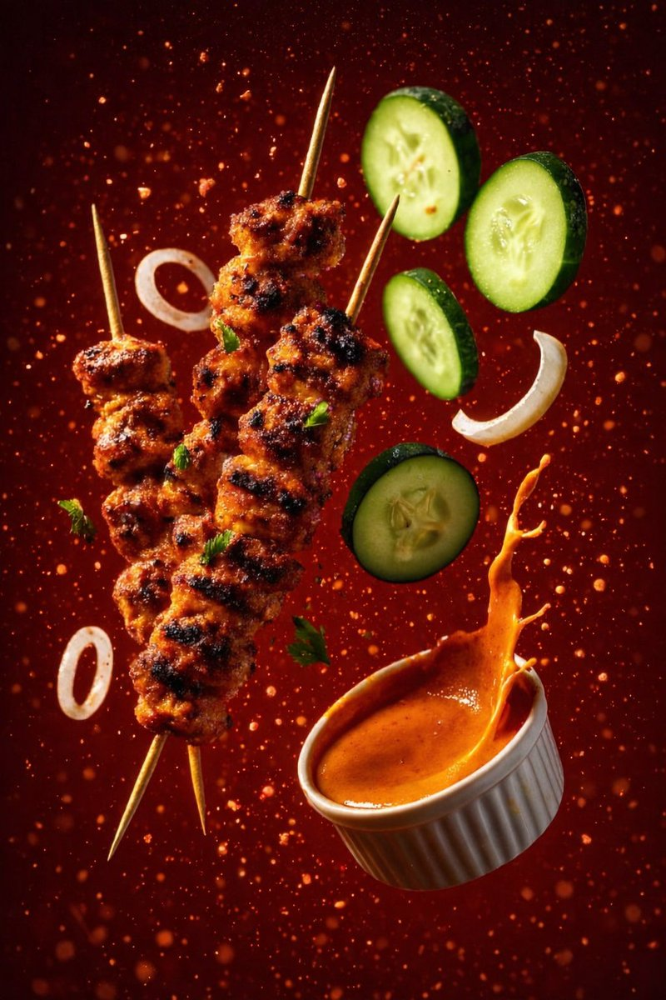

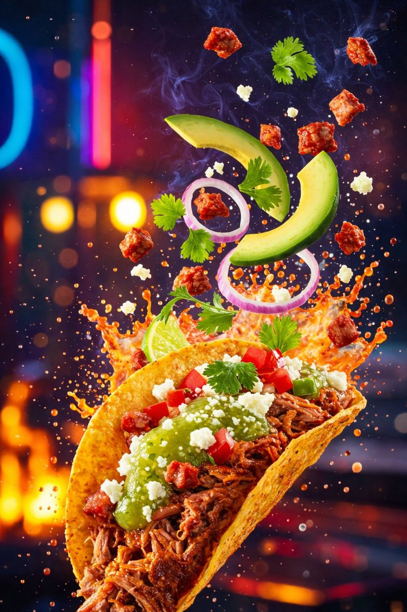

```
{
  "global_settings": {
    "resolution": "8K ultra high definition",
    "aspect_ratio": "2:3 vertical",
    "image_type": "AI-edited cinematic food photography",
    "detail_level": "extreme micro-detail, sharp focus, clean edges",
    "style_constraint": "enhanced realism, minimal alteration from original composition"
  },

  "module_1_image_1_style": {
    "subject": "single hard-shell taco",
    "composition": {
      "orientation": "diagonal, floating in mid-air",
      "foreground_focus": "taco shell and filling",
      "motion": "ingredients suspended, sauce splash frozen mid-air"
    },
    "visible_elements": {
      "shell": "golden yellow hard taco shell with crisp texture",
      "filling": [
        "shredded cooked meat with visible fibers",
        "green sauce layered on top",
        "small red diced pieces",
        "white crumbled cheese"
      ],
      "floating_garnish": [
        "avocado slices",
        "purple onion rings",
        "green herb leaves",
        "small reddish-brown meat cubes",
        "tiny white crumbs"
      ],
      "liquid": "orange-red sauce splash erupting upward behind taco"
    },
    "lighting": {
      "type": "high-contrast studio lighting",
      "highlights": "glossy reflections on sauce and meat",
      "background_lights": "soft circular bokeh in warm and cool tones"
    },
    "background": {
      "color": "dark with neon-like blurred lights",
      "depth": "strong depth of field, background fully defocused"
    }
  },

  "module_2_image_2_style": {
    "subject": "three grilled meat skewers",
    "composition": {
      "orientation": "vertical skewers, slightly angled",
      "foreground_focus": "center skewer",
      "motion": "ingredients and sauce suspended"
    },
    "visible_elements": {
      "skewers": "wooden sticks with pointed ends",
      "meat": "chunked grilled meat with char marks and uneven texture",
      "garnish": "small green herb leaves attached to meat",
      "floating_items": [
        "round cucumber slices",
        "thin onion rings"
      ],
      "sauce": {
        "container": "small white ramekin",
        "action": "thick orange sauce splashing upward from bowl"
      },
      "particles": "tiny spice or crumb particles scattered in air"
    },
    "lighting": {
      "type": "dramatic directional lighting",
      "highlights": "strong sheen on meat surface",
      "contrast": "deep shadows"
    },
    "background": {
      "color": "solid deep red",
      "texture": "soft grain with floating particles"
    }
  },

  "module_3_image_3_style": {
    "subject": "four sushi rolls",
    "composition": {
      "orientation": "floating cluster",
      "spacing": "uneven depth, some closer, some blurred behind",
      "motion": "sesame seeds and herbs suspended"
    },
    "visible_elements": {
      "sushi_structure": {
        "outer_layer": "white rice",
        "inner_layer": "dark seaweed",
        "fillings": [
          "orange fish slice",
          "green avocado"
        ]
      },
      "toppings": [
        "toasted sesame seeds",
        "brown crunchy coating",
        "finely chopped green herbs"
      ],
      "particles": [
        "sesame seeds",
        "small green herb pieces"
      ]
    },
    "lighting": {
      "type": "soft but crisp studio lighting",
      "focus": "front sushi pieces sharp, rear slightly blurred"
    },
    "background": {
      "color": "dark blue-grey",
      "depth": "clean bokeh-free backdrop with floating particles"
    }
  },
  "post_processing": {
    "clarity": "ultra-sharp",
    "noise": "minimal",
    "color_balance": "rich but natural",
    "ai_signature": "clean AI-edited look without exaggeration"
  }
}
```

```
全球设置：
- 分辨率：8K超高清
- 纵横比：2:3垂直
- 图像类型：经过AI编辑的电影食物摄影
- 细节层次：极致微观细节，清晰焦点，干净边缘
- 风格限制：增强现实主义，与原始构图相比修改最小

第一模块图像一风格：
- 主题：单个硬壳玉米饼塔可
- 构图：
  - 方向：对角线，悬浮于空中
  - 前景焦点：塔可壳和馅料
  - 动作：配料悬浮，酱汁飞溅冻结在半空
- 可见元素：
  - 壳：金黄色硬玉米饼壳，脆皮质感
  - 馅料：撕碎的熟肉带可见纤维，绿色酱覆盖顶部，小红色块状物，白色碎奶酪
  - 悬浮装饰：牛油果片，紫色洋葱圈，绿色草本叶，小红棕色肉丁，微小白屑
  - 液体：橙红色酱汁从塔可后面向上喷发
- 照明：
  - 类型：高对比度工作室照明
  - 高光：酱料和肉上的光泽反射
  - 背景灯光：暖色调和冷色调柔和圆形散景
- 背景：
  - 颜色：暗色配霓虹灯般的模糊光线
  - 深度：强烈的景深效果，背景完全失焦

第二模块图像二风格：
- 主题：三串烤肉串
- 构图：
  - 方向：垂直肉串，稍微倾斜
  - 前景焦点：中央肉串
  - 动作：配料和酱料悬浮
- 可见元素：
  - 肉串：木签，尖端锋利
  - 肉：带炭烧痕迹和不均匀纹理的大块烤肉
  - 装饰：附着在肉上的小型绿色草本叶
  - 悬浮物品：圆形黄瓜片，薄洋葱圈
  - 酱料：
    - 容器：小白色陶碟
    - 动作：浓厚橙色酱料从碗中向上飞溅
  - 颗粒：空气中散布的细小香料或面包屑颗粒
- 照明：
  - 类型：戏剧性的定向照明
  - 高光：肉表面强烈光泽
  - 对比：深阴影
- 背景：
  - 颜色：纯正深红色
  - 质感：带有漂浮颗粒的柔软纹理

第三模块图像三风格：
- 主题：四个寿司卷
- 构图：
  - 方向：悬浮群集
  - 间距：前后距离不等，有些更近，有些模糊地处于后方
  - 动作：芝麻种子和草本植物悬浮
- 可见元素：
  - 寿司结构：
    - 外层：白米饭
    - 内层：深色海苔
    - 馅料：橙色鱼片，绿色牛油果
  - 配料：烤过的芝麻种子，棕色脆皮涂层，精细切碎的绿色草本植物
  - 颗粒：芝麻种子，小绿草本碎片
- 照明：
  - 类型：柔和但清晰的工作室照明
  - 焦点：前面的寿司卷锐利，后方略模糊
- 背景：
  - 颜色：深蓝灰色
  - 深度：干净无散景的背景，带有漂浮颗粒

后期处理：
- 清晰度：超高清晰度
- 噪点：最少
- 色彩平衡：丰富而自然
- AI签名：清洁的AI编辑外观，不过分夸张
```

 [↑返回目录](#toc)

---
## <a id="prompt-2009664169331839500">超写实糖果单词</a> (<a href="https://x.com/aziz4ai/status/2009664169331839410" target="_blank" rel="noopener noreferrer">AZIZ | AI 🇸🇦</a>)

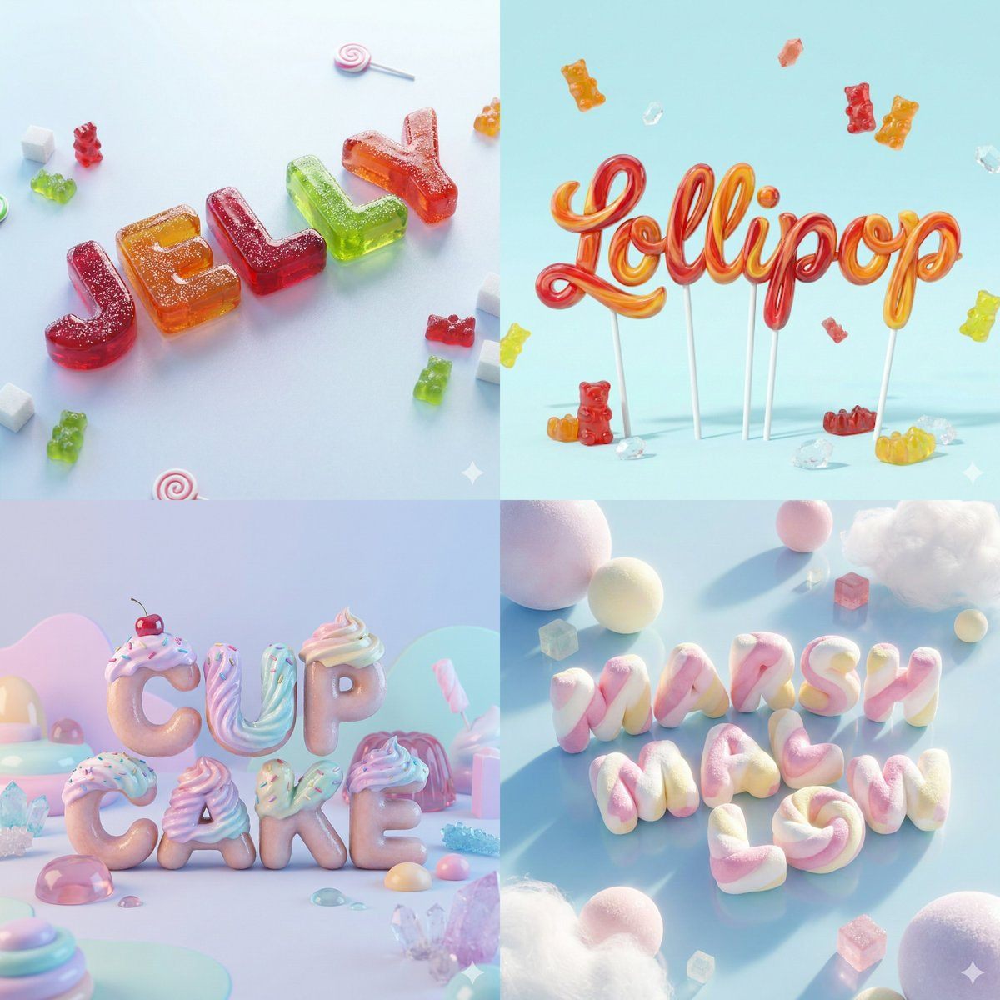

```
A smooth, ultra-realistic 3D render of the word [YOUR WORD] shaped like a delicious candy — style adapts based on word — surrounded by a minimal candy world — high-Kelvin lighting — cinematic ray tracing — soft shadows — glossy details — hyper-real textures — square format
```

```
一个光滑、超写实的3D渲染图像，单词“[YOUR WORD]”被制作成美味糖果的形状——风格会根据单词内容自动调整——周围是一个极简风格的糖果世界——高色温照明——电影级光线追踪——柔和阴影——高光细节——超真实纹理——方形构图
```

 [↑返回目录](#toc)

---
## <a id="">几何立体主义构图</a> (<a href="https://x.com/VoxcatAI/status/2009622735325200397" target="_blank" rel="noopener noreferrer">VoxCat</a>)

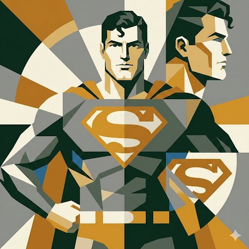

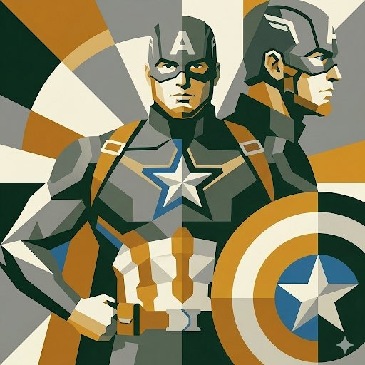

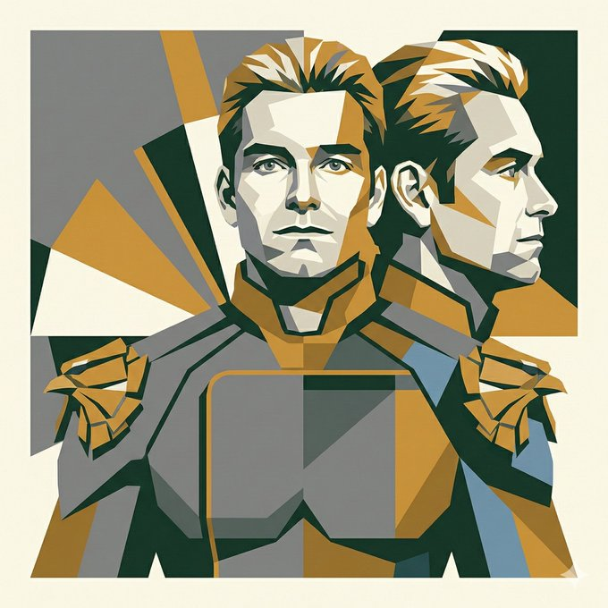

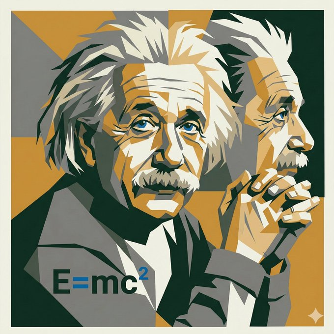

```
几何立体主义的秩序之美 | Geometric Cubist Vector

尝试了一套新的 Prompt 逻辑：用“受限色盘”强行压制 AI 的色彩冲动，配合“多视角并置”的立体主义构图。

摒弃光影渲染，只保留纯粹的几何切面。出来的效果像刀切一样干净，复古又现代。

 Prompt 

以【主题】为画面唯一主体，方形 1:1，主体占画面 70% 以上，采用多视角并置的方式将主体拆解为几何切面（平面、棱角、扇形、矩形），让正面、侧面与局部细节同时出现但仍可辨识为【主题】。空间必须扁平化，拒绝传统透视与真实光影，仅使用结构性明暗分区（色块区分面向）。色彩使用受限色盘：灰、赭、米白、暗绿，少量蓝作为冷点。边缘清晰，像拼贴或版画。禁止写实渐变、禁止柔焦摄影。输出高分辨率，几何边界干净利落。
```

 [↑返回目录](#toc)

---
## <a id="">产品展示</a> (<a href="https://x.com/Kerroudjm/status/2010275488703381858" target="_blank" rel="noopener noreferrer">Mo</a>)

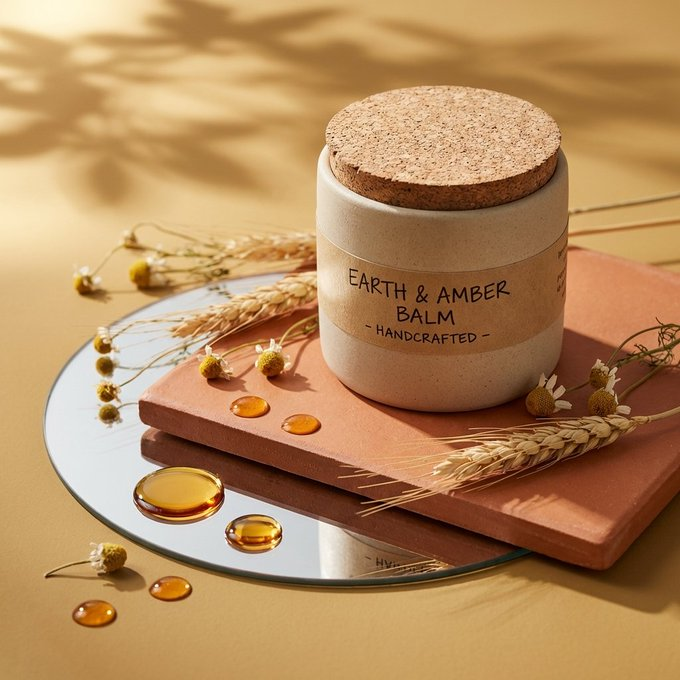

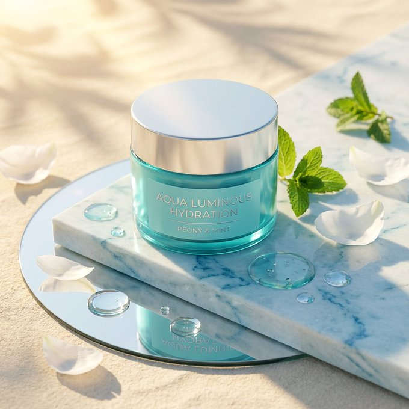


```
A high-end editorial studio photograph of a handcrafted clay body balm container with a matte ceramic finish, a cork lid, and a hand-lettered kraft paper label. The product is placed on a warm terracotta tile slab, itself resting on a round mirror laid on a muted ochre-toned surface. Around the mirror and on the tile are scattered droplets of amber-colored nourishing oil with realistic reflections. A few sprigs of dried chamomile and wheat lie gently across the stone and mirror, connecting both surfaces naturally. Strong, warm sunlight filters from the top left, casting soft diagonal leaf shadows to simulate filtered daylight. The aesthetic is earthy, artisanal, and premium, with natural materials and textures enhanced by golden hour tones. Style: 3D realism, luxury product photography, shallow depth of field. Format: 1:1, ultra-detailed.

```

```
A high-end editorial studio photograph of a translucent turquoise gel moisturizer jar with a glossy acrylic body, a silver metallic lid, and a smooth aqua label with embossed lettering. The product is placed on a light marble slab with subtle blue veining, itself resting on a round mirror laid on a pale sand-colored surface. Around the mirror and on the marble are scattered droplets of cooling hydration gel with realistic reflections. A few petals of white peony and sprigs of fresh mint lie gently across the stone and mirror, connecting both surfaces naturally. Strong, warm sunlight filters from the top left, casting soft diagonal leaf shadows to simulate filtered daylight. The aesthetic is fresh, luxurious, and minimal, with realistic materials and soft natural textures highlighted by golden hour tones. Style: 3D realism, luxury product photography, shallow depth of field. Format: 1:1, ultra-detailed.

```

```
A high-end editorial studio photograph of a sleek, matte black face serum bottle with a bamboo dropper cap, subtle embossed logo, and a minimalist paper label. The product is placed on a raw slate stone slab, itself resting on a round mirror laid on a soft beige linen surface. Around the mirror and on the stone are scattered droplets of translucent green botanical serum with realistic reflections. A few sprigs of eucalyptus and fresh sage leaves lie gently across the stone and mirror, connecting both surfaces naturally. Strong, warm sunlight filters from the top left, casting soft diagonal leaf shadows to simulate filtered daylight. The aesthetic is minimalist, premium, and clean, with realistic materials and natural textures highlighted by golden hour tones. Style: 3D realism, luxury product photography, shallow depth of field. Format: 1:1, ultra-detailed.

```

```
A high-end editorial studio photograph of a round glass perfume bottle with a fine mist sprayer, made of frosted glass with a matte ivory cap, delicate engraved label, and a subtle textured surface. The product is placed on a natural, textured light oak wood slab, itself resting on a round mirror laid on a neutral-toned surface. Around the mirror and on the stone are scattered droplets of golden botanical serum with realistic reflections. A few sprigs of fresh lavender and flowering rosemary lie gently across the stone and mirror, connecting both surfaces naturally. Strong, warm sunlight filters from the top left, casting soft diagonal leaf shadows to simulate filtered daylight. The aesthetic is minimalist, premium, and clean, with realistic materials and natural textures highlighted by golden hour tones. Style: 3D realism, luxury product photography, shallow depth of field. Format: 1:1, ultra-detailed.

```

 [↑返回目录](#toc)

---
## <a id="">韩系甜酷风(Sweet & Cool)时尚摄影</a> (<a href="https://x.com/joshesye/status/2010331238083567964" target="_blank" rel="noopener noreferrer">行者AI视频</a>)

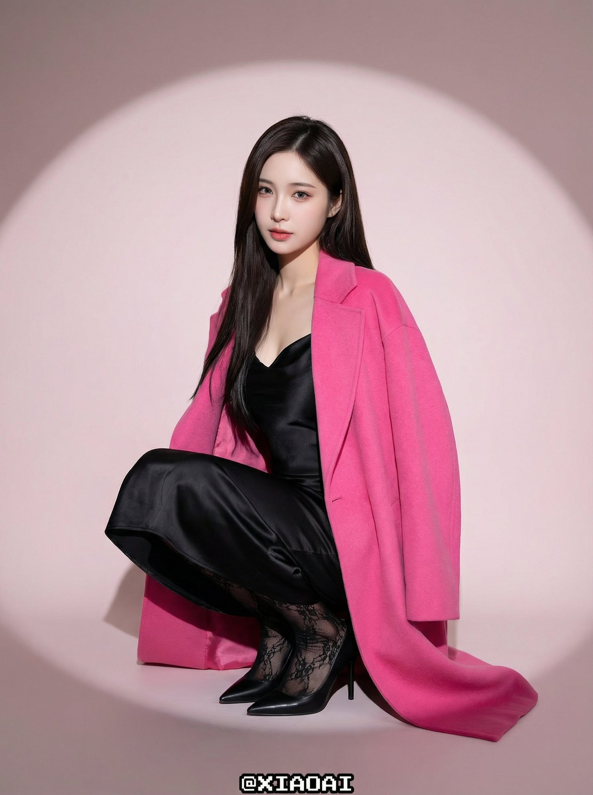

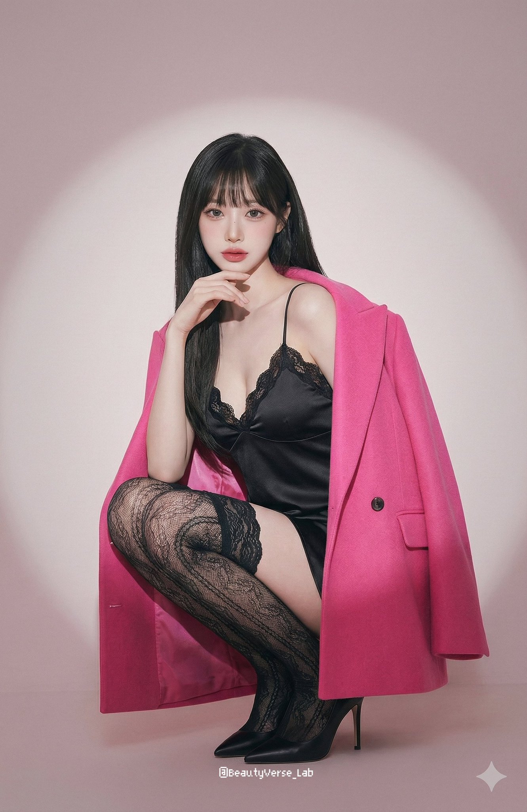

```
{
  "visual_style_analysis": {
    "summary": "韩系甜酷风(Sweet & Cool)时尚摄影，结合了柔和的背景与高对比度的服装，具有明显的K-pop偶像画报质感。",
    "color_palette": {
      "dominant_colors": [
        {
          "name": "Hot Pink / Magenta",
          "hex_approx": "#D64C86",
          "usage": "外套 (Coat)",
          "feeling": "活力、时尚、强烈的视觉冲击"
        },
        {
          "name": "Jet Black",
          "hex_approx": "#0F0F0F",
          "usage": "吊带裙、丝袜、头发 (Dress, Stockings, Hair)",
          "feeling": "神秘、性感、沉稳"
        },
        {
          "name": "Pale Rose / Misty Pink",
          "hex_approx": "#EAD5D9",
          "usage": "背景 (Background)",
          "feeling": "柔和、梦幻、少女感"
        }
      ],
      "skin_tone": {
        "description": "冷白皮 (Porcelain/Fair)",
        "finish": "哑光带微光 (Matte with subtle glow)"
      },
      "contrast_level": "High (高对比度 - 黑色与粉色的强烈反差)"
    },
    "lighting_and_atmosphere": {
      "type": "Studio Lighting (影棚布光)",
      "setup": {
        "key_light": "柔光箱正面补光，面部光线平整均匀 (Softbox frontal fill)",
        "background_light": "圆形聚光灯/光束效果 (Circular Spotlight/Vignette)",
        "shadows": "柔和且受控，主要集中在人物下方和衣褶处"
      },
      "mood": [
        "Chic (时髦)",
        "Alluring (迷人)",
        "Polished (精致)"
      ]
    },
    "composition": {
      "type": "Central Composition (中心构图)",
      "geometry": "Triangular (三角形构图 - 蹲姿形成的稳固三角形状)",
      "framing": "Full Body / Crouch (全身/蹲姿)",
      "visual_weight": "底部视觉重心较重 (由于黑色丝袜和深色裙装)"
    },
    "subject_and_styling": {
      "fashion_elements": [
        "Oversized Coat (廓形大衣 - 披肩穿法)",
        "Slip Dress (缎面吊带裙 - 睡衣风)",
        "Lace Stockings (蕾丝长筒袜)",
        "Stiletto Heels (细高跟鞋)"
      ],
      "textures": [
        "Wool/Felt (外套的毛呢质感)",
        "Satin (裙子的丝绸光泽)",
        "Lace (丝袜的透视纹理)",
        "Glossy (头发的光泽感)"
      ],
      "hair_and_makeup": {
        "hair": "黑长直 + 空气刘海 (Long straight black hair with airy bangs)",
        "makeup": "韩式妆容，强调腮红与唇色，清晰的眼线"
      }
    },
    "post_processing_and_effects": {
      "retouching": "Beauty Retouching (精修 - 皮肤磨皮，五官立体化)",
      "sharpness": "High (高锐度，纹理清晰)",
      "grain": "Low/None (数码洁净感)",
      "vignette": "通过灯光营造的物理暗角效果，而非后期压暗"
    },
    "typography_and_graphics": {
      "detected_text": "@XIAOAI",
      "location": "Bottom Center (底部居中)",
      "font_style": "Pixel Art / 8-bit (像素风格字体)",
      "color": "White (白色)"
    }
  }
}
#NanoBananaPro
```

 [↑返回目录](#toc)

---
## <a id="prompt-2010116114668515600">吐舌头的女孩</a> (<a href="https://x.com/BeautyVerse_Lab/status/2010116114668515553" target="_blank" rel="noopener noreferrer">BeautyVerse</a>)

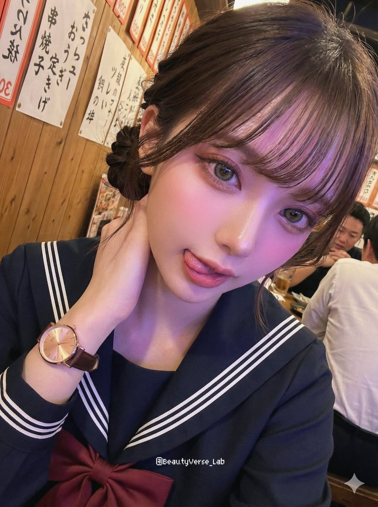

```
{
  "reference_priority": {
    "character_face": "STRICT_REFER_TO_IMAGE",
    "outfit_details": "EXACT_REPLICA_FROM_REFERENCE",
    "consistency_weight": "High"
  },
  "subject": {
    "type": "woman_identity_perfectly_matched_to_reference_image",
    "framing": "close-up_high-angle_selfie_portrait_indoors",
    "identity_lock": "maintaining_identical_facial_features_and_bone_structure_from_reference",
    "features": {
      "eyes": "sultry_half-lidded_bedroom_eyes_as_per_reference_with_intense_hazel-grey_contact_lenses",
      "hair": "hair_style_and_color_exactly_matching_reference_image",
      "expression": "alluring_and_seductive_expression_with_tongue_slightly_stuck_out_playfully_paired_with_a_heavy-lidded_come-hither_gaze"
    },
    "skin_texture": {
      "description": "dewy_and_radiant_skin_with_a_prominent_vibrant_pink_blush_on_cheeks",
      "details": [
        "smooth_poreless_finish_with_a_moist_glow",
        "intense_pinkish_blush_blended_across_cheeks_and_nose_bridge",
        "soft_warm_skin_undertones_under_dim_lighting"
      ],
      "makeup": "glamorous_night-out_makeup_with_glossy_pink_lips_and_defined_sharp_winged_eyeliner"
    },
    "pose_structural_lock": {
      "overall": "casual_selfie_pose_tilted_head_looking_directly_up_at_the_camera",
      "arms": "right_arm_partially_visible_holding_the_camera_at_a_high_angle",
      "hands": "left_hand_resting_near_the_neck_with_a_watch_visible_on_the_wrist",
      "shoulders": "slightly_hunched_forward_creating_a_dynamic_and_intimate_perspective"
    }
  },
  "apparel_specification": {
    "outfit_main_piece": {
      "description": "exact_clothing_replica_from_reference_image",
      "material": "matching_material_and_texture_as_shown_in_reference",
      "silhouette": "same_fit_and_design_as_reference_image",
      "details": "replicate_all_stitching_and_cut-outs_from_reference"
    },
    "accessories": {
      "necklace": "matching_necklace_from_reference",
      "watch": "classic_wristwatch_with_a_slim_brown_leather_strap_and_rose_gold_round_dial"
    }
  },
  "environment": {
    "setting": "Atmospheric_Japanese_Izakaya_or_traditional_restaurant_at_night",
    "lighting": "dim_moody_indoor_lighting_with_warm_amber_hues_and_cool_purple_lens_flare_on_the_face",
    "background": "blurred_wooden_walls_adorned_with_traditional_Japanese_calligraphy_menu_plaques_and_distant_diners",
    "atmosphere": "lively_intimate_nightlife_vibe_with_a_sense_of_casual_fun"
  },
  "realism_and_rendering": {
    "style": "candid_social_media_snapshot_photography",
    "camera": "High-end_smartphone_front_camera_with_slight_wide-angle_distortion_and_shallow_depth_of_field",
    "image_quality": "hyper-realistic_skin_textures_natural_motion_blur_and_authentic_low-light_grain",
    "aspect_ratio": "3:4"
  }
}
```

```
人物脸部严格参照图片，服装细节要求完全复刻参考，一致性权重设为高。主体是一个与参考图像完美匹配身份的女性，构图采用室内高角度自拍特写肖像，保持与参考中相同的面部特征和骨骼结构。特征包括：眼睛是慵懒半闭的卧室眼神，并配以强烈的灰褐色隐形眼镜；发型和发色与参考图像完全一致；表情是带有轻微调皮地吐舌头的诱人和挑逗神情，搭配沉重的眼睑和引人注目的目光。皮肤质感表现为露水般光泽且双颊有鲜明的粉色腮红，具体细节有光滑无毛孔并带有湿润光泽、两颊和鼻梁上融合了强烈的粉红色腮红、在昏暗光线下呈现柔和温暖的肤色底调，并化有适合外出夜生活的华丽妆容，包括闪亮的粉色嘴唇和锐利的翼状眼线。姿势锁定为休闲自拍照姿势，头部倾斜直视摄像头，右臂部分可见举着相机于高处，左手指靠近颈部且腕表可见，肩膀略微前倾营造出动感和亲密视角。

服装规格方面，主服饰需完全复制参考图像中的衣物，包括材质和纹理的匹配、相同的设计和剪裁以及所有缝线和切口的再现。配饰则需要匹配参考中的项链，并佩戴一款配有细棕色皮革表带和玫瑰金色圆形表盘的经典手表。

环境设定在日本夜晚的居酒屋或传统餐厅内，照明采用昏黄暖色调和紫色镜头光晕交错的昏暗室内光线，背景则是模糊的装饰有传统日本书法菜单牌匾的木墙及远处用餐者的景象，营造出一种充满活力且私密的夜生活氛围，带有一丝随意的乐趣。

现实主义和渲染风格要求呈现出社交软件上的自然抓拍摄影风格，使用高端智能手机前置摄像头拍摄，带有轻微广角畸变和浅景深效果，图像质量需达到超真实的皮肤纹理、自然的运动模糊以及真实低光颗粒感，画面比例设定为3:4。
```

 [↑返回目录](#toc)

---
## <a id="prompt-2010070395974504400">触感蜡封徽标设计</a> (<a href="https://x.com/AmirMushich/status/2010070395974504565" target="_blank" rel="noopener noreferrer">AmirMušić</a>)

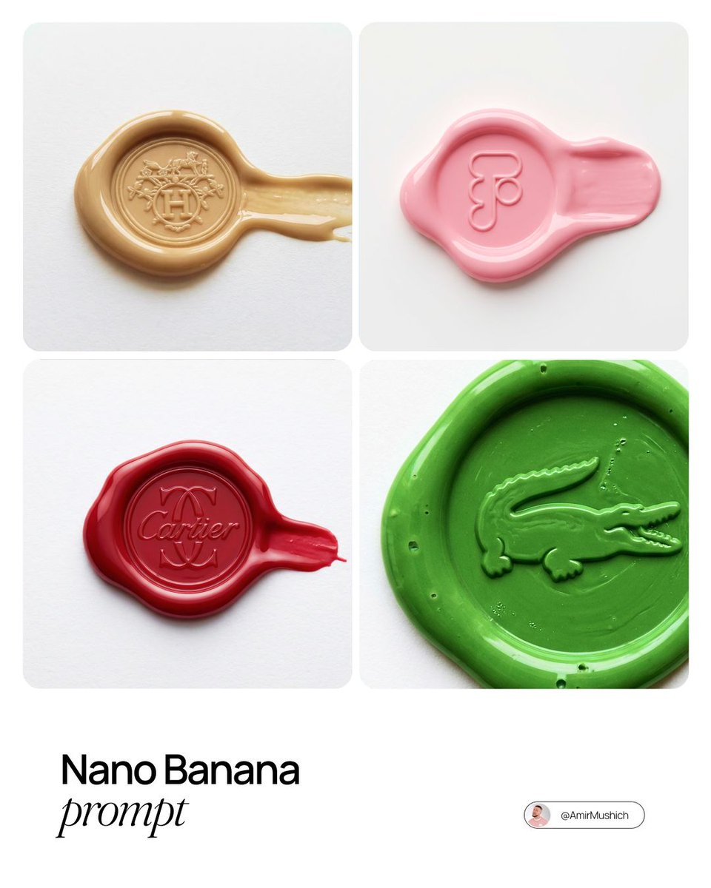

```
[BRAND NAME]. Act as a vector illustrator designing a trendy, high-end "Sticker Sheet" set.
THE TASK:
Deconstruct the brand identity of [BRAND NAME] into a playful, cohesive set of approximately 8-10 unique sticker designs arranged on a single sheet.
Content Generation: Do not just make logos. Autonomously invent a mix of:
Mascots/Characters: Stylized busts of people wearing brand-relevant accessories or expressing emotions.
Key Products: Iconic items associated with the brand.
Symbols/Objects: Abstract shapes or tools relevant to the brand's lifestyle.

VISUAL STYLE (MONOLINE VECTOR):
The art style must strictly match "Modern Trendy Line Art."
Line Work: Use a THICK, UNIFORM line weight (monoline) for all internal details. The lines should be smooth, rounded, and confident.
Coloring: The stickers must be filled with Solid Off-White or Cream, utilizing the line color for details. NO gradients, NO shading, NO 3D effects. Flat 2D vector look.
The "Sticker" Effect: Every element must have a thick, distinct White (or Cream) Die-Cut Border surrounding it, separating it from the background.
COLOR PALETTE (HIGH CONTRAST):
Background: A solid, deep, saturated color to create maximum contrast.
Stickers: High-brightness Cream or White fill with Dark (Black or Dark Brown) outlines.
COMPOSITION:
The stickers are scattered naturally across the sheet (knolling layout) with even spacing. No overlapping.
```

```
[品牌名称]。作为矢量插画师，设计一套时尚高端的“贴纸套装”。

任务：  
将[品牌名称]的品牌形象解构为一组约8至10个独特、风格统一且富有趣味性的贴纸设计，并排布于一张贴纸单页上。

内容创作要求：不要仅限于制作品牌Logo。需自主创作以下混合元素：  
- 吉祥物/角色：佩戴与品牌相关配饰或展现特定情绪的风格化人物半身像；  
- 核心产品：与品牌相关的标志性物品；  
- 符号/物件：体现品牌生活方式的抽象图形或工具。

视觉风格（单线矢量）：  
艺术风格必须严格遵循“现代潮流线稿”风格。  
- 线条：所有内部细节均使用粗细一致的厚实单线（monoline），线条需圆润、流畅、自信；  
- 上色：贴纸填充纯米白或奶油色，仅依靠线条颜色表现细节。禁止使用渐变、阴影或3D效果，保持扁平2D矢量风格；  
- “贴纸”效果：每个元素外围必须有明显厚重的白色（或奶油色）模切边框，使其与背景清晰分离。

配色方案（高对比度）：  
- 背景：使用深色、饱和度高的纯色，以形成最大对比；  
- 贴纸：高亮度的奶油色或白色填充，搭配深色（黑色或深棕色）轮廓线。

构图：  
贴纸以自然散落的方式（knolling布局）均匀分布在页面上，间距均衡，不得重叠。
```

 [↑返回目录](#toc)

---
## <a id="prompt-2010077171524456700">加拉塔塔建造中的3D蓝图融合场景</a> (<a href="https://x.com/TugserOkur/status/2010077171524456594" target="_blank" rel="noopener noreferrer">Tugser Okur</a>)

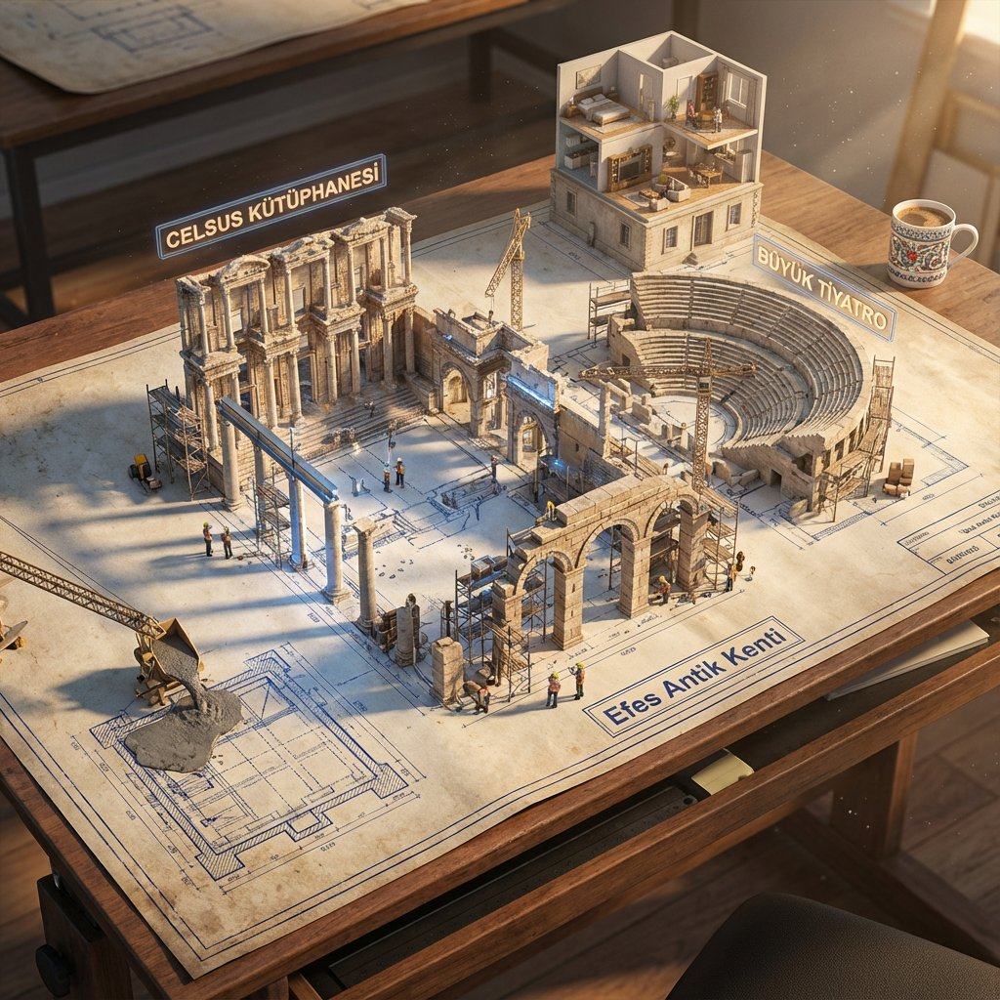

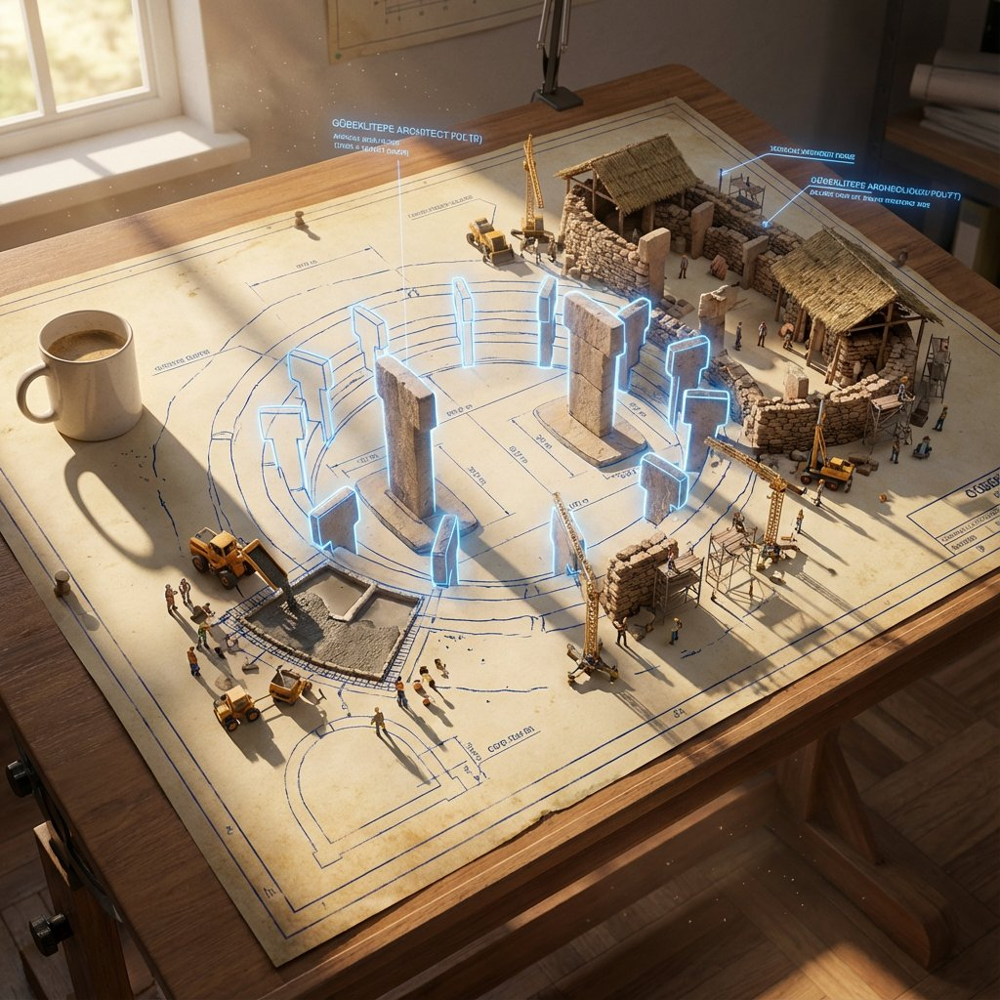

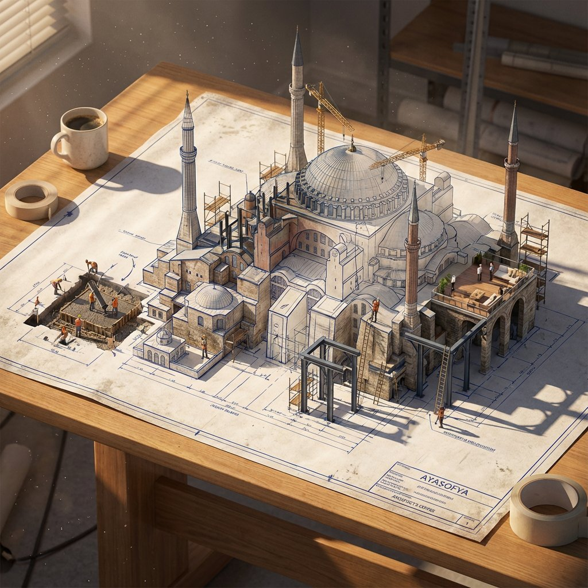

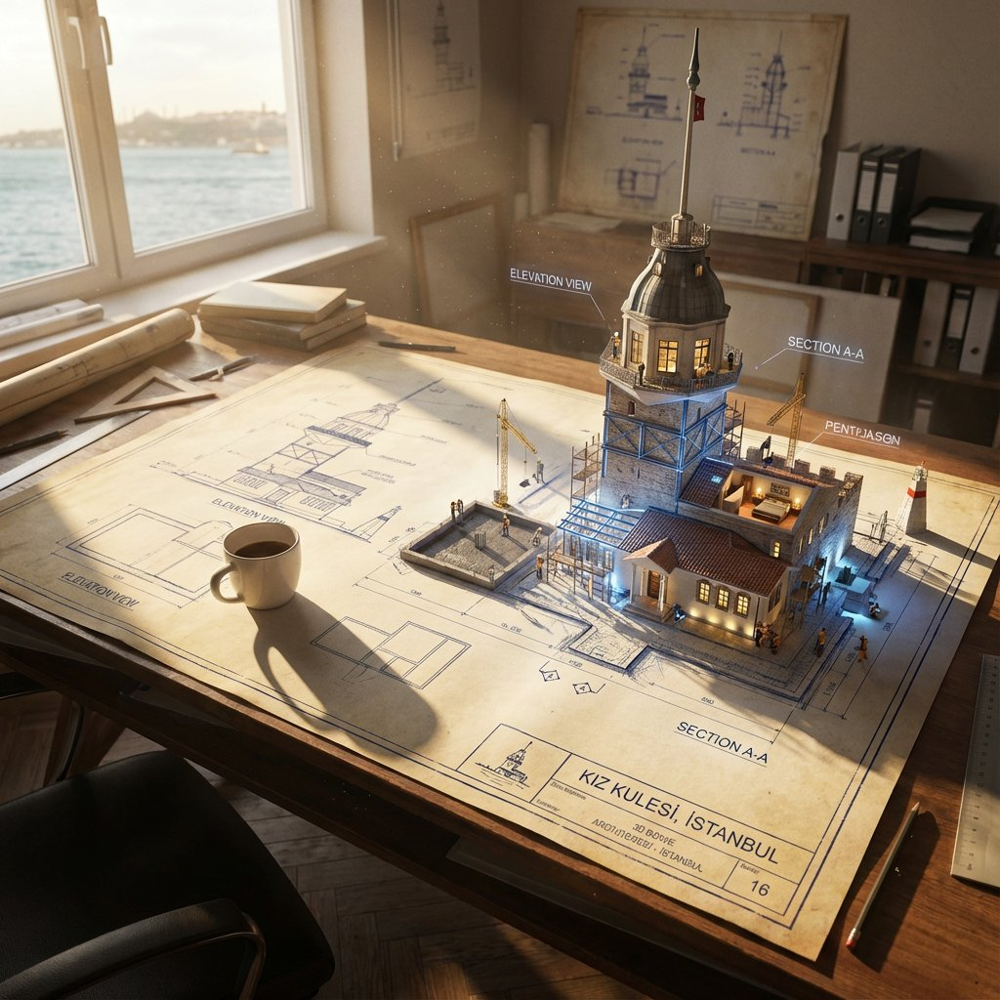

```
Galata Kulesi

Epic 3D scene: a massive architectural blueprint of [BUILDING/STRUCTURE] pinned to a drafting table, its ink lines rising off the paper into fully realized construction. Blue lines become steel beams mid-weld, floor plans inflate into furnished rooms, elevation drawings push outward into facades with working windows. Construction phases coexist simultaneously: foundation being poured in one corner while the penthouse is already inhabited in another. Tiny workers, cranes, and scaffolding swarm the rising structure. The flat drawing and the living building merge at impossible angles. Technical annotations float as dimensional signage. Architect's coffee cup sits at the edge, casting shadow across unbuilt sections. Extreme scale contrast, construction dust catching afternoon light, 8K, photorealistic.
```

```
史诗级3D场景：一张巨大的加拉塔塔建筑蓝图被钉在绘图桌上，墨线从纸面升起，化为真实建造中的结构。蓝色线条在焊接中途变为钢梁，平面图膨胀成带家具的房间，立面图向外延展为带有可运作窗户的外墙。各个施工阶段同时共存：一角正在浇筑地基，另一角顶层公寓却已有人居住。微小的工人、起重机和脚手架在不断升高的建筑上忙碌穿梭。平面图纸与实体建筑以不可能的角度融合在一起。技术标注如立体标识般漂浮空中。建筑师的咖啡杯置于桌沿，其阴影投射在尚未建成的部分上。极致的比例对比，午后阳光中飘浮的施工粉尘，8K画质，照片级写实。
```

 [↑返回目录](#toc)

---
## <a id="prompt-2010290781819695400">超写实芒果汁饮料罐从海中迸发</a> (<a href="https://x.com/Strength04_X/status/2010290781819695350" target="_blank" rel="noopener noreferrer">𝐌</a>)

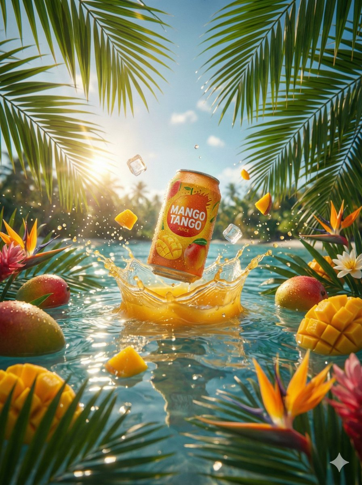

```
A hyper-realistic commercial product photography shot of a condensation-covered beverage can labeled "MANGO TANGO JUICE" bursting dynamically out of crystal clear turquoise ocean water. The can is surrounded by a splash of golden mango juice and water. Levitating around the can are fresh whole mangoes, diced mango cubes, and crystal clear ice cubes. The foreground includes vibrant tropical flowers and green palm leaves framing the shot. The background features a blurred sunny tropical beach with palm trees. Bright cinematic backlighting with a sun flare, sparkling water reflections, high contrast, 8k resolution, vibrant colors.
```

```
一张超写实的商业产品摄影画面：一罐标有“MANGO TANGO JUICE”的饮料罐从清澈碧蓝的海水中动态迸发而出，罐身布满冷凝水珠。罐子周围飞溅着金色芒果汁与水花，悬浮在空中的有新鲜完整芒果、切好的芒果丁和晶莹剔透的冰块。前景以鲜艳的热带花卉和绿色棕榈叶构图，背景为虚化的阳光明媚热带海滩与棕榈树。采用明亮的电影级背光、阳光耀斑、闪烁的水面反光、高对比度、8K分辨率以及鲜艳饱满的色彩。
```

 [↑返回目录](#toc)

---
## <a id="prompt-2010164626311557000">全纹身高冲击力的肖像</a> (<a href="https://x.com/itis_Jarvo33/status/2010164626311557219" target="_blank" rel="noopener noreferrer">𝓜𝓻.𝓙𝓪𝓻𝓿𝓸</a>)

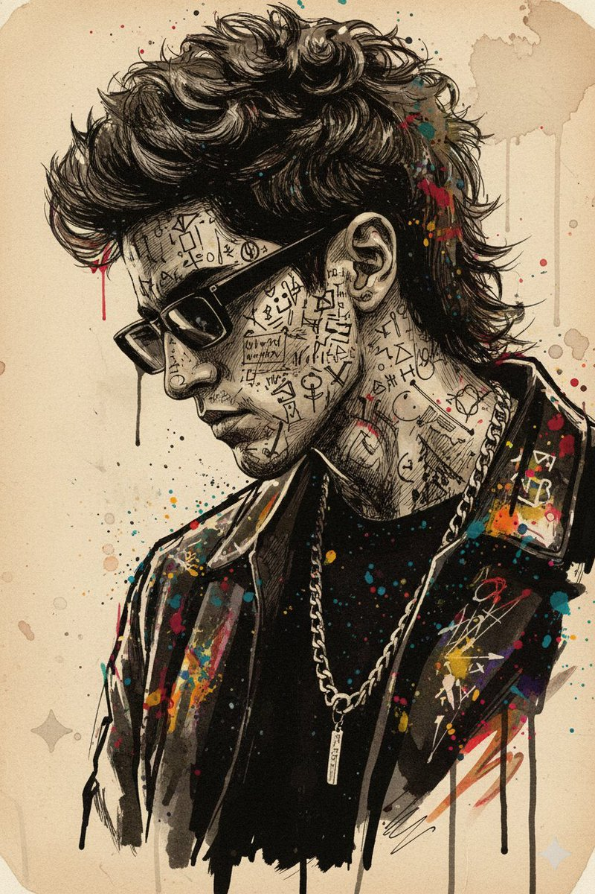

```
A dramatic, high-impact portrait rendered in an expressive ink sketch and mixed-media illustration style, using the uploaded image for exact facial likeness and proportions. The man is shown in side profile, his presence intense and chaotic. His face and upper body are layered with cryptic handwritten text, symbols, and abstract glyphs, partially wrapping around facial contours, suggesting inner turmoil and hidden meaning.
He wears a dark, abstract jacket, heavily textured with rough ink strokes, sharp angular linework, and vibrant ink splatters, creating a raw, rebellious visual energy. The illustration style is bold and experimental, blending fine pen detailing with aggressive brush marks, splashes, and controlled distortion.
The background is a pale, aged parchment tone, featuring subtle grain, faded paper texture, delicate linework, ink drips, and light stains—evoking an old manuscript or forgotten sketchbook.
High contrast, expressive composition, artistic chaos balanced with precision, editorial art meets conceptual illustration, moody, intense, and emotionally charged.
```

```
一个戏剧性的、高冲击力的肖像，以表现主义的墨水素描和混合媒介插图风格渲染，使用上传的图像以确保面部相似性和比例。男人以侧面轮廓展示，他的存在感强烈且充满混沌。他的脸部和上半身覆盖着神秘的手写文字、符号和抽象的字形，部分环绕在面部轮廓上，暗示内心的动荡和隐藏的意义。
他穿着一件深色的抽象夹克，用粗糙的墨水笔触、锐利的角度线条和鲜艳的墨点进行重度纹理处理，创造出原始而叛逆的视觉能量。插图风格大胆且具有实验性，融合了精细的钢笔细节与激进的刷痕、泼溅和受控的扭曲。
背景是淡雅的古旧羊皮纸色调，带有微妙的颗粒感、褪色的纸张纹理、细腻的线条、墨水滴落痕迹和轻微的污渍——唤起一种古老的手稿或被遗忘的素描本的感觉。
高对比度，富有表现力的构图，艺术的混乱与精确相平衡，编辑艺术与概念插图相结合，气氛阴郁、强烈且情感充沛。
```

 [↑返回目录](#toc)

---
## <a id="">西湖边穿着汉服的年轻女子</a> (<a href="https://x.com/songguoxiansen/status/2009264010240344094" target="_blank" rel="noopener noreferrer">松果先森</a>)

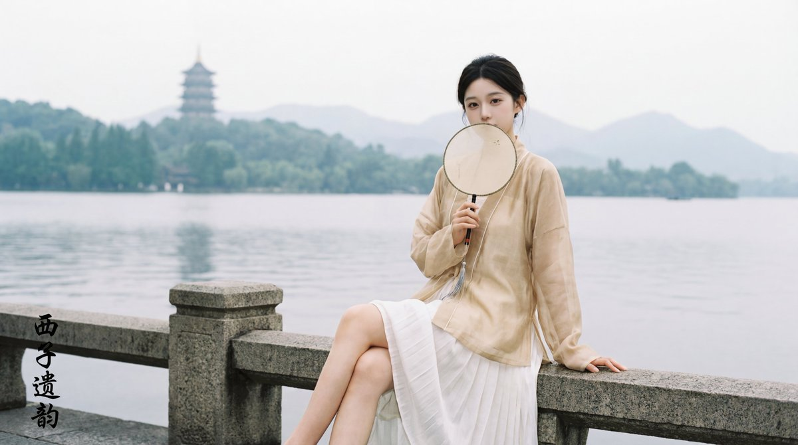

```
参考人物面部特征：白皙透亮肤色，温柔眼眸，东亚轮廓。一位年轻女性身穿杭州丝绸改良汉服，坐在西湖断桥的石栏上。她穿着香槟金色的宋制褙子，外罩轻薄的纱质大袖衫，下着白色褶裙。她双腿自然交叠，一只手轻扶栏杆，另一只手拿着一把团扇半遮面，眼神含蓄温婉地看向镜头。背景是西湖烟雨朦胧的美景，远处是雷峰塔和层叠的山峦。柔和的阴天光线让肤色更显白皙通透。画面采用胶片质感，色调淡雅，营造江南女子的温柔韵味。左下角有瘦金体"西子遗韵"。
```

 [↑返回目录](#toc)

---
## <a id="">清代宫廷女子立于紫禁城御花园</a> (<a href="https://x.com/songguoxiansen/status/2010350301421916286" target="_blank" rel="noopener noreferrer">松果先森</a>)

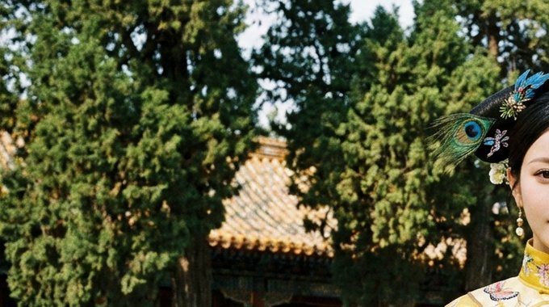

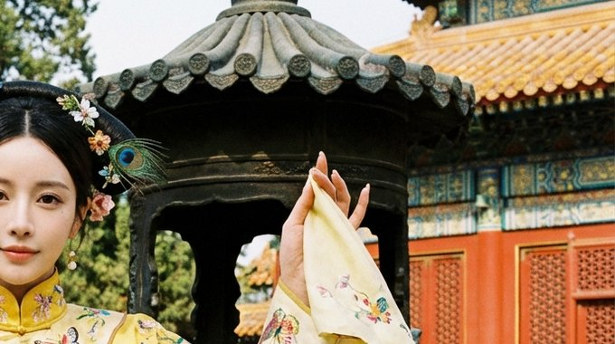

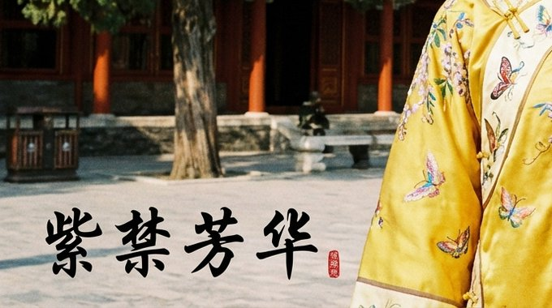

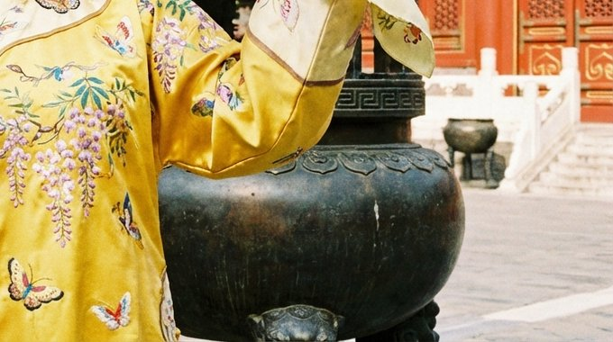

```
Face reference: fair luminous skin, gentle eyes, East Asian features, same face as reference, consistent facial features. A young woman wearing Qing dynasty Manchu-style Qizhuang banner dress in imperial yellow satin with multicolored silk embroidery of butterflies and wisteria, straight columnar silhouette with high standing collar. Elaborate "two-handle" hairstyle adorned with kingfisher feather ornaments and fresh flowers. She stands beside an ornate bronze incense burner in the Imperial Garden of the Forbidden City, one hand elegantly raised holding a silk handkerchief, posing with courtly refinement. Background shows ancient cypress trees, decorative roof tiles, and the corner of a vermillion palace hall. Bright clear autumn afternoon light. Film grain texture, vibrant yet refined imperial color palette, evoking Qing palace sophistication. Chinese calligraphy "紫禁芳华" (Forbidden City Blossom) in imperial Guange style at bottom left corner.

Negative Prompt: different face, altered facial features, loose flowing silhouette, simple hairstyle, commoner setting
```

 [↑返回目录](#toc)

---
## <a id="">高对比度黑白网格人像</a> (<a href="https://x.com/songguoxiansen/status/2010712704936558698" target="_blank" rel="noopener noreferrer">松果先森</a>)

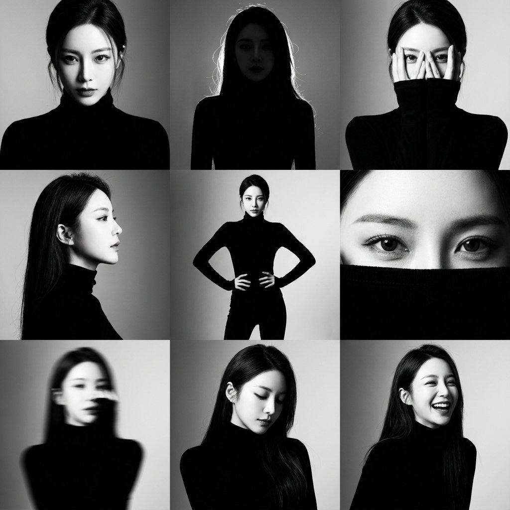

```
{
  "Objective": "Create a 3x3 grid photo collage with high contrast black and white aesthetics",
  "FaceReference": {"Mode": "Strict face preservation", "Instruction": "Use uploaded reference for exact facial features", "Consistency": "Face identical across all nine frames"},
  "GridComposition": {"Layout": "3x3 grid", "PoseVariety": ["Intense direct stare", "Silhouette backlit", "Hands covering face peek", "Profile strong jaw", "Full body power stance", "Eyes only close-up", "Motion blur", "Contemplative downward", "Laughing candid"]},
  "PersonaDetails": {"Subject": {"Type": "Same as reference", "Wardrobe": "Simple black turtleneck", "OverallPresence": "Timeless, artistic"}},
  "Environment": {"Setting": "Minimal studio", "Background": "Grey gradient or geometric", "Lighting": {"Style": "Dramatic directional", "Quality": "Hard shadows, extreme contrast"}},
  "ImageQuality": {"Resolution": "8K black and white", "Details": "Fine art grain", "Aesthetic": "Irving Penn/Avedon portrait"},
  "NegativePrompt": ["color", "flat lighting", "different face", "altered facial features"],
  "ResponseFormat": {"Layout": "3x3 grid", "AspectRatio": "1:1"}
}
```

```
创作一幅3x3网格的照片拼贴，采用高对比度黑白美学。严格保留上传参考图中的面部特征，九张图像中的人物面部必须完全一致。每格姿势依次为：强烈直视、逆光剪影、双手遮面偷看、侧面突出下颌线、全身力量站姿、仅眼部特写、动态模糊、低头沉思、自然大笑。人物穿着简约黑色高领衫，整体气质经典而富有艺术感。场景为极简摄影棚，背景为灰色渐变或几何图案，灯光采用戏剧性方向光，形成硬朗阴影与极致对比。图像为8K黑白分辨率，带有精致艺术颗粒感，风格致敬欧文·佩恩与理查德·阿维顿的人像作品。避免使用色彩、平光、不同面孔或任何面部特征的改动。最终输出为1:1比例的3x3网格布局。
```

 [↑返回目录](#toc)

---
## <a id="">年轻女性街头风格肖像，手持平板，背景有DESIGN字样</a> (<a href="https://x.com/rovvmut_/status/2010932376520835361" target="_blank" rel="noopener noreferrer">Heisenberg</a>)

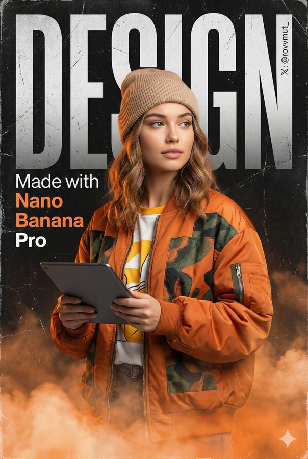

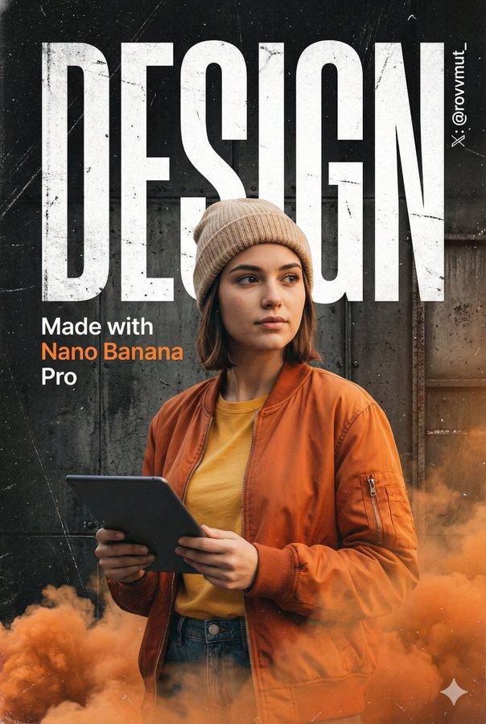

```
{
  "meta": {
    "image_quality": "High",
    "image_type": "Digital Advertisement / Composite Photo Manipulation",
    "resolution_estimation": "High resolution, likely 1080x1080 or higher",
    "file_characteristics": {
      "compression_artifacts": "Low",
      "noise_level": "Low (natural grain added as effect)",
      "lens_type_estimation": "Portrait/Telephoto (approx 85mm equivalent)"
    }
  },
  "global_context": {
    "scene_description": "A vertical promotional graphic featuring a waist-up portrait of a young woman holding a digital tablet. She is styled in streetwear (orange bomber jacket, beige beanie). Behind her, massive typography spells 'DESIGN'. To her left, text in English is visible. The aesthetic is urban, grunge, and modern, with a textured overlay resembling scratched film or worn paper. The bottom of the image features orange, smoke-like clouds blending into the dark background.",
    "environment_type": "Studio / Abstract Graphic Background",
    "time_of_day": "Indiscernible (Studio Lighting)",
    "weather_atmosphere": "Atmospheric, Grunge, Urban, Creative",
    "lighting": {
      "source": "Artificial Studio Lighting",
      "direction": "Soft key light from the front-left, subtle rim light on hair",
      "quality": "Soft, Diffused",
      "color_temperature": "Neutral on subject, Warm orange glow at bottom"
    },
    "color_palette": {
      "dominant_hex_estimates": [
        "#E85635",
        "#D6C0A6",
        "#2E2E2E",
        "#FDB933"
      ],
      "accent_colors": [
        "#FFFFFF",
        "#A8A8A8",
        "#1A1A1A"
      ],
      "contrast_level": "High"
    }
  },
  "composition": {
    "camera_angle": "Eye-level",
    "framing": "Medium shot (waist-up)",
    "depth_of_field": "Medium (Subject sharp, background graphic flat but layered)",
    "focal_point": "Woman's face",
    "symmetry_type": "None (Asymmetrical composition)",
    "rule_of_thirds_alignment": "Subject's face aligns with the top-left third intersection"
  },
  "objects": [
    {
      "id": "obj_001",
      "label": "Woman",
      "category": "Person",
      "location": {
        "relative_position": "Center",
        "bounding_box_percentage": {
          "x": 0.15,
          "y": 0.10,
          "width": 0.70,
          "height": 0.90
        }
      },
      "dimensions_relative": "Large",
      "distance_from_camera": "Mid",
      "pose_orientation": "Standing, body angled slightly right, head turned to her right (viewer's left), looking off-camera.",
      "material": "Organic (Skin, Hair)",
      "surface_properties": {
        "texture": "Smooth skin, soft wavy hair",
        "reflectivity": "Low (Matte skin)",
        "micro_details": "Strands of loose hair, defined eyebrows, soft makeup",
        "wear_state": "N/A"
      },
      "color_details": {
        "base_color_hex": "#F0D0B8",
        "secondary_colors": [
          "#C9A675"
        ],
        "gradient_or_pattern": "Natural skin tones"
      },
      "interaction_with_light": {
        "shadow_casting": "Soft shadows under chin and on neck",
        "highlight_zones": "Forehead, nose bridge, cheekbones",
        "translucency": "None"
      },
      "relationships": [
        {
          "type": "wearing",
          "target_object_id": "obj_002"
        },
        {
          "type": "wearing",
          "target_object_id": "obj_003"
        },
        {
          "type": "holding",
          "target_object_id": "obj_005"
        },
        {
          "type": "overlapping",
          "target_object_id": "obj_006"
        }
      ]
    },
    {
      "id": "obj_002",
      "label": "Beanie Hat",
      "category": "Clothing",
      "location": {
        "relative_position": "Top of subject's head",
        "bounding_box_percentage": {
          "x": 0.35,
          "y": 0.08,
          "width": 0.30,
          "height": 0.20
        }
      },
      "dimensions_relative": "Small",
      "distance_from_camera": "Mid",
      "pose_orientation": "Fitted on head",
      "material": "Fabric (Knit/Wool blend)",
      "surface_properties": {
        "texture": "Ribbed knit texture",
        "reflectivity": "Low",
        "micro_details": "Fine fabric fibers",
        "wear_state": "New"
      },
      "color_details": {
        "base_color_hex": "#D6C0A6",
        "secondary_colors": [],
        "gradient_or_pattern": "Solid beige color"
      },
      "interaction_with_light": {
        "shadow_casting": "Casts shadow on forehead",
        "highlight_zones": "Top curve",
        "translucency": "None"
      }
    },
    {
      "id": "obj_003",
      "label": "Bomber Jacket",
      "category": "Clothing",
      "location": {
        "relative_position": "Subject's torso",
        "bounding_box_percentage": {
          "x": 0.15,
          "y": 0.45,
          "width": 0.70,
          "height": 0.55
        }
      },
      "dimensions_relative": "Medium",
      "distance_from_camera": "Mid",
      "pose_orientation": "Worn open",
      "material": "Synthetic (Nylon/Polyester)",
      "surface_properties": {
        "texture": "Crinkled, smooth synthetic fabric",
        "reflectivity": "Medium (Slight sheen)",
        "micro_details": "Zipper teeth, gathered fabric at seams (ruched sleeves)",
        "wear_state": "New"
      },
      "color_details": {
        "base_color_hex": "#E85635",
        "secondary_colors": [
          "#004400",
          "#1A1A1A"
        ],
        "gradient_or_pattern": "Orange base with dark green/black abstract floral or camo-like pattern patches"
      },
      "interaction_with_light": {
        "shadow_casting": "Self-shadowing in folds",
        "highlight_zones": "Shoulders, folds of sleeves",
        "translucency": "None"
      },
      "relationships": [
        {
          "type": "covering",
          "target_object_id": "obj_004"
        }
      ]
    },
    {
      "id": "obj_004",
      "label": "T-Shirt",
      "category": "Clothing",
      "location": {
        "relative_position": "Subject's chest (under jacket)",
        "bounding_box_percentage": {
          "x": 0.40,
          "y": 0.45,
          "width": 0.20,
          "height": 0.30
        }
      },
      "dimensions_relative": "Small",
      "distance_from_camera": "Mid",
      "pose_orientation": "Worn under jacket",
      "material": "Cotton",
      "surface_properties": {
        "texture": "Matte fabric",
        "reflectivity": "Low",
        "micro_details": "White graphic print fragment visible",
        "wear_state": "New"
      },
      "color_details": {
        "base_color_hex": "#FDB933",
        "secondary_colors": [
          "#FFFFFF"
        ],
        "gradient_or_pattern": "Solid yellow with white graphic"
      },
      "interaction_with_light": {
        "shadow_casting": "None",
        "highlight_zones": "Chest area",
        "translucency": "None"
      }
    },
    {
      "id": "obj_005",
      "label": "Tablet Device",
      "category": "Electronics",
      "location": {
        "relative_position": "Lower center, held in hands",
        "bounding_box_percentage": {
          "x": 0.35,
          "y": 0.65,
          "width": 0.40,
          "height": 0.15
        }
      },
      "dimensions_relative": "Medium",
      "distance_from_camera": "Mid (Foreground of subject)",
      "pose_orientation": "Held horizontally, angled slightly upward",
      "material": "Glass/Metal/Plastic",
      "surface_properties": {
        "texture": "Smooth, hard",
        "reflectivity": "High (on screen edges/bezel)",
        "micro_details": "Rounded corners",
        "wear_state": "New"
      },
      "color_details": {
        "base_color_hex": "#1A1A1A",
        "secondary_colors": [
          "#333333"
        ],
        "gradient_or_pattern": "Dark grey back case/cover visible"
      },
      "interaction_with_light": {
        "shadow_casting": "Casts shadow on shirt",
        "highlight_zones": "Top edge",
        "translucency": "None"
      }
    },
    {
      "id": "obj_006",
      "label": "Background Typography 'DESIGN'",
      "category": "Text/Graphic Element",
      "location": {
        "relative_position": "Top half, behind subject",
        "bounding_box_percentage": {
          "x": 0.05,
          "y": 0.02,
          "width": 0.90,
          "height": 0.50
        }
      },
      "dimensions_relative": "Massive",
      "distance_from_camera": "Far (Background)",
      "pose_orientation": "Flat against back plane",
      "material": "Digital Graphic",
      "surface_properties": {
        "texture": "Grunge overlay applied",
        "reflectivity": "None",
        "micro_details": "Distressed edges, semi-transparent",
        "wear_state": "Digital distress"
      },
      "color_details": {
        "base_color_hex": "#FFFFFF",
        "secondary_colors": [],
        "gradient_or_pattern": "Solid with opacity reduction"
      },
      "interaction_with_light": {
        "shadow_casting": "None",
        "highlight_zones": "None",
        "translucency": "High (Semi-transparent)"
      },
      "text_content": {
        "raw_text": "DESIGN",
        "font_style": "Condensed Sans-serif (Impact or Bebas Neue style)",
        "font_weight": "Bold",
        "text_case": "Uppercase",
        "alignment": "Center",
        "color_hex": "#FFFFFF"
      }
    },
    {
      "id": "obj_007",
      "label": "Service List Text",
      "category": "Text",
      "location": {
        "relative_position": "Left side, mid-height",
        "bounding_box_percentage": {
          "x": 0.13,
          "y": 0.33,
          "width": 0.15,
          "height": 0.20
        }
      },
      "dimensions_relative": "Small",
      "distance_from_camera": "Foreground overlay",
      "pose_orientation": "Flat",
      "material": "Digital Text",
      "surface_properties": {
        "texture": "Clean vector",
        "reflectivity": "None",
        "micro_details": "None",
        "wear_state": "None"
      },
      "color_details": {
        "base_color_hex": "#FFFFFF",
        "secondary_colors": [
          "#E85635"
        ],
        "gradient_or_pattern": "Middle word is orange, others white"
      },
      "interaction_with_light": {
        "shadow_casting": "None",
        "highlight_zones": "None",
        "translucency": "None"
      },
      "text_content": {
        "raw_text": "Made with Nano Banana Pro",
        "font_style": "Condensed Sans-serif",
        "font_weight": "Regular",
        "text_case": "Uppercase",
        "alignment": "Left",
        "color_hex": "Mixed (#FFFFFF and #E85635)"
      }
    },
    {
      "id": "obj_008",
      "label": "Telegram Contact Text",
      "category": "Text",
      "location": {
        "relative_position": "Top right edge, vertical orientation",
        "bounding_box_percentage": {
          "x": 0.88,
          "y": 0.05,
          "width": 0.05,
          "height": 0.30
        }
      },
      "dimensions_relative": "Very Small",
      "distance_from_camera": "Foreground overlay",
      "pose_orientation": "Rotated 90 degrees counter-clockwise (reading bottom-to-top)",
      "material": "Digital Text",
      "surface_properties": {
        "texture": "Clean",
        "reflectivity": "None",
        "micro_details": "None",
        "wear_state": "None"
      },
      "color_details": {
        "base_color_hex": "#FFFFFF",
        "secondary_colors": [],
        "gradient_or_pattern": "None"
      },
      "interaction_with_light": {
        "shadow_casting": "None",
        "highlight_zones": "None",
        "translucency": "None"
      },
      "text_content": {
        "raw_text": "𝕏: @rovvmut_",
        "font_style": "Sans-serif",
        "font_weight": "Light",
        "text_case": "Mixed",
        "alignment": "Right",
        "color_hex": "#FFFFFF"
      }
    }
  ],
  "background_details": {
    "texture": "Dark grunge texture, possibly resembling concrete or scratched metal.",
    "patterns": "Heavy scratching / film grain overlay across the entire image.",
    "lighting_behavior": "Dark at the top, glowing orange at the bottom suggesting fog or backlit smoke.",
    "additional_elements": [
      "Orange cloud/smoke effect at the bottom",
      "Scratches and dust particles overlaid on the entire image"
    ]
  },
  "foreground_elements": {
    "particles": "Digital noise/dust specks throughout, specifically white scratch marks.",
    "artifacts": "Overall grunge overlay filter applied to unify the composite."
  },
  "reconstruction_notes": {
    "mandatory_elements_for_recreation": [
      "Young woman with beanie and orange bomber jacket",
      "Tablet in hands",
      "Massive 'DESIGN' text in background",
      "Specific English text on left",
      "Grunge texture overlay",
      "Orange smoke at bottom"
    ],
    "sensitivity_factors": "The specific font weights (Condensed) and the color match of the orange jacket to the text 'Nano Banana' are crucial for the design cohesion.",
    "ambiguities": "The exact brand of the tablet is hidden. The pattern on the jacket is abstract/impressionistic."
  }
}
```

```
一幅高画质的竖版数字广告/合成照片，分辨率高（可能为1080x1080或更高），压缩伪影和噪点水平低，并带有自然颗粒效果。画面采用人像/中长焦镜头（约等效85mm）拍摄。

场景为一位年轻女性的腰部以上肖像，她身穿街头风格服饰：橙色轰炸机夹克、米色针织帽，手持一台平板电脑。背景为抽象图形工作室布景，顶部后方有巨大的“DESIGN”字样，左侧可见英文文字。整体美学融合都市、粗粝与现代感，并叠加了类似刮擦胶片或磨损纸张的纹理。画面底部融入暗色背景中的橙色烟雾状云团。

灯光为人工影室照明，主光源柔和地从左前方打来，发丝边缘有微妙轮廓光，整体光线柔和漫射；人物肤色保持中性色温，而画面底部则呈现温暖的橙色辉光。

主色调包括：#E85635（亮橙）、#D6C0A6（米 beige）、#2E2E2E（深灰黑）、#FDB933（明黄），辅以白色、浅灰和纯黑作为点缀，整体对比度高。

构图采用眼平视角，中景（腰上半身），景深适中（人物清晰，背景图形虽扁平但具层次）。焦点落在女性面部，构图不对称，其脸部位于画面左上方三分之一交叉点。

具体元素包括：
- 女性：居中，占据画面大部分区域，身体微向右转，头部转向右方（观众左侧），目光看向画外。皮肤光滑、头发柔顺微卷，妆容自然。
- 针织帽：米色，戴在头顶，罗纹针织质感，无反光。
- 轰炸机夹克：橙色基底，带有深绿/黑色抽象迷彩或花卉图案，材质为尼龙/涤纶，略带光泽，袖口有褶皱细节。
- 内搭T恤：亮黄色棉质，胸前可见白色图案碎片。
- 平板设备：深灰色，横向握持，略微上倾，边缘有高光。
- 背景文字“DESIGN”：巨大、白色、半透明，使用紧缩无衬线字体（如Impact或Bebas Neue风格），全大写，居中排布，叠加粗粝纹理。
- 左侧服务说明文字：“Made with Nano Banana Pro”，紧缩无衬线字体，常规字重，全大写，其中“Nano Banana”为橙色（#E85635），其余为白色。
- 右上角垂直排列联系信息：“𝕏: @rovvmut_”，浅色无衬线字体，细体，混合大小写，自下而上阅读。

背景为深色粗粝纹理，似混凝土或刮痕金属，全图覆盖重度刮擦与胶片颗粒效果。底部有橙色烟雾/云状发光区域。前景叠加白色划痕、尘埃斑点及统一的粗粝滤镜。

重建此图的关键要素包括：戴针织帽、穿橙色轰炸机夹克的年轻女性；手持平板；背景巨大“DESIGN”字样；左侧特定英文文本；整体粗粝纹理叠加；底部橙色烟雾效果。特别注意夹克橙色与“Nano Banana”文字颜色需严格匹配，字体需使用紧缩无衬线体以确保设计统一性。
```

 [↑返回目录](#toc)

---
## <a id="">小炒肉分步骤菜谱信息图</a> (<a href="https://x.com/yyyole/status/2010936222018125840" target="_blank" rel="noopener noreferrer">沐阳</a>)

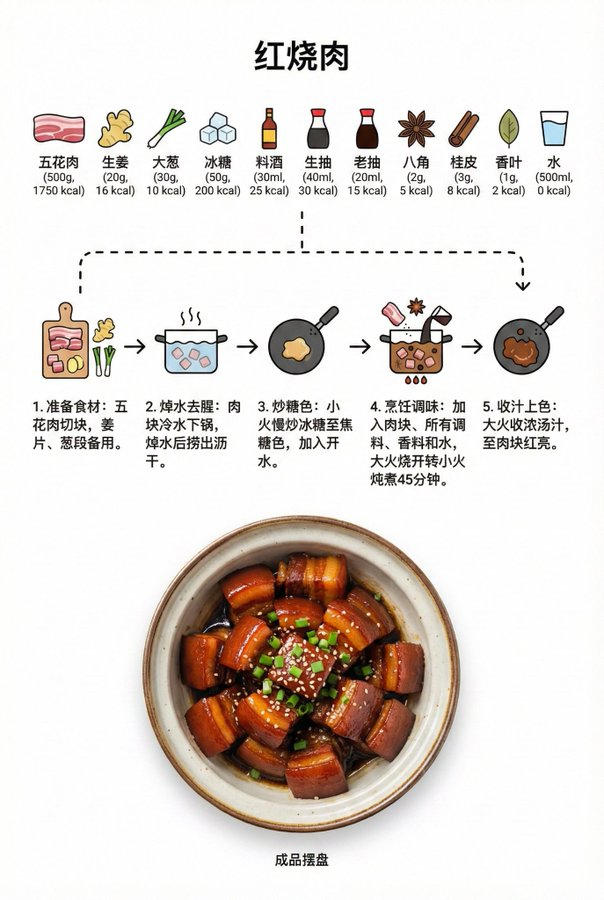

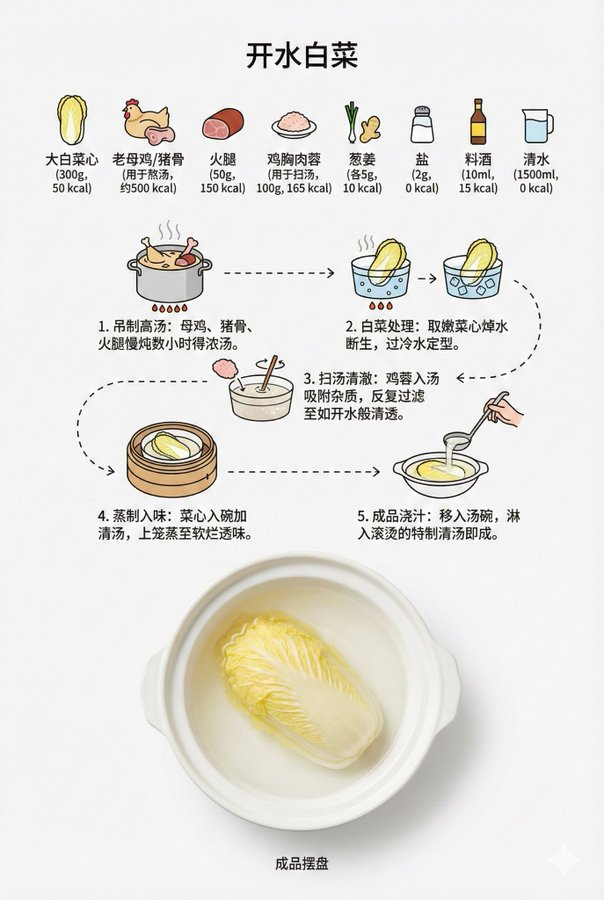

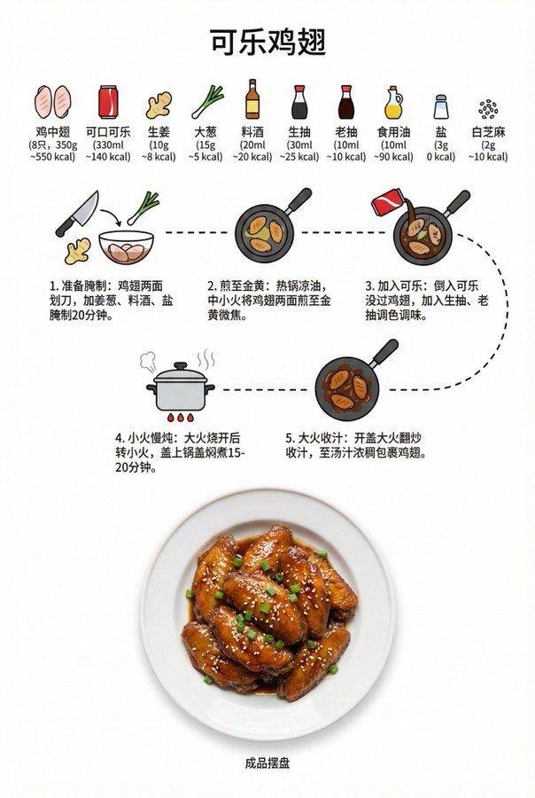

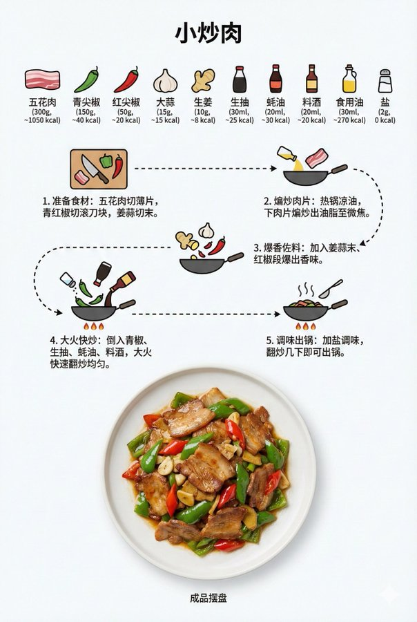

```
为「{菜品名称}」生成一张分步骤菜谱信息图，要求：
- 俯视图，极简风格，白色背景
- 顶部居中显示菜品中文名
- 标注所有食材的中文名称、用量和热量
- 用虚线和图标展示烹饪步骤
- 底部展示成品摆盘效果图
请根据该菜品的传统做法，自动匹配合适的：
1. 食材清单（包含精确用量和热量）
2. 烹饪步骤图标（如：切菜、炒制、调味等）
3. 成品呈现方式
2:3

菜品：{小炒肉}
```

 [↑返回目录](#toc)

---
## <a id="">JoJo风格石墨素描人像</a> (<a href="https://x.com/VoxcatAI/status/2010963973240471826" target="_blank" rel="noopener noreferrer">VoxCat</a>)

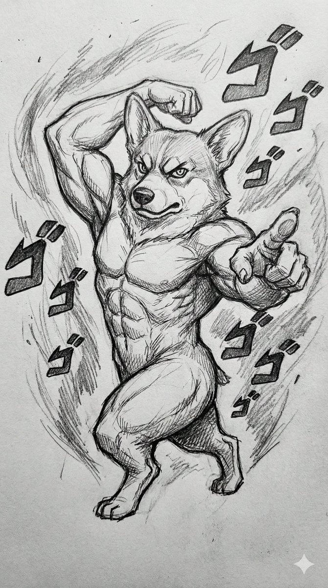

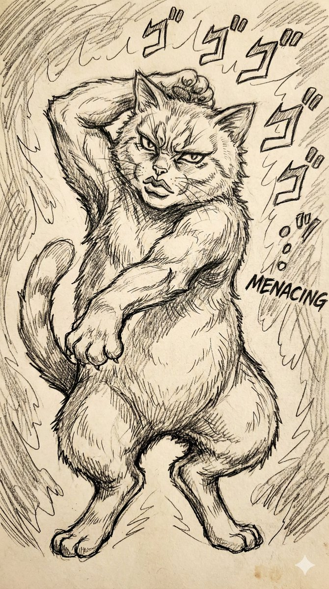

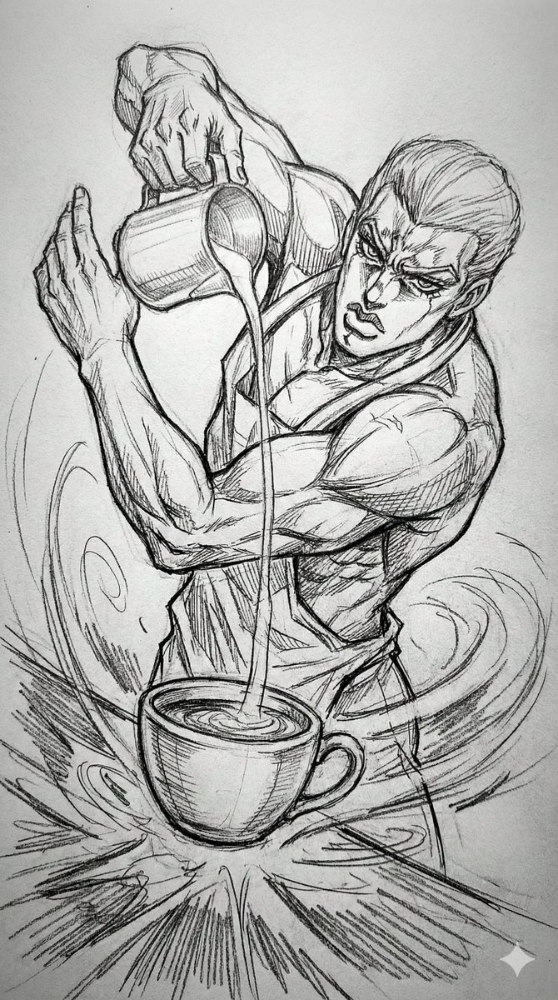

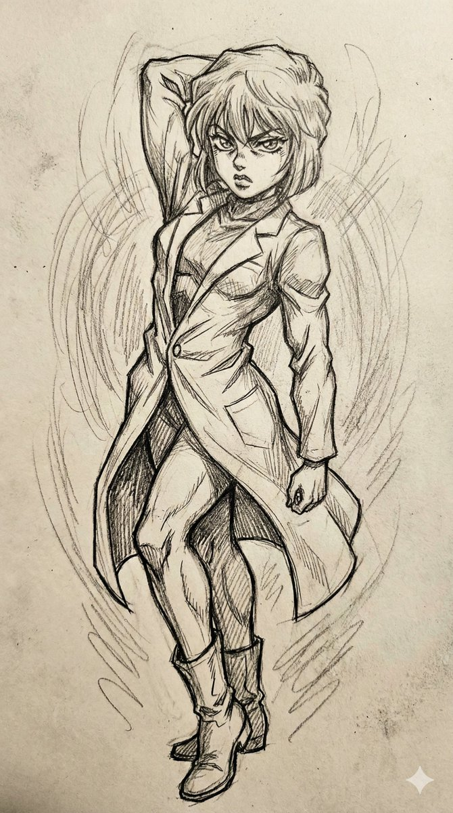

```
很多人用 AI 跑素描，只知道堆砌 "messy lines"（凌乱线条），结果出来全是“数码味”的假草图。

 其实关键不在“潦草”，而在“笔触逻辑”。 

为了还原荒木飞吕彦 (Araki) 的那种硬派漫改感，我把 prompt 里的介质锁定为“Raw Graphite（原石墨）”并强制加上“Cross-hatching（排线）”。 

这是目前最接近手绘质感的通解。

Traditional art scan, raw graphite pencil sketch on textured paper. The art style is distinctly Hirohiko Araki, Jojo's Bizarre Adventure aesthetic. Gritty, monochrome manga panel feel. A full body shot of [在此处填入你的主题], striking an exaggerated, dramatic "JoJo pose" with contorted limbs, impossible anatomy, and intense dynamic perspective. High-fashion sculptural stance. Emphasize muscle structure and tension. Heavy angular cross-hatching for shading, bold chiseled thick outlines, intensely detailed facial features with thick lips and sharp eyes. Visible aggressive pencil strokes. High contrast. Intense aura. 
9:16
```

 [↑返回目录](#toc)

---
## <a id="">微型逼真人物小雕像</a> (<a href="https://x.com/regyperlera/status/2010024069874512106" target="_blank" rel="noopener noreferrer">Regy</a>)

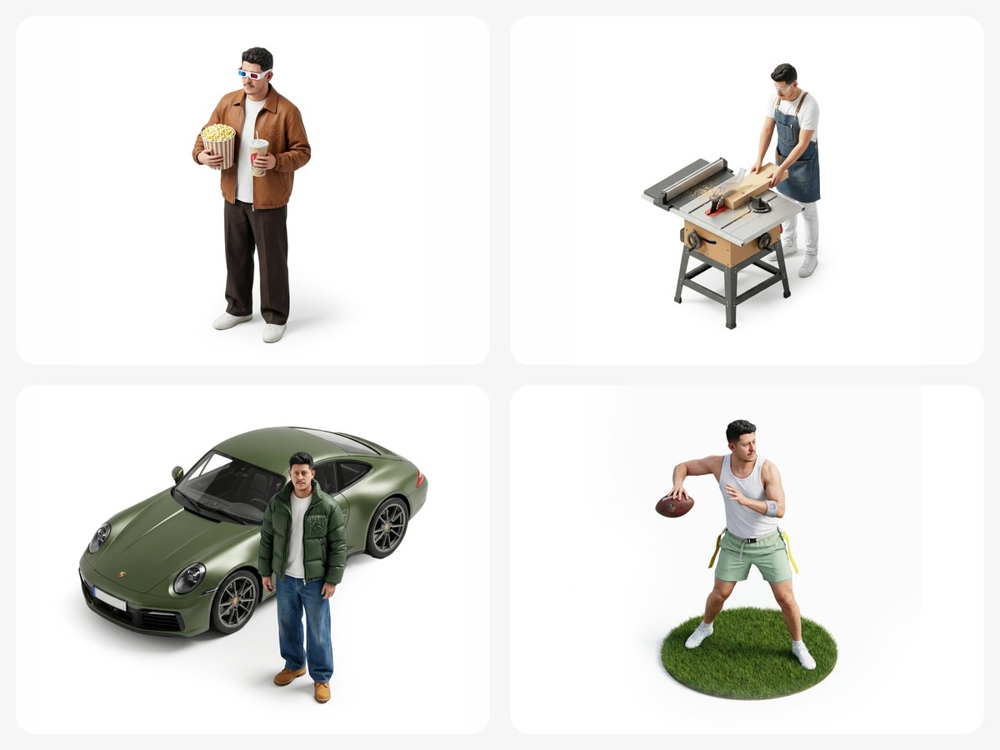

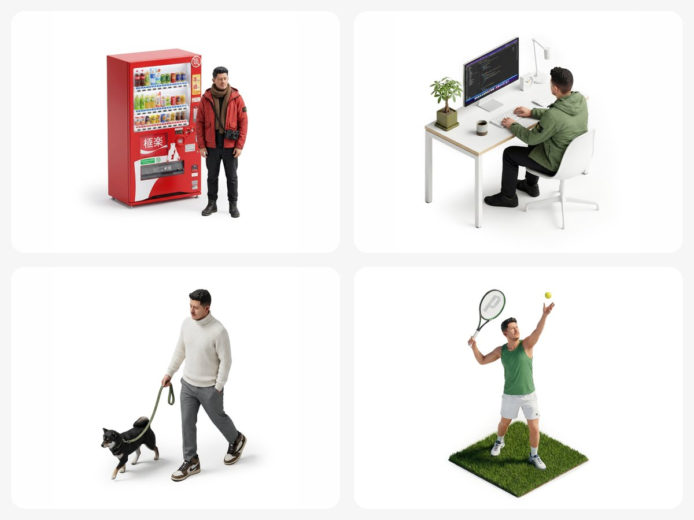

```
Make a miniature, full-body, isometric, realistic figurine of this person, wearing ABC, doing XYZ, on a white background, minimal, 4K resolution
```

```
制作一个微型、全身、等距视角、逼真的人物小雕像，该人物穿着ABC，正在做XYZ，背景为白色，风格极简，4K分辨率。
```

 [↑返回目录](#toc)

---
## <a id="">晨光中的Auren咖啡研磨场景</a> (<a href="https://x.com/SiboEsenkova/status/2010395219074654715" target="_blank" rel="noopener noreferrer">Sibo Esenkova</a>)

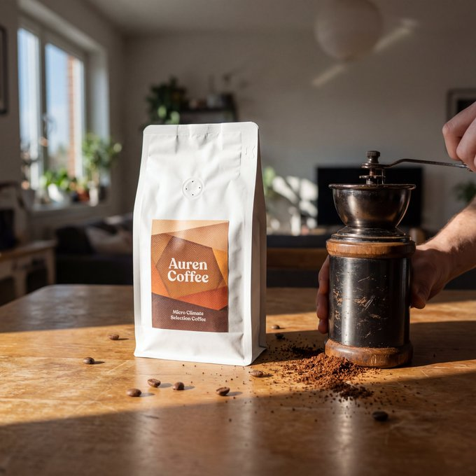

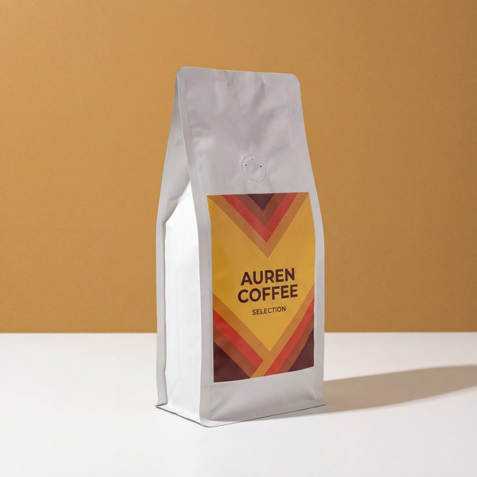

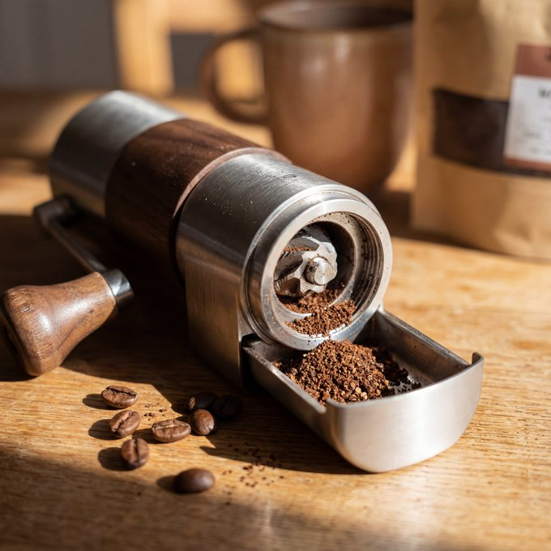

```
Professional lifestyle product photography for a premium coffee e-commerce brand named Auren.
The image must look like a real photograph, shot in a real home environment.
No AI look. No CGI. No over-stylization.

Scene:
Real home kitchen or dining table near a window.
Natural wood or light-colored table surface.
Background softly blurred but recognizable as a real living space.
Nothing staged, nothing decorative.

Hero product:
A white matte coffee bag standing upright.
Paper-based packaging with realistic folds, wrinkles, and slight asymmetry.
One-way valve visible near the top center.
Bottom gusset visible and physically correct.
Bag placement slightly off-center, natural.

Label design:
Geometric, layered label design in warm tones.
Printed matte paper label.
Brand name reads “Auren Coffee”.
Secondary text reads “Micro Climate” or “Selection Coffee”.
Ink looks printed and slightly absorbed into paper.

Coffee grinder (more realistic):
A manual burr coffee grinder made of metal and wood.
Visible wear marks, subtle scratches, real material imperfections.
Burr opening visible with fresh grounds around it.
Beans inside the grinder and a few spilled naturally on the table.
Grind size uneven, realistic.
No perfect shapes, no symmetry.

Human interaction:
A human hand lightly holding or just finishing turning the grinder handle.
Hand partially visible only.
Skin texture natural.
No posed gesture, mid-action feel.

Lighting (key change):
Hard morning sunlight entering directly through a window.
Clear directional light.
Sharper shadows on the table surface.
Defined shadow edges, but still physically realistic.
Strong highlight contrast on the coffee bag and grinder.
Feels like early morning sun, not studio light.

Camera:
Full-frame camera.
50mm or 85mm lens.
f/2.8 aperture.
Shallow depth of field.
Coffee bag and grinder in focus.
Background falls off naturally.

Color & processing:
Slightly warm morning white balance.
Natural contrast.
No HDR.
No cinematic grading.
No oversharpening.

Rules:
Avoid symmetry.
Avoid decorative props.
No logos on grinder.
Avoid CGI or render look.
No text overlays.
No watermark.
No AI artifacts.

Result:
Indistinguishable from a real morning coffee preparation photograph, showing authentic grinder use and strong natural sunlight, suitable for a premium e-commerce brand.
```

```
为高端咖啡电商品牌“Auren”拍摄的专业生活方式产品摄影。  
画面必须看起来像真实照片，在真实的家庭环境中拍摄，杜绝AI感、CGI效果或过度风格化。

场景：  
真实家庭的厨房或靠近窗户的餐桌，桌面为天然木材或浅色材质。背景柔和虚化，但仍可辨识为真实生活空间，不摆拍、无装饰性道具。

主角产品：  
一个直立放置的白色哑光咖啡袋，采用纸质包装，呈现真实的褶皱、折痕与轻微不对称。顶部中央可见单向排气阀，底部风琴褶清晰且结构准确。咖啡袋略微偏离画面中心，摆放自然。

标签设计：  
几何层叠风格的标签，采用暖色调，印刷于哑光纸材质上。品牌名称为“Auren Coffee”，副标题为“Micro Climate”或“Selection Coffee”。油墨呈现真实印刷效果，并略微渗透进纸张。

咖啡研磨机（更写实）：  
一款金属与木材制成的手动锥刀研磨机，表面有可见的使用痕迹、细微划痕及真实材质瑕疵。锥刀开口处可见新鲜咖啡粉，研磨机内部有咖啡豆，几颗自然洒落在桌面上。研磨粗细不均，形态不规则、不对称。

人物互动：  
一只人手轻握或刚完成转动研磨机手柄的动作，仅部分入镜。皮肤纹理自然，动作不刻意摆拍，呈现动态瞬间感。

光线（关键调整）：  
清晨硬质阳光直接从窗户射入，方向明确，在桌面形成清晰锐利的阴影，边缘分明但保持物理真实感。咖啡袋与研磨机表面呈现强烈高光对比，整体氛围如真实晨光，非影棚打光。

相机设置：  
全画幅相机，50mm或85mm镜头，光圈f/2.8，浅景深。咖啡袋与研磨机清晰对焦，背景自然虚化。

色彩与后期：  
白平衡略偏暖，对比度自然，禁用HDR、电影感调色或过度锐化。

规则：  
避免对称构图，禁止装饰性道具，研磨机上不得出现品牌标识，杜绝CGI或渲染感，不可添加文字叠加、水印或AI生成痕迹。

最终效果：  
呈现一幅与真实早晨咖啡准备场景无法区分的照片，展现自然阳光下真实的研磨过程，适用于高端电商品牌视觉。
```

 [↑返回目录](#toc)

---
## <a id="">纪实风格年轻女性肖像</a> (<a href="https://x.com/ZaraIrahh/status/2010661146349756814" target="_blank" rel="noopener noreferrer">Zara</a>)

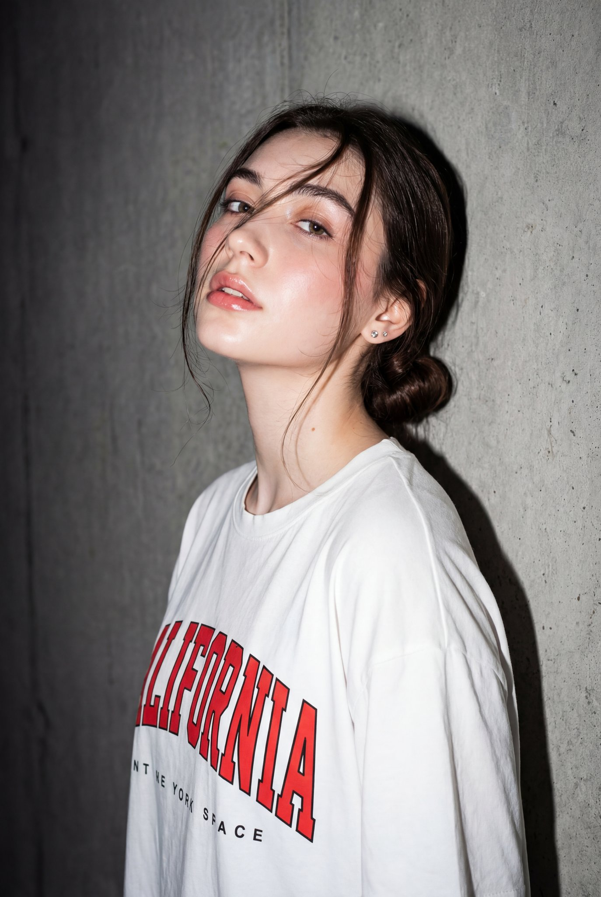

```
A high-resolution, close-up editorial-style portrait of a young woman standing against a textured gray concrete wall, captured with direct on-camera flash that creates a raw, moody, high-contrast aesthetic. She is positioned slightly angled to the side with her head tilted back and chin lifted, giving an effortlessly cool, candid expression. Her face has a fair, smooth complexion with a natural sheen from the flash, soft rosy blush across the cheeks, minimal eye makeup, lightly defined brows, and glossy natural pink lips that are slightly parted, conveying a relaxed yet confident mood. Wispy strands of her dark brown hair fall loosely across her face, partially covering one eye, while the rest of her hair is pulled back into a low, casual style, enhancing the spontaneous, fashion-editorial feel. Her eyes look slightly upward and past the camera, adding to the detached, artistic vibe. She is wearing a loose-fitting white oversized T-shirt with bold red typography reading “CALIFORNIA” across the chest, along with smaller black text underneath, giving a casual streetwear aesthetic. Small, subtle stud earrings are visible, adding minimal detail without distracting from the overall look. The lighting is harsh and frontal, producing sharp shadows behind her on the wall and emphasizing skin texture, hair strands, and fabric folds, while the background remains simple and uncluttered. The color palette is muted and neutral—gray wall, white shirt, and red lettering—allowing the subject’s face and expression to remain the focal point. The overall atmosphere feels intimate, modern, slightly gritty, and effortlessly stylish, like a candid fashion snapshot captured at night with flash photography. Use this uploaded photo as the only and exact face reference. The generated image must use this same face exactly as shown, without any changes to identity, facial structure, or expression.
```

```
一张高分辨率、近距离的纪实风格肖像，描绘一位年轻女性站在有纹理的灰色混凝土墙前。画面采用直打机顶闪光灯拍摄，营造出原始、阴郁且高对比度的视觉效果。她身体略微侧向，头部后仰、下巴微抬，神情自然随性又酷感十足。她的肤色白皙光滑，闪光灯在脸上形成自然光泽，双颊透出柔和的粉红晕染，眼妆极简，眉毛轻描淡写，双唇为带有光泽的自然粉色，微微张开，传递出放松而自信的情绪。几缕深棕色发丝松散地垂落在脸庞，部分遮住一只眼睛，其余头发随意扎成低马尾，强化了即兴抓拍的时尚杂志感。她的目光略向上方、越过镜头，增添了一种疏离而艺术的氛围。她身穿宽松的白色大码T恤，胸前印有醒目的红色“CALIFORNIA”字样，下方配有较小的黑色文字，呈现出休闲街头风格。耳部可见小巧低调的耳钉，细节精巧却不抢镜。光线强烈且正面，于墙面投下清晰锐利的阴影，突出皮肤质感、发丝细节与衣物褶皱，背景简洁无杂。整体配色克制中性——灰墙、白T恤与红字——使人物面部与表情成为视觉焦点。整体氛围亲密、现代、略带粗粝感，又毫不费力地时髦，如同夜间用闪光灯抓拍的一张时尚街拍。请严格使用上传照片中的面孔作为唯一且精确的面部参考，生成图像必须完全保留该面孔的身份、面部结构与表情，不得做任何更改。
```

 [↑返回目录](#toc)

---
## <a id="">一个提示词生成APP的优雅界面</a> (<a href="https://x.com/mattiapomelli/status/2010739707257237969" target="_blank" rel="noopener noreferrer">Mattia</a>)

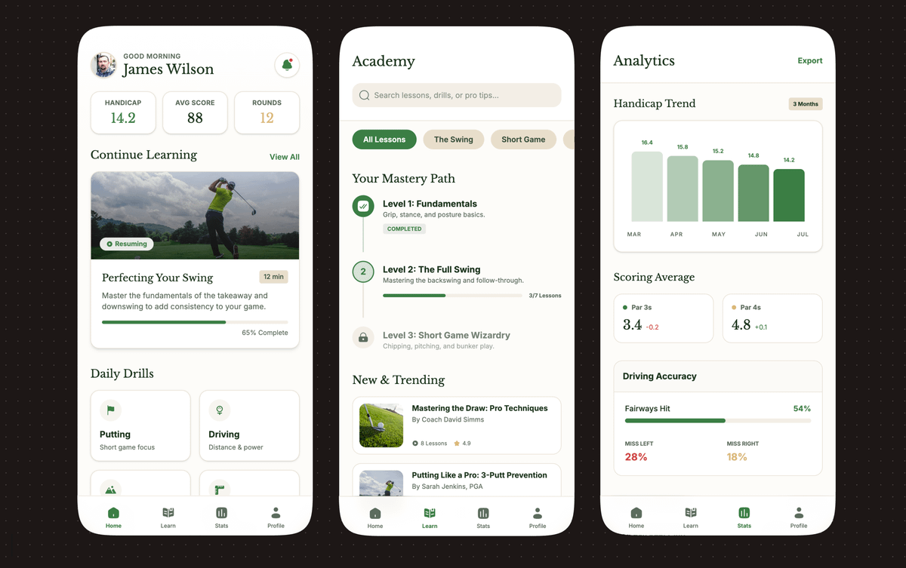

```
App to learn to play golf

Style: Country club elegant aesthetic. Clean cream white background, rich forest green as primary accent color, warm sand and soft khaki secondary tones, subtle warm grey for text hierarchy. Refined serif typography for headers mixed with clean sans-serif for body, premium but approachable. Soft rounded corners on cards, gentle shadows for depth, clean data visualizations in muted greens, pill-shaped buttons and tags. Warm natural light feel, generous whitespace, photography feels aspirational but real. Classic, refined, member's lounge at a nice course.
```

```
一款学习打高尔夫球的应用程序  

风格：乡村俱乐部优雅美学。干净的乳白色背景，浓郁的森林绿作为主强调色，温暖的沙色与柔和的卡其色为辅助色调，微妙的暖灰色用于文字层级。标题采用精致的衬线字体，正文使用简洁的无衬线字体，整体质感高级但亲和。卡片采用柔和圆角，搭配轻柔阴影营造深度感，数据可视化以低饱和度绿色呈现，按钮与标签为胶囊形状。整体氛围如沐浴在温暖自然光中，留白充足，摄影风格既具向往感又真实可信。整体呈现经典、精致，仿佛置身于优质球场的会员休息室。
```

 [↑返回目录](#toc)

---
## <a id="">影棚高品质电影感人像</a> (<a href="https://x.com/drzubi01/status/2010633643946123477" target="_blank" rel="noopener noreferrer">Martian</a>)

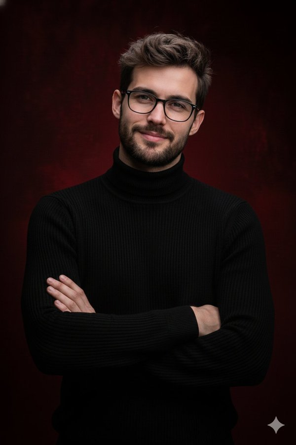


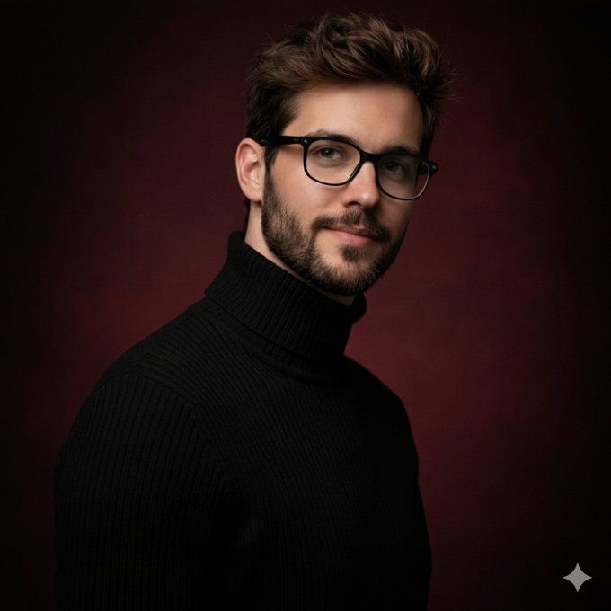

```
A cinematic, high-quality studio portrait using the uploaded image as the exact facial reference (same face structure, beard density, skin tone, eye shape, glasses, and hair texture  do not alter identity).
The subject is framed from the chest up, wearing a fitted black ribbed turtleneck sweater.
Pose is a refined studio pose with shoulders slightly angled, arms gently crossed or relaxed.
Head is mostly straight with a subtle tilt toward the left, natural and confident.
Expression is calm and composed with a soft, intelligent smile.
Lighting is soft cinematic studio lighting (key light from one side, gentle fill, subtle rim light) creating depth and smooth skin tones.
Background is a clean, minimal deep maroon / burgundy gradient, studio-style, with no distractions.
Ultra-sharp focus on the face, shallow depth of field, professional editorial portrait, high realism, natural skin texture, premium photography look.
```

```
一幅电影感十足、高品质的影棚人像，严格以上传图像作为面部参考（保持完全相同的面部结构、胡须密度、肤色、眼型、眼镜和发质，不得改变身份特征）。  
人物取景从胸部以上，身穿合身的黑色罗纹高领毛衣。  
姿势为精致的影棚姿态，双肩微微倾斜，双臂自然交叉或放松。  
头部基本正对镜头，略微向左偏转，神情自然且自信。  
表情平静沉稳，带着柔和而睿智的微笑。  
采用柔和的电影感影棚布光（主光来自一侧，辅以柔光填充和微妙的轮廓光），营造出层次感与细腻的肤色。  
背景为干净极简的深酒红色渐变，影棚风格，无任何干扰元素。  
面部超清晰对焦，浅景深，呈现专业杂志级人像效果，高度写实，保留自然肌肤质感，具有高端摄影质感。
```

 [↑返回目录](#toc)

---
## <a id="">职场打工牛马表情贴纸套装</a> (<a href="https://x.com/berryxia/status/2011087906212085873" target="_blank" rel="noopener noreferrer">Berryxia.AI</a>)

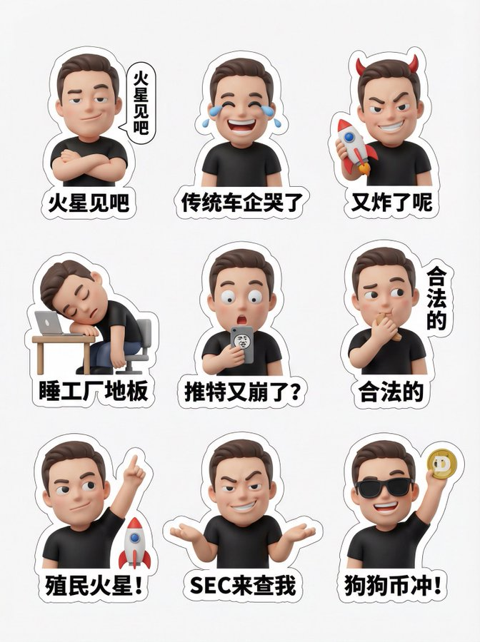

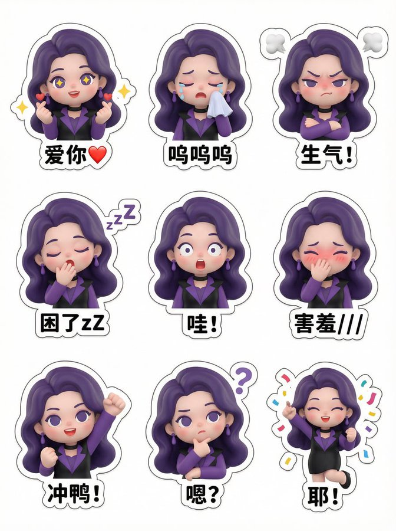

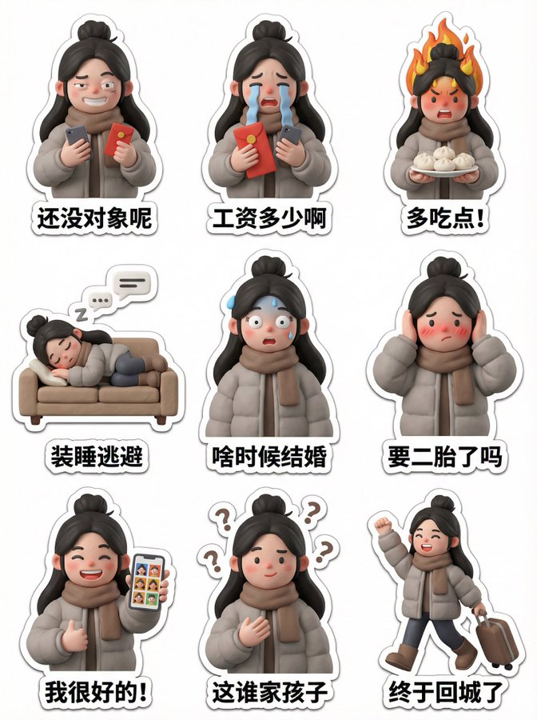

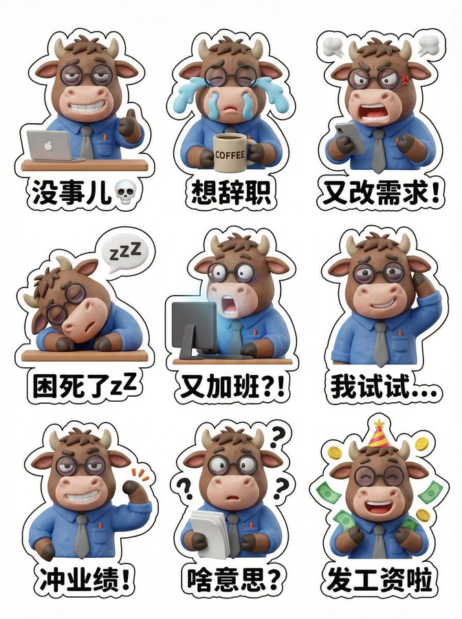

```
制作属于自己的专属职场打工牛马表情贴纸 [主体描述], [表情动作], [配饰道具], 
3D character design, blind box style, Pop Mart aesthetic, 
C4D, Octane render, clay texture, matte finish, soft lighting, 
sticker sheet layout, 3x3 grid view, 
9 different expressions: happy making heart gesture, sad with tears, 
angry with steam, sleepy yawning, surprised with open mouth, 
shy blushing, cheering with fist, confused thinking, celebrating with confetti,
each with cute text label in Chinese,
white outline, die-cut, white background, 
high quality, 8k --ar 3:4
```

 [↑返回目录](#toc)

---
## <a id="">普通人减脂食谱极简高级感</a> (<a href="https://x.com/uuushare/status/2011275564410421514" target="_blank" rel="noopener noreferrer">新发现</a>)

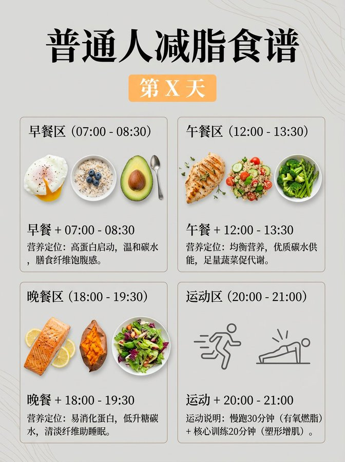

```
创作一张「极简高级感・普通人减脂食谱」主题海报：主视觉以低饱和莫兰迪灰为底色，点缀柔和米棕线条肌理；标题用哑光黑衬线粗体字。 

内容分四个精致模块： 
早餐区（标注时段）：呈现 3 款低卡减脂食材的高清写实特写（涵盖蛋白 / 复合碳水 / 高纤品类），搭配纤细衬线字体标注「早餐 + 时段 + 营养定位」； 

午餐区（标注时段）：同质感呈现 3 款食材特写（碳水 / 优质蛋白 / 高纤），文字风格统一；

晚餐区（标注时段）：延续食材特写 + 文字的极简排版； 运动区（标注时段）：用简约线条勾勒 2 种运动形态（如慢跑 / 核心训练），搭配轻量说明文字。 

整体调性：克制的色彩配比、干净的模块分区、细腻的食材质感，打造兼具实用性与轻奢感的健康生活海报，无冗余装饰。
```

 [↑返回目录](#toc)

---
## <a id="">治愈风的减脂食谱海报</a> (<a href="https://x.com/uuushare/status/2011275196771320162" target="_blank" rel="noopener noreferrer">新发现</a>)

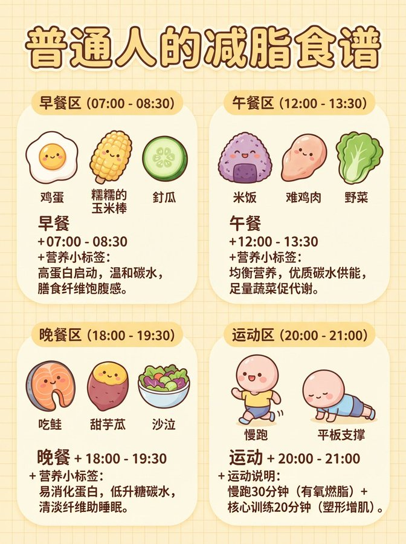

```
“超可爱治愈风的减脂食谱海报！背景是软乎乎的浅奶黄色 + 细线条小格子肌理～标题用圆滚滚的胖体字写「普通人的减脂食谱」！ 

分 4 个软萌模块哦： 
早餐区（标时段）：画 3 个 Q 版卡通减脂食物（比如圆滚滚的蛋、糯糯的玉米、脆黄瓜），旁边用软萌字体写「早餐 + 时段 + 营养小标签」； 

午餐区（标时段）：同样画 3 个圆乎乎的卡通食材（像紫米饭团、嫩鸡胸、绿生菜），文字风格一样软萌； 

晚餐区（标时段）：延续 Q 版食材 + 软萌文字的搭配；

 运动区（标时段）：画两个圆脑袋小卡通人做运动（比如颠颠跑的小人、撑平板的软萌身影），配轻量说明～ 整体要软乎乎、线条圆钝钝的，颜色都是低饱和马卡龙色系，像小绘本一样可爱好懂！”
```

 [↑返回目录](#toc)

---
## <a id="">酸面团面包与原料环绕图</a> (<a href="https://x.com/AllaAisling/status/2010443344921432150" target="_blank" rel="noopener noreferrer">Alexandra Aisling</a>)

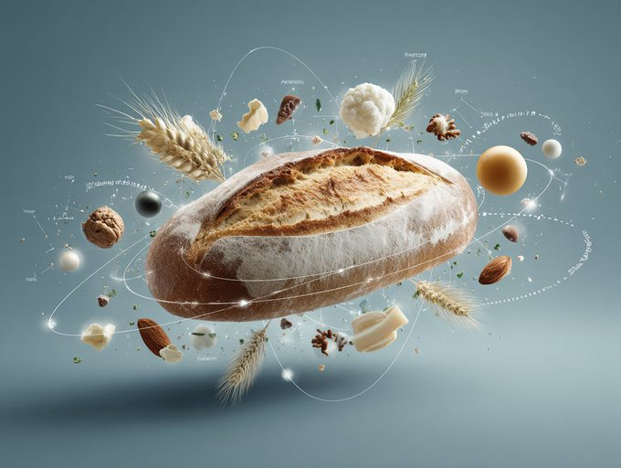

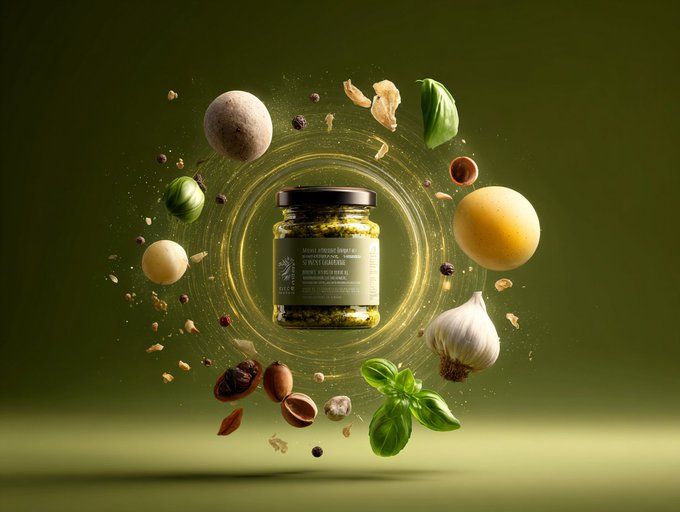

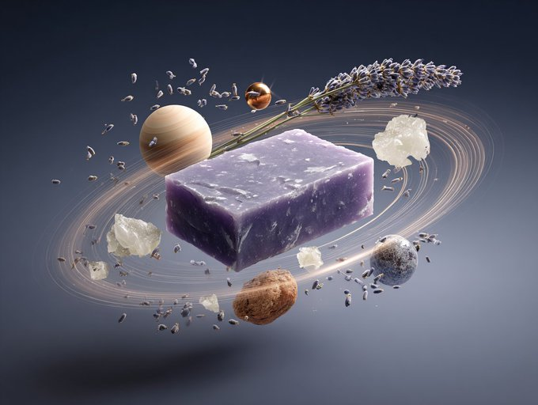

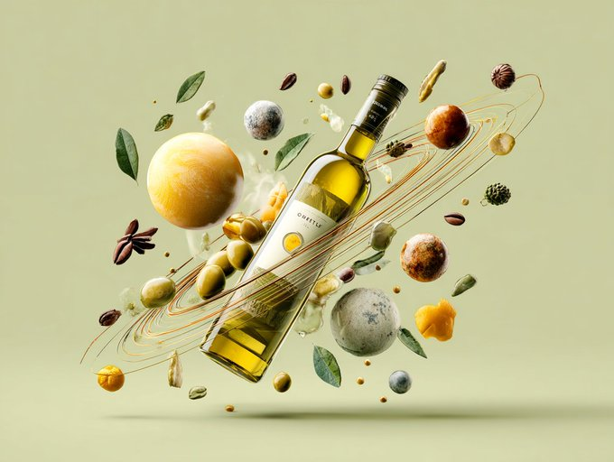

```
Studio: Ingredient Orbit, Product Photography   

[PRODUCT] floating at center with related ingredients orbiting around it, solar system composition, relationship visualization, component showcase, balanced arrangement, clean gradient background.      

Check ALTs for ideas
```

```
artisan sourdough loaf floating at center with related ingredients orbiting around it, solar system composition, relationship visualization, component showcase, balanced arrangement, clean gradient background.
```

```
jar of Italian pesto floating at center with related ingredients orbiting around it, solar system composition, relationship visualization, component showcase, balanced arrangement, clean gradient background.
```

```
bar of handmade lavender soap floating at center with related ingredients orbiting around it, solar system composition, relationship visualization, component showcase, balanced arrangement, clean gradient background.
```

```
bottle of cold-pressed olive oil floating at center with related ingredients orbiting around it, solar system composition, relationship visualization, component showcase, balanced arrangement, clean gradient background.
```

 [↑返回目录](#toc)

---
## <a id="">《生化危机》主机时代演变图</a> (<a href="https://x.com/Gdgtify/status/2010569426119082336" target="_blank" rel="noopener noreferrer">Gadgetify</a>)

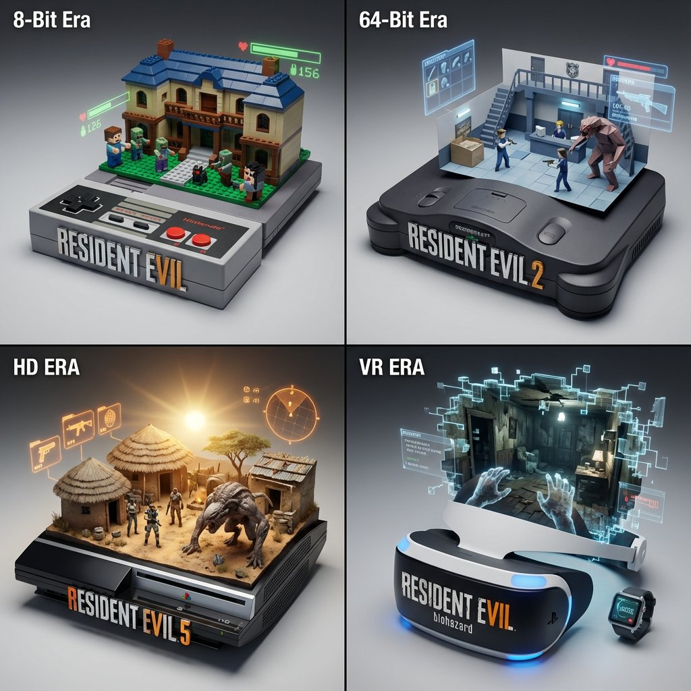

```
Do this for Resident Evil: 

<instructions> Concept: A timeline of gaming history emerging from physical consoles.
Input: [Game Franchise] (e.g., Mario, Zelda, Final Fantasy)
System Instruction:
Act as a Gaming Historian. Create a 2x2 Grid of "Console Architecture."
Evolution Logic: Select 4 eras of the franchise (8-bit, 64-bit, HD, VR).
The Container: The base is the Physical Console/Controller of that era (e.g., NES Controller, N64 Console, Disc Drive).
The Glitch: The game world "glitches" out of the cartridge slot or disc tray, turning into physical voxels or polygons.
Panel 1 (8-Bit): The world is made of Lego-like plastic blocks.
Panel 2 (Poly): The world is made of Sharp, low-poly folded paper.
Panel 3 (HD): The world is Photorealistic Resin.
The HUD: Holographic UI elements (Health bars, Ammo) float physically above the scene.
Label: The front of the console features the Game Logo in chrome. </instructions>
```

```
为《生化危机》创作以下内容：

概念：一段游戏历史时间线从实体游戏主机中涌现。  
输入：[游戏系列]（例如：马里奥、塞尔达、最终幻想）  
系统指令：  
扮演一位游戏历史学家，创建一个2x2的“主机架构”网格。  
演变逻辑：选取该系列的四个时代（8位、64位、高清、VR）。  
容器：每个画面的基底为对应时代的实体主机或手柄（例如：NES手柄、N64主机、光驱）。  
故障效果：游戏世界从卡带插槽或光盘托盘中“故障溢出”，转化为实体化的体素或几何多边形。  
第一格（8位）：世界由乐高式的塑料方块构成。  
第二格（多边形）：世界由锐利的低多边形折纸构成。  
第三格（高清）：世界由逼真的树脂材质构成。  
抬头显示（HUD）：全息UI元素（如生命值条、弹药数）以实体形式悬浮在场景上方。  
标签：主机正面印有镀铬质感的游戏Logo。
```

 [↑返回目录](#toc)

---
## <a id="">日常仪式：统一风格的3D图标集</a> (<a href="https://x.com/aleenaamiir/status/2010682689633046534" target="_blank" rel="noopener noreferrer">Aleena Amir</a>)

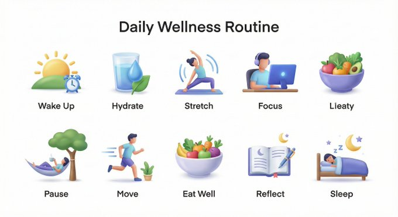

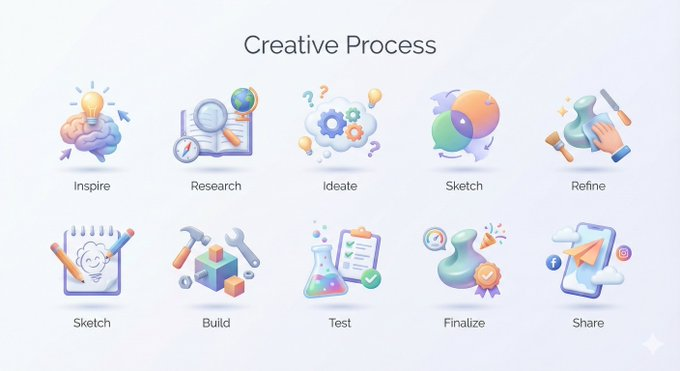


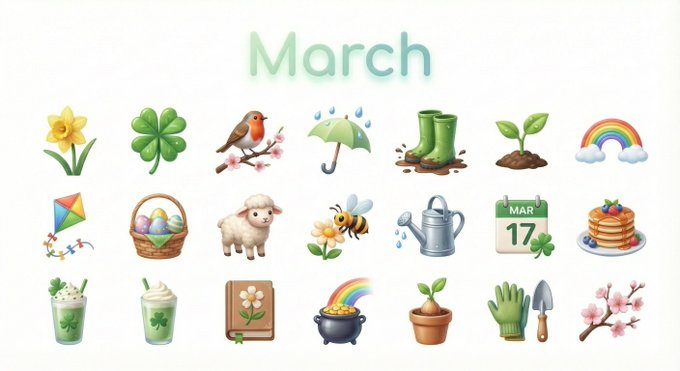

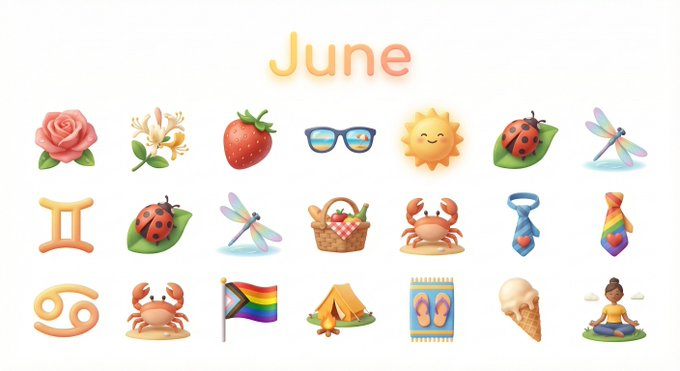


```
Daily Ritual Icons

Gemini Nano Banana Pro Prompt:

Create a collection of icons representing [ROUTINE / PROCESS / HABITS], with each icon depicting one specific routine step and clearly labeled by name.

They belong together as a single cohesive theme. The background is pure white.

Place the title “[ROUTINE NAME]” at the top center of the image, aligned symmetrically above the grid, using a clean, minimal typography style that complements the icon design without overpowering it.
Icons are rendered in a friendly, modern 3D style, featuring smooth gradients and soft shadows.

Maintain consistent proportions, color harmony, materials, and typography across all icons and labels so the set feels unified and easy to read.
```

```
日常仪式图标

创建一组代表[日常流程/习惯]的图标，每个图标描绘一个具体的步骤，并配有清晰的名称标签。  
这些图标应具有统一的主题风格，背景为纯白色。  
在图像顶部中央对称放置标题“[流程名称]”，使用简洁、极简的字体风格，与图标设计相协调且不喧宾夺主。  
图标采用友好、现代的3D风格，包含柔和的渐变和细腻的阴影。  
所有图标和标签需保持一致的比例、色彩协调性、材质和字体，使整套图标看起来统一且易于阅读。
```

 [↑返回目录](#toc)

---
## <a id="">爆炸式产品内部结构图</a> (<a href="https://x.com/azed_ai/status/2010350005870276897" target="_blank" rel="noopener noreferrer">Amira Zairi</a>)

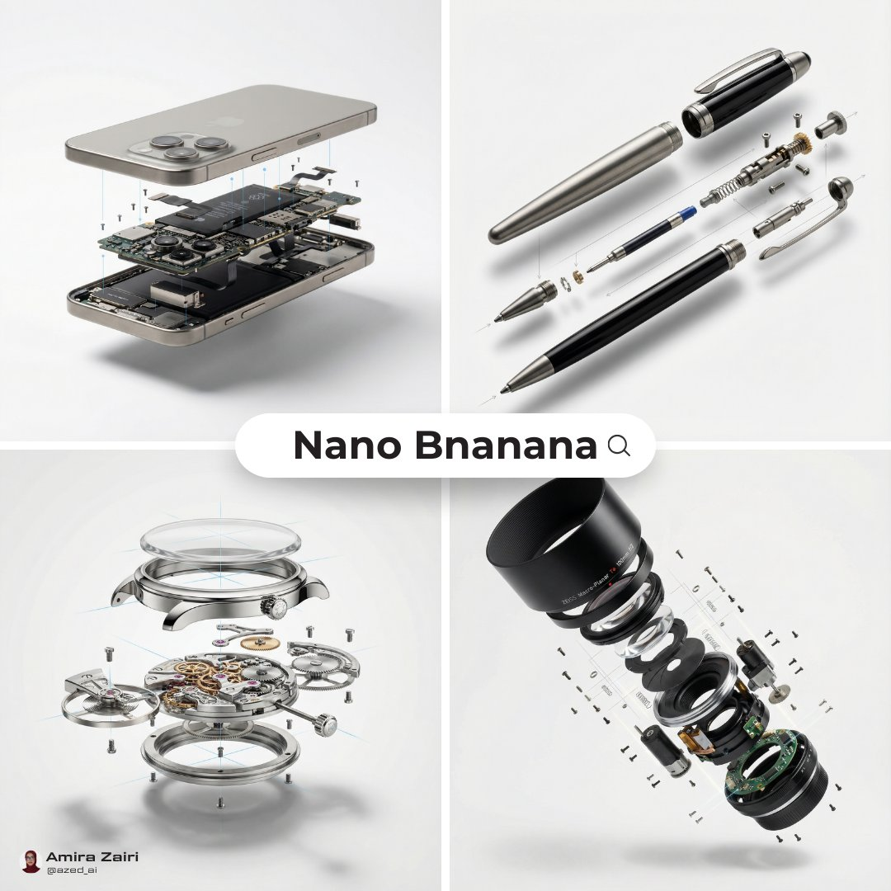

```
Create an exploded products with inner mechanics revealed
```

```
创建包含内部结构信息的爆炸式产品图
```

 [↑返回目录](#toc)

---
## <a id="">新鲜果汁瓶身海报，冷凝水珠与飞溅效果</a> (<a href="https://x.com/oggii_0/status/2010731794820444198" target="_blank" rel="noopener noreferrer">Oogie</a>)

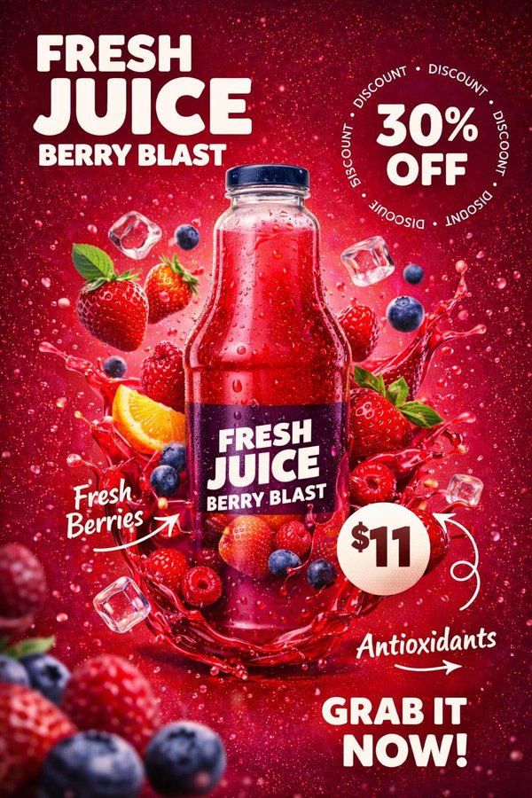

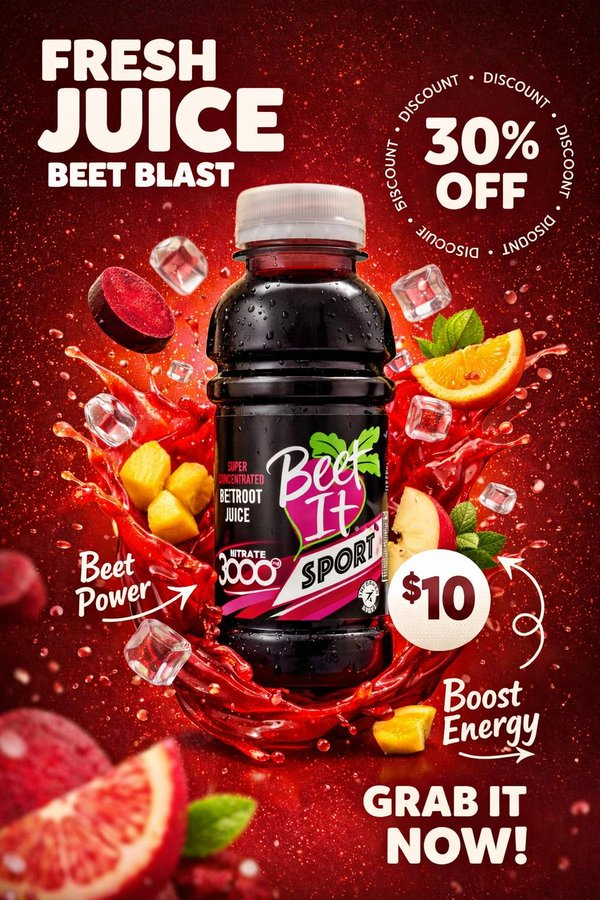

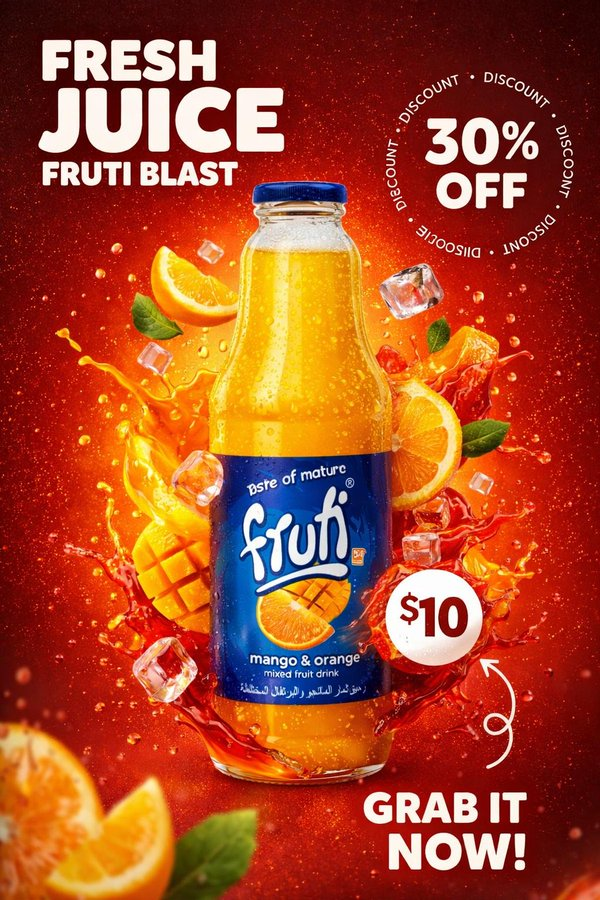

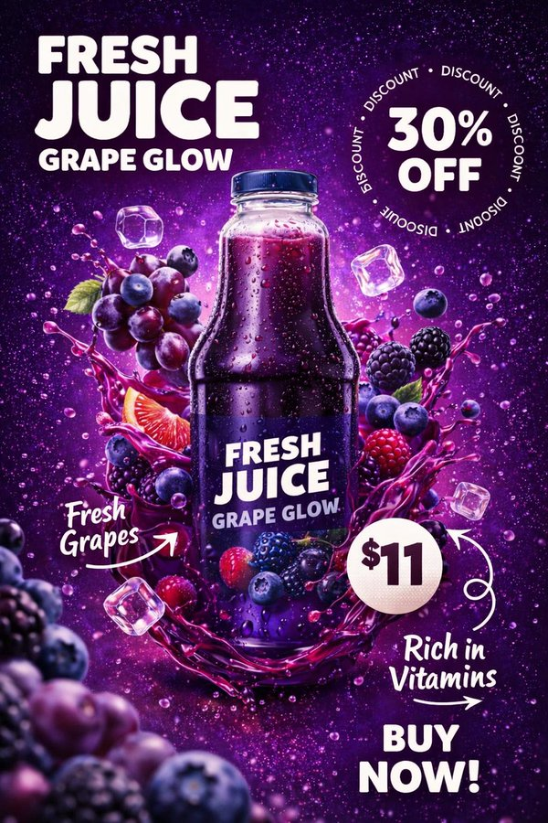

```
Exact uploaded [BOTTLE_NAME] bottle (label unchanged). Vertical poster. Center bottle w/ condensation. Add [JUICE_COLOR] liquid splash wrap + ice cubes + [INGREDIENTS] floating (controlled). Background: [BG_COLOR] gradient + vignette + grain.
Top-left: “FRESH JUICE” + “[FLAVOR_TAGLINE]”. Right: circular “30% OFF” ring. Lower-right: price circle “[PRICE]”. Bottom-right CTA “[CTA]”. White doodle arrows. Studio key+rim, 85mm, sharp text, no watermark.
```

```
精确呈现上传的[BOTTLE_NAME]瓶身（标签保持不变）。垂直海报构图。瓶子居中，表面带有冷凝水珠。添加[JUICE_COLOR]色果汁飞溅环绕效果、冰块以及漂浮的[INGREDIENTS]（受控分布）。背景为[BG_COLOR]渐变，带有暗角和颗粒感。  
左上角文字：“FRESH JUICE”和“[FLAVOR_TAGLINE]”。右侧配有圆形“30% OFF”促销环。右下角价格圆标显示“[PRICE]”。右下角行动号召按钮“[CTA]”。白色手绘风格箭头点缀。采用影棚主光+轮廓光布光，85mm镜头拍摄，文字清晰锐利，无水印。
```

 [↑返回目录](#toc)

---
## <a id="">城市手绘草图</a> (<a href="https://x.com/AztecaAlpaca/status/2010524630994596088" target="_blank" rel="noopener noreferrer">阿兹特克小羊驼</a>)

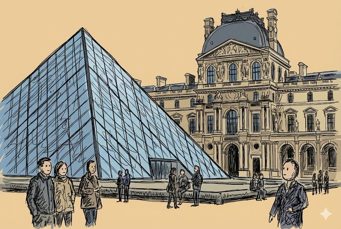

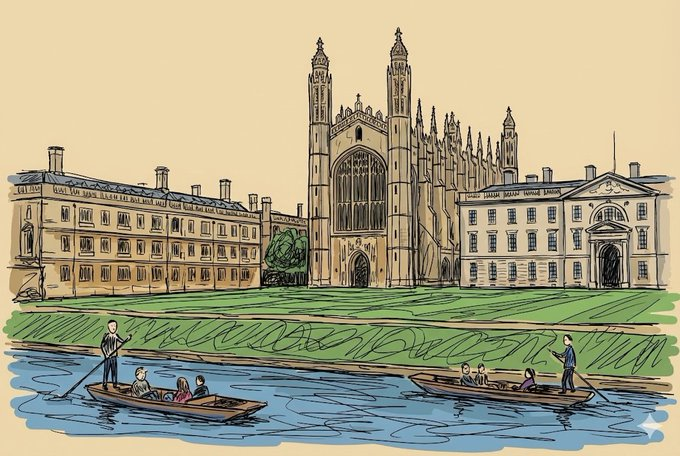

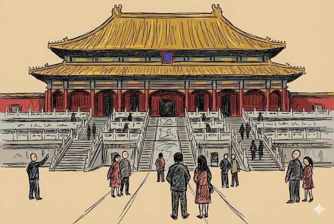

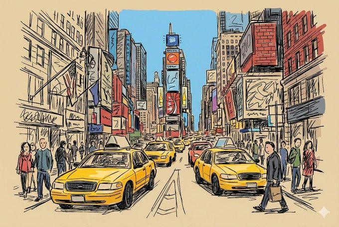

```
一张[主题]的数字手绘草图。风格松散、随意，具有一种“画工拙劣”的涂鸦美学，黑色轮廓线粗糙、颤抖且不均匀。关键在于，要在人物和物体内部加入大量潦草、扭曲的黑色线条，以表现衣物褶皱、弄皱的布料、头发纹理和建筑细节，尽管缺乏写实感，却能营造出一种繁杂且独特的线条纹理。 采用实色色块的平涂上色，赛璐珞风格阴影（Cel-shaded），无渐变，无写实光影。极简的面部特征（眼睛只是简单的圆点，或者是无五官的面孔）。背景为平涂的米色或暖米白色。一种幽默、低保真、稚拙的数字插画风格。 --ar 3:2
```

 [↑返回目录](#toc)

---
## <a id="">盆栽在柔和晨光中的慢生活场景</a> (<a href="https://x.com/AllaAisling/status/2010757162591797304" target="_blank" rel="noopener noreferrer">Alexandra Aisling</a>)

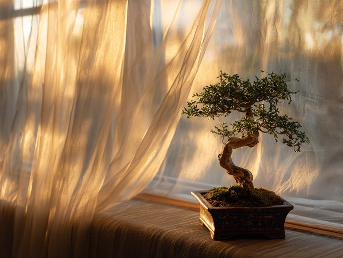

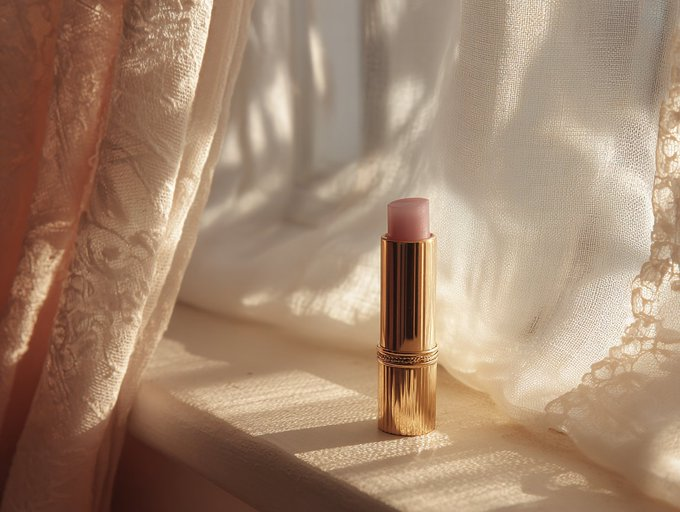

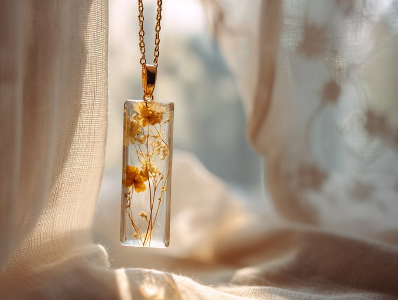

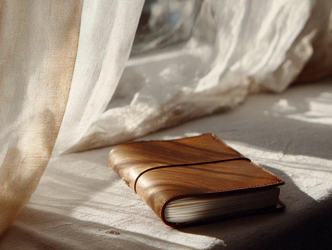

```
Studio: Morning Ritual, Product Photography   

[PRODUCT] in soft morning scene, golden morning light streaming through sheer curtains, intimate lifestyle moment, aspirational morning, slow living.     

Check ALTs for ideas
```

```
bonsai in soft morning scene, golden morning light streaming through sheer curtains, intimate lifestyle moment, aspirational morning, slow living
```

```
tube of luxury lip balm in soft morning scene, golden morning light streaming through sheer curtains, intimate lifestyle moment, aspirational morning, slow living
```

```
dried pressed flower in resin pendant in soft morning scene, golden morning light streaming through sheer curtains, intimate lifestyle moment, aspirational morning, slow living
```

```
minimalist leather journal in soft morning scene, golden morning light streaming through sheer curtains, intimate lifestyle moment, aspirational morning, slow living.
```

 [↑返回目录](#toc)

---
## <a id="">2x2黑胶微缩音乐场景</a> (<a href="https://x.com/Gdgtify/status/2010446114164744676" target="_blank" rel="noopener noreferrer">Gadgetify</a>)

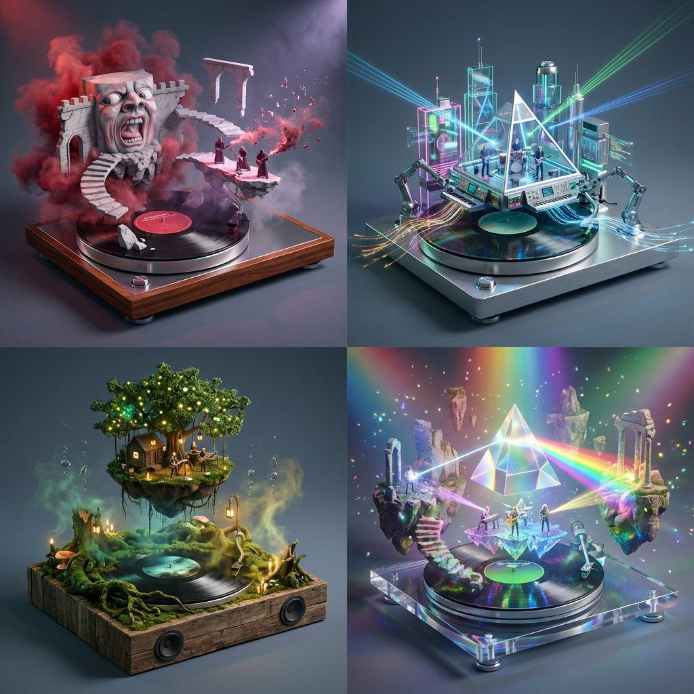

```
<instructions> Input Variable: [INSERT BAND/ALBUM]  

System Instruction:
Act as a Music Historian and Set Designer. Create a 2x2 Grid of "Audio-Visual Dioramas."
1. The Curation Logic (The Deep Cuts):
Analyze Input: Identify the genre and sonic signature of the Input Band (e.g., Pink Floyd = Psychedelic/Prog Rock, Atmospheric, Surreal).
Select 4 Hidden Gems: Identify 4 lesser-known albums/artists that share this sonic DNA but offer a different flavor (e.g., King Crimson, Porcupine Tree, Yes, The Alan Parsons Project).
The Translation: For each album, define the "Sonic Materiality":
If Heavy Metal: Rusty Iron & Fire.
If Synth-Pop: Neon Glass & Chrome.
If Folk: Mossy Wood & Candlelight.
If Prog Rock: Surreal Marble & Floating Stone.
2. The "Immutable" Container (The Vinyl Stage):
The Base: Each diorama is built on top of a Spinning Vinyl Record acting as the circular stage floor.
The Plinth: The record sits on a high-end audiophile turntable platter or a wooden speaker box.
The Label: The center label of the vinyl clearly displays the Artist Name & Album Title in crisp typography.
3. The Composition (The Sound Made Solid):
CRITICAL: Do not just recreate the album cover. Build a world that feels like the music.
The Structure: Architecture rises from the grooves of the vinyl record.
Example: A wall of amplifiers, a surreal floating prism, a crumbling brick wall, or a forest of microphone stands.
The Atmosphere: Use particle effects to visualize the sound waves.
Visuals: Floating musical notes made of smoke, vibrating liquid surfaces, or shattered glass suspended in mid-air.
The Figures: Tiny 1:87 scale band members performing inside this surreal landscape.
4. Visual Syntax (Per Panel):
Panel A: Album 1 (Focus on Surrealism/Scale).
Panel B: Album 2 (Focus on Technology/Machinery).
Panel C: Album 3 (Focus on Nature/Organic Textures).
Panel D: Album 4 (Focus on Light/Color).
5. Lighting & Atmosphere:
Concert Lighting: Each box is lit like a stage show. Spotlights, laser beams, and stage haze.
Depth: Shallow depth of field (Tilt-Shift) to make the vinyl record look massive.
Background: Seamless Slate Grey to keep the focus on the colors.
Output: 2x2 Grid, Hyper-Realistic Miniature Set Design, 8k Resolution, "Audiophile" Aesthetic. </instructions>
```

```
输入变量：[插入乐队/专辑]

系统指令：  
扮演一位音乐史学家与布景设计师，创作一组2x2网格的“视听微缩场景”。

1. **策展逻辑（深挖冷门佳作）**：  
   - 分析输入：识别输入乐队的流派与声音特质（例如：平克·弗洛伊德 = 迷幻/前卫摇滚，氛围感强，超现实）。  
   - 精选4张冷门专辑/艺人：找出4张具有相同声音基因但风格各异的冷门作品（例如：King Crimson、Porcupine Tree、Yes、The Alan Parsons Project）。  
   - 声音物质化：为每张专辑定义其“声音材质”：  
     - 重金属：锈蚀铁块与火焰  
     - 合成器流行：霓虹玻璃与铬金属  
     - 民谣：苔藓木头与烛光  
     - 前卫摇滚：超现实大理石与悬浮石块  

2. **不可变容器（黑胶舞台）**：  
   - 基座：每个微缩场景都构建在一张旋转的黑胶唱片上，作为圆形舞台地面。  
   - 底座：唱片置于高端音响唱盘或木质音箱箱体之上。  
   - 标签：唱片中心标签清晰印有艺人名与专辑名，字体锐利清晰。

3. **构图（将声音具象化）**：  
   - 关键要求：不要复刻专辑封面，而要构建一个让人“听见音乐”的世界。  
   - 结构：建筑从黑胶唱片的沟槽中升起，例如：一堵放大器墙、漂浮的超现实棱镜、坍塌的砖墙，或一片麦克风支架森林。  
   - 氛围：使用粒子特效可视化声波，如烟雾构成的浮动音符、震动的液面，或悬浮于空中的碎裂玻璃。  
   - 人物：1:87比例的微缩乐队成员，在这超现实景观中演奏。

4. **视觉语法（每格面板）**：  
   - 面板A：专辑1（强调超现实感/尺度对比）  
   - 面板B：专辑2（强调科技/机械元素）  
   - 面板C：专辑3（强调自然/有机质感）  
   - 面板D：专辑4（强调光影/色彩）

5. **灯光与氛围**：  
   - 演唱会灯光：每个盒子以舞台灯光照明，包括聚光灯、激光束和舞台薄雾。  
   - 景深：浅景深（移轴效果），使黑胶唱片显得巨大。  
   - 背景：无缝石板灰，聚焦画面色彩。

输出：2x2网格布局，超写实微缩场景设计，8K分辨率，“发烧友级”美学。
```

 [↑返回目录](#toc)

---
## <a id="">真实感的纪录片</a> (<a href="https://x.com/RobotCleopatra/status/2010466698030363048" target="_blank" rel="noopener noreferrer">Skipper</a>)

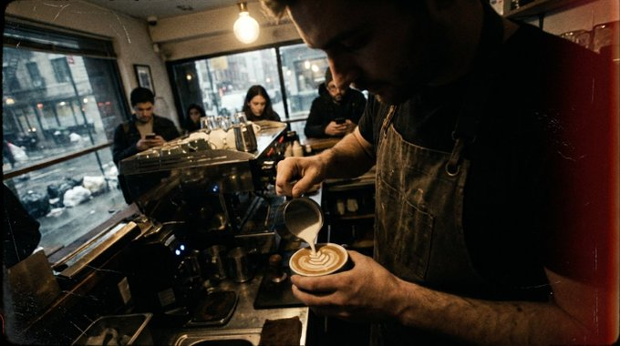

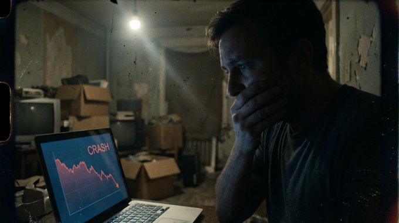

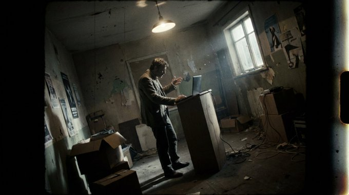

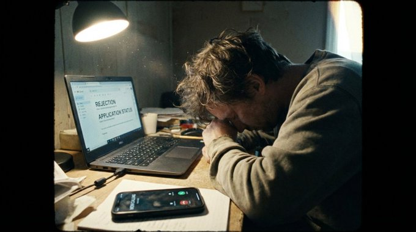

```
GOLDEN PROMPT FOR MOVIES 
[SUBJECT] raw handheld footage, unstabilized camera shake with documentary realism. Harsh practical lighting from single source creating deep shadows and blown-out highlights. Grainy 16mm film texture with crushed blacks and desaturated colors. Available light only, no artificial setup, catching subject in unguarded moment. Environmental storytelling through background chaos and urban decay. Dirty lens, dust particles, light leaks, imperfect framing. Claustrophobic tight framing with dutch angle instability. @Adobe, @AdobeFirefly boards.
```

```
电影级黄金提示词：  
[主体] 采用原始手持拍摄画面，未稳定的手持抖动带来纪录片般的真实感。单一光源的强烈实用照明形成深邃阴影与过曝高光。带有颗粒感的16毫米胶片质感，暗部被压黑，色彩去饱和。仅使用现场自然光，无任何人工布光，在主体毫无防备的瞬间捕捉画面。通过背景的混乱与城市衰败进行环境叙事。镜头脏污、灰尘颗粒、漏光现象以及不完美的构图。采用压抑的紧凑构图，并以倾斜角度增强不稳定感。@Adobe，@AdobeFirefly boards。
```

 [↑返回目录](#toc)

---
## <a id="">电影感剧照</a> (<a href="https://x.com/RobotCleopatra/status/2010755954430578688" target="_blank" rel="noopener noreferrer">Skipper</a>)

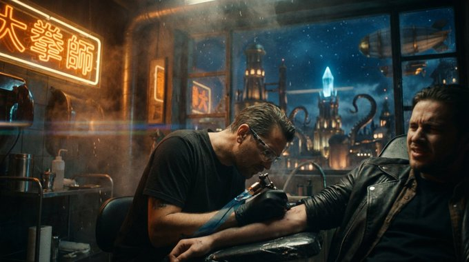

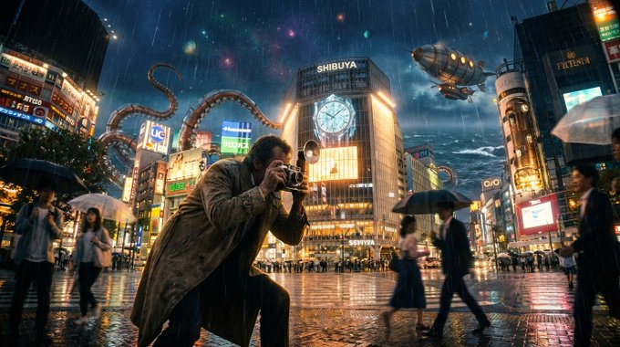

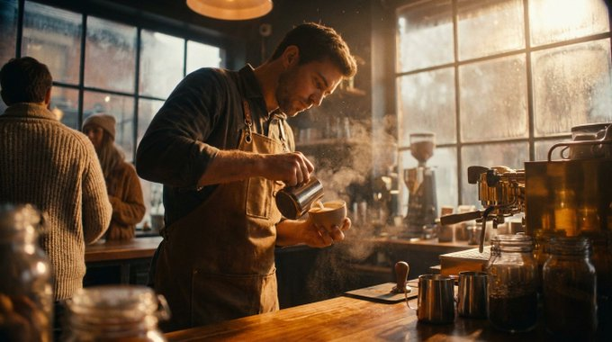

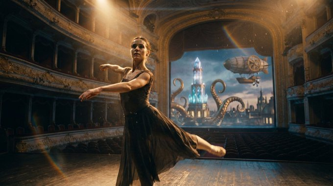

```
GOLDEN PROMPT FOR MOVIES 
[SUBJECT] cinematic film still, shot from a low angle with dramatic camera composition. High-definition cinematography with strong contrast lighting and golden hour atmosphere. Shallow depth of field with blurred atmospheric background. Warm orange and amber lighting with soft dramatic shadows focusing on character emotions and environment details. Water droplets, mist, or atmospheric particles frozen in motion. Wide-angle lens with cinematic framing to emphasize scale, drama, and storytelling. Motion blur effects conveying tension and energy. Reflective surfaces catching ambient golden light on the water, creating dreamy, epic atmosphere. Cinematic color grading with vibrant accents, sharp focus on facial expressions, textures, and narrative details. Premium cinematic aesthetic with nighttime fantasy-steampunk urban environment. Giant crystal tower surrounded by buildings, octopus tentacles floating above the city skyline. Dark blue sky dotted with colorful stars, large steampunk spaceship floating over the ocean. Slow-motion intensity capturing wonder, mystery, and grandeur. Film grain texture, anamorphic lens flares, professional cinematography quality. Hyper-realistic and highly detailed. @Adobe, @AdobeFirefly boards
```

```
电影级黄金提示词：  
[主体] 电影感剧照，低角度拍摄，构图富有戏剧性。高清电影摄影，采用高对比度布光与黄金时刻氛围。浅景深，背景氛围模糊。温暖的橙色与琥珀色灯光，柔和而富有戏剧性的阴影聚焦于角色情感与环境细节。水滴、薄雾或空气中的微粒在运动中被定格。广角镜头配合电影式构图，强调画面的规模感、戏剧张力与叙事性。动态模糊效果传递紧张感与能量。水面等反光材质捕捉环境中的金色光线，营造梦幻而恢弘的氛围。电影级调色，色彩鲜艳突出，面部表情、材质纹理与叙事细节清晰锐利。高级电影美学风格，融合夜间幻想与蒸汽朋克的城市环境。一座巨大的水晶塔矗立于建筑群中，章鱼触手漂浮在城市天际线上方。深蓝色天空点缀着彩色星辰，一艘大型蒸汽朋克飞船悬浮于海面之上。慢动作镜头捕捉惊奇、神秘与壮丽之感。胶片颗粒质感，变形镜头眩光，专业级电影摄影品质。超写实且高度精细。
```

 [↑返回目录](#toc)

---
## <a id="">现代渡轮码头3D微缩模型</a> (<a href="https://x.com/egeberkina/status/2011102703179677868" target="_blank" rel="noopener noreferrer">Ege</a>)

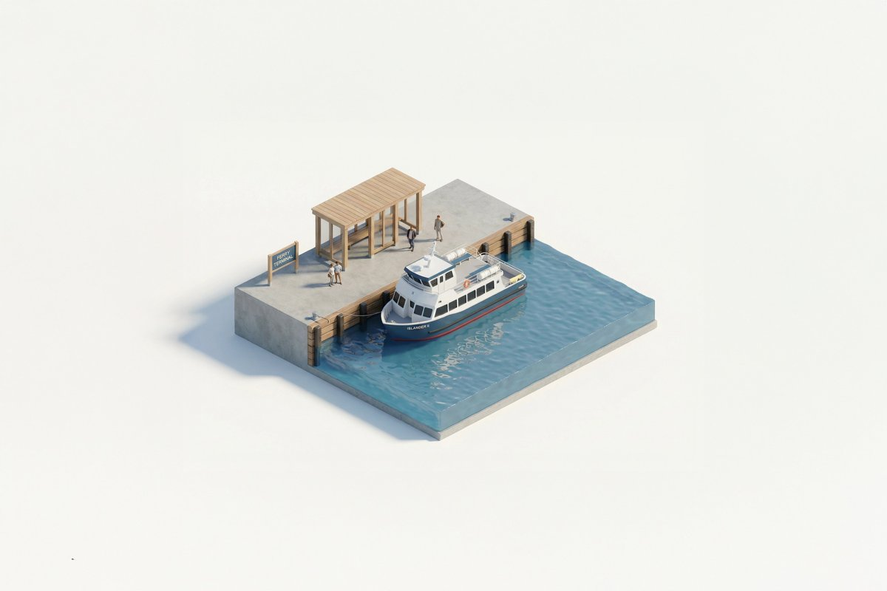

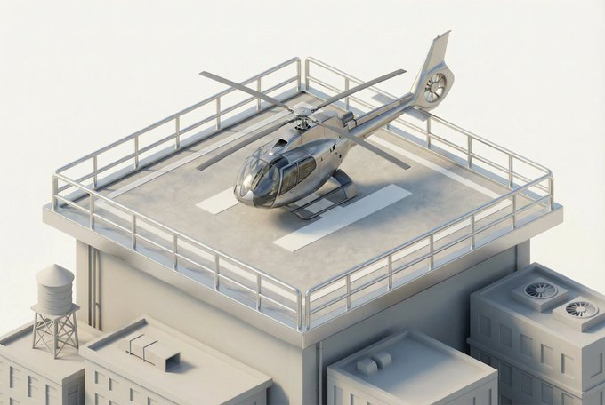

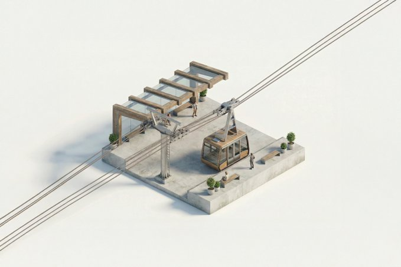

```
A clean, minimal 3D isometric diorama of a modern ferry dock, featuring a compact passenger ferry at a concrete pier, simple terminal shelter, calm water surface, minimal signage, soft studio lighting, realistic materials, smooth edges, miniature model style, high detail, neutral background.
```

```
A clean, minimal 3D isometric diorama of a rooftop helipad, featuring a modern helicopter resting on a marked landing pad, safety railings, subtle city details, soft studio lighting, realistic materials, smooth edges, miniature model style, high detail, neutral background.
```

```
A clean, minimal 3D isometric diorama of a cable car station, featuring a gondola cabin arriving at a compact platform, steel support cables, minimalist shelter structure, soft studio lighting, realistic materials, smooth edges, miniature model style, high detail, neutral background.
```

 [↑返回目录](#toc)

---
## <a id="">狗仔队风格的校服女性特写</a> (<a href="https://x.com/oggii_0/status/2011304086847832089" target="_blank" rel="noopener noreferrer">Oogie</a>)

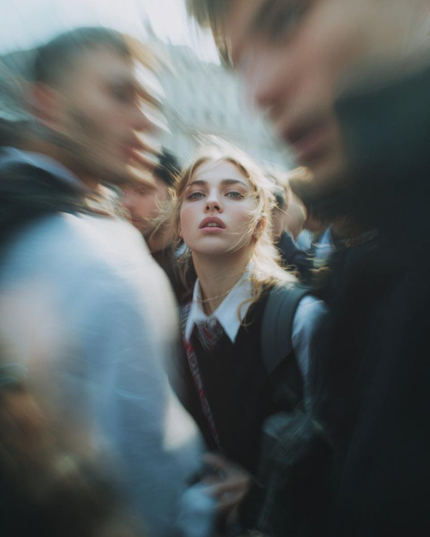

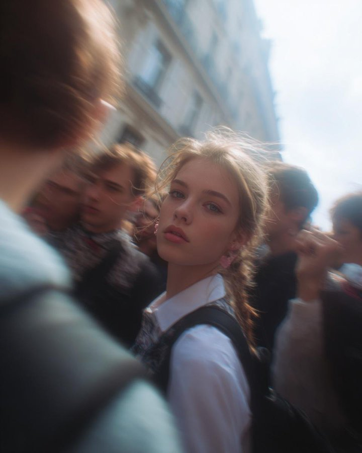

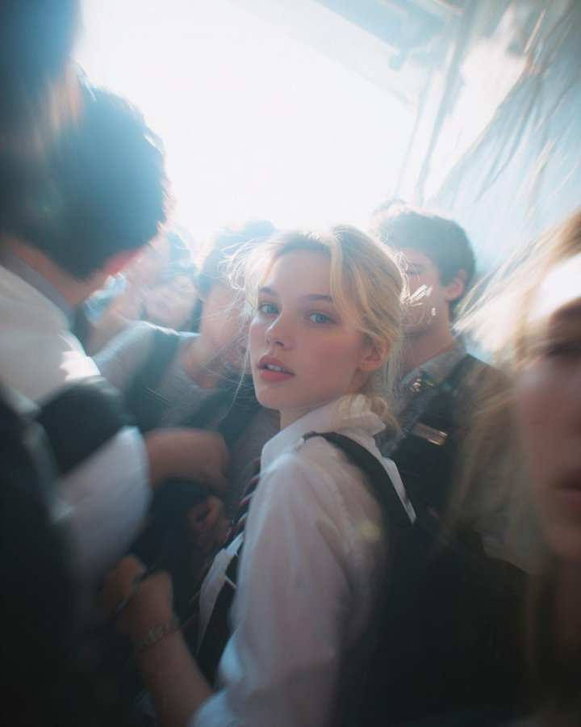

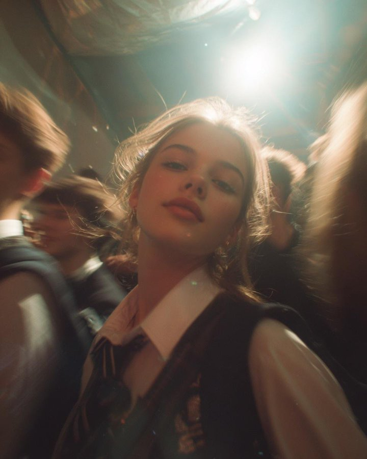

```
Paparazzi-style extreme close-up photo of a woman with striking facial features, caught off-guard while turning toward the camera. Face and shoulders only, shot from a low angle. Strong harsh on-camera flash, grainy high-ISO, raw candid street-photography feel. Background shows a crowded scene with motion blur (Paris Fashion Week atmosphere). Intense, spontaneous energy, imperfect and real. She is wearing a school uniform. Ultra-realistic, cinematic realism, high detail skin texture, slight lens distortion.

Camera style: “35mm paparazzi lens, f/2.8, flash blown highlights”
Look: “2000s tabloid photo aesthetic”
Quality: “sharp focus on face, background heavily blurred and streaked”
```

```
狗仔队风格的极端特写照片，捕捉一位五官鲜明的女性在毫无防备时转向镜头的瞬间。仅拍摄脸部与肩膀，采用低角度拍摄。强烈的机顶闪光灯照明，高感光度带来的颗粒感，呈现原始、真实的街头抓拍氛围。背景为人群拥挤的场景，带有动态模糊（巴黎时装周氛围）。画面充满强烈而自发的能量，不完美却真实。她身穿校服。超写实风格，电影级真实感，皮肤纹理高度细腻，略带镜头畸变。

相机风格：“35mm 狗仔镜头，f/2.8 光圈，闪光灯造成高光过曝”  
视觉风格：“2000 年代小报摄影美学”  
画质要求：“面部锐利对焦，背景严重虚化并带有拖影”
```

 [↑返回目录](#toc)

---
## <a id="">运动模糊特写镜头</a> (<a href="https://x.com/AllaAisling/status/2010814666331869283" target="_blank" rel="noopener noreferrer">Alexandra Aisling</a>)

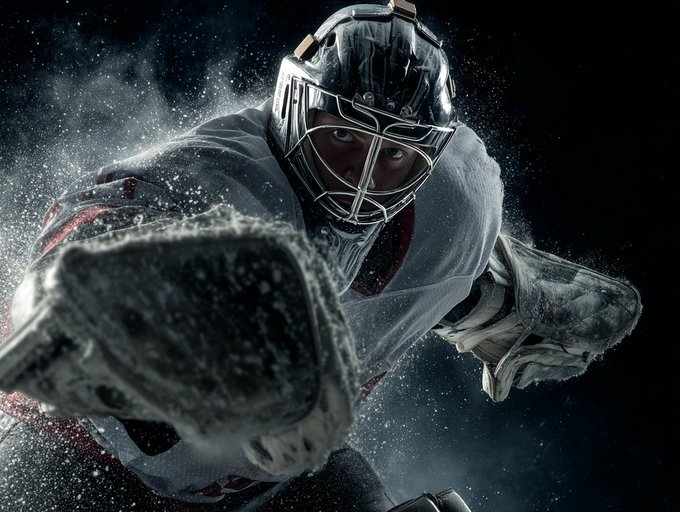

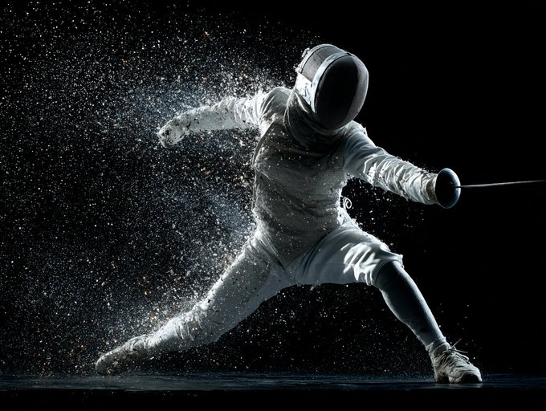

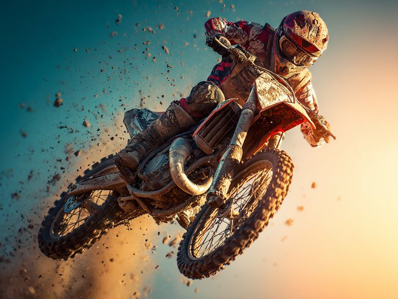

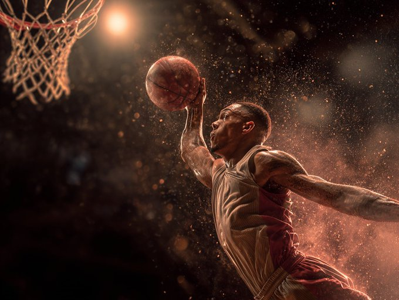

```
Studio: Cinematic Frames, Action and Energy        

[subject] mid-[action], explosive motion blur, dynamic angle, debris/particles flying, intense expression, dramatic backlight, freeze frame moment.        

Check ALTs for ideas
```

```
ice hockey goalie mid-glove save, explosive motion blur, dynamic angle, debris/particles flying, intense expression, dramatic backlight, freeze frame moment.
```

```
fencer mid-lunge attack, explosive motion blur, dynamic angle, debris/particles flying, intense expression, dramatic backlight, freeze frame moment.
```

```
motocross racer mid-whip jump, explosive motion blur, dynamic angle, debris/particles flying, intense expression, dramatic backlight, freeze frame moment.
```

```
basketball player mid-slam dunk, explosive motion blur, dynamic angle, debris/particles flying, intense expression, dramatic backlight, freeze frame moment.
```

 [↑返回目录](#toc)

---
## <a id="">新年街头涂鸦自拍</a> (<a href="https://x.com/msjiaozhu/status/2011436742654779847" target="_blank" rel="noopener noreferrer">MapleShaw</a>)

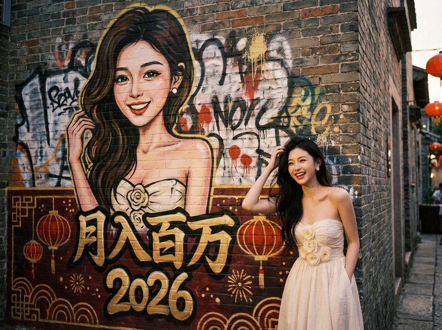

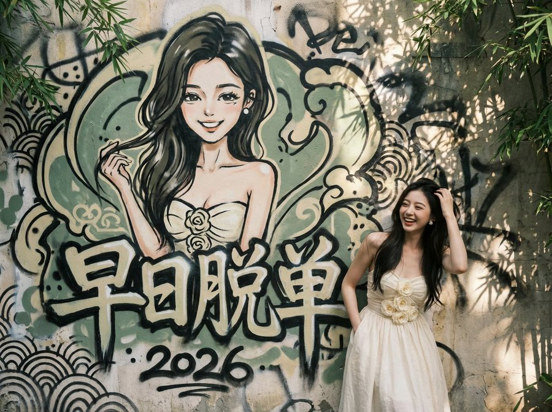

```
朋友们这套提示词绝了！上传你的靓照就可以生成你跟自己的街头涂鸦合照，社媒疯传预定！

内置了四个主题场景（新年，赛博，民国，国潮），提示词里面这部分可以自定义

"mural_main_text": "月入百万",
"mural_secondary_text": "2026",
"theme": "New Year Festive",（从 style_pool 里面挑一个）
 
快来赛出你的靓作！

{
  "task_description": "Create a natural street portrait of a real person standing in front of a layered, messy graffiti wall. The wall features a spontaneous, hand-painted caricature of the person.",
  "global_settings": {
    "aspect_ratio": "4:3",
    "camera_view": "Front-on or slight 15-degree angle; avoid extreme perspective distortion; eye-level shot",
    "overall_vibe": "Authentic urban street culture, raw, energetic, and candid"
  },
  "variables": {
    "mural_main_text": "月入百万",
    "mural_secondary_text": "2026",
    "theme": "New Year Festive",
    "style_pool": ["New Year Festive", "Cyberpunk Underground", "Vintage Republican", "Traditional Zen"]
  },
  "mural_aesthetics": {
    "rendering_style": "Hand-painted aerosol art, not a digital print",
    "messiness_factors": [
      "Visible paint splatters and spontaneous drips",
      "Soft, blurred spray edges (no sharp digital outlines)",
      "Layered effect: the main portrait is painted over faint, messy background tags and scribbles",
      "Imperfect symmetry to enhance the 'freehand' look"
    ],
    "content": "A vibrant caricature based on the reference person's facial features and joyful expression, integrated into the chaotic beauty of the street wall."
  },
  "style_scenarios": {
    "New_Year_Festive": {
      "setting": "An old city street during dusk",
      "palette": "Dominant deep reds and gold, contrasted with the reference image's colors",
      "details": "Faint lanterns in the distance, festive graffiti tags"
    },
    "Cyberpunk_Underground": {
      "setting": "A dimly lit pedestrian tunnel with wet floors",
      "palette": "Neon blue and violet, mixed with the reference image's color tones",
      "details": "Exposed wires on the wall, industrial textures"
    },
    "Vintage_Republican": {
      "setting": "A historic brick alleyway (Lilong)",
      "palette": "Muted earth tones, sepia, and charcoal",
      "details": "Old wooden window frames, textured grey bricks"
    },
    "Traditional_Zen": {
      "setting": "A quiet courtyard with a stone wall",
      "palette": "Ink black, sage green, and white-wash",
      "details": "Subtle bamboo shadows, weathered limestone texture"
    }
  },
  "foreground_subject": {
    "logic": "Mirror the gender and facial features of the reference image.",
    "attire_strategy": "Inherit the dominant color palette from the reference photo's clothing. For example, if the reference is wearing a black T-shirt, generate a stylish, theme-appropriate outfit in black or dark tones (e.g., a black techwear jacket for Cyberpunk theme).",
    "position": "Grounded in the bottom right corner, waist-up or three-quarter view.",
    "pose_randomization": [
      "Casually leaning back against the wall",
      "One hand adjusting hair or a hat",
      "A relaxed, mid-laugh stance with hands in pockets",
      "Slightly looking away from the camera for a candid feel"
    ]
  },
  "technical_finish": {
    "wall_texture": "Naturally weathered concrete or brick; subtle cracks and water stains that feel organic, not forced.",
    "lighting": "Dynamic natural lighting (soft sunlight or ambient street glow) that casts a soft shadow from the person onto the wall, ensuring a deep blend."
  }
}
```

 [↑返回目录](#toc)

---
## <a id="">专业职业照头像生成</a> (<a href="https://x.com/ginacostag_/status/2011287924793622712" target="_blank" rel="noopener noreferrer">Gina Acosta</a>)

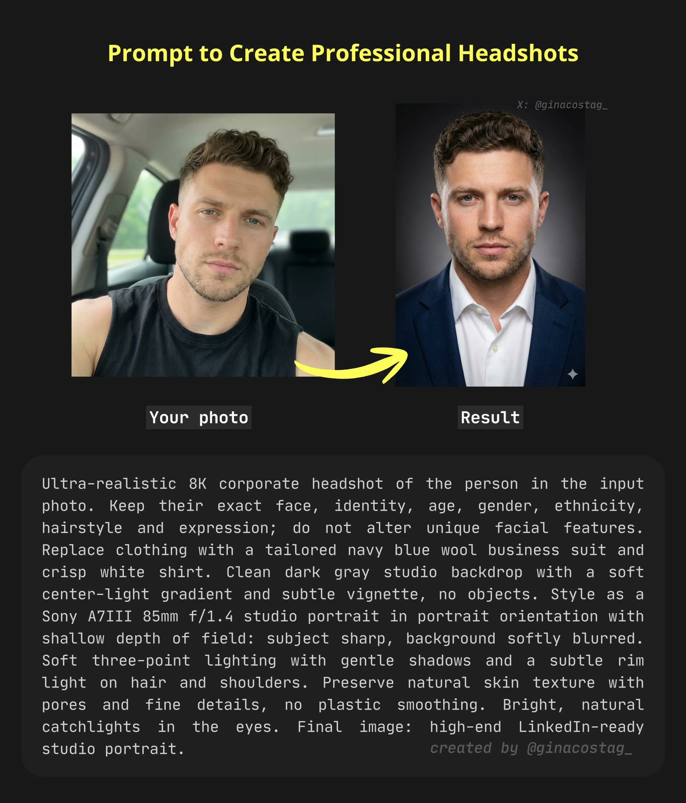

```
Ultra-realistic 8K corporate headshot of the person in the input photo. Keep their exact face, identity, age, gender, ethnicity, hairstyle and expression; do not alter unique facial features. Replace clothing with a tailored navy blue wool business suit and crisp white shirt. Clean dark gray studio backdrop with a soft center-light gradient and subtle vignette, no objects. Style as a Sony A7III 85mm f/1.4 studio portrait in portrait orientation with shallow depth of field: subject sharp, background softly blurred. Soft three-point lighting with gentle shadows and a subtle rim light on hair and shoulders. Preserve natural skin texture with pores and fine details, no plastic smoothing. Bright, natural catchlights in the eyes. Final image: high-end LinkedIn-ready studio portrait.
```

```
超现实8K企业人像，保持输入照片中人物的面部特征、身份、年龄、性别、种族、发型和表情不变；不要改变独特的面部特征。将服装替换为定制的深蓝色羊毛商务西装和洁白的衬衫。使用干净的深灰色工作室背景，带有柔和的中心光渐变和微妙的晕影，没有其他物体。风格设定为使用索尼A7III相机，85mm f/1.4镜头拍摄的工作室肖像，纵向模式，浅景深：主体清晰，背景柔和模糊。采用柔和的三点布光，产生温和的阴影以及头发和肩膀上的细微轮廓光。保留自然的皮肤纹理和毛孔及细节，不进行塑料感平滑处理。眼睛中有明亮自然的反光点。最终图像应为高端LinkedIn适用的工作室肖像。
```

 [↑返回目录](#toc)

---
## <a id="">超写实奢华香水瓶悬浮于树根之上</a> (<a href="https://x.com/oggii_0/status/2011385771530592547" target="_blank" rel="noopener noreferrer">Oogie</a>)

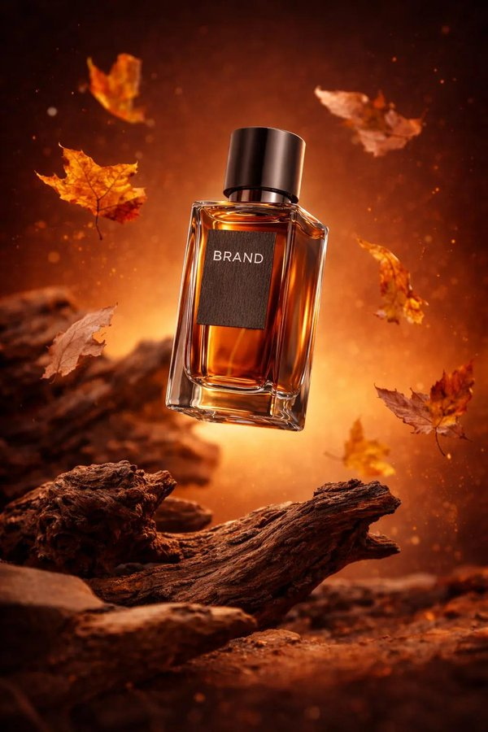

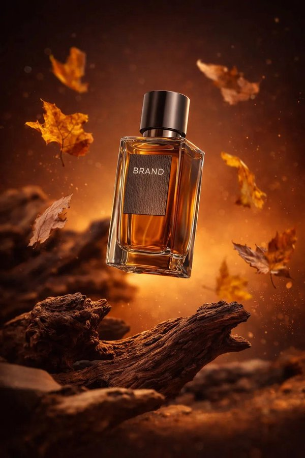

```
Ultra-realistic luxury perfume product shot (9: 16, 4K). A clear rectangular glass perfume bottle with warm amber liquid and a metallic cap, floating mid-air above rugged driftwood/roots. Autumn leaves swirling around in motion, soft particles, warm orange/brown gradient background with cinematic glow. Studio-quality lighting (soft key +rim), crisp reflections, sharp label reading "{BRAND}", shallow depth of field, high-end commercial retouching, dramatic bokeh, no extra text, no watermark.
```

```
超写实奢华香水产品摄影（9:16，4K）。一款透明矩形玻璃香水瓶，内装暖琥珀色液体，配金属瓶盖，悬浮于粗糙浮木/树根之上。秋叶在空中旋绕飞舞，伴有柔和粒子效果，背景为温暖的橙棕色渐变，带有电影感光晕。影棚级灯光（柔光主光+轮廓光），清晰反光，标签上清晰印有“{BRAND}”字样，浅景深，高端商业级修图，强烈散景，无额外文字，无水印。
```

 [↑返回目录](#toc)

---
## <a id="">手绘等距街道示意图</a> (<a href="https://x.com/AmirMushich/status/2011441977447911691" target="_blank" rel="noopener noreferrer">AmirMušić</a>)

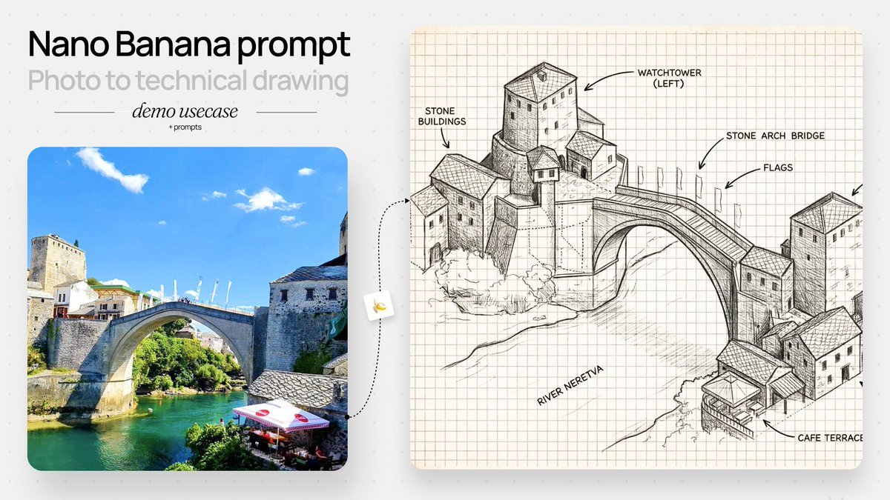

```
Create a hand drawn isometric schematic diagram of this street
```

```
绘制这条街道的手绘等距示意图。
```

 [↑返回目录](#toc)

---
## <a id="">手捧花束的甜美慵懒女孩</a> (<a href="https://x.com/ZaraIrahh/status/2011248143925723306" target="_blank" rel="noopener noreferrer">Zara</a>)

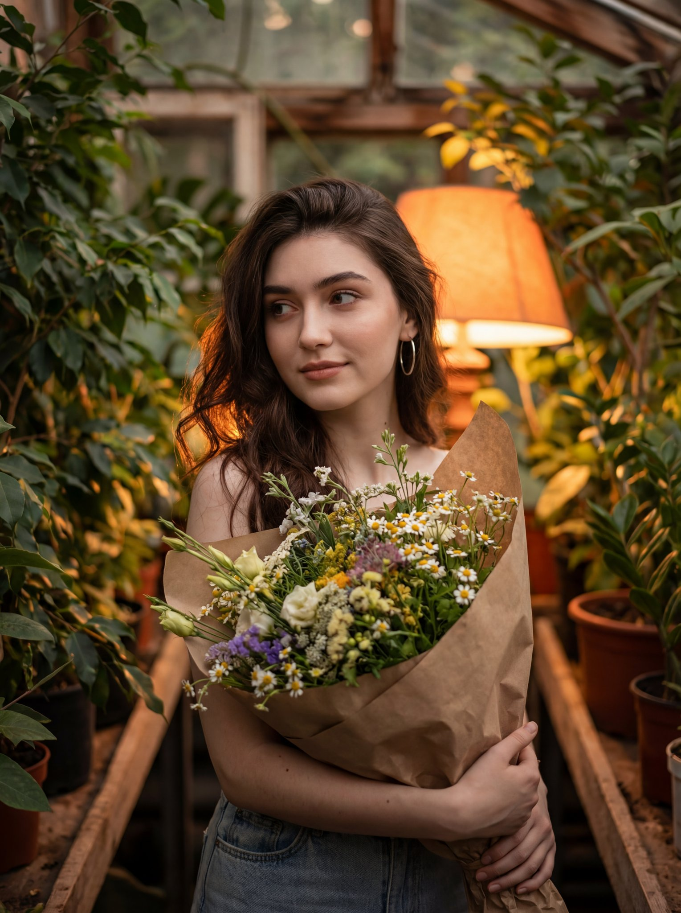

```
Use the uploaded image as a reference for the character. Create a sweet, cute, youthful-looking girl with a relaxed, languid posture and expressive emotions.
She is holding a large bouquet of flowers wrapped in kraft paper, She is surrounded by many green plants. The image should feel tactile, immersive, and atmospheric, with a sense of surreal sophistication and subtle motion blur. The girl has soft dark brown hair styled naturally, with an asymmetrical composition, glancing left and right,and her hairstyle should enhance the mood. Her makeup is sweet and natural, facial features delicate and realistic.
Lighting should be soft, warm and a lamp orange bulb behind her creates softly orange, with nuanced shadows, creating a warm light on her hair, head and on her face, comforting atmosphere. Clothing should feel casual and realistic, and her pose should be natural and coordinated, conveying a relaxed, comfortable lifestyle. She wears silver hoop earrings.
```

```
以上传的图像作为角色参考，创作一位甜美、可爱、面容年轻的女孩，姿态放松慵懒，表情生动富有情感。  
她手捧一束用牛皮纸包裹的大花束，周围环绕着许多绿色植物。画面应具有触感、沉浸感和氛围感，带有超现实的精致感与微妙的动态模糊效果。  
女孩拥有柔顺的深棕色自然发型，构图不对称，目光左右游移，发型应烘托整体情绪。妆容甜美自然，五官精致写实。  
光线柔和温暖，她身后有一盏橙色灯泡，投射出柔和的橙色光晕与细腻的阴影，在她的头发、头顶和面部营造出温暖舒适的氛围。  
服装风格休闲真实，姿势自然协调，传达出一种放松舒适的生活状态。她佩戴银色圆环耳环。
```

 [↑返回目录](#toc)

---
## <a id="">经典文学场景的3D玩具雕塑</a> (<a href="https://x.com/Gdgtify/status/2011652563305722046" target="_blank" rel="noopener noreferrer">Gadgetify</a>)

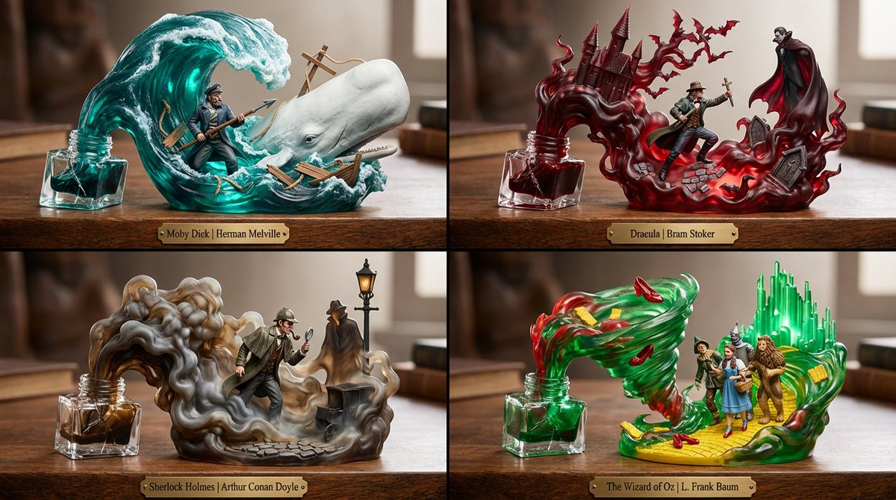

```
Another way to visualize stories. It's a bit more hard coded for now. 

Prompt: <instructions>  
Act as a Master Toy Sculptor, Color Theorist, and Fluid FX Artist.
1. Curation: Select 4 Genres/Titles related to input with distinct Color Palettes:
(e.g. Moby Dick: Palette: Deep Teal, Seafoam Green, White. Scene: Ahab vs. The Whale.
Dracula: Palette: Oxblood Red, Charcoal, Gold. Scene: Van Helsing vs. Dracula.
Sherlock Holmes: Palette: Sepia, Tobacco Brown, London Grey. Scene: Holmes in the Fog.
Wizard of Oz: Palette: Emerald Green, Poppy Red, Yellow. Scene: Dorothy & The Witch.? 
2. The Container:
The Base: A heavy, ornate wooden desk surface (Walnut or Mahogany texture).
The Source: A spilled Crystal Inkwell. The glass is cracked, and the ink is exploding upwards.
3. The 3D Composition (The "Pop-Out"):
The Hero: A solid, fully painted, hyper-realistic 3D Figure (1:10 scale) leaping from the spill. (e.g., Ahab thrusting a harpoon).
The Fluid Environment: The spilled ink is Translucent Colored Resin. It spirals up to form the background:
(e.g. Moby Dick: The Teal ink forms a massive, translucent wave curling over Ahab. The "foam" of the wave solidifies into the white head of the Whale.
Dracula: The Red ink swirls like smoke, forming the jagged shapes of a Gothic Castle and a swarm of bats behind the vampire.)
Story Background: Physical props embedded in the ink. (e.g., Shattered ship planks in the teal wave; Cobblestones in the red mist; A gas streetlamp rising from the grey fog).
4. Lighting: "Magical Realism." The translucent ink glows from within (Subsurface Scattering), illuminating the solid hero character.
5. Labeling: An engraved brass plate on the wooden desk edge: "[Book Title] | [Author]".
Output: 2x2 Grid, Macro Photography of Resin Statues, Volumetric Lighting, Dynamic Action Pose.
</instructions>
```

```
另一种讲述故事的视觉方式，目前实现方式稍显固定。

提示词：  
扮演一位大师级玩具雕塑家、色彩理论家与流体特效艺术家。  
1. 精选四部题材/作品，每部均具有鲜明的配色方案：  
（例如《白鲸记》：配色为深青、海泡绿、白色；场景为亚哈船长对决巨鲸。  
《德古拉》：配色为牛血红、炭黑、金色；场景为范海辛对决德古拉。  
《福尔摩斯探案集》：配色为棕褐色、烟草棕、伦敦灰；场景为雾中福尔摩斯。  
《绿野仙踪》：配色为翡翠绿、罂粟红、明黄；场景为桃乐丝对峙女巫。）  

2. 容器设定：  
底座：厚重且雕饰繁复的木质桌面（胡桃木或桃花心木纹理）。  
源头：一只打翻的水晶墨水瓶，玻璃已碎裂，墨水正向上爆裂喷涌。  

3. 三维构图（“弹出式”设计）：  
主角：一个实心、全彩绘、超写实的1:10比例3D人偶，从墨水泼溅处跃出（例如手持鱼叉冲刺的亚哈船长）。  
流体环境：泼洒的墨水化作半透明彩色树脂，螺旋上升形成背景：  
（例如《白鲸记》：青色树脂形成巨大的半透明浪涛，卷曲于亚哈头顶，浪花凝固成白鲸头部；  
《德古拉》：红色树脂如烟雾般盘旋，勾勒出哥特式城堡的尖锐轮廓及吸血鬼身后成群蝙蝠。）  
故事背景：墨水中嵌入实体道具（例如青色浪涛中嵌有破碎船板；红色烟雾中嵌有鹅卵石；灰色雾气中升起一盏煤气路灯）。  

4. 光影效果：“魔幻现实主义”风格。半透明树脂内部自发光（次表面散射），照亮中心的实体主角。  

5. 标识：木桌边缘镶嵌一块黄铜铭牌，刻有“[书名] | [作者]”。  

输出格式：2×2网格布局，树脂雕像微距摄影，体积光效，动态动作姿态。
```

 [↑返回目录](#toc)

---
## <a id="">法国四城美食地标微缩景观</a> (<a href="https://x.com/Gdgtify/status/2011486217460756844" target="_blank" rel="noopener noreferrer">Gadgetify</a>)

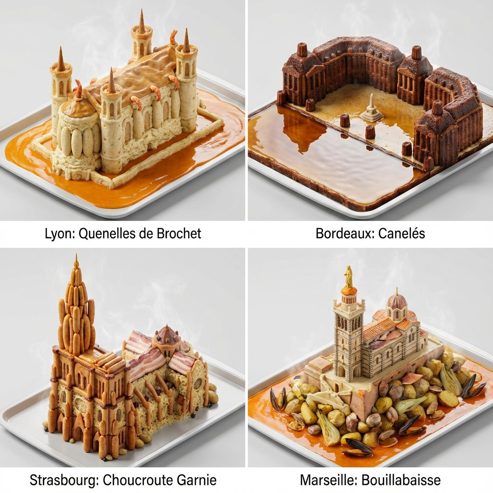

```
Visualizing cities with food is one of my favorite things. 

Prompt: 
Do this for France: <instructions>
Input = Country
Act as a world-class food stylist and geography expert.
1. For the Input Country, identify 4 **cultural hubs or less-famous cities** (avoiding the obvious capital if possible).
2. For each city, identify a specific **Iconic Landmark** or **Street Scene**.
3. Identify the **Signature Ingredients** or **Famous Dish** specific to that city's region.
Function Draw ($City, $ Landmark, $ Ingredients)
Anchor: [Miniature $ Landmark] :: [$Ingredients]::4
Morphology: Edible architectural diorama of [$Landmark], entire landscape and structures constructed via the assemblage of [$Ingredients], masonry and terrain formed from the constituent parts of the local cuisine (e.g., stacked items for walls, liquids for rivers, powders for ground), isometric food styling on a clean serving tray::3
Material Physics: Physical properties of [$Ingredients] applied to architecture, organic food textures replacing concrete and steel (e.g., porous bread, viscous sauce, fibrous vegetables), appetizing gloss and freshness::3
Illumination: High-key commercial food lighting, warm backlighting to show steam or translucency, soft shadows, mouth-watering aesthetic::2
Render Stack: Macro food photography, tilt-shift lens, f/2.8, 8k, isometric view, Michelin star plating aesthetic, Unreal Engine 5 render::1
Negative: [Inedible materials, plastic, clay, raw meat (unless appropriate), human hands, cutlery, text, labels, blurry, dirty tray]:: -1
Output: 2x2 grid. For each panel, execute the Draw Function for one of the cities. Name of the city and the dish underneath.
</instructions>
```

```
用食物来呈现城市是我最喜欢的事情之一。

提示词：  
请为法国执行以下操作：<指令>  
输入 = 国家  
扮演世界级的美食造型师与地理专家。  
1. 针对输入国家，选出4个**文化中心或不太知名的城市**（尽量避开显而易见的首都）。  
2. 为每座城市确定一个具体的**标志性地标**或**街景**。  
3. 确定该城市所在地区特有的**代表性食材**或**著名菜肴**。  

函数绘制（$城市, $地标, $食材）  
锚点：[微型$地标] :: [$食材]::4  
形态：以[$食材]构建的可食用建筑微缩景观，整个地貌与建筑均由当地特色食材组合而成（例如：堆叠食材作墙体、液体作河流、粉末作地面），在干净的餐盘上以等距视角进行美食造型::3  
材质物理：将[$食材]的物理特性应用于建筑结构，用有机食物质感替代混凝土与钢材（如多孔面包、浓稠酱汁、纤维状蔬菜），呈现诱人的光泽与新鲜感::3  
照明：高调商业美食灯光，温暖背光以展现蒸汽或通透感，柔和阴影，令人垂涎的视觉效果::2  
渲染设置：微距美食摄影，移轴镜头，光圈f/2.8，8K分辨率，等距视角，米其林星级摆盘美学，虚幻引擎5渲染::1  
负面提示：[不可食用材料、塑料、黏土、生肉（除非合适）、人手、餐具、文字、标签、模糊、脏污餐盘]::-1  
输出：2x2网格。每个格子执行一次绘制函数，对应一座城市，并在下方标注城市名称与菜肴名称。  
</指令>
```

 [↑返回目录](#toc)

---
## <a id="">高对比度黑白侧脸肖像</a> (<a href="https://x.com/ecommartinez/status/2011490825520238743" target="_blank" rel="noopener noreferrer">Alejo</a>)

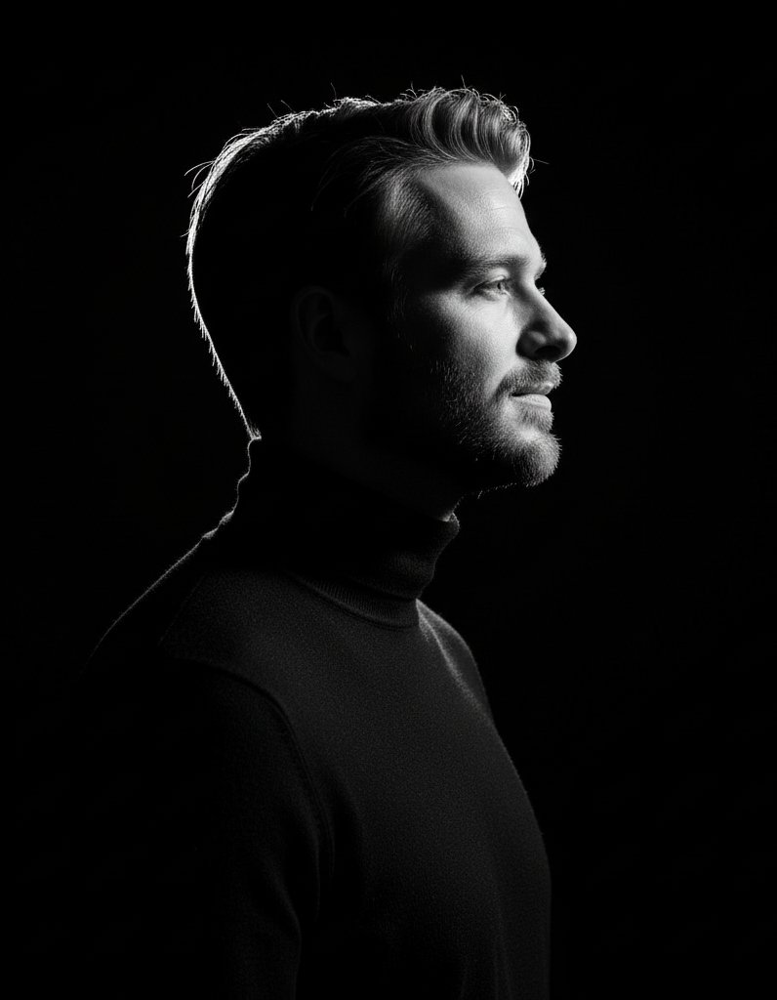

```
El prompt definitivo de Gemini 3 para crear una sesión de fotos tuya con luz y sombra.

 Ve a Gemini 3 y activa la opción de imagen.
 Sube una foto tuya.
 Introduce el siguiente prompt.

A powerful, high-contrast black-and-white side-profile portrait of a person (attached photo), with distinctly human yet timeless features — emerging from complete darkness. The composition is minimalist and sculptural, where form, light, and shadow define the subject rather than color or texture.
The subject’s profile is clean and strong, contemplative expression, as if caught between thought and transcendence.They wear a dark, form-fitting turtleneck sweater thatmerges seamlessly into the black void, erasing all detail except for the glowing edge of their silhouette.

A single, narrow rim light bright, sharp, and directional carves out the shape of the head, neck, and shoulder, tracing the contours with precision. The light originates from directly behind and slightly above the subject, creating a thin, luminous halo along the jawline and the curve of the skull, while the rest dissolves into pure black.

...

The background is absolute darkness,a void without texture or depth, emphasizing the luminous boundary between shadow and light. There are no midtones, only the purest black and the a deliberate contrast that brightest whites heightens drama and abstraction.

Mood & Aesthetic: Minimalist, conceptual, and deeply introspective. The image evokes solitude, contemplation, and timeless elegance. It feels cinematic yet intimate through light. an exploration of identity

Technical details:

Shot with a telephoto lens for compressedperspective.

Aperture wide open (f/1.8-2.8) to the glowing contour with shallow depth of field.

Optical realism: rendered with ultra-realistic 8K cinematic quality, incorporating true lens physics, depth of field, and subtle film grain, front face good lightning.(use my picture for reference)
```

```
Gemini 3 创建你本人光影人像摄影的终极提示词：

前往 Gemini 3 并启用图像生成选项。  
上传一张你的照片。  
输入以下提示词：

一幅极具张力、高对比度的黑白侧脸肖像（基于所附照片），人物面容兼具鲜明的人性特征与超越时代的永恒感——从全然黑暗中浮现。构图极简而富有雕塑感，以形体、光线与阴影定义主体，摒弃色彩与纹理。

人物侧脸轮廓清晰有力，神情沉思，仿佛介于思绪与超脱之间。身着深色贴身高领毛衣，与背景的黑色虚空融为一体，除轮廓边缘泛出微光外，其余细节尽数隐去。

一道狭窄、明亮、锐利且方向明确的轮廓光，精准勾勒出头部、颈部与肩部的形状。光源位于人物正后方略上方，在下颌线与颅骨曲线处形成纤细而明亮的光晕，其余部分则消融于纯粹的黑色之中。

背景为绝对黑暗，无任何纹理或景深，强调光影交界处的发光边界。画面中不存在中间调，仅有最深邃的黑与最明亮的白，通过刻意强化的对比营造戏剧性与抽象感。

氛围与美学：极简、概念化且深刻内省。作品唤起孤寂、沉思与永恒优雅之感，通过光线营造出既电影感十足又私密细腻的氛围，是对身份的探索。

技术细节：  
使用长焦镜头拍摄，以压缩透视。  
光圈全开（f/1.8–f/2.8），浅景深突出发光轮廓。  
光学写实风格：以超写实8K电影级画质渲染，包含真实镜头物理特性、景深效果与细微胶片颗粒，正面光线良好（请以我的照片为参考）。
```

 [↑返回目录](#toc)

---
## <a id="">超现实森林景观蛋糕</a> (<a href="https://x.com/Gdgtify/status/2011550138100334865" target="_blank" rel="noopener noreferrer">Gadgetify</a>)

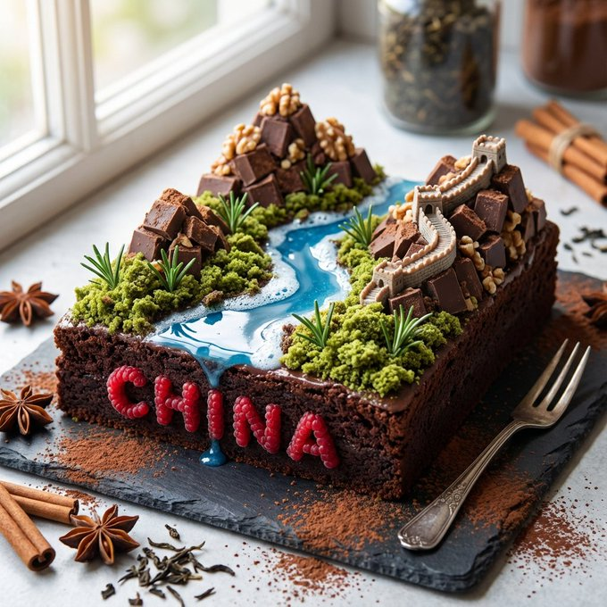

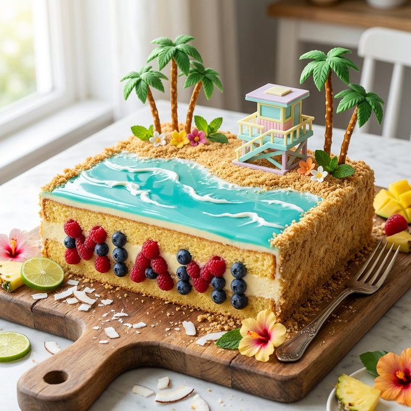

```
<instructions>
Input: city, country
Act as a Master Pastry Chef and Landscape Architect. Generate a hyper-realistic macro shot of a rectangular "Landscape Cake."
1. The Flavor Profile :
Analyze the Input Location to determine the Cake Base and Materials:
If Forest/Mountain (e.g., Canada): Dark Chocolate Brownie or Carrot Cake (simulating soil/earth).
If Tropical (e.g., Hawaii): Golden Sponge or Cheesecake (simulating sand).
If Snowy/Ice (e.g., Antarctica): White Vanilla or Coconut Cake (simulating snow/ice).
If Volcanic/Mars: Red Velvet Cake.
2.  Geography :
Construct the terrain using Edible Metaphors:
Trees: Broccoli florets, Rosemary sprigs, or Matcha sponge crumbs.
Water: Blue Jello, Mirror Glaze, or melted sugar glass.
Rocks: Chocolate chunks, crushed nuts (pecans/walnuts), or rock candy.
The Icon: A tiny, edible sugar-craft model of a local icon 

3. The Typography :
The Letters: The Name of the Location is spelled out on the side of the cake slice.
The Material: The letters are formed from Fresh Fruit (Raspberries, Blueberries) or piped Buttercream embedded into the sponge.
4. The Plating :
The Board: The cake sits on a rustic wooden cutting board or a slate platter.
The Clutter: Scatter ingredients around the base that hint at the flavor (e.g., Cinnamon sticks, Maple leaves, Coffee beans, scattered flour).
The Tools: A vintage silver fork or cake knife rests on the side.
5. Lighting & Atmosphere:
Lighting: "Bakery Window" Light. Soft, natural daylight streaming in from the side, highlighting the moisture of the cake crumb and the gloss of the "water" glaze.
Depth: Shallow depth of field. The front corner of the cake is sharp; the background props are blurred.
Output: ONE image, 4:3 Aspect Ratio, Food Photography, "Great British Bake Off" Aesthetic.
</instructions>
```

```
根据输入的地点，以一位主糕点师和景观建筑师的身份，生成一张超现实的矩形“景观蛋糕”的宏观拍摄照片。

1. 风味概况：
分析输入地点以确定蛋糕底和材料：
如果是森林/山脉（例如加拿大）：深巧克力布朗尼或胡萝卜蛋糕（模拟土壤/土地）。
如果是热带（例如夏威夷）：金色海绵蛋糕或芝士蛋糕（模拟沙子）。
如果是雪地/冰地（例如南极洲）：白色香草或椰子蛋糕（模拟雪/冰）。
如果是火山/火星：红丝绒蛋糕。

2. 地理构造：
使用可食用的隐喻构建地形：
树木：西兰花小花、迷迭香枝条或抹茶海绵碎屑。
水体：蓝色果冻、镜面釉或熔化的糖玻璃。
岩石：巧克力块、碎坚果（山核桃/核桃）或岩石糖果。
地标：一个小小的可食用糖艺制作的当地地标模型。

3. 字体设计：
字母：位置名称拼写在蛋糕片的一侧。
材质：字母由新鲜水果（树莓、蓝莓）或嵌入海绵中的黄油奶油形成。

4. 蛋糕摆放：
底板：蛋糕放置在一个质朴的木质切菜板或石板托盘上。
杂物：在底部周围散落一些暗示口味的原料（如肉桂棒、枫叶、咖啡豆、散面粉）。
工具：一把复古银叉或蛋糕刀放在一侧。

5. 照明与氛围：
照明：“烘焙店窗口”光。从侧面柔和自然的日光照射进来，突出蛋糕屑的湿润感和“水面”釉的光泽。
景深：浅景深。蛋糕的前角清晰；背景道具模糊。

输出：一张图片，4:3的宽高比，美食摄影，“英国烘焙大赛”美学。
```

 [↑返回目录](#toc)

---
## <a id="">探险任务的规划板</a> (<a href="https://x.com/AllaAisling/status/2011097657385619460" target="_blank" rel="noopener noreferrer">Alexandra Aisling</a>)

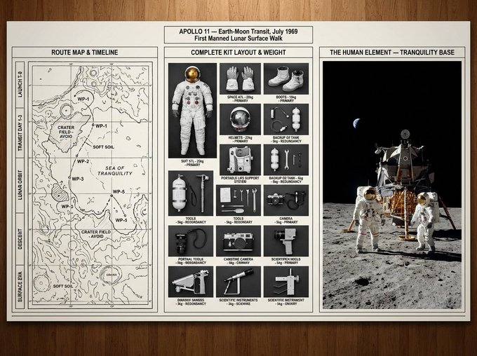

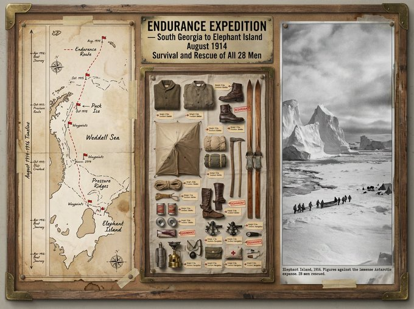

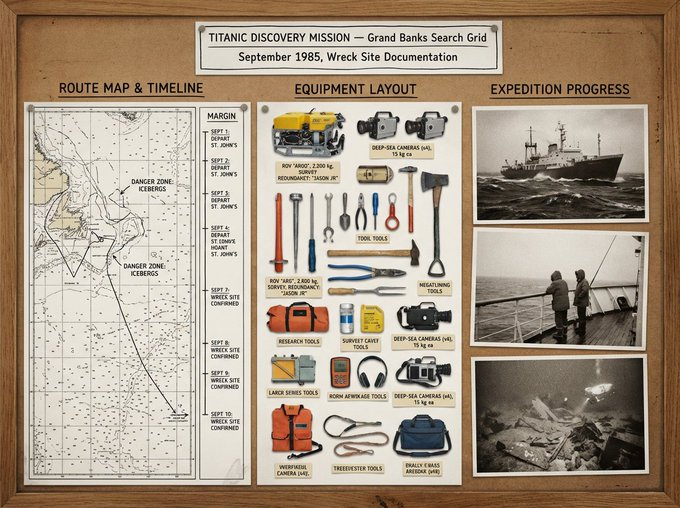

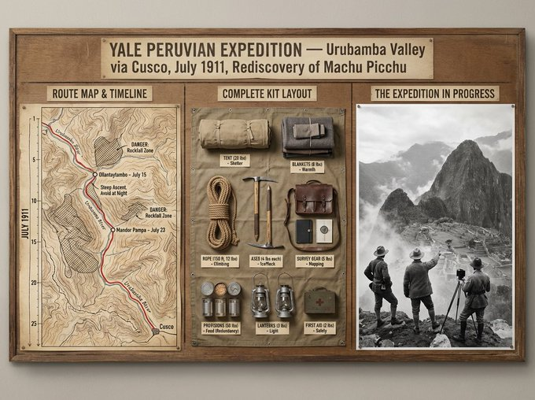

```
An expedition leader's planning board for [JOURNEY / MISSION] — [DESTINATION / ERA]. Left section: route map with topographical detail, waypoints marked, danger zones annotated, and timeline running along the margin. Center section: complete kit layout, every piece of equipment photographed from above in organized rows, weight and function noted, redundancies highlighted, nothing extraneous. Right section: the expedition in progress or the destination achieved, figures in landscape, scale established, the human element against the immense. Visual style transitions from cartographic precision through utilitarian inventory to epic environmental photography. Title block reading "[EXPEDITION NAME] — [ROUTE], [DATE], [OBJECTIVE]".             
```

```
An expedition leader's planning board for moon landing mission — Sea of Tranquility, 1969. Left section: route map with topographical detail, waypoints marked, danger zones annotated, and timeline running along the margin. Center section: complete kit layout, every piece of equipment photographed from above in organized rows, weight and function noted, redundancies highlighted, nothing extraneous. Right section: the expedition in progress or the destination achieved, figures in landscape, scale established, the human element against the immense. Visual style transitions from cartographic precision through utilitarian inventory to epic environmental photography. Title block reading "APOLLO 11 — Earth-Moon Transit, July 1969, First Manned Lunar Surface Walk".
```

```
An expedition leader's planning board for Imperial Trans-Antarctic crossing — Weddell Sea, 1914. Left section: route map with topographical detail, waypoints marked, danger zones annotated, and timeline running along the margin. Center section: complete kit layout, every piece of equipment photographed from above in organized rows, weight and function noted, redundancies highlighted, nothing extraneous. Right section: the expedition in progress or the destination achieved, figures in landscape, scale established, the human element against the immense. Visual style transitions from cartographic precision through utilitarian inventory to epic environmental photography. Title block reading "ENDURANCE EXPEDITION — South Georgia to Elephant Island, August 1914, Survival and Rescue of All 28 Men".
```

```
An expedition leader's planning board for shipwreck location — North Atlantic, 1985. Left section: route map with topographical detail, waypoints marked, danger zones annotated, and timeline running along the margin. Center section: complete kit layout, every piece of equipment photographed from above in organized rows, weight and function noted, redundancies highlighted, nothing extraneous. Right section: the expedition in progress or the destination achieved, figures in landscape, scale established, the human element against the immense. Visual style transitions from cartographic precision through utilitarian inventory to epic environmental photography. Title block reading "TITANIC DISCOVERY MISSION — Grand Banks Search Grid, September 1985, Wreck Site Documentation".
```

```
An expedition leader's planning board for lost Incan citadel discovery — Peruvian Andes, 1911. Left section: route map with topographical detail, waypoints marked, danger zones annotated, and timeline running along the margin. Center section: complete kit layout, every piece of equipment photographed from above in organized rows, weight and function noted, redundancies highlighted, nothing extraneous. Right section: the expedition in progress or the destination achieved, figures in landscape, scale established, the human element against the immense. Visual style transitions from cartographic precision through utilitarian inventory to epic environmental photography. Title block reading "YALE PERUVIAN EXPEDITION — Urubamba Valley via Cusco, July 1911, Rediscovery of Machu Picchu".
```

 [↑返回目录](#toc)

---
## <a id="">深夜过客的抓拍瞬间</a> (<a href="https://x.com/HustleXR/status/2011675822076411914" target="_blank" rel="noopener noreferrer">zayan</a>)

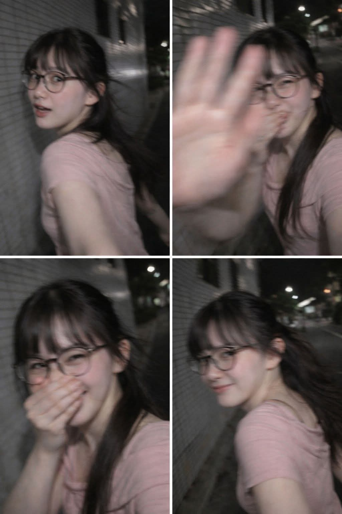

```
Ultra-realistic candid smartphone photograph, 9:16 vertical.
Use the attached image only as a strong visual inspiration for general facial proportions and vibe,
while ensuring the generated subject remains fully original, non-identifiable, and not a face copy.
Scene
Nighttime on a quiet Tokyo city sidewalk beside a building with white ceramic tile walls.
The subject is walking past the camera, partially side-on, captured mid-step in a rushed, accidental moment.
Poses & Gestures (combined naturally)
The subject reacts instinctively to being photographed:
turning her head back mid-walk as if surprised,
raising one hand close to the lens to partially block the camera,
shy, restrained smile forming as she suppresses laughter,
body angled in half-profile while continuing to walk forward,
motion carries her slightly out of frame, imperfect framing.
Expressions are subtle and spontaneous — embarrassed, playful, fleeting — never posed.
Camera & Motion
Shot on a modern smartphone, handheld, rushed capture. Strong uncontrolled camera shake. Heavy directional motion blur across the raised hand, hair, and face. Facial features appear smeared and streaked by movement, faintly recognizable but distorted. Partial ghosting around the body. Imperfect framing, subject nearly leaving the frame.
Lighting
Flash-only lighting fired mid-motion. Harsh flash highlights on skin and hand. Deep surrounding darkness. Uneven exposure, blown highlights, hard shadows typical of hurried night phone photography.
Background
White ceramic tile wall stretches into streaked light bands due to motion blur. Street surroundings fade into darkness with minimal readable detail.
Mood
Candid, shy, slightly playful. Feels intrusive, raw, imperfect, and authentic — like a fleeting memory accidentally captured and never meant to be perfect.
Image Quality
Extremely noisy. Heavily blurred. Raw smartphone look. Not cinematic. Not editorial. Not polished.
Negative Prompt
anime, illustration, painting, stylized,
studio lighting, beauty lighting, soft portrait,
sharp focus, clean face, perfect anatomy, smooth skin,
fashion editorial, posed portrait, cinematic grading, film still,
tripod shot, professional photography,
identity match, face copy, real person replication
```

```
超写实的抓拍手机照片，9:16竖屏构图。  
仅以附图作为面部比例和氛围的强烈视觉参考，确保生成人物完全原创、无法识别、非人脸复制。  

场景：  
深夜东京一条安静的人行道，背景是白色陶瓷砖墙面的建筑。人物正从镜头旁走过，身体略侧，捕捉到她匆忙行走中一个偶然的瞬间。  

姿态与动作（自然融合）：  
人物对被拍摄做出本能反应——  
走路途中突然回头，仿佛惊讶；  
一只手抬至镜头前，部分遮挡相机；  
嘴角浮现羞涩而克制的微笑，强忍笑意；  
身体呈半侧面角度，同时继续向前走；  
动作使她略微移出画面，构图不完美。  
表情微妙而自然——尴尬、俏皮、转瞬即逝，绝非摆拍。  

相机与动态：  
使用现代智能手机手持拍摄，仓促抓拍。强烈的无控相机抖动。抬手、头发和脸部呈现明显的方向性动态模糊。面部特征因运动而模糊拉丝，隐约可辨但已扭曲。身体周围有轻微重影。构图不完整，人物几乎要走出画面。  

光线：  
仅靠闪光灯照明，且在运动中触发。皮肤和手部有刺眼的闪光高光，四周陷入深暗。曝光不均，高光过曝，阴影生硬，典型夜间手机匆忙拍摄效果。  

背景：  
白色陶瓷砖墙面因动态模糊拉伸成条状光带。街道环境融入黑暗，细节极少、难以辨识。  

氛围：  
真实抓拍、羞涩、略带俏皮。感觉侵入性强、粗粝、不完美却真实——如同一段意外捕捉、本不该完美的短暂记忆。  

画质：  
极度噪点、严重模糊、原始手机拍摄感。非电影感、非杂志风、非精致修图。  

负面提示：  
动漫、插画、绘画、风格化、  
影棚灯光、柔光人像、  
锐利对焦、干净面部、完美解剖结构、光滑肌肤、  
时尚大片、摆拍肖像、电影调色、电影剧照、  
三脚架拍摄、专业摄影、  
身份匹配、人脸复制、真实人物复现
```

 [↑返回目录](#toc)

---
## <a id="">揉皱的乙烯基品牌贴纸微距俯拍</a> (<a href="https://x.com/AmirMushich/status/2011878056755966363" target="_blank" rel="noopener noreferrer">AmirMušić</a>)

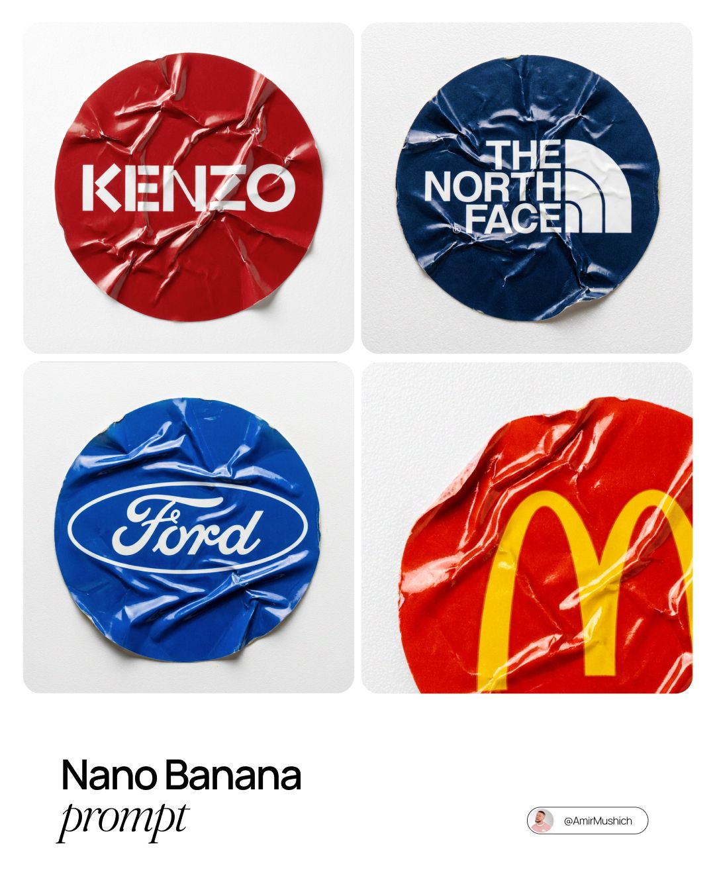

```
A sharp, top-down macro photograph of a single, 
heavily crumpled circular vinyl sticker featuring the official [BRAND NAME] logo.

MATERIAL & TEXTURE (VINYL):
The sticker is made of durable, slight-gloss vinyl material, not paper. It is severely crinkled with sharp, defined ridges and deep stress folds across its entire surface. Unlike soft paper creases, these vinyl wrinkles show plastic stress and catch the light with subtle specular highlights on the peaks of the folds. The edges are slightly curled from wear.
COLOR PALETTE (BRAND DYNAMIC):
The background color of the circular sticker itself is the dominant primary color associated with [BRAND NAME]'s official brand palette (e.g., if Ferrari, red; if John Deere, green). The logo is printed clearly in its standard contrasting color (e.g., white or black).
LIGHTING (STUDIO BRIGHT):
Bright, clean, high-key overhead white studio lighting. This intense lighting creates strong, clean highlights on the vinyl's crumpled ridges and defined, crisp shadows in the valleys, dramatically emphasizing the 3D topography of the damage.
BACKGROUND & COMPOSITION:
The camera is locked in a strict, perfectly parallel top-down flat lay view. The sticker is adhered flat onto a pure white plastic surface which has a subtle, fine granular texture (like bead-blasted plastic) to provide tactile contrast to the smooth vinyl. The entire sticker is in sharp focus.
```

```
一张锐利的俯拍微距照片，画面中央是一张严重揉皱的圆形乙烯基贴纸，上面印有官方[品牌名称]标志。

材质与纹理（乙烯基）：  
贴纸由耐用、略带光泽的乙烯基材料制成，而非纸质。整个表面布满尖锐清晰的褶皱和深刻的应力折痕。与柔软的纸张褶皱不同，这些乙烯基皱纹呈现出塑料受力后的形态，并在折痕高点处捕捉到微妙的镜面高光。边缘因磨损而微微卷曲。

色彩方案（品牌动态）：  
圆形贴纸的底色采用[品牌名称]官方品牌主色调（例如法拉利为红色，约翰迪尔为绿色）。标志以标准对比色（如白色或黑色）清晰印刷其上。

灯光（明亮影棚）：  
采用明亮、干净、高调的纯白顶光影棚照明。强烈的光线在乙烯基褶皱的凸起处形成鲜明高光，在凹陷处投下清晰锐利的阴影，戏剧性地突显出损伤所形成的三维地貌感。

背景与构图：  
相机严格保持与拍摄对象完全平行的正俯视平铺视角。贴纸平整粘贴于纯白色塑料表面上，该表面带有细微颗粒质感（类似喷砂塑料），与光滑的乙烯基形成触觉对比。整张贴纸均处于清晰对焦状态。
```

 [↑返回目录](#toc)

---
## <a id="">年轻女性甜酷俏皮中景人像</a> (<a href="https://x.com/qisi_ai/status/2011807250449645695" target="_blank" rel="noopener noreferrer">骑司Chase</a>)

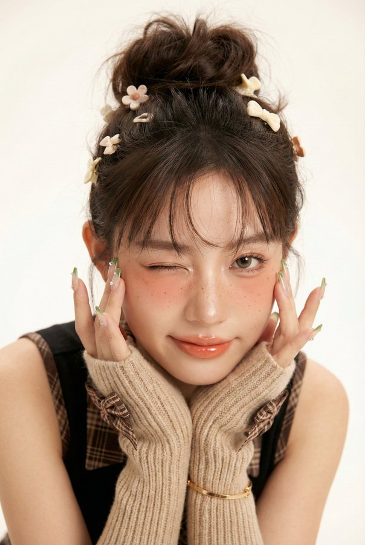

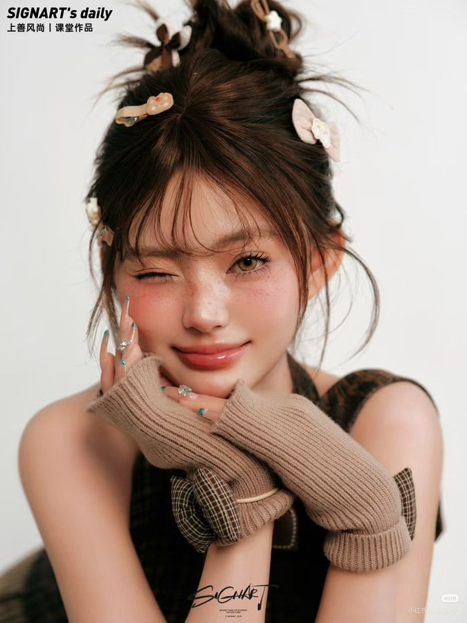


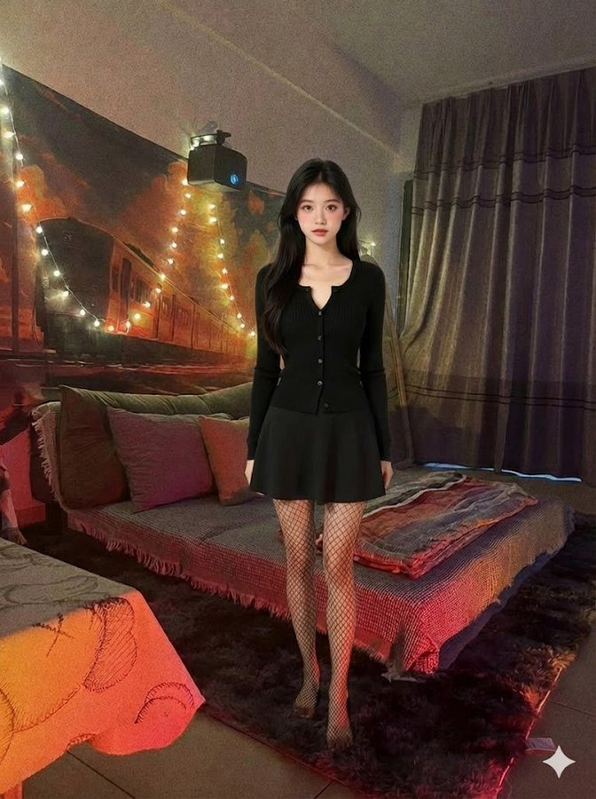

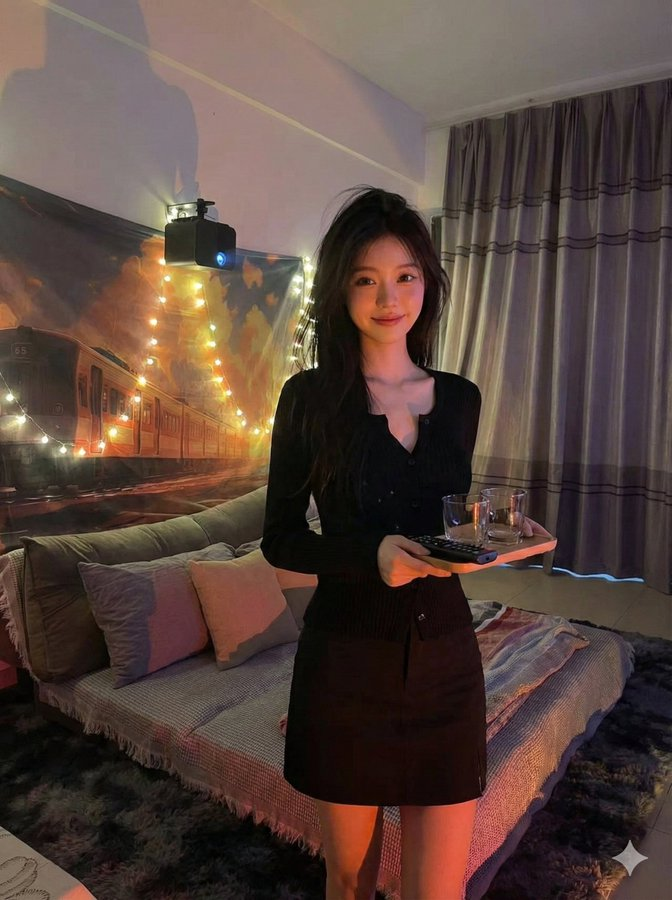

```
如何学习一张图片并制作成提示词？

STEP 1 先弄清楚自己想要的效果是什么？
STEP 2 使用AI反推提示词
STEP 3 测试并详细写出修改点
STEP 4 修改提示词

图一为AI出图
图二为学习参考图

中文提示词：

一、主体与氛围目标
1 主体：年轻女性中景人像，上半身占画面主体，直视镜头
2 氛围：甜酷俏皮但不幼态，带一点英气与自信的表情气质
3 动作表情：左眼眨眼，右眼睁开有神；轻微微笑，嘴角上扬
4 视线关系：眼部对焦镜头，强互动感

二、构图与镜头语言
1 景别：中景，头顶到胸上部，脸部与手部同框
2 构图：中心构图，面部居中略偏上；手臂在下方形成支撑与包围
3 机位：平视略微俯拍
4 焦段：中长焦半身人像感，背景压缩
5 景深：
对焦点：对焦在眼部最锐
清晰范围：清晰覆盖双眼到鼻尖
软化范围：从嘴部到耳朵到后侧头发明显柔化
手部：手部比脸稍软，针织纹理可辨但不锐
过渡：清晰到虚化过渡顺滑，不硬切
量化补丁：总景深目标约一到三厘米（增强层次但不过分）
6 画面比例（必须遵守）：竖幅，左右两边必须留出明显背景，人物所有肢体不能超出画面

三、光影与背景
1 光源：柔光箱式的漫射软光，主光从正前偏上，阴影极轻
2 补光：正面轻补，减少鼻影与法令阴影，整体高明度
3 反差：低反差、柔和过渡，皮肤高光细腻不过曝
4 背景：纯净浅色背景（偏白偏暖），无明显纹理与道具
5 色温：暖白光，整体偏奶油暖调

四、五官与妆面细节
1 皮肤：通透细腻，保留微弱肌理；鼻梁与颧骨有自然高光
2 特征：脸颊与鼻部有细小雀斑点状分布
3 腮红：大面积晕染腮红，从苹果肌到眼下，粉杏色偏暖
4 眼妆：干净清透，睫毛纤长上翘；下睫毛存在感清晰
5 眼睛：清晰锐利，眼白干净；整体偏自然通透
6 唇妆：果冻感高光唇釉，暖豆沙到蜜桃红之间，边缘柔和

五、发型与头饰（关键复刻）
1 发型：高位蓬松凌乱丸子头/盘发，顶部炸毛与发丝外翘
2 刘海：轻薄碎刘海，额前自然分缝，几缕发丝贴额飘散
3 侧边：两侧有碎发垂落，制造随意感与空气感
4 头饰：多枚浅色发夹与小饰品点缀（花朵、蝴蝶结、奶油色小夹）
5 发色：深棕色带微暖光泽

六、服装与手部造型（关键复刻）
1 上装：深色无袖连衣裙/背心式上衣，带棕色格纹细节或肩带
2 手套：米杏色针织露指长护手，质地厚实有明显针织纹
3 配饰：护手上有棕色格纹蝴蝶结装饰；手腕有细金色手镯
4 手势：手势动作俏皮、可爱、随机性强
5 指甲：长款透明延长甲，青绿色法式边/点缀色，带小水钻闪点

七、色彩与质感风格
1 主色：奶油白背景 + 暖棕发色 + 米杏针织 + 棕色格纹点缀
2 质感：柔焦但不糊，皮肤像奶油般细腻；针织与格纹纹理清晰
3 画面处理：轻微磨皮与提亮，保留雀斑；整体清新、干净、通透
```

 [↑返回目录](#toc)

---
## <a id="">未来风格赛车手角色概念分解</a> (<a href="https://x.com/songguoxiansen/status/2011809553885905064" target="_blank" rel="noopener noreferrer">松果先森</a>)

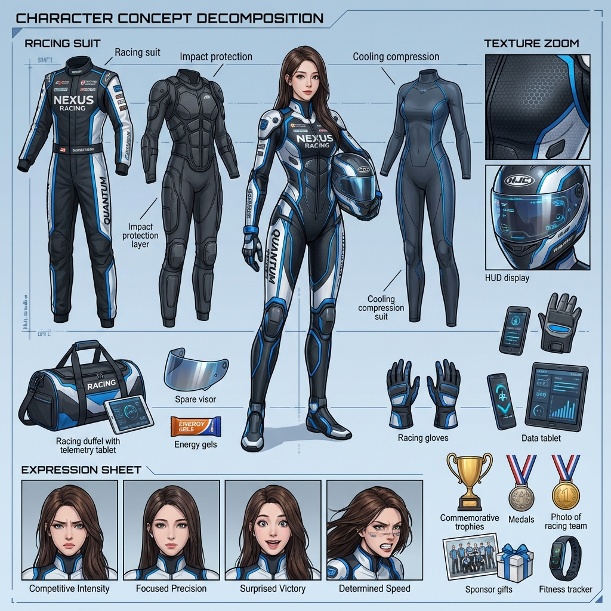

```
未来风格赛车手的全景式角色概念分解图

{
  "Objective": "Create a panoramic character concept decomposition sheet for a futuristic racing pilot. Center: Full-body illustration of female racer in high-tech racing suit. Surrounding: Layered clothing showing racing suit layers and performance wear, Expression sheet with competitive intensity, focused precision, surprised victory, and determined speed, Texture zoom on racing suit material and helmet visor",
  "FaceReference": {
    "Mode": "Strict face preservation",
    "Instruction": "Use uploaded reference image for exact facial features, bone structure, and proportions",
    "Consistency": "Face must remain identical across all frames"
  },
  "CharacterDetails": {
    "Subject": { "Type": "Futuristic racing pilot", "Age": "22", "Era": "2147" },
    "ClothingLayers": [
      "High-tech racing suit with sponsor logos",
      "Impact protection layer",
      "Cooling compression suit",
      "Racing helmet with HUD display",
      "Racing gloves and boots with grip panels"
    ]
  },
  "RelatedItems": {
    "BagAndContents": "Racing duffel with telemetry tablet, spare visor, energy gels, lucky charms",
    "RacingTools": "Data analysis tablet, racing gloves, commemorative trophies, championship medals",
    "PersonalItems": "Photo of racing team, sponsor gifts, fitness tracker, motivational items"
  }
}
```

 [↑返回目录](#toc)

---
## <a id="">食物信息图构图</a> (<a href="https://x.com/TechieBySA/status/2012519893619417576" target="_blank" rel="noopener noreferrer">TechieSA</a>)

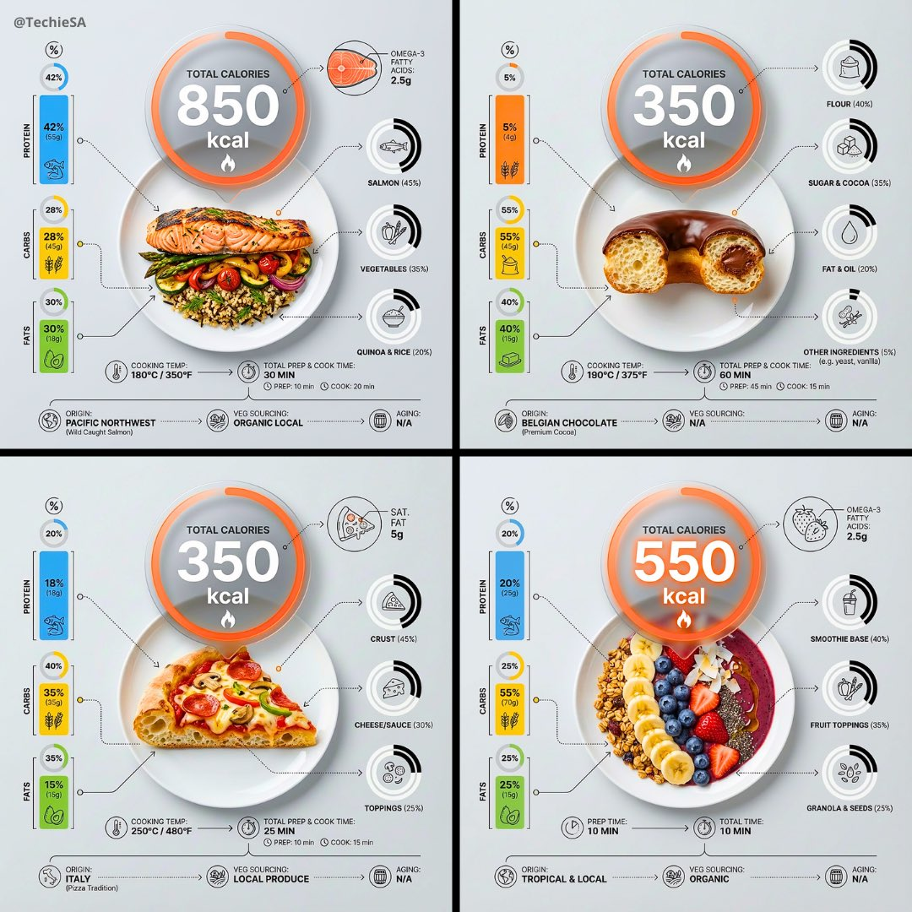

```
Ultra-clean top-down (90° flat lay) infographic composition. A perfectly centered white ceramic plate sits on a seamless light background. On the plate: [FOOD], shown in a precise cross-section or layered cutaway, revealing internal ingredients, textures, and structure with extreme clarity. PRIMARY FOCAL POINT (HERO ELEMENT): Above the plate, occupying a large portion of the upper canvas, place an oversized floating infographic bubble displaying: TOTAL CALORIES [XXXX kcal] The calorie bubble is significantly larger than any other element, instantly readable at thumbnail size. Design it with strong visual contrast: bold sans-serif typography, thick outline or semi-transparent glassmorphism, subtle glow or drop shadow, and clean UI styling. This is the first thing the eye sees. SECONDARY ELEMENTS: Surrounding the plate, fill the remaining space with a dense, high-information infographic system: – Nutritional breakdown charts (protein, carbs, fats) – Ingredient percentage bars and rings – Cooking or preparation temperatures and times – Origin, aging, or production icons – Measurement scales, micro-diagrams, data badges Use thin vector connectors, dotted lines, arrows, pictograms, and radial charts clearly linking data to specific food components. Visual hierarchy rules: Calorie bubble = dominant Plate + food = secondary anchor Surrounding data = tertiary but dense and readable Design language: premium editorial infographic, Apple UI × National Geographic food science, extremely clean, structured, and modern. Color palette: natural food colors, monochrome infographic UI, one accent color reserved exclusively for the calorie bubble. Lighting: soft studio lighting, zero clutter, flat background for maximum contrast. Output: 1080×1080, ultra-crisp, social-feed optimized, no watermark.
```

```
超简洁俯视（90°平面）信息图构图。一个完美居中的白色陶瓷盘置于无缝浅色背景上。盘中放置：[FOOD]，以精确的横截面或分层剖视方式呈现，清晰展现其内部食材、质地与结构。

主视觉焦点（核心元素）：在盘子上方、画面上部占据大片区域，设置一个巨大的悬浮信息气泡，显示：总热量 [XXXX 千卡]。该热量气泡尺寸显著大于其他所有元素，即使在缩略图尺寸下也一目了然。设计需具备强烈视觉对比：使用粗体无衬线字体、加粗描边或半透明磨砂玻璃效果、细微发光或投影，并采用干净的UI风格——这是观者第一眼看到的内容。

次要元素：围绕盘子，在其余空间填充密集而高信息量的信息图表系统：
– 营养成分分解图表（蛋白质、碳水化合物、脂肪）
– 食材占比条形图与环形图
– 烹饪或准备温度与时长
– 产地、熟成或生产工艺图标
– 度量标尺、微型示意图、数据徽章

使用细矢量连接线、虚线、箭头、象形图标和径向图表，明确将各项数据与食物的具体组成部分关联起来。

视觉层级规则：
- 热量气泡 = 主导元素
- 盘子与食物 = 次要锚点
- 周围数据 = 第三层级，但信息密集且可读性强

设计语言：高端编辑类信息图风格，融合苹果UI与《国家地理》食品科学美学，极度干净、结构化且现代。
配色方案：自然食材本色 + 单色信息图UI，仅热量气泡使用专属强调色。
灯光：柔和影棚光，零杂乱，纯平背景以实现最大对比度。
输出规格：1080×1080，超高清锐利，适配社交媒体信息流，无水印。
```

 [↑返回目录](#toc)

---
## <a id="prompt-2012411445724713200">微型建筑模型中的展览</a> (<a href="https://x.com/i/status/2012411445724713338" target="_blank" rel="noopener noreferrer">Aleena Amir</a>)

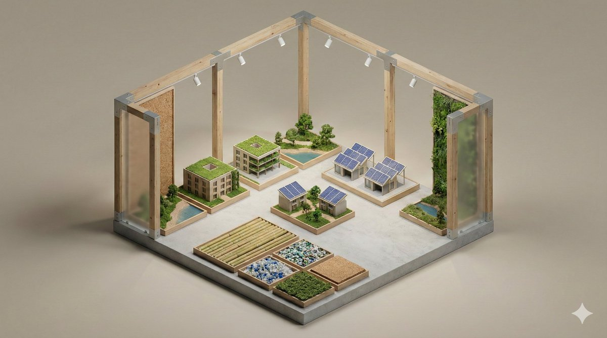

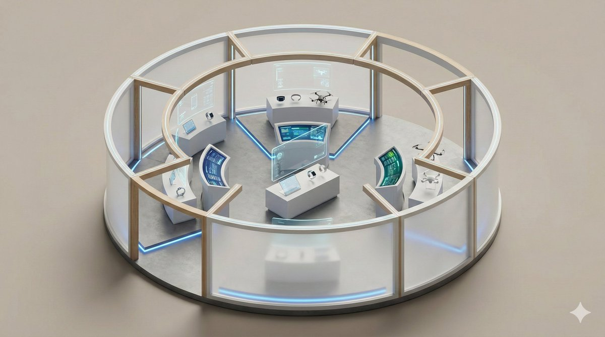

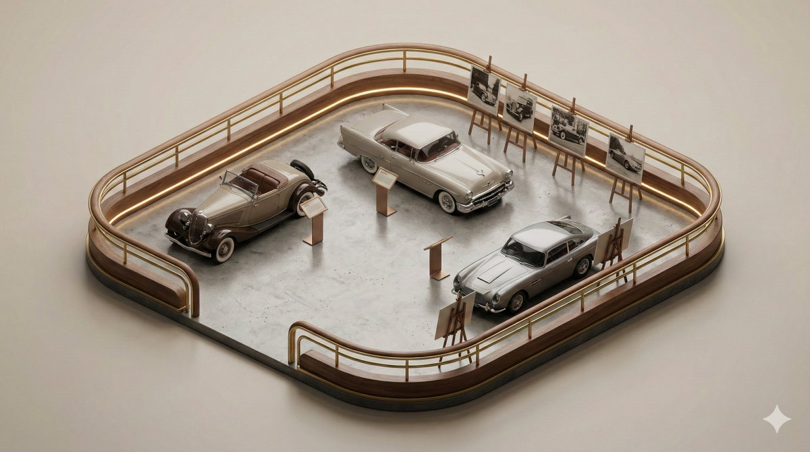

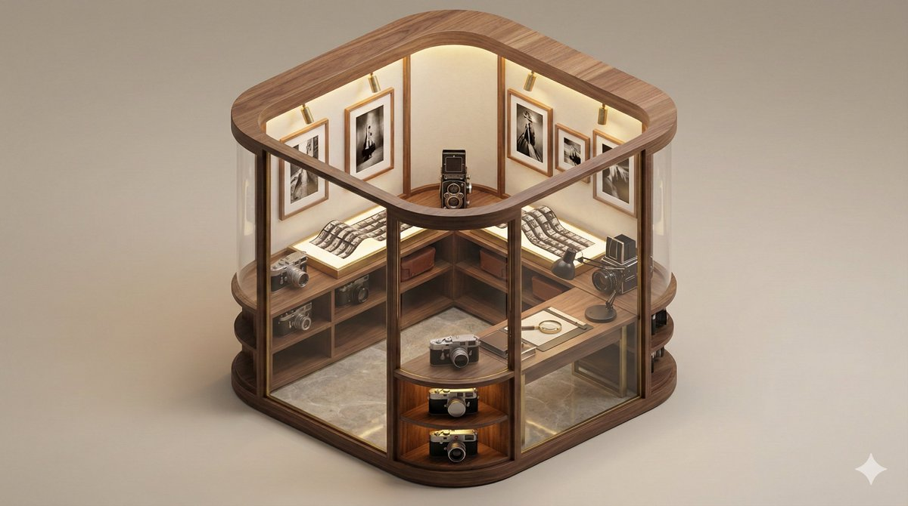

```
A clean, minimal 3D isometric diorama of a [EXHIBITION TYPE], featuring [DISPLAY OBJECTS] arranged within a [POD STRUCTURE], subtle lighting accents, smooth floor surfaces, soft studio lighting, realistic materials, rounded edges, miniature architectural model style, high detail, neutral background.
```

```
一个干净、极简的3D等距微缩场景，展示一种[展览类型]，其中[展示物品]被布置在一个[舱体结构]内，配有微妙的灯光点缀、光滑的地面、柔和的影棚灯光、逼真的材质、圆润的边缘，采用微型建筑模型风格，细节丰富，背景为中性色。
```

 [↑返回目录](#toc)

---
## <a id="prompt-2012434546739093800">历史画卷中的四大神兽</a> (<a href="https://x.com/i/status/2012434546739093788" target="_blank" rel="noopener noreferrer">大卫叔的AI旅程</a>)

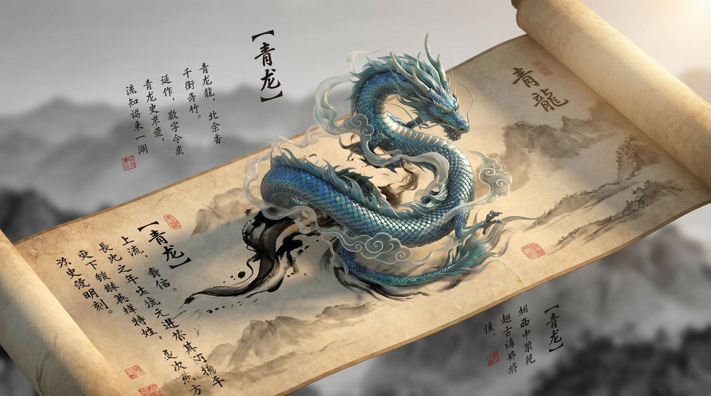

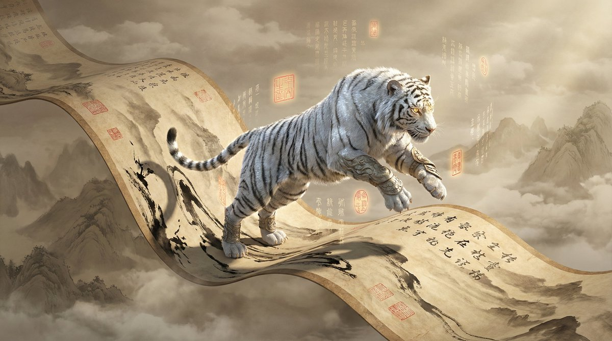

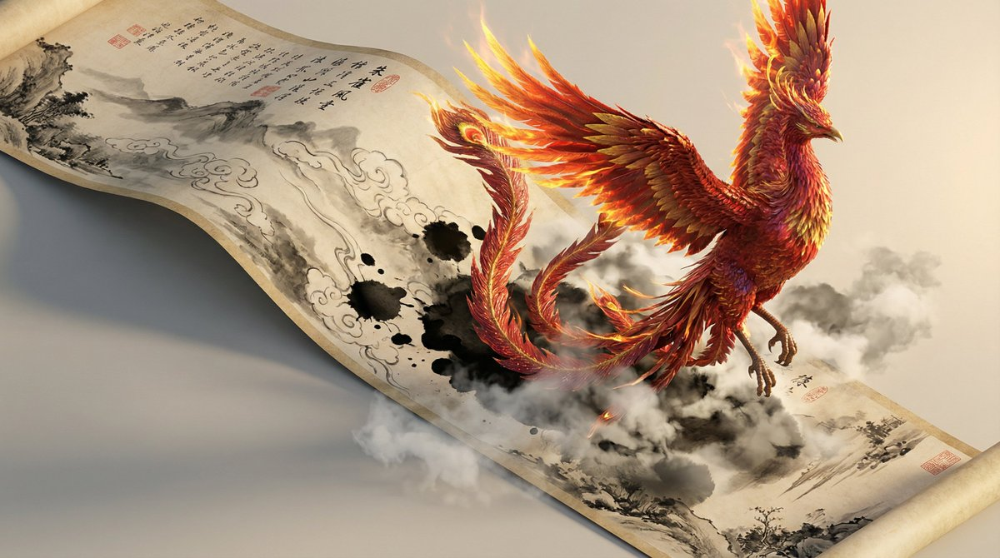

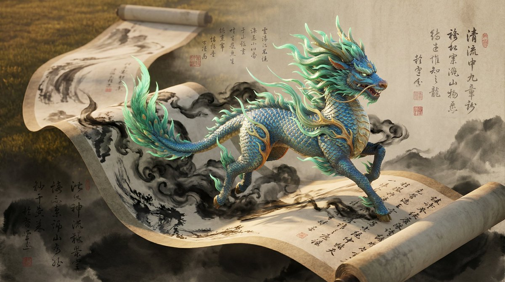

```
Hyper-realistic 3D masterpiece, set against a magnificent, endless traditional ink-wash historical scroll painting unfurling across the background.The scene visualizes the cultural soul and intangible heritage of [在此处填入地点或主题], featuring [在此处填入具体形象，如：a Flying Apsara playing the Pipa / a Peking Opera warrior] leaping vividly from the scroll.• Composition: The character breaks the fourth wall, transitioning from the flat paper into the 3D space. Dynamic pose capturing a moment of peak action.• Visual Effect: 2D black ink brushstrokes on the paper surface morph seamlessly into high-fidelity 3D realistic skin, flowing silk fabrics, and exquisite embroidery.• Details: Faded ancient parchment texture, floating historical calligraphy characters, red seal stamps, [可选细节：falling flower petals / glowing musical notes / swirling smoke].• Lighting: Dramatic stage lighting or ethereal divine glow illuminating the character, contrasting with the monochrome ink background. Subsurface scattering on skin.• Specs: 8K resolution, high detail, Unreal Engine 5 render, cinematic composition.--ar 16:9 --stylize 350 --no buildings, rigid structures, modern clothing, cartoons, low resolution
```

 [↑返回目录](#toc)

---
## <a id="prompt-2011981449688482000">霓虹能量饮料广告摄影</a> (<a href="https://x.com/i/status/2011981449688482135" target="_blank" rel="noopener noreferrer">𝐌</a>)

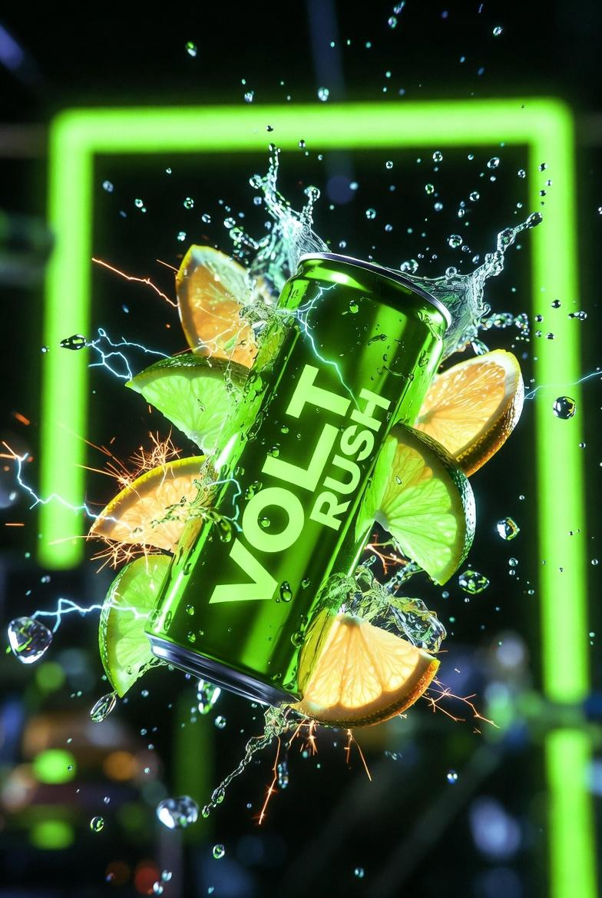

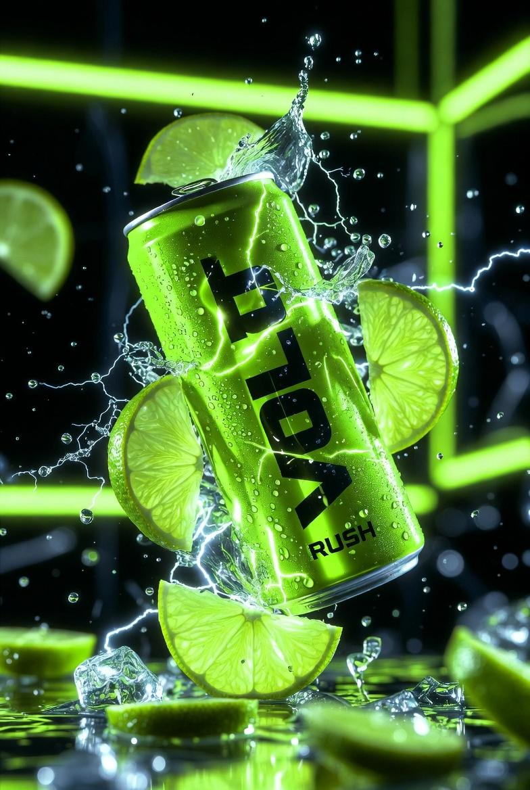

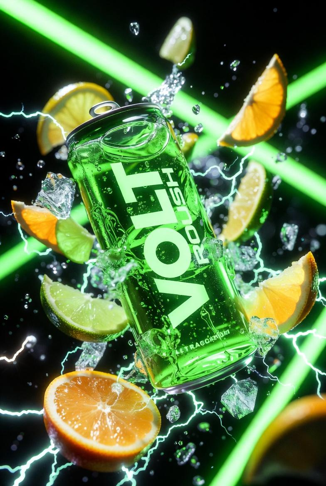

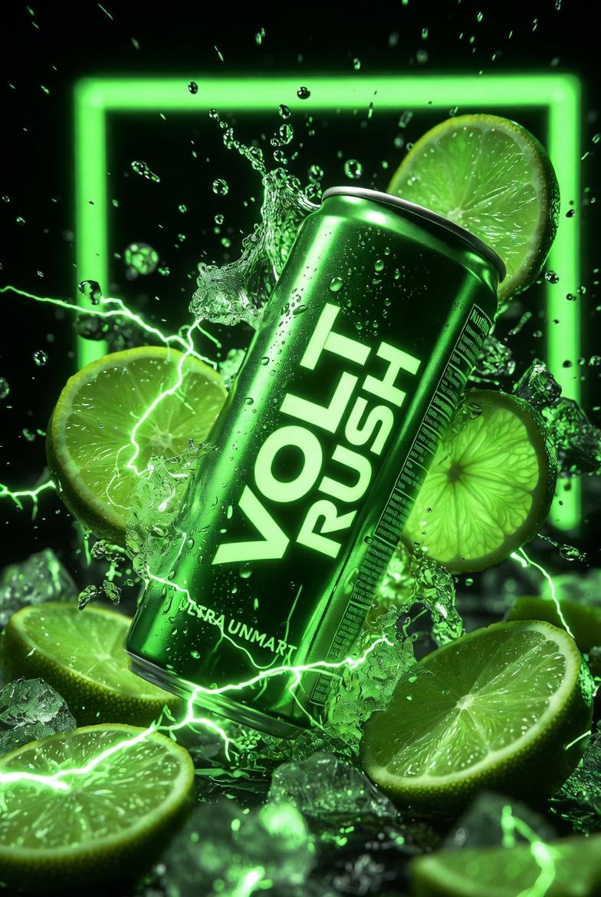

```
Ultra-cinematic product photography of a neon-green energy drink can labeled “VOLT RUSH”, tilted at a sharp diagonal, bursting through glowing citrus slices and electric sparks. Frozen splashes of lime juice and ice shards suspended mid-air, micro droplets visible. High-contrast studio lighting with green neon rim lights, dark background, glossy aluminum texture, shallow depth of field, photorealistic, 8K, premium ad style.
```

```
超电影感的产品摄影：一罐霓虹绿色的能量饮料，标签为“VOLT RUSH”，以锐利的对角线角度倾斜，穿透发光的柑橘切片和电火花。青柠汁的飞溅与冰晶碎片在空中凝固悬浮，微小水滴清晰可见。高对比度影棚灯光搭配绿色霓虹轮廓光，深色背景，闪亮的铝制质感，浅景深，照片级真实感，8K分辨率，高端广告风格。
```

 [↑返回目录](#toc)

---
## <a id="prompt-2011857121835458800">可爱奇特动物的Risograph风格图标集</a> (<a href="https://x.com/i/status/2011857121835458929" target="_blank" rel="noopener noreferrer">Nano Banana Pro</a>)

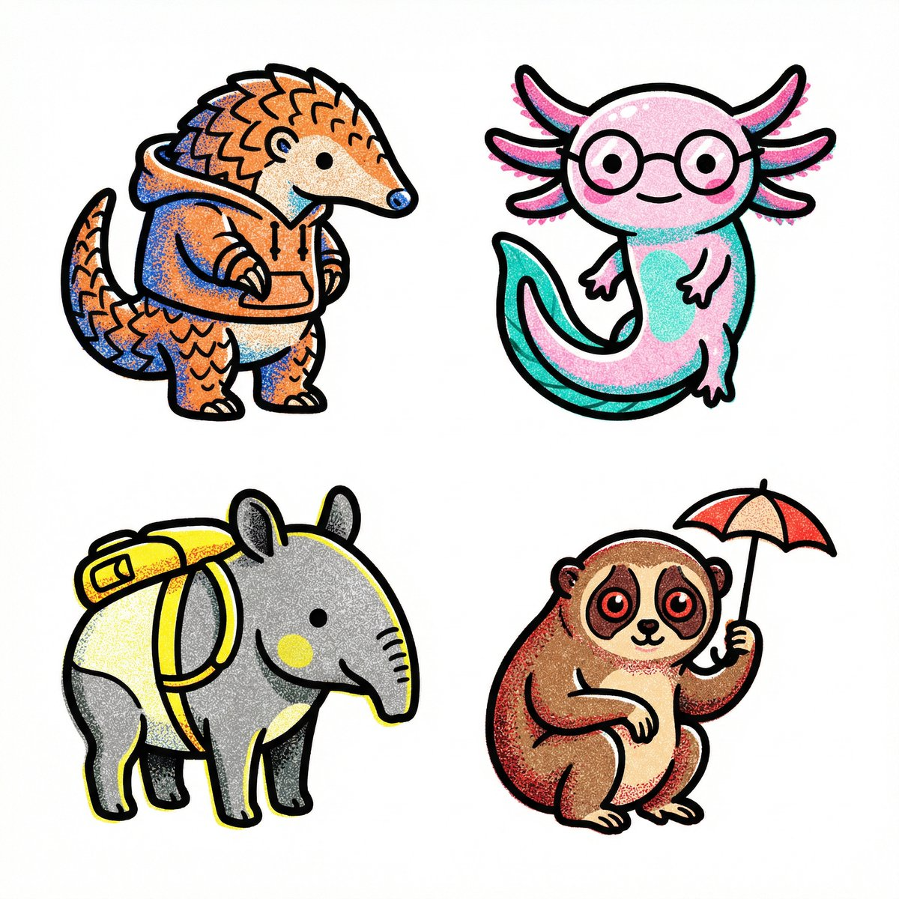

```
Create a collection of icons representing [a theme], they belong together as a single theme. Put them in a 2x2 grid (no lines). The background is pure white. Make the icons as risograph prints. No text. No color distortion. Vibrant and not faded. Stochastic stippling and sand-like noise pattern within color fills. Each icon has a thick black outline.

The theme in this image was "cute but weird animals (that are real)".
```

```
创作一组代表某一主题的图标，这些图标属于同一个统一主题。将它们排列成2x2的网格（无分隔线）。背景为纯白色。图标采用risograph印刷风格。不含文字，无色彩失真。颜色鲜艳不褪色。色块内部带有随机点彩和沙粒状噪点纹理。每个图标都有粗黑轮廓。

本图的主题是“可爱但奇特的真实动物”。
```

 [↑返回目录](#toc)

---
## <a id="prompt-2012506103116882000">橄榄绿金属邮箱与信封</a> (<a href="https://x.com/i/status/2012506103116881967" target="_blank" rel="noopener noreferrer">Ege</a>)

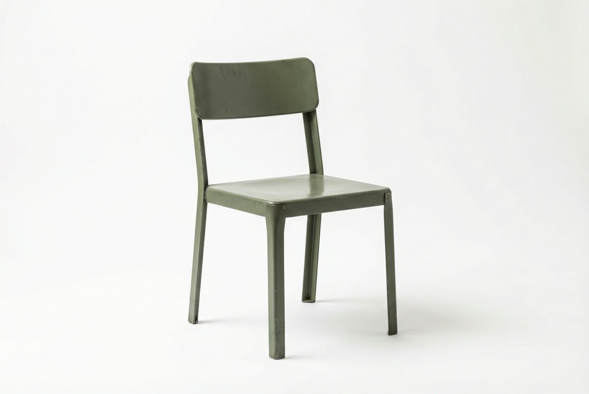

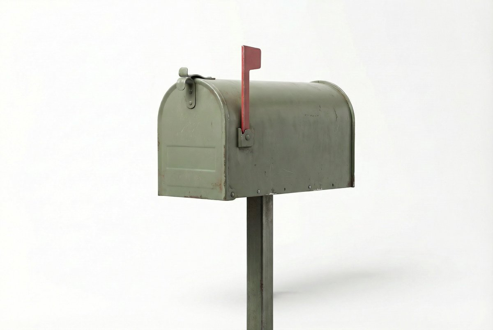

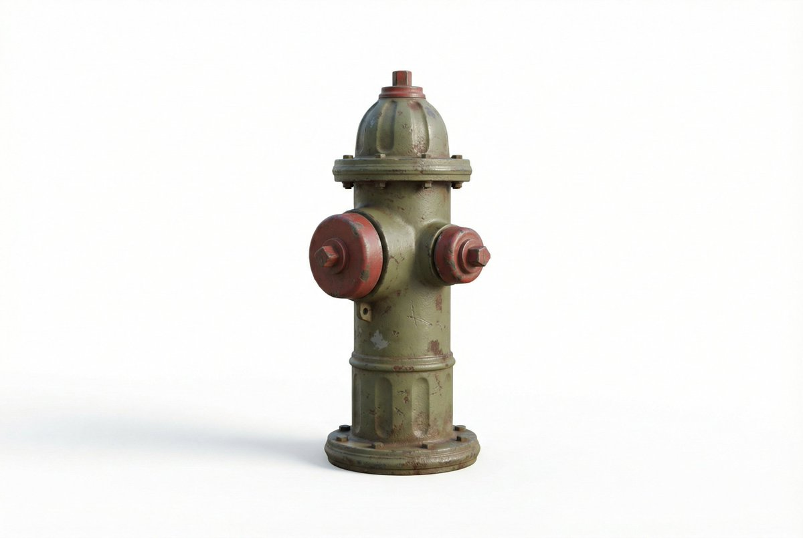

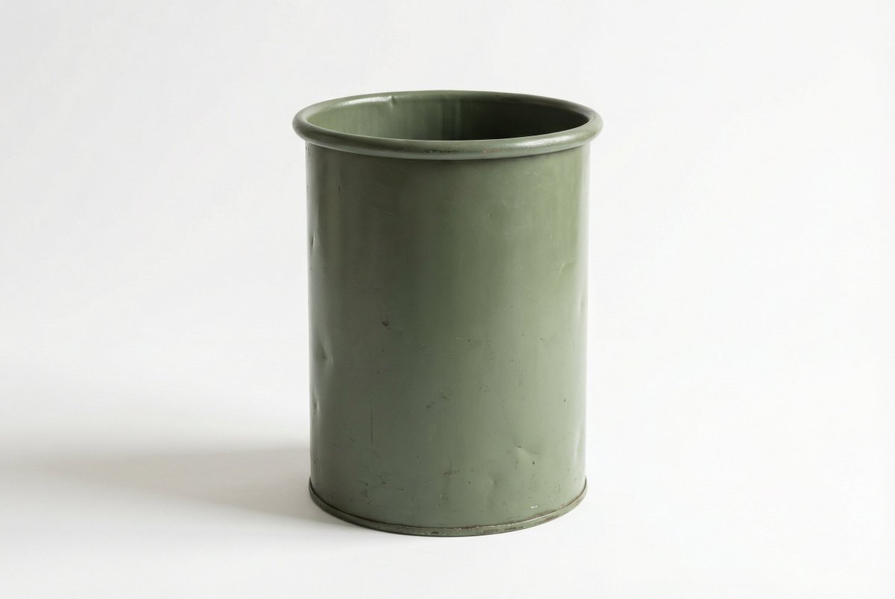

```
Photorealistic studio render of a desaturated olive-green industrial steel chair,
flat seat and backrest with minimal curvature,
real-world scale and proportions,
realistic painted metal with subtle scratches and edge wear,
physically accurate materials and structural thickness,
soft natural daylight with subtle global illumination,
pure white seamless studio background,
clean contact shadows beneath the chair legs,
professional product photography realism,
calm, minimal, architectural composition,
no diorama, no miniature, no toy, no CGI look,
ultra high resolution, sharp focus
```

```
Photorealistic studio render of a desaturated olive-green metal mailbox mounted on a post,
mailbox door open with a kraft paper envelope inside,
mailbox flag/bar painted muted red metal,
real-world scale and proportions,
realistic painted metal with subtle wear, scratches, and edge imperfections,
physically accurate materials and thickness,
soft natural daylight with subtle global illumination,
pure white seamless studio background,
clean contact shadows under the mailbox and post,
professional product photography realism,
calm, minimal, architectural composition,
no diorama, no miniature, no toy, no CGI look,
ultra high resolution, sharp focus
```

```
Photorealistic studio render of a desaturated olive-green metal fire hydrant,
side valve caps and top bonnet visible,
small accent details painted muted red metal,
real-world scale and proportions,
realistic cast metal surface with subtle wear, scratches, and chipped paint,
physically accurate materials and thickness,
soft natural daylight with subtle global illumination,
pure white seamless studio background,
clean contact shadows under the hydrant,
professional product photography realism,
calm, minimal, architectural composition,
no diorama, no miniature, no toy, no CGI look,
ultra high resolution, sharp focus
```

```
Photorealistic studio render of a desaturated olive-green metal trash bin,
round opening with rolled metal rim,
real-world scale and proportions,
realistic painted metal with dents, scratches, and subtle wear,
physically accurate materials and wall thickness,
soft natural daylight with subtle global illumination,
pure white seamless studio background,
clean contact shadows beneath the bin,
professional product photography realism,
calm, minimal, architectural composition,
no diorama, no miniature, no toy, no CGI look,
ultra high resolution, sharp focus
```

 [↑返回目录](#toc)

---
## <a id="prompt-2012223385607028700">60秒内将任何人变成专业素描</a> (<a href="https://x.com/i/status/2012223385607028761" target="_blank" rel="noopener noreferrer">AmirMušić</a>)

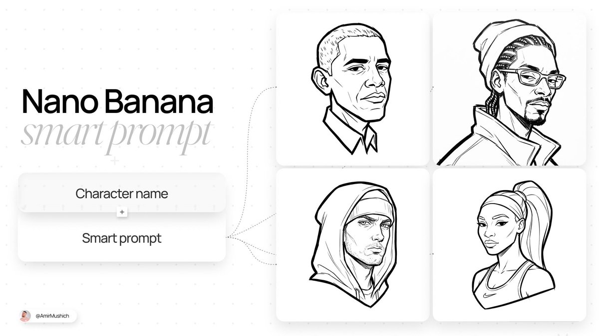

```
[PERSON / CHARACTER NAME]. 
Act as a Lead Concept Artist for a cult classic early 2000s animated series (similar to early Gorillaz or Jet Set Radio).

COMPOSITION (FLOATING HEAD DRAFT):

Generate a Monochrome Line-Art Concept Sketch of the head/bust of [CHARACTER / PERSON].

Framing: The head floats strictly in the dead center of the canvas.

Orientation: Fixed Three-Quarter View (3/4) for dynamic volume.

Negative Space: Generous empty white space around the sketch.

VISUAL STYLE (ADVANCED VECTOR SKETCH):

The image must look like a "Production-Ready Concept Drawing" — raw, confident, but polished.

NO FILLS (Critical): This is strict LINE ART. Do not use any colors, gradients, or grey fills. The inside of the face, hair, and clothes must be white (transparent), defined only by the outlines.

Line Quality (The "Inker's Hand"):
Use Solid Black Ink on pure white paper.
Variable Line Weight: Use a THICK, bold contour line for the outer silhouette to pop the character from the background. Use THIN, razor-sharp lines for internal details (eyes, nose, hair texture).
Flow: The lines should feel "fast" and expressive (like a brush pen or sophisticated vector stroke), not shaky or messy. It is an "Advanced Draft" — distinct and professional.

CHARACTERIZATION (THE Y2K VIBE):

Stylize the character with slightly angular, edgy features typical of early 2000s street art.

Expression: Cool, detached, slightly rebellious, or "in the zone".

BACKGROUND:

Pure White (#FFFFFF). A clean sheet of paper.
```

```
[人物/角色名称]。  
担任一部邪典经典2000年代初动画系列（类似早期Gorillaz或Jet Set Radio风格）的首席概念艺术家。

构图（漂浮头部草稿）：  
生成一张以单色线稿形式呈现的角色头部/半身概念草图。  
画面构图：头部严格居中漂浮于画布正中央。  
视角：固定采用四分之三视图（3/4视角），以展现立体感和动态感。  
留白：草图四周保留大量空白负空间。

视觉风格（高级矢量草图）：  
图像需呈现出“可投入制作的概念图”效果——原始、自信且精炼。  
严禁上色（关键要求）：此图为严格线稿，不得使用任何颜色、渐变或灰色填充。面部、头发和服装内部必须为白色（透明），仅由轮廓线定义形状。

线条质感（“墨线手绘”风格）：  
使用纯黑墨水绘制于纯白纸面。  
变化的线宽：外轮廓使用粗厚、醒目的线条，使角色从背景中突出；内部细节（如眼睛、鼻子、发丝纹理）则使用纤细锐利的线条。  
线条动势：笔触应显得迅捷而富有表现力（如同使用毛笔或高级矢量笔刷），不可颤抖或杂乱。整体为一份“高级草稿”——清晰且专业。

角色塑造（千禧年Y2K氛围）：  
角色造型需带有2000年代初街头艺术典型的略带棱角、前卫犀利的特征。  
表情：酷感十足、疏离淡漠，略带叛逆或“沉浸于自我状态”的气质。

背景：  
纯白色（#FFFFFF），如同一张干净的白纸。
```

 [↑返回目录](#toc)

---
## <a id="prompt-2011898432626348300">椰子发膜罐与新鲜椰肉</a> (<a href="https://x.com/i/status/2011898432626348396" target="_blank" rel="noopener noreferrer">Alexandra Aisling</a>)

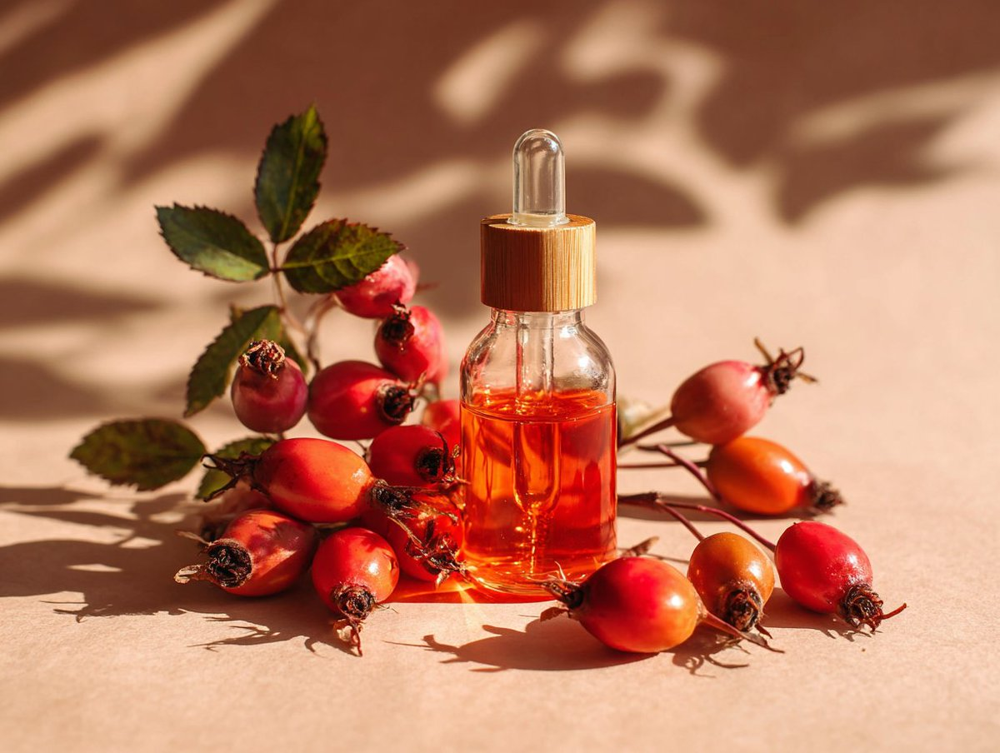

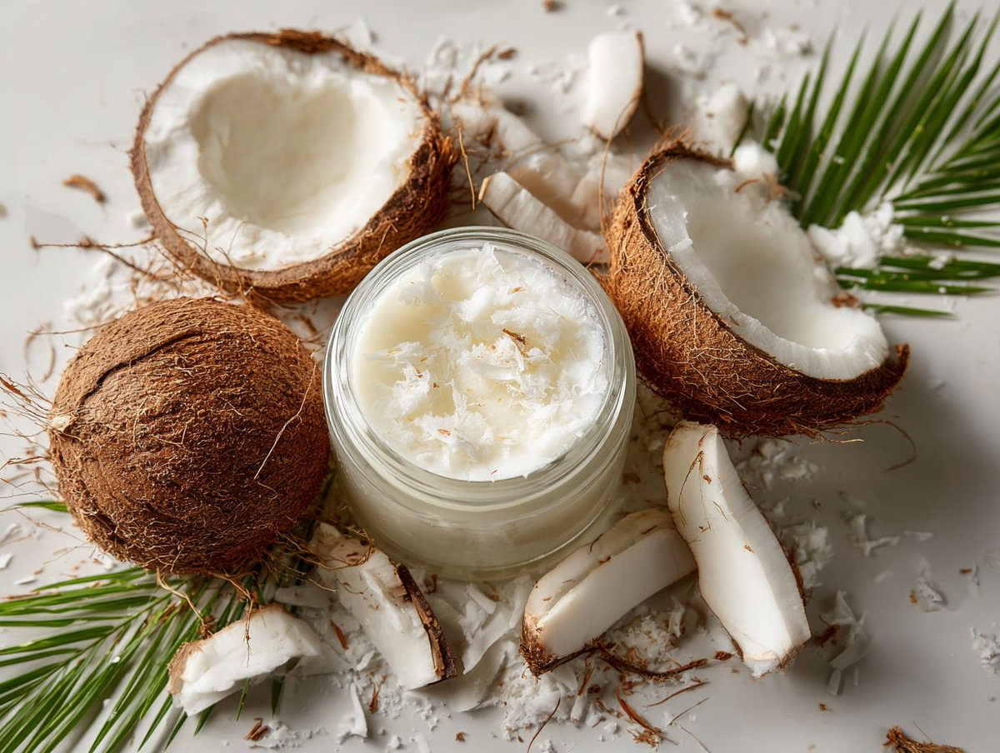

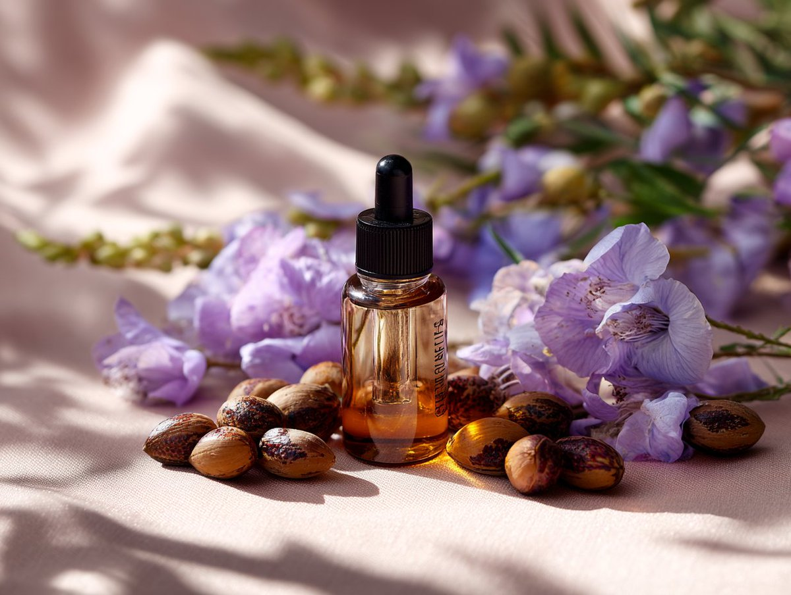

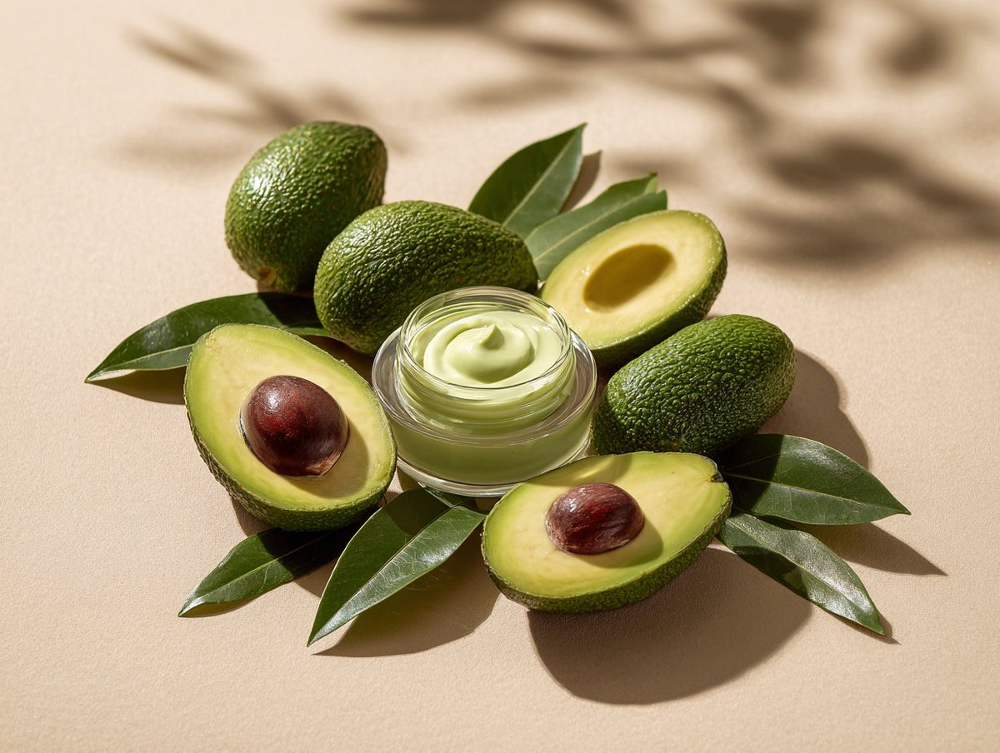

```
rose hip facial oil dropper surrounded by freshly split rose hips with seeds spilling out, natural origin story, fresh and organic aesthetic, ingredient transparency, bright clean lighting, botanical beauty
```

```
coconut hair mask jar surrounded by cracked coconut halves with white flesh exposed and coconut shavings, natural origin story, fresh and organic aesthetic, ingredient transparency, bright clean lighting, botanical beauty
```

```
bakuchiol retinol alternative serum surrounded by babchi seeds and purple babchi flowers, natural origin story, fresh and organic aesthetic, ingredient transparency, bright clean lighting, botanical beauty
```

```
avocado eye cream surrounded by halved ripe avocados with pits and scattered avocado leaves, natural origin story, fresh and organic aesthetic, ingredient transparency, bright clean lighting, botanical beauty
```

 [↑返回目录](#toc)

---
## <a id="prompt-2011974686683644200">四位贵妇的跨时代肖像</a> (<a href="https://x.com/i/status/2011974686683644249" target="_blank" rel="noopener noreferrer">行者AI视频</a>)

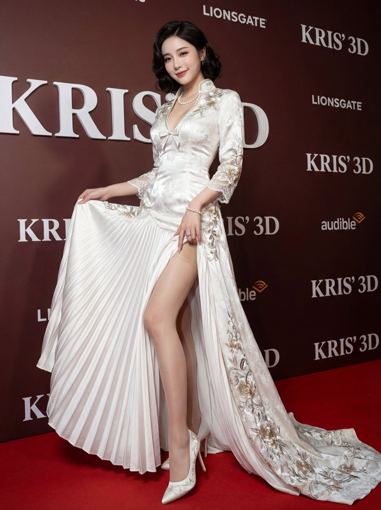

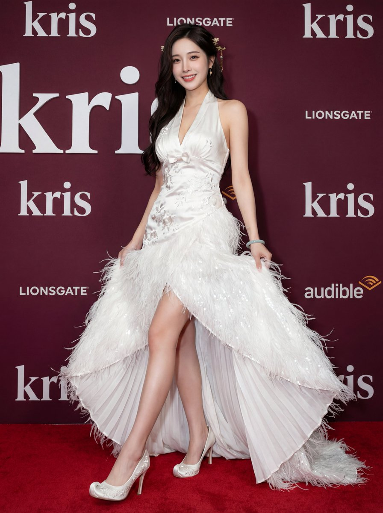

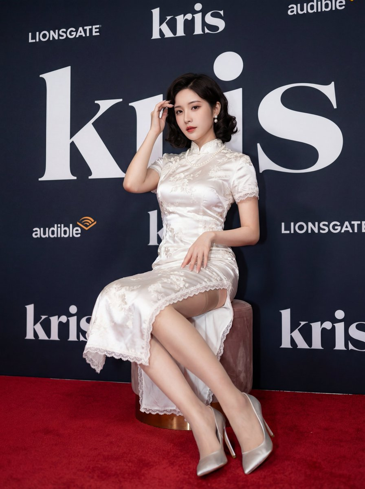

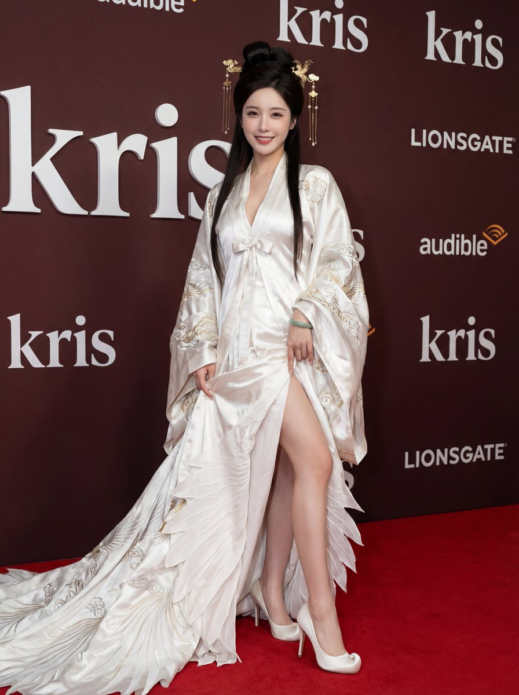

```
{ “prompt_type”：“文本转图像”，

“主旨”：
{ “身份”：“100%与参考照片中的肖像和面容完全相同”，
“外貌”：“长长的波浪金发，披散披肩，皮肤白皙光泽，自信表情带着淡淡微笑”
“配饰”：“右手腕上佩戴精致手链，极简耳环” },
“服装”：{ “upper_body”：“闪亮的白色亮片露背上身，极深 V 领，胸前下方有小巧的蝴蝶结装饰”， “lower_body”：“长而戏剧性的白色裙摆/拖尾，裙摆饰有奢华的白色羽毛装饰，由被拍摄者的手微微敞开/展示”，
“腿部”：“裸露的腿部”，
“鞋类”：“白色或金属银色的优雅尖头细高跟鞋” },
“作曲”：{ “camera_angle”：“极低角度（虫眼视角），从接近地面水平俯视主体”，
“透视”：“强调主体身高、长腿和高大气场的戏剧性透视。”
“构图”：“全身镜头强烈以前景的腿部、鞋子和飘逸的羽毛裙为主导” },
“环境”：{ “地点”：“红毯首映活动”，
“背景”：“白色衬线字体的《女佣》大型重复立体标识，背景为深栗色，带有狮门影业和 Audible 标志。”
“表面”：“经典红毯地板” },
“风格”：{ “媒介”：“数码摄影，名人红毯肖像”，
“灯光”：“专业活动闪光灯和环境灯，亮片、羽毛、皮肤和鞋子上的光泽高光，高对比度与戏剧性阴影。”
“质量”：“高分辨率，8K，照片级逼真，对面料闪光、羽毛细节和面部特征的极高聚焦” } }

"surface": "Classic red carpet floor"   },   "style": {     "medium": "Digital photography, celebrity red carpet portrait",     "lighting": "Professional event flash and ambient lighting, glossy highlights on sequins, feathers, skin, and shoes, high contrast with dramatic shadows",     "quality": "High resolution, 8k, photorealistic, ultra-sharp focus on fabric sparkle, feather details, and facial features"   } }
```

 [↑返回目录](#toc)

---
## <a id="prompt-2011898760650170400">黑白矢量人像伴侧</a> (<a href="https://x.com/i/status/2011898760650170378" target="_blank" rel="noopener noreferrer">TechieSA</a>)

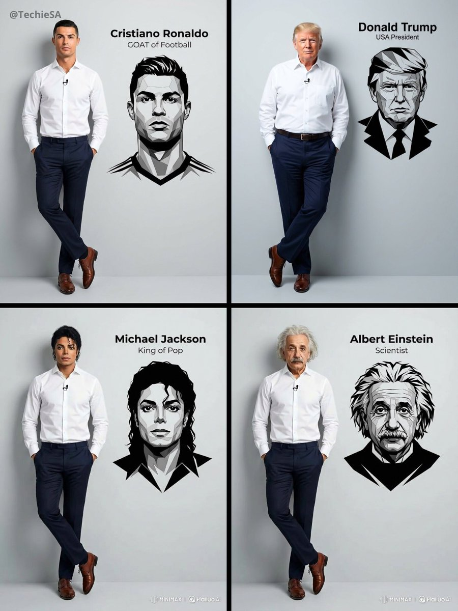

```
Ultra-realistic 8K full body portrait of [PERSON’S FULL NAME], wearing a clean and pressed white social shirt with folded collar and a small lapel microphone, dark navy-blue dress pants and polished brown social shoes. Casually and unpretentiously leaning against a smooth light gray studio wall; hands are in pockets and one leg is crossed over the other, with relaxed and confident body language. Add to the wall next to them a prominent vector portrait in black and white of their face and bust - with sharp lines and angles, overlapping polygonal shapes and a minimalist modern graphic style, right below the information: “[PERSON’S FULL NAME]”, and below the name: “[PROFESSION]”. 1080x1080 dimensions.
```

```
超写实8K全身肖像，[人物全名]身穿干净熨烫过的白色社交衬衫，衣领整齐翻折，佩戴小型翻领麦克风，搭配深海军蓝正装长裤和擦亮的棕色社交皮鞋。人物随意而自然地倚靠在光滑的浅灰色摄影棚墙面上，双手插在口袋中，一脚交叉搭在另一脚前，姿态放松且自信。在其身旁的墙面上，添加一幅醒目的黑白矢量人像，呈现其面部与半身，采用锐利线条与棱角、重叠的多边形结构，风格为极简现代图形设计；人像下方标注“[人物全名]”，名字下方再标注“[职业]”。图像尺寸为1080x1080。
```

 [↑返回目录](#toc)

---
## <a id="prompt-2011819664536445000">微型自然生态系统</a> (<a href="https://x.com/i/status/2011819664536444937" target="_blank" rel="noopener noreferrer">Alexandra Aisling</a>)

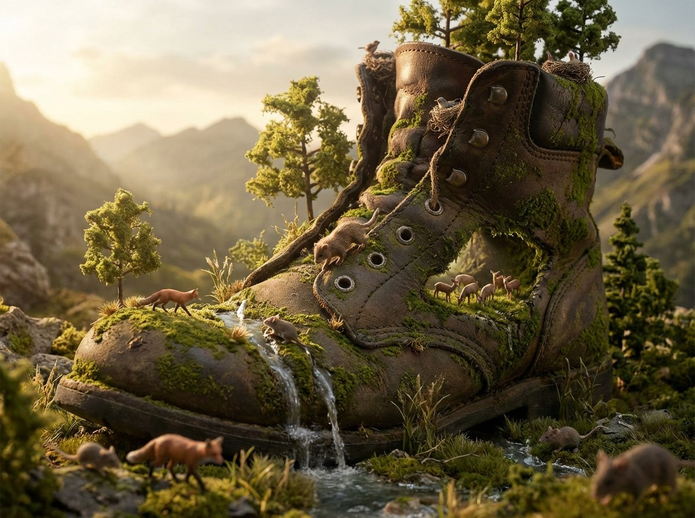

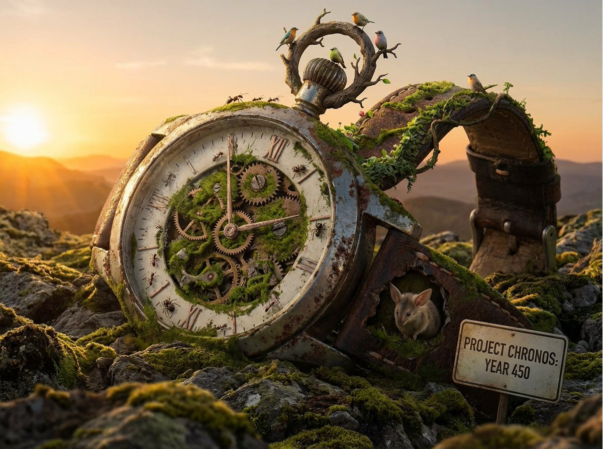

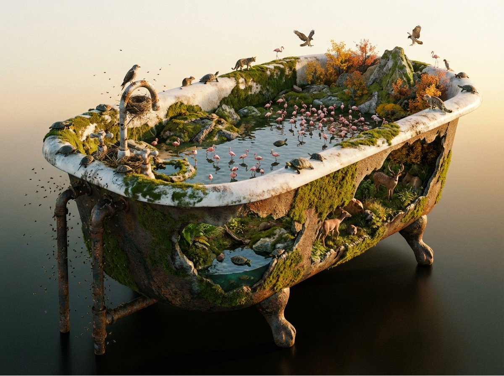

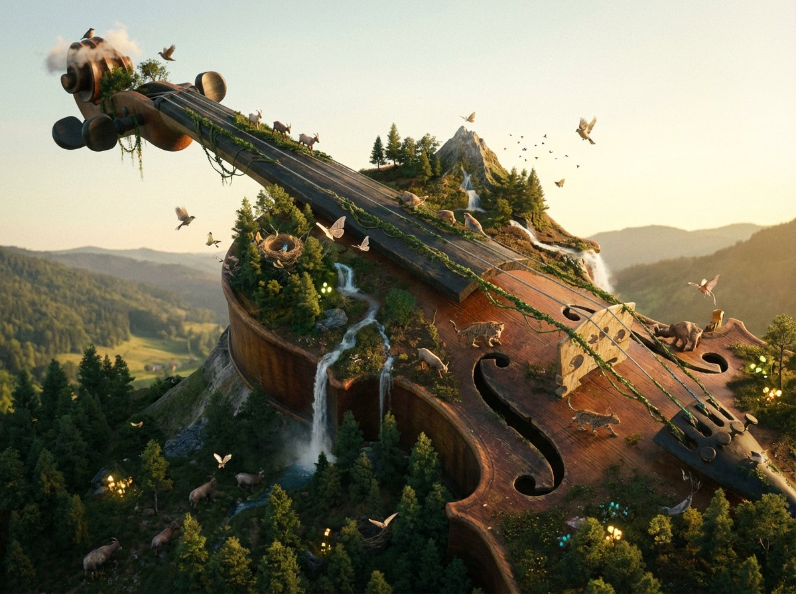

```
A colossal leather work boot reimagined as a complete natural biome. Tiny foxes and field mice has evolved to inhabit every niche the object provides. Predators hunt across its surfaces, herbivores graze in its cavities, birds nest in its heights, insects swarm its crevices. Food chains have formed around the object's geometry. Migration patterns follow its contours. Seasonal changes affect different zones. The object's materials have weathered into naturalistic terrain while remaining recognizable. Documentary aesthetic, golden wildlife lighting, the manufactured as wilderness.
```

```
A colossal wristwatch reimagined as a complete natural biome. Tiny ants and jumping spiders has evolved to inhabit every niche the object provides. Predators hunt across its surfaces, herbivores graze in its cavities, birds nest in its heights, insects swarm its crevices. Food chains have formed around the object's geometry. Migration patterns follow its contours. Seasonal changes affect different zones. The object's materials have weathered into naturalistic terrain while remaining recognizable. Documentary aesthetic, golden wildlife lighting, the manufactured as wilderness.
```

```
A colossal bathtub reimagined as a complete natural biome. Tiny flamingos and freshwater turtles has evolved to inhabit every niche the object provides. Predators hunt across its surfaces, herbivores graze in its cavities, birds nest in its heights, insects swarm its crevices. Food chains have formed around the object's geometry. Migration patterns follow its contours. Seasonal changes affect different zones. The object's materials have weathered into naturalistic terrain while remaining recognizable. Documentary aesthetic, golden wildlife lighting, the manufactured as wilderness.
```

```
A colossal violin reimagined as a complete natural biome. Tiny songbirds and silk moths has evolved to inhabit every niche the object provides. Predators hunt across its surfaces, herbivores graze in its cavities, birds nest in its heights, insects swarm its crevices. Food chains have formed around the object's geometry. Migration patterns follow its contours. Seasonal changes affect different zones. The object's materials have weathered into naturalistic terrain while remaining recognizable. Documentary aesthetic, golden wildlife lighting, the manufactured as wilderness.
```

 [↑返回目录](#toc)

---
## <a id="prompt-2012473859510071300">[国家名称]标志性建筑的微缩世界</a> (<a href="https://x.com/i/status/2012473859510071331" target="_blank" rel="noopener noreferrer">Aleena Amir</a>)

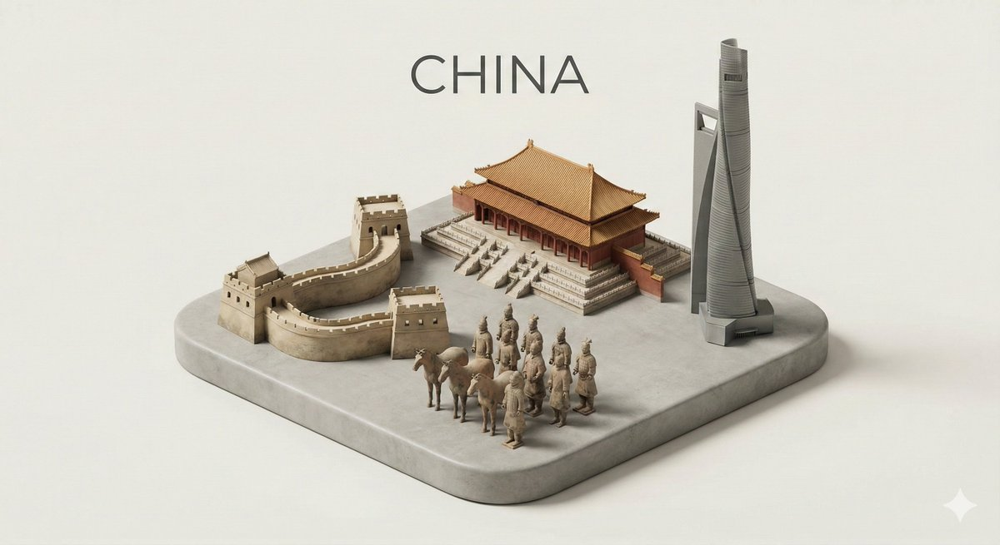

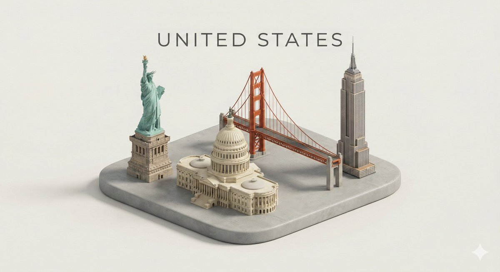

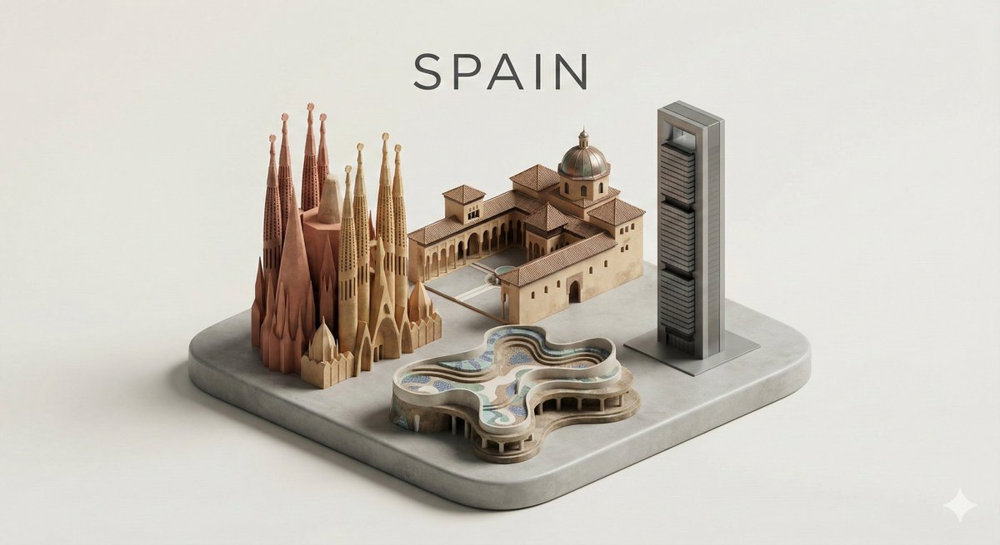

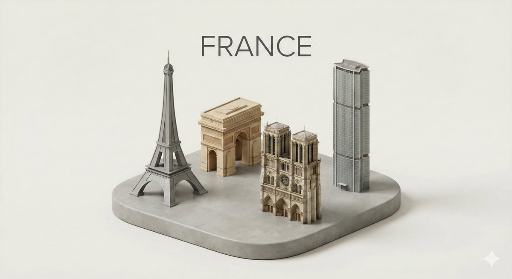

```
A clean, minimal 3D isometric diorama depicting a curated collection of iconic landmarks from [COUNTRY NAME], arranged as a cohesive miniature architectural set. Each landmark is thoughtfully simplified and stylized while remaining instantly recognizable, unified through consistent scale, geometry, and a restrained material palette.

The landmarks sit on a smooth concrete base with softly rounded edges, evoking a premium architectural model aesthetic. Realistic materials, subtle surface imperfections, and soft studio lighting enhance depth and realism. The overall composition is balanced and uncluttered, presented against a neutral background.

At the top center of the composition, clean minimalist typography displays the title “[COUNTRY NAME]”, seamlessly integrated into the scene without overpowering the diorama.

Ultra-high detail, modern isometric perspective, miniature architectural model style.
```

```
国家 | 等距地标

一幅干净、极简的3D等距微缩场景，精心呈现来自[国家名称]的一组标志性建筑，构成一套协调统一的微型建筑集合。每座地标均经过深思熟虑的简化与风格化处理，同时保持高度辨识度，并通过一致的比例、几何形态和克制的材质配色实现整体统一。

这些建筑坐落在边缘柔和圆润的光滑混凝土底座上，营造出高端建筑模型的美学氛围。写实的材质、细微的表面瑕疵以及柔和的影棚灯光增强了画面的深度与真实感。整体构图平衡且简洁，背景为中性色调。

画面顶部中央以干净简约的字体呈现标题“[国家名称]”，巧妙融入场景之中，不喧宾夺主。

超高清细节，现代等距视角，微型建筑模型风格。
```

 [↑返回目录](#toc)

---
## <a id="prompt-2012327408293068800">庭院中的鱼幼薇与白猫</a> (<a href="https://x.com/i/status/2012327408293068839" target="_blank" rel="noopener noreferrer">VoxCat</a>)

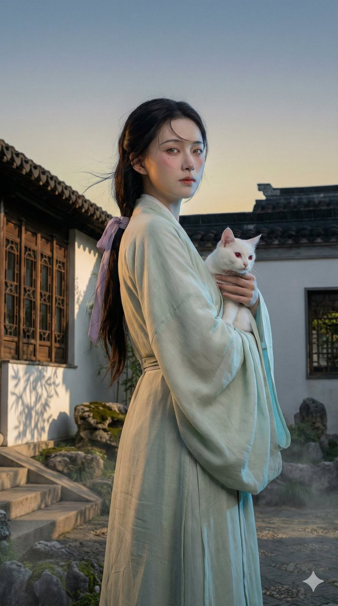

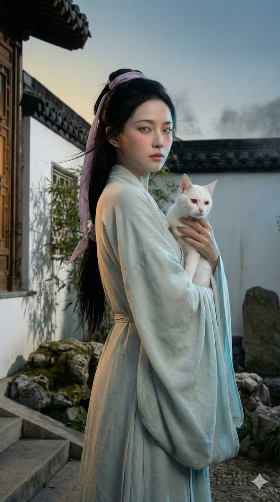

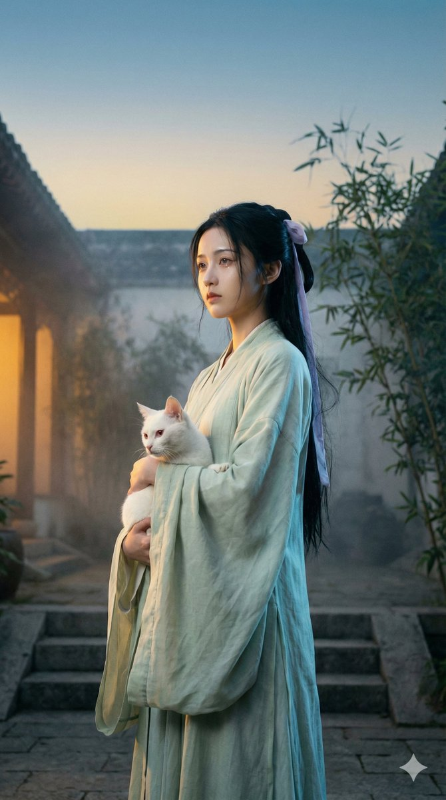

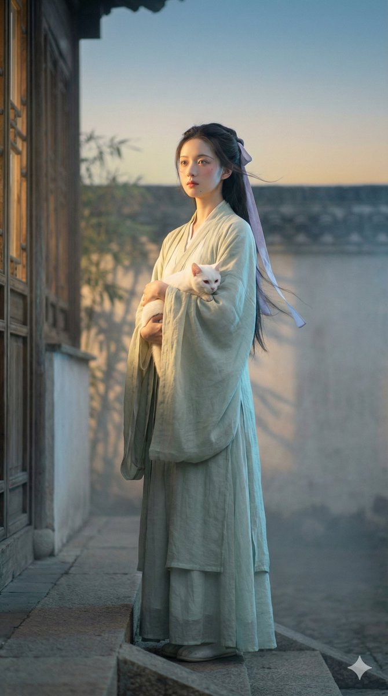

```
主体：鱼幼薇，素颜，面容苍白但带一丝淡红润，五官精致清秀，眼神明亮却疏离（ethereal, pale, delicate, luminous
  eyes, fragile beauty）。服装：素雅浅青色长袍，轻薄层次，细致布纹，宽袖垂坠，腰间细束带。发型：黑色长发，淡紫色
  绸带随意束发，发丝随风轻扬。配饰与道具：怀抱一只毛色雪白、红瞳的猫（ruby eyes），猫安静依偎。动作：双臂环抱白
  猫，右手轻托猫背，左臂托住猫身；身体三分之二侧身，头微转看向镜头。构图：9:16 竖幅，全身中远景，低机位，主体位
  于画面右侧三分之一，留出左侧竹影与庭院空间。场景：江南园林小庭院，白墙黛瓦，木格窗，竹影与青石台阶，假山与苔痕
  点缀，背景简洁。光影：low-key lighting，暖色余晖主光（左侧45度）照亮面部与肩线，冷色轮廓光（右侧后方）勾边，阴
  影清晰可读。色彩一致性：warm amber key light, cool blue rim light, sky gradient from pale gold near horizon to
  dusty blue above, thin mist, white balance 5200K.风格：写实国风 + 电影感概念艺术（wuxia, cinematic, Chinese
  cinematic realism）。画质：high detail, photorealistic, subtle film grain。约束：no modern elements, no neon,
  no sci‑fi, no extra people, no heavy makeup, clear facial features, eyes aligned and focused。
```

 [↑返回目录](#toc)

---
## <a id="prompt-2012134246924648700">单色3D配送系统视觉</a> (<a href="https://x.com/i/status/2012134246924648665" target="_blank" rel="noopener noreferrer">Ege</a>)

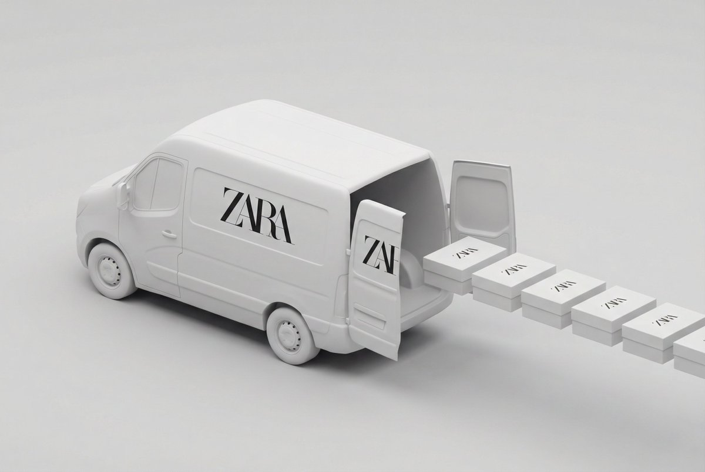

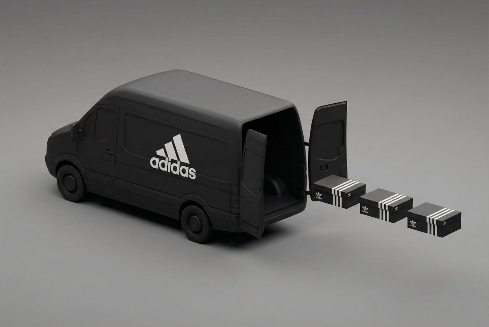

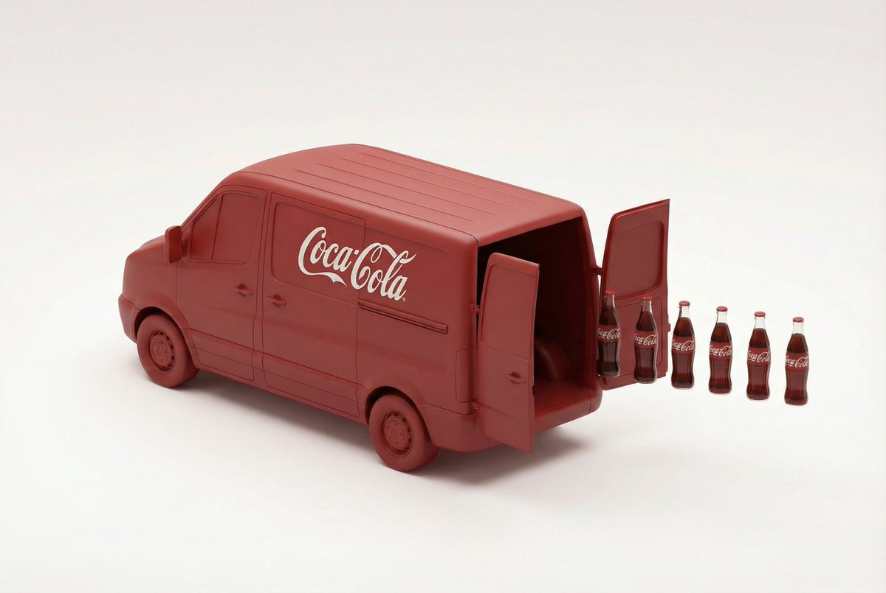


```
A delivery system as a design language

Prompt: Minimalist monochrome 3D illustration in [BRAND PRIMARY COLOR],
a small delivery van fully colored in [BRAND PRIMARY COLOR],
with a REAL [BRAND NAME] logo in original brand colors,

rear cargo door open,

[BRAND-RELATED PRODUCTS] floating in the air BEHIND the van,
clearly separated from the cargo area,
no product entering or touching the trunk,
perfectly aligned in a straight row,

background and ground fully monochrome [BRAND PRIMARY COLOR],
strict monochrome environment,
no gradients, no secondary tones,

smooth matte plastic material,
soft global illumination,
fixed three-quarter rear isometric angle,
premium minimal brand visualization
```

```
一种以配送系统为设计语言的极简单色3D插图，整体采用[品牌主色]。一辆小型配送货车完全填充[品牌主色]，车尾货舱门打开，车身上带有真实的[品牌名称]标志，标志使用品牌原始配色。在货车后方、与货舱区域清晰分离的空中，悬浮着一排整齐排列的[品牌相关产品]，产品不进入也不接触货舱内部。背景与地面均为纯色[品牌主色]，整体环境严格单色，无渐变、无辅助色调。材质呈现光滑哑光塑料质感，采用柔和全局光照，视角固定为后方三分之四等距视角，呈现高端极简的品牌视觉效果。
```

 [↑返回目录](#toc)

---
## <a id="prompt-2012097296784347400">俏皮黑发女生的超写实肖像</a> (<a href="https://x.com/i/status/2012097296784347490" target="_blank" rel="noopener noreferrer">松果先森</a>)

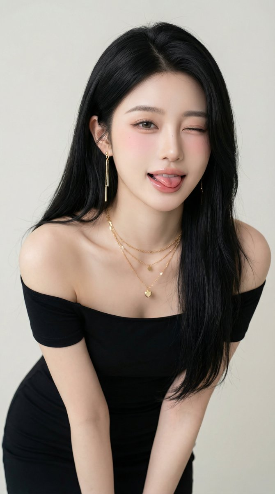

```
俏皮女生

Melisa的提示词中英文都不错

换成黑色的头发，去掉小雀斑就很好适合咱们

Nano Banana Pro提示词：

{
  “风格”：“超写实工作室肖像”，
  “主题”： {
    "性别": "女性",
    “年龄”: “青年” “姿势”：“身体略微前倾，
    朝向镜头”，
    “表情”：“俏皮，
    轻佻”，
    "facial_details": {
      “wink”：是，
      "tongue_out": true,
      “雀斑”：false，
      “化妆品”： {
        “腮红”: “柔和的粉色”，
        “嘴唇”： “光泽”
      }
    },
    “头发”： {
      “颜色”： “黑色”，
      "length": "长",
      “part”: “side parted” “风格”：“自然垂落在肩上”
    },
    “全套服装”： {
      “连衣裙”: “露肩修身黑色连衣裙” “珠宝”： {
        “耳环”: “长款垂坠金耳环”，
        “项链”：“多层金项链，
        带小爱心吊坠”
      }
    }
  },
  “环境”： {
    “设置”: “工作室” “背景”: “干净、简约、浅色、中性色调”
  },
  “灯光”： {
    “类型”：“柔和漫射影棚照明”，
    “阴影”: “柔和的自然阴影”
  },
  “相机”： {
    “镜头”: “50mm”，
    光圈：f/1.8，
    景深：浅
  },
  “质量”： {
    “分辨率”: “高分辨率” “细节”： “极其详细”，
    "skin_texture": "照片级真实感",
    “焦点”: “清晰聚焦”，
    "photography_style": "高级时尚生活方式摄影"
  }
}
```

 [↑返回目录](#toc)

---
## <a id="prompt-2011798504482738400">咖啡杯里的微型巴黎</a> (<a href="https://x.com/i/status/2011798504482738365" target="_blank" rel="noopener noreferrer">Aleena Amir</a>)

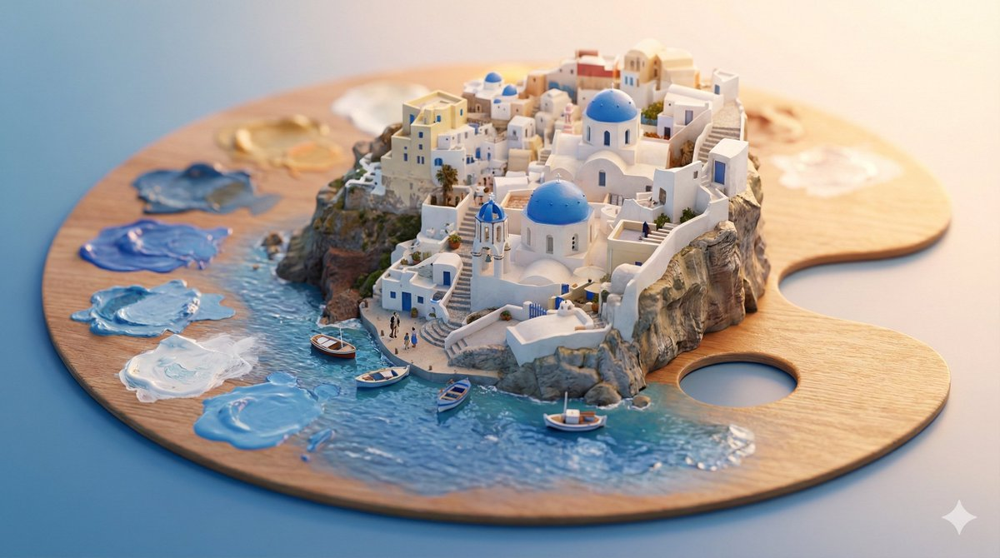

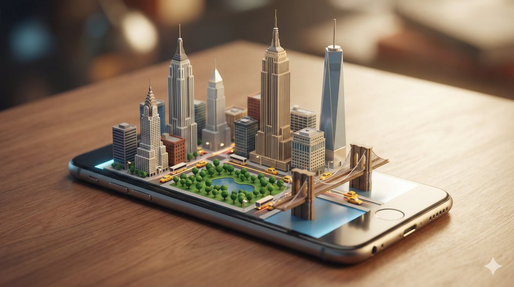

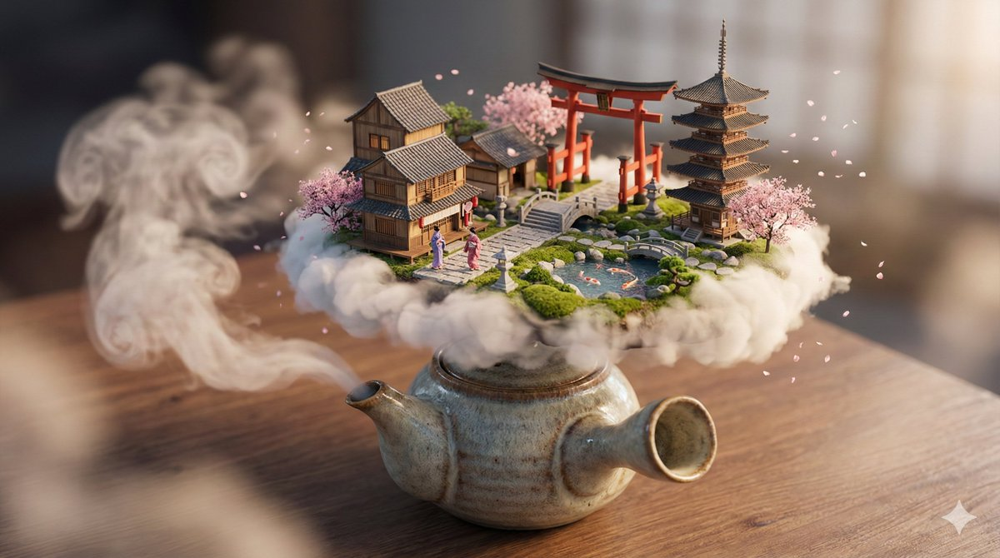

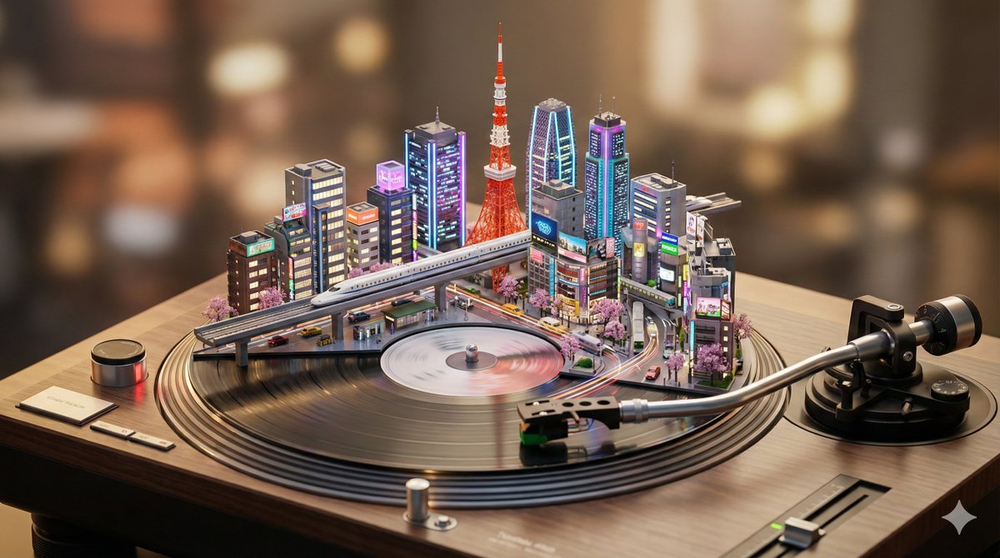

```
Object-Based Miniature Cities

Gemini Nano Banana Pro Prompt:

Create a stylized miniature 3D diorama viewed from a 45-degree angled perspective, emphasizing careful scale, clean geometry, and fine craftsmanship.

A [OBJECT] serves as the central base of the composition. From within or above this object, a miniature interpretation of [LOCATION NAME] emerges naturally, forming a compact, self-contained world.

The scene highlights recognizable landmarks, terrain features, or symbolic structures associated with [LOCATION NAME], arranged harmoniously and rendered with precise detail.

Miniature roads, paths, or environmental elements flow through the scene, with tiny vehicles, figures, or subtle motion cues adding realism and life.

Use cinematic lighting, soft highlights, and selective depth-of-field blur to create a magical, dreamlike atmosphere.

Balance playful isometric styling with realistic materials and lighting, achieving a polished, premium diorama look.

Highly detailed, cohesive composition with an 8K cinematic finish, refined miniature-world aesthetic.
```

```
基于物体的微型城市

创建一个风格化的微型3D微缩场景，采用45度角视角，强调精准的比例、简洁的几何结构和精致的工艺。

以[物体]作为构图的核心基座，从该物体内部或上方自然延伸出一个对[地点名称]的微型诠释，形成一个紧凑而自成一体的世界。

场景突出展现与[地点名称]相关的标志性建筑、地形特征或象征性结构，并以和谐的方式布局，细节刻画精确。

微型道路、小径或环境元素贯穿整个场景，点缀着微小的车辆、人物或细微的动态线索，增添真实感与生机。

运用电影级灯光、柔和高光及选择性景深模糊，营造出梦幻而魔幻的氛围。

在趣味十足的等距风格与写实材质及光影之间取得平衡，呈现出精致高端的微缩模型质感。

整体构图高度细致且统一，具备8K电影级画质与精炼的微型世界美学。
```

 [↑返回目录](#toc)

---
## <a id="prompt-2012458566771204400">夏日鸡尾酒专业摄影</a> (<a href="https://x.com/i/status/2012458566771204444" target="_blank" rel="noopener noreferrer">Oogie</a>)


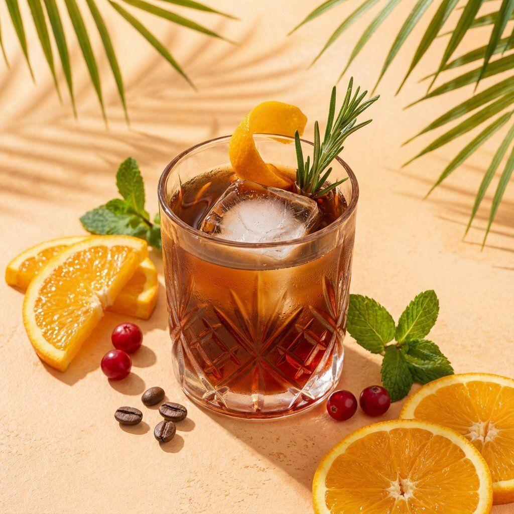

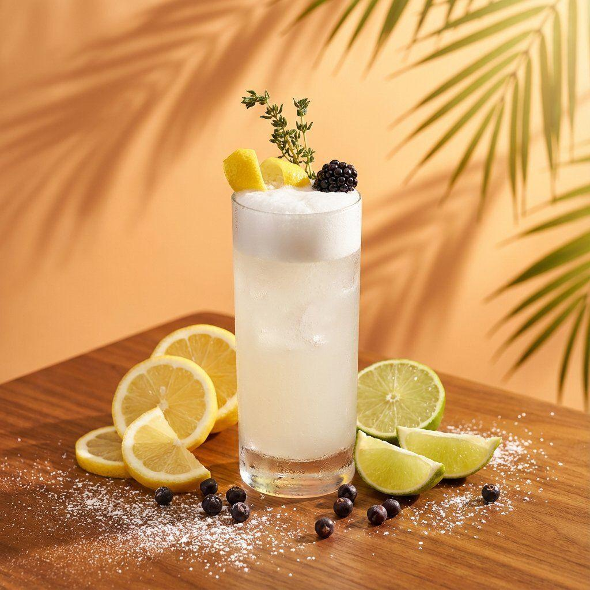

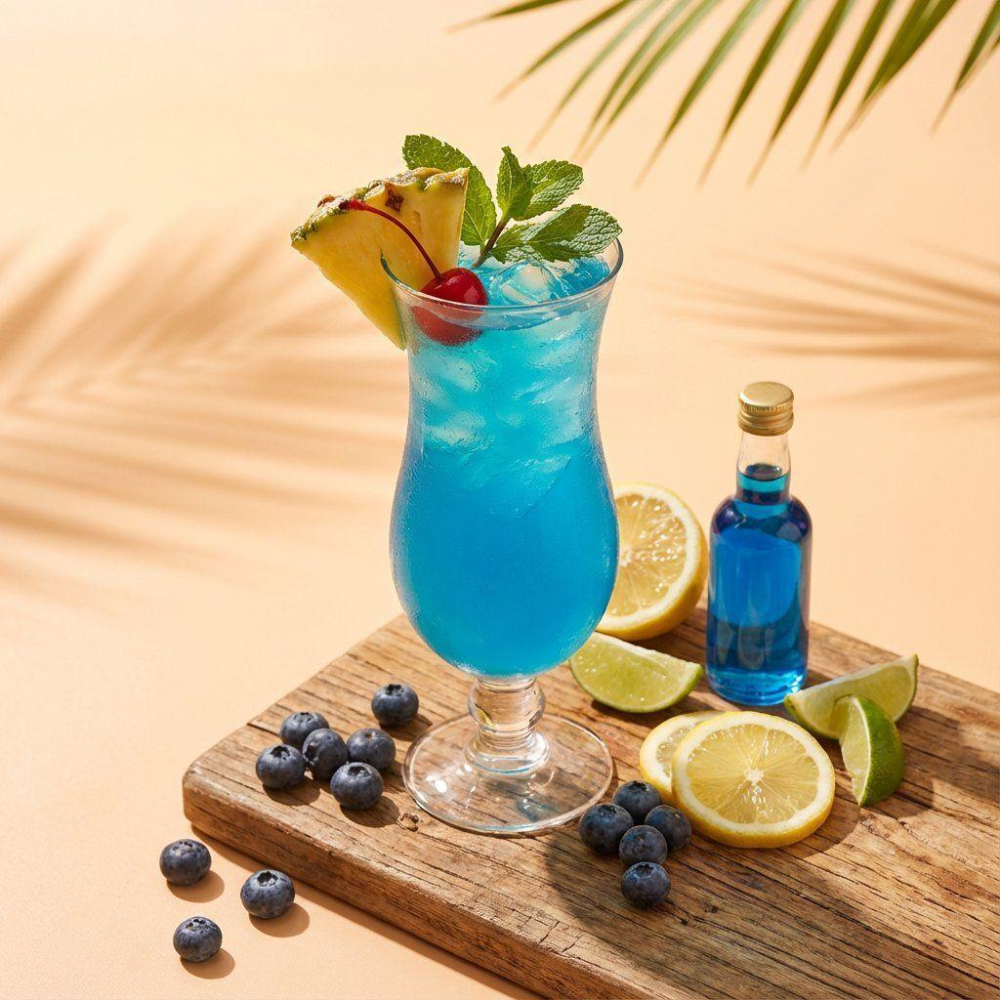

```
Professional product photography of assorted summer cocktails in a tropical minimalist studio setting. The scene features four specific drinks: an Old Fashioned served in a crystal-cut rocks glass with a large ice cube, a vibrant Blue Hawaiian served in a curved hurricane glass, a Moscow Mule served in a sweating hammered copper mug, and a frothy Gin Fizz served in a tall frosted highball glass.
Style the drinks with fresh garnishes such as rosemary sprigs, orange peel twists, pineapple wedges, maraschino cherries, mint bouquets, lime and lemon wheels, blackberries, and thyme sprigs. Add scattered props and raw ingredients around the setup including fresh ginger root, coffee beans, loose blueberries, cranberries, a miniature alcohol bottle, and spilled salt or sugar crystals for texture and realism.
Place everything on a textured wooden table or a warm peach-colored stone surface. Use a soft-focus warm beige/peach monochrome backdrop with projected tropical foliage shadows. Lighting should mimic hard direct golden-hour sunlight, creating sharp defined striped palm-frond shadows (gobo effect) across the scene, with bright specular highlights on wet glass surfaces, melting ice, and glistening condensation droplets.
Shoot from eye-level to a slightly high angle (around 45 degrees) using an 85mm macro lens for detail and compression. Keep razor-sharp focus on the front garnish and glass rim with shallow depth of field to create smooth bokeh and background blur. The overall look should feel high-end, commercial, vibrant, saturated, fresh, tropical, summery, energetic, and clean.
```

```
专业产品摄影，拍摄多种夏日鸡尾酒，置于热带极简风格的摄影棚中。场景包含四款特定饮品：一款用切面水晶岩石杯盛装、配一大块冰块的老式鸡尾酒（Old Fashioned）；一款色彩鲜艳、盛于弧形飓风杯中的蓝色夏威夷（Blue Hawaiian）；一款装在锤纹铜制马克杯中、杯壁凝结水珠的莫斯科骡子（Moscow Mule）；以及一款泡沫丰富、盛于冰镇高球杯中的金菲士（Gin Fizz）。

为饮品搭配新鲜装饰，如迷迭香枝、橙皮卷、菠萝角、马拉斯奇诺樱桃、薄荷花束、青柠与柠檬圆片、黑莓和百里香小枝。在布置周围散落一些道具和原始原料，包括鲜姜根、咖啡豆、散落的蓝莓、蔓越莓、迷你烈酒瓶，以及洒落的盐粒或糖晶，以增强质感与真实感。

将所有物品置于有纹理的木质桌面或暖桃色石材台面上。背景采用柔和虚化的暖米色/桃色单色调，并投射热带植物叶片的阴影。灯光模拟强烈直射的黄金时刻阳光，在场景中形成清晰锐利的棕榈叶条纹状阴影（使用遮光板效果），并在湿润的玻璃表面、融化的冰块和闪烁的冷凝水珠上营造明亮的镜面高光。

以人眼高度至略高的角度（约45度）进行拍摄，使用85mm微距镜头捕捉细节并实现压缩感。前景的装饰物与杯口保持极致锐利对焦，同时采用浅景深营造柔滑的背景虚化（bokeh）。整体视觉效果应呈现高端商业感，色彩鲜明饱和，清新、热带风情、夏日氛围浓郁，充满活力且干净利落。
```

 [↑返回目录](#toc)

---
## <a id="prompt-2012319960500986400">针织毛线娃娃肖像</a> (<a href="https://x.com/i/status/2012319960500986263" target="_blank" rel="noopener noreferrer">Gadgetify</a>)

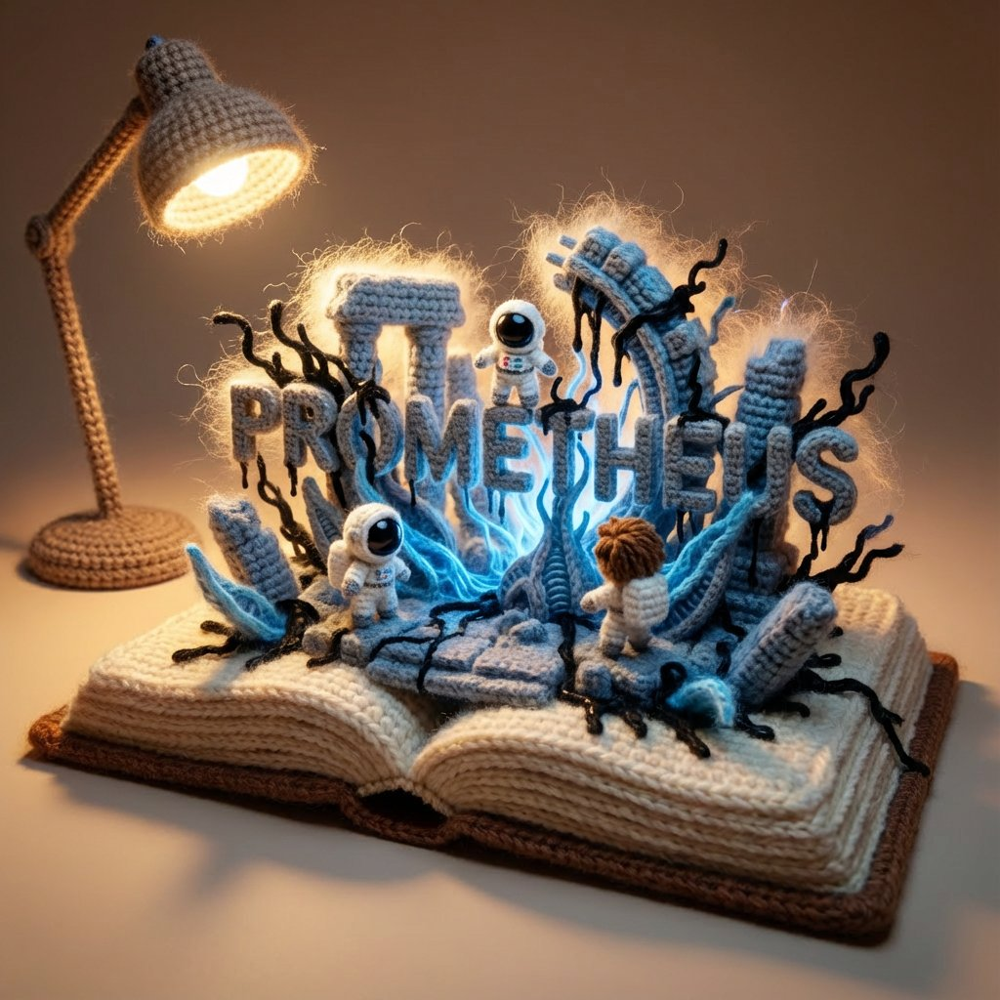

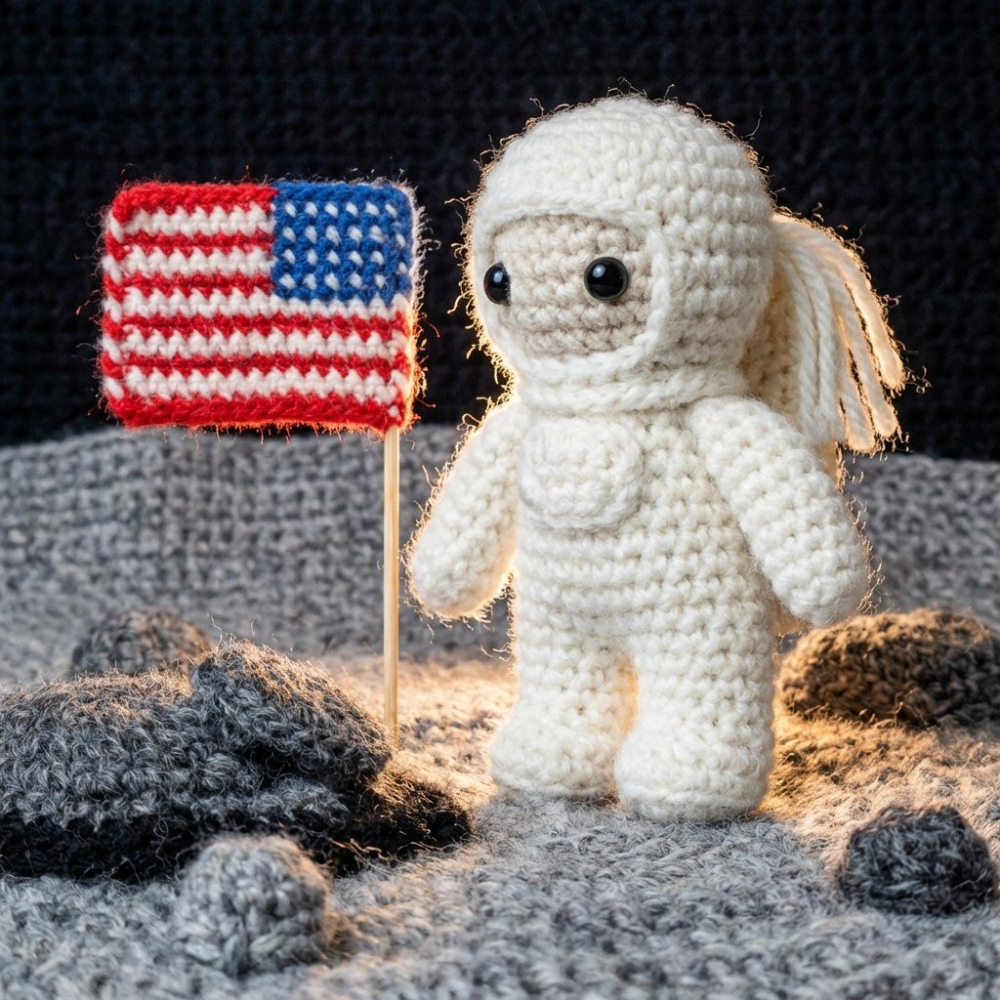

```
You don't super complex prompts to transform your existing images.  This prompt turns your images into a knitted yarn doll


STITCH: Double Crochet.
YARN: Fuzzy Wool (Macro texture).
STUFFING: Over-stuffed (Round appearance).


- Convert hair to thick yarn strands.
- Convert eyes to black plastic safety buttons.
- Surface fuzz/halo lit by ambient light.

```

```
你不需要非常复杂的提示词来转换你的现有图像。这个提示词会将你的图像变成一个针织毛线娃娃。

针法：双钩针。  
毛线：绒毛羊毛（宏观纹理）。  
填充：填充过满（呈现圆润外观）。

- 将头发转换为粗毛线束。  
- 将眼睛转换为黑色塑料安全纽扣。  
- 表面绒毛/光晕由环境光照明。
```

 [↑返回目录](#toc)

---
## <a id="prompt-2012259409649660200">奢华产品包装开箱场景</a> (<a href="https://x.com/i/status/2012259409649660188" target="_blank" rel="noopener noreferrer">Amira Zairi</a>)

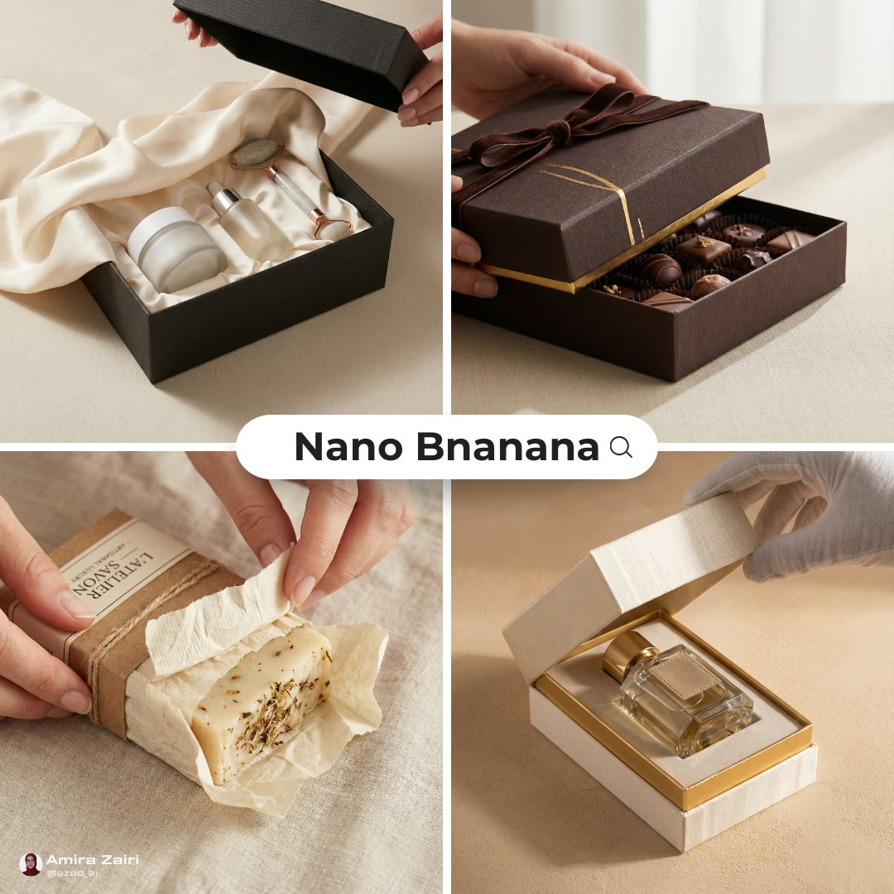

```
[product], luxury packaging reveal scene, premium unboxing moment, pristine hands partially visible at the edges, delicate interaction with the packaging, lid slightly lifted to reveal the product inside, crisp folds and precise alignment, tactile materials [ ex: matte paper, soft touch coating, embossed details, foil accents], subtle micro texture and dust free finish, clean white background, soft diffused studio lighting, controlled specular highlights, realistic shadows, macro product photography look, shallow depth of field with sharp focus on the product and branding area, high end editorial commercial style, ultra realistic, 4k, 1:1, no watermark, no extra text
```

```
[产品]，奢华包装开箱场景，高端拆盒瞬间，画面边缘隐约可见洁净的手部，轻柔地与包装互动，盒盖微微掀起以展示内部产品，折痕清晰、对位精准，材质触感丰富（如哑光纸、软触涂层、压纹细节、烫金装饰），表面带有细腻微纹理且无尘，纯白背景，柔和漫射影棚灯光，控制得当的镜面高光与真实阴影，呈现微距产品摄影效果，浅景深但产品及品牌区域锐利对焦，高端杂志商业风格，超写实，4K，1:1比例，无水印，无额外文字。
```

 [↑返回目录](#toc)

---
## <a id="prompt-2011994819124752600">悬浮蛋糕与流淌糖浆的甜点盛宴</a> (<a href="https://x.com/i/status/2011994819124752631" target="_blank" rel="noopener noreferrer">ShaHid WaNii</a>)

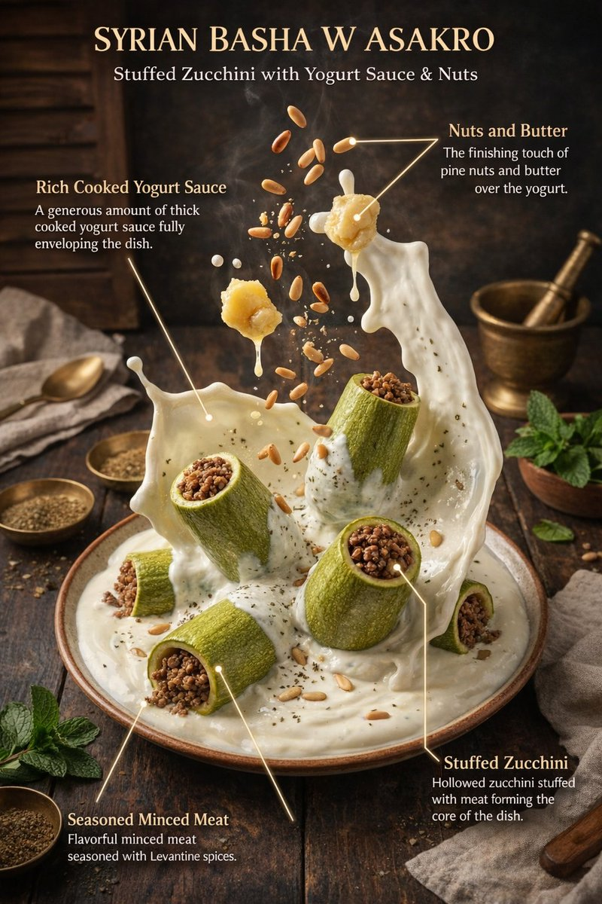

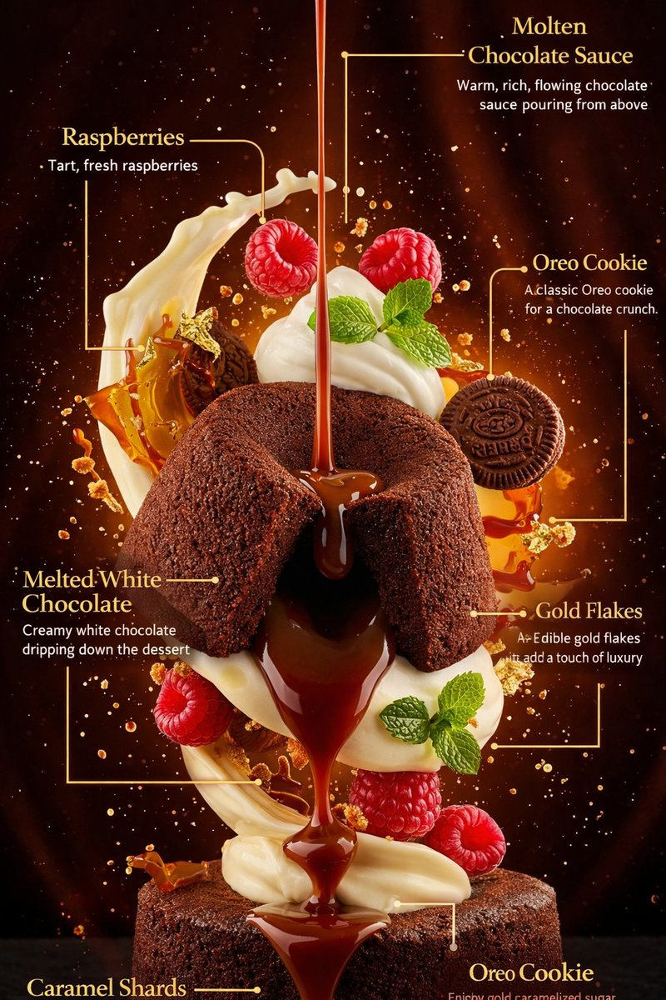

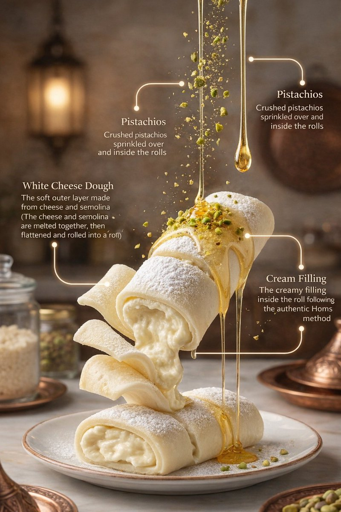

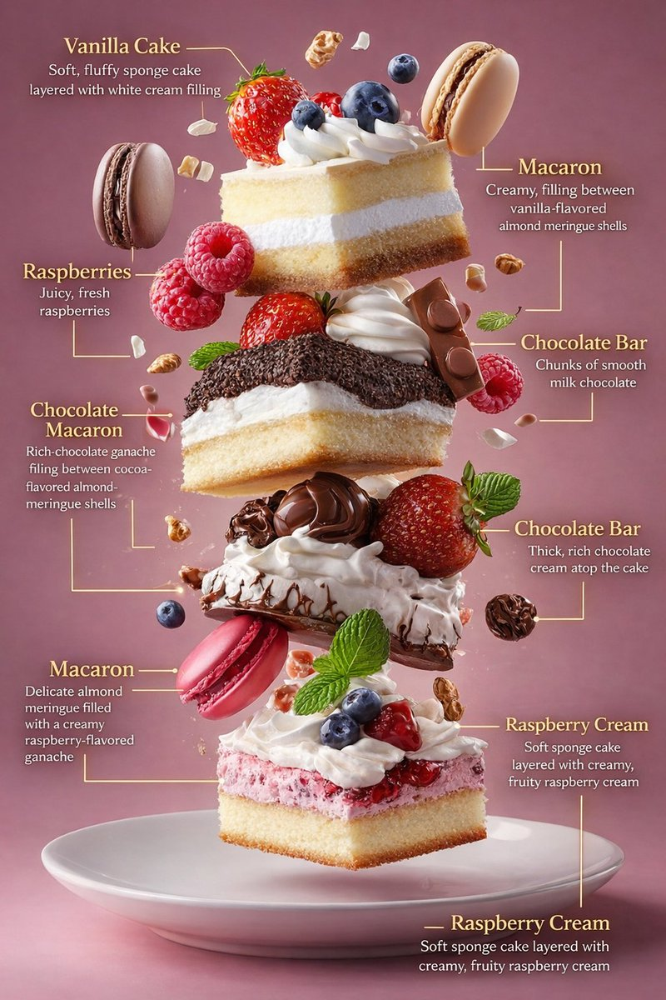

```
{
  "global_settings": {
    "resolution": "8K ultra high definition",
    "aspect_ratio": "3:4",
    "camera_style": "studio food photography with cinematic lighting",
    "depth_of_field": "shallow depth of field, sharp subject, soft background",
    "lighting": "soft directional key light, subtle rim light, controlled highlights",
    "style": "hyper-realistic food illustration with editorial infographic overlays",
    "composition_rules": [
      "no zoom",
      "no crop",
      "center-weighted vertical composition",
      "floating elements frozen in motion"
    ],
    "text_design": {
      "ingredient_name_color": "metallic gold",
      "ingredient_description_color": "pure white",
      "font_style": "elegant serif for titles, clean sans-serif for descriptions",
      "indicator_lines": "long, thin, smooth golden lines with rounded corners"
    }
  },

  "module_1_image_1_style": {
    "scene_description": "A vertical stack of assorted cake slices floating above a white ceramic plate against a soft pink gradient background.",
    "background": {
      "color": "soft pastel pink",
      "texture": "smooth gradient",
      "lighting": "even, studio-lit, no harsh shadows"
    },
    "main_subjects": [
      "multiple layered sponge cake slices",
      "white whipped cream layers",
      "raspberry cream layer",
      "chocolate cream topping"
    ],
    "visible_ingredients": [
      "vanilla sponge cake",
      "whipped cream",
      "raspberries",
      "blueberries",
      "strawberries",
      "macarons (vanilla and chocolate)",
      "chocolate bar pieces",
      "mint leaves",
      "small nut fragments"
    ],
    "motion_elements": [
      "floating fruits",
      "floating macarons",
      "crumbs suspended in air"
    ],
    "text_labels": [
      "Vanilla Cake – soft, fluffy sponge cake layered with white cream filling",
      "Macaron – creamy filling between almond meringue shells",
      "Raspberries – juicy, fresh raspberries",
      "Chocolate Bar – chunks of smooth milk chocolate",
      "Raspberry Cream – soft sponge cake layered with creamy, fruity raspberry cream"
    ]
  },

  "module_2_image_2_style": {
    "scene_description": "Rolled Syrian dessert presented vertically with syrup pouring from above, placed in a warm, rustic kitchen environment.",
    "background": {
      "environment": "traditional kitchen",
      "elements": [
        "warm lantern light",
        "wooden surfaces",
        "brass and copper utensils"
      ],
      "lighting": "warm ambient lighting with soft highlights"
    },
    "main_subjects": [
      "rolled white dessert dough",
      "cream filling spilling out",
      "golden syrup stream"
    ],
    "visible_ingredients": [
      "white cheese dough",
      "cream filling",
      "pistachios",
      "sugar syrup"
    ],
    "motion_elements": [
      "syrup dripping vertically",
      "pistachio crumbs falling"
    ],
    "text_labels": [
      "White Cheese Dough – soft outer layer made from cheese and semolina",
      "Cream Filling – creamy filling inside the roll",
      "Pistachios – crushed pistachios sprinkled over and inside the rolls"
    ]
  }
```

```
全局设置：
- 分辨率：8K 超高清晰度
- 宽高比：3:4
- 摄影风格：带有电影照明的工作室食物摄影
- 景深：浅景深，主体清晰，背景柔和
- 照明：柔和的定向主光、微妙的轮廓光、控制良好的高光
- 风格：超现实的食物插图并附有编辑信息图表覆盖
- 构图规则：不放大、不裁剪、中心权重垂直构图、浮动元素定格在运动中
- 文本设计：成分名称颜色为金属金色、成分描述颜色为纯白色、字体风格为优雅衬线体用于标题、干净无衬线体用于描述、指示线条为长而细的光滑金色线条且圆角处理

模块一图像一风格：
- 场景描述：白色陶瓷盘上方悬浮着各种蛋糕片堆成的垂直堆栈，背景是柔和的粉色渐变。
- 背景：颜色为柔和的粉彩色、质地为平滑渐变、照明均匀工作室灯光下没有强烈阴影
- 主要主题：多层海绵蛋糕片、白奶油层、覆盆子奶油层、巧克力奶油顶饰
- 可见成分：香草海绵蛋糕、打发奶油、覆盆子、蓝莓、草莓、马卡龙（香草和巧克力）、巧克力条块、薄荷叶、小坚果碎片
- 动态元素：悬浮水果、悬浮马卡龙、空中悬浮的碎屑
- 文本标签：香草蛋糕 – 柔软蓬松的海绵蛋糕与白色奶油夹层、马卡龙 – 杏仁蛋白饼之间的奶油馅心、覆盆子 – 多汁新鲜覆盆子、巧克力条 – 光滑牛奶巧克力块、覆盆子奶油 – 带有奶油覆盆子奶油夹层的柔软海绵蛋糕

模块二图像二风格：
- 场景描述：垂直展示的卷起的叙利亚甜点，糖浆从上方浇下，置于一个温暖质朴的厨房环境中。
- 背景：环境为传统厨房，包含元素如暖黄色灯笼灯光、木质表面、黄铜和铜制厨具，照明为带有柔和高光的温暖环境光
- 主要主题：卷起的白色甜点面团、溢出的奶油馅料、金色糖浆流
- 可见成分：白色芝士面团、奶油馅料、开心果、糖浆
- 动态元素：垂直滴下的糖浆、掉落的开心果碎屑
- 文本标签：白色芝士面团 – 由芝士和粗粒小麦粉制成的柔软外层、奶油馅料 – 卷内奶油填充物、开心果 – 碾碎的开心果撒在及内部的卷中
```

 [↑返回目录](#toc)

---
## <a id="prompt-2011829870893125600">三层美食滴落特写</a> (<a href="https://x.com/i/status/2011829870893125708" target="_blank" rel="noopener noreferrer">Oogie</a>)

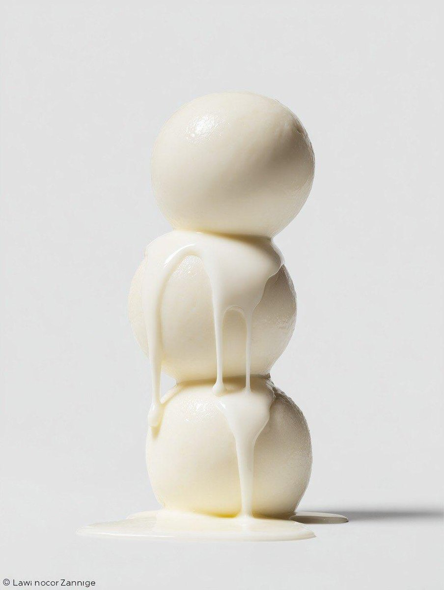

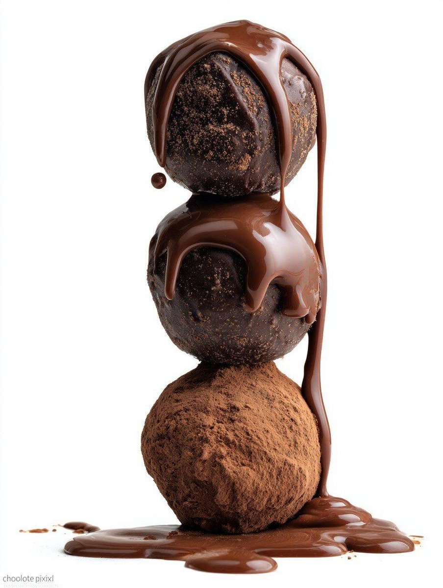

```
a stack of three [FOOD ITEM] with [LIQUID] dripping down, on a white background, in the style of food photography, magazine cover "[FOOD] pixel", macro shot, studio lighting, nikon z6 ii, volumetric lighting, neutral tones.
```

```
三层[食物]堆叠，[液体]从上滴落，白色背景，美食摄影风格，杂志封面“[食物]像素”，微距镜头，影室灯光，尼康Z6 II拍摄，体积光效，中性色调。
```

 [↑返回目录](#toc)

---
## <a id="">半透明蔬菜</a> (<a href="https://x.com/meng_dagg695/status/2012701012893839826" target="_blank" rel="noopener noreferrer">ShaHid WaNii</a>)

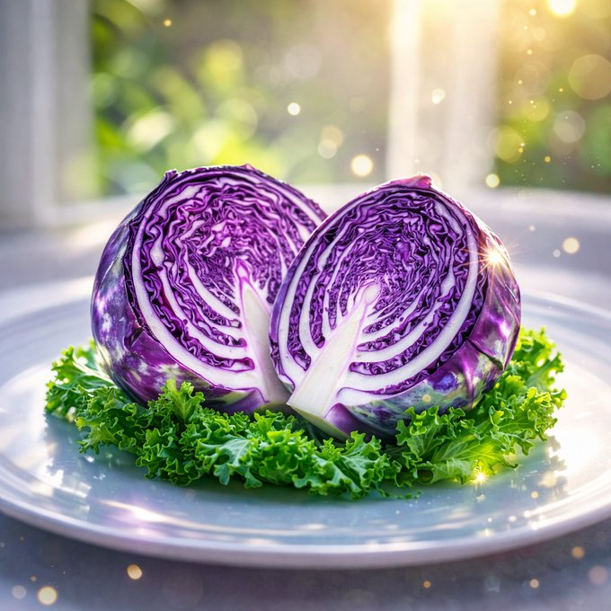

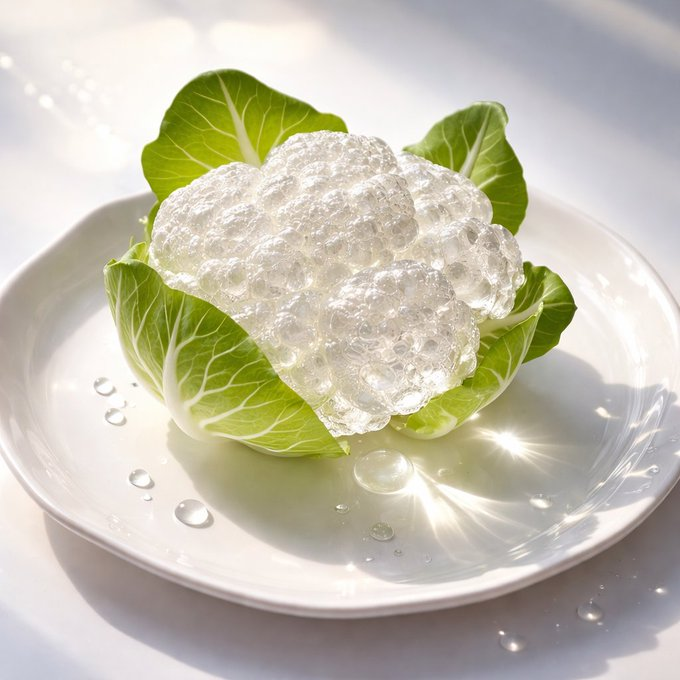

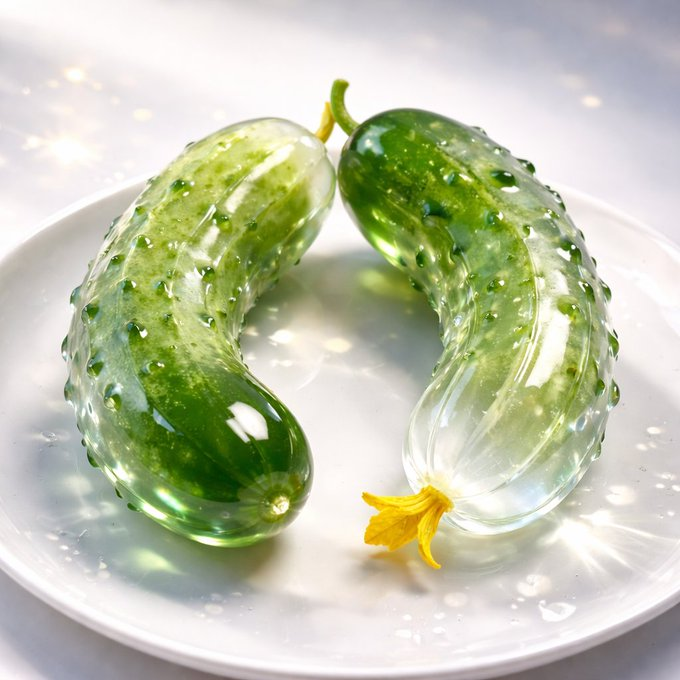

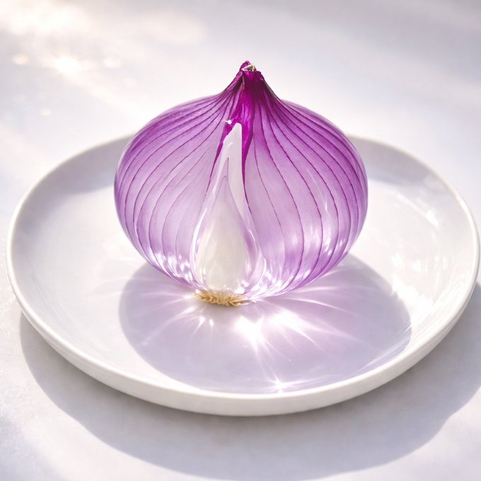

```
{
  "master_prompt_version": "1.0",
  "output_resolution": "8K",
  "aspect_ratio": "1:1",
  "color_profile": "wide-gamut, high dynamic range",
  "lighting_quality": "studio-grade, physically accurate light transport",
  "global_constraints": {
    "no_text": true,
    "no_logos": true,
    "no_watermarks": true,
    "no_hallucinated_elements": true,
    "photorealistic_material_behavior": true
  },
  "modules": {
    "module_1_image_1_style": {
      "subject": "single translucent purple onion",
      "pose_and_composition": {
        "orientation": "upright, centered",
        "camera_angle": "eye-level, slight downward tilt",
        "framing": "tight composition with plate fully visible",
        "symmetry": "strong vertical symmetry"
      },
      "material_properties": {
        "onion_layers": "glass-like translucency with visible concentric layers",
        "surface_finish": "smooth, glossy, semi-crystalline",
        "light_transmission": "high subsurface scattering through layers"
      },
      "color_details": {
        "outer_layers": "soft lavender to pale violet gradient",
        "inner_core": "milky white, semi-opaque",
        "top_tip": "deeper saturated purple",
        "base_root": "small beige root disk"
      },
      "lighting": {
        "key_light": "soft directional light from upper left",
        "fill_light": "gentle ambient bounce",
        "highlights": "star-like specular reflections on plate",
        "shadows": "soft, diffused shadow beneath onion"
      },
      "environment": {
        "plate": "round white ceramic plate, matte-gloss finish",
        "surface": "light gray to white seamless background",
        "reflections": "subtle caustic light patterns on plate"
      },
      "camera_and_quality": {
        "focus": "sharp across entire onion",
        "depth_of_field": "shallow-to-medium",
        "noise": "none",
        "clarity": "ultra-clean, studio-polished"
      }
    },
    "module_2_image_2_style": {
      "subject": "two cucumbers with glass-like appearance",
      "pose_and_composition": {
        "orientation": "curved inward, facing each other in a mirrored arc",
        "camera_angle": "slightly elevated, front-facing",
        "framing": "centered on plate, balanced negative space"
      },
      "material_properties": {
        "body": "transparent to semi-transparent, gelatinous glass texture",
        "surface": "smooth with raised seed-like bumps",
        "moisture": "water droplets adhered to surface"
      },
      "color_details": {
        "left_cucumber": "deep green fading to translucent green",
        "right_cucumber": "lighter green transitioning to near-clear",
        "flower": "small yellow blossom on one end",
        "stem": "short green stem visible"
      },
      "lighting": {
        "key_light": "soft daylight from upper left",
        "refractions": "visible internal light bending",
        "highlights": "bright glossy reflections on curves",
        "shadows": "soft pooled shadow on plate"
      },
      "environment": {
        "plate": "round white ceramic plate with subtle gloss",
        "surface": "neutral light gray background",
        "water_elements": "scattered droplets on plate"
      },
      "camera_and_quality": {
        "focus": "crisp macro-level detail",
        "depth_of_field": "moderate, background softly blurred",
        "clarity": "hyper-clean, AI-polished realism"
      }
    },
```

```
8K分辨率，1:1画幅，广色域高动态范围色彩，影棚级物理精确光照。画面不含文字、标志、水印或虚构元素，材质表现需符合真实物理特性。

第一幅：一颗半透明紫色洋葱，直立居中摆放于白色圆形陶瓷盘上，盘面为哑光与亮光结合质地。镜头平视略俯拍，构图紧凑且保留完整盘面，强调垂直对称。洋葱外层呈柔和薰衣草至淡紫渐变，内芯为乳白色半不透明，顶部尖端为饱和深紫色，底部附有小片米色根盘。表层光滑如玻璃，具有明显同心圆结构，光线在层间产生强烈次表面散射。主光源来自左上方柔光，辅以环境漫反射光，盘面呈现星点状高光，洋葱底部投下柔和弥散阴影，盘上可见细微焦散光斑。整体焦点清晰覆盖整颗洋葱，景深浅至中等，画面无噪点，极度干净精致。

第二幅：两根呈玻璃质感的黄瓜，弧形向内弯曲，彼此镜像相对，置于同款白色圆形陶瓷盘中央，周围留有均衡负空间。镜头略高角度正面拍摄。黄瓜通体透明至半透明，质地如凝胶玻璃，表面光滑并带有凸起的籽状颗粒，附着水珠。左侧黄瓜为深绿渐变为透绿，右侧为浅绿过渡至近乎透明；其中一根末端带一朵小黄花及短绿茎。主光为左上方柔日光，内部可见明显光线折射，曲面呈现明亮高光，盘面形成柔和聚拢阴影。背景为中性浅灰无缝背景，盘面散落水滴。画面聚焦于黄瓜的微距级细节，景深适中，背景轻微虚化，整体极度清晰，呈现AI精修级写实效果。
```

 [↑返回目录](#toc)

---
## <a id="">高端设计师品牌产品展示</a> (<a href="https://x.com/Dari_Designs/status/2012844919388594315" target="_blank" rel="noopener noreferrer">Daria_Surkova</a>)

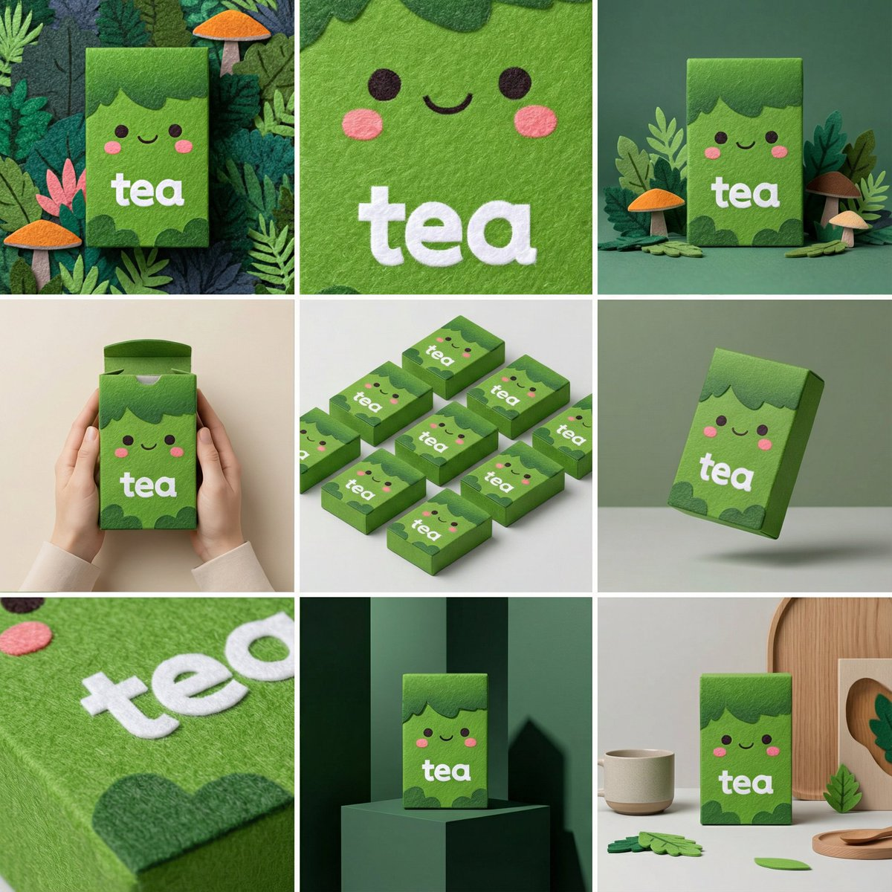


```
A clean 3×3 [ratio] storyboard grid with nine equal [ratio] sized panels on [4:5] ratio. 

Use the reference image as the base product reference. Keep the same product, packaging design, branding, materials, colors, proportions and overall identity across all nine panels exactly as the reference. The product must remain clearly recognizable in every frame. The label, logo and proportions must stay exactly the same.

This storyboard is a high-end designer mockup presentation for a branding portfolio. The focus is on form, composition, materiality and visual rhythm rather than realism or lifestyle narrative. The overall look should feel curated, editorial and design-driven.

FRAME 1:
Front-facing hero shot of the product in a clean studio setup. Neutral background, balanced composition, calm and confident presentation of the product.

FRAME 2:
Close-up shot with the focus centered on the middle of the product. Focusing on surface texture, materials and print details.

FRAME 3:
Shows the reference product placed in an environment that naturally fits the brand and product category. Studio setting inspired by the product design elements and colours. 

FRAME 4:
Product shown in use or interaction on a neutral studio background. Hands and interaction elements are minimal and restrained, the look matches the style of the package. 

FRAME 5:
Isometric composition showing multiple products arranged in a precise geometric order from the top isometric angle. All products are placed at the same isometric top angle, evenly spaced, clean, structured and graphic.

FRAME 6:
Product levitating slightly tilted on a neutral background that matches the reference image color palette. Floating position is angled and intentional, the product is floating naturally in space.

FRAME 7:
is an extreme close-up focusing on a specific detail of the label, edge, texture or material behavior.

FRAME 8:
The product in an unexpected yet aesthetically strong setting that feels bold, editorial and visually striking.
Unexpected but highly stylized setting. Studio-based, and designer-driven. Bold composition that elevates the brand.

FRAME 9:
Wide composition showing the product in use, placed within a refined designer setup. Clean props, controlled styling, cohesive with the rest of the series.

CAMERA & STYLE:
Ultra high-quality studio imagery with a real camera look. Different camera angles and framings across frames. Controlled depth of field, precise lighting, accurate materials and reflections. Lighting logic, color palette, mood and visual language must remain consistent across all nine panels as one cohesive series.

OUTPUT:
A clean 3×3 grid with no borders, no text, no captions and no watermarks.
```

```
一个干净的 3×3 比例分镜网格，包含九个等比例的面板，整体画幅比例为 4:5。

以参考图像作为基础产品参照。所有九个面板中必须严格保持相同的产品、包装设计、品牌标识、材质、色彩、比例及整体视觉识别，确保产品在每一帧中都清晰可辨。标签、标志和比例必须完全一致。

此分镜用于高端设计师品牌作品集展示，重点在于造型、构图、材质表现与视觉节奏，而非写实或生活化叙事。整体风格应呈现精心策划、杂志感强且以设计为导向的氛围。

第1帧：  
产品正面主视觉，在干净的影棚环境中拍摄。背景中性，构图平衡，呈现出冷静而自信的产品形象。

第2帧：  
特写镜头，焦点集中于产品中部，突出表面纹理、材质及印刷细节。

第3帧：  
将参考产品置于与其品牌调性和品类自然契合的环境中。影棚布景需从产品设计元素与色彩中汲取灵感。

第第4帧：  
在中性影棚背景下展示产品使用或互动场景。手部及互动元素极简克制，整体风格与包装设计语言一致。

第5帧：  
等距俯视构图，多个产品以精准几何秩序排列。所有产品均采用统一的等距顶角视角，间距均匀，画面干净、结构化且富有图形感。

第6帧：  
产品轻微倾斜悬浮于中性背景之上，背景色调与参考图像配色一致。悬浮姿态角度明确且自然，仿佛在空间中自在漂浮。

第7帧：  
极致特写，聚焦于标签、边缘、纹理或材质表现的某一具体细节。

第8帧：  
产品置于一个出人意料却极具美学张力的场景中，风格大胆、具有杂志大片感且视觉冲击强烈。场景为影棚搭建，高度风格化，构图大胆，旨在提升品牌形象。

第9帧：  
宽幅构图，展示产品在使用状态下的场景，置于精致的设计师布置中。道具简洁，造型受控，整体风格与系列其余部分高度统一。

摄影与风格：  
超高质感影棚影像，呈现真实相机拍摄效果。各帧采用不同机位与取景方式。景深控制精准，灯光讲究，材质与反光表现准确。所有九帧需在光影逻辑、色彩体系、情绪氛围与视觉语言上保持一致，构成一个连贯的整体系列。

输出要求：  
干净的 3×3 网格布局，无边框、无文字、无标题、无水印。
```

 [↑返回目录](#toc)

---
## <a id="">柔和科技角落</a> (<a href="https://x.com/Just_sharon7/status/2012721935193686197" target="_blank" rel="noopener noreferrer">Sharon Riley</a>)

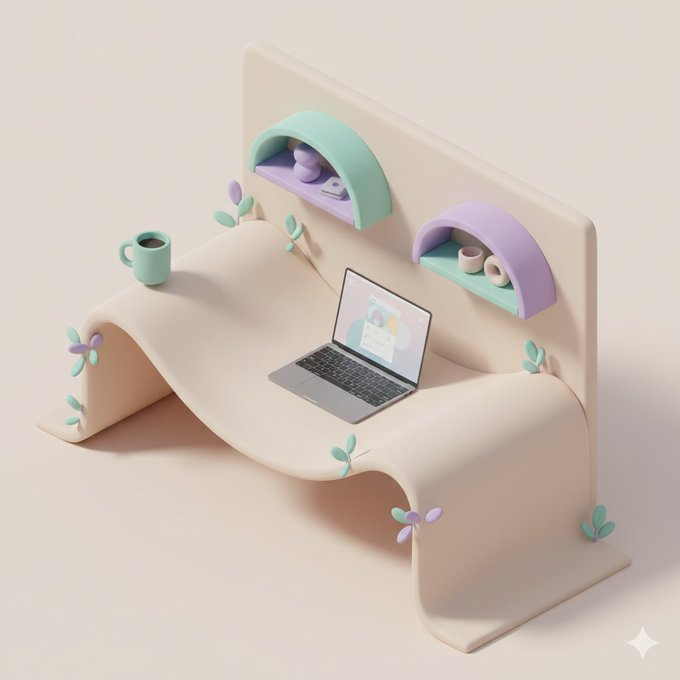

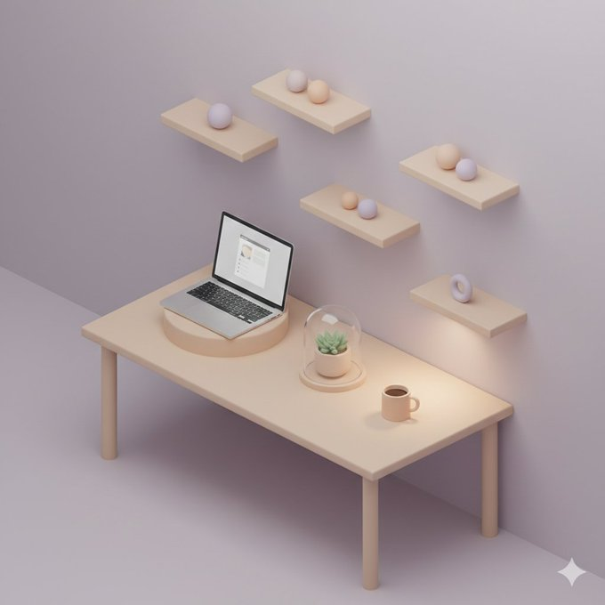

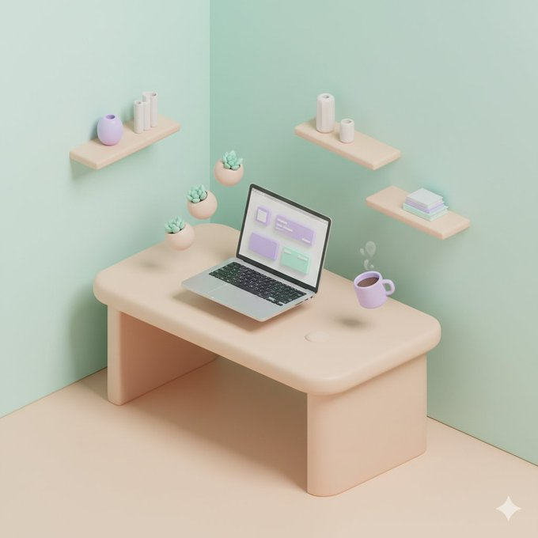

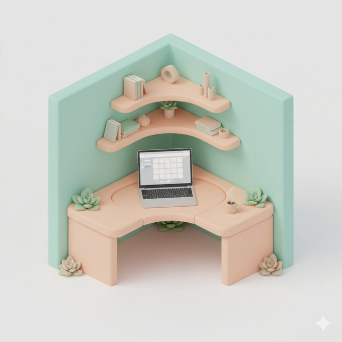

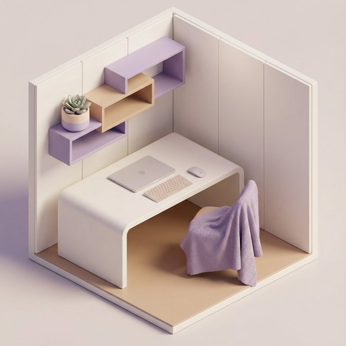

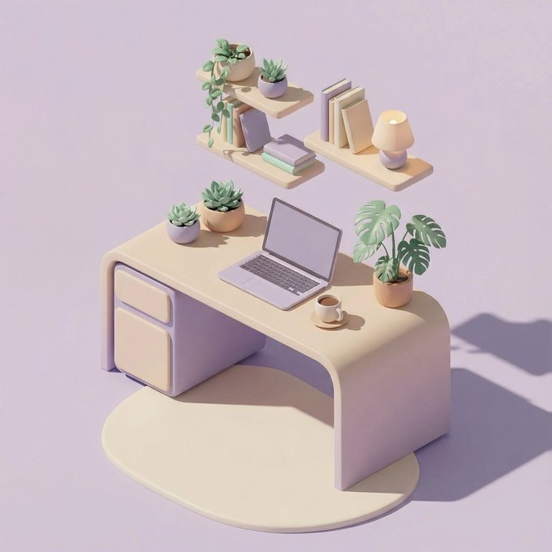

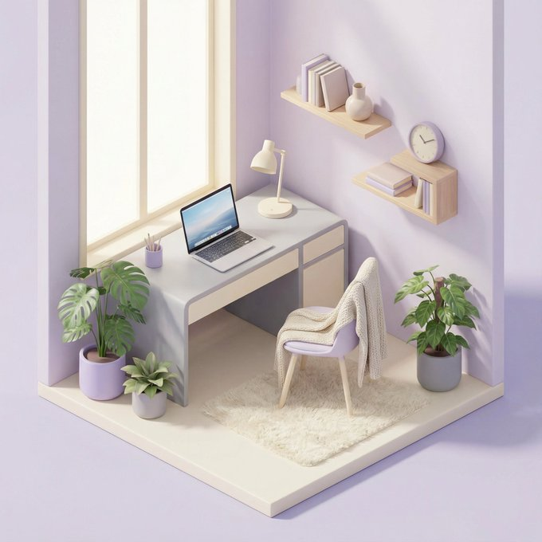

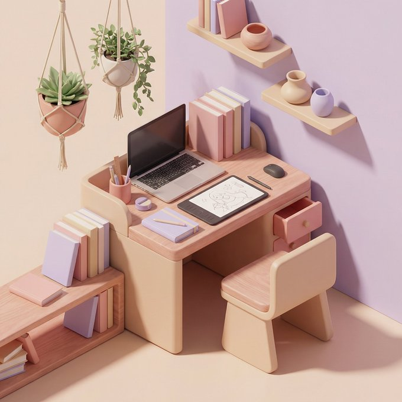

```
Your ideas deserve a space this dreamy. 

Google Gemini Nano Banana pro 3.0

Prompt

A 3D isometric pastel home office scene where objects appear gently lifted, featuring a modern desk with a laptop slightly hovering, plants slowly floating upward, shelves detached from the wall, and a coffee cup resting in mid-air without spills. Smooth rounded surfaces, soft matte materials, light mint, lavender, and warm beige palette, minimal and clean details, subtle depth, soft ambient lighting, gentle shadows that hint at weightlessness, peaceful futuristic mood, illustration-style render, modern UI-friendly composition.
```

```
A 3D isometric pastel tech workspace corner, sleek modern desk with thin laptop and wireless accessories, geometric shelves, single plant accent, muted pastel palette of lavender, off-white and warm beige, ultra-clean surfaces, low visual noise, soft ambient lighting, subtle shadows, modern and cozy aesthetic.

```

```
A 3D isometric pastel workspace scene, modern desk setup with laptop, plants, shelves and coffee cup, smooth surfaces, light lavender and beige tones, minimal details, soft shadows, cozy and aesthetic mood.
```

```
A 3D isometric pastel home office scene, minimal desk positioned near a window, open laptop, simple desk lamp, leafy indoor plants, small wall shelves with decor objects, light lavender, cream and soft gray tones, clean geometry, smooth surfaces, soft natural shadows, peaceful and comfortable mood.

```

```
A 3D isometric pastel creative workspace, compact modern desk with tablet and laptop, art books stacked neatly, hanging plants and minimal shelves, warm pastel tones of blush pink, light lavender and sand beige, smooth plastic and wood textures, soft studio lighting, subtle shadows, cozy and inspiring aesthetic.

```

 [↑返回目录](#toc)

---
## <a id="">紫色调温馨写实肖像</a> (<a href="https://x.com/ChillaiKalan__/status/2012754429066571784" target="_blank" rel="noopener noreferrer">K</a>)

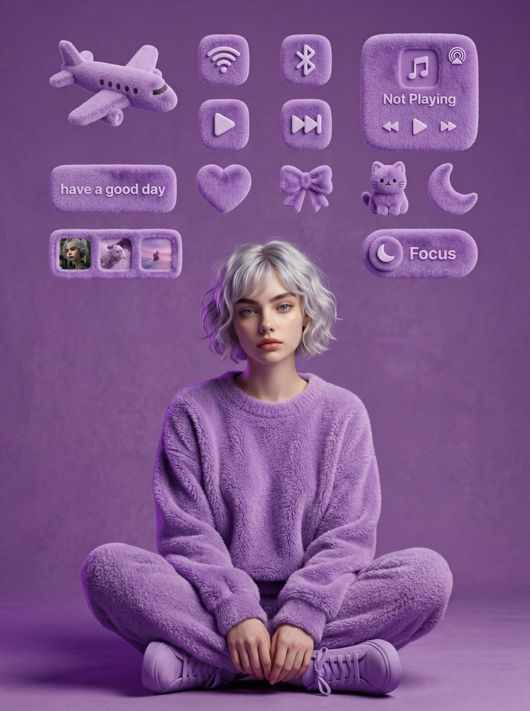

```
Vertical image in a monochrome
purple palette.
Keep my exact pose, proportions, and
face. I am sitting cross-legged.
Outfit: fluffy purple sweater, fluffy
purple pants, purple sneakers.
Background: solid textured purple.
Above me: floating plush 3D widgets
with soft furry texture - icons (airplane,
Wi-Fi, Bluetooth, play, forward/back.
heart, bow, moon), one small fluffy cat, a
few mini thumbnails in plush frames.
Widget texts:"have a good day","Not
Playing","Focus".
Soft warm studio light, slight side rim
light, shallow depth of field, smooth
bokeh.
Photorealistic, high detail, soft edges,
cozy premium look.
```

```
竖构图，单色紫色调。  
保持我完全相同的姿势、比例和面部特征。我盘腿坐着。  
服装：蓬松的紫色毛衣、蓬松的紫色裤子、紫色运动鞋。  
背景：纯色带纹理的紫色。  
我上方漂浮着带有柔软毛绒质感的3D小部件——图标（飞机、Wi-Fi、蓝牙、播放、前进/后退、心形、蝴蝶结、月亮），一只小型毛绒猫，以及几个嵌在毛绒相框中的迷你缩略图。  
小部件文字：“have a good day”、“Not Playing”、“Focus”。  
柔和温暖的影棚灯光，轻微侧逆光，浅景深，柔滑虚化背景。  
写实风格，高细节，边缘柔和，营造舒适高级感。
```

 [↑返回目录](#toc)

---
## <a id="">奇幻披萨公路：海边悬崖上的美食与车流</a> (<a href="https://x.com/Strength04_X/status/2012725231262327227" target="_blank" rel="noopener noreferrer">𝐌</a>)

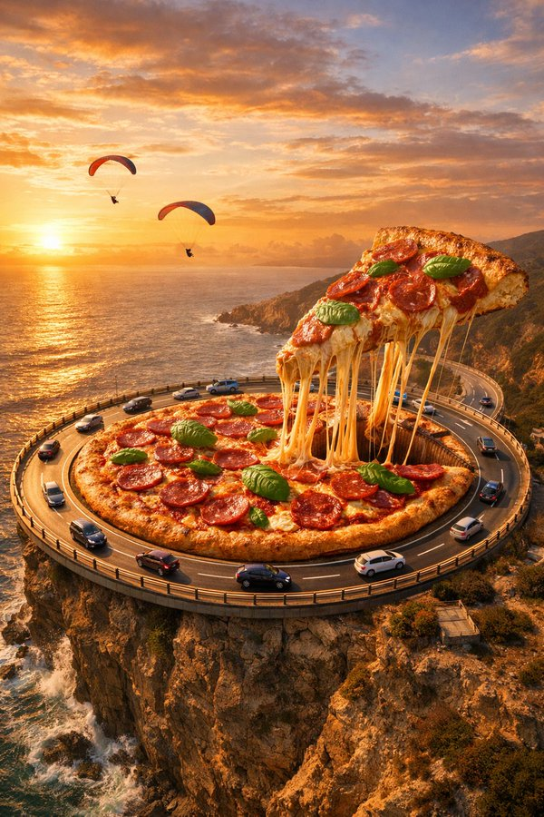

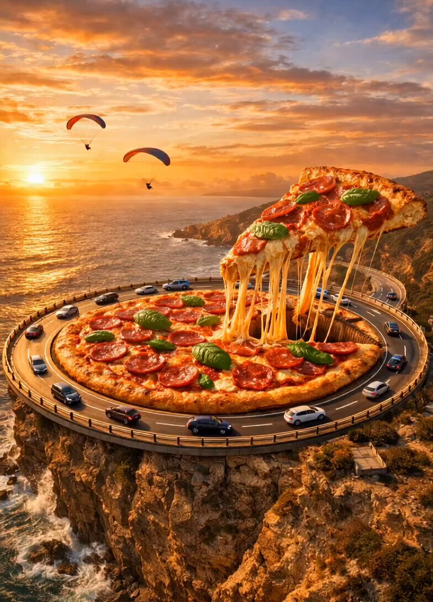

```
A giant pepperoni pizza designed as a circular road roundabout Cars driving along the pizza surface like a highway One slice lifted with cheese stretch-ing dramatically Fresh basil leaves and pepperoni slices on top Located on a coastal cliff above the ocean Sunset sky with warm golden light Paraglid-ers flying in the distance Cinematic aerial perspec-tive Ultra-realistic food textures Fantasy surreal scale High detail, 8K quality Epic advertising-style composition
```

```
一张巨大的意大利辣香肠披萨被设计成环形交叉路口，汽车在披萨表面如高速公路般行驶，其中一块披萨被掀起，奶酪拉出戏剧性的长丝，顶部点缀着新鲜罗勒叶和辣香肠片。场景位于海边悬崖之上，俯瞰海洋，天空是温暖金色的落日余晖，远处有滑翔伞飞翔。采用电影级航拍视角，食物纹理超写实，比例奇幻超现实，细节丰富，8K画质，具有史诗级广告风格构图。
```

 [↑返回目录](#toc)

---
## <a id="">Gorillaz风格漂浮头部肖像</a> (<a href="https://x.com/AmirMushich/status/2012607114791842042" target="_blank" rel="noopener noreferrer">AmirMušić</a>)

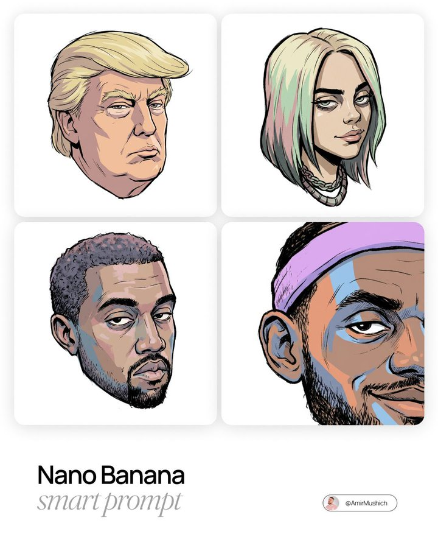

```
[PERSON / CHARACTER NAME]. 
Act as the lead character designer for the virtual band "Gorillaz" (in the style of Jamie Hewlett).
COMPOSITION (STRICTLY FLOATING HEAD):
Generate an illustration of ONLY THE HEAD of [CHARACTER / PERSON].
CRITICAL CONSTRAINT: Absolutely NO NECK, NO SHOULDERS, NO BODY PARTS. The head must be floating completely isolated in the center of the frame. Think of it as a decapitated head icon or a mask hovering in space.
Framing & Angle: Dead center. The head is angled slightly at a Three-Quarter View for dynamic volume. Generous negative space around the head.
VISUAL STYLE (THE "GORILLAZ" AESTHETIC):
The illustration must mimic the iconic, gritty comic-book style of Gorillaz animation phases (Plastic Beach/Demon Days era).
Linework (Gritty Ink): Do NOT use clean, uniform vector lines. Use expressive, textured "Brush Pen" inking. Lines must vary in thickness, look scratchy, raw, imperfect, and have a slight ink-bleed texture. It should feel hand-drawn on paper, urban, and punk.
Characterization: Give the character that distinct Gorillaz attitude: slightly cynical, tired eyes, exaggerated expressive mouth, angular features, and a cool, underground vibe.
COLOR & SHADING (PASTEL COMIC):
Palette: Use a Soft Pastel Color Palette for hair, clothing details, and background elements.
Skin Tone (Respectful): CRITICAL: Keep the skin tone natural and respectful to the ethnicity of [CHARACTER / PERSON]. Do not use unnatural skin colors (like green or zombie-grey) unless the source character is non-human.
Shading Technique: Use Hard-Edged Cel-Shading. No soft airbrushing. Use distinct, sharp blocks of darker pastel tones to define shadows under the nose, brow, and jawline.
BACKGROUND:
Pure White (#FFFFFF). Flat, clean, lots of air.
```

```
[人物/角色名称]。  
担任虚拟乐队“Gorillaz”（杰米·休利特风格）的首席角色设计师。  

构图（严格仅限漂浮头部）：  
仅绘制[人物/角色]的头部，绝对不可出现颈部、肩膀或任何身体部位。头部必须完全孤立地漂浮在画面中央，如同一颗斩首的头颅图标或悬浮在空中的面具。  

取景与角度：  
头部居中，略微呈四分之三视角以增强立体感，周围留有大量负空间。  

视觉风格（“Gorillaz”美学）：  
模仿Gorillaz动画时期（《Plastic Beach》/《Demon Days》时代）标志性的粗粝漫画风格。  

线条（粗粝墨线）：  
禁止使用干净、均匀的矢量线条。采用富有表现力的“毛笔墨水”手绘线条，粗细变化明显，带有刮擦感、原始感、不完美感，并略带墨迹晕染纹理，整体呈现纸上手绘的都市朋克气息。  

角色刻画：  
赋予角色典型的Gorillaz气质：略带讥讽、疲惫的眼神，夸张而富表现力的嘴部，棱角分明的面部特征，以及酷炫地下风格。  

色彩与阴影（柔彩漫画风）：  
调色板：头发、服饰细节及背景元素使用柔和的粉彩色系。  
肤色（尊重真实）：关键要求——肤色必须自然并尊重[人物/角色]的真实族裔特征，除非原角色为非人类，否则不得使用非自然肤色（如绿色或僵尸灰）。  
阴影技法：采用硬边赛璐珞着色，禁止柔边空气喷笔效果，使用清晰锐利的深色粉彩块面塑造鼻下、眉骨和下颌线等处的阴影。  

背景：  
纯白色（#FFFFFF），平整干净，留白充足。
```

 [↑返回目录](#toc)

---
## <a id="">故宫雪夜凤冠回眸</a> (<a href="https://x.com/sidona/status/2011627064353571014" target="_blank" rel="noopener noreferrer">Sidona</a>)

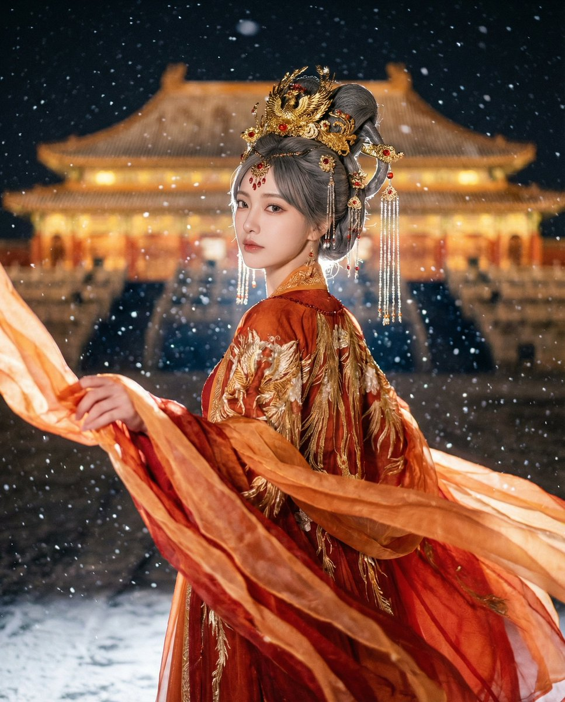

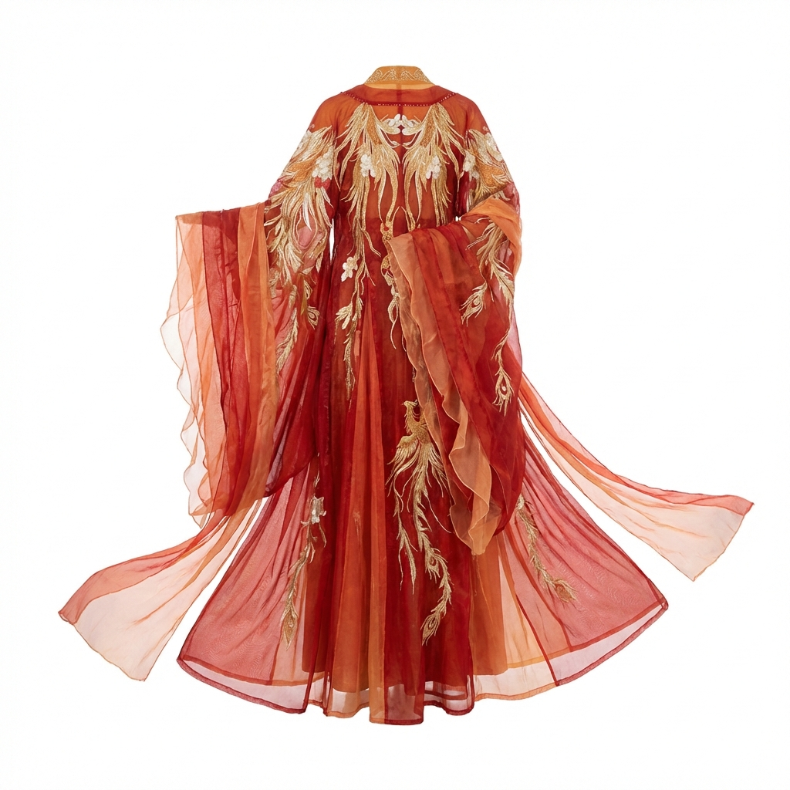

```
{
  "portrait_prompt": {
    "subject": "Based on <User Portrait>, dressed in Based on user-uploaded clothing reference. The subject wears an incredibly elaborate and grand traditional high bun hairstyle adorned with an oversized golden phoenix crown, numerous intricate hairpins, cascading red jewels, and long, shimmering dangling tassels. She is posed in a 3/4 rear view, turning her head back to look over her shoulder at the viewer with an elegant, ethereal expression. Her hand holds a long, translucent orange silk ribbon or sleeve that flows toward the camera lens, creating a sense of movement.",
    "composition": "Close-up shot, estimated 85mm focal length at f/1.2, bokeh background. The composition deliberately aligns the subject with the background to create a visual echo between her costume and the Forbidden City architecture. Foreground includes out-of-focus flowing fabric and falling snow to add depth. Rule of thirds applied to the subject's face.",
    "camera_angle": "Eye-level, slightly angled to capture the rotation of the body.",
    "lighting": "Nighttime snowy scene. Dominant backlight provided by the massive, glowing Forbidden City architecture which creates a rim light and halo effect. Flash lighting illuminates the subject's face from the front-left to ensure clear skin tones against the dark background.",
    "color_palette": "Fujifilm color, film-like, rich and vibrant. Dominant tones of Crimson Red, Burnt Orange, and Gold, contrasted with the white of the falling snow and the deep black of the night sky. High saturation, festive atmosphere.",
    "mood": "Majestic, mythical, and ethereal. Captures the essence of a traditional lantern festival in the Forbidden City during a snowfall with a fantasy aesthetic. The connection between the 'human phoenix' and the 'spirit of the palace' is the central narrative.",
    "negative_prompt": "Unrealistic features, anatomical errors, stiff pose, over-processed, harsh lighting, blurry face, low resolution, bad composition, distorted hands, extra fingers, missing limbs, watermark, text, modern clothing, daylight"
  }
}
```

```
基于用户画像，身着用户上传的服饰参考。人物梳着极其繁复华贵的传统高髻发型，头戴巨大的金色凤凰冠，点缀众多精巧发簪、垂落的红色宝石串以及长长的闪亮流苏。她以3/4后侧视角呈现，回眸望向观者，神情优雅空灵。手中轻握一条半透明的橙色丝绸长带或袖摆，飘向镜头，营造出动感。

特写镜头，约85mm焦距，光圈f/1.2，背景虚化。构图巧妙地将人物与背景对齐，使其服饰与紫禁城建筑形成视觉呼应。前景包含失焦的飘动织物与飘落的雪花，增强画面层次感。人物面部遵循三分法构图。

拍摄角度为平视，略带倾斜以捕捉身体的扭转姿态。

夜景雪天。主光源来自背后宏伟发光的紫禁城建筑，形成轮廓光与光环效果；前左方使用闪光灯补光，确保在深色背景中清晰呈现肤色。

富士胶片色调，胶片质感，色彩浓郁鲜艳。主色调为朱红、焦橙与金色，与飘落白雪及深邃夜空的黑色形成对比。高饱和度，节日氛围浓厚。

整体氛围庄严、神话感十足且空灵缥缈，捕捉雪夜紫禁城元宵灯会的奇幻意境，核心叙事聚焦于“人形凤凰”与“宫阙之灵”的联结。

负面提示：不真实特征、解剖错误、僵硬姿势、过度处理、生硬光线、面部模糊、低分辨率、构图不佳、手部扭曲、多余手指、肢体缺失、水印、文字、现代服装、日光
```

 [↑返回目录](#toc)

---
## <a id="">便利店里的俏皮自拍</a> (<a href="https://x.com/sidona/status/2011978720832315482" target="_blank" rel="noopener noreferrer">Sidona</a>)

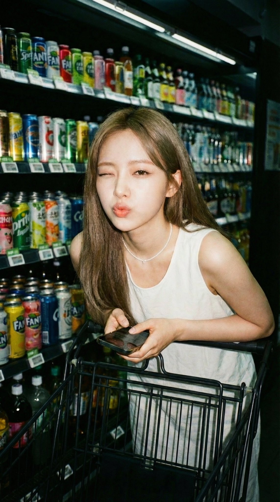

```
{
  "portrait_prompt": {
    "subject": "uploaded woman with long straight hair, wearing a simple white sleeveless top and a delicate pearl necklace. She is leaning playfully forward over the handle of a black wire shopping cart in a dimly lit convenience store aisle. She has a cute, spontaneous expression, winking one eye and puckering her lips in a playful kissy face. She holds a smartphone in her hand. The aisle is lined with shelves stocked with colorful beverage cans and bottles.",
    "composition": "Medium shot, vertical framing, 35mm focal length, capturing the depth of the supermarket aisle behind her. The composition feels like a candid snapshot taken by a friend.",
    "camera_angle": "Slightly high angle looking down at the subject, creating a cute and intimate perspective.",
    "lighting": "Direct on-camera flash style lighting (snapshot aesthetic) that illuminates the subject brightly while letting the background fall into shadow. Mixed with ambient overhead store lights visible as bokeh points.",
    "color_palette": "Fujifilm Classic Negative simulation, strong film texture and grain, high contrast. Cool greenish-blue tones in the shadows typical of fluorescent store lighting, contrasted with natural skin tones. Vintage lo-fi aesthetic.",
    "mood": "Playful, spontaneous, late-night urban vibe, authentic, fun, Gen Z aesthetic, 'grocery store photoshoot' trend.",
    "negative_prompt": "Unrealistic features, anatomical errors, stiff pose, over-processed, harsh lighting, blurry, low resolution, bad composition, distorted faces, unnatural colors, extra limbs, watermark, text, bright daylight"
  }
}
```

```
一位长直发的女性，身穿简约白色无袖上衣，佩戴精致的珍珠项链。她俏皮地向前倾身，倚靠在便利店昏暗过道中一辆黑色金属购物车的扶手上，表情可爱自然，一只眼睛俏皮地眨眼，嘴唇嘟起做出亲吻的表情，手中拿着一部智能手机。过道两侧货架上摆满了色彩缤纷的饮料罐和瓶子。

中景、竖构图，使用35mm焦距，捕捉超市过道在她身后的纵深感，整体构图如同朋友随手抓拍的快照。

略微高角度俯拍，营造出可爱而亲密的视角。

采用机顶闪光灯式的直射光线（快照风格），使人物明亮突出，背景则陷入阴影；同时混合环境中的头顶商店灯光，在画面中形成可见的散景光斑。

色彩风格模拟富士胶片Classic Negative，具有强烈的胶片质感与颗粒感，高对比度；阴影呈现荧光灯照明下典型的冷调蓝绿色，与自然肤色形成对比，整体呈现复古低保真美学。

氛围俏皮、随性，带有深夜都市感、真实自然、趣味十足，体现Z世代审美和“便利店写真”潮流。

避免出现：不真实特征、解剖结构错误、僵硬姿势、过度处理、刺眼光线、模糊、低分辨率、构图不佳、面部扭曲、不自然色彩、多余肢体、水印或文字、明亮日光。
```

 [↑返回目录](#toc)

---
## <a id="">复古镜前的红唇女子</a> (<a href="https://x.com/Alexa_vibe0/status/2013109296037335282" target="_blank" rel="noopener noreferrer">Alexa Davis</a>)

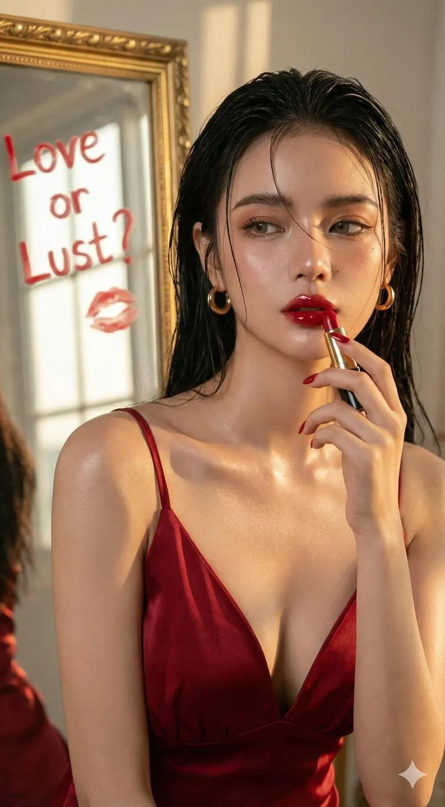

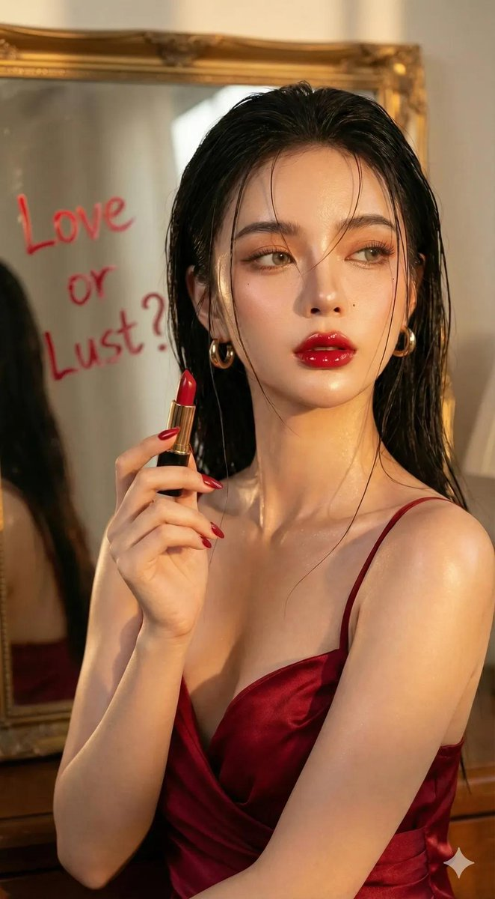

```
{
  "prompt_description": {
    "subject": {
      "type": "young woman",
      "hair": "wet slicked-back dark hair with loose strands framing the face",
      "skin": "glowing dewy skin with visible highlights on cheekbones collarbones and shoulders",
      "expression": "confident sultry gaze looking off-camera"
    },
    "outfit": {
      "dress": "deep red satin spaghetti-strap dress with plunging neckline",
      "accessories": [
        "gold hoop earrings",
        "classic red lipstick bullet held near lips"
      ]
    },
    "makeup": {
      "lips": "glossy cherry-red",
      "cheeks": "softly contoured",
      "eyes": "warm bronze eyeshadow subtle eyeliner long lashes",
      "brows": "naturally defined"
    },
    "pose": {
      "body": "shoulders angled slightly toward the mirror",
      "head": "gently tilted",
      "hands": "delicate fingers holding lipstick near lips"
    },
    "environment": {
      "setting": "standing in front of a vintage gold-framed mirror",
      "mirror_text": {
        "text": "Love or Lust?",
        "style": "written in red lipstick with a kiss mark imperfect handwritten look"
      },
      "lighting": "warm golden-hour sunlight through a window",
      "background": "softly blurred intimate editorial atmosphere"
    },
    "composition": {
      "framing": "tight-medium portrait",
      "focus": "emphasis on facial features makeup texture and glossy skin"
    },
    "camera_details": {
      "camera": "Canon EOS R5 or Sony A7R IV full-frame",
      "lens": "85mm f/1.8 prime",
      "aperture": "f/1.8 to f/2.2",
      "iso": "100-200",
      "shutter_speed": "1/200s",
      "focus": "sharp on eyes and lips"
    },
    "style": {
      "lighting_type": "natural window light no harsh flash",
      "color_grading": "warm tones soft contrast cinematic skin rich reds subtle film look",
      "aesthetic": "high-end beauty editorial Vogue-inspired cinematic realism"
    },
    "quality": {
      "resolution": "ultra-realistic 8K",
      "photography": "professional fashion photography"
    }
  }
}
```

```
一位年轻女子，湿漉漉的深色头发向后梳拢，几缕松散发丝勾勒脸庞；肌肤水润透亮，颧骨、锁骨和肩膀处有明显高光；神情自信而撩人，目光望向镜头之外。身穿一件深红色缎面细肩带低胸连衣裙，佩戴金色圆环耳环，一支经典红色口红膏体轻触唇边。妆容方面：双唇为亮泽樱桃红，脸颊柔和修容，眼妆采用暖铜色眼影、细致眼线与浓密睫毛，眉毛自然清晰。身体微微侧对镜子，头部轻轻倾斜，纤细手指捏着口红靠近嘴唇。她站在一面复古金框镜前，镜面上用红色口红手写着“Love or Lust?”字样，带有吻痕，笔迹随意不完美。环境光线为透过窗户洒入的温暖黄金时刻阳光，背景虚化，营造出柔和亲密的时尚大片氛围。构图为紧凑的中景人像，聚焦于面部特征、妆容质感与光泽肌肤。使用全画幅相机（如佳能 EOS R5 或索尼 A7R IV），搭配 85mm f/1.8 定焦镜头，光圈 f/1.8 至 f/2.2，ISO 100–200，快门速度 1/200 秒，焦点精准落在眼睛与嘴唇。整体风格采用自然窗光，无强烈闪光，色调温暖、对比柔和，呈现电影感肤质与浓郁红色调，带有微妙胶片质感，美学上追求高端美妆大片效果，灵感源自《Vogue》，兼具电影写实感。画面为超写实 8K 分辨率，呈现专业时尚摄影水准。
```

 [↑返回目录](#toc)

---
## <a id="">高空塔尖自拍者</a> (<a href="https://x.com/CharaspowerAI/status/2012185726587380154" target="_blank" rel="noopener noreferrer">Pierrick Chevallier | IA</a>)

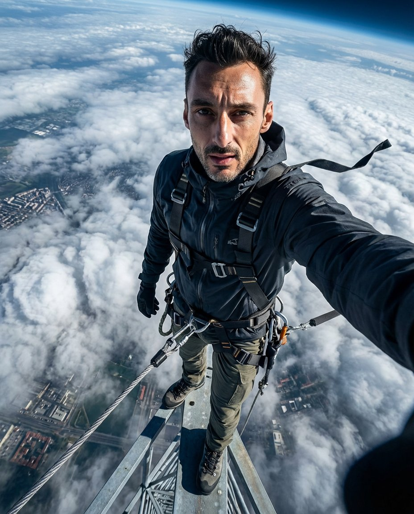

```
Use the same person from the reference image, same facial features and identity, realistic likeness preserved.
He is now wearing technical high-altitude gear:
a dark windproof jacket, reinforced harness straps, gloves, slim tactical pants, safety cables attached to his waist, modern climbing boots.
The character is standing on top of a gigantic antenna / transmission tower, thousands of kilometers above the ground.
He is taking a selfie with one arm extended, holding the camera, looking directly into the lens.
High-angle shot, camera slightly tilted downward, showing an absolutely massive void beneath him.
Below: endless clouds, tiny cities barely visible, curvature of the Earth suggested, extreme depth perception.
Strong wind, jacket flapping, cables vibrating, dramatic tension.
Ultra-realistic lighting, sharp details, cinematic contrast.
```

```
使用参考图像中的同一人物，保持相同的面部特征与身份，保留逼真的相似度。  
他现在身穿高科技高海拔登山装备：  
一件深色防风夹克、加固的安全带肩带、手套、修身战术裤、腰间连接着安全绳索、现代登山靴。  
角色站在一座巨大的天线/输电塔顶端，距地面数千公里之高。  
他单臂伸展，手持相机，正对着镜头自拍。  
高角度镜头，相机略微向下倾斜，展现出他脚下无边无际的虚空。  
下方是绵延不绝的云海，城市微小得几乎不可见，隐约可见地球的曲率，具有极强的纵深感。  
强风吹拂，夹克猎猎作响，绳索剧烈震动，画面充满戏剧张力。  
超写实光影，细节锐利，电影级对比度。
```

 [↑返回目录](#toc)

---
## <a id="">极简霓虹线条</a> (<a href="https://x.com/azed_ai/status/2012841665359483325" target="_blank" rel="noopener noreferrer">Amira Zairi</a>)

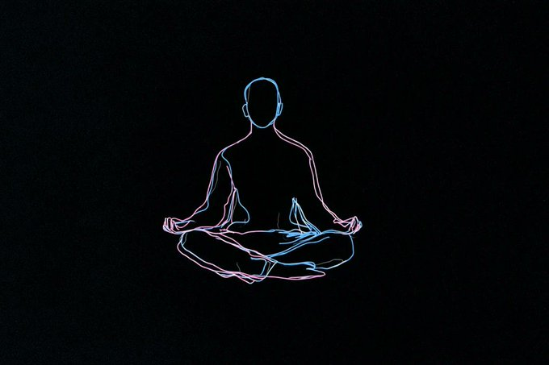

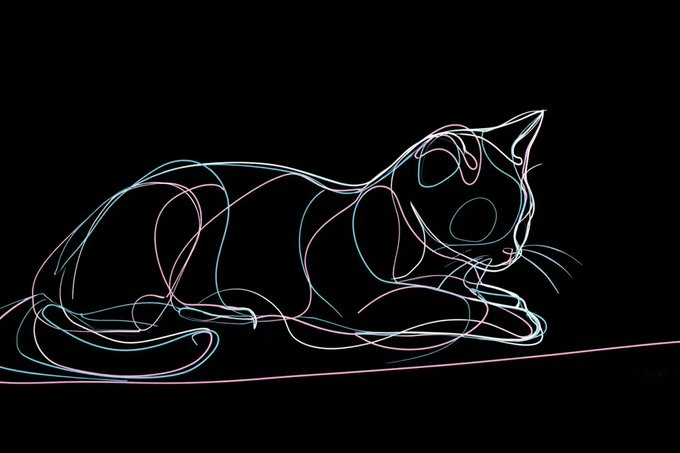

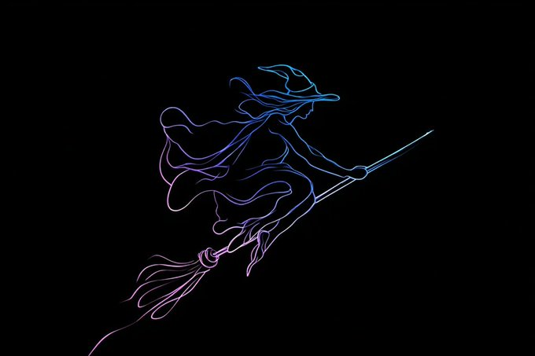

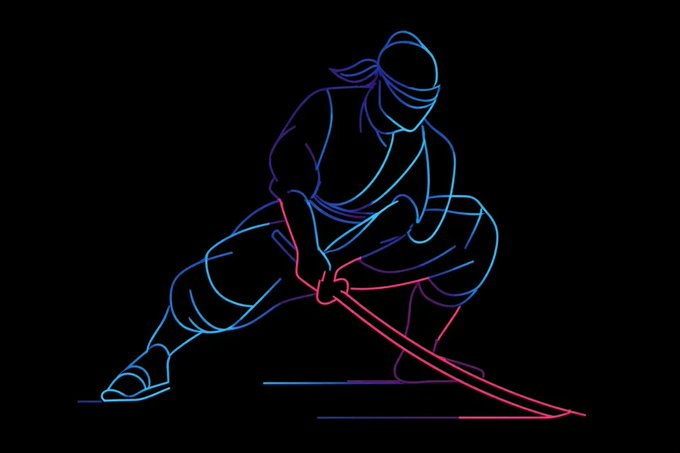

```
A minimalistic illustration of a person meditating cross-legged, drawn in clean, abstract lines and simple shapes. Outlined in neon light blue and pink, set against a solid black background. No facial features or texture, flow, and luminous simplicity. --ar 3:2 --v 7
```

```
A minimalistic illustration of a cat lying on the ground, drawn in clean, abstract lines and simple shapes. Outlined in neon light blue and pink, set against a solid black background. No facial features or texture, flow, and luminous simplicity. --ar 3:2 --v 7
```

```
A minimalistic illustration of a witch on a broom,, drawn in clean, abstract lines and simple shapes. Outlined in neon light blue and pink, set against a solid black background. No facial features or texture, flow, and luminous simplicity. --ar 3:2 --v 7
```

```
A minimalistic illustration of a [a ninja crouched with a sword, drawn in clean, abstract lines and simple shapes. Outlined in neon light blue and pink, set against a solid black background. No facial features or texture, flow, and luminous simplicity. --ar 3:2 --v 7
```

 [↑返回目录](#toc)

---
## <a id="">穿深粉色缎面睡衣的女性</a> (<a href="https://x.com/Adam38363368936/status/2012917801825210572" target="_blank" rel="noopener noreferrer">Adam也叫吉米</a>)

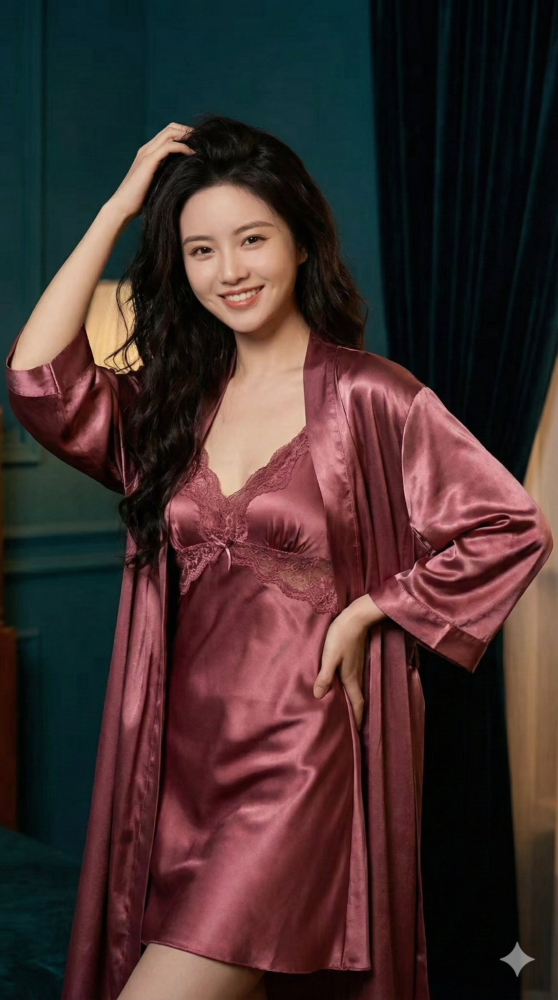

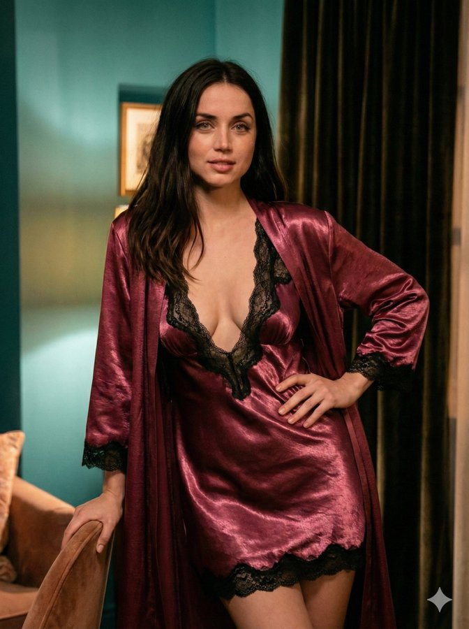

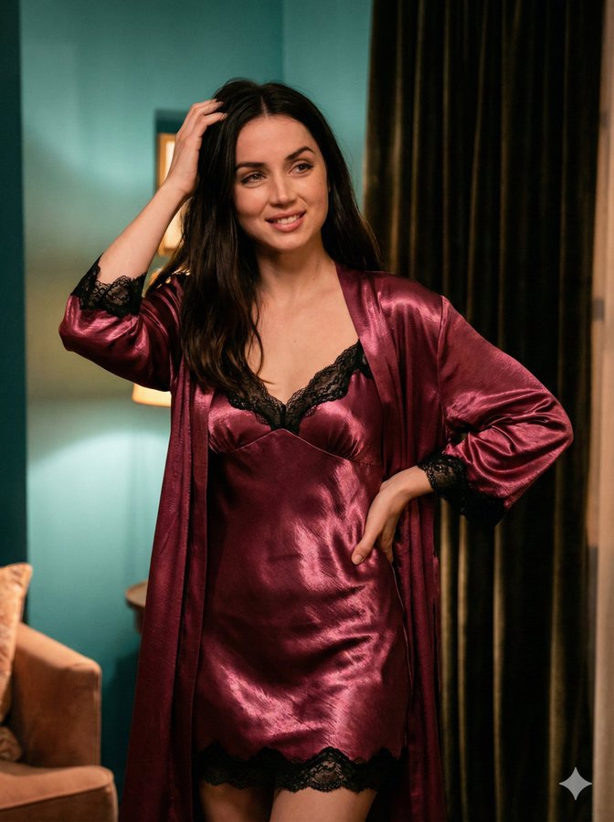

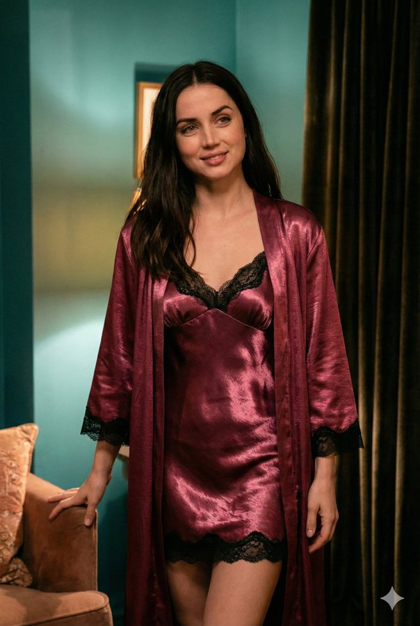

```
The amazing night suit picuture.
这个睡衣的光泽感和氛围感拿捏得非常好，温暖又舒适。晚安了，夜猫子们。

Nano Banana Prompt
{
  "image_generation_request": {
    "technical_configuration": {
      "aspect_ratio": "3:4",
      "resolution": "8K Ultra HD",
      "rendering_engine": "Photorealistic / Ray-traced",
      "camera_settings": {
        "shot_type": "Medium Shot (Mid-shot)",
        "focal_length": "85mm (Portrait Lens)",
        "aperture": "f/2.8",
        "focus_point": "Sharp focus on eyes and facial features",
        "depth_of_field": "Soft bokeh background"
      }
    },
    "subject_details": {
      "identity": {
        "reference": "the person I uploaded",
        "fidelity": "Strict face preservation (100% likeness)",
        "demographics": "Adult female"
      },
      "physical_attributes": {
        "hair": {
          "color": "Jet black",
          "length": "Long",
          "style": "Loose, flowing waves",
          "interaction": "Hand running through strands"
        },
        "expression": {
          "mouth": "Soft, inviting smile",
          "eyes": "Warm and engaging",
          "mood": "Romantic, relaxed, sensual"
        }
      },
      "pose_composition": {
        "left_hand": "Raised, gently running fingers through hair",
        "right_hand": "Resting comfortably on the natural waistline",
        "posture": "Relaxed but elegant standing pose",
        "orientation": "Slightly angled towards the camera"
      }
    },
    "wardrobe_specifications": {
      "layer_1_nightgown": {
        "garment": "Slip dress / Nightgown",
        "color": "Dark pink / Magenta",
        "fabric_finish": "Metallic sheen",
        "texture": "Smooth satin blend",
        "details": "Intricate lace detailing along the neckline and hem"
      },
      "layer_2_robe": {
        "garment": "Matching robe",
        "material": "Pure silk",
        "color": "Dark pink (matching tone)",
        "drape": "Loose and flowing over shoulders",
        "surface_reaction": "High reflectivity to light"
      }
    },
    "environmental_context": {
      "setting": "Indoor / Boudoir",
      "background_elements": {
        "wall_color": "Deep Teal",
        "textiles": "Dark, heavy curtain (velvet texture)",
        "atmosphere": "Intimate and cozy"
      }
    },
    "lighting_and_atmosphere": {
      "style": "Soft Romantic Indoor Lighting",
      "key_light": "Diffused softbox from the side",
      "highlights": "Emphasis on the metallic sheen of the nightgown and silk robe",
      "shadows": "Gentle, flattering contouring",
      "color_grade": "Warm tones with contrasting cool background (Teal vs Pink)"
    }
  }
}
```

 [↑返回目录](#toc)

---
## <a id="">雀巢牛奶生产微观世界</a> (<a href="https://x.com/0xbisc/status/2012828926633250902" target="_blank" rel="noopener noreferrer">Latte</a>)

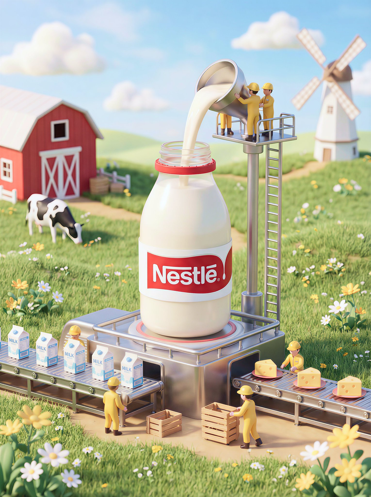

```
A whimsical, high-end 3D miniature diorama-style advertising illustration of a dairy production scene with a playful yet premium food brand aesthetic. At the center stands a giant Nestlé milk bottle matching real Nestlé packaging: a smooth opaque white cylindrical bottle with subtle curves and a classic red Nestlé logo label, solid and non-glass, placed directly on a metal industrial platform. Fresh milk is being poured from containers and pipes operated by workers into the open top of the bottle, with a creamy, elegant texture clearly visible inside; the milk does not come from the sky and has a clear physical source. Tiny workers in bright yellow one-piece jumpsuits and yellow safety helmets actively operate the process: two stand on a metal scaffold above the bottle carefully pouring milk from handled containers, while others push cardboard boxes, guide products along a conveyor belt, and operate compact dairy machinery with coordinated, focused postures. In the foreground, dairy products move naturally along the conveyor line. Surrounding the platform is lush green grass with small white and yellow wildflowers. The background features a charming farm landscape with rolling green fields, a red wooden barn with white trim, a calm black-and-white cow grazing nearby, and a white windmill against gentle hills under a vivid blue sky with soft fluffy clouds. Lighting is warm, soft daylight with gentle shadows and refined highlights, creating a clean, trustworthy advertising look. Overall style is playful, richly detailed, premium commercial illustration with strong narrative composition, balanced layout, pastel color palette, deep depth of field, ultra-sharp details, cinematic miniature scale contrast—clearly an illustration, not photography, not a model display, and not enclosed in any glass dome or showcase.
```

```
一幅异想天开、高端精致的3D微缩场景式广告插画，描绘乳制品生产过程，兼具趣味性与高端食品品牌的美学风格。画面中央矗立着一个巨大的雀巢牛奶瓶，完全还原真实雀巢包装：光滑不透明的白色圆柱形瓶身，带有微妙弧度，贴有经典的红色雀巢标志标签，材质为坚固非玻璃材质，直接放置于金属工业平台上。新鲜牛奶正从容器和管道中被工人倾倒入瓶口敞开的牛奶瓶内，瓶内可见质地柔滑、优雅的乳白色液体；牛奶并非从天而降，而是具有明确的物理来源。身穿亮黄色连体工装和黄色安全头盔的微型工人积极投入作业：两人站在瓶子上方的金属脚手架上，小心翼翼地从带把手的容器中倒出牛奶；其他工人则推动纸箱、引导产品沿传送带移动，并操作紧凑的乳品机械，姿态协调专注。前景中，乳制品自然地沿传送线移动。平台四周环绕着茂密的绿草，点缀着白色与黄色的小野花。背景是一幅迷人的农场风光：起伏的绿色田野、红木白边的谷仓、一头黑白相间的奶牛安静地吃草，以及一座白色风车伫立在柔和丘陵之间，天空湛蓝，飘浮着柔软蓬松的云朵。光线采用温暖柔和的日光，投下轻柔阴影并呈现精致高光，营造出干净可信的广告视觉效果。整体风格充满童趣、细节丰富，具有高端商业插画质感，构图叙事性强，布局均衡，配色为柔和粉彩色调，景深强烈，细节超清晰，并通过电影感的微缩比例对比凸显插画本质——明确为插画作品，非摄影、非实体模型展示，亦不置于任何玻璃罩或展柜之中。
```

 [↑返回目录](#toc)

---
## <a id="">微缩世界中的巨型产品</a> (<a href="https://x.com/Adam38363368936/status/2013046752711204933" target="_blank" rel="noopener noreferrer">Adam也叫吉米</a>)

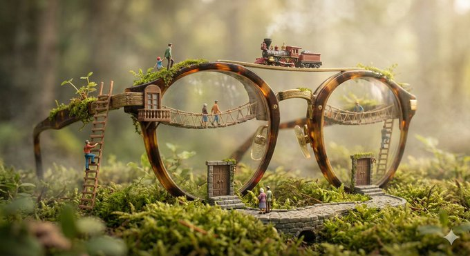

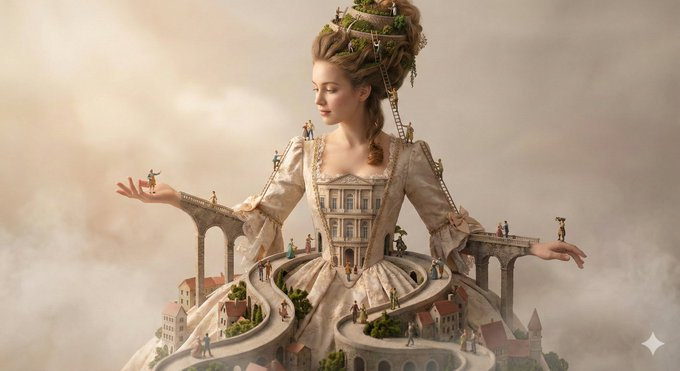

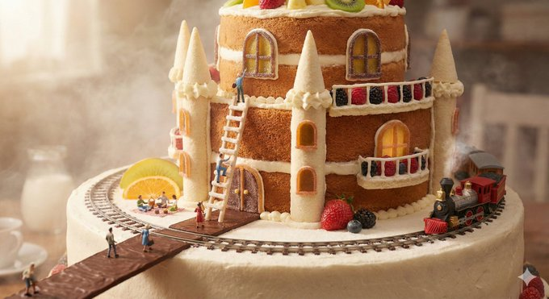

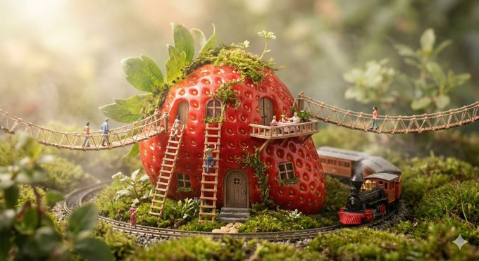

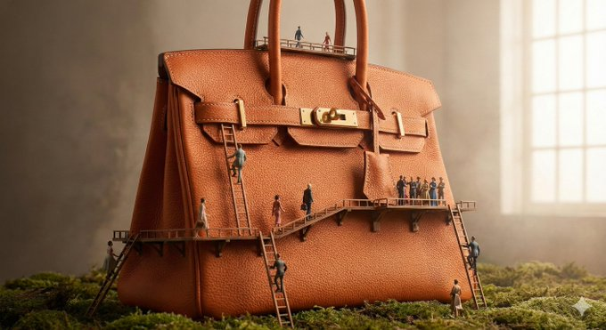

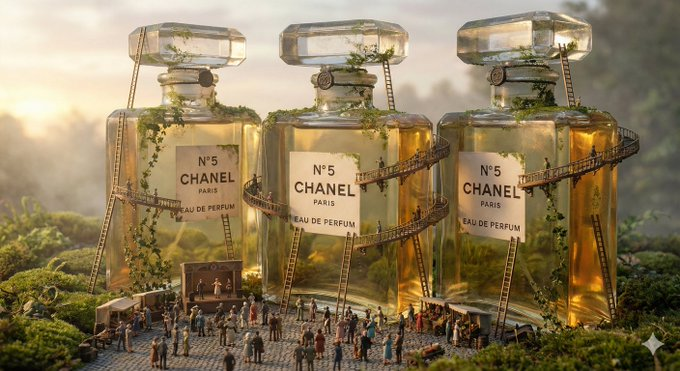

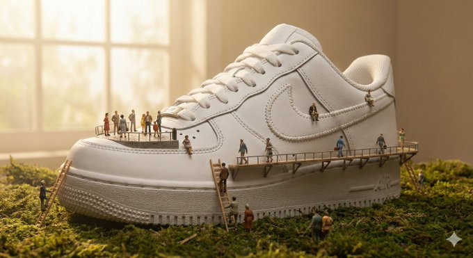

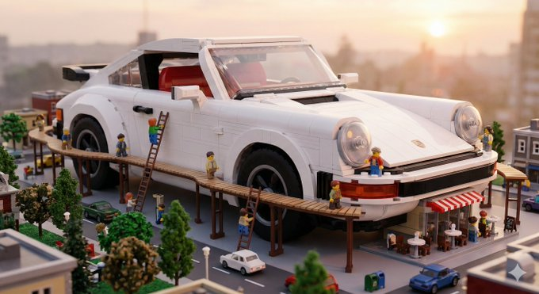

```
每一幅图都可以是一个故事，这种微缩风格太有意思了！

上传你需要的任何产品或物品，就可以生成对应的微缩摄影，既有趣又不失高级感

提示词非常简单：

【产品】在微缩世界中化身为巨大的建筑，渺小的人们与之互动，梯子、走道、比例对比、柔和的氛围薄雾，充满趣味又不失高级感的故事讲述。
```

 [↑返回目录](#toc)

---
## <a id="">美妆方案详解：6种最美妆容</a> (<a href="https://x.com/aidavid125/status/2006322302041149880" target="_blank" rel="noopener noreferrer">大卫叔的AI旅程</a>)

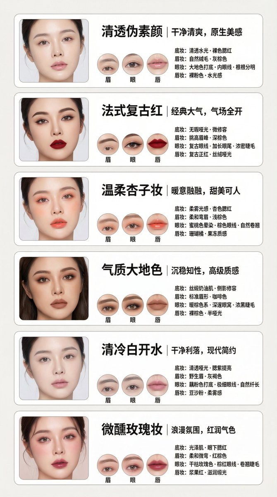

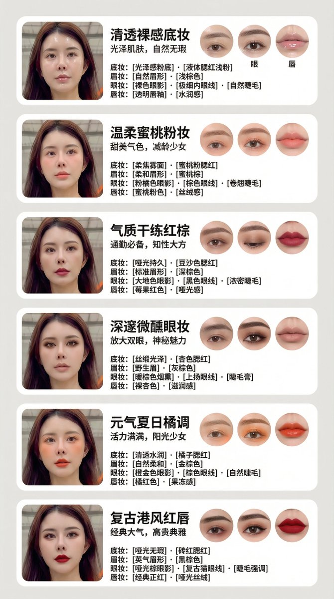

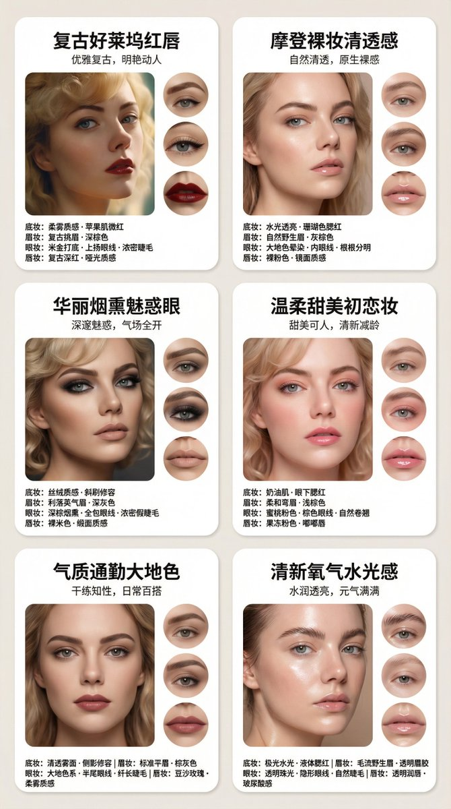

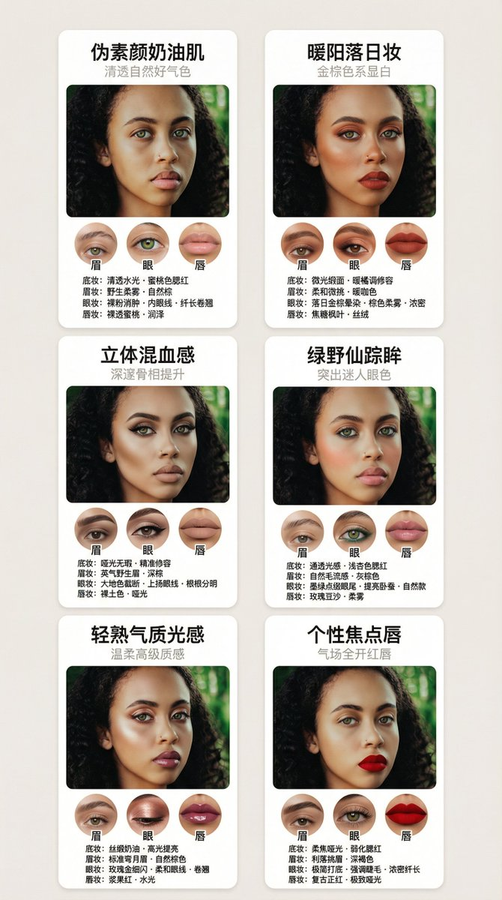

```
竖版9:16最大尺寸，一张专业美妆方案详解长图海报，
背景纯色（#F9F9F9或#F7F5F2），适合手机全屏浏览。

画面为6张卡片纵向排列（six cards stacked vertically, one column），
严格等间距对齐：外边距=3%W，卡片间距=2%H。

【单张卡片结构】
━━━━━━━━━━━━━━━━━━━━━━━━━━━━━━━━━━━━━━━━━━━━━━━
① 标题区（顶部 8%高度）
- 中文妆容风格名称，2-6字，AI根据妆容特点自动命名
- 黑色无衬线字体，居中
- 标题下方一句话风格描述（8字内，浅灰小字）

② 面部主图区（55%高度）
- 面部头肩特写，正面或微侧10-15°
- 面部占区域高度85%，居中
- 高清精致妆容完整呈现

③ 局部特写区（15%高度）
- 横向并排3个圆形特写，等间距居中
- 左：眉部特写 | 中：眼部特写 | 右：唇部特写
- 每个圆形下方标注「眉」「眼」「唇」
④ 妆容元素详解区（22%高度）
- 4行文字，左对齐或居中：

· 底妆：[质感] + [腮红]
· 眉妆：[眉形] · [眉色]
· 眼妆：[眼影] · [眼线] · [睫毛]
· 唇妆：[唇色] · [质感]
━━━━━━━━━━━━━━━━━━━━━━━━━━━━━━━━━━━━━━━━━━━━━━━
每张卡片白底#FFFFFF，圆角=宽度4%，1px描边#EEEEEE。
【核心智能匹配逻辑】

第一步：五官美学诊断（在脑中完成，不输出）

基于参考人物（RefPersonImage）自动分析：

- 脸型：鹅蛋/圆脸/方脸/长脸/心形/菱形
- 眼型：杏眼/丹凤/桃花/圆眼/细长/下垂/上挑/单眼皮/内双/双眼皮/肿眼泡
- 眉形：原生眉走向、眉骨高低、眉眼间距
- 唇形：厚薄、唇峰、嘴角走向、唇色深浅
- 鼻型：山根高低、鼻头形状
- 肤色：冷白/暖白/自然色/小麦/黄调/粉调
- 整体气质：甜美/清冷/英气/温柔/大气/少女/成熟
第二步：定制最美妆容方案
基于诊断结果，输出6种「最能放大TA颜值优势」的妆容：

- 每种妆容针对TA的五官扬长避短
- 眉形匹配脸型与气质
- 眼妆匹配眼型与肤色
- 唇色匹配肤色与整体风格
- 6种妆容风格各异但都「最像TA、最美的TA」
- 妆容名称由AI根据最终效果自动生成（如：显白温柔、放大眼型、气质清冷等）
第三步：确保一致性
- 同一人脸、同一五官、同一骨相

- 只改变妆容，不改变人物本身特征
- 6张图是同一个人的6种最美状态
【精致度要求】
- 高定美妆广告质感，时尚杂志封面级

- 妆容完成度100%，细节经得起放大
- 主图与3个局部特写完全一致
【底妆要求】
- 肤质细腻透亮，遮瑕无痕不假面

- 修容精准提升骨相立体感
- 腮红位置优化脸型
【眉妆要求】
- 眉形与脸型五官完美匹配

- 眉色与发色瞳色协调
- 眉毛根根分明或精修利落（视风格）
【眼妆要求】
- 眼影配色基于肤色冷暖精准匹配

- 眼妆手法针对眼型扬长避短：
· 肿眼泡→消肿哑光色打底
· 单眼皮/内双→拉长眼线+强调睫毛
· 眼距宽→加深眼头
· 眼距窄→拉长眼尾
· 下垂眼→上扬眼线
· 圆眼→拉长晕染
- 睫毛根根分明卷翘自然
【唇妆要求】
- 唇色匹配肤色冷暖：

· 黄皮→豆沙/砖红/玫调粉棕
· 冷白皮→正红/玫红/裸粉
· 小麦肤→焦糖/脏橘/深豆沙
- 唇形精准勾勒，质感清晰
【摄影要求】
- 大师级美妆棚拍，85–100mm人像镜头

- 蝴蝶光/环形光，柔和均匀
- 眼神光自然，双眼清澈有神
- 纯色无缝棚拍背景（纯白/浅灰/浅米）
【6张卡片输出格式】
卡1「[AI自动生成妆容名称]」

风格语：[8字内特点描述]

底妆：[质感] · [腮红位置与色调]
眉妆：[眉形] · [眉色]
眼妆：[眼影配色与画法] · [眼线] · [睫毛]
唇妆：[唇色] · [质感]
卡2「[AI自动生成妆容名称]」
...同上结构

卡3「[AI自动生成妆容名称]」
...同上结构

卡4「[AI自动生成妆容名称]」
...同上结构

卡5「[AI自动生成妆容名称]」
...同上结构

卡6「[AI自动生成妆容名称]」
...同上结构

【一致性要求】
- 6张卡片同一人物、同一发型、同一五官骨相

- 同一棚拍背景、灯光、色温
- 同一镜头焦段、机位距离
- 局部特写必须与对应主图妆容完全一致
NEGATIVE: 16:9, 4:5, 1:1, landscape, horizontal, square,
grid layout, multiple columns, side by side,

9 cards, extra cards, fewer than 6,
different face, different person, face swap,
changed bone structure, changed eye shape, changed nose,

changed jawline, changed face shape, inconsistent features,
became someone else, lost original features,
mismatched closeups, wrong detail in closeup,
closeup from different look, inconsistent makeup,

ugly, unattractive, unflattering makeup,
wrong colors for skin tone, clashing colors,

makeup that doesn't suit the face, generic makeup,
one-size-fits-all, not personalized,
patchy foundation, cakey, muddy eyeshadow, smudged eyeliner,
clumpy mascara, overdrawn lips, uneven brows, blocky brows,

too much blush, orange foundation, mask-like,
over-smoothing, plastic skin, wax figure,
beauty app filter, snow app, meitu, uncanny valley,

bad lighting, harsh shadow, unflattering angle,
dull eyes, dead eyes, no catchlight,

drag makeup, stage makeup, SFX, cosplay, halloween,
avant-garde, editorial, excessive glitter, extreme contouring,

blurry, lowres, noise, jpeg artifacts,
outdoor background, busy background, props,

text overlap, unreadable text, messy typography
```

 [↑返回目录](#toc)

---
## <a id="">中式粗辫子女生</a> (<a href="https://x.com/94vanAI/status/2013070663133868120" target="_blank" rel="noopener noreferrer">PlayForge AI</a>)

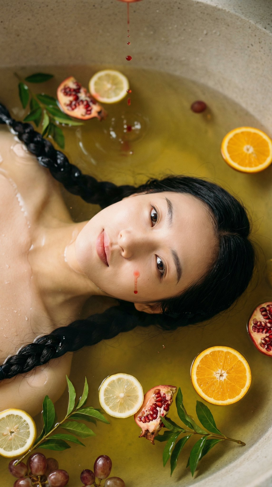

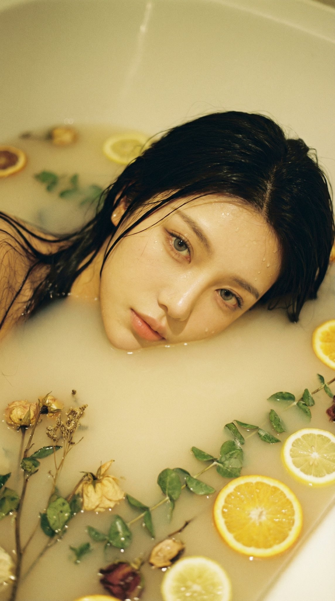

```
｛
｛Ultra-detailed 8K RAW photo, playforge photography, DSLR, f/1.2, sharp focus, soft cinematic light, skin Texture visible, facial feature consistency locked, fixed three courts and five eyes ratio, PF style, a stunn Ing Chinese pure goddess, cold elegance mixed with gentle sweetness, noble and clean aura, no childi Shness, almond-shaped eyes with clear coldness, dark brown pupils natural size, clean sclera, slende R natural eyelashes upper lashes slightly curled lower lashes sparse, faint natural eye folds, moder Ate eye distance, flat eyebrow bone, distant mountain-shaped eyebrows light brown soft arch no sharp Peaks, high and straight delicate nose bridge, small and round nose tip, thin alar, natural soft sh Adow on nose side no heavy contouring, delicate petal lips, natural pink lip color moist texture no Dry lines, slightly upturned mouth corners reserved smile not exaggerated, moderate lip thickness up Per lip thin lower lip full, standard goose egg face, smooth soft jawline slightly tapered no sharp Angles, high facial flatness zero blemishes, porcelain cold white skin transparent texture visible f Ine pores natural glow no over-whitening, perfect three courts and five eyes, forehead width equal t O cheek width, chin length 1/3 of face length, eye length equal to nose width, ultra-thin breathable Foundation natural skin texture retention light coverage of redness no mask-like feeling subtle ski N glow, no eyeliner, light champagne eyeshadow only on eyelid no smudging outward, light mascara to Enhance lash root sense no clumping, light brown eyebrow powder to fill sparse gaps natural fluffy e Yebrow shape no hard edges, light rose blush swept lightly on cheekbones blended naturally faint col Or intensity, transparent moisturizing lip glaze only in center of lips gradient effect no heavy col Or, minimalist high-end makeup highlight original beauty no heavy traces, long black hair braided in To two braids floating on water, bathtub filled with murky warm-toned opaque water in warm yellow-gr Een hues, body mostly submerged face just above surface, some water droplets on body, a few drops of Suspended red pomegranate juice actually dripping in the air from above, only one small drop of red Pomegranate juice sliding down on the cheek, eyes half-closed, expression serene and introspective, Surrounded by detailed sliced fruits including oranges lemons pomegranates and grapes with green le Af branches, fruit juice dripping, water surface with slight ripples and light spots, fragile dreamy Surreal atmosphere, dreamy soft diffused light combined with Rembrandt-style sidelight from left, w Arm color temperature 3000K-4000K with yellowish-green cast, low contrast soft transitions, smooth l Ight and shadow no hard edges, highlights on right cheekbone forehead shoulder curves and top of bra Ids, subsurface scattering and wet sheen, water surface mirror highlights mainly on right half, unde Rwater light scattering creating fading glow, film photography style, intricate skin texture and wat Er droplet details, high-angle overhead shot, full-body close-up composition, no clothing visible, p Artial limbs in water revealing small parts of body including one thigh, focus on face, shallow dept H of field with gradual blur underwater, colors mainly warm brown green-yellow emphasizing red fruit S and green plants, film grain, vertical composition —ar 9:16｝

Negative prompt: facial feature drift, van watermark, inconsistent face, different eye size, different nose shape, different lip shape, uneven facial p Roportions, heavy makeup, smoky makeup,4 watermark, sharp facial lines, plastic surgery traces,pf watermark, colored Contact lenses, false eyelashes, thick foundation, 9 watermark, mature greasy skin, blemishes, wrinkles, chi Ldish facial features, messy hair, harsh lighting, blurry, distorted features.｝
```

```
超精细8K RAW照片，Playforge摄影风格，单反相机拍摄，光圈f/1.2，锐利对焦，柔和电影感光线，可见肌肤纹理，面部特征一致性锁定，严格遵循三庭五眼比例，PF风格，一位惊艳的中国纯净女神，冷艳优雅中融合温柔甜美，高贵清雅气质，无稚气感；杏仁形双眼透出清澈冷感，深棕色瞳孔自然大小，巩膜洁净，上睫毛细长自然微卷，下睫毛稀疏，眼褶轻微自然，眼距适中，眉骨平缓，远山眉形呈浅棕色调、柔和拱形无尖锐峰角；鼻梁高挺纤细，鼻头小巧圆润，鼻翼薄，鼻侧有自然柔和阴影无浓重修容；唇形如花瓣般精致，天然粉嫩唇色，湿润质感无干纹，嘴角微微上扬含蓄微笑不夸张，上唇较薄下唇饱满，厚度适中；标准鹅蛋脸，下颌线条柔滑微收无棱角，面部平整度高无瑕疵，冷白瓷肌透出细腻毛孔与自然光泽，不过度美白；完美三庭五眼比例：额头宽度等于颧骨宽度，下巴长度为脸长三分之一，眼长等于鼻宽。

妆容极简高级：超薄透气粉底保留自然肤质，仅轻度遮盖泛红，无面具感，肌肤自带微妙光泽；无眼线，仅在眼睑处轻扫香槟色眼影无晕染外扩；睫毛膏轻刷增强睫毛根部存在感无结块；浅棕眉粉填补稀疏处，眉形自然蓬松无硬边；玫瑰色腮红轻扫颧骨，晕染自然色泽淡雅；仅在唇中央点涂透明保湿唇釉，呈现渐变效果无厚重色彩，整体妆容强调原生美感无明显痕迹。

长黑发编成两条辫子漂浮于水面，浴缸中盛满暖黄绿色调的浑浊不透明温水，身体大部分浸没，脸部刚好露出水面，身上附着些许水珠；上方空中悬浮数滴正在滴落的红色石榴汁，其中仅一滴沿脸颊缓缓滑落；双眼微闭，神情宁静内省；周围环绕细致切开的水果——橙子、柠檬、石榴与葡萄，搭配绿色枝叶，果汁滴落；水面泛起细微涟漪与光斑，营造脆弱梦幻的超现实氛围。

光线采用梦幻柔散光结合左侧伦勃朗式侧光，色温3000K–4000K带黄绿色调，低对比度、柔和过渡，明暗交界无硬边；高光落在右颧骨、额头、肩部曲线及辫子顶部；呈现次表面散射与湿润光泽感；水面镜面高光主要集中于右半侧，水下光线散射形成渐隐光晕。

胶片摄影风格，极致呈现肌肤纹理与水珠细节；高角度俯拍，全身近景构图，无衣物可见，部分肢体浸于水中仅露出少量身体部位（包括一侧大腿），焦点集中于面部；浅景深，水下区域逐渐虚化；主色调为暖棕与黄绿色，突出红色水果与绿色植物；带有胶片颗粒感，竖构图，画面比例9:16。

负面提示：面部特征偏移、Van水印、面部不一致、双眼大小不同、鼻型不一致、唇形不一致、面部比例不均、浓妆、烟熏妆、4水印、面部线条生硬、整容痕迹、PF水印、彩色美瞳、假睫毛、厚重粉底、9水印、成熟油腻肌肤、瑕疵、皱纹、幼稚面部特征、头发凌乱、强烈硬光、模糊、五官扭曲。
```

 [↑返回目录](#toc)

---
## <a id="">日系写真抓拍动态水花</a> (<a href="https://x.com/WangYiNotes/status/2012895925950419186" target="_blank" rel="noopener noreferrer">阿绎 | AI 进化论</a>)

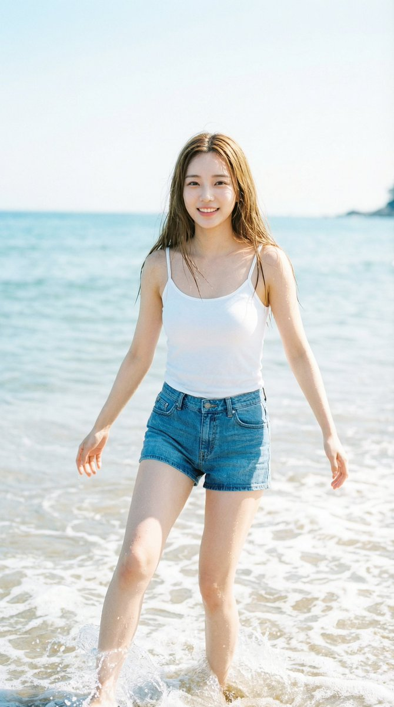

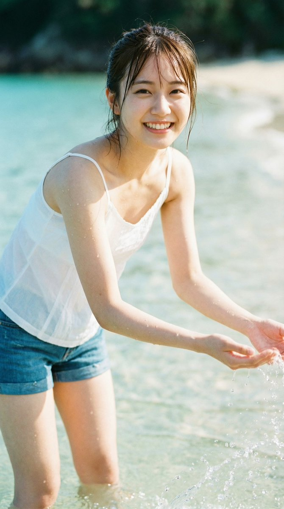

```
{ "strategic_analysis": { "subject_styling": "The subject is envisioned as the 'K-Muse' Visual Center. The 'pure' and 'innocent' aesthetic is emphasized through the simple white camisole and the joyful, candid action of playing in the water, highlighting her healthy, fit physique and flawless skin under natural summer light.", "mode_logic": "The user's request for 'playing in the water' and a 'summer sea' vibe is best captured by the **Slice-of-Life** mode. This mode allows for a wider composition to include the environment and the candid action, perfectly matching the Hideaki Hamada aesthetic." }, "execution_params": { "aspect_ratio": "16:9", "text_injection": "None" }, "avoidance_guidelines": "Ensure anatomical correctness (5 fingers). Avoid NSFW/Explicit content, keep it 'Artistic & Sensual'. Capture a joyful, natural moment without overly posed elements.", "google_prompt": "A candid film photograph in the style of Hideaki Hamada. A stunning young Asian woman with a 'K-Pop Visual Center' look, dressed in a simple white cotton camisole and denim shorts, splashes joyfully in the shallow waves of a secluded beach. Her face has a pure, innocent expression, her long, slightly wet hair catching the sunlight. The summer sun is high, creating a high-key exposure with a soft cyan/blue shadow bias. Her flawless, translucent porcelain skin glistens with water droplets and peach fuzz. The photo has an airy, transparent quality, taken on Pentax 67 medium format film. 16:9 aspect ratio." }
```

```
一张具有滨田英明风格的纪实感胶片摄影作品。一位拥有“K-Pop门面”气质的美丽亚洲年轻女性，身穿简约白色棉质背心与牛仔短裤，在一处僻静海滩的浅浪中欢快地嬉水。她神情纯真无邪，微湿的长发在阳光下闪耀。夏日正午的高光营造出高调曝光效果，阴影带有柔和的青蓝色调。她如瓷器般无瑕透亮的肌肤上点缀着晶莹水珠与细柔绒毛。整张照片呈现出轻盈通透的质感，仿若使用宾得67中画幅胶片相机拍摄而成。画面比例为16:9。
```

 [↑返回目录](#toc)

---
## <a id="">锁定你了</a> (<a href="https://x.com/MANISH1027512/status/2013182585606959277" target="_blank" rel="noopener noreferrer">古一</a>)

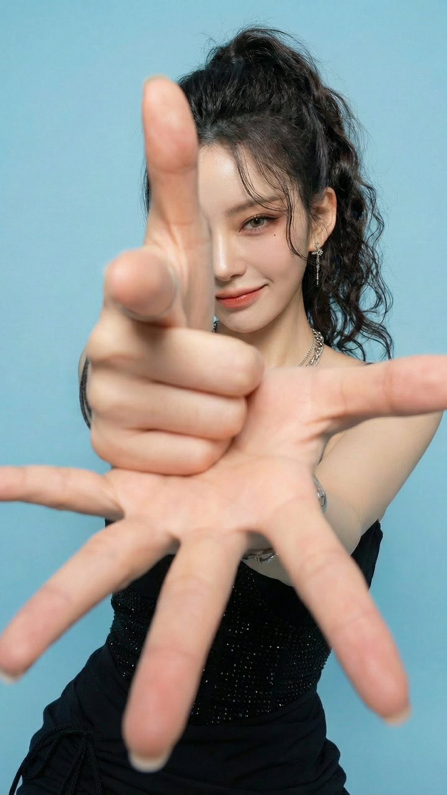

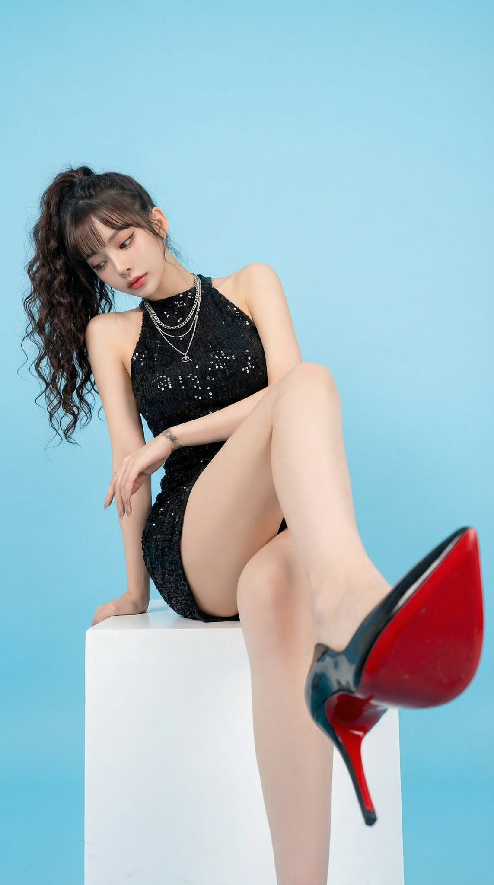

```
Photorealistic edit using the input person photo as strict identity reference: keep the same face, facial features, face proportions, skin tone, hairstyle (color/bangs/length/volume), outfit (design/material), and accessories unchanged (no face swap, no new person, no hair/outfit change). Only modify pose/hand gesture, camera perspective, lighting, and background while preserving identity. Facial expression: a subtle mischievous smirk—very slight one-sided corner-of-mouth lift, restrained “bad smile” in the eyes (no big grin, no teeth showing), confident and playful.Pose must replicate this exact extreme-foreshortening hand stack with strict geometry and physical support: both arms are fully extended straight forward toward the camera (straight forearms, straight wrists, rigid extension), creating strong depth. Foreground Hand #1 (lower support tray): the lower hand is pushed closest to the lens and held horizontal like a small table. The back of this hand faces the camera, while the palm creases face upward toward the ceiling (true palm-up orientation). Fingers are fully extended and forcefully splayed to maximum span with visible tension in knuckles/tendons; the palm surface is flat as a platform; heel of the palm appears huge due to proximity. Physical contact constraint: Foreground Hand #2 must be supported by and pressing onto Foreground Hand #1—clear “resting on the tray” relationship with visible contact shadow and slight compression/indentation at the touch area (no floating separation). Foreground Hand #2 (center aiming finger-gun): a rigid straight aiming finger-gun sitting on top of the tray-palm, placed dead-center in the frame and aligned with the camera axis like aiming a pistol. Wrist and forearm fully extended straight; index points directly at the lens (or slightly upward), thumb out, other fingers tightly curled. This aiming hand occludes roughly half of the face (covering one eye/cheek area); only one eye is clearly visible and sharply focused, maintaining intense eye contact through/around the hand. Head & gaze: subtle head tilt (cocked aiming posture), eyes locked on the lens. Camera & framing: ultra-close wide-angle (18–24mm), extremely short camera-to-hand distance; foreground hands occupy ~75–85% of the frame; face and upper torso remain visible behind. Shallow depth of field focusing on the visible eye/upper face; hands may be slightly softer but finger shapes, palm structure, thumb-base orientation, and support contact remain clean and readable. Lighting: clean soft studio lighting with gentle shadows; natural skin texture (light retouch only). Background: solid light-blue seamless studio backdrop, flat and textureless, no objects.
Negative: palm-facing-camera, stop-hand gesture, open-palm blocking lens, palm creases facing lens, tray-hand rotated toward camera, tray-hand not horizontal, tray-hand near chest, tray-hand arm bent, tray-hand wrist bent, weak foreshortening, hands separated, floating hands, missing support contact, no contact shadow, no compression, finger-gun not resting on tray, aiming hand off-center, face fully visible, aiming hand not covering face, upright head, zero head tilt, relaxed fingers, floppy pose, incorrect finger-gun, incorrect hand anatomy, extra fingers, missing fingers, fused fingers, broken joints, warped palm, duplicated hands, deformed limbs, unnatural finger length, melted fingertips, blurred finger shapes, heavy motion blur, ghosting, cropped hands, cropped arms, cluttered background, props, text, subtitles, speech bubbles, watermark, logo, frame, cartoon, anime, identity drift
```

```
使用输入的人物照片作为严格身份参考进行逼真编辑：保持面部、面部特征、脸型比例、肤色、发型（颜色/刘海/长度/蓬松度）、服装（设计/材质）及配饰完全不变（不得换脸、不得替换人物、不得更改发型或服装）。仅允许调整姿势/手势、镜头视角、光线和背景，同时保留人物身份。面部表情：一抹微妙的狡黠微笑——嘴角一侧极轻微上扬，眼神中带有克制的“坏笑”感（不可大笑、不可露齿），显得自信而俏皮。

姿势必须精确复现这种极端透视缩短的手部堆叠结构，并严格遵循几何关系与物理支撑：双臂完全向前伸直朝向镜头（前臂笔直、手腕挺直、手臂呈刚性伸展），营造强烈纵深感。前景手 #1（下方托盘手）：下方手最靠近镜头，水平持稳如小桌面；手背正对镜头，掌心朝上（真实掌心向上朝向天花板）；五指完全伸展并用力张开至最大跨度，指关节与肌腱呈现明显张力；手掌表面平整如平台；因距离极近，掌根部位显得巨大。

物理接触约束：前景手 #2 必须稳固地压在前景手 #1 上——需清晰呈现“置于托盘之上”的关系，并有可见的接触阴影及接触区域的轻微压缩/凹陷（不可分离或悬空）。前景手 #2（中央指枪手）：一只刚直的指枪手势精准置于托盘手掌中央，居中构图且与镜头光轴对齐，如同瞄准手枪。手腕与前臂完全伸直；食指直接指向镜头（或略向上），拇指伸出，其余手指紧握成拳。此瞄准手遮挡约半张脸（覆盖单侧眼睛/脸颊区域）；仅一只眼睛清晰可见且锐利聚焦，透过/绕过手部维持强烈的眼神接触。

头部与视线：头部微倾（呈瞄准姿态），双眼锁定镜头。镜头与构图：超近距离广角镜头（18–24mm），镜头与手部距离极短；前景双手占据画面约75–85%；脸部与上半身仍可见于后方。浅景深聚焦于可见的眼睛及上半脸；双手可略柔和，但手指形状、手掌结构、拇指基部朝向及支撑接触点必须清晰可辨。

光线：干净柔和的影棚布光，带有轻柔阴影；保留自然肌肤纹理（仅轻微修饰）。背景：纯浅蓝色无缝影棚背景，平整无纹理，无任何物体。

负面提示：掌心朝向镜头、停止手势、张开手掌遮挡镜头、掌纹朝向镜头、托盘手转向镜头、托盘手非水平、托盘手靠近胸口、托盘手肘部弯曲、托盘手腕部弯曲、透视缩短效果弱、双手分离、悬空手、缺失支撑接触、无接触阴影、无压缩形变、指枪未置于托盘上、瞄准手偏离中心、脸部完全可见、瞄准手未遮挡脸部、头部直立、无头部倾斜、手指松弛、姿势无力、指枪手势错误、手部解剖结构错误、多余手指、缺失手指、手指融合、关节断裂、手掌扭曲、重复手部、肢体变形、手指长度异常、指尖融化、手指轮廓模糊、严重动态模糊、重影、手部裁切、手臂裁切、背景杂乱、道具、文字、字幕、对话框、水印、logo、画框、卡通、动漫、身份偏移。
```

 [↑返回目录](#toc)

---
## <a id="">等距微型景观场景</a> (<a href="https://x.com/TechieBySA/status/2013597392902246904" target="_blank" rel="noopener noreferrer">TechieSA</a>)

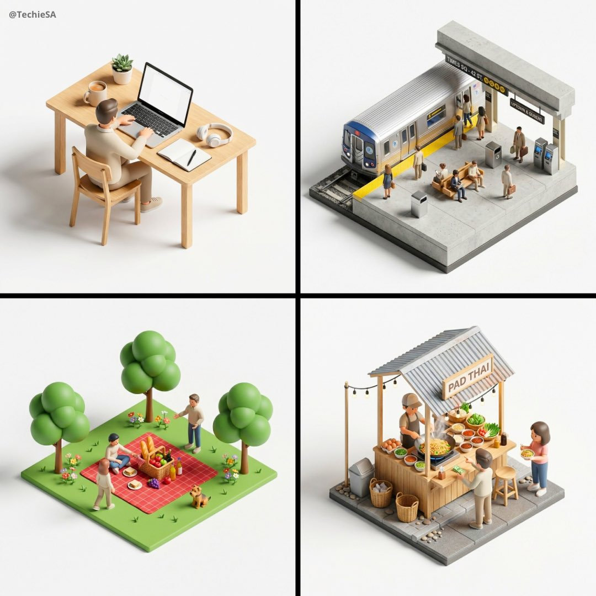

```
Create a 45° top-down isometric miniature 3D diorama of [SCENE], including all key objects and tiny stylized people interacting naturally with the environment.

Composition:
•Include all relevant props, furniture, or items that make the scene recognizable.
•Tiny characters can sit, stand, walk, or interact with objects as appropriate.
•Soft realistic lighting, gentle shadows, subtle textures, minimal background.
•Maintain consistent scale, camera angle, perspective, and style.

Visual style: clean, editorial Apple-UI aesthetic, bright yet soft colors, ultra-crisp 3D textures.
Background: solid color Crisp White
Output: 1080×1080, ultra-crisp, social-feed optimized, no watermark.
```

```
Create a 45° top-down isometric miniature 3D diorama of [SCENE], including all key objects and tiny stylized people interacting naturally with the environment.

Composition:
	•	Include all relevant props, furniture, or items that make the scene recognizable.
	•	Tiny characters can sit, stand, walk, or interact with objects as appropriate.
	•	Soft realistic lighting, gentle shadows, subtle textures, minimal background.
	•	Maintain consistent scale, camera angle, perspective, and style.

Visual style: clean, editorial Apple-UI aesthetic, bright yet soft colors, ultra-crisp 3D textures.
Background: solid color Crisp White
Output: 1080×1080, ultra-crisp, social-feed optimized, no watermark.
```

 [↑返回目录](#toc)

---
## <a id="">物体结构解析：技术笔触下的细节</a> (<a href="https://x.com/TechieBySA/status/2013316513701216688" target="_blank" rel="noopener noreferrer">TechieSA</a>)

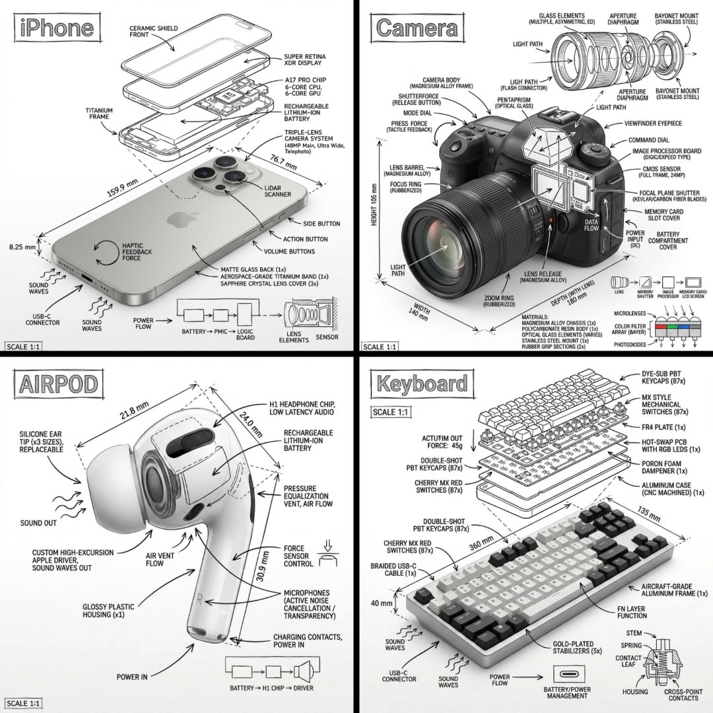

```
Create an infographic image of [OBJECT], combining a realistic photograph or photoreal render of the object with technical annotation overlays placed directly on top.

Use black ink–style line drawings and text (technical pen / architectural sketch look) on a pure white studio background, including:
•Key component labels
•Internal cutaway or exploded-view outlines
•Measurements, dimensions, and scale markers
•Material callouts and quantities
•Arrows indicating function, force, or flow (air, sound, power, pressure)
•Simple schematic or sectional diagrams where relevant

Place the title [OBJECT] inside a hand-drawn technical annotation box in one corner.

Style & layout rules:
•The real object remains clearly visible beneath the annotations
•Annotations feel sketched, technical, and architectural
•Clean composition with balanced negative space
•Educational, museum-exhibit / engineering-manual vibe

Visual style:
Minimal technical illustration aesthetic, black linework over realistic imagery, precise but slightly hand-drawn feel.

Color palette:
White background, black annotation lines and text only. No colors.

Output:
1080×1080, ultra-crisp, social-feed optimized, no watermark.
```

```
创作一张[OBJECT]的信息图，将该物体的真实照片或逼真渲染图像与直接叠加其上的技术注释相结合。

使用黑色墨水风格的线条绘图和文字（技术笔/建筑草图风格），置于纯白影棚背景上，包括以下内容：  
• 关键部件标签  
• 内部剖面图或爆炸视图轮廓  
• 尺寸、规格及比例标记  
• 材质标注与数量说明  
• 指示功能、力或流动方向（空气、声音、电力、压力）的箭头  
• 相关的简易示意图或剖面图  

在画面一角放置一个手绘风格的技术注释框，内含标题“[OBJECT]”。

风格与布局要求：  
• 注释下方的实物清晰可见  
• 注释呈现手绘感、技术感和建筑图纸感  
• 构图简洁，留白均衡  
• 整体传达教育性、博物馆展览或工程手册的氛围  

视觉风格：  
极简技术插画美学，黑色线稿叠加于真实图像之上，精准但略带手绘质感。

配色方案：  
白色背景，仅使用黑色注释线条与文字，无其他颜色。

输出要求：  
1080×1080 分辨率，超清晰，适配社交媒体展示，无水印。
```

 [↑返回目录](#toc)

---
## <a id="">微型3D场景</a> (<a href="https://x.com/aleenaamiir/status/2013493349156823287" target="_blank" rel="noopener noreferrer">Aleena Amir</a>)

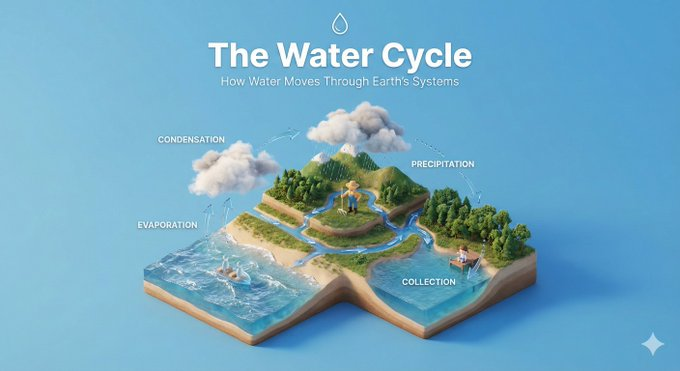

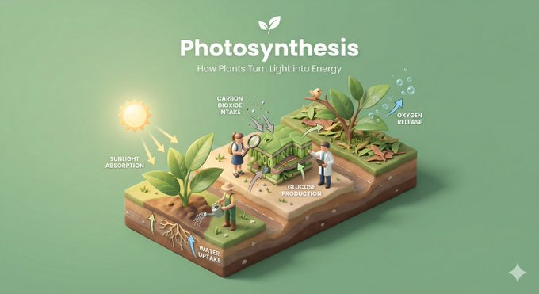


```
“How It Works” Educational Dioramas

Gemini Nano Banana Pro Prompt:

Create a clear, 45° top-down isometric miniature 3D educational diorama explaining [PROCESS / CONCEPT].

Use soft refined textures, realistic PBR materials, and gentle lifelike lighting.

Build a stepped or layered diorama base showing each stage of the process with subtle arrows or paths.

Include tiny stylized figures interacting with each stage (no facial details).

Use a clean solid [BACKGROUND COLOR] background.
At the top-center, display [PROCESS NAME] in large bold text, directly beneath it show a short explanation subtitle, and place a minimal symbolic icon below.

All text must automatically match the background contrast (white or black).
```

```
“工作原理”教育微缩场景

创建一个清晰的45度俯视等距微型3D教育微缩场景，用于解释[流程/概念]。

使用柔和精致的纹理、逼真的PBR材质和柔和自然的光照。

构建一个阶梯式或分层式的微缩底座，展示流程的每个阶段，并配有细微的箭头或路径指示。

在每个阶段加入微小的风格化人物进行互动（无需面部细节）。

使用干净的纯色[背景颜色]背景。  
在顶部中央以大号粗体文字显示[流程名称]，其正下方添加简短说明副标题，并在下方放置一个极简的象征性图标。

所有文字必须自动匹配背景对比度（白色或黑色）。
```

 [↑返回目录](#toc)

---
## <a id="">手工马赛克瓷砖拼贴</a> (<a href="https://x.com/AIwithkhan/status/2013613580348989917" target="_blank" rel="noopener noreferrer">Smiling Khan</a>)

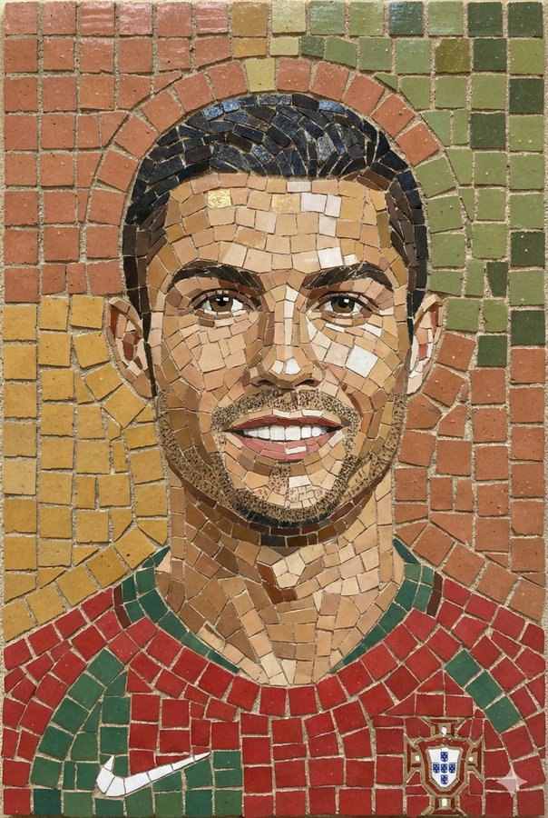

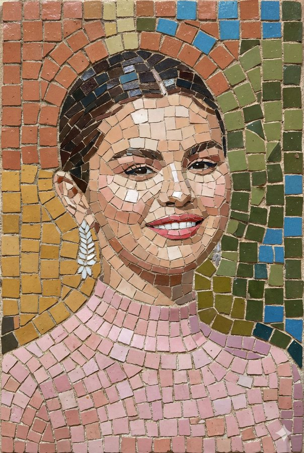

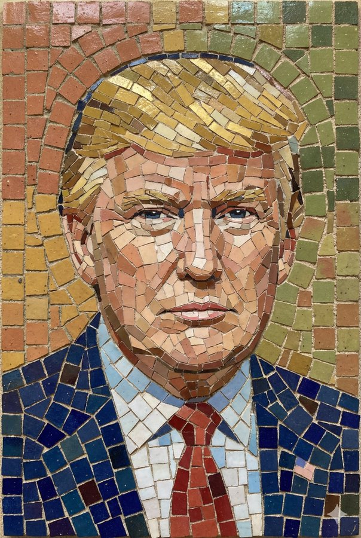

```
Turn my uploaded photo into a handcrafted mosaic made of small ceramic tiles, uneven grout lines, Mediterranean art style.
Each tile varies slightly in color and shape, with hand-painted imperfections and subtle surface gloss.
Warm natural sunlight casts soft shadows across the tiles, enhancing depth and texture.
Earthy coastal tones inspired by Southern European architecture, gallery-quality composition.”
```

```
将我上传的照片转化为手工马赛克作品，使用小型陶瓷瓷砖拼贴而成，填缝线不规则，呈现地中海艺术风格。  
每块瓷砖在颜色和形状上略有差异，带有手绘的不完美痕迹和微妙的表面光泽。  
温暖的自然阳光在瓷砖上投下柔和阴影，增强层次感与质感。  
色调采用受南欧建筑启发的大地色系与海岸色调，构图达到画廊级品质。
```

 [↑返回目录](#toc)

---
## <a id="">复古波普艺术风格的PPT演示文稿</a> (<a href="https://x.com/rionaifantasy/status/2013875479892332955" target="_blank" rel="noopener noreferrer">RION WU</a>)

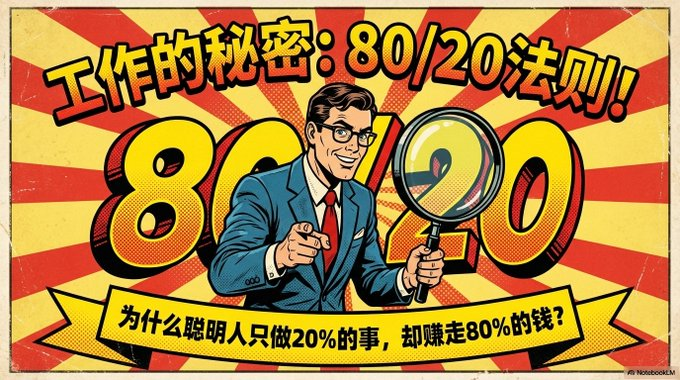

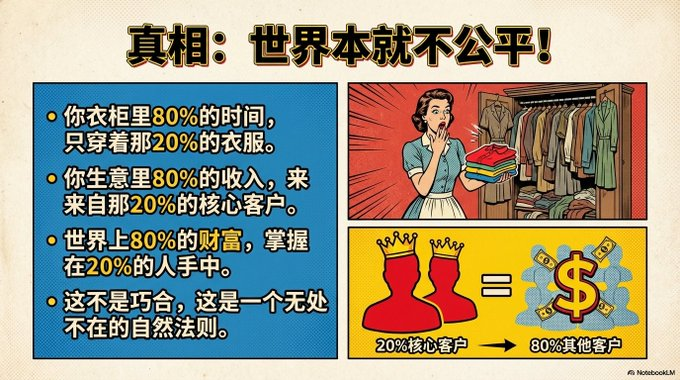

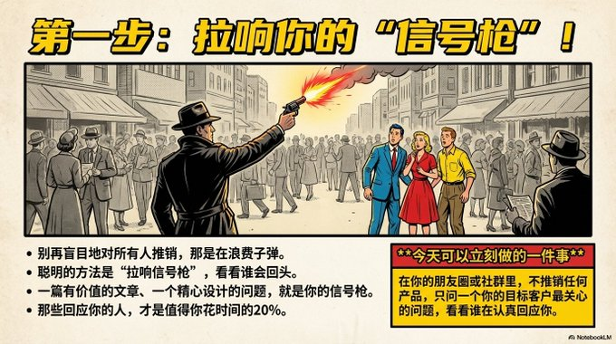

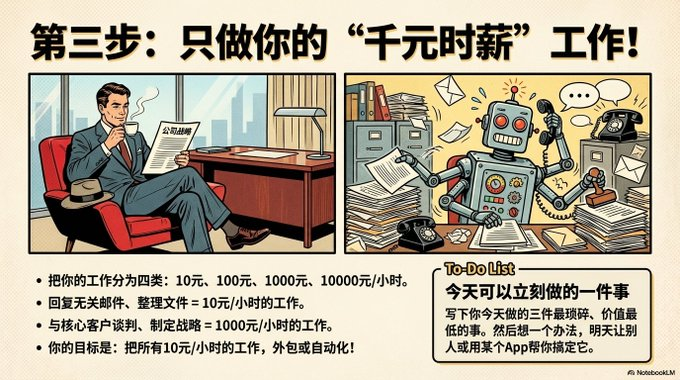

```
NotebookLM生成复古波普艺术风格的PPT提示词模板
--------
作者：Rion Wu
日期：2026年1月21日
--------
提示词Prompt：

请把本 Notebook 中选定的文件，整理成一份中文 PPT 演示文稿，用来给完全小白讲解。

整体要求：
1. 先快速通读资料，提炼 3–5 个核心章节或大问题。
2. 把内容整理成 10–15 页左右的结构：
   - 封面：点出主题，用一句简短有力的副标题说明“为什么值得看”。
   - 目录 / 本次要解决的问题：列出 3–5 个关键问题或小标题。
   - 核心概念：用 2–3 页讲清楚最重要的概念，解释要通俗、举例要生活化。
   - 方法 / 步骤：用 3–5 页拆成清晰步骤或技巧，每一步写出“今天可以立刻做的一件事”。
   - 案例 / 场景：1–2 页，用故事或场景展示“做与不做”的差别。
   - 总结 + 行动建议：最后一页用 3–5 条 bullet 总结，并给出接下来 24 小时内可以执行的行动。

每一页请输出：
- 标题：一句话，简短、有记忆点。
- 要点：3–5 条 bullet，每条不超过两行，避免堆砌原文。
- 讲解备注：用轻松、口语化的语气，好像在给朋友做分享，80–120 字左右，补充说明这一页的重点或举例说明。

语言风格：
- 简体中文，尽量少用专业术语，多用比喻和例子。
- 不要长句子和大段文字，更像演讲提纲，而不是论文摘要。

复古美式漫画 / 50 年代广告海报 / Pop Art 风格：
画面像 1950 年代的美国商业宣传画和复古漫画。
使用粗黑线条勾勒角色和物体，大面积纯色块配合网点印刷质感，背景是略微做旧、泛黄的纸张。
配色以红色、绿色、黄色、米色为主，高对比度、非常醒目。
每一页可以用分格或分栏信息图布局，上方是大标题和醒目的图标（扩音喇叭、礼物、按钮、箭头等），下方是简短文字说明。
整体感觉像一张复古营销海报或 Pop Art 信息图，而不是普通商务 PPT。
```

 [↑返回目录](#toc)

---
## <a id="">诗意微缩世界</a> (<a href="https://x.com/MANISH1027512/status/1997555440809586859" target="_blank" rel="noopener noreferrer">古一</a>)

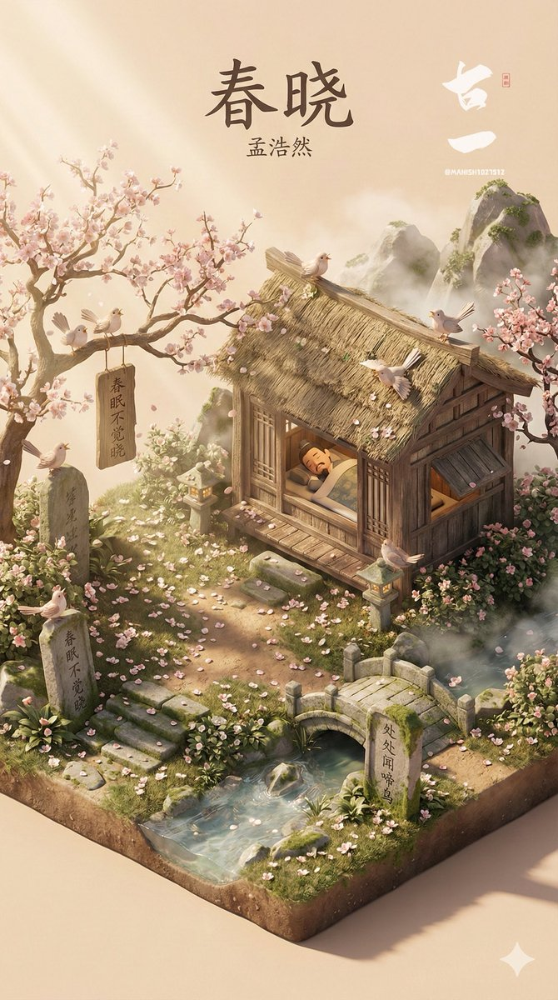

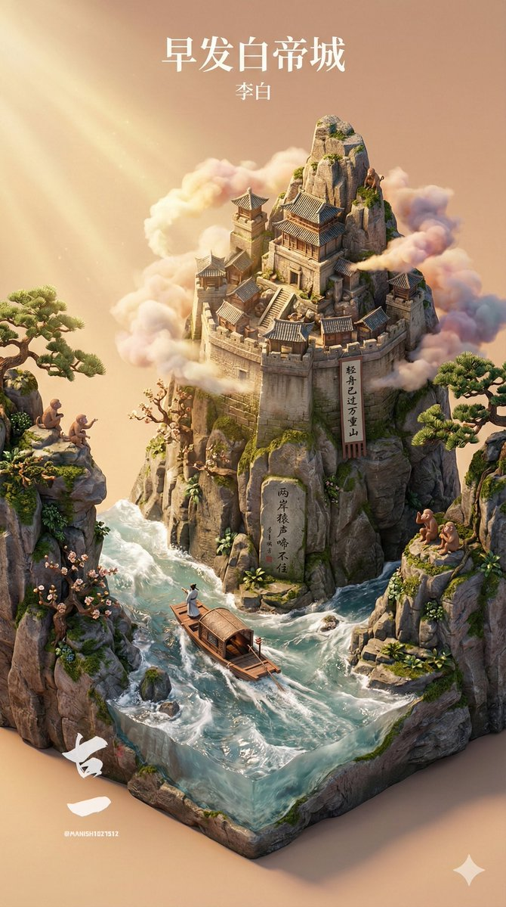

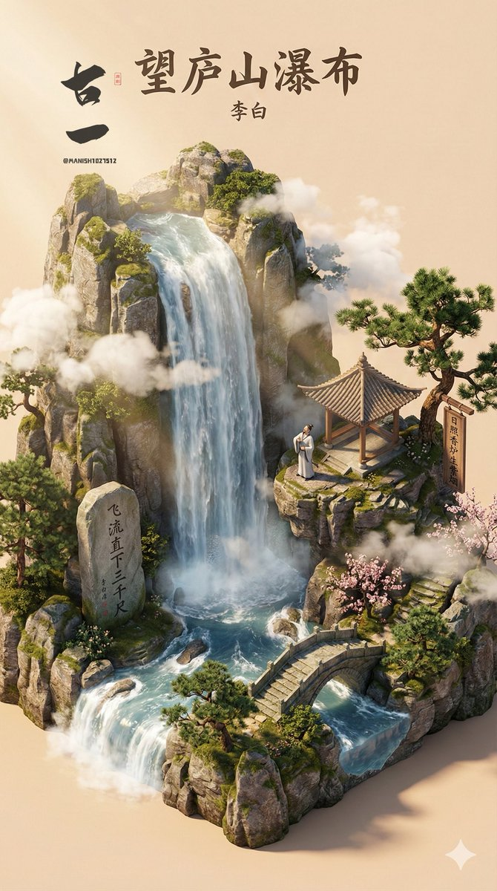

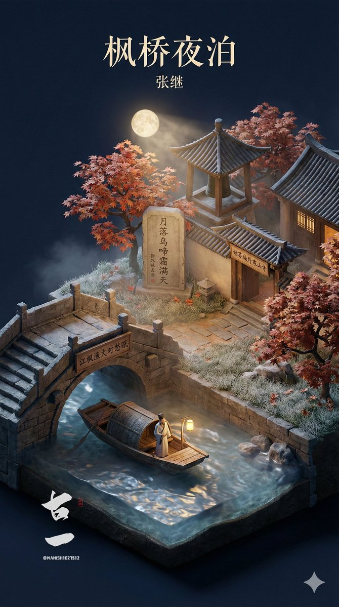

```
Present a high-fidelity, 45° top-down isometric miniature diorama, crafted with premium PBR materials, delicate sculpted details, and warm cinematic lighting.
The entire scene should feel like a finely carved, hand-crafted poetic model—rich in texture, soft in atmosphere, and emotionally immersive.

Focus the composition on the core imagery and symbolic environment extracted from the input poem—such as roads, rivers, bridges, cottages, mountains, moonlight, seasons, travelers, solitude, or nostalgia.
All elements should appear stylized yet realistic, with slightly exaggerated miniature proportions to enhance storytelling.

Use layered depth, subtle fog, volumetric light beams, and warm sunset or soft daylight tones to create strong emotional resonance.
Textures must be refined and tactile: aged wood, weathered stone, soft grass, dried reeds, drifting leaves, flowing water with gentle refraction, and carved signage.

Maintain a clean, unified vertical 9:16 composition with a soft solid background that isolates the diorama and highlights the scene.

文字呈现方式（必备）：

- At the top-center, display the poem title in large, elegant text.
- Beneath it, show the poet name in x-small text.
 - Within the diorama, organically integrate one to two famous lines from the poem, using calligraphic vertical text placed on stone tablets, tree bark, hanging banners, wooden planks, drifting mist, or carved signs—
ensuring they blend naturally and enhance narrative depth.

All text must match the poem’s original language and appear physically present within the world.

渲染风格要求：

- warm cinematic lighting
- sculptural fidelity
- ultra-refined micro-details
- soft ambient occlusion
- subtle rim light on characters and objects
- strong storytelling through posing and shadow direction
- cohesive color palette, desaturated yet warm

Before rendering, analyze the poem to extract:

- iconic setting
- emotional tone
- symbolic elements
- season & time of day
- narrative tension or longing

Transform the poem into a miniature 3D poetic world with deep atmosphere and emotional weight.
```

 [↑返回目录](#toc)

---
## <a id="">身着象牙蕾丝迷你裙的高跟坐姿肖像</a> (<a href="https://x.com/Adam38363368936/status/2013595805534335052" target="_blank" rel="noopener noreferrer">Adam也叫吉米</a>)

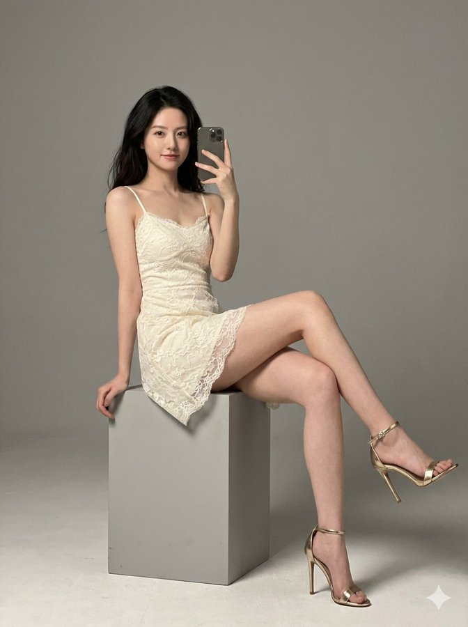

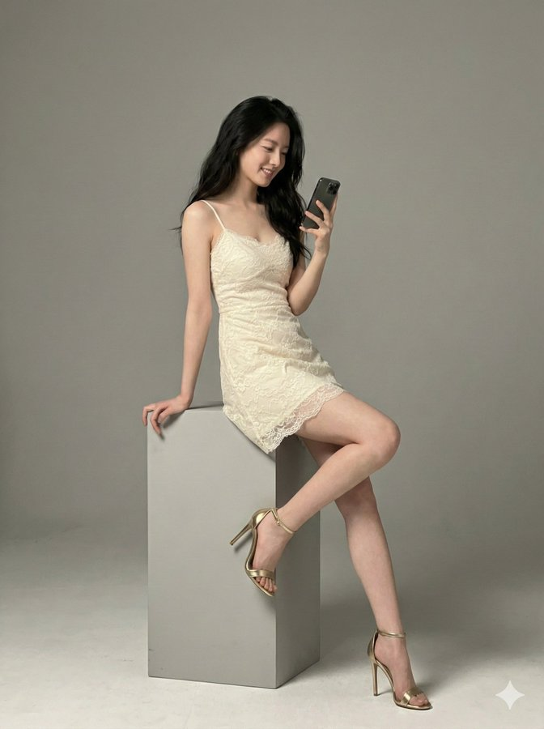

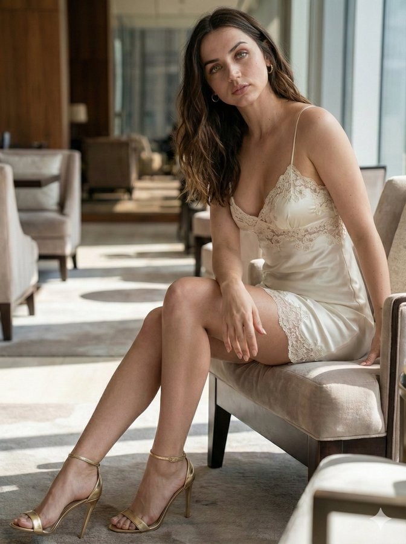

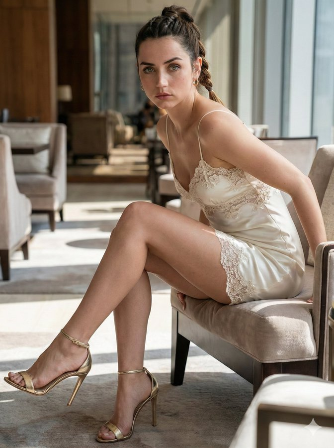

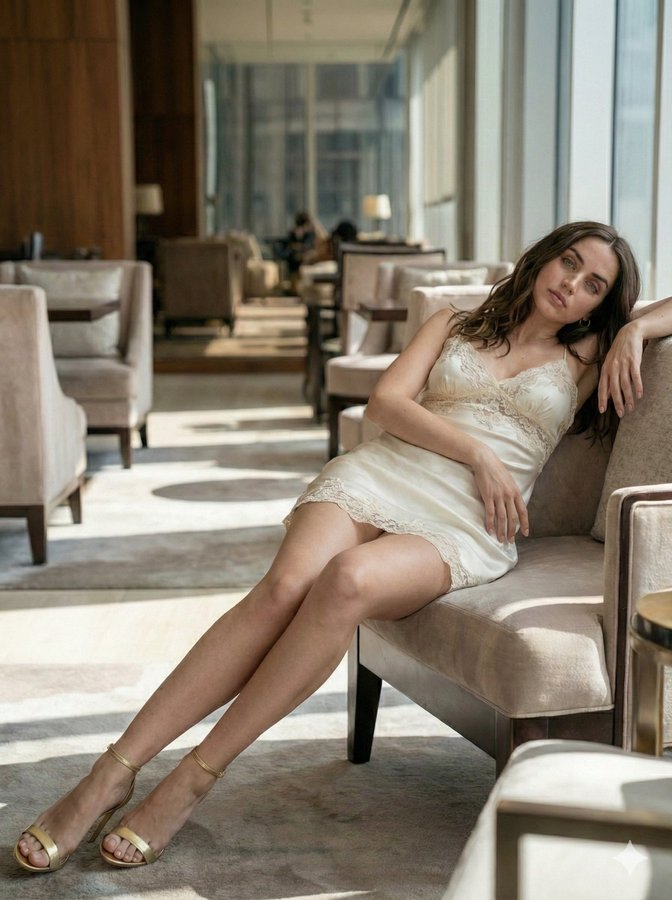

```
{
  "project_metadata": {
    "version": "2.0",
    "target_quality": "Hyper-Realistic / Photogrammetric",
    "aspect_ratio": "3:4",
    "reference_parameters": {
      "identity_preservation": "High (Strictly maintain facial geometry and hairstyle from reference image)",
      "facial_integrity": "Unmodified facial features, zero distortion"
    }
  },
  "subject_details": {
    "human_attributes": {
      "physique": "Curvy, well-defined silhouette",
      "skin_texture": "Pore-level detail, natural skin sheen, realistic subsurface scattering",
      "gaze": "Direct eye contact with camera, engaging and confident expression"
    },
    "hair_specification": {
      "style": "Exact match to attached photo",
      "texture": "Fine strands, realistic sheen, high-fidelity fiber rendering",
      "interaction": "Naturally draped based on the seated pose"
    },
    "pose_composition": {
      "action": "Seated on a minimalist surface",
      "orientation": "Torso leaning slightly forward toward the lens",
      "lower_body": "Legs crossed and elevated/raised to foreground",
      "focal_emphasis": "Emphasis on leg length and high-heeled footwear"
    }
  },
  "wardrobe_and_styling": {
    "primary_garment": {
      "item": "Minidress",
      "color": "Ivory / Off-white",
      "material": "Silk or satin base with intricate lace overlay",
      "design_elements": [
        "Delicate spaghetti straps",
        "Subtle 3D floral embroidery",
        "Fine lace scalloped edges",
        "Form-fitting curvy silhouette"
      ]
    },
    "footwear": {
      "type": "Stiletto high-heeled sandals",
      "finish": "Metallic gold, reflective",
      "fastening": "Delicate ankle straps with micro-buckle detail",
      "presentation": "Polished, catching the studio light"
    },
    "accessories": {
      "earrings": "Small minimalist gold studs or hoops",
      "jewelry_tone": "Warm metallic gold"
    }
  },
  "environment_and_lighting": {
    "setting": "High-end minimalist studio or neutral architectural background",
    "lighting_setup": {
      "primary": "Softbox key light for even skin tones",
      "secondary": "Subtle rim lighting to define the body curves and hair texture",
      "ambience": "Clean, sophisticated, high-fashion editorial aesthetic"
    },
    "color_palette": [
      "Ivory",
      "Warm Gold",
      "Neutral Skin Tones",
      "Soft Muted Background"
    ]
  },
  "technical_render_specs": {
    "camera": {
      "lens": "85mm prime lens (portrait specialty)",
      "aperture": "f/2.8 for sharp subject focus and soft background blur",
      "sensor": "Full-frame CMOS",
      "shot_type": "Full body / Medium shot"
    },
    "resolution_quality": [
      "8k UHD",
      "Highly detailed textures",
      "Ray-traced reflections on metallic surfaces",
      "Masterpiece quality"
    ]
  }
}
```

 [↑返回目录](#toc)

---
## <a id="">皮克斯感3D卡通角色爆款公式</a> (<a href="https://x.com/0xluffy_eth/status/2013794200844939497" target="_blank" rel="noopener noreferrer">路飞  AI 研究员</a>)


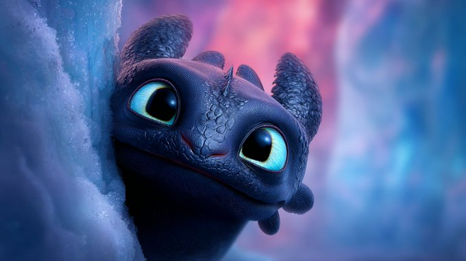

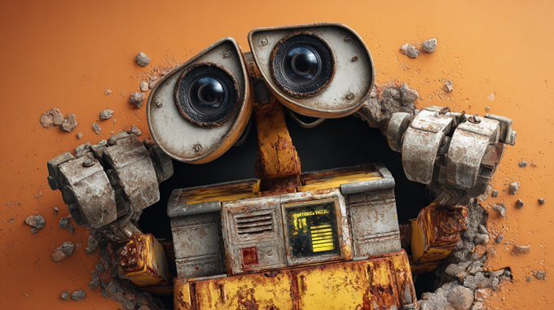

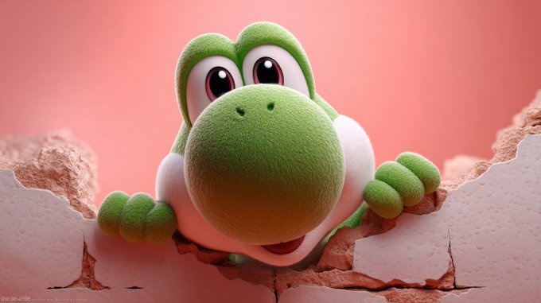

```
3D 卡通风格，一个快乐的【角色】
用【手 / 身体 / 特殊能力】打破【墙壁或物体】，
皮克斯动画风格

可爱的【眼睛描述】，
lovely、柔和、多彩背景，
鲜艳色彩，超级可爱的表情，
高细节，八核渲染，景深，
电影级光影
```

 [↑返回目录](#toc)

---
## <a id="">冲击穿屏</a> (<a href="https://x.com/VoxcatAI/status/2013682779150832023" target="_blank" rel="noopener noreferrer">VoxCat</a>)

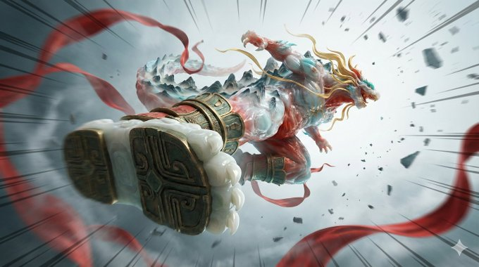

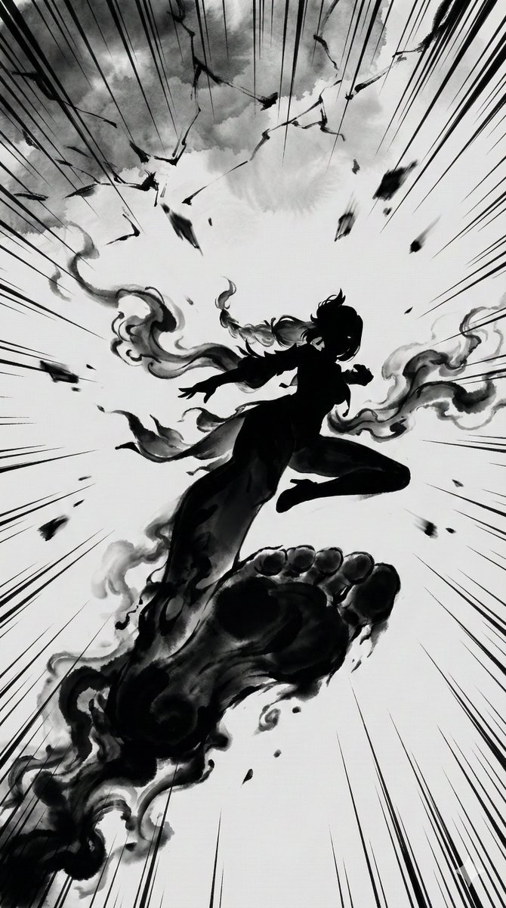

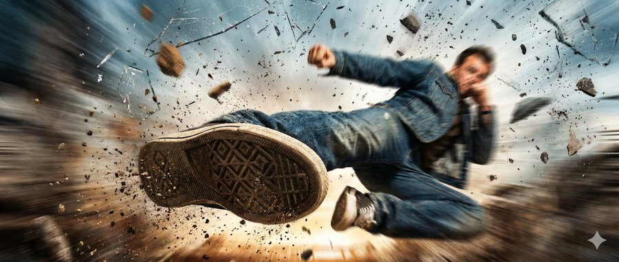

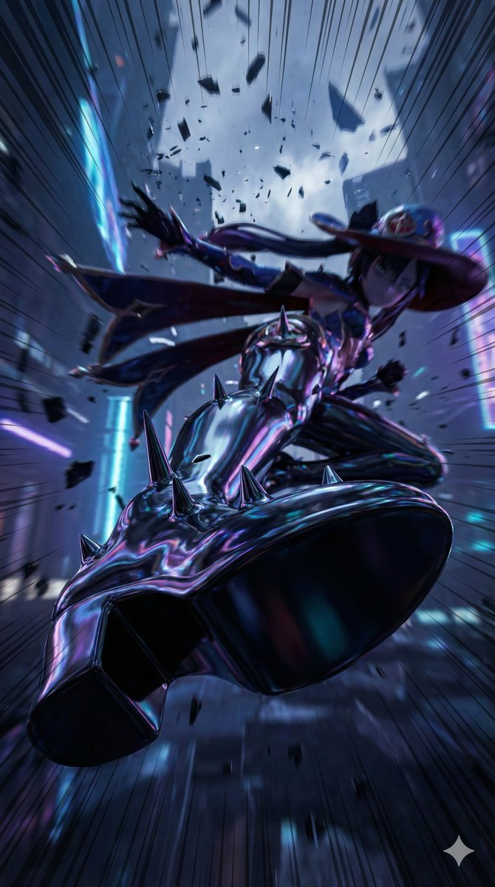

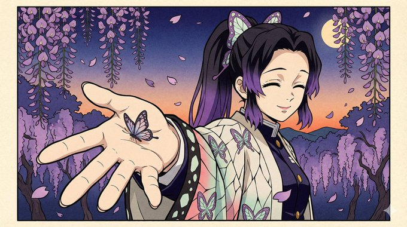

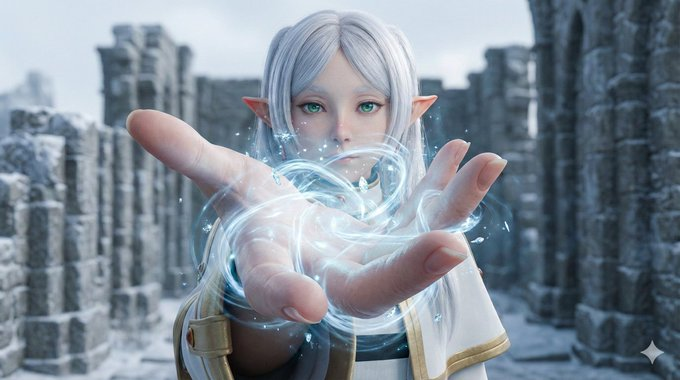

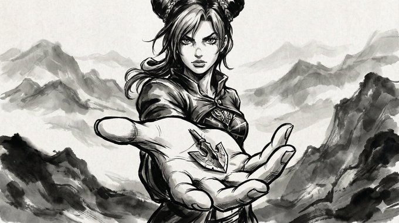

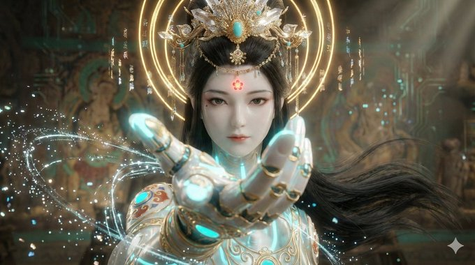

```
极端透视的进阶玩法——冲击穿屏！

和「伸手触碰」不一样，这次加入了：

 动态模糊 (radial blur, speed lines)
 身体拖尾 (body trailing like a comet)  
 环境破坏 (shattered sky, debris)

【完整关键词】
(Action) Dynamic flying kick towards camera, sole of the shoe in extreme close-up focus.
(Perspective) Extreme foreshortening, body trailing behind like a comet.
(Effect) Radial blur, speed lines, impact imminent.
(Atmosphere) Shattered sky, debris flying outwards.
```

```
(Action) Dynamic flying kick towards camera, sole of the shoe in extreme close-up focus.
(Perspective) Extreme foreshortening, body trailing behind like a comet.
(Effect) Radial blur, speed lines, impact imminent.
(Atmosphere) Shattered sky, debris flying outwards.
```

 [↑返回目录](#toc)

---


[上一页](./8.md) | 当前 9/11 页 | [下一页](./10.md) | [查看全部目录](../prompts.md)