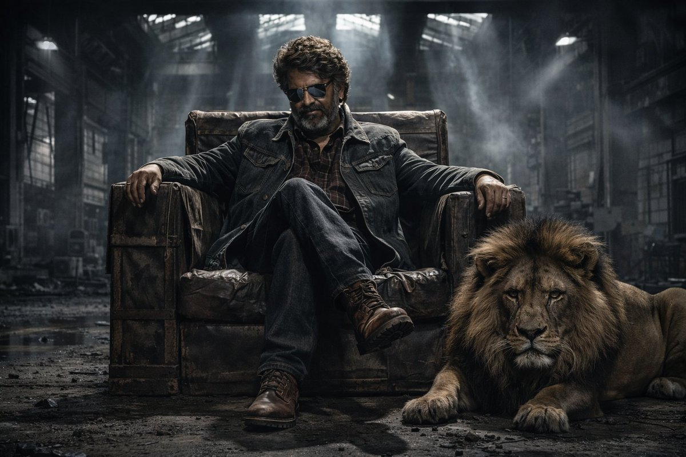
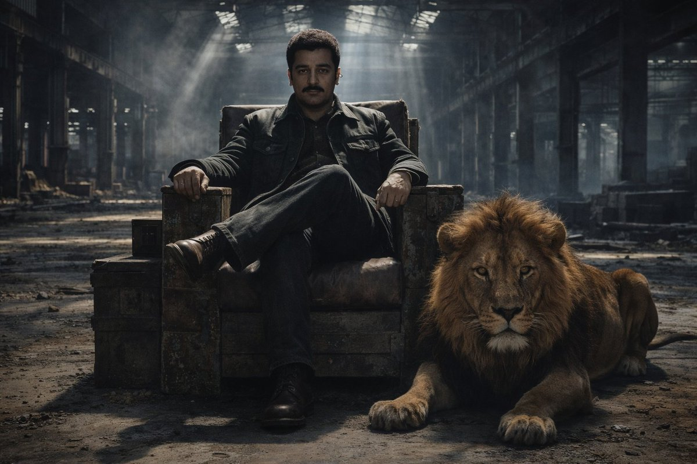
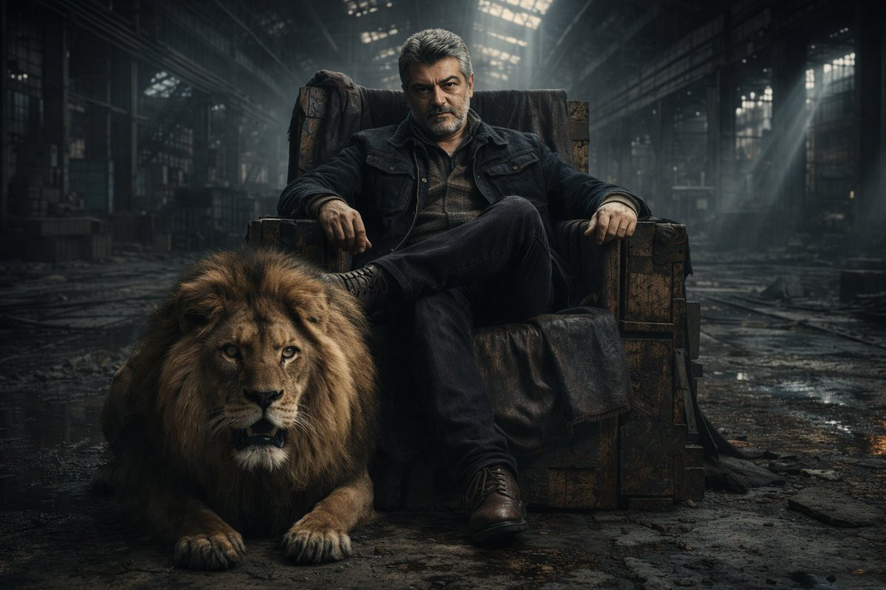
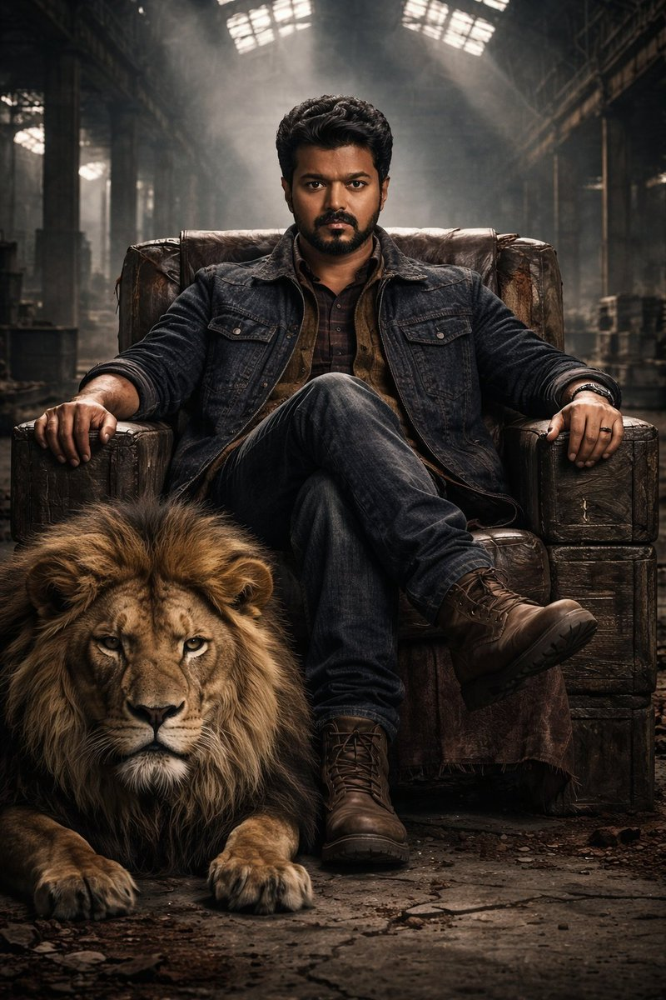

# grok.json 

grok.json文件存放grok相关的提示词，当前已收录：4个 

 投稿方式：[飞书投稿](https://tcn1uh5rxo87.feishu.cn/share/base/form/shrcne5gDolOMDd0oJsj2XfvxQc) or [issues](https://github.com/junxiaopang/gridsplitter/issues/new)

当前 1/1 页 | [查看全部目录](../prompts.md)

🚀 **在线预览**: [https://prompts.kkkm.cn](https://prompts.kkkm.cn)

## <a id="toc">目录</a>

- [美女电影感肖像画](#prompt-327)
- [超现实海洋图案](#prompt-49)
- [机械裂颜](#prompt-2002773947658760200)
- [钢铁教父：法医级写实肖像](#prompt-2004747766657155300)

## <a id="prompt-327">美女电影感肖像画</a> (<a href="https://x.com/karatademada/status/1977343963745923372" target="_blank" rel="noopener noreferrer">@karatademada</a>)


```
A cinematic portrait of a young East Asian woman sitting gracefully at a white marble vanity table. She has long, sleek, dark brown hair parted in the middle, styled simply to frame her face. Her skin is luminous and smooth with a warm tone. She wears soft, peach-toned makeup with a light shimmer on the eyelids, subtle eyeliner, and coral lipstick that gives her a polished glow.

She’s dressed in an off-shoulder black velvet dress that accentuates her neckline and shoulders, elegant yet modern. A delicate silver necklace with a small pendant rests on her collarbone, and she wears matching silver earrings and a ring, adding a refined touch. Her posture is confident and feminine, one arm resting naturally on the marble surface, the other relaxed by her side.

The scene takes place in a softly lit vanity space with a mirror reflecting part of her silhouette. The lighting is balanced and diffused, creating a clean, luxurious look, soft shadows, no harsh highlights, and a smooth skin texture. On the vanity, there are makeup items such as a compact palette, a small decorative brush, and bottles of foundation neatly placed beside her.

The background features deep navy or dark curtains and minimalist decor, including white vases filled with dried flowers in warm autumn hues of orange, cream, and gold. The overall mood feels elegant, poised, and quietly glamorous, like a high-end beauty editorial captured on a crisp modern camera with cinematic lighting and 8K ultra-realistic clarity.

Color palette: ivory white, black velvet, warm peach tones, and soft gold floral accents.
Aspect ratio: 4:5.
Style: hyper-realistic, luxury portrait, magazine aesthetic.
```

```
一幅充满电影感的肖像画，描绘了一位年轻的东亚女性优雅地坐在白色大理石梳妆台前。她有着一头柔顺的深棕色长发，中分，简单的发型勾勒出她精致的脸庞。她的肌肤光洁光滑，肤色温暖。她化着柔和的蜜桃色妆容，眼睑上点缀着淡淡的珠光，眼线细腻，珊瑚色唇膏则为她增添了一抹精致的光泽。

她身着一袭露肩黑色天鹅绒连衣裙，凸显了她的颈部和肩部线条，优雅而又不失现代感。一条精致的银项链搭配一枚小巧的吊坠，垂于她的锁骨上，她还佩戴了与之相配的银耳环和戒指，更添一抹精致。她的姿态自信而柔美，一只手臂自然地搭在大理石台面上，另一只手臂则放松地垂在身侧。

场景发生在灯光柔和的梳妆台上，镜子映照出她部分轮廓。光线均衡柔和，营造出干净奢华的妆容，阴影柔和，没有刺眼的高光，肌肤纹理光滑细腻。梳妆台上，她身旁整齐地摆放着一些化妆品，例如粉饼盘、小巧的装饰刷和几瓶粉底液。

背景采用深蓝色或深色窗帘，搭配简约的装饰，包括插满干花的白色花瓶，这些干花呈现出温暖的秋日色调——橙色、奶油色和金色。整体氛围优雅、沉稳，又不失低调的魅力，如同一部用清晰的现代相机，在影院级灯光和8K超高清画质下拍摄的高端美妆社论。

色调：象牙白、黑色天鹅绒、温暖的桃色调和柔和的金色花卉装饰。
长宽比：4：5。
风格：超现实主义、奢华肖像、杂志美学。
```

 [↑返回目录](#toc)

---
## <a id="prompt-49">超现实海洋图案</a> (<a href="https://x.com/umesh_ai/status/1925424557638500838" target="_blank" rel="noopener noreferrer">@umesh_ai</a>)


```
Create a hyper-realistic image where [SHAPE] shape is formed by the magical parting of [wavy] blue ocean, with the [SHAPE] shape being a [COLOUR] empty land. The top view should show the water being pushed aside by an unseen force, creating the [SHAPE] with an ultra-thin line. The stark [COLOR] color of the [SHAPE] interior should contrast with the vibrant blue water around it, emphasizing the supernatural effect as if the water is being parted to reveal the [SHAPE] shape distinctly.
```

 [↑返回目录](#toc)

---
## <a id="prompt-2002773947658760200">机械裂颜</a> (<a href="https://x.com/artisin_ai/status/2002773947658760312" target="_blank" rel="noopener noreferrer">G. Kim</a>)


```
Get inside of Grok Imagine! You only need a simple prompt. 

Prompt: “The skin of her face opens up revealing the complex mechanics beneath”
```

```
进入 Grok Imagine！你只需要一个简单的提示词。

提示：“她脸上的皮肤裂开，露出底下复杂的机械结构”
```

 [↑返回目录](#toc)

---
## <a id="prompt-2004747766657155300">钢铁教父：法医级写实肖像</a> (<a href="https://x.com/anandh_ks_/status/2004747766657155276" target="_blank" rel="noopener noreferrer">Anandh KS</a>)









```
ABSOLUTE FACE LOCK (NON-NEGOTIABLE)

FACE LOCK – PHOTOGRAPHIC IDENTITY PRESERVATION

Use the uploaded reference image as the ONLY and EXACT facial source. The generated subject must be the same individual, with 100% facial identity accuracy.

❌ Do NOT beautify, stylize, enhance, idealize, age, de-age, or reinterpret the face ❌ No changes to facial proportions, bone structure, symmetry, skin texture, beard shape, hairline, or gaze ❌ No AI smoothing, no face morphing, no correction of asymmetry

✔ Preserve with forensic photographic fidelity:

Exact bone structure & face shape

Natural skin tone, pores, micro-texture, imperfections

Identical hairline, density, volume, and hairstyle

Exact eye shape, spacing, eyelids, and gaze

Identical beard shape, density, edges, and texture

Neutral, intense expression only (no added emotion)

Treat the face as a locked photographic identity, as if captured in the same second.

🎥 VISUAL STYLE & COMPOSITION

Ultra-cinematic, high-contrast perfectly symmetrical wide shot, captured on a 35mm anamorphic lens. Set inside a vast abandoned steel mill, converted into a brutalist command center. Cold, desaturated God-rays cut through shattered skylights, revealing volumetric dust. Cracked concrete floor stained with oil, rust, and age.

🪑 THE SUBJECT

Centered in frame sits a mafia kingpin, face matching the uploaded reference with absolute fidelity. Seated on a makeshift throne built from weathered industrial crates, draped in distressed dark leather. Posture conveys silent authority and controlled menace — legs crossed, one arm resting casually.

🧥 ATTIRE — UTILITARIAN LUXURY

Heavy raw-denim jacket with visible triple stitching

Thick wool flannel shirt

Quilted canvas vest

Rugged oil-tanned leather boots

All fabrics realistic, worn, tactile, and grounded.

🦁 THE GUARD

At his feet lies a full-grown male lion, crouched protectively. Unsheathed claws dig into crumbling concrete. Dense mane contrasts sharply with the cold, rusted industrial setting.

🎞️ CINEMATOGRAPHY & REALISM

Ultra-cinematic chiaroscuro lighting — deep shadows, strong contrast. Extreme 8K hyper-realism:

Oxidized I-beams with visible rust

Flaking paint on corrugated steel walls

Concrete dust, fabric fibers, leather grain

Pore-level facial realism (no smoothing)

Mood: intimidating, powerful, cinematic.

🚫 NEGATIVE PROMPT (STRICT)

blur, soft focus, low detail, low resolution, CGI, 3D render, cartoon, anime, illustration, painterly style, smooth skin, beauty filter, altered face, different person, face morphing, symmetry correction, de-aging, over-stylized lighting, exaggerated emotion, extra limbs, bad anatomy, watermark, text, logo
```

```
绝对面部锁定（不可协商）

面部锁定——摄影级身份保留

仅且必须使用上传的参考图像作为面部的唯一精确来源。生成的人物必须是同一人，面部身份准确率100%。

❌ 禁止美化、风格化、增强、理想化、增龄、减龄或重新诠释面部  
❌ 禁止更改面部比例、骨骼结构、对称性、皮肤纹理、胡须形状、发际线或眼神  
❌ 禁止AI平滑、面部变形、不对称修正

✔ 以法医级摄影保真度保留：

完全一致的骨骼结构与脸型  
自然肤色、毛孔、微纹理及瑕疵  
完全相同的发际线、密度、体积与发型  
完全一致的眼型、间距、眼睑与凝视方向  
完全相同的胡须形状、密度、边缘与质感  
仅限中性而强烈的表情（不得添加情绪）  

将面部视为锁定的摄影身份，如同在同一秒内拍摄。

🎥 视觉风格与构图

超电影感、高对比度、完美对称的广角镜头，使用35mm变形镜头拍摄。场景设定于一座废弃的巨大钢铁厂，已被改造成粗野主义指挥中心。冰冷、去饱和的上帝之光穿过破碎的天窗，照亮空间中的体积尘埃。开裂的混凝土地面沾满油渍、锈迹与岁月痕迹。

🪑 主体人物

画面中央端坐一位黑帮教父，面部与上传参考图完全一致。他坐在由风化工业板条箱临时搭建的王座上，身披磨损的深色皮革。姿态传达出沉默的权威与克制的威胁——双腿交叠，单臂随意搭放。

🧥 服装——实用主义奢华

厚重原色牛仔夹克，可见三重缝线  
厚实羊毛法兰绒衬衫  
绗缝帆布背心  
粗犷油鞣皮革靴  

所有面料真实、磨损、触感强烈、扎根现实。

🦁 守卫

其脚边卧着一头成年雄狮，呈保护性蹲伏姿态。利爪伸出，深深嵌入碎裂的混凝土。浓密鬃毛与冰冷锈蚀的工业环境形成鲜明对比。

🎞️ 摄影与写实风格

超电影感明暗对照光影——深邃阴影，强烈对比。极致8K超写实细节：

可见锈迹的氧化工字钢  
波纹钢板墙上的剥落油漆  
混凝土粉尘、织物纤维、皮革纹路  
毛孔级面部写实（无任何平滑）

氛围：威严、强势、电影感十足。

🚫 负面提示（严格禁止）

模糊、柔焦、低细节、低分辨率、CGI、3D渲染、卡通、动漫、插画、绘画风格、光滑皮肤、美颜滤镜、面部改动、不同人物、面部变形、对称修正、减龄、过度风格化灯光、夸张表情、多余肢体、解剖错误、水印、文字、标志
```

 [↑返回目录](#toc)

---


当前 1/1 页 | [查看全部目录](../prompts.md)