# grok.json 

grok.json文件存放grok相关的提示词，当前已收录：28个 

 投稿方式：[飞书投稿](https://tcn1uh5rxo87.feishu.cn/share/base/form/shrcne5gDolOMDd0oJsj2XfvxQc) or [issues](https://github.com/junxiaopang/gridsplitter/issues/new)

当前 1/1 页 | [查看全部目录](../prompts.md)

🚀 **在线预览**: [https://prompts.kkkm.cn](https://prompts.kkkm.cn)

## <a id="toc">目录</a>

- [美女电影感肖像画](#prompt-327)
- [超现实海洋图案](#prompt-49)
- [机械裂颜](#prompt-2002773947658760200)
- [钢铁教父：法医级写实肖像](#prompt-2004747766657155300)
- [冬日黄昏：静谧夜晚的优雅](#prompt-2004706544340844722)
- [阳光公园中的年轻女子](#prompt-2005838176729063677)
- [3D动画角色拼贴画](#prompt-2011840235731370200)
- [超现实主义黑白概念摄影作品](#prompt-2012329979577532700)
- [开朗女孩的3D卡通形象](#prompt-2012350843656552700)
- [自信的彩虹运动者](#prompt-2012433071652668000)

## <a id="prompt-327">美女电影感肖像画</a> (<a href="https://x.com/karatademada/status/1977343963745923372" target="_blank" rel="noopener noreferrer">@karatademada</a>)


```
A cinematic portrait of a young East Asian woman sitting gracefully at a white marble vanity table. She has long, sleek, dark brown hair parted in the middle, styled simply to frame her face. Her skin is luminous and smooth with a warm tone. She wears soft, peach-toned makeup with a light shimmer on the eyelids, subtle eyeliner, and coral lipstick that gives her a polished glow.

She’s dressed in an off-shoulder black velvet dress that accentuates her neckline and shoulders, elegant yet modern. A delicate silver necklace with a small pendant rests on her collarbone, and she wears matching silver earrings and a ring, adding a refined touch. Her posture is confident and feminine, one arm resting naturally on the marble surface, the other relaxed by her side.

The scene takes place in a softly lit vanity space with a mirror reflecting part of her silhouette. The lighting is balanced and diffused, creating a clean, luxurious look, soft shadows, no harsh highlights, and a smooth skin texture. On the vanity, there are makeup items such as a compact palette, a small decorative brush, and bottles of foundation neatly placed beside her.

The background features deep navy or dark curtains and minimalist decor, including white vases filled with dried flowers in warm autumn hues of orange, cream, and gold. The overall mood feels elegant, poised, and quietly glamorous, like a high-end beauty editorial captured on a crisp modern camera with cinematic lighting and 8K ultra-realistic clarity.

Color palette: ivory white, black velvet, warm peach tones, and soft gold floral accents.
Aspect ratio: 4:5.
Style: hyper-realistic, luxury portrait, magazine aesthetic.
```

```
一幅充满电影感的肖像画，描绘了一位年轻的东亚女性优雅地坐在白色大理石梳妆台前。她有着一头柔顺的深棕色长发，中分，简单的发型勾勒出她精致的脸庞。她的肌肤光洁光滑，肤色温暖。她化着柔和的蜜桃色妆容，眼睑上点缀着淡淡的珠光，眼线细腻，珊瑚色唇膏则为她增添了一抹精致的光泽。

她身着一袭露肩黑色天鹅绒连衣裙，凸显了她的颈部和肩部线条，优雅而又不失现代感。一条精致的银项链搭配一枚小巧的吊坠，垂于她的锁骨上，她还佩戴了与之相配的银耳环和戒指，更添一抹精致。她的姿态自信而柔美，一只手臂自然地搭在大理石台面上，另一只手臂则放松地垂在身侧。

场景发生在灯光柔和的梳妆台上，镜子映照出她部分轮廓。光线均衡柔和，营造出干净奢华的妆容，阴影柔和，没有刺眼的高光，肌肤纹理光滑细腻。梳妆台上，她身旁整齐地摆放着一些化妆品，例如粉饼盘、小巧的装饰刷和几瓶粉底液。

背景采用深蓝色或深色窗帘，搭配简约的装饰，包括插满干花的白色花瓶，这些干花呈现出温暖的秋日色调——橙色、奶油色和金色。整体氛围优雅、沉稳，又不失低调的魅力，如同一部用清晰的现代相机，在影院级灯光和8K超高清画质下拍摄的高端美妆社论。

色调：象牙白、黑色天鹅绒、温暖的桃色调和柔和的金色花卉装饰。
长宽比：4：5。
风格：超现实主义、奢华肖像、杂志美学。
```

 [↑返回目录](#toc)

---
## <a id="prompt-49">超现实海洋图案</a> (<a href="https://x.com/umesh_ai/status/1925424557638500838" target="_blank" rel="noopener noreferrer">@umesh_ai</a>)


```
Create a hyper-realistic image where [SHAPE] shape is formed by the magical parting of [wavy] blue ocean, with the [SHAPE] shape being a [COLOUR] empty land. The top view should show the water being pushed aside by an unseen force, creating the [SHAPE] with an ultra-thin line. The stark [COLOR] color of the [SHAPE] interior should contrast with the vibrant blue water around it, emphasizing the supernatural effect as if the water is being parted to reveal the [SHAPE] shape distinctly.
```

 [↑返回目录](#toc)

---
## <a id="prompt-2002773947658760200">机械裂颜</a> (<a href="https://x.com/artisin_ai/status/2002773947658760312" target="_blank" rel="noopener noreferrer">G. Kim</a>)


```
Get inside of Grok Imagine! You only need a simple prompt. 

Prompt: “The skin of her face opens up revealing the complex mechanics beneath”
```

```
进入 Grok Imagine！你只需要一个简单的提示词。

提示：“她脸上的皮肤裂开，露出底下复杂的机械结构”
```

 [↑返回目录](#toc)

---
## <a id="prompt-2004747766657155300">钢铁教父：法医级写实肖像</a> (<a href="https://x.com/anandh_ks_/status/2004747766657155276" target="_blank" rel="noopener noreferrer">Anandh KS</a>)

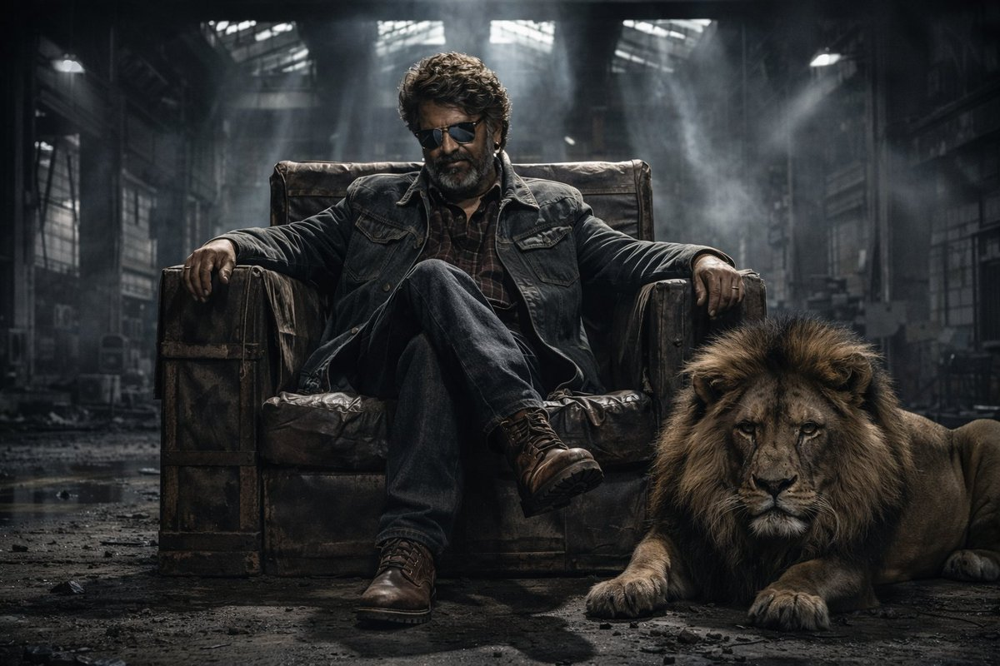

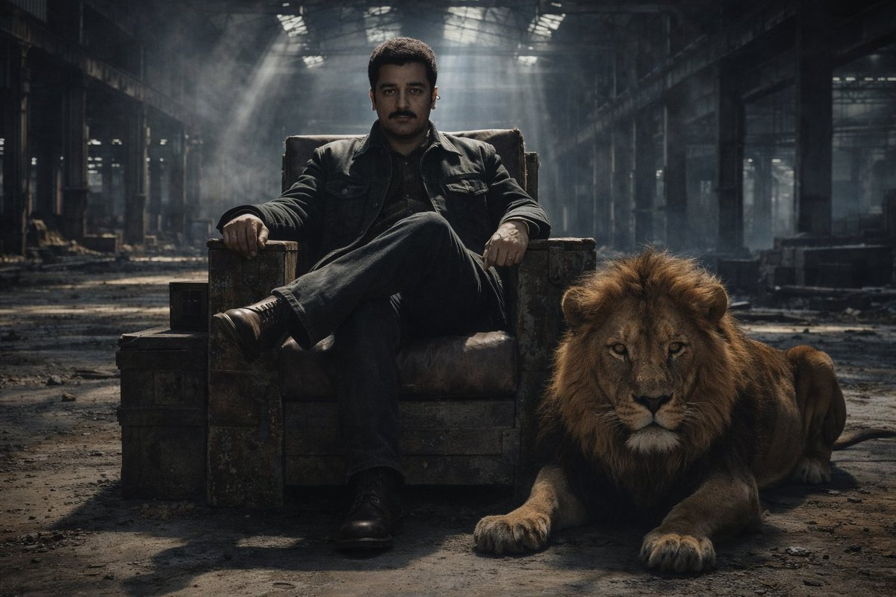

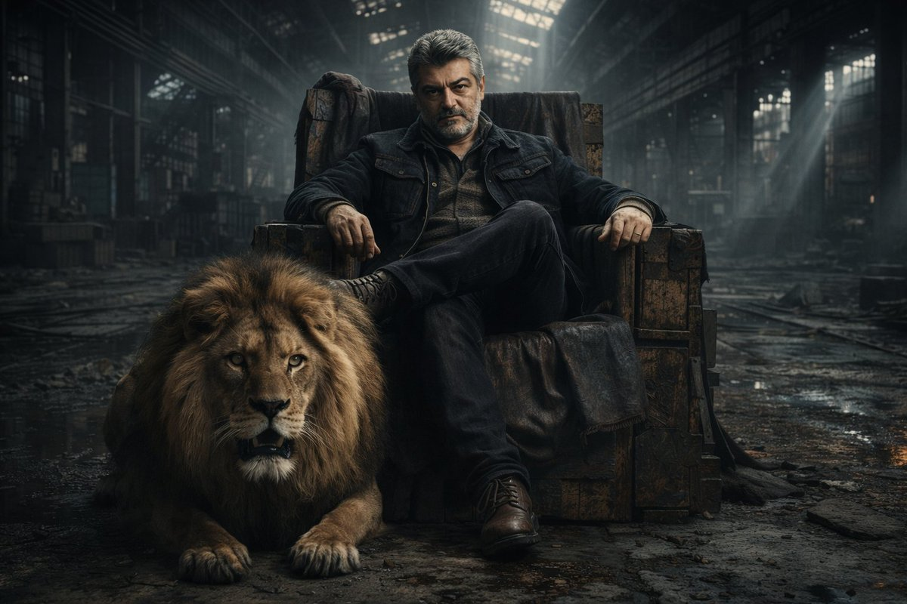

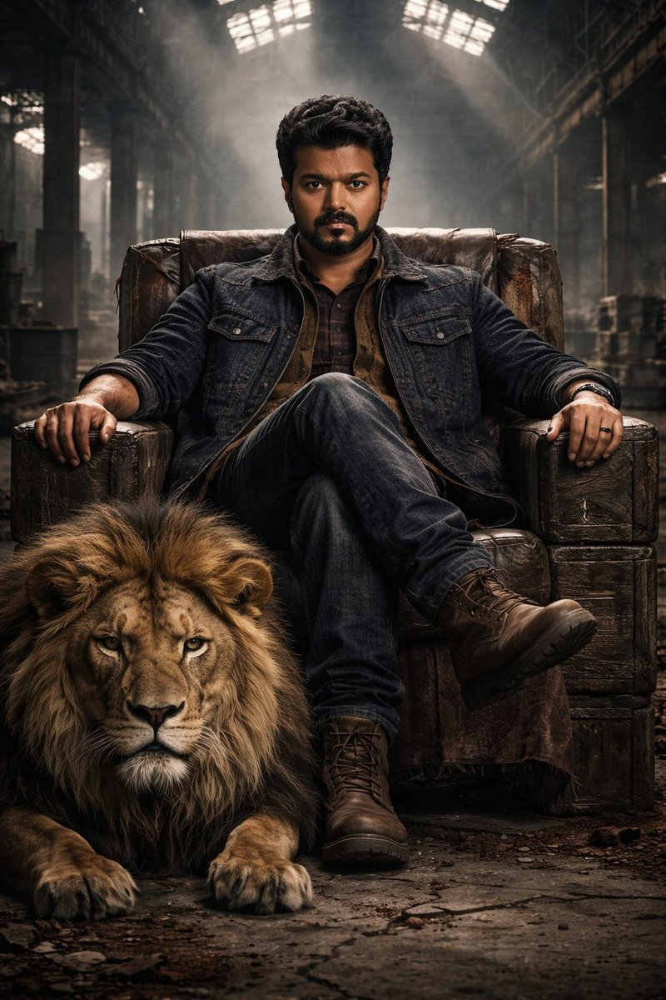

```
ABSOLUTE FACE LOCK (NON-NEGOTIABLE)

FACE LOCK – PHOTOGRAPHIC IDENTITY PRESERVATION

Use the uploaded reference image as the ONLY and EXACT facial source. The generated subject must be the same individual, with 100% facial identity accuracy.

❌ Do NOT beautify, stylize, enhance, idealize, age, de-age, or reinterpret the face ❌ No changes to facial proportions, bone structure, symmetry, skin texture, beard shape, hairline, or gaze ❌ No AI smoothing, no face morphing, no correction of asymmetry

✔ Preserve with forensic photographic fidelity:

Exact bone structure & face shape

Natural skin tone, pores, micro-texture, imperfections

Identical hairline, density, volume, and hairstyle

Exact eye shape, spacing, eyelids, and gaze

Identical beard shape, density, edges, and texture

Neutral, intense expression only (no added emotion)

Treat the face as a locked photographic identity, as if captured in the same second.

🎥 VISUAL STYLE & COMPOSITION

Ultra-cinematic, high-contrast perfectly symmetrical wide shot, captured on a 35mm anamorphic lens. Set inside a vast abandoned steel mill, converted into a brutalist command center. Cold, desaturated God-rays cut through shattered skylights, revealing volumetric dust. Cracked concrete floor stained with oil, rust, and age.

🪑 THE SUBJECT

Centered in frame sits a mafia kingpin, face matching the uploaded reference with absolute fidelity. Seated on a makeshift throne built from weathered industrial crates, draped in distressed dark leather. Posture conveys silent authority and controlled menace — legs crossed, one arm resting casually.

🧥 ATTIRE — UTILITARIAN LUXURY

Heavy raw-denim jacket with visible triple stitching

Thick wool flannel shirt

Quilted canvas vest

Rugged oil-tanned leather boots

All fabrics realistic, worn, tactile, and grounded.

🦁 THE GUARD

At his feet lies a full-grown male lion, crouched protectively. Unsheathed claws dig into crumbling concrete. Dense mane contrasts sharply with the cold, rusted industrial setting.

🎞️ CINEMATOGRAPHY & REALISM

Ultra-cinematic chiaroscuro lighting — deep shadows, strong contrast. Extreme 8K hyper-realism:

Oxidized I-beams with visible rust

Flaking paint on corrugated steel walls

Concrete dust, fabric fibers, leather grain

Pore-level facial realism (no smoothing)

Mood: intimidating, powerful, cinematic.

🚫 NEGATIVE PROMPT (STRICT)

blur, soft focus, low detail, low resolution, CGI, 3D render, cartoon, anime, illustration, painterly style, smooth skin, beauty filter, altered face, different person, face morphing, symmetry correction, de-aging, over-stylized lighting, exaggerated emotion, extra limbs, bad anatomy, watermark, text, logo
```

```
绝对面部锁定（不可协商）

面部锁定——摄影级身份保留

仅且必须使用上传的参考图像作为面部的唯一精确来源。生成的人物必须是同一人，面部身份准确率100%。

❌ 禁止美化、风格化、增强、理想化、增龄、减龄或重新诠释面部  
❌ 禁止更改面部比例、骨骼结构、对称性、皮肤纹理、胡须形状、发际线或眼神  
❌ 禁止AI平滑、面部变形、不对称修正

✔ 以法医级摄影保真度保留：

完全一致的骨骼结构与脸型  
自然肤色、毛孔、微纹理及瑕疵  
完全相同的发际线、密度、体积与发型  
完全一致的眼型、间距、眼睑与凝视方向  
完全相同的胡须形状、密度、边缘与质感  
仅限中性而强烈的表情（不得添加情绪）  

将面部视为锁定的摄影身份，如同在同一秒内拍摄。

🎥 视觉风格与构图

超电影感、高对比度、完美对称的广角镜头，使用35mm变形镜头拍摄。场景设定于一座废弃的巨大钢铁厂，已被改造成粗野主义指挥中心。冰冷、去饱和的上帝之光穿过破碎的天窗，照亮空间中的体积尘埃。开裂的混凝土地面沾满油渍、锈迹与岁月痕迹。

🪑 主体人物

画面中央端坐一位黑帮教父，面部与上传参考图完全一致。他坐在由风化工业板条箱临时搭建的王座上，身披磨损的深色皮革。姿态传达出沉默的权威与克制的威胁——双腿交叠，单臂随意搭放。

🧥 服装——实用主义奢华

厚重原色牛仔夹克，可见三重缝线  
厚实羊毛法兰绒衬衫  
绗缝帆布背心  
粗犷油鞣皮革靴  

所有面料真实、磨损、触感强烈、扎根现实。

🦁 守卫

其脚边卧着一头成年雄狮，呈保护性蹲伏姿态。利爪伸出，深深嵌入碎裂的混凝土。浓密鬃毛与冰冷锈蚀的工业环境形成鲜明对比。

🎞️ 摄影与写实风格

超电影感明暗对照光影——深邃阴影，强烈对比。极致8K超写实细节：

可见锈迹的氧化工字钢  
波纹钢板墙上的剥落油漆  
混凝土粉尘、织物纤维、皮革纹路  
毛孔级面部写实（无任何平滑）

氛围：威严、强势、电影感十足。

🚫 负面提示（严格禁止）

模糊、柔焦、低细节、低分辨率、CGI、3D渲染、卡通、动漫、插画、绘画风格、光滑皮肤、美颜滤镜、面部改动、不同人物、面部变形、对称修正、减龄、过度风格化灯光、夸张表情、多余肢体、解剖错误、水印、文字、标志
```

 [↑返回目录](#toc)

---
## <a id="prompt-2004706544340844722">冬日黄昏：静谧夜晚的优雅</a> (<a href="https://x.com/sonucnc2/status/2004706544340844722" target="_blank" rel="noopener noreferrer">𝑺𝒐𝒏𝒖 𝑺𝒊𝒏𝒈𝒉</a>)

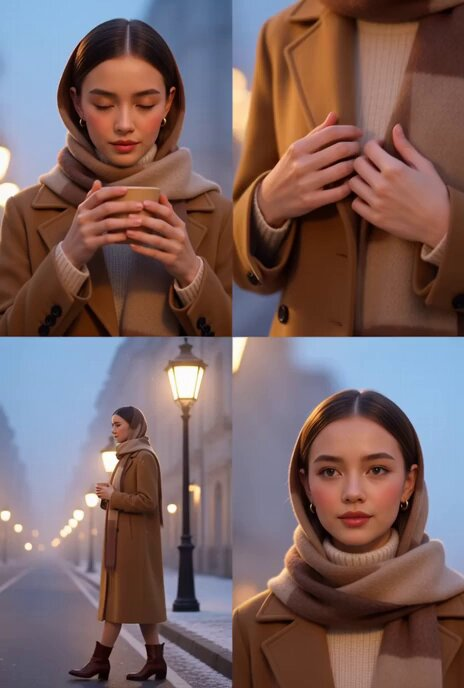

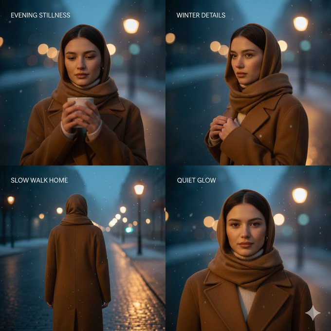

```
A calm winter morning, softened by golden light.
Quiet streets, warm layers, and a peaceful start to the day.

Grok Ai   vs  Gemini 
Prompt 
{
  "image_prompt": {
    "title": "Winter Dusk – Quiet Evening Elegance",
    "layout": {
      "type": "2x2 Grid",
      "consistency": "Single model, serene lifestyle editorial, muted winter tones"
    },
    "subject_global": {
      "demographics": "Young woman, timeless and graceful presence",
      "hair": "Straight or softly waved hair, partially covered with scarf",
      "makeup": "Soft matte skin, neutral blush, nude lips, subtle eye definition",
      "expression_base": "Calm warmth, introspective mood",
      "wardrobe": {
        "outerwear": "Camel brown or muted olive long winter coat",
        "inner_layer": "High-neck knit sweater in cream or mocha tones",
        "accessories": [
          "Wool scarf wrapped snugly",
          "Leather boots",
          "Minimal gold earrings"
        ]
      }
    },
    "environment_global": {
      "location": "Quiet winter street near cafés or old city architecture",
      "elements": [
        "Soft street lights",
        "Light snowflakes or cold evening air"
      ],
      "lighting": "Blue-hour light mixed with warm ambient lamps"
    },
    "frames": [
      {
        "position": "Top Left",
        "theme": "EVENING STILLNESS",
        "composition": {
          "shot_size": "Medium close-up",
          "angle": "Eye level",
          "depth": "Soft blurred lights behind"
        },
        "action": {
          "pose": "Hands wrapped around a warm cup, eyes lowered"
        },
        "emotion": "Quiet comfort",
        "atmosphere": "Cold evening calm"
      },
      {
        "position": "Top Right",
        "theme": "WINTER DETAILS",
        "composition": {
          "shot_size": "Close-up",
          "angle": "45-degree side"
        },
        "action": {
          "pose": "Adjusting coat buttons or scarf"
        },
        "emotion": "Soft elegance",
        "focus": "Fabric texture and warm light on hands"
      },
      {
        "position": "Bottom Left",
        "theme": "SLOW WALK HOME",
        "composition": {
          "shot_size": "Medium shot",
          "angle": "Rear three-quarter view"
        },
        "action": {
          "pose": "Walking slowly under street lights"
        },
        "emotion": "Peaceful solitude",
        "background_specifics": "Empty road, glowing lamps, winter haze"
      },
      {
        "position": "Bottom Right",
        "theme": "QUIET GLOW",
        "composition": {
          "shot_size": "Tight medium close-up",
          "angle": "Straight-on"
        },
        "action": {
          "pose": "Soft smile, relaxed shoulders"
        },
        "emotion": "Warm, composed",
        "details": "Natural skin, gentle rim light from street lamp"
      }
    ],
    "technical_specs": {
      "camera": {
        "lens": "50 mm",
        "aperture": "f/1.8",
        "depth_of_field": "Creamy bokeh, cinematic separation"
      },
      "textures": {
        "coat": "Wool blend texture",
        "skin": "Natural evening realism",
        "air": "Cool tones with warm highlights"
      },
      "style_modifiers": [
        "Calm winter lifestyle",
        "Cinematic minimal fashion",
        "Aesthetic social-media editorial"
      ],
      "color_grading": "Cool blues, warm ambers, soft browns, balanced contrast"
    }
  }
}
```

```
冬日黄昏——静谧夜晚的优雅  
整体布局：2x2 网格，使用单一模型，呈现宁静的生活方式杂志风格，色调为柔和的冬季低饱和色系  

主体人物：  
- 年轻女性，气质永恒而优雅  
- 直发或微卷发型，部分被围巾遮盖  
- 妆容：柔雾肌感、自然腮红、裸色唇妆、眼妆细腻低调  
- 表情基调：平静温暖，略带沉思  
- 服装：  
  - 外套：驼棕色或哑光橄榄绿长款冬大衣  
  - 内搭：米白或摩卡色高领针织衫  
  - 配饰：羊毛围巾紧密围裹、皮质靴子、极简金色耳钉  

环境设定：  
- 地点：安静的冬日街道，邻近咖啡馆或老城建筑  
- 元素：柔和街灯、轻盈雪花或寒冷夜气  
- 光线：蓝调时刻光线与温暖环境灯光交融  

四帧构图：  

左上：  
- 主题：夜晚的静谧  
- 构图：中近景，平视角度，背景灯光柔焦虚化  
- 动作：双手捧着热饮，目光低垂  
- 情绪：安静的舒适感  
- 氛围：寒夜中的宁静  

右上：  
- 主题：冬日细节  
- 构图：特写，45度侧角  
- 动作：整理大衣纽扣或围巾  
- 情绪：柔和的优雅  
- 焦点：织物纹理与手部暖光  

左下：  
- 主题：缓步归家  
- 构图：中景，后方三分之二视角  
- 动作：在街灯下缓缓行走  
- 情绪：平和的独处  
- 背景细节：空旷道路、发光路灯、冬日薄雾  

右下：  
- 主题：静谧微光  
- 构图：紧凑中近景，正面直视  
- 动作：淡淡微笑，肩膀放松  
- 情绪：温暖而沉稳  
- 细节：自然肤质，街灯勾勒出柔和轮廓光  

技术参数：  
- 镜头：50mm，光圈 f/1.8，奶油般柔焦背景，电影级层次分离  
- 材质表现：羊毛混纺大衣质感、自然夜晚肌肤效果、冷调氛围中带有暖色高光  
- 风格修饰：宁静冬日生活方式、电影感极简时尚、美学社交媒体专题风格  
- 色彩调性：冷蓝、暖琥珀、柔和棕褐，对比均衡
```

 [↑返回目录](#toc)

---
## <a id="prompt-2005838176729063677">阳光公园中的年轻女子</a> (<a href="https://x.com/chatgptpaglu/status/2005838176729063677" target="_blank" rel="noopener noreferrer">yusra.</a>)

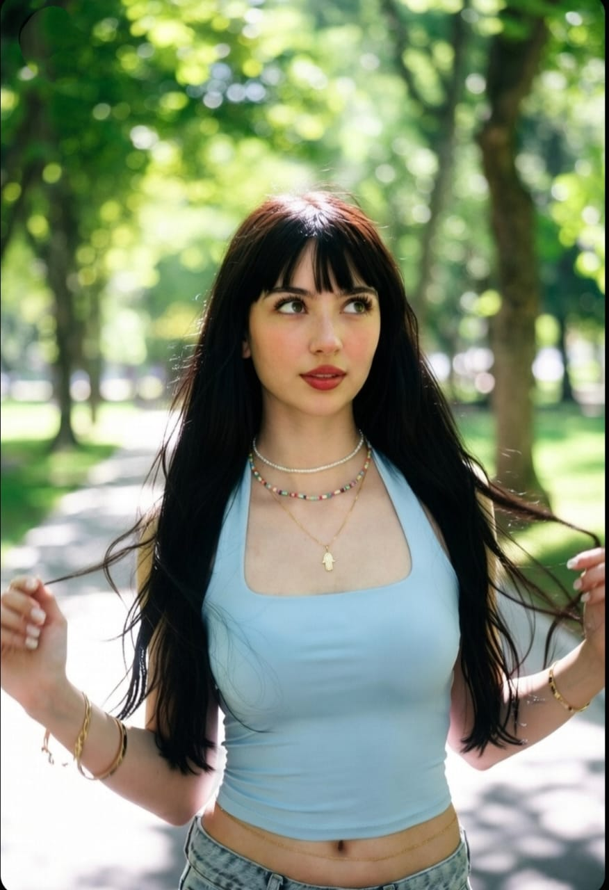

```
Grok AI
Prompt:
{
  "image_description": "A medium shot of a young woman with long, dark espresso-colored hair and soft curtain bangs posing outdoors in a sun-drenched park.",
  "subject_details": {
    "features": "Youthful face, porcelain skin with a soft blush, dark eyes, and warm reddish-pink lipstick.",
    "hair": "Long, flowing dark brown hair with natural volume and wispy bangs framing the face.",
    "pose": "Looking off-camera with a slight, natural smile, one hand gently touching her hair."
  },
  "attire_and_accessories": {
    "clothing": "A light sky-blue halter neck top paired with low-rise light-wash denim jeans.",
    "jewelry": "Layered necklaces including a thin pearl choker, a gold chain with a Hamsa pendant, and a colorful beaded strand; gold bangles on the wrists and a delicate gold belly chain."
  },
  "environment": {
    "setting": "A paved walkway in a lush park with tall green trees and dappled sunlight filtering through the leaves.",
    "lighting": "Bright, natural golden hour sunlight creating soft shadows and highlights on the subject's hair and skin.",
    "atmosphere": "Serene, aesthetic, and summery."
  },
  "technical_specs": {
    "camera": "High-resolution photography, 35mm lens, f/2.8 aperture for slight background blur.",
    "style": "Lifestyle photography, cinematic lighting, vibrant colors."
  }
}
```

```
中景拍摄一位年轻女子，她有着长长的深咖啡色头发和柔和的窗帘式刘海，在阳光明媚的公园户外摆姿势。

特征：年轻的面孔，瓷白的皮肤带有柔和的红晕，深色的眼睛，以及暖红色的唇膏。
发型：长而飘逸的深棕色头发，自然蓬松，轻盈的刘海修饰着脸庞。
姿势：目光偏离镜头，带着轻微自然的微笑，一只手轻轻触摸着她的头发。

穿着与配饰：穿着浅天蓝色的吊带背心搭配低腰浅色水洗牛仔裤。佩戴多层次项链，包括一条细珍珠项圈、一条带有法蒂玛之手吊坠的金链和一条彩色珠子串成的项链；手腕上戴着金手镯，腰部系有精致的金色肚链。

环境：位于一个郁郁葱葱的公园内的铺砌小道上，周围有高大的绿树，斑驳的阳光透过树叶洒下。
光线：明亮的自然黄金时段阳光，在主题的头发和皮肤上创造出柔和的阴影和亮点。
氛围：宁静、美观且充满夏日气息。

技术规格：高分辨率摄影，使用35毫米镜头，f/2.8光圈以产生轻微的背景模糊。风格：生活方式摄影，电影照明，鲜艳的色彩。
```

 [↑返回目录](#toc)

---
## <a id="">光与影的交错：人像中的狮面</a> (<a href="https://x.com/AiWithTariq/status/2012329997714010260" target="_blank" rel="noopener noreferrer">Mr. Tariq</a>)

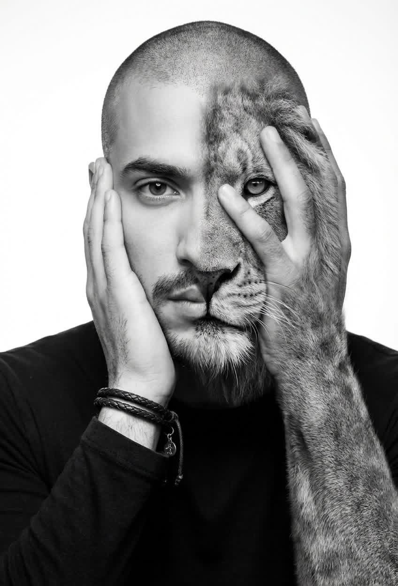

```
A hyper-realistic, 8k black and white studio portrait shot at eye-level with a 50mm lens, featuring a person with a shaved head, wearing a dark long-sleeved shirt. The composition is a close-up, centered on the subject's head and upper torso against a pure white, seamless background, illuminated by soft, high-key cinematic lighting that emphasizes highly detailed textures and creates minimal shadows. The subject's left hand gently cups the left side of their face, while their right hand covers the right side. On the left wrist, multiple braided leather bracelets are visible, one with a small circular charm. The image incorporates a surreal, digitally composited effect: the entire right half of the subject's face, from the bridge of the nose outwards, and their right hand, are seamlessly overlaid with the highly detailed features of a lion's face, including realistic fur, prominent whiskers, and a visible lion's eye peering through the fingers of the right hand. The lion's fur texture extends down the subject's right arm, creating a striking visual fusion between human and animal. uploaded face as reference.
```

```
一张超写实、8K黑白影棚人像，使用50mm镜头在眼部高度拍摄。人物光头，身穿深色长袖衬衫，构图为特写，主体头部与上半身居中，背景为纯白无缝背景。采用柔和的高调电影灯光照明，强调极度细腻的纹理，阴影极淡。人物左手轻托左脸颊，右手覆盖右脸颊；左腕佩戴多条编织皮革手链，其中一条带有小巧的圆形吊坠。画面包含一种超现实的数字合成效果：从鼻梁向右的整个右半张脸及右手，无缝叠加了狮子面部的精细细节，包括逼真的毛发、突出的胡须，以及一只狮子的眼睛透过右手手指凝视前方。狮子的毛发纹理沿人物右臂向下延伸，形成人与兽之间强烈的视觉融合。上传人脸作为参考。
```

 [↑返回目录](#toc)

---
## <a id="prompt-2011840235731370200">3D动画角色拼贴画</a> (<a href="https://x.com/i/status/2011840235731370162" target="_blank" rel="noopener noreferrer">Noor 🌸</a>)

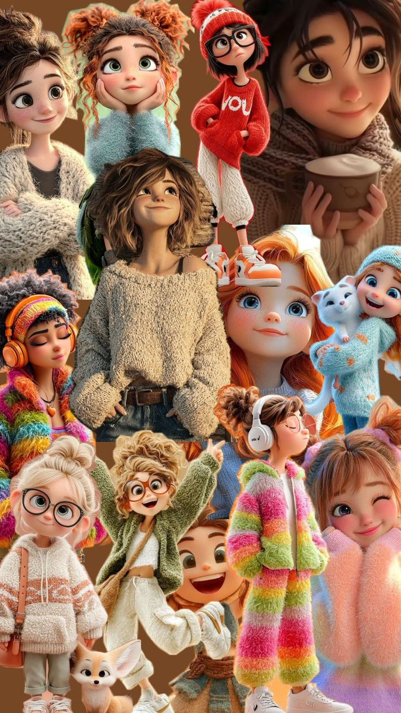

```
A cozy, whimsical 3D animated character collage featuring multiple stylized young girls with oversized expressive eyes and soft rounded facial features, inspired by modern Pixar–Disney aesthetics. Each character wears warm, oversized knit sweaters, fluffy jackets, hoodies, and colorful winter outfits with detailed fabric textures. Soft pastel and earthy tones, rainbow knits, freckles, rosy cheeks, playful hairstyles, headphones, glasses, and cute accessories. Cozy autumn–winter vibe, wholesome and joyful expressions, cinematic soft lighting, shallow depth of field, ultra-detailed fur and fabric, smooth skin shading, high realism stylized 3D render, warm brown background, aesthetic Instagram mood, 4K quality.
```

```
一个温馨而充满奇趣的3D动画角色拼贴画，描绘多位风格化的年轻女孩，拥有夸张的表现力十足的大眼睛和柔和圆润的面部特征，灵感源自现代皮克斯–迪士尼美学。每位角色都穿着温暖宽松的针织毛衣、蓬松夹克、连帽衫以及色彩缤纷的冬季服装，布料纹理细节丰富。整体采用柔和的粉彩色与大地色系，包括彩虹条纹针织、雀斑、红润脸颊、俏皮发型，以及耳机、眼镜和可爱配饰。氛围呈现秋冬季的温馨感，表情纯真愉悦，采用电影级柔光、浅景深效果，毛发与织物细节极为精致，皮肤渲染光滑细腻，为高写实风格的3D渲染作品，背景为暖棕色，具有Instagram美学氛围，4K画质。
```

 [↑返回目录](#toc)

---
## <a id="prompt-2012329979577532700">超现实主义黑白概念摄影作品</a> (<a href="https://x.com/i/status/2012329979577532686" target="_blank" rel="noopener noreferrer">Mr. Tariq</a>)

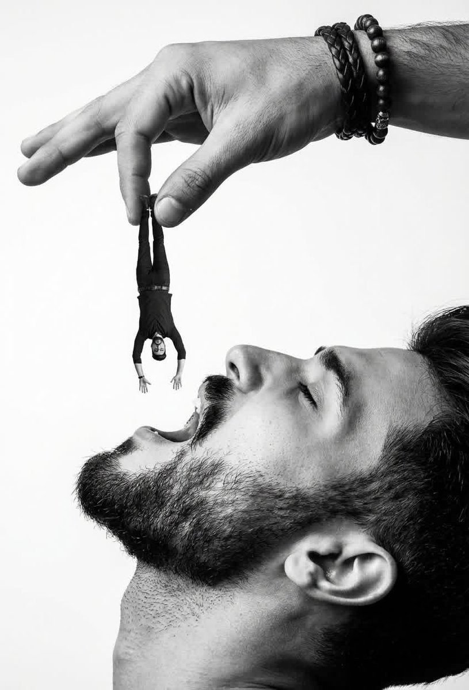

```
A striking, surrealist black-and-white conceptual photograph featuring a dramatic play on scale and forced perspective against a stark, infinite pure white background. In the lower quadrant, a massive, hyper-realistic profile of a man—using the uploaded face as reference—is tilted back with eyes closed and mouth gaping wide open in an expression of anticipation, showcasing high-fidelity skin textures, individual beard hairs, and detailed pores. Descending from the top right corner, an enormous, disembodied hand, rendered with intense dermatological detail and wearing braided wristbands, pinches the ankles of a miniature human figure between the thumb and forefinger. This tiny, helpless figure, dressed in dark casual clothing, dangles upside down in freefall, arms outstretched downwards, perfectly aligned to be dropped directly into the giant open mouth below. The image utilizes high-contrast monochrome grading, sharp focus, and seamless compositing to create a bizarre, dreamlike self-consumption narrative, rendered in 8k resolution with the clarity of a high-end studio portrait.
```

```
一幅引人注目的超现实主义黑白概念摄影作品，以强烈的尺度对比和强制透视手法呈现于一片纯净无垠的纯白背景之上。画面下方四分之一处，一个巨大、高度写实的男性侧面肖像（参考上传的人脸）仰头后倾，双眼紧闭，嘴巴大张，流露出期待的表情，皮肤纹理、胡须根根分明，毛孔细节清晰可见。从右上角垂下一只巨大而无身体的手，皮肤细节极其逼真，手腕佩戴编织手环，拇指与食指捏住一名微小人形的脚踝。这个身穿深色休闲服装的微小人物无助地倒悬在空中，双臂向下伸展，正精准对准下方巨口，仿佛即将被投入其中。整幅图像采用高对比度黑白影调、锐利对焦与无缝合成技术，营造出一种怪诞而梦幻的自我吞噬叙事，以8K分辨率呈现，具有高端影棚人像般的极致清晰度。
```

 [↑返回目录](#toc)

---
## <a id="prompt-2012350843656552700">开朗女孩的3D卡通形象</a> (<a href="https://x.com/i/status/2012350843656552643" target="_blank" rel="noopener noreferrer">Noor 🌸</a>)

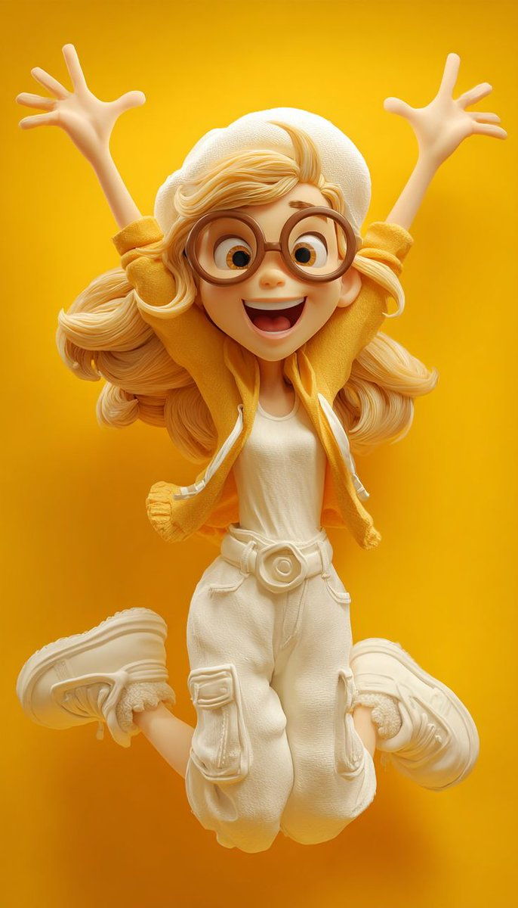

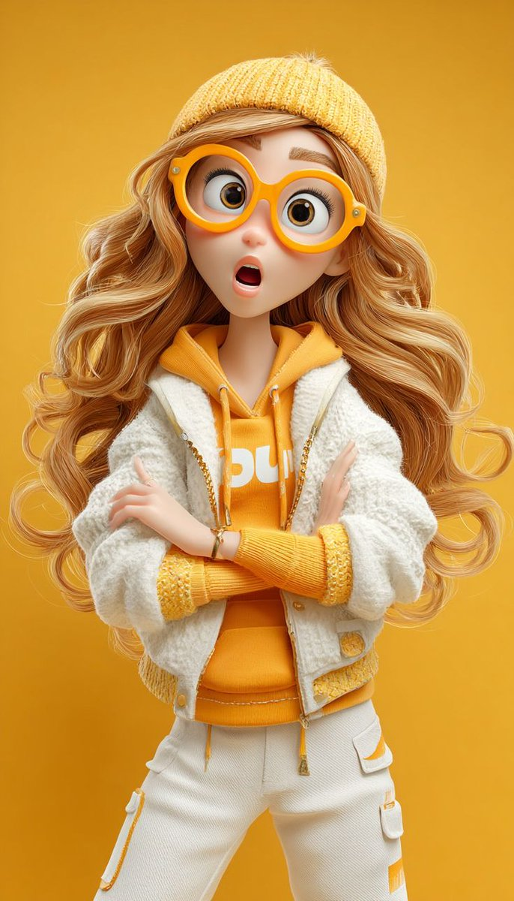

```
A high-quality 3D cartoon-style character of a cheerful young girl with expressive oversized eyes and soft facial features, rendered in a Pixar/Disney-inspired aesthetic. She has long, wavy blonde hair with detailed strands, wearing round oversized glasses and a cozy yellow-and-white outfit. The character is dressed in a yellow hoodie layered with a textured jacket, white cargo pants, and chunky sneakers. Accessories include a beanie hat and playful glasses matching the warm color palette. The pose is energetic and expressive—either mid-jump with arms raised in excitement or standing confidently with crossed arms and a surprised, curious expression. Clean monochrome yellow background, soft studio lighting, smooth clay-like textures, ultra-detailed clothing fabric, vibrant colors, joyful mood, cinematic depth of field, 4K resolution, modern stylized 3D illustration.
```

```
一位开朗的年轻女孩的高质量3D卡通风格角色，具有夸张的大眼睛和柔和的面部特征，采用皮克斯/迪士尼风格美学。她拥有长长的波浪金发，发丝细节丰富，戴着圆形大眼镜，身穿温馨的黄白配色服装：黄色连帽衫外搭一件有质感的夹克，搭配白色工装裤和厚底运动鞋。配饰包括一顶针织帽和与整体暖色调相协调的趣味眼镜。姿势充满活力且富有表现力——或是在兴奋地跳跃、双臂高举，或是自信地站立、双臂交叉，脸上带着惊讶而好奇的表情。背景为纯净的单色黄色，采用柔光影棚照明，具有光滑的黏土质感、超精细的服装布料细节、鲜艳的色彩、欢快的情绪、电影级景深效果，4K分辨率，现代风格化3D插画。
```

 [↑返回目录](#toc)

---
## <a id="prompt-2012433071652668000">自信的彩虹运动者</a> (<a href="https://x.com/i/status/2012433071652667872" target="_blank" rel="noopener noreferrer">Noor 🌸</a>)


```
1. Open @grok

2. Upload your photo 

3. Prompt ⤵️
A stylized 3D cartoon character standing confidently against a solid orange background, wearing a fluffy rainbow-striped tracksuit with a zip-up jacket and matching pants. The texture is ultra-soft and furry, with vibrant pastel colors (pink, green, yellow, orange). The character has a cute, rounded face, closed eyes, and a calm expression. Hair is tied in a messy bun. Wearing oversized white headphones and large round transparent glasses. White chunky sneakers with minimal branding. Pixar-style proportions, soft lighting, smooth gradients, high detail, cinematic studio render, shallow depth of field, ultra-clean composition, modern aesthetic, 8K quality.
```

```
一个风格化的3D卡通角色自信地站在纯橙色背景前，身穿蓬松的彩虹条纹运动套装，包括拉链夹克和配套长裤。材质超柔软且毛茸茸，色彩为鲜艳的粉彩色调（粉色、绿色、黄色、橙色）。角色拥有可爱的圆润脸庞、闭着的眼睛和宁静的表情，头发扎成一个凌乱的发髻。佩戴超大白色耳机和大型透明圆框眼镜，脚穿白色厚底运动鞋，鞋面仅有极简品牌标识。角色采用皮克斯风格的比例，配以柔光照明、平滑渐变、高细节表现，呈现电影级工作室渲染效果，浅景深、构图极简干净，具有现代美学风格，8K画质。
```

 [↑返回目录](#toc)

---
## <a id="">自信的彩虹运动装角色</a> (<a href="https://x.com/Noor_ul_ain43/status/2012433071652667872" target="_blank" rel="noopener noreferrer">Noor</a>)

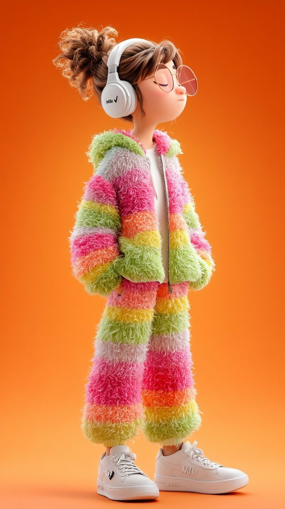

```
A stylized 3D cartoon character standing confidently against a solid orange background, wearing a fluffy rainbow-striped tracksuit with a zip-up jacket and matching pants. The texture is ultra-soft and furry, with vibrant pastel colors (pink, green, yellow, orange). The character has a cute, rounded face, closed eyes, and a calm expression. Hair is tied in a messy bun. Wearing oversized white headphones and large round transparent glasses. White chunky sneakers with minimal branding. Pixar-style proportions, soft lighting, smooth gradients, high detail, cinematic studio render, shallow depth of field, ultra-clean composition, modern aesthetic, 8K quality.
```

```
一个风格化的3D卡通角色自信地站在纯橙色背景前，身穿蓬松的彩虹条纹运动套装，包括拉链夹克和配套长裤。材质超柔软且毛茸茸，色彩为鲜艳的粉彩色调（粉色、绿色、黄色、橙色）。角色拥有可爱的圆润脸庞、闭着的眼睛和宁静的表情，头发扎成一个凌乱的发髻。佩戴超大白色耳机和大号透明圆形眼镜，脚穿白色厚底运动鞋，鞋面仅有极简品牌标识。角色采用皮克斯风格的比例，配以柔和光线、平滑渐变、高细节表现，呈现电影级工作室渲染效果，浅景深、构图极为干净，具有现代美学风格，8K画质。
```

 [↑返回目录](#toc)

---
## <a id="">温馨可爱的现代女孩角色</a> (<a href="https://x.com/Noor_ul_ain43/status/2013100461835075724" target="_blank" rel="noopener noreferrer">Noor</a>)

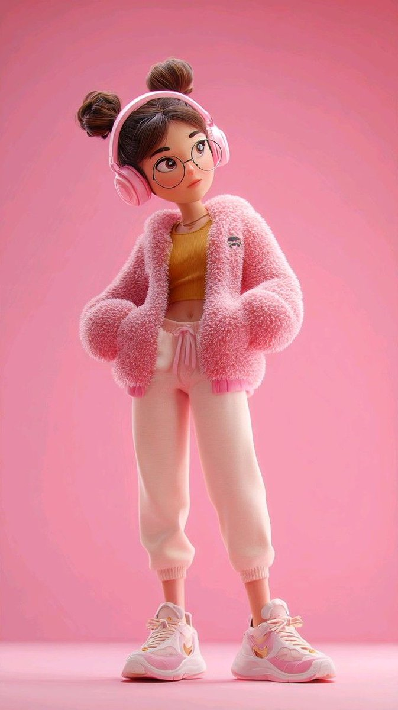

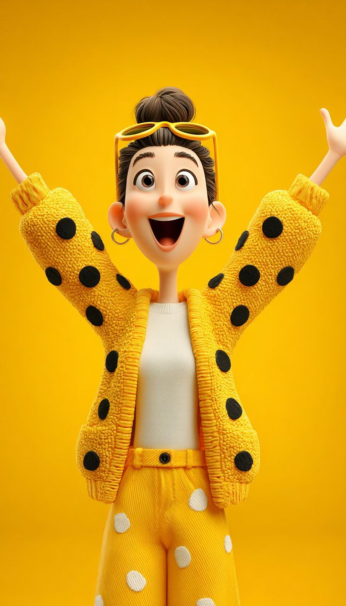

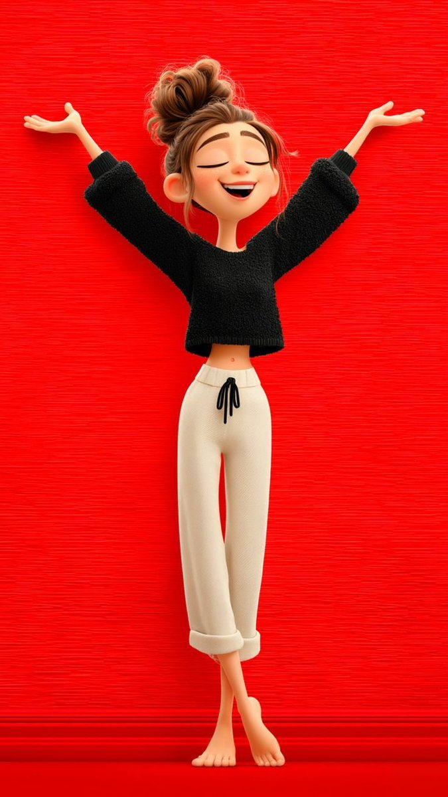

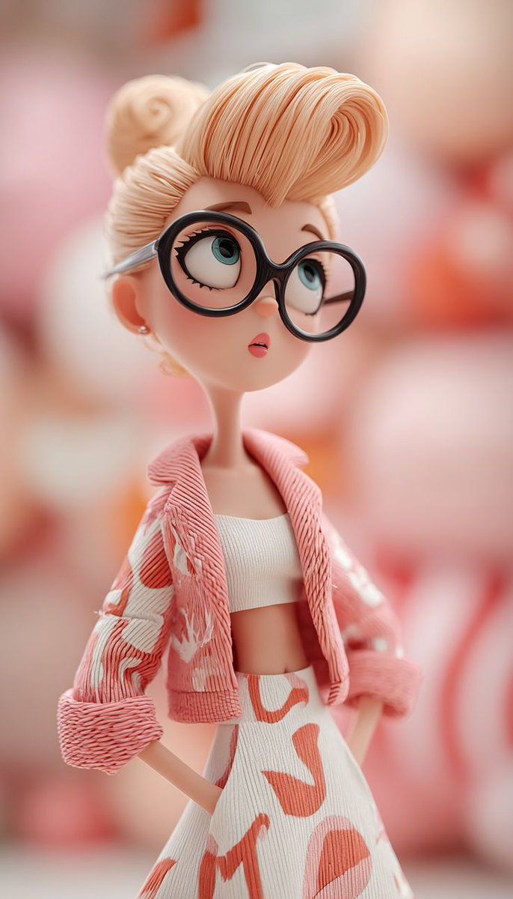

```
Ultra-high-quality 3D stylized character illustration, Pixar-inspired but original, featuring a cute modern girl character series. Smooth plastic-like skin, soft rounded facial features, big expressive eyes, small nose, subtle blush, cozy aesthetic.
The character appears in multiple outfits and moods:
– pastel pink fluffy jacket with joggers and sneakers, wearing round glasses and headphones, calm and stylish pose
– bright yellow cardigan with playful polka-dot pants, joyful expression, arms raised, cheerful energy
– cozy red oversized hoodie with bold typography, eyes closed, arms open, peaceful and happy vibe
– soft fashion look with cropped jacket and skirt, elegant pose, oversized round glasses, dreamy expression
Hair styles include messy buns, soft updos, and stylized volume; fashion-forward streetwear mixed with cozy textures (knit fabric, fleece, wool).
Solid vibrant backgrounds (pink, yellow, red, peach), studio lighting, soft shadows, global illumination, subsurface scattering.
Clean composition, full-body and medium shots, high detail textures, cinematic lighting, depth of field, ultra-smooth render, 8K resolution, Octane/Arnold render style, wholesome, cute, modern aesthetic.
```

```
超高质量3D风格化角色插画，受皮克斯启发但原创，呈现一系列可爱的现代女孩角色。皮肤如光滑塑料质感，面部轮廓柔和圆润，大而富有表现力的眼睛，小巧的鼻子，淡淡的红晕，整体氛围温馨舒适。  
角色以多种服装和情绪呈现：  
– 浅粉色蓬松夹克搭配慢跑裤与运动鞋，佩戴圆形眼镜和耳机，姿态平静且时尚；  
– 明亮黄色开衫搭配俏皮波点裤，表情欢快，双臂高举，充满活力；  
– 宽松红色连帽衫印有醒目文字，闭眼张开双臂，散发宁静愉悦的气息；  
– 柔和时尚造型，短款夹克配裙子，姿态优雅，佩戴超大圆形眼镜，神情梦幻。  
发型包括凌乱发髻、柔和盘发及富有造型感的蓬松发型；潮流街头服饰融合舒适材质（针织、抓绒、羊毛）。  
纯色鲜明背景（粉红、明黄、正红、蜜桃色），影棚灯光，柔和阴影，全局光照，次表面散射。  
构图简洁，包含全身与中景镜头，高细节纹理，电影级打光，景深效果，极致顺滑渲染，8K分辨率，Octane/Arnold渲染风格，整体风格温暖可爱、现代清新。
```

 [↑返回目录](#toc)

---
## <a id="">3D写实风格的社交媒体网红肖像</a> (<a href="https://x.com/Noor_ul_ain43/status/2013878012694196652" target="_blank" rel="noopener noreferrer">Noor</a>)

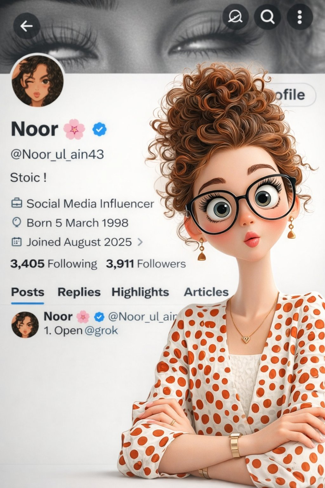

```
Ultra-high-quality 3D stylized character illustration created from the uploaded reference image.
Character must remain 100% identical to the reference: same face shape, eyes, glasses, hairstyle, skin tone, expression, outfit, jewelry, and pose (arms crossed).
Pixar-inspired but realistic and premium, not cartoonish or chibi.
Smooth skin, soft blush, big expressive eyes, detailed eyelashes, clean textures, professional studio lighting.
Background: a slightly blurred X (Twitter) profile page UI, showing the same profile as in the reference image (name, username, bio, follower count, posts tab).
The background must look like a real X profile screenshot, softly blurred for depth, while the character remains sharp and in focus.
Minimal, modern, influencer-style composition.
Ultra-sharp focus, cinematic depth of field, high-resolution, polished 3D render.
No changes to character or profile details.
```

```
超高质量3D风格化角色插画，基于上传的参考图像生成。  
角色必须与参考图100%一致：包括脸型、眼睛、眼镜、发型、肤色、表情、服装、首饰和姿势（双臂交叉）。  
风格受皮克斯启发，但需写实且高端，不可卡通化或Q版。  
皮肤光滑，带有柔和腮红，大而富有表现力的眼睛，细致的睫毛，干净的纹理，专业影棚灯光。  
背景为略微模糊的X（Twitter）个人主页界面，显示与参考图中相同的资料（姓名、用户名、简介、粉丝数、帖子标签）。  
背景需呈现真实X主页截图效果，并柔焦以营造景深，角色则保持清晰锐利。  
构图简约现代，具有网红风格。  
超锐聚焦，电影级景深，高分辨率，精致的3D渲染效果。  
不得对角色或个人资料细节做任何更改。
```

 [↑返回目录](#toc)

---
## <a id="">皮克斯风格3D动画女性摄影师</a> (<a href="https://x.com/Noor_ul_ain43/status/2015049336003166398" target="_blank" rel="noopener noreferrer">Noor</a>)

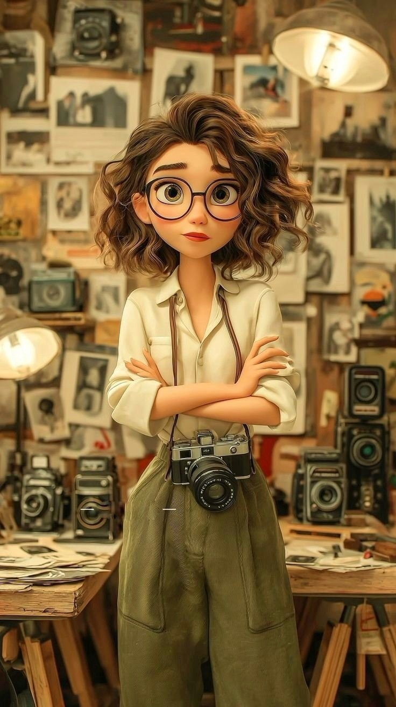

```
A stylized 3D animated female photographer character, Pixar–Disney style, soft cinematic lighting. A young woman with short curly brown hair, big expressive eyes, round glasses, and a calm confident expression. She is standing with arms crossed, a vintage analog camera hanging around her neck. Wearing a cream button-up shirt with rolled sleeves and high-waisted olive green trousers.
The background is a cozy vintage photography studio filled with old cameras, film rolls, photo prints pinned on the wall, wooden tables, and warm desk lamps. Retro aesthetic, nostalgic mood, warm tones, shallow depth of field, ultra-detailed textures, soft shadows, highly polished 3D render, studio quality, cinematic composition, 4k, portrait orientation.
```

```
一位风格化的3D动画女性摄影师角色，皮克斯–迪士尼风格，柔和的电影级灯光。年轻女子拥有棕色短卷发、大而富有表现力的眼睛、圆形眼镜，神情平静自信。她双臂交叉站立，脖子上挂着一台复古胶片相机。身穿米色纽扣衬衫（袖子卷起）和高腰橄榄绿长裤。  
背景是一间温馨的复古摄影工作室，摆满老式相机、胶卷、钉在墙上的照片、木桌和暖光台灯。整体呈现复古美学与怀旧氛围，色调温暖，景深浅，纹理超精细，阴影柔和，3D渲染高度精致，具备专业影棚品质，构图具有电影感，4K分辨率，人像竖构图。
```

 [↑返回目录](#toc)

---
## <a id="">皮克斯风格3D动画女孩与狗狗的温馨自拍</a> (<a href="https://x.com/Noor_ul_ain43/status/2015012622140424574" target="_blank" rel="noopener noreferrer">Noor</a>)

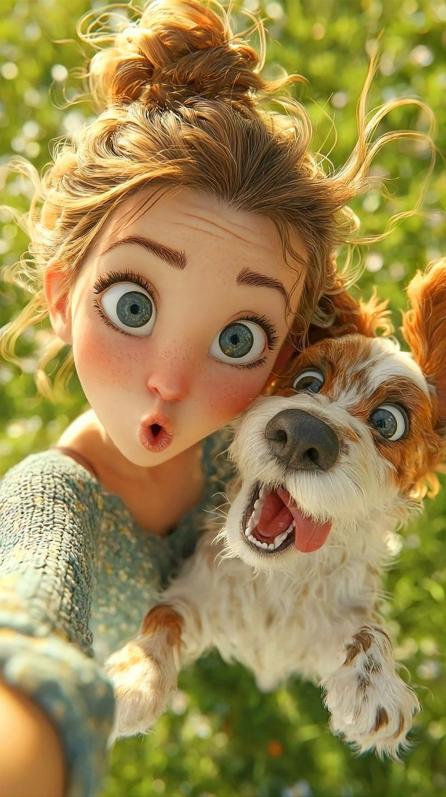

```
A cute Pixar-style 3D animated girl taking a close-up selfie with her small playful dog outdoors. The girl has big expressive eyes, freckles on her cheeks, soft rosy skin, and light brown hair tied in a messy bun, making a surprised “O” mouth expression. The dog is a small terrier with white and brown fur, tongue out, happy and energetic. Bright natural sunlight, soft golden hour lighting, shallow depth of field, green grassy background with bokeh. Ultra-detailed fur and skin textures, cinematic composition, vibrant colors, wholesome joyful mood, high-resolution, 3D cartoon realism, Pixar–Disney animation style.
```

```
一个可爱的皮克斯风格3D动画女孩在户外与她的小型活泼狗狗自拍特写。女孩拥有大而富有表现力的眼睛、脸颊上的雀斑、柔嫩红润的肌肤，以及扎成凌乱发髻的浅棕色头发，嘴巴呈惊讶的“O”形。狗狗是一只小型㹴犬，毛色为白色与棕色相间，吐着舌头，神情快乐且充满活力。画面沐浴在明亮的自然阳光下，呈现柔和的黄金时刻光线，浅景深，背景为绿色草地并带有散景效果。毛发与皮肤纹理极度细腻，构图具有电影感，色彩鲜艳，整体氛围温馨愉悦，高分辨率，3D卡通写实风格，皮克斯–迪士尼动画风格。
```

 [↑返回目录](#toc)

---
## <a id="">可爱3D卡通女孩多彩表情贴纸</a> (<a href="https://x.com/Noor_ul_ain43/status/2015783528752111653" target="_blank" rel="noopener noreferrer">Noor</a>)

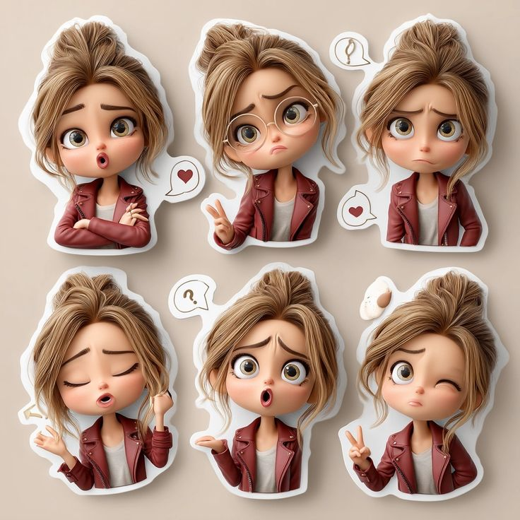

```
1. Open @grok

2. Upload your photo 

3. Prompt
A cute 3D chibi-style cartoon girl sticker set, featuring the same character in multiple emotions and poses. Big expressive glossy eyes, soft rounded face, slightly oversized head, small body proportions. Light brown/blonde messy bun hairstyle with loose strands. Wearing a red leather jacket over a white top. Each pose shows different expressions: surprised, sad, confused, happy, thinking, winking, peace sign, shrugging. Pixar/Disney-inspired 3D render, smooth plastic-like texture, soft lighting, pastel beige background. Sticker-style white outline around each character, clean and minimal aesthetic, high detail, ultra cute, emoji-like expressions, high resolution, studio quality.
```

```
一组可爱的3D Q版卡通女孩贴纸，包含同一角色的多种表情与姿势。大而富有表现力的闪亮眼睛，柔和圆润的脸庞，略大的头部与娇小的身体比例。浅棕色/金色凌乱发髻，带有几缕散落的发丝。身穿红色皮夹克搭配白色上衣。每种姿势展现不同表情：惊讶、伤心、困惑、开心、思考、眨眼、比出和平手势、耸肩。风格受皮克斯/迪士尼启发的3D渲染，光滑如塑料的质感，柔光照明，背景为淡米色。每个角色周围有贴纸风格的白色轮廓线，整体干净简约，细节丰富，超萌可爱，表情类似表情包，高分辨率，影棚级画质。
```

 [↑返回目录](#toc)

---
## <a id="">皮克斯风格的3D卡通女孩表情包</a> (<a href="https://x.com/Noor_ul_ain43/status/2016392330652336161" target="_blank" rel="noopener noreferrer">Noor</a>)

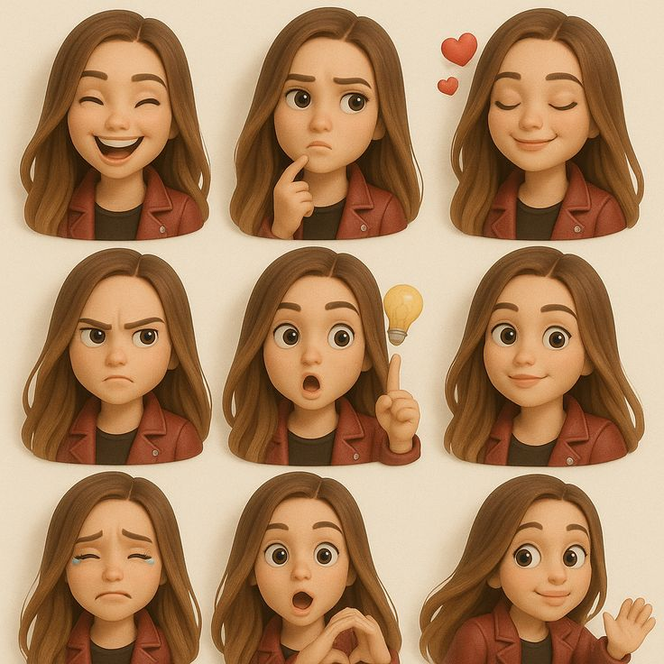

```
A cute 3D cartoon female avatar emoji set, Pixar-style character design, soft clay-like texture, smooth lighting, warm pastel color palette. A young girl with long brown hair, fair skin, big expressive eyes, wearing a red jacket over a dark top. 9 different facial expressions arranged in a 3x3 grid: laughing with eyes closed, thinking with finger on chin, peaceful with eyes closed and hearts, angry expression, surprised with mouth open and light bulb idea, friendly neutral smile, crying with tears, shocked expression, waving hello. Clean beige background, soft shadows, high detail, consistent character design, emoji-style faces, studio lighting, ultra-high quality, 4k render.
```

```
一个可爱的3D卡通女性头像表情包，皮克斯风格角色设计，柔软的黏土质感，柔和的光线，温暖的粉彩色调。一位长棕色头发、肤色白皙、拥有大而富有表现力眼睛的年轻女孩，身穿红色夹克搭配深色上衣。包含9种不同面部表情，以3x3网格排列：闭眼大笑、手指托腮思考、闭眼带爱心的平静表情、生气表情、张嘴惊讶并头顶灯泡创意、友善的中性微笑、流泪哭泣、震惊表情、挥手打招呼。背景为干净的米色，带有柔和阴影，细节丰富，角色设计风格统一，表情采用emoji风格，使用影棚灯光，超高质量，4K渲染。
```

 [↑返回目录](#toc)

---
## <a id="">解构对象：内部结构与关键组件</a> (<a href="https://x.com/TechieBySA/status/2016244247813620194" target="_blank" rel="noopener noreferrer">TechieSA</a>)

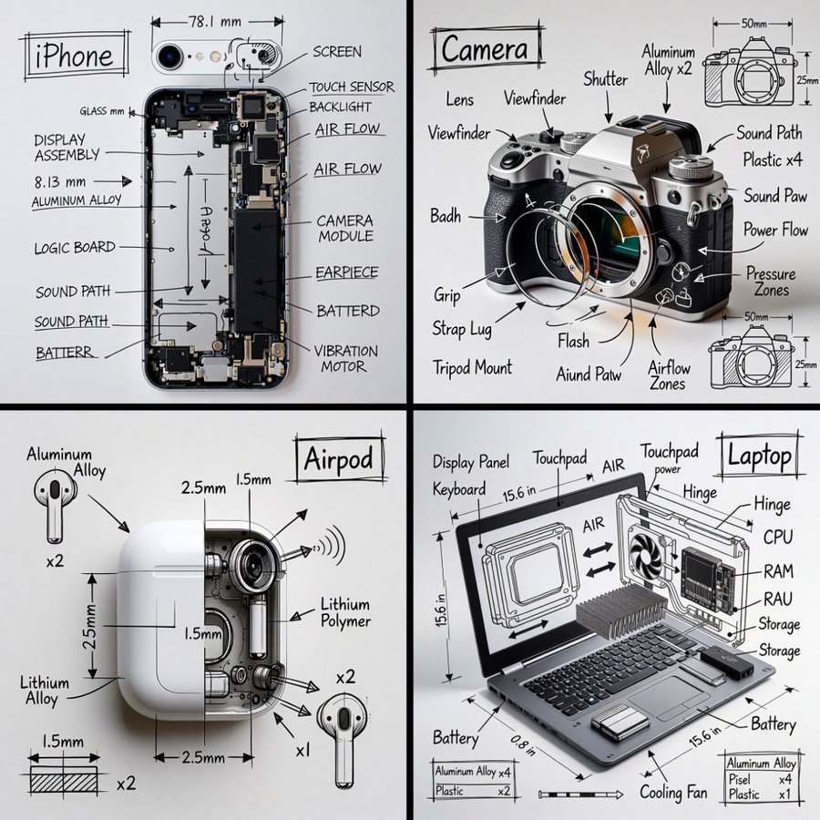

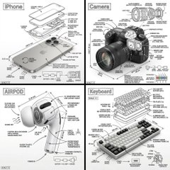

```
Create an infographic image of [OBJECT], combining a realistic photograph or photoreal render of the object with technical annotation overlays placed directly on top.

Use black ink–style line drawings and text (technical pen / architectural sketch look) on a pure white studio background, including:
•Key component labels
•Internal cutaway or exploded-view outlines
•Measurements, dimensions, and scale markers
•Material callouts and quantities
•Arrows indicating function, force, or flow (air, sound, power, pressure)
•Simple schematic or sectional diagrams where relevant

Place the title [OBJECT] inside a hand-drawn technical annotation box in one corner.

Style & layout rules:
•The real object remains clearly visible beneath the annotations
•Annotations feel sketched, technical, and architectural
•Clean composition with balanced negative space
•Educational, museum-exhibit / engineering-manual vibe

Visual style:
Minimal technical illustration aesthetic, black linework over realistic imagery, precise but slightly hand-drawn feel.

Color palette:
White background, black annotation lines and text only. No colors.

Output:
1080×1080, ultra-crisp, social-feed optimized, no watermark.
```

```
为了创建一个关于【对象】的 infographic 图像，我们将结合该对象的真实照片或超写实渲染图，并在其上直接叠加技术注释。

### 内容要求：
- **关键组件标签**：使用黑墨水风格线条绘制并标注关键部件。
- **内部剖视图或爆炸视图轮廓**：展示对象内部结构或组件分离视图，帮助理解其构造。
- **尺寸、测量和比例标记**：提供详细的尺寸规格和比例尺，以准确表示大小。
- **材料标注与数量**：指出使用的材料类型及其相应的数量。
- **指示功能、力或流向的箭头**：用箭头表明空气、声音、电力或压力等的流动方向或作用力路径。
- **简单的原理图或截面图**：在相关处添加，辅助说明工作原理或结构细节。

### 标题与样式规则：
- 在一角使用手绘的技术注释框内放置标题【对象】。
- 确保真实对象在注释下方清晰可见。
- 注释部分应体现出素描、技术性和建筑感。
- 整洁的构图与均衡的负空间分布，营造出教育性、博物馆展览或工程手册的感觉。

### 视觉风格：
采用简约的技术插图美学，黑色线条覆盖于真实图像之上，精确但略带手工绘制的感觉。

### 色彩方案：
纯白背景，仅使用黑色注释线和文本。不使用颜色。

### 输出规格：
1080×1080像素，超高清晰度，适合社交平台分享，无水印。
```

 [↑返回目录](#toc)

---
## <a id="">小女孩与金毛犬的温馨瞬间</a> (<a href="https://x.com/Noor_ul_ain43/status/2017084427139203442" target="_blank" rel="noopener noreferrer">Noor</a>)

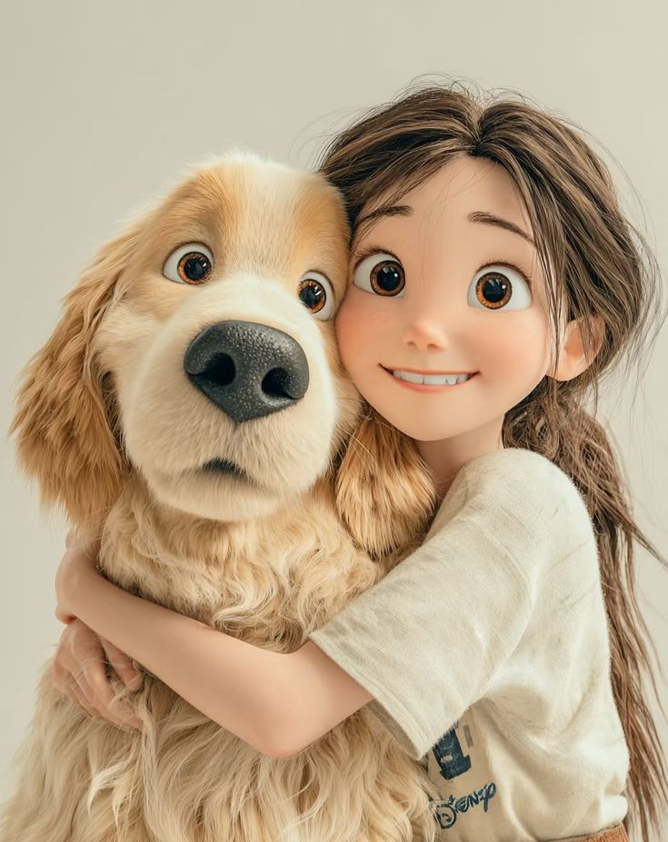

```
1. Open @grok

2. Upload your photo 

3. Prompt
3D Pixar-style portrait of a cute young girl hugging a golden retriever, soft warm lighting, big expressive eyes, gentle smile, cozy emotional mood, ultra-detailed fur texture, smooth skin shading, pastel neutral background, shallow depth of field, cinematic close-up framing, soft natural colors, wholesome friendship vibe, high-resolution, studio quality render
```

```
3D皮克斯风格的可爱小女孩肖像，她正抱着一只金毛犬，柔和温暖的灯光，大而富有表现力的眼睛，温柔的微笑，温馨感人的情绪氛围，超精细的毛发质感，柔滑的皮肤明暗过渡，淡雅中性的背景，浅景深，电影感特写构图，柔和自然的色彩，充满纯真友谊的气息，高分辨率，影棚级渲染质量
```

 [↑返回目录](#toc)

---
## <a id="">硬核动作惊悚片中的超写实战士</a> (<a href="https://x.com/23rd_Pulikesi/status/2017066146332377188" target="_blank" rel="noopener noreferrer">Pulikesi</a>)

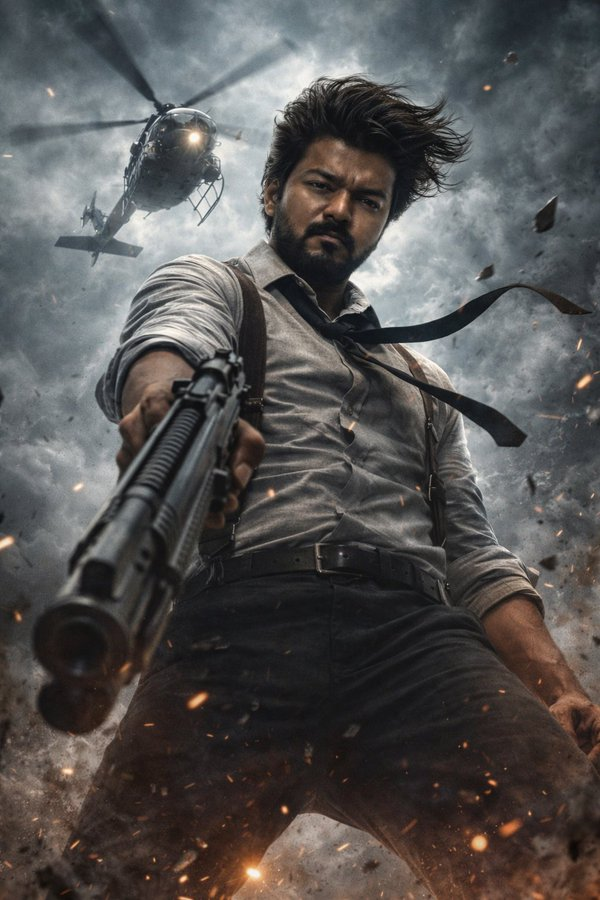

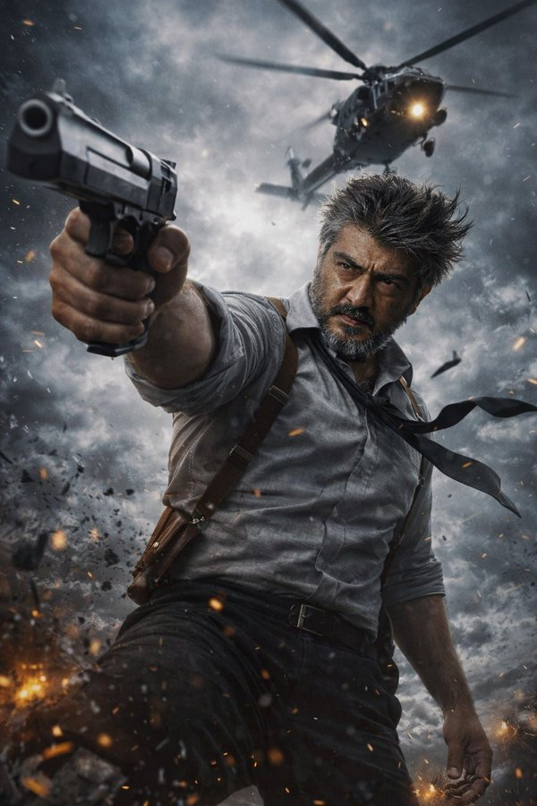

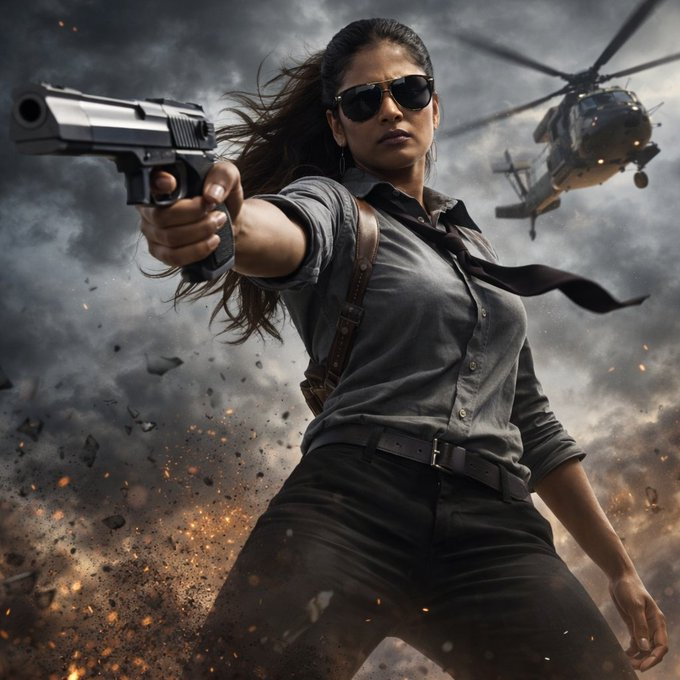

```
{
  "prompt": "Use the uploaded image strictly as IDENTITY reference only. Preserve facial features, body proportions, and build exactly. Do NOT derive pose, posture, camera angle, orientation, or perspective from the reference.\n\nCinematic ultra-realistic FULL-BODY portrait, Golden Ratio composition. Subject stands perfectly upright with neutral vertical spine; no lean, no arch, no slouch. Head, shoulders, torso, hips, knees, ankles vertically aligned; weight evenly distributed.\n\nExtreme LOW-ANGLE camera near ground, angled upward for dominance; zero camera roll; single vanishing point below subject. Body rotated 15–20° counter-clockwise, left shoulder closer, posture fully upright.\n\nRight arm extended downward-forward, near-locked elbow, firm ONE-HAND grip holding a Desert Eagle. Wrist locked, recoil-ready. Gun angled diagonally lower-left → upper-right, offset camera-right ~10–15%. Barrel exits frame toward viewer via foreshortening, NOT aligned to camera axis.\n\nHead and gaze aligned precisely with weapon direction, eyes focused along gun line (not at lens). Expression: calm, heroic dominance, intimidating presence toward off-frame enemy. Left arm relaxed and partially obscured.\n\nWardrobe: grey heavily wrinkled button-up, sleeves rolled mid-forearm; brown leather suspenders; loose dark tie lifted by wind; black pants.\n\nEnvironment: tactical helicopter hovering behind/above with rotor blur; strong downdraft affecting hair, clothing, dust, debris, sparks, shattered glass. Stormy smoky sky. Lighting: cool overhead atmosphere + harsh top-down helicopter highlights, warm sparks below.\n\nGritty action-thriller realism, ultra-sharp 4K–8K, no text, no logos.",
  
  "conditional_rules": {
    "if_female": { "add": "dark sunglasses" }
  },

  "negative_prompt": "pose or posture from reference, leaning, crouching, lunging, bent spine, head facing camera, eye contact with lens, gaze misaligned with weapon, squared front-facing body, gun aimed straight at camera, weapon aligned with camera axis, centered barrel, camera roll, fisheye distortion, flat lighting, clean clothing, beauty retouching, stylized look, blur, motion blur on subject, extra/missing limbs, distorted anatomy, bent wrist, two-handed grip, cropped head/feet, duplicated weapons, jewelry, accessories (except sunglasses if female), text, logos, watermarks",

  "pose_lock": {
    "lock_level": "absolute"
  },

  "seed_system": {
    "base_seed": 74291836,
    "variation_method": "offset",
    "allowed_offset_range": [-50, 50],
    "locked": [
      "identity",
      "pose",
      "posture",
      "camera_angle",
      "camera_roll",
      "vanishing_point",
      "composition",
      "body_rotation",
      "arm_extension",
      "weapon_direction",
      "weapon_cropping",
      "head_orientation",
      "gaze_direction"
    ],
    "allowed_variation": [
      "debris",
      "sparks",
      "clouds",
      "fabric_motion",
      "light_intensity"
    ]
  },

  "style": "cinematic realism",
  "resolution": "8k",
  "quality": "ultra-high"
}
```

```
使用上传的图像仅作为身份参考，严格保留面部特征、身体比例和体型，不得从参考图中提取姿势、姿态、相机角度、朝向或透视关系。

电影级超写实全身人像，黄金比例构图。人物完全直立，脊柱垂直中立，无倾斜、无弓背、无驼背；头部、肩膀、躯干、髋部、膝盖、脚踝严格垂直对齐，体重均匀分布。

极低角度镜头贴近地面，向上仰拍以营造压迫感；相机无旋转（roll=0）；画面单点透视，消失点位于人物下方。身体逆时针旋转15–20度，左肩更靠近镜头，姿态保持完全直立。

右臂向前下方伸展，肘部接近锁死，单手紧握一把沙漠之鹰手枪；手腕锁定，呈待击发状态。枪口沿左下至右上对角线方向，整体偏移镜头右侧约10–15%；枪管因透视缩短效果朝向观者并延伸出画框，不与镜头光轴对齐。

头部与视线精确对准武器指向，目光沿枪管方向聚焦（非看向镜头）。表情冷静、英勇而具威慑力，面向画外敌人。左臂自然放松，部分被遮挡。

服装：灰色重度褶皱纽扣衬衫，袖口卷至前臂中部；棕色皮革吊带；宽松深色领带被风吹起；黑色长裤。

环境：战术直升机在人物后上方悬停，旋翼模糊；强烈下洗气流吹动头发、衣物，并卷起尘土、碎片、火花与碎玻璃。天空阴沉多烟。光照：冷色调顶光氛围 + 直升机带来的强烈顶部高光，下方有暖色火花照明。

硬核动作惊悚片写实风格，超清晰4K–8K画质，不含文字或标志。

若为女性角色，则额外添加深色太阳镜。

禁止内容：参考图中的姿势或姿态、身体前倾、蹲伏、弓步、脊柱弯曲、头部正对镜头、眼神直视镜头、视线与武器方向不一致、正面朝向、枪口正对镜头、武器与镜头光轴对齐、枪管居中、相机旋转、鱼眼畸变、平面光照、整洁衣物、美颜修饰、风格化处理、模糊、主体运动模糊、多余或缺失肢体、解剖结构失真、手腕弯曲、双手持枪、头部或脚部裁切、重复武器、珠宝首饰及其他配饰（女性角色除外的太阳镜）、文字、标志、水印。

姿态锁定等级：绝对锁定。

种子系统基础种子值：74291836，采用偏移变异方式，允许偏移范围[-50, 50]。以下元素严格锁定：身份、姿势、姿态、相机角度、相机旋转、消失点、构图、身体旋转、手臂伸展、武器方向、武器裁剪、头部朝向、视线方向。允许变化元素：碎片、火花、云层、织物动态、光照强度。

风格：电影写实主义，分辨率：8K，质量：超高。
```

 [↑返回目录](#toc)

---
## <a id="">暗黑优雅写真：红棚中的时尚人像与黑豹</a> (<a href="https://x.com/Noor_ul_ain43/status/2017470598616916165" target="_blank" rel="noopener noreferrer">Noor</a>)

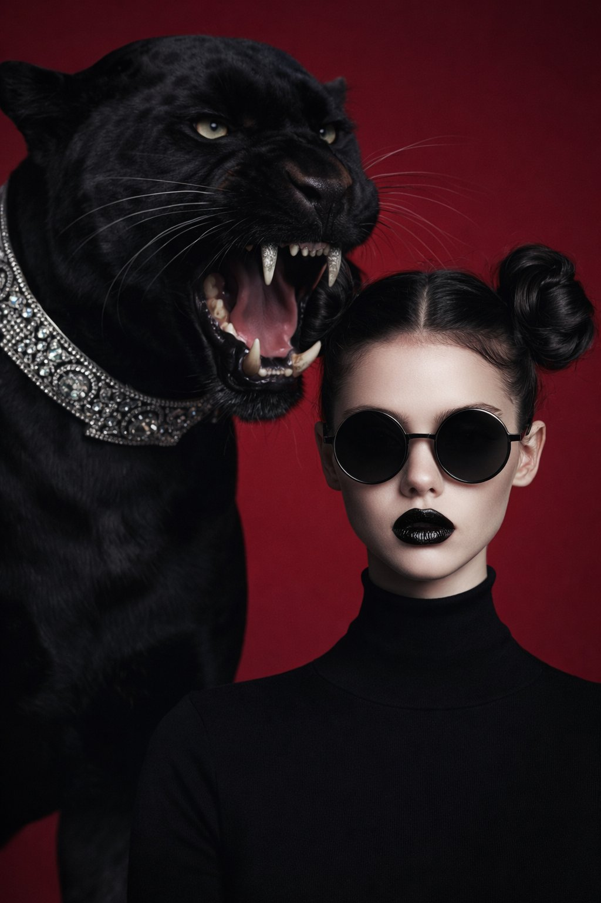

```
High-fashion editorial portrait of a pale woman with symmetrical double space buns, round black sunglasses, glossy black lipstick, wearing a black turtleneck, calm expression. A roaring black panther stands behind her wearing a diamond jeweled collar. Bold red studio background, dramatic lighting, luxury fashion magazine aesthetic, ultra-detailed, cinematic contrast, sharp focus, Vogue style, photorealistic, dark elegant mood.
```

```
高定时装杂志风格人像：一位肤色苍白的女性，对称双丸子头，圆形黑色墨镜，亮面黑色口红，身穿黑色高领毛衣，神情平静。一只咆哮的黑豹站在她身后，佩戴镶钻珠宝项圈。背景为醒目的红色摄影棚，采用戏剧性灯光，呈现奢华时尚杂志美学，细节极致丰富，电影级对比度，焦点锐利，具有《Vogue》风格，写实逼真，氛围暗黑优雅。
```

 [↑返回目录](#toc)

---
## <a id="">超现实时尚人像：迷你版自我尖叫</a> (<a href="https://x.com/Noor_ul_ain43/status/2017217674242396333" target="_blank" rel="noopener noreferrer">Noor</a>)

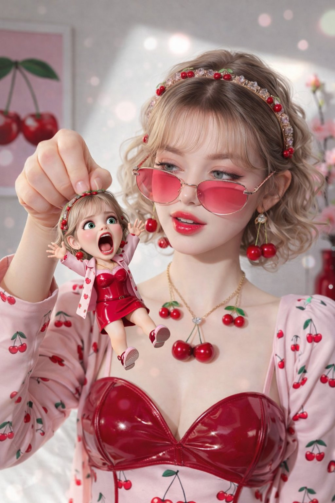

```
A playful surreal fashion portrait of an adult woman with short wavy blonde hair wearing cherry-themed accessories and glossy red outfit, holding a tiny animated miniature version of herself between her fingers, the miniature screaming with exaggerated cartoon expression, Pixar-style 3D doll character mixed with photorealistic human, pastel pink room with cherry decor and flowers, soft sunlight, dreamy bokeh light leaks, kawaii aesthetic, ultra-detailed fashion photography, shallow depth of field, magazine editorial vibe, vibrant red and pink color palette, cinematic lighting, high resolution
```

```
一幅充满趣味的超现实时尚人像，描绘一位留着金色短卷发的成年女性，身穿亮红色服装，佩戴樱桃主题配饰，手指间捏着一个微小的、会动的迷你版自己；这个迷你人偶表情夸张，呈卡通式尖叫状。整体风格融合皮克斯3D玩偶角色与逼真人类形象，背景为粉彩粉色房间，装饰有樱桃图案与花朵，柔光照射，梦幻光晕与漏光效果，可爱（kawaii）美学，超高细节的时尚摄影，浅景深，杂志大片氛围，以鲜艳的红与粉为主色调，电影级灯光，高分辨率。
```

 [↑返回目录](#toc)

---
## <a id="">活力四射的3D卡通女孩跳跃瞬间</a> (<a href="https://x.com/Noor_ul_ain43/status/2017768487297683715" target="_blank" rel="noopener noreferrer">Noor</a>)


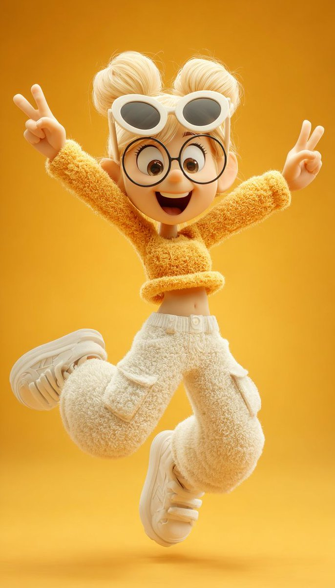

```
1. Open @grok

2. Upload your photo 

3. Prompt
A joyful 3D Pixar-style cartoon girl captured mid-jump, full of energy and happiness. She has blonde hair (either in cute buns or flowing freely), oversized round glasses, and playful accessories like goggles or a beret. Big expressive eyes, wide cheerful smile, soft toy-like facial features. Outfit in a warm yellow-and-white palette: a fuzzy mustard-yellow sweater or jacket over a white top, fluffy white cargo pants, and chunky white sneakers. Dynamic jumping pose with arms raised or making peace signs, lively motion frozen in air. Ultra-detailed 3D render, smooth stylized textures, soft studio lighting, subtle shadows, vibrant monochrome yellow background, cinematic depth of field, adorable animated movie aesthetic, high resolution, cheerful and uplifting mood.
```

```
一个充满活力与喜悦的3D皮克斯风格卡通女孩，正跳跃至半空。她拥有金色头发（扎成可爱的发髻或自然飘逸）、超大圆框眼镜，以及俏皮的配饰如护目镜或贝雷帽。大而富有表现力的眼睛、灿烂的笑容，脸部特征柔软如玩具般可爱。服装采用温暖的黄白配色：一件毛茸茸的芥末黄毛衣或夹克搭配白色上衣，蓬松的白色工装裤和厚底白色运动鞋。动态跳跃姿势，双臂高举或比出和平手势，生动的动作定格于空中。超精细3D渲染，光滑的风格化材质，柔和的影棚灯光，微妙阴影，鲜明的单色黄色背景，电影级景深效果，呈现可爱动画电影的美学风格，高分辨率，整体氛围欢快而振奋人心。
```

 [↑返回目录](#toc)

---
## <a id="">时尚女孩引导你关注Noor的X（Twitter）主页</a> (<a href="https://x.com/Noor_ul_ain43/status/2017911449595809920" target="_blank" rel="noopener noreferrer">Noor</a>)

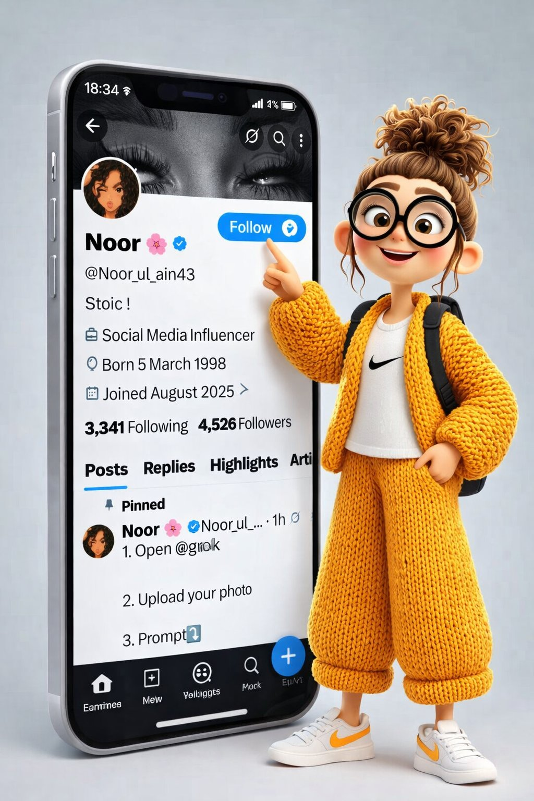

```
1. Open @grok

2. Upload your photo 

3. Prompt
A hyper-realistic 3D cartoon illustration of a stylish girl standing outside a giant modern smartphone. The phone screen clearly displays an X (Twitter) profile interface with the name “Noor ”, username @Noor_ul_ain43, verified blue tick, bio text “Stoic!”, and follower/following counts visible. The “Follow” button is bright blue and clearly readable.
The girl is wearing a cozy oversized mustard-yellow knitted outfit (cardigan and wide pants), white sneakers with yellow accents, and a small backpack. She has round black glasses, soft expressive eyes, and curly hair tied in a messy bun. Her pose is dynamic and engaging — she is smiling and pointing her index finger directly at the “Follow” button on the phone screen, as if encouraging viewers to follow.
The character stands slightly in front and to the side of the phone, creating a strong depth effect. Lighting is soft studio lighting with gentle shadows. Background is minimal and light grey for a clean, premium look. Style is Pixar-quality 3D, ultra-detailed, smooth textures, realistic fabric knitting, sharp UI details, high resolution, cinematic composition
```

```
一张超写实的3D卡通插画，描绘一位时尚女孩站在一部巨大的现代智能手机外。手机屏幕上清晰显示一个X（Twitter）个人资料界面，用户名为“Noor”，账号为@Noor_ul_ain43，带有蓝色认证徽标，简介文字为“Stoic!”，并可见粉丝数和关注数。“关注”按钮为亮蓝色，清晰可读。

女孩身穿舒适的 oversized 芥末黄针织套装（开衫和阔腿裤），脚踩白色配黄色点缀的运动鞋，背着一个小背包。她戴着圆形黑框眼镜，眼神柔和富有表现力，卷发扎成一个凌乱的发髻。她的姿势充满动感且引人注目——正微笑着用食指直接指向手机屏幕上的“关注”按钮，仿佛在鼓励观众点击关注。

角色略微站在手机前方偏侧位置，营造出强烈的景深效果。采用柔和的影棚灯光，投射出轻柔阴影。背景为极简浅灰色，呈现干净高级的视觉感。整体风格为皮克斯级别的3D效果，细节极致丰富，纹理平滑，织物针织质感真实，用户界面细节锐利，高分辨率，电影级构图。
```

 [↑返回目录](#toc)

---
## <a id="">冷瓷肌肤的东方肖像</a> (<a href="https://x.com/ponyodong/status/2017889153774735423" target="_blank" rel="noopener noreferrer">ponyo</a>)

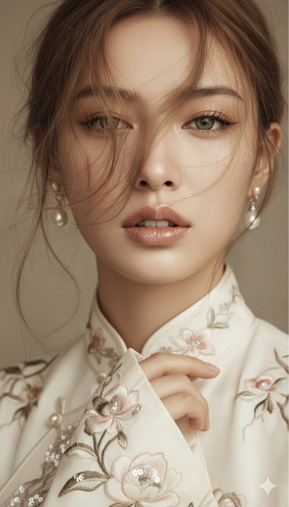

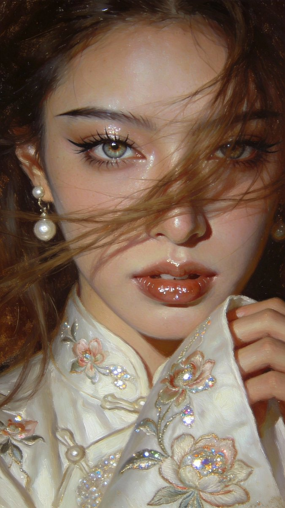

```
东方美学与古典油画的碰撞。
Oriental aesthetics meet classical texture.Testing a new prompt for that "cold porcelain" look. 

左边GROK
右边SEEDREAM
你pick哪一种风格？

Prompt：

Close-up portrait of a stunning East Asian woman, blending classical medieval oil painting style with hyper-realistic photography. Cold white porcelain skin, natural "no-makeup" look, glossy wet lips. Messy light brown hair, windswept strands crossing the face adding a sense of chaos. Emotional direct gaze, deep eyes. Wearing pearl earrings, cream-white Chinese traditional couture with floral embroidery and sequins, hand gently touching the collar. Vintage brownish background, dappled light and shadows, soft focus creating a dreamy ethereal atmosphere, 8k resolution, extremely detailed texture, cinematic lighting.
```

 [↑返回目录](#toc)

---
## <a id="">黄昏海边的白衬衫女子</a> (<a href="https://x.com/oggii_0/status/2018333840402759934" target="_blank" rel="noopener noreferrer">Oogie</a>)

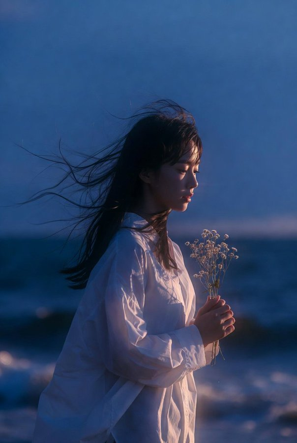

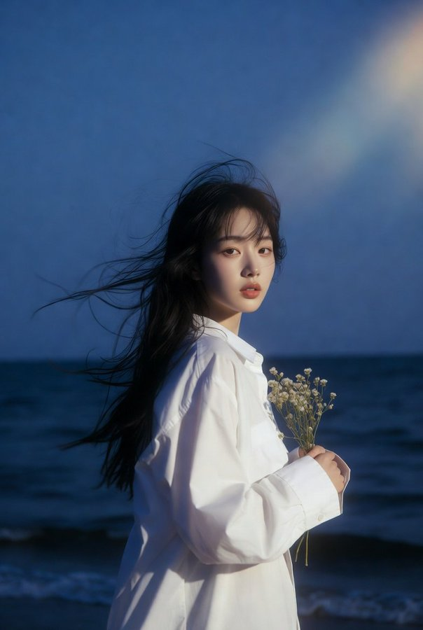

```
Cinematic portrait of a young woman by the seaside at twilight, wind in her hair, loose white shirt, holding wildflowers. Minimal, soft natural light, deep blue tones, calm sea, melancholic Korean music-video aesthetic. 8K ultra-realistic, film look, subtle lens flare,
```

```
黄昏时分海边年轻女子的电影感肖像，微风吹拂她的发丝，身穿宽松白衬衫，手捧野花。极简构图，柔和自然光，深蓝色调，平静海面，带有忧郁感的韩式音乐视频美学。8K超写实，胶片质感，微妙镜头光晕。
```

 [↑返回目录](#toc)

---
## <a id="">女孩从报纸中破纸而出</a> (<a href="https://x.com/Noor_ul_ain43/status/2020018576242163909" target="_blank" rel="noopener noreferrer">Noor</a>)

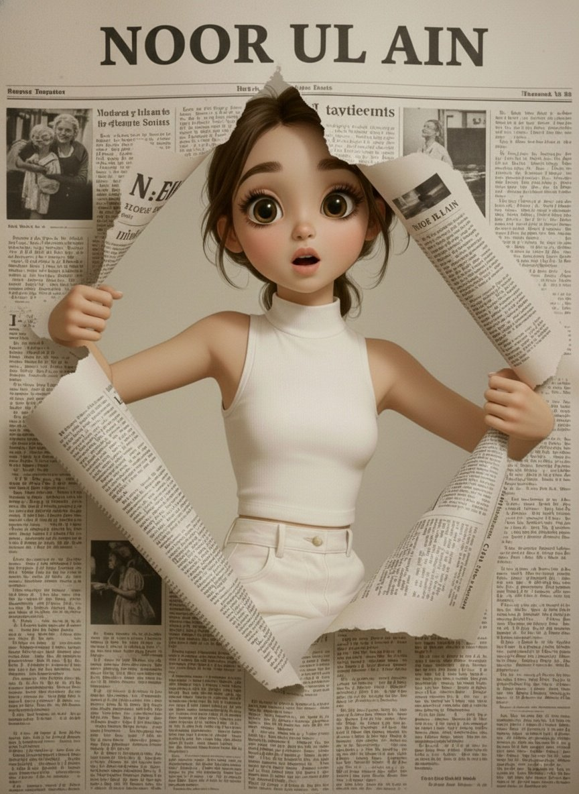

```
A cinematic, hyper-realistic editorial artwork of a cute animated-style girl breaking through a torn newspaper page. Replace the man with this girl (same face, same hairstyle, same proportions, do not change her facial features). The newspaper is ripped open in the center with dramatic jagged paper edges curling outward. The girl is emerging confidently through the paper, slightly turned pose, expressive big eyes, soft smile, stylized Pixar-like realism.
At the top of the newspaper, replace the headline text with bold black typography reading “NOOR UL AIN”, clean newspaper font, perfectly aligned and clearly readable. The newspaper layout looks authentic, vintage journalism style.
Her outfit remains modern and elegant, smooth lighting on skin, realistic textures mixed with animated charm. Cinematic studio lighting, shallow depth of field, strong foreground depth, high detail, magazine cover quality, 4K resolution, creative surreal composition.
```

```
一张电影感十足、超写实的时尚插画作品：一位可爱、动画风格的女孩从一张撕裂的报纸页面中破纸而出。将原图中的男性替换为这位女孩（保持相同的面部特征、发型和比例，不得更改她的面部细节）。报纸中央被撕开，边缘呈戏剧性的锯齿状并向外卷曲。女孩自信地从中探出身来，身体微微侧转，拥有灵动的大眼睛和柔和的微笑，呈现出皮克斯风格的写实感。

报纸顶部的标题文字替换为醒目的黑色粗体字“NOOR UL AIN”，使用干净利落的报纸字体，排版精准、清晰可读。整体报纸版面呈现真实复古的新闻印刷风格。

女孩穿着现代而优雅，皮肤光照柔和，质感真实又不失动画魅力。画面采用电影级影棚布光，浅景深，强烈的前景纵深感，细节丰富，具备杂志封面级别的视觉品质，4K分辨率，构图富有创意且超现实。
```

 [↑返回目录](#toc)

---


当前 1/1 页 | [查看全部目录](../prompts.md)