# midjourney.json 

midjourney.json文件存放midjourney相关的提示词，当前已收录：130个 

 投稿方式：[飞书投稿](https://tcn1uh5rxo87.feishu.cn/share/base/form/shrcne5gDolOMDd0oJsj2XfvxQc) or [issues](https://github.com/junxiaopang/gridsplitter/issues/new)

[上一页](./1.md) | 当前 2/2 页 | [查看全部目录](../prompts.md)

🚀 **在线预览**: [https://prompts.kkkm.cn](https://prompts.kkkm.cn)

## <a id="toc">目录</a>


## <a id="">云上骑行的卡通小孩</a> (<a href="https://x.com/azed_ai/status/2016103411801063472" target="_blank" rel="noopener noreferrer">Amira Zairi</a>)


```
A 3D cartoon-style render of a [subject], with a soft matte translucent body in [color1] and glowing [color2] accents. Features include oversized head, exaggerated facial features, and fun accessories. Subtle internal glow and ambient lighting, centered on a dark gradient background. Stylized in a playful and imaginative atmosphere.
```

```
A 3D cartoon-style render of a cloud-rider child, with a soft matte translucent body in lavender and glowing sunset orange accents. Features include oversized head, exaggerated facial features, and fun accessories. Subtle internal glow and ambient lighting, centered on a dark gradient background. Stylized in a playful and imaginative atmosphere. --ar 3:2 --v 7
```

```
A 3D cartoon-style render of a tiny cloud ninja, with a soft matte translucent body in mist white and glowing deep indigo accents. Features include oversized head, exaggerated facial features, and fun accessories. Subtle internal glow and ambient lighting, centered on a dark gradient background. Stylized in a playful and imaginative atmosphere. --ar 3:2 --v 7
```

```
A 3D cartoon-style render of a dream-bot companion, with a soft matte translucent body in blush pink and glowing holographic silver accents. Features include oversized head, exaggerated facial features, and fun accessories. Subtle internal glow and ambient lighting, centered on a dark gradient background. Stylized in a playful and imaginative atmosphere. --ar 3:2 --v 7
```

```
A 3D cartoon-style render of a forest sprout kid, with a soft matte translucent body in leaf green and glowing amber accents. Features include oversized head, exaggerated facial features, and fun accessories. Subtle internal glow and ambient lighting, centered on a dark gradient background. Stylized in a playful and imaginative atmosphere. --ar 3:2 --v 7
```

 [↑返回目录](#toc)

---
## <a id="">墨绿流能中的坚毅丹凤</a> (<a href="https://x.com/ponyodong/status/2017484581016928521" target="_blank" rel="noopener noreferrer">ponyo</a>)


```
这就是我梦里的国风3D！ 
终于把这种“青蛇劫起”般的电影级质感用 Niji 6 完美复刻了。
那个墨绿色的流体背景和皮肤的通透感简直绝了……为了还原这个神仙画风，我大概跑了50张图调参。
今天把压箱底的 Prompt 和风格思路毫无保留地分享给大家！

 风格拆解 (The Vibe Check):
这种风格的核心不是 2D，而是极致的 3D渲染感 (C4D/Octane) 加上 东方奇幻美学。

关键要素：
主体： 坚毅的丹凤眼 (Sharp phoenix eyes) + 极简汉服。

环境： 墨绿色的流动能量 (Swirling dark green liquid/energy)，要有丝绸般的顺滑感。

光影（重中之重）： 必须要有电影光感 (Cinematic lighting) 和让皮肤像玉一样的次表面散射 (Subsurface scattering)。

 一键出图咒语 (复制即用)：

/imagine prompt: A stunning 3D Chinese animation style close-up of a beautiful heroine, determined sharp phoenix eyes, black hair in traditional bun, white minimalist Hanfu, surrounded by swirling dark green fluid energy ribbons, cinematic lighting, subsurface scattering, elegant, high octane render, 8k resolution, masterpiece --ar 9:16 --niji 6 --s 250
```

 [↑返回目录](#toc)

---
## <a id="">街头饮品广告的电影级人像</a> (<a href="https://x.com/ecommartinez/status/2017311074551533921" target="_blank" rel="noopener noreferrer">Alejo</a>)


```
Professional photo, a guy, a 30-year-old Russian model (reference image), is facing the lens, tilted towards the camera, angle from below, shot with a wide-angle lens. The guy is tilted and shows a bottle close-up to the camera, a hand with a bottle close-up right in front of the lens. The label and direction of the bottle are straight so the label is readable. He's wearing white sneakers, one foot in front of the camera. The guy is standing on the street, wet asphalt and splashes from below. Bright colors, cinematic lighting, the light is behind and on the model’s face. --v7 --ar 3:4 --style raw
```

```
专业摄影，一位30岁的俄罗斯男模（参考图像），正对镜头，身体略微朝向相机倾斜，采用低角度仰拍，使用广角镜头拍摄。男子身体倾斜，将一瓶饮品贴近镜头特写展示，一只手握着瓶子，瓶身正对镜头，标签清晰可读。他穿着白色运动鞋，一只脚伸到镜头前方。男子站在街头，地面是湿漉漉的沥青，下方有水花飞溅。画面色彩鲜明，采用电影感灯光，光源位于模特后方并照亮其面部。--v7 --ar 3:4 --style raw
```

 [↑返回目录](#toc)

---
## <a id="">Midjourney黑金风格</a> (<a href="https://x.com/craftian_keskin/status/2019034889165951208" target="_blank" rel="noopener noreferrer">Keskin</a>)


```
A classy Midjourney Style with Golden and Black

-sref 2910482926
```

```
一种优雅的 Midjourney 风格，以金色和黑色为主  
-sref 2910482926
```

 [↑返回目录](#toc)

---
## <a id="">midjourney寂静风格</a> (<a href="https://x.com/egeberkina/status/2018399459634520417" target="_blank" rel="noopener noreferrer">Ege</a>)


```
Feels oddly calm

--sref 2224065556
```

 [↑返回目录](#toc)

---
## <a id="">Midjourney玫瑰金风格示例</a> (<a href="https://x.com/azed_ai/status/2019319853778440650" target="_blank" rel="noopener noreferrer">Amira Zairi</a>)


```
Newly created style on Midjourney

--sref 6055153646
```

```
Midjourney 上新创建的风格

--sref 6055153646
```

 [↑返回目录](#toc)

---
## <a id="">雾中舞者：光与影的芭蕾</a> (<a href="https://x.com/azed_ai/status/2019366158651257080" target="_blank" rel="noopener noreferrer">Amira Zairi</a>)


```
share: Volumetric light rays,

Prompt:
A cinematic rendering of the [subject] shrouded in volumetric light rays, with dense fog breaking the scene into atmospheric layers. Warm backlights and glowing particles enhance the mood and mystery.

Check ATLs for inspiration
```

```
A cinematic rendering of a ballerina mid-pose shrouded in volumetric light rays, with dense fog breaking the scene into atmospheric layers. Warm backlights and glowing particles enhance the mood and mystery. --ar 3:2 --v 7
```

```
A cinematic rendering of a medieval knight in armor shrouded in volumetric light rays, with dense fog breaking the scene into atmospheric layers. Warm backlights and glowing particles enhance the mood and mystery. --ar 3:2 --v 7
```

```
A cinematic rendering of a broken statue in a garden shrouded in volumetric light rays, with dense fog breaking the scene into atmospheric layers. Warm backlights and glowing particles enhance the mood and mystery. --ar 3:2 --v 7
```

```
A cinematic rendering of a fox standing in a misty field shrouded in volumetric light rays, with dense fog breaking the scene into atmospheric layers. Warm backlights and glowing particles enhance the mood and mystery. --ar 3:2 --v 7
```

 [↑返回目录](#toc)

---
## <a id="">雾中维多利亚街的幽影孩童</a> (<a href="https://x.com/LudovicCreator/status/2019305081468842249" target="_blank" rel="noopener noreferrer">LudovicCreator</a>)


```
GASLIT SPECTRAL 

Base prompt :

[SUBJECT] rendered as a Gaslit Spectral Silhouette, a mysterious figure shrouded in the fog of a Victorian London street. Use a palette of deep [COLOR1] and [COLOR2] to emphasize the ethereal and haunting nature of the scene, with the soft glow of gas lamps casting long shadows

Check ALTS
```

```
A lost child rendered as a Gaslit Spectral Silhouette, a mysterious figure shrouded in the fog of a Victorian London street. Use a palette of deep crimsons and golds to emphasize the ethereal and haunting nature of the scene, with the soft glow of gas lamps casting long shadows --ar 3:2 --v 7.0 
```

```
A decaying scarecrow rendered as a Gaslit Spectral Silhouette, a mysterious figure shrouded in the fog of a Victorian London street. Use a palette of deep violet and blood red to emphasize the ethereal and haunting nature of the scene, with the soft glow of gas lamps casting long shadows --ar 3:2 --v 7.0
```

```
A forgotten street musician rendered as a Gaslit Spectral Silhouette, a mysterious figure shrouded in the fog of a Victorian London street. Use a palette of deep browns and greys to emphasize the ethereal and haunting nature of the scene, with the soft glow of gas lamps casting long shadows. --ar 3:2 --v 7.0
```

```
A runaway carriage horse rendered as a Gaslit Spectral Silhouette, a mysterious figure shrouded in the fog of a Victorian London street. Use a palette of deep charcoals and ambers to emphasize the ethereal and haunting nature of the scene, with the soft glow of gas lamps casting long shadows. --ar 3:2 --v 7.0
```

 [↑返回目录](#toc)

---
## <a id="">手绘风经典动画场景</a> (<a href="https://x.com/tisch_eins/status/2020075067833544743" target="_blank" rel="noopener noreferrer">Tischeins</a>)


```
Classic animation-cinematic SREF. Hand-painted warmth, theatrical composition, nostalgic color harmony, and story-first pacing.

 --sref 2321282909

#midjourney #sref #aiart #tischeins
```

```
经典动画电影风格参考。手绘质感的温暖、戏剧化的构图、怀旧的色彩和谐，以及以故事为先的节奏。

--sref 2321282909
```

 [↑返回目录](#toc)

---
## <a id="">白色连衣裙女模与多彩章鱼装饰</a> (<a href="https://x.com/michaelrabone/status/2020061102214873279" target="_blank" rel="noopener noreferrer">Michael Rabone</a>)


```
Female model wearing white bodycon dress posing against a white background, photos of octopus have been roughly cut out of a magazine and placed over the top of female, include splashes of brightly coloured paint, bright vivid colours --ar 4:5 --raw --s 75 --v 7
```

```
一位身穿白色紧身连衣裙的女模特站在纯白背景前摆姿势，杂志上剪下的章鱼图片被粗略地贴在她身上，画面中还泼洒着鲜艳明亮的颜料，色彩鲜明生动。--ar 4:5 --raw --s 75 --v 7
```

 [↑返回目录](#toc)

---
## <a id="">80年代复古写实电影海报</a> (<a href="https://x.com/Midlibrary_io/status/2019814594328375300" target="_blank" rel="noopener noreferrer">midlibrary</a>)


```
Retro 80s Realism
 --sref 738064309

A nostalgic, hyper-realistic style evoking 1980s movie posters or commercial art. It features warm, saturated colors, soft cinematic lighting, and a distinct retro-American atmosphere with slightly airbrushed textures.
```

```
复古80年代写实风格  
--sref 738064309  

一种唤起1980年代电影海报或商业艺术的怀旧、超写实风格，采用温暖饱和的色彩、柔和的电影感光影，以及带有轻微喷绘质感的独特复古美式氛围。
```

 [↑返回目录](#toc)

---
## <a id="">达·芬奇风格的动态木雕角色</a> (<a href="https://x.com/CharaspowerAI/status/2019825934195454002" target="_blank" rel="noopener noreferrer">Pierrick Chevallier | IA</a>)


```
Wooden Sculpture in Midjourney

PROMPT
a wooden sculpture of [character] on a white background, in a dynamic pose, carved in the style of Leonardo da Vinci. hyper-realistic, tenebristic style of artistry, dramatic chiaroscuro lighting, fine wood grain details, stock photo quality, professional color grading.
```

```
一个[角色]的木雕，置于白色背景上，呈动态姿势，以达·芬奇风格雕刻。超写实主义，明暗对照强烈的艺术风格，戏剧性的明暗对比光影，精细的木纹细节，图库照片级画质，专业色彩调校。
```

 [↑返回目录](#toc)

---
## <a id="">赛博朋克城市夜景全息界面</a> (<a href="https://x.com/LudovicCreator/status/2020184546981933521" target="_blank" rel="noopener noreferrer">LudovicCreator</a>)


```
A Cyberpunk Holographic Interface surrounding [SUBJECT], with translucent screens, data streams, and augmented reality elements. Use [COLOR1] and [COLOR2] in glowing, semi-transparent layers.
```

```
A Cyberpunk Holographic Interface surrounding a City Skyline at Night, with translucent screens, data streams, and augmented reality elements. Use Orange and Deep Blue in glowing, semi-transparent layers --ar 3:2 --v 7.0
```

```
A Cyberpunk Holographic Interface surrounding a Digital Avatar, with translucent screens, data streams, and augmented reality elements. Use Neon Pink and Teal in glowing, semi-transparent layers. --ar 3:2 --v 7.0
```

```
A Cyberpunk Holographic Interface surrounding a Futuristic Sports Car, with translucent screens, data streams, and augmented reality elements. Use Emerald Green and Gold in glowing, semi-transparent layers. --ar 3:2 --v 7.0
```

```
A Cyberpunk Holographic Interface surrounding a Robotic Arm, with translucent screens, data streams, and augmented reality elements. Use Electric Blue and Silver in glowing, semi-transparent layers. --ar 3:2 --v 7.0
```

 [↑返回目录](#toc)

---
## <a id="">动画草图风格的创意灵感</a> (<a href="https://x.com/tisch_eins/status/2020120366333436140" target="_blank" rel="noopener noreferrer">Tischeins</a>)


```
Really loving this loose animated-sketch SREF.

 --sref 4166492590

```

```
非常喜欢这种松散的动画草图风格参考图。

--sref 4166492590

```

 [↑返回目录](#toc)

---
## <a id="">哈利·波特 复古动漫风</a> (<a href="https://x.com/craftian_keskin/status/2020124798190268447" target="_blank" rel="noopener noreferrer">Keskin</a>)


```
Harry Potter, with Retro Anime Style

--sref 4127059524
```

```
哈利·波特，复古动漫风格

--sref 4127059524
```

 [↑返回目录](#toc)

---
## <a id="">微距下的昆虫特写</a> (<a href="https://x.com/CharaspowerAI/status/2020188322698604948" target="_blank" rel="noopener noreferrer">Pierrick Chevallier | IA</a>)


```
a close-up of an [insect species] on [natural ground or surface], macro photography, national geographic-style photo, cute and adorable yet realistic, hyperrealistic, extremely detailed, high-definition, intricate micro-details, very sharp focus, shallow depth of field, natural lighting.
```

```
一只[昆虫种类]在[自然地面或表面]上的特写，微距摄影，国家地理风格照片，可爱迷人 yet 逼真，超写实，细节极其丰富，高清晰度，精细的微观细节，焦点非常锐利，浅景深，自然光线。
```

 [↑返回目录](#toc)

---
## <a id="">像素女孩在等距房间浇花</a> (<a href="https://x.com/azed_ai/status/2021176840870940905" target="_blank" rel="noopener noreferrer">Amira Zairi</a>)

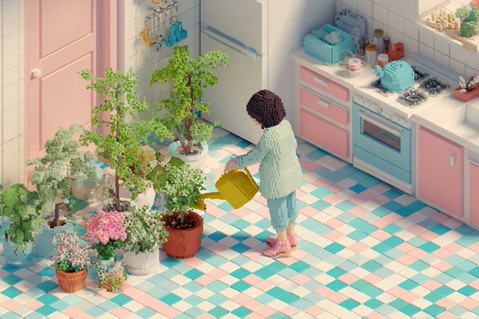

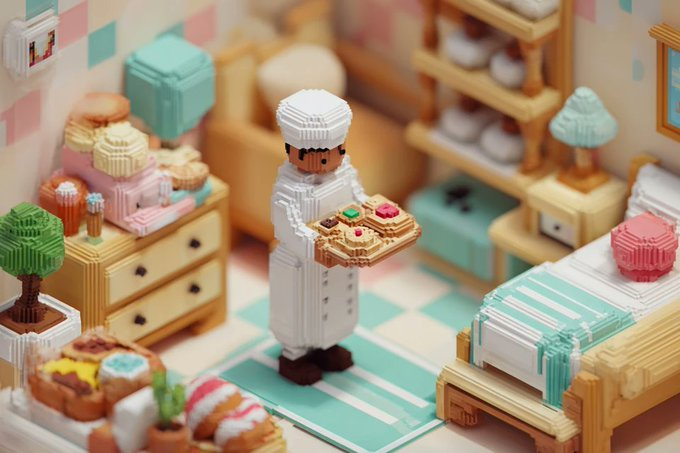


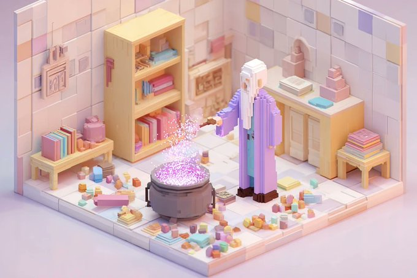

```
share: Voxel

Prompt:
A voxel-style 3D render of a [subject], composed of small colored cubes, sharp pixel edges, stylized lighting, pastel tones, displayed in a playful isometric room with minimal furniture, game asset aesthetic.

Check ATLs for inspiration
```

```
A voxel-style 3D render of a girl watering plants, composed of small colored cubes, sharp pixel edges, stylized lighting, pastel tones, displayed in a playful isometric room with minimal furniture, game asset aesthetic. --ar 3:2 --v 7
```

```
A voxel-style 3D render of a baker holding a tray of cookies, composed of small colored cubes, sharp pixel edges, stylized lighting, pastel tones, displayed in a playful isometric room with minimal furniture, game asset aesthetic. --ar 3:2 --v 7
```

```
A voxel-style 3D render of a dog wearing glasses and reading a book, composed of small colored cubes, sharp pixel edges, stylized lighting, pastel tones, displayed in a playful isometric room with minimal furniture, game asset aesthetic. --ar 3:2 --v 7
```

```
A voxel-style 3D render of a wizard casting a tiny spell, composed of small colored cubes, sharp pixel edges, stylized lighting, pastel tones, displayed in a playful isometric room with minimal furniture, game asset aesthetic. --ar 3:2 --v 7
```

 [↑返回目录](#toc)

---
## <a id="">Midjourney风格参考界面</a> (<a href="https://x.com/michaelrabone/status/2021509542945968374" target="_blank" rel="noopener noreferrer">Michael Rabone</a>)

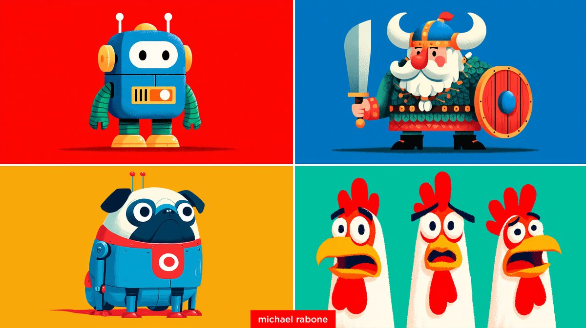

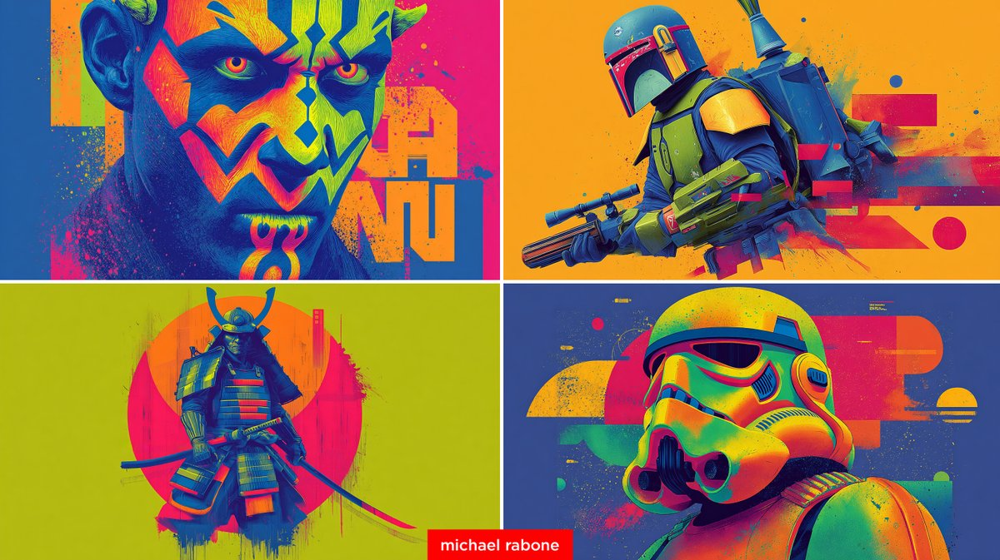

```
New Midjourney Style Reference
Unlock with --sref 1790519590

```

```
新 Midjourney 风格参考  
使用 --sref 1790519590 解锁  

```

 [↑返回目录](#toc)

---
## <a id="">Midjourney新风格示例</a> (<a href="https://x.com/azed_ai/status/2021856316722159690" target="_blank" rel="noopener noreferrer">Amira Zairi</a>)

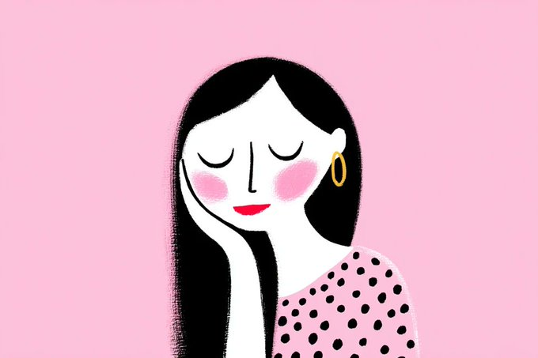

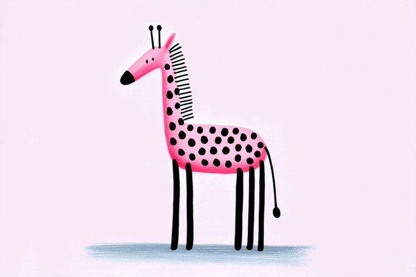

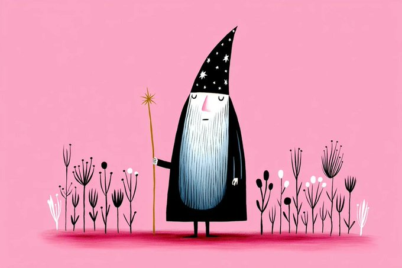

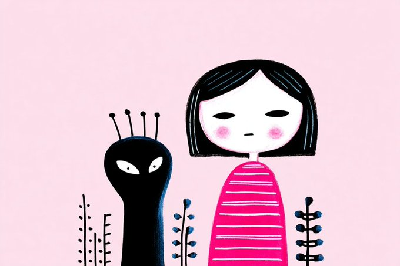

```
Newly created style on Midjourney

--sref 4428133947
```

```
Midjourney 上新创建的风格

--sref 4428133947
```

 [↑返回目录](#toc)

---
## <a id="">霓虹街头的滑板少女</a> (<a href="https://x.com/kingofdairyque/status/2021768799897497920" target="_blank" rel="noopener noreferrer">simply</a>)

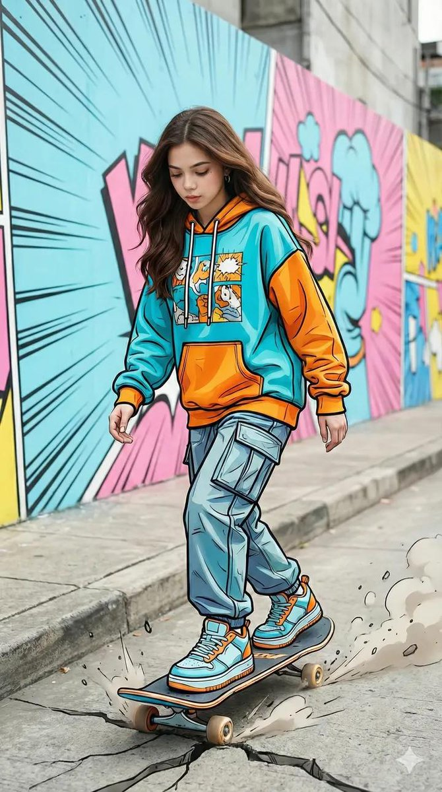

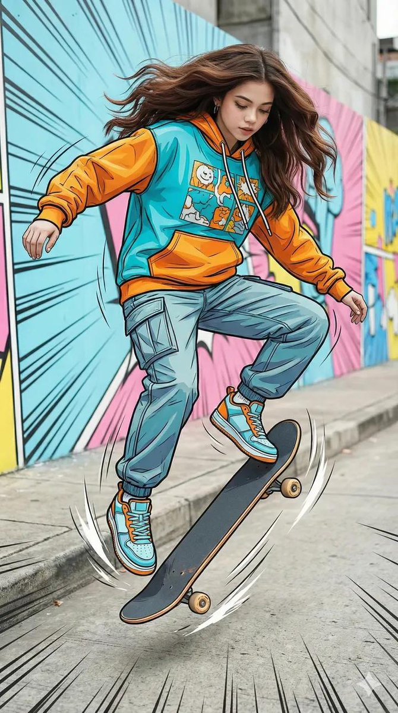

```
Ultra-realistic cinematic street photography, a young hijabi woman skateboarding in a city street at dusk, fashion editorial style, full body shot, dynamic action pose, joyful confident expression.
She is a young woman (age 18–23), pale fair skin, smooth porcelain complexion, glossy peach lipstick, Korean look makeup, large glowing eyes, sharp wing eyeliner, soft youthful facial features, elegant and feminine. Her face identitical with the photo reference, dont take her outfit, only her face. 
She is wearing a modern oversized hoodie with glowing neon typography on the chest with text "Sufni", modest hijab covering neck and chest fully (no skin showing on neck), loose pants, and trendy sneakers.
Her skateboard is under her feet, mid-motion as she balances and rides, knees slightly bent, dynamic sporty posture.
Add neon light effects tracing her legs and shoes, glowing pink and orange light outlines around her body, glowing neon sneakers, electric light streaks and sparks around her legs, doodle neon hearts and stars near her feet, glowing futuristic street fashion vibe.
Background: European-style city street with warm bokeh lights, blurred people walking in background, evening golden hour to blue hour sky, cinematic depth of field, shallow focus, realistic lens blur, urban fashion atmosphere.
Lighting: cinematic neon rim light, warm street lights, glowing reflections on pavement, soft volumetric lighting, high dynamic range, ultra-detailed shadows, realistic global illumination.
Camera: full-body fashion editorial shot, 35mm lens, low angle slightly upward, high-resolution, ultra sharp focus on subject, background bokeh, professional fashion photography, magazine cover quality.
Style: ultra-realistic, fashion magazine editorial, cinematic neon cyberpunk glow, modern youth street culture, no CGI look, no plastic skin, no cartoon, no illustration, natural skin texture, photorealistic.
--ar 9:16 --v 6 --style raw --q 2 --s 750

Negative prompt:
cartoon, anime, CGI, 3D render, illustration, painting, plastic skin, doll face, oversharpen, oversaturated, low resolution, blurry, bad anatomy, extra fingers, extra limbs, distorted face, watermark, logo, text artifacts, AI generated look, synthetic lighting. Ratio 9 :16.
```

```
超写实电影感街头摄影，一位戴头巾的年轻女性在黄昏时分的城市街道上滑滑板，时尚杂志编辑风格，全身镜头，动态动作姿势，表情自信而愉悦。  
她是一位18至23岁的年轻女性，肤色白皙，肤质如瓷般光滑，涂着亮泽的蜜桃色口红，妆容具有韩式风格，眼睛大而明亮，眼线锐利上扬，面部轮廓柔和青春，气质优雅柔美。她的面部需与参考照片完全一致，仅保留其面部特征，不包含其服装。  
她身穿一件现代 oversized 连帽衫，胸前有发光霓虹字体“Sufni”，佩戴端庄的头巾，完全遮盖颈部与胸部（颈部无皮肤露出），下身搭配宽松长裤和潮流运动鞋。  
滑板位于她脚下，正处于滑行中的平衡姿态，膝盖微弯，呈现动感十足的运动姿势。  
添加霓虹光效勾勒她的双腿与鞋子，身体周围环绕粉橙色发光轮廓，运动鞋发出霓虹光芒，腿部周围带有电光轨迹与火花，脚边点缀涂鸦风格的霓虹爱心与星星，整体营造出充满未来感的街头时尚氛围。  
背景为欧式城市街道，温暖的散景灯光，背景行人模糊走动，天空处于黄金时刻向蓝色时刻过渡阶段，具有电影级景深、浅景深效果、真实镜头虚化和都市时尚气息。  
光影效果：电影感霓虹轮廓光、温暖街灯、路面上的发光反射、柔和体积光、高动态范围、超精细阴影、真实全局光照。  
拍摄视角：全身时尚杂志编辑镜头，35mm 镜头，略带仰角的低机位，高分辨率，主体超清晰对焦，背景虚化，专业时尚摄影水准，具备杂志封面质感。  
风格：超写实、时尚杂志编辑风、电影感霓虹赛博朋克光效、当代青年街头文化，杜绝CGI感、塑料肌肤、卡通、插画效果，强调自然肌肤纹理与逼真摄影质感。  
--ar 9:16 --v 6 --style raw --q 2 --s 750

负面提示：  
卡通、动漫、CGI、3D渲染、插画、绘画、塑料肌肤、娃娃脸、过度锐化、过度饱和、低分辨率、模糊、解剖结构错误、多余手指、多余肢体、面部扭曲、水印、logo、文字伪影、AI生成感、人工合成光照。比例 9:16。
```

 [↑返回目录](#toc)

---
## <a id="">清晨的AI绘图探索</a> (<a href="https://x.com/Anima_Labs/status/2021555224348127276" target="_blank" rel="noopener noreferrer">Anima</a>)

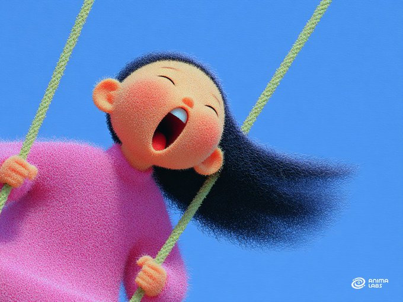

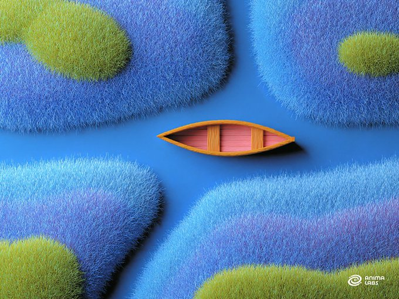


```
Back to exploring with Midjourney this morning, it’s been a long time 

--sref 310012397 1496622816 --profile h3dkhkz --v 7
```

```
今天早上又开始用 Midjourney 进行探索了，已经很久没有这样做了。

--sref 310012397 1496622816 --profile h3dkhkz --v 7
```

 [↑返回目录](#toc)

---
## <a id="">红发女子的梦境肖像</a> (<a href="https://x.com/im_shahid7/status/2021534216958402573" target="_blank" rel="noopener noreferrer">Al-Shamus</a>)

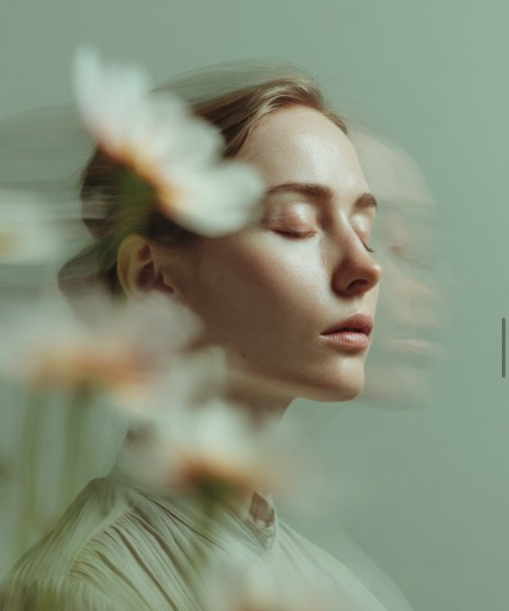

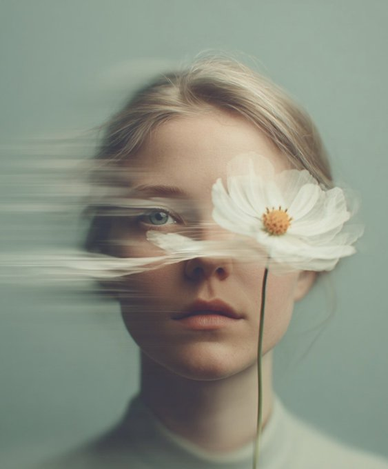

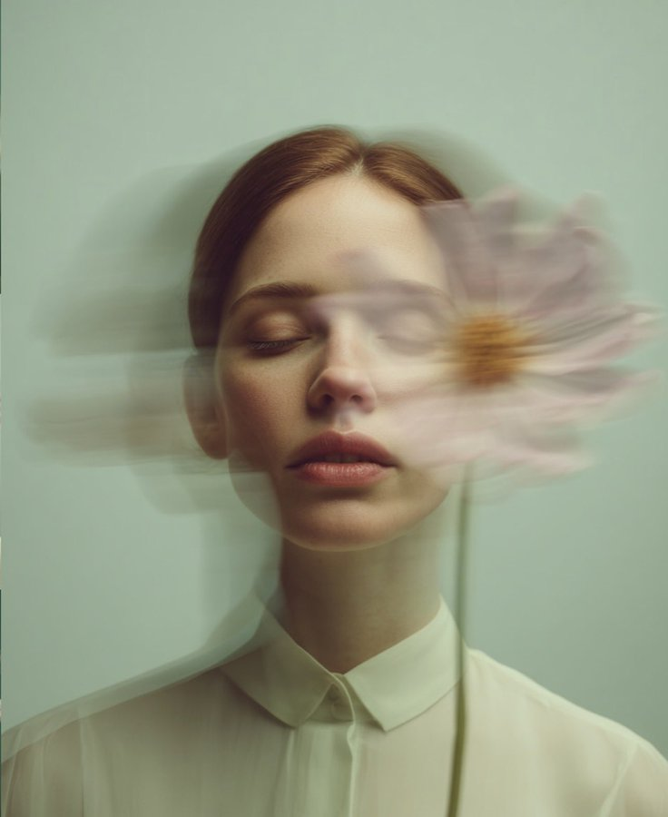

```
Into the dream i live in!..

Made with Midjourney
Prompt:

A fine-art editorial portrait of a woman with red hair and closed eyes, wearing a white collared silk blouse. The image features a heavy intentional camera movement (ICM) and long exposure effect, creating a dreamy, ethereal motion blur. A soft pink flower is held in the foreground, its petals blurred into a circular motion. Muted sage green background, soft cinematic lighting, surreal atmosphere, shot on 35mm film, high grain, dreamcore aesthetic."
```

```
一幅精致艺术风格的肖像作品，描绘一位红发女子闭着眼睛，身穿白色立领真丝衬衫。画面采用强烈的故意相机移动（ICM）和长曝光效果，营造出梦幻、空灵的动态模糊感。前景中有一朵柔粉色花朵，其花瓣因旋转运动而模糊成圆形轨迹。背景为低饱和的鼠尾草绿色，光线柔和且富有电影感，整体氛围超现实，采用35毫米胶片拍摄，高颗粒感，呈现梦境核心（dreamcore）美学。
```

 [↑返回目录](#toc)

---
## <a id="">80年代美学风格的3D橡皮泥流行物件</a> (<a href="https://x.com/CharaspowerAI/status/2021638376193994875" target="_blank" rel="noopener noreferrer">Pierrick Chevallier | IA</a>)

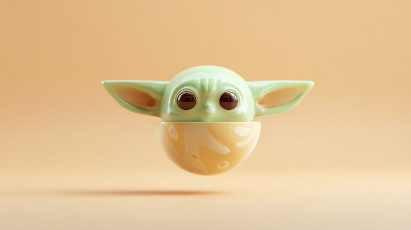


```
PLASTICINE in Midjourney V7

PROMPT
3d render of a plasticine [pop culture object, symbol, or element],  in a cute and pastel color theme, 
isolated on a [solid background color],  with soft lighting, smooth rounded materials, and subtle shadows, in the style of 80s aesthetics, 
high resolution, high quality.
```

```
3D渲染的橡皮泥[流行文化物件、符号或元素]，采用可爱柔和的粉彩色调，置于[纯色背景]上，搭配柔光、光滑圆润的材质和细微阴影，呈现80年代美学风格，高分辨率，高质量。
```

 [↑返回目录](#toc)

---
## <a id="">Midjourney新风格示例</a> (<a href="https://x.com/azed_ai/status/2022219710503563521" target="_blank" rel="noopener noreferrer">Amira Zairi</a>)

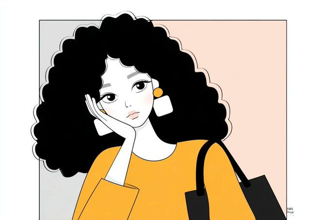

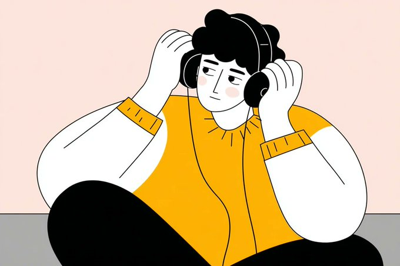

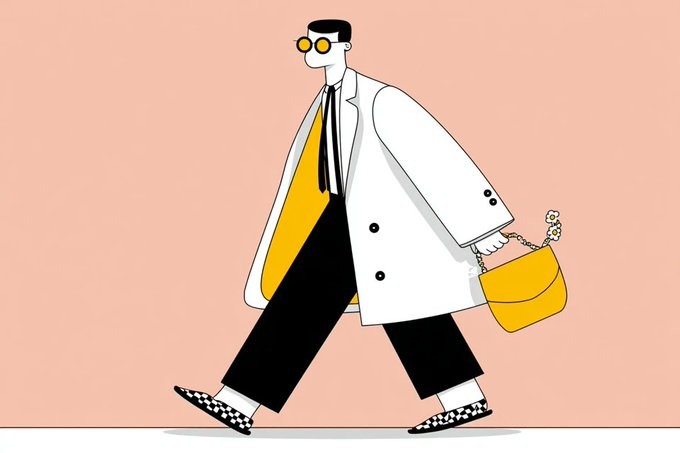

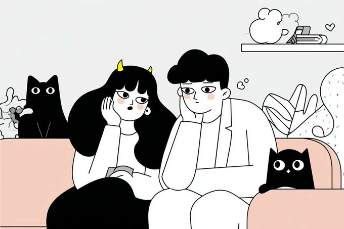

```
Newly created style on Midjourney

--sref 5493627075
```

```
Midjourney 上新创建的风格

--sref 5493627075
```

 [↑返回目录](#toc)

---
## <a id="">四季螺旋塔：从春之新生到冬之蛰伏</a> (<a href="https://x.com/0x00_Krypt/status/2022252310664290547" target="_blank" rel="noopener noreferrer">两斤</a>)

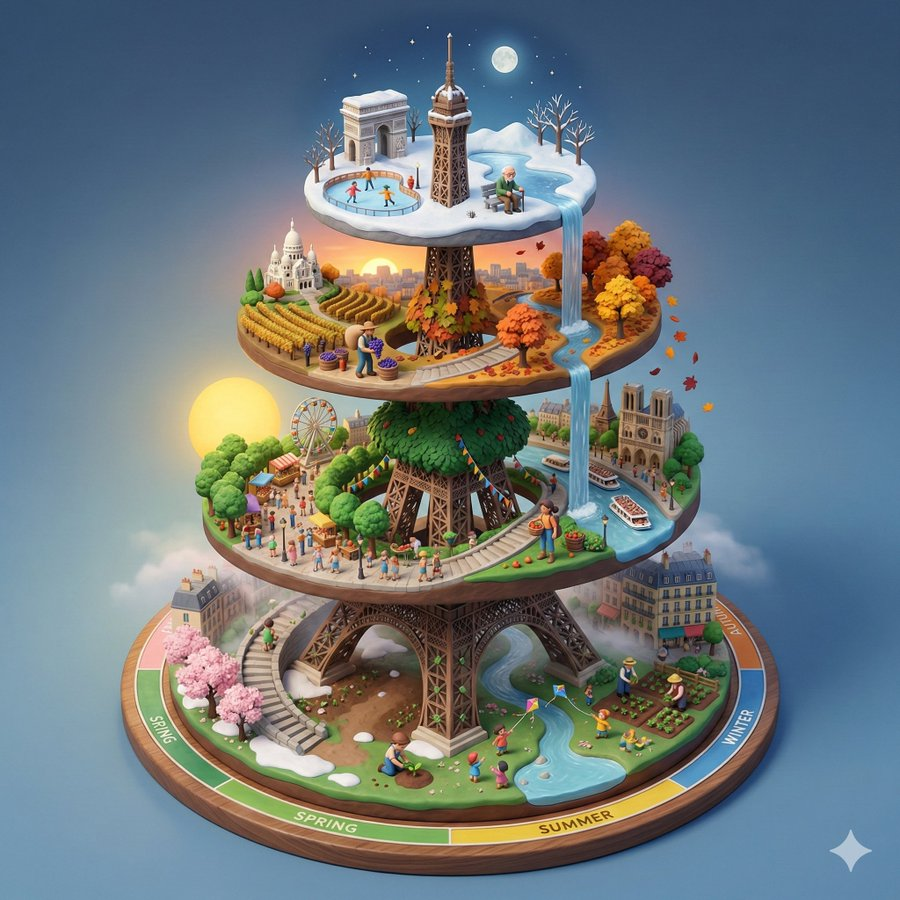

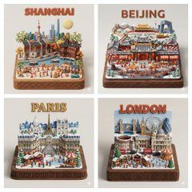

```
Four-season spiral tower relief of [LOCATION] showing seasonal progression as 
vertical ascent. Each season occupies a tier, spiraling upward like nature's growth:

TIER 1 - SPRING FOUNDATION (Ground Level, 0-3cm height):
[LOCATION] awakening from winter - Melting snow revealing fresh earth, cherry 
blossoms bursting at base level, farmers planting fields, birds returning to 
nests, children flying kites, morning mist, NEW LIFE emerging from ground literally 
rising from platform, color palette: soft pinks, fresh greens, misty whites, 
hopeful pastels, composition: spreading outward like roots/growth, low relief 
showing emergence.

TIER 2 - SUMMER EXPANSION (Rising Level, 3-6cm height):
Same location climbing upward - Full bloom vegetation now at mid-height, summer 
festivals with crowds, beaches packed, markets overflowing with produce, sun at 
zenith, maximum energy, ABUNDANCE literally stacking higher, color palette: 
vibrant yellows, deep greens, azure blues, saturated intensity, composition: 
densest layer with most figures/activity, medium relief showing peak vitality.

TIER 3 - AUTUMN PLATEAU (Upper Level, 6-9cm height):
Elevation continues - Harvest scenes at higher tier, leaves changing and falling 
downward toward lower levels, people gathering crops, preparing for winter, sunset 
golden light, MATURITY and reflection, color palette: burnt oranges, golden yellows, 
burgundy reds, amber wisdom, composition: gathering inward, high relief with 
contemplative mood.

TIER 4 - WINTER SUMMIT (Peak Level, 9-12cm height):
Reaching apex - Snow covering peak like mountain top, bare trees at highest point, 
minimal activity (hibernation/rest), stars visible at top, full moon, DORMANCY 
and waiting, color palette: icy blues, pure whites, silver frost, deep night 
purples, composition: sparse and minimal, highest relief but most empty, creating 
anticipation for cycle restart.

CONNECTING SPIRAL STAIRCASE/PATH:
Literal stairway winds around tower connecting all four tiers - Same CHARACTERS 
visible climbing: 
- Tier 1: Child planting seed
- Tier 2: Teenager harvesting fruit  
- Tier 3: Adult gathering crops
- Tier 4: Elder resting at summit

CENTRAL AXIS ELEMENT:
[ICONIC TREE/LANDMARK] grows through all four tiers - trunk at spring base, 
full canopy at summer, changing leaves at autumn, bare branches at winter peak. 
Visible from all angles, unifying vertical element.

WATER ELEMENT:
Stream/waterfall flows DOWN from winter (snowmelt) → through autumn (rainfall) → 
to summer (irrigation) → nourishing spring (groundwater), creating physical 
downward flow while seasons spiral upward.

Mounted on circular platform showing seasonal quadrants at base (like compass), 
spiral rises counterclockwise (Northern Hemisphere seasonal flow). 

Isometric view showing all tiers simultaneously, Pixar-style clay render with 
Studio Ghibli's seasonal magic, color temperature rises with height (warm base 
→ cool summit), extreme height variation creates dramatic 3D effect, lighting 
from side showing tier shadows, background gradient from earth-tone to sky-blue. --ar 1:1

INNOVATION: Seasons aren't flat quadrants but EVOLUTIONARY STAGES you climb through
```

```
[地点]的四季螺旋塔浮雕，以垂直上升的方式展现季节更迭。每一季占据一层，如自然生长般螺旋而上：

第一层——春之根基（地面层，高度0-3厘米）：  
[地点]从冬眠中苏醒——融雪露出新生泥土，樱花在底层盛放，农夫播种田地，鸟儿归巢，孩童放风筝，晨雾缭绕，新生命从平台地面真实升起。色彩以柔粉、嫩绿、雾白与充满希望的淡彩为主。构图如根系般向外延展，浅浮雕表现萌发之态。

第二层——夏之繁盛（上升层，高度3-6厘米）：  
同一地点向上攀升——植被在此中层全然盛开，夏日节庆人潮涌动，海滩熙攘，市集蔬果丰盈，烈日当空，能量达到顶峰，“丰饶”意象层层堆叠。色彩采用鲜明黄、深翠绿、湛蓝，饱和浓烈。构图为最密集的一层，人物与活动最多，中等浮雕展现生命巅峰。

第三层——秋之高原（上层，高度6-9厘米）：  
继续抬升——更高处呈现丰收场景，树叶变色并飘落至下层，人们收割作物、备冬储粮，夕照洒下金色光辉，体现成熟与沉思。色彩为焦橙、金黄、酒红与琥珀般的智慧色调。构图向内收拢，高浮雕营造静思氛围。

第四层——冬之峰顶（顶端层，高度9-12厘米）：  
抵达塔尖——积雪覆盖峰顶如高山之巅，最高处仅见枯枝，活动极少（休眠与静待），星辰显现于顶端，满月高悬，呈现“蛰伏”与“等待”之意。色彩为冰蓝、纯白、银霜与深邃夜紫。构图稀疏极简，虽为最高浮雕却最为留白，营造循环重启的期待感。

连接螺旋阶梯/小径：  
一条实体阶梯环绕塔身，连通四层——同一组角色沿阶攀登：  
- 第一层：孩童播种  
- 第二层：少年采摘果实  
- 第三层：成人收割庄稼  
- 第四层：老者静坐峰顶  

中心轴元素：  
[标志性树木/地标]贯穿四层——树干始于春之基底，盛夏形成完整树冠，秋季叶色变幻，冬季顶端仅余枯枝。此元素从任意角度皆可见，作为统一的垂直主线。

水体元素：  
溪流/瀑布自冬（融雪）向下流淌 → 经秋（降雨）→ 至夏（灌溉）→ 滋养春（地下水），形成物理上的下行水流，与螺旋上升的季节形成对比。

整体安置于圆形基座之上，基座划分四季象限（如罗盘），螺旋呈逆时针上升（符合北半球季节流转）。  

采用等距视角同时展现所有层级，皮克斯风格黏土渲染结合吉卜力式的季节魔法；色彩温度随高度升高由暖转冷；强烈高低起伏营造戏剧性3D效果；侧光照明凸显各层投影；背景渐变由大地色过渡至天蓝色。--ar 1:1

创新点：四季并非平面象限，而是可攀登的演化阶段。
```

 [↑返回目录](#toc)

---
## <a id="">双重曝光下的梦幻叙事</a> (<a href="https://x.com/HBCoop_/status/2021980176196739427" target="_blank" rel="noopener noreferrer">Heather Cooper</a>)

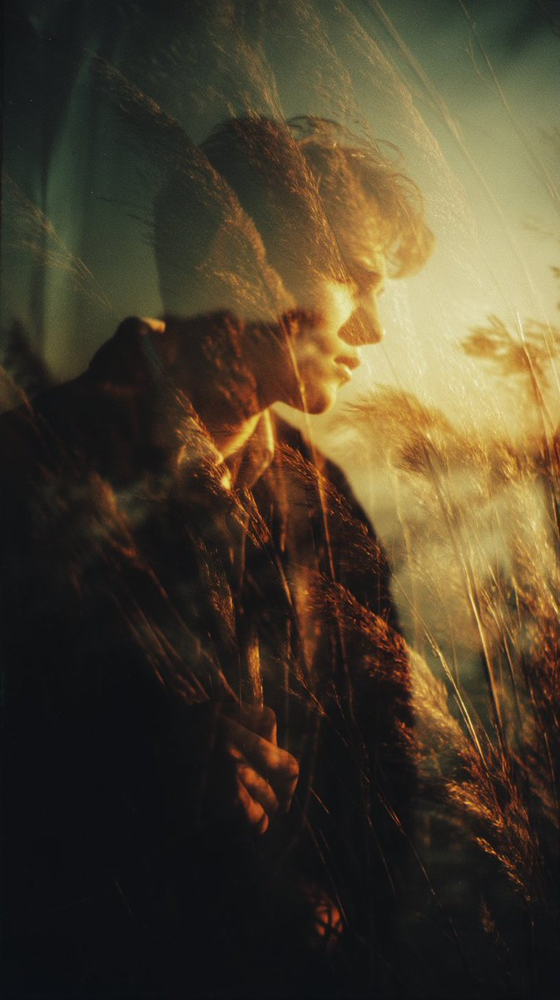

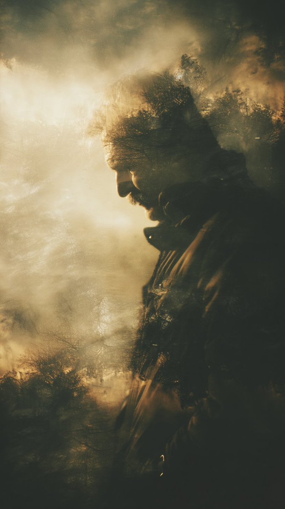

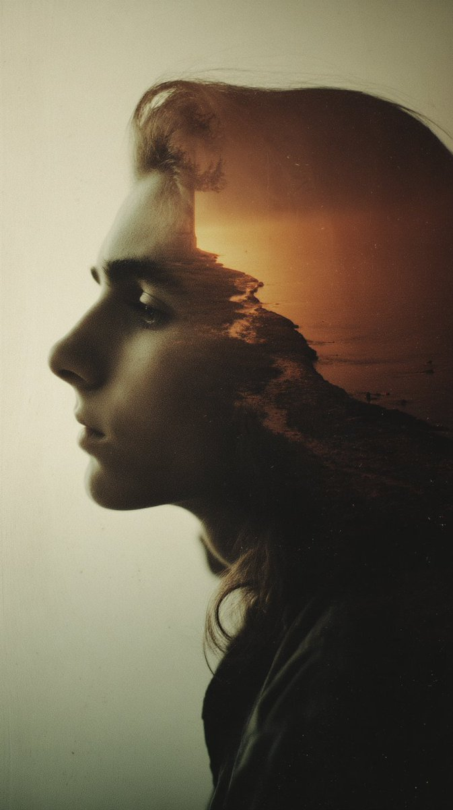

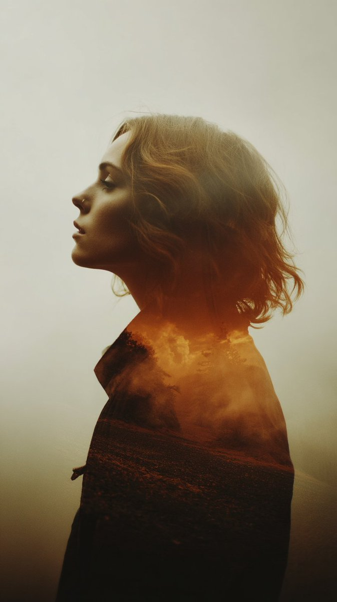

```
SHARE: 

A double exposure composition where two images blend seamlessly. The first image is a portrait or landscape. The second image is texture or abstract elements. The blend is intentional and poetic. The color palette is warm and muted. The mood is dreamlike and contemplative. Shot on film, double exposure technique, natural grain. The blend tells a story. Poetic, dreamlike, nostalgic --v 7 --ar 9:16 --quality 2
```

```
一种双重曝光构图，两张图像无缝融合。第一张图像为肖像或风景，第二张图像为纹理或抽象元素。融合具有诗意且富有意图，色调温暖而柔和，氛围梦幻且沉思。采用胶片拍摄，运用双重曝光技法，保留自然颗粒感。整体融合讲述一个故事，风格诗意、梦幻、怀旧。
```

 [↑返回目录](#toc)

---
## <a id="">惊艳纹理的风格探索</a> (<a href="https://x.com/Anima_Labs/status/2021927043407991248" target="_blank" rel="noopener noreferrer">Anima</a>)

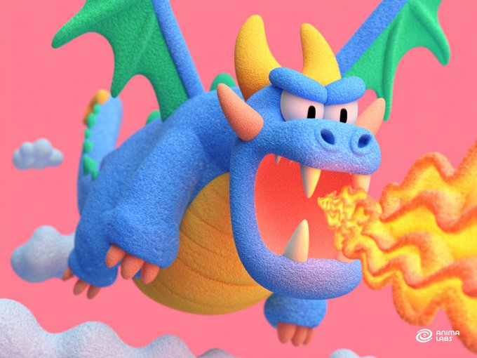

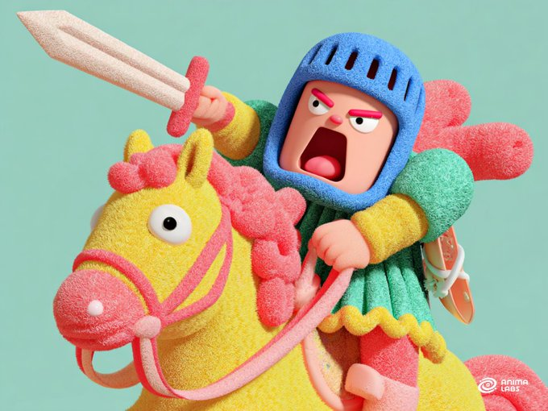

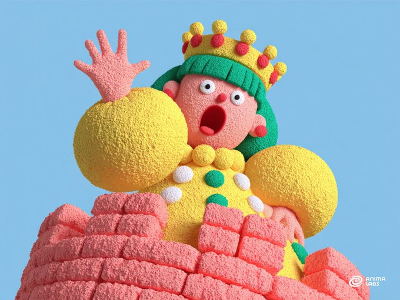

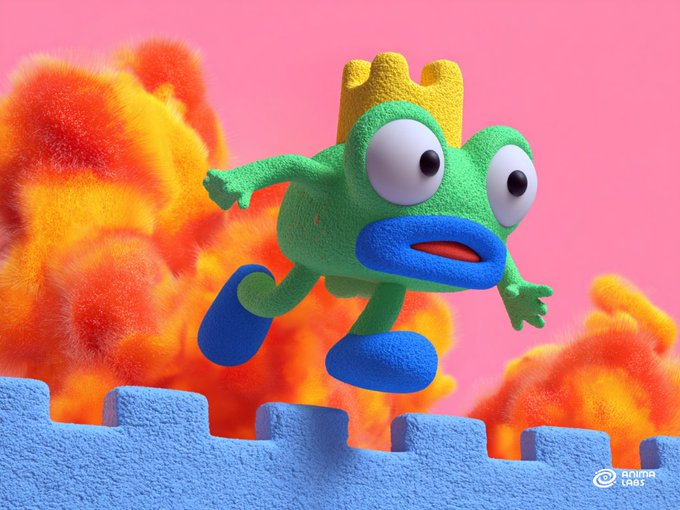


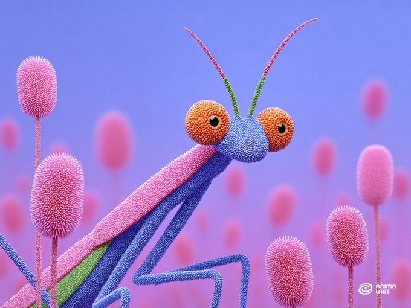


```
During my style exploration on Midjourney, I discovered this one, the texture is simply stunning

--sref 1007058050
```

```
在我使用 Midjourney 进行风格探索时，发现了这一种，其纹理简直惊艳。

--sref 1007058050
```

 [↑返回目录](#toc)

---
## <a id="">发光树岛与水下荧光岩层</a> (<a href="https://x.com/churvikv/status/2022391254315893048" target="_blank" rel="noopener noreferrer">Viki</a>)

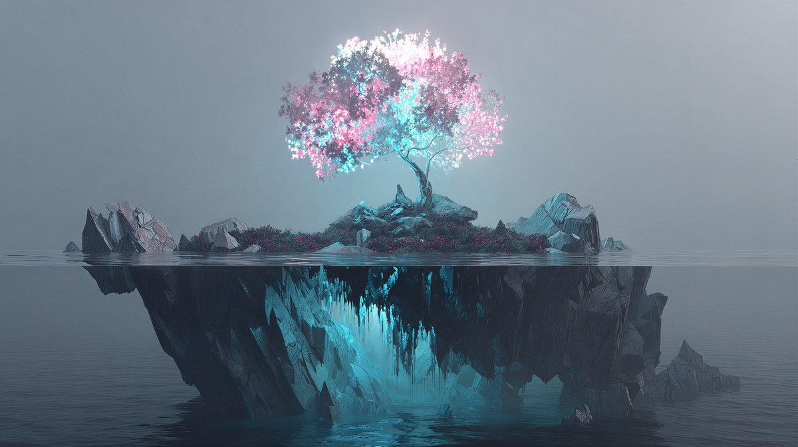

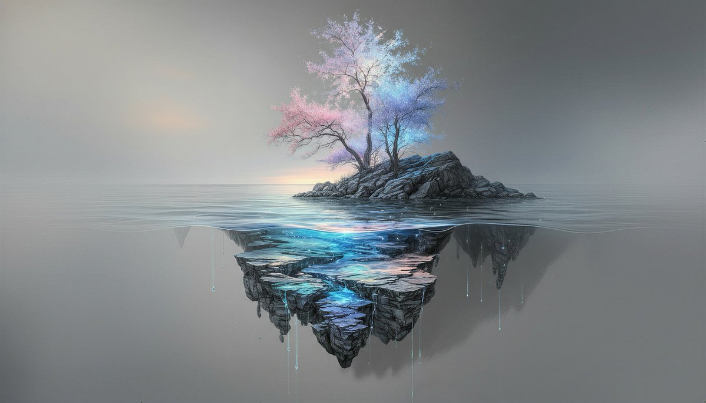

```
Desktop Wallpaper

Which image do you like best?

Created in @Somake_ai
Model: Midjourney

Prompt:
A surreal digital art piece featuring a small rocky island floating in a vast, calm ocean under a hazy, monochromatic grey sky. Atop the island sits a glowing tree with ethereal foliage that transitions from soft pink to vibrant cyan, radiating a gentle light. The composition uses a split-level view, revealing a massive, jagged rock formation submerged beneath the water's surface, mirroring the island above. Bioluminescent blue light flows through the cracks of the underwater rock, with crystalline droplets falling into the abyss below. The mood is serene, mystical, and otherworldly, characterized by a minimalist color palette with pops of neon luminescence.
#Wallpapers4k #AIart

##
```

```
一张超现实的数字艺术作品，描绘了一座小小的岩石岛屿漂浮在广阔而平静的海洋中，上方是朦胧的单色灰色天空。岛顶生长着一棵发光的树，其空灵的枝叶由柔粉渐变为鲜艳的青色，散发出柔和的光芒。画面采用分层视角，揭示出水下隐藏的巨大锯齿状岩层，与上方岛屿形成镜像。幽蓝色的生物荧光从水下岩石的裂缝中流淌而出，晶莹剔透的水滴坠入下方的深渊。整体氛围宁静、神秘且超凡脱俗，采用极简的色彩搭配，并点缀以霓虹般的荧光色。
```

 [↑返回目录](#toc)

---
## <a id="">Midjourney新风格示例</a> (<a href="https://x.com/azed_ai/status/2022582347900817919" target="_blank" rel="noopener noreferrer">Amira Zairi</a>)

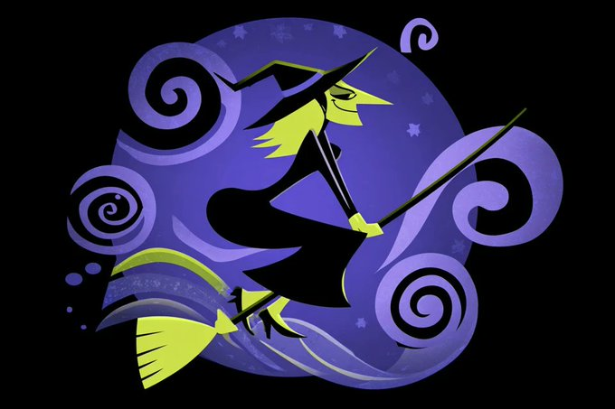

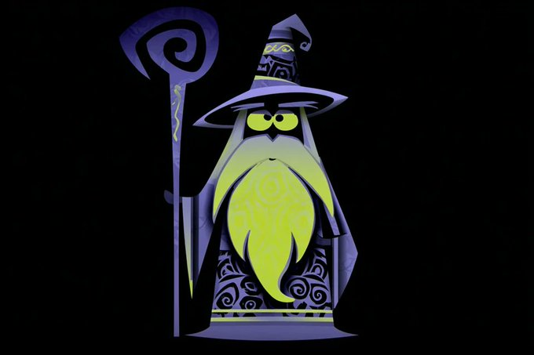

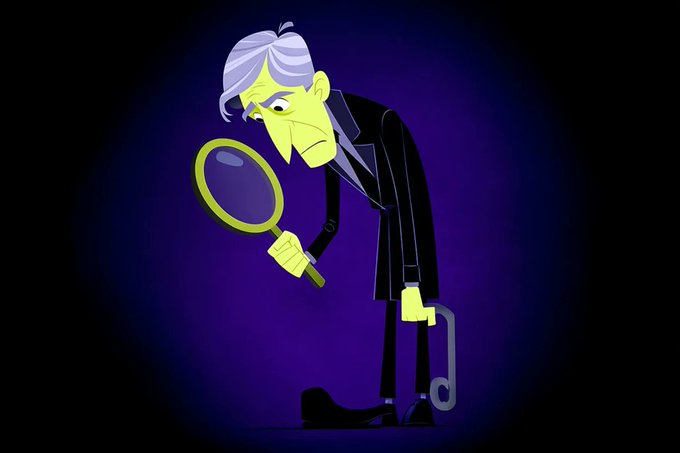

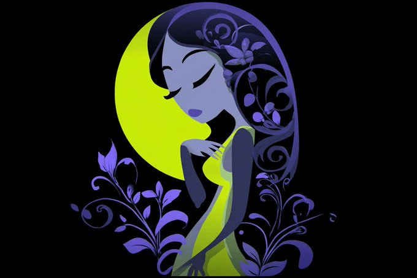

```
Newly created style on Midjourney

--sref 7693155436
```

```
Midjourney 上新创建的风格

--sref 7693155436
```

 [↑返回目录](#toc)

---
## <a id="">Midjourney新风格示例</a> (<a href="https://x.com/Anima_Labs/status/2022609844977516891" target="_blank" rel="noopener noreferrer">Anima</a>)

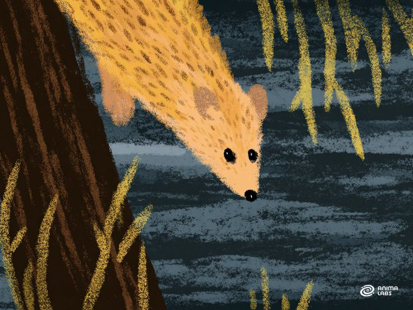

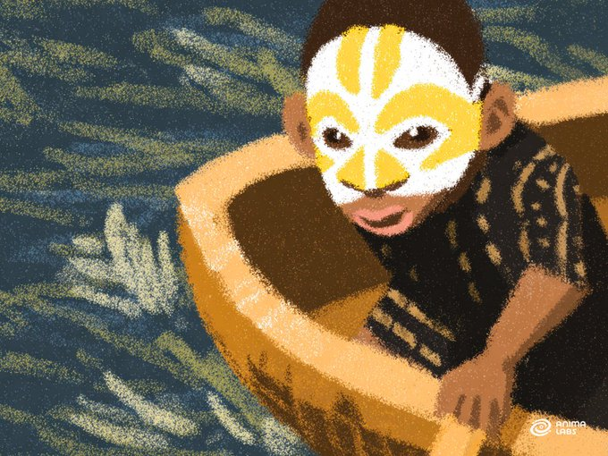

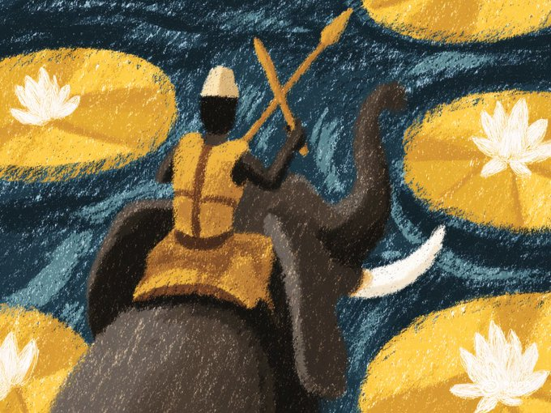

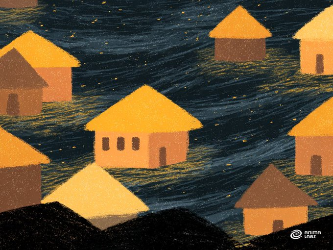

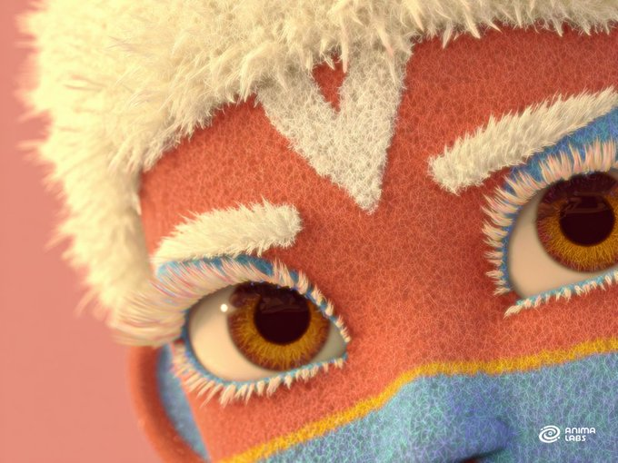

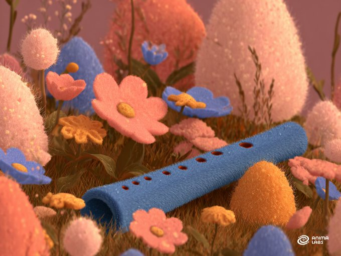

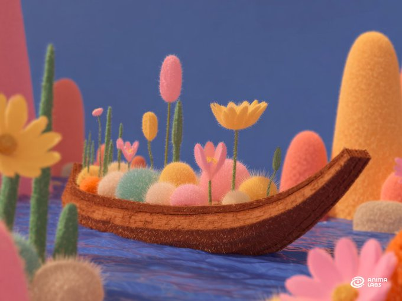

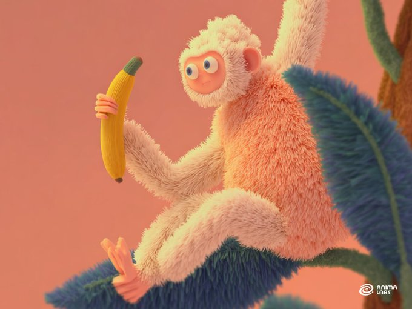

```
--sref 2436531712
```

 [↑返回目录](#toc)

---


[上一页](./1.md) | 当前 2/2 页 | [查看全部目录](../prompts.md)