# midjourney.json 

midjourney.json文件存放midjourney相关的提示词，当前已收录：116个 

 投稿方式：[飞书投稿](https://tcn1uh5rxo87.feishu.cn/share/base/form/shrcne5gDolOMDd0oJsj2XfvxQc) or [issues](https://github.com/junxiaopang/gridsplitter/issues/new)

[上一页](./1.md) | 当前 2/2 页 | [查看全部目录](../prompts.md)

🚀 **在线预览**: [https://prompts.kkkm.cn](https://prompts.kkkm.cn)

## <a id="toc">目录</a>


## <a id="">云上骑行的卡通小孩</a> (<a href="https://x.com/azed_ai/status/2016103411801063472" target="_blank" rel="noopener noreferrer">Amira Zairi</a>)


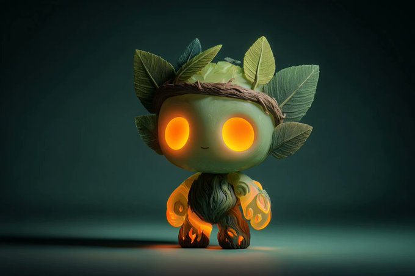

```
A 3D cartoon-style render of a [subject], with a soft matte translucent body in [color1] and glowing [color2] accents. Features include oversized head, exaggerated facial features, and fun accessories. Subtle internal glow and ambient lighting, centered on a dark gradient background. Stylized in a playful and imaginative atmosphere.
```

```
A 3D cartoon-style render of a cloud-rider child, with a soft matte translucent body in lavender and glowing sunset orange accents. Features include oversized head, exaggerated facial features, and fun accessories. Subtle internal glow and ambient lighting, centered on a dark gradient background. Stylized in a playful and imaginative atmosphere. --ar 3:2 --v 7
```

```
A 3D cartoon-style render of a tiny cloud ninja, with a soft matte translucent body in mist white and glowing deep indigo accents. Features include oversized head, exaggerated facial features, and fun accessories. Subtle internal glow and ambient lighting, centered on a dark gradient background. Stylized in a playful and imaginative atmosphere. --ar 3:2 --v 7
```

```
A 3D cartoon-style render of a dream-bot companion, with a soft matte translucent body in blush pink and glowing holographic silver accents. Features include oversized head, exaggerated facial features, and fun accessories. Subtle internal glow and ambient lighting, centered on a dark gradient background. Stylized in a playful and imaginative atmosphere. --ar 3:2 --v 7
```

```
A 3D cartoon-style render of a forest sprout kid, with a soft matte translucent body in leaf green and glowing amber accents. Features include oversized head, exaggerated facial features, and fun accessories. Subtle internal glow and ambient lighting, centered on a dark gradient background. Stylized in a playful and imaginative atmosphere. --ar 3:2 --v 7
```

 [↑返回目录](#toc)

---
## <a id="">墨绿流能中的坚毅丹凤</a> (<a href="https://x.com/ponyodong/status/2017484581016928521" target="_blank" rel="noopener noreferrer">ponyo</a>)

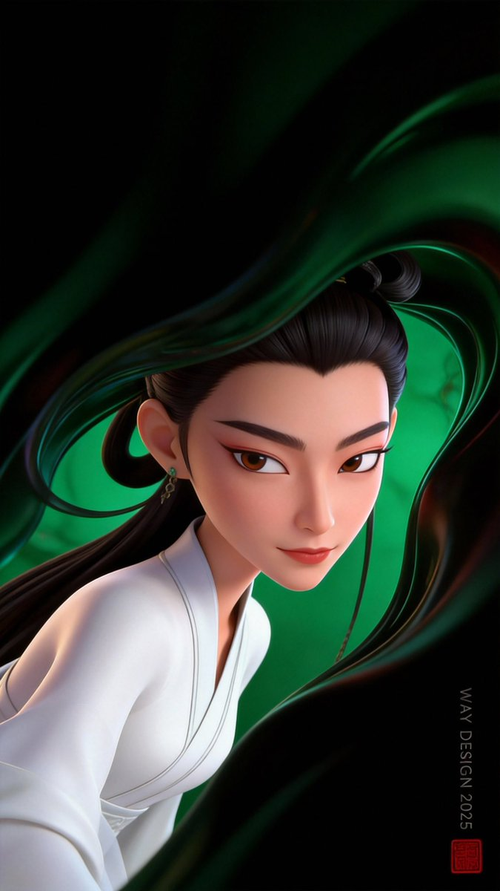

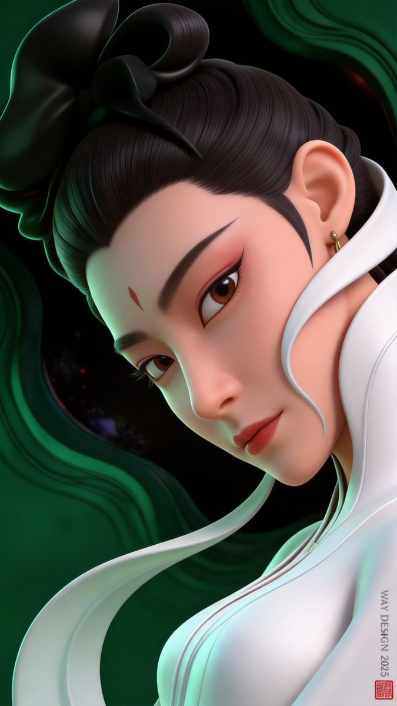

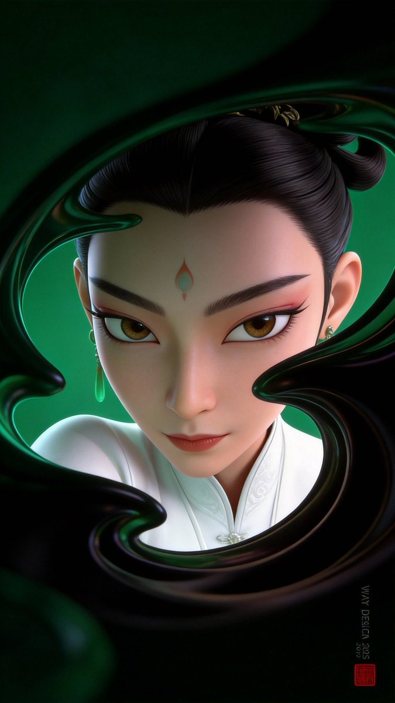

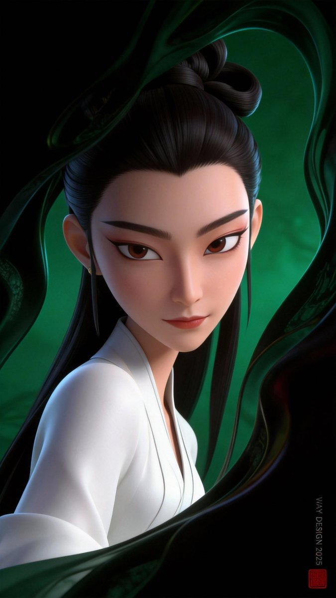

```
这就是我梦里的国风3D！ 
终于把这种“青蛇劫起”般的电影级质感用 Niji 6 完美复刻了。
那个墨绿色的流体背景和皮肤的通透感简直绝了……为了还原这个神仙画风，我大概跑了50张图调参。
今天把压箱底的 Prompt 和风格思路毫无保留地分享给大家！

 风格拆解 (The Vibe Check):
这种风格的核心不是 2D，而是极致的 3D渲染感 (C4D/Octane) 加上 东方奇幻美学。

关键要素：
主体： 坚毅的丹凤眼 (Sharp phoenix eyes) + 极简汉服。

环境： 墨绿色的流动能量 (Swirling dark green liquid/energy)，要有丝绸般的顺滑感。

光影（重中之重）： 必须要有电影光感 (Cinematic lighting) 和让皮肤像玉一样的次表面散射 (Subsurface scattering)。

 一键出图咒语 (复制即用)：

/imagine prompt: A stunning 3D Chinese animation style close-up of a beautiful heroine, determined sharp phoenix eyes, black hair in traditional bun, white minimalist Hanfu, surrounded by swirling dark green fluid energy ribbons, cinematic lighting, subsurface scattering, elegant, high octane render, 8k resolution, masterpiece --ar 9:16 --niji 6 --s 250
```

 [↑返回目录](#toc)

---
## <a id="">街头饮品广告的电影级人像</a> (<a href="https://x.com/ecommartinez/status/2017311074551533921" target="_blank" rel="noopener noreferrer">Alejo</a>)


```
Professional photo, a guy, a 30-year-old Russian model (reference image), is facing the lens, tilted towards the camera, angle from below, shot with a wide-angle lens. The guy is tilted and shows a bottle close-up to the camera, a hand with a bottle close-up right in front of the lens. The label and direction of the bottle are straight so the label is readable. He's wearing white sneakers, one foot in front of the camera. The guy is standing on the street, wet asphalt and splashes from below. Bright colors, cinematic lighting, the light is behind and on the model’s face. --v7 --ar 3:4 --style raw
```

```
专业摄影，一位30岁的俄罗斯男模（参考图像），正对镜头，身体略微朝向相机倾斜，采用低角度仰拍，使用广角镜头拍摄。男子身体倾斜，将一瓶饮品贴近镜头特写展示，一只手握着瓶子，瓶身正对镜头，标签清晰可读。他穿着白色运动鞋，一只脚伸到镜头前方。男子站在街头，地面是湿漉漉的沥青，下方有水花飞溅。画面色彩鲜明，采用电影感灯光，光源位于模特后方并照亮其面部。--v7 --ar 3:4 --style raw
```

 [↑返回目录](#toc)

---
## <a id="">Midjourney黑金风格</a> (<a href="https://x.com/craftian_keskin/status/2019034889165951208" target="_blank" rel="noopener noreferrer">Keskin</a>)

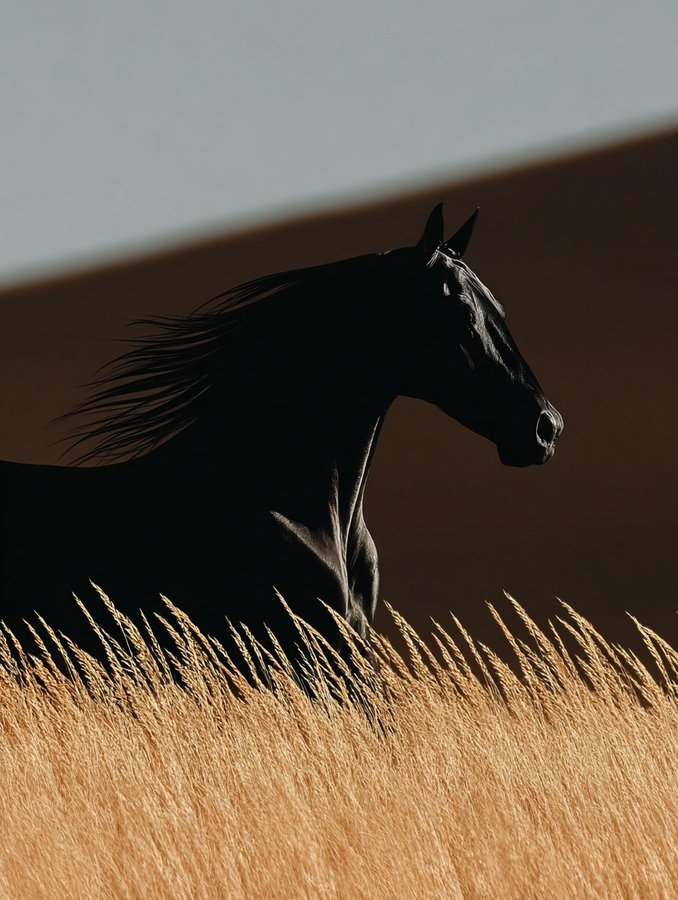

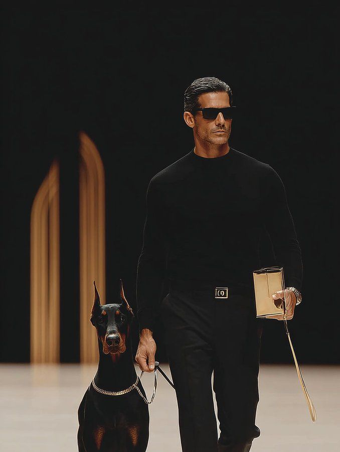

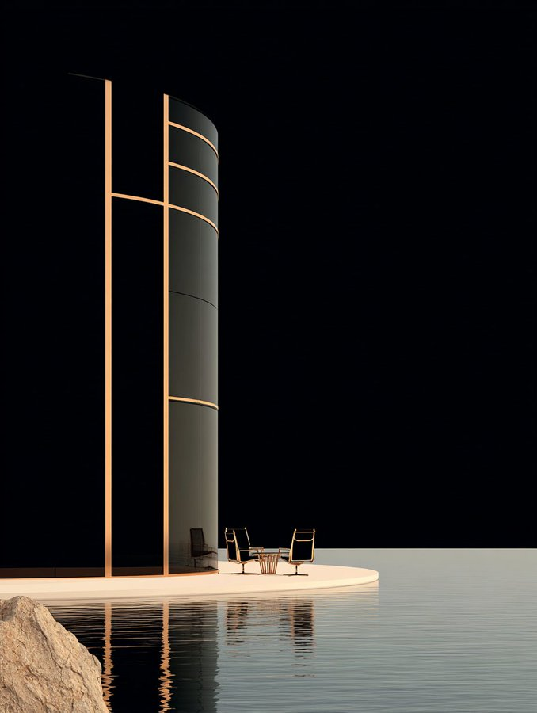

```
A classy Midjourney Style with Golden and Black

-sref 2910482926
```

```
一种优雅的 Midjourney 风格，以金色和黑色为主  
-sref 2910482926
```

 [↑返回目录](#toc)

---
## <a id="">midjourney寂静风格</a> (<a href="https://x.com/egeberkina/status/2018399459634520417" target="_blank" rel="noopener noreferrer">Ege</a>)

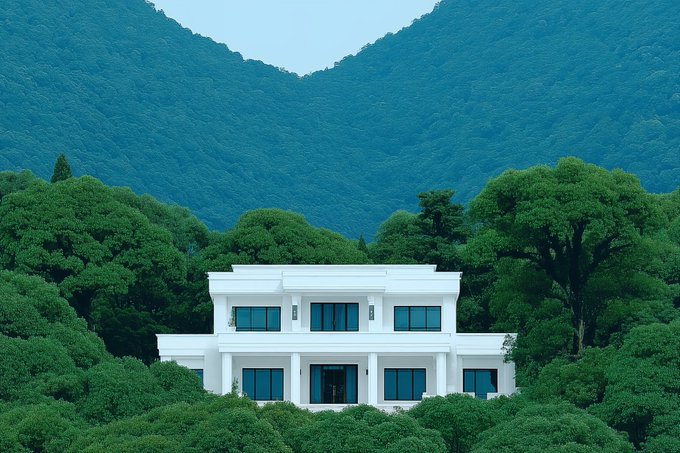

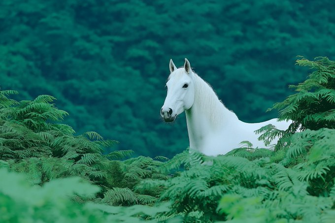

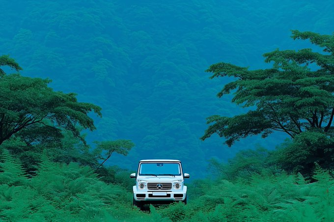

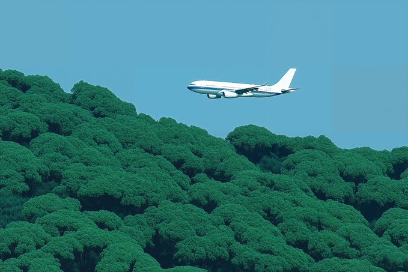

```
Feels oddly calm

--sref 2224065556
```

 [↑返回目录](#toc)

---
## <a id="">Midjourney玫瑰金风格示例</a> (<a href="https://x.com/azed_ai/status/2019319853778440650" target="_blank" rel="noopener noreferrer">Amira Zairi</a>)


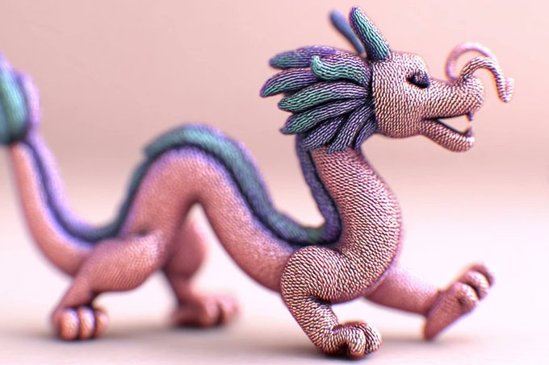


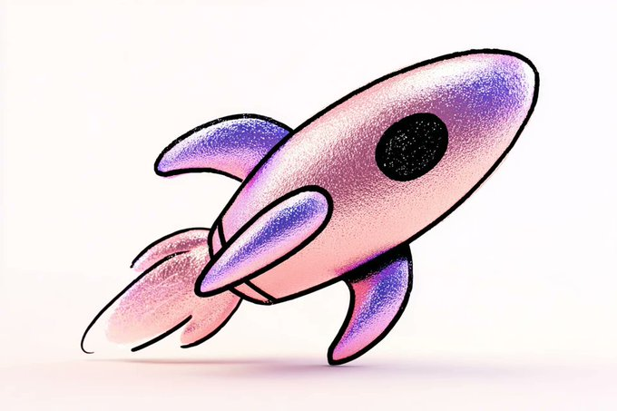

```
Newly created style on Midjourney

--sref 6055153646
```

```
Midjourney 上新创建的风格

--sref 6055153646
```

 [↑返回目录](#toc)

---
## <a id="">雾中舞者：光与影的芭蕾</a> (<a href="https://x.com/azed_ai/status/2019366158651257080" target="_blank" rel="noopener noreferrer">Amira Zairi</a>)

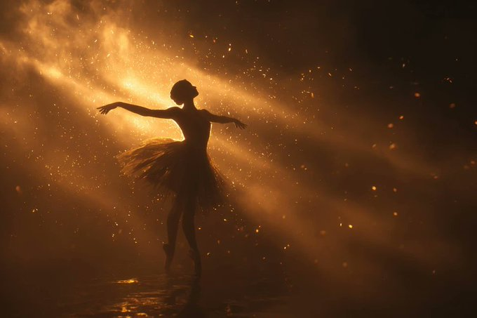

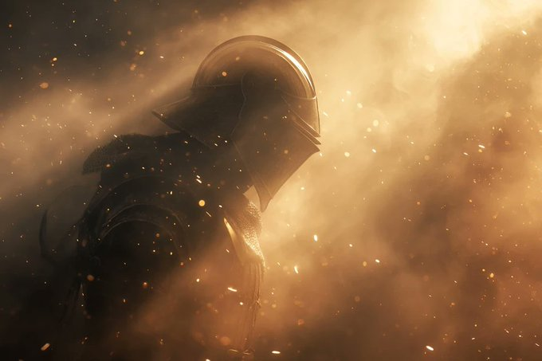

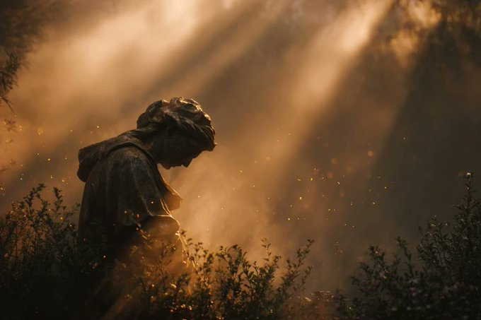

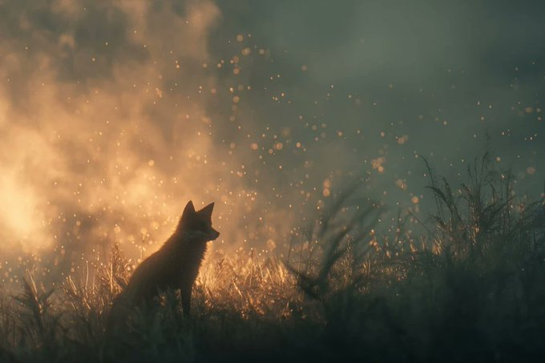

```
share: Volumetric light rays,

Prompt:
A cinematic rendering of the [subject] shrouded in volumetric light rays, with dense fog breaking the scene into atmospheric layers. Warm backlights and glowing particles enhance the mood and mystery.

Check ATLs for inspiration
```

```
A cinematic rendering of a ballerina mid-pose shrouded in volumetric light rays, with dense fog breaking the scene into atmospheric layers. Warm backlights and glowing particles enhance the mood and mystery. --ar 3:2 --v 7
```

```
A cinematic rendering of a medieval knight in armor shrouded in volumetric light rays, with dense fog breaking the scene into atmospheric layers. Warm backlights and glowing particles enhance the mood and mystery. --ar 3:2 --v 7
```

```
A cinematic rendering of a broken statue in a garden shrouded in volumetric light rays, with dense fog breaking the scene into atmospheric layers. Warm backlights and glowing particles enhance the mood and mystery. --ar 3:2 --v 7
```

```
A cinematic rendering of a fox standing in a misty field shrouded in volumetric light rays, with dense fog breaking the scene into atmospheric layers. Warm backlights and glowing particles enhance the mood and mystery. --ar 3:2 --v 7
```

 [↑返回目录](#toc)

---
## <a id="">雾中维多利亚街的幽影孩童</a> (<a href="https://x.com/LudovicCreator/status/2019305081468842249" target="_blank" rel="noopener noreferrer">LudovicCreator</a>)

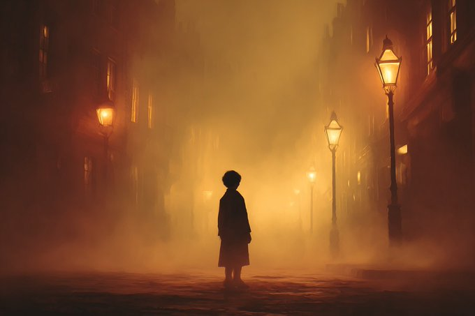

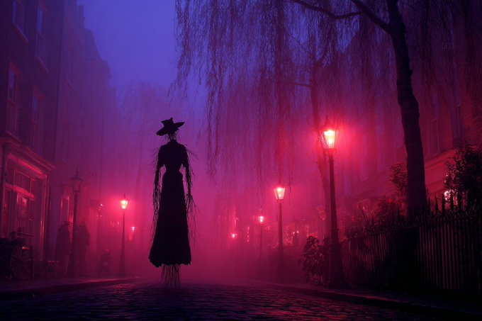

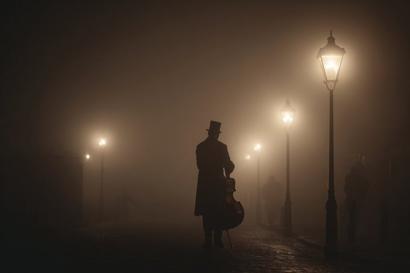

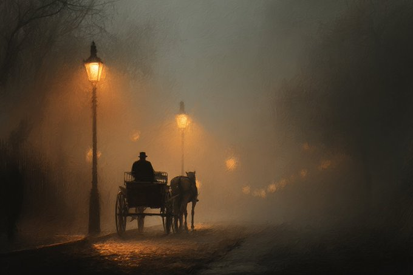

```
GASLIT SPECTRAL 

Base prompt :

[SUBJECT] rendered as a Gaslit Spectral Silhouette, a mysterious figure shrouded in the fog of a Victorian London street. Use a palette of deep [COLOR1] and [COLOR2] to emphasize the ethereal and haunting nature of the scene, with the soft glow of gas lamps casting long shadows

Check ALTS
```

```
A lost child rendered as a Gaslit Spectral Silhouette, a mysterious figure shrouded in the fog of a Victorian London street. Use a palette of deep crimsons and golds to emphasize the ethereal and haunting nature of the scene, with the soft glow of gas lamps casting long shadows --ar 3:2 --v 7.0 
```

```
A decaying scarecrow rendered as a Gaslit Spectral Silhouette, a mysterious figure shrouded in the fog of a Victorian London street. Use a palette of deep violet and blood red to emphasize the ethereal and haunting nature of the scene, with the soft glow of gas lamps casting long shadows --ar 3:2 --v 7.0
```

```
A forgotten street musician rendered as a Gaslit Spectral Silhouette, a mysterious figure shrouded in the fog of a Victorian London street. Use a palette of deep browns and greys to emphasize the ethereal and haunting nature of the scene, with the soft glow of gas lamps casting long shadows. --ar 3:2 --v 7.0
```

```
A runaway carriage horse rendered as a Gaslit Spectral Silhouette, a mysterious figure shrouded in the fog of a Victorian London street. Use a palette of deep charcoals and ambers to emphasize the ethereal and haunting nature of the scene, with the soft glow of gas lamps casting long shadows. --ar 3:2 --v 7.0
```

 [↑返回目录](#toc)

---
## <a id="">手绘风经典动画场景</a> (<a href="https://x.com/tisch_eins/status/2020075067833544743" target="_blank" rel="noopener noreferrer">Tischeins</a>)

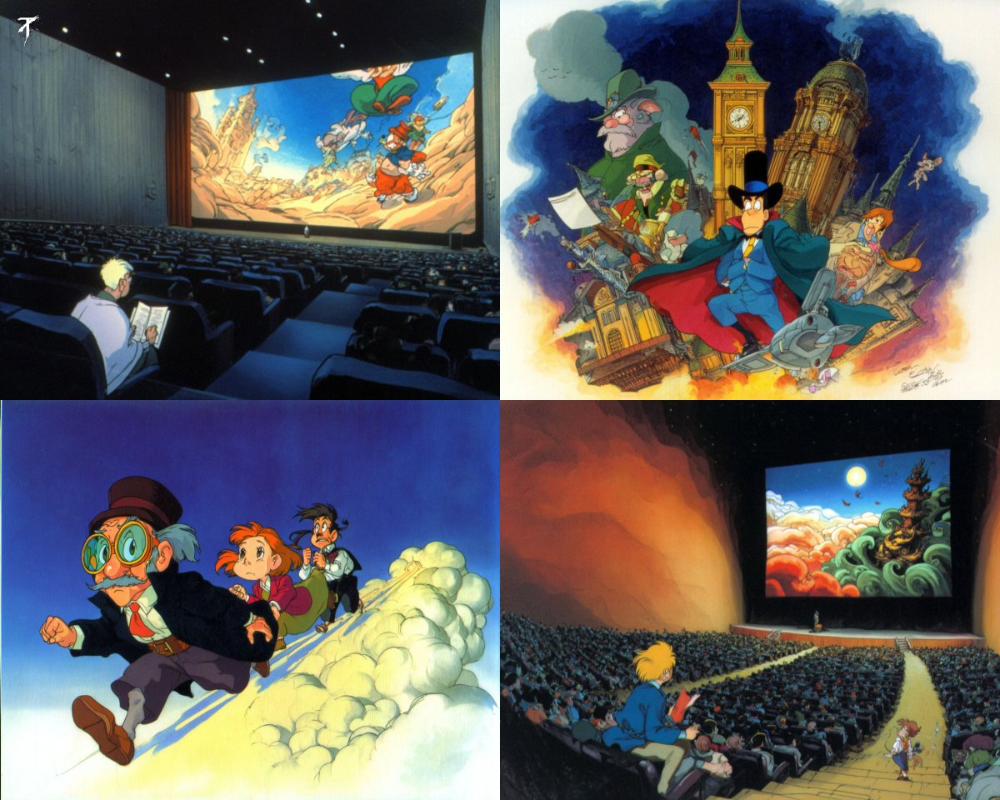

```
Classic animation-cinematic SREF. Hand-painted warmth, theatrical composition, nostalgic color harmony, and story-first pacing.

 --sref 2321282909

#midjourney #sref #aiart #tischeins
```

```
经典动画电影风格参考。手绘质感的温暖、戏剧化的构图、怀旧的色彩和谐，以及以故事为先的节奏。

--sref 2321282909
```

 [↑返回目录](#toc)

---
## <a id="">白色连衣裙女模与多彩章鱼装饰</a> (<a href="https://x.com/michaelrabone/status/2020061102214873279" target="_blank" rel="noopener noreferrer">Michael Rabone</a>)


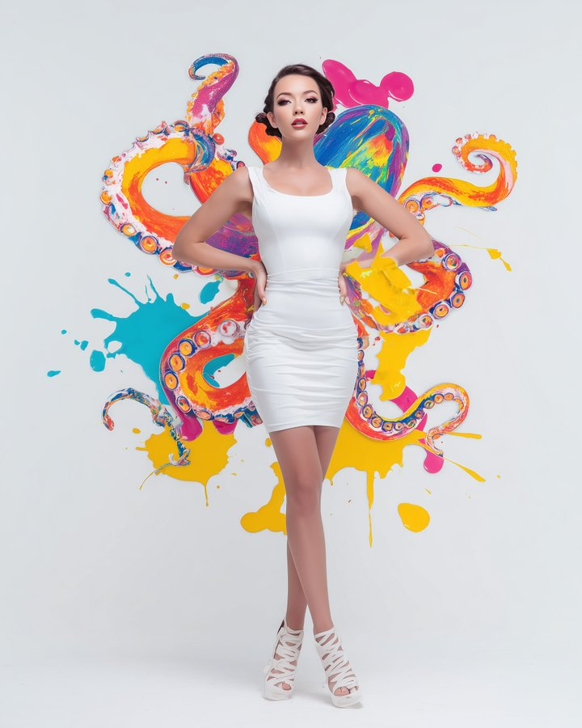

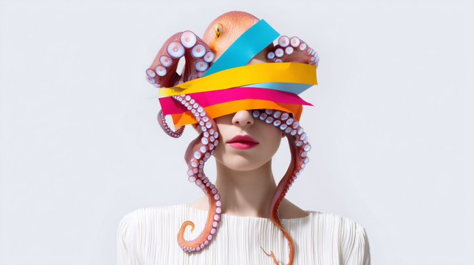

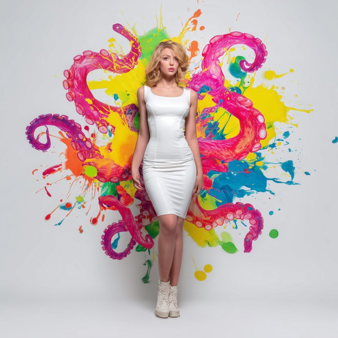

```
Female model wearing white bodycon dress posing against a white background, photos of octopus have been roughly cut out of a magazine and placed over the top of female, include splashes of brightly coloured paint, bright vivid colours --ar 4:5 --raw --s 75 --v 7
```

```
一位身穿白色紧身连衣裙的女模特站在纯白背景前摆姿势，杂志上剪下的章鱼图片被粗略地贴在她身上，画面中还泼洒着鲜艳明亮的颜料，色彩鲜明生动。--ar 4:5 --raw --s 75 --v 7
```

 [↑返回目录](#toc)

---
## <a id="">80年代复古写实电影海报</a> (<a href="https://x.com/Midlibrary_io/status/2019814594328375300" target="_blank" rel="noopener noreferrer">midlibrary</a>)

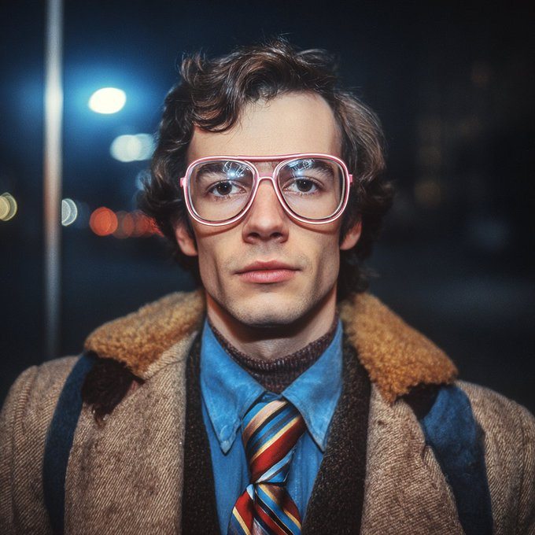

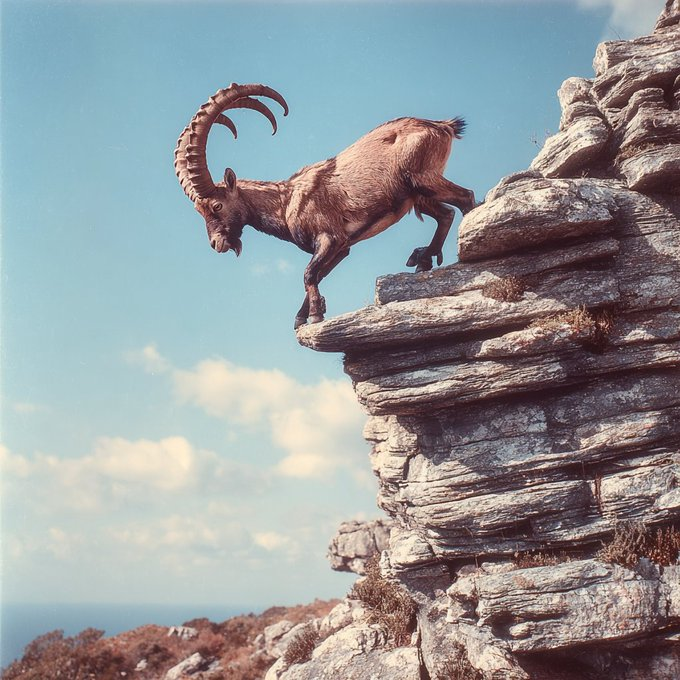

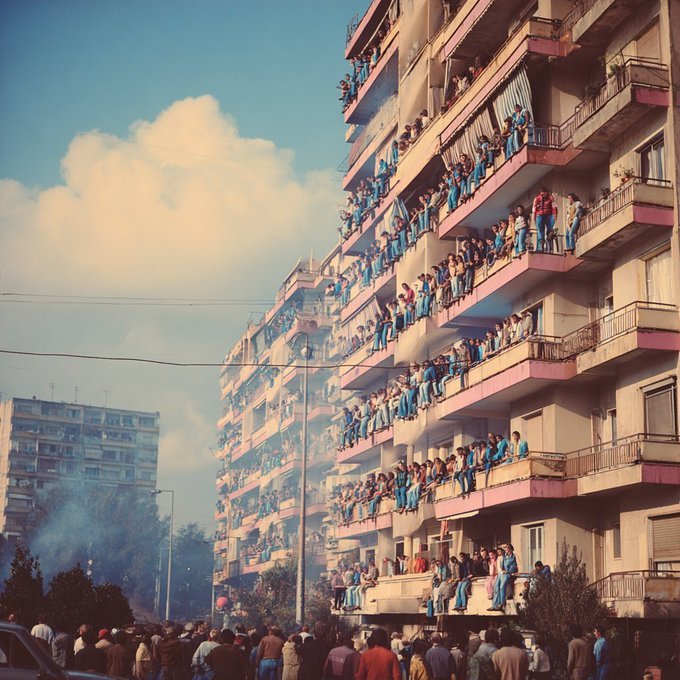

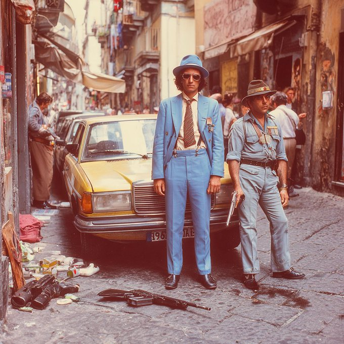

```
Retro 80s Realism
 --sref 738064309

A nostalgic, hyper-realistic style evoking 1980s movie posters or commercial art. It features warm, saturated colors, soft cinematic lighting, and a distinct retro-American atmosphere with slightly airbrushed textures.
```

```
复古80年代写实风格  
--sref 738064309  

一种唤起1980年代电影海报或商业艺术的怀旧、超写实风格，采用温暖饱和的色彩、柔和的电影感光影，以及带有轻微喷绘质感的独特复古美式氛围。
```

 [↑返回目录](#toc)

---
## <a id="">达·芬奇风格的动态木雕角色</a> (<a href="https://x.com/CharaspowerAI/status/2019825934195454002" target="_blank" rel="noopener noreferrer">Pierrick Chevallier | IA</a>)

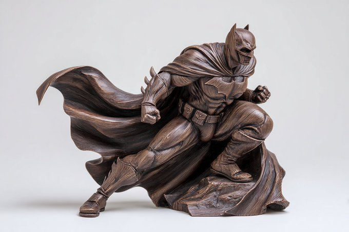

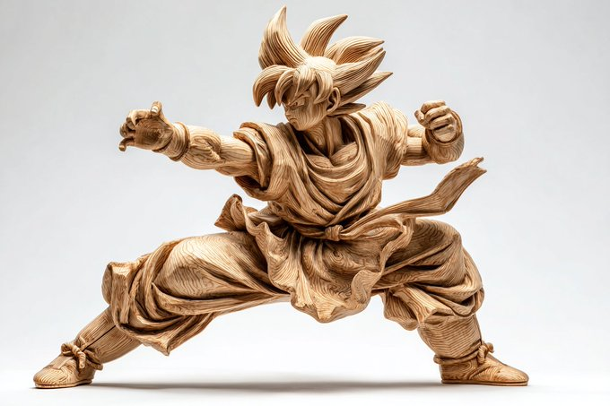

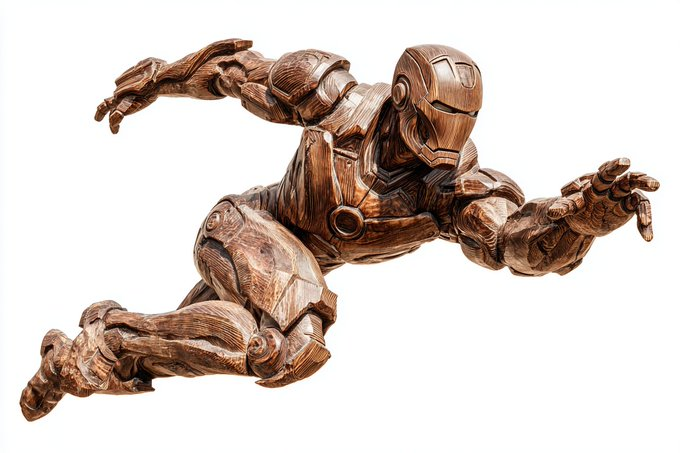

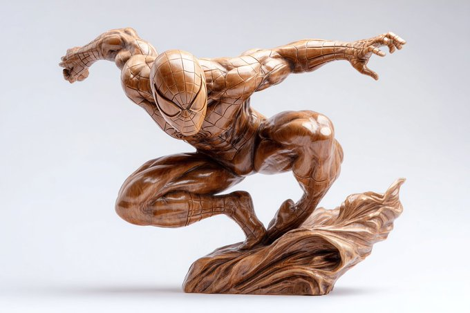

```
Wooden Sculpture in Midjourney

PROMPT
a wooden sculpture of [character] on a white background, in a dynamic pose, carved in the style of Leonardo da Vinci. hyper-realistic, tenebristic style of artistry, dramatic chiaroscuro lighting, fine wood grain details, stock photo quality, professional color grading.
```

```
一个[角色]的木雕，置于白色背景上，呈动态姿势，以达·芬奇风格雕刻。超写实主义，明暗对照强烈的艺术风格，戏剧性的明暗对比光影，精细的木纹细节，图库照片级画质，专业色彩调校。
```

 [↑返回目录](#toc)

---
## <a id="">赛博朋克城市夜景全息界面</a> (<a href="https://x.com/LudovicCreator/status/2020184546981933521" target="_blank" rel="noopener noreferrer">LudovicCreator</a>)

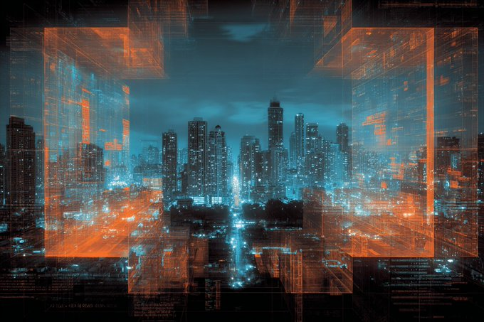


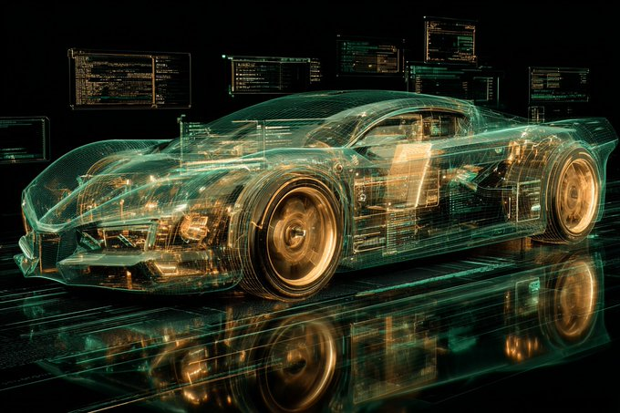


```
A Cyberpunk Holographic Interface surrounding [SUBJECT], with translucent screens, data streams, and augmented reality elements. Use [COLOR1] and [COLOR2] in glowing, semi-transparent layers.
```

```
A Cyberpunk Holographic Interface surrounding a City Skyline at Night, with translucent screens, data streams, and augmented reality elements. Use Orange and Deep Blue in glowing, semi-transparent layers --ar 3:2 --v 7.0
```

```
A Cyberpunk Holographic Interface surrounding a Digital Avatar, with translucent screens, data streams, and augmented reality elements. Use Neon Pink and Teal in glowing, semi-transparent layers. --ar 3:2 --v 7.0
```

```
A Cyberpunk Holographic Interface surrounding a Futuristic Sports Car, with translucent screens, data streams, and augmented reality elements. Use Emerald Green and Gold in glowing, semi-transparent layers. --ar 3:2 --v 7.0
```

```
A Cyberpunk Holographic Interface surrounding a Robotic Arm, with translucent screens, data streams, and augmented reality elements. Use Electric Blue and Silver in glowing, semi-transparent layers. --ar 3:2 --v 7.0
```

 [↑返回目录](#toc)

---
## <a id="">动画草图风格的创意灵感</a> (<a href="https://x.com/tisch_eins/status/2020120366333436140" target="_blank" rel="noopener noreferrer">Tischeins</a>)

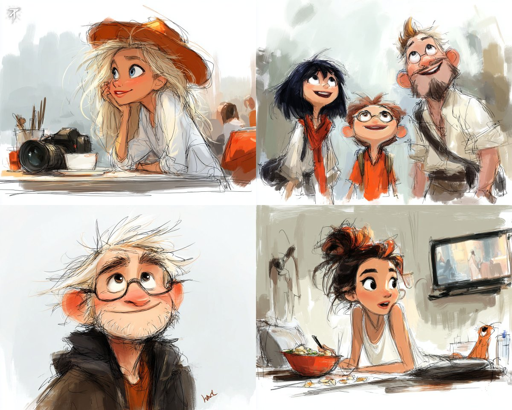

```
Really loving this loose animated-sketch SREF.

 --sref 4166492590

```

```
非常喜欢这种松散的动画草图风格参考图。

--sref 4166492590

```

 [↑返回目录](#toc)

---
## <a id="">哈利·波特 复古动漫风</a> (<a href="https://x.com/craftian_keskin/status/2020124798190268447" target="_blank" rel="noopener noreferrer">Keskin</a>)

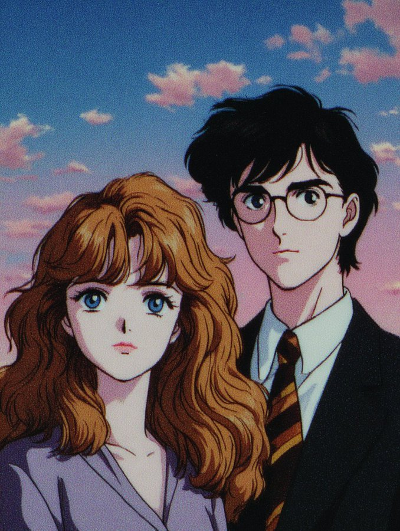

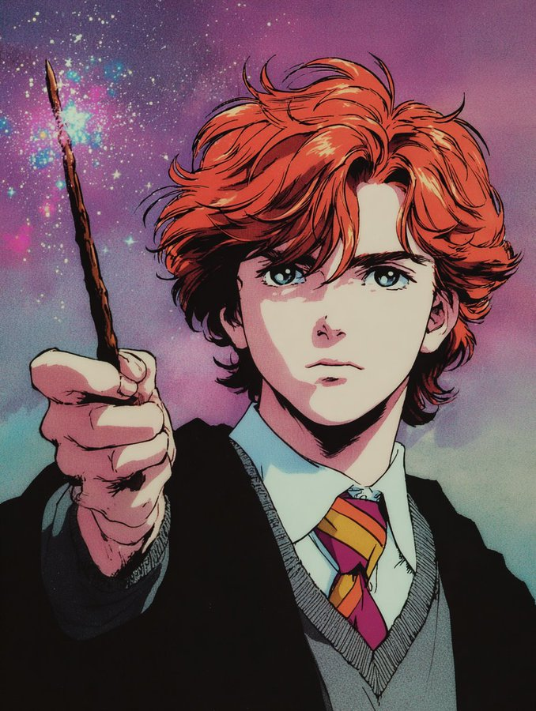

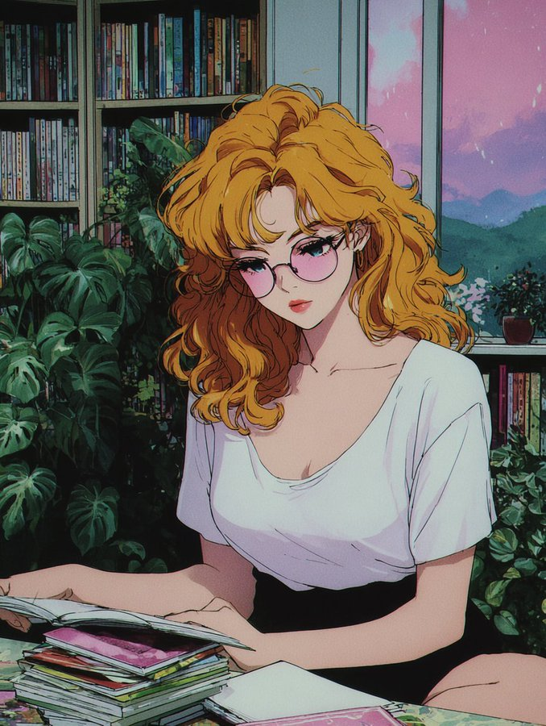

```
Harry Potter, with Retro Anime Style

--sref 4127059524
```

```
哈利·波特，复古动漫风格

--sref 4127059524
```

 [↑返回目录](#toc)

---
## <a id="">微距下的昆虫特写</a> (<a href="https://x.com/CharaspowerAI/status/2020188322698604948" target="_blank" rel="noopener noreferrer">Pierrick Chevallier | IA</a>)

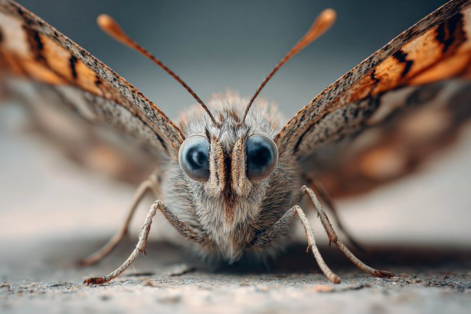

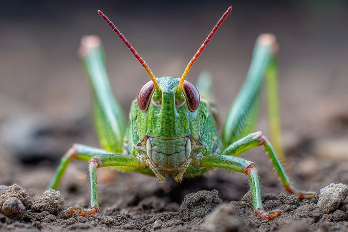

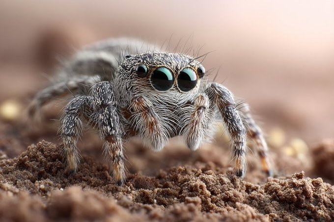

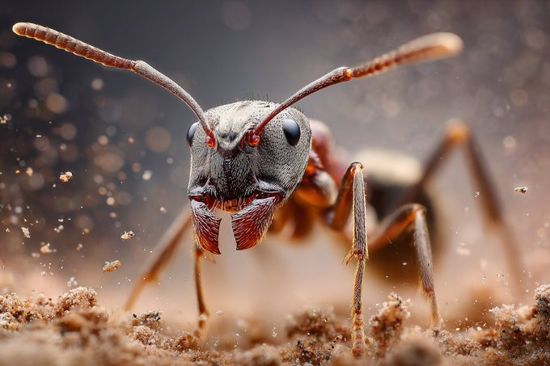

```
a close-up of an [insect species] on [natural ground or surface], macro photography, national geographic-style photo, cute and adorable yet realistic, hyperrealistic, extremely detailed, high-definition, intricate micro-details, very sharp focus, shallow depth of field, natural lighting.
```

```
一只[昆虫种类]在[自然地面或表面]上的特写，微距摄影，国家地理风格照片，可爱迷人 yet 逼真，超写实，细节极其丰富，高清晰度，精细的微观细节，焦点非常锐利，浅景深，自然光线。
```

 [↑返回目录](#toc)

---


[上一页](./1.md) | 当前 2/2 页 | [查看全部目录](../prompts.md)