# seedream.json 

seedream.json文件存放seedream相关的提示词，当前已收录：368个 

 投稿方式：[飞书投稿](https://tcn1uh5rxo87.feishu.cn/share/base/form/shrcne5gDolOMDd0oJsj2XfvxQc) or [issues](https://github.com/junxiaopang/gridsplitter/issues/new)

当前 1/4 页 | [下一页](./2.md) | [查看全部目录](../scripts/prompts/prompts.md)

🚀 **在线预览**: [https://prompts.kkkm.cn](https://prompts.kkkm.cn)

## <a id="toc">目录</a>

- [小巧可爱的等距视角](#prompt-404)
- [景泰蓝掐丝珐琅虎](#jm-prompt-7568413347029191946)
- [桃花符中的九尾狐](#jm-prompt-7574615301430463754)
- [狂风中的高楼背影](#jm-prompt-7575901186910326026)
- [穿越时空之门的宇宙飞船](#jm-prompt-7574708932258581811)
- [蜡笔涂鸦Q版小马](#jm-prompt-7574727716486909193)
- [枯木前的桂花香水](#jm-prompt-7573964958250077490)
- [POP MART风格3D蓝牛盲盒设计](#jm-prompt-7574028826364235035)
- [骏马贺岁](#jm-prompt-7575056901570940169)
- [呆头鸡的极简涂鸦](#jm-prompt-7572739436610424110)
- [奇幻财神群像](#jm-prompt-7574319872411208969)
- [手帐风黄豆猪蹄汤教程](#jm-prompt-7575052793451449609)
- [古老神像的俏皮梦](#jm-prompt-7568801048941382939)
- [古朴如来佛印](#jm-prompt-7571968732025670962)
- [童话森林秘境](#jm-prompt-7572126706585160998)
- [厌世杰瑞的办公自拍](#jm-prompt-7567380031958158602)
- [冥想的蚊子](#jm-prompt-7566638876253605146)
- [岁月侵蚀的金属书法牌匾](#jm-prompt-7572584917104692526)
- [拉面师傅的手艺](#jm-prompt-7577278826158263561)
- [蜜雪冰城胖橘猫逛街](#jm-prompt-7570597964394138889)
- [超现实双重曝光的噜噜](#jm-prompt-7569241849521524019)
- [童趣手写喜乐海报](#jm-prompt-7569773595682016522)
- [水彩风教学楼奇遇](#jm-prompt-7567282756363832603)
- [双重曝光下的城市剪影](#jm-prompt-7576271489633144074)
- [古风小人梦卧花瓣](#jm-prompt-7574024639823777050)
- [俏皮金渐层宝宝](#jm-prompt-7573452920067280178)
- [成都印象系列钥匙扣](#jm-prompt-7552707409836395826)
- [陆家嘴的街头涂鸦](#jm-prompt-7569979462951898414)
- [巨型冰红茶的奇幻工厂](#jm-prompt-7575481156729064755)
- [冬日星辰鹿仙子](#jm-prompt-7558878166102674726)
- [丝网印质感的卡普里岛汉堡海报](#jm-prompt-7558782893200362778)
- [国潮风格关羽IP制作流程](#jm-prompt-7572745194123119922)
- [雨夜工厂巷对话](#jm-prompt-7575664677515037978)
- [马年表情包](#jm-prompt-7569921109852736795)
- [雾海巨影](#jm-prompt-7559448376643685682)
- [赛博水墨热巴](#jm-prompt-7570879257849711882)
- [神秘火焰火娃](#jm-prompt-7555108063116594483)
- [巨童穿行都市](#jm-prompt-7554203904188124443)
- [文字构成的星空艺术](#jm-prompt-7570750679371795762)
- [暗黑镜像：铠甲勇士](#jm-prompt-7557257091036056870)
- [治愈系水彩火锅故事](#jm-prompt-7550897202986568994)
- [极简生肖鼠](#jm-prompt-7567723686338252083)
- [暗黑故宫：幼童皇帝的沉重仪式](#jm-prompt-7576671353156455707)
- [微缩景观中的好奇小猫](#jm-prompt-7559907099409534218)
- [美术学院的写实课堂](#jm-prompt-7567938256059370803)
- [潦草哲思图](#jm-prompt-7573549199208303910)
- [武汉三宫格：鱼与长江](#jm-prompt-7569544656334146866)
- [梦幻地铁中的自然秘境](#jm-prompt-7572649445246897454)
- [现代俏皮的白菜图标](#jm-prompt-7575859184600714547)
- [五路神爷喜庆图](#jm-prompt-7571113707527294218)
- [皮克斯风格的报纸探头](#jm-prompt-7575029586040294707)
- [蓝莓微距特写](#jm-prompt-7573674043195346202)
- [冬雪中的羊毛毡童话海岛](#jm-prompt-7569965073028910362)
- [微缩道境：烟化道祖](#jm-prompt-7572764765601271050)
- [镜像少女的凝视](#jm-prompt-7574262205298855219)
- [幻彩水晶初音未来](#jm-prompt-7550224968571817268)
- [新鲜肉类的奢华展示](#jm-prompt-7570624937262714139)
- [疯狂动物城2：明星自拍](#jm-prompt-7573938345940765978)
- [血色巷影：新黑色侦探](#jm-prompt-7551412014480985383)
- [快乐小狗的草地翻滚](#jm-prompt-7575201271548824858)
- [炎柱·炼狱杏寿郎](#jm-prompt-7573987335625313546)
- [鎏金狂草财运海报](#jm-prompt-7574278205796879666)
- [国风哪吒螺旋行](#jm-prompt-7568395837856845083)
- [荒诞寺林少](#jm-prompt-7569090340817292571)
- [古风美人与蜀葵花丛](#jm-prompt-7576176123101383974)
- [极简张飞轮廓](#jm-prompt-7572025462117944627)
- [新海诚风格的海滩大道](#jm-prompt-7572093095504874778)
- [书法字环绕的超现实人物](#jm-prompt-7566881543227018523)
- [黄山梦景](#jm-prompt-7571808383599250714)
- [暗黑滤镜下的熊二与年轻女性](#jm-prompt-7558637624169090350)
- [唐太宗银杏禅院3D绘图](#jm-prompt-7570911299589164334)
- [偏偏喜欢你-手绘涂鸦艺术字体](#jm-prompt-7575673154941570331)
- [卡通女孩与猫的潮流冒险](#jm-prompt-7525845624718249231)
- [膝关节的光辉结构](#jm-prompt-7570392746041560358)
- [妖异金箔神话](#jm-prompt-7576114704574057778)
- [慵懒可爱的橘白猫咪](#jm-prompt-7567380855073672457)
- [水墨梅香](#jm-prompt-7576609778248600842)
- [复古财神开业贴纸](#jm-prompt-7550594405707697447)
- [次元自拍：尼克狐与朱迪兔的网红之旅](#jm-prompt-7575491147246669107)
- [浩渺流光](#jm-prompt-7573657074769431858)
- [极简芭蕾侧影](#jm-prompt-7552454678785674505)
- [Q版苗族舞者](#jm-prompt-7569871595204857115)
- [Q版花栗鼠的多彩生活](#jm-prompt-7569597112724229385)
- [红影国风](#jm-prompt-7570888819424202030)
- [赣南客家：书法与文化的交融](#jm-prompt-7575084424690175283)
- [麻辣烫的极繁主义海报](#jm-prompt-7556190517487275310)
- [优雅教师的3D卡通全身像](#jm-prompt-7548338056282098990)
- [快乐鹅的复古治愈之旅](#jm-prompt-7568900093215116590)
- [夸张幽默的财迷肖像](#jm-prompt-7549321596213660978)
- [梦幻圣诞夜·城市之心](#jm-prompt-7574043724301307174)
- [黎锦风情的立体字艺术](#jm-prompt-7577127003623623945)
- [油画中的屠夫](#jm-prompt-7576156574587129097)
- [Q版阿U家族欢聚](#jm-prompt-7573502153738800393)
- [潮流猴子IP HaHa设计展板](#jm-prompt-7569246025664171302)
- [超现实主义火车拉链](#jm-prompt-7567281109994687753)
- [Q版柳树游戏插画](#jm-prompt-7571279579579419913)
- [Q版犬夜叉：白与红的传说](#jm-prompt-7525440169118289162)
- [蓝底白袋香蕉](#jm-prompt-7567011740907474186)
- [趴睡的软萌柴犬宝宝](#jm-prompt-7573474403967569198)
- [高达风格机械人字拖](#jm-prompt-7570350598185438473)

## <a id="prompt-404">小巧可爱的等距视角</a> (<a href="https://x.com/AmirMushich/status/1985740675871056194" target="_blank" rel="noopener noreferrer">AmirMushich</a>)


```
Tiny cute isometric [CHARACTER or PRODUCT], soft lighting, soft pastel colors, 3d icon clay render, substance 3d, pastel background
```

```
小巧可爱的等距视角[角色或产品]，柔和的光线，柔和的粉彩色调，3D图标粘土渲染，Substance 3D，粉彩背景
```

 [↑返回目录](#toc)

---
## <a id="jm-prompt-7568413347029191946">景泰蓝掐丝珐琅虎</a> (<a href="https://jimeng.jianying.com/ai-tool/personal/MS4wLjABAAAAnx0KAIhPU50JtTRkLbrV5VDDbTkt4ay8vwo8R4r6J5k" target="_blank" rel="noopener noreferrer">网乐宝</a>)

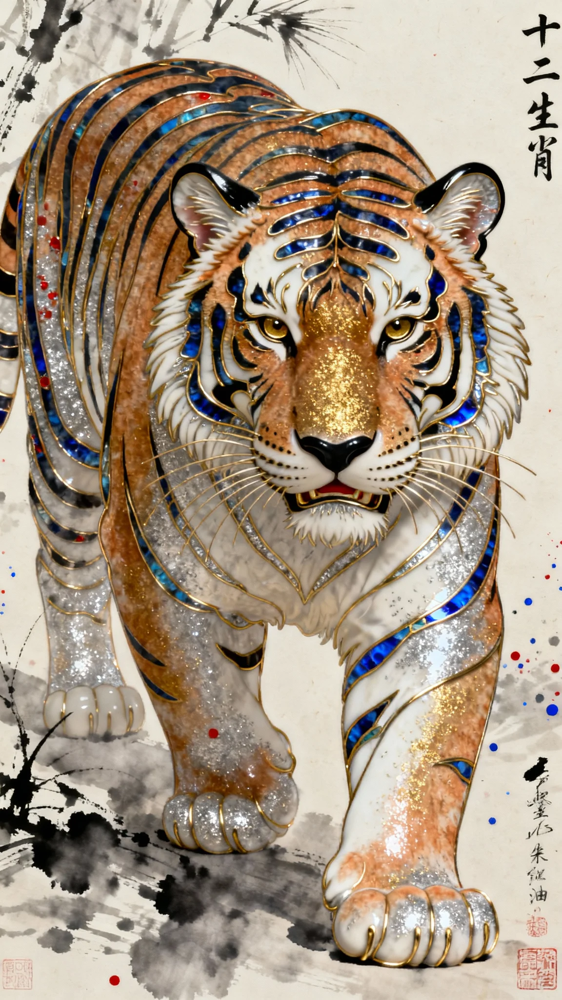

```
景泰蓝掐丝珐琅，工写兼工，超清巨作，十二生肖虎，32K竖幅9:16。0.12mm精铜丝飞白式掐丝，保留散锋断点，模拟毛笔枯笔。水墨灰→淡赭→暖白珐琅渐变，灰釉掺5%银箔显湿墨浓淡，鼻头纯黑+金砂高光。朱砂微粒与钴蓝微粒0.2-0.8mm随机泼溅，米白宣纸留地30%无丝无釉。ZBrush级0.02mm毛孔起伏，侧光45°金属丝高光=湿线，镜面抛光=水墨油亮。底部2cm雾灰→米白渐变，上浮极细朱砂似盖章朱印。32-bit PNG+SVG，10μm银砂颗粒，--ar 9:16 --v 6 --q 3 --style ink-enamel。
```

```
景泰蓝掐丝珐琅大师级超清巨作——十二生肖:虎，32K竖幅9:16，工写兼工；0.12 mm精铜丝飞白式掐丝保留散锋断点，模拟毛笔枯笔；水墨灰→淡赭→暖白珐琅渐变，灰釉掺5%银箔显湿墨浓淡，鼻头纯黑+金砂高光；朱砂微粒与钴蓝微粒0.2-0.8 mm随机泼溅，米白宣纸留地30%无丝无釉；ZBrush级0.02 mm毛孔起伏，侧光45°金属丝高光=湿线，镜面抛光=水墨油亮；底部2 cm雾灰→米白渐变，上浮极细朱砂似盖章朱印；输出32-bit PNG+SVG，10 μm银砂颗粒，，--ar 9：16 --v 6 --q 3 --style ink-enamel
```

 [↑返回目录](#toc)

---
## <a id="jm-prompt-7574615301430463754">桃花符中的九尾狐</a> (<a href="https://jimeng.jianying.com/ai-tool/personal/MS4wLjABAAAAplkTc9axM5SMWBsbkBX7iqilDCk5YyNWMgiU8KOExD6qVPqOzOYPQvjY2Rg3dORs" target="_blank" rel="noopener noreferrer">绝望上帝</a>)

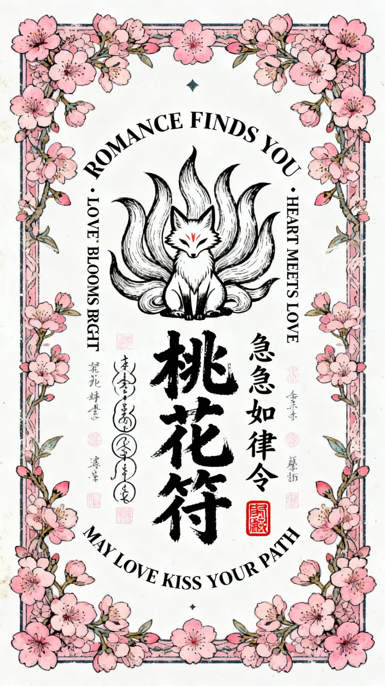

```
造梦师的诗意视觉风格，国潮设计，全景镜头，白色底色，民国怀旧氛围，外围繁复粉色桃花花纹边框，画面中心九尾狐图案，顶部和底部英文"LOVE BLOOMS BRIGHT"，中间拱起英文"ROMANCE FINDS YOU"，两侧竖排英文"HEART MEETS LOVE"，核心位置粗犷黑笔写的"桃花符"，周围竖排小字"急急如律令"和道家符咒点缀，底部英文"MAY LOVE KISS YOUR PATH"，红色篆刻印章。复古、潮趣氛围，中西融合，细节丰富。
```

```
以复古票据为原型的国潮设计画面，白色底色有民国怀旧氛围，外围是繁复粉色桃花花纹边框，九尾狐图案，顶部和底部有英文‘LOVE BLOOMS BRIGHT’，中间拱起‘ROMANCE FINDS YOU’，两侧竖排英文‘HEART MEETS LOVE’，画面核心是粗犷黑笔写的‘桃花符’，周围有竖排小字“急急如律令”和道家符咒点缀，底部有英文‘MAY LOVE KISS YOUR PATH’和红色篆刻印章。造梦师的诗意视觉风格，国潮，全景镜头，复古、潮趣氛围，中西融合、细节丰富修饰。
```

 [↑返回目录](#toc)

---
## <a id="jm-prompt-7575901186910326026">狂风中的高楼背影</a> (<a href="https://jimeng.jianying.com/ai-tool/personal/MS4wLjABAAAA1B726q3rTyDWCXWDhCBfqMQxt2oj8Evqp7nSGKS_6S8vJZiwBDA6c6-Igi4YyTHG" target="_blank" rel="noopener noreferrer">炼一一</a>)

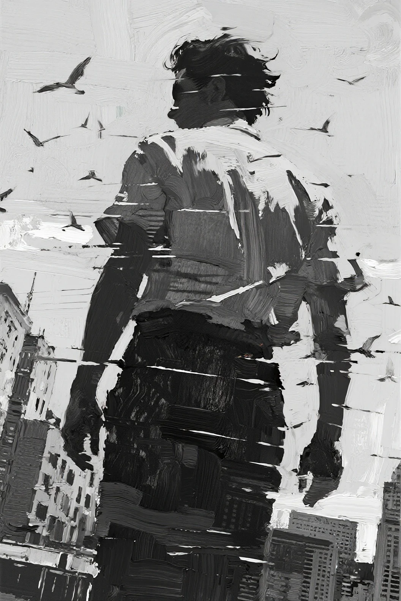

```
动态角度，黑白画风，颗粒感，肌理感，艺术氛围感加强，厚涂+晕染水粉，颜料的涂抹感+肌理感，超现实主义美学，高级的氛围感，层次感，矛盾冲突的视觉冲击和有机融合。图像拼贴图像轮廓提取，拼贴风格，贴画设计，背景为灰色适度留黑，艺术设计，故事感，高楼，背影，狂风
```

 [↑返回目录](#toc)

---
## <a id="jm-prompt-7574708932258581811">穿越时空之门的宇宙飞船</a> (<a href="https://jimeng.jianying.com/ai-tool/personal/MS4wLjABAAAAdcH3ss35AChN3U_IO3D1d2wvA7u6UnW_LFceXtjjPlgHjRDUl303zcCnPzhK_2_0" target="_blank" rel="noopener noreferrer">银宝（用图给赞赞）</a>)


```
3D科幻风格，分型算法生成的精密结构，透明漩涡状星云，粒子特效，流光，立体感，全景画面，极度繁琐，光影对比强烈，宇宙星空，云雾翻腾，星球，灰蓝色系，一艘繁琐复杂宏伟壮大的宇宙飞船穿越巨大宏伟的圆形发光时空之门，高光，光体，科技感。
```

```
分型算法，精密结构，透明漩涡状星云，粒子特效，流光，立体感，全景画面，极度繁琐，光影对比强烈。3D，3维，宇宙星空。云雾翻腾。星球。灰蓝色系。一艘繁琐复杂宏伟壮大的艘宇宙飞船穿越时空之门。高光。光体。巨大宏伟的时空之门，圆形发光。科技感。
```

 [↑返回目录](#toc)

---
## <a id="jm-prompt-7574727716486909193">蜡笔涂鸦Q版小马</a> (<a href="https://jimeng.jianying.com/ai-tool/personal/MS4wLjABAAAA7xo62W52dynqRpNbQWb8Mb33MCgZ_z_BuxTJ2Ed1wAU" target="_blank" rel="noopener noreferrer">远山娥黛</a>)

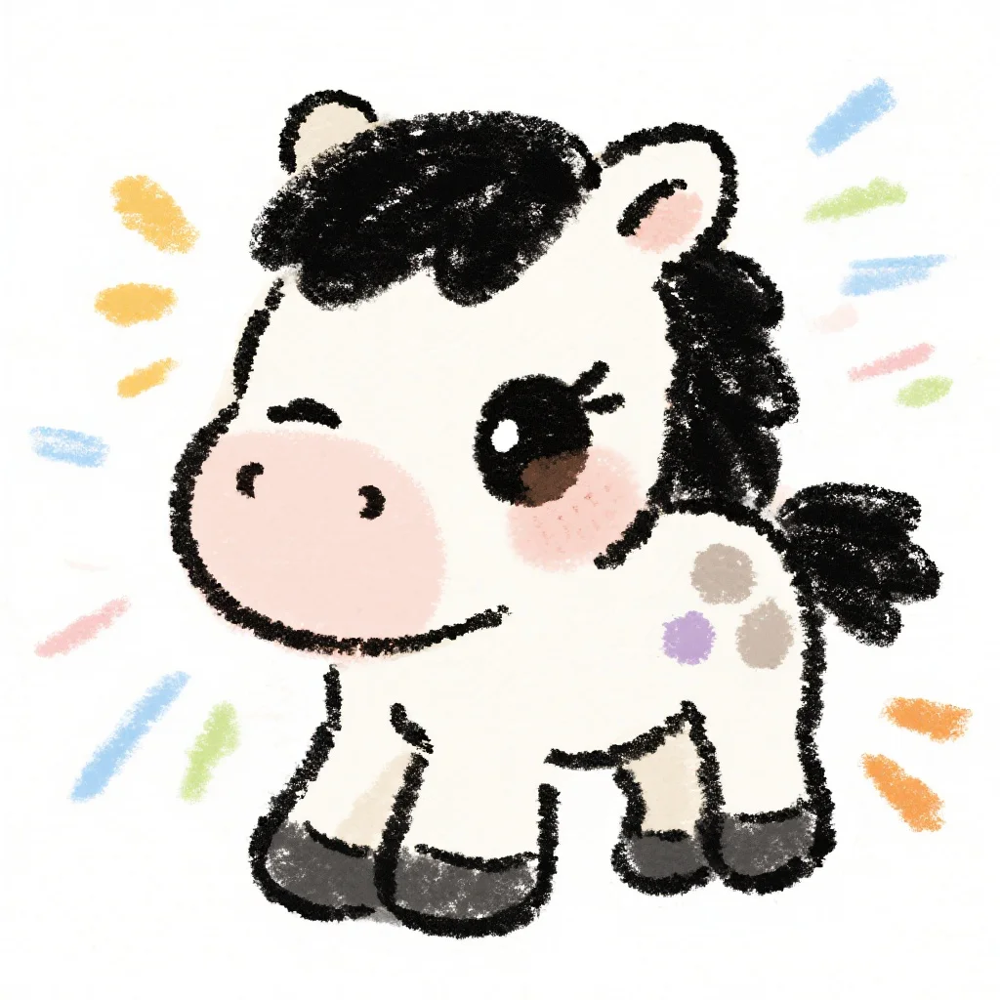

```
手绘插画，蜡笔涂鸦，一只可爱的小马，呆萌的表情，Q版，白色背景，突出蜡笔笔触，童趣可爱
```

 [↑返回目录](#toc)

---
## <a id="jm-prompt-7573964958250077490">枯木前的桂花香水</a> (<a href="https://jimeng.jianying.com/ai-tool/personal/MS4wLjABAAAAqHYhejSXTW8O1TSmrApJl8IUpjT2k-L2bY3fjf0sFtg1CNNn58i8d37aooF9vXvl" target="_blank" rel="noopener noreferrer">cici</a>)

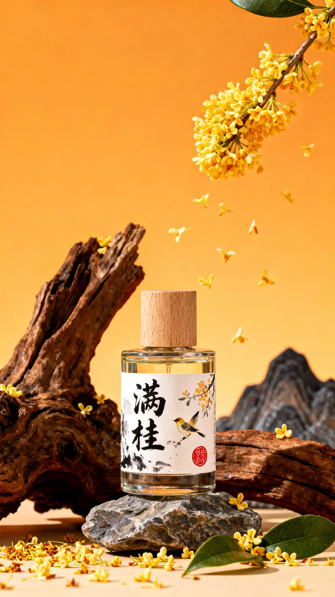

```
简约风格，暖橙黄色调，强烈光影对比，特写镜头。画面中一瓶玻璃小瓶香水，印着毛笔字"满桂"标签，标签上有水墨桂花和小鸟元素，右下方有红色圆形印章，搭配木质瓶盖，放置在枯木和山石构成的自然风背景前。周围散落桂花与桂花叶，上方大面积留白，右上角探出一枝桂花，大量桂花飘落。高级玻璃质感，自然风背景，画面简洁。
```

```
在一片暖橙黄色调的简约背景下，呈现出强烈的光影对比，画面要有桂花飘落，飘落的可以稍微多一点，一瓶印着满桂标签的香水，文字为毛笔字，文字小一点，标签上有水墨的桂花和小鸟元素，标签的右下方有红色圆形印章，香水瓶身为玻璃小瓶，瓶子质感要高级一点，搭配木质瓶盖，放置在枯木和山石构成的自然风背景前，周围散落着桂花与桂花叶，上方画面大面积留白，右上角探出一枝桂花，特写镜头聚焦于此
```

 [↑返回目录](#toc)

---
## <a id="jm-prompt-7574028826364235035">POP MART风格3D蓝牛盲盒设计</a> (<a href="https://jimeng.jianying.com/ai-tool/personal/MS4wLjABAAAArVLwdfJXVdRQDlH0HkwhykBhK8tc9BRrSHKfadmpwdgBk9qUoBqAtpS1qhibm3ph" target="_blank" rel="noopener noreferrer">小风筝1225</a>)

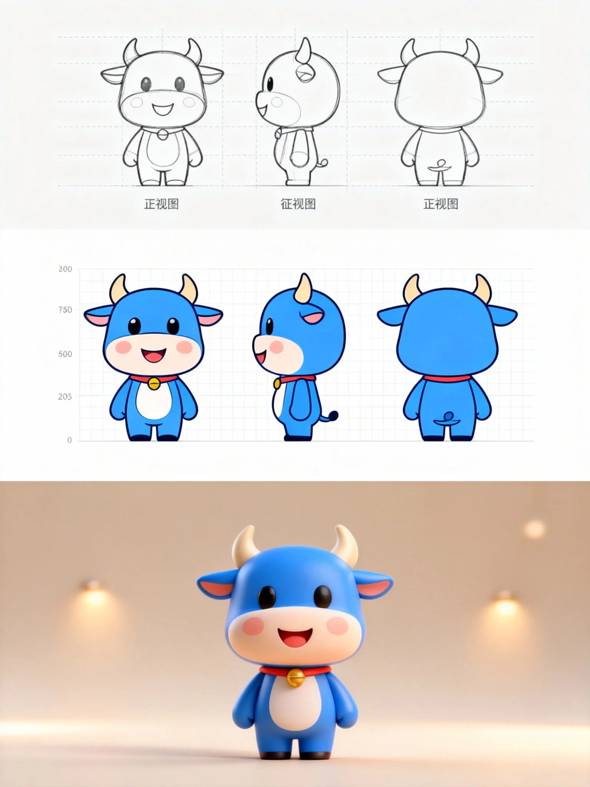

```
泡玛特风格3D盲盒，可爱的蓝色小牛拟人化IP，微笑表情，高清，超级细节，C4D渲染，柔和灯光，干净背景。从上到下展示三步骤：第一步为IP三视图草图，第二步为平面矢量三视图，第三步为3D三视图渲染效果。
```

```
3D盲盒，可爱的蓝色小牛拟人化ip，微笑，高清，超级细节，泡玛特风格，C4D渲染，柔和灯光，干净背景，从上到下展示第一步：设计IP三视图草图，第二部：平面矢量三视图，第三步：3D三视图渲染效果
```

 [↑返回目录](#toc)

---
## <a id="jm-prompt-7575056901570940169">骏马贺岁</a> (<a href="https://jimeng.jianying.com/ai-tool/personal/MS4wLjABAAAAhK_oV9qOpoatrRW6nLCaqRk_hNlQCI07GXFaY1IKuec" target="_blank" rel="noopener noreferrer">致敬正能量</a>)


```
国风插画风格，红色主色调，喜庆吉祥氛围。画面中心是一匹姿态昂扬的白色骏马，造型富有活力，鞍具装饰体现传统美学。马身周围环绕"HAPPY NEW YEAR""新年快乐""THE YEAR OF THE HORSE""中国年CHINESE NEW YEAR"中英双语文字，底部居中位置突出"马到成功"核心吉祥语。线条精致，细节丰富，兼具文化传播属性。
```

```
这张图片是一张马年中国新年（春节）贺图，融合了传统元素与节日祝福，可从以下几个维度解读：
主题与文化背景
它以中国农历马年为主题，结合 “马到成功” 的吉祥寓意，传递春节的喜庆祝福，同时通过中英双语呈现，兼具文化传播属性。
视觉元素解析
马的形象：一匹姿态昂扬的白色骏马，造型富有活力，象征着奋进、成功。在中国文化中，“马” 寓意事业顺遂，“马到成功” 是经典吉祥语，表达对新一年事事顺利、开篇得胜的期许。
色彩与风格：以红色为主色调，契合春节 “喜庆、吉祥” 的文化内涵；画面风格偏向国风插画，线条精致，细节处（如马的鞍具装饰）体现传统美学。
文字信息：
中英双语祝福：“HAPPY NEW YEAR”“新年快乐” 传递新年问候；“THE YEAR OF THE HORSE” 明确年份属性；“中国年 CHINESE NEW YEAR” 凸显文化背景。
核心吉祥语：“马到成功” 直接点题，将 “马” 的意象与新年祈愿结合，是画面的精神内核。
整体而言，这张图通过 “马” 的传统意象、红色的喜庆色彩和双语祝福，打造出兼具文化韵味与国际传播力的新年贺图，既表达了对马年新春 “事事顺遂、马到成功” 的美好祈愿，也展现了中国春节文化的独特魅力。

```

 [↑返回目录](#toc)

---
## <a id="jm-prompt-7572739436610424110">呆头鸡的极简涂鸦</a> (<a href="https://jimeng.jianying.com/ai-tool/personal/MS4wLjABAAAAJwiGJnDkjfvrvhCz5FhbTAO4tvndaX29QDBT6pJTmwM" target="_blank" rel="noopener noreferrer">碧水云间_247724441</a>)

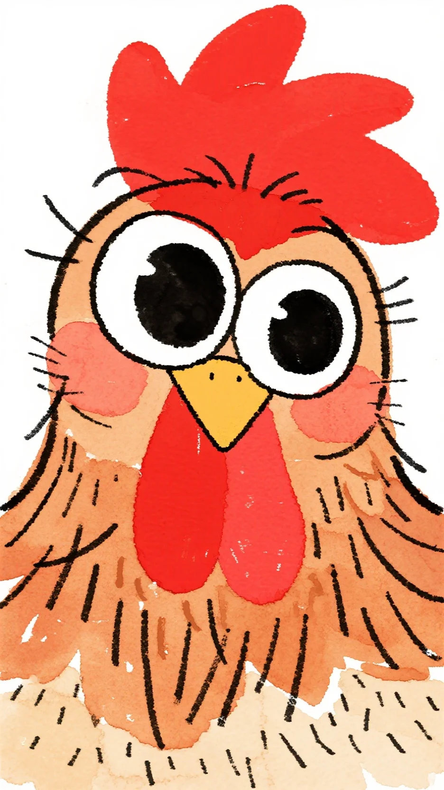

```
涂鸦，粗略，极简画的是一只呆头鸡，大眼睛，鱼眼镜头，插图是手绘的，杂乱的艺术线条。Q版，诙谐，插画，水彩平铺。，特写，古朴典雅，线条粗犷艺术图形插画，，红色填满画面，简约风格，，大胆版画，石刻，双色调，纯色背景--AR 3:4--V 5.2
```

 [↑返回目录](#toc)

---
## <a id="jm-prompt-7574319872411208969">奇幻财神群像</a> (<a href="https://jimeng.jianying.com/ai-tool/personal/MS4wLjABAAAAd12mILw3-sqKwwuUsXyabDf-u6HcXoSpUbxSm7XEUxs" target="_blank" rel="noopener noreferrer">MadnessJ沐沐</a>)

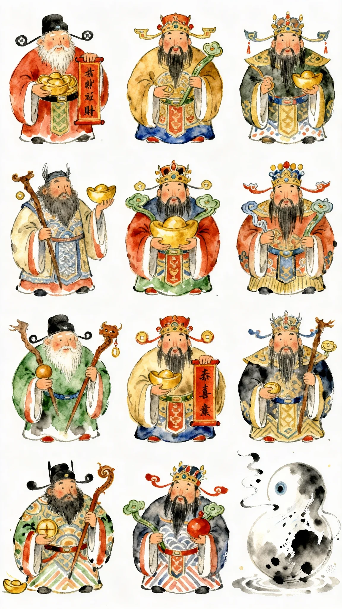

```
雷蒙德·布里格斯与马蒂亚斯·阿道夫松混合风格插画，白色简洁背景，彩铅与水彩混合媒介创作，色彩饱满，笔触细腻，水墨渲染效果，怪诞美学。多个财神形象随机平铺排列，传统服饰与道具，奇幻超现实元素，画面充满叙事性与细节。
```

```
采用雷蒙德·布里格斯（Raymond Briggs）和马蒂亚斯·阿道夫松（Mattias Adolfsson）风格的插画，白色简洁背景，运用彩铅与水彩混合媒介创作，色彩饱满，笔触细腻，水墨渲染，怪诞美学，
财神 内容随机 平铺排列
```

 [↑返回目录](#toc)

---
## <a id="jm-prompt-7575052793451449609">手帐风黄豆猪蹄汤教程</a> (<a href="https://jimeng.jianying.com/ai-tool/personal/MS4wLjABAAAAex9qBZsfqRHIKzs2dwFDsyCVMLUkP5APDWMvpzu7G7A" target="_blank" rel="noopener noreferrer">H领悟S</a>)

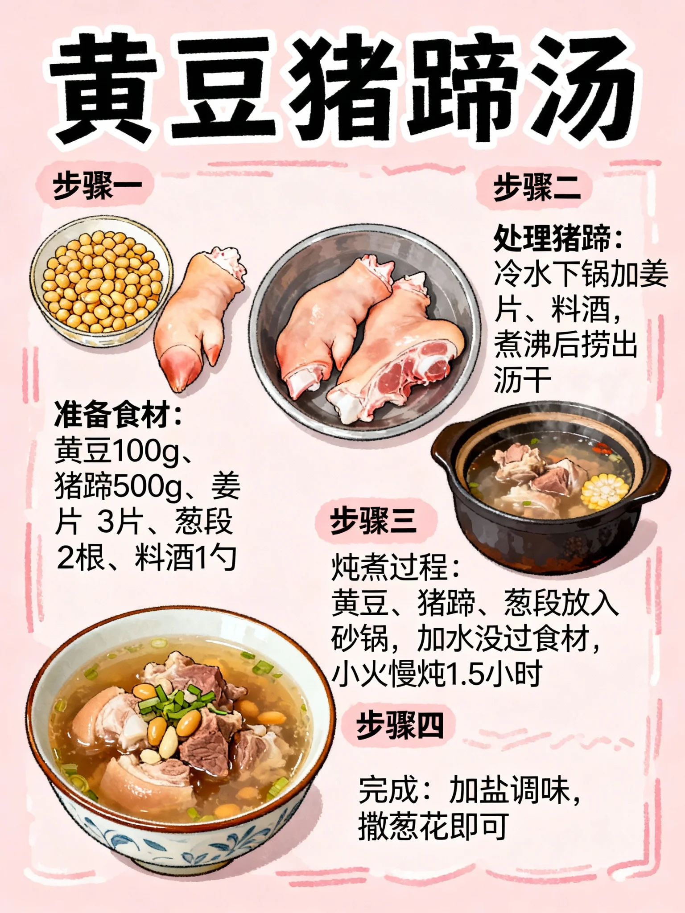

```
手帐风格，教程图，标题"黄豆猪蹄汤"位于顶部，加粗字体。步骤一：左侧展示泡发的黄豆和洗净的猪蹄，下方文字"准备食材：黄豆100g、猪蹄500g、姜片3片、葱段2根、料酒1勺"；步骤二：中间展示焯水的猪蹄，文字"处理猪蹄：冷水下锅加姜片、料酒，煮沸后捞出沥干"；步骤三：右侧展示炖煮中的砂锅，文字"炖煮过程：黄豆、猪蹄、葱段放入砂锅，加水没过食材，小火慢炖1.5小时"；步骤四：下方展示成品图，汤浓肉烂的黄豆猪蹄汤盛在碗中，文字"完成：加盐调味，撒葱花即可"。浅粉色背景，手绘线条装饰，清晰分栏排版，温馨手帐氛围。
```

```
手帐风格，标题“黄豆猪蹄汤”，出一个黄豆猪蹄汤制作步骤过程教程图，步骤说明要清晰，中文字幕，最后展示成品图
```

 [↑返回目录](#toc)

---
## <a id="jm-prompt-7568801048941382939">古老神像的俏皮梦</a> (<a href="https://jimeng.jianying.com/ai-tool/personal/MS4wLjABAAAAaWOh_9KiY8eT5AKmgH-LQS_rAw1rTbMYJyohoW9SQc-BYvIho68gpIdsZ0na3gtj" target="_blank" rel="noopener noreferrer">大象咖啡</a>)

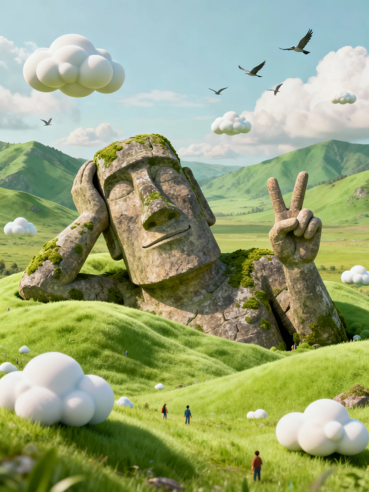

```
治愈系插画风，柔和的色彩，写实，完美的构图。巨大的古老侧卧神石像，一只手撑着脑袋，一手比耶，神情调皮，身体大部分陷入嫩绿色柔软山丘的草地中，仅露出头和一个肩膀，石像表面布满青苔。背景为绿色山丘与草原，梦幻天空中漂浮立体云朵，飞鸟盘旋，草地上也飘着立体云，画面中点缀渺小的人类。
```

```
一个巨大的古老的侧卧的神的石像 ，一只手撑着脑袋，一手比耶，神情调皮。身体大部分都已经陷入了草地中。只露出头和一个肩膀。石像上长满了青苔。在绿色的山丘上。草原，柔软的嫩绿色山丘。梦幻的天空，飞鸟，立体的云，草地上飘着立体的云。渺小的人类。治愈系插画风，柔和的色彩，写实，完美的构图。
```

 [↑返回目录](#toc)

---
## <a id="jm-prompt-7571968732025670962">古朴如来佛印</a> (<a href="https://jimeng.jianying.com/ai-tool/personal/MS4wLjABAAAAUHxljvqomtUldgQZkJ6JnvafqJLm85ozudxkF93-VoKCUd1K36TnMULKlOUJjVfJ" target="_blank" rel="noopener noreferrer">用户2176742448141</a>)

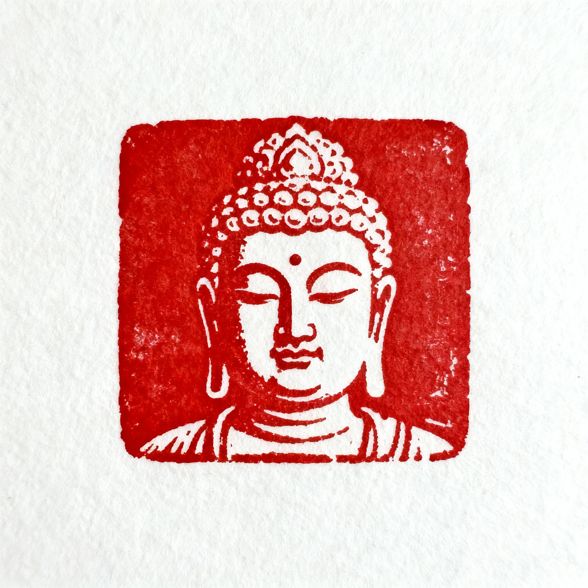

```
红色方形印章风格，方形印章，内刻如来佛头像，印在白色纸上，古朴质感，古意氛围。
```

```
红色方形印章风格，印章内刻有如来佛头像。印在白色纸上，古朴古意。
```

 [↑返回目录](#toc)

---
## <a id="jm-prompt-7572126706585160998">童话森林秘境</a> (<a href="https://jimeng.jianying.com/ai-tool/personal/MS4wLjABAAAAPB5hlcXxgs5Xpn8-mWJHfofn8SEuYJINC0TWsiMUc_Rj5jgGLfP6vhT45jgwDtn3" target="_blank" rel="noopener noreferrer">bubu626</a>)

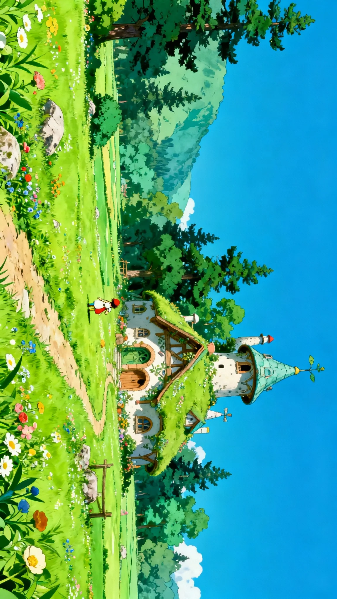

```
Moebius风格，极繁主义，极致表现力，浪漫感，细节完美，大师杰作。虚幻6渲染，森林秘境，夏天田野，画面干净，色彩治愈，建筑，明亮鲜艳的绿色主色调，奇幻、可爱、温馨的森林童话氛围，带领观众进入充满惊喜的童话世界。
```

```
Moebius (Jean Giraud)风格，极繁主义，极致表现力，浪漫感，细节完美，大师杰作。 森林秘境，夏天田野，画面干净，色彩治愈，画面中建筑，整体画面运用明亮鲜艳的绿色为主色调，营造出一种奇幻、可爱且温馨的森林童话氛围，仿佛带领观众进入一个充满惊喜的童话世界。虚幻6渲染
```

 [↑返回目录](#toc)

---
## <a id="jm-prompt-7567380031958158602">厌世杰瑞的办公自拍</a> (<a href="https://jimeng.jianying.com/ai-tool/personal/MS4wLjABAAAA99pRDHC1K6oeBUglWeURQOPZsQduk8AANd91GECmXN1qetRd3VZOWjhFqzAGP_Ri" target="_blank" rel="noopener noreferrer">今天也要努力鸭</a>)

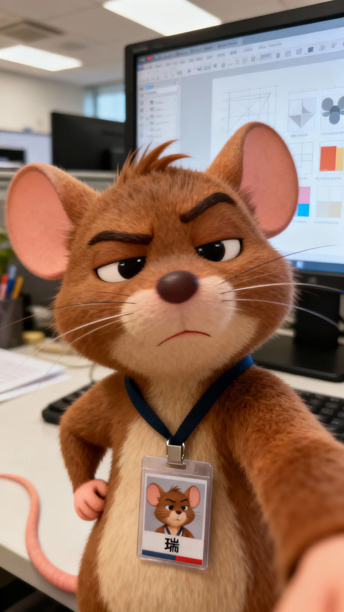

```
日常快照视觉风格，轻微运动模糊，中心构图，拟人化老鼠"杰瑞"占据画面中心，自拍大头照，脸上带厌世神情，脖子挂带有自己大头照的工牌。背景为办公场景，旁边电脑屏幕显示平面设计页面，平凡独特氛围。
```

```
一只拟人化的老鼠“杰瑞”形象，以日常快照的视觉风格展现，照片中没有明确的主体或构图感，还带有轻微的运动模糊。主角占据画面中心位置，是自拍的大头照，脸上带着厌世的神情，它脖子上挂着一个带有自己大头照的工牌。背景是办公场景，旁边的电脑屏幕上是平面设计的页面，营造出一种平凡又独特的氛围。
```

 [↑返回目录](#toc)

---
## <a id="jm-prompt-7566638876253605146">冥想的蚊子</a> (<a href="https://jimeng.jianying.com/ai-tool/personal/MS4wLjABAAAAV07cAvTy72R-hlsBbuLaz-qfwpGPKgwEX6dHIM3m4xe7hbYQ8u023dIeFlnI1n_7" target="_blank" rel="noopener noreferrer">谢坚明</a>)

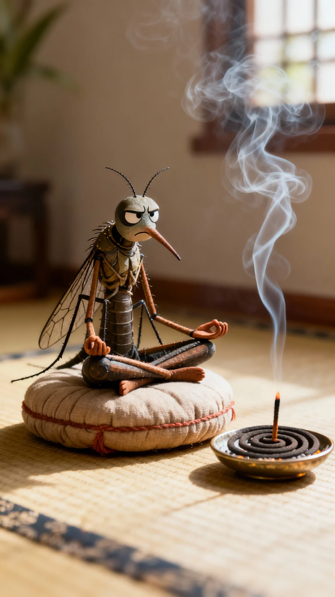

```
写实摄影，自然光，细节清晰，一只蚊子坐在蒲团上打坐，头部拟人化皱眉，地上点着一盘蚊香，烟雾缭绕。
```

```
写实摄影，一只蚊子坐在蒲团上打坐（头部拟人，皱眉），地上点着一盘蚊香，
```

 [↑返回目录](#toc)

---
## <a id="jm-prompt-7572584917104692526">岁月侵蚀的金属书法牌匾</a> (<a href="https://jimeng.jianying.com/ai-tool/personal/MS4wLjABAAAAkKmpbI4bHs6DaH3ggWHqFQaoutAvjUQqvfsrZjJNt3A" target="_blank" rel="noopener noreferrer">人生何求</a>)

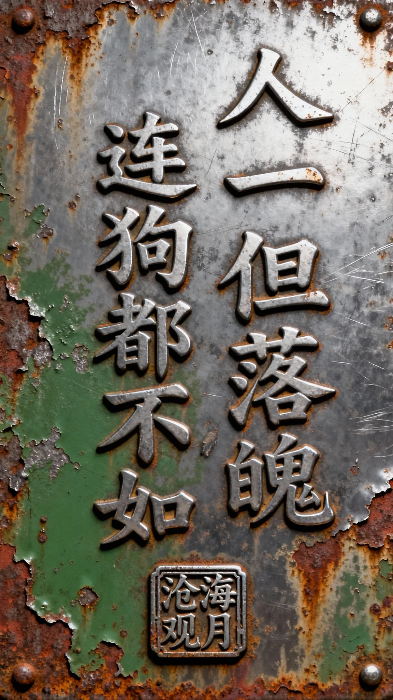

```
做旧金属质感，铁灰色到暗银色渐变，叠加自然氧化锈迹与细微划痕，金属质感厚重，岁月侵蚀的斑驳痕迹，高浮雕立体效果，边缘凹凸质感，融合中国传统金属铁工艺与书法艺术，古朴厚重的历史感，铁锈迹和金属氧化效果真实自然，文字笔画雕刻肌理清晰，兼具书法笔墨韵味与铁铸造工艺感，军绿色（铁绿）与棕红色（锈迹）自然过渡，哑光金属光影层次，浮雕部分高光与阴影突出立体感，锈迹色彩深浅不一，模拟真实金属铁氧化斑驳效果。主文字为"人一但落魄，连狗都不如"，下方有立体印章"沧海观月"。
```

```
按参考图提供的字体轮廊去生成文字， 整体为做旧金属质感，表面呈现出铁灰色到暗银色的渐变，叠加自然的氧化锈迹与细微划痕铁锈迹，金属质感厚重且带有岁月侵蚀的斑驳痕迹，文字与纹饰均为高浮雕立体效果，边缘有明显的凹凸质感。
 融合中国传统金属铁工艺与书法艺术，呈现出古朴厚重的历史感，细节处的铁锈迹和金属氧化效果真实自然，文字笔画的雕刻肌理清晰，兼具书法的笔墨韵味与铁铸造的工艺感。
 主色调为军绿色（铁绿）与棕红色（锈迹）的自然过渡，光影呈现出哑光金属的明暗层次，浮雕部分的高光与阴影突出立体感，锈迹的色彩深浅不一，模拟真实金属铁的氧化斑驳效果。
“人一但落魄，连狗都不如”


下面有个立体印章沧海观月
```

 [↑返回目录](#toc)

---
## <a id="jm-prompt-7577278826158263561">拉面师傅的手艺</a> (<a href="https://jimeng.jianying.com/ai-tool/personal/MS4wLjABAAAAkotMyB2rN2pIYOyFuG16nqIXyKTCy8W_FI3REfb0w6hhNCdVNm63-ufrRMT8QPCu" target="_blank" rel="noopener noreferrer">Tink_li</a>)

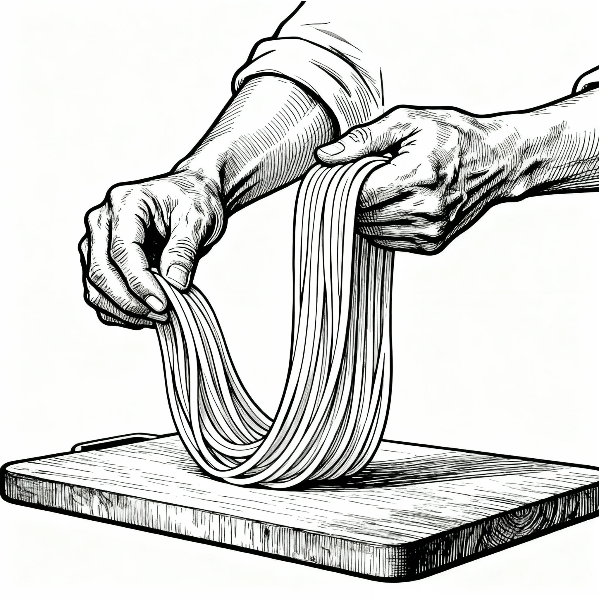

```
钢笔版画风格，黑白线稿，单色手绘icon图标，简洁构图，纯白背景。主体为一双手正在拉烩面，下方是木质案板。手部线条硬朗，用钢笔排线细腻勾勒手指关节、手掌纹路与肌肉起伏，呈现力量感与真实感；手中宽面线条体现宽面形态与拉伸状态，展现柔韧与弹性。
```

```
采用钢笔版画风格，黑白线稿，创作一幅单色手绘icon图标。画面以简洁为要，主体聚焦于一双手正在拉烩面。画面下边是一张木质案板，手的线条硬朗且富有质感，运用钢笔排线细腻勾勒出手指关节、手掌纹路与肌肉起伏，呈现手部的力量感与真实感，手中的宽面，线条体现其宽面形态，拉伸状态，展现烩面的柔韧与弹性。纯白背景
```

 [↑返回目录](#toc)

---
## <a id="jm-prompt-7570597964394138889">蜜雪冰城胖橘猫逛街</a> (<a href="https://jimeng.jianying.com/ai-tool/personal/MS4wLjABAAAAXbBjg8YYXwTUaVq5cPWNvszyqTcoVAD8kVeC35J51qEsOmX05HnnJwHuAvyoGSIa" target="_blank" rel="noopener noreferrer">胖橘分橘</a>)

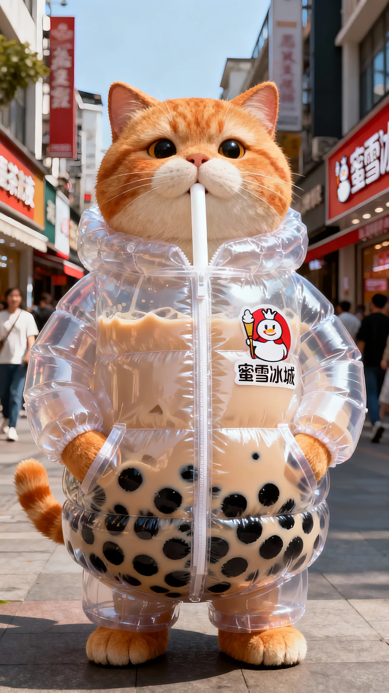

```
写实风格，色彩明亮，高品质模型。热闹的白天商业街场景中，一只可爱的拟人化胖橘猫身穿透明充气蓬松羽绒服，内部填充模拟珍珠奶茶的液体（含明显黑珍珠视觉效果），衣服右侧印有"蜜雪冰城"品牌标识（带雪王形象），嘴里含着白色吸管，吸管插入领口处的"奶茶液"，双手插在衣服口袋。背景是沿街商铺、行人，营造出有趣日常氛围。
```

```
在热闹的白天商业街场景中，一只可爱的拟人化胖橘猫身穿透明充气蓬松羽绒服，内部填充模拟珍珠奶茶的液体（含明显黑珍珠视觉效果 ），衣服右侧印有“蜜雪冰城”品牌标识（带雪王形象 ），嘴里含着白色吸管，吸管插入领口处的“奶茶液”，双手插在衣服口袋，背景是沿街商铺、行人，营造出有趣日常氛围，风格写实、色彩明亮，高品质模型 。
```

 [↑返回目录](#toc)

---
## <a id="jm-prompt-7569241849521524019">超现实双重曝光的噜噜</a> (<a href="https://jimeng.jianying.com/ai-tool/personal/MS4wLjABAAAAqYVrqg3aVfDjw8QCk6wdk65qbjp8z5-qkkGEewQ8ri0PrKpyDEXVkFuI3WyFhMge" target="_blank" rel="noopener noreferrer">噜学家</a>)

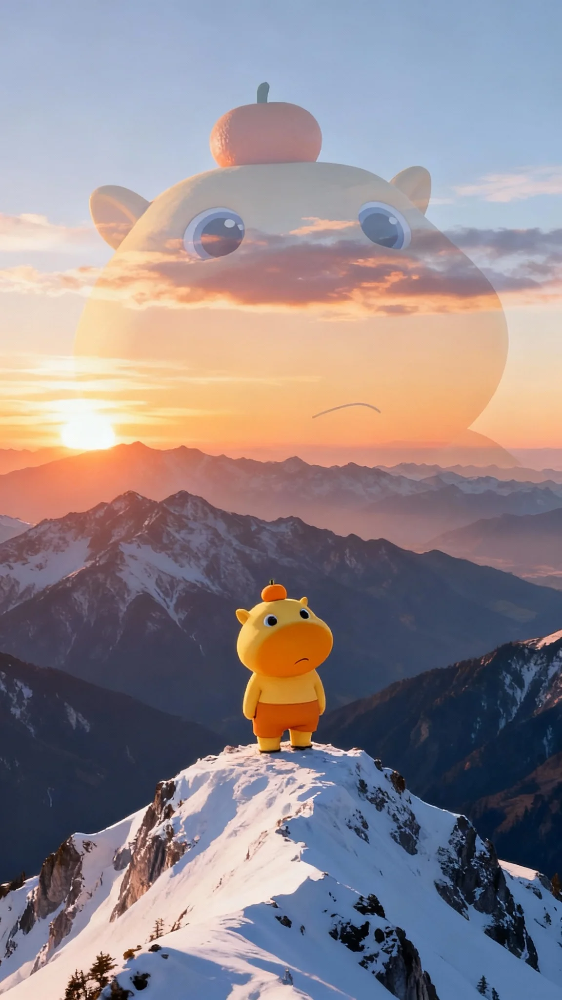

```
超现实艺术风格，双重曝光效果下，橙黄色主体、头上有橘子且身穿橙色短裤的实体噜噜站在雪山山顶眺望，叠加与天空融合的巨型噜噜虚影，实体与虚体表情均为犹豫惆怅，背景是日出时分的山脉，呈现温暖光影色调。
```

```
双重曝光效果，一只噜噜（形象参考附件，橙黄色主体，头上有橘子）站在雪山山顶眺望，同时叠加巨型噜噜虚影（与天空融合），实体噜噜与虚体表情形象一直，望着远方，犹豫惆怅，日出时分的山脉背景，温暖的光影色调，超现实艺术风格
```

 [↑返回目录](#toc)

---
## <a id="jm-prompt-7569773595682016522">童趣手写喜乐海报</a> (<a href="https://jimeng.jianying.com/ai-tool/personal/MS4wLjABAAAAkD_QKAxguHEITNx2to9tr8yRQTVhlzEEQHRwEDfC7G82CH63u8S6OdeG_JwOUWZX" target="_blank" rel="noopener noreferrer">彼岸悠然</a>)

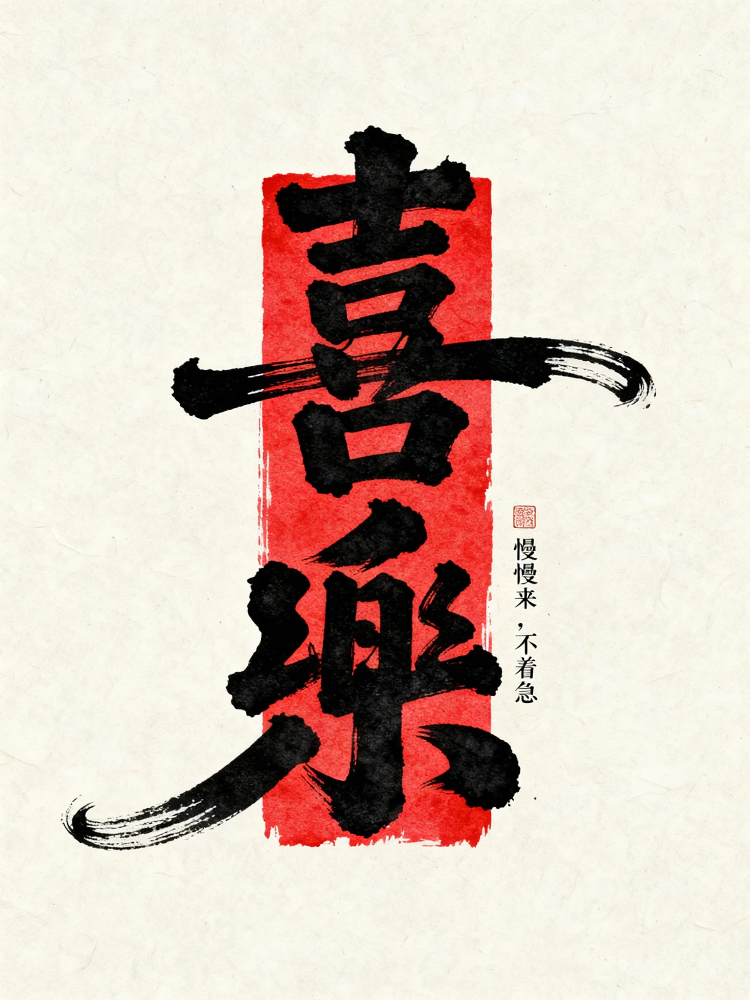

```
手写字体海报设计，儿童艺术风格，现代艺术设计感，米白色宣纸背景，细腻磨砂质感，大留白。画面中间竖向矩形抹红色色块，上面组合"喜乐"手写艺术字体，黑色文字，模拟三岁小孩手法，文字大小对比强烈、错落排布、紧凑排版，笔画不流畅感明显、夸张变形、极具张力、有粗有细、俏皮，流动的墨，不规则边缘，拼凑感，懒惰感，笨拙，粗笔触，字形灵动有张力，笔画长短对比强烈，部分长笔画夸张伸出画面外、弯曲、仿生。画面右下角有小小的暗红色仿古印章和小小黑体"慢慢来，不着急"装饰，整体中式艺术海报排版，视觉冲击强。
```

```
手写字体海报设计，大留白，画面中间一块竖向矩形抹红色色块，上面组合“喜乐”手写艺术字体，，文字大小对比非常强烈，模拟三岁小孩手法，文字大小错落排布，紧凑排版，笔画不流畅感明显，笔画夸张变形，极具张力，有粗有细，俏皮，流动的墨，不规则边缘，拼凑感，懒惰感，笨拙，粗笔触，字形灵动有张力，笔画长短对比强烈，部分笔画长的夸张，伸出画面外，弯曲，仿生，具现代艺术设计感，艺术作品，儿童艺术风格，视觉冲击强。黑色文字，米白色背景，细腻的磨砂质感背影，宣纸背景，小小的暗红色仿古印章和小小黑体“慢慢来，不着急”装饰，整体中式艺术海报排版。
```

 [↑返回目录](#toc)

---
## <a id="jm-prompt-7567282756363832603">水彩风教学楼奇遇</a> (<a href="https://jimeng.jianying.com/ai-tool/personal/MS4wLjABAAAASoNli152PHhN4SY7bYfxn3wNIrUam461yDUOo9hONm9YmzUS6RXfIm2zYCgXyGcT" target="_blank" rel="noopener noreferrer">安好</a>)

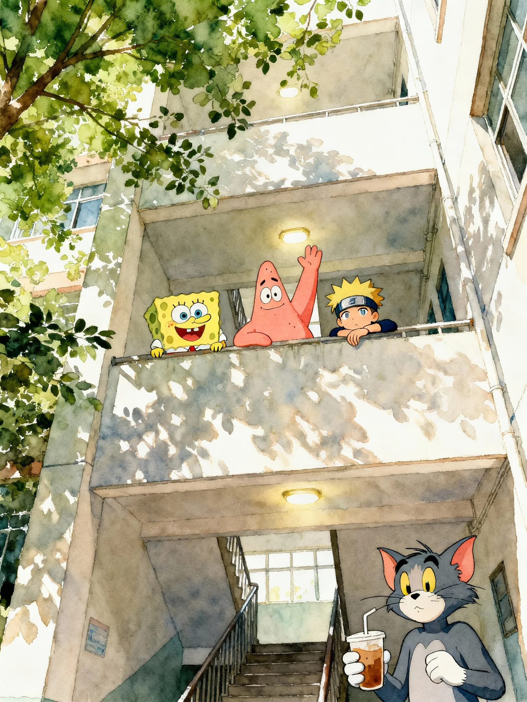

```
水彩插画，低饱和色彩，强烈光影对比，模拟过曝效果，低角度仰视视角。教学楼外置楼梯上，海绵宝宝和派大星探出头往下看，派大星举起一只手臂向镜头打招呼；鸣人托着下巴好奇看向远方；汤姆猫手持奶茶看向镜头。细细密密的树叶，光影斑驳，郁郁葱葱；楼道里亮着灯，光照充足，轻松惬意氛围。
```

```
水彩插画，低饱和色彩。强烈的光影对比，模拟过曝效果。
低角度仰视视角。教学楼外置楼梯上，海绵宝宝和派大星探出头往下看，派大星举起一只手臂向镜头打招呼。同时还有好奇的鸣人托着下巴看着远方，汤姆猫手里拿着奶茶看向镜头，轻松惬意的氛围感，细细密密的树叶，光影斑驳，郁郁葱葱。楼道里都亮着灯，光照充足
```

 [↑返回目录](#toc)

---
## <a id="jm-prompt-7576271489633144074">双重曝光下的城市剪影</a> (<a href="https://jimeng.jianying.com/ai-tool/personal/MS4wLjABAAAAdHeFRBXSpvT9lrKokZmrLEtvOgQCNDT_5rq-azYAGpR7U9vIZFcgVhoBEUWiFYVh" target="_blank" rel="noopener noreferrer">清晨的李</a>)

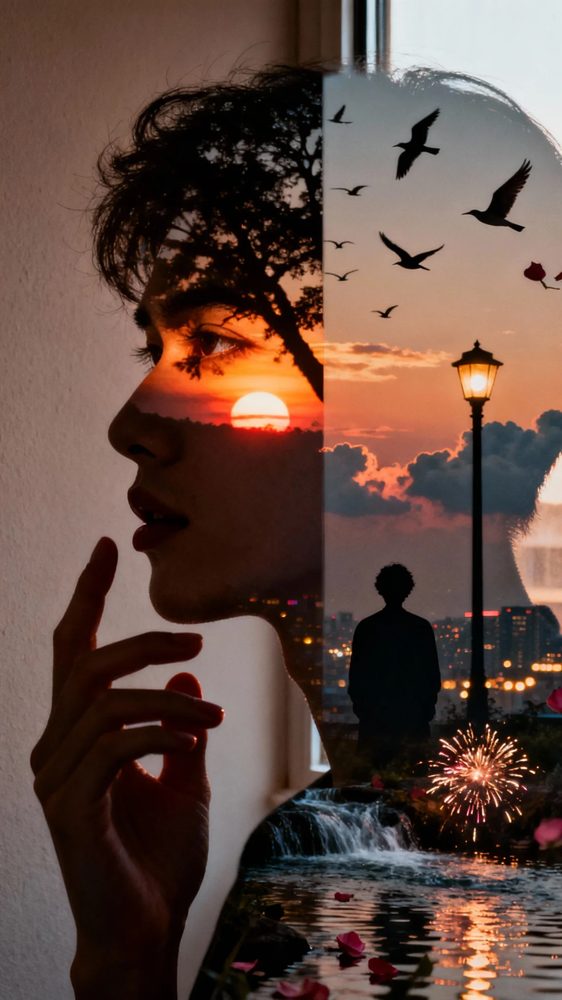

```
双重曝光摄影风格，拍摄或后期（抠图+调透明度+叠图）处理，左右构图（人脸左半张叠右半张风景），人物动作构图（视线处叠日落、手指抬起处叠树影、背影向前叠城市灯火）。底图为侧脸/剪影/手指/嘴唇（轮廓清晰），背景纯色墙或窗边逆光；次图添加飞鸟/日落/路灯/花瓣/流水/烟火/水中倒影/云彩等氛围感元素。后期加柔光/胶片感/颗粒感滤镜强化情绪，调整两张图对比度、亮度避免差异过大。
```

```
拍摄开启双重（多重）曝光模式，如果不用此模式，后期也可通过【抠图➕调透明度➕叠图】处理。
	
2、构图技巧：左右构图（如人脸左半张  叠  右半张风景），人物动作构图（如人物视线处叠日落、手指抬起处叠树影、背影向前叠城市灯火）。
	
3、底图要简：优先拍侧脸、剪影、手指、嘴唇（轮廓越清晰越好！），背景尽量选纯色墙、窗边逆光。
	
4、次图要有氛围感：添加氛围感的元素（如飞鸟、日落、路灯、花瓣、流水、烟火、水中倒影、云彩等等），发挥自己的想象力。
	
5、后期处理：可以加柔光、胶片感、颗粒感等滤镜来强化情绪，同时可以适当调整两张图的对比度、亮度等参数，以免差异过大。
```

 [↑返回目录](#toc)

---
## <a id="jm-prompt-7574024639823777050">古风小人梦卧花瓣</a> (<a href="https://jimeng.jianying.com/ai-tool/personal/MS4wLjABAAAALvQ-OhMIXn7Rk6ditQi5FLjjHnDL3Dbu6p4kU7iKQuPmT5ZHD2OYXlSdfOAWrjir" target="_blank" rel="noopener noreferrer">梦的唯朵5500</a>)


```
• 标签：微缩景观、古风童话、俯视视角、梦幻意境
• 提示词：
上方俯视视角下，一片巨大的粉色花瓣如柔软的地毯铺开，花瓣边缘呈自然的波浪状，颜色从中心的浅粉渐变为边缘的淡紫，脉络像精致的银丝般清晰可见，仿佛一片被放大无数倍的花瓣草地。

花瓣中央，一个古风小人正蜷缩着沉睡——他穿着月白色的短衫，袖口绣着细小的云纹，墨色的发髻松松垮垮地挽着，几缕发丝垂落在脸颊旁，嘴角微微上扬，似在做着甜美的梦。小人的身形小巧玲珑，与巨大的花瓣形成鲜明的微缩对比，他身下的花瓣绒毛细腻，像铺了层轻盈的棉絮，随着呼吸轻轻起伏。

画面大面积留白，只在花瓣边缘点缀着几颗晶莹的露珠（水珠表面折射出淡淡的光泽），背景是纯净的米白色，没有多余元素。细细的线条勾勒出花瓣的纹理、小人衣料的褶皱和发丝的弧度，超写实的细节让花瓣的柔软、布料的垂坠感都触手可及。柔和的粉紫渐变色调透着宁静与浪漫，整个场景像被施了魔法的微缩童话，将古风小人的安睡瞬间定格成梦幻的诗篇。
```

 [↑返回目录](#toc)

---
## <a id="jm-prompt-7573452920067280178">俏皮金渐层宝宝</a> (<a href="https://jimeng.jianying.com/ai-tool/personal/MS4wLjABAAAAs4pUqydvSehJmpYHZcszbVAUqLYbc0TK0Yg74XtIYUg" target="_blank" rel="noopener noreferrer">梦月使</a>)

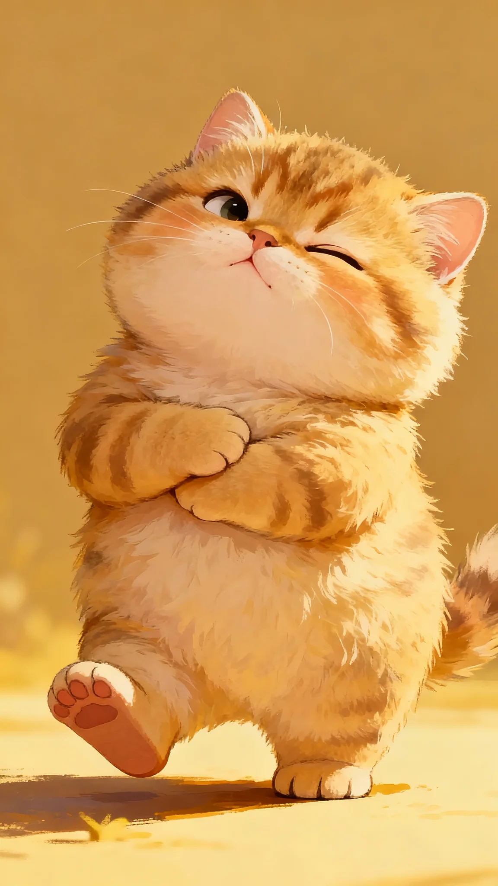

```
插画风格，暖黄色调，一只可爱的金渐层宝宝，大胖脸，小身子，像人一样站着，稍息姿势，一只脚掌翘起脚跟落地，两臂环抱，头歪着转向一边，斜看着天，挤眉弄眼，口眼歪斜。蓬松毛发质感，圆头圆脑，表情灵动，温馨可爱氛围。
```

```
一只可爱的金渐层宝宝，大胖脸，小身子，像人一样站着，稍息姿势，一只脚掌翘起脚跟落地，两臂环抱，头歪着，头转向一边，斜看着天，挤眉弄眼，口眼歪斜
```

 [↑返回目录](#toc)

---
## <a id="jm-prompt-7552707409836395826">成都印象系列钥匙扣</a> (<a href="https://jimeng.jianying.com/ai-tool/personal/MS4wLjABAAAAuI5b6S83M0wOp-3zhds16-pCM5CcxGZfXSuos_3PFzd6o5iB8zF7UpgrP9Qfdbql" target="_blank" rel="noopener noreferrer">专业好物推荐官</a>)


```
文创产品设计风格，10款不同形象的成都主题钥匙扣，形象涵盖熊猫、火锅、锦里、宽窄巷子、川剧变脸等成都特色元素，中国红与金色为主配色，精致工艺，可爱造型，每个钥匙扣标注对应景点名称如"锦里"、"宽窄巷子"。
```

```
文创产品设计，包括10款不同形象的钥匙扣，配色为中国红，金色。  主题以成都为主。
```

 [↑返回目录](#toc)

---
## <a id="jm-prompt-7569979462951898414">陆家嘴的街头涂鸦</a> (<a href="https://jimeng.jianying.com/ai-tool/personal/MS4wLjABAAAA3Cs0c2nPvoKVCbRlIwrQ_uSBg-roSqQo5jHjzGqUMzC5ZRb6m9QltpgOvCCFM-rP" target="_blank" rel="noopener noreferrer">FRank.视觉（点关注，有猛料）</a>)

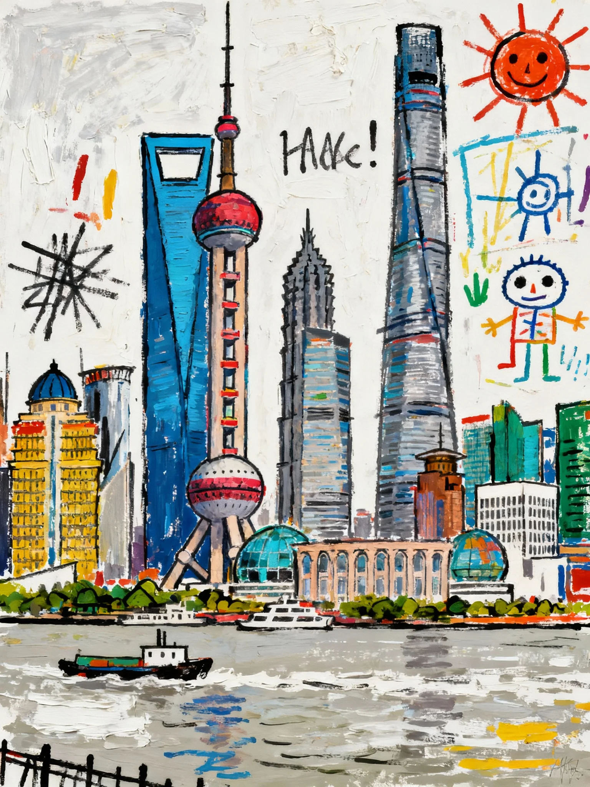

```
原生艺术风格，粗犷笔触，儿童画般纯真，Jean-Michel Basquiat风格，陆家嘴地标三件套，黄浦江遥望。高对比度色彩，涂鸦式线条，原始质感，街头艺术氛围，画面充满活力与自由感。
```

```
原生艺术风格，粗犷笔触，儿童画般纯真，Jean-Michel Basquiat风格，画面包含陆家嘴地标三件套，个黄浦江遥望
```

 [↑返回目录](#toc)

---
## <a id="jm-prompt-7575481156729064755">巨型冰红茶的奇幻工厂</a> (<a href="https://jimeng.jianying.com/ai-tool/personal/MS4wLjABAAAALJyeq6_ho7KKHQ_QrHkWC3y376VWJYKupGaX3ljXWcM-PqEtxpzM9XTAEOfhHxEn" target="_blank" rel="noopener noreferrer">用户2965330951259</a>)


```
3D动漫卡通风格，色彩鲜艳，细节丰富，超细节刻画，超高画质。一瓶巨大的瓶装康师傅冰红茶平躺在工厂顶部，瓶口开着，冰红茶从瓶口流出落到工厂的一个容器中，工厂生产线正在生产不同口味的冰红茶，工人们在生产线旁忙碌，生产线延伸出来，源源不断的小瓶冰红茶被运出。
```

```
微缩景观，一瓶巨大的瓶装康师傅冰红茶，平躺在一间工厂的顶部，瓶口开着，冰红茶从里面流出来，落到工厂一个容器中，工厂生产线正在生产不同口味的冰红茶，工人们正在忙碌，生产线延伸出来，源源不断的小瓶冰红茶运出，3D动漫卡通风格，色彩鲜艳，细节丰富，超细节刻画，超高画质，
```

 [↑返回目录](#toc)

---
## <a id="jm-prompt-7558878166102674726">冬日星辰鹿仙子</a> (<a href="https://jimeng.jianying.com/ai-tool/personal/MS4wLjABAAAAFcMcSyYE7wP_raOxHVLA8X0UmSrNGeXzkGDb2TEqTifUZQaCu8wJpXspMOjcHYhU" target="_blank" rel="noopener noreferrer">墨瞳MT</a>)

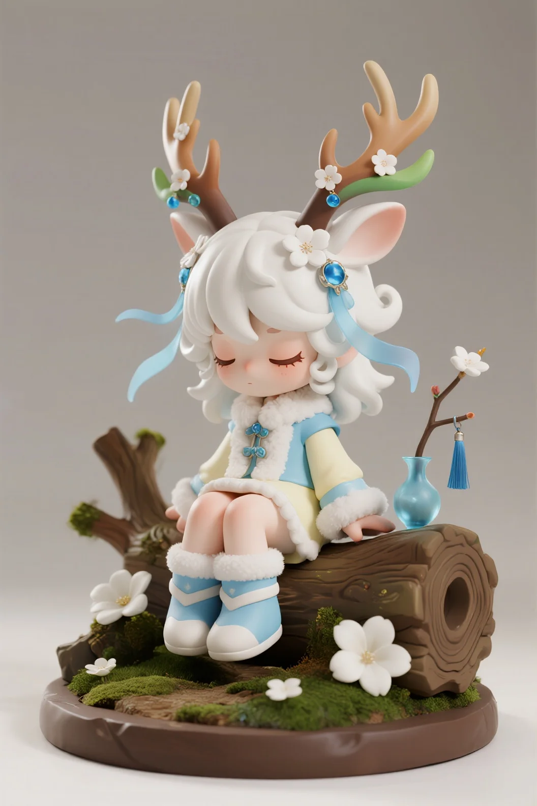

```
Q版卡通设计，幻想形象（一个可爱的，风格化的乙烯基玩偶的全身照，大头小身，描绘的是一个冬日/星辰鹿仙子。她安静地坐着，眼睛闭合，坐落在一个风格化的、长满苔藓的树枝/圆木上。她有着光滑、蓬松的白色头发，带有柔和的卷曲，以及长长的尖兔耳/鹿耳。她的头部装饰着巨大、复杂的鹿角，呈棕色和苔绿色渐变，点缀着精致的白色花朵和蓝色珠子挂件。她穿着一套精致的冬日服装，颜色为淡蓝色和奶油白色，包括一件带有白色毛皮/绒毛边饰的多层高领外套，以及厚重的白色和蓝色靴子。她有长长、飘逸的淡蓝色/白色丝带从她的头部和衣服上垂下。树枝旁边放着一个小巧、透明的蓝色花瓶，花瓶里插着一根风格化的树枝和一个蓝色流苏挂件。底座包括雕刻的白色花朵和苔藓）可爱的超现实主义艺术风格，整体造型梦幻、开心，可爱、华丽，呈现Q版手办质感，墨瞳MT，细节精致，立体感强，收藏级摆件，粘土人风格，CG渲染感。突出主体，背景是干净、极简的纯淡灰/米白色】
```

 [↑返回目录](#toc)

---
## <a id="jm-prompt-7558782893200362778">丝网印质感的卡普里岛汉堡海报</a> (<a href="https://jimeng.jianying.com/ai-tool/personal/MS4wLjABAAAAmKOeb7eClZ4WZNFr-FA05d0rfHMrQA5MTCsCv5wrRKQ" target="_blank" rel="noopener noreferrer">法兰克</a>)

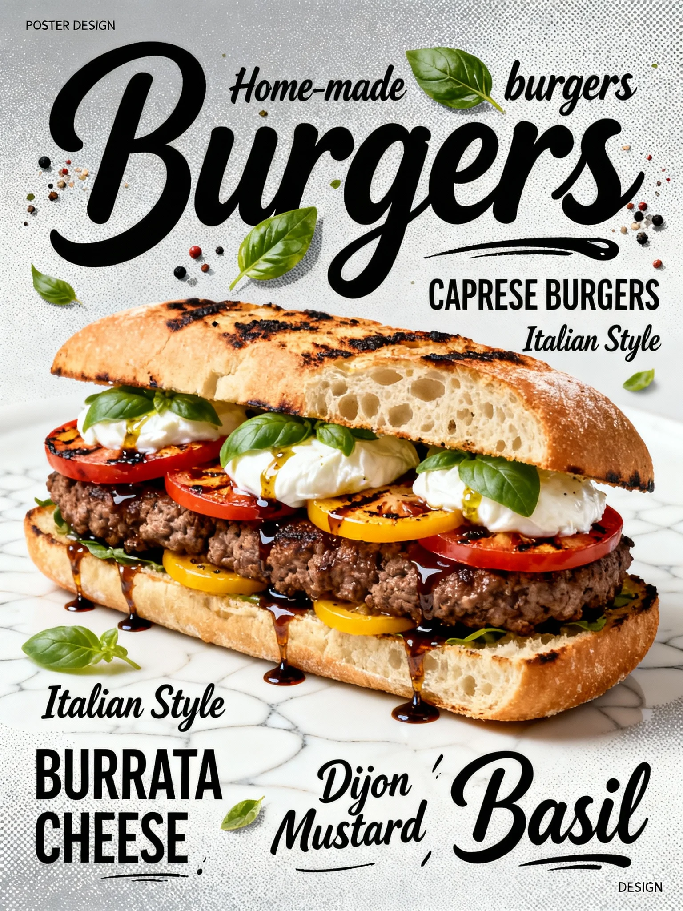

```
丝网印海报，美食杂志封面设计，保留丝网印质感和特点，半调图案，噪点颗粒，线条简洁灵动，极繁主义，色彩鲜明饱满，大师级排版，画面有故事感。主体是新鲜出炉的长形意大利风味卡普里岛汉堡，普利亚面包切片用橄榄油烤过带微焦，夹焦褐感厚实牛肉饼、烤番茄片、烤黄色番茄片、一层burrata，油醋汁滴落，新鲜罗勒叶点缀；背景浅灰渐变底色带白色陶瓷纹理。散落手写文字：标题"Burgers"（字体如加热芝士圆润，笔画间点缀罗勒叶、胡椒碎、黑醋汁），栏目"Home-made burgers""CAPRESE BURGERS""Italian Style""BURRATA CHEESE"，俏皮短语"Dijon Mustard""Basil"。左上角小字"POSTER DESIGN"，右下角极小字"DESIGN"。手绘字体与真实汉堡摄影结合，多汁香浓氛围，家庭手作汉堡温馨美味。
```

```
丝网印海报，保留丝网印质感和特点，半调图案，噪点颗粒，线条简洁灵动，画面有故事感，大师级排版，极繁主义，色彩鲜明饱满。
美食杂志封面，主体是新鲜出炉的长形的意大利风味的卡普里岛汉堡（用橄榄油烤过带一点微焦的普利亚面包切片(Pugliese bread)，里面有焦褐感的牛肉饼，很厚实，烤过的番茄片，烤过的黄色番茄片，一层burrata，酱汁是油醋汁，新鲜的罗勒叶做点缀，酱汁顺着食材有滴落的趋势，香气仿佛能穿透画面）；背景是浅灰渐变底色（白色陶瓷的纹理），散落着手写文字：标题“Burgers”（字体像加热过的芝士一样圆润，笔画间点缀着罗勒叶,胡椒碎,黑醋汁）、栏目“Home-made burgers”“CAPRESE BURGERS”“Italian Style”“BURRATA CHEESE”等，还有俏皮短语“Dijon Mustard”“Basil”；整体风格多汁香浓，手绘字体与真实汉堡摄影相结合，满是家庭手作汉堡的温馨美味。

左上角小字“POSTER DESIGN”
右下角极小字“ DESIGN”
```

 [↑返回目录](#toc)

---
## <a id="jm-prompt-7572745194123119922">国潮风格关羽IP制作流程</a> (<a href="https://jimeng.jianying.com/ai-tool/personal/MS4wLjABAAAAwmDk5--OQ_nHYlWB2LP11__DXlTQTKwETbNdL94_YBGHBSOj82sYL6BlLCu5m4fh" target="_blank" rel="noopener noreferrer">昵称加载中</a>)

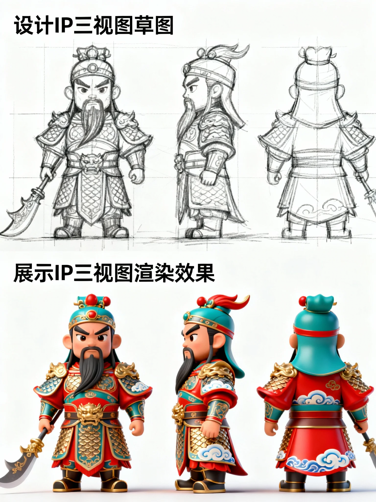

```
国潮写实风格，简洁排版，纯白背景，从上到下分两步展示关羽IP制作过程。第一步：顶部区域为"设计IP三视图草图"，展示关羽正面、侧面、背面的铅笔素描草图，线条粗犷，结构清晰；第二步：底部区域为"展示IP三视图渲染效果"，呈现关羽正面、侧面、背面的3D渲染图，色彩鲜艳，细节精致，国潮元素如祥云、甲胄纹理清晰可见。整体对比鲜明，制作流程直观。
```

```
（国潮写实风关羽）IP制作的思路过程，通过图片从上到下演示过程，第一步：设计IP三视图草图，第二步：展示IP三视图渲染效果，纯白背景，简洁
```

 [↑返回目录](#toc)

---
## <a id="jm-prompt-7575664677515037978">雨夜工厂巷对话</a> (<a href="https://jimeng.jianying.com/ai-tool/personal/MS4wLjABAAAA9718ksPXVZG4I_wT1OB3WYOs4kWuEF_mZ6ylSKzm4YXL5skyakPAdJGoyTMn1pP6" target="_blank" rel="noopener noreferrer">用户699858270214</a>)

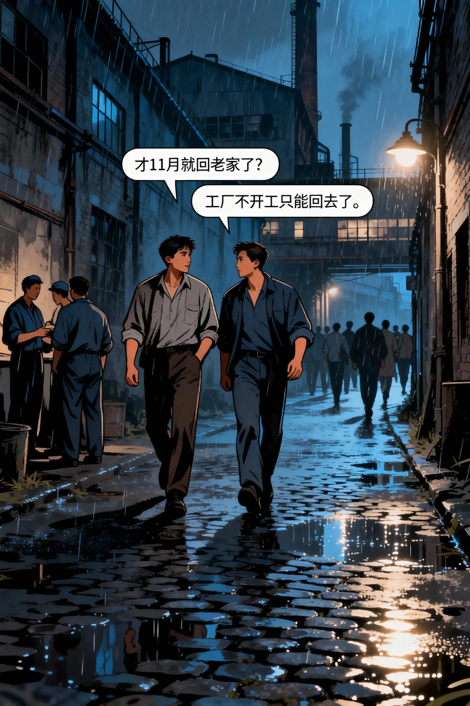

```
Cinematic graphic novel illustration style, dark rainy atmosphere, narrow alley with factory buildings, dim streetlights, wet cobblestone ground reflecting light. Two men walking in the alley, factory workers chatting nearby, many people walking in the background. A Chinese dialogue box above the two men: "才11月就回老家了？", another dialogue box: "工厂不开工只能回去了。". High-contrast lighting, moody color scheme (dark blues, grays), dynamic composition, detailed wet texture, cinematic depth of field, story-driven atmosphere.
```

```
Cinematic graphic novel illustration of two man 走 in a raining dark narrow alley, 工厂两个人聊天，很多人走着，中文对话框：“才11月就回老家了？”，另一个人：“工厂不开工只能回去了。”
```

 [↑返回目录](#toc)

---
## <a id="jm-prompt-7569921109852736795">马年表情包</a> (<a href="https://jimeng.jianying.com/ai-tool/personal/MS4wLjABAAAAhOplGYIe5F7WthsehOxcTEPI7N83W59hiiXQbahhcdqHBAsFm78cuIglxzpG24af" target="_blank" rel="noopener noreferrer">木木木子吖</a>)

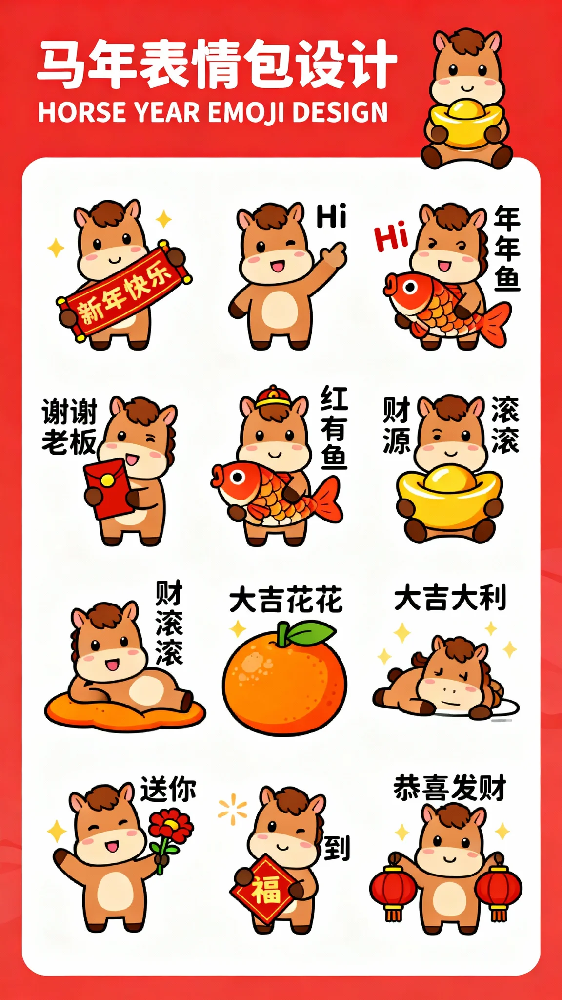

```
卡通矢量风格，顶部标题栏红色背景，包含"马年表情包设计HORSE YEAR EMOJI DESIGN"文字信息，右侧有小马抱着金元宝的卡通形象。表情包主体区域3行3列布局，展示9个不同动作神态的小马表情包：拿着对联"新年快乐"、打招呼配字"Hi"、抱着锦鲤配字"年年有鱼"、拿红包致谢配字"谢谢老板"、抱金元宝配字"财源滚滚"、趴在橘子上配字"大吉大利"、举花配字"送你花"、拿福字贴配字"福到"、提灯笼配字"恭喜发财"。每个表情配相应文字或元素，高清，生动展现小马IP多样互动性。
```

```
顶部标题栏：红色背景，包含 “ 马年表情包设计 HORSE YEAR EMOJI DESIGN” 的文字信息，右侧配有小马抱着金元宝的卡通形象，明确了表情包的主题、设计风格与创作者。
表情包主体区域：以3行3列的布局展示了 9 个不同动作和神态的小马表情包，涵盖了拿着对联“新年快乐”、提打招呼（配字：Hi）、抱着锦鲤（配字：年年有鱼）、拿着红包致谢（配字：谢谢老板）、抱着金元宝（配字：财源滚滚）、趴在橘子上(配字：大吉大利)、举着一朵花（配字：送你花）、拿着福字贴（福到）、提着灯笼（配字：恭喜发财）、等多种场景和情绪，每个表情都配有相应的文字或元素生动展现了该小马 IP 的多样互动性。卡通矢量风格，高清
```

 [↑返回目录](#toc)

---
## <a id="jm-prompt-7559448376643685682">雾海巨影</a> (<a href="https://jimeng.jianying.com/ai-tool/personal/MS4wLjABAAAA51dvYX0tvuR7eiKSevz2uNrh2tSYvtD2izeXY7baAixdINWavZ5CQOhkqobdKA5p" target="_blank" rel="noopener noreferrer">wajk</a>)


```
超现实主义风格，对角线构图，冷色调，低饱和度，能见度低，8k，电影感。波涛汹涌的海面上风暴四起，雾气环绕，非常遥远处海上一个巨大人形生物被雾气隐藏，清晰度极低，眼睛发出绿光，体型高耸入云，像是刚刚站起来；船上一个男人背对着镜头望着它，动作慌张，扶着栏杆。巨物恐惧氛围。
```

```
波涛汹涌的海面上，风暴四起，雾气环绕，对角线构图，一个巨大人形生物在非常遥远处海上被雾气隐藏，清晰度极低，眼睛发出绿光，体型高耸入云，像是刚刚站起来，船上一个男人背对着镜头望着它，动作慌张，扶着栏杆。超现实主义，巨物恐惧，超现实，8k，电影感，冷色调，低饱和度，能见度低。
```

 [↑返回目录](#toc)

---
## <a id="jm-prompt-7570879257849711882">赛博水墨热巴</a> (<a href="https://jimeng.jianying.com/ai-tool/personal/MS4wLjABAAAAdhxM5N4pLB2zPvo7C2Tf4jh68U3m4dDaCBdgBfXGuz0" target="_blank" rel="noopener noreferrer">见习筑梦师</a>)

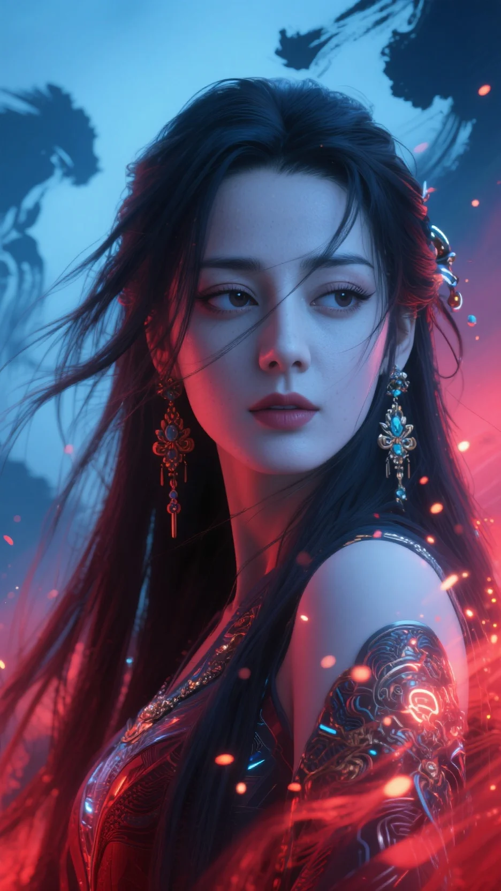

```
帮我生成图片：热巴，精细三维渲染+赛博水墨美学+色彩晕染+模糊弥散，热巴
长直发热巴，披散凌乱的头发，刘海遮着眼睛，华丽的饰品和纹理，
粒子发光消散于周身
背景水墨皴染效果
靛蓝与朱砂渐变的体积光照
采用虚幻引擎5与Octane渲染，8K分辨率。图片风格为国风动漫，比例 9:16。
```

 [↑返回目录](#toc)

---
## <a id="jm-prompt-7555108063116594483">神秘火焰火娃</a> (<a href="https://jimeng.jianying.com/ai-tool/personal/MS4wLjABAAAA1Q3hKcoD5984QihH8HLzHDwwmaqAqJ2YKNImsaOwlKvJ0ztbTrcPVhlbBCl0-iF7" target="_blank" rel="noopener noreferrer">alo design</a>)

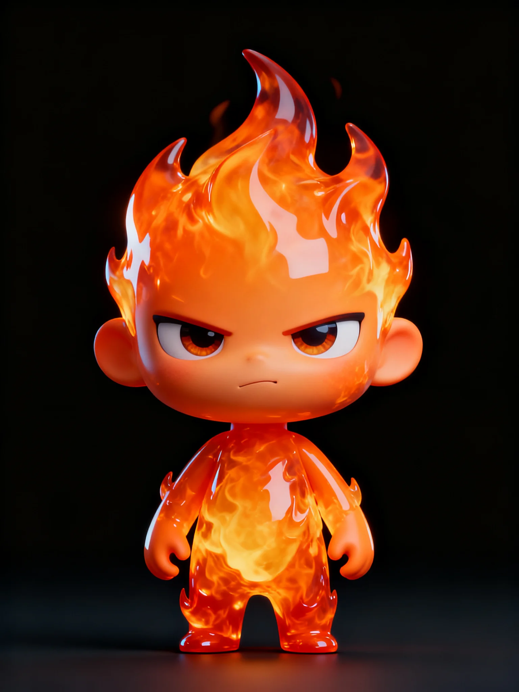

```
极简卡通风格，C4D渲染，3D建模，超写实，真实光影，冷色系，HDR，高级感，神秘感。橙色实体化火焰构成的火娃，酷拽表情，炯炯有神的眼睛，油光水润质感，黑色背景。先进光线捕捉技术，专业后期处理优化，超越游戏引擎的渲染精度，真实细腻质感，大师级影视级图像标准，明亮感，立体感，超清粒子纹理细腻，真实通透光泽感，30000k超清细节，最先进技术降噪消锯齿抗模糊，最佳光影效果。
```

```
设计一款由橙色的升腾的实体化的橙色色火焰形成的火娃的卡通形象，酷拽的表情，眼睛炯炯有神，神秘感，黑色背景,高级感，极简，c4d渲染，立体感，油光水润，超高清高品质高质量佳作，画面清晰，先进光线捕捉技术，专业后期处理优化，超越游戏引擎的渲染精度，真实细腻的质感，大师级影视级图像标准，超写实，真实渲染，真实光影。明亮感，冷色系，HDR，立体感，3D渲染，虚拟引擎超清渲染，消除一切影响清晰度的不良因素，最佳光影效果

30000k超清粒子纹理细腻，真实通透光泽感，3D，超清细节：用最先进的技术降噪消锯齿抗模糊将作品做到极致超清
```

 [↑返回目录](#toc)

---
## <a id="jm-prompt-7554203904188124443">巨童穿行都市</a> (<a href="https://jimeng.jianying.com/ai-tool/personal/MS4wLjABAAAAGJuzHY16_vDbLruKjUL959Kjpi3pxB9jTwr4kxlSTq4" target="_blank" rel="noopener noreferrer">萧萧smile酱</a>)

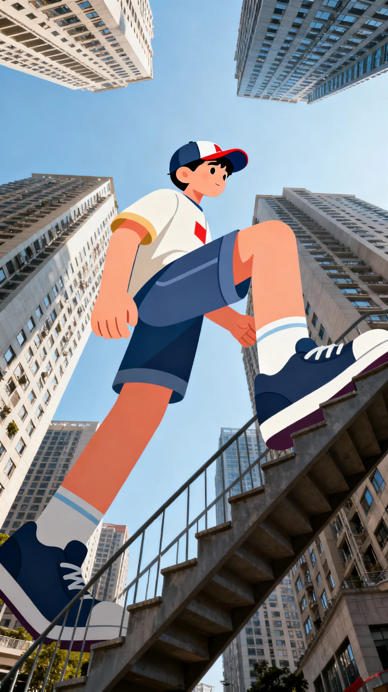

```
创意插画设计，极低视角侧面仰拍，城市高楼大厦实景摄影背景，巨大化男孩从高楼之间穿行迈过，男孩为平面插画风格，仰拍视角下可见其巨大化的脚，男孩潮牌风穿搭戴棒球帽，清新色彩，楼梯遮挡住男孩一部分。
```

```
创意插画设计，极低视角侧面仰拍，巨大化，城市高楼大厦实景摄影仰拍，巨大化男孩从高楼之间穿行迈过，男孩为平面插画，男孩仰拍巨大化的脚，男孩潮牌风穿搭戴棒球帽，清新色彩。楼梯遮挡住男孩一部分。
```

 [↑返回目录](#toc)

---
## <a id="jm-prompt-7570750679371795762">文字构成的星空艺术</a> (<a href="https://jimeng.jianying.com/ai-tool/personal/MS4wLjABAAAALuhI-ZNYV3Jfbx-xDRKJUveTLBeuy5KYtVG0diM5B2s" target="_blank" rel="noopener noreferrer">醒了不起的盖茨比（NOFUN）</a>)

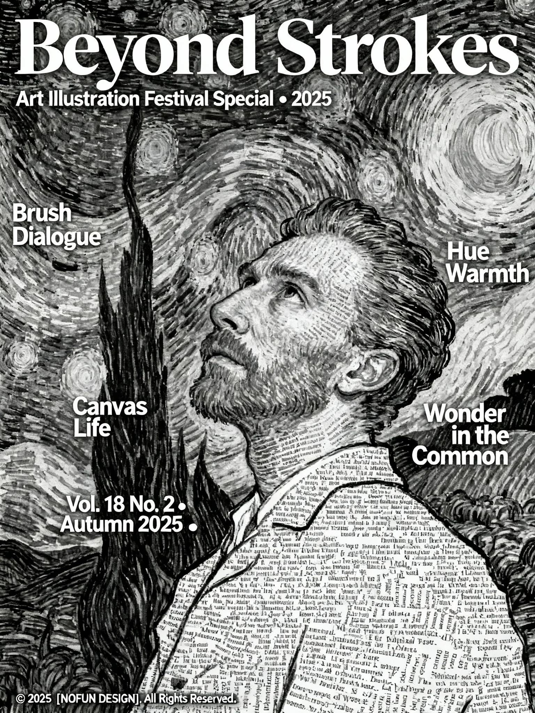

```
艺术插画杂志封面设计，文字创意排版，微小密集的铅字跟随富兰克林布斯密集排线构成以文字为载体的梵高星空，呈现孤独仰望的画面，强烈肌理感与层次分明的文字堆积，质感明显，黑白风格。大标题"Beyond Strokes"位于画面上方，较大字号；其他文案"Brush Dialogue"、"Canvas Life"、"Hue Warmth"、"Wonder in the Common"分布于星空周围，中等字号；小标题"Art Illustration Festival Special • 2025"在大标题下方，稍小字号；日期"Vol. 18 No. 2 • Autumn 2025"位于画面中部偏下，较小字号；版权信息"© 2025 [NOFUN DESIGN]. All Rights Reserved."在底部，最小字号。
```

```
艺术插画杂志《Beyond Strokes》封面设计，文字创意排版，海报中的微小密集的铅字跟随富兰克林布斯的密集排线，构成以文字为载体的梵高的星空，孤独的仰望，强烈的肌理感与层次分明的文字堆积，质感明显，黑白杰作。
大标题“Beyond Strokes”其他文案“Brush Dialogue”、“Canvas Life”、“Hue Warmth”、“Wonder in the Common”小标题“Art Illustration Festival Special • 2025”日期“Vol. 18 No. 2 • Autumn 2025”版权信息：“© 2025 [NOFUN DESIGN]. All Rights Reserved.”
```

 [↑返回目录](#toc)

---
## <a id="jm-prompt-7557257091036056870">暗黑镜像：铠甲勇士</a> (<a href="https://jimeng.jianying.com/ai-tool/personal/MS4wLjABAAAAJzXG2E6kc0yK_PIAD95vrlbUewLGlJLoZ4a6bLw6mDVaEyzCazFK46RC7sSWjza_" target="_blank" rel="noopener noreferrer">月月</a>)

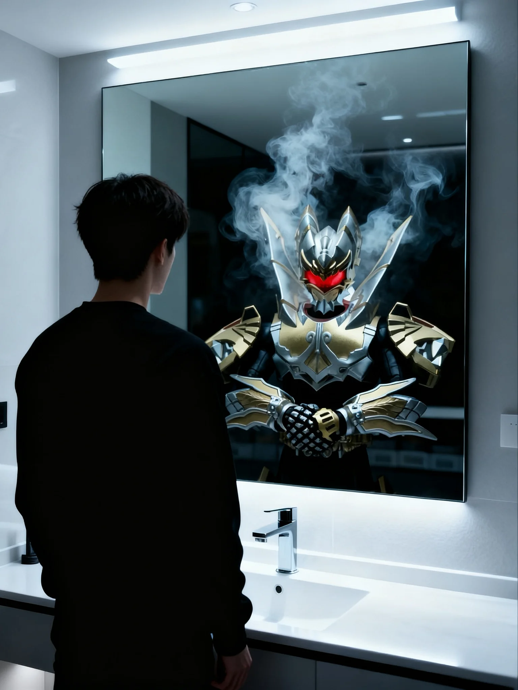

```
暗黑滤镜，一位穿黑色上衣的男性背对镜头站在高端简约浴室镜子前看镜子，镜子里映射出金黑银配色铠甲的铠甲勇士，红色眼部，双手交叉置于身前，周身环绕白色烟雾，画面比例为3:4，浴室背景呈现简约风格。
```

```
帮我生成一张照片，图二人物对着镜子站在高端简约浴室镜子前，背对着镜头，看着镜子里，镜子里映射出图一铠甲勇士的形象。该人物保持原有的形象特征，充满威慑力，比例为3:4，加一个稍微暗黑的滤镜
```

 [↑返回目录](#toc)

---
## <a id="jm-prompt-7550897202986568994">治愈系水彩火锅故事</a> (<a href="https://jimeng.jianying.com/ai-tool/personal/MS4wLjABAAAA8KZWwpDl3fCfg99ReMUhJILJ1H7zEmloeePiJUYo8pZ03vnmv7YhRKwvt6QukS7L" target="_blank" rel="noopener noreferrer">Perhaps</a>)

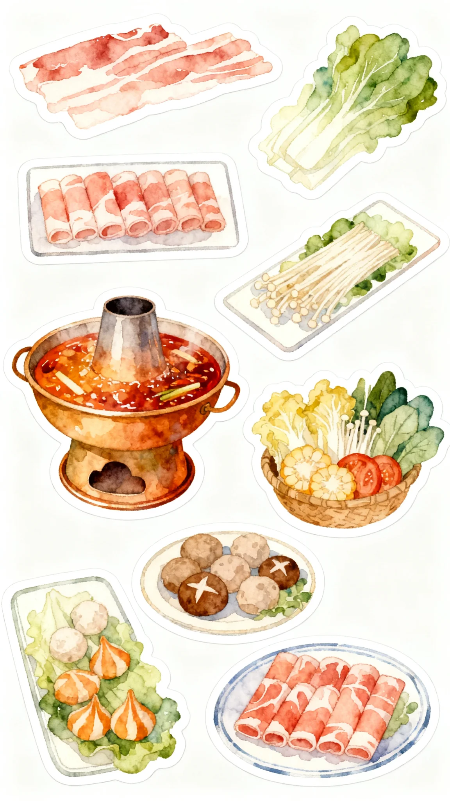

```
清新艺术水彩板画，色彩柔和晕染，线条简洁灵动，手绘质感，文艺清新调性，温暖细腻，治愈系，色彩过渡自然通透，造型扁平化且富有辨识度，弱化复杂光影，突出画面轻盈感，大面积留白。画面中有火锅贴纸，整体有故事感，传递共鸣的情感。
```

```
清新艺术水彩板画，色彩柔和晕染，线条简洁灵动，手绘质感，文艺清新调性，画面有故事感，温暖细腻，治愈系，契合文艺艺术的清新感，传递共鸣的情感，色彩过渡自然通透，造型扁平化且富有辨识度，弱化复杂光影，突出画面轻盈感，大面积留白，火锅贴纸
```

 [↑返回目录](#toc)

---
## <a id="jm-prompt-7567723686338252083">极简生肖鼠</a> (<a href="https://jimeng.jianying.com/ai-tool/personal/MS4wLjABAAAAvX72A_7bmNp1cmSdLbCT1lRAenPZOqRIqAgmIg5mk4_qDpSA3biDBOANs4t0QlLY" target="_blank" rel="noopener noreferrer">彩色童话</a>)


```
极简主义一笔画设计，深红色背景，竖向白色流畅曲线勾勒生肖鼠单边细线轮廓，大师级排版，空白处手写连笔小字签名"Miss Mouse"。
```

```
深红色背景中一笔竖向白色的流畅曲线展示一个生肖鼠的单边轮廓（细线），极简主义的一笔画，大师级排版，空白处手写连笔小字签名"Miss Mouse"
```

 [↑返回目录](#toc)

---
## <a id="jm-prompt-7576671353156455707">暗黑故宫：幼童皇帝的沉重仪式</a> (<a href="https://jimeng.jianying.com/ai-tool/personal/MS4wLjABAAAAqElP_KWSRXdGNWSO_Jp04KZAL_Tmk351yAkHyN_mWs4djWPsMQcbKpjumgiAgVdU" target="_blank" rel="noopener noreferrer">冒险王的奇妙冒险</a>)

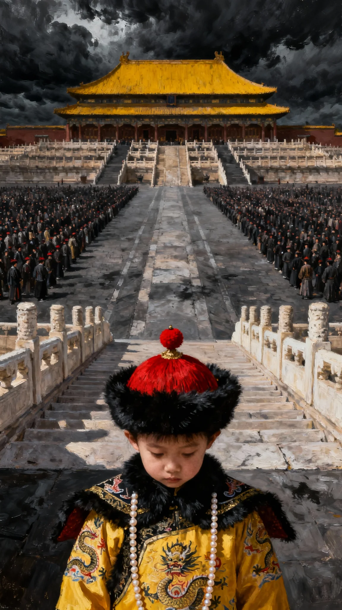

```
厚重油画质感，暗黑色调，乌云密布氛围，庄重肃穆的皇家仪式感。3岁清朝幼童身着明黄色龙袍（饰龙纹刺绣、配黑色毛领），头戴红绒球顶戴，挂珍珠朝珠，画面下方仅露出肩膀，低头懵懂麻木，面部模糊隐藏在阴暗中。背景为故宫巨大暗黑的太和殿广场，汉白玉栏杆、石阶清晰，身后广场上无缝隙密密麻麻排列着大量百官人群，与幼童形成巨大与渺小的对比，宏伟的黄色琉璃瓦宫殿矗立其后。整体色调暗黑复古，厚重油画质感，历史叙事感强烈。
```

```
复古电影质感的历史场景画面，主体是身着明黄色龙袍（饰龙纹刺绣、配黑色毛领）、头戴红绒球顶戴、挂珍珠朝珠的清朝3岁幼童；在画面下方仅露出肩膀，低头懵懂麻木，面部模糊隐藏在阴暗中，背景是故宫巨大暗黑的太和殿广场，汉白玉栏杆、石阶清晰，身后广场上无缝隙密密麻麻排列着大量百官人群，和幼童形成巨大和渺小的对比，宏伟的黄色琉璃瓦宫殿矗立其后；整体色调暗黑复古，如乌云阴沉，充满庄重肃穆的皇家仪式感与历史叙事感，厚重油画。
```

 [↑返回目录](#toc)

---
## <a id="jm-prompt-7559907099409534218">微缩景观中的好奇小猫</a> (<a href="https://jimeng.jianying.com/ai-tool/personal/MS4wLjABAAAAzG2bG-M6Ea79wgR2ndID7jWWbjE8NjA68wOQhJ083L4" target="_blank" rel="noopener noreferrer">Hi , 你好吗</a>)

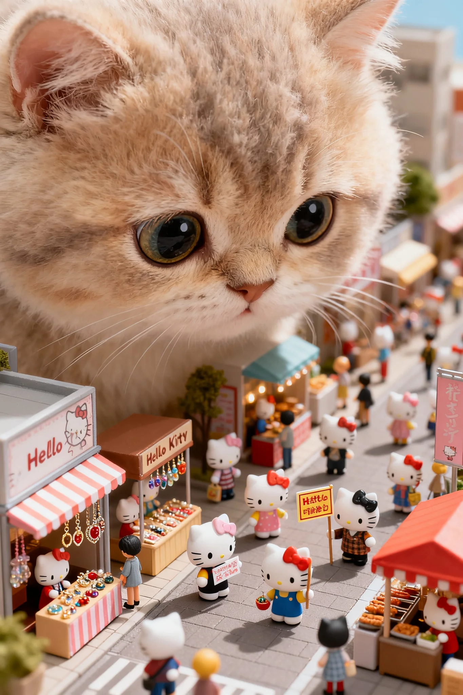

```
微缩景观风格，暖色调，软萌质感，俯视视角。一个毛茸茸的可爱小猫，头部巨大占画面2/3，低头看向下方的Hello Kitty世界，睁大眼睛惊奇地看着眼前场景。街道熙熙攘攘，两旁有很多不同风格的Hello Kitty在做生意，有的摆摊卖小饰品，有的开小食店，有的举着宣传牌。光影柔和，细节精致，奇幻可爱氛围。
```

```
一个毛茸茸的可爱小猫，占画面的2/3。巨大的头低头看到一个hello kitty 的世界。她睁大眼睛，惊奇的看着眼前这一幕。熙熙攘攘的街道，很多不同风格的hello kitty 在街道两旁做生意。微缩景观。
```

 [↑返回目录](#toc)

---
## <a id="jm-prompt-7567938256059370803">美术学院的写实课堂</a> (<a href="https://jimeng.jianying.com/ai-tool/personal/MS4wLjABAAAAaLoONSgdyuXW3eD7XJw1TU0Yr1AENa2fLi_2GQ0F8PA" target="_blank" rel="noopener noreferrer">音为有你</a>)

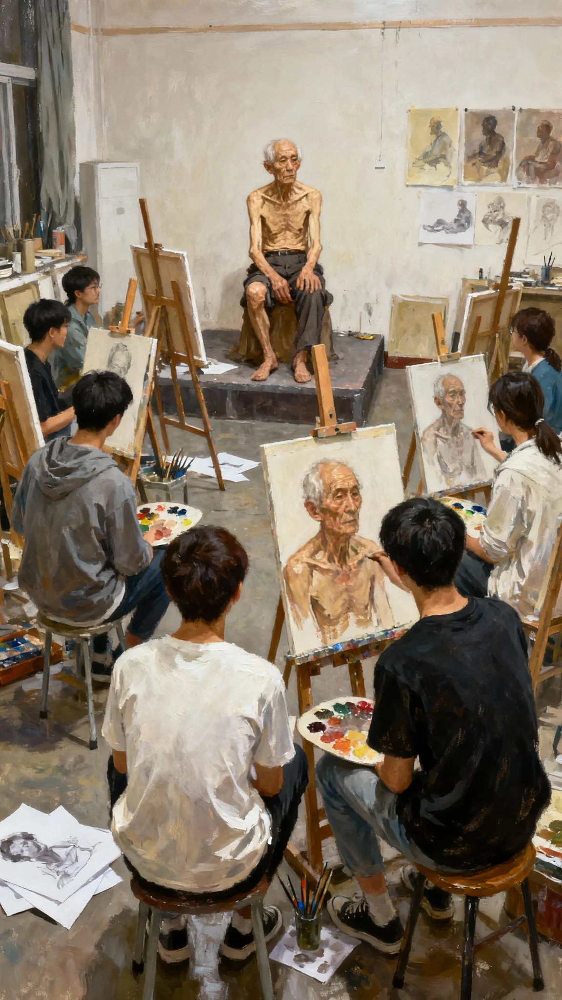

```
写实场景绘画风格，自然光，暖色调，美术学院画室里，许多学生在画架前画画，中间一位身体瘦弱的裸体老人模特坐在后面台子上，学生背对镜头围坐在周围，有的学生画老人全身像，有的画老人特写。学生穿着休闲服装，画架上摆放调色盘和画笔，地面散落画纸，墙面挂着未完成的画作，中景构图，人物动态自然，画室氛围专注。
```

```
在美术学院的画室里，有许多学生在画版前画画，中间一位身体瘦弱的裸凳体老人模特坐在后面台子上，学生背对镜头围坐在周围画画，学生有的画老人全身画有的画老人特写
```

 [↑返回目录](#toc)

---
## <a id="jm-prompt-7573549199208303910">潦草哲思图</a> (<a href="https://jimeng.jianying.com/ai-tool/personal/MS4wLjABAAAA72qtnuh-Sr6XK-zahEcf9Kd4ImeeD5SS1lwCyhZ9x6aP8sR3YhkA_Cmh4IZLla9j" target="_blank" rel="noopener noreferrer">梦蝶</a>)

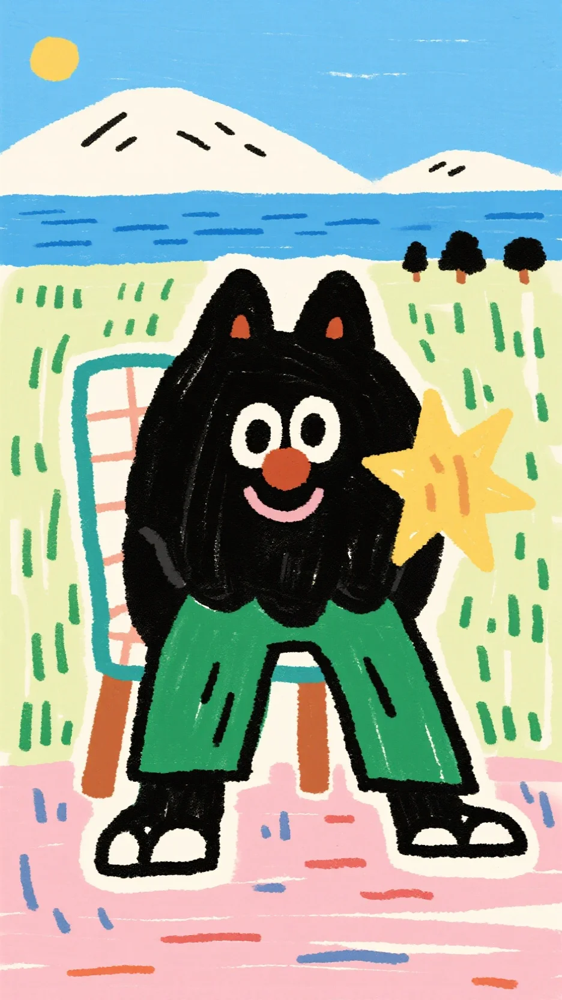

```
随手乱画，极简，幼稚滑稽，潦草，形象失真，逻辑和定义，哲思，天地人景物，意境，极致美感，内涵延伸
```

 [↑返回目录](#toc)

---
## <a id="jm-prompt-7569544656334146866">武汉三宫格：鱼与长江</a> (<a href="https://jimeng.jianying.com/ai-tool/personal/MS4wLjABAAAAPR7FPsGBxfzKTPiSACQKeduMWFKjZ3tSe36RvmpRM-h5HDb6bDJoHpjDsdXXu_JC" target="_blank" rel="noopener noreferrer">剑客</a>)

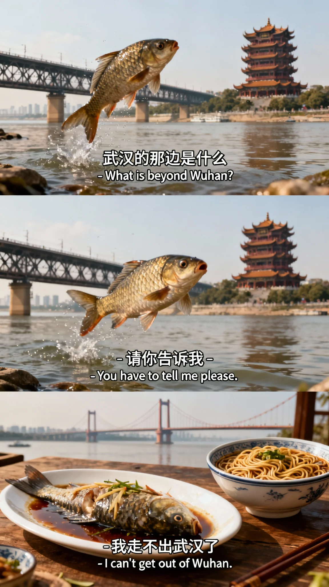

```
写实摄影风格，三宫格构图，温暖色调，温馨热闹氛围。第一层近景：活蹦乱跳的武昌鱼，背景为长江大桥和黄鹤楼，画面中添加中英字幕"武汉的那边是什么 - What is beyond Wuhan?"；第二层中景：武昌鱼正游向镜头，背景为长江大桥和黄鹤楼，画面中添加中英字幕"请你告诉我 - You have to tell me please."；第三层远景：一盘清蒸武昌鱼旁放一碗热干面，背景为长江大桥，画面中添加中英字幕"我走不出武汉了 - I can't get out of Wuhan."。
```

```
一张写实摄影图片，采用三宫格构图方式生成一张充满武汉特色的创意图。第一层为近景，画面中背景是一条活蹦乱跳的武昌鱼，添加中英字幕“武汉的那边是什么 - What is beyond Wuhan?” 背景为长江大桥和黄鹤楼；第二层是中景，画面中是一条武昌鱼正游向镜头，添加中英字幕“请你告诉我 - You have to tell me please.” 背景为长江大桥和黄鹤楼；第三层是远景，画面中是一盘清蒸武昌鱼，旁边放着一碗热干面，添加中英字幕“我走不出武汉了 - I can't get out of Wuhan.” 背景为长江大桥。整体色调温暖，营造出一种温馨而热闹的氛围。
```

 [↑返回目录](#toc)

---
## <a id="jm-prompt-7572649445246897454">梦幻地铁中的自然秘境</a> (<a href="https://jimeng.jianying.com/ai-tool/personal/MS4wLjABAAAA2wxsL5jqjJ_b8H9uw5dTA2JUA1BfKVte-OPC0WmmZWgdtFj70OAuSJ0u_8Zeh5UN" target="_blank" rel="noopener noreferrer">路人。</a>)

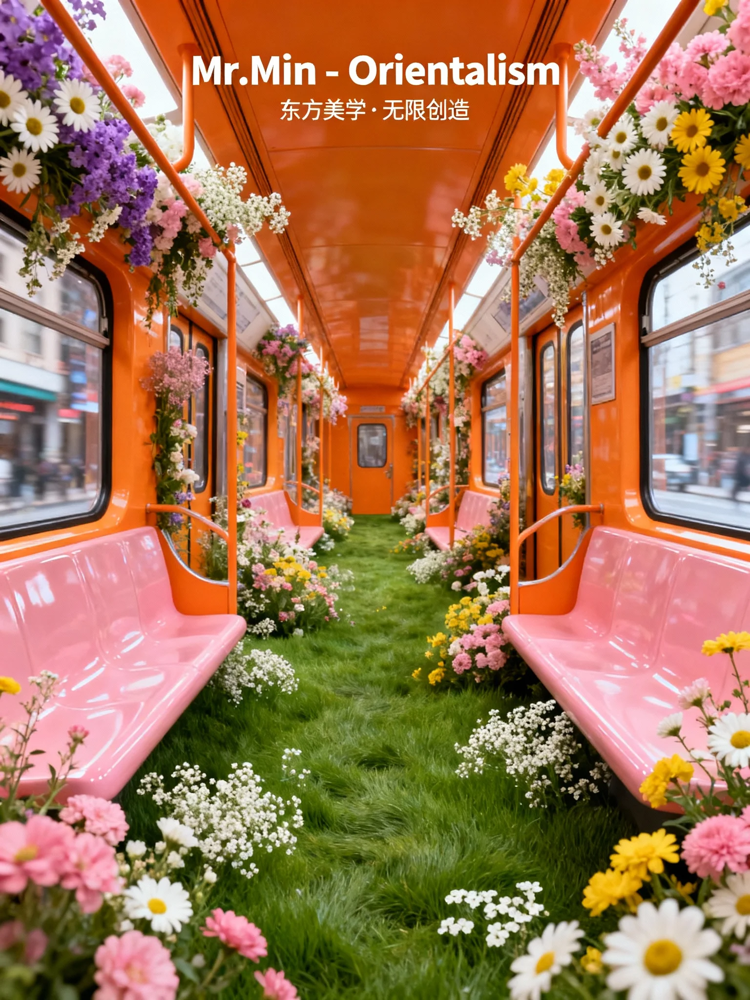

```
超现实梦幻场景插画，融合写实场景搭建与童话美学，橙色系地铁车厢内部地面铺满翠绿草地，点缀粉、白、黄野花与白色碎花；座椅、扶手、车顶均为橙色，车厢两侧及顶部布满粉紫、粉白、黄色的雏菊、满天星等鲜花；窗外是模糊的城市街景，营造“都市中的自然秘境”氛围。纵深构图从车厢一端向另一端延伸，增强空间感；草地有细腻纹理，花朵有层次与色彩渐变，粉色座椅有光滑质感，车顶鲜花自然垂落，整体呈现治愈甜美的超现实地铁花艺主题插画效果，高清。顶部上方有"Mr.Min - Orientalism"无衬线体字样，"东方美学·无限创造"无衬线体小字居中。
```

```
超现实梦幻场景插画，主体为橙色系地铁车厢，内部地面铺满翠绿草地，点缀粉、白、黄野花与白色碎花；座椅、扶手、车顶均为橙色，车厢两侧及顶部布满粉紫、粉白、黄色的鲜花（雏菊、满天星等）；场景为地铁内部，窗外是模糊的城市街景，营造 “都市中的自然秘境” 氛围；风格融合写实场景搭建与童话美学，色彩以橙、绿、白、为主，搭配缤纷花色，呈现甜美元素；采用纵深构图，从车厢一端向另一端延伸，增强空间感；细节刻画：草地的细腻纹理、花朵的层次与色彩渐变、粉色座椅的光滑质感、车顶鲜花的自然垂落，整体呈现治愈甜美的超现实地铁花艺主题插画效果。高清。文字细节：顶部上方有 “Mr.Min - Orientalism” 无衬线体的字样， “东方美学·无限创造”无衬线体小字居中。
```

 [↑返回目录](#toc)

---
## <a id="jm-prompt-7575859184600714547">现代俏皮的白菜图标</a> (<a href="https://jimeng.jianying.com/ai-tool/personal/MS4wLjABAAAA4jv_PJNPx_OOoHOr-Ln6Nvk1jpWOrmIggpJYiW0yXTI" target="_blank" rel="noopener noreferrer">Wayne</a>)

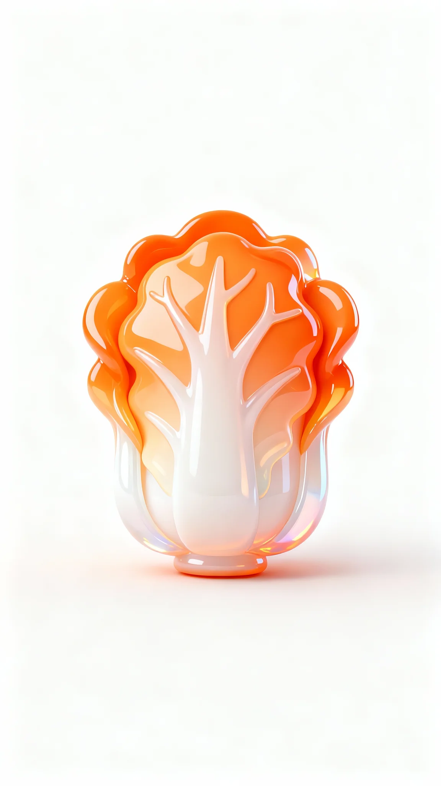

```
卡通3D风格UI图标，正视图，一颗白菜素材图标，橙色与白色配色，带有柔和的渐变和微妙的高光，透明玻璃质感，弥散风，背景纯白色，现代俏皮设计，极简风格。
```

```
UI图标，采用卡通3D风格，正视图，素材图标（一颗白菜），使用橙色跟白色，带有柔和的渐变和微妙的高光，透明玻璃质感，弥散风，背景为纯白色，现代且俏皮的设计，极简风格
```

 [↑返回目录](#toc)

---
## <a id="jm-prompt-7571113707527294218">五路神爷喜庆图</a> (<a href="https://jimeng.jianying.com/ai-tool/personal/MS4wLjABAAAAFZkq4thy2vOSgu4RSWLwrGIy3LemXy8gqV7IpLjG-O8" target="_blank" rel="noopener noreferrer">羅曉蔥</a>)

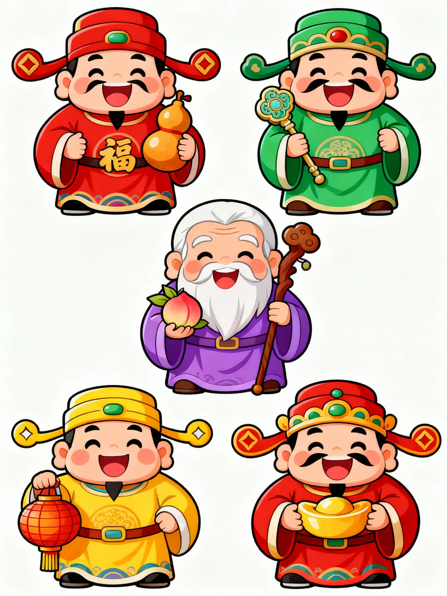

```
Q版搞笑喜庆插图，五路神爷分别为红色福神拿葫芦、绿色禄神抱玉如意、紫色寿神拿桃子、黄色喜神拿灯笼、红色财神拿元宝，均对着镜头开心笑，人物分开不重叠，画面中间留白，精细绘制，色彩鲜艳，喜庆氛围。
```

```
五路神爷，福禄寿喜财，红色福神拿葫芦，绿色禄神抱着玉如意，紫色寿神拿桃子，黄色喜神拿灯笼，红色财神拿元宝，对着镜头，开心的笑的画面中间留白，Q版，搞笑，喜庆，插图效果，人物分开不重叠，精细
```

 [↑返回目录](#toc)

---
## <a id="jm-prompt-7575029586040294707">皮克斯风格的报纸探头</a> (<a href="https://jimeng.jianying.com/ai-tool/personal/MS4wLjABAAAAbxMa5aVGFcEaq3iJOAAR7w6OXFjUcIPafpNGKsmBtxs" target="_blank" rel="noopener noreferrer">随性赴山河</a>)

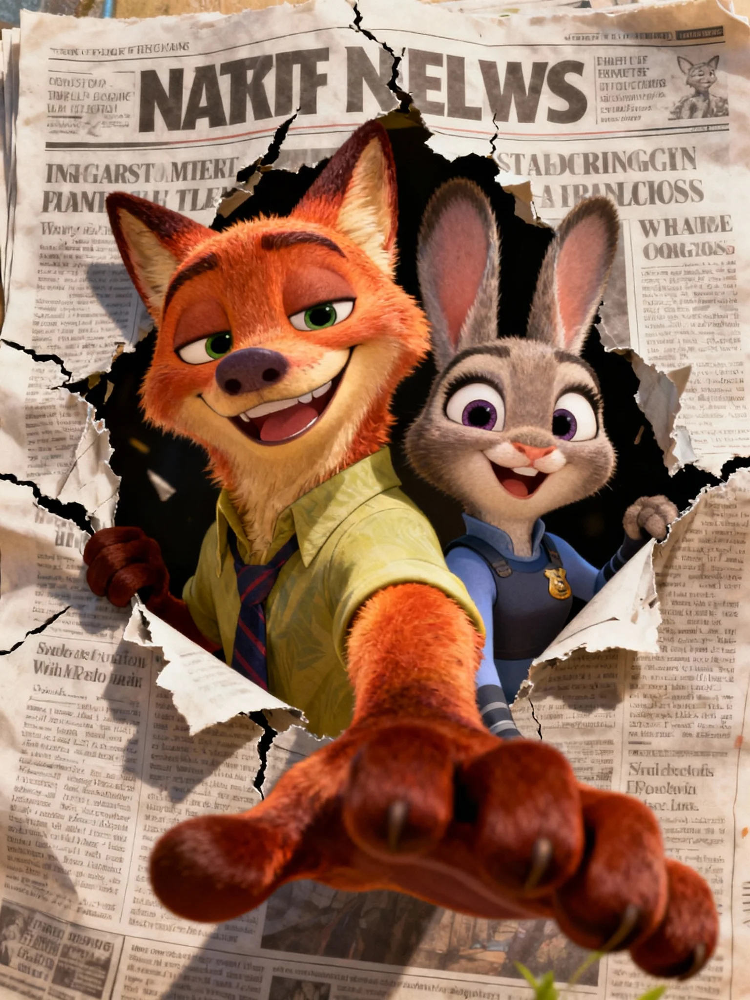

```
写实漫画风格，皮克斯漫画独特风格，夸张滑稽、搞笑、怪诞不经的造型，尼克和朱迪撕开报纸，从裂缝中探出头，脸上露出得意的笑，一只手臂伸到镜头前，如同登上报纸头条般引人注目，漫画质感，色彩明亮，动态感强，搞笑氛围。
```

```
写实漫画风格，尼克和朱迪以夸张滑稽、搞笑、怪诞不经的造型，撕开报纸，从裂缝中探出头，脸上露出一副得意的笑的表情，一只手臂伸到镜头前，如同登上报纸头条般引人注目，具有皮克斯漫画那种独特的风格
```

 [↑返回目录](#toc)

---
## <a id="jm-prompt-7573674043195346202">蓝莓微距特写</a> (<a href="https://jimeng.jianying.com/ai-tool/personal/MS4wLjABAAAAyM68AA7CLyw0bXSuaqBpoF17j19BHxZfVtIHTz6fQbxBWaD3v3_0xlecywvLBupf" target="_blank" rel="noopener noreferrer">F子哲也</a>)

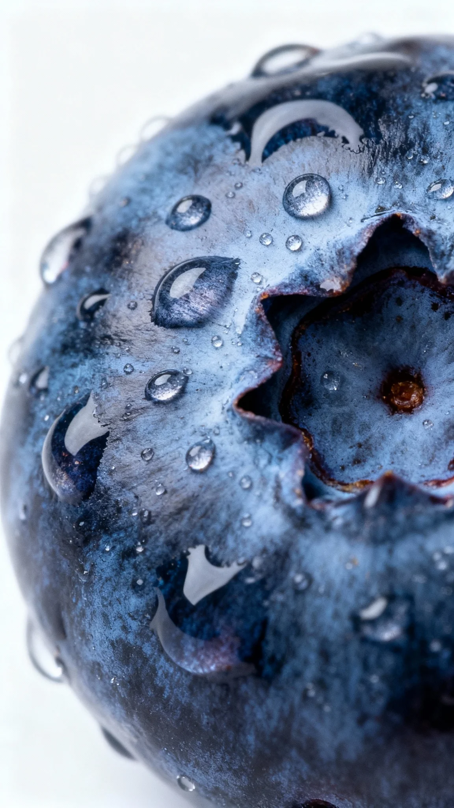

```
微距摄影风格，纯白色背景，超近距离拍摄，专业灯光，高清，清晰，无镜头虚化。蓝莓特写占据画面2/3，表面附着晶莹水珠，颗粒质感明显，果皮光泽细腻。专业影棚环境，相机拍摄，细节锐利，光影均匀，水果静物氛围。
```

```
一个蓝莓的特写照片，蓝莓的特写占据整个画面的2/3。微距摄影，超近距离拍摄，有水珠，纯白色的背景，不要镜头虚化，清晰，高清，影棚拍摄，专业灯光，相机拍摄，
```

 [↑返回目录](#toc)

---
## <a id="jm-prompt-7569965073028910362">冬雪中的羊毛毡童话海岛</a> (<a href="https://jimeng.jianying.com/ai-tool/personal/MS4wLjABAAAAaLuXM_Pw5cKtpJnDbavInWaLWU9IEclQORK4IQixo8Uu_z8ul_FEHymfs_edMoFl" target="_blank" rel="noopener noreferrer">花点·♡</a>)


```
Q版卡通风格，羊毛毡手工置景，远景，全景构图，鸟瞰视角，冬季下雪的海岛。海岛满是葱绿树木和厚厚积雪，树木间有彩色屋顶的小房子，房屋窗台上开满鲜花，屋顶覆盖雪花，星星点点灯光；海岛上有盘山路、行驶的车辆、行人、商业街，海上有轮船，海岸边有船舶停靠。柔和暖光，羊毛毡蓬松质感，彩色与白色调搭配，温馨童话氛围。
```

```
羊毛毡手工置景。
Q版卡通风格，远景，全景构图，鸟瞰视角，冬季下雪的海岛。
海岛满是葱绿树木以及厚厚积雪，树木之中有很多彩色屋顶的💩，房屋窗台上开满了鲜花，屋顶上有雪花，星星点点的灯光，海岛上有盘山路，有车辆，有💩，行人，有商业街，海上有轮船，海岸边有船舶停靠。
```

 [↑返回目录](#toc)

---
## <a id="jm-prompt-7572764765601271050">微缩道境：烟化道祖</a> (<a href="https://jimeng.jianying.com/ai-tool/personal/MS4wLjABAAAA5r3CXUnoZTKfpfdBHMuPCP6QJr1XpL0Y_Exl6pDlttY" target="_blank" rel="noopener noreferrer">诚信为本</a>)

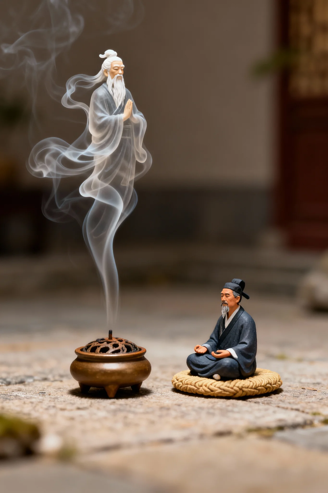

```
微缩景观写实摄影，微距镜头，浅景深，柔光照明，一个中年道人坐在蒲团上打坐，旁边地上放着超小精致的香炉，香炉中冒出袅袅炊烟，炊烟幻化成一个抽象道祖的身姿。细腻质感，烟雾朦胧，光影柔和，道教氛围。
```

```
微缩景观写实摄影，一个中年道人，坐在蒲团上，打坐，旁边地上放着超小精致的香炉，冒着袅袅炊烟，炊烟幻化成一个抽象道祖的身姿
```

 [↑返回目录](#toc)

---
## <a id="jm-prompt-7574262205298855219">镜像少女的凝视</a> (<a href="https://jimeng.jianying.com/ai-tool/personal/MS4wLjABAAAAOy93ix4SqrtaRzXlKSE2GMyIofREoTZL7FfWrzwXueMzYlhdfNxQsNvZqIy1pcxP" target="_blank" rel="noopener noreferrer">名剑风流</a>)


```
精致动漫风少女特写，黑白主体+彩色镜面倒影，高对比度，玻璃质感鲜明，光影戏剧化，4K超清，写实与高级动漫融合，细节层次丰富。银白色短发微湿细腻，自然凌乱却柔软，面部五官精致，皮肤光滑，嘴唇微张带光泽，佩戴大圆形金属框眼镜，镜片晶莹剔透玻璃质感，强烈镜面反射、透明折射、高光边缘与光晕，镜片倒映金色夕阳、海面反光、天空与云朵，色彩明艳层次分明对比强烈。少女眼睛水晶通透感，眼眸深处玻璃折射效果，蓝色反光清晰，瞳孔边缘锐利透明，多层次光晕与高光点，光线折射散射呈现液体光学质感。背景模糊黑白天空云层，与眼镜彩色夕阳形成强烈反差。
```

```
精致的动漫风少女特写，银白色短发，发丝微湿、细腻、自然凌乱却柔软。
少女面部五官精致，皮肤光滑，嘴唇微张带光泽。

她佩戴大圆形金属框眼镜，镜片呈晶莹剔透的玻璃质感，具有强烈的镜面反射、透明折射、高光边缘与光晕。镜片中清晰倒映金色夕阳、海面反光、天空与云朵，色彩明艳、层次分明，对比强烈。

少女的眼睛呈现水晶般的通透感，眼眸深处带有玻璃质感的折射效果，蓝色反光清晰，瞳孔边缘锐利而透明，具有多层次的光晕与高光点，仿佛光线在眼中折射与散射，呈现水晶般清澈、明亮、润泽、近乎液体般的光学质感。

背景是模糊的黑白天空和云层，与眼镜中鲜艳的彩色夕阳形成强烈反差。
整体风格：黑白主体 + 彩色镜面倒影，高对比度，玻璃质感鲜明，光影戏剧化，4K 超清，写实与高级动漫融合，细节层次丰富。
```

 [↑返回目录](#toc)

---
## <a id="jm-prompt-7550224968571817268">幻彩水晶初音未来</a> (<a href="https://jimeng.jianying.com/ai-tool/personal/MS4wLjABAAAAiq03nMhqzZJZeOxSn9YCPPh-pgw_xJbhGzwRFUzD9W-dYLXZqxpAfixasqSYCfc4" target="_blank" rel="noopener noreferrer">棉被王</a>)

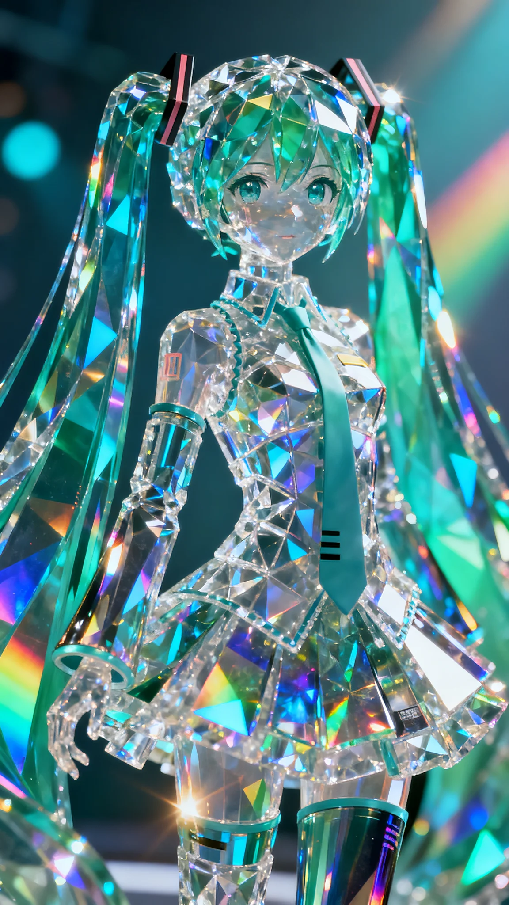

```
晶莹剔透的水晶初音未来，身着标志性双马尾与未来感舞台装，材质为高透明度幻彩水晶，内部折射出渐变蓝绿色光晕。光线穿透水晶结构投射出斑斓的光斑与彩虹棱镜效果。风格融合赛博朋克与奇幻艺术，细节极致精密，雕刻线条流畅，景深虚化突出主体，顶级光影渲染，8K分辨率，超现实主义与3D渲染风格。
```

 [↑返回目录](#toc)

---
## <a id="jm-prompt-7570624937262714139">新鲜肉类的奢华展示</a> (<a href="https://jimeng.jianying.com/ai-tool/personal/MS4wLjABAAAA1xUQ7tpKIiv4_qhimMpipUEfyqpf5r1R4Z3npL87eOU" target="_blank" rel="noopener noreferrer">老唐瞰世界</a>)

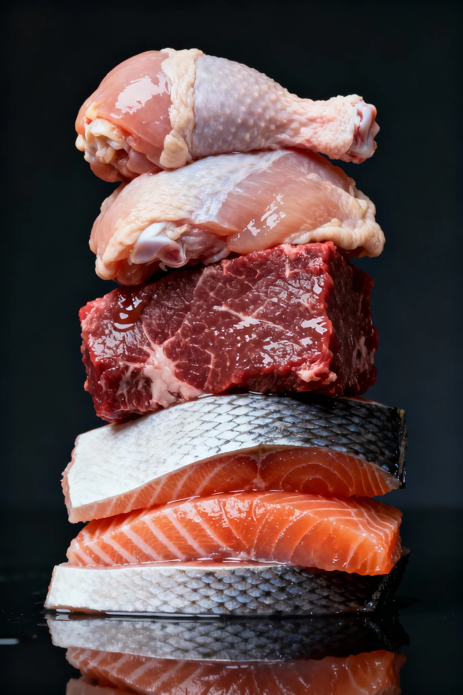

```
商业美食摄影风格，平行视角，深色背景，超清8k画质，新鲜鸡肉切块、牛肉块与切片的新鲜鱼肉薄片叠放在一起，肉类表面湿润有光泽，鱼肉薄片纹理清晰，高清晰度，食物质感细腻，冷色调，突出食材的新鲜度。
```

```
新鲜各种肉类(鸡肉切块、牛肉块)和切片的新鲜鱼肉薄片,叠放在一起,平行视角,深色背景,超清8k
```

 [↑返回目录](#toc)

---
## <a id="jm-prompt-7573938345940765978">疯狂动物城2：明星自拍</a> (<a href="https://jimeng.jianying.com/ai-tool/personal/MS4wLjABAAAANslm35arJAuzSPiDDdxAUPwaiqO5pY8XXLq9BHm6yQQ" target="_blank" rel="noopener noreferrer">拾光</a>)

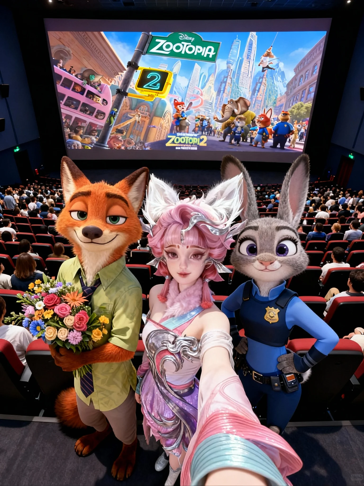

```
日系视觉系风格，用iphone前置自拍效果，画面比例3:4，光线明亮均匀，三位主体靠得很近，头部略微上仰，眼神直视镜头，左侧是身穿浅绿衬衫抱多彩花束的橙色毛发狐狸站得略靠前且身体略微内扣，中间是粉白色毛发装饰且带银色配饰、身穿粉紫色渐变并带有银色装饰服饰的女性，右侧是身穿蓝色警服双手叉腰的灰色毛发兔子，背景为坐满观众的超大电影院，三人背对银幕，银幕显示有众多动物角色、写着“Zootopia”的绿色路牌与显示数字“2”的黄色信号灯及城市建筑的《疯狂动物城2》电影海报，画面构图紧凑，视觉过渡自然，整体呈现精致时尚略带的合影效果。
```

```
不要换脸，人物脸部不能有任何改变！请将图1和图2图3的所有人融合成一张俯拍自拍照，画面构图紧凑，三位主体靠得很近，头部略微上仰，眼神直视镜头，营造出强烈的视觉冲击力。左侧人物站得略靠前，需要保持人脸相似度；需要保持人脸相似度，略微内扣身体，拍摄角度为高角度俯拍，使头部比例被夸张放大，符合典型的日韩视觉自拍风格。简洁干净，进一步凸显人物主体。画面风格偏向日系视觉系，整体画面清晰度高，用iphone前置自拍，最终呈现出精致、时尚、略带的合影效果。要求人物实现无缝融进画面，视觉过渡自然，整体画面光线明亮且均匀，背景为超大电影院坐满了观众，三人背对银幕，银幕显示图4的《疯狂动物城2》电影精美海报不要改变图4内容并填满屏幕，画面比例3:4。
```

 [↑返回目录](#toc)

---
## <a id="jm-prompt-7551412014480985383">血色巷影：新黑色侦探</a> (<a href="https://jimeng.jianying.com/ai-tool/personal/MS4wLjABAAAAT4zVDVKEJ0IHVNh8XU858eS0O2K6dhkGz6r1LZHoiHw" target="_blank" rel="noopener noreferrer">Snowisch</a>)

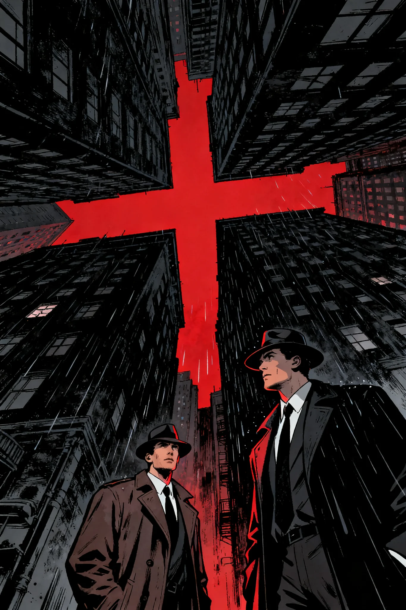

```
Cinematic graphic novel illustration, dramatic low-angle shot, towering black buildings creating oppression, high contrast between deep black shadows and intense blood red light, strong comic book ink lines, painterly shading. Two men in hats, trench coats, and suits (noir-style detectives) stand in a raining dark narrow alley, looking upwards toward a cross-shaped intersection of streets glowing in blood red. Vertical composition emphasizing claustrophobic urban density, expressive shadows, tense and gritty urban atmosphere, evoking crime, mystery, and neo-noir aesthetics.
```

```
Cinematic graphic novel illustration of two men standing in a raining dark narrow alley, looking upwards toward a cross-shaped intersection of streets glowing in intense blood red. The perspective is dramatic, low-angle shot with towering black buildings creating a sense of oppression. The figures wear hats, trench coats and suits, noir-style detectives with expressive shadows. The atmosphere is tense, urban, gritty, with high contrast between deep black shadows and glowing red light, evoking crime, mystery, and neo-noir aesthetics. The composition emphasizes verticality and claustrophobic urban density, with strong comic book ink lines and painterly shading.
```

 [↑返回目录](#toc)

---
## <a id="jm-prompt-7575201271548824858">快乐小狗的草地翻滚</a> (<a href="https://jimeng.jianying.com/ai-tool/personal/MS4wLjABAAAA2DDgBdvGQyaHg6bX1OWdkVMVz8R-XU3nHQfjWLnWrfZTmgK9B4kwKx5GQJ2HkT1Q" target="_blank" rel="noopener noreferrer">GGBOOM</a>)

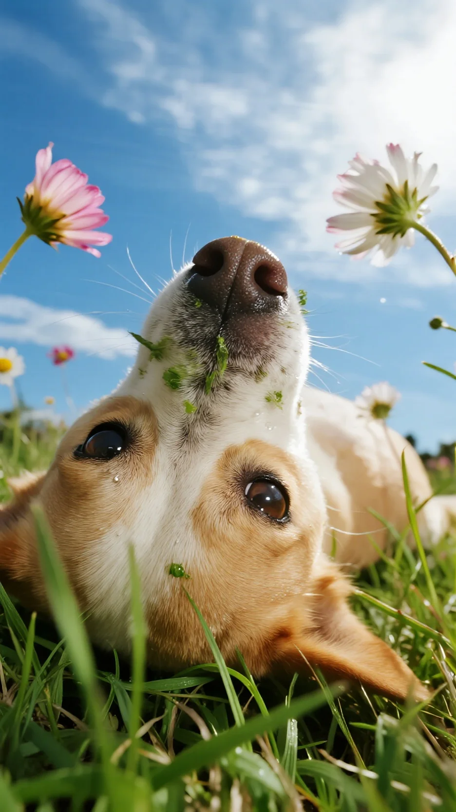

```
一只小狗在草地上打滚，它露出肚皮，表情开心，周围有几朵小花，背景是蓝天，画面充满童趣，专业摄影作品风格。
```

 [↑返回目录](#toc)

---
## <a id="jm-prompt-7573987335625313546">炎柱·炼狱杏寿郎</a> (<a href="https://jimeng.jianying.com/ai-tool/personal/MS4wLjABAAAAvAhUo-hH1r2Q_HdZP1R3_I5Fj3Q5yfXzCnq3kCViCM2MAMZsO6vSwIMRHNslQgDw" target="_blank" rel="noopener noreferrer">章和安</a>)

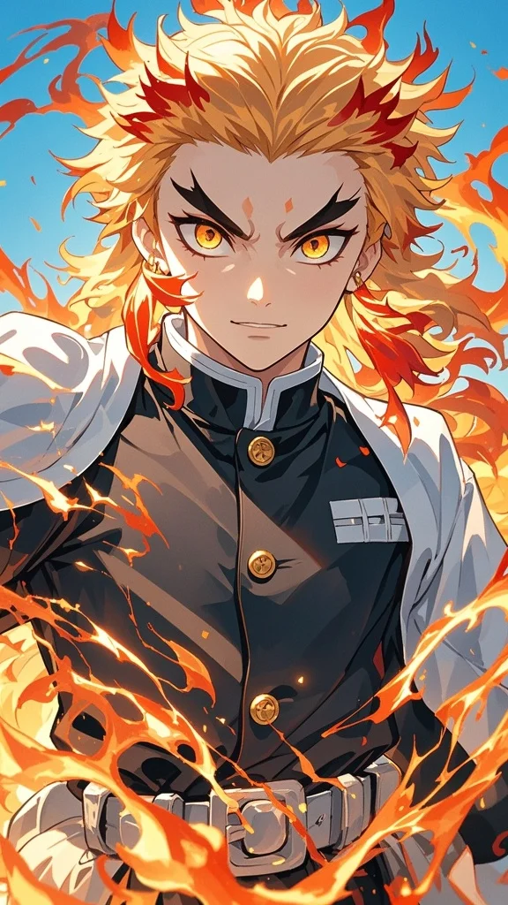

```
鬼灭之刃统一画风（线条流畅、色彩鲜明、日式和风角色造型，角色服饰细节精致且符合原作设定），在鬼灭之刃世界观下，一幅描绘炎柱·炼狱杏寿郎的炽热画卷。

他立于画中，仿佛一团被意志束缚的永恒火焰。

那头金红交织的长发，是这幅画作最奔放的笔触。它并非静止的发丝，而是蓬勃燃烧的烈焰，每一缕卷曲都跃动着生命的热量与光痕。发梢那抹炽烈的红，如同淬火的精钢，与他坚毅瞳孔中的橙黄色光芒遥相呼应——那双眼眸，是两轮沉入白昼的太阳，里面烙刻着不容动摇的信念与守护的誓言。

他的面容是出鞘的利刃，英气的眉宇斩开一切犹豫。身着的黑色制服，是深沉的暗夜，而肩头与领口的纯白，则是划破长夜的闪电与黎明。金色的纽扣如星辰般缀于其上，恪守着秩序与荣耀。

背景是极致的纯净，或许是无穷的苍穹，亦或是最终的寂灭。但这片留白，反而将炼狱杏寿郎的存在感烘托至巅峰。紧凑的构图让他仿佛要破画而出，整个画面充盈着一种爆炸前的临界之力，静默，却震耳欲聋。

这不仅仅是一个形象，更是一种精神的图腾。他是斩断绝望的炎刃，是以身照亮黑暗的不灭之光。画师捕捉的，正是他灵魂燃烧时，最耀眼、最热烈的那个瞬间。
```

 [↑返回目录](#toc)

---
## <a id="jm-prompt-7574278205796879666">鎏金狂草财运海报</a> (<a href="https://jimeng.jianying.com/ai-tool/personal/MS4wLjABAAAAY_K_DU-9vPD2vChtZyHG7p6LruQ09nmI_hGhSAMqCqmDxZqIAVkk0D9CFDOnA7dH" target="_blank" rel="noopener noreferrer">丿墨羽曦灬</a>)

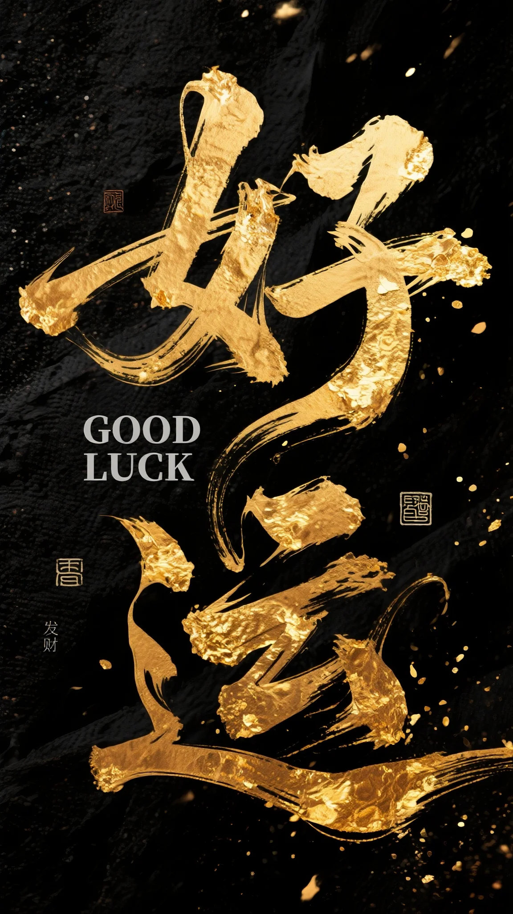

```
主体文字'好运'，狂野奔放草书字体，超粗笔画，流畅飘逸，力量感足，笔画延长变形缠绕，有明显飞白效果，鎏金质感，有金属光泽和厚重感，金色有深浅变化和熔金流动感，边缘略带泼溅金箔效果；背景是带细微噪点的黑色肌理背景，类似粗布、深色砂砾或老旧纸张纹理；'發财'为视觉中心占大部分画面，英文'GOOD LUCK'用浅金色或灰白色起装饰标注作用，有符文点缀，大师级海报风格，融合传统书法与现代设计感，神秘奢华充满能量，画面干净焦点清晰，黑色背景与鎏金字体对比强烈
```

 [↑返回目录](#toc)

---
## <a id="jm-prompt-7568395837856845083">国风哪吒螺旋行</a> (<a href="https://jimeng.jianying.com/ai-tool/personal/MS4wLjABAAAAmspXMAVyiIrYCcO7mEWo8oPdUdGFRl73szv-YvhFi9Ao9F9PAJbDBjBC8SJ0YjkB" target="_blank" rel="noopener noreferrer">一缕晨光</a>)

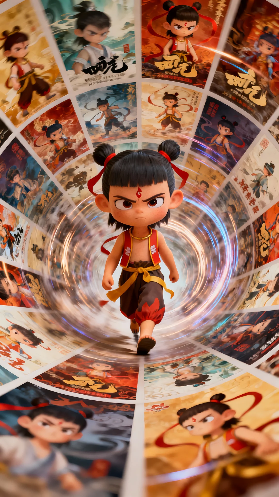

```
国风海报设计，高饱和度，8K高清，焦点固定在哪吒IP形象身上。画面中许多经典国风哪吒海报呈螺旋状环绕，哪吒在旋转的海报中行走，周围有朦胧的模糊、拖影和轨迹效果，充满神秘感。
```

```
海报，画面中有许多名哪吒的经典国风海报呈螺旋状，哪吒IP形象，在旋转的海报中行走，充满神秘感。焦点固定在哪吒IP形象身上，周围是朦胧的模糊、拖影和轨迹效果。高饱和度。8K 高清。
```

 [↑返回目录](#toc)

---
## <a id="jm-prompt-7569090340817292571">荒诞寺林少</a> (<a href="https://jimeng.jianying.com/ai-tool/personal/MS4wLjABAAAAUdXHxvgAPmZoISxWtpQWjGe0La81xFZiVb9DZ4DZUKE" target="_blank" rel="noopener noreferrer">一名《墁德》</a>)

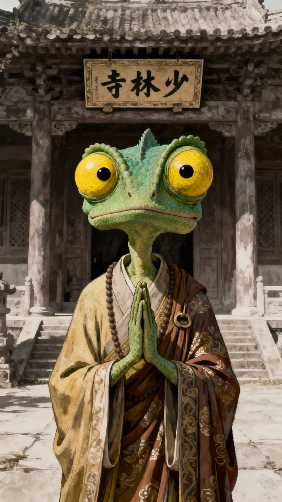

```
插画风格，低饱和度褪色色调，画面中央一只绿色变色龙（兰戈）身披华丽袈裟，瞪着硕大的黄色眼眸（黑瞳透着荒诞），双手合十。背景为古建筑，上方悬挂牌匾"寺林少"。褪色质感，荒诞氛围。
```

```
画面中央，一只绿色变色龙——兰戈，身披华丽袈裟，瞪着硕大的黄色眼眸（黑瞳透着荒诞），双手合十。
背景古建筑，牌匾“寺林少”。低饱和度，褪色。
```

 [↑返回目录](#toc)

---
## <a id="jm-prompt-7576176123101383974">古风美人与蜀葵花丛</a> (<a href="https://jimeng.jianying.com/ai-tool/personal/MS4wLjABAAAAN-3_Ct3FodKWz4I4kP4vjaGSk4kvfYYq_Ss0LFoRKrVuVfvN8ZfMSy9GMSwLCQsq" target="_blank" rel="noopener noreferrer">治愈❤️‍🩹自愈</a>)

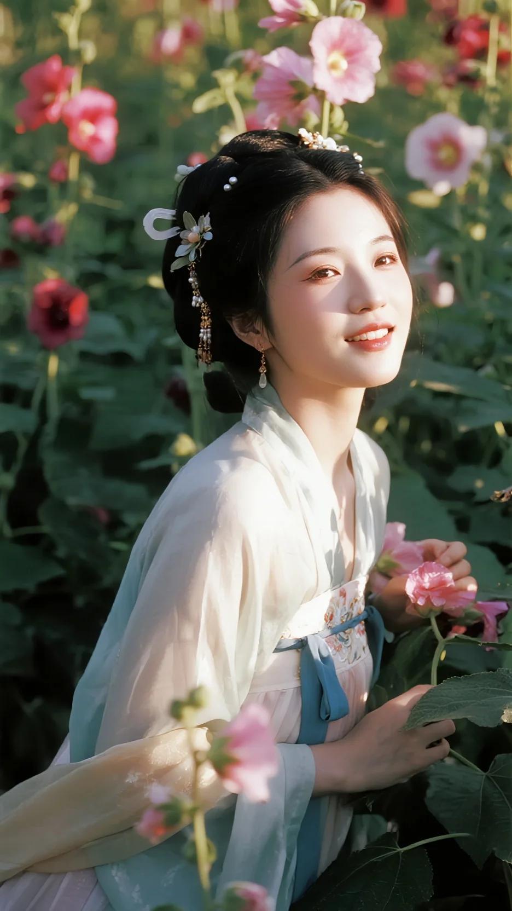

```
胶片摄影，镜头语言，淡彩，阳光灿烂，明媚，个性视角，古风美人，繁茂蜀葵花丛，皮肤白皙嫩滑，倾国倾城容貌，蜀葵花色系柔纱衣衫，配饰简约精致高级，欢乐，高对比度，虚焦，高颜值，既视感，情绪氛围感拉满，暗朦，光朦，泛白，褪色，漏光，胶片颗粒质感，层次丰富，写意，朦胧美学，光的美学，lomo效果，超现实，高级感，杰作
```

 [↑返回目录](#toc)

---
## <a id="jm-prompt-7572025462117944627">极简张飞轮廓</a> (<a href="https://jimeng.jianying.com/ai-tool/personal/MS4wLjABAAAApoh_kDp5GyN5OQxLInhaDj_1aKjdBQH6EsD89hHtw_U" target="_blank" rel="noopener noreferrer">春儿</a>)

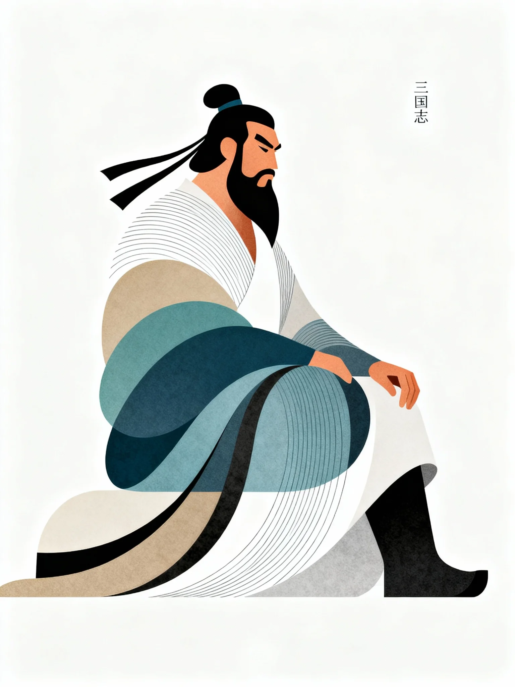

```
矢量插画风格，极简主义，超现实派，先锋艺术，时尚字体主标题极小中文"三国志"作为点缀。线条画叠加多个不规则弧形色块构成张飞轮廓，坐着，自然姿态，柔美色块填充，抽象线条与曲面线条交织，纹理装饰。纯白色背景，大师构图，极简海报，高清画质，获奖海报质感。
```

```
矢量插画，抽象线条与曲面线条，线条画，柔美色块构成，极简主义，线条设计叠加多个不规则弧形色块张飞轮廓，坐着，自然，纹理，装饰，超现实派，具有先锋艺术、时尚字体主标题极小中文“三国志”作为点缀、大师构图，极简海报，高清画质，大师作品，获奖海报。纯白色背景
```

 [↑返回目录](#toc)

---
## <a id="jm-prompt-7572093095504874778">新海诚风格的海滩大道</a> (<a href="https://jimeng.jianying.com/ai-tool/personal/MS4wLjABAAAAnnyeEY4RzIFUZmdofhhUUW3o2Z5CHbblP1Dy3A7vCQw0S9UQvShaKYGDHUuhdkA_" target="_blank" rel="noopener noreferrer">AI体验官</a>)

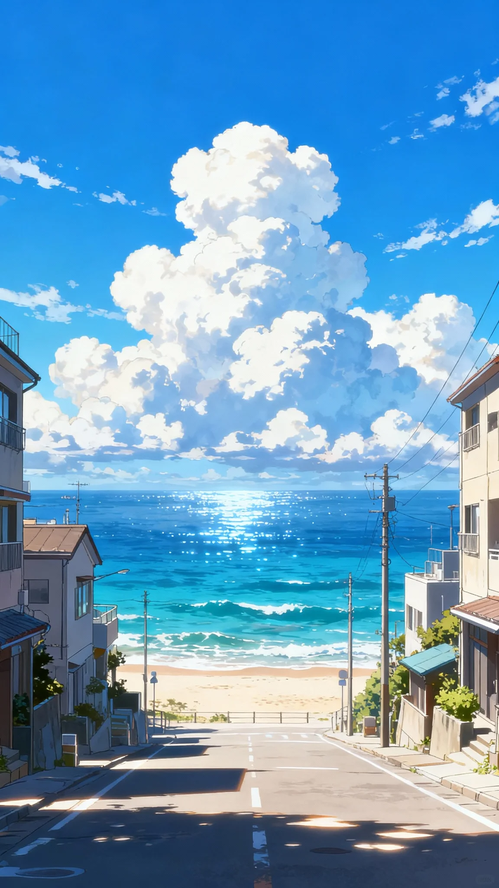

```
日式动漫风格，新海诚画风，阳光明媚的城市街道延伸至海滩，远处是波光粼粼的大海，天空湛蓝点缀着蓬松白云。光影细腻，色彩明亮饱和，高细节插画，8K分辨率，电影感构图，画面宁静治愈，充满生活气息。
```

```
阳光明媚的城市街道，海滩，大海，天空湛蓝有白云。日式动漫风格，新海诚画风，光影细腻，色彩明亮饱和，高细节插画，8K分辨率，电影感构图 —— 画面宁静治愈，充满生活气息
```

 [↑返回目录](#toc)

---
## <a id="jm-prompt-7566881543227018523">书法字环绕的超现实人物</a> (<a href="https://jimeng.jianying.com/ai-tool/personal/MS4wLjABAAAAnWObsMAPcq1vb0hk-JEYjMo4dZI8ggJmKsOzvRjtpRjpfD_GdbXBZnX-yUcSPAAP" target="_blank" rel="noopener noreferrer">小冰糖_3</a>)

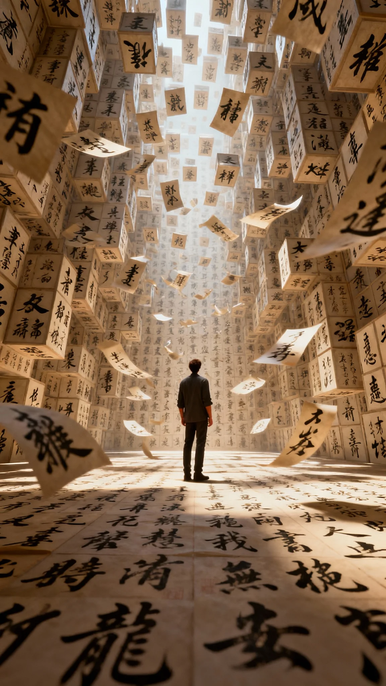

```
超现实3D建模，电影构图，大师级作品，细致逼真，虚实结合，创新设计。一个人立于奇幻空间中，无数书法字在周围空间飘浮，密密麻麻、重复排列，无穷无尽。电影级光影，空间层次感强，超现实氛围。
```

```
一个人，书法字飘於空间，无窮无盡，密密麻麻，重複，奇幻空间，创新，虚实，超现实，细致逼真，电影构图，大師作品。3d建模
```

 [↑返回目录](#toc)

---
## <a id="jm-prompt-7571808383599250714">黄山梦景</a> (<a href="https://jimeng.jianying.com/ai-tool/personal/MS4wLjABAAAAy_OdWvyeoFmVCuornXmmMnp8DK3dn6DAF6vXAqEongE" target="_blank" rel="noopener noreferrer">竹灵·醉月漱玉</a>)

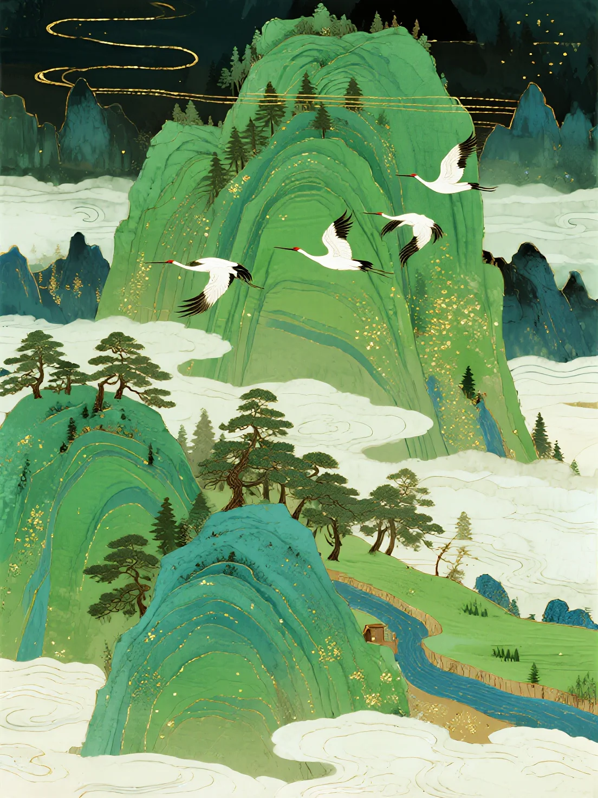

```
流体苏绣质感，青绿山水，黄山翠绿松树林，梦幻，云雾缭绕，一行白鹭上青天。舒缓而流畅，柔和、大气的感觉，发光线条用金丝线勾画，点彩金箔，极致构图，每个细节超真实突出，空灵，禅意，微缩景观
```

 [↑返回目录](#toc)

---
## <a id="jm-prompt-7558637624169090350">暗黑滤镜下的熊二与年轻女性</a> (<a href="https://jimeng.jianying.com/ai-tool/personal/MS4wLjABAAAAa_HW_-rQ75Q_5TNcxiqF_GStOn0V625sV6lkCmOGEDiIWA5TsqQFC1_EsFd0L9fm" target="_blank" rel="noopener noreferrer">啊德特效制作</a>)


```
一位年轻女性穿着深棕色短袖Polo衫，侧背对镜头站在高端简约浴室洗漱台前面向镜子，镜子里映出浅棕色毛发、脸部呈浅棕与米白渐变、灰色鼻子、面带微笑的3D动画风格熊二，画面添加稍微暗黑的滤镜。
```

```
帮我生成一张照片，图二人物站在高端简约浴室镜子前，侧着背对镜头，在洗漱台前，面向镜子：镜子里映出的是图一的熊二的形象，加一个稍微暗黑的滤镜。
```

 [↑返回目录](#toc)

---
## <a id="jm-prompt-7570911299589164334">唐太宗银杏禅院3D绘图</a> (<a href="https://jimeng.jianying.com/ai-tool/personal/MS4wLjABAAAAaOjzmha2Bq4DiE7gcoRchuw6Vu-Nrj0Gzr_1pPN-9zjdZBAFyr-9Ei1P_JtC1mdL" target="_blank" rel="noopener noreferrer">云天明</a>)

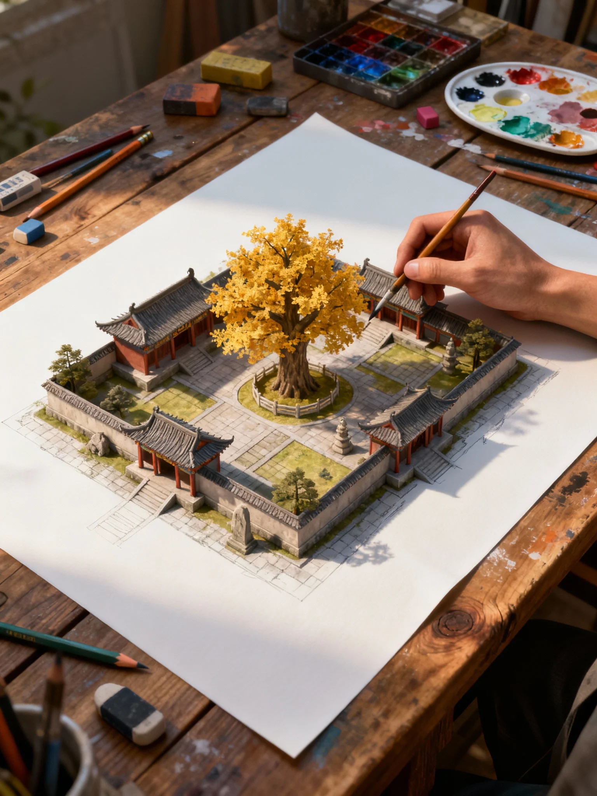

```
3D写实风格，虚幻引擎渲染，真实感强烈，45度等轴鸟瞰视角。实木工作台桌面，中间平铺一张白纸，一只手拿着画笔在纸上绘制，白纸上呈现唐太宗种植银杏树的禅院3D模型，模型细节清晰，禅院布局、银杏树及建筑结构立体呈现。桌面上随意摆放颜料和其他绘画工具，工具包括调色盘、铅笔、橡皮擦等，颜色丰富。光影自然，桌面木纹清晰，纸张质感细腻，整体氛围专注且富有艺术感。
```

```
实木桌面，工作台，中间平铺着一张白纸，画面中一只手拿着画笔，在纸上画着，白纸上生成一个唐太宗种植银杏树的禅院的3D模型，45度等轴鸟瞰视角，3D模型由虚幻引擎渲染，真实感强烈，仿佛是用画笔画出来的，桌面上随意放着一些颜料和其他的绘画工具。
```

 [↑返回目录](#toc)

---
## <a id="jm-prompt-7575673154941570331">偏偏喜欢你-手绘涂鸦艺术字体</a> (<a href="https://jimeng.jianying.com/ai-tool/personal/MS4wLjABAAAAeUWNK2l1QhnRjrdcTaC0g2V9kjyf8zkp-p4FToLad0bDBOlX94vkWR9c-wlK-n4-" target="_blank" rel="noopener noreferrer">不气健身铺</a>)

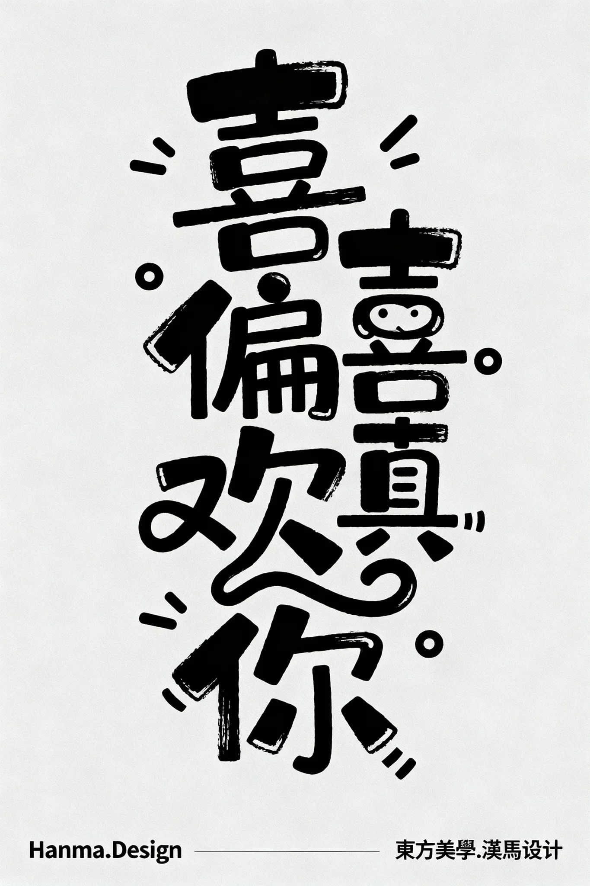

```
手绘涂鸦风，浅灰色哑光背景，垂直紧凑堆叠的艺术字体"偏偏喜欢你"。字体风格活泼随性，主笔粗壮饱满、辅笔纤细灵动，边缘带马克笔自然毛糙质感，部分笔画末端有小装饰点/断点。单字结构艺术化变形："喜"顶部笔画夸张放大，"欢"具块面感，"你"部件卡通化，"偏"曲线灵动，字间相互穿插嵌套。字体周围点缀小装饰点/短线，纯黑色字体与浅灰背景高对比。底部点缀无衬线体小字英文"Hanma.Design"和中文"東方美學.漢馬设计"，营造生动即兴的手绘艺术效果。
```

```
浅灰色哑光背景，垂直紧凑堆叠的手绘涂鸦风艺术字体 “偏偏喜欢你”；字体风格活泼随性，笔画粗细对比强烈（主笔粗壮饱满、辅笔纤细灵动），边缘带马克笔手绘的自然毛糙质感，部分笔画末端有小装饰点 / 断点；单字结构艺术化变形（“喜” 顶部笔画夸张放大，“欢” 具块面感，“你” 部件卡通化，“偏” 曲线灵动），字间相互穿插嵌套；字体周围点缀小装饰点 / 短线，纯黑色字体与浅灰背景高对比，营造生动即兴的手绘艺术效果。装饰性文字：无衬线体小字英文“Hanma.Design”无衬线体小字中文“東方美學.漢馬设计”作为点缀。
```

 [↑返回目录](#toc)

---
## <a id="jm-prompt-7525845624718249231">卡通女孩与猫的潮流冒险</a> (<a href="https://jimeng.jianying.com/ai-tool/personal/MS4wLjABAAAAwSJ0J7WGB9cmcHaCTv9gdwRZf3Nnx0V5NjAhReWGSdo" target="_blank" rel="noopener noreferrer">晓琪插画</a>)

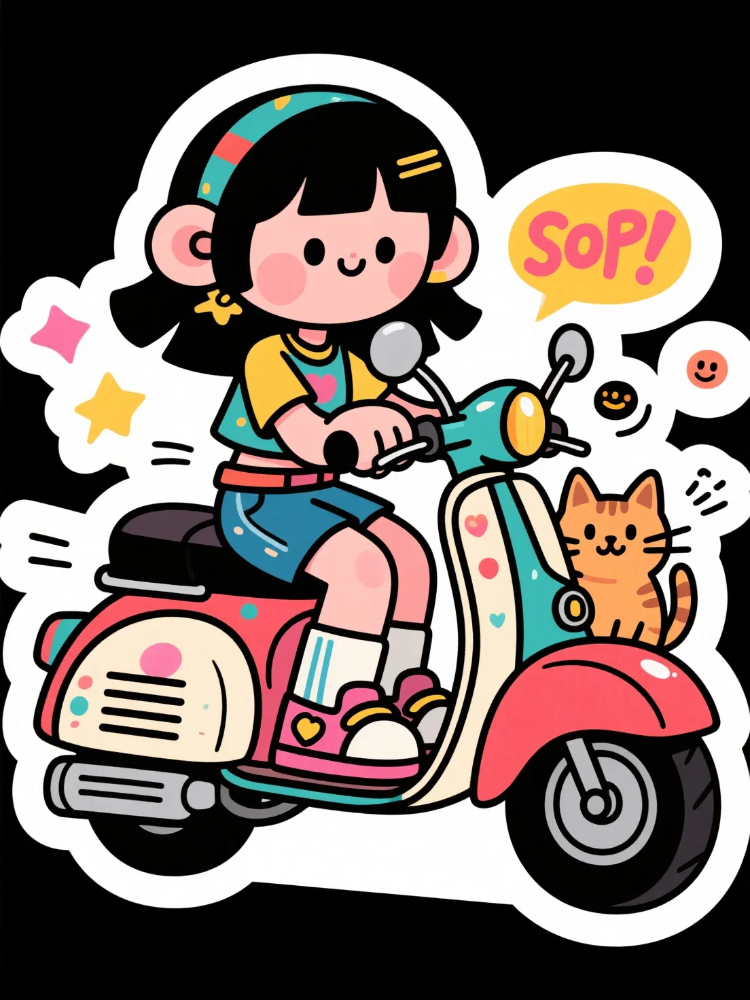

```
可爱的卡通女孩和她的猫，波普艺术，全身，骑复古摩托，潮服，时尚，清晰的插图，大胆的线条，涂鸦手绘风格，简笔画，童趣，贴纸，混合图案，文字和表情符号装置

抽象涂鸦风格与前卫潮流元素碰撞，抽象涂鸦风格与前卫潮流元素碰撞，呈现Shui、MOTO和风和自由的混合艺术特征。8k
```

 [↑返回目录](#toc)

---
## <a id="jm-prompt-7570392746041560358">膝关节的光辉结构</a> (<a href="https://jimeng.jianying.com/ai-tool/personal/MS4wLjABAAAA11Ud2Igz5RY2a4GxC-_sdEaedCpjfrcBd83bJKjRGKjDYxtMLXebDBGy6EkJ9Esj" target="_blank" rel="noopener noreferrer">小文ai智创设计</a>)


```
医学可视化3D渲染，高细节，照片级逼真。人类膝关节，股骨、胫骨、髌骨呈纯净白色，关节被鲜艳金黄色光芒突出显示，光芒从软骨表面发出。膝盖周围环绕三个半透明球体：第一个充满相互连接的蓝色线条网络，第二个充满耀眼的金黄色光芒，第三个充满旋转的金黄色液体。精致的白色圆形线条环绕膝关节，暗示运动或能量。背景为柔和渐变浅蓝色，叠加微妙的浅蓝色网格图案。整体构图干净，医学感强，传达健康和活力的感觉。光线柔和漫射，营造温柔乐观基调。
```

```
一个细节丰富、照片般逼真的3D渲染图，展示了一个人类膝关节，股骨、胫骨和髌骨呈现出纯净的白色。关节被鲜艳的金黄色光芒突出显示，光芒从软骨表面发出。膝盖周围环绕着三个半透明的球体：一个充满了相互连接的蓝色线条网络，另一个充满了耀眼的金黄色光芒，第三个则充满了旋转的金黄色液体。精致的白色圆形线条环绕着膝关节，暗示着运动或能量。背景是柔和的渐变浅蓝色，叠加着微妙的浅蓝色网格图案。整体构图干净且具有医学感，传达出健康和活力的感觉。光线柔和而漫射，营造出一种温柔而乐观的基调。
```

 [↑返回目录](#toc)

---
## <a id="jm-prompt-7576114704574057778">妖异金箔神话</a> (<a href="https://jimeng.jianying.com/ai-tool/personal/MS4wLjABAAAATZ5FkdpdwxmnmLkBRDwVukBKA_jc_dqM-wgfhm6DwQE" target="_blank" rel="noopener noreferrer">红色的风</a>)

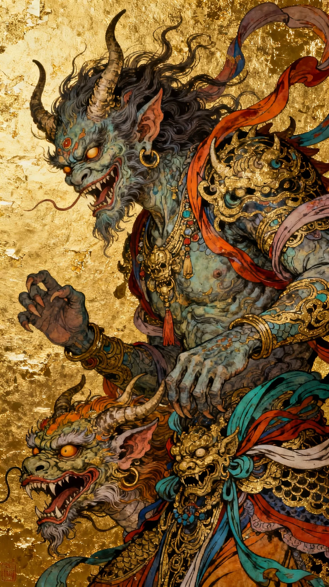

```
超精细中国神话画作，妖异诡谲的妖怪，金箔铺陈的背景，融合中国神话体系与《山海经》妖怪的繁复怪物形象，主要通过细腻缜密的线描与鲜活色彩呈现。
```

```
超精细的中国神话画作描绘：妖异诡谲的妖怪，金箔铺陈的背景，融合中国神话体系与山海经妖怪的繁复怪物形象，主要通过细腻缜密的线描与鲜活色彩呈现
```

 [↑返回目录](#toc)

---
## <a id="jm-prompt-7567380855073672457">慵懒可爱的橘白猫咪</a> (<a href="https://jimeng.jianying.com/ai-tool/personal/MS4wLjABAAAAJymDsPTh1DfrHKgNnYL7ieUo2iu41LM5n0xCewAQ2tnMfncPjZljUVSmlHDWv4dp" target="_blank" rel="noopener noreferrer">用户4755234430327</a>)

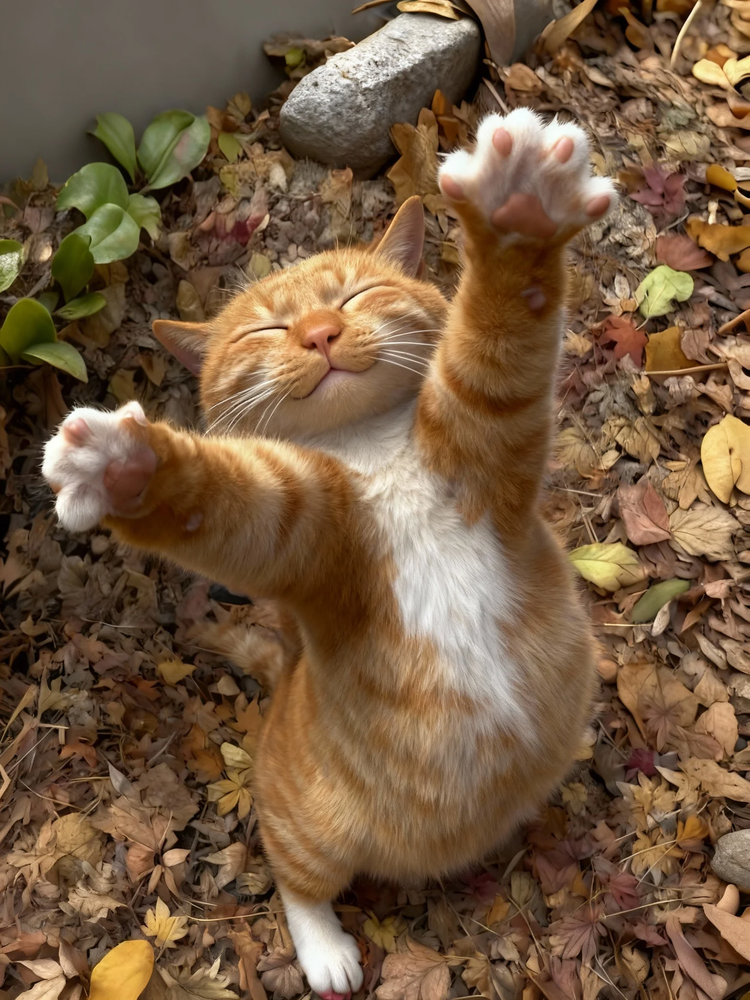

```
写实风格，一只橘白相间的猫，微微笑，双爪向上伸展，周围是落叶、绿植、石块，背景为户外地面，氛围慵懒可爱
```

```
橘白相间的猫咪，微微笑，双爪向上伸展，周围是落叶、绿植、石块，户外秋日场景，写实风格，慵懒可爱氛围
```

 [↑返回目录](#toc)

---
## <a id="jm-prompt-7576609778248600842">水墨梅香</a> (<a href="https://jimeng.jianying.com/ai-tool/personal/MS4wLjABAAAAEPt3OPXX26ru5vDstOfOgJbGs3YYfVVpZHeRoWi2L3g" target="_blank" rel="noopener noreferrer">momo</a>)

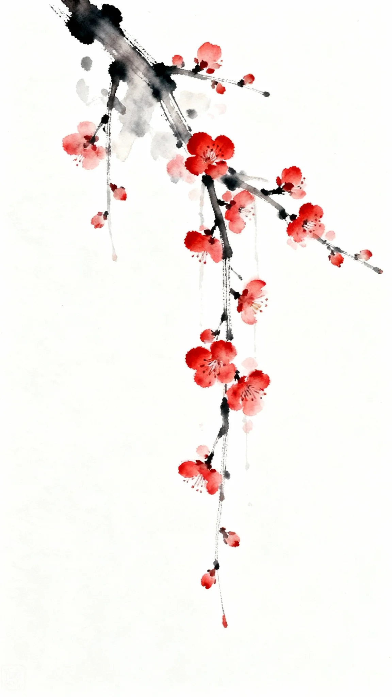

```
水墨淡彩插画，淡彩晕染，水墨笔触，一枝条垂落的梅花枝条，红色梅花稀稀疏疏，背景纯白色，清新雅致氛围。
```

```
插画水墨淡彩，一枝条垂落的梅花枝条， 背景纯白色背景，红色梅花稀稀疏疏。
```

 [↑返回目录](#toc)

---
## <a id="jm-prompt-7550594405707697447">复古财神开业贴纸</a> (<a href="https://jimeng.jianying.com/ai-tool/personal/MS4wLjABAAAAenGbaChLzXlcCOjo5SKNVmpaVGKN6QOehZwmEOfvl0KXwHdXlw8UlxJMaG4BFdGU" target="_blank" rel="noopener noreferrer"> 彩琼</a>)

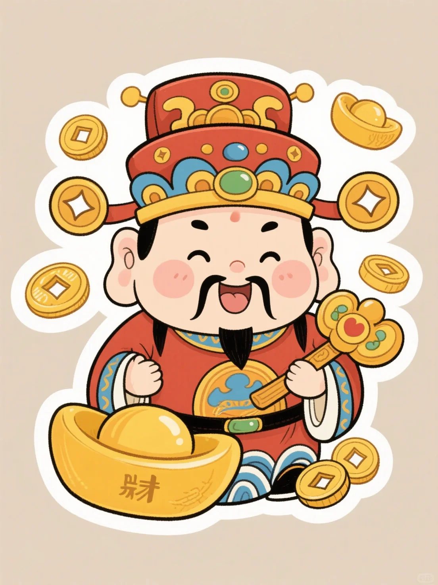

```
充满复古韵味的明代财神题材贴纸，手绘风格，整体风格可爱俏皮，有财神帽，有金币，有如意，开业贴纸
```

 [↑返回目录](#toc)

---
## <a id="jm-prompt-7575491147246669107">次元自拍：尼克狐与朱迪兔的网红之旅</a> (<a href="https://jimeng.jianying.com/ai-tool/personal/MS4wLjABAAAAqYVrqg3aVfDjw8QCk6wdk65qbjp8z5-qkkGEewQ8ri0PrKpyDEXVkFuI3WyFhMge" target="_blank" rel="noopener noreferrer">噜学家</a>)

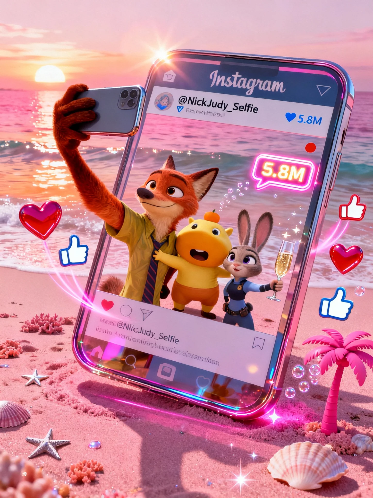

```
ins网红度假风，8K电影级写实，光线追踪，毛发纤维级细节，次表面散射，Unreal Engine5渲染，破次元构图，疯狂动物城尼克狐、朱迪兔与参考图1图2形象的黄色、头顶带橘的卡通角色在粉色海滩自拍，尼克手持巨型手机以45度角举起，三人手臂伸出Instagram相框外，手机悬浮画面中心呈透视畸变感；画面右侧巨屏UI锐度极致，显示用户名"@NickJudy_Selfie"配蓝V认证、点赞数"5.8M"加粗闪烁、实时录制红点跳动、带霓虹描边的评论气泡；相框边缘2cm厚玻璃材质反射粉色沙滩；环绕漂浮3D立体红心❤️、点赞手势👍、粉色椰子树🌴、香槟气泡✨图标，拖尾光效叠加暖粉色bloom光晕，镜头光斑梦幻；背景为芭比粉海滩，有细腻珊瑚沙颗粒感、渐变粉橘色海水波光粼粼、柔和日落体积光、贝壳与星星砂闪烁；左侧现实世界阴影锐利、饱和度真实，右侧数字界面柔光滤镜加暗角，高对比度粉金色调。
```

```
疯狂动物城尼克狐和朱迪兔和噜噜（参考附件形象）在粉色海滩自拍，尼克手持巨型手机以45度角举起，三人手臂伸出Instagram相框外打破次元壁，手机悬浮于画面中心呈透视畸变感。画面右侧巨屏UI锐度极致：用户名"@NickJudy_Selfie"配蓝V认证，点赞数"5.8M"加粗闪烁，实时录制红点跳动，评论气泡带霓虹描边。相框边缘2cm厚玻璃材质反射粉色沙滩。环绕漂浮3D立体红心❤️、点赞手势👍、粉色椰子树🌴、香槟气泡✨图标，拖尾光效叠加暖粉色bloom光晕，镜头光斑梦幻。背景为芭比粉海滩：细腻珊瑚沙颗粒感可见，渐变粉橘色海水波光粼粼，柔和日落体积光，贝壳与星星砂闪烁。左侧现实世界阴影锐利、饱和度真实，右侧数字界面柔光滤镜加暗角，高对比度粉金色调。ins网红度假风，8K电影级写实，光线追踪，毛发纤维级细节，次表面散射，景深聚焦手机，Unreal Engine5渲染，破次元构图，度假感，网感爆棚
```

 [↑返回目录](#toc)

---
## <a id="jm-prompt-7573657074769431858">浩渺流光</a> (<a href="https://jimeng.jianying.com/ai-tool/personal/MS4wLjABAAAAKbBHy8bzn8bmEafy2zwwNkywPKkSGdhSW1AeyqJwUal-NaMb2AqtdtROG3qwQBCm" target="_blank" rel="noopener noreferrer">亿丰</a>)


```
C4D建模风格，流畅极少蓝白色渐变，小笔刷发光变换，空间感，光线追踪，浩渺感，孤独感，全景视角，透白渐变背景，流光溢彩。
```

```
流畅极少蓝白色渐变小笔刷发光在变换、空间感，光线追踪，浩渺感，孤独感，全景视角，透白渐变背景，流光溢彩，C4d建模
```

 [↑返回目录](#toc)

---
## <a id="jm-prompt-7552454678785674505">极简芭蕾侧影</a> (<a href="https://jimeng.jianying.com/ai-tool/personal/MS4wLjABAAAAuwN3Pv3YV_WUUYlD_6nshtimgW0puAiysdolbZPuhNs" target="_blank" rel="noopener noreferrer">剑工场</a>)

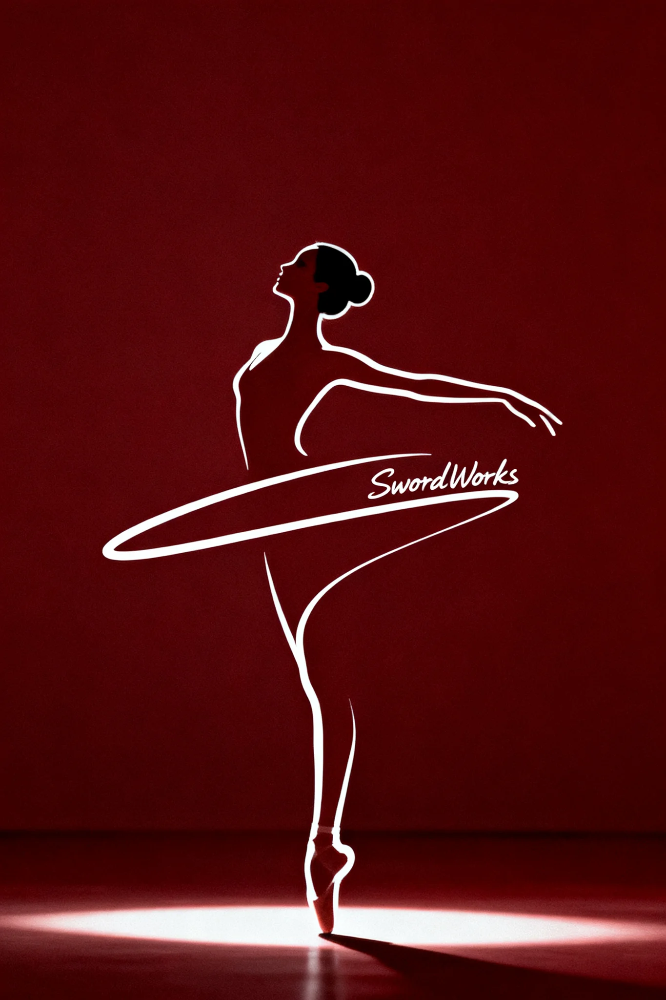

```
极简主义风格，深红背景，一笔白色流畅曲线勾勒芭蕾舞者侧光轮廓，大师级排版，空白处手写连笔小字"SwordWorks"，线条简洁，侧光轮廓清晰，留白构图，艺术签名自然融入。
```

```
深红背景，仅用一笔白色的流畅曲线展示一个芭蕾舞者的侧光轮廓，极简主义的线条，一笔画，大师级排版，空白处手写连笔小字签名"SwordWorks"
```

 [↑返回目录](#toc)

---
## <a id="jm-prompt-7569871595204857115">Q版苗族舞者</a> (<a href="https://jimeng.jianying.com/ai-tool/personal/MS4wLjABAAAAqNC_-LcW_9UIyn8OCFzKAXK4HoK4K1W0t1byCmeShTk" target="_blank" rel="noopener noreferrer">阿里黎</a>)

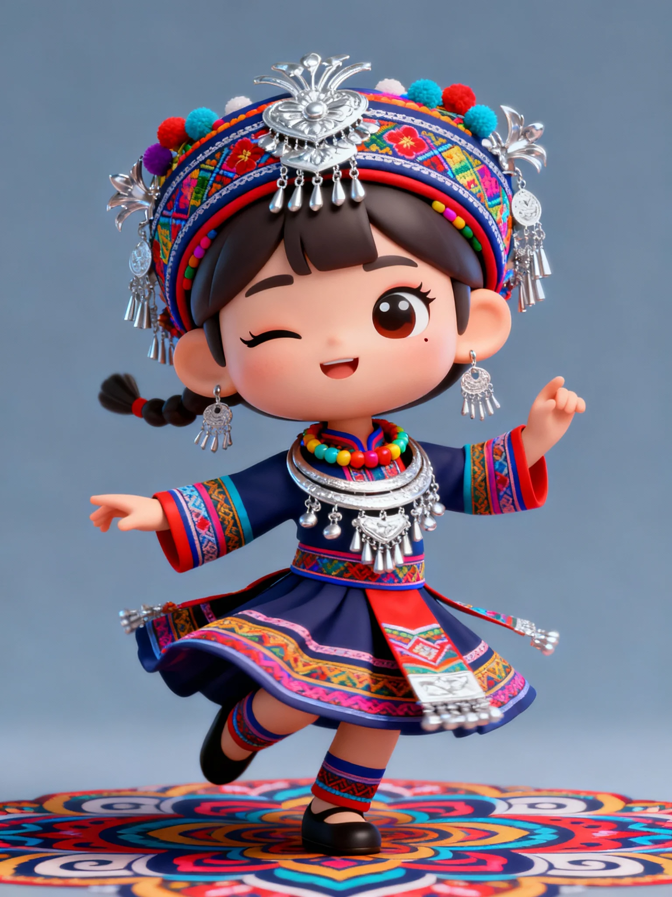

```
3D风格Q版IP形象设计，一个苗族女孩，眼角有一颗痣，佩戴精致银饰、彩色刺绣头饰和项圈，色彩靓丽鲜艳，正在跳舞，纯色背景上有苗族花纹元素。
```

```
请以苗族女孩设计一个ip形象，眼角有一颗痣，Q版形象，饰品精致，色彩靓丽鲜艳，人物在跳舞，3d风格，纯色背景含有苗族花纹元素，
```

 [↑返回目录](#toc)

---
## <a id="jm-prompt-7569597112724229385">Q版花栗鼠的多彩生活</a> (<a href="https://jimeng.jianying.com/ai-tool/personal/MS4wLjABAAAArVLwdfJXVdRQDlH0HkwhykBhK8tc9BRrSHKfadmpwdgBk9qUoBqAtpS1qhibm3ph" target="_blank" rel="noopener noreferrer">小风筝1225</a>)

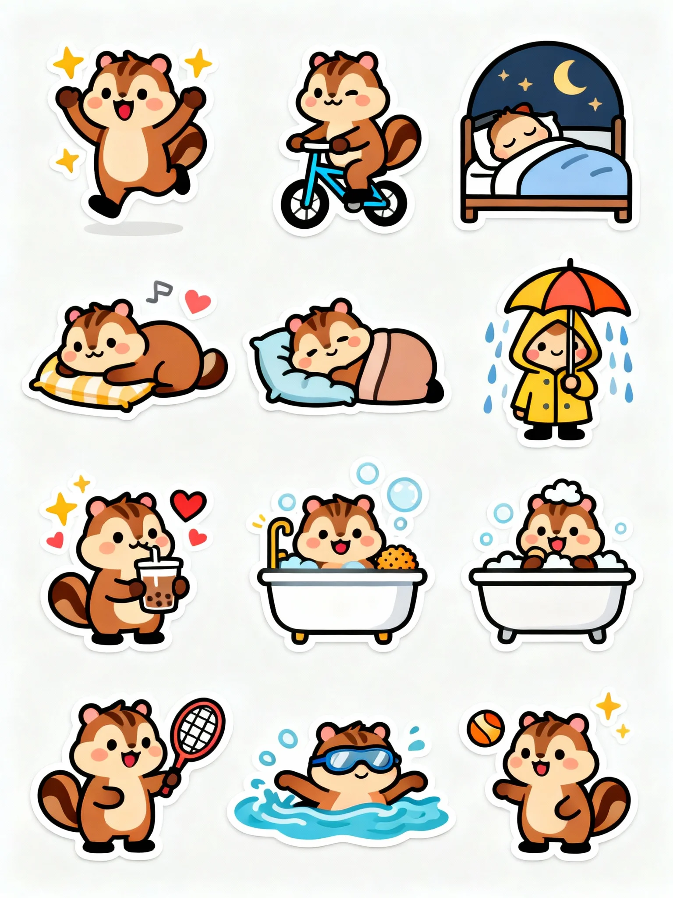

```
卡通矢量风格，简笔画，扁平插画，Q版贴纸，9宫格布局，白背景，高清。每格为全身显示的可爱花栗鼠拟人化形象，分别呈现：兴奋（举爪跳跃）、骑车（骑小自行车）、晚安（闭眼躺床）、趴着睡觉（蜷缩抱枕）、穿雨衣（戴雨帽撑伞）、开心喝奶茶（捧奶茶杯）、洗澡（坐浴缸拿沐浴球）、游泳（戴泳镜划水）、打球（挥球拍）的日常生活主题动作，加入星星、爱心、气泡等可爱符号丰富表情。
```

```
Q版贴纸，可爱的花栗鼠拟人化形象，9宫格有趣夸张表情包，兴奋，骑车，晚安，趴着睡觉，穿着雨衣，开心喝奶茶，洗澡，游泳，打球，简笔画，扁平插画，开心等日常生活主题，加入一些可爱的符号使表情更丰富，卡通矢量风格，全身显示，高清，白背景
```

 [↑返回目录](#toc)

---
## <a id="jm-prompt-7570888819424202030">红影国风</a> (<a href="https://jimeng.jianying.com/ai-tool/personal/MS4wLjABAAAAeog96MUUfkGZE5kgdK911UEwbVaNATTr2rqu2cNphfQ" target="_blank" rel="noopener noreferrer">随风生长</a>)

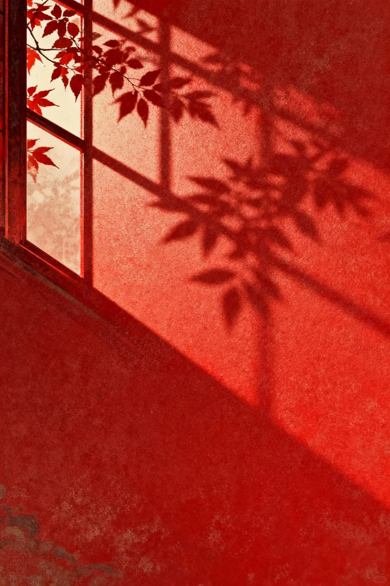

```
国风摄影风格，红色纯色背景，质感颗粒复古红，窗户外面的树叶投射在背景上的影子，真实感，艺术氛围。
```

```
国风红色背景，写真纯背景，质感颗粒复古红，有窗户外面的树叶投射在上面的影子，真实感，艺术
```

 [↑返回目录](#toc)

---
## <a id="jm-prompt-7575084424690175283">赣南客家：书法与文化的交融</a> (<a href="https://jimeng.jianying.com/ai-tool/personal/MS4wLjABAAAAlCap2juX69Ol0ovDtM6649fLgHlVfTiZEziLloIRJwuAjZhpvg-nNaO1tLFziyRd" target="_blank" rel="noopener noreferrer">MOFANG |   魔方</a>)

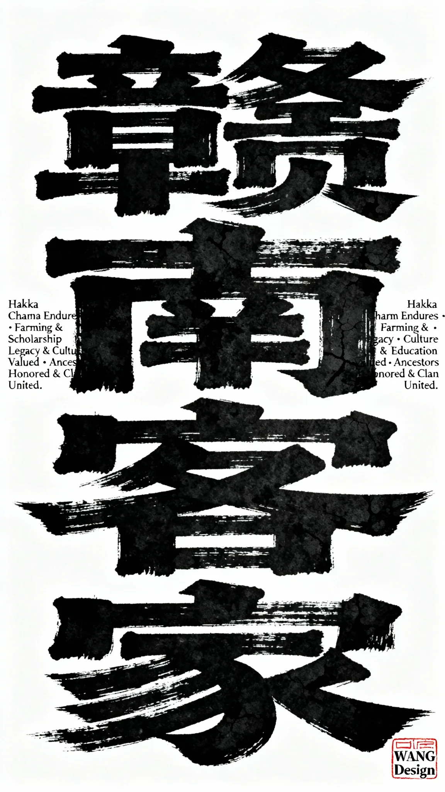

```
商业级手写书法作品，大师级手写艺术，白色干净背景，黑色字，竖排"赣南客家"汉字，旁有小字英文"Hakka Charm Endures・Farming & Scholarship Legacy・Culture & Education Valued・Ancestors Honored & Clan United."，右下角黑体小字英文"WANG Design"，红色仿古印章。字体朴实拙趣，手写粗笔画，偏隶书风格，笔画极粗堆叠成特殊艺术效果，运笔墨迹丰富，粗体块状设计，复古沧桑质感，排列错落有致，随性秩序感，干燥肌理笔刷，笔触肌理夸张，边缘像素锐利，笔画夸张变形，8K高清细节，32K分辨率，HDR，极致构图，极致像素。
```

```
商业级手写书法作品"赣南客家"手写汉字，大师级手写艺书法术作品，白色干净色背景黑色色字。
文字竖排，一旁装饰有小字英文“Hakka Charm Endures・Farming & Scholarship Legacy・Culture & Education Valued・Ancestors Honored & Clan United.”，有红色仿古印章，画面右下角有黑体小字英文“WANG Design"，文字风格朴实，拙趣，手写，粗笔画，复古书法感觉，字体厚重古朴的偏隶书风格体，风格独特笔画极粗，字体笔画由于太粗堆叠到一起形成特殊的艺术效果，运笔墨迹丰富，采用了粗体块状设计，呈现出一种复古，沧桑的质感，文字排列，错落有致，给人一种随性又不失秩序的感觉，干燥的肌理笔刷，笔触肌理夸张加强，边缘像素锐利，笔画夸张化变型，夸张大胆，高清细节，8K分辨率，极致构图，极致像素，高清出图，32K，HDR
```

 [↑返回目录](#toc)

---
## <a id="jm-prompt-7556190517487275310">麻辣烫的极繁主义海报</a> (<a href="https://jimeng.jianying.com/ai-tool/personal/MS4wLjABAAAAfX2ZhqWih-zTlEYTlfmY3ga-7RnRMtdEAI9c-nilOssdf55HeOfGw2ievHRWsXuv" target="_blank" rel="noopener noreferrer">音乐的力量</a>)

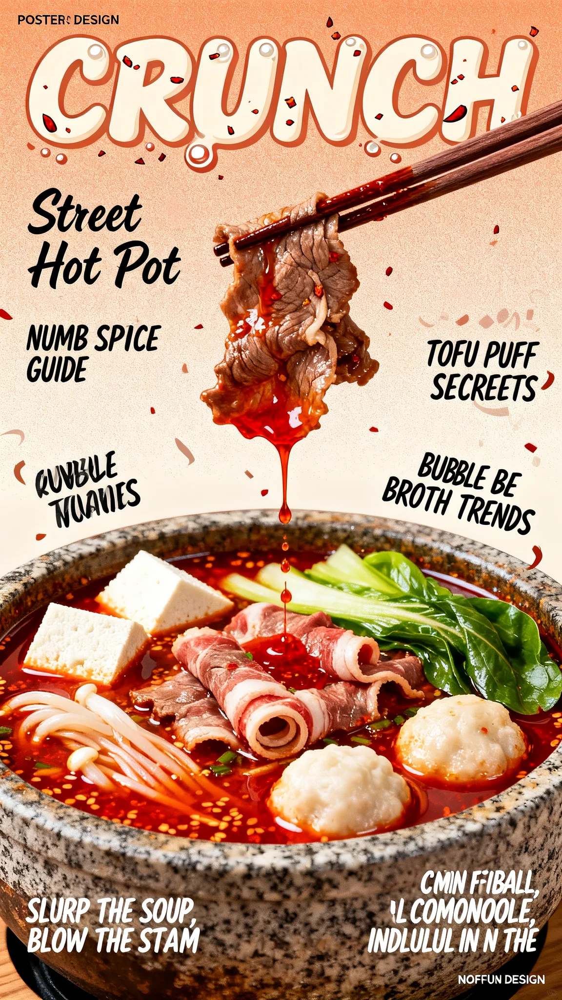

```
丝网印海报风格，极繁主义，保留半调图案、噪点颗粒质感，线条简洁灵动，色彩鲜明饱满，大师级排版。主体为一碗红亮汤底泛油花的麻辣烫，内有白嫩豆腐泡、卷边肥牛、翠绿青菜、Q弹鱼丸，筷子夹起吸饱汤汁的肥牛，红油顺筷尖滴落，背景浅橙渐变带砂锅粗糙纹理，散落手写文字：标题"CRUNCH"（字体圆润如沸腾气泡，笔画点缀辣椒碎）、栏目"Street Hot Pot""NUMB SPICE GUIDE""TOFU PUFF SECRETS""BUBBLE BROTH TRENDS"，俏皮短语"SLURP THE SOUP, BLOW THE STEAM""C'MON FISH BALL, C'MON NOODLE, INDULGE IN THE"，左上角小字"POSTER DESIGN"，右下角极小字"NOFUN DESIGN"，热辣鲜活风格，手绘字体与真实摄影结合，街头小吃热闹烟火气。
```

```
丝网印海报，保留丝网印质感和特点，半调图案，噪点颗粒，线条简洁灵动，画面有故事感，大师级排版，极繁主义，色彩鲜明饱满。

美食杂志封面，主体是一碗冒着热气的麻辣烫（红亮的汤底泛着油花，里面堆着白嫩的豆腐泡、卷着边的肥牛、翠绿的青菜、Q弹的鱼丸，筷子夹起一片吸饱汤汁的肥牛，红油顺着筷尖滴落，香气仿佛能穿透画面）；背景是浅橙渐变底色（带砂锅的粗糙纹理），散落着手写文字：标题“CRUNCH”（字体像沸腾的气泡一样圆润，笔画间点缀着辣椒碎）、栏目“Street Hot Pot”“NUMB SPICE GUIDE”“TOFU PUFF SECRETS”“BUBBLE BROTH TRENDS”等，还有俏皮短语“SLURP THE SOUP, BLOW THE STEAM”“C'MON FISH BALL, C'MON NOODLE, INDULGE IN THE”；整体风格热辣鲜活，手绘字体与真实麻辣烫摄影相结合，满是街头小吃的热闹烟火气。

左上角小字“POSTER DESIGN”
右下角极小字“NOFUN DESIGN”
```

 [↑返回目录](#toc)

---
## <a id="jm-prompt-7548338056282098990">优雅教师的3D卡通全身像</a> (<a href="https://jimeng.jianying.com/ai-tool/personal/MS4wLjABAAAARntPC9SN90E_oQ1ogIHvQq1gtfQQ7MYpcTa0q9256K9EBItniFPPMIInMXhABINe" target="_blank" rel="noopener noreferrer">开开</a>)

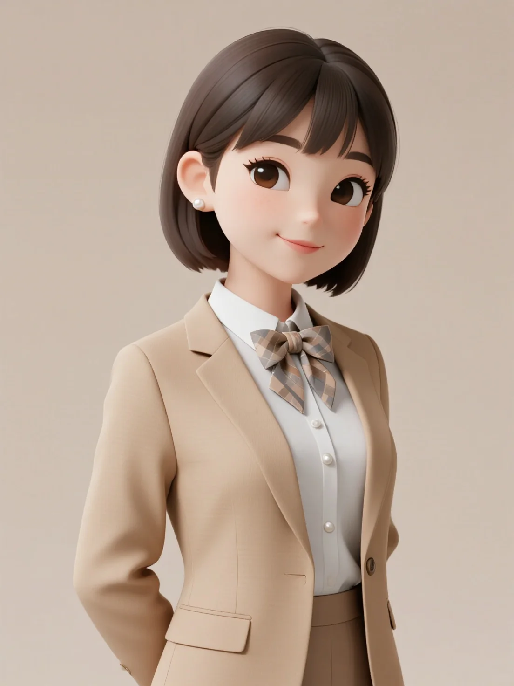

```
3D 卡通人物，全身像，身穿米色西装套裙、珍珠白衬衫，颈间系丝巾，干练优雅的女孩，温柔亲和的笑容，正面微侧站立，教师身份，纯色简约背景。3D 渲染，全身像
```

 [↑返回目录](#toc)

---
## <a id="jm-prompt-7568900093215116590">快乐鹅的复古治愈之旅</a> (<a href="https://jimeng.jianying.com/ai-tool/personal/MS4wLjABAAAAD9vytO2uQ8paEUixFFVLhcxslzHyLPuguEG2NHRrG20OHaVFNchFqC522tKVLNDU" target="_blank" rel="noopener noreferrer">小小耘的记录</a>)

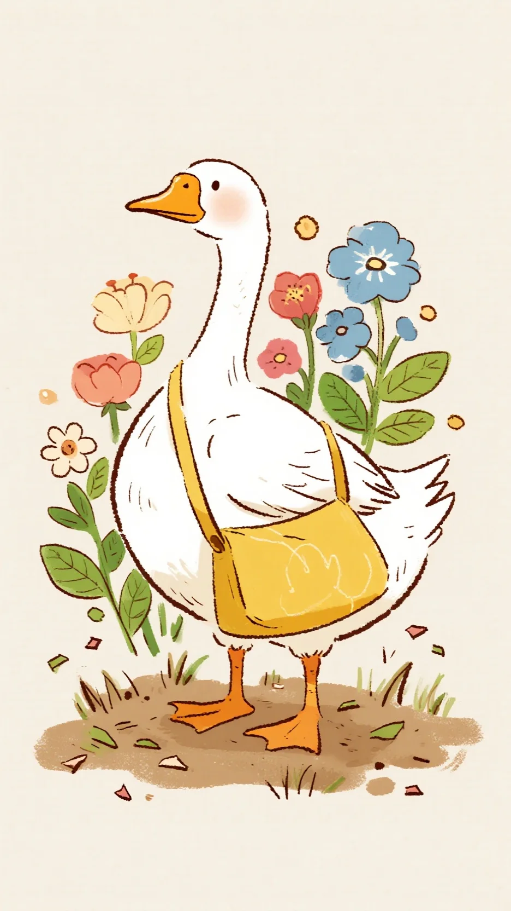

```
拉尔夫帝斯曼手绘插画风格，表情开心，线条感，凌乱且杂乱的线条画鹅，治愈系插画，暖色调，绘本故事，扁平风，复古风格浅色的背景。幽默感，黄色包袋飘带飞扬，脚边溅起草屑，身后丛生各色花朵与薄荷叶，纯白负空间构图
```

 [↑返回目录](#toc)

---
## <a id="jm-prompt-7549321596213660978">夸张幽默的财迷肖像</a> (<a href="https://jimeng.jianying.com/ai-tool/personal/MS4wLjABAAAAHe9ke54fCLOwVuD6V2T59iptly1TH9s-Ry0iuqbd0Q4TYTH09d2S_gLIyySekb7V" target="_blank" rel="noopener noreferrer">俗人老胡</a>)


```
在极致高清且细节丰富的纯色背景下，绘制一幅写实风格的滑稽夸张小品人物肖像。人物有着漫画风格夸张的大头，呈现出搞怪的肢体动作，用麻袋背着满满一袋钱，神情俏皮且夸张，充分突出幽默和古怪的特点
```

 [↑返回目录](#toc)

---
## <a id="jm-prompt-7574043724301307174">梦幻圣诞夜·城市之心</a> (<a href="https://jimeng.jianying.com/ai-tool/personal/MS4wLjABAAAAmExey_fGOBjut98QX8cs6L7Q02QYmK-Tz4tXcoECkoJ-ETUcW87V7Q55LYv1C8ZT" target="_blank" rel="noopener noreferrer">YOUYOU</a>)

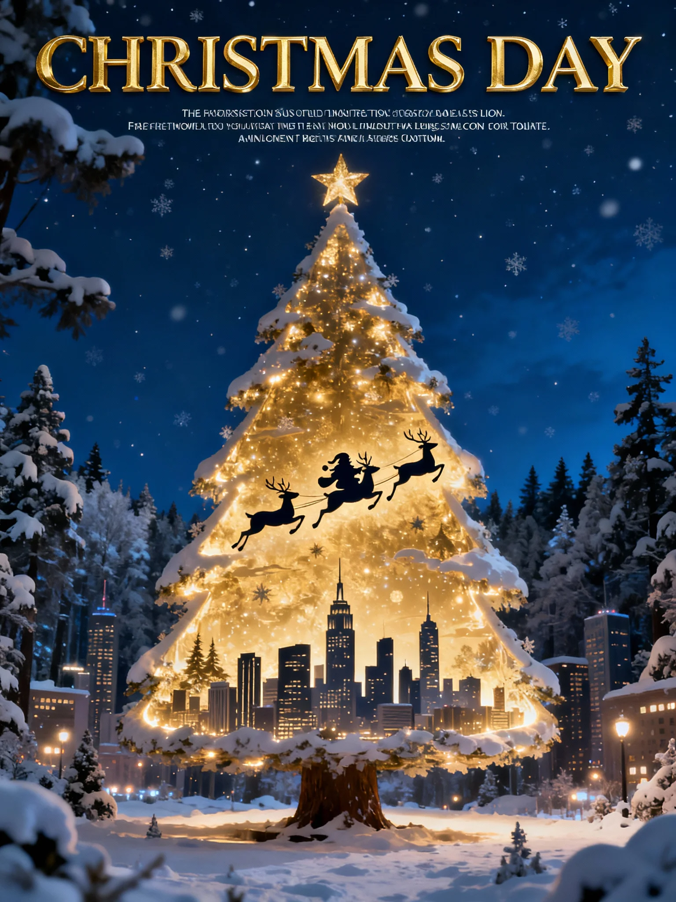

```
梦幻圣诞主题城市夜景宣传海报，中心对称构图，画面中心是一棵巨大的发光圣诞树，内部可见圣诞老人与驯鹿飞行的剪影，树底内部映衬现代都市剪影，背景为覆盖积雪的森林与深蓝色夜空，圣诞树为视觉焦点。冷色调深蓝、雪白为主，与圣诞树内部金色暖光形成鲜明对比，城市灯光点缀其间，风格融合奇幻与现实主义，强调雪景柔和光影与城市细节。顶部金色立体字"CHRISTMAS DAY"，包含衬线体标题与无衬线辅助信息，金色与白色文字在深色背景中清晰可辨，节日魔幻氛围与城市生活结合的视觉体验。
```

```
一幅梦幻的圣诞主题城市夜景宣传海报，画面中心是一棵巨大的发光圣诞树，内部可见圣诞老人与驯鹿飞行的剪影，树底内部映衬着现代都市的剪影。背景为覆盖积雪的森林与深蓝色夜空，构图采用中心对称布局，圣诞树作为视觉焦点。色彩以冷色调的深蓝、雪白为主，与圣诞树内部的金色暖光形成鲜明对比，城市灯光点缀其间。画面风格融合奇幻与现实主义，强调雪景的柔和光影与城市细节。
文字信息分层排列：顶部为金色立体字"CHRISTMAS DAY"，字形设计包含衬线体标题与无衬线辅助信息，金色与白色文字在深色背景中清晰可辨。整体营造出节日魔幻氛围与城市生活结合的视觉体验。
```

 [↑返回目录](#toc)

---
## <a id="jm-prompt-7577127003623623945">黎锦风情的立体字艺术</a> (<a href="https://jimeng.jianying.com/ai-tool/personal/MS4wLjABAAAAfqsv_ZlwHqpg4XAyY_IZmcMRy6f6OeCW_qzpeZL8w88" target="_blank" rel="noopener noreferrer">Chendu</a>)


```
Blender建模，OC渲染，16K高清，大师级作品，立体特效字"你好"，字体每个笔画由黎锦布料构成，表面复刻红/黄/蓝三色棉线编织纹理，融合浅银金属迷你银饰挂件（带黎锦花纹）、彩色棉线黎锦图案绣片（印传统图腾）、棉线流苏点缀，布料呈现柔软质感，居中对称构图，纯黑色背景，居中正视图，正面视角，精致细节。
```

```
帮我生成图片：由黎锦布料，表面复刻黎锦的彩色编织纹理（红/黄/蓝三色棉线）与布料的柔软质感、融合迷你银饰挂件（浅银金属，带黎锦花纹）、黎锦图案绣片（彩色棉线，印传统图腾）、棉线流苏等元素点缀组成的立体特效字“你好”，字体每个笔画都是由黎锦布料，表面复刻黎锦的彩色编织纹理（红/黄/蓝三色棉线）与布料的柔软质感、融合迷你银饰挂件（浅银金属，带黎锦花纹）、黎锦图案绣片（彩色棉线，印传统图腾）、棉线流苏等元素点缀组成，居中对称构图，背景纯黑色，居中正视图，正面图，精致的，blender建模，OC渲染，16K高清，大师级作品。
```

 [↑返回目录](#toc)

---
## <a id="jm-prompt-7576156574587129097">油画中的屠夫</a> (<a href="https://jimeng.jianying.com/ai-tool/personal/MS4wLjABAAAAh3miCUuP-2y2tZi4rmNzu4BTWKzNa7WVwp9LOzzfSJetOFIW7uOvfVgsg-psf6FZ" target="_blank" rel="noopener noreferrer">斜陽 未来律动</a>)

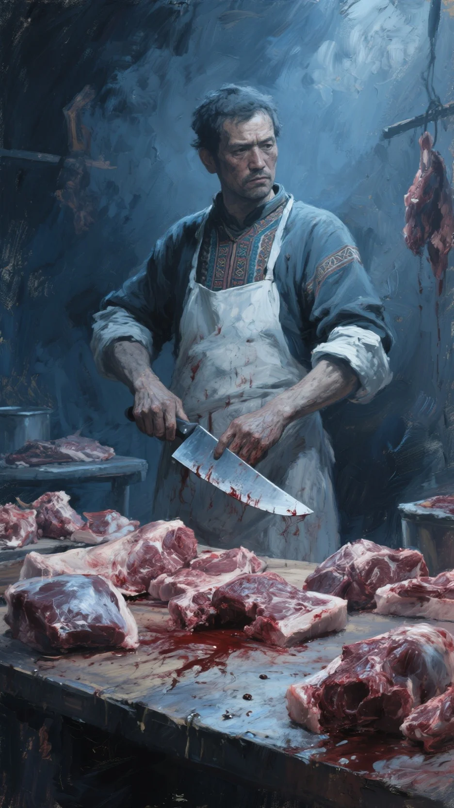

```
以油画色彩风格呈现，画面中有一个身着传统服饰、手持锋利刀具的屠夫，他站在摆满新鲜肉类的案板前，周围弥漫着浓郁的血腥气息，光影在他坚毅的脸上和粗糙的手上跳跃，营造出一种充满张力的氛围。
```

 [↑返回目录](#toc)

---
## <a id="jm-prompt-7573502153738800393">Q版阿U家族欢聚</a> (<a href="https://jimeng.jianying.com/ai-tool/personal/MS4wLjABAAAAHMhCvZueBO48jrfvnK-wIMbb-wlvueIo5S-LgTCIRIRtwm90ffl5qm7Rx4_Pp9Mz" target="_blank" rel="noopener noreferrer">洋娃娃和小熊跳舞</a>)

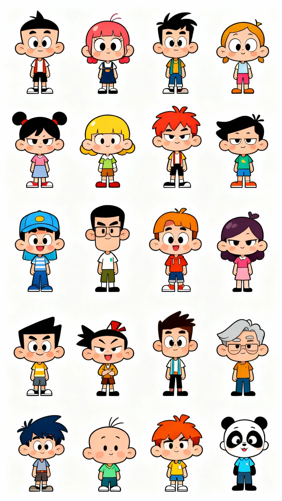

```
Q版插画风格，阿U系列多个人物大集合，Q版造型，可爱神态，独特个性，人物间保持间隔，纯色背景，色彩明快活泼，趣味氛围。
```

```
以Q版人物形象呈现阿U中的人物大集合画集，展现丰富多样的角色形象，注重人物的可爱神态与独特个性，画面色彩明快活泼营造出充满趣味的氛围，人物与人物之前间隔，纯色背景
```

 [↑返回目录](#toc)

---
## <a id="jm-prompt-7569246025664171302">潮流猴子IP HaHa设计展板</a> (<a href="https://jimeng.jianying.com/ai-tool/personal/MS4wLjABAAAArVLwdfJXVdRQDlH0HkwhykBhK8tc9BRrSHKfadmpwdgBk9qUoBqAtpS1qhibm3ph" target="_blank" rel="noopener noreferrer">小风筝1225</a>)

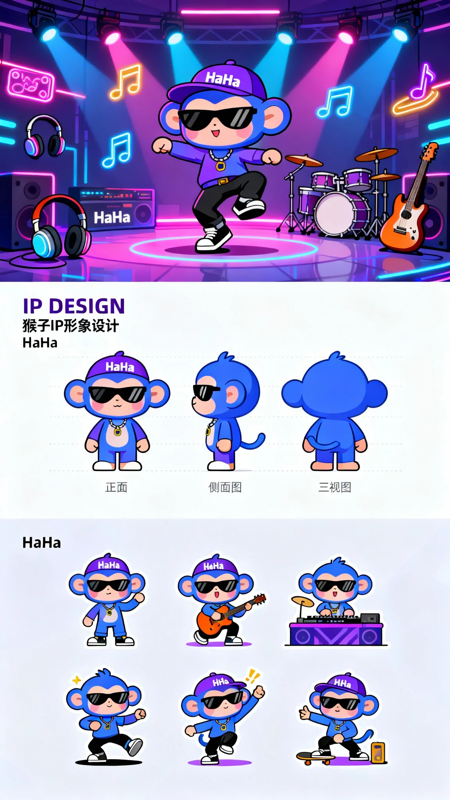

```
潮流插画风格IP展板设计，上部分：紫蓝色拟人化小猴子IP形象"HaHa"，戴帽子、墨镜，酷酷的，跳街舞场景，周围有霓虹灯光、音符、耳机、吉他、架子鼓等街舞潮流元素，高清完整卡通形象，标注"IP DESIGN"、"猴子IP形象设计"、"HaHa"文字；中间部分：小猴子"HaHa"的正面视图、侧面视图、背面视图三视图，高清展示不同角度外观细节；下部分：小猴子"HaHa"的6个不同有趣延展动作场景，扁平插画，卡通矢量风格。
```

```
IP展板：这张图片的上部分：小猴子拟人化IP形象（HaHa)的整体形象展示，戴着帽子、墨镜，酷酷的，紫蓝色，高清，呈现了小猴子跳街舞的场景，霓虹灯光，旁边有些音符，耳机，吉他，架子鼓等街舞潮流元素，完整卡通形象，同时标注了“IP DESIGN”“猴子IP形象设计 '"HaHa”的文字信息；中间部分是：小猴子子的三视图，包含正面视图、侧面视图和背面视图，高清展示了该IP形象不同角度的外观细节，下部分展示了猴子6个不同切有趣的延展动作场景，扁平插画，卡通矢量风格，潮流插画。
```

 [↑返回目录](#toc)

---
## <a id="jm-prompt-7567281109994687753">超现实主义火车拉链</a> (<a href="https://jimeng.jianying.com/ai-tool/personal/MS4wLjABAAAA217dtf8IvBhGq4kyZvz6PPWcUuRyvtEjp0Hes0J7hm0" target="_blank" rel="noopener noreferrer">静哉悠哉</a>)


```
超现实主义创意海报，移轴微距效果，画面以分离的拉链为界分为上下不对称两个屏。火车头化作拉链头冒着白烟，沿着拉链朝着镜头径直驶来，拉链跟在火车头后面逐步分离。火车头后方区域显示绿草鲜花的春天，前方区域呈现白雪茫茫的冬天。异想天开的构思，精美构图，夸张的俯视视图，高对比度，高饱和度，视觉冲击力强。
```

```
超现实主义，创意海报，画面以分离的拉链为界分为上下不对称两个屏。移轴微距，火车头化作拉链头冒着白烟沿着拉链朝着镜头径直驶来，拉链跟在火车头后面逐步分离。火车头后方区域显示绿草鲜花的春天，火车头前面的区域呈现白雪茫茫的冬天。异想天开的构思，精美构图，夸张的俯视视图，视觉冲击力，高对比度，高饱和度。
```

 [↑返回目录](#toc)

---
## <a id="jm-prompt-7571279579579419913">Q版柳树游戏插画</a> (<a href="https://jimeng.jianying.com/ai-tool/personal/MS4wLjABAAAAvzTLThYOECjNmtrXHQr_khUN3LrmDxBqPWM2FuCv2DQ" target="_blank" rel="noopener noreferrer">ashko</a>)


```
一棵柳树，Q版游戏风格，手绘，细节清晰，手绘质感强，线条清晰，纹理清晰，有光泽感，高饱和度，没有边框，没有人，纯色背景，OC渲染，超高清画质
```

 [↑返回目录](#toc)

---
## <a id="jm-prompt-7525440169118289162">Q版犬夜叉：白与红的传说</a> (<a href="https://jimeng.jianying.com/ai-tool/personal/MS4wLjABAAAAuJhbOnZMzACWv-LyPcqi58HHqHTufoxZeccyJ0Xceo0" target="_blank" rel="noopener noreferrer">布噜噜噜</a>)

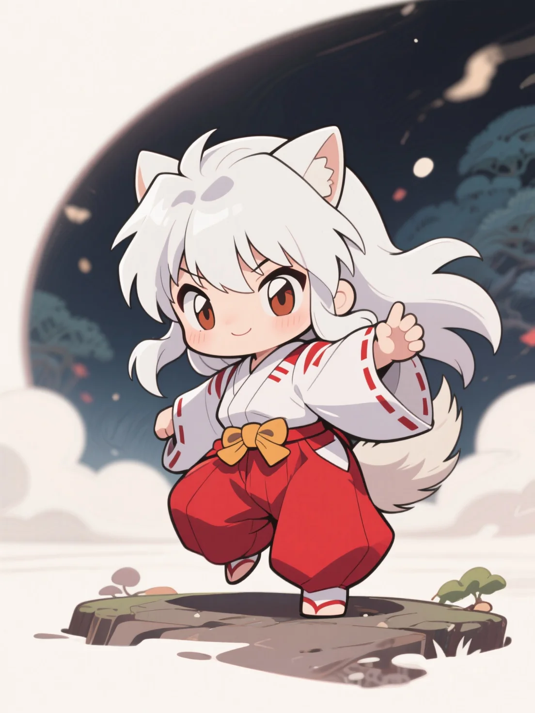

```
可爱漫画风格，插画，Q版，犬夜叉画风，犬夜叉，白与红，完美品质，超清画质，标志性动作，故事感，氛围感
```

 [↑返回目录](#toc)

---
## <a id="jm-prompt-7567011740907474186">蓝底白袋香蕉</a> (<a href="https://jimeng.jianying.com/ai-tool/personal/MS4wLjABAAAAnRyns838yckeX8QSloE1YU2XqBh_bWA4giNl-a4Secz0fLEGjtNDz-D5m6nkjf1Z" target="_blank" rel="noopener noreferrer">即梦创作者</a>)


```
极简主义抽象扁平插画，大色块，纯色画面，蓝色背景，白色塑料袋内装香蕉，画面简洁，色彩对比鲜明，现代简约氛围。
```

```
极简主义，抽象插画，扁平插画，蓝色背景，白色塑料袋，塑料袋里装着香蕉。大色块，纯色画面。尚岸
```

 [↑返回目录](#toc)

---
## <a id="jm-prompt-7573474403967569198">趴睡的软萌柴犬宝宝</a> (<a href="https://jimeng.jianying.com/ai-tool/personal/MS4wLjABAAAAiGaF-l_Z12iJAJhGPR4OBFSkkNSZT9_PZWEhqACuIMGYIjWGqt67b5CqMZ9gcQ3j" target="_blank" rel="noopener noreferrer">海印</a>)


```
卡通风格，软萌质感，一只可爱的柴犬宝宝，趴着睡，侧着头，两腿伸直紧紧并拢在一起，两只胳膊垂直放下贴紧在身体两侧，屁股对着镜头。浅棕色毛发，圆眼睛微闭，粉色肉垫，温馨氛围，近景构图。
```

```
一只可爱的柴犬宝宝，趴着睡，侧着头，两腿伸直紧紧并拢在一起，两只胳膊垂直放下贴紧在身体两侧，屁股对着镜头，卡通
```

 [↑返回目录](#toc)

---
## <a id="jm-prompt-7570350598185438473">高达风格机械人字拖</a> (<a href="https://jimeng.jianying.com/ai-tool/personal/MS4wLjABAAAA_js21g3I7L48jTnneAWQE0-Ddw_DrvkWj3YJMDULMTVDr_VAMrT8W_p97vLPVJ-R" target="_blank" rel="noopener noreferrer">Kuroto-玩尚君</a>)

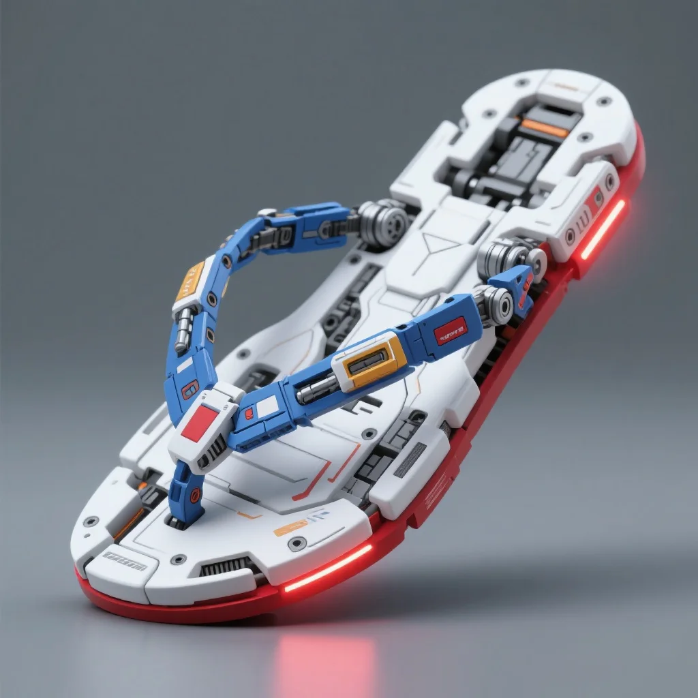

```
高达风格的机械拼装玩具，一只人字拖，细节丰富，层次丰富，3D渲染，工业风，颜色有白色、蓝色、红色，有灯光，纯灰色背景
```

 [↑返回目录](#toc)

---


当前 1/4 页 | [下一页](./2.md) | [查看全部目录](../scripts/prompts/prompts.md)