# seedream.json 

seedream.json文件存放seedream相关的提示词，当前已收录：368个 

 投稿方式：[飞书投稿](https://tcn1uh5rxo87.feishu.cn/share/base/form/shrcne5gDolOMDd0oJsj2XfvxQc) or [issues](https://github.com/junxiaopang/gridsplitter/issues/new)

[上一页](./2.md) | 当前 3/4 页 | [下一页](./4.md) | [查看全部目录](../../prompts/prompts.md)

🚀 **在线预览**: [https://prompts.kkkm.cn](https://prompts.kkkm.cn)

## <a id="toc">目录</a>

- [极简线条骏马](#jm-prompt-7569031836358233395)
- [明代书生3D表情包](#jm-prompt-7549029297047080227)
- [梦幻竹筒小店](#jm-prompt-7570749830964841754)
- [科幻机械战士](#jm-prompt-7575874648106208522)
- [高达风格机械手枪](#jm-prompt-7570596944687402278)
- [天王降临：恶鬼出击](#jm-prompt-7575868302744898843)
- [四季繁花矢量插画](#jm-prompt-7573725920062704922)
- [生肖刺绣图谱](#jm-prompt-7567387825243475210)
- [奇幻极简的古风女雕塑](#jm-prompt-7576107802649693478)
- [怪诞童话牦牛仔](#jm-prompt-7568859530705095986)
- [猫趣横生](#jm-prompt-7576626107726744841)
- [梦幻花妖](#jm-prompt-7575016676618538278)
- [禅意观音影迹](#jm-prompt-7571976925720202506)
- [暗夜猫影](#jm-prompt-7576156773715954971)
- [嬉皮大叔弹唱趣图](#jm-prompt-7574883453443902766)
- [地下世界的兔子家园](#jm-prompt-7555120403262360858)
- [夸张视角下的北京探险](#jm-prompt-7552058406048189734)
- [织物中的圣诞惊喜](#jm-prompt-7573225505336380699)
- [奇幻地球](#jm-prompt-7575209852159528218)
- [Q版红橙小狐狸的潮流世界](#jm-prompt-7567009649094921481)
- [聪明乌鸦喝水记](#jm-prompt-7574951121131670811)
- [羊毛毡如来佛祖](#jm-prompt-7556605857023151410)
- [神圣玄猫俯视](#jm-prompt-7571391672672718089)
- [数字故障圣诞树](#jm-prompt-7574243293698002202)
- [小橘子飞行员的夕阳飞行](#jm-prompt-7572524159402659123)
- [冬日装扮的小狗方阵](#jm-prompt-7567041226508209454)
- [未来科技发布会](#jm-prompt-7576128254126329134)
- [疯狂动物城2：朱迪与尼克的电影之夜](#jm-prompt-7574421444256386313)
- [传统市井生活的艺术绘卷](#jm-prompt-7568885339893271818)
- [泡玛特风格蓝羊IP三视图](#jm-prompt-7574029850227363082)
- [尼克与朱迪的萌趣探头](#jm-prompt-7576493231899266314)
- [麦田中的低语](#jm-prompt-7573527484071824649)
- [荧光黄渐变的Y2K精灵](#jm-prompt-7567374103057829170)
- [十二生肖刺绣图标](#jm-prompt-7566845348279258395)
- [黑曜石装甲赛车：压迫感与史诗感的极致结合](#jm-prompt-7575859059392367881)
- [济公九宫格表情包](#jm-prompt-7549821395153325312)
- [清代宫廷庭院的庄重意趣](#jm-prompt-7574435473397943578)
- [繁花似锦](#jm-prompt-7577043257624956210)
- [魔法圣诞夜](#jm-prompt-7575062624883248394)
- [二次元少女的梦幻小窝](#jm-prompt-7549453413084319012)
- [梵高艺考中的挫败](#jm-prompt-7558802721407651118)
- [金色丝绸之路](#jm-prompt-7568897867914497306)
- [金色字体配传统锦纹](#jm-prompt-7568866304791186734)
- [警戒之兔与黑衣女的对视](#jm-prompt-7573585229886082313)
- [哆啦A梦的神秘道具](#jm-prompt-7551676074946530612)
- [光影中的军人肖像](#jm-prompt-7576645726705421594)
- [Q版悟空UI图标](#jm-prompt-7551238947993685298)
- [星夜独行者](#jm-prompt-7571068961060605194)
- [光影交错的微笑](#jm-prompt-7542792200233471266)
- [棉花娃娃的艺术鉴赏](#jm-prompt-7553962493048098074)
- [封神神仙坐飞机](#jm-prompt-7575035366214864166)
- [海上丝路：古今对话](#jm-prompt-7571799050857516314)
- [疯狂动物城自拍](#jm-prompt-7574730668832263462)
- [鲁迅肖像凹版细线刻画](#jm-prompt-7525277550176652590)
- [神骏奔腾的抽象艺术](#jm-prompt-7576212728486956315)
- [毛茸绒的手机图标设计](#jm-prompt-7565112527508622630)
- [谷物汇聚的温暖'O'](#jm-prompt-7573228443521797426)
- [冬雪下的羊毛毡海岛乐园](#jm-prompt-7574783254566309129)
- [元气满满的粉色双马尾女孩](#jm-prompt-7553863929185815859)
- [简洁钢笔速写](#jm-prompt-7572607734332296486)
- [像素狂欢：任天堂经典元素3D盛宴](#jm-prompt-7573887573966245166)
- [巨猫维京战士攻城](#jm-prompt-7549516076216831241)
- [意式极简110㎡住宅平面布局](#jm-prompt-7575802117621927177)
- [雾海幽影](#jm-prompt-7575055728583462182)
- [梦幻列车与花海](#jm-prompt-7572147633628712243)
- [搞怪大叔骑微型摩托车](#jm-prompt-7573226684422294830)
- [圣诞尼克·现代简约珐琅冰箱贴](#jm-prompt-7575401204948192563)
- [国风水彩中国元素插画](#jm-prompt-7573957014485847342)
- [虚空中的未来雕塑](#jm-prompt-7575951368205143342)
- [哆啦A梦之无敌大喇叭的代价](#jm-prompt-7575130250288336179)
- [粉色蜡笔小新卡通](#jm-prompt-7573557888132648202)
- [可爱卡通3D社区服务图标集](#jm-prompt-7554273973081591049)
- [怪诞老神仙](#jm-prompt-7569071032556965166)
- [新国风上海微缩景观](#jm-prompt-7568080921140694323)
- [夜色浪漫幻想](#jm-prompt-7576146189536529714)
- [雨夜中的动画明星与现实交错](#jm-prompt-7574770156035902771)
- [Q版唐代青鬃马玩偶](#jm-prompt-7574319705473715494)
- [Q版可爱IP玉米角色设计](#jm-prompt-7563668414716333350)
- [古风纱幔中的仰望者](#jm-prompt-7572448714904603931)
- [天上人间的幻想画卷](#jm-prompt-7568368143316307226)
- [抓着Q版长猫的涂鸦插画](#jm-prompt-7572795686463360266)
- [潮流卡通IP展板设计-FuMa](#jm-prompt-7570645843154455854)
- [梦幻森林的布偶猫](#jm-prompt-7577009429111967027)
- [暗黑仙侠梦魇](#jm-prompt-7576444664497114378)
- [Y3K潮玩虚拟偶像](#jm-prompt-7573534697859403054)
- [摄影棚中的3D企鹅绅士](#jm-prompt-7570652004675079462)
- [阳光魅惑的时尚男性](#jm-prompt-7559446518885780782)
- [硅基生命体：机械蚂蚱](#jm-prompt-7568838637417237810)
- [中国街头百态](#jm-prompt-7557741772399545610)
- [疯狂动物城之森林巡逻](#jm-prompt-7575571259208027418)
- [东方诗意眼妆](#jm-prompt-7567811451491044635)
- [未来数据流](#jm-prompt-7576309599196712230)
- [Labubu在金黄羽毛中的梦幻凝视](#jm-prompt-7547326300432649515)
- [水墨光影舞者](#jm-prompt-7569947586053049627)
- [Q版小牛上学表情包贴纸](#jm-prompt-7574362689707806002)
- [梦幻蓝白颜料山峦](#jm-prompt-7574043192673209627)
- [夕阳下的浪漫邂逅](#jm-prompt-7573149167887944970)
- [毛毡森林中的猫咪](#jm-prompt-7571828505701338395)
- [怪诞老神仙](#jm-prompt-7569071093030374682)
- [拼贴风格的潮流白猫](#jm-prompt-7543526021492952374)

## <a id="jm-prompt-7569031836358233395">极简线条骏马</a> (<a href="https://jimeng.jianying.com/ai-tool/personal/MS4wLjABAAAAc3Ea1k6Kk8Lh-T6ArL5aUQERAy4Wq3IynktjfqAYKjxLH45uBThHniBPlECG95ac" target="_blank" rel="noopener noreferrer">@大脸猫～小振</a>)

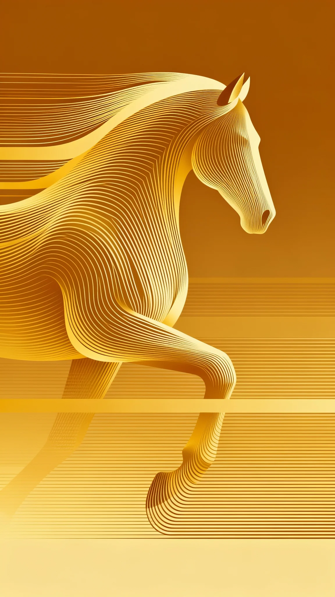

```
极简线条艺术，金黄色调，流动曲线构成骏马动态轮廓，横向密集排线形成置换效果，负空间设计增强韵律感，暖色渐变背景，高清矢量质感，几何抽象，现代感，动态张力，平面设计，线条美学，空间层次感。
```

 [↑返回目录](#toc)

```
金黃色極簡線條藝術，流動曲線構成骏马，動態輪廓，横向密集排線形成置換效果，負空間設計增强韵律感，暖色調漸變背景，高清矢量质感。
```

 [↑返回目录](#toc)

---
## <a id="jm-prompt-7549029297047080227">明代书生3D表情包</a> (<a href="https://jimeng.jianying.com/ai-tool/personal/MS4wLjABAAAAM-lFTZriMj4R_ToxtMS2y54HL2BUyCasONWOFnZPkrHYP685NqSRiuM2yGZZEyZA" target="_blank" rel="noopener noreferrer">@做点设计</a>)

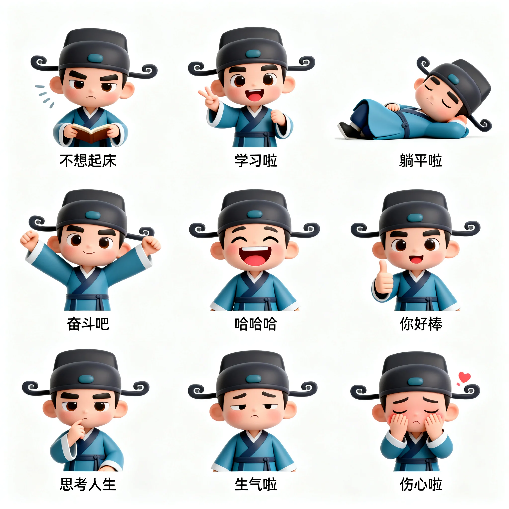

```
一套9个超级可爱的表情包，9宫格，明代男子书生形象，3D 卡通。第一行第一格是不高兴的动作，文字是“不想起床”，第一行第二格是高兴的动作，文字是“学习啦” ；第一行第三格是躺着的动作，文字是“躺平啦”；第二行第一格是振臂的动作，文字是“奋斗吧”；第二行第二格是大笑的表情，文字是“哈哈哈”；第二行第三格是竖大拇指的动作，文字是“你好棒”；第三行第一格是思考的动作，文字是“思考人生”；第三行第二格是生气鼓腮的动作，文字是“生气啦”；第三行第三格是害羞捂脸的动作，文字是“伤心啦”；整体白色背景
```

 [↑返回目录](#toc)

---
## <a id="jm-prompt-7570749830964841754">梦幻竹筒小店</a> (<a href="https://jimeng.jianying.com/ai-tool/personal/MS4wLjABAAAAb1fRGhJGp1Ol1f75v7MeczKWVkwfwHsJiGGe6h_5W9Wu1UzCZNPxeVcU5QvXRcuO" target="_blank" rel="noopener noreferrer">@费脑子的起名字</a>)

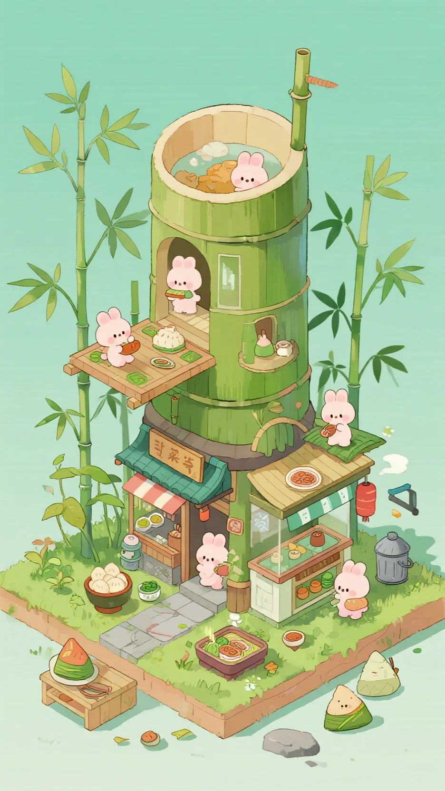

```
艺术家Kim jung gi设计风格，线条由极细钢笔勾勒，极其复杂精致细节特别多。这张图片描绘了一个异想天开的场景，似乎受到日本文化的启发。中心焦点是一座形状像竹筒的建筑。以下是内容的细目：这是主要特征，一个带有小店面的风格化的竹筒建筑。它有传统的中式门和标牌。角色：存在小兔拟人化的动物。有些在商店附近，有些似乎栖息在一个小阳台上。泡菜包饭附近还有一个像兔子一样的小生物。植物：竹林在竹筒大楼的兩側，暗示着夏天。小植物和绿色植物也散落在基地周围。食物：一些粽子，饺子，竹筒饭放在建筑物附近的地面上。设置：整体风格可爱和卡通，柔和的粉彩。背景是简单的浅绿色。其他细节：小细节，如竹筒状垃圾桶和小窗户，增加了场景的真实感。整体印象是一个和平、迷人和梦幻的中式灵感环境，有可爱的动物角色和俏皮的设计选择。
```

 [↑返回目录](#toc)

---
## <a id="jm-prompt-7575874648106208522">科幻机械战士</a> (<a href="https://jimeng.jianying.com/ai-tool/personal/MS4wLjABAAAAraDLx39MTeisB-93II_Wcziywz9rAM_vim1w095Iq6Y" target="_blank" rel="noopener noreferrer">@魔法空间</a>)

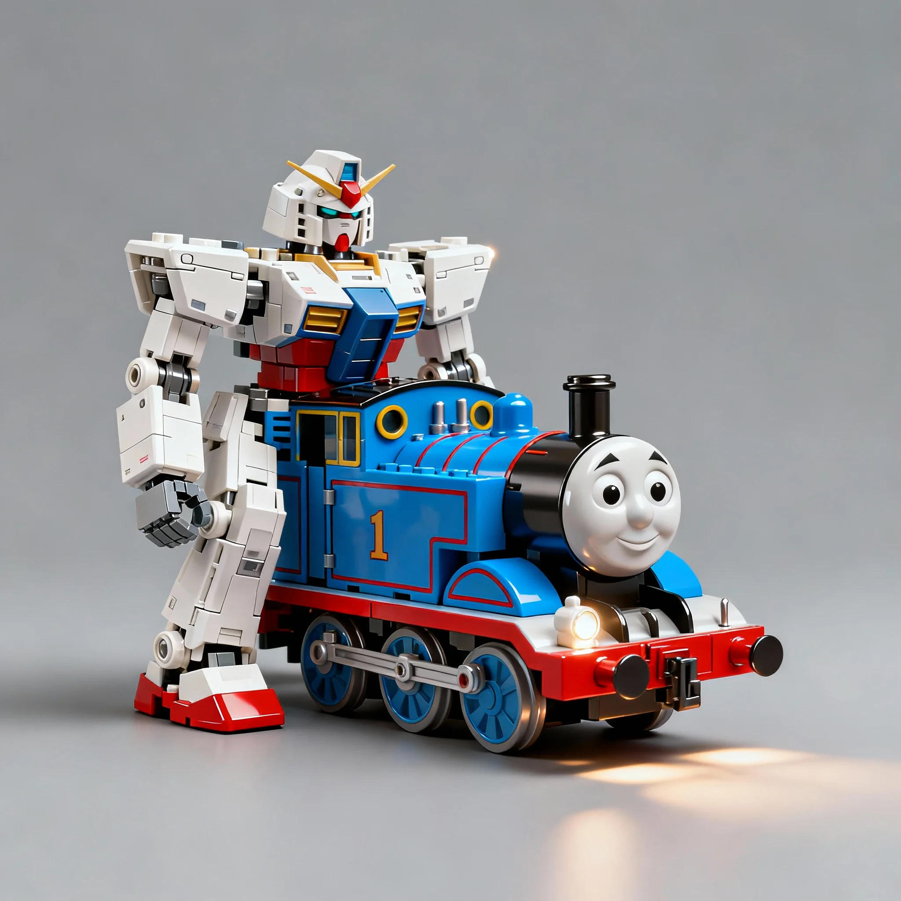

```
高达风格，3D渲染，工业风，白色、蓝色、红色机械拼装玩具，融合托马斯小火车元素，金属质感，灯光效果，纯灰色背景，机械细节，光影对比，科幻氛围。
```

 [↑返回目录](#toc)

```
高达风格的机械拼装玩具，托马斯小火车，3D渲染，工业风，颜色有白色、蓝色、红色，有灯光，纯灰色背景
```

 [↑返回目录](#toc)

---
## <a id="jm-prompt-7570596944687402278">高达风格机械手枪</a> (<a href="https://jimeng.jianying.com/ai-tool/personal/MS4wLjABAAAA45TF5Twy7xzxvb1rSObi4I8-yH1Q9lqrKUDjV_YtbUDZB88Yv7mHTzkPfW5uqL_x" target="_blank" rel="noopener noreferrer">@菜就多练🍔</a>)

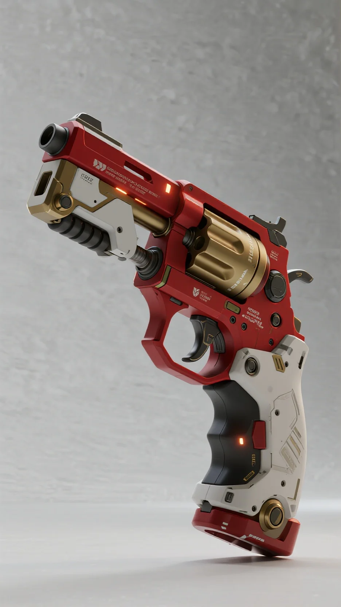

```
高达风格的机械拼装玩具，一把手枪，细节丰富，层次丰富，3D渲染，工业风，颜色有红色、金色、白色，有灯光，纯灰色背景
```

 [↑返回目录](#toc)

---
## <a id="jm-prompt-7575868302744898843">天王降临：恶鬼出击</a> (<a href="https://jimeng.jianying.com/ai-tool/personal/MS4wLjABAAAAFI9i_YVeDmuuMplBdWJTfXVPCVxMh0DtCcYVCIKa4Bk" target="_blank" rel="noopener noreferrer">@poipoi</a>)

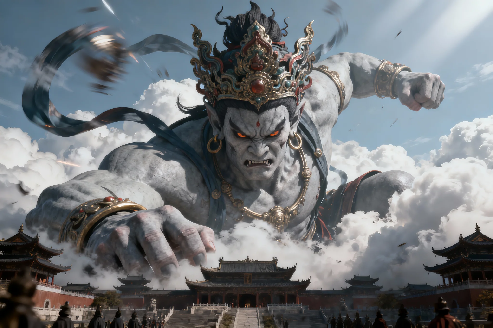

```
中式怪诞风格，3D建模，游戏CG，独特高级艺术，极其精致，浅灰色皮肤，对称构图，大透视，宏大场景，巨物，从云端冲出，战斗动作，立体感。戴着繁复华丽头饰的古风恶鬼造型角色，兼具天王、金刚气质，冷酷帅气，强悍霸气，超级大反派，恶势力，厌世，强壮，造型充满张力，画面张力十足，极强的压迫感。金属质感头饰，动态模糊，强光照射，阴影深邃，冲击力强，天王降临氛围。
```

 [↑返回目录](#toc)

```
繁复华丽的头饰，古风戴着恶鬼，冷酷，帅气，天王，金刚，强悍，画面张力十足，中式怪诞，妖怪，3D建模，游戏CG,独特，高级，艺术，极其精致极强的压迫感，超级大反派，恶势力，霸气，天王降临，厌世，大透视，强壮，浅灰色的皮肤,宏大的场景，造型充满张力，对称，宏大的场景，巨物，从云端冲出，冲击力，战斗的动作，立体感
```

 [↑返回目录](#toc)

---
## <a id="jm-prompt-7573725920062704922">四季繁花矢量插画</a> (<a href="https://jimeng.jianying.com/ai-tool/personal/MS4wLjABAAAAVBdNvXJUCoZFmXz5gzHFCq7Tp_pzZpYow1xo0CfeVmtr3nHiSNvt_pgWqQmpjCpG" target="_blank" rel="noopener noreferrer">@明天晴天</a>)

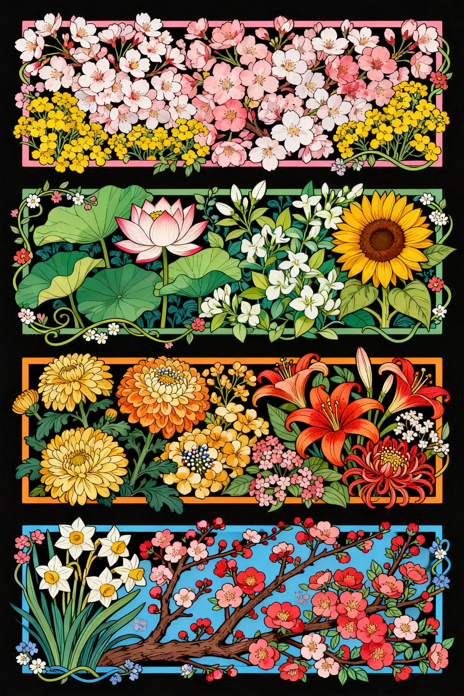

```
极繁主义插画，矢量风格，四个竖排矩形框一字竖向排列，分别对应春夏秋冬四季。春季框内为樱花、桃花、油菜花密集绽放，花瓣层叠交错；夏季框内为荷花、向日葵、茉莉花繁茂生长，叶片与花朵相互缠绕；秋季框内为菊花、桂花、彼岸花簇拥盛开，花蕊与花瓣细节丰富；冬季框内为梅花、水仙、山茶花密集分布，花枝交错穿插。每个季节框边缘装饰对应季节的藤蔓与小花卉，整体色彩鲜艳饱和，矢量线条精细流畅，极繁细节丰富，画面层次分明。
```

 [↑返回目录](#toc)

```
春夏秋冬四季的极繁主义插画，以四季花卉为内容，精美的矢量图片，一字竖向排列
```

 [↑返回目录](#toc)

---
## <a id="jm-prompt-7567387825243475210">生肖刺绣图谱</a> (<a href="https://jimeng.jianying.com/ai-tool/personal/MS4wLjABAAAA67ZL1nIGx7YWwQ8Md_0rI1GaDl4_8IzXHNqV9aQJXZlUS0RLoCu_1Van__PdFD2w" target="_blank" rel="noopener noreferrer">@用户2465812527961</a>)

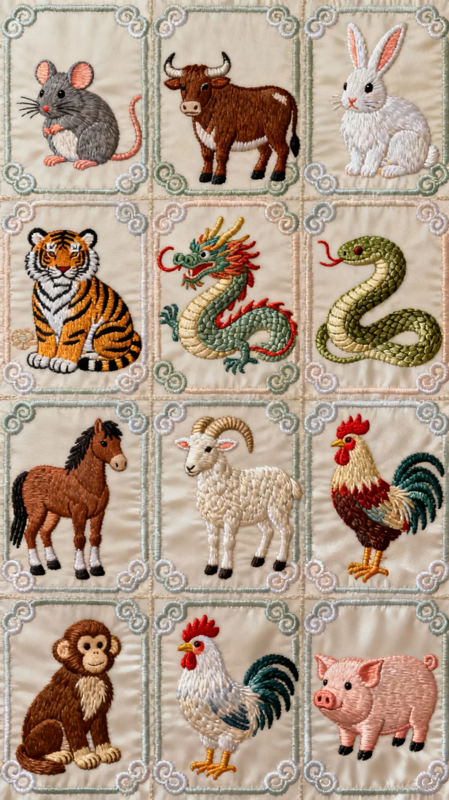

```
传统刺绣风格，正视角，12格网格布局，每格居中为对应生肖动物图案，依次为鼠、牛、虎、兔、龙、蛇、马、羊、猴、鸡、狗、猪。每格动物形态生动，毛发纹理细腻，边缘有传统云纹边框，丝线光泽感强，色彩柔和雅致。高清画质，细节清晰，精致质感，传统工艺氛围。
```

 [↑返回目录](#toc)

```
请生成绵绣的十二种生肖图案，必须是十二种动物，精致，高清
```

 [↑返回目录](#toc)

---
## <a id="jm-prompt-7576107802649693478">奇幻极简的古风女雕塑</a> (<a href="https://jimeng.jianying.com/ai-tool/personal/MS4wLjABAAAAO3Gp2ziTlMl9GzBL1Ba0mtqmVaz-wlrJWZD0fFILyXY" target="_blank" rel="noopener noreferrer">@最美的时光给了党</a>)

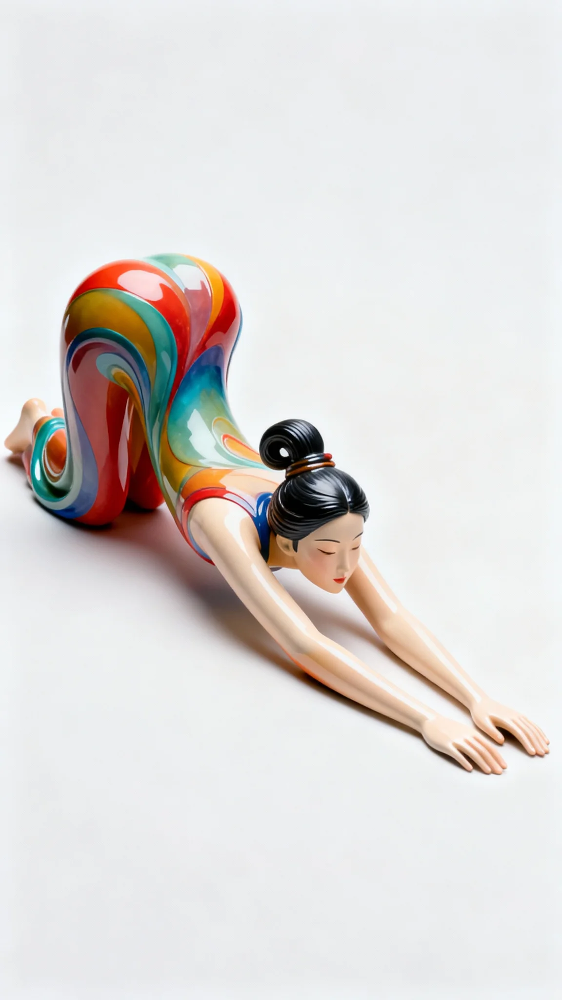

```
高对比度现代艺术风格，极简抽象彩色雕塑，奇幻灵动的拟古代古风女人形象，夸张修长的身材比例，流畅优雅的曲线，光滑完美形态，塌腰趴下伸懒腰动作，纯背景，神秘极简美学，32K超高清质感，电影级光影渲染，OG cinematic风格，雕塑品灵感，充满生机的奇幻氛围。
```

 [↑返回目录](#toc)

```
高对比度现代艺术风格，极简抽象彩色雕塑，奇幻灵动的拟古代古风女人形象，夸张修长的身材比例，流畅优雅的曲线，光滑完美形态，，塌腰趴下伸懒腰动作，纯背景，神秘极简美学，32K超高清质感，电影级光影渲染，OG cinematic风格，雕塑品灵感，充满生机的奇幻氛围
```

 [↑返回目录](#toc)

---
## <a id="jm-prompt-7568859530705095986">怪诞童话牦牛仔</a> (<a href="https://jimeng.jianying.com/ai-tool/personal/MS4wLjABAAAA0fsfTEWwQTRqWDYbTDw9BhgwGuFpifEd47pOrTEAfg1QRcDQsUifhiArc_jcN9pB" target="_blank" rel="noopener noreferrer">@风子AI</a>)

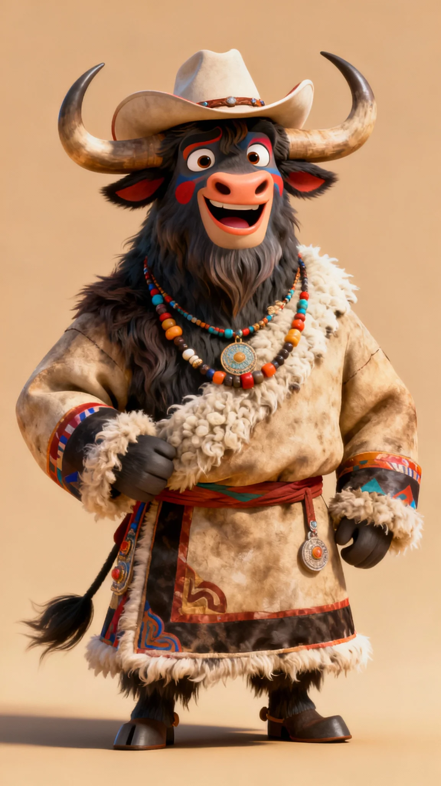

```
迪士尼皮克斯风格，CG厚涂质感，拟人化牦牛角色，藏式配饰妆造，戴着牛仔帽，穿着藏式羊皮袄服装。光影艺术处理，艺术形变设计，人物造型夸张抽象，表情怪诞童话感，纯色背景，张扬个性，现代感。
```

 [↑返回目录](#toc)

```
卡通动漫人物，拟人版牦牛，藏式配饰妆造，戴着牛仔帽，藏式羊皮袄服装，光影艺术，艺术形变，人物造型，CG厚涂，纯色背景，张扬，个性，夸张，抽象，现代，表情，怪诞童话。迪士尼，皮克斯风格。
```

 [↑返回目录](#toc)

---
## <a id="jm-prompt-7576626107726744841">猫趣横生</a> (<a href="https://jimeng.jianying.com/ai-tool/personal/MS4wLjABAAAAyKHEfIEFHNJopVHRRBkdHSSAGvkAmdQWo6s_MHeWT4-egfaafY5nNNny4p7mV4dl" target="_blank" rel="noopener noreferrer">@魔法森林</a>)

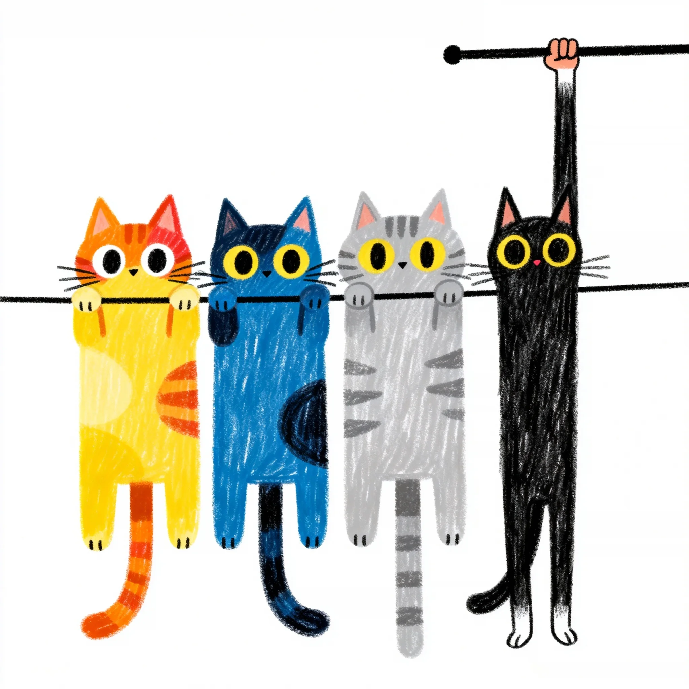

```
手绘插画，Angie Rozelaar插画师画风，大师之作，极高艺术，彩铅，潦草，70%大面积留白，混合图案，扁平设计，抽象，搞笑，有趣，可爱风格，超大眼睛，粗线条，极简，现代。4只形态各异的猫正面紧贴在一线横线上，不同颜色，白色背景，一只被拉得很长的猫手吊着杆子。画面简洁，色彩明快，充满童趣，抽象元素与扁平设计结合，留白处理增强艺术感。
```

 [↑返回目录](#toc)

```
杰作，手绘插画，Angie Rozelaar插画师画风，大师之作，极高艺术、彩铅、潦草、70%大面积留白，混合图案，扁平设计，抽象、搞笑、有趣、可爱风格、超大眼睛、粗线条、极简、现代、4只形态各异的猫，正面、在一线横线上。紧贴着。不同的猫分别不同的颜色，白色背景，被拉的很长一条的猫，手吊着杆子
```

 [↑返回目录](#toc)

---
## <a id="jm-prompt-7575016676618538278">梦幻花妖</a> (<a href="https://jimeng.jianying.com/ai-tool/personal/MS4wLjABAAAAQcJDnul2AR8aAKLprsSd_Myg5cBZRaQOedJT6v9mldwTMmxCm01lZGI3IsVXN9RS" target="_blank" rel="noopener noreferrer">@莯梓</a>)

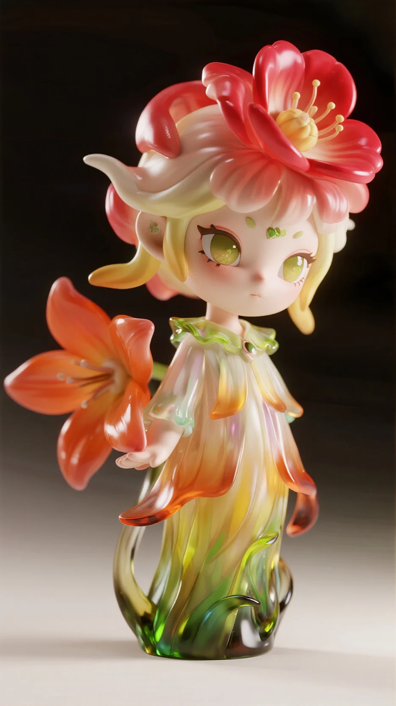

```
Q版陶瓷花妖，以柔和色调为主，营造出梦幻的氛围，杰作，动态模糊，渐变背景，：红色、橙色、黄色、绿色等透明的、半透明玻璃材质，玻璃纹理、发光、光泽，夸张的造型。
```

 [↑返回目录](#toc)

---
## <a id="jm-prompt-7571976925720202506">禅意观音影迹</a> (<a href="https://jimeng.jianying.com/ai-tool/personal/MS4wLjABAAAAB1m4dvppnotadwhW-yaQujgao8bYBa9rmC0XsIheKJJlUk0_F_2cDtGq6cm7EvBu" target="_blank" rel="noopener noreferrer">@花样多多</a>)

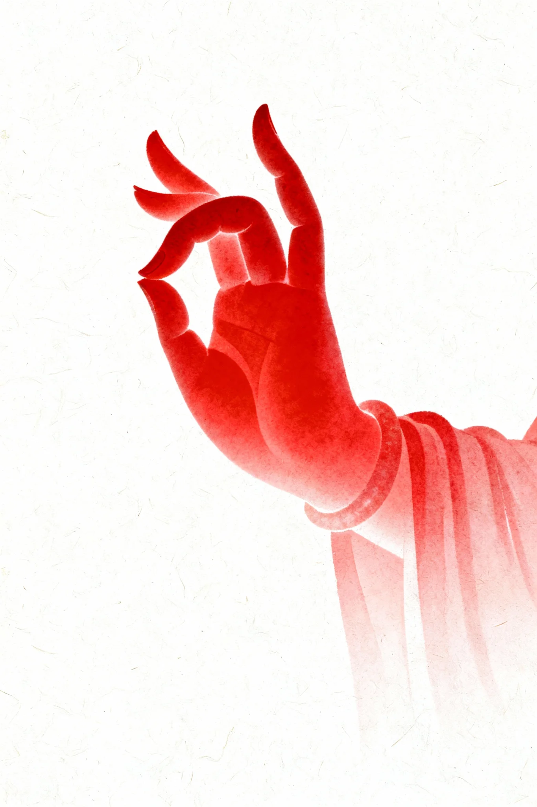

```
极简风格绘画，禅意氛围，大面积留白，观音菩萨玉手的影子，高饱和红色弥散渐变光影，独特肌理感，黄金比例构图，艺术感，高级感。
```

 [↑返回目录](#toc)

```
一幅极具艺术感与高级感的极简风格绘画，整体呈现禅意氛围，大面积留白，有着观音菩萨玉手的影子，光影呈现高饱和红色的弥散渐变效果，具备独特的肌理感，画面构图遵循黄金比例
```

 [↑返回目录](#toc)

---
## <a id="jm-prompt-7576156773715954971">暗夜猫影</a> (<a href="https://jimeng.jianying.com/ai-tool/personal/MS4wLjABAAAAPN9J0TDF1CA5oAhzZ1NHS4psoK0n18_2VzCWMPeqFCtJlH3o9FVuI8WgJZrvsiSN" target="_blank" rel="noopener noreferrer">@吉梦</a>)

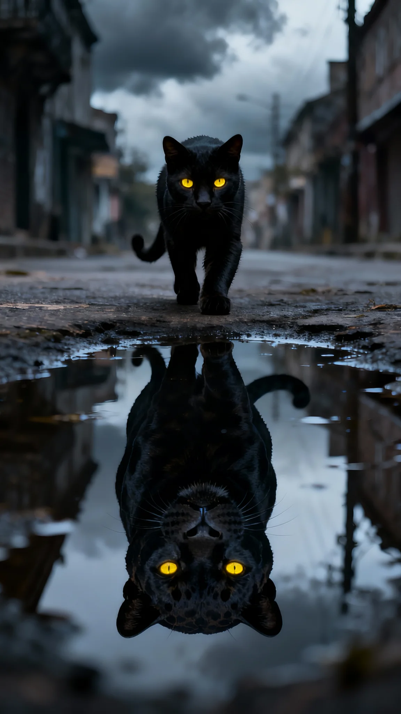

```
暗黑悬疑风格，纯黑小猫亮黄色发光眼睛走向镜头，下方水洼倒映巨大黑豹倒置镜像，阴云笼罩复古模糊街巷背景。竖版构图（9:16），色调昏暗朦胧，高对比度光影，神秘诡谲氛围。
```

 [↑返回目录](#toc)

```
暗黑悬疑风格镜像场景，通体纯黑的小猫，亮黄色发光眼睛，正走向镜头，下方水洼映出的是一只巨大黑豹的倒置镜像，背景是阴云笼罩的复古模糊街巷，色调昏暗朦胧，氛围神秘诡谲，竖版构图（9:16），高对比度光影。
```

 [↑返回目录](#toc)

---
## <a id="jm-prompt-7574883453443902766">嬉皮大叔弹唱趣图</a> (<a href="https://jimeng.jianying.com/ai-tool/personal/MS4wLjABAAAAD6osDvke1OYq_v5MU0SIQER4vslWOv_gD0RPZ9EaeLH4f1QzZRgyhX4_DvX9TTpl" target="_blank" rel="noopener noreferrer">@榜一大叔</a>)


```
写实Q版风格，滑稽夸张搞笑的中年大叔有漫画风格1:1比例大头，背景墙有写意书法“吃饱没”，穿着嬉皮士服装与夹脚拖鞋，呈现搞怪肢体动作弹大吉他，脸部表情严肃吟唱且神情夸张，带有幽默搞怪特效，背景为纯色淡暗色，采用CG技术呈现8K HDR效果，人物形象结合图1、图2、图3中年男人的发型与身形特征。
```

 [↑返回目录](#toc)

```
主題是繪製一幅寫實Q版風格,滑稽誇張搞笑的中年大叔，人物有著漫畫風格誇張的大頭（與身體比例1：1），背景牆上用寫意書法寫著吃飽沒，穿著嬉皮士服裝與夾腳拖鞋,呈現出搞怪的肢體動作，他彈著一個大吉他，臉部表情嚴肅的吟唱，神情誇張。 充分突顯幽默搞怪的特效，純色淡暗色背景，CG技術，8K HDR
```

 [↑返回目录](#toc)

---
## <a id="jm-prompt-7555120403262360858">地下世界的兔子家园</a> (<a href="https://jimeng.jianying.com/ai-tool/personal/MS4wLjABAAAAq7xGuS1iHSHQeCqHzuT2H4zrGtT7wI4KrSktNcIWagh1rNdx1ibHjRfYKJStGCU7" target="_blank" rel="noopener noreferrer">@咖啡色的猫</a>)

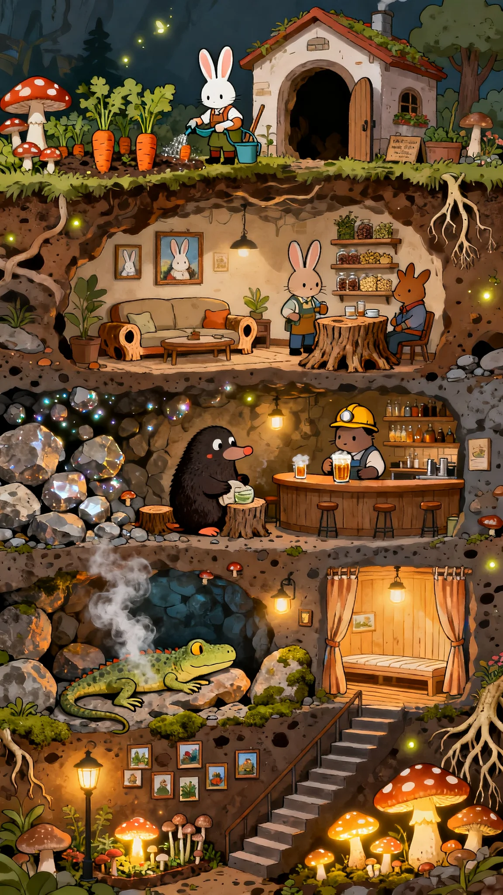

```
拟人漫画风格，幽默可爱，极繁主义，垂直剖面图，完整展示从地表到地下的纵深感，每一层有独特建筑风格和功能，动物拟人化穿着衣服、使用工具、经营店铺，表情生动活泼。地面/屋顶层：兔子家菜园，兔子园丁浇水，胡萝卜和蘑菇长势好，有通往地下的巨大门洞；地下一层：兔子家温馨客厅，家具为掏空的树根和木桩，墙上挂兔子肖像画，架子摆收藏的种子；地下二层：鼹鼠矿工俱乐部，到处是亮晶晶的矿石，鼹鼠戴矿工帽在吧台喝根汁啤酒；地下三层：蜥蜴桑拿房，利用地热充满蒸汽，蜥蜴慵懒躺温暖岩石上敷湿润苔藓面膜；地下四层：真菌农场，发光蘑菇当路灯，各种菌类被精心栽培。墙壁挂满小画，蘑菇当路灯，根须当窗帘，每一层间有楼梯连接。温暖饱和色调，发光蘑菇、萤火虫灯、动物家中灯火提供光源，营造地下世界温馨、热闹、安全氛围。
```

 [↑返回目录](#toc)

```
核心构图： 采用垂直剖面图，完整展示从地表到地下的纵深感。每一层都有独特的建筑风格和功能。 拟人漫画风格，幽默可爱。所有动物都像小人一样穿着衣服、使用工具、经营店铺，表情生动活泼。极繁主义，墙壁上挂满小画，蘑菇当路灯，根须当窗帘。每一层之间有楼梯相连接，色彩与光感： 整体是温暖、饱和的色调。依靠发光的蘑菇、萤火虫灯、动物们家中的灯火提供光源，营造出地下世界温馨、热闹、安全的氛围。地面/屋顶层： 兔子家的菜园。兔子园丁正在浇水，胡萝卜和蘑菇长势喜气。有一个通往地下的巨大门洞。
地下一层：兔子家。 温馨的客厅，家具是掏空的树根和木桩，墙上挂着兔子肖像画，架子上摆着收藏的种子。
地下二层：鼹鼠矿工俱乐部。 到处都是挖到的“宝藏”——亮晶晶的矿石。鼹鼠们戴着矿工帽，在吧台前喝根汁啤酒。
地下三层：蜥蜴桑拿房。 利用地热，房间里充满蒸汽。蜥蜴们慵懒地躺在温暖的岩石上，敷着湿润的苔藓面膜。
地下四层：真菌农场。 发光蘑菇被当成路灯，各种菌类被精心栽培。
```

 [↑返回目录](#toc)

---
## <a id="jm-prompt-7552058406048189734">夸张视角下的北京探险</a> (<a href="https://jimeng.jianying.com/ai-tool/personal/MS4wLjABAAAAiQ2rr6VfWjeen60UISLNeyNzWObtAsLsjNYE8BtlCHg2HEtt0ecHavqyiIIIrUag" target="_blank" rel="noopener noreferrer">@阿林_Design</a>)

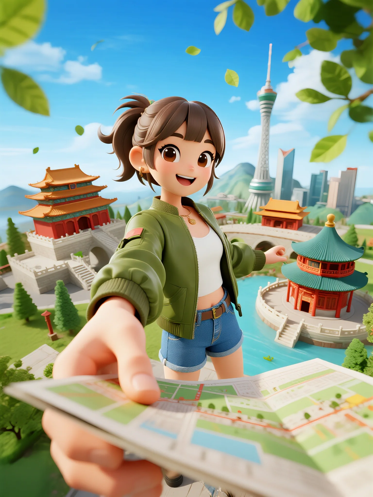

```
画面主题：一幅有趣的3D插图，整体采用卡通+3D拟物风格，色彩饱和度高，突出视觉吸引力；
细节描述：一个女孩，俯视鱼眼镜头，身穿白色背心，绿色夹克，蓝色牛仔短裤，一只手伸向前拿着旅游地图递出去的动作，从下往上拍摄，比例很夸张，强烈的仰视透视感，广角
氛围强化：背景为场景北京微缩景观模型地标景点（故宫、颐和园、中国尊，山水，现代城市风貌），蓝天白云动态模糊的树叶装饰
```

 [↑返回目录](#toc)

---
## <a id="jm-prompt-7573225505336380699">织物中的圣诞惊喜</a> (<a href="https://jimeng.jianying.com/ai-tool/personal/MS4wLjABAAAA11Ud2Igz5RY2a4GxC-_sdEaedCpjfrcBd83bJKjRGKjDYxtMLXebDBGy6EkJ9Esj" target="_blank" rel="noopener noreferrer">@小文ai智创设计</a>)

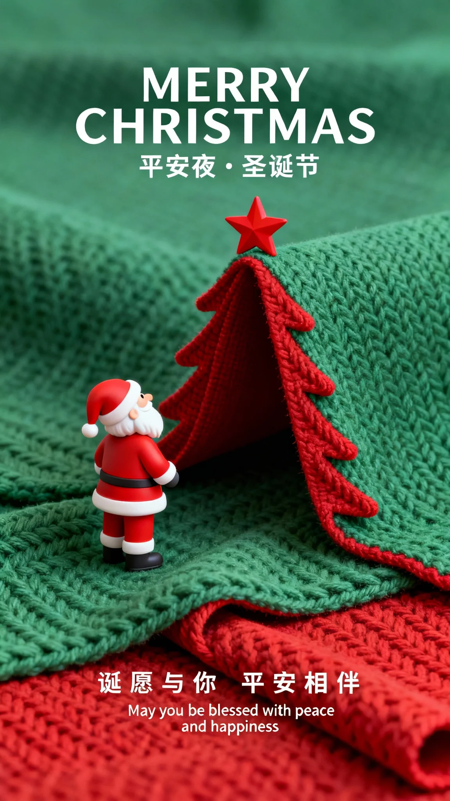

```
现代创意平面设计，融合3D立体元素与织物质感，圣诞主题创意海报。3D风格迷你圣诞老人，身着经典红白色圣诞服，仰头朝向绿色织物背景掀开的红色"圣诞树形状"织物通道，通道顶端有一颗红色星星。节日营销场景，背景为绿色针织纹理布料，下方为红色针织纹理布料，呈现织物折叠创意视觉。竖版分层视角：上方文字区域有简洁大气的"MERRY CHRISTMAS"英文字体和"平安夜・圣诞节"中文字体；中间为圣诞老人与织物圣诞树的创意主体；下方节日祝福语"诞愿与你 平安相伴"摆成一排，下方放置"May you be blessed with peace and happiness"。圣诞红、翠绿主色调，搭配白色文字，节日色彩对比鲜明。细节体现织物针织纹理、3D圣诞老人立体质感、红色织物折叠自然褶皱，温馨且富有创意的圣诞节日广告氛围。
```

 [↑返回目录](#toc)

```
现代创意平面设计，融合3D立体元素与织物质感。一幅圣诞主题的创意海报，主体是一个3D风格的迷你圣诞老人，身着经典红白色圣诞服，正仰头朝向由绿色织物背景掀开的红色“圣诞树形状”织物通道，通道顶端有一颗红色星星。场景设定为节日营销场景，背景采用绿色针织纹理布料，下方是红色针织纹理布料，营造出织物折叠的创意视觉。构图采用竖版分层视角：上方是文字区域，包含“MERRY CHRISTMAS”英文字体和“平安夜・圣诞节”中文字体，字体简洁大气；中间是圣诞老人与织物圣诞树的创意主体；下方是节日祝福语“诞愿与你 平安相伴”摆成一排，下方放上“May you be blessed with peace and happiness”。色调以圣诞红、翠绿为主，搭配白色文字，形成鲜明的节日色彩对比。细节上体现织物的针织纹理、3D圣诞老人的立体质感，以及红色织物折叠的自然褶皱。整体营造出温馨且富有创意的圣诞节日广告氛围。
```

 [↑返回目录](#toc)

---
## <a id="jm-prompt-7575209852159528218">奇幻地球</a> (<a href="https://jimeng.jianying.com/ai-tool/personal/MS4wLjABAAAAOb9zfTy1xBo2oL5unAMVWOmSk5xVXM_E41Q5AkXE4uk" target="_blank" rel="noopener noreferrer">@我心飞翔</a>)

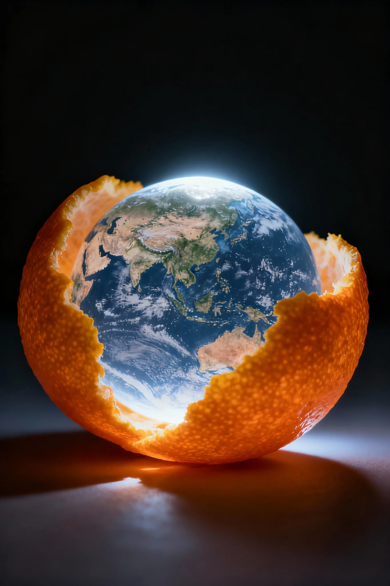

```
奇幻写实摄影风格，构图中心，剥开的橘子皮紧包着散发皎洁清辉的地球，地球展现亚洲部分，橘子皮与地球光影交织，自然真实，营造奇妙和谐氛围，充满创意与视觉魅力。
```

 [↑返回目录](#toc)

```
充满奇幻色彩的写实摄影，仿佛将观者引入一个神秘的空间。构图中心，剥开的橘子皮紧包着一个地球散发着皎洁清辉，自然真实。地球展现了亚洲部分，橘子皮与地球的光影交织，在这独特的背景下营造出奇妙而和谐的氛围，充满创意与视觉魅力
```

 [↑返回目录](#toc)

---
## <a id="jm-prompt-7567009649094921481">Q版红橙小狐狸的潮流世界</a> (<a href="https://jimeng.jianying.com/ai-tool/personal/MS4wLjABAAAAxAaJmlxs9dNhNy7M9pY3Lu8twrt3D09ePfH_H191fjKvqXECtbaGcQOQNNmf0j4A" target="_blank" rel="noopener noreferrer">@平面设计老鬼</a>)

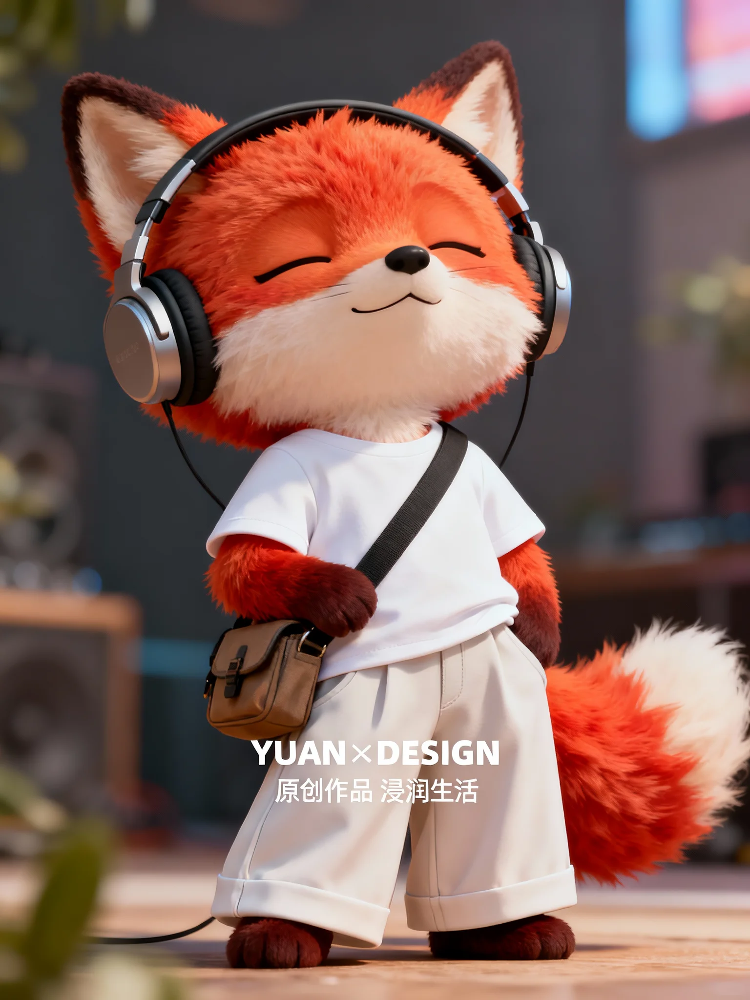

```
Q版IP形象设计，一只毛茸茸的红橙色小狐狸，戴耳麦，神态陶醉，身穿白色潮流T恤、阔腿裤，斜背挎包，画面氛围松弛惬意，细节刻画精细。画面下方居中无衬线体小文字"YUAN×DESIGN"和"原创作品 浸润生活"。高品质出图，色彩明亮，质感细腻。
```

 [↑返回目录](#toc)

```
IP形象设计：Q版，一只毛茸茸的红橙色小狐狸，戴着耳麦，陶醉的神态，身穿白色潮流T恤、阔腿裤，斜背挎包，松弛、惬意的画面氛围，细节刻画，画面下方居中无衬线体小文字“YUAN×DESIGN”“原创作品 浸润生活”，高品质出图
```

 [↑返回目录](#toc)

---
## <a id="jm-prompt-7574951121131670811">聪明乌鸦喝水记</a> (<a href="https://jimeng.jianying.com/ai-tool/personal/MS4wLjABAAAATzg9ST4Vy9sb6bdwguH-tLnEC9tPvE1YJhcRB8PfBSFlLyp1eaRhbWMfs1FCm4Y9" target="_blank" rel="noopener noreferrer">@silverfox</a>)

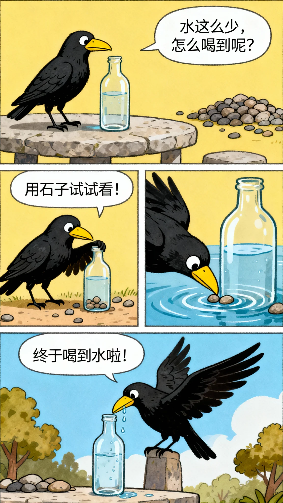

```
儿童多格漫画风格，扁平化设计，四格分镜布局，明亮黄蓝配色，简洁线条。第一格：中景，一只黑色羽毛、黄色喙的乌鸦站在石桌旁，石桌上有一个半瓶水的透明玻璃瓶，乌鸦歪头看瓶内，对话气泡"水这么少，怎么喝到呢？"。第二格：近景，乌鸦低头叼起地上的小石子，翅膀微张，背景有散落的石子堆，对话气泡"用石子试试看！"。第三格：特写，乌鸦将石子投入玻璃瓶，瓶内水位逐渐上升，水面泛起涟漪，乌鸦眼神专注。第四格：远景，乌鸦站在瓶口，低头喝到水，嘴角沾着水珠，翅膀展开，背景有树木和蓝天，对话气泡"终于喝到水啦！"。每格乌鸦特征一致：黑色羽毛、黄色喙；每格场景细节一致：石桌、玻璃瓶、石子堆。温馨氛围，童趣质感。
```

 [↑返回目录](#toc)

```
乌鸦喝水儿童多格漫画风格展示，扁平化设计，四格分镜布局，明亮黄蓝配色，简洁线条。第一格：中景，一只黑色羽毛、黄色喙的乌鸦站在石桌旁，石桌上有一个半瓶水的透明玻璃瓶，乌鸦歪头看瓶内，对话气泡"水这么少，怎么喝到呢？"。第二格：近景，乌鸦低头叼起地上的小石子，翅膀微张，背景有散落的石子堆，对话气泡"用石子试试看！"。第三格：特写，乌鸦将石子投入玻璃瓶，瓶内水位逐渐上升，水面泛起涟漪，乌鸦眼神专注。第四格：远景，乌鸦站在瓶口，低头喝到水，嘴角沾着水珠，翅膀展开，背景有树木和蓝天，对话气泡"终于喝到水啦！"。每格乌鸦特征一致：黑色羽毛、黄色喙；每格场景细节一致：石桌、玻璃瓶、石子堆。温馨氛围，童趣质感。
```

 [↑返回目录](#toc)

---
## <a id="jm-prompt-7556605857023151410">羊毛毡如来佛祖</a> (<a href="https://jimeng.jianying.com/ai-tool/personal/MS4wLjABAAAA_r29ELywtGl_KG8ko3hyN2D7SOnzL1tqHWBKsOZCc2Kpmpve9-lRuPwlvKMdQOC7" target="_blank" rel="noopener noreferrer">@Mr.Min</a>)

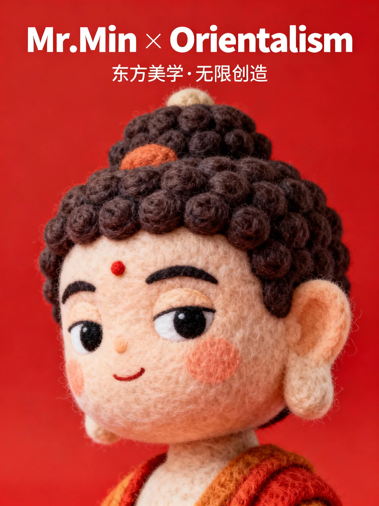

```
简单插画设计，皮克斯与儿童读物插图风格，羊毛毛毡织物质感，特写镜头，红色背景，3/4侧面视图的如来佛祖头部看着相机，莫威廉姆斯风格可爱有趣人物设计，高清。画面上方无衬线体"Mr.Min × Orientalism"，下方无衬线体小字"东方美学·无限创造"居中。
```

 [↑返回目录](#toc)

```
​简单插画设计，毛毡人物设计(如来佛祖)，顶配留出空间。在皮克斯和儿童读物插图的风格，特写镜头在一个红色的背景，3/4的侧面视图的头部看着相机，羊毛毛毡织物艺术，一个可爱和有趣的人物设计在莫威廉姆斯的风格，高清。文字细节：上方有 “Mr.Min × Orientalism” 无衬线体的字样，表明这是  “东方美学·无限创造”无衬线体小字居中， 旗下品牌的合作。
```

 [↑返回目录](#toc)

---
## <a id="jm-prompt-7571391672672718089">神圣玄猫俯视</a> (<a href="https://jimeng.jianying.com/ai-tool/personal/MS4wLjABAAAAIh0QQmvMV7fI6K0VsIYY_Bl90dGBLAmWlIhCUG02Lc9QS2u_lCgynTSTAH-A2kXM" target="_blank" rel="noopener noreferrer">@曾建国</a>)

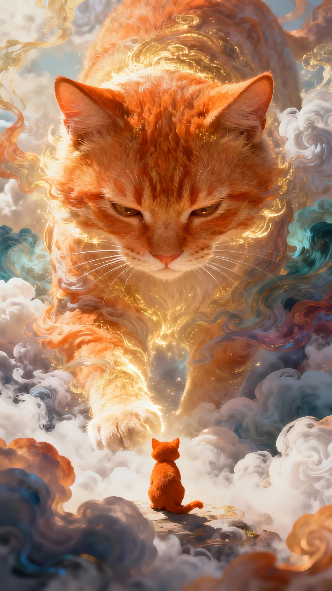

```
玄幻风格，色彩丰富，云雾缭绕且翻滚，橘猫特写由风云构成，慈眉善目的长相，身体散发淡淡的金光，轮廓高光，低下头俯视着渺小的小橘猫的背影，神圣的气氛。
```

 [↑返回目录](#toc)

```
根据参考图制作，以玄幻风格呈现的橘猫特写，由风云构成，云雾缭绕且翻滚，慈眉善目的长相，身体散发淡淡的金光，轮廓高光，低下头俯视着渺小的小橘猫的背影，色彩丰富，神圣的气氛。
```

 [↑返回目录](#toc)

---
## <a id="jm-prompt-7574243293698002202">数字故障圣诞树</a> (<a href="https://jimeng.jianying.com/ai-tool/personal/MS4wLjABAAAAsytZ01OAnr3jHC5Pu-atkim1wvGpCrNDrWJAWDOlzFo" target="_blank" rel="noopener noreferrer">@Honey@</a>)

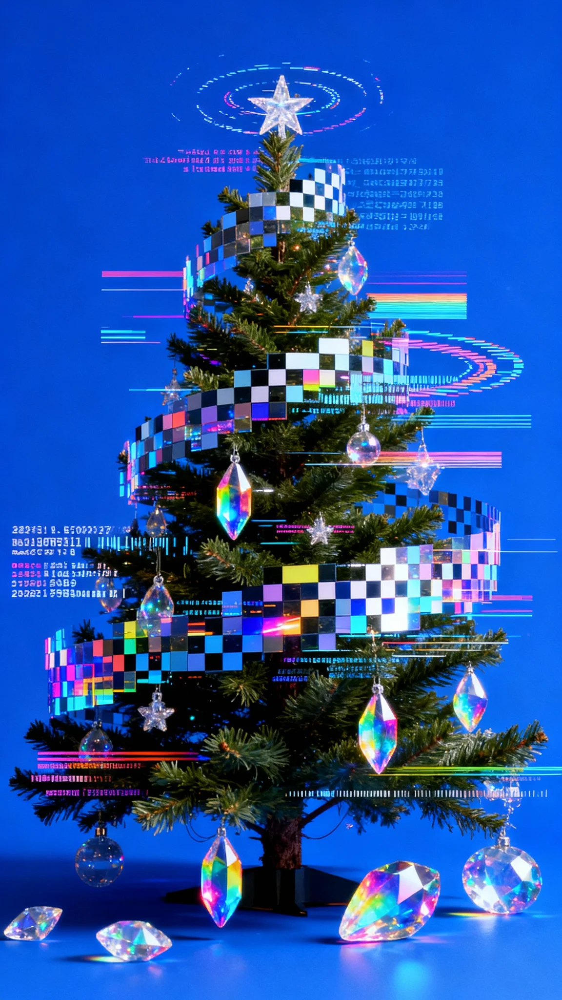

```
虚拟视觉风格，高饱和度克莱因蓝背景，真实圣诞树被虚拟电子像素块包裹，树上布满乱码、数字故障、星环失真效果，搭配全息炫彩半透明水晶装饰，随机出现色彩断层与扫描线。电子像素块闪烁动态光效，水晶呈现彩虹色渐变，故障元素叠加干扰纹理，整体构图突出科技与传统碰撞的视觉张力。
```

 [↑返回目录](#toc)

```
真实圣诞树被虚拟电子像素块包裹，圣诞树上有许多乱码，数字故障，星环失真，虚拟视觉，全息炫彩半透明水晶，随机出现色彩断层与扫描线。背景是高饱和度克莱因蓝。
```

 [↑返回目录](#toc)

---
## <a id="jm-prompt-7572524159402659123">小橘子飞行员的夕阳飞行</a> (<a href="https://jimeng.jianying.com/ai-tool/personal/MS4wLjABAAAAqYVrqg3aVfDjw8QCk6wdk65qbjp8z5-qkkGEewQ8ri0PrKpyDEXVkFuI3WyFhMge" target="_blank" rel="noopener noreferrer">@噜学家</a>)

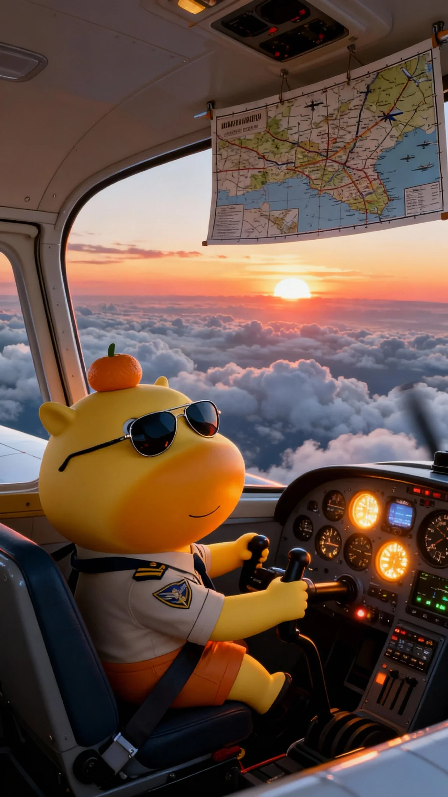

```
3D风格，黄色拟人角色，头顶小橘子，穿着飞行员制服、佩戴墨镜，坐在小型飞机驾驶舱内操作控制杆，驾驶舱外呈现云海与落日景象，仪表盘闪烁灯光，机舱内悬挂航空地图，背景为小型飞机驾驶舱环境。
```

 [↑返回目录](#toc)

```
参考附件形象穿着飞行员制服戴墨镜，坐在小型飞机驾驶舱内操作控制杆，窗外是云海和落日，仪表盘闪着灯光，机舱内挂着航空地图，冒险主题拟人化场景
```

 [↑返回目录](#toc)

---
## <a id="jm-prompt-7567041226508209454">冬日装扮的小狗方阵</a> (<a href="https://jimeng.jianying.com/ai-tool/personal/MS4wLjABAAAALgHJ7n9vLy5Q1aGSCTCN7V_7O8FyDG5aVCo7kSdyPrw" target="_blank" rel="noopener noreferrer">@用户4772350782637</a>)

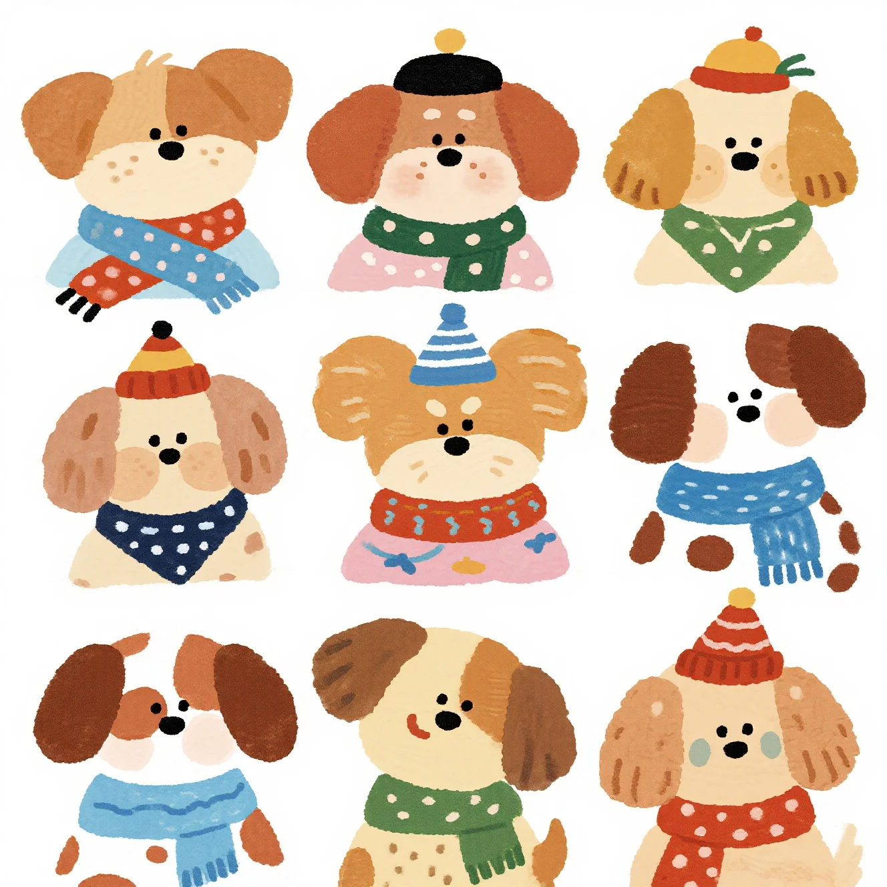

```
12只可爱小狗以4行3列排列，每只小狗佩戴帽子、围巾等装饰，白色简洁背景，雷蒙德·布里格斯和马蒂亚斯·阿道夫松风格，平铺构图，正面视角，怪诞美学、色彩饱满、笔触细腻、水墨渲染氛围，彩铅与水彩混合媒介创作的插画
```

 [↑返回目录](#toc)

---
## <a id="jm-prompt-7576128254126329134">未来科技发布会</a> (<a href="https://jimeng.jianying.com/ai-tool/personal/MS4wLjABAAAAR8hTeRATa_y7xOigoN_WTTG8gKoKYYcpQL1w1QruwRSB6QtMs8Dd-vzXuJ1k3T2K" target="_blank" rel="noopener noreferrer">@光一族～</a>)


```
未来主义风格，科技感产品发布会背景，深蓝渐变背景，流动的光线粒子在空间中穿梭，冷色调，高对比度，动态模糊效果，金属质感，强光影对比，科技氛围。
```

 [↑返回目录](#toc)

```
科技感产品发布会背景，深蓝渐变，流动光线粒子，未来主义，无文字
```

 [↑返回目录](#toc)

---
## <a id="jm-prompt-7574421444256386313">疯狂动物城2：朱迪与尼克的电影之夜</a> (<a href="https://jimeng.jianying.com/ai-tool/personal/MS4wLjABAAAAyi-6sHUYwnBaqfUBR_rjs0gV3q73ETMIgUftTAHjP0Q" target="_blank" rel="noopener noreferrer">@潇公子</a>)

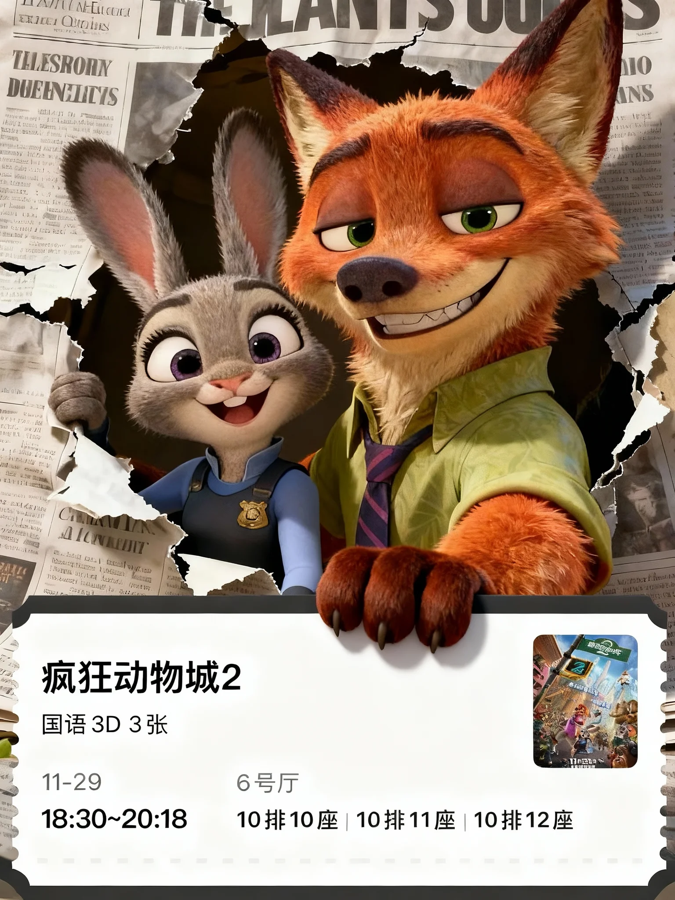

```
3D动画风格，背景是撕破的报纸，画面中有穿警服的兔子朱迪与穿绿衬衫配紫条纹领带的狐狸尼克，狐狸尼克前爪拿着电影票，电影票位于前景且宽度几乎与图片相同，呈现人眼3D感，电影票上有黑色文字“疯狂动物城2”“国语3D 3张”“11-29”“6号厅”“18:30~20:18”“10排10座|10排11座|10排12座”，右侧有《疯狂动物城2》电影海报小图，画面比例3:4。
```

 [↑返回目录](#toc)

```
将两张图片融合在一起，保持图一背景不变，要求人物和电影票有互动，图一人物手拿图二电影票，电影票至于前景，电影票的宽度几乎与图片相同，人物与电影票的互动，呈现人眼3D感，比例3:4
```

 [↑返回目录](#toc)

---
## <a id="jm-prompt-7568885339893271818">传统市井生活的艺术绘卷</a> (<a href="https://jimeng.jianying.com/ai-tool/personal/MS4wLjABAAAAjqGk8M_5R0a0753RNZJhk7O0fDGOdgEslerEaqMKQAonHiOgzmyvUf5Wgb5XmIqB" target="_blank" rel="noopener noreferrer">@荣耀</a>)

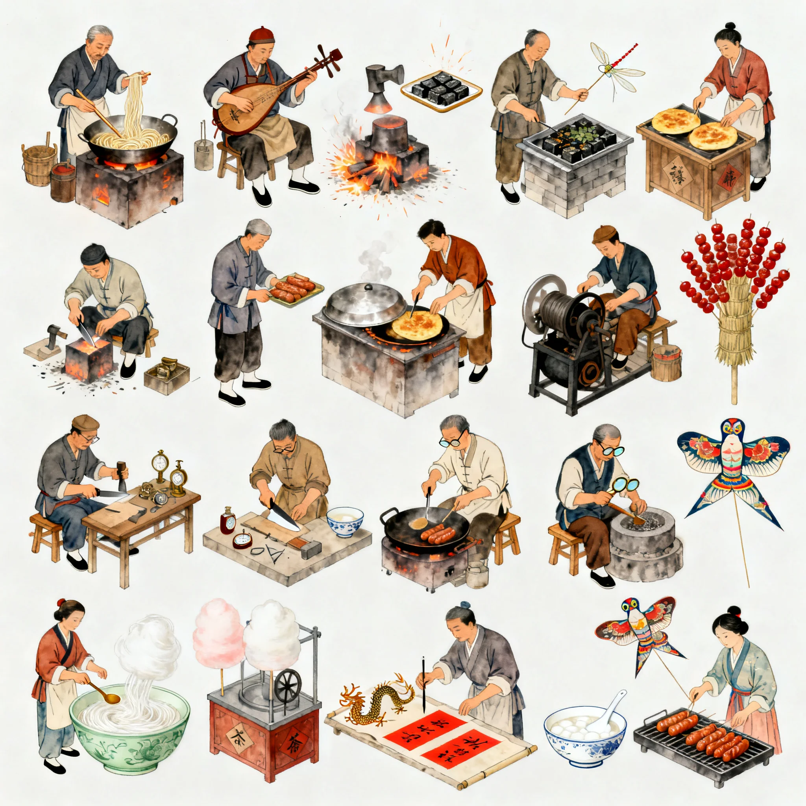

```
手绘工笔风格，等轴测视角，30度俯视，平行投影无透视，白色背景，无光影，背景干净，可分割，传统中式设计，柔和色调，线条干净，艺术化插图，高清4K分辨率。画面中20种中国街头行人及摊位：面摊摊主手持长筷搅拌大铁锅中的面条，街头艺人怀抱二胡拉奏，打铁匠挥锤敲打铁块火星四溅，修皮鞋师傅低头用锥子修补皮鞋，煎饼果子摊主手持竹蜻蜓摊制煎饼，臭豆腐小贩端着托盘叫卖黑亮臭豆腐，手抓饼摊主快速翻转金黄饼皮，烤红薯师傅掀开铁皮盖露出焦糖红薯，糖葫芦小贩扛着插满红山楂的草靶，爆米花师傅转动老式黑炉准备爆米，磨刀师傅坐在木凳上磨菜刀，修表匠戴放大镜检查手表零件，补碗匠用小锤敲打瓷碗裂缝，卖棉花糖的转动机器拉出白絮，卖糖画的用勺子在铁板画龙，卖凉茶的摆着青瓷大碗，卖风筝的举着蝴蝶风筝，卖春联的铺着红纸写毛笔字，卖豆腐脑的端着白瓷碗，卖烤肠的翻动铁板上的香肠。细节精致，每个摊位和人物姿态生动，传统市井氛围。
```

 [↑返回目录](#toc)

```
绘制等轴测视角的中国各式街头行人，手绘风格，30度视角展现，例如面摊，街头艺人，打铁匠，修皮鞋，煎饼果子，臭豆腐小贩，手抓饼摊主，烤红薯师傅，糖葫芦小贩​，爆米花师傅，磨刀师傅​等 20 种，手绘工笔风格，柔和色调，平行投影无透视，线条干净，艺术化插图，白色背景，无光影，背景干净，可分割，传统中式设计，细节精致，高清4K分辨率
```

 [↑返回目录](#toc)

---
## <a id="jm-prompt-7574029850227363082">泡玛特风格蓝羊IP三视图</a> (<a href="https://jimeng.jianying.com/ai-tool/personal/MS4wLjABAAAArVLwdfJXVdRQDlH0HkwhykBhK8tc9BRrSHKfadmpwdgBk9qUoBqAtpS1qhibm3ph" target="_blank" rel="noopener noreferrer">@小风筝1225</a>)

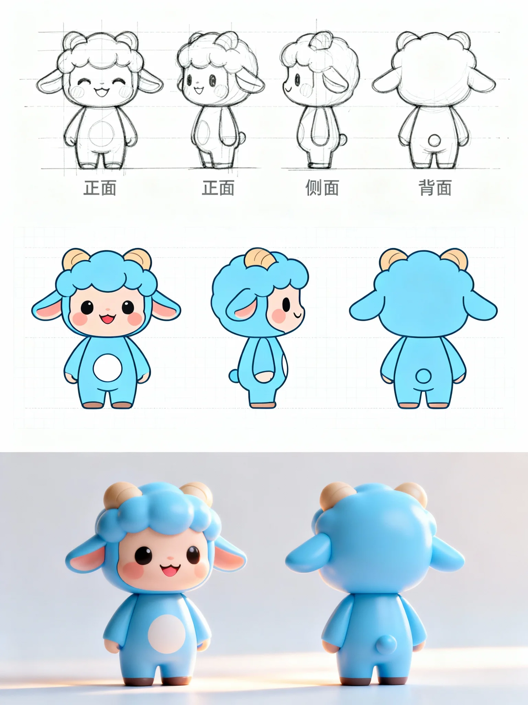

```
泡玛特风格3D盲盒设计，可爱的蓝色小羊拟人化IP，微笑表情，高清，超级细节，C4D渲染，柔和灯光，干净背景。从上到下分三部分展示：第一步为设计IP三视图草图，包含正面、侧面、背面手绘线稿；第二步为平面矢量三视图，线条清晰，色彩明亮；第三步为3D三视图渲染效果，立体质感，光影细腻。
```

 [↑返回目录](#toc)

```
3D盲盒，可爱的蓝色小羊拟人化ip，微笑，高清，超级细节，泡玛特风格，C4D渲染，柔和灯光，干净背景，从上到下展示第一步：设计IP三视图草图，第二部：平面矢量三视图，第三步：3D三视图渲染效果
```

 [↑返回目录](#toc)

---
## <a id="jm-prompt-7576493231899266314">尼克与朱迪的萌趣探头</a> (<a href="https://jimeng.jianying.com/ai-tool/personal/MS4wLjABAAAAxDFPYM1yffl0AUmVEEFfI5MS5iTJIhgJh4ZAX8sLHDI" target="_blank" rel="noopener noreferrer">@小小昔尧</a>)

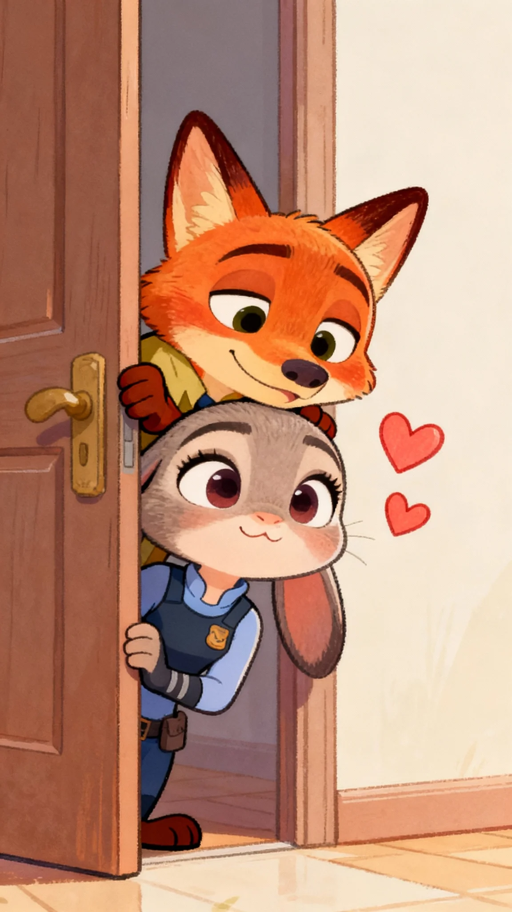

```
Q版手绘插画，可爱俏皮风格，暖色调，柔和笔触。狐狸尼克和兔子朱迪Q版形象，尼克趴在朱迪上方，两人一起从门后探出脑袋，朱迪身旁有两颗爱心元素。温馨氛围，萌趣感，角色默契感强。
```

 [↑返回目录](#toc)

```
这是迪士尼动画电影《疯狂动物城》中的经典角色组合——狐狸尼克和兔子朱迪的Q版手绘插画。
 
画面里，尼克趴在朱迪上方，两人一起从门后探出脑袋，朱迪身旁还有两颗爱心元素，整体风格可爱俏皮，将这对搭档的默契与萌趣展现得淋漓尽致，充满了温馨的氛围感。
```

 [↑返回目录](#toc)

---
## <a id="jm-prompt-7573527484071824649">麦田中的低语</a> (<a href="https://jimeng.jianying.com/ai-tool/personal/MS4wLjABAAAAmFHwa0shThZkLUHI7OBNg8PIh4Tv2UR8Rnso4bFk4UY" target="_blank" rel="noopener noreferrer">@个中滋味</a>)

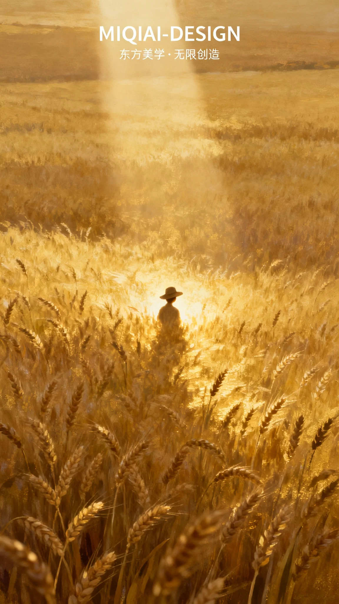

```
极简主义风格，文学书籍杂志主题插画，丁达尔效应柔和光线笼罩辽阔麦田，金色麦浪反射温暖鎏金色调，油画质感静谧氛围。画面中心戴帽子的小人物微微露头，轮廓模糊被光线包围，局部明亮与背景沉金形成强烈对比。大量留白构图，低饱和度背景以温柔金色为主基调，光影对比技术处理赋予诗意违和感，时间凝固氛围。顶部上方居中排列无衬线字体"MIQIAI-DESIGN"，下方小字"东方美学·无限创造"居中排列，黄思萌低饱和度色调与光影对比叙事插画风格，未尽故事感。
```

 [↑返回目录](#toc)

```
在一片辽阔的麦田上，所有景物都被丁达尔效应的柔和光线所笼罩。麦田的金色在光线下反射出一种温暖的鎏金色调，整片麦田如同一幅油画般静谧。画面的中心，一个戴着帽子的小人物微微露出头，显得孤独而思索。人物的轮廓模糊不清，仿佛被光线所包围，局部的明亮与背景的沉金形成强烈的对比。

整个画面采用极简主义风格，大量留白使得麦田和小人物更加突出。背景色调低饱和度，以一种温柔的金色为主基调，营造出一种静谧与神秘的氛围。光影对比技术处理得当，赋予画面一种诗意的违和感，仿佛时间在此刻凝固。

在画面顶部的上方，简洁无衬线体字样 "MIQIAI-DESIGN" 清晰可见，下方是小字 “东方美学·无限创造”，居中排列，保持了构图的平衡。整个画面传递出一种文学书籍和杂志主题插画的强烈氛围感，体现了黄思萌偏好低饱和度色调与光影对比的叙事插画风格，仿佛在述说一个未尽的故事。
```

 [↑返回目录](#toc)

---
## <a id="jm-prompt-7567374103057829170">荧光黄渐变的Y2K精灵</a> (<a href="https://jimeng.jianying.com/ai-tool/personal/MS4wLjABAAAAwksbtXYW44hp5jtJFL0Ewxfl0bluKGe2vDYewcIJV52MwmekrcG-dyzuYxIEfhyK" target="_blank" rel="noopener noreferrer">@颜之有理</a>)

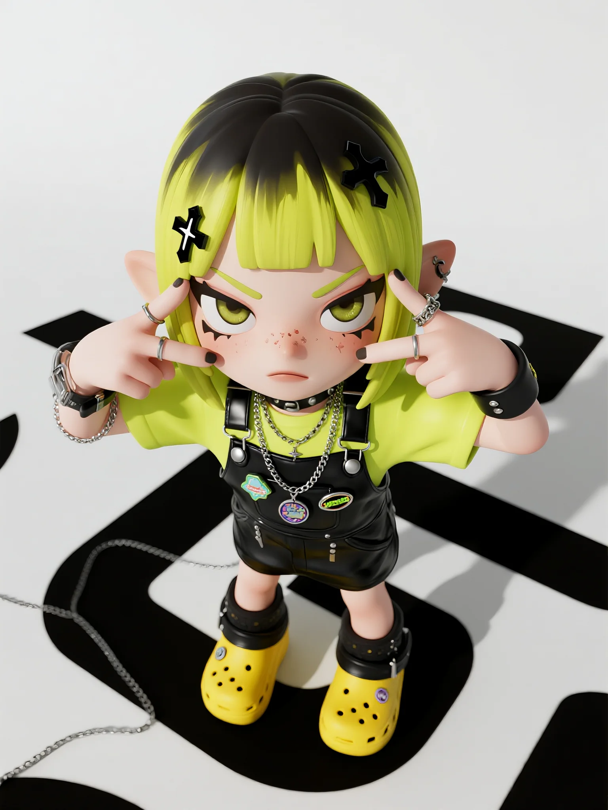

```
荧光黄渐变精灵短发女孩，戴着黑色十字架发夹，不规则刘海，眯眼撇嘴不屑表情，双手比耶放在眼前，穿着荧光黄胸衣，黑色皮质背带裤，黄色洞洞鞋，挂着各种徽章链条，白色背景，仰拍视角，y2k风格，3D玩偶，OC渲染。
```

 [↑返回目录](#toc)

---
## <a id="jm-prompt-7566845348279258395">十二生肖刺绣图标</a> (<a href="https://jimeng.jianying.com/ai-tool/personal/MS4wLjABAAAApwM-a5z1OhgGRWvBnzeqzjmFtiSKoKp0PHZkMdzqYhQ" target="_blank" rel="noopener noreferrer">@Dora</a>)

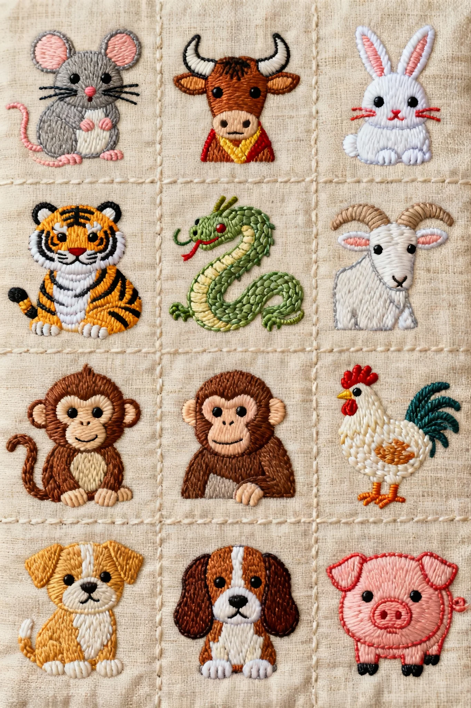

```
可爱简约风格刺绣图标，亚麻布材质，12宫格布局（无网络格），每个格子内为刺绣12生肖图案，依次为：子鼠、丑牛、寅虎、卯兔、辰龙、巳蛇、午马、未羊、申猴、酉鸡、戌狗、亥猪，图案逼真，精致的缝线，中国新年元素。
```

 [↑返回目录](#toc)

```
中国新年元素刺绣图标，可爱，刺绣图案，精致的缝线，可爱风格，简约，亚麻布，刺绣12生肖图案，依次是：子鼠、丑牛、寅虎、卯兔、辰龙、巳蛇、午马、未羊、申猴、酉鸡、戌狗、亥猪逼真的，要求按顺序排列，12宫格布局，没有网络格
```

 [↑返回目录](#toc)

---
## <a id="jm-prompt-7575859059392367881">黑曜石装甲赛车：压迫感与史诗感的极致结合</a> (<a href="https://jimeng.jianying.com/ai-tool/personal/MS4wLjABAAAAoDnz32xDao0xoivYiaetN-KuiElyz9G-TCY5MOvttck" target="_blank" rel="noopener noreferrer">@realsimson</a>)


```
黑曜石装甲赛车 – Obsidian Titan Car

风格： 黑色重装甲
描述： 黑曜石反光、棱角分明。
压迫感，史诗感，粒子特效，动态特效， 极致细节，超精细，超高质感，8K分辨率，高对比度，高饱和度，充满张力的镜头，视觉冲击力，夺目的视觉效果，震撼画面，缠绕感，强烈张力，杰作，最佳品质， 虚幻5引擎 ，HDR写实质感 ，UE5+Octane 渲染，8K分辨率，电影感，非对称式构图，细节清晰详尽，运用弥散光和轮廓光特写，高曝，过曝，暗调，伦勃朗光，强烈明暗对比，高反差，颓废，肌理质感，情绪氛围感拉满，慢快门，朦胧美学，层次感，完美构图，超现实摄影效果
```

 [↑返回目录](#toc)

---
## <a id="jm-prompt-7549821395153325312">济公九宫格表情包</a> (<a href="https://jimeng.jianying.com/ai-tool/personal/MS4wLjABAAAA3EOUkrV7FL_d0CGWpL1PXWyoGwjOzsG5-nodDJa0ugc" target="_blank" rel="noopener noreferrer">@河森堡</a>)

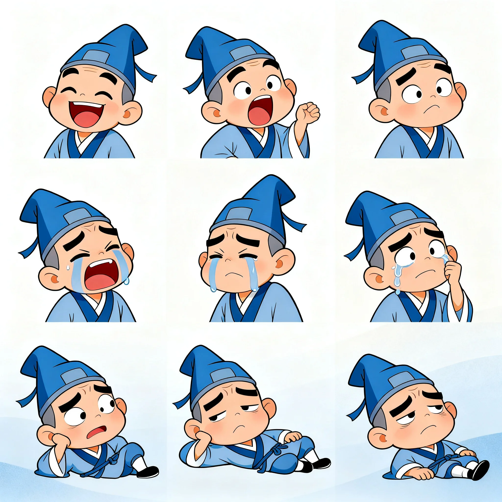

```
图片主体：可爱搞怪的动漫版【济公】，面部特征，上半身或全身。
情绪：各种夸张的表情和动作，包括：开心、大笑、惊讶、发火、大哭，思考，躺平，疲惫、嘲笑等。
风格：中国古风动画画风格，白色和蓝色主色调。
画质：精致的细节，高清，4k。
图片布局：九宫格，每个格子一个头像，对应一种情绪，不显示网格线，背景合适就好。
```

 [↑返回目录](#toc)

---
## <a id="jm-prompt-7574435473397943578">清代宫廷庭院的庄重意趣</a> (<a href="https://jimeng.jianying.com/ai-tool/personal/MS4wLjABAAAAvzyiJ7iXB9t3-e_PMRAhEw8kcJpBfqjBnjAi_rwkPPYDSliQ1AM0V0yhSiOHsPGy" target="_blank" rel="noopener noreferrer">@美工坊景泰蓝掐丝珐琅画</a>)

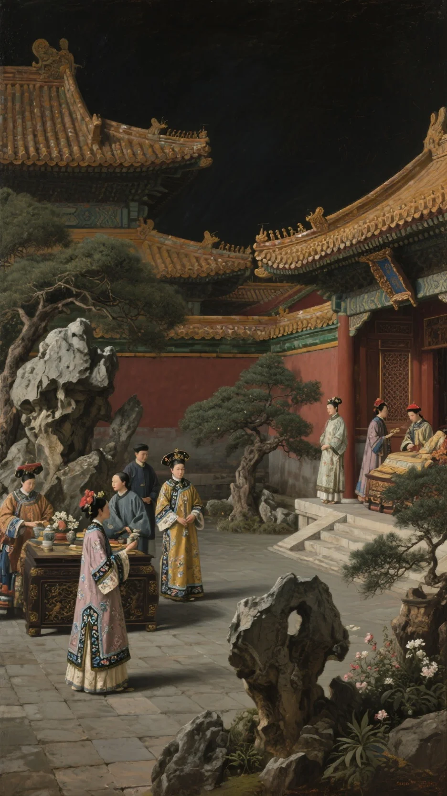

```
营造出庄重、雅致且充满宫廷生活意趣的氛围。华丽的宫廷建筑和人物的活动场景传递出强烈的宫廷威仪感，庭院山石花木构建出雅致的画面环境；整体的色调和构图强化了宫廷意境，仿佛让人置身于清代宫廷庭院，感受那份皇室生活的庄重与雅致意趣。油画写实风格暗黑
```

 [↑返回目录](#toc)

---
## <a id="jm-prompt-7577043257624956210">繁花似锦</a> (<a href="https://jimeng.jianying.com/ai-tool/personal/MS4wLjABAAAAKpK1eAlTAoH4pwxHEsGMrblXNzKt78n98oENtV2YlRo" target="_blank" rel="noopener noreferrer">@iceangela</a>)

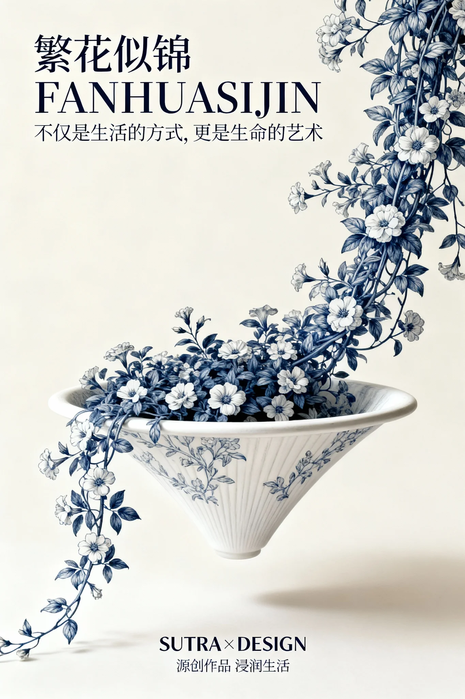

```
海报设计，视觉探索，极繁主义，静物摄影风格，高品质画面输出。悬浮半空的纯白色斗笠花盆，极细深蓝色线条描绘的茂密、开满花朵的藤蔓植物从画面右上方延伸至左下方，与花盆表面植物高度吻合，组成连续画面。象牙白纯色背景，画面上方精美优雅主题文字"繁花似锦"与"FANHUASIJIN"，副标题"不仅是生活的方式, 更是生命的艺术"，画面底部无衬线体小字"SUTRA×DESIGN"，下方极小字"源创作品 浸润生活"。国际获奖作品质感，构图连贯，细节丰富。
```

 [↑返回目录](#toc)

```
海报设计、视觉探索：悬浮半空的一个纯白色的斗笠花盆，由极细的深蓝色线条描绘的茂密、开满花朵的藤蔓植物从画面右上方延伸到左下方并与花盆表面描绘的植物高度吻合、完美组成连续画面，极繁主义，画面上方精美、优雅的主题文字“繁花似锦”“FANHUASIJIN”，副标题“不仅是生活的方式, 更是生命的艺术”象牙白纯色背景，静物摄影，画面底部无衬线体小字“SUTRA×DESIGN”下方极小字“源创作品 浸润生活”，国际获奖作品，高品质画面输出
```

 [↑返回目录](#toc)

---
## <a id="jm-prompt-7575062624883248394">魔法圣诞夜</a> (<a href="https://jimeng.jianying.com/ai-tool/personal/MS4wLjABAAAA8KZWwpDl3fCfg99ReMUhJILJ1H7zEmloeePiJUYo8pZ03vnmv7YhRKwvt6QukS7L" target="_blank" rel="noopener noreferrer">@Perhaps</a>)

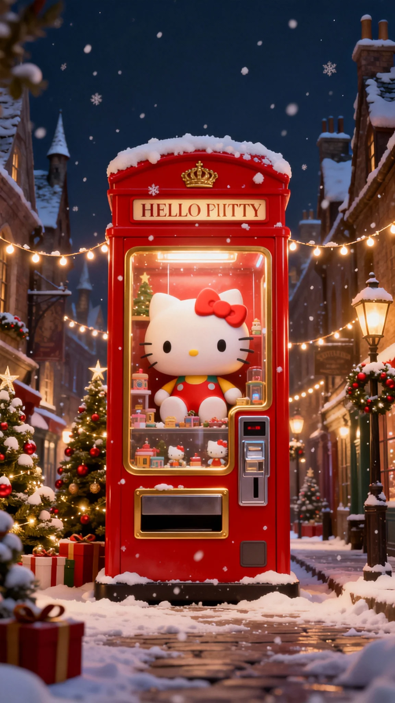

```
C4D，OC渲染，皮克斯风格，圣诞海报，暖黄灯光，红金配色，下雪的夜景，特写正面视角，顶部红色的巨大贩卖机，贩卖机内部是hello kitty的世界，街道两旁有圣诞树、圣诞街灯，魔法世界街道，对角巷风格，贩卖机外部有雪落在上面，街道上有灯串、礼物盒，顶部留白无文字，温馨梦幻氛围。
```

 [↑返回目录](#toc)

```
C4D，OC渲染皮克斯风格、圣诞海报 ，一个巨大的贩卖机，特写，正面，顶部红色，贩卖机里一个hello kitty 的世界。街道两旁有圣诞树，圣诞街灯，魔法世界街道，对角巷，圣诞节氛围，下雪的夜景，有灯串，礼物盒，贩卖机外面还有一些雪落在上面，顶部留白没有文字
```

 [↑返回目录](#toc)

---
## <a id="jm-prompt-7549453413084319012">二次元少女的梦幻小窝</a> (<a href="https://jimeng.jianying.com/ai-tool/personal/MS4wLjABAAAATZS5nHux60fj2BtPKSq3Nh4evzoV_vE0furtrEKVeZY" target="_blank" rel="noopener noreferrer">@mc (武伍五)</a>)

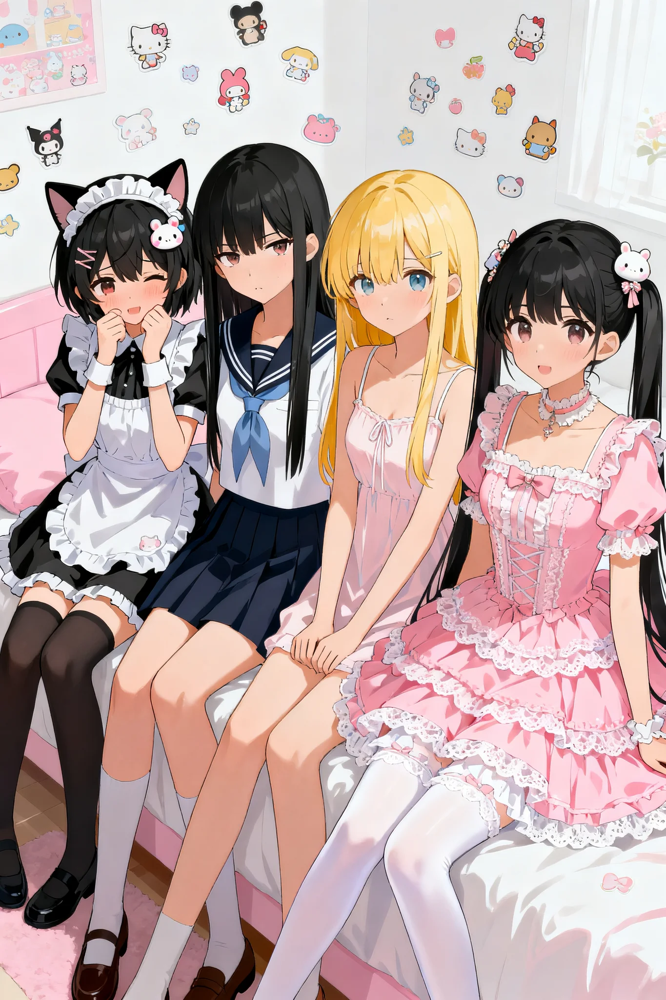

```
画面是一个女生的房间内部，女生的房间以白色为主，粉色打底，有许多可爱的贴纸，有四个女生挨着坐在床边，左边第一个穿着女仆装留着黑发，有猫耳头饰和可爱的发饰，她很害羞，左边第二个穿着水手服，留着黑长直发，表情傲娇，左边第三个穿着吊带连衣裙，留着金黄色的长发，额头有较长的齐刘海，第四个穿着粉色的精致洛丽塔，有着多层的蕾丝边，穿着白丝袜，留着黑色的双马尾，有非常可爱的发饰。二次元风格
```

 [↑返回目录](#toc)

---
## <a id="jm-prompt-7558802721407651118">梵高艺考中的挫败</a> (<a href="https://jimeng.jianying.com/ai-tool/personal/MS4wLjABAAAAMhc4uHdS0SudrqSXrkbreaFZpGq6wP9V-7QEpf3RpAP5QLPXD_V1jAHUR72DYWp_" target="_blank" rel="noopener noreferrer">@我在赛博世界修成仙</a>)

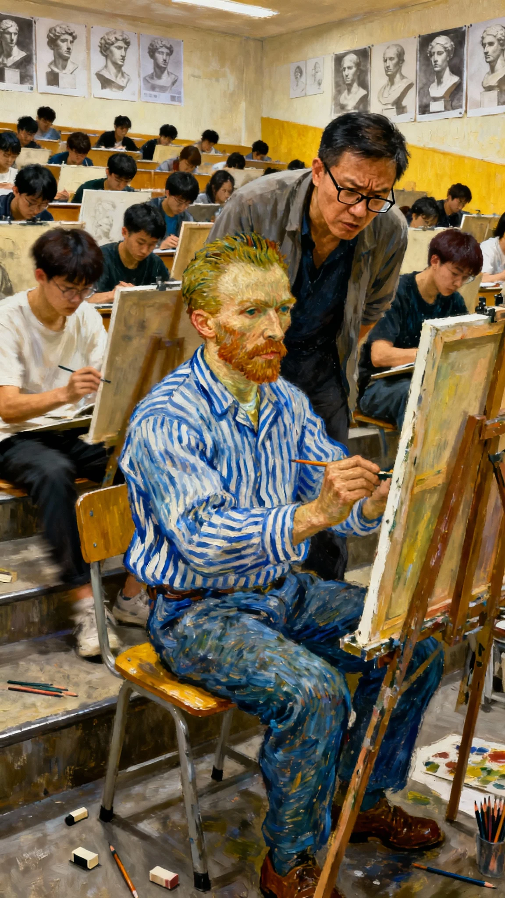

```
真人写实风格，动态模糊画质，暖黄灯光，油画质感，梵高穿着蓝白条纹衬衫坐在艺考阶梯教室前排，手持画笔在画架上创作，周围坐满低头作画的同学，后排戴眼镜的中国绘画老师俯身查看梵高画作，皱眉摇头露出不满表情，教室墙面贴满石膏像海报，地面散落铅笔橡皮，中景构图，动态模糊处理人物动作，光影对比强烈，紧张学习氛围。
```

 [↑返回目录](#toc)

```
动态模糊画质，真人写实风格，画家梵高在艺考阶梯教室内画画，教室内坐满画画的同学，旁边是戴眼镜的中国绘画老师，对着他的画点评，表情不满
```

 [↑返回目录](#toc)

---
## <a id="jm-prompt-7568897867914497306">金色丝绸之路</a> (<a href="https://jimeng.jianying.com/ai-tool/personal/MS4wLjABAAAANN0SMrjNFGmxkDGHIsbHY3g0SMALbQ7bCqQihMzL5LY" target="_blank" rel="noopener noreferrer">@美好生活</a>)

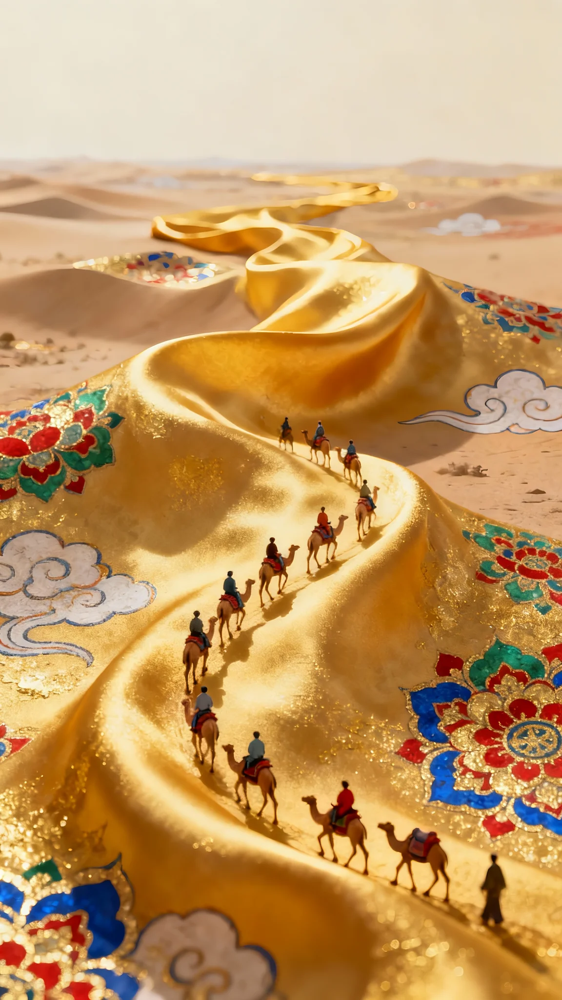

```
岩彩插画风格，金箔岩彩材质，磨砂肌理质感，红蓝绿金配色。微型景观中，起伏的金黄色丝绸延伸至地平线，丝绸表面光滑有质感，其上绘制祥云、宝相花等中国吉祥图案。一群骑骆驼的人沿丝绸行走，丝绸呈现流动感。俯瞰视角，光线追踪，细节丰富，大量留白，丝绸之路主题。
```

 [↑返回目录](#toc)

```
插画，金箔岩彩，岩彩画，磨砂肌理绘画，一丝绸之路，一群骑着骆驼的人起伏的丝绸上行走，丝绸上有中国吉祥图案，祥云、宝相花图案。起伏的丝绸一直延伸到地平线，丝绸光滑，有质感，金黄色，俯瞰视角，微型景观，流动，光线追踪，细节，大量留白，红蓝绿金。
```

 [↑返回目录](#toc)

---
## <a id="jm-prompt-7568866304791186734">金色字体配传统锦纹</a> (<a href="https://jimeng.jianying.com/ai-tool/personal/MS4wLjABAAAAc3Ea1k6Kk8Lh-T6ArL5aUQERAy4Wq3IynktjfqAYKjxLH45uBThHniBPlECG95ac" target="_blank" rel="noopener noreferrer">@大脸猫～小振</a>)

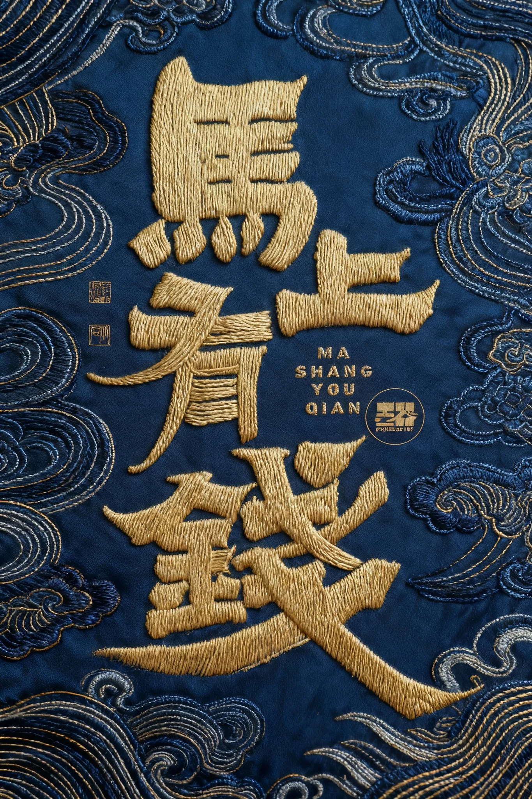

```
深蓝色背景，背景上有丰富多样线条流畅的传统锦纹图案，中央用极其纤细的金色丝线绣出字体“马上有钱”，字体右侧有英文“MA SHANG YOU QIAN”与圆形标识“墨器POWER OF INK”，字体左侧有两个方形印章样式图案。
```

 [↑返回目录](#toc)

```
国风韵味，采用古典风格的表现手法，绘制出精美的传统锦纹。  深蓝色的背景  锦纹图案丰富多样，线条流畅且富有韵律感，展现出传统工艺的精湛技艺。画面中，锦纹在暖色调的光影映衬下，更显华丽，整体构图布局疏密得当。 金色的丝线绣出参考图上的字丝线精细至极  极其纤细的丝线 绣出的字体 整体平整精致 丝线流畅
```

 [↑返回目录](#toc)

---
## <a id="jm-prompt-7573585229886082313">警戒之兔与黑衣女的对视</a> (<a href="https://jimeng.jianying.com/ai-tool/personal/MS4wLjABAAAAixKaOZ0D2fAAeO01ps_wfISXQzCOkIOBofqJiDQpetGUsLz6zXAI-GQl-6IKDOkI" target="_blank" rel="noopener noreferrer">@Gi味汽水</a>)

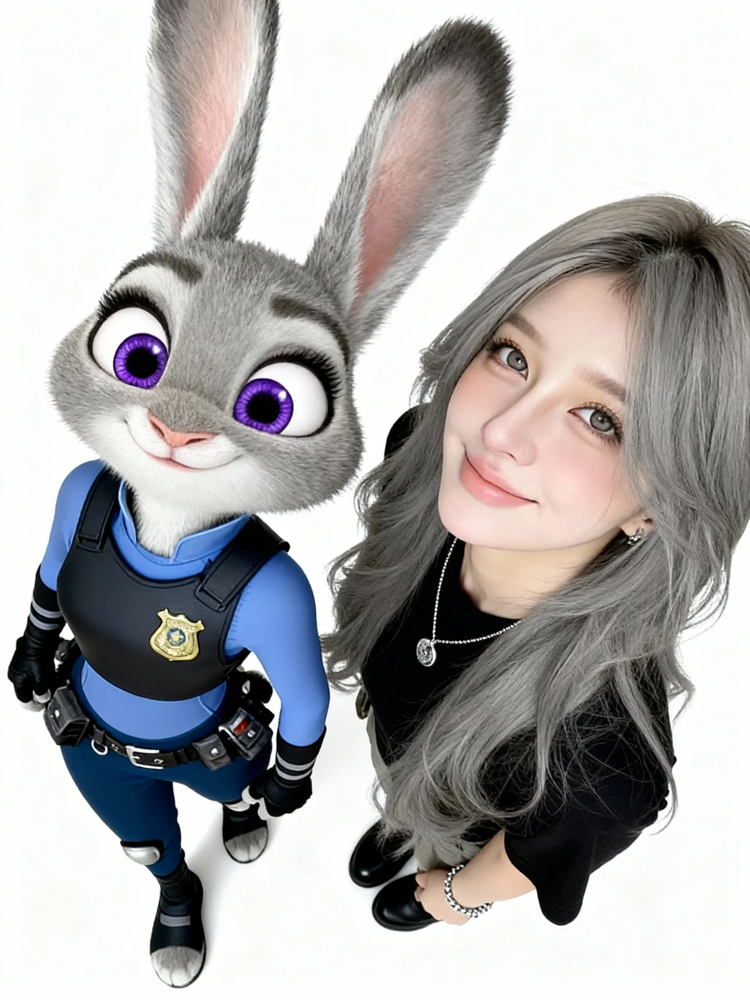

```
高角度俯拍自拍照，画面左侧是灰白色兔子形象，紫色大眼睛，身穿蓝色警服搭配黑色背心与深蓝色裤子，戴黑色手套，腰间有装备，身体略微内扣站得略靠前，头部略微上仰；右侧是灰长发女性，身穿黑色短袖，佩戴银色项链与手链，头部略微上仰；背景为纯白色，光线明亮且均匀，画面仅呈现两位主体
```

 [↑返回目录](#toc)

```
图一图二的角色面部不要做任何改变！请将图1和图2的两人融合成一张二人俯拍自拍照，画面构图紧凑，二位主体靠得很近，头部略微上仰，营造出强烈的视觉冲击力。左侧人物站得略靠前，略微内扣身体，拍摄角度为高角度俯拍，使头部比例被夸张放大，背景为纯白色，简洁干净。整体画面光线明亮且均匀，图片里只有二个人。
```

 [↑返回目录](#toc)

---
## <a id="jm-prompt-7551676074946530612">哆啦A梦的神秘道具</a> (<a href="https://jimeng.jianying.com/ai-tool/personal/MS4wLjABAAAAWNrT759ht-ReTIpRO0VGMCgDXdi0zlcJRgenfjVNwlP9LkTlcbPZVv-_q_9uQcdp" target="_blank" rel="noopener noreferrer">@科迪梦圆</a>)


```
日系二次元风五格漫画，超细腻笔触，细密颗粒感，朦胧感，细笔风格，手绘质感，自然光影，漫画式处理，黑白2D平面，细密颗粒，中景。第一格：画面上半部分左边，戴眼镜的野比哭着，旁边对话框"我又被胖虎欺负了"；第二格：画面上半部分右边，哆啦A梦说话，旁边对话框"好的"；第三格：画面最中间，哆啦A梦举着💩，离镜头很近，💩特写，放射状线条；第四格：画面下半部分，哆啦A梦笑着拿💩交给野比，野比一脸惊讶；第五格：哆啦A梦对话框文字"只要变成这个就没人敢欺负你"，带有放射状线条、速度线。
```

 [↑返回目录](#toc)

```
超细腻笔触，细密颗粒感，朦胧感，细笔风格，手绘质感，自然光影，漫画式处理，黑白2D平面。细密颗粒，中景，日系二次元风五格漫画。画面上半部分左边是野比在哭着（戴眼镜），旁边加个对话框：“我又被胖虎欺负了”。画面上半部分右边是哆啦A梦在说话，旁边加个对话框“好的”。画面最中间是哆啦A梦举起来💩，离镜头很近，💩特写，放射状线条，画面下半部分是哆啦A梦笑着拿着💩交给野比，野比一脸惊讶，哆啦A梦对话框里文字“只要变成这个就没人敢欺负你”。带有放射状线条、速度线。
```

 [↑返回目录](#toc)

---
## <a id="jm-prompt-7576645726705421594">光影中的军人肖像</a> (<a href="https://jimeng.jianying.com/ai-tool/personal/MS4wLjABAAAAxiS0eiD_6G1NHBRiSNALQGOKJBkZZHeumx4zznrQgCw" target="_blank" rel="noopener noreferrer">@岭南宿儒</a>)


```
黑白剪影风格，仰视角度聚焦面部特写的头像，黑底背景，强烈光影对比清晰勾勒面部特征，阴影部分深邃浓郁，人物轮廓对应穿着军绿色外套内搭白色衣物的形象。
```

 [↑返回目录](#toc)

```
绘制一幅黑白剪影头像，以仰视角度聚焦面部特写。强烈的光影对比清晰勾勒出面部特征，黑底背景进一步烘托出神秘氛围，面部在明亮光线的映照下，五官轮廓鲜明，阴影部分深邃浓郁，形成极具冲击力的视觉效果
```

 [↑返回目录](#toc)

---
## <a id="jm-prompt-7551238947993685298">Q版悟空UI图标</a> (<a href="https://jimeng.jianying.com/ai-tool/personal/MS4wLjABAAAAjtN6F-8SLFXq2NQma7glaZvGMMrPu0IRGduhVCNsvVMqpavuVe6ZUZCwfUXTjTve" target="_blank" rel="noopener noreferrer">@外星rot-苹果</a>)

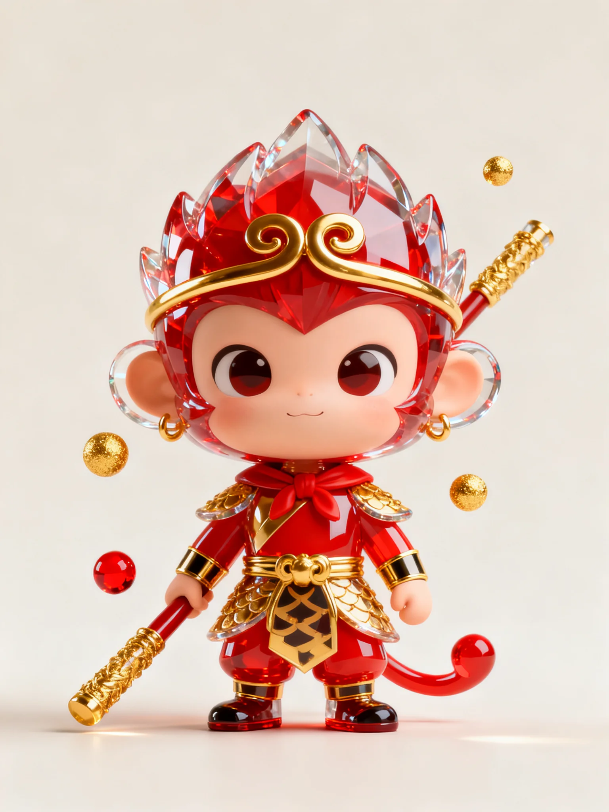

```
UI设计风格，Q版悟空形象，红色和金色色调组合，金色和红点缀，透明反光玻璃质感，透明感，光线追踪，干净背景，参考Pinterest、Dribbble风格，使用OC渲染器，细节丰富，16K高清，浅色背景，大面积留白。
```

 [↑返回目录](#toc)

```
悟空，Q版门店，红色和金色色调组合，金色和红点缀，透明反光玻璃质感，透明感，UI设计风格，光线追踪，干净背景，参考Pinterest、Dribbble 风格，使用OC渲染器，细节丰富，16K高清，浅色背景，大面积留白。
```

 [↑返回目录](#toc)

---
## <a id="jm-prompt-7571068961060605194">星夜独行者</a> (<a href="https://jimeng.jianying.com/ai-tool/personal/MS4wLjABAAAA82pDc_rvDsCuN9wZrCPDrTQQjf7QQN4cJSxOtkSVXz0" target="_blank" rel="noopener noreferrer">@亲亲小八</a>)

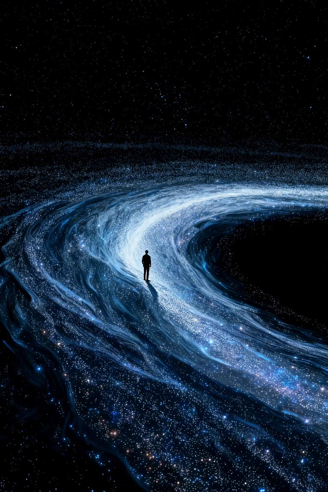

```
超现实风格，暗黑色宇宙背景下由星空组成波浪状星云，星星密度90%密集闪烁，星浪有流动丝绸光纹理，整体冷调星空色；画面中有1个身高占画面高度1/20的图2人物的黑色剪影，站在星浪弯曲处中央位置；超高清4K画质，竖屏9:16比例，超现实梦幻氛围，画面简洁。
```

 [↑返回目录](#toc)

```
参考图一： 【风格】：星空组成的波浪状星云，暗黑色宇宙背景，星星密度90%（密集闪烁），星浪有流动的丝绸光纹理，整体冷调星空色； 【人物】：1个身高占画面高度1/20的小人物黑色虚影（保持全身轮廓），站在星浪弯曲处的中央位置； 【画质】：超高清4K，竖屏壁纸比例（9:16），超现实梦幻氛围，无多余元素，画面简洁  将图中的小人物虚影，替换为我上传图二里的人物（保持1/20的画面比例、黑色剪影效果）
```

 [↑返回目录](#toc)

---
## <a id="jm-prompt-7542792200233471266">光影交错的微笑</a> (<a href="https://jimeng.jianying.com/ai-tool/personal/MS4wLjABAAAA0MyDJuX0nyLXcnCnSN851-SmGfbXBrLYoo-ghbr2JFc" target="_blank" rel="noopener noreferrer">@大力水手1212</a>)

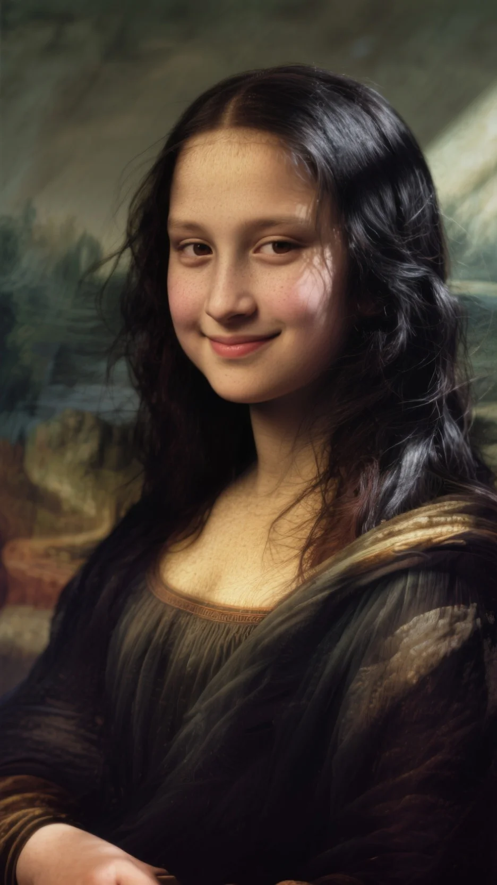

```
电影质感写实摄影，高对比度，景深，对角线构图，视觉冲击力，蒙娜丽莎，16岁，乌黑头发，飘逸的发丝，斑驳的光影，脸部特写，逼真自然的带着一丝微笑，温馨治愈
```

 [↑返回目录](#toc)

---
## <a id="jm-prompt-7553962493048098074">棉花娃娃的艺术鉴赏</a> (<a href="https://jimeng.jianying.com/ai-tool/personal/MS4wLjABAAAAkEQzQbv9i8GxOXxSTt3iDGdf0CKSBseVhVMOBmw7hyqhcbPQCyJecMbHflAxvbPt" target="_blank" rel="noopener noreferrer">@兔子&511</a>)

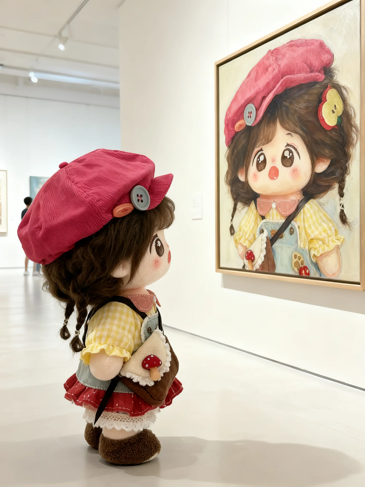

```
一个深棕色卷发扎双麻花辫的棉花娃娃，戴粉红色贝雷帽，帽上有纽扣装饰，穿黄色格子短袖衬衫、浅蓝牛仔背带裙配红边裙摆与蕾丝装饰，背棕色挎包，包上有蘑菇装饰，穿棕色鞋子，以参观者姿态站立，注视墙上以自身为原型的高端细节画作，背景为清爽无其他人的空间，镜头拉远呈现场景。
```

 [↑返回目录](#toc)

```
生成一个棉花娃娃正以参观者的姿态，注视着墙上一幅以自己为原型的画作，画作高端大气，细节拉满，周围环境清爽，没有其他人，镜头拉远一些
```

 [↑返回目录](#toc)

---
## <a id="jm-prompt-7575035366214864166">封神神仙坐飞机</a> (<a href="https://jimeng.jianying.com/ai-tool/personal/MS4wLjABAAAAHDvUSF873iH5g-2CzQIUvb0Rug74-gyREJKWjdbaoQhhI1K0xVBpnK8W1Ea_UfDj" target="_blank" rel="noopener noreferrer">@晴天菠菜</a>)

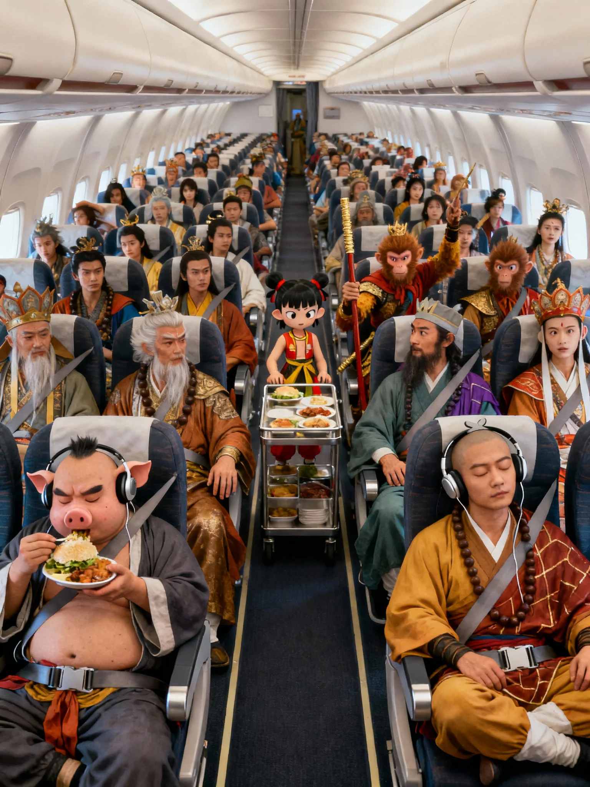

```
真实拍摄风格，自然光，中景视角，一个巨大空客内，座位上坐着封神榜里形形色色、男男女女的神仙，他们绑着安全带，坐姿千奇百怪：有的懒散瘫坐，有的端坐，有的半躺半坐、手臂随意搭在扶手上，有的盘腿而坐，有的戴耳机闭目养神，有的与邻座聊天。过道上哪吒推着餐车派发飞机餐，前排猪八戒狼吞虎咽吃飞机餐，后排孙悟空举金箍棒要打猪八戒被唐僧阻止，沙悟净吃惊看着他们。真实场景质感，生动人物互动，空客内景细节清晰。
```

 [↑返回目录](#toc)

```
真实拍摄，在一个巨大空客内，座位上分别坐着封神榜里形形色色、男男女女的神仙，他们的坐姿千奇百怪，有的懒散地瘫在座位上，有的端坐在位子上，有的半躺半坐，将手臂随意搭在座位扶手上，还有的盘坐在座位上，有的戴着耳机闭目养神，有的与旁边位子的人讲话聊天…各自展现出独特的姿态，他们都绑好了安全带，哪吒推着餐车在过道上派发飞机餐，猪八戒坐在前排狼吞虎咽的吃飞机餐，孙悟空坐在猪八戒后面举起金箍棒正要打猪八戒被唐僧给阻止了，沙悟净吃惊的看着他们。
```

 [↑返回目录](#toc)

---
## <a id="jm-prompt-7571799050857516314">海上丝路：古今对话</a> (<a href="https://jimeng.jianying.com/ai-tool/personal/MS4wLjABAAAAOqT8CY6WFB9WD9eJQDQTgVHXjhgZ9_M8LK-EZlS5Ec2dz8EmkuJ_PU89IE5Fy9AM" target="_blank" rel="noopener noreferrer">@窦生</a>)

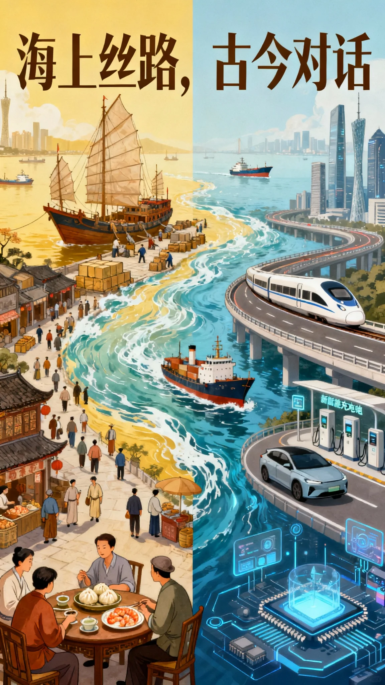

```
插画风格，主标题"海上丝路，古今对话"位于画面顶部，加粗衬线字体。左侧古代场景：广州港口，帆船停靠，商人装卸货物，街道商铺林立，人群南来北往，茶馆内几人围坐饮早茶，桌上摆虾饺、烧麦。右侧现代场景：高铁列车行驶，立交桥车流，新能源汽车充电站，芯片研发实验室，科技感建筑。中间用流动的海水连接古今，海水中有商船与货轮交叠。暖黄与科技蓝渐变背景，分屏构图，细节丰富，古今交融氛围。
```

 [↑返回目录](#toc)

```
以“海上丝路，古今对话”为主题，古代广州作为海上丝绸之路的重要港口，成为南方重要的贸易中心，商业繁荣，南来北往的人汇聚于此，早茶逐渐兴起并成为一种重要的社交活动。现代广州高铁，交通，新能源，芯片等科技领域发达的贸易中心。古今交融！出一张这样的插画
```

 [↑返回目录](#toc)

---
## <a id="jm-prompt-7574730668832263462">疯狂动物城自拍</a> (<a href="https://jimeng.jianying.com/ai-tool/personal/MS4wLjABAAAAsJr6SnZRSI-xKJLM-AQOtiGyyMIU4YSX-tWbg-y76ELDUXM2_qOvwrWrZY0mdyte" target="_blank" rel="noopener noreferrer">@檀星柳梦</a>)

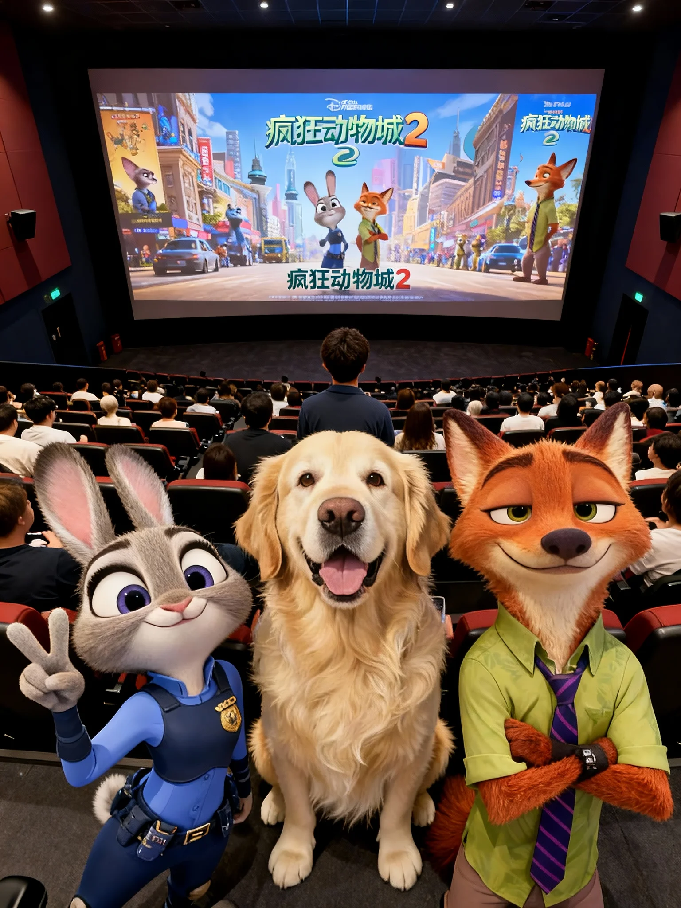

```
日系视觉系风格，iphone前置自拍效果，画面光线明亮均匀，主体清晰；中间是浅金色毛发的金毛犬，呈坐姿身体略微内扣，头部比例夸张放大；左侧是穿蓝色警服比耶的兔子朱迪，右侧是穿绿衬衫紫条纹领带抱臂的狐狸尼克，三人靠得很近，头部略微上仰直视镜头；背景为坐满观众的电影院，三人背对银幕，银幕显示“疯狂动物城2”电影精美海报填满屏幕。
```

 [↑返回目录](#toc)

```
不要换脸，人物脸部不能有任何改变！请将图1和图2的三人融合成一张三人俯拍自拍照，画面构图紧凑，三位主体靠得很近，头部略微上仰，眼神直视镜头，营造出强烈的视觉冲击力。图一人物站中间略靠前，需要保持人脸相似度；需要保持人脸相似度，略微内扣身体，拍摄角度为高角度俯拍，使头部比例被夸张放大，符合典型的日韩视觉自拍风格。简洁干净，进一步凸显人物主体。画面风格偏向日系视觉系，整体画面清晰度高。用iphone前置自拍合影效果。要求人物实现无缝融进画面，视觉过渡自然，整体画面光线明亮且均匀，背景为电影院坐满观众，两人背对银幕～银幕显示《 疯狂动物城2 》电影精美海报填满屏幕。
```

 [↑返回目录](#toc)

---
## <a id="jm-prompt-7525277550176652590">鲁迅肖像凹版细线刻画</a> (<a href="https://jimeng.jianying.com/ai-tool/personal/MS4wLjABAAAALurB_moMFh27nCB7DQS8_lNDSDUOs9YYsFKOFYkfM9U" target="_blank" rel="noopener noreferrer">@天高地厚</a>)

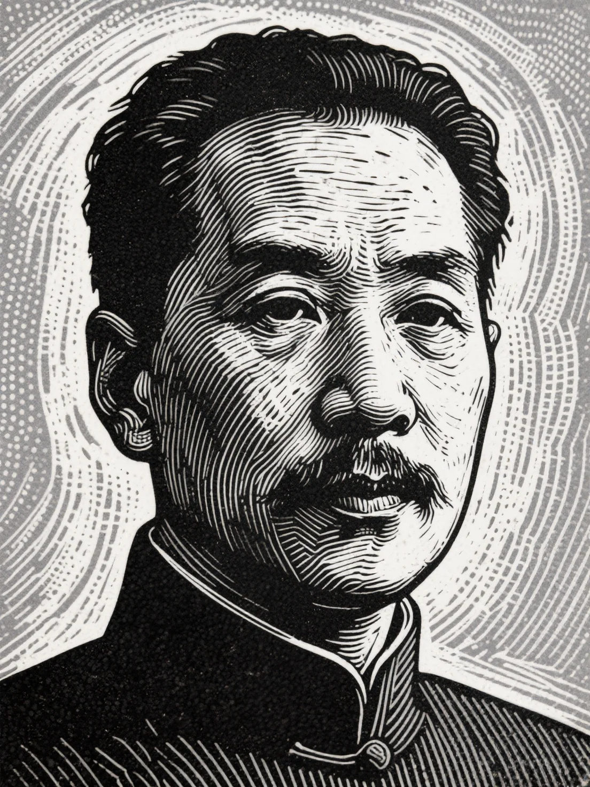

```
鲁迅头像特写画面凹版印刷，正面，全构图，黑白图片，精致的曲线排线细致线条刻画细节与黑白灰关系，细致密集线条印刷感节，精致凹版印刷线条表现明暗关系，灰色网点印刷背景，​高清画质。​
```

 [↑返回目录](#toc)

---
## <a id="jm-prompt-7576212728486956315">神骏奔腾的抽象艺术</a> (<a href="https://jimeng.jianying.com/ai-tool/personal/MS4wLjABAAAAMBy3__NBsPknB0Zk0MiJ1PP6tp8OW1UXdLapRlbevYMSXfUjnFqGMeEbf0_Ks7aw" target="_blank" rel="noopener noreferrer">@大地釆风</a>)

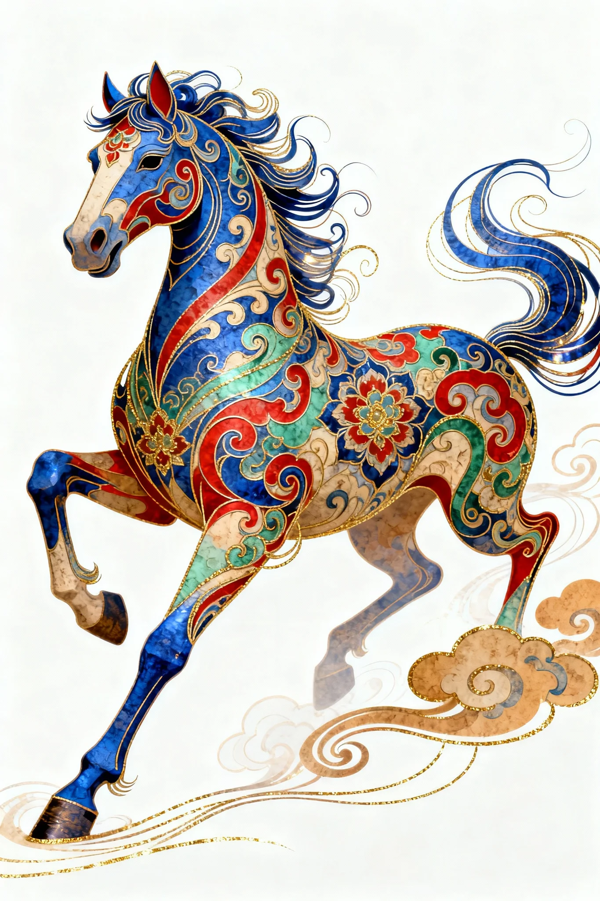

```
抽象艺术风格，生肖马主题，神骏昂扬。马的形体由连绵不断的中国传统纹饰线条勾勒，融合敦煌壁画中的卷草纹、祥云纹与唐代宝相花纹样，线条柔美灵动，疏密有致，在盘旋回转中构建出马匹强健的肌肉与奔腾的动势，层次分明。青金石蓝、朱砂红、石绿、土黄为主色调，辅以金线点缀，色彩斑斓美轮美奂，华丽典雅。画面具有强烈的立体感和流动感，仿佛由光与彩交织而成，纯白色背景，超高分辨率，细节精致。
```

 [↑返回目录](#toc)

```
主题： 生肖马，神骏昂扬，抽象艺术风格。
构图与线条： 马的形体由连绵不断的中国传统纹饰线条勾勒，融合敦煌壁画中的卷草纹、祥云纹与唐代宝相花纹样。线条柔美灵动，疏密有致，在盘旋回转中构建出马匹强健的肌肉与奔腾的动势，层次分明。
色彩： 色彩斑斓美轮美奂，采用敦煌经典配色：青金石蓝、朱砂红、石绿、土黄为主，辅以金线点缀，营造出华丽而典雅的美学感受。
质感与背景： 画面具有强烈的立体感和流动感，仿佛由光与彩交织而成。纯白色背景，超高分辨率，细节精致。
```

 [↑返回目录](#toc)

---
## <a id="jm-prompt-7565112527508622630">毛茸绒的手机图标设计</a> (<a href="https://jimeng.jianying.com/ai-tool/personal/MS4wLjABAAAAi0X5LTHQQIOc0uggJCgfPPzi6iRI34pnX08sqfYAtz8" target="_blank" rel="noopener noreferrer">@小皓</a>)

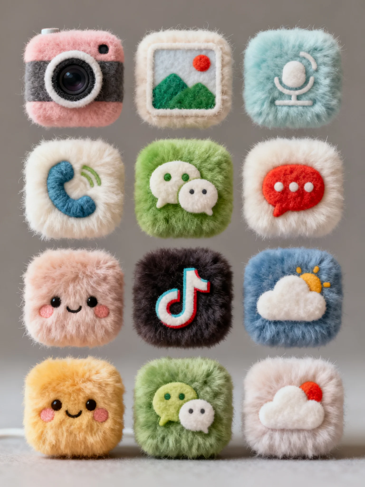

```
毛茸茸风格手机icon设计，9宫格布局，6个小图标分别对应照相机、图片、微信、抖音、信息、天气app，毛绒材质，造型逼真。可爱、精致、简约风格，细腻毛绒质感，色彩柔和，专业设计师获奖作品氛围。
```

 [↑返回目录](#toc)

```
手机icon设计，分别给照相机、图片、微信、抖音、信息、天气6个app设计icon，毛茸茸风格，可爱，精致的，可爱风格，简约，毛绒材质，小图标，逼真的，9宫格布局，，设计师设计，获奖作品
```

 [↑返回目录](#toc)

---
## <a id="jm-prompt-7573228443521797426">谷物汇聚的温暖'O'</a> (<a href="https://jimeng.jianying.com/ai-tool/personal/MS4wLjABAAAAgFMp4jI_LMs16krYXGNk0TaveugEQOZe-6nW1M71PBqu2hbwLAMfYK0vMS7DeYYv" target="_blank" rel="noopener noreferrer">@salmongo</a>)

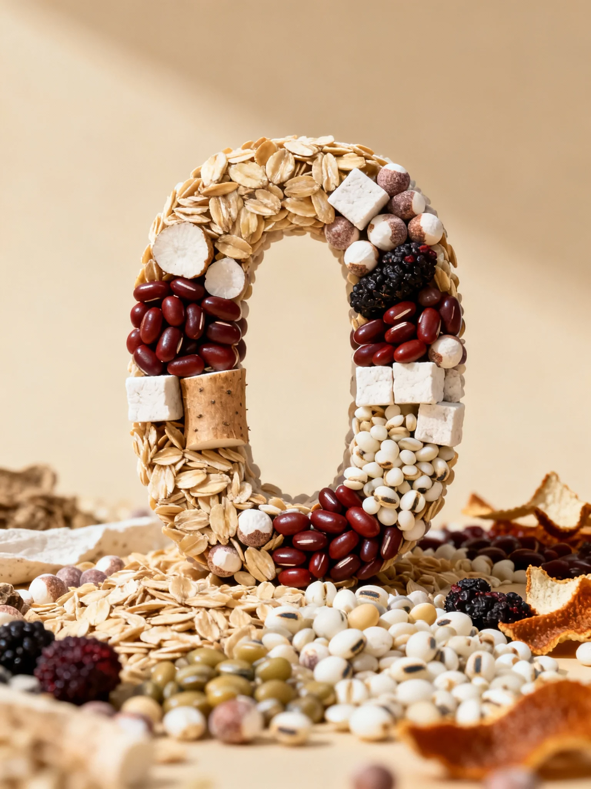

```
食品摄影风格，淡卡其色背景，中心有由无数铁棍山药、酶解燕麦、茯苓、赤小豆、薏苡仁、芡实、白扁豆、陈皮、桑椹组合排列成的立体化"0"。谷物数量繁多，真实肌理清晰，颗粒饱满，质感细腻，暖光照射，光影柔和，焦点集中于"0"的中心，周围虚化，突出主体，自然真实氛围。
```

 [↑返回目录](#toc)

```
淡卡其色背景，中心有个由无数的铁棍山药、酶解燕麦、茯苓、赤小豆、薏苡仁、芡实、白扁豆、陈皮、桑椹、组合排列成的立体化0，重点突出谷物的数量繁多以及真实肌理，
```

 [↑返回目录](#toc)

---
## <a id="jm-prompt-7574783254566309129">冬雪下的羊毛毡海岛乐园</a> (<a href="https://jimeng.jianying.com/ai-tool/personal/MS4wLjABAAAAm8Ws1osQX5L_jzskzQyCPRWu3VK7nSviGV79tdBGqzWMXumFT1cyIi7nIMXuHzHS" target="_blank" rel="noopener noreferrer">@烟雨洛神</a>)


```
羊毛毡手工置景。
Q版卡通风格，远景，全景构图，鸟瞰视角，冬季下雪的海岛。
海岛满是葱绿树木以及厚厚积雪，树木之中有很多彩色屋顶的💩，房屋窗台上开满了鲜花，屋顶上有雪花，星星点点的灯光，海岛上有盘山路，有车辆，有💩，行人，有商业街，海上有轮船，海岸边有船舶停靠。
```

 [↑返回目录](#toc)

---
## <a id="jm-prompt-7553863929185815859">元气满满的粉色双马尾女孩</a> (<a href="https://jimeng.jianying.com/ai-tool/personal/MS4wLjABAAAABYH7O-kKs8hAXA9LO8Hz7MeuO4iSfZ5tmNXId5vMCTSR3WPvfVDeGD-i9q89m9vT" target="_blank" rel="noopener noreferrer">@青白</a>)

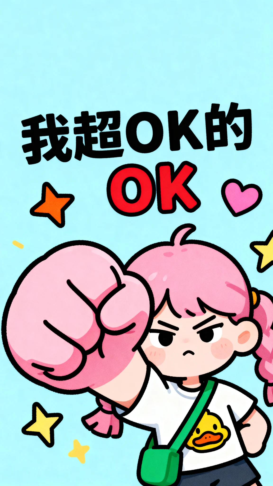

```
可爱卡通风格，线条简洁明快，色彩柔和粉嫩，浅蓝色纯色背景，清新柔和。一个粉色双马尾头发的女孩，背着绿色斜挎包，穿着鸭子卡通T恤，有气势，严肃认真的表情，奋力举起超大的粉色拳头冲着镜头，拳头造型圆润可爱。拳头周围点缀橙色、黄色星星，粉色爱心俏皮元素，增添灵动氛围。艺术字“我超OK的”，黑色字体搭配红色“OK”，对比鲜明，传递积极鼓励的情绪。积极治愈、充满元气与鼓励感。
```

 [↑返回目录](#toc)

```
风格：可爱卡通风格，线条简洁明快，色彩柔和粉嫩。
背景：浅蓝色纯色背景，清新柔和。
主体：一个粉色双马尾头发的女孩，背着绿色斜挎包，穿着鸭子卡通T恤，有气势，严肃认真的表情，奋力举起超大的粉色拳头冲着镜头（拳头造型圆润可爱）。
装饰元素：拳头周围点缀星星（橙色、黄色）、爱心（粉色）等俏皮元素，增添灵动氛围。
文字：艺术字 “我超OK的”（黑色字体搭配红色 “OK”，对比鲜明），传递积极鼓励的情绪。
整体氛围：积极治愈、充满元气与鼓励感。
```

 [↑返回目录](#toc)

---
## <a id="jm-prompt-7572607734332296486">简洁钢笔速写</a> (<a href="https://jimeng.jianying.com/ai-tool/personal/MS4wLjABAAAAPWFDq4OD5fSYejh1sCLfJEm9sCYa6U1zWOLCl7vpbTMVqpyEFVSizsY54JyyBrZ9" target="_blank" rel="noopener noreferrer">@仗剑天涯</a>)

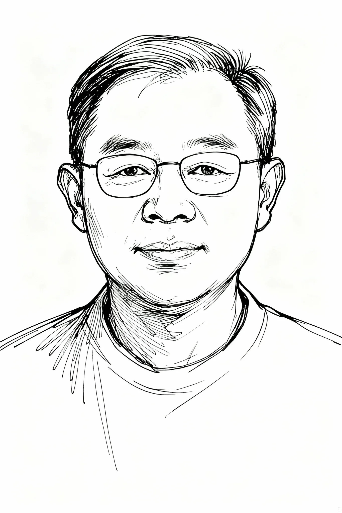

```
钢笔速写线稿风格，一位戴细框眼镜的男人，身穿白色衣服且线条流畅高度概括，发丝以简洁线条呈现，背景为白色；钢笔速写线稿风格，一位男人，身穿白色衣服且线条流畅高度概括，发丝以简洁线条呈现，背景为白色。
```

 [↑返回目录](#toc)

```
人物肖像写意艺术照，钢笔速写线稿，衣服线条流畅高度概括，衣服是白色，发丝概括线条简洁 ，黑白，完整显示，白色背景。
```

 [↑返回目录](#toc)

---
## <a id="jm-prompt-7573887573966245166">像素狂欢：任天堂经典元素3D盛宴</a> (<a href="https://jimeng.jianying.com/ai-tool/personal/MS4wLjABAAAAJs-RgPmH93lpW4Xk-_N8bQlBh0TjiL5NlkhIT16s0Aw" target="_blank" rel="noopener noreferrer">@小奚有话说</a>)


```
3D渲染风格，中心对称构图，主色调为任天堂经典红、亮蓝与金黄。"像素狂欢"二字以马里奥蘑菇轮廓为立体框架，与马里奥帽子、金币元素深度共生，字体主干由8位像素块拼接结构构建框架，金币边缘纹路作为核心笔画节点，方块跳跃动态环绕字体结构，像素颗粒质感点缀笔画表面，水管曲线元素巧妙融入笔画转折。背景纯色简约，通过像素颗粒感、金币金属光泽与动态跳跃效果强化视觉趣味，16K分辨率，呈现兼具品牌辨识度与复古童趣的视觉巅峰之作。
```

 [↑返回目录](#toc)

```
以任天堂经典元素为灵感，“像素狂欢” 二字以马里奥蘑菇轮廓为立体框架，与马里奥帽子、金币元素深度共生，字体主干由 8 位像素块拼接结构构建框架，金币边缘纹路作为核心笔画节点，方块跳跃动态环绕字体结构，像素颗粒质感点缀笔画表面，水管曲线元素巧妙融入笔画转折。采用中心对称构图，主色调为任天堂经典红、亮蓝与金黄，通过像素颗粒感、金币金属光泽与动态跳跃效果强化视觉趣味。背景纯色简约，极致凸显品牌的复古游戏感与欢乐氛围。3D 渲染，16K 分辨率，呈现兼具品牌辨识度与复古童趣的视觉巅峰之作。
```

 [↑返回目录](#toc)

---
## <a id="jm-prompt-7549516076216831241">巨猫维京战士攻城</a> (<a href="https://jimeng.jianying.com/ai-tool/personal/MS4wLjABAAAAeRW71DoeyvsiCNoHnyPHRQDj7fqbpTWRqlju2AjOzKE" target="_blank" rel="noopener noreferrer">@藍楓🍁（欢迎用图、点赞、关注， 哈哈）</a>)


```
主体是巨型攻城武器，中世纪战场场景，一个带有镜头光晕的史诗级广角镜头，巨猫头上戴着一顶巨大而破旧的维京头盔，正伸出爪子推倒一座微型城堡的城墙。周围是混战的微小骑士。史诗战争电影截图风格、真实的毛发质感和飞溅的泥土，混乱而壮烈的冷兵器战争氛围，主体形象特征保持不变动态模糊强化携带速度线残影，超广角强透视构图，动态模糊边缘虚化，强烈胶片颗粒与高噪点质感，弥散晕染的暗部层次，张力十足，压迫感，细节生动完美。
威胁压迫感，极其震撼的一幕，光影彼此交织错杂的梦幻感，朦胧，过曝，双重曝光，电影级构图，视觉冲击，8K画质，超清，极致细节，极致刻画，清晰的线条，高对比。
```

 [↑返回目录](#toc)

---
## <a id="jm-prompt-7575802117621927177">意式极简110㎡住宅平面布局</a> (<a href="https://jimeng.jianying.com/ai-tool/personal/MS4wLjABAAAAFEQVEtLyLabzBnoQrBfaXBaI33drSTjAN56FcYRHFbXJZn-6LLE9wbFDgwxQ5bPE" target="_blank" rel="noopener noreferrer">@文刀公子</a>)

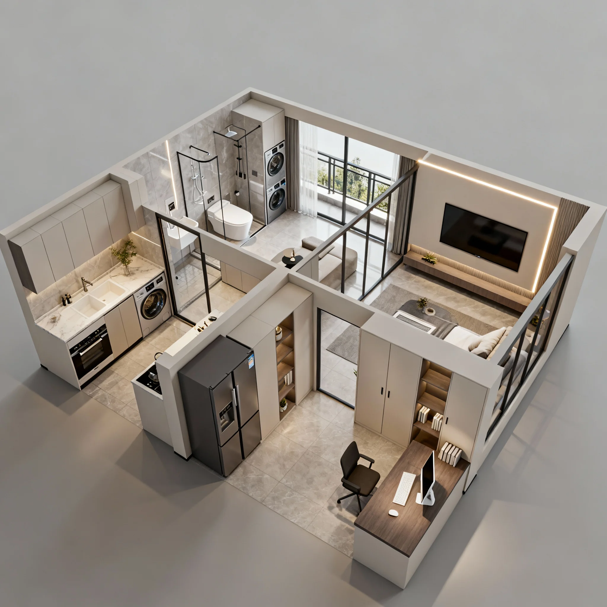

```
意式极简风格装修方案平面效果图，3D透视图，鸟瞰透视模式，全景，单层无分层，正方形格局，110平方米三室一厅一卫空间。卫生间干湿分离含淋浴区、马桶，客厅阳台落地窗，洗衣机与洗衣柜布局；厨房有嵌入式冰箱、烤箱、洗碗机；客厅配备100寸电视；卧室含衣柜、床、电脑桌。灯光设计，简洁线条，浅色调为主，空间通透感强。
```

 [↑返回目录](#toc)

```
装修方案平面效果图，面积110平方米，三室一厅一卫。卫生间干湿分离有淋浴，马桶、，客厅阳台落地窗，有洗衣机，洗衣柜；厨房，有嵌入式冰箱、烤箱、洗碗机；客厅有一百寸电视；卧室有衣柜，床，电脑桌，呈现3D透视图效果图，鸟瞰透视模式，全景，单层，不能有分层，意式极简，有灯光设计，正方形格局，
```

 [↑返回目录](#toc)

---
## <a id="jm-prompt-7575055728583462182">雾海幽影</a> (<a href="https://jimeng.jianying.com/ai-tool/personal/MS4wLjABAAAA4Xq3B7M9yVKAY3iijqFf-9dBHUkt5nn9effciy60cUsFviqThkVo3IKcRIsJnZZT" target="_blank" rel="noopener noreferrer">@✨小小慕斯✨</a>)


```
二十世纪福克斯电影风格，超现实主义，巨物恐惧，冷色调，低饱和度，丁达尔效应，8k，电影感，低能见度。对角线构图，古代场景，波涛汹涌的海面，风暴暴雨，雾气环绕，远处被雾气隐藏的巨大幽灵战船（船帆写着"奉天伐倭"），清晰度极低，船上许多穿唐代明光铠的幽灵武士发出绿光，体型高耸入云似刚站起。近处木船上穿和服、身材好、穿木屐的女人背对着镜头慌张扶着栏杆望向幽灵战船。惊悚氛围，氛围感拉满。
```

 [↑返回目录](#toc)

```
二十世纪福克斯公司大片即视感，丁达尔效应，氛围感拉满，惊悚，古代，波涛汹涌的海面上，风暴四起，暴雨，雾气环绕，对角线构图，（一个在非常巨大无比的幽灵战船（船帆写着“奉天伐倭”），非常遥远处海上被雾气隐藏，清晰度极低，船上很多穿古代中国唐代明光铠的幽灵武士发出绿光，体型高耸入云，像是刚刚站起来），近处木船上一个女人（和服，身材好，木屐）背对着镜头望着它，动作慌张，扶着栏杆。超现实主义，巨物恐惧，超现实，8k，电影感，冷色调，低饱和度，能见度低。
```

 [↑返回目录](#toc)

---
## <a id="jm-prompt-7572147633628712243">梦幻列车与花海</a> (<a href="https://jimeng.jianying.com/ai-tool/personal/MS4wLjABAAAA_SaLzZCWiOFh1DrWyJIleNdegfd1aUA_lcbXiSsgzYteyVSsvgVDxXlTj7MZrOIW" target="_blank" rel="noopener noreferrer">@茗山AIGC</a>)


```
新海诚风格梦幻动漫插画，高饱和度色彩，强烈对比，清新治愈氛围，童话梦幻感，细节精致。湛蓝天空中悬浮巨大蓬松白云，边缘柔和立体如棉花糖；下方色彩斑斓花海山坡，坡面从橙色渐变至蓝色，密集开满各色花朵，花瓣间点缀星光光斑；山坡顶端轨道停复古红色列车，两节车厢，白色窗框，造型怀旧。花朵层次感丰富，列车金属质感细腻，光影柔和自然。
```

 [↑返回目录](#toc)

```
新海诚风格梦幻动漫插画，湛蓝如洗的天空中悬浮着一朵巨大蓬松的白云（边缘柔和、立体如棉花糖），下方是色彩斑斓的花海山坡——坡面从橙色渐变至蓝色，密集开满各色花朵，花瓣间点缀星光般的光斑；山坡顶端的轨道上停着一列复古红色列车（两节车厢、白色窗框，造型怀旧）；整体画面色彩饱和度高，对比强烈，风格清新治愈，充满童话般的梦幻感，细节精致（如花朵的层次感、列车的金属质感），光影柔和自然。
```

 [↑返回目录](#toc)

---
## <a id="jm-prompt-7573226684422294830">搞怪大叔骑微型摩托车</a> (<a href="https://jimeng.jianying.com/ai-tool/personal/MS4wLjABAAAArtTqsAWl6doG5Oz41TK9HHuxEdtQkA4Dc_7cWQVMWv3KYBik4pJdj7A1zCBqxVEx" target="_blank" rel="noopener noreferrer">@用户6096241071780</a>)


```
寫實風格，超高清細節，純色背景，56歲中年微胖大叔，捲毛短髮，漫畫風格大頭，搞怪肢體動作，騎微型摩托車，俏皮誇張神情，幽默古怪特點，寫實光影，高解析度，色彩飽和，人物比例協調，摩托車細節清晰，背景純色無雜訊，寫實皮膚質感，服裝皺褶分明，動態模糊效果，趣味氛圍。
```

 [↑返回目录](#toc)

```
在極致高清且細節豐富的純色背景下，繪製一幅寫實風格的滑稽誇張小品人物（56歲中年微胖大叔，捲毛短髮造型）肖像。 人物有著漫畫風格誇張的大頭，呈現出搞怪的肢體動作，騎著一輛微型摩托車，神情俏皮且誇張，充分突出幽默和古怪的特點現實照片顯示。
```

 [↑返回目录](#toc)

---
## <a id="jm-prompt-7575401204948192563">圣诞尼克·现代简约珐琅冰箱贴</a> (<a href="https://jimeng.jianying.com/ai-tool/personal/MS4wLjABAAAAoLZXbHIlQXGQG174aIlBFrxzP1Qqlpgsn7CYko4a2u1_ZEGka3PojiEeqAOcSiQK" target="_blank" rel="noopener noreferrer">@今夜不睡</a>)

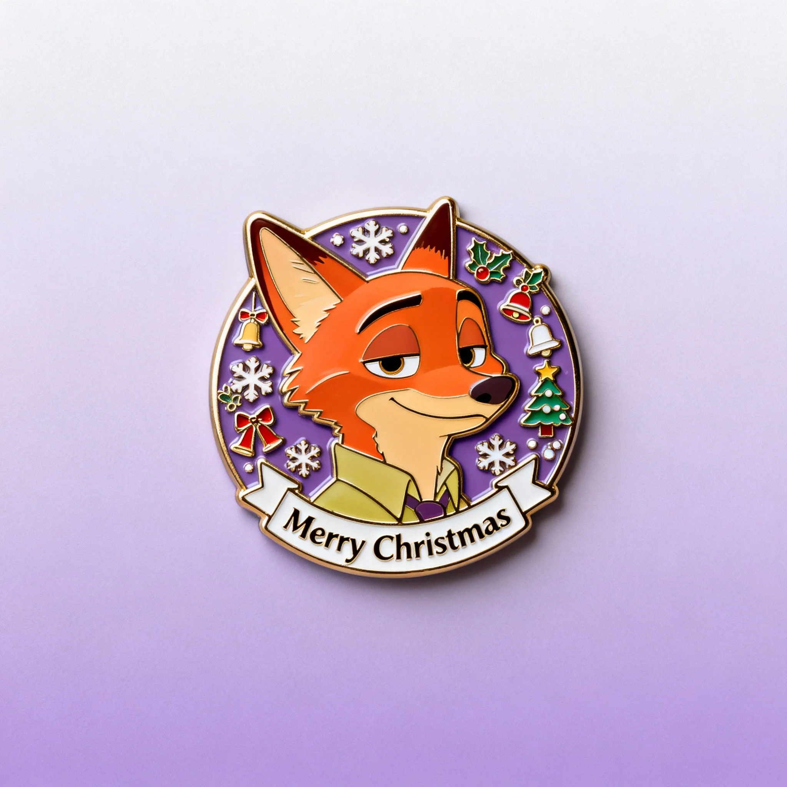

```
现代简约设计风格，疯狂动物城主题珐琅冰箱贴设计，圆形造型，狐狸尼克半身特写，周围环绕圣诞元素图案，底部有"Merry Christmas"英文字体，国际化设计，浅紫色渐变配色，纯净质感背景。
```

 [↑返回目录](#toc)

```
现代简约设计风格，疯狂动物城主题珐琅冰箱贴设计，圆形冰箱贴，狐狸尼克的半身特写，周围环绕着圣诞元素图案，底部有"Merry  Christmas"英文字体，国际化设计，颜色为浅紫色渐变。纯净质感背景
```

 [↑返回目录](#toc)

---
## <a id="jm-prompt-7573957014485847342">国风水彩中国元素插画</a> (<a href="https://jimeng.jianying.com/ai-tool/personal/MS4wLjABAAAAG9HjI_raoQhzez1sQRZEGuez3w_hirNbHARlHeuGEEM" target="_blank" rel="noopener noreferrer">@柚子</a>)

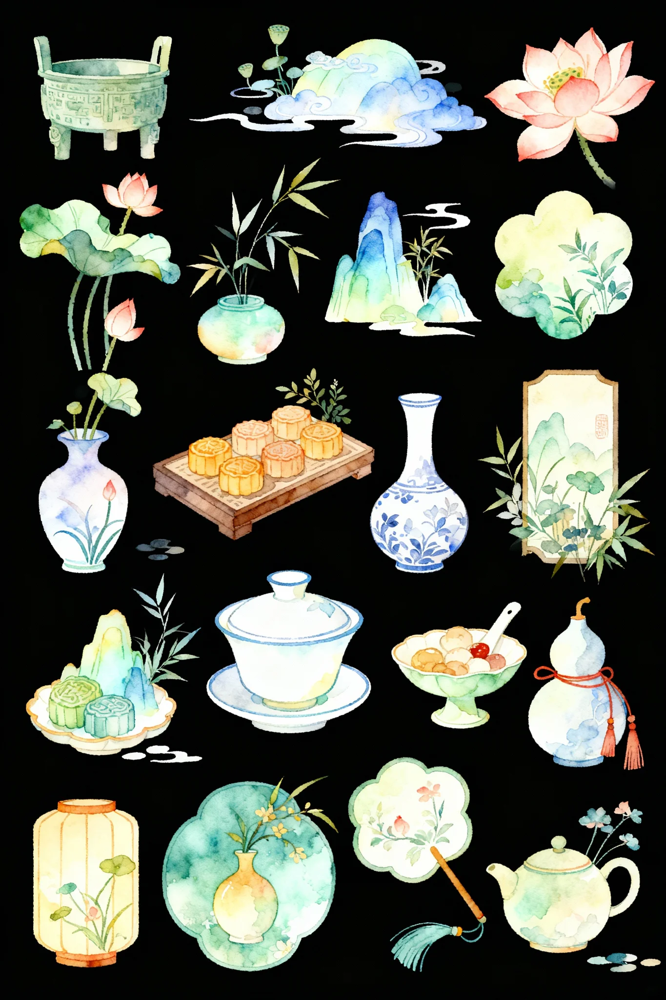

```
国风，清新艺术水彩板画，色彩柔和晕染，线条简洁灵动，手绘质感，文艺清新调性，温暖细腻，治愈系，色彩过渡自然通透，造型扁平化且富有辨识度，弱化光影，突出轻盈感，大面积留白，画面包含各式各样的中国元素，故事感强，传递共鸣情感。
```

 [↑返回目录](#toc)

```
国风，清新艺术水彩板画，色彩柔和晕染，线条简洁灵动，手绘质感，文艺清新调性，画面有故事感，温暖细腻，治愈系，契合文艺艺术的清新感，传递共鸣的情感，色彩过渡自然通透，造型扁平化且富有辨识度，弱化复杂光影，突出画面轻盈感，大面积留白，各式各样的中国元素
```

 [↑返回目录](#toc)

---
## <a id="jm-prompt-7575951368205143342">虚空中的未来雕塑</a> (<a href="https://jimeng.jianying.com/ai-tool/personal/MS4wLjABAAAADjBgXVa-Am3MbfzjoGA5fzTNLa45yXnmRoVrbcvIxgo" target="_blank" rel="noopener noreferrer">@Krystal</a>)

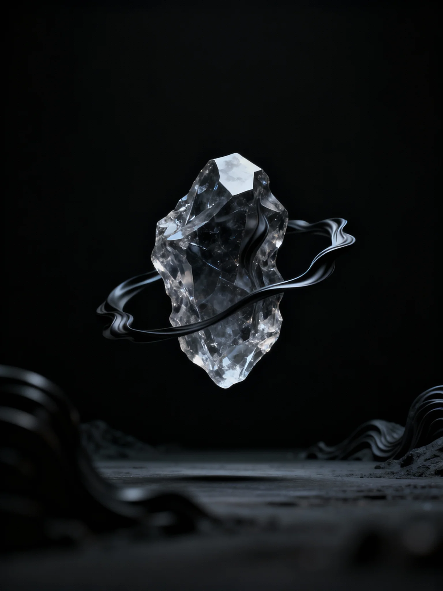

```
极简美学雕塑，暗黑风格，电影海报，概念设计，低饱和度和谐色调，纯黑色背景（#000000），均匀光照，不规则流线结晶造型，外面浮空环绕流线型装饰，微透视，精度提升，光感，对比度提升，极强对比，前景虚化镜头感，远景虚化，空间感，纵深感，虚实结合，抽象概括，细节提炼，虚无，未来，异世界，杰作，孤寂，虚空，视觉冲击。
```

 [↑返回目录](#toc)

```
极简美学雕塑，抽象概括，细节提炼，低饱和度且和谐，背景默认为纯黑色（#000000），均匀光照，不规则流线结晶，暗黑风格，不规则造型, 外面浮空环绕流线型装饰，微透视，精度提升，光感，对比度提升，虚无，概念设计，未来，异世界，杰作，孤寂，电影海报，虚空，，视觉冲击，极强对比，前景虚化镜头感，远景虚化，空间感，纵深感，虚实结合
```

 [↑返回目录](#toc)

---
## <a id="jm-prompt-7575130250288336179">哆啦A梦之无敌大喇叭的代价</a> (<a href="https://jimeng.jianying.com/ai-tool/personal/MS4wLjABAAAAKpC1oPi8wULECraXLUUdMDi5UtQv0apA2Pmtir-mvUGDGyhcWewTi19Ghx7Wj_WX" target="_blank" rel="noopener noreferrer">@焦虑奋斗的熊猫</a>)

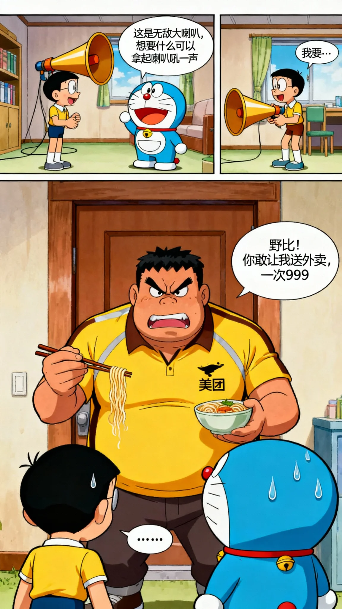

```
二次元漫画风格，彩色分格漫画，1:1比例，上半部分左格：野比和哆啦A梦在房间内愉快对话，背后有大喇叭，哆啦A梦旁对话框"这是无敌大喇叭，想要什么可以拿起喇叭吼一声"；上半部分右格：野比在房间内拿与左格相同的无敌大喇叭，对话框"我要…"；下半部分：野比和哆啦A梦背对镜头，哆啦A梦直冒冷汗，旁对话框"……"；中间：胖虎（肥男、肥头大耳）穿黄色紧身美团短袖外卖服，左手拿拉面，右手拿筷子，表情凶狠，对话框"野比！你敢让我送外卖，一次999"，背景为室内大门。
```

 [↑返回目录](#toc)

```
帮我生成图片：二次元漫画风格，彩色漫画，分格漫画，整个画面上半部分左边是野比和哆啦A梦愉快地对话，背后有个大喇叭，哆啦A梦旁边加个对话框：这是无敌大喇叭，想要什么可以拿起喇叭吼一声。背景是房间，画面上半部分右边是野比拿着无敌大喇叭(注意大喇叭要与左边相同)，对话框：我要…。背景是房间。画面下半部分是野比和哆啦A梦（哆啦A梦直冒冷汗）背对镜头，旁边有一个对话框：……。中间是胖虎（肥男、肥头大耳、左手拿拉面，右手拿筷子、上身黄色紧身美团短袖外卖服）外卖快递员，表情凶狠，对话框：野比！你敢让我送外卖，一次999。背景是室内的大门。比例 1:1。
```

 [↑返回目录](#toc)

---
## <a id="jm-prompt-7573557888132648202">粉色蜡笔小新卡通</a> (<a href="https://jimeng.jianying.com/ai-tool/personal/MS4wLjABAAAAZSKk3FkAXWHmnXN7faS9Z5_qHIx_Rafc1RFt6IOieS8iRp6dxvnE9iYZNfoDWci8" target="_blank" rel="noopener noreferrer">@鱼干</a>)

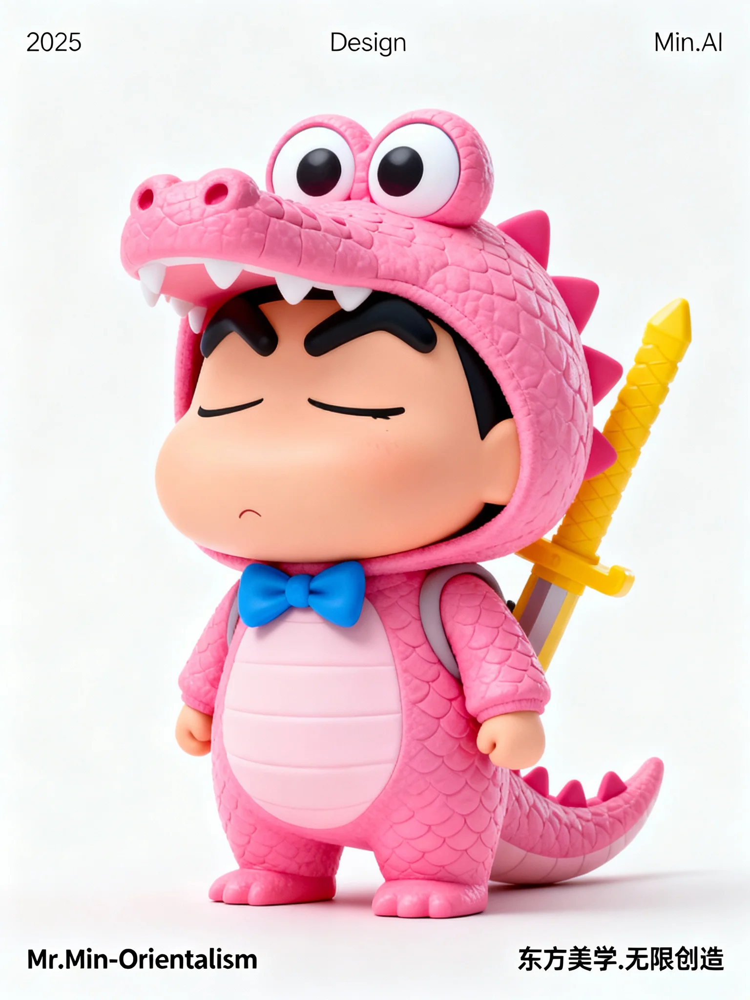

```
3D卡通写实风格，粉色主调，纯白色简洁背景，构图居中突出角色。蜡笔小新身着粉色鳄鱼连体服，头部有夸张卡通眼睛装饰，背黄色玩具剑，腹部系蓝色蝴蝶结，闭眼带傲娇感。细节刻画连体服纹理、玩具剑质感与角色神态，童趣活泼氛围，高清画质。画面上方极细无衬线字体"2025"、"Design "、"Min.AI"，左下角标注“Mr.Min-Orientalism”，右下角标注“东方美学.无限创造”。
```

 [↑返回目录](#toc)

```
创作一幅 3D 卡通风格作品，关键元素为蜡笔小新（身着粉色鳄鱼连体服，头部有夸张卡通眼睛装饰，背黄色玩具剑，腹部系蓝色蝴蝶结），神态为闭眼带傲娇感；场景是纯白色简洁背景，构图居中突出角色；色彩以粉色为主调，营造童趣活泼氛围；画面风格为 3D 卡通写实，细节刻画连体服纹理、玩具剑质感与角色神态，整体传递可爱且具辨识度的童趣形象，适合创作类似风格的蜡笔小新主题 3D 作品。高清。画面上方有极细无衬线字体"2025"、"Design "、"Min.AI"，左下角标注 “Mr.Min-Orientalism” 右下角标注 “东方美学.无限创造”。
```

 [↑返回目录](#toc)

---
## <a id="jm-prompt-7554273973081591049">可爱卡通3D社区服务图标集</a> (<a href="https://jimeng.jianying.com/ai-tool/personal/MS4wLjABAAAASODswlzrR0QYcT4L9ZilFKpTLrWneLOM3Q6C2FehavaNoJMBcWPuN0ywgO_3P5EO" target="_blank" rel="noopener noreferrer">@humansoka</a>)

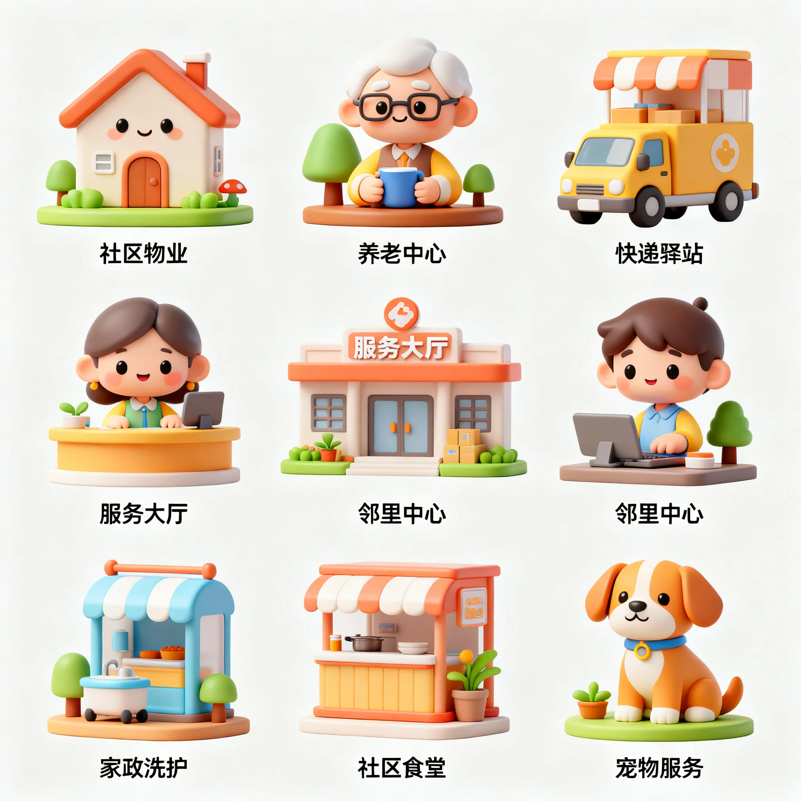

```
可爱卡通3D图标设计，依次为社区物业、养老中心、快递驿站、服务大厅、邻里中心、家政洗护、社区食堂、宠物服务图标，每个图标具有立体感，颜色统一。
```

 [↑返回目录](#toc)

```
icon图标设计，图标顺序依次是：社区物业，养老中心，快递驿站，服务大厅，邻里中心，家政洗护，社区食堂，宠物服务，可爱卡通，3D，立体感，颜色统一
```

 [↑返回目录](#toc)

---
## <a id="jm-prompt-7569071032556965166">怪诞老神仙</a> (<a href="https://jimeng.jianying.com/ai-tool/personal/MS4wLjABAAAAMNVidi6d4J_-_JA0IkinvrkIULU9qhnSGYLoO_mTOxJgMGcmHqIh9jfGdZkH5G4S" target="_blank" rel="noopener noreferrer">@恒海</a>)

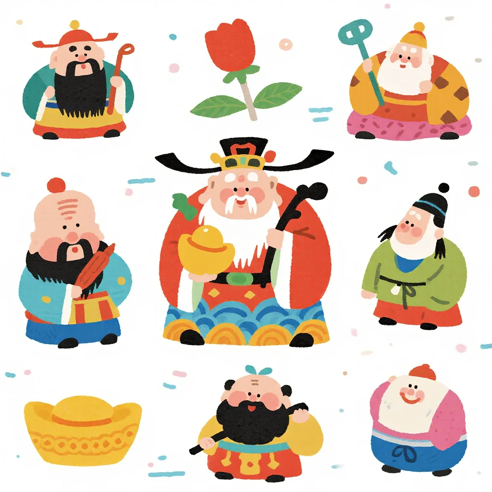

```
马蒂亚斯·阿道夫松（Mattias Adolfsson）风格的插画，白色简洁背景，运用彩铅与水彩混合媒介创作，色彩饱满，笔触细腻，怪诞美学，中国老神仙，
内容随机 平铺排列
```

 [↑返回目录](#toc)

---
## <a id="jm-prompt-7568080921140694323">新国风上海微缩景观</a> (<a href="https://jimeng.jianying.com/ai-tool/personal/MS4wLjABAAAAHlJrVU2jzM9WZAHaxd2ipbhuZpVRRPGNeAWkqG1HN5y3rEdP5QuTqffmVpcExz9G" target="_blank" rel="noopener noreferrer">@梅放清香</a>)


```
新国风城市微缩景观，透明绢本手卷泛生物荧光，立体呈现上海盛景。东方明珠、上海中心大厦、环球金融中心、金茂大厦、外滩百年建筑群、迪士尼奇幻童话城堡、陆家嘴CBD集群、上海大剧院渐次浮现，卷首篆刻"上海"与"CHINA"，画卷内小人穿梭活动。移轴视角，纯红色卷轴背景强化仪式感，无多余元素干扰。细节逼真，体积光氤氲，通过卷轴形态引导视线，展现中西合璧空间层次与摩登气质，8k高清史诗长卷。
```

 [↑返回目录](#toc)

```
4.创作一幅新国风城市微缩景观作品，铺陈的透明绢本手卷泛着生物荧光，立体展现上海盛景。东方明珠广播电视塔、上海中心大厦、环球金融中心、金茂大厦、外滩百年建筑群、上海迪士尼奇幻童话城堡、陆家嘴CBD集群、上海大剧院等渐次浮现。卷首篆刻“上海”与“CHINA”，画卷内小人穿梭活动，构图灵动。微缩景观结合移轴视角，卷轴背景为纯红色强化仪式感，突出卷轴画面主体，无多余繁杂元素干扰。细节逼真，体积光氤氲，整体构图通过卷轴形态引导视线，展现城市中西合璧的空间层次与摩登气质，呈现8k高清的史诗长卷。
```

 [↑返回目录](#toc)

---
## <a id="jm-prompt-7576146189536529714">夜色浪漫幻想</a> (<a href="https://jimeng.jianying.com/ai-tool/personal/MS4wLjABAAAAExWLChvo2s0_clL-jHtbod6-paC5jxEhOhuQzyJidgWR2eSNW5JxeDDU-hljBq6j" target="_blank" rel="noopener noreferrer">@小题</a>)

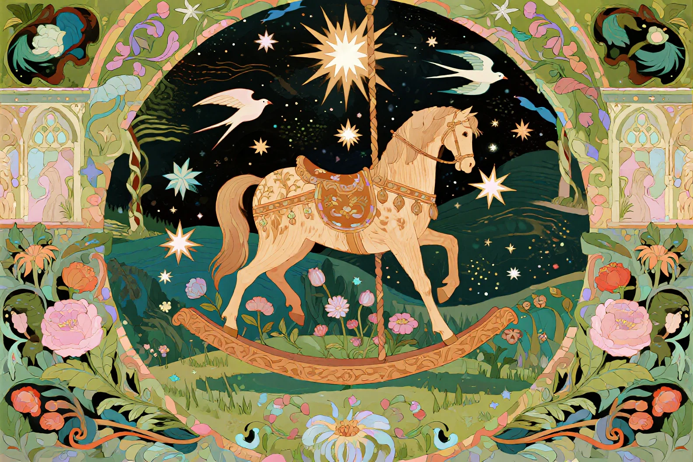

```
威廉·莫里斯，孟菲斯，洛可可，哥特，木马，奇花异草，浪漫主义，抽象，意识流，夜色，极繁，飞鸟，星星，莫奈色，艺术意境，
```

 [↑返回目录](#toc)

---
## <a id="jm-prompt-7574770156035902771">雨夜中的动画明星与现实交错</a> (<a href="https://jimeng.jianying.com/ai-tool/personal/MS4wLjABAAAAASwKLsZoOP8HAoPDnw-YiHTN_-u4po2UXdO7Hd0ldoLiUrx2qtK2jF8JaKq_Q_K9" target="_blank" rel="noopener noreferrer">@爆火特效</a>)

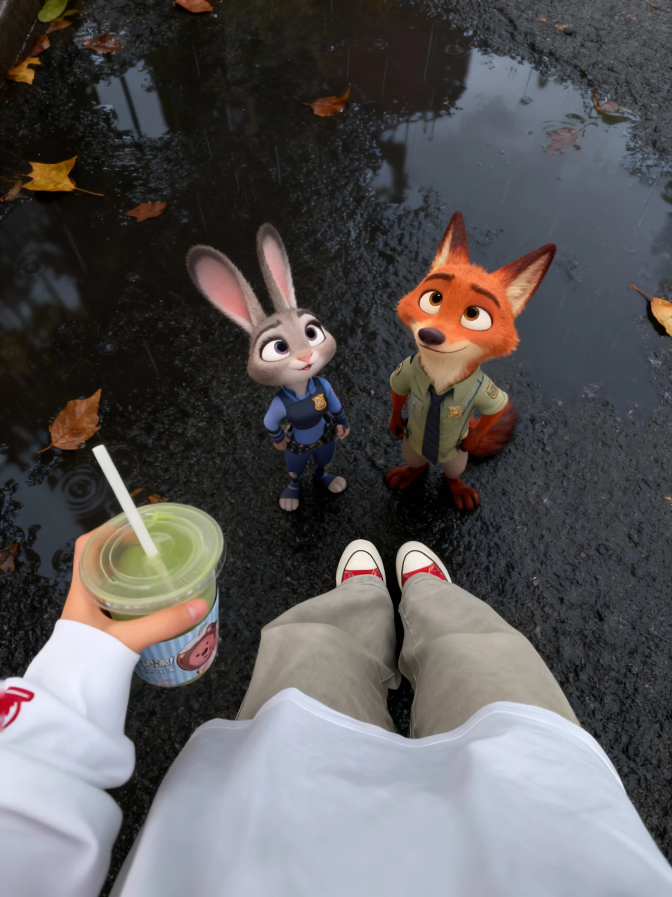

```
3D动画风格，超细节，质感真实，电影级光线，一只手拿着带卡通图案、插白色吸管的绿色饮品，穿着浅灰色长裤、红白配色帆布鞋、白色带红色标志长袖的人，站在雨天湿漉漉的黑色地面上，地面有积水、散落落叶，人物前方有《疯狂动物城》里穿警服的兔朱迪和狐尼克并排站立抬头看向人物
```

 [↑返回目录](#toc)

```
雨天，湿漉漉的黑色和地面上，有积水，散落着落叶。我的面前是《疯狂动物城》里的兔朱迪（穿着警服）和狐尼克，它们并排站在我面前抬头看着我，表情生动。画面温暖可爱，3D动画风格，超细节，质感真实，电影级光线。
```

 [↑返回目录](#toc)

---
## <a id="jm-prompt-7574319705473715494">Q版唐代青鬃马玩偶</a> (<a href="https://jimeng.jianying.com/ai-tool/personal/MS4wLjABAAAABbi_4vILkFIxOLqXFEf2GiZWIzbX0IZFanrSxw00S_b_6vOW2kWF9LrYkD-iDe26" target="_blank" rel="noopener noreferrer">@三川说漫</a>)

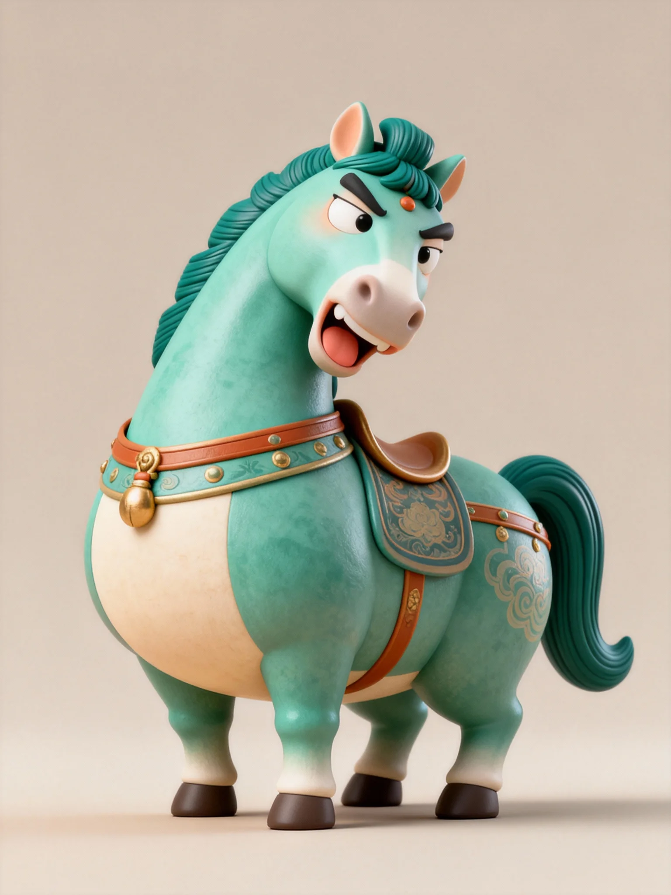

```
Q版IP玩偶设计，一匹歪脖子做鬼脸、肚子胖胖的青鬃马，唐代审美风格，C4D建模，blender渲染，细节刻画清晰，玩偶质感。
```

 [↑返回目录](#toc)

```
IP设计：一匹歪脖子做鬼脸、肚子胖胖的青鬃马，Q版，唐代审美，C4D建模，blender渲染，细节刻画，玩偶
```

 [↑返回目录](#toc)

---
## <a id="jm-prompt-7563668414716333350">Q版可爱IP玉米角色设计</a> (<a href="https://jimeng.jianying.com/ai-tool/personal/MS4wLjABAAAAuoFTWsx_9exBAcy53K-joQIcJVTOAb2yRK9cYBiaclAy2mn1cRMxNuEsEhEDVbGJ" target="_blank" rel="noopener noreferrer">@用户9700796218795</a>)

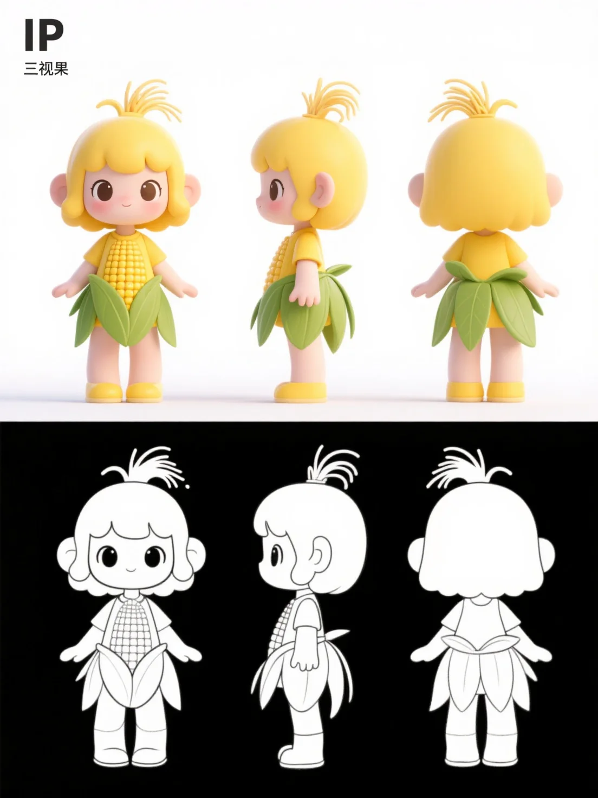

```
Q版可爱的IP玉米，黄色的衣物，玉米须的头发。玉米叶做的裙子，可爱的女孩子形象，上面一排展示IP效果三视角，即正面视角、侧面视角、背面视角。下面一排展示黑白单色线稿草图的三视角，即正面视角、侧面视角、背面视角。线条流畅，清晰，唯一性，一致性，统一性，纯白背景。
```

 [↑返回目录](#toc)

---
## <a id="jm-prompt-7572448714904603931">古风纱幔中的仰望者</a> (<a href="https://jimeng.jianying.com/ai-tool/personal/MS4wLjABAAAAF0qBOQFnRC2CO-hd-302dVV0s2tvkhnKTg7OOGeD8VM" target="_blank" rel="noopener noreferrer">@嗷呜啊</a>)

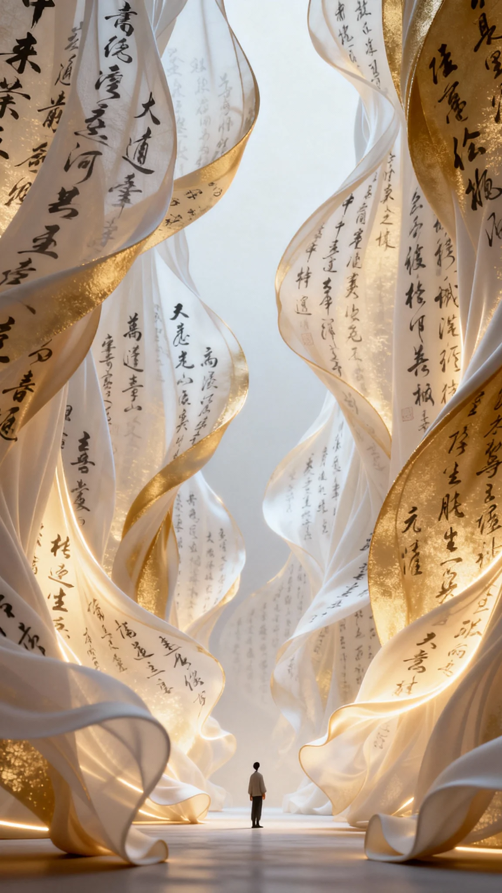

```
浪漫古风，新工笔，浅金色与白色渐变，生物学发光体，仰视视角，远景3D立体感。一个小小的人抬头站在众多巨大浅色纱幔中，纱幔上写满毛笔字，满屏书法字，巨大的纱幔飞舞飘逸，所有纱幔都在飘动，立体感强烈。神秘氛围，梦幻意境，浪漫感，宏大场面，震撼感，立体效果。
```

 [↑返回目录](#toc)

```
一个小小的人抬着头站在很多巨大浅色纱幔，纱幔上写满毛笔字，满屏书法字，神秘氛围，巨大的纱幔飞舞飘逸，所有的纱幔都在飘动，立体感，强烈的立体感，浅金色，白色，渐变，梦幻，意境。浪漫。飘逸，生物学发光体，仰视，浪漫古风。星汉灿烂，新工笔，宏大场面，震撼感，立体，远景3D立体感
```

 [↑返回目录](#toc)

---
## <a id="jm-prompt-7568368143316307226">天上人间的幻想画卷</a> (<a href="https://jimeng.jianying.com/ai-tool/personal/MS4wLjABAAAA2oHMRznX26SSgOdx7FOavQW0p1Li3OESaLNHYa-16Q0" target="_blank" rel="noopener noreferrer">@元研视觉设计-专注商业美学</a>)

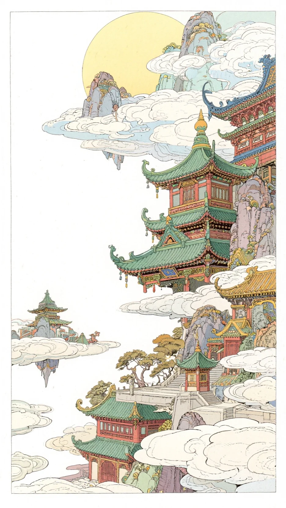

```
Moebius (Jean Giraud)风格，极繁主义。非对称构图。画一副中国古风天上人间，白色背景
```

 [↑返回目录](#toc)

---
## <a id="jm-prompt-7572795686463360266">抓着Q版长猫的涂鸦插画</a> (<a href="https://jimeng.jianying.com/ai-tool/personal/MS4wLjABAAAANJXsljcgtQef9T_W8VmVnF8WElZC4C7AQczHN_hXGDt8UmqFPpkELWUmJU-W76dO" target="_blank" rel="noopener noreferrer">@明心</a>)

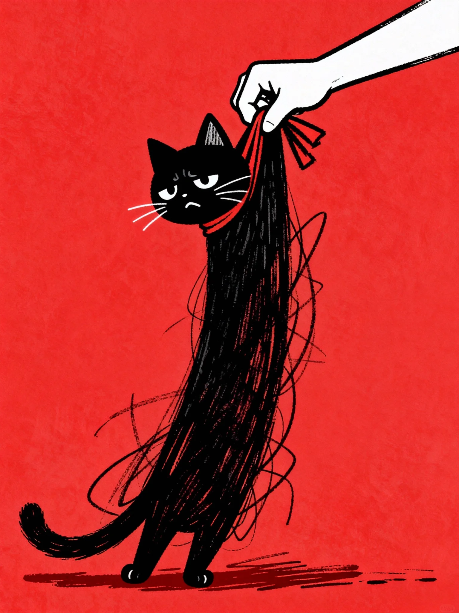

```
涂鸦插画风格，极简线条，版画质感，红色背景。一只极长的Q版黑猫被手抓着后脖子提起，猫身长度占据画面左侧，夸张的长身体，表情无奈苦闷。粗犷杂乱的艺术线条，诙谐氛围，粗略笔触，艺术图形插画。
```

 [↑返回目录](#toc)

```
一只极长的黑猫被一只手抓着后脖子提起来，猫的表情无奈苦闷，猫身长度占据整个画面的左侧，夸张的长长的身体。涂鸦，粗略，极简，杂乱的艺术线条。Q版，诙谐，插画，线条粗犷艺术图形插画，版画，红色背景
```

 [↑返回目录](#toc)

---
## <a id="jm-prompt-7570645843154455854">潮流卡通IP展板设计-FuMa</a> (<a href="https://jimeng.jianying.com/ai-tool/personal/MS4wLjABAAAAStwRrWNP3X7Hi7-p9OOZG2sBSZNg9F0chTvYikqy_zU" target="_blank" rel="noopener noreferrer">@橘月八</a>)


```
卡通矢量风格潮流插画的IP展板设计，上部分展示红色小马拟人化IP形象"Fuma"，大眼睛，全身展示，微笑，高清，棕鬃毛，小马骑着锦鲤，周围有云朵、红包、灯笼、金币等新春元素，标注"IP DESIGN""马年IP形象设计FuMa"文字信息；中间部分为小马的三视图，包含正面视图、侧面视图和背面视图，高清展示不同角度外观细节；下部分展示小马6个不同且有趣的表情包，扁平插画风格。
```

 [↑返回目录](#toc)

```
IP展板：这张图片的上部分：是红色小马拟人化IP形象（Fuma）的整体形象展示，大眼睛，全身展示，微笑，高清，棕鬃毛，呈现了小马骑着锦鲤，旁边有些云朵，红包，灯笼，金币等新春元素，完整卡通形象，同时标注了“IP DESIGN”“马年IP形象设计 FuMa”的文字信息；中间部分是：小马的三视图，包含正面视图、侧面视图和背面视图，高清展示了该IP形象不同角度的外观细节，下部分展示了小马6个不同切有趣的表情包，扁平插画，卡通矢量风格，潮流插画。
```

 [↑返回目录](#toc)

---
## <a id="jm-prompt-7577009429111967027">梦幻森林的布偶猫</a> (<a href="https://jimeng.jianying.com/ai-tool/personal/MS4wLjABAAAAh6vR8vTPraPbRUGSMK3SCaUsb3fgXjYPyw-PDww-Cik" target="_blank" rel="noopener noreferrer">@陈澄🍊</a>)

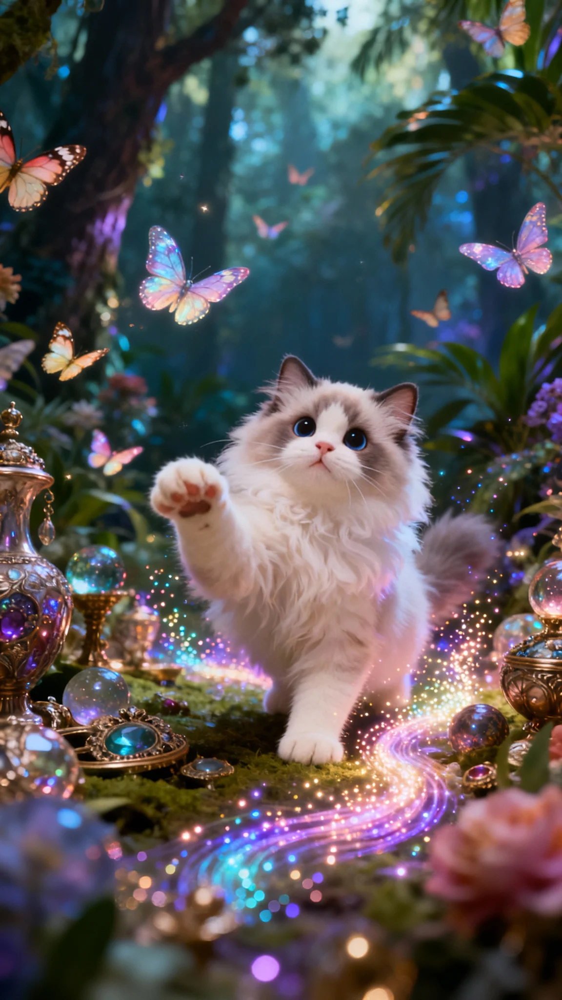

```
电影质感，粒子光效，唯美浪漫，高清。落地生花，流光溢彩，梦幻森林中布满奇珍异宝和参天植物，各种梦幻蝴蝶挥动翅膀来回飞舞。一只可爱Q版布偶猫伸着爪子，毛发蓬松柔软，眼睛圆亮。粒子效果在空气中流动，光影交错，色彩斑斓，浪漫氛围。
```

 [↑返回目录](#toc)

```
落地生花，流光溢彩，梦幻森林，各种奇珍异宝，各种参天植物，各种梦幻蝴蝶挥动着翅膀，来回飞舞，无限想象，无限发挥，一只可爱Q版的布偶猫伸着爪子，电影质感，粒子，唯美，浪漫，流光溢彩，高清
```

 [↑返回目录](#toc)

---
## <a id="jm-prompt-7576444664497114378">暗黑仙侠梦魇</a> (<a href="https://jimeng.jianying.com/ai-tool/personal/MS4wLjABAAAAataaBFdYquVGGW55fsqjPkQ37ErxEypv73Mk0FrDODk9KEqvR7BdPvgVCtHm7vLT" target="_blank" rel="noopener noreferrer">@教你护肤</a>)

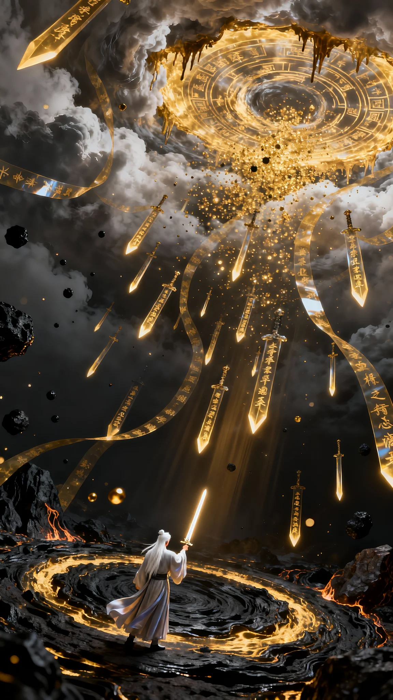

```
超现实玄幻仙侠风格，酸性美学，暗黑风格，低饱和度，低亮度，昏暗，梦幻，史诗，压迫感，能见度极低，大量阴影和留白，极具视觉冲击的压迫感的构图，巨物恐惧，故事感，高级感，动态感，高清。低角度对角倾斜仰视过肩镜头，画面底部角落一名全身丝绸白衣的白色长发男修士背对镜举发光仙剑剑指阵法，地面幻化一道道巨大且虚幻的黑金岩浆光环，四处飘动各种黑金粒子和无数条印有经文的金色透明光带，黑金能量束穿透黑暗能量层，曜变釉面反射多重曝光光斑。混沌交织的虚空中云雾笼罩且金光闪耀，金色粒子汇聚成金色半透明的法阵漩涡，漩涡四周边界融化于云层中，数以万计的外形似剑的金光和金色经文极速下落。CG渲染，全身，巨大比例，C4D，Blender，虚幻引擎，Octane渲染器，全局光照，光线追踪反射，屏幕空间环境光遮蔽，着色器，快速近似抗锯齿，计算机生成图像，RTX，视觉特效，4K分辨率，最佳画质，极致细节，超写实。
```

 [↑返回目录](#toc)

```
超现实玄幻仙侠，酸性美学，低角度对角倾斜仰视过肩镜头，画面底部角落一名全身丝绸白衣的白色长发男修士背对镜举发光仙剑剑指阵法，地面幻化一道道巨大且虚幻的黑金岩浆光环，四处飘动各种黑金粒子和无数条印有经文的金色透明光带，黑金能量束穿透黑暗能量层，曜变釉面反射多重曝光光斑。混沌交织的虚空中云雾笼罩且金光闪耀，金色粒子汇聚成金色半透明的法阵漩涡，漩涡四周边界融化于云层中，数以万计的外形似剑的金光和金色经文极速下落，CG渲染，全身，巨大比例，C4D，Blender，虚幻引擎，Octane渲染器，全局光照，光线追踪反射，屏幕空间环境光遮蔽，着色器，快速近似抗锯齿，计算机生成图像，RTX，视觉特效，4K 分辨率，最佳画质，极致细节，超写实，暗黑风格，昏暗，梦幻，史诗，压迫感，能见度极低，大量阴影和留白，极具视觉冲击的压迫感的构图，低饱和度，低亮度，巨物恐惧，故事感，高级感，动态感，高清
```

 [↑返回目录](#toc)

---
## <a id="jm-prompt-7573534697859403054">Y3K潮玩虚拟偶像</a> (<a href="https://jimeng.jianying.com/ai-tool/personal/MS4wLjABAAAAFsP0qdhicy9xpCvbhTF14l_XXCkUwZRDysv-8QqR9zhfB6tMriGOkvQzN9wxysEk" target="_blank" rel="noopener noreferrer">@是樊梵啊</a>)


```
3D虚拟偶像风格，Y3K与潮玩设计风，短绿发亚洲女性，鼻尖和脸颊周围有浅浅的雀斑，自信又俏皮的嘻哈表情。佩戴未来感银色大眼镜，头戴潮流紫色毛呢材质帽子，帽子上别着小花徽章、骷髅头涂鸦徽章、Nike安全别针等嘻哈元素。蓝色渐变色背景，干净简洁画风，角色光影细腻，次世代渲染质感，居中构图，色彩靓丽、对比度高，OC渲染，质感强。
```

 [↑返回目录](#toc)

```
3D虚拟偶像风格，一个3D风格的虚拟潮流女孩肖像，角色拥有短绿发、鼻尖和脸颊周围有浅浅的雀斑，表情带着自信又俏皮的嘻哈态度。她佩戴未来感银色大眼镜，头戴一顶潮流紫色毛呢材质的帽子，帽子上别着多个潮流徽章，包括一枚小花徽章、一个骷髅头涂鸦徽章、以及一个Nike安全别针等嘻哈元素。背景为蓝色渐变色，画风干净简洁，角色光影细腻，呈现次世代渲染质感。整体视觉融合Y3K与潮玩设计风，偏态度感、虚拟偶像风格，居中构图，色彩靓丽、对比度高，OC渲染，质感强。
```

 [↑返回目录](#toc)

---
## <a id="jm-prompt-7570652004675079462">摄影棚中的3D企鹅绅士</a> (<a href="https://jimeng.jianying.com/ai-tool/personal/MS4wLjABAAAA04wlDMdpa8Tuso-CLI7b0MaOFeVhDR-isYwxfPZ3sYwtqfHmYfE7Fwq2PFca-qFo" target="_blank" rel="noopener noreferrer">@Lens Zero</a>)

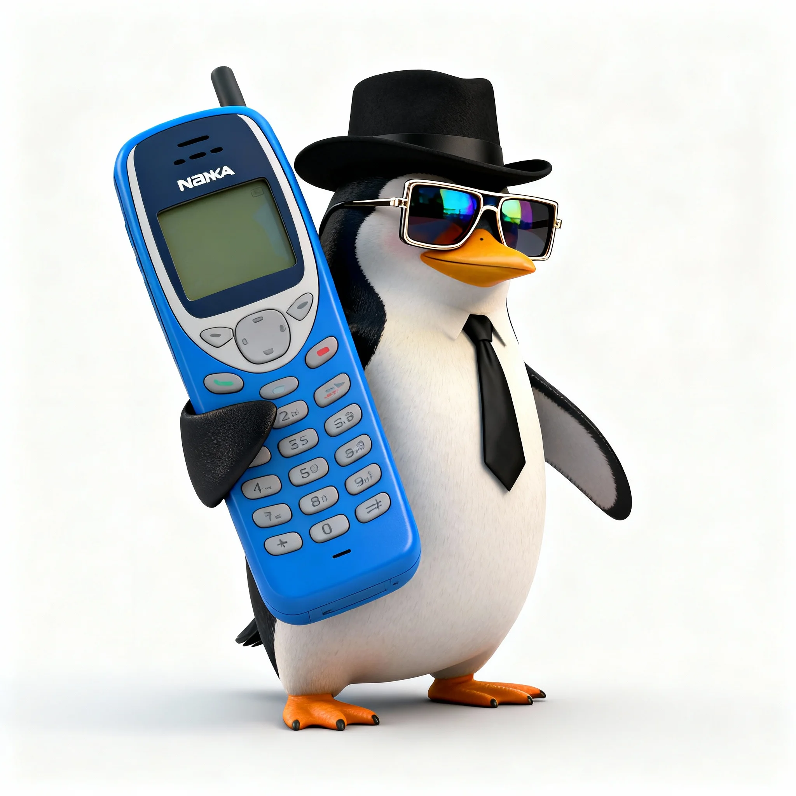

```
摄影风格，低质量3D建模，四分之三侧视角，戴老式方框墨镜的企鹅，镜片有反光，戴着黑色礼帽和黑色领带，扛着巨大的蓝色诺基亚手机，影棚光，纯白背景，幽默感。
```

 [↑返回目录](#toc)

```
摄影风格，低质量3d建模，四分之三侧，戴老式方框墨镜的企鹅，镜片反光，戴着黑色礼帽，黑色领带，扛着巨大的蓝色诺基亚手机，影棚光，纯白背景，幽默感
```

 [↑返回目录](#toc)

---
## <a id="jm-prompt-7559446518885780782">阳光魅惑的时尚男性</a> (<a href="https://jimeng.jianying.com/ai-tool/personal/MS4wLjABAAAAA5Eg4BEqFrl9-KDN3PLyjhoNCsO8Y7Y9CfXda16NgMcI__swHmbSNVcNWfPtDsIj" target="_blank" rel="noopener noreferrer">@小艺同学</a>)

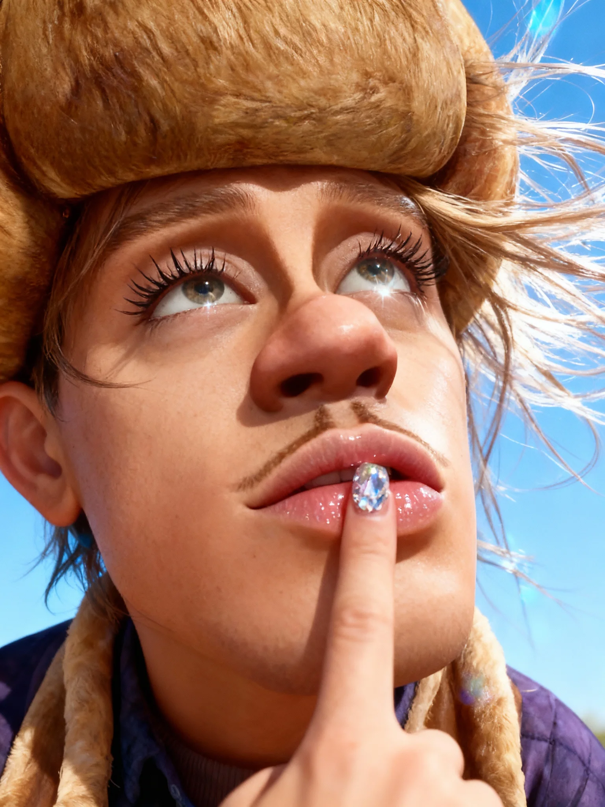

```
细腻皮肤真实质感风格，一个戴棕色大皮帽的男性，身穿紫色带浅棕色毛领上衣、紫色裤子、棕色鞋子，姿态为用食指放在嘴角且微微抬头，背景是清醒系阳光场景，呈现散乱头发随风飘动效果，人物眼神闪闪发光，有欧美辣妹大睫毛、性感透亮厚嘴唇且带着阳光魅惑情绪，着重勾勒面部细节且高光处理讲究，画质带有摄影机极蓝噪点且呈现蓝色通透效果，手指甲有超美水晶钻美甲且闪闪发光，画面比例为9:16。
```

 [↑返回目录](#toc)

```
采用细腻皮肤真实质感的风格，画面中展现了一个不改变原图形象的的脸部特写，通过略微仰视的镜头角度进行呈现。人物微微抬头井且人物不要占太多画面。背景营造出清醒系且阳光的场景氛围，有着散乱的头发随风飘动的感觉，发型不变，发丝随风飘动，不改变原片发色。他的眼神闪闪发光，拥有欧美辣妹大睫毛，性感透亮的厚嘴唇，其中带着阳光和魅惑的情绪，尽显魅惑高冷的气质。画面着重句勒了面部细节，高先处理十分讲究，同时画面虽现出带有摄影机极蓝噪点的画质，并且有着蓝 色通透效果。不要改变人脸。加上用食指放在嘴角，手指甲做了超美的水晶钻美甲，闪闪发光比例9:16
```

 [↑返回目录](#toc)

---
## <a id="jm-prompt-7568838637417237810">硅基生命体：机械蚂蚱</a> (<a href="https://jimeng.jianying.com/ai-tool/personal/MS4wLjABAAAA-db5d3SryvdcEZzCro1xPmlMt2hcgc-oNvV-wHqnlkM7ZJngdFvhH-JGWxb8H-U5" target="_blank" rel="noopener noreferrer">@千个理由</a>)

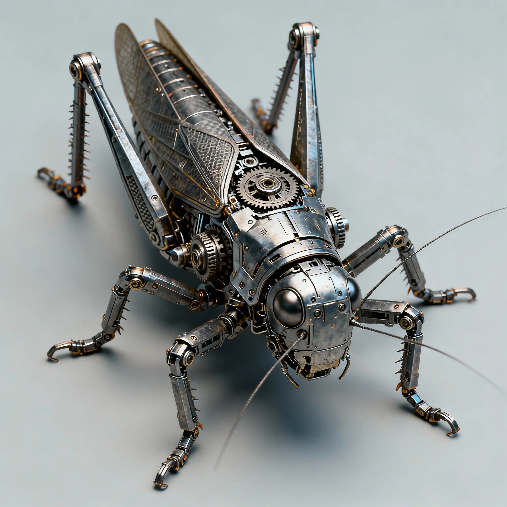

```
科幻机械美学，虚幻引擎渲染，超高清细节，杰作级品质。一只硅基生命机械拟态蚂蚱，装甲厚重繁杂，结构精巧，主体正对画面，俯视角拍摄。金属质感，冷色调，复杂机械纹理，精密齿轮与关节结构，科幻氛围。
```

 [↑返回目录](#toc)

```
机械拟态蚂蚱，硅基生命，结构精巧，装甲厚重繁杂，主体正对画面，虚幻引擎，超高清，杰作，俯视角
```

 [↑返回目录](#toc)

---
## <a id="jm-prompt-7557741772399545610">中国街头百态</a> (<a href="https://jimeng.jianying.com/ai-tool/personal/MS4wLjABAAAAp2b9laVA0BNjUa8kywliWinztjiL2bYinFgi-2mSZaCShoiEipA4bLxMEwX1bjdh" target="_blank" rel="noopener noreferrer">@智禅居士</a>)

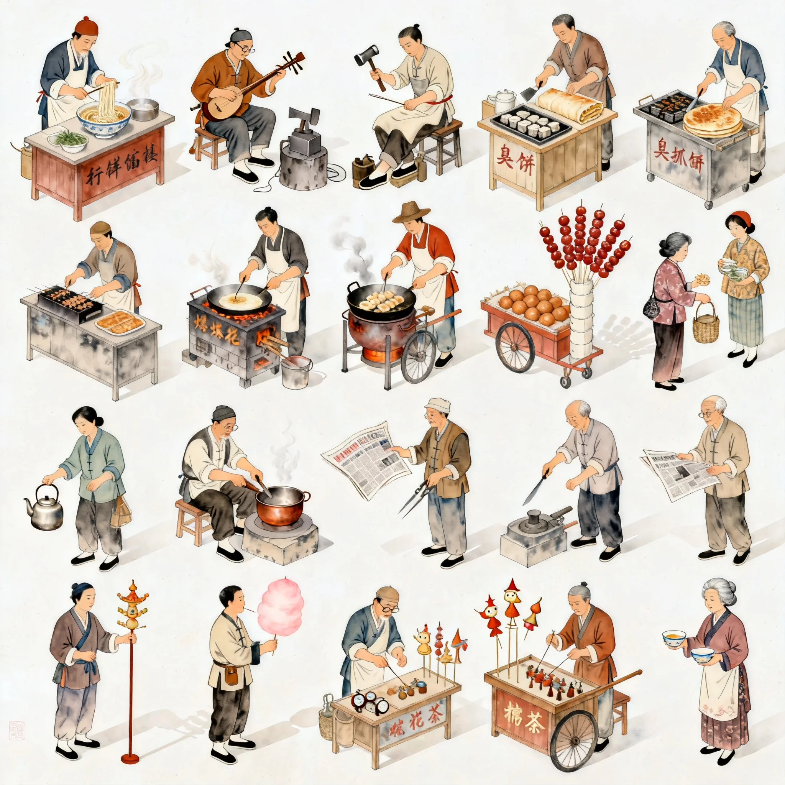

```
手绘工笔风格，等轴测视角，30度视角，平行投影无透视，白色背景，无光影，背景干净，可分割。画面中20种中国各式街头行人：面摊摊主煮面、街头艺人拉二胡、打铁匠抡锤、修皮鞋匠补鞋、煎饼果子摊主摊面糊、臭豆腐小贩炸豆腐、手抓饼摊主卷饼、烤红薯师傅翻烤炉、糖葫芦小贩串山楂、爆米花师傅摇炉、磨刀师傅磨剪子、卖豆浆阿姨提壶、卖报纸老伯递报、擦鞋匠擦皮鞋、补锅匠敲锅、修表匠调表、捏面人师傅捏塑、吹糖人师傅吹制、卖棉花糖摊主转杆、卖凉茶阿婆递碗。柔和色调，传统中式设计，线条干净，细节精致，艺术化插图，高清4K分辨率。
```

 [↑返回目录](#toc)

```
绘制等轴测视角的中国各式街头行人，手绘风格，30度视角展现，例如面摊，街头艺人，打铁匠，修皮鞋，煎饼果子，臭豆腐小贩，手抓饼摊主，烤红薯师傅，糖葫芦小贩​，爆米花师傅，磨刀师傅​等 20 种，手绘工笔风格，柔和色调，平行投影无透视，线条干净，艺术化插图，白色背景，无光影，背景干净，可分割，传统中式设计，细节精致，高清4K分辨率
```

 [↑返回目录](#toc)

---
## <a id="jm-prompt-7575571259208027418">疯狂动物城之森林巡逻</a> (<a href="https://jimeng.jianying.com/ai-tool/personal/MS4wLjABAAAAnjglHgdpQH5jrrwFPNz9L9Kwr3yBBnvw3AfFV6nN52i4_ZKq0I-MIAX1yOCjbSpQ" target="_blank" rel="noopener noreferrer">@M瑾</a>)

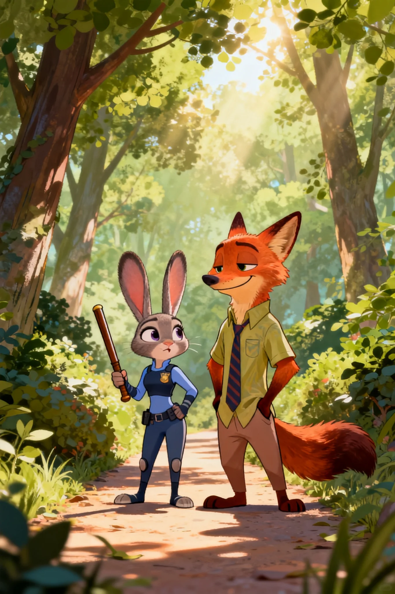

```
参考疯狂动物城人物，宫格漫画风格生成：森林小径场景，阳光透过树叶洒在地面，兔子朱迪手持警棍警惕张望，耳朵竖起；狐狸尼克双手插兜，嘴角带笑，尾巴轻摆，背景是茂密树木与灌木丛，画面比例为3:4。
```

 [↑返回目录](#toc)

```
宫格漫画。帮我根据疯狂动物城人物角色，生成10张漫画，故事是狐狸尼克和兔子朱迪遇到蛇的冒险故事
```

 [↑返回目录](#toc)

---
## <a id="jm-prompt-7567811451491044635">东方诗意眼妆</a> (<a href="https://jimeng.jianying.com/ai-tool/personal/MS4wLjABAAAAmmSiJzWXJr-HYJHWoZh1O8JxkTKeWyN96y5UV3uHMHMyFprh3aHF8mOzukkOY9lH" target="_blank" rel="noopener noreferrer">@用户4028001148113</a>)

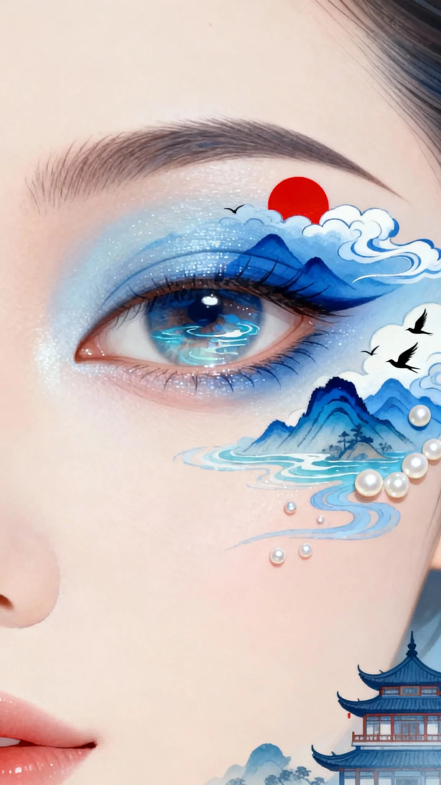

```
东方诗意美妆插画，眼部妆容以蓝色为主色调，描绘远山、流云形态，红色小太阳与飞鸟点缀，眼眸含山水澄澈波光，周围饰珍珠亮片，背景有中式建筑。清新灵动氛围，诗意美感，自然山水浓缩于眉眼间的精巧雅致。
```

 [↑返回目录](#toc)

```
这幅画营造出清新、灵动且充满东方诗意的氛围，仿佛展现了将山水意境融于眼部的创意美妆。画面中，眼部妆容以蓝色为主色调，描绘出远山、流云的形态，还有红色的小太阳与飞鸟点缀，眼眸如同蕴含着山水间的澄澈波光，周围还饰有珍珠般的亮片，整体传递出“东方诗意的眼部美妆，以绿调绘远山流云，点缀红阳、飞鸟  中式建筑，眼眸似含山水波光，配珍珠亮片，充满清新灵动的诗意美感的意境，仿佛能让人感受到那份把自然山水浓缩于眉眼间的精巧与雅致。
```

 [↑返回目录](#toc)

---
## <a id="jm-prompt-7576309599196712230">未来数据流</a> (<a href="https://jimeng.jianying.com/ai-tool/personal/MS4wLjABAAAAoLLdtP74-0yS7Hy-nFnmRfUxXocWMkYsIb7u4wkAllI" target="_blank" rel="noopener noreferrer">@我是疯子</a>)


```
白橙科技感信息可视化，3D立体风格，未来感UI界面漂浮融合在科技感波浪曲面上，几条特别宽的信息带叠在一起，多个非常宽的波浪曲面重叠，起伏流动的透明玻璃质感信息带从左上角往右下角飘动，光滑立体，玻璃质感，柔和光泽。信息带上集成"微信小程序""域名注册""企业邮箱"APP图标，沿波浪曲面自然分布，立体漂浮，带有悬浮球形高光元素。背景浅蓝至白色渐变色调，带有光线波纹、流动粒子和渐变光效，未来感、科技感、数字金融氛围，4K高清晰度。
```

 [↑返回目录](#toc)

```
白橙科技感信息可视化，未来感UI界面漂浮融合在科技感波浪曲面上，几条信息带特别宽叠在一起，多个非常宽的波浪曲面重叠，起伏流动的透明玻璃质感宽度铺满的信息带从左上角往右下角飘动，光滑立体，玻璃质感，柔和光泽，信息带上集成了各类APP图标，有微信小程序、域名注册、企业邮箱，具有3D立体风格，沿波浪曲面自然分布，立体漂浮。带有悬浮球形高光元素，整体画面具有未来感、科技感和数字金融氛围，背景浅蓝至白色渐变色调和背景明亮的色彩，背景带有光线波纹、流动粒子和渐变光效，营造出数字化、未来感，适用于智能生活、数据流、信息可视化等主题，3D，4K，高清晰度
```

 [↑返回目录](#toc)

---
## <a id="jm-prompt-7547326300432649515">Labubu在金黄羽毛中的梦幻凝视</a> (<a href="https://jimeng.jianying.com/ai-tool/personal/MS4wLjABAAAAJolkjZR6Kdpnb1iGgFUYSKh8NQpWkVO7XymPTHYjpfbVccM7iUUiHnpBooVAiZW_" target="_blank" rel="noopener noreferrer">@熊猫爱绘画</a>)

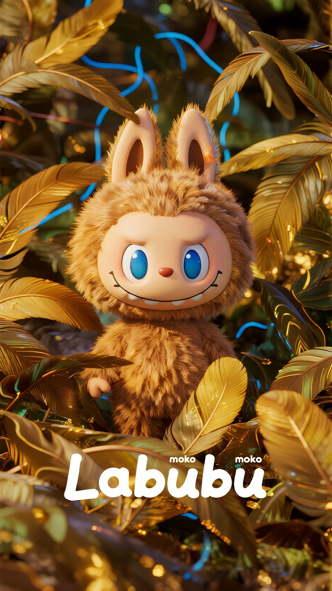

```
3D动画风格，拉布布是毛绒身体+搪胶脸部材质组成的卡通娃娃，Labubu，泡泡玛特角色mokoko，卡通风格，拟人化角色，深棕色毛茸茸的毛发四肢也是棕色的，大眼睛，9颗尖牙齿，淡淡粉腮红，拉布布置身于深浅不一的金黄色羽毛中，只露出脑袋，大大的蓝色眼睛，羽毛密集地分布在整个画面，营造出一种被羽毛环绕的氛围。采用绒毛材质风格，插画，朦胧感加重，景深加重，聚焦，高饱和度，毛茸茸的纹理。繁复的装饰风格，流动的线条，充满华丽与感性，金箔发出闪烁的光芒，抽象线条与曲面线条，柔美色块构成，灵魂画手，透明，意识流，水墨意境，烟雾质感，梦幻禅意，超现实主义，克莱因蓝线勾勒，大师杰作海报，具有无穷丰富的表现力，神秘而炽热的世界，高品质细节，超高清分辨率，最佳品质，8K壁纸，彩色背景
```

 [↑返回目录](#toc)

---
## <a id="jm-prompt-7569947586053049627">水墨光影舞者</a> (<a href="https://jimeng.jianying.com/ai-tool/personal/MS4wLjABAAAAoosscSj7uyMEuzwxps3-mk86FvJd3gq5wcaGIXJIJ2c" target="_blank" rel="noopener noreferrer">@丁宁</a>)

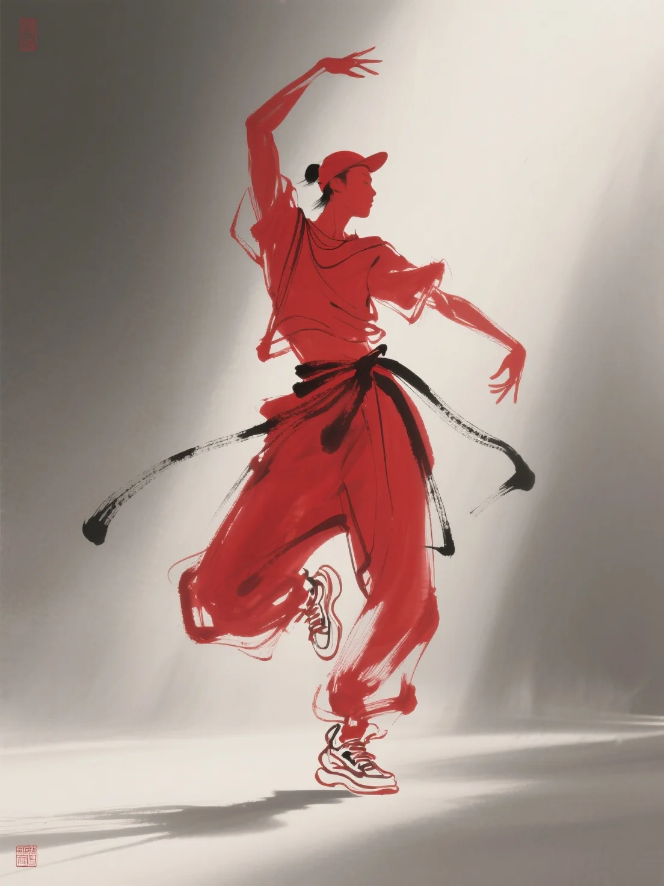

```
水墨朱砂，极简化，细线条笔刷感，细腻，细腻的细节，恰到好处的光影处理，夸张笔法，现代曳步广场舞者中国美学，大面积留白，无其他元素
```

 [↑返回目录](#toc)

---
## <a id="jm-prompt-7574362689707806002">Q版小牛上学表情包贴纸</a> (<a href="https://jimeng.jianying.com/ai-tool/personal/MS4wLjABAAAArVLwdfJXVdRQDlH0HkwhykBhK8tc9BRrSHKfadmpwdgBk9qUoBqAtpS1qhibm3ph" target="_blank" rel="noopener noreferrer">@小风筝1225</a>)

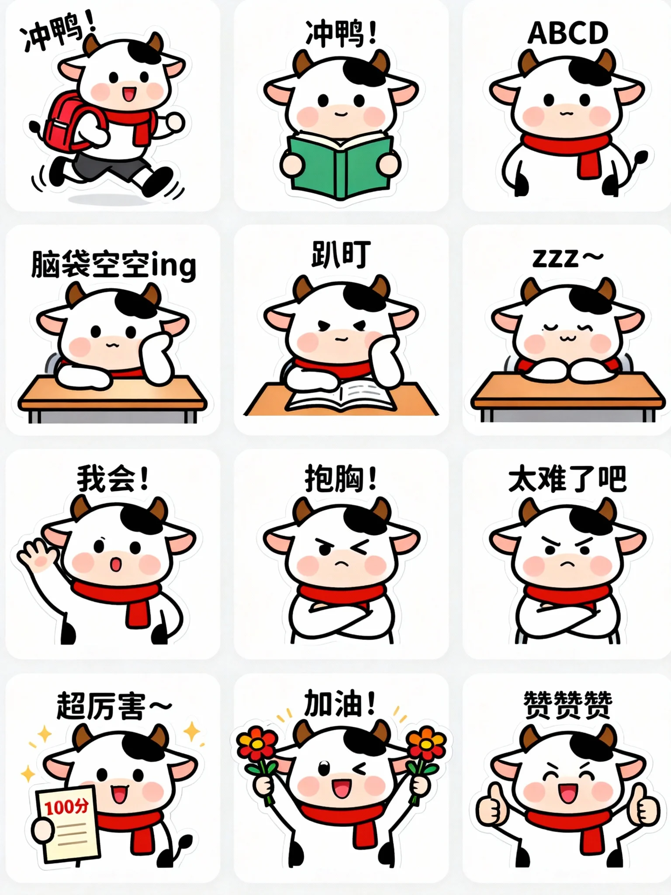

```
Q版贴纸，简笔画，扁平插画，卡通矢量风格，9宫格布局，可爱小牛拟人化形象，戴红色围巾，全身显示，白背景，高清。背书包蹦跳上学，配"冲鸭！"；举课本认真早读，配"ABCD"；托腮听课时发呆，配"脑袋空空ing"；趴桌打盹，配"zzz～"；挥爪抢答问题，配"我会！"；抱胸皱眉，配"太难了吧"；拿100分试卷挺胸欢呼，配"超厉害～"；双手举花加油，配"加油！"；点赞，配"赞赞赞"。学生上学主题，有趣夸张表情包。
```

 [↑返回目录](#toc)

```
Q 版贴纸，可爱的小牛戴着红色围巾拟人化形象，9 宫格有趣夸张表情包，背书包蹦跳上学（配 冲鸭！”）、举课本认真早读（配 “ABCD）、托腮听课时发呆（配 “脑袋空空 ing”）、趴桌打盹（配 “zzz～”）、挥爪抢答问题（配 “我会！”）、抱胸皱眉（配 “太难了吧”）、拿着 100 分试卷挺胸欢呼（配 “超厉害～”）、双手举着花加油（配 “加油！”）、点赞（配 “赞赞赞”），简笔画，扁平插画，学生上学主题，卡通矢量风格，全身显示，高清，白背景
```

 [↑返回目录](#toc)

---
## <a id="jm-prompt-7574043192673209627">梦幻蓝白颜料山峦</a> (<a href="https://jimeng.jianying.com/ai-tool/personal/MS4wLjABAAAAUR3PKuCR9h6ilPA9rFSjudV4T1ANXoynL7OGzwsHxLpIn5slpDX5UYwChyiieP2b" target="_blank" rel="noopener noreferrer">@Ann@Ann</a>)


```
梦幻治愈的油画质感融合唯美光斑的摄影风格，特写视角，聚焦抽象的蓝色、白色颜料纹理，带有细腻的闪光颗粒，仿佛蓝色颜料在画布上被涂抹成起伏的山峦，流动式构图充满动感。大量光斑（bokeh效果），细腻的颜料笔触纹理，银色高光点缀，朦胧且治愈的氛围，小红书风格的清新梦幻感。
```

 [↑返回目录](#toc)

```
主体内容：抽象的颜料纹理，带有细腻的闪光颗粒；
场景设定：仿佛是蓝色颜料在画布上被涂抹，营造出梦幻的艺术创作场景，有点像起伏的山峦；
风格参考：梦幻治愈的油画质感，融合唯美光斑的摄影风格；
色彩色调：以蓝色、白色为主的清新柔和色调，点缀闪烁的银色高光；
构图视角：采用特写视角，聚焦颜料的纹理与闪光细节，呈现出充满动感的流动式构图；
附加细节：大量的光斑（bokeh效果），细腻的颜料笔触纹理，整体画面呈现出朦胧且治愈的氛围，带有小红书风格的清新梦幻感。
```

 [↑返回目录](#toc)

---
## <a id="jm-prompt-7573149167887944970">夕阳下的浪漫邂逅</a> (<a href="https://jimeng.jianying.com/ai-tool/personal/MS4wLjABAAAASikeyWtxgwWLY_oe9oDhOHqjz0MCG9fdFcI9-PzZumrTRgI07eJ4X1Yu_WS9LIaj" target="_blank" rel="noopener noreferrer">@喜欢跳舞的两个人</a>)

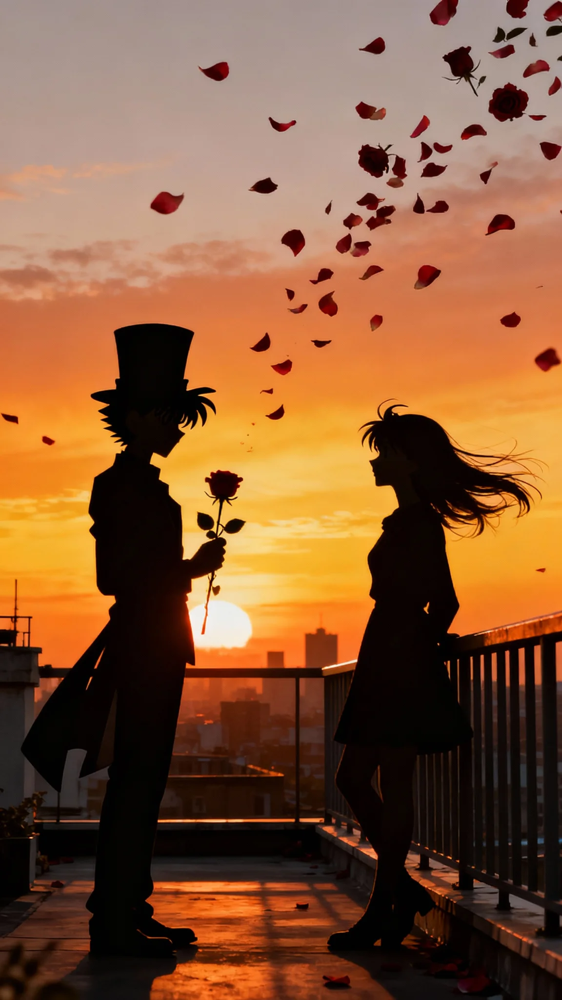

```
浪漫剪影摄影风格，中景构图，强烈暖调逆光（夕阳橙黄光线塑造人物黑色剪影与天空渐变色彩），高品质，黑色剪影风格，高清画质。怪盗基德手持玫瑰花面向右侧，女生背靠右侧天台栏杆面向左侧，静止站立，风从左向右吹动女生头发，天空飘落漫天玫瑰花瓣（花瓣飘落轨迹清晰）。黄昏/日落时分的城市天台/露台，背景为橙黄色渐变天空与城市建筑轮廓，营造唯美浪漫氛围，传递夕阳下的爱情温情。
```

 [↑返回目录](#toc)

```
浪漫剪影摄影风格，中景构图，强烈的暖调逆光（夕阳的橙黄光线塑造出人物的黑色剪影与天空的渐变色彩），营造出唯美浪漫的氛围。怪盗基德手里拿着一只玫瑰花面向右边，女生背靠右边的天台栏杆，面向左边，不走动，同时刮起了风从左向右吹动了女生的头发，随风飞扬，天空空飘落着漫天的玫瑰花瓣。黄昏/日落时分的城市天台/露台，背景是橙黄色渐变的天空与城市建筑轮廓，高品质，黑色剪影风格。花瓣的飘落轨迹都清晰，高清画质，传递出浪漫剪影的唯美与夕阳下的爱情温情
```

 [↑返回目录](#toc)

---
## <a id="jm-prompt-7571828505701338395">毛毡森林中的猫咪</a> (<a href="https://jimeng.jianying.com/ai-tool/personal/MS4wLjABAAAAfB3dbFT6IDKtfv1RjH4vSeWgGDF5411lgPMl40dBqgXDS5I16OV438JXKhMU36M1" target="_blank" rel="noopener noreferrer">@Smonkey8</a>)

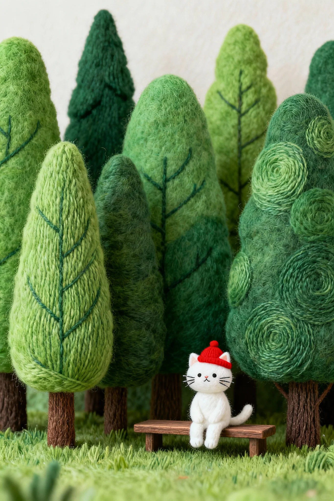

```
毛毡风格，极细的线条，层次感绿色，肌理丰富，大面积的绿色。高低不同、形状不同的树林，坐在长条凳子上的戴红色帽子的白色猫咪。主次分明，情绪铺垫。
```

 [↑返回目录](#toc)

```
树林，高低不同的树木，形状不同的树木，大面积的绿色，极细的线条，层次感绿色，肌理丰富，坐在长条凳子上的戴红色帽子的白色猫咪。主次分明，情绪铺垫，毛毡风格。
```

 [↑返回目录](#toc)

---
## <a id="jm-prompt-7569071093030374682">怪诞老神仙</a> (<a href="https://jimeng.jianying.com/ai-tool/personal/MS4wLjABAAAAMNVidi6d4J_-_JA0IkinvrkIULU9qhnSGYLoO_mTOxJgMGcmHqIh9jfGdZkH5G4S" target="_blank" rel="noopener noreferrer">@恒海</a>)

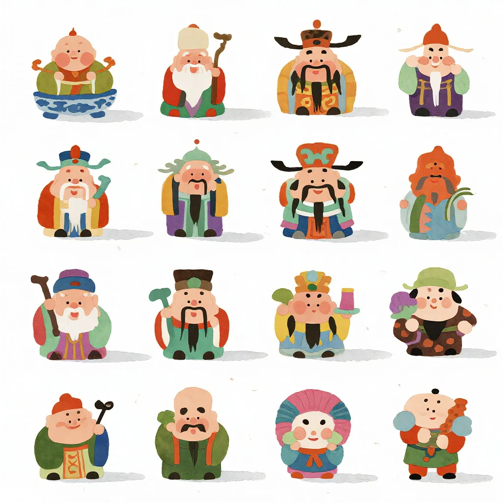

```
马蒂亚斯·阿道夫松（Mattias Adolfsson）风格的插画，白色简洁背景，运用彩铅与水彩混合媒介创作，色彩饱满，笔触细腻，怪诞美学，中国老神仙，石湾公仔
内容随机 平铺排列
```

 [↑返回目录](#toc)

---
## <a id="jm-prompt-7543526021492952374">拼贴风格的潮流白猫</a> (<a href="https://jimeng.jianying.com/ai-tool/personal/MS4wLjABAAAAwbUeFPKpe8WK3mNzRsBQ4Fy2XuxZZX42p9bgJjOQCnNvKs4Vpp6xpFXxICxrZLvS" target="_blank" rel="noopener noreferrer">@一阳Run</a>)

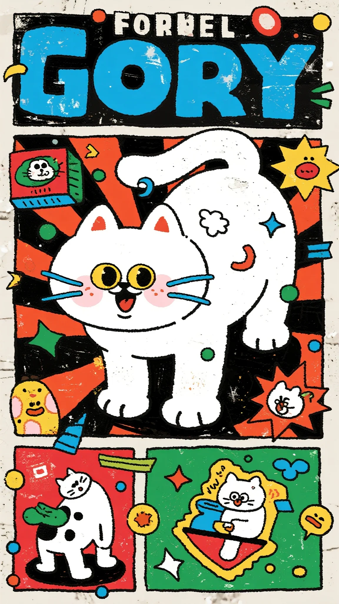

```
拼贴 描边 做旧画报夸张姿势夸张表情 灵动构图 白猫的卡通形象  高清  潮流 时尚 多巴胺  噪点 极繁主义 各式装饰点缀  漫画略显凌乱的笔触，漫画式分割画面，夸张姿势
```

 [↑返回目录](#toc)

---


[上一页](./2.md) | 当前 3/4 页 | [下一页](./4.md) | [查看全部目录](../../prompts/prompts.md)