# seedream.json 

seedream.json文件存放seedream相关的提示词，当前已收录：368个 

 投稿方式：[飞书投稿](https://tcn1uh5rxo87.feishu.cn/share/base/form/shrcne5gDolOMDd0oJsj2XfvxQc) or [issues](https://github.com/junxiaopang/gridsplitter/issues/new)

[上一页](./3.md) | 当前 4/4 页 | [查看全部目录](../scripts/prompts/prompts.md)

🚀 **在线预览**: [https://prompts.kkkm.cn](https://prompts.kkkm.cn)

## <a id="toc">目录</a>

- [暖黄柔光下的红烧排骨](#jm-prompt-7558808578304314670)
- [李刚的毛笔艺术签名](#jm-prompt-7570740630301855003)
- [Q版麦当劳薯条小夜灯](#jm-prompt-7556253541162110217)
- [视觉系少年与动画伙伴的电影之夜](#jm-prompt-7575847719705611547)
- [宋代制豆腐工艺图](#jm-prompt-7572866546494672137)
- [枯树映彩窗](#jm-prompt-7572449161816198427)
- [拟人化的雪纳瑞厨娘](#jm-prompt-7575954573102173486)
- [笔触中的微观广州](#jm-prompt-7571827133023030555)
- [橙狐与蓝兔的温馨夜遇](#jm-prompt-7575437902872628506)
- [五谷杂粮布偶猫](#jm-prompt-7569519485678292251)
- [怪诞财神群像](#jm-prompt-7566833009748413747)
- [柴犬宝宝的瑜伽时光](#jm-prompt-7570498429483257126)
- [水墨小溪边的宁静小屋](#jm-prompt-7569046212223552818)
- [疯狂动物城之萌宝探险](#jm-prompt-7575134186579840302)
- [多巴胺色的北京天际](#jm-prompt-7575129052059618598)
- [三国货币艺术](#jm-prompt-7576773362412834098)
- [梦幻蓝白小象](#jm-prompt-7567581136998747438)
- [酷萌鲻鱼头少女](#jm-prompt-7558458209023888666)
- [金花大帝的骏马](#jm-prompt-7573496611423243566)
- [超级智慧植物文明的3D极精细艺术](#jm-prompt-7573531927244786990)
- [怪诞童话之白发道士](#jm-prompt-7574833040652832027)
- [流泪的小奶猫](#jm-prompt-7562524682210020635)
- [Q版蜜雪冰城公仔的UI设计](#jm-prompt-7551262569286143247)
- [闽都印象](#jm-prompt-7574273709389778186)
- [森林之息高端伏特加](#jm-prompt-7576486740366576946)
- [复古丝网印海报](#jm-prompt-7567682363803618610)
- [忙着发财的卡通女孩](#jm-prompt-7571996686927580454)
- [卡卡西的忍术瞬间](#jm-prompt-7569950216363773230)
- [浮世绘少女的阴暗凝视](#jm-prompt-7555786629693148443)
- [手账风格姜母鸭制作教程](#jm-prompt-7549504881090923830)
- [剪纸艺术：冥婚队伍](#jm-prompt-7574070485240024347)
- [极简山水纸语](#jm-prompt-7568809213384805682)
- [藏族土拨鼠盲盒IP设计](#jm-prompt-7574030864225438986)
- [神秘的奇幻狗妖](#jm-prompt-7567747279239580966)
- [皮克斯风格的大卫卡通半身像](#jm-prompt-7574813984356945161)
- [太极古城的宇宙视角](#jm-prompt-7575849755813612827)
- [蓝白幻彩隧道中的孤独行者](#jm-prompt-7569895718375148827)
- [闪亮猫爪Q版头像框](#jm-prompt-7572936745205894409)
- [雪夜的侧颜](#jm-prompt-7567763094768848154)
- [奥巴马夸张漫画肖像](#jm-prompt-7543348045002460467)
- [风中骑行](#jm-prompt-7571999894085438746)
- [星际穿越：黑洞的诱惑](#jm-prompt-7572094401955122459)
- [奢华护肤品的极致视角](#jm-prompt-7575092121925864754)
- [梦境童趣涂鸦](#jm-prompt-7568308446366354715)
- [国风柿子与喜鹊纹样](#jm-prompt-7567213679041711370)
- [扭曲视角下的蓝色男子](#jm-prompt-7571039917711625481)
- [草浪云影中的骑行少年](#jm-prompt-7572827020741184818)
- [海边三宫格](#jm-prompt-7573432998620679433)
- [月光下的温馨故事](#jm-prompt-7566806133264928027)
- [冬日电影叙事](#jm-prompt-7572490864589638950)
- [虚拟潮流](#jm-prompt-7550207182571130131)
- [国风水彩韵](#jm-prompt-7573575358570614067)
- [代码粒子亚丑钺](#jm-prompt-7569866686963207462)
- [Q版唐僧表情九宫格](#jm-prompt-7572979743348313390)
- [静物咖啡摄影：橙香冰美式](#jm-prompt-7571030683410320650)
- [毛毡风格的森林长椅](#jm-prompt-7571813629964602675)
- [印象派周杰伦素描](#jm-prompt-7567426289141812506)
- [中国](#jm-prompt-7554644146540186890)
- [收集星光的伙伴们](#jm-prompt-7575521410768997642)
- [雪夜好奇猫](#jm-prompt-7569254161527672091)
- [工作室写真风格照片](#prompt-328)
- [波普艺术肖像](#prompt-324)
- [超大道具的影棚拍摄照片](#prompt-398)
- [大型胶囊形容器的品牌3D渲染图](#prompt-409)
- [一张超现实的微距照片](#prompt-383)
- [3D chibi风格乙烯基收藏品](#prompt-382)
- [照片级逼真的概念食物艺术肖像](#prompt-319)
- [角色创建](#prompt-323)

## <a id="jm-prompt-7558808578304314670">暖黄柔光下的红烧排骨</a> (<a href="https://jimeng.jianying.com/ai-tool/personal/MS4wLjABAAAAJs-RgPmH93lpW4Xk-_N8bQlBh0TjiL5NlkhIT16s0Aw" target="_blank" rel="noopener noreferrer">小奚有话说</a>)

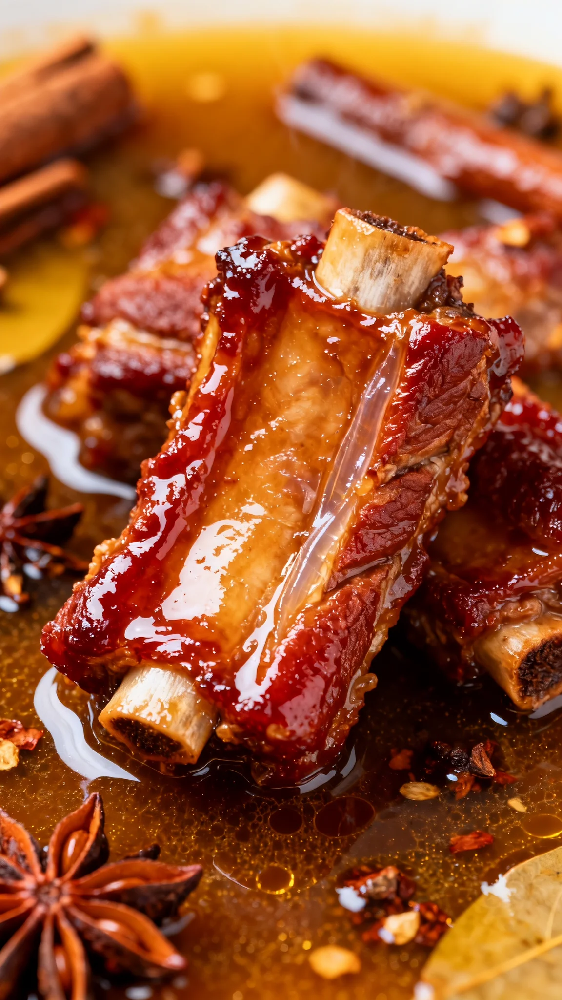

```
美食摄影风格，特写镜头，暖黄色调，柔光照明，油亮的红烧排骨表面泛着酱红色光泽，肉质纹理间渗着浓稠的酱汁，骨缝里的肉筋微微透明，散发着酱香与肉香交融的热气，周围漂浮着八角、桂皮等香料碎，酱汁表面映出温润反光，背景虚化，超下饭氛围。
```

```
特写一块慢炖的红烧排骨，油亮的排骨外皮泛着酱红色光泽，肉质纹理间渗着浓稠的酱汁，骨缝里的肉筋微微透明，散发着酱香与肉香交融的热气，周围是漂浮的香料碎（八角、桂皮），光影在酱汁表面映出温润反光，营造出暖乎乎超下饭的氛围
```

 [↑返回目录](#toc)

---
## <a id="jm-prompt-7570740630301855003">李刚的毛笔艺术签名</a> (<a href="https://jimeng.jianying.com/ai-tool/personal/MS4wLjABAAAAbWjy57dZZ20I3q5dKmZriRtbxBOO_Waw2jrPdNuuiS2262IEr0sczjwQWlsysQON" target="_blank" rel="noopener noreferrer">Rising sun 工作室</a>)

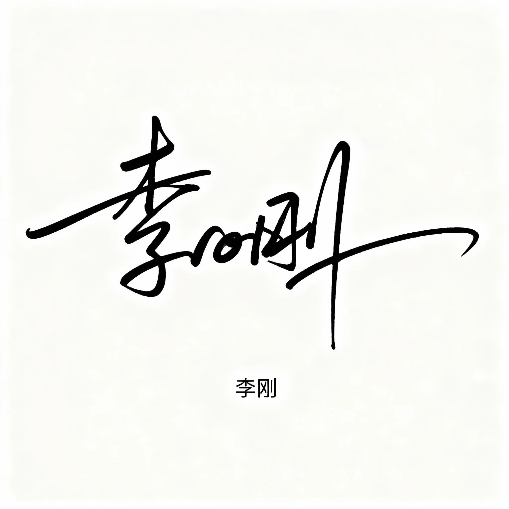

```
艺术签名“李刚”，下方标注印刷体“李刚”，黑色墨迹线条，白色纯色背景，毛笔手写体风格，字体呈现草书行书笔锋、连笔流畅
```

```
以图片作为参考：主体内容：艺术签名（姓名签名） 对应的姓名：李刚 字体风格：毛笔手写体、草书/行书笔锋、连笔流畅 视觉元素：黑色墨迹线条、白色纯色背景 排版结构：签名主体居上，下方标注对应印刷体姓名（袁明雪） 呈现形式：数字设计签名、单幅签名展示图芦紫茉
```

 [↑返回目录](#toc)

---
## <a id="jm-prompt-7556253541162110217">Q版麦当劳薯条小夜灯</a> (<a href="https://jimeng.jianying.com/ai-tool/personal/MS4wLjABAAAAaQOsFxBd5JIQfOZ3hbBTIK4Sg0QnnrsupFnDMyOkeLw" target="_blank" rel="noopener noreferrer">coffee&wine !</a>)


```
Q版可爱风产品摄影，4:3竖幅构图，居中摆放，轻微浅景深。麦当劳薯条造型小夜灯，材质光滑柔软如硅胶或抛光树脂，表面带半透明质感，内部发出柔和暖黄色光。背景简洁昏暗，使用柔和渐变色作为底色，突出灯体质感。整体氛围安静温馨，适合商品展示。
```

```
生成一张高质量产品摄影图，展示一个由麦当劳薯条变成的小夜灯，整体风格为Q版可爱风，材质光滑柔软，像硅胶或抛光树脂，表面略带半透明质感，内部发出柔和暖黄色光，散发出安静温馨的氛围。背景简洁昏暗，使用柔和渐变色作为底色，显出小夜灯光的质感，整体构图居中，采用轻微浅景深，突出灯体质感，适合用于商品展示。比例为4:3竖幅。
```

 [↑返回目录](#toc)

---
## <a id="jm-prompt-7575847719705611547">视觉系少年与动画伙伴的电影之夜</a> (<a href="https://jimeng.jianying.com/ai-tool/personal/MS4wLjABAAAAFgy9_FIUW6TY7wUp9wAmqrJH0rR1V5E4OZ7Fl8BXE0-AyMu5wynXgjUl_JjdY3m2" target="_blank" rel="noopener noreferrer">七夕</a>)

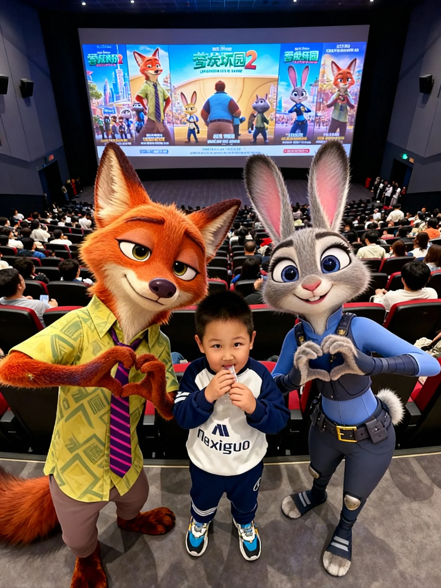

```
日系视觉系风格，高角度俯拍，头部比例夸张放大，一个小男孩在中间站得略靠前且身体略微内扣，穿着蓝白拼接长袖卫衣、深蓝色长裤、蓝白拼色运动鞋，双手拿着物品放于嘴边；左侧是动画风格狐狸角色，橙红色毛发，身穿黄绿几何图案短袖衬衫、紫粉条纹领带，双手比心；右侧是动画风格兔子角色，灰色毛发，身穿蓝色长袖上衣、深灰色背心与长裤、配金色腰带扣，双手比心；三位主体靠得很近，头部略微上仰，眼神直视镜头，画面构图紧凑，光线明亮且均匀，背景为超大电影院坐满观众，两人背对银幕，银幕显示《疯狂动物城2》电影精美海报填满屏幕，整体画面用iphone前置自拍呈现精致时尚感。
```

```
不要换脸，人物脸部不能有任何改变！请将图1和图2和图3的三人融合成一张三人俯拍自拍照，画面构图紧凑，三位主体靠得很近，头部略微上仰，眼神直视镜头，营造出强烈的视觉冲击力。图1在中间人物站得略靠前，需要保持人脸相似度；需要保持人脸相似度，略微内扣身体，拍摄角度为高角度俯拍，使头部比例被夸张放大，符合典型的日韩视觉自拍风格。简洁干净，进一步凸显人物主体。画面风格偏向日系视觉系，整体画面清晰度高，用iphone前置自拍，最终呈现出精致、时尚、略带的合影效果。要求人物实现无缝融进画面，视觉过渡自然，整体画面光线明亮且均匀，背景为超大电影院坐满了观众，两人背对银幕，银幕显示《疯狂动物城2》电影精美海报填满屏幕。
```

 [↑返回目录](#toc)

---
## <a id="jm-prompt-7572866546494672137">宋代制豆腐工艺图</a> (<a href="https://jimeng.jianying.com/ai-tool/personal/MS4wLjABAAAAhRbr8uTvMS518Mg_LYi_t5QUVw4Ikl33XhGWkvlU48s" target="_blank" rel="noopener noreferrer">富哥</a>)

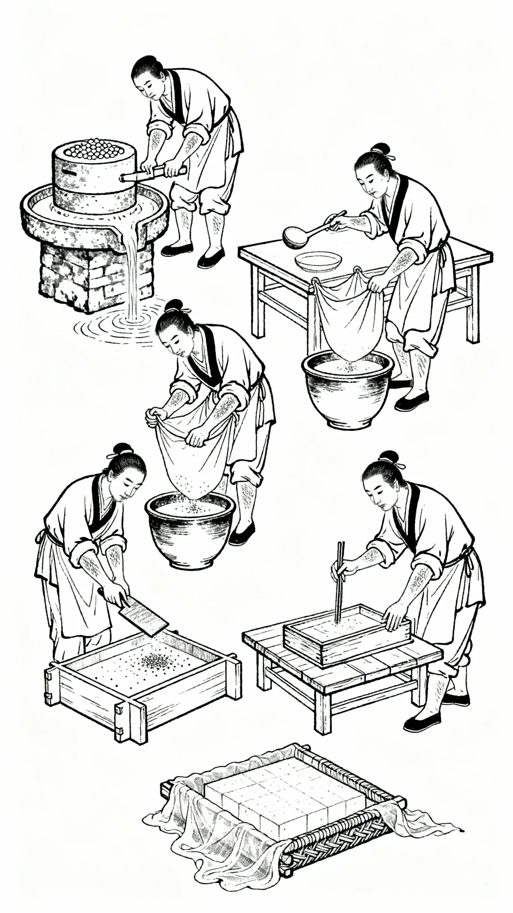

```
凹版印刷线稿风格，宋代院画，纯白色背景，0.8mm粗线勾勒人物外轮廓，0.2mm细线刻画皮肤纹理。画面中6道制豆腐流程连贯排列：1. 石磨旁一人弯腰推磨，黄豆与水从磨盘上方倒入；2. 方桌旁一人手持木勺，将磨好的豆浆舀入粗布滤袋；3. 滤袋下方放置陶盆，一人双手攥紧滤袋挤出豆渣；4. 陶盆旁一人将石膏粉撒入热豆浆，手持木筷缓慢搅拌；5. 凝固的豆腐脑倒入木模，一人用木板压实边缘；6. 木模翻转，成型豆腐滑入竹匾，表面覆盖纱布。画面整体线条流畅，人物动态自然，细节刻画清晰，传统工艺氛围。
```

```
创建图像 中国传统制豆腐技艺，凹版印刷线稿，0.8mm粗线勾勒外轮廓，0.2mm细线刻画表面皮肤，纯白色背景，宋代院画，画面分别体现6道流程。 不分格，表现制作豆腐的工艺流程
```

 [↑返回目录](#toc)

---
## <a id="jm-prompt-7572449161816198427">枯树映彩窗</a> (<a href="https://jimeng.jianying.com/ai-tool/personal/MS4wLjABAAAA8kA-DZi6SXNEvz7GOZ9py4z972jbeDfk745LExR3oHyP0kpvKStZsWhdrLxZvltg" target="_blank" rel="noopener noreferrer">暖我心</a>)

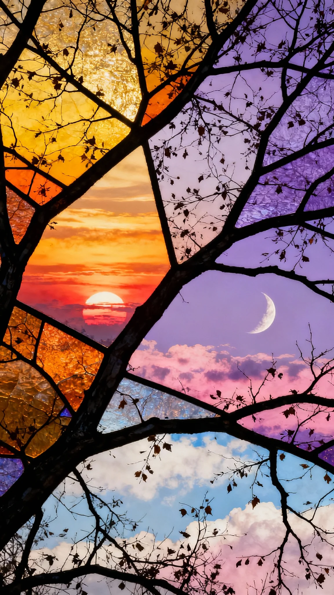

```
彩窗拼接风格，玻璃彩绘质感，暖橙黄与冷淡紫渐变，黑色枯树枝干交错如彩窗分割线，细密枝丫带细碎残叶覆盖画面，形成通透交错层次。背景为日落天空，被枝干分割成多色彩区块：橙黄、金红晚霞光带，淡紫、浅蓝、粉白云层渐变，部分区块可见弯月、落日局部轮廓。枯树萧瑟感与斑斓色彩融合，治愈梦幻氛围，自然风景与艺术感结合。
```

```
画面呈现的是彩窗拼接风格的黄昏（或日落）枯树景观，整体视觉效果融合了玻璃彩绘的艺术感与自然风景的氛围感，核心元素可拆解为：

• 主体结构：以黑色枯树枝干为框架，枝干交错如彩窗的分割线条，细密的枝丫（带少量细碎残叶）覆盖画面，形成通透又交错的视觉层次；

• 背景层次：背景是日落时分的天空，被枝干分割成多个色彩区块，包含：

◦ 暖色调：橙黄、金红的晚霞光带；

◦ 冷色调：淡紫、浅蓝、粉白的云层渐变；

◦ 细节点缀：部分区块中可见弯月、落日的局部轮廓；

• 艺术风格：通过“彩窗拼接”的形式，将不同色彩、光线的天空片段组合，既保留了枯树的萧瑟感，又因斑斓的色彩呈现出治愈、梦幻的氛围。
```

 [↑返回目录](#toc)

---
## <a id="jm-prompt-7575954573102173486">拟人化的雪纳瑞厨娘</a> (<a href="https://jimeng.jianying.com/ai-tool/personal/MS4wLjABAAAAb6nvyWa8TI9zFKPOnXCFe9mGvutMgzVukbDi0BJGU2o" target="_blank" rel="noopener noreferrer">👺 李大哥。</a>)

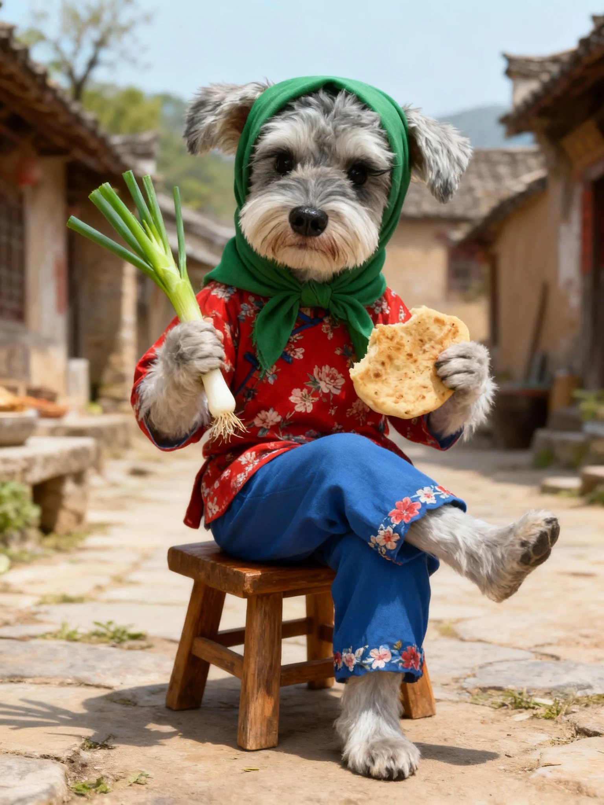

```
写实风格，一只拟人化的灰色雪纳瑞，毛发灰白，头戴绿色头巾，穿着红色碎花上衣和蓝色带花边的裤子，坐在木质小凳上，一手拿大葱，一手拿饼，翘二郎腿，背景为古朴的村落场景。
```

```
拟人的一只灰色雪纳瑞小狗，大大的眼睛。头戴绿色头巾，穿着红色碎花上衣和蓝色带花边的裤子，坐在木质小凳上。它一手拿着大葱，一手拿着饼，翘着二郎腿，背景是古朴的村落场景，整体营造出充满乡土气息又萌趣十足的画面。写实风格。
```

 [↑返回目录](#toc)

---
## <a id="jm-prompt-7571827133023030555">笔触中的微观广州</a> (<a href="https://jimeng.jianying.com/ai-tool/personal/MS4wLjABAAAAjJAUnxxe6nDBrC3w5rv_H_5tDKjBtFqXr1SlGJehta8" target="_blank" rel="noopener noreferrer">波高617</a>)


```
3D立体风格，传统中国风与现代立体艺术融合，金属玻璃质感，立体浮雕效果，高细节，超写实，HDR，8K分辨率。一支正在绘画的毛笔，描摹出由右下到左上的书法笔触，笔迹内呈现微观的中国广州地标性景观，包括珠江两岸烟波浩渺的珠江新城到鱼珠沿岸、经典岭南建筑与摩天现代建筑交汇、中山纪念堂及古色古香的岭南园林建筑，毛笔笔尖位于笔迹尽头，笔迹之外为留白，背景纯净白色。画面底部笔迹开始处，有极小的瘦金体文字"申城广州"和极小的英文"China guangzhou"，文字跟随笔迹方向排列。
```

```
一支正在绘画的毛笔，描摹出一条由右下到左上的书法笔触，笔迹里是微观的中国广州地标性景观，3D立体风格，金属玻璃质感，珠江两岸烟波浩渺，珠江新城到鱼珠沿岸，广州经典岭南建筑与摩天现代建筑交汇，中山纪念堂，古色古香的岭南园林建筑点缀其间，画面呈现出立体浮雕效果，毛笔笔尖在笔迹的尽头，笔迹之外都是留白，背景为纯净的白色，整体风格融合了传统中国风与现代立体艺术，高细节，超写实，HDR，8K分辨率。在画面底部笔迹开始处，有毛笔写下极小极小的瘦金体文字“申城广州”和极小极小的英文“China guangzhou”，文字跟随笔迹的方向

```

 [↑返回目录](#toc)

---
## <a id="jm-prompt-7575437902872628506">橙狐与蓝兔的温馨夜遇</a> (<a href="https://jimeng.jianying.com/ai-tool/personal/MS4wLjABAAAAoSumgxpTcnJDOy7gckzIwMX3QAbQ-MDzHXCL2foZwwo" target="_blank" rel="noopener noreferrer">蓝天237317081</a>)

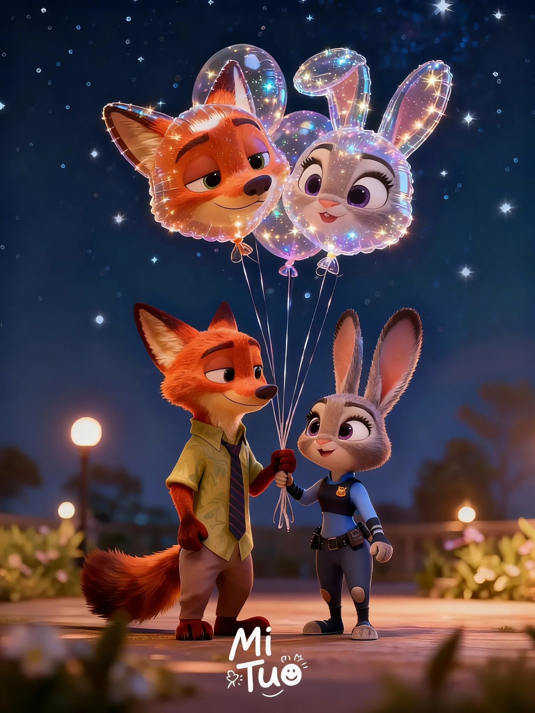

```
3D卡通风格，夜晚场景有星空、路灯暖光、绿植花卉；橙色狐狸穿绿底花纹衬衫、条纹领带、卡其裤，与穿蓝色警服的灰色兔子共同手持狐狸兔子头像造型带闪光效果的气球束；下方有“Mi Tuo”卡通文字；氛围温馨浪漫，动画质感。
```

```
3D卡通风格，夜晚场景（星空，路灯暖光，绿植花卉）；橙色狐狸（穿绿底花纹衬衫、条纹领带、卡其裤）与灰色兔子（穿蓝色警服）共同手持气球束；气球为狐狸、兔子头像造型，带闪光效果；下方有“Mi Tuo”卡通文字；氛围温馨浪漫，动画质感
```

 [↑返回目录](#toc)

---
## <a id="jm-prompt-7569519485678292251">五谷杂粮布偶猫</a> (<a href="https://jimeng.jianying.com/ai-tool/personal/MS4wLjABAAAANjXVlBUZh5zlqbRgHbcqKznR-XT4X4TXehJPEQonlgfKIsufwIU2pzQqZK0GHlQi" target="_blank" rel="noopener noreferrer">凤凰树</a>)

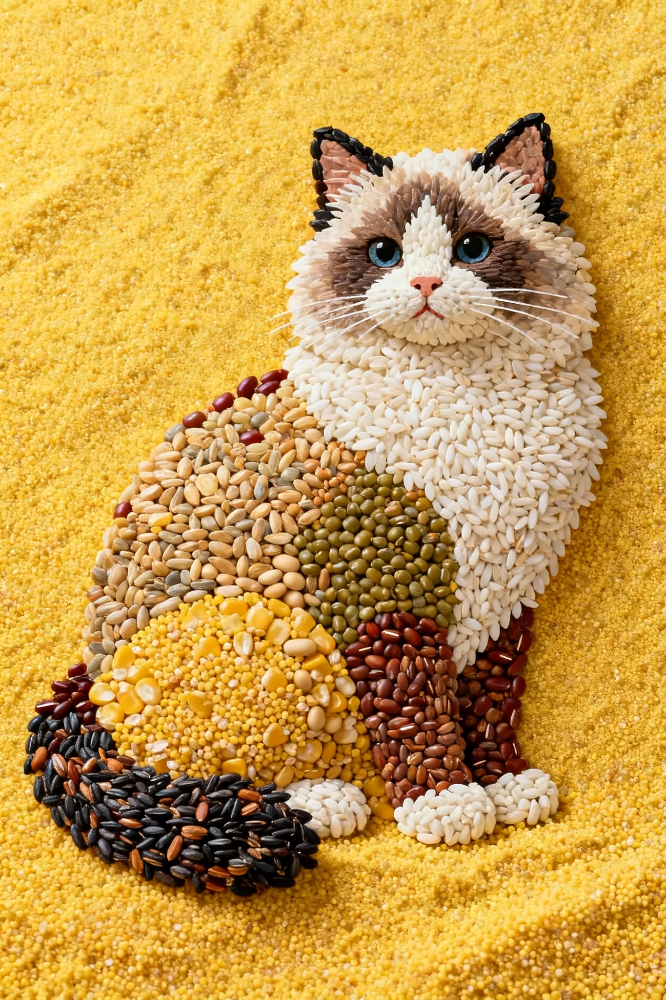

```
极繁主义，周志江风格，五谷杂粮拼贴画，黄色小米背景，天然色彩，立体感强，生机勃勃。一只由五谷杂粮堆出的布偶猫，颗粒质感细腻，光影层次丰富，超高清分辨率，8K壁纸，高品质细节，最佳品质，高清渲染。
```

```
世界粮食画大师大师杰作，极繁主义，周志江的风格，五谷杂粮摆成一只布偶猫，黄色小米背景。利用五谷杂粮的天然色彩，五谷杂粮堆出的立体感，使画作更加生机勃勃。高清渲染，高品质细节，超高清分辨率，最佳品质，8K壁纸，
```

 [↑返回目录](#toc)

---
## <a id="jm-prompt-7566833009748413747">怪诞财神群像</a> (<a href="https://jimeng.jianying.com/ai-tool/personal/MS4wLjABAAAAda6Qx_HNnExdVQhu_dsd1_uGZNltIagVQbcwfRhfqiw" target="_blank" rel="noopener noreferrer">菜野夏衣</a>)

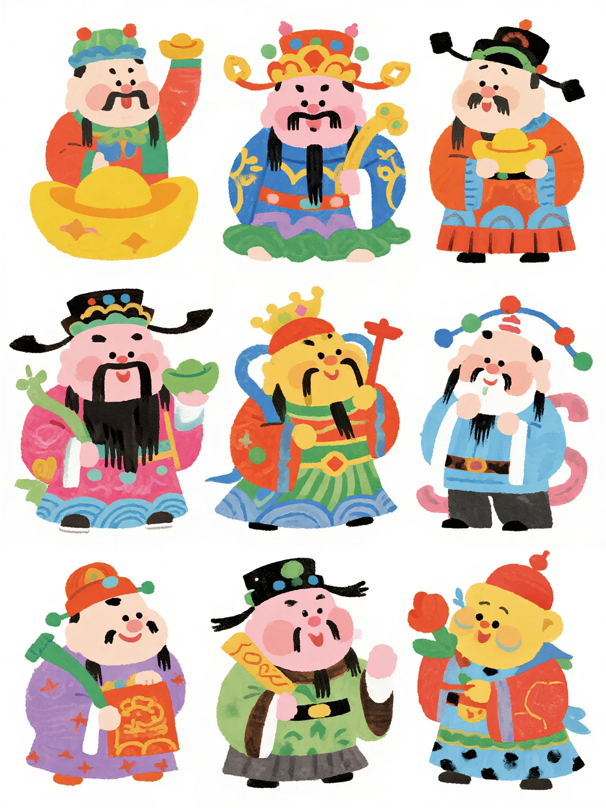

```
马蒂亚斯·阿道夫松（Mattias Adolfsson）风格的插画，白色简洁背景，运用彩铅与水彩混合媒介创作，色彩饱满，笔触细腻，怪诞美学，中国财神，内容随机，平铺排列
```

 [↑返回目录](#toc)

---
## <a id="jm-prompt-7570498429483257126">柴犬宝宝的瑜伽时光</a> (<a href="https://jimeng.jianying.com/ai-tool/personal/MS4wLjABAAAAiGaF-l_Z12iJAJhGPR4OBFSkkNSZT9_PZWEhqACuIMGYIjWGqt67b5CqMZ9gcQ3j" target="_blank" rel="noopener noreferrer">海印</a>)

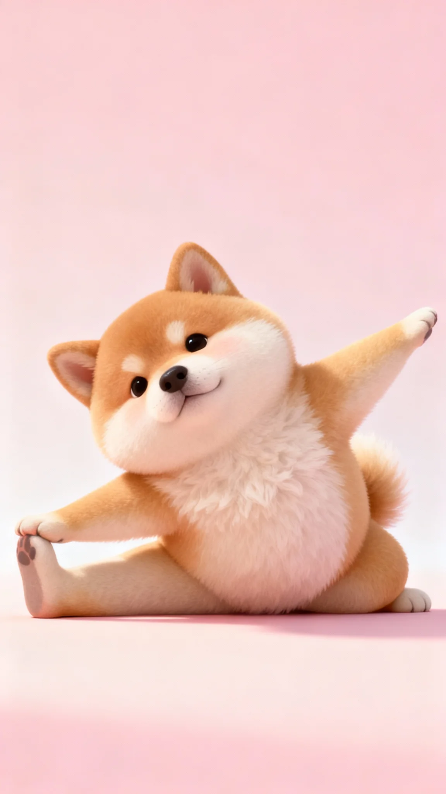

```
治愈系插画风格，软萌色调，柔光处理，一只可爱的柴犬宝宝，大胖脸，歪着头，伸着腿，伸直胳膊做瑜伽。圆润体型，蓬松毛发，背景为浅粉色渐变，温馨可爱氛围。
```

```
一只可爱的萌萌的 柴犬宝宝，大胖脸，歪着头伸着腿伸直胳膊做瑜伽
```

 [↑返回目录](#toc)

---
## <a id="jm-prompt-7569046212223552818">水墨小溪边的宁静小屋</a> (<a href="https://jimeng.jianying.com/ai-tool/personal/MS4wLjABAAAAYHccrUPf_AVO-aOCXrmqce1b5283Y36D9tuP4bAI5lM" target="_blank" rel="noopener noreferrer">为无为</a>)

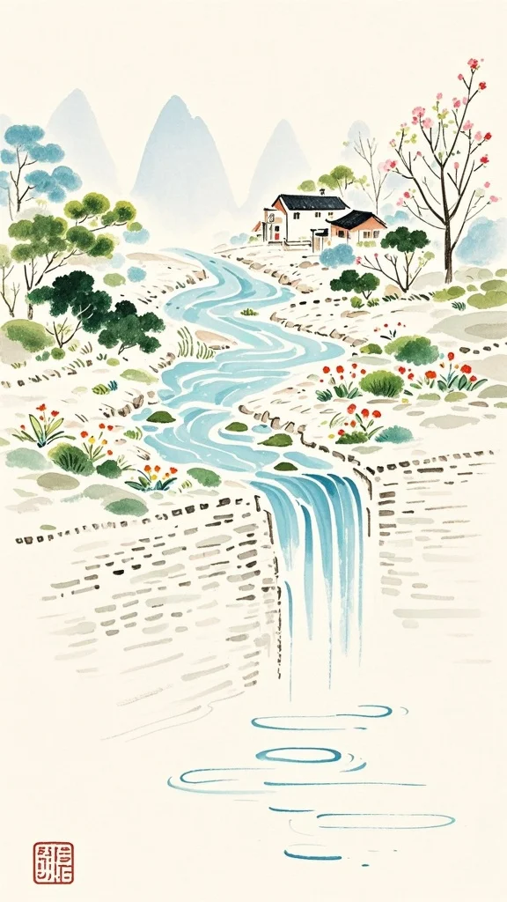

```
唯美插画，水墨淡彩，彩色极简线条，noritake，chibi，小溪，小花，小屋，小树，隐隐的瀑布，断层式的留白，大面积外围流白，结构式的布局，朦胧的感觉，随意的点墨，岁月静好，松弛感，极简，纯白背景，超高清。
```

 [↑返回目录](#toc)

---
## <a id="jm-prompt-7575134186579840302">疯狂动物城之萌宝探险</a> (<a href="https://jimeng.jianying.com/ai-tool/personal/MS4wLjABAAAANZh85FnPidue1QWCN5knPjntdBRbelsfeegvhR04SYBkWXUMVJImzyeihGRpLSWz" target="_blank" rel="noopener noreferrer">Monica</a>)


```
一个八个月大的男宝宝戴着狐狸尼克头套，穿着狐狸尼克的衣服裤子并佩戴领带，与兔子朱迪一起走在疯狂动物城动画片的街道里，周围背景有影片相关元素，整体画面呈现高清、注重光影层次感的复古氛围人物写真，构图充满童趣。
```

```
生成高清人物写真，细腻地描绘出城市中各种动物角色的生动形象，注重光影的层次感，营造出浓郁的复古氛围，展现出独特的艺术构图。八个月的男宝宝戴着可爱的狐狸尼克头套，穿着狐狸尼克的衣服裤子和领带，和可爱活泼的兔子朱迪一起走在动画片的街道里，周围背景适当加入疯狂动物城里的元素，构图充满童趣，保持脸部不变
```

 [↑返回目录](#toc)

---
## <a id="jm-prompt-7575129052059618598">多巴胺色的北京天际</a> (<a href="https://jimeng.jianying.com/ai-tool/personal/MS4wLjABAAAAd12mILw3-sqKwwuUsXyabDf-u6HcXoSpUbxSm7XEUxs" target="_blank" rel="noopener noreferrer">MadnessJ沐沐</a>)

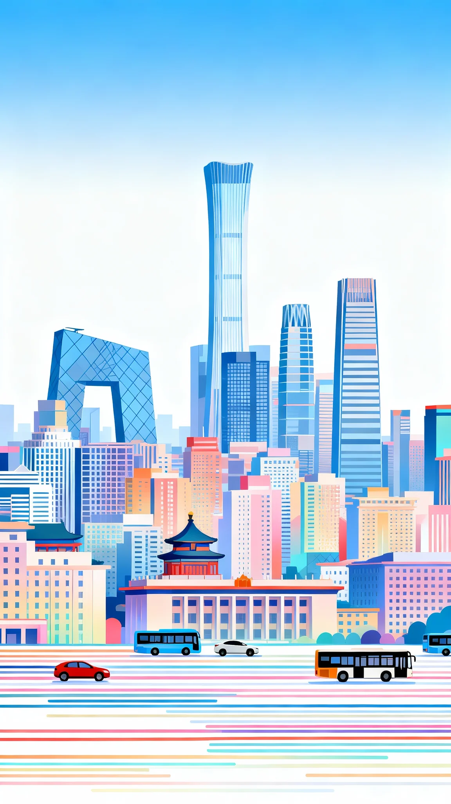

```
矢量抽象插画，多巴胺色渐变线条，随机柔和色彩，整体色调柔和且富有层次。北京天际线，高楼林立密集的现代化建筑群，有汽车、公交车，横向密集排列线条与建筑轮廓交互置换，置换线条构成建筑的韵律美、层次感、高级感。背景纯蓝白色极简，构图建筑组合错落有致，具有独特建筑美学，线条、色彩与光影巧妙结合，简洁干净，先锋抽象气质，精致细腻。
```

```
矢量抽象手法，在同一个画面呈现北京天际线，高楼林立密集的现代化建筑群，有汽车，公交车，随机色彩，多巴胺色渐变线条艺术插画，精致细腻，横向密集排列线条与建筑轮廓交互置换，置换线条构成建筑的韵律美，层次感，高级感，随机柔和的色彩，整体色调柔和且富有层次。构图建筑组合错路有致，具有独特建筑美学，线条、色彩与光影巧妙结合，简洁干净，具有先锋抽象气质，背景纯蓝白色极简。
```

 [↑返回目录](#toc)

---
## <a id="jm-prompt-7576773362412834098">三国货币艺术</a> (<a href="https://jimeng.jianying.com/ai-tool/personal/MS4wLjABAAAABu8rD5RUHY5QXdGXPzWShZN26TBrfoPWEK_Or92wSKr8cB5q4uzYjhqbQoC1ewQJ" target="_blank" rel="noopener noreferrer">用户8673555302850</a>)

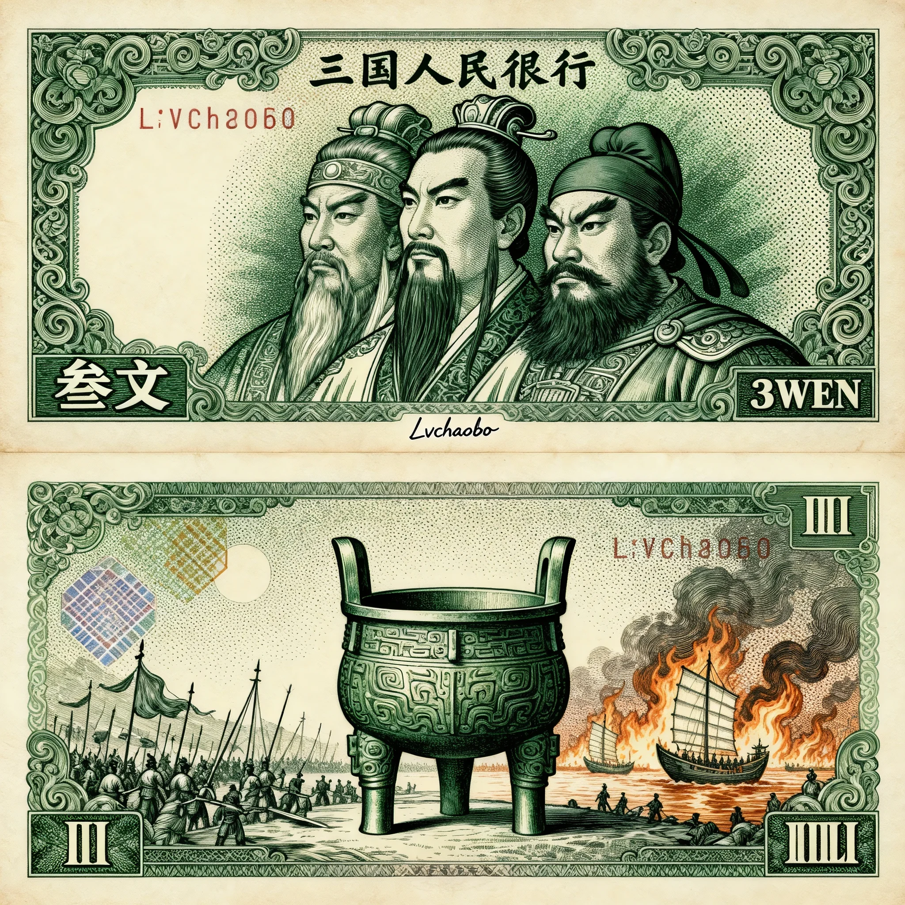

```
古代货币设计，极繁主义，平面展示特写，精致写实风格，印钞厂级别精细凹版印刷，深绿色渐变色精细线条，精致的曲线排线细致线条刻画细节与明暗关系，网点印刷背景，超高清画质。上方二分之一为正面，刘备、关羽、张飞三人正侧面层叠遮盖头像，四周钞票汉代装饰纹样，上面古朴隶书"三国人民很行"，面值"叁文"，"3WEN"；下方二分之一为背面，一个三足青铜鼎和火烧赤壁战争场景插画，正反面都有编码、罗马数字、防伪等钞票元素，极小的手写体签名"Lvchaobo"。
```

```
古代货币设计，极繁主义，平面展示特写，上方二分之一为正面刘备、关羽、张飞三人正侧面层叠遮盖头像，四周钞票汉代装饰纹样，上面古朴隶书“三国人民很行”，面值“叁文”，“3WEN”。下方二分之一为背面，一个三足青铜鼎和火烧赤壁战争场景插画。正反面都有编码、罗马数字、防伪等钞票元素，极小的手写体签名“Lvchaobo”,精致写实风格，印钞厂级别精细凹版印刷，深绿色渐变色精细线条，精致的曲线排线细致线条刻画细节与明暗关系，细致的细节，网点印刷背景，超​高清画质。
```

 [↑返回目录](#toc)

---
## <a id="jm-prompt-7567581136998747438">梦幻蓝白小象</a> (<a href="https://jimeng.jianying.com/ai-tool/personal/MS4wLjABAAAAHZ9eSOGTovFoUYY6l7NnJcKvL5vHnqW8WDIMMhATEVA" target="_blank" rel="noopener noreferrer">用户6674817072337</a>)


```
写真风格，柔和自然光，蓝白渐变色调，白色渐变云朵构成的可爱小象，圆滚滚的身体，深色圆眼睛，浅粉色腮红，蓝灰色线条勾勒轮廓，周围点缀蓝色星星，背景为淡蓝色天空，远景构图，柔光处理，梦幻温馨氛围。
```

```
将云朵幻化成可爱小象形象，小象由白色渐变的云朵构成，有着圆圆的深色眼睛，脸颊泛着浅粉色腮红，轮廓用蓝灰色线条勾勒，周围点缀蓝色星星元素，背景是蓝天，整体画面梦幻又温馨，写真风格
```

 [↑返回目录](#toc)

---
## <a id="jm-prompt-7558458209023888666">酷萌鲻鱼头少女</a> (<a href="https://jimeng.jianying.com/ai-tool/personal/MS4wLjABAAAAIN2hMPn2vmcd500-lghmOHwWXzKE2rjpLQrbCHcYVooc4sM3VUKzGvESF2vH06Nf" target="_blank" rel="noopener noreferrer">嗨，这个世界</a>)

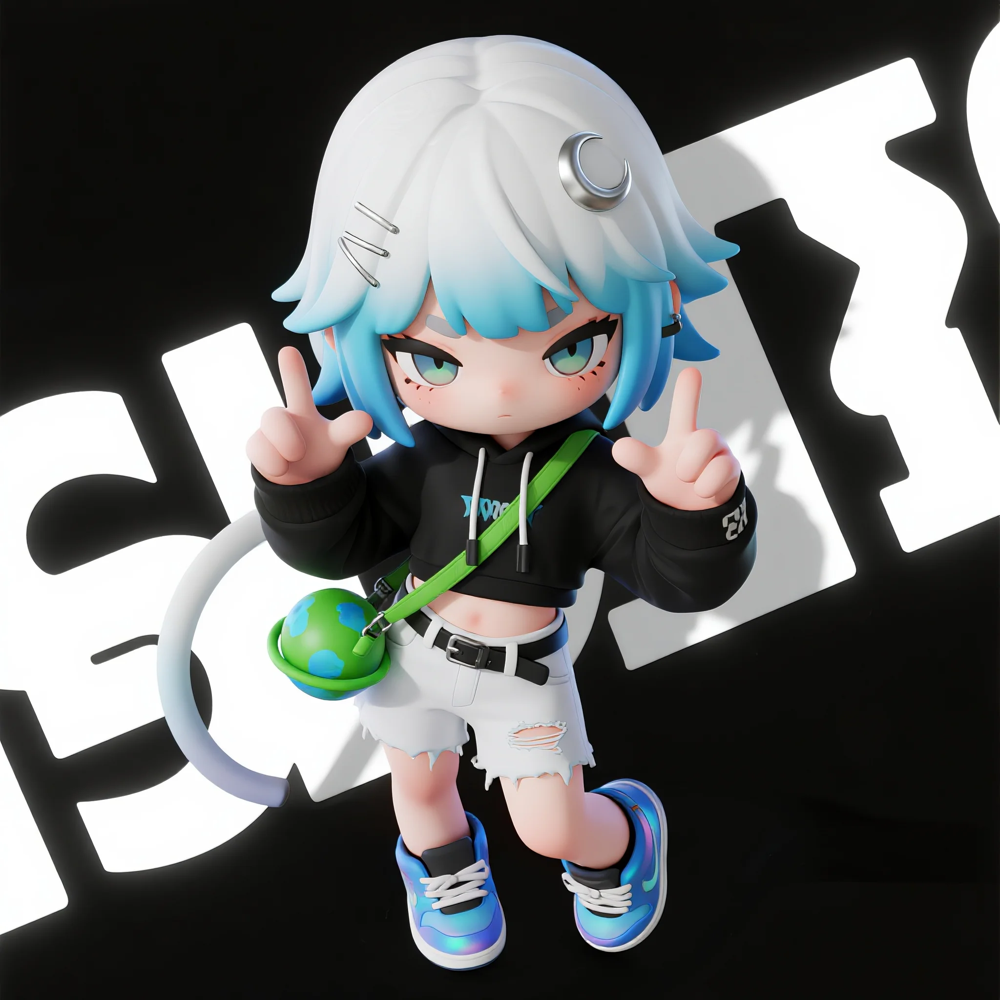

```
生成一个蓝白渐变色鲻鱼头短发，头发上别着银色月亮发卡，有着漫画刘海，眼睛大大的小女孩，小女孩表情冷峻，双手比剪刀手，亚比风穿搭，黑色露脐卫衣，白色破洞牛仔短裤，蓝色渐变运动鞋，斜挎绿色星球包，白色背景，侧俯拍视角，广角，超酷，3D风格，OC渲染，原比例，正面视角，泡泡玛特玩偶风格，超酷背景
```

 [↑返回目录](#toc)

---
## <a id="jm-prompt-7573496611423243566">金花大帝的骏马</a> (<a href="https://jimeng.jianying.com/ai-tool/personal/MS4wLjABAAAAUiJ6ePTb1qjNQJ6z3fRoA3CA6guD4RPFqLfPvkPJigX4xi8nTFY_1OoLsrk6G3Gf" target="_blank" rel="noopener noreferrer">交响乐指挥家</a>)

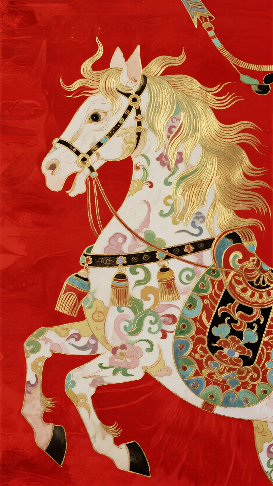

```
生肖马，抽象画风，凸印金线，花纹线条组合而成的骏马，层次分明，中国传统纹饰，敦煌纹，色彩斑斓美轮美奂，线条柔美灵动，传统美学，立体感，朱砂红色背景，高清渲染。金花大帝孙金花骑马
```

 [↑返回目录](#toc)

---
## <a id="jm-prompt-7573531927244786990">超级智慧植物文明的3D极精细艺术</a> (<a href="https://jimeng.jianying.com/ai-tool/personal/MS4wLjABAAAAkyc9EFLgiw3ff2b6Xn4VJMw0lmVFrsT0hHZhULAzvE7gke1q29krrP9lW2W0xL6u" target="_blank" rel="noopener noreferrer">越人东</a>)

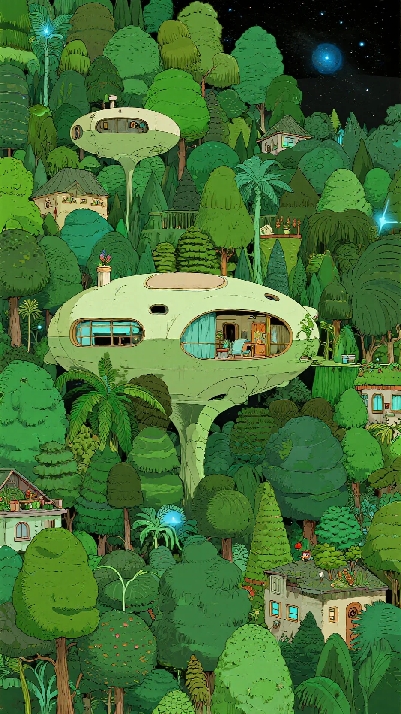

```
艺术家Kim jung gi设计风格，线条由极细钢笔勾勒，极其复杂精致细节特别多。
茂密森林：大量形态各异的树木紧密排列，树冠饱满，层层叠叠，形成了一个绿色的天然屏障，将房屋环绕其中。
特色房屋：一栋造型独特的房屋错落有致地分布在森林中，房屋是椭圆形的，窗户和门的设计各具特色，
细节装饰：房屋周围有一些小细节，如墙上的装饰、窗台上的植物等，丰富了画面内容。
整体颜色以森林绿色为主，展示极致的绿意。

超级智慧植物文明，宇宙空间背景，植物仿生学细节，微小蓝光，风格独特，超级科幻风格，极精细风格，形体优美，极艺术风格，整体流线型，形态结构精美，层次分明，细节完美。色调暗黑，色彩鲜亮，材质磨砂绿色钛金，光影分明，明暗对比强烈，3d写实，超高清渲染，长镜头，大景深，广角镜头，鸟瞰镜头，全身特写，全面展示。
```

 [↑返回目录](#toc)

---
## <a id="jm-prompt-7574833040652832027">怪诞童话之白发道士</a> (<a href="https://jimeng.jianying.com/ai-tool/personal/MS4wLjABAAAAFU6uKmo2T1bHA7Q6A5zUWThIQw8476rx9pqyOW7-hxLgj9_Iqn9d2p9q-ciduuCU" target="_blank" rel="noopener noreferrer">无非由</a>)

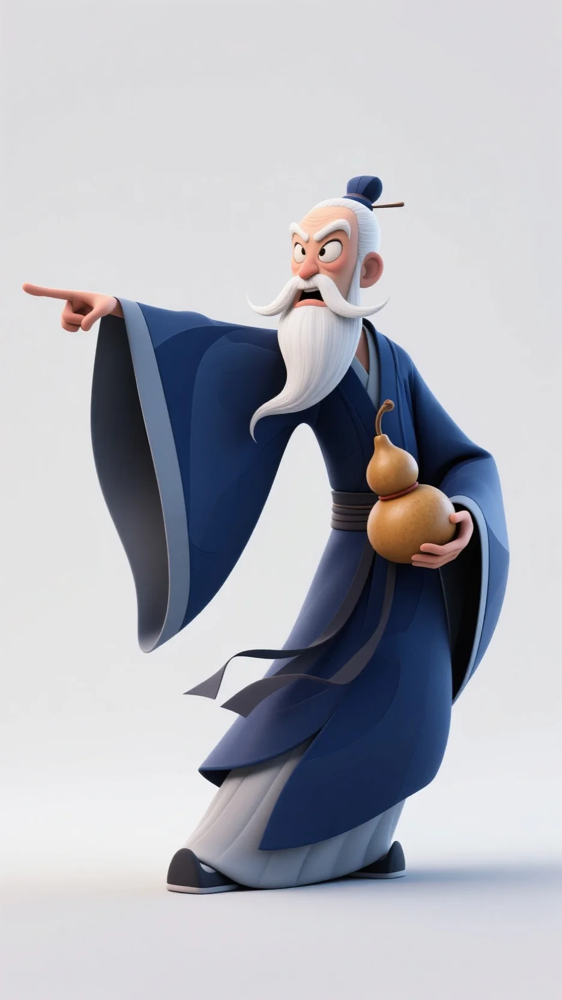

```
卡通动漫人物，白发白须道士，挤眉弄眼，一手持宝葫芦，一手指向前方，深蓝色道袍，造型夸张，光影艺术，几何弧度与艺术形变抽象派艺术，人物造型，CG厚涂，纯色背景，张扬，个性，夸张，抽象，纯白色背景，怪诞童话。
```

 [↑返回目录](#toc)

---
## <a id="jm-prompt-7562524682210020635">流泪的小奶猫</a> (<a href="https://jimeng.jianying.com/ai-tool/personal/MS4wLjABAAAA41vw__rl0zjOGLzssXKBfZnmTvUzcdCtI6_Qu4A4IeGf5HdmL0g58k1hooKhBP2w" target="_blank" rel="noopener noreferrer">水到渠成</a>)

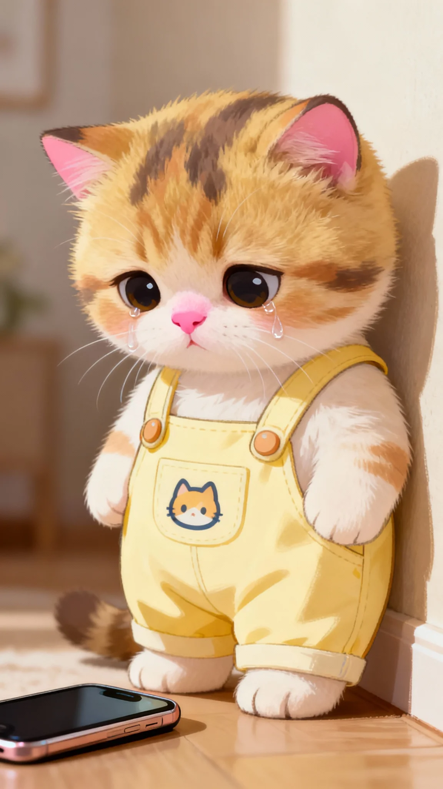

```
插画风格，柔和光线，室内场景，暖色调，粉色鼻头，大眼睛含泪，流泪。金三花曼基康矮脚小奶猫拟人化，穿着淡黄色带图标背带裤，低着头，靠墙站立，旁边有手机。近景构图，温馨氛围，细节清晰。
```

```
金三花曼基康矮脚小奶猫，大眼睛含泪，粉鼻头，粉鼻头，流泪，穿淡黄色带图标背带裤，低着头，拟人，靠墙站立（旁有手机），室内场景（柔和光线、背景），写
```

 [↑返回目录](#toc)

---
## <a id="jm-prompt-7551262569286143247">Q版蜜雪冰城公仔的UI设计</a> (<a href="https://jimeng.jianying.com/ai-tool/personal/MS4wLjABAAAAi3C7ZADYSIo1GH6-xmALxWCbQ7RsXtCctH4Lb_4EL-2Ih6C_jy3DpV1D96Y2-oCk" target="_blank" rel="noopener noreferrer">隽隽</a>)

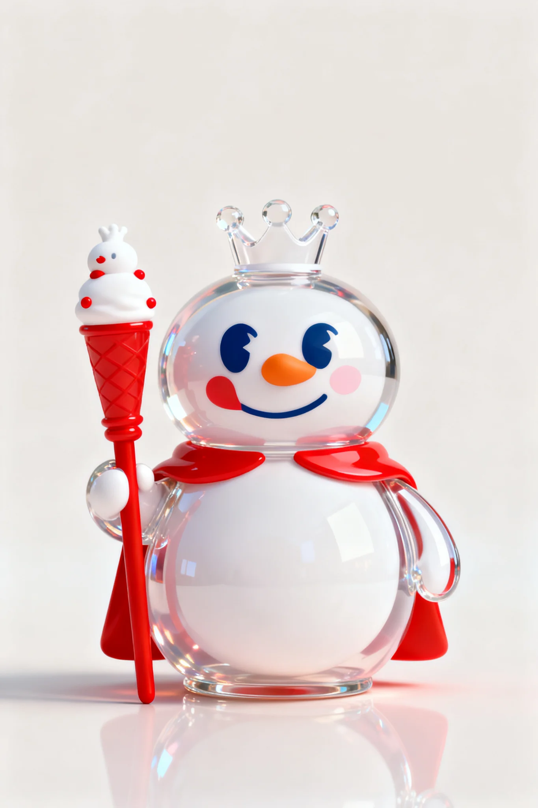

```
UI设计风格，参考Pinterest、Dribbble风格，OC渲染器，光线追踪，16K高清，红色和白色色调组合，白色和红点缀，透明反光玻璃质感，透明感，干净背景，浅色背景，大面积留白，Q版蜜雪冰城公仔，细节丰富。
```

```
蜜雪冰城，Q版公仔，红色和白色色调组合，白色和红点缀，透明反光玻璃质感，透明感，UI设计风格，光线追踪，干净背景，参考Pinterest、Dribbble 风格，使用OC渲染器，细节丰富，16K高清，浅色背景，大面积留白。
```

 [↑返回目录](#toc)

---
## <a id="jm-prompt-7574273709389778186">闽都印象</a> (<a href="https://jimeng.jianying.com/ai-tool/personal/MS4wLjABAAAAdUDFa2iBVxR3Epkp-aI7esnwL-pCzlhU0Dg9HR-LL5gxea0Ev-y2U1OQ8swdjUtS" target="_blank" rel="noopener noreferrer">R.LING</a>)

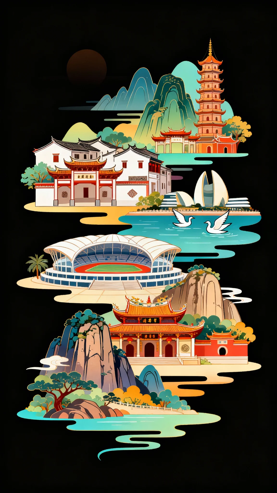

```
国潮艺术手绘矢量风格，横向排列构图，前后空间层次错落，元素包含福州三坊七巷历史文化街区、泉州清源山、厦门鼓浪屿白鹭体育馆、漳州三平寺、龙岩冠豸山、三明金烧山。渐变色彩，黑色背景，营造整体感与闽都烟火气。
```

```
福建城市地标插画，横向排列构图，前后空间层次错落，营造整体感与闽都烟火气，元素含三坊七巷（福州历史文化街区，）、泉州清源山、厦门鼓浪屿（白鹭体育馆）、漳州三平寺，龙岩冠豸山，三明金烧山，国潮艺术手绘矢量风格，渐变色彩，黑色背景，
```

 [↑返回目录](#toc)

---
## <a id="jm-prompt-7576486740366576946">森林之息高端伏特加</a> (<a href="https://jimeng.jianying.com/ai-tool/personal/MS4wLjABAAAA9rWYDqIMNGAmZ6UHW09WuTQtGNCxMNzeJ1h4vj53U18l055DjyT0dGecUpcBP29x" target="_blank" rel="noopener noreferrer">澄像方舟</a>)

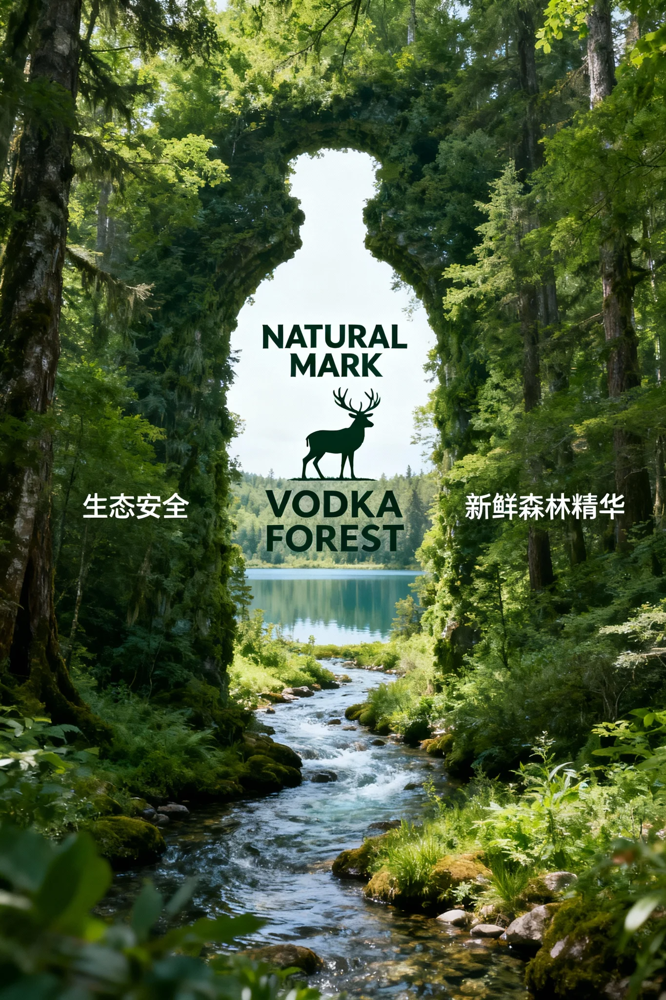

```
高端产品广告设计，茂密翠绿森林形成拱门式框架，框架内包含溪流、湖泊元素。品牌标识"NATURAL MARK"位于画面中心上方，下方是麋鹿图案，再下方依次排列"VODKA"和"FOREST"字样，"生态安全"与"新鲜森林精华"文案分布于画面两侧。清新自然色调，宁静生态氛围。
```

```
为伏特加产品 “NATURAL MARK” 设计高端广告图，以茂密翠绿的森林（含溪流、湖泊）形成拱门式框架，将品牌标识、麋鹿图案、“VODKA”“FOREST” 字样及 “生态安全”“新鲜森林精华” 的文案嵌入其中，整体采用清新自然的色调，营造宁静生态的氛围。
```

 [↑返回目录](#toc)

---
## <a id="jm-prompt-7567682363803618610">复古丝网印海报</a> (<a href="https://jimeng.jianying.com/ai-tool/personal/MS4wLjABAAAAIoijngioBMmOqU3J0NUbk_pspxDRsK02Zl6dj3v1MyKkNin3iIa1tjsMYascx_uz" target="_blank" rel="noopener noreferrer">Orion</a>)

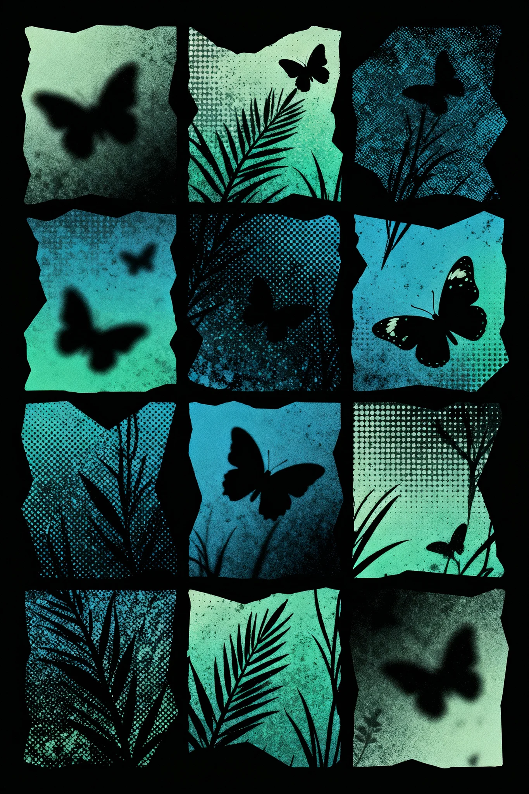

```
海报设计，复古风格，九宫格不规则拼接布局，弥散渐变效果，丝网印工艺质感，半调图案叠加，颗粒感纹理。随机分布的蝴蝶剪影，抽象植物线条，低饱和度蓝绿色调，黑色背景。随机构图，随机模糊处理，设计感强，暗色调氛围。
```

```
随机元素，随机场景，随机风格，随机镜头，随机氛围，九宫格不规则拼接。
海报，设计感，弥散，丝网印，半调图案，颗粒感，复古。
随机模糊，随机构图，随机蝴蝶，随机植物。
暗色调，不同低饱和度的蓝色、绿色，背景黑色。

```

 [↑返回目录](#toc)

---
## <a id="jm-prompt-7571996686927580454">忙着发财的卡通女孩</a> (<a href="https://jimeng.jianying.com/ai-tool/personal/MS4wLjABAAAAm8Ws1osQX5L_jzskzQyCPRWu3VK7nSviGV79tdBGqzWMXumFT1cyIi7nIMXuHzHS" target="_blank" rel="noopener noreferrer">烟雨洛神</a>)


```
可爱卡通风格，大红色背景，画面中心是扎双麻花辫的卡通女孩，头戴带有粉色腮红小兔装饰的白色帽子，佩戴镜片为黄色美元符号的黑色墨镜，身穿橙色上衣，双手抱着黄色元宝；背景点缀黄色铜钱、星星，以及"暴富"艺术字；下方有黄色文字框，内写"忙着發財"，底部配有英文"Get Rich"。整体色彩明亮，元素活泼，营造喜庆搞怪的"忙着发财"氛围。
```

```
可爱卡通风格，以大红色为背景，画面中心是扎双麻花辫的卡通女孩，头戴带有粉色腮红小兔装饰的白色帽子，佩戴镜片为黄色美元符号的黑色墨镜，身穿橙色上衣，双手抱着黄色元宝；背景点缀黄色铜钱、星星，以及 “暴富” 艺术字；下方有黄色文字框，内写 “忙着發財”，底部配有英文 “Get Rich”，整体营造出喜庆搞怪的 “忙着发财” 氛围。
```

 [↑返回目录](#toc)

---
## <a id="jm-prompt-7569950216363773230">卡卡西的忍术瞬间</a> (<a href="https://jimeng.jianying.com/ai-tool/personal/MS4wLjABAAAA3XAQqvkH6k2bi5tX5RwUEYyT-ulx6zk8wREpWLMPvppRKHL6OLWmlWYXse_5M1uu" target="_blank" rel="noopener noreferrer">我欲乘风</a>)

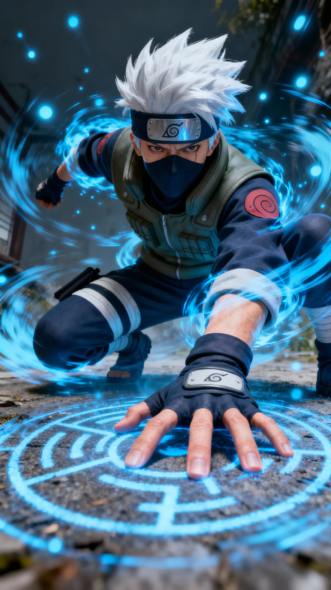

```
写真风格，火影卡卡西特写，白色头发，身着木叶忍服，佩戴忍者护额，手掌拍向地面展开结界印记，空间扭曲，蓝色查克拉粒子环绕身体，超广角低角度仰拍，PBR材质皮肤细节清晰，动态模糊的瞬身轨迹，蓝色查克拉能量包裹全身，景深强化忍术光斑残影。
```

```
写真风格的火影卡卡西，白色头发，木叶忍服，忍者护额，特写角度，使用忍术，手掌心拍向地上展开结界印记，空间扭曲蓝色查克拉粒子环绕身体，超广角低角度仰拍，PBR材质皮肤清晰可见，动态模糊的瞬身轨迹，蓝色查克拉能量包裹覆盖全身，景深强化使忍术产生光斑残影，
```

 [↑返回目录](#toc)

---
## <a id="jm-prompt-7555786629693148443">浮世绘少女的阴暗凝视</a> (<a href="https://jimeng.jianying.com/ai-tool/personal/MS4wLjABAAAAvNRVymXllrgzetWLrf_Z5bHrj290SRJPXVCpTzrKOOtx8xTrSgU8Nj9x-nWsT5iK" target="_blank" rel="noopener noreferrer">戴帽子的猫</a>)

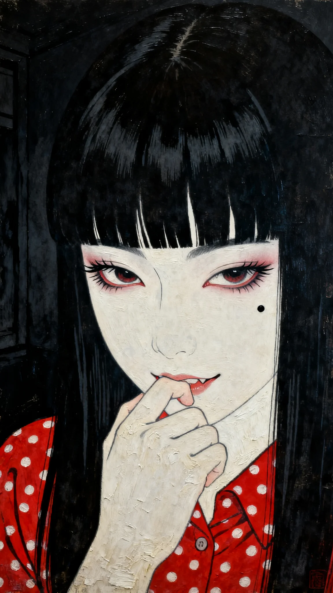

```
浮世绘风格，油画质感，涂抹感，肌理感，阴暗对比，物哀美学，日本恐怖电影设计。柔弱少女面部特写，黑色长直发公主切，弥生时代平整厚刘海，雪白肌肤，长睫毛，左眼角一颗小黑痣，红色带小白波点衬衫，嘴角若有若无笑意，咬指甲，眼神凌厉阴险。黑暗笼罩，无光环境，漆黑房间，恐怖氛围。
```

```
浮世绘风格，颜料和笔触，涂抹感，肌理感，油画，阴暗对比，隐藏在黑暗中，日本恐怖电影设计，物哀美学，柔弱的少女，黑色长直发公主切，弥生时代发型平整的厚刘海，雪白的肌肤，面部特写，长睫毛，左眼角有一颗小小的不起眼的黑痣，黑暗笼罩，无光环境，红色带有小小白色波点的衬衫，嘴角带着若有若无不易察觉的笑意，咬指甲，眼神凌厉阴险。恐怖氛围。漆黑的房间。
```

 [↑返回目录](#toc)

---
## <a id="jm-prompt-7549504881090923830">手账风格姜母鸭制作教程</a> (<a href="https://jimeng.jianying.com/ai-tool/personal/MS4wLjABAAAAl4X9ozst4sHqk9IIUxjJOzOyLf2e8FMTgdxhibpDbQ0kk6XRjs4mjOvOMe8cbNov" target="_blank" rel="noopener noreferrer">冉胖子的设计时光机</a>)


```
手账风格，出一个姜母鸭的制作步骤教程图，步骤说明要中文
```

 [↑返回目录](#toc)

---
## <a id="jm-prompt-7574070485240024347">剪纸艺术：冥婚队伍</a> (<a href="https://jimeng.jianying.com/ai-tool/personal/MS4wLjABAAAA_Op_GqZ0IebX08YVDMPyrYmcY5-r4Ha8nN9nZ_hIEydOvkkdpn81DgxzelOnbRZf" target="_blank" rel="noopener noreferrer">梦做🐴</a>)

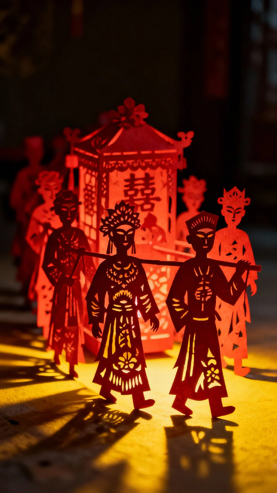

```
中国剪纸艺术风格，复杂红色剪纸分层结构，纸人迎亲队伍举行冥婚仪式，人物轮廓锐利，不祥的黄色背光照射，边缘高光明显，民间艺术质感，高对比度光影，深阴影层次，剪纸镂空细节清晰，背景暗部强化氛围。
```

```
中国剪纸艺术风格的纸人迎亲队伍，正在举行一场冥婚，复杂的红色剪纸，分层维度，被不祥的黄光背光照射，边缘锐利，民间艺术，高对比度，深阴影。)
·
```

 [↑返回目录](#toc)

---
## <a id="jm-prompt-7568809213384805682">极简山水纸语</a> (<a href="https://jimeng.jianying.com/ai-tool/personal/MS4wLjABAAAABVkj6Sfz-QdJWM7KoTbuxyD4cKdhYDcWonVq4DZJibUfUVLTTp5sU6-VoUqwdftY" target="_blank" rel="noopener noreferrer">顾小趣</a>)

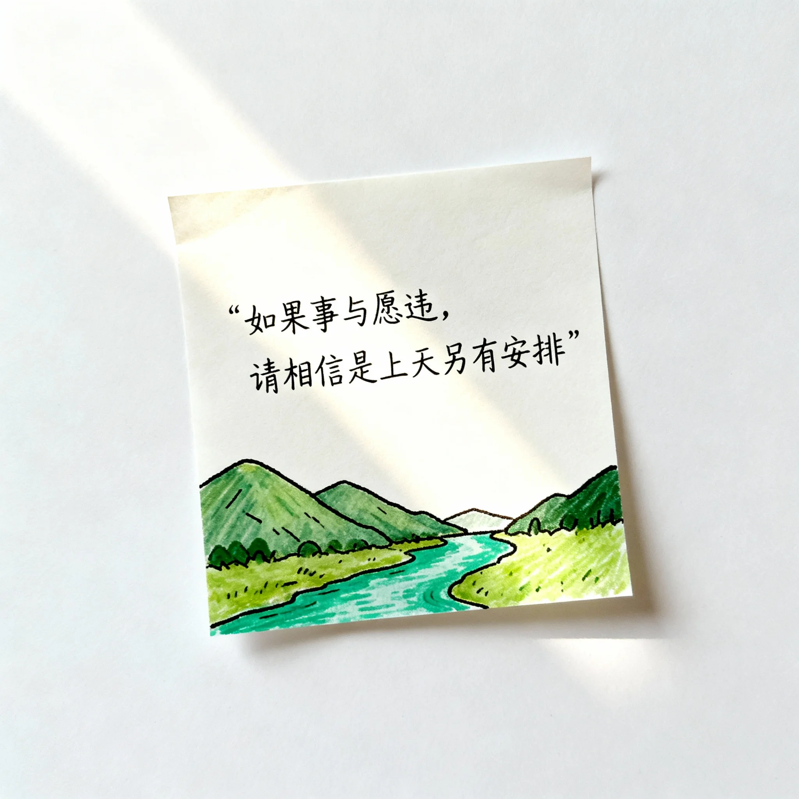

```
极简笔画风格，白色背景，一张纸，纸下方画青青的山和一条碧绿见底的河流，纸上书写"如果事与愿违，请相信是上天另有安排"，纸上有光。简洁线条，清新色调，极简氛围。
```

```
白色背景，一张纸，纸的下方画着青青的山和一条碧绿见底的河流，纸上书写：如果事与愿违，请相信是上天另有安排。纸上有光，极简笔画
```

 [↑返回目录](#toc)

---
## <a id="jm-prompt-7574030864225438986">藏族土拨鼠盲盒IP设计</a> (<a href="https://jimeng.jianying.com/ai-tool/personal/MS4wLjABAAAArVLwdfJXVdRQDlH0HkwhykBhK8tc9BRrSHKfadmpwdgBk9qUoBqAtpS1qhibm3ph" target="_blank" rel="noopener noreferrer">小风筝1225</a>)

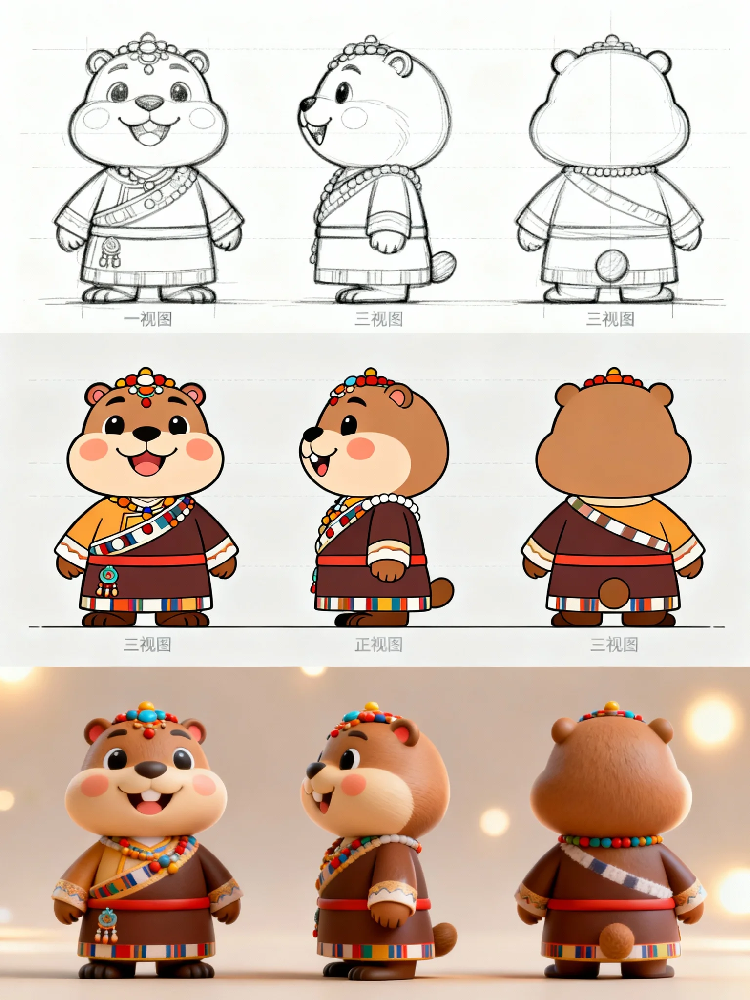

```
泡玛特风格3D盲盒，可爱的藏族土拨鼠拟人化IP，微笑表情，高清，超级细节，C4D渲染，柔和灯光，干净背景，从上到下依次展示：第一步设计IP三视图草图，第二步平面矢量三视图，第三步3D三视图渲染效果。
```

```
3D盲盒，可爱的藏族土拨鼠拟人化ip，微笑，高清，超级细节，泡玛特风格，C4D渲染，柔和灯光，干净背景，从上到下展示第一步：设计IP三视图草图，第二部：平面矢量三视图，第三步：3D三视图渲染效果
```

 [↑返回目录](#toc)

---
## <a id="jm-prompt-7567747279239580966">神秘的奇幻狗妖</a> (<a href="https://jimeng.jianying.com/ai-tool/personal/MS4wLjABAAAAKvP_CLg061A_okBKPgG7R-dmWH3S-N7l0SV7nsyoq3WjQlcu4Vv7fYz0YeyI5MRp" target="_blank" rel="noopener noreferrer">AIGC女魔头</a>)

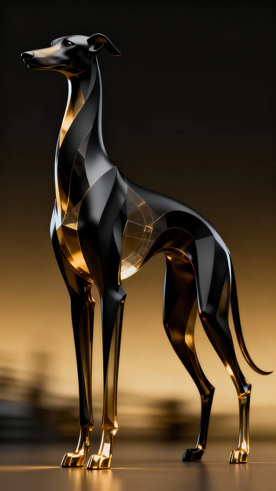

```
抽象风格，3D立体，OC渲染器，黑金色渐变，极简神秘的现代美学。奇幻狗妖，身材比例夸张，灵动优雅，修长流畅的完美形态，平滑质感。光影对比强烈，金属光泽，透明材质，几何结构，动态模糊，背景虚化，氛围神秘。
```

```
奇幻的狗妖，抽象风格，身材比例夸张，灵动，优雅，修长流畅，完美的形态，平滑，营造极简神秘的现代美学。黑金色渐变、3D立体，OC渲染器
```

 [↑返回目录](#toc)

---
## <a id="jm-prompt-7574813984356945161">皮克斯风格的大卫卡通半身像</a> (<a href="https://jimeng.jianying.com/ai-tool/personal/MS4wLjABAAAAAHZdroyowEKdv0Dp7hLXaMCf4_nKneMJi3Zrhcx0VWQ" target="_blank" rel="noopener noreferrer">木与于</a>)

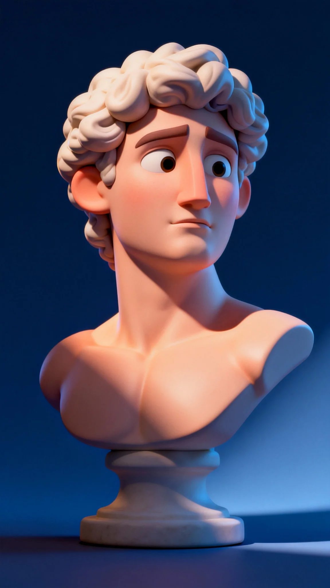

```
皮克斯动画风格，3D卡通，抽象，夸张，伦勃朗光，高清细节。大卫半身像卡通化，面部轮廓简化，五官比例夸张，肌肉线条圆润。深蓝色渐变背景，明暗对比强烈，光线从右上方45度角投射，形成明显高光与阴影区域。材质细腻，皮肤质感光滑，头发呈现蓬松的卡通造型。正视角构图，突出人物面部表情，整体色彩饱和度高，氛围神秘而富有艺术感。
```

```
大卫半身像的卡通半身像，，抽象，夸张，高清细节，深蓝色背景。皮克斯动画风格。 3D卡通，伦勃朗光
```

 [↑返回目录](#toc)

---
## <a id="jm-prompt-7575849755813612827">太极古城的宇宙视角</a> (<a href="https://jimeng.jianying.com/ai-tool/personal/MS4wLjABAAAAAUnHFy6bchGiyCgoNX0OixACXKCzQu9P0ms-OPVMuC556hxlkChoDAjO7M0CuUSn" target="_blank" rel="noopener noreferrer">MS驴</a>)

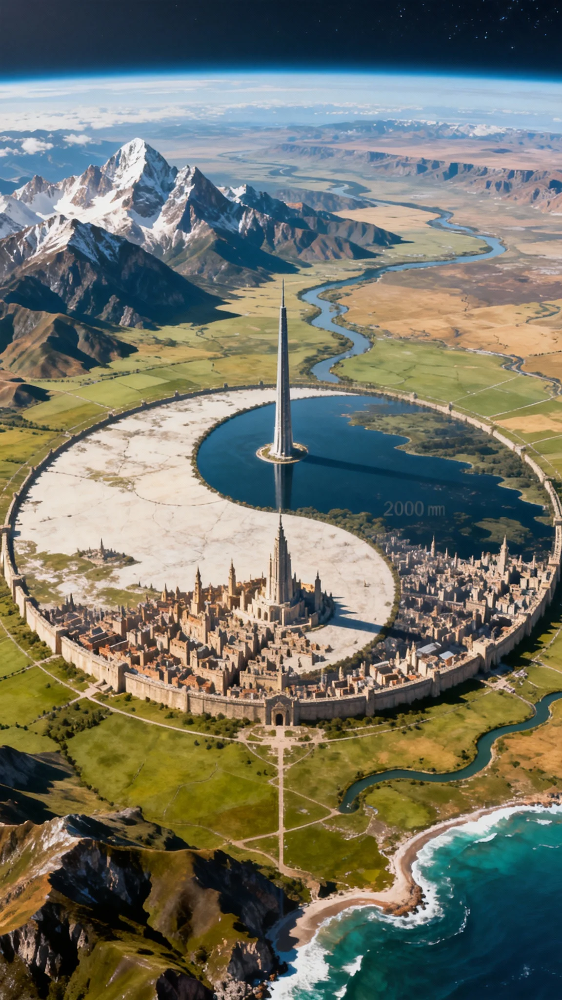

```
太空摄影风格，超广角视角，气势磅礴，地形起伏变化，山川河流交织，有雄伟高山、广袤平原、辽阔草原、蜿蜒海岸线，平原上有一座中世纪巨大城市呈太极图形状，阴阳鱼眼处各耸立一座2000米高塔直插天际，展现多姿多彩的自然景观。
```

```
整个地形起伏变化，山川河流交织，既有雄伟的高山，也有广袤的平原，既有辽阔的草原，也有一些城市，也有蜿蜒的海岸线，展现出多姿多彩的自然景观，平原上有一座中世纪巨大城市，像太极图一样，阴阳鱼眼处分别耸立一座2000米高塔直插天际，太空视角，气势磅礴，超广角，
```

 [↑返回目录](#toc)

---
## <a id="jm-prompt-7569895718375148827">蓝白幻彩隧道中的孤独行者</a> (<a href="https://jimeng.jianying.com/ai-tool/personal/MS4wLjABAAAAdk127vZNUq7c3s4naN3LJFXRIP-wXkVPrkpWZH0JkLtdRayCKCCakktMWbZEe2Od" target="_blank" rel="noopener noreferrer">深海牧鱼</a>)


```
抽象艺术风格，高饱和度蓝白色调，凹陷构图，低角度仰拍，蓝白幻彩液体构成的无限延伸隧道，尽头有一个行走的小人，背影伤感。隧道边缘渐变模糊，梦幻氛围，故事感，意境深远，抽象质感，光影柔和。
```

```
随机元素，蓝白幻彩液体构成的无限延伸隧道，尽头行走的小人，伤感背影，高饱和度，凹陷构图，梦幻，抽象，。随机风格，随机镜头，随机氛围，美学，故事感，意境深远，随机模糊，随机构图，随机人物，随机色调。
```

 [↑返回目录](#toc)

---
## <a id="jm-prompt-7572936745205894409">闪亮猫爪Q版头像框</a> (<a href="https://jimeng.jianying.com/ai-tool/personal/MS4wLjABAAAA_uUL08YMsnAFAJ1DOdWm6be2Xb5BTOpoto3vBSFoiAA" target="_blank" rel="noopener noreferrer">兔纸菌</a>)

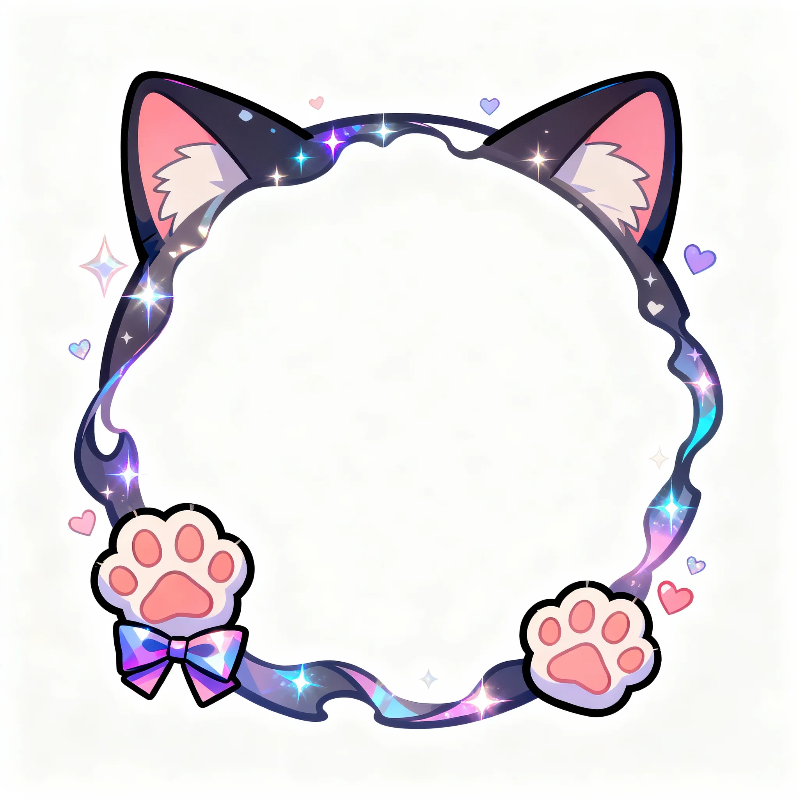

```
2D游戏素材，Q版二次元风格，抽象提炼，飘逸，均匀光照，不规则圆形，不对称设计，大量留白，黑色背景，游戏头像框，闪亮可爱猫爪主题，可爱猫耳朵，猫爪，少量有层次感和清晰轮廓的扁平蝴蝶结，零星爱心点缀，创意设计，唯美，可爱配色，氛围感，光泽，互补色点缀，虚实变化，主次区分，节奏感，块面感，大师杰作。
```

```
2D游戏素材，飘逸，均匀光照，不规则圆形，不对称设计，大量留白，大师杰作，黑色背景，游戏头像框，抽象提炼，闪亮可爱猫爪主题，可爱猫耳朵，猫爪，少量有层次感和清晰轮廓的扁平蝴蝶结，零星爱心点缀，创意设计，唯美，可爱配色，氛围感，光泽，互补色点缀，虚实变化，主次区分，节奏感，Q版二次元结合，块面感
```

 [↑返回目录](#toc)

---
## <a id="jm-prompt-7567763094768848154">雪夜的侧颜</a> (<a href="https://jimeng.jianying.com/ai-tool/personal/MS4wLjABAAAAJAYo-rMASs-vw3bu0X4-raSY521wz471OfqbOYMgb1_DzN5eTCumMKH99JokFiar" target="_blank" rel="noopener noreferrer">用户2796208147966</a>)

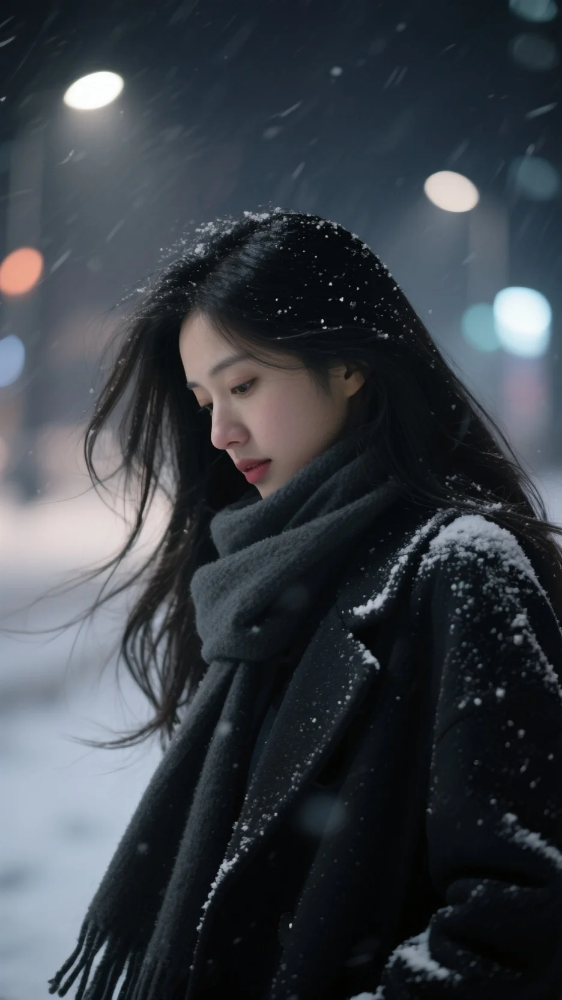

```
32k高清，下雪的夜晚，长头随风飘动，半遮美丽的脸，侧脸低头，眼神迷离，表情细腻自然，模糊的城市路灯暗调背景，发丝光柔和，面部清晰，线条流畅，大衣，围巾，特写，大师杰作，高级感，神秘感
```

 [↑返回目录](#toc)

---
## <a id="jm-prompt-7543348045002460467">奥巴马夸张漫画肖像</a> (<a href="https://jimeng.jianying.com/ai-tool/personal/MS4wLjABAAAAQfnhD903VIlXXnSEA8uexfTRdX9IIty3BwuGxwAdQMA4Qeulga_awuYK-8BJ0DyY" target="_blank" rel="noopener noreferrer">心路</a>)

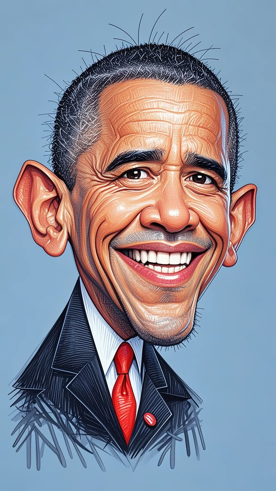

```
一幅滑稽夸张的人物肖像，奥巴马，突出幽默和古怪的特点，漫画风格、夸张的大头，夸张俏皮的神情。纯色背景。极致高清和细节。创意手稿，彩铅线条涂鸦，漫画，抽象，夸张，凌乱，插画，32k高清
```

 [↑返回目录](#toc)

---
## <a id="jm-prompt-7571999894085438746">风中骑行</a> (<a href="https://jimeng.jianying.com/ai-tool/personal/MS4wLjABAAAAasmu_6G1B9-oa4YihIO3LzeKGopUQcWAzvCZHm_NobaE0DrPRFEw7Cwnv296wQ7v" target="_blank" rel="noopener noreferrer">自得其乐</a>)


```
满屏的一大片草地（草被风吹动，翠绿的颜色），三朵大小不一的云低空飘在草地上（小朵的云，连片的云，分别在近处和远处），投射出阴影，一个很小的身影在草地上骑着自行车，风吹起围巾。治愈系风格，绿色清新颜色，广角拍摄，宏大场景。
```

 [↑返回目录](#toc)

---
## <a id="jm-prompt-7572094401955122459">星际穿越：黑洞的诱惑</a> (<a href="https://jimeng.jianying.com/ai-tool/personal/MS4wLjABAAAAwz7Pd4WcKdE3wkuR7syenQMz7SrsQXXGH7bXlkS4NxA" target="_blank" rel="noopener noreferrer">啊洁Jey</a>)

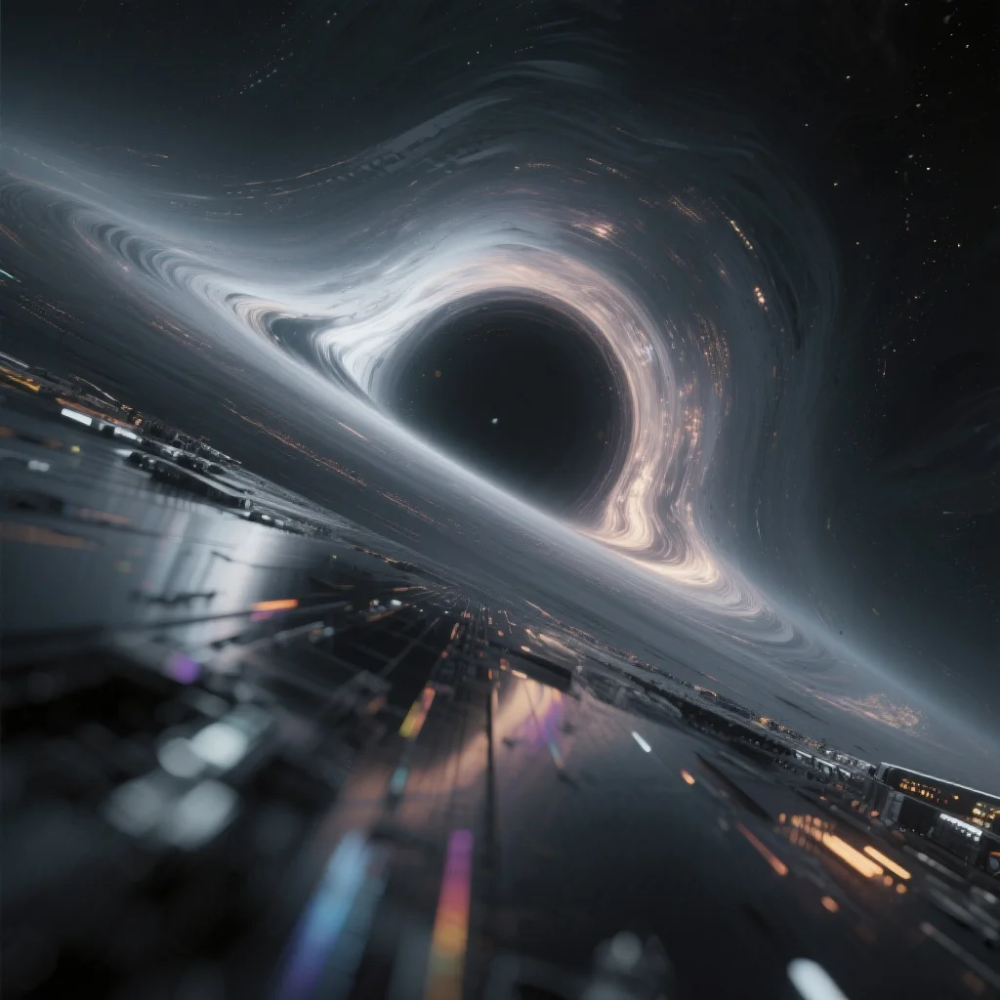

```
星际穿越，黑洞，C4D，3D建模，oc渲染，光线追踪，动态模糊，景深，超现实主义，深灰，画面通过细腻的丰富的色彩层次塑造主体与场景，质感真实，暗黑风背景的光影效果营造出氛围，整体兼具艺术幻想感，夸张的广角透视效果，耀光，反射，
```

 [↑返回目录](#toc)

---
## <a id="jm-prompt-7575092121925864754">奢华护肤品的极致视角</a> (<a href="https://jimeng.jianying.com/ai-tool/personal/MS4wLjABAAAAD7U3ClEc28HsBH6i9rv-OxGTVovSQ8tJgTRAwUwV-BE" target="_blank" rel="noopener noreferrer">浪GE</a>)


```
高端产品摄影风格，仰视角构图，机位下移，低饱和暗金色调，朦胧暧昧氛围，柔和阴影增强立体感。6件护肤品整齐摆放在多块平台上，层次感和节奏感强：洗面奶、乳液、爽肤水放高一个台子，面霜、眼霜、BB霜放低平台。所有产品采用暗橙色渐变到米色高端配色，包装设计精致，金属质感瓶盖和瓶身。一块低饱和暗金色丝绸布料从上往下铺设到平台，背景为低饱和渐变暗金色，前景有模糊的橙色花和光斑。产品极端特写镜头，突出精致细节，整体呈现高端、奢华、专业品牌形象。
```

```
机位下移、采用仰视角拍摄构图，多块平台上整齐摆放着6件护肤品，恰到好处的摆放在一起（层次感和节奏感），产品：“一罐面霜、一小罐眼霜、一瓶乳液、一瓶爽肤水、一支洗面奶、一支BB霜”（洗面奶、乳液、爽肤水放高一个台子）。所有产品都采用暗橙色渐变到米色高端配色方案，包装设计精致，有金属质感的瓶盖和瓶身。朦胧的暧昧氛围，柔和的阴影增强了产品的立体感和质感，一块低饱和暗金色的丝绸布料从上往下铺设下来到平台上、背景是低饱和的渐变暗金色，前景有一朵橙色的花已经被模糊不清、还有模糊掉的光斑，场景整体是低饱的暗金色调，体现奢华品质。突出产品的精致细节，整体呈现出高端、奢华、专业的品牌形象，产品的极端特写镜头
```

 [↑返回目录](#toc)

---
## <a id="jm-prompt-7568308446366354715">梦境童趣涂鸦</a> (<a href="https://jimeng.jianying.com/ai-tool/personal/MS4wLjABAAAAAVdqgAJ9PqIvHylS9S0VnAB75aXweFaUgXIyJhcPedU" target="_blank" rel="noopener noreferrer">依玲谭</a>)

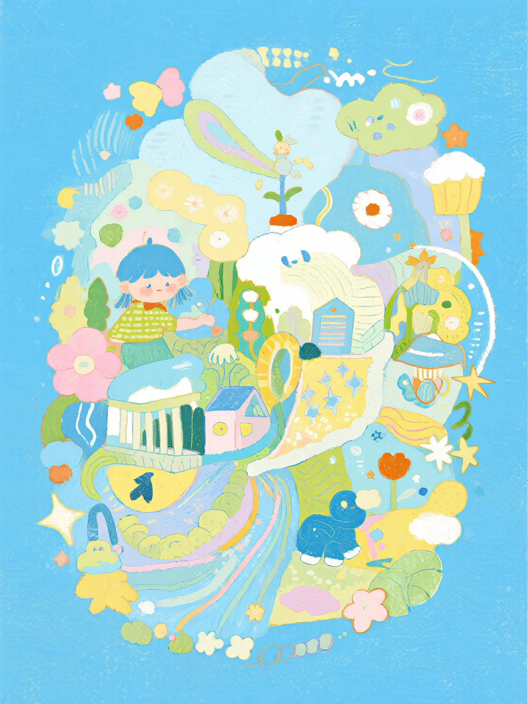

```
极繁画风，治愈系插画，童趣，涂鸦风格，意识流，梦境插画，大色块，颗粒感，增加肌理，抽象插画，扁平插画，纯色背景。卡通可爱莫奈
```

 [↑返回目录](#toc)

---
## <a id="jm-prompt-7567213679041711370">国风柿子与喜鹊纹样</a> (<a href="https://jimeng.jianying.com/ai-tool/personal/MS4wLjABAAAA0gsmwUkHtZauc9F8z0eGDrZpbqHEgan6ZGmdWlwSqq57Sjh_a2Y1NVEdhWeyISIv" target="_blank" rel="noopener noreferrer">小鹿设计</a>)

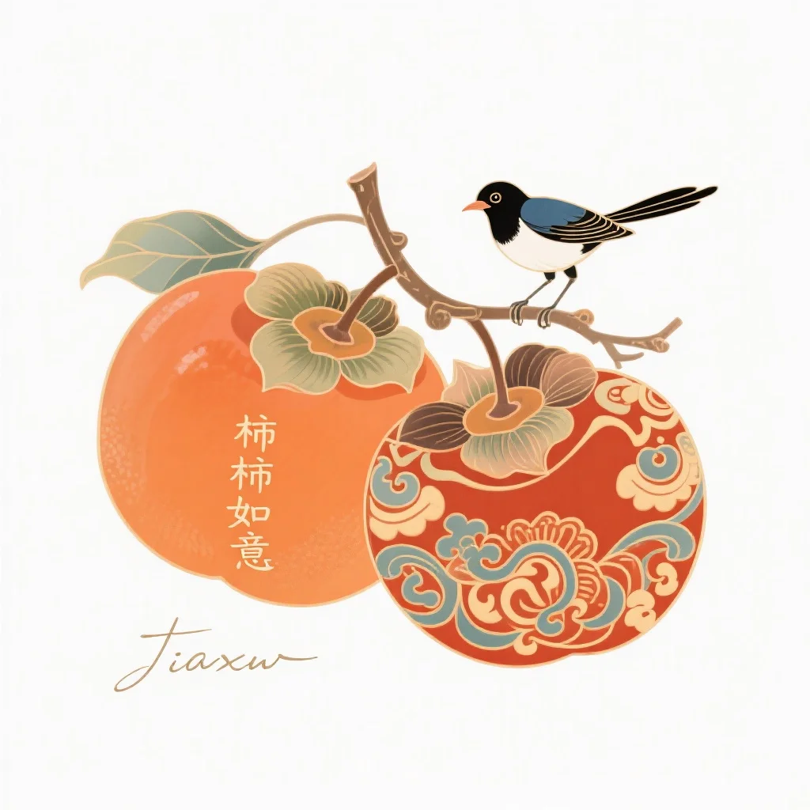

```
在纯白色背景上，国风纹样柿子，呈现一幅极致细节的高清矢量彩色图案，以古朴色调为主，绘制带有国风纹样的柿子，旁边有灵动的喜鹊栖息，画面充满艺术感，细腻靓丽色调，精致线条。写上，柿柿如意，签名Jiaxw
```

 [↑返回目录](#toc)

---
## <a id="jm-prompt-7571039917711625481">扭曲视角下的蓝色男子</a> (<a href="https://jimeng.jianying.com/ai-tool/personal/MS4wLjABAAAAKCMt4Q2LvycZAACqqXWlpN_C7lqr6K3Gi7PSozJcdu2hLK-Wm04jTsSXu2S1aUW6" target="_blank" rel="noopener noreferrer">愚人界</a>)

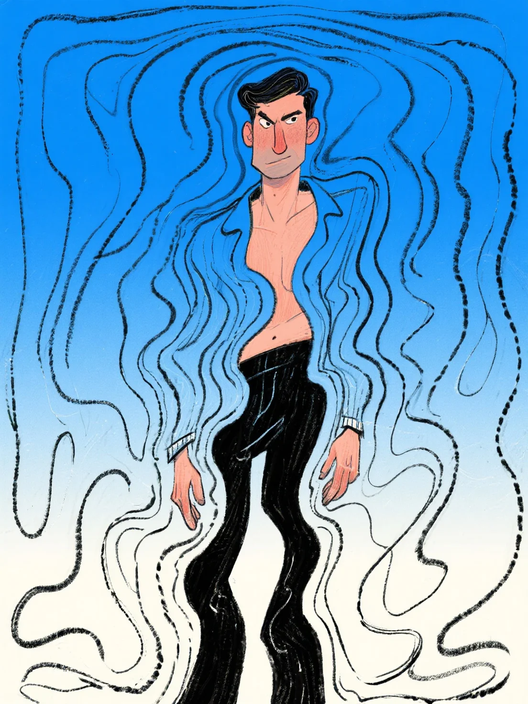

```
线条扭曲夸张纹理笨拙笔意，创意比例，乖张快意，张力，另类，吐槽感，幽默趣味儿，全景，蓝色唐突渐变翻转色背景，中部遮掩一半身男子
```

 [↑返回目录](#toc)

---
## <a id="jm-prompt-7572827020741184818">草浪云影中的骑行少年</a> (<a href="https://jimeng.jianying.com/ai-tool/personal/MS4wLjABAAAApYulxhWqG7_NTYdhGlvn38ZaikWbeYmVK5QLxqHIjH0ioPb9CVxowwE7QFyIc_t_" target="_blank" rel="noopener noreferrer">用户5688808828585</a>)


```
治愈系风格，绿色清新色调，广角拍摄，宏大场景。一大片翠绿的草被风吹动，三朵大小不一的云低空飘在草地上，小朵的云、连片的云分别在近处和远处，投射出阴影。一个很小的身影在草地上骑着自行车，风吹起围巾。草浪动态，云影斑驳，清新治愈氛围。
```

```
满屏的一大片草地（草被风吹动，翠绿的颜色），三朵大小不一的云低空飘在草地上（小朵的云，连片的云，分别在近处和远处），投射出阴影，一个很小的身影在草地上骑着自行车，风吹起围巾。治愈系风格，绿色清新颜色，广角拍摄，宏大场景。
```

 [↑返回目录](#toc)

---
## <a id="jm-prompt-7573432998620679433">海边三宫格</a> (<a href="https://jimeng.jianying.com/ai-tool/personal/MS4wLjABAAAAzpH0F2c4xkpqCJmvjh6grynvNfPdJx7jo1-1TnTFPBcMOOt2m3q6H_UhcxmpC9tz" target="_blank" rel="noopener noreferrer">彩虹君</a>)

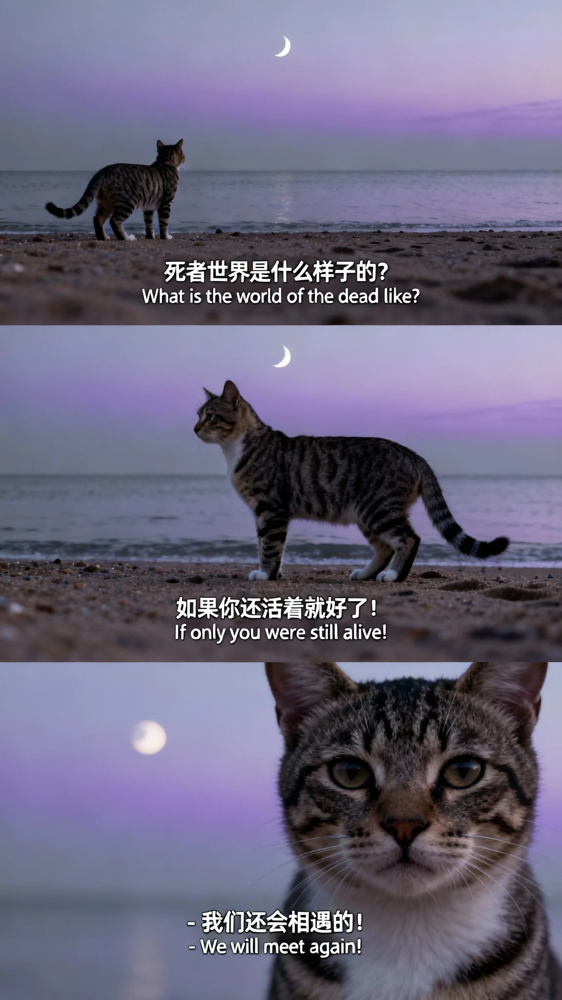

```
三宫格艺术感宠物写真图，三张图分别为近景、侧身站立、特写构图；场景为海边沙滩，有下弦月，中国狸花猫，天空淡紫与灰色渐变，海面平静；整体色调清冷，文艺且充满自我探索情绪氛围。第一张近景：中国狸花猫站在沙滩上的背影，画面下方添加中英字幕"死者世界是什么样子的？""What is the world of the dead like?"；第二张侧身站立：中国狸花猫侧身站立于海边，画面下方添加中英字幕"如果你还活着就好了！""If only you were still alive!"；第三张特写：中国狸花猫露脸，画面下方添加中英字幕"- 我们还会相遇的！""- We will meet again!"。
```

```
将图片编辑为三宫格艺术感宠物写真图，场景替换为海边有下弦月的沙滩，中国狸花猫，天空呈淡紫与灰色渐变，海面平静，整体色调清冷，营造文艺且充满自我探索情绪的氛围。第一张为近景，宠物站在沙滩上的背影，添加中英字幕：死者世界是什么样子的？；第二张是宠物侧身站立于海边，添加中英字幕如果你还活着就好了！；第三张是特写(宠物露脸)，添加中英字幕“ - 我们还会相遇的！
```

 [↑返回目录](#toc)

---
## <a id="jm-prompt-7566806133264928027">月光下的温馨故事</a> (<a href="https://jimeng.jianying.com/ai-tool/personal/MS4wLjABAAAAkIxzVTMpqbVlj06s-rGxDz_5wAD5FnBDQ0IvZ1rdkdS0h8qq4Z49ACdN-tjHlzfn" target="_blank" rel="noopener noreferrer">奥利妈妈</a>)

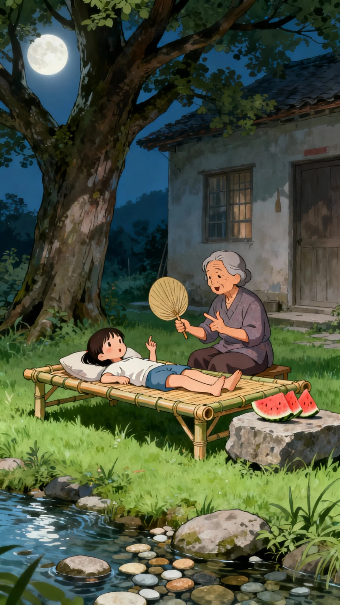

```
漫画插画风格，柔和月光，青绿色草地，一棵大树下外婆的房子旁，竹床子上躺着一个小女孩，外婆坐在旁边，一手拿蒲扇扇风，一手比划着讲故事。竹床旁石头桌子上放着切好的几块西瓜，远处小溪水流过，溪底鹅卵石清晰可见。温馨氛围，画面细腻，色彩柔和。
```

```
小时候一个女孩在外婆家的房子旁边有一棵大树，一大片草地都是绿色我和外婆在那边放了一只竹床子纳凉，我躺着，外婆坐在我的旁边，一边给我讲故事，一边给我扇扇子在竹场子的旁边有一个石头的桌子上面放着切好的几块西瓜，月光很柔和途中不远处有一条小溪能看见鹅卵石的那种绘画风格是漫画插画风格
```

 [↑返回目录](#toc)

---
## <a id="jm-prompt-7572490864589638950">冬日电影叙事</a> (<a href="https://jimeng.jianying.com/ai-tool/personal/MS4wLjABAAAAkXdsv42E4tme3RPsMmYb4cvGMlfA6OO2dI6CBSA2m7I-UyUrE9ETvliPM4P9whSw" target="_blank" rel="noopener noreferrer">请输入名字</a>)

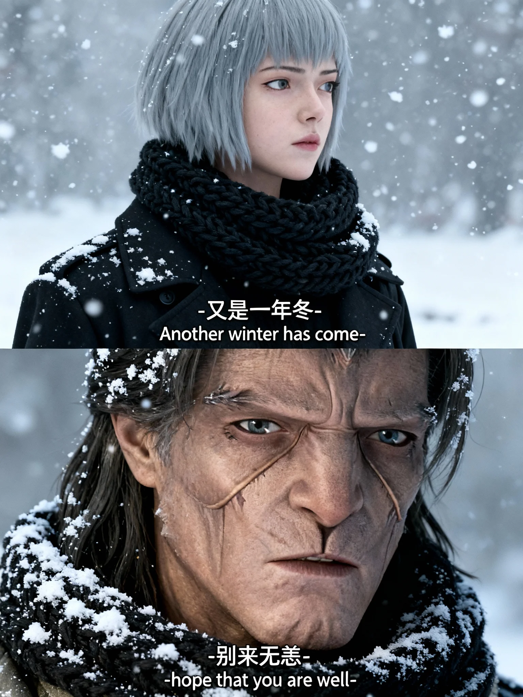

```
上下拼接格式的冬日电影感叙事写真，呈现清冷孤寂氛围，冷灰调，细腻雪花飘落，cinematic质感；上部近景是身着黑色厚风衣搭配粗针织黑围巾的浅灰短发年轻女人，雪花点缀服饰，眼神忧郁望右侧，画面有中英文字幕“又是一年冬-Another winter has come-”；下部面部特写是长发中年男人，面部与围巾细节清晰，头发覆雪，围巾积雪，眼神具故事感，光影柔和，画面有中英文字幕“别来无恙-hope that you are well-”，两张图各占画面一半。
```

```
以图片人物为基础，生成一张上下拼接在一起的格式的冬日电影感叙事写真，每张图固定比例占比一半，整体为清冷孤寂的冬日大雪场景，冷灰调，细腻雪花飘落，cinematic 质感。画面中有人物和参考图一致，上部第一张为近景，黑色厚风衣+粗针织黑围巾，雪花点缀，眼神忧郁望右侧，添加中英文字幕“又是一年冬-Another winter has come-”； 第二张是面部特写，面部与围巾细节，头发覆雪，围巾积雪清晰，眼神具有故事感，光影柔和，添加中英文字幕“别来无恙-hope that you are well-” 两张图合成一个拼图。
```

 [↑返回目录](#toc)

---
## <a id="jm-prompt-7550207182571130131">虚拟潮流</a> (<a href="https://jimeng.jianying.com/ai-tool/personal/MS4wLjABAAAAGjQvQsQ0HNGASqrTnZYjCbuEntmJId6pepN0DqyfYmJ8KRDrez3Yz1huNyZ4beoe" target="_blank" rel="noopener noreferrer">洋葱</a>)

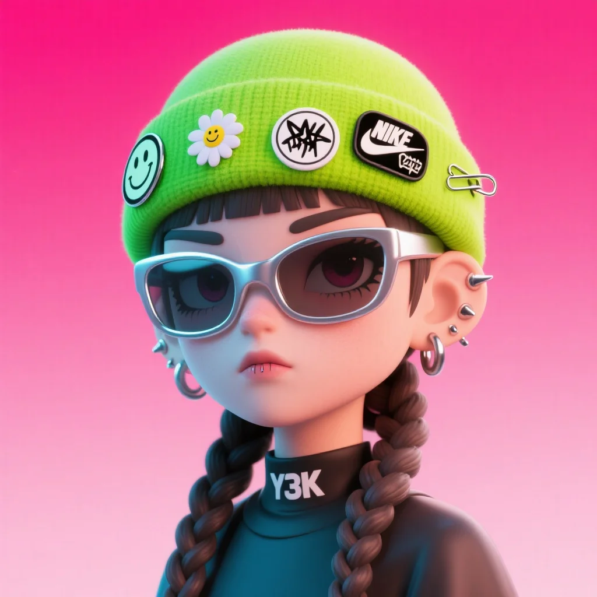

```
一个3D风格的虚拟潮流角色肖像，角色拥有麻花辫、眉钉、冷酷表情，佩戴未来感银色大眼镜，戴一顶荧光绿毛呢材质的帽子，半身照，帽子上别有多个徽章，包括一个笑脸小花徽章、一个黑白涂鸦徽章、一个Nike安全别针等嘻哈元素，背景为玫红色渐变色，画风干净简洁，角色光影细腻，呈现次世代渲染质感，视觉风格融合Y3K与潮玩设计风，偏态度感、虚拟偶像风格，居中构图
```

 [↑返回目录](#toc)

---
## <a id="jm-prompt-7573575358570614067">国风水彩韵</a> (<a href="https://jimeng.jianying.com/ai-tool/personal/MS4wLjABAAAAEPt3OPXX26ru5vDstOfOgJbGs3YYfVVpZHeRoWi2L3g" target="_blank" rel="noopener noreferrer">momo</a>)

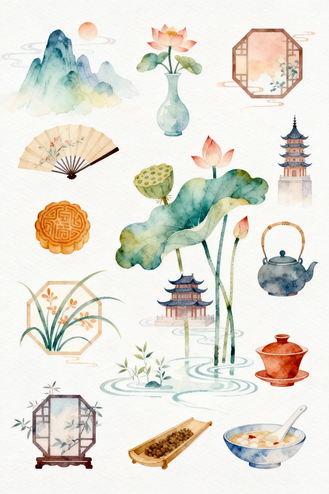

```
国风，清新艺术水彩板画风格，色彩柔和晕染，线条简洁灵动，手绘质感，文艺清新调性，画面包含各式各样的中国元素，造型扁平化且富有辨识度，弱化复杂光影，突出轻盈感，大面积留白，故事感氛围，温暖细腻色调，治愈系情感传递，色彩过渡自然通透。
```

```
国风，清新艺术水彩板画，色彩柔和晕染，线条简洁灵动，手绘质感，文艺清新调性，画面有故事感，温暖细腻，治愈系，契合文艺艺术的清新感，传递共鸣的情感，色彩过渡自然通透，造型扁平化且富有辨识度，弱化复杂光影，突出画面轻盈感，大面积留白，各式各样的中国元素
```

 [↑返回目录](#toc)

---
## <a id="jm-prompt-7569866686963207462">代码粒子亚丑钺</a> (<a href="https://jimeng.jianying.com/ai-tool/personal/MS4wLjABAAAAGT26bjcSbTBpY78U0a-UYHY3WCcwJ8af4Gvdc92HB4Fx4gtc0bdGxxtNKPMQ4bVt" target="_blank" rel="noopener noreferrer">卢西西</a>)

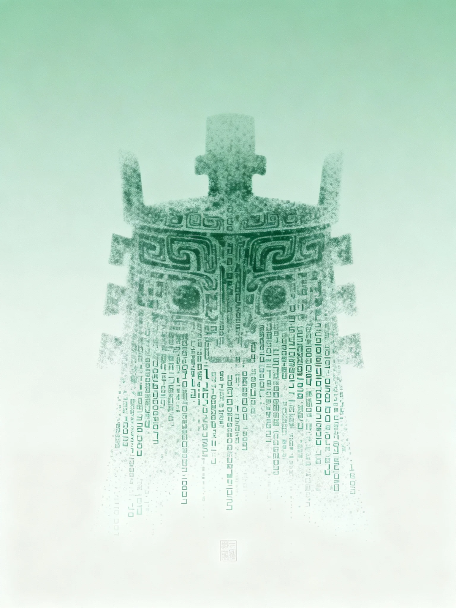

```
前卫先锋新中式海报，大师级排版，极简主义，意识流，浅绿渐变极简背景，极致留白，禅意氛围。画面中间主体为亚丑钺正面，由无数代码粒子弥散组成，呈现从模糊到清晰的影像和轮廓，中景构图。神秘，科技感。
```

```
前卫先锋新中式海报，大师级排版，画面中间主体为亚丑钺正面，由无数代码粒子弥散组成，从模糊到清晰的影像和轮廓，浅绿渐变背景，极简背景，新中式，极致留白，禅意，意识流，极简主义，中景，神秘，科技感
```

 [↑返回目录](#toc)

---
## <a id="jm-prompt-7572979743348313390">Q版唐僧表情九宫格</a> (<a href="https://jimeng.jianying.com/ai-tool/personal/MS4wLjABAAAAoOb20MFMAzjSUUB2TpxXxIoq77kKVkVBEA1JrICe7OmUuUQ22-R85wQxSq0BKG44" target="_blank" rel="noopener noreferrer">曾惠</a>)

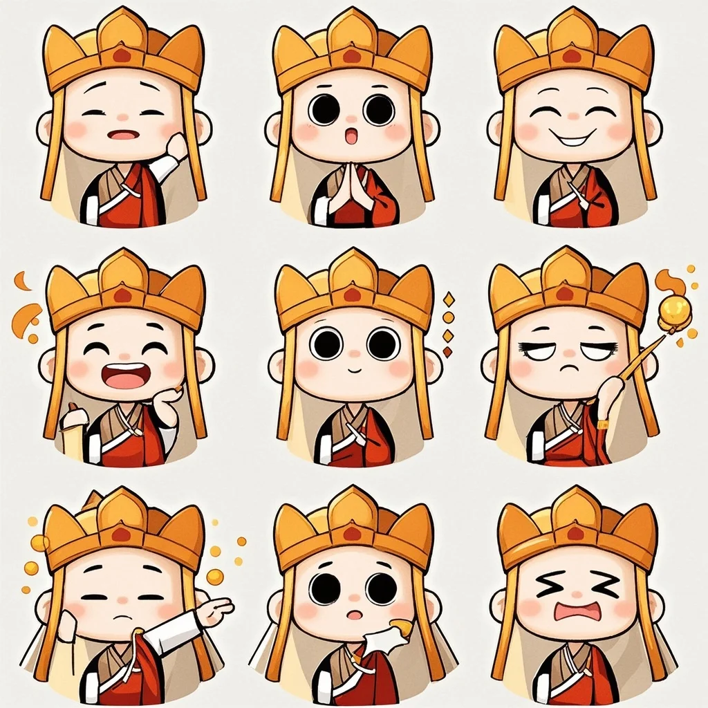

```
漫画卡通风格，Q版可爱唐僧9格表情包
```

 [↑返回目录](#toc)

---
## <a id="jm-prompt-7571030683410320650">静物咖啡摄影：橙香冰美式</a> (<a href="https://jimeng.jianying.com/ai-tool/personal/MS4wLjABAAAA87f-4qO4weEHKVwDgYngx8dDAJ-4UTcYT8GXEUo67lZC5-16aKjFDcuuni98_gsF" target="_blank" rel="noopener noreferrer">哈哈熊</a>)

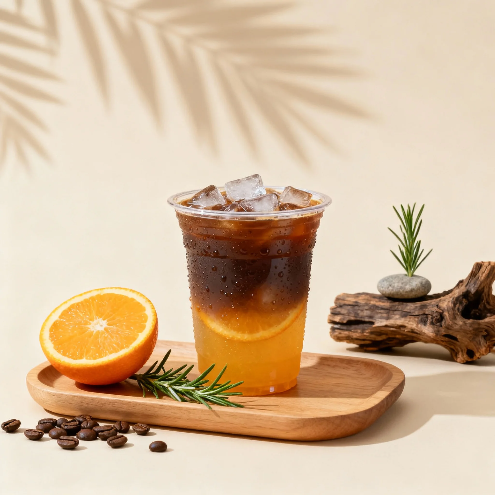

```
日式极简风格，静物摄影，商业咖啡摄影，透明塑料杯装分层冰橙C美式，杯身凝结水珠，冰块浮于表面，浅棕色木质托盘，新鲜迷迭香枝，半个橙子，散落的咖啡豆，风化木摆件，带迷迭香的小鹅卵石，接近正视图，浅米色背景，自然光影，叶片投影，温暖色调，柔和阴影，高清晰度，8K分辨率。
```

```
一张商业咖啡摄影，透明塑料杯中的分层冰橙C美式，杯身凝结水珠，冰块浮于表面，浅棕色木质托盘，新鲜迷迭香枝，半个橙子，散落的咖啡豆，风化木摆件，带迷迭香的小鹅卵石，接近正视图，浅米色背景，自然光影，叶片投影，日式极简风格，静物摄影，温暖色调，柔和阴影，高清晰度，8K分辨率
```

 [↑返回目录](#toc)

---
## <a id="jm-prompt-7571813629964602675">毛毡风格的森林长椅</a> (<a href="https://jimeng.jianying.com/ai-tool/personal/MS4wLjABAAAAyKHEfIEFHNJopVHRRBkdHSSAGvkAmdQWo6s_MHeWT4-egfaafY5nNNny4p7mV4dl" target="_blank" rel="noopener noreferrer">魔法森林</a>)

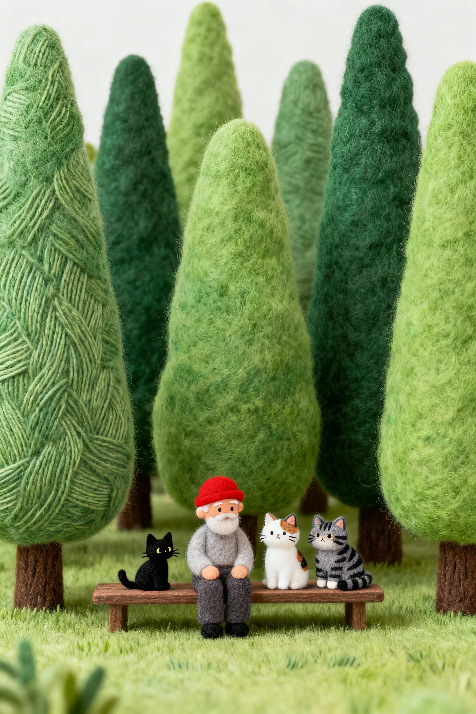

```
毛毡风格，极细的线条，层次感绿色，肌理丰富，大面积的绿色。高低不同、形状不同的树林中，坐在长条凳子上的戴红色帽子的老人旁边有一只小黑猫、一只白色居多的三花小猫、一只灰黑色虎斑矮脚小猫。主次分明，情绪铺垫。
```

```
树林，高低不同的树木，形状不同的树木，大面积的绿色，极细的线条，层次感绿色，肌理丰富，坐在长条凳子上的戴红色帽子的老人旁边有一个小黑猫，一只白色居多的三花小猫，一只灰黑色虎斑矮脚小猫。主次分明，情绪铺垫，毛毡风格。
```

 [↑返回目录](#toc)

---
## <a id="jm-prompt-7567426289141812506">印象派周杰伦素描</a> (<a href="https://jimeng.jianying.com/ai-tool/personal/MS4wLjABAAAAYiz6JjAy_OdSR5c7A6PcCB21zVfQp1kGSVzJ8xsgHAADPeELw7W9y0fEO-ZAi84y" target="_blank" rel="noopener noreferrer">我们我们</a>)

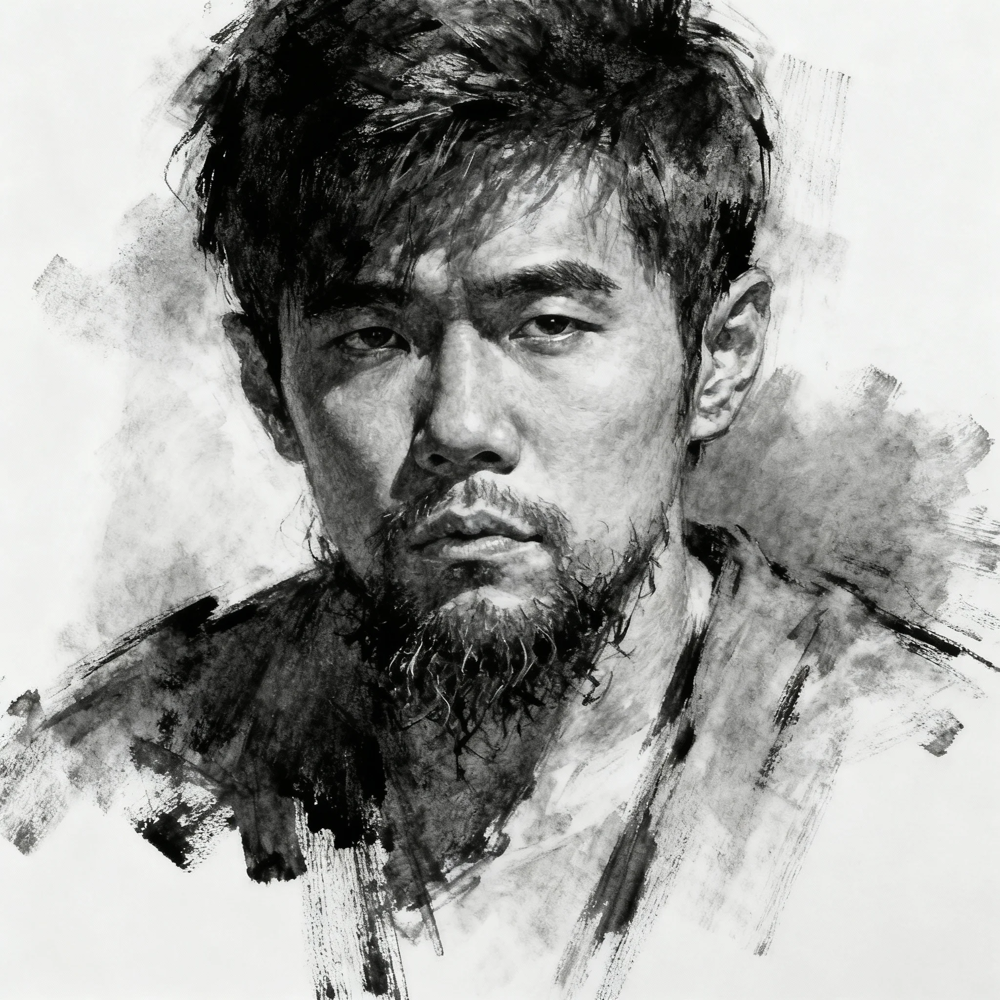

```
木炭条素描，印象派风格，粗旷笔触，手指拭擦痕迹，灰朦光影，虚实过渡，周杰伦面部大写意轮廓，凌乱胡须，宽松服饰，立体光影，黑白灰层次，笔触肌理，大写意氛围。
```

```
木炭条素描，印象派风格，仅凭木炭条在白纸上粗旷肆意地涂刷，手指轻轻拭擦塑造出周杰伦面部大写意轮廓，大写意的凌乱的胡须、大写意的服饰，灰朦的立体光影，细腻的虚实过渡，大写意的灰朦光影。
```

 [↑返回目录](#toc)

---
## <a id="jm-prompt-7554644146540186890">中国</a> (<a href="https://jimeng.jianying.com/ai-tool/personal/MS4wLjABAAAAY48tdfAMu_UsjgfAQrUWeSgiH9KxgEdLdUEPJRFqlB4OqRBYr-Hb3_zFlNawHchM" target="_blank" rel="noopener noreferrer">风拾裙角</a>)

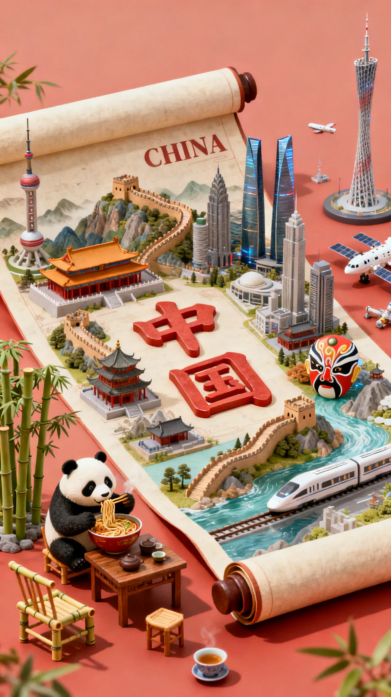

```
3D渲染风格，梦幻真实质感，材质光泽感强，浅红色背景，超清画质，极致细节，电影般构图。打开的卷轴画卷上，中国城市景观微缩模型，中间"中国"繁体立体大字，周围环绕古典故宫、蜿蜒长城等古建，穿插大好河山、熊猫吃面、茶馆桌椅、竹椅、竹林、京剧面具等元素，同时展示东方明珠、成都双子塔、广州塔等现代建筑，高铁、航天等科技成果。画布上方印有英文"CHINA"。色调温暖明快，打光柔和，画面生动饱满，细节丰富，充满活力与朝气。
```

```
一副打开的卷轴画卷，上面是中国城市景观微缩模型，中间有“中国”两个繁体的立体大字。围绕立体大字有古典故宫、雄伟蜿蜒盘踞的长城等古建，有大好河山，也有东方明珠、成都双子塔、广州塔等现代建筑，加入熊猫吃面、茶馆桌椅、竹椅、竹林、京剧面具等元素，并有高铁、航天等科技突飞猛进的成果展示，描绘出一副盛世的画面。画布上方印有英文 “CHINA”，整体画画面生动，细节丰富画面饱满，色调温暖明快，充满活力与朝气。整体风格 3D 渲染，具有梦幻真实质感，材质设置上注重光泽感，打光营造出柔和氛围，背景为浅红色，超清画质，极致细节，电影般构图，杰作
```

 [↑返回目录](#toc)

---
## <a id="jm-prompt-7575521410768997642">收集星光的伙伴们</a> (<a href="https://jimeng.jianying.com/ai-tool/personal/MS4wLjABAAAAsl6tTroOzUBGvzd9Vb-Qyj2Lrl4eW3niJC1DohX6NjqfYiwewb-PH76K0ynpr24u" target="_blank" rel="noopener noreferrer">玻璃美人</a>)

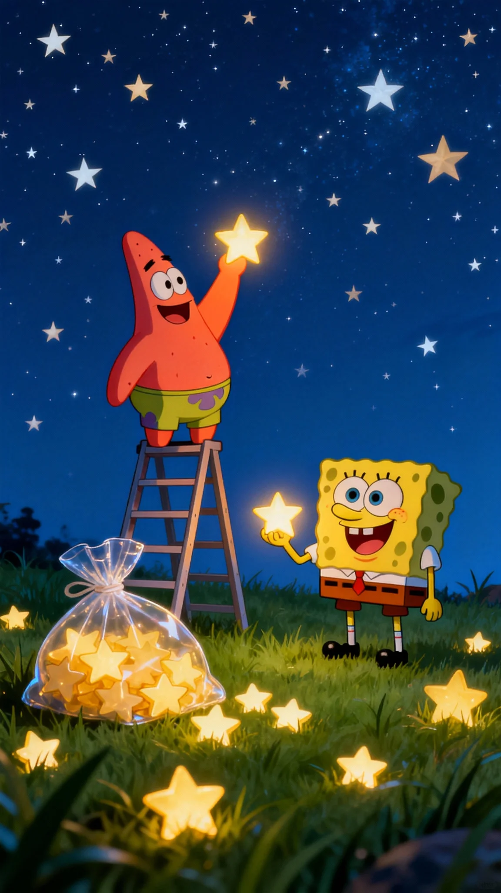

```
童趣治愈的卡通动画风格，深蓝色夜空布满闪烁星星，派大星站在梯子上伸手够一颗发光星星，海绵宝宝站在草地上手持发光星星，脸上洋溢开心笑容。草地上有透明袋子装满发光星星，部分星星散落在草地上，仿佛在收集星星。画面以深蓝夜空为背景，星星和角色手中星星散发暖黄色光，与冷色调夜空形成对比，突出梦幻感。色彩以深蓝（夜空）、橙红（派大星）、黄（海绵宝宝、星星）、绿（草地）为主，整体色调明快梦幻，传递童真治愈情绪。
```

```
帮我生成图片：画面是童趣治愈的卡通动画风格，整体氛围充满梦幻与友爱的纯真感。
 
元素与布局
 
- 深蓝色的夜空布满闪烁的星星，派大星站在梯子上，伸手去够一颗发光的星星；海绵宝宝站在草地上，手里也拿着一颗发光的星星，脸上洋溢着开心的笑容。
- 草地上有一个透明的袋子，里面装满了发光的星星，还有一些星星散落在草地上，仿佛他们在收集星星，充满了童话般的趣味。
 
光线与色彩
 
画面以深蓝色的夜空为背景，星星和角色手中的星星散发着暖黄色的光，与冷色调的夜空形成鲜明对比，突出了星星的梦幻感；色彩以深蓝（夜空）、橙红（派大星）、黄（海绵宝宝、星星）、绿（草地）为主，整体色调明快梦幻，传递出童真治愈的情绪。
```

 [↑返回目录](#toc)

---
## <a id="jm-prompt-7569254161527672091">雪夜好奇猫</a> (<a href="https://jimeng.jianying.com/ai-tool/personal/MS4wLjABAAAA7--Pa8v-zafkbb6z0G0F4biMi9eE0zGLGB4s0U_ym0U" target="_blank" rel="noopener noreferrer">x</a>)

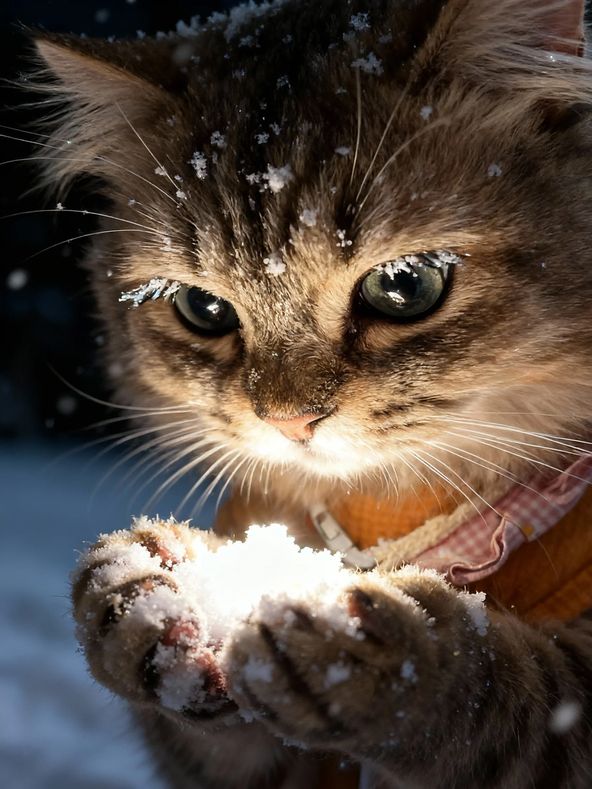

```
一只穿橙色带粉色格纹装饰衣物的猫，近景面部特写，低下头眼睛看双爪里有光亮的雪，双爪合起捧着雪，光折射在脸上，表情好奇又呆萌，眼睫毛有较多雪花、手上有落雪效果，背景为黑夜下雪天。
```

```
以图片中的宠物为主体，宠物低下头，眼睛看着爪子里的雪，宠物近景面部特写，突出宠物的爪子，双爪合在一起捧着雪，爪爪里的雪有光亮，并且有光折射在脸上，表情好奇又呆萌，双爪里是捧着雪，并添加下雪天氛围，着重让眼睫毛雪花多一些和手上有落雪效果。背景是黑夜下雪。图片中的宠物不变。
```

 [↑返回目录](#toc)

---
## <a id="prompt-328">工作室写真风格照片</a> (<a href="https://x.com/dotey/status/1977424494693151186" target="_blank" rel="noopener noreferrer">dotey</a>)


```
参考图1的面部特征，生成全身工作室肖像：一位英俊的年轻东亚女性坐在浅紫色背景前的地板上，穿着舒适的超大号薰衣草色粗针织毛衣、白色裙子和白色袜子，深情地抱着一个大型三丽鸥库洛米毛绒玩具，温柔地看着镜头。背景装饰有俏皮的手绘紫色涂鸦和文字，包括"A"、"ANNISA"、纸飞机和花朵，风格类似K-pop照片卡或粉丝杂志封面。光线明亮柔和，营造可爱温馨的氛围。
```

 [↑返回目录](#toc)

---
## <a id="prompt-324">波普艺术肖像</a> (<a href="https://x.com/IqraSaifiii/status/1969543847597277339" target="_blank" rel="noopener noreferrer">IqraSaifiii</a>)


```
A vibrant, stylized pop art portrait of a [Subject]. The subject is rendered with bold, clean lines and a strong outline, reminiscent of graphic novels or character design. The [Subject] is wearing a [Color] top/jacket and [accessories]. Their hair is dynamically styled and well-groomed. The background is a solid, clean [Background Colour], ensuring the subject pops. The overall style is modern, charismatic, and slightly exaggerated for artistic effect, with crisp digital rendering and vibrant color saturation.
```

```
这幅充满活力、风格独特的波普艺术肖像画描绘了一位[人物]。画中人物的线条粗犷、轮廓分明，令人联想起漫画小说或人物设计。[人物]身穿[颜色]上衣/夹克，搭配[配饰]。他们的发型充满活力，精心打理。背景为纯色、干净的[背景色]，确保人物形象突出。整体风格现代、魅力十足，略带夸张的艺术效果，数字渲染清晰，色彩饱和度高。
```

 [↑返回目录](#toc)

---
## <a id="prompt-398">超大道具的影棚拍摄照片</a> (<a href="https://x.com/Arminn_Ai/status/1983963917425480087" target="_blank" rel="noopener noreferrer">Arminn_Ai</a>)


```
A full-body hyper-realistic studio portrait of [CHARACTER DESCRIPTION] in a [POSE TYPE] pose, sitting gracefully on a large [OBJECT] positioned [ORIENTATION: horizontal / vertical] on a smooth [BACKGROUND COLOR] floor. The object appears oversized and realistic, perfectly integrated with the subject — not floating. Its surface shows accurate texture, reflections, and material depth. The pose defines the subject’s attitude and interaction with the object — natural, stylish, and expressive. The character is balanced and confident, matching the object’s tone and style. Background is seamless, same color for wall and floor, slightly lighter below with soft reflections. Lighting: clean professional studio setup — diffused key from front-left, mild fill from right, subtle rim for separation, evenly balanced exposure. Mood: cinematic luxury editorial with minimal composition and photorealistic realism.
```

```
一张全身超写实摄影棚肖像照，[人物描述] 以[姿势类型]的姿态优雅地坐在一个大型[物体]上，该物体[方向：水平/垂直]放置在光滑的[背景颜色]地板上。物体显得尺寸较大且逼真，与人物完美融合，而非悬浮。物体表面展现出精准的纹理、反射和材质深度。姿势展现了人物与物体之间的互动——自然、时尚且富有表现力。人物姿态平衡自信，与物体的色调和风格相得益彰。背景无缝衔接，墙面和地板颜色相同，下方略浅并带有柔和的反射。灯光：干净专业的摄影棚布光——左前方柔和的主光，右侧轻柔的补光，以及用于分离主体的微妙边缘光，曝光均衡。氛围：电影般的奢华时尚大片风格，构图极简，追求照片级的真实感。
```

 [↑返回目录](#toc)

---
## <a id="prompt-409">大型胶囊形容器的品牌3D渲染图</a> (<a href="https://x.com/TechieBySA/status/1984265548251980140" target="_blank" rel="noopener noreferrer">TechieBySA</a>)


```
Create a hyper-realistic 3D render of a large capsule-shaped container. The top half is solid and glossy in the brand’s signature color, featuring the official [BRAND] logo prominently. The bottom half is transparent, revealing multiple miniature famous products of this brand, [PRODUCT], neatly packed inside. Set against a dark background with cinematic lighting and soft reflections to create a premium, surreal advertising aesthetic. Ultra-detailed, professional product render style. 1080x1080 dimension
```

```
制作一个超逼真的大型胶囊形容器的3D渲染图。上半部分为品牌标志性颜色的实心亮面材质，并醒目地印有[品牌]官方标识。下半部分为透明材质，展现出该品牌众多知名产品的微缩模型[产品]，整齐地包装在内。以深色背景搭配电影级灯光和柔和的反射效果，营造出高端超现实的广告美感。采用超精细的专业产品渲染风格。尺寸为1080x1080。
```

 [↑返回目录](#toc)

---
## <a id="prompt-383">一张超现实的微距照片</a> (<a href="https://x.com/Samann_ai/status/1982774584198991988" target="_blank" rel="noopener noreferrer">Samann_ai</a>)


```
Create a hyper-real macro photograph of a tiny (CHARACTER) about 10–12 cm tall, gently held between a real human thumb and index finger or sitting on the fingertip. The character naturally touches the thumb for scale and holds (ACCESSORY). Studio setting with a soft grey gradient background, subtle bokeh. Skin, fabric and hair show micro-texture; add accurate contact shadows where fingers meet the character. Lighting: softbox at 45°, faint rim light on the far side; no harsh glare. Camera look: 100mm macro • f/2.8 • ISO 100 • 1/160s (shallow depth of field; eyes perfectly in focus). Hands look clean, natural anatomy, 5 fingers, realistic nails and pores. The character’s outfit is simple textured knit (dark grey) unless the identity demands otherwise; proportions and perspective must read real, not toy. Treat (CHARACTER) respectfully and keep likeness faithful if based on a real person. Composition: subject centered, from mid-torso up, with the thumb and index framing the character;
```

```
创建一张超现实的微距照片，照片中一个约 10-12 厘米高的微小（角色），轻轻地放在真人的拇指和食指之间或放在指尖上。角色自然地触摸拇指以进行缩放并握住（配件）。工作室设置具有柔和的灰色渐变背景，微妙的散景。皮肤、织物和头发显示微观纹理；在手指与角色接触的地方添加准确的接触阴影。照明：45° 柔光箱，远端微弱的边缘光；无刺眼眩光。相机外观：100mm 微距 • f/2.8 • ISO 100 • 1/160s（浅景深；眼睛完美对焦）。手看起来干净，解剖自然，5 个手指，逼真的指甲和毛孔。除非身份另有要求，否则角色的服装是简单的纹理针织（深灰色）；比例和透视必须是真实的，而不是玩具。尊重地对待（角色），如果基于真人，则保持相似性。构图：以主体为中心，从躯干中部向上，用拇指和食指框住人物；
```

 [↑返回目录](#toc)

---
## <a id="prompt-382">3D chibi风格乙烯基收藏品</a> (<a href="https://x.com/Arminn_Ai/status/1982860799879114903" target="_blank" rel="noopener noreferrer">Arminn_Ai</a>)


```
A 3D chibi-style vinyl collectible figure of [CHARACTER NAME] Big head, small body, cartoon proportion, Standing inside a Youtooz-style
packaging box with: Transparent front window
"YOUTOOZ COLLECTIBLES" logo on the top
Number label ([#XXX]) on the top-left
Bottom front text: “[CHARACTER NAME]” and lower with smaller font “VINYL FIGURE”
Cartoon 2D illustration of [CHARACTER NAME] on the side of the box ([ILLUSTRATION DESCRIPTION])

Background/theme:
[BOX COLORS + TEXTURES + ICONIC MOTIFS RELATED TO CHARACTER] 
[Figure POSE OR GESTURE] 
[Outfit DESCRIPTION + SIGNATURE ITEMS]

Face details: The facial features (mouth/eyes/details) must be fully 3D sculpted, not flat or printed.
Lighting: clean product photography look, minimal soft shadows
Style: vinyl-toy aesthetic with a mix of matte + glossy accents depending on costume, Composition: 3/4 product shot view, full box visible. The entire packaging box must be fully visible inside the frame with a clean margin around all edges.
```

```
3D chibi 风格乙烯基收藏品 [CHARACTER NAME] 大头，小身体，卡通比例，站在 Youtooz 风格的
包装盒带有：透明前窗
顶部有“YOUTOOZ COLLECTIBLES”标志
左上角的数字标签（[#XXX]）
底部文字：“[CHARACTER NAME]” 下方用较小的字体写着“VINYL FIGURE”
盒子侧面的 [角色名称] 卡通 2D 插图（[插图描述]）

背景/主题：
[盒子颜色 + 纹理 + 与角色相关的标志性图案]
[人物姿势或手势]
[服装描述 + 标志性物品]

面部细节：面部特征（嘴巴/眼睛/细节）必须完全 3D 雕刻，而不是平面或印刷的。
灯光：干净的产品摄影外观，最小的柔和阴影
风格：搪胶玩具美学，根据服装搭配哑光和亮光元素。构图：3/4 产品视角，完整包装盒清晰可见。整个包装盒必须在框架内完全可见，所有边缘均留有清晰的空白。
```

 [↑返回目录](#toc)

---
## <a id="prompt-319">照片级逼真的概念食物艺术肖像</a> (<a href="https://x.com/AleRVG/status/1969145551846363567" target="_blank" rel="noopener noreferrer">AleRVG</a>)


```
Photorealistic conceptual food art portrait, a minimalist representation of a [SITE OF THE HOUSE] recreated entirely with [TYPE OF FOOD]. The main structure is built from [MAIN INGREDIENTS], with details such as [KEY ELEMENTS] made from [SECONDARY INGREDIENTS]. Optional features include [ADDITIONAL OBJECTS OR FURNITURE] created from [EXTRA INGREDIENTS].

Set against a [COLOR] background to emphasize the surreal food sculpture. Bright soft studio lighting, evenly diffused, casting subtle natural shadows that highlight the textures of [FOOD TEXTURES]. Fine atmospheric detail enhance realism.

Captured with a Canon EOS 5D, 85mm f/1.8 lens, shallow depth of field focusing on the cake-bed sculpture, crisp detail with soft falloff in the background. Composition framed at tabletop eye-level, medium close-up, perfectly centered. Clean high-resolution food photography style, vibrant natural colors, editorial dessert photography aesthetic
```

```
照片级逼真的概念食物艺术肖像，极简主义地再现了[房屋位置]，完全由[食物种类]重新打造。主体结构由[主要成分]构成，细节部分，例如[关键元素]，则由[次要成分]制成。可选功能包括由[额外成分]打造的[附加物品或家具]。

以[颜色]为背景，突显超现实的食物雕塑。明亮柔和的摄影棚灯光，均匀散射，投射出微妙的自然阴影，凸显[食物纹理]的质感。精致的氛围细节增强了真实感。

使用佳能 EOS 5D 85mm f/1.8 镜头拍摄，浅景深聚焦于蛋糕床雕塑，细节清晰，背景边缘柔和。构图以桌面视线高度为准，中距特写，完美居中。清晰的高分辨率美食摄影风格，鲜艳自然的色彩，堪称甜品摄影的美学典范。
```

 [↑返回目录](#toc)

---
## <a id="prompt-323">角色创建</a> (<a href="https://x.com/AleRVG/status/1971286211374252352" target="_blank" rel="noopener noreferrer">AleRVG</a>)


```
3d rendering, c4d, cartoon style, [ACTION-DRIVEN CHARACTER IN EXAGGERATED POSE, EXPRESSING IRONY OR DEFIANCE], [MINIMAL BACKGROUND OF CONTEXTUAL SETTING], minimalist art style, simple design, high resolution, no low-quality details, high detail,best quality, professional photography, depth of field, soft lighting, sharp focus, cinematic lighting, cinematic camera settings
```

```
3D 渲染、C4D、卡通风格、[动作驱动角色的夸张姿势，表达讽刺或反抗]、[情境设置的最小背景]、极简艺术风格、简约设计、高分辨率、无低质量细节、高细节、最佳质量、专业摄影、景深、柔和灯光、清晰对焦、电影灯光、电影摄像机设置]
```

 [↑返回目录](#toc)

---


[上一页](./3.md) | 当前 4/4 页 | [查看全部目录](../scripts/prompts/prompts.md)