# seedream.json 

seedream.json文件存放seedream相关的提示词，当前已收录：314个 

 投稿方式：[飞书投稿](https://tcn1uh5rxo87.feishu.cn/share/base/form/shrcne5gDolOMDd0oJsj2XfvxQc) or [issues](https://github.com/junxiaopang/gridsplitter/issues/new)

[上一页](./3.md) | 当前 4/4 页 | [查看全部目录](../prompts.md)

🚀 **在线预览**: [https://prompts.kkkm.cn](https://prompts.kkkm.cn)

## <a id="toc">目录</a>

- [海边三宫格](#jm-prompt-7573432998620679433)
- [月光下的温馨故事](#jm-prompt-7566806133264928027)
- [冬日电影叙事](#jm-prompt-7572490864589638950)
- [虚拟潮流](#jm-prompt-7550207182571130131)
- [国风水彩韵](#jm-prompt-7573575358570614067)
- [Q版唐僧表情九宫格](#jm-prompt-7572979743348313390)
- [毛毡风格的森林长椅](#jm-prompt-7571813629964602675)
- [印象派周杰伦素描](#jm-prompt-7567426289141812506)
- [中国](#jm-prompt-7554644146540186890)
- [工作室写真风格照片](#prompt-328)
- [波普艺术肖像](#prompt-324)
- [3D chibi风格乙烯基收藏品](#prompt-382)
- [照片级逼真的概念食物艺术肖像](#prompt-319)
- [角色创建](#prompt-323)

## <a id="jm-prompt-7573432998620679433">海边三宫格</a> (<a href="https://jimeng.jianying.com/ai-tool/personal/MS4wLjABAAAAzpH0F2c4xkpqCJmvjh6grynvNfPdJx7jo1-1TnTFPBcMOOt2m3q6H_UhcxmpC9tz" target="_blank" rel="noopener noreferrer">彩虹君</a>)

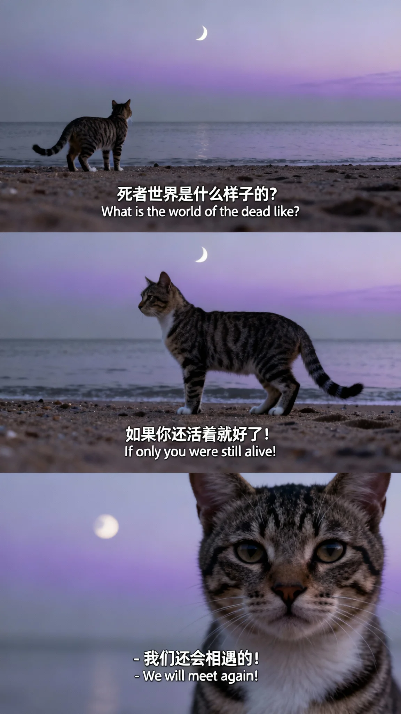

```
三宫格艺术感宠物写真图，三张图分别为近景、侧身站立、特写构图；场景为海边沙滩，有下弦月，中国狸花猫，天空淡紫与灰色渐变，海面平静；整体色调清冷，文艺且充满自我探索情绪氛围。第一张近景：中国狸花猫站在沙滩上的背影，画面下方添加中英字幕"死者世界是什么样子的？""What is the world of the dead like?"；第二张侧身站立：中国狸花猫侧身站立于海边，画面下方添加中英字幕"如果你还活着就好了！""If only you were still alive!"；第三张特写：中国狸花猫露脸，画面下方添加中英字幕"- 我们还会相遇的！""- We will meet again!"。
```

```
将图片编辑为三宫格艺术感宠物写真图，场景替换为海边有下弦月的沙滩，中国狸花猫，天空呈淡紫与灰色渐变，海面平静，整体色调清冷，营造文艺且充满自我探索情绪的氛围。第一张为近景，宠物站在沙滩上的背影，添加中英字幕：死者世界是什么样子的？；第二张是宠物侧身站立于海边，添加中英字幕如果你还活着就好了！；第三张是特写(宠物露脸)，添加中英字幕“ - 我们还会相遇的！
```

 [↑返回目录](#toc)

---
## <a id="jm-prompt-7566806133264928027">月光下的温馨故事</a> (<a href="https://jimeng.jianying.com/ai-tool/personal/MS4wLjABAAAAkIxzVTMpqbVlj06s-rGxDz_5wAD5FnBDQ0IvZ1rdkdS0h8qq4Z49ACdN-tjHlzfn" target="_blank" rel="noopener noreferrer">奥利妈妈</a>)

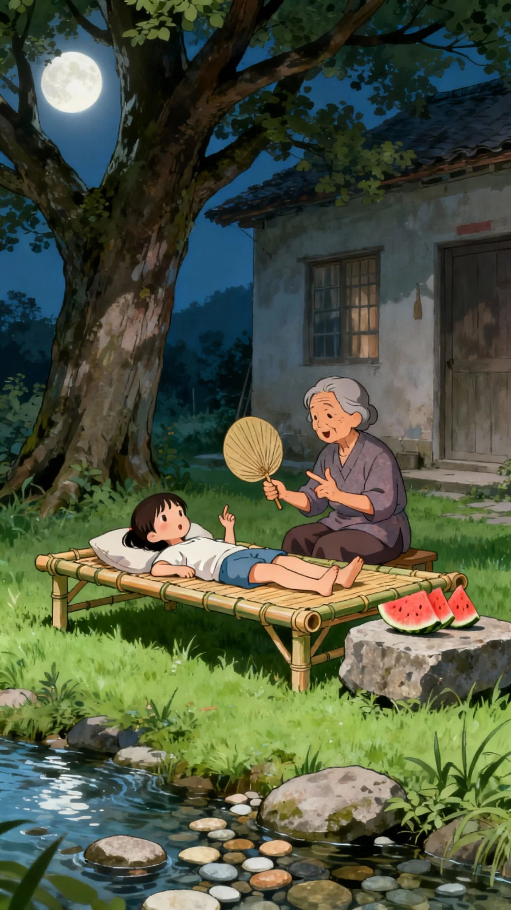

```
漫画插画风格，柔和月光，青绿色草地，一棵大树下外婆的房子旁，竹床子上躺着一个小女孩，外婆坐在旁边，一手拿蒲扇扇风，一手比划着讲故事。竹床旁石头桌子上放着切好的几块西瓜，远处小溪水流过，溪底鹅卵石清晰可见。温馨氛围，画面细腻，色彩柔和。
```

```
小时候一个女孩在外婆家的房子旁边有一棵大树，一大片草地都是绿色我和外婆在那边放了一只竹床子纳凉，我躺着，外婆坐在我的旁边，一边给我讲故事，一边给我扇扇子在竹场子的旁边有一个石头的桌子上面放着切好的几块西瓜，月光很柔和途中不远处有一条小溪能看见鹅卵石的那种绘画风格是漫画插画风格
```

 [↑返回目录](#toc)

---
## <a id="jm-prompt-7572490864589638950">冬日电影叙事</a> (<a href="https://jimeng.jianying.com/ai-tool/personal/MS4wLjABAAAAkXdsv42E4tme3RPsMmYb4cvGMlfA6OO2dI6CBSA2m7I-UyUrE9ETvliPM4P9whSw" target="_blank" rel="noopener noreferrer">请输入名字</a>)

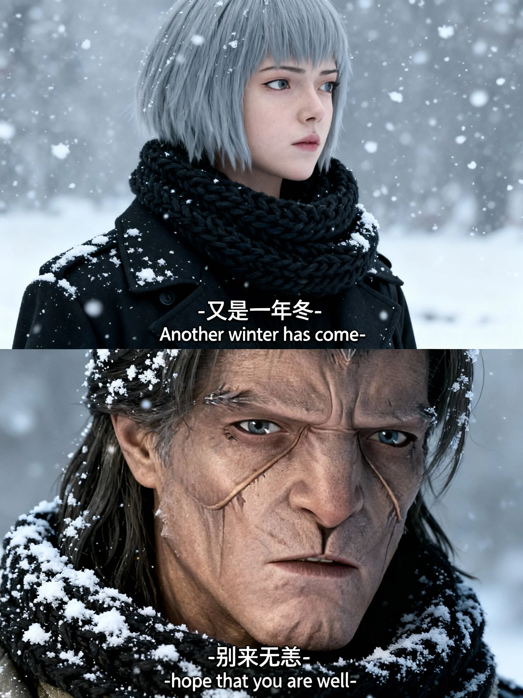

```
上下拼接格式的冬日电影感叙事写真，呈现清冷孤寂氛围，冷灰调，细腻雪花飘落，cinematic质感；上部近景是身着黑色厚风衣搭配粗针织黑围巾的浅灰短发年轻女人，雪花点缀服饰，眼神忧郁望右侧，画面有中英文字幕“又是一年冬-Another winter has come-”；下部面部特写是长发中年男人，面部与围巾细节清晰，头发覆雪，围巾积雪，眼神具故事感，光影柔和，画面有中英文字幕“别来无恙-hope that you are well-”，两张图各占画面一半。
```

```
以图片人物为基础，生成一张上下拼接在一起的格式的冬日电影感叙事写真，每张图固定比例占比一半，整体为清冷孤寂的冬日大雪场景，冷灰调，细腻雪花飘落，cinematic 质感。画面中有人物和参考图一致，上部第一张为近景，黑色厚风衣+粗针织黑围巾，雪花点缀，眼神忧郁望右侧，添加中英文字幕“又是一年冬-Another winter has come-”； 第二张是面部特写，面部与围巾细节，头发覆雪，围巾积雪清晰，眼神具有故事感，光影柔和，添加中英文字幕“别来无恙-hope that you are well-” 两张图合成一个拼图。
```

 [↑返回目录](#toc)

---
## <a id="jm-prompt-7550207182571130131">虚拟潮流</a> (<a href="https://jimeng.jianying.com/ai-tool/personal/MS4wLjABAAAAGjQvQsQ0HNGASqrTnZYjCbuEntmJId6pepN0DqyfYmJ8KRDrez3Yz1huNyZ4beoe" target="_blank" rel="noopener noreferrer">洋葱</a>)

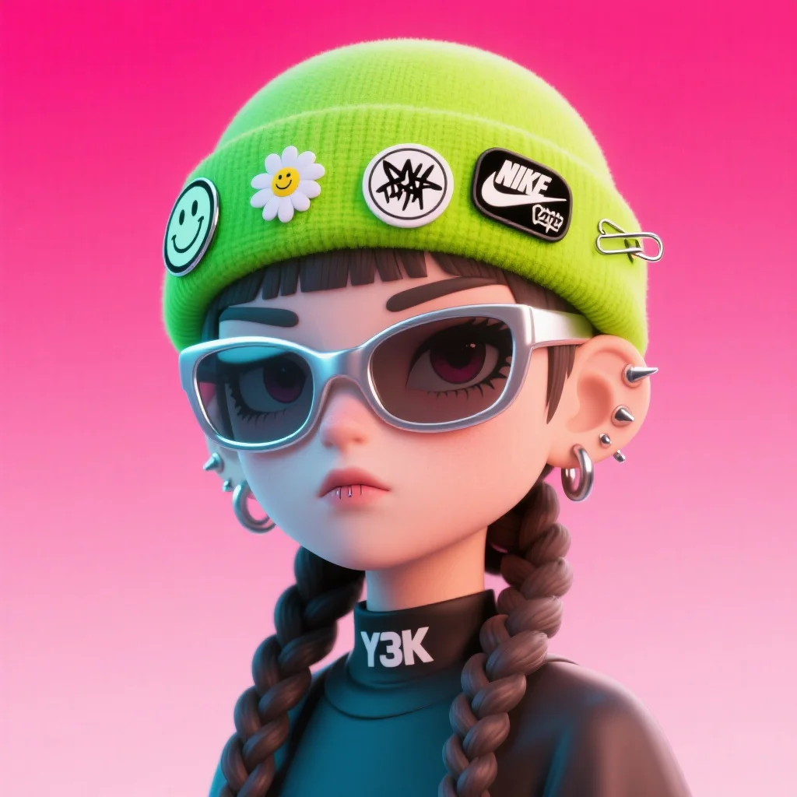

```
一个3D风格的虚拟潮流角色肖像，角色拥有麻花辫、眉钉、冷酷表情，佩戴未来感银色大眼镜，戴一顶荧光绿毛呢材质的帽子，半身照，帽子上别有多个徽章，包括一个笑脸小花徽章、一个黑白涂鸦徽章、一个Nike安全别针等嘻哈元素，背景为玫红色渐变色，画风干净简洁，角色光影细腻，呈现次世代渲染质感，视觉风格融合Y3K与潮玩设计风，偏态度感、虚拟偶像风格，居中构图
```

 [↑返回目录](#toc)

---
## <a id="jm-prompt-7573575358570614067">国风水彩韵</a> (<a href="https://jimeng.jianying.com/ai-tool/personal/MS4wLjABAAAAEPt3OPXX26ru5vDstOfOgJbGs3YYfVVpZHeRoWi2L3g" target="_blank" rel="noopener noreferrer">momo</a>)

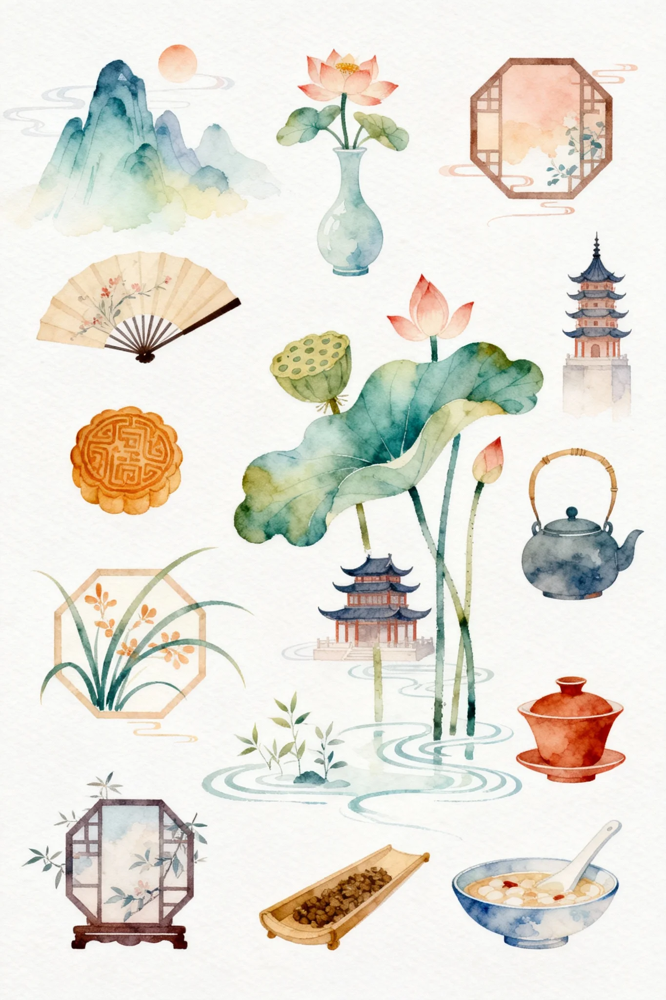

```
国风，清新艺术水彩板画风格，色彩柔和晕染，线条简洁灵动，手绘质感，文艺清新调性，画面包含各式各样的中国元素，造型扁平化且富有辨识度，弱化复杂光影，突出轻盈感，大面积留白，故事感氛围，温暖细腻色调，治愈系情感传递，色彩过渡自然通透。
```

```
国风，清新艺术水彩板画，色彩柔和晕染，线条简洁灵动，手绘质感，文艺清新调性，画面有故事感，温暖细腻，治愈系，契合文艺艺术的清新感，传递共鸣的情感，色彩过渡自然通透，造型扁平化且富有辨识度，弱化复杂光影，突出画面轻盈感，大面积留白，各式各样的中国元素
```

 [↑返回目录](#toc)

---
## <a id="jm-prompt-7572979743348313390">Q版唐僧表情九宫格</a> (<a href="https://jimeng.jianying.com/ai-tool/personal/MS4wLjABAAAAoOb20MFMAzjSUUB2TpxXxIoq77kKVkVBEA1JrICe7OmUuUQ22-R85wQxSq0BKG44" target="_blank" rel="noopener noreferrer">曾惠</a>)

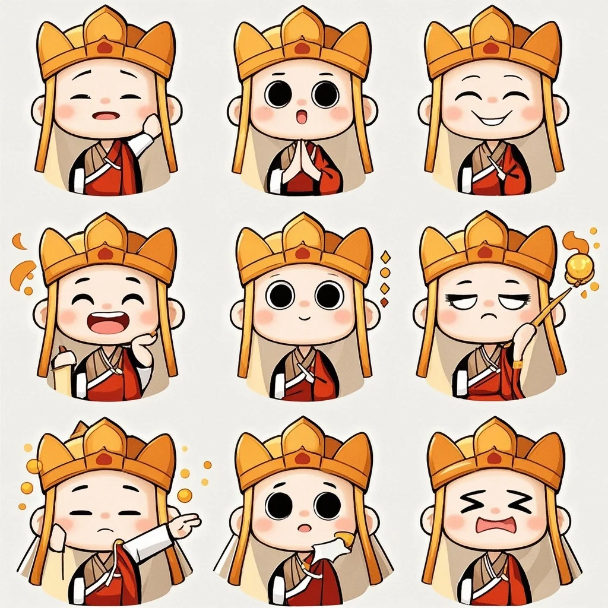

```
漫画卡通风格，Q版可爱唐僧9格表情包
```

 [↑返回目录](#toc)

---
## <a id="jm-prompt-7571813629964602675">毛毡风格的森林长椅</a> (<a href="https://jimeng.jianying.com/ai-tool/personal/MS4wLjABAAAAyKHEfIEFHNJopVHRRBkdHSSAGvkAmdQWo6s_MHeWT4-egfaafY5nNNny4p7mV4dl" target="_blank" rel="noopener noreferrer">魔法森林</a>)

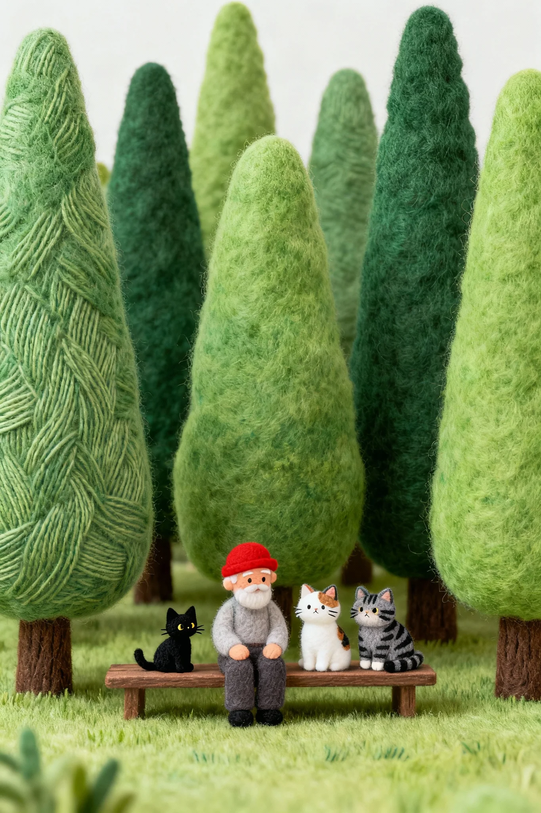

```
毛毡风格，极细的线条，层次感绿色，肌理丰富，大面积的绿色。高低不同、形状不同的树林中，坐在长条凳子上的戴红色帽子的老人旁边有一只小黑猫、一只白色居多的三花小猫、一只灰黑色虎斑矮脚小猫。主次分明，情绪铺垫。
```

```
树林，高低不同的树木，形状不同的树木，大面积的绿色，极细的线条，层次感绿色，肌理丰富，坐在长条凳子上的戴红色帽子的老人旁边有一个小黑猫，一只白色居多的三花小猫，一只灰黑色虎斑矮脚小猫。主次分明，情绪铺垫，毛毡风格。
```

 [↑返回目录](#toc)

---
## <a id="jm-prompt-7567426289141812506">印象派周杰伦素描</a> (<a href="https://jimeng.jianying.com/ai-tool/personal/MS4wLjABAAAAYiz6JjAy_OdSR5c7A6PcCB21zVfQp1kGSVzJ8xsgHAADPeELw7W9y0fEO-ZAi84y" target="_blank" rel="noopener noreferrer">我们我们</a>)

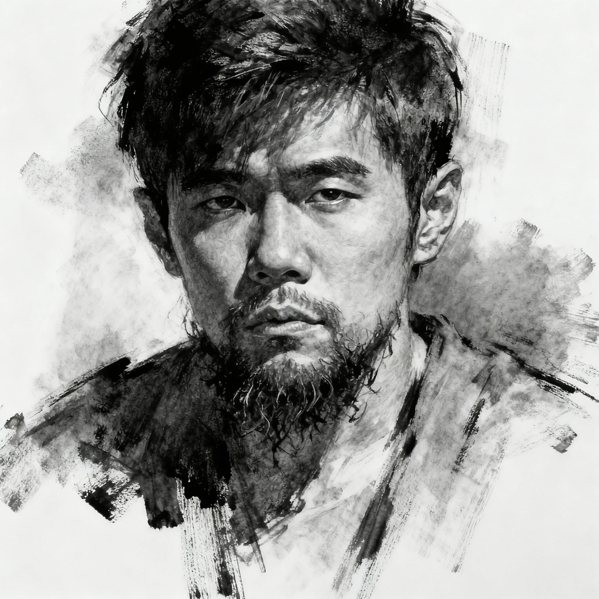

```
木炭条素描，印象派风格，粗旷笔触，手指拭擦痕迹，灰朦光影，虚实过渡，周杰伦面部大写意轮廓，凌乱胡须，宽松服饰，立体光影，黑白灰层次，笔触肌理，大写意氛围。
```

```
木炭条素描，印象派风格，仅凭木炭条在白纸上粗旷肆意地涂刷，手指轻轻拭擦塑造出周杰伦面部大写意轮廓，大写意的凌乱的胡须、大写意的服饰，灰朦的立体光影，细腻的虚实过渡，大写意的灰朦光影。
```

 [↑返回目录](#toc)

---
## <a id="jm-prompt-7554644146540186890">中国</a> (<a href="https://jimeng.jianying.com/ai-tool/personal/MS4wLjABAAAAY48tdfAMu_UsjgfAQrUWeSgiH9KxgEdLdUEPJRFqlB4OqRBYr-Hb3_zFlNawHchM" target="_blank" rel="noopener noreferrer">风拾裙角</a>)

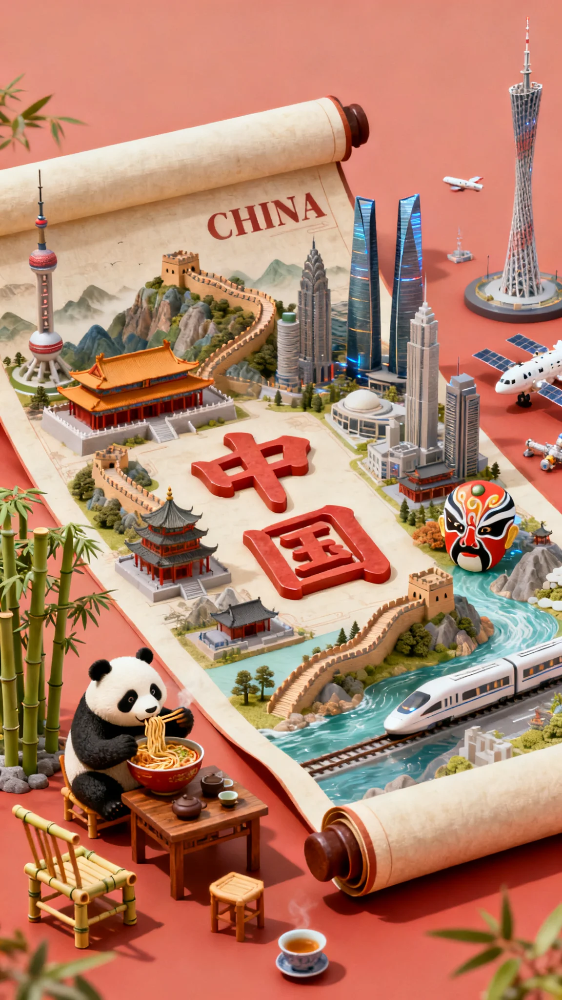

```
3D渲染风格，梦幻真实质感，材质光泽感强，浅红色背景，超清画质，极致细节，电影般构图。打开的卷轴画卷上，中国城市景观微缩模型，中间"中国"繁体立体大字，周围环绕古典故宫、蜿蜒长城等古建，穿插大好河山、熊猫吃面、茶馆桌椅、竹椅、竹林、京剧面具等元素，同时展示东方明珠、成都双子塔、广州塔等现代建筑，高铁、航天等科技成果。画布上方印有英文"CHINA"。色调温暖明快，打光柔和，画面生动饱满，细节丰富，充满活力与朝气。
```

```
一副打开的卷轴画卷，上面是中国城市景观微缩模型，中间有“中国”两个繁体的立体大字。围绕立体大字有古典故宫、雄伟蜿蜒盘踞的长城等古建，有大好河山，也有东方明珠、成都双子塔、广州塔等现代建筑，加入熊猫吃面、茶馆桌椅、竹椅、竹林、京剧面具等元素，并有高铁、航天等科技突飞猛进的成果展示，描绘出一副盛世的画面。画布上方印有英文 “CHINA”，整体画画面生动，细节丰富画面饱满，色调温暖明快，充满活力与朝气。整体风格 3D 渲染，具有梦幻真实质感，材质设置上注重光泽感，打光营造出柔和氛围，背景为浅红色，超清画质，极致细节，电影般构图，杰作
```

 [↑返回目录](#toc)

---
## <a id="prompt-328">工作室写真风格照片</a> (<a href="https://x.com/dotey/status/1977424494693151186" target="_blank" rel="noopener noreferrer">dotey</a>)


```
参考图1的面部特征，生成全身工作室肖像：一位英俊的年轻东亚女性坐在浅紫色背景前的地板上，穿着舒适的超大号薰衣草色粗针织毛衣、白色裙子和白色袜子，深情地抱着一个大型三丽鸥库洛米毛绒玩具，温柔地看着镜头。背景装饰有俏皮的手绘紫色涂鸦和文字，包括"A"、"ANNISA"、纸飞机和花朵，风格类似K-pop照片卡或粉丝杂志封面。光线明亮柔和，营造可爱温馨的氛围。
```

 [↑返回目录](#toc)

---
## <a id="prompt-324">波普艺术肖像</a> (<a href="https://x.com/IqraSaifiii/status/1969543847597277339" target="_blank" rel="noopener noreferrer">IqraSaifiii</a>)


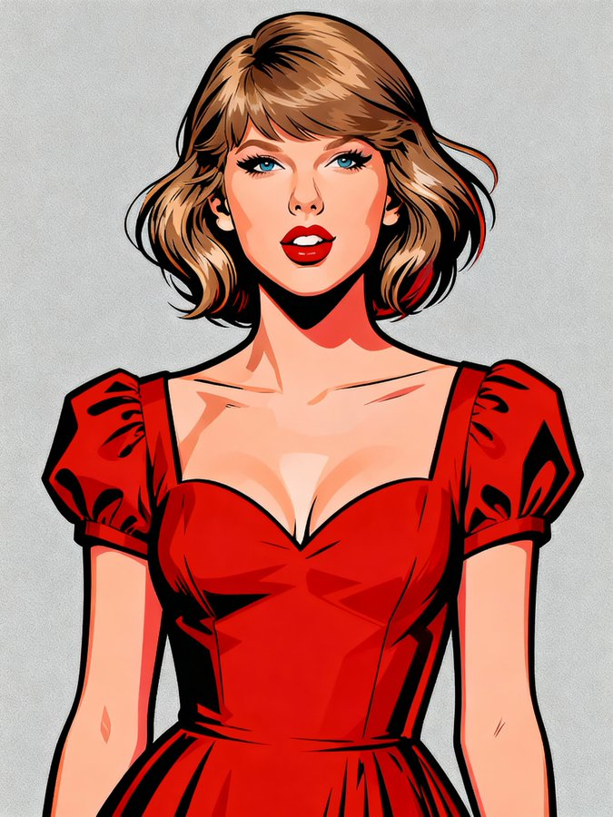

```
A vibrant, stylized pop art portrait of a [Subject]. The subject is rendered with bold, clean lines and a strong outline, reminiscent of graphic novels or character design. The [Subject] is wearing a [Color] top/jacket and [accessories]. Their hair is dynamically styled and well-groomed. The background is a solid, clean [Background Colour], ensuring the subject pops. The overall style is modern, charismatic, and slightly exaggerated for artistic effect, with crisp digital rendering and vibrant color saturation.
```

```
这幅充满活力、风格独特的波普艺术肖像画描绘了一位[人物]。画中人物的线条粗犷、轮廓分明，令人联想起漫画小说或人物设计。[人物]身穿[颜色]上衣/夹克，搭配[配饰]。他们的发型充满活力，精心打理。背景为纯色、干净的[背景色]，确保人物形象突出。整体风格现代、魅力十足，略带夸张的艺术效果，数字渲染清晰，色彩饱和度高。
```

 [↑返回目录](#toc)

---
## <a id="prompt-382">3D chibi风格乙烯基收藏品</a> (<a href="https://x.com/Arminn_Ai/status/1982860799879114903" target="_blank" rel="noopener noreferrer">Arminn_Ai</a>)


```
A 3D chibi-style vinyl collectible figure of [CHARACTER NAME] Big head, small body, cartoon proportion, Standing inside a Youtooz-style
packaging box with: Transparent front window
"YOUTOOZ COLLECTIBLES" logo on the top
Number label ([#XXX]) on the top-left
Bottom front text: “[CHARACTER NAME]” and lower with smaller font “VINYL FIGURE”
Cartoon 2D illustration of [CHARACTER NAME] on the side of the box ([ILLUSTRATION DESCRIPTION])

Background/theme:
[BOX COLORS + TEXTURES + ICONIC MOTIFS RELATED TO CHARACTER] 
[Figure POSE OR GESTURE] 
[Outfit DESCRIPTION + SIGNATURE ITEMS]

Face details: The facial features (mouth/eyes/details) must be fully 3D sculpted, not flat or printed.
Lighting: clean product photography look, minimal soft shadows
Style: vinyl-toy aesthetic with a mix of matte + glossy accents depending on costume, Composition: 3/4 product shot view, full box visible. The entire packaging box must be fully visible inside the frame with a clean margin around all edges.
```

```
3D chibi 风格乙烯基收藏品 [CHARACTER NAME] 大头，小身体，卡通比例，站在 Youtooz 风格的
包装盒带有：透明前窗
顶部有“YOUTOOZ COLLECTIBLES”标志
左上角的数字标签（[#XXX]）
底部文字：“[CHARACTER NAME]” 下方用较小的字体写着“VINYL FIGURE”
盒子侧面的 [角色名称] 卡通 2D 插图（[插图描述]）

背景/主题：
[盒子颜色 + 纹理 + 与角色相关的标志性图案]
[人物姿势或手势]
[服装描述 + 标志性物品]

面部细节：面部特征（嘴巴/眼睛/细节）必须完全 3D 雕刻，而不是平面或印刷的。
灯光：干净的产品摄影外观，最小的柔和阴影
风格：搪胶玩具美学，根据服装搭配哑光和亮光元素。构图：3/4 产品视角，完整包装盒清晰可见。整个包装盒必须在框架内完全可见，所有边缘均留有清晰的空白。
```

 [↑返回目录](#toc)

---
## <a id="prompt-319">照片级逼真的概念食物艺术肖像</a> (<a href="https://x.com/AleRVG/status/1969145551846363567" target="_blank" rel="noopener noreferrer">AleRVG</a>)


```
Photorealistic conceptual food art portrait, a minimalist representation of a [SITE OF THE HOUSE] recreated entirely with [TYPE OF FOOD]. The main structure is built from [MAIN INGREDIENTS], with details such as [KEY ELEMENTS] made from [SECONDARY INGREDIENTS]. Optional features include [ADDITIONAL OBJECTS OR FURNITURE] created from [EXTRA INGREDIENTS].

Set against a [COLOR] background to emphasize the surreal food sculpture. Bright soft studio lighting, evenly diffused, casting subtle natural shadows that highlight the textures of [FOOD TEXTURES]. Fine atmospheric detail enhance realism.

Captured with a Canon EOS 5D, 85mm f/1.8 lens, shallow depth of field focusing on the cake-bed sculpture, crisp detail with soft falloff in the background. Composition framed at tabletop eye-level, medium close-up, perfectly centered. Clean high-resolution food photography style, vibrant natural colors, editorial dessert photography aesthetic
```

```
照片级逼真的概念食物艺术肖像，极简主义地再现了[房屋位置]，完全由[食物种类]重新打造。主体结构由[主要成分]构成，细节部分，例如[关键元素]，则由[次要成分]制成。可选功能包括由[额外成分]打造的[附加物品或家具]。

以[颜色]为背景，突显超现实的食物雕塑。明亮柔和的摄影棚灯光，均匀散射，投射出微妙的自然阴影，凸显[食物纹理]的质感。精致的氛围细节增强了真实感。

使用佳能 EOS 5D 85mm f/1.8 镜头拍摄，浅景深聚焦于蛋糕床雕塑，细节清晰，背景边缘柔和。构图以桌面视线高度为准，中距特写，完美居中。清晰的高分辨率美食摄影风格，鲜艳自然的色彩，堪称甜品摄影的美学典范。
```

 [↑返回目录](#toc)

---
## <a id="prompt-323">角色创建</a> (<a href="https://x.com/AleRVG/status/1971286211374252352" target="_blank" rel="noopener noreferrer">AleRVG</a>)


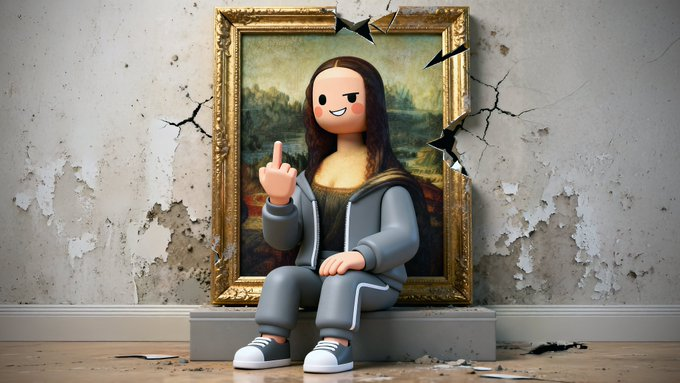

```
3d rendering, c4d, cartoon style, [ACTION-DRIVEN CHARACTER IN EXAGGERATED POSE, EXPRESSING IRONY OR DEFIANCE], [MINIMAL BACKGROUND OF CONTEXTUAL SETTING], minimalist art style, simple design, high resolution, no low-quality details, high detail,best quality, professional photography, depth of field, soft lighting, sharp focus, cinematic lighting, cinematic camera settings
```

```
3D 渲染、C4D、卡通风格、[动作驱动角色的夸张姿势，表达讽刺或反抗]、[情境设置的最小背景]、极简艺术风格、简约设计、高分辨率、无低质量细节、高细节、最佳质量、专业摄影、景深、柔和灯光、清晰对焦、电影灯光、电影摄像机设置]
```

 [↑返回目录](#toc)

---


[上一页](./3.md) | 当前 4/4 页 | [查看全部目录](../prompts.md)